# StorageXTuner: An LLM Agent-Driven Automatic Tuning Framework for Heterogeneous Storage Systems

Qi Lin1, Zhenyu Zhang1, Viraj Thakkar1, Zhenjie Sun1, Mai Zheng2, Zhichao Cao1 1Arizona State University, 2Iowa State University

## Abstract

Automatically configuring storage systems is hard: parameter spaces are vast and conditions shift across workloads, deployments, and versions. Heuristic and ML tuners are usually tied to one system, rely on manual glue, and often lose effectiveness under changes. LLM-based proposals help, but most cast tuning as a single-shot, system-specific task, limiting cross-system reuse, constraining exploration, and offering weak validation.

We present StorageXTuner, an LLM-agent-based autotuning framework for heterogeneous storage engines. StorageXTuner separates concerns across four agents—Executor (sandboxed benchmarking), Extractor (performance digest), Searcher (insight-guided configuration exploration), and Reflector (insight generation and management). The design couples an insight-driven tree search with a layered memory that promotes empirically validated insights and employs lightweight checkers to guard against unsafe actions. We im plement a prototype and evaluate it on RocksDB, LevelDB, CacheLib, and MySQL InnoDB with YCSB, MixGraph, and TPC-H/C. Relative to out-of-the-box settings and to ELMo-Tune, StorageXTuner reaches up to 575% and 111% higher throughput, reduces p99 latency by as much as 88% and 56%, and converges with fewer trials.

## 1 Introduction

Storage systems are widely used in modern IT ecosystems for data persistence and management. For instance, the social network infrastructures at Meta combine caching systems (e.g., TAO [33], Memcached [77], CacheLib [32]), graph stores (e.g., MyRocks [7], Neo4j [19], and Neptune [18]), key-value stores (ZippyDB [49] and RocksDB [75]), and object stores (e.g., S3 [14], HDFS [12, 27]) for various types of social data. Each of these storage systems provides numerous configuration parameters, and prior studies have demonstrated that tailored configuration tuning can substantially improve performance and resource utilization, often surpassing what default configurations can deliver [36, 74, 83].

Tuning the storage system configuration typically follows a multi-stage pipeline. Initially, engineers need to understand targeted workload characterizations, upper-layer application behaviors, hardware specs, system performance metrics, as well as the software stack. Then, based on that information, engineers perform an iterative process of configuration exploration, evaluation, and re-adjustment [48]. Considering the hundreds of configuration parameters spanning diverse types with intricate dependencies [8, 22, 75], engineers usually use different algorithms like heuristic [48] or Bayesian [80] for tuning [62, 89]. The new configurations will be evaluated via benchmarking, trace replay, or shadow testing for iterative adjustment until the expected tuning goal is satisfied [45].

To achieve fast and efficient tuning of storage systems, different manual solutions are explored, including rule-based tuning [35] and search-based approaches like PAS [76] and OASIS [97]. These methods typically rely on expert knowledge or guided exploration to navigate the configuration space. To automate the tuning process with less manual effort, Machine Learning (ML) is used in several auto-tuning studies, such as Endure [57], Dremel [105], Ottertune [90], CDB-Tune [103], QTune [65]. These methods build models that capture the relationship between configurations and performance metrics to automate the adjustments. More recently, several studies show that Large Language Modules (LLMs) hold strong promise for system tuning [51, 52, 63, 87, 88]. ELMo-Tune [88] applies prompt engineering to leverage LLM reasoning for key-value store tuning, overcoming the brittleness of expert-crafted heuristics. GPTuner [63] and λ- Tune [51, 52] use LLMs to guide database knob selection.

In general, LLM-based tuning solutions shift much of the tuning effort from handcrafted rules and system-specific models to automated reasoning [63], and are able to automate the whole tuning pipeline. Also, they show strong storage-system generality foundations with different system deployments (λ Tune for Postgres and ELMo-Tune for RocksDB use the same underlying LLM model) and have the human-like reasoning ability to capture complex relationships across workloads, hardware, software, and configuration dependencies. Yet, current LLM-based tuning approaches remain limited. They are closely tied to specific system designs, which require substantial manual intervention and hard-coded engineering. Moreover, they typically collect all available information and feed it as a single LLM prompt, hoping that the LLM’s reasoning capabilities can handle the tuning complexity and produce effective configuration recommendations. However, aggregating such heterogeneous information can weaken the LLM reasoning process [69]. Further, these approaches inherit well known drawbacks of LLMs: slow response, recurring API costs, and susceptibility to errors [41].

To overcome these limitations for achieving an efficient LLM-based storage system tuning solution, several key challenges must be addressed: 1) Existing LLM-based tuning frameworks are tightly coupled to a specific storage system design or an implementation version. A key challenge is how to decouple system-specific semantics (e.g., system APIs, version-specific behaviors, and implementation-specific details) and reduce manual effort. 2) LLMs prefer to work with clear, task-specific, and structured contexts [70, 85]. It is critical to divide the whole tuning pipeline into subtasks with clear scope and context, so that LLMs can focus on accurate reasoning and decision-making. 3) Guiding LLMs to explore large configuration spaces with high efficiency is challenging. It is essential to explore search algorithms to avoid costly exhaustive searches and minimize the overhead of trial-anderror tuning. And 4) given LLMs’ tendency to hallucinate and overfit to prompt phrasing [58, 82], a key challenge is how to ensure LLM tuning suggestions are accurate and reliable.

To address the aforementioned challenges, we propose StorageXTuner, an end-to-end, fully automated, and general storage system tuning framework that integrates LLM reasoning while ensuring efficiency and robustness. Inspired by the recent success of LLM agents, which extend LLMs with planning, tool use, and collaboration abilities [96, 100], Stor ageXTuner introduces three key innovations:

• Collaborative Multi-Agent Tuning Framework: StorageX Tuner decomposes and abstracts the tuning process into four stages with dedicated LLM agents that operate in an iterative pipeline: 1) Executor is responsible for storage system deployment, benchmarking, and monitoring; 2) Extractor analyzes deployment, workload, benchmarking statistics, and log data collected by Executor and summa rize them into structured tuning input; 3) Searcher explores the configuration space, decide the next round of configurations based on the input from Extractor and Reflector, and summarize the tuning experience; And 4) Reflector collect, analyze, and manage the tuning insights from the past tuning experiences from Searcher. Moreover, we design a set of agent-specific checkers to validate LLM outputs before execution to further enhance robustness.

• Insight-Driven Exploration of Configuration Space: StorageXTuner combines LLM reasoning with tree-based exploration to navigate complex configuration spaces. It extracts high-level tuning insights from past trials and injects them into the Searcher’s context, guiding the generation of candidate configurations as new tree branches. Searcher selects the most promising candidates from multiple branches for further expansion based on the analysis results from Extractor, efficiently focusing on high-potential configurations while avoiding redundant or suboptimal paths.

• Memory-Efficient Management of Tuning Insights: StorageXTuner generates tuning insights and manages them in a layered memory by Reflector: Short-Term Memory (STM) for tentative insights and Long-Term Memory (LTM) for validated insights. A confidence score is associated with each insight to reflect the reliability and is dynamically adjusted. Tuning insights are retrieved based on contextual similarity and confidence scores during the configuration searching process, enhancing LLM reasoning efficiency and adaptability for different workloads and environments.

We implement a prototype of StorageXTuner with code released on GitHub1. We evaluate StorageXTuner across various single-node storage systems (e.g., key-value stores and caches), including RocksDB [75], LevelDB [56], Cache-Lib [32], and MySQL InnoDB [8]. We do not include distributed storage systems, as they introduce additional challenges such as network variability, coordination overhead, and fault tolerance, which are beyond the scope of this paper.

StorageXTuner delivers consistent performance improvements across multiple baselines, including default configurations, LLM-Default, and state-of-the-art tuners (ELMO-Tune, ADOC, Endure for RocksDB; SMAC, DDPG, and λ-Tune for SQL InnoDB). Real-world workloads such as YCSB [44], MixGraph [40], and TPC-H/C [11] reveal throughput gains up to 575% and p99 latency reductions up to 88%. For CacheLib, StorageXTuner improves hit ratios by up to 3.1 percentage points and achieves up to 22% higher throughput compared to other baselines across write-intensive, read-intensive, and mixed workloads. In MySQL InnoDB, StorageXTuner yields up to 709% improvement in transaction throughput on TPC-C and 71% improvement in query performance on TPC-H. We further evaluate StorageXTuner ’s flexibility across system versions (four RocksDB and two LevelDB releases), treesearch branching factors (child nodes), insight counts, and different LLMs (GPT-3.5, GPT-4o, GPT-o3-mini, and LLaMA variants), demonstrating robust performance under diverse conditions.

In addition, we present our learnings from StorageXTuner, presenting how the configuration search process majorly revolves around a few key parameters, why LLMs perform better when asked to edit instead of create configurations, and having a closed-loop LLM-reasoning architecture significantly reduces configuration convergence iterations.

## 2 Background & Motivations

## 2.1 Configuring and Tuning Storage Systems

Storage systems like caching systems (e.g., CacheLib [22], Memcached [26], and Redis [9]), persistent key-value storage engines (e.g., RocksDB [75], LevelDB [56], and MySQL InnoDB [8]), and file systems (e.g., Ext4 [16], XFS [20], Tectonic [79], and HDFS [27]) are important for various applications to store and manage a large volume of data. Out-ofthe-box configurations usually fall short in meeting application requirements of performance metrics like throughput and latency in different scenarios [83]. Typically, each storage system exposes a number of tunable configurations (e.g., more than 170 in RocksDB, and 140 in MySQL InnoDB), which control diverse aspects such as I/O options, buffer sizes, threads, and other critical storage system behaviors.

The large configurational space, along with the targeted workloads [28, 29, 39, 44] and hardware deployments [47, 104] in which these systems are used, makes tuning configurations a challenging task.

Domain experts or engineers typically tune configurations [92] with a multi-step process. They profile targeted workloads into representative benchmarks (e.g., social graph OLTP workload from Meta as the MixGraph benchmark [40]) to enable iterative offline testing. Then, the storage system configurations are iteratively tuned and evaluated via benchmarking to observe the impact on key performance metrics. During the tuning process, a number of factors, including storage system design, interplay of the workload profile (e.g., Zifian access pattern, read-heavy workloads), deployment setup (e.g., storage devices, CPU, and Memory), hardware and software characteristics, and resource constraints, are also considered. Once the experts achieve satisfactory performance as required by the application, the configurations are pushed for production deployment.

To automate the iterative tuning process, Machine Learning (ML) is used in several auto-tuning studies, such as Endure [57], Dremel [105], Ottertune [90], CDBTune [103], QTune [65], CAPES [67], CAMAL [102], ADSTS [71], and H5Tuner [31]. These solutions usually focus on exploring parameters affecting performance and building an automated tuning framework that leverages learned patterns to tune the configurations. More recently, interest has grown in tuning solutions that are cohesive with Large Language Models (LLMs). For example, ELMo-Tune [88] introduces an LLMbased framework for tuning RocksDB, a key-value store, across different workloads and deployment environments, λ-Tune [52] demonstrates that LLMs can generate effective database configuration suggestions under diverse workloads, and GPTuner [63] integrates LLMs with Bayesian optimization to improve configuration exploration efficiency. Those studies highlight new opportunities for addressing the complex task of storage system tuning with LLMs.

## 2.2 LLMs and LLM Agents

Large Language Models (LLMs). Built upon transformer architectures, LLMs are advanced AI systems that recognize complex patterns in language and context, powering a wide range of NLP tasks such as translation, question answering, summarization, and content creation [5, 6, 78]. Prominent examples include GPT [78], Gemini [4], Claude [1], and Copilot [2]. LLMs are pretrained on massive corpora, giving them a broad knowledge base and strong generalization capabilities across different domains [6,34,78]. The human-like reasoning helps to infer the purpose of configurations and relationships between configuration changes and performance [42].

LLM Agents. Unlike standalone LLMs, LLM agents can integrate additional actions, access plugins, call APIs, and orchestrate complex workflows, effectively acting as intelligent assistants capable of more than natural language responses.

Techniques such as Chain-of-Thought prompting [95] encourage the model to generate intermediate reasoning steps explicitly, enabling more accurate and explainable outputs. Tree-of-Thoughts [99] allows the model to explore multiple branching reasoning paths in parallel, evaluating alternatives before committing to a solution. Self-refinement [72] lets the model iteratively critique its own outputs and make improvements, improving reliability and reducing errors. These innovations have demonstrated success across domains such as software engineering, automation, optimization, questionanswering, and information retrieval [46, 53–55, 91, 93, 94].

LLM: The New Silver Bullet? LLMs show strong potential for storage system tuning, offering generalization across heterogeneous workloads and deployments with minimal human intervention [87, 88]. Pretrained on massive and diverse corpora [17, 78], LLMs already have rich knowledge of most of the open-source storage systems and can reason across multiple dimensions of tuning complexity, such as workload diversity, hardware constraints, software behaviors, and configuration dependencies [42]. LLMs can map high-level insights, like “increasing cache size improves read performance,” to system-specific actions such as adjusting block\_cache\_size in RocksDB or innodb\_buffer\_pool\_size in MySQL.

## 2.3 Limitations of State-of-The-Art

Despite their potential, current LLM-based solutions for storage system tuning remain limited. First, existing LLM-based solutions typically rely on a single LLM inference cycle for narrow subtasks, such as directly generating configuration suggestions from workload statistics [88]. However, a single LLM struggles with the multi-stage nature of storage system tuning, which involves workload characterization, performance diagnosis, configuration search, and validation. Feeding heterogeneous information all at once often overwhelms the model and degrades its reasoning [69]. To illustrate this, we compare two tuning approaches for RocksDB using the Elmo-Tune framework:

• Single-shot input: feeding all relevant information (e.g., hardware, software, configuration parameters, and workload characteristics) into a single LLM at one prompt.

• Multi-shot input: dividing the same information into semantically coherent batches and sending each batch to separate LLM agents. Each agent processes its context independently, and their outputs are then integrated to produce final tuning recommendations.

To ensure a fair comparison, both approaches use the same input content and information. Under the MixGraph workload [39] in RocksDB, the multi-shot approach significantly outperforms the single-shot method (as shown in Table 1), highlighting the advantage of structured, focused reasoning for multi-stage storage system tuning.

Second, existing LLM-based approaches lack mechanisms to efficiently explore large and complex configuration spaces, often resulting in costly trial-and-error searches. For instance,

Table 1: Comparison of Input Types and Search Methods.  
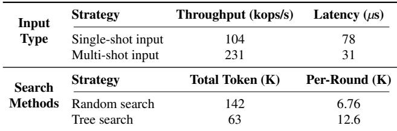

Table 1 shows that under the MixGraph workload in RocksDB using the Elmo-Tune framework, random search (the default in ELMo-Tune) incurs substantially higher exploration overhead than using tree search in Elmo-Tune when achieving the same performance level. This occurs because ELMo-Tune relies on a single LLM inference cycle per suggestion, which causes it to repeatedly evaluate the same or similar settings before converging on effective configurations.

Furthermore, existing LLM-based approaches [52, 63, 88] tightly couple system-specific semantics with the tuning framework, leading to low generality and compatibility. For example, Elmo-Tune [88] requires developers to manually hard-code RocksDB interfaces and modify the tuning framework source code to apply LLM-generated suggestions. Moreover, Elmo-Tune cannot successfully tune different RocksDB versions directly. Through careful testing across different RocksDB versions, we found that ELMo-Tune works cor rectly on version 8.8.1, but fails on version 5.7.1 due to version compatibility issues. Therefore, existing LLM-based approaches are neither fully automated nor general, and they still demand substantial human effort to ensure compatibility with particular implementations or release versions.

Additionally, current approaches cannot retain or reuse the tuning knowledge from previous tuning cycles or even cross different tuning sessions (but engineers will learn from those past trials). In other words, even if a workload has been tuned before, ELMo-Tune treats each new tuning session fully independently, requiring repeated exploration of the configuration space from scratch. Table 2 shows that ELMo-Tune with prior tuning knowledge (e.g., historical configurations and their observed performance) effectively reduces the number of exploration iterations and achieves better RocksDB performance than the default ELMo-Tune across different workloads.

Together, these limitations motivate the need for a holistic, automatic storage system tuning framework that integrates LLM reasoning across all stages of the tuning process while enabling high generality, efficient configuration search, tuning knowledge reuse, and fast validations.

Table 2: Impact of Previous Knowledge on Iteration Rounds and Final Performance  
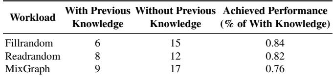

## 3 StorageXTuner

In this paper, we propose StorageXTuner, a general, fully automated, end-to-end tuning framework for various storage systems that incorporates LLM reasoning while ensuring both efficiency and robustness. We first discuss the challenges being addressed in StorageXTuner. Then, we present the design and implementation details.

## 3.1 Challenges

First, the tuning process spans multiple stages, each with distinct contexts, reasoning requirements, and feedback loops. How to decompose the workflow into modular subtasks, define clear scopes and contexts for each, and coordinate reasoning across multiple modules is challenging. Second, current tuning approaches are tightly coupled to individual storage system design, specific versions, and low-level implementation details, making them brittle and labor-intensive to extend. The key challenge is how to abstract common tuning semantics and design representations that enable LLMs to reason across diverse storage systems without extensive human intervention. Third, configuration spaces are high-dimensional, and often include complex parameter interactions. Exhaustive search is infeasible, while naive trial-and-error can lead to costly exploration overheads. How to design strategies that help LLMs prioritize promising configurations, prune redundant or low-value trials, and adaptively balance exploration with exploitation? Finally, LLM outputs can be hallucinated, and tuning processes may fail due to environmental variability or execution errors. Can we capture, manage, and leverage knowledge from past tuning trials to improve search efficiency and correctness? Also, how to validate LLM-generated suggestions, detect errors, and recover gracefully with minimal human intervention.

## 3.2 StorageXTuner Architecture Overview

The overall architecture of StorageXTuner is shown in Figure 1, StorageXTuner automates workload benchmarking, performance analysis, configuration search, and tuning experiences management with 4 dedicated LLM agents, including Executor, Extractor, Searcher, and Reflector:

• Executor launches the sandbox engine to deploy the storage system in the targeted setups and run benchmarks based on given configurations and resource constraints. At the same time, it monitors runtime statistics (e.g., CPU utilization, I/O bandwidth) and collects structured (e.g., JSON files) or unstructured (e.g., text logs) output from benchmarking.

• Extractor analyzes benchmark output and runtime statistics from the Executor, extracts structured performance metrics (referred to as the performance digest), and passes them to the Searcher as benchmarking and deployment results for the given configuration.

• Searcher explores the configuration space, proposes and selects the next round of configuration candidates based on the performance digest from the Extractor, and tuning insights (i.e., summary of analysis from past tuning history) from Reflector. It also records tuning experiences (e.g., explored configurations and their performance digest), which are then sent to the Reflector.

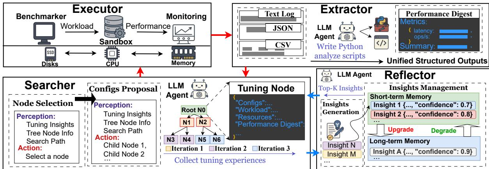  
Figure 1: StorageXTuner framework

• Reflector collects, analyzes, and manages tuning experiences from the Searcher, and summarizes them into highlevel tuning insights and dynamically updates and manages those insights based on feedback from the Searcher.

StorageXTuner operates through two intertwined iterative cycles during a tuning round, as shown in Figure 1. 1) Cycle A (red lines) involves the Executor, Extractor, and Searcher, which collaboratively propose new configuration candidates, run benchmarks, and analyze the results of each candidate. 2) Cycle B (blue lines) involves the Searcher and Reflector, which collect and transform tuning experiences into high level insights. Searcher uses these insights to guide the configuration search, and Reflector continuously updates them with new benchmarking results. These two cycles operate continuously, enabling the framework to progressively refine its understanding of storage system behavior and improve storage system tuning efficiency over time.

With dedicated LLM agents for each major task of the tuning process (i.e., Executor, Extractor, Searcher, and Reflector), StorageXTuner decouples the dependencies between storage system-specific knowledge, designs, and executions from the common tuning workflows and handles them via LLM agents. StorageXTuner only requires lightweight interfaces for running benchmarks and adjusting configurations for different storage systems and implementation versions, achieving high generality. Moreover, StorageXTuner provides LLM agents with structured, system-related, task-specific contexts, enabling more accurate reasoning and decision-making at each stage of the tuning process.

## 3.3 Automated Benchmarking and Analysis

In a tuning process, a new configuration is evaluated (e.g., via benchmarks or traces) and compared against other candidate configurations to guide the configuration adjustment.

However, these processes are tightly coupled with the storage system and often require custom scripts to automate benchmarking. Furthermore, analyzing the benchmarking results usually requires manual efforts due to the complexity of the data content and format (e.g., runtime statistics, execution logs, system monitoring data, and benchmark outputs). StorageXTuner delegates benchmarking and analysis actions to two specialized LLM-powered agents, Executor and Extractor.

Executor. As shown in Figure 2, the Executor uses a precise specification for each benchmark experiment, including a candidate configuration file (e.g., RocksDB configuration with write\_buffer\_size = 64MB, block\_cache\_size = 256MB), resource constraints (e.g., 2 CPU cores, 1GB memory), and a specific workload. The workload can be created from synthetic micro-benchmarks (e.g., fillrandom from db\_bench in RocksDB) or trace replay. The Executor sets up the sandbox environment (e.g., Docker), applies the given configuration, and generates the workload within the specified resource envelope to isolate tuning experiments and enable safe, repeatable testing. This design can isolate potential errors or unsafe LLMgenerated configurations. Executor also monitors runtime status (e.g., container health, CPU load, memory usage) and collects all sandbox outputs, including performance metrics from benchmarking output (e.g., throughput and tail latency), storage system operational logs, and any system warnings.

Extractor. The massive structured and unstructured output data from Executor raises the challenge of how to analyze them for configuration exploration. Conventional approaches rely on manual parsing or rigid, fixed-format parsers, which are labor-intensive and difficult to scale [39]. When output formats change with new system releases, these methods require costly re-engineering. While LLMs can directly analyze such files to extract performance metrics, directly feeding massive logs into an LLM risks token overflows and hallucinations.

Therefore, StorageXTuner exploits the LLM’s programming capabilities and uses a separate LLM agent, Extractor, to generate a targeted Python parser on demand. We provide the LLM with descriptions of the performance metrics of interest (e.g., definitions of throughput and latency), together with relevant system information (e.g., system version), and data samples (e.g., log snippets). Guided by this context, the LLM infers the possible output formats and synthesizes Python code to process them (e.g., import different libraries to handle text, JSON, or CSV files). Then, the Extractor executes the Python script locally to transform raw outputs into structured key–value pairs to store extracted performance metrics and non-metric information. This design enables StorageXTuner to adapt on the fly to the unique logging formats of various storage systems without heavy engineering effort. Finally, Extractor constructs the Performance Digest, a structured JSON object that includes quantitative performance metrics and qualitative evaluation summary (i.e., a concise interpretation of benchmark results, including key trends, trade-offs, or any anomalies generated by LLM). The performance digest, combined with the configuration file, workload description, and system resource information, forms the tuning node in the search tree used by Searcher for configuration exploration (detailed in Section 3.4).

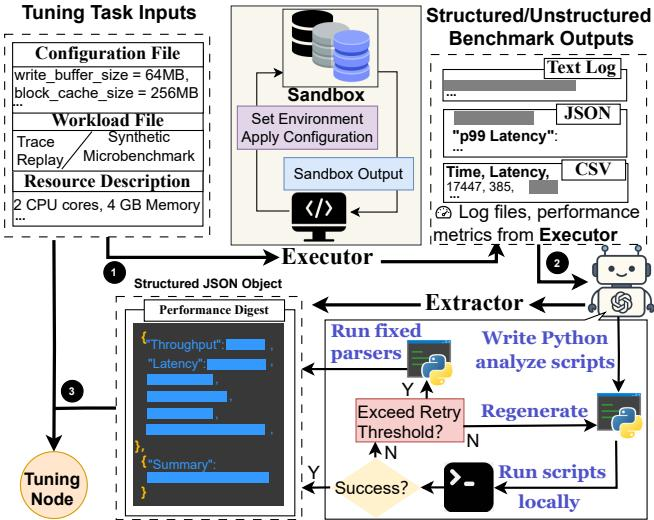  
Figure 2: Automated Benchmarking and Analysis

Validation. To ensure the reliability of the generated Python scripts, Extractor incorporates a self-correcting mechanism. As shown in Figure 2, if a generated script fails to execute or produces invalid output (e.g., incorrect types), this failure is detected by a pre-defined checker and reported back to the LLM to generate a refined script. If regeneration attempts exceed a predefined threshold, the system rolls back to predefined, fixed-format human-written parsers. A script may run successfully but still compute metrics incorrectly. To address this, Extractor performs pre-defined abnormal value checks (e.g., throughput exceeding hardware limits) to identify suspicious outputs and trigger regeneration.

## 3.4 Insight-Driven Configuration Exploration

While LLM can directly propose candidate configurations based on the performance digest from the last tuning cycle, as Elmo-Tune did [88], it cannot efficiently explore configurations that need past tuning experiences. The LLM reasoning is session-bound and limited by context windows, making it impractical to feed all past trial results without performance degradation or hallucinations [66]. In addition, LLMs lack iterative feedback integration and tend to generate stochastic, unguided exploration paths, which often lead to redundancy and incomplete coverage [61].

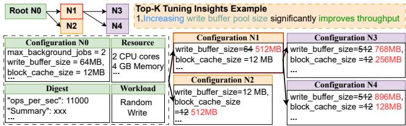  
Figure 3: Insight-Driven Configuration Exploration

We propose to integrate LLM with a tree search process for configuration exploration, which addresses these limitations by structuring exploration into explicit steps, recording past outcomes, and guiding the search toward promising directions. By maintaining parent–child relationships between configuration candidates, tree search expands promising branches while pruning unpromising ones. This structure combines planning, branching, and feedback-driven prioritization, enabling LLMs to concentrate their reasoning on high-potential areas of the configuration space.

StorageXTuner achieves this by delegating the configuration tree search task to a specialized LLM agent, the Searcher. Unlike traditional tree search, which depends on scalar rewards or hand-tuned utility functions (demanding substantial human effort to predefine and tune), the Searcher leverages high-level tuning insights, which are summarized by the LLM from past tuning trials (See details in Section 3.5), to decide how and where to explore.

How to Propose Configuration Candidates? The exploration process begins with the initial configuration (e.g., the default configuration), which serves as the root node in the search tree. Tuning insights, expressed in natural language, capture plausible relationships between configuration changes and observed storage system behavior. For instance, an insight might state that increasing the write buffer pool size significantly improves throughput for RocksDB. Guided by these insights, the Searcher proposes a set of configuration candidates, which become the child nodes of the current node (the root in this case) in the search tree. The LLM is directed to prioritize exploration consistent with these insights, such as re-balancing the write buffer and block cache size.

As shown in Figure 3, consider tuning RocksDB under a random write workload with 2 CPU cores and 1 GB of memory, where the initial configuration (root node) sets max\_background\_jobs=2, write\_buffer\_size=64MB, and block\_cache\_size=12MB. First, Searcher constructs a structured prompt that incorporates the current tuning node (root node), task descriptions, and tuning insights. Figure 4 shows how the prompt template organizes these elements into a natural-language instruction. This prompt is then passed to the LLM to propose child configurations for exploration. Then, the Searcher expands the root node by proposing two candidate configurations, increasing write\_buffer\_size and block\_cache\_size to 512MB each to fully utilize the 1 GB memory budget. Next, the Searcher explores re-balancing strategies within the same memory budget. Guided by the insight that increasing write\_buffer\_size can improve throughput under write-intensive workloads, it reallocates memory by assigning 768MB to write\_buffer\_size and 256MB to block\_cache\_size. In practice, Searcher may propose multiple child nodes.

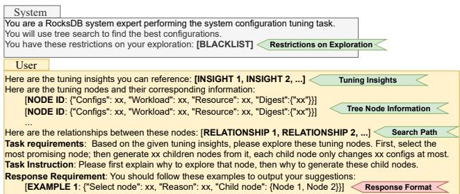  
Figure 4: Example Prompt for Configuration Proposal

Which Configuration Should Be Further Explored? After the Searcher proposes candidate configurations, a new question arises: which child node should be explored in the next round? Before selecting the most promising node, we send the benchmark tasks, including candidate configurations, resource descriptions, and workload descriptions, to the Executor. The Executor benchmarks these candidates, and the Extractor analyzes the results to generate a new set of performance digests. This performance digest serves as the utility for each node. As shown in Figure 4, we combine the performance digests with the corresponding tuning nodes, insert them into the prompt template, and guide the LLM to compare these nodes, reason about which node is more promising, and select it for the next round of exploration.

Since the performance digest is a structured summary rather than a directly comparable numeric value, the LLM relies on its reasoning capabilities to weigh trade-offs and select the most promising node for exploration. This process may choose a suboptimal node, for example, a configuration with the second-highest throughput. We consider this acceptable because even if the current node does not achieve the highest performance, exploring it can still provide valuable information. Furthermore, if future iterations reveal poor outcomes for this node, the LLM can return to select the optimal node in subsequent rounds. In addition, we can also add specific insights to guide the LLM toward prioritizing the optimal node. For instance, an insight stating that “throughput is our main target” encourages the selection of higher-throughput configurations. This soft comparison approach enables the LLM to explore promising directions while maintaining a degree of randomness in its exploration.

How to Validate Configuration Candidates? Given the inherent uncertainty of LLM reasoning, StorageXTuner relies on a two-layer validation strategy to ensure the correctness and safety. In the first layer, users can specify domain constraints, such as persistence guarantees or concurrency limits. The LLM applies these constraints to filter out unsafe or irrelevant candidate configurations before evaluation. Configurations that pass this filtering stage undergo empirical validation in the second layer. Here, the Extractor performs consistency checks using pre-defined scripts. These checks include detecting anomalous metrics, enforcing blacklists to reject unsafe configuration changes, and reporting errors back to the LLM. This layered validation ensures that while LLMs provide flexible semantic reasoning, all tuning decisions remain firmly grounded in reliable, observable feedback.

When to Terminate the Exploration? To ensure bounded search, StorageXTuner supports multiple termination strategies. The search process halts automatically when the performance improvement between iterations falls below a threshold (e.g., 1% over three rounds), indicating convergence. Alternatively, searching can be terminated based on user-specified constraints such as maximum LLM token usage, total tuning time, or a system resource budget. These controls provide both flexibility and safety, allowing StorageXTuner to be deployed in diverse operational settings ranging from offline experimentation to online tuning in production environments.

## 3.5 Tuning Insights Management

Tuning insights play a critical role in configuration exploration. The Searcher relies on them to decide how and where to explore within the complex configuration space.

Insights Generation. As shown in Figure 5, insights are derived from past tuning experiences. In each search iteration, the Searcher collects tuning experiences, which include node records (e.g., executed configurations and their performance digests) and the search paths (e.g., the relationships between explored nodes), and sends them to the Reflector. Those records are inserted into a prompt (as shown in Figure 6 (Blue Text segments)). Reflector is then instructed to compare performance digests across different nodes, learn the relationship within these nodes, and infer generalized rules, such as which parameter adjustments consistently lead to per formance gains or losses. Each insight is expressed in natural language and is associated with an initial confidence score, which is assigned by the Reflector based on its initial assessment and updated as more evidence becomes available. The confidence score denotes the confidence level of the insight, reflecting how strongly it is supported by past evidence. Besides, each insight also records the source nodes from which it was inferred.

Insights Management. After generating tuning insights, managing and selectively providing them becomes critical for improving configuration exploration efficiency. We may use Retrieval-Augmented Generation (RAG) to manage the insights [64], which retrieves relevant insights via vector similarity and injects them as auxiliary context into the LLM’s prompt. However, RAG is insufficient for the storage system tuning task. First, it relies on a static, homogeneous knowledge base, making no distinction between volatile, sessionspecific insights and validated, reusable ones. Second, it retrieves knowledge solely by embedding similarity, which is brittle when insight utility depends on subtle workload dynamics. Embedding similarity only captures surface-level context similarity and lacks a feedback loop, preventing real tuning outcomes from reinforcing or revising stored insights.

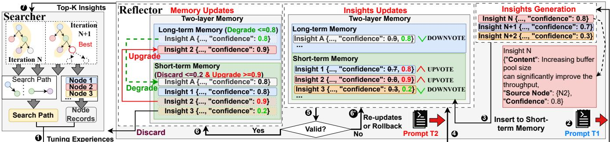

Figure 5: Tuning Insight Generation and Management. The LLM updates an insight’s confidence through Upvote or Downvote based on observed results (e.g., Node 2 shows performance consistent with Insight N’s prediction, while Insight 3 contradicts it). Insights with high confidence are promoted from STM to LTM as validated, reusable knowledge, while low-confidence insights are discarded or demoted for further evaluation.  
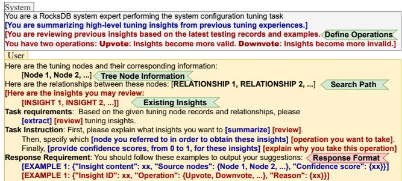  
Figure 6: Prompt for Insight Generation and Updating

To address those limitations, StorageXTuner adopts two key mechanisms in Reflector. First, it maintains a layered memory structure: a Short-Term Memory (STM) for sessionspecific insights and a Long-Term Memory (LTM) for validated, reusable insights across sessions. Second, it applies a Confidence Scoring-based Management, where retrieval considers both contextual similarity and dynamically updated confidence scores that reflect empirical tuning outcomes. STM serves as a workspace for newly generated or session-specific insights, while LTM accumulates validated insights that have demonstrated consistent effectiveness across different tuning executions. Each new insight is first placed into STM with a provisional confidence score reflecting the LLM’s initial assessment of its potential utility. Since such confidence scores are unreliable at generation time, STM functions as a staging area where tentative knowledge is empirically tested against benchmark results.

For example, under a write-heavy workload on a 2-core system for RocksDB, an STM insight might be “increasing max\_background\_jobs from 2 to 4 could improve compaction throughput.” Such an insight is specific to the current session and may not generalize. As evidence accumulates, insights in STM are either discarded if contradicted or promoted to LTM once repeatedly validated. LTM, in turn, stores cross-session knowledge such as “larger block\_cache\_size consistently reduces read latency”. This separation of transient and persistent knowledge enables StorageXTuner to adapt dynamically to workload-specific behaviors while gradually consolidating durable expertise.

The Reflector leverages the Confidence Scoring-based Management to adjust and manage the insights. The confidence score of an insight represents the level of confidence, indicating how strongly an insight is expected to produce the predicted effect. Each insight receives an initial confidence score from the LLM during generation, but this score is provisional and continuously updated as new benchmarking evidence arrives. We adjust the score through two LLM-driven operations: Upvote, which raises confidence when observed benchmarking outcomes align with the insight, and Downvote, which lowers confidence when results contradict the guidance. As shown in Figure 6 (Red Text segments), the Reflector applies dedicated prompts to interpret benchmark results and update the confidence scores of insights. Over time, this dynamic updating allows the Reflector to validate, demote, or discard insights, ensuring that only empirically grounded knowledge persists in LTM.

Insights Retrieval. The Reflector combines each insight’s updated confidence score with its contextual similarity (e.g., cosine similarity [64]) to produce a similarity metric weighted by confidence. The top-k insights (e.g., k = 10) according to this metric are then returned to the Searcher, guiding the next round of configuration proposals with both empirically validated and contextually relevant knowledge. In this way, the retrieval workflow closes the loop between reasoning, empirical validation, and insight management, ensuring that subsequent search steps are progressively better informed and increasingly effective.

Validation. StorageXTuner includes a lightweight Validator that cross-checks LLM-proposed confidence updates against actual benchmarking results. For each insight, the Validator verifies whether associated nodes show performance changes consistent with the insight’s predicted effect. Confidence updates are then accepted or rejected based on this verification, ensuring that insights reflect concrete benchmark outcomes rather than relying solely on LLM reasoning.

## 4 Evaluations

## 4.1 Prototype Implementation

We implement StorageXTuner in Python (v3.10) as a modular, LLM-driven framework composed of collaborative LLM agents. Our evaluation spans three representative storage systems: 1) the most widely used key-value store RocksDB (v8.8.1) [75], 2) a powerful and modularized cache engine CacheLib developed by Meta [22], and MySQL InnoDB [8], to cover a diverse range of storage systems. Note that for MySQL we focus on the configuraitons of its default storage engine InnoDB, and leave other optimizations (e.g., querylevel tuning) as future work.

We extend standard benchmarking tools, including YCSB for RocksDB [23], CacheBench for CacheLib [21], and TPC-H/C workloads for MySQL [11], to support workload generation and configurable tuning parameters. By default, StorageXTuner uses OpenAI’s GPT-4o [6] as its backend LLM model, and the model can be replaced. The source code for StorageXTuner is available on GitHub [25].

## 4.2 Experimental Setup

Hardware and System Setup. Our experimental evaluation is conducted on a workstation equipped with Intel(R) Core(TM) i9-10920X CPU @ 3.50GHz, 32 GB of RAM, a 512GB NVMe SSD running Ubuntu 24.04.1 LTS. We leverage cgroups [15] and Docker [3] to isolate workloads and enforce resource constraints. Unless otherwise specified, all tests are limited to 2 CPU cores, 4GB of DRAM, and 4GB of swap space.

Baselines. We use the default configuration file provided by each application as our primary baselines, including the default RocksDB configurations (RocksDB-Default), the default configurations of CacheLib (CacheLib-Default), and the default configurations of InnoDB (InnoDB-Default). In addition, we compare StorageXTuner against state-of-the-art tuning solutions. Specifically:

• RocksDB: ADOC [101] (heuristic-based tuner), Endure [57] (ML-based tuner), ELMo-Tune [88] (LLM-based state-of-the-art tuner), LLM-Default (simple one-shot LLM tuning), and StorageXTuner (our solution).

• CacheLib: LLM-Default and StorageXTuner.

• InnoDB: SMAC [68] (Bayesian optimization for tuning), DDPG [50] (Reinforcement-learning based tuning), λ Tune [51, 52] (a LLM-based tuner), LLM-Default, and StorageXTuner.

Workloads and Benchmarks. We evaluate StorageXTuner across a variety of real-world workloads tailored to each system under test. For RocksDB, we use macro-benchmarks based on Yahoo’s YCSB [44] and Meta’s MixGraph [40] to capture realistic access patterns. Unless otherwise specified, all write-intensive workloads operate on 50 million key-value (KV) pairs, and all read-related tests access at least 20 million KV pairs, with each key and value set to 16 bytes and 48 bytes, respectively. For CacheLib, we evaluate three workload profiles: write-intensive, read-intensive, and mixed workloads. Each test involves a total of 50 million operations, the average cache item size is set to 128 bytes, and the access pattern is defined by a configurable lookup-to-insert ratio, set to 9:1 for read-intensive workloads, 1:9 for write-intensive workloads, and 5:5 for mixed workloads. For MySQL InnoDB, we benchmark the system using TPC-C and TPC-H workloads [10,11], with database sizes set to 1GB and 5GB, respectively. All reported results are the average of three or more runs.

Performance Metrics. Since LLM-driven tuning is a fully new research area, traditional measurement metrics like eventual throughput or latency improvement are insufficient to capture the unique dynamics of LLM-based solutions. LLMs introduce reasoning overheads and semantic decisions that can yield both significant gains and unpredictable outcomes. Therefore, we propose four new measurement metrics tailored for LLM-driven tuning, which can better guide the designs and evaluations. Max Performance Gain (MPG) captures the relative improvement over the baseline performance metrics (e.g., throughput). Token Cost to 95% Max Performance (TC95) measures the total number of LLM tokens consumed to reach 95% of the peak performance. We use 95% of peak performance instead of the absolute maximum because it better reflects typical token usage in practice. Token Efficiency (TE) quantifies how much performance gain is achieved per 1,000 tokens used, helping assess the cost-effectiveness of tuning. Token-Weighted Error Rate (TWER) represents the number of invalid or error-prone configurations generated per 1,000 tokens. Invalid configurations include syntax errors, unrecognized options, or configurations that result in execution failures. These metrics collectively offer insight into the quality, efficiency, and robustness of the LLM-driven tuning solutions.

## 4.3 Overall Performance Evaluation

Key-Value Stores. We assess StorageXTuner ’s performance on real-world benchmarks using MixGraph [40] and YCSB [44] workloads for RocksDB. With MixGraph workload, as shown in Figure 7, StorageXTuner achieves up to a 575% increase in throughput and a reduction in latency by up to 88% compared to other baselines. Under the YCSB workload, StorageXTuner achieves throughput improvements of up to 111% and p99 latency reductions of up to 56% compared to ELMo-Tune, the current state-of-the-art LLM-based tuning framework for RocksDB. These results demonstrate

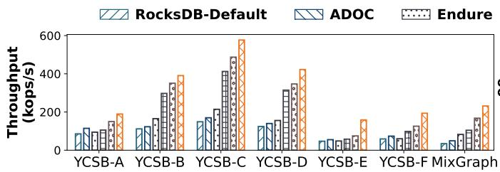

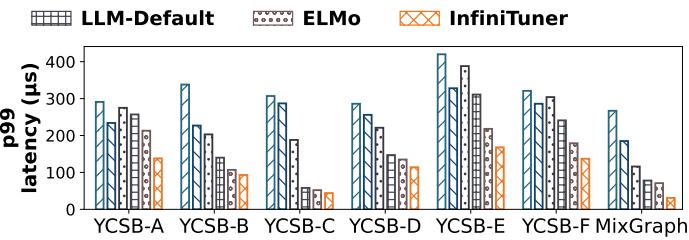  
Figure 7: Performance Comparison under YCSB and Mixgraph Workload in RocksDB

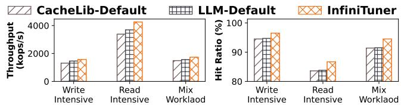  
Figure 8: Performance with Different Workload in CacheLib

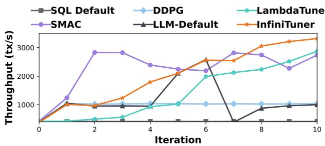  
Figure 9: Best Performance over Iterations on InnoDB.

StorageXTuner ’s more effective use of LLMs and structured feedback. ADOC, Endure, rule-based, and ML-based tuning solutions improve throughput over the RocksDB-Default baseline by up to 43% and 141%, respectively. However, they still fall short of StorageXTuner: StorageXTuner surpasses these two methods by up to 369% in throughput. Additionally, compared to the LLM-Default baseline, a naive one-shot interaction with an LLM lacking insight feedback and validation, StorageXTuner achieves a throughput improvement of up to 80% and significantly more stable tail latencies. These results highlight the importance of structured tuning experiences, insight-driven search, and feedback validation in enabling efficient and reliable LLM-powered tuning.

Cache Systems. For CacheLib, we evaluate StorageXTuner across three workload types: write-intensive, read-intensive, and mixed. We use the cachebench tool with configurable access patterns and object sizes to simulate realistic cache usage scenarios. To the best of our knowledge, no existing LLM-based tuning framework has been applied to CacheLib, making StorageXTuner the first to address this configuration space using an LLM-driven approach. As shown in Figure 8, compared to the CacheLib-Default baseline, StorageXTuner achieves up to a 26% improvement in throughput and improves cache hit ratio by up to 3.1 percentage points across workloads. Specifically, for the write-intensive workload, StorageXTuner increases the hit ratio from 94.5% to 96.5%, and for the read-intensive workload, the hit ratio improves by 2.9 percentage points, demonstrating more efficient memory utilization and improved eviction policy decisions. Additionally, it outperforms the LLM-Default baseline by up to 15%, illustrating the advantage of StorageXTuner ’s insight-driven, feedback-aware tuning in optimizing complex caching systems.

Table 3: Standardized Metric Analysis.  
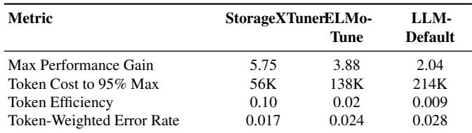

SQL Storage Engines. For InnoDB, the default storage engine in MySQL, StorageXTuner is evaluated using two widely adopted transactional and analytical benchmarks: TPC-C and TPC-H, respectively. StorageXTuner consistently outperforms all baselines across both benchmarks. As shown in Figure 9, under the TPC-C workload, StorageXTuner increases throughput by up to 709% over InnoDB-Default and 29% over LLM-Default. StorageXTuner achieves over 15% higher throughput compared to λ-Tune. In the TPC-H workload, StorageXTuner reduces query latency by up to 71% (from 8.9s to 2.5s) across all baselines, showcasing its ability to improve analytical query performance through better buffer pool sizing and I/O tuning. This underscores the effectiveness of its insight-driven and feedback validation tuning, even in relational database storage engines.

Standardized Metric Analysis. Table 3 highlights the advantages of StorageXTuner over the LLM-Default baseline across several standardized evaluation dimensions. First, StorageXTuner achieves a significantly higher peak performance, demonstrating its ability to discover more effective configurations. More importantly, it reaches 95% of its peak performance using fewer LLM tokens (56K vs. 214K), which translates to both lower latency in interaction rounds and reduced monetary cost. This improvement in cost-efficiency is further underscored by its higher token efficiency, achieving 11× and 5× improvements compared to LLM-Default and ELMo-Tune, respectively. Beyond efficiency, StorageXTuner exhibits greater robustness. It accumulates fewer errors in the tuning process, as evidenced by a lower Token-Weighted Error Rate (TWER = 0.017 vs. 0.028), indicating better stability and reduced need for human correction or fallback mechanisms.

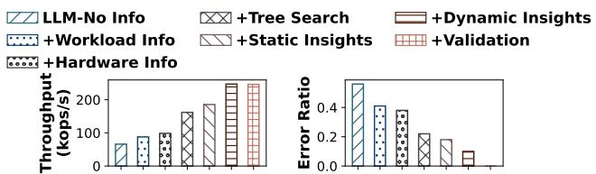  
Figure 10: Ablation Study

Table 4: Performance comparison across different versions on the fillrandom workload (throughput in kops/s). ✗ indicates the method fails to run.  
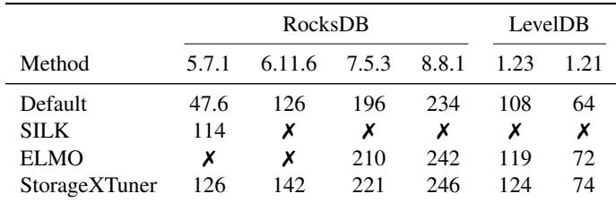

## 4.4 Ablation Study

To understand the impact of progressively enriching the tuning context for LLM-driven configuration generation, we conduct an ablation study on RocksDB using MixGraph. In addition to varying the levels of input information, we also evaluate the contributions of our design components, including tree search, dynamic tuning insights, and the validation checker. We measure how each element affects both throughput and error ratio to quantify their individual and combined benefits.

The evaluation is conducted with the following setups:

LLM-No Info: The baseline where the LLM receives only a general tuning task description prompt, with no other tuning context. +Workload Info: Adds workload benchmarking results. +Hardware Info: Adds hardware metadata, such as CPU and memory information. +Tree Search: Adds Tree Search without insights. +Static Insights: Adds static insights. +Dynamic Insights: Adds dynamic insights (insights management). +Validation: Combines validation mechanisms.

As shown in Figure 10, each additional layer of context contributes to measurable improvements. Starting with the LLM without any guidance, throughput is the lowest (65,908 ops/sec) with a high error ratio (56%). Adding workload information increases throughput to 87,664 ops/sec and reduces the error ratio to 41%. Incorporating hardware information further improves throughput to 98,470 ops/sec and lowers the error ratio to 38%. Introducing tree search context boosts throughput to 161,847 ops/sec and reduces the error ratio to 22%. Adding static insights from historical tuning records further increases throughput to 185,542 ops/sec and lowers error ratio to 18%. Incorporating dynamic insights, which include runtime feedback and performance refinement, raises throughput to 247,257 ops/sec and reduces the error ratio to 10%. Finally, the full StorageXTuner setup with validation mechanisms achieves 246,352 ops/sec and eliminates all invalid configuration attempts.

Table 5: Impact of Different Number of Child Nodes.  
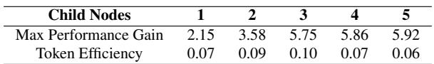

Table 6: Impact of Different Numbers of Insights.  
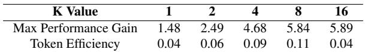

## 4.5 Sensitivity Analysis

To evaluate the robustness of StorageXTuner, we conduct a sensitivity analysis across a variety of resource and modellevel parameters. This study demonstrates how the performance of StorageXTuner responds to changes in system version diversity, exploration child node, number of selected top insights, and the capabilities of the underlying LLM.

Different Storage System Implementations and Version. Table 4 reports throughput under the fillrandom workload of RocksDB and LevelDB (two different implementations of LSM-based key-value stores) across multiple versions. We observe that StorageXTuner consistently achieves the highest performance and runs across all tested versions, while Elmo-Tune and SILK [30] (an I/O scheduler for RocksDB) fail on several versions due to compatibility issues. This highlights StorageXTuner ’s ability to deliver robust and generalizable performance across diverse system versions.

Different Number of Child Node. Table 5 shows the impact of varying the number of child nodes on tuning effectiveness. Increasing the number of child nodes generally improves maximum performance gain, with diminishing returns beyond three nodes. However, token efficiency does not scale proportionally and even decreases when the branching factor becomes too large. This highlights a trade-off between performance gain and efficiency, suggesting that moderate branching achieves the best balance.

Different Number of Insight. As shown in Table 6 compares the effect of different numbers of Top-K insights on tuning performance. As K increases from 1 to 8, the maximum performance gain improves significantly, indicating that leveraging more insights helps the tuner explore better configurations. However, increasing K beyond 8 yields diminishing returns, and token efficiency drops for K = 16 due to higher token overhead during reasoning. This demonstrates that choosing an appropriate number of Top-K insights is important to balance performance gains and efficiency.

LLM Model Selection.. As shown in Figure 11, we evaluate StorageXTuner with a range of LLMs to understand the impact of model size and reasoning capabilities on tuning quality. Specifically, we utilize OpenAI’s GPT-3.5, GPT-4o, o1, o1-mini, and o3-mini models. Where applicable, we also analyze the effect of different reasoning levels within the o3-mini family. To explore the trade-offs between small and large open-source models, we select various configurations from the LLaMA series—namely, LLaMA-3.2-1B, 3.2-3B, 3.1-8B, 3.1-70B, and 3.3-70B—all of which publicly disclose model sizes. The results show that larger, reasoning-capable models consistently yield higher-quality insights and tuning decisions. In contrast, models with limited reasoning abil ity—such as o1-mini and the low- and medium-capacity variants of o3-mini—perform worse than GPT-4o, which, while powerful, lacks explicit reasoning prompts. These results suggest that even a high-capacity model without dedicated reasoning prompts can achieve strong performance, but enabling robust reasoning capabilities further improves tuning effectiveness. Overall, these results show that StorageXTuner can work with different models effectively, and it is expected that the tuning effectiveness will scale as LLM evolves

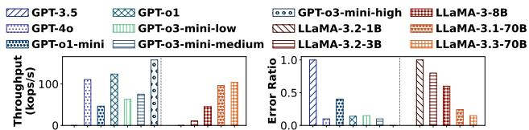  
Figure 11: StorageXTuner on Different LLM Models

## 5 Lessons Learned

In this section, we summarize a few key lessons learned from building and evaluating StorageXTuner:

A small set of key insights dominates the search trajectory. The search process is mainly guided by a small set of human-auditable high-level insights. Treating these insights as first-class artifacts to guide exploration significantly reduces invalid attempts and costs. Critically, these general insights are transferable across heterogeneous systems, effec tively accelerating cold starts.

Proposal of new configurations is the primary error source. Errors primarily arise not from editing existing configurations, but from proposing changes to untouched configurations, which trigger string/enum mismatches and version incompatibilities. Systematic numerical mistakes (e.g., unit confusion, budget violations) are also common. These are best mitigated by pre-execution schema validation and enforcing normalized budget caps, rather than relying on reactive fixes.

Closed-loop agent architecture outperforms monolithic model reasoning. A closed-loop, multi-agent architecture with clear role separation delivers more robust and stable gains than increasing the underlying model’s size. This design is largely autonomous for well-documented open-source systems but benefits from lightweight retrieval of local documentation to stabilize performance on closed-source or rapidly evolving ones.

Human-in-the-loop shifts from low-level tuning to highlevel strategy. With StorageXTuner, the human’s role evolves from manual tuning to strategic oversight. By providing explicit guardrails (e.g., budgets, SLOs), experts enable the agent to explore safely and broadly. Their primary value thus becomes curating high-impact insights and adjudicating tradeoffs across non-aligned objectives, which yields auditable improvements with minimal manual intervention.

## 6 Related Work

Analyzing Software Configurations. Great efforts exist to analyze and/or test configurations of various software systems [36–38,43,59,60,73,81,84,98]. For example, SPEX [98] analyzes configuration constraints and uses inferred constraints to harden systems against misconfigurations. Similarly, cDEP [43] and ConfD [73] analyze configuration dependencies in cloud systems (e.g., Hadoop and OpenStack) and file systems (e.g., Ext4, XFS), respectively. Insights derived from these efforts could potentially be leveraged to guide auto-tuning and are complementary to StorageXTuner. Heuristic-based Approaches. To alleviate tedious manual configuration, heuristic approaches [36, 86] encode expert knowledge into predefined rules or strategies to guide parameter adjustments. For example, a workload-aware heuristic can recommend a larger cache size for read-heavy workloads or an infrequent compaction policy for write-heavy workloads. While such heuristics capture certain domain insights, rules crafted for one system or version rarely transfer to others, forcing experts to rebuild strategies.

ML-based Approaches. To overcome these limitations, researchers have proposed automated approaches that typically follow a two-phase workflow. First, they collect representative workload characteristics (e.g., I/O patterns, query plan cost vectors) by automated profiling or user queries. And second, different optimization engines (like reinforcement-learning (RL) agents using policy gradients) iteratively propose configurations that are tested on offline benchmarks before finaliza tion. Prominent examples include CherryPick [24] and DB-Tune [13], which leverage Gaussian-process–based Bayesian optimization to reduce tuning overhead by up to 75% on cloud analytics workloads; QTune [65] and CDBTune [103], apply deep RL-models to adapt configurations under dynamic query and cloud-instance patterns; and OtterTune’s [90] meta-learning engine fingerprints workloads to transfer priors across deployments, cutting required trials nearly in half. While more general than heuristics-based methods, ML approaches are closely tied to training data and often lose effectiveness as workload, hardware, or software evolves. Further, they often focus on subsets of configurations, as with Endure [57] and Dremel [105] for key-value store tuning.

## 7 Conclusion

In this paper, we propose StorageXTuner, a novel auto-tuning framework for heterogeneous storage systems that leverages specialized LLM agents to efficiently explore configurations while dynamically generating and managing tuning insights. This framework not only opens new opportunities for managing insights across storage systems but also introduces new measurement metrics for evaluating LLM-based configuration tuning systems.

## References

[1] Claude. URL: https://claude.ai/.

[2] Copilot. URL: https://copilot.microsoft.com/.

[3] Docker: Accelerated Container Application Development. URL: https://www.docker.com/.

[4] Google Gemini. URL: https://gemini.google.co m.

[5] GPT-4 API general availability and deprecation of older models in the Completions API. URL: https: //openai.com/blog/gpt-4-api-general-avail ability.

[6] Hello GPT-4o. URL: https://openai.com/index /hello-gpt-4o/.

[7] Myrocks. http://myrocks.io/.

[8] MySQL :: MySQL 8.4 Reference Manual :: 17 The InnoDB Storage Engine. URL: https://dev.mysql. com/doc/refman/8.4/en/innodb-storage-eng ine.html.

[9] Redis. https://redis.io/.

[10] TPC-C Homepage. URL: https://www.tpc.org/ tpcc/default5.asp.

[11] TPC-H Homepage. URL: https://www.tpc.org/ tpch/.

[12] HDFS Architecture Guide, May 2022. URL: https: //hadoop.apache.org/docs/r1.2.1/hdfs\_desig n.html.

[13] PKU-DAIR/DBTune, December 2024. original-date: 2022-03-23T05:28:08Z. URL: https://github.c om/PKU-DAIR/DBTune.

[14] Amazon S3 - Cloud Object Storage - AWS, September 2025. URL: https://aws.amazon.com/s3/.

[15] Control Group v2 — The Linux Kernel documentation, April 2025. URL: https://www.kernel.org/doc /html/latest/admin-guide/cgroup-v2.html.

[16] ext4(5) - Linux manual page, September 2025. URL: https://www.man7.org/linux/man-pages/man5/ ext4.5.html.

[17] LLM Training Datasets - a sugatoray Collection, April 2025. URL: https://huggingface.co/collectio ns/sugatoray/llm-training-datasets-65dbe 4ab2b0037ec198b09ab.

[18] Managed Graph Database - Amazon Neptune - AWS, September 2025. URL: https://aws.amazon.com /neptune/.

[19] Neo4j Graph Database & Analytics – The Leader in Graph Databases, September 2025. URL: https:// neo4j.com/.

[20] xfs(5) - Linux manual page, September 2025. URL: https://www.man7.org/linux//man-pages/man 5/xfs.5.html.

[21] Cache bench. https://cachelib.org/docs/Cach e\_Library\_User-sz\_Guides/Cachebench\_Over view/, Accessed: June, 2023.

[22] Cachelib github. https://github.com/facebook/ CacheLib, Accessed: June, 2023.

[23] db\_bench. https://github.com/facebook/rock sdb/wiki/Benchmarking-tools, Accessed: June, 2023.

[24] Omid Alipourfard, Hongqiang Harry Liu, Jianshu Chen, Shivaram Venkataraman, Minlan Yu, and Ming Zhang. {CherryPick}: Adaptively Unearthing the Best Cloud Configurations for Big Data Analytics. pages 469–482, 2017. URL: https://www.usenix.org/c onference/nsdi17/technical-sessions/pres entation/alipourfard.

[25] Anonymous. Infinitune, September 2025. URL: http s://github.com/gdaythcli/InfiniTune.

[26] Anthony Anthony and Yaganti Naga Malleswara Rao. Memcached, redis, and aerospike key-value stores empirical comparison.

[27] Apache. Hadoop distributed file system, 2005. URL: https://hadoop.apache.org/docs/r1.2.1/hdfs \_design.html.

[28] Martin Arlitt and Tai Jin. A workload characterization study of the 1998 world cup web site. IEEE network, 14(3):30–37, 2000.

[29] Berk Atikoglu, Yuehai Xu, Eitan Frachtenberg, Song Jiang, and Mike Paleczny. Workload analysis of a large-scale key-value store. In ACM SIGMETRICS Performance Evaluation Review, volume 40, pages 53– 64. ACM, 2012.

[30] Oana Balmau, Florin Dinu, Willy Zwaenepoel, Karan Gupta, Ravishankar Chandhiramoorthi, and Diego Didona. SILK: Preventing latency spikes in Log-Structured merge Key-Value stores. In 2019 USENIX Annual Technical Conference (USENIX ATC 19), pages 753–766, Renton, WA, July 2019. USENIX Association. URL: https://www.usenix.org/conferenc e/atc19/presentation/balmau.

[31] Babak Behzad, Huong Vu Thanh Luu, Joseph Huchette, Surendra Byna, Prabhat, Ruth Aydt, Quincey Koziol, and Marc Snir. Taming parallel I/O complexity with auto-tuning. In Proceedings of the International Conference on High Performance Computing, Networking, Storage and Analysis, pages 1–12, Denver Colorado, November 2013. ACM. URL: https: //dl.acm.org/doi/10.1145/2503210.2503278, doi:10.1145/2503210.2503278.

[32] Benjamin Berg, Daniel S Berger, Sara McAllister, Isaac Grosof, Sathya Gunasekar, Jimmy Lu, Michael Uhlar, Jim Carrig, Nathan Beckmann, Mor Harchol-Balter, et al. The cachelib caching engine: Design and experiences at scale. In 14th USENIX Symposium on Operating Systems Design and Implementation (OSDI 20), pages 753–768, 2020.

[33] Nathan Bronson, Zach Amsden, George Cabrera, Prasad Chakka, Peter Dimov, Hui Ding, Jack Ferris, Anthony Giardullo, Sachin Kulkarni, and Harry C Li. TAO: Facebook’s distributed data store for the social graph. In 2013 USENIX Annual Technical Conference (USENIX ATC 13), pages 49–60, 2013.

[34] Tom B. Brown, Benjamin Mann, Nick Ryder, Melanie Subbiah, Jared Kaplan, Prafulla Dhariwal, Arvind Neelakantan, Pranav Shyam, Girish Sastry, Amanda Askell, Sandhini Agarwal, Ariel Herbert-Voss, Gretchen Krueger, Tom Henighan, Rewon Child, Aditya Ramesh, Daniel M. Ziegler, Jeffrey Wu, Clemens Winter, Christopher Hesse, Mark Chen, Eric Sigler, Mateusz Litwin, Scott Gray, Benjamin Chess, Jack Clark, Christopher Berner, Sam McCandlish, Alec Radford, Ilya Sutskever, and Dario Amodei. Language models are few-shot learners, 2020. URL: https://arxiv. org/abs/2005.14165, arXiv:2005.14165.

[35] Zhen Cao. A Practical Auto-Tuning Framework for Storage Systems. PhD thesis, PhD thesis, Stony Brook University, 2019.

[36] Zhen Cao, Geoff Kuenning, and Erez Zadok. Carver: Finding important parameters for storage system tuning. In Proceedings of the 18th USENIX Conference on File and Storage Technologies (FAST), 2020.

[37] Zhen Cao, Vasily Tarasov, Hari Prasath Raman, Dean Hildebrand, and Erez Zadok. On the performance variation in modern storage stacks. In 15th USENIX conference on file and storage technologies (FAST 17), 2017.

[38] Zhen Cao, Vasily Tarasov, Sachin Tiwari, and Erez Zadok. Towards better understanding of black-box {Auto-Tuning}: A comparative analysis for storage

systems. In 2018 USENIX Annual Technical Conference (USENIX ATC 18), pages 893–907, 2018.

[39] Zhichao Cao, Siying Dong, Sagar Vemuri, and David H. C. Du. Characterizing, Modeling, and Benchmarking {RocksDB} {Key-Value} Workloads at Facebook. pages 209–223, 2020. URL: https://www.usenix .org/conference/fast20/presentation/cao-z hichao.

[40] Zhichao Cao, Siying Dong, Sagar Vemuri, and David HC Du. Characterizing, modeling, and benchmarking rocksdb key-value workloads at facebook. In 18th USENIX Conference on File and Storage Technologies (FAST 20), pages 209–223, 2020.

[41] Lingjiao Chen, Matei Zaharia, and James Zou. Frugalgpt: How to use large language models while reducing cost and improving performance, 2023. URL: https://arxiv.org/abs/2305.05176, arXiv: 2305.05176.

[42] Mark Chen, Jerry Tworek, Heewoo Jun, Qiming Yuan, Henrique Ponde de Oliveira Pinto, Jared Kaplan, Harri Edwards, Yuri Burda, Nicholas Joseph, Greg Brockman, Alex Ray, Raul Puri, Gretchen Krueger, Michael Petrov, Heidy Khlaaf, Girish Sastry, Pamela Mishkin, Brooke Chan, Scott Gray, Nick Ryder, Mikhail Pavlov, Alethea Power, Lukasz Kaiser, Mohammad Bavarian, Clemens Winter, Philippe Tillet, Felipe Petroski Such, Dave Cummings, Matthias Plappert, Fotios Chantzis, Elizabeth Barnes, Ariel Herbert-Voss, William Hebgen Guss, Alex Nichol, Alex Paino, Nikolas Tezak, Jie Tang, Igor Babuschkin, Suchir Balaji, Shantanu Jain, William Saunders, Christopher Hesse, Andrew N. Carr, Jan Leike, Josh Achiam, Vedant Misra, Evan Morikawa, Alec Radford, Matthew Knight, Miles Brundage, Mira Murati, Katie Mayer, Peter Welinder, Bob McGrew, Dario Amodei, Sam McCandlish, Ilya Sutskever, and Wojciech Zaremba. Evaluating large language models trained on code, 2021. URL: https://arxiv.org/ abs/2107.03374, arXiv:2107.03374.

[43] Qingrong Chen, Teng Wang, Owolabi Legunsen, Shanshan Li, and Tianyin Xu. Understanding and Discovering Software Configuration Dependencies in Cloud and Datacenter Systems. In Proceedings of the 28th ACM Joint Meeting on European Software Engineering Conference and Symposium on the Foundations of Software Engineering (ESEC/FSE), 2020.

[44] Brian F Cooper, Adam Silberstein, Erwin Tam, Raghu Ramakrishnan, and Russell Sears. Benchmarking cloud serving systems with YCSB. In Proceedings of the 1st ACM symposium on Cloud computing, pages 143–154. ACM, 2010.

[45] Carlo Curino, Evan Jones, Yang Zhang, and Sam Mad den. Schism: a workload-driven approach to database replication and partitioning. Proc. VLDB Endow., 3(1–2):48–57, September 2010. doi:10.14778/1 920841.1920853.

[46] Sixun Dong, Juhua Hu, Mian Zhang, Ming Yin, Yanjie Fu, and Qi Qian. Mmtok: Multimodal coverage maximization for efficient inference of vlms. arXiv preprint arXiv:2508.18264, 2025.

[47] Siying Dong, Shiva Shankar P, Satadru Pan, Anand Ananthabhotla, Dhanabal Ekambaram, Abhinav Sharma, Shobhit Dayal, Nishant Vinaybhai Parikh, Yanqin Jin, Albert Kim, et al. Disaggregating rocksdb: A production experience. Proceedings of the ACM on Management of Data, 1(2):1–24, 2023.

[48] Songyun Duan, Vamsidhar Thummala, and Shivnath Babu. Tuning database configuration parameters with ituned. Proc. VLDB Endow., 2(1):1246–1257, August 2009. doi:10.14778/1687627.1687767.

[49] Facebook. Zippydb, 2021. URL: https://engineer ing.fb.com/2021/08/06/core-infra/zippydb/.

[50] Rasool Fakoor, Pratik Chaudhari, and Alexander J. Smola. Ddpg++: Striving for simplicity in continuouscontrol off-policy reinforcement learning, 2020. URL: https://arxiv.org/abs/2006.15199, arXiv: 2006.15199.

[51] Victor Giannakouris and Immanuel Trummer. Demon strating λ-tune: Exploiting large language models for workload-adaptive database system tuning. In Companion of the 2024 International Conference on Management of Data, pages 508–511, 2024.

[52] Victor Giannankouris and Immanuel Trummer. {\lambda}-tune: Harnessing large language models for automated database system tuning. arXiv preprint arXiv:2411.03500, 2024.

[53] Nanxu Gong, Sixun Dong, Haoyue Bai, Xinyuan Wang, Wangyang Ying, and Yanjie Fu. Agentic feature aug mentation: Unifying selection and generation with teaming, planning, and memories. arXiv preprint arXiv:2505.15076, 2025.

[54] Nanxu Gong, Chandan K Reddy, Wangyang Ying, Haifeng Chen, and Yanjie Fu. Evolutionary large language model for automated feature transformation. In Proceedings of the AAAI conference on artificial intelligence, volume 39, pages 16844–16852, 2025.

[55] Nanxu Gong, Xinyuan Wang, Wangyang Ying, Haoyue Bai, Sixun Dong, Haifeng Chen, and Yanjie Fu. Unsupervised feature transformation via in-context generation, generator-critic llm agents, and duet-play teaming. arXiv preprint arXiv:2504.21304, 2025.

[56] Google. Leveldb, 2011. URL: https://github.com /google/leveldb/.

[57] Andy Huynh, Harshal A. Chaudhari, Evimaria Terzi, and Manos Athanassoulis. Endure: a robust tuning paradigm for lsm trees under workload uncertainty. Proc. VLDB Endow., 15(8):1605–1618, apr 2022. doi: 10.14778/3529337.3529345.

[58] Ziwei Ji, Nayeon Lee, Rita Frieske, Tiezheng Yu, Dan Su, Yan Xu, Etsuko Ishii, Ye Jin Bang, Andrea Madotto, and Pascale Fung. Survey of hallucination in natural language generation. ACM Computing Surveys, 55(12):1–38, March 2023. URL: http://dx.doi.o rg/10.1145/3571730, doi:10.1145/3571730.

[59] Dongpu Jin, Xiao Qu, Myra B. Cohen, and Brian Robinson. Configurations everywhere: Implications for testing and debugging in practice. In Proceedings of the 36th International Conference on Software Engineering (ICSE), 2014.

[60] Lorenzo Keller, Prasang Upadhyaya, and George Candea. ConfErr: A tool for assessing resilience to human configuration errors. In Proceedings of the 38th IEEE International Conference on Dependable Systems and Networks (DSN), 2008.

[61] Aida Kostikova, Zhipin Wang, Deidamea Bajri, Ole Pütz, Benjamin Paaßen, and Steffen Eger. Lllms: A data-driven survey of evolving research on limitations of large language models. arXiv preprint arXiv:2505.19240, 2025.

[62] Saurabh Kumar, Gaurav Khandelwal, Arjun Varshney, and Mukul Arora. Cost-based query optimization with heuristics. International Journal of Scientific & Engineering Research, 2(9), 2011.

[63] Jiale Lao, Yibo Wang, Yufei Li, Jianping Wang, Yunjia Zhang, Zhiyuan Cheng, Wanghu Chen, Mingjie Tang, and Jianguo Wang. GPTuner: A Manual-Reading Database Tuning System via GPT-Guided Bayesian Optimization. Proc. VLDB Endow., 17(8):1939–1952, April 2024. URL: https://dl.acm.org/doi/10. 14778/3659437.3659449, doi:10.14778/3659437 .3659449.

[64] Patrick Lewis, Ethan Perez, Aleksandra Piktus, Fabio Petroni, Vladimir Karpukhin, Naman Goyal, Heinrich Küttler, Mike Lewis, Wen-tau Yih, Tim Rocktäschel,

et al. Retrieval-augmented generation for knowledgeintensive nlp tasks. Advances in neural information processing systems, 33:9459–9474, 2020.

[65] Guoliang Li, Xuanhe Zhou, Shifu Li, and Bo Gao. QTune: a query-aware database tuning system with deep reinforcement learning. Proc. VLDB Endow., 12(12):2118–2130, August 2019. URL: https:// dl.acm.org/doi/10.14778/3352063.3352129, doi:10.14778/3352063.3352129.

[66] Huayang Li, Pat Verga, Priyanka Sen, Bowen Yang, Vijay Viswanathan, Patrick Lewis, Taro Watanabe, and Yixuan Su. ALR2: A Retrieve-then-Reason framework for long-context question answering. arXiv preprint arXiv:2410.03227, 2024.

[67] Yan Li, Kenneth Chang, Oceane Bel, Ethan L. Miller, and Darrell D. E. Long. CAPES: unsupervised storage performance tuning using neural network-based deep reinforcement learning. In Proceedings of the International Conference for High Performance Computing, Networking, Storage and Analysis, pages 1–14, Denver Colorado, November 2017. ACM. URL: https: //dl.acm.org/doi/10.1145/3126908.3126951, doi:10.1145/3126908.3126951.

[68] Marius Lindauer, Katharina Eggensperger, Matthias Feurer, André Biedenkapp, Difan Deng, Carolin Benjamins, Tim Ruhkopf, René Sass, and Frank Hutter. Smac3: A versatile bayesian optimization package for hyperparameter optimization. Journal of Machine Learning Research, 23(54):1–9, 2022. URL: http://jmlr.org/papers/v23/21-0888.html.

[69] Nelson F. Liu, Kevin Lin, John Hewitt, Ashwin Paranjape, Michele Bevilacqua, Fabio Petroni, and Percy Liang. Lost in the middle: How language models use long contexts. Transactions of the Association for Computational Linguistics, 12:157–173, 2024. URL: https://aclanthology.org/2024.tacl-1.9/, doi:10.1162/tacl\_a\_00638.

[70] Pengfei Liu, Weizhe Yuan, Jinlan Fu, Zhengbao Jiang, Hiroaki Hayashi, and Graham Neubig. Pre-train, prompt, and predict: A systematic survey of prompting methods in natural language processing, 2021. URL: https://arxiv.org/abs/2107.13586, arXiv:2107.13586.

[71] Kai Lu, Guokuan Li, Jiguang Wan, Ruixiang Ma, and Wei Zhao. ADSTS: Automatic Distributed Storage Tuning System Using Deep Reinforcement Learning. In Proceedings of the 51st International Conference on Parallel Processing, pages 1–13, Bordeaux France, August 2022. ACM. URL: https://dl.acm.org/d

oi/10.1145/3545008.3545012, doi:10.1145/35 45008.3545012.

[72] Aman Madaan, Niket Tandon, Prakhar Gupta, Skyler Hallinan, Luyu Gao, Sarah Wiegreffe, Uri Alon, Nouha Dziri, Shrimai Prabhumoye, Yiming Yang, Shashank Gupta, Bodhisattwa Prasad Majumder, Katherine Hermann, Sean Welleck, Amir Yazdanbakhsh, and Peter Clark. Self-refine: Iterative refinement with selffeedback, 2023. URL: https://arxiv.org/abs/23 03.17651, arXiv:2303.17651.

[73] Tabassum Mahmud, Om Rameshwar Gatla, Duo Zhang, Carson Love, Ryan Bumann, and Mai Zheng. ConfD: Analyzing configuration dependencies of file systems for fun and profit. In 21st USENIX Conference on File and Storage Technologies (FAST 23), 2023.

[74] Aleksander Maricq, Dmitry Duplyakin, Ivo Jimenez, Carlos Maltzahn, Ryan Stutsman, and Robert Ricci. Taming performance variability. In 13th USENIX Symposium on Operating Systems Design and Implementa tion (OSDI 18), pages 409–425, 2018.

[75] Meta. Rocksdb, a persistent key-value store for fast storage enviroments, 2019. URL: https://rocksdb. org.

[76] Kiran-Kumar Muniswamy-Reddy, David A. Holland, Uri Braun, and Margo Seltzer. Provenance-aware storage systems. In Proceedings of the Annual Conference on USENIX ’06 Annual Technical Conference, ATEC ’06, page 4, USA, 2006. USENIX Association.

[77] Rajesh Nishtala, Hans Fugal, Steven Grimm, Marc Kwiatkowski, Herman Lee, Harry C Li, Ryan McElroy, Mike Paleczny, Daniel Peek, and Paul Saab. Scaling memcache at facebook. In nsdi, volume 13, pages 385–398, 2013.

[78] OpenAI, Josh Achiam, Steven Adler, Sandhini Agarwal, Lama Ahmad, Ilge Akkaya, Florencia Leoni Aleman, Diogo Almeida, Janko Altenschmidt, Sam Altman, Shyamal Anadkat, Red Avila, Igor Babuschkin, Suchir Balaji, Valerie Balcom, Paul Baltescu, Haiming Bao, Mohammad Bavarian, Jeff Belgum, Irwan Bello, Jake Berdine, Gabriel Bernadett-Shapiro, Christopher Berner, Lenny Bogdonoff, Oleg Boiko, Madelaine Boyd, Anna-Luisa Brakman, Greg Brockman, Tim Brooks, Miles Brundage, Kevin Button, Trevor Cai, Rosie Campbell, Andrew Cann, Brittany Carey, Chelsea Carlson, Rory Carmichael, Brooke Chan, Che Chang, Fotis Chantzis, Derek Chen, Sully Chen, Ruby Chen, Jason Chen, Mark Chen, Ben Chess, Chester Cho, Casey Chu, Hyung Won Chung, Dave Cummings, Jeremiah Currier, Yunxing Dai, Cory Decareaux, Thomas Degry, Noah Deutsch, Damien Deville, Arka

Dhar, David Dohan, Steve Dowling, Sheila Dunning, Adrien Ecoffet, Atty Eleti, Tyna Eloundou, David Farhi, Liam Fedus, Niko Felix, Simón Posada Fishman, Jus ton Forte, Isabella Fulford, Leo Gao, Elie Georges, Christian Gibson, Vik Goel, Tarun Gogineni, Gabriel Goh, Rapha Gontijo-Lopes, Jonathan Gordon, Mor gan Grafstein, Scott Gray, Ryan Greene, Joshua Gross, Shixiang Shane Gu, Yufei Guo, Chris Hallacy, Jesse Han, Jeff Harris, Yuchen He, Mike Heaton, Johannes Heidecke, Chris Hesse, Alan Hickey, Wade Hickey, Pe ter Hoeschele, Brandon Houghton, Kenny Hsu, Shengli Hu, Xin Hu, Joost Huizinga, Shantanu Jain, Shawn Jain, Joanne Jang, Angela Jiang, Roger Jiang, Haozhun Jin, Denny Jin, Shino Jomoto, Billie Jonn, Heewoo Jun, Tomer Kaftan, Łukasz Kaiser, Ali Kamali, In gmar Kanitscheider, Nitish Shirish Keskar, Tabarak Khan, Logan Kilpatrick, Jong Wook Kim, Christina Kim, Yongjik Kim, Jan Hendrik Kirchner, Jamie Kiros, Matt Knight, Daniel Kokotajlo, Łukasz Kondraciuk, Andrew Kondrich, Aris Konstantinidis, Kyle Kosic, Gretchen Krueger, Vishal Kuo, Michael Lampe, Ikai Lan, Teddy Lee, Jan Leike, Jade Leung, Daniel Levy, Chak Ming Li, Rachel Lim, Molly Lin, Stephanie Lin, Mateusz Litwin, Theresa Lopez, Ryan Lowe, Patricia Lue, Anna Makanju, Kim Malfacini, Sam Manning, Todor Markov, Yaniv Markovski, Bianca Martin, Katie Mayer, Andrew Mayne, Bob McGrew, Scott Mayer McKinney, Christine McLeavey, Paul McMillan, Jake McNeil, David Medina, Aalok Mehta, Jacob Menick, Luke Metz, Andrey Mishchenko, Pamela Mishkin, Vin nie Monaco, Evan Morikawa, Daniel Mossing, Tong Mu, Mira Murati, Oleg Murk, David Mély, Ashvin Nair, Reiichiro Nakano, Rajeev Nayak, Arvind Nee lakantan, Richard Ngo, Hyeonwoo Noh, Long Ouyang, Cullen O’Keefe, Jakub Pachocki, Alex Paino, Joe Palermo, Ashley Pantuliano, Giambattista Parascandolo, Joel Parish, Emy Parparita, Alex Passos, Mikhail Pavlov, Andrew Peng, Adam Perelman, Filipe de Avila Belbute Peres, Michael Petrov, Henrique Ponde de Oliveira Pinto, Michael, Pokorny, Michelle Pokrass, Vitchyr H. Pong, Tolly Powell, Alethea Power, Boris Power, Elizabeth Proehl, Raul Puri, Alec Radford, Jack Rae, Aditya Ramesh, Cameron Raymond, Francis Real, Kendra Rimbach, Carl Ross, Bob Rotsted, Henri Roussez, Nick Ryder, Mario Saltarelli, Ted Sanders, Shibani Santurkar, Girish Sastry, Heather Schmidt, David Schnurr, John Schulman, Daniel Selsam, Kyla Sheppard, Toki Sherbakov, Jessica Shieh, Sarah Shoker, Pranav Shyam, Szymon Sidor, Eric Sigler, Maddie Simens, Jordan Sitkin, Katarina Slama, Ian Sohl, Benjamin Sokolowsky, Yang Song, Natalie Staudacher, Fe lipe Petroski Such, Natalie Summers, Ilya Sutskever, Jie Tang, Nikolas Tezak, Madeleine B. Thompson, Phil Tillet, Amin Tootoonchian, Elizabeth Tseng, Pre

ston Tuggle, Nick Turley, Jerry Tworek, Juan Felipe Cerón Uribe, Andrea Vallone, Arun Vijayvergiya, Chelsea Voss, Carroll Wainwright, Justin Jay Wang, Alvin Wang, Ben Wang, Jonathan Ward, Jason Wei, C. J. Weinmann, Akila Welihinda, Peter Welinder, Jiayi Weng, Lilian Weng, Matt Wiethoff, Dave Willner, Clemens Winter, Samuel Wolrich, Hannah Wong, Lauren Workman, Sherwin Wu, Jeff Wu, Michael Wu, Kai Xiao, Tao Xu, Sarah Yoo, Kevin Yu, Qiming Yuan, Wojciech Zaremba, Rowan Zellers, Chong Zhang, Marvin Zhang, Shengjia Zhao, Tianhao Zheng, Juntang Zhuang, William Zhuk, and Barret Zoph. GPT-4 Technical Report, March 2024. arXiv:2303.08774 [cs]. URL: http://arxiv.org/abs/2303.08774, doi:10.48550/arXiv.2303.08774.

[79] Satadru Pan, Theano Stavrinos, Yunqiao Zhang, Atul Sikaria, Pavel Zakharov, Abhinav Sharma, Shiva Shankar P, Mike Shuey, Richard Wareing, Monika Gangapuram, Guanglei Cao, Christian Preseau, Pratap Singh, Kestutis Patiejunas, JR Tipton, Ethan Katz-Bassett, and Wyatt Lloyd. Facebook’s tectonic filesystem: Efficiency from exascale. In 19th USENIX Conference on File and Storage Technologies (FAST 21), pages 217–231. USENIX Association, February 2021. URL: https://www.usenix.org/conferenc e/fast21/presentation/pan.

[80] By James E. Powell and 2021 September 7. Using Machine Learning for Automatic Database Tuning. URL: https://tdwi.org/articles/2021/09/07/dwt -all-using-machine-learning-for-automatic -database-tuning.aspx.

[81] Ariel Rabkin and Randy Katz. Static extraction of program configuration options. In Proceedings of the 33rd International Conference on Software Engineering (ICSE), 2011.

[82] Melanie Sclar, Yejin Choi, Yulia Tsvetkov, and Alane Suhr. Quantifying language models’ sensitivity to spurious features in prompt design or: How i learned to start worrying about prompt formatting, 2024. URL: https://arxiv.org/abs/2310.11324, arXiv: 2310.11324.

[83] Priya Sehgal, Vasily Tarasov, and Erez Zadok. Evaluating performance and energy in file system server workloads. In FAST, volume 10, pages 253–266, 2010.

[84] Xudong Sun, Runxiang Cheng, Jianyan Chen, Elaine Ang, Owolabi Legunsen, and Tianyin Xu. Testing configuration changes in context to prevent production failures. In PProceedings of the 14th USENIX Symposium on Operating Systems Design and Implementation (OSDI), 2020.

[85] Zhenjie Sun, Naihao Deng, Haofei Yu, and Jiaxuan You. Table as thought: Exploring structured thoughts in llm reasoning, 2025. URL: https://arxiv.org/ abs/2501.02152, arXiv:2501.02152.

[86] Yingtian Tang, Han Lu, Xijun Li, Lei Chen, Mingxuan Yuan, and Jia Zeng. Learning-aided heuristics design for storage system. In Proceedings of the 2021 International Conference on Management of Data, pages 2597–2601, 2021.

[87] Viraj Thakkar, Qi Lin, Kenanya Keandra Adriel Prasetyo, Raden Haryosatyo Wisjnunandono, Achmad Imam Kistijantoro, Reza Fuad Rachmadi, and Zhichao Cao. Elmo-tune-v2: Llm-assisted full-cycle auto-tuning to optimize lsm-based key-value stores. arXiv preprint arXiv:2502.17606, 2025.

[88] Viraj Thakkar, Madhumitha Sukumar, Jiaxin Dai, Kaushiki Singh, and Zhichao Cao. Can modern llms tune and configure lsm-based key-value stores? In Proceedings of the 16th ACM Workshop on Hot Topics in Storage and File Systems, pages 116–123, 2024.

[89] Petros Tsialiamanis, Lefteris Sidirourgos, Irini Fundulaki, Vassilis Christophides, and Peter Boncz. Heuristics-based query optimisation for sparql. In Proceedings of the 15th International Conference on Extending Database Technology, pages 324–335, 2012.

[90] Dana Van Aken, Dongsheng Yang, Sebastien Brillard, Ari Fiorino, Bohan Zhang, Christian Bilien, and Andrew Pavlo. An inquiry into machine learningbased automatic configuration tuning services on realworld database management systems. Proc. VLDB Endow., 14(7):1241–1253, March 2021. URL: https: //dl.acm.org/doi/10.14778/3450980.3450992, doi:10.14778/3450980.3450992.

[91] Chenyu Wang, Weixin Luo, Sixun Dong, Xiaohua Xuan, Zhengxin Li, Lin Ma, and Shenghua Gao. Mllm tool: A multimodal large language model for tool agent learning. In 2025 IEEE/CVF Winter Conference on Applications of Computer Vision (WACV), pages 6678– 6687. IEEE, 2025.

[92] Jaylen Wang, Udit Gupta, and Akshitha Sriraman. Characterizing datacenter server generations for lifetime extension and carbon reduction. In Workshop on NetZero Carbon Computing, 2023.

[93] Xinyuan Wang, Haoyue Bai, Nanxu Gong, Wangyang Ying, Sixun Dong, Xiquan Cui, and Yanjie Fu. Llm-ml teaming: Integrated symbolic decoding and gradient search for valid and stable generative feature transformation. arXiv preprint arXiv:2506.09085, 2025.

[94] Xinyuan Wang, Dongjie Wang, Wangyang Ying, Haoyue Bai, Nanxu Gong, Sixun Dong, Kunpeng Liu, and Yanjie Fu. Efficient post-training refinement of latent reasoning in large language models. arXiv preprint arXiv:2506.08552, 2025.

[95] Jason Wei, Xuezhi Wang, Dale Schuurmans, Maarten Bosma, Brian Ichter, Fei Xia, Ed Chi, Quoc Le, and Denny Zhou. Chain-of-thought prompting elicits reasoning in large language models, 2023. URL: https://arxiv.org/abs/2201.11903, arXiv: 2201.11903.

[96] Qingyun Wu, Gagan Bansal, Jieyu Zhang, Yiran Wu, Beibin Li, Erkang Zhu, Li Jiang, Xiaoyun Zhang, Shaokun Zhang, Jiale Liu, Ahmed Hassan Awadallah, Ryen W White, Doug Burger, and Chi Wang. Autogen: Enabling next-gen llm applications via multi-agent conversation, 2023. URL: https://arxiv.org/ab s/2308.08155, arXiv:2308.08155.

[97] Yulai Xie, Dan Feng, Yan Li, and Darrell DE Long. Oasis: An active storage framework for object storage platform. Future Generation Computer Systems, 56:746–758, 2016.

[98] Tianyin Xu, Jiaqi Zhang, Peng Huang, Jing Zheng, Tianwei Sheng, Ding Yuan, Yuanyuan Zhou, and Shankar Pasupathy. Do not blame users for misconfig urations. In Proceedings of the Twenty-Fourth ACM Symposium on Operating Systems Principles (SOSP), 2013.

[99] Shunyu Yao, Dian Yu, Jeffrey Zhao, Izhak Shafran, Thomas L. Griffiths, Yuan Cao, and Karthik Narasimhan. Tree of thoughts: Deliberate problem solving with large language models, 2023. URL: https://arxiv.org/abs/2305.10601, arXiv:2305.10601.

[100] Shunyu Yao, Jeffrey Zhao, Dian Yu, Nan Du, Izhak Shafran, Karthik Narasimhan, and Yuan Cao. React: Synergizing reasoning and acting in language models, 2023. URL: https://arxiv.org/abs/2210.03629, arXiv:2210.03629.

[101] Jinghuan Yu, Sam H. Noh, Young ri Choi, and Chun Jason Xue. ADOC: Automatically harmonizing dataflow between components in Log-Structured Key-Value stores for improved performance. In 21st USENIX Conference on File and Storage Technologies (FAST 23), pages 65–80, Santa Clara, CA, February 2023. USENIX Association. URL: https://www.usen ix.org/conference/fast23/presentation/yu.

[102] Weiping Yu, Siqiang Luo, Zihao Yu, and Gao Cong. Camal: Optimizing lsm-trees via active learning. Pro-

ceedings of the ACM on Management of Data, 2(4):1– 26, 2024.

[103] Ji Zhang, Ke Zhou, Guoliang Li, Yu Liu, Ming Xie, Bin Cheng, and Jiashu Xing. \$\$\hbox {CDBTune}^{+}\$\$: An efficient deep reinforcement learning-based automatic cloud database tuning system. The VLDB Journal, 30(6):959–987, November 2021. doi:10.1007/ s00778-021-00670-9.

[104] Yingqiang Zhang, Chaoyi Ruan, Cheng Li, Xinjun Yang, Wei Cao, Feifei Li, Bo Wang, Jing Fang, Yuhui Wang, Jingze Huo, et al. Towards cost-effective and elastic cloud database deployment via memory disaggregation. Proceedings of the VLDB Endowment, 14(10):1900–1912, 2021.

[105] Chenxingyu Zhao, Tapan Chugh, Jaehong Min, Ming Liu, and Arvind Krishnamurthy. Dremel: Adaptive configuration tuning of rocksdb kv-store. In Abstract Proceedings of the 2022 ACM SIGMETRICS/IFIP PER-FORMANCE Joint International Conference on Measurement and Modeling of Computer Systems, SIG-METRICS/PERFORMANCE ’22, page 61–62, New York, NY, USA, 2022. Association for Computing Machinery. doi:10.1145/3489048.3530970.