# D-Bot: Database Diagnosis System using Large Language Models

Xuanhe Zhou Department of Computer Science, Tsinghua University zhouxh19@thu.edu.cn

Guoliang Li Department of Computer Science,   
Tsinghua University   
liguoliang@thu.edu.cn

Jianming Wu Department of Computer Science, Tsinghua University wjm@yeah.net

Zhaoyan Sun Department of Computer Science, Tsinghua University szy22@thu.edu.cn

Jiesi Liu Department of Computer Science, Tsinghua University poldman@yeah.net

Zhiyuan Liu Department of Computer Science, Tsinghua University liuzy@tsinghua.edu.cn

Ruohang Feng Pigsty rh@vonng.com

Weize Chen Department of Computer Science,   
Tsinghua University   
chenwz21@tsinghua.edu.cn

Guoyang Zeng ModelBest zgy@modelbest.cn

## ABSTRACT

Database administrators (DBAs) play an important role in managing database systems. However, it is hard and tedious for DBAs to manage vast database instances and give timely response (waiting for hours is intolerable in many online cases). In addition, existing empirical methods only support limited diagnosis scenarios, which are also labor-intensive to update the diagnosis rules for database version updates. Recently large language models (LLMs) have shown great potential in various felds. Thus, we propose D-Bot, an LLM-based database diagnosis system that can automatically acquire knowledge from diagnosis documents, and generate reasonable and well-founded diagnosis report (i.e., identifying the root causes and solutions) within acceptable time (e.g., under 10 minutes compared to hours by a DBA). The techniques in D-Bot include (?) ofine knowledge extraction from documents, (??) automatic prompt generation (e.g., knowledge matching, tool retrieval), (???) root cause analysis using tree search algorithm, and (??) collaborative mechanism for complex anomalies with multiple root causes. We verify D-Bot on real benchmarks (including 539 anomalies of six typical applications), and the results show D-Bot can efectively identify root causes of unseen anomalies and signifcantly outperforms traditional methods and vanilla models like GPT-4.

## PVLDB Reference Format:

Xuanhe Zhou, Guoliang Li, Zhaoyan Sun, Zhiyuan Liu, Weize Chen, Jianming Wu, Jiesi Liu, Ruohang Feng, and Guoyang Zeng. D-Bot: Database Diagnosis System using Large Language Models. PVLDB, 17(10): 2514 - 2527, 2024.

doi:10.14778/3675034.3675043

## PVLDB Artifact Availability:

The source code, data, technical report, and other artifacts have been made available at https://github.com/TsinghuaDatabaseGroup/DB-GPT.

## 1 INTRODUCTION

Database diagnosis aims to detect, analyze, and resolve anomaly events in database systems, thereby ensuring high data availability and workload performance. However, database anomalies are remarkably diverse, making it impossible to comprehensively cover them with predefned rules [17]. As shown in Figure 1 (a), a database vendor encountered over 900 anomaly events in three months, most of which spanned various facets of database and system modules (e.g., slow query processing, locking mechanisms, improper confgurations). Furthermore, these modules exhibit complex correlations with system metrics (e.g., high CPU usage may result from concurrent commits or massive calculations). So it requires to explore diferent reasoning strategies (e.g., investigating diferent system views) before identifying the potential root causes.

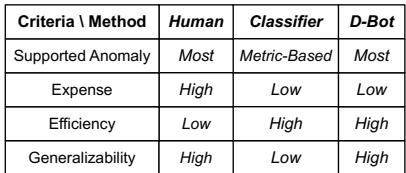

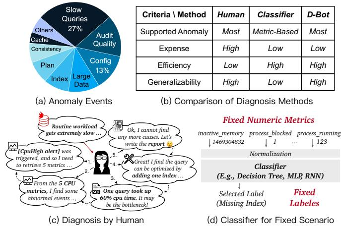  
Figure 1: Database Diagnosis Problem

As a result, database diagnosis is a challenging problem, where “the devil is in the details” [11, 62]. Many companies rely on the expertise of human database administrators (DBAs) to undertake diagnosis tasks. Here we present a simplifed example (Figure 1 (c)): (1) Anomaly Notifcation. The database user notifes an anomaly, e.g., “routine queries ... is 120% slower than the norm ...”; (2) Alert Detection. Upon receiving the user’s notifcation, the DBA frst investigates the triggered alerts. For instance, the DBA discovers a “CPU High” alert, indicating the total CPU usage exceeded 90% for 2 minutes; (3) Metric Analysis. Next the DBA delves deeper to explore more CPU-related metrics (e.g., the number of running or blocked processes, the number of query calls). By analyzing these metrics, the DBA concludes the issue was caused by some resource-intensive queries. (4) Event Analysis. The DBA retrieves the statistics of top-k slow queries (query templates) from database views, and fnds one query consumed nearly 60% of the CPU time. (5) Optimization Advice. The DBA tries to optimize the problematic query (e.g., index update, SQL rewrite) by experience or tools.

The above diagnosis process is inherently iterative (e.g., if the DBA fails to fnd any abnormal queries, she may turn to investigate I/O metrics). Besides, the DBA needs to write a diagnosis report1 to facilitate the user’s understanding, which includes information like root causes together with the detailed diagnosis processes.

However, there exists a signifcant gap between the limited capabilities of human DBAs and the daunting diagnosis issues. Firstly, training a human DBA demands an extensive amount of time, often ranging from months to years, by understanding a large scale of relevant documents (e.g., database tuning guides) and the necessity for hands-on practice. Secondly, it is nearly impossible to employ sufcient number of human DBAs to manage a vast array of database instances (e.g. millions of instances on the cloud). Thirdly, a human DBA may not provide timely responses in urgent scenarios, especially when dealing with correlated issues across multiple database modules, which potentially lead to signifcant fnancial losses. Thus, if typical anomalies can be automatically resolved, it will relieve the burden of human DBAs and save resources.

Driven by this motivation, many database products are equipped with semi-automatic diagnosis tools [19, 21, 29, 30, 32]. However, they have several limitations. First, they are built by empirical rules [11, 62] or small-scale ML models (e.g., classifers [34]), which have poor scenario understanding capability and cannot utilize the diagnosis knowledge. Second, they cannot be fexibly generalized to scenario changes. For empirical methods, it is tedious to manually update and verify rules by newest versions of documents. And learned methods (e.g., XGBoost [8], KNN [16]) require to redesign the input metrics and labels, and retrain models for a new scenario (Figure 1 (d)). Third, these methods have no inference ability as human DBAs, such as recursively exploring system views based on the initial analysis results to infer the root cause.

To this end, we aim to build an intelligent diagnosis system with three main advantages [66]. (1) Precise Diagnosis. First, our system can utilize tools to gather scenario information (e.g., query analysis with fame graph) or derive optimization advice (e.g., index selection), which are necessary for real-world diagnosis. However, that is hardly supported by traditional methods. Second, it can conduct basic logical reasoning (i.e., making diagnosis plans). (2) Expense and Time Saving. The system can relieve human DBAs from on-call duties to some extent (e.g., resolving typical anomalies that rules cannot support). (3) High Generalizability. The system exhibits fexibility in analyzing unseen anomalies based on both the given documents (e.g., new metrics, views, logs) and past experience.

Recent advances in Large Language Models (LLMs) ofer the potential to achieve this goal, which have demonstrated superiority in natural language understanding and programming [42, 43, 69, 70]. However, database diagnosis requires extensive domain-specifc skills and even the GPT-4 model cannot directly master the diagnosis knowledge (lower than 50% accuracy). This poses three challenges.

(C1) How to enhance LLM’s understanding of the diagno-sis problem? Despite pre-trained on extensive corpora, LLMs still struggle in efectively diagnosing without proper prompting (e.g., unaware of the database knowledge). The challenges include (?) extracting useful knowledge from long documents (e.g., correlations across chapters); (??) matching with suitable knowledge by the given context (e.g., detecting an alert of high node load); (???) retrieving tools that are potentially useful (e.g., database catalogs).

(C2) How to improve LLM’s diagnosis performance for single-cause anomalies? With knowledge-and-tool prompt, LLM needs to judiciously reason about the given anomalies. First, diferent from many LLM tasks [12], database diagnosis is an interactive procedure that generally requires to analyze for many times, while LLM has the early stop problem [13]. Second, LLM has a “hallucination” problem [46], and it is critical to design strategies that guide LLM to derive in-depth and reasonable analysis.

(C3) How to enhance LLM’s diagnosis capability for multi-cause anomalies? From our observation, within time budget, a single LLM is hard to accurately analyze for complex anomalies (e.g., with multiple root causes and the critical metrics are in fnergranularity). Therefore, it is vital to design an efcient diagnosis mechanism where multiple LLMs can collaboratively tackle complex database problems (e.g., with cross reviews) and improve both the diagnosis accuracy and efciency.

To tackle above challenges, we propose D-Bot, a database diagnosis system using large language models. First, we extract useful knowledge chunks from documents (summary-tree based knowledge extraction) and construct a hierarchy of tools with detailed usage instructions, based on which we initialize the prompt template for LLM diagnosis (see Figure 3). Second, according to the prompt template, we generate new prompt by matching with most relevant knowledge (key metric searching) and tools (fne-tuned SentenceBert), which LLM can utilize to acquire monitoring and optimization results for reasonable diagnosis. Third, we introduce a tree-based search strategy that guides the LLM to refect over past diagnosis attempts and choose the most promising one, which signifcantly improves the diagnosis performance. Lastly, for complex anomalies (e.g., with multiple root causes), we propose a collaborative diagnosis mechanism where multiple LLM experts can diagnose in an asynchronous style (e.g., sharing analysis results, conducting cross reviews) to resolve the given anomaly.

Contributions. We make the following contributions.

(1) We design an LLM-based database diagnosis framework to achieve precise diagnosis (see Section 3).

(2) We propose a context-aware diagnosis prompting method that empowers LLM to perform diagnosis by (?) matching with relevant knowledge extracted from documents and (??) retrieving tools with a fne-tuned embedding model (see Sections 4 and 5).

(3) We propose a root cause analysis method that improves the diagnosis performance using tree-search-based algorithm that guides LLM to conduct multi-step analysis (see Section 6).

(4) We propose a collaborative diagnosis mechanism to improve the diagnosis efciency, which involves multiple LLMs concurrently analyzing issues by their domain knowledge (see Section 7).

(5) Our experimental results demonstrate that D-Bot can accurately identify typical root causes within acceptable time (see Section 8).

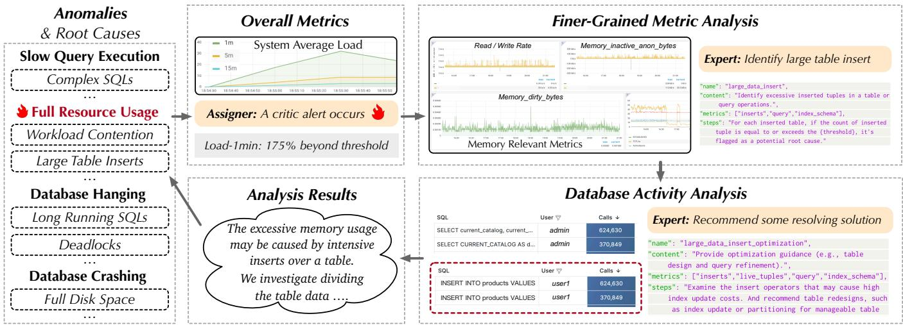  
Figure 2: Example of Database Diagnosis.

## 2 PRELIMINARIES

## 2.1 Database Performance Anomalies

Database Performance Anomalies refer to the irregular or unexpected issues that prevent the database from meeting user perfor mance expectations [35, 45], such as excessively high response time. Figure 2 show four typical database performance anomalies2.

(1) Slow Query Execution. The database experiences longer re sponse time than expectancy. For example, the slow query causes signifcant increase in CPU usage (system load) and query duration time, but the number of active processes remains low.

(2) Full Resource Usage. Some system resource is exhausted, preventing it accepting new requests or even causing errors (e.g., insert failures for running out of memory). For example, the high concurrency workload can not only cause great CPU and memory usage, but signifcantly increases the number of active processes.

(3) Database Hanging. The database becomes unresponsive, which is usually caused by long-running queries, deadlocks, or resource contention. For example, abnormal waits in submitted transactions cause great CPU consumption like the full resource usage anomaly, but it also involves frequent process interrupt and switching.

(4) Database Crashing. The database unexpectedly shuts down, causing data to become inaccessible. A typical root cause is full disk space, which leads to an inability to write new data or perform necessary operations, ultimately resulting in database failure and releasing the acquired resources.

## 2.2 Database Performance Diagnosis

Database Performance diagnosis refers to the process of analyzing and resolving above performance anomalies (usually in the form of a series of anomaly alerts). The primary objective of database diag nosis is to pinpoint the underlying root causes. Here we showcase some example root causes in standalone databases:

(1) Concurrency Workloads: Problems characterized by severe workload contention, where multiple database operations compete for system resources, leading to performance degradation.

(2) Query Operator Issues: Problems like inserting large tables, fetching large volumes of data, and executing complex predicates, which can strain the database system’s processing capabilities.

(3) Planning and Execution: Root causes in this category involve abnormal planning times and prolonged database wait times, indicating inefciencies in query planning and execution processes.

(4) Data-specifc Issues: Problems like data corruption and dead tuples (rows that are no longer needed but remain in the physical storage) may lead to performance problem.

(5) Database Schema and Settings: These issues related to database schema (e.g., indexes) and confguration settings. Examples include missing indexes and small shared bufer sizes, which can impact query optimization and memory management.

(6) Harmful Background Tasks: Some database maintenance tasks, like “vacuum” for storage space reclamation, can become problematic when invoked too frequently (these tasks will compete system resources with user queries).

Once the root causes are identifed, a set of optimization actions can be proposed to resolve these issues and restore normal database operations. Here we showcase some optimization tools.

(1) Query Rewrite Tools. Since most databases are weak in logical transformations [55] (e.g., complex predicate simplifcation), there are external rewrite tools (e.g., around 120 rules in Calcite [4, 65, 67]) that help to optimize slow queries.

(2) Knob Tuning Tools. Improper knob values may cause database failures (e.g., exceeding the maximal connection number) or bad performance (e.g., allocated working memory is too small). Thus, there are tools that utilize rules to provide tuning suggestions [3, 27, 53]. For instance, it increases the value of innodb\_bufer\_pool\_size in MySQL by 5% if the memory usage is lower than 60%.

(3) Index Tuning Tools. Similarly, there are index tuning rules that generate potentially useful indexes [7, 24, 54, 57, 68], such as creating composite index with columns in the same predicate.

Example 1. As shown in Figure 2, given an anomaly alert indicating high memory usage, we frst examine the system load (e.g., node\_memory\_total for memory usage) during the anomaly time. The data confrms an abnormal memory utilization (over 90%). To understand this, we further obtain the relevant memory metrics (e.g., node\_memory\_inactive\_anon\_bytes). Analysis of these metrics suggests that the excessive memory usage may be caused by an intensive workload that inserts data into a table. To address this, we investigate if optimization strategies could help with reducing the memory consumption (e.g., dividing table data into partitions).

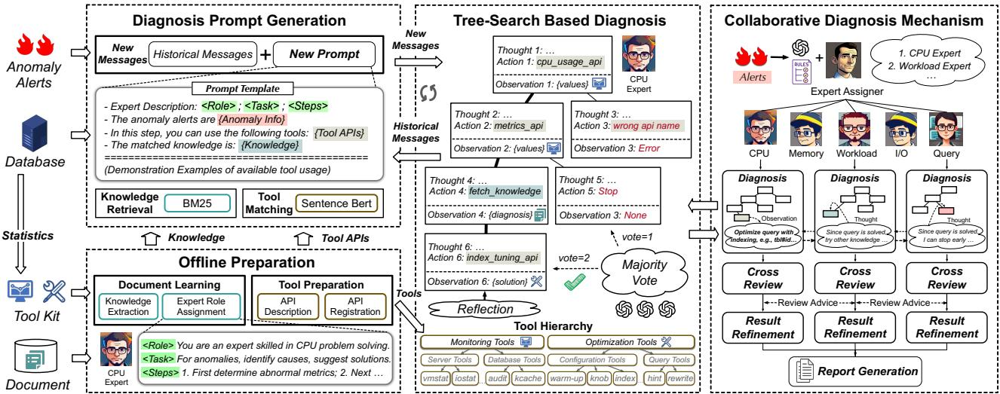  
Figure 3: Database Diagnosis in D-Bot.

## 2.3 Large Language Models

Next, we introduce the fundamental concepts of Large Language Models (LLMs), which are pivotal for harnessing their capabilities in database diagnosis.

Transformer-Based LLMs. Existing LLMs mainly adopt the Transformer architecture, distinguished by its attention mechanism and feed-forward neural networks. Attention mechanism dynamically weighs elements in the input, allowing the model to focus on diferent parts of the text, i.e., the attention scores are computed ( ??? ) as ?????????(?, ?, ? ) = softmax ?? ? , where ? (queries), ? (keys), and ? (values) represent diferent aspects of the text, and ?? is the dimension of the keys. In addition, LLMs include feed-forward neural networks in each layer, which apply position-wise linear transformations to the output of the attention layer. This combination of attention and feed-forward networks facilitate accurate predictions of subsequent text elements.

LLM Prompting. To provide LLM with specifc instructions for guiding their response generation, we can prepend or append a prompt ? to the input ? to create a new input, denoted as ? = ? ⊕? or ? ′ = ? ⊕ ?. LLM then generates the output text based on this modifed input. Note (?) prompting does not require any additional updates to the model parameters and (??) prompts can be manually crafted or automatically learned from data [71].

LLM Fine-tuning involves adjusting the model parameters on a small and task-specifc dataset (e.g., thousands of samples). Initially, the model parameters, denoted as ?, are inherited from the pretraining phase. Fine-tuning aims to minimize the loss function L, tailored to the specifc task (e.g., classifcation or regression), over the task-specifc dataset D. It is represented as ?new = ?old − ? · ∇L (?old; D), where a small learning rate ? is often used to ensure gradual parameter updates [63].

We rely on LLM prompting to guide close-sourced LLMs like GPT-4 to diagnose (see Section 5), and utilize LLM fne-tuning to prepare localized LLMs (see Section 8.5).

## 3 THE OVERVIEW OF D-BOT

We present the challenges and components in D-Bot (Figure 3).

(1) Ofline Preparation. First, ofine preparation equips D-Bot with essential knowledge and tools for database diagnosis, which involves three main steps: (?) Document Learning: We conduct document knowledge extraction by creating summary trees to represent document structures and extracting relevant information via tree traversal (e.g., identifying nodes with similar summaries). (??) Tool Preparation: We set up diagnosis tools by detailing API descriptions and integrating these APIs into D-Bot for use during diagnosis. (???) Expert Role Description: We generate the role descriptions (e.g., expert character, basic diagnosis steps, available tools) of LLM experts through the clustering of knowledge chunks, such that each LLM expert can handle a specifc area of database problems.

(2) Diagnosis Prompt Generation. With all necessary knowl- edge and tools readily available, we create context-aware prompts to steer the diagnosis process. Each prompt integrates fve main parts: (?) Role description, which outlines the expertise and duties of the LLM. (??) Anomaly description that provides the details of triggered alerts (e.g., occurring time, anomaly summary, severity level). (???) Diagnosis tools (e.g., monitoring, indexing, query optimization) matched to the diagnosis context through a fne-tuned Sentence-BERT model. (??) Knowledge chunks pinpointed with keyword search methods (e.g., BM25). (?) Historical message that supply essential background information (e.g., previous tool calling results) to aid the following tree-search-based diagnosis.

(3) Tree-Search Based Diagnosis. LLM encounters challenges like hallucination and unstable LLM responses (e.g., inaccurate API requests, overly general analysis) that can cause diagnosis failures. To address this problem, we introduce a specialized tree-search strategy, which allows LLM to explore multiple possible reasoning chains and efciently fnd the most benefcial chain (based on both the database feedback and LLM evaluations).

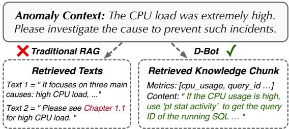  
Figure 4: Comparison of knowledge extraction methods.

(4) Collaborative Diagnosis Mechanism. To manage the in- creasing complexity and resource demands of Tree-Search Based Diagnosis, we employ a Collaborative Diagnosis Mechanism that enhances diagnosis efciency by engaging multiple LLM experts. This process involves (?) identifying relevant LLM experts for a given anomaly; (??) conducting asynchronous diagnosis with these experts (using a more focused set of tools and knowledge chunks); (???) refning diagnosis fndings via cross-review and generating a comprehensive diagnosis report for the anomaly.

## 4 OFFLINE PREPARATION

In this section, we explain how to prepare necessary knowledge and tools for LLM diagnosis.

## 4.1 Document Learning

We frst decide the knowledge format that is suitable to use in LLM prompting. Next, we introduce the extraction method to obtain such knowledge chunks from given documents. Finally, we showcase the obtained knowledge chunks and their clustering results.

4.1.1 Knowledge Format. Similar to the diagnosis evidence in Figure 2, given some documents, the desired knowledge chunk is composed of four parts: (i) “Name” helps LLM to understand the overall function; (ii) “Content” explains how the root cause can impact the database performance (e.g., performance degradation due to an excessive number of dead tuples); (iii) “Metrics” is a list of involved metric names, used for knowledge matching in prompt generation (Section 5.1); (iv) “Steps” provides the detailed procedure of analyzing with the relevant metrics. This allows the LLM to imitate and perform step-by-step analysis.

4.1.2 Knowledge Extraction. Next we explain how to extract such knowledge from documents. In database diagnosis, the relevant documents have two characters, i.e., (?) most documents are of long context involved diversifed aspects (e.g., both resource and confg uration issues are discussed in maintenance guide) and (??) some paragraphs are correlated with each other. For example, the concept of “bloat-table” appearing in “many\_dead\_tuples” (like Chapter 3.2) is explained in another section (like Chapter 1.1.3). Existing document splitting and RAG approaches cannot divide diagnosis documents based on their semantic content. This often results in chunks that are either incomplete or entirely irrelevant, leading to erroneous diagnosis. For instance, traditional RAG erroneously retrieves incomplete chunk that merely refers to other chunks (e.g., “see Chapter 1.1” in Figure 4) and fails to give useful analysis.

Although there are already some long-context LLMs [2] that support long documents as input, they cannot ensure the quality of answered knowledge. For instance, recent studies [25] show that most existing LLMs cannot accurately complete tasks like line retrieval when processing documents containing tens of thousands of tokens, not to mention the processing of diagnosis materials with hundreds of thousands of tokens. Besides, they involve high computational cost. Thus, we propose an algorithm that extracts deterministic knowledge chunks from long-length documents.

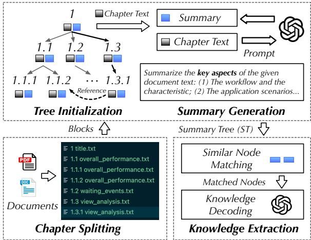  
Figure 5: Summary tree based knowledge extraction.

Step1: Chapter Splitting. Instead of directly splitting documents into fxed-length segments, we divide them based on the chapter structures and their content (e.g., applications split by keywords like “tenant examples”). If a block exceeds the maximum block size (e.g., 4k tokens) that the LLM can handle, we further divide it recursively into smaller blocks. This allows LLMs to accurately summarize or extract the knowledge using appropriate prompts (e.g., “do not miss any details”).

Step2: Summary Tree Construction. Next, based on the chapter relations, we initialize a tree structure, where the root node is the document title and other nodes denote split document blocks. For each node ?, its child node denotes a subsection of chapter ? and node ? includes two parts: (1) the content of chapter ? and (2) the summary of chapter ?, which is created by feeding the content into LLM with a summarization prompt, i.e., ?????????? = “Summarize the provided chunk briefy · · · Your summary will serve as an index for others to fnd technical details related to database maintenance · · · Pay attention to examples even if the chunks cover other topics.”

The generated summary acts as a textual index of the node ?, enabling the matching of blocks with similar content or relations like cross references.

Step3: Knowledge Extraction. After generating the summary tree, LLM parses each document block ? (with content from both node ? and its child nodes) and compares it with the summaries of other blocks having similar content, which is guided by the extraction prompt, i.e., ???????? = “Given a chunk summary, extract diagnosis experience from the chunk. If uncertain, explore diagnosis experience in chunks from child nodes or chunks with similar summaries.”

This way, knowledge that correlates with the key points from the summaries are detected. For each detected knowledge ??, we decide whether to keep ?? in a hybrid manner. Specifcally, if LLM indicates a low likelihood that ?? is redundant (compared with existing knowledge), we will incorporate it. Otherwise, we will conduct a manual examination of ??, where ?? can be kept if we discover any new insights, even though ?? has signifcant overlap with some existing knowledge. In this way, we can ensure the inclusion of most diagnosis knowledge and reduce the potential for redundant information.

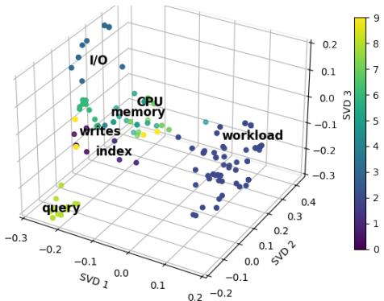  
Figure 6: Clustering results of extracted knowledge.

4.1.3 Clustering Results of Extracted Knowledge. We showcase 188 knowledge chunks extracted from 81 pages of documents, including the general diagnosis guides, cases, and detailed reports3. To derive insights from this diverse set of knowledge chunks, we (?) convert the chunks into numerical vectors using a pre-trained embedding model (e.g., Ada-002 [2]); and (??) apply the DBSCAN algorithm [22] to group knowledge chunks by the similarity of their text embed dings; and (???) reduce the dimensionality of the text embeddings (to three dimensions) using Principal Component Analysis (PCA). In this way, we can visualize the knowledge extraction results in Figure 6, which illustrates that the knowledge distribution largely aligns with the types of root causes (Section 2.2).

It is evident that a knowledge chunk can be relevant to multiple topics (e.g., slow queries may get involved in both CPU and operator analysis). Thus, efective utilization and communication of these knowledge chunks (e.g., experts from diferent topics) are vital for the following diagnosis.

## 4.2 Tool Preparation

Apart from knowledge, human DBAs need to frequently interact with monitoring and optimization tools (e.g., database views, system commands, index tuning tools). To facilitate efective LLM diagnosis, it’s essential to ensure LLM understand the complex API functions within available tools.

First, we establish a structured hierarchy to classify and organize “categories-tools-APIs”, where “APIs” represent the specifc functions of a tool. For example, an index selection tool would be categorized under “optimization”, with “confguration tool” as its tool type, and “heuristic\_index\_selection” as an example API (Figure 3). This hierarchy aids in organizing and understanding the diverse range of database tools.

Second, for each tool function, we provide a detailed utilization specifcation (in the form of function comment). This includes the function’s explanation, its parameters, and relevant use cases (for Section 5.2). For instance, the function explanation for “heuristic\_index\_selection” could be “Automatically select cost-reduction indexes based on query patterns and workload. Arguments include query frequency, data volume, index storage constraints, ...”.

Finally, we dynamically register tool functions by iterating through APIs in the given tool modules, obtaining each API’s function names along with their utilization specifcations.

## 5 DIAGNOSIS PROMPT GENERATION

Next we explain how to automatically generate diagnosis prompts by matching with the extracted knowledge and tools.

## 5.1 Knowledge Retrieval

Apart from knowledge that ofers general diagnosis processes (included in the prompt template), most knowledge chunks are only useful under specifc context. such as the analysis of abnormal CPU metrics (Figure 7). Thus, for a given context (e.g., with 5 abnormal CPU metrics), we adopt the approximate algorithm BM25 [48] to rank the most relevant knowledge chunks. Specifcally, the BM25 algorithm ranks a set of knowledge chunks based on their “metrics” attribute, computed as:

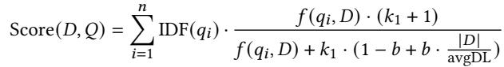

(1)

where ? is a knowledge block, ? is a set of abnormal metrics (by anomaly detection algorithms like KS-Test [5]), ? (??, ?) is the frequency of the metric ?? in ?, avgDL is the average knowledge block length, ?1 and ? are free hyper-parameters. IDF(??) is the inverse document frequency of the metric ?? , computed as:

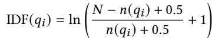

(2)

where ? is the total number of extracted knowledge chunks, and ?(?? ) is the number of documents containing metric ?? .

The advantage of this approach is that we can match knowledge chunks even when the names or meanings of the metrics involved are not exactly the same and easily apply the extract knowledge across diferent monitoring tools or even systems.

## 5.2 Tool Matching

Diferent from matching knowledge chunks with abnormal metrics, database tools involve complex APIs and the API names may not be directly relevant to the context (e.g., APIs like sort\_remove for slow queries). In this way, both the BM25 algorithm and general embedding models [47] may have relatively high error rates. Thus, we propose to fne-tune a more powerful pre-trained Sentence-BERT model [47] that accurately matches suitable tools for an diagnosis context. This procedure includes two main steps, i.e., model fne-tuning and tool matching.

• Sentence-BERT Fine-tuning: Let ? = {?1, ?2, . . . , ?? } denote the set of diagnosis contexts, and ? = {?1, ?2, . . . , ?? } denote the set of database tools. We aim to fne-tune a pre-trained Sentence-BERT model to comprehend the relational context between anomalies and database tools. The fne-tuning process is performed with a labeled the relevance of tool ?? for a diagnosis context ?? . The objective function is computed by cross-entropy loss:

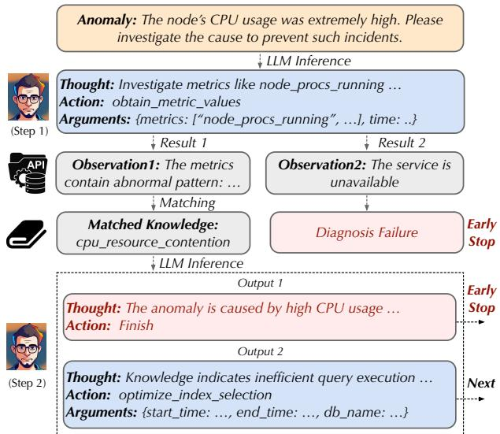  
Figure 7: Example multi-step diagnosis by LLM.

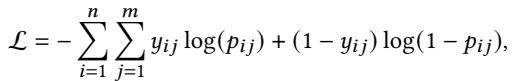

(3)

where ?? ? is the predicted probability that tool ? ? is relevant for anomaly ??, obtained by passing the concatenated embeddings of ?? and ?? through a sigmoid function. Note, since representative anomalies are hard to collect, we sample paths (“[Category]-[Tool]- [API]”) from the tool hierarchy (Section 4.2) and generate diversifed anomalies from each path.

• Suitable Tool Matching: After fne-tuning, the model is em ployed to match the appropriate database tools for a new diagnosis context ?. The matching score between diagnosis context ? and database tool ?? is computed as the cosine similarity between their embeddings, i.e.,

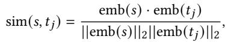

(4)

where emb(.) denotes the embedding function of the fne-tuned Sentence-BERT model. The set of recommended database tools ?ˆ for diagnosis context ? is obtained by selecting the top-? tools with the highest matching scores:

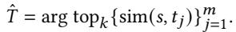

(5)

Finally, the selected top-? tools are integrated into the prompt, including their names, function descriptions, and argument lists, based on which LLMs can generate calling requests and obtain tool execution results to enhance root cause diagnosis.

## , 6 TREE SEARCH FOR LLM DIAGNOSIS

As shown in Figure 7, LLMs employing basic chain of thought methods [56, 60] are prone to mistakes such as (?) generating incorrect tool calling request or encountering request failures (e.g., service temporarily unavailable) and (??) stopping diagnosis early without carefully examining the proposed root causes. Although there are some tree of thought methods [59], they have three limitations (Table 1). First, they only use the basic outputs of LLMs as tree nodes, without integrating diagnosis-specifc tree nodes like knowledgebased analysis. Second, they generate new tree nodes arbitrarily, leading to unnecessary or useless explorations. Third, they rely on basic search algorithms like width-frst search, which cannot fexibly expand the tree based on the diagnosis status of existing tree nodes, resulting in great computation wastes or incomplete diagnosis (given the constraints like time limit). Therefore, we aim to solve these problems through a tree-search based algorithm designed for diagnosis, allowing LLMs to reconsider previous actions if the current action fails or no valuable root causes are identifed.

Table 1: Comparison of Tree Search Methods  
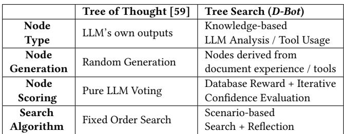

Step 1: Tree Initialization. We initiate by constructing a search tree starting with an “Action Input” root node, which contains the task’s objectives (e.g., “In each state, you frst give some thought to analyze the situation now, together with some tool API calls to actually change the state to the next state. ...”) and relevant input information, such as general knowledge (e.g., common diagnosis steps) and available tool APIs. This initial step guides LLM to explore potential actions, facilitating the addition of new tree nodes.

Step 2: Tree Node Scoring. To expand the initial search tree, we frst assess the beneft scores of all existing leaf nodes based on three criteria: (?) instant beneft feedback from the database, (??) long-term beneft using knowledge-augmented LLMs, and (???) selection frequency.

(1) Instant beneft is calculated by, (?) when the node’s output contains solutions, simulating anomalies in the database (see Section 8.2), deploying the proposed solutions (via optimization tools), and measuring the reduction in workload costs; and (??) the Instant Beneft is set to zero otherwise.

(2) Long-term beneft is evaluated by LLMs with localized knowledge base. With existing leaf nodes as candidates, we prepare detailed prompt (e.g., “You frst analyze all the candidates. Then give your choice of the best candidate ...”) to guide LLM evaluators in their assessment, focusing on (?) closeness to task completion (e.g., the presence of root causes or solutions), (??) performance (e.g., the value of instant beneft), and (???) efciency (e.g., overlap rate with the analysis results of the ancestor nodes). Through multiple rounds of voting, the long-term beneft of a leaf node is quantifed as the total number of valid votes.

(3) Selection frequency is computed as the maximum number of times an ancestor node has been selected, plus one. With these three criteria, we apply formulas like the UCT function [37] to calculate the overall beneft scores of leaf nodes.

Step 3: Tree Node Generation. Next, we expand new child nodes of one existing tree node with the highest beneft score (randomly selecting one if there are multiple tied ones). This involves prompt ing LLM with information from the selected node to suggest new and valid actions in four main sub-steps:

(1) Action Generation: With the information in the selected node as input, LLM generates a “new message” as suggested action.

(2) Action Parsing And Validation: We dissect the new message into segments (e.g., using “\n” as a delimiter), examine whether the frst three segments separately starting with “Thought”, “Action”, and “Action Input”. If so, this message indicates a legal action. In contrast, this message is an illegal action and we require LLM to regenerate (e.g. for at most three times before switching to other nodes or terminating exploration).

(3) Tree Node Creation: We generate a new node, containing (?) the diagnosis state of its parent node, (??) the message generated by LLM, and (???) the outcome, either the execution result (for a tool node) or the knowledge retrieval result (for a knowledge node), derived from executing the command synthesized from the “Action” and “Action Input” segments.

(4) Tree Expansion: We append this new node as a child of the selected tree node, facilitating its expansion and the ongoing update of the search tree.

Step 4: Existing Node Reflection. For each node in the path from the root node to the selected node, we utilize LLM to reassess the benefts of taking the action (e.g., prompting with “make some refection to inherit to later trails”), which are appended to the prompt of child node and afect LLM evaluation during beneft score computation. Nodes deemed to contain no useful information are marked as “pruned” to enhance diagnostic efciency.

Step 5: Terminal Condition. We repeat the above Steps 2-4. If no new root causes (leaf nodes with valid actions) are identifed for a set number of iterations (e.g., 20 steps), the algorithm terminates by outputting the root causes and solutions of the leaf node with the highest beneft score.

## 7 COLLABORATIVE DATABASE DIAGNOSIS

With tool learning and tree search algorithm, single LLM’s diagnosis accuracy can be greatly improved. Nevertheless, we fnd single LLMs have trouble in resolving complex anomalies with multiple causes (e.g., looping over limited causes and struggling to fnd additional ones). Although there are some multi-agent frameworks [10, 18, 39], they (?) lack efcient communication strate gies and (??) do not support backwards feedback augmented by diagnosis knowledge. To address this, we propose a collaborative mechanism where multiple LLMs, each equipped with tools and tree search algorithms, work collectively to tackle complex cases [10].

Step1: Expert Preparation. We initialize 7 LLM experts by the knowledge clustering results (Section 4). Each expert is equipped with diferent knowledge and necessary tools in the prompt.

Step2: Expert Assignment. Next, to avoid resource waste and improve diagnosis efciency, we assign appropriate experts to diagnose. That is, given an anomaly, we frst generate a description of the anomaly (e.g., time period, alert types, severity level). Next, based on the anomaly description, Expert Assigner utilizes an LLM (e.g., GPT-4) to select a set of most relevant experts. For example, CPU Expert for the Load\_High alert and Memory Expert for the Out\_of\_Memory alert. Note we adopt LLM rather than rules, which is more fexible to plugin new alert rules or expert roles.

Table 2: Comparison of Multi-Agent Methods  
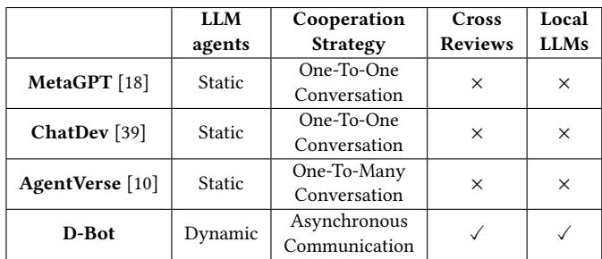

Step3: Asynchronous Diagnosis. The chosen experts simul- taneously diagnose (Section 6). Despite utilizing a common LLM, each expert is uniquely equipped with role-specifc settings and domain knowledge. We enhance the diagnosis process with an asynchronous communication mechanism [23], which is built on the publish-subscribe model. That is, experts “publish” their fndings or updates, which are then automatically “delivered” to other experts who have “subscribed” to these specifc types of updates (e.g., all the reset selected experts).

This mechanism allows for the efcient and non-blocking information exchange (e.g., metric analysis, tool outputs, results) among LLM experts. For instance, the CPU Expert might post a fnding about abnormal CPU load patterns of slow queries, triggering an event-driven notifcation to other experts. This event-driven approach enables the memory expert to promptly detect memory swap activities potentially caused by these slow queries.

Step4: Cross Review. Traditional multi-agent frameworks adopt a sequential pipeline, where one agent’s mistakes cannot be corrected by the next. Instead, D-Bot introduces a cross-review mechanism. This allows all participating LLM experts spot and fx other’s diagnosis errors and leads to more accurate diagnosis.

[Current summary ?? −1]   
- I know the start and end time of the anomaly.   
[New Record ?? ]   
Thought: Now that I have the start and end time of ...   
Action: is\_abnormal\_metric   
Action Input: {“start\_time”: 1684600070, ...}   
Observation: “The metric is abnormal”   
[New summary ?? ]   
- I know the start and end time of the anomaly.   
- I executed is\_abnormal\_metric, and CPU usage is abnormal.

• Incremental Message Summarization. For an expert, it requires dozens of iterations to provide in-depth analysis, resulting in extensive analysis records. Therefore, it is crucial to efectively summarize the key information from these records. To achieve this, we progressively summarize the lines of a record (?? ), which includes inputs for specifc tools and the corresponding results, or relevant knowledge. Specifcally, for each step ?, we maintain a running summary (?? −1), encapsulating previous actions and outcomes. Upon generating the new record ?? , an LLM is assigned to incorporate the main idea of ?? into ?? −1, leading to the new summary ?? .

• Review Advice. Next, each expert gives the improvement advice based on the diagnosis results and summarized procedures of other experts. The review prompt is written like ??????? = “Please review the above diagnosis results, and give necessary advice to correct the incorrect analysis or unclear results.”

Table 3: Micro Benchmark Statistics. The applications cover ten typical root causes (introduced in Section 2.2).  
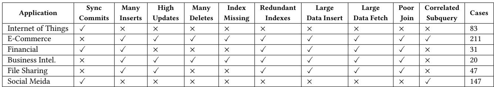

• Diagnosis Refnement. After the cross-review, each expert reevaluates their initial diagnosis and even conducts more inferences (e.g., calling tools to analyze more relevant metrics or settings). In this way, they can incorporate additional evidence, revising hypotheses, or overlooked aspects in the diagnosis results.

Step5: Report Generation. Based on the refned diagnosis results of selected experts, Expert Assigner generates detailed diagnosis report for the given anomaly, including (?) title (summary of the anomaly); (??) anomaly date; (???) detailed anomaly description (from alerts); (??) root causes (within diagnosis results); (??) solu tions (within diagnosis results); (?) summarized diagnosis process.

## 8 EXPERIMENT RESULTS

With the carefully prepared micro benchmark, we conduct extensive experiments to evaluate the proposed techniques in D-Bot.

## 8.1 Environment Setup

Database. We implement D-Bot in PostgreSQL 12.5, using (?) the pg\_stat\_statements plugin for tracking frequent queries, and (??) the hypopg plugin for creating hypothetical indexes [1].

LLMs. Prompt-based LLMs include GPT-4-0613 and gpt-3.5-turbo 16k [2], where the temperature is set to 0 in favor of reproduction. Fine-tuned LLMs include Llama 2, CodeLlama and Baichuan 2.

Evaluated Methods. The evaluated methods include: (1) HumanDBA. A human DBA with 2 years working experience analyze the root causes. (2) D-Bot (GPT-4) is the version of D-Bot driven by GPT-4-0613 (within a limit of 8,192 tokens for each inference), which serves as 8 expert roles with diferent domain knowledge (Section 4.1.3). (3) D-Bot (GPT-3.5) is the version of D-Bot powered by the GPT-3.5 model. In case of exceeding the token limits, we use gpt-3.5-turbo-16k (a maximum of 16,385 tokens). (4) DNN utilizes a two-layer neural network with ReLU activation to classify the input abnormal metric vectors into one or multiple root causes [20]. (5) DecisionTree employs the decision tree algorithm to label the root causes for the input metric values [51]. (6) Random Forest: This model uses an ensemble of decision trees (10 trees) to balance between bias and variance. (7) XGBoost: This model applies gradient boosting that is efective for sparse data and is set up with 10 gradient boosted trees (n\_estimators=10). (8) KNN: For the clustering-based method, we determine the optimal number of neighbors through cross-validation (testing up to 49 neighbors for best accuracy), and the selected best parameter (best\_k=9) is used to predict on scaled test data. (9) GPT-4 model that does not utilize the techniques in D-Bot, which (?) inputs suitable task description and demonstration examples and (??) outputs the root causes. (10) GPT-3.5. Similarly, we test the performance of GPT-3.5 model without techniques in D-Bot.

Ablation Methods. We ofer variants of D-Bot for ablation analysis: (1) NoKnowledge is D-Bot (GPT-4) that does not utilize the extracted knowledge. (2) NoTreeSearch is D-Bot (GPT-4) that adopts the chainof-thought reasoning (e.g., LangChain [6]). (3) SingleLLM is D-Bot (GPT-4) that utilizes single LLM to diagnose.

## 8.2 Micro Diagnosis Benchmark

Based on works like [19, 31], we design a micro benchmark that ofers (?) diversifed anomaly scenarios (e.g., diferent applications, workloads, and anomaly types), (??) executable scripts, (???) clear scenario descriptions (e.g., “In a database of an e-commerce platform, 91 users simultaneously perform searches · · · ”), together with (??) evaluation metrics that can refect the diagnosis performance.

Anomaly Distribution. There are 254 anomalies with single causes and 285 with multiple causes. Single-cause anomalies mainly result from “Missing Indexes”. Other common causes include “Many Updates” and “Redundant Indexes”, pointing to widespread ineffciencies in database operations and data schemas. Multi-cause anomalies are more diverse. The combination of “Sync Commits” and “Many Inserts” is the most frequent, occurring twice as often as any other combination like “Poor Join + Many Updates”. Resolving these anomalies typically requires 13 to 16 actions in D-Bot, suggesting a moderate complexity in the diagnosis process.

Evaluation Metrics. We adopt two metrics for practical diagnosis evaluation. First, like works [28, 34], we use Result Accuracy (Acc) to quantify the precision of recommended root causes, i.e.,

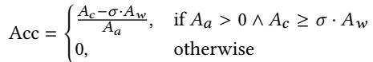

where ?? denotes the number of correct causes, ?? denotes the total number of causes, ?? denotes the number of wrongly detected causes, and ? is a hyper-parameter with 0.1 as the default value, because we identify redundant causes is less harmful than missing causes and restrict to at most 4 root causes for an anomaly.

Second, Human Evaluated Accuracy (HEval) shares the same equation as Acc. However, ?′? in HEval denotes number of causes that (?) are correctly detected and (??) the analysis process also makes sense (human evaluation). HEval is vital to provide reliable diagnosis for online usage.

## 8.3 Performance Comparison

We compare D-Bot with three types of baselines, including manual diagnosis (HumanDBA), existing ML methods (DNN , DecisionTree), and origin LLMs (GPT-4, GPT-3.5). For each application, we sample ten testing anomalies from the micro benchmark. The remaining

Table 4: Performance on diferent anomalies.  
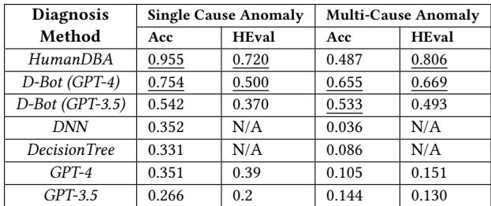

anomalies are used as the training samples for DNN , DecisionTree.   
The performance results are illustrated in Figures 8-9.

Diagnosis Performance. D-Bot achieves competitive performance as HumanDBA, such as outperforming HumanDBA with an accuracy of 80% (D-Bot (GPT-3.5)) for the Social Media application. D-Bot also demonstrates signifcant performance gains over the rest baselines (e.g., accuracy improvements ranging from 8% to 54% against DNN and DecisionTree). The reasons are three-fold.

First, D-Bot can judiciously utilize tools and provide informed diagnosis. For instance, It identifes specifc problems such as “high memory usage due to heavy use of UPDATE and INSERT operations over the same tables” by querying the pg\_stat\_statements view. Conversely, the baselines struggle to detect the root causes, often defaulting to generic advice such as “resolve resource contention issues”, which lack the specifcity needed for actionable improvements, rendering them less efective in practical applications. For the baselines, Random Forest achieves the highest accuracy among the baselines (57.1% in average), but still performs worse than D-Bot (e.g., 73.2% for D-Bot (GPT-4)). By constructing multiple trees and using their average predictions, Random Forest signifcantly reduces the risk of overftting, making it much more robust across diverse samples. Besides, baselines like Random Forest are good at regression tasks involving numeric labels, benefcial for addressing hallucination issues observed in GPT-4 and GPT-3.5.

Second, D-Bot (GPT-4) owns contextual comprehension (LLM) and tree-search reasoning capability. For instance, with the refection mechanism, D-Bot (GPT-4) can follow the most benefcial chain of actions (e.g., calculating the total cost of a plan and deciding the optimization actions). In contrast, the baselines only input with basic abnormal metric values, perform general analysis, and often overlook underlying causes. For instance, in an INSERT\_LARGE\_DATA case, GPT-4 merely identifes an increased count of running processes using the node\_procs\_running metric, resulting in an early diagnosis termination. Moreover, DNN and DecisionTree cannot leverage textual data, leading to their inability to resolve complex anomalies such as Poor Join.

Third, D-Bot (GPT-4) utilizes the document knowledge to learn the analysis of potential performance bottlenecks like correlatedsubquery structure. We fnd GPT-4 and GPT-3.5 tend to make unsupported hypotheses, leading to inaccurate diagnostics. For example, upon detecting SORT operations in logged queries, GPT-3.5 inaccurately attributes the bottleneck to “frequent reading and sorting of large data volumes”, missing query structure problems. Compared to HumanDBA, D-Bot (GPT-4) is more careful in capturing important details that help fnd the root causes. For example, in Social Media, D-Bot (GPT-4) does better than HumanDBA by collecting data from various sources (such as multiple system metrics and how query operators consume resources). This helps uncover problems like high I/O issues caused by concurrent inserts, which HumanDBA might ignore when focusing on a few slow queries.

Finding 1. D-Bot achieves a remarkable improvement over baselines (8% to 54%) due to its advanced contextual understanding and knowledge and tool utilization, and even competes closely with human expertise.

Diagnosis Overhead. (1) Diagnosis Time. HumanDBA needs one to two hours to write a diagnosis report even for typical anomalies. This time is mainly consumed in devising solutions like indexing and query rewriting, even when the root cause is relatively straightforward. Instead, D-Bot, takes ten to several minutes to diagnose relatively complex anomalies (e.g., 5.38 minutes for a composite anomaly ? with two root causes). By testing across 15GB, 37GB, and 100GB databases, we fnd D-Bot performs well with low diagnosis overhead (separately with 4.33 / 5.89 / 4.93 minutes). Because D-Bot can efciently interact with pre-equipped tools (context embedding) and enhance the efciency (collaboration of multiple LLMs). And the utilized tools are plugins like hypopg (building hypothetical indexes rather than actually deploying them) and cost estimators, which are not sensitive to data scaling. However, an increase in query numbers will take up more LLM tokens to describe the workload information and cause high higher inference time (e.g., 22,000 queries for 24.8% more inference time). Traditional classifers have lowest diagnosis time, as they simply map limited metrics to predefned causes. (2) Diagnosis Expense. Traditional classifers and D-Bot are more economical than HumanDBA. DNN and Decision-Tree require minimal system resources. And D-Bot can save much manpower at a minimal fnancial cost (e.g., 1.8 dollar for diagnosing the anomaly ? with 40k LLM tokens).

Performance for Diferent Anomalies. D-Bot (GPT-4), while having lower accuracy in single cause anomalies (0.754), shows a remarkable consistency in multi-cause anomalies with an accuracy of 0.655. This consistency is also refected in the HEval scores (0.500 and 0.669, respectively), suggesting that D-Bot (GPT-4) maintains stable performance across diferent types of anomalies. D-Bot (GPT-3.5) and other methods like DNN , DecisionTree, GPT-4, and GPT-3.5 show a general trend of lower performance in both Acc and HEval, especially in multi-cause anomalies, highlighting the complexity of these scenarios that require advanced diagnosis methods like D-Bot. Meanwhile, for HumanDBA, the HEval scores are relatively high for both single (0.720) and multi-cause anomalies (0.806), demonstrating the necessity of understanding human experience.

LLM Factors. The performance gap between D-Bot (GPT-4) and D-Bot (GPT-3.5) is signifcant, with D-Bot (GPT-4) outperforming D-Bot (GPT-3.5) by up to 30% in accuracy and stability in applications. D-Bot (GPT-4) excels in generating precise tool calling commands and comprehensive diagnosis summaries. For instance, it adeptly identifes complex queries involving large table fetches, a task where D-Bot (GPT-3.5) often falls short. In contrast, D-Bot (GPT-3.5) is prone to producing more generalized and sometimes inaccurate action commands, leading to less efective outcomes.

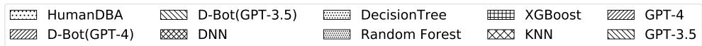

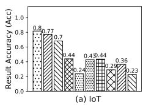

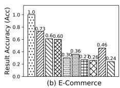

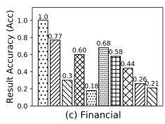

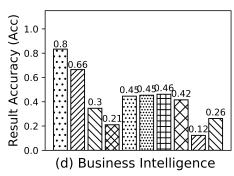

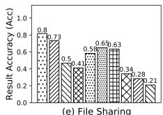

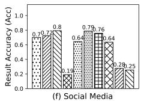  
Figure 8: Performance Comparison (Result Accuracy).

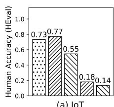

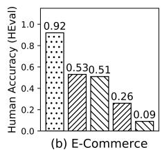

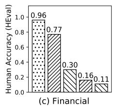

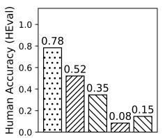

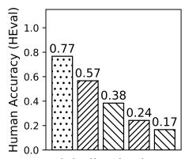

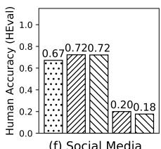  
Figure 9: Performance Comparison (Human Evaluation). We do not include DNN and DecisionTree because they either have th black-box problem or fail to provide root cause analysis that is easy to understand by humans.

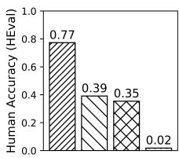

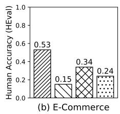

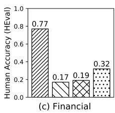

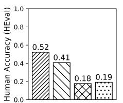

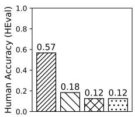

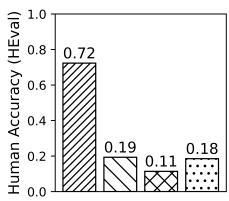  
Figure 10: Ablation Study (Human Evaluation)

## 8.4 Ablation Study

As shown in Figure 10, we verify the efectiveness of (?) document knowledge matching (NoKnowledge), (??) tree-search reasoning (NoTreeSearch), and (???) multi-agent diagnosis (SingleLLM).

8.4.1 Document Knowledge Matching. Without the relevant knowledge in the prompt, LLM experts mainly rely on expert settings (i.e., role, task, steps) to call tools and analyze root causes. When comparing NoKnowledge to D-Bot, we observe a decrease in diagnosis accuracy ranging from 19.2% to 64.1%. We have two observations. First, NoKnowledge produces signifcantly more redundant root causes (e.g., 2.05 times against D-Bot (GPT-4)), as it can’t clearly tell apart relevant root causes using just the context. For instance, root causes like “many inserts” and “large data insert” both involve insert operations, but identifying them correctly requires specifc knowl edge about details like the number of insert operations and table sizes. Second, like the baselines, NoKnowledge often provides very general diagnoses (e.g., “abnormal patterns in CPU processes”) and fails to accurately identify many anomalies. Moreover, we also fnd that, although LLMs like GPT-4 are pre-trained on open corpora, they need external knowledge matching (fne-tuning is limited in updating knowledge) for specialized tasks like database diagnosis.

8.4.2 Tree Search Based Diagnosis. NoTreeSearch diagnoses less efectively than D-Bot (GPT-4), showing a performance decrease by over 35.85%. It verifes that tree search plays an important role in correcting wrong knowledge matching or tool API callings (actions for extending child nodes), which signifcantly enhances the diag nosis accuracy, particularly for single-cause anomalies that involve various reasoning choices. For instance, in scenarios such as identifying specifc query-related issues or optimizing database knobs, tree search enables D-Bot (GPT-4) to navigate through multiple potential solutions and pinpoint the most efective one.

8.4.3 Multi-Agent Diagnosis. Our analysis verifes the efectiveness of multi-agent mode (D-Bot (GPT-4)) over single-agent mode (single). For instance, in the IoT application, D-Bot (GPT-4) achieves a 77.27% success rate in identifying root causes, a substantial increase from the 75.45% success rate of SingleLLM. Besides, our tests on average diagnosis time revealed that D-Bot (multi-agent mode) is more efcient compared to SingleLLM (single-agent mode). The reasons are two-fold. First, D-Bot employs more than two experts in average (at most three), which utilize diferent metrics and domain knowledge to explore root causes and derive more root causes than SingleLLM. And these root causes are further examined, selected and refned during cross-review. Thus, D-Bot achieves higher diagnosis accuracy than SingleLLM. Second, although D-Bot takes time to select experts and conduct cross-reviews, the asynchronous mechanism reduces the iteration turns of tree-search algorithm in single experts, which generally take most diagnosis time. And so D-Bot is also more efcient than SingleLLM in diagnosis time.

(c) Testing Results (Acc)

(d) Testing Results (HEval)

Finding 4. Techniques proposed in D-Bot are crucial to boost diagnosis accuracy by reducing redundant root causes and enhancing precise anomaly identifcation.

## 8.5 Model Fine-tuning

Preparation. We frst record the diagnosis processes of D-Bot (GPT-4) consisting of 5 sub-tasks (e.g., tool calling) and 2819 samples in total (see Figure 11(a)). We mix them together as a multi-task fnetuning dataset. Specifcally, the model input includes the prompt and historical messages, and we fne-tune LLMs to simulate the corresponding D-Bot (GPT-4) response (after cleansed). LLMs are im plemented using PyTorch and BMTrain [63], trained on a machine with 503 GB RAM and 1 NVIDIA A100 GPU.

Training Procedure. We fne-tune three localized SOTA LLMs. As shown in Figure 11(b), all LLMs converge within 10 epochs. We then manually select the best epoch checkpoints (i.e., 4th epoch for Llama 2, 1st epoch for CodeLlama, 10th epoch for Baichuan 2). Note the obvious loss reduction does not mean increasing model performance. We fnd many epoch checkpoints with low losses often over-ft the fne-tuning data (e.g., losing the text generation capabilities and tending to generate short confusing responses). Besides, Llama 2 cannot generate reasonable diagnosis results (Acc equals 0 for most cases) even in the best epoch.

Performance Comparison. As shown in Figure 11(c)-(d), the demonstrated LLMs after fne-tuning achieve comparable performance to GPT-4 in 27 test cases. We have several observations. First, CodeLlama performs best in fnancial, IoT and BI applications, because CodeLlama is specialized for code generation, which is more sensitive to metrics and queries. For instance, it can accurately identify slow queries involving multiple JOINs as root cause. Second, Baichuan2 performs best for fle application, which can assign suitable experts (e.g., Memory Expert), and analyze root causes in detail (e.g., pointing out disk I/O under-provisioned in the hardware confguration). However, the HEval performance of Baichuan2 in fnancial application signifcantly degrades. For example, the model may list many root causes but does not give well-founded analysis. Third, GPT-4 performs best for e-commerce and media applications, and shows balanced performance across all applications. Moreover, the localized LLMs show less generalizability to unfamiliar anom alies. For instance, the number of samples with delete operations as root causes is much smaller than others, causing the fne-tuned LLMs to often fail in these cases.

Finding 5. D-Bot using localized SOTA LLMs can achieve comparable diagnosis performance to D-Bot (GPT-4), but their generalizability is greatly afected by the fne-tuning samples.

## 9 RELATED WORK

Database Diagnosis. Existing works mainly rely on empirical rules and classifcation methods to analyze root causes. The ADDM tool [11] maintains a graph of database resource modules, based on which they estimate the query execution time and infer the bottlenecks. DBSherlock [62] utilizes a decision-tree-like method to construct predicates (in the form of ???? > ?). ISQUAD [34] generates root causes by clustering queries with their metric vectors. However, these methods require great human intervention (e.g., designing rules, features, labels). Besides, they lack some critical capabilities (e.g., accepting new contextual information, analyzing query logs) for real-world diagnosis. Although there are some LLMbased methods that incorporate maintenance knowledge [31], they focus on general chatbot tools (e.g., Q&A exercises) and also fail to conduct scenario-specifc diagnosis.

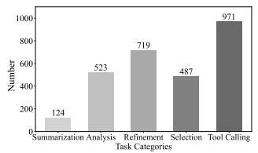  
(a) Subtasks in Finetuning SamplesGPT-

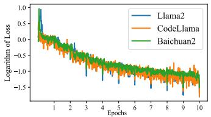  
(b) Training Loss for Localized LLMsGPT-4

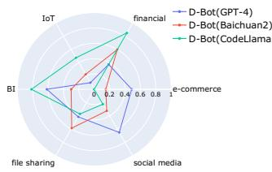

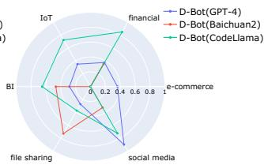  
ring social media file sharing social mediFigure 11: Performance of Model Finetuning.

LLM Agents. Recent works have shown LLMs, when coupled with memory mechanisms and advanced tools, can imitate humanlike interactions and decision-making in real world [41, 50, 59, 64]. First, the augmentation of LLM agents with a variety of tools — ranging from web browser [36, 40] and wikipedia search [52, 61], to code interpreter [9, 15, 33] and multifaceted toolsets [44, 49] — has signifcantly enhanced LLM’s adaptability. Besides individual agent skills, there is increasing interest in coordinating multiple LLM agents to utilize collective intelligence [14, 18, 26, 38, 58]. Notably, AgentVerse [10] shows that teamwork among multiple LLM agents can perform better than single agents in many tasks. D-Bot presents an LLM-powered diagnosis system in the multi-agent paradigm.

## 10 CONCLUSION

In this paper, we proposed a database diagnosis system leveraging large language models (LLMs). We conducted knowledge extraction from documents and prepared function APIs from tools in ofine stage. We matched the knowledge and APIs into LLM prompt for online diagnosis, and we proposed a tree search algorithm to accurately derive root causes and solutions. We designed a collaborative mechanism that improved the efciency with the collaboration of multiple LLMs. Experimental results showed D-Bot achieved remarkable improvements over baselines and human DBAs.

## ACKNOWLEDGMENTS

This paper was supported by National Key R&D Program of China (2023YFB4503600), NSF of China (61925205, 62232009, 62102215), Zhongguancun Lab, Huawei, TAL education, and Beijing National Research Center for Information Science and Technology (BNRist). Guoliang Li is the corresponding author.

## REFERENCES

[1] 2023. HypoPG. Retrieved December 1, 2023 from https://github.com/HypoPG/ hypopg

[2] 2023. OpenAI. Retrieved December 1, 2023 from https://openai.com/

[3] 2023. PGTune - calculate confguration for PostgreSQL based on the maximum performance for a given hardware confguration. Retrieved December 1, 2023 from https://pgtune.leopard.in.ua/

[4] Edmon Begoli, Jesús Camacho-Rodríguez, Julian Hyde, Michael J Mior, and Daniel Lemire. 2018. Apache calcite: A foundational framework for optimized query processing over heterogeneous data sources. In Proceedings of the 2018 International Conference on Management of Data. 221–230.

[5] Vance W Berger and YanYan Zhou. 2014. Kolmogorov–smirnov test: Overview. Wiley statsref: Statistics reference online (2014).

[6] Harrison Chase. 2022. LangChain. https://github.com/hwchase17/langchain.

[7] Surajit Chaudhuri and Vivek R. Narasayya. 1997. An Efcient Cost-Driven Index Selection Tool for Microsoft SQL Server. In VLDB. 146–155.

[8] Tianqi Chen and Carlos Guestrin. 2016. Xgboost: A scalable tree boosting system. In sigkdd. 785–794.

[9] Wenhu Chen, Xueguang Ma, Xinyi Wang, and William W. Cohen. 2022. Program of Thoughts Prompting: Disentangling Computation from Reasoning for Numerical Reasoning Tasks. CoRR abs/2211.12588 (2022). https://doi.org/10. 48550/arXiv.2211.12588 arXiv:2211.12588

[10] Weize Chen, Yusheng Su, Jingwei Zuo, Cheng Yang, Chenfei Yuan, Chen Qian, Chi-Min Chan, Yujia Qin, Yaxi Lu, Ruobing Xie, Zhiyuan Liu, Maosong Sun, and Jie Zhou. 2023. AgentVerse: Facilitating Multi-Agent Collaboration and Exploring Emergent Behaviors in Agents. CoRR abs/2308.10848 (2023). https: //doi.org/10.48550/arXiv.2308.10848 arXiv:2308.10848

[11] Karl Dias, Mark Ramacher, Uri Shaft, Venkateshwaran Venkataramani, and Gra ham Wood. 2005. Automatic Performance Diagnosis and Tuning in Oracle. In Second Biennial Conference on Innovative Data Systems Research, CIDR 2005, Asilomar, CA, USA, January 4-7, 2005, Online Proceedings. www.cidrdb.org, 84–94. http://cidrdb.org/cidr2005/papers/P07.pdf

[12] Ning Ding, Shengding Hu, Weilin Zhao, Yulin Chen, Zhiyuan Liu, Hai-Tao Zheng, and Maosong Sun. 2021. Openprompt: An open-source framework for prompt learning. arXiv preprint arXiv:2111.01998 (2021).

[13] Jesse Dodge, Gabriel Ilharco, Roy Schwartz, Ali Farhadi, Hannaneh Hajishirzi, and Noah Smith. 2020. Fine-tuning pretrained language models: Weight ini tializations, data orders, and early stopping. arXiv preprint arXiv:2002.06305 (2020).

[14] Yilun Du, Shuang Li, Antonio Torralba, Joshua B. Tenenbaum, and Igor Mordatch. 2023. Improving Factuality and Reasoning in Language Models through Multiagent Debate. CoRR abs/2305.14325 (2023). https://doi.org/10.48550/arXiv. 2305.14325 arXiv:2305.14325

[15] Luyu Gao, Aman Madaan, Shuyan Zhou, Uri Alon, Pengfei Liu, Yiming Yang, Jamie Callan, and Graham Neubig. 2023. PAL: Program-aided Language Models. In International Conference on Machine Learning, ICML 2023, 23-29 July 2023, Honolulu, Hawaii, USA (Proceedings of Machine Learning Research, Vol. 202), Andreas Krause, Emma Brunskill, Kyunghyun Cho, Barbara Engelhardt, Sivan Sabato, and Jonathan Scarlett (Eds.). PMLR, 10764–10799. https://proceedings. mlr.press/v202/gao23f.html

[16] Gongde Guo, Hui Wang, David Bell, Yaxin Bi, and Kieran Greer. 2003. KNN model-based approach in classifcation. In CoopIS. Springer, 986–996.

[17] Li Hai-Xiang, Li Xiao-Yan, Liu Chang, and et al. 2021. Systematic defnition and classifcation of data anomalies in DBMS (English Version). arXiv preprint arXiv:2110.14230 (2021).

[18] Sirui Hong, Xiawu Zheng, Jonathan Chen, Yuheng Cheng, Jinlin Wang, Ceyao Zhang, Zili Wang, Steven Ka Shing Yau, Zijuan Lin, Liyang Zhou, Chenyu Ran, Lingfeng Xiao, and Chenglin Wu. 2023. MetaGPT: Meta Programming for Multi-Agent Collaborative Framework. CoRR abs/2308.00352 (2023). https: //doi.org/10.48550/ARXIV.2308.00352 arXiv:2308.00352

[19] Shiyue Huang, Ziwei Wang, Xinyi Zhang, Yaofeng Tu, Zhongliang Li, and Bin Cui. 2023. DBPA: A Benchmark for Transactional Database Performance Anomalies. Proc. ACM Manag. Data 1, 1 (2023), 72:1–72:26. https://doi.org/10.1145/3588926

[20] Lianyuan Jin and Guoliang Li. 2021. AI-based Database Performance Diagnosis. Journal of Software 32, 3 (2021), 845–858.

[21] Prajakta Kalmegh, Shivnath Babu, and Sudeepa Roy. 2019. iQCAR: inter-Query Contention Analyzer for Data Analytics Frameworks. In Proceedings of the 2019 International Conference on Management of Data, SIGMOD Conference 2019, Amsterdam, The Netherlands, June 30 - July 5, 2019, Peter A. Boncz, Stefan Manegold, Anastasia Ailamaki, Amol Deshpande, and Tim Kraska (Eds.). ACM, 918–935. https://doi.org/10.1145/3299869.3319904

[22] Kamran Khan, Saif Ur Rehman, Kamran Aziz, Simon Fong, and Sababady Sarasvady. 2014. DBSCAN: Past, present and future. In ICADIWT 2014. IEEE, 232–238.

[23] Jay Kreps, Neha Narkhede, Jun Rao, et al. 2011. Kafka: A distributed messaging system for log processing. In Proceedings of the NetDB, Vol. 11. Athens, Greece, 1–7.

[24] Hai Lan, Zhifeng Bao, and Yuwei Peng. 2020. An Index Advisor Using Deep Reinforcement Learning. In CIKM. ACM, 2105–2108. https://doi.org/10.1145/ 3340531.3412106

[25] Dacheng Li, Rulin Shao, Anze Xie, Ying Sheng, Lianmin Zheng, Joseph Gonzalez, Ion Stoica, Xuezhe Ma, and Hao Zhang. 2023. How Long Can Context Length of Open-Source LLMs truly Promise?. In NeurIPS 2023 Workshop on Instruction Tuning and Instruction Following.

[26] Guohao Li, Hasan Abed Al Kader Hammoud, Hani Itani, Dmitrii Khizbullin, and Bernard Ghanem. 2023. CAMEL: Communicative Agents for "Mind" Exploration of Large Scale Language Model Society. CoRR abs/2303.17760 (2023). https: //doi.org/10.48550/arXiv.2303.17760 arXiv:2303.17760

[27] Guoliang Li, Xuanhe Zhou, Shifu Li, and Bo Gao. 2019. QTune: A Query-Aware Database Tuning System with Deep Reinforcement Learning. Proc. VLDB Endow. 12, 12 (2019), 2118–2130. https://doi.org/10.14778/3352063.3352129

[28] Zeyan Li, Nengwen Zhao, Mingjie Li, et al. 2022. Actionable and interpretable fault localization for recurring failures in online service systems. In Proceedings of the 30th ACM Joint European Software Engineering Conference and Symposium on the Foundations of Software Engineering. 996–1008.

[29] Ping Liu, Shenglin Zhang, Yongqian Sun, Yuan Meng, Jiahai Yang, and Dan Pei. 2020. FluxInfer: Automatic Diagnosis of Performance Anomaly for Online Database System. In 39th IEEE International Performance Computing and Communications Conference, IPCCC 2020, Austin, TX, USA, November 6-8, 2020. IEEE, 1–8. https://doi.org/10.1109/IPCCC50635.2020.9391550

[30] Xiaoze Liu, Zheng Yin, Chao Zhao, Congcong Ge, Lu Chen, Yunjun Gao, Dimeng Li, Ziting Wang, Gaozhong Liang, Jian Tan, and Feifei Li. 2022. PinSQL: Pinpoint Root Cause SQLs to Resolve Performance Issues in Cloud Databases. In 38th IEEE International Conference on Data Engineering, ICDE 2022, Kuala Lumpur, Malaysia, May 9-12, 2022. IEEE, 2549–2561. https://doi.org/10.1109/ICDE53745.2022.00236

[31] Yuhe Liu, Changhua Pei, Longlong Xu, Bohan Chen, Mingze Sun, Zhirui Zhang, Yongqian Sun, Shenglin Zhang, Kun Wang, Haiming Zhang, et al. 2023. OpsEval: A Comprehensive Task-Oriented AIOps Benchmark for Large Language Models. arXiv preprint arXiv:2310.07637 (2023).

[32] Xianglin Lu, Zhe Xie, Zeyan Li, Mingjie Li, Xiaohui Nie, Nengwen Zhao, Qingyang Yu, Shenglin Zhang, Kaixin Sui, Lin Zhu, and Dan Pei. 2022. Generic and Robust Performance Diagnosis via Causal Inference for OLTP Database Systems. In 22nd IEEE International Symposium on Cluster, Cloud and Internet Computing, CCGrid 2022, Taormina, Italy, May 16-19, 2022. IEEE, 655–664. https://doi.org/10.1109/CCGrid54584.2022.00075

[33] Killian Lucas. 2023. Open Interpreter. https://github.com/charlespwd/projecttitle.

[34] Minghua Ma, Zheng Yin, Shenglin Zhang, and et al. 2020. Diagnosing Root Causes of Intermittent Slow Queries in Large-Scale Cloud Databases. Proc. VLDB Endow. 13, 8 (2020), 1176–1189. https://doi.org/10.14778/3389133.3389136

[35] Haroon Malik and Elhadi M Shakshuki. 2016. Towards identifying performance anomalies. Procedia Computer Science 83 (2016), 621–627.

[36] Reiichiro Nakano, Jacob Hilton, Suchir Balaji, Jef Wu, Long Ouyang, Christina Kim, Christopher Hesse, Shantanu Jain, Vineet Kosaraju, William Saunders, Xu Jiang, Karl Cobbe, Tyna Eloundou, Gretchen Krueger, Kevin Button, Matthew Knight, Benjamin Chess, and John Schulman. 2021. WebGPT: Browserassisted question-answering with human feedback. CoRR abs/2112.09332 (2021). arXiv:2112.09332 https://arxiv.org/abs/2112.09332

[37] Brammert Ottens, Christos Dimitrakakis, and Boi Faltings. 2017. DUCT: An upper confdence bound approach to distributed constraint optimization problems. ACM Transactions on Intelligent Systems and Technology (TIST) 8, 5 (2017), 1–27.

[38] Joon Sung Park, Joseph C. O’Brien, Carrie J. Cai, Meredith Ringel Morris, Percy Liang, and Michael S. Bernstein. 2023. Generative Agents: Interactive Simulacra of Human Behavior. CoRR abs/2304.03442 (2023). https://doi.org/10.48550/arXiv. 2304.03442 arXiv:2304.03442

[39] Chen Qian, Xin Cong, Cheng Yang, Weize Chen, Yusheng Su, and et al. 2023. Communicative Agents for Software Development. arXiv preprint arXiv:2307.07924 (2023).

[40] Yujia Qin, Zihan Cai, Dian Jin, Lan Yan, Shihao Liang, Kunlun Zhu, Yankai Lin, Xu Han, Ning Ding, Huadong Wang, Ruobing Xie, Fanchao Qi, Zhiyuan Liu, Maosong Sun, and Jie Zhou. 2023. WebCPM: Interactive Web Search for Chinese Long-form Question Answering. In Proceedings of the 61st Annual Meeting of the Association for Computational Linguistics (Volume 1: Long Papers), ACL 2023, Toronto, Canada, July 9-14, 2023, Anna Rogers, Jordan L. Boyd-Graber, and Naoaki Okazaki (Eds.). Association for Computational Linguistics, 8968–8988. https: //doi.org/10.18653/v1/2023.acl-long.499

[41] Yujia Qin, Shengding Hu, Yankai Lin, Weize Chen, Ning Ding, Ganqu Cui, Zheni Zeng, Yufei Huang, Chaojun Xiao, Chi Han, Yi Ren Fung, Yusheng Su, Huadong Wang, Cheng Qian, Runchu Tian, Kunlun Zhu, Shihao Liang, Xingyu Shen, Bokai Xu, Zhen Zhang, Yining Ye, Bowen Li, Ziwei Tang, Jing Yi, Yuzhang Zhu, Zhenning Dai, Lan Yan, Xin Cong, Yaxi Lu, Weilin Zhao, Yuxiang Huang, Junxi Yan, Xu Han, Xian Sun, Dahai Li, Jason Phang, Cheng Yang, Tongshuang Wu, Heng Ji, Zhiyuan Liu, and Maosong Sun. 2023. Tool Learning with Foundation Models. CoRR abs/2304.08354 (2023). https://doi.org/10.48550/arXiv.2304.08354 arXiv:2304.08354

[42] Yujia Qin, Shengding Hu, Yankai Lin, and et al. 2023. Tool learning with foundation models. arXiv preprint arXiv:2304.08354 (2023).

[43] Yujia Qin, Shihao Liang, Yining Ye, Kunlun Zhu, Lan Yan, Yaxi Lu, Yankai Lin, Xin Cong, Xiangru Tang, Bill Qian, Sihan Zhao, Runchu Tian, Ruobing Xie, Jie Zhou, Mark Gerstein, Dahai Li, Zhiyuan Liu, and Maosong Sun. 2023. Tool-LLM: Facilitating Large Language Models to Master 16000+ Real-world APIs. arXiv:2307.16789 [cs.AI]

[44] Yujia Qin, Shihao Liang, Yining Ye, Kunlun Zhu, Lan Yan, Yaxi Lu, Yankai Lin, Xin Cong, Xiangru Tang, Bill Qian, Sihan Zhao, Runchu Tian, Ruobing Xie, Jie Zhou, Mark Gerstein, Dahai Li, Zhiyuan Liu, and Maosong Sun. 2023. ToolLLM: Facilitating Large Language Models to Master 16000+ Real-world APIs. CoRR abs/2307.16789 (2023). https://doi.org/10.48550/arXiv.2307.16789 arXiv:2307.16789

[45] Raji Ramachandran, R Nidhin, and PP Shogil. 2018. Anomaly detection in role administered relational databases—A novel method. In ICACCI. IEEE, 1017–1021.

[46] Vipula Rawte, Amit Sheth, and Amitava Das. 2023. A Survey of Hallucination in Large Foundation Models. arXiv preprint arXiv:2309.05922 (2023).

[47] Nils Reimers and Iryna Gurevych. 2019. Sentence-bert: Sentence embeddings using siamese bert-networks. arXiv preprint arXiv:1908.10084 (2019).

[48] Stephen Robertson, Hugo Zaragoza, et al. 2009. The probabilistic relevance framework: BM25 and beyond. Foundations and Trends® in Information Retrieval 3, 4 (2009), 333–389.

[49] Timo Schick, Jane Dwivedi-Yu, Roberto Dessì, Roberta Raileanu, Maria Lomeli, Luke Zettlemoyer, Nicola Cancedda, and Thomas Scialom. 2023. Toolformer: Language Models Can Teach Themselves to Use Tools. CoRR abs/2302.04761 (2023). https://doi.org/10.48550/arXiv.2302.04761 arXiv:2302.04761

[50] Noah Shinn, Federico Cassano, Ashwin Gopinath, Karthik Narasimhan, and Shunyu Yao. 2024. Refexion: Language agents with verbal reinforcement learning. Advances in Neural Information Processing Systems 36 (2024).

[51] Yan-Yan Song and LU Ying. 2015. Decision tree methods: applications for classi fcation and prediction. Shanghai archives of psychiatry 27, 2 (2015), 130.

[52] Harsh Trivedi, Niranjan Balasubramanian, Tushar Khot, and Ashish Sabharwal. 2023. Interleaving Retrieval with Chain-of-Thought Reasoning for Knowledge-Intensive Multi-Step Questions. In Proceedings of the 61st Annual Meeting of the Association for Computational Linguistics (Volume 1: Long Papers), ACL 2023, Toronto, Canada, July 9-14, 2023, Anna Rogers, Jordan L. Boyd-Graber, and Naoak Okazaki (Eds.). Association for Computational Linguistics, 10014–10037. https: //doi.org/10.18653/v1/2023.acl-long.557

[53] Immanuel Trummer. 2022. DB-BERT: A Database Tuning Tool that "Reads the Manual". In SIGMOD ’22: International Conference on Management of Data, Philadelphia, PA, USA, June 12 - 17, 2022, Zachary G. Ives, Angela Bonifati, and Amr El Abbadi (Eds.). ACM, 190–203. https://doi.org/10.1145/3514221.3517843

[54] Gary Valentin, Michael Zuliani, Daniel C. Zilio, Guy M. Lohman, and Alan Skelley. 2000. DB2 Advisor: An Optimizer Smart Enough to Recommend Its Own Indexes. In ICDE. 101–110.

[55] Zhaoguo Wang, Zhou Zhou, Yicun Yang, Haoran Ding, Gansen Hu, Ding Ding, Chuzhe Tang, Haibo Chen, and Jinyang Li. 2022. Wetune: Automatic discovery and verifcation of query rewrite rules. In Proceedings of the 2022 International Conference on Management of Data. 94–107.

[56] Jason Wei, Xuezhi Wang, Dale Schuurmans, Maarten Bosma, Fei Xia, Ed Chi, Quoc V Le, Denny Zhou, et al. 2022. Chain-of-thought prompting elicits reason ing in large language models. Advances in neural information processing systems

35 (2022), 24824–24837.

[57] Kyu-Young Whang. 1987. Index Selection in Relational Databases. Foundations of Data Organization (1987), 487–500.

[58] Qingyun Wu, Gagan Bansal, Jieyu Zhang, Yiran Wu, Shaokun Zhang, Erkang Zhu, Beibin Li, Li Jiang, Xiaoyun Zhang, and Chi Wang. 2023. AutoGen: Enabling Next-Gen LLM Applications via Multi-Agent Conversation Frame work. CoRR abs/2308.08155 (2023). https://doi.org/10.48550/arXiv.2308.08155 arXiv:2308.08155

[59] Shunyu Yao, Dian Yu, Jefrey Zhao, Izhak Shafran, Tom Grifths, Yuan Cao, and Karthik Narasimhan. 2023. Tree of Thoughts: Deliberate Problem Solving with Large Language Models. In NeurIPS, Alice Oh, Tristan Naumann, Amir Globerson, Kate Saenko, Moritz Hardt, and Sergey Levine (Eds.). http://papers.nips.cc/paper\_fles/paper/2023/hash/ 271db9922b8d1f4dd7aaef84ed5ac703-Abstract-Conference.html

[60] Shunyu Yao, Jefrey Zhao, Dian Yu, Nan Du, Izhak Shafran, Karthik Narasimhan, and Yuan Cao. 2022. React: Synergizing reasoning and acting in language models. arXiv preprint arXiv:2210.03629 (2022).

[61] Shunyu Yao, Jefrey Zhao, Dian Yu, Nan Du, Izhak Shafran, Karthik R. Narasimhan, and Yuan Cao. 2023. ReAct: Synergizing Reasoning and Acting in Language Models. In The Eleventh International Conference on Learning Representations, ICLR 2023, Kigali, Rwanda, May 1-5, 2023. OpenReview.net. https://openreview.net/pdf?id=WE\_vluYUL-X

[62] Dong Young Yoon, Ning Niu, and Barzan Mozafari. 2016. DBSherlock: A Performance Diagnostic Tool for Transactional Databases. In Proceedings of the 2016 International Conference on Management of Data, SIGMOD Conference 2016, San Francisco, CA, USA, June 26 - July 01, 2016, Fatma Özcan, Georgia Koutrika, and Sam Madden (Eds.). ACM, 1599–1614. https://doi.org/10.1145/2882903.2915218

[63] Guoyang Zeng, Xu Han, Zhengyan Zhang, Zhiyuan Liu, Yankai Lin, and Maosong Sun. 2023. OpenBMB: Big Model Systems for Large-Scale Representation Learning. In Representation Learning for Natural Language Processing. Springer Nature Singapore Singapore, 463–489.

[64] Xinyang Zhao, Xuanhe Zhou, and Guoliang Li. 2024. Chat2Data: An Interactive Data Analysis System with RAG, Vector Databases and LLMs. Proc. VLDB Endow. (2024).

[65] Xuanhe Zhou, Guoliang Li, Chengliang Chai, and Jianhua Feng. 2021. A Learned Query Rewrite System using Monte Carlo Tree Search. Proc. VLDB Endow. 15, 1 (2021), 46–58. https://doi.org/10.14778/3485450.3485456

[66] Xuanhe Zhou, Guoliang Li, and Zhiyuan Liu. 2023. Llm as dba. arXiv preprint arXiv:2308.05481 (2023).

[67] Xuanhe Zhou, Guoliang Li, Jianming Wu, Jiesi Liu, Zhaoyan Sun, and Xinning Zhang. 2023. A Learned Query Rewrite System. Proc. VLDB Endow. 16, 12 (2023), 4110–4113. https://doi.org/10.14778/3611540.3611633

[68] Xuanhe Zhou, Luyang Liu, and et al. 2022. Autoindex: An incremental index management system for dynamic workloads. In ICDE. IEEE, 2196–2208.

[69] Xuanhe Zhou, Zhaoyan Sun, and Guoliang Li. 2024. DB-GPT: Large Language Model Meets Database. Data Sci. Eng. 9, 1 (2024), 102–111. https://doi.org/10. 1007/S41019-023-00235-6

[70] Yongchao Zhou, Andrei Ioan Muresanu, Ziwen Han, Keiran Paster, Silviu Pitis, Harris Chan, and Jimmy Ba. 2022. Large Language Models Are Human-Level Prompt Engineers. (2022). arXiv:2211.01910 http://arxiv.org/abs/2211.01910

[71] Yongchao Zhou, Andrei Ioan Muresanu, Ziwen Han, Keiran Paster, Silviu Pitis, Harris Chan, and Jimmy Ba. 2022. Large language models are human-level prompt engineers. arXiv preprint arXiv:2211.01910 (2022).