USENIX

THE ADVANCED COMPUTING SYSTEMS ASSOCIATION

# Agentix: An Efficient Serving Engine for LLM Agents as General Programs

Michael Luo, University of California, Berkeley, and Google DeepMind; Xiaoxiang Shi, Shanghai Jiao Tong University; Colin Cai, Tianjun Zhang, Justin Wong, and Yichuan Wang, University of California, Berkeley; Chi Wang, Yanping Huang, and Zhifeng Chen, Google DeepMind; Joseph E. Gonzalez and Ion Stoica, University of California, Berkeley

https://www.usenix.org/conference/nsdi26/presentation/luo

# This paper is included in the Proceedings of the 23rd USENIX Symposium on Networked Systems Design and Implementation.

May 4–6, 2026 • Renton, WA, USA

ISBN 978-1-939133-54-0

Open access to the Proceedings of the 23rd USENIX Symposium on Networked Systems Design and Implementation is sponsored by

# Agentix: An Efficient Serving Engine for LLM Agents as General Programs

Michael Luo1,2 Xiaoxiang Shi3,† Colin Cai1,† Tianjun Zhang1 Justin Wong1 Yichuan Wang1 Chi Wang2 Yanping Huang2 Zhifeng Chen2 Joseph E. Gonzalez1 Ion Stoica1

1UC Berkeley 2Google DeepMind 3Shanghai Jiao Tong University

## Abstract

Large language model (LLM) applications are evolving beyond simple chatbots into dynamic, general-purpose agentic programs, which scale LLM calls and output tokens to help AI agents reason, explore, and solve complex tasks. However, existing LLM serving systems ignore dependencies between programs and calls, missing significant opportunities for optimization. Our analysis reveals that programs submitted to LLM serving engines experience long cumulative wait times, primarily due to head-of-line blocking at both the individual LLM request and the program.

To address this, we introduce Agentix, an LLM serving system that treats programs as first-class citizens to minimize their end-to-end latencies. Agentix intercepts LLM calls submitted by programs, enriching schedulers with programlevel context. We propose two scheduling algorithms—for single-threaded and distributed programs—that preempt and prioritize LLM calls based on their programs’ previously completed calls. Our evaluation demonstrates that across diverse LLMs and agentic workloads, Agentix improves throughput of programs by 4-15× at the same latency compared to state-of-the-art systems, such as vLLM.

## 1 Introduction

Large language models (LLMs) as autonomous agents enhance their problem solving capabilities by scaling their inference computation—that is, increasing the number of output tokens or LLM calls [10, 12, 22, 30, 31, 66]. With more calls and tokens, LLMs endow agents with improved reasoning [19, 75, 83, 84], planning and search capabilities [57, 91], self-reflection from prior experiences [34, 65, 87], and collaboration between multiple agents [20, 77, 95]. These techniques enable agents to effectively navigate external environments via tools [55, 59, 84] and solve complex tasks, such as autonomously browsing the web [27, 82, 92], resolving GitHub issues [29, 73, 79], performing deep research [52], and proving difficult math problems [18, 35].

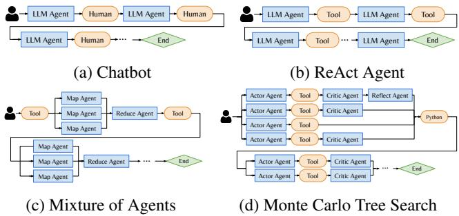  
Figure 1: Execution workflows for Agentic Programs. Agentic programs are highly dynamic execution workflows that follow a directed acyclic graph (DAG). It consists of LLM calls from one or more LLM agents and external interrupts (i.e. tool calls, humans).

The rise of inference-time techniques and agentic applications signifies a shift from static, specialized LLM applications [15, 41] to highly dynamic, general agentic programs [37, 77, 90]. More precisely, an agentic program is a dynamic execution workflow, represented by a directed acyclic graph (DAG), that consists of LLM calls from one or more agents, and external interrupts, which include tool calls (i.e. external API calls), generic code execution, or human inputs (§2). We assume that the LLM invocation pattern of programs emerges only at runtime, making it difficult to fully know or predict the entire graph in advance, which presents challenges beyond static DAG schedulers [4, 14, 41].

Figure 1 illustrates the highly dynamic nature of agentic programs with single and multi-threaded examples. Singlethreaded programs vary in two dimensions: 1) the length of the program, which depends on the user prompt, and 2) the sequence of LLM calls and interrupts, determined by a program’s control flow. For instance, both Chatbot and ReAct (Reasoning and Acting) [84] agents cycle between LLM calls and interrupts (human or tool call) and terminate based on a human or LLM’s decision. (Fig. 1a, 1b) [84]. Multi-threaded programs generally form DAGs. Both Mixture of Agents, used for fact-checking and summarization [23], and Monte Carlo Tree Search (MCTS), widely used for search and planning for reasoning and web-based agents [11, 44, 57, 91]. vary in the number of threads that fork and merge over time, where each thread may contain different sequences of LLM calls and interrupts (Fig. 1c, 1d).

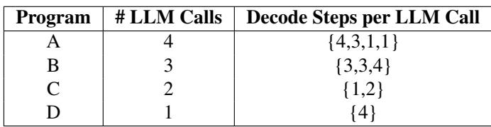

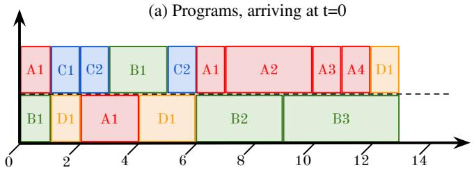  
(c) Multilevel Feedback Queue (MLFQ)

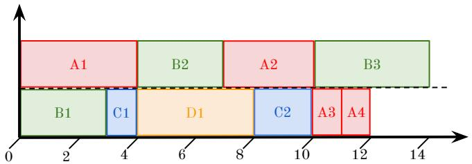

(b) First-Come First-Served (FCFS)  
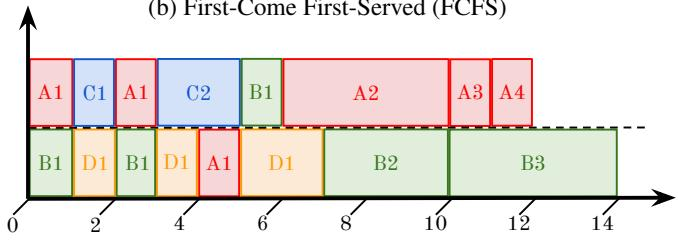  
(d) Program-Level Attained Service (PLAS)  
Figure 2: Gantt chart of LLM call execution on an LLM serving engine with a max batch size (BS) of 2 (Y-axis) over decoding steps (X axis). (a) Four programs vary in the number of LLM calls and decode steps per call. Long programs (A, B) and short programs (C, D) are shown. (b) First-Come First-Served (FCFS) incurs head-of-line blocking as long LLM calls delay short LLM calls, resulting in a waiting time of 18 units. (c) Multilevel Feedback Queue (MLFQ) reduces blocking with preemption but still incurs program-level blocking. Programs A and B’s new LLM calls are placed in the highest priority queue, delaying Program D, incurring 18 units of waiting time. (d) Program-Level Attained Service (PLAS) leverages program-level statistics, delaying subsequent calls in A and B to prioritize programs C and D, reducing waiting time to 12 units.

Existing LLM serving engines, like vLLM [36] and Parrot [41], focus on optimizing individual LLM calls or static LLM applications by improving key-value (KV) cache efficiency [36, 90], accelerating CUDA kernels [76, 94], and better scheduling algorithms for LLM requests [2, 76]. However, these optimizations fail to account for the program-level context, such as the dependencies between LLM calls in the same program or program-level statistics, like total execution time. As a result, these systems often suffer from suboptimal end-to-end performance for complex programs—in particular, programs’ end-to-end latencies (§3).

Figure 2 illustrates a burst of two long programs (A, B) and two short programs (C, D) submitted to an LLM serving engine with a max batch size of 2 at t=0. Each program has one or more LLM calls with varying decoding lengths in Fig. 2a. Under a program-agnostic First-Come-First-Served (FCFS) policy, the default policy for vLLM [36], long LLM calls block other calls from running, resulting in call-level head-of-line (HoL) blocking, as shown in Fig. 2b. Program A and B’s initial, long LLM calls execute first, delaying program C and D’s execution until t=3,4. Repeated cases of HoL blocking result in a total waiting time of 18 units. To address this, preemptive scheduling, such as Multi-Level Feedback Queue (MLFQ) [76], reduces HoL blocking by preempting long LLM calls to let short calls execute. However, without program-level context, newer programs are repeatedly delayed by subsequent calls from older programs, incurring programlevel HoL blocking. In Fig. 2c, MLFQ successfully preempts program A and B’s long calls to start executing C and D. However, MLFQ repeatedly prioritizes A and B’s subsequent calls from t=6-12, which delays program D’s execution. Consequently, MLFQ incurs the same wait time of 18 units as FCFS.

We present Agentix, an LLM inference system designed to run programs, not individual LLM calls. Inspired by OS and DAG schedulers for processes, our key idea is to prioritize LLM calls by the total execution time of their program’s previously completed calls; LLM calls from long programs, which are unlikely to complete soon, are deprioritized, allowing shorter programs to complete first. In Fig. 2d, short programs C and D are no longer blocked by subsequent LLM calls from long programs A and B, effectively eliminating HoL blocking and reducing the total wait time to 12 units.

Agentix introduces a novel framework that leverages global, program-level statistics, such as program’s cumulative execution time on an engine, to minimize waiting times and improve engine throughput. We propose two non-clairvoyant scheduling algorithms that assume no prior workload knowledge of programs: PLAS (Program-Level Attained Service) for single-threaded programs and ATLAS (Adaptive Thread-Level Attained Service) for multi-threaded programs represented as general, dynamic DAGs. PLAS prioritizes LLM calls based on the current cumulative service, or execution times, of their source program. Generalizing PLAS, ATLAS prioritizes LLM calls based on the maximum cumulative service time across all threads in the same program, which sorts calls based on their program’s critical path [88]. Beyond reduced wait times, ATLAS decreases program’s makespans by prioritizing critical LLM calls that would otherwise block programs’ progress (§4).

Programs comprised of tens to hundreds of LLM calls impose significant demands to the serving systems with a single LLM engine capable of handling only 0.2 programs per second for MCTS (§6). Hence, Agentix also routes programs’ LLM calls across multiple engines. For agentic workloads, our key observation is that LLM calls within a program often share common prefixes and cumulative conversation states, while calls across programs typically share only the system prompt [67]. To avoid recomputing the programs’ KV-cache, Agentix respects a program’s data locality by routing long calls to their programs’ engines, while load-balancing shorter calls to other engines, where system prompts make up most of the input for shorter calls.

We implement a system prototype of Agentix as a layer on top of LLM serving engines and expose a stateful API that allows users to establish persistent sessions with Agentix, unlike traditional stateless APIs [51]. We evaluate Agentix across different LLMs and four representative agentic workloads (§6). Our results show that Agentix improves throughput by 4-15x over state-of-the-art inference systems like vLLM [36], or 2-5x over fully optimized engines1. Across engines, Agentix improves throughput by up to 1.5x over standard load-balancers.

In summary, the primary contributions of this paper are:

• This work is the first to formalize agentic programs as dynamic DAGs of LLM calls and interrupts. (§2)

• Agentix utilizes program-level statistics to better inform its scheduler. Agentix’s non-clairvoyant scheduler requires only the cumulative service times of LLM calls within the same program. (§4)

• Agentix leverages a simple load-balancing policy across multiple engines to balance data locality and KV-cache recomputation. (§4)

• Our system is easily deployable, seamlessly integrates a stateful API with existing programming and agent frameworks, and demonstrates significant throughput gains (§6).

## 2 Background & Related Work

To detail relevant context for Agentix, we provide a brief overview of the emergent AI agent infrastructure and its applications, split between the LLM serving layer (§ 2.1) and higher-level agentic layer (§ 2.2), as depicted in Figure 3.

## 2.1 LLM Serving Layer

LLM Engine. LLM serving systems manage both the routing of LLM calls across engines and the execution of LLM calls within each engine (Fig. 3). Within an engine, recent innovations in LLM serving mirror concepts rooted in traditional operating systems (OS), such as memory management, kernel optimization, and scheduling [43,68]. Existing solutions, such as vLLM, integrate virtual memory and paging techniques to reduce KV-cache fragmentation [36], introduce shared memory to cache prefixes across LLM requests like in SGLang [41, 90], and manage cache hierarchies between GPU, CPU, and disk like in FlexGen [62, 64, 94]. Other techniques, such as FlashInfer [85], improve GPU kernel implementations to accelerate self-attention [16], pipeline different operators like in Nanoflow [94], and implement better tensor or pipeline parallelism like in AlpaServe [39,76]. Finally, LLM engines can leverage better scheduling, such as binpacking prefills and decodes together [2] and preempting LLM requests [76], to improve response times or fairness like in VTC [63]. In particular, Agentix innovates and generalizes on top of prior work (VTC, FastServe), leveraging better swap kernels and advanced program-aware, preemptive schedulers to serve programs faster.

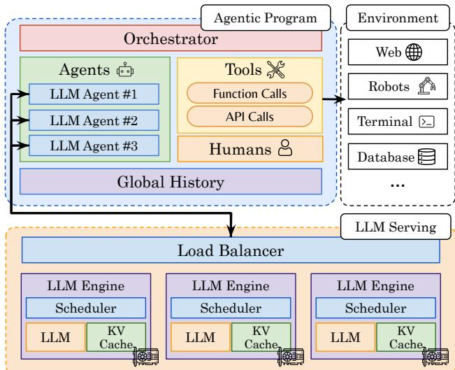  
Figure 3: AI Agent Infrastructure. Top: Developers and users build and execute agentic programs that orchestrate execution and persist global, cumulative history across agents, tools, and humans. Bottom: LLM serving systems process agents’ LLM calls and route calls across one or more LLM engines.

Across Engines. Across multiple LLM engines, serving systems employ load-balancing techniques like Llumnix’s live migration for KV cache and requests [69], Mooncake’s disaggregation of prefills and decodes [58], Preble’s global prefix trees [67] to meet request SLOs and improve tail latencies. Overall, such techniques can immediately benefit Agentix, but are optimized for independent LLM requests, equivalent to a function-call in a general program. Instead, Agentix focuses on program-level optimizations—akin to how traditional OSs manage entire processes across CPU cores.

## 2.2 Agentic Layer

Agentic Programs. Above the LLM inference layer, developers build sophisticated agentic programs to orchestrate interactions between agents, tools, and humans (Fig. 3). Specifically, this work focuses on LLM agents, defined as a tuple consisting of a system prompt specifying the agent’s role and the LLM model class2. Similar to traditional OS processes and interrupts, agentic programs either interact directly with the LLM serving layer via LLM calls or engage in external interrupts—time spent outside an LLM engine. Specifically, agents can interact with tools to execute generic functions or external APIs, enabling control over environments such as databases, robotic systems, or the internet [7,55,59,60,82,93]. Most importantly, agentic orchestration frameworks [50], such as LangChain [15, 37] and Autogen [77], provide developers with primitives to manage a program’s control flow, determining when to execute agents, invoke tools, or request human input. Such primitives adhere to general programming semantics, including conditional statements, loops, error handling, and terminal conditions [32, 37, 77, 90]. Finally, programs maintain a global history of outputs across agents, tools, and humans [37, 41, 54, 80]. For instance, LLM-based chatbots accumulate messages between LLM agents’ outputs and humans’ inputs [48]. Importantly, Agentix does not modify the program layer. Instead, it dynamically builds an internal state of the program’s execution graph (DAG) when the program runs, which is stored in a process table (§5).

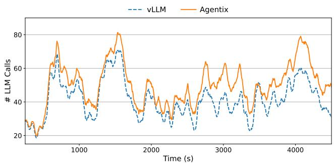  
Figure 4: Number of LLM calls in serving engine during steady state over 1 hour. Optimizing programs’ wait times increases the volume of LLM calls at steady state.

Agentic Applications. Beyond standard chatbots (Fig. 1a), agentic applications, or instantiations of programs, automate or assist with complex tasks, including web or user-interface (UI) navigation (e.g. OpenAI’s Operator) [7, 27, 47, 92], re solving Github issues [29, 73, 79], solving IMO-level problems [18, 35], fact-checking and summarizing claims from multiple sources (Fig. 1c) [23, 41], and performing deep research [52]. Many applications scale inference time compute—the number of LLM calls and, correspondingly, total decode tokens—to improve their performance on complex tasks. These test-time methods include: step-by-step reasoning to decompose tasks [56, 75], explicit thought injection to guide reasoning [84], planning or searching to explore possible solutions [9, 83, 91], self-critique to evaluate actions [42, 89], self-reflection to learn from failures [34, 65], and multi-agent collaboration [21, 77]. In particular, a singlethreaded Reasoning and Acting (ReAct) agent, which combines chain-of-thought (CoT) techniques to efficiently act in an environment (Fig.1b), has recently been integrated on top of Deepseek-style (or o1-style) LLMs to enable automatic reasoning and tool calling [19,73,74]. A multi-threaded program, Monte Carlo Tree Search (MCTS) [91], integrates parallel planning, self-critique, self-reflection, and multi-agent collaboration (Fig. 1d). Beyond MCTS, distributed programs may also incorporate best-of-N sampling, beam search, lookahead techniques, and genetic algorithms to explore and discover optimal solutions [13, 17, 38, 66]. Given the probabilistic nature of LLMs, agentic programs are inherently dynamic (varying execution based on users’ prompts), non-deterministic (unknown termination conditions), and distributed (parallel LLM calls). Consequently, Agentix is non-clairvoyant, operating with no prior knowledge of workloads or execution graphs.

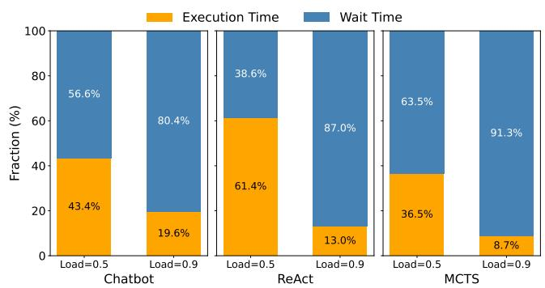  
Figure 5: Program execution and wait times, over different programs and system loads. With moderate loads, programs spend the most time waiting. The duration of waiting depends on the workload.

## 3 Motivation

Today’s AI agent infrastructure decouples LLM serving systems from agentic programs (§2). As organizations shift from serving LLM queries to higher-level AI applications, LLM engines must optimize for program-level objectives, such as response times, or end-to-end latencies [41]. Formally, a single-threaded program’s end-to-end latency comprises three components: (1) waiting time, the total queuing time of a pro gram’s LLM calls on the engine; (2) execution time, the cumulative feedforward time of LLM calls; and (3) interceptions, time spent waiting for external interrupts such as tool calls or human input. Since component (3) is unrelated to LLM serving, this section identifies problems and opportunities to reduce waiting (§3.1) and execution times (§3.2), subsequently addressed in the design of Agentix’s scheduling policies (§4).

## 3.1 Program-level Wait Times

Figure 5 shows that across various agentic workloads—from classic chatbots to ReAct and MCTS programs—the majority of a program’s time is spent waiting as load increases. Hence, Agentix prioritizes reducing wait times, which not only improves program’s latancies, but also increases LLM engine throughput. Faster call completions prompt programs to issue subsequent calls more quickly, increasing the arrival rate of

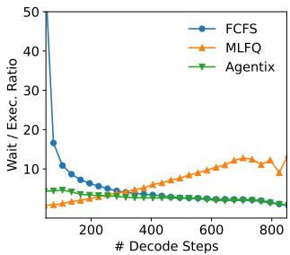  
(a) Chatbot, LLM Calls

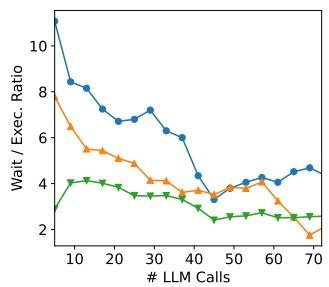  
(b) Chatbot, Programs

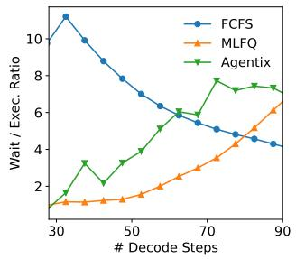  
(c) MCTS, LLM Calls

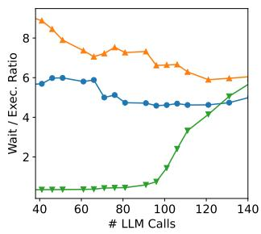  
(d) MCTS, Programs  
Figure 6: Ratio of Waiting to Execution Time for LLM Calls and Programs. Head-of-line blocking occurs when short LLM calls and programs wait significantly longer than their execution times.

LLM calls. Figure 4 illustrates steady-state behavior over a one-hour trace using LLaMA-3.1-8B [24] on a single A100- 80GB GPU for entire chatbot conversations [1]. Compared to vLLM’s first-come, first-served (FCFS) policy, Agentix consistently handles 10 additional concurrent LLM calls, offering more batching opportunities to improve throughput.

Call-level Blocking. The first challenge is LLM call-level head-of-line (HoL) blocking. LLM calls with long decodes delay shorter ones, causing significant wait times [76]. This issue is evident in serving engines like vLLM [36], which wait for ongoing calls to finish decoding before scheduling new ones. HoL blocking is severe in our evaluated workloads with long-tailed distributions of decoding steps (Fig. 11).

To measure blocking, Figure 6 measures the ratio of LLM requests’ waiting time to execution time for Chatbot and MCTS workloads, as a function of output tokens. For FCFS policy, HoL blocking increases wait times for short LLM calls, increasing the ratio. Preemption, similar to how operating system schedulers interrupt long-running processes, mitigates HoL blocking by favoring shorter LLM calls. Figure 6 shows that Multi-Level Feedback Queue (MLFQ), a preemptive algorithm, leads to smaller ratios for short decodes. However, preemption without program-level statistics may not fully resolve the issue, as explained next.

Program-level Blocking. The second challenge is programlevel HoL blocking, where longer programs with many LLM requests delay shorter programs. Existing LLM schedulers are program-agnostic; they schedule individual

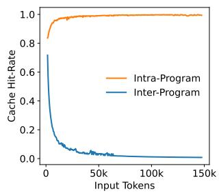  
(a) Single thread: Chatbot

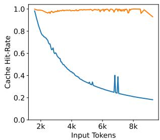  
(b) Multiple threads: MCTS  
Figure 7: Prefix cache hit rates for LLM calls within and across programs. LLM calls within the same program often share KV cache, whereas LLM calls across programs typically do not.

LLM requests without considering their positions within the overall program, leading to suboptimal decisions. Our evaluation shows a long-tailed distribution of LLM calls per program, which increases program-level blocking (§6).

To quantify program-level blocking, Figure 6 measures the ratio of programs’ waiting time to execution time, with respect to number of LLM calls. For both workloads, FCFS and MLFQ incur higher ratios when the number of LLM calls is small, suggesting that short programs wait a long time. Due to this, preemptive scheduling policies, like MLFQ, may perform close to, or even worse, than FCFS (§ 6). Without program-level context, MLFQ blindly prioritizes new LLM requests, leading to starvation of shorter programs when long programs’ new LLM calls are prioritized.

## 3.2 Program-level Execution Times

A program’s execution time largely depends on how efficiently the LLM engine manages the prefill and decoding phases. In agentic workloads, which often feature long, cumulative prefills, Agentix focuses on optimizing prefill performance. Specifically, significant portions of prefill computation can be eliminated through prefix caching. This technique stores and reuses relevant key-value (KV) cache entries—such as the system prompt—across LLM requests [41, 90].

Data Locality. Figure 7 illustrates the average cache-hit rate as a function of input length. The cache-hit rate is defined as the percentage of precomputed input tokens in the LLM engine’s KV cache for an incoming LLM call. Notably, within a single program, cache-hit rates remain above 90% across all input lengths, indicating that LLM calls within the same program share identical contexts. In contrast, when considering different programs, the cache-hit rate decays exponentially with input length, suggesting that programs only share the system prompt. These results suggest that LLM serving systems across engines should consider a program’s data locality, as much of its KV cache can be reused for future LLM requests.

## 4 Agentix Design

We present Agentix’s overall architecture (§4.1) and then explore its two key components: (1) a program-aware scheduler

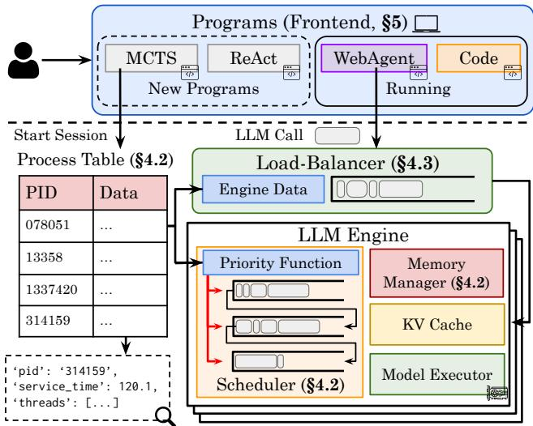  
Figure 8: Agentix’s system architecture. Users run their programs locally, which initiates a stateful session and submits LLM calls to Agentix’s backend. Agentix leverages a global process table to track sessions and better inform its custom load-balancer and scheduler.

(§4.2) designed to reduce both call-level and program-level blocking, and (2) a data locality–aware load balancer (§4.3).

## 4.1 Overview

Agentix is a higher-level serving engine designed for agentic programs rather than individual LLM requests. Agentix focuses on three primary objectives: (1) improving overall program’s end-to-end latency, for users, (2) maximizing GPU utilization for providers, and (3) mitigating program starvation to improve fairness, measured via 95th and 99th percentile latencies.

Assumptions. Agentix is non-clairvoyant; it assumes no knowledge of program arrivals, the structure of executed workflows, or general workload distributions. When a program arrives, its execution DAG is initially unknown; Agentix dynamically constructs an internal representation (IR) as the program runs. This flexibility enables Agentix to generalize to any program that invokes LLM calls on the underlying engine. While prior work [41] submits static LLM applications to the engine, Agentix assumes users run general Python programs on their local machines, which invoke Agentix’s backend (§ 5).

Architecture. Figure 8 illustrates Agentix’s overall architecture. Unlike existing LLM engines, which assumes LLM calls are stateless, Agentix is stateful: programs execute from the user’s local machine, establish a session with the Agentix, and issue LLM calls over time with an associated session ID. We further detail the low-level implementation in Section 5. When a session starts, Agentix adds a corresponding entry to a global process table (§4.2). This table tracks program metadata, including total service time, thread-level metadata, and waiting times across programs’ LLM calls. Both the engine-level scheduler (§4.2) and stateful load balancer (§4.3) leverage the table to schedule LLM calls for the next decoding batch and route LLM calls to an engine based on their program’s data locality.

Algorithm 1 Agentix’s Program-Aware Scheduler   
1: procedure UPDATE\_PROCESS\_TABLE(Call c, Table pt)   
2: pd = pt[c.pid]   
3: // Total service time (PLAS), max critical path (ATLAS)   
4: pd.service = max(pd.service, c.service + c.model\_time)   
5: // Update other metrics...   
6:   
7: end procedure   
8: procedure SCHEDULER(Queues Q ,...,QK, Table pt)   
9: for c ∈ Carrived do ▷ Arriving LLM calls   
10: // Fetch priority with program ID   
11: c.service = pt[c.pid].service   
12: c.q\_idx = i, s.t. Qlow ≤ c.service ≤ Qhi   
13: Qc.q\_idx.append(c), c.quanta = Qc.q\_idx.quanta   
14: end for   
15: for c ∈ {Q1, Q2,..., QK} do   
16: if c.finished() then ▷ Finished jobs update table   
17: UPDATE\_PROCESS\_TABLE(c, pt)   
18: Qc.q\_idx.remove(c)   
19: end if   
20: if c.quanta ≤ 0 then ▷ Call demotion   
21: Qc.q\_idx.remove(c), Qc.q\_idx+1.append(c)   
22: c.q\_idx+ = 1, c.quanta = Qc.q\_idx.quanta   
23: end if   
24: wait = pt[c.pid].wait + c.wait   
25: service = pt[c.pid].service + c.model\_time   
26: if wait/service ≥ β then ▷ Anti-Starvation   
27: Qc.q\_idx.remove(c), Q1.append(c)   
28: // Reset waiting and model execution times   
29: c.wait = 0, c.model\_time = 0   
30: end if   
31: end for   
32: Bout = [] ▷ Schedule next batch of LLM call   
33: for c ∈ {Q , Q ,..., Q } do   
34: if engine.can\_fit(c) then   
35: Bout.append(c)   
36: else   
37: break   
38: end if   
39: end for   
40: end procedure

## 4.2 Program-Aware Scheduler

We present a general, efficient scheduler designed to minimize programs’ response times, or end-to-end latencies, without a-priori knowledge. To mitigate head-of-line blocking at both the program and call levels, Agentix assigns priorities to calls based on program-level statistics (e.g., total accumulated runtime, §4.2.1) and dynamically preempts calls (§4.2.2). The complete scheduling algorithm is shown in Alg. 1.

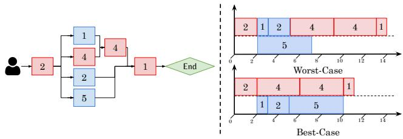  
Figure 9: Critical path for multi-threaded programs. (Left) Example of a critical path through a DAG. (Right) Best-case scenario makespan, 14 units, versus worst-case makespan. 11 units.

## 4.2.1 Program-level Prioritization

To implement program-level prioritization effectively, Agentix relies on a global process table that tracks essential program metrics, enabling more informed scheduling decisions across both single- and multi-threaded programs.

Process Table. Inspired by traditional operating systems, Agentix maintains a global process table that records the state of all running programs. When a new program arrives, Agentix adds a corresponding entry; when the program completes, this entry is removed. Each program entry in the process table tracks the following metrics:

• Service time: For single-threaded programs, this is the cumulative execution time of all completed calls on the LLM engine’s model executor. For multi-threaded programs, it is the longest observed critical path’s execution time.

• Waiting time: The time spent in the LLM engine’s scheduler queue—used for anti-starvation.

• Engine ID(s): The engine(s) that the program is currently running on—used for Agentix’s load-balancer. (§ 4.3).

• Threads Metadata: Each thread corresponds to an active LLM call. Hence, we keep track of a program’s active LLM calls and their individual arrival, waiting, and service times.

• Most recent call arrival: The last time a new LLM call arrived for this program—used for tracking stale programs.

• Most recent call completion: The last time an LLM call finished—used for detecting long external interrupts.

When a program’s LLM call completes, the table is updated accordingly. With the process table, the scheduler can reason about the global state of each program to schedule LLM calls.

Single-Threaded Programs. Scheduling policies like Shortest-Job-First (SJF) and Shortest-Remaining-Processing-Time (SRPT) minimize response times optimally in singleand multi-server settings [5, 25]. However, these require exact knowledge of program runtimes, violating Agentix’s nonclairvoyance assumption. Instead, the Least-Attained-Service (LAS) algorithm [45], widely used in information-agnostic settings such as data center networking [8, 14] and deep learning clusters [26], offers a practical alternative.

We introduce Program-Level Attained Service, or PLAS, extending LAS to programs. For a single-threaded program, its service time is the total runtime of all prior completed LLM calls. Formally, if the jth LLM call c j with program

ID of c j.id is submitted, PLAS assigns a priority p(c j) to c j based on the sum of all runtimes, tk, of all prior LLM calls with the same ID:

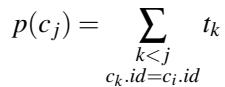

(1)

Here, large priority values mean lower priority. To reduce computation, the scheduler reads the program’s total service time from the process table (Line 11). When an LLM call completes, its program’s total service time is updated (Line 4). Thus, PLAS naturally favors calls from programs that have received less total service, helping shorter programs finish earlier and reducing response times.

Multi-Threaded Programs. Unlike single-threaded programs, multi-threaded programs are modeled as dynamic DAGs of LLM calls. Unfortunately, a program’s completion time is dictated by the DAG’s critical path—the longest sequence of dependent calls from start to finish, illustrated in Figure 9. No matter how many parallel LLM calls an engine can process, the program only terminates when all calls along the critical path have finished. Furthermore, without considering critical paths, schedulers achieve sub-optimal completion times for programs; in Figure 9, the DAG’s makespan increases from 11 to 14 units.

To address this, we introduce Adaptive Thread-Level Attained Service (ATLAS), a pragmatic generalization of PLAS, that prioritizes calls based on their service times along their programs’ critical paths. ATLAS aims to assign each newly arrived call c j a priority p(c j) based on the priorities and completed service times of its parents P (c j) in the same program:

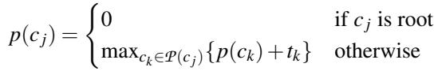

(2)

Here, tk is the execution time of a parent call ck. By recursively combining parent priorities and runtimes, p(c j) estimates the longest chain of accumulated service time leading to cj, providing a non-clairvoyant estimation of the critical path.

However, achieving both objectives—favoring short programs while also prioritizing the longest, critical-path threads—is nontrivial. To solve this, ATLAS maintains a single scalar per program in its process table: the longest observed critical path. Each active LLM call in a program inherits this value as its initial priority, and upon call completion, updates the scalar only if its own critical path is longer (Line 4). This simple mechanism continuously refines the program’s critical path estimate without tracking dependencies between LLM calls. Consequently, ATLAS favors programs and LLM calls with shorter critical paths, effectively approximating a Least-Attained-Service policy for dynamic DAGs. Furthermore, as all calls of a given program derive their priorities from the same entry, the scheduler naturally groups a program’s parallel calls, preventing straggler threads from delaying programs’ completion.

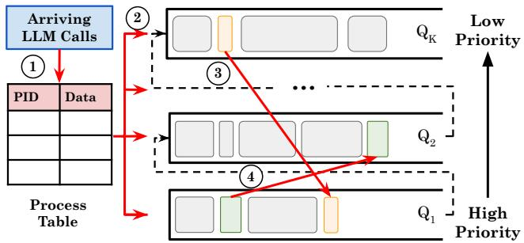  
Figure 10: LLM call lifecycle based on discretized prioritization.

## 4.2.2 Preemptive Scheduling

Agentix assigns priorities to each LLM call based on their program’s history. However, scheduling and preempting programs based on continuous priorities can degrade into worst-case round-robin scheduling [14], which performs worse than FCFS, and incur unnecessary context switches, including frequent KV-cache swaps between CPU and GPU [76]. To avoid this, Agentix discretizes priorities into a finite set of queues, akin to multi-level feedback queues (MLFQ) in operating systems [6, 14, 26].

Multi-level Program-based Scheduling Agentix bins and discretizes LLM calls’ priorities into K queues (Q1, Q2, . . . , QK), where priorities decrease from Q1 to QK. Each queue Qi covers a priority range [Qlo, Qhi), with Qlo = 0, Qhi = ∞, and Qlo = Qhi.

In Figure 10, when an LLM call arrives, Agentix looks up its program’s priority p(c), based on the process table (①, Line 11). Unlike traditional MLFQ, where new calls all start at the highest priority queue Q1, LLM calls are assigned to the ith queue based on discretized priorities, p(c) ∈ [Qlo, Qhi) (②, Line 12). Subsequently, calls receive the queue’s time quantum and execute in FCFS order within their queue (Line 13, 35). Once a call exhausts its quantum, it is demoted to a lower priority queue (③, Lines 20-23). If the call waits too long, Agentix employs anti-starvation mechanisms, described next (④, Lines 24-30). Finally, when a call completes decoding, it updates the process table (Lines 16-18).

Anti-Starvation. Discrete prioritization, or MLFQ-style algorithms, incurs the starvation of long, low-priority programs [14, 26, 76]. Simple anti-starvation techniques—such as promoting calls that have waited past a threshold—reduces Agentix to naive MLFQ, where long program’s LLM calls, which are now in Q , interrupt short programs [6, 76]. Hence, we also utilize the process table to measure program-level starvation. Concretely, for a program p, Agentix promotes call c to Q1 if the ratio of total waiting time (Wtotal = Wp + Wc) to service time (Ttotal = Tp + Tc) exceeds a threshold β: WtotalT ≥ β total Varying β presents a trade off between programs’ average response times and fairness. After promotion, only Wc and Tc, or the calls’ wait and run time, are set to zero, to ensure programs’ threads, or active LLM calls, are likely all promoted together (Line 29).

Algorithm 2 Agentix’s Load Balancer   
1: procedure LOAD\_BALANCER(Call c, Table pt, List Engines)   
2: if LEN(c.tokens) ≤ 2048 then ▷ Small request   
3: assigned\_engine = LEAST\_USED(Engines)   
4: else   
5: if c.pid ∈ pt then ▷ Program already assigned to engine   
6: assigned\_engine = pt[c.pid]   
7: else   
8: // Select the least utilized engine   
9: assigned\_engine = LEAST\_USED(Engines)   
10: pt[c.pid] = assigned\_engine   
11: end if   
12: end if   
13: return assigned\_engine   
14: end procedure   
15: procedure LEAST\_USED(List Engines)   
16: // Query engine workloads in parallel   
17: workloads = QUERY\_ENGINE\_WORKLOADS(Engines)   
18: least\_used\_engine = ARGMIN(workloads)   
19: return least\_used\_engine   
20: end procedure

Memory Management. With preemptive scheduling, LLM engines must handle a large volume of concurrent LLM calls, leading to frequent GPU-CPU transfers as KV-cache blocks are repeatedly swapped to serve different requests [76]. Prior work mitigates this swapping overhead by proactively swapping KV-cache for the next iteration of LLM requests while processing the current ones [76]. However, Agentix is synchronous and requires real-time updates for each call’s time quantum and the process table. Instead, Agentix employs two key optimizations to reduce both the frequency and overhead of GPU-CPU swapping respectively.

First, Agentix reduces total swaps by adopting multi-step scheduling, running the scheduler once every N decoding steps rather than at every step. As some requests may complete early, our scheduler overprovisions queued requests already on the GPU, ensuring that new requests are immediately added when some requests finish before N steps. Second, Agentix employs a more efficient GPU-CPU swap kernel. Instead of calling separate asynchronous transfers for each block, our kernel gathers all KV blocks into a contiguous buffer and transfers them in one operation—increasing PCIe bandwidth by reducing fragmentation, reducing per-block overhead, and lowering end-to-end swap latency (§5).

## 4.3 Load Balancer

As agentic workloads scale, deploying multiple engine replicas is necessary. However, distributing requests without considering data locality yields suboptimal performance [67].

Our analysis for agentic workloads (§3.2) highlights a critical distinction between short and long requests. Short requests below 2048 tokens achieve high cache hit rates (≥ 75%) across any engine, due to common system prompts3. Enforcing data locality for these requests offers negligible gains and risks skewing engine utilization when large, parallel programs dominate specific engines. Thus, simply balancing short requests across the least-loaded engines preserves performance with minimal overhead. Conversely, longer requests are far more sensitive to their programs’ data locality. Their substantial prefix overlap with a given program significantly reduces recomputation when consistently routed to the same engine, justifying occasional queuing delays.

While prior work relies on complex prefix trees to quantify data locality [67], our simple method dynamically routes short requests to the least-loaded engine and pins longer requests to their programs’ corresponding engines. Algorithm 2 formalizes this approach, and our evaluation shows that Agentix’s load balancer improves both throughput and latency across heterogeneous workloads (§6).

## 5 Implementation

Agentix is a multi-engine LLM inference serving system comprising a frontend, scheduler, and load balancer—totaling 5k lines of Python and CUDA/C++ code.

Frontend. Agentix’s frontend extends OpenAI’s Chat Completion and vLLM’s Python APIs [36,49] to provide a stateful interface that appears stateless to developers. Users simply import Agentix’s library into their Python applications, and upon program initialization, Agentix automatically issues a start\_session request to the backend, which populate the process table. When the program completes or errors, Agentix invokes end\_session, removing the table’s entry.

LLM Engine. Agentix builds on vLLM v0.6.1 [36]. To keep changes localized, we modify only the scheduler by integrating new scheduling policies and memory swapping kernels for efficiency. We’ve also noticed in vLLM, each Key-Value (KV) block is transferred individually via cudaMemcpyAsync, creating small fragmented transfers that underutilize PCIe bandwidth and incur high overhead such as repeated DMA setups. To address this, we allocate a host buffer and consolidate all KV blocks into a single contiguous chunk, enabling one bulk transfer. The results are shown in the next section (§6).

Multi-engine. To better evaluate our load balancing strategy, we built AsyncMultiLLMEngine atop of vLLM’s AsyncLLMEngine. Each LLM engine replica runs in a dedicated Python process, and a coordinating meta-engine manages these replicas via standard inter-process communication (IPC) primitives such as mp.Queue and mp.Pipe. When the meta-engine receives a request, it assigns the request to the appropriate replica, returning a future-like object to the frontend without blocking. The selected engine process executes the task asynchronously and sends the completed result back through the IPC channel.

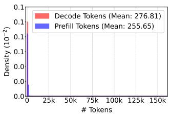  
(a) ShareGPT

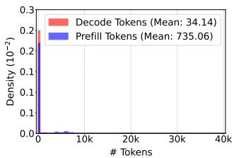  
(b) BFCL

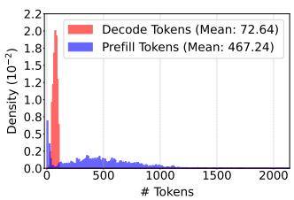  
(c) LATS

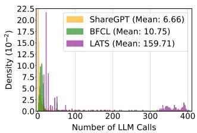  
(d) Number of LLM calls  
Figure 11: Workload analysis. LLM call statistics of programs from each workload. Input and output length distributions for (a) ShareGPT, (b) BFCL, and (c) LATS. Subfigure (d) plots the distribution of number of LLM calls in each workload.

## 6 Evaluation

## 6.1 Workloads

Our real-world experiments evaluate Agentix over four representative agentic workloads, which widely vary in the number of decode tokens, prefill tokens, and the LLM calls (Fig. 11).

Chatbot Agent: ShareGPT [1]. The ShareGPT dataset comprises of user-generated conversational inputs and outputs, typical for chatbot applications. The number of LLM calls follows a long-tailed distribution with a mean of 6.66 and a max of 80 (Fig. 11d). ShareGPT’s conversational nature is evident in its decode-heavy calls, averaging 277 decode tokens versus 256 prefill tokens, where short prompts generate detailed responses (Fig. 11a). Our experiments replay entire conversations as a program rather than the first turn.

ReAct Agent: BFCL [78]. The Berkeley Function Calling Leaderboard (BFCLv3) evaluates LLMs on multi-turn, multi-step tool-usage tasks. Compared to ShareGPT, BFCL’s LLM calls are less long-tailed, with a mean of 10.75 and a maximum of 70 calls per program (Fig. 11d). BFCL is prefill-heavy, averaging 735.06 tokens per call due to long system prompts and detailed tool signatures, while decodes are short, averaging 34.14 tokens (Fig. 11b). BFCL thus encapsulates dynamic workflows that alternate between heavy prefills phases and short decodes with function calls.

Monte Carlo Tree Search: LATS [91]. LATS workloads, derived from running MCTS on HotpotQA [81], are computationally intensive and involve many parallel LLM calls. Each program instance contains on average 159.7 LLM calls—an order of magnitude more than ShareGPT or BFCL workloads (Fig.11d). Moreover, the prefill and decoding phase of each call averages 467.2 and 72.6 tokens respectively (Fig. 11c). These distributions highlight MCTS’s inherently iterative, parallel nature, pushing LLM serving systems to handle large volumes of concurrent calls efficiently.

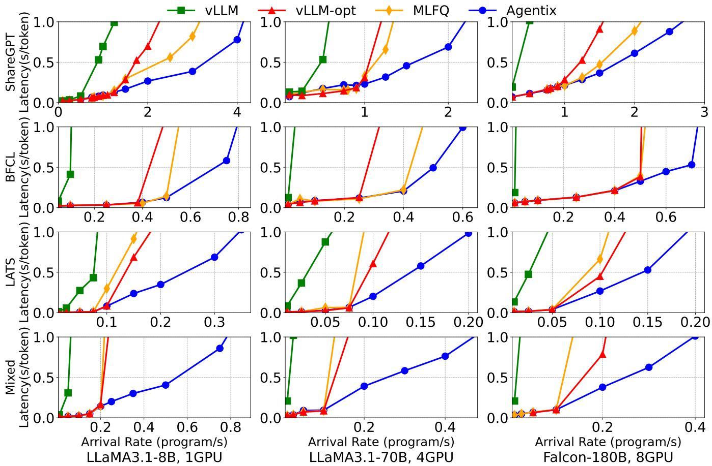  
Figure 12: Single Engine, Main Results. Average latency for different LLM serving systems across four real-world workloads. Figure 12: Single Engine, Main Results. Average latency fo

Mixed. We combine all three workloads, sampling equally from each to ensure diversity. This workload stress tests Agentix’s performance across different program classes.

For our experiments, we synthesize a trace by randomly sampling programs, not LLM calls, from the above workloads and generating programs’ arrivals using a Poisson process λ, following established methodologies [36, 76]. This approach ensures our setup closely reflects real-world scenarios.

## 6.2 Experimental Setup

Models & Testbed. We evaluate on three models: LLaMA-3.1-8B, 70B and Falcon-180B, running on 1, 4, and 8 GPUs, respectively. Experiments are conducted on a GCP Compute Engine a2-ultragpu-8g instance with eight A100-SXM4-80GB GPUs connected via NVLink, 1360 GB host memory, PCIe-4.0×16, and 2 TB of disk space.

Metrics. Existing LLM serving systems focus on requestlevel metrics, such as Time-to-First-Token (TFTT) and Time-per-Output-Token (TPOT), also referred to as token latency [36, 76, 94]. However, these metrics overlook end-toend latency for agentic programs. To that end, we introduce program-level token latency, defined as the average of total program response time divided by the number of tokens generated4. A high-throughput system for programs should retain low program-level latency during high request rates. We note that program-level latency is directly proportional to programs’ average job completion times (JCT). For simplicity, we refer to our metric as latency throughout the evaluation.

Baselines. Our evaluation considers three baselines. All baselines, including Agentix, use the same max batch size.

• vLLM [36]. vLLM is the state-of-the-art, high throughput LLM serving system that integrates continuous batching [86] and PagedAttention [36] to reduce KV cache fragmentation. Its default scheduling policy is FCFS, which is application-unaware and suffers from call-level and program-level HoL blocking. We use vLLM v0.6.1.

• vLLM-opt. An optimized version of vLLM that enables chunk-prefill [3], prefix-caching [41, 90], and multi-step scheduling. Based on vLLM’s blogpost [71], it’s performance closely matches SGLang [90] and TensorRT [46].

• MLFQ. On top of vLLM-opt, it implements preemption via the Multi-Level Feedback Queue algorithm [76]. This baseline ablates the impact of program and call-level blocking.

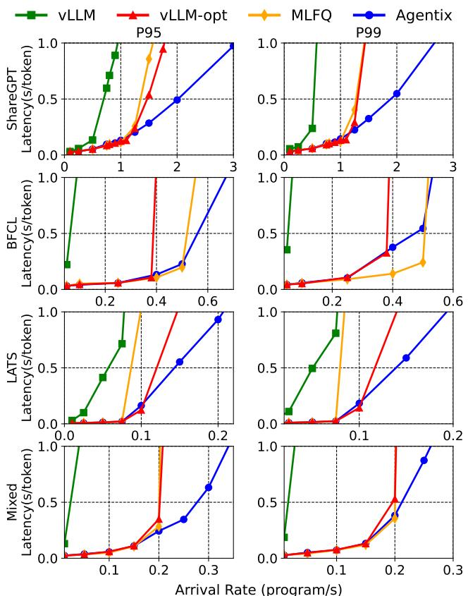  
Figure 13: Single Engine, Tail Latencies. 95th (P95) and 99th (P99) percentile latencies of different serving systems.

## 6.3 End-to-End Single-Engine Performance

Figure 12 compares Agentix against vLLM, vLLM-opt, and MLFQ on four workloads—ShareGPT, BFCL (singlethreaded), LATS (multi-threaded), and Mixed. Agentix delivers the highest throughput for the same token latency, while vLLM trails due to lacking prefix cache (Fig. 7), forcing expensive state recomputation. On ShareGPT and BFCL, FCFS in vLLM and vLLM-opt incurs severe head-of-line (HoL) blocking as arrival rates grow. MLFQ leverages preemption to reduce call-level HoL, yielding 1.5× the throughput of vLLM-opt. By applying PLAS to both call and program-level HoL, Agentix achieves up to 8× vLLM, 2× vLLM-opt, and 1.5× MLFQ throughput at high load. On LATS, Agentix beats vLLM by 5×, MLFQ by 2.5×, and vLLM-opt by 2×. Unlike MLFQ, which stalls programs by chasing short requests, Agentix’s ATLAS gang-schedules programs’ threads to ensure programs’ consistent progress. Finally, on Mixed workloads, Agentix delivers up to 15×, 5.5×, and 5× higher throughput than vLLM, MLFQ, and vLLM-opt respectively, capitalizing on programs’ heterogeneity.

Tail latency. Preemptive scheduling strategies can reduce average latency but risk increasing tail latency by starving long-running programs. Figure 13 reports the 95th (P95) and

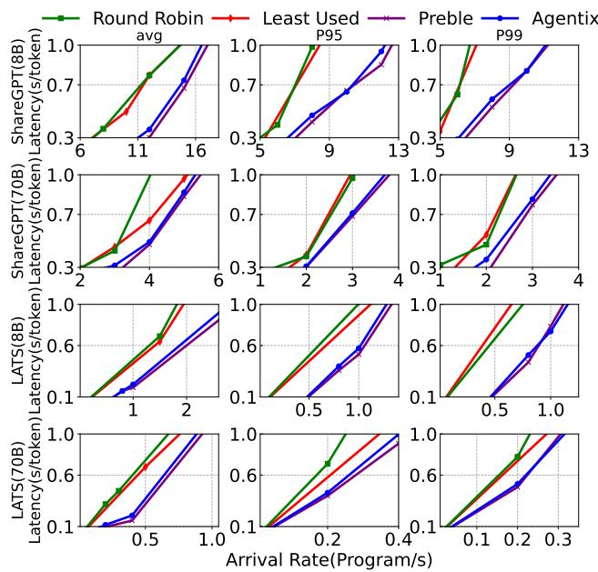  
Figure 14: Multi-engine, Main Results. Latencies (Avg., P95/99) w.r.t. different load balancing policies.

99th (P99) percentile latencies across different workloads on LLaMA-3.1-8B. For ShareGPT, MLFQ significantly improves average latency compared to vLLM-opt (Fig. 12), but exhibits poor P95/99 tail latencies. In contrast, for BFCL, MLFQ outperforms vLLM-opt in both cases. In 7 of 8 scenarios, Agentix maintains consistently lower tail latencies than MLFQ and vLLM-opt and improves throughput by up to 1.7× for P95/99 tail latencies, demonstrating robust performance gains in both average and tail performance metrics.

## 6.4 End-to-End Multi-Engine Performance

To evaluate the effectiveness of Agentix’s data locality-aware load balancer (§4.3), we compare against three load balancing strategies under identical scheduling policies (PLAS, ATLAS):

• Round Robin (RR). Requests are assigned to engines in cyclic order—ensuring an even distribution of requests—default load-balancer policy for Kubernetes [33].

• Least Used. Requests are assigned to the engine with the lowest number of LLM calls in the system, effectively balancing engine workloads.

• Preble [67]. Maintains a global prefix tree that routes long-prefix matched requests to the most data-local engine and short-prefix matched requests to the least-used engine; Agentix approximates this strategy with only program IDs.

We conduct experiements using four replicas of LLaMA3.1- 8B and two replicas of LLaMA3.1-70B with the ShareGPT and LATS workloads. The results, shown in Figure 14, demonstrate Agentix’s effectiveness in maintaining low average and tail latencies across all configurations. Agentix delivers up to 1.4× higher throughput compared to naive baselines while closely matching Preble’s performance without maintaining complex prefix trees. The benefit is more pronounced with ShareGPT, where chat history reuse significantly improves KV-cache locality. These advantages become even more evident as the number of replicas increases, as a larger pool of engines reduces the likelihood of a request being routed to one with it’s locality.

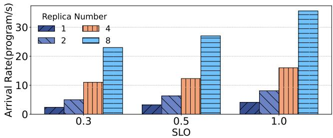

Figure 15: Scalability Experiments. Given same SLO (defined as s/tok), Agentix’s max arrival rate (program/s) scales linearly w.r.t number of replicas, or LLM engines.  
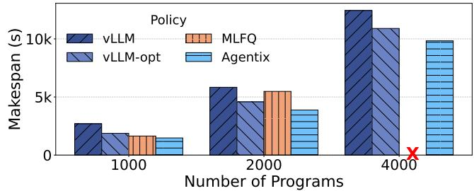  
Figure 16: Offline batch inference. Agentix decreases the time, or makespan, required to process a batch of programs.

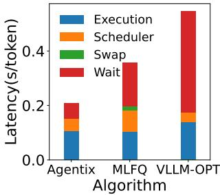  
(a) ShareGPT

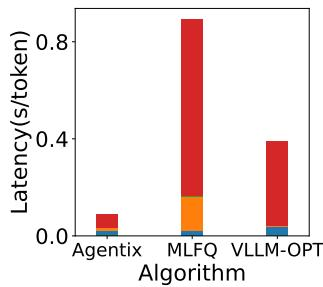  
(b) LATS  
Figure 17: Breakdown of Inference Overheads. Agentix significantly reduces wait time and introduces minor scheduler overheads to vLLM. Agentix also reduces swap times with its improved kernel.

Scalability. To evaluate Agentix’s scalability, we assess performance as the number of replicas increases under various latencies, using the ShareGPT workload with the LLaMA3.1- 8B model. Figure 15 shows linear scaling in all cases. Leveraging program-level load balancing, Agentix effectively scales horizontally without data locality overhead (i.e. prefix trees), making it a robust solution for large-scale LLM deployments.

## 6.5 Ablations

For consistency, all ablations run LLaMA3.1-8B [24] over ShareGPT [1] and LATS [91].

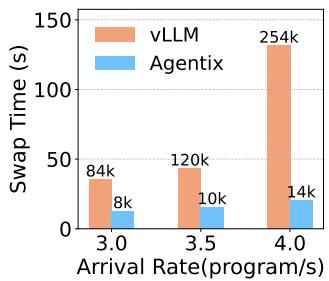  
(a) Swap Times

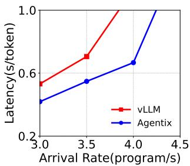  
(b) Throughput  
Figure 18: Impact of Agentix’s swap kernel Agentix reduces total swaps and GPU-CPU swap times, improving throughput.

Offline Inference. In offline scenarios that prioritize throughput over latency, large batches of programs are processed in bulk rather than interactively or in a streaming fashion. We consider a use case where all programs are submitted at the start. Figure 16 presents the makespan of all programs across all systems using the ShareGPT dataset. Agentix consistently outperforms the baselines, decreasing the average makespan by 10-40%. At 4000 programs, MLFQ fails to complete execution. By assigning all new requests to the highest-priority queue, it creates many active LLM requests, causing severe memory contention and frequent GPU-CPU swapping. This overwhelms system resources, resulting in Out-Of-Memory (OOM) errors despite a large swap space (>1.2TB).

Timing Breakdown. Figure 17 decomposes LLM-serving latency for Agentix and it’s baselines. Agentix cuts token latency on ShareGPT and LATS by trimming wait (via program-level scheduling) and swap (via optimized swap kernels). Preemption results in Agentix and MLFQ incurring higher scheduling overheads than vLLM-opt’s FCFS, but Agentix still outperforms MLFQ by using program-aware priorities to spread LLM calls across queues.

Swapping Kernel. Preemptive scheduling increases active LLM calls in the system, incurring high GPU memory utilization. This leads to frequent GPU-CPU swaps for fetching relevant KV cache and significant swapping overheads at high request rates [76]. Agentix mitigates this by batching parallel KV block transfers into a single operation—reducing swaps by up to 18x, swap times by 3-7x, and achieving 1.3x higher throughput than vLLM’s implemented kernel (Fig. 18).

## 7 Conclusion

We introduce Agentix, a distributed LLM-serving system for general, dynamic programs rather than individual LLM calls. By tracking program-level statistics—like cumulative service time—Agentix prioritizes and schedules LLM calls to reduce programs’ end-to-end latency. Our experiments demonstrate that Agentix improves throughput of programs by 4×–15× compared to state-of-the-art systems like vLLM.

## References

[1] Sharegpt. https://huggingface.co/datasets/ anon8231489123/ShareGPT\_Vicuna\_unfiltered, 2023.

[2] Amey Agrawal, Nitin Kedia, Ashish Panwar, Jayashree Mohan, Nipun Kwatra, Bhargav S. Gulavani, Alexey Tumanov, and Ramachandran Ramjee. Taming throughput-latency tradeoff in llm inference with sarathi-serve, 2024.

[3] Amey Agrawal, Ashish Panwar, Jayashree Mohan, Nipun Kwatra, Bhargav S. Gulavani, and Ramachandran Ramjee. Sarathi: Efficient llm inference by piggybacking decodes with chunked prefills, 2023.

[4] Apache Airflow. Apache airflow, 2025. Accessed: April 25, 2025.

[5] Muhammad Akhtar, Bushra Hamid, Inayat Ur-Rehman, Mamoona Humayun, Maryam Hamayun, and Hira Khurshid. An optimized shortest job first scheduling algorithm for cpu scheduling. J. Appl. Environ. Biol. Sci. , 5(12)42-46, 2015, 5:42–46, 01 2015.

[6] Remzi H. Arpaci-Dusseau and Andrea C. Arpaci Dusseau. Operating systems: Three easy pieces - cpu scheduling: Multi-level feedback queue. Online; accessed December 8, 2024, 2018. Available at https://pages.cs.wisc.edu/\~remzi/OSTEP/ cpu-sched-mlfq.pdf.

[7] Hao Bai, Yifei Zhou, Mert Cemri, Jiayi Pan, Alane Suhr, Sergey Levine, and Aviral Kumar. Digirl: Training in-the-wild device-control agents with autonomous reinforcement learning, 2024.

[8] Wei Bai, Li Chen, Kai Chen, Dongsu Han, Chen Tian, and Hao Wang. Information-Agnostic flow scheduling for commodity data centers. In 12th USENIX Symposium on Networked Systems Design and Implementation (NSDI 15), pages 455–468, Oakland, CA, May 2015. USENIX Association.

[9] Maciej Besta, Nils Blach, Ales Kubicek, Robert Gerstenberger, Michal Podstawski, Lukas Gianinazzi, Joanna Gajda, Tomasz Lehmann, Hubert Niewiadomski, Piotr Nyczyk, and Torsten Hoefler. Graph of thoughts: Solving elaborate problems with large language models. Proceedings of the AAAI Conference on Artificial Intelligence, 38(16):17682–17690, March 2024.

[10] Bradley Brown, Jordan Juravsky, Ryan Ehrlich, Ronald Clark, Quoc V. Le, Christopher Ré, and Azalia Mirhoseini. Large language monkeys: Scaling inference compute with repeated sampling, 2024.

[11] Sequoia Capital. Generative ai’s act i: The era of creation, 2024. Accessed: 2024-11-19.

[12] Lingjiao Chen, Jared Quincy Davis, Boris Hanin, Peter Bailis, Ion Stoica, Matei Zaharia, and James Zou. Are more llm calls all you need? towards scaling laws of compound inference systems, 2024.

[13] Yinlam Chow, Guy Tennenholtz, Izzeddin Gur, Vincent Zhuang, Bo Dai, Sridhar Thiagarajan, Craig Boutilier, Rishabh Agarwal, Aviral Kumar, and Aleksandra Faust. Inference-aware fine-tuning for best-of-n sampling in large language models, 2024.

[14] Mosharaf Chowdhury and Ion Stoica. Efficient coflow scheduling without prior knowledge. In Proceedings of the 2015 ACM Conference on Special Interest Group on Data Communication, SIGCOMM ’15, page 393–406, New York, NY, USA, 2015. Association for Computing Machinery.

[15] LangChain Contributors. Langchain: Building applications with llms through composability. https://www. langchain.com, 2023. Accessed: November 19, 2024.

[16] Tri Dao, Daniel Y. Fu, Stefano Ermon, Atri Rudra, and Christopher Ré. Flashattention: Fast and memoryefficient exact attention with io-awareness, 2022.

[17] Jared Quincy Davis, Boris Hanin, Lingjiao Chen, Peter Bailis, Ion Stoica, and Matei Zaharia. Networks of networks: Complexity class principles applied to compound ai systems design, 2024.

[18] DeepMind. Ai solves imo problems at silver medal level. https://tinyurl.com/brmnma2a, 2024. Accessed: 2024-11-18.

[19] DeepSeek-AI. Deepseek-r1: Incentivizing reasoning capability in llms via reinforcement learning, 2025.

[20] Yilun Du, Shuang Li, Antonio Torralba, Joshua B. Tenenbaum, and Igor Mordatch. Improving factuality and reasoning in language models through multiagent debate, 2023.

[21] Yilun Du, Shuang Li, Antonio Torralba, Joshua B. Tenenbaum, and Igor Mordatch. Improving factuality and reasoning in language models through multiagent debate, 2023.

[22] Jonathan Evans. Heuristic and analytic processes in reasoning. British Journal of Psychology, 75(4):451–468, 1984.

[23] Genspark. Genspark: The ai agent engine, 2024.

[24] Aaron Grattafiori, Abhimanyu Dubey, Abhinav Jauhri, et al. The llama 3 herd of models, 2024.

[25] Isaac Grosof, Ziv Scully, and Mor Harchol-Balter. Srpt for multiserver systems. Performance Evaluation, 127-128:154–175, 2018.

[26] Juncheng Gu, Mosharaf Chowdhury, Kang G. Shin, Yibo Zhu, Myeongjae Jeon, Junjie Qian, Hongqiang Liu, and Chuanxiong Guo. Tiresias: A gpu cluster manager for distributed deep learning. In Proceedings of the 16th USENIX Conference on Networked Systems Design and Implementation, NSDI’19, page 485–500, USA, 2019. USENIX Association.

[27] Izzeddin Gur, Hiroki Furuta, Austin Huang, Mustafa Safdari, Yutaka Matsuo, Douglas Eck, and Aleksandra Faust. A real-world webagent with planning, long context understanding, and program synthesis, 2024.

[28] Albert Q. Jiang, Alexandre Sablayrolles, Arthur Mensch, Chris Bamford, Devendra Singh Chaplot, Diego de las Casas, Florian Bressand, Gianna Lengyel, Guillaume Lample, Lucile Saulnier, Lélio Renard Lavaud, Marie-Anne Lachaux, Pierre Stock, Teven Le Scao, Thibaut Lavril, Thomas Wang, Timothée Lacroix, and William El Sayed. Mistral 7b, 2023.

[29] Carlos E Jimenez, John Yang, Alexander Wettig, Shunyu Yao, Kexin Pei, Ofir Press, and Karthik R Narasimhan. SWE-bench: Can language models resolve real-world github issues? In The Twelfth International Conference on Learning Representations, 2024.

[30] Daniel Kahneman. Maps of bounded rationality: Psychology for behavioral economics. The American Economic Review, 93(5):1449–1475, 2003.

[31] Daniel Kahneman. Thinking, Fast and Slow. Allen Lane, 2011.

[32] Omar Khattab, Arnav Singhvi, Paridhi Maheshwari, Zhiyuan Zhang, Keshav Santhanam, Sri Vardhamanan, Saiful Haq, Ashutosh Sharma, Thomas T. Joshi, Hanna Moazam, Heather Miller, Matei Zaharia, and Christopher Potts. Dspy: Compiling declarative language model calls into self-improving pipelines, 2023.

[33] Kubernetes Manual. https://kubernetes.io/docs/ home/, 2017. [Online; accessed 04-Dec-2017].

[34] Aviral Kumar, Vincent Zhuang, Rishabh Agarwal, Yi Su, John D Co-Reyes, Avi Singh, Kate Baumli, Shariq Iqbal, Colton Bishop, Rebecca Roelofs, Lei M Zhang, Kay McKinney, Disha Shrivastava, Cosmin Paduraru, George Tucker, Doina Precup, Feryal Behbahani, and Aleksandra Faust. Training language models to self-correct via reinforcement learning, 2024.

[35] Adarsh Kumarappan, Mo Tiwari, Peiyang Song, Robert Joseph George, Chaowei Xiao, and Anima Anandkumar. Leanagent: Lifelong learning for formal theorem proving, 2024.

[36] Woosuk Kwon, Zhuohan Li, Siyuan Zhuang, Ying Sheng, Lianmin Zheng, Cody Hao Yu, Joseph E. Gonzalez, Hao Zhang, and Ion Stoica. Efficient memory management for large language model serving with pagedattention, 2023.

[37] LangChain Inc. Langgraph: A library for building stateful, multi-actor applications with llms. https://github.com/langchain-ai/langgraph, 2024. Accessed: 2024-11-18.

[38] Kuang-Huei Lee, Ian Fischer, Yueh-Hua Wu, Dave Marwood, Shumeet Baluja, Dale Schuurmans, and Xinyun Chen. Evolving deeper llm thinking, 2025.

[39] Zhuohan Li, Lianmin Zheng, Yinmin Zhong, Vincent Liu, Ying Sheng, Xin Jin, Yanping Huang, Zhifeng Chen, Hao Zhang, Joseph E. Gonzalez, and Ion Stoica. Alpaserve: Statistical multiplexing with model parallelism for deep learning serving, 2023.

[40] Eric Liang, Richard Liaw, Philipp Moritz, Robert Nishihara, Roy Fox, Ken Goldberg, Joseph E. Gonzalez, Michael I. Jordan, and Ion Stoica. Rllib: Abstractions for distributed reinforcement learning, 2018.

[41] Chaofan Lin, Zhenhua Han, Chengruidong Zhang, Yuqing Yang, Fan Yang, Chen Chen, and Lili Qiu. Parrot: Efficient serving of llm-based applications with semantic variable, 2024.

[42] Michael Luo, Justin Wong, Brandon Trabucco, Yanping Huang, Joseph E. Gonzalez, Zhifeng Chen, Ruslan Salakhutdinov, and Ion Stoica. Stylus: Automatic adapter selection for diffusion models, 2024.

[43] Kai Mei, Xi Zhu, Wujiang Xu, Wenyue Hua, Mingyu Jin, Zelong Li, Shuyuan Xu, Ruosong Ye, Yingqiang Ge, and Yongfeng Zhang. Aios: Llm agent operating system, 2024.

[44] Niklas Muennighoff, Zitong Yang, Weijia Shi, Xiang Lisa Li, Li Fei-Fei, Hannaneh Hajishirzi, Luke Zettlemoyer, Percy Liang, Emmanuel Candès, and Tatsunori Hashimoto. s1: Simple test-time scaling, 2025.

[45] Misja Nuyens and Adam Wierman. The foreground–background queue: A survey. Performance Evaluation, 65(3):286–307, 2008.

[46] NVIDIA. Nvidia tensorrt-llm. https://github.com/ NVIDIA/TensorRT-LLM, 2023. Accessed: 2023-12-09.

[47] OpenAI. Openai operator: Computer using agent. https://openai.com/index/ computer-using-agent/. Accessed: 2025-02-04.

[48] OpenAI. Gpt-4 technical report, 2023.

[49] OpenAI. Chat Completions API. https://platform. openai.com/docs/guides/chat-completions, 2024. Accessed: December 08, 2024.

[50] OpenAI. Swarm - a github repository for swarm intelligence, 2024. Accessed: 2024-12-01.

[51] OpenAI. Chat completions. https://platform. openai.com/docs/api-reference/chat, 2025. Accessed: 2025-02-19.

[52] OpenAI. Introducing deep research, April 2025. Accessed: 2025-04-25.

[53] OpenAI. Introducing OpenAI o1. https://openai. com/o1, 2025. Accessed on February 04, 2025.

[54] Charles Packer, Sarah Wooders, Kevin Lin, Vivian Fang, Shishir G. Patil, Ion Stoica, and Joseph E. Gonzalez. Memgpt: Towards llms as operating systems, 2024.

[55] Shishir G. Patil, Tianjun Zhang, Xin Wang, and Joseph E. Gonzalez. Gorilla: Large language model connected with massive apis, 2023.

[56] Ofir Press, Muru Zhang, Sewon Min, Ludwig Schmidt, Noah A. Smith, and Mike Lewis. Measuring and narrowing the compositionality gap in language models, 2023.

[57] Pranav Putta, Edmund Mills, Naman Garg, Sumeet Motwani, Chelsea Finn, Divyansh Garg, and Rafael Rafailov. Agent q: Advanced reasoning and learning for autonomous ai agents, 2024.

[58] Ruoyu Qin, Zheming Li, Weiran He, Mingxing Zhang, Yongwei Wu, Weimin Zheng, and Xinran Xu. Mooncake: A kvcache-centric disaggregated architecture for llm serving, 2024.

[59] Timo Schick, Jane Dwivedi-Yu, Roberto Dessì, Roberta Raileanu, Maria Lomeli, Luke Zettlemoyer, Nicola Cancedda, and Thomas Scialom. Toolformer: Language models can teach themselves to use tools, 2023.

[60] Dhruv Shah, Blazej Osinski, Brian Ichter, and Sergey Levine. Lm-nav: Robotic navigation with large pretrained models of language, vision, and action, 2022.

[61] Guangming Sheng, Yuhan Zhang, Zixuan Xu, Yifan Jiang, Jiaao Jiang, Hao Jiang, Yong Xue, and Jinyang Li. Hybridflow: A flexible and efficient rlhf framework. 2024.

[62] Ying Sheng, Shiyi Cao, Dacheng Li, Coleman Hooper, Nicholas Lee, Shuo Yang, Christopher Chou, Banghua Zhu, Lianmin Zheng, Kurt Keutzer, Joseph E. Gonzalez, and Ion Stoica. S-lora: Serving thousands of concurrent lora adapters, 2024.

[63] Ying Sheng, Shiyi Cao, Dacheng Li, Banghua Zhu, Zhuohan Li, Danyang Zhuo, Joseph E. Gonzalez, and Ion Stoica. Fairness in serving large language models, 2024.

[64] Ying Sheng, Lianmin Zheng, Binhang Yuan, Zhuohan Li, Max Ryabinin, Daniel Y. Fu, Zhiqiang Xie, Beidi Chen, Clark Barrett, Joseph E. Gonzalez, Percy Liang, Christopher Ré, Ion Stoica, and Ce Zhang. Flexgen: High-throughput generative inference of large language models with a single gpu, 2023.

[65] Noah Shinn, Federico Cassano, Edward Berman, Ashwin Gopinath, Karthik Narasimhan, and Shunyu Yao. Reflexion: Language agents with verbal reinforcement learning, 2023.

[66] Charlie Snell, Jaehoon Lee, Kelvin Xu, and Aviral Kumar. Scaling llm test-time compute optimally can be more effective than scaling model parameters, 2024.

[67] Vikranth Srivatsa, Zijian He, Reyna Abhyankar, Dongming Li, and Yiying Zhang. Preble: Efficient distributed prompt scheduling for llm serving, 2024.

[68] Biao Sun, Ziming Huang, Hanyu Zhao, Wencong Xiao, Xinyi Zhang, Yong Li, and Wei Lin. Llumnix: Dynamic scheduling for large language model serving, 2024.

[69] Biao Sun, Ziming Huang, Hanyu Zhao, Wencong Xiao, Xinyi Zhang, Yong Li, and Wei Lin. Llumnix: Dynamic scheduling for large language model serving, 2024.

[70] Hugo Touvron, Thibaut Lavril, Gautier Izacard, et al. Llama: Open and efficient foundation language models, 2023.

[71] vLLM Team. Performance update on vllm, September 2024. Accessed: 2024-12-09.

[72] Junlin Wang, Jue Wang, Ben Athiwaratkun, Ce Zhang, and James Zou. Mixture-of-agents enhances large language model capabilities, 2024.

[73] Xingyao Wang, Boxuan Li, Yufan Song, Frank F. Xu, et al. Openhands: An open platform for ai software developers as generalist agents, 2024.

[74] Zihan Wang, Kangrui Wang, Qineng Wang, Pingyue Zhang, and Manling Li. Ragen: A general-purpose reasoning agent training framework, 2025.

[75] Jason Wei, Xuezhi Wang, Dale Schuurmans, Maarten Bosma, Brian Ichter, Fei Xia, Ed Chi, Quoc Le, and Denny Zhou. Chain-of-thought prompting elicits reasoning in large language models, 2023.

[76] Bingyang Wu, Yinmin Zhong, Zili Zhang, Shengyu Liu, Fangyue Liu, Yuanhang Sun, Gang Huang, Xuanzhe Liu, and Xin Jin. Fast distributed inference serving for large language models, 2024.

[77] Qingyun Wu, Gagan Bansal, Jieyu Zhang, Yiran Wu, Beibin Li, Erkang Zhu, Li Jiang, Xiaoyun Zhang, Shaokun Zhang, Jiale Liu, Ahmed Hassan Awadallah, Ryen W White, Doug Burger, and Chi Wang. Autogen: Enabling next-gen llm applications via multi-agent conversation, 2023.

[78] Fanjia Yan, Huanzhi Mao, Charlie Cheng-Jie Ji, Tianjun Zhang, Shishir G. Patil, Ion Stoica, and Joseph E. Gonzalez. Berkeley function calling leaderboard. 2024.

[79] John Yang, Carlos E. Jimenez, Alexander Wettig, Kilian Lieret, Shunyu Yao, Karthik Narasimhan, and Ofir Press. Swe-agent: Agent-computer interfaces enable automated software engineering, 2024.

[80] Ling Yang, Zhaochen Yu, Tianjun Zhang, Shiyi Cao, Minkai Xu, Wentao Zhang, Joseph E. Gonzalez, and Bin Cui. Buffer of thoughts: Thought-augmented reasoning with large language models, 2024.

[81] Zhilin Yang, Peng Qi, Saizheng Zhang, Yoshua Bengio, William W. Cohen, Ruslan Salakhutdinov, and Christopher D. Manning. Hotpotqa: A dataset for diverse, explainable multi-hop question answering, 2018.

[82] Shunyu Yao, Howard Chen, John Yang, and Karthik Narasimhan. Webshop: Towards scalable real-world web interaction with grounded language agents, 2023.

[83] Shunyu Yao, Dian Yu, Jeffrey Zhao, Izhak Shafran, Thomas L. Griffiths, Yuan Cao, and Karthik Narasimhan. Tree of thoughts: Deliberate problem solving with large language models, 2023.

[84] Shunyu Yao, Jeffrey Zhao, Dian Yu, Nan Du, Izhak Shafran, Karthik Narasimhan, and Yuan Cao. React: Synergizing reasoning and acting in language models, 2023.

[85] Zihao Ye, Lequn Chen, Ruihang Lai, Wuwei Lin, Yineng Zhang, Stephanie Wang, Tianqi Chen, Baris Kasikci, Vinod Grover, Arvind Krishnamurthy, and Luis Ceze. Flashinfer: Efficient and customizable attention engine for llm inference serving, 2025.

[86] Gyeong-In Yu, Joo Seong Jeong, Geon-Woo Kim, Soojeong Kim, and Byung-Gon Chun. Orca: A distributed

serving system for Transformer-Based generative models. In 16th USENIX Symposium on Operating Systems Design and Implementation (OSDI 22), pages 521–538, Carlsbad, CA, July 2022. USENIX Association.

[87] Xiao Yu, Baolin Peng, Vineeth Vajipey, Hao Cheng, Michel Galley, Jianfeng Gao, and Zhou Yu. Exact: Teaching ai agents to explore with reflective-mcts and exploratory learning, 2024.

[88] Shuai Zhao, Xiaotian Dai, Iain Bate, Alan Burns, and Wanli Chang. Dag scheduling and analysis on multiprocessor systems: Exploitation of parallelism and dependency. In 2020 IEEE Real-Time Systems Symposium (RTSS), pages 128–140, 2020.

[89] Lianmin Zheng, Wei-Lin Chiang, Ying Sheng, Siyuan Zhuang, Zhanghao Wu, Yonghao Zhuang, Zi Lin, Zhuohan Li, Dacheng Li, Eric P. Xing, Hao Zhang, Joseph E. Gonzalez, and Ion Stoica. Judging llm-as-a-judge with mt-bench and chatbot arena, 2023.

[90] Lianmin Zheng, Liangsheng Yin, Zhiqiang Xie, Chuyue Sun, Jeff Huang, Cody Hao Yu, Shiyi Cao, Christos Kozyrakis, Ion Stoica, Joseph E. Gonzalez, Clark Barrett, and Ying Sheng. Sglang: Efficient execution of structured language model programs, 2024.

[91] Andy Zhou, Kai Yan, Michal Shlapentokh-Rothman, Haohan Wang, and Yu-Xiong Wang. Language agent tree search unifies reasoning acting and planning in language models, 2024.

[92] Shuyan Zhou, Frank F. Xu, Hao Zhu, Xuhui Zhou, Robert Lo, Abishek Sridhar, Xianyi Cheng, Tianyue Ou, Yonatan Bisk, Daniel Fried, Uri Alon, and Graham Neubig. Webarena: A realistic web environment for building autonomous agents, 2024.

[93] Xuanhe Zhou, Xinyang Zhao, and Guoliang Li. Llm-enhanced data management, 2024.

[94] Kan Zhu, Yilong Zhao, Liangyu Zhao, Gefei Zuo, Yile Gu, Dedong Xie, Yufei Gao, Qinyu Xu, Tian Tang, Zihao Ye, Keisuke Kamahori, Chien-Yu Lin, Stephanie Wang, Arvind Krishnamurthy, and Baris Kasikci. Nanoflow: Towards optimal large language model serving throughput, 2024.

[95] Mingchen Zhuge, Wenyi Wang, Louis Kirsch, Francesco Faccio, Dmitrii Khizbullin, and Jürgen Schmidhuber. Language agents as optimizable graphs, 2024.

## A Appendix

## A.1 Discussion & Future Work

Graph Optimizations. Agentix assumes no prior knowledge of a program’s execution DAG and dynamically constructs the graph as an internal representation (IR) during runtime. While full prior knowledge of a program’s execution is unrealistic, anticipating its immediate next steps can be practical—thereby enabling compiler optimizations such as branch prediction and speculative execution, which enables future LLM calls to execute while prior calls are still completing. We defer such optimizations to future works.

Post-Training. Reasoning models, such as Deepseek-R1 [19] and OpenAI’s o1-o4 models [53], are post-trained via end-toend reinforcement learning (RL) to optimize the thought process. To accelerate training, distributed RL systems alternate between distributed on-policy sampling and training to collect trajectories and perform policy gradient updates [40, 61]. With more effective scheduling, Agentix reduces the total makespan for batch sampling for each RL iteration, which immediately benefits distributed post-training systems.

## A.2 Comparison to Optimal Scheduling

Optimal scheduling policies like Shortest Remaining Processing Time (SRPT) assume complete knowledge of each program’s runtime—an unrealistic assumption in practice. Hence, we emulate clairvoyance with a simulator by exposing each program’s total LLM calls and decode steps a priori. The simulation only considers scheduling, where each continuous-batching step is identical. Under these simplified conditions, Agentix outperforms FCFS and other preemptive schedulers (e.g., Round Robin, MLFQ). Nevertheless, a noticable gap remains between Agentix and SRPT, showing that prior knowledge can significantly boost performance.

## A.3 ATLAS Deep Dive

Fig. 19 illustrates a toy scenario where two programs, A and B, arrive at t=0 and are scheduled onto an inference engine with max BS=1, where ATLAS outperforms MLFQ. Program A executes 2-way parallel calls with small steps while program B executes sequential calls with long steps. Under MLFQ, Program A’s calls continually interrupts program B’s first LLM call. This incurs a total waiting time of 5 steps (B waits until A finishes). With ATLAS, Program A executes the first two parallel calls, where the third call is moved to a lower priority queue. This allows for Program B to finish executing it’s first step. Overall, this incurs a total waiting time of 3 steps, demonstrating how ATLAS prevents short-critical-path programs from interrupting by long-running calls.

Edge Cases. In workloads with many short parallel threads (e.g., best-of-N sampling with N=100), ATLAS initially assigns all threads the same priority, effectively batching them together. This behavior is desirable—it prevents straggler threads by gang-scheduling parallel calls. In addition, our anti-starvation mechanism bounds the wait time of other programs to at most β times their execution time, preventing indefinite blocking.

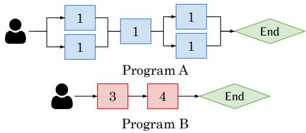

Figure 19: Toy example of two programs. ATLAS incurs less waiting time than MLFQ when both programs (A,B) arrive at t=0.  
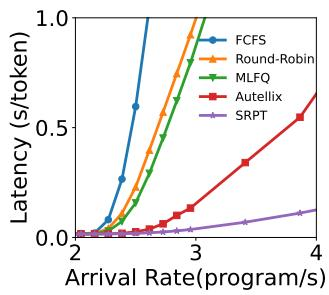  
(a) ShareGPT

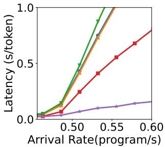  
(b) LATS  
Figure 20: Comparison to optimal scheduling policy. In simulation, Agentix outperforms other scheduling policies; however, there remains a visible gap relative to the optimal policy (SRPT).