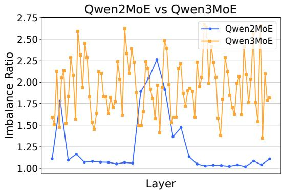
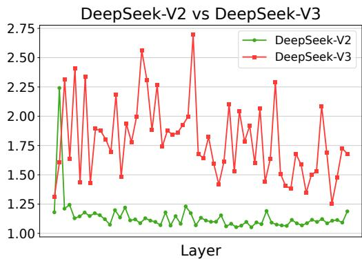
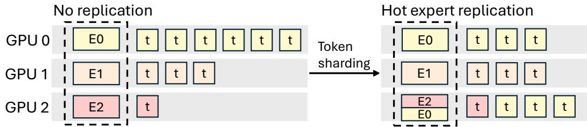
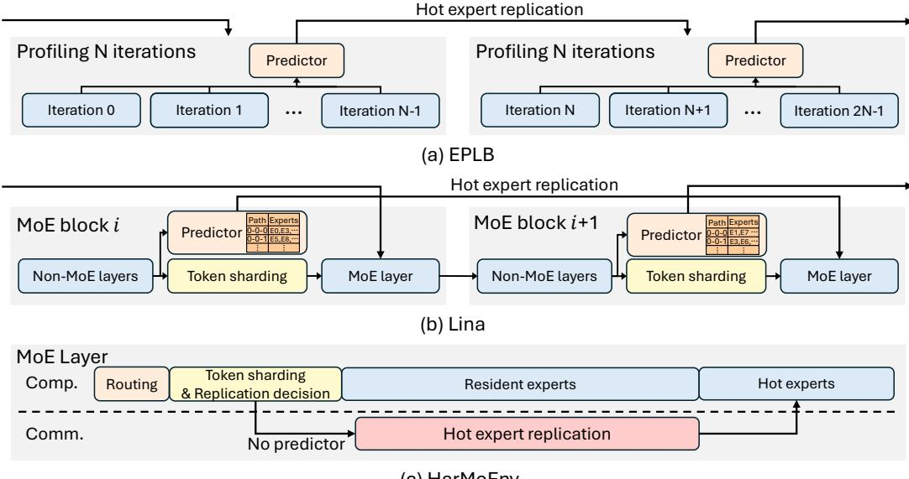
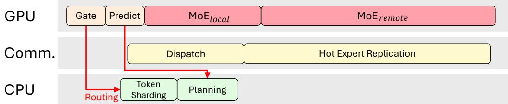
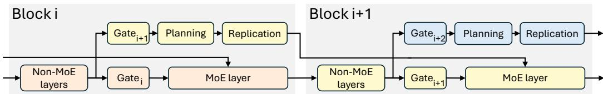
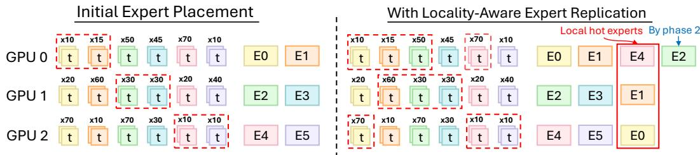
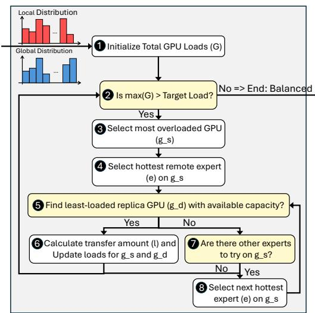
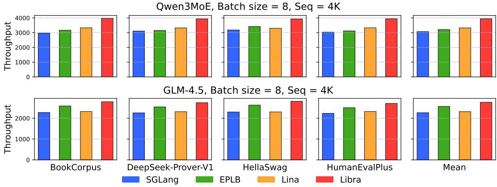
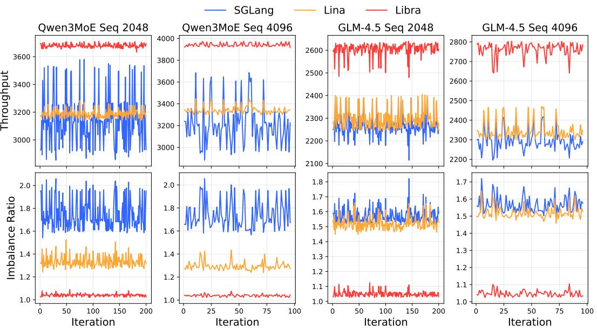

# LIBRA: EFFECTIVE YET EFFICIENT LOAD BALANCING FOR LARGE-SCALE MOE INFERENCE

Jaehoon Yang, Yushin Kim, Seokwon Moon, Yeonhong Park, Jae W. Lee Seoul National University

{jaehoon.yang,henry11n,moonsw214,ilil96,jaewlee}@snu.ac.kr

## ABSTRACT

Distributed inference of large-scale Mixture-of-Experts (MoE) models faces a critical challenge: expert load imbalance. Numerous system-level approaches have been proposed for load balancing, but they either fail to achieve a satisfactory level of balance or introduce new bottlenecks due to the overhead of the load balancing mechanism itself. To this end, we propose Libra, a system that achieves near-optimal load balancing with minimal overhead. Libra adopts sophisticated mechanisms that accurately predict future expert activations and, based on these predictions, systematically perform load balancing. At the same time, it effectively hides the associated overhead by reconstructing the execution flow so that these costs are overlapped with MoE computation. Evaluations with two large-scale state-of-the-art MoE models on 8 H200 GPUs demonstrate that Libra improves throughput by up to 19.2%. The code is available at https://github.com/SNU-ARC/Libra.

## 1 INTRODUCTION

The Mixture-of-Experts (MoE) architecture has become a cornerstone for state-of-the-art Large Language Models (LLMs) such as DeepSeek-V3, Qwen3MoE, and GLM-4.5 (DeepSeek-AI et al., 2025; Yang et al., 2025; GLM-4.5 Team et al., 2025). Through sparse activation, MoE enables models to scale to trillions of parameters while keeping the training and inference computation cost manageable (Du et al., 2022; The Mosaic Research Team, 2024; Jiang et al., 2024; Fedus et al., 2022; Lepikhin et al., 2020; Rajbhandari et al., 2022).

At the same time, the dynamic nature of MoE models introduces a key deployment challenge: load imbalance. One common way to scale MoE inference is through Expert Parallelism (EP), in which experts within MoE layers are partitioned across multiple GPUs. Under this setup, load imbalance arises when a disproportionate number of tokens are assigned to a few hot experts, causing the GPUs hosting them to become stragglers that determine the end-to-end latency.

Existing system-level load balancing approaches suffer from fundamental limitations, proving to be less effective and/or inefficient (DeepSeek, 2025; Li et al., 2023; Doucet et al., 2025). Some approaches fail to achieve satisfactory balance because they rely on ineffective heuristics, leaving substantial room for improvement (DeepSeek, 2025; Li et al., 2023). Others achieve a considerable level of balance but introduce new bottlenecks due to the additional operations required for load balancing (Doucet et al., 2025).

To address these challenges, we propose Libra, a system that achieves near-optimal balance with virtually zero overhead. In other words, it catches two birds at once: effective load balancing and efficient realization of that mechanism. For effectiveness, Libra predicts expert activations for the next layer with high accuracy by leveraging the observation that hidden states in LLMs evolve slowly across consecutive blocks, and based on these predictions, applies a sophisticated algorithm that yields near-optimal balance. For efficiency, Libra reconstructs the inference execution flow so that any overhead incurred by this process is hidden under MoE computations. In evaluations on eight benchmarks using two state-of-the-art MoE models, Qwen3MoE and GLM-4.5, on 8 H200 GPUs, Libra improves throughput by up to 19.2% compared to the state of the art.

## 2 BACKGROUND AND MOTIVATION

## 2.1 EXPERT LOAD IMBALANCE IN MOE INFERENCE

The Mixture-of-Experts (MoE) (Jacobs et al., 1991; Jordan & Jacobs, 1994; Shazeer et al., 2017) architecture enhances the capacity of Large Language Models (LLMs) by replacing the dense Feed-Forward Network (FFN) layer in a Transformer block with a sparse MoE layer. This layer consists of a large pool of subnetworks (experts) and a gating network that selectively activates a small subset of experts (e.g., top-k) for each input token. This sparse activation allows MoE models to scale to hundreds of billions or even trillions of parameters while keeping the computational cost for inference relatively low (Du et al., 2022; The Mosaic Research Team, 2024; Jiang et al., 2024; Fedus et al., 2022; Rajbhandari et al., 2022; Lepikhin et al., 2020). Consequently, large-scale open-source MoE models have achieved performance comparable to leading proprietary models like GPT-5, demonstrating the efficacy of this architecture (Yang et al., 2025; DeepSeek-AI et al., 2025; GLM-4.5 Team et al., 2025; Baidu ERNIE Team, 2025; OpenAI et al., 2025; Kimi Team et al., 2025).

However, the inherent mechanism that grants MoE models their efficiency—independent token assignment—introduces a significant challenge: expert load imbalance. Historically, this issue was addressed during the training phase by incorporating an auxiliary load-balancing loss term, which encouraged a more uniform distribution of tokens across all experts (Xue et al., 2024; Muennighoff et al., 2025; Fedus et al., 2022). While effective for balancing, this approach often came at the cost of model performance, as it could hinder the degree of expert specialization (Wang et al., 2024; Guo et al., 2025; Qiu et al., 2025; DeepSeek-AI et al., 2025).

  
Figure 1: Intensified expert load imbalance in recent MoE models.

Reflecting this trade-off, recent state-of-the-art MoE models have moved away from strict loadbalancing loss in favor of techniques that maximize expert specialization (Yang et al., 2025; GLM-4.5 Team et al., 2025; DeepSeek-AI et al., 2025). This aggressive pursuit of specialization has successfully pushed model performance to new heights but has the critical side effect of intensifying the expert load imbalance during inference. We measure this using the imbalance ratio, defined as the maximum load on any single GPU divided by the average load across all GPUs, where a value of 1.0 indicates a perfect balance. This trend is illustrated in Figure 1, showing a stark contrast in the imbalance ratio between newer MoE models and their predecessors (see Appendix A for experimental setup details). This reveals a fundamental trade-off: achieving state-of-the-art performance in large MoE models exacerbates the expert load imbalance, a problem projected to become more severe as models advance.

To efficiently serve large-scale MoE models across multiple GPUs, the standard strategy is a hybrid approach that applies Expert Parallelism (EP) to MoE layers and Data Parallelism (DP) to non-MoE layers (e.g., self-attention) (Perplexity AI, 2025; SGLang Team, 2025; Doucet et al., 2025; Li et al., 2025). While this strategy is essential for managing the massive parameter counts of these models, its performance is highly susceptible to expert load imbalance, which consequently becomes a critical performance bottleneck (Doucet et al., 2025). This issue stems from the synchronous execution of the MoE layers, forcing all devices to wait for the most heavily loaded GPU—the one hosting the hot expert(s)—to finish its computation. This phenomenon, known as the straggler effect, leads to significant idle time on less-loaded workers, severely degrading end-to-end latency and overall system throughput. Consequently, mitigating this straggler effect has become a central challenge in MoE inference, prompting the exploration of various system-level solutions.

## 2.2 SYSTEM-LEVEL SOLUTIONS FOR LOAD BALANCING AND LIMITATIONS

  
Figure 2: Hot expert replication and token sharding

A number of studies have attempted to mitigate load imbalance in MoE inference through systemlevel techniques. Most of these approaches employ hot expert replication. Figure 2 illustrates this approach: instead of assigning each expert to a unique GPU without redundancy, hot experts (i.e., experts that are likely to receive many tokens) are replicated across multiple GPUs. During MoE execution, tokens routed to these hot experts can then be distributed across replicas on different GPUs—a process we refer to as token sharding. This alleviates bottlenecks that would otherwise arise if a single GPU were forced to process a disproportionate number of tokens.

In the following, we discuss three representative works that constitute the most widely used and/or state-of-the-art techniques. They share the above approach but differ in how they perform expert replication and token sharding. While these methods present promising results, they also exhibit notable limitations, as their strategies for replication and sharding achieve only limited effectiveness and/or efficiency.

  
Figure 3: Overview of EPLB, Lina, and HarMoEny

EPLB. Expert Placement Load Balancer (EPLB) (DeepSeek, 2025) periodically performs expert replication based on historical data. Figure 3(a) illustrates this process. It profiles expert popularity over a fixed number of iterations (N in the figure) and uses the aggregated statistics to guide expert replication. However, this strategy is less effective because past popularity does not capture the instantaneous and dynamic variations across requests. EPLB’s token sharding is also limited in effectiveness: once experts are replicated, tokens routed to them are randomly distributed across the GPUs holding replicas. In short, while EPLB is relatively efficient, it is not effective in either expert replication or token sharding.

Lina. Figure 3(b) illustrates how Lina (Li et al., 2023) performs expert replication. Specifically, Lina replicates experts for the upcoming block: when executing MoE computation for Block i, it performs expert replication for Block i + 1, thereby removing replication overhead from the critical path. For this purpose, it relies on a pre-constructed lookup table that tracks each token’s expert-selection-path. This path, which is the sequence of experts a token has selected in previous few layers (e.g., from layer i − 4 to layer i − 1), is used to predict which experts will be popular in the current layer (layer i). Such expert replication, however, is limited in effectiveness. In our evaluations on eight different benchmarks with two models (Qwen3MoE and GLM-4.5), Lina’s prediction accuracy falls to as low as 43.7% and 11.8%, respectively. Details of the experimental setup are provided in Appendix A.

For token sharding, Lina simply distributes tokens uniformly across all replicas (e.g., assigning an equal number of tokens to each). Similar to the random token sharding in EPLB, this strategy is largely oblivious to the actual GPU loads, leaving significant room for improvement.

HarMoEny. Figure 3(c) illustrates HarMoEny (Doucet et al., 2025), which makes decisions on expert replication based on exact routing results. In other words, expert replication is performed only after the current input and its routing outcomes become available. This design makes replication highly effective, as it is guided by exact information. To prevent replication overhead from appearing on the critical path, HarMoEny first performs MoE computation for tokens routed to resident experts, while replication of hot experts proceeds in parallel. Once replication completes, the MoE computation for hot experts is executed. Token sharding is also effective, as HarMoEny employs a sophisticated algorithm that computes a near-optimal token assignment.

Despite this effectiveness, HarMoEny suffers from efficiency issues. The overhead required to realize such accurate replication and token sharding is substantial. After routing and before completing MoE computation, HarMoEny must perform decision making through complex algorithms to determine both expert replication and token sharding. Because these algorithms run synchronously on the GPU, they extend the critical path and introduce new bottlenecks.

## 3 DESIGN

In this section, we propose Libra, a system for MoE inference that achieves near-optimal load balancing with minimal overhead. Unlike prior methods, Libra simultaneously addresses both effectiveness and efficiency in hot expert replication and token sharding, thereby overcoming the key limitations of existing approaches. For expert replication, Libra follows the spirit of Lina by prefetching hot experts for the next layer while processing the current layer, based on prediction. This design avoids the inefficiency observed in HarMoEny, which cannot exploit Grouped-GEMM optimizations. At the same time, Libra employs a more accurate prediction mechanism than Lina, thereby improving effectiveness. For token sharding, Libra adopts the strategy of HarMoEny but effectively hides its cost from the critical path by restructuring the execution flow and leveraging the CPU.

The remainder of this section is organized as follows. Section 3.1 explains Libra’s execution flow. Section 3.2 describes the hot expert replication mechanism, and Section 3.3 details the token sharding mechanism.

## 3.1 LIBRA EXECUTION FLOW

Figure 4 illustrates the execution flow of Libra. The key novelty lies in its Two-Stage Locality-Aware Execution, which splits MoE computation into two phases based on token locality: $M o E _ { l o c a l }$ and $M o E _ { r e m o t e }$ . The $M o E _ { l o c a l }$ phase processes tokens routed to experts residing on the same GPU as the tokens themselves, while the $M o E _ { r e m o t e }$ phase handles tokens that must be dispatched to other GPUs. After decomposing the computation into these two phases, Libra first performs $M o E _ { l o c a l } ,$ followed by $M o E _ { r e m o t e }$

This execution flow creates a time window in which the overhead of sophisticated token sharding mechanism can be hidden. In the conventional execution flow with load balancing, MoE computation begins only after token sharding completes. By contrast, in Libra, the $M o E _ { l o c a l }$ phase has no dependency on token sharding; it can start immediately after the gating function, with only the $M o E _ { r e m o t e }$ phase depending on the results of token sharding and Dispatch operation. This enables token sharding mechanism to run in parallel with $M o E _ { l o c a l }$

  
Figure 4: Two-Stage Locality-Aware Execution of Libra

To further enhance the effectiveness of this parallelism, Libra performs token sharding on the CPU rather than the GPU. In addition, Libra implements dispatch using AllGather (i.e., all tokens are transferred to all GPUs) instead of All2All, where tokens are sent only to their assigned GPU. While this design increases the raw communication volume of dispatch, its latency impact is negligible. More importantly, it improves efficiency by removing dispatch from the critical path: in an All2Allbased implementation, dispatch must wait for token sharding to finish, whereas in the AllGatherbased implementation, dispatch can also proceed in parallel with token sharding.

## 3.2 HOT EXPERT REPLICATION

As mentioned, Libra follows the spirit of Lina for hot expert replication: performing expert replication for the next layer while processing the current layer, based on prediction. However, Libra departs substantially from Lina in both how the prediction is performed and how expert replication planning (i.e., determining which experts to replicate to which GPUs) is carried out.

  
Figure 5: Hot expert replication of Libra with lookahead predictors

Predictor Design. Libra employs a lookahead predictor, leveraging a well-established property of Transformer-based LLMs: hidden states evolve slowly across layers (Liu et al., 2023b; Hwang et al., 2024). Figure 5 illustrates its concept. It speculatively executes the gating function of the next layer using the hidden states from the current layer, and then uses the results to determine which experts should be replicated across GPUs. This runtime-based approach achieves substantially higher accuracy than Lina’s predictor (e.g. 70-80% vs 20-30%).

Locality-Aware Expert Replication Planning. During expert replication planning, Libra introduces an additional consideration beyond load balancing: locality enhancement. In other words, Libra not only balances load but also seeks to extend the $M o E _ { l o c a l }$ computation window, thereby providing more opportunity to hide token sharding overhead.

To this end, Libra performs expert replication planning in two phases. In the first phase, each GPU brings in $N \times \alpha$ experts that are most frequently activated by the tokens on that GPU and are not already resident on it, thereby extending the $M o E _ { l o c a l }$ computation window. Here, N denotes the maximum number of additional experts a GPU may host, determined by its available memory capacity and the allowable time window (a function of MoE computation time and communication bandwidth), while α is a hyperparameter that controls what fraction of N is allocated to the first phase. In the second phase, load balancing is performed iteratively: at each step, the hottest expert from the most heavily loaded GPU is selected for replication and placed on the least-loaded GPU among those that have not yet received N extra experts.

Figure 6 illustrates the expert replication planning process of Libra with an example. First, to enhance locality, Libra addresses the initial placement (left), where a significant portion of tokens on each GPU is routed to remote experts on other devices. Each GPU identifies its most requested remote experts and replicates them locally. For instance, GPU 0 replicates E4 from GPU 2 to serve its local tokens. This process converts remote tokens into local computations, securing the $M o E _ { l o c a l }$ computation window necessary to hide system overhead. Second, to establish a foundation for load balancing, the algorithm identifies and replicates heavily loaded experts to under-loaded GPUs. In the figure, this is shown by replicating expert E2 to an under-loaded device. This facilitates effective token sharding by allowing the workload from overloaded GPUs to be redistributed, ultimately enabling a near-perfect load balance.

  
Figure 6: Locality-aware expert replication planning

## 3.3 ADAPTIVE TOKEN SHARDING

For token sharding, Libra adopts an algorithm similar to that used by HarMoEny, but with two key differences. First, Libra applies token sharding only to remote tokens. Second, this process is offloaded to the CPU.

Figure 7 explains the iterative greedy strategy of token sharding. The algorithm’s main loop begins by checking if any GPU’s load exceeds the target threshold ( 2 ). If the system is balanced, the process terminates. Otherwise, it selects the most overloaded GPU, $g _ { s } ,$ , to resolve ( 3 ). To find the most effective transfer, the algorithm enters an inner loop, starting by selecting the hottest remote expert, e, on $g _ { s }$ —the one accounting for the largest number of its remote tokens ( 4 ). It then searches for an optimal destination: the least-loaded GPU (gd) that hosts a replica of expert e and has enough capacity to accept new tokens ( 5 ). A replica of the expert is necessary on the destination GPU to process the transferred tokens, and these replicas are enabled by hot expert replication. If a suitable destination is found, the algorithm calculates the number of tokens to transfer and updates the loads on both $g _ { s }$ and $g _ { d } ~ ( \pmb { \bigcirc } ) )$ . Crucially, after each successful transfer, the algorithm returns to the main loop’s start ( 2 ) to re-evaluate the entire system’s balance, ensuring it always ad-

  
Figure 7: Logic flow of the iterative greedy rebalancing strategy.

dresses the most critical imbalance first. If no suitable destination is found ( 7 ), it attempts to transfer the tokens for the next hottest expert on $g _ { s }$ ( 8 ) until all options are exhausted, at which point it also returns to re-evaluate the global state. The full algorithm is detailed in Appendix C.

## 4 IMPLEMENTATION DETAILS

We implement Libra atop the SGLang (v0.4.10) LLM serving framework. Our core mechanisms for expert replication planning and token sharding are implemented in Cython to ensure minimal overhead and are integrated as native modules during SGLang’s build process.

To efficiently perform hot expert replication, we leverage PyTorch SymmetricMemory for copy engine-based P2P transfers. We employ a double-buffering strategy by pre-allocating two large buffers: an even buffer and an odd buffer. During the execution of an even-numbered MoE layer, original and duplicated experts are gathered in the even buffer to be processed via a highperformance Grouped-GEMM kernel. Concurrently, the system loads the necessary experts for the subsequent odd-numbered layer into the odd buffer. When processing an odd-numbered MoE layer, the roles are reversed: computation utilizes the odd buffer while the even buffer is populated for the next layer. This pipelining mechanism effectively hides the expert replication overhead by overlapping the P2P copy operations with the ongoing computation.

## 5 EVALUATION

We conduct a comprehensive evaluation to demonstrate the effectiveness of Libra. Our experiments are designed to answer four key questions: (1) How does Libra’s prefill performance compare against baselines? (2) How stable and robust is Libra’s performance under workloads with dynamic and shifting token distributions? (3) How does the prediction accuracy of Libra’s speculative execution compare against existing methods like Lina? (4) What is the overhead introduced by Libra’s mechanisms, and how effectively is it hidden within the execution flow?

## 5.1 SETUP

Model and Data. We evaluate Libra using two representative state-of-the-art large MoE models: Qwen3MoE (235B) (Yang et al., 2025) and GLM-4.5 (355B) (GLM-4.5 Team et al., 2025). To ensure coverage of a wide range of inputs, we use eight datasets: BookCorpus (Zhu et al., 2015), Codeforces (Penedo et al., 2025), DeepSeek-Prover (Xin et al., 2024), FineWeb (Penedo et al., 2024), GSM8K (Cobbe et al., 2021), HellaSwag (Zellers et al., 2019), HumanEvalPlus (Liu et al., 2023a), and LMSYS-Chat-1M (Zheng et al., 2023). All experiments are run using BF16 precision.

Environments. All experiments are conducted on a single node equipped with 8 NVIDIA H200-SXM5 GPUs, each with 141 GB of HBM3e memory. Intra-node communication leverages NVSwitch with 900 GB/s of P2P bandwidth.

Baselines. We compare Libra against three baselines. The vanilla MoE implementation in SGLang (v0.4.10) serves as our foundational baseline, representing a standard system without advanced load balancing. For the widely adopted proactive expert replication approach, we use EPLB (DeepSeek, 2025) from its implementation within SGLang. As the strongest baseline, we evaluate against Lina (Li et al., 2023). Since no public implementation of Lina is available, we developed an inhouse version built on SGLang, faithfully following the description in the original paper.

Metrics. The primary performance metric is prefill throughput, measured in tokens per second. We assume a prefill-decode disaggregated serving system where the prefill and decode phases are separated and handled by different GPUs (Zhong et al., 2024b; Hu et al., 2025; Feng et al., 2025), and therefore target only the prefill phase in our evaluation. We also measure the imbalance ratio (defined as the load of the most burdened GPU divided by the average load across all GPUs) to analyze the effectiveness of load balancing.

## 5.2 RESULTS

Throughput Results. First, Libra substantially improves the performance of the prefill phase. As shown in Figure 8, Libra achieves the highest throughput across all tested models and datasets. To rigorously evaluate the robustness of our system, we focus on the four datasets exhibiting the most severe expert load imbalance. These challenging scenarios serve as stress tests to clearly distinguish the efficacy of different load balancing strategies. Notably, this evaluation was conducted under an experimental setup deliberately designed to be highly advantageous for the baseline systems. For

  
Figure 8: Prefill throughput of Libra and baselines.

  
Figure 9: Throughput fluctuation and imbalance ratio under a dynamic workload.

Lina, its expert-selection-path table was constructed using the same dataset as the evaluation and its expert prefetching allowed each GPU to hold 8 additional experts. Similarly, EPLB’s expert placement was determined by profiling on the identical dataset. It statically placed 8 identified hot experts—one on each of the 8 GPUs—across every MoE layer. This static replication, however, results in higher memory consumption compared to the dynamic approaches of Lina and Libra because of a large number of layers. To meet the memory budget with Lina, Libra was configured with N set to 8 and α set to 0.5. Despite these favorable, even biased, conditions for the baselines, Libra consistently and significantly outperforms them for both Qwen3MoE and GLM-4.5. These results confirm that Libra’s dynamic load balancing effectively resolves the straggler problem, leading to superior computational efficiency and overall system performance.

Per-Iteration Fluctuation. Libra also delivers significantly higher and more stable throughput. Figure 9 illustrates this robustness using a mixed-dataset designed to simulate dynamic shifts in expert load imbalance. For this test, Lina’s expert-selection-path table was constructed using a workload created by mixing one-eighth of the build split from each of the eight datasets. This comparison centers on dynamic systems like Lina and Libra, excluding EPLB, as its reliance on periodic profiling and static reconfiguration is ill-suited for workloads where imbalance shifts frequently and intensely. While baseline systems suffer from volatile performance that plummets as the imbalance ratio spikes, Libra effectively decouples its performance from the input distribution. By maintaining

<table><tr><td colspan="2">Qwen3MoE</td></tr><tr><td>Dataset</td><td>Lina Libra</td></tr><tr><td>BookCorpus</td><td>47.3 91.7</td></tr><tr><td>DeepSeek-Prover-V1</td><td>45.4 86.5</td></tr><tr><td>HellaSwag</td><td>37.5 86.6</td></tr><tr><td>HumanEvalPlus</td><td>44.5 87.0</td></tr></table>

<table><tr><td colspan="3">GLM-4.5</td></tr><tr><td>Dataset</td><td>Lina</td><td>Libra</td></tr><tr><td>BookCorpus</td><td>11.7</td><td>79.6</td></tr><tr><td>DeepSeek-Prover-V1</td><td>12.7</td><td>72.9</td></tr><tr><td>HellaSwag</td><td>11.5</td><td>76.6</td></tr><tr><td>HumanEvalPlus</td><td>11.2</td><td>72.7</td></tr></table>

Table 1: Prediction accuracy.

<table><tr><td>Scheme </td><td></td><td>Dispatch Predict Broadcast</td><td></td><td>D2H metadata transfer</td><td>H2D metadata transfer</td><td>Token sharding</td><td>Repl. planning</td><td>Combine Others</td><td></td><td>MoE</td><td>Total</td></tr><tr><td>Libra</td><td>0.9ga</td><td>0.03</td><td>0.24a</td><td>0.10a</td><td>0.09a</td><td>0.57a</td><td>0.26b</td><td>1.33</td><td>0.39</td><td>2.77 (Local) + 4.55 (Remote)</td><td>9.07</td></tr><tr><td>Lina</td><td>0.72</td><td>0.40</td><td>0</td><td>0</td><td>0</td><td>0.15</td><td>0.08</td><td>1.32</td><td>0.55</td><td>8.11</td><td>11.33</td></tr><tr><td>SGLang</td><td>0.73</td><td>0</td><td>0</td><td>0</td><td>0</td><td>0</td><td>0</td><td>1.34</td><td>0.55</td><td>10.99</td><td>13.61</td></tr></table>

a Hidden in MoE local, b Hidden in MoE remote,

Table 2: Breakdown analysis of MoE layer.

a near-perfect imbalance ratio close to 1.0, Libra provides consistently high throughput, proving its resilience to the dynamic nature of expert load imbalance.

Prediction Accuracy. We quantitatively evaluate the accuracy of Libra’s predictor for hot expert replication compared against Lina. Table 1 presents a direct comparison between the prediction accuracy of Libra’s speculative execution-based approach and Lina’s offline-constructed lookup table based method on the Qwen3MoE and GLM-4.5 models. Accuracy is defined as the fraction of correctly predicted experts for each token, where the set of actually activated experts serves as the ground truth. We construct Lina’s expert-selection-path table on the build split of mixed dataset, then evaluate on the evaluation split of four datasets. Evaluation setup is detailed in Appendix A.

The results reveal a stark contrast between the two methods. Libra’s predictor consistently achieves a high and stable accuracy in the 70-90% range across all datasets, demonstrating the effectiveness of its runtime prediction based on current-layer hidden states. In contrast, Lina’s lookup-based predictor shows noticeably lower accuracy across datasets, and highlights the critical generalization limitations of an offline-built lookup table. This effect is more pronounced on GLM-4.5, where Lina successfully identifies fewer than one correct expert between top-8 experts. These findings confirm that Libra’s dynamic prediction mechanism is significantly more robust and reliable for handling diverse and unpredictable workloads.

Breakdown Analysis. We present the inference latency breakdown of the MoE layer for SGLang, Lina, and Libra in Table 2, evaluated using the Qwen3MoE with sequence length of 1024 and batch size of 32. Both Lina and Libra significantly reduce MoE computation time through load balancing; however, Libra achieves a greater reduction, primarily driven by its superior expert-activation prediction accuracy. Notably, while Lina incurs visible prediction latency, Libra’s prediction overhead is negligible. Furthermore, although Libra introduces additional costs associated with its sophisticated execution model—including metadata transfer, broadcasting, and balancing logic—these are effectively hidden. By decoupling MoE computation into $M o E _ { l o c a l }$ and $M o E _ { r e m o t e } ,$ Libra overlaps these auxiliary operations with local computation, preventing them from impacting the critical path.

## 6 CONCLUSION

We introduce Libra, a dynamic load balancing system addressing intensified expert load imbalance in modern Mixture-of-Experts (MoE) models. Libra proposes Two-Stage Locality-Aware Execution, an innovative paradigm hiding load balancing overhead by overlapping it with ongoing GPU computations. This is enabled by two synergistic core components: Locality-Aware Expert Replication, using speculative execution for highly accurate (70-80%) expert prediction to strategically prefetch the necessary experts for the next layer, and Adaptive Token Sharding, computing an optimal assignment schedule by accounting for processed local token load. Implemented on SGLang, Libra demonstrates state-of-the-art performance, improving the prefill throughput by up to 19.2% while maintaining an imbalance ratio of nearly 1.0 under dynamic workloads. Libra thus achieves dynamic load balancing with virtually zero-overhead for efficient serving of large-scale MoE models.

## ACKNOWLEDGMENTS

This paper was the result of the research project supported by SK hynix Inc. Jae W. Lee is the corresponding author.

## REFERENCES

Baidu ERNIE Team. Ernie 4.5 technical report, 2025.

Weijian Chen, Shuibing He, Haoyang Qu, Ruidong Zhang, Siling Yang, Ping Chen, Yi Zheng, Baoxing Huai, and Gang Chen. IMPRESS: An Importance-Informed Multi-Tier prefix KV storage system for large language model inference. In 23rd USENIX Conference on File and Storage Technologies (FAST 25), pp. 187–201, Santa Clara, CA, February 2025. USENIX Association. ISBN 978-1-939133-45-8. URL https://www.usenix.org/conference/fast25/ presentation/chen-weijian-impress.

Karl Cobbe, Vineet Kosaraju, Mohammad Bavarian, Mark Chen, Heewoo Jun, Lukasz Kaiser, Matthias Plappert, Jerry Tworek, Jacob Hilton, Reiichiro Nakano, Christopher Hesse, and John Schulman. Training verifiers to solve math word problems. arXiv preprint arXiv:2110.14168, 2021.

DeepSeek. Expert parallelism load balancer (eplb), 2025. URL https://github.com/ deepseek-ai/EPLB.

DeepSeek-AI, Aixin Liu, Bei Feng, Bing Xue, Bingxuan Wang, Bochao Wu, Chengda Lu, Chenggang Zhao, Chengqi Deng, Chenyu Zhang, Chong Ruan, Damai Dai, Daya Guo, Dejian Yang, Deli Chen, Dongjie Ji, Erhang Li, Fangyun Lin, Fucong Dai, Fuli Luo, Guangbo Hao, Guanting Chen, Guowei Li, H. Zhang, Han Bao, Hanwei Xu, Haocheng Wang, Haowei Zhang, Honghui Ding, Huajian Xin, Huazuo Gao, Hui Li, Hui Qu, J. L. Cai, Jian Liang, Jianzhong Guo, Jiaqi Ni, Jiashi Li, Jiawei Wang, Jin Chen, Jingchang Chen, Jingyang Yuan, Junjie Qiu, Junlong Li, Junxiao Song, Kai Dong, Kai Hu, Kaige Gao, Kang Guan, Kexin Huang, Kuai Yu, Lean Wang, Lecong Zhang, Lei Xu, Leyi Xia, Liang Zhao, Litong Wang, Liyue Zhang, Meng Li, Miaojun Wang, Mingchuan Zhang, Minghua Zhang, Minghui Tang, Mingming Li, Ning Tian, Panpan Huang, Peiyi Wang, Peng Zhang, Qiancheng Wang, Qihao Zhu, Qinyu Chen, Qiushi Du, R. J. Chen, R. L. Jin, Ruiqi Ge, Ruisong Zhang, Ruizhe Pan, Runji Wang, Runxin Xu, Ruoyu Zhang, Ruyi Chen, S. S. Li, Shanghao Lu, Shangyan Zhou, Shanhuang Chen, Shaoqing Wu, Shengfeng Ye, Shengfeng Ye, Shirong Ma, Shiyu Wang, Shuang Zhou, Shuiping Yu, Shunfeng Zhou, Shuting Pan, T. Wang, Tao Yun, Tian Pei, Tianyu Sun, W. L. Xiao, Wangding Zeng, Wanjia Zhao, Wei An, Wen Liu, Wenfeng Liang, Wenjun Gao, Wenqin Yu, Wentao Zhang, X. Q. Li, Xiangyue Jin, Xianzu Wang, Xiao Bi, Xiaodong Liu, Xiaohan Wang, Xiaojin Shen, Xiaokang Chen, Xiaokang Zhang, Xiaosha Chen, Xiaotao Nie, Xiaowen Sun, Xiaoxiang Wang, Xin Cheng, Xin Liu, Xin Xie, Xingchao Liu, Xingkai Yu, Xinnan Song, Xinxia Shan, Xinyi Zhou, Xinyu Yang, Xinyuan Li, Xuecheng Su, Xuheng Lin, Y. K. Li, Y. Q. Wang, Y. X. Wei, Y. X. Zhu, Yang Zhang, Yanhong Xu, Yanhong Xu, Yanping Huang, Yao Li, Yao Zhao, Yaofeng Sun, Yaohui Li, Yaohui Wang, Yi Yu, Yi Zheng, Yichao Zhang, Yifan Shi, Yiliang Xiong, Ying He, Ying Tang, Yishi Piao, Yisong Wang, Yixuan Tan, Yiyang Ma, Yiyuan Liu, Yongqiang Guo, Yu Wu, Yuan Ou, Yuchen Zhu, Yuduan Wang, Yue Gong, Yuheng Zou, Yujia He, Yukun Zha, Yunfan Xiong, Yunxian Ma, Yuting Yan, Yuxiang Luo, Yuxiang You, Yuxuan Liu, Yuyang Zhou, Z. F. Wu, Z. Z. Ren, Zehui Ren, Zhangli Sha, Zhe Fu, Zhean Xu, Zhen Huang, Zhen Zhang, Zhenda Xie, Zhengyan Zhang, Zhewen Hao, Zhibin Gou, Zhicheng Ma, Zhigang Yan, Zhihong Shao, Zhipeng Xu, Zhiyu Wu, Zhongyu Zhang, Zhuoshu Li, Zihui Gu, Zijia Zhu, Zijun Liu, Zilin Li, Ziwei Xie, Ziyang Song, Ziyi Gao, and Zizheng Pan. Deepseek-v3 technical report, 2025. URL https://arxiv.org/abs/2412.19437.

Zachary Doucet, Rishi Sharma, Martijn de Vos, Rafael Pires, Anne-Marie Kermarrec, and Oana Balmau. Harmoeny: Efficient multi-gpu inference of moe models, 2025. URL https: //arxiv.org/abs/2506.12417.

Kuntai Du, Bowen Wang, Chen Zhang, Yiming Cheng, Qing Lan, Hejian Sang, Yihua Cheng, Jiayi Yao, Xiaoxuan Liu, Yifan Qiao, Ion Stoica, and Junchen Jiang. Prefillonly: An inference engine for prefill-only workloads in large language model applications. In Proceedings of the ACM SIGOPS 31st Symposium on Operating Systems Principles, SOSP ’25, pp. 399–414, New York, NY, USA, 2025. Association for Computing Machinery. ISBN 9798400718700. doi: 10.1145/ 3731569.3764834. URL https://doi.org/10.1145/3731569.3764834.

Nan Du, Yanping Huang, Andrew M Dai, Simon Tong, Dmitry Lepikhin, Yuanzhong Xu, Maxim Krikun, Yanqi Zhou, Adams Wei Yu, Orhan Firat, Barret Zoph, Liam Fedus, Maarten P Bosma, Zongwei Zhou, Tao Wang, Emma Wang, Kellie Webster, Marie Pellat, Kevin Robinson, Kathleen Meier-Hellstern, Toju Duke, Lucas Dixon, Kun Zhang, Quoc Le, Yonghui Wu, Zhifeng Chen, and Claire Cui. GLaM: Efficient scaling of language models with mixture-of-experts. In Kamalika Chaudhuri, Stefanie Jegelka, Le Song, Csaba Szepesvari, Gang Niu, and Sivan Sabato (eds.), Proceedings of the 39th International Conference on Machine Learning, volume 162 of Proceedings of Machine Learning Research, pp. 5547–5569. PMLR, 17–23 Jul 2022. URL https://proceedings.mlr.press/v162/du22c.html.

William Fedus, Barret Zoph, and Noam Shazeer. Switch transformers: Scaling to trillion parameter models with simple and efficient sparsity. Journal of Machine Learning Research, 23(120):1–39, 2022. URL http://jmlr.org/papers/v23/21-0998.html.

Jingqi Feng, Yukai Huang, Rui Zhang, Sicheng Liang, Ming Yan, and Jie Wu. Windserve: Efficient phase-disaggregated llm serving with stream-based dynamic scheduling. In Proceedings of the 52nd Annual International Symposium on Computer Architecture, pp. 1283–1295, 2025.

GLM-4.5 Team, Aohan Zeng, Xin Lv, Qinkai Zheng, Zhenyu Hou, Bin Chen, Chengxing Xie, Cunxiang Wang, Da Yin, Hao Zeng, Jiajie Zhang, Kedong Wang, Lucen Zhong, Mingdao Liu, Rui Lu, Shulin Cao, Xiaohan Zhang, Xuancheng Huang, Yao Wei, Yean Cheng, Yifan An, Yilin Niu, Yuanhao Wen, Yushi Bai, Zhengxiao Du, Zihan Wang, Zilin Zhu, Bohan Zhang, Bosi Wen, Bowen Wu, Bowen Xu, Can Huang, Casey Zhao, Changpeng Cai, Chao Yu, Chen Li, Chendi Ge, Chenghua Huang, Chenhui Zhang, Chenxi Xu, Chenzheng Zhu, Chuang Li, Congfeng Yin, Daoyan Lin, Dayong Yang, Dazhi Jiang, Ding Ai, Erle Zhu, Fei Wang, Gengzheng Pan, Guo Wang, Hailong Sun, Haitao Li, Haiyang Li, Haiyi Hu, Hanyu Zhang, Hao Peng, Hao Tai, Haoke Zhang, Haoran Wang, Haoyu Yang, He Liu, He Zhao, Hongwei Liu, Hongxi Yan, Huan Liu, Huilong Chen, Ji Li, Jiajing Zhao, Jiamin Ren, Jian Jiao, Jiani Zhao, Jianyang Yan, Jiaqi Wang, Jiayi Gui, Jiayue Zhao, Jie Liu, Jijie Li, Jing Li, Jing Lu, Jingsen Wang, Jingwei Yuan, Jingxuan Li, Jingzhao Du, Jinhua Du, Jinxin Liu, Junkai Zhi, Junli Gao, Ke Wang, Lekang Yang, Liang Xu, Lin Fan, Lindong Wu, Lintao Ding, Lu Wang, Man Zhang, Minghao Li, Minghuan Xu, Mingming Zhao, Mingshu Zhai, Pengfan Du, Qian Dong, Shangde Lei, Shangqing Tu, Shangtong Yang, Shaoyou Lu, Shijie Li, Shuang Li, Shuang-Li, Shuxun Yang, Sibo Yi, Tianshu Yu, Wei Tian, Weihan Wang, Wenbo Yu, Weng Lam Tam, Wenjie Liang, Wentao Liu, Xiao Wang, Xiaohan Jia, Xiaotao Gu, Xiaoying Ling, Xin Wang, Xing Fan, Xingru Pan, Xinyuan Zhang, Xinze Zhang, Xiuqing Fu, Xunkai Zhang, Yabo Xu, Yandong Wu, Yida Lu, Yidong Wang, Yilin Zhou, Yiming Pan, Ying Zhang, Yingli Wang, Yingru Li, Yinpei Su, Yipeng Geng, Yitong Zhu, Yongkun Yang, Yuhang Li, Yuhao Wu, Yujiang Li, Yunan Liu, Yunqing Wang, Yuntao Li, Yuxuan Zhang, Zezhen Liu, Zhen Yang, Zhengda Zhou, Zhongpei Qiao, Zhuoer Feng, Zhuorui Liu, Zichen Zhang, Zihan Wang, Zijun Yao, Zikang Wang, Ziqiang Liu, Ziwei Chai, Zixuan Li, Zuodong Zhao, Wenguang Chen, Jidong Zhai, Bin Xu, Minlie Huang, Hongning Wang, Juanzi Li, Yuxiao Dong, and Jie Tang. Glm-4.5: Agentic, reasoning, and coding (arc) foundation models, 2025. URL https://arxiv.org/abs/2508.06471.

Hongcan Guo, Haolang Lu, Guoshun Nan, Bolun Chu, Jialin Zhuang, Yuan Yang, Wenhao Che, Sicong Leng, Qimei Cui, and Xudong Jiang. Advancing expert specialization for better moe, 2025. URL https://arxiv.org/abs/2505.22323.

Xiannan Hu, Tianyou Zeng, Xiaoming Yuan, Liwei Song, Guangyuan Zhang, and Bangzheng He. Bestserve: Serving strategies with optimal goodput in collocation and disaggregation architectures. arXiv preprint arXiv:2506.05871, 2025.

Ranggi Hwang, Jianyu Wei, Shijie Cao, Changho Hwang, Xiaohu Tang, Ting Cao, and Mao Yang. Pre-gated moe: An algorithm-system co-design for fast and scalable mixture-of-expert inference. In 2024 ACM/IEEE 51st Annual International Symposium on Computer Architecture (ISCA), pp. 1018–1031. IEEE, 2024.

Robert A. Jacobs, Michael I. Jordan, Steven J. Nowlan, and Geoffrey E. Hinton. Adaptive mixtures of local experts. Neural Computation, 3(1):79–87, 1991. doi: 10.1162/neco.1991.3.1.79.

Albert Q. Jiang, Alexandre Sablayrolles, Antoine Roux, Arthur Mensch, Blanche Savary, Chris Bamford, Devendra Singh Chaplot, Diego de las Casas, Emma Bou Hanna, Florian Bressand, Gianna Lengyel, Guillaume Bour, Guillaume Lample, Lelio Renard Lavaud, Lucile Saulnier, Marie- ´ Anne Lachaux, Pierre Stock, Sandeep Subramanian, Sophia Yang, Szymon Antoniak, Teven Le Scao, Theophile Gervet, Thibaut Lavril, Thomas Wang, Timoth ´ ee Lacroix, and William El Sayed. ´ Mixtral of experts, 2024. URL https://arxiv.org/abs/2401.04088.

Michael I. Jordan and Robert A. Jacobs. Hierarchical mixtures of experts and the em algorithm. Neural Computation, 6(2):181–214, 1994. doi: 10.1162/neco.1994.6.2.181.

Kimi Team, Yifan Bai, Yiping Bao, Guanduo Chen, Jiahao Chen, Ningxin Chen, Ruijue Chen, Yanru Chen, Yuankun Chen, Yutian Chen, Zhuofu Chen, Jialei Cui, Hao Ding, Mengnan Dong, Angang Du, Chenzhuang Du, Dikang Du, Yulun Du, Yu Fan, Yichen Feng, Kelin Fu, Bofei Gao, Hongcheng Gao, Peizhong Gao, Tong Gao, Xinran Gu, Longyu Guan, Haiqing Guo, Jianhang Guo, Hao Hu, Xiaoru Hao, Tianhong He, Weiran He, Wenyang He, Chao Hong, Yangyang Hu, Zhenxing Hu, Weixiao Huang, Zhiqi Huang, Zihao Huang, Tao Jiang, Zhejun Jiang, Xinyi Jin, Yongsheng Kang, Guokun Lai, Cheng Li, Fang Li, Haoyang Li, Ming Li, Wentao Li, Yanhao Li, Yiwei Li, Zhaowei Li, Zheming Li, Hongzhan Lin, Xiaohan Lin, Zongyu Lin, Chengyin Liu, Chenyu Liu, Hongzhang Liu, Jingyuan Liu, Junqi Liu, Liang Liu, Shaowei Liu, T. Y. Liu, Tianwei Liu, Weizhou Liu, Yangyang Liu, Yibo Liu, Yiping Liu, Yue Liu, Zhengying Liu, Enzhe Lu, Lijun Lu, Shengling Ma, Xinyu Ma, Yingwei Ma, Shaoguang Mao, Jie Mei, Xin Men, Yibo Miao, Siyuan Pan, Yebo Peng, Ruoyu Qin, Bowen Qu, Zeyu Shang, Lidong Shi, Shengyuan Shi, Feifan Song, Jianlin Su, Zhengyuan Su, Xinjie Sun, Flood Sung, Heyi Tang, Jiawen Tao, Qifeng Teng, Chensi Wang, Dinglu Wang, Feng Wang, Haiming Wang, Jianzhou Wang, Jiaxing Wang, Jinhong Wang, Shengjie Wang, Shuyi Wang, Yao Wang, Yejie Wang, Yiqin Wang, Yuxin Wang, Yuzhi Wang, Zhaoji Wang, Zhengtao Wang, Zhexu Wang, Chu Wei, Qianqian Wei, Wenhao Wu, Xingzhe Wu, Yuxin Wu, Chenjun Xiao, Xiaotong Xie, Weimin Xiong, Boyu Xu, Jing Xu, Jinjing Xu, L. H. Xu, Lin Xu, Suting Xu, Weixin Xu, Xinran Xu, Yangchuan Xu, Ziyao Xu, Junjie Yan, Yuzi Yan, Xiaofei Yang, Ying Yang, Zhen Yang, Zhilin Yang, Zonghan Yang, Haotian Yao, Xingcheng Yao, Wenjie Ye, Zhuorui Ye, Bohong Yin, Longhui Yu, Enming Yuan, Hongbang Yuan, Mengjie Yuan, Haobing Zhan, Dehao Zhang, Hao Zhang, Wanlu Zhang, Xiaobin Zhang, Yangkun Zhang, Yizhi Zhang, Yongting Zhang, Yu Zhang, Yutao Zhang, Yutong Zhang, Zheng Zhang, Haotian Zhao, Yikai Zhao, Huabin Zheng, Shaojie Zheng, Jianren Zhou, Xinyu Zhou, Zaida Zhou, Zhen Zhu, Weiyu Zhuang, and Xinxing Zu. Kimi k2: Open agentic intelligence, 2025. URL https://arxiv.org/abs/2507.20534.

Dmitry Lepikhin, HyoukJoong Lee, Yuanzhong Xu, Dehao Chen, Orhan Firat, Yanping Huang, Maxim Krikun, Noam Shazeer, and Zhifeng Chen. Gshard: Scaling giant models with conditional computation and automatic sharding, 2020. URL https://arxiv.org/abs/2006. 16668.

Jiamin Li, Yimin Jiang, Yibo Zhu, Cong Wang, and Hong Xu. Accelerating distributed MoE training and inference with lina. In 2023 USENIX Annual Technical Conference (USENIX ATC 23), pp. 945–959, Boston, MA, July 2023. USENIX Association. ISBN 978-1-939133-35-9. URL https://www.usenix.org/conference/atc23/presentation/li-jiamin.

Yan Li, Pengfei Zheng, Shuang Chen, Zewei Xu, Yuanhao Lai, Yunfei Du, and Zhengang Wang. Speculative moe: Communication efficient parallel moe inference with speculative token and expert pre-scheduling, 2025. URL https://arxiv.org/abs/2503.04398.

Jiawei Liu, Chunqiu Steven Xia, Yuyao Wang, and LINGMING ZHANG. Is your code generated by chatgpt really correct? rigorous evaluation of large language models for code generation. In A. Oh, T. Naumann, A. Globerson, K. Saenko, M. Hardt, and S. Levine (eds.), Advances in

Neural Information Processing Systems, volume 36, pp. 21558–21572. Curran Associates, Inc., 2023a. URL https://proceedings.neurips.cc/paper\_files/paper/2023/ file/43e9d647ccd3e4b7b5baab53f0368686-Paper-Conference.pdf.

Zichang Liu, Jue Wang, Tri Dao, Tianyi Zhou, Binhang Yuan, Zhao Song, Anshumali Shrivastava, Ce Zhang, Yuandong Tian, Christopher Re, et al. Deja vu: Contextual sparsity for efficient llms at inference time. In International Conference on Machine Learning, pp. 22137–22176. PMLR, 2023b.

Niklas Muennighoff, Luca Soldaini, Dirk Groeneveld, Kyle Lo, Jacob Morrison, Sewon Min, Weijia Shi, Pete Walsh, Oyvind Tafjord, Nathan Lambert, Yuling Gu, Shane Arora, Akshita Bhagia, Dustin Schwenk, David Wadden, Alexander Wettig, Binyuan Hui, Tim Dettmers, Douwe Kiela, Ali Farhadi, Noah A. Smith, Pang Wei Koh, Amanpreet Singh, and Hannaneh Hajishirzi. Olmoe: Open mixture-of-experts language models, 2025. URL https://arxiv.org/abs/2409. 02060.

OpenAI, Sandhini Agarwal, Lama Ahmad, Jason Ai, Sam Altman, Andy Applebaum, Edwin Arbus, Rahul K. Arora, Yu Bai, Bowen Baker, Haiming Bao, Boaz Barak, Ally Bennett, Tyler Bertao, Nivedita Brett, Eugene Brevdo, Greg Brockman, Sebastien Bubeck, Che Chang, Kai Chen, Mark Chen, Enoch Cheung, Aidan Clark, Dan Cook, Marat Dukhan, Casey Dvorak, Kevin Fives, Vlad Fomenko, Timur Garipov, Kristian Georgiev, Mia Glaese, Tarun Gogineni, Adam Goucher, Lukas Gross, Katia Gil Guzman, John Hallman, Jackie Hehir, Johannes Heidecke, Alec Helyar, Haitang Hu, Romain Huet, Jacob Huh, Saachi Jain, Zach Johnson, Chris Koch, Irina Kofman, Dominik Kundel, Jason Kwon, Volodymyr Kyrylov, Elaine Ya Le, Guillaume Leclerc, James Park Lennon, Scott Lessans, Mario Lezcano-Casado, Yuanzhi Li, Zhuohan Li, Ji Lin, Jordan Liss, Lily, Liu, Jiancheng Liu, Kevin Lu, Chris Lu, Zoran Martinovic, Lindsay McCallum, Josh Mc-Grath, Scott McKinney, Aidan McLaughlin, Song Mei, Steve Mostovoy, Tong Mu, Gideon Myles, Alexander Neitz, Alex Nichol, Jakub Pachocki, Alex Paino, Dana Palmie, Ashley Pantuliano, Giambattista Parascandolo, Jongsoo Park, Leher Pathak, Carolina Paz, Ludovic Peran, Dmitry Pimenov, Michelle Pokrass, Elizabeth Proehl, Huida Qiu, Gaby Raila, Filippo Raso, Hongyu Ren, Kimmy Richardson, David Robinson, Bob Rotsted, Hadi Salman, Suvansh Sanjeev, Max Schwarzer, D. Sculley, Harshit Sikchi, Kendal Simon, Karan Singhal, Yang Song, Dane Stuckey, Zhiqing Sun, Philippe Tillet, Sam Toizer, Foivos Tsimpourlas, Nikhil Vyas, Eric Wallace, Xin Wang, Miles Wang, Olivia Watkins, Kevin Weil, Amy Wendling, Kevin Whinnery, Cedric Whitney, Hannah Wong, Lin Yang, Yu Yang, Michihiro Yasunaga, Kristen Ying, Wojciech Zaremba, Wenting Zhan, Cyril Zhang, Brian Zhang, Eddie Zhang, and Shengjia Zhao. gpt-oss-120b gptoss-20b model card, 2025. URL https://arxiv.org/abs/2508.10925.

Pratyush Patel, Esha Choukse, Chaojie Zhang, Aashaka Shah, ´Inigo Goiri, Saeed Maleki, and Ri- ˜ cardo Bianchini. Splitwise: Efficient generative llm inference using phase splitting. In 2024 ACM/IEEE 51st Annual International Symposium on Computer Architecture (ISCA), pp. 118– 132, 2024. doi: 10.1109/ISCA59077.2024.00019.

Guilherme Penedo, Hynek Kydl´ıcek, Loubna Ben allal, Anton Lozhkov, Margaret Mitchell, Colin ˇ Raffel, Leandro Von Werra, and Thomas Wolf. The fineweb datasets: Decanting the web for the finest text data at scale. In The Thirty-eight Conference on Neural Information Processing Systems Datasets and Benchmarks Track, 2024. URL https://openreview.net/forum? id=n6SCkn2QaG.

Guilherme Penedo, Anton Lozhkov, Hynek Kydl´ıcek, Loubna Ben Allal, Edward Beeching, ˇ Agust´ın Piqueres Lajar´ın, Quentin Gallouedec, Nathan Habib, Lewis Tunstall, and Leandro von ´ Werra. Codeforces. https://huggingface.co/datasets/open-r1/codeforces, 2025.

Perplexity AI. Efficient and portable mixture-of-experts communication, 2025. URL https://www.perplexity.ai/hub/blog/ efficient-and-portable-mixture-of-experts-communication.

Zihan Qiu, Zeyu Huang, Bo Zheng, Kaiyue Wen, Zekun Wang, Rui Men, Ivan Titov, Dayiheng Liu, Jingren Zhou, and Junyang Lin. Demons in the detail: On implementing load balancing loss for training specialized mixture-of-expert models, 2025. URL https://arxiv.org/abs/ 2501.11873.

Samyam Rajbhandari, Conglong Li, Zhewei Yao, Minjia Zhang, Reza Yazdani Aminabadi, Ammar Ahmad Awan, Jeff Rasley, and Yuxiong He. DeepSpeed-MoE: Advancing mixture-ofexperts inference and training to power next-generation AI scale. In Kamalika Chaudhuri, Stefanie Jegelka, Le Song, Csaba Szepesvari, Gang Niu, and Sivan Sabato (eds.), Proceedings of the 39th International Conference on Machine Learning, volume 162 of Proceedings of Machine Learning Research, pp. 18332–18346. PMLR, 17–23 Jul 2022. URL https: //proceedings.mlr.press/v162/rajbhandari22a.html.

SGLang Team. Deploying deepseek with pd disaggregation and large-scale expert parallelism on 96 h100 gpus, 2025. URL https://lmsys.org/blog/ 2025-05-05-large-scale-ep/.

Noam Shazeer, Azalia Mirhoseini, Krzysztof Maziarz, Andy Davis, Quoc Le, Geoffrey Hinton, and Jeff Dean. Outrageously large neural networks: The sparsely-gated mixture-of-experts layer, 2017. URL https://arxiv.org/abs/1701.06538.

The Mosaic Research Team. Introducing dbrx: A new state-of-the-art open llm, March 2024. URL https://www.databricks.com/blog/ introducing-dbrx-new-state-art-open-llm. Databricks Mosaic Research Blog.

Lean Wang, Huazuo Gao, Chenggang Zhao, Xu Sun, and Damai Dai. Auxiliary-loss-free load balancing strategy for mixture-of-experts, 2024. URL https://arxiv.org/abs/2408. 15664.

Huajian Xin, Daya Guo, Zhihong Shao, Z.Z. Ren, Qihao Zhu, Bo Liu, Chong Ruan, Wenda Li, and Xiaodan Liang. Advancing theorem proving in LLMs through large-scale synthetic data. In The 4th Workshop on Mathematical Reasoning and AI at NeurIPS’24, 2024. URL https: //openreview.net/forum?id=TPtXLihkny.

Yi Xiong, Hao Wu, Changxu Shao, Ziqing Wang, Rui Zhang, Yuhong Guo, Junping Zhao, Ke Zhang, and Zhenxuan Pan. Layerkv: Optimizing large language model serving with layer-wise kv cache management, 2024. URL https://arxiv.org/abs/2410.00428.

Fuzhao Xue, Zian Zheng, Yao Fu, Jinjie Ni, Zangwei Zheng, Wangchunshu Zhou, and Yang You. Openmoe: An early effort on open mixture-of-experts language models, 2024. URL https: //arxiv.org/abs/2402.01739.

An Yang, Baosong Yang, Binyuan Hui, Bo Zheng, Bowen Yu, Chang Zhou, Chengpeng Li, Chengyuan Li, Dayiheng Liu, Fei Huang, Guanting Dong, Haoran Wei, Huan Lin, Jialong Tang, Jialin Wang, Jian Yang, Jianhong Tu, Jianwei Zhang, Jianxin Ma, Jianxin Yang, Jin Xu, Jingren Zhou, Jinze Bai, Jinzheng He, Junyang Lin, Kai Dang, Keming Lu, Keqin Chen, Kexin Yang, Mei Li, Mingfeng Xue, Na Ni, Pei Zhang, Peng Wang, Ru Peng, Rui Men, Ruize Gao, Runji Lin, Shijie Wang, Shuai Bai, Sinan Tan, Tianhang Zhu, Tianhao Li, Tianyu Liu, Wenbin Ge, Xiaodong Deng, Xiaohuan Zhou, Xingzhang Ren, Xinyu Zhang, Xipin Wei, Xuancheng Ren, Xuejing Liu, Yang Fan, Yang Yao, Yichang Zhang, Yu Wan, Yunfei Chu, Yuqiong Liu, Zeyu Cui, Zhenru Zhang, Zhifang Guo, and Zhihao Fan. Qwen2 technical report, 2024. URL https://arxiv.org/abs/2407.10671.

An Yang, Anfeng Li, Baosong Yang, Beichen Zhang, Binyuan Hui, Bo Zheng, Bowen Yu, Chang Gao, Chengen Huang, Chenxu Lv, Chujie Zheng, Dayiheng Liu, Fan Zhou, Fei Huang, Feng Hu, Hao Ge, Haoran Wei, Huan Lin, Jialong Tang, Jian Yang, Jianhong Tu, Jianwei Zhang, Jianxin Yang, Jiaxi Yang, Jing Zhou, Jingren Zhou, Junyang Lin, Kai Dang, Keqin Bao, Kexin Yang, Le Yu, Lianghao Deng, Mei Li, Mingfeng Xue, Mingze Li, Pei Zhang, Peng Wang, Qin Zhu, Rui Men, Ruize Gao, Shixuan Liu, Shuang Luo, Tianhao Li, Tianyi Tang, Wenbiao Yin, Xingzhang Ren, Xinyu Wang, Xinyu Zhang, Xuancheng Ren, Yang Fan, Yang Su, Yichang Zhang, Yinger Zhang, Yu Wan, Yuqiong Liu, Zekun Wang, Zeyu Cui, Zhenru Zhang, Zhipeng Zhou, and Zihan Qiu. Qwen3 technical report, 2025. URL https://arxiv.org/abs/2505.09388.

Rowan Zellers, Ari Holtzman, Yonatan Bisk, Ali Farhadi, and Yejin Choi. Hellaswag: Can a machine really finish your sentence? In Proceedings of the 57th Annual Meeting of the Association for Computational Linguistics, 2019.

Lianmin Zheng, Wei-Lin Chiang, Ying Sheng, Tianle Li, Siyuan Zhuang, Zhanghao Wu, Yonghao Zhuang, Zhuohan Li, Zi Lin, Eric. P Xing, Joseph E. Gonzalez, Ion Stoica, and Hao Zhang. Lmsys-chat-1m: A large-scale real-world llm conversation dataset, 2023.

Yinmin Zhong, Shengyu Liu, Junda Chen, Jianbo Hu, Yibo Zhu, Xuanzhe Liu, Xin Jin, and Hao Zhang. DistServe: Disaggregating prefill and decoding for goodput-optimized large language model serving. In 18th USENIX Symposium on Operating Systems Design and Implementation (OSDI 24), pp. 193–210, Santa Clara, CA, July 2024a. USENIX Association. ISBN 978-1-939133-40-3. URL https://www.usenix.org/conference/osdi24/ presentation/zhong-yinmin.

Yinmin Zhong, Shengyu Liu, Junda Chen, Jianbo Hu, Yibo Zhu, Xuanzhe Liu, Xin Jin, and Hao Zhang. {DistServe}: Disaggregating prefill and decoding for goodput-optimized large language model serving. In 18th USENIX Symposium on Operating Systems Design and Implementation (OSDI 24), pp. 193–210, 2024b.

Yukun Zhu, Ryan Kiros, Rich Zemel, Ruslan Salakhutdinov, Raquel Urtasun, Antonio Torralba, and Sanja Fidler. Aligning books and movies: Towards story-like visual explanations by watching movies and reading books. In Proceedings of the IEEE International Conference on Computer Vision (ICCV), December 2015.

## A EXPERIMENTAL SETUP DETAILS

Models. For Figure 1, we compare the imbalance ratio across recent MoE families by pairing models with different load-balancing strategies during training. Within the Qwen family, we evaluate Qwen2MoE (Yang et al., 2024) and Qwen3MoE, released on HuggingFace as Qwen2-57B-A14B and Qwen3-235B-A22B. Qwen2MoE has 57 billion total parameters and 14 billion activated parameters uses 64 experts with top-8 expert selection, and utilizes a micro-batch level auxiliary loadbalancing loss during training to ensure load balance. In contrast, Qwen3MoE, with 235 billion total and 22 billion activated parameters, uses 128 experts with top-8 expert selection and forgoes this term in favor of a global-batch load balancing loss, a strategy that maximizes expert specialization while still addressing balance. The DeepSeek family shows a similar contrast: DeepSeek-V2 (236B total, 21B activated) also employs 160 experts with top-6 expert selection and two shared experts, and also uses an auxiliary load-balancing loss, whereas DeepSeek-V3 (671B total, 37B activated) employs 256 expert with top-8 expert selection and a single shared expert, and improves training efficiency by adopting the auxiliary-loss-free load balancing technique. For all other experiments, we evaluate Libra and baselines on Qwen3MoE and GLM-4.5, models that are trained without such fine-grained balancing losses. GLM-4.5 has 355 billion total parameters and 32 billion activated parameters, and uses 160 experts with top-8 expert selection and a single shared expert.

Datasets. We evaluate Libra and baselines on eight datasets: BookCorpus (Zhu et al., 2015), Codeforces (Penedo et al., 2025), DeepSeek-Prover (Xin et al., 2024), FineWeb (Penedo et al., 2024), GSM8K (Cobbe et al., 2021), HellaSwag (Zellers et al., 2019), HumanEvalPlus (Liu et al., 2023a), and LMSYS-Chat-1M (Zheng et al., 2023). Unless noted otherwise, each dataset contributes a total of 2.0M tokens. The first 1.6M tokens form the build split for EPLB offline profiling and for constructing Lina’s prediction table. The next 0.4M tokens form the evaluation split used for testing. Figure 1 is the only exception, which uses a 0.07% subset of the BookCorpus dataset. For Table 1, we build Lina’s expert-selection-path table on a mixed workload that uniformly interleaves the build splits of all eight datasets. We then evaluate Lina and Libra separately on each dataset’s evaluation split. Figure 8 reports results on BookCorpus, DeepSeek-Prover-V1, HellaSwag, and HumanEvalPlus dataset. Figure 9 uses a shuffled workload constructed from all eight datasets.

Environments. All experiments use a single-node system equipped with eight NVIDIA H200- SXM5 GPUs, each with 141GB of HBM3e memory. The server configuration is summarized in Table 3.

<table><tr><td>CPU</td><td>2× Intel Xeon Platinum 8580 (128 cores)</td></tr><tr><td>GPU</td><td>8 ×NVIDIA H200-SXM5-141GB</td></tr><tr><td>System Memory</td><td>32 × 64 GB DDR5-5600 (total 2,048 GB)</td></tr><tr><td>GPU Memory</td><td>141GB HBM3e per GPU</td></tr><tr><td>GPU Interconnect</td><td>Connected with NVSwitch (900GB/s bandwidth)</td></tr></table>

Table 3: Server configuration

Metrics. Table 1 reports accuracy, defined as the fraction of tokens whose ground-truth experts appear in the predicted top-k set. Figure 8 and Figure 9 report prefill throughput in tokens per second. Throughout these experiments, we adopt Prefill-Decode disaggregation (Patel et al., 2024; Zhong et al., 2024a) setup, and therefore we evaluate prefill only as we target prefill phase. Figure 1 and Figure 9 also report the imbalance ratio, defined as the load of the most heavily utilized GPU divided by the average load across all GPUs.

## B EXPERT REPLICATION PLANNING

The Expert Replication Planning optimally places experts on GPUs for the next MoE layer. This process is crucial for facilitating effective load balancing and extending the $M o E _ { l o c a l }$ computation window, which in turn hides system overhead. The algorithm operates in two main phases after an initial setup.

First, it duplicates “local hot experts”—those most frequently requested by a GPU’s local tokens but residing on other GPUs—onto the source GPU itself. This strategically increases the number of local tokens that can be processed without inter-GPU communication, creating a sufficient time window for the Adaptive Token Sharding to execute in parallel without affecting the critical path.

Second, the algorithm iteratively balances the remaining load by duplicating global hot experts. It identifies the most overloaded GPU and replicates its hottest expert to the least-loaded GPU that has available capacity. This ensures that the overall load is distributed as evenly as possible before the next layer’s computation begins. The final output is an optimized expert placement map that serves as the foundation for the rebalancing stage.

Algorithm 1 Expert Replication Planning   
Inputs: Predicted expert IDs for upcoming tokens next topk ids, Total number of experts $E ,$ To  
tal number of GPUs G, Max duplicated experts per GPU N, Number of local hot experts to   
duplicate L.   
Outputs: A binary matrix for expert placement on GPUs: $M _ { \mathrm { n e x t } } \in \{ 0 , 1 \} ^ { E \times G } .$   
1: Calculate ExpertLoad $[ g , e ]$ (requests for expert e from GPU $g )$ based on next topk ids.   
2: Initialize $M _ { \mathrm { n e x t } } ^ { \mathrm { - } }$ by assigning each expert to its home GPU.   
3: for each GPU $g _ { s }$ do ▷ Phase 1: Duplicate Local Hot Experts   
4: Identify top L remote experts most requested by $g _ { s } .$   
5: Duplicate these experts to $g _ { s }$   
6: end for   
7: Calculate initial GPU loads based on the current mapping in $M _ { \mathrm { n e x t } }$   
8: B ← Target balanced load per GPU.   
9: for $i = 1$ to $( N - L ) \times G$ do ▷ Phase 2: Balance Load via Iterative Duplication   
10: gsrc ← most overloaded GPU where load $> B$   
11: if no such GPU exists then break   
12: end if   
13: $e \gets$ expert contributing most to $\vec { g _ { \mathrm { s r c } } \mathrm { \ ' } s }$ remote load.   
14: $g _ { \mathrm { d s t } } $ least loaded candidate GPU that can host e (respecting capacity N).   
15: $\mathbf { i f } \ g _ { \mathrm { d s t } }$ is found and duplicating e keeps Load $[ { g } _ { \mathrm { d s t } } ] \le B$ then   
16: Update $M _ { \mathrm { n e x t } }$ by duplicating e to gdst.   
17: Update GPU loads to reflect newly localized computations.   
18: end if   
19: end for   
20: return $M _ { \mathrm { n e x t } }$

## C ADAPTIVE TOKEN SHARDING

The Adaptive Token Sharding determines an optimal assignment for remote tokens to resolve load imbalance, operating on the expert placement map generated by the Expert Replication Planning. Its core strategy is an iterative greedy approach that ensures the final token distribution is as close to perfectly balanced as possible.

The algorithm begins by calculating the total load for each GPU. It then enters a loop that continues as long as any GPU’s load exceeds a target threshold. Within the loop, it identifies the most overloaded GPU $( g _ { s } )$ and selects its hottest remote expert (e)—the one responsible for the largest portion of its remote token load. It then finds the least-loaded GPU $( g _ { d } )$ that already hosts a replica of expert e and has sufficient capacity.

A calculated number of tokens for expert e are then transferred from $g _ { s } \ t o \ g _ { d } ,$ and the load states of both GPUs are updated. After each transfer, the algorithm restarts its loop to re-evaluate the global system state, ensuring it always addresses the most critical imbalance first. This process repeats until the loads are balanced or no further beneficial transfers can be made.

Algorithm 2 Adaptive Token Sharding   
Require: Expert-to-GPU mapping $M \in \{ 0 , 1 \} ^ { E \times G } .$ , Local GPU loads $L \in \mathbb { Z } ^ { G }$ , Remote expert   
loads $R \doteq \mathbb { Z } ^ { G \times E } .$ , Average target load $B \in \mathbb { R } .$ , Imbalance tolerance $\varepsilon \in ( 0 , 1 )$   
Ensure: Rebalanced loads ${ \bar { R } } , G ,$ and maximum load $t _ { \mathrm { m a x } }$   
1: $\begin{array} { r } { G [ g ]  L [ g ] + \sum _ { e } R [ g , e ] } \end{array}$ for all $g \in G$ ▷ Initialize total GPU loads   
2: while ma ${ \dot { \mathfrak { c } } } _ { g } { \overline { { G [ g ] } } } > ( { \dot { 1 } } + { \dot { \varepsilon } } ) B$ do   
3: moved ← false   
4: for each $g _ { s } \in \{ g \mid G [ g ] > B \}$ in descending order of $G [ g ]$ do   
5: for each $e \in \{ e \mid \mathbf { \bar { R } } [ g _ { s } , e ] > 0 \}$ in descending order of $R [ g _ { s } , e ]$ do   
6: $\mathcal { C } \gets \{ g \neq g _ { s } \ | \ \bar { M } [ e , \bar { g } ] = \bar { 1 } \}$ ▷ Find candidate destination GPUs   
7: if C is not empty then   
8: $g _ { d } \gets \mathrm { a r g } \operatorname* { m i n } _ { g \in \mathcal { C } } G [ g ]$ ▷ Select least-loaded destination   
9: cap $ B - G [ g _ { d } ]$ ▷ Calculate destination’s remaining capacity   
10: if $\mathrm { c a p } > 0$ then   
11: $\dot { l } \gets \operatorname* { m i n } ( R [ g _ { s } , e ] , \mathrm { c a p } )$ ▷ Determine amount to move   
12: $R [ g _ { s } , e ] \longleftarrow R [ g _ { s } , e ] - l ; R [ g _ { d } , e ] \longleftarrow R [ g _ { d } , e ] + l$   
13: $G [ g _ { s } ]  G [ g _ { s } ] - l ; \quad G [ g _ { d } ]  G [ g _ { d } ] + \bar { l } \quad \quad \triangleright$ ▷ Perform the token transfer   
14: moved ← true   
15: break ▷ Exit inner loop to re-evaluate the most overloaded GPU   
16: end if   
17: end if   
18: end for   
19: end for   
20: if not moved then   
21: break ▷ Converged or stuck, exit outer loop   
22: end if   
23: end while   
24: $t _ { \mathrm { m a x } } \gets \operatorname* { m a x } _ { g } G [ g ]$ ; return $R , G , t _ { \operatorname* { m a x } }$

## D END TO END LATENCY ANALYSIS

Libra prioritizes accelerating the prefill phase to minimize Time-To-First-Token (TTFT), which is crucial for prefill-intensive workloads like Summarization and Retrieval-Augmented Generation (RAG). While the decoding stage often dominates total latency, minimizing TTFT is essential for meeting strict Service-Level Objectives (SLOs) (Du et al., 2025; Xiong et al., 2024; Chen et al., 2025). To demonstrate Libra’s effectiveness in this regard, we conducted end-to-end experiments on Qwen3MoE and GLM-4.5 across various configurations, the results of which are detailed in Table 4 through Table 13.

The results demonstrate that Libra significantly reduces TTFT, particularly in long-context scenarios. We note that for short sequences (e.g., 1K tokens), performance may be comparable to or slightly lower than the baseline, as the $M o E _ { l o c a l }$ window is insufficient to fully mask CPU overhead. However, as input length increases, Libra effectively mitigates the straggler effect, achieving TTFT reductions of up to 27% for Qwen3MoE and 12.7% for GLM-4.5 in large batch and long-context settings.

<table><tr><td rowspan="2">Batch</td><td rowspan="2">Scheme</td><td colspan="9">Output Length</td></tr><tr><td>1</td><td>2</td><td>4</td><td>8</td><td>16</td><td>32</td><td>64</td><td>128</td><td>256</td></tr><tr><td rowspan="3">8</td><td>Libra</td><td>0.38</td><td>0.50</td><td>0.73</td><td>1.22</td><td>2.17</td><td>4.08</td><td>7.87</td><td>15.62</td><td>31.05</td></tr><tr><td>Lina</td><td>0.37</td><td>0.49</td><td>0.73</td><td>1.22</td><td>2.19</td><td>4.14</td><td>7.99</td><td>15.49</td><td>30.98</td></tr><tr><td>SGLang</td><td>0.36</td><td>0.48</td><td>0.72</td><td>1.19</td><td>2.14</td><td>4.04</td><td>8.00</td><td>15.60</td><td>31.07</td></tr><tr><td rowspan="3">16</td><td>Libra</td><td>0.57</td><td>0.70</td><td>0.93</td><td>1.41</td><td>2.38</td><td>4.29</td><td>8.27</td><td>15.75</td><td>31.05</td></tr><tr><td>Lina</td><td>0.65</td><td>0.77</td><td>1.01</td><td>1.50</td><td>2.45</td><td>4.35</td><td>8.09</td><td>16.08</td><td>31.19</td></tr><tr><td>SGLang</td><td>0.70</td><td>0.82</td><td>1.06</td><td>1.54</td><td>2.52</td><td>4.50</td><td>8.24</td><td>16.00</td><td>31.80</td></tr><tr><td rowspan="3">32</td><td>Libra</td><td>1.03</td><td>1.16</td><td>1.40</td><td>1.87</td><td>2.88</td><td>4.81</td><td>8.57</td><td>16.40</td><td>32.11</td></tr><tr><td>Lina</td><td>1.22</td><td>1.35</td><td>1.58</td><td>2.06</td><td>3.03</td><td>5.02</td><td>8.96</td><td>16.54</td><td>32.51</td></tr><tr><td>SGLang</td><td>1.38</td><td>1.50</td><td>1.75</td><td>2.23</td><td>3.19</td><td>5.18</td><td>8.97</td><td>16.82</td><td>32.16</td></tr><tr><td rowspan="3">48</td><td>Libra</td><td>1.51</td><td>1.63</td><td>1.86</td><td>2.33</td><td>3.27</td><td>5.18</td><td>8.96</td><td>16.16</td><td>31.07</td></tr><tr><td>Lina</td><td>1.79</td><td>1.91</td><td>2.15</td><td>2.61</td><td>3.55</td><td>5.42</td><td>9.14</td><td>16.87</td><td>31.78</td></tr><tr><td>SGLang</td><td>2.04</td><td>2.16</td><td>2.39</td><td>2.87</td><td>3.81</td><td>5.66</td><td>9.43</td><td>16.99</td><td>32.05</td></tr><tr><td rowspan="3">64</td><td>Libra</td><td>2.00</td><td>2.12</td><td>2.35</td><td>2.83</td><td>3.77</td><td>5.68</td><td>9.43</td><td>16.93</td><td>31.75</td></tr><tr><td>Lina</td><td>2.38</td><td>2.50</td><td>2.73</td><td>3.21</td><td>4.15</td><td>5.98</td><td>9.82</td><td>16.98</td><td>32.33</td></tr><tr><td>SGLang</td><td>2.72</td><td>2.84</td><td>3.08</td><td>3.56</td><td>4.49</td><td>6.35</td><td>10.10</td><td>17.59</td><td>33.20</td></tr></table>

Table 4: End to end latency for Qwen3MoE, Input length = 1024

<table><tr><td></td><td>Scheme</td><td colspan="9">Output Length</td></tr><tr><td>Batch</td><td></td><td>1</td><td>2</td><td>4</td><td>8</td><td>16</td><td>32</td><td>64</td><td>128</td><td>256</td></tr><tr><td></td><td>Libra</td><td>0.56</td><td>0.68</td><td>0.92</td><td>1.39</td><td>2.32</td><td>4.24</td><td>8.11</td><td>15.31</td><td>30.78</td></tr><tr><td>8</td><td>Lina</td><td>0.65</td><td>0.77</td><td>1.01</td><td>1.48</td><td>2.41</td><td>4.31</td><td>8.32</td><td>15.58</td><td>30.69</td></tr><tr><td></td><td>SGLang</td><td>0.71</td><td>0.82</td><td>1.07</td><td>1.53</td><td>2.48</td><td>4.40</td><td>8.14</td><td>15.70</td><td>31.26</td></tr><tr><td></td><td>Libra</td><td>1.04</td><td>1.16</td><td>1.41</td><td>1.89</td><td>2.89</td><td>4.76</td><td>8.80</td><td>16.50</td><td>31.32</td></tr><tr><td>16</td><td>Lina</td><td>1.24</td><td>1.36</td><td>1.59</td><td>2.10</td><td>3.03</td><td>4.99</td><td>8.89</td><td>16.50</td><td>32.01</td></tr><tr><td></td><td>SGLang</td><td>1.39</td><td>1.51</td><td>1.75</td><td>2.25</td><td>3.19</td><td>5.17</td><td>8.94</td><td>16.72</td><td>32.00</td></tr><tr><td></td><td>Libra</td><td>2.02</td><td>2.13</td><td>2.37</td><td>2.86</td><td>3.84</td><td>5.76</td><td>9.58</td><td>17.10</td><td>32.53</td></tr><tr><td>32</td><td>Lina</td><td>2.40</td><td>2.52</td><td>2.76</td><td>3.26</td><td>4.23</td><td>6.09</td><td>9.93</td><td>17.71</td><td>33.12</td></tr><tr><td></td><td>SGLang</td><td>2.75</td><td>2.87</td><td>3.12</td><td>3.59</td><td>4.56</td><td>6.47</td><td>10.42</td><td>18.07</td><td>33.41</td></tr><tr><td></td><td>Libra</td><td>3.00</td><td>3.12</td><td>3.36</td><td>3.82</td><td>4.75</td><td>6.60</td><td>10.36</td><td>17.99</td><td>33.24</td></tr><tr><td>48</td><td>Lina</td><td>3.57</td><td>3.68</td><td>3.90</td><td>4.39</td><td>5.33</td><td>7.19</td><td>11.03</td><td>18.63</td><td>33.67</td></tr><tr><td></td><td>SGLang</td><td>4.12</td><td>4.24</td><td>4.47</td><td>4.93</td><td>5.87</td><td>7.72</td><td>11.40</td><td>18.96</td><td>34.15</td></tr><tr><td></td><td>Libra</td><td>4.00</td><td>4.12</td><td>4.35</td><td>4.82</td><td>5.75</td><td>7.62</td><td>11.43</td><td>18.87</td><td>33.91</td></tr><tr><td>64</td><td>Lina</td><td>4.76</td><td>4.87</td><td>5.11</td><td>5.58</td><td>6.50</td><td>8.39</td><td>12.12</td><td>19.39</td><td>34.79</td></tr><tr><td></td><td>SGLang</td><td>5.51</td><td>5.63</td><td>5.87</td><td>6.35</td><td>7.24</td><td>9.14</td><td>12.80</td><td>20.37</td><td>34.75</td></tr></table>

Table 5: End to end latency for Qwen3MoE, Input length = 2048

<table><tr><td>Batch</td><td>Scheme</td><td colspan="9">Output Length</td></tr><tr><td></td><td></td><td>1</td><td>2</td><td>4</td><td>8</td><td>16</td><td>32</td><td>64</td><td>128</td><td>256</td></tr><tr><td rowspan="3">8</td><td>Libra</td><td>1.06</td><td>1.18</td><td>1.42</td><td>1.90</td><td>2.84</td><td>4.82</td><td>8.61</td><td>16.13</td><td>31.49</td></tr><tr><td>Lina</td><td>1.27</td><td>1.38</td><td>1.62</td><td>2.10</td><td>3.06</td><td>4.98</td><td>8.73</td><td>16.35</td><td>32.00</td></tr><tr><td>SGLang</td><td>1.41</td><td>1.53</td><td>1.77</td><td>2.26</td><td>3.18</td><td>5.12</td><td>9.00</td><td>16.52</td><td>32.11</td></tr><tr><td rowspan="3">16</td><td>Libra</td><td>2.06</td><td>2.18</td><td>2.42</td><td>2.90</td><td>3.89</td><td>5.76</td><td>9.62</td><td>17.46</td><td>32.31</td></tr><tr><td>Lina</td><td>2.44</td><td>2.56</td><td>2.80</td><td>3.29</td><td>4.24</td><td>6.23</td><td>10.05</td><td>17.81</td><td>33.10</td></tr><tr><td>SGLang</td><td>2.80</td><td>2.92</td><td>3.16</td><td>3.64</td><td>4.60</td><td>6.58</td><td>10.25</td><td>18.13</td><td>33.68</td></tr><tr><td rowspan="3">32</td><td>Libra</td><td>4.08</td><td>4.20</td><td>4.43</td><td>4.92</td><td>5.85</td><td>7.78</td><td>11.62</td><td>19.21</td><td>34.70</td></tr><tr><td>Lina</td><td>4.82</td><td>4.93</td><td>5.18</td><td>5.66</td><td>6.61</td><td>8.54</td><td>12.33</td><td>20.17</td><td>34.93</td></tr><tr><td>SGLang</td><td>5.60</td><td>5.72</td><td>5.96</td><td>6.44</td><td>7.44</td><td>9.38</td><td>13.08</td><td>20.83</td><td>35.80</td></tr><tr><td rowspan="3">48</td><td>Libra</td><td>6.12</td><td>6.22</td><td>6.48</td><td>6.92</td><td>7.91</td><td>9.75</td><td>13.57</td><td>21.03</td><td>36.04</td></tr><tr><td>Lina</td><td>7.24</td><td>7.35</td><td>7.60</td><td>8.08</td><td>9.05</td><td>10.88</td><td>14.71</td><td>22.11</td><td>37.39</td></tr><tr><td>SGLang</td><td>8.41</td><td>8.54</td><td>8.79</td><td>9.21</td><td>10.21</td><td>12.03</td><td>15.97</td><td>23.42</td><td>38.35</td></tr><tr><td rowspan="3">64</td><td>Libra</td><td>8.19</td><td>8.30</td><td>8.54</td><td>9.01</td><td>9.93</td><td>11.88</td><td>15.65</td><td>23.12</td><td>37.73</td></tr><tr><td>Lina</td><td>OOM</td><td>OOM</td><td>OOM</td><td>OOM</td><td>OOM</td><td>OOM</td><td>OOM</td><td>OOM</td><td>OOM</td></tr><tr><td>SGLang</td><td>11.25</td><td>11.36</td><td>11.60</td><td>12.08</td><td>12.98</td><td>14.79</td><td>18.59</td><td>26.07</td><td>40.78</td></tr></table>

Table 6: End to end latency for Qwen3MoE, Input length = 4096

<table><tr><td rowspan="2">Batch</td><td rowspan="2">Scheme</td><td colspan="9">Output Length</td></tr><tr><td>1</td><td>2</td><td>4</td><td>8</td><td>16</td><td>32</td><td>64</td><td>128</td><td>256</td></tr><tr><td rowspan="3">8</td><td>Libra</td><td>1.59</td><td>1.71</td><td>1.94</td><td>2.41</td><td>3.38</td><td>5.28</td><td>9.15</td><td>16.60</td><td>31.36</td></tr><tr><td>Lina</td><td>1.88</td><td>2.00</td><td>2.24</td><td>2.71</td><td>3.69</td><td>5.58</td><td>9.35</td><td>17.13</td><td>31.43</td></tr><tr><td>SGLang</td><td>2.13</td><td>2.25</td><td>2.49</td><td>2.96</td><td>3.89</td><td>5.82</td><td>9.58</td><td>17.17</td><td>31.90</td></tr><tr><td rowspan="3">16</td><td>Libra</td><td>3.13</td><td>3.26</td><td>3.49</td><td>3.98</td><td>4.91</td><td>6.89</td><td>10.83</td><td>18.49</td><td>34.38</td></tr><tr><td>Lina</td><td>3.69</td><td>3.81</td><td>4.05</td><td>4.54</td><td>5.48</td><td>7.50</td><td>11.26</td><td>19.10</td><td>34.68</td></tr><tr><td>SGLang</td><td>4.25</td><td>4.38</td><td>4.61</td><td>5.10</td><td>6.03</td><td>8.01</td><td>11.95</td><td>19.61</td><td>35.50</td></tr><tr><td rowspan="3">32</td><td>Libra</td><td>6.24</td><td>6.37</td><td>6.59</td><td>7.10</td><td>8.05</td><td>9.98</td><td>13.75</td><td>21.57</td><td>36.71</td></tr><tr><td>Lina</td><td>7.36</td><td>7.48</td><td>7.72</td><td>8.20</td><td>9.17</td><td>11.06</td><td>15.10</td><td>22.40</td><td>37.67</td></tr><tr><td>SGLang</td><td>8.54</td><td>8.67</td><td>8.89</td><td>9.40</td><td>10.35</td><td>12.28</td><td>16.05</td><td>23.88</td><td>39.01</td></tr><tr><td rowspan="3">48</td><td>Libra</td><td>10.13</td><td>10.24</td><td>10.48</td><td>10.93</td><td>11.86</td><td>13.70</td><td>17.52</td><td>24.42</td><td>39.65</td></tr><tr><td>Lina</td><td>OOM</td><td>OOM</td><td>OOM</td><td>OOM</td><td>OOM</td><td>OOM</td><td>OOM</td><td>OOM</td><td>OOM</td></tr><tr><td>SGLang</td><td>12.82</td><td>12.94</td><td>13.15</td><td>13.62</td><td>14.55</td><td>16.35</td><td>20.18</td><td>27.55</td><td>42.22</td></tr><tr><td rowspan="3">64</td><td>Libra</td><td>12.87</td><td>12.98</td><td>13.21</td><td>13.67</td><td>14.63</td><td>16.52</td><td>20.28</td><td>27.64</td><td>42.63</td></tr><tr><td>Lina</td><td>0OM</td><td>OOM</td><td>0OM</td><td>0OM</td><td>OOM</td><td>OOM</td><td>OOM</td><td>OOM</td><td>0OM</td></tr><tr><td>SGLang</td><td>17.15</td><td>17.26</td><td>17.49</td><td>17.95</td><td>18.86</td><td>20.74</td><td>24.51</td><td>31.88</td><td>46.94</td></tr></table>

Table 7: End to end latency for Qwen3MoE, Input length = 6144

<table><tr><td></td><td></td><td colspan="9">Output Length</td></tr><tr><td>Batch</td><td>Scheme</td><td>1</td><td>2</td><td>4</td><td>8</td><td>16</td><td>32</td><td>64</td><td>128</td><td>256</td></tr><tr><td></td><td>Libra</td><td>2.14</td><td>2.26</td><td>2.50</td><td>2.98</td><td>3.90</td><td>5.80</td><td>9.60</td><td>16.97</td><td>32.07</td></tr><tr><td>8</td><td>Lina</td><td>2.53</td><td>2.65</td><td>2.90</td><td>3.39</td><td>4.35</td><td>6.29</td><td>10.07</td><td>17.88</td><td>33.25</td></tr><tr><td></td><td>SGLang</td><td>2.88</td><td>3.00</td><td>3.23</td><td>3.70</td><td>4.62</td><td>6.56</td><td>10.28</td><td>17.94</td><td>32.83</td></tr><tr><td></td><td>Libra</td><td>4.25</td><td>4.37</td><td>4.61</td><td>5.09</td><td>6.05</td><td>8.03</td><td>12.05</td><td>19.61</td><td>35.39</td></tr><tr><td>16</td><td>Lina</td><td>5.00</td><td>5.12</td><td>5.36</td><td>5.86</td><td>6.82</td><td>8.72</td><td>12.70</td><td>20.33</td><td>35.40</td></tr><tr><td></td><td>SGLang</td><td>5.77</td><td>5.90</td><td>6.14</td><td>6.64</td><td>7.61</td><td>9.51</td><td>13.33</td><td>21.20</td><td>36.70</td></tr><tr><td></td><td>Libra</td><td>8.53</td><td>8.65</td><td>8.89</td><td>9.37</td><td>10.36</td><td>12.26</td><td>16.22</td><td>23.98</td><td>39.99</td></tr><tr><td>32</td><td>Lina</td><td>0OM</td><td>OOM</td><td>OOM</td><td>OOM</td><td>OOM</td><td>OOM</td><td>OOM</td><td>OOM</td><td>OOM</td></tr><tr><td></td><td>SGLang</td><td>11.59</td><td>11.72</td><td>11.94</td><td>12.43</td><td>13.44</td><td>15.39</td><td>19.28</td><td>27.18</td><td>42.86</td></tr><tr><td></td><td>Libra</td><td>13.13</td><td>13.24</td><td>13.48</td><td>13.94</td><td>14.86</td><td>16.69</td><td>20.41</td><td>27.65</td><td>42.48</td></tr><tr><td>48</td><td>Lina</td><td>OOM</td><td>OOM</td><td>OOM</td><td>OOM</td><td>OOM</td><td>OOM</td><td>OOM</td><td>OOM</td><td>OOM</td></tr><tr><td></td><td>SGLang</td><td>17.40</td><td>17.52</td><td>17.74</td><td>18.20</td><td>19.15</td><td>20.99</td><td>24.68</td><td>32.15</td><td>47.12</td></tr><tr><td></td><td>Libra</td><td>0OM</td><td>0OM</td><td>0OM</td><td>0OM</td><td>OOM</td><td>0OM</td><td>0OM</td><td>OOM</td><td>0OM</td></tr><tr><td>64</td><td>Lina</td><td>OOM</td><td>OOM</td><td>OOM</td><td>OOM</td><td>OOM</td><td>OOM</td><td>OOM</td><td>OOM</td><td>0OM</td></tr><tr><td></td><td>SGLang</td><td>23.21</td><td>23.33</td><td>23.58</td><td>24.06</td><td>25.07</td><td>27.01</td><td>30.77</td><td>38.70</td><td>54.52</td></tr></table>

Table 8: End to end latency for Qwen3MoE, Input length = 8192

<table><tr><td>Batch</td><td>Scheme</td><td colspan="9">Output Length</td></tr><tr><td></td><td></td><td>1</td><td>2</td><td>4</td><td>8</td><td>16</td><td>32</td><td>64</td><td>128</td><td>256</td></tr><tr><td rowspan="3">8</td><td>Libra</td><td>0.48</td><td>0.63</td><td>0.92</td><td>1.51</td><td>2.70</td><td>5.12</td><td>9.58</td><td>19.35</td><td>37.85</td></tr><tr><td>Lina</td><td>0.65</td><td>0.80</td><td>1.10</td><td>1.66</td><td>2.84</td><td>5.25</td><td>9.87</td><td>19.20</td><td>38.12</td></tr><tr><td>SGLang</td><td>0.44</td><td>0.59</td><td>0.87</td><td>1.45</td><td>2.63</td><td>5.02</td><td>9.71</td><td>19.16</td><td>38.22</td></tr><tr><td rowspan="3">16</td><td>Libra</td><td>0.79</td><td>0.93</td><td>1.23</td><td>1.83</td><td>3.02</td><td>5.38</td><td>10.18</td><td>19.78</td><td>39.51</td></tr><tr><td>Lina</td><td>0.91</td><td>1.06</td><td>1.37</td><td>1.96</td><td>3.16</td><td>5.66</td><td>10.23</td><td>19.89</td><td>39.41</td></tr><tr><td>SGLang</td><td>0.84</td><td>0.99</td><td>1.29</td><td>1.90</td><td>3.07</td><td>5.47</td><td>10.23</td><td>19.89</td><td>39.26</td></tr><tr><td rowspan="3">32</td><td>Libra</td><td>1.48</td><td>1.63</td><td>1.94</td><td>2.54</td><td>3.73</td><td>6.19</td><td>10.75</td><td>20.98</td><td>40.08</td></tr><tr><td>Lina</td><td>1.73</td><td>1.88</td><td>2.19</td><td>2.79</td><td>3.99</td><td>6.41</td><td>11.07</td><td>20.77</td><td>39.92</td></tr><tr><td>SGLang</td><td>1.65</td><td>1.81</td><td>2.10</td><td>2.70</td><td>3.91</td><td>6.35</td><td>11.24</td><td>20.80</td><td>40.61</td></tr><tr><td rowspan="3">48</td><td>Libra</td><td>2.17</td><td>2.32</td><td>2.62</td><td>3.22</td><td>4.40</td><td>6.75</td><td>11.47</td><td>21.30</td><td>39.95</td></tr><tr><td>Lina</td><td>2.55</td><td>2.70</td><td>2.99</td><td>3.61</td><td>4.79</td><td>7.17</td><td>11.85</td><td>21.34</td><td>40.85</td></tr><tr><td>SGLang</td><td>2.45</td><td>2.60</td><td>2.89</td><td>3.49</td><td>4.69</td><td>7.13</td><td>12.02</td><td>21.33</td><td>40.87</td></tr><tr><td rowspan="3">64</td><td>Libra</td><td>2.88</td><td>3.03</td><td>3.33</td><td>3.91</td><td>5.05</td><td>7.47</td><td>12.10</td><td>21.82</td><td>41.01</td></tr><tr><td>Lina</td><td>3.39</td><td>3.54</td><td>3.84</td><td>4.43</td><td>5.60</td><td>8.02</td><td>12.65</td><td>22.32</td><td>40.81</td></tr><tr><td>SGLang</td><td>3.28</td><td>3.43</td><td>3.73</td><td>4.32</td><td>5.47</td><td>7.78</td><td>12.47</td><td>21.97</td><td>41.15</td></tr></table>

Table 9: End to end latency for GLM-4.5, Input length = 1024

<table><tr><td rowspan="2">Batch</td><td rowspan="2">Scheme</td><td colspan="9">Output Length</td></tr><tr><td>1</td><td>2</td><td>4</td><td>8</td><td>16</td><td>32</td><td>64</td><td>128</td><td>256</td></tr><tr><td rowspan="3">8</td><td>Libra</td><td>0.80</td><td>0.95</td><td>1.25</td><td>1.86</td><td>3.01</td><td>5.37</td><td>10.18</td><td>19.55</td><td>38.71</td></tr><tr><td>Lina</td><td>0.92</td><td>1.07</td><td>1.36</td><td>1.96</td><td>3.15</td><td>5.52</td><td>10.12</td><td>20.25</td><td>39.68</td></tr><tr><td>SGLang</td><td>0.84</td><td>0.99</td><td>1.29</td><td>1.87</td><td>3.05</td><td>5.49</td><td>10.25</td><td>19.80</td><td>38.85</td></tr><tr><td rowspan="3">16</td><td>Libra</td><td>1.50</td><td>1.66</td><td>1.95</td><td>2.54</td><td>3.75</td><td>6.14</td><td>10.92</td><td>20.65</td><td>39.45</td></tr><tr><td>Lina</td><td>1.74</td><td>1.89</td><td>2.19</td><td>2.78</td><td>3.97</td><td>6.36</td><td>11.32</td><td>20.40</td><td>40.12</td></tr><tr><td>SGLang</td><td>1.67</td><td>1.82</td><td>2.11</td><td>2.72</td><td>3.91</td><td>6.30</td><td>10.99</td><td>20.66</td><td>39.23</td></tr><tr><td rowspan="3">32</td><td>Libra</td><td>2.92</td><td>3.07</td><td>3.36</td><td>3.98</td><td>5.22</td><td>7.68</td><td>12.36</td><td>22.29</td><td>41.89</td></tr><tr><td>Lina</td><td>3.41</td><td>3.56</td><td>3.86</td><td>4.47</td><td>5.66</td><td>8.12</td><td>12.81</td><td>22.61</td><td>41.13</td></tr><tr><td>SGLang</td><td>3.31</td><td>3.46</td><td>3.76</td><td>4.36</td><td>5.54</td><td>8.03</td><td>12.66</td><td>22.47</td><td>41.41</td></tr><tr><td rowspan="3">48</td><td>Libra</td><td>OOM</td><td>OOM</td><td>OOM</td><td>OOM</td><td>OOM</td><td>0OM</td><td>OOM</td><td>OOM</td><td>0OM</td></tr><tr><td>Lina</td><td>OOM</td><td>OOM</td><td>OOM</td><td>OOM</td><td>OOM</td><td>OOM</td><td>OOM</td><td>OOM</td><td>OOM</td></tr><tr><td>SGLang</td><td>4.95</td><td>5.10</td><td>5.38</td><td>5.98</td><td>7.13</td><td>9.55</td><td>14.37</td><td>23.63</td><td>42.89</td></tr><tr><td rowspan="3">64</td><td>Libra</td><td>0OM</td><td>0OM</td><td>0OM</td><td>0OM</td><td>OOM</td><td>0OM</td><td>0OM</td><td>OOM</td><td>0OM</td></tr><tr><td>Lina</td><td>0OM</td><td>OOM</td><td>0OM</td><td>0OM</td><td>OOM</td><td>0OM</td><td>OOM</td><td>OOM</td><td>0OM</td></tr><tr><td>SGLang</td><td>OOM</td><td>0OM</td><td>OOM</td><td>0OM</td><td>0OM</td><td>0OM</td><td>0OM</td><td>OOM</td><td>OOM</td></tr></table>

Table 10: End to end latency for GLM-4.5, Input length = 2048

<table><tr><td></td><td></td><td colspan="9">Output Length</td></tr><tr><td>Batch</td><td>Scheme</td><td>1</td><td>2</td><td>4</td><td>8</td><td>16</td><td>32</td><td>64</td><td>128</td><td>256</td></tr><tr><td></td><td>Libra</td><td>1.54</td><td>1.69</td><td>1.99</td><td>2.57</td><td>3.76</td><td>6.12</td><td>10.70</td><td>20.18</td><td>38.81</td></tr><tr><td>8</td><td>Lina</td><td>1.77</td><td>1.92</td><td>2.22</td><td>2.80</td><td>3.98</td><td>6.31</td><td>11.02</td><td>20.53</td><td>39.38</td></tr><tr><td></td><td>SGLang</td><td>1.70</td><td>1.84</td><td>2.14</td><td>2.71</td><td>3.92</td><td>6.33</td><td>11.10</td><td>20.49</td><td>40.07</td></tr><tr><td></td><td>Libra</td><td>2.99</td><td>3.14</td><td>3.44</td><td>4.04</td><td>5.23</td><td>7.71</td><td>12.50</td><td>21.87</td><td>41.61</td></tr><tr><td>16</td><td>Lina</td><td>3.47</td><td>3.62</td><td>3.93</td><td>4.53</td><td>5.76</td><td>8.13</td><td>12.87</td><td>22.25</td><td>41.88</td></tr><tr><td></td><td>SGLang</td><td>3.37</td><td>3.52</td><td>3.82</td><td>4.40</td><td>5.59</td><td>8.15</td><td>12.88</td><td>22.49</td><td>41.10</td></tr><tr><td></td><td>Libra</td><td>OOM</td><td>OOM</td><td>OOM</td><td>OOM</td><td>OOM</td><td>0OM</td><td>OOM</td><td>OOM</td><td>0OM</td></tr><tr><td>32</td><td>Lina</td><td>0OM</td><td>OOM</td><td>OOM</td><td>OOM</td><td>OOM</td><td>0OM</td><td>OOM</td><td>OOM</td><td>OOM</td></tr><tr><td></td><td>SGLang</td><td>0OM</td><td>OOM</td><td>OOM</td><td>0OM</td><td>0OM</td><td>0OM</td><td>OOM</td><td>OOM</td><td>OOM</td></tr><tr><td></td><td>Libra</td><td>0OM</td><td>0OM</td><td>OOM</td><td>0OM</td><td>OOM</td><td>0OM</td><td>OOM</td><td>OOM</td><td>0OM</td></tr><tr><td>48</td><td>Lina</td><td>OOM</td><td>OOM</td><td>OOM</td><td>OOM</td><td>OOM</td><td>OOM</td><td>OOM</td><td>OOM</td><td>OOM</td></tr><tr><td></td><td>SGLang</td><td>0OM</td><td>0OM</td><td>0OM</td><td>0OM</td><td>0OM</td><td>0OM</td><td>OOM</td><td>OOM</td><td>0OM</td></tr><tr><td></td><td>Libra</td><td>0OM</td><td>0OM</td><td>0OM</td><td>0OM</td><td>OOM</td><td>0OM</td><td>0OM</td><td>OOM</td><td>0OM</td></tr><tr><td>64</td><td>Lina</td><td>OOM</td><td>OOM</td><td>OOM</td><td>OOM</td><td>OOM</td><td>OOM</td><td>OOM</td><td>OOM</td><td>0OM</td></tr><tr><td></td><td>SGLang</td><td>0OM</td><td>0OM</td><td>OOM</td><td>0OM</td><td>0OM</td><td>0OM</td><td>0OM</td><td>0OM</td><td>OOM</td></tr></table>

Table 11: End to end latency for GLM-4.5, Input length = 4096

<table><tr><td>Batch</td><td>Scheme</td><td colspan="9">Output Length</td></tr><tr><td></td><td></td><td>1</td><td>2</td><td>4</td><td>8</td><td>16</td><td>32</td><td>64</td><td>128</td><td>256</td></tr><tr><td>8</td><td>Libra</td><td>2.31</td><td>2.46</td><td>2.75</td><td>3.37</td><td>4.50</td><td>6.90</td><td>11.63</td><td>21.13</td><td>40.36</td></tr><tr><td></td><td>Lina</td><td>2.65</td><td>2.80</td><td>3.10</td><td>3.69</td><td>4.89</td><td>7.26</td><td>11.96</td><td>21.48</td><td>40.80</td></tr><tr><td></td><td>SGLang</td><td>2.56</td><td>2.71</td><td>3.00</td><td>3.62</td><td>4.75</td><td>7.15</td><td>11.88</td><td>21.38</td><td>40.61</td></tr><tr><td>16</td><td>Libra</td><td>OOM</td><td>OOM</td><td>OOM</td><td>0OM</td><td>OOM</td><td>OOM</td><td>OOM</td><td>OOM</td><td>0OM</td></tr><tr><td></td><td>Lina</td><td>OOM</td><td>OOM</td><td>OOM</td><td>OOM</td><td>0OM</td><td>0OM</td><td>OOM</td><td>OOM</td><td>OOM</td></tr><tr><td></td><td>SGLang</td><td>OOM</td><td>OOM</td><td>OOM</td><td>OOM</td><td>OOM</td><td>OOM</td><td>OOM</td><td>OOM</td><td>OOM</td></tr><tr><td>32</td><td>Libra</td><td>OOM</td><td>OOM</td><td>OOM</td><td>OOM</td><td>0OM</td><td>0OM</td><td>OOM</td><td>OOM</td><td>0OM</td></tr><tr><td></td><td>Lina</td><td>OOM</td><td>OOM</td><td>OOM</td><td>OOM</td><td>OOM</td><td>OOM</td><td>OOM</td><td>OOM</td><td>OOM</td></tr><tr><td></td><td>SGLang</td><td>OOM</td><td>OOM</td><td>OOM</td><td>OOM</td><td>OOM</td><td>OOM</td><td>OOM</td><td>OOM</td><td>OOM</td></tr><tr><td></td><td>Libra</td><td>OOM</td><td>OOM</td><td>OOM</td><td>OOM</td><td>OOM</td><td>OOM</td><td>OOM</td><td>OOM</td><td>0OM</td></tr><tr><td>48</td><td>Lina</td><td>OOM</td><td>OOM</td><td>OOM</td><td>OOM</td><td>OOM</td><td>OOM</td><td>OOM</td><td>OOM</td><td>OOM</td></tr><tr><td></td><td>SGLang</td><td>OOM</td><td>OOM</td><td>OOM</td><td>OOM</td><td>OOM</td><td>OOM</td><td>OOM</td><td>OOM</td><td>0OM</td></tr><tr><td></td><td>Libra</td><td>OOM</td><td>OOM</td><td>OOM</td><td>OOM</td><td>OOM</td><td>OOM</td><td>OOM</td><td>OOM</td><td>OOM</td></tr><tr><td>64</td><td>Lina</td><td>OOM</td><td>OOM</td><td>OOM</td><td>OOM</td><td>0OM</td><td>OOM</td><td>OOM</td><td>OOM</td><td>OOM</td></tr><tr><td></td><td>SGLang</td><td>0OM</td><td>OOM</td><td>OOM</td><td>OOM</td><td>0OM</td><td>0OM</td><td>OOM</td><td>OOM</td><td>OOM</td></tr></table>

Table 12: End to end latency for GLM-4.5, Input length = 6144

<table><tr><td></td><td></td><td colspan="9">Output Length</td></tr><tr><td>Batch</td><td>Scheme</td><td>1</td><td>2</td><td>4</td><td>8</td><td>16</td><td>32</td><td>64</td><td>128</td><td>256</td></tr><tr><td></td><td>Libra</td><td>3.05</td><td>3.19</td><td>3.49</td><td>4.08</td><td>5.25</td><td>7.67</td><td>12.32</td><td>22.05</td><td>40.76</td></tr><tr><td>8</td><td>Lina</td><td>3.59</td><td>3.74</td><td>4.03</td><td>4.63</td><td>5.82</td><td>8.23</td><td>13.06</td><td>22.44</td><td>41.51</td></tr><tr><td></td><td>SGLang</td><td>3.49</td><td>3.64</td><td>3.92</td><td>4.53</td><td>5.70</td><td>7.98</td><td>12.76</td><td>22.41</td><td>41.73</td></tr><tr><td></td><td>Libra</td><td>OOM</td><td>0OM</td><td>OOM</td><td>OOM</td><td>OOM</td><td>0OM</td><td>0OM</td><td>OOM</td><td>0OM</td></tr><tr><td>16</td><td>Lina</td><td>OOM</td><td>OOM</td><td>OOM</td><td>OOM</td><td>OOM</td><td>OOM</td><td>OOM</td><td>OOM</td><td>OOM</td></tr><tr><td></td><td>SGLang</td><td>OOM</td><td>OOM</td><td>OOM</td><td>OOM</td><td>OOM</td><td>OOM</td><td>OOM</td><td>OOM</td><td>OOM</td></tr><tr><td></td><td>Libra</td><td>OOM</td><td>0OM</td><td>OOM</td><td>OOM</td><td>0OM</td><td>0OM</td><td>OOM</td><td>OOM</td><td>OOM</td></tr><tr><td>32</td><td>Lina</td><td>OOM</td><td>OOM</td><td>OOM</td><td>OOM</td><td>OOM</td><td>OOM</td><td>OOM</td><td>OOM</td><td>OOM</td></tr><tr><td></td><td>SGLang</td><td>OOM</td><td>OOM</td><td>OOM</td><td>OOM</td><td>OOM</td><td>OOM</td><td>OOM</td><td>OOM</td><td>OOM</td></tr><tr><td></td><td>Libra</td><td>OOM</td><td>0OM</td><td>0OM</td><td>0OM</td><td>0OM</td><td>OOM</td><td>0OM</td><td>OOM</td><td>0OM</td></tr><tr><td>48</td><td>Lina</td><td>OOM</td><td>OOM</td><td>OOM</td><td>OOM</td><td>OOM</td><td>0OM</td><td>OOM</td><td>OOM</td><td>OOM</td></tr><tr><td></td><td>SGLang</td><td>0OM</td><td>OOM</td><td>0OM</td><td>0OM</td><td>0OM</td><td>0OM</td><td>0OM</td><td>OOM</td><td>0OM</td></tr><tr><td></td><td>Libra</td><td>0OM</td><td>0OM</td><td>0OM</td><td>OOM</td><td>0OM</td><td>OOM</td><td>0OM</td><td>OOM</td><td>0OM</td></tr><tr><td>64</td><td>Lina</td><td>OOM</td><td>OOM</td><td>OOM</td><td>OOM</td><td>OOM</td><td>OOM</td><td>OOM</td><td>OOM</td><td>0OM</td></tr><tr><td></td><td>SGLang</td><td>0OM</td><td>OOM</td><td>OOM</td><td>OOM</td><td>0OM</td><td>OOM</td><td>OOM</td><td>OOM</td><td>OOM</td></tr></table>

Table 13: End to end latency for GLM-4.5, Input length = 8192