# FluxMoE: Decoupling Expert Residency for High-Performance MoE Serving

Qingxiu Liu1, Cyril Y. He2∗, Hanser Jiang2, Zion Wang2, Alan Zhao2, Patrick P. C. Lee1 1The Chinese University of Hong Kong 2SCITIX

## Abstract

Mixture-of-Experts (MoE) models have become a dominant paradigm for scaling large language models, but their rapidly growing parameter sizes introduce a fundamental inefficiency during inference: most expert weights remain idle in GPU memory while competing with performance-critical runtime state such as the key-value (KV) cache. Since KV cache capacity directly determines serving throughput, this mismatch leads to underutilized memory and degraded performance. In this paper, we present FluxMoE, a new MoE inference system that decouples expert parameters from persistent GPU residency. FluxMoE introduces an expert paging abstraction that treats expert weights as streamed, transient resources, materializing them on demand and evicting them immediately after use, allowing GPU memory to be preferentially allocated to throughput-critical runtime state. We implement FluxMoE atop vLLM to enable efficient MoE inference under severe memory constraints. Experimental results demonstrate that FluxMoE achieves up to 3.0× throughput gains over vLLM in memory-intensive regimes, without compromising model fidelity.

## 1 Introduction

Mixture-of-Experts (MoE) architectures have become popular for scaling large language models (LLMs) [6, 12, 15, 45, 52]. By replacing dense feed-forward layers with large pools of expert networks, MoE models increase model capacity without proportionally increasing per-token computation. Modern MoE models contain hundreds of experts per layer across tens of layers, totaling hundreds of gigabytes or even terabytes of parameters. This capacity, however, comes with an inherent inefficiency: each expert’s weights are accessed only when its corresponding layer is executed; otherwise, they sit idle in GPU memory, consuming space proportional to the full model rather than to the active computation.

This idleness directly harms inference performance. In modern LLM serving systems, the key-value (KV) cache capacity determines throughput [31]: the KV cache grows with batch size and context length, both of which increase memory demands, while larger batch sizes (when memory permits) increase the number of tokens processed per second. Maximizing the GPU memory available for the KV cache is hence critical for high-performance inference. However, existing systems [31, 60] treat model parameters as persistent,

GPU-resident state that must remain loaded throughout the serving session, leaving the KV cache to compete for the remaining GPU memory after weights are allocated.

For MoE models, this tension is severe. For example, DeepSeek-R1 [12] contains 671B parameters. Using FP8 precision, its weights occupy 671 GB (i.e., one byte per parameter), requiring at least 9 and typically 16 NVIDIA H100 GPUs (80 GB each) due to parallelism constraints and occupying roughly 67180×16 ≈ 52% of total aggregate GPU memory. The vast majority of these weights are idle at any given decoding step: only the experts of the layer currently executed are in active use, yet all weights remain pinned in GPU memory throughout the entire inference session. Consequently, GPU memory is largely dominated by infrequently accessed model parameters, while the KV cache, whose capacity directly determines serving performance, is severely constrained.

This mismatch suggests a fundamental reconceptualization of how MoE parameters should be managed. Rather than treating expert weights as persistent GPU-resident state, they can be viewed as streamed parameters, which are materialized into GPU memory only when their layer is scheduled for execution and released immediately after use. This leads to a new execution model for MoE inference:

$$
m o d e l = c o m p u t e ~ g r a p h + s t r e a m e d p a r a m e t e r s .\tag{1}
$$

The MoE compute graph is static and unchanged; only the parameters fed into it are dynamic. Under this model, GPU memory is reserved primarily for performance-critical runtime state (i.e., the KV cache and activation buffers), while the full expert pool resides in a decoupled storage hierarchy and is streamed on demand.

We formalize this idea as expert paging, an abstraction that decouples the logical identity of each expert from its physical GPU residency, treating expert parameters as transient resources that are paged in right before their layer is executed and evicted immediately after use. By pipelining expert transfers with layer computation, expert paging continuously overlaps parameter I/O with the forward pass, so as to keep the GPU busy while holding only a small working set of experts in physical GPU memory at any time.

Building on expert paging, we design and implement Flux-MoE, an MoE inference system that dynamically materializes expert parameters while remaining fully compatible with existing inference frameworks. FluxMoE adopts three tightly integrated mechanisms. (??) PagedTensor provides a tensor virtualization abstraction that decouples the logical identity of expert tensors from their physical GPU allocation. It reserves stable virtual addresses for all expert tensors and dynamically binds physical memory blocks to the virtual addresses of the necessary expert tensors, without requiring modifications to compute kernels (e.g., PyTorch [39] and Triton [48]). (????) The expert storage hierarchy organizes the full expert pool across compressed GPU memory and host DRAM, partitioning expert parameters across different storage backends in proportion to their bandwidth to maximize the aggregate loading rate. (??????) The budget-aware residency planner forms a closed-loop controller that continuously adjusts the number of expert tensors remaining in GPU memory, prioritizing the KV cache and activation buffers, and reducing expert residency as GPU memory pressure increases.

In summary, this paper makes three contributions:

• We formalize expert paging, a new execution model that decouples the logical identity of experts from their physical GPU residency. By treating expert parameters as transient and streamed resources, we reclaim GPU memory for throughput-critical runtime state (e.g., KV cache).

• We design FluxMoE, which integrates three key mechanisms: PagedTensor for virtualizing tensor addresses, a bandwidth-balanced storage hierarchy that co-optimizes loading rates across compressed GPU memory and host DRAM, and a budget-aware residency planner that dynamically adjusts expert residency under memory pressure.

• We implement FluxMoE atop vLLM (v0.10.2) [31] and evaluate it on two state-of-the-art MoE models. In memoryintensive scenarios characterized by large batch sizes and extended context lengths, FluxMoE achieves up to 3.0× throughput gains over vLLM on Qwen3-Next-80B-A3B-Instruct [52] (at a batch size of 256 and context length of 4,096 tokens) without accuracy loss.

## 2 MoE Inference Memory Characterization

We characterize the memory bottlenecks of large-scale MoE inference by profiling representative models [28, 52] under realistic serving conditions. We deploy models using vLLM [31] (see the testbed details in §6.1), with tensor parallelism (TP) at degree 4 (i.e., a model is partitioned across a single node of four GPUs) and a batch size range of 32–256 at context lengths up to 4,096 tokens. Our analysis reveals two observations that motivate FluxMoE’s design. First, MoE models impose a disproportionately large GPU memory footprint compared to equivalent-quality dense models. Second, KV cache capacity directly governs inference throughput, yet it is tightly constrained by the GPU memory already occupied by model parameters.

## 2.1 Memory Footprint of MoE Models

MoE architectures expand model capacity by substituting dense feed-forward layers with large pools of expert networks. This scaling comes at a steep memory cost: modern MoE models contain hundreds of experts per layer across dozens of layers, resulting in parameter counts of hundreds of gigabytes and, in some cases, approaching a terabyte [6, 12]. Table 1 shows the memory footprint of representative models. Mixtral-8×7B-Instruct (47B parameters, 94 GB) [28] is 6.7× larger than the comparable-compute dense model Mistral-7B (14 GB) [27], while Qwen3-Next-80B-A3B-Instruct (80B parameters, 160 GB) [52] is 5.4× larger than Qwen2.5-14B (29.4 GB) [41].

Table 1. Comparison of parameter scales between Dense and MoE architectures.
<table><tr><td>Model</td><td>Params (B)</td><td>Memory (GB)</td></tr><tr><td>Mistral-7B (Dense) [27]</td><td>7</td><td>14</td></tr><tr><td>Mixtral-8×7B-Instruct (MoE) [28]</td><td>47</td><td>94</td></tr><tr><td>Qwen2.5-14B (Dense) [41]</td><td>14.7</td><td>29.4</td></tr><tr><td>Qwen3-Next-80B-A3B-Instruct (MoE)[52]</td><td>80</td><td>160</td></tr></table>

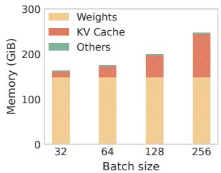

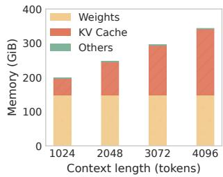  
(a) Context length = 4,096  
(b) Batch size = 256  
Figure 1. Memory composition of Qwen3-Next-80B-A3B-Instruct [52] during inference.

Model weights are only part of the memory picture. Inference must also maintain a KV cache for attention, which grows linearly with both batch size and context length. For a model with 32 layers, a hidden size of 4,096, and 8 KV heads, each token requires around 4 KiB of KV cache per layer, implying roughly 64 GiB in total at a batch size of 128 and a context length of 4,096. Figure 1 shows the overall memory composition for Qwen3-Next-80B-A3B-Instruct [52]: model weights and KV cache each occupy a substantial and comparably sized share of GPU memory. Unlike model weights, which remain static once loaded, the KV cache grows with every decoded token and must be read at every decoding step, making its capacity directly performance-critical.

## 2.2 KV Cache Capacity Determines Throughput

KV cache capacity governs concurrent token processing: a larger KV cache capacity admits larger batches and longer contexts, both of which increase throughput. Figure 2 quantifies this relationship on Mixtral-8×7B-Instruct [28] by varying the GPU memory utilization for inference. Expanding the KV budget from 20 GiB to 60 GiB increases throughput by 58.8% at batch size 128 (Figure 2(a)), as a larger KV cache capacity eliminates CPU–GPU swapping. Under a fixed 20 GiB budget, extending the context length from 1,024 to 4,096 tokens causes a 66.7% throughput drop, while the 60 GiB configuration reduces the loss by 53.5% (Figure 2(b)).

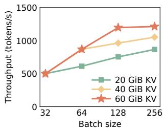  
(a) Context length = 4,096

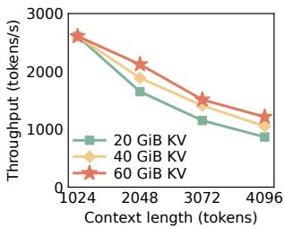  
(b) Batch size = 256  
Figure 2. Inference throughput of Mixtral-8×7B-Instruct [28] versus KV cache capacity.

Current inference systems, however, allocate GPU memory statically: model parameters are loaded at initialization and remain resident for the entire serving session. As a result, the KV cache is limited to the GPU memory remaining after weights are allocated. For large MoE models, the residual GPU memory is severely limited; even though a vast majority of expert parameters sit idle at any given decoding step, they continuously occupy GPU memory, crowding out the performance-critical KV cache.

Modern LLM deployments increasingly adopt disaggregated serving architectures (e.g., Mooncake [40] and Dist-Serve [63]), which separate the prefill and decode phases onto distinct GPU clusters. Since the prefill phase is computebound while the autoregressive decode phase is severely memory-bound due to continuous KV cache growth, Flux-MoE is specifically designed to optimize the heavily memoryconstrained decode workloads. Consequently, FluxMoE focuses on sustained token generation rather than prefilldominated metrics (e.g., Time-to-First-Token (TTFT)).

## 3 Expert Paging

Expert paging decouples the logical identity of MoE parameters from their physical GPU residency, transforming expert weights into virtual, on-demand resources. Rather than remaining persistent, parameters are materialized into the physical address space only when their layer is scheduled for execution and consumed by compute kernels, and are immediately evicted to reclaim space for the KV cache. Expert paging prioritizes GPU memory for performance-critical resources, such as KV cache and activation buffers, while expert weights are streamed from external storage.

## 3.1 Execution Model

Consider an MoE model with ?? layers and ?? experts per layer. Let $E _ { i } ^ { j }$ denote the ?? -th expert in layer ?? as (?? ∈ [1, ?? ], ?? ∈ [1, ??]), and $\mathcal { E } _ { i } = \{ E _ { i } ^ { 1 } , E _ { i } ^ { 2 } , . . . , E _ { i } ^ { L } \}$ denote the full expert set of layer ??. Layers execute sequentially during inference, with a lightweight forward proxy intercepting the model forward pass to manage expert materialization.

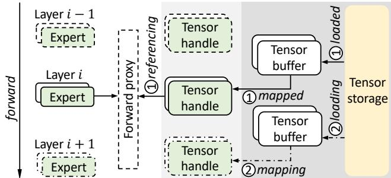  
Figure 3. Overview of expert paging.

Figure 3 illustrates the execution model. Before layer ?? begins, the forward proxy ensures that all experts in $\mathcal { E } _ { i }$ are physically resident in GPU memory ( 1 in Figure 3). Concurrently, experts from $\mathcal { E } _ { i - 1 }$ are released to reclaim their physical GPU memory space, and experts in $\boldsymbol { \mathcal { E } } _ { i + 1 }$ are prefetched asynchronously from external storage ( 2 in Figure 3), overlapping I/O with the compute kernels of layer ??. This forms a sliding residency window $R _ { i }$ satisfying:

$$
R _ { i } \subseteq \mathcal { E } _ { i } \cup \mathcal { E } _ { i + 1 } .\tag{2}
$$

FluxMoE bounds the mandatory GPU-resident expert footprint using a sliding window that accommodates the parameters of at least two consecutive MoE layers to sustain continuous execution. This reduces the required memory footprint to only 2/?? of the full model’s capacity. Beyond this baseline window, FluxMoE can dynamically exploit available GPU memory to retain additional experts when KV cache pressure is low. This minimizes expert materialization overhead and ensures seamless compute-I/O overlap.

## 3.2 Three-Tier Tensor Abstraction

Expert paging realizes the execution model above through a three-tier tensor abstraction that mirrors the virtual-tophysical mapping of an OS memory manager, decoupling the model’s logical execution from the physical constraints of GPU memory. Each expert $E _ { i } ^ { j }$ comprises two weight tensors: a fused gate/up-projection tensor and a down-projection tensor. Expert paging operates at the per-tensor granularity, treating each weight tensor independently by the three-tier tensor abstraction. This allows the two weight tensors of an expert to be transferred in parallel and allocated with different physical memory sizes.

Tensor handle. Each weight tensor is associated with an 8-byte tensor handle, which represents the logical identity (i.e., virtual address) of the tensor. A tensor handle specifies a fixed, reserved range in the GPU’s virtual address space, and also corresponds to invariant metadata (i.e., shape, dtype, and device placement) throughout the model’s lifecycle. This pointer stability ensures that existing inference kernels can reference weight tensors via their corresponding tensor handles as if they were persistently resident in GPU memory.

Tensor buffer. FluxMoE maintains pre-allocated, reusable physical memory blocks called tensor buffers. To accommodate the two-layer sliding residency window (§3.1), FluxMoE maintains 4?? tensor buffers, 2?? for the currently executing layer and 2?? for the layer being prefetched, with two tensor buffers per expert and ?? experts per layer. Each tensor buffer is sized precisely to its target weight tensor. Materializing an expert binds two free tensor buffers to the corresponding tensor handles, making weights immediately accessible to compute kernels. Once a layer completes, all its associated buffers are recycled.

Tensor storage. Tensor storage is the persistent backing store for the weight tensors of all ?? × ?? experts. It represents a multi-tier storage hierarchy spanning compressed GPU memory space and host DRAM (see §4.2 for the placement policy). When a layer enters the execution window, all its experts’ weight tensors are fetched from tensor storage into tensor buffers and bound to their respective tensor handles.

## 3.3 System Challenges

Realizing expert paging efficiently introduces three challenges that motivate FluxMoE’s design.

Decoupling logical and physical tensors. Deep learning frameworks (e.g., PyTorch) assume that a tensor’s physical address is immutable. Expert paging breaks this assumption by rebinding logical tensor handles to different physical buffers across layers. FluxMoE must support stable virtual addresses, dynamic physical remapping, and transparent kernel compatibility, without modifying inference infrastructure.

Loading parameters from the tensor storage hierarchy. Expert parameters can collectively exceed GPU memory by 1-2 orders of magnitude. The tensor storage hierarchy must ensure each layer’s tensors are ready within the compute window of the preceding layer to sustain high inference throughput. This transforms expert placement into a bandwidth provisioning problem across heterogeneous backends.

Expert materialization under memory pressure. Expert materialization involves buffer allocation, parameter transfers, and optional decompression. These steps must be carefully pipelined during model execution to avoid stalling the forward pass, while dynamically adapting to memory pressure from the KV cache.

## 4 FluxMoE Design

FluxMoE addresses expert paging challenges via three tightly integrated mechanisms (shown in Figure 4): (??) PagedTensor (§4.1), which virtualizes tensor residency, allowing dynamic expert materialization and eviction while presenting a stable, continuous address space for kernels ( 1 ); (????) a bandwidthbalanced storage hierarchy (§4.2), which spans compressed GPU memory and host DRAM to co-optimize loading bandwidth and GPU footprint through proportional parameter placement ( 2 ); and (??????) a budget-aware residency planner (§4.3), which dynamically balances expert residency against KV cache pressure under a fixed GPU memory budget ( 3 ).

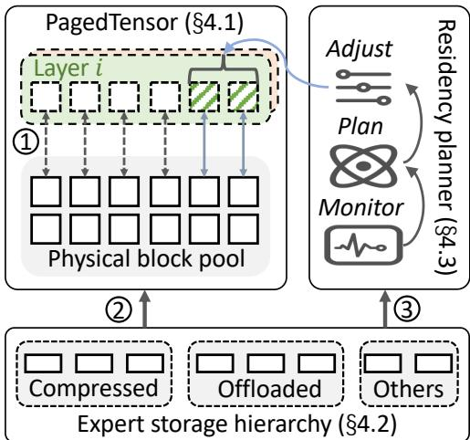  
Figure 4. FluxMoE architecture.

## 4.1 PagedTensor

PagedTensor is a tensor virtualization abstraction that decouples the logical address space of expert weight tensors from their physical GPU residency, allowing existing kernels to reference expert parameters as ordinary contiguous tensors. It is inspired by the PagedAttention mechanism in vLLM [31], which virtualizes KV cache blocks to eliminate fragmentation. PagedAttention’s design is, however, unsuitable for expert weights: it embeds the virtual-to-physical address lookup directly within the compute kernel, a necessity imposed by the KV cache access pattern, and each request reads a distinct, non-contiguous set of pages during the same kernel invocation. In contrast, expert weight accesses exhibit a static and shared structure: since the parameters of a given expert remain invariant regardless of the input tokens, physical blocks can be mapped contiguously to the virtual address range before the kernel launches. PagedTensor exploits this structure by resolving the virtual-to-physical mapping asynchronously, ahead of each kernel invocation, eliminating all in-kernel address arithmetic and enabling expert weights to be materialized and evicted on demand, without modifying a single line of existing kernel code.

Formal model. PagedTensor builds on three abstractions: tensor pages, physical blocks, and page mappings. Since each expert’s two weight tensors (i.e., a fused gate/up-projection and a down-projection) have different sizes, PagedTensor maintains two independent virtual address spaces, one per tensor type. Let $\mathcal { T } ^ { ( d ) } = \{ T _ { 1 } ^ { ( d ) } , T _ { 2 } ^ { ( d ) } , . . . , T _ { N } ^ { ( d ) } \}$ denote the set of tensor groups for type $d \in \{ 1 , 2 \}$ , where $d = 1$ denotes the fused gate/up-projections and ?? = 2 denotes the downprojections, and ?? is the number of MoE layers. Each $T ^ { ( d ) }$ is a purely logical construct within a reserved GPU virtual address space, occupying no physical GPU memory.

Each tensor group $T _ { i } ^ { ( d ) }$ contains ?? distinct tensor pages $\{ P _ { i , 1 } ^ { ( d ) } , P _ { i , 2 } ^ { ( d ) } , . . . , \bar { P } _ { i , L } ^ { ( d ) } \}$ , one per expert in layer ??. $P _ { i , j } ^ { ( d ) }$ reserves a contiguous virtual address range of size $\sigma ^ { ( d ) }$ to represent the type-?? parameters of expert $E _ { i } ^ { j } .$ . Here, $\sigma ^ { ( d ) }$ denotes the weight matrix volume multiplied by the data type width.

Algorithm 1 PagedTensor Synchronization Protocol   
Input: CUDA streams {????????????comp, ???????????? $_ { \mathrm { l o a d } } ^ { ( d ) } \}$ , tensor   
groups $T _ { i } ^ { ( d ) }$ , total layers ?? , iteration ????????   
1: procedure MaterializeLayer(??, ?? , ???????? )   
2: for ?? ∈ {1, 2} do   
3: if ???????? > 1 or ?? > 2 then   
4: target $ ( ( i - 3 + N )$ mod $N ) + 1$   
5: WaitEvent(???????? $t _ { \mathrm { t a r g e t } } ^ { \mathrm { c o m p } } ,$ ???????????? $\iota _ { \mathrm { l o a d } } ^ { ( d ) } )$ ⊲ WAR   
6: Recycle blocks of layer target for $T _ { i } ^ { ( d ) }$   
7: end if   
8: ${ \operatorname* { M a p } } ( T _ { i } ^ { ( d ) } )$   
9: AsyncLoad $( T _ { i } ^ { ( d ) }$ , ???????????? $_ \mathrm { l o a d } ^ { ( d ) } )$   
10: ???????? $t _ { i } ^ { \mathrm { l o a d } ( d ) }$ ← RecordEvent(???????????? $: \boldsymbol { ^ { ( d ) } } _ { \mathrm { l o a d } } )$   
11: end for   
12: end procedure   
13: procedure ForwardPass(??)   
14: for ?? ∈ {1, 2} do   
15: WaitEvent(???????? $t _ { i } ^ { \mathrm { l o a d } ( d ) }$ , ????????????comp) ⊲ RAW   
16: end for   
17: LaunchKernels(??, ????????????comp)   
18: ???????? $t _ { i } ^ { \mathrm { c o m p } }$ ← RecordEvent(????????????comp)   
19: end procedure

For each type ??, PagedTensor maintains a physical block pool $\mathcal { F } ^ { ( d ) } = \bar { \{ f _ { 1 } ^ { ( d ) } , . . . , f _ { 2 L } ^ { ( d ) } \} }$ of 2?? blocks, each of size $\sigma ^ { ( d ) }$ ， giving 4?? blocks in total across both types. A page becomes resident when a free block is mapped to its virtual address:

$$
\begin{array} { r } { \operatorname* { m a p } : f _ { m } ^ { ( d ) } \longrightarrow P _ { i , j } ^ { ( d ) } , \quad m \in [ 1 , 2 L ] , } \end{array}\tag{3}
$$

where each page is bound to at most one block at any time $( | \mathrm { m a p } ( P _ { i , j } ^ { ( d ) } ) | \leq 1 )$ . With $4 L \ll 2 N L$ total pages, blocks are dynamically remapped across layers during inference.

Stable virtualized tensor address space. For each set of tensor groups $\mathcal { T } ^ { ( d ) }$ , PagedTensor reserves a contiguous GPU virtual address region $V ^ { ( d ) } = [ { v } _ { 0 } ^ { ( d ) } , { v } _ { 0 } ^ { ( d ) } + N \times L \times \sigma ^ { ( d ) } )$ where $v _ { 0 } ^ { ( d ) }$ denotes the base virtual address allocated for the global address space. Each tensor group $T _ { i } ^ { ( d ) } \left( i \in [ 1 , N ] \right)$ is assigned a fixed base offset within the virtual region $V ^ { ( d ) }$ calculated as the aggregate size of all preceding layers. Thus, the stable virtual address of $P _ { i , j } ^ { ( d ) }$ is uniquely determined by:

$$
\begin{array} { r } { \mathbf { a d d r } ( P _ { i , j } ^ { ( d ) } ) = \boldsymbol { v } _ { 0 } ^ { ( d ) } + \underbrace { ( i - 1 ) \cdot L \cdot \boldsymbol { \sigma } ^ { ( d ) } } _ { \mathrm { o f f s e t } ( T _ { i } ^ { ( d ) } ) } + ( j - 1 ) \cdot \boldsymbol { \sigma } ^ { ( d ) } . } \end{array}\tag{4}
$$

This virtual address remains invariant throughout inference regardless of which physical block is assigned to the page, allowing unmodified GPU kernels to access tensors directly.

Asynchronous expert lifecycle. Each tensor page transitions through four states: Unmapped → Loading → Resident → Evicting. PagedTensor coordinates the transitions via CUDA streams and events to ensure that a tensor page is never unmapped while still being in use by any in-flight compute kernel. To maximize compute-I/O overlap, PagedTensor pipelines expert materialization and eviction across the CPU, the expert-loading stream, and the inference-compute stream, governed by two ordering constraints:

Write-After-Read (WAR): A physical block cannot be reused by other experts until all compute kernels that access the page have completed.

• Read-After-Write (RAW): Inference compute kernels must not be launched until the required expert parameters have been fully loaded into their physical blocks.

PagedTensor enforces both ordering constraints and orchestrates this asynchronous lifecycle through cross-stream CUDA event barriers (Algorithm 1). During the expert materialization phase (lines 1–12) for layer ?? $( i \in [ 1 , N ] )$ , the loading stream ???????????? $_ \mathrm { l o a d } ^ { ( d ) }$ enforces the WAR constraint by synchronizing with the completion of the forward pass for a specific target layer (lines 4-5). The target layer is determined by PagedTensor’s two-layer physical memory budget: since PagedTensor restricts physical GPU memory residency to exactly two layers of experts simultaneously, materializing layer ?? requires overwriting the physical blocks occupied by the second preceding layer relative to ??. This ensures that PagedTensor safely reclaims only the memory that is no longer required for the active forward pass. Identifying the target layer must also account for the cyclic nature of LLM inference. Since inference steps through layers 1 to ?? repeatedly and returns immediately to layer 1 after layer ?? , the two-layer look-back wraps across iteration boundaries. (e.g., the second preceding layer of layer 2 is layer ?? ). Formally, the target layer is computed as $( i - 3 + N )$ mod $N + 1$

The WAR synchronization is bypassed for the first two layers of the initial iteration $( i t e r \ = \ 1 , i \ \leq \ 2 )$ , since the physical block pool is empty and there is no active data to protect (line 3). This cold-start bypass eliminates spurious synchronization overhead during warm-up. Once the WAR constraint is satisfied, ???????????? $\mathring { \iota } _ { \mathrm { l o a d } } ^ { ( d ) }$ issues an asynchronous DMA transfer (or decompression kernel) to populate the physical blocks with layer ??’s experts (line 9). Once finished, it records $e v e n t _ { i } ^ { \mathrm { l o a d } ( d ) }$ to signal that the parameters are resident and coherent (line 10).

The inference forwarding phase (lines 13-19) enforces the RAW constraint. Before launching any inference kernels for layer ??, the compute stream ????????????comp must stall until it observes both ??????????load(1)?? and $e v e n t _ { i } ^ { \mathrm { l o a d } ( 2 ) }$ (line 15). This ensures that the compute kernels never access uninitialized or partial data. Since the two loading streams operate independently in parallel, both weight tensors are transferred concurrently, fully utilizing available I/O bandwidth. After the computation completion (line 17), ???? $r e a m _ { \mathrm { c o m p } }$ records event $e v e n t _ { i } ^ { \mathrm { { c o m p } } }$ (line 18), signaling that the corresponding physical blocks can be reclaimed for subsequent layers.

Taken together, the expert materialization for a layer proceeds concurrently with the forward pass of its preceding layer. By decoupling the loading and computing tasks into distinct CUDA streams, PagedTensor maintains a continuous execution pipeline by initiating each layer’s parameter transfers as early as possible and fully hiding I/O latency behind the preceding layer’s computation, even when the total model size substantially exceeds the physical GPU memory.

Design invariants. PagedTensor enforces four strict invariants to guarantee correctness and high performance:

• Stable virtual addresses: Each tensor page retains a constant virtual address throughout inference execution.

• Deterministic mapping: Each tensor page can be mapped to at most one physical block at any time.

• Safe remapping: All mapping operations are synchronized with GPU kernels via CUDA events.

• Block reuse: A small fixed-size pool of physical blocks supports a vastly larger logical tensor space.

## 4.2 Expert Storage Hierarchy

While PagedTensor enables dynamic materialization of expert tensors, it does not address where expert parameters reside or how they are supplied at runtime. For large MoE models, the total parameter footprint can exceed GPU memory by one to two orders of magnitude, transforming expert placement into a bandwidth provisioning problem: the storage hierarchy must provide parameters fast enough to sustain the pipelined execution model for expert paging (§3.1).

Our expert storage hierarchy has two goals. First, it minimizes the GPU-resident parameter footprint by offloading experts to host DRAM and storing GPU-resident compressed copies, reclaiming GPU memory capacity for the KV cache and activation buffers. Second, for a given residency configuration (§4.3), it minimizes the expert materialization time by distributing the streaming workload across storage backends to keep expert loading fully overlapped with forwarding.

Storage hierarchy model. We model the storage system as a set of ?? backends $\boldsymbol { S } = \{ S _ { 1 } , \ldots , S _ { K } \}$ , where each backend $S _ { k }$ provides effective loading bandwidth $B _ { k }$ , determined by its underlying hardware mechanism, including the PCIe transfer rate for host DRAM and the decompression throughput for compressed GPU memory. To maximize loading rates, FluxMoE partitions each layer’s expert parameters across all backends to exploit the combined bandwidth of the entire hierarchy during its streaming window. Let the total parameter size of all experts across all MoE layers be

$$
P _ { \mathrm { t o t a l } } = \sum _ { d = 1 } ^ { 2 } \sum _ { i = 1 } ^ { N } \sum _ { j = 1 } ^ { L } | P _ { i , j } ^ { ( d ) } | .\tag{5}
$$

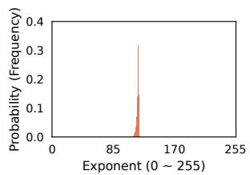

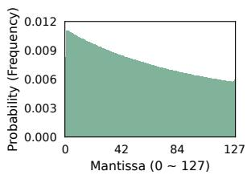

(a) Experts of Layer 0 in Mixtral-8×7B-Instruct [28]  
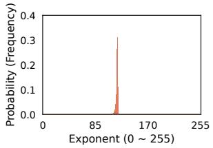

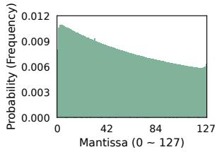  
(b) Experts of Layer 20 in Qwen3-Next-80B-A3B-Instruct [52]  
Figure 5. Exponent and mantissa distribution analysis of MoE expert parameters.

Let $x _ { k }$ denote the fraction of parameters stored in backend $S _ { k }$ , with $\textstyle \sum _ { k = 1 } ^ { K } x _ { k } = 1$ . Each layer requires parameter volume $P _ { \mathrm { l a y e r } } = P _ { \mathrm { t o t a l } } / N _ { \mathrm { : } }$ , of which $S _ { k }$ streams $x _ { k } \times P _ { \mathrm { l a y e r } }$ . This incurs loading time:

$$
\tau _ { k } = \frac { x _ { k } \times P _ { \mathrm { l a y e r } } } { B _ { k } } .\tag{6}
$$

The optimal placement minimizes this sum by balancing the loading work across backends so that they all finish simultaneously. This requires

$$
\frac { \boldsymbol { x } _ { k } \times P _ { \mathrm { l a y e r } } } { B _ { k } } = \frac { \boldsymbol { x } _ { \ell } \times P _ { \mathrm { l a y e r } } } { B _ { \ell } } , \quad \forall k , \ell \in { 1 , . . . , K } ,\tag{7}
$$

which yields the bandwidth-proportional allocation

$$
x _ { k } = \frac { B _ { k } } { \sum _ { \ell = 1 } ^ { K } B _ { \ell } } , \quad \forall k \in { 1 , . . . , K } .\tag{8}
$$

This policy prevents backends from becoming bottlenecks and maximizes aggregate throughput. A key implication is that GPU memory usage is determined by relative bandwidth ratios rather than absolute model size. Let $x _ { \mathrm { g p u } }$ be the fraction of parameters resident in GPU memory; the footprint, $x _ { \mathrm { g p u } } \times P _ { \mathrm { t o t a l } }$ , grows linearly with the model size but with a coefficient $x _ { \mathrm { g p u } } \ll 1$ . The GPU thus holds only a fraction of the parameters proportional to its share of the total bandwidth, leaving the remainder in host or compressed storage.

Compressed GPU backend. We choose the GPU backend as the primary backend for storing expert parameters due to its high bandwidth for expert materialization. To reduce the persistent GPU memory footprint, the GPU backend stores expert parameters in compressed form within GPU memory and decompresses them on demand during materialization. The effective bandwidth of the compressed GPU backend is primarily determined by the minimum of the ondevice memory bandwidth available for reading compressed data and the decompression kernel’s computational throughput. Since modern GPUs deliver hundreds of GB/s to multiple TB/s of local memory bandwidth, and decompression kernels can operate at comparable rates, the compressed GPU backend still maintains high throughput for expert materialization even when accounting for decompression.

FluxMoE compresses only expert parameters, leaving all non-expert weights (e.g., attention projections) uncompressed and GPU-resident. This design choice is justified by the observation that expert parameters account for over 90% of the total model volume in the evaluated models [28, 52]; compressing the remaining (less than 10%) would yield negligible memory savings while risking decompression overhead on the inference-critical path.

We choose lossless compression for expert parameters over lossy compression, as the latter can incur unbounded accuracy loss and degrade mathematical reasoning [33, 35]. As Figure 5 shows, the exponent bits (8 bits in BFloat16) of expert weights across both Mixtral-8×7B-Instruct [28] and Qwen3-Next-80B-A3B-Instruct [52] are highly concentrated around a narrow range of magnitudes, exhibiting a sharp peak in the probability distribution and correspondingly low entropy. In contrast, the mantissa bits (7 bits) are nearly uniformly distributed and carry high-entropy information that is incompressible. This separation of compressible and incompressible bit fields is consistent across models and layers. Note that prior studies [13, 20, 21, 59] have also identified the distinct entropy patterns in mantissas and exponents in traditional dense models. Our profiling targets the sparse computing paradigm in MoE and confirms that MoE expert parameters show a highly compressible exponent structure.

FluxMoE exploits this redundancy structure and implements a selective Huffman coding [23] scheme that encodes only the exponent bits of each expert weight offline, before inference begins. The sign and mantissa bits remain uncompressed. These compressed exponents and raw sign/mantissa bits are loaded into GPU memory at model initialization, reducing expert storage by approximately 20% for BFloat16 models [28, 52]. During inference, a high-throughput GPU decompression kernel reconstructs the original parameters on the fly at hundreds of GB/s per GPU, keeping the decompression cost within the loading window and fully overlapping it with the preceding layer’s forward pass.

CPU offload backend. The compressed GPU backend provides high bandwidth but is still bounded by physical GPU memory capacity. To further reduce the GPU-resident parameter footprint, FluxMoE uses a secondary backend to store expert parameters in pinned host memory and transfer them to the GPU over PCIe via asynchronous DMA, following prior parameter-offloading systems [42, 46].

Modern accelerators provide tens of GB/s of PCIe bandwidth; this capacity is effectively utilized by prefetching layer ?? + 1 during layer ??’s execution. This allows PCIe transfers, GPU decompression, and model forwarding to proceed concurrently. Because the expert paging execution model (§3.1)

maintains only a two-layer sliding window of active experts, the volume of in-flight data is bounded and predictable, preventing unbounded memory pressure.

However, PCIe bandwidth alone often falls short of highend GPU compute throughput. The CPU backend thus acts as a complementary capacity tier, offloading parameters to expand addressable storage, while the compressed GPU backend remains the primary bandwidth provider.

## 4.3 Budget-Aware Residency Planner

PagedTensor virtualizes tensor addresses, and the storage hierarchy provides expert parameters from heterogeneous backends. The remaining challenge is deciding, at runtime, how many experts should remain resident in GPU memory as workload conditions shift. We address this with a budgetaware residency planner: a closed-loop controller that continuously balances expert residency against KV cache pressure, keeping computation and parameter I/O overlapped within a fixed GPU memory budget.

Optimization objective. During inference, each layer’s forward pass is executed while the next layer’s expert parameters are loaded asynchronously (§3.1). We define ??comp(theory) as the idealized per-iteration forwarding latency (i.e., the full forward pass across all layers to generate one new token per sequence), profiled in a weight-resident configuration where all model parameters (without compression) and the KV cache reside permanently in GPU memory. By eliminating I/O bottlenecks and memory swapping, ??comp(theory) establishes a theoretical performance ceiling representing the minimum execution time achievable at the hardware’s peak computational throughput. In practice, ??comp(theory) is re-profiled whenever the serving configuration changes substantially (e.g., batch size or context length shifts), ensuring that it remains representative of current hardware utilization rather than a stale prior workload.

To characterize the loading latency of the pipeline, we define the per-layer loading latency $\tau _ { \mathrm { l o a d \_ l a y e r } } ^ { ( i ) }$ as the transfer time for layer ??’s expert parameters. Since all ?? backends operate concurrently (§4.2), the per-layer latency is set by the slowest backend:

$$
\tau _ { \mathrm { l o a d \_ l a y e r } } ^ { ( i ) } = \operatorname* { m a x } _ { k } \tau _ { k } , \quad \forall k \in { 1 , \dots , K } .\tag{9}
$$

We then define $\tau _ { \mathrm { l o a d } }$ as the aggregate I/O demand for a complete iteration, i.e., the cumulative loading time that the storage backends must sustain across all ?? layers. Since expert paging maintains continuous bandwidth saturation throughout the inference pipeline, each layer’s parameter transfer occupies the shared I/O resource for exactly $\tau _ { \mathrm { l o a d \_ l a y e r } } ^ { ( i ) }$ before the next transfer begins. Thus, the total I/O demand is the sum of these per-layer latencies:

$$
\tau _ { \mathrm { l o a d } } = \sum _ { i = 1 } ^ { N } \tau _ { \mathrm { l o a d \_ l a y e r } } ^ { ( i ) } .\tag{10}
$$

To avoid pipeline stalls, the aggregate I/O demand must not exceed the total compute budget $( \mathrm { i . e . , } \tau _ { \mathrm { l o a d } } \leq \tau _ { \mathrm { c o m p ( t h e o r y ) } } ) .$ We balance the two metrics using the compute-to-load ratio:

$$
\rho = \frac { \tau _ { \mathrm { c o m p ( t h e o r y ) } } } { \tau _ { \mathrm { l o a d } } } .\tag{11}
$$

The ideal operating point is $\rho \approx 1$ , where expert materialization and forwarding are perfectly overlapped. During the prefill phase, which processes thousands of tokens concurrently, the compute time $\tau _ { \mathrm { c o m p ( t h e o r y ) } }$ significantly exceeds the expert loading latency $\tau _ { \mathrm { l o a d } }$ , naturally yielding a $\rho \gg 1$ In this heavily compute-bound regime, PagedTensor fully hides expert materialization behind the compute kernels, avoiding I/O bottlenecks that would impact TTFT. Thus, the planner focuses on the autoregressive decoding phase; its primary goal is to continuously adjust the system configuration to maintain $\rho \approx 1$ , thereby maximizing throughput while minimizing GPU memory consumption.

Residency control model. The planner manages the expert residency level $\alpha \in ( 0 , 1 ]$ , defined as the fraction of expert parameters resident in GPU memory in either dense or compressed form. The remaining $( 1 - \alpha )$ is streamed on demand from the CPU backend (§4.2). Increasing ?? reduces streaming volume and hence decreases $\tau _ { \mathrm { l o a d } } .$ , while decreasing ?? frees GPU memory but increases streaming demand. The planner adjusts ?? according to the observed $\rho \colon$

• If $\rho \ > \ 1$ , computation dominates execution time. The planner decreases ?? to free GPU memory for the KV cache.

• If $\rho < \theta$ (default: 0.9), parameter loading is the bottleneck. The planner increases ?? to promote more experts into GPU residency and reduce the streaming volume.

The asymmetric thresholds define a deliberate dead zone [??, 1.0] around the ideal operating point, where ?? is a tunable parameter. Since PCIe transfers are inherently bursty with transient I/O fluctuations, a symmetric threshold at $\rho = 1$ can cause the planner to oscillate continuously between increasing and decreasing ??. The dead zone ensures that only sustained I/O bottlenecks, in which loading consistently lags by more than 10% behind computation, trigger an increase in residency. The default $\theta = 0 . 9$ is selected empirically as the point at which throughput degradation becomes measurable.

Memory-aware constraints. GPU memory is shared between expert parameters and runtime state. Let $C _ { \mathrm { g p u } }$ be the total GPU memory budget and $C _ { \mathrm { k v } }$ be the current KV cache usage (measured by the number of generated tokens). The memory available for expert residency is $C _ { \mathrm { r e s } } = C _ { \mathrm { g p u } } - C _ { \mathrm { k v } } .$ The planner enforces a hard safety constraint to ensure that expert residency never displaces the KV cache:

$$
C _ { \mathrm { e x p } } ( \alpha ) \leq C _ { \mathrm { r e s } } ,\tag{12}
$$

where $C _ { \mathrm { e x p } } ( \alpha )$ is the aggregate on-device size of the expert fraction ??. As $C _ { \mathrm { k v } }$ grows or shrinks during inference, the planner automatically adjusts ?? to maintain feasibility, allowing FluxMoE to dynamically trade expert residency for

Algorithm 2 Budget-Aware Residency Planner   
1: Offline profile ??comp(theory)   
2: Estimate $\tau _ { \mathrm { l o a d } }$ based on expert residency status   
3: $\rho  \tau _ { \mathrm { c } }$ omp(theory)/??load   
4: if $\rho > 1$ then   
5: Decrease residency level ?? ⊲ Reclaim memory   
6: else if $\rho < 0 . 9$ then   
7: Increase residency level ?? ⊲ Reduce ??load   
8: end if ⊲ No adjustment for $0 . 9 \leq \rho \leq 1$   
9: Enforce $C _ { \mathrm { e x p } } ( \alpha ) \leq C _ { \mathrm { g p u } } - C _ { \mathrm { k v } }$ ⊲ Prioritize KV cache

KV cache capacity under varying workloads.

Runtime adaptation. The planner operates as a lightweight runtime controller (Algorithm 2). Before inference begins, ??comp(theory) is profiled for the initial serving configuration (line 1). At each iteration, the planner estimates ??load based on current residency using the storage hierarchy model from §4.2 (line 2). When $\rho > 1$ (compute-bound), the forward pass takes longer than the loading pipeline, as insufficient KV cache capacity forces CPU–GPU swapping and inflates actual compute time; the planner reduces ?? to free GPU memory, relieving KV cache pressure and driving ?? back toward 1 (line 5). When $\rho < 0 . 9$ (I/O-bound), the planner increases ?? to promote more experts into GPU residency and reduce streaming volume (line 7). The planner enforces the hard capacity constraint after every update (line 9), ensuring expert residency never compromises KV cache memory.

Since the residency planner gradually adjusts the expert residency, the resulting parameter migration overhead remains minimal and is effectively hidden by overlapping it with model forwarding. The planner runs asynchronously with the inference stream and avoids inserting CUDA synchronization primitives on the critical path.

Stability and convergence. The planner implements a negative feedback controller. Increasing ?? reduces parameter streaming volume from host DRAM and therefore decreases $\tau _ { \mathrm { l o a d } }$ , while decreasing ?? has the opposite effect. This monotonic relationship guarantees that the control loop converges to a stable operating point. When GPU memory is sufficient, the planner drives ?? until:

$$
\tau _ { \mathrm { l o a d } } ( \alpha ) \approx \tau _ { \mathrm { c o m p ( t h e o r y ) } } ,\tag{13}
$$

at which point expert materialization is perfectly hidden behind computation. In memory-constrained regimes, the hard safety constraint $C _ { \mathrm { e x p } } ( \alpha ) \leq C _ { \mathrm { g p u } } - C _ { \mathrm { k v } }$ takes precedence: the planner prioritizes KV cache capacity over expert residency to prevent throughput-degrading activation swapping. Even when this forces $\tau _ { \mathrm { l o a d } } > \tau _ { \mathrm { c o m p ( t h e o r y ) } }$ , FluxMoE preserves the maximum feasible batch size and concurrency under the available physical GPU memory.

Figure 6 illustrates the joint behavior of $\tau _ { l o a d }$ (the expert loading time), $\tau _ { \mathrm { c o m p } }$ (the actual forwarding time), and ??. At $\alpha = 1 . 0$ , all expert parameters are uncompressed and

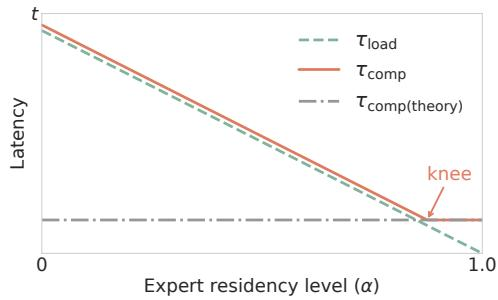  
Figure 6. Trends of $\tau _ { \mathrm { l o a d } }$ and $\tau _ { \mathrm { c o m p } }$ versus ??.

GPU-resident, so $\tau _ { \mathrm { l o a d } }$ is effectively zero, and the system is compute-bound. As ?? decreases from 1.0, a growing fraction of parameters must be streamed from the storage hierarchy, and $\tau _ { \mathrm { l o a d } }$ increases monotonically. The actual execution time $\tau _ { \mathrm { c o m p } }$ initially remains flat (i.e., the horizontal segment of Figure 6) since loading is still fully overlapped within the computation window. Once ?? decreases past the knee of the curve, and $\tau _ { \mathrm { l o a d } }$ approaches ??comp(theory), the system transitions from a compute-bound to an I/O-bound regime: ??comp is no longer governed by the hardware’s intrinsic forwarding latency but is instead determined by expert loading; it increases linearly as the pipeline stalls to await parameter materialization. The planner targets operation at this knee $( \mathrm { i . e . , }$ maximizing GPU memory reclamation while holding $\tau _ { \mathrm { c o m p } }$ at the theoretical minimum). Through this closed-loop control, FluxMoE dynamically transitions between an expert-resident regime and a streaming regime, maintaining near-optimal overlap between computation and parameter loading.

## 5 Implementation

We implement FluxMoE as an inference middleware built atop vLLM v0.10.2 [31]. The core implementation comprises approximately 3.1 K LoC in C++ and 2.1 K LoC in Python, requiring a highly non-intrusive modification of just 20 LoC in Python to interface with the underlying vLLM framework.

PagedTensor. We implement PagedTensor via CUDA VMM APIs [5] (cuMemMap and cuMemUnmap) to dynamically map physical ring-buffer blocks to a unified virtual address space, decoupling logical tensors from physical residency.

Storage backends. We implement two backends: a compressed GPU backend and a CPU offload backend. The GPU backend uses a selective Huffman coding scheme [23] to compress expert exponent bits, which are reconstructed on-thefly by high-throughput decompression kernels [59]. The CPU backend leverages pinned host DRAM and asynchronous DMA over PCIe to maximize transfer efficiency. To maximize compute-I/O overlap, a custom stream pool assigns two dedicated CUDA streams per MoE layer to concurrently handle gate/up-projections and down-projections. This dual-stream architecture enables fine-grained pipelining of parameter movement and decompression.

Budget-aware residency planner. We implement the planner as an asynchronous control loop that dynamically adjusts the expert residency level ?? based on the computeto-load ratio $\rho .$ . Theoretically, FluxMoE ’s design supports a unified tri-state residency model where the total expert set is partitioned into three fractions: (??) ??, uncompressed and permanently GPU-resident; (????) ??, compressed and GPUresident; and (??????) ??, offloaded to host DRAM, satisfying ?? + $y + z = 1$ . In this general form, PagedTensor allocates more than two layers of buffers to accommodate the ?? fraction. Our current prototype implements a specific instance of this design where $x = 0 ,$ , focusing on maximizing GPU memory reclamation by alternating experts between compressed GPU residency and CPU offloading.

## 6 Evaluation

## 6.1 Experimental Setup

Testbed. We evaluate FluxMoE on a server node equipped with Intel Xeon Platinum 8358 processors (totaling 128 vC-PUs), 2 TiB of host DRAM, and 3 TB of disk storage. The node is accelerated by four NVIDIA L40 PCIe GPUs, each equipped with 48 GB of GDDR6 memory with ECC support. We deploy the MoE models on a single node using tensor parallelism (TP) to accommodate their large parameter footprint and to provide a realistic multi-GPU serving environment.

Models. We evaluate FluxMoE on two state-of-the-art, open-weights MoE models of varying scales and architectures: Mixtral-8×7B-Instruct [28], which comprises 32 layers and 47B total parameters, and Qwen3-Next-80B-A3B-Instruct [52], featuring 48 layers and 80B total parameters.

Workloads and dataset. To evaluate the systems under realistic serving conditions, we use the ShareGPT dataset [4], a collection of real-world conversational prompts widely adopted in recent LLM serving literature [26, 50, 56, 64]. Our evaluation specifically targets high-throughput, capacitybound serving environments where the primary goal is maximizing hardware utilization and aggregate token generation rates under severe memory constraints. We sample requests from this dataset to construct workloads spanning context lengths of 1,024 to 4,096 tokens and batch sizes of 32 to 256, enabling a comprehensive evaluation across both memory-light and memory-intensive operating points. Since our primary objective is to demonstrate FluxMoE’s continuous batching efficiency by dynamically reclaiming GPU memory for the KV cache, we report aggregate throughput (tokens/s) as the definitive measure of system performance rather than interactive, single-user latency metrics $( \mathrm { e . g . }$ , Time-Per-Output-Token (TPOT) or TTFT).

Baselines. To evaluate the effectiveness of our design choices, we compare FluxMoE against three baselines:

vLLM [31]: The industry-standard serving framework representing the traditional weight-resident paradigm, which strictly requires all expert parameters to fit within GPU memory, and relies on swapping KV cache blocks to the host DRAM whenever the dynamically growing KV cache reaches its allocated capacity.

• vLLM-O: An offloading-enhanced variant of vLLM. We employ this baseline for two purposes: to isolate the inherent PCIe offloading penalty during sustained generation when KV cache capacity is exhausted (Exp#1), and to prevent immediate Out-of-Memory (OOM) failures in tightly constrained hardware deployments (Exp#2, serving Mixtral-8x7B-Instruct [28] on two GPUs). We implement this variant via PagedTensor with expanded buffer blocks. The experts of the earlier layers (constituting 87.5% of the parameters) remain resident in GPU memory without compression, while the experts from the final 12.5% of the layers are offloaded to the host DRAM. This offloading ratio represents the minimal viable threshold to prevent OOM errors. During inference, it overlaps the forwarding pass of layer ?? with the host-to-device prefetching of expert parameters for layer ?? + 1.

• FluxMoE-H: A hybrid ablation baseline that combines expert offloading with lossless compression. It enforces a coarse-grained, topological placement strategy: the front 87.5% of expert layers are fully compressed and resident in GPU memory, while the final 12.5% of layers are entirely offloaded to the host DRAM. Because it restricts decisions to this strict whole-layer granularity (a layer of experts is either 100% compressed or 100% offloaded), it critically lacks the fine-grained, bandwidth-balanced storage backends (§4.2) that characterize our full design.

## 6.2 End-to-End Performance

We evaluate FluxMoE’s end-to-end throughput under two distinct resource environments.

• The performance-bound regime (Exp#1): A setup with sufficient memory for the standard serving framework vLLM [31] to run natively without OOM errors.

• The capacity-bound regime (Exp#2): A highly resourceconstrained setup where standard serving fundamentally fails, forcing the system to rely on expert offloading.

(Exp#1) Throughput under a performance-bound regime. We deploy the Qwen3-Next-80B-A3B-Instruct [52] model on four GPUs (TP=4). To characterize system performance, we evaluate end-to-end throughput across two scaling dimensions: first, by sweeping the batch size from 32 to 256 with a constant context length of 4,096 tokens; and second, by varying the context length from 1,024 to 4,096 tokens with the batch size held fixed at 256. In this setup, FluxMoE uses its compressed GPU backend to keep all expert weights in GPU memory.

Figure 7 shows the results. At a small batch size (i.e., 32), FluxMoE achieves 63.9% of vLLM’s throughput (Figure 7(a)) due to the on-the-fly decompression overhead while GPU memory is still abundant. In contrast, vLLM-O exhibits the lowest throughput (i.e., 54.6 tokens/s) because its native offloading strategy is strictly limited by PCIe bandwidth, which requires continuous migration of expert weights.

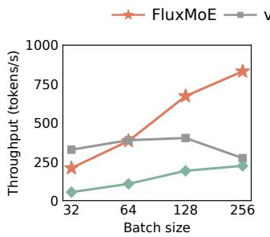  
(a) Context length = 4,096

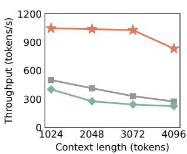  
(b) Batch size = 256  
Figure 7. (Exp#1) Thpt. under a performance-bound regime.

vLLM exhibits limited scalability, showing negative scaling beyond a batch size of 128. While throughput gains are naturally tempered by higher forward latency, vLLM’s primary bottleneck is the inflated KV cache footprint, which triggers aggressive host swapping. This I/O overhead causes vLLM’s throughput to collapse, dropping by 32.2% as the batch size scales from 128 to 256. At this stage, the system is entirely PCIe-bound, and the latency of KV cache swapping outweighs the benefits of increased parallelism. In contrast, vLLM-O maintains a consistent but heavily throttled sub-linear growth, as its offloading strategy reserves GPU memory for the KV cache at the cost of constant weight migration: at a batch size of 32, vLLM achieves a 6.0× speedup over vLLM-O; however, at a batch size of 256, vLLM only increases vLLM-O’s throughput by 22.1%. FluxMoE, however, demonstrates superior scalability by reclaiming GPU memory through expert compression. By significantly expanding the available KV cache capacity, FluxMoE postpones the onset of memory saturation and maintains minimal KV cache eviction even at a batch size of 256. This allows FluxMoE to achieve throughput gains of 3.0× and 3.7× over vLLM and vLLM-O, respectively, for a 4,096-token context length. This confirms that maximizing on-device KV cache residency is the key to sustaining high throughput in MoE serving.

Scaling the context length further validates these findings (Figure 7(b)). At a fixed batch size of 256, increasing the context length from 1,024 to 4,096 tokens increases memory demand, forcing vLLM and vLLM-O to engage in aggressive KV cache swapping. While all systems experience some throughput degradation due to increased computation, vLLM’s performance plummets by 45.3%. In contrast, FluxMoE maintains a much more stable profile, with only a 20.5% decline, because the compressed GPU backend saves memory for the KV cache.

(Exp#2) Throughput under a capacity-bound regime. We evaluate a more resource-constrained setting by reducing TP to 2 and deploying Mixtral-8×7B-Instruct [28]. Under such constrained GPU memory, vLLM cannot deploy this model and consistently triggers OOM errors during initialization. To ensure a fair comparison, FluxMoE offloads 12.5% of the total experts (consistent with FluxMoE-H and vLLM-O) and utilizes the bandwidth-balanced storage hierarchy (§4.2) to manage the resulting I/O.

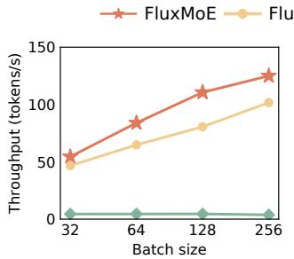  
(a) Context length = 4,096

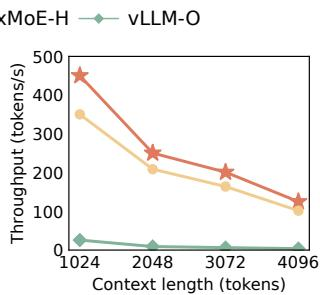  
(b) Batch size = 256  
Figure 8. (Exp#2) Thpt. under a capacity-bound regime.

Figure 8 shows the results. FluxMoE and FluxMoE-H significantly outperform vLLM-O by leveraging the compressed backend to minimize the expert footprint. vLLM-O suffers from a compounded bottleneck: expert weights occupy most of the GPU memory. Consequently, continuous expert prefetching and frequent KV cache swapping compete heavily for the PCIe bandwidth, resulting in very low throughput. For instance, with a batch size of 256 and context length of 4,096 tokens, vLLM-O achieves 3.7 tokens/s.

FluxMoE consistently outperforms FluxMoE-H by employing the bandwidth-balanced storage hierarchy (§4.2) to parallelize expert materialization, thereby matching on-device decompression throughput to the PCIe bandwidth from the CPU backend. For instance, at a batch size of 256, FluxMoE improves FluxMoE-H’s throughput by 28.5% and 22.9% for context lengths of 1,024 and 4,096 tokens, respectively.

## 6.3 Runtime Adaptation of Expert Residency

(Exp#3) Throughput stability during runtime residency adaptation. To evaluate the runtime adaptation of expert residency (§4.3), We compare three settings: (??) fixed ?? = 1.0, where all experts are maintained in a compressed format within GPU memory with a fixed residency level ?? = 1.0 throughout inference; (????) dynamic ?? adaptation, which initially maintains all experts in the compressed GPU format at ?? = 1.0, but subsequently applies the budget-aware residency planner (§4.3) to dynamically adjust the distribution of experts between the compressed GPU backend and host DRAM based on runtime memory pressure; and (??????) dynamic ?? adaptation w/o I/O balance, which employs the budgetaware residency planner (§4.3) but adjusts expert parameter placement within a single layer each time rather than staggering the release across multiple layers to smooth I/O demand. We evaluate the Qwen3-Next-80B-A3B-Instruct [52] and Mixtral-8×7B-Instruct [28] models with a context length of 4,096 tokens under two hardware configurations: a tensor parallelism degree of 4 with a batch size (BS) of 256 for

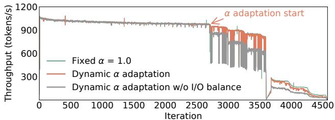

(a) Qwen3-Next-80B-A3B-Instruct [52] (TP=4, BS=256)  
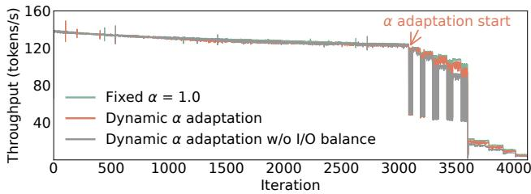  
(b) Mixtral-8×7B-Instruct [28] (TP=2, BS=32)  
Figure 9. (Exp#3) Throughput stability during runtime residency adaptation.

Qwen3-Next-80B-A3B-Instruct [52], and a tensor parallelism degree of 2 with BS 32 for Mixtral-8×7B-Instruct [28].

Figure 9 illustrates the throughput versus iterations across a continuous inference session, where both models exhibit similar performance trends; thus, we focus on Qwen3-Next-80B-A3B-Instruct [52] (Figure 9(a)) as a representative case. Prior to iteration 2,700, the throughput of the dynamic ?? adaptation remains identical to the fixed $\alpha = 1 . 0$ baseline due to stable KV cache occupancy that has not yet triggered memory swapping. At iteration 2,700, as the KV cache footprint approaches the pre-allocated capacity, throughput begins to fluctuate, prompting the residency planner to initiate its closed-loop adaptation mechanism. Specifically, starting from this juncture and repeating every 300 iterations, the planner offloads 48 compressed experts per rank, effectively one expert per layer, to mitigate the I/O pressure introduced by expert prefetching from the host DRAM. In contrast, the planner without I/O balance adjusts expert parameter placement within a single layer and experiences significant throughput degradation during adaptation phases. This drop is primarily attributed to localized I/O spikes that saturate the PCIe bandwidth, causing the computation to stall while waiting for expert materialization.

Throughout the inference, the expert residency level ?? is adjusted seven times, offloading a total of 48 × 4 × 7 compressed experts and reclaiming approximately 5.3 GB of GPU memory. Remarkably, the throughput of the dynamic adaptation setting does not drop below the fixed ?? = 1.0 baseline. This result proves that FluxMoE significantly improves GPU resource utilization, achieving comparable inference performance while substantially reducing the memory footprint, as the expert materialization latency is effectively hidden within the computation window. In multi-tenant environments, the reclaimed GPU memory (e.g., 5.3 GB in Qwen3-

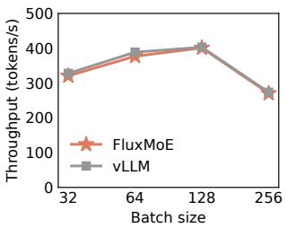  
(a) Context length = 4,096

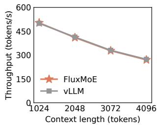  
(b) Batch size = 256  
Figure 10. (Exp#4) PagedTensor overhead analysis.

Next-80B-A3B-Instruct [52]) can be immediately repurposed to co-locate other computational tasks. Furthermore, while current inference frameworks [31, 60] typically allocate KV cache statically at initialization, our results demonstrate a significant opportunity for performance scaling: in future systems supporting dynamic KV cache resizing, this saved memory could be reallocated to expand KV cache capacity, directly translating into higher batching throughput and overall system efficiency.

## 6.4 Overhead Analysis

(Exp#4) PagedTensor overhead analysis. To evaluate the management overhead of PagedTensor (§4.1), we conduct an experiment by ensuring all experts are uncompressed and resident in GPU memory for both systems. Specifically, we extend the tensor buffers in FluxMoE to match vLLM’s native memory allocation, effectively hosting the full set of uncompressed expert parameters within PagedTensor’s managed memory pool, thereby eliminating the effects of decompression (from the compressed GPU backend) and PCIe transfer (from the CPU offload backend). We evaluate FluxMoE and vLLM in Qwen3-Next-80B-A3B-Instruct [52].

As shown in Figure 10, FluxMoE’s throughput closely aligns with vLLM across all evaluated workloads. The peak management overhead of PagedTensor is observed at a batch size of 64 and a context length of 4,096 tokens, with 3.0% overhead. This confirms that PagedTensor’s dynamic memory orchestration introduces negligible computational overhead.

## 7 Related Work

MoE expert offloading. Prior work reduces GPU memory pressure by offloading MoE expert parameters along two lines: delegating a portion of MoE computation to the CPU [7, 8, 62], and predicting active experts and prefetching weights from host DRAM to GPU on demand [14, 19, 25, 32, 43, 47, 51, 57, 59, 61]. CPU-side execution lacks GPUlevel throughput, while prediction-based prefetching is constrained by PCIe latency and is susceptible to mispredictions, which stall the pipeline until the required experts are materialized. FluxMoE avoids both limitations: by decoupling logical expert identity from physical residency, it dynamically streams and materializes parameters from a bandwidthbalanced storage hierarchy of compressed GPU memory and host DRAM, without relying on routing prediction.

MoE parallelism. Expert parallelism assigns different experts to different GPUs to scale capacity (e.g., Tutel [24], MegaBlocks [17], and FasterMoE [18]) to optimize dispatch and all-to-all communication for training and inference. These approaches, however, assume that all expert parameters reside in GPU memory and do not address the memory pressure arising from large expert pools. FluxMoE is orthogonal: it reduces per-GPU expert memory through streaming rather than distributing experts across additional GPUs.

Model compression in LLMs. Lossy methods (e.g., quantization [2, 10, 16, 22, 29, 30, 34, 58] and pruning [9, 11, 37, 38, 44, 53]) offer high compression ratios but risk accuracy loss, limiting applicability in precision-critical deployments. Lossless alternatives, such as ZipNN [20, 21] and LMC [49], apply Huffman coding [23] offline, but are not designed for active inference. DietGPU [1], NVComp [3], DFloat11 [59], and ZipServ [13] leverage lossless compression to accelerate inference, but assume the compressed model still fits within GPU memory. ZipMoE [54] targets edge devices with CPU-side decompression, which cannot sustain the bandwidth demands of server-grade GPUs. FluxMoE selectively compresses expert exponent bits and performs on-GPU, onthe-fly decompression within a multi-tier streaming hierarchy, thereby enabling deployment even when total weights exceed GPU capacity without any precision loss.

Memory management in LLMs. vLLM [31] introduces PagedAttention to eliminate KV cache fragmentation; SGLang [60] and ChunkAttention [55] add prefix-tree sharing to increase cache reuse; CacheGen [36] and FlashInfer [56] optimize transmission efficiency and access patterns. More recently, disaggregated serving systems, such as Mooncake [40] and DistServe [63], reduce KV memory pressure by separating prefill and decode onto distinct GPU pools and leveraging host DRAM and SSD as a distributed KV store. All these systems, however, treat model weights as static, GPU-resident data, leaving expert parameters to permanently occupy a disproportionate share of GPU memory. FluxMoE complements them by treating experts as dynamic, streaming resources, thereby providing additional GPU memory for the KV cache within the same hardware budget.

## 8 Conclusion

FluxMoE is an MoE inference framework that decouples expert parameters from GPU residency to achieve high throughput for resource-constrained MoE services. It introduces an expert paging abstraction that treats expert weights as transient, streamed resources materialized on demand. To realize this, FluxMoE employs PagedTensor, a bandwidthbalanced storage hierarchy, and a budget-aware residency planner. Experiments on an NVIDIA L40 testbed show that FluxMoE achieves significant throughput gains in resourceconstrained environments and maintains high model fidelity.

## References

[1] DIET-GPU: Efficient model inference on GPUs. https://github.com/ facebookresearch/dietgpu.

[2] GGUF: a file format for storing models for inference with GGML and executors based on GGML. https://github.com/ggml-org/ggml/blob/ master/docs/gguf.md.

[3] Repository for nvCOMP docs and examples. https://github.com/ NVIDIA/nvcomp.

[4] ShareGPT datasets. https://huggingface.co/collections/bunnycore/ sharegpt-datasets-66fa831dcee14c587f1e6d1c.

[5] Virtual memory management APIs in CUDA programming guide. https://docs.nvidia.com/cuda/cuda-programming-guide/04-specialtopics/virtual-memory-management.html.

[6] Kimi Team Yifan Bai, Yiping Bao, Guanduo Chen, Jiahao Chen, Ningxin Chen, Ruijue Chen, Yanru Chen, Yuankun Chen, Yutian Chen, Zhuofu Chen, Jialei Cui, Haochen Ding, Meng xiao Dong, Angang Du, Chenzhuang Du, Dikang Du, Yulun Du, Yu Fan, Yichen Feng, Kelin Fu, Bofei Gao, Hongcheng Gao, Peizhong Gao, Tong Gao, Xinran Gu, Longyu Guan, Haiqing Guo, Jia-Xing Guo, Hao-Xing Hu, Xiaoru Hao, Tian He, Weiran He, Wen He, Chao Hong, Yan-Ni Hu, Zhenxing Hu, Weixiao Huang, Zhiqi Huang, Zihao Huang, Tao Jiang, Zhejun Jiang, Xinyi Jin, Yongsheng Kang, Guokun Lai, Cheng Li, Fang Li, Haoyang Li, Ming Li, Wentao Li, Yanhao Li, Yiwei Li, Zhaowei Li, Zheming Li, Hong-Li Lin, Xiaohan Lin, Zongyu Lin, Chengyi Liu, Chenyu Liu, Hongzhang Liu, Jingyuan Liu, Junqi Liu, Liang Liu, Shaowei Liu, T. Y. Liu, Tian-Bo Liu, Weizhou Liu, Yangyang Liu, Yibo Liu, Yiping Liu, Yue Liu, Zhengying Liu, Enzhe Lu, Li Lu, Shen Ma, Xinyu Ma, Yi-Xuan Ma, Shaoguang Mao, Jie Mei, Xin Men, Yibo Miao, Siyuan Pan, Yebo Peng, Ruoyu Qin, Bowen Qu, Zeyu Shang, Li-Na Shi, Sheng-Rong Shi, Feifan Song, Jian-Fei Su, Zhen-Xin Su, Xinjie Sun, Flood Sung, Heyi Tang, Ji-Hua Tao, Qi Teng, Chensi Wang, Dinglu Wang, Feng Wang, Haiming Wang, Jianzhou Wang, Jiaxing Wang, Jinhong Wang, Shengjie Wang, Shuyi Wang, Yao Wang, Yejie Wang, Yiqin Wang, Yuxin Wang, Yuzhi Wang, Zhaoji Wang, Zhengtao Wang, Zhexu Wang, Chu Wei, Qi-Feng Wei, Wenhao Wu, Xingzhe Wu, Yuxin Wu, Chenjun Xiao, Xiao-Ming Xie, Weiming Xiong, Boyu Xu, Jing Xu, Jinjing Xu, L. H. Xu, Lin Xu, Suting Xu, Weixin Xu, Xinran Xu, Yangchuan Xu, Zi-Yang Xu, Junjie Yan, Yuzi Yan, Xiaofei Yang, Ying Yang, Zhengqi Yang, Zhilin Yang, Zonghan Yang, Haotian Yao, Xingcheng Yao, Wen guang Ye, Zhuorui Ye, Bohong Yin, Long Yu, Enming Yuan, Hongbang Yuan, Mengjie Yuan, Haobing Zhan, Dehao Zhang, Hao Zhang, Wanlu Zhang, Xiaobin Zhang, Yangkun Zhang, Yizhi Zhang, Yongting Zhang, Yu Zhang, Yutao Zhang, Yutong Zhang, Zheng Zhang, Hao-Dong Zhao, Yikai Zhao, Huabin Zheng, Shao Jian Zheng, Jianren Zhou, Xinyu Zhou, Zaida Zhou, Zhengxin Zhu, Weiyu Zhuang, and Xinxing Zu. Kimi K2: Open agentic intelligence. arXiv preprint arXiv:2507.20534, 2025.

[7] Shiyi Cao, Shu Liu, Tyler Griggs, Peter Schafhalter, Xiaoxuan Liu, Ying Sheng, Joseph E Gonzalez, Matei Zaharia, and Ion Stoica. MoE-Lightning: High-throughput MoE inference on memory-constrained gpus. In Proc. of ACM ASPLOS, 2025.

[8] Hongtao Chen, Weiyu Xie, Boxin Zhang, Jingqi Tang, Jiahao Wang, Jianwei Dong, Shaoyuan Chen, Ziwei Yuan, Chen Lin, Chengyu Qiu, Yuening Zhu, Qingliang Ou, Jiaqi Liao, Xianglin Chen, Zhiyuan Ai, Yongwei Wu, and Mingxing Zhang. KTransformers: Unleashing the full potential of CPU/GPU hybrid inference for moe models. In Proc. of ACM SOSP, 2025.

[9] Tianyu Chen, Shaohan Huang, Yuan Xie, Binxing Jiao, Daxin Jiang, Haoyi Zhou, Jianxin Li, and Furu Wei. Task-specific expert pruning for sparse mixture-of-experts. arXiv preprint arXiv:2206.00277, 2022.

[10] Feng Cheng, Cong Guo, Chiyue Wei, Junyao Zhang, Changchun Zhou, Edward Hanson, Jiaqi Zhang, Xiaoxiao Liu, Hai Li, and Yiran Chen. Ecco: Improving memory bandwidth and capacity for LLMs via entropy-aware cache compression. In Proc. of ACM ISCA, 2025.

[11] Mohammed Nowaz Rabbani Chowdhury, Meng Wang, Kaoutar El

Maghraoui, Naigang Wang, Pin-Yu Chen, and Christopher Carothers. A provably effective method for pruning experts in fine-tuned sparse mixture-of-experts. arXiv preprint arXiv:2405.16646, 2024.

[12] DeepSeek-AI, Daya Guo, Dejian Yang, Haowei Zhang, Jun-Mei Song, Ruoyu Zhang, Runxin Xu, Qihao Zhu, Shirong Ma, Peiyi Wang, Xiaoling Bi, Xiaokang Zhang, Xingkai Yu, Yu Wu, Z. F. Wu, Zhibin Gou, Zhihong Shao, Zhuoshu Li, Ziyi Gao, Aixin Liu, Bing Xue, Bing-Li Wang, Bochao Wu, Bei Feng, Chengda Lu, Chenggang Zhao, Chengqi Deng, Chenyu Zhang, Chong Ruan, Damai Dai, Deli Chen, Dong-Li Ji, Erhang Li, Fangyun Lin, Fucong Dai, Fuli Luo, Guangbo Hao, Guanting Chen, Guowei Li, H. Zhang, Han Bao, Hanwei Xu, Haocheng Wang, Honghui Ding, Huajian Xin, Huazuo Gao, Hui Qu, Hui Li, Jianzhong Guo, Jiashi Li, Jiawei Wang, JingChang Chen, Jingyang Yuan, Junjie Qiu, Junlong Li, Jiong Cai, Jiaqi Ni, Jian Liang, Jin Chen, Kai Dong, Kai Hu, Kaige Gao, Kang Guan, Kexin Huang, Kuai Yu, Lean Wang, Lecong Zhang, Liang Zhao, Litong Wang, Liyue Zhang, Lei Xu, Leyi Xia, Mingchuan Zhang, Minghua Zhang, M. Tang, Meng Li, Miaojun Wang, Mingming Li, Ning Tian, Panpan Huang, Peng Zhang, Qiancheng Wang, Qinyu Chen, Qiushi Du, Ruiqi Ge, Ruisong Zhang, Ruizhe Pan, Runji Wang, R. J. Chen, Ruiqi Jin, Ruyi Chen, Shanghao Lu, Shangyan Zhou, Shanhuang Chen, Shengfeng Ye, Shiyu Wang, Shuiping Yu, Shunfeng Zhou, Shuting Pan, S. S. Li, Shuang Zhou, Shao-Kang Wu, Tao Yun, Tian Pei, Tianyu Sun, T. Wang, Wangding Zeng, Wanjia Zhao, Wen Liu, Wenfeng Liang, Wenjun Gao, Wen-Xia Yu, Wentao Zhang, Wangding Xiao, Wei An, Xiaodong Liu, Xiaohan Wang, Xiaokang Chen, Xiaotao Nie, Xin Cheng, Xin Liu, Xin Xie, Xingchao Liu, Xinyu Yang, Xinyuan Li, Xuecheng Su, Xuheng Lin, X. Q. Li, Xiangyu Jin, Xi-Cheng Shen, Xiaosha Chen, Xiaowen Sun, Xiaoxiang Wang, Xinnan Song, Xinyi Zhou, Xianzu Wang, Xinxia Shan, Y. K. Li, Y. Q. Wang, Y. X. Wei, Yang Zhang, Yanhong Xu, Yao Li, Yao Zhao, Yaofeng Sun, Yaohui Wang, Yi Yu, Yichao Zhang, Yifan Shi, Yi Xiong, Ying He, Yishi Piao, Yisong Wang, Yixuan Tan, Yiyang Ma, Yiyuan Liu, Yongqiang Guo, Yuan Ou, Yuduan Wang, Yue Gong, Yu-Jing Zou, Yujia He, Yunfan Xiong, Yu-Wei Luo, Yu mei You, Yuxuan Liu, Yuyang Zhou, Y. X. Zhu, Yanping Huang, Yao Li, Yi Zheng, Yuchen Zhu, Yunxiang Ma, Ying Tang, Yukun Zha, Yuting Yan, Zehui Ren, Zehui Ren, Zhangli Sha, Zhe Fu, Zhean Xu, Zhenda Xie, Zhen guo Zhang, Zhewen Hao, Zhicheng Ma, Zhigang Yan, Zhiyu Wu, Zihui Gu, Zijia Zhu, Zijun Liu, Zi-An Li, Ziwei Xie, Ziyang Song, Zizheng Pan, Zhen Huang, Zhipeng Xu, Zhongyu Zhang, and Zhen Zhang. DeepSeek-R1 incentivizes reasoning in LLMs through reinforcement learning. Nature, 645:633 – 638, 2025.

[13] Ruibo Fan, Xiangrui Yu, Xinglin Pan, Zeyu Li, Weile Luo, Qiang Wang, Wei Wang, and Xiaowen Chu. ZipServ: Fast and memory-efficient LLM inference with hardware-aware lossless compression. In Proc. of ACM ASPLOS, 2026.

[14] Zhiyuan Fang, Zicong Hong, Yuegui Huang, Yufeng Lyu, Wuhui Chen, Yue Yu, Fan Yu, and Zibin Zheng. Accurate expert predictions in MoE inference via cross-layer gate. arXiv preprint arXiv:2502.12224, 2025.

[15] William Fedus, Barret Zoph, and Noam Shazeer. Switch transformers: Scaling to trillion parameter models with simple and efficient sparsity. Journal of Machine Learning Research, 23(120):1–39, 2022.

[16] Elias Frantar, Saleh Ashkboos, Torsten Hoefler, and Dan Alistarh. GPTQ: Accurate post-training quantization for generative pre-trained transformers. International Conference on Learning Representations, 2023.

[17] Trevor Gale, Deepak Narayanan, Cliff Young, and Matei Zaharia. MegaBlocks: Efficient sparse training with mixture-of-experts. Proceedings of Machine Learning and Systems, 5:288–304, 2023.

[18] Jiaao He, Jidong Zhai, Tiago Antunes, Haojie Wang, Fuwen Luo, Shangfeng Shi, and Qin Li. FasterMoE: Modeling and optimizing training of large-scale dynamic pre-trained models. In Proc. of ACM PPoPP, 2022.

[19] Xin He, Shunkang Zhang, Yuxin Wang, Haiyan Yin, Zihao Zeng, Shaohuai Shi, Zhenheng Tang, Xiaowen Chu, Ivor Tsang, and Ong Yew

Soon. ExpertFlow: Optimized expert activation and token allocation for efficient mixture-of-experts inference. Proc. of ACM/IEEE DAC, 2025.

[20] Anat Heilper and Doron Singer. Lossless compression of neural network components: Weights, checkpoints, and K/V caches in lowprecision formats. arXiv preprint arXiv:2508.19263, 2025.

[21] Moshik Hershcovitch, Andrew Wood, Leshem Choshen, Guy Girmonsky, Roy Leibovitz, Or Ozeri, Ilias Ennmouri, Michal Malka, Peter Chin, Swaminathan Sundararaman, and Danny Harnik. ZipNN: Lossless compression for AI models. In Proc. of IEEE CLOUD, 2025.

[22] Wei Huang, Yue Liao, Jianhui Liu, Ruifei He, Haoru Tan, Shiming Zhang, Hongsheng Li, Si Liu, and Xiaojuan Qi. Mixture compressor for mixture-of-experts LLMs gains more. arXiv preprint arXiv:2410.06270, 2024.

[23] David A Huffman. A method for the construction of minimumredundancy codes. Proceedings of the IRE, 40(9):1098–1101, 1952.

[24] Changho Hwang, Wei Cui, Yifan Xiong, Ziyue Yang, Ze Liu, Han Hu, Zilong Wang, Rafael Salas, Jithin Jose, Prabhat Ram, Joe Chau, Peng Cheng, Fan Yang, Mao Yang, and Yongqiang Xiong. Tutel: Adaptive mixture-of-experts at scale. Proceedings of Machine Learning and Systems, 5:269–287, 2023.

[25] Ranggi Hwang, Jianyu Wei, Shijie Cao, Changho Hwang, Xiaohu Tang, Ting Cao, and Mao Yang. Pre-gated MoE: An algorithm-system codesign for fast and scalable mixture-of-expert inference. In Proc. of ACM/IEEE ISCA, 2024.

[26] Jinwoo Jeong and Jeongseob Ahn. Accelerating LLM serving for multiturn dialogues with efficient resource management. In Proc. of ACM ASPLOS, 2025.

[27] Albert Q. Jiang, Alexandre Sablayrolles, Arthur Mensch, Chris Bamford, Devendra Singh Chaplot, Diego de las Casas, Florian Bressand, Gianna Lengyel, Guillaume Lample, Lucile Saulnier, Lélio Renard Lavaud, Marie-Anne Lachaux, Pierre Stock, Teven Le Scao, Thibaut Lavril, Thomas Wang, Timothée Lacroix, and William El Sayed. Mistral 7B. arXiv preprint arXiv:2310.06825, 2023.

[28] Albert Q. Jiang, Alexandre Sablayrolles, Antoine Roux, Arthur Mensch, Blanche Savary, Chris Bamford, Devendra Singh Chaplot, Diego de las Casas, Emma Bou Hanna, Florian Bressand, Gianna Lengyel, Guillaume Bour, Guillaume Lample, Lélio Renard Lavaud, Lucile Saulnier, Marie-Anne Lachaux, Pierre Stock, Sandeep Subramanian, Sophia Yang, Szymon Antoniak, Teven Le Scao, Théophile Gervet, Thibaut Lavril, Thomas Wang, Timothée Lacroix, and William El Sayed. Mixtral of experts. arXiv preprint arXiv:2401.04088, 2024.

[29] Young Jin Kim, Raffy Fahim, and Hany Hassan Awadalla. Mixture of quantized experts (MoQE): Complementary effect of low-bit quantization and robustness. arXiv preprint arXiv:2310.02410, 2023.

[30] Young Jin Kim, Rawn Henry, Raffy Fahim, and Hany Hassan Awadalla. Who says elephants can’t run: Bringing large scale MoE models into cloud scale production. arXiv preprint arXiv:2211.10017, 2022.

[31] Woosuk Kwon, Zhuohan Li, Siyuan Zhuang, Ying Sheng, Lianmin Zheng, Cody Hao Yu, Joseph Gonzalez, Hao Zhang, and Ion Stoica. Efficient memory management for large language model serving with PagedAttention. In Proc. of ACM SOSP, 2023.

[32] Kexin Li, Wenkan Huang, Qinggang Wang, Long Zheng, Xiaofei Liao, Hai Jin, and Jingling Xue. Diff-MoE: Efficient batched MoE inference with priority-driven differential expert caching. In Proc. of ACM SC, 2025.

[33] Zhen Li, Yupeng Su, Runming Yang, Congkai Xie, Zheng Wang, Zhongwei Xie, Ngai Wong, and Hongxia Yang. Quantization meets reasoning: Exploring LLM low-bit quantization degradation for mathematical reasoning. arXiv preprint arXiv:2501.03035, 2025.

[34] Ji Lin, Jiaming Tang, Haotian Tang, Shang Yang, Wei-Ming Chen, Wei-Chen Wang, Guangxuan Xiao, Xingyu Dang, Chuang Gan, and Song Han. AWQ: Activation-aware weight quantization for on-device LLM compression and acceleration. Proceedings of Machine Learning and Systems, 6:87–100, 2024.

[35] Ruikang Liu, Yuxuan Sun, Manyi Zhang, Haoli Bai, Xianzhi Yu, Tiezheng Yu, Chun Yuan, and Lu Hou. Quantization hurts reasoning? an empirical study on quantized reasoning models. arXiv preprint arXiv:2504.04823, 2025.

[36] Yuhan Liu, Hanchen Li, Yihua Cheng, Siddhant Ray, Yuyang Huang, Qizheng Zhang, Kuntai Du, Jiayi Yao, Shan Lu, Ganesh Ananthanarayanan, Michael Maire, Henry Hoffmann, Ari Holtzman, and Junchen Jiang. CacheGen: KV cache compression and streaming for fast large language model serving. In Proc. of ACM SIGCOMM, 2024.

[37] Xudong Lu, Qi Liu, Yuhui Xu, Aojun Zhou, Siyuan Huang, Bo Zhang, Junchi Yan, and Hongsheng Li. Not all experts are equal: Efficient expert pruning and skipping for mixture-of-experts large language models. arXiv preprint arXiv:2402.14800, 2024.

[38] Alexandre Muzio, Alex Sun, and Churan He. SEER-MoE: Sparse expert efficiency through regularization for mixture-of-experts. arXiv preprint arXiv:2404.05089, 2024.

[39] Adam Paszke, Sam Gross, Francisco Massa, Adam Lerer, James Bradbury, Gregory Chanan, Trevor Killeen, Zeming Lin, Natalia Gimelshein, Luca Antiga, Alban Desmaison, Andreas Köpf, Edward Yang, Zach DeVito, Martin Raison, Alykhan Tejani, Sasank Chilamkurthy, Benoit Steiner, Lu Fang, Junjie Bai, and Soumith Chintala. PyTorch: An imperative style, high-performance deep learning library. Advances in neural information processing systems, 32:8026 – 8037, 2019.

[40] Ruoyu Qin, Zheming Li, Weiran He, Jialei Cui, Heyi Tang, Feng Ren, Teng Ma, Shangming Cai, Yineng Zhang, Mingxing Zhang, Yongwei Wu, Weimin Zheng, and Xinran Xu. Mooncake: A KVCache-centric disaggregated architecture for LLM serving. ACM Trans. on Storage, 2024.

[41] Qwen, An Yang, Baosong Yang, Beichen Zhang, Binyuan Hui, Bo Zheng, Bowen Yu, Chengyuan Li, Dayiheng Liu, Fei Huang, Haoran Wei, Huan Lin, Jian Yang, Jianhong Tu, Jianwei Zhang, Jianxin Yang, Jiaxi Yang, Jingren Zhou, Junyang Lin, Kai Dang, Keming Lu, Keqin Bao, Kexin Yang, Le Yu, Mei Li, Mingfeng Xue, Pei Zhang, Qin Zhu, Rui Men, Runji Lin, Tianhao Li, Tianyi Tang, Tingyu Xia, Xingzhang Ren, Xuancheng Ren, Yang Fan, Yang Su, Yichang Zhang, Yu Wan, Yuqiong Liu, Zeyu Cui, Zhenru Zhang, and Zihan Qiu. Qwen2.5 technical report. arXiv preprint arXiv:2412.15115, 2025.

[42] Samyam Rajbhandari, Olatunji Ruwase, Jeff Rasley, Shaden Smith, and Yuxiong He. ZeRO-Infinity: Breaking the GPU memory wall for extreme scale deep learning. In Proc. of ACM SC, 2021.

[43] Arian Raje, Anupam Nayak, and Gauri Joshi. MELINOE: Fine-tuning enables memory-efficient inference for mixture-of-experts models. arXiv preprint arXiv:2602.11192, 2026.

[44] Soumajyoti Sarkar, Leonard Lausen, Volkan Cevher, Sheng Zha, Thomas Brox, and George Karypis. Revisiting SMoE language models by evaluating inefficiencies with task specific expert pruning. arXiv preprint arXiv:2409.01483, 2024.

[45] Noam Shazeer, Azalia Mirhoseini, Krzysztof Maziarz, Andy Davis, Quoc Le, Geoffrey Hinton, and Jeff Dean. Outrageously large neural networks: The sparsely-gated mixture-of-experts layer. arXiv preprint arXiv:1701.06538, 2017.

[46] Ying Sheng, Lianmin Zheng, Binhang Yuan, Zhuohan Li, Max Ryabinin, Beidi Chen, Percy Liang, Christopher Ré, Ion Stoica, and Ce Zhang. FlexGen: High-throughput generative inference of large language models with a single GPU. In International Conference on Machine Learning, 2023.

[47] Suraiya Tairin, Shohaib Mahmud, Haiying Shen, and Anand Iyer. eMoE: Task-aware memory efficient mixture-of-experts-based (MoE) model inference. arXiv preprint arXiv:2503.06823, 2025.

[48] Philippe Tillet, H. T. Kung, and David Cox. Triton: An intermediate language and compiler for tiled neural network computations. In Proc. of ACM MAPL, 2019.

[49] Daniel Waddington and Cornel Constantinescu. Lossless compression for LLM tensor incremental snapshots. arXiv preprint arXiv:2505.09810, 2025.

[50] Yuxing Xiang, Xue Li, Kun Qian, Yufan Yang, Diwen Zhu, Wenyuan Yu, Ennan Zhai, Xuanzhe Liu, Xin Jin, and Jingren Zhou. Aegaeon: Effective GPU pooling for concurrent LLM serving on the market. In Proc. of ACM SOSP, 2025.

[51] Leyang Xue, Yao Fu, Zhan Lu, Luo Mai, and Mahesh Marina. Moe-Infinity: Efficient MoE inference on personal machines with sparsityaware expert cache. arXiv preprint arXiv:2401.14361, 2024.

[52] An Yang, Anfeng Li, Baosong Yang, Beichen Zhang, Binyuan Hui, Bo Zheng, Bowen Yu, Chang Gao, Chengen Huang, Chenxu Lv, Chujie Zheng, Dayiheng Liu, Fan Zhou, Fei Huang, Feng Hu, Hao Ge, Haoran Wei, Huan Lin, Jialong Tang, Jian Yang, Jianhong Tu, Jianwei Zhang, Jianxin Yang, Jiaxi Yang, Jing Zhou, Jingren Zhou, Junyang Lin, Kai Dang, Keqin Bao, Kexin Yang, Le Yu, Lianghao Deng, Mei Li, Mingfeng Xue, Mingze Li, Pei Zhang, Peng Wang, Qin Zhu, Rui Men, Ruize Gao, Shixuan Liu, Shuang Luo, Tianhao Li, Tianyi Tang, Wenbiao Yin, Xingzhang Ren, Xinyu Wang, Xinyu Zhang, Xuancheng Ren, Yang Fan, Yang Su, Yichang Zhang, Yinger Zhang, Yu Wan, Yuqiong Liu, Zekun Wang, Zeyu Cui, Zhenru Zhang, Zhipeng Zhou, and Zihan Qiu. Qwen3 technical report. arXiv preprint arXiv:2505.09388, 2025.

[53] Cheng Yang, Yang Sui, Jinqi Xiao, Lingyi Huang, Yu Gong, Yuanlin Duan, Wenqi Jia, Miao Yin, Yu Cheng, and Bo Yuan. MoE-?? 2: Compressing mixture of experts models through inter-expert pruning and intra-expert low-rank decomposition. arXiv preprint arXiv:2411.01016, 2024.

[54] Yuchen Yang, Yaru Zhao, Pu Yang, Shaowei Wang, and Zhi-Hua Zhou. ZipMoE: Efficient on-device MoE serving via lossless compression and cache-affinity scheduling. arXiv preprint arXiv:2601.21198, 2026.

[55] Lu Ye, Ze Tao, Yong Huang, and Yang Li. ChunkAttention: Efficient self-attention with prefix-aware KV cache and two-phase partition. Annual Meeting of the Association for Computational Linguistics, 2024.

[56] Zihao Ye, Lequn Chen, Ruihang Lai, Wuwei Lin, Yineng Zhang, Stephanie Wang, Tianqi Chen, Baris Kasikci, Vinod Grover, Arvind Krishnamurthy, and Luis Ceze. FlashInfer: Efficient and customizable

attention engine for LLM inference serving. In Proceedings of Machine Learning and Systems, 2025.

[57] Hanfei Yu, Xingqi Cui, Hong Zhang, and Hao Wang. Taming latencymemory trade-off in MoE-based LLM serving via fine-grained expert offloading. In Proc. of ACM EuroSys, 2026.

[58] Yuping Yuan, Zhao You, Shulin Feng, Dan Su, Yanchun Liang, Xiaohu Shi, and Dong Yu. Compressed MoE ASR model based on knowledge distillation and quantization. In Annual Conference of the International Speech Communication Association, 2023.

[59] Tianyi Zhang, Mohsen Hariri, Shaochen Zhong, Vipin Chaudhary, Yang Sui, Xia Hu, and Anshumali Shrivastava. 70% size, 100% accuracy: Lossless LLM compression for efficient GPU inference via dynamiclength float. In Annual Conference on Neural Information Processing Systems, 2025.

[60] Lianmin Zheng, Liangsheng Yin, Zhiqiang Xie, Chuyue Livia Sun, Jeff Huang, Cody Hao Yu, Shiyi Cao, Christos Kozyrakis, Ion Stoica, Joseph E Gonzalez, Clark Barrett, and Sheng Ying. SGLang: Efficient execution of structured language model programs. Advances in neural information processing systems, 37:62557–62583, 2024.

[61] Shuzhang Zhong, Ling Liang, Yuan Wang, Runsheng Wang, Ru Huang, and Meng Li. AdapMoE: Adaptive sensitivity-based expert gating and management for efficient MoE inference. In Proc. of IEEE/ACM ICCAD, 2024.

[62] Shuzhang Zhong, Yanfan Sun, Ling Liang, Runsheng Wang, Ru Huang, and Meng Li. HybriMoE: Hybrid CPU-GPU scheduling and cache management for efficient MoE inference. In Proc. of ACM/IEEE DAC, 2025.

[63] Yinmin Zhong, Shengyu Liu, Junda Chen, Jianbo Hu, Yibo Zhu, Xuanzhe Liu, Xin Jin, and Hao Zhang. DistServe: Disaggregating prefill and decoding for goodput-optimized large language model serving. In Proc. of USENIX OSDI, 2024.

[64] Kan Zhu, Yufei Gao, Yilong Zhao, Liangyu Zhao, Gefei Zuo, Yile Gu, Dedong Xie, Tian Tang, Qinyu Xu, Zihao Ye, Keisuke Kamahori, Chien-Yu Lin, Ziren Wang, Stephanie Wang, Arvind Krishnamurthy, and Baris Kasikci. NanoFlow: Towards optimal large language model serving throughput. In Proc. of USENIX OSDI, 2025.