Latest updates: hps://dl.acm.org/doi/10.1145/3769695.3771675

RESEARCH-ARTICLE

# Latency-Optimal Load Balancing For Distributed MoE Inference

VENKATA PAVAN KUMAR MIRIYALA, Advanced Micro Devices, Inc., Santa Clara, CA, United States

GERMAN SVIRIDOV, Advanced Micro Devices, Inc., Santa Clara, CA, United States

BINGXU CHEN, Advanced Micro Devices, Inc., Santa Clara, CA, United States

HARIS JAVAID, Advanced Micro Devices, Inc., Santa Clara, CA, United States

Open Access Support provided by:

Advanced Micro Devices, Inc.

Published: 30 November 2025

Citation in BibTeX format

CoNEXT '25:The 21st International

Conference on emerging Networking

EXperiments and Technologies

December 1 - 4, 2025

Hong Kong, Hong Kong

Conference Sponsors:

SIGCOMM

# Latency-Optimal Load Balancing for Distributed MoE Inference

Venkata Pavan Kumar Miriyala vmiriyal@amd.com AMD Singapore, Singapore

Bingxu Chen   
bingxu.chen@amd.com   
AMD   
Singapore, Singapore

## Abstract

Expert parallelism (EP) has emerged as a promising approach for scaling mixture-of-experts (MoE) inference across multiple devices. However, EP often leads to uneven workload distribution among devices, resulting in degraded performance and inefficient hardware utilization. Prior work addressed this issue by either employing auxiliary loss functions during training to encourage balanced token distribution or by dynamically replicating or reallocating experts across devices during inference. The latter approach can easily adapt to varying workloads, but leads to high data movement overheads that can impact end-to-end latencies and throughput.

In this work, we address this issue of high data movement overheads by proposing a novel latency-optimal algorithm for expert replication and reallocation. Our approach is capable of achieving up to a 12.5% reduction in MoE execution latency over naive expert assignment and enables us to load balance 2× more frequently compared to existing approaches in the literature.

## CCS Concepts

• Computer systems organization → Cloud computing; Realtime system architecture; • Networks → Network performance analysis; • Theory of computation → Network optimization.

## Keywords

Mixture-of-experts, expert parallelism, large language model, inference, distributed inference, system performance, graphics processing unit (GPU), load balancing, DeepSeek-v3

## ACM Reference Format:

Venkata Pavan Kumar Miriyala, German Sviridov, Bingxu Chen, and Haris Javaid. 2025. Latency-Optimal Load Balancing for Distributed MoE Inference. In Proceedings of the 1st Workshop on Inter-networking challenges for AI (INET4AI ’25), December 1–4, 2025, Hong Kong, Hong Kong. ACM, New York, NY, USA, 7 pages. https://doi.org/10.1145/3769695.3771675

German Sviridov   
german.sviridov@amd.com   
AMD   
Singapore, Singapore   
Haris Javaid   
haris.javaid@amd.com   
AMD   
Singapore, Singapore

## 1 Introduction

Large language models (LLMs) have undergone rapid evolution in recent years, driven by advancements in specialized hardware, model design, and data availability. Nevertheless, the transformer architecture [16] is still at the core of these LLMs. Unlike dense transformers that rely on a single, large feed-forward network (FFN), mixture-of-experts (MoE) architectures [5, 8, 12, 15] consist of multiple smaller FFNs, referred to as experts, as illustrated in Fig. 1. During a forward pass, for each token to be processed, a router selects only a small subset of these experts. The sparse activation mechanism enables efficient scaling of model capacity while maintaining constant computational costs. Consequently, MoE architectures have emerged as a compelling paradigm for scaling LLMs, as exemplified by models such as DeepSeek-v3 [7] and OpenAI’s gpt-oss models [14].

A major drawback of MoE architectures is that their sparse expert activation can result in uneven token distribution across experts. During training, some experts become specialized in specific domains, such as coding, conversation, or mathematics. Consequently, an incoming workload heavily skewed towards particular experts will create a load imbalance, hurting resource utilization and overall performance. For example, Fig. 2 shows such a phenomenon in different layers of DeepSeek-v3. A handful of experts are repeatedly activated for prompts from different domain-specific datasets, such as OpenOrca [14] (conversation), MBXP [4] (coding), and GSM8K [6] (math) datasets. Such an imbalance poses a major challenge for efficient inference when using expert parallelism (EP), where experts are distributed across multiple GPUs, as shown in Fig. 1 (c). As illustrated in Fig. 1 (d), such an imbalance leads to variability in communication and computation latencies across GPUs, resulting in long-tail latencies, synchronization bottlenecks, and reduced inference performance.

To tackle this challenge, prior research has explored a range of algorithmic and system-level solutions [2, 5, 8–10, 13, 17], whose advantages and limitations are discussed in detail in Sec. 2. Among these, a promising approach is to dynamically reallocate or replicate experts across devices at runtime, guided by the observed token distribution patterns [2, 9, 10, 13, 17]. We refer to these as expertto-device (E2D) assignment approaches. A major drawback of these approaches is their substantial data movement overhead, as reallocation or replication requires transferring expert weights between devices at runtime.

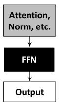

(a)  
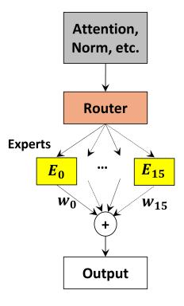  
(b)

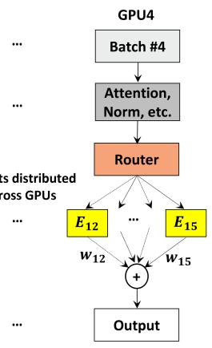  
(c)

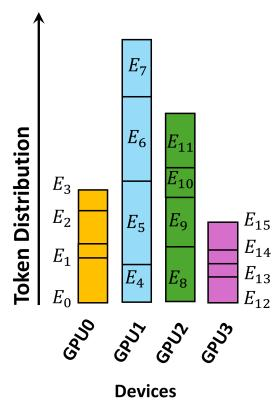  
(d)

Figure 1: (a) A traditional dense transformer uses a single large feed-forward network (FFN). (b) In contrast, a mixture-of-experts (MoE) transformer replaces the one large FFN with 16 smaller FFNs, referred to as experts. During the forward pass, the router directs each token to only a fraction of experts for processing. (c) An expert parallel (EP) setup, typically used for distributed inference, where each GPU holds a distinct set of experts. However, assigning experts to GPUs naively without considering token distribution can lead to uneven workloads across GPUs, reducing efficiency. For example, (d) depicts a case where GPU1 processes significantly more tokens than the other GPUs due to its assigned experts.  
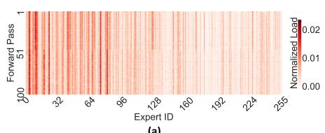  
OpenOrca -Last MoE Layer (Layer 60 of DeepSeek-V3)

(a)  
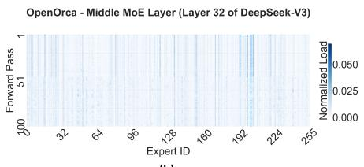  
(b)

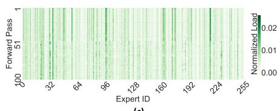  
(c)

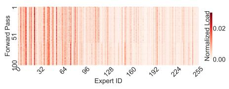  
(e)

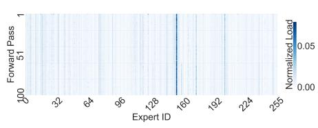  
(f)

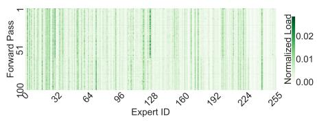  
(g)

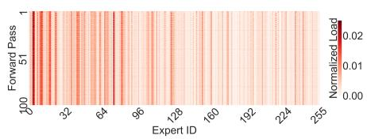  
（h)

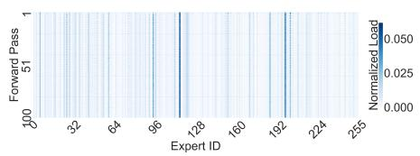  
()

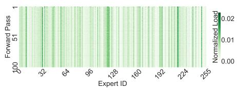  
(i  
Figure 2: Depiction of expert workload distribution in three different MoE layers of the DeepSeek-v3 model—specifically, the first (layer 3), middle (layer 32), and final (layer 60) MoE layers. The heatmap illustrates the normalized distribution of workload among experts. Expert IDs are displayed along the x-axis, while the y-axis represents forward pass counts, ranging from 1 to 100, indicating temporal evolution. (a–c), (d–f), and (g–i) show the workload distribution for the OpenOrca [14] (conversation), MBXP [4] (coding), and GSM8K [6] (math) datasets, respectively. Workload distribution in each layer varies noticeably across datasets, as evident when comparing (b), (f), and (i).

In this work, we focus on the key limitation of existing E2D approaches-their high data movement overhead-and propose solutions to address this limitation. We begin with a systematic analysis that shows the state-of-the-art E2D approach, specifically the Expert parallelism Load Balancing (EPLB) algorithm proposed in DeepSeek-v3 [2], can introduce considerable data movement overheads, thereby degrading model performance. Next, we present a latency-optimal E2D approach for expert load balancing (LB) that determines expert assignments while minimizing data movement overheads. Finally, we demonstrate that the proposed method reduces MoE execution latency by up to 12.5% and adapts to dynamic workloads by enabling LB at twice the frequency of the EPLB algorithm.

## 2 Related work

This section discusses prior work on mitigating workload imbalance in EP deployments, which can be broadly categorized into algorithmic and system-level approaches.

Algorithmic Approaches mainly leverage auxiliary loss functions (ALFs) during training to encourage more balanced token routing across experts [5, 8]. Although ALFs mitigate the load imbalance during training without overheads during inference, their aggressive use can degrade model accuracy [11], and they remain inadequate for fully addressing token imbalance during inference.

For example, DeepSeek-v3 incorporates additional bias terms and a constrained routing strategy during training to restrict each token to a predefined number of experts [7]. Nevertheless, as illustrated in Fig. 2, substantial load imbalance persists across experts during inference.

System-level Approaches involve reallocating experts to devices on the fly during runtime, based on past token distribution statistics (i.e., E2D approaches). They mainly adopt two strategies: i) replicating frequently activated experts across multiple devices [9, 13, 17], and ii) distributing a balanced combination of hot and cold (less active) experts to each device to ensure even workload distribution [10], or iii) a combination of the previous two. Nevertheless, these E2D approaches come at a cost of high data movement overheads, as during reallocation or replication, expert weights have to be moved between devices.

For example, DeepSeek-v3 proposed the EPLB algorithm [2], which supports both expert replication and reallocation. It is a greedy LB algorithm designed to balance the workload as much as possible. A key limitation of EPLB, however, is that it doesn’t consider the additional data movement required to load balance and its impact on overall performance. Sec. 3 presents an in-depth analysis of this problem, highlighting the trade-off between the benefits of EPLB-based LB and its associated high costs.

## 3 Cost-Benefit Analysis

In this section, we begin by examining the performance degradation caused by skewed token-to-expert distributions, with a particular focus on its impact on MoE layer latencies. We then present a detailed cost–benefit analysis of EPLB-based LB, including the potential overheads associated with this operation. For this analysis, we use a single node featuring two AMD EPYC™ 9655 96-core processors and eight AMD Instinct™ MI300 GPUs. AMD ROCm™

6.3 [3] and the SGLang inference framework version v0.4.7 [19] are used for performance evaluations of the DeepSeek-v3 model.

A skewed token-to-expert distribution, when combined with EP under naive expert-to-GPU assignment, results in an uneven workload distribution across GPUs. This phenomenon may result in increased token processing times and higher communication latencies at overloaded GPUs. For instance, consider the two load distributions illustrated in Fig. 3 (a): the ideal case and the skewed case. Under the ideal distribution, each GPU experiences the same overall load, leading to balanced compute and communication latencies, as shown in Fig. 3 (c). In contrast, the skewed load distribution exhibits more skewed and irregular compute and communication latencies, along with significant synchronization delays, as shown in Fig. 3 (b). Because of the synchronous nature of token processing in MoE layers, even small amounts of imbalance cause the slowest GPU to determine the overall model execution latency. Most importantly, with a perfectly balanced load distribution across GPUs, we can achieve a speedup of up to 25% in overall MoE layer execution latency.

As depicted in Fig. 4 (a), expert reallocation contributes to nearly 50% of the total latency, while the algorithm execution time and other overheads make up the remaining half. During this phase, each GPU swaps an average of 28 experts per layer—approximately 87% of its 32 experts stored in that GPU. All the exchanges are carried out in parallel across all GPUs. In total, over 12768 experts are moved across GPUs throughout all the layers, which is the most critical bottleneck during the entire LB process.

When comparing the potential gains that can be achieved from LB in Fig. 3 (b-c) with its overall cost in Fig. 4, we find that the additional latencies introduced by LB are nearly 10 times greater than the performance benefits it provides in the ideal case. In other words, LB only becomes beneficial when the expert load distribution remains stable for more than 10 consecutive forward passes.

Being the most dominant overhead, this work addresses the challenge of reducing rebalancing latencies. We argue that by minimizing the number of expert movements, it is possible to substantially reduce this overhead, thereby i) enabling the system to react more quickly to changes in workload characteristics by performing LB more frequently, and ii) lowering the overall execution latency of the model even under slowly changing workloads.

To achieve our goals, in this work, we propose the latencyoptimal LB algorithm that jointly minimizes the load imbalance and the total overhead incurred during this phase. We tackle this problem by i) formalizing the problem through an integer linear programming (ILP) formulation [18] to assess the potential gains we can achieve, and subsequently by ii) devising a lightweight heuristic algorithm capable of solving the problem in polynomial time.

## 4 Latency-Optimal Load Balancing

In this section, we present two novel approaches for latency-optimal LB: an ILP-based approach and a heuristic algorithm. The objective is to balance GPU workloads efficiently by minimizing expert movements during rebalancing. The following subsections provide a detailed description of the proposed algorithms.

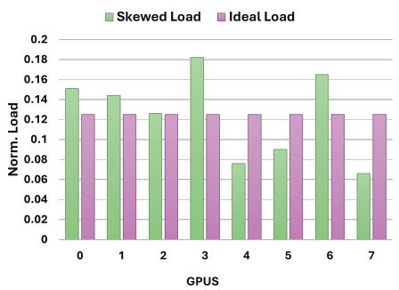  
(a)

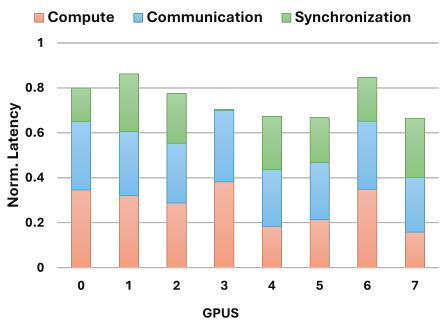  
(b)

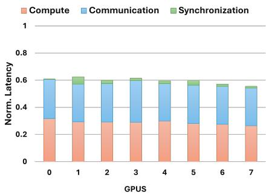  
(c)

Figure 3: Impact of load imbalance on MoE compute and communication performance. (a) illustrates the workload distribution across 8 GPUs at the 32nd layer for the GSM8K dataset. (b) presents the latency breakdown under the skewed load case, while (c) shows the latency breakdown for an ideal balanced case.  
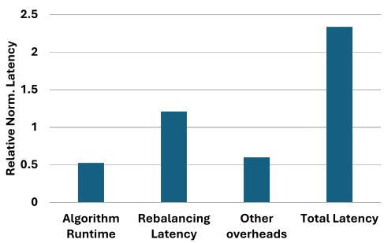  
Figure 4: Cost analysis of EPLB algorithm: normalized perlayer latencies of various operations. The y-axis represents normalized latencies. All latencies, including those in Fig. 3, are normalized using the same factor. The total latency introduced by LB is nearly 10 times greater than the performance benefits it provides in the ideal case, as shown in Fig. 3 (c).

## 4.1 Problem Formulation

In this approach, we formulated the ILP model to minimize end-toend latency consumed during inference, accounting for (i) latency consumed by MoE layers, (ii) latency consumed by other layers such as attention, normalization, etc., and (iii) expert data movement costs arising from LB, as well as the runtime of the LB algorithm. Table. 1 summarizes all of the variables used in our formulation. For the sake of simplicity, in the following, we skip the linearized formulations of non-linear expressions.

Particularly, the end-to-end latency of each forward pass is affected by the extent of skew in the token-to-expert distribution. In this work, we model this effect by considering:

(1) variable compute latencies, determined by the number of tokens assigned to each device and the time required to process them

(2) variable communication latencies, determined by the number of tokens exchanged among the devices

(3) fixed costs for processing non-MoE layers

(4) fixed kernel launch and buffer allocation overheads

<table><tr><td>Variable</td><td>Description</td></tr><tr><td> $k \in K$ </td><td>Set of all experts</td></tr><tr><td> $v \in V$ </td><td>Set of all GPUs</td></tr><tr><td> $B _ { v } \in N$ </td><td>Maximum number of experts that can be allocated to each GPU</td></tr><tr><td> $\boldsymbol { c } _ { \boldsymbol { v } } ^ { ( o ) } \in \mathcal { R }$ </td><td>Cost of kernel launch and buffer allocation overheads at GPUu</td></tr><tr><td> $c _ { v } ^ { ( t ) } \in \mathcal { R }$ </td><td>Cost of processing each token at GPU u</td></tr><tr><td> $c _ { v w } ^ { ( e ) } \in \mathcal { R }$ </td><td>Cost of moving one expert from GPU u to GPU w</td></tr><tr><td> $\boldsymbol { c } ^ { ( a ) } \in \mathcal { R }$ </td><td>Cost of executing the LBalgorithm</td></tr><tr><td> $p _ { k v } ^ { \prime } \in \{ 0 , 1 \}$ </td><td>Specifies the existing placement of expert k in GPU u</td></tr><tr><td> $p _ { k v } \in \{ 0 , 1 \}$ </td><td>Specifies the final placement of expert k in GPU u</td></tr><tr><td> $d _ { k } \in N$ </td><td>Future load in terms of tokens for expert k</td></tr><tr><td> $t _ { k v } \in N$ </td><td>Serving rate for expertkat GPUu</td></tr></table>

Table 1: Variables used in the ILP formulation for load balancing.

Eq. 1 models the total latency of processing input tokens at GPU ?? for a single layer of the model. The formulation can be trivially extended to all layers of the model for the full model LB, or can be applied independently to each layer. In Eq. 1, the above-mentioned factors (1–3) are incorporated into $c _ { v } ^ { ( t ) }$ , while factor (4) is represented as $c _ { v } ^ { ( o ) }$ . In addition, variations across devices—stemming from thermal conditions or heterogeneous hardware deployments—are captured within the term $c _ { v } ^ { ( t ) }$

$$
c _ { v } ^ { ( s ) } = c _ { v } ^ { ( o ) } + c _ { v } ^ { ( t ) } * \sum _ { k } d _ { k } * p _ { k v } \quad \forall v\tag{1}
$$

Next, we model the cost of LB. During this stage, the inference process is typically stalled. While LB introduces a temporary increase in latency, it ultimately leads to a more balanced token distribution in the long run. The total LB time at each GPU ?? depends on the number of experts moved across all GPUs. Assuming a mesh topology, this can be modeled using a custom Hamming distance between the initial expert placement $p _ { k \upsilon } ^ { \prime }$ and the final placement $p _ { k v }$ after LB, as shown in Eq. 2. In computing this distance, only transitions from $\mathop { p _ { k v } ^ { \prime } } = 0$ to $p _ { k v } = 1$ are considered, as unloading an expert $( \mathrm { i . e . , } p _ { k v } ^ { \prime } = 1 \ \mathrm { t o } \ p _ { k v } = 0 )$ incurs no cost. Furthermore, each element of the custom Hamming distance is weighted by the communication cost $c _ { v w } ^ { ( e ) }$ to account for non-uniform communication overheads (e.g., scale-up vs. scale-out networks). This formulation could potentially be extended to handle multi-hop heterogeneous networks (e.g, combinations of intra- and inter-node interconnects) through a variation of the multi-commodity flow problem [1].

$$
c _ { v } ^ { ( m ) } = W e i g h t e d H a m m i n g ( p _ { k v } ^ { \prime } , \mathcal { P } k v , c _ { v w } ^ { ( e ) } )\tag{2}
$$

Next, optimizing end-to-end latency requires accounting for both forward pass processing latency and LB latency. Accordingly, we formulate the objective of minimizing the average end-to-end latency as defined in Eq. 3.

$$
\operatorname* { m i n } ( c ^ { ( a ) } + \operatorname* { m a x } _ { v } ( c _ { v } ^ { ( s ) } ) + \operatorname* { m a x } _ { v } ( c _ { v } ^ { ( m ) } ) )\tag{3}
$$

In addition, we also introduced a constraint for the maximum number of experts that can be allocated to each GPU, as described in Eq. 4.

$$
\sum _ { k } \ d p _ { k v } \leq B _ { v } \quad \forall v\tag{4}
$$

Furthermore, we require that the demand for each expert ?? be met proportionally across all GPUs hosting that expert, as expressed in Eq. 5. This constraint enables the demand to be distributed nonuniformly across GPUs, allowing for more flexible and efficient resource allocation, such as expert replication.

$$
\sum _ { v } t _ { k v } * p _ { k v } = d _ { k } \quad \forall k\tag{5}
$$

Although this ILP formulation can provide us with an optimal solution for minimizing end-to-end latency, it suffers from prohibitively long execution times and poor scalability. To address this issue, in the following section, we describe a heuristic approach for finding a near-optimal expert assignment to devices.

## 4.2 Heuristic Approach

To overcome the scalability limitations of ILP, we design a lightweight heuristic that iteratively swaps experts between GPUs to reduce load imbalance. In the following, we provide a high-level overview of the algorithm under the assumption of a homogeneous hardware setup. Extending this approach to heterogeneous environments would require adding simple normalization factors to the involved variables.

The proposed heuristic algorithm executes as follows. First, we sort the GPUs by their current load and then iteratively swap experts between the most loaded and least loaded GPUs until balance is achieved or a maximum number of moves is reached. Expert swapping between a pair of GPUs is performed such that, after the swap, the final loads on both GPUs are minimized with respect to a target load (uniform load in the homogeneous case). This operation can be implemented by comparing all of the expert loads at both GPUs and checking whether a swap would lead to a better overall load with respect to the initial assignment, or by sorting the expert loads and performing a binary search over the expert pairs in both of the GPUs. After swapping one expert on each GPU, we compute the final cost of the new configuration. If the new cost is higher, we revert to the previous configuration. Otherwise, if we observe a cost improvement, then we continue the execution and attempt one additional expert swap for each GPU.

<table><tr><td></td><td>Baseline</td><td>EPLB</td><td>Heuristic</td><td>ILP</td></tr><tr><td>Mean/Max Mean normalized</td><td>0.650</td><td>0.998</td><td>0.996</td><td>0.999</td></tr><tr><td>standard deviation</td><td>0.351</td><td>0.001</td><td>0.003</td><td>0.001</td></tr><tr><td>Algorithm Runtime [s]</td><td>0</td><td>0.26</td><td>0.17</td><td>&gt;100</td></tr><tr><td>Num ExpertsMoved</td><td>0</td><td>13036</td><td>2440</td><td>2223</td></tr></table>

Table 2: Comparison of load balancing algorithms.

The overall complexity of the heuristic is $O ( E ^ { 2 } l o g ( E ) )$ ), where ?? is the total number of experts across all GPUs, when the swap routine is implemented with a binary search to identify the ideal experts to swap between two GPUs.

## 5 Experimental Evaluation

To evaluate the benefits of our approach, we compare the baseline case (i.e., without LB) against EPLB, ILP-based, and our heuristicbased solutions. The evaluation considers four key metrics: the mean-to-max load ratio across GPUs (Mean/Max), the mean normalized workload standard deviation (Mean Norm. Std.), algorithm runtime, and the number of expert moves required for LB.

To build accurate cost functions for ILP and heuristic approaches, we extensively profiled GEMM kernels, all-to-all operations, and peer-to-peer GPU collectives on AMD Instinct™ GPUs. The data shows that latency increases roughly linearly with data size, leading us to adapt linear functions for our cost models. While adopting linear latency functions for all communication and computation components enables a simple problem formulation, more sophisticated models may be required to accurately capture phenomena such as network congestion, overlapping computation and communication, or hierarchical interconnect topologies. Nevertheless, this exploration is beyond the scope of the current work and remains a promising direction for future research.

To assess and compare the efficiency of various LB algorithms, we executed the DeepSeek-v3 model on a single node equipped with eight AMD Instinct™ MI300 GPUs, as described earlier in Sec. 3. The evaluation is performed using the OpenOrca [14] (conversation), MBXP [4] (coding), and GSM8K [6] (math) datasets.

Table. 2 summarizes all the performance metrics for EPLB, ILP, and heuristic approaches, as well as the baseline case of naive assignment without LB. The Mean/Max values are nearly identical across all algorithms and substantially higher than the baseline, indicating that all three approaches are effective at balancing the expert load. The Mean Norm. Std. Values are lowest for EPLB and ILP, with the heuristic algorithm showing slightly higher variation. This is expected as EPLB and ILP perform rigorous LB, while the heuristic approach is a light-weight approach. The advantage of the proposed ILP and heuristic approaches arises from their reduced number of expert moves compared to EPLB, as shown in Table. 2. This is because both methods are designed to minimize the end-toend latency of MoE forward passes, whereas EPLB focuses solely on achieving a more balanced workload distribution.

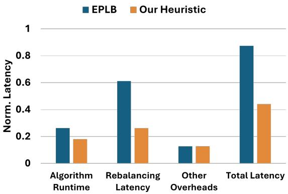  
Figure 5: Load balancing latency breakdown for (a) EPLB and (b) our heuristic.

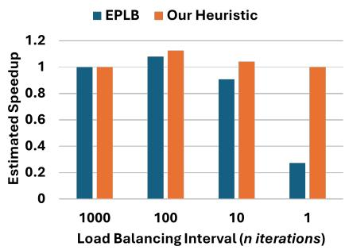  
Figure 6: Estimated speedup in MoE layer execution latency achieved by EPLB and our heuristic relative to no LB baseline across different load balancing intervals.

Although both the ILP and heuristic approaches involve fewer expert moves, the ILP method incurs significantly higher runtime due to its high computational complexity and poor scalability, as shown in Table. 2. Therefore, we conclude that the proposed heuristic approach offers the best trade-off, achieving strong LB efficiency with fewer moves and significantly faster algorithm runtime. Furthermore, Fig. 5 shows the total latency breakdown of EPLB compared to the proposed heuristic approach. Notably, the rebalancing latency from expert data movement is reduced by nearly 57%, while the algorithm runtime decreases by 31%. Together, these improvements reduce the overall LB latency to nearly half that of EPLB latency. In other words, the heuristic approach enables LB at nearly twice the frequency of EPLB. Next, we examine the impact of the heuristic algorithm on MoE compute and communication latencies relative to EPLB. Since both approaches achieve similar LB metrics, their compute and communication latencies are nearly the same. Moreover, compared to the skewed load scenario illustrated in Fig. 3 (b), synchronization delays are reduced, leading to an overall latency improvement of approximately 12.5%. It is important to note that the latency improvements achieved by LB algorithms still fall short of the benefits we can achieve with ideal load scenario, as shown in Fig. 3 (c) (i.e., 25%). The ideal scenario sprays the tokens uniformly across all devices for each iteration. On the contrary, LB relies on aggregate token statistics measured over n iterations. In practice, token workload may shift rapidly between iterations, thus still creating imbalance on an iteration-by-iteration basis that contributes to performance deterioration. One can still achieve the ideal performance in terms of compute and communication time with LB. This, however, would require load balancing experts at every single iteration, leading to prohibitively expensive overheads that would overshadow any potential performance gains from perfect load balance.

When the overhead of LB outweighs its potential benefits, our approach decides not to perform LB. This adaptability stems from incorporating cost functions into the proposed LB algorithms, allowing us to avoid frequent load balancing. Fig. 6 illustrates the speedup in MoE layer execution latency using EPLB and our heuristic compared to the scenario without any LB. Note that a speedup below 1 actually means a slowdown and reduction in MoE layer performance. The results are reported as a function of LB interval (n), where LB is performed once every n inference iterations. Performing LB every 1000 iterations doesn’t yield much benefit, since the token-to-expert distribution can shift significantly within that span, and the overhead of LB is minimal compared to the overall latency of executing 1000 iterations. However, performing LB every 100 iterations leads to substantial gains, with EPLB and our heuristic achieving speedups of 8% and 12.5%, respectively. When LB is performed every 10 iterations, our approach achieves 15% speedup over EPLB and 4% speedup over the no LB baseline. Extending this observation, performing LB too frequently (e.g., at every iteration) severely impacts performance, as evidenced by significant degradation of \~73% in EPLB performance. Since EPLB does not have any adaptability, it always performs LB irrespective of whether it improves the overall latency or not. In contrast, our adaptive LB approach overcomes this issue by skipping LB whenever its overhead outweighs the potential benefits.

Future work: We plan to deploy the proposed solution in largescale clusters and evaluate its end-to-end performance benefits. Furthermore, there are opportunities to further reduce data movement overheads by overlapping them with other non-MoE operations, such as attention.

## 6 Conclusion

In this paper, we analyzed workload imbalance across experts in different layers of DeepSeek-v3 with diverse domain datasets and quantified its impact on GPU performance. Our cost–benefit analysis identified high data movement as the primary bottleneck of EPLB, which is a state-of-the-art load balancing algorithm. To overcome this, we proposed latency-optimal load balancing algorithms, including an integer linear programming (ILP)-based formulation and heuristic approach. Experiments demonstrate a reduction of up to 12.5% in MoE execution latency and 2× more frequent load balancing compared to EPLB.

## 7 Acknowledgments

The authors thank Antoine De Gendt, Tobias Alonso Pugliese, Lucian Petrica, and Ken O’Brien from AMD for their valuable support and insightful discussions.

## References

[1] Ravindra K Ahuja, Thomas L Magnanti, and James B Orlin. 1988. Network flows. (1988).

[2] Deepseek AI. 2025. Expert Parallelism Load Balancer (EPLB). https://github.com/ deepseek-ai/EPLB

[3] AMD. 2024. ROCm 6.3.0 release notes. https://rocm.docs.amd.com/en/docs-6.3.0/about/release-notes.html

[4] Ben Athiwaratkun, Sanjay Krishna Gouda, Zijian Wang, Xiaopeng Li, Yuchen Tian, Ming Tan, Wasi Uddin Ahmad, Shiqi Wang, Qing Sun, Mingyue Shang, Sujan Kumar Gonugondla, Hantian Ding, Varun Kumar, Nathan Fulton, Arash Farahani, Siddhartha Jain, Robert Giaquinto, Haifeng Qian, Murali Krishna Ramanathan, Ramesh Nallapati, Baishakhi Ray, Parminder Bhatia, Sudipta Sengupta, Dan Roth, and Bing Xiang. 2023. Multi-lingual Evaluation of Code Generation Models. arXiv:2210.14868 [cs.LG] https://arxiv.org/abs/2210.14868

[5] Zewen Chi, Li Dong, Shaohan Huang, Damai Dai, Shuming Ma, Barun Patra, Saksham Singhal, Payal Bajaj, Xia Song, Xian-Ling Mao, Heyan Huang, and Furu Wei. 2022. On the Representation Collapse of Sparse Mixture of Experts. arXiv:2204.09179 [cs.CL] https://arxiv.org/abs/2204.09179

[6] Karl Cobbe, Vineet Kosaraju, Mohammad Bavarian, Mark Chen, Heewoo Jun, Lukasz Kaiser, Matthias Plappert, Jerry Tworek, Jacob Hilton, Reiichiro Nakano, Christopher Hesse, and John Schulman. 2021. Training Verifiers to Solve Math Word Problems. arXiv preprint arXiv:2110.14168 (2021).

[7] DeepSeek-AI. 2024. DeepSeek-V3 Technical Report. arXiv:2412.19437 [cs.CL] https://arxiv.org/abs/2412.19437

[8] William Fedus, Barret Zoph, and Noam Shazeer. 2022. Switch Transformers: Scaling to Trillion Parameter Models with Simple and Efficient Sparsity. arXiv:2101.03961 [cs.LG] https://arxiv.org/abs/2101.03961

[9] Jiaao He, Jidong Zhai, Tiago Antunes, Haojie Wang, Fuwen Luo, Shangfeng Shi, and Qin Li. 2022. FasterMoE: modeling and optimizing training of largescale dynamic pre-trained models. In Proceedings of the 27th ACM SIGPLAN Symposium on Principles and Practice of Parallel Programming (Seoul, Republic of Korea) (PPoPP ’22). Association for Computing Machinery, New York, NY, USA, 120–134. doi:10.1145/3503221.3508418

[10] Haiyang Huang, Newsha Ardalani, Anna Sun, Liu Ke, Hsien-Hsin S. Lee, Anjali Sridhar, Shruti Bhosale, Carole-Jean Wu, and Benjamin Lee. 2023. Towards MoE Deployment: Mitigating Inefficiencies in Mixture-of-Expert (MoE) Inference. arXiv:2303.06182 [cs.DC] https://arxiv.org/abs/2303.06182

[11] Changho Hwang, Wei Cui, Yifan Xiong, Ziyue Yang, Ze Liu, Han Hu, Zilong Wang, Rafael Salas, Jithin Jose, Prabhat Ram, Joe Chau, Peng Cheng, Fan Yang, Mao Yang, and Yongqiang Xiong. 2023. Tutel: Adaptive Mixture-of-Experts at Scale. arXiv:2206.03382 [cs.DC] https://arxiv.org/abs/2206.03382

[12] Dmitry Lepikhin, HyoukJoong Lee, Yuanzhong Xu, Dehao Chen, Orhan Firat, Yanping Huang, Maxim Krikun, Noam Shazeer, and Zhifeng Chen. 2020. GShard: Scaling Giant Models with Conditional Computation and Automatic Sharding. arXiv:2006.16668 [cs.CL] https://arxiv.org/abs/2006.16668

[13] Xiaonan Nie, Xupeng Miao, Zilong Wang, Zichao Yang, Jilong Xue, Lingxiao Ma, Gang Cao, and Bin Cui. 2023. FlexMoE: Scaling Large-scale Sparse Pre-trained Model Training via Dynamic Device Placement. Proc. ACM Manag. Data 1, 1, Article 110 (May 2023), 19 pages. doi:10.1145/3588964

[14] OpenAI. 2025. Introducing gpt-oss. https://openai.com/index/introducing-gptoss/

[15] Noam Shazeer, Azalia Mirhoseini, Krzysztof Maziarz, Andy Davis, Quoc Le, Geoffrey Hinton, and Jeff Dean. 2017. Outrageously Large Neural Networks: The Sparsely-Gated Mixture-of-Experts Layer. arXiv:1701.06538 [cs.LG] https: //arxiv.org/abs/1701.06538

[16] Ashish Vaswani, Noam Shazeer, Niki Parmar, Jakob Uszkoreit, Llion Jones, Aidan N. Gomez, Lukasz Kaiser, and Illia Polosukhin. 2023. Attention Is All You Need. arXiv:1706.03762 [cs.CL] https://arxiv.org/abs/1706.03762

[17] Wei Wang, Zhiquan Lai, Shengwei Li, Weijie Liu, Keshi Ge, Yujie Liu, Ao Shen, and Dongsheng Li. 2023. Prophet: Fine-grained Load Balancing for Parallel Training of Large-scale MoE Models. In 2023 IEEE International Conference on Cluster Computing (CLUSTER). 82–94. doi:10.1109/CLUSTER52292.2023.00015

[18] Laurence A Wolsey and George L Nemhauser. 1999. Integer and combinatorial optimization. John Wiley & Sons.

[19] Lianmin Zheng, Liangsheng Yin, Zhiqiang Xie, Chuyue Sun, Jeff Huang, Cody Hao Yu, Shiyi Cao, Christos Kozyrakis, Ion Stoica, Joseph E. Gonzalez, Clark Barrett, and Ying Sheng. 2025. SGLang: efficient execution of structured language model programs. In Proceedings of the 38th International Conference on Neural Information Processing Systems (Vancouver, BC, Canada) (NIPS ’24). Curran Associates Inc., Red Hook, NY, USA, Article 2000, 27 pages.