# Context-Aware Mixture-of-Experts Inference on CXL-Enabled GPU–NDP Systems

Zehao Fan∗ Rensselaer Polytechnic Institute Troy, NY, USA

Yayue Hou Rensselaer Polytechnic Institute Troy, NY, USA

Zhenyu Liu∗ Rensselaer Polytechnic Institute Troy, NY, USA

Hadjer Benmeziane IBM Research Europe Switzerland

Liu Liu Rensselaer Polytechnic Institute Troy, NY, USA

Yunzhen Liu University of Massachusetts Amherst Amherst, MA, USA

Kaoutar El Maghraoui IBM T. J. Watson Research Center Yorktown Heights, NY, USA

## Abstract

Mixture-of-Experts (MoE) models scale large language models through conditional computation, but inference becomes memorybound once expert weights exceed the capacity of GPU memory. In this case, weights must be offloaded to external memory, and fetching them incurs costly and repeated transfers. We address this by adopting CXL-attached near-data processing (CXL-NDP) as the offloading tier to execute cold experts in place, converting expensive parameter movement into cheaper activation movement. Unlike prior GPU–NDP systems that are largely context-agnostic and reactive, we develop a context-aware MoE system that uses prefill-stage activation statistics to guide decoding-stage expert placement, dynamically pins hot experts in GPU-side HBM, and maps the remainder to CXL-NDP. To meet NDP’s limited compute throughput, we introduce context-aware mixed-precision quantization that allocates per-expert bitwidths (1–4 bit) based on prefill stage. The resulting MoE inference system overlaps GPU and NDP execution while minimizing cross-device movement. The evaluation on the GPU–NDP system shows that our approach achieves up to 8.7× decoding throughput improvement over state-of-the-art method, while incurring only a 0.13% average accuracy drop.

## Keywords

Mixture-of-Experts (MoE), Near Data Processing (NDP), Quantization, System Design

## 1 Introduction

Mixture-of-Experts (MoE) models[16, 23, 25, 29, 36] enable scaling large language models (LLMs) via conditional computation: Each Transformer layer replaces its FFN with a pool of experts and activates only a small subset per token. This sparsity preserves pertoken FLOPs while growing parameters, but it typically causes the full model to exceed GPU memory capacity. For example, inference with Mixtral 8×22B [32] in FP16 precision requires approximately 280 GB of memory, far exceeding the memory capacity of a single GPU, and therefore makes inference memory-bound: since all experts must remain accessible, naively offloading weights to external memory (e.g., CXL memory) forces frequent parameter transfers over PCIe that dominate latency and reduce GPU utilization. As reported in [40], the latency of migrating an expert from the CPU to the GPU can exceed 90% of the total execution time of a Transformer block, greatly surpassing both expert and non-expert computation.

To overcome this bottleneck, recent work has explored heterogeneous systems that couple GPUs with near-data processing (NDP) devices [13, 18, 33, 38]. Among these, CXL-attached memory with near-data processing (CXL-NDP) provides large-capacity DDR-class memory and high internal bandwidth. These devices can execute expert computation near memory, converting large parameter movement into small activation movement, and they support much larger MoE models at lower cost, making them a practical and promising solution.

However, efficiently deploying MoE on GPU-NDP systems remains challenging. Prior GPU-NDP MoE systems are largely contextagnostic and rely on reactive or static policies that ignore the inherent dynamism of MoE routing: expert activation varies across layers, decoding steps, and even input sequences. As a result, on-demand expert placement can trigger unnecessary migrations between the GPU and the CXL-NDP tier, causing bandwidth contention. Static expert placement also presents a problem: experts mapped to NDP may suddenly become frequently activated (hot) and impose heavy compute pressure, while GPU-resident experts may become rarely activated (cold) and remain underutilized. Moreover, NDP compute units operate under tight power and area budgets, and even executing cold experts at full precision can introduce significant compute pressure and erode the benefits of near-data execution. shift the bottleneck to the NDP side, and erode the benefits of near-data execution.

To this end, we introduce a context-aware expert placement and quantization strategy for efficient MoE inference on GPU–NDP system, as shown in Figure 1. Our design leverages runtime prefill statistics to guide both expert placement and precision. Our main contributions are:

1) Empirical analysis of context-aware expert behavior. We quantify the context dependence of MoE routing and show that expert activations vary significantly across decoding steps and input sequences, making static and on-demand expert placement ineffective.

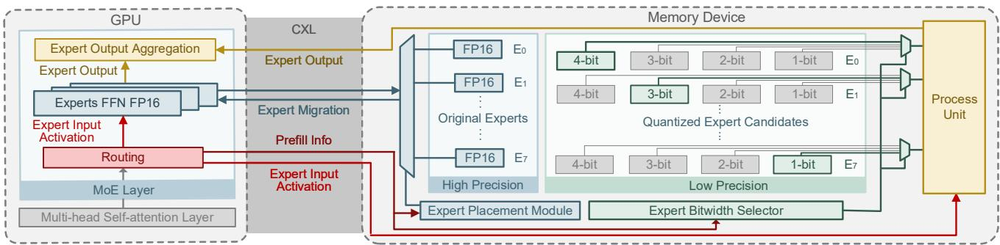  
Figure 1: System overview. During MoE inference, prefill-stage expert activation statistics are collected and fed to two modules: the Expert Placement Module, which runs once per sequence to determine an efficient GPU/NDP expert mapping; the Expert Bitwidth Selector, which uses the same statistics to assign per-expert quantization bitwidths on the NDP device, improving system performance while reducing accuracy loss.

2) Prefill-guided expert placement. We further observe that prefill-stage routing distributions strongly predict decoding-stage behavior. This finding enables our informed expert placement: During the prefill stage of each sequence, we collect expert activation statistics to determine its importance. Important experts are placed on the GPU in full precision, while the remaining experts stay on NDP in low precision. The decoding stage then follows this prefillguided placement, preserving MoE’s context awareness without incurring frequent expert migration.

3) Context-aware mixed precision for NDP. We adopt a mixed-precision quantization inspired by the recent method MC [14]. For each NDP-resident expert, we cache a set of GPTQ [9]-quantized replicas at different precisions. We then apply a prefix-structured mixed-precision allocation to assign bitwidths based on the same prefill-stage expert importance information and a precomputed quantization loss table.

## 2 Background and Motivation

In this section, we first outline the MoE Transformer architecture and explain why its routing dynamics make inference highly memory-bound. We then describe GPU-NDP hybrid systems, highlighting how near-data execution mitigates weight-transfer overheads but introduces new challenges due to context-agnostic expert placement. Finally, we discuss quantization for MoE models and motivate the need for a context-aware strategy to match NDP constraints while preserving accuracy.

## 2.1 MoE-based Transformers

In MoE-based Transformers, each feed-forward network (FFN) is replaced by a set of expert FFNs, and a router selects a small subset per token. Given a hidden state x ∈ R?? , the router ??(x) produces scores ?? = Softmax(????x), and only the top-?? experts are activated. Each expert FFN typically consists of two linear layers with an intermediate activation.

In practice, the parameter footprint of MoE models exceeds onpackage HBM capacity, so expert parameters are placed in an external tier and fetched on demand during inference [17, 18, 31]. The router’s per-token, per-layer decisions yield small and rapidly changing working sets, which makes naive weight fetching particularly costly during the decoding stage.

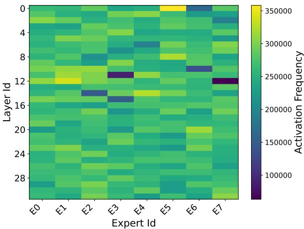  
Figure 2: Activation frequency of all experts in Mixtral-8x7B.

## 2.2 GPU–NDP Hybrid Systems for MoE

To address the memory-bound nature of MoE inference and the limited capacity of GPU HBM, recent work has explored heterogeneous systems that couple GPUs with near-data processing (NDP) devices. Among these, CXL-attached NDP devices provide largecapacity DDR-class memory and high internal bandwidth. They can execute computations adjacent to offloaded parameters and support much larger MoE models at lower cost, making them a practical and deployable solution.

Building on the observation that expert activations are highly skewed, recent GPU-NDP MoE systems such as MoNDE [18] and PIMoE [33] introduce the concept of hot and cold experts. As shown in Figure 2, which reports the activation frequency of all experts in Mixtral-8×7B [16] on the WikiText-2 [24] task, the distribution is far from uniform: a few experts are frequently activated, whereas some remain rarely used. This skew implies heterogeneous arithmetic intensities (compute-to-memory ratios) across experts, suggesting a device-aware mapping: pin hot, compute-intensive experts in GPU HBM, and place cold or infrequently used experts in the NDP tier, effectively turning parameter movement into cheaper activation movement [18].

However, prior GPU–NDP MoE systems largely rely on ondemand swapping and context-agnostic decisions at inference time. Under limited GPU↔CXL memory bandwidth, such reactive policies still incur substantial expert-transfer overheads and can reduce GPU utilization, which limits their efficiency and fails to fully exploit the inherent hot–cold characteristics of MoE experts.

## 2.3 Quantization for MoE Models

To prevent the NDP tier from becoming the bottleneck in our GPU and CXL-NDP pipeline, we quantize cold experts executed on NDP. Unlike GPUs, NDP devices operate under tight power and area budgets and offer limited compute throughput and scratchpad capacity. Reducing arithmetic precision can increase effective in-device bandwidth and parallelism, while also lowering the energy per operation.

Accordingly, we apply post-training quantization (PTQ) [2, 7, 9, 21, 28, 34] methods such as GPTQ [9] to NDP-side experts. These techniques are practical for weight-only compression and can reliably achieve 4-bit precision. However, uniformly reducing expert precision below 4 bits leads to non-negligible accuracy loss. We attribute this degradation to overlooking the heterogeneous importance and sensitivity of experts, as well as their non-uniform activation behavior. We thus adopt a context-aware quantization strategy that adapts expert precision based on runtime activation statistics. This design matches NDP’s performance constraints while preserving accuracy, and it will be detailed in Section 4.2.

## 3 Key Observations on Context Awareness

We make two observations about the context dependence of MoE inference that motivate context-aware methods on a GPU–NDP system. (i) Expert activations vary across requests and steps, making static expert partitioning ineffective. (ii) The prefill-stage routing distribution is a strong early indicator of decoding-stage behavior, enabling proactive expert placement with minimal migrations. Guided by these, we develop a context-aware method that dynamically pins hot experts in GPU HBM while executing cold experts in-place on NDP, and adapts per-expert bitwidth based on runtime activation statistics to improve performance.

## 3.1 Context-Dependent Expert Activations

MoE models exhibit highly dynamic expert activation patterns. Our empirical observations show that, during the inference, the distribution of activated experts changes significantly between consecutive decoding steps and even across different inputs. Figure 3 illustrates these variations using two randomly sampled inputs from the C4 [26] dataset. In Sample 1, the activated experts exhibit highly irregular behavior across decoding steps, with neither uniform activation patterns nor similarity between adjacent steps. In Sample 2, the activation pattern across decoding steps appears more structured. However, this contrast between the two samples highlights a key phenomenon: expert activation is highly contextdependent. Even within the same dataset, different input sequences can trigger different activation behaviors.

Such variability implies that a static placement or a global frequency metric cannot capture an expert’s importance. Therefore, merely assigning experts to different devices is insufficient, and the placement should be dynamically adjusted based on contexts.

Dynamic Expert Activations During Decoding (Summed Across All Layers)--Sample 1  
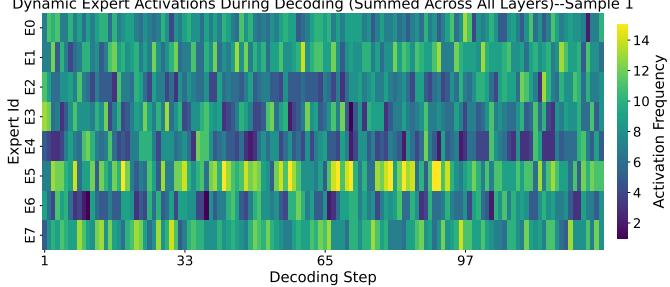

Dynamic Expert Activations During Decoding (Summed Across All Layers)--Sample 2  
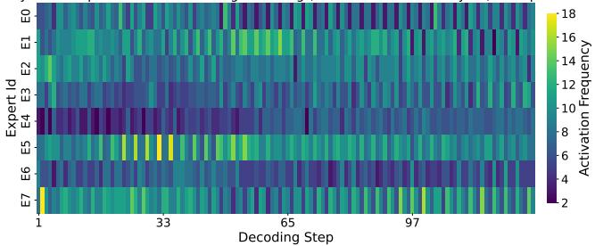  
Figure 3: Different expert activation patterns for two samples with Mixtral-8×7B on the C4 dataset, indicating the context dependence.

## 3.2 Context-Aware Opportunities from Prefill

While expert placement in GPU–NDP systems should ideally be dynamic, this dynamism also brings a practical challenge. The purpose of introducing NDP is to reduce the overhead caused by expert offloading and migration. If the system updates the placement too frequently, for instance at every decoding step, the additional transfers may eliminate the bandwidth benefits provided by NDP. As a result, it becomes important to define appropriate conditions and timing for expert migration.

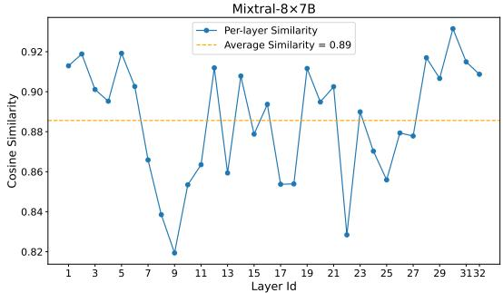  
Figure 4: Expert activation similarities between prefill and decoding, motivating context-aware design.

Fortunately, our analysis provides a useful observation that helps address this issue. Within the same sequence, the expert activation probability distribution during the prefill stage is often very similar to the distribution observed during decoding. Figure 4 shows this effect for the Mixtral-8×7B [16] model on the TruthfulQA [22] task.

Algorithm 1 Context-aware Expert Placement and Quantization   
Require: MoE model with ?? layers, ?? experts; GPU-side expert   
budget ?? (per layer); NDP-side expert avg. bitwidth ¯??; mixing   
coefficient ??; calibration dataset Dcal   
1: Offline Calibration (once)   
2: for ?? = 1 to ?? do   
3: for ?? = 1 to ?? do   
4: for ?? ∈ {1, 2, 3, 4} do   
5: Estimate loss ????,?? (??) on Dcal   
6: end for   
7: end for   
8: end for   
9: Online Inference (for each sequence)   
10: Prefill:   
11: Run prefill and collect for each layer ?? and expert ??: activation   
counts ????,?? and routing-score sums ????,?? .   
12: Expert Importance and Placement   
13: for ?? = 1 to ?? do   
14: ??˜??,?? ← Norm(????,?? ), ??˜ ??,?? ← Norm(????,?? )   
15: ????,?? ← ????˜??,?? + (1−?? )??˜ ??,??   
16: H?? ← top-?? experts by ????,?? ⊲ GPU, FP16   
17: C?? ← {?? | ?? ∉ H?? } ⊲ experts on NDP   
18: end for   
19: Expert Bitwidth Assignment on NDP (Prefix-Split)   
20: for ?? = 1 to ?? do   
21: ????,?? ← PrefixSplit({????,?? }?? ∈ C?? , {????,?? (??)}?? ∈ C?? , ¯??) ⊲ Sec.4.2   
22: end for   
23: Decoding:   
24: for each decoding step do   
25: for each selected expert ?? in layer ?? do   
26: if ?? ∈ H?? then   
27: Run expert on GPU (FP16)   
28: else   
29: Run expert on NDP with bitwidth ????,??   
30: end if   
31: end for   
32: end for

We compute the cosine similarity between the prefill and decoding expert activation probability distributions and report the average across all samples. Mixtral-8×7B has eight experts per layer, and the average similarity across all layers reaches 0.89.

These results indicate that the prefill stage already provides a reliable estimate of how experts will be activated during decoding. Therefore, the activation statistics collected in the prefill stage can be used to guide expert placement for the remainder of the inference. This approach helps avoid unnecessary migrations while still capturing context-aware activation behavior.

## 4 Context-Aware MoE System Design

This section presents our context-aware MoE system design based on GPU–NDP, which consists of two tightly coupled components, as shown in Figure 1 : (i) a dynamic expert placement module that leverages routing statistics collected during the prefill stage to decide which experts reside on GPU and which remain on CXL-NDP, and (ii) a dynamic bit-width selector that applies mixed-precision quantization to NDP-resident experts under a per-layer bit-width budget. Together, these components exploit the contextual activation dynamics of MoE models and enable efficient inference with minimal expert migration.

## 4.1 Expert Placement Module

As shown in Section 3.2, for the same input sequence, the expert activation distributions from prefill closely match those in decoding. We leverage this property to determine the GPU–NDP expert placement once per sequence. As shown in Lines 9–18 of Algorithm 1, at the beginning of prefill, we collect two statistics for each expert ?? in each MoE layer ??: (i) its activation frequency ????,?? and (ii) its accumulated routing score ????,?? . These two metrics capture different aspects of expert usage: frequency reflects how often an expert is selected, while routing score reflects the confidence of each activation. Then we compute a normalized importance score:

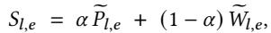

where ?? ∈ [0, 1] controls the tradeoff and ????,?? and ????,?? denote normalized quantities. Based on ????,?? , we select the top-?? most important experts in each layer and migrate them to GPU in FP16, subject to the GPU memory capacity. The remaining experts reside on CXL-NDP. Importantly, expert placement is performed only once after the prefill stage, and the decoding stage uses this fixed placement without further migration, i.e., each sequence undergoes only a single expert migration. For each routing decision, the computation is performed on the device hosts the selected experts.

## 4.2 Expert Bitwidth Selector on NDP

After expert placement is fixed, we quantize the experts that remain on NDP to reduce compute pressure during inference. Rather than quantizing weights on the fly, for each NDP-resident expert we cache a set of GPTQ [9]-quantized replicas at bitwidths 1, 2, 3, 4. We then use a prefix-structured mixed-precision allocation to assign bitwidths to NDP-resident experts under a layer-wise average bitwidth budget, as shown in Lines 1–8 and 19–22 of Algorithm 1. Consider a layer with ?? total experts, among which ??NDP are placed on NDP. For these ??NDP NDP-resident experts, we allow candidate bitwidths {1, 2, 3, 4}, taking 1-bit as the initial bitwidth. This discrete bitwidth set enables average 2-bit or 3-bit quantization by mixing experts assigned to different bitwidths. Let ?? denote the target average bitwidth on NDP for this layer. The corresponding number of “bitwidth increments” is ?? = ??NDP(?? − 1), where each step 1 → 2, 2 → 3, or 3 → 4 consumes one unit of this increment budget. We reuse the importance ordering obtained in the expert placement module and index experts in descending order of importance as ?? = 1, . . . , ??. We construct a per-layer loss table using a calibration dataset such as C4. For each expert ?? and each bitwidth ?? ∈ {1, 2, 3, 4}, we measure a loss ???? (??), defined as the MSE between the quantized output and a full-precision reference. From this table we extract the direct gains of moving from 1-bit to higher precisions:

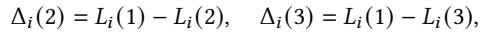

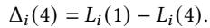

To evaluate the total gain achieved by assigning higher bitwidths to the more important experts, we first accumulate these per-expert gains into prefix sums. Specifically, for any ??, the cumulative benefits of upgrading the top-?? experts from 1-bit to 2-, 3-, or 4-bit are

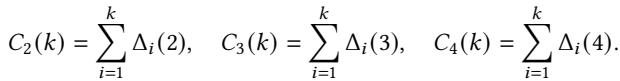

To keep the assignment aligned with the importance ranking, we enforce a prefix structure: more important experts receive quantization configurations with smaller expected loss (usually larger bitwidths), and less important ones receive progressively coarser settings. Let ??4, ??3, ??2, ??1 be the numbers of experts assigned to 4-, 3-, 2-, and 1-bit, respectively, with

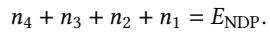

By treating 1-bit as the initial bitwidth, the bitwidth budget translates to

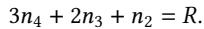

Given this structure, the total gain achieved by assigning (??4, ??3, ??2) higher-precision experts is

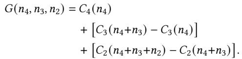

Intuitively, once the experts are sorted by importance, a prefixstructured assignment is fully determined by how many of the most important experts use each bitwidth. We therefore treat the counts (??4, ??3) as search variables and derive ??2 and ??1 from the constraints. Concretely, we let ??4 range over all integers such that 0 ≤ ??4 ≤ ??NDP and 3??4 ≤ ??, and for each fixed ??4 we let ??3 range over all integers such that 0 ≤ ??3 ≤ ??NDP − ??4 and 3??4 + 2??3 ≤ ??. For each feasible (??4, ??3, ??2), the total gain ?? (??4, ??3, ??2) can be evaluated in constant time using the prefix sums ??2 (·), ??3 (·), ??4 (·), and we simply keep the tuple (??★4 , ??★3 , ??★2 ) that attains the largest gain. Since the dominant time cost comes from enumerating all feasible (??4, ??3) pairs, the per-layer time complexity is ?? (??2NDP). And as we only apply this selection to NDP-resident experts and ??NDP is not large in practice, the overall overhead ?? (????2NDP) across ?? layers is negligible relative to the inference cost.

Finally, once expert placement and NDP-side expert quantization bitwidth selection are completed before the decoding stage, we keep these configurations fixed during decoding, as shown in Lines 23–32 of Algorithm 1.

## 5 Evaluation

## 5.1 Experimental Setup

Models and Datasets. We evaluate two popular MoE models, Mixtral-8×7B [16] and Mixtral-8×22B [32], to assess the effectiveness of our method on large-scale MoE models, as detailed in Table 1. We evaluate our method on a set of language understanding and reasoning benchmarks, including MMLU[11], MathQA[1], HellaSwag[39], ARC-Easy[6], ARC-Challenge[6], BoolQ[5], WinoGrande[27], and PIQA[3]. MMLU is evaluated in a 5-shot setting, while all other tasks use zero-shot evaluation. All accuracy results are obtained using the EleutherAI LM Evaluation Harness [10].

Table 1: Configs of evaluated MoE models  
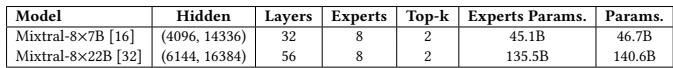

System Settings. To enable a fair and intuitive comparison, we adopt the same GPU–NDP system configuration used in MoNDE [18] and build our NDP system simulator on Ramulator [19] following the same methodology. The detailed configuration is summarized in Table 2. Our method migrates only a small number of highimportance experts to the GPU, while the remaining low-bitwidth experts are executed on the NDP devices. For the GPU-only baseline, all experts are loaded to the GPU on demand via PCIe. We evaluate multiple input–output length configurations to measure end-to-end latency and decoding throughput. Considering GPU memory capacity, for Mixtral-8×7B we place four hot experts per layer on the GPU and the remaining four on the NDP device. For Mixtral-8×22B, two hot experts per layer reside on the GPU and six are executed on the NDP device.

Table 2: System configurations  
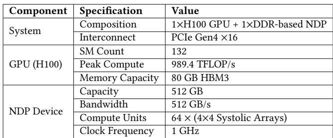

Baselines. For performance evaluation, we use MoNDE [18] on the same GPU–NDP system as our primary baseline. We also include a GPU-only baseline HOBBIT [31], which is a mixed-precision expert offloading system. For accuracy evaluation, we mainly compare our method against the accuracy of the original full-precision models, which also represents the accuracy of MoNDE.

## 5.2 Performance Evaluation

We evaluate end-to-end latency and decoding throughput on two large MoE models, Mixtral-8×7B and Mixtral-8×22B, to demonstrate the benefits of the GPU–NDP system. Experiments are conducted under multiple input/output length configurations, and we additionally report the isolated NDP-side latency improvements. Figures 5 and 6 compare our method with all baselines. “Ours-3bit” and “Ours-2bit” denote average 3-bit and 2-bit bitwidth on the NDP device.

On Mixtral-8×7B, Ours-3bit achieves a 6.6–8.3× end-to-end speedup over MoNDE on the same GPU–NDP system, while Ours-2bit achieves 7.9–10.6×. The corresponding decoding throughput improvements reach 8.7× and 11.2×, respectively. On Mixtral-8×22B, Ours-3bit attains 7.6–8.7× speedup and Ours-2bit achieves

9.5–11.2×, with decoding throughput gains of 8.9× and 11.5×. For both models, the NDP-side execution alone sees approximately 5× (3-bit) and 8× (2-bit) latency reductions.

These results show that our method benefits not only from lowprecision NDP execution but, more importantly, from significant reductions in expert migration, which improves overall pipeline efficiency. Compared with the GPU-only baseline (Hobbit), our method delivers even larger gains: Ours-2bit achieves up to 18× speedup on Mixtral-8×7B and 19× on Mixtral-8×22B.

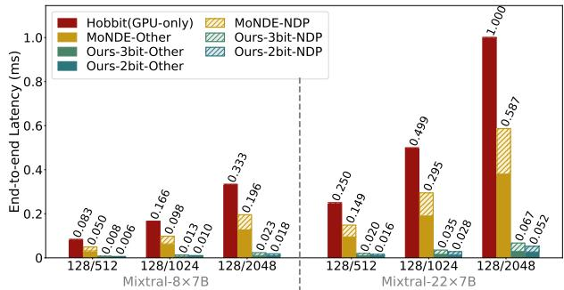  
Figure 5: End-to-end latency comparison across different methods, with NDP-side latency shown separately to highlight the benefits of our method in both reducing NDP computation and minimizing expert migration.

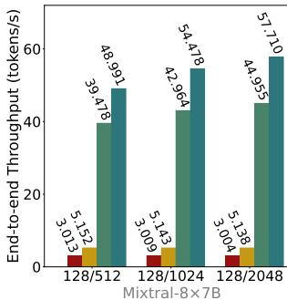

Figure 6: End-to-end decoding throughput.  
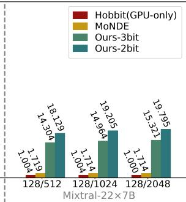

## 5.3 Accuracy Evaluation

We conduct accuracy evaluation on Mixtral-8×7B and compare our method against two baselines. The first is MoNDE, whose experts are computed in full precision and therefore provide lossless accuracy. The second is a our method variant without the Expert Bitwidth Selector, which allows us to isolate the benefit brought by context-aware bitwidth selection. For our method, we set the importance-score parameter ?? = 0.5 and use 1024 samples from the C4 dataset as the calibration set for constructing the loss table ????,?? (??). As described in Section 4.2, GPTQ is used as the underlying quantization method. In addition, consistent with the performance evaluation setup, we place four experts per layer on the GPU and the remaining four on the NDP device, which implies that half of the experts are executed in full precision (FP16).

Table 3: Model accuracy comparison for Mixtral-8×7B  
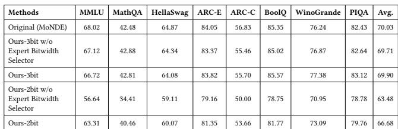

Table 3 reports the accuracy across multiple tasks. Ours-3bit incurs only a 0.13% average accuracy drop relative to the original model, while Ours-2bit shows an average drop of 3.4%. Compared with the variant without Expert Bitwidth Selector, Ours-3bit achieves a slight improvement and Ours-2bit yields a 3.2% average gain, demonstrating the effectiveness of the Expert Bitwidth Selector. Overall, our method’s context-aware Expert Placement Module and Expert Bitwidth Selector significantly improve GPU– NDP performance while preserving accuracy close to that of the full-precision model.

## 6 Related Work

Expert Offloading for MoE. Given the substantial GPU memory footprint of MoE-based LLMs, a large amount of recent work has explored how to efficiently offload experts to external memory. Several GPU-only systems improve offloading efficiency by prefetching, prediction, or expert scheduling, including Pre-gated MoE[15], eMoE[30], MoE-Infinity[35], SwapMoE[20] and Klotski[8]. Although HOBBIT[31] provides a GPU–CPU cooperative mode, its default and primary configuration executes both attention and expert FFNs on the GPU. These approaches indeed improve expert offloading efficiency, but they remain fundamentally constrained by the computational capacity of a GPU-only architecture and still suffer execution stalls. Other systems employ heterogeneous designs such as GPU–CPU architectures [4, 17, 37, 40, 41], where low-workload or uncached experts, as well as attention layers, may be executed on the CPU. GPU–NDP architectures [13, 18, 33, 38] further extend this idea by enabling in-memory execution of experts and thereby avoiding frequent data transfers. Compared with CPUs, NDP devices provide significantly higher internal bandwidth and lower dataaccess latency, making them better suited for memory-intensive operations and full-parameter storage. However, existing GPU– NDP MoE systems are context-unaware and do not adapt expert execution to the computational characteristics of NDP, which leads to substantial expert migration overhead remaining unresolved.

Quantization for MoE. Post-training quantization (PTQ) [7, 21, 28, 34] is an effective technique for compressing LLMs without additional training. Methods such as GPTQ [9] and HQQ [2] reduce model size by approximating weights with low-bit representations while preserving accuracy. Recent work extends PTQ to MoE models by quantizing experts to mitigate their large parameter footprint. MiLo[12] combines 3-bit quantization with low-rank compensators to recover accuracy, while MC[14] proposes an expert-aware quantization method that automatically assigns an optimal bitwidth to each expert. In contrast to these goals, our method leverages expert quantization primarily to reduce NDP-side computational pressure rather than to minimize model storage.

## 7 Conclusion

In this work, we present a context-aware MoE inference system for hybrid GPU–NDP architectures based on CXL-attached memory devices. Our analysis establishes that prefill-stage routing reliably indicates decoding-time activations, enabling prefill-guided expert placement that dynamically pins hot experts in GPU HBM and executes cold experts in place on the NDP tier. To ensure our design falls into the limited compute capacity of NDP, we introduce context-aware mixed-precision quantization that allocates per-expert bitwidths, converting expensive parameter movement into cheaper activation movement and sustaining overlapped execution between GPU and NDP. Experiments demonstrate that our approach achieves up to 6.6–8.3× end-to-end speedup and 8.7× decoding throughput improvement over state-of-the-art method, while incurring only a 0.13% average accuracy drop.

## References

[1] Aida Amini, Saadia Gabriel, Shanchuan Lin, Rik Koncel-Kedziorski, Yejin Choi, and Hannaneh Hajishirzi. 2019. Mathqa: Towards interpretable math word problem solving with operation-based formalisms. In Proceedings of the 2019 conference of the North American chapter of the association for computational linguistics: Human language technologies, volume 1 (long and short papers). 2357– 2367.

[2] Hicham Badri and Appu Shaji. 2023. Half-Quadratic Quantization of Large Machine Learning Models. https://mobiusml.github.io/hqq\_blog/

[3] Yonatan Bisk, Rowan Zellers, Jianfeng Gao, Yejin Choi, et al. 2020. Piqa: Reasoning about physical commonsense in natural language. In Proceedings of the AAAI conference on artificial intelligence, Vol. 34. 7432–7439.

[4] Shiyi Cao, Shu Liu, Tyler Griggs, Peter Schafhalter, Xiaoxuan Liu, Ying Sheng, Joseph E Gonzalez, Matei Zaharia, and Ion Stoica. 2025. Moe-lightning: Highthroughput moe inference on memory-constrained gpus. In Proceedings of the 30th ACM International Conference on Architectural Support for Programming Languages and Operating Systems, Volume 1. 715–730.

[5] Christopher Clark, Kenton Lee, Ming-Wei Chang, Tom Kwiatkowski, Michael Collins, and Kristina Toutanova. 2019. Boolq: Exploring the surprising difficulty of natural yes/no questions. arXiv preprint arXiv:1905.10044 (2019).

[6] Peter Clark, Isaac Cowhey, Oren Etzioni, Tushar Khot, Ashish Sabharwal, Carissa Schoenick, and Oyvind Tafjord. 2018. Think you have solved question answering? try arc, the ai2 reasoning challenge. arXiv preprint arXiv:1803.05457 (2018).

[7] Tim Dettmers, Mike Lewis, Younes Belkada, and Luke Zettlemoyer. 2022. Gpt3. int8 (): 8-bit matrix multiplication for transformers at scale. Advances in neural information processing systems 35 (2022), 30318–30332.

[8] Zhiyuan Fang, Yuegui Huang, Zicong Hong, Yufeng Lyu, Wuhui Chen, Yue Yu, Fan Yu, and Zibin Zheng. 2025. Klotski: Efficient Mixture-of-Expert Inference via Expert-Aware Multi-Batch Pipeline. In Proceedings of the 30th ACM International Conference on Architectural Support for Programming Languages and Operating Systems, Volume 2. 574–588.

[9] Elias Frantar, Saleh Ashkboos, Torsten Hoefler, and Dan Alistarh. 2022. Gptq: Accurate post-training quantization for generative pre-trained transformers. arXiv preprint arXiv:2210.17323 (2022).

[10] Leo Gao, Jonathan Tow, Baber Abbasi, Stella Biderman, Sid Black, Anthony DiPofi, Charles Foster, Laurence Golding, Jeffrey Hsu, Alain Le Noac’h, Haonan Li, Kyle McDonell, Niklas Muennighoff, Chris Ociepa, Jason Phang, Laria Reynolds, Hailey Schoelkopf, Aviya Skowron, Lintang Sutawika, Eric Tang, Anish Thite, Ben Wang, Kevin Wang, and Andy Zou. 2024. The Language Model Evaluation Harness. doi:10.5281/zenodo.12608602

[11] Dan Hendrycks, Collin Burns, Steven Basart, Andy Zou, Mantas Mazeika, Dawn Song, and Jacob Steinhardt. 2020. Measuring massive multitask language understanding. arXiv preprint arXiv:2009.03300 (2020).

[12] Beichen Huang, Yueming Yuan, Zelei Shao, and Minjia Zhang. 2025. MiLo: Efficient Quantized MoE Inference with Mixture of Low-Rank Compensators. arXiv preprint arXiv:2504.02658 (2025).

[13] Haochen Huang, Shuzhang Zhong, Zhe Zhang, Shuangchen Li, Dimin Niu, Hongzhong Zheng, Runsheng Wang, and Meng Li. 2025. HD-MoE: Hybrid and Dynamic Parallelism for Mixture-of-Expert LLMs with 3D Near-Memory Processing. arXiv preprint arXiv:2509.09420 (2025).

[14] Wei Huang, Yue Liao, Jianhui Liu, Ruifei He, Haoru Tan, Shiming Zhang, Hongsheng Li, Si Liu, and Xiaojuan Qi. 2024. Mixture Compressor for Mixture-of-Experts LLMs Gains More. arXiv preprint arXiv:2410.06270 (2024).

[15] Ranggi Hwang, Jianyu Wei, Shijie Cao, Changho Hwang, Xiaohu Tang, Ting Cao, and Mao Yang. 2024. Pre-gated moe: An algorithm-system co-design for fast and scalable mixture-of-expert inference. In 2024 ACM/IEEE 51st Annual International Symposium on Computer Architecture (ISCA). IEEE, 1018–1031.

[16] Albert Q Jiang, Alexandre Sablayrolles, Antoine Roux, Arthur Mensch, Blanche Savary, Chris Bamford, Devendra Singh Chaplot, Diego de las Casas, Emma Bou Hanna, Florian Bressand, et al. 2024. Mixtral of experts. arXiv preprint arXiv:2401.04088 (2024).

[17] Keisuke Kamahori, Tian Tang, Yile Gu, Kan Zhu, and Baris Kasikci. 2024. Fiddler: Cpu-gpu orchestration for fast inference of mixture-of-experts models. arXiv preprint arXiv:2402.07033 (2024).

[18] Taehyun Kim, Kwanseok Choi, Youngmock Cho, Jaehoon Cho, Hyuk-Jae Lee, and Jaewoong Sim. 2024. Monde: Mixture of near-data experts for large-scale sparse models. In Proceedings of the 61st ACM/IEEE Design Automation Conference. 1–6.

[19] Yoongu Kim, Weikun Yang, and Onur Mutlu. 2015. Ramulator: A fast and extensible DRAM simulator. IEEE Computer architecture letters 15, 1 (2015), 45–49.

[20] Rui Kong, Yuanchun Li, Qingtian Feng, Weijun Wang, Xiaozhou Ye, Ye Ouyang, Linghe Kong, and Yunxin Liu. 2023. SwapMoE: Serving Off-the-shelf MoEbased Large Language Models with Tunable Memory Budget. arXiv preprint arXiv:2308.15030 (2023).

[21] Ji Lin, Jiaming Tang, Haotian Tang, Shang Yang, Wei-Ming Chen, Wei-Chen Wang, Guangxuan Xiao, Xingyu Dang, Chuang Gan, and Song Han. 2024. Awq: Activation-aware weight quantization for on-device llm compression and acceleration. Proceedings of machine learning and systems 6 (2024), 87–100.

[22] Stephanie Lin, Jacob Hilton, and Owain Evans. 2022. Truthfulqa: Measuring how models mimic human falsehoods. In Proceedings of the 60th annual meeting of the association for computational linguistics (volume 1: long papers). 3214–3252.

[23] Aixin Liu, Bei Feng, Bing Xue, Bingxuan Wang, Bochao Wu, Chengda Lu, Chenggang Zhao, Chengqi Deng, Chenyu Zhang, Chong Ruan, et al. 2024. Deepseek-v3 technical report. arXiv preprint arXiv:2412.19437 (2024).

[24] Stephen Merity, Caiming Xiong, James Bradbury, and Richard Socher. 2016. Pointer sentinel mixture models. arXiv preprint arXiv:1609.07843 (2016).

[25] Niklas Muennighoff, Luca Soldaini, Dirk Groeneveld, Kyle Lo, Jacob Morrison, Sewon Min, Weijia Shi, Pete Walsh, Oyvind Tafjord, Nathan Lambert, et al. 2024. Olmoe: Open mixture-of-experts language models. arXiv preprint arXiv:2409.02060 (2024).

[26] Colin Raffel, Noam Shazeer, Adam Roberts, Katherine Lee, Sharan Narang, Michael Matena, Yanqi Zhou, Wei Li, and Peter J Liu. 2020. Exploring the limits of transfer learning with a unified text-to-text transformer. Journal of machine learning research 21, 140 (2020), 1–67.

[27] Keisuke Sakaguchi, Ronan Le Bras, Chandra Bhagavatula, and Yejin Choi. 2021. Winogrande: An adversarial winograd schema challenge at scale. Commun. ACM 64, 9 (2021), 99–106.

[28] Wenqi Shao, Mengzhao Chen, Zhaoyang Zhang, Peng Xu, Lirui Zhao, Zhiqian Li, Kaipeng Zhang, Peng Gao, Yu Qiao, and Ping Luo. 2023. Omniquant: Omnidirectionally calibrated quantization for large language models. arXiv preprint arXiv:2308.13137 (2023).

[29] Noam Shazeer, Azalia Mirhoseini, Krzysztof Maziarz, Andy Davis, Quoc Le, Geoffrey Hinton, and Jeff Dean. 2017. Outrageously large neural networks: The sparsely-gated mixture-of-experts layer. arXiv preprint arXiv:1701.06538 (2017).

[30] Suraiya Tairin, Shohaib Mahmud, Haiying Shen, and Anand Iyer. 2025. eMoE: Task-aware Memory Efficient Mixture-of-Experts-Based (MoE) Model Inference. arXiv preprint arXiv:2503.06823 (2025).

[31] Peng Tang, Jiacheng Liu, Xiaofeng Hou, Yifei Pu, Jing Wang, Pheng-Ann Heng, Chao Li, and Minyi Guo. 2024. Hobbit: A mixed precision expert offloading system for fast moe inference. arXiv preprint arXiv:2411.01433 (2024).

[32] Mistral AI Team. 2024. “Cheaper, Better, Faster, Stronger: Mixtral 8×22B is our latest open model”. https://mistral.ai/news/mixtral-8x22b. Accessed: 2025-11-18.

[33] Lizhou Wu, Haozhe Zhu, Siqi He, Xuanda Lin, Xiaoyang Zeng, and Chixiao Chen. 2025. PIMoE: Towards efficient MoE transformer deployment on NPU-PIM system through throttle-aware task offloading. In 2025 62nd ACM/IEEE Design Automation Conference (DAC). IEEE, 1–7.

[34] Guangxuan Xiao, Ji Lin, Mickael Seznec, Hao Wu, Julien Demouth, and Song Han. 2023. Smoothquant: Accurate and efficient post-training quantization for large language models. In International conference on machine learning. PMLR, 38087–38099.

[35] Leyang Xue, Yao Fu, Zhan Lu, Chuanhao Sun, Luo Mai, and Mahesh K Marina. 2025. MoE-Infinity: Efficient MoE Inference on Personal Machines with Sparsity-Aware Expert Cache. (2025).

[36] An Yang, Anfeng Li, Baosong Yang, Beichen Zhang, Binyuan Hui, Bo Zheng, Bowen Yu, Chang Gao, Chengen Huang, Chenxu Lv, et al. 2025. Qwen3 technical report. arXiv preprint arXiv:2505.09388 (2025).

[37] Yichao Yuan, Lin Ma, and Nishil Talati. 2025. MoE-Lens: Towards the Hardware Limit of High-Throughput MoE LLM Serving Under Resource Constraints. arXiv preprint arXiv:2504.09345 (2025).

[38] Sungmin Yun, Kwanhee Kyung, Juhwan Cho, Jaewan Choi, Jongmin Kim, Byeongho Kim, Sukhan Lee, Kyomin Sohn, and Jung Ho Ahn. 2024. Duplex: A Device for Large Language Models with Mixture of Experts, Grouped Query Attention, and Continuous Batching. In 2024 57th IEEE/ACM International Symposium on Microarchitecture (MICRO). IEEE, 1429–1443.

[39] Rowan Zellers, Ari Holtzman, Yonatan Bisk, Ali Farhadi, and Yejin Choi. 2019. Hellaswag: Can a machine really finish your sentence? arXiv preprint arXiv:1905.07830 (2019).

[40] Yujie Zhang, Shivam Aggarwal, and Tulika Mitra. 2025. DAOP: Data-Aware Offloading and Predictive Pre-Calculation for Efficient MoE Inference. In 2025 Design, Automation & Test in Europe Conference (DATE). IEEE, 1–7.

[41] Shuzhang Zhong, Yanfan Sun, Ling Liang, Runsheng Wang, Ru Huang, and Meng Li. 2025. HybriMoE: Hybrid CPU-GPU Scheduling and Cache Management for Efficient MoE Inference. arXiv preprint arXiv:2504.05897 (2025).