# TraCT: Disaggregated LLM Serving with CXL Shared Memory KV Cache at Rack-Scale

Dongha Yoon1∗, Younghoon Min2, Hoshik Kim2, Sam H. Noh1, Jongryool Kim2

1Virginia Tech 2SK Hynix America

## Abstract

Disaggregated LLM serving improves resource efficiency by separating the compute-intensive prefill phase from the latency-critical decode phase. However, this architecture introduces a fundamental bottleneck: key/value (KV) tensors generated during prefill must be transferred to decode workers, and existing systems rely on RDMA-based network paths for this exchange. This paper presents TraCT, a rack-scale LLM serving system that uses CXL shared memory as both a KV-transfer substrate and a rack-wide prefix-aware KV cache. TraCT enables GPUs to write and read KV blocks directly through CXL load/store and DMA operations, eliminating the NIC hop that constrains existing disaggregated pipelines. However, to realize this design, multiple new challenges such as synchronization, consistency, and data management on noncoherent CXL memory need to be addressed. TraCT proposes various software solutions such as the two-tier inter-node synchronization mechanism to address these challenges. We implement TraCT on the Dynamo LLM inference framework and show that, across static and synthetic workloads, TraCT reduces average TTFT by up to 9.8×, lowers P99 latency by up to 6.2×, and improves peak throughput by up to 1.6× compared to RDMA and DRAM-based caching baselines.

## 1 Introduction

Large language models (LLMs) continue to grow in scale and capability, driving rapid deployment across industry and research. To improve utilization and reduce cost, modern LLM serving systems are increasingly adopting disaggregated architectures that separate the compute-intensive prefill phase from the latency-critical decode phase. Systems such as DistServe [23], Splitwise [13], Preble [17], and NVIDIA’s Dynamo [3] show that decoupling these phases enables independent scaling and improved throughput. However, this architectural shift introduces a new bottleneck, that is, the movement of key/value (KV) tensors. As model sizes and context lengths increase, the volume of KV data exchanged between prefill and decode workers grows to hundreds of megabytes per request, making KV transfer a dominant factor in both request latency and peak system throughput.

Today, disaggregated serving stacks overwhelmingly rely on network-based KV transfers, commonly using RDMA (e.g., UCX, NIXL [4, 16]). Even when prefix reuse is high, each KV cache hit still requires transporting KV blocks through NIC queues, host DRAM buffers, and layered transport protocols on both ends. This network hop significantly inflates prefill latency, increases tail variability, and constrains overall throughput. Prefix-aware caching systems such as LM-Cache [6] and Mooncake [14] improve reuse but still route all KV traffic across the network, leaving network serialization and congestion as persistent performance limitations.

Meanwhile, Compute Express Link (CXL) [1] has emerged as a promising substrate for rack-scale systems. CXL Type-3 devices provide large, byte-addressable memory pools that multiple hosts may map concurrently using load/store semantics, without involving the network stack. This raises a natural question: Can CXL shared memory replace RDMA as the transport substrate for disaggregated LLM serving, eliminating the network hop entirely?

Using CXL to directly publish and consume KV blocks across nodes could fundamentally change the performance and cost profile of LLM inference. Prefill workers could write KV blocks into shared memory via GPU–CXL DMA, and decode workers could read them back with no NIC involvement, no host-to-host copies, and no network-induced variability. However, current CXL devices provide no cross-node atomic operations, do not guarantee coherence across the full device capacity, and expose only raw byte-addressable memory. As a result, even simple operations such as updating metadata, coordinating access, and ensuring visibility require careful software design.

This paper presents TraCT, a rack-scale LLM serving system that uses CXL shared memory as both (1) a networkfree KV-transfer substrate and (2) a rack-wide prefix-aware KV cache. TraCT tightly couples KV Transfer and prefixaware Caching Together, enabling prefill and decode workers across the rack to communicate through a unified CXL memory pathway. TraCT removes the RDMA hop entirely: GPUs write missed KV blocks directly into CXL memory and fetch reusable KV blocks back through direct GPU–CXL DMA.

Building TraCT requires addressing three fundamental challenges imposed by today’s CXL hardware:

1. Inter-node mutual exclusion without hardware atomics. CXL Type-3 devices lack cross-node atomic instructions and do not provide global coherence. TraCT introduces a two-tier software lock consisting of pernode DRAM-resident local locks and a fixed-size global lock array stored in shared memory, coordinated by a lightweight lock manager. This design bounds contention and supports predictable lock acquisition without per-process lock state.

2. Correct metadata visibility on non-coherent shared memory. Without cross-node coherence, even mutually exclusive writers may expose stale metadata. TraCT employs fine-grained cacheline flushing, places metadata in a compact control region, avoids CPU access to large KV payloads, and uses clflush (not clflushopt) to guarantee visibility when publishing shared state.

3. Shared-memory data structures without shared pointers. Virtual addresses differ across processes and nodes. TraCT adopts offset-based addressing, a sharedmemory allocator combining a global chunk allocator with per-node heaps, and a compact object store that publishes only root metadata (e.g., prefix-cache roots), enabling efficient access without pointer rewriting or complex structural updates.

We implement TraCT on the Dynamo LLM inference framework [3] and compare with the baseline Dynamo runtime with NIXL/UCX and LMCache using various workloads including synthetic workloads generated using Dynamo’s built-in data generator. We show that CXL shared memory, through the use of TraCT, is a viable and effective alternative to RDMA for KV transfer. Even without caching, TraCT, with direct GPU–CXL DMA, reduces prefill latency and sustains throughput comparable to RDMA. With caching enabled, TraCT improves peak throughput by up to 1.6×, reduces average TTFT by up to 9.8×, and reduces P99 TTFT by up to 6.2× across realistic workloads. We show that TraCT also improves GPU utilization, increases effective PCIe bandwidth, and lowers power consumption, resulting in more predictable and energy-efficient inference performance.

The remainder of this paper is organized as follows. Section 2 provides background on CXL shared memory, LLM inference, and the role of KV management in disaggregated serving systems. Section 3 presents the design of TraCT, including its two-tier synchronization mechanism, metadata visibility strategy, shared-memory allocator, and prefix-aware KV cache. Section 4 details our implementation atop the Dynamo–vLLM runtime and describes how TraCT enables direct GPU–CXL DMA. Section 5 evaluates TraCT across microbenchmarks and end-to-end inference workloads. Section 6 discusses related work, and Section 7 concludes.

## 2 Background and Motivation

## 2.1 CXL Shared Memory

Compute Express Link (CXL) is an interconnect standard that builds on top of PCIe and enables high-bandwidth, lowlatency communication between CPUs and devices such as accelerators and memory expanders. CXL Type-3 devices, in particular, provide host-accessible memory through the CXL.mem protocol that is used as a way to extend DRAM capacity beyond what can be installed directly on the CPU socket.

While recent hardware prototypes demonstrate the promise of CXL-based memory expansion in a single host, practical deployments of shared CXL Type-3 devices—where multiple hosts attach to the same device—remain extremely limited. Most existing systems treat CXL memory as a DRAM extension or a near-memory tier, but only a few research efforts explore its use as rack-scale shared memory [8, 18, 19, 21].

In current systems, a CXL Type-3 device typically exposes its capacity as a DAX-capable memory region that can be mapped into user space as byte-addressable memory. From the perspective of software running on a single node, this memory behaves similarly to local DRAM: loads and stores are issued through the normal memory hierarchy, and DMA engines can read and write the region directly. However, when multiple hosts attach to the same CXL device, the memory is not automatically kept coherent across hosts. Recent work reports that coherence, when present at all, is limited to small device-specific regions and does not scale to the full capacity of devices [8, 9]. As a result, applications that use CXL as a shared memory pool must explicitly manage synchronization and visibility across nodes [8, 21].

CXL shared memory offers attractive properties for rackscale systems. It enables memory-like communication semantics (load, store, DMA) without involving the network stack, avoids extra buffer copies in NICs, and can be shared by multiple compute nodes or accelerators. At the same time, it introduces new challenges. CXL Type-3 devices do not expose cross-node atomic operations, so traditional synchronization primitives cannot be directly extended across hosts. The lack of full-device coherence means that software must reason about cacheline state, flushing, and ordering. In TraCT, we leverage CXL shared memory as both inter-node transfer media and LLM’s KV cache at rack-scale, but must address these synchronization and coherence issues to ensure correctness and performance.

## 2.2 LLM Inference

Modern LLMs such as GPT, Gemini, and Llama [7, 11, 12] are decoder-only transformers that generate tokens autoregressively: each output token is predicted conditioned on all previously produced tokens. Inference proceeds in two phases, prefill and decode, which differ in their compute and memory characteristics. Figure 1 illustrates how key/value (KV) tensors evolve across these phases.

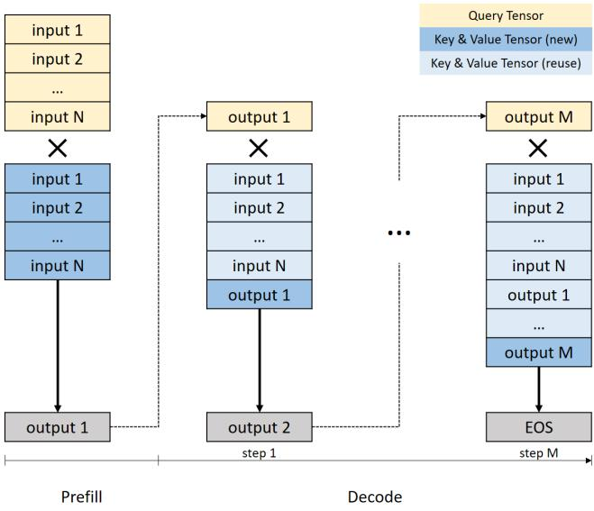  
Figure 1: Evolution of KV tensors in LLM inference.

Prefill. During prefill, the full input prompt of length N is processed in a single forward pass. Every layer computes attention across all N tokens, yielding O(N2) interactions. This phase is compute-intensive and highly batchable. The model produces the first output token, and a sequence of N key/value (K/V) tensors—one per input token—which form the initial KV cache.

Decode. After prefill, inference enters a token-by-token decode phase. At step t, the model computes query (Q)/K/V vectors for the newly generated output token, and attends over all previously stored K/V tensors. Unlike prefill, per-step computation is small, but the KV cache grows to N + t entries. Thus, the decode phase becomes memory-bound, not compute-bound.

KV cache. To avoid re-computing K and V tensors over the entire history at each decode step, inference systems store the intermediate key and value tensors from each layer in a KV cache. At step t, the model reuses the cached K and V from step 1 to t − 1 and only computes the Q, K, V for the new token. For large models and long sequences, the KV cache dominates memory usage; for example, Llama3 405B model, which has 126 layers with 8 heads per layer and a head dimension of 128 requires 504 KB of memory per token. This makes KV management a first-order concern for both performance and cost of LLM inference systems.

Across recent systems work, the KV cache has emerged as the component that most tightly couples compute throughput, memory capacity, and communication efficiency. This motivates designs that reduce KV recomputation to improve reuse or distribute KV storage across multiple memory tiers and nodes [3, 6, 14, 20].

## 2.3 KV Management and Disaggregated LLM serving

KV caching mechanisms interact closely with how an LLM serving system is architected. Within a single node, KV tensors are typically kept in GPU memory and managed by the inference engine. Systems such as vLLM and SGLang, for example, optimize this intra-node KV management. Specifically, vLLM addresses GPU memory fragmentation and duplication problems by leveraging the operating system’s memory paging mechanism, grouping KV tensors into fixedsize blocks, while SGLang introduces RadixAttention, which allows requests with common prefixes to share KV blocks across them [10, 22].

Beyond a single GPU or node, KV caching has been extended to additional tiers and to multi-node disaggregated settings. Systems such as Splitwise, DistServe, and Preble partition the pipeline into prefill workers, which run the computeheavy prompt processing, and decode workers, which perform latency-critical token generation [13, 17, 23]. NVIDIA’s Dynamo generalizes this disaggregated architecture into a production-level framework [3]. This separation enables independent scaling of the two phases and improves GPU utilization. However, every request still requires transferring KV blocks from prefill to decode workers. Current systems rely on RDMA or similar network paths. Thus, even when prefix reuse is high, each KV cache hit must traverse the NIC and DRAM on both sides, incurring NIC serialization overhead and extra memory copies, making the approach sensitive to network congestion.

From a KV cache perspective, LMCache and Mooncake demonstrate that KV state can be shared across disaggregated servers. LMCache provides a KV cache layer that offloads KV blocks from GPU to storage backends, which span from CPU memory to distributed object store, enabling KV reuse across engines [6]. Mooncake constructs a distributed KV cache in which CPU memory and SSDs form a global KV cache for separate prefill and decode clusters [14]. However, both systems retain network-based movement of KV tensors for cross-node reuse.

Disaggregated LLM serving therefore improves modularity and resource scaling, but also moves KV transfer into the critical path. In contrast to network-centric designs, this study explores using CXL shared memory as a rack-scale KV cache and transfer layer directly accessible to all participating hosts and GPUs through load/store and DMA. This approach removes the network hop for KV reuse but raises new challenges such as synchronization, consistency, and data management on non-coherent CXL memory. TraCT addresses these software support challenges, which we discuss in detail

## 3 TraCT Design

We propose TraCT, a CXL-based rack-scale shared KV cache for disaggregated LLM inference. TraCT exposes a CXL shared memory region that can be simultaneously accessed by multiple LLM servers and their GPUs. At its core, TraCT tightly couples KV Transfer and prefix-aware Caching Together within a single CXL-based data path, eliminating the redundant copies and network hops that dominate RDMAbased designs.

## 3.1 Design Goals and Challenges

TraCT is designed with three primary goals.

1. Network-free KV transfer. Replace the RDMA-based network stack with direct DMA between GPUs and CXL shared memory, so that KV blocks flow over the PCIe/CXL fabric instead of NICs.

2. Rack-scale KV reuse. Store KV blocks and their prefixcaching metadata directly in CXL shared memory so that any LLM servers in the rack can reuse them without additional copies or network transfers.

3. Decentralized KV management. Exploit the sharedmemory abstraction of CXL by avoiding centralized metadata servers or coordinator-based KV cache management. Prefill workers and decoding workers should directly read and update shared metadata through load/store operations, requiring no designated owner or manager of KV state.

Achieving these goals introduces the following challenges.

(1) Ensuring mutual exclusive access in shared memory region. Mutual exclusion is a fundamental requirement in TraCT because nodes concurrently update shared metadata (e.g., prefix-cache entries, allocator state). In single-node settings, such metadata is safely protected by hardware cache coherence and atomic instructions. However, this assumption breaks down in multi-host CXL deployments: current CXL Type-3 devices expose memory with load/store semantics but provide no cross-node atomic operations and no full-device hardware coherence. This limitation is not merely an artifact of first-generation hardware. Recent analyses indicate that providing coherence at the scale of multi-terabyte CXL memory is fundamentally impractical due to snoop-filter size, power constraints, and cross-host coherence traffic [8, 9].

Existing CXL shared memory systems take two different approaches to this problem: (1) Some rely on a small, device-specific coherent region and assume that remote atomics within that region behave correctly [8, 21]. This simplifies lock implementation, but the coherent region is typically limited in size and is not guaranteed across devices. (2) Other systems avoid locks altogether by using producer–consumer queues as the synchronization substrate. For example, cMPI allocates an N × N matrix of queues for N participants [18].

This design provides deterministic communication paths but requires O(N2) memory and forces each participant to scan many queues, increasing CPU cost as N grows. Beluga reduces this cost by centralizing metadata operations through a single metadata server [19]. This centralized server–client design is common in network-based systems because it simplifies concurrency control and hides coordination complexity behind a single metadata owner. However, when applied to CXL shared memory, centralization contradicts the purpose of exposing a load/store–accessible shared region. Every metadata operation, even simple prefix-cache lookups, must reach the metadata server, reintroducing communication overhead that CXL is meant to eliminate. In contrast, TraCT requires that all workers operate directly on shared-memory metadata, without a designated coordinator. This demands a synchronization mechanism that remains correct in the absence of hardware atomics or coherence.

Thus, the challenge for TraCT is to provide a practical mutual exclusion mechanism that (i) operates correctly without relying on hardware atomics or coherence and (ii) scales with the number of participating servers without incurring memory or CPU costs. TraCT addresses this challenge with a novel two-tier software synchronization mechanism that relies solely on load/store accesses to CXL memory while bounding CPU overhead and contention (Section 3.3).

(2) Cache coherence. Although the latest CXL specification [1] defines snoop-based coherence, recent work shows that coherence—when available at all—is confined to small regions rather than the full device capacity [8,9]. Given terabytescale CXL devices, maintaining global snoop filters is impractical [8]. Consequently, even if a software lock ensures mutual exclusion at the abstraction level, concurrent loads and stores to the same cacheline from different nodes can still observe stale data unless caches are explicitly flushed and invalidated. Naively flushing on every access would quickly exhaust CPU cycles and PCIe bandwidth.

Thus, the challenge for TraCT is to provide a fine-grained cache-line management mechanims that (i) minimizes the number of flushed lines, (ii) scopes coherence to a small control region, and (iii) preserves correctness for KV metadata and payloads. TraCT addresses this challenge by using clflush, an instruction that ensures that the cacheline is evicted from the local cache hierarchy before the instruction completes. While earlier work claims considerable overhead with this approach [18], we find this choice to be the best for ensuring correctness. We discuss the rationale behind this choice in Section 3.4.

(3) Management of shared objects and memory. To share KV blocks and their metadata across nodes, an object abstraction over the CXL region is required. cMPI, for example, exports a CXL SHM Arena that manages objects via a multilevel hash table [18]. While effective for flat key–value mappings, this design is inefficient for hierarchical structures such as trees or multi-level indices: each element in the tree must be registered as a separate object, stressing the hash tables and complicating key management. To address this challenge, TraCT aims to publish only a small set of root objects (e.g., the prefix index) and express the remaining structure as pointerlike links within the shared region. This requires a clear separation between (i) a shared memory allocator that manages raw space and (ii) a shared object store that enables sharing of objects across nodes.

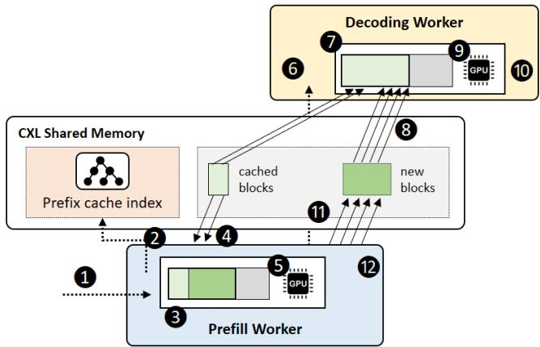  
Figure 2: TraCT overview

## 3.2 Overview

Figure 2 illustrates TraCT’s architecture. Each rack contains multiple prefill and decoding workers, all connected to a shared CXL Type-3 device. TraCT exposes the CXL device as a byte-addressable, DAX-mapped region on all participating servers. The region is managed by a library which provides three general primitives: (1) an inter-node lock to ensure mutual exclusion across processes in different nodes (Section 3.3), (2) a memory allocator for managing limited space (Section 3.4), and (3) an object store for metadata sharing across nodes (Section 3.5). Based on the library, TraCT implements a prefix caching index and GPU-CXL KV block transfer modules. Prefill workers insert or update entries in the prefix index, allocate space for KV tensors in CXL memory, and write the tensors via GPU-CXL DMA. Decoding workers look up prefixes, validate entries, and fetch KV tensors directly from CXL into GPU memory.

The specific steps for inference serving in TraCT is as follows. When an LLM inference request arrives, TraCT processes the request as follows: ( 1 ) Prefill Enqueue. The request is enqueued in the prefill worker’s waiting queue. ( 2 ) Lookup. Prefill worker looks up the prefix cache for cachehit blocks. ( 3 ) Prefill Schedule. LLM engine schedules the requests and allocates GPU memory. ( 4 ) KV Read. If there is cache-hit, perform CXL-to-GPU KV block transfer. ( 5 ) Prefill Compute. Compute cache-missed KV blocks and notify decoding worker to start token generation stage. (11) KV Write. Publish prefix cache entry and copies missed KV blocks (GPU-to-CXL). ( 12 ) Free. After KV write, release

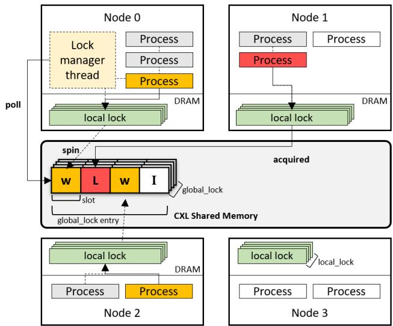  
Figure 3: Two-tier inter-node locking in TraCT. Processes on each node first contends on its local DRAM-resident lock, so that at most one thread per node participates in acquiring the global lock. A corresponding paired global\_lock, which is composed of slots, one for each node, resides in CXL memory. Each slot is in one of three states: I (idle), W (waiting) and L (lock granted). One dedicated lock manager thread (residing in Node 0 in this four node figure) guarantees mutual exclusion by granting, at any time, the lock to only a single node.

GPU resources so that next requests can be served.

On the decoding side, when a request is received (after ( 5 )), a decoding worker goes through the following steps: ( 6 ) Decoding Enqueue. The request is enqueued ( 7 ) Decoding Schedule. Allocate GPU memory. ( 8 ) KV Read. Read all KV blocks of the prompt. yield GPU cycle until KV blocks are fully loaded to GPU memory. ( 9 ) Decoding Compute. Produce an output token every iteration. (10) Free. Release GPU memory.

## 3.3 Ensuring mutual exclusive access

To safely share metadata such as allocator state and prefix indices, TraCT must provide inter-node mutual exclusion without relying on hardware-level atomic instructions, which current CXL Type-3 devices do not support. A naïve design in which every process across all nodes directly participates in a single global lock is impractical. Processes may join and exit dynamically, making the participant set unbounded, and exposing per-process lock state would create excessive contention while forcing the lock manager to poll a large, continuously changing collection of entries.

To bound complexity and ensure predictable lockacquisition latency, TraCT adopts a two-tier locking structure where a global\_lock and local\_lock pair work in tandem with both locks being indexed by the same lock identifier. By acquiring the local lock prior to requesting the global lock, contention for the lock at the global scale can be controlled.

Local tier (intra-node exclusion). Each node maintains an array of conventional DRAM-resident locks (e.g., pthread\_mutex), which serve as that node’s local\_locks. Enforcing processes to acquire a local\_lock first ensures that at most one process per node attempts to acquire the global lock at any time. This design allows contention for each global\_lock entry to remain a small as the number of participants is bounded by the number of node, which is known at initialization and is typically limited to a few tens in a rack. By collapsing all intra-node contention into the local\_lock, TraCT avoids per-process lock metadata and prevents the lock manager from scanning an unbounded or dynamically changing set of participants.

Global tier (inter-node arbitration). When a process attempts to enter the critical section, as mentioned above, it first acquires its node’s local\_lock. It then sets its corresponding global\_lock pair entry in the CXL shared memory region to WAITING and begins polling that entry. This polling is a load-based spin on the shared memory word.

In the background, a lock\_manager scans the global\_locks. For each allocated global lock entry, it probes the per-node slots within that entry and selects one node in the WAITING state to grant the lock by marking its slot LOCKED. The manager does not serialize lock usage by holding the lock itself; it merely designates a node that may proceed. Once the requesting process observes its entry transition to LOCKED, it enters the critical section.

Release. Upon exiting the critical section, the process resets its global\_lock entry to IDLE and releases its local\_lock, allowing other processes—both within and across nodes—to compete for future lock acquisitions.

## 3.4 Cache coherence

CXL Type-3 devices expose memory with load/store semantics, but do not guarantee coherence across hosts [8, 9]. Thus, even with software-based mutual exclusion, nodes may observe stale values due to private-cache retention, deferred write-back, or the absence of cross-node invalidation.

To ensure correctness while minimizing performance loss, TraCT takes the following approach.

(1) Metadata visibility. Updates to shared metadata must be explicitly flushed and ordered so that other nodes observe them in program order. As metadata structures in TraCT are compact, TraCT performs fine-grained cache-line flushing on only the modified lines rather than the entire region. This minimizes software coherence overhead while ensuring that every metadata update, such as publishing a KV entry, updating reference counts, or modifying allocator state, is durably written back to the CXL device before other nodes are allowed to consume it.

(2) Payload visibility. TraCT publishes metadata, such as prefix-cache entries, only after DMA completion, allowing consumers to treat the metadata state as the visibility boundary. Compared to prefix metadata (few cache lines), KV block payloads are large, ranging from hundreds of kilobytes to tens of megabytes depending on the number of tokens per block and model size. Flushing such regions in software would be prohibitively expensive due to the bulk data movement. Fortunately, GPU-CXL direct DMA bypass the CPU caches entirely, so payload data never resides in private CPU caches and requires no explicit flushing. TraCT therefore treats the publication of metadata (e.g., setting a prefix-cache entry to READY) as the visibility boundary. Once metadata is flushed and ordered after DMA completion, all nodes can safely assume that the corresponding KV payload is already durable and globally visible in the CXL device.

(3) Minimizing cache-line flush overhead. KV payloads are never accessed by CPUs during inference and therefore never enter CPU caches. TraCT isolates frequently updated metadata into cache-aligned lines while keeping large KV blocks outside the software-coherence critical path.

(4) Avoiding incorrect visibility when flushing. It is known that clflushopt issues lower-overhead, asynchronous flush requests compared to clflush [15, 18]. However, its behavior is subtle: clflushopt only queues a flush and does not guarantee that the line has reached device memory when the instruction retires. A subsequent mfence enforces ordering of CPU instructions but does not ensure that pending flushes or stores have propagated to the CXL device. This can result in incorrect visibility even when mutual exclusion is enforced. Consider the following simplified code, used to increment a reference count in a prefix cache entry:

```c
lock_acquire(entry_lock);
clflushopt(&ref_count);
mfence();
{
ref_count++;
}
clflushopt(&ref_count);
mfence();
lock_release(entry_lock);
```

The reference count prevents TraCT from evicting prefixcache entries that are currently in use. The intended behavior is to flush the old value before the increment and flush the new value afterward. However, because clflushopt is asynchronous, both flushes may remain pending in the CPU store buffer after mfence. When the lock is released, another node reading the same cacheline may still observe the old value if the flush has not yet reached the CXL device, violating correctness.

To avoid this situation, TraCT uses clflush, which ensures that the cacheline is evicted from the local cache hierarchy before the instruction completes. Although clflush has higher latency, it provides the required visibility guarantees for internode correctness when hardware coherence is unavailable

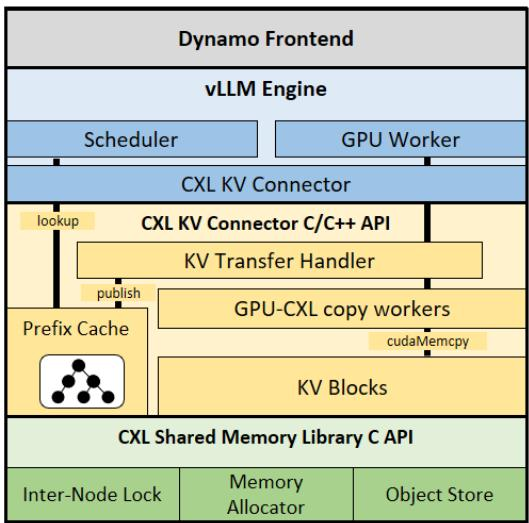  
Figure 4: TraCT software stack

## 3.5 Shared Object Store and Memory Allocator

Prefix indices, and other metadata structures must be shared across nodes, but CXL provides only a raw byte-addressable region. TraCT therefore designs and implements two foundational mechanisms: a shared memory allocator and a shared object store.

Memory allocator. Similar to the two-tier locking structure design, TraCT uses (1) a global chunk allocator and (2) pernode local heap allocators. The chunk allocator maintains global bitmap structure in CXL shared memory. It allocates fixed-size chunks into the heap allocator upon request. The heap allocator maintains heap free-lists in local DRAM, enabling cacheline granular memory allocation. This design eliminates intensive metadata updates in CXL shared memory, shifting metadata contention from inter-node scope to intra-node scope.

Shared object store. Unlike cMPI’s Arena [18], which allocates every element as a separate published object, TraCT publishes only a few root objects (e.g., the prefix index hash table) and links internal structures via offsets. This reduces object-management overhead and better supports hierarchical data structures.

## 4 Implementation

Figure 4 illustrates the software stack of TraCT. Based on the Dynamo [3] LLM inference framework, TraCT is implemented as an extension to vLLM’s KV connector layer

and a standalone CXL shared-memory library. The design allows TraCT to integrate with Dynamo’s disaggregated prefill/decode pipeline with only few lines of code modification.

## 4.1 CXL Shared Memory Library

To simplify programming on non-coherent CXL memory, TraCT provides a lightweight userspace library that exposes a set of C APIs built around the three abstractions described in Section 3: locking, shared-memory allocation, and object sharing. These APIs hide the low-level details of offset-based addressing, cacheline flushing, and metadata visibility, enabling higher layers of TraCT (e.g., the CXL KV connector) to operate without directly manipulating CXL-specific primitives.

(1) Shared-memory locks. Applications may allocate and use software-managed locks to protect metadata structures from inter-node contention. For this, the following interfaces are provided.

```c
int cxl_shm_allocate_lock(cxl_lock_t *lock);
int cxl_shm_free_lock(cxl_lock_t lock);
int cxl_shm_acquire_lock(cxl_lock_t lock);
int cxl_shm_release_lock(cxl_lock_t lock);
```

(2) Memory allocation. A malloc-like interface is provided for allocating raw bytes in the CXL region. Allocation uses a global chunk allocator combined with per-node local heaps.

```c
void *shmalloc(size_t size);
void shfree(void *ptr);
```

(3) Object sharing. A key–reference interface that allows nodes to publish and discover shared objects (e.g., prefixindex roots) are provided. Keys are stored in a hash table backed by CXL memory, while values are encoded as offsets.

```c
int cxl_shm_put(char *key, void *ptr);
int cxl_shm_get(char *key, void **ptr);
int cxl_shm_destroy(char *key);
```

(4) Utility functions. Interfaces to support operations for offset–pointer translation and cacheline eviction are provided.

```c
shm_ptr_t cxl_shm_get_offset(void *ptr);
void *cxl_shm_get_ptr(shm_ptr_t off);
void clflush(void *addr, size_t size);
```

Together, these APIs allow higher-level components to safely manipulate shared metadata and KV blocks using only load/store semantics, avoiding the need for kernel modifications or hardware-supported remote atomic operations.

## 4.2 Prefix Cache Management

Block hashing. Modern LLM inference systems partition token sequences into fixed-length KV blocks (e.g., 64 tokens per block). A KV block is uniquely defined not only by its token contents but also by its position in the sequence. A natural approach for managing these blocks is to maintain a prefix tree. However, a tree structure would require frequent pointer updates and structural modifications (insertion, split, merge), each of which would incur lock operations and cacheline flushes in CXL shared memory. Given that TraCT relies on software-based synchronization on non-coherent memory, such dynamic structures would impose prohibitive overhead.

To avoid these costs, TraCT uses a fixed-size hash table with linear probing. Each bucket stores a compact descriptor (hash, pointer to prefix cache entry). As the prefix cache size is configured at initialization, the hash table is static in size and avoids structural modifications, making it well-suited for a setting where metadata visibility must be ensured through explicit flushing.

To generate stable identifiers for KV blocks, TraCT leverages vLLM’s KV block-hashing mechanism [5]. For a block containing list of token IDs Ti, the block hash is computed iteratively:

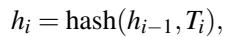

where hi−1 is the hash of the preceding block. This construction preserves prefix relationships: identical prefixes produce identical block hashes up to the point of divergence. Thus, the prefix cache can be indexed without needing to manipulate complex structures.

Insertion and lookup. When a prefill worker publishes new KV blocks, KV transfer handler first performs linear probing on the hash table using the block hash hi. After locating an empty bucket, the handler allocates KV storage through the shared-memory allocator and submits a GPU-to-CXL DMA request to the copy workers. Once the DMA completes, the handler updates the bucket’s metadata (hash, block length, offset to KV storage) and flushes the corresponding cachelines to ensure global visibility.

Lookup follows the same probing sequence: the consumer searches for hi in the table and, upon finding a matching bucket, retrieves the KV offset without modifying any metadata.

Eviction. TraCT maintains a simple LRU list in the shared memory. On every access, the corresponding prefix-cache entry is moved to the end of the list. When eviction is required, TraCT selects the oldest entry with a zero reference count, marks the entry invalid, frees the associated KV storage, and removes the element from the LRU list. As eviction only updates compact metadata fields (e.g., reference counts, validity flags, list links) and does not require reorganization of complex data structures, the synchronization overhead remains small. More sophisticated replacement policies may improve hit rate, but they require substantially richer metadata updates. Further studies on the tradeoff of replacement policies are left for future work.

## 4.3 Data structure implementation in shared memory

Virtual addresses are meaningful only within a given process address space. When multiple processes on different nodes map the same CXL region, each OS may choose a different virtual base address. Thus, a pointer created on one node cannot be dereferenced on another. To ensure correctness across distributed address spaces, TraCT adopts offset-based addressing for all shared data structures.

Offset-based pointers. Each shared structure stores 64-bit offsets from the beginning of the CXL region rather than raw virtual addresses. Each node maintains a local virtual base address for the mapped region, enabling the conversions:

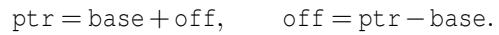

This ensures that all nodes interpret metadata and payloads consistently regardless of where their OS maps the CXL region in their local address space.

Alignment and layout. Shared objects are aligned to cacheline boundaries to avoid false sharing. Frequently written fields are isolated in separate cache lines, while mostly-read fields may be co-located for spatial locality. TraCT enforces compile-time layout checks to ensure structure consistency across compilation units and nodes.

## 4.4 Other Details

Enabling direct GPU–CXL DMA. A naive cudaMemcpy() from the CXL-mapped region to GPU memory causes the CUDA driver to allocate an intermediate bounce buffer in host DRAM, introducing an unintended extra copy and reducing throughput. To avoid this behavior, TraCT pins the entire CXL shared-memory region using CUDA’s host-memory registration interface. Once pinned, the CUDA runtime treats the region as page-locked host memory, allowing DMA engines to access the CXL device directly and enabling true GPU-CXL zero-copy transfers.

Memory pinning and NUMA placement. CXL Type-3 devices attach to a specific CPU socket through that socket’s PCIe root complex. As a result, accesses from remote NUMA nodes must traverse an additional inter-socket hop, increasing both latency and bandwidth variability. To preserve performance, TraCT binds all threads, including the lock manager and KV connector threads, to the NUMA node directly attached to the CXL device. This placement minimizes crosssocket traffic, and ensures that CPU-side metadata operations (e.g. prefix cache management, lock acquisition, cacheline flushes) observe consistent and low latency access to the shared memory region.

Codebase. The full implementation consists of approximately 5K lines of C/C++ for the CXL shared-memory library and the KV connector, plus a small Python wrapper integrating the connector into the Dynamo–vLLM runtime. We plan to open-source all our sources upon publication.

Table 1: Synthetic workloads generated using Dynamo’s request generator. Values denote mean token count, while numbers in parentheses indicate standard deviation.  
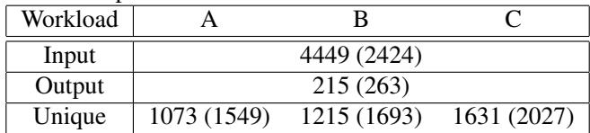

## 5 Evaluation

## 5.1 Evaluation setup

Our evaluation environment is configured with 2 servers. Server 1 executes the benchmark client and all runtime components aside from prefill worker. Server 2 is provisioned to perform only prefill tasks. This partitioning is specific to our controlled experimental study in contrast to production systems where these roles are generally co-located within a single node.

Hardware. Each server is equipped with an NVIDIA A6000 GPU (48 GB GDDR) and 512 GB of host DRAM. For the baseline (NIXL/UCX [4, 16]) configuration, the servers are interconnected using a 100 Gbps Mellanox MT2892 NIC. For the CXL experiments, we employ a Niagara 2.0 device, a second-generation CXL Type-3 memory expander that provides byte-addressable, load/store–accessible memory through the CXL.mem interface. Niagara exposes its capacity to the host as a DAX memory region and functions as a highcapacity, moderate-latency memory tier. In our setup, it delivers an access latency of 640 ns and a bandwidth of 10.1 GB/s, measured using Intel’s Memory Latency Checker (MLC) [2]. We configured 64 GB of space of Niagara for shared memory between workers.

Software. We deploy the LLM inference runtime using Dynamo v0.5.0 integrated with vLLM v0.10.1.1. Our evaluation includes three configurations: the baseline Dynamo runtime with NIXL/UCX (denoted NIXL in the results), LM-Cache [6] (denoted LMCache), and TraCT (denoted TraCT). LMCache represents a DRAM-resident KV caching baseline, storing a 48 GB prefix cache in the prefill worker’s host DRAM. TraCT uses an identically sized prefix cache placed in CXL-attached shared memory to enable pooled, load/store–accessible caching. The Dynamo/NIXL/UCX configuration serves as a no-prefix-reuse baseline that transfers KV tensors through NIXL over UCX without caching. To isolate the cost of KV transfer and enable a controlled comparison between CXL-based caching (TraCT) and DRAMbased caching (LMCache), prefix caching on GPU memory is disabled in all experiments. All evaluations use the DeepSeek-R1-Distill-Llama-8B model.

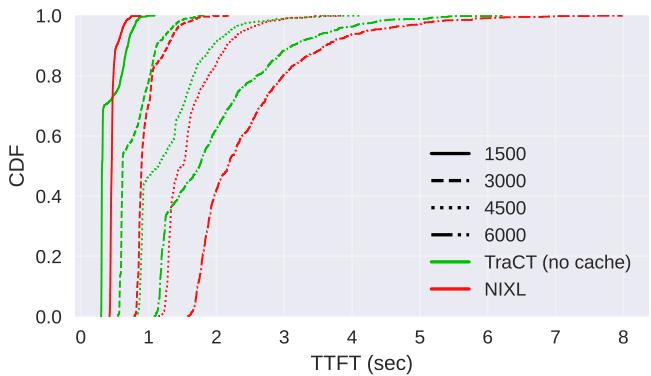

Figure 5: TraCT vs NIXL TTFT CDF. The number indicates input token length.  
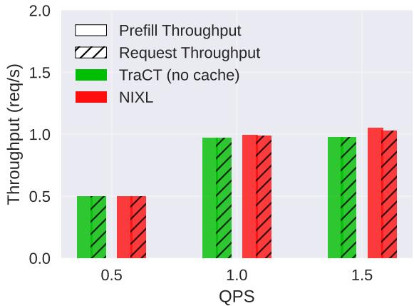  
Figure 6: TraCT (no cache) vs. NIXL throughput for 6000- token inputs.

Workloads. We evaluate two classes of workloads, static and synthetic. The static workloads use fixed input and output lengths to precisely control the volume of KV data transferred. To isolate the effect of KV transfer, we fix the output length to 3 tokens and vary the input length over 1500, 3000, 4500, 6000, thereby directly modulating the KV transfer size.

For the synthetic workloads, we generate three request sets using Dynamo’s built-in data generator. Table 1 reports the mean and standard deviation of total input length, output length, and unique length for each workload. The “unique length” captures the diversity of request prefixes and influences the prefix-cache hit rate, where larger unique lengths correspond to fewer shared prefixes and lower expected cache hit rates.

## 5.2 Transfer over CXL

CXL can replace RDMA-based KV transfer. Figure 5 compares time to first token (TTFT) distributions of TraCT (with prefix caching disabled) against the NIXL/UCX baseline across four input lengths (1500–6000 tokens). For all input lengths, TraCT shifts the CDF curves left, indicating consistently lower prefill latency. The benefit increases with input size: for shorter prompts (1500 tokens), the TTFT gap is modest, while for the longest prompts (6000 tokens) TraCT shows a visibly steeper CDF and shorter tail. Because no prefix caching is used in this experiment, the improvement is attributable entirely to the KV-transfer path—i.e., direct GPU–CXL DMA avoids the NIC queues, host DRAM copies, and transport-layer overhead present in NIXL.

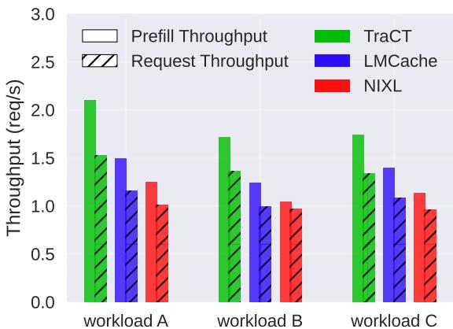  
Figure 7: Peak throughput.

Figure 6 evaluates both prefill and end-to-end request throughput under increasing QPS for 6000-token inputs. Across the full load range, TraCT (without caching) sustains throughput comparable to RDMA-based NIXL, demonstrating that CXL shared memory can serve as an effective bulk KV-transfer path even under high concurrency.

These results show that a CXL-based DMA path provides lower and more stable prefill latency and sustainable throughput than RDMA for KV transfer, even without caching benefits. Thus, CXL shared memory is a viable transport substrate for rack-scale disaggregated LLM inference and eliminates the network hop that dominates existing prefill–decode pipelines.

## 5.3 Performance: Throughput and Latency

TraCT significantly improves peak request throughput. Figure 7 presents the overall request throughput. Across all load levels, TraCT consistently delivers higher throughput than both LMCache and NIXL, even though its prefix-cache hit rate is comparable to or even lower than that of LMCache (Figure 8).1

With CXL shared-memory caching, the prefill worker in TraCT avoids repeated KV regeneration and network transmission. Decoding workers can directly fetch reusable KV blocks from the shared-memory pool, whereas LMCache must transmit all blocks, both hits and misses, to the decoding worker. Consequently, TraCT achieves up to 1.6× higher peak throughput than LMCache at QPS=3.0 and sustains stable throughput even under increasing load. These gains demonstrate that eliminating the extra copy and transfer of cache-hit blocks directly translates to higher system capacity.

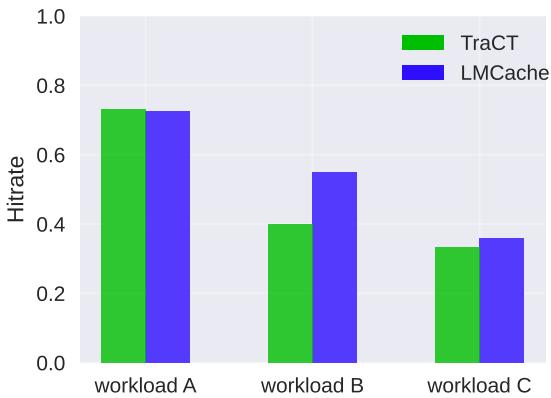  
Figure 8: Prefix cache hit rate of workloads.

TraCT reduces and stabilizes TTFT (prefill latency). The TTFT CDF in Figure 9 shows a clear leftward shift of the entire latency distribution for TraCT, indicating uniformly lower prefill latency compared to both LMCache and NIXL. At the average, TraCT improves TTFT by up to 9.83×, while at the tail (P99), it is reduced by up to 6.2×, a critical advantage for maintaining responsiveness under bursty or highconcurrency workloads.

These gains stem from two key design features. First, GPU–CXL DMA offers a markedly faster and more predictable KV transfer path than RDMA, eliminating the queuing and variability inherent in network fabrics. Second, TraCT’s prefill worker avoids rewriting cache-hit KV blocks entirely, as reusable KV data already resides in the sharedmemory cache. This removes a major source of per-request overhead present in LMCache.

The noticeably steeper CDF curve demonstrates that TraCT not only reduces latency but it is more stabilized. By eliminating network involvement and relying on CXL’s PCIe-based local interconnect, which is far less sensitive to contention, TraCT sustains low variance even under load. The result is a tighter, more predictable TTFT distribution and improved end-to-end user-perceived performance.

## 5.4 Performance Breakdown

TraCT reduces prefill computation and the amount of KV block transfer. Figure 10 decomposes per-request time into four components: scheduling, KV read, compute, and KV write. Scheduling time reflects how long a request waits in the scheduler’s queue before resources become available. KV read time measures the duration of CXL-to-GPU DMA when fetching cached KV blocks. Compute time captures the GPU execution required to generate missing KV blocks. KV write time represents the cost of publishing newly generated KV blocks, either by transferring them to the prefix cache or to the decoding worker, and subsequently freeing GPU memory.

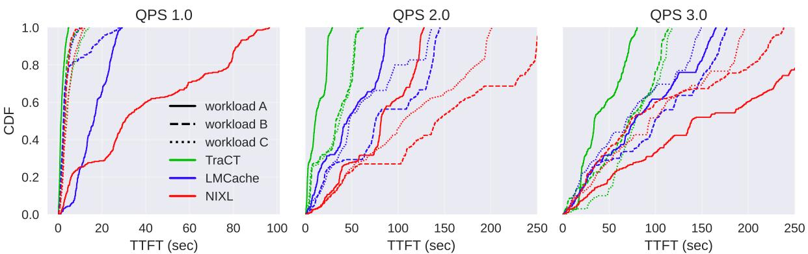  
Figure 9: TTFT CDF

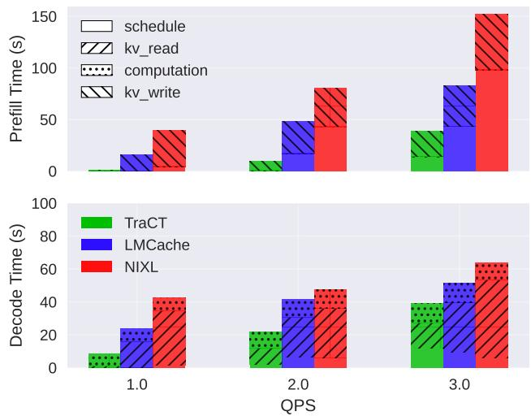  
Figure 10: Per-request Time Breakdown.

In decoding, LMCache and NIXL exhibit growing KV read time under load, reflecting repeated memory copies between GPU, host DRAM, and NIC buffers. In contrast, TraCT keeps KV read time nearly constant because KV blocks are directly consumed from CXL memory without network transfers. TraCT shows better overall prefill time as it skips KV transfer for cache-hit blocks thus reduces GPU memory holding time. Compared to NIXL, both TraCT and LMCache reduces computation time with prefix hit. However the impact is negligible since KV transfer dominates overall performance.

TraCT better utilizes GPU resources while reducing power consumption. Figure 11 shows that TraCT substantially lowers GPU SM utilization during both prefill and decoding. Prefill SM occupancy decreases because cache hits bypass KV block regeneration entirely, and decoding SM occupancy becomes more stable because KV blocks are fetched directly from CXL memory rather than through latency-prone host–host transfers. LMCache exhibits higher peak RX bandwidth on the prefill worker side due to PCIe-saturated DMA traffic. However, its remote KV transfers ultimately rely on

RDMA, which constrains the decoding worker’s effective GPU RX bandwidth and introduces contention under load. In contrast, TraCT enables the decoding worker to copy KV blocks directly from CXL shared memory, providing consistently higher GPU RX bandwidth and avoiding networkinduced stalls. These effects translate directly into lower GPU power consumption. As TraCT shortens execution time and reduces average SM activity, it lowers both instantaneous and overall energy usage, offering a path toward reducing the total cost of ownership (TCO) for LLM inference deployments.

## 6 Related Work

Disaggregated LLM Inference Recent work on LLM serving increasingly adopts disaggregated architectures that separate the compute-intensive prefill phase from the latencycritical decode phase. Splitwise generalizes this idea to both homogeneous and heterogeneous device deployments and introduces layer-wise KV-cache transfer to overlap transfer and computation [13]. DistServe proposes an architecture that decouples prefill and decode workers and studies resource provisioning policies for different workers [23]. Preble focuses on KV cache-aware prompt scheduling, dynamically steering requests across prefill and decode instances to maximize utilization and adapt to workload variations [17]. NVIDIA’s Dynamo framework brings these ideas into a production setting, providing a general-purpose prefill/decode disaggregation substrate and a KV block manager (KVBM) [3].

All of these systems treat KV transfer as a network operation: KV blocks flow between prefill and decode workers over RDMA. Some systems attempt to hide this cost via pipelining or overlapping compute and communication, but the network hop remains in the critical path for each request. In contrast, TraCT replaces the network fabric with a CXL Type-3 shared-memory device and performs KV transfer via direct GPU-CXL DMA. This eliminates host–host copies and network serialization, turning prefill–decode communication into local load/store and DMA operations on a shared address space while retaining the benefits of disaggregated

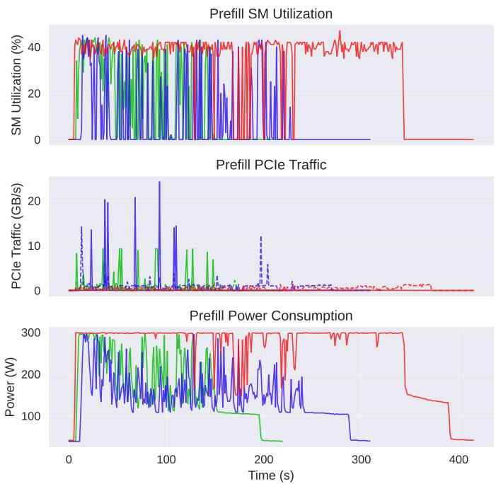

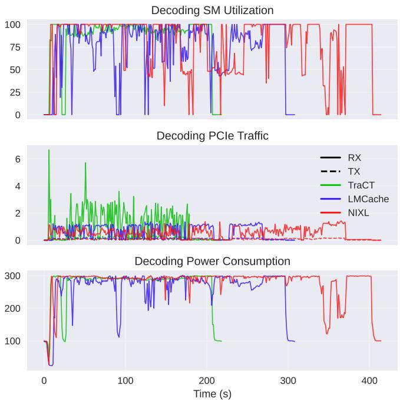  
Figure 11: GPU resource consumption over time for prefill and decode workers under QPS = 3.0. RX denotes GPU receive bandwidth (PCIe/CXL → GPU), and TX denotes GPU transmit bandwidth (GPU → PCIe/CXL).

prefill/decode scaling.

Multi-tier KV Caching LMCache/CacheBlend [6, 20] and Mooncake [14] demonstrate that KV state can be shared across disaggregated servers. LMCache/CacheBlend generalizes prefix reuse by reusing KV blocks even when prefixes do not align exactly and offloading KV blocks to a variety of storage backends, from host DRAM to distributed object stores, to enable cross-engine reuse. Mooncake constructs a cluster-wide KV cache in which CPU memory and SSDs form a global KV storage for prefill and decode clusters, and integrates with serving frameworks to exploit reuse across users and workloads.

TraCT is complementary to this line of work: it adopts a prefix-aware KV cache similar in spirit to LMCache and Mooncake, but places the cache in CXL-attached shared memory that is directly accessible via GPU-CXL DMA. This allows KV blocks to be served without involving the network at all, changing both the performance envelope (TTFT, tail latency, throughput) of disaggregated KV caching.

CXL-based Memory Systems and Shared Memory A growing body of work studies how to expose CXL devices as shared memory across nodes. CXL-SHM presents a general CXL shared-memory substrate and demonstrates its use for distributed data structures and RDMA offload; it assumes device-side compare-and-swap (CAS) support [21]. Tigon proposes an in-memory database with CXL shared memory, characterizing coherence behavior and demonstrating that hardware coherence, when available, is limited to small regions and does not scale to the full device capacity [8]. cMPI replaces the network path in MPI communication with CXL shared memory [18]. Beluga explores KV cache management for CXL shared memory and centralizes control-plane operations through a dedicated metadata server [19].

These systems establish CXL Type-3 devices as practical substrates for shared-memory style communication, but their synchronization designs either rely on device-specific coherent regions or avoid mutual exclusion through queue-based designs. TraCT instead targets non-coherent, terabyte-scale CXL memories used as a decentralized KV cache for LLM inference. It introduces a two-tier locking mechanism, a shared allocator and object store, and a cache-coherence strategy based solely on software-managed cacheline flushing. To our knowledge, TraCT is the first system to show that such a design can support rack-scale KV caching and transfer for disaggregated LLM serving on real CXL Type-3 hardware.

## 7 Conclusion

This paper presented TraCT, a rack-scale LLM serving system that replaces RDMA-based KV transfer with direct GPU–CXL DMA, enabling prefill and decode workers to share KV blocks through CXL shared memory. To operate correctly on non-coherent CXL Type-3 devices, TraCT introduces a two-tier inter-node lock, a software-managed data visibility mechanism, and a shared allocator and object store designed for inter-node sharing. Implemented on the Dynamo–vLLM runtime and evaluated on real CXL hardware, TraCT improves both TTFT and peak throughput over network-based baselines, demonstrating that CXL shared memory is a practical and high-performance substrate for disaggregated LLM serving.

## References

[1] CXL specification. https://computeexpresslink. org/cxl-specification/.

[2] Intel® Memory Latency Checker. https://www.intel.com/content/www/ us/en/developer/articles/tool/ intelr-memory-latency-checker.html.

[3] NVIDIA Dynamo. https://github.com/ ai-dynamo/dynamo.

[4] NVIDIA Inference Xfer Library (NIXL). https:// github.com/ai-dynamo/dynamo.

[5] vLLM). https://github.com/vllm-project/ vllm.

[6] Yihua Cheng, Yuhan Liu, Jiayi Yao, Yuwei An, Xiaokun Chen, Shaoting Feng, Yuyang Huang, Samuel Shen, Kuntai Du, and Junchen Jiang. Lmcache: An efficient kv cache layer for enterprise-scale llm inference, 2025.

[7] Google Gemini Team. Gemini 2.5: Pushing the frontier with advanced reasoning, multimodality, long context, and next generation agentic capabilities, 2025.

[8] Yibo Huang, Haowei Chen, Newton Ni, Yan Sun, Vijay Chidambaram, Dixin Tang, and Emmett Witchel. Tigon: a distributed database for a cxl pod. In Proceedings of the 19th USENIX Conference on Operating Systems Design and Implementation, OSDI ’25, USA, 2025. USENIX Association.

[9] Sunita Jain, Nagaradhesh Yeleswarapu, Hasan Al Maruf, and Rita Gupta. Memory sharing with cxl: Hardware and software design approaches, 2024.

[10] Woosuk Kwon, Zhuohan Li, Siyuan Zhuang, Ying Sheng, Lianmin Zheng, Cody Hao Yu, Joseph Gonzalez, Hao Zhang, and Ion Stoica. Efficient memory management for large language model serving with pagedattention. In Proceedings of the 29th Symposium on Operating Systems Principles, SOSP ’23, page 611–626, New York, NY, USA, 2023. Association for Computing Machinery.

[11] AI @ Meta Llama Team. The llama 3 herd of models, 2024.

[12] OpenAI. Chatgpt (gpt-5). https://openai.com/ chatgpt.

[13] Pratyush Patel, Esha Choukse, Chaojie Zhang, Aashaka Shah, Íñigo Goiri, Saeed Maleki, and Ricardo Bianchini. Splitwise: Efficient generative llm inference using phase splitting. In 2024 ACM/IEEE 51st Annual International Symposium on Computer Architecture (ISCA), pages 118–132, 2024.

[14] Ruoyu Qin, Zheming Li, Weiran He, Jialei Cui, Feng Ren, Mingxing Zhang, Yongwei Wu, Weimin Zheng, and Xinran Xu. Mooncake: Trading more storage for less computation — a KVCache-centric architecture for serving LLM chatbot. In 23rd USENIX Conference on File and Storage Technologies (FAST 25), pages 155– 170, Santa Clara, CA, February 2025. USENIX Association.

[15] Andy Rudoff. Persistent memory programming. USENIX ;login:, 42(2):34–40, 2017.

[16] Pavel Shamis, Manjunath Gorentla Venkata, M Graham Lopez, Matthew B Baker, Oscar Hernandez, Yossi Itigin, Mike Dubman, Gilad Shainer, Richard L Graham, Liran Liss, et al. Ucx: an open source framework for hpc network apis and beyond. In 2015 IEEE 23rd Annual Symposium on High-Performance Interconnects, pages 40–43. IEEE, 2015.

[17] Vikranth Srivatsa, Zijian He, Reyna Abhyankar, Dongming Li, and Yiying Zhang. Preble: Efficient distributed prompt scheduling for LLM serving. In The Thirteenth International Conference on Learning Representations, 2025.

[18] Xi Wang, Bin Ma, Jongryool Kim, Byungil Koh, Hoshik Kim, and Dong Li. cmpi: Using cxl memory sharing for mpi one-sided and two-sided inter-node communications. In Proceedings of the International Conference for High Performance Computing, Networking, Storage and Analysis, SC ’25, page 2216–2232, New York, NY, USA, 2025. Association for Computing Machinery.

[19] Xinjun Yang, Qingda Hu, Junru Li, Feifei Li, Yicong Zhu, Yuqi Zhou, Qiuru Lin, Jian Dai, Yang Kong, Jiayu Zhang, Guoqiang Xu, and Qiang Liu. Beluga: A cxlbased memory architecture for scalable and efficient llm kvcache management, 2025.

[20] Jiayi Yao, Hanchen Li, Yuhan Liu, Siddhant Ray, Yihua Cheng, Qizheng Zhang, Kuntai Du, Shan Lu, and Junchen Jiang. Cacheblend: Fast large language model serving for rag with cached knowledge fusion. In Proceedings of the Twentieth European Conference on Computer Systems, page 94–109, 2025.

[21] Mingxing Zhang, Teng Ma, Jinqi Hua, Zheng Liu, Kang Chen, Ning Ding, Fan Du, Jinlei Jiang, Tao Ma, and Yongwei Wu. Partial failure resilient memory management system for (cxl-based) distributed shared memory. In Proceedings of the 29th Symposium on Operating Systems Principles, SOSP ’23, page 658–674, New York, NY, USA, 2023. Association for Computing Machinery.

[22] Lianmin Zheng, Liangsheng Yin, Zhiqiang Xie, Chuyue Sun, Jeff Huang, Cody Hao Yu, Shiyi Cao, Christos Kozyrakis, Ion Stoica, Joseph E. Gonzalez, Clark Barrett, and Ying Sheng. Sglang: efficient execution of structured language model programs. In Proceedings of the 38th International Conference on Neural Information Processing Systems, NIPS ’24, Red Hook, NY, USA, 2025. Curran Associates Inc.

[23] Yinmin Zhong, Shengyu Liu, Junda Chen, Jianbo Hu, Yibo Zhu, Xuanzhe Liu, Xin Jin, and Hao Zhang. Distserve: disaggregating prefill and decoding for goodputoptimized large language model serving. In Proceedings of the 18th USENIX Conference on Operating Systems Design and Implementation, OSDI’24, USA, 2024. USENIX Association.