# AdaExplore: Failure-Driven Adaptation and Diversity-Preserving Search for Efficient Kernel Generation

Weihua Du1, Jingming Zhuo2, Yixin Dong1, Andre He1, Weiwei Sun1, Zeyu Zheng1, Manupa Karunaratne3, Ivan Fox3, Tim Dettmers1, Tianqi Chen1, Yiming Yang1, Sean Welleck1 1Carnegie Mellon University, 2University of Washington, 3Arm Ltd. {weihuad, swelleck}@cs.cmu.edu

## Abstract

Recent large language model (LLM) agents have shown promise in using execution feedback for test-time adaptation. However, robust selfimprovement remains far from solved: most approaches still treat each problem instance independently, without accumulating reusable knowledge. This limitation is particularly pronounced in domain-specific languages such as Triton, which are underrepresented in LLM pretraining data. Their strict constraints and non-linear optimization landscape further make naive generation and local refinement unreliable. We propose AdaExplore, an agent framework that enables self-improvement via accumulated execution feedback for performance-critical kernel code generation through two complementary stages: failure-driven adaptation and diversity-preserving search, jointly improving correctness and optimization performance without additional fine-tuning or external knowledge. In the adaptation stage, the agent synthesizes tasks and converts recurring failures into a reusable memory of validity rules, helping subsequent generations remain within the feasible set. In the search stage, the agent organizes candidate kernels as a tree and alternates between small local refinements and larger structural regeneration, allowing it to explore the optimization landscape beyond local optima. Experiments on kernel runtime optimization benchmarks validate these gains: Ada-Explore achieves 3.12× and 1.72× speedups on KernelBench Level-2 and Level-3, respectively, within 100 steps, and continues to improve with additional computation. Our implementation is publicly available at https://github.com/StigLidu/AdaExplore.

## 1 Introduction

Large language models (LLMs) have rapidly evolved into capable coding agents, achieving strong performance on tasks such as bug fixing, refactoring, and unit testing (Chen et al., 2021; Li et al., 2022; Nijkamp et al., 2022). Recent work further extends LLMs to toolaugmented agents that iteratively synthesize and debug programs (Wang et al., 2025; Qian et al., 2024; Zhang et al., 2024). In this work, we study code runtime optimization for GPU kernels in low-level programming frameworks such as Triton (Ouyang et al., 2025; Li et al., 2025a). Unlike conventional code generation, which focuses on functional correctness, code optimization requires satisfying correctness as a hard constraint while optimizing runtime performance. This explicit performance objective provides a natural feedback signal for sustained improvement.

However, despite this favorable signal, the search space remains highly challenging. First, as illustrated in Figure 1a, the feasibility boundary is sharp: small errors in syntax, memory access, or parallelization often lead to compilation failures or runtime errors. This challenge is further exacerbated by the limited availability of training data for low-level programming languages, which weakens the model’s prior over valid implementations and results in a high proportion of invalid programs. Second, the performance landscape is highly non-linear and combinatorial (Figure 1b), where meaningful improvements often require coordinated structural changes rather than local edits. Such changes typically involve sequences of interdependent modifications, making kernel runtime optimization inherently a long-horizon search problem. In practice, expert programmers address this challenge by iteratively exploring alternative design choices, such as tiling strategies, memory layouts, and parallelization schemes, often requiring multiple rounds of trial-and-error refinement to achieve high-performance implementations (Lim et al., 2017). In this work, we view kernel runtime optimization as a search problem under correctness constraints, with a highly non-linear and combinatorial performance landscape. Rather than relying on external data or fine-tuning, we study how coding agents can progressively improve through accumulated execution feedback and structured exploration. These observations highlight two core challenges: (C1) Feasible exploration: how to ensure that exploration remains within the narrow feasible set defined by correctness constraints; (C2) Optimization efficiency: how to balance global exploration and local refinement in a rugged optimization landscape (Sutton et al., 1998).

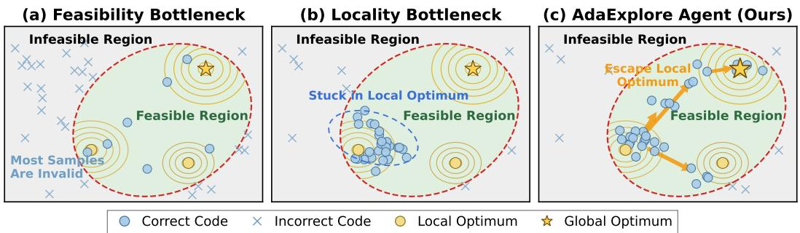  
Figure 1: Illustration of Kernel Optimization Bottlenecks. (a) Most generated kernels are invalid due to limited training coverage; (b) Kernel refinement may be stuck in local optima; (c) Our agent, AdaExplore, can learn skills from failures to prevent pitfalls, and apply diversity-preserving search for global optima exploration.

These challenges naturally suggest a decomposition: (i) learning reusable constraints to stay within the feasible set, and (ii) maintaining diverse candidates to explore the rugged landscape. To this end, we propose AdaExplore, an LLM-based kernel runtime optimization framework built on two complementary mechanisms: Adaptation and Exploration. In the adaptation stage, the agent synthesizes training tasks and uses execution failures to construct a cross-task memory of validity rules that guide future generations toward the feasible set. Empirically, this substantially improves correctness on unseen problem instances and generalizes across different language models. In the exploration stage, the agent performs a structured search on a tree of candidate kernels, maintaining multiple candidates, and exploring diverse solution trajectories as contextual signals. It alternates between small local edits and larger structural changes while reusing strong past candidates, enabling effective exploration beyond local optima. This yields improved inference-time scaling compared to common test-time optimization strategies, including iterative refinement, parallel sampling, and OpenEvolve (Sharma, 2025), with gains increasing as the search budget grows (Figure 3). Together, these mechanisms help AdaExplore reach valid kernels more reliably and search the optimization landscape more effectively for high-performing ones. Our contributions are summarized as follows:

• A failure-driven memory mechanism that extracts reusable constraints to improve validity in low-resource code generation without model training.

• A diversity-preserving structured search design that balances local refinement and structural exploration, enabling efficient test-time scaling.

• We show that combining these two mechanisms yields the best overall performance. On KernelBench, AdaExplore reaches 3.12× speedup on Level-2 and 1.72× on Level-3 under a 100-step budget with GPT-5-mini as the base model.

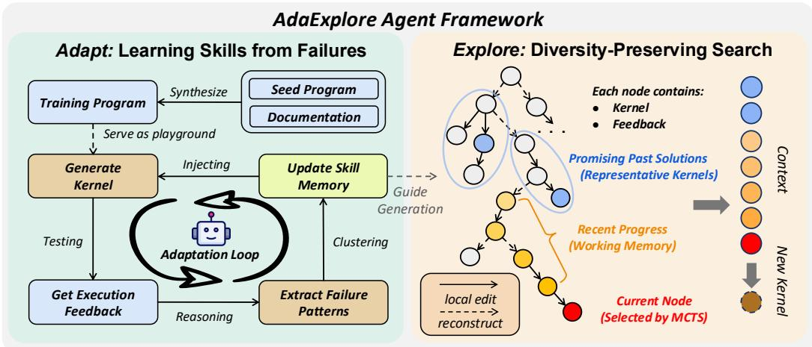  
Figure 2: Overview of AdaExplore for Kernel Runtime Optimization. The method has two stages: Adapt: it turns failures on synthesized tasks into a cross-task memory that helps generate correct kernels. Explore: it organizes candidate kernels as a tree and alternates between local refinement and regeneration to search for higher-performing solutions.

## 2 Related Work

LLMs for Code Generation. General-purpose code models such as Codex (OpenAI, 2025), AlphaCode (Li et al., 2022), CodeLlama (Roziere et al., 2023), Seed-coder (Seed et al., 2025), and Qwen-Coder (Hui et al., 2024) have achieved strong results on benchmarks such as HumanEval (Chen et al., 2021) and SWE-bench (Jimenez et al., 2023), especially for wellrepresented languages with abundant training data. For multilingual code generation, benchmarks such as Multi-SWE-bench (Zan et al., 2025) and HumanEval-XL (Peng et al., 2024) highlight a growing research direction on low-resource programming languages and suggest that current LLMs still struggle on low-resource or domain-specific languages.

Self-Improving Code Agents. Recent self-improving code agents fall primarily into two categories: cross-task adaptation and within-task improvement. Cross-task methods accumulate reusable reflections, skills, or prompts from prior trials (Shinn et al., 2023; Zhao et al., 2023; Yuksekgonul et al., 2024; Agrawal et al., 2025; Zhang et al., 2025b; Wang et al., 2023). Here, task refers to individual problem instances within the same domain, rather than cross-domain transfer. Within-task methods iteratively refine or search over candidate programs for a single problem using environment feedback, tracing back to genetic programming (Koza, 1992) and including LLM-guided evolutionary search methods such as FunSearch (Romera-Paredes et al., 2024), AlphaEvolve (Novikov et al., 2025), and CodeEvolve (Assumpc¸ao et al.˜ , 2025), as well as co-evolutionary and reward-driven methods such as CoCoEvo (Li et al., 2025b), recent work also studies structured search as a form of inference-time scaling (Snell et al., 2024; Light et al., 2024). Our method combines these two perspectives by distilling transferable failure patterns across tasks before search, then using diversity-preserving optimization within each task.

LLM Agents for GPU Kernel Generation. We focus on Triton DSL, introduced by Tillet et al. (2019) as a Python-like language for developing GPU kernels that JIT-compiles to PTX for NVIDIA GPUs. Despite its high-level syntax, writing effective Triton code still requires expert knowledge of GPU architecture, including warps, shared memory, and memory coalescing. Benchmarks such as TritonBench (Li et al., 2025a), KernelBench (Ouyang et al., 2025), and Flashinfer-Bench (Xing et al., 2026) show that current language models still struggle with realistic GPU kernel tasks. To address this gap, recent kernel-specific methods explore both agentic search and training. Astra (Wei et al., 2025) decomposes optimization into multiple agent roles, while AccelOpt (Zhang et al., 2025a) combines beam search with an optimization memory for emerging AI accelerators. Concurrent work KernelSkill (Sun et al., 2026) builds reusable skills via expert analysis, whereas we automatically distill failure patterns from execution feedback. On the training side, Kevin (Baronio et al., 2025) applies multi-turn GRPO, CUDA-L1 (Li et al., 2026) uses contrastive reinforcement learning with speedup-scored exemplars, and CUDA Agent (Dai et al., 2026) scales agentic PPO with synthesized data. Our method is most closely related to this line of work, but differs in explicitly combining reusable knowledge distillation with diversity-preserving optimization.

## 3 Method

## 3.1 Task Setup

We formulate kernel runtime optimization as a program rewriting and optimization problem. The input is a high-level implementation (e.g., Python) of an atomic function (e.g., matrix multiplication); the output is a kernel written in one specific low-level language (e.g., CUDA/Triton) that (i) preserves functional correctness and (ii) maximizes runtime performance on target hardware. This makes the task inherently difficult: the agent must preserve the semantics of the high-level program while discovering low-level implementations that satisfy hardware constraints and achieve strong performance.

## 3.2 Method Overview

Our framework consists of two components: ADAPT and EXPLORE. Adapt directly addresses feasible-set exploration by learning reusable constraints, thereby keeping the optimization process within the feasible set. By running the agent on synthesized tasks and collecting execution failures, we build a compact cross-task skill memory of simple rules about what tends to invalidate kernels. This cross-task skill memory reduces syntax and execution errors during inference, thus improving generation accuracy and implicitly accelerating search speed. Explore helps search the optimization landscape more effectively for high-performing kernels by balancing candidate diversity and performance. We keep candidate kernels in a tree rather than a single chain, so the search can preserve multiple promising directions at once. Each expansion alternates between small local refinements and larger structural changes, using recent process together with previously discovered strong kernels to navigate the optimization landscape. Detailed algorithms for both components are provided in Appendix D.

## 3.3 Adapt: Learning Skills from Failures

Empirically, kernel generation failures often stem from a small set of recurring grammar errors and structural constraints (e.g., unsupported Triton operations, constexpr violations). Rather than relying on additional training, we adapt the model’s knowledge about these constraints through self-exploration. As shown in Figure 2(a), we synthesize reference programs as training tasks and ask the agent to implement their corresponding kernel implementations. By summarizing the resulting execution feedback, we cluster recurring failure patterns and distill them into system instructions as a cross-task skill memory.

Task Synthesis Our pipeline starts from high-level reference implementations (e.g., Py-Torch programs) composed of standard operators. We use a small set of task examples that differ from the test sets as seeds, and then reuse and recombine operators described in the language’s operator documentation to continually synthesize diverse training tasks, rather than relying on a fixed, hand-curated set. For each synthesized task, the agent generates a corresponding low-level kernel and executes it against the reference implementation, so that failures reveal reusable validity constraints. This allows us to generate infinite and varied playgrounds for agents. The details of the implementation and statistics of the synthetic training set are provided in the Appendix C.1.

Cross-Task Memory for Constraint-Aware Skills We use these synthesized tasks to explore constraints and extract cross-tasks from failed attempts (see Table 8 for examples). We maintain a lightweight cross-task skill memory that stores guidance such as avoiding incorrect function calls or common implementation pitfalls. Importantly, this memory is constructed in an evolving online manner: as we iterate over synthesized training tasks, newly extracted skills are continuously added to the memory, and the accumulated memory is exposed to subsequent tasks. This allows the method to transfer experience across tasks and avoid repeatedly falling into previously observed failure modes. To construct the crosstask skill memory, we run coding agents on synthesized tasks and collect failed generations with their execution feedback. Each failure is summarized into a concise constraint rule (e.g., ‘you cannot generate a Triton pointer type inside a vectorized load’), converting raw diagnostics into actionable guidance.

We then aggregate these rules by extracting recurring patterns using an LLM judge and recording their frequencies. Frequency serves as a proxy for generality: high-frequency rules capture common failure modes and provide broadly reusable guidance, while low-frequency rules often correspond to noise or task-specific edge cases. We therefore retain only rules whose frequency exceeds a threshold O (set to 3 in practice), resulting in a compact and robust memory of reusable constraints.

## 3.4 Explore: Diversity-Preserving Search

Kernel optimization is inherently a long-horizon iterative process: the agent repeatedly proposes code edits or structural changes, executes the resulting kernels, and uses performance feedback to guide subsequent decisions. However, incorporating the full trajectory into the prompt quickly exhausts the model’s context budget, whereas aggressive truncation removes information about the search progress. In addition, overreliance on previous solutions can bias the model towards nearby variants and reduce the diversity of newly generated candidates (Chu et al., 2024).

To address this, we introduce Explore (Figure 2(b)), which builds on standard tree search to explore multiple candidate kernels beyond a single refinement chain. We focus on two practical design choices: (i) structuring the search tree and action space to support both local refinement and structural regeneration (Section 3.4.1), and (ii) constructing context by combining recent branch history with high-performing past candidates, together with an appropriate node selection strategy, to encourage diversity during search (Section 3.4.2).

## 3.4.1 Tree Search and Action Space

We organize optimization as a search tree T rather than a single refinement chain. Each node s ∈ T is a kernel candidate, and expanding a node produces a new child candidate after execution feedback is observed. Tree search allows maintaining multiple feasible but structurally distinct candidates, which is critical in a complex search space. In contrast, a single chain can let early design decisions constrain all later refinements and limit global exploration.

Action Space. At each step, from a selected node, the agent applies one of two update operators. Small step performs localized patch-based refinement, preserving the overall kernel structure while correcting errors or tuning local choices. Large step regenerates the kernel at a structural level, encouraging alternative strategies and broader exploration. A detailed description of the actions is in Appendix D.2.

## 3.4.2 Context and Node Selection

Context Management. When expanding a node s, the model conditions on two sources of context: a working memory taken from a limited recent window Crecent along the path from the root to s, which stores recent edits and execution feedback, and a pool of representative kernels extracted from earlier search stages. The working memory supports local correction, while the representative kernels preserve longer-horizon search signals without overloading the context. For a large step, we clear the working memory so that the agent can better break away from the current refinement chain. For a small step, by contrast, the model relies only on the local working memory, which keeps the update tightly grounded in the current branch and encourages incremental refinement. Together, this dual-memory design balances local refinement with broader exploration within the current search trajectory.

To avoid representing near-duplicate kernels, we partition the path into connected segments of consecutive small-step refinements and allow each segment to contribute at most one representative kernel. Let Kpool = {k1, . . . , k|K |} denote the resulting set of representative kernels for the current node s. We then uniformly sample at most Cpool kernels.

Node Selection. We select the next expansion with a UCT-style rule (Kocsis & Szepesvari´ , 2006) over existing children together with an explicit expand option. For an existing child a of node s, we use UCT(s, a) = Q(s, a) + cexploreq N(s,a) , ln N(s) and for creating a new child, ln N(s) we use Expand(s) = Qexpand(s) + cexpand |C(s)|2 , where Q(s, a) is the observed value of child a, N(s, a) and N(s) are visit counts, |C(s)| is the current number of children, and Qexpand(s) = max ∈C( ) Q(s, a) is the best observed value among existing children. The coefficient cexplore controls the exploration-exploitation trade-off. This explicit expand option reflects that the set of possible refinements or regenerations is not known in advance.

## 4 Experiments

## 4.1 Baselines

We evaluate representative baselines that reflect common paradigms in kernel runtime optimization workflows.

Single-Pass Baselines. We report single-pass results for GPT-5-mini, GPT-5 (Singh et al., 2025), and Claude-4.6-Opus (Anthropic, 2026), which reflect strong one-shot performance on kernel runtime optimization tasks without our test-time adaptation or search. We also include AutoTriton (Li et al., 2025c), a Triton-specialized model trained using executionbased rewards.

Parallel-Sampling (PS). We consider a parallel sampling baseline in which the LLM generates a diverse set of candidate kernels simultaneously, and the best-performing kernel is selected. We test two cases: the original baseline alone, and the same baseline augmented with our cross-task skill memory (w. SM).

Iterative-Refinement (IR). Starting from an initial kernel, the agent repeatedly edits the candidate using compiler and runtime feedback (e.g., syntax errors, failed unit tests, and running time). At each iteration, the LLM proposes a patch localized to the previous kernel. We again test two cases: the original baseline alone, and the same baseline augmented with our cross-task skill memory (w. SM).

DR. Kernel (Liu et al., 2026). An RL baseline for Triton kernel runtime optimization that combines multi-turn training with execution feedback and sequential test-time scaling. We report both single-pass results and best-performing results under a matched test-time budget (4 samples × 14 steps), aligned with the scaling setup described in the paper.

OpenEvolve (Sharma, 2025). An open-source evolutionary coding agent that maintains a diverse population of candidate programs. This baseline represents a population-based search paradigm for code optimization.

## 4.2 Testbeds and Metrics

We use KernelBench (Ouyang et al., 2025) as our main testbed, which contains humancollected kernel runtime optimization tasks organized by difficulty: Level-1 covers single operators, Level-2 covers simple fused kernels, and Level-3 covers more complex modellevel workloads. Level-1 tasks in KernelBench are used for data synthesis, and we evaluate Level-2 and Level-3 tasks. We additionally evaluate on FlashInfer-Bench (Xing et al., 2026), whose kernel tasks are extracted from production LLM inference pipelines with real deployment shapes and expert-written FlashInfer CUDA kernels as strong baselines (Appendix B). In performance comparison, all kernels are executed and profiled on an NVIDIA A6000 GPU at a fixed frequency (1500 MHz). The agent generates Triton kernels to accelerate the reference PyTorch programs provided in each task. For all multi-pass baseline baselines except DR. Kernel, we use GPT-5-mini as the base model. We use the following metrics:

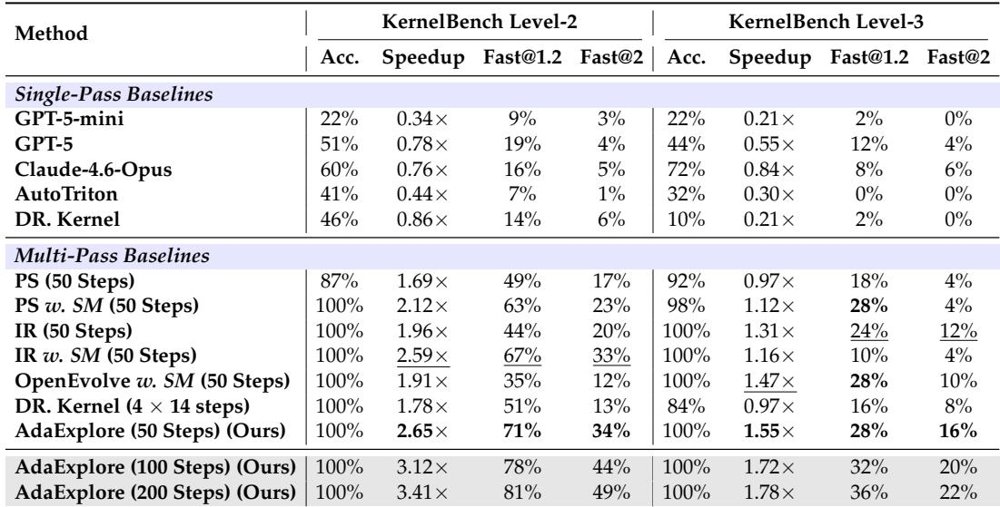

Table 1: Performance Comparison. We report Acc., Speedup, Fast@1.2, and Fast@2. w. SM denotes augmenting with our cross-task skill memory. For Acc., saturated 100% entries are not highlighted; among the remaining entries, the best result in multi-pass baselines is highlighted in bold, and the second-best result is underlined. The shaded row reports performance with increased compute (100 steps), illustrating scaling behavior. GPT-5-mini is the default base model for multi-pass baselines.  
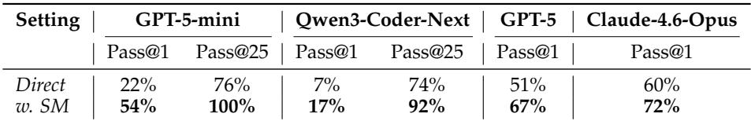  
Table 2: KernelBench L2 Accuracy w/ and w/o Cross-Task Skill Memory. Self-generated cross-task skill memory improves correctness and can be applied to various models.

Accuracy: The percentage of runs that produce at least one functionally correct kernel under a fixed inference budget.

Speedup: The ratio between the runtime of the reference PyTorch eager implementation and that of the best among the generated kernels. We clip the speedup under 10 to remove extreme outliers. We note that prior work often reports uncapped averages, which can be dominated by a small number of extreme cases, making comparisons less reliable.

Fast@p: The percentage of runs that produce at least one correct kernel achieving a speedup greater than p× over the PyTorch eager baseline. We use p = 1.2 to indicate a non-trivial improvement over the baseline and p = 2 to indicate a significant improvement.

We measure kernel execution time using CUDA events. Each kernel undergoes 10 warmup iterations followed by 100 timed trials. To reduce noise, we apply symmetric outlier trimming, discarding the fastest and slowest 5% of the measurements, and computing statistics over the remaining 90 runs. Unless specified, all agents have a test-time budget of 50 steps. Detailed hyperparameters are listed in Appendix E.1.

## 4.3 Results

Comparison of AdaExplore with the Baselines. Table 1 compares single-pass and multipass baselines on KernelBench Level-2 and Level-3. Single-pass frontier models struggle on Level-2: GPT-5-mini reaches only 25% correctness, GPT-5 reaches 47%, and Claude-4.6-Opus reaches 60%. This gap highlights the difficulty of generating correct kernels.

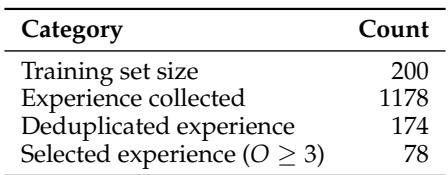

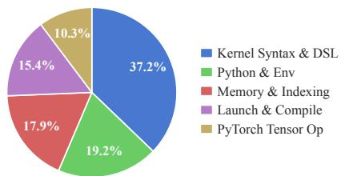  
Table 3: Cross-Task Skill Memory Statistics. From 200 synthesized tasks, we collect 1,178 raw experiences, reduce them to 174 unique experiences after semantic deduplication for GPT-5-mini, and retain 78 high-frequency items with occurrence O ≥ 3. The pie chart shows the distribution of categories among the retained memory items.

Under multi-pass test-time optimization, most methods recover high correctness on Level-2, but their optimization quality differs substantially. AdaExplore achieves the best overall performance on Level-2, reaching 100% correctness, 2.65× speedup, 71% Fast@1.2, and 34% Fast@2. This outperforms the strongest non-AdaExplore baseline, IR w. SM, which augments iterative refinement with our cross-task skill memory, achieves 2.59× speedup, ranking second. The result suggests that our cross-task skill memory is beneficial across search strategies and that combining with Explore yields even stronger optimization. The same trend largely carries over to the harder Level-3 setting, indicating the stability of AdaExplore. While several multi-pass baselines maintain high correctness, their speedups are lower. AdaExplore again achieves the best overall performance, with 1.55× speedup, 28% Fast@1.2 and 16% Fast@2, outperforming OpenEvolve w. SM in speedup (1.47×) and matching or exceeding other baselines in both correctness and speedup. Importantly, as the budget increases from 50 to 100 steps, the achieved speedups continue to increase (from 2.65× to 3.12× in Level 2 and from 1.55× to 1.72× in Level 3). Additionally, we find that AdaExplore transfers well across GPU generations with the same cross-task skill memory, as shown in Table 4.

One strong baseline, Iterative refinement with skill memory (IR w. SM), shows a clear performance gap between Level-2 and Level-3. L2 tasks are dominated by a single kernel, where performance can be improved via local edits, making refinement effective. In contrast, L3 tasks involve model-level structures (e.g., ResNet, LSTM), where performance depends on higher-level design choices; as a result, refinement is confined to local regions of the search space, and the skill memory may further bias the search toward conservative updates. This limitation highlights the need for broader exploration, which our structured search and large-step action design enable.

We further evaluate AdaExplore on FlashInfer-Bench (Xing et al., 2026) by case study (Details in Appendix B). On RMSNorm, the best generated kernel achieves 7.22× over PyTorch and 1.75× over the expert FlashInfer CUDA kernel; on GQA paged decode, it reaches 18.17× over PyTorch. These results show that LLM agents have the potential to beat PyTorch and expert-written kernels, but compute-intensive, hardware-specialized kernels (e.g., those using Blackwell-specific instructions) remain challenging to beat.

The Effectiveness of Cross-task Skill Memory. Table 2 isolates the effect of crosstask skill memory on KernelBench Level-2 across multiple model families, including GPT-5, Qwen3-Coder-Next (Cao et al., 2026), and Claude-4.6-Opus. After each base model adapts its own cross-task skill memory, correctness improves consistently. For example, for GPT-5-mini, Pass@1 rises from 22% to 54%, and Pass@25 rises from 76% to 100%. These gains suggest that the adaptation procedure is broadly effective

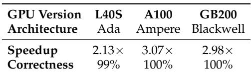  
Table 4: Cross-GPU Generalization of Ada-Explore. We report speedup on KernelBench Level-2 tasks within 50 steps. The cross-task skill memory is collected on the A6000 but may transfer to other GPU versions.

across base models: each model can distill useful constraints from its own failure patterns and apply them to improve the correctness of its generation. To test whether cross-task skill memory can generalize across different benchmarks, we test the same cross-task skill memory on another benchmark, TritonBench, and also find a 28% accuracy improvement (see Appendix C.4 for details).

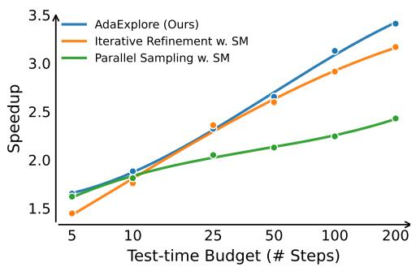

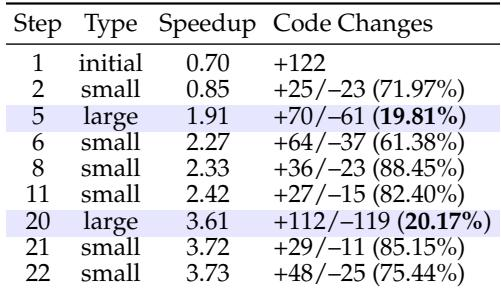  
Figure 3: Test-time Scaling and Case Study on Actions. Left: Average best-so-far speedup as the test-time budget increases, showing that AdaExplore continues to efficiently improve with more search steps. Right: Case study illustrating the roles of large and small steps.

Cross-task Skill Memory Statistics. We synthesize 200 training tasks (examples in Appendix C.2) and run AdaExplore to collect error experiences in 25 steps per task. Table 3 shows that 1,178 raw experiences are observed during self-exploration with GPT-5-mini as the base model, but only 174 remain after semantic deduplication, and only 78 are retained as transferable high-frequency hints after filtering (examples in Table 8). This high redundancy suggests that failures in low-level kernel generation are concentrated around a relatively small set of recurring constraints. The retained memory spans multiple categories, with kernel syntax and DSL constraints accounting for the largest portion, followed by Python/environment issues and memory/indexing errors. The compactness of the final memory explains why the cross-task skill memory generalizes effectively: it filters out task-specific noise while preserving stable, reusable heuristics.

Test-Time Scaling of AdaExplore. Figure 3 (left) illustrates the scaling behavior of the testtime of AdaExplore compared to the baselines as the inference budget increases by up to 200 steps. Throughout the trajectory, AdaExplore consistently achieves a higher best speedup. Notably, its performance continues to improve without clear signs of saturation, and the gap relative to baselines widens further as more compute is allocated (> 50 steps). This suggests that AdaExplore retains substantial efficiency for further gains under larger inference budgets. Additionally, iterative refinement with our skill memory achieves comparable performance in the moderate-compute regime (∼ 25 steps).

Case Study on Large and Small Steps. Figure 3 (right) provides an example of a trajectory in a chain-only setting without branching, which allows us to isolate the effects of large and small updates more clearly. Large steps introduce low-similarity structural changes (e.g., 19%–20% code similarity) and correspond to major speedup jumps (e.g., from 0.85× to 1.91×, and later to 3.61×). In contrast, small steps preserve high code similarity (60%–88%) and provide gradual improvements. Combining the two types of steps allows AdaExplore to achieve structural breakthroughs and stable, incremental improvements.

## 5 Ablation Study

We ablate the three main components of AdaExplore: the tree-structured search design, the dual-action update space, the cross-task skill memory, and the representative kernel pool. All variants use the same base model, evaluation protocol, and inference budget as in the main experiments. Table 5 summarizes the ablation settings and results.

Search Structure: Tree Search vs. Chain Search. To isolate the contribution of treestructured search, we construct AdaExplore without MCTS, which uses the same context management and action space as AdaExplore, but restricts the search process to a chain without branching, allowing us to test the gains of tree-structured exploration. The Ada-

Explore without MCTS has a lower speedup (2.48× vs. 2.65×) and Fast@1.2 (64% vs. 71%), suggesting that keeping multiple branches alive yields a consistent optimization benefit.

Action Space: Small Step vs. Large Step. To study the role of the two update operators, we evaluate two restricted variants: w/o Large Step, which performs only localized patch-based refinement, and w/o Small Step, which performs only structural regeneration. w/o Large Step remains close to the full method (2.62 vs. 2.65×), likely because branching already provides some diversity. w/o Small Step drops to 99% correctness, 2.35× speedup, and 60% Fast@1.2, showing that structural changes still need local refinement to reliably achieve correctness and improve performance.

Cross-Task Skill Memory. To measure the effect of cross-task skill memory, we remove the cross-task skill memory while keeping the tree search and action space unchanged (w/o Skill Memory). We observe a large performance drop (2.65× → 2.32×) when removing the cross-task skill memory.

Representative Kernel Pool. The representative kernel pool serves as a form of longterm progress storage during the search stage, helping the system make continuous progress. Removing the kernel pool reduces the resulting speedup from 2.65× to 2.30×.

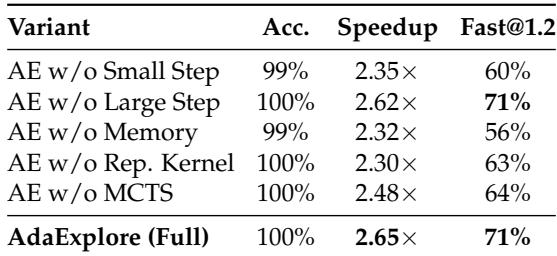  
Table 5: Ablation Study on AdaExplore Components. We separately remove action types, cross-task skill memory, representative kernels (Rep. Kernel), and tree search (MCTS) to isolate each component’s contribution.

## 6 Conclusion

In this work, we study kernel runtime optimization as a setting where coding agents must both generate correct kernels and search effectively for high-performing ones. We propose AdaExplore, which combines two ideas. First, in the adaptation stage, the agent learns from compiler and runtime failures on synthesized tasks and builds a cross-task skill memory that helps it generate correct kernels more consistently. Second, in the evolution stage, the agent uses tree-structured search to keep multiple candidate directions alive and explore the optimization landscape beyond small local edits. Experiments show that these two components work well together: the cross-task skill memory improves correctness, and the search finds higher-performing kernels once correctness is reached. Together, they provide a practical way to improve kernel runtime optimization without additional fine-tuning.

## Acknowledgements

This work was supported in part by SoftBank Group Corp. and Arm. This program was made possible (in part) due to the generosity of SoftBank Group Corp. We thank our collaborators at Arm for their support and collaboration.

## References

Lakshya A Agrawal, Shangyin Tan, Dilara Soylu, Noah Ziems, Rishi Khare, Krista Opsahl-Ong, Arnav Singhvi, Herumb Shandilya, Michael J Ryan, Meng Jiang, Christopher Potts, Koushik Sen, Alexandros G. Dimakis, Ion Stoica, Dan Klein, Matei A. Zaharia, and O. Khattab. Gepa: Reflective prompt evolution can outperform reinforcement learning. ArXiv, abs/2507.19457, 2025.

Anthropic. Claude opus 4.6 system card. Technical report, Anthropic, 2026. URL https: //www-cdn.anthropic.com/6a5fa276ac68b9aeb0c8b6af5fa36326e0e166dd.pdf.

Henrique Assumpc¸ao, Diego Ferreira, Leandro Campos, and Fabricio Murai. Codeevolve:˜ an open source evolutionary coding agent for algorithm discovery and optimization. arXiv preprint arXiv:2510.14150, 2025.

Carlo Baronio, Pietro Marsella, Ben Pan, Simon Guo, and Silas Alberti. Kevin: Multi-turn rl for generating cuda kernels, 2025. URL https://arxiv.org/abs/2507.11948.

Ruisheng Cao, Mouxiang Chen, Jiawei Chen, Zeyu Cui, Yunlong Feng, Binyuan Hui, Yuheng Jing, Kaixin Li, Mingze Li, Junyang Lin, et al. Qwen3-coder-next technical report. arXiv preprint arXiv:2603.00729, 2026.

Mark Chen, Jerry Tworek, Heewoo Jun, Qiming Yuan, Henrique Ponde De Oliveira Pinto, Jared Kaplan, Harri Edwards, Yuri Burda, Nicholas Joseph, Greg Brockman, et al. Evalu ating large language models trained on code. arXiv preprint arXiv:2107.03374, 2021.

KuanChao Chu, Yi-Pei Chen, and Hideki Nakayama. Exploring and controlling diversity in llm-agent conversation. arXiv preprint arXiv:2412.21102, 2024.

Weinan Dai, Hanlin Wu, Qiying Yu, Huan ang Gao, Jiahao Li, Chengquan Jiang, Weiqiang Lou, Yufan Song, Hongli Yu, Jiaze Chen, Wei-Ying Ma, Ya-Qin Zhang, Jingjing Liu, Mingxuan Wang, Xin Liu, and Hao Zhou. Cuda agent: Large-scale agentic rl for highperformance cuda kernel generation, 2026. URL https://arxiv.org/abs/2602.24286.

Binyuan Hui, Jian Yang, Zeyu Cui, Jiaxi Yang, Dayiheng Liu, Lei Zhang, Tianyu Liu, Jiajun Zhang, Bowen Yu, Keming Lu, et al. Qwen2. 5-coder technical report. arXiv preprint arXiv:2409.12186, 2024.

Carlos E Jimenez, John Yang, Alexander Wettig, Shunyu Yao, Kexin Pei, Ofir Press, and Karthik Narasimhan. Swe-bench: Can language models resolve real-world github issues? arXiv preprint arXiv:2310.06770, 2023.

Levente Kocsis and Csaba Szepesvari. Bandit based monte-carlo planning. In ´ European conference on machine learning, pp. 282–293. Springer, 2006.

John R. Koza. Genetic Programming: On the Programming of Computers by Means of Natural Selection. MIT Press, Cambridge, MA, USA, 1992.

Jianling Li, Shangzhan Li, Zhenye Gao, Qi Shi, Yuxuan Li, Zefan Wang, Jiacheng Huang, Haojie Wang, Jianrong Wang, Xu Han, et al. Tritonbench: Benchmarking large language model capabilities for generating triton operators. arXiv preprint arXiv:2502.14752, 2025a.

Kefan Li, Hongyue Yu, Tingyu Guo, Shijie Cao, and Yuan Yuan. Cocoevo: Co-evolution of programs and test cases to enhance code generation. arXiv preprint arXiv:2502.10802, 2025b.

Shangzhan Li, Zefan Wang, Ye He, Yuxuan Li, Qi Shi, Jianling Li, Yonggang Hu, Wanxiang Che, Xu Han, Zhiyuan Liu, et al. Autotriton: Automatic triton programming with reinforcement learning in llms. arXiv preprint arXiv:2507.05687, 2025c.

Xiaoya Li, Xiaofei Sun, Albert Wang, Jiwei Li, and Chris Shum. Cuda-l1: Improving cuda optimization via contrastive reinforcement learning, 2026. URL https://arxiv.org/abs/ 2507.14111.

Yujia Li, David Choi, Junyoung Chung, Nate Kushman, Julian Schrittwieser, Remi Leblond,´ Tom Eccles, James Keeling, Felix Gimeno, Agustin Dal Lago, et al. Competition-level code generation with alphacode. Science, 378(6624):1092–1097, 2022.

Jonathan Light, Yue Wu, Yiyou Sun, Wenchao Yu, Xujiang Zhao, Ziniu Hu, Haifeng Chen, Wei Cheng, et al. Scattered forest search: Smarter code space exploration with llms. arXiv preprint arXiv:2411.05010, 2024.

Robert Lim, Boyana Norris, and Allen Malony. Autotuning gpu kernels via static and predictive analysis. In 2017 46th international conference on parallel processing (icpp), pp. 523–532. IEEE, 2017.

Wei Liu, Jiawei Xu, Yingru Li, Longtao Zheng, Tianjian Li, Qian Liu, and Junxian He. Dr. kernel: Reinforcement learning done right for triton kernel generations. arXiv preprint arXiv:2602.05885, 2026.

Erik Nijkamp, Bo Pang, Hiroaki Hayashi, Lifu Tu, Huan Wang, Yingbo Zhou, Silvio Savarese, and Caiming Xiong. Codegen: An open large language model for code with multi-turn program synthesis. arXiv preprint arXiv:2203.13474, 2022.

Alexander Novikov, Ngan Vˆ u, Marvin Eisenberger, Emilien Dupont, Po-Sen Huang,˜ Adam Zsolt Wagner, Sergey Shirobokov, Borislav Kozlovskii, Francisco J. R. Ruiz, Abbas Mehrabian, M. Pawan Kumar, Abigail See, Swarat Chaudhuri, George Holland, Alex Davies, Sebastian Nowozin, Pushmeet Kohli, and Matej Balog. Alphaevolve: A coding agent for scientific and algorithmic discovery. arXiv preprint arXiv:2506.13131, 2025.

OpenAI. Introducing codex. https://openai.com/index/introducing-codex/, 2025.

Anne Ouyang, Simon Guo, Simran Arora, Alex L Zhang, William Hu, Christopher Re, and´ Azalia Mirhoseini. Kernelbench: Can llms write efficient gpu kernels? arXiv preprint arXiv:2502.10517, 2025.

Qiwei Peng, Yekun Chai, and Xuhong Li. Humaneval-xl: A multilingual code generation benchmark for cross-lingual natural language generalization. arXiv preprint arXiv:2402.16694, 2024.

Chen Qian, Wei Liu, Hongzhang Liu, Nuo Chen, Yufan Dang, Jiahao Li, Cheng Yang, Weize Chen, Yusheng Su, Xin Cong, et al. Chatdev: Communicative agents for software development. In Proceedings of the 62nd annual meeting of the association for computational linguistics (volume 1: Long papers), pp. 15174–15186, 2024.

Bernardino Romera-Paredes, Mohammadamin Barekatain, Alexander Novikov, Matej Balog, M. Pawan Kumar, Emilien Dupont, Francisco J. R. Ruiz, et al. Mathematical discoveries from program search with large language models. Nature, 625:468–475, 2024.

Baptiste Roziere, Jonas Gehring, Fabian Gloeckle, Sten Sootla, Itai Gat, Xiaoqing Ellen Tan, Yossi Adi, Jingyu Liu, Romain Sauvestre, Tal Remez, et al. Code llama: Open foundation models for code. arXiv preprint arXiv:2308.12950, 2023.

ByteDance Seed, Yuyu Zhang, Jing Su, Yifan Sun, Chenguang Xi, Xia Xiao, Shen Zheng, Anxiang Zhang, Kaibo Liu, Daoguang Zan, et al. Seed-coder: Let the code model curate data for itself. arXiv preprint arXiv:2506.03524, 2025.

Asankhaya Sharma. Openevolve: an open-source evolutionary coding agent, 2025. URL https://github.com/algorithmicsuperintelligence/openevolve.

Noah Shinn, Federico Cassano, Edward Berman, Ashwin Gopinath, Karthik Narasimhan, and Shunyu Yao. Reflexion: Language agents with verbal reinforcement learning, 2023. URL https://arxiv.org/abs/2303.11366.

Aaditya Singh, Adam Fry, Adam Perelman, Adam Tart, Adi Ganesh, Ahmed El-Kishky, Aidan McLaughlin, Aiden Low, AJ Ostrow, Akhila Ananthram, et al. Openai gpt-5 system card. arXiv preprint arXiv:2601.03267, 2025.

Charlie Snell, Jaehoon Lee, Kelvin Xu, and Aviral Kumar. Scaling llm test-time compute optimally can be more effective than scaling model parameters. arXiv preprint arXiv:2408.03314, 2024.

Qitong Sun, Jun Han, Tianlin Li, Zhe Tang, Sheng Chen, Fei Yang, Aishan Liu, Xianglong Liu, and Yang Liu. Kernelskill: A multi-agent framework for gpu kernel optimization. arXiv preprint arXiv:2603.10085, 2026.

Richard S Sutton, Andrew G Barto, et al. Reinforcement learning: An introduction, volume 1. MIT press Cambridge, 1998.

Philippe Tillet, Hsiang-Tsung Kung, and David Cox. Triton: an intermediate language and compiler for tiled neural network computations. In Proceedings of the 3rd ACM SIGPLAN International Workshop on Machine Learning and Programming Languages, pp. 10–19, 2019.

Guanzhi Wang, Yuqi Xie, Yunfan Jiang, Ajay Mandlekar, Chaowei Xiao, Yuke Zhu, Linxi Fan, and Anima Anandkumar. Voyager: An open-ended embodied agent with large language models. arXiv preprint arXiv:2305.16291, 2023.

Yanlin Wang, Wanjun Zhong, Yanxian Huang, Ensheng Shi, Min Yang, Jiachi Chen, Hui Li, Yuchi Ma, Qianxiang Wang, and Zibin Zheng. Agents in software engineering: Survey, landscape, and vision. Automated Software Engineering, 32(2):70, 2025.

Anjiang Wei, Tianran Sun, Yogesh Seenichamy, Hang Song, Anne Ouyang, Azalia Mirhoseini, Ke Wang, and Alex Aiken. Astra: A multi-agent system for gpu kernel performance optimization, 2025. URL https://arxiv.org/abs/2509.07506.

Shanli Xing, Yiyan Zhai, Alexander Jiang, Yixin Dong, Yong Wu, Zihao Ye, Charlie Ruan, Yingyi Huang, Yineng Zhang, Liangsheng Yin, et al. Flashinfer-bench: Building the virtuous cycle for ai-driven llm systems. arXiv preprint arXiv:2601.00227, 2026.

Can Xu, Qingfeng Sun, Kai Zheng, Xiubo Geng, Pu Zhao, Jiazhan Feng, Chongyang Tao, Qingwei Lin, and Daxin Jiang. Wizardlm: Empowering large pre-trained language models to follow complex instructions, 2025. URL https://arxiv.org/abs/2304.12244.

Mert Yuksekgonul, Federico Bianchi, Joseph Boen, Sheng Liu, Zhi Huang, Carlos Guestrin, and James Zou. Textgrad: Automatic ”differentiation” via text. ArXiv, abs/2406.07496, 2024.

Daoguang Zan, Zhirong Huang, Wei Liu, Hanwu Chen, Linhao Zhang, Shulin Xin, Lu Chen, Qi Liu, Xiaojian Zhong, Aoyan Li, et al. Multi-swe-bench: A multilingual benchmark for issue resolving. arXiv preprint arXiv:2504.02605, 2025.

Genghan Zhang, Shaowei Zhu, Anjiang Wei, Zhenyu Song, Allen Nie, Zhen Jia, Nandita Vijaykumar, Yida Wang, and Kunle Olukotun. Accelopt: A self-improving llm agentic system for ai accelerator kernel optimization, 2025a. URL https://arxiv.org/abs/2511. 15915.

Kechi Zhang, Jia Li, Ge Li, Xianjie Shi, and Zhi Jin. Codeagent: Enhancing code generation with tool-integrated agent systems for real-world repo-level coding challenges. In Proceedings of the 62nd Annual Meeting of the Association for Computational Linguistics (Volume 1: Long Papers), pp. 13643–13658, 2024.

Qizheng Zhang, Changran Hu, Shubhangi Upasani, Boyuan Ma, Fenglu Hong, Vamsidhar Reddy Kamanuru, Jay Rainton, Chen Wu, Mengmeng Ji, Hanchen Li, Urmish Thakker, James Zou, and Kunle Olukotun. Agentic context engineering: Evolving contexts for self-improving language models. ArXiv, abs/2510.04618, 2025b.

Andrew Zhao, Daniel Huang, Quentin Xu, Matthieu Lin, Yong-Jin Liu, and Gao Huang. Expel: Llm agents are experiential learners, 2023. URL https://arxiv.org/abs/2308. 10144.

## A Supplementary Material

We open-source the implementation of AdaExplore in https://github.com/StigLidu/ AdaExplore.

## B Evaluation on FlashInfer-Bench

## B.1 Setup

KernelBench evaluates kernel runtime optimization on general-purpose PyTorch operator rewrites. To further assess performance on real-world LLM serving workloads, we evaluate AdaExplore on FlashInfer-Bench (Xing et al., 2026). Its kernel tasks are extracted from production inference pipelines with input shapes captured from deployed models (e.g., Llama-3.1-8B, Qwen3-30B-A3B), and expert-written FlashInfer CUDA kernels, the same implementations used in production serving frameworks such as SGLang, serve as performance baselines.

We select three kernel definitions spanning different operation types and optimization difficulty:

• Fused Add RMSNorm (fused add rmsnorm h2048): A memory-bound element-wise kernel that computes residual addition followed by RMS normalization.

• GEMM (gemm n128 k2048): A general matrix multiplication C = AB⊤ with N=128, K=2048, captured from the MoE gate of Qwen3-30B-A3B.

• GQA Paged Decode (gqa paged decode h32 kv8 d128 ps1): A grouped-query attention decode kernel with paged KV cache, captured from Llama-3.1-8B.

We run AdaExplore with the same MCTS configuration as in the main experiments (50 steps, GPT-5-mini) on an NVIDIA B200 GPU, corresponding to a relatively small test-time compute budget. For baselines, we benchmark against the PyTorch eager reference and, where available, the FlashInfer CUDA kernel or cuBLAS (torch.mm).

## B.2 Results

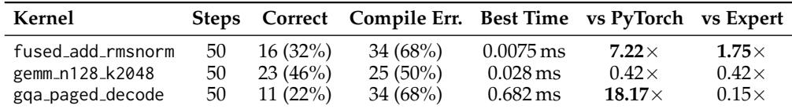  
Table 6: FlashInfer-Bench Results (50-step MCTS, GPT-5-mini, NVIDIA B200). “vs Expert” reports the ratio of the expert baseline time (FlashInfer or cuBLAS) to the best AdaExploregenerated kernel time; values > 1 indicate the generated kernel is faster.  
Table 6 summarizes the results. We highlight several findings:

RMSNorm: Surpassing Expert-written CUDA. The best generated kernel achieves 1.75× speedup over the FlashInfer CUDA implementation and 7.22× over the PyTorch reference. The generated kernel (shown in Figure 4) loads the entire hidden dimension (H=2048) in a single tile (BLOCK=2048), performing the fused add, variance reduction, and scaling entirely in registers. This demonstrates that LLM agents can discover hardware-efficient implementations that exceed expert-tuned CUDA for memory-bound workloads.

GEMM: Fundamentally Hard Due to Heavy Human Optimization. The best genuine Triton GEMM kernel achieves 0.42× of cuBLAS performance. This result is not surprising, as GEMM kernels have been extensively optimized over decades, incorporating sophisticated tiling strategies, scheduling, and hardware-specific instructions in vendor libraries such as cuBLAS. The difficulty here is therefore intrinsic to the problem setting: improving over such heavily engineered baselines remains fundamentally challenging.

GQA: large gains over PyTorch, but still far from expert performance. While only 11 out of 50 generated kernels pass correctness checks, the best kernel achieves a substantial 18.17× speedup over PyTorch. However, it remains 6.5× slower than the FlashInfer expert implementation.

@triton . jit   
def \_fused\_add\_rmsnorm\_kernel (   
x\_ptr , r\_ptr , w\_ptr , out\_ptr ,   
stride\_xm , stride\_xn , stride\_rm , stride\_rn ,   
stride\_w , stride\_outm , stride\_outn ,   
M , N , EPS , BLOCK : tl . constexpr ) :   
pid = tl . program\_id (0)   
if pid >= M :   
return   
offs = tl . arange (0 , BLOCK )   
mask = offs < N   
x\_val = tl . load ( x\_ptr + pid \* stride\_xm + offs \* stride\_xn , mask = mask , other =0.0)   
r\_val = tl . load ( r\_ptr + pid \* stride\_rm + offs \* stride\_rn , mask = mask , other =0.0)   
x\_f = tl . cast ( x\_val , tl . float32 ) + tl . cast ( r\_val , tl . float32 )   
sumsq = tl . sum ( x\_f \* x\_f , 0)   
inv\_rms = 1.0 / tl . sqrt ( sumsq / tl . cast (N , tl . float32 ) + tl . cast ( EPS , tl . float32 ) )   
w\_val = tl . load ( w\_ptr + offs \* stride\_w , mask = mask , other =0.0)   
y = x\_f \* tl . cast ( w\_val , tl . float32 ) \* inv\_rms   
tl . store ( out\_ptr + pid \* stride\_outm + offs \* stride\_outn ,   
tl . cast (y , tl . bfloat16 ) , mask = mask )  
Figure 4: Best AdaExplore-generated fused add RMSNorm kernel (1.75× faster than Flash-Infer). The kernel processes one row per program, loading the entire hidden dimension in a single tile of BLOCK=2048 elements and performing the reduction in registers.

The generated kernels use a two-pass softmax that sequentially scans all KV tokens twice per head. In contrast, the FlashInfer baseline on the B200 employs a warp-specialized XQA kernel with 4 cooperating CTAs, single-pass online softmax, TMA-accelerated paged KV cache access, FP8 attention weight quantization, and Blackwell QMMA instructions.

These advanced mechanisms on B200 highlight the importance of incorporating additional knowledge and reference skills, which we leave as future work for agent-based kernel runtime optimization.

## B.3 Case Study: Best RMSNorm Kernel

Figure 4 presents the best kernel found by AdaExplore.

## C Detailed Description of Synthesized Training Tasks

## C.1 Dataset Synthesis

To expand the dataset, we use mutation-based prompting in the spirit of Evol-Instruct (Xu et al., 2025). In each iteration, we sample three seed task examples and operators from the PyTorch documentation 1, and prompt GPT-5 to generate a new PyTorch module by mutating and recombining existing patterns and operators. We execute the generated code on the synthesized test tensors and discard any samples that cause errors. This mutation process introduces finer-grained, low-level variation and yields samples that remain closer in complexity to our seed task examples. The prompt can be found in Figure 5.

Our agent uses these training tasks to collect cross-task skill memory from attempts to implement kernels. For this purpose, we found that mutation-based synthetic data provided a richer signal, likely because it involved more complex use of low-level operations rather than common higher-level building blocks. This forced the agent into edge cases, where it was more likely to make errors that could be stored in memory.

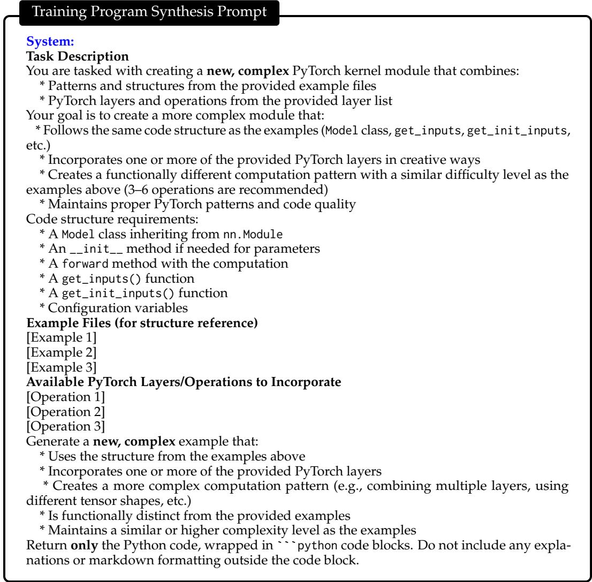  
Figure 5: Training Program Synthesis Prompt.

## C.2 Examples of Training Tasks

Table 7 shows three examples of synthesized training tasks. Starting from real PyTorch seed programs, we ask the model to generate new tasks that preserve the input–output interface while composing operators into new computation patterns. The examples illustrate the kind of structural variation we want: one combines pointwise and depthwise convolutions with gating, another builds a 3D channel-gating module with pooling and thresholding, and the third turns spatial features into a recurrent sequence processed by an RNNCell. Together, these examples show that synthesis produces tasks that remain realistic in structure while exposing the agent to more diverse operator compositions and implementation challenges.

## C.3 Examples of Cross-task Skill Memory

Tables 8 and 9 show the highest- and lowest-frequency entries in the learned cross-task skill memory. These entries summarize recurring failure patterns observed during experience collection and convert them into short, actionable reminders. A clear pattern emerges: high-frequency items tend to capture stable and broadly useful constraints. For example, frequent rules such as treating tl.float32 as a function, using unsupported Triton indexing patterns, or omitting required constexpr launch parameters correspond to recurring API and language constraints that arise across many tasks. In contrast, low-frequency items are more often tied to narrow implementation details, one-off bugs, or noisy summaries of rare failures, such as attempting to connect to 0.0.0.0:12017, computing fan-in/fanout for a tensor with fewer than two dimensions, or compiling a very specific statement involving tl.zeros((patch dim out,), dtype=tl.float32). This contrast supports our filtering strategy: high-frequency persistent-skill-memory entries are more likely to be transferable across tasks, whereas very low-frequency entries are more likely to contain noise or even incorrect guidance.

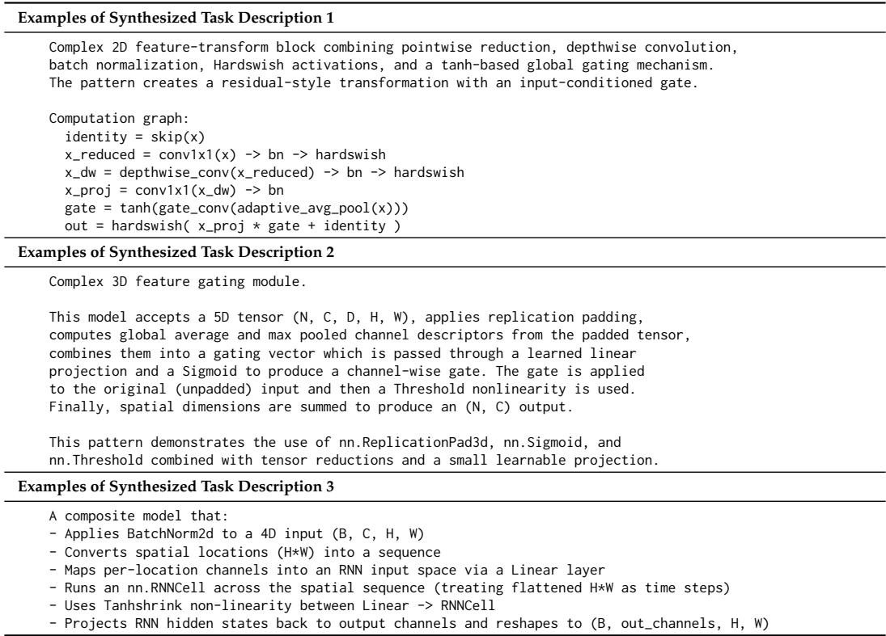  
Table 7: Examples of Synthesized Training Tasks.

## C.4 Generalizability of Cross-Task Skill Memory

To further evaluate the generalizability of AdaExplore, we conduct experiments on TritonBench-T (Li et al., 2025a). This benchmark requires models to generate behaviorally equivalent, interface-compatible Python/Triton implementations from function semantic descriptions and interface specifications. It consists of 166 tasks covering basic element-wise operators, reductions, linear algebra, and various fused operators. We evaluate single-pass generation with and without cross-task skill memory collected from synthetic KernelBench questions, as well as 5-step and 10-step AdaExplore on TritonBench-T. The results are shown in Table 10. Notably, although the cross-task skill memory is collected from synthetic KernelBench questions, it generalizes well to TritonBench-T. With this cross-task skill memory, GPT-5-mini improves its single-pass generation accuracy from 54% to 82%. AdaExplore further boosts performance, with the 10-step variant reaching 97% accuracy and 24% Fast@1.2.

## D Method Details

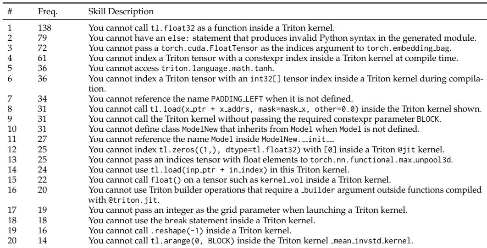

Table 8: Top-20 Cross-Task Skill Memory Entries Ranked by Frequency.  
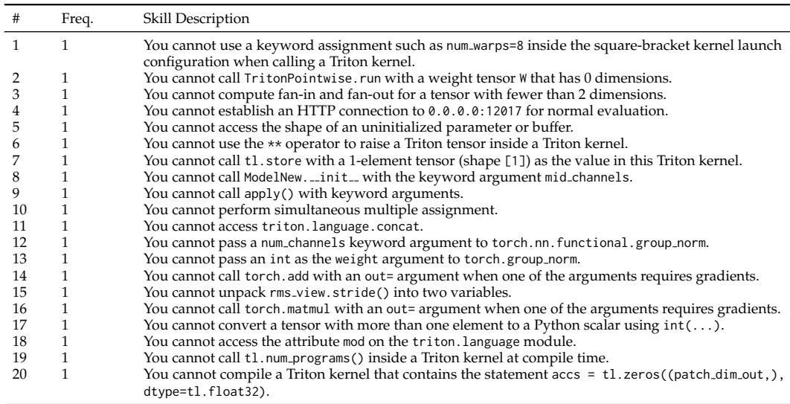

Table 9: Bottom-20 Cross-Task Skill Memory Entries Ranked by Frequency.  
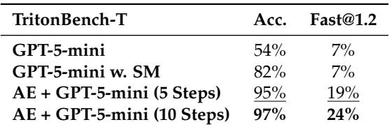  
Table 10: TritonBench-T Performance. The best result in each column is bold, and the second best is underlined.

## D.1 Algorithm Pseudocode

The pseudocode of ADAPT is shown in Algorithm 1. The pseudocode of EXPLORE is shown in Algorithm 2.

## D.2 Action Description

Algorithm 1 Learning Skills from Failures (Adapt)   
1: Input: synthesized task set D ; coding agent π; frequency threshold O   
2: Output: filtered cross-task skill memory M   
3: Initialize raw memory M ← ∅   
4: for each synthesized task x ∈ Dsyn do   
5: Generate kernel candidates {y , ..., y } ∼ π(· | x, M)   
6: Execute {y1, ..., yk} against the reference implementation of x and collect feedback { f1, ..., fk}   
7: for each candidate y do   
8: if y fails compilation or execution then   
9: Summarize (yi, fi) into a concise constraint rule m   
10: if m is semantically matched to an existing memory item m′ ∈ M then   
11: Increase the frequency count of m′   
12: else   
13: Add m to M with frequency count 1   
14: end if   
15: end if   
16: end for   
17: end for   
18: Filter M ← {m ∈ M |  freq(m) ≥ O}   
19: return M

Algorithm 2 Diversity-Preserving Tree Search (Explore)   
1: Input: target problem x; coding agent π; cross-task skill memory M; search budget T; recent  
window size Crecent; pool size Cpool; large-step probability plarge   
2: Output: best kernel found y⋆   
3: Initialize search tree T with a virtual root node sroot   
4: for t = 1 to T do   
5: Select a node s from T using the UCT-style rule in Section 3.4.2   
6: Construct working memory W from the most recent C states on the path to s   
7: Build a set of representative kernels K by keeping at most one kernel from each connected   
segment of consecutive small steps on the current path   
8: Sample at most Cpool representative kernels from Kpool.   
9: if s = s then   
10: Set a ← LARGESTEP   
11: else   
12: Set a = LARGESTEP with probability p and a = SMALLSTEP otherwise   
13: end if   
14: if a = LARGESTEP then   
15: Clear W   
16: else   
17: Clear Kpool   
18: end if   
19: Generate a new kernel candidate y′ ∼ π(· | x, M, Ws, Kpool, a)   
20: Execute y′ and obtain correctness and performance feedback   
21: Add a new child node s′ under s with edge type a   
22: Store y′, feedback, and score in s′   
23: Update visit counts and node statistics on the path from s′ to the root   
24: end for   
25: Return the highest-performing correct kernel in T as y⋆

All actions are performed by the coding agent and share the same context prompt, as shown in Figure 6 (some adjustments are applied to ensure readability). If some parts of the information are missing, this part of the prompt will be removed from the context. We use two action types during tree search: Large Step and Small Step, described as follows:

Large Step. Large step performs reconstruction: instead of making a small patch to the current kernel, it prompts the model to generate a new kernel structure conditioned on the shared search context and the large-step objective. The prompt can be found in Figure 7. In practice, the agent will regenerate a structurally different kernel from those in the representative pool.

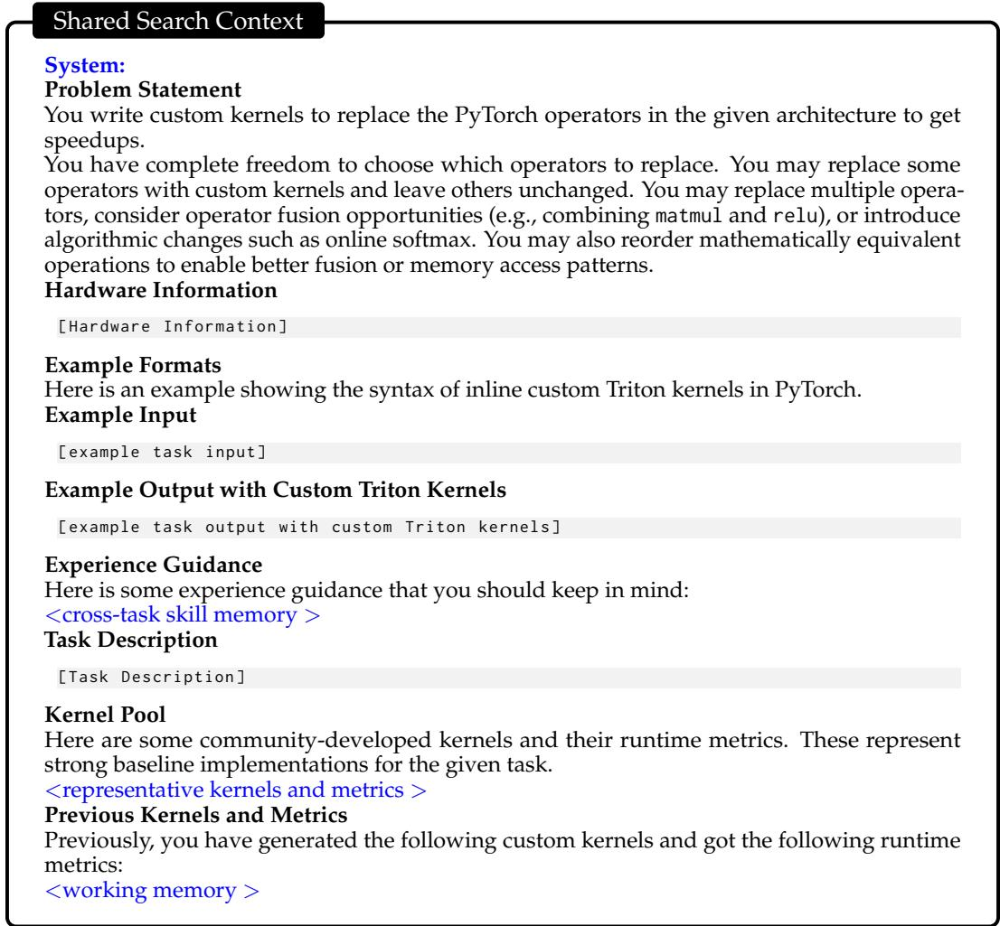

Figure 6: Shared Search Context Prompt.  
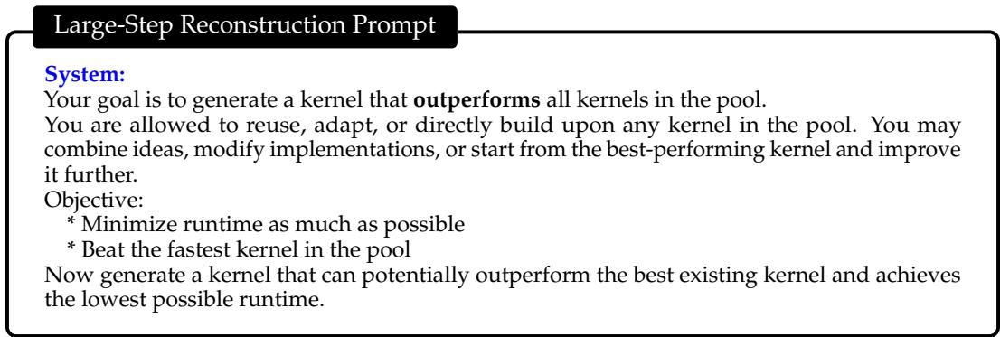  
Figure 7: Large-step Reconstruction Prompt.

Small Step. The small step performs local tuning on the current kernel. Instead of regenerating a new structure, it first identifies concrete modifications or improvement plans by providing guidance, and then applies one or more code patches to improve correctness or runtime performance. Each patch is specified as an old str/new str pair: old str must exactly match a unique code region in the current kernel, and new str provides the corresponding replacement block. The prompt used for this step is shown in Figure 8.

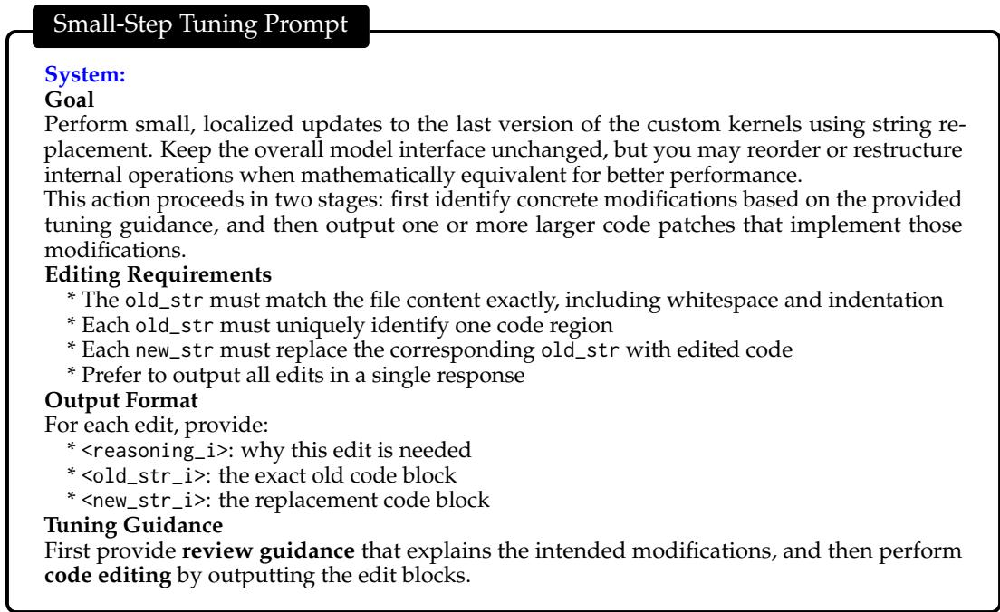  
Figure 8: Small-step Tuning Prompt.

The self-generated review guidance, introduced before editing in the small-step process, broadens the scope of potential modifications and encourages more coherent updates. However, we observe that such guidance can sometimes reduce the correctness rate of the generated kernels, as it often introduces complex or abstract instructions that the model has difficulty reliably following. To balance this trade-off, we conditionally enable review guidance based on the current state of the working memory. Specifically, when all kernels in the working memory exhibit correctness issues, we disable review guidance and instead focus the model on fixing errors using execution feedback. In contrast, when at least one correct kernel is present, we enable review guidance to encourage higher-quality and more globally consistent edits.

## E Experiment Details

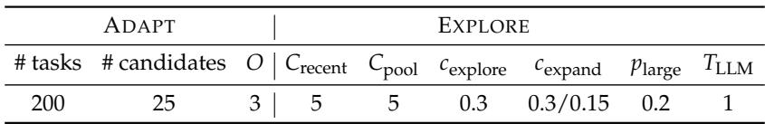  
Table 11: Main Hyperparameter Settings Used in ADAPT and EXPLORE.

## E.1 Hyperparameter Settings

We summarize the main hyperparameter settings used throughout the paper here. For ADAPT, the key choices include the number of synthesized training tasks and the number of kernel candidates sampled per synthesized task, and the frequency threshold O used to retain high-frequency cross-task skill-memory entries. For EXPLORE, the main search hyperparameters include the test-time search budget T, the recent-context window size Crecent, the maximum number of representative kernels sampled into context Cpool, the weighting coefficient β for sampling representative kernels, the exploration coefficient cexplore and cexpand in the UCT-style node selection rule, large-step probability plarge, and the inference temperature TLLM. Specifically, we observe that harder tasks may require more budget focused on the current branch. Consequently, we set cexpand = 0.3 for the KernelBench Level 2 task and cexpand = 0.15 for the Level 3 task.

OpenEvolve. We set the population size to 5, meaning that the evolutionary search maintains five candidate solutions at a time. The migration interval is set to 10, so migration is performed every 10 iterations to promote information sharing across search trajectories.

## E.2 Evaluation

We evaluate each generated kernel against the original PyTorch reference using a unified pipeline. Given a reference implementation and a candidate optimized version, we instantiate both with identical initial inputs, compare their outputs on the same randomly generated test inputs, and measure their speed.

Remote evaluation server. For scalability and robustness, we support remote evaluation via a GPU-backed service. The server maintains a queue of requests, assigns each to an available GPU, executes the candidate in isolation, and returns structured results, including compilation status, correctness status, runtime statistics, and diagnostic metadata.

Correctness checking. We assess correctness by comparing candidate outputs with the reference on identical inputs. For each evaluation, we fix a base seed and deterministically derive per-trial seeds. A candidate is considered correct only if it matches the reference on all trials. For each trial, we first verify that output shapes match, then compare values using torch.allclose with both absolute and relative tolerances set to 5 × 10−2. If any trial fails, we record diagnostic statistics (e.g., maximum and mean absolute differences) and mark the candidate as incorrect.

Performance measurement. We measure runtime only for candidates that pass correctness checks. Before timing, we clear the CUDA cache and synchronize the device to minimize interference. Each kernel is executed with 10 warm-up iterations followed by 100 timed trials. We report summary statistics (mean, standard deviation, minimum, and maximum runtime). To reduce noise, we apply symmetric outlier trimming by discarding the fastest and slowest 5% of runs and computing statistics over the remaining 90 trials.

## F Disclosure of LLM use

We used LLMs in three parts of this work. First, LLMs were used to synthesize the synthetic training tasks described in the adaptation stage. Second, LLMs served as the coding agents in our experiments, where they generated and refined kernel implementations under execution feedback. Third, LLMs were used to help refine the paper’s writing, including wording and clarity.