# AXE: A SIMPLE UNIFIED LAYOUT ABSTRACTION FOR MACHINE LEARNINGCOMPILERS

Bohan Hou <sup>1</sup> Hongyi Jin <sup>1</sup> Guanjie Wang <sup>2</sup> Jinqi Chen <sup>3</sup> Yaxing Cai <sup>3</sup> Lijie Yang <sup>4</sup> Zihao Ye <sup>3</sup> Yaoyao Ding <sup>5</sup> Ruihang Lai <sup>1</sup> Tianqi Chen <sup>1</sup> <sup>3</sup>

## ABSTRACT

Scaling modern deep learning workloads demands coordinated placement of data and compute across device meshes, memory hierarchies, and heterogeneous accelerators. We present Axe Layout, a hardware-aware abstraction that maps logical tensor coordinates to a multi-axis physical space via named axes. Axe unifies tiling, sharding, replication, and offsets across inter-device distribution and on-device layouts, enabling collective primitives to be expressed consistently from device meshes to threads. Building on Axe, we design a multigranularity, distribution-aware DSL and compiler that composes thread-local control with collective operators in a single kernel. Experiments show that our unified approach can bring performance close to hand-tuned kernels on across latest GPU devices and multi-device environments and accelerator backends.

## 1 INTRODUCTION

Deep learning models, particularly large language models (LLMs) (DeepSeek-AI et al., 2025; OpenAI et al., 2024), now power search, coding assistants, analytics, and creative tools. As models, data, and serving fleets scale, runtime optimization for training and especially inference becomes a central systems challenge (Kwon et al., 2023; Ye et al., 2025). To optimize deep learning systems, we must address challenges at multiple layers of the software/hardware stack:

Distributed execution. At the topmost level, large models need to run across multiple devices and machines. Deep learning frameworks (Paszke et al., 2019; Xu et al., 2021; Bradbury et al., 2018) and compilers (Zheng et al., 2025b;a) must explicitly make data sharding and replication choices across device meshes and optimize communication and computation overlap within underlying kernel executions.

Memory and thread hierarchy. At the device level, GPUs and AI accelerators have memory hierarchies and nested parallelism across grids, blocks, warps, and lanes (Nickolls & Dally, 2010). Kernel libraries must carefully orchestrate how data is tiled across these memory scopes (Tillet et al., 2019; Ding et al., 2025; Hagedorn et al., 2023). The mem ory hierarchy also ties closely to compute primitives, since specialized primitives such as tensor cores need to be executed collectively by specific groups of threads on their registers. Kernel compilers and libraries must specify and map tasks and intermediate data onto threads and device memories, satisfying the hardware requirements.

Hardware heterogeneity. Adding to the complexity of multiple scales, we increasingly face hardware heterogeneity. AI accelerators such as AWS Trainium (Bshara, 2024) and Google TPU (Jouppi et al., 2017) expose multidimensional scratchpads with memory bank constraints that differ from GPUs. Even within the same vendor, heterogeneity appears across generations. For example, NVIDIA tensor cores evolve tile formats and memory requirements across Ampere, Hopper, and Blackwell architectures. A compiler must adapt code generation to device-specific requirements while providing a unified programming experience.

Most current deep learning systems and compilers focus on a subset of these aspects. For example, GSPMD (Xu et al., 2021), Alpa (Zheng et al., 2022), FlexFlow (Jia et al., 2019), and PyTorch Distributed Tensor provide concise annotations for sharding and replication of tensor data on a device mesh. At the device level, domain-specific languages (DSLs) such as CuTeDSL (NVIDIA Corporation, 2025b), Triton (Tillet et al., 2019), Mojo (Modular Inc., 2025), and TileLang (Wang et al., 2025) provide ways to specify and abstract away data layouts (NVIDIA Corporation, 2025d; Zhou et al., 2025) on devices. Different DSLs focus on different abstraction levels: CuTeDSL provides concrete schedule choices such as loop tiling and thread binding at the thread level, which favors peak efficiency at the expense of productivity and portability, while approaches such as Triton aim to abstract computations at the collective level, usually the thread block, to increase programmer productivity. Finally, we also see efforts such as Pallas TPU (The JAX Authors, 2024) and NKI (Amazon Web Services, 2025b)

## that specialize in AI accelerators.

Although there are many specific design choices to address each of these challenges, we observe that common patterns can be shared between them. One recurring theme is how we represent data mapping and compute mapping to hierarchical distributed memories and across heterogeneous hardware units. In this paper, we propose Axe layout, a simple yet effective abstraction that unifies compute and data mappings across the distributed device hierarchy and heterogeneous hardware settings. Axe layout introduces named axes to explicitly represent hardware constructs such as thread axes, memory banks in accelerators, and distributed workers. Based on these named axes, Axe layout defines how logical coordinates of a tile map to a multi-axis physical space across GPU devices, threads, and memories. It unifies distributed sharding and on-device memory tiling in one formal representation.

The Axe layout abstraction can serve as an effective building block for ML compilers and frameworks to represent and optimize workloads across scales. To demonstrate its potential, we design a multi-granularity, distribution-aware tensor program DSL and compiler that leverages Axe layout to specify data and compute execution scopes. We build a set of layout operators to faciliate the transform and lowering of Axe DSL programs. Our compiler allows programmers to mix thread-local control with multi-level collective operators inside one kernel. The result is the performance of low-level, hand-tuned code with much lower development cost, since boilerplate is replaced by reusable and declarative operators. The Axe layout gives the compiler the semantics it needs to infer placements and choose hardware-native schedules. The main contributions of this paper include:

• We introduce the Axe layout model that encodes mapping from logical index to named hardware axes, including sharding, replication, and offsets. It unifies inter- and intra-device kernel development formally.

• We develop a set of layout operators such as canonicalize, group, tile, and slice that the compiler uses to analyze and match layouts for code generation.

• We design a multi-granularity and distribution-aware DSL built on Axe layout that unifies thread-local and collective views, and a compiler that dispatches schedules and generates efficient code across heterogeneous targets.

Axe matches or exceeds strong baselines, bringing up to 1.32× and 1.23× on B200 MoE layers against FlashInfer and SGLang, up to 1.40× for multi-GPU GEMM+Reduce-Scatter versus cuBLAS+NCCL and Triton-Distributed, and up to 1.44× in AI acclerator (Trainium-1) MHA versus vendor libraries.

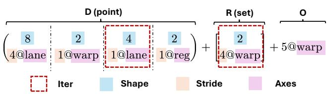  
Figure 1. Elements of Axe Layout. An iter specifies a triple (extent, stride, axis) and defines a linear, strided access on that axis. A list of iters forms the shard part D, a set of iters forms the replica part R, and O is a fixed offset.

## 2 AXE LAYOUT

## 2.1 Overview

Axe extends the classical shape–stride model of tensor layout. In NumPy (Harris et al., 2020) or PyTorch (Paszke et al., 2019), a dense layout is described by a shape and strides (each stride is the memory step when the corresponding index increases). Axe generalizes it by allowing strides to be semantically named and bound to different axes that represent hardware resources, including memory, threads, and devices. Since these axes are used for sharding the logical shape, we name this D (shard). Additionally, to support replication and constant offset along hardware axes, Axe further introduces R (replica) and O (offset), respectively. In formal terms, an Axe layout maps a logical index to a set of coordinates on named axes. We decompose this mapping into three components (Figure 1):

D (Shard). A list of one or more iters, each with an extent and a stride on some axis. D partitions the logical index across these iters and produces a base coordinate. This generalizes shape–stride to multiple axes. We write the D iter list in parentheses.

R (Replica). A set of replication iters that enumerate offsets in hardware space, independent of the logical index. Adding each element of this set to the D result yields replication or broadcasting. We write the R iter set in square brackets.

O (Offset). A fixed coordinate offset (one integer per axis) added to every result. This places data at a specific base position or reserves exclusive resources; unused coordinates arise naturally because the map is set-valued.

Formally, let L denote an Axe layout mapping. For a given logical index x, the layout produces:

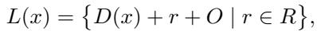

where D(x) is the base coordinate tuple obtained from the sharded iters, r ranges over all combinations of the replication iters (if R is empty, we interpret this as a single zero offset), and O is the constant offset vector. By construction, L(x) can be a singleton or contain multiple coordinates. We provide a detailed formalization in Appendix 2.3.

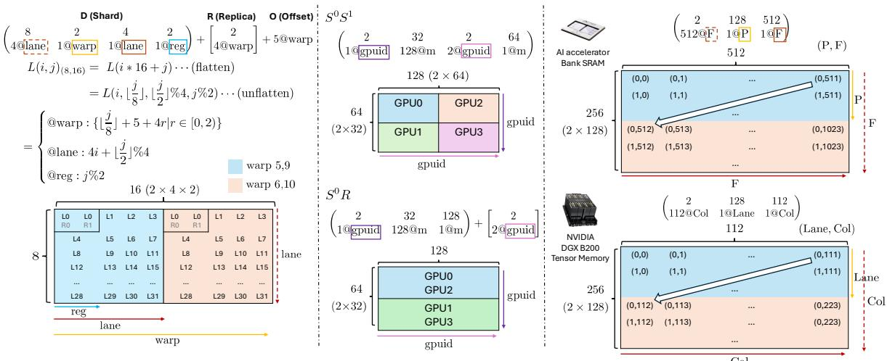  
Figure 2. Examples of Axe layouts across various scenarios. Each column shows the logical tensor shape and the mapped physical axis values. Axes are color-coded. Left. Mapping a logical 8 × 16 tile to 4 GPU warps with 32 lanes and 2 registers each; 2 warps sharded and 2 warps replicated. Middle. Distributed sharding of a 64 × 128 matrix across 4 GPUs; the top uses full sharding across 4 GPUs, the bottom uses a 2 × 2 mesh with shards and replicas. Right. Native hardware memories; the top depicts an AI accelerator 2D-partitioned scratchpad SRAM, the bottom shows NVIDIA Blackwell 2D tensor memory.

2.2 Examples of Axe Layout Across Various Scenarios Figure 2 gives examples of Axe layouts in practice, illustrating mappings in three scenarios: (A) within a GPU warp’s registers, (B) across multiple GPUs in a distributed mesh, and (C) into specialized memory structures. We next walk through these examples to build intuition before diving into the formal definition.

NVIDIA Tensor Core tile. Consider a logical tile L(i, j) of shape (8, 16) that we want to map into a GPU kernel’s thread and register space. Specifically, we distribute this tile across 2 warps (32 threads, or lanes each) such that each lane holds a portion of the tile in its registers, matching the specification of NVIDIA’s tensor-core instructions. We represent this in Axe layout as:

8 2 4 2 Shard (D): 4@lane 1@warp 1@lane 1@reg The shard part denotes that we factor the logical indices into iters of extents 8, 2, 4, and 2, distributed over axes lane, warp, lane, and reg, respectively. The original tile has two dimensions: row and column, with extents 8 and 16, respectively. The row dimension is assigned to the iter with stride 4 and axis lane. The column dimension is split into 3 sub-dimensions (2 × 4 × 2) and assigned to warp, lane, and reg axes, respectively, with stride 1 for all axes.

2 Replica (R): . This indicates that the entire tile 4@warp is replicated twice across the warp axis, with a stride of 4 warps between the two replicas. In effect, we now have warps {0, 1} and {4, 5} each holding an identical copy of the 8 × 16 tile.

Offset (O): 5@warp. This adds an offset of 5 to the warp axis. Thus, we will have warps {5, 6} and {9, 10} hold the 8 × 16 tile.

Distributed sharding on a 2×2 GPU mesh. Now suppose   
we have a 64×128 tensor that we want to distribute across 4   
GPUs arranged in a 2 × 2 mesh (Figure 2B). Label the mesh   
axes as gpuid y (columns) and gpuid x (rows), with the GPU0 GPU2   
device IDs as: . We can express different GPU1 GPU3   
layouts for distributing the tensor:

Fully sharded: Split the 64 rows across mesh rows and split the 128 columns across mesh columns. The Axe layout:

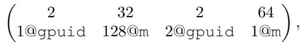

where the first and third factors (2) are on the device axis gpuid and the remaining factors (32 and 128) are on the memory axis m.

Shard with replication: Now split the rows across the two mesh row groups, and replicate each row shard to both GPUs in that group. In Axe, we represent it as:

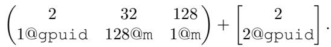

These layouts encode common parallelism strategies. For example, in Alpa (Zheng et al., 2022)’s notation, they represent S<sup>0</sup>S<sup>1</sup> and S<sup>0</sup>R sharding specs, respectively.

Native multidimensional memory in Accelerators. AI accelerators’ on-chip scratchpad buffer uses a multidimensional addressing scheme (dimensions notated as P for memory bank partitions and F for free dimensions). Suppose we have a logical tensor that spans 128 partitions and uses a 2D tiling of dimensions 256 × 512. An Axe layout might be:

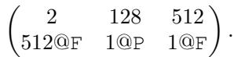

NVIDIA’s Blackwell GPUs introduce a dedicated global tensor memory with native 2D addressing (think of it as a matrix of size Lane × Col). A tensor placed in this memory might have a layout like:

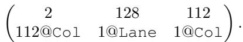

This layout would tile the tensor across the 2D plane so it spans 256 columns in one grouping and 256 in another.

## 2.3 Formalizing Axe Layout

We model an Axe layout as a set-valued map from logical indices to coordinates in an axis space. Let A = {a<sub>0</sub>, . . . , a<sub>n −1</sub>} be the axes (e.g., m, lane, warp, gpuid). Write

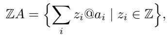

with componentwise addition/scalar multiplication. For X, Y ⊆ <sup>Z</sup>A, the Minkowski sum is X + Y = {x + y | x ∈ X, y ∈ Y }; the Hadamard product is

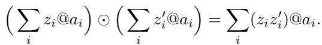

Definition 2.1 (Iter). An iter is I = (e<sub>I</sub> , s<sub>I</sub> , a<sub>I</sub> ) with extent e<sub>I</sub> > 0, stride s<sub>I</sub> ̸= 0, axis a<sub>I</sub> ∈ A, inducing f<sub>I</sub> : [0, e<sub>I</sub> ) → <sup>Z</sup>A, f<sub>I</sub> (x) = (xs<sub>I</sub> )@a<sub>I</sub> .

Definition 2.2 (Layout). An Axe layout L = (D, R, O) has an ordered tuple D = (I<sub>0</sub>, . . . , I<sub>n −1</sub>) of sharded iters (n<sub>D</sub> ≥ 1), a multiset R = (J<sub>0</sub>, . . . , J<sub>n −1</sub>) of replicated iters (n<sub>R</sub> ≥ 0), and an offset O ∈ <sup>Z</sup>A.

Let E<sub>D</sub> = Q e<sub>I</sub> . With the standard lexicographic unflattening ι : [0, E<sub>D</sub>) → Q [0, e<sub>I</sub> ), define

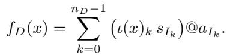

Let E<sub>R</sub> = Q e<sub>J</sub> (take E<sub>R</sub> = 1 if R = <sup>∅</sup>). For r ∈ Q<sub>t</sub>[0, e<sub>Jt</sub>), define f<sub>R</sub>(r) = P<sub>t</sub>(r<sub>t</sub>s<sub>Jt</sub>)@a<sub>Jt</sub>.

To facilitate deriving layout operations in the next section, we also introduce the following definitions:

Definition 2.3 (Induced map). The set-valued map of L is

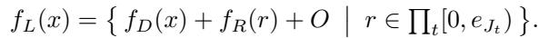

if R = <sup>∅</sup>, f<sub>L</sub>(x) = {f<sub>D</sub>(x)+O}; otherwise |f<sub>L</sub>(x)| = E<sub>R</sub>.

Shape admission. A shape S = (S<sub>0</sub>, . . . , S<sub>r−1</sub>) is admitted by L iff Q S<sub>i</sub> = E<sub>D</sub>. Define the row-major flattener flat<sub>S</sub> : Q [0, S<sub>i</sub>) → [0, E<sub>D</sub>) set:

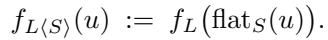

Axis-wise span. Let Vals<sub>L,a</sub> = {z ∈ <sup>Z</sup> | ∃x, ∃y ∈ f<sub>L</sub>(x) : y[a] = z}. Define

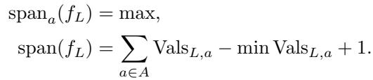

By convention, if Vals<sub>L,a</sub> = <sup>∅</sup>, we set span<sub>a</sub>(f<sub>L</sub>) = 1.

## 3 AXE COMPILER

Axe’s layout abstractions enable a programming model in our compiler that we call multi-granularity, distribution-aware programming. Users compose logical tensors and call semantic operators at the desired granularity (device, thread-block, warp, thread, or multi-device) in the Axe DSL without writing operator implementations. The compiler reads the involved tensor regions and their layouts and selects concrete implementations automatically. Figure 3 shows an overview of this section. We outline this with a motivating example and then detail the core components of the compiler stack.

## 3.1 Motivating Example

This section shows how Axe DSL captures both CuTe and Triton’s programming model. Suppose we want to load region [16:32, 64:128] from a 2D global tensor C with shape (32, 128) and dtype float32 using a thread block CTA containing 128 threads into registers. For thread i ∈ [0, 128), thread i loads a region with shape [1, 8] starting from [16 + ⌊i/8⌋, 64 + i mod 8 · 8]. CuTe and Triton approach this copy plan in two conceptually different ways.

CuTe: thread-local loop transformation and thread binding. CuTe defines algorithm atoms and splits up the work into atoms per thread, whose effective loop transformations are all supported by CuTe layout algebra. In our case, we use a 4-element vectorized load as the copy atom. Then we define the work partition over C as

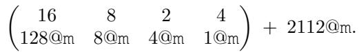

Suppose each thread is identified as tx (threadIdx.x); we bind the first 2 loops to tx//8, tx%8 respectively. Then, for each thread, the loops remain as

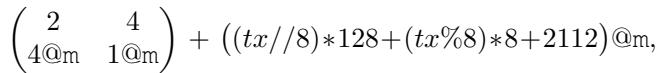

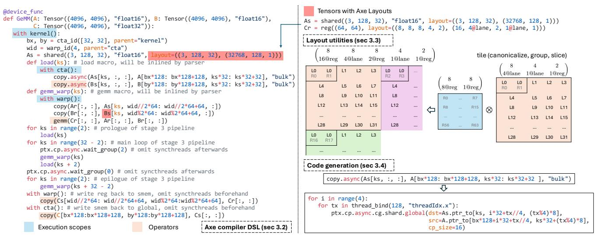

Figure 3. Axe compiler overview. Left: a GEMM kernel written in the Axe compiler DSL. Execution scopes, tensors with Axe layouts, and operators are highlighted. The program uses load and gemm warp macros (expanded when parsing into IR) and a three-stage pipeline with prologue, main, and epilogue. We omit several lines ( syncthreads() and tensor allocations) for brevity. Right, top: tensors carry Axe layouts in shared memory and registers. Right, middle: Use tile to compose a register tile with lane to form a warp view. Right, bottom: the copy.async operator is lowered to a thread-bound loop that issues cp.async.cg.shared.global, with addresses derived from the layouts. Together, these steps show how Axe couples multi-granularity programming with layout-driven code generation.  
```python
for tx in thread_bind(128, "threadIdx.x"):
C_r = alloc_reg((2, 4), "float32")
C_slice = decl_tensor(C.ptr, (2, 4), "float32"
layout=(D=((2, 4), (4, 1)), O=(tx//8)*128+(tx%8)*8+2112)
for i in range(2):
vec_copy_atom(C_r.ptr_to[i, 0], C_slice.ptr_to[i, 0])
```

Figure 4. An example Axe DSL snippet showing thread-level loop transformation and thread binding. In actual CuTe programs, C\_slice is derived by combinations of partition APIs.

Figure 5. An example Axe DSL snippet showing thread-block collective semantics.

where the inner iter corresponds to a single atom, and the outer iter with extent 2 is iterations over the atom (Figure 4).

Triton: CTA collective semantics. Triton doesn’t expose thread-level control but a CTA-wide operator model. Instead of partitioning the source global tensor per thread, it organizes the local registers into a CTA-collective tensor, so that the semantics of the copy are precisely reflected (Figure 5). The copy is represented as

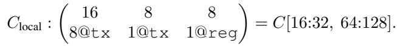

Summary. Axe provides a single mechanism to represent both perspectives in our programming model to achieve the best of both worlds: peak kernel performance with thread-level control, and lowest possible development cost with CTA-wise operator. Even in state-of-the-art kernels crafted with intense engineering effort, many standard subprocedures can be abstracted away by collective operators.

## 3.2 Axe Compiler DSL

As shown in Figure 3, Axe starts from a minimal, native kernel language: structured control flow (for/while/if with break/continue), expressions, and calls to hardware intrinsics. This is sufficient to write a conventional native GPU/AI-accelerator kernel. On this base, we introduce three first-class constructs that make programs multi-granularity and distribution-aware: (i) execution scopes, (ii) the tensor abstraction, (iii) operators with schedules.

Execution scopes. To implement a multi-granularity programming model, a data structure for granularity notation is a must. We introduce explicit constructs to denote groups of threads (or devices) that will execute an operator together. These include scopes like kernel (all threads in a kernel launch), cta (a thread block, a.k.a. cooperative thread array), warpgroup, warp, and thread. In the IR, operators can be written relative to a certain scope, meaning they will be executed by each entity in that scope.

Within a scope, we can further define sub-scopes or thread subsets (Figure 6). For instance, on Hopper and Blackwell architectures, it’s common to dedicate some warps in a CTA to data loading (via asynchronous copy) and others to computation. For example, in a 256-thread CTA (8 warps), warps [0:3] could be producers and [4:7] consumers.

```python
with warp()[0:3]:
... # ops executed by each thread in the warp
with warpgroup()[0:1]:
. # ops executed by the warp group
with thread()[ptx.elect_sync()]:
... # ops executed by the thread selected by ptx.elect_sync()
```  
Figure 6. Axe DSL execution scope slice API.

```python
from Axe import Layout, lane_id, warp_id
layout = Layout(
D=((8, 2, 4, 2), (4@lane_id, 1@warp_id, 1@lane_id, 1)),
R=((2), (4@warp_id)),
O=5@warp_id,
)
```

Figure 7. Axe Layout Python API. If some stride is not paired with an axis, the axis m is used by default.  
```julia
@device_func
def reduce_scatter(
input: Tensor((4, 64, 64), layout=((4, 64, 64), (1@gpuid, 64, 1))),
output: Tensor((64, 64), layout=((4, 16, 64), (1@gpuid, 64, 1))),
):
```  
Figure 8. Example distributed tensor signature for reduce scatter.

Note that since this effectively defines a set of threads, we can use Axe layout to represent scope slices. But keeping it as simple as a predicate or a region for now is satisfactory.

Tensor and Layout. Tensors in our compiler carry shape, layout, scope, pointer, and dtype. To define Axe layouts in Python, we can use the API shown in Figure 7. We compute the address of an tensor element by adding the base pointer to memory components in the layout. This tensor structure lets users write fine-grained thread-level code or collective operators by choosing appropriate Axe layouts.

Representing Distributed Tensor. Because Axe layout naturally supports distributed execution, we can use it to represent the distributed sharding constraints of a distributed tensor (Xu et al., 2021; PyTorch Contributors, 2025). Figure 8 shows an example of how we can use Axe to represent a reduce-scatter kernel that accepts a DTensor with shape (4, 64, 64) that shards over the first dimension, and sums over 0, generating an output DTensor with shape (64, 64) that shards over the first dimension. The compiler will generate runtime checks to ensure the consistency of the input DTensor and the declared Axe layout.

Operators and schedules. We provide high-level operators in the compiler IR for common tasks (copy, pointwise operators, reductions, matrix multiply, etc.), akin to CUB (NVIDIA Corporation, 2025a) or other collective libraries embedded in native kernel languages but generalized. Developers are free to expand the operator library to fit their use cases. A schedule is a concrete implementation of an operator; we use the terms interchangeably below. Each operator can have multiple schedules, which are selected based on the context.

copy.async(As[ks,0,:,:], A[m\_start:m\_start+BLK\_M, k\_start:k\_start+BLK\_K],   
dispatch="tma", "mbar"=bar.ptr\_to[0])  
Figure 9. Axe operator invocation is effectively a library method call, accepting other configuration arguments to guide the compiler’s schedule.

For example, a copy operator can be implemented in various ways: (1) If used at thread scope on register tensors, it might compile down to simple load/store instructions per thread. (2) If used at CTA scope to move data from global memory to shared memory, the compiler might choose a vectorized LDG/STG sequence or a special asynchronous transfer (like cp.async / TMA on NVIDIA GPUs), depending on hardware capabilities. (3) If the source or destination is distributed across devices (e.g., one tensor is sharded across GPUs and another is replicated), a copy might involve an all-gather or broadcast under the hood, implemented by NVSHMEM (NVIDIA Corporation, 2025f) primitives.

One can also designate the dispatched implementation by adjusting configurations when invoking operators (Figure 9). This typically happens when calling asynchronous operators, since they require completion mechanisms (bulk-group, mbarrier) that are non-local decisions.

## 3.3 Layout Operations

Layouts are key to compiler analysis, especially in operator schedule dispatching. Axe layout provides the following utilities to help such an analysis.

Canonicalize. For two structurally different layout triples L<sub>1</sub> = (D<sub>1</sub>, R<sub>1</sub>, O<sub>1</sub>) and L<sub>2</sub> = (D<sub>2</sub>, R<sub>2</sub>, O<sub>2</sub>), we want to verify if they represent the same induced function f.

We define a procedure to simplify a layout without changing its semantics—by handling the D part and the R/O parts separately. We prove the sanity of such a rewrite process, and under certain conditions (which real-world cases lie in), we derive the unique canonical form. Refer to Appendix A for details.

Tile. One key optimization is to utilize SIMD/tensorized instructions. These instructions typically require (some slice of) tensors to have layouts that are effectively tiles of some atom layout designated by the instruction.

Precondition (Group). Tile is an operation of two tensors. To define tile for two layouts, we need to associate each layout with a logical shape, which leads us to grouping.

A shape S = (S<sub>0</sub>, . . . , S<sub>r−1</sub>) groups L (denoted L<sub>||S</sub>) only if the ordered list of iters in D can be split or fused consecutively into r blocks whose extent products equal S<sub>i</sub>. Among many possible candidates, we pick the (unique) one with the fewest iters. A concrete grouping algorithm is shown in Appendix B.

Tile (Kronecker product). The formula below states the property of a tiled layout T ’s induced function. Let A, B be layouts. Suppose there exist shapes S<sub>A</sub>, S<sub>B</sub> of the same rank r such that the groupings A<sub>||S</sub> and B<sub>||S</sub> exist. Define the tiled layout T := A<sub>||S</sub> ⊗B<sub>||S</sub> over the domain S<sub>A</sub>⊗S<sub>B</sub> = Q<sup>r−1</sup><sub>j=0</sub> [0, S<sub>A</sub>[j)) × [0, S<sub>B</sub>[j)) by

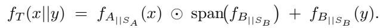

Here B supplies intra-tile offsets; A supplies inter-tile placements scaled by the axis-wise span of B to avoid overlap.

Examples. Suppose A is a layout for a tile of shape (P, Q) in row-major order and B is a layout for an (M, N ) grid of such tiles in row-major order. Then A ⊗ B yields a layout for a (P M ) × (QN ) matrix that is tiled into an M × N grid of P × Q submatrices (also known as a block layout). For instance,

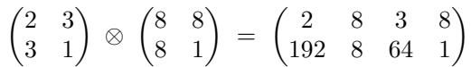

which corresponds to a 16 × 24 matrix stored as an 8 × 8 grid of 2 × 3 tiles (@m omitted for simplicity).

Algorithm. Grouping ensures we can simply interleave and scale iters of A and B to derive A ⊗ B. See Appendix C for details. We can also check whether layout A is a tile of layout B, and infer the layout C such that A = C ⊗ B if it is. See Appendix D for details.

Slice. Operators typically work over a slice/region of some tensor. Given the tensor with layout L, logical shape S, and the focused region R, schedule implementations can be simplified if we can derive a layout L[R : S] whose domain is purely within R’s extents but maintains L’s mapping; i.e., it is the layout of the sliced subtensor.

The formula below states the property of a sliced layout L[R : S]’s induced function. Let L be an Axe layout and let S = (S<sub>0</sub>, . . . , S<sub>r−1</sub>) be a shape admitted by L. Fix an axis-aligned region

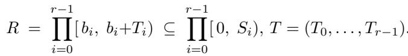

We say that L admits a slice on R (relative to S) if there exists an Axe layout L[R : S] whose admitted shape is T such that the following equality of induced maps holds:

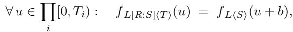

where u + b denotes the component-wise shift (u<sub>0</sub> + b<sub>0</sub>, . . . , u<sub>r−1</sub> + b<sub>r−1</sub>). We call L[R : S] a slice (of L by R w.r.t. S).

2 8 3 8   
Examples. Suppose we have L = (omit 192 8 64 1   
@m for simplicity). For S = (16, 24), R = [0 : 8) × [8 : 24),

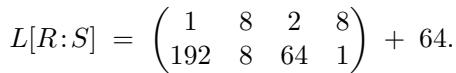

Algorithm. We provide a concrete sufficient condition and a constructive algorithm in Appendix E.

## 3.4 Code Generation

We give several concrete key code-generation examples leveraging Axe layouts, especially operator schedules.

TMA asynchronous copy. Figure 9 shows that an asynchronous copy operator to be dispatched to TMA copy. TMA allows users to specify a multi-dimensional box region in global memory (with CuTensorMap) to copy to a shared-memory region given the starting pointer. The algorithm to implement is conceptually simple: logically partition the shared memory into atoms, iterate over the source and destination atom-copy shapes, and issue a copy instruction for each.

Let G be a global-memory tensor with layout L<sub>G</sub> and logical shape E<sub>G</sub> and S a shared-memory tensor with layout L<sub>S</sub> and logical shape E<sub>S</sub>. We copy a rectangular region R<sub>G</sub> in G to region R<sub>S</sub> in S. We decompose the dispatch in the following key steps:

(1) Slice view: with slicing, we first derive L<sub>G</sub>[R<sub>G</sub> : E<sub>G</sub>] and L<sub>S</sub>[R<sub>S</sub> : E<sub>S</sub>]. For simplicity of notation, we rename them L<sub>G</sub> and L<sub>S</sub>, and the extents of R<sub>G</sub> and R<sub>S</sub> to be E<sub>G</sub> and E<sub>S</sub>.

(2) Determine shared-memory copy atom (with swizzle): A TMA atom given S with shape E<sub>S</sub> and dtype d for swizzle mode a ∈ {32, 64, 128} B is an innermost memory box. An atom’s logical shape E<sub>d,a</sub> has the innermost two dimensions 8 and a/sizeof(d); otherwise they are 1, and |E<sub>d,a</sub>| = |E<sub>S</sub>|. An atom’s intra-box layout L is a hardware swizzle (modeled as a separate innermost SwizzleLayout).

We need there to exist a tiler layout T such that (L<sub>S</sub>)<sub>||E</sub> ≡ T<sub>||E</sub> ⊗ (L<sub>d,a</sub>)<sub>||E</sub> , where E<sub>o</sub> derives from pointwise division of E<sub>S</sub> by E<sub>d,a</sub>. We loop over iters of T to enumerate shared-memory atoms.

(3) Craft CuTensorMap for global memory: We first translate the shared-memory atom shape E<sub>d,a</sub> to its global counterpart E<sup>G</sup><sub>d,a</sub>. After grouping (L<sub>G</sub>)<sub>||E</sub> , we verify for of iter extents in group i (or L<sub>G</sub> can be a direct sum over ful, we can encode the shape–stride using L<sub>G</sub>.

AI accelerator support: Systolic Array GEMM. We provide a concrete example of code generation for an AI accelerator, using Trainium 1 as an example. It contains a core compute unit for matrix multiplication called the Tensor Engine (TensorE). Generating code for the TensorE requires adhering to strict layout constraints imposed by its hardware design (Appendix H). The high-level idea of dispatching a matmul operator is to find the largest possible matmulinstruction shape, and then build a loop nest along the M, N, and K dimensions to cover the logical matmul.

(1) Group. Define the concatenation of two shapes S<sub>1</sub>, S<sub>2</sub> to be (S<sub>1</sub>, S<sub>2</sub>). Find S<sub>M</sub> , S<sub>N</sub> , S<sub>K</sub> such that L<sup>′</sup> := (L<sub>A</sub>)<sub>||(S ,S )</sub> has its iter extents be exactly (S<sub>M</sub> , S<sub>K</sub> ). Similarly, L<sup>′</sup><sub>B</sub> := (L<sub>B</sub>)<sub>||(SN ,SK)</sub> has iter extents exactly (S<sub>N</sub> , S<sub>K</sub> ) and L<sup>′</sup><sub>C</sub> := (L<sub>C</sub> )<sub>||(S ,S )</sub> has iter extents exactly (S<sub>M</sub> , S<sub>N</sub> ).

e<sub>1</sub> (2) K Intersection. Given two iters I<sub>1</sub> = and s<sub>1</sub>@a I<sub>2</sub> = <sup>e2</sup>s @a , define I<sub>1</sub> ∩ I<sub>2</sub> = <sup>e</sup>s@a such that I<sub>1</sub> ∩ I<sub>2</sub> produces the exact same values as the intersection of what I<sub>1</sub> produces and what I<sub>2</sub> produces. Fail when such an iter does not exist.

Given two iter lists L<sup>′</sup> and L<sup>′</sup> , derive a new iter list L<sub>K</sub> by enumerating L<sup>′</sup> [i], L<sup>′</sup> [i]. If they both have axis P, append L<sup>′</sup> [i] ∩ L<sup>′</sup> [i].

(3) MN Intersection. First do M intersection. Given L<sup>′</sup> and L<sup>′</sup> , keep only iters in them where L<sup>′</sup> [i] has axis F and L<sup>′</sup> [i] has axis P. For the rest of the L<sup>′</sup> iters, find an index set I such that L<sup>′</sup> [I] can be canonicalized to a single iter (viewed as an R set) and at the same time it contains the iter = L<sup>′</sup><sub>A</sub>[I] and L<sup>C</sup><sub>M</sub> = L<sup>′</sup><sub>C</sub> [I].

N intersection is almost the same for L<sup>′</sup> and L<sup>′</sup> . The only difference is to pick L<sup>′</sup> [i] with axis F, and the index set I can be selected from either B or C (pick the larger one). We get L<sup>B</sup><sub>N</sub> and L<sup>C</sup><sub>N</sub> .

(4) Finalize. The extents of L<sup>A</sup><sub>M</sub> (L<sup>C</sup><sub>M</sub> ), L<sup>B</sup><sub>N</sub> (L<sup>C</sup><sub>N</sub> ), L<sub>K</sub> are the largest possible M , N , K instruction shapes we can use. By construction, they are subsets of L<sup>′</sup><sub>A</sub>, L<sup>′</sup><sub>B</sub>, and L<sup>′</sup><sub>C</sub> in step (1); the remaining iters are used to generate loops over the instruction.

## 4 EVALUATION

We implement Axe’s layout system and compiler on top of TensorIR (Feng et al., 2023) in Apache TVM (Chen et al., 2018). The same design can also be applied to other machine learning compilers and DSLs. This section asks the following questions:

• Can our approach bring near–best performance on the latest GPU architecture (§4.1)?

• Can our approach improve multi-device execution (§4.2)?

• Can our approach support heterogeneous hardware environments (§4.3)?

## 4.1 Kernel Performance on NVIDIA B200

In this section, we evaluate the performance of the Axe compiler kernel on the latest NVIDIA B200 GPU. We conduct the evaluation on a DGX B200 server with CUDA 13.0 and driver 580.82.07. Each experiment runs 1000 warm-up iterations; we report FLOPs from the average time over 3000 repeat iterations.

FP16 GEMM. We first evaluate FP16 GEMMs and FP8 (e4m3) GEMMs. We use batch size 8192 and real-world weight shapes from Qwen3-8B/32B (Yang et al., 2025), LLaMA-3.1-8B/70B/405B (Grattafiori et al., 2024), Gemma-2-9B/27B (Team et al., 2024), and GPT-3-175B (Brown et al., 2020). We use cuBLAS (NVIDIA Corporation, 2025c) and Triton (Tillet et al., 2019) as our baselines. Figure 10 shows the results. For FP16 GEMM, Axe reaches at least 97% of cuBLAS throughput across all shapes and typically falls between 97% and 100%. Triton reaches mostly around 90% of cuBLAS and dips to about 87% on the hardest shape.

Case study of FP16 GEMM. Since the Hopper family, NVIDIA GPUs have leaned heavily on warp specialization. Warps (or warp-groups) are assigned roles in a pipeline, where each role handles a distinct stage. The exact stage partition is application-dependent. Additionally, thread-block clusters facilitate cooperative execution across streaming multiprocessors (SMs). On Blackwell, for example, two SMs can partition inputs A and B and collaborate on a single GEMM tile. In terms of programming effort, the Axe FP16 GEMM kernel is about 250 lines of Python. We use copy operators and GEMM operators to keep development effort low. We specify warp assignments explicitly: one warp for load, two warps for GEMM, and two warps for write-back, and we also orchestrate their synchronization pipeline explicitly. We also use a size-2 cluster so that two SMs perform one GEMM tile together. The Triton kernel has about 80 lines, but it leaves warp specialization and clustering to the compiler. For FP16 GEMM, the generated plan used two load warps, one GEMM warp, and one write-back warp, with no cluster cooperation, which leads to suboptimal performance. Noticeably, this issue is also brought up in Triton’s community and resulted in a concurrent work, Gluon (Triton Developers, 2025), bringing in explicit controls.

FP8 Blockwise GEMM. We also evaluate FP8 (e8m0) block-wise scaling against the baseline Deep-GEMM (DeepSeek, 2025). Axe delivers between 92% and 96% of DeepGEMM throughput, averaging near 94% across shapes.

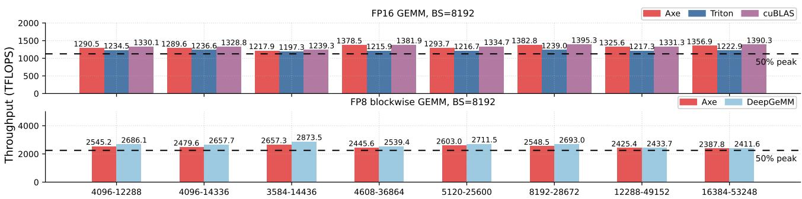

Figure 10. FP16 GEMM and FP8 GEMM throughput (TFLOP/s) at batch size 8192 across different weight shapes. The dashed line marks 50% of device peak (for FP16 and FP8, respectively). Higher is better.  
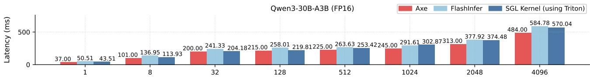  
Figure 11. Qwen3-30B MoE layer latency (ms) evaluated across different numbers of input tokens. Lower is better.

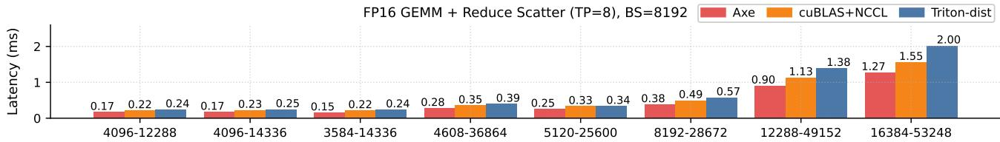  
Figure 12. FP16 GEMM + Reduce-Scatter latency (ms) evaluated across different weight shapes. Lower is better.

Mixture-of-Experts (MoE) Layer. Finally, we evaluated our solution on real-world fused MoE models. We build support for fused FP16 MoE layers with Qwen3-30B-A3B configurations and vary the number of input tokens. We compare to FlashInfer (Ye et al., 2025) and SGLang (Zheng et al., 2024) (Triton internally).

The Axe kernels leverage a finer-grained pipeline between the first and second group GEMM, where some tiles of the second GEMM can start once their dependent tile in the first GEMM is completed. The results are shown in Figure 11. Axe achieves a 1.20× to 1.36× speedup over FlashInfer across batch sizes. Relative to SGLang, Axe reaches 1.18× at batch size 1, 1.12× at 8, about 1.02× at 32 and 128, and 1.12× to 1.23× from 512 to 4096. Axe enables us to orchestrate such a sophisticated pipeline across kernels while reusing high-level operators to implement group GEMMs used in MoE.

## 4.2 Multi-GPU Kernel Performance

This section evaluates Axe’s distributed-awareness ability to generate efficient kernels that overlap communication and computation. We choose GEMM + Reduce-Scatter workloads from the same MLP layers in the previous section. The Axe kernel composes a distributed tensor, invokes the sum operator, and leverages the compiler to dispatch to multimem.ld\_reduce on B200. We pick cuBLAS + NCCL (NVIDIA Corporation, 2025e) (a non-fused baseline) and Triton-distributed (Zheng et al., 2025a) as our baselines and run the evaluation on a DGX B200 server. The results are shown in Figure 12. Axe delivers the lowest latency across the cases, gaining up to 1.40× speedup over the best baseline. The speedup comes from a fine-grained overlap of communication and computation in a single kernel, resulting in better memory bandwidth and Tensor Core utilization. Triton-distributed’s slowdown mainly comes from the slower performance of GEMM on the B200 platform.

## 4.3 Supporting Heterogeneous Hardware Backends

This section evaluates Axe’s ability to target heterogeneous backends. We evaluate FP16 GEMM and Multi-head Attention performance on a trn1.2xlarge AWS instance with Trainium 1 AI accelerator. We compare Axe kernels to vendor-provided reference libraries (handcrafted in Neuron Kernel Interface (NKI) DSL (Amazon Web Services, 2025b)) and the Neuron compiler (Amazon Web Services,

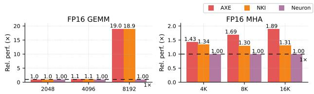  
Figure 13. FP16 GEMM and Multi-head Attention test results. FP16 GEMM is tested on square shapes. MHA is tested with varying input lengths with no causal mask.

2025a), and report the relative performance to the Neuron compiler. The results are shown in Figure 13. Our FP16 GEMM kernel (M = N = K) matches the performance of the handcrafted NKI library in every configuration. On the MHA workload, the Axe kernel achieves up to 1.44× speedup and 1.26× on average over NKI. Axe obtains the speedup by orchestrating the software pipeline schedule and memory allocation plan. The manually optimized NKI implementation takes 120 lines for GEMM and 1188 lines for MHA, while the Axe kernel uses only 78 lines for GEMM and 228 lines for MHA. Axe DSL helps simplify the operator schedue and address calculation, and enables us to generate efficient NKI programs from a higher-level.

## 5 RELATED WORKS

Layout Systems. There are several lines of work formalizing the mapping from data tensors to hardware units (Hagedorn et al., 2023; Ding et al., 2025), most efforts addressing part of the stack. The closest works to ours are CuTe (NVIDIA Corporation, 2025d) and Triton linear layouts (Zhou et al., 2025).

Relation to CuTe. Axe uses the same shape and stride arithmetic as CuTe. CuTe generalizes strides to elements of an integer module and commonly uses unit vectors to target multidimensional TMA coordinates in global memory. Axe introduces explicitly named axes to form a vocabulary of hardware resources. Inside an atom, CuTe maps the pair (t, v) to a logical index for work partitioning and remains single-valued. Axe maps logical indices to physical coordinates and adds R and O for replication and offset, making the forward map set-valued.

Relation to linear layouts. Linear layouts employ bit-linear forms for layout conversion and swizzle compatibility. This design enforces power-of-two shapes in the internal layout, which can have limitations for cases such as Deep-GEMM (DeepSeek, 2025) and distributed settings, where non-power-of-two shapes are required. Appendix G also provides more discussion on this tradeoff.

Both CuTe and linear layouts are designed for intra-GPU layout needs, while Axe is designed to also support distributed settings and heterogeneous backends. Our work is complementary to these existing layout systems and can interoperate with these layouts when needed. Axe takes inspiration from the shape-and-stride mechanism of common array APIs (Harris et al., 2020; Paszke et al., 2019), while providing a simple yet effective generalization of named axes that unlocks support for device memory, distributed, and heterogeneous platforms.

Deep Learning Compilers and DSLs. Halide and TVM separate algorithm and schedule (Ragan-Kelley et al., 2013; Chen et al., 2018; Feng et al., 2023). CuTeDSL exposes atoms that mirror hardware instructions and gives users loop transformations and thread-level partitioning (NVIDIA Corporation, 2025b). Graphene introduces a GPU-centric intermediate representation for optimized tensor computations, targeting intra-GPU kernel optimization (Hagedorn et al., 2023). Triton provides a block-collective programming model and lets the compiler decide per-thread implementations (Tillet et al., 2019). TileLang and Tilus extend this style while keeping tile-level abstractions for specific scenarios (Wang et al., 2025; Ding et al., 2025). Pallas offers a low-level kernel DSL integrated with JAX and TPU backends, and AWS Neuron provides a Trainium stack (The JAX Authors, 2024; Amazon Web Services, 2025b). Our techniques can potentially be incorporated into those efforts to broaden coverage and improve productivity.

Distributed Machine Learning Frameworks. Many systems study sharding and placement over device meshes. Mesh TensorFlow introduced named dimensions for SPMD. JAX GSPMD and shard map unify data and model parallelism with PartitionSpec, while Alpa and FlexFlow search over parallelization choices (Shazeer et al., 2018; Xu et al., 2021; Zheng et al., 2022; Jia et al., 2019). TensorFlow DTensor and PyTorch Distributed Tensor surface sharding and replication in the core frameworks (Abadi et al., 2016; Paszke et al., 2019). TileLink and Triton Distributed bring collectives into kernels so communication can overlap execution at fine granularity (Zheng et al., 2025b;a). Axe can be used to cover distributed tensor formats while adding intra-GPU tiling details that are not captured by current distributed formats.

## 6 CONCLUSION

We presented Axe, a unified layout abstraction that maps logical coordinates to a multi-axis physical space via D (shard), R (replica), and O (offset), providing one vocabulary for placement across intra-GPU, inter-GPU, and AI accelerator needs. On top of Axe, our multi-granularity, distributed-aware model compiles to efficient kernels with reusable, layout-driven operators. Axe delivers competitive operator performance and practical wins for various backends, offering a solid foundation for unifying layout semantics across a heterogeneous software–hardware stack.

## REFERENCES

Abadi, M., Barham, P., Chen, J., Chen, Z., Davis, A., Dean, J., Devin, M., Ghemawat, S., Irving, G., Isard, M., Kudlur, M., Levenberg, J., Monga, R., Moore, S., Murray, D. G., Steiner, B., Tucker, P., Vasudevan, V., Warden, P., Wicke, M., Yu, Y., and Zheng, X. TensorFlow: A system for Large-Scale machine learning. In 12th USENIX Symposium on Operating Systems Design and Implementation (OSDI 16), pp. 265–283, Savannah, GA, November 2016. USENIX Association. ISBN 978-1- 931971-33-1. URL https://www.usenix.org/ conference/osdi16/technical-sessions/ presentation/abadi.

Amazon Web Services. About the aws neuron sdk. AWS Neuron Documentation, 2025a. URL https: //awsdocs-neuron.readthedocs-hosted. com/en/latest/about-neuron/index.html. Accessed Oct 29, 2025.

Amazon Web Services. NKI API Reference Manual. AWS Neuron Documentation, 2025b. URL https: //awsdocs-neuron.readthedocs-hosted. com/en/latest/nki/api/index.html. Accessed Oct 28, 2025.

Bradbury, J., Frostig, R., Hawkins, P., Johnson, M. J., Leary, C., Maclaurin, D., Necula, G., Paszke, A., VanderPlas, J., Wanderman-Milne, S., and Zhang, Q. JAX: composable transformations of Python+NumPy programs, 2018. URL http://github.com/jax-ml/jax.

Brown, T., Mann, B., Ryder, N., Subbiah, M., Kaplan, J. D., Dhariwal, P., Neelakantan, A., Shyam, P., Sastry, G., Askell, A., et al. Language models are few-shot learners. Advances in neural information processing systems, 33: 1877–1901, 2020.

Bshara, N. Aws trainium: The journey for designing and optimization full stack ml hardware. In Proceedings of the 29th ACM International Conference on Architectural Support for Programming Languages and Operating Systems, Volume 3, ASPLOS ’24, pp. 4, New York, NY, USA, 2024. Association for Computing Machinery. ISBN 9798400703867. doi: 10.1145/ 3620666.3655592. URL https://doi.org/10. 1145/3620666.3655592.

Chen, T., Moreau, T., Jiang, Z., Zheng, L., Yan, E., Shen, H., Cowan, M., Wang, L., Hu, Y., Ceze, L., et al. {TVM}: An automated {End-to-End} optimizing compiler for deep learning. In 13th USENIX Symposium on Operating Systems Design and Implementation (OSDI 18), pp. 578–594, 2018.

DeepSeek. DeepGEMM. GitHub repository, 2025. URL https://github.com/deepseek-ai/ DeepGEMM. Version v2.1.1.post3 (released Oct 15, 2025). Accessed Oct 28, 2025.

DeepSeek-AI, Guo, D., Yang, D., Zhang, H., Song, J., Zhang, R., Xu, R., Zhu, Q., Ma, S., Wang, P., Bi, X., Zhang, X., Yu, X., Wu, Y., Wu, Z. F., Gou, Z., Shao, Z., Li, Z., Gao, Z., Liu, A., Xue, B., Wang, B., Wu, B., Feng, B., Lu, C., Zhao, C., Deng, C., Zhang, C., Ruan, C., Dai, D., Chen, D., Ji, D., Li, E., Lin, F., Dai, F., Luo, F., Hao, G., Chen, G., Li, G., Zhang, H., Bao, H., Xu, H., Wang, H., Ding, H., Xin, H., Gao, H., Qu, H., Li, H., Guo, J., Li, J., Wang, J., Chen, J., Yuan, J., Qiu, J., Li, J., Cai, J. L., Ni, J., Liang, J., Chen, J., Dong, K., Hu, K., Gao, K., Guan, K., Huang, K., Yu, K., Wang, L., Zhang, L., Zhao, L., Wang, L., Zhang, L., Xu, L., Xia, L., Zhang, M., Zhang, M., Tang, M., Li, M., Wang, M., Li, M., Tian, N., Huang, P., Zhang, P., Wang, Q., Chen, Q., Du, Q., Ge, R., Zhang, R., Pan, R., Wang, R., Chen, R. J., Jin, R. L., Chen, R., Lu, S., Zhou, S., Chen, S., Ye, S., Wang, S., Yu, S., Zhou, S., Pan, S., Li, S. S., Zhou, S., Wu, S., Ye, S., Yun, T., Pei, T., Sun, T., Wang, T., Zeng, W., Zhao, W., Liu, W., Liang, W., Gao, W., Yu, W., Zhang, W., Xiao, W. L., An, W., Liu, X., Wang, X., Chen, X., Nie, X., Cheng, X., Liu, X., Xie, X., Liu, X., Yang, X., Li, X., Su, X., Lin, X., Li, X. Q., Jin, X., Shen, X., Chen, X., Sun, X., Wang, X., Song, X., Zhou, X., Wang, X., Shan, X., Li, Y. K., Wang, Y. Q., Wei, Y. X., Zhang, Y., Xu, Y., Li, Y., Zhao, Y., Sun, Y., Wang, Y., Yu, Y., Zhang, Y., Shi, Y., Xiong, Y., He, Y., Piao, Y., Wang, Y., Tan, Y., Ma, Y., Liu, Y., Guo, Y., Ou, Y., Wang, Y., Gong, Y., Zou, Y., He, Y., Xiong, Y., Luo, Y., You, Y., Liu, Y., Zhou, Y., Zhu, Y. X., Xu, Y., Huang, Y., Li, Y., Zheng, Y., Zhu, Y., Ma, Y., Tang, Y., Zha, Y., Yan, Y., Ren, Z. Z., Ren, Z., Sha, Z., Fu, Z., Xu, Z., Xie, Z., Zhang, Z., Hao, Z., Ma, Z., Yan, Z., Wu, Z., Gu, Z., Zhu, Z., Liu, Z., Li, Z., Xie, Z., Song, Z., Pan, Z., Huang, Z., Xu, Z., Zhang, Z., and Zhang, Z. Deepseek-r1: Incentivizing reasoning capability in llms via reinforcement learning, 2025. URL https://arxiv.org/abs/2501.12948.

Ding, Y., Hou, B., Zhang, X., Lin, A., Chen, T., Hao, C. Y., Wang, Y., and Pekhimenko, G. Tilus: A virtual machine for arbitrary low-precision gpgpu computation in llm serving. arXiv preprint arXiv:2504.12984, 2025.

Feng, S., Hou, B., Jin, H., Lin, W., Shao, J., Lai, R., Ye, Z., Zheng, L., Yu, C. H., Yu, Y., et al. Tensorir: An abstraction for automatic tensorized program optimization. In Proceedings of the 28th ACM International Conference on Architectural Support for Programming Languages and Operating Systems, Volume 2, pp. 804–817, 2023.

Grattafiori, A., Dubey, A., Jauhri, A., Pandey, A., Kadian, A., Al-Dahle, A., Letman, A., Mathur, A., Schelten, A.,

Vaughan, A., et al. The llama 3 herd of models. arXiv preprint arXiv:2407.21783, 2024.

Hagedorn, B., Fan, B., Chen, H., Cecka, C., Garland, M., and Grover, V. Graphene: An ir for optimized tensor computations on gpus. In Proceedings of the 28th ACM International Conference on Architectural Support for Programming Languages and Operating Systems, Volume 3, ASPLOS 2023, pp. 302–313, New York, NY, USA, 2023. Association for Computing Machinery. ISBN 9781450399180. doi: 10.1145/ 3582016.3582018. URL https://doi.org/10. 1145/3582016.3582018.

Harris, C. R., Millman, K. J., Van Der Walt, S. J., Gommers, R., Virtanen, P., Cournapeau, D., Wieser, E., Taylor, J., Berg, S., Smith, N. J., et al. Array programming with numpy. nature, 585(7825):357–362, 2020.

Jia, Z., Zaharia, M., and Aiken, A. Beyond data and model parallelism for deep neural networks. Proceedings of Machine Learning and Systems, 1:1–13, 2019.

Jouppi, N. P., Young, C., Patil, N., Patterson, D., Agrawal, G., Bajwa, R., Bates, S., Bhatia, S., Boden, N., Borchers, A., et al. In-datacenter performance analysis of a tensor processing unit. In Proceedings of the 44th annual international symposium on computer architecture, pp. 1–12, 2017.

Kwon, W., Li, Z., Zhuang, S., Sheng, Y., Zheng, L., Yu, C. H., Gonzalez, J., Zhang, H., and Stoica, I. Efficient memory management for large language model serving with pagedattention. In Proceedings of the 29th symposium on operating systems principles, pp. 611–626, 2023.

Modular Inc. Quickstart. MAX — Modular Documentation, 2025. URL https://docs.modular.com/max/ get-started. Accessed Oct 28, 2025. Stable v25.6 released Sep 22, 2025.

Nickolls, J. and Dally, W. J. The gpu computing era. IEEE Micro, 30(2):56–69, 2010. doi: 10.1109/MM.2010.41.

NVIDIA Corporation. Cub. CUDA Core Compute Libraries (CCCL) Documentation, 2025a. URL https: //nvidia.github.io/cccl/cub/. Accessed Oct 28, 2025.

NVIDIA Corporation. Cute dsl: Introduction. NVIDIA CUTLASS Documentation, 2025b. URL https://docs.nvidia.com/cutlass/ media/docs/pythonDSL/cute\_dsl\_ general/dsl\_introduction.html. Last updated Sep 24, 2025. Accessed Oct 28, 2025.

NVIDIA Corporation. cublas. CUDA Toolkit Documentation, 2025c. URL https://docs.nvidia.com/ cuda/cublas/index.html. v13.0. Last updated Oct 02, 2025. Accessed Oct 28, 2025.

NVIDIA Corporation. Getting started with cute. NVIDIA CUTLASS Documentation, 2025d. URL https: //docs.nvidia.com/cutlass/media/docs/ cpp/cute/00\_quickstart.html. Last updated Sep 24, 2025. Accessed Oct 28, 2025.

NVIDIA Corporation. Overview of nccl. NCCL 2.28.6 Documentation, 2025e. URL https: //docs.nvidia.com/deeplearning/nccl/ user-guide/docs/overview.html. Accessed Oct 28, 2025.

NVIDIA Corporation. NVSHMEM. NVIDIA Developer, 2025f. URL https://developer.nvidia.com/ nvshmem. Accessed Oct 28, 2025.

OpenAI, Achiam, J., Adler, S., Agarwal, S., Ahmad, L., Akkaya, I., Aleman, F. L., Almeida, D., Altenschmidt, J., Altman, S., Anadkat, S., Avila, R., Babuschkin, I., Bal aji, S., Balcom, V., Baltescu, P., Bao, H., Bavarian, M., Belgum, J., Bello, I., Berdine, J., Bernadett-Shapiro, G., Berner, C., Bogdonoff, L., Boiko, O., Boyd, M., Brakman, A.-L., Brockman, G., Brooks, T., Brundage, M., Button, K., Cai, T., Campbell, R., Cann, A., Carey, B., Carlson, C., Carmichael, R., Chan, B., Chang, C., Chantzis, F., Chen, D., Chen, S., Chen, R., Chen, J., Chen, M., Chess, B., Cho, C., Chu, C., Chung, H. W., Cummings, D., Currier, J., Dai, Y., Decareaux, C., Degry, T., Deutsch, N., Deville, D., Dhar, A., Dohan, D., Dowling, S., Dunning, S., Ecoffet, A., Eleti, A., Eloundou, T., Farhi, D., Fedus, L., Felix, N., Fishman, S. P., Forte, J., Fulford, I., Gao, L., Georges, E., Gibson, C., Goel, V., Gogineni, T., Goh, G., Gontijo-Lopes, R., Gordon, J., Grafstein, M., Gray, S., Greene, R., Gross, J., Gu, S. S., Guo, Y., Hallacy, C., Han, J., Harris, J., He, Y., Heaton, M., Heidecke, J., Hesse, C., Hickey, A., Hickey, W., Hoeschele, P., Houghton, B., Hsu, K., Hu, S., Hu, X., Huizinga, J., Jain, S., Jain, S., Jang, J., Jiang, A., Jiang, R., Jin, H., Jin, D., Jomoto, S., Jonn, B., Jun, H., Kaftan, T., Łukasz Kaiser, Kamali, A., Kanitscheider, I., Keskar, N. S., Khan, T., Kilpatrick, L., Kim, J. W., Kim, C., Kim, Y., Kirchner, J. H., Kiros, J., Knight, M., Kokotajlo, D., Łukasz Kondraciuk, Kondrich, A., Konstantinidis, A., Kosic, K., Krueger, G., Kuo, V., Lampe, M., Lan, I., Lee, T., Leike, J., Leung, J., Levy, D., Li, C. M., Lim, R., Lin, M., Lin, S., Litwin, M., Lopez, T., Lowe, R., Lue, P., Makanju, A., Malfacini, K., Manning, S., Markov, T., Markovski, Y., Martin, B., Mayer, K., Mayne, A., McGrew, B., McKinney, S. M., McLeavey, C., McMillan, P., McNeil, J., Medina, D., Mehta, A., Menick, J., Metz, L., Mishchenko, A., Mishkin, P., Monaco, V., Morikawa, E., Mossing, D., Mu, T., Murati, M., Murk, O.,

Mely, D., Nair, A., Nakano, R., Nayak, R., Neelakantan,´ A., Ngo, R., Noh, H., Ouyang, L., O’Keefe, C., Pachocki, J., Paino, A., Palermo, J., Pantuliano, A., Parascandolo, G., Parish, J., Parparita, E., Passos, A., Pavlov, M., Peng, A., Perelman, A., de Avila Belbute Peres, F., Petrov, M., de Oliveira Pinto, H. P., Michael, Pokorny, Pokrass, M., Pong, V. H., Powell, T., Power, A., Power, B., Proehl, E., Puri, R., Radford, A., Rae, J., Ramesh, A., Raymond, C., Real, F., Rimbach, K., Ross, C., Rotsted, B., Roussez, H., Ryder, N., Saltarelli, M., Sanders, T., Santurkar, S., Sastry, G., Schmidt, H., Schnurr, D., Schulman, J., Selsam, D., Sheppard, K., Sherbakov, T., Shieh, J., Shoker, S., Shyam, P., Sidor, S., Sigler, E., Simens, M., Sitkin, J., Slama, K., Sohl, I., Sokolowsky, B., Song, Y., Staudacher, N., Such, F. P., Summers, N., Sutskever, I., Tang, J., Tezak, N., Thompson, M. B., Tillet, P., Tootoonchian, A., Tseng, E., Tuggle, P., Turley, N., Tworek, J., Uribe, J. F. C., Vallone, A., Vijayvergiya, A., Voss, C., Wainwright, C., Wang, J. J., Wang, A., Wang, B., Ward, J., Wei, J., Weinmann, C., Welihinda, A., Welinder, P., Weng, J., Weng, L., Wiethoff, M., Willner, D., Winter, C., Wolrich, S., Wong, H., Workman, L., Wu, S., Wu, J., Wu, M., Xiao, K., Xu, T., Yoo, S., Yu, K., Yuan, Q., Zaremba, W., Zellers, R., Zhang, C., Zhang, M., Zhao, S., Zheng, T., Zhuang, J., Zhuk, W., and Zoph, B. Gpt-4 technical report, 2024. URL https://arxiv.org/abs/2303.08774.

Paszke, A., Gross, S., Massa, F., Lerer, A., Bradbury, J., Chanan, G., Killeen, T., Lin, Z., Gimelshein, N., Antiga, L., et al. Pytorch: An imperative style, high-performance deep learning library. Advances in neural information processing systems, 32, 2019.

PyTorch Contributors. torch.distributed.tensor: Dtensor class apis. PyTorch 2.9 Documentation, 2025. URL https://docs.pytorch.org/ docs/stable/distributed.tensor.html# dtensor-class-apis. Created Jun 13, 2025; Last updated Aug 23, 2025. Accessed Oct 30, 2025.

Ragan-Kelley, J., Barnes, C., Adams, A., Paris, S., Durand, F., and Amarasinghe, S. Halide: a language and compiler for optimizing parallelism, locality, and recomputation in image processing pipelines. In Proceedings of the 34th ACM SIGPLAN Conference on Programming Language Design and Implementation, PLDI ’13, pp. 519–530, New York, NY, USA, 2013. Association for Computing Machinery. ISBN 9781450320146. doi: 10.1145/2491956.2462176. URL https://doi. org/10.1145/2491956.2462176.

Shazeer, N., Cheng, Y., Parmar, N., Tran, D., Vaswani, A., Koanantakool, P., Hawkins, P., Lee, H., Hong, M., Young, C., et al. Mesh-tensorflow: Deep learning for supercomputers. Advances in neural information processing systems, 31, 2018.

Team, G., Riviere, M., Pathak, S., Sessa, P. G., Hardin, C., Bhupatiraju, S., Hussenot, L., Mesnard, T., Shahriari, B., Rame, A., et al. Gemma 2: Improving open´ language models at a practical size. arXiv preprint arXiv:2408.00118, 2024.

The JAX Authors. Pallas: a jax kernel language. JAX documentation, 2024. URL https://docs.jax.dev/ en/latest/pallas/index.html. Accessed Oct 28, 2025.

Tillet, P., Kung, H.-T., and Cox, D. Triton: an intermediate language and compiler for tiled neural network computations. In Proceedings of the 3rd ACM SIGPLAN International Workshop on Machine Learning and Programming Languages, pp. 10–19, 2019.

Triton Developers. Gluon tutorial: 01-intro.py. GitHub repository, 2025. URL https://github.com/ triton-lang/triton/blob/main/python/ tutorials/gluon/01-intro.py. Accessed Oct 29, 2025. Path: python/tutorials/gluon/01-intro.py.

Wang, L., Cheng, Y., Shi, Y., Tang, Z., Mo, Z., Xie, W., Ma, L., Xia, Y., Xue, J., Yang, F., et al. Tilelang: A composable tiled programming model for ai systems. arXiv preprint arXiv:2504.17577, 2025.

Xu, Y., Lee, H., Chen, D., Hechtman, B., Huang, Y., Joshi, R., Krikun, M., Lepikhin, D., Ly, A., Maggioni, M., et al. Gspmd: general and scalable parallelization for ml computation graphs. arXiv preprint arXiv:2105.04663, 2021.

Yang, A., Li, A., Yang, B., Zhang, B., Hui, B., Zheng, B., Yu, B., Gao, C., Huang, C., Lv, C., et al. Qwen3 technical report. arXiv preprint arXiv:2505.09388, 2025.

Ye, Z., Chen, L., Lai, R., Lin, W., Zhang, Y., Wang, S., Chen, T., Kasikci, B., Grover, V., Krishnamurthy, A., et al. Flashinfer: Efficient and customizable attention engine for llm inference serving. arXiv preprint arXiv:2501.01005, 2025.

Zheng, L., Li, Z., Zhang, H., Zhuang, Y., Chen, Z., Huang, Y., Wang, Y., Xu, Y., Zhuo, D., Xing, E. P., Gonzalez, J. E., and Stoica, I. Alpa: Automating inter- and Intra-Operator parallelism for distributed deep learning. In 16th USENIX Symposium on Operating Systems Design and Implementation (OSDI 22), pp. 559–578, Carlsbad, CA, July 2022. USENIX Association. ISBN 978-1-939133-28-1. URL https://www.usenix.org/conference/ osdi22/presentation/zheng-lianmin.

Zheng, L., Yin, L., Xie, Z., Sun, C. L., Huang, J., Yu, C. H., Cao, S., Kozyrakis, C., Stoica, I., Gonzalez, J. E., et al. Sglang: Efficient execution of structured language model

programs. Advances in neural information processing systems, 37:62557–62583, 2024.

Zheng, S., Bao, W., Hou, Q., Zheng, X., Fang, J., Huang, C., Li, T., Duanmu, H., Chen, R., Xu, R., Guo, Y., Zheng, N., Jiang, Z., Di, X., Wang, D., Ye, J., Lin, H., Chang, L.-W., Lu, L., Liang, Y., Zhai, J., and Liu, X. Tritondistributed: Programming overlapping kernels on distributed ai systems with the triton compiler, 2025a. URL https://arxiv.org/abs/2504.19442.

Zheng, S., Fang, J., Zheng, X., Hou, Q., Bao, W., Zheng, N., Jiang, Z., Wang, D., Ye, J., Lin, H., et al. Tilelink: Generating efficient compute-communication overlapping kernels using tile-centric primitives. arXiv preprint arXiv:2503.20313, 2025b.

Zhou, K., Lezcano, M., Goucher, A., Rakhmati, A., Niu, J., Lebar, J., Szczerbuk, P., Bell, P., Tillet, P., Raoux, T., and Moudallal, Z. Linear layouts: Robust code generation of efficient tensor computation using <sup>F</sup><sub>2</sub>, 2025. URL https://arxiv.org/abs/2505.23819.

## A CANONICALIZATION

## A.1 Canonicalization procedure

following rewrite rules repeatedly until none applies:

D0 (remove unit extent): If any iter has e<sup>D</sup><sub>i</sub> = 1 (extent 1), delete it. (Such an iter contributes nothing to f<sub>D</sub>.)

D1 (merge adjacent iters on same axis): If two consecutive iters target the same axis and the stride of the earlier D and s D = e<sub>i+1</sub> D · s<sup>D</sup> ), then merge them into a single iter: replace

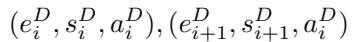

with

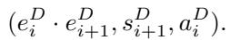

This effectively concatenates the two factors along the same axis.

These rules yield a unique normalized D (in which no redundant 1-extent iters or mergeable pairs remain). We denote the normalized sharded tuple as D<sup>canon</sup>.

For the offset and replication part (O, R), consider each axis independently and apply:

= 1 (no effect on replication).

C1 (normalize sign): If an iter has a negative stride R < 0, replace it by an equivalent positive stride. Specifically, let s = and e = e <sup>R</sup><sub>j</sub> ; update s<sup>R</sup><sub>j</sub> ← −s and update R.

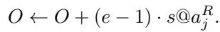

(This is because iterating r from 0 to e − 1 with a stride of −s is the same as iterating with stride s but starting at an offset (e − 1) · (−s) on that axis.)

C2 (absorb multiples): If there exist two replication iters on the same axis a with strides i and <sup>R</sup><sub>j</sub> such that <sup>R</sup> is (say s<sup>R</sup><sub>j</sub> = qs<sup>R</sup><sub>i</sub> R for some 1 ≤ q < e<sup>R</sup>), then absorb the latter into the former. That is, replace the two iters by a single iter

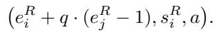

This effectively merges the replication patterns on that axis into one iter with a larger extent.

Apply these rules until none applies on any axis. The result is a canonical (O<sup>canon</sup>, R<sup>canon</sup>). We further say that the replication list R<sup>canon</sup> is saturated if no further R-absorbing merge is possible (i.e., we have applied C2 to a fixpoint). We also impose a mild gap condition (GC): if we list the distinct stride values in R<sup>canon</sup> for a given axis in increasing order σ<sub>1</sub> < σ<sub>2</sub> < · · · < σ<sub>m</sub> (with corresponding extents E<sub>1</sub>, E<sub>2</sub>, . . . , E<sub>m</sub>), then we require

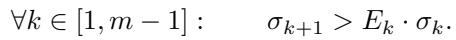

In essence, GC says that the replication points along an axis do not “fill” the space so densely as to create ambiguous aliasing with a smaller stride. In well-behaved layouts this is always true; GC mainly rules out pathological cases where the same physical coordinate could be reachable via different (r<sub>0</sub>, . . . , r<sub>nR−1</sub>) settings.

It can be shown that these rewrite systems are confluent and terminating, and yield a unique canonical form:

Proposition A.1. The D-rewrite rules (D0, D1) always terminate and produce a unique D<sup>canon</sup> for a given D. Likewise, the (O, R) rules (C0, C1, C2) terminate and produce a unique (O<sup>canon</sup>, R<sup>canon</sup>) for a given (O, R). Moreover, these transformations preserve the semantics: f<sub>D</sub> and f<sub>L</sub> remain unchanged.

Theorem A.2 (Canonical form uniqueness under GC). If two layouts L = (D, R, O) and L<sup>′</sup> = (D<sup>′</sup>, R<sup>′</sup>, O<sup>′</sup>) induce the same mapping (f<sub>L</sub> ≡ f<sub>L</sub>′ ), and we transform both into their canonical forms satisfying the gap condition, then we will find D<sup>canon</sup> = D<sup>′canon</sup>, R<sup>canon</sup> = R<sup>′canon</sup>, and O<sup>canon</sup> = O<sup>′canon</sup>. In other words, under GC the canonical representation of a layout is unique.

The above canonicalization is valuable for the compiler: it provides a normal form to test equivalence of layouts and to perform algebraic manipulations without worrying about superficial differences (like an extra unit stride or a different choice of indexing origin in replication).

## A.2 Canonicality of Layouts: Full Statements and Proofs

Throughout, we use the notation from the main text. In particular, D = (e<sub>i</sub>, s<sub>i</sub>, a<sub>i</sub>)<sup>n−1</sup><sub>i=0</sub> is an ordered list of iters,

## A.2.1 Uniqueness of a normalized D from f<sub>D</sub>

We call D normalized (i.e., D<sup>canon</sup>) if: (i) no e<sub>i</sub> = 1, (ii) no s<sub>i</sub> = 0, and (iii) no adjacent equal–axis pair (a<sub>i</sub> = a<sub>i+1</sub>) satisfies s<sub>i</sub> = e<sub>i+1</sub>s<sub>i+1</sub>.

total size E := E<sub>D</sub>. For x ∈ [0, E) ∩ <sup>Z</sup>, define digits

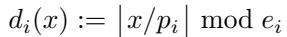

so that f<sub>D</sub>(x) = P<sup>n−1</sup><sub>i=0</sub> d<sub>i</sub>(x)s<sub>i</sub>@a<sub>i</sub>. Also set ϕ<sub>i</sub>(x) := ⌊x/p<sub>i</sub>⌋ and ϕ<sub>−1</sub> ≡ 0.

Lemma A.3 (Exact digit identity). For all i and x, d<sub>i</sub>(x) = ϕ<sub>i</sub>(x) − e<sub>i</sub> ϕ<sub>i−1</sub>(x).

Proof. Since p<sub>i−1</sub> = e<sub>i</sub>p<sub>i</sub>, we have ⌊x/p<sub>i</sub>⌋ = e<sub>i</sub>⌊x/p<sub>i−1</sub>⌋+ (⌊x/p<sub>i</sub>⌋ mod e<sub>i</sub>) = e<sub>i</sub>ϕ<sub>i−1</sub>(x) + d<sub>i</sub>(x). Rearranging gives the claim. □

For each axis a, let v<sub>a</sub>(x) be the a–component of f<sub>D</sub>(x). Lemma A.4 (Axis–wise coefficient expansion). For each axis a,

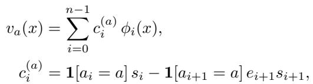

with the convention 1[a<sub>n</sub> = a]e<sub>n</sub>s<sub>n</sub> := 0.

Proof. By Lemma A.3, d<sub>i</sub> = ϕ<sub>i</sub> − e<sub>i</sub>ϕ<sub>i−1</sub>. Then

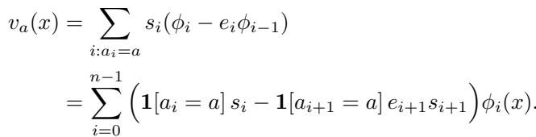

Lemma A.5 (First–difference periodicity). Let ∆v<sub>a</sub>(x) := v<sub>a</sub>(x + 1) − v<sub>a</sub>(x). Then

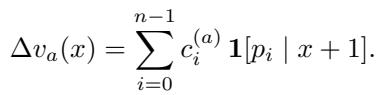

Proof. ∆ϕ<sub>i</sub>(x) = 1 iff p<sub>i</sub> | x+1, else 0. Apply Lemma A.4. □

For m | E, set G<sub>a</sub>(m) := ∆v<sub>a</sub>(m − 1) and C<sub>a</sub>(d) :=

Lemma A.6 (Mobius isolation on divisors)¨ . For all m | E,

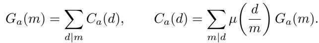

Moreover, C<sub>a</sub>(d) = c<sup>(a)</sup><sub>i</sub> if d = p<sub>i</sub>, and C<sub>a</sub>(d) = 0 otherwise.

Proof. By Lemma A.5, G<sub>a</sub>(m) = P<sub>i: pi|m</sub> P<sub>d|m</sub> C<sub>a</sub>(d). Invert via classical Mobius inversion on the ¨ divisor poset. For the last claim,

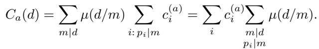

Write m = p<sub>i</sub>u with u | d/p<sub>i</sub>. Then P<sub>u|d/p</sub> µ(d/(p<sub>i</sub>u)) = 1 iff d = p<sub>i</sub>, else 0. □

Corollary A.7 (Recover levels and extents). Let P := { d | E : ∃a, C<sub>a</sub>(d) ̸= 0 }. Then P = {p<sub>0</sub> > · · · > p<sub>n−1</sub> = 1} (strictly decreasing), and

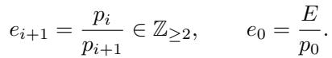

Proof. By Lemma A.6, P = {p<sub>i</sub>}, and by definition p<sub>i</sub> = e<sub>i+1</sub>p<sub>i+1</sub>. □

Theorem A.8 (Uniqueness of normalized D). Let D, D<sup>′</sup> be normalized sharded lists with the same E and f<sub>D</sub> ≡ f<sub>D</sub>′ on [0, E). Then n = n<sup>′</sup> and (e<sub>i</sub>, s<sub>i</sub>, a<sub>i</sub>) = (e<sup>′</sup> , s<sup>′</sup> , a<sup>′</sup> ) for all i.

Proof. Compute G and C (d) from f (Lemma A.6); the same values arise from f<sub>D</sub>′ since f<sub>D</sub> = f<sub>D</sub>′ . Thus both lists share the same decreasing (p<sub>i</sub>) and, by Cor. A.7, the same extents. For each i, set C(p<sub>i</sub>) := (C<sub>a</sub>(p<sub>i</sub>))<sub>a∈A</sub> = (c<sup>(a)</sup>)<sub>a</sub>; this vector is common to both lists. At i = n − 1, c<sup>(a)</sup><sub>−</sub> = 1[a<sub>n−1</sub> = a] s<sub>n−1</sub>, so C(1) identifies a<sub>n−1</sub> and s<sub>n−1</sub>. Proceeding upward, suppose a<sub>i+1</sub>, s<sub>i+1</sub> are known. If C(p<sub>i</sub>) has a nonzero entry at β ̸= a<sub>i+1</sub>, then necessarily C(p<sub>i</sub>)[a<sub>i+1</sub>] = −e<sub>i+1</sub>s<sub>i+1</sub> and C(p<sub>i</sub>)[β] = s<sub>i</sub>, so a<sub>i</sub> := β. Otherwise C(p<sub>i</sub>) is supported only at a<sub>i+1</sub>; then a<sub>i</sub> = a<sub>i+1</sub> and s<sub>i</sub> = C(p<sub>i</sub>)[a<sub>i+1</sub>] + e<sub>i+1</sub>s<sub>i+1</sub>. Normalization guarantees C(p<sub>i</sub>) ̸= 0 (no merged adjacency and no trivial iter). Hence (a<sub>i</sub>, s<sub>i</sub>) are uniquely reconstructed for both lists and must coincide. □

## A.2.2 Canonical (O+R) under saturation and GC

Fix an axis a and consider the (post C0–C1–C2) per–axis replication list with strictly increasing strides σ<sub>1</sub> < · · · < σ<sub>J</sub> and extents E<sub>i</sub> ≥ 1. Define

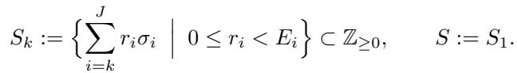

Write L<sub>k</sub> := {0, σ<sub>k</sub>, . . . , (E<sub>k</sub> − 1)σ<sub>k</sub>} and for g > 0 define the g–lower boundary operator LB<sub>g</sub>(X) := {x ∈ X | x − g /∈ X}.

Assume saturation (no residual C2 applies) and GC:

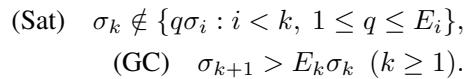

Lemma A.9 (Cumulative separation). For every k ≥ 2, P<sup>k−1</sup><sub>i=1</sub> (E<sub>i</sub> − 1)σ<sub>i</sub> < σ<sub>k</sub>.

Proof. For k = 2, (E<sub>1</sub> − 1)σ<sub>1</sub> < E<sub>1</sub>σ<sub>1</sub> < σ<sub>2</sub> by (GC). Induct: P<sub>i≤k</sub>(E<sub>i</sub> − 1)σ<sub>i</sub> < σ<sub>k</sub> + (E<sub>k</sub> − 1)σ<sub>k</sub> = E<sub>k</sub>σ<sub>k</sub> < σ<sub>k+1</sub>. □

Lemma A.10 (Uniqueness of digits). If P<sup>J</sup> r<sub>i</sub>σ<sub>i</sub> = P<sup>J</sup> r<sup>′</sup><sub>i</sub>σ<sub>i</sub> with 0 ≤ r<sub>i</sub>, r<sup>′</sup><sub>i</sub> < E<sub>i</sub>, then r<sub>i</sub> = r<sup>′</sup><sub>i</sub> for all i.

Proof. Let k be the largest index with r<sub>k</sub> ̸= r<sup>′</sup> . Then 0 = (r<sub>k</sub> − r<sup>′</sup> )σ<sub>k</sub> + P (r<sub>i</sub> − r<sup>′</sup><sub>i</sub>)σ<sub>i</sub>. The tail has absolute value ≤ P<sub>i<k</sub>(E<sub>i</sub> − 1)σ<sub>i</sub> < σ<sub>k</sub> by Lemma A.9, forcing r<sub>k</sub> = r<sup>′</sup><sub>k</sub>. □

Lemma A.11 (Window decomposition and boundaries). For every k:

(i) S<sub>k</sub> ∩ [0, σ<sub>k+1</sub>) = L<sub>k</sub> (with the convention σ<sub>J+1</sub> := +∞).

(ii) S<sub>k</sub> = F<sub>B∈S</sub> B + L<sub>k</sub> (disjoint union).

(iii) LB<sub>σk</sub> (S<sub>k</sub>) = S<sub>k+1</sub>.

Proof. (i) If x < σ<sub>k+1</sub> and x = P<sub>i≥k</sub> r<sub>i</sub>σ<sub>i</sub>, then r<sub>i</sub> = 0 for i > k (else the sum of deeper strides ≥ σ<sub>k+1</sub> by (GC)), hence x = r<sub>k</sub>σ<sub>k</sub> ∈ L<sub>k</sub>.

(ii) Any x ∈ S<sub>k</sub> can be written x = B + r<sub>k</sub>σ<sub>k</sub> with B := P r<sub>i</sub>σ<sub>i</sub> ∈ S<sub>k+1</sub> and r<sub>k</sub> ∈ [0, E<sub>k</sub> − 1], so x ∈ B + L<sub>k</sub>. Disjointness: if B + rσ<sub>k</sub> = B<sup>′</sup> + r<sup>′</sup>σ<sub>k</sub> with B ̸= B<sup>′</sup>, then |B − B<sup>′</sup>| = |r<sup>′</sup> − r|σ<sub>k</sub> ≤ (E<sub>k</sub> − 1)σ<sub>k</sub> < σ<sub>k+1</sub> by (GC), but any nonzero difference of elements of S<sub>k+1</sub> is ≥ σ<sub>k+1</sub>. Contradiction. Thus B = B<sup>′</sup> and r = r<sup>′</sup>; the latter by Lemma A.10.

(iii) (⊆) Let B ∈ S<sub>k+1</sub>. Then B ∈ S<sub>k</sub> (choose r<sub>k</sub> = 0). If B − σ<sub>k</sub> ∈ S<sub>k</sub>, then there exist digits with (B − σ<sub>k</sub>) = r<sub>k</sub>σ<sub>k</sub> + P<sub>i>k</sub> r<sub>i</sub>σ<sub>i</sub>. Moving σ<sub>k</sub> to the right gives

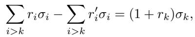

for some representation B = P<sub>i>k</sub> r<sup>′</sup><sub>i</sub>σ<sub>i</sub>. The LHS is 0 or ≥ σ<sub>k+1</sub>; the RHS ≤ E<sub>k</sub>σ<sub>k</sub>. By (GC) neither case is possible; hence B − σ<sub>k</sub> ∈/ S<sub>k</sub> and B ∈ LB<sub>σ</sub> (S<sub>k</sub>).

(⊇) Let x ∈ LB<sub>σ</sub> (S<sub>k</sub>) with unique digits x = r<sub>k</sub>σ<sub>k</sub> + P<sub>i>k</sub> r<sub>i</sub>σ<sub>i</sub> (Lemma A.10). If r<sub>k</sub> ≥ 1, then x − σ<sub>k</sub> = (r<sub>k</sub> − 1)σ<sub>k</sub> + P r<sub>i</sub>σ<sub>i</sub> ∈ S<sub>k</sub>, contradicting x ∈ LB. Thus r<sub>k</sub> = 0 and x ∈ S<sub>k+1</sub>. □

Theorem A.12 (Set–only recovery under saturation + GC). Let S := S<sub>1</sub> be the replication set of a saturated R satisfying GC. Define recursively

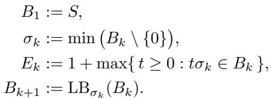

Then B<sub>k</sub> = S<sub>k</sub> for all k, and the pairs (σ<sub>k</sub>, E<sub>k</sub>) coincide with the true strides and extents. Consequently, any representation of S reduces (by C0–C2 and the same saturation) to the same R (per axis, up to permutation).

Proof. By Lemma A.11(i), σ<sub>1</sub> = min(S\{0}) and E<sub>1</sub> is the exact run length along σ<sub>1</sub>; saturation ensures E<sub>1</sub>σ<sub>1</sub> ∈/ S. By Lemma A.11(iii), B<sub>2</sub> = LB<sub>σ</sub> (S) = S<sub>2</sub>. Assume B<sub>k</sub> = S<sub>k</sub>. Lemma A.11(i) yields the true (σ<sub>k</sub>, E<sub>k</sub>); Lemma A.11(iii) gives B<sub>k+1</sub> = S<sub>k+1</sub>. Induct on k. □

Absorbing multiples (C2) is exact. Suppose on one axis we have two replication iters (E<sub>1</sub>, σ) and (E<sub>2</sub>, qσ) with 1 ≤ q ≤ E<sub>1</sub>. Then

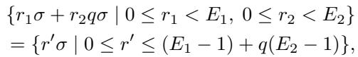

since for each fixed r<sub>2</sub>, the set {r<sub>1</sub> + qr<sub>2</sub> : 0 ≤ r<sub>1</sub> < E<sub>1</sub>} is a contiguous block of length E<sub>1</sub>, and the union over r = 0, . . . , E − 1 produces a contiguous interval from 0 to (E<sub>1</sub> − 1) + q(E<sub>2</sub> − 1). This proves the correctness of C2 and shows its result is independent of the order in which multiples are absorbed along a chain (hence confluence per axis).

## A.2.3 Global canonicality

Lemma A.13 (Fiber minima pin down O). Fix a linear functional θ : <sup>Z</sup>A → <sup>Z</sup> with strictly positive weights on each axis. After sign–normalizing R (all replication strides > 0),

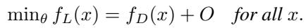

Proof. For any finite S ⊂ <sup>Z</sup>A and any g ∈ <sup>Z</sup>A, min<sub>θ</sub>(g + S) = g + min<sub>θ</sub> S because θ(g + s) = θ(g) + θ(s). Every nonzero r ∈ f<sub>R</sub>(·) has a positive θ–value (all strides > 0), so 0 is the unique θ–minimum in the replication fiber; hence min<sub>θ</sub>(f<sub>D</sub>(x) + O + f<sub>R</sub>(·)) = f<sub>D</sub>(x) + O. □

Theorem A.14 (Global canonicality under saturation + GC). Let L = (D, R, O) with D normalized and R saturated and satisfying GC. If L<sup>′</sup> = (D<sup>′</sup>, R<sup>′</sup>, O<sup>′</sup>) induces the same f<sub>L</sub>′ ≡ f<sub>L</sub>, then after D–normalization of D<sup>′</sup> and saturation of O<sup>′</sup>+R<sup>′</sup>,

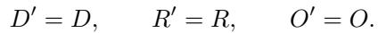

Proof. By Lemma A.13, O = min<sub>θ</sub> f<sub>L</sub>(0) = min<sub>θ</sub> f<sub>L</sub>′ (0) = O<sup>′</sup>. Then f<sub>D</sub>(x) = min<sub>θ</sub> f<sub>L</sub>(x) − O = f<sub>D</sub>′ (x), so Theorem A.8 gives D<sup>′</sup> = D. Finally,

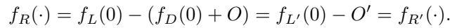

Apply Theorem A.12 per axis to conclude R<sup>′</sup> = R (up to permutation). □

## B GROUPING

This appendix gives a constructive algorithm for grouping a layout by a target shape, together with correctness proofs and complexity bounds.

Algorithm 1 GROUP-BY-SHAPE: canonical gcd-driven   
grouping   
Require: D = [(e<sub>0</sub>, s<sub>0</sub>, a<sub>0</sub>), . . . , (e<sub>n−1</sub>, s<sub>n−1</sub>, a<sub>n−1</sub>)],   
S = [S<sub>0</sub>, . . . , S<sub>r−1</sub>] with Q e<sub>k</sub> = Q S<sub>i</sub>   
Ensure: success/failure; if success, refined D<sup>′</sup> and block   
1: if Q e<sub>k</sub> ̸= Q S<sub>i</sub> then return FAILURE {admission   
check}   
2: j ← 0; D<sup>′</sup> ← [ ]; boundaries ← [ ]   
3: for i = 0 to r − 1 do   
4: T ← S<sub>i</sub> {target product for block i}   
5: cur ← 1 {product accumulated for block i}   
6: while cur < T do   
7: if j ≥ current length of (possibly split) source list   
then   
8: return FAILURE   
9: end if   
10: (e, s, a) ← current iter at position j   
11: rem ← T /cur {integer by invariant}   
12: g ← gcd(e, rem)   
13: if g = 1 then   
14: return FAILURE {cannot advance this block}   
15: end if   
16: e<sub>head</sub> ← g, e<sub>tail</sub> ← e/g   
17: append (e<sub>head</sub>, e<sub>tail</sub> s, a) to D<sup>′</sup> {split; Lem. B.1}   
18: cur ← cur · e<sub>head</sub>   
19: if e > 1 then   
20: replace source iter at j by (e<sub>tail</sub>, s, a)   
21: else   
22: j ← j + 1 {consumed this iter}   
23: end if   
24: end while   
25: record boundary at current end of D<sup>′</sup> as B<sub>i</sub>   
26: end for   
27: return SUCCESS with D<sup>′</sup> and {B<sub>i</sub>}

## B.1 Problem statement and notation

Let L = (D, R, O) be an Axe layout with

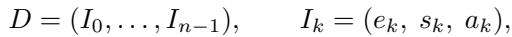

where each extent e<sub>k</sub> ∈ <sup>Z</sup><sub>>0</sub>, stride s<sub>k</sub> ∈ <sup>Z</sup> \ {0}, and axis Let S = (S<sub>0</sub>, . . . , S<sub>r−1</sub>) be a target shape with Q<sup>r−1</sup><sub>i=0</sub> S<sub>i</sub> = E<sub>D</sub>. Recall from §3.3 that L groups by S iff the ordered list of iters in D can be split and fused (preserving order) into r consecutive blocks whose extent products equal S . When the grouping exists we write L<sub>||S</sub> for the grouped view; it induces the same map f<sub>L</sub> but with domain Q [0, S<sub>i</sub>). Replication R and offset O are unaffected by grouping.

Our objectives are: (i) decide if L groups by S; and (ii) if yes, construct a refined iter list D<sup>′</sup> and block boundaries that realize the grouping without changing f<sub>L</sub>.

## B.2 Semantics-preserving split/fuse

Lemma B.1 (Split rule). Let I = (e, s, a) with e = e<sub>1</sub>e<sub>2</sub> and e<sub>1</sub>, e<sub>2</sub> ∈ <sup>Z</sup><sub>>0</sub>. Replacing I by two consecutive iters

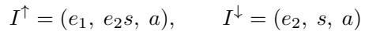

does not change the induced map f<sub>D</sub>.

Proof. A digit d ∈ [0, e) contributes d s@a. Writing d = d<sub>1</sub>e<sub>2</sub> + d<sub>2</sub> with d<sub>1</sub> ∈ [0, e<sub>1</sub>), d<sub>2</sub> ∈ [0, e<sub>2</sub>), the contribution equals (d e + d )s = d (e s) + d s, which matches the sum of contributions from I<sup>↑</sup>, I<sup>↓</sup> with digits (d<sub>1</sub>, d<sub>2</sub>). Unflattening respects this lexicographic refinement, hence f<sub>D</sub> is unchanged. □

Corollary B.2 (Fuse rule). Conversely, any consecutive pair (e<sub>1</sub>, e<sub>2</sub>s, a), (e<sub>2</sub>, s, a) may be fused into (e<sub>1</sub>e<sub>2</sub>, s, a) without changing f<sub>D</sub>.

## B.3 A gcd–driven canonical grouping algorithm

The algorithm 1 refines D by peeling off, left-to-right, the largest factor needed to complete the current shape block; it never reorders iters.

## C TILING

This appendix gives a constructive algorithm for forming the tiled layout

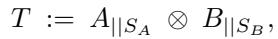

together with correctness proofs. We follow the definition in §??: for layouts A = (D<sup>A</sup>, R<sup>A</sup>, O<sup>A</sup>) and B = (D<sup>B</sup>, R<sup>B</sup>, O<sup>B</sup>), and shapes S<sub>A</sub>, S<sub>B</sub> of equal rank r, the tiled map is

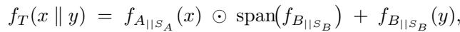

with domain Q<sup>r−1</sup><sub>j=0</sub> [0, S<sub>A</sub>[j)) × [0, S<sub>B</sub>[j)). Here ⊙ is the axis-wise (Hadamard) product and span is taken axis-wise as in §2.3.

## C.1 Problem statement and notation

Write


Let R<sup>A</sup> = (I<sup>A</sup>)<sup>mA−</sup> t t=0 <sup>1</sup> and R<sup>B</sup> = (I<sup>B</sup>)<sup>mB−1</sup> be the replicated iters, with the same (e, s, a)-structure. Assume A = Q S<sub>A</sub>[i] and Q e<sup>B</sup><sub>j</sub> = Q S<sub>B</sub>[i]), and that rank(S<sub>A</sub>) = rank(S<sub>B</sub>) = r.

## C.2 Axis-wise span in closed form

We use the following closed-form for the axis-wise span; it follows immediately from independence of iter digits.

Lemma C.1 (Axis-wise span). For any layout L = (D, R, O), the span length on axis a is


Hence span(f<sub>L</sub>) = P<sub>a∈A</sub> span<sub>a</sub>(f<sub>L</sub>) @a.

## C.3 Construction recipe

Intuitively, tiling multiplies all coordinates produced by A by the per-axis span of B (to avoid overlap) and then adds the coordinates produced by B. This yields a simple (D, R, O) construction.

Preparation: group both inputs. Use the grouping algorithm from Appendix B to obtain block decompositions


where each block B<sup>A</sup> (resp. B<sup>B</sup>) is a consecutive list of iters whose extent product equals S<sub>A</sub>[i] (resp. S<sub>B</sub>[i]).

Compute the scaling vector. Let Σ := spanf<sub>B||S</sub>  ∈ <sup>Z</sup>A. By Lemma C.1,

The resulting D<sup>T</sup> is naturally grouped by the interleaved shape


## C.4 Correctness

Theorem C.2 (Soundness). Let T be produced by Algorithm 2. Then for all (x, y) ∈ Q<sup>r−1</sup><sub>j=0</sub> [0, S<sub>A</sub>[j)) × [0, S<sub>B</sub>[j)) we have


Proof. Fix an axis a. In T , the contribution on axis a decomposes as


where δ<sub>A</sub>, δ<sub>B</sub> are the per-iter digits and ρ<sub>A</sub>, ρ<sub>B</sub> the replication digits. Rearranging gives


Emit the tiled layout T = (D<sup>T</sup> , R<sup>T</sup> , O<sup>T</sup> ). For i = 0, . . . , r − 1 in order, append to D<sup>T</sup> :

1. All iters of B<sup>A</sup><sub>i</sub> , scaled by Σ: replace each (e, s, a) by (e, Σ[a] · s, a).

2. All iters of B<sup>B</sup> as-is.

Set the replication multiset to the Cartesian product of (scaled) R<sup>A</sup> and R<sup>B</sup>:


Set the offset to


which equals f<sub>A||S</sub> (x)[a]Σ[a] + f<sub>B||S</sub> (y)[a]. Collecting over all axes yields the vector identity in the theorem. Finally Σ = span(f<sub>B||S</sub> ) by definition and Lemma C.1.

Proposition C.3 (Grouping of T ). The iter order emitted by Algorithm 2 is grouped by the interleaved shape S<sub>T</sub> = (S<sub>A</sub>[0], S<sub>B</sub> [0], . . . , S<sub>A</sub>[r − 1], S<sub>B</sub> [r − 1]).

Proof. Within each i-th pair of blocks, the product of extents of the scaled B<sup>A</sup><sub>i</sub> equals S<sub>A</sub>[i] (scaling does not change extents), and the product for B<sup>B</sup><sub>i</sub> equals S<sub>B</sub>[i]. Concatenating pairs over i gives the stated grouping. □

Algorithm 2 TILE-LAYOUTS A, S<sub>A</sub>; B, S<sub>B</sub>   
Require: layouts A = (D<sup>A</sup>, R<sup>A</sup>, O<sup>A</sup>), B   
(D<sup>B</sup>, R<sup>B</sup>, O<sup>B</sup>); shapes S<sub>A</sub>, S<sub>B</sub> with rank(S<sub>A</sub>) =   
rank(S<sub>B</sub>) = r, and Q e<sup>A</sup> = Q S<sub>A</sub>, Q e<sup>B</sup> = Q S<sub>B</sub>   
Ensure: tiled layout T = (D<sup>T</sup> , R<sup>T</sup> , O<sup>T</sup> ), grouped by   
S<sub>T</sub> = (S<sub>A</sub>[0], S<sub>B</sub> [0], . . . , S<sub>A</sub>[r − 1], S<sub>B</sub> [r − 1])   
1: (D<sup>A,grp</sup>, {B<sup>A</sup><sub>i</sub> }<sup>r−1</sup><sub>i=0</sub> ) ← GROUP-BY-SHAPE(D<sup>A</sup>, S<sub>A</sub>)   
2: (D<sup>B,grp</sup>, {B<sup>B</sup><sub>i</sub> }<sup>r−1</sup><sub>i=0</sub> ) ← GROUP-BY-SHAPE(D<sup>B</sup>, S<sub>B</sub>)   
3: if either grouping failed then   
4: return FAILURE   
5: end if   
6: Compute Σ[a] ← 1 + P<sub>I∈DB,grp,</sub> <sub>a =a</sub> |s<sub>I</sub> |(e<sub>I</sub> − 1) +   
P<sub>I∈RB,</sub> <sub>a =a</sub> |s<sub>I</sub>|(e<sub>I</sub> − 1) {Lemma C.1}   
7: D<sup>T</sup> ← [ ]   
8: for i = 0 to r − 1 do   
9: for each (e, s, a) ∈ B<sup>A</sup> do   
10: append (e, Σ[a] · s, a) to D<sup>T</sup>   
11: end for   
12: for each (e, s, a) ∈ B<sup>B</sup> in order do   
13: append (e, s, a) to D<sup>T</sup>   
14: end for   
15: end for   
16: R<sup>T</sup> ← {(e, Σ[a] · s, a) : (e, s, a) ∈ R<sup>A</sup>} ∪ R<sup>B</sup>   
17: O<sup>T</sup> ← O<sup>A</sup> ⊙ Σ + O<sup>B</sup>   
18: return T = (D<sup>T</sup> , R<sup>T</sup> , O<sup>T</sup> )

## D DECIDING A IS A TILE OF B AND RECOVERING C IN A = C ⊗ B

We give a constructive procedure to decide whether a layout A (with admitted shape S<sub>A</sub>) is a tile of a layout B (with admitted shape S<sub>B</sub>), and, if so, to derive the outer layout C such that


with S<sub>C</sub>[j] = S<sub>A</sub>[j]/S<sub>B</sub>[j] coordinatewise. We assume the D–part of all layouts has been canonicalized (D0/D1), as in Appendix A. Unless noted otherwise, replication (R) is empty; the extension to nonempty R is covered at the end of this section.

## D.1 Preliminaries and necessary shape conditions

Let r := rank(S<sub>A</sub>) = rank(S<sub>B</sub>). A necessary shape condition for A = C ⊗ B to exist is that S divides S coordinatewise:


in which case we define S<sub>C</sub>[j] := S<sub>A</sub>[j]/S<sub>B</sub>[j]. In addition, we require that the groupings A<sub>∥SA</sub> and B<sub>∥SB</sub> exist (Def. 3.3).

Write the grouped, canonical D–lists as


where each block A<sup>(j)</sup> (resp. B<sup>(j)</sup>) is a consecutive subsequence of iters whose extent product equals S<sub>A</sub>[j] (resp. S<sub>B</sub> [j]). Let


be the axis–wise span vector of B<sub>∥S</sub> (Def. 2.3, “Axis-wise span”); write W [a] ∈ <sup>Z</sup><sub>>0</sub> for the span along axis a.

Intuitively, if A = C ⊗ B then, at each rank position j, A<sup>(j)</sup> must be an interleaving of (i) the block B<sup>(j)</sup> (inner part) and (ii) a block C<sup>(j)</sup> obtained by taking the C–block and multiplying each stride by the appropriate axis–wise span W (outer part). Our checker formalizes this by scanning A<sup>(j)</sup> left→right, greedily matching a copy of B<sup>(j)</sup> as a subsequence and requiring the remaining iters to be W –scaled.

## D.2 Algorithm (tile-of check & C recovery)

Helpers. We assume: (i) GROUPORFAIL(L, S) returns the grouped, canonical D–list D<sub>L∥S</sub> partitioned into blocks L<sup>(j)</sup>, or FAIL if grouping does not exist; (ii) AXISSPAN(D) returns W = span(f ) for the grouped layout; (iii) EQUALITER compares iters for exact axis/stride/extent equality; (iv) DIVSPANSCALE checks that an iter (e, s@a) is W –scaled, i.e. that W [a] | s, and returns (e, (s/W [a])@a).

We write append to postpend to a list (left→right order) and extend to concatenate lists.

Offsets and replication (optional checks). If offsets are present, a necessary consistency at the block origin is


i.e. for each axis a, (O<sub>A</sub>[a] − O<sub>B</sub>[a]) must be divisible by W [a], and we then set O<sub>C</sub> [a] = (O<sub>A</sub>[a] − O<sub>B</sub>[a])/W [a]. If replication is present in B, its span is already accounted for in W . If replication is present in A, then, for A = C ⊗ B to hold, the replication part of A must decompose as the Minkowski sum of the replication of B and a W –scaled replication of C.

## D.3 Correctness (sufficiency)

Theorem D.1 (If the algorithm succeeds, A = C ⊗ B). Assume the necessary shape divisibility and that TILEOF ANDRECOVERC returns (D<sub>C∥S</sub> , S<sub>C</sub>). Then


Algorithm 3 TILEOF ANDRECOVERC (decide A = C ⊗B   
and return C)   
Require: Layouts A, B; shapes S<sub>A</sub>, S<sub>B</sub> with rank(S<sub>A</sub>) =   
rank(S<sub>B</sub>) = r   
Ensure: Success: grouped D and S such that A =   
C ⊗ B; or FAIL   
1: # 0) necessary shape checks   
2: if ∃j : S [j] <sup>∤</sup> S [j] then   
3:   
4: return FAIL   
5: end if   
6: S<sub>C</sub> [j] ← S<sub>A</sub>[j]/S<sub>B</sub> [j] for all j   
7: # 1) grouping (must exist)   
8: D<sub>A∥SA</sub> ←GROUPORFAIL(A, S );   
D<sub>B∥S</sub> ←GROUPORFAIL(B, S<sub>B</sub>)   
9: if D<sub>A∥SA</sub> or D<sub>B∥SB</sub> is FAIL then   
10:   
11: return FAIL   
12: end if   
13: # 2) per-axis span of B   
14: W ←AXISSPAN(D <sub>∥</sub> ) {W [a] ∈ <sup>Z</sup><sub>>0</sub> for each axis   
a}   
15: # 3) for each rank position j, split A’s block into   
inner(B) and outer(C) parts   
16: D <sub>∥</sub> ← [ ] {to collect blocks C<sup>(j)</sup> in rank order}   
17: for j = 0 to r − 1 do   
18: A ← block j of D<sub>A∥SA</sub>; B ← block j of D<sub>B∥SB</sub>   
19: p ← 1; q ← 1; C ← [ ] {p scans A, q scans B}   
20: while p ≤ |A| do   
21: if q ≤ |B| and EQUALITER(A[p], B[q]) then   
22: p ← p + 1; q ← q + 1 {consume next B-iter   
in order}   
23: else   
24: (e, s@a) ← A[p]   
25: (ok, ˜ı) ←DIVSPANSCALE(e, s@a), W   
26: if not ok then   
27:   
28: return FAIL   
29: end if   
30: append(C, ˜ı); p ← p + 1   
31: end if   
32: end while   
33: if q ̸= |B| + 1 then   
34:   
35: return FAIL {B was not fully matched as a subse  
quence}   
36: end if   
37: {extent product sanity for block j}   
38: if Q<sub>(e,·)∈C</sub> e ̸= S<sub>C</sub> [j] then   
39:   
40: return FAIL   
41: end if   
42: extend(D<sub>C∥SC</sub> , C)   
43: end for   
44:   
45: return (D<sub>C∥S</sub> , S<sub>C</sub>)

Proof. Fix a rank position j. By construction, the block A<sup>(j)</sup> of D <sub>∥</sub> has been partitioned into two subsequences that preserve order: (i) a copy of B<sup>(j)</sup>, and (ii) a residual block C<sup>(j)</sup> whose iters are precisely the W –descaled versions of those residual iters in A<sup>(j)</sup>. Let C<sup>(j)</sup> be the corresponding original (iter, stride)-list in A<sup>(j)</sup>; by construction C<sup>(j)</sup>[t] = e<sub>t</sub>, (s<sub>t</sub>·W [a<sub>t</sub>])@a<sub>t</sub> whenever C<sup>(j)</sup>[t] = (e<sub>t</sub>, s<sub>t</sub>@a<sub>t</sub>). Let W ∗ denote the linear map “multiply axiswise by W ”. Then the D–list that defines C ⊗ B at block j is the interleaving of W ∗ (C<sup>(j)</sup>) with B<sup>(j)</sup>, in the same relative order. This interleaving is exactly A<sup>(j)</sup> by the way the scan partitions were formed. Concatenating over all r blocks yields D<sub>(C⊗B)∥(S ,S )</sub> = D<sub>A∥S</sub> as ordered lists of iters, hence the induced maps coincide. (Offsets and replication, if checked as above, also match by axiswise additivity and the definition of W .) □

## D.4 Extension: replication and offsets

If replication is present, first canonicalize (O, R) (Appendix A) and require that the per-axis replication set of A equals the Minkowski sum of that of B and a W –scaled replication set of C (this condition is both natural and checkable per axis under saturation+GC). Offsets must satisfy the axiswise equation O<sub>A</sub> = O<sub>C</sub> ⊙W +O<sub>B</sub> at the region origin; the candidate O<sub>C</sub> is then deduced by axiswise division by W.

## E SLICING

We give sufficient conditions (with explicit constructions) under which a rectangular region over a grouped block admits a layout that agrees with the original map on that region.

Standing assumption (canonicalized blocks). We assume the chain-elimination canonicalization from the canonicalization appendix has been applied already: no adjacent pair of iters on the same axis satisfies the chain relation S<sub>k</sub> = E<sub>k+1</sub>S<sub>k+1</sub>. All statements below are made after this canonicalization.


Fix R = [b, b + T ) and write the region-origin address O<sup>⋆</sup> := f <sub>L⟨S⟩</sub>(b) and start digits d<sup>0</sup> := ⌊b/B<sub>k</sub>⌋ mod E<sub>k</sub>.

Greedy peeling and pivot. A digit j is peelable iff d<sup>0</sup> = 0 and E<sub>j</sub> | T . Peeling appends (E<sub>j</sub>, S<sub>j</sub>@a<sub>j</sub>) and replaces T ← T /E<sub>j</sub> . Peel greedily from the fastest digit m−1 leftwards while peelable. If T = 0, the peeled iters with offset O<sup>⋆</sup> realize the block on R. If T > 0, let k be the pivot (rightmost unpeeled); then d<sup>0</sup><sub>k</sub> ̸= 0 or T ̸≡ 0 (mod E<sub>k</sub>).

Left-digit behavior Digits < k are not guaranteed to be constant in general. They remain fixed in the no-wrap form below. In the one-wrap symmetric form below, only digit k−1 increases (by exactly +1),‘ and all digits < k−1 remain fixed, provided the immediate-left capacity d<sup>0</sup><sub>k−1</sub> + 1 ≤ E<sub>k−1</sub> holds (vacuous if k = 0).

## E.1 Algorithm (per canonicalized block; sufficient checks only)

## E.2 Two sufficient slicing forms

Lemma E.1 (No-wrap sufficiency). If d<sup>0</sup><sub>k</sub> + T ≤ E<sub>k</sub>, then the block agrees on R with the layout


with offset O<sup>⋆</sup>.

Proof. For every local u ∈ [0, T ), the pivot digit equals d<sup>0</sup> + u ∈ [0, E<sub>k</sub>); hence no wrap at the pivot occurs anywhere on R. Digits to the right are enumerated by the peeled iters; digits to the left remain at their start values, which are absorbed into O<sup>⋆</sup>. Thus the single iter (T, S<sub>k</sub>@a<sub>k</sub>) reproduces the pivot’s contribution exactly, and the concatenation with peeled iters matches f<sub>blk</sub> on [b, b + T ). □

Lemma E.2 (Symmetric one-wrap sufficiency (general midpoint form)). Assume T is even and

d<sup>0</sup><sub>k</sub> + <sup>T</sup><sub>2</sub> = E<sub>k</sub>

(“midpoint equals the next boundary”). If k > 0 also assume the immediate-left capacity d<sup>0</sup><sub>k−1</sub> + 1 ≤ E<sub>k−1</sub> (vacuous for k = 0). Then the block agrees on R with


with offset O<sup>⋆</sup> (for k = 0, drop the S<sub>k−1</sub>@a<sub>k−1</sub> term).

Proof. Set c := T /2, so c = E<sub>k</sub> − d<sup>0</sup> by hypothesis.

Intrachunk behavior. Chunk q = 0 covers local r ∈ [0, c) and has pivot digit d<sup>(0)</sup><sub>k</sub> (r) = d<sup>0</sup><sub>k</sub> + r ≤ d<sup>0</sup><sub>k</sub> + (c − 1) =

Algorithm 4 SLICEBLOCKAFTERCANON SUFFICIENT   
(ordering-safe; last digit fastest)   
Require: Canonicalized iters   
(E<sub>0</sub>, S<sub>0</sub>@a<sub>0</sub>), . . . , (E<sub>m−1</sub>, S<sub>m−1</sub>@a<sub>m−1</sub>); region   
R = [b, b + T )   
Ensure: Iter list D<sup>blk</sup> (left→right; rightmost fastest) and   
offset O<sup>⋆</sup>, or FAIL   
1: O<sup>⋆</sup> ← f<sub>L⟨S⟩</sub>(b)   
2: (d<sup>0</sup>, . . . , d<sup>0</sup> ) ← digits at start(b)   
3: D<sup>blk</sup> ← [ ]; P EELED ← [ ]; rem ← T {peel fastest   
suffix but store as slow→fast}   
4: for j = m − 1 downto 0 do   
5: if d<sup>0</sup> = 0 and rem mod E<sub>j</sub> = 0 then   
6: prepend(P EELED, (E<sub>j</sub>, S<sub>j</sub>@a<sub>j</sub>)) {so   
P EELED ends slow→fast}   
7: rem ← rem/E<sub>j</sub>   
8: else   
9: break {pivot k ← j}   
10: end if   
11: end for   
12: if rem = 0 then   
13:   
14: return P EELED, O<sup>⋆</sup> {peeled block only; al  
ready slow→fast}   
15: end if   
16: # Sufficient forms at the pivot (produce pivot iters to the   
left of peeled suffix)   
17: if d<sup>0</sup> + rem ≤ E<sub>k</sub> then   
18: append(D<sup>blk</sup>, (rem, S<sub>k</sub>@a<sub>k</sub>))   
19: extend(D<sup>blk</sup>, P EELED)   
20:   
21: return D<sup>blk</sup>, O<sup>⋆</sup>   
22: else if rem even ∧ d<sup>0</sup> + rem/2 = E<sub>k</sub> ∧ (k =   
0 ∨ d<sup>0</sup><sub>k−1</sub> + 1 ≤ E<sub>k−1</sub>) then   
23: c ← rem/2   
<sup>(</sup>−(E<sub>k</sub> − c) S<sub>k</sub>@a<sub>k</sub>, k = 0   
24: ∆ ←   
S<sub>k−1</sub>@a<sub>k−1</sub> − (E<sub>k</sub> − c) S<sub>k</sub>@a<sub>k</sub>, k > 0   
25: append(D<sup>blk</sup>, (2, ∆))   
26: append(D<sup>blk</sup>, (c, S<sub>k</sub>@a<sub>k</sub>))   
27: extend(D<sup>blk</sup>, P EELED)   
28:   
29: return D<sup>blk</sup>, O<sup>⋆</sup>   
30: else   
31:   
32: return FAIL   
33: end if

E<sub>k</sub> − 1: no intrachunk wrap. Chunk q = 1 starts at digit d<sup>(1)</sup><sub>k</sub> (0) = d<sup>0</sup><sub>k</sub> + c − E<sub>k</sub> = 0 and runs to c − 1 ≤ E<sub>k</sub> − 1: again no intrachunk wrap.

Interchunk increment. Between chunk origins q = 0 and q = 1, the true block adds one carry into digit k−1 (producing +S<sub>k−1</sub>@a<sub>k−1</sub>), and the pivot’s base digit changes from d<sup>0</sup> to d<sup>0</sup> + c − E<sub>k</sub> = −(E<sub>k</sub> − c) relative to d<sup>0</sup>, contributing −(E<sub>k</sub> − c)S<sub>k</sub>@a<sub>k</sub>. Thus the net start-of-chunk increment equals ∆<sub>k</sub> = S<sub>k−1</sub>@a<sub>k−1</sub> − (E<sub>k</sub> − c)S<sub>k</sub>@a<sub>k</sub>.

Capacity. If k > 0 the carry increments digit k−1 to d<sup>0</sup> + 1. By the capacity hypothesis d<sup>0</sup><sub>−</sub> + 1 ≤ E<sub>k−1</sub>, there is no further carry, so digits < k−1 remain fixed. Therefore the two-iter layout above (outer (2, ∆<sub>k</sub>), inner (c, S<sub>k</sub>@a<sub>k</sub>)), together with the peeled iters and offset O<sup>⋆</sup>, reproduces the block on R. □

Theorem E.3 (Sufficient conditions for slicing after canonicalization). After canonicalization and greedy peeling, the block agrees with a layout on R = [b, b + T ) in either of the following cases:

1. No wrap: d<sup>0</sup> + T ≤ E<sub>k</sub> (Lemma E.1).

2. Symmetric one-wrap: T even and d<sup>0</sup> + T /2 = E<sub>k</sub>, with d<sup>0</sup><sub>−</sub> + 1 ≤ E<sub>k−1</sub> when k > 0 (Lemma E.2).

The resulting layout is exactly the one given in the corresponding lemma, with offset O<sup>⋆</sup> and the peeled iters included in peel order.

## F DIRECT-SUM ON THE TILING DOMAIN: A+B

The tiling operator ⊗ composes two grouped layouts by scaling the outer layout axiswise by the span of the inner one so tiles do not overlap:


In many settings one wishes to superpose two placements over the same interleaved domain but without span scaling. We formalize this as a direct-sum on the tiling domain and give a concrete Axe construction.

## F.1 Definition (interleaved-domain direct sum)

Let A = (D<sup>A</sup>, R<sup>A</sup>, O<sup>A</sup>) admit S<sub>A</sub> = (S<sub>A</sub>[0], . . . , S<sub>A</sub>[r − 1]) and B = (D<sup>B</sup>, R<sup>B</sup>, O<sup>B</sup>) admit S<sub>B</sub> = (S<sub>B</sub>[0], . . . , S<sub>B</sub>[r − 1]). Write their grouped views A<sub>∥S</sub> and B<sub>∥S</sub> . We define the direct sum on the tiling

domain

A+B with domain


by the induced map


Thus A+B is the pointwise Minkowski sum of the grouped fibers, evaluated on the same interleaved (tiling-style) domain used by ⊗, but without the span scaling that ⊗ applies.

## F.2 Concrete Axe construction (blockwise interleaving)

Let the grouped sharded lists be partitioned into rank blocks


with Q<sub>t∈A(j)</sub> e<sub>t</sub> = S<sub>A</sub>[j] and Q<sub>t∈B(j)</sub> e<sub>t</sub> = S<sub>B</sub>[j]. Define the direct-sum triple over S<sub>A+B</sub> = S<sub>A</sub> ⊗ S<sub>B</sub> by


That is, within each rank position j we interleave the block A<sup>(j)</sup> with the block B<sup>(j)</sup> (as two consecutive sub-blocks), and then concatenate across j = 0, . . . , r − 1. By construction, Q<sub>t∈A(j)∥B(j)</sub> e<sub>t</sub> = S<sub>A</sub>[j] · S<sub>B</sub>[j], so D<sup>A+B</sup> groups by S<sub>A</sub> ⊗ S<sub>B</sub>.

Proposition F.1 (Correctness of the triple). For all (x ∥ y) ∈ S<sub>A+B</sub>, f<sub>(A+B)∥S</sub> (x ∥ y) = f<sub>A∥S</sub> (x) + f<sub>B∥S</sub> (y).

Proof. Grouping by S<sub>A</sub> ⊗ S<sub>B</sub> means that, at each rank j, the local coordinate is the pair (x<sub>j</sub>, y<sub>j</sub>) ∈ [0, S<sub>A</sub>[j)) × [0, S<sub>B</sub>[j)), and the block A<sup>(j)</sup>∥B<sup>(j)</sup> contributes the sum of the two independent address evolutions driven by x<sub>j</sub> and y<sub>j</sub>, respectively. Summing over j and adding replication and offset gives (F.1) by linearity of f<sub>D</sub> and Minkowski additivity of R. □

## F.3 Relationship to tiling and scaled composition

Let W := spanf<sub>B∥S</sub>  be the axiswise span vector of B. Define axiswise scaling of a layout by W as A · W (multiply every stride component @a in D<sup>A</sup> by W [a], keep R<sup>A</sup>, O<sup>A</sup> unchanged). Then, on the same domain S ⊗ S ,


Thus the direct sum + is the unscaled counterpart of tiling;   
⊗ arises by inserting the span scaling into the A part.

F.4 Example: A+B yields (16) : (1) but no A ⊗ B can Work on a single axis (omit @m for brevity).

Layouts. Let


Then f<sub>B</sub>(i, j) = 4i + j ∈ {0, 1, 4, 5} (a 2×2 block in a width–4 row-major matrix), and f<sub>A</sub>(p, q) = 8p + 2q ∈ {0, 2, 8, 10}, i.e. the four block origins of the 2×2 quadrants of a 4×4 matrix: [0 : 2, 0 : 2], [0 : 2, 2 : 4], [2 : 4, 0 : 2], [2 : 4, 2 : 4] (offsets only).

## Direct sum on the tiling domain: A+B ⇒ (16) : (1)

Consider the interleaved (tiling) domain S<sub>A+B</sub> = S<sub>A</sub> ⊗ S<sub>B</sub> = (2, 2) ⊗ (2, 2). By Def. F,


Thus the grouped D–list for A+B can be written as


Permuting the two middle, same-axis digits corresponds to a benign reindexing of the product domain (swap (q, i) ↔ (i, q)). With the order (8, 4, 2, 1) we get


Hence, after canonicalization (chain elimination), A+B realizes the contiguous layout (16) : (1)—it enumerates exactly {0, 1, . . . , 15}.

Tiling is impossible: no C with C ⊗ B = (16) : (1)

Let W := span(f<sub>B</sub>) along the memory axis. Since f<sub>B</sub>({0, 1}<sup>2</sup>) = {0, 1, 4, 5}, we have min = 0, max = 5, hence


For any layout C and any (x ∥ y) in the tiling domain,


so every image is congruent modulo 6 to one of the residues in {0, 1, 4, 5}. In particular,


But the target layout (16) : (1) enumerates {0, 1, . . . , 15}, whose residues modulo 6 are {0, 1, 2, 3, 4, 5} and include 2 and 3. This contradiction shows that no layout C can satisfy C ⊗ B = (16) : (1) under the tiling definition (which scales by W = 6).

Comment (strided atoms and codegen). When a target instruction can operate on a strided atom such as B = (2, 2) : (4, 1) (e.g., a TMA global-memory box that accepts pitch/stride), the interleaved-domain direct sum A+B identifies the pattern as is and yields a loop nest over the logical outer indices (from A) whose inner addresses follow the strided atom B without span scaling. In contrast, instructions that require a compact atom such as B<sup>′</sup> = (2, 2) : (2, 1) (e.g., a TMA shared-memory box) are naturally matched by tiling A ⊗ B<sup>′</sup> or by an explicit reshape/gather stage. Thus, direct sum broadens the set of patterns that can be recognized and lowered into straightline loops over non-contiguous but instruction-compatible regions (like B = (2, 2) : (4, 1)), while tiling remains the appropriate choice f.

## G NON-BIT-LINEAR LAYOUT FUNCTION

For a tensor of shape 24 × 24 with column-major layout


we have f(1) = 24, f(2) = 48, f(1 XOR 2) = f(3) = 72, while f (1) XOR f (2) = 40 ̸= f (1 XOR 2), so no bit linear f over F<sub>2</sub> can satisfy this.

## H AI ACCELERATOR TENSORENGINECODE GENERATION CONSTRAINT

We specifically run a case study of trn1.2xlarge AWS in-<sup>.</sup>stance with Trainium 1 AI accelerator. It has the following constraints:

1. ISA. The matmul instruction C=matmul(A, B) computes C=A.T@B

2. Memory Axes. Matmul reads input from SBUF and writes output to PSUM. Both SBUF and PSUM are 2D memories with 128 partitions (P) and a contiguous free dimension (F).

3. Layout constraints. Both the A[K, M] and B[K, N] input tiles must have their logical contraction dimension K mapped to the partition axis (P). Their logical spatial dimensions (M and N) are mapped to the free axis (F). The output tile C[M, N] written to PSUM has its P-axis mapped from M and its F-axis mapped from N.

4. Tile size constraints. The size of a matmul instruction cannot exceed 128x128x512 (MxNxK).