# PithTrain: A Compact and Agent-Native MoE Training System

Ruihang Lai1∗ Hao Kang1∗ Haozhan Tang1 Akaash R. Parthasarathy1 Zichun Yu1 Junru Shao3 Todd C. Mowry1 Chenyan Xiong1,2† Tianqi Chen1,3† 1Carnegie Mellon University 2Xlue 3NVIDIA

## Abstract

Mixture-of-Experts (MoE) has become the dominant architecture for frontier language models. To meet this demand, production frameworks have built optimized MoE training stacks over years of engineering effort. Yet evolving these stacks for new architectures and system optimizations remains expensive. With the rise of AI coding agents, they could automate parts of training-framework development and accelerate this evolution. But applying them to these existing frameworks carries hidden costs, invisible to today’s throughput-only evaluations. We name this missing dimension agent-task efficiency (ATE): the cost of using coding agents to understand, operate, and extend a framework. Grounded in four agent-native design principles, we build PithTrain, a compact, agent-native MoE training framework. We further introduce ATE-Bench, covering real-world training-framework tasks. Our evaluation shows PithTrain matches the throughput of production frameworks, and on ATE-Bench, PithTrain enables higher agent-task efficiency, with up to 62% fewer Agent Turns and 64% less Active GPU Time.

GitHub repo: https://github.com/mlc-ai/pith-train

## 1 Introduction

Modern AI systems are increasingly powered by Mixture-of-Experts (MoE) language models such as DeepSeek-V3, Qwen3, Kimi-K2, and GPT-OSS [11, 39, 26, 36], whose training depends on systems that scale across distributed clusters. Production frameworks [35, 24, 32, 31] have built end-to-end MoE training stacks over years of engineering effort, pairing layered Python designs with extra compiled extensions to deliver broad model coverage, peak throughput, and multi-platform support needed for diverse training workloads. However, evolving these stacks for new model architectures and system optimizations demands in-depth expertise and substantial engineering effort.

AI coding agents [1, 27, 3, 12] have begun to automate parts of this work and could in principle accelerate training-system development. Most current practice applies agents to existing frameworks. But the design choices that helped human engineers cost agents differently. Plugin systems, registrybased indirection, and heavy compiled extensions raise the cost of locating relevant code, tracing what runs at a given call site, and verifying a change is complete. Today’s throughput-only evaluations leave this cost unmeasured, and existing frameworks were not designed with it in mind.

This raises a design question: can we redesign an MoE training framework that optimizes for agent-task efficiency? We define agent-task efficiency (ATE) as the cost of using coding agents to understand, operate, and extend a framework, measured along dimensions such as session duration and output tokens. We answer this question with PithTrain, an end-to-end MoE training framework designed agent-native from the start. PithTrain is built on four design principles. First, we favor code compactness over coverage: PithTrain focuses on a compact MoE training stack rather than the broad model and feature coverage of production frameworks, while remaining straightforward for agents to extend with new features. Second, we use minimal, Python-native components covering the key layers of MoE training: operators, training engine, and applications. Third, we use direct calls and avoid implicit indirection in module composition, so that what runs at a given call site can be identified by static reading. Finally, we ship agent skills [2] for recurring training-framework tasks.

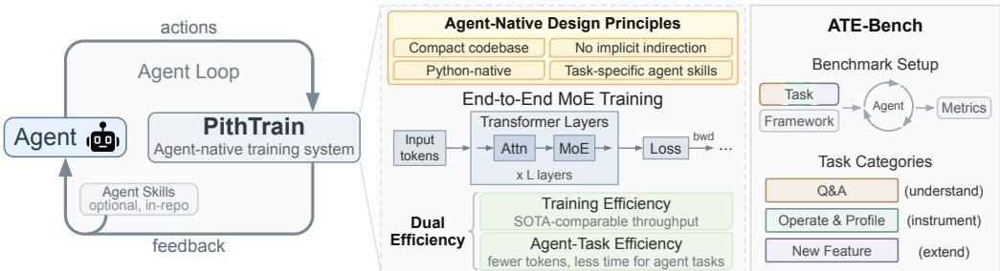  
Figure 1: PithTrain overview. An agent issues actions and consumes feedback (left); built on four agent-native design principles, PithTrain delivers dual efficiency (middle); ATE-Bench evaluates agent-task efficiency across frameworks (right).

Beyond building the framework, we systematically evaluate how framework design affects agent-task efficiency on real training-system tasks. Existing AI-coding benchmarks [14, 7, 4] vary the agent on a fixed codebase to score agent capability, focusing on general software-engineering tasks such as issue resolution. We invert this with ATE-Bench, a comprehensive benchmark that varies the framework on real-world training-framework tasks, holding the agent fixed so that differences in agent cost isolate framework design. Figure 1 summarizes PithTrain’s overall design.

This paper makes three contributions:

• PithTrain, a compact, Python-native, end-to-end MoE training framework. A roughly 11Kline MoE training framework designed agent-native from the start, matching the training throughput of production frameworks.

• Four design principles for agent-native ML training frameworks, guiding PithTrain’s design: code compactness, Python-native components, no implicit indirection, and agent skills.

• Agent-task efficiency, ATE-Bench, and an empirical study. Agent-task efficiency as a metric beyond training throughput, instantiated in ATE-Bench, with an empirical study showing PithTrain’s higher agent-task efficiency over production frameworks, plus a skills ablation and case study.

PithTrain delivers dual efficiency: strong training throughput together with high agent-task efficiency. It matches the throughput of production frameworks across a range of MoE models and training settings on NVIDIA H100 and B200 GPUs. On ATE-Bench, a coding agent completes the same training-framework tasks on PithTrain with up to 62% fewer Agent Turns and 64% less Active GPU Time than on production frameworks for the hardest new-feature tasks, with similar reductions on other metrics. A qualitative case study illustrates how framework design shapes agent behavior.

## 2 Related Work

Mature production frameworks have driven large-scale MoE training. Megatron-LM [35, 24] established the pipeline-parallel Transformer recipe most subsequent frameworks build on, and Deep-Speed [32, 31] introduced ZeRO sharded-optimizer techniques. Both rely on layered designs with plugin systems, registry-based indirection, and compiled extension chains, delivering broad model coverage and peak throughput on production hardware. TorchTitan [19] more recently scaled PyTorchnative training to multi-thousand-GPU clusters, sharing PithTrain’s Python-native goal but without making agent-native design a primary axis or matching production-framework throughput on our configurations. PithTrain takes a different point on this tradeoff curve with agent-native design as a first-class goal, achieving higher agent-task efficiency along Agent Turns, Output Tokens, etc., while matching the training throughput of production frameworks.

Table 1: Adherence to agent-native design principles. ✓ satisfied; partial; ✗ not satisfied. Numbers are total framework LoC across Python, C++, and CUDA.3  
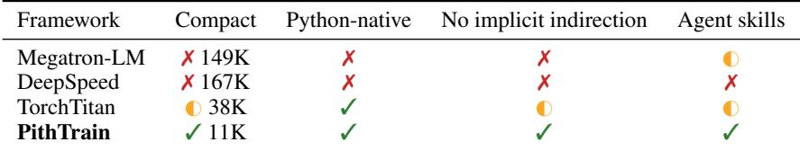

AI coding agents combine a tool-using language model with a small, stable vocabulary of primitives (read, edit, shell, search). Recent work designs better agent flows and harnesses for software engineering on top of these primitives [41, 40, 44]. PithTrain takes a complementary direction: rather than improving the agent flow, we design the software framework so that existing flows work better, lowering agent cost without changing the agent.

Existing agent benchmarks score capability on fixed codebases and tasks: SWE-bench [14] on GitHub-issue resolution, MLE-bench [6] on Kaggle-style ML engineering, and HumanEval [7] on function-level code generation. Closer to ML systems engineering, FlashInfer-Bench [38] and KernelBench [28] target inference operators and GPU kernels respectively. The agent is the variable; aggregate task correctness is the metric. ATE-Bench inverts this: holding the agent and task fixed, we vary the training framework so that differences in agent cost and task outcome isolate framework design. This axis is complementary to existing capability benchmarks.

## 3 The PithTrain System

## 3.1 Agent-Native Design Principles

This subsection introduces the four agent-native design principles that guide PithTrain’s system design, and contrasts how production training frameworks align with each principle today. Table 1 summarizes this comparison; production frameworks adopt different subsets of the four principles, reflecting different design priorities.

Compact codebase. Production frameworks such as Megatron-LM and DeepSpeed offer broad coverage of models, training features, and hardware platforms, accumulated over years of engineering effort, with core codebases exceeding 160K lines. A larger codebase inflates the cost of locating relevant code, tracking cross-file dependencies, and verifying a change is complete. A compact codebase reduces this cost; with frontier coding agents operating at context windows of 200K to 1M tokens, a sufficiently compact codebase can also fit in a single context pass. We treat compactness as a constraint on growth: PithTrain may grow over time, but additions should respect the four principles.

Python-native codebase. Python is the dominant language in modern ML. A pure-Python framework lets an agent navigate the full framework in a single language, surfaces readable Python tracebacks instead of opaque native errors, and eliminates the compiled-extension rebuild cycle. Megatron-LM composes its core transformer layers from out-of-tree TransformerEngine [25] modules, and DeepSpeed bundles extensive in-tree extensions. These deliver peak kernel performance and vendortuned numerics, but push an agent across language boundaries and force a rebuild on change.

No implicit indirection. Production frameworks compose many model variants from a shared layer skeleton via implicit indirection (a stored callable, plugin registry, or string-keyed resolution). This pattern enables code reuse across models, while making what runs at a given call site harder to identify by local reading. Figure 2 shows an instance of model construction in a production framework: TransformerLayer resolves its submodules from a runtime spec in a separate file. A flat code structure trades cross-model reuse for local readability, reducing the effort an agent spends building an end-to-end understanding.

Task-specific agent skills. An agent skill [2] is a procedural playbook a coding agent loads on demand. Skills encode procedural knowledge an agent cannot recover from static reading alone, so it runs a verified procedure. Agent skills are a recent practice that existing training frameworks have not yet adopted at scale: Megatron-LM ships six skills for CI/PR hygiene; TorchTitan ships one developer-workflow skill plus four editor rules orienting the agent to the codebase; DeepSpeed ships two markdown files with generic rules. None of these target recurring training-framework tasks.

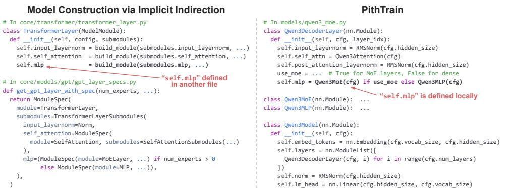  
Figure 2: Model construction patterns, illustrating the no-implicit-indirection principle. The implicitindirection pattern resolves submodules through a runtime spec, supporting model variation from a shared layer skeleton; PithTrain instantiates layers directly, favoring local readability.

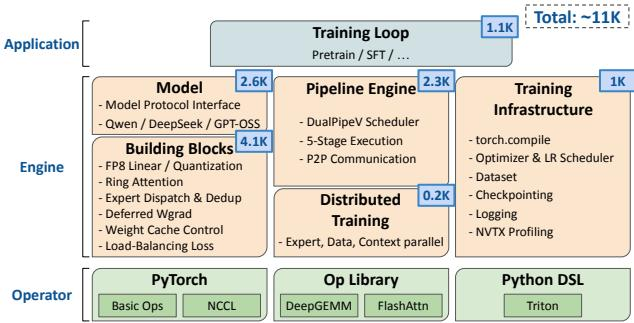  
Figure 3: PithTrain architecture with per-component line counts.

Table 2: Where PithTrain realizes each principle.  
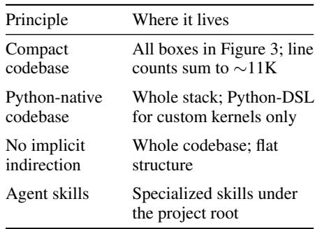

## 3.2 System Architecture and Optimizations

The codebase is organized in three layers (application, engine, operator), as shown in Figure 3. To realize a compact codebase, we identified the necessary components for a distributed MoE training framework, and PithTrain covers exactly those. Where production frameworks deliver broad out-of the-box coverage of models, features, and hardware, PithTrain narrows scope to keep the codebase compact and reachable in a single context window. Table 2 maps each principle to where it is realized: we adopt a flat code structure with no plugin registries or runtime specs, with each MoE model living in a self-contained file under models/ rather than being composed through a shared layer skeleton. This favors local readability over cross-model code reuse.

PithTrain supports standard MoE training4 with pipeline parallelism (PP), data parallelism (DP) via FSDP [45], context parallelism (CP) [20], expert parallelism (EP) [17], FP8 training [22], and DCP checkpointing [37], on NVIDIA Hopper and Blackwell GPUs. Despite its compact, Pythonnative codebase, PithTrain aims for training throughput competitive with production frameworks by adopting standard MoE optimizations; these techniques are not novel, but they are central to PithTrain’s training throughput and worth calling out.

• DualPipeV pipeline schedule and compute–communication overlap. PithTrain’s pipeline scheduler builds on DualPipe from DeepSeek-V3 [11]. DeepSeek’s open-source version provides a minimal pipeline-orchestration scaffold, on top of which PithTrain implements the actual compute–communication overlap. Each transformer layer is decomposed into five stages at EP communication boundaries. EP all-to-alls run on a separate communication stream, and the schedule overlaps the forward of one micro-batch with the backward of another.

Table 3: Representative skills in PithTrain.  
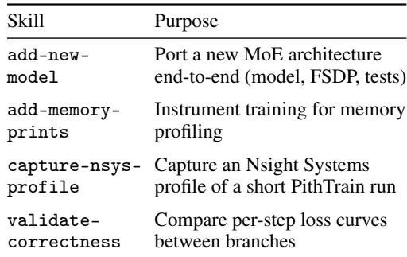

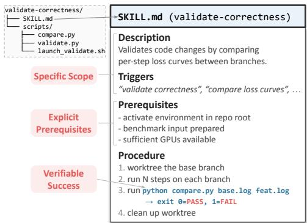  
Figure 4: The validate-correctness skill in PithTrain. Pink labels mark properties.

• Torch compile. PithTrain applies torch.compile(fullgraph=True) to all transformer computation except the MoE forward and backward. This strict mode rejects graph breaks at compile time rather than silently degrading speedup. We exclude the MoE forward and backward because per-expert input shapes are data-dependent under expert parallelism.

• Other optimizations. PithTrain also implements wgrad delay [29]; fused SwiGLU [34] forward and backward kernels for throughput and reduced activation memory; EP dispatch deduplication for lower all-to-all communication volume; an FP8 weight cache across micro-batches to avoid re-quantization; and fused Triton kernels for EP token scatter and FP8 quantization.

## 3.3 Agent Skills

A skill encodes the procedure for one recurring training-framework task. PithTrain ships a suite of skills covering several common ones (Table 3). Each skill is a self-contained folder with a top-level SKILL.md playbook, optionally additional markdown documents, and optionally helper scripts. Some skills are pure markdown, like add-new-model; others bundle scripts that offload deterministic work.

Each skill in PithTrain is designed around three properties: specific scope, explicit prerequisites, and verifiable success. Figure 4 illustrates these on validate-correctness. The description and triggers together encode the skill’s specific scope. The prerequisites section enumerates environment, data, and configuration assumptions, so missing state is caught before the skill begins to run. The procedure ends in a script call that returns a reproducible PASS/FAIL verdict rather than the agent’s self-assessment. Skills designed around these properties are not technically hard to author, and we expect other training frameworks to ship comparable coverage as the practice matures.

## 4 ATE-Bench: A Benchmark for Agent-Task Efficiency

Evaluating the agent-task efficiency of a training framework requires varying the framework while holding the agent and task fixed. This is the inverse of standard benchmarks for AI coding agents [14, 7, 4], which hold the codebase and task fixed and vary the agent to score capability. We introduce ATE-Bench, a benchmark with a fixed agent and curated task suite run across frameworks, so that differences in agent performance are attributable to framework design. The suite spans the kinds of work researchers typically perform on training frameworks, organized around three recurring patterns: understanding the framework without modifying it, operating it as a tool for instrumentation and profiling, and extending it with new functionality. Tasks are distributed across three categories:

• Q&A (12 tasks): answer questions whose answer is a property of the code, not a runtime measurement (e.g., “how is the device mesh built?”).

• Operate and Profile (4 tasks): run, instrument, and profile the framework as a tool (e.g., capture an Nsight Systems profile and identify the most expensive CUDA kernels).

• New Feature (4 tasks): port a new model architecture into the framework end-to-end against a published reference implementation (e.g., Mixture of Block Attention (MoBA) [21]).

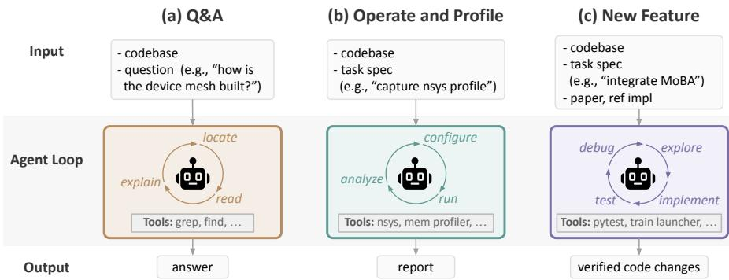  
Figure 5: Per-category agent loop. Steps, tools, and output differ across categories.

Table 4: Training throughput across frameworks. We report the aggregate tokens per second as the training throughput. “—” denotes not supported; “OOM” denotes out of memory.  
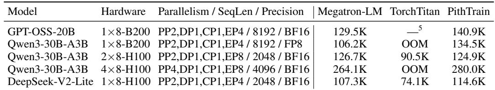

Figure 5 illustrates the agent loop for each category, with agent involvement deepening from Q&A (read-only) to Operate and Profile (running, minor instrumentation) to New Feature (substantial modification, test-driven iteration). Full task descriptions and per-category correctness checks are in Appendix B. Using ATE-Bench, we evaluate PithTrain and production frameworks, reporting five effort metrics: session duration, active GPU time, agent turns, per-turn context, and output tokens. Without a single-scalar metric for agent-task efficiency, we report each dimension independently.

Q&A questions are chosen to be valid across all three frameworks, excluding framework-specific behaviors. ATE-Bench does not cover tasks like cross-model propagation of a shared change, where production frameworks’ implicit indirection may lower agent effort; we leave these as future work.

## 5 Evaluation

We evaluate PithTrain on both axes of dual efficiency: training efficiency and agent-task efficiency. We validate training correctness against Megatron-LM on both pretraining loss curves and downstream accuracy in Appendix A. This section is organized to answer the following questions:

• Does PithTrain deliver competitive training throughput against production frameworks? (§5.1)

• Does PithTrain offer higher agent-task efficiency than production frameworks? (§5.2)

• How much do agent skills improve agent-task efficiency on PithTrain? (§5.3)

• Where do the per-framework differences in agent cost come from on a single concrete task? (§5.4)

## 5.1 Training Efficiency

We compare PithTrain (23db182), Megatron-LM [24] (3bec9aa) and TorchTitan [19] (d84e83d) on three representative MoE models (GPT-OSS-20B [26], Qwen3-30B-A3B [39], and DeepSeek-V2- Lite [10]) under matched parallelism (PP, DP, CP, EP), sequence length, and precision. Configurations span single-node and multi-node deployments on NVIDIA H100 and B200 GPUs. For Megatron-LM, we follow NVIDIA’s documented best practices6. DeepSpeed is excluded as it does not currently support PP combined with EP for MoE training7, so it cannot run any of the configurations in our suite.

Table 5: Per-question agent effort on the Q&A task suite (§4); Q1–Q12 are described in Appendix B.1. Each metric reports the median of three independent attempts. Lower is more efficient. Headers abbreviate Megatron-LM, TorchTitan, and PithTrain.  
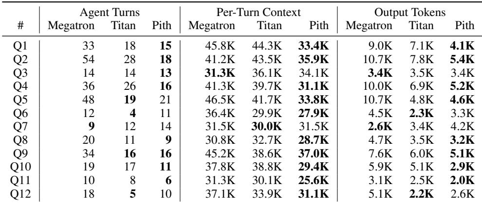

To ensure the MoE router exhibits steady-state load-balanced routing across frameworks and thus comparable throughput, we load public model checkpoints rather than random initializations. Each experiment runs 25 steps, and we report the median step time over the last 10. We omit Model FLOPs Utilization (MFU) [8] because Tensor Core peak FLOPS differs between BF16 and FP8, making the metric ambiguous for mixed-precision steps. Training hyperparameters follow Appendix A.

As Table 4 shows, PithTrain matches or exceeds Megatron-LM on 4 of 5 configurations, and stays within 1.4% of Megatron-LM on the fifth. This parity comes from optimizations such as DualPipeV’s compute–communication overlap and torch.compile(fullgraph=True). These results demonstrate that a compact, Python-native codebase can achieve competitive training throughput.

## 5.2 Agent-Task Efficiency

In this section, we evaluate agent-task efficiency across frameworks. We run ATE-Bench (§4) on Megatron-LM, TorchTitan, and PithTrain with Claude Code (Opus 4.7 at xhigh effort8) as the fixed agent. Each task runs three times and we report medians; hardware configuration, task descriptions, correctness criteria, and per-attempt values are described in Appendix B and C. Opus 4.7 completed every task across all attempts and frameworks with no failure.

Q&A. Answering a question requires locating where a behavior lives in the codebase. We omit Session Duration (all tasks finish in under three minutes) and Active GPU Time (no training runs). All 12 questions are answered correctly across attempts and frameworks (grading details in Appendix B.1.2). Across the 12 questions, the agent uses up to 67% fewer Agent Turns to reach the final answer on PithTrain than on Megatron-LM. A compact codebase and the absence of implicit indirection shrink the search space, lowering Per-Turn Context (Table 5) accordingly.

Operate and Profile. Across all tasks (Table 6), PithTrain’s Agent Turns are up to 70% lower than Megatron-LM’s and 57% lower than TorchTitan’s, and its Output Tokens are up to 78% and 65% lower respectively. PithTrain’s compact codebase explains these reductions. In addition, the agent invokes in-repo skills (§3.3) on its own when applicable; for example, the Report Heavy Kernels task triggers capture-nsys-profile.

New Feature. New-feature tasks exercise the test–debug cycle: edit, run training, read crash, edit again. Across all tasks (Table 7), PithTrain’s Active GPU Time is up to 44% lower than Megatron-LM’s and 64% lower than TorchTitan’s, primarily because PithTrain converges in fewer training runs. Two patterns inflate Megatron-LM’s reruns: a hidden argument registry causes the agent’s manually-added CLI flags to collide with auto-derived ones (implicit indirection), and C++ paths like TransformerEngine’s grouped-GEMM emit opaque segfaults that drive speculative configuration toggles (not Python-native). TorchTitan’s reruns are dominated by memory-pressure debugging. On PithTrain, failures surface inside the file the agent just wrote with a readable Python traceback, and fixes stay in the same file. §5.4 provides a detailed case study on MoBA.

Table 6: Per-task agent effort across frameworks on operate-and-profile tasks (§4). Each metric reports the median of three independent attempts. Lower is more efficient. Session Duration and Active GPU Time are in minutes. Per-attempt metrics in Appendix C.  
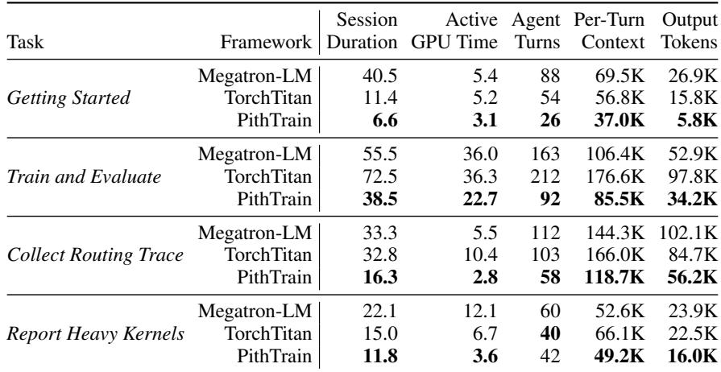

Table 7: Per-task agent effort across frameworks on new-feature tasks (§4). Each metric reports the median of three independent attempts. Lower is more efficient. Session Duration and Active GPU Time are in minutes. Per-attempt metrics in Appendix C.  
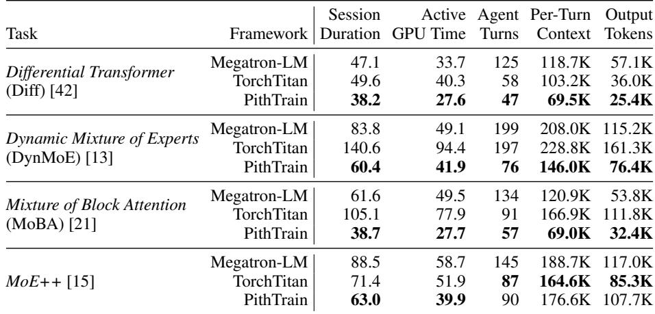

## 5.3 Ablation Study on Agent Skills

In this section, we isolate the effect of agent skills via ablation. They are a self-contained set of files shipped in the repository, so we can toggle them on and off against an otherwise fixed codebase. We pick two of PithTrain’s skills, validate-correctness and capture-nsys-profile, which mirror the natural follow-up after a system optimization: validate that training correctness is preserved, then capture an Nsight Systems profile to examine whether the optimization is effective.

We run this ablation on the wgrad delay [29] commit in PithTrain, repeating each task three times with skills and three times without. The codebase, agent, and harness are otherwise identical, and we report the same five effort metrics as in §5.2. When skills are disabled, we strip them from both the working tree and the git history, so the agent cannot recover the procedure from either. All twelve runs completed successfully, reporting the correct verdict or generating a valid Nsight Systems profile.

Table 8 reports the results. Active GPU Time stays near parity across both tasks: each task runs a fixed set of training runs pinned by the workflow, so the GPU work is determined by the task rather than the agent. The four agent-side metrics, which capture the agent’s reasoning overhead in setup, launch, and interpretation, all drop substantially with skills enabled. Agent turns drop the most (70% and 52% respectively), suggesting that with the procedure encoded in the skill, the agent acts on a fixed plan rather than iteratively deriving one through repeated tool calls. These results demonstrate that task-specific in-repo skills, comprising the markdown playbook and any helper scripts, substantially reduce agent effort on the recurring training-system tasks they target.

Table 8: Agent effort on PithTrain with and without the corresponding skill. Each metric reports the median of three independent attempts. Session Duration and Active GPU Time are in minutes.  
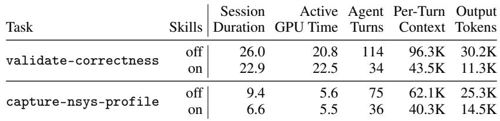

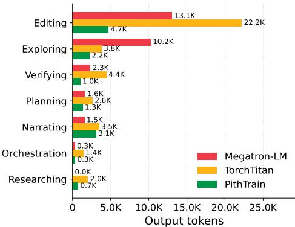  
(a) Per-category breakdown of output tokens.

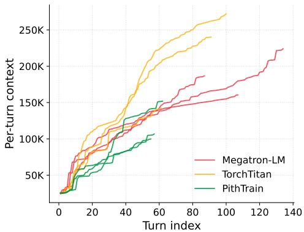  
(b) Per-turn context window over the session.  
Figure 6: Agent behavior on integrating MoBA across frameworks. (a) reports the median output tokens per action category of three independent attempts; (b) shows the per-turn input-side context for each of three independent attempts.

## 5.4 Case Study: Integrating MoBA

To examine where per-framework differences in agent cost come from, we conduct a case study on integrating MoBA, decomposing the agent’s output tokens by action category9 (Figure 6a) and tracing its per-turn context window (Figure 6b). Editing dominates across all three frameworks (PithTrain 4.7K, Megatron-LM 13.1K, TorchTitan 22.2K). Megatron-LM also spends substantially more on Exploring (10.2K vs. 3.8K for TorchTitan and 2.2K for PithTrain), and its per-turn context sits well above PithTrain’s. The agent reads the codebase to locate edits and interpret tracebacks, so a compact codebase with no implicit indirection lowers both Exploring and per-turn context. TorchTitan’s elevated Editing and \~2× context spike in two of three runs have a different cause: the agent’s initial implementation runs out of memory (OOM), forcing repeated debug-edit cycles. This points to runtime properties like memory headroom as a factor independent of codebase structure.

Beyond TorchTitan’s memory failures, we examine the other failures the agent encountered. Across the three PithTrain runs, two complete without any failure; the third hits a tensor-stride mismatch in the agent’s custom attention kernel, fixed in the same file as the traceback. Megatron-LM’s three runs hit two distinct failures: two runs fail with a duplicate command-line flag registration that conflicts with one defined in framework code, and one run fails with a BF16 overflow in the agent’s code. Each fix on Megatron-LM spans multiple files. This contrast reflects PithTrain’s compactness and absence of implicit indirection, which keep each fix local to the agent’s edit.

## 6 Conclusion

We presented PithTrain, a compact, agent-native MoE training framework built on four design principles. PithTrain matches the throughput of production frameworks across a range of models, and on ATE-Bench, a coding agent achieves higher agent-task efficiency on PithTrain than on production frameworks. We hope PithTrain serves as a starting point for future agent-native training framework.

## Acknowledgments

PithTrain is developed by contributors from CMU. We thank the CMU Foundation and Language Model (FLAME) Center for providing the compute resources to develop PithTrain. We also acknowledge the support of DGX B200 from NVIDIA.

## References

[1] Anthropic. Claude Code. https://www.anthropic.com/claude-code, 2025.

[2] Anthropic. Equipping agents for the real world with Agent Skills. https://www.anthropic. com/engineering/equipping-agents-for-the-real-world-with-agent-skills, 2025.

[3] Anysphere. Cursor: The AI code editor. https://www.cursor.com, 2023.

[4] Jacob Austin, Augustus Odena, Maxwell Nye, Maarten Bosma, Henryk Michalewski, David Dohan, Ellen Jiang, Carrie Cai, Michael Terry, Quoc Le, and Charles Sutton. Program synthesis with large language models, 2021.

[5] Yonatan Bisk, Rowan Zellers, Ronan Le bras, Jianfeng Gao, and Yejin Choi. PIQA: Reasoning about physical commonsense in natural language. In Proceedings of the AAAI Conference on Artificial Intelligence (AAAI), 2020.

[6] Jun Shern Chan, Neil Chowdhury, Oliver Jaffe, James Aung, Dane Sherburn, Evan Mays, Giulio Starace, Kevin Liu, Leon Maksin, Tejal Patwardhan, Aleksander Madry, and Lilian Weng. MLE-bench: Evaluating machine learning agents on machine learning engineering. In The Thirteenth International Conference on Learning Representations, 2025.

[7] Mark Chen, Jerry Tworek, Heewoo Jun, Qiming Yuan, Henrique Ponde de Oliveira Pinto, Jared Kaplan, Harri Edwards, Yuri Burda, Nicholas Joseph, Greg Brockman, Alex Ray, Raul Puri, Gretchen Krueger, Michael Petrov, Heidy Khlaaf, Girish Sastry, Pamela Mishkin, Brooke Chan, Scott Gray, Nick Ryder, Mikhail Pavlov, Alethea Power, Lukasz Kaiser, Mohammad Bavarian, Clemens Winter, Philippe Tillet, Felipe Petroski Such, Dave Cummings, Matthias Plappert, Fotios Chantzis, Elizabeth Barnes, Ariel Herbert-Voss, William Hebgen Guss, Alex Nichol, Alex Paino, Nikolas Tezak, Jie Tang, Igor Babuschkin, Suchir Balaji, Shantanu Jain, William Saunders, Christopher Hesse, Andrew N. Carr, Jan Leike, Josh Achiam, Vedant Misra, Evan Morikawa, Alec Radford, Matthew Knight, Miles Brundage, Mira Murati, Katie Mayer, Peter Welinder, Bob McGrew, Dario Amodei, Sam McCandlish, Ilya Sutskever, and Wojciech Zaremba. Evaluating large language models trained on code, 2021.

[8] Aakanksha Chowdhery, Sharan Narang, Jacob Devlin, Maarten Bosma, Gaurav Mishra, Adam Roberts, Paul Barham, Hyung Won Chung, Charles Sutton, Sebastian Gehrmann, et al. Palm: Scaling language modeling with pathways. Journal of machine learning research, 24(240):1– 113, 2023.

[9] Peter Clark, Isaac Cowhey, Oren Etzioni, Tushar Khot, Ashish Sabharwal, Carissa Schoenick, and Oyvind Tafjord. Think you have solved question answering? try arc, the ai2 reasoning challenge. arXiv preprint arXiv:1803.05457, 2018.

[10] DeepSeek-AI, Aixin Liu, Bei Feng, Bin Wang, Bingxuan Wang, Bo Liu, Chenggang Zhao, Chengqi Dengr, Chong Ruan, Damai Dai, Daya Guo, Dejian Yang, Deli Chen, Dongjie Ji, Erhang Li, Fangyun Lin, Fuli Luo, Guangbo Hao, Guanting Chen, Guowei Li, H. Zhang, Hanwei Xu, Hao Yang, Haowei Zhang, Honghui Ding, Huajian Xin, Huazuo Gao, Hui Li, Hui

Qu, J. L. Cai, Jian Liang, Jianzhong Guo, Jiaqi Ni, Jiashi Li, Jin Chen, Jingyang Yuan, Junjie Qiu, Junxiao Song, Kai Dong, Kaige Gao, Kang Guan, Lean Wang, Lecong Zhang, Lei Xu, Leyi Xia, Liang Zhao, Liyue Zhang, Meng Li, Miaojun Wang, Mingchuan Zhang, Minghua Zhang, Minghui Tang, Mingming Li, Ning Tian, Panpan Huang, Peiyi Wang, Peng Zhang, Qihao Zhu, Qinyu Chen, Qiushi Du, R. J. Chen, R. L. Jin, Ruiqi Ge, Ruizhe Pan, Runxin Xu, Ruyi Chen, S. S. Li, Shanghao Lu, Shangyan Zhou, Shanhuang Chen, Shaoqing Wu, Shengfeng Ye, Shirong Ma, Shiyu Wang, Shuang Zhou, Shuiping Yu, Shunfeng Zhou, Size Zheng, T. Wang, Tian Pei, Tian Yuan, Tianyu Sun, W. L. Xiao, Wangding Zeng, Wei An, Wen Liu, Wenfeng Liang, Wenjun Gao, Wentao Zhang, X. Q. Li, Xiangyue Jin, Xianzu Wang, Xiao Bi, Xiaodong Liu, Xiaohan Wang, Xiaojin Shen, Xiaokang Chen, Xiaosha Chen, Xiaotao Nie, Xiaowen Sun, Xiaoxiang Wang, Xin Liu, Xin Xie, Xingkai Yu, Xinnan Song, Xinyi Zhou, Xinyu Yang, Xuan Lu, Xuecheng Su, Y. Wu, Y. K. Li, Y. X. Wei, Y. X. Zhu, Yanhong Xu, Yanping Huang, Yao Li, Yao Zhao, Yaofeng Sun, Yaohui Li, Yaohui Wang, Yi Zheng, Yichao Zhang, Yiliang Xiong, Yilong Zhao, Ying He, Ying Tang, Yishi Piao, Yixin Dong, Yixuan Tan, Yiyuan Liu, Yongji Wang, Yongqiang Guo, Yuchen Zhu, Yuduan Wang, Yuheng Zou, Yukun Zha, Yunxian Ma, Yuting Yan, Yuxiang You, Yuxuan Liu, Z. Z. Ren, Zehui Ren, Zhangli Sha, Zhe Fu, Zhen Huang, Zhen Zhang, Zhenda Xie, Zhewen Hao, Zhihong Shao, Zhiniu Wen, Zhipeng Xu, Zhongyu Zhang, Zhuoshu Li, Zihan Wang, Zihui Gu, Zilin Li, and Ziwei Xie. Deepseek-v2: A strong, economical, and efficient mixture-of-experts language model, 2024.

[11] DeepSeek-AI, Aixin Liu, Bei Feng, Bing Xue, Bingxuan Wang, Bochao Wu, Chengda Lu, Chenggang Zhao, Chengqi Deng, Chenyu Zhang, Chong Ruan, Damai Dai, Daya Guo, Dejian Yang, Deli Chen, Dongjie Ji, Erhang Li, Fangyun Lin, Fucong Dai, Fuli Luo, Guangbo Hao, Guanting Chen, Guowei Li, H. Zhang, Han Bao, Hanwei Xu, Haocheng Wang, Haowei Zhang, Honghui Ding, Huajian Xin, Huazuo Gao, Hui Li, Hui Qu, J. L. Cai, Jian Liang, Jianzhong Guo, Jiaqi Ni, Jiashi Li, Jiawei Wang, Jin Chen, Jingchang Chen, Jingyang Yuan, Junjie Qiu, Junlong Li, Junxiao Song, Kai Dong, Kai Hu, Kaige Gao, Kang Guan, Kexin Huang, Kuai Yu, Lean Wang, Lecong Zhang, Lei Xu, Leyi Xia, Liang Zhao, Litong Wang, Liyue Zhang, Meng Li, Miaojun Wang, Mingchuan Zhang, Minghua Zhang, Minghui Tang, Mingming Li, Ning Tian, Panpan Huang, Peiyi Wang, Peng Zhang, Qiancheng Wang, Qihao Zhu, Qinyu Chen, Qiushi Du, R. J. Chen, R. L. Jin, Ruiqi Ge, Ruisong Zhang, Ruizhe Pan, Runji Wang, Runxin Xu, Ruoyu Zhang, Ruyi Chen, S. S. Li, Shanghao Lu, Shangyan Zhou, Shanhuang Chen, Shaoqing Wu, Shengfeng Ye, Shengfeng Ye, Shirong Ma, Shiyu Wang, Shuang Zhou, Shuiping Yu, Shunfeng Zhou, Shuting Pan, T. Wang, Tao Yun, Tian Pei, Tianyu Sun, W. L. Xiao, Wangding Zeng, Wanjia Zhao, Wei An, Wen Liu, Wenfeng Liang, Wenjun Gao, Wenqin Yu, Wentao Zhang, X. Q. Li, Xiangyue Jin, Xianzu Wang, Xiao Bi, Xiaodong Liu, Xiaohan Wang, Xiaojin Shen, Xiaokang Chen, Xiaokang Zhang, Xiaosha Chen, Xiaotao Nie, Xiaowen Sun, Xiaoxiang Wang, Xin Cheng, Xin Liu, Xin Xie, Xingchao Liu, Xingkai Yu, Xinnan Song, Xinxia Shan, Xinyi Zhou, Xinyu Yang, Xinyuan Li, Xuecheng Su, Xuheng Lin, Y. K. Li, Y. Q. Wang, Y. X. Wei, Y. X. Zhu, Yang Zhang, Yanhong Xu, Yanhong Xu, Yanping Huang, Yao Li, Yao Zhao, Yaofeng Sun, Yaohui Li, Yaohui Wang, Yi Yu, Yi Zheng, Yichao Zhang, Yifan Shi, Yiliang Xiong, Ying He, Ying Tang, Yishi Piao, Yisong Wang, Yixuan Tan, Yiyang Ma, Yiyuan Liu, Yongqiang Guo, Yu Wu, Yuan Ou, Yuchen Zhu, Yuduan Wang, Yue Gong, Yuheng Zou, Yujia He, Yukun Zha, Yunfan Xiong, Yunxian Ma, Yuting Yan, Yuxiang Luo, Yuxiang You, Yuxuan Liu, Yuyang Zhou, Z. F. Wu, Z. Z. Ren, Zehui Ren, Zhangli Sha, Zhe Fu, Zhean Xu, Zhen Huang, Zhen Zhang, Zhenda Xie, Zhengyan Zhang, Zhewen Hao, Zhibin Gou, Zhicheng Ma, Zhigang Yan, Zhihong Shao, Zhipeng Xu, Zhiyu Wu, Zhongyu Zhang, Zhuoshu Li, Zihui Gu, Zijia Zhu, Zijun Liu, Zilin Li, Ziwei Xie, Ziyang Song, Ziyi Gao, and Zizheng Pan. Deepseek-v3 technical report, 2025.

[12] GitHub. GitHub Copilot. https://github.com/features/copilot, 2021.

[13] Yongxin Guo, Zhenglin Cheng, Xiaoying Tang, Zhaopeng Tu, and Tao Lin. Dynamic mixture of experts: An auto-tuning approach for efficient transformer models. arXiv preprint arXiv:2405.14297, 2024.

[14] Carlos E Jimenez, John Yang, Alexander Wettig, Shunyu Yao, Kexin Pei, Ofir Press, and Karthik R Narasimhan. SWE-bench: Can language models resolve real-world github issues? In The Twelfth International Conference on Learning Representations, 2024.

[15] Peng Jin, Bo Zhu, Li Yuan, and Shuicheng YAN. Moe++: Accelerating mixture-of-experts methods with zero-computation experts. In The Thirteenth International Conference on Learning Representations, 2025.

[16] Diederik P. Kingma and Jimmy Ba. Adam: A method for stochastic optimization. Proceedings of the International Conference on Learning Representations (ICLR), 2015.

[17] Dmitry Lepikhin, HyoukJoong Lee, Yuanzhong Xu, Dehao Chen, Orhan Firat, Yanping Huang, Maxim Krikun, Noam Shazeer, and Zhifeng Chen. {GS}hard: Scaling giant models with conditional computation and automatic sharding. In International Conference on Learning Representations, 2021.

[18] Jeffrey Li, Alex Fang, Georgios Smyrnis, Maor Ivgi, Matt Jordan, Samir Gadre, Hritik Bansal, et al. DataComp-LM: In search of the next generation of training sets for language models. arXiv preprint arXiv:2406.11794, 2024.

[19] Wanchao Liang, Tianyu Liu, Less Wright, Will Constable, Andrew Gu, Chien-Chin Huang, Iris Zhang, Wei Feng, Howard Huang, Junjie Wang, Sanket Purandare, Gokul Nadathur, and Stratos Idreos. Torchtitan: One-stop pytorch native solution for production ready LLM pretraining. In The Thirteenth International Conference on Learning Representations, 2025.

[20] Hao Liu, Matei Zaharia, and Pieter Abbeel. Ringattention with blockwise transformers for near-infinite context. In The Twelfth International Conference on Learning Representations, 2024.

[21] Enzhe Lu, Zhejun Jiang, Jingyuan Liu, Yulun Du, Tao Jiang, Chao Hong, Shaowei Liu, Weiran He, Enming Yuan, Yuzhi Wang, et al. Moba: Mixture of block attention for long-context llms. arXiv preprint arXiv:2502.13189, 2025.

[22] Paulius Micikevicius, Dusan Stosic, Neil Burgess, Marius Cornea, Pradeep Dubey, Richard Grisenthwaite, Sangwon Ha, Alexander Heinecke, Patrick Judd, John Kamalu, Naveen Mellempudi, Stuart Oberman, Mohammad Shoeybi, Michael Siu, and Hao Wu. Fp8 formats for deep learning, 2022.

[23] Todor Mihaylov, Peter Clark, Tushar Khot, and Ashish Sabharwal. Can a suit of armor conduct electricity? a new dataset for open book question answering. In Proceedings of the 2018 Conference on Empirical Methods in Natural Language Processing (EMNLP), 2018.

[24] Deepak Narayanan, Mohammad Shoeybi, Jared Casper, Patrick LeGresley, Mostofa Patwary, Vijay Korthikanti, Dmitri Vainbrand, Prethvi Kashinkunti, Julie Bernauer, Bryan Catanzaro, Amar Phanishayee, and Matei Zaharia. Efficient large-scale language model training on gpu clusters using megatron-lm. In Proceedings of the International Conference for High Performance Computing, Networking, Storage and Analysis, SC ’21, New York, NY, USA, 2021. Association for Computing Machinery.

[25] NVIDIA. TransformerEngine. https://github.com/NVIDIA/TransformerEngine, 2022.

[26] OpenAI, :, Sandhini Agarwal, Lama Ahmad, Jason Ai, Sam Altman, Andy Applebaum, Edwin Arbus, Rahul K. Arora, Yu Bai, Bowen Baker, Haiming Bao, Boaz Barak, Ally Bennett, Tyler Bertao, Nivedita Brett, Eugene Brevdo, Greg Brockman, Sebastien Bubeck, Che Chang, Kai Chen, Mark Chen, Enoch Cheung, Aidan Clark, Dan Cook, Marat Dukhan, Casey Dvorak, Kevin Fives, Vlad Fomenko, Timur Garipov, Kristian Georgiev, Mia Glaese, Tarun Gogineni, Adam Goucher, Lukas Gross, Katia Gil Guzman, John Hallman, Jackie Hehir, Johannes Heidecke, Alec Helyar, Haitang Hu, Romain Huet, Jacob Huh, Saachi Jain, Zach Johnson, Chris Koch, Irina Kofman, Dominik Kundel, Jason Kwon, Volodymyr Kyrylov, Elaine Ya Le, Guillaume Leclerc, James Park Lennon, Scott Lessans, Mario Lezcano-Casado, Yuanzhi Li, Zhuohan Li, Ji Lin, Jordan Liss, Lily, Liu, Jiancheng Liu, Kevin Lu, Chris Lu, Zoran Martinovic, Lindsay McCallum, Josh McGrath, Scott McKinney, Aidan McLaughlin, Song Mei, Steve Mostovoy, Tong Mu, Gideon Myles, Alexander Neitz, Alex Nichol, Jakub Pachocki, Alex Paino, Dana Palmie, Ashley Pantuliano, Giambattista Parascandolo, Jongsoo Park, Leher Pathak, Carolina Paz, Ludovic Peran, Dmitry Pimenov, Michelle Pokrass, Elizabeth Proehl, Huida Qiu, Gaby Raila, Filippo Raso, Hongyu Ren, Kimmy Richardson, David Robinson, Bob

Rotsted, Hadi Salman, Suvansh Sanjeev, Max Schwarzer, D. Sculley, Harshit Sikchi, Kendal Simon, Karan Singhal, Yang Song, Dane Stuckey, Zhiqing Sun, Philippe Tillet, Sam Toizer, Foivos Tsimpourlas, Nikhil Vyas, Eric Wallace, Xin Wang, Miles Wang, Olivia Watkins, Kevin Weil, Amy Wendling, Kevin Whinnery, Cedric Whitney, Hannah Wong, Lin Yang, Yu Yang, Michihiro Yasunaga, Kristen Ying, Wojciech Zaremba, Wenting Zhan, Cyril Zhang, Brian Zhang, Eddie Zhang, and Shengjia Zhao. gpt-oss-120b & gpt-oss-20b Model Card, 2025.

[27] OpenAI. Codex CLI. https://github.com/openai/codex, 2025.

[28] Anne Ouyang, Simon Guo, Simran Arora, Alex L Zhang, William Hu, Christopher Re, and Azalia Mirhoseini. Kernelbench: Can LLMs write efficient GPU kernels? In Forty-second International Conference on Machine Learning, 2025.

[29] Penghui Qi, Xinyi Wan, Guangxing Huang, and Min Lin. Zero bubble (almost) pipeline parallelism. In The Twelfth International Conference on Learning Representations, 2024.

[30] Zihan Qiu, Zeyu Huang, Bo Zheng, Kaiyue Wen, Zekun Wang, Rui Men, Ivan Titov, Dayiheng Liu, Jingren Zhou, and Junyang Lin. Demons in the detail: On implementing load balancing loss for training specialized mixture-of-expert models. arXiv preprint arXiv:2501.11873, 2025.

[31] Samyam Rajbhandari, Jeff Rasley, Olatunji Ruwase, and Yuxiong He. Zero: memory optimizations toward training trillion parameter models. In Proceedings of the International Conference for High Performance Computing, Networking, Storage and Analysis, SC ’20. IEEE Press, 2020.

[32] Jeff Rasley, Samyam Rajbhandari, Olatunji Ruwase, and Yuxiong He. Deepspeed: System optimizations enable training deep learning models with over 100 billion parameters. In Proceedings of the 26th ACM SIGKDD International Conference on Knowledge Discovery & Data Mining, KDD ’20, page 3505–3506, New York, NY, USA, 2020. Association for Computing Machinery.

[33] Keisuke Sakaguchi, Ronan Le Bras, Chandra Bhagavatula, and Yejin Choi. Winogrande: An adversarial winograd schema challenge at scale. Communications of the ACM, 64(9):99–106, 2020.

[34] Noam Shazeer. Glu variants improve transformer, 2020.

[35] Mohammad Shoeybi, Mostofa Patwary, Raul Puri, Patrick LeGresley, Jared Casper, and Bryan Catanzaro. Megatron-lm: Training multi-billion parameter language models using model parallelism, 2020.

[36] Kimi Team, Yifan Bai, Yiping Bao, Y. Charles, Cheng Chen, Guanduo Chen, Haiting Chen, Huarong Chen, Jiahao Chen, Ningxin Chen, Ruijue Chen, Yanru Chen, Yuankun Chen, Yutian Chen, Zhuofu Chen, Jialei Cui, Hao Ding, Mengnan Dong, Angang Du, Chenzhuang Du, Dikang Du, Yulun Du, Yu Fan, Yichen Feng, Kelin Fu, Bofei Gao, Chenxiao Gao, Hongcheng Gao, Peizhong Gao, Tong Gao, Yuyao Ge, Shangyi Geng, Qizheng Gu, Xinran Gu, Longyu Guan, Haiqing Guo, Jianhang Guo, Xiaoru Hao, Tianhong He, Weiran He, Wenyang He, Yunjia He, Chao Hong, Hao Hu, Yangyang Hu, Zhenxing Hu, Weixiao Huang, Zhiqi Huang, Zihao Huang, Tao Jiang, Zhejun Jiang, Xinyi Jin, Yongsheng Kang, Guokun Lai, Cheng Li, Fang Li, Haoyang Li, Ming Li, Wentao Li, Yang Li, Yanhao Li, Yiwei Li, Zhaowei Li, Zheming Li, Hongzhan Lin, Xiaohan Lin, Zongyu Lin, Chengyin Liu, Chenyu Liu, Hongzhang Liu, Jingyuan Liu, Junqi Liu, Liang Liu, Shaowei Liu, T. Y. Liu, Tianwei Liu, Weizhou Liu, Yangyang Liu, Yibo Liu, Yiping Liu, Yue Liu, Zhengying Liu, Enzhe Lu, Haoyu Lu, Lijun Lu, Yashuo Luo, Shengling Ma, Xinyu Ma, Yingwei Ma, Shaoguang Mao, Jie Mei, Xin Men, Yibo Miao, Siyuan Pan, Yebo Peng, Ruoyu Qin, Zeyu Qin, Bowen Qu, Zeyu Shang, Lidong Shi, Shengyuan Shi, Feifan Song, Jianlin Su, Zhengyuan Su, Lin Sui, Xinjie Sun, Flood Sung, Yunpeng Tai, Heyi Tang, Jiawen Tao, Qifeng Teng, Chaoran Tian, Chensi Wang, Dinglu Wang, Feng Wang, Hailong Wang, Haiming Wang, Jianzhou Wang, Jiaxing Wang, Jinhong Wang, Shengjie Wang, Shuyi Wang, Si Wang, Xinyuan Wang, Yao Wang, Yejie Wang, Yiqin Wang, Yuxin Wang, Yuzhi Wang, Zhaoji Wang, Zhengtao Wang, Zhengtao Wang, Zhexu Wang, Chu Wei, Qianqian Wei, Haoning Wu, Wenhao Wu, Xingzhe Wu, Yuxin Wu, Chenjun Xiao, Jin Xie, Xiaotong Xie, Weimin Xiong, Boyu Xu, Jinjing Xu, L. H. Xu, Lin Xu, Suting Xu, Weixin Xu, Xinran Xu,

Yangchuan Xu, Ziyao Xu, Jing Xu, Jing Xu, Junjie Yan, Yuzi Yan, Hao Yang, Xiaofei Yang, Yi Yang, Ying Yang, Zhen Yang, Zhilin Yang, Zonghan Yang, Haotian Yao, Xingcheng Yao, Wenjie Ye, Zhuorui Ye, Bohong Yin, Longhui Yu, Enming Yuan, Hongbang Yuan, Mengjie Yuan, Siyu Yuan, Haobing Zhan, Dehao Zhang, Hao Zhang, Wanlu Zhang, Xiaobin Zhang, Yadong Zhang, Yangkun Zhang, Yichi Zhang, Yizhi Zhang, Yongting Zhang, Yu Zhang, Yutao Zhang, Yutong Zhang, Zheng Zhang, Haotian Zhao, Yikai Zhao, Zijia Zhao, Huabin Zheng, Shaojie Zheng, Longguang Zhong, Jianren Zhou, Xinyu Zhou, Zaida Zhou, Jinguo Zhu, Zhen Zhu, Weiyu Zhuang, and Xinxing Zu. Kimi k2: Open agentic intelligence, 2026.

[37] The PyTorch Team. torch.distributed.checkpoint. https://docs.pytorch.org/docs/ stable/distributed.checkpoint.html, 2023.

[38] Shanli Xing, Yiyan Zhai, Alexander Jiang, Yixin Dong, Yong Wu, Zihao Ye, Charlie Ruan, Yingyi Huang, Yineng Zhang, Liangsheng Yin, Aksara Bayyapu, Luis Ceze, and Tianqi Chen. Flashinfer-bench: Building the virtuous cycle for ai-driven llm systems, 2026.

[39] An Yang, Anfeng Li, Baosong Yang, Beichen Zhang, Binyuan Hui, Bo Zheng, Bowen Yu, Chang Gao, Chengen Huang, Chenxu Lv, Chujie Zheng, Dayiheng Liu, Fan Zhou, Fei Huang, Feng Hu, Hao Ge, Haoran Wei, Huan Lin, Jialong Tang, Jian Yang, Jianhong Tu, Jianwei Zhang, Jianxin Yang, Jiaxi Yang, Jing Zhou, Jingren Zhou, Junyang Lin, Kai Dang, Keqin Bao, Kexin Yang, Le Yu, Lianghao Deng, Mei Li, Mingfeng Xue, Mingze Li, Pei Zhang, Peng Wang, Qin Zhu, Rui Men, Ruize Gao, Shixuan Liu, Shuang Luo, Tianhao Li, Tianyi Tang, Wenbiao Yin, Xingzhang Ren, Xinyu Wang, Xinyu Zhang, Xuancheng Ren, Yang Fan, Yang Su, Yichang Zhang, Yinger Zhang, Yu Wan, Yuqiong Liu, Zekun Wang, Zeyu Cui, Zhenru Zhang, Zhipeng Zhou, and Zihan Qiu. Qwen3 technical report, 2025.

[40] John Yang, Carlos E Jimenez, Alexander Wettig, Kilian Lieret, Shunyu Yao, Karthik R Narasimhan, and Ofir Press. SWE-agent: Agent-computer interfaces enable automated software engineering. In The Thirty-eighth Annual Conference on Neural Information Processing Systems, 2024.

[41] Shunyu Yao, Jeffrey Zhao, Dian Yu, Nan Du, Izhak Shafran, Karthik R Narasimhan, and Yuan Cao. React: Synergizing reasoning and acting in language models. In The Eleventh International Conference on Learning Representations, 2023.

[42] Tianzhu Ye, Li Dong, Yuqing Xia, Yutao Sun, Yi Zhu, Gao Huang, and Furu Wei. Differential transformer. arXiv preprint arXiv:2410.05258, 2024.

[43] Rowan Zellers, Ari Holtzman, Yonatan Bisk, Ali Farhadi, and Yejin Choi. Hellaswag: Can a machine really finish your sentence? In Proceedings of the 57th Annual Meeting of the Association for Computational Linguistics (ACL), 2019.

[44] Yuntong Zhang, Haifeng Ruan, Zhiyu Fan, and Abhik Roychoudhury. Autocoderover: Autonomous program improvement. In Proceedings of the 33rd ACM SIGSOFT International Symposium on Software Testing and Analysis, ISSTA 2024, page 1592–1604, New York, NY, USA, 2024. Association for Computing Machinery.

[45] Yanli Zhao, Andrew Gu, Rohan Varma, Liang Luo, Chien-Chin Huang, Min Xu, Less Wright, Hamid Shojanazeri, Myle Ott, Sam Shleifer, Alban Desmaison, Can Balioglu, Pritam Damania, Bernard Nguyen, Geeta Chauhan, Yuchen Hao, Ajit Mathews, and Shen Li. Pytorch fsdp: Experiences on scaling fully sharded data parallel. Proc. VLDB Endow., 16(12):3848–3860, August 2023.

Hardware 4×8-H100   
Parallelism PP4, DP1, CP1, EP8   
Dataset DCLM [18]   
Sequence 2048   
Precision BF16   
Global Batch 1024   
Training Steps 4096   
Warmup Steps 128   
Optimizer Adam [16]   
Max LR 2 × 10−4   
Min LR 1 × 10−5   
LR Schedule Cosine Decay   
Aux Loss Global-Level [30]   
Aux Coef 1 × 10−3

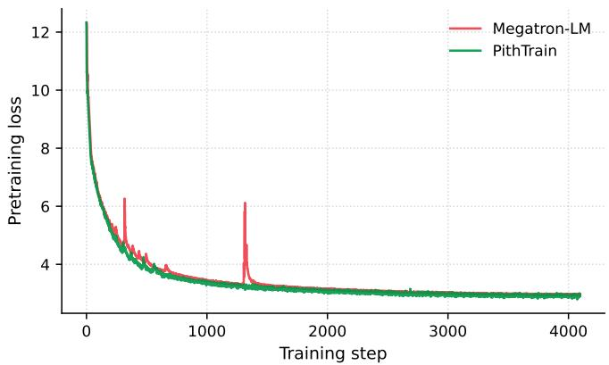  
Figure 7: Training configuration (left) and pretraining loss curves (right) for Qwen3-30B-A3B trained with Megatron-LM and PithTrain

## A Training Correctness

This appendix validates the training correctness of PithTrain against Megatron-LM at matched configuration. We report two complementary measurements: pretraining loss trajectories (§A.1) and downstream task accuracy (§A.2).

## A.1 Pretraining Loss

We pretrain Qwen3-30B-A3B with Megatron-LM and PithTrain under identical configuration. Figure 7 reports the full training configuration alongside the two loss curves; the trajectories align across the full run, with Megatron-LM showing two transient spikes that recover within a few steps.

## A.2 Downstream Accuracy

We evaluate downstream task accuracy across six standard benchmarks: OpenBookQA [23] and WinoGrande [33] in the 0-shot setting, and ARC-Challenge, ARC-Easy [9], HellaSwag [43], and PIQA [5] in the 10-shot setting. Figure 8 plots accuracy for each task; Megatron-LM and PithTrain achieve comparable accuracy within statistical noise across all six benchmarks at every checkpoint.

## B Task Suite

This appendix expands the per-category task descriptions and the correctness checks used to validate each attempt. All operate-and-profile and new-feature tasks share a fixed training configuration: the base model is DeepSeek-V2-Lite [10] (its training fits within a single node with 8 NVIDIA H100 GPUs), the parallelism mesh is PP=4, EP=2, DP=1, sequence length 2048, global batch size 1024, precision BF16.

## B.1 Q&A Tasks

Each Q&A task asks the agent to locate where a specific behavior lives in the framework codebase. The agent receives a single prompt consisting of the universal instruction below followed verbatim by the full query text for that task (Q1–Q12 in §B.1.1), and has read-only access to Read, Grep, Glob, and Bash; tools that modify the working tree (Edit, Write, NotebookEdit) are explicitly disabled. Correctness is validated by two independent human graders (§B.1.2).

Universal instruction (prepended to every query). Your task is to explore this training framework codebase and answer the question that follows. Every claim must be verified against the code on disk before you state it: use your CLI tools (Read, Grep, Glob, Bash) to locate the exact symbol, file, and line, then cite the path/to/file.py:LINE you actually read. Wrap your final response in <final\_answer> tags, trace the execution path step by step, and give one citation per claim. If a feature is genuinely absent from this codebase, say so explicitly and cite negative evidence (the grep command and pattern that returned zero matches, or the file you inspected that does not contain it). A correct “absent, verified” answer is preferred over a fabricated one.

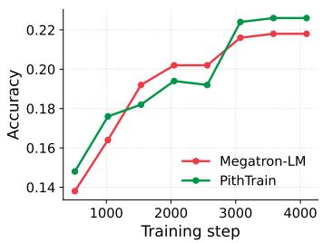  
(a) OpenBookQA (0-shot)

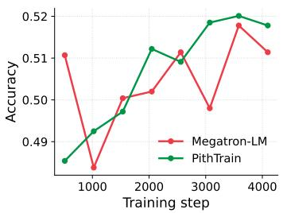  
(b) WinoGrande (0-shot)

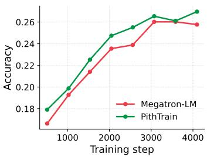  
(c) ARC-Challenge (10-shot)

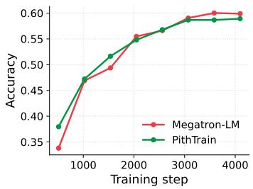  
(d) ARC-Easy (10-shot)

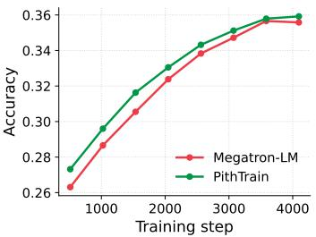  
(e) HellaSwag (10-shot)

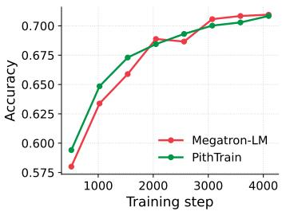  
(f) PIQA (10-shot)  
Figure 8: Downstream task accuracy for Qwen3-30B-A3B trained with Megatron-LM and PithTrain.

## B.1.1 Task Descriptions

Q1: Process Groups / Device Mesh. Trace the sequence of function calls from the main training entry script down to the initialization of the PyTorch distributed process groups or DeviceMesh. Detail the exact file paths, function names, and line numbers where the world size and ranks for the parallel groups present in this codebase (any of DP, TP, PP, EP, CP that this repo actually supports) are assigned.

Q2: Configuration Propagation. Locate the exact file and line numbers where the user-provided configuration for hidden\_size or dim is parsed. Trace how this specific variable propagates down to the instantiation of the first Transformer block.

Q3: Data Loading & Sharding. Trace the initialization of the dataset and dataloader. Identify the file, class, and line number where the global dataset is sliced or partitioned among the Data Parallel ranks to ensure each rank receives a unique, non-overlapping subset of data.

Q4: Distributed Seed Management. Find where the random seeds are set for data loading versus model initialization. Provide the exact file paths and line numbers, and trace how seeds are differentiated across different parallel groups (or, if they are deliberately shared, where and why).

Q5: Attention Kernel Dispatch. Locate the core attention module. Trace the logic that selects between an optimised kernel (FlashAttention, PyTorch SDPA flash backend, ring attention, etc.) and any fallback math implementation. Identify the exact file, class, line number, and configuration flag/condition controlling this dispatch. If the dispatch is delegated to the PyTorch scaled\_dot\_product\_attention, say so and cite the call site.

Q6: RoPE Implementation. Find where the Rotary Positional Embedding (RoPE) is implemented. Locate the function that precomputes the frequency tensor (sine/cosine cache). Provide the file path, class/function name, and exact line numbers of the tensor operations where the rotary transform is applied to the Query and Key tensors.

Q7: SwiGLU / MLP Block. Locate the Feed-Forward Network (FFN) implementation. Identify the file and line number where the SwiGLU activation (or equivalent gated linear unit) is mathematically applied. Trace how the up-projection tensor is chunked or split before the activation function.

Q8: Normalization Placement. Find the implementation of the main Transformer layer. Provide the file and exact line numbers where the normalization (RMSNorm or LayerNorm) is applied before the attention module. Detail where the epsilon (eps) term is added for numerical stability.

Q9: Context / Sequence Parallelism. Find where sequence parallelism (or context parallelism) is handled. Identify the exact file and line numbers where the sequence dimension of the input tensor is sharded, gathered, or scattered across ranks during the forward and backward passes. If the codebase does not support CP/SP, say so and cite the negative evidence.

Q10: FSDP / DDP Wrapping. Locate the exact file and line numbers where the core model is wrapped with Fully Sharded Data Parallel (FSDP1 or FSDP2) or Distributed Data Parallel (DDP) wrappers, and identify the device-mesh axes used for sharding/replication.

Q11: Global Gradient Clipping. Trace the logic for global gradient norm clipping. Find the file, function, and exact line number where the global norm of the gradients is computed (including any reduction across distributed ranks) before the optimizer step.

Q12: Distributed Checkpoint Serialization. Locate the model checkpoint saving logic. Detail whether the system uses a rank-0 gather approach or distributed sharded saving (e.g., PyTorch DCP). Provide the exact file path and line numbers where the disk serialization occurs.

## B.1.2 Correctness Checks

Each Q&A answer the agent returns cites the file paths, function names, and line numbers in the framework codebase that implement the behavior the question asks about. Two human graders independently trace these citations: they open each cited code location and verify that the code there does what the agent claims in the answer. An attempt is recorded as satisfied when both graders confirm every citation against the code on disk; disagreements are resolved by a third reader who looks only at the cited evidence. All 108 attempts (12 questions × 3 frameworks × 3 attempts) were judged satisfied by both graders.

## B.2 Operate-and-profile Tasks

Each operate-and-profile task asks the agent to drive a real training-system workflow end-to-end, so success requires the agent to set up the environment, run the framework as intended, and produce the expected artifact. The four tasks span the workflows a researcher typically performs before any code change: getting the framework running, executing a full train-and-evaluate pipeline, instrumenting the model to capture behavior, and profiling the system to surface bottlenecks.

## B.2.1 Task Descriptions

Getting Started. Set up the Python environment for the framework and run the provided 5-step smoke training script. Success means the script reaches step 5 with a finite loss. The agent must install all dependencies the script needs so that running bash train.sh as-is succeeds; train.sh itself documents best practices for training MoE models and is read-only. Pre-tokenized DCLM and the converted base-model checkpoint are pre-staged.

Train and Evaluate. Drive the full setup-train-export-evaluate pipeline for the base model. The agent trains from random initialization for 25 steps, exports the resulting checkpoint to HuggingFace format, and runs lm-evaluation-harness HellaSwag (zero-shot) on it via vLLM. The task tests pipeline correctness, not model quality: the HellaSwag score is expected to be near-random because 25 steps from random init produces a barely-trained model, and the agent must produce some score from a working pipeline. Initialization must be random; everything outside the fixed mesh and step count (LR, optimizer, scheduler, data preprocessing) is left to the agent.

Collect Routing Trace. Instrument training to dump the per-token MoE routing trace for the first 8M training tokens. The routing decision in each MoE layer, the top-k expert IDs and their gating weights, must be captured for every token in the global batch. Training resumes from the released HuggingFace checkpoint so the router is in its trained, load-balanced regime; routing decisions are model-intrinsic and valid from step 1, so no warmup is required. The output schema is one step-<step\_id:08d>.npz file per step under workspace/<framework>/routing-traces/, each containing the expert-ID and gating-weight arrays.

Report Heavy Kernels. Profile a 7-step training run with Nsight Systems and identify the top 3 most expensive CUDA kernels by total GPU time, aggregated across all 8 ranks. Training resumes from the released HuggingFace checkpoint; the agent profiles only step 7 because steps 1–6 are warmup for cudagraph capture, NCCL handshake, and allocator priming. The output is a single CSV at workspace/<framework>/heavy-kernels/top-kernels.csv with header kernel\_name,total\_time\_ms,instances,mean\_time\_ms and exactly three rows sorted by total\_time\_ms descending, plus the raw profile.nsys-rep so the result is reproducible.

## B.2.2 Correctness Checks

Each operate-and-profile task verifies the artifact the agent produces, not the path the agent took to produce it. We use a mix of programmatic checks baked into the task harness and human inspection where the artifact is non-textual.

Getting Started. The task succeeds when running train.sh reaches step 5 with a finite loss. After the agent finishes installing dependencies, the harness re-runs the (read-only) training script and parses the resulting log; the artifact is accepted only if step 5 prints a finite loss value.

Train and Evaluate. The harness ships a read-only evaluate.sh script that consumes the pipeline output produced by the agent: the agent trains for 25 steps from random init, exports the resulting checkpoint to HuggingFace format, and evaluate.sh loads the export into vLLM and runs lmevaluation-harness HellaSwag (zero-shot). An attempt is satisfied when evaluate.sh runs to completion and writes a finite HellaSwag score; the score is not required to clear any quality threshold, since 25 steps from random initialization is expected to yield near-random accuracy.

Collect Routing Trace. The harness verifies that four step-<step\_id:08d>.npz files are present at workspace/<framework>/routing-traces/ and that each carries expert-ID and gating-weight arrays of the correct shape for every MoE layer over every token in the global batch. A programmatic check additionally confirms that the expert-ID values are within the valid range [0, num\_experts) for the MoE configuration of the model, and that the gating weights are non-negative and sum to 1 over the top-k selected experts for every token.

Report Heavy Kernels. The agent submits both top-kernels.csv and the raw profile.nsys-rep. The harness checks the CSV programmatically against the prescribed schema (header, exactly three rows sorted by total time descending). The kernel names themselves are validated by a human reader who opens profile.nsys-rep in the Nsight Systems profiler GUI, reads the CUDA GPU Kernel Summary in the Stats System view, and confirms that the top three kernel names in the CSV produced by the agent match the top three entries shown by the profiler.

All 36 attempts (4 tasks × 3 frameworks × 3 attempts) produced an artifact accepted by both the harness and the human reader.

## B.3 New-feature Tasks

Each new-feature task mimics the workflow of a researcher or ML engineer integrating a recently published modeling architecture into a training framework. The agent is given the same materials such an engineer would normally consult: the arXiv paper and the reference implementation. From these inputs, the agent must produce a training script that integrates the new feature into the base model and runs on DCLM [18] under the fixed configuration above.

The four tasks are chosen for both coverage and a fair starting point. Two revise the attention mechanism and two require changes at the FFN (MoE) layer, so the suite spans the architectural subsystems a training framework must accommodate. None of the four architectures had been integrated into any of the three frameworks we compare at the time of this study, so all frameworks start the task from the same point and the comparison reflects only how the design of each framework affects integration effort.

Correctness is validated on two axes. First, the cross-entropy loss must decrease across the 64-step run and remain finite (no explosion, no NaN), evidence that the modified training pipeline produces a learnable model. Second, the changes made by the agent must satisfy three task-specific rules, each validating one required component of the new feature (§B.3.2); the rules target the architectural elements that distinguish each new feature from the baseline framework, ensuring the agent has implemented the intended mechanism rather than producing a passing-loss reading from an unchanged model. An attempt is recorded as satisfied when both axes hold.

## B.3.1 Task Descriptions

Diff [42]. Differential attention replaces a single softmax-attention map with the difference of two parallel softmax maps, Attn(Q, K, V ) = (softmax(Q1K⊤1 ) − λ softmax(Q2K⊤2 )) V , where λ is a learned per-head scalar. The construction cancels common-mode attention noise, sharpening which tokens receive mass. Integrating it involves splitting the per-head Q/K projections in half and introducing λ as a trainable parameter with the published initialisation schedule.

DynMoE [13]. Standard MoE fixes the number of activated experts k per token. DynMoE replaces top-k selection with a per-expert sigmoid gate and a learned threshold, so the count of active experts varies per token. Integrating it involves replacing the top-k routing kernel of the framework and reformulating the load-balancing auxiliary loss for a variable-k regime.

MoBA [21]. MoBA partitions the key/value sequence into fixed-size blocks and routes each query to the top-k blocks selected by a learned gate, yielding sub-quadratic attention cost in the sequence length. Integrating it involves inserting block-level routing between the Q/K projection and the attention computation, composing with the existing attention backend in the framework, and preserving causal masking inside each selected block.

MoE++ [15]. MoE++ augments a standard MoE expert pool with three zero-computation expert types (zero, copy, and constant), allowing easy tokens to be routed past the feed-forward layer entirely. Integrating it involves extending the expert pool definition with the zero-computation variants, widening the router output to cover them, and adjusting the load-balancing loss to prevent the zero experts from absorbing all easy tokens.

## B.3.2 Rule-based Correctness Checks

Each new-feature task decomposes into three required components, the architectural elements that distinguish the new feature from the baseline framework. The rules below name each component and describe how it should be implemented; they were fixed before inspecting any attempt. Each attempt is judged by an independent claude-opus-4-7 session at xhigh effort, given the three rules and the git diff produced by the agent against the main branch of the framework; the judge returns PASS or FAIL per rule with a one-sentence justification quoting a specific code reference, and an attempt is recorded as satisfied when all three rules pass. We additionally inspect every verdict and its cited justification by hand: a human reader opens the diff at the cited file and confirms the line evidence for both PASS judgements and any FAIL or partial verdicts. Across all 36 attempts (4 tasks × 3 frameworks × 3 attempts), every attempt satisfies all three rules of its task.

## Diff.

R1. The attention forward path produces two separate softmax outputs that are combined as attn − λ · attn (literal subtraction with a learnable coefficient).

R2. A learnable parameter (λ, e.g. named lambda or lambda\_init) is registered as an nn.Parameter with shape compatible with per-head broadcasting.

R3. The Q/K projections are split into two halves, either via an output dimension of 2 · nheads · dhead followed by a split, or via two separate projection layers.

## DynMoE.

R1. The router uses per-expert sigmoid gates (or sigmoid-gated activation), not pure softmax with top-k selection.

R2. A learnable threshold parameter for expert activation is registered as an nn.Parameter (often named tau, threshold, or gate\_threshold).

R3. Active-expert selection is not a fixed top\_k = N; the count depends on which experts pass the threshold (boolean mask or variable-length selection).

## MoBA.

R1. The K/V sequence is partitioned into fixed-size blocks (a reshape or view into shape [..., nblocks, B, ...] or equivalent).

R2. Each query computes a per-block score (typically query · pooled\_block\_key) followed by top-k block selection.

R3. Final attention is computed only over the selected blocks, with causal masking preserved at block boundaries (each query attends only to blocks at positions ≤ its own).

## MoE++.

R1. The expert pool includes at least one zero-computation expert type (zero, copy, or constant), identifiable by class name, string literal, or a specialised expert factory.

R2. The router emits logits over a pool that contains both regular FFN experts and zerocomputation experts, so the router learns to dispatch tokens to the no-op variants. The zero-computation experts may be added on top of the existing pool (router output dim grows to nFFN + nzero) or carved out of an unchanged total expert count.

R3. The load-balancing auxiliary loss handles zero experts explicitly: they are excluded from the balance term, weighted differently, or balanced under a separate penalty.

## C Per-Task Results

This appendix reports per-attempt agent effort across the three task categories: Tables 9 and 10 cover the 12 Q&A tasks (split 6/6 across two pages), Table 11 covers the four operate-and-profile tasks, and Table 12 covers the four new-feature tasks. Each row is one independent attempt; per-task medians appear in the corresponding main-text tables in §5.2. Session Duration and Active GPU Time are reported in minutes. Lower is better on every metric.

Table 9: Per-attempt agent effort on the Q&A tasks Q1–Q6 (§5.2). Each row is one independent attempt. Session Duration is in minutes.  
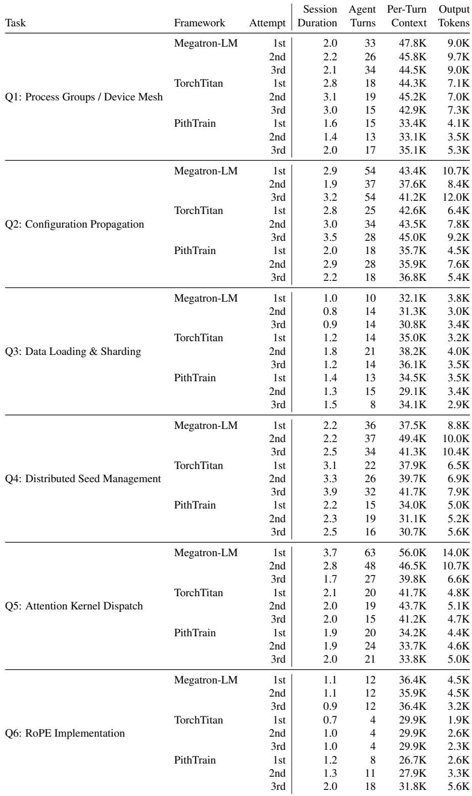

Table 10: Per-attempt agent effort on the Q&A tasks (continued, Q7–Q12).  
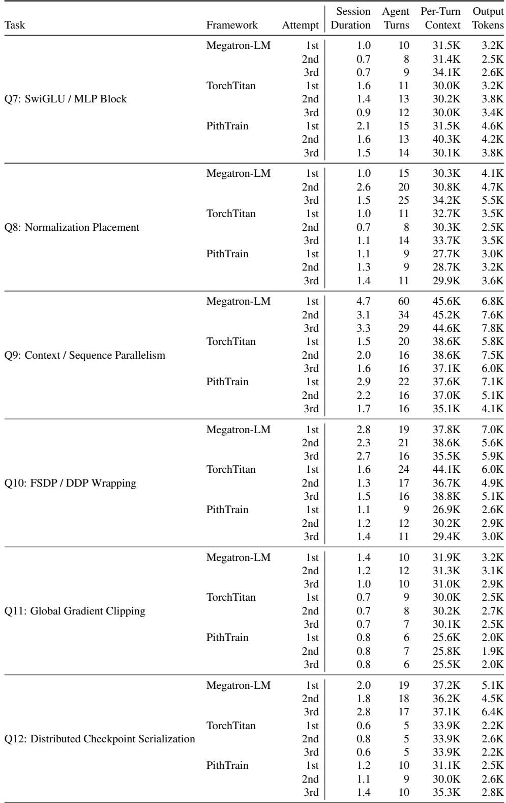

Table 11: Per-attempt agent effort on the operate-and-profile tasks (§5.2). Each row is one independent attempt. Session Duration and Active GPU Time are in minutes.  
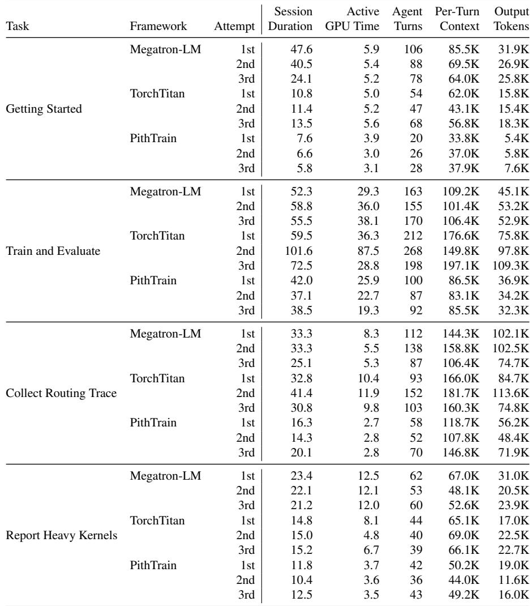

Table 12: Per-attempt agent effort on the new-feature tasks (§5.2). Each row is one independent attempt. Session Duration and Active GPU Time are in minutes.  
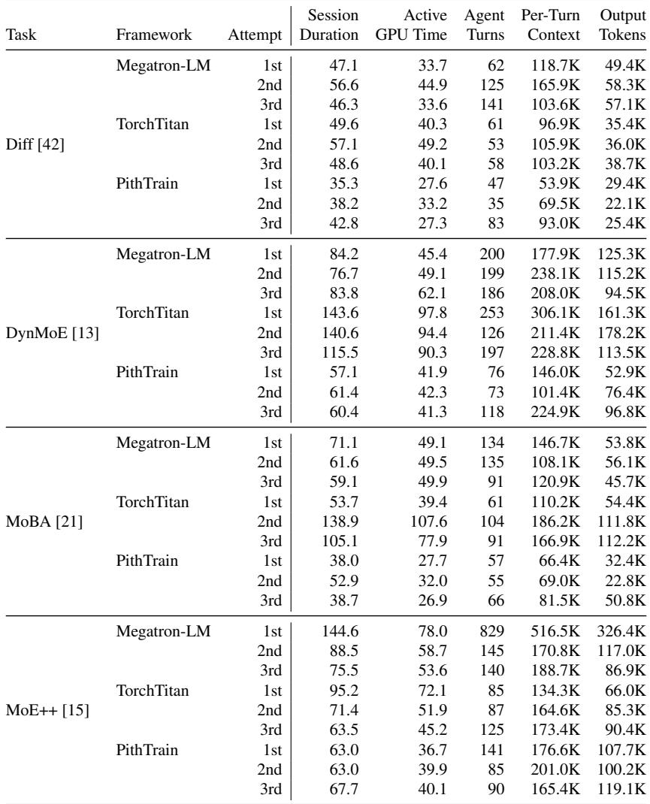