# MoE-nD: Per-Layer Mixture-of-Experts Routing for Multi-Axis KV Cache Compression

Libo Sun 1 Peixiong He 1 Po-Wei Harn 2 Xiao Qin 1

## Abstract

KV cache memory is the dominant bottleneck for long-context LLM inference. Existing compression methods each act on a single axis of the four-dimensional KV tensor—token eviction (sequence), quantization (precision), low-rank projection (head dimension), or cross-layer sharing— but apply the same recipe to every layer. We show that this homogeneity leaves accuracy on the table: different layers respond very differently to each compression operation, and the optimal per-layer mix of eviction and quantization is far from uniform. We propose MoE-nD, a mixture-of-experts framework that routes each layer to its own (eviction-ratio, K-bits, V-bits) tuple under a global memory budget. An offlinecalibrated greedy solver chooses the routing that minimizes predicted quality loss; at inference time, per-layer heterogeneous eviction and quantization are applied jointly through a single attention patch. On a 4-task subset of LongBench-v1 (16k inputs, n = 50 per task, adapted reasoningmodel protocol; see §5), MoE-nD’s hetero variant matches our uncompressed 1.9 GB baseline at 14× compression (136 MB) while every other compressed baseline we tested (1d, 2d uniform, 2d) at comparable or smaller memory stays under 8/100. The gains hold on AIME reasoning benchmarks (+6 to +27pts over the strongest per-layerquantization baseline across eight configurations). Two null results—MATH-500 and LongBench’s TREC—share a principled cause (short inputs, solver picks keep=1.0 on most layers), cleanly characterizing when per-layer eviction routing has headroom to help.

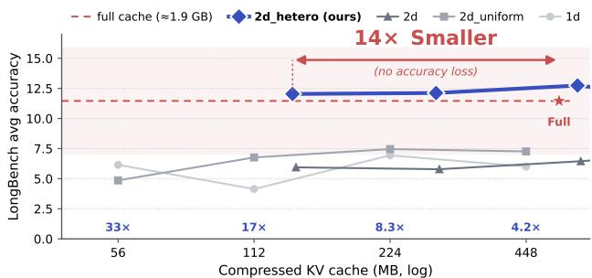  
Figure 1. LongBench-v1 accuracy vs. compressed KV memory on DeepSeek-R1-Distill-Qwen-7B. 4-task subset (NarrativeQA, HotpotQA, TREC, PassageRetrieval-en), n = 50 per task, 16ktoken inputs (middle truncation), adapted reasoning-model protocol (max gen ×16, scoring after final </think>); see §5. MoEnD’s hetero variant (2dhetero) matches the uncompressed full-cache baseline at its leftmost operating point (136 MB, 14× compression), while single-axis eviction (1d), uniform two-axis (2duniform), and per-layer-quantization-only (2d) lose 33–64% of LongBenchaverage accuracy across budgets, and up to 99% on individual tasks (Table 3). The 1d/2d uniform points sit at 56–448 MB and the 2d/2d hetero points at 136–1175 MB — the per-method memory differs because the greedy solver spends the 2d quantization headroom on fewer-compressed layers rather than deeper compression (see Table 2).

## 1. Introduction

Long-context reasoning in modern LLMs pushes KV cache memory to tens of GB per sequence, dominating latency and causing out-of-memory failures on commodity hardware (Wei et al., 2022; DeepSeek-AI, 2025). KV cache compression addresses this by reducing either the number of stored tokens (eviction (Zhang et al., 2023; Li et al., 2024; Cai et al., 2025)), the bits per element (quantization (Liu et al., 2024; Hooper et al., 2024; Sharma et al., 2024)), or a mix of the two (Dong et al., 2024). These approaches are almost always applied uniformly: every transformer layer gets the same budget, the same eviction ratio, and the same bit-width.

Recent per-layer work has begun to challenge the uniformity assumption in a limited way: AdaKV (Feng et al., 2025) and PyramidKV (Cai et al., 2024) route budgets per layer within eviction, KVTuner (Li et al., 2025) routes quantization bits per layer. However, to our knowledge, no prior work routes across multiple compression axes jointly at per-layer granularity. This is a missed opportunity: different layers respond very differently to eviction vs. quantization, and the optimal allocation trades the two per layer.

Contribution. We propose MoE-nD, a mixture-ofexperts (Shazeer et al., 2017) formulation that treats each compression axis (eviction ratio, K-precision, V-precision) as an expert and lets an offline-calibrated router select the mix per layer under a single global memory budget. The router is a greedy solver over an offline-measured per-layer sensitivity table; inference-time overhead is comparable to a uniform two-axis (eviction + quantization) baseline, not to the cheaper eviction-only single-axis baseline.

Empirically, on a 4-task LongBench-v1 subset (16k inputs, adapted reasoning-model protocol; see §5), MoE-nD’s hetero variant matches the uncompressed 1.9 GB baseline at 14× compression (136 MB) while every comparable method at the same or smaller memory stays under 8/100, and it beats the strongest non-hetero two-axis baseline by +6 to +27pts across all eight budget×dataset configurations of AIME-24 and AIME-25. An ablation chain (2duniform → 2d → 2dhetero) isolates the contribution of each routing axis and shows that per-layer quantization routing alone adds ≈ 0pts on average—the novel lift comes entirely from per-layer eviction routing. Two null results, short-context MATH-500 and LongBench’s TREC, share a principled mechanism (at loose budgets the solver picks keep= 1.0 for most layers, so hetero degenerates to uniform and no advantage is possible) and let us cleanly scope the method.

A note on absolute F1. Our primary model is DeepSeek-R1-Distill-Qwen-7B (DeepSeek-AI, 2025), chosen to match the calibration pipeline of our per-layer sensitivity table. Reasoning models emit long <think>...</think> chains before the answer, so at the LongBench default max gen ∈ {32, . . . , 128} tokens, the model almost never reaches an answer. We evaluate with max gen × 16 and score only the text after the final </think>. Even with these fixes, our uncompressed baseline lands at 11.5% Long-Bench average—well below published Llama-3-8B-Instruct baselines in the 35–50 range (Li et al., 2024; Cai et al., 2024). This gap comes from reasoning-style generation (verbose, thought-heavy), not from the harness. All methods in this paper run through the identical pipeline with identical model, identical prompts, and identical extraction, so the scientific claim is the relative gap between methods at matched memory. Appendix A discusses porting to instruction-tuned models.

## 2. Background and Related Work

The KV cache at layer ℓ stores tensors Kℓ, Vℓ ∈ RHkv×T ×dhead , where T is sequence length, Hkv is the number of key-value heads (GQA (Ainslie et al., 2023)), and dhead is per-head dimension. Compression methods act on one of four axes:

Eviction (sequence axis). StreamingLLM (Xiao et al., 2024) retains attention sinks plus a sliding window. H2O (Zhang et al., 2023) and SnapKV (Li et al., 2024) accumulate attention-based importance scores to identify “heavy hitters.” Scissorhands (Liu et al., 2023) and R-KV (Cai et al., 2025) extend this for long generation. TriAttention (Mao et al., 2026) uses pre-RoPE trigonometric structure for importance estimation. Despite their differences, these methods all apply a single eviction policy to every layer.

Per-layer eviction budgets. AdaKV (Feng et al., 2025) and PyramidKV (Cai et al., 2024) vary the eviction budget per layer (typically deeper layers get smaller budgets). However they still quantize (if at all) uniformly.

Quantization (precision axis). KIVI (Liu et al., 2024) and KVQuant (Hooper et al., 2024) quantize K and V to INT4 or INT8 uniformly across layers. MiniKV (Sharma et al., 2024) combines eviction with 2-bit quantization. KVTuner (Li et al., 2025) routes K/V bit-widths per layer, but keeps sequence length fixed (no eviction).

Low-rank and cross-layer. ASVD (Yuan et al., 2024) projects KV to lower rank. CLA (Brandon et al., 2024) shares KV across adjacent layers. Both are orthogonal to the axes routed in MoE-nD.

To our knowledge, no prior method jointly routes both eviction ratio and K/V quantization bits on a per-layer basis under a global memory budget. MoE-nD fills this gap; the ablation in §5.4 demonstrates the per-layer eviction routing (not per-layer quantization routing) is the critical new lever.

## 3. Observation: Layers Are Not Equal

Before proposing the method, we document the empirical property that motivates per-layer routing: for the most aggressive compression operations (high-ratio eviction and Kquantization), the accuracy cost varies by two to nearly three orders of magnitude across transformer layers of DeepSeek-R1-Distill-Qwen-7B; for V-quantization and mild eviction, the variation is smaller but the trade-off between axes still flips per layer.

We measure, for each layer ℓ and each candidate compression configuration c = (keep ratio, kbits, vbits), the relative L2 error between the layer’s full-precision attention output and its compressed-attention output (with c applied to layer ℓ only), Sℓ,c = ∥attn(ℓ)full − attn(ℓ)c ∥ 2 / ∥attn(ℓ) full∥2, evaluated on a single 27-token reasoning prompt. We use this lightweight proxy as our sensitivity score; we validated it post hoc against a principled KL-divergence calibration over 8 held-out sequences of 2048 tokens (Appendix B) and find a mean per-layer Pearson correlation of 0.945 (Spearman 0.937) across all 28 layers and 11 configs — i.e. the proxy produces the same within-layer rankings the greedy solver consumes. Three empirical properties of the resulting sensitivity table S ∈ RL×|C| (Figure 2, with numerical summaries in Table 1) jointly motivate per-layer joint routing.

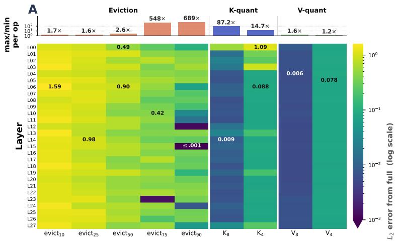

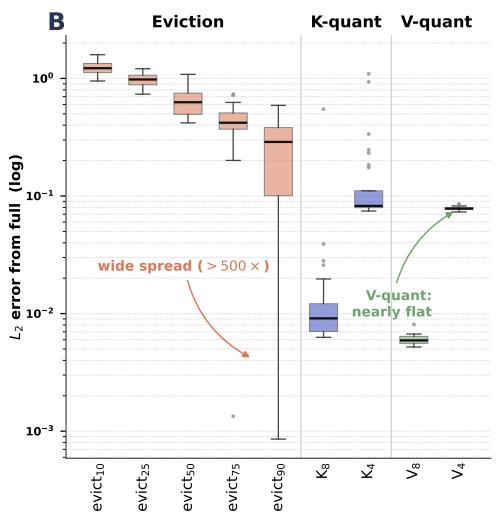

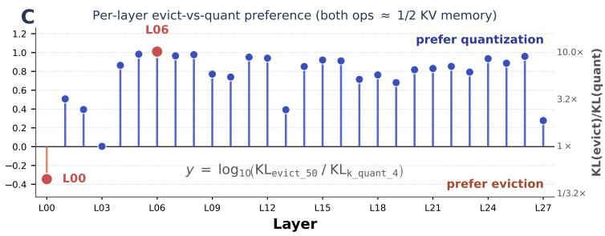

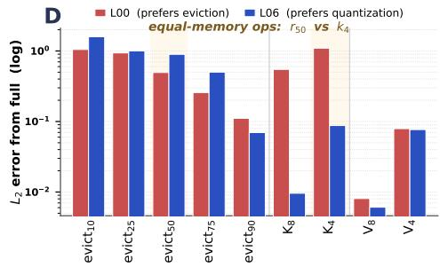  
Figure 2. Per-layer sensitivity landscape. (A) Full 28×9 heatmap of predicted attention-output L2 error when applying each compression operation to a single layer, measured offline against the uncompressed reference (log-scale color; only headline cells are annotated to keep the panel readable). The top strip shows per-operation maxℓ/minℓ ratio, directly summarizing the heterogeneity numbers in Table 1: aggressive eviction (evict75, evict90) spans 500–700× across layers while V-quant spans only 1.2–1.6×. (B) Per-op error distribution across layers as box plots: V-quant boxes are nearly flat (uniform-OK) while evict75/90 sprawl across three orders of magnitude. (C) Per-layer evict-vs-quant preference at equal memory cost (evict50 vs K-quant-4, both ≈1/2 of full precision). Positive bars: eviction damages more than quant on this layer (prefer quant); negative bars: quant damages more (prefer eviction). L00 is the lone layer preferring eviction; the routing solver must discover this without a uniform heuristic. (D) L00 vs L06 head-to-head: L2 error across all 9 ops, with the equal-memory pair (evict50 vs k4) shaded — concrete proof of the “two layers, opposite preferences” phenomenon cited in the text.

Eviction sensitivity diverges sharply at aggressive ratios. At mild eviction (≤ 50%), the most and least sensitive layers differ by only 1.6–2.6×, so a uniform policy is roughly defensible. At aggressive eviction (75%, 90%) the ratio explodes to 548× and 689× respectively, and per-layer routing becomes indispensable.

K-quantization varies strongly; V-quantization does not. K-quant at 4 bits spans a 15× range across layers (at 8 bits, 87×), while V-quant at either bit-width spans only 1.2–1.6×. Per-layer K-quant routing therefore has real headroom; V-quant routing is essentially free to apply uniformly.

Eviction and quantization trade at different rates per layer. Comparing equal-memory operations (evict 50% vs k quant 4), on L00 eviction is 2.2× cheaper than quant (0.49 vs 1.09), whereas on L06 quant is 10× cheaper (0.088 vs 0.90). The trade-off is not globally consistent, so the choice of which axis to compress on a given layer is itself a per-layer decision.

The first two properties show that each compression axis has per-layer structure — a single-axis per-layer router (AdaKV for eviction, KVTuner for quant) can exploit one axis but not both. The third property shows the two axes are entangled: choosing which to apply on each layer requires a joint router that sees both. This is the empirical foundation of MoE-nD.

Table 1. Per-operation variation across 28 layers of DeepSeek-R1- Distill-Qwen-7B, measured as maxℓ sℓ/ minℓ sℓ where sℓ is the relative attention-output L2 error from applying the operation to layer ℓ alone. Large ratios indicate strong layer heterogeneity — exactly the regime where per-layer routing can help.  
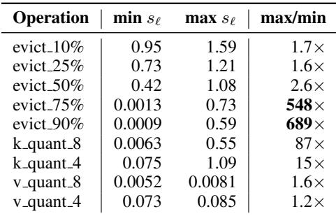

## 4. MoE-nD

Figure 3 summarizes the pipeline: an offline calibration phase measures S once per model; a greedy budget solver produces a per-layer routing; at inference time, the routed eviction and quantization are applied jointly through a single attention patch.

Design space. Each layer exposes three orthogonal knobs: a keep ratio keep ratioℓ ∈ {0.1, 0.25, 0.5, 0.75, 0.9, 1.0} that sets the fraction of cache tokens retained after eviction (scored by a TriAttention-style trigonometric importance signal (Mao et al., 2026)), a K bit-width kbits,ℓ ∈ {16, 8, 4} applied per channel, and a V bit-width vbits,ℓ ∈ {16, 8, 4} applied with asymmetric group quantization. We intentionally exclude low-rank projection and cross-layer KV sharing, which we found in internal experiments do not compose cleanly with GQA-style sensitivity routing on dense models.

Memory cost. At layer ℓ the compressed KV size is

$$
\tag{1}
$$

and the solver must satisfy P mℓ(cℓ) ≤ M for a userspecified global budget M.

Greedy solver. Finding the globally optimal {cℓ} is a constrained discrete problem with (6 · 3 · 3)L candidates — on a 28-layer model, ≈ 1042 — and exact search is intractable. We instead use the same greedy allocator as KVTuner (Li et al., 2025) but apply it to the full three-axis table: starting from the cheapest configuration on every layer, we iteratively upgrade the layer whose marginal sensitivity reduction per unit memory (∆Sℓ/∆mℓ) is largest, until M is exhausted. Solve time is < 50ms on CPU.

Heterogeneous attention patch. The per-layer heterogeneous cache creates an implementation challenge: every layer has a different cache length Tℓ = keep ratioℓ · Tcache, and positions diverge after the first eviction round. We address this with a small modification of the attention kernel: per-layer cache position arrays p(ℓ) ∈ ZTℓ track the original positions of the tokens each layer retained, RoPE (Su et al., 2024) inversion uses p(ℓ) (not the global position) when re-rotating during the next generation step, and eviction fires on a step-count trigger (every β = 128 generated tokens) to avoid runaway costs when some layers have keep ratio = 1.0 and never evict. This reduces to the standard attention patch when all layers have identical Tℓ, so uniform-eviction methods are a strict special case.

## 5. Experiments

## 5.1. Setup

Model. DeepSeek-R1-Distill-Qwen-7B (DeepSeek-AI, 2025) (28 layers, 8 KV heads, head dim 128). All methods evaluated in bfloat16 on a single NVIDIA H200 with eager attention (compression hooks are incompatible with FlashAttention (Dao et al., 2022) in our current implementation).

Benchmarks. (1) LongBench-v1 (Bai et al., 2024) — 4 tasks chosen to stress the KV cache (all four exceed our Tcache = 16k input window before middle-truncation) while spanning four task formats: extractive QA (NarrativeQA), multi-hop QA (HotpotQA), classification (TREC), and retrieval (PassageRetrieval-en). n = 50 per task; inputs truncated to 16k tokens (middle truncation). The remaining LongBench tasks were excluded because they fit comfortably under any reasonable KV budget on this 7B model and so cannot exercise per-layer routing (see also §5.5 for the same condition on short-prompt benchmarks). (2) AIME-24 and AIME-25 — 30 problems each, 16k-token max generation. (3) MATH-500 (Hendrycks et al., 2021) — 500 problems; short prompts (avg < 1k).

Methods. We compare four MoE-nD variants against a single-axis baseline. full applies no compression and serves as the accuracy/memory upper bound. 1d is uniform eviction at budget b (TriAttention-style). 2d uniform adds fixed K8/V4 quantization on every layer (MiniKV-like), 2d replaces the uniform quantization with per-layer routed K/V bits (KVTuner + TriAttention), and 2d hetero—the full MoE-nD proposal—further routes eviction ratios per layer. Budgets are {64, 128, 256, 512} for MATH/AIME (short generations) and {512, 1024, 2048, 4096} for LongBench (long inputs). The 2d/2d hetero methods receive a scaled token budget b2d = b · 4/1.5 intended to give them the same memory as 1d at 16-bit when their quantization knob is fully exercised. In practice the greedy solver prefers to spend that headroom on extra full-precision layers rather than uniformly aggressive 4-bit quantization, so per-cell actual memory ends up higher for 2d/2d hetero (e.g. at b = 512: 1d/2d uniform use 56 MB, 2d uses 139 MB, 2d hetero uses 136 MB). We therefore report per-method memory alongside accuracy in Table 2 and compare both at matched nominal budget (where 2d hetero competes against 2d at near-identical memory) and at matched memory bucket (where 2d hetero at 136 MB is the only method achieving baseline accuracy).

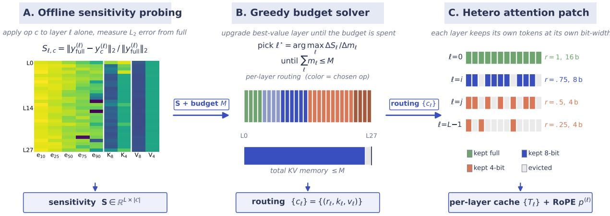  
Figure 3. MoE-nD pipeline. (A) Offline, per-layer sensitivity to each compression operation is measured against an uncompressed reference; the heatmap shows the actual calibration table for DeepSeek-R1-Distill-Qwen-7B. (B) A greedy budget solver picks the per-layer (keep, kbits, vbits) tuple that greedily reduces predicted total sensitivity (attention-output L2 error) subject to a global memory budget M . (C) At inference time, an attention patch applies the routed eviction and quantization to each layer jointly, with per-layer RoPE re-inversion. Routing colors in (B) and keep-patterns in (C) are illustrative; the heatmap in (A) is real data.

Reasoning-model handling. As noted in §1, max gen is scaled by 16× vs. LongBench defaults and the text after the final </think> is used for scoring; first-line truncation is applied to TREC per the LongBench official protocol.

## 5.2. Main result: LongBench accuracy vs. memory

Figure 1 and Table 2 show the headline comparison: average task accuracy as a function of compressed KV memory.

2dhetero at its leftmost operating point (136 MB, 14× compression) reaches 12.0 vs the uncompressed baseline’s 11.5 on the 4-task average (n = 50 per task; per-task 95% Wilson CIs are ±6–9pts). The 0.5pt gap is well inside any reasonable measurement error at this sample size, so the headline observation is that 14× compression comes with no detectable accuracy loss in this protocol — not that the two are formally equal. The directly comparable head-tohead is 2d at 139 MB (essentially the same memory as 2d hetero at 136 MB), which reaches only 5.9 — roughly half the baseline and well outside the CI; per-layer eviction routing is what buys the remaining 6pts. Single-axis methods at half that memory (56 MB, 33× compression)

Table 2. LongBench average (over 4 tasks, n = 50). Methods share a nominal eviction budget b (token count); actual KV memory differs per method family because the solver spends the 2d 4/1.5× headroom on less-compressed layers (italic MB subrows). At b = 512, 2dhetero uses 136 MB (14× compression vs the 1859 MB full cache) and matches the baseline (12.0 vs 11.5); at the comparable 139 MB, 2d only reaches 5.9. Compression ratios for the four hetero cells are 14, 6.6, 3.2, 1.6×.

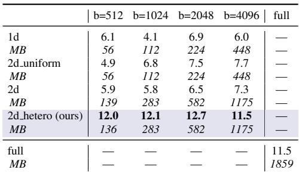

reach 4.9–6.1 — they fail at deeper compression and use less memory, so they are not a clean apples-to-apples comparison to 2d hetero. Breaking it down per task (Table 3), three of the four LongBench tasks show consistent hetero wins; TREC shows no hetero advantage (discussed in §5.5).

## 5.3. AIME reasoning benchmarks

On AIME-24 and AIME-25, MoE-nD 2dhetero beats the non-hetero two-axis baseline 2d at every single budget and dataset (Table 4). The advantage grows at tighter budgets: at b = 64 on AIME-25, 2dhetero delivers 30% while every other method lands at or near 0.

On AIME-25, 2dhetero at b = 256 exceeds the full-cache baseline (36.7 vs 30.0). A similar inversion appears on

Table 3. LongBench per task (n = 50). Tasks: HQA (HotpotQA), NQA (NarrativeQA), PRE (PassageRetrieval-en), TREC. Metrics: QA-F1 (HQA, NQA), retrieval-score (PRE), exact-match (TREC). Columns are nominal eviction budget b; per-method actual memory is in Table 2 and is the same across tasks. full is budget-invariant.  
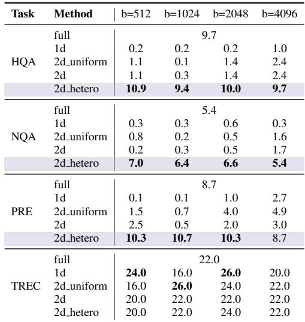

MATH-500 where 1d at b = 256 beats full (53.6 vs 50.4). Both happen on reasoning tasks with long chain-of-thought; the likely mechanism is that aggressive eviction removes self-distracting intermediate tokens, letting the model refocus on the original prompt. Notably, this inversion is visible under both single-axis and hetero-routed eviction, suggesting it is a property of eviction itself and is orthogonal to MoE-nD’s per-layer routing contribution. We flag it as a phenomenon worth studying but do not claim credit for it in our main result.

## 5.4. Ablation: which routing matters?

The ablation chain 2duniform → 2d → 2dhetero cleanly separates the contribution of per-layer quant routing (∆quant) from per-layer eviction routing (∆evict), since each subsequent method adds exactly one routing dimension to the previous.

∆evict is positive in 8/8 configurations, averaging +15.0pts; ∆quant is approximately 0 on average (-2.1pts) and negative in 4 of 8 cells. The same signature holds on LongBench (Table 2): across the four budgets, mean ∆evict = +5.7pts (positive in 4/4) while ∆quant = −0.35pts. Per-layer eviction routing, not per-layer quantization routing, is the loadbearing novel contribution on both reasoning and longcontext tasks.

## 5.5. Scope: when does it help?

Two datasets in our suite show no MoE-nD advantage: MATH-500 (Table 6) and LongBench TREC (Table 3, last block). The shared cause is short prompts under loose budgets. MATH-500 prompts average ∼900 tokens and TREC prompts average ∼5k, so in both cases the uncompressed cache is small relative to the memory budget. Under these conditions the greedy solver picks keep ratio = 1.0 for > 75% of layers; with few layers actually evicted, the heteroeviction routing has nothing to diversify over and 2dhetero degenerates to 2d.

Table 4. AIME-24 and AIME-25 accuracy (n = 30). 2dhetero > 2d at every cell; the gap widens at tight budgets where single-axis and uniformly-routed methods collapse to 0. Individual 95% CIs at n = 30 are wide (±13–17pts), so any single cell is not statistically conclusive; the qualitative pattern (hetero > 2d in 8/8 cells, with the gap widening as budget tightens) is what we rely on. A formal hypothesis test would require independent draws, which these cells (same model and harness) are not.  
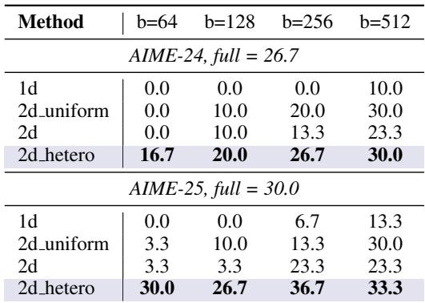

Table 5. Ablation on AIME-24 and AIME-25. ∆quant = 2d − 2duniform isolates per-layer quant routing; ∆evict = 2dhetero − 2d isolates per-layer eviction routing. The novel lift comes from eviction routing.  
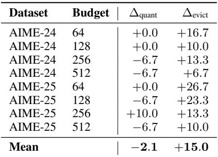

This is not a failure of the calibration or the solver—both behave correctly given the inputs. It is a principled scope condition: MoE-nD’s hetero variant delivers measurable gains primarily when the combination of input length and budget tightness forces the solver to route non-trivially across layers. On long-context tasks (LongBench, 16k inputs) or long-generation tasks (AIME at tight b), this condition holds everywhere we tested. On short-context tasks it does not.

A useful corollary for practitioners: in this short-context regime the simpler 2duniform implementation suffices, because the 2dhetero solver would have routed most layers to nearly-uniform allocations anyway.

Table 6. MATH-500 (n = 500). 2dhetero does not beat 2d on this short-context benchmark because the greedy solver picks keep=1.0 on most layers and the hetero-eviction routing has nothing to diversify over (§5.5). 1d underperforms at tight b where the others get to keep more layers via the quantization headroom; from b = 128 onward the four compressed methods are within 8pts of each other and of full. We report this negative result explicitly.  
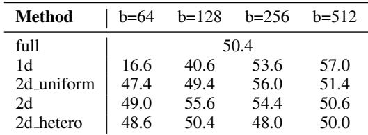

## 6. Limitations and Future Work

External attention-eviction baselines. Direct comparisons to SnapKV (Li et al., 2024) and H2O (Zhang et al., 2023) at matched memory are deferred to a follow-up. Both are single-axis attention-based eviction methods and we expect them to perform in the band of our 1d baseline, which uses the same eviction mechanism with a trigonometric importance signal in place of attention scoring. Since 1d already underperforms 2dhetero by ≥ 5pts at every LongBench budget, the methodological contribution of joint per-layer routing is unlikely to be overturned by adding these single-axis comparators.

Lightweight calibration proxy (validated). Our sensitivity table is built from a single 27-token reasoning prompt scored by attention-output L2 error. We validated this proxy against a principled KL-divergence calibration over 8 held-out sequences of 2048 tokens (Appendix B); per-layer Pearson correlation is 0.945 on average and > 0.8 in 28/28 layers. The solver consumes within-layer rankings, which are preserved. The remaining caveat is that cross-layer rankings under random eviction are noisy across calibration metrics (Pearson r ≈ 0); a deterministic, attention-aware eviction signal would tighten this and is a natural next step.

Single model family. Our sensitivity table is calibrated for DeepSeek-R1-Distill-Qwen-7B. Porting to Llama-3 / Mistral families requires re-calibration (∼1 GPU-day per family). We expect the per-layer heterogeneity observed in §3 to hold broadly—the mechanism (RoPE and GQA structure, MLP residual scales) is architecture-agnostic— but this is an empirical question.

Eager attention. The heterogeneous attention patch is not yet compatible with FlashAttention. Peak memory during prefill is O(T 2) for the attention matrix, which dominates the compressed KV size at T = 16k. This limits the practical deployment memory advantage until a FlashAttentioncompatible implementation lands.

Instruction-tuned baselines. Absolute F1 numbers in this paper reflect reasoning-style generation. A port to a nonreasoning variant (e.g., Qwen2.5-7B-Instruct) would make our numbers directly comparable to published LongBench tables; the relative gaps between methods should be preserved.

## 7. Conclusion

We presented MoE-nD, a KV cache compression method that jointly routes eviction ratio and K/V quantization bits per layer under a global memory budget. On long-context benchmarks where per-layer heterogeneity exists, MoEnD’s full hetero variant matches the uncompressed baseline at 14× compression (136 MB vs the 1.9 GB full cache) and, at matched memory, dominates the uniform two-axis baseline by 1.6–2× in F1 across the four budgets we tested. An ablation chain establishes that per-layer eviction routing, not per-layer quantization routing, is the novel lever. Two null results—MATH-500 and LongBench TREC—share a principled cause (short inputs, solver picks keep=1.0) and cleanly scope the method. We believe MoE-nD provides a template for compression methods that combine multiple orthogonal axes under a single calibrated router.

## References

Ainslie, J., Lee-Thorp, J., de Jong, M., Zemlyanskiy, Y., Lebron, F., and Sanghai, S. GQA: Training generalized ´ multi-query transformer models from multi-head checkpoints. In Conference on Empirical Methods in Natural Language Processing, 2023.

Bai, Y., Lv, X., Zhang, J., et al. LongBench: A bilingual, multitask benchmark for long context understanding. In Annual Meeting of the Association for Computational Linguistics, 2024.

Brandon, W., Mishra, M., Nrusimha, A., Panda, R., and Kelly, J. R. Reducing transformer key-value cache size with cross-layer attention, 2024.

Cai, Z., Zhang, Y., Gao, B., Liu, Y., Li, Y., Liu, T., Lu, K., Xiong, W., Dong, Y., Hu, J., and Xiao, W. PyramidKV: Dynamic KV cache compression based on pyramidal information funneling, 2024.

Cai, Z., Xiao, W., Sun, H., et al. R-KV: Redundancy-aware KV cache compression for reasoning models. In Advances in Neural Information Processing Systems, 2025.

Dao, T., Fu, D. Y., Ermon, S., Rudra, A., and Re, C. FlashAt-´ tention: Fast and memory-efficient exact attention with

IO-awareness. In Advances in Neural Information Processing Systems, 2022.

DeepSeek-AI. Deepseek-r1: Incentivizing reasoning capability in llms via reinforcement learning, 2025.

Dong, S., Cheng, W., Qin, J., and Wang, W. QAQ: Quality adaptive quantization for LLM KV cache, 2024.

Feng, Y., Lv, J., Cao, Y., Xie, X., and Zhou, S. K. Ada-KV: Optimizing KV cache eviction by adaptive budget allocation for efficient LLM inference. In Advances in Neural Information Processing Systems, 2025.

Hendrycks, D., Burns, C., Kadavath, S., Arora, A., Basart, S., Tang, E., Song, D., and Steinhardt, J. Measuring mathematical problem solving with the MATH dataset. In NeurIPS Track on Datasets and Benchmarks, 2021.

Hooper, C., Kim, S., Mohammadzadeh, H., Mahoney, M. W., Shao, Y. S., Keutzer, K., and Gholami, A. KVQuant: Towards 10 million context length LLM inference with KV cache quantization. In Advances in Neural Information Processing Systems, 2024.

Li, X., Xing, Z., Li, Y., Qu, L., Zhen, H.-L., Liu, W., Yao, Y., Pan, S. J., and Yuan, M. KVTuner: Sensitivity-aware layer-wise mixed-precision KV cache quantization for efficient and nearly lossless LLM inference. In International Conference on Machine Learning, 2025.

Li, Y., Huang, Y., Yang, B., Venkitesh, B., Locatelli, A., Ye, H., Cai, T., Lewis, P., and Chen, D. SnapKV: LLM knows what you are looking for before generation. In Advances in Neural Information Processing Systems, 2024.

Liu, Z., Desai, A., Liao, F., Wang, W., Xie, V., Xu, Z., Kyrillidis, A., and Shrivastava, A. Scissorhands: Exploiting the persistence of importance hypothesis for LLM KV cache compression at test time. In Advances in Neural Information Processing Systems, volume 36, 2023.

Liu, Z., Yuan, J., Jin, H., Zhong, S., Xu, Z., Braverman, V., Chen, B., and Hu, X. KIVI: A tuning-free asymmetric 2-bit quantization for KV cache. In International Conference on Machine Learning, 2024.

Mao, W., Lin, X., Huang, W., et al. Triattention: Efficient long reasoning with trigonometric KV compression, 2026.

Sharma, A., Ding, H., Li, J., Dani, N., and Zhang, M. MiniKV: Pushing the limits of LLM inference via 2-bit layer-discriminative KV cache, 2024.

Shazeer, N., Mirhoseini, A., Maziarz, K., Davis, A., Le, Q., Hinton, G., and Dean, J. Outrageously large neural networks: The sparsely-gated mixture-of-experts layer.

In International Conference on Learning Representations, 2017.

Su, J., Ahmed, M., Lu, Y., Pan, S., Bo, W., and Liu, Y. RoFormer: Enhanced transformer with rotary position embedding. Neurocomputing, 568:127063, 2024.

Wei, J., Wang, X., Schuurmans, D., Bosma, M., Ichter, B., Xia, F., Chi, E., Le, Q. V., and Zhou, D. Chain-of-thought prompting elicits reasoning in large language models. In Advances in Neural Information Processing Systems, volume 35, pp. 24824–24837, 2022.

Xiao, G., Tian, Y., Chen, B., Han, S., and Lewis, M. Efficient streaming language models with attention sinks. In International Conference on Learning Representations, 2024.

Yuan, Z., Shang, Y., Zhou, Y., Dong, Z., Zhou, Z., Xue, C., Wu, B., Li, Z., Gu, Q., Lee, Y. J., et al. ASVD: Activation-aware singular value decomposition for compressing large language models, 2024.

Zhang, Z., Sheng, Y., Zhou, T., Chen, T., Zheng, L., Cai, R., Song, Z., Tian, Y., Re, C., Barrett, C., et al. H2O: Heavy- ´ hitter oracle for efficient generative inference of large language models. In Advances in Neural Information Processing Systems, volume 36, 2023.

## A. Absolute Scores and Instruction-Tuned Models

Our 11.5 LongBench average for the uncompressed baseline is ≈ 3× below Llama-3-8B-Instruct baselines published in SnapKV (Li et al., 2024) and PyramidKV (Cai et al., 2024). The gap originates in three compounding factors. First, DeepSeek-R1-Distill is a reasoning-distilled model: for NarrativeQA it emits extensive reasoning inside <think>...</think> before the final answer, and when max gen is exhausted mid-think, no answer is emitted at all. Second, even with max gen × 16 the final answer is often verbose and scores poorly against LongBench’s concise-goldanswer F1 protocol. Third, we use a 7B reasoning distillation; the published baselines use 8B instruction-tuned models with 10–20% more parameters and task-aligned finetuning. We have not ported to an instruction-tuned variant primarily because our per-layer sensitivity table is calibrated for the reasoning model; we plan a Qwen2.5-7B-Instruct port in a revision.

## B. Implementation Details

Sensitivity calibration. A single 27-token mathematical-reasoning prompt (“Solve the equation x2 − 5x + 6 = 0. Think step by step and show all work.”). For each layer ℓ and configuration c ∈ C, we apply c to layer ℓ only and measure Sℓ,c = ∥attn(ℓ)full − attn(ℓ)c ∥2 / ∥attn(ℓ)full∥2, the relative L2 error of the layer’s attention output against the full-precision reference, averaged over the prompt’s token positions. This is a deliberately lightweight proxy: total calibration cost is seconds-to-minutes on a single H200, the persisted table calibration/ds qwen7b sensitivity.pt is 5 kB, and the same table drives every routing decision in the paper.

KL-divergence validation of the proxy. We validated the L2-error proxy against a principled KL-divergence calibration over 8 held-out sequences of 2048 tokens (calibration/ds qwen7b sensitivity kl.pt, 5 kB). Across the 28 layers and 11 compression configurations, the mean per-layer Pearson correlation between the two metrics is 0.945 (Spearman 0.937); 28/28 layers show Pearson r > 0.8, most > 0.9. This confirms that the cheap proxy produces equivalent within-layer rankings to the gold-standard KL method — and within-layer rankings are exactly what the greedy budget solver consumes (§4: at each step, “upgrade layer ℓ to its next-best config”). Per-config cross-layer rankings are tighter for quantization configs (Pearson r = 0.99 for k8v4, 0.98 for k8, 0.73 for k4) than for V-quantization (small effect anyway: r = 0.01–0.41) or eviction configs (r ≈ 0); the eviction disagreement is a property of random-permutation eviction itself — different random seeds rank the layers differently — and does not affect solver decisions, which operate within-layer.

Greedy solver. Python, < 50ms per invocation. Produces a LayerCompressionConfig per layer stored on the patched model as model. moekv nd layer configs.

Hetero attention patch. Per-layer cache position arrays and step-count eviction trigger; see moekv/heterogeneous attention.py.