# CAKE: Compiler–Agent Co-Design for Frontier Kernel Evolution

Zihao Ye<sup>1∗</sup> Yingyi Huang<sup>1∗</sup> Hongyi Jin<sup>2</sup> Bohan Hou<sup>2</sup> Junru Shao<sup>1</sup> Zhongming Yu<sup>1</sup> Jinqi Chen<sup>1</sup> Meghan Cowan<sup>1</sup> Shiyi Cao<sup>1</sup> Shanli Xing<sup>1</sup> Hanfeng Chen<sup>1</sup> Vinod Grover<sup>1</sup> Tianqi Chen<sup>1,2</sup> Luis Ceze<sup>1</sup>

<sup>1</sup>NVIDIA <sup>2</sup>Carnegie Mellon University

## Abstract

Work on GPU kernel agents and work on GPU programming languages have advanced separately, and the gap between them is where expert kernels are lost. Kernel agents treat the compiler as a fixed black box: they improve proposal, mutation, and ranking, but the environment returns only compiler errors, correctness outcomes, and end-to-end timing—signals that never say which program decision caused a synchronization failure, a hardware-contract violation, or a pipeline stall, and that cannot grow when a frontier workload exposes a missing capability. Meanwhile the languages an agent might write are not built for one. Tile-level DSLs hide the warp specialization, barrier choreography, and memory-tier placement that separate expert kernels from merely correct ones; low-level DSLs expose that control but demand a layout calculus that makes agent errors both likely and hard to localize. We present <sup>Cake</sup>, which codesigns the two. Agents author <sup>Cake</sup> <sup>IR</sup>, a typed, hardware-explicit schedule representation that gives fine-grained control without a layout algebra and carries enough information for a verifier and cost model to reason about a program before it is compiled; the harness answers with localized correctness and performance diagnostics and is itself a target of evolution, so recurring failures become new verifier rules, IR primitives, cost-model calibrations, and reusable tactics rather than one-of workarounds. Across matched implementation-hidden Flash-KMeans clean starts on B200 (three runs per representation), the best candidate at an 80-million-token budget reaches a median 1.144× the tuned FlashML baseline with <sup>Cake</sup> <sup>IR</sup>, versus 0.928× for direct CUDA/PTX. Beyond the clean-start benchmark, agent-generated Kimi Delta Attention reaches a 2.05× geometric-mean speedup over oficial FlashKDA and is validated in end-to-end serving. Dispatcher-backed KNN and KMeans families improve performance by 1.42×–2.12× across more than 400 shapes, and four kernel changes are available as upstream PRs. <sup>Cake</sup> targets NVIDIA GPUs from Ampere through Blackwell and separates single-shape evolution from the generalization and dispatch stage required for library integration.

## 1 Introduction

Coding agents can now write and revise GPU programs in settings where correctness and performance are measured automatically [1–7]. Most such systems still treat the programming environment as a fixed black box: the agent proposes code, compiles it, runs a numerical test, measures latency, and picks another edit. The loop works for local tuning, but a crash does not identify the violated safety or hardware condition, and one latency number does not explain which program decision limits performance.

Expert kernel programmers work diferently. They keep a compact model of the workload, reason over explicit hardware resources, and carry reusable rules between kernels. A compiler already holds most of the machinery needed to externalize that process—structured operation vocabularies, resource models, legality checks, static analyses, cost models, lowering rules. The question <sup>Cake</sup> asks is how to make that machinery agent-facing, and how to improve it when a frontier workload exposes a gap.

<sup>Cake</sup> answers with three commitments. First, agents edit a typed IR rather than raw CUDA, so hardware decisions are inspectable before code generation. Second, the compiler returns localized correctness and performance diagnostics rather than a pass/fail bit, so cheap analysis filters candidates before they consume GPU time. Third, the harness is itself a target of evolution: repeated failures become verifier rules, calibration tasks, or new primitives, gated by corpus tests. <sup>Cake</sup> <sup>IR</sup> was designed bottom-up through agent-driven abstraction discovery over a corpus of production kernels, guided by the requirement that it reproduce the physical schedules and performance of expert-written kernels (Figure 2; Appendix A). The harness is likewise maintained primarily by agents under human merge gates.

The system supports two entry points, which correspond to the two ways kernel work actually arrives. It can start from a production kernel in a library such as FlashInfer or CUTLASS and continue evolving that implementation; or, for a workload with no mature reference, it can start from a high-level description or a Triton implementation and let agents choose warp specialization, layout, and pipeline structure in <sup>Cake</sup> <sup>IR</sup> while the compiler verifies the program and generates CUDA.

This paper reports on the system in that second regime as well as the first. <sup>Cake</sup> targets NVIDIA GPUs from Ampere through Blackwell, and its validated corpus covers dozens of kernel families—attention and linear attention, dense, grouped, and quantized GEMM, MoE dataflows, normalization, quantization, Top-K, KNN and KMeans, and fused graph kernels. Section 5 evaluates repeated clean-start evolution against a tuned baseline, reports frontier-kernel synthesis on model architectures such as Kimi Delta Attention [8], Gated DeltaNet [9], and sparse attention, and reports reproduction of established kernel families. Section 6 then treats the step that benchmark numbers usually skip: turning a kernel tuned at one shape into a dispatcher-backed family that a serving library can call at any shape.

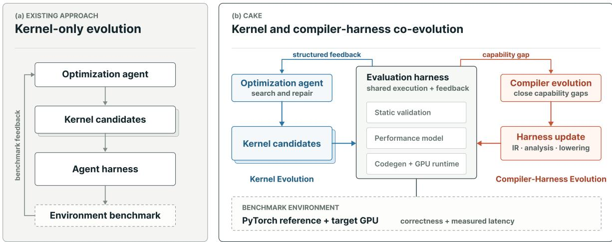  
Figure 1: Overview of <sup>Cake</sup>. Kernel evolution consumes structured compiler evidence; compiler evolution is the outer loop.

## 2 Program representation

<sup>Cake</sup> exposes <sup>Cake</sup> <sup>IR</sup> as the agent-facing program representation and emits CUDA/PTX for execution. Structured analysis and performance modeling operate on <sup>Cake</sup> <sup>IR</sup>, while conventional sanitizer and profiler feedback comes from the generated code.

## 2.1 Bottom-up IR evolution

<sup>Cake</sup> did not begin with a predefined <sup>Cake</sup> <sup>IR</sup> vocabulary. Its starting material was a corpus of production kernels together with hardware design principles. From those kernels, agents identify a recurring schedule or a missing capability, revise the IR and its compiler support, and then port and validate kernels against the revised system. The next kernel family—or a gap exposed by validation—starts the same cycle again. This loop both produced the current IR and continues to grow it (Figure 2); Appendix A expands the process.

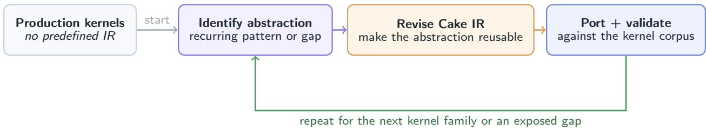  
Figure 2: <sup>Cake</sup> <sup>IR</sup> evolves from kernels rather than a fixed language design. The initial corpus enters once; the three-step loop repeats for each new kernel family or capability gap.

## 2.2 Explicit machine schedules in <sup>Cake</sup> <sup>IR</sup>

<sup>Cake</sup> <sup>IR</sup> records how the machine should be driven—which warps take which roles, which bufers are staged how deeply, which barrier gates which handof, which instruction form consumes which operand. The corresponding division of labor is that a schedule states what is to happen and lowering derives how: barrier addresses, phase bits, TMEM ofsets, descriptor encodings, and warp identity are all computed from the declarations rather than written out by the agent.

A program combines explicit operations, declared resources, warp roles, and grid and pipeline configuration (Figure 3). Four properties do the work. Type-checked vocabulary: compute, memory movement, synchronization, math, and warp control use a fixed IR vocabulary rather than embedded C or PTX. Declared resources: memory regions, synchronization state, and pipelines are declared once, so the IR knows the shape, dtype, and lifetime of every bufer. Explicit roles: warp groups are named, and every cross-role handof is visible rather than an implicit convention. Auto-derived metadata: the mechanical consequences of those declarations are lowered, not authored.

The payof is that analyses can reason from explicit schedule decisions before code generation. The harness can therefore tie a finding to the afected resource, role, or stage rather than returning only a backend error or a hang. The language catalog, resource model, and design principles are in Appendix B.

Layout. <sup>Cake</sup> deliberately does not make layout a first-class abstraction. Rather than requiring agents to manipulate a layout algebra, <sup>Cake</sup> <sup>IR</sup> records storage and access decisions directly in the schedule. The compiler then checks that producer and consumer representations are compatible with the target hardware (Appendix B.4).

```python
@cake.schedule()
2 def fmha_fwd(lm, Q: LM.tma3d, O: LM.tma2d, seqlen_q: LM.i32):
3 # declare resources: named resources, not raw addresses
4 pool = lm.smem(98304)
5 smem_q = pool.view(offset=0, shape=(128,128), dtype=lm.bf16, stage=3)
6 tmem_acc = lm.tmem(cols=0, width=128, shape=(128,128), dtype=lm.f32)
7
8 # declare roles: warp groups with assigned work
9 load = lm.role(warps=[0])
10 mma = lm.role(warps=[1])
11 pipe = lm.pipeline(stages=3)
12 q_full = lm.barrier(count=3, prod=[load], cons=[mma],
13 init_count=1, pipeline=pipe)
14
15 with load:
16 for stage in lm.range(0, 3):
17 smem_q.tma_load(Q, coords=(0,0,stage), stage=stage, barrier=q_full)
18
19 with mma:
20 for stage in lm.range(0, 3):
21 lm.wait(q_full, stage=stage)
22 lm.fence_proxy()
23 lm.mma(tmem_acc, smem_q[stage], smem_q[stage], init=(stage == 0))
```  
Figure 3: A <sup>Cake</sup> <sup>IR</sup> schedule fragment. Resources and roles are declared; the producer–consumer handof is an explicit barrier; addresses, phases, and warp identity are derived by lowering.

## 2.3 Architecture and lowering

The same schedule language targets NVIDIA GPUs from Ampere through Blackwell, so a role– barrier–pipeline schedule is portable in structure while instruction admission and lowering remain target-specific. <sup>Cake</sup> maps the attached GPU exactly, reports unsupported targets rather than silently substituting another architecture, and emits performance estimates only where targetspecific calibration is available. The detailed device matrix and backend notes are deferred to Appendix B.5.

## 3 Compiler harness

The harness is the agent-facing environment around <sup>Cake</sup> <sup>IR</sup>. Humans give high-level descriptions of the intended analyses; agents implement, maintain, and refine them under validation. During kernel evolution, cheap analyses rank and filter candidates before they reach expensive GPU runs.

## 3.1 Analysis and validation

Program safety and hardware conformance. Before compilation, the harness checks the typed schedule for broad classes of synchronization, memory-safety, data-flow, resource, instruction, and data representation violations. These checks reject many candidates that are mathematically plausible but incompatible with the target execution model. A finding identifies the afected program region and the class of violated contract, giving the agent a useful repair target through a stable analysis interface.

Numerical correctness. For each workload, we compare the kernel and reference outputs across diferent shapes and input distributions. Final acceptance requires end-to-end evaluation in the corresponding target framework.

Performance modeling. A calibrated cost model estimates candidate performance and returns high-level bottleneck attribution and optimization guidance. The model is used to rank and filter candidates; on-device measurement and profiling remain the final ground truth.

Table 1 summarizes the suite by externally visible function rather than by individual pass or implementation. The important interface is the contract: blocking checks reject candidates with a localized reason, reports describe likely performance limits, and hints suggest non-blocking optimizations.

Table 1: Analysis and validation categories exposed by the <sup>Cake</sup> harness. Categories describe user-visible behavior rather than internal passes.  
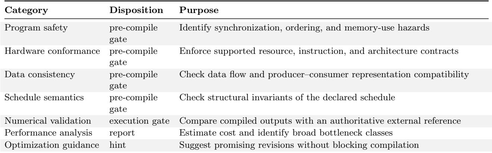

## 3.2 Compiler evolution

<sup>Cake</sup> evolves the compiler alongside the kernels. Kernel candidates, validation results, benchmarks, and failure reports provide evidence for proposing and validating compiler changes.

Compiler evolution follows two complementary paths (Figure 4). In the first, agents inspect production kernels and hardware documentation to find missing Blackwell patterns—new instruction forms, resource types, descriptor variants, synchronization idioms—and formulate compiler change proposals. Each proposal is checked against the <sup>Cake</sup> <sup>IR</sup> design principles, including performance transparency and verification-friendliness, before implementation. In the second, agents use feedback from failed candidates—sanitizer reports, failure cases, correctness mismatches, debugging logs—and distill recurring or high-cost failure modes into new analyses: an opaque runtime crash becomes a verifier rule, a repeated illegal lowering pattern becomes a static check, a systematic misprediction becomes a calibration target.

The two paths are coupled. New primitives expose additional hardware facts to the compiler, enabling stronger analysis; new analyses in turn constrain the design space for future primitives. Compiler changes are test-gated across the kernel corpus, because a primitive and its analyses must evolve together: syntax without efects and legality rules makes the IR less analyzable, and a new verifier rule without corpus validation can reject valid kernels.

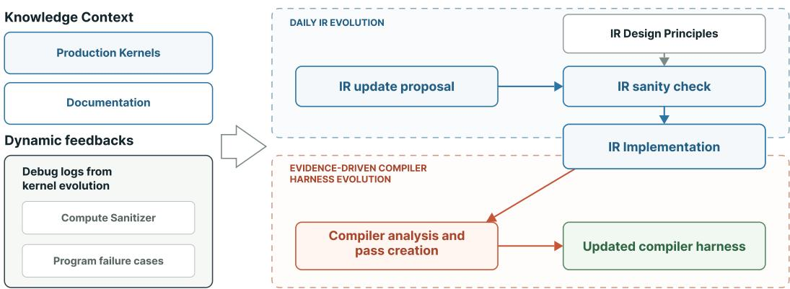  
Figure 4: Evidence-driven compiler evolution. Corpus and runtime evidence drive validated compiler changes.

## 4 Agent workflow

The external workload contract is the stable authority. A run has four stages: generate structurally distinct <sup>Cake</sup> <sup>IR</sup> candidates; filter them with IR construction checks, verifier hard gates, and cost-model ranking before spending GPU time; evaluate survivors against the external oracle with benchmarking and profiler evidence; and route the resulting evidence to the candidate, verifier, cost model, or IR vocabulary according to the diagnosis. The workload contract fixes the shapes, oracle, tolerances, hardware, and permitted references, while retained results make decisions auditable and recurring findings reusable.

All reported agent tasks use GPT-5.6-sol [10] at reasoning efort xhigh. Holding the model and agent scafold fixed makes the comparisons in Section 5 attributable to the environment rather than to model capability.

## 5 Evaluation

The evaluation asks three questions: whether the compiler harness can drive repeated clean-start evolution past a tuned baseline, whether <sup>Cake</sup> can synthesize frontier kernels without low-leve implementation references, and whether it can reproduce expert kernels against state-of-the-art baselines.

Protocol. All measurements use on-GPU correctness checks and CUPTI timing on B200, with the L2 cache flushed before each timed sample. Each reported candidate is compiled, checked for correctness, and benchmarked at the listed shape.

The replicated clean-start runs fix the coding agent and scafold, model and reasoning efort, task statement, correctness oracle, benchmark harness, and single target shape. The Flash-KMeans runs use an isolated B200 clean-start environment that provides the task specification, correctness oracle, and benchmark interface while withholding low-level target implementations. The treatment arm authors typed <sup>Cake</sup> <sup>IR</sup>; the control arm authors CUDA C++ and inline PTX directly. We report provider-token consumption and active evolve time. Table 2 summarizes three matched runs per arm at the 80-million-token budget, while Figure 5 shows their eligible performance checkpoints. Summary entries use median [min, max]; detailed stopping and timing accounting is retained in the

artifact.

Reference access. Reference access depends on the question. For clean-start and frontier-kernel synthesis, agents may inspect the mathematical specification, evaluation contract, correctness oracle, and high-level code, but not low-level target implementations such as CUDA, PTX, SASS, or equivalent generated source. Those references already encode the scheduling decisions the experiment asks the agent to discover. An external implementation may still be executed through the benchmark harness as a black-box performance baseline; its internals remain unavailable to the agent. For known-kernel reproduction, the agent may inspect the reference. The Flash-KMeans restriction was enforced in isolated clean-start environments and audited afterward. The direct CU-DA/PTX arm changes the authored representation, not the reference policy: it may write low-level code but may not inspect an existing target implementation.

Flash-KMeans clean-start workload. To test repeatability from an implementation-hidden clean start, we use Flash-KMeans [11], an exact k-means workload motivated by semantic-aware token permutation in Sparse VideoGen2 [12]. A Lloyd iteration is dominated by two BF16 kernels accounting for more than 95% of end-to-end time: assign, which computes squared Euclidean distances from each token to all K centroids and returns an arg-min, and centroid\_update, which reduces tokens within each cluster into per-cluster sums and counts. The two have diferent profiles—assign is a compute-bound BF16 GEMM-and-reduction kernel, while centroid\_update is bandwidth- and atomic-contention-sensitive. We focus on assign, which exercises the tensor-core pipeline and scalar epilogue at B=32, N=65,536, K=1024, and D=128 with BF16 inputs and FP32 accumulators. All runs use the same model, oracle, and benchmark. Performance is normalized to the tuned FlashML KMeans Triton implementation, measured at 0.938 ms.

Table 2: Matched three-run Flash-KMeans clean-start comparison on B200.  
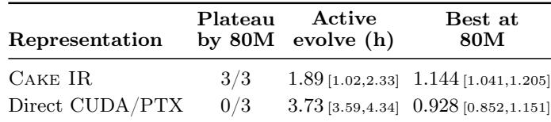

Trajectory. Figure 5 complements the terminal summary in Table 2 by showing when gains arrive. The <sup>Cake</sup> <sup>IR</sup> mean crosses the tuned FlashML baseline by 55 million tokens and continues to improve, while the direct CUDA/PTX mean remains below baseline at the 80-million-token cutof.

Across the matched runs, <sup>Cake</sup> <sup>IR</sup> meets the prespecified plateau criterion in 3/3 runs by 80 million tokens, versus 0/3 for direct CUDA/PTX. Its median best attainment is 1.144× the tuned FlashML baseline, versus 0.928×, with median active evolve time of 1.89 versus 3.73 hours.

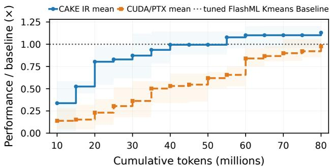  
Figure 5: Flash-KMeans fixed-shape clean-start attainment on B200. At each 5-million-token budget from 10M through 80M, every run contributes its best validated speedup so far. Curves show threerun means, bands show run minimum–maximum, and the horizontal line is the tuned FlashML K-means baseline.

## 5.1 Frontier-kernel synthesis

A kernel is frontier here in the operational sense that the agent must discover its physical schedule without inspecting a low-level target implementation. Existing implementations may still serve as black-box evaluation baselines. This is the regime a co-evolving IR should help most, because the search cannot be anchored to a known-good design, and it is also the regime where the harness is most exposed, since a missing capability appears as a schedule the agent cannot express at all.

Emerging model architectures. Kimi Delta Attention (KDA) is the clearest case. Oficial FlashKDA is used only as a black-box timing baseline; its source and generated code are not provided to the agent. A FlashKDA-compatible prefill covers fixed, packed-variable, and tail inputs and reaches a 2.05× geometric-mean speedup over that baseline across six B200 BF16 shapes. It is bitwise correct on its validation contract and was verified in end-to-end Kimi-K3 serving under SGLang. The generated CUDA is available in FlashInfer PR #4262<sup>1</sup>, so downstream users take on no dependency on <sup>Cake</sup>. Separate decode paths reach a 1.14× geometric mean over upstream FlashInfer across 30 public-API shapes (FlashInfer PR #4279<sup>2</sup>). Unlike a GEMM with an epilogue, KDA contains a recurrent state that must remain live across chunks, making it a useful test of the schedule representation. Appendix D.1 reports the corresponding two-phase source-session trajectory.

Against FlashInfer, the Gated DeltaNet prefill and speculative-decode paths improve performance while preserving the model’s recurrent state. MiniMax sparse attention further shows that the same representation supports sparse-attention families across prefill and decode paths. These are dispatch families rather than single kernels: alternative physical schedules remain separate <sup>Cake</sup> <sup>IR</sup> programs behind one logical entry point.

Reference-guided production evolution. TinyGEMM provides a complementary production case to the clean-start frontier experiments above. Starting from FlashInfer’s TensorRT-LLMderived small-M BF16 kernel, the agent produced an adaptive family of shallow and deep pipelines, including PDL variants and batch sizes below eight. FlashInfer PR #4274<sup>3</sup> reports an 18–23% geometric-mean kernel-time reduction across 35 canonical shapes and a broader regression suite. Greedy decoding on B200 and GB300 remained bitwise-identical for GPT-OSS-20B and GPT-OSS-120B; a separate SGLang GPT-OSS-120B experiment reported up to 7.6% higher output throughput at concurrency 128 on TP1 and diferences within measurement noise on TP4. Appendix D.2 reports the preceding four-shape search and targeted small-shape follow-up.

Communication-rich megakernel evolution. The original Alpha-MoE implementation [13] targeted Hopper. Starting from that implementation, <sup>Cake</sup> agents successfully rewrote its W8A8 fused MoE megakernel for Blackwell. The resulting implementation tests whether the evolving compiler can express the data exchange around tensor-core computation, not only the computation itself. It fuses routed gather, two projections, activation, requantization, and route-weighted output accumulation into one device program. Against FlashInfer’s TensorRT-LLM-derived prerouted API, its end-to-end API-level speedups are 6.204× at N=256 and 4.025× at N=512. A GPU-span remeasurement gives 1.215× and 1.170×, respectively, isolating the improvement in effective GPU execution. The larger API-level gains additionally reflect fewer scheduling gaps through launch/schedule fusion and simpler workspace handling: the reference launches five GPU activities, whereas Alpha-MoE uses an output reset and one megakernel. The corresponding FlashInfer contribution is FlashInfer PR #4287<sup>4</sup>. Appendix D.3 reports the normalized rewrite trajectory, whose denominator is the initial correct <sup>Cake</sup> checkpoint rather than TensorRT-LLM.

## 5.2 Known-kernel reproduction

To validate production-quality output, we also target known operator families with state-of-the-art baselines on modern LLM execution paths: attention forward/backward and decode, low-precision GEMM, and MQA/MLA logits and decode kernels. The references come from TensorRT-LLM [14], CUTLASS [15], DeepGEMM [16], FlashAttention-4 [17], and FlashInfer [18]. These cases test a diferent question from frontier-kernel synthesis: when expert structure already exists, can the co-evolved harness help agents preserve correctness while matching or improving highly optimized kernels? The comparison itself—the kernel set, the listed reference for each variant, and the evaluation shape—is fixed, so a rerun changes the values, not the claim under test. Appendix E reports the full per-kernel matrix, including measured shapes, relative performance, and audited implementation size (Table 4).

Across the eleven currently measured fixed comparisons, ten entries meet or exceed the listed reference, and the remaining one reaches 96.5% of its reference. The strongest results are the two MQA indexers at roughly 1.27×. All comparisons pass their kernel-specific correctness gates and use median CUPTI GPU span.

Two efects shape how these results should be read. Variants that land below their reference generally reflect compiler-integration maturity rather than a diferent algorithmic target: where a feature a kernel wants is still being integrated into the compiler and code generator, the submitted artifact uses the closest supported strategy. Conversely, the strongest indexer wins are not faithful transcriptions of the reference kernels. During porting, the agent explored optimizations absent from the original implementation and retained variants that passed correctness and benchmarking, so the above-parity entries reflect search rather than transcription fidelity alone.

The line-count columns are descriptive rather than a cross-language productivity or readability metric. Every <sup>Cake</sup> <sup>IR</sup> implementation in the table is shorter than its audited reference device core, but the languages and counting scopes difer. The comparison shows only that the evaluated hardware schedules can be represented compactly in <sup>Cake</sup> <sup>IR</sup> while retaining the decisions needed for analysis and lowering.

## 5.3 Kernel portfolio

The preceding evaluations do not convey the breadth of what the harness now sustains. The validated corpus contains more than 400 static and compile cases and 399 GPU correctness cases across roughly 28 families, including attention, dense and sparse GEMM, MoE, quantization, normalization, state-space models, KNN, and KMeans. It includes architecture-specific paths from Ampere through Blackwell.

Beyond the frontier kernels of Section 5.1, the corpus’s other distinguishing property is composition. Because roles, barriers, and bufers are declared rather than implied, schedules that would normally be separate kernels can be expressed as one device program. BatchAttention combines decode and prefill work, while the Alpha-MoE and mega-MoE families fuse routing, expert computation, and output accumulation without materializing intermediate results. The corpus also contains more than 100 TensorRT-LLM ports across attention, MLA decode, and MoE kernels. The Alpha-MoE W8A8 kernel, originally written for Hopper, was rewritten by <sup>Cake</sup> agents for Blackwell, illustrating that schedule structure can survive even when target instructions change.

The four upstream changes cover KDA prefill, KDA decode, TinyGEMM2, and Alpha-MoE.

## 6 From a tuned shape to a library

Everything to this point optimizes a shape. A library takes whatever shape the caller passes. Closing that gap is not a matter of running the inner loop on more shapes; it is a separate stage with a diferent objective, a diferent ranking signal, and a diferent failure mode, and <sup>Cake</sup> treats it as such.

Separate objectives. An exact shape gives the inner loop a clean denominator and permits aggressive specialization. Scoring that loop on broad coverage would weaken this signal. Generalization therefore begins only after strong per-shape seeds exist and is scored on dispatcher-inclusive performance over a fixed workload. Incorrect or slow seeds return to the inner loop rather than being hidden behind routing.

Building and validating portfolios. The generalization stage groups measured seeds into shape buckets, produces specialized or shared variants, and orders their guards behind an explicit fallback. Tuning may change implementation parameters but not the input shape. Before reporting an aggregate, validation covers representative and held-out inputs, boundary and tail cases, overlapping or missing guards, and the fallback path.

Preventing evaluation leakage. The valid shape domain is declared before tuning. Dispatcher predicates may partition that domain, but they may not introduce convenient new evaluation rows. Coverage expands through deterministic unseen shards of the same source. This separation prevents the dispatcher from being tuned on the set used to claim generalization.

What this looks like in the corpus. Several of the kernels in Section 5.1 are already portfolios rather than single schedules. KNN build uses coarse outer families with shape-specific routes within them, whereas KMeans dispatches to a smaller set of final-route buckets. Attention portfolios similarly route distinct decode and prefill schedules behind one logical entry point. The route-level breakdown appears in Appendix F (Figure 9).

The classic machine-learning workloads give the cleanest read on what the stage buys, because their portfolios are large enough that a single shape cannot carry the result. On GB200, the generalized KNN build, KNN search, and KMeans implementations contributed to FlashLib achieve dispatcher-inclusive results. We report G<sub>span</sub>, the unweighted geometric mean of per-shape speedups, where each speedup is the reference median CUPTI GPU span divided by the <sup>Cake</sup> median CUPTI GPU span. The G<sub>span</sub> values are 1.418×, 2.116×, and 1.803× across 112, 198, and 124 shapes, respectively, with no incorrect outputs and recall 1.0 for KNN. These full-portfolio results answer a diferent question from the three-run, single-shape Flash-KMeans clean-start cohort in Table 2: the former evaluate complete shape sets after dispatch, whereas the latter evolves one exact shape. Because the measurements use diferent hosts, shape distributions, baselines, and protocols, their diference is not, by itself, a measured cost of generalization.

One policy limits the practical cost of generalization. The stage reuses a single physical schedule across as much of the shape domain as it can, and introduces another only when the domain requires a material schedule change. Routing complexity must be justified by measured workload gain. Because each route is a separate <sup>Cake</sup> <sup>IR</sup> program, alternatives remain independently analyzable and benchmarkable.

## 7 Related work

GPU programming systems. Existing DSLs fall into two camps, both awkward for agentdriven kernel development. High- and mid-level tile DSLs—Triton [19], Helion [20], TileLang [21], cuTile [22]—hide hardware behind tile abstractions and often automatic scheduling, but that opacity prevents an agent from expressing the warp specialization, barrier choreography, and memory-tier placement that separate expert kernels from merely correct ones. Low-level DSLs such as CuTe DSL [23] expose hardware control but demand domain-specific expertise like layout algebra, which is a substantial learning burden and produces brittle code when layout choices are wrong. Gluon [24] sits between the two, reusing Triton’s compiler stack while exposing lower-level control over layouts, memory movement, and asynchrony. <sup>Cake</sup> addresses the gap by co-designing the IR with agents: <sup>Cake</sup> <sup>IR</sup> gives fine-grained hardware control without requiring a layout calculus, and it evolves—new primitives when agents find inexpressible patterns, refined passes when they hit new bug classes, recalibrated cost models when predictions fail.

Compiler analysis and scheduling. TVM [25], XLA [26], MLIR [27], TensorIR [28], Ansor [29], and MetaSchedule [30] structure programs for analysis and optimization. Graphene [31, 32], Twill [33], and Tawa [34] model asynchronous GPU execution, pipelining, or warp specialization. <sup>Cake</sup> shares the principle that structured programs enable useful analysis, but places compiler findings inside an agent evolution loop and lets recurring kernel evidence evolve the harness.

Kernel agents. KernelBench [1] established a common evaluation setting for translating highlevel operators into eficient kernels. Several systems use a human-designed loop in which an LLM revises kernels from compilation, correctness, or profiling feedback [4–6]. KernelBlaster [3] adds a persistent, retrievable CUDA knowledge base populated from prior optimization experience. KernelEvolve [2] and EvoEngineer [35] support evolutionary search over kernel candidates. AVO [36] replaces fixed mutation and crossover heuristics with autonomous coding agents as evolutionary variation operators. K-Search [37] separates planning from implementation and uses an LLM world model to guide search. AutoTriton [38] trains a Triton model with supervised fine-tuning and reinforcement learning. CUDA Agent [7] scales agentic reinforcement learning for CUDA generation and optimization. These methods evolve the search process, accumulated memory, or model weights while retaining a chosen DSL and evaluation environment. <sup>Cake</sup> targets that complementary layer: it changes the representation being searched and the structured compiler evidence returned to the agent.

Evolving systems. FunSearch and AlphaEvolve [39, 40] use population-based evolutionary search with LLM-generated program mutations. Automated Design of Agentic Systems [41] uses a metaagent and an archive of prior discoveries to iteratively propose agent implementations in code. The Darwin Gödel Machine [42] iteratively modifies coding-agent implementations, empirically evaluates each variant, and retains variants in an open-ended archive. Meta-Harness [43] optimizes the code around a fixed LLM. The self-defining-systems agenda [44] more broadly considers AI-operated systems that can change their own mechanisms and abstractions. <sup>Cake</sup> difers in the object evolved: the coding agent and foundation model remain fixed, while recurring kernel evidence drives changes to a domain-specific compiler harness: its IR vocabulary, analyses, and cost calibration, under corpus tests and predefined merge gates.

## 8 Discussion and conclusion

<sup>Cake</sup> now targets NVIDIA architectures from Ampere through Blackwell. The schedule language, role model, and analysis substrate carry across those targets, while instruction forms, legality rules, and cost anchors remain architecture-specific. That cost is the honest measure of transfer. It remains unmeasured for non-NVIDIA targets, where the backend lowering path would also have to be rebuilt. Coverage is uneven: most performance evidence is B200, and the timing model is calibrated only for B200 and H100 and declines to predict elsewhere. Static analyses and performance models remain intentionally incomplete—they rank and filter during evolution while GPU execution stays ground truth (Appendix C)—and compiler evolution is still human-guided at merge gates.

<sup>Cake</sup> treats the compiler environment as an evolving collaborator for kernel agents. <sup>Cake</sup> <sup>IR</sup> exposes hardware decisions to structured analysis, and the compiler-evolution loop turns recurring failures into reusable compiler knowledge. We hope this encourages further work on compiler evolution and compiler–agent co-design.

## References

[1] Anne Ouyang, Simon Guo, Simran Arora, Alex L. Zhang, William Hu, Christopher Ré, and Azalia Mirhoseini. Kernelbench: Can llms write eficient gpu kernels?, 2025. URL https://arxiv.org/abs/ 2502.10517.

[2] Gang Liao, Hongsen Qin, Ying Wang, Alicia Golden, Michael Kuchnik, Yavuz Yetim, Jia Jiunn Ang, Chunli Fu, Yihan He, Samuel Hsia, Zewei Jiang, Dianshi Li, Uladzimir Pashkevich, Varna Puvvada, Feng Shi, Matt Steiner, Ruichao Xiao, Nathan Yan, Xiayu Yu, Zhou Fang, Roman Levenstein, Kunming Ho, Haishan Zhu, Alec Hammond, Richard Li, Ajit Mathews, Kaustubh Gondkar, Abdul Zainul-Abedin, Ketan Singh, Hongtao Yu, Wenyuan Chi, Barney Huang, Sean Zhang, Noah Weller, Zach Marine, Wyatt

Cook, Carole-Jean Wu, and Gaoxiang Liu. Kernelevolve: Scaling agentic kernel coding for heterogeneous ai accelerators at meta, 2026. URL https://arxiv.org/abs/2512.23236.

[3] Kris Shengjun Dong, Sahil Modi, Dima Nikiforov, Sana Damani, Edward Lin, Siva Kumar Sastry Hari, and Christos Kozyrakis. KernelBlaster: Continual cross-task CUDA optimization via memoryaugmented in-context reinforcement learning. arXiv preprint arXiv:2602.14293, 2026. URL https: //arxiv.org/abs/2602.14293.

[4] Genghan Zhang, Shaowei Zhu, Anjiang Wei, Zhenyu Song, Allen Nie, Zhen Jia, Nandita Vijaykumar, Yida Wang, and Kunle Olukotun. Accelopt: A self-improving llm agentic system for ai accelerator kernel optimization, 2026. URL https://arxiv.org/abs/2511.15915.

[5] Charles Hong, Sahil Bhatia, Alvin Cheung, and Yakun Sophia Shao. Autocomp: A powerful and portable code optimizer for tensor accelerators, 2025. URL https://arxiv.org/abs/2505.18574.

[6] Kaiming Cheng, Laura Wang, Jack Khuu, Mark Saroufim, Wenyuan Chi, Jiannan Wang, and Joe Isaacson. KernelAgent: Hardware-guided GPU kernel optimization via multi-agent orchestration. PyTorch Blog, 2026. URL https://pytorch.org/blog/ kernelagent-hardware-guided-gpu-kernel-optimization-via-multi-agent-orchestration/.

[7] Weinan Dai, Hanlin Wu, Qiying Yu, Huan ang Gao, Jiahao Li, Chengquan Jiang, Weiqiang Lou, Yufan Song, Hongli Yu, Jiaze Chen, Wei-Ying Ma, Ya-Qin Zhang, Jingjing Liu, Mingxuan Wang, Xin Liu, and Hao Zhou. Cuda agent: Large-scale agentic rl for high-performance cuda kernel generation, 2026. URL https://arxiv.org/abs/2602.24286.

[8] Kimi Team. Kimi linear: An expressive, eficient attention architecture, 2025. URL https://arxiv. org/abs/2510.26692.

[9] Songlin Yang, Jan Kautz, and Ali Hatamizadeh. Gated delta networks: Improving mamba2 with delta rule. In The Thirteenth International Conference on Learning Representations, 2025. URL https: //openreview.net/forum?id=r8H7xhYPwz.

[10] OpenAI. GPT-5.6 Sol Model. OpenAI API Documentation, 2026. URL https://developers.openai. com/api/docs/models/gpt-5.6-sol. Accessed: 2026-08-09.

[11] Shuo Yang, Haocheng Xi, Yilong Zhao, Muyang Li, Xiaoze Fan, Jintao Zhang, Han Cai, Yujun Lin, Xiuyu Li, Kurt Keutzer, Song Han, Chenfeng Xu, and Ion Stoica. Flash-kmeans: Fast and memoryeficient exact k-means. arXiv preprint arXiv:2603.09229, 2026. doi: 10.48550/arXiv.2603.09229. URL https://arxiv.org/abs/2603.09229.

[12] Shuo Yang, Haocheng Xi, Yilong Zhao, Muyang Li, Jintao Zhang, Han Cai, Yujun Lin, Xiuyu Li, Chenfeng Xu, Jianfei Chen, Song Han, Kurt Keutzer, and Ion Stoica. Sparse videogen2: Accelerate video generation with sparse attention via semantic-aware permutation. arXiv preprint arXiv:2505.18875, 2025. doi: 10.48550/arXiv.2505.18875. URL https://arxiv.org/abs/2505.18875.

[13] Aleph Alpha. Alpha-moe: A fused mixture of experts megakernel. https://github.com/Aleph-Alpha/ Alpha-MoE, 2025. Software for fused Mixture of Experts kernels compatible with vLLM and SGLang.

[14] NVIDIA. TensorRT-LLM. GitHub, . URL https://github.com/NVIDIA/TensorRT-LLM.

[15] NVIDIA. CUTLASS: CUDA templates for linear algebra subroutines. GitHub, . URL https://github. com/NVIDIA/cutlass.

[16] Chenggang Zhao, Zhean Xu, Liang Zhao, Jiashi Li, Chenhao Xu, Anyi Xu, Shengyu Liu, Kexing Zhou, and Kuai Yu. Deepgemm: clean and eficient blas kernel library on gpu. https://github. com/deepseek-ai/DeepGEMM, 2025.

[17] Ted Zadouri, Markus Hoehnerbach, Jay Shah, Timmy Liu, Vijay Thakkar, and Tri Dao. Flashattention-4: Algorithm and kernel pipelining co-design for asymmetric hardware scaling, 2026. URL https: //arxiv.org/abs/2603.05451.

[18] Zihao Ye, Lequn Chen, Ruihang Lai, Wuwei Lin, Yineng Zhang, Stephanie Wang, Tianqi Chen, Baris Kasikci, Vinod Grover, Arvind Krishnamurthy, and Luis Ceze. Flashinfer: Eficient and customizable attention engine for LLM inference serving. In Eighth Conference on Machine Learning and Systems, 2025. URL https://openreview.net/forum?id=RXPofAsL8F.

[19] Philippe Tillet, H. T. Kung, and David Cox. Triton: An intermediate language and compiler for tiled neural network computations. In Workshop on Machine Learning and Programming Languages (MAPL), 2019. URL https://dl.acm.org/doi/10.1145/3315508.3329973.

[20] PyTorch Team. Helion: A high-level DSL for performant and portable ML kernels. PyTorch Blog, 2025. URL https://pytorch.org/blog/helion/.

[21] Lei Wang, Yu Cheng, Yining Shi, Zhengju Tang, Zhiwen Mo, Wenhao Xie, Lingxiao Ma, Yuqing Xia, Jilong Xue, Fan Yang, and Zhi Yang. Tilelang: A composable tiled programming model for ai systems, 2025. URL https://arxiv.org/abs/2504.17577.

[22] NVIDIA. cuTile Python: A parallel programming model for NVIDIA GPUs. NVIDIA Documentation, 2026. URL https://docs.nvidia.com/cuda/cutile-python/.

[23] NVIDIA. CuTe DSL: Python DSL for CUTLASS. CUTLASS 4 Documentation, 2025. URL https: //docs.nvidia.com/cutlass/latest/media/docs/pythonDSL/cute\_dsl.html.

[24] Triton Contributors. Gluon: A lower-level GPU programming language on the Triton compiler stack. Triton Documentation and Tutorials, 2026. URL https://github.com/triton-lang/triton/tree/ main/python/tutorials/gluon. Accessed: 2026-07-27.

[25] Tianqi Chen, Thierry Moreau, Ziheng Jiang, Lianmin Zheng, Eddie Q. Yan, Haichen Shen, Meghan Cowan, Leyuan Wang, Yuwei Hu, Luis Ceze, Carlos Guestrin, and Arvind Krishnamurthy. TVM: an automated end-to-end optimizing compiler for deep learning. In Andrea C. Arpaci-Dusseau and Geof Voelker, editors, 13th USENIX Symposium on Operating Systems Design and Implementation, OSDI 2018, Carlsbad, CA, USA, October 8-10, 2018, pages 578–594. USENIX Association, 2018. URL https://www.usenix.org/conference/osdi18/presentation/chen.

[26] XLA Team. XLA: Optimizing compiler for machine learning. Google, 2017. URL https://openxla. org/xla.

[27] Chris Lattner, Mehdi Amini, Uday Bondhugula, Albert Cohen, et al. MLIR: Scaling compiler infrastructure for domain specific computation. In IEEE/ACM International Symposium on Code Generation and Optimization (CGO), 2021. URL https://research.google/pubs/ mlir-scaling-compiler-infrastructure-for-domain-specific-computation/.

[28] Siyuan Feng, Bohan Hou, Hongyi Jin, Wuwei Lin, Junru Shao, Ruihang Lai, Zihao Ye, Lianmin Zheng, Cody Hao Yu, Yong Yu, and Tianqi Chen. TensorIR: An abstraction for automatic tensorized program optimization. In International Conference on Architectural Support for Programming Languages and Operating Systems (ASPLOS), 2023. URL https://dl.acm.org/doi/10.1145/3575693.3576933.

[29] Lianmin Zheng, Chengfan Jia, Minmin Sun, Zhao Wu, Cody Hao Yu, Ameer Haj-Ali, Yida Wang, Jun Yang, Danyang Zhuo, Koushik Sen, Joseph E. Gonzalez, and Ion Stoica. Ansor: Generating high-performance tensor programs for deep learning. In USENIX Symposium on Operating Systems Design and Implementation (OSDI), 2020. URL https://www.usenix.org/conference/osdi20/ presentation/zheng.

[30] Junru Shao, Xiyou Zhou, Siyuan Feng, Bohan Hou, Ruihang Lai, Hongyi Jin, Wuwei Lin, Masahiro Masber, Cody Hao Yu, and Tianqi Chen. Tensor program optimization with probabilistic programs. Advances in Neural Information Processing Systems (NeurIPS), 2022. URL https://dl.acm.org/doi/ 10.5555/3600270.3602863.

[31] Bastian Hagedorn, Bin Fan, Hanfeng Chen, Cris Cecka, Michael Garland, and Vinod Grover. Graphene: An IR for optimized tensor computations on GPUs. In Proceedings of the 28th ACM International Conference on Architectural Support for Programming Languages and Operating Systems (ASPLOS), 2023. doi: 10.1145/3582016.3582018.

[32] Bastian Hagedorn and Vinod Grover. It’s about time: Temporal abstractions for asynchronous GPU tensor computations. In Proceedings of the 35th ACM SIGPLAN International Conference on Compiler Construction (CC), 2026. doi: 10.1145/3771775.3786277.

[33] Rupanshu Soi, Rohan Yadav, Fredrik Kjolstad, Alex Aiken, Maryam Mehri Dehnavi, Michael Garland, and Michael Bauer. Optimal software pipelining and warp specialization for tensor core GPUs. arXiv preprint arXiv:2512.18134, 2024. URL https://arxiv.org/abs/2512.18134.

[34] Hongzheng Chen, Bin Fan, Alexander Collins, Bastian Hagedorn, Evghenii Gaburov, Masahiro Masuda, Matthew Brookhart, Chris Sullivan, Jason Knight, Zhiru Zhang, and Vinod Grover. Tawa: Automatic warp specialization for modern gpus with asynchronous references, 2025. URL https://arxiv.org/ abs/2510.14719.

[35] Ping Guo, Chenyu Zhu, Siyuan Chen, Fei Liu, Xi Lin, Zhichao Lu, and Qingfu Zhang. Evoengineer: Mastering automated cuda kernel code evolution with large language models, 2025. URL https:// arxiv.org/abs/2510.03760.

[36] Terry Chen, Zhifan Ye, Bing Xu, Zihao Ye, Timmy Liu, Ali Hassani, Tianqi Chen, Andrew Kerr, Haicheng Wu, et al. AVO: Agentic variation operators for autonomous evolutionary search. arXiv preprint arXiv:2603.24517, 2026. URL https://arxiv.org/abs/2603.24517.

[37] Shiyi Cao, Ziming Mao, Joseph E. Gonzalez, and Ion Stoica. K-Search: LLM kernel generation via co-evolving intrinsic world model. arXiv preprint arXiv:2602.19128, 2026. URL https://arxiv.org/ abd/2602.19128.

[38] Shangzhan Li, Zefan Wang, Ye He, Yuxuan Li, Qi Shi, Jianling Li, Yonggang Hu, Wanxiang Che, Xu Han, Zhiyuan Liu, et al. Autotriton: Automatic triton programming with reinforcement learning in llms. arXiv preprint arXiv:2507.05687, 2025.

[39] Bernardino Romera-Paredes, Mohammadamin Barekatain, et al. Mathematical discoveries from program search with large language models. Nature, 625:468–475, 2023. URL https://www.nature.com/ articles/s41586-023-06924-6.

[40] Alexander Novikov, Ngan Vu, Marvin Eisenberger, et al. AlphaEvolve: A coding agent for scientific and algorithmic discovery. arXiv preprint arXiv:2506.13131, 2025. URL https://arxiv.org/abs/2512. 23236.

[41] Shengran Hu, Cong Lu, and Jef Clune. Automated design of agentic systems. In International Conference on Learning Representations, volume 2025, pages 21344–21377, 2025.

[42] Jenny Zhang, Shengran Hu, Cong Lu, Robert Lange, and Jef Clune. Darwin godel machine: Open-ended evolution of self-improving agents, 2026. URL https://arxiv.org/abs/2505.22954.

[43] Yoonho Lee, Roshen Nair, Qizheng Zhang, Kangwook Lee, Omar Khattab, and Chelsea Finn. Metaharness: End-to-end optimization of model harnesses, 2026. URL https://arxiv.org/abs/2603. 28052.

[44] Thomas Anderson, Ratul Mahajan, Simon Peter, and Luke Zettlemoyer. Self-defining systems. Technica report, Paul G. Allen School of Computer Science & Engineering, University of Washington, 2025. URL https://foci.uw.edu/papers/whitepaper2025-sds.pdf.

[45] Jonathan Bentz and Tony Scudiero. cutile: Simplify gpu programming with nvidia cuda tile in python. https://github.com/NVIDIA/cutile-python, 2025. NVIDIA Technical Blog and software repository.

[46] Wentao Guo, Mayank Mishra, Xinle Cheng, Ion Stoica, and Tri Dao. Sonicmoe: Accelerating moe with io and tile-aware optimizations, 2025. URL https://arxiv.org/abs/2512.14080.

[47] Terence Tao. On the era of proof abundance: generation, verification, and digestion. Mastodon thread, https://mathstodon.xyz/@tao/116477351524980995, 2026. Accessed 2026-04-30.

[48] Cris Cecka. CuTe layout representation and algebra. arXiv preprint arXiv:2603.02298, 2026. doi: 10.48550/arXiv.2603.02298. URL https://arxiv.org/abs/2603.02298.

[49] Keren Zhou, Mario Lezcano, Adam Goucher, Akhmed Rakhmati, Jef Niu, Justin Lebar, Pawel Szczerbuk, Peter Bell, Phil Tillet, Thomas Raoux, and Zahi Moudallal. Linear layouts: Robust code generation of eficient tensor computation using <sup>F</sup> . arXiv preprint arXiv:2505.23819, 2025. doi: 10.48550/arXiv.2505.23819. URL https://arxiv.org/abs/2505.23819.

[50] Bohan Hou, Hongyi Jin, Guanjie Wang, Jinqi Chen, Yaxing Cai, Lijie Yang, Zihao Ye, Yaoyao Ding, Ruihang Lai, and Tianqi Chen. Axe: A simple unified layout abstraction for machine learning compilers. arXiv preprint arXiv:2601.19092, 2026. doi: 10.48550/arXiv.2601.19092. URL https://arxiv.org/ abs/2601.19092.

## A IR abstraction evolution process

Figure 2 summarizes the feedback loop that produced <sup>Cake</sup> <sup>IR</sup> without a predefined language vocabulary. This appendix expands that agent-driven abstraction-discovery process.

1. Corpus collection. High-quality CUDA kernels are collected from production libraries [11, 13, 15–18, 21, 45, 46]. Kernels originally written in other DSLs are first translated to CUDA with inline PTX by coding agents.

2. Abstraction extraction. Agents analyze the corpus and summarize recurring patterns— barrier choreography, pipeline staging, warp-role partitioning, TMA descriptor setup, TMEM accumulator lifecycles—into candidate abstractions.

3. Hardware-informed design. Human expertise biases the abstraction toward the Blackwell programming model: TMEM as a first-class resource, warp specialization as the primary parallelism idiom, asynchronous barriers as the synchronization primitive, cluster-scoped operations for multi-SM coordination.

4. Principle-driven iteration. Each candidate is validated against the eight principles in Appendix B; violations are refined or rejected.

5. Port-driven expansion. New kernels are continuously ported. Each port either succeeds, validating the abstraction, or reveals a gap, triggering a proposal to extend the IR or its lowering.

The process is ongoing: every new kernel family stress-tests the IR and drives further evolution.

## B <sup>Cake</sup> <sup>IR</sup> design and language constructs

## B.1 Design principles

<sup>Cake</sup> <sup>IR</sup> is guided by eight design goals.

P1 Ergonomic. Keep the editing model familiar to NumPy/PyTorch users and avoid unnecessary destination-passing or grid bookkeeping.

P2 Performance-transparent. Keep performance-relevant hardware decisions visible and lowering behavior inspectable.

P3 Canonical. Prefer one canonical form for each operation over equivalent alternative spellings.

P4 Statically type-checked. Use typing rules to constrain operation lowering and reject illtyped programs during construction.

P5 Analysis-friendly. Expose the information required by the supported static analyses.

P6 Test-gated. Evaluate IR changes against the kernel-matrix tests for static analysis and compilation.

P7 Analysis-consistent. Accompany changes to the IR data model with corresponding analysis updates.

P8 Hardware-grounded. Document the intended hardware behavior of each operation.

P5 and P7 keep new primitives amenable to static analysis; P6 guards against regressions as the IR evolves; P2 and P8 keep the mapping to hardware legible to humans and agents alike. This serves <sup>Cake</sup>’s goal of inspectable, reusable artifacts—a framing related to Tao’s observation, on AIgenerated mathematical proofs, that abundance of generation shifts the bottleneck from producing artifacts to verifying and understanding them [47].

## B.2 Capability classes

<sup>Cake</sup> <sup>IR</sup> groups its operation vocabulary into four broad classes.

Compute. Matrix, elementwise, and reduction operations across the precision modes supported by the target.

Memory movement. Explicit transfers among global and on-chip memory tiers, including asynchronous and collective transfer patterns.

Synchronization. Ordering and coordination across roles, pipeline stages, and hardware scopes.

Control and scheduling. Warp-role assignment, pipeline management, persistent execution, and multi-block coordination.

## B.3 Declarative resource model

Programs declare five broad kinds of resources: shared-memory regions, tensor-memory regions, synchronization objects, warp roles, and pipelines. Their declarations record the information needed to lower and analyze the schedule, including data shape, ownership, and lifetime.

Hardware-sensitive choices remain visible in the program, while purely mechanical metadata is derived during lowering. This balance keeps generated code inspectable and gives the analyses concrete schedule decisions without requiring the agent to manipulate raw addresses.

## B.4 Layout verification

Recent compiler systems make layout an explicit algebraic object: CuTe’s layout algebra, Triton’s linear layouts over <sup>F</sup><sub>2</sub>, and Axe’s named-axis abstraction [48–50]. <sup>Cake</sup> takes the opposite position. Layout is not a first-class citizen of <sup>Cake</sup> <sup>IR</sup>; the agent writes down the concrete commitments—an SMEM view ofset, an operand byte ofset, a TMEM column range, a swizzle tag, a TMA descriptor coordinate—and the compiler carries the burden of deciding whether those commitments are legal.

The compiler checks that these commitments remain mutually consistent along the program’s data flow and satisfy the target instruction and resource contracts. This catches representation errors before execution while keeping the agent’s editing surface concrete.

Diagnostics point to the relevant IR decision and a broad mismatch category. This interface preserves the co-evolution property: new primitives can extend verification coverage without requiring agents to manipulate a separate layout language. This paper therefore characterizes the verifier through its contract and coverage rather than its internal representation or decision procedure.

## B.5 Architecture and backend coverage

Table 3 records the target-specific coverage behind the summary in Section 2.3.

Table 3: Detailed architecture coverage.  
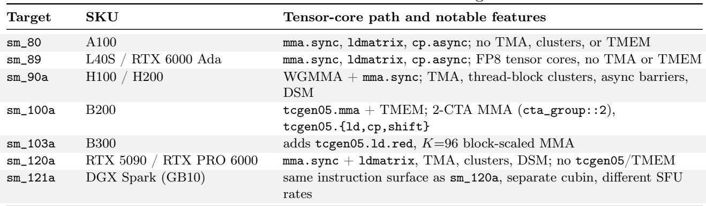

The compiler requires an exact target match and reports missing device or toolchain support rather than stepping a schedule down to another architecture. Timing-model coverage is separately evidence-gated: B200 is the measured baseline, H100 is calibrated independently, and other targets report a coverage limitation instead of inheriting estimates.

After static checks, <sup>Cake</sup> <sup>IR</sup> lowers deterministically to inspectable CUDA/PTX and then through the standard NVIDIA toolchain to a GPU binary. Generated source remains available as an escape hatch, while the default editing path keeps hardware decisions in <sup>Cake</sup> <sup>IR</sup> where they remain analyzable. External numerical comparison and on-device timing remain authoritative.

## C Analysis scope and validation

The harness evaluates typed schedules against the safety, conformance, semantic, and dataconsistency categories in Table 1. For supported constructs, it either accepts the candidate or returns a localized finding. Missing information or analysis coverage is reported explicitly rather than treated as a successful check.

Static analysis is a pre-compile gate only within its modeled domain; it does not prove global GPU correctness or capture all microarchitectural behavior. Coverage continues to expand, and both false positives and false negatives can occur.

## D Production-kernel evolution trajectories

These figures supplement the production endpoints in Section 5.1, using each source session’s own objective and denominator.

## D.1 KDA prefill

Figure 6 separates fixed-shape bring-up from the later six-shape campaign because the phases use diferent metrics.

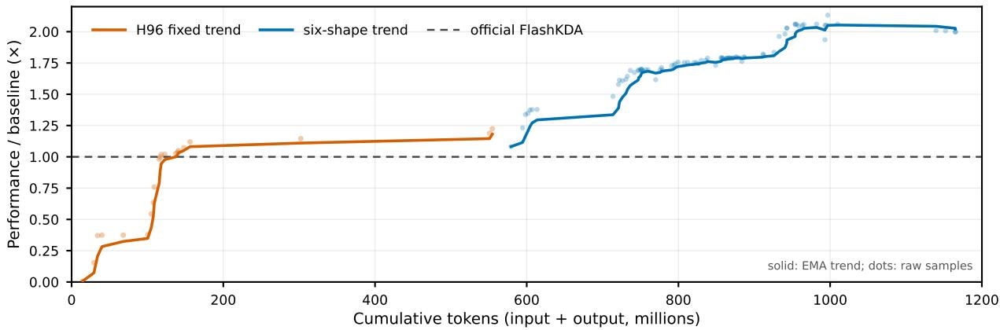  
Figure 6: KDA prefill evolution on B200. Orange is fixed H=96, S=8192 bring-up; blue is six-shape geometric-mean speedup over oficial FlashKDA. All points pass correctness.

## D.2 TinyGEMM

Figure 7 shows four-shape evolution and a follow-up for the remaining small-shape regression. The follow-up raises the target from 0.940× to 1.020× and the four-shape mean from 1.274× to 1.334×.

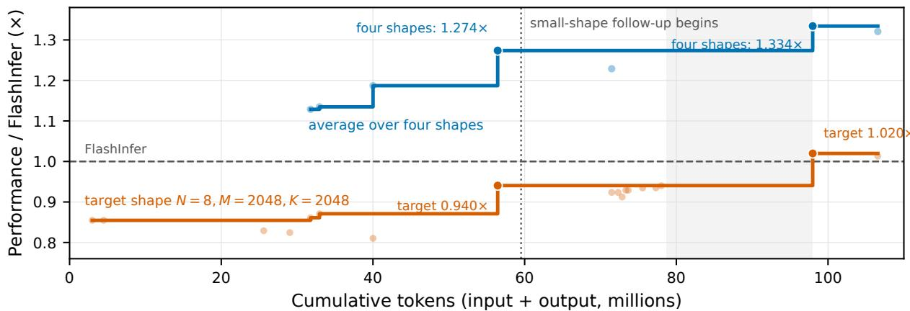  
Figure 7: TinyGEMM evolution on B200. Orange tracks N=8, M=2048, K=2048; blue is the geometric mean over four recurring shapes, including orange. Dots are valid checkpoints, staircases are best-so-far, and the dotted line begins the follow-up.

## D.3 Alpha-MoE

Figure 8 normalizes five shapes to their first correct <sup>Cake</sup> checkpoint. The final geometric mean is 1.137×; this is an internal evolution metric, not a TensorRT-LLM comparison.

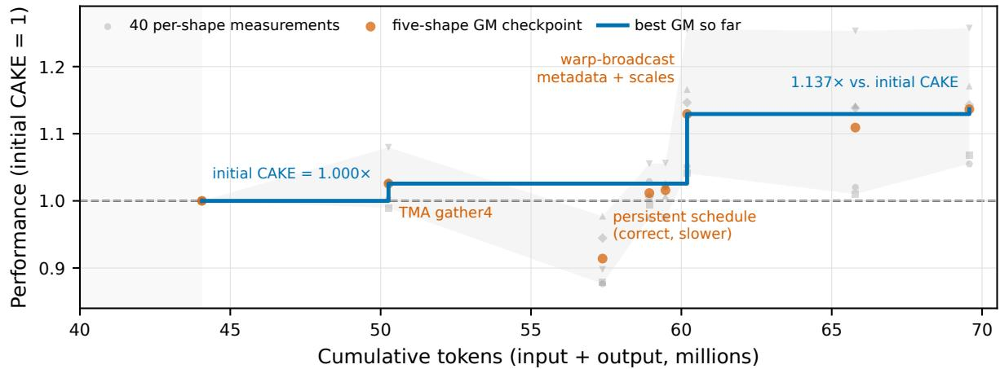  
Figure 8: Alpha-MoE W8A8 Hopper-to-Blackwell rewrite on B200. Gray shows per-shape CUPTI medians; orange is the five-shape geometric mean (GM); blue is the best GM; shading is precheckpoint bring-up.

## E Known-kernel reproduction details

Table 4 gives the fixed shapes, relative performance, and audited implementation sizes summarized in Section 5.2.

Table 4: Known-kernel reproduction for LLM-critical kernels. Relative performance is measured against the listed reference at the same B200 shape. <sup>Cake</sup> <sup>IR</sup> LOC counts the kernel IR; reference columns report audited device and supporting source where available. For DSv4, reference LOC is restricted to source reachable under the fixed S8 route and runtime constants.  
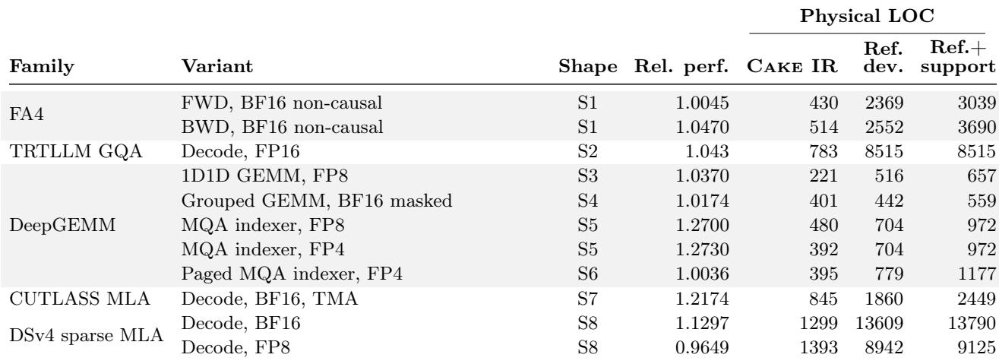  
Shape key. S1: B = 4, H = 32, S = 8192, D = 128; S2: B = 128, QH = 64, KV H = 8, S<sub>kv</sub> = 4096, D = 128, page 16; S3:  
M = 4096, N = 7168, K = 4096; S4: 256 groups × M = 128, N = 4096, K = 7168; S5: H = 32, D = 128, S<sub>q</sub> = 1024,  
S<sub>kv</sub> = 2048; S6: B = 256, H = 64, D = 128, avgKV 4096, block 64, next 1; S7: DeepSeek-V3, B = 128, S<sub>kv</sub> = 4096, page 128; S8: DeepSeek-V4 sparse MLA, B = 3, ragged query lengths [3, 4, 5], H = 128, and D<sub>qk</sub> = D<sub>v</sub> = 512.

## F Dispatcher portfolio details

Figure 9 reports the route-level composition behind the aggregate generalization results in Section 6.

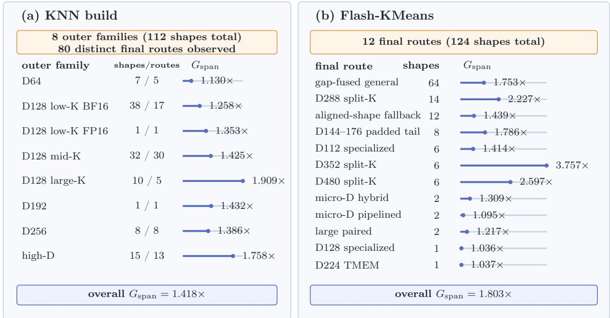  
Figure 9: GPU-span speedup by dispatch family (KNN build) and final route (Flash-KMeans). Values are per-row geometric means from same-session CUPTI measurements. Baselines are FlashLib 0.2.0 and our tuned FlashLib implementation, respectively.