# MoE-Lightning: High-Throughput MoE Inference on Memory-constrained GPUs

Shiyi Cao   
shicao@berkeley.edu   
UC Berkeley   
Berkeley, CA, USA   
Peter Schafhalter   
pschafhalter@berkeley.edu   
UC Berkeley   
Berkeley, CA, USA   
Joseph E. Gonzalez   
jegonzal@berkeley.edu   
UC Berkeley   
Berkeley, CA, USA   
Shu Liu   
lshu@berkeley.edu   
UC Berkeley   
Berkeley, CA, USA   
Xiaoxuan Liu   
xiaoxuan\_liu@berkeley.edu   
UC Berkeley   
Berkeley, CA, USA

Matei Zaharia matei@berkeley.edu UC Berkeley Berkeley, CA, USA

Tyler Griggs   
tgriggs@berkeley.edu   
UC Berkeley   
Berkeley, CA, USA   
Ying Sheng   
ying1123@stanford.edu   
Stanford   
Palo Alto, CA, USA   
Ion Stoica   
istoica@berkeley.edu   
UC Berkeley   
Berkeley, CA, USA

## Abstract

Eficient deployment of large language models, particularly Mixture of Experts (MoE) models, on resource-constrained platforms presents significant challenges in terms of computational eficiency and memory utilization. The MoE architecture, renowned for its ability to increase model capacity without a proportional increase in inference cost, greatly reduces the token generation latency compared with dense models. However, the large model size makes MoE mod els inaccessible to individuals without high-end GPUs. In this paper, we propose a high-throughput MoE batch inference system, MoE-Lightning, that significantly outperforms past work. MoE-Lightning introduces a novel CPU-GPU-I/O pipelining schedule, CGOPipe, with paged weights to achieve high resource utilization, and a performance model, HRM, based on a Hierarchical Roofline Model we introduce to help find policies with higher throughput than existing systems. MoE-Lightning can achieve up to 10.3× higher throughput than state-of-the-art ofloading-enabled LLM inference systems for Mixtral 8x7B on a single T4 GPU (16GB). When the theoretical system throughput is bounded by the GPU memory, MoE-Lightning can reach the throughput upper bound with 2–3× less CPU memory, significantly increasing resource utilization. MoE-Lightning also supports eficient batch inference for much larger MoEs (e.g., Mixtral 8x22B and DBRX) on multiple low-cost GPUs (e.g., 2–4 T4s).

ACM Reference Format:   
Shiyi Cao, Shu Liu, Tyler Griggs, Peter Schafhalter, Xiaoxuan Liu, Ying Sheng, Joseph E. Gonzalez, Matei Zaharia, and Ion Stoica. 2025. MoE-Lightning: High-Throughput MoE Inference on Memory-constrained GPUs. In Proceedings of the 29th ACM International Conference on Architectural Support for Programming Languages and Operating Systems, Volume 1 (ASPLOS ’25), March 30-April 3, 2025, Rotterdam, Netherlands. ACM, New York, NY, USA, 15 pages. htps://doi.org/10.1145/3669940.3707267

## 1 Introduction

Mixture of Experts (MoE) [10, 22, 41, 46] is a paradigm shift in the architecture of Large Language Models (LLMs) that leverages sparsely-activated expert sub-networks to enhance model performance without significantly increasing the number of operations required for inference. Unlike dense models [40, 47, 53], where all model parameters are activated for each input, MoE models activate only a subset of experts, thereby improving computational eficiency.

While the MoE models achieve strong performance in many tasks [10, 22], unfortunately, their deployment is challenging due to the significantly increased memory demand for the same number of active parameters. For example, the Mixtral 8x22B model [32] requires over 256 GB of memory for the parameters of the expert feed-forward network (FFN), which is 4 − 5× higher than the memory requirements of dense models that require similar FLOPs for inference.

In this paper, we study how to achieve high-throughput MoE inference with limited GPU memory. We are focusing on of-line, batch-processing workloads such as model evaluation [29], synthetic data generation [14], data wrangling [33], form processing [7], and LLM for relational analytics [31] where higher inference throughput translates into lower total completion time.

The common approach for memory-constrained batch inference is to ofload model weights [4, 19] and key-value tensors of earlier tokens (KV cache) [42] — which are needed for generating the next token – to CPU memory or disk. Then, they are loaded layer-by-layer to the GPU for computation.

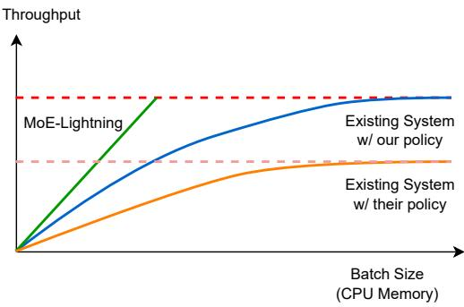  
Figure 1. MoE-Lightning achieves higher throughput with far less CPU memory, enabled by CGOPipe and HRM.

Unfortunately, existing solutions fall short of efectively overlapping computations with data transfers between CPU and GPU. For instance, the GPU may remain idle as it awaits a small yet crucial piece of data such as intermediate results for the upcoming batch. At the same time, transferring the weights for subsequent layers may take a long time and potentially block both the GPU and CPU from processing further tasks, leading to under-utilization of all the resources.

As a result, eficient MoE inference for throughput-oriented workloads using limited GPU memory remains challenging. We find that increasing I/O utilization and other resource utilization is critical in achieving high throughput. For example, Fig. 1 illustrates the relationship between CPU memory and achievable token generation throughput for diferent systems with fixed GPU memory (less than the model size) and CPU-to-GPU memory bandwidth. When a layer’s weights are loaded onto the GPU, a common strategy to increase throughput is to process as many requests as possible to amortize the I/O overhead of weights’ transfer [42]. How ever, this increases CPU memory usage as additional space is required to store the KV cache for all requests. Consequently, lower I/O utilization means higher I/O overhead of weights’ transfer, requiring greater CPU memory to reach peak generation performance; otherwise, the GPU will be under-utilized as suggested by the blue line in Fig. 1.

While improving resource utilization is crucial for achieving high-throughput inference with limited GPU memory, achieving this raises several challenges. First, we need to efectively schedule the computation tasks running on CPU and GPU, together with the transfers of various inputs (e.g., experts weights, hidden states, and KV cache), such that to avoid computation tasks waiting for transfers or the other way around. Second, as indicated by the orange line in Fig. 1, the existing solutions [42] tend to generate sub-optimal policies with smaller GPU batch sizes which lead to resource under-utilization. Fundamentally, these solutions fail to take into account that changes in the workload can lead to changes in the bottleneck resource.

To address these two challenges, we developed a new inference system, MoE-Lightning, which consists of two new components. The first component is CGOPipe, a pipeline scheduling strategy that overlaps GPU computation, CPU computation and various I/O events eficiently so that computation is not blocked by I/O events and diferent I/O events won’t block each other. This way, CGOPipe can significantly improve the system utilization. The second component is Hierarchical Roofline Model (HRM) which accurately models how diferent components in an inference system interact and afect application performance under various operational conditions.

In summary, this paper makes the following contributions:

• CGOPipe, a pipeline scheduling strategy that eficiently schedules various I/O events and overlaps CPU and GPU computation with I/O events. By deploying weights paging, CGOPipe reduces pipeline bubbles, significantly enhancing throughput and I/O eficiency compared with existing systems (§4.1).

• HRM, a general performance model for LLM inference which extends the Roofline Model [48]. HRM can easily support diferent models, hardware, and workloads, and has near-zero overhead in real deployments, without the need for extensive data fitting (might take hours or days) as needed in FlexGen (§4.2).

• An in-depth performance analysis for MoE models based on our extended HRM which identifies various performance regions where specific resource becomes the bottleneck (§3).

We evaluate MoE-Lightning on various recent popular MoE models (e.g., Mixtral 8x7b, Mixtral 8x22B, and DBRX) on diferent hardware settings (e.g., L4, T4, 2xT4, and 4xT4 GPUs) using three real workloads. When compared to the best of the existing systems, MoE-Lightning can improve the generation throughput by up to 10.3× (without request padding) and 3.5× (with request padding) on a single GPU. When Tensor-parallelism is enabled, MoE-Lightning demonstrates super-linear scaling in generation throughput (§5).

## 2 Background

## 2.1 Mixture of Experts

Large Language Models (LLMs) have significantly improved in performance due to the advancements in architecture and scalable training methods. In particular, Mixture of Experts (MoE) models have shown remarkable improvements in model capacity, training time, and model quality [10, 13, 22, 27, 41, 46], revitalizing an idea that dates back to the early 1990s [21, 23] where ensembles of specialized models are used in conjunction with a gating mechanism to dynamically select the appropriate “expert” for a given task.

The key idea behind MoE is a gating function that routes inputs to specific experts within a larger neural network. Each expert is specialized in handling particular types of inputs. The gating function selects only a subset of experts to process an input, which allows LLMs to scale the number of parameters without increasing inference operations.

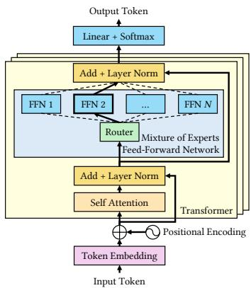  
Figure 2. Architecture of a Mixture of Experts in Large Language Models.

MoE models adopt a conventional LLM architecture, which uses learned embeddings for tokens and stacked transformer layers. MoE LLMs typically modify the Feed-Forward Network (FFN) within a transformer layer by adding a gating network that selects expert FFNs, usually implemented as multi-layer perceptrons, to process the input token [6, 13, 57]. These designs can surpass traditional dense models [8, 10, 22] in efectiveness while being more parameter-eficient and cost-efective during training and inference.

Despite their advantages, the widespread use of MoE models faces challenges due to the dificulties in managing and deploying models with extremely high parameter counts that demand substantial memory. Thus, our work aims to make MoE models more accessible to those lacking extensive high-end GPU resources.

## 2.2 LLM Inference

LLMs are trained to predict the conditional probability distribution for the next token, ?? (????+1 | ??1, . . . , ????), given a list of input tokens (??1, . . . , ????). When deployed as a service, the LLM takes in a list of tokens from a user request and generates an output sequence (????+1, . . . , ????+?? ). The generation process involves sequentially evaluating the probability and sampling the token at each position for ?? iterations. The stage where the model generates the first token ????+1 given the initial list of tokens (??1, . . . , ????), is defined as the prefill stage. In the prefill stage, at each layer, the input hidden states to the attention block will be projected into the query, key, and value vectors. The key and value vectors will be stored in the KV cache. Following the prefill stage is the de- code stage, where the model generates the remaining tokens (????+2, . . . , ????+?? ) sequentially. When generating token ????+2, all the KV cache of the previous tokens (??1, . . . , ????+1) will be needed, and the token ????+2’s key and value at each layer will be appended to the KV cache.

The auto-regressive nature of LLM generation, where tokens are generated sequentially, can lead to sub-optimal device utilization and decreased serving throughput [37]. Batching is a critical strategy for improving GPU utilization: [51] proposed continuous batching which increases the serving throughput by orders of magnitude. Numerous studies have developed methods to tackle associated challenges such as memory fragmentation [26] and the heavy memory pressure imposed by the KV cache [17, 24, 42]. The scenario of limited GPU memory introduces further challenges, especially for large MoE models, as it requires transferring large amounts of data between the GPU and CPU for various computational tasks with distinct characteristics. Naive scheduling of the computation task and data transfer can result in poor resource utilization. This paper explores how each resource in a heterogeneous system afects LLM inference performance and proposes eficient scheduling strategies and system optimizations to enhance resource utilization.

## 3 Performance Analysis

In this section, we introduce a Hierarchical Roofline Model (HRM) (§3.2) extended from the classical Roofline Model [48], which we use to conduct a theoretical performance analysis for MoE inference (§3.3). It also serves as the basics of our performance model used in scheduling policy search, which will be discussed in §4.2. The Hierarchical Roofline Model extends the original Roofline Model for multicore architectures [48] to provide a stronger model of heterogeneous computing devices and memory bandwidth. We further identify two additional turning points that define settings where the computation is best done on CPU instead of GPU and where the application is GPU memory-bound or CPU memory-bound, providing explicit explanations for how LLM inference performance will be afected by diferent resource limits in the system.

## 3.1 Roofline Model

We will start with the original Roofline Model [48], which provides a visual performance model to estimate the performance of a given application by showing inherent hardware limitations and potential opportunities for optimizations. It correlates a system’s peak performance and memory bandwidth with the operational intensity of a given computation, where Operational Intensity (?? ) denotes the ratio of the number of operations in FLOPs performed to the number of bytes accessed from memory, expressed in FLOPs/Bytes.

The fundamental representation in the Roofline Model is a performance graph, where the xaxis represents operational intensity ?? in FLOPs/byte and the y-

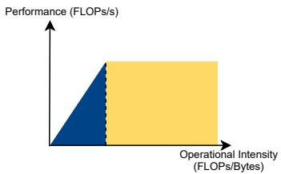

axis represents performance ?? in FLOPs/sec. The model is graphically depicted by two main components:

Memory Roof: It serves as the upper-performance limit indicated by memory bandwidth. It is determined by the product of the peak memory bandwidth (??peak in Bytes/sec) and the operational intensity (?? ). Intuitively, if the data needed for the computation is supplied slower than the computation itself, the processor will idly wait for data, making memory bandwidth the primary bottleneck. The memory-bound region (in blue) of the roofline is then represented by:

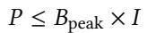

(1)

where ?? is the achievable performance.

Compute Roof: This represents the maximum performance achievable limited by the machine’s peak computational capability (??peak). It is a horizontal line on the graph (top edge of the yellow region), independent of the operational intensity, indicating that when data transfer is not the bottleneck, the maximum achievable performance is determined by the processor’s computation capability. The compute-bound part (yellow region) is then defined by:

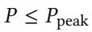

(2)

The turning point is the intersection of the compute and memory roofs, given by the equation:

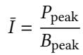

(3)

defines the critical operational intensity ?? . Applications with ?? ≥ ¯?? are typically compute-bound, while those with ?? < ¯?? are memory-bound.

In practice, analyzing an application’s placement on the roofline model helps identify the critical bottleneck for performance improvements. Recent works [52] analyze diferent computations (e.g., softmax and linear projection) in LLM using the Roofline Model.

## 3.2 Hierarchical Roofline Model

While the original Roofline Model demonstrates great power for application performance analysis, it is not enough for analyzing applications such as LLM inference that utilize diverse computing resources (e.g., CPU and GPU) and move data across multiple memory hierarchies (e.g., GPU HBM, CPU DRAM, and Disk storage).

Consider a system with ?? levels of memory hierarchies. Each level ?? in this hierarchy is coupled with a computing processor. The peak bandwidth at which the processor at

level ?? can access the memory at the same level is denoted by   
????   
is denoted by ?? peak 1

Definition 3.1 (General Operational Intensity). To consider diferent memory hierarchies, we define the general operational intensity ???? of the computation task ?? as the ratio of the number of operations in FLOPs performed by ?? to the number of bytes accessed from memory at level ??.

For computation ?? executed at level ?? in the HRM, we can define its compute and memory roofs similarly as in the original Roofline Model:

• Compute Roof at level ??:

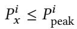

(4)

This represents the maximum computational capability at level ??, independent of the operational intensity.

• Memory Roof at level ??:

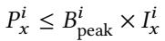

(5)

More importantly, in HRM, there is also the memory bandwidth from level ?? to level ??, denoted as ?? ??,??pea k, which will define another memory roof for computation ?? that is executed on level ?? and transfers data from level ??:

• Memory Roof from level ?? to ??:

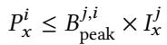

(6)

Therefore, if computation ?? is executed on level ??, data from level ?? needs to be fetched, and the peak performance will be bounded by the three roofs listed above (Eqs. (4)–(6)):

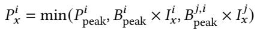

(7)

If operator ?? is executed on level ?? without fetching data from other levels, it reduces to the traditional roofline model and can achieve:

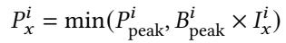

(8)

Turning Points. Intuitively, our HRM introduces more memory roofs that consider cross-level memory bandwidth and compute roofs for diverse processors. This results in more “turning points” than in the original Roofline Model, which define various performance regions where diferent resources are the bottleneck. Analyzing these turning points is crucial for understanding the performance upper bound of an application under diferent hardware setups and computational characteristics.

For example, consider a computation task ?? that has data stored on level ??, according to Eq. (6) and Eq. (8), when ?? ???? = min(?? ??pe , ?? ?? × ?? ???? ) ≥ ?? ??,?? k × ???? , we have ?????? ≤ ak peak pea ?? ??,??

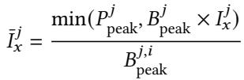

(9)

This gives the critical operational intensity ¯???? , indicating the threshold below which it is not beneficial to transfer data from level ?? to ?? for computation for ??.

Now if we continue increasing ?? ???? such that ?? ???? < ?? ??,?? peak × ?? ???? ≤ min(????peak, ?? , Bi ??peak × ?????? ), then we obtain another turning point ??2:

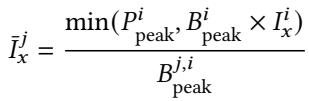

(10)

which denotes the critical operational intensity ¯?? ???? below which computation ?? is bounded by the memory bandwidth from memory at level ?? to memory at level ??.

Balance Point. Further, if ????peak × ?????? < ?? ??,?? peak × ?? ???? < ????p eak indicating that the computation ?? on level ?? is memory-bound (refer to Eq. (3)). In this situation, further increasing ???? cannot improve the system’s performance. Instead, we need to increase ???? , and a balance point will be reached if:

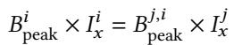

(11)

Our performance model and policy optimizer (see §4.2) are designed to find the maximum balance point under the device memory constraints.

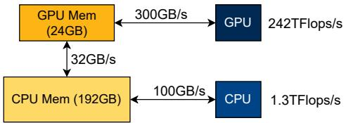  
Figure 3. Hardware Configurations for the L4 Instance.

## 3.3 Case Study

To visualize the turning points and balance points discussed in the preceding sections, we conduct a case study with real HRM plots for computations in a single layer of the Mixtral 8x7B model on a Google Cloud Platform L4 instance. The hardware setting is as detailed in Fig. 3. Specifically, we let levels ?? and ?? represent GPU and CPU, respectively. Then, we define the following:

Definition 3.2 (Batch Size ?? ). Batch size is the total number of tokens processed by one pass of the whole model.

Definition 3.3 (Micro-Batch Size ??). Since GPU memory is limited, a batch of size ?? often needs to be split into several micro-batches of size ?? to be processed by a single kernel execution on GPU.

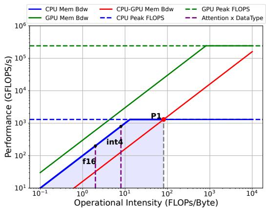  
Figure 4. Hierarchical Roofline Model for Mixtral 8x7B’s Grouped Query Attention Block in Decode Stage on L4 Instance. (Context Length = 512)

Atention Block. Fig. 4 demonstrates the HRM plot for Mixtral 8x7B’s attention computation assuming all the KV cache are stored on CPU . On the plot, we have horizontal lines as the compute roofs defined by CPU and GPU peak performance. There are also the memory roofs defined by CPU memory bandwidth, GPU memory bandwidth, and CPU to GPU memory bandwidth, respectively. We then draw vertical lines representing diferent operational intensities for the attention computation with diferent KV cache data types. Theoretically, attention’s operational intensity is independent of the batch size since its flops and bytes are proportional to batch size. To increase the attention computation’s operational intensity, we need methods such as quantization [30, 38], Grouped Query Attention (GQA) [2], or sparse attention [9]. All these methods try to reduce the memory access needed by performing the attention computation, and GQA is used by most of the existing MoE models; however, as denoted in the plot, for both float16 and int4 the operational intensity is quite low and is smaller than ??1’s corresponding operational intensity, which suggests it may be better to perform attention on CPU.

MoE Feed-Forward Network (FFN). Fig. 5 is an HRM plot for Mixtral 8x7B’s MoE Feed-Forward module on the L4 instance. The orange line represents the MoE FFN kernel performance achieved at a micro-batch size of 128. Vertical lines intersecting with CPU roofs and CPU-GPU memory roofs represent diferent batch sizes. FFN’s operational intensity will increase as batch size or micro-batch size increases since, intuitively, a larger batch size means more computation per weight access. As shown in the plot, suppose the computation kernel for the MoE FFN can run at a maximum ?? = 128, we can identify the turning point in Eq. (10) to be ??2 and the turning point in Eq. (9) to be ??1.

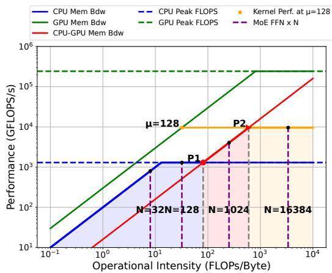  
Figure 5. Hierarchical Roofline Model for Mixtral 8x7B’s MoE Feed-Forward Block in Decode Stage on L4 Instance.

When ?? is less than ??1’s corresponding ?? , there is no benefit in swapping the data to GPU for computation since it will be bounded by the memory roof from CPU to GPU. This is normally the case for many latency-oriented applications where users may only have one or two prompts to be processed. In such scenarios, it is more beneficial to have a static weights placement strategy (e.g., putting ?? out of ?? layers on GPU) and perform the computation where the data is located instead of swapping the weights back and forth.

Next, we show the peak performance will be finally reached at a balance point (Eq. (11)). When ?? is less than ??2’s corresponding ??, the computation is bounded by the CPU to GPU memory bandwidth, and it cannot achieve the performance at ??2. Depending on whether there is enough CPU memory to hold a larger batch, we can either increase the batch size or put some of the weights on the GPU statically since both strategies can increase the operational intensity for the MoE FFN computation regarding the data on the CPU.

If the batch size can be continually increased, then when ?? equals ??2’s corresponding ?? , the maximum performance that can be achieved is bounded by the operator’s operational intensity on GPU, which is dependent on the ?? for the MoE FFN kernels. Then, there is no need to increase ?? anymore, and the maximum performance reached at a balance point equals ??2. On the other hand, if we put more weights onto GPU, ?? will decrease since larger ?? will result in higher peak memory consumption. The maximum performance will be achieved at a balance point smaller than ??2.

In conclusion, to achieve high throughput for batched MoE inference, we hope to place computations on proper computing devices and find the best combination of ?? and ?? so that we can fully utilize all the system’s components.

## 4 Method

In general, we adopt the zigzag computation order proposed in FlexGen [42]: loading the weights from CPU and performing the computation layer by layer. For the prefill stage, we perform all the computation on GPU and ofload KV cache to CPU for all the micro-batches . For the decode stage, within each layer, we propose a fine-grained GPU-CPU-I/O pipeline schedule (§4.1) to increase the utilization of GPU, CPU, and I/O in decode stage. We also build a performance model (§4.2) based on the HRM we extended from the Roofline Model to help search for the best hyper-parameters for the pipeline schedule, including the assignment of devices to perform diferent computations, the batch size, the micro-batch size and the ratio of weights to be placed on GPU statically. Note that for the memory-constrained scenarios we target in this paper, CPU attention is consistently better than GPU attention, according to our performance model. We also conduct an ablation study in §6.3 to show how best policy changes under diferent hardware configurations.

## 4.1 GPU-CPU-I/O Pipeline Schedule

Algorithm 1 CGOPipe   
1: for ?? = 1, 2, . . . ??????\_?????? do   
2: // Prologue   
3: for ?? = 1, 2 do   
4: PreAttn(1, ??)   
5: OffloadQKV(1, ??)   
6: CPUAttn(1, ??)   
7: W\_CtoPin(2, ??)   
8: for ?? = 1, 2, . . . ??????\_???????????? do   
9: for ?? = 1, 2, . . . ??????\_?????? do   
10: LoadH(??, ?? )   
11: W\_PintoG(?? + 1, ?? )   
12: PostAttn(??, ?? )   
13: // Launch CPUAttn two batches ahead   
14: PreAttn(??, ?? + 2)   
15: OffloadQKV(??, ?? + 2)   
16: CPUAttn(??, ?? + 2)   
17: W\_CtoPin(?? + 1, ?? + 2)

Pipeline scheduling is a common approach to maximize compute and I/O resource utilization. Yet, the pipeline concerning GPU, CPU, and I/O is not trivial. In traditional pipeline parallelism for deep learning training [16, 18, 34], models are divided into stages which are assigned to diferent devices. Therefore, only output activations are transferred between stages, resulting in a single type of data transfer in each direction at a time. In our scenario, both weights and intermediate results need to be transferred between GPU and CPU. Intermediate results are required immediately after computation to avoid blocking subsequent operations, whereas weights for the next layer are needed only after all micro-batches for the current layer are processed. Additionally, weight transfers typically take significantly longer than intermediate results. Consequently, naive scheduling of I/O events can lead to low I/O utilization, which also hinders computation. CGOPipe. Fig. 6 demonstrates our proposed CGOPipe and the other three scheduling strategies adopted in existing systems. CGOPipe employs CPU attention as analyzed in §3.3, alongside a weight paging scheme that interleaves the transfer of intermediate results for upcoming micro-batches with paged weight transfers to optimize computation and communication overlap. The GPU sequentially processes the postattention tasks (primarily O projection and MoE FFN) for the current micro-batch, followed by the pre-attention tasks (mainly layer norm and QKV projection) for the next microbatch. Concurrently, the CPU handles attention (specifically the softmax part) for the next batch, and a page of weights for the subsequent layer are transferred to the GPU.

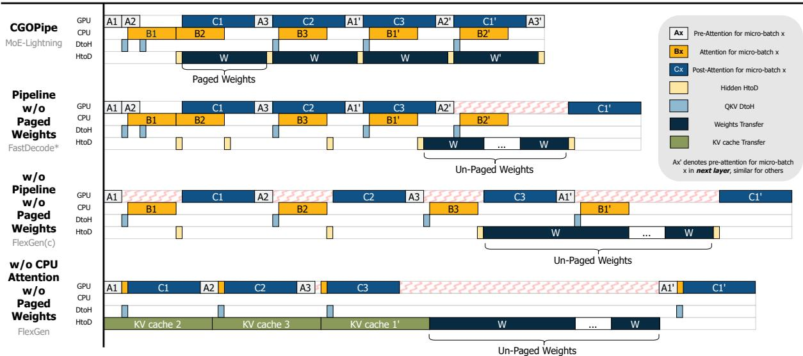  
Figure 6. Diferent Scheduling Strategies: Square sizes vary with workloads and policies. For example, larger ?? or longer sequences lengthen the orange (attention) and the green (KV cache transfer from CPU to GPU) squares. Squares with red zigzag lines indicate the unnecessary GPU idle times. \*FastDecode [17] dose not consider weights ofloading.

FlexGen [42] primarily employs the fourth schedule (S4), where attention is performed on GPU and the KV cache for the next micro-batch is prefetched during the current computation. This approach results in higher KV cache transfer latency than performing attention directly on the CPU (§3.3) and consumes I/O bandwidth that could otherwise be used for weight transfers, reducing resource utilization compared to CGOPipe. FlexGen also supports CPU attention and adopts the third schedule (S3), which is the least optimized and may even perform worse than S4 if KV cache transfer latency is less than the sum of pre-attention, post-attention, and CPU attention latencies, as later shown by our evaluation results (§5). FastDecode [17] suggests overlapping CPU attention with GPU computation, similar to the second schedule (S2). However, it does not target memory-constrained settings, so weight transfer scheduling is not considered.

Weights Paging and Data Transfer Scheduling. To fully utilize the I/O, we propose a weights paging scheme to interleave the data transfer for diferent tasks, reducing bubbles in the I/O. There are mainly four kinds of data transfer:

• D1 (QKV DtoH): the intermediate results to be transferred from GPU to CPU after QKV projection.

• D2 (Hidden HtoD): the hidden states to be transferred from CPU to GPU after the CPU attention.

• D3 (Weights Transfer): the weights for the next layer to be transferred from CPU to GPU.

• D4 (KV cache Transfer): the KV cache for the next micro-batch to be transferred from CPU to GPU.

Due to independent data paths, data transfers in opposite directions can happen simultaneously. Data transfer will be performed sequentially in the same direction. The challenge then mainly lies in the scheduling of D2, D3 and D4, which are all from CPU to GPU. For the case without CPU attention (S4), while D4 usually takes a similar or longer time compared with a layer’s computation, the I/O bandwidth is almost fully utilized, leaving little room for more eficient scheduling for data transfer. As we can see from the diagram of S2 and S3, conducting the weights transfer as a whole will block the next layer’s first D2 for a long time, resulting in poor overall system eficiency. Instead, we can chunk the weights to be transferred into ?? pages where ?? equals the number of micro-batches in the pipeline, and the performance model and optimizer (§4.2) select the proper micro-batch size, batch size and the proportion of weights to be transferred from CPU to GPU.

Algorithm 1 provides the order in which the main CPU task launcher thread launches the tasks to enable CGOPipe. All the tasks are executed asynchronously, and necessary synchronization primitives are added to each task to enforce the correct data dependency.

## 4.2 Search Space and Performance Model

Table 1. Notations for the Performance Model Configuration  
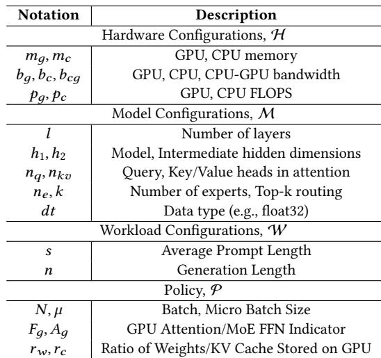

Given a hardware configuration H, a model configuration M, and a workload configuration W, we search for the optimal policy P that minimizes per-layer latency?? (M, H, W, P) for the pipeline schedule in §4.1, without violating the CPU and GPU memory constraints, in order to reach the optimal balance point (Eq. (11)). Compared with FlexGen, we exclude disk-related variables from the search space and add two binaries to indicate whether to perform attention or MoE FFN on GPU.

The search space (Tab. 1) covers 2 integer values: the microbatch size (??) and batch size (?? ), 2 binary indicators ???? to indicate whether to perform the attention on GPU and ???? to indicate whether to perform the MoE FFN on GPU. When ???? = 1, we also need to decide the percent of weights ???? that can be statically stored on GPU and the percent of weights 1 − ???? that need to be transferred to GPU. Similarly, for ???? = 1, we need to decide ????. The generated policy will be a 6-tuple (?? , ??, ????, ????, ????, ???? ). For our major setting, we always get ???? = 0 and ???? = 1. However, we discuss in §6.3 diferent policies for various hardware settings. Notably, CGOPipe is primarily designed for ???? = 0 and when ???? = 1, MoE-Lightning adopt S4.

We then build the performance model based on Eq. (7) and Eq. (8) in HRM to estimate per-layer decode latency ?? by:

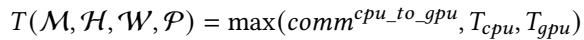

(12)

where ?????????????? ???? ?????? can be computed as the number of bytes needed to be transferred from CPU to GPU for a layer’s computation divided by the CPU to GPU memory bandwidth ??????. Here, for simplicity, we only consider the attention computation and the MoE FFN computation in a transformer block, and therefore we have:

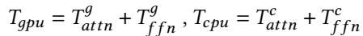

(13)

To estimate the time to perform a computation ?? on GPU or CPU, we can use ???? = max(??????????, ?????????? ) according to Eq. (8) in HRM, resulting in:

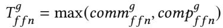

(14)

and similarly for ??????????, ?? ?????????? and ?? ???? ?? ??.

For a given computation ??, we can calculate their theoretical FLOPS and data transfer based on M and then we have ?????????? = ???????????? /???? and ?????????? = ?? ?????????? /???? (same for CPU). While there are discrepancies between the theoretical performance estimation and the kernel’s real performance, such modeling can provide a reasonable estimation of the relative efectiveness of any two policies. In this paper, all the evaluation results of MoE-Lightning follow policies generated by a performance model with theoretically calculated computation flops and bytes with profiled peak performance and memory bandwidth for the hardware.

## 4.3 Tensor Parallelism

In existing works [42], pipeline parallelism is used for scaling beyond a single GPU, which requires the number of devices to scale with the model depth instead of the layer size. However, according to our analysis for MoE models in §3.3, Total GPU memory capacity can decide the upper bound throughput the system can achieve. Therefore, MoE-Lightning implements tensor parallelism [35] within a single node to get a higher throughput upper bound. In this case, we have ????\_???????? times more GPU memory capacity and GPU memory bandwidth, we can then search for the policy similarly as for single GPU.

## 5 Evaluation

## 5.1 Setup

Implementation. We build MoE-Lightning on top of Py-Torch [36], vLLM [26] and SGLang [56], written in Python and C++. We implement customized CPU Grouped Query Attention (GQA) kernels based on Intel’s MKL library [20]. Models. We evaluate three popular MoE models: Mixtral 8x7B [22], Mixtral 8x22B [32], and DBRX (132B, 16 Experts) [46]. Although not evaluated, MoE-Lightning also supports other models compatible with vLLM [26]’s model classes.

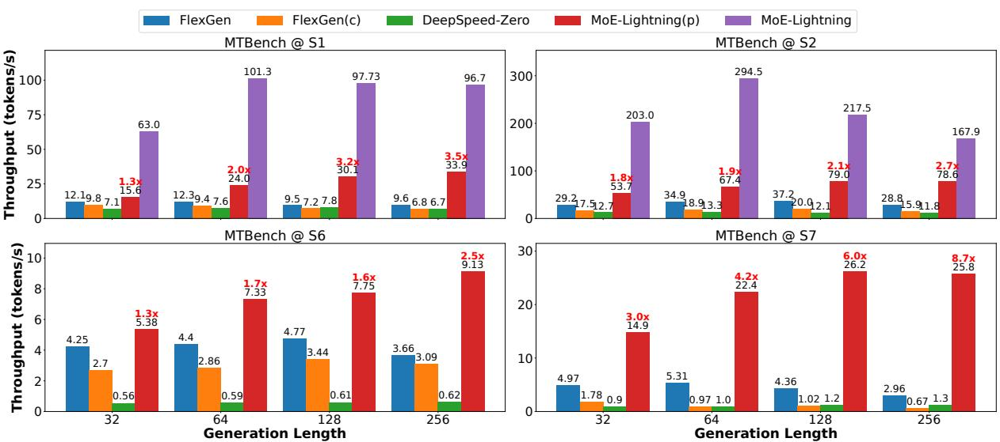  
Figure 7. End-to-end Results for MTBench on Diferent Model-Hardware Configurations. Normally, MoE-Lightning’s performance will be much higher than MoE-Lightning (p) since padding will lead to higher memory consumption and attention computation overhead . Here MoE-Lightning achieves up to 10.3× higher throughput than FlexGen under S1 and S2.

Table 2. Model and Hardware Configurations.  
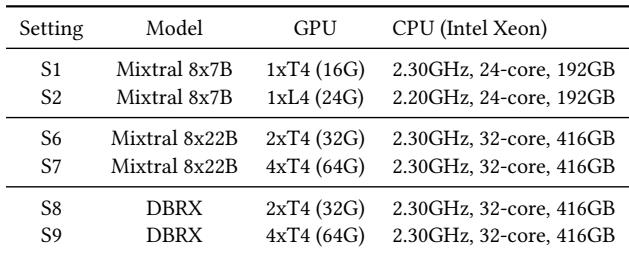

Table 3. Workload Configurations.  
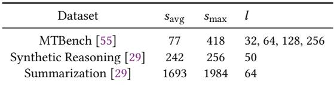

Hardware. We conduct tests on various hardware settings, including a single NVIDIA T4 GPU (16GB), a single NVIDIA L4 GPU (24GB) and multiple T4 GPUs. We evaluate 6 diferent model and hardware settings as shown in Tab. 2.

Workloads. We use popular LLM benchmarks with diferent prompt length distributions to evaluate our system, as shown in Tab. 3. MTBench [55] includes 80 high-quality multi-turn questions across various categories like writing and reasoning. We replicate it into thousands of questions for our batch inference use case. We test various output token lengths for MTBench, from 32, 64, 128, to 256 tokens. We also pick two tasks (i.e., synthetic reasoning and summarization), from the HELM benchmarks [29] to test our system with longer prompt lengths.

Baselines. We evaluate MoE-Lightning and MoE-Lightning’s variant, comparing them against two baseline systems that support running LLMs without enough GPU memory: Flex-Gen [42] and DeepSpeed Zero-Inference [4].

• FlexGen [42] is the state-of-the-art ofloading system that targets high-throughput batch inference for OPT [53] models. It does not support variable prompt length in a batch and needs to pad all the requests to the maximum prompt length in the batch.

• FlexGen(c) is FlexGen enabling CPU attention.

• DeepSpeed Zero-Inference [4] is an ofloading system that pins model weights to CPU memory and streams them layer-by-layer to GPU for computation. We use version 0.14.3 in the evaluation.

• MoE-Lightning represents our system with all the optimizations enabled.

• MoE-Lightning (p) represents our system running with requests padded to the maximum prompt length in the batch to compare with FlexGen.

Metrics. We measure the generation throughput for each workload, which is calculated as the number of tokens generated divided by total generation time (i.e., prefill time + decode time).

## 5.2 End-to-end Results on Real Workloads

We evaluate the maximum generation throughput for all baseline systems on three workloads under S1, S2, S6, and S7 settings. As shown in Fig. 7 and Tab. 4, MoE-Lightning (p) outperforms all baselines in all settings, and MoE-Lightning achieves up to 10.3× better throughput compared with the best of the baselines for MTBench and HELM benchmark. In the following sections, we analyze how MoE-Lightning (p) outperforms our baselines by integrating the key methods from §4.2.

Table 4. Performance for HELM tasks under S1 & S2  
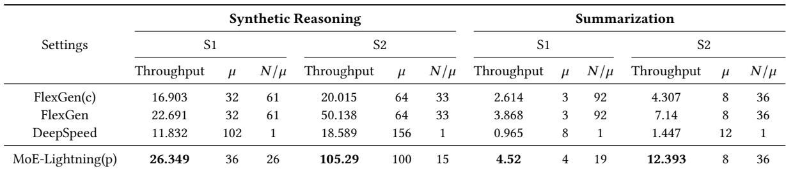

Generation Length. While longer lengths allow for better amortization of the prefill time which increases throughput, they also lead to higher CPU memory usage and additional attention computation or KV cache transfer overheads. This increased memory demand can limit the maximum batch size, reducing throughput. Moreover, the increase in computation or KV cache transfers can make attention the main bottleneck. Typically, throughput first increases with longer generation length and then decreases.

We observe this pattern for FlexGen and FlexGen(c) in all settings. However, MoE-Lightning (p) avoids a decrease in throughput under S1 and S6, which feature similar ratios of GPU to CPU memory. We attribute this performance improvement to CGOPipe, which significantly improves the resource utilization and renders the system GPU memory capacity bound in these settings.

On a single GPU (S1 and S2), MoE-Lightning (p) achieves up to 3.5×, 5×, and 6.7× improvement over FlexGen, Flex-Gen(c), and DeepSpeed, respectively.

Prompt Length. In the HELM tasks, we examine the impact of varying prompt lengths on generation throughput. Increasing the prompt length not only raises CPU memory consumption and attention overhead, but also leads to greater GPU peak memory usage during the prefill stage. Consequently, systems handling the summarization task with a 2k prompt length are bottlenecked by either GPU memory capacity or attention processes (see the ablation study in §6.3 for a detailed discussion on bottlenecks). Under S1, MoE-Lightning (p) achieves a 1.16× and 1.73× higher throughput than FlexGen and FlexGen(c), respectively, de spite using a batch size that is 3.63× smaller, enabled by CGOPipe. DeepSpeed, utilizing a larger micro-batch size but the smallest batch size, is primarily constrained by the overhead of weight transfers. Under S2, with increased GPU memory, MoE-Lightning (p) adjusts to use a larger ?? and ?? , reaching a new balance point (Eq. (11)), while FlexGen and

FlexGen(c) are unable to increase ?? from their S1 settings due to CPU memory limitations. As a result, MoE-Lightning (p) now achieves an even higher throughput improvement: 1.74× and 2.88× higher than FlexGen and FlexGen(c), respectively. This superior performance is attributed to MoE-Lightning (p)’s eficient resource utilization.

The synthetic reasoning task enables all systems to have a larger micro-batch size due to the shorter prompt length. Under S1, MoE-Lightning (p) achieves a 1.16×, 1.56×, 2.22× higher throughput than FlexGen, FlexGen(c) and DeepSpeed respectively. Under S2, MoE-Lightning (p) finds a better balance point and uses less batch size than FlexGen, achieving 2.1× and 5.26× higher throughput compared to FlexGen and FlexGen(c), demonstrating the eficiency of CGOPipe and HRM.

## 5.3 Tensor Parallelism

This section evaluates MoE-Lightning’s ability to run on multiple GPUs with tensor parallelism. As shown in S1 and S2, due to our eficient resource utilization, MoE-Lightning’s throughput is predominantly bounded by GPU memory capacity. This shows that increasing GPU memory can raise the system’s throughput upper bound.

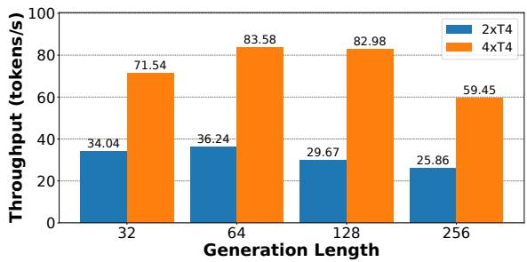  
Figure 8. MoE-Lightning with Tensor-Parallelism for MT-Bench @ S8 & S9.

S6 and S7 in Fig. 7 show the end-to-end throughput results on Mixtral 8x22B of MoE-Lightning (p), FlexGen, and DeepSpeed on MTBench for multiple T4 GPUs. Notably, MoE-Lightning (p) achieves 2.77-3.38× higher throughput with 4xT4 GPUs than with 2xT4 GPUs, demonstrating superlinear scaling performance. DeepSpeed demonstrates a linearscaling performance but uses a small batch size of 32, resulting in low throughput. FlexGen fails to scale under settings

S6 and S7, largely due to the pipeline parallelism approach it employs. In this method, when using 4 GPUs, during the saturated phase, four layers are simultaneously active across four GPUs, increasing CPU peak memory consumption. As a result, FlexGen is bottlenecked by the CPU to GPU memory bandwidth and fails to take advantage of the added GPUs. Note that pipeline parallelism is more efective across multiple GPU nodes. In such configurations, doubling the number of GPUs also doubles the CPU to GPU bandwidth, the CPU memory capacity, and the CPU memory bandwidth .

Fig. 8 demonstrates MoE-Lightning’s generation through put results on DBRX to showcase the performance when all optimizations are enabled (CGOPipe, HRM and variable length prompts). For the DBRX model and without request padding (i.e., shorter prompt length), the system becomes less GPU memory capacity bound. We can see 2.1-2.8× improvement when scaling from 2 GPUs to 4 GPUs.

## 6 Ablation Study

## 6.1 Optimizer Policy

In this section, we compare MoE-Lightning (p), FlexGen with its policy and FlexGen with our policy. For this experiment, we do not turn on the CPU attention for FlexGen as it is consistently worse than FlexGen w/o CPU attention. We use the workload from MTBench on the S1 setting with a generation length of 128. The results are displayed in Tab. 5. By deploying our policy, we can see a 1.77× improvement in FlexGen. We also increase the batch size to better amortize the weights transfer overhead and it gives a 2.17× speedup. However, it still cannot match MoE-Lightning’s throughput under the same policy, as KV cache swapping becomes the bottleneck for FlexGen in this case.

Table 5. Generation throughput for MoE-Lightning and diferent variants of FlexGen. (MTBench@S1, Generation length=128)  
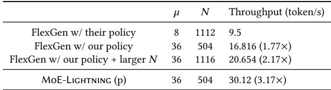

## 6.2 CPU Attention vs. Experts FFN vs. KV Transfer

In this section, we study when CPU attention will become the bottleneck in the decode stage. For diferent batch sizes (from 32 to 256), we test the latency of the MoE FFN kernel on L4 GPU and compare it with the latency of the CPU attention kernel on a 24-core Intel(R) Xeon(R) CPU @ 2.20GHz with various context lengths (from 128 to 2048). Additionally, we also measure the latency for swapping the KV cache needed for the attention from CPU pinned memory to GPU to validate the eficiency of our CPU GQA kernel.

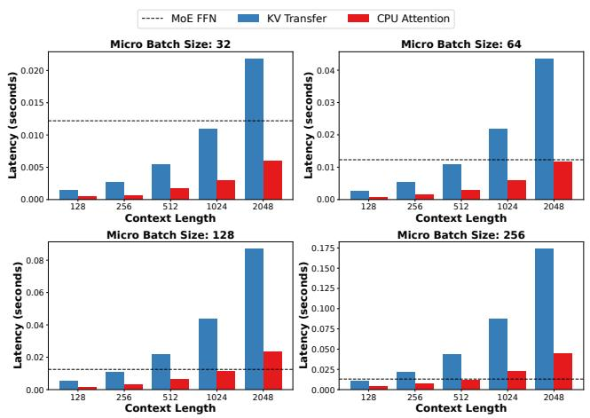  
Figure 9. Latency Comparison for a single layer’s KV cache transfer, CPU Attention Kernel and the MoE FFN Kernel wrt. ?? and Context Length in Decode Stage.

As shown in Fig. 9, our CPU attention kernel is 3 − 4× faster than KV cache transfer, which is close to the ratio of CPU memory bandwidth and the CPU to GPU memory bandwidth. The MoE FFN’s latency doesn’t change so much across diferent micro batch sizes, which is as expected since the kernel is memory-bound for the decode stage. As the micro-batch size and context length increase, the CPU attention will eventually become the bottleneck, which calls for higher CPU memory bandwidth.

## 6.3 Case Study on Diferent Hardware Settings

In this section, we study how the best policy changes under diferent hardware settings. As we have shown in the previous ablation study, CPU attention can actually become the bottleneck for large batch size and context length, which means if we have more powerful GPUs, at some point, CPU attention may not be worth it. Moreover, if we have higher CPU to GPU memory bandwidth, the trade-ofs will also change. Then the question becomes: when we have enough GPU memory (e.g., 2xA100-80G) to hold the model weights (e.g., Mixtral 8x7B), is it still beneficial to perform CPU com putation or to ofload weights/KV cache to the CPU? To conduct the analysis, we use 2xA100-80G for the GPU specification and vary the CPU to GPU memory bandwidth from 100 to 500 GB/s alongside diferent CPU capabilities. We set base CPU specifications at ???? = 200GB/s, ???? = 100GB, and ???? = 1.6TFLOPS/s, scaling these values by multiplying with the CPU scaling ratio for various configurations .

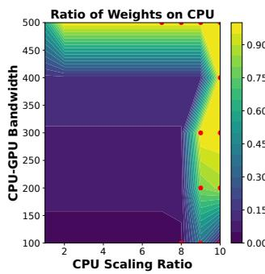

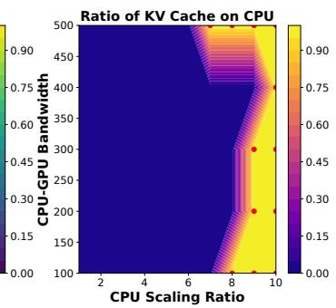  
Figure 10. Policy changes with diferent hardware config urations (prompt length=512, generation length=32). Red points denote performing attention on the CPU.

We can see that when running Mixtral 8x7B on two A100 GPUs, as CPU-to-GPU memory bandwidth increases, more weight will be ofloaded to the CPU. KV cache ofloading is highly related to the CPU scaling ratio in this setup: when the CPU scaling ratio is low (i.e., low CPU memory bandwidth), even with the highest CPU to GPU memory bandwidth tested here, it is not beneficial to ofload KV cache.

## 7 Related Work

Memory-constriant LLM Inference LLM inference re- quires substantial memory to store model parameters and computation outputs, making it typically memory capacitybound. There is a line of research dedicated to memoryconstraint LLM inference. This is particularly crucial for inference hardware such as desktop computers, or low-end cloud instances with limited computational power and memory capacity. To facilitate inference on such constrained systems, some work leverages sparsity or neuro activation patterns to intelligent ofloading between CPU and GPU [15, 42, 43, 50]. Some approaches utilize not only DRAM but also flash memory to expand the available memory resources [3]. Additionally, since the CPU often remains underutilized during inference, it can be harnessed to perform complementary computations [25, 43, 49].

LLM Inference Throughput Optimization To enhance inference throughput, some research focuses on maximizing the sharing of computations between sequences to minimize redundant processing of identical tokens [24, 56]. Another approach involves batching requests [51] to optimize hardware utilization. Additionally, some studies develop paged memory methods for managing the key-value (KV) cache to reduce memory waste, thereby increasing the efective batch size and further improving throughput [26]. FastDecode [17] proposes aggregating memory and computing power of CPUs across multiple nodes to process the attention part to boost GPU throughput. Compared with FastDecode, we are targeting the memory-constrained case where the model weights also need to be transferred between CPU and

GPU, making the optimization and scheduling problem far more challenging.

LLM Inference Latency Optimization To reduce LLM in- ference latency, some work addresses the inherent slowness caused by the autoregressive nature of LLM inference by developing fast decoding methods, such as speculative decoding [5, 28, 44] and parallel decoding [39], which generate multiple tokens simultaneously. Another approach aims to decrease inference latency by implementing eficient computational kernels [1, 11, 12] designed to minimize memory access and maximize GPU utilization.

## 8 Conclusion

We present MoE-Lightning, a high-throughput MoE inference system for GPU-constrained scenarios. MoE-Lightning can achieve up to 10.3× (without request padding) and 3.5× (with request padding) higher throughput over state-of-theart systems on a single GPU and demonstrate super-linear scaling on multiple GPUs, enabled by CGOPipe and HRM. CGOPipe is a novel pipeline scheduling strategy to improve resource utilization, and HRM is a performance model based on a Hierarchical Roofline Model that we extend from the classical Roofline Model to find policies with higher throughput upper bound.

## A System Implementation Details

In this section, we explain two system-level designs and their implementation details: 1. Appendix A.1 introduces how GPU and CPU memory are used and weights paging is implemented in MoE-Lightning, and 2. Appendix A.2 presents the batching algorithm employed in MoE-Lightning to support dynamic-length requests in a batch.

## A.1 Memory Management

Since attention is performed on CPU, the KV cache for all micro-batches will be transferred to and stored on CPU after the corresponding computation completes. To enable CGOPipe, we allocate a weight bufer with a size of 2 × ?????????? ?? (????), where ???? denotes the size of the portion of a layer’s weights stored in CPU memory. This bufer enables overlapping weight prefetching: as the current layer’s weights are being used, the next layer’s weights are simultaneously transferred to GPU memory.

Weights are transferred in a paged manner. For example in Fig. 11, each expert in the MoE FFN kernel requires two pages, and the kernel accesses the appropriate pages using a page table. To accelerate transfers from CPU to GPU, weights are first moved from CPU memory to pinned memory, and then from pinned memory to GPU. These transfers are overlapped to hide latency. As illustrated in Fig. 11, while transferring Weights 2 for Layer 2 from pinned memory to GPU, Weights 4 for the same layer can be transferred concurrently from CPU to pinned memory.

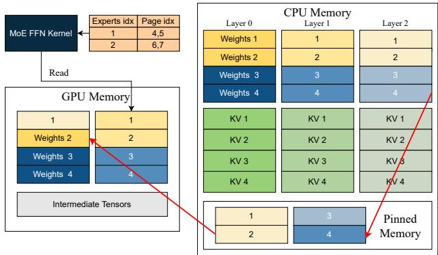  
Figure 11. Simplified Demonstration of MoE-Lightning’s Memory Management.

## A.2 Request Batching

For a given workload, the optimizer introduced in §4.2 takes the average prompt length to search for an optimal policy. However, maintaining a consistent micro-batch size becomes challenging due to varying input lengths across requests. To address this, we employ the strategy outlined in Algorithm 2 to achieve balanced token distribution. In essence, requests are sorted by input length in descending order and assigned to micro-batches by iteratively placing the longest request into the micro-batch with the fewest tokens. This approach ensures that all micro-batches have a size close to the ?????? specified by the generated policy.

## B Further Discussion

## B.1 MoE v.s. Dense Models

The performance model and system optimizations proposed in this work are fully applicable to dense models. As discussed in §3.3, MoE models present greater challenges with their higher memory-to-FLOPS ratio. This benefits them more from the system optimizations, which specifically aim to improve I/O eficiency and reduce pipeline bubbles. Dense models can benefit from these optimizations as well; however, they are more likely to be bottle-necked by CPU memory bandwidth during attention (depending on sequence length), where methods like sparse attention[9, 45, 54] and quantized KV cache may ofer more gains.

## B.2 Optimizer Overhead

In §4.2, we introduced the optimization target Eq. (12) and the search space. For a given workload, model and hardware specification, the optimal policy can be generated ofline through mixed integer linear programming (MILP), which takes less than a minute.

## C Future Work

Advanced performance model. HRM presented in this work is limited to hardware within a single node and does not account for GPU-GPU communication or multi-node communication, both of which are critical for more comprehensive distributed performance modeling. Additionally, with recent advances in leveraging KV cache sparsity for long-context inference [45], it becomes essential to incorporate these optimizations into the performance model. For example, when CPU attention emerges as the bottleneck, the KV cache budget can be adjusted to better balance CPU and GPU computation, enhancing overall system eficiency.

Algorithm 2 Request Batching   
Input: ??????\_??????????: Queue of requests   
Input: ??\_????: Number of micro-batches   
Input: ??????: Maximum number of requests per micro  
batches   
Input: ??????\_??????: Generation length per request   
Input: ??????ℎ??\_????????: Maximum cache size per micro-batches   
Output: ??????????\_????????ℎ????: List of micro-batches   
Output: ??????????????\_????????????????: List of aborted requests to be   
added to the next batch   
1: for ?? ← 1 to ??\_???? do   
2: ???????????????????? [??] ← ∅   
3: ????????????????????\_???????? [??] ← 0   
4: Sort(??????\_??????????, ?????? = ???? . ?? .??????????\_??????, ?????????????? = ?? ??????)   
5: for all ?????? ∈ ??????\_?????????? do   
6: if ???????????????????? == ∅ then   
7: ??????????????\_???????????????? += ??????   
8: ?????? ← arg min(????????????????????\_????????)   
9: if (????????????????????\_???????? [??????] + ??????.??????????\_??????) + (1 +   
|???????????????????? [??????] |) × ??????\_?????? > ??????ℎ??\_???????? then   
10: ??????????????\_???????????????? += ??????   
11: else   
12: ???????????????????? [??????] += ??????   
13: ????????????????????\_???????? [??????] += ??????.??????????\_??????   
14: if |???????????????????? [?????? ] | == ?????? then   
15: ??????\_????????ℎ ← NewBatch(???????????????????? [??????])   
16: ??????????\_????????ℎ???? += ??????\_????????ℎ   
17: ????????????????????.?????? (??????)   
18: ????????????????????\_????????.?????? (??????)   
19: return ??????????\_????????ℎ????, ??????????\_????????????????

Disk and other hardware support. MoE-Lightning cur- rently focuses on scenarios where GPU memory is limited but suficient CPU memory is available to hold the model, highlighting the efectiveness of both CGOPipe and HRM. However, when CPU memory is insuficient to hold the entire model, disk ofloading becomes essential. Moreover, supporting hardware such as TPUs and other accelerators is essential for extending the versatility of MoE-Lightning to diverse computing environments.

## References

[1] Flashinfer AI. Flashinfer: Kernel library for llm serving. htps://github. com/flashinfer-ai/flashinfer, 2024. Accessed: 2024-05-20.

[2] Joshua Ainslie, James Lee-Thorp, Michiel de Jong, Yury Zemlyanskiy, Federico Lebrón, and Sumit Sanghai. Gqa: Training generalized multiquery transformer models from multi-head checkpoints. arXiv preprint arXiv:2305.13245, 2023.

[3] Keivan Alizadeh, Iman Mirzadeh, Dmitry Belenko, Karen Khatamifard, Minsik Cho, Carlo C Del Mundo, Mohammad Rastegari, and Mehrdad Farajtabar. Llm in a flash: Eficient large language model inference with limited memory, 2024.

[4] Reza Yazdani Aminabadi, Samyam Rajbhandari, Ammar Ahmad Awan, Cheng Li, Du Li, Elton Zheng, Olatunji Ruwase, Shaden Smith, Minjia Zhang, Jef Rasley, et al. Deepspeed-inference: enabling eficient inference of transformer models at unprecedented scale. In SC22: In- ternational Conference for High Performance Computing, Networking, Storage and Analysis, pages 1–15. IEEE, 2022.

[5] Charlie Chen, Sebastian Borgeaud, Geofrey Irving, Jean-Baptiste Lespiau, Laurent Sifre, and John Jumper. Accelerating large language model decoding with speculative sampling, 2023.

[6] Wuyang Chen, Yanqi Zhou, Nan Du, Yanping Huang, James Laudon, Zhifeng Chen, and Claire Cui. Lifelong language pretraining with distribution-specialized experts. In International Conference on Machine Learning, pages 5383–5395. PMLR, 2023.

[7] Xinyun Chen, Petros Maniatis, Rishabh Singh, Charles Sutton, Hanjun Dai, Max Lin, and Denny Zhou. Spreadsheetcoder: Formula prediction from semi-structured context. In International Conference on Machine Learning, pages 1661–1672. PMLR, 2021.

[8] Wei-Lin Chiang, Lianmin Zheng, Ying Sheng, Anastasios Nikolas Angelopoulos, Tianle Li, Dacheng Li, Hao Zhang, Banghua Zhu, Michael Jordan, Joseph E Gonzalez, et al. Chatbot arena: An open platform for evaluating llms by human preference. arXiv preprint arXiv:2403.04132, 2024.

[9] Rewon Child, Scott Gray, Alec Radford, and Ilya Sutskever. Generating long sequences with sparse transformers, 2019.

[10] Damai Dai, Chengqi Deng, Chenggang Zhao, R. X. Xu, Huazuo Gao, Deli Chen, Jiashi Li, Wangding Zeng, Xingkai Yu, Y. Wu, Zhenda Xie, Y. K. Li, Panpan Huang, Fuli Luo, Chong Ruan, Zhifang Sui, and Wenfeng Liang. Deepseekmoe: Towards ultimate expert specialization in mixture-of-experts language models. CoRR, abs/2401.06066, 2024.

[11] Tri Dao. FlashAttention-2: Faster attention with better parallelism and work partitioning. In International Conference on Learning Representations (ICLR), 2024.

[12] Tri Dao, Daniel Y. Fu, Stefano Ermon, Atri Rudra, and Christopher Ré. FlashAttention: Fast and memory-eficient exact attention with IO-awareness. In Advances in Neural Information Processing Systems (NeurIPS), 2022.

[13] Nan Du, Yanping Huang, Andrew M Dai, Simon Tong, Dmitry Lepikhin, Yuanzhong Xu, Maxim Krikun, Yanqi Zhou, Adams Wei Yu, Orhan Firat, et al. Glam: Eficient scaling of language models with mixture-of-experts. In International Conference on Machine Learning, pages 5547–5569. PMLR, 2022.

[14] Abhimanyu Dubey, Abhinav Jauhri, Abhinav Pandey, Abhishek Kadian, Ahmad Al-Dahle, Aiesha Letman, Akhil Mathur, Alan Schelten, Amy Yang, Angela Fan, et al. The llama 3 herd of models. arXiv preprint arXiv:2407.21783, 2024.

[15] Artyom Eliseev and Denis Mazur. Fast inference of mixture-of-experts language models with ofloading, 2023.

[16] Shiqing Fan, Yi Rong, Chen Meng, Zongyan Cao, Siyu Wang, Zhen Zheng, Chuan Wu, Guoping Long, Jun Yang, Lixue Xia, et al. Dapple: A pipelined data parallel approach for training large models. In Proceedings of the 26th ACM SIGPLAN Symposium on Principles and Practice of Parallel Programming, pages 431–445, 2021.

[17] Jiaao He and Jidong Zhai. Fastdecode: High-throughput gpu-eficient llm serving using heterogeneous pipelines, 2024.

[18] Yanping Huang, Youlong Cheng, Ankur Bapna, Orhan Firat, Dehao Chen, Mia Chen, HyoukJoong Lee, Jiquan Ngiam, Quoc V Le, Yonghui Wu, et al. Gpipe: Eficient training of giant neural networks using pipeline parallelism. Advances in neural information processing systems, 32, 2019.

[19] HuggingFace. Hugging face accelerate. htps://huggingface.co/docs/ accelerate/index, 2022.

[20] Intel. Intel(r) oneapi math kernel library (onemkl). htps://www.intel. com/content/www/us/en/developer/tools/oneapi/onemkl.html, 2024.

[21] Robert A. Jacobs, Michael I. Jordan, Steven J. Nowlan, and Geofrey E. Hinton. Adaptive mixtures of local experts. Neural Comput., 3(1):79–87, 1991.

[22] Albert Q. Jiang, Alexandre Sablayrolles, Antoine Roux, Arthur Mensch, Blanche Savary, Chris Bamford, Devendra Singh Chaplot, Diego de Las Casas, Emma Bou Hanna, Florian Bressand, Gianna Lengyel, Guillaume Bour, Guillaume Lample, Lélio Renard Lavaud, Lucile Saulnier, Marie-Anne Lachaux, Pierre Stock, Sandeep Subramanian, Sophia Yang, Szymon Antoniak, Teven Le Scao, Théophile Gervet, Thibaut Lavril, Thomas Wang, Timothée Lacroix, and William El Sayed. Mixtral of experts. CoRR, abs/2401.04088, 2024.

[23] Michael I Jordan and Robert A Jacobs. Hierarchical mixtures of experts and the em algorithm. Neural computation, 6(2):181–214, 1994.

[24] Jordan Juravsky, Bradley Brown, Ryan Ehrlich, Daniel Y. Fu, Christopher Ré, and Azalia Mirhoseini. Hydragen: High-throughput llm inference with shared prefixes, 2024.

[25] Keisuke Kamahori, Yile Gu, Kan Zhu, and Baris Kasikci. Fiddler: Cpugpu orchestration for fast inference of mixture-of-experts models, 2024.

[26] Woosuk Kwon, Zhuohan Li, Siyuan Zhuang, Ying Sheng, Lianmin Zheng, Cody Hao Yu, Joseph Gonzalez, Hao Zhang, and Ion Stoica. Eficient memory management for large language model serving with pagedattention. In Proceedings of the 29th Symposium on Operating Systems Principles, pages 611–626, 2023.

[27] Dmitry Lepikhin, HyoukJoong Lee, Yuanzhong Xu, Dehao Chen, Orhan Firat, Yanping Huang, Maxim Krikun, Noam Shazeer, and Zhifeng Chen. Gshard: Scaling giant models with conditional computation and automatic sharding. arXiv preprint arXiv:2006.16668, 2020.

[28] Yaniv Leviathan, Matan Kalman, and Yossi Matias. Fast inference from transformers via speculative decoding, 2023.

[29] Percy Liang, Rishi Bommasani, Tony Lee, Dimitris Tsipras, Dilara Soylu, Michihiro Yasunaga, Yian Zhang, Deepak Narayanan, Yuhuai Wu, Ananya Kumar, et al. Holistic evaluation of language models. arXiv preprint arXiv:2211.09110, 2022.

[30] Yujun Lin, Haotian Tang, Shang Yang, Zhekai Zhang, Guangxuan Xiao, Chuang Gan, and Song Han. Qserve: W4a8kv4 quantization and system co-design for eficient llm serving, 2024.

[31] Shu Liu, Asim Biswal, Audrey Cheng, Xiangxi Mo, Shiyi Cao, Joseph E. Gonzalez, Ion Stoica, and Matei Zaharia. Optimizing llm queries in relational workloads, 2024.

[32] MistralAI. htps://mistral.ai/news/mixtral-8x22b/, April 2024.

[33] Avanika Narayan, Ines Chami, Laurel Orr, and Christopher Ré. Can foundation models wrangle your data? arXiv preprint arXiv:2205.09911, 2022.

[34] Deepak Narayanan, Aaron Harlap, Amar Phanishayee, Vivek Seshadri, Nikhil R Devanur, Gregory R Ganger, Phillip B Gibbons, and Matei Zaharia. Pipedream: generalized pipeline parallelism for dnn train-ing. In Proceedings of the 27th ACM symposium on operating systems principles, pages 1–15, 2019.

[35] Deepak Narayanan, Mohammad Shoeybi, Jared Casper, Patrick LeGres ley, Mostofa Patwary, Vijay Korthikanti, Dmitri Vainbrand, Prethvi

Kashinkunti, Julie Bernauer, Bryan Catanzaro, et al. Eficient largescale language model training on gpu clusters using megatron-lm. In Proceedings of the International Conference for High Performance Computing, Networking, Storage and Analysis, pages 1–15, 2021.

[36] Adam Paszke, Sam Gross, Francisco Massa, Adam Lerer, James Bradbury, Gregory Chanan, Trevor Killeen, Zeming Lin, Natalia Gimelshein, Luca Antiga, et al. Pytorch: An imperative style, high-performance deep learning library. Advances in neural information processing sys-tems, 32, 2019.

[37] Reiner Pope, Sholto Douglas, Aakanksha Chowdhery, Jacob Devlin, James Bradbury, Jonathan Heek, Kefan Xiao, Shivani Agrawal, and Jef Dean. Eficiently scaling transformer inference. Proceedings of Machine Learning and Systems, 5, 2023.

[38] Sarunya Pumma, Jongsoo Park, Jianyu Huang, Amy Yang, Jaewon Lee, Daniel Haziza, Grigory Sizov, Jeremy Reizenstein, Jef Johnson, and Ying Zhang. Int4 decoding gqa cuda optimizations for llm inference. htps://pytorch.org/blog/int4-decoding/, 2024.

[39] Andrea Santilli, Silvio Severino, Emilian Postolache, Valentino Maiorca, Michele Mancusi, Riccardo Marin, and Emanuele Rodola. Accelerating transformer inference for translation via parallel decoding. In Proceed- ings of the 61st Annual Meeting of the Association for Computational Linguistics (Volume 1: Long Papers). Association for Computational Linguistics, 2023.

[40] Teven Le Scao, Angela Fan, Christopher Akiki, Ellie Pavlick, Suzana Ilić, Daniel Hesslow, Roman Castagné, Alexandra Sasha Luccioni, François Yvon, Matthias Gallé, et al. Bloom: A 176b-parameter open-access multilingual language model. arXiv preprint arXiv:2211.05100, 2022.

[41] Noam Shazeer, Azalia Mirhoseini, Krzysztof Maziarz, Andy Davis, Quoc Le, Geofrey Hinton, and Jef Dean. Outrageously large neural networks: The sparsely-gated mixture-of-experts layer. arXiv preprint arXiv:1701.06538, 2017.

[42] Ying Sheng, Lianmin Zheng, Binhang Yuan, Zhuohan Li, Max Ryabinin, Beidi Chen, Percy Liang, Christopher Ré, Ion Stoica, and Ce Zhang. Flexgen: High-throughput generative inference of large language mod-els with a single gpu. In International Conference on Machine Learning, pages 31094–31116. PMLR, 2023.

[43] Yixin Song, Zeyu Mi, Haotong Xie, and Haibo Chen. Powerinfer: Fast large language model serving with a consumer-grade gpu, 2023.

[44] Mitchell Stern, Noam Shazeer, and Jakob Uszkoreit. Blockwise parallel decoding for deep autoregressive models, 2018.

[45] Jiaming Tang, Yilong Zhao, Kan Zhu, Guangxuan Xiao, Baris Kasikci, and Song Han. Quest: Query-aware sparsity for eficient long-context llm inference. arXiv preprint arXiv:2406.10774, 2024.

[46] Mosaic Research Team. Introducing dbrx: A new state-of-the-art open llm, 2024. htps://www.databricks.com/blog/introducing-dbrx-newstate-art-open-llm, March 2024. Accessed 2024-06-20.

[47] Hugo Touvron, Thibaut Lavril, Gautier Izacard, Xavier Martinet, Marie-Anne Lachaux, Timothée Lacroix, Baptiste Rozière, Naman Goyal, Eric Hambro, Faisal Azhar, et al. Llama: Open and eficient foundation language models. arXiv preprint arXiv:2302.13971, 2023.

[48] Samuel Williams, Andrew Waterman, and David A. Patterson. Roofline: an insightful visual performance model for multicore architectures. Commun. ACM, 52(4):65–76, 2009.

[49] ZHAO XUANLEI, Bin Jia, Haotian Zhou, Ziming Liu, Shenggan Cheng, and Yang You. Hetegen: Eficient heterogeneous parallel inference for large language models on resource-constrained devices. Proceedings of Machine Learning and Systems, 6:162–172, 2024.

[50] Leyang Xue, Yao Fu, Zhan Lu, Luo Mai, and Mahesh Marina. Moeinfinity: Activation-aware expert ofloading for eficient moe serving, 2024.

[51] Gyeong-In Yu, Joo Seong Jeong, Geon-Woo Kim, Soojeong Kim, and Byung-Gon Chun. Orca: A distributed serving system for {Transformer-Based} generative models. In 16th USENIX Sympo- sium on Operating Systems Design and Implementation (OSDI 22), pages

521–538, 2022.

[52] Zhihang Yuan, Yuzhang Shang, Yang Zhou, Zhen Dong, Chenhao Xue, Bingzhe Wu, Zhikai Li, Qingyi Gu, Yong Jae Lee, Yan Yan, Beidi Chen, Guangyu Sun, and Kurt Keutzer. Llm inference unveiled: Survey and roofline model insights, 2024.

[53] Susan Zhang, Stephen Roller, Naman Goyal, Mikel Artetxe, Moya Chen, Shuohui Chen, Christopher Dewan, Mona Diab, Xian Li, Xi Victoria Lin, et al. Opt: Open pre-trained transformer language models. arXiv preprint arXiv:2205.01068, 2022.

[54] Zhenyu Zhang, Ying Sheng, Tianyi Zhou, Tianlong Chen, Lianmin Zheng, Ruisi Cai, Zhao Song, Yuandong Tian, Christopher Ré, Clark Barrett, et al. H2o: Heavy-hitter oracle for eficient generative inference of large language models. Advances in Neural Information Processing Systems, 36, 2024.

[55] Lianmin Zheng, Wei-Lin Chiang, Ying Sheng, Siyuan Zhuang, Zhang hao Wu, Yonghao Zhuang, Zi Lin, Zhuohan Li, Dacheng Li, Eric Xing, et al. Judging llm-as-a-judge with mt-bench and chatbot arena. Ad- vances in Neural Information Processing Systems, 36, 2024.

[56] Lianmin Zheng, Liangsheng Yin, Zhiqiang Xie, Chuyue Sun, Jef Huang, Cody Hao Yu, Shiyi Cao, Christos Kozyrakis, Ion Stoica, Joseph E. Gonzalez, Clark Barrett, and Ying Sheng. Sglang: Eficient execution of structured language model programs, 2024.

[57] Yanqi Zhou, Tao Lei, Hanxiao Liu, Nan Du, Yanping Huang, Vincent Zhao, Andrew M Dai, Quoc V Le, James Laudon, et al. Mixture-ofexperts with expert choice routing. Advances in Neural Information Processing Systems, 35:7103–7114, 2022.