# GraphPipe: Improving Performance and Scalability of DNN Training with Graph Pipeline Parallelism

Byungsoo Jeon   
byungsoj.com@gmail.com   
NVIDIA   
Arlington, Virginia, USA   
Sunghyun Kim   
sunghyun@csail.mit.edu   
MIT   
Cambridge, MA, USA

Colin Unger unger@stanford.edu Stanford University Palo Alto, CA, USA

Xupeng Miao   
xupeng@cmu.edu   
Carnegie Mellon Univerisity   
Pittsburgh, PA, USA   
Tianqi Chen   
tqchen@cmu.edu   
Carnegie Mellon Univerisity   
Pittsburgh, PA, USA Mengdi Wu∗   
mengdiwu@andrew.cmu.edu   
Carnegie Mellon Univerisity Pittsburgh, PA, USA   
Sunghyun Park   
sunghyunp@nvidia.com   
NVIDIA   
Seattle, Washington, USA   
Daiyaan Arfeen   
marfeen@andrew.cmu.edu   
Carnegie Mellon Univerisity   
Pittsburgh, PA, USA   
Mohammad Alizadeh   
alizadeh@csail.mit.edu   
MIT   
Cambridge, MA, USA   
Shiyi Cao∗   
shicao@berkeley.edu   
UC Berkeley   
Berkeley, CA, USA

Neeraj Aggarwal aggarwal.neeraj141@gmail.com Carnegie Mellon Univerisity Pittsburgh, PA, USA

Peiyuan Liao   
peiyuanl@andrew.cmu.edu   
Carnegie Mellon Univerisity   
Pittsburgh, PA, USA   
Gregory R. Ganger   
ganger@andrew.cmu.edu   
Carnegie Mellon Univerisity   
Pittsburgh, PA, USA   
Zhihao Jia   
zhihao@cmu.edu   
Carnegie Mellon Univerisity   
Pittsburgh, PA, USA

## Abstract

Deep neural networks (DNNs) continue to grow rapidly in size, making them infeasible to train on a single device. Pipeline parallelism is commonly used in existing DNN systems to support large-scale DNN training by partitioning a DNN into multiple stages, which concurrently perform DNN training for diferent micro-batches in a pipeline fashion. However, existing pipeline-parallel approaches only consider sequential pipeline stages and thus ignore the topology of a DNN, resulting in missed model-parallel opportunities.

This paper presents graph pipeline parallelism (GPP), a new pipeline-parallel scheme that partitions a DNN into pipeline stages whose dependencies are identified by a directed acyclic graph. GPP generalizes existing sequential pipeline parallelism and preserves the inherent topology of a DNN to enable concurrent execution of computationallyindependent operators, resulting in reduced memory requirement and improved GPU performance. In addition, we develop GraphPipe, a distributed system that exploits GPP strategies to enable performant and scalable DNN training. GraphPipe partitions a DNN into a graph of stages, optimizes micro-batch schedules for these stages, and parallelizes

DNN training using the discovered GPP strategies. Evaluation on a variety of DNNs shows that GraphPipe outperforms existing pipeline-parallel systems such as PipeDream and Piper by up to 1.6×. GraphPipe also reduces the search time by 9-21× compared to PipeDream and Piper.

## 1 Introduction

Deep neural networks (DNNs) grow more rapidly in size against hardware developments, making them computationally costly to train [2, 30]. A recent language model GPT-4 [28] supposedly uses a much larger number of parameters [10] compared to the previous model GPT-3 with 175 billion parameters [6]. As a result, training modern DNNs requires distributing the model architecture across multiple devices.

To address this challenge, existing DNN systems apply model parallelism [7, 18, 26, 35, 36, 48] where a DNN is partitioned into smaller pieces, each of which fits into the memory of a single device. Pipeline parallelism [8, 11, 24, 25, 40] is a particular form of model parallelism that further improves device utilization and throughput. As shown in Figure 1, a key idea of pipeline parallelism is to split both a DNN and a mini-batch of samples into smaller pieces. First, the DNN is partitioned into multiple disjoint stages, each of which is a sub-model and links to other stages to form a pipeline. Second, a mini-batch of samples is further divided into multiple micro-batches, which are executed on diferent stages in a pipeline fashion. This approach reduces device idle time in training iterations, during each of which a single data mini-batch is processed, and thus improves throughput.

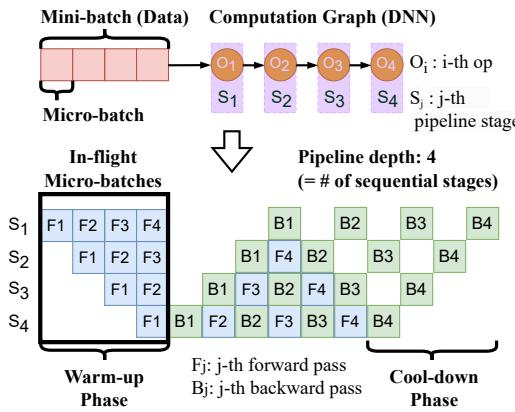  
Figure 1. Pipeline parallelism for DNN training with basic terms used in this paper.

Shortcomings of existing sequential pipeline parallelism. Existing schemes of applying pipeline parallelism form a sequential pipeline from partitioned stages, which we refer to as sequential pipeline parallelism (SPP).

Figure 1 illustrates a DNN training scheme that employs it. A micro-batch traverses the pipeline’s stages (??1 to ??4) in sequence to perform the computations (??1 to ??4) dictated by the DNN (forward pass: ??1’s), and traverses in reverse for all stages to update their assigned model weights (backward pass: ??1’s). Each stage needs to store the intermediate acti vations of a forward pass until its corresponding backward pass is completed. For a given stage, a micro-batch is inflight until its backward pass finishes. As micro-batches are continuously injected into the pipeline, there is a warmup of in-flight micro-batches. The earlier the stage in the pipeline, the longer the warm-up. As described, SPP is simple to construct and operate, but has three key limitations.

First, opportunities to exploit the inherent parallel structures of a DNN are left unseized. DNN applications such as healthcare [16, 37, 39], chatbot [28], and recommendation [27] jointly process heterogeneous data types (e.g., text, images, and tabular data). Specifically, the rise of general ist AI models, such as GPT-4o [3], Chameleon [41], and Gato [34], further underscores the need for eficient parallel handling of diverse data modalities. DNNs employed therein are designed to feature multiple branches, which are computationally independent and thus can be executed concurrently. But existing DNN systems with SPP first linearize the computation graph of a DNN to construct the stages of a sequential pipeline and process these stages sequentially, falling short in harnessing the opportunity to blend such branch-level parallelism with pipeline parallelism.

Second, pipeline depth (i.e., number of sequential stages in SPP) is unduly increased by missing parallelism opportunities that arise from inherent DNN structures (e.g., parallel branches). Under an alternative arrangement in which some pipeline stages are parallelized by exploiting such structures, the number of sequential stages a micro-batch traverses in a forward (or backward) pass can be smaller. That is, the elongated pipeline formed by SPP unduly increases pipeline depth, which in turn increases the number of in-flight microbatches to manage. This imposes a higher burden of managing memory, especially for early stages in the pipeline. Recall that the tight memory constraint in training large DNNs is a primary reason to apply pipeline parallelism. Thus, it is critical to curb the heightened memory requirement.

Third, today’s devices employed for DNN training (e.g., GPUs) have high parallel-computing capabilities, requiring a large amount of training samples to be fetched to achieve peak performance. The increased memory consumption that results from applying SPP impedes doing so. As a consequence, devices perform computations at an operational intensity lower than their desired capacity, resulting in suboptimal training performance.

Our approach. To address the above challenges, we introduce graph pipeline parallelism (GPP), that enables performant and scalable DNN training. Figure 2 highlights the key diference between GPP and SPP. Instead of enforcing a strictly sequential execution order of pipeline stages, GPP allows partitioning a DNN into stages whose dependencies are identified by a directed acyclic graph. GPP includes SPP as a special case and can preserve the inherent topology of the DNN during stage partitioning. As a result, GPP enables concurrent execution of computationally-independent components, resulting in reduced memory requirement and improved GPU performance compared to SPP.

GPP involves a significantly larger and more complicated search space of parallelization strategies compared to the SPP strategies considered by existing DNN systems. Discovering GPP strategies with superior performance over existing SPP baselines requires weighing subtle trade-ofs between pipeline depth, memory consumption, and microbatch schedule. To unleash the power of GPP, we develop GraphPipe, a system that automatically discovers eficient GPP strategies to enable performant and scalable DNN training. GraphPipe includes three key components. First, a pipeline stage partitioner automatically determines how to partition the operators of a DNN into a graph of stages, while balancing the computational load among these stages and minimizing inter-stage communication. Second, a static micro-batch scheduler schedules the forward and backward passes of diferent micro-batches within a mini-batch to minimize the peak GPU memory requirement of a GPP strategy. The stage partitioner and micro-batch scheduler jointly partition a DNN into stages and determine the microbatch schedules for each stage. Finally, a distributed runtime uses the discovered GPP strategy to enable performant and scalable DNN training.

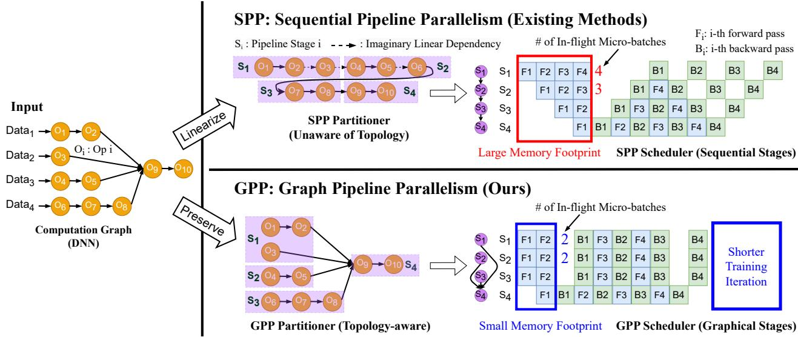  
Figure 2. A high-level comparison between existing (SPP) and our (GPP) approaches. SPP (top) produces sequential pipeline stages that miss the opportunity of parallelizing the branches in the DNN. In contrast, GPP (bottom) generates graphical pipeline stages that enable parallel execution of the branches. This leads to lower training iteration time (i.e., higher training throughput) and smaller memory footprint in pipeline-parallel DNN training.

Through experiments on three multi-branch DNNs (e.g., Multi-Modal Transformer [13, 28, 31, 33, 44, 46], DLRM [27], and CANDLE-Uno [1]), we show that GraphPipe can achieve up to 1.6× training throughput improvements over existing pipeline-parallel systems such as PipeDream [24] and Piper [40]. GraphPipe also reduces the search time by 9-21× compared to PipeDream and Piper.

To summarize, we make the following contributions:

• We introduce graph pipeline parallelism, a new parallelization scheme that promotes concurrent stage execution, reduces memory requirement, and improves GPU utilization compared to existing SPP schemes.

• We design algorithms to partition a DNN into a graph of stages and schedule micro-batches for these stages, which jointly discover eficient GPP strategies.

• We develop GraphPipe, a distributed runtime that enables fast and scalable DNN training with GPP.

## 2 Graph Pipeline Parallelism

Figure 2 describe the key diferences between sequential pipeline parallelism (SPP) employed by existing DNN systems [25, 40] and graph pipeline parallelism (GPP). Given a DNN and a set of devices, SPP and GPP produce strategies with diferent partitioning of stages and pipeline schedules.

Concurrent execution of stages. SPP linearizes all operators of a DNN while preserving data dependencies between these operators, and then partitions the linearized DNN into a sequence of pipeline stages. As a result, each stage has at most one predecessor and one successor. The execution order of these stages is thus strictly sequential.

In contrast, GPP preserves the topology of a DNN when partitioning it into pipeline stages. To avoid circular dependencies between pipeline stages, the relationships between these stages form a directed acyclic graph. The execution order of the stages can be thus more general compared to SPP. This topology-aware partitioning and pipeline stage execution provides GPP a clear advantage: (potentially) concurrent execution of stages that are computationally-independent.

For the GPP strategy in Figure 2, the three stages ??1, ??2, and ??3 are computationally-independent. Accordingly, the forward and backward passes of the three stages can be executed concurrently. However, in the SPP strategy, the two stages ?? and ?? are partitioned such that they have a sequential data dependency (due to the dependency between operator ??6 in ??2 and operator ??7 in ??3) since the SPP partitioner does not consider the topology of the DNN and fails to exploit it. Moreover, while the two stages ??1 and ??2 in the SPP strategy should be computationally-independent according to the original DNN, the SPP scheduler executes the forward and backward passes of these two stages sequentially. This is because new data dependencies are imposed between them when linearizing the operators of a DNN to construct a sequential pipeline.

This distinction directly leads to a performance gap. Specifically, both SPP and GPP involve a warm-up phase during which micro-batches are injected into the pipeline until all stages can perform work concurrently. However, as shown in Figure 2, the warm-up phase of GPP (i.e., 2) is shorter than that of SPP (i.e., 4). This performance improvement also applies to the cool-down phase during which in-flight microbatches are resolved. As a result, GPP achieves a shorter per-iteration training time (hence, a higher throughput) than SPP. The topology-aware stage partitioning and scheduling of GPP address the first shortcoming of SPP (§1).

Reduced memory requirement. There is a close relationship between the memory requirement of a pipelineparallel strategy and its pipeline depth, which is defined as the diameter of its stage graph. As mentioned earlier, the depth of the pipeline becomes excessively extended due to overlooked opportunities for parallelism within DNN architectures, such as parallel branches. This results in a higher memory footprint compared to that of pipeline stages that are parallelized by taking advantage of these structures.

In Figure 2, GPP and SPP have a pipeline depth of 2 and 4, respectively. As a result, the first stage with the highest activation memory pressure needs to store the forward pass results for 2 micro-batches in GPP and those for 4 microbatches in SPP. All else being equal (i.e., an identical model partition by both), GPP has a lower total memory footprint than SPP. Note that memory saving is likely to grow as model size grows since a bigger model with deeper pipeline depth requires larger number of in-flight micro-batches (especially for early stages). The activation memory saving by GPP addresses the second shortcoming of SPP in §1.

Improved GPU utilization. Devices employed in DNN training (e.g., GPUs) are designed to parallelize DNN computation of a micro-batch eficiently. Thus, larger microbatches (i.e., more training samples within a micro-batch) can improve the operational intensity, thus GPU utilization of DNN operators. Note that larger micro-batches lead to reduced numbers of micro-batches, which in turn increases the warm-up and cool-down time of pipeline that GPP can significantly reduce. For simplicity of presentation, Figure 2 assumes that the same micro-batch size is used by GPP and SPP. However, a lower device memory requirement of GPP over SPP allows integrating more training samples in a micro-batch, which increases the operational intensity and overall GPU utilization, and therefore further reduces the per-iteration training time. We evaluate this aspect in more detail in §7.

## 3 Problem Formulation

In this section, we formulate the problem of devising a GPP strategy for distributed DNN training. Compared to existing works [25, 40, 48], we further generalize the formulation to support graphical pipeline stages with fine-grained perstage micro-batch size and schedules. As input, we are given (a) a computation graph G?? = (V??, E??) that represents the neural architecture of a DNN model, (b) a mini-batch size ??, and (c) a device topology graph D = (V??, E??) where each node ?? ∈ V?? represents a device with memory budget ???? and each edge ?? ∈ E?? represents a communication link with bandwidth ???? between the two adjacent devices.

As output, we generate a pipeline stage graph G?? = (V??, E?? ) that optimizes the performance metric of interest. In this work, we limit the scope to strategies that combine pipelineparallel and data-parallel techniques, and aim to minimize the Time-Per-Sample (TPS) of the bottleneck pipeline stage since the pipeline throughput performance hinges upon the straggler stage. The stage graph G?? = (V??, E?? ) is a directed acyclic graph (DAG), where each node ???? ∈ V?? specifies a pipeline stage and each directed edge (????, ???? ) ∈ E?? indicates that stage ???? must precede ???? for forward passes and that ???? must precede ???? for backward passes.

The goal is to solve the min-max optimization problem:

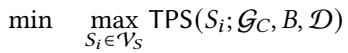

(1)

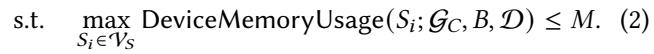

Formally, GPP devises a strategy G?? as follows. We define ???? ∈ V?? in further detail as a four-element tuple: ???? = ⟨G?? , ???? , D?? , Π?? ⟩:

1. G?? represents a subgraph of G??,

2. ???? is the micro-batch size of ???? (i.e., there are ??/???? micro-batches for each mini-batch),

3. D?? is a set of devices allocated to process the forward and backward passes of ???? (we apply data parallelism within ???? if |D?? | > 1), and

4. Π?? is a micro-batch schedule that specifies the order in which the ??/???? forward and ??/???? backward passes are processed. We use fw?? (or bw?? ) to denote the forward (or backward) pass of the ??-th micro-batch for ???? .

G?? is a valid GPP strategy if and only if the memory constraint (Equation 2) and all following conditions are met:

C1. G?? is a convex subgraph of G?? , and G1, . . . , G| V?? | form a partition of G?? .

C2. If there exists (??, ??) ∈ E?? such that ?? ∈ G?? and ?? ∈ G?? , then (????, ?? ?? ) ∈ E?? .

C3. D1, . . . , D| V?? | form a partition of D.

C4. For each micro-batch schedule Π?? , fw???? precedes fw????+1, bw???? precedes bw????+ , and fw???? precedes bw???? .

In words, C1 mandates that all operators be covered by stages that do not overlap with each other, and C2 mandates that a strict sequential execution order between two stages be established if according to the computation graph there exists a data dependency between two operators each in either of the stages. C3 ensures that at least one device is allocated to every stage. C4 dictates the orderings of forward and backward passes.

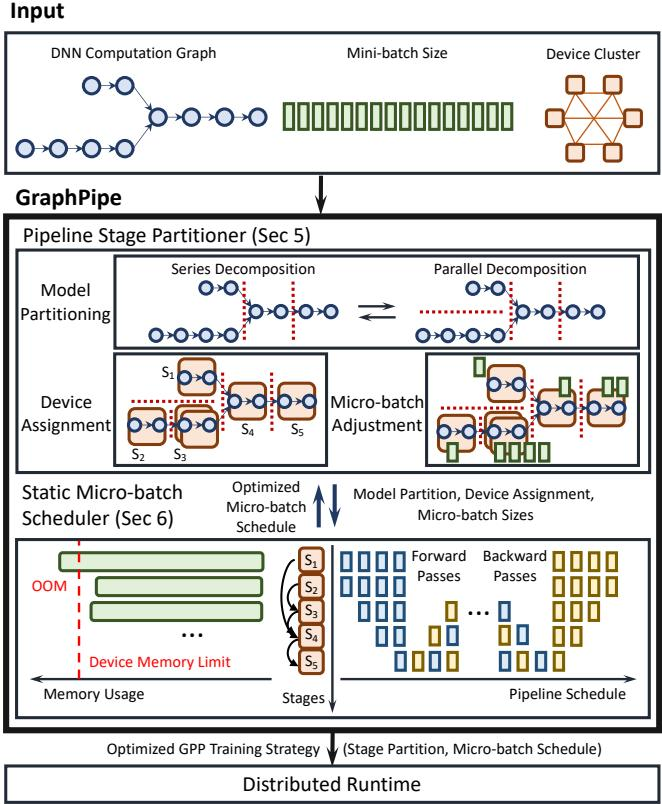  
Figure 3. Overview of GraphPipe. It consists of a pipeline stage partitioner and a micro-batch scheduler. Given a DNN computation graph, mini-batch size, and device configuration, they interact with each other to produce an optimized GPP training strategy as output. The output can be launched on the distributed runtime framework we also develop to execute it and evaluate its real-world performance.

## 4 System Overview

Figure 3 illustrates an overview of GraphPipe, a system that accelerates distributed DNN training at scale using GPP. Taking as input (a) the computation graph of a DNN, (b) mini-batch size, and (c) the topology of assigned GPUs, GraphPipe produces an optimized GPP strategy for parallel DNN training. GraphPipe includes three key components: a pipeline stage partitioner, a static micro-batch scheduler, and a distributed runtime. The first two components jointly discover a high-performance GPP strategy for a given DNN model, mini-batch size, and assigned devices, which will be executed by the distributed runtime.

Pipeline stage partitioner. The partitioner performs three tasks. First, it partitions a DNN, aimed at achieving an efective distribution of workloads across stages. It examines the amount of computation and communication needs associated with the operators in each stage. Importantly, it leverages the inherent topology of the DNN at hand in order to exploit concurrent execution opportunities. To this end, it performs a sequence of series-parallel decompositions of the given DNN. Second, it adjusts the micro-batch size for each stage. This fine-grained adjustment aims to exploit heterogeneous compute eficiencies of diferent types of operators. Finally, it determines how many devices to assign to each stage to achieve an efective allocation of resources. Note that all three functions are jointly performed, as no one function is independent of the others. We provide further details in §5.

Static micro-batch scheduler. The scheduler performs two tasks. First, it optimizes micro-batch schedules for forward and backward passes while ensuring the integrity of distributed DNN training. This involves examining both intra- and inter-stage data dependencies between the passes (see C4 in §3). Next, it checks if the memory usage that results from the schedule is within the given device memory constraint (see Equation 2). Memory usage is closely related to the numbers of in-flight micro-batches of a stage, which can be computed based on the schedule of the forward and backward passes of the stage. §6 provides further details.

Distributed runtime framework. We develop a distributed DNN runtime system that executes GPP training strategies generated by the optimizer of GraphPipe. Using the distributed runtime as the testbed, we compare the performance of the generated GPP strategies against existing SPP strategies for various DNNs. We provide details in §7.

## 5 Pipeline Stage Partitioner

The pipeline stage partitioner of GraphPipe aims to minimize Time-Per-Sample (TPS) of the bottleneck pipeline stage as described in §3. It takes as input a DNN computation graph G??, a mini-batch size ??, and a device topology graph G??, and generates an optimized stage graph G?? by searching over diferent model partitions, device assignments, and micro-batch sizes simultaneously. A key challenge we must address is the large and complex search space of potential GPP strategies. To reduce the complexity of the search task, we employ a binary search method combined with seriesparallel decomposition and dynamic programming. We next describes these three components.

Binary search. Given the large search space of potential solutions, GraphPipe does not attempt to directly find an optimal solution. Instead, GraphPipe employs binary search to iteratively narrow down the target performance range and examines whether there exist valid solutions within the range. By iteratively reducing the range, GraphPipe discovers solutions arbitrarily close to an optimal one, and thus there is little diference in performance for practical purposes. Lines 2–11 of Algorithm 1 shows GraphPipe’s binary search process.

Series-parallel decomposition. Since most DNNs structurally reflect series-parallel graphs [38, 42], GraphPipe applies series-parallel decomposition to an input graph G?? in order to decompose it into smaller, manageable subgraphs, and perform model partitioning, device allocation, and task scheduling for each subgraph. In the unusual cases where a DNN does not possess such a structural property, GraphPipe bypasses this issue by converting the DNN to an arithmetically identical one whose structure is a series-parallel graph.

Algorithm 1 Pipeline stage partitioner.   
Input: Computation graph G??, number of devices |V??   
Output: Optimized stage graph G??   
1: // MAXTPS: safe upper-bound for TPS of bottleneck stage.   
2: ???? = 0, ???? = MAXTPS, G?? = ∅   
3: while ???? − ???? > ?? do   
4: ???? = (???? + ???? )/2   
5:   
6:   
7: ???? = ????   
8: else   
9: ???? = ????   
10:   
11: return G??   
12:   
13: function SearchStageGraph(G??, |V?? |, ????, ??)   
14: // ?? is a set of candidate schedule configurations (??)   
15: for ?? ∈ ?? do   
16: // ?? : dummy schedule configuration   
17: G???????? = DP(G??, ??0, ??, |V?? |, ????)   
18: // PickBetter(·) picks one with less memory   
19:   
20:   
21:   
22: // Dynamic Programming (DP) Partitioner   
23: function DP(G, ???? , ????, ??, ???????? )   
24: if this DP state has been visited then   
25:   
26: // Consider a given DP state as a SINGLE stage   
27: G?????????? = ∅   
28: if EstimateTPS(G, ???? , ????, ??)≤ ???????? then   
29: // Optimize schedule via Algorithm 2   
30: Π?????? = ScheduleStage(G, ???? , ????, ??)   
31:   
32: // Decompose a given DP state into two stages   
33: if G can be decomposed in series then   
34: for (G , G ) ∈ SeriesDecompose(G) do   
35: for ?? ← 1 to ?? − 1 do   
36: ??1 = ?? − ??2   
37: for ???? ∈ ?? do   
38:   
39: Update ???? based on G???????? S   
40:   
41: else if G can be decomposed in parallel then   
42: for (G , G ) ∈ ParallelDecompose(G) do   
43: for ?? ← 1 to ?? − 1 do   
44: ??2 = ?? − ??1   
45:   
46:   
47:   
48:

Dynamic programming (DP). GraphPipe adopts a dynamic programming algorithm where the value of each DP state indicates the existence of a strategy achieving a throughput within a target range (Lines 13–20 of Algorithm 1). At each DP level, GraphPipe applies series-parallel decompositions to split an input graph (say G) into two new subgraphs (say G1, G2), each of which serves as the input computation graph of a new DP subproblem at one DP level below. Graph-Pipe recursively solves the DP subproblems to construct a solution of the original problem where the input computation graph is G?? (Lines 23–48 of Algorithm 1).

DP subproblem. We ensure that each DP subproblem maintains a certain structure (i.e., having a unique pair of source and sink nodes and a subgraph G comprised of them). The input to a DP subproblem includes a computation graph G ⊆ G??, the number of devices ??, and some schedule-related information for its predecessor and successor stages, which we furnish by enumeration if not available.

The solution of a DP subproblem involves devising a training strategy such that (1) the number of in-flight microbatches for the source stage (i.e., the pipeline stage that includes the source node) is minimized; and (2) the Time-Per-Sample (TPSes) for all stages do not exceed the target TPS range. These results are returned back to the parent DP subproblem at one DP level above where the results are gathered for the parent DP subproblem to produce its own. We consider three cases in a DP subproblem:

• Base case: We consider the entire subgraph G as a single stage and apply data parallelism with a dataparallel degree of ?? (Line 28 in Algorithm 1). We estimate TPS by profiling the execution time of each operator while extrapolating communication latency by afine functions. We check if the target TPS range is achievable with the memory constraint, and compute the number of in-flight micro-batches according to Algorithm 2 (see §6).

• Series decomposition: We perform a series decomposition to create two subgraphs G and G , where the sink node of G1 coincides with the source node of G2 (Line 33 in Algorithm 1). We first solve the subproblem associated with G . To do so, we enumerate all feasible schedules for the source node of G . We then solve the subproblem associated with G .

• Parallel decomposition: We perform a parallel decomposition to create G1 and G2, where G1 and G2 share the same source and sink nodes (Line 41 in Algorithm 1). As there is no data dependency between these subgraphs, the pipelines can be executed in parallel. The subproblems associated with G1 and G2 may produce diferent optimal numbers of in-flight micro-batches for the shared source node. To ensure continuous pipelining, we take the larger number of in-flight micro-batches as the solution.

Overall process. Figure 4 visualizes the overall process. At the top, a DP subproblem is provided with its initial conditions: computation graph G, the number of available devices ??, and the target TPS range [0, ???????? ]. Suppose the number of in-flight micro-batches for the sink node is ????, the micro-batch sizes for the source and sink nodes are ???? and ????, the stage containing the source node (i.e., source stage) uses the ???? F???? B schedule, and the stage containing the sink node (i.e., sink stage) uses the ????F????B schedule (we introduces GraphPipe’s micro-batch schedules in §6). These supposed conditions comprise a schedule configuration denoted by ?? := (??, ??, ??)1 in Algorithm 2. They are either available as the results of some other DP subproblems solved previously, or furnished by enumeration. The solution of this DP subproblem computes the smallest possible number of in-flight micro-batches for the source stage (i.e., ???? in Figure 4) that meets the target TPS range [0, ???????? ].

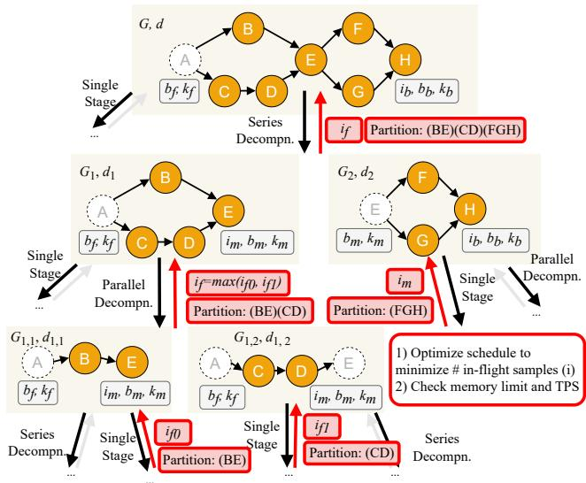  
Figure 4. Pipeline stage partitioner performing seriesparallel decompositions. Black arrows indicate subproblem formulations. Red arrows indicate solutions of subproblems.

Time complexity. We analyze the time complexity of the stage partitioner to gauge the impacts of design parameters. Let ?? be the number of series-parallel subgraphs of G??, B be the set of possible micro-batch sizes, D be the set of possible data-parallel degrees. The maximal element of B is upperbounded by ??. We consider powers of 2 for micro-batch sizes (i.e., |B| < log ??). Likewise, the maximal element of D is upper-bounded by |V?? | and |D | < log |V?? | holds.

The number of candidates for G is ?? (?? ), that for ???? = (???? , ???? ) is ?? (|B |2), that for ???? = (????, ????, ???? ) is ?? (??|B |2), and that for ?? is ?? (|D |) in each DP subproblem. To compute a DP value, it takes ?? (|D ||B|2) time for series decompositions and ?? (|D |) time for parallel decompositions. Therefore, the time complexity for a single DP run is ?? (?? ??|B|6|D |2) and the overall time complexity is ?? ( (log MAXTPS)?? ??|B|6|D |2) = ?? ( (log MAXTPS)?? ??(log ??)6(log |V?? |)2).

## 6 Static Micro-Batch Scheduler

The static micro-batch scheduler of GraphPipe optimizes micro-batch size and schedules to minimize training time and memory footprint. Specifically, we design our scheduler to address the unique challenges presented by graph-like data dependencies in GPP pipeline stages. These dependencies make scheduling non-trivial unlike SPP case. For example, as shown in Figure 1, it is straightforward in SPP that we need to schedule ?? + 1 − ?? (??: the number of sequential stages) forward tasks at stage ?? until we schedule a first backward task, assuming 1F1B schedule (i.e., forward pass for 1 micro-batch followed by backward pass for 1 microbatch)2. However, with GPP, this simple equation does not hold anymore since there could be multiple stages following a single stage. Therefore, we need more generalized method to optimize schedules while meeting the graph-like data dependency between all forward and backward tasks.

We further generalize our scheduler so that it can support diferent micro-batch sizes and schedules over pipeline stages. This can be efective when running heterogeneous models (e.g., multi-modal models with diferent ideal microbatch size over pipeline stages across diferent modalities).

Figure 5 illustrates how we can reduce training iteration time and memory footprint with per-stage micro-batch size and scheduling. Here, each pipeline stage has diferent smallest micro-batch size (i.e., 1, 2, 4 for ??1, ??2, ??3) achieving maximum compute eficiency. Using a fixed micro-batch size of 4 across all stages maximizes compute eficiency. But, the drawback is long GPU idling during warm-up and cool-down, and large memory footprint, i.e., 12 in-flight micro-batches for stage 1. However, by tailoring the micro-batch size and scheduling to each stage, we reduce this to 10 in-flight microbatches for stage 1 while maintaining maximum compute eficiency. This also shortens the training iteration because stages can be scheduled earlier with smaller micro-batch sizes. This benefit usually grows with more pipeline stages.

To support 1) graph-like stage dependency and 2) perstage micro-batch size and schedule, this is how we design our scheduler (Algorithm 2). It takes as input (1) a configuration of model partition G, (2) current and next stage schedule configurations ???? , ????, and (3) the number of devices ?? from the pipeline stage partitioner, and produces an optimized micro-batch schedule Π?????? for a given stage configuration.

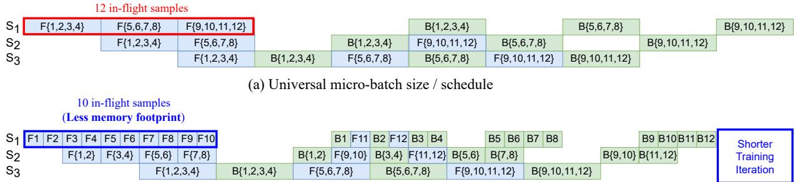  
(b) Per-stage micro-batch size / schedule

Figure 5. A comparison between universal and per-stage micro-batch size / schedule. F{??, ?? }, B{??, ?? } indicate forward and backward passes for a micro-batch including samples ?? and ??. It showcases how per-stage micro-batch size and scheduling can save memory footprint and training iteration time.  
Algorithm 2 Static micro-batch scheduler.   
Input: Model partition G, initial current and next stage schedule   
configurations ???? , ????, number of devices ??   
Output: Optimized schedule Π??????   
1: function ScheduleStage(G, ???? , ????, ??)   
2: // Optimize schedule by minimizing number of   
3: // in-flight micro-batches   
4: // while respecting data dependencies   
5: ???? = ComputeInFlight(???? , ???? , ????, ????, ????)   
6: ???????? = (?? ?? , ?? ?? , ?? ?? )   
7: if ???????? violates device memory constraint then   
8: ???????? = ∅ // Invalidate schedule ????????   
9: Π?????? ← ScheduleTask(???????? )   
10: return Π??????

As in Figure 3, the input is fed by the stage partitioner, and the output is returned back to the stage partitioner to form a stage graph with an optimized micro-batch schedule.

GraphPipe’s pipeline stage partitioner (Algorithm 1) first calls Algorithm 2 to discover an optimized micro-batch schedule for the last stage. It then traces back all directed edges (????, ???? ) ∈ E?? of the stage graph G?? in the reverse direction and determines a schedule for each stage ???? until a schedule for the first stage is determined. The reason for backward traversal is that computing the activation memory usage, and thus the total usage, for a stage ???? requires complete schedule information of its subsequent stages ?? ?? .

ComputeInFlight(·) and ScheduleTask(·) are two key functions in Algorithm 2. First, ComputeInFlight(·) is a key subroutine to optimize schedule by efectively minimizing the number of in-flight micro-batches for a given stage without increasing per-iteration training time. To take graphical stage dependency (i.e., multiple stages following one) into account, it factors in all following stages to decide the minimum number of in-flight micro-batches. It also accounts for scheduling constraints posed by micro-batch size gap between subsequent stages. For instance, in Figure 5, ??2 needs two micro-batches to be processed from ??1 to process a single micro-batch. Appendix A.1 explains the detail of ComputeInFlight(·) computes the minimal number of inflight micro-batches.

Second, ScheduleTask(·) produces an optimized schedule of forward and backward passes with optimized schedule configuration (???????? ). It adopts greedy scheduling that schedules backward pass as early as possible. It reduces both memory consumption and training iteration time since it quickly resolves the corresponding in-flight forward pass.

GraphPipe uses the following default schedule configurations: 1) synchronous 1F1B schedule [25] adjusted to support graph-like dependencies and 2) the same microbatch size across stages. The synchronous 1F1B avoids gradient staleness with the same pipeline latency and lower activation memory footprint in comparison to alternatives (e.g., GPipe [11]). Furthermore, except for some corner cases, we observe that performance improvements from per-stage micro-batch sizes and ??F??B schedules are incremental to justify the increased search times for models and device clusters we explored. Still, with GraphPipe, users can choose to search over per-stage micro-batch sizes and ??F??B schedules for more heterogeneous models and larger device clusters.

## 7 Evaluation

We develop GraphPipe on top of FlexFlow [14], a distributed multi-GPU runtime for DNN training. We adjusted FlexFlow’s runtime for parallel execution of graphical pipeline stages while introducing our own partitioner in §5 and scheduler in §6 to FlexFlow. We evaluate GraphPipe on the Summit supercomputer [4]. For each compute node of Summit, we use 2 IBM POWER9 CPUs and 4 NVIDIA V100 GPUs with 512GB of main memory. GPUs within a node are interconnected via NVLink while nodes are connected via Mellanox EDR 100Gb InfiniBand. We use the default schedule configurations of GraphPipe mentioned in Section 6. Note that we omit error bars for our plots, as we observe marginal standard deviations (less than 3%) for all results.

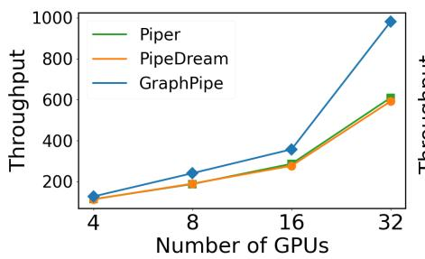  
(a) Multi-Modal Transformer (MMT)

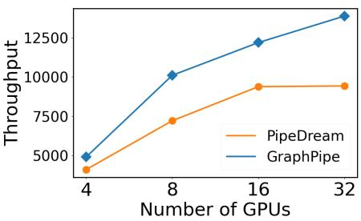  
(b) DLRM

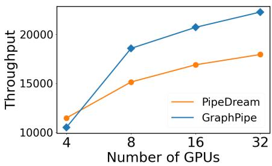  
(c) CANDLE-Uno  
Figure 6. End-to-end performance evaluation. GraphPipe outperforms both PipeDream [25] and Piper [40] in three diferent models: Multi-modal Transformer-based model [31], DLRM [27], and CANDLE-Uno [1] at all but one GPU count configurations tested. Missing data points indicate that no training strategy can be found within reasonable timeframes.

DNNs. We explore three multi-branch DNNs: Multi-Modal Transformer-based model (MMT) [31, 44], DLRM [27], and CANDLE-Uno [1]. Multi-Modal Transformer (MMT) is a backbone of most state-of-the-art multi-modal models [13, 28, 31, 33, 46]. DLRM is a popular deep learning recommendation model for personalization and ads recommendation. CANDLE-Uno is a specialized model in the medical domain (i.e., precision medicine). We describe the detailed model configurations in Appendix A.2. Despite diferent applications, all these models feature parallel branches, each processing a diferent type of data.

## 7.1 End-to-End Evaluation

We compare the training throughput of GraphPipe with existing pipeline-parallel systems such as PipeDream [25] and Piper [40]. We choose these two baselines since their combined search space encompasses all possible model partitions covered by other SPP approaches [8, 24, 48]. To be specific, PipeDream (with the operator granularity) basically covers the pipeline partitioning and scheduling strategies of all baseline SPP approaches [8, 24, 48] but Piper. They all (1) linearize DNNs by transforming their computation graphs into sequences of operators, (2) exhaust pipeline stage partition choices, and (3) employ 1F1B scheduling.

Figure 6 showcase the results. We measure the training throughput (i.e., number of samples processed per second) as we increase the number of GPUs and mini-batch sizes. Note that Piper cannot generate training strategies for DLRM and CANDLE-Uno since its time and space complexity increases exponentially with respect to the number of parallel branches. GraphPipe outperforms PipeDream and Piper at all but one GPU configuration. Moreover, the performance gap widens as the number of GPUs increases.

Our analysis reveals that we can attribute the widening performance gap to the pipeline depths greatly reduced by GraphPipe compared to PipeDream and Piper for the multi-branch models. As we use more devices, the number of sequential pipeline stages tends to increase to achieve a higher throughput, particularly when the model size is too large to apply data parallelism at the cost of weight memory footprint and weight synchronization. With a larger number of stages, sequential pipeline schemes by generated by PipeDream or Piper sufer from extended warm-up and cool-down phases. Directly, these extended pipeline bubbles negatively afect training throughput. Indirectly, these bubbles increase activation memory footprints, which in turn impede efective model partitioning. We visualize this analysis in detail via a case study (see §7.5).

## 7.2 Search Time

Table 1 presents the search times by the three optimizers (GraphPipe, PipeDream, and Piper) for the three models (Multi-Modal Transformer, DLRM, and CANDLE-Uno). The Multi-Modal Transformer-based model has two branches and the DLRM and CANDLE-Uno models have eight branches.

GraphPipe is at least 9× faster than the baselines irrespective of the models or GPU configurations. In addition, GraphPipe’s eficient partitioner produces a strategy within a minute for all configurations. The SPP baselines are much slower by comparison, and this search time discrepancy can be attributed in large part to the fact that the baselines rarely leverage DNN topology in expediting search. Note that Piper does not produce strategies for the DLRM and CANDLE-Uno models for the aforementioned reasons.

To see the large search space of each SPP baseline, it is helpful to approximate their time complexities. Let us consider a simple multi-branch model with each branch having ?? > ?? operators, where ?? is the number of branches. Recall that Piper considers model partitions in which cross-branch stages exist. This level of granularity of model partitions significantly increases the number of model partitions to examine. Piper’s optimizer runs in ?? (|D |2) time (Appendix D in [40]), where D is the set of downsets (Definition 4.1 in [40]). According to the definition, model partitions in which one stage spans multiple branches and all other stages are formed within a branch are valid candidates. Since we can choose one operator out of ?? from each branch to form a cross-branch stage, the number of such model partitions is at least |D | ≥ Î??= ?? = ????. Thus, Piper’s time complexity is lower-bounded by ?? (??2??). This time complexity implies that unless we employ a set of clever heuristics, Piper’s time complexity can be significantly high for multi-branch DNNs.

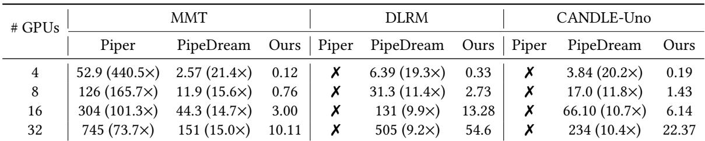  
Table 1. Solution search times (in seconds) for Piper, PipeDream, and Ours (GraphPipe) on the Apple M1 Max; ✗ indicate search cannot be completed. Numbers in parentheses indicate the search time ratio of the algorithm to that of GraphPipe.

On the other hand, PipeDream considers a converted DNN that linearizes all branches and the operators within. Thus, it deals with a single chain of operators, where the number of model partitions to consider is much smaller than Piper.

Still, GraphPipe considers significantly fewer model partitions than PipeDream (and hence Piper) particularly when a given DNN features multiple branches. Instead of solving a single long chain of ???? operators as in PipeDream, GraphPipe solves ?? short chains of ?? operators separately. As empirically shown in Figure 6, GraphPipe barely demonstrates throughput degradation, which could have resulted from examining much fewer model partitions. Explicitly leveraging DNN topology in examining model partitions in search for a training strategy turns out to be critical to reducing the search space and time complexity.

## 7.3 Diferent Numbers of Branches and Micro-Batch Sizes

Figure 7 shows the results of two experiments in which we change the number of parallel branches for the CANDLE Uno model (left) and change the number of micro-batch sizes for the two-branch multi-modal Transformer-based model (right). The purpose of the experiments is to investigate the efects of main parameters on the performances of Graph-Pipe and the SPP baselines (i.e., PipeDream and Piper).

The left sub-figure depicts the throughputs of diferent systems normalized by that of PipeDream with respect to the number of parallel branches for the CANDLE-Uno model.3 We see that the performance gap achieved by GraphPipe scales with the number of branches, reaching up to 2× at 16 branches. Intuitively, the performance gain mostly stems from the fact that GraphPipe is able to reduce the pipeline depths at all configurations allowing concurrent execution of parallel branches, reducing the ineficient pipeline warm-up and cool-down phases significantly. The gain scales because the larger the number of branches, the larger the diferentials of the phases between GraphPipe and SPP. This experiment result demonstrates that (1) reducing pipeline depth is critical to training performance; and (2) GraphPipe is better at it than SPP especially when multiple branches of nonnegligible workload are present. The larger the number of branches in a given DNN to train, the more opportunities for GraphPipe to exploit and reduce pipeline depths.

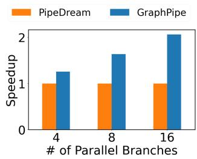

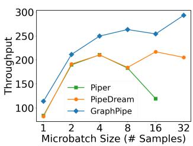  
Figure 7. Throughput vs. diferent numbers of branches using 4, 8, 16 GPUs respectively (left). Throughput vs. diferent micro-batch sizes using 8 GPUs (right).

The right sub-figure depicts the throughput performances for the multi-modal Transformer-based model with four branches. We use a mini-batch size of 128 and eight GPUs. We intentionally fix a micro-batch size (instead of using the best ones chosen by the optimizers) in comparing the performances, for the purpose of examining the benefits (or harms) of using large micro-batch sizes. If increasing microbatch size turns out to be beneficial, then it is worth reducing pipeline depth so as to reduce activation memory footprints, and in turn create room for using a larger micro-batch size.

We can observe the key role of reduced pipeline depth by GraphPipe in improving throughput. For each micro-batch size, GraphPipe always outperforms SPP. Since there is no diference in operational intensity with the same micro-batch size used for both GraphPipe and SPP, the performance gap can be solely attributed to the diference in pipeline depth. The reduced pipeline depth by GraphPipe leads to a shorter execution time for the warm-up and cool-down phases, hence a higher throughput.

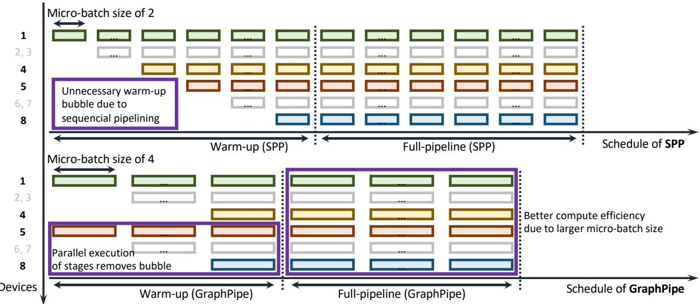  
Figure 8. Pipeline schemes devised by SPP (top) and GraphPipe (bottom). They produce an identical model partition. The selected micro-batch sizes are diferent: 2 (SPP) v.s. 4 (GraphPipe), which results in a better compute eficiency for GraphPipe. Both methods deem it unnecessary to employ data parallelism primarily because doing so would have split a smaller microbatch size even further, which would have harmed compute eficiencies. The pipeline depths are also diferent: 8 (SPP) v.s. 4 (GraphPipe), which results in a smaller pipeline depth for GraphPipe. This improvement comes purely from the fact that GraphPipe can produce a pipeline scheme that allows for concurrent execution of parallel branches.

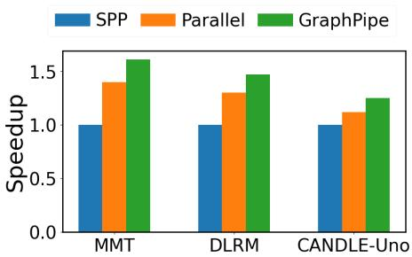  
Figure 9. Ablation study: end-to-end throughput comparison of diferent strategies on diferent models.

## 7.4 Ablation Study

Figure 9 shows the breakdown of performance benefits of GraphPipe from 1) parallel execution of stages and 2) increased micro-batch size from reduced memory footprint. In Figure 9, "Parallel" is the strategy that allows parallel execution of stages with same micro-batch size with SPP while "GraphPipe" is the strategy that allows both parallel execution of stages and larger micro-batch size than SPP. Note that It is not possible to evaluate the strategy only with larger micro-batch size since the reduced pipeline depth from parallel stage execution enables larger micro-batch size. We evaluate throughput of each strategy with 32 GPUs.

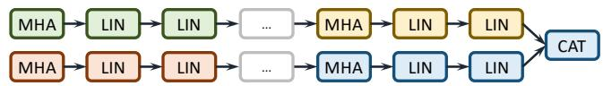  
Figure 10. A synthetic Transformer-based two-branch DNN for case study. A sequence of one multi-head attention and two linear layers is repeated four times to compose a single branch. One concatenation layer combines two branches.

We observe that, compared to SPP, "Parallel" strategy achieves 1.12 - 1.40× speedup while "GraphPipe" strategy achieves 1.25 - 1.61× speedup. This result indicates that both performance benefits of GraphPipe are crucial. We also find the consistent pattern of the strategy optimized by GraphPipe across diferent models. In the following section, we explain how these two sources of performance gains contribute to the overall improvement achieved by GraphPipe.

## 7.5 Case Study

To clearly illustrate the advantages of GraphPipe, we analyze the strategies it produces in comparison to SPP, using a simplified synthetic model for clarity. We run both Graph-Pipe and SPP optimizers, execute the strategies, and observe a 20% throughput improvement by GraphPipe over SPP. Our analysis finds that the aggregate gain comes from two sources, and the contributions are nearly equal.

Figure 10 depicts the two-branch Transformer-based model synthesized for the experiment. Each branch consists of four repeated sequences of one multi-head attention and two linear (dense) layers. The branches are merged by a concatenation operator.

Both GraphPipe and SPP produce the identical model partition on a budget of eight devices. Each stage contains one multi-head attention and two linear layers. There are eight such stages, four per branch, except that one stage necessarily contains the concatenation operator. A key diference between the two strategies, however, is the way the stages are pipelined. Figure 8 depicts the pipeline schedules. Note that the pipeline depth for SPP is eight since all eight stages form a sequential pipeline. In contrast, the pipeline depth for GraphPipe is four. The two branches are computationallyindependent, hence stage 1 + ?? and 5 + ?? for 0 ≤ ?? ≤ 3 can be executed in parallel, and this is precisely what the training strategy produced by GraphPipe suggests. This concurrent execution reduces the warm-up phase by half in terms of number of micro-batches from eight to four. This warm-up phase reduction leads to 10% performance improvement.

There is another subtle, yet key diference. Since Graph-Pipe reduces the pipeline depth by half, the activation memory footprints for early stages are smaller for the GraphPipe strategy. As a result, GraphPipe can choose a micro-batch size from a wider range of candidates, and indeed selects a size of 4. The compute eficiency improvement from choosing a larger micro-batch size over SPP (which chooses a size of 2 due to larger activation memory footprints) leads to a larger number of samples processed per unit time. This means that when the pipeline operates at full capacity, it processes training samples at a faster rate for GraphPipe than for SPP. Our measurements show that the gain from this compute efi ciency improvement is 10%. The two gain sources combined, GraphPipe achieves 20% higher throughput over SPP.

GraphPipe’s performance improvement becomes more significant as 1) memory pressure and 2) the parallelism degree within a DNN increase. The selection of hardware influences memory pressure, subsequently afecting GraphPipe’s performance improvement, while it is common practice for the system to operate close to memory limits in DNN training. In contrast, the parallelism degree within a DNN is hardware independent, and therefore GraphPipe’s performance improvement over existing systems will maintain across diferent hardware platforms.

## 8 Related Work

Pipeline parallelism. Existing DNN frameworks [5, 14, 29, 32, 35] employ sequential pipeline parallelism (SPP) where pipeline stages are strictly sequential. As we discuss in Section 2, SPP hinders parallel execution of computationallyindependent components of a DNN and memory savings from reduced pipeline depth. While this limitation still exists as long as SPP is adopted, there are a variety of pipeline parallelism approaches to improve pipeline performance in other ways. These approaches fall into one of two paradigms: synchronous and asynchronous pipeline parallelism.

Synchronous pipeline parallelism [8, 11, 25, 42, 48] refers to a set of techniques in which the model parameters spread across devices are updated synchronously after every training iteration. The DNN training semantics is preserved, thus statistical convergence issues do not arise. But the synchronous updates fill and drain the pipeline periodically over iterations, hurting throughput. Our graph pipeline parallelism mitigates this issue by reducing pipeline bubbles better than sequential pipeline parallelism.

Asynchronous pipeline parallelism [24, 25, 40, 47] refers to a set of techniques in which the model parameters spread across devices are updated asynchronously. Although this mode may sufer from statistical convergence issues as devices execute their stages using out-of-sync model parameters, it keeps the pipeline full at nearly all times. Graph pipeline parallelism helps us reduce total device memory usage, thus use a larger micro-batch size to execute operators at a higher operational intensity compared to sequential pipeline parallelism. This enables us to process training data faster while the pipeline is full.

Multiple pipeline stages per device. In the pipeline parallel techniques above, each device contains only one pipeline stage. It has been shown that assigning multiple noncontiguous stages to a device can reduce pipeline bubbles [17, 26] and reduces memory consumption imbalances across stages [20, 21]. Earlier work GEMS [12] has a similar idea but does not utilize the pipeline well — devices are idle for most of the time and waiting for results from other stages. These techniques are orthogonal to graph pipeline parallelism, and thus can be applicable upon some modifications.

Data parallelism. Data parallelism [9, 15, 19, 23, 43] is one of parallel DNN training techniques in which every device has a local copy of a DNN to train and a batch of training data is split across devices. Each device updates its model parameters based on its share of training data and synchronizes the parameters periodically with other devices. In our work, we apply data parallelism within a pipeline stage to which we assign multiple devices, in order to balance stage execution times in a more fine-grained manner compared to applying pipeline parallelism only.

Automatic DNN parallelism. There are a number of automated approaches [14, 22, 24, 40, 42, 45, 48] combining data, pipeline, and tensor parallelisms [36]. Existing works first partition a DNN into sequential pipeline stages (SPP) and then apply data and tensor parallelism to each stage. Graph-Pipe follows this same high-level process as well. However, the key diference is that it generalizes stage partitioning to produce graphical stages and exploit concurrent execution opportunities from DNN structures (i.e., parallel branches). Note that it is also feasible to combine our approach with tensor parallelism by adding a subroutine of applying tensor parallelism (e.g., intra-op pass in Alpa [48]) in our partitioner while our scheduler and runtime are already compatible.

## 9 Conclusion

We have developed graph pipeline parallelism where pipeline stages form a directed acyclic graph whose edges indicate execution orders of forward and backward passes in pipelineparallel DNN training. This design encourages concurrent execution of parallel branches for superior performance. We have also developed a distributed system GraphPipe, and through experiments using three multi-branch models, showed that GraphPipe achieves up to 1.61× higher training throughputs and > 9× faster solution search times over existing baselines that operate in a strictly sequential manner.

## Acknowledgement

We would like to thank members of Catalyst group at CMU for their helpful comments on our work and manuscript. We would also like to thank the anonymous ASPLOS reviewers for constructive feedbacks. This work was partially supported by the National Science Foundation under grant numbers CNS-2147909, CNS-2211882, and CNS-2239351, along with gift awards from Amazon, Cisco, Google, Meta, Oracle, Qualcomm, and Samsung. Additional support was provided by the Real Time Machine Learning (RTML) DARPA project.

## A Appendix

## A.1 Generalized Per-stage ??F??B Schedule

The ???? F???? B schedule of stage ???? is determined by

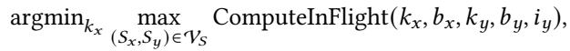

where ????, ???? are the number of in-flight samples and micro batch size for stage ????. ComputeInFlight(????, ????, ????, ????, ????) is computed according to Table 2:

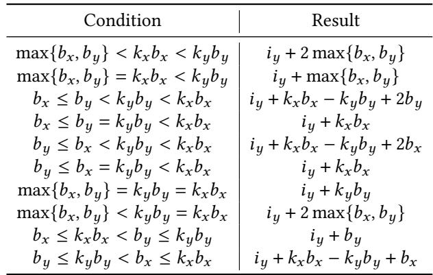  
Table 2. Computation of the number of in-flight samples.

## A.2 DNN Model Configurations

The Multi-Modal Transformer-based model (MMT) for which we evaluate GraphPipe consists of four parallel branches concatenated at the end and each branch consists of eight Transformer layers (32 layers in total). Here, the input sequence length is 256. Each transformer layer has a hidden size of 1024, an embedding size of 1024, and 16 attention heads. The hidden size for a feed-forward layer following the attention layer has a hidden size of 4096.

The DLRM model for which we evaluate GraphPipe consists of seven branches for dense features and seven branches for sparse features (embedding layers); these branches are concatenated at the end. Each branch for dense features includes four feed-forward layers. The hidden size of dense features and the following feed-forward layers is 4096. For sparse features, its hidden size is 64 and the embedding bag size is 100; embeddings in a single bag is concatenated. The number of entries in an embedding table is 1 million. Feedforward layers post-processing the interaction also have the hidden size of 4096.

The CANDLE-Uno model for which we evaluate Graph-Pipe consists of seven branches, each of which includes four feed-forward layers. All feed-forward layers have a hidden size of 4096.

For our end-to-end evaluations, we use the following ranges of mini-batch sizes for each device count such that the system operates close to the memory limit:

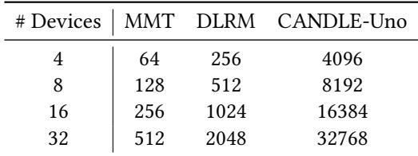

We sweep over all possible micro-batch sizes given minibatch sizes for each model to maximize training throughput.

## A.3 Sequential DNN Evaluation

We evaluate GraphPipe with baselines and confirm that GraphPipe match performance of baselines when the workload is sequential DNN. We measure throughput on the sequential Transformer model with the same configuration with the MMT model above.

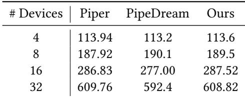

## References

[1] htps://github.com/ECP-CANDLE/Benchmarks/tree/master/Pilot1/ Uno. Accessed: 2023-05-15.

[2] Ai and compute. htps://openai.com/research/ai-and-compute. Ac cessed: 2023-05-15.

[3] Gpt-4o. htps://openai.com/index/hello-gpt-4o/. Accessed: 2024-10- 09.

[4] Summit supercomputer. htps://www.olcf.ornl.gov/summit/. Accessed: 2023-09-06.

[5] Martín Abadi, Paul Barham, Jianmin Chen, Zhifeng Chen, Andy Davis, Jefrey Dean, Matthieu Devin, Sanjay Ghemawat, Geofrey Irving, Michael Isard, et al. Tensorflow: A system for large-scale machine learning. In 12th {USENIX} symposium on operating systems design and implementation ({OSDI} 16), pages 265–283, 2016.

[6] Tom Brown, Benjamin Mann, Nick Ryder, Melanie Subbiah, Jared D Kaplan, Prafulla Dhariwal, Arvind Neelakantan, Pranav Shyam, Girish Sastry, Amanda Askell, et al. Language models are few-shot learners. Advances in neural information processing systems, 33:1877–1901, 2020.

[7] Jefrey Dean, Greg Corrado, Rajat Monga, Kai Chen, Matthieu Devin, Mark Mao, Marc’aurelio Ranzato, Andrew Senior, Paul Tucker, Ke Yang, et al. Large scale distributed deep networks. Advances in neural information processing systems, 25, 2012.

[8] Shiqing Fan, Yi Rong, Chen Meng, Zongyan Cao, Siyu Wang, Zhen Zheng, Chuan Wu, Guoping Long, Jun Yang, Lixue Xia, et al. Dapple: A pipelined data parallel approach for training large models. In Proceedings of the 26th ACM SIGPLAN Symposium on Principles and Practice of Parallel Programming, pages 431–445, 2021.

[9] Priya Goyal, Piotr Dollár, Ross Girshick, Pieter Noordhuis, Lukasz Wesolowski, Aapo Kyrola, Andrew Tulloch, Yangqing Jia, and Kaiming He. Accurate, large minibatch sgd: Training imagenet in 1 hour. arXiv preprint arXiv:1706.02677, 2017.

[10] Will Douglas Heaven. Gpt-4 is bigger and better than chatgpt—but openai won’t say why. htps://www.technologyreview.com/2023/03/ 14/1069823. Accessed: 2023-05-15.

[11] Yanping Huang, Youlong Cheng, Ankur Bapna, Orhan Firat, Dehao Chen, Mia Chen, HyoukJoong Lee, Jiquan Ngiam, Quoc V Le, Yonghui Wu, et al. Gpipe: Eficient training of giant neural networks using pipeline parallelism. Advances in neural information processing systems, 32, 2019.

[12] Arpan Jain, Ammar Ahmad Awan, Asmaa M. Aljuhani, Jahanzeb Maqbool Hashmi, Quentin G. Anthony, Hari Subramoni, Dhabaleswar K. Panda, Raghu Machiraju, and Anil Parwani. GEMS: gpu-enabled memory-aware model-parallelism system for distributed DNN train ing. In International Conference for High Performance Computing, Networking, Storage and Analysis (SC), page 45. IEEE/ACM, 2020.

[13] Chao Jia, Yinfei Yang, Ye Xia, Yi-Ting Chen, Zarana Parekh, Hieu Pham, Quoc Le, Yun-Hsuan Sung, Zhen Li, and Tom Duerig. Scaling up visual and vision-language representation learning with noisy text supervision. In International conference on machine learning, pages 4904–4916. PMLR, 2021.

[14] Zhihao Jia, Matei Zaharia, and Alex Aiken. Beyond data and model parallelism for deep neural networks. Proceedings of Machine Learning and Systems, 1:1–13, 2019.

[15] Alex Krizhevsky. One weird trick for parallelizing convolutional neural networks. arXiv preprint arXiv:1404.5997, 2014.

[16] Harlan M Krumholz, Sharon F Terry, and Joanne Waldstreicher. Data acquisition, curation, and use for a continuously learning health system. Jama, 316(16):1669–1670, 2016.

[17] Joel Lamy-Poirier. Breadth-first pipeline parallelism. arXiv preprint arXiv:2211.05953, 2022.

[18] Dmitry Lepikhin, HyoukJoong Lee, Yuanzhong Xu, Dehao Chen, Orhan Firat, Yanping Huang, Maxim Krikun, Noam Shazeer, and Zhifeng Chen. Gshard: Scaling giant models with conditional computation and automatic sharding. arXiv preprint arXiv:2006.16668,

2020.

[19] Mu Li, David G Andersen, Jun Woo Park, Alexander J Smola, Amr Ahmed, Vanja Josifovski, James Long, Eugene J Shekita, and Bor-Yiing Su. Scaling distributed machine learning with the parameter server. In 11th USENIX Symposium on operating systems design and implementation (OSDI 14), pages 583–598, 2014.

[20] Shigang Li and Torsten Hoefler. Chimera: Eficiently training largescale neural networks with bidirectional pipelines. In Proceedings of the International Conference for High Performance Computing, Networking, Storage and Analysis, SC ’21, New York, NY, USA, 2021. Association for Computing Machinery.

[21] Ziming Liu, Shenggan Cheng, Haotian Zhou, and Yang You. Hanayo: Harnessing wave-like pipeline parallelism for enhanced large model training eficiency. CoRR, abs/2308.15762, 2023.

[22] Azalia Mirhoseini, Hieu Pham, Quoc V Le, Benoit Steiner, Rasmus Larsen, Yuefeng Zhou, Naveen Kumar, Mohammad Norouzi, Samy Bengio, and Jef Dean. Device placement optimization with reinforcement learning. In International Conference on Machine Learning, pages 2430–2439. PMLR, 2017.

[23] Dheevatsa Mudigere, Yuchen Hao, Jianyu Huang, Andrew Tulloch, Srinivas Sridharan, Xing Liu, Mustafa Ozdal, Jade Nie, Jongsoo Park, Liang Luo, et al. High-performance, distributed training of large-scale deep learning recommendation models. arXiv preprint arXiv:2104.05158, 2021.

[24] Deepak Narayanan, Aaron Harlap, Amar Phanishayee, Vivek Seshadri, Nikhil R Devanur, Gregory R Ganger, Phillip B Gibbons, and Matei Zaharia. Pipedream: Generalized pipeline parallelism for dnn training. In Proceedings of the 27th ACM Symposium on Operating Systems Principles, pages 1–15, 2019.

[25] Deepak Narayanan, Amar Phanishayee, Kaiyu Shi, Xie Chen, and Matei Zaharia. Memory-eficient pipeline-parallel dnn training. In International Conference on Machine Learning, pages 7937–7947. PMLR, 2021.

[26] Deepak Narayanan, Mohammad Shoeybi, Jared Casper, Patrick LeGresley, Mostofa Patwary, Vijay Korthikanti, Dmitri Vainbrand, Prethvi Kashinkunti, Julie Bernauer, Bryan Catanzaro, et al. Eficient largescale language model training on gpu clusters using megatron-lm. In Proceedings of the International Conference for High Performance Computing, Networking, Storage and Analysis, pages 1–15, 2021.

[27] Maxim Naumov, Dheevatsa Mudigere, Hao-Jun Michael Shi, Jianyu Huang, Narayanan Sundaraman, Jongsoo Park, Xiaodong Wang, Udit Gupta, Carole-Jean Wu, Alisson G Azzolini, et al. Deep learning recommendation model for personalization and recommendation systems. arXiv preprint arXiv:1906.00091, 2019.

[28] OpenAI. Gpt-4 technical report, 2023.

[29] Adam Paszke, Sam Gross, Francisco Massa, Adam Lerer, James Bradbury, Gregory Chanan, Trevor Killeen, Zeming Lin, Natalia Gimelshein, Luca Antiga, et al. Pytorch: An imperative style, highperformance deep learning library. Advances in neural information processing systems, 32:8026–8037, 2019.

[30] David Patterson, Joseph Gonzalez, Quoc Le, Chen Liang, Lluis-Miquel Munguia, Daniel Rothchild, David So, Maud Texier, and Jef Dean. Carbon emissions and large neural network training, 2021.

[31] Alec Radford, Jong Wook Kim, Chris Hallacy, Aditya Ramesh, Gabriel Goh, Sandhini Agarwal, Girish Sastry, Amanda Askell, Pamela Mishkin, Jack Clark, Gretchen Krueger, and Ilya Sutskever. Learning transferable visual models from natural language supervision, 2021.

[32] Samyam Rajbhandari, Jef Rasley, Olatunji Ruwase, and Yuxiong He. Zero: Memory optimizations toward training trillion parameter models. In SC20: International Conference for High Performance Computing, Networking, Storage and Analysis, pages 1–16. IEEE, 2020.

[33] Aditya Ramesh, Mikhail Pavlov, Gabriel Goh, Scott Gray, Chelsea Voss, Alec Radford, Mark Chen, and Ilya Sutskever. Zero-shot text-to-image generation. In International Conference on Machine Learning, pages

8821–8831. PMLR, 2021.

[34] Scott Reed, Konrad Zolna, Emilio Parisotto, Sergio Gomez Colmenarejo, Alexander Novikov, Gabriel Barth-Maron, Mai Gimenez, Yury Sulsky, Jackie Kay, Jost Tobias Springenberg, et al. A generalist agent. arXiv preprint arXiv:2205.06175, 2022.

[35] Noam Shazeer, Youlong Cheng, Niki Parmar, Dustin Tran, Ashish Vaswani, Penporn Koanantakool, Peter Hawkins, HyoukJoong Lee, Mingsheng Hong, Clif Young, et al. Mesh-tensorflow: Deep learning for supercomputers. Advances in neural information processing systems, 31, 2018.

[36] Mohammad Shoeybi, Mostofa Patwary, Raul Puri, Patrick LeGresley, Jared Casper, and Bryan Catanzaro. Megatron-lm: Training multibillion parameter language models using model parallelism. arXiv preprint arXiv:1909.08053, 2019.

[37] Annamalai Suresh, R Udendhran, and S Vimal. Deep neural networks for multimodal imaging and biomedical applications. IGI Global, 2020.

[38] Kazuhiko Takamizawa, Takao Nishizeki, and Nobuji Saito. Linear-time computability of combinatorial problems on series-parallel graphs. Journal of the ACM (JACM), 29(3):623–641, 1982.

[39] Wei Tan, Prayag Tiwari, Hari Mohan Pandey, Catarina Moreira, and Amit Kumar Jaiswal. Multimodal medical image fusion algorithm in the era of big data. Neural Computing and Applications, pages 1–21, 2020.

[40] Jakub M Tarnawski, Deepak Narayanan, and Amar Phanishayee. Piper: Multidimensional planner for dnn parallelization. Advances in Neural Information Processing Systems, 34:24829–24840, 2021.

[41] Chameleon Team. Chameleon: Mixed-modal early-fusion foundation models. arXiv preprint arXiv:2405.09818, 2024.

[42] Colin Unger, Zhihao Jia, Wei Wu, Sina Lin, Mandeep Baines, Carlos Efrain Quintero Narvaez, Vinay Ramakrishnaiah, Nirmal Prajapati, Pat McCormick, Jamaludin Mohd-Yusof, et al. Unity: Accelerating dnn training through joint optimization of algebraic transformations and parallelization. In 16th USENIX Symposium on Operating Systems Design and Implementation (OSDI 22), pages 267–284, 2022.

[43] Leslie G Valiant. A bridging model for parallel computation. Communications of the ACM, 33(8):103–111, 1990.

[44] Ashish Vaswani, Noam Shazeer, Niki Parmar, Jakob Uszkoreit, Llion Jones, Aidan N Gomez, Łukasz Kaiser, and Illia Polosukhin. Attention is all you need. Advances in neural information processing systems, 30, 2017.

[45] Minjie Wang, Chien-chin Huang, and Jinyang Li. Supporting very large models using automatic dataflow graph partitioning. In Proceedings of the Fourteenth EuroSys Conference 2019, pages 1–17, 2019.

[46] Xiao Wang, Guangyao Chen, Guangwu Qian, Pengcheng Gao, Xiao-Yong Wei, Yaowei Wang, Yonghong Tian, and Wen Gao. Large-scale multi-modal pre-trained models: A comprehensive survey. Machine Intelligence Research, pages 1–36, 2023.

[47] Pengcheng Yang, Xiaoming Zhang, Wenpeng Zhang, Ming Yang, and Hong Wei. Group-based interleaved pipeline parallelism for large-scale DNN training. In International Conference on Learning Representations (ICLR), 2022.

[48] Lianmin Zheng, Zhuohan Li, Hao Zhang, Yonghao Zhuang, Zhifeng Chen, Yanping Huang, Yida Wang, Yuanzhong Xu, Danyang Zhuo, Eric P Xing, et al. Alpa: Automating inter-and intra-operator parallelism for distributed deep learning. In 16th USENIX Symposium on Operating Systems Design and Implementation (OSDI 22), pages 559–578, 2022.