# Relax: Composable Abstractions for End-to-End Dynamic Machine Learning

Ruihang Lai<sup>∗</sup> Carnegie Mellon University

Bohan Hou Carnegie Mellon University

Yuchen Jin<sup>†</sup> Hyperbolic

Ziheng Jiang<sup>†</sup> ByteDance

Junru Shao<sup>∗†</sup> OpenAI

Wuwei Lin<sup>†</sup> OpenAI

Jared Roesch<sup>†</sup> NVIDIA

Jiawei Liu<sup>†</sup> University of Illinois Urbana-Champaign

Yong Wu<sup>†</sup> NVIDIA

Siyuan Feng<sup>∗</sup> Shanghai Jiao Tong University

Steven Lyubomirsky<sup>∗†</sup> NVIDIA

Zihao Ye University of Washington

Hongyi Jin Carnegie Mellon University

Lesheng Jin<sup>†</sup> Hyperbolic

Todd C. Mowry Carnegie Mellon University

Yaxing Cai<sup>†</sup> NVIDIA

Sunghyun Park<sup>†</sup> NVIDIA

Prakalp Srivastava<sup>†</sup> Netflix

Tianqi Chen Carnegie Mellon University NVIDIA

## Abstract

Dynamic shape computations have become critical in modern machine learning workloads, especially in emerging large language models. The success of these models has driven the demand for their universal deployment across a diverse set of backend environments. In this paper, we present Relax, a compiler abstraction for optimizing end-toend dynamic machine learning workloads. Relax introduces a cross-level abstraction that encapsulates computational graphs, loop-level tensor programs and external libraries calls in a single representation. Relax also introduces firstclass symbolic shape annotations to track dynamic shape computations globally across the program, enabling dynamic shape–aware cross-level optimizations. We build an end-toend compilation framework using the proposed approach to optimize dynamic shape models. Experimental results on LLMs show that Relax delivers performance competitive with state-of-the-art systems across various GPUs and enables deployment of emerging models to a broader set of emerging environments, including mobile phones, embedded devices, and web browsers.

CCS Concepts: • Software and its engineering → Domain specific languages.

Keywords: Machine Learning Compiler; Dynamic-Shape Machine Learning

ACM Reference Format:

Ruihang Lai, Junru Shao, Siyuan Feng, Steven Lyubomirsky, Bohan Hou, Wuwei Lin, Zihao Ye, Hongyi Jin, Yuchen Jin, Jiawei Liu, Lesheng Jin, Yaxing Cai, Ziheng Jiang, Yong Wu, Sunghyun Park, Prakalp Srivastava, Jared Roesch, Todd C. Mowry, and Tianqi Chen. 2025. Relax: Composable Abstractions for End-to-End Dynamic Machine Learning. In Proceedings of the 30th ACM International Conference on Architectural Support for Programming Languages and Operating Systems, Volume 2 (ASPLOS ’25), March 30–April 3, 2025, Rotterdam, Netherlands. ACM, New York, NY, USA, 16 pages. htps://doi.org/10.1145/3676641.3716249

## 1 Introduction

Machine learning (ML) applications are now ubiquitous in everyday life and the broader economy. The arrival of GPT-4 and open-source large language models (LLMs) [6, 37, 43, 44, 46] has created promising opportunities for building even more powerful modern AI systems for processing text, images, audio, and more. The success of these models has also led to growing demand for their deployment across a diverse set of backend environments, including servers, personal computers, vehicles, and mobile devices.

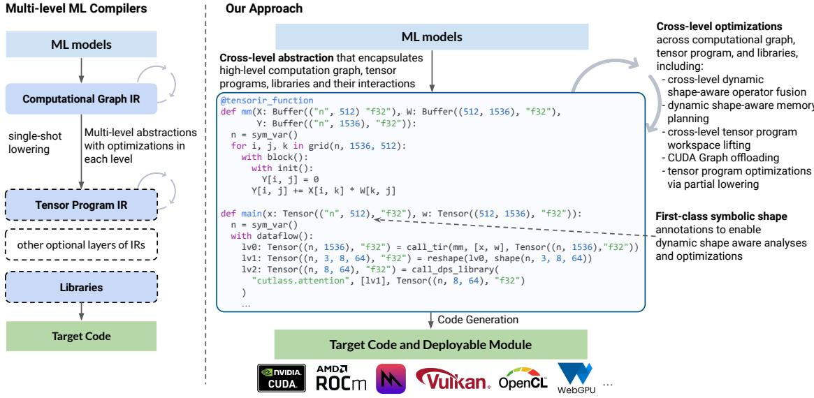  
Figure 1. Overview of our approach. We also present a cross-level abstraction that encapsulates the computational graph, foreign tensor program and the external library function levels. We introduce first-class symbolic shape annotations to track dynamic shape computations globally across the program, and enable dynamic shape–aware optimizations across levels.

as operator fusion, and generating high-performance code on a diverse set of platforms. However, much engineering efort is required to support the tensor operators in a model for diferent hardware backends, particularly since most of these models make use of dynamic tensor shapes. Dynamic shapes contain variables that may depend on program values, which makes it more dificult to perform crucial optimizations like static memory planning. For example, language models must handle variable-sized input messages, KV-cache context length, vocabulary sizes, and other sources of shape dynamism.

Typical ML compilers include multiple levels of abstractions (or intermediate representations) and single shot lowerings across levels. The high-level computational graph [27, 34, 35] describes a model using dataflow graph of high-level tensor operators (e.g., matmul, reshape) to facilitate global computation rewrites. Tensor programs [16, 22, 42] describe tensor operators with low-level loops and indexed bufer accesses, to enable fine-grained kernel optimizations (such as loop tiling) at this level. Operator libraries [9, 41] allow for ofloading a tensor operator to vendor optimized routines.

Most end-to-end ML compilers use computational graphs as the high-level representation and treat tensor programs and operator libraries as foreign functions that are usually opaque. Dynamic shapes are usually handled at each level within each function. Relay [35] and IREE [27] handles dy namic shapes in computational graphs through “unknown” annotations and do not track relations between dynamic shapes. The PyTorch compiler [2] enables just-in-time (JIT) graph tracing and handles dynamic shape tracking within each traced function. The JIT approach eliminates the need for shape tracking across function boundaries, but also limits its applications on emerging platforms with constrained environments, such as mobile and WebGPU. DietCode [48], CoRA [15], and SparseTIR [47] focus on optimizing dynamic shapes within each tensor program. Halide [33] tracks dynamic shapes in tensor programs and provides primitives to call external library functions from tensor programs.

Despite the developments in dynamic shape handling at each level and function, challenges still exist in optimizations across these levels and functions. First, as we target a broad set of emerging platforms, we must enable aheadof-time (AOT) compilation, which necessitates full program optimizations across functions. Additionally, user-defined operators such as customized quantization decode require computational graph optimizations to be aware of foreign functions. Finally, single-shot lowering makes it harder to analyze or transform tensor programs first and then use the results to inform high-level graph optimizations. Dynamic shape tracking threads through all these challenges in every incremental transformation, as losing the shape relation information can significantly hinder the optimizations we can perform across operators and functions in the program.

To address these challenges, we introduce Relax, a holistic AOT compiler program abstraction for emerging end-to-end dynamic machine learning models on emerging platforms. Relax enables an abstraction that encapsulates levels of computational graphs, loop-level tensor programs and external library functions at the same time, which we call cross-level abstraction in this paper.<sup>1</sup> We also introduce first-class symbolic shapes to track and represent the relations of dynamic shape dimensions. Relax uses variables to represent symbolic shape dimensions and employs symbolic deductions to track dynamic shapes across tensor operators, subgraph function calls and foreign function calls of tensor programs and external library functions statically when possible, with a dynamic fallback as needed. The cross-level abstraction with first-class symbolic shape allows for analyses and optimizations across these abstraction levels, and meanwhile preserves symbolic shape information in IR during optimizations. We introduce a collection of optimizations to enable dynamic shape-aware operator fusion, tensor program workspace lifting, memory optimization, graph ofloading and tensor operator optimizations. Finally, we build an end-to-end compilation framework on top of these elements. This paper makes the following contributions:

• We propose a design for cross-level abstractions to enable optimizations and analyses across the traditional levels of abstractions in ML frameworks.

• We present a program abstraction with a first-class symbolic shape approach that tracks dynamic shape relations globally across tensor operators, subgraph function calls and foreign function calls of tensor programs and external libraries, enabling full-program symbolic shape tracking and dynamic shape–aware optimizations across abstrac tion levels.

• We build an AOT end-to-end compilation framework to enable full program deployment of emerging models to diverse hardware backends, including many emerging backends that are not well supported by established frameworks.

Experimental results show that Relax compiles and optimizes emerging LLMs onto a broad set of emerging devices and environments, including mobile phones, embed ded devices, and web browsers via WebGPU. Additionally, Relax delivers competitive performance to heavily optimized platform-specific solutions. Relax is incorporated into a major open-source project and enables support for the universal deployment of emerging machine learning models.

## 2 Overview

This section describes the key insights of our approach and gives an overview of the paper. Figure 1 summarizes our overall approach, focusing on two key designs that enable compiler optimizations across all levels of abstractions for dynamic machine learning models.

First, we observe that ML compilers often need to go through several abstraction levels to bring a machine learning model to a target platform. Typical layers include computational graphs, tensor programs and external libraries. Traditionally, ML compilers focus on optimizations within each individual abstraction level and do a uni-directional single-shot lowering from one level to the next level. Relax brings computational graphs, tensor programs, and libraries into a single unified cross-level abstraction, allowing the interaction of those components with foreign function calls to tensor programs and external library functions. This design allows us to incrementally optimize or partially lower portions of the computation using diferent approaches, with analyses from all abstraction levels taken into account.

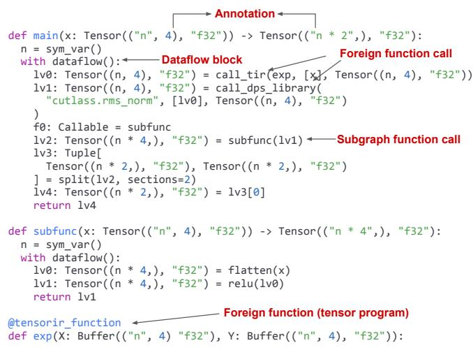  
Figure 2. Key elements of Relax abstraction.

Second, we observe that while emerging machine learning workloads involve dynamic shape computations, we can perform a substantial amount of static analyses and optimizations by considering the relations between shapes. Thus, we introduce annotations that can track the shapes of intermediate computations through symbolic variables and symbolic shape computations. Our approach globally tracks these dynamic shape computations across subgraph function calls and foreign function calls of the tensor program and external library levels to represent dynamic shapes throughout the program and enable dynamic shape–aware optimizations.

We introduce Relax’s abstraction design in §3, and discuss a concrete set of cross-level compiler optimizations enabled by our design in §4.

## 3 Relax Abstraction

This section introduces the overall Relax abstraction. We start with the language constructs, followed by the first-class symbolic shape and cross-level abstractions in Relax.

## 3.1 Language Constructs

Relax is an imperative compiler abstraction with first-class functions, focusing on operating tensors at a high level (the “graph level,” as most ML compilers refer to it). Relax programs apply high-level operators to entire tensors and can pass tensors (or tuples of tensors) among functions, or invoke lower-level tensor programs or external library functions for loop-level operations on tensors. This section describes three main elements of Relax: structural annotations, dataflow blocks, and function calls both within and across levels of abstractions. These constructs bring the whole system together by ofering symbolic shape guidance in compiler optimizations of joint transformations across graph level and foreign tensor program level, and meanwhile preserving the symbolic shape information in the program during these transformations.

Table 1. Annotations in Relax with examples.  
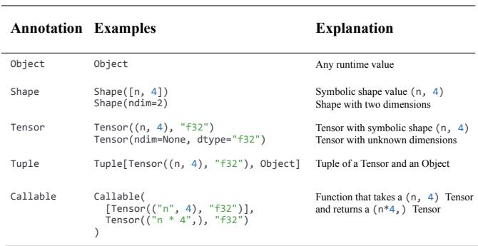

Annotations. Each value in Relax is associated with an annotation that conveys structural information, similar to a static type. Table 1 summarizes diferent annotations in Relax and their usage examples and explanations respectively. We design the annotation syntax to be embeddable in Python AST, and quote symbolic expressions into strings (e.g., "n\*4") in function signatures, when the symbolic variables are yet to be declared.<sup>2</sup> To enrich the shape expressiveness of annotations and ensure the shape annotation coverage, we reuse the loop-level tensor program expression system, so that shape annotations support all integer expressions that tensor programs support, and the compiler symbolic expression analyses (e.g., expression equality proof) can take advantage of common expressions. Annotations indicate at compile time the overall types (e.g., tensor, tuple) and additional information about values, such as the shape and data type of a tensor. Annotations form the basis for first-class symbolic shapes and cross-level abstractions.

Dataflow Blocks. A dataflow block in Relax demarcates a side efect–free program (sub-)region without control flows, i.e., a straight-line sequence of pure operations, in order to simplify program transformations. For example, when performing dead code elimination over Relax dataflow blocks, one can safely remove unused operators without having to consider whether this could afect the visible behavior of the program by removing an operation with side efects.

Function Calls. Relax incorporates function calls that can be within the same level of abstraction (i.e., allowing one graph-level function to invoke another graph-level function) or across levels of abstraction, namely allowing graph-level functions to call foreign tensor program functions and external libraries. Calling foreign loop-level tensor programs and external library functions serves as a foundational element for cross-level abstractions, as explored in detail in §3.3. We use TensorIR [16] as the loop-level tensor program abstraction, though the same principle can be used for other loop-level abstractions.

```python
Shape annotation with unknown ? dimensions
def any_shape_fn(x: Tensor((?, 2, 2), "f32")):
n = get_shape_value(x, axis=0)
lv0: Tensor((?, 4), "f32") = reshape(x, (n, 4))
lv1: Tensor((?,), "f32") = flatten(lv0)
lv2: Tensor(?, "f32") = unique(lv1)
lv3: Tensor(?, "f32") = exp(lv2)
return lv3
First-class symbolic shape annotation
def symbolic_shape_fn(x: Tensor(("n", 2, 2), "f32")):
n, m = sym_var(), sym_var()
lv0: Tensor((n, 4), "f32") = reshape(x, shape(n, 4))
lv1: Tensor((n * 4,), "f32") = flatten(lv0)
lv2: Tensor(ndim=1, dtype="f32") = unique(lv1)
lv3 = match_cast(lv2, Tensor((m,), "f32"))
lv4: Tensor((m,), "f32") = exp(lv3)
return lv4
```  
Figure 3. Comparison of first-class symbolic shape annotation with unknown dynamic shape annotation. First-class symbolic shape enables comprehensive symbolic analysis and facilitates advanced dynamic shape–aware optimizations.

## 3.2 First-Class Symbolic Shape Abstraction

The shape of a tensor is very useful information in the context of ML frameworks, especially for memory planning. Oftentimes, however, tensor shapes are unknown at compile time and must be dealt with dynamically. One approach for reasoning about dynamic shape dimensions is to introduce an any (or unknown) value to represent dynamic dimensions, as in ONNX [3], Relay [36], and some MLIR dialects [27]. Unfortunately, this approach fails to preserve potentially useful information, like relations or constraints between shape dimensions (e.g., if one tensor has dimension <sup>??</sup>, another may be 4<sup>??</sup>). Such information is valuable for compiler optimizations, whereas marking the dimension as any erases it entirely.

We instead introduce a first-class symbolic shape annotation (shown in Figure 3) for better reasoning and optimizations of dynamic shape models. A symbolic shape annotation describes each shape dimension using a symbolic expression, comprised of integer variables and constants. Consequently, for fully static models, Relax shape annotations subsumes existing static shape–based annotations. For models with a mixed set of dynamic and static dimensions, Relax not only expresses the shape dimensions symbolically but tracks the symbolic relations over dimensions as well. These symbolic shape relations help us apply more dynamic shape–aware optimizations. For example, we will know the total number of elements after the flatten operator is 4<sup>??</sup> in Figure 3 and is the same as the input, suggesting potential bufer reuses.

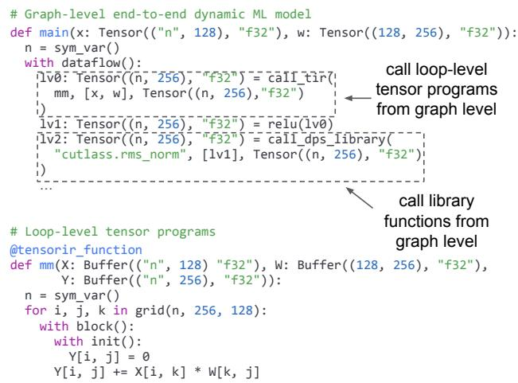  
Figure 4. Cross-level abstractions: Graph-level function calls and communicates with loop-level TensorIR using call\_tir, and invokes library functions via call\_dps\_library.

```python
def call_tir(tir_func, args, annotation, sym_args):
# Allocate output tensor
output = alloc_tensor(annotation.shape, annotation.dtype)
# Call low-level function in destination-passing style
tir_func(*args, output, *sym_args)
return output
```  
Figure 5. The semantics explanation of call\_tir.

Besides serving as annotations, a symbolic shape can also be used as a first-class value in the computation. For example, the reshape operator in Figure 3 takes the symbolic shape (<sup>??,</sup> 4) as input and outputs a tensor value with the same shape. Symbolic shape expressions can also be used to construct arguments to tensor functions.

It is not always possible to track the shape relations at compile time. We cannot deduce the output shape of datadependent operators, e.g., unique in Figure 3, whose output tensor shape depends on the runtime values of its input. For such cases, we provide coarse-grained annotations (e.g., Shape(ndim=2) in Table 1, meaning that the shape has two dimensions but both are unknown). To reason about such cases, we introduce a special construct match\_cast that asserts a symbolic shape annotation for a value, allowing for the introduction of new symbolic variables. The compiler inserts runtime checks for each match\_cast, throwing an error if a constraint is violated. In our particular example in Figure 3, though the compiler does not know the shape of lv2 after the unique operator, one can use match\_cast to assume that it has shape (<sup>??,</sup> ) (as in its alias lv3). match\_cast can be inserted by both front-ends and compiler passes to suggest more specific symbolic shapes and serves as a valuable tool for developers to indicate shape information within programs.

## 3.3 Cross-Level Abstraction

This section describes the constructs in Relax that enable cross-level abstractions. Our main goal is to design primitives that naturally represent and optimize interactions of computational graphs, foreign tensor programs and libraries.

To achieve this goal, we must reconcile the diferent characteristics of each abstraction level. Specifically, computational graph abstractions favor pure operators that return a new tensor for each operation. This allows us to organize computations through directed acyclic graphs and perform efective graph rewriting without worrying about side efects. On the other hand, most tensor programs and libraries of low-level computations adopt destination-passing style [38] (DPS) interfaces, which take the computation result tensors as inputs and directly mutate them, rather than allocating and returning new tensors. For these cases, we introduce a requirement in Relax to pass input and output memory explicitly to low-level tensor programs, conforming to the DPS. The DPS abstracts away memory management concerns from low-level code, thereby simplifying code generation.

We introduce two foreign function call primitives as shown in Figure 4 to bridge abstraction levels. First, we introduce call\_tir, which allows for direct invocation to a tensor program from the graph level. We design the semantics of call\_tir (Figure 5) to directly map to a DPS call of the lowlevel function. This approach allows us to assign high-level semantics to call\_tirs during graph-level transformations and lower them to DPS calls with memory management later.

Notably, call\_tir also takes the shape annotation of the output as well as potentially other symbolic expressions as arguments, in order to pass shape information from the graph level to loop-level tensor programs. Such shape infor mation is crucial for optimizations on loop-level programs, like operator fusion. By flowing the symbolic shape information from the graph level to tensor programs, we can allow tensor programs to generate code that specializes to most static dimensions and only uses dynamic dimensions when necessary (like dimension <sup>??</sup> in Figure 4).

Second, we introduce the call\_dps\_library primitive to allow direct calls into foreign operator libraries from the graph level. In practice, it introduces great flexibility in prototyping, since external routines can be easily called from a Relax program. The convention of call\_dps\_library mirrors those of call\_tir, except that the callee is instead the name of a library function. These functions are supplied by a registry and linked to the final runnable module.

It is worth noting that we closely combine graphs, tensor programs and libraries, all of which are critical in ML compilers, and meanwhile we leverage and complement other lower layers in compilers for GPU source code generation. Benefits of cross-level abstractions. Figure 6 summarizes common optimization patterns enabled by cross-level abstractions:

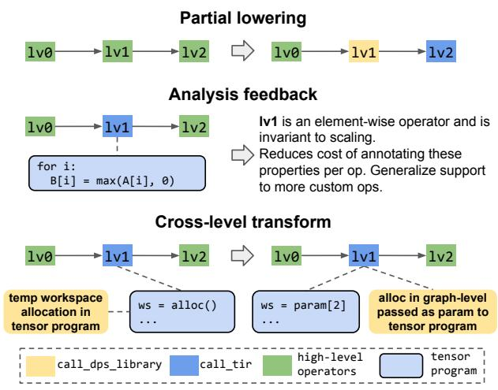  
Figure 6. Examples of common optimization patterns that leverages cross-level abstraction.

Partial lowering: Instead of making all lowering decisions in a single shot, a pass can make dispatch decisions or looplevel optimizations for part of the computations. This pattern is helpful, for example, when we want to replace the lowering decision of a fused operator to diferent libraries; we can then pass the program to later passes to handle other operators.

Analysis feedback: We can analyze loop patterns of tensor programs and automatically annotate their operator properties. Typically, compiler developers need to manually annotate properties for each individual high-level operator in the system. By adopting cross-level abstraction and instead relying on analysis-based properties, we can greatly reduce the engineering cost of annotation on high-level operators.

Cross-level transforms: Sometimes, optimization opportunities can only be disclosed after some low-level optimizations. For example, tensor program analysis may decide that a tensor program needs a temporary workspace. In this case, we can jointly transform the tensor program and graph level to insert the workspace allocation at graph level, allowing the workspace to also participate as part of global memory planning.

While each optimization pattern is useful on its own, the real benefit emerges when we combine them. For example, we can perform partial lowering to libraries and then optimize the remaining components using other techniques. We will discuss cross-level optimizations in detail in §4.

## 4 Cross-Level Algorithms and Optimizations

This section describes a concrete set of algorithms and optimizations that make use of the proposed cross-level abstractions in an end-to-end compilation framework.

## 4.1 Shape Annotation Deduction

The symbolic shapes in annotations serve as an important source of information for optimization passes. To maximize the use of this information, Relax automatically tracks and deduces symbolic shape annotations of intermediate values not only during model construction but also between compiler passes, allowing passes to deduce equalities and relations between shapes and enables extra optimizations. Meanwhile, this also increases the demand for deduction eficiency, as the deduction runs for every pass.

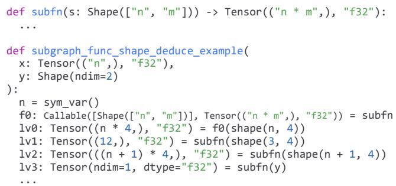  
Figure 7. Exemplary scenarios of dynamic shape deduction that involve subgraph function calls. subfn contains a signature that takes shape with symbolic variable <sup>??</sup>, <sup>??</sup> and returns an one-dimensional Tensor that contains shape <sup>??</sup> ∗ <sup>??</sup>. The annotations in f0, lv0-lv3 are deduced by the system.

Each tensor operator has a registered shape deduction rule that takes the inputs’ shape annotations and values (such as the case of reshape) and returns the output annotations. We adopt a forward deduction method that deduces the annotation of an expression based on its inputs. For foreign function call primitives call\_tir and call\_dps\_library, the output annotations are part of their arguments (Figure 4) and will be directly used for deduction. Forward deduction ofers the benefits of simplicity and locality by efectively avoiding synchronization complexities across global contexts during processing. The forward deduction also leverages the explicit information of match\_cast. With forward deduction, shape annotations of any new variables introduced during compiler passes can be eficiently deduced locally.

In addition, driven by the goal of providing as much shape information as possible, we also recognize the importance of propagating interprocedural shape relations globally across subgraph function calls to accommodate intermediate results of optimization passes like fusion, where the subgraph functions themselves contain dynamic inputs and outputs. Figure 7 exemplifies symbolic shape deduction for subgraph function calls. Our system is able to take the symbolic relations at function subfn and propagate the shapes correctly in the callers. We summarize the key design principles of our shape annotation and deduction as follows:

Isolated symbolic relations at function boundaries. The function signatures in Relax give parameter and return value annotations, allowing for the annotation inference of function calls with only the function signature. This allows for functions to be used as first-class values with the Callable annotation. For example, we can deduce the return shapes

Relax: Composable Abstractions for End-to-End Dynamic Machine Learning

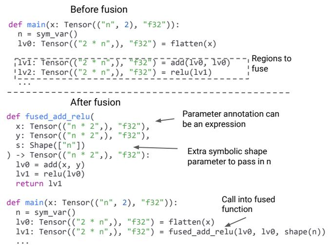  
Figure 8. Example function signature that contains symbolic expressions caused by a result of operator fusion.

of subfn calls in Figure 7 by only looking at its signature. The function signature also serves as source to generate runtime checks, namely to ensure that passed arguments and return value match the annotations in signature. These shape checks are lightweight and do not impact the overall performance.

Forward symbolic deduction. Relax performs forward shape deduction based on the symbolic shape relations. As a safety net, coarse-grained annotations are returned when more specific information cannot be inferred (such as for data-dependent operators), as it allows the symbolic deduction to succeed for common cases but also supports general cases. Note that it is permitted to pass values with coarsegrained annotations (e.g., Shape(ndim=2)) to functions that contain more specific annotations like Shape((n,m)), since we have lightweight runtime checks at the function boundary ensure the shape matches. We choose forward deduction by default to maintain the eficiency of the symbolic shape deductions across passes (a full-graph forward deduction takes time linear to the number of operations), and meanwhile still support the introduction of more powerful but less eficient deduction methods via compiler passes as needed.

Support symbolic expressions in parameter annotations. Besides symbolic variables, we support general arithmetic expressions in function parameter annotations, which is an important capability to simplify operator fusion and other transformations across subgraph functions in dynamic shape settings. Figure 8 provides an example of such a case. This example intends to fuse two intermediate operators, add and relu. However, both intermediate values contain an expression 2 × <sup>??</sup>. A naïve approach would create a new function with parameters x and y that have shape (2<sup>??,</sup> ), but <sup>??</sup> is nowhere supplied. To address this problem, the operator fusion pass passes an extra parameter <sup>??</sup> which is bound to the runtime value of <sup>??</sup>. Passing extra symbolic arguments is a common pattern we use when designing passes that lift out function regions and recombine.

pattern kind in Relax   
1: Input: Tensor program function f.   
2: Output: The pattern kind kind of tensor program f.   
3: Collect the tensor read indices r\_indices and write indices w\_indices in f.   
For example, for C[i,j] = A[i,j] + B[j], r\_indices is ([i,j],[j]) and   
w\_indices is ([i,j],).   
4: if not all write indices in w\_indices are the same then   
5: return Opaque   
6: end if   
7: kind ← Opaque   
8: has\_elem\_wise ← False   
9: for all read indices r\_idx in r\_indices and the only write indices w\_idx do   
10: if IsElementWise(r\_idx,w\_idx) then   
11: kind ← ElementWise (e.g., read A[i,j] and write C[i,j])   
12: has\_elem\_wise ← True   
13: else if IsBroadcast(r\_idx,w\_idx) then   
14: kind ← Broadcast (e.g., read B[j] and write C[i,j])   
15: else if IsInjective(r\_idx,w\_idx) then   
16: kind ← Injective (e.g., read A[j,i] and write C[i,j])   
17: end if   
18: end for   
19: if kind==Broadcast and has\_elem\_wise==True then   
20: kind ← ElementWise (to handle cases C[i,j]=A[i,j]+B[j])   
21: else if kind==Opaque and IsFuseMultiplyAdd(f) then   
22: kind ← OutputEwiseFusible (to handle matmul, convolution, etc.)   
23: else if kind==Opaque and HasReductionLoop(f) then   
24: kind ← Reduction (to handle general reductions such as sum and max)   
25: end if   
26: return kind

Algorithm 2 FuseOps in Relax   
1: Input: IR module mod and fusion patterns patterns.   
2: Output: The updated IR module after FuseOps.   
3: mod\_updated ← mod.Copy()   
4: for all graph-level function g in mod do   
5: for all fusion pattern pattern in patterns do   
6: matches ← CrossLevelPatternMatch(g, mod, pattern)   
7: for all match in matches do   
8: subgraph\_fn ← NewFuncWithSymShapePreserved(match)   
9: mod\_updated.AddFunc(subgraph\_fn)   
10: Replace match in g with a new subgraph function call to subgraph\_fn.   
11: end for   
12: end for   
13: end for   
14: return mod\_updated

These three principles strike a balance between the need for symbolic information and the deduction complexity. They make global symbolic shape tracking feasible for common machine learning use cases and create opportunities for dynamic shape–aware optimizations.

## 4.2 Cross-Level Dynamic Shape–Aware Operator Fusion

Operator fusion helps to bring multiple operators together and reduce the overall memory loading cost of operators. Figure 9 shows the general flow of operator fusion in Relax. A Relax program can contain tensor programs for both standard (e.g., matmul) and customized operators that may not have corresponding graph-level operators, such as quantization decode written in loops. We first get an analysis feedback pass to annotate the pattern kind of each tensor program by pattern matching on tensor programs (Algorithm 1 shows the simplified pseudocode). The candidate pattern kinds include ElementWise, Broadcast, Injective, Reduction, OutputEwiseFusible, or Opaque (as the fallback). These pattern kinds describe the mathematical properties of tensor programs, and such information is then used by the FuseOps pass (Algorithm 2) to group tensor program calls into subgraph functions via pattern-match-based graph partitioning (an example pattern is the fusion of ElementWise tensor programs into the back of OutputEwiseFusible ones, such as matmul+ReLU). Finally, we apply FuseTensorIR, a cross-level transformation that jointly updates tensor programs and the graph-level calling site by merging tensor programs called in each subgraph function into a single one. Unlike applying naïve static-shape fusion, we need to make sure that all steps above handle symbolic shapes by tracking the symbolic vari ables and generate extra symbolic variable parameters to support symbolic expressions in parameter annotations (similar to Figure 8), as we discussed in §4.1. Notably, the analysis feedback significantly reduces manual efort, as we can automate the tensor program pattern analysis with a lightweight pass, whereas traditional single-shot abstractions require heavy and inflexible manual operator annotations.

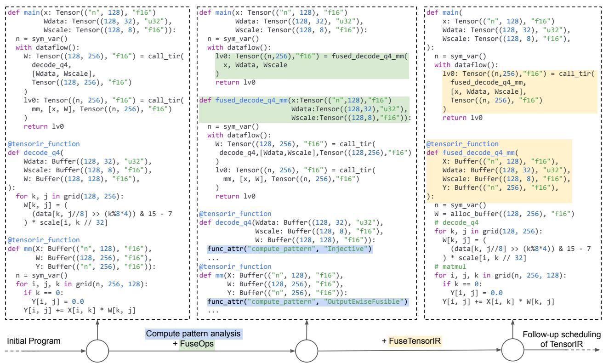  
Figure 9. Dynamic shape–aware operator fusion case study with customized quantization decode (decode\_q4). Compute pattern analysis classifies each tensor program to a pattern kind (blue). Pattern-match-based FuseOps makes use of these pattern kinds to construct new subgraph functions and generate subgraph function calls (green). FuseTensorIR merges tensor programs and replaces subgraph function calls by call\_tir (yellow). Notably, cross-level abstractions in Relax allows fusion for customized tensor programs that cannot be easily represented on graph level without introducing specialized operators, which is essential for browser and mobile deployment.

The three fusion sub-steps bring great opportunities for further composition and customization. For example, we can apply a pass to fuse new sets of patterns that are not covered by FuseOps (e.g., fusing all sub-operators in scaled dot-product attention [44]), and use FuseOps for the remainder. FuseTensorIR can then transform the fused subgraph function from both customized and standard fusion. This approach allows quick composition of diferent fusion, improving the overall productivity of continuous compiler development.

## 4.3 Dynamic Shape–Aware Memory Planning

Memory is an essential resource in modern ML applications. Most ML compilers can plan memory reuse by comparing sizes of static-shape tensors and allocating a fixed set of memory blocks ahead of time to reduce the runtime memory allocation. Normally, compilers cannot take the same approach for compile-time unknown shapes and must rely on runtime memory allocators. With symbolic shape abstractions, however, we can analyze and compare dynamic tensor shapes and plan for their reuse accordingly. Figure 10 and Algorithm 3 show how we apply memory planning with dynamic shapes. We first lower the foreign function calls call\_tir and call\_dps\_library to explicit memory allocation and DPS calls (as in Figure 5), so we can expose these allocation for planning. To support dynamic shape, the RequestReuseWithSymShape in Algorithm 3 leverages symbolic expression analysis to prove whether two sym bolic expressions are equal, and then appropriately pick an reusable storage from the pool. We can further take the up per bound of the symbolic values when they are known (e.g., annotated by users, such as the inherent context lengths in LLMs) and statically allocate adequate memory, which allows creating a static memory allocation plan ahead of time, even in the presence of dynamic shapes. This upper bound approach is related to Func::bound() in Halide [33] which marks bounds in tensor programs, and we bring it both graph and tensor program levels. Such predictable memory usage estimation is crucial for deploying dynamic ML models on memory-limited backends. Additionally, static planning can improve model performance by enabling CUDA Graph ofloading (§4.5), which relies on static memory allocation.

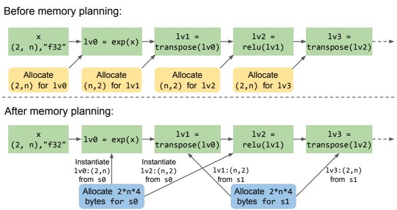  
Figure 10. Dynamic shape–aware memory planning example. Before planning, all four intermediate tensors are individually allocated. After memory planning, the intermediate tensors reuse two allocated storage chunks.

Algorithm 3 Dynamic shape–aware memory planning   
1: Input: Graph-level function g.   
2: Output: The updated function after memory planning.   
3: Lower call\_tir and call\_dps\_library in g, expanding them to explicit memory   
allocation and DPS calls.   
4: liveness ← LivenessAnalysis(g) (for the live range of each tensor)   
5: storage\_pool ← a new storage pool with symbolic shape awareness   
6: for all operation op in g in the sequential order do   
7: if op is a tensor allocation of tensor t then   
8: storage ←   
storage\_pool.RequestReuseWithSymShape(op.shape,op.dtype)   
9: if storage is null then   
10: storage ← storage\_pool.NewStorage()   
11: Insert the storage allocation in front of op in g.   
12: end if   
13: Insert tensor instantiation from storage to t in front of op in g.   
14: else   
15: for all tensor t which is used by op do   
16: if liveness.TensorIsDeadAfterOp(t, op) then   
17: storage\_pool.RecycleStorageForTensor(t)   
18: end if   
19: end for   
20: end if   
21: end for   
22: return g

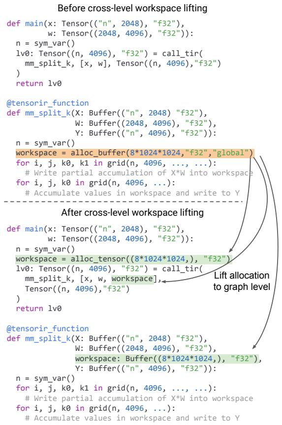  
Figure 11. Cross-level tensor program workspace lifting example. The global memory allocation in the tensor program (orange) is lifted to the graph level, being passed explicitly via call\_tir. The tensor program is updated accordingly to take in this workspace as a parameter (green).

## 4.4 Cross-Level Tensor Program Workspace Lifting

In addition to memory allocation at the graph level, sometimes a tensor program may also require global memory allocation for intermediate workspace. For example, the Stream-K [29] schedule of matmul decomposes a matrix multiplication into two phases of reduction. The first phase writes partial accumulation results into an intermediate global memory bufer, which is then consumed and accumulated by the second phase. As shown in Figure 11, We can detect such global memory allocation in tensor programs from analysis feedback, and jointly rewrite the tensor program and the graph-level caller site to lift the allocation to graph level. Importantly, the lifted allocation can be planned by the memory planning in §4.3, which further increases the overall memory reuse. This optimization is only possible with the cross-level abstractions when the shape relation is preserved throughout all cross-level transformations in Relax, and the optimization opportunities for planning such memory reuse may not arise in the traditional single-shot lowering flow.

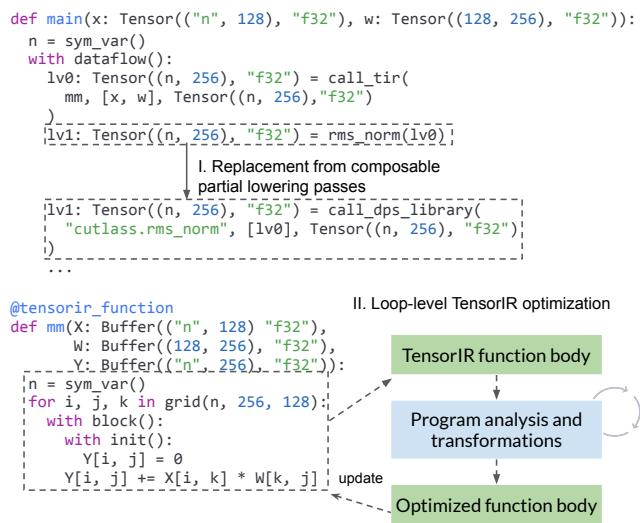  
Figure 12. Tensor operator optimization examples.

## 4.5 CUDA Graph Ofloading

CUDA Graph [21] is an optimization that reduces GPU kernel launch overhead at the GPU driver level and thereby improve the overall system performance. It works by capturing multiple GPU kernel launches and then replaying them as a group, rather than launching individual kernels separately. To replay captured kernel launches, the GPU driver requires the all global memory accessed by the kernels to be constantsized and statically allocated ahead of capturing. This poses a significant challenge for applying CUDA Graph to dynamicshape ML models. With static memory planning, Relax can pre-allocate all memory statically, even for dynamic-shaped tensors. We build a pass to analyze the computational graph and lift subgraphs that meet CUDA Graph conditions into subgraph function after memory planning. The pass inserts runtime builtin functions that handle CUDA Graph capture or replay for these ofloaded subgraph functions. At runtime, only the first run of a subgraph function triggers CUDA Graph capture; subsequent runs automatically replay the captured CUDA Graph. Through these, we extend CUDA Graph, typically available only for static models, to a broad range of dynamic workloads. We can generally apply the principle of the graph ofloading optimization to any GPU backend that supports static execution graphs in the future.

## 4.6 Tensor Operator Optimizations via Partial Lowering

Modern ML frameworks optimize tensor operators in two approaches. We can ofload computation to platform-specific operator libraries, or leverage compiler tensor program optimizations and code generation. Most existing ML compilers make these decisions at the boundary between the graph level and lower levels, making it hard to compose diferent lowering approaches. For instance, if we want to introduce a new operator library, we need to carefully examine the existing lowering strategies and update accordingly. The complexity of the lowering layer grows as we incorporate more approaches, such as diferent ways of auto-scheduling.

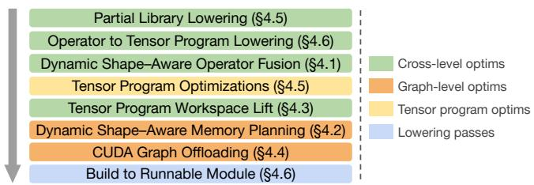  
Figure 13. Cross-level optimization and lowering pipeline.

Relax applies tensor operator optimizations via partial lowering (Figure 12). We register a set of “(subgraph pattern, library function)” pairs in Relax, and build pattern-matchand-rewrite passes that detect specific patterns (e.g., matmul with epilogue) in the graph level, and partially lower detected regions to foreign library calls. Relax also allows users to register patterns for customizability. Additionally, based on TensorIR [16] scheduling transformations, we build a set of analysis-based dynamic shape–aware schedule rules to opti mize tensor programs by minimizing memory loading. We can also include passes to apply Ansor-style [8, 39, 49] autotuning for rare tensor programs (e.g., complicated convolutions) that our analysis-based schedule rules fail to handle. Importantly, all these transformations can be composed together and work collectively. Relax enables fast development and only requires a single relatively simple partial lowering pass to customize the optimizations of operators.

## 4.7 Optimization and Lowering Pipeline

Relax uses a fixed-order pipeline (without fixed point) on the cross-level abstraction to optimize, lower and finally build an end-to-end model into a runnable module. An example pipeline is shown in Figure 13. We prioritize the partial library lowering (§4.6) to leverage external library functions on the target platform. Next, we go through the whole program, generate tensor programs for all high-level operator calls, and lower the operator calls to call\_tir of corresponding tensor programs. We can then apply operator fusion, tensor program workspace lifting, memory planning, and CUDA Graph ofloading. Notably, some tensor program optimizations (e.g., workspace lifting) are applied before graph optimizations, which necessitates Relax’s cross-level abstraction design.

At the end of the pipeline is building the model into a runnable module. At the graph level, a fundamental task is to associate symbolic variables with concrete shape values and compute symbolic expressions at runtime. We create an integer host tensor to store runtime values of all symbolic expressions in the program. At the start of transformation, we populate the values of symbolic variables in program input tensors. We then generate tensor programs that load from the tensor, evaluate symbolic expressions, and store results to corresponding locations. Finally, we insert function calls to construct shape tuples when tensor shapes are needed as first-class values. After this transformation, we erase all annotations, leaving a program comprised mainly of low-level function calls. The calls will then be translated to a sequence of virtual machine instructions, each of which is a call into a generated or builtin function. For optimized low-level tensor programs, we directly generate corresponding GPU code. We package the graph-level virtual machine instructions and the GPU code together into a single holistic end-to-end module, which can then run on the target platform of compilation.

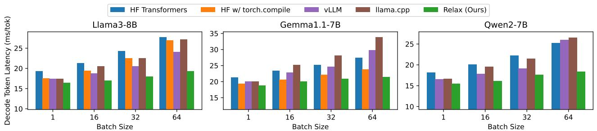  
Figure 14. Inference performance of various models on NVIDIA RTX 4090 under diferent batch sizes. We omitted the results of HF with torch.compile for Qwen2-7B due to the lack of support. Relax brings competitive performance across diferent models and batch sizes, and reduces the decode token latency by up to 27%.

## 5 Evaluation

We implement Relax on top of Apache TVM [7]. Notably, the insights presented in this paper can also benefit other ML compilation frameworks as well. This section provides evaluation to answer the following questions:

• Does Relax provide competitive LLM inference perfor mance compared with existing frameworks? (§5.1)?

• What are the efects of proposed abstractions and optimizations on performance and memory usage (§5.2)?

• Can Relax support these emerging LLMs on a broad set of emerging platforms (§5.3)?

• How does Relax perform on a broader model set? (§5.4)?

## 5.1 Large Language Model Inference Evaluation

This section evaluates the performance of Relax with end-toend LLMs, a typical class of emerging ML models, on NVIDIA GPUs and emerging AMD and Apple GPUs. We assess the per-token latency of the LLM generation decode phase across diferent batch sizes, so that dynamism of both sequence length and batch size is included. Our evaluation is conducted on Llama3-8B, Gemma1.1-7B and Qwen2-7B with float16 weight and activations with NVIDIA RTX 4090, AMD Radeon 7900 XTX and Apple M2 Ultra. We compare with baseline frameworks HuggingFace Transformers (v4.41.2) [45] with PyTorch (v2.3.1) eager [30] and compile mode [2], vLLM [26] (v0.5.0.post1), and hand-optimized LLM inference system llama.cpp (172c825) [20]. FlashAttention [13] is enabled for baselines when available. We construct Relax IR with a PyTorch-like nn.Module interface. We measure the decode time of generating 32 tokens and compute the per-token latency per sequence. Importantly, Relax compiles models only once for arbitrary batch sizes and sequence lengths.

Figure 14 to 16 show that Relax brings consistently competitive performance across platforms. In these cases, symbolic shape analyses enable Relax to generate tensor programs that are only dynamic for the batch size and sequence length dimensions. Cross-level abstractions allow seamless composition of graph and tensor program optimizations for any GPU backend, eliminating the needs to manually write kernels for each individual backend. More importantly, cross-level abstractions enable us to use compiler-optimized matrix-vector multiplication tensor programs at batch size 1, while being able to apply partial library lowering to leverage operator libraries for other batch sizes. This flexibility greatly helps improve the performance of special cases.

Notably, while the HuggingFace Transformers with Py-Torch compile mode supports dynamic sequence lengths, it still requires static KV cache, which depends on significant model definition changes and is therefore available only for a few models.<sup>3</sup> Additionally, not every baseline well supports all the platforms. The hand-optimized llama.cpp has strong performance on Apple GPUs but performs less efectively on NVIDIA GPUs. And PyTorch compile mode and vLLM lack Apple GPU support. In contrast, Relax is able to support all the platforms with competitive performance.

## 5.2 Efects of Composable Optimizations

Efects on performance. Relax’s abstraction allows for flexible combination of optimizations such as CUDA Graph ofloading, operator fusion, partial library lowering and code generation. We evaluate these optimizations with float16 Llama3-8B with on NVIDIA RTX 4090. Figure 17 shows the ablation study results. Partial library lowering contributes the most, up to 27% of the performance for large batch sizes, where it lowers heavy-load matrix multiplications (which count for about 1/3 of all operators) to cuBLAS library kernels. Operator fusion helps by fusing about 1/5 of all operators (such as RMSNorm and element-wise addition) to reduce launched kernels and GPU global memory accesses. CUDA Graph ofloading overall brings about 1-2% of performance gain by reducing kernel launch overheads at GPU driver level. All these composable optimizations collectively improve the overall system performance.

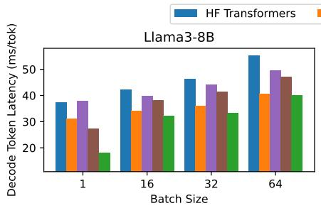

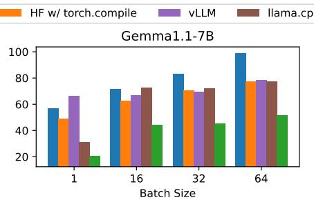

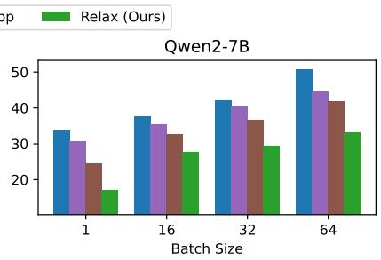  
Figure 15. Inference performance of various models on AMD Radeon 7900 XTX under diferent batch sizes. Relax consistently delivers competitive performance, and brings optimized performance with up to 1.50x under case of batch size 1.

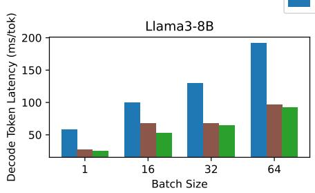

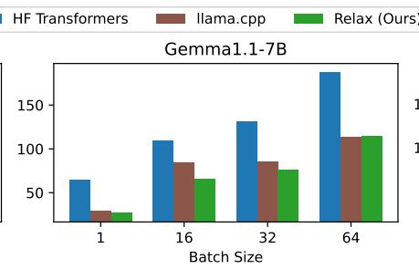

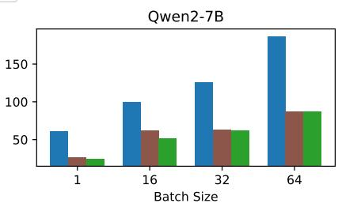  
Figure 16. Inference performance of various models on Apple M2 Ultra under diferent batch sizes. Relax has competitive performance comparing to the hand-optimized llama.cpp baseline.  
Relax without fusion, partial lib lowering, CUDA graph offloading + operator fusion + paritial library lowering + CUDA graph offloading

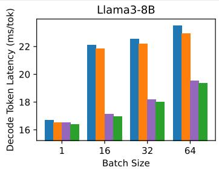  
Figure 17. Efects of operator fusion, partial library dispatching and CUDA Graph ofloading on Llama3-8B inference across diferent batch sizes.

Efects on memory usage. We study the memory reduction of static memory planning by measuring the total allocated activation memory size during the float16 Llama3-8B prefill of successive inputs of length 128, 256, 512, 1024, and during the decode of successive batches of size 1, 16, 32 and 64. The memory planning plans with the upper bound of sequence length and batch size. When memory planning is disabled, we use a runtime memory pool to recycle unused memory. As in Table 2, static memory planning reduces activation memory by 22% during successive prefill phases and by 40% for decode. With static memory planning, we always reuse memory across all input lengths and batch sizes, even as they vary over time. In contrast, without memory planning, the system repeatedly allocates dynamic-sized memory whenever the input shape changes, which is unpredictable in real-world applications. This potentially leads to even higher memory usage unless all memory is statically planned. Additionally, by allocating all memory in advance, we enable CUDA Graph for emerging models and yield further performance gains.

Table 2. Memory usage of Llama3-8B inference with and without static memory planning, through workloads of successive prefill of diferent sequence lengths and successive decode of diferent batch sizes.  
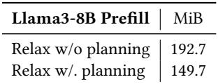

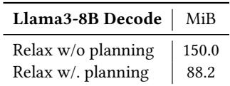

Importantly, all these optimizations rely on proposed abstractions. For example, in the best case without shape information, we can no longer run static analyses such as static memory planning and static graph capture for optimizations, which may cause additional memory and latency overhead.

Table 3. Inference performance (throughput, tokens/sec) of 4-bit quantized Llama3-8B, Phi3-mini-4k and RedPajama-3B models on a broad set of emerging platforms, including mobile and embedded devices. Relax deploys emerging models across these platforms, which most existing ML frameworks do not well support.  
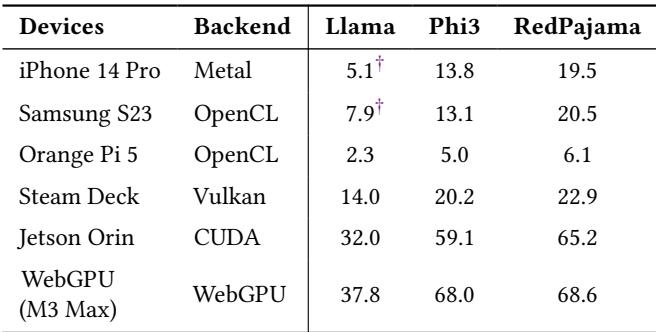  
<sup>†</sup> We run 3-bit quantized Llama2-7B on iPhone and 4-bit quantized Llama2-7B on Samsung S23 to fit the VRAM limit of the mobile environments.

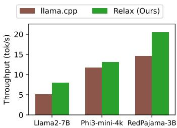  
Figure 18. Single-sequence generation performance comparison of 4-bit quantized LLMs on Samsung S24. Relax delivers up to 55% more throughput on evaluated models.

## 5.3 Evaluation on More Emerging Platforms

This section evaluates the deployment of emerging models onto a broader set of emerging platforms that are less supported by existing solutions. We evaluate single-sequence LLM inference performance on iPhone 14 Pro with Apple A16, Samsung S23 with Qualcomm Snapdragon 8 Gen 2, Orange Pi 5 with ARM Mali GPU, Steam Deck with AMD APU, NVIDIA Jetson Orin developer kit, and in-browser WebGPU [12] on Apple M3 Max laptop. We run 4-bit quantized Llama3-8B for most cases, while using Llama2-7B for mobile phones so the total memory usage fits the VRAM limit.

As in Table 3, Relax provides a throughput of over 5 tokens/s for mobile devices, and 2.3 tokens/s for Orange Pi 5. In addition to physical devices, Relax enables LLM deployment on the emerging WebGPU backend, supporting web-native machine learning. To our best knowledge, Relax is the first solution to enable GPU-accelerated LLM inference on these platforms except the NVIDIA Jetson Orin. Without memory planning that pre-allocates all needed memory and keeps it within the budget, these models are not even runnable on some of the environments due to memory constraints.

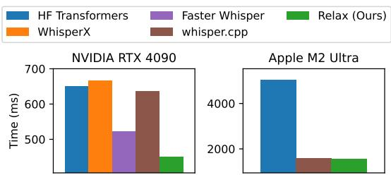

Figure 19. Transcription time of a 30-second speech file with Whisper-large-v3 on NVIDIA RTX 4090 and Apple M2 Ultra. WhisperX and Faster Whisper have no Apple GPU support. Relax delivers competitive performance on both NVIDIA and Apple platforms.  
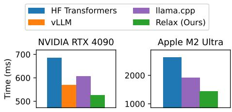  
Figure 20. LLaVA generation time of 32-token for an image input on NVIDIA RTX 4090 and Apple M2 Ultra. Relax achieves competitive optimized performance for LLaVA generation on both platforms.

We further compare Relax on Samsung S23 with llama.cpp. Relax achieves up to 55% better throughput (Figure 18). Notably, llama.cpp only utilizes CPU due to lack of kernels for Android GPUs, whereas Relax automatically generates optimized GPU codes via compilation, enabling emerging model deployment not only specifically on Android platforms, but also generically on more emerging platforms.

## 5.4 Evaluation on Additional Set of Models

We also study Relax on an additional set of models. Whisper [32] is an automatic speech recognition (ASR) model implemented as an encoder-decoder Transformer. We evaluate the time to transcribe a 30-second speech with Whisper large-v3, and compare Relax with HuggingFace Transformers, WhisperX [4] (f2da2f8), Faster Whisper (v1.0.2) and whisper.cpp [19] (5d950c4). As shown in Figure 19, Relax brings a speedup of 14% on NVIDIA 4090 and has competitive performance on Apple GPU. LLaVA [28] is a large multimodal model that integrates the pre-trained CLIP [31] visual encoder and the LLM Vicuna [10] for general-purpose visual and language understanding. We evaluate the time of generating 32 tokens for an image using baselines of HuggingFace Transformers, vLLM, and llama.cpp. Results are shown in Figure 20. Relax eficiently supports the vision encoder together with the prefill and decode phases of LLM.

## 6 Related Work

Vendor-optimized libraries like cuDNN [9], CUTLASS [41], MKL-DNN [23], and MIOpen [25] are frequently used by ML frameworks [1, 30] to support tensor operators on various hardware backends. The libraries are platform-specific and have large engineering development costs to cover the growing demands of operators, data formats, and layouts. Relax complements such libraries by allowing them to be used alongside loop-level code optimized with dynamic shape– awareness. Frameworks that rely on libraries can potentially use Relax to choose between libraries or generated code.

The emerging demand for large language models has also inspired a set of frameworks [18, 20, 26, 45] optimized for these particular workloads. These frameworks usually rely on manual optimizations for each specific backend. They can leverage Relax to reduce the efort for supporting a broader set of workloads and emerging backends.

There has also been much work on abstractions for transforming and optimizing loop-level code for tensor operators. Triton [42] and Graphene [22] are abstractions that optimize tensorized programs on GPU. DietCode [48], CoRA [15], and SparseTIR [47], focus on tensor program optimizations with shape dynamism and irregularity. Mosaic [5] is a sparse com piler combining library dispatch and sparse tensor program optimizations. Cortex [14] enables tensor program optimizations for recursive computation. We use TensorIR [16] as the tensor program abstraction in our cross-level design implementation, but we could combine our approaches with other abstractions for tensor supports programs to enable a broader spectrum of tensor program optimizations.

ML compilers are designed to represent and optimize end to-end model computations. High-level computations are usually represented as computation graph–style dialects. TVM [7]’s Relay [35] and MLIR dialects [27] represent dynamic dimensions as unknown and do not track dynamic shape relations. IREE [24] provides end-to-end compilation with MLIR. Nimble [40] leverages runtime bucketing to support dynamic operators. DISC [50, 51] enables shape as a first-class value but does not track symbolic shapes. TorchInductor [2] brings native symbolic shape support to the Py-Torch compiler, focusing on kernel generation for TorchFX graphs [34] derived from TorchDynamo [2]. The PyTorch compiler stores a global symbolic variable table for traced subgraphs, and is synergistic with its JIT-focused design and avoids cross-function symbolic shape tracking. Relax complements the PyTorch compiler by abstracting and globally tracks cross-function symbolic shape for full programs, enabling AOT compilation and holistic deployment onto emerging platforms. As a result, Relax can be used as a backend for frameworks like PyTorch, JAX [17] to deploy models to more emerging backends. Axon [11] is a functional lan guage that considers shape deduction in its types and applies a constraint solver to determine shape relations; unlike Relax, it does not describe a dynamic fallback when shapes cannot be deduced statically. (Note that Relax could still apply a similar constraint-solving approach, despite its additional compile time costs.) Halide [33] supports external function calls via Func::define\_extern() in tensor programs. Relax extends this mechanism to both graph and tensor program levels, bridging together external libraries and these levels. Additionally, most existing ML compilers follow a multi-level single-shot lowering approach, whereas Relax enables global symbolic shape tracking across functions via cross-level abstractions. Relax’s insights for supporting dynamic shapes and cross-level optimizations can be used to improve these ML compiler frameworks.

## 7 Conclusion

We introduce Relax, an abstraction for end-to-end dynamic machine learning on emerging platforms. Our cross-level abstractions and first-class symbolic shapes enable composable optimizations of dynamic shape models and allow us to build an AOT end-to-end holistic framework that deploys emerging models to diverse emerging backends. Relax delivers performance competitive to state-of-the-art systems across platforms, including 27% of LLM decode token latency reduction on NVIDIA GPUs. We hope this work will encourage additional studies of dynamic shape–aware program abstractions and highlight new possibilities for ML compilers.

## Acknowledgments

We thank all anonymous ASPLOS reviewers and our shepherd Fredrik Kjolstad for their constructive feedback and comments. This work was supported in part by gifts from OctoAI, Qualcomm, and CMU open-source software fellowships.

## References

[1] Martín Abadi, Paul Barham, Jianmin Chen, Zhifeng Chen, Andy Davis, Jefrey Dean, Matthieu Devin, Sanjay Ghemawat, Geofrey Irving, Michael Isard, et al. Tensorflow: a system for large-scale machine learning. In 12th USENIX symposium on operating systems design and implementation (OSDI 16), pages 265–283, 2016.

[2] Jason Ansel, Edward Yang, Horace He, Natalia Gimelshein, Animesh Jain, Michael Voznesensky, Bin Bao, Peter Bell, David Berard, Evgeni Burovski, Geeta Chauhan, Anjali Chourdia, Will Constable, Alban Desmaison, Zachary DeVito, Elias Ellison, Will Feng, Jiong Gong, Michael Gschwind, Brian Hirsh, Sherlock Huang, Kshiteej Kalambarkar, Laurent Kirsch, Michael Lazos, Mario Lezcano, Yanbo Liang, Jason Liang, Yinghai Lu, C. K. Luk, Bert Maher, Yunjie Pan, Christian Puhrsch, Matthias Reso, Mark Saroufim, Marcos Yukio Siraichi, Helen Suk, Shunting Zhang, Michael Suo, Phil Tillet, Xu Zhao, Eikan Wang, Keren Zhou, Richard Zou, Xiaodong Wang, Ajit Mathews, William Wen, Gregory Chanan, Peng Wu, and Soumith Chintala. Pytorch 2: Faster machine learning through dynamic python bytecode transformation and graph compilation. In Proceedings of the 29th ACM International Conference on Architectural Support for Programming Languages and Operating Systems, Volume 2, ASPLOS ’24, page 929–947, New York, NY, USA, 2024. Association for Computing Machinery.

[3] Junjie Bai, Fang Lu, Ke Zhang, et al. Onnx: Open neural network exchange. htps://github.com/onnx/onnx, 2019.

[4] Max Bain, Jaesung Huh, Tengda Han, and Andrew Zisserman. Whisperx: Time-accurate speech transcription of long-form audio, 2023.

[5] Manya Bansal, Olivia Hsu, Kunle Olukotun, and Fredrik Kjolstad. Mosaic: An interoperable compiler for tensor algebra. Proceedings of the ACM on Programming Languages, 7(PLDI):394–419, 2023.

[6] Sid Black, Stella Biderman, Eric Hallahan, Quentin Anthony, Leo Gao, Laurence Golding, Horace He, Connor Leahy, Kyle McDonell, Jason Phang, Michael Pieler, USVSN Sai Prashanth, Shivanshu Purohit, Laria Reynolds, Jonathan Tow, Ben Wang, and Samuel Weinbach. Gpt-neox 20b: An open-source autoregressive language model, 2022.

[7] Tianqi Chen, Thierry Moreau, Ziheng Jiang, Lianmin Zheng, Eddie Yan, Haichen Shen, Meghan Cowan, Leyuan Wang, Yuwei Hu, Luis Ceze, et al. Tvm: An automated end-to-end optimizing compiler for deep learning. In 13th USENIX Symposium on Operating Systems Design and Implementation (OSDI 18), pages 578–594, 2018.

[8] Tianqi Chen, Lianmin Zheng, Eddie Yan, Ziheng Jiang, Thierry Moreau, Luis Ceze, Carlos Guestrin, and Arvind Krishnamurthy. Learning to optimize tensor programs, 2019.

[9] Sharan Chetlur, Clif Woolley, Philippe Vandermersch, Jonathan Co hen, John Tran, Bryan Catanzaro, and Evan Shelhamer. cudnn: Eficient primitives for deep learning, 2014.

[10] Wei-Lin Chiang, Zhuohan Li, Zi Lin, Ying Sheng, Zhanghao Wu, Hao Zhang, Lianmin Zheng, Siyuan Zhuang, Yonghao Zhuang, Joseph E. Gonzalez, Ion Stoica, and Eric P. Xing. Vicuna: An open-source chatbot impressing gpt-4 with 90%\* chatgpt quality, March 2023.

[11] Alexander Collins and Vinod Grover. Axon: A language for dynamic shapes in deep learning graphs, 2022.

[12] Abdul Dakkak, Carl Pearson, and Wen-mei Hwu. Webgpu: A scalable online development platform for gpu programming courses. In 2016 IEEE International Parallel and Distributed Processing Symposium Workshops (IPDPSW), pages 942–949. IEEE, 2016.

[13] Tri Dao, Dan Fu, Stefano Ermon, Atri Rudra, and Christopher Ré. Flashattention: Fast and memory-eficient exact attention with ioawareness. In S. Koyejo, S. Mohamed, A. Agarwal, D. Belgrave, K. Cho, and A. Oh, editors, Advances in Neural Information Processing Systems, volume 35, pages 16344–16359. Curran Associates, Inc., 2022.

[14] Pratik Fegade, Tianqi Chen, Phillip Gibbons, and Todd Mowry. Cortex: A compiler for recursive deep learning models. Proceedings of Machine Learning and Systems, 3:38–54, 2021.

[15] Pratik Fegade, Tianqi Chen, Phillip Gibbons, and Todd Mowry. The cora tensor compiler: Compilation for ragged tensors with minimal padding. In D. Marculescu, Y. Chi, and C. Wu, editors, Proceedings of Machine Learning and Systems, volume 4, pages 721–747, 2022.

[16] Siyuan Feng, Bohan Hou, Hongyi Jin, Wuwei Lin, Junru Shao, Ruihang Lai, Zihao Ye, Lianmin Zheng, Cody Hao Yu, Yong Yu, et al. Tensorir: An abstraction for automatic tensorized program optimization. In Proceedings of the 28th ACM International Conference on Architectural Support for Programming Languages and Operating Systems, Volume 2, pages 804–817, 2023.

[17] Roy Frostig, Matthew Johnson, and Chris Leary. Compiling machine learning programs via high-level tracing. 2018.

[18] Georgi Gerganov. ggml. htps://github.com/ggerganov/ggml, 2022.

[19] Georgi Gerganov. whisper.cpp. htps://github.com/ggerganov/whisper. cpp, 2022.

[20] Georgi Gerganov. llama.cpp. htps://github.com/ggerganov/llama.cpp, 2023.

[21] Alan Gray. Getting started with cuda graphs, Sep 2019.

[22] Bastian Hagedorn, Bin Fan, Hanfeng Chen, Cris Cecka, Michael Garland, and Vinod Grover. Graphene: An ir for optimized tensor computations on gpus. In Proceedings of the 28th ACM International Conference on Architectural Support for Programming Languages and Operating Systems, Volume 3, pages 302–313, 2023.

[23] Intel. Intel® math kernel library for deep learning networks, 2017.

[24] IREE Project. IREE, sep 2019.

[25] Jehandad Khan, Paul Fultz, Artem Tamazov, Daniel Lowell, Chao Liu, Michael Melesse, Murali Nandhimandalam, Kamil Nasyrov, Ilya Permi nov, Tejash Shah, Vasilii Filippov, Jing Zhang, Jing Zhou, Bragadeesh Natarajan, and Mayank Daga. Miopen: An open source library for deep learning primitives, 2019.

[26] Woosuk Kwon, Zhuohan Li, Siyuan Zhuang, Ying Sheng, Lianmin Zheng, Cody Hao Yu, Joseph E Gonzalez, Hao Zhang, and Ion Stoica. Eficient memory management for large language model serving with pagedattention. arXiv preprint arXiv:2309.06180, 2023.

[27] Chris Lattner, Mehdi Amini, Uday Bondhugula, Albert Cohen, Andy Davis, Jacques Pienaar, River Riddle, Tatiana Shpeisman, Nicolas Vasi lache, and Oleksandr Zinenko. Mlir: Scaling compiler infrastructure for domain specific computation. In 2021 IEEE/ACM International Symposium on Code Generation and Optimization (CGO), pages 2–14. IEEE, 2021.

[28] Haotian Liu, Chunyuan Li, Qingyang Wu, and Yong Jae Lee. Visual instruction tuning. In NeurIPS, 2023.

[29] Muhammad Osama, Duane Merrill, Cris Cecka, Michael Garland, and John D. Owens. Stream-k: Work-centric parallel decomposition for dense matrix-matrix multiplication on the gpu, 2023.

[30] Adam Paszke, Sam Gross, Francisco Massa, Adam Lerer, James Bradbury, Gregory Chanan, Trevor Killeen, Zeming Lin, Natalia Gimelshein, Luca Antiga, et al. Pytorch: An imperative style, high-performance deep learning library. Advances in neural information processing systems, 32, 2019.

[31] Alec Radford, Jong Wook Kim, Chris Hallacy, Aditya Ramesh, Gabriel Goh, Sandhini Agarwal, Girish Sastry, Amanda Askell, Pamela Mishkin, Jack Clark, Gretchen Krueger, and Ilya Sutskever. Learning transferable visual models from natural language supervision, 2021.

[32] Alec Radford, Jong Wook Kim, Tao Xu, Greg Brockman, Christine McLeavey, and Ilya Sutskever. Robust speech recognition via largescale weak supervision, 2022.

[33] Jonathan Ragan-Kelley, Connelly Barnes, Andrew Adams, Sylvain Paris, Frédo Durand, and Saman Amarasinghe. Halide: a language and compiler for optimizing parallelism, locality, and recomputation in image processing pipelines. Acm Sigplan Notices, 48(6):519–530, 2013.

[34] James Reed, Zachary DeVito, Horace He, Ansley Ussery, and Jason Ansel. torch.fx: Practical program capture and transformation for deep learning in python. In D. Marculescu, Y. Chi, and C. Wu, editors, Proceedings of Machine Learning and Systems, volume 4, page 638–651, 2022.

[35] Jared Roesch, Steven Lyubomirsky, Logan Weber, Josh Pollock, Marisa Kirisame, Tianqi Chen, and Zachary Tatlock. Relay: a new IR for machine learning frameworks. In Proceedings of the 2nd ACM SIG-PLAN International Workshop on Machine Learning and Programming Languages. ACM, jun 2018.

[36] Jared Graham Roesch. Principled Optimization Of Dynamic Neural Networks. PhD thesis, University of Washington, 2020.

[37] Baptiste Rozière, Jonas Gehring, Fabian Gloeckle, Sten Sootla, Itai Gat, Xiaoqing Ellen Tan, Yossi Adi, Jingyu Liu, Romain Sauvestre, Tal Remez, Jérémy Rapin, Artyom Kozhevnikov, Ivan Evtimov, Joanna Bitton, Manish Bhatt, Cristian Canton Ferrer, Aaron Grattafiori, Wenhan Xiong, Alexandre Défossez, Jade Copet, Faisal Azhar, Hugo Touvron, Louis Martin, Nicolas Usunier, Thomas Scialom, and Gabriel Synnaeve. Code llama: Open foundation models for code, 2024.

[38] Amir Shaikhha, Andrew Fitzgibbon, Simon Peyton Jones, and Dimitrios Vytiniotis. Destination-passing style for eficient memory management. In Proceedings of the 6th ACM SIGPLAN International Workshop on Functional High-Performance Computing, FHPC 2017, page 12–23, New York, NY, USA, 2017. Association for Computing Machin ery.

[39] Junru Shao, Xiyou Zhou, Siyuan Feng, Bohan Hou, Ruihang Lai, Hongyi Jin, Wuwei Lin, Masahiro Masuda, Cody Hao Yu, and Tianqi

Chen. Tensor program optimization with probabilistic programs. Advances in Neural Information Processing Systems, 35:35783–35796, 2022.

[40] Haichen Shen, Jared Roesch, Zhi Chen, Wei Chen, Yong Wu, Mu Li, Vin Sharma, Zachary Tatlock, and Yida Wang. Nimble: Eficiently compiling dynamic neural networks for model inference. In A. Smola, A. Dimakis, and I. Stoica, editors, Proceedings of Machine Learning and Systems, volume 3, pages 208–222, 2021.

[41] Vijay Thakkar, Pradeep Ramani, Cris Cecka, Aniket Shivam, Honghao Lu, Ethan Yan, Jack Kosaian, Mark Hoemmen, Haicheng Wu, Andrew Kerr, Matt Nicely, Duane Merrill, Dustyn Blasig, Fengqi Qiao, Piotr Majcher, Paul Springer, Markus Hohnerbach, Jin Wang, and Manish Gupta. CUTLASS, jan 2023.

[42] Philippe Tillet, Hsiang-Tsung Kung, and David Cox. Triton: an intermediate language and compiler for tiled neural network computations. In Proceedings of the 3rd ACM SIGPLAN International Workshop on Machine Learning and Programming Languages, pages 10–19, 2019.

[43] Hugo Touvron, Louis Martin, Kevin Stone, Peter Albert, Amjad Almahairi, Yasmine Babaei, Nikolay Bashlykov, Soumya Batra, Prajjwal Bhargava, Shruti Bhosale, Dan Bikel, Lukas Blecher, Cristian Canton Ferrer, Moya Chen, Guillem Cucurull, David Esiobu, Jude Fernandes, Jeremy Fu, Wenyin Fu, Brian Fuller, Cynthia Gao, Vedanuj Goswami, Naman Goyal, Anthony Hartshorn, Saghar Hosseini, Rui Hou, Hakan Inan, Marcin Kardas, Viktor Kerkez, Madian Khabsa, Isabel Kloumann, Artem Korenev, Punit Singh Koura, Marie-Anne Lachaux, Thibaut Lavril, Jenya Lee, Diana Liskovich, Yinghai Lu, Yuning Mao, Xavier Martinet, Todor Mihaylov, Pushkar Mishra, Igor Molybog, Yixin Nie, Andrew Poulton, Jeremy Reizenstein, Rashi Rungta, Kalyan Saladi, Alan Schelten, Ruan Silva, Eric Michael Smith, Ranjan Subramanian, Xiaoqing Ellen Tan, Binh Tang, Ross Taylor, Adina Williams, Jian Xiang Kuan, Puxin Xu, Zheng Yan, Iliyan Zarov, Yuchen Zhang, Angela Fan, Melanie Kambadur, Sharan Narang, Aurelien Rodriguez, Robert Stojnic, Sergey Edunov, and Thomas Scialom. Llama 2: Open foundation and fine-tuned chat models, 2023.

[44] Ashish Vaswani, Noam Shazeer, Niki Parmar, Jakob Uszkoreit, Llion Jones, Aidan N Gomez, Ł ukasz Kaiser, and Illia Polosukhin. Attention is all you need. In I. Guyon, U. Von Luxburg, S. Bengio, H. Wallach, R. Fergus, S. Vishwanathan, and R. Garnett, editors, Advances in Neural Information Processing Systems, volume 30. Curran Associates, Inc.,

2017.

[45] Thomas Wolf, Lysandre Debut, Victor Sanh, Julien Chaumond, Clement Delangue, Anthony Moi, Perric Cistac, Clara Ma, Yacine Jer nite, Julien Plu, Canwen Xu, Teven Le Scao, Sylvain Gugger, Mariama Drame, Quentin Lhoest, and Alexander M. Rush. Transformers: State of-the-Art Natural Language Processing. pages 38–45. Association for Computational Linguistics, October 2020.

[46] Can Xu, Qingfeng Sun, Kai Zheng, Xiubo Geng, Pu Zhao, Jiazhan Feng, Chongyang Tao, and Daxin Jiang. Wizardlm: Empowering large language models to follow complex instructions. arXiv preprint arXiv:2304.12244, 2023.

[47] Zihao Ye, Ruihang Lai, Junru Shao, Tianqi Chen, and Luis Ceze. Sparsetir: Composable abstractions for sparse compilation in deep learning. In Proceedings of the 28th ACM International Conference on Architectural Support for Programming Languages and Operating Systems, Volume 3, pages 660–678, 2023.

[48] Bojian Zheng, Ziheng Jiang, Cody Hao Yu, Haichen Shen, Joshua Fromm, Yizhi Liu, Yida Wang, Luis Ceze, Tianqi Chen, and Gennady Pekhimenko. Dietcode: Automatic optimization for dynamic tensor programs. In D. Marculescu, Y. Chi, and C. Wu, editors, Proceedings of Machine Learning and Systems, volume 4, pages 848–863, 2022.

[49] Lianmin Zheng, Chengfan Jia, Minmin Sun, Zhao Wu, Cody Hao Yu, Ameer Haj-Ali, Yida Wang, Jun Yang, Danyang Zhuo, Koushik Sen, Joseph E. Gonzalez, and Ion Stoica. Ansor: Generating High-Performance tensor programs for deep learning. In 14th USENIX Symposium on Operating Systems Design and Implementation (OSDI 20), pages 863–879. USENIX Association, November 2020.

[50] Zhen Zheng, Xuanda Yang, Pengzhan Zhao, Guoping Long, Kai Zhu, Feiwen Zhu, Wenyi Zhao, Xiaoyong Liu, Jun Yang, Jidong Zhai, et al. Astitch: enabling a new multi-dimensional optimization space for memory-intensive ml training and inference on modern simt architectures. In Proceedings of the 27th ACM International Conference on Architectural Support for Programming Languages and Operating Systems, pages 359–373, 2022.

[51] Kai Zhu, Wenyi Zhao, Zhen Zheng, Tianyou Guo, Pengzhan Zhao, Feiwen Zhu, Junjie Bai, Jun Yang, Xiaoyong Liu, Lansong Diao, and Wei Lin. Disc: A dynamic shape compiler for machine learning workloads, 2021.