# BlendServe: Optimizing Ofline Inference with Resource-Aware Batching

Yilong Zhao University of California, Berkeley Berkeley, CA, USA yilongzhao@berkeley.edu

Lianmin Zheng University of California, Berkeley Berkeley, CA, USA lianminzheng@gmail.com

Yang Zhou University of California, Davis Sacramento, CA, USA yangzhou.rpc@gmail.com

Shuo Yang University of California, Berkeley Berkeley, CA, USA andy\_yang@berkeley.edu

Baris Kasikci   
University of Washington   
Seattle, WA, USA   
baris@cs.washington.edu

Jiarong Xing Rice University Houston, TX, USA jxing@rice.edu

Kan Zhu   
University of Washington   
Seattle, WA, USA   
kanzhu@cs.washington.edu

Yifan Qiao University of California, Berkeley Berkeley, CA, USA yifanqiao@berkeley.edu

Ion Stoica University of California, Berkeley Berkeley, CA, USA istoica@berkeley.edu

## Abstract

Ofline batch inference is gaining popularity as a cost-efective solution for latency-insensitive tasks, such as model evaluation and data curation. As the latency objective is highly relaxed, maximizing throughput becomes the primary goal in ofline inference. Previous studies focused solely on optimizing throughput within a batch. However, the diverse resource demands (compute-intensive vs. memory-intensive) across a wide range of applications make these approaches less efective, as imbalanced resource demands between batches restrict optimization opportunities.

Our insight for achieving optimal throughput is to reorder requests into batches that mix compute- and memoryintensive workloads to maximize resource overlap. However, such a request schedule can conflict with the schedule that maximizes prefix sharing, a widely-used performance optimization, causing suboptimal inference throughput. In this paper, we first build a performance model to analyze request resource demands. Based on it, we design BlendServe, which harmonizes both resource overlapping and prefix sharing to maximize throughput. BlendServe organizes all requests using a resource-aware prefix tree and proposes a dual scanning algorithm to obtain the request schedule. Our evaluation on various models and workloads shows that BlendServe can achieve up to 90% of the optimal throughput.

CCS Concepts: <sup>•</sup> Computing methodologies → Parallel computing methodologies<sup>;</sup> Machine learning<sup>.</sup>

<sub>Keywords:</sub> Large Language Models; Ofline Inference

ACM Reference Format:

Yilong Zhao, Shuo Yang, Kan Zhu, Lianmin Zheng, Baris Kasikci, Yifan Qiao, Yang Zhou, Jiarong Xing, and Ion Stoica. 2026. BlendServe: Optimizing Ofline Inference with Resource-Aware Batching. In <sub>Pro-</sub> ceedings of the 31st ACM International Conference on Architectural Support for Programming Languages and Operating Systems, Volume 2 (ASPLOS ’26), March 22–26, 2026, Pittsburgh, PA, USA. <sup>ACM,</sup> <sup>New</sup> <sup>York,</sup> <sup>NY,</sup> <sup>USA, 19 pages.</sup> htps://doi.org/10.1145/3779212.3790133

## 1 Introduction

Ofline batch inference is becoming increasingly popular as a cost-efective solution for Large Language Model (LLM) inference. It processes requests in batches and returns responses within an extended time window, e.g., 24-hour response window ofered by OpenAI’s batch APIs [38]. The relaxed latency objective significantly reduces service costs—for example, OpenAI’s Batch API ofers inference at half the cost of its online counterpart. This cost advantage has made ofline batch inference an attractive choice for a wide range of latencyinsensitive applications, including model evaluation [19], data curation [3], document summarization [9], and predictive analytics [30]. Almost all major inference providers ofer ofline batch inference services today [4, 5, 7, 15].

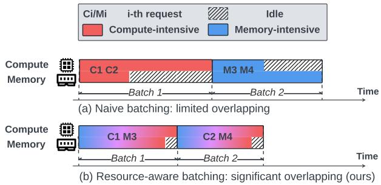  
<sub>Figure</sub> <sub>1.</sub> Two ways of batching compute- and memory-intensive requests in ofline inference. (a) Naively batching requests in order leads to limited compute-memory overlapping. (b) Resource-aware batching (ours) blends compute- and memory-intensive requests and achieves significant overlapping.

same model weights and operations, but the prefill phase processes tokens in parallel, making it more compute-intensive, while the decode phase generates tokens sequentially, making it more memory-intensive. Prior studies have exploited this distinction to improve inference throughput in the context of <sub>online</sub> <sub>inference</sub>. Sarathi-Serve [1] proposes <sub>chunked</sub> <sub>prefill</sub>, which splits large prefill phases into smaller chunks and schedules them alongside decode phases across iterations, improving arithmetic intensity per iteration for higher throughput. Orion [50] improves utilization with <sub>operator-</sub> <sub>level</sub> <sub>scheduling</sub>, which collocates compute- and memoryintensive operators. NanoFlow [76] further advances this by partitioning a large request batch into nano batches for finergrained overlapping, achieving state-of-the-art throughput.

However, these online inference optimizations are far from achieving optimal throughput for <sub>ofline</sub> <sub>scenarios</sub>. This is because they only focus on optimizing execution within a request batch but overlook the opportunities across batches, which becomes increasingly important as request diversity grows rapidly. Specifically, advancements in model capabilities have expanded their applications across a wide range of domains, such as chatbots [37], math [65], and coding [35]. Besides, the rise of multi-modal models[55, 57, 61, 62] has further extended their reach to image and video understanding and generation. Such application diversity leads to numerous requests with <sub>diverse</sub> <sub>resource</sub> <sub>demands</sub>. For example, document summarization has long input sequences but short output tokens, which consumes more compute, whereas video generation produces significantly more output tokens, which need more memory bandwidth. If a batch is dominated by a single request type (e.g., all compute-intensive), opportunities for overlapping compute and memory-bandwidth usage will be limited, as shown in Figure 1(a).

<sub>Insight.</sub> Our key insight is to carefully construct batches in a resource-aware manner. Specifically, by combining (or blending) compute- and memory-intensive requests with a certain ratio to form a batch, we can maximize opportunities for concurrent execution of compute- and memory-intensive operations, enhancing hardware utilization and efectively improving throughput. We illustrate this idea in Figure 1(b). <sub>Key</sub> <sub>challenge.</sub> However, considering compute-memory overlapping in isolation might not provide optimal throughput, as it usually conflicts with another widely used technique to improve throughput—prefix sharing [23, 26, 73]. Prefix sharing group requests with shared prefixes, which allows the shared portion to be computed only once, avoiding redundant computation and KV-cache storage. Studies have shown that when optimally utilized—by processing requests in an optimal order—prefix sharing can increase throughput by 6.4<sub>×</sub> on certain workloads [73]. However, a request order that achieves high prefix sharing does not necessarily yield high compute-memory overlapping, and vice versa. For example, document summarization requests are computeintensive, but they usually only share the same prefix with other summarization requests, instead of memory-intensive video generation requests; a request order optimizing for prefix sharing would prevent compute-memory overlapping. Therefore, we must consider both factors together for maximizing throughput.

<sub>BlendServe.</sub> In this work, we design BlendServe, the first serving system that is specifically optimized for ofline batch inference by leveraging both (a) blending compute-intensive and memory-intensive requests, on one hand, and (b) prefix sharing, on the other hand. We first conduct a deep performance analysis and develop a theoretical model to characterize requests with diverse resource demands. Based on the model, BlendServe constructs a resource-aware prefix tree, where each node encodes the compute density of all requests within its subtree. It then sorts the tree nodes based on their density values, placing compute-intensive nodes on the left and memory-intensive nodes on the right. The sorted tree preserves the structure of the prefix tree, so it inherits the benefit of prefix sharing. To determine the best request order for batching, BlendServe employs a dual scanner algorithm, which scans the tree leaves from left and right simultaneously, efectively batching compute-intensive requests with memory-intensive requests to maximize compute-memory overlapping. Finally, BlendServe extends the design to data parallelism and tensor parallelism to support large-scale deployment with larger models and clusters [44].

We prototyped BlendServe based on NanoFlow [76], which has integrated chunked prefill [1], and extended it with our resource-aware prefix tree and dual scanner algorithm for optimized batch formulation. We evaluated BlendServe on a range of models including Llama-3-8B, Llama-3-70B [34], and Qwen-2.5-7B [8], and datasets featuring diferent performance characteristics, including chatbots [70], benchmark [19], API service [56] and vision workloads [36]. We compared BlendServe against commonly-used systems including vLLM [25], SGLang [73], and NanoFlow [76]. Compared to the industry-standard vLLM and SGLang, Blend-Serve achieves up to 1.44<sub>×</sub> throughput speedup. It also delivers an average 20.84% higher throughput than NanoFlow, the current state-of-the-art throughput-oriented inference system. More importantly, our analysis shows that Blend-Serve reaches an average 86.55% (up to 90%) of the achievable optimal throughput, demonstrating its efectiveness.

In summary, our main contributions include:

<sub>•</sub> We conducted a detailed analysis of ofline serving workloads and built a performance model to analyze their compute and memory resource demands.

<sub>•</sub> We designed a resource-aware prefix tree for request management that encodes resource demands while preserving prefix structures.

<sub>•</sub> We proposed a request batching algorithm that optimizes throughput by maximizing compute-memory overlapping while preserving high prefix sharing.

<sub>•</sub> We built a prototype and evaluated it comprehensively, demonstrating that it achieves an average 86.55% (up to 90%) of the optimal throughput.

## 2 Background

## 2.1 Transformer-based large model inference

<sub>Transformer-based</sub> <sub>LLM.</sub> The core of transformer is its self-attention mechanism, which enables a model to capture the dependencies between all tokens in a sequence. This is achieved via query (Q), key (K), and value (V) transformations, where each token’s embedding is projected into Q, K, and V tensors. The attention mechanism computes attention scores between tokens using the dot product of Q and K, normalizes scores with softmax, and then applies them to V to generate contextualized representations. The output then passes through a Feed-Forward Network (FFN), which applies non-linear transformations to refine token representations. Multi-head attention (MHA) [13] and grouped-query attention (GQA) [2] extend this by allowing multiple query heads to attend to the same sets of key and value heads, which greatly saves memory consumption.

<sub>LLM</sub> <sub>inference.</sub> LLM inference involves two main phases: <sub>prefill</sub> and <sub>decode</sub>. The prefill phase processes the initial input sequence (i.e., prompt) and generates the first output token. This phase is <sub>compute-intensive</sub> because all tokens are processed in parallel. After that, the decode phase generates output tokens in an <sub>auto-regressive</sub> manner, generating one token at a time [54]. For each token, it computes a new query (Q) and performs self-attention over the key (K) and value (V) tensors of all previously generated tokens. To avoid redundant computation, a KV-cache is employed to store the K and V tensors of past tokens in GPU memory. This significantly increases the usage of memory bandwidth, as each decoding step requires loading all stored KV tensors from memory, making the decode phase <sub>memory-intensive</sub> [72].

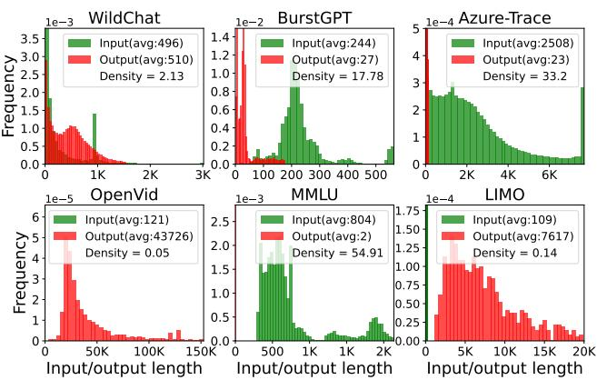  
<sub>Figure</sub> <sub>2.</sub> Request input/output length distribution from 6 wellknown open-sourced traces, including chatbot WildChat and API services BurstGPT [56, 70], Azure-Trace [49], video generation datasets OpenVid [36], benchmark traces MMLU [19] and math traces LIMO [65]. Requests from diferent traces demonstrate distinct length distributions, which leads to diferent compute density. Compute density is the ratio of compute to memory bandwidth usage (formally defined in §4). A dataset is compute intensive when its compute density > 1, and memory intensive otherwise.

2.2 Inference latency and throughput optimizations Here, we introduce prior inference latency and throughput optimizations relevant to the design of BlendServe.

Prefill/Decode (P/D) disaggregation. <sup>Early-stage</sup> <sup>infer-</sup> ence systems use naive continuous batching scheduling [68], which overlooks the resource usage diferences between prefill and decode phases. DistServe [75] proposes P/D disaggregation, which executes and scales these two phases independently on separate clusters. This allows time-tofirst-token (TTFT) and time-per-output-token (TPOT) to be maintained independently without interference, making DistServe <sub>latency-optimized</sub> for <sub>online</sub> inference. However, P/D disaggregation can reduce hardware utilization, making it suboptimal for throughput-oriented ofline inference [14, 27, 43]. In particular, compute-intensive prefill phases saturate the compute resources of the prefill cluster while leaving memory bandwidth resources underutilized, and vice versa for the decode phase. We compare BlendServe with DistServe in §6.3.

<sub>Phase-level</sub> <sub>colocation.</sub> To solve this problem, Sarathi-Serve [1] proposed chunked prefill scheduling that colocates prefill and decode phases on the same clusters, and splits a large prefill into small chunks while adding only one chunk into the on-the-fly batch (i.e., requests currently being processed). Conceptually, chunked prefill achieves phaselevel overlapping which uses both compute and memory resources, thereby improving arithmetic intensity per iteration and enhancing hardware utilization. However, chunked prefill was initially designed for online inference, where strict latency constraints prevent flexibly reordering requests to form a batch. Therefore, when a set of requests consists mostly of memory-intensive requests, Sarathi-Serve will quickly run out of prefill phases, leaving GPU compute resources underutilized in the remaining decode processing.

Operator-level overlapping. <sup>Building</sup> <sup>upon</sup> <sup>P/D</sup> <sup>coloca-</sup> tion (i.e., chunked prefill), a recent work, NanoFlow [76], explores <sub>operator-level</sub> resource overlapping. It splits a batch into micro-batches and overlaps compute-intensive GEMM operators with memory-intensive attention operators between micro-batches. Another prior work, Orion [50], also explores operator-level GPU multiplexing by transparently scheduling distinct operators to maximize hardware utilization. This type of fine-grained overlapping is particularly beneficial when the batch contains a proper mix of prefill and decode tokens that can balance the execution time of GEMM and attention operators. However, both NanoFlow and Orion overlook the impact of request ordering on batch composition, limiting their ability to optimize throughput in <sub>ofline</sub> inference. For instance, if a workload begins with computeintensive requests followed by memory-intensive ones, these frameworks process the batches sequentially rather than interleaving them, leading to suboptimal resource utilization.

<sub>Prefix</sub> <sub>sharing.</sub> Prefix sharing (caching) [25, 26, 73] is a commonly adopted optimization that caches computed prompts from previously processed requests and reuses them for future requests. When a new request arrives, the system checks the cached prompts, and if a cache hit occurs, the shared prefix is reused, eliminating redundant computation and boosting throughput [66]. Prefix sharing provides considerable throughput gain for both compute- and memory-intensive workloads without hurting generation quality, e.g., studies show that certain workloads can save up to 80% computation [73], so it has been widely used in mainstream frameworks [25, 52]. To enable eficient look-up, prefixes are organized using a Trie Tree [73], where each node is a segment of a prefix, and a complete path from the root to the leaf corresponds to a unique prefix. The prefix cache is stored alongside the regular KV-cache in GPU memory. When GPU memory runs out, the prefix cache may be evicted. Therefore, the access pattern can afect cache hit rates, which is denoted <sup>as</sup> prefix sharing ratio <sup>in</sup> <sup>this</sup> <sup>work.</sup>

## 3 Motivation

## 3.1 Evolving workloads diversity

The capabilities of LLMs are evolving rapidly. First, multi modality advancements have enabled modern models (e.g., LWM[28], Unified-IO[31], EMU[55], MIO[57], and VILA-U [62]) to process diverse input and output modalities, including text, images, videos, and their combinations. These models typically share a common architecture: a transformerbased LLM augmented with modality-specific adapters. These adapters convert inputs from various modalities into a format that the base model can process and translate its outputs back into the desired modality. In addition, the emergence of reasoning models enables models to “think” before generating answers [39, 45, 51, 58, 64], which greatly improves their performance on hard tasks such as math and coding.

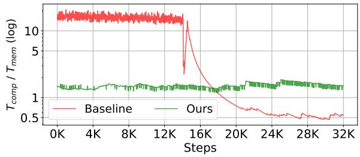  
<sub>Figure</sub> <sub>3.</sub> The ratio of time spent on compute-bound and memorybound operations, when serving Llama-3-8B on an A100 GPU. The workloads are synthesized by sequentially combining computeintensive (BurstGPT) and memory-intensive (OpenVid) traces. The baseline causes underutilization of one resource at each execution step, while ours achieves stable and balanced resource usage.

As a result, LLM-based applications are expanding rapidly, exhibiting increasing <sub>workload</sub> <sub>diversity</sub>, i.e., diverse input and output token lengths. To visualize this diversity, we present the request length distributions in diferent use cases in Figure 2 . It shows that text-only chat requests typically have hundreds of tokens but a video generation request can easily generate tens of thousands tokens. While the simple questions in the MMLU benchmark produce only a few tokens, hard questions from the LIMO benchmark can produce thousands of tokens.

## 3.2 Workload diversity limits existing overlapping

Diverse resource demands across requests. <sup>These</sup> <sup>diverse</sup> requests consume GPU resources (i.e., compute and memory bandwidth) diferently. Since prefill is compute-intensive, requests with long inputs but short outputs will consume more GPU compute than memory bandwidth. Conversely, requests with long output length use more GPU memory bandwidth due to their long memory-intensive decode phase. Therefore, diferent request length distributions lead to drastically diverse resource demands across datasets. As formally defined in §4, we use compute density to represent the ratio of compute to memory bandwidth usage, with higher values indicating more compute-intensive. As shown in Figure 2, OpenVid [36] and LIMO [65] are highly memory-intensive while the remaining datasets are more compute-intensive.

Intra-batch optimizations alone are insuficient. <sup>This</sup> request diversity presents significant challenges in maximizing inference throughput. Prior studies, such as chunked prefill [1], Orion [50], and NanoFlow [76], optimize throughput by overlapping compute and memory bandwidth usage within a batch of requests. For example, chunked prefill colocates the prefill phase with the decode phase within the same batch to overlap compute and memory usage. However, without considering the resource demands across batches, their efectiveness diminishes when a batch is dominated by either compute-intensive or memory-intensive requests, as the system can be easily bottlenecked by one type of resource while leaving the other underutilized.

To illustrate this, we compare NanoFlow (state-of-the-art throughput-oriented system) against our system by measuring the total time spent on compute- and memory-bound operators when serving a workload with compute-intensive requests in front followed by memory-intensive requests. As shown in Figure 3, NanoFlow serves requests sequentially, underutilizing memory bandwidth when processing compute-intensive requests and compute resources during processing memory-intensive requests. In contrast, our system strategically reorders requests with complementary resource demands, resulting in balanced resource utilization and increased overall throughput.

## 3.3 Resource-aware batching via request reordering

The above problem has motivated us to consider the diverse resource demands when batching requests. Our key idea is to exploit the <sub>relaxed</sub> <sub>latency</sub> <sub>constraints</sub> of ofline inference to reorder requests and create batches that can maximize the benefit of compute-memory overlapping, improving GPU utilization and increasing throughput.

Challenge: conflicts between resource overlapping and <sub>prefix</sub> <sub>sharing.</sub> However, resource overlapping can conflict with prefix sharing, a widely used technique that significantly improves throughput by saving redundant computation [26, 73]. As introduced in §2.2, inference systems structure the prefix cache with a Trie Tree [73]. As proven in previous studies [47, 73], the request order that maximizes prefix sharing is to traverse the tree using Depth-First Search (DFS), ensuring that all shared prefixes are computed only once. However, this order can conflict with the reordering needed to maximize resource overlap, leading to imbalanced resource demands within a batch, which in turn causes hardware underutilization and limited throughput. For example, when serving Llama-3-8B with one A100 GPU, DFS ordering can only achieve 71.7% of the optimal throughput, which maximizes both resource overlapping and prefix sharing (§ 6.3), leaving a huge performance gap.

Our goal: harmonizing both for throughput optimiza-<sub>tion.</sub> As a result, we must consider resource overlap and prefix sharing simultaneously to achieve the best of both.

We formulate this problem as follows:

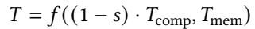

where ?? is the total execution time of all requests, and ??<sub>????????</sub> and ??<sub>??????</sub> denote the total execution time of compute-bound and memory-bound operations across all requests, respectively. Detailed calculations of them will be provided in §4; here, we focus on conveying the high-level formulation. ?? <sub>∈</sub> <sub>[</sub>0, 1<sub>]</sub> here represents prefix sharing ratio, which means ?? of the ??<sub>????????</sub> are saved, so the compute time will be reduced to <sub>(</sub>1 <sub>−</sub> ??<sub>)</sub> <sub>·</sub> ??<sub>comp</sub>. However, prefix cache hits do not reduce memory bandwidth usage, as the KV-cache still needs to be retrieved from memory. ?? is a function that depends on the scheduling policy and the request order. For example, for a policy that sequentially executes compute-bound and memory-bound operators (e.g., first-come-first-serve in [25, 73]), ?? will be ??????<sub>(·</sub>, <sub>·)</sub> since compute and memory resources are utilized sequentially.

To minimize the end-to-end execution time ?? to achieve optimal ??<sub>??</sub> , a perfect request scheduling is necessary to leave only the bottlenecked resource on the critical path while overlapping the other resources, namely ?? <sub>=</sub> ?????? <sub>(·</sub>, <sub>·)</sub>. At the same time, all shared prefixes should be cached by prefix sharing without incurring any redundant computation, achieving an optimal prefix ratio ??<sub>??</sub> which is determined by the workload prompts. In the rest of this paper, we will describe how BlendServe approaches ??<sub>??</sub> through its design.

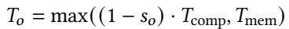

## 4 Performance Analysis

In this section, we formally define <sub>compute</sub> <sub>density</sub>, a metric that quantifies the ratio of compute and memory resource usages. This metric enables BlendServe to analyze diverse resource demands across requests and guides its scheduling to balance compute and memory usage for efective overlapping. Besides, compute density provides a practical method to approximate ??<sub>??</sub>.

## 4.1 Request-level compute density

We first define compute density at the request level and extend it to the batch level in §4.2. We define the compute density ?? <sub>(</sub>?? <sub>)</sub> of a request ?? as the total compute time of compute-intensive operators divided by the total time of memory-intensive operators, following the similar intuition of arithmetic intensity [59]:

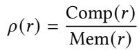

where a larger compute density ?? <sub>(</sub>??<sub>)</sub> indicates a request that requires more compute resources rather than memory bandwidth (i.e., compute-intensive). Note that the following formulations assume an unquantized data type, FP16, as well as GPU tensor core computation capability. One can easily adapt the data type and GPU capability by varying the constants in the formulas.

Next, to calculate ?? <sub>(</sub>?? <sub>)</sub>, we build a resource usage model for a request with input length ?? and output length ??. Input length of a request is known as the prompt length, and we will discuss how to estimate the output length in §5.1. Given a model of ??<sub>??????????</sub> parameters, ?? hidden dimension of model width, ??<sub>????</sub> feature dimension for each KV head, and ?? decoder layers, and a hardware configuration of <sub>compute</sub> peak FP16 GFlops and <sub>bandwidth</sub> GB/s memory bandwidth, the total time for compute-bound operators of a single request ?? can be approximated by total computation amount of GEMM operators and the self-attention in prefill phase divided by the hardware compute capability:

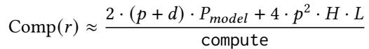

where <sub>(</sub>?? <sub>+</sub> ??<sub>)</sub> is the number of tokens processed by GEMM operators during the lifetime of ?? . Since parameters of GEMM (?????? generation + FFN) occupy most of the model parameters, the computation amount can be efectively approximated by the <sub>model\_size</sub>, ??<sub>??????????</sub> [76]. Since the attention consists of 2 GEMMs including ?? <sub>=</sub> ?? <sub>×</sub> ?? and ?? <sub>×</sub> ?? where each GEMM leads to 2 <sub>·</sub> ?? <sub>·</sub> ?? <sub>·</sub> ?? Flops, the total computation amount is then multipied with ?? layers, i.e., 4 <sub>·</sub> ??<sup>2</sup> <sub>·</sub> ?? <sub>·</sub> ??. The ?? comes from the quadratic computation of self-attention in the prefill phase. As ?? <sub>·</sub> ?? <sub>·</sub> ?? is typically much smaller than ??<sub>??????????</sub> on common workloads with ?? of a few hundred tokens (Figure 2), we omit 4 <sub>·</sub> ??<sup>2</sup> <sub>·</sub> ?? <sub>·</sub> ?? in the following deduction.

The total time for memory-bound operators can be approximated by counting the total memory loading of ?? times decoding attention during the auto-regressive generation:

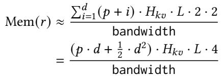

where <sub>Í</sub><sup>??</sup><sub>??=1 (</sub>?? <sub>+</sub> ??<sub>)</sub> calculates the total number of loaded tokens by self-attention during the ?? steps of the auto-regressive generation process, and 4 comes from key and value vectors stored in FP16 for each token.

## 4.2 Translating request-level metrics to batch-level

Ideally, a scheduling policy should reorder requests to form batches with perfectly balanced ??<sub>comp</sub> and ??<sub>mem</sub>. However, achieving this balance is dificult using only a <sub>request-level</sub> <sub>compute</sub> <sub>density</sub> metric, as requests in the same batch may reside in diferent inference steps that afect ??<sub>comp</sub> and ??<sub>mem</sub> diferently. For example, adding a memory-intensive request does not immediately lower a batch’s overall compute density, because the request will undergo a compute-intensive prefill phase first, only becoming memory-intensive later during its decode phase. Therefore, measuring only the compute density of individual requests is insuficient. Instead, Blend-Serve must consider each request’s compute intensity across its entire generation lifetime, requiring a <sub>holistic</sub> <sub>batch-level</sub> metric<sup>.</sup>

Fortunately, integrated with continuous batching [68], a batch typically consists of many requests in diferent steps, and request-level compute density essentially captures the average compute intensity over time, making it a good approximation for the compute density of a batch. Specifically, when the requests within the batch are evenly distributed at diferent steps, batch-level compute density will converge to request-level compute density for requests with input length of ?? and output length of ??. We demonstrate this following the same notations in § 4.1.

Denoting the total memory capacity of KV-cache as <sub>KV-Mem</sub>, we can calculate batch-level compute density with the total compute time and memory loading time. Since a batch typically consists of a large number of tokens, Comp<sub>(</sub>??<sub>)</sub> is dominated by GEMM computation, and Mem<sub>(</sub>??<sub>)</sub> is dominated by loading of KV-cache, compared to the small operators including layer normalization, activation, and position embedding. Therefore, we have:

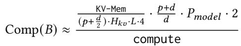

where the average length of KV-cache per request is ?? <sub>+</sub> <sup>??</sup><sub>2</sub> , and the number of decoding requests ??<sub>????????????</sub> is <sub>KV-Mem</sub> divided by <sub>(</sub>?? <sub>+ 2 )</sub> tokens. As each token takes ??<sub>???? ·</sub> ?? <sub>·</sub> 4 bytes, ??<sub>????????????</sub> can be calculated as KV-Mem . As chunked-<sub>(</sub>??<sub>+</sub> <sup>??</sup><sub>2 ) ·</sub>??<sub>???? ·</sub>??<sub>·</sub>4 prefill scheduling maintains a stable batch size, the number of average newly admitted requests should be equal to the average completed requests, which indicates that the ratio of prefill tokens with decode tokens is . Therefore, the prefill tokens can be calculated as ??<sub>???????????? ·</sub> <sup>??</sup><sub>??</sub> , leading to a total number of tokens as ??<sub>???????????? ·</sub> <sup>+</sup><sub>??</sub> . As discussed in § 4.1, each token contributes to a total amount compute of 2 <sub>·</sub> ??<sub>??????????</sub> , which concludes the <sub>Comp(</sub>??<sub>)</sub> by substitution.

The total loading time of KV-cache within a batch ?? is:


We show the equivalence of batch-level compute density ?? <sub>(</sub>??<sub>)</sub> and request-level compute density ?? <sub>(</sub>?? <sub>)</sub> with the following derivation:

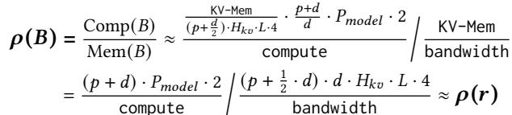

Such derivation of batch-level compute density can also be cross-validated with previous literature [76]. Therefore, BlendServe adopts request-level compute density as the key

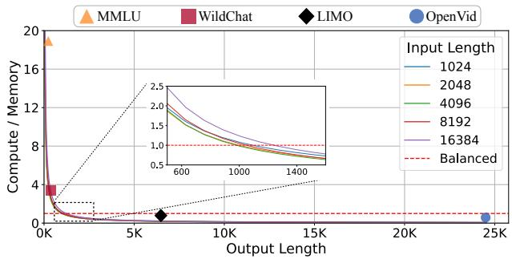

<sub>Figure</sub> <sub>4.</sub> Compute density of requests with diferent input/output lengths (Llama-3-8B on an A100 80GB GPU) varies drastically and leads to diverse resource demands.  
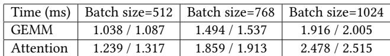  
<sub>Table</sub> <sub>1.</sub> Operator performance diferences for varying batch sizes with a sequence size of 1024 (estimated time / real execution time).

metric to make scheduling decisions and is still able to accurately control batch-level compute density for eficient resource overlapping.

## 4.3 Case study: ofline inference with Llama-3-70B

To visualize the drastic diferences in compute density across datasets and validate the accuracy of our performance model, we conducted a case study using Llama-3-8B on an A100 80GB GPU and requests with varying input length ?? and output length ??. As shown in Figure 4, compute density diminishes quickly for requests with longer output length, indicating their memory-intensive nature, as exemplified by OpenVid [36]. In contrast, requests from WildChat [70] and MMLU [19] typically have short output lengths and remain compute-intensive.

To further validate our performance model proposed in §4.1, we compare its estimated times against measured execution times in Table 1. The estimated times closely match actual execution times for both GEMM and attention kernels, with a maximum relative error of 6%.

## 5 BlendServe Design

<sub>Overview.</sub> Figure 5 shows the end-to-end workflow of Blend-Serve. Given a set of requests upfront with known prompts, BlendServe first constructs a prefix tree to capture the shared prefix among requests (➀, § 5.1). Next, BlendServe calculates compute density for each node, which involves estimating request output length by sampling over the prefix tree (➁, § 5.1). With compute density, requests are characterized as compute- or memory-intensive and sorted based on their resource usage, resulting in a sorted tree where most computeintensive requests are on the left and most memory-intensive requests are on the right (➂, § 5.2). Therefore, BlendServe can eficiently find a request order by sweeping the tree from left and right simultaneously. This order can balance compute-memory demand for resource overlapping and has high prefix sharing (➃, § 5.3). Finally, the ordered requests are batched and fed into a backend engine for inference. To support large-scale deployment with more GPUs, BlendServe integrates both data and tensor parallelism (§ 5.5).

## 5.1 Key data structure: resource-aware prefix tree

Determining the optimal scheduling order requires a proper abstraction that can capture both shared prefixes and resource demands of all requests. Inspired by the Trie Tree data structure in <sub>RadixAttention</sub> [73], BlendServe organizes all requests within a <sub>resource-aware</sub> <sub>prefix</sub> <sub>tree</sub>, where each leaf node represents an actual request and each internal node is a segment of the prefix shared by all its descendants. Therefore, a path from the root node to the leaf node represents the longest shared prefix of this request. By traversing this prefix tree in a DFS order, each internal node (i.e., shared prompt segment) is visited with the shortest reuse distance, which gives a request sequence that maximizes the prefix sharing ratio [73]. However, such naive DFS ordering neglects diverse resource demands across requests and misses the opportunity for resource overlapping.

To harmonize prefix sharing and resource overlap, we enhance the prefix tree with resource demand information for each node, making it a resource-aware prefix tree. Specif-<sup>ically,</sup> <sup>we</sup> <sup>compute</sup> <sup>the</sup> compute density for each node <sup>by</sup> considering its prefix sharing status, as defined below:

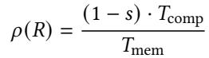

where ?? represents the set of requests in the node, and ?? denotes its prefix sharing ratio. For an internal node of the tree, the compute density is calculated over all requests within the sub-tree rooted at it. With this enhancement, the resourceaware prefix tree provides a <sub>unified</sub> <sub>abstraction</sub> that enables BlendServe to eficiently search for the optimal request order that harmonizes both prefix sharing and resource overlap.

<sub>Output</sub> <sub>length</sub> <sub>sampling.</sub> Request output length is necessary for calculating compute density as modeled in § 4.1, which is <sub>unknown</sub> beforehand because LLMs generate tokens in an auto-regressive manner. As a result, an estimation mechanism before actual inference is needed. Our observation here is that a request’s <sub>output</sub> <sub>length</sub> <sub>distribution</sub> is closely related to its <sub>prompt</sub> <sub>semantics</sub> and <sub>task</sub> <sub>type</sub> [6, 18, 49, 74]. For example, benchmark requests (e.g., MMLU [19], LongBench [9]) have an output length of only a few tokens [19], while chatbot (e.g., ShareGPT [40], WildChat [70]) generates an average of hundreds of tokens [12].

Such an observation unveils a unique opportunity in offline batch inference, where a batch of requests submitted by a user typically shares the same task type or shared prefixes. In the prefix tree, requests sharing similar prompts are naturally grouped under specific sub-trees. Therefore, these requests tend to have a similar distribution of output length. To estimate output length, BlendServe selects a subset of requests with a sampling probability ?? to undergo the full inference process and obtain their output length in the warmup phase. Each sub-tree uses the average output length of its sampled requests as an estimation for the left unsampled requests within the same sub-tree. If a sub-tree ??<sub>1</sub> is not sampled at all, it will use the average sampled output length of its sibling sub-tree ??<sub>2</sub> since ??<sub>1</sub> and ??<sub>2</sub> share the longest common prefix and tend to have a similar distribution of output length. This sampling process does not incur any <sub>extra</sub> <sub>overhead</sub> as sampled requests can be directly returned to the user without running inference again.

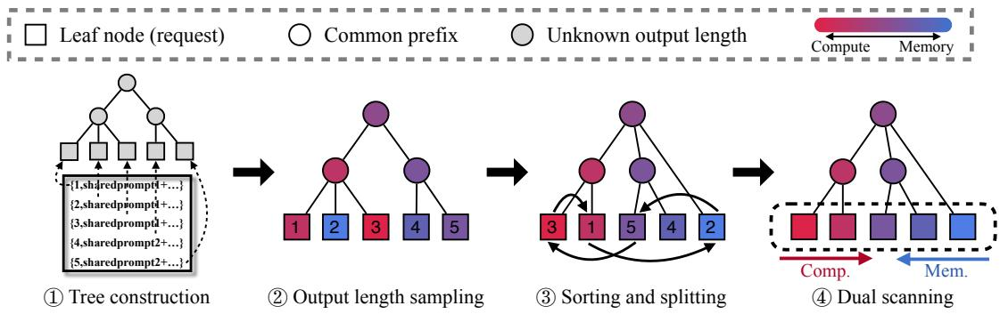  
<sub>Figure</sub> <sub>5.</sub> Overview of BlendServe’s design. Leaf nodes in the prefix tree are actual requests while others represent the shared prefix in prompts. The color of nodes represents the resource demand of all requests within the sub-tree, which is more compute-intensive in red and memory-intensive in blue. Given a set of requests, a one-time warm-up ahead of GPU running is performed, which consists of prefix tree construction, output length sampling, and transformation including tree sorting and node splitting (➀,➁, and ➂). Then the dual scanner forms the runtime batch from most compute- and memory-intensive nodes, which is consumed by the backend engine (➃). This warm-up is a short process and finishes quickly within the first 1% of time during the end-to-end inference generation.

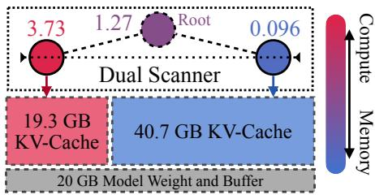  
<sub>Figure</sub> <sub>6.</sub> An example of BlendServe’s memory partition with 80GB memory. The left node has a compute density of 3.73, while the right node is memory-intensive with a compute density of 0.096. The dual scanner will reserve 20GB for model weights and temporary bufers, then partition the rest 60GB to reach the root density of 1.27. Given the compute densities, the memory is partitioned into 19.3 and 40.7GB , where 3.73 <sub>×</sub> 19.3 <sub>+</sub> 0.096 <sub>×</sub> 40.7 <sub>=</sub> 1.27 <sub>×</sub> 60.

## 5.2 Resource-aware prefix tree sorting

Next, BlendServe performs a layer-wise sorting of nodes based on their compute density, which only reorders nodes sharing the same ancestor and depth (detailed algorithm in § A.1). Therefore, this sorting maintains the hierarchical structure of the prefix tree. After sorting, the tree exhibits a global pattern with compute-intensive nodes on the left and memory-intensive nodes on the right. However, local outliers that deviate from this trend may still exist. For instance, in the first tree of Figure 5, request #2, which has low compute density, should be separated from requests #1 and #3 and repositioned to the right.

To address this issue, BlendServe introduces a conditional node splitting technique to relocate outliers to desired positions (detailed algorithm in § A.1). The node that is split from the original node will be inserted at the root when there is no shared prefix at the desired position, potentially incurring prefix recomputation costs during inference. Additionally, the compute density of the original node, the split node, and the new parent need to be updated accordingly. Take Figure 5 3 as an example, request #2 is moved from the leftmost to the rightmost position, requiring its prefix to be recomputed. This technique applies a heuristic threshold ??: if the recomputation overhead for relocation falls below ??, the node is repositioned to preserve the descending order of compute density. This approach enables a controlled trade-of, sacrificing a small degree of prefix sharing to better order requests with their resource demands for BlendServe’s request scheduling. In practice, we found BlendServe’s performance is insensitive to ?? for real-world workloads (discussed shortly in § 5.4) and BlendServe works generally well when we set it to preserve 99% of prefix sharing ratio.

## 5.3 Request order search: heuristic dual scanning

Finally, BlendServe derives a request order for batching, with the aim of achieving both high prefix sharing ratio and resource overlap across inference iterations.

Searching for an optimal request order is NP-hard. For each scheduling step, the search problem can be reduced to a knapsack problem [10] where requests with diferent

KV cache sizes (cost) and compute density values (value) are selected to fill the GPU memory for the targeted density score. Furthermore, since requests undergo multi-step decoding in auto-regressive inference, scheduling in diferent steps is dependent, further complicating the problem. Given the large number of requests and scheduling steps, finding the optimal solution in a reasonable time is infeasible.

To solve this problem in a reasonable time, BlendServe employs a <sub>heuristic-based</sub> algorithm that scans the leaf nodes of the prefix tree concurrently from left to right and right to left, progressively adding requests to the on-the-fly batch during this process. By controlling the ratio of the number of requests admitted from these two ends, an arbitrary and stable compute density can be achieved, thus improving the resource balance. To determine how many requests should be selected from the current compute-intensive node ??<sub>??</sub> and memory-intensive node ??<sub>??</sub>, BlendServe first calculates the desired memory capacity for each side and then adds requests to saturate the assigned memory. BlendServe logically partitions the GPU memory ?? into two parts ??<sub>??</sub> and ??<sub>??</sub>, where the partition sizes ??<sub>??</sub> and ??<sub>??</sub> are dynamically calculated by the following theoretical constraints:

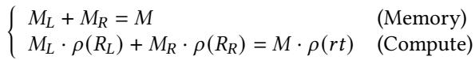

These two equations represent the memory and compute demands, respectively. Here, ?? is a constant denoting GPU memory size. ?? <sub>(</sub>????<sub>)</sub> is the compute density of the tree root node, which remains as a constant for the current request set. Similarly, ?? <sub>(</sub>??<sub>??)</sub> and ?? <sub>(</sub>??<sub>??)</sub> are the compute densities of the compute- and memory-intensive nodes, which are also constants when the scanner reaches a specific node. Given these constants, the first equation limits the total memory allocation to the available GPU memory, while the second equation constrains the total compute to match the target density ?? <sub>(</sub>???? <sub>)</sub>. Together, these two constraints achieve ?? <sub>(</sub>???? <sub>)</sub> by combining requests with densities ?? <sub>(</sub>??<sub>??)</sub> and ?? <sub>(</sub>??<sub>??)</sub>. Thus, ??<sub>??</sub> and ??<sub>??</sub> can be derived from these two equations. We illustrate one practical example in Figure 6.

Given an assigned memory size, BlendServe can calculate the desired on-the-fly batch size and construct the batch by selecting requests from ?? <sub>(</sub>??<sub>??)</sub> and ?? <sub>(</sub>??<sub>??)</sub> accordingly, ensuring that they can be placed into ??<sub>??</sub> and ??<sub>??</sub> respectively. This memory partition ensures that the compute density of the blended compute- and memory-intensive requests approximates ?? <sub>(</sub>????<sub>)</sub>, allowing the memory access time to be fully overlapped with the compute time (when ?? <sub>(</sub>????<sub>)</sub> > 1). Moreover, this strategy also ensures high prefix sharing ratio, as the dual scanning method essentially traverses the prefix tree in DFS order from both sides. We include the detailed algorithm of dual scanning in § A.1 (Algorithm 3).

## 5.4 Robustness analysis

Handling inaccurate output length estimation. <sup>Notably,</sup> predicting output length may not always be accurate due to the dynamic nature of decoding, except for image- or videogeneration, where output length is inherently predefined by the preset quality and frame parameters [28, 32]. Fortunately, BlendServe does not require precise output length predictions due to the following reasons. First, a rough estimation suficient to distinguish request types (e.g., benchmark v.s. conversational tasks) is adequate for BlendServe. This is because BlendServe processes hundreds of requests in a single batch to overlap compute and memory, minor estimation deviations within the same request type have negligible impact on overall batch performance. To verify this, we only sampled 1% of the total requests for output length sampling and found that BlendServe can achieve comparable end-to-end performance to a sampling probability of 100%. In addition, BlendServe can online adaptively adjust the batch to mitigate the impact of miss-estimations. If a request finishes much earlier due to an overestimated output length, BlendServe will insert additional requests. Conversely, if output length is severely underestimated, BlendServe could relocate the request from ??<sub>??</sub> into ??<sub>??</sub>.

Stopping conditions and convergence. <sup>The</sup> <sup>algorithm</sup> iteratively performs “layer-wise sort <sub>→</sub> conditional node split <sub>→</sub> (re)sort” until one of the following holds: (C1) the leaf sequence ordered by compute density becomes nonincreasing, or (C2) for every leaf, the split cost exceeds the threshold ??. Therefore, termination is guaranteed: after each split, the produced leaf is reinserted as a direct child of the root. In the worst case, every original leaf is split once and moved under the root; a single layer-wise sort at the root then yields a globally monotone order, satisfying (C1). Since the number of original leaves is finite, each leaf can be split at most once, so the total number of splits is <sub>≤</sub> ??<sub>leaf</sub> and the number of (re)sorts is <sub>≤</sub> ??<sub>leaf +</sub> 1. Empirically, due to the threshold ??, only about 0.1% to 1% of leaves require splitting. By tuning ?? we obtain a controllable performance bound.

Performance robustness of tree sorting. <sup>Since</sup> <sup>the</sup> <sup>op-</sup> timal ordering for prefix sharing and resource overlapping can sometimes conflict, our tree sorting and node-splitting algorithm may perform diferently depending on workload characteristics. However, real-world workloads typically expose low variance in request compute density within each dataset, thus delivering near-optimal performance.

## 5.5 Distributed deployment

<sup>BlendServe</sup> <sup>supports</sup> data parallelism <sup>and</sup> tensor parallelism for eficient scaling across diferent number of GPUs.

<sub>Data</sub> <sub>parallelism.</sub> Data parallelism (DP) extends computational capacity by distributing identical model replicas across hardware clusters, each performing computations on distinct subsets of data with identical control flows. To implement

DP efectively, BlendServe first constructs the centralized resource-aware prefix tree with the entire request pool, and then decomposes it into <sub>parallelized</sub> <sub>subtrees</sub> assigned to diferent DP ranks. Such decomposition ensures balanced workloads and resource usage across partitions. BlendServe reuses the dual-scanner design to form request partitions as subtrees. Once a subtree reaches the target workload, BlendServe finalizes it and starts a new one. This approach incurs only marginal prefix sharing overhead due to tree partitioning—one path from the tree root to the leaf cannot be shared across DP replicas, but the impact is negligible.

<sub>Tensor</sub> <sub>Parallelism.</sub> Tensor parallelism (TP) partitions model parameters across multiple GPUs, addressing scenarios where a single GPU cannot accommodate the entire large model [44]. Prior research has shown that the network communication overhead incurred by TP can be efectively overlapped through specialized pipeline strategies [11, 76]. BlendServe is compatible with these designs, so it can seamlessly integrate TP with minimal performance degradation.

## 6 Implementation and Evaluation

## 6.1 Implementation

We developed the resource-aware prefix tree based on SGLang [73] and enhanced it with node sorting and splitting driven by compute density. Our scheduler is implemented based on NanoFlow [76], which incorporates chunked prefill and continuous batching to improve system performance [1, 68]. Our backend engine is built in C++ following NanoFlow’s operator-level overlapping. It enables the simultaneous execution of compute-intensive operators like GEMM and memory-intensive operators like self-attention. We include more implementation details in § A.2.

## 6.2 Experiment setup

<sub>Workload</sub> <sub>synthesizing.</sub> To the best of our knowledge, there is no open-sourced trace available for ofline batch inference. Therefore, we synthesize our workloads by combining existing well-known single-modal traces, including two chatbot traces WildChat [70], ShareGPT [40], and two API services traces Azure-Trace [49], BurstGPT [56], one video generation trace OpenVid [36] , and one benchmark MMLU [19]. Figure 2 illustrates the length distribution and compute density of each trace. These single-modal traces have diferent representative characteristics: BurstGPT and Azure-Trace requests are highly compute-intensive, OpenVid requests are memory-intensive, while WildChat, ShareGPT have a mild compute density. Besides, MMLU requests have high prefix sharing. We synthesize a variety of multi-modal workloads with diferent prefix sharing ratio and compute density by combining diferent ratios of traces, based on which we demonstrate the efectiveness and generality of <sub>Table</sub> <sub>2.</sub> Four representative synthesized workloads. Trace#X (A,B%) has a compute density of A, with a prefix sharing ratio of B%. For example, Trace#1 is compute-intensive with high prefix sharing, which has a compute density of 1.4 larger than 1 and a prefix sharing ratio of 35%. Note that 35% is a high prefix sharing ratio as most workloads have less than 20% as shown in Table 4. Without losing genericity, Figure 11 shows more trace combinations and reports BlendServe’s performance on them.

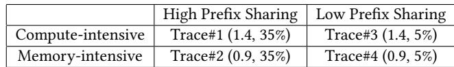

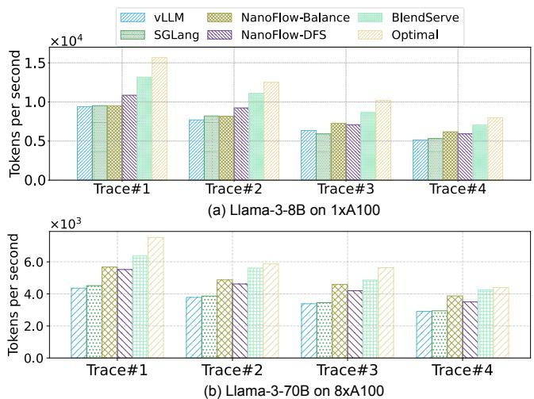  
<sub>Figure</sub> <sub>7.</sub> End-to-end throughput evaluation. BlendServe consistently outperforms baselines. For Llama-3-8B, BlendServe achieves an average speedup of 20.84% compared to the best baseline, NanoFlow-DFS. For Llama-3-70B, BlendServe provides an average improvement of 18.6% over NanoFlow-DFS. Notably, BlendServe achieves 86.55% of optimal throughput on average.

proposed BlendServe. Detailed methodology of synthetic workloads is described in Appendix § A.3.

Table 2 shows the four most representative workloads we mainly use in evaluation, which have diferent resource demands and prefix sharing ratios. Each synthesized workload is made from BurstGPT, MMLU, and OpenVid and contains at least 400, 000 requests, which require 5 A100 GPU hours and are large enough to reach a stable performance. Evaluation results on more ratios are presented in § 6.5. We also present results with other combinations of traces in § A.4. Models and hardware configurations. <sup>We</sup> <sup>evaluate</sup> <sup>Blend-</sup> Serve mainly with two widely-used open-sourced models, Llama-3.1-8B and Llama-3.1-70B [34], on 1 and 8 A100 80GB SXM GPUs, respectively. To demonstrate the generality and robustness of BlendServe, we also evaluate models of diferent sizes with various numbers of GPUs, including Qwen-2.5-7B [8] and Llama-2-7B [53] on 1<sub>×</sub>A100, as well as Qwen-2.5-72B and DeepSeek-67B [16] on 8<sub>×</sub>A100. Due to the GPU resource limit, we conduct these experiments with a cycleaccurate simulator as discussed in § 6.5. For the distributed setting, we enable tensor parallelism with the degree of 8 GPUs for all baselines.

<sub>Baseline</sub> <sub>frameworks.</sub> We use two widely used frameworks, vLLM [25] and SGLang [73], and a throughput-oriented framework, NanoFlow [76] . We also include a latency SLOoptimized framework, DistServe [75], to compare P/D disaggregation in ofline inference settings as detailed in § 6.3. We do not evaluate frameworks that are designed for resourceconstrained settings, e.g., FlexGen [42] and HeteGen [71]. For vLLM and SGLang, we enable prefix caching for both and reorder each workload trace into a DFS order, which can achieve a high prefix sharing ratio. For NanoFlow, we add prefix caching support for fair comparison. For each workload trace, we evaluate the performance of NanoFlow using both DFS (NanoFlow-DFS) and random ordering (NanoFlow-Balance). The improvement of BlendServe over NanoFlow-DFS demonstrates the advantage of achieving resource bal ance, while the improvement over NanoFlow-Balance would highlight the benefit of a higher prefix sharing ratio as random ordering can achieve a relatively balanced resource. Note that all baselines integrate <sub>continuous</sub> <sub>batching</sub> which performs scheduling at request-level granularity, with the only diference being the ordering of requests. As BlendServe focuses on improving GPU utilization, we do not measure CPU time to provide a fair comparison, including tokenizations, sampling, and scheduling [48], for all baselines. We discuss the CPU overhead in § A.5.

Practical optimal throughput. <sup>To</sup> <sup>assess</sup> <sup>how</sup> <sup>closely</sup> <sup>Blend-</sup> Serve’s throughput approaches the optimal, we calculate optimal throughput with ??<sub>??</sub> defined in § 3.3. Due to the well-known performance interference issue in GPU hardware during spatial sharing [50, 76], simply deriving ??<sub>??</sub> with max<sub>(</sub>??<sub>????????</sub>,??<sub>??????)</sub> is impractical and unachievable. Therefore, to estimate a <sub>practical</sub> <sub>upperbound</sub>, we employ a profilingbased approach similar to prior works [14, 76]. Specifically, instead of directly using max<sub>(</sub>??<sub>????????</sub>,??<sub>??????)</sub> as the execution time, we profile the real execution time when overlapping GEMM with ??<sub>????????</sub> and attention with ??<sub>??????</sub>, which is then used to calculate the practical upperbound of ??<sub>??</sub>.

## 6.3 End-to-end throughput

Compared to existing frameworks. <sup>We</sup> <sup>measure</sup> <sup>the</sup> <sup>end-</sup> to-end throughput of BlendServe and all baselines, including vLLM-DFS, SGLang-DFS, NanoFlow-Balance, and NanoFlow-DFS. We define end-to-end throughput as all processed tokens (including both input and output tokens) divided by the total processing time. For Llama-3-8B as shown in Figure 7 (a), with a small prefix sharing ratio (i.e., Trace#3 and #4), NanoFlow-Balance works better than NanoFlow-DFS since resource overlapping contributes to more throughput gain. However, with a large prefix sharing ratio, NanoFlow-DFS achieves the highest throughput among all three baseline engines thanks to the high prefix sharing ratio and its operatorlevel resource overlapping. Since BlendServe is designed to leverage the best of both, it consistently outperforms the best baseline, NanoFlow-DFS, in all settings from 19.34% to 22.65%. Compared with vLLM-DFS, BlendServe achieves up to 1.44<sub>×</sub> throughput speedup. For Llama-3-70B in Figure 7 (b), BlendServe provides an average of 18.6% throughput improvement compared to NanoFlow-DFS, achieving 90.8% of practical optimal throughput. Note that NanoFlow provides higher throughput gain over vLLM compared to Llama-3-8B, due to the benefit of overlapping expensive communication operators with computation.

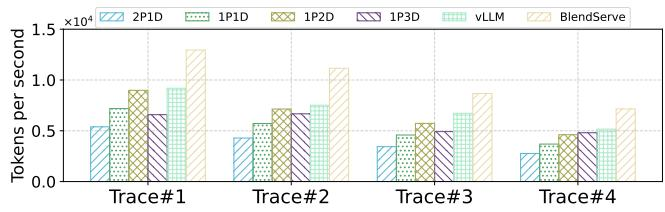  
<sub>Figure</sub> <sub>8.</sub> End-to-end throughput (per GPU) evaluation when serving Llama-3-8B on 1<sub>×</sub>A100 GPU. BlendServe consistently outperforms baselines, including vLLM and P/D disaggregation. DistServe is less eficient when given more prefill clusters (e.g., 2P1D v.s. 1P2D) as selected workloads have more decode tokens.

Compared to practical optimal throughput. <sup>As</sup> <sup>shown</sup> <sup>in</sup> Figure 7, BlendServe achieves an average 86.55% and 90.8% of the optimal one on Llama-3-8B/70B, respectively. As there is a gap between the heuristic-based dual-scanner and the optimal scheduling, it is non-practical to achieve the optimal throughput which requires perfect resource overlapping on each step. Nevertheless, BlendServe still closes this gap to as low as 13%, demonstrating its efectiveness in achieving both high prefix sharing ratio and high resource balance.

Compared to P/D disaggregation. <sup>We</sup> <sup>compare</sup> <sup>Blend-</sup> Serve with one popular design of P/D disaggregation, Dist-Serve [75], and cover several configurations including 1P1D, 1P2D, 2P1D, and 1P3D. Our implementation is based on SGLang where xPyD means x A100 GPUs are used as prefill clusters and y GPUs are used as decode clusters. We collect the average per-GPU throughput when serving Llama-3-8B on A100 GPUs to provide a fair comparison, following the same workload and setup in § 6.2. As shown in Figure 8, DistServe falls short on matching the throughput of vLLM under all configurations, which colocates prefill and decode. Despite being superior in latency-oriented settings where TTFT and TPOT could benefit from the disaggregated scaling and execution of prefill and decode, DistServe causes resource under-utilization due to the distinct resource usages of prefill and decode. Specifically, the memory bandwidth resources on prefill clusters are under-utilized by the compute-intensive prefill phases, and vice versa for compute resources in decode clusters.

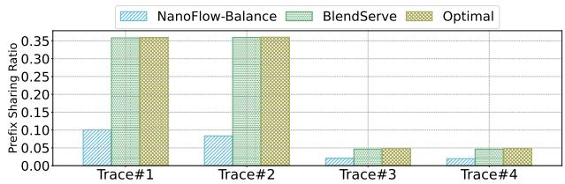

<sub>Figure</sub> <sub>9.</sub> Prefix sharing ratio of four representative traces in the end-to-end evaluation. Note that the optimal value is measured via a DFS order of the prefix tree. BlendServe consistently maintains the benefit of prefix sharing, achieving 97% of maximal values.  
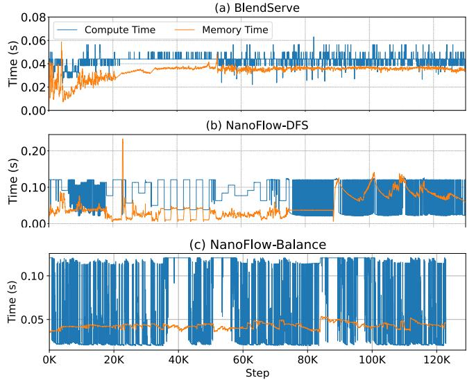  
<sub>Figure</sub> <sub>10.</sub> Compute and memory usages when serving Trace#2. BlendServe well balances compute and memory time across steps and achieves consistently high resource utilization, whereas NanoFlow-DFS sufers from fluctuating compute and memory time and under-utilizes at least one type of resource at each step.

## 6.4 Performance analysis

We now ablate the key factors contributing to BlendServe’s performance improvement by showing prefix sharing ratio and hardware resource usage over time, corresponding to the two key design points introduced in § 3.3.

<sub>Prefix</sub> <sub>sharing</sub> <sub>ratio.</sub> To illustrate that BlendServe can achieve nearly optimal prefix sharing ratio, we collect the achieved prefix sharing ratio along with the maximal values. We manually exclude prefix sharing related to the recomputation of retracted requests. As shown in Figure 9, BlendServe achieves over 97% of the optimal prefix sharing ratio. In contrast, as the NanoFlow-Balance uses random ordering to interleave distinct requests without shared prefix locality, it fails below 30% of prefix sharing ratio. As a result, Blend-Serve provides an average of 1.36<sub>×</sub> throughput improvement compared to NanoFlow-Balance with Trace#1 and #2.

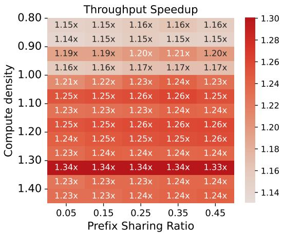  
Figure 11. Simulated throughput <sup>improvement</sup> <sup>of</sup> <sup>BlendServe</sup> <sup>com-</sup> pared to NanoFlow-DFS on workloads synthesized from BurstGPT, MMLU, and OpenVid. We use diferent numbers of requests from these traces to compose workloads with diferent compute density and prefix sharing ratio. BlendServe consistently surpasses baselines, with an average of 1.23<sub>×</sub> throughput improvement.

<sub>Hardware</sub> <sub>resource</sub> <sub>usage.</sub> To demonstrate how efectively BlendServe balances resource usage, we visualize the compute and memory usage of BlendServe, NanoFlow-DFS, and NanoFlow-Balance in Figure 10. We select Trace#2, which has intensive memory usage and significant resource imbalance. For each step, we collect the execution time of computeand memory-bound operators. BlendServe maintains stable compute and memory usage, whereas NanoFlow-DFS exhibits significant fluctuations, resulting in resource underutilization. For example, NanoFlow-DFS first under-utilizes memory bandwidth before 90?? steps, then conducts excessive memory access. At the same time, NanoFlow-Balance achieves stable memory usage close to BlendServe. However, due to the massive recomputation and steep request length distribution, it still exhibits fluctuations in computation.

## 6.5 Sensitivity study

To demonstrate the generality of BlendServe in real-world scenarios, we evaluate on more diverse synthetic workloads, with a large range of compute density and prefix sharing ratio. In addition to the four most representative workloads shown in Table 2, we conduct a grid search of compute density from 0.80 to 1.40 and prefix sharing ratio from 0.05 to 0.45 with step sizes 0.05 and 0.10, respectively. In total, we synthesize 65 workloads to compare BlendServe and the best-performed baseline NanoFlow-DFS. Due to limited GPU resources, we use the frontend scheduler of BlendServe to generate actual batch schedules that are the same as running on real GPUs, which are then fed into a <sub>simulated</sub> <sub>GPU</sub> <sub>backend</sub> to get the estimated inference time. For the backend simulation, we use polynomial fit to estimate the GPU runtime when given a certain amount of compute and memory usage. Our calibration shows only a 0.91% diference between the real and simulation speedup over the four representative workloads on average. Therefore, our simulation results practically reflect real performance.

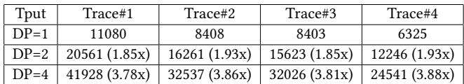  
<sub>Table</sub> <sub>3.</sub> <sub>Throughput</sub> <sub>scalability</sub> of BlendServe when serving Llama-3-8B with diferent DP sizes. BlendServe perfectly partitions requests among DP workers and scales near linearly.

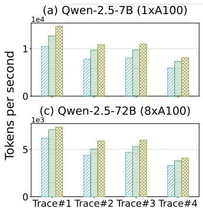

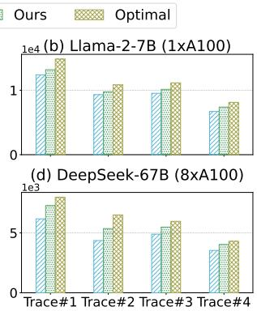  
Figure 12. Simulated throughput of BlendServe on diferent models with diferent number of GPUs. BlendServe consistently surpasses the best baseline, NanoFlow-DFS, with up to 24.4% improvement over 4 selected traces and models.

As shown in Figure 11, BlendServe consistently outperforms the baseline in all workloads by 14% to 34%, with an average speedup of 22.53%. Since both BlendServe and NanoFlow-DFS achieve near-optimal prefix sharing ratio, the inference throughput remains stable when prefix sharing ratio varies. However, the benefits BlendServe gains from resource overlapping tend to shrink with smaller compute densitys, potentially due to more severe GPU interference on memory-intensive workloads. Additionally, the relative speedup achieves its maximum of 1.34<sub>×</sub> when compute density is around 1.30, potentially because resource overlapping and GPU interference strike a balance under this ratio.

## 6.6 Distributed deployment and other LLMs

In this section, we evaluate BlendServe’s efectiveness and scalability in a distributed setting with data parallelism (DP). In addition, we evaluate BlendServe on four other models, including Qwen-2.5-7B, Llama-2-7B, Qwen-2.5-72B, and DeepSeek-67B, to show its general applicability.

<sub>Data</sub> <sub>parallelism.</sub> We evaluate the strong scalability of BlendServe with various numbers of DP nodes by serving Llama-3-8B on A100 GPUs, following the design in § 5.5 and the same workload setup in Table 2. As shown in Table 3, throughput increases linearly with the number of DP nodes. <sub>Other</sub> <sub>LLMs.</sub> We also evaluate BlendServe when serving Qwen-2.5-7B and Llama-2-7B on 1<sub>×</sub> A100 GPU, as well as Qwen-2.5-72B and DeepSeek-67B on 8<sub>×</sub> A100 GPUs as shown in Figure 12. We redo the trace synthesis with the same recipe in § 6.2, as diferent models indicate diferent compute density. Note that due to the GPU resource limit, we use the <sub>profile-guided</sub> <sub>simulation</sub> as detailed in § 6.5 for this evaluation. Similarly, BlendServe improves throughput by an average of 15.2% compared to NanoFlow-DFS and achieves 89.9% of practical optimal throughput on average.

## 7 Discussion

<sub>Distributed</sub> <sub>parallelisms.</sub> BlendServe’s design is generic to various parallelisms in distributed inference. We have discussed data parallelism (DP) and tensor parallelism (TP) in § 5.5, and demonstrate its efectiveness in the evaluation. In addition, BlendServe is compatible with various other parallelisms, including pipeline parallelism (PP), sequence parallelism (SP), and context parallelism (CP). For PP, as diferent pipeline stages will process identical batches sequentially while keeping each stage the same, BlendServe’s scheduling can be directly adopted without modification. For SP [21] and CP [29], as attention and non-attention computation are sharded across SP/CP ranks, both the compute capability and memory bandwidth are scaled accordingly. Therefore, BlendServe is extended to SP/CP by including the scaled resources in the compute density calculation.

<sub>Attention</sub> <sub>variants.</sub> BlendServe is generic to attention variants, including MHA, MQA, GQA [2], and recently released MLA [16] and GLA [69], by considering the arithmetic intensity of the attention operator during compute density calculation. Specifically, BlendServe considers diferent variants by adapting the memory cost model <sub>Mem(</sub>??<sub>)</sub> (§ 4.1) towards the real execution time. We have included Llama-2-7B with MHA, Qwen-2.5-7B with GQA (of group size 7), and Llama-3-8B with GQA (of group size 4) in our evaluation.

<sub>End-to-end</sub> <sub>latency.</sub> Given the same set of requests, Blend-Serve has the lowest worst turnaround latency across requests because it has the highest throughput compared to existing frameworks. Furthermore, BlendServe can ensure the latency requirement of ofline batch inference by only blending requests within a specified time window. For example, BlendServe processes the previous X-hour request pool while queuing the next X-hour requests, moving to the subsequent X-hour window after completing the current one.

## 8 Related Work

LLM serving optimizations. <sup>Eficient</sup> <sup>LLM</sup> <sup>serving</sup> <sup>has</sup> been extensively studied for both online and ofline scenarios. For online inference, Orca [68], vLLM [25], SGLang [73],

FastServe [60], and VTC [41] propose continuous batching, paged attention, prefix sharing, prefill-decode disaggregation, Multi-Level Feedback Queue scheduling, and Virtual Token Counter scheduling, respectively, to improve performance and/or fairness. For ofline inference, FlexGen [42], PowerInfer [46], TwinPilots [67], HeteGen [71], Fiddler [24], and NEO [22] target <sub>resource-constrained</sub> settings where GPU memory is insuficient. These methods extensively leverage CPUs to ofload model weights, activations, KV-cache, and computation. However, due to limited GPU/CPU interconnect bandwidth, ofloading introduces significant GPU underutilization, leading to low throughput. Unlike these approaches, BlendServe focuses on throughput-oriented ofline inference with resource-aware batching.

Resource overlapping techniques. <sup>Resource</sup> <sup>overlapping</sup> is a trendy approach to improve GPU utilization. Rammer [33] introduces operator-level overlapping for deep neural network compilers. NanoFlow [76] extends operator-level overlapping to LLM serving. Sarathi-Serve [1] and FastGen [20] apply phase-level overlapping to LLM serving. MuxServe [17] colocates models based on their popularity and resource characteristics, targeting resource-limited scenarios. Compared to them, BlendServe is the first to exploit request-level resource overlapping with request reordering.

## 9 Conclusion

We present BlendServe, an ofline batch inference system that maximizes both compute-memory overlapping and prefix sharing for near-optimal throughput. BlendServe exploits the relaxed latency objective in ofline batch inference and reorders compute- and memory-intensive requests through a resource-aware prefix tree and a dual scanner searching algorithm. BlendServe achieves up to 1.44<sub>×</sub> higher throughput over vLLM and SGLang and 90% of the optimal throughput.

## A Appendix

A.1 Pseudoscope for node sort, split, and dual scan

<sub>Algorithm</sub> <sub>1</sub> Layer-wise Sorting   
1: <sub>function</sub> layer\_sort(??????)   
2: <sub>if</sub> ?????? is not leaf node <sub>then</sub>   
3: <sub>sort</sub> ?????? .??ℎ?????????????? based on compute density   
4: <sub>for</sub> ???????? <sub>∈</sub> ?????? .??ℎ?????????????? <sub>do</sub>   
5: layer\_sort(???????? )

## A.2 Implementation details

We introduce additional noteworthy details of our implementation in BlendServe here.

<sub>Ofline</sub> <sub>prefix</sub> <sub>tree.</sub> We preprocess all requests and construct a prefix tree following a Trie Tree to capture their shared prefixes before serving. After compute density calculation and node sorting, we merge sub-trees into single nodes if doing so does not hurt the prefix sharing ratio. This merging reduces fragmentation which would cause fluctuation during the dual scanner process.

<sub>Algorithm</sub> <sub>2</sub> Node Splitting   
1: <sub>Initialize</sub> ?????? ?? \_???????? <sub>←</sub> <sub>{</sub> <sub>}</sub>   
2: <sub>function</sub> node\_split(??????, ??)   
3: ?????? .??????<sub>??????</sub> <sub>??</sub> <sub>???? ←</sub> length of prefix to ??????   
4: <sub>if</sub> ?????? .??????<sub>??????</sub> <sub>??</sub> <sub>???? ·</sub> len<sub>(</sub>?????? .??ℎ?????????????? <sub>)</sub> > ?? <sub>then</sub>   
5: ?????? .??????<sub>??????</sub> <sub>??</sub> <sub>???? ←</sub> ?????? .??????<sub>??????</sub> <sub>??</sub> <sub>???? −</sub> ?????? .??????   
6: update\_subtree\_density(??????)   
7: <sub>append</sub> ?????? <sub>to</sub> ?????? ?? \_????????   
8: else   
9: <sub>for</sub> ???????? <sub>∈</sub> ?????? .??ℎ?????????????? <sub>do</sub>   
10: node\_split(????????, <sub>len(??????</sub> <sub>.??ℎ?????????????? )</sub> )   
11: <sub>if</sub> ?????? is root node <sub>then</sub>   
12: <sub>sort</sub> ?????? ?? \_???????? based on compute density

Algorithm 3 <sup>Dual</sup> <sup>Scan</sup>   
1: <sub>function</sub> dual\_scan(?? <sub>(</sub>???? <sub>)</sub>, ?? <sub>(</sub>??<sub>)</sub>, ?? <sub>(</sub>??<sub>)</sub>, ??)   
2: <sub>Input:</sub> compute density of root ?? <sub>(</sub>???? <sub>)</sub>, left child ?? <sub>(</sub>??<sub>)</sub>, and right   
child ?? <sub>(</sub>??<sub>)</sub>; total available GPU memory ??   
3: <sub>Output:</sub> chunked prefill budgets for the left child ??<sub>??</sub>, and right   
child ??<sub>??</sub> (in terms of tokens)   
# Step 1: partition memory ?? according to the compute density   
4: ??<sub>?? ←</sub> ?? <sub>·</sub> ?? <sub>(</sub>???? <sub>)</sub> <sub>−</sub> ?? <sub>(</sub>??<sub>)</sub>   
?? <sub>(</sub>??<sub>)</sub> <sub>−</sub> ?? <sub>(</sub>??<sub>)</sub>   
?? <sub>(</sub>??<sub>)</sub> <sub>−</sub> ?? <sub>(</sub>???? <sub>)</sub>   
5: ??<sub>?? ←</sub> ?? <sub>·</sub>   
?? <sub>(</sub>??<sub>)</sub> <sub>−</sub> ?? <sub>(</sub>??<sub>)</sub>   
# Step 2: calculate the chunked prefill budget according to the   
# estimated input length ??<sub>??</sub> and output length ??<sub>??</sub>   
??<sub>??</sub>   
6: ??<sub>?? ←</sub> # number of decode requests   
<sub>(</sub>??<sub>?? +</sub> ??<sub>??/</sub>2<sub>)</sub> <sub>·</sub> ??<sub>???? ·</sub> ?? <sub>·</sub> 4   
??<sub>??</sub>   
7: ??<sub>?? ←</sub> ??<sub>??</sub> # scale into prefill token budget   
??<sub>??</sub>   
# Step 3: calculate the chunked prefill budget of the right child   
8: ??<sub>?? ←</sub> ??<sub>??</sub>   
<sub>(</sub>??<sub>?? +</sub> ??<sub>??/</sub>2<sub>)</sub> <sub>·</sub> ??<sub>???? ·</sub> ?? <sub>·</sub> 4   
9: ??<sub>?? ←</sub> ??<sub>??</sub> ??<sub>??</sub>   
??<sub>??</sub>   
10: <sub>return (</sub>??<sub>??</sub>, ??<sub>?? )</sub> # determines number of requests that are admitted

<sub>Runtime</sub> <sub>prefix</sub> <sub>tree.</sub> The runtime prefix tree in BlendServe is implemented based on SGLang [73]. It manages runtime information related to prefix sharing, including a dynamic Trie Tree and a mapping between the physical memory and key-value tokens. We also employ intra-batch prefix sharing, enabling exactly-once computation of shared prefixes for a single batch, which is particularly beneficial for ofline processing using a DFS order.

<sub>Batch</sub> <sub>scheduler.</sub> The batch scheduler within the dual scanner is implemented following NanoFlow [76]. It strictly enforces batch sizes in multiples of 128 to ensure higher hardware utilization. We also incorporate chunked prefill and continuous batching following state-of-the-art serving systems [1, 68].

<sub>Backend</sub> <sub>engine.</sub> Our backend engine is built in C++ following NanoFlow’s operator-level overlapping approach, which enables simultaneous execution of compute-intensive operators like GEMM and memory-intensive operators like self-attention [76]. Based on the operator-level overlapping, BlendServe overlaps operators from requests with distinct resource usages.

## A.3 Methodolody of workload synthesize

To synthesize workloads that reflect real use cases, we collect a variety of open-source inference traces that have distinct characterization, including compute density, prefix sharing ratio, and modalities. We illustrate their length distribution in Figure 2. For each set of traces, we add a unique system prompt ahead of prompts as it is not collected. For traces without detailed prompt content, we randomize their prompts’ token ids corresponding to their prompt length. For video generation requests, we use OpenVid [36] and treat the videos in training datasets as their auto-regressive generation output. For each video, we collect its output length by counting the number of frames and multiplying it by 256, which represents the number of tokens per frame observed in normal videos [28, 63]. Additionally, we normalize the average output length of OpenVid to 16K as the original 45K is too large for evaluation of Llama-3.1-8B on a single A100 GPU. We also normalize the average output length of WildChat [70] to 256 for a more compute-intensive workload while maintaining the length variance. We calculate the resource characterization in Table 4.

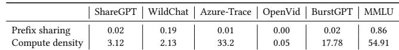  
<sub>Table</sub> <sub>4.</sub> Prefix sharing ratio and compute density of collected traces. OpenVid is memory-intensive due to its large output length, while MMLU has a high prefix sharing ratio of 86.46%. Others are compute-intensive with less prefix sharing ratio.

To cover the real cases in ofline batch inference, we conduct a grid search of synthetic workloads with diferent com pute density and prefix sharing ratio. To reach the desired compute density ??, we combine one compute-intensive trace among ShareGPT, Azure-Trace, WildChat, and BurstGPT, and a memory-intensive video generation trace OpenVid. Based on ?? and compute density of selected traces, we calculate the required request number of each trace, with a total number of 40, 000 requests. Then we mix requests from MMLU to reach the desired number of prefix sharing ratio to get the synthetic workload. Such a synthetic workload has a diverse request length and various resource characterization, which is similar to real-world cases.

## A.4 Extensive evaluation of synthetic workloads

In addition to the main evaluations conducted on BurstGPT, MMLU, and OpenVid in § 6, we also evaluate BlendServe on Azure-Trace (Figure 13), ShareGPT (Figure 14), and WildChat (Figure 15) to demonstrate the generality of proposed methods over diverse workloads, following the same experiment setup (§ 6.2).

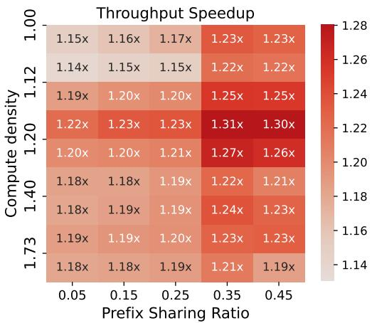  
Figure 13. Simulated throughput <sup>improvement</sup> <sup>of</sup> <sup>BlendServe</sup> <sup>com-</sup> pared to NanoFlow-DFS on workloads synthesized from Azure-Trace, MMLU, and OpenVid. BlendServe achieves up to 31% throughput gain compared to baselines.

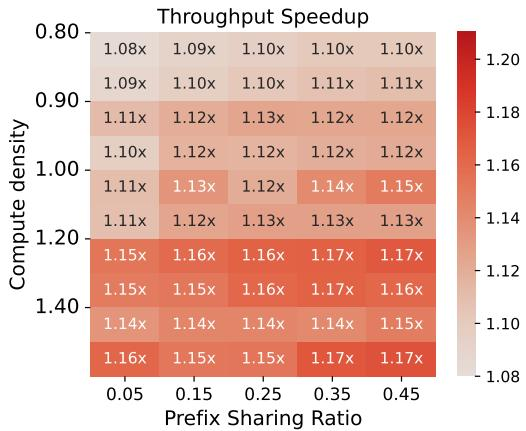  
Figure 14. Simulated throughput <sup>improvement</sup> <sup>of</sup> <sup>BlendServe</sup> <sup>com-</sup> pared to NanoFlow-DFS on workloads synthesized from ShareGPT, MMLU, and OpenVid. BlendServe consistently surpasses baselines by up to 17% throughput.

Results show that BlendServe consistently surpasses baselines by 1.08<sub>×</sub> to 1.31<sub>×</sub> in diferent workloads. We find that BlendServe works better on BurstGPT and Azure-Trace due to their smaller variance of output length. When the output length variance is large in ShareGPT and WildChat, the sampling strategy works less efectively, leading to sub-optimal performance. We leave the better strategy for workloads with large variance output length that cannot be efectively captured by the prefix tree for future work.

```batch
docker load -i blendserve.tar
docker run -it --gpus all \
--name blendserve \
-v /dev/shm:/dev/shm \
blendserve:latest
```

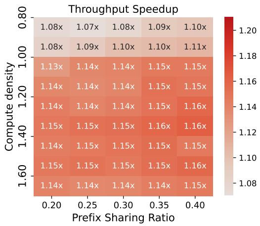  
Figure 15. Simulated throughput <sup>improvement</sup> <sup>of</sup> <sup>BlendServe</sup> <sup>com-</sup> pared to NanoFlow-DFS on workloads synthesized from WildChat, MMLU, and OpenVid.

## A.5 Scheduling overhead of BlendServe

As described in § 5, BlendServe has two scheduling overhead: 1) preprocessing all token ids of requests prompt to construct the prefix tree, followed by a series of tree transformations; and 2) runtime scheduling request batches based on the double scanner algorithm and the prefix tree to manage KVcache memory. We now demonstrate that these two parts have minimal overhead compared to the GPU time.

<sub>Preprocessing</sub> <sub>overhead.</sub> There is no additional overhead for tokenization, since it is also necessary for model inference, and the storage for generated token ids is at the same magnitude as the input strings. Assuming ?? requests with ?? tokens in the prompts, for the trie tree construction with ?? max depth, the time complexity ?? <sub>(</sub>?? <sub>×</sub> ??<sub>)</sub>. Since requests prompts diverge quickly, ?? is typically small. In our evaluations, this process typically takes several minutes, which is negligible compared to hours of GPU inference.

Runtime scheduling overhead. <sup>Since</sup> <sup>the</sup> <sup>runtime</sup> <sup>batch</sup> size is typically at the magnitude of thousands, the runtime prefix tree is much smaller compared to the ofline prefix tree built during preprocessing. Based on our measurement in evaluations, the operations on the runtime prefix tree take 0.08 ms on average, with a P99 latency of 0.23 ms, which is generally less than 10% compared to the GPU time. Such small runtime scheduling overhead can be efectively overlapped with asynchronous CPU scheduling, incurring zero overhead in end-to-end performance [76].

## B Artifact

## B.1 Abstract

This artifact provides an implementation of the proposed system using pre-built Docker images that encapsulate the codebase and runtime environment. All experiments are orchestrated through a single entry-point script for ease of use and automation. Experimental results are collected and visualized using a Jupyter notebook.

## B.2 Artifact check-list (meta-information)

• Algorithm: Ofline inference schedule

• Program: Python, C++

• Compilation: nvcc, g++

• Model: Meta-Llama-3-8B

• Data set: Huggingface datasets

• Hardware: A100-SXM4-80GB

• Metrics: Tokens per second, prefix hit rate

• How much disk space required (approximately)?: 50GB

• How much time is needed to prepare workflow (approximately)?: 10mins

• How much time is needed to complete experiments (approximately)?: 50 A100 hours

• Publicly available?: Yes

• Code licenses?: Apache-2.0 license

• Data licenses?: Apache-2.0 license

## B.3 Description

<sub>B.3.1</sub> <sub>How</sub> <sub>to</sub> <sub>access.</sub> A Docker image, including all software dependencies (compiled), model weights, code references, and scripts, is provided via a public Google Drive link. We also provide an image (without CUDA dependency) for reproducing subsets of experiments without the GPU backend via this Google Drive link.

B.3.2 Hardware dependencies. <sup>All</sup> <sup>evaluations</sup> <sup>are</sup> <sup>con-</sup> ducted with NVIDIA A100-SXM4-80GB GPUs.

B.3.3 Software dependencies. <sup>The</sup> <sup>desired</sup> <sup>environmen-</sup> tal setup follows the oficial Docker container, i.e., 23.11- devel-cuda\_multi. The software libraries, including vLLM and NanoFlow, are also provided along with the image.

<sub>B.3.4</sub> <sub>Data</sub> <sub>sets.</sub> The evaluated workloads are synthesized by combining several open-sourced traces with distinct characteristics, including OpenVid-1M, BurstGPT, and MMLU.

<sub>B.3.5</sub> <sub>Models.</sub> Both Qwen-2.5-7B and LLama-3-8B are evaluated on A100 with TP=1, while Qwen-2.5-72B and Llama-3-70B are evaluated with TP=8. We mainly provide automated scripts for reproducing 8B models due to resource constraints, while others can be done in a similar way.

## B.4 Installation

We provide a pre-built Docker image that encapsulates all required dependencies. Users should first download the image archive and load it into the local Docker environment, then launch a container with the provided configuration.

After launching the container, the working directory is set to <sub>/root/blendserve</sub>, which contains the full source code and scripts needed to reproduce our results.

Some datasets and model weights are hosted on Hugging Face and require user authentication. Please log in using the Hugging Face CLI with a valid access token:

hf auth login --token \$YOUR\_TOKEN

Detailed guidelines are provided in <sub>./README.md</sub>. The main entry point for running experiments is the script lo-<sup>cated</sup> <sup>at</sup> ./scripts/run.sh<sup>.</sup>

## B.5 Evaluation and Expected Results

All experiments are orchestrated through a single entrypoint located at <sub>./scripts/run.sh</sub>, which sequentially launches the full set of experiments used in our evaluation. For convenience and flexibility, each experiment can also be executed independently by invoking the corresponding commands in the script. For each experiment, the raw outputs and aggregated results are stored in the corresponding experiment directory. Quantitative results are summarized in <sub>combine.csv</sub>, while visualizations and plots are generated using the provided Jupyter notebook <sub>plot.ipynb</sub>.

## References

[1] Amey Agrawal, Nitin Kedia, Ashish Panwar, Jayashree Mohan, Nipun Kwatra, Bhargav S. Gulavani, Alexey Tumanov, and Ramachandran Ramjee. 2024. Taming Throughput-Latency Tradeof in LLM Inference with Sarathi-Serve. arXiv:2403.02310 [cs.LG] <sub>htps://arxiv.org/abs</sub> 2403.02310

[2] Joshua Ainslie, James Lee-Thorp, Michiel de Jong, Yury Zemlyanskiy, Federico Lebrón, and Sumit Sanghai. 2023. GQA: Training General ized Multi-Query Transformer Models from Multi-Head Checkpoints. <sup>arXiv:2305.13245 [cs.CL]</sup> htps://arxiv.org/abs/2305.13245

[3] Loubna Ben Allal, Anton Lozhkov, and Daniel van Strien. 2024. Cosmopedia: how to create large-scale synthetic data for pre-training Large Language Models — huggingface.co. <sub>htps://huggingface.co</sub> <sub>blog/cosmopedia</sub>. [Accessed 25-10-2024].

[4] Anthropic. 2024. Introducing the Message Batches API — an-<sup>thropic.com.</sup> htps://www.anthropic.com/news/message-batches-api<sup>.</sup> [Accessed 20-10-2024].

[5] Anyscale. 2024. LLM ofline batch inference with Ray Data and vLLM | Anyscale Docs — docs.anyscale.com. <sub>htps://docs.anyscale.com/</sub> <sub>examples/batch-llm/</sub>. [Accessed 26-10-2024].

[6] Iñaki Arango, Ayush Noori, Yepeng Huang, Rana Shahout, and Minlan Yu. 2025. Prefix and Output Length-Aware Scheduling for Eficient <sup>Online</sup> <sup>LLM</sup> <sup>Inference.</sup> <sup>In</sup> Sparsity in LLMs (SLLM): Deep Dive into Mixture of Experts, Quantization, Hardware, and Inference<sup>.</sup> htps: //openreview.net/forum?id=DOZiCWyK0N

[7] AWS. 2024. Supported Regions and models for batch inference - Amazon Bedrock — docs.aws.amazon.com. <sub>htps://docs.aws.amazon.com/</sub> bedrock/latest/userguide/batch-inference-supported.html<sup>.</sup> <sup>[Accessed</sup> 26-10-2024].

[8] Jinze Bai, Shuai Bai, Yunfei Chu, Zeyu Cui, Kai Dang, Xiaodong Deng, Yang Fan, Wenbin Ge, Yu Han, Fei Huang, Binyuan Hui, Luo Ji, Mei Li, Junyang Lin, Runji Lin, Dayiheng Liu, Gao Liu, Chengqiang Lu, Keming Lu, Jianxin Ma, Rui Men, Xingzhang Ren, Xuancheng Ren, Chuanqi Tan, Sinan Tan, Jianhong Tu, Peng Wang, Shijie Wang, Wei Wang, Shengguang Wu, Benfeng Xu, Jin Xu, An Yang, Hao Yang, Jian Yang, Shusheng Yang, Yang Yao, Bowen Yu, Hongyi Yuan, Zheng

Yuan, Jianwei Zhang, Xingxuan Zhang, Yichang Zhang, Zhenru Zhang, Chang Zhou, Jingren Zhou, Xiaohuan Zhou, and Tianhang Zhu. 2023. Qwen Technical Report. arXiv:2309.16609 [cs.CL] <sub>htps://arxiv.org</sub> abs/2309.16609

[9] Yushi Bai, Xin Lv, Jiajie Zhang, Hongchang Lyu, Jiankai Tang, Zhidian Huang, Zhengxiao Du, Xiao Liu, Aohan Zeng, Lei Hou, Yuxiao Dong, Jie Tang, and Juanzi Li. 2024. LongBench: A Bilingual, Multitask Benchmark for Long Context Understanding. arXiv:2308.14508 [cs.CL] htps://arxiv.org/abs/2308.14508

[10] Valentina Cacchiani, Manuel Iori, Alberto Locatelli, and Silvano Martello. 2022. Knapsack problems — An overview of recent advances. Part I: Single knapsack problems. <sub>Computers</sub> <sub>&</sub> <sub>Operations</sub> <sub>Research</sub> <sup>143</sup> <sup>(2022),</sup> <sup>105692.</sup> <sup>doi:</sup>10.1016/j.cor.2021.105692

[11] Chang Chen, Xiuhong Li, Qianchao Zhu, Jiangfei Duan, Peng Sun, Xingcheng Zhang, and Chao Yang. 2024. Centauri: Enabling Eficient Scheduling for Communication-Computation Overlap in Large Model Training via Communication Partitioning. In <sub>Proceedings</sub> <sub>of</sub> <sub>the</sub> <sub>29th</sub> ACM International Conference on Architectural Support for Programming Languages and Operating Systems, Volume 3 <sup>(La</sup> <sup>Jolla,</sup> <sup>CA,</sup> <sup>USA)</sup> <sub>(ASPLOS</sub> <sub>’24)</sub>. Association for Computing Machinery, New York, NY, <sup>USA,</sup> <sup>178–191. doi:</sup>10.1145/3620666.3651379

[12] Lequn Chen, Zihao Ye, Yongji Wu, Danyang Zhuo, Luis Ceze, and Arvind Krishnamurthy. 2023. Punica: Multi-Tenant LoRA Serving. <sup>arXiv:2310.18547 [cs.DC]</sup> htps://arxiv.org/abs/2310.18547

[13] Jean-Baptiste Cordonnier, Andreas Loukas, and Martin Jaggi. 2021. Multi-Head Attention: Collaborate Instead of Concatenate. <sup>arXiv:2006.16362 [cs.LG]</sup> htps://arxiv.org/abs/2006.16362

[14] Weihao Cui, Yukang Chen, Han Zhao, Ziyi Xu, Quan Chen, Xusheng Chen, Zhou Yangjie, Shixuan Sun, and Minyi Guo. 2025. Optimizing SLO-oriented LLM Serving with PD-Multiplexing. doi:<sub>10.48550/arXiv.</sub> 2504.14489

[15] Databricks. 2024. Introducing Simple, Fast, and Scalable Batch LLM Inference on Mosaic AI Model Serving — databricks.com. htps://www.databricks.com/blog/introducing-simple-fast-andscalable-batch-llm-inference-mosaic-ai-model-serving<sup>.</sup> <sup>[Accessed</sup> 26-10-2024].

[16] DeepSeek-AI, :, Xiao Bi, Deli Chen, Guanting Chen, Shanhuang Chen, Damai Dai, Chengqi Deng, Honghui Ding, Kai Dong, Qiushi Du, Zhe Fu, Huazuo Gao, Kaige Gao, Wenjun Gao, Ruiqi Ge, Kang Guan, Daya Guo, Jianzhong Guo, Guangbo Hao, Zhewen Hao, Ying He, Wenjie Hu, Panpan Huang, Erhang Li, Guowei Li, Jiashi Li, Yao Li, Y. K. Li, Wenfeng Liang, Fangyun Lin, A. X. Liu, Bo Liu, Wen Liu, Xiaodong Liu, Xin Liu, Yiyuan Liu, Haoyu Lu, Shanghao Lu, Fuli Luo, Shirong Ma, Xiaotao Nie, Tian Pei, Yishi Piao, Junjie Qiu, Hui Qu, Tongzheng Ren, Zehui Ren, Chong Ruan, Zhangli Sha, Zhihong Shao, Junxiao Song, Xuecheng Su, Jingxiang Sun, Yaofeng Sun, Minghui Tang, Bingxuan Wang, Peiyi Wang, Shiyu Wang, Yaohui Wang, Yongji Wang, Tong Wu, Y. Wu, Xin Xie, Zhenda Xie, Ziwei Xie, Yiliang Xiong, Hanwei Xu, R. X. Xu, Yanhong Xu, Dejian Yang, Yuxiang You, Shuiping Yu, Xingkai Yu, B. Zhang, Haowei Zhang, Lecong Zhang, Liyue Zhang, Mingchuan Zhang, Minghua Zhang, Wentao Zhang, Yichao Zhang, Chenggang Zhao, Yao Zhao, Shangyan Zhou, Shunfeng Zhou, Qihao Zhu, and Yuheng Zou. 2024. DeepSeek LLM: Scaling Open-Source Language Models with Longtermism. arXiv:2401.02954 [cs.CL] <sub>htps:</sub> //arxiv.org/abs/2401.02954

[17] Jiangfei Duan, Runyu Lu, Haojie Duanmu, Xiuhong Li, Xingcheng Zhang, Dahua Lin, Ion Stoica, and Hao Zhang. 2024. MuxServe: Flexible Spatial-Temporal Multiplexing for Multiple LLM Serving. <sup>arXiv:2404.02015 [cs.DC]</sup> htps://arxiv.org/abs/2404.02015

[18] Yichao Fu, Siqi Zhu, Runlong Su, Aurick Qiao, Ion Stoica, and Hao Zhang. 2024. Eficient LLM Scheduling by Learning to Rank. <sup>arXiv:2408.15792 [cs.LG]</sup> htps://arxiv.org/abs/2408.15792

[19] Dan Hendrycks, Collin Burns, Steven Basart, Andy Zou, Mantas Mazeika, Dawn Song, and Jacob Steinhardt. 2021. Measuring Massive Multitask Language Understanding. arXiv:2009.03300 [cs.CY] htps://arxiv.org/abs/2009.03300

[20] Connor Holmes, Masahiro Tanaka, Michael Wyatt, Ammar Ahmad Awan, Jef Rasley, Samyam Rajbhandari, Reza Yazdani Aminabadi, Heyang Qin, Arash Bakhtiari, Lev Kurilenko, and Yuxiong He. 2024. DeepSpeed-FastGen: High-throughput Text Generation for LLMs via MII and DeepSpeed-Inference. arXiv:2401.08671 [cs.PF] <sub>htps://arxiv.</sub> org/abs/2401.08671

[21] Sam Ade Jacobs, Masahiro Tanaka, Chengming Zhang, Minjia Zhang, Shuaiwen Leon Song, Samyam Rajbhandari, and Yuxiong He. 2023. DeepSpeed Ulysses: System Optimizations for Enabling Training of Extreme Long Sequence Transformer Models. arXiv:2309.14509 [cs.LG] htps://arxiv.org/abs/2309.14509

[22] Xuanlin Jiang, Yang Zhou, Shiyi Cao, Ion Stoica, and Minlan Yu. 2024. NEO: Saving GPU Memory Crisis with CPU Ofloading for Online LLM Inference. arXiv:2411.01142 [cs.DC] <sub>htps://arxiv.org/abs/2411.01142</sub>

[23] Jordan Juravsky, Bradley Brown, Ryan Ehrlich, Daniel Y. Fu, Christopher Ré, and Azalia Mirhoseini. 2024. Hydragen: High-Throughput LLM Inference with Shared Prefixes. arXiv:2402.05099 [cs.LG] <sub>htps:</sub> //arxiv.org/abs/2402.05099

[24] Keisuke Kamahori, Yile Gu, Kan Zhu, and Baris Kasikci. 2024. Fiddler: CPU-GPU Orchestration for Fast Inference of Mixture-of-Experts <sup>Models.</sup> <sup>arXiv:2402.07033 [cs.LG]</sup> htps://arxiv.org/abs/2402.07033

[25] Woosuk Kwon, Zhuohan Li, Siyuan Zhuang, Ying Sheng, Lianmin Zheng, Cody Hao Yu, Joseph E. Gonzalez, Hao Zhang, and Ion Stoica. 2023. Eficient Memory Management for Large Language Model Serving with PagedAttention. arXiv:2309.06180 [cs.LG] <sub>htps://arxiv.org/</sub> abs/2309.06180

[26] Chaofan Lin, Zhenhua Han, Chengruidong Zhang, Yuqing Yang, Fan Yang, Chen Chen, and Lili Qiu. 2024. Parrot: Eficient Serving of LLMbased Applications with Semantic Variable. arXiv:2405.19888 [cs.LG] htps://arxiv.org/abs/2405.19888

[27] Zejia Lin, Hongxin Xu, Guanyi Chen, Xianwei Zhang, and Yutong Lu. 2025. Bullet: Boosting GPU Utilization for LLM Serving via Dynamic Spatial-Temporal Orchestration. arXiv:2504.19516 [cs.DC] <sub>htps://</sub> arxiv.org/abs/2504.19516

[28] Hao Liu, Wilson Yan, Matei Zaharia, and Pieter Abbeel. 2024. World Model on Million-Length Video And Language With Blockwise RingAttention. arXiv:2402.08268 [cs.LG] htps://arxiv.org/abs/2402.08268

[29] Hao Liu, Matei Zaharia, and Pieter Abbeel. 2023. Ring Attention with Blockwise Transformers for Near-Infinite Context. <sup>arXiv:2310.01889</sup> <sup>[cs.CL]</sup> htps://arxiv.org/abs/2310.01889

[30] Shu Liu, Asim Biswal, Audrey Cheng, Xiangxi Mo, Shiyi Cao, Joseph E. Gonzalez, Ion Stoica, and Matei Zaharia. 2024. Optimizing LLM Queries in Relational Workloads. arXiv:2403.05821 [cs.LG] <sub>htps://arxiv.org/</sub> abs/2403.05821

[31] Jiasen Lu, Christopher Clark, Sangho Lee, Zichen Zhang, Savya Khosla, Ryan Marten, Derek Hoiem, and Aniruddha Kembhavi. 2023. Unified-IO 2: Scaling Autoregressive Multimodal Models with Vi sion, Language, Audio, and Action. arXiv:2312.17172 [cs.CV] <sub>htps:</sub> //arxiv.org/abs/2312.17172

[32] Jiasen Lu, Christopher Clark, Rowan Zellers, Roozbeh Mottaghi, and Aniruddha Kembhavi. 2022. Unified-IO: A Unified Model for Vision, Language, and Multi-Modal Tasks. arXiv:2206.08916 [cs.CV] <sub>htps:</sub> //arxiv.org/abs/2206.08916

[33] Lingxiao Ma, Zhiqiang Xie, Zhi Yang, Jilong Xue, Youshan Miao, Wei Cui, Wenxiang Hu, Fan Yang, Lintao Zhang, and Lidong Zhou. 2020. Rammer: Enabling Holistic Deep Learning Compiler Optimizations <sup>with</sup> <sup>rTasks.</sup> <sup>In</sup> 14th USENIX Symposium on Operating Systems Design and Implementation (OSDI 20)<sup>.</sup> <sup>USENIX</sup> <sup>Association,</sup> <sup>881–897.</sup> htps: //www.usenix.org/conference/osdi20/presentation/ma

[34] Meta-Team. 2024. The Llama 3 Herd of Models. <sup>arXiv:2407.21783 [cs.AI]</sup> htps://arxiv.org/abs/2407.21783

[35] Microsoft. 2023. GitHub Copilot · Your AI pair programmer — <sup>github.com.</sup> htps://github.com/features/copilot<sup>.</sup> <sup>[Accessed</sup> <sup>28-10-</sup> 2024].

[36] Kepan Nan, Rui Xie, Penghao Zhou, Tiehan Fan, Zhenheng Yang, Zhijie Chen, Xiang Li, Jian Yang, and Ying Tai. 2024. OpenVid-1M: A Large-Scale High-Quality Dataset for Text-to-video Generation. <sup>arXiv:2407.02371 [cs.CV]</sup> htps://arxiv.org/abs/2407.02371

[37] OpenAI. 2022. Introducing ChatGPT. <sub>htps://openai.com/index</sub> <sub>chatgpt/</sub>. [Accessed 20-10-2024].

[38] OpenAI. 2024. Introducing Batch API. <sub>htps://platform.openai.com/</sub> <sub>docs/guides/batch</sub>. [Accessed 20-10-2024].

[39] Yiwei Qin, Xuefeng Li, Haoyang Zou, Yixiu Liu, Shijie Xia, Zhen Huang, Yixin Ye, Weizhe Yuan, Hector Liu, Yuanzhi Li, and Pengfei Liu. 2024. O1 Replication Journey: A Strategic Progress Report – Part <sup>1.</sup> <sup>arXiv:2410.18982</sup> <sup>[cs.AI]</sup> htps://arxiv.org/abs/2410.18982

<sup>[40]</sup> <sup>ShareGPT.</sup> <sup>2023.</sup> <sup>ShareGPT.</sup> htps://huggingface.co/datasets/ anon8231489123/ShareGPT\_Vicuna\_unfiltered<sup>.</sup>

[41] Ying Sheng, Shiyi Cao, Dacheng Li, Banghua Zhu, Zhuohan Li, Danyang Zhuo, Joseph E. Gonzalez, and Ion Stoica. 2024. Fairness in Serving Large Language Models. arXiv:2401.00588 [cs.AI] htps://arxiv.org/abs/2401.00588

[42] Ying Sheng, Lianmin Zheng, Binhang Yuan, Zhuohan Li, Max Ryabinin, Daniel Y. Fu, Zhiqiang Xie, Beidi Chen, Clark Barrett, Joseph E. Gonzalez, Percy Liang, Christopher Ré, Ion Stoica, and Ce Zhang. 2023. FlexGen: High-Throughput Generative Inference of Large Language Models with a Single GPU. arXiv:2303.06865 [cs.LG] <sub>htps:</sub> //arxiv.org/abs/2303.06865

[43] Xiaoxiang Shi, Colin Cai, Junjia Du, and Zhihao Jia. 2025. Nexus:Proactive Intra-GPU Disaggregation of Prefill and Decode in LLM Serving. arXiv:2507.06608 [cs.DC] <sub>htps://arxiv.org/abs/2507.</sub> 06608

[44] Mohammad Shoeybi, Mostofa Patwary, Raul Puri, Patrick LeGresley, Jared Casper, and Bryan Catanzaro. 2020. Megatron-LM: Training Multi-Billion Parameter Language Models Using Model Parallelism. <sup>arXiv:1909.08053</sup> <sup>[cs.CL]</sup> htps://arxiv.org/abs/1909.08053

[45] Charlie Snell, Jaehoon Lee, Kelvin Xu, and Aviral Kumar. 2024. Scaling LLM Test-Time Compute Optimally can be More Efective than Scaling Model Parameters. arXiv:2408.03314 [cs.LG] <sub>htps://arxiv.org/abs</sub> 2408.03314

[46] Yixin Song, Zeyu Mi, Haotong Xie, and Haibo Chen. 2023. PowerInfer: Fast Large Language Model Serving with a Consumer-grade GPU. <sup>arXiv:2312.12456</sup> <sup>[cs.LG]</sup> htps://arxiv.org/abs/2312.12456

[47] Vikranth Srivatsa, Zijian He, Reyna Abhyankar, Dongming Li, and Yiying Zhang. 2024. Preble: Eficient Distributed Prompt Scheduling for LLM Serving. arXiv:2407.00023 [cs.DC] <sub>htps://arxiv.org/abs/2407.</sub> 00023

[48] Vikranth Srivatsa, Dongming Li, Yiying Zhang, and Reyna Abhyankar. 2024. MLSys @ WukLab - Can Scheduling Overhead Dominate LLM Inference Performance? A Study of CPU Scheduling Overhead on Two Popular LLM Inference Systems — mlsys.wuklab.io. <sub>htps://mlsys.</sub> wuklab.io/posts/scheduling\_overhead/<sup>.</sup> <sup>[Accessed</sup> <sup>25-10-2024].</sup>

[49] Jovan Stojkovic, Chaojie Zhang, Íñigo Goiri, Josep Torrellas, and Esha Choukse. 2024. DynamoLLM: Designing LLM Inference Clusters for Performance and Energy Eficiency. arXiv:2408.00741 [cs.AI] <sub>htps:</sub> //arxiv.org/abs/2408.00741

[50] Foteini Strati, Xianzhe Ma, and Ana Klimovic. 2024. Orion: Interference-aware, Fine-grained GPU Sharing for ML Applications. In Proceedings of the Nineteenth European Conference on Computer Systems (Athens, Greece) <sub>(EuroSys</sub> <sub>’24)</sub>. Association for Computing Machinery, New York, NY, USA, 1075–1092. doi:<sub>10.1145/3627703.3629578</sub>

[51] Jiaming Tang, Yilong Zhao, Kan Zhu, Guangxuan Xiao, Baris Kasikci, and Song Han. 2024. Quest: Query-Aware Sparsity for Eficient Long Context LLM Inference. arXiv:2406.10774 [cs.CL] <sub>htps://arxiv.org</sub> abs/2406.10774

[52] DeepSeek Team. 2024. Context Caching with SSD Ofloading. <sub>htps:</sub> //api-docs.deepseek.com/guides/kv\_cache<sup>.</sup> <sup>[Accessed</sup> <sup>19-08-2025].</sup>

[53] Hugo Touvron, Louis Martin, Kevin Stone, Peter Albert, Amjad Alma hairi, Yasmine Babaei, Nikolay Bashlykov, Soumya Batra, Prajjwal Bhargava, Shruti Bhosale, Dan Bikel, Lukas Blecher, Cristian Canton Ferrer, Moya Chen, Guillem Cucurull, David Esiobu, Jude Fernandes, Jeremy Fu, Wenyin Fu, Brian Fuller, Cynthia Gao, Vedanuj Goswami, Naman Goyal, Anthony Hartshorn, Saghar Hosseini, Rui Hou, Hakan Inan, Marcin Kardas, Viktor Kerkez, Madian Khabsa, Isabel Kloumann, Artem Korenev, Punit Singh Koura, Marie-Anne Lachaux, Thibaut Lavril, Jenya Lee, Diana Liskovich, Yinghai Lu, Yuning Mao, Xavier Martinet, Todor Mihaylov, Pushkar Mishra, Igor Molybog, Yixin Nie, Andrew Poulton, Jeremy Reizenstein, Rashi Rungta, Kalyan Saladi, Alan Schelten, Ruan Silva, Eric Michael Smith, Ranjan Subramanian, Xiaoqing Ellen Tan, Binh Tang, Ross Taylor, Adina Williams, Jian Xiang Kuan, Puxin Xu, Zheng Yan, Iliyan Zarov, Yuchen Zhang, Angela Fan, Melanie Kambadur, Sharan Narang, Aurelien Rodriguez, Robert Stojnic, Sergey Edunov, and Thomas Scialom. 2023. Llama 2: Open Foundation and Fine-Tuned Chat Models. arXiv:2307.09288 [cs.CL] htps://arxiv.org/abs/2307.09288

[54] Ashish Vaswani, Noam Shazeer, Niki Parmar, Jakob Uszkoreit, Llion Jones, Aidan N. Gomez, Lukasz Kaiser, and Illia Polosukhin. 2023. Attention Is All You Need. arXiv:1706.03762 [cs.CL] <sub>htps://arxiv.org</sub> abs/1706.03762

[55] Xinlong Wang, Xiaosong Zhang, Zhengxiong Luo, Quan Sun, Yufeng Cui, Jinsheng Wang, Fan Zhang, Yueze Wang, Zhen Li, Qiying Yu, Yingli Zhao, Yulong Ao, Xuebin Min, Tao Li, Boya Wu, Bo Zhao, Bowen Zhang, Liangdong Wang, Guang Liu, Zheqi He, Xi Yang, Jingjing Liu, Yonghua Lin, Tiejun Huang, and Zhongyuan Wang. 2024. Emu3: Next-Token Prediction is All You Need. arXiv:2409.18869 [cs.CV] htps://arxiv.org/abs/2409.18869

[56] Yuxin Wang, Yuhan Chen, Zeyu Li, Xueze Kang, Zhenheng Tang, Xin He, Rui Guo, Xin Wang, Qiang Wang, Amelie Chi Zhou, and Xiaowen Chu. 2024. BurstGPT: A Real-world Workload Dataset to Optimize LLM Serving Systems. arXiv:2401.17644

[57] Zekun Wang, King Zhu, Chunpu Xu, Wangchunshu Zhou, Jiaheng Liu, Yibo Zhang, Jiashuo Wang, Ning Shi, Siyu Li, Yizhi Li, Haoran Que, Zhaoxiang Zhang, Yuanxing Zhang, Ge Zhang, Ke Xu, Jie Fu, and Wenhao Huang. 2024. MIO: A Foundation Model on Multimodal <sup>Tokens.</sup> <sup>arXiv:2409.17692</sup> <sup>[cs.CL]</sup> htps://arxiv.org/abs/2409.17692

[58] Jason Wei, Xuezhi Wang, Dale Schuurmans, Maarten Bosma, Brian Ichter, Fei Xia, Ed Chi, Quoc Le, and Denny Zhou. 2023. Chain of-Thought Prompting Elicits Reasoning in Large Language Models. <sup>arXiv:2201.11903 [cs.CL]</sup> htps://arxiv.org/abs/2201.11903

[59] Samuel Williams, Andrew Waterman, and David Patterson. 2009. Roofline: an insightful visual performance model for multicore architectures. <sub>Commun.</sub> <sub>ACM</sub> 52, 4 (April 2009), 65–76. doi:<sub>10.1145/</sub> 1498765.1498785

[60] Bingyang Wu, Yinmin Zhong, Zili Zhang, Shengyu Liu, Fangyue Liu, Yuanhang Sun, Gang Huang, Xuanzhe Liu, and Xin Jin. 2024. Fast Distributed Inference Serving for Large Language Models. <sup>arXiv:2305.05920 [cs.LG]</sup> htps://arxiv.org/abs/2305.05920

[61] Chengyue Wu, Xiaokang Chen, Zhiyu Wu, Yiyang Ma, Xingchao Liu, Zizheng Pan, Wen Liu, Zhenda Xie, Xingkai Yu, Chong Ruan, and Ping Luo. 2024. Janus: Decoupling Visual Encoding for Unified Multimodal Understanding and Generation. arXiv:2410.13848 [cs.CV] htps://arxiv.org/abs/2410.13848

[62] Yecheng Wu, Zhuoyang Zhang, Junyu Chen, Haotian Tang, Dacheng Li, Yunhao Fang, Ligeng Zhu, Enze Xie, Hongxu Yin, Li Yi, Song Han, and Yao Lu. 2024. VILA-U: a Unified Foundation Model Integrating

Visual Understanding and Generation. arXiv:2409.04429 [cs.CV] <sub>htps:</sub> //arxiv.org/abs/2409.04429

[63] Fuzhao Xue, Yukang Chen, Dacheng Li, Qinghao Hu, Ligeng Zhu, Xiuyu Li, Yunhao Fang, Haotian Tang, Shang Yang, Zhijian Liu, Ethan He, Hongxu Yin, Pavlo Molchanov, Jan Kautz, Linxi Fan, Yuke Zhu, Yao Lu, and Song Han. 2024. LongVILA: Scaling Long-Context Visual Language Models for Long Videos. arXiv:2408.10188 [cs.CV] <sub>htps:</sub> //arxiv.org/abs/2408.10188

[64] Shunyu Yao, Dian Yu, Jefrey Zhao, Izhak Shafran, Thomas L. Grifiths, Yuan Cao, and Karthik Narasimhan. 2023. Tree of Thoughts: Deliberate Problem Solving with Large Language Models. <sup>arXiv:2305.10601</sup> <sup>[cs.CL]</sup> htps://arxiv.org/abs/2305.10601

[65] Yixin Ye, Zhen Huang, Yang Xiao, Ethan Chern, Shijie Xia, and Pengfei Liu. 2025. LIMO: Less is More for Reasoning. arXiv:2502.03387 [cs.CL] htps://arxiv.org/abs/2502.03387

[66] Zihao Ye, Ruihang Lai, Bo-Ru Lu, Chien-Yu Lin, Size Zheng, Lequn Chen, Tianqi Chen, and Luis Ceze. 2024. Cascade Inference: Memory Bandwidth Eficient Shared Prefix Batch Decoding. <sub>htps://flashinfer.</sub> ai/2024/02/02/cascade-inference.html

[67] Chengye Yu, Tianyu Wang, Zili Shao, Linjie Zhu, Xu Zhou, and Song Jiang. 2024. TwinPilots: A New Computing Paradigm for GPU-CPU <sup>Parallel</sup> <sup>LLM</sup> <sup>Inference.</sup> <sup>In</sup> Proceedings of the 17th ACM International Systems and Storage Conference<sup>.</sup> <sup>91–103.</sup>

[68] Gyeong-In Yu, Joo Seong Jeong, Geon-Woo Kim, Soojeong Kim, and Byung-Gon Chun. 2022. Orca: A Distributed Serving System for Transformer-Based Generative Models. In <sub>16th</sub> <sub>USENIX</sub> <sub>Symposium</sub> <sub>on</sub> Operating Systems Design and Implementation (OSDI 22)<sup>.</sup> <sup>USENIX</sup> <sup>Asso-</sup> <sup>ciation,</sup> <sup>Carlsbad,</sup> <sup>CA,</sup> <sup>521–538.</sup> htps://www.usenix.org/conference osdi22/presentation/yu

[69] Ted Zadouri, Hubert Strauss, and Tri Dao. 2025. Hardware-Eficient Attention for Fast Decoding. arXiv:2505.21487 [cs.LG] <sub>htps://arxiv.</sub> org/abs/2505.21487

[70] Wenting Zhao, Xiang Ren, Jack Hessel, Claire Cardie, Yejin Choi, and Yuntian Deng. 2024. WildChat: 1M ChatGPT Interaction Logs in the <sup>Wild.</sup> <sup>arXiv:2405.01470 [cs.CL]</sup> htps://arxiv.org/abs/2405.01470

[71] Xuanlei Zhao, Bin Jia, Haotian Zhou, Ziming Liu, Shenggan Cheng, and Yang You. 2024. HeteGen: Heterogeneous Parallel Inference for Large Language Models on Resource-Constrained Devices. <sup>arXiv:2403.01164</sup> <sup>[cs.PF]</sup> htps://arxiv.org/abs/2403.01164

[72] Yilong Zhao, Chien-Yu Lin, Kan Zhu, Zihao Ye, Lequn Chen, Size Zheng, Luis Ceze, Arvind Krishnamurthy, Tianqi Chen, and Baris Kasikci. 2024. Atom: Low-bit Quantization for Eficient and Accurate LLM Serving. arXiv:2310.19102 [cs.LG] <sub>htps://arxiv.org/abs/2310.</sub> 19102

[73] Lianmin Zheng, Liangsheng Yin, Zhiqiang Xie, Chuyue Sun, Jef Huang, Cody Hao Yu, Shiyi Cao, Christos Kozyrakis, Ion Stoica, Joseph E. Gonzalez, Clark Barrett, and Ying Sheng. 2024. SGLang: Eficient Execution of Structured Language Model Programs. <sup>arXiv:2312.07104 [cs.AI]</sup> htps://arxiv.org/abs/2312.07104

[74] Zhen Zheng, Xin Ji, Taosong Fang, Fanghao Zhou, Chuanjie Liu, and Gang Peng. 2025. BatchLLM: Optimizing Large Batched LLM Inference with Global Prefix Sharing and Throughput-oriented Token Batching. <sup>arXiv:2412.03594 [cs.CL]</sup> htps://arxiv.org/abs/2412.03594

[75] Yinmin Zhong, Shengyu Liu, Junda Chen, Jianbo Hu, Yibo Zhu, Xuanzhe Liu, Xin Jin, and Hao Zhang. 2024. DistServe: Disaggregating Prefill and Decoding for Goodput-optimized Large Language Model Serving. arXiv:2401.09670 [cs.DC] htps://arxiv.org/abs/2401.09670

[76] Kan Zhu, Yufei Gao, Yilong Zhao, Liangyu Zhao, Gefei Zuo, Yile Gu, Dedong Xie, Zihao Ye, Keisuke Kamahori, Chien-Yu Lin, et al. 2025. NanoFlow: Towards Optimal Large Language Model Serving Through <sup>put.</sup> <sup>In</sup> 19th USENIX Symposium on Operating Systems Design and Implementation (OSDI 25)<sup>.</sup> <sup>749–765.</sup>