# XGrammar-2: Dynamic and Eficient Structured Generation Engine for Agentic LLMs

Linzhang Li∗   
blemiade\_qinchuan@sjtu.edu.cn   
Shanghai Jiao Tong University China

Ziyi Xu xzy2022@sjtu.edu.cn Shanghai Jiao Tong University China

Yixin Dong∗†   
yixind@andrew.cmu.edu   
Carnegie Mellon University   
USA   
Alexander Jiang   
akj2@andrew.cmu.edu   
Carnegie Mellon University   
USA

Guanjie Wang irfnfnkemed@sjtu.edu.cn Shanghai Jiao Tong University China

Tianqi Chen† tqchen@cmu.edu Carnegie Mellon University, NVIDIA USA

## Abstract

Modern LLM agents increasingly rely on dynamic structured generation, such as tool calling and response protocols. Unlike traditional structured generation with static structures, these workloads vary both across requests and within a request, posing new challenges to existing engines. We present XGrammar-2, a structured generation engine for dynamic agentic workloads. Our design is based on two key ideas: first-class support for tag-triggered structure switching, and fine-grained reuse across requests with diferent output structures. Concretely, XGrammar-2 introduces TagDispatch for dynamic structural dispatching and Cross-Grammar Cache for substructure-level cache reuse across grammars. It further improves eficiency with an Earley-based adaptive token mask cache, just-intime compilation, and repetition state compression. Experiments show that XGrammar-2 achieves over 6 faster compilation than prior structured generation engines, and incurs near-zero end-toend overhead in modern LLM serving systems.

## CCS Concepts

• Computing methodologies → Intelligent agents.

## Keywords

Agents, Structured Generation, Large Language Models

## ACM Reference Format:

Linzhang Li, Yixin Dong, Guanjie Wang, Ziyi Xu, Alexander Jiang, and Tianqi Chen. 2026. XGrammar-2: Dynamic and Eficient Structured Generation Engine for Agentic LLMs. In ACM Conference on AI and Agentic Systems (ACM CAIS ’26), May 26–29, 2026, San Jose, CA, USA. ACM, New York, NY, USA, 14 pages. https://doi.org/10.1145/3786335.3813124

## 1 Introduction

Modern LLM agents demonstrate strong capabilities and increasingly rely on complex tool calling and code generation [26]. These

∗Both authors contributed equally to this research.   
†Corresponding authors.

agentic applications impose strong requirements on structured generation, especially for small [27] or compressed models. Constrained decoding [8, 15] is widely adopted to guarantee structural validity by masking invalid tokens at each generation step, enabling reliable downstream applications with minimal overhead.

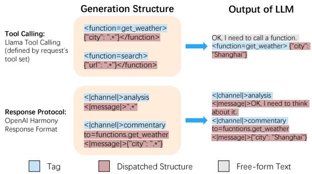  
Figure 1: Some examples of tool calling and response protocols.

However, existing constrained decoding methods [9, 12, 33] largely assume all structures are static and known in advance. Nowadays, a key characteristic of agentic LLM applications is the extensive use of tool calling to handle complex tasks. Each LLM request may contain dozens or even hundreds of possible tools, which greatly violates the structure assumption: the output structure becomes highly dynamic, both across requests and within a single request. This structural dynamism poses significant eficiency and expressiveness challenges to existing constrained decoding systems. We classify the challenge of structural dynamism into two categories:

Inter-request dynamism. In agent serving scenarios, each request may expose a diferent set of tools and schemas, often with per-tool access control [20, 25]. As a result, the space of possible output grammars becomes combinatorially large, and each grammar can itself be complex. Prior approaches typically preprocess the entire grammar and cache it at the request level to reuse identical structures. Under dynamic tool sets, such caching becomes inefective, forcing expensive per-request preprocessing and significantly increasing time-to-first-token (TTFT).

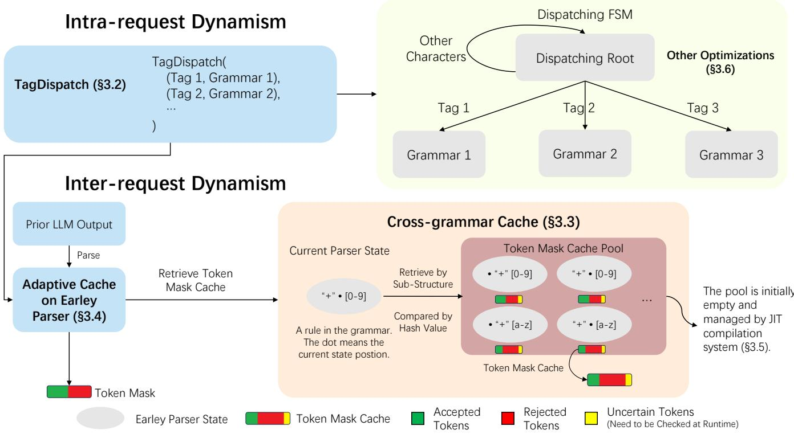  
Figure 2: Overview of our approach. We design a new dynamic dispatching semantics, TagDispatch (§3.2), to eficiently support intra-request dynamism. To leverage the sub-structures across diferent grammars, we designed a cross-grammar caching algorithm (§3.3) based on the Earley parser (§3.4) to handle inter-request dynamism. We also design a JIT compilation method (§3.5) to optimize the eficiency for the inter-request dynamism. We also introduce a repetition state compression algorithm (§3.6) to handle repetition structures.

Intra-request dynamism. Within a single request, the model needs to follow a response protocol such as OpenAI Harmony [16], and choose from many candidate tools. This requires the structural constraint to switch depending on the previous LLM output. For example, generating a tool name determines the JSON schema of the subsequent arguments [19, 28], while a channel tag token con strains the following content to a specific channel, such as reasoning or output. Such dispatching is dificult to express eficiently with the Backus-Naur Form (BNF)-like grammars used by existing constrained decoding methods, and the large number of tools further challenges eficient mask generation.

To address these challenges, we propose XGrammar-2, a structured generation engine for dynamic agentic workloads. Our design is based on two key ideas: first-class support for tag-triggered structure switching in agent outputs, and fine-grained reuse across requests with diferent output structures. For the former, we introduce TagDispatch, a first-class grammar construct for expressing tag-triggered structural dispatching within a request. For the latter, we design a cross-grammar cache that reuses shared substructures across diferent grammar combinations. To make this design efficient in practice, we further develop an Earley-based adaptive token mask cache, together with just-in-time compilation and repetition compression, to reduce compilation overhead and improve end-to-end eficiency.

We implement XGrammar-2 as a structured generation engine compatible with modern LLM inference systems. XGrammar-2 supports tool-calling formats across major models and enforces strict compliance with the OpenAI Harmony Response Format [16]. Experimental results show that XGrammar-2 achieves over 6× toolcalling compilation speed improvement compared to prior state-ofthe-art methods, while introducing near-zero latency overhead. We have incorporated XGrammar-2 into open-source serving frameworks such as SGLang [37] and vLLM [17], improving output reliability in agentic tasks. XGrammar-2 is open-source and has been adopted in both industry systems and open-source inference engines.

## 2 Background

## 2.1 Constrained Decoding and Context-free Grammar

LLMs like Deepseek-R1 [7], gpt-oss [24] all generate the tokens autoregressively, predicting the next token based on the previous output. Each time the LLM needs to output a token, it will calculate a logit vector for the vocabulary and then convert it into a probability distribution with the softmax function [4]. In the end, a sampler will choose an output token based on the distribution to output.

Constrained decoding [8] is a technique for guiding LLMs to generate text according to a specified grammar. During each decoding step, tokens that do not conform to the grammar are marked as invalid, and their corresponding logit values are set to −∞ to assign them zero probability, thus preventing them from being sampled and ensuring the output of LLMs follows the grammar.

Context-free Grammar (CFG) [6] is generally used to define the grammar structures, and it is described by Extended Backus-Naur Form (EBNF) [1] in most constrained decoding methods. An EBNF consists of a set of production rules, each representing a symbol that can be expanded into a sequence of terminal characters or references to other symbols. With the rule references, EBNF can naturally express complex recursive structures.

## 2.2 XGrammar

Constrained decoding modifies the logit vector before the LLM outputs the next token, requiring a runtime check to determine whether the token is valid across the entire vocabulary. Without optimization, this process introduces significant overhead, which substantially slows down the output speed of LLMs.

XGrammar [9] is designed to achieve near-zero overhead token mask generation. XGrammar employs a pushdown automaton parser to trace the output of LLMs. Its key insight is that for each state in CFGs, there are a lot of tokens that can be determined to be accepted or rejected within the state’s rule, and there are a few context-dependent tokens that need the context information to determine whether they can be accepted by the current state at runtime. XGrammar stores the pre-computed accepted tokens, rejected tokens, and context-dependent tokens into the adaptive token mask cache. With the token mask cache, XGrammar can skip massive computation for accepted tokens and rejected tokens at runtime. Moreover, XGrammar further increases the cache hit rate by introducing context expansion, which leverages the rule reference structure in the grammar to further check and reject context-dependent tokens.

With the optimization techniques, XGrammar can handle static structured generation tasks well. However, XGrammar needs to compile all the grammars ahead of time, which is not suitable for dynamic structured generation tasks, since the grammars can be sent to the engine at runtime. Thus, how to eficiently handle dynamic structured generation tasks remains a challenge.

## 3 Methods

## 3.1 Overview

XGrammar-2 addresses dynamic agentic workloads with a unified design centered on first-class structural dispatching and finegrained reuse across dynamically changing grammars. TagDispatch (Section 3.2) captures intra-request dynamism by expressing tagtriggered switching between free-form text and structured subgrammars. Cross-grammar cache (Section 3.3) handles inter-request dynamism by reusing token mask caches across grammars with shared substructures. To support eficient execution on dynamic and complex grammars, XGrammar-2 adopts an Earley-based adaptive token mask cache (Section 3.4) as the cache mechanism. JIT compilation (Section 3.5) further amortizes cache construction over decoding steps instead of materializing the full cache upfront. Repetition state compression (Section 3.6) reduces runtime overhead and improves robustness for recurring grammar patterns.

## 3.2 TagDispatch: Dynamic Dispatch Semantics

Intra-request dynamism: prior output determines subsequent structures. This requires free-formed text interleaved by structure constraints separated by certain triggers, such as a tool name or a channel control token. Although this semantics can in principle be encoded in plain EBNF, the encoding becomes cumbersome and ineficient, since it must simultaneously accept arbitrary nontag text, recognize multiple tags, and route each tag to a diferent sub-grammar.

To efectively express such structures, we introduce TagDispatch, an EBNF-compatible grammar intrinsic to describing tag-triggered switching between free-form text and structured sub-grammars. As shown in Figure 3, a TagDispatch is parameterized by (i) a list of tag–grammar pairs ????, ???? , where emitting tag ???? dispatches decoding to sub-grammar ???? , and (ii) a set of stop strings stop\_strs that terminate dispatching. Conceptually, TagDispatch partitions decoding into two modes: dispatching and dispatched. Decoding starts in the dispatching mode, where the engine accepts ordinary text while continuously matching registered tags. Once a tag is matched, the engine switches to the dispatched mode and constrains subsequent decoding with the corresponding sub-grammar. After that sub-grammar completes, decoding returns to the dispatching mode. If a stop string is matched in the dispatching mode, TagDispatch exits.

In the dispatching mode, we use an Aho–Corasick automaton (AC automaton) [2] to match multiple tags simultaneously. The automaton compiles all candidate tags into a single deterministic finite automaton (DFA), enabling incremental matching over the generated text. When a partial match fails, the automaton falls back to a previously matched state and continues matching. This enables eficient online trigger matching over free-form text.

TagDispatch can efectively describe agentic output structures. For example, a snippet of LLM output with tool calling is OK, I will call a tool. <function=get\_weather>{"city":"San Francisco"} </function>. The prefix <function=get\_weather> can be registered as a tag in TagDispatch, and dispatches decoding to the JSON-argument grammar (and optional wrapper grammar) associated with get\_weather. After the dispatched grammar completes, TagDispatch returns to the dispatching mode, allowing the model to continue generating free-form text or trigger another tag. The same abstraction also applies to channelized outputs, where a channel tag is followed by a channel-specific structure.

## 3.3 Cross-Grammar Cache

Diferent requests’ grammars often share some common sub-structures. Even within a single grammar, some sub-structures are still duplicated. These repeated compilation leads to large overhead. To leverage the token mask caches of these sub-structures, we design a Cross-Grammar Cache to avoid recomputation.

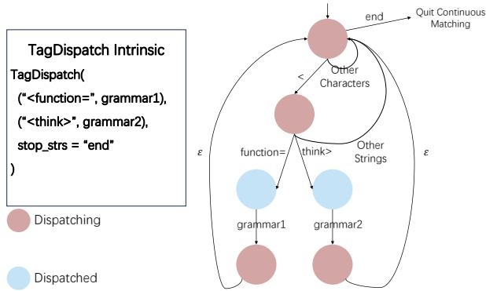  
Figure 3: The definition and the constructed automata from TagDispatch.

In XGrammar-2, structures are represented as multiple FSMs. Each FSM can have edges referring to another FSM to represent the recursive structure in EBNF. To eficiently reuse the token mask caches of the common sub-structures, we have two main challenges:

(1) How to detect the common substructures. We need to determine whether two FSMs are equivalent; since each FSM can refer to other FSMs, the checker also needs to check the referred FSM, and the reference structure may contain loops.

(2) How to reuse the token mask caches from other FSMs. In XGrammar, the token mask cache not only considers FSM’s structural information, but also how this FSM is referred to by other FSMs to further increase cache hit rate (see contextexpansion in XGrammar paper). Even though the structure of two FSM matches, the cache may not be simply reused because they have diferent referencing structure. [9].

For the first challenge, we design a hierarchical hashing algorithm for FSMs to detect identical sub-structures. This algorithm resolves the problem by assigning each FSM a structural hash that incorporates both its local state-transition structure and the wholestructure hashes of the FSMs referenced by its rule-reference edges. The key idea is to combine the hash of each referenced FSM into the hash of the referencing FSM, so that structural information is aggregated bottom-up along the FSM reference graph. Cyclic references break this bottom-up order and therefore require additional handling. The overall procedure is:

(1) Build the FSM reference graph induced by rule-reference edges.

(2) Hash the acyclic portion bottom-up with Algorithm 1.

(3) Handle each simple cycle using provisional hashes followed by cycle-hash refinement (Algorithm 2).

(4) Use the final FSM hashes as keys for cross-grammar cache reuse.

Algorithm 1 hashes one FSM, assuming that the hashes of all referenced FSMs are already available. It first canonicalizes the local state graph by deterministically sorting outgoing edges and assigning canonical state IDs via BFS from the initial state. It then traverses the states in this canonical order and incrementally hashes the serialized state and edge information, including the edge type, label, and target state ID. Therefore, for the acyclic portion of the reference graph, we can topologically sort the FSMs and apply Algorithm 1 in reverse topological order.

Simple cycles require additional handling because the bottom-up assumption of Algorithm 1 no longer holds: an FSM in the cycle may refer to another FSM whose final hash is not yet known. To address this, we first assign a special provisional value to unresolved rule-reference edges inside the cycle and apply Algorithm 1 to obtain provisional hashes for the FSMs in the cycle. We then apply Algorithm 2 [13] to refine these provisional hashes with the cycle structure itself. This yields distinct final hashes for diferent positions in the cycle and preserves the uniqueness of the resulting structural hashes.

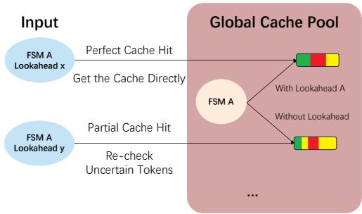  
Figure 4: Cross-grammar cache reuse under matching and mismatched lookahead conditions.

For the second challenge, in the cross-grammar cache, with a given rule with the FSM ??, we will check if the token mask caches for the same FSM have been computed Figure 4. If there is, then it is a cache hit. If the rules share the same lookahead assertion, then it is a perfect cache hit, and we can reuse the token mask cache directly. Otherwise, it is a partial cache hit, and we need to recheck all the uncertain tokens and the tokens that are validated by the original lookahead assertion. Then, we add the new cache to the global cache pool. In this method, most of the token mask cache will be reused. Once the size of the cross-grammar cache reaches the limit, we use LRU to evict entries. However, as we follow XGrammar’s adaptive storage method, the memory overhead of the cross-grammar cache remains low and rarely reaches this limit.

In summary, this cross-grammar cache can handle single FSMs, FSMs forming a tree reference structure, and also FSMs forming a graph with simple cycles, and maximize the cache reuse between and within grammars.

## 3.4 Adaptive Token Mask Cache with Earley Parsing

Prior works, such as XGrammar [9], use a token mask cache to accelerate mask generation by preprocessing the majority of tokens ahead of time. However, this design is tied to the state organization of pushdown automata. Under non-deterministic grammars, the number of PDA states can grow exponentially, which degrades both grammar compilation and runtime mask generation. To preserve the benefit of caching while improving eficiency on more complex grammars, we build a new adaptive cache mechanism on top of the Earley parser. This design inherits the cache-based acceleration strategy of prior work, while leveraging the stronger parsing eficiency of Earley parsing for complex context-free grammars.

Algorithm 1 Canonical Hash of One FSM Given Referenced FSM   
Hashes   
Input: Finite state machine  = ??, ??, ??, ??0 , where ??, ??, ?? , and   
?? denote the state set, edge set, final-state set, and initial state   
Input: For every rule-reference edge ??  ??, the hash of the   
referenced FSM ℎ ??.ref is already available   
Output: Canonical structural hash ℎ of   
Hash function: Let be an order-sensitive hash function over   
sequences   
Constants: NODE\_TAG, RANGE\_TAG, REF\_TAG, EPS\_TAG   
Phase 1: Canonical state ordering   
Sort the outgoing edges of each state in the following order:   
(1) character-range edges by ??.min, ??.max   
(2) rule-reference edges by ℎ ??.ref   
(3) epsilon edges   
Run BFS from ?? using the sorted outgoing edges   
Assign each state a canonical ID in discovery order   
Phase 2: Hash in the canonical order   
Let ?? be the map from states to their canonical IDs, and let   
ℎ 0   
for each state ?? in increasing canonical ID order do   
ℎ ℎ, NODE\_TAG, 1 ?? ??   
for each edge ?? in the sorted outgoing edges of ?? do   
if ?? is a character-range edge then   
ℎ ℎ, RANGE\_TAG, ??.min, ??.max, ?? ??.target   
else if ?? is a rule-reference edge then   
ℎ ℎ, REF\_TAG, ℎ ??.ref , ?? ??.target   
else   
{?? is an epsilon edge}   
ℎ ℎ, EPS\_TAG, ?? ??.target   
end if   
end for   
end for   
return ℎ

The Earley parser [10] maintains, at each input position, a set of partial parsing states. Each state records a production rule, a dot position within that rule, and the input position where the matching of this rule began. Together, these states define the current parsing frontier. This state organization provides a natural foundation for token-mask caching, while also requiring the cache to be defined over Earley parsing frontiers rather than the state representation used in PDA-based parsing.

Based on this observation, we design an adaptive token mask cache mechanism for the Earley parser. The key idea is to cache to ken validity only for the part of the parsing frontier that can directly afect the next decoding step. In Earley parsing, only scannable states, i.e., states whose next symbol is a terminal, can immediately determine whether a token may be accepted. We therefore construct caches only for these scannable states. Non-scannable states, whose next symbol is a non-terminal, are not considered in caching; instead, they will be expanded through Earley’s prediction and completion operations into scannable states.

Regarding the cache content, we adapt XGrammar’s token mask categorization to the Earley parser, categorizing tokens into accepted, rejected, and context-dependent cases. The first two categories can be determined by the current partial Earley parser state, while the context-dependent tokens require the whole parsing state history to be determined. At runtime, to compute the full token mask, we first retrieve the mask cache with the current scannable states, and then check the context-dependent tokens against the full Earley context. This design reduces cache construction overhead, enables efective cache reuse, and ensures eficient mask generation for complex non-deterministic grammars.

## 3.5 JIT Compilation of Adaptive Token Mask Cache

Prior eficient constrained decoding works, such as Outlines and XGrammar, have a compilation stage that computes a token mask cache for every possible state in the grammar. However, due to the intra-request dynamism in agentic tasks, one request may allow dozens or even hundreds of tools, resulting in a huge grammar that is too expensive to compile at the beginning. To avoid the large compilation overhead, we design a configurable JIT compilation system to amortize the grammar compilation overhead over the mask generation phase and avoid compilation for states that are never used.

To achieve JIT compilation, we design a token mask cache pool to store the generated token mask caches. This pool stores the cache corresponding to each grammar state and is initially empty. Each time we visit a new state, we will retrieve the pool for the state with the hash algorithm described in Section 3.3. If cache hits, we can reuse the token mask cache directly. Otherwise, we need to generate the token mask cache at runtime and update the token mask cache pool.

JIT compilation of the token mask cache amortizes computation from compile time to runtime. Runtime computation is overlapped with decoding, influencing per-token latency, while compilation is overlapped with prefilling and influences the time to the first token. We wish both to be hidden. It would be better hidden if we could flexibly adjust the ratio of compile-time computation amortized to runtime. Thus, we design the configurable JIT method to utilize the time. During preprocessing, we will estimate the time to generate the token mask cache for each state. Then, we will try to calculate ?? most time-consuming token mask, when the LLM is prefilling(?? is a fixed value, which is adjusted for the best performance). With this method, we can overlap the time of prefilling and preprocessing, and the time of decoding and mask generation well, achieving zero-overhead token mask generation.

## 3.6 Repetition State Compression

Repetition is widely used in grammar, especially in JSON schema. Keywords like MinLength, MaxLength, MinItems, MaxItems, etc., will generate repetition structures. If we handle the repetition structures trivially, then we need to generate a token mask cache for each possible grammar state, which is linear to the repetition times and time-consuming.

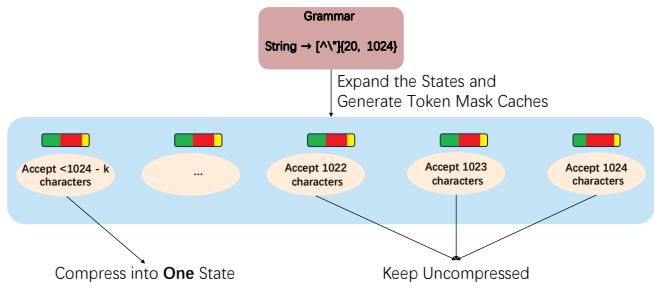  
Figure 5: Repetition State Compression.

We design a repetition state compression algorithm to speed up the process. The key insight is that in many cases, the diferences between states within a repetition are minimal, as illustrated in Fig ure 5, and we can compress the states, which bounds the size of the grammar. Formally, for a rule R, we introduce a special construct R{l, r} to describe the repetition structure. We require that R must consume at least one character to avoid repetition of zero length. The parser state for R{l, r} is (R{l, r}, k), where k denotes the time that R has repeated.

We can divide the raw repetition structures into three cases: (1) For R{l,r}, if r is small, then we expand the repetition structure as usual, since the grammar size is small. (2) If both l and r are large, then we can compress this structure. The structure will be further transformed into a sequence of R{l - t,r - t}(t is a chosen threshold constant) and t of the rule R. (3) If l is small, then we divide the R{l, r} into R{l,t} and R{t, r}. Then, we can handle each one in (1) and (2), respectively. The full algorithm is shown in Algorithm 3.

After the repetition state compression algorithm, all the unexpanded repetition structures will have a subsequence of t times of the rule R. Thus, when generating token mask caches, we can perceive the repetition structures as a single state that only accepts sequences conforming to R{0, t + 1}, and it significantly reduces the uncertainty of the token mask caches’ repetition structures. At runtime, we use the k of (R{l, r}, k) to check the uncertain tokens, which guarantees the correctness.

This method strikes a balance between the number of states and the uncertainty of the token mask cache. The number of states remains bounded by a constant, even for large repetition ranges, which increases the eficiency and the robustness.

## 4 Evaluation

In this section, we evaluate the eficiency and accuracy of XGrammar-2 and compare XGrammar-2 with state-of-the-art structured generation engines. Our experiments are motivated by the following questions:

How to quantify the dynamism in agentic tasks, and how does it afect the eficiency of structured generation? (§4.1)

Can XGrammar-2 handle grammar compilation and mask generation eficiently? (§4.2)

Can XGrammar-2 achieve minimal overhead for end-to-end function calling in LLM serving? (§4.3)

• How efective is each optimization technique introduced in XGrammar-2? (§4.4)

Can XGrammar-2 work correctly to constrain the LLMs’ outputs in agentic tasks? (§I)

For experiments focusing on the eficiency of token mask generation (§4.1, §4.2, §4.4, §G, §H), we use an AMD EPYC 9654 processor. For the end-to-end experiment (§4.3), the setup includes an Nvidia RTX 5090 GPU and an Intel(R) Xeon(R) Platinum 8470Q CPU. For accuracy evaluation (§I), we utilize an Nvidia B200 GPU and an Intel(R) Xeon(R) Platinum 8570 CPU. The software versions are as follows: XGrammar, v0.1.19; llguidance, v1.2.0; Outlines, v0.2.11; and SGLang, v0.5.3.post3. All mask generation engines are run with a single thread.

## 4.1 Quantifying Dynamism in Agentic Tasks

In this section, we quantify the dynamism in agentic tasks and justify the necessity of abstractions and optimizations introduced in this work, especially the TagDispatch intrinsic and the Crossgrammar Cache.

Inter-request Dynamism. The main challenge for inter-request dynamism is that diferent requests often require diferent structures, making full-grammar reuse inefective. We therefore quantify both whole-grammar overlap and reusable substructure overlap across requests.

We choose a tool pool of 1908 distinct tools from BFCL [27] and construct two scenarios, each containing 100 requests. In the static setting, every request uses the same 10, 100, or 500 tools to build the grammar. In the dynamic setting, each request samples 10, 100, or 500 tools uniformly at random from the tool pool. For each setting, we measure the reuse rate of full structures and substructures across requests, and report grammar compilation time in Figure 6, and the memory overhead of the cross-grammar cache is shown in Figure 7.

As shown in Table 1, inter-request dynamism significantly reduces the reuse of complete grammar structures in the dynamic setting. In contrast, substructure reuse remains much higher, indicating that although full grammars change frequently across requests, many underlying components can still be reused. This suggests that reuse opportunities exist primarily below the wholegrammar level. Figure 6 further shows that, in the dynamic setting, XGrammar’s compilation cost increases rapidly with the number of tools due to the lack of fine-grained cache, whereas XGrammar-2 scales much more gently with the cross-grammar cache. Figure 7 also shows that the memory overhead of the cross-grammar cache will not grow rapidly as the request number grows. Due to the design of the cross-grammar cache, the memory overhead is more relevant to the total number of used tools.

Overall, inter-request dynamism makes whole-grammar reuse inefective, since complete grammars change frequently across requests. At the same time, substantial reusable substructures remain, motivating cross-grammar reuse for eficient structured generation.

Intra-request Dynamism. The main challenge for intra-request dynamism is handling free-form text together with tag-triggered dynamic structures within a single request, which is cumbersome to express in EBNF and dificult to scale.

To quantify this complexity, we consider a natural construction of plain EBNF dispatching: we first build an Aho-Corasick automaton for tag matching and then translate it into EBNF. In this translation, each automaton node corresponds to a rule, and each transition corresponds to a rule reference. We therefore record the number of automaton states, the number of automaton transitions, and the size of the resulting EBNF to reflect the amount of grammar structure needed to encode the dispatching logic. All the used tags have a common prefix like <function=, and the rest are randomly generated.

As shown in Table 2, both the automaton size and the resulting EBNF size grow rapidly as the number of tags increases. This indicates that implementing dispatching through plain EBNF becomes increasingly cumbersome and scales poorly. Moreover, TagDispatch is much more eficient than the plain EBNF grammar. In contrast, TagDispatch represents the dispatch structure directly, making the implementation much clearer and more compact.

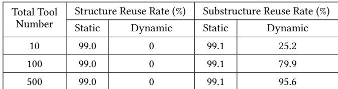  
Table 1: Structure and substructure reuse rate for static and dynamic workloads. Dynamic workloads fail to reuse the full structure, but can efectively reuse substructures.

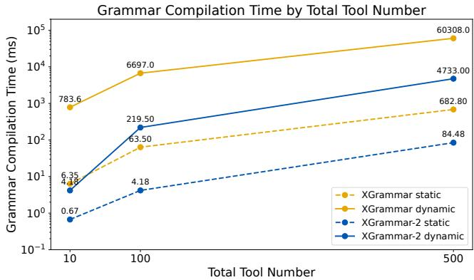  
Figure 6: Average Grammar compilation time for static and dynamic workloads. Dynamic workloads significantly increase compile time.

## 4.2 Grammar Processing Eficiency

In this section, we will evaluate the eficiency of grammar compilation and mask generation among several structured generation engines. We evaluate two major structures for agent tasks: function calling and response protocols are common scenarios for dynamic structured generation.

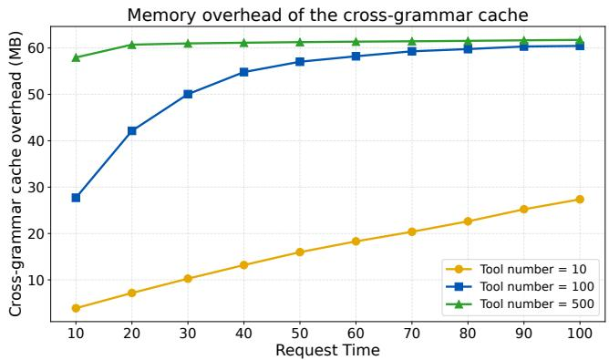  
Figure 7: The memory overhead of the cross-grammar cache(MB).

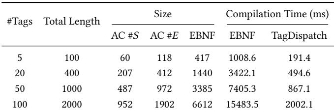  
Table 2: Measured sizes of the naturally constructed EBNF grammar and compilation time comparison between EBNF and TagDispatch.AC #S means the number of states in the AC Automaton; AC #E is the number of transitions in the AC Automaton.

In this part, we choose CONFETTI [3] as our dataset. CONFETTI provides a collection of functions and ground-truth contexts for large language models, consisting of both natural language text and function calls. This dataset efectively simulates real-world functioncalling scenarios. We modify the dataset to two common formats: Llama’s tool calling format and OpenAI Harmony Response Format. The results are shown in Figure 8, Figure 9. Besides, the cache hit rates of XGrammar-2 are: 71.43% (Llama’s Tool Calling Format and 47.21% (OpenAI Harmony Response Format).

The results show that XGrammar-2 has an advantage in pertoken overhead, while llguidance has about 250 us per-token overhead with OpenAI Harmony Response Format and a more than 1000 us per-token overhead with Llama’s Tool Calling Format. XGrammar also performs well on per-token overhead. However, for dynamic structured generation tasks, mask generation engines cannot know all the grammar at the very beginning. It will introduce huge overhead if the engine needs a long compilation time. The results of compilation time show that XGrammar-2 has a compilation time of about 10 ms, while XGrammar needs more than 1000 ms to compile. XGrammar-2 performs well on both per-token overhead and compilation time, which demonstrates that XGrammar-2 shows superior performance in grammar execution.

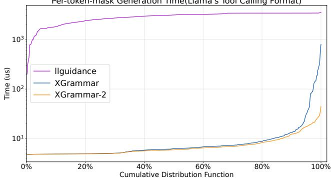

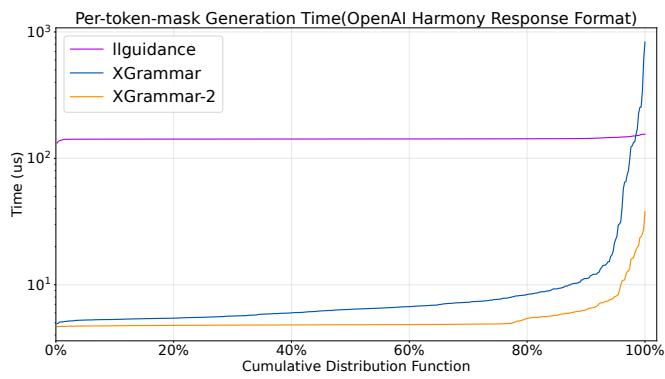

Figure 8: Average Per-token Overhead in Llama’s Tool Calling Format and OpenAI Harmony Response Format.  
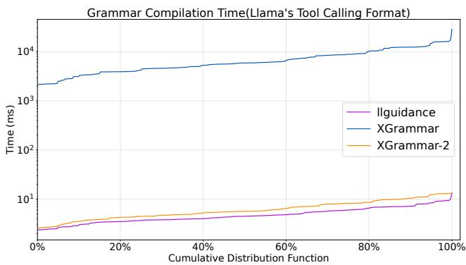

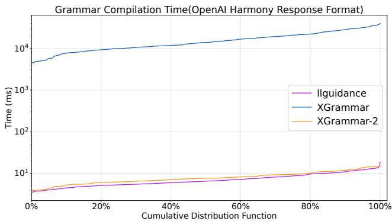  
Figure 9: Compilation Time in Llama’s Tool Calling Format and OpenAI Harmony Response Format.

## 4.3 End-to-end LLM Engine Evaluation

The results in §4.2 demonstrate that XGrammar-2 shows superior performance in grammar execution. In this section, we evaluate the overhead introduced by constrained decoding in real-world settings and examine whether our method achieves low-overhead structured generation for dynamic structured generation. We adopt BFCL-v3[27] as the dataset. BFCL-v3 is a dataset consisting of combinations of tools and prompts, which can be used to measure models’ ability to call functions. Thus, we can apply structured generation engines on the models to stimulate the real serving scenarios. We use Qwen-0.6B, Llama3.2-1B, Llama3.2-3B-Instruct, and Llama3.1-8B as the test models, and run the test with SGLang. SgLang-v0.5.3.post3 with Outlines-v0.2.11 cannot support dynamic structured generation like tool-calling. SgLang-v0.5.3.post3 with llguidance-v1.2.0 can support dynamic structured generation, but it results in empty outputs for Qwen3-0.6B and induces language drift from pure English to other languages in Llama3.1-8B. The results are shown in Figure 10 and Table 3.

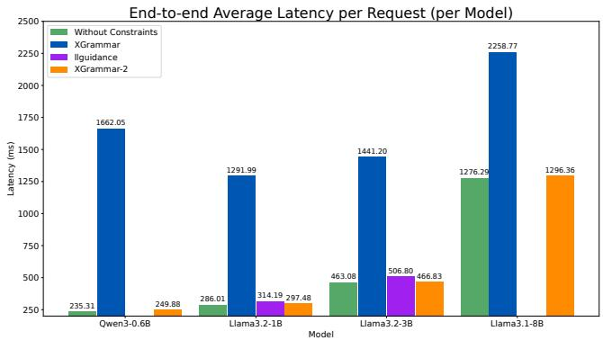  
Figure 10: End-to-end Function Calling Latency.

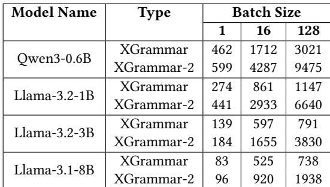  
Table 3: The output token throughput (token/s) With Diferent Models and Batch Size.

The results in Figure 10 show that compared to XGrammar, XGrammar-2 has about a 7x speedup over the end-to-end latency, and also a larger total token throughput. Besides, the gap between the result of XGrammar-2 and the result without constraints is no more than 6%. Compared with llguidance, XGrammar-2 shows a small latency and better compatibility. The output token throughput in Table 3 also shows that XGrammar-2 is superior to XGrammar. This demonstrates that XGrammar-2 can support dynamic structured generation eficiently.

## 4.4 Ablation Study of Optimization Techniques

In this section, we further investigate the eficiency improvements brought by our various optimizations to better illustrate the reasons for our design decisions. We start with a baseline implementation using the Earley parser and without any of the optimizations. Based on the baseline, we incrementally apply the proposed optimizations, namely JIT compilation, cross-grammar cache, and repetition state compression. We choose JSONSchemaBench [11] as the dataset. JSONSchemaBench collects about 11k JSON Schemas from about 20 lines to more than 200k lines. This dataset can be used to measure each optimization technique from multiple angles.

Table 4: Ablation study of optimization techniques.  
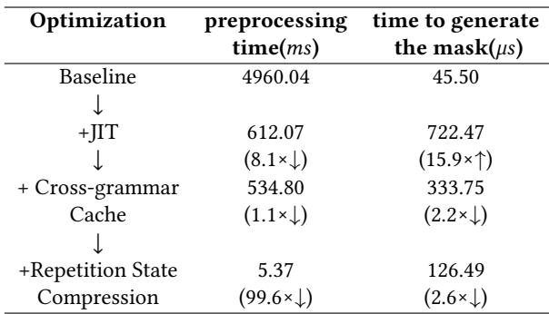

The results show that JIT serves as a general optimization technique that substantially improves preprocessing time, although it introduces additional overhead to generate the mask. Cross-Grammar Caching can generally reduce the time to generate the mask to an acceptable level, and keep the mask generation time low in cache-hit cases. Besides, Repetition Compression achieves significant improvements on some long-tail cases because it can ensure a constant process time on repetition structures. We also evaluate the benefit of the Earley Parser, and the result is in Appendix H.

## 5 Related Work

Several works focus on LLMs’ structured generation. In the very beginning, [35] proposed a new architecture to guide the output of models with pre-defined rules. PICARD[30] designs an algorithm to parse incrementally for Constrained Auto-Regressive decoding from language models. [22] proposes controlled decoding for align ment of LLMs. [31] explores utilizing prompts to specify the LLMs generation structure. [5, 18, 29] design finetuning technologies for higher quality structured generation. XGrammar-2 is orthogonal to these methods, and can be easily combined with them to better support structured generation.

Several frameworks have been proposed to support constrained decoding. Outlines [33] designs an FSM-based lexer and parser, and it caches several of the most common lexer tokens to speed up. However, when the LLMs output contains multiple lexemes, the caching algorithm cannot perform well. XGrammar [9] utilizes pushdown automata as the parsing backend, and it caches all the token mask caches in advance for better performance at runtime. However, it will sufer from a long compilation time in dynamic structured generation. llguidance [12] employs an Earley parser to parse the prior LLM output, and it applies a series of optimization algorithms to reduce per-token latency. But it targets specific JSON structures and has not yet generalized well to dynamic structured generation in agentic tool-calling use cases. WGRAMMAR [32] provides a structural template to reuse the token mask caches in the template to accelerate. But it has not generalized it to all similar grammar structures. XGrammar-2 builds on top and complements these previous approaches by enabling dynamic structured generation through tag dispatch, JIT-based cross-grammar cache mechanism, Earley parser, and the token mask cache.

Several LLM serving engines [14, 17, 21, 37] employ diferent techniques to support eficient LLM generation for multiple concurrent users. They design various techniques such as continuous batching [36] for dynamic request scheduling, low-level KV cache technique PagedKVCache [17] for eficient memory management, and [34] for a more customizable and eficient attention engine. These LLM serving engines can leverage XGrammar-2 for more eficient dynamic structured generation.

## 6 Conclusion

We proposed XGrammar-2, an eficient structured generation engine for LLMs’ dynamic structured generation tasks. We designed a dynamic dispatching semantics to eficiently support dynamic structured generation. Additionally, we designed a cross-grammar caching mechanism based on the Earley parser. We also introduce just-in-time (JIT) compilation for token mask caching, building upon the work of XGrammar. Finally, we design a repetition compression algorithm to handle several long-tail cases. Experimental results demonstrate that XGrammar-2 supports dynamic structured generation tasks with near-zero overhead. We hope that XGrammar-2 can significantly enhance the eficiency of dynamic structured generation tasks.

## Acknowledgments

This work is supported in part by Bosch and gifts from NVIDIA and Google. We also acknowledge the support of DGX B200 from NVIDIA. We would also like to thank, listed alphabetically, Databricks, the SGLang team, the TensorRT-LLM team, the vLLM team, and xAI, as well as Yi Wang, Xinyu Yang, Jieyu Zhang, Wenxin Zheng, and Ligeng Zhu, for their insightful feedback.

## References

[1] 1996. Information technology — Syntactic metalanguage — Extended BNF.

[2] Alfred V. Aho and Margaret J. Corasick. 1975. Eficient string matching: an aid to bibliographic search. Commun. ACM 18, 6 (June 1975), 333–340. doi:10.1145/ 360825.360855

[3] Tamer Alkhouli, Katerina Margatina, James Gung, Raphael Shu, Claudia Zaghi, Monica Sunkara, and Yi Zhang. 2025. CONFETTI: Conversational Function-Calling Evaluation Through Turn-Level Interactions. arXiv:2506.01859 [cs.CL] https://arxiv.org/abs/2506.01859

[4] John Bridle. 1989. Training Stochastic Model Recognition Algorithms as Networks can Lead to Maximum Mutual Information Estimation of Parameters. In Advances in Neural Information Processing Systems, D. Touretzky (Ed.), Vol. 2. Morgan-Kaufmann. https://proceedings.neurips.cc/paper\_files/paper/1989/file/ 0336dcbab05b9d5ad24f4333c7658a0e-Paper.pdf

[5] Sahil Chaudhary. 2023. Code Alpaca: An Instruction-following LLaMA model for code generation. https://github.com/sahil280114/codealpaca.

[6] N. Chomsky. 1956. Three models for the description of language. IRE Transactions on Information Theory 2, 3 (1956), 113–124. doi:10.1109/TIT.1956.1056813

[7] DeepSeek-AI, Daya Guo, Dejian Yang, Haowei Zhang, Junxiao Song, Ruoyu Zhang, Runxin Xu, Qihao Zhu, Shirong Ma, Peiyi Wang, Xiao Bi, Xiaokang Zhang, Xingkai Yu, Yu Wu, Z. F. Wu, Zhibin Gou, Zhihong Shao, Zhuoshu Li, Ziyi Gao, Aixin Liu, Bing Xue, Bingxuan Wang, Bochao Wu, Bei Feng, Chengda Lu, Chenggang Zhao, Chengqi Deng, Chenyu Zhang, Chong Ruan, Damai Dai, Deli Chen, Dongjie Ji, Erhang Li, Fangyun Lin, Fucong Dai, Fuli Luo, Guangbo Hao, Guanting Chen, Guowei Li, H. Zhang, Han Bao, Hanwei Xu, Haocheng Wang, Honghui Ding, Huajian Xin, Huazuo Gao, Hui Qu, Hui Li, Jianzhong Guo, Jiashi Li, Jiawei Wang, Jingchang Chen, Jingyang Yuan, Junjie Qiu, Junlong Li, J. L. Cai, Jiaq Ni, Jian Liang, Jin Chen, Kai Dong, Kai Hu, Kaige Gao, Kang Guan, Kexin Huang, Kuai Yu, Lean Wang, Lecong Zhang, Liang Zhao, Litong Wang, Liyue Zhang, Lei Xu, Leyi Xia, Mingchuan Zhang, Minghua Zhang, Minghui Tang, Meng Li, Miaojun Wang, Mingming Li, Ning Tian, Panpan Huang, Peng Zhang, Qiancheng Wang, Qinyu Chen, Qiushi Du, Ruiqi Ge, Ruisong Zhang, Ruizhe Pan, Runji Wang, R. J. Chen, R. L. Jin, Ruyi Chen, Shanghao Lu, Shangyan Zhou, Shanhuang Chen, Shengfeng Ye, Shiyu Wang, Shuiping Yu, Shunfeng Zhou, Shuting Pan, S. S. Li, Shuang Zhou, Shaoqing Wu, Shengfeng Ye, Tao Yun, Tian Pei, Tianyu Sun, T. Wang, Wangding Zeng, Wanjia Zhao, Wen Liu, Wenfeng Liang, Wenjun Gao, Wenqin Yu, Wentao Zhang, W. L. Xiao, Wei An, Xiaodong Liu, Xiaohan Wang, Xiaokang Chen, Xiaotao Nie, Xin Cheng, Xin Liu, Xin Xie, Xingchao Liu, Xinyu Yang, Xinyuan Li, Xuecheng Su, Xuheng Lin, X. Q. Li, Xiangyue Jin, Xiaojin Shen, Xiaosha Chen, Xiaowen Sun, Xiaoxiang Wang, Xinnan Song, Xinyi Zhou, Xianzu Wang, Xinxia Shan, Y. K. Li, Y. Q. Wang, Y. X. Wei, Yang Zhang, Yanhong Xu, Yao Li, Yao Zhao, Yaofeng Sun, Yaohui Wang, Yi Yu, Yichao Zhang, Yifan Shi, Yiliang Xiong, Ying He, Yishi Piao, Yisong Wang, Yixuan Tan, Yiyang Ma, Yiyuan Liu, Yongqiang Guo, Yuan Ou, Yuduan Wang, Yue Gong, Yuheng Zou, Yujia He, Yunfan Xiong, Yuxiang Luo, Yuxiang You, Yuxuan Liu, Yuyang Zhou, Y. X. Zhu, Yanhong Xu, Yanping Huang, Yaohui Li, Yi Zheng, Yuchen Zhu, Yunxian Ma, Ying Tang, Yukun Zha, Yuting Yan, Z. Z. Ren, Zehui Ren, Zhangli Sha, Zhe Fu, Zhean Xu, Zhenda Xie, Zhengyan Zhang, Zhewen Hao, Zhicheng Ma, Zhigang Yan, Zhiyu Wu, Zihui Gu, Zijia Zhu, Zijun Liu, Zilin Li, Ziwei Xie, Ziyang Song, Zizheng Pan, Zhen Huang, Zhipeng Xu, Zhongyu Zhang, and Zhen Zhang. 2025. DeepSeek-R1: Incentivizing Reasoning Capability in LLMs via Reinforcement Learning. arXiv:2501.12948 [cs.CL] https://arxiv.org/abs/2501.12948

[8] Daniel Deutsch, Shyam Upadhyay, and Dan Roth. 2019. A General-Purpose Algorithm for Constrained Sequential Inference. In Proceedings of the 23rd Conference on Computational Natural Language Learning (CoNLL), Mohit Bansal and Aline Villavicencio (Eds.). Association for Computational Linguistics, Hong Kong, China, 482–492. doi:10.18653/v1/K19-1045

[9] Yixin Dong, Charlie F Ruan, Yaxing Cai, Ruihang Lai, Ziyi Xu, Yilong Zhao, and Tianqi Chen. 2024. Xgrammar: Flexible and eficient structured generation engine for large language models. Proceedings of Machine Learning and Systems 7 (2024).

[10] Jay Earley. 1970. An eficient context-free parsing algorithm. Commun. ACM 13, 2 (1970), 94–102. doi:10.1145/362007.362035

[11] Saibo Geng, Hudson Cooper, Michał Moskal, Samuel Jenkins, Julian Berman, Nathan Ranchin, Robert West, Eric Horvitz, and Harsha Nori. 2025. Generating Structured Outputs from Language Models: Benchmark and Studies. arXiv:2501.10868 [cs.CL] https://arxiv.org/abs/2501.10868

[12] Guidance-ai. 2024. GitHub - guidance-ai/llguidance: Super-fast Structured Out puts — github.com. https://github.com/guidance-ai/llguidance. [Accessed 13-10- 2025].

[13] Caleb Helbling. 2020. Directed Graph Hashing. CoRR abs/2002.06653 (2020). arXiv:2002.06653 https://arxiv.org/abs/2002.06653

[14] hiworldwzj, shihaobai, sufubao, WANDY666, FlyingFlame, llehtahw, LiangLiu, wxd000000, fuheaven, XHPlus, Chielo, Yang Yong, and\_gate, sangchengmeng, wangzhihong, singularity, Shuo Yang, Wu SiYu, Tracin, Elsa Granger, Hamel Husain, S A G A R, SunXiaoye, Tao Peng, Uranus, Yunfeng Bai, Yunqian Fan, bingo, liuhuakai, and XFPlus. 2024. ModelTC/lightllm. https://github.com ModelTC/lightllm

[15] Michael Kuchnik, Virginia Smith, and George Amvrosiadis. 2023. Validating large language models with relm. Proceedings of Machine Learning and Systems 5 (2023), 457–476.

[16] Dominik Kundel. 2025. OpenAI Harmony Response Format. https://cookbook. openai.com/articles/openai-harmony/. Accessed: 2025-10-27.

[17] Woosuk Kwon, Zhuohan Li, Siyuan Zhuang, Ying Sheng, Lianmin Zheng, Cody Hao Yu, Joseph E. Gonzalez, Hao Zhang, and Ion Stoica. 2023. Eficient Memory Management for Large Language Model Serving with PagedAttention. In Proceedings of the ACM SIGOPS 29th Symposium on Operating Systems Principles.

[18] Raymond Li, Loubna Ben Allal, Yangtian Zi, Niklas Muennighof, Denis Kocetkov, Chenghao Mou, Marc Marone, Christopher Akiki, Jia Li, Jenny Chim, Qian Liu, Evgenii Zheltonozhskii, Terry Yue Zhuo, Thomas Wang, Olivier Dehaene, Mishig Davaadorj, Joel Lamy-Poirier, João Monteiro, Oleh Shliazhko, Nicolas Gontier, Nicholas Meade, Armel Zebaze, Ming-Ho Yee, Logesh Kumar Umapathi, Jian Zhu, Benjamin Lipkin, Muhtasham Oblokulov, Zhiruo Wang, Rudra Murthy, Jason

Stillerman, Siva Sankalp Patel, Dmitry Abulkhanov, Marco Zocca, Manan Dey, Zhihan Zhang, Nour Fahmy, Urvashi Bhattacharyya, Wenhao Yu, Swayam Singh, Sasha Luccioni, Paulo Villegas, Maxim Kunakov, Fedor Zhdanov, Manuel Romero, Tony Lee, Nadav Timor, Jennifer Ding, Claire Schlesinger, Hailey Schoelkopf, Jan Ebert, Tri Dao, Mayank Mishra, Alex Gu, Jennifer Robinson, Carolyn Jane Anderson, Brendan Dolan-Gavitt, Danish Contractor, Siva Reddy, Daniel Fried, Dzmitry Bahdanau, Yacine Jernite, Carlos Muñoz Ferrandis, Sean Hughes, Thomas Wolf, Arjun Guha, Leandro von Werra, and Harm de Vries. 2023. StarCoder: may the source be with you! arXiv:2305.06161 [cs.CL] https://arxiv.org/abs/2305.06161 9] Meta-AI. 2024. Tool calling with Llama. https://www.llama.com/resources cookbook/toolcalling-with-llama/. Accessed: 2025-10-27

[20] Microsoft. 2026. What is Foundry Agent Service? Microsoft. https://learn. microsoft.com/en-us/azure/ai-foundry/agents/overview Accessed: 2026-02-22; Microsoft Learn documentation on Azure AI Foundry Agent Service overview. [21] MLC team. 2023. MLC-LLM. https://github.com/mlc-ai/mlc-llm

[22] Sidharth Mudgal, Jong Lee, Harish Ganapathy, YaGuang Li, Tao Wang, Yanping Huang, Zhifeng Chen, Heng-Tze Cheng, Michael Collins, Trevor Strohman, Jilin Chen, Alex Beutel, and Ahmad Beirami. 2024. Controlled Decoding from Language Models. arXiv:2310.17022 [cs.LG] https://arxiv.org/abs/2310.17022

[23] Andreas Opedal, Ran Zmigrod, Tim Vieira, Ryan Cotterell, and Jason Eisner. 2023. Eficient Semiring-Weighted Earley Parsing. arXiv:2307.02982 [cs.CL] https://arxiv.org/abs/2307.02982

[24] OpenAI, :, Sandhini Agarwal, Lama Ahmad, Jason Ai, Sam Altman, Andy Applebaum, Edwin Arbus, Rahul K. Arora, Yu Bai, Bowen Baker, Haiming Bao, Boaz Barak, Ally Bennett, Tyler Bertao, Nivedita Brett, Eugene Brevdo, Greg Brockman, Sebastien Bubeck, Che Chang, Kai Chen, Mark Chen, Enoch Cheung, Aidan Clark, Dan Cook, Marat Dukhan, Casey Dvorak, Kevin Fives, Vlad Fomenko, Timur Garipov, Kristian Georgiev, Mia Glaese, Tarun Gogineni, Adam Goucher, Lukas Gross, Katia Gil Guzman, John Hallman, Jackie Hehir, Johannes Heidecke, Alec Helyar, Haitang Hu, Romain Huet, Jacob Huh, Saachi Jain, Zach Johnson, Chris Koch, Irina Kofman, Dominik Kundel, Jason Kwon, Volodymyr Kyrylov, Elaine Ya Le, Guillaume Leclerc, James Park Lennon, Scott Lessans, Mario Lezcano-Casado, Yuanzhi Li, Zhuohan Li, Ji Lin, Jordan Liss, Lily, Liu, Jiancheng Liu, Kevin Lu, Chris Lu, Zoran Martinovic, Lindsay McCallum, Josh McGrath, Scott McKin ney, Aidan McLaughlin, Song Mei, Steve Mostovoy, Tong Mu, Gideon Myles, Alexander Neitz, Alex Nichol, Jakub Pachocki, Alex Paino, Dana Palmie, Ashley Pantuliano, Giambattista Parascandolo, Jongsoo Park, Leher Pathak, Carolina Paz, Ludovic Peran, Dmitry Pimenov, Michelle Pokrass, Elizabeth Proehl, Huida Qiu, Gaby Raila, Filippo Raso, Hongyu Ren, Kimmy Richardson, David Robinson, Bob Rotsted, Hadi Salman, Suvansh Sanjeev, Max Schwarzer, D. Sculley, Harshit Sikchi, Kendal Simon, Karan Singhal, Yang Song, Dane Stuckey, Zhiqing Sun, Philippe Tillet, Sam Toizer, Foivos Tsimpourlas, Nikhil Vyas, Eric Wallace, Xin Wang, Miles Wang, Olivia Watkins, Kevin Weil, Amy Wendling, Kevin Whin nery, Cedric Whitney, Hannah Wong, Lin Yang, Yu Yang, Michihiro Yasunaga, Kristen Ying, Wojciech Zaremba, Wenting Zhan, Cyril Zhang, Brian Zhang, Ed die Zhang, and Shengjia Zhao. 2025. gpt-oss-120b & gpt-oss-20b Model Card. arXiv:2508.10925 [cs.CL] https://arxiv.org/abs/2508.10925

[25] OpenAI Help Center. 2025. Apps in ChatGPT. https://help.openai.com/en/articles/ 11487775-apps-in-chatgpt. https://help.openai.com/en/articles/11487775-appsin-chatgpt Accessed: 2026-02-27.

[26] Joon Sung Park, Joseph C. O’Brien, Carrie J. Cai, Meredith Ringel Morris, Percy Liang, and Michael S. Bernstein. 2023. Generative Agents: Interactive Simulacra of Human Behavior. In In the 36th Annual ACM Symposium on User Interface Software and Technology (UIST ’23) (San Francisco, CA, USA) (UIST ’23). Association for Computing Machinery, New York, NY, USA.

[27] Shishir G. Patil, Huanzhi Mao, Charlie Cheng-Jie Ji, Fanjia Yan, Vishnu Suresh, Ion Stoica, and Joseph E. Gonzalez. 2025. The Berkeley Function Calling Leaderboard (BFCL): From Tool Use to Agentic Evaluation of Large Language Models. In Forty-second International Conference on Machine Learning.

[28] Qwen. 2024. Function Calling – Qwen. https://qwen.readthedocs.io/en/latest/ framework/function\_call.html. Accessed: 2025-10-27.

[29] Baptiste Rozière, Jonas Gehring, Fabian Gloeckle, Sten Sootla, Itai Gat, Xiaoqing Ellen Tan, Yossi Adi, Jingyu Liu, Romain Sauvestre, Tal Remez, Jérémy Rapin, Artyom Kozhevnikov, Ivan Evtimov, Joanna Bitton, Manish Bhatt, Cristian Canton Ferrer, Aaron Grattafiori, Wenhan Xiong, Alexandre Défossez, Jade Copet, Faisal Azhar, Hugo Touvron, Louis Martin, Nicolas Usunier, Thomas Scialom, and Gabriel Synnaeve. 2024. Code Llama: Open Foundation Models for Code. arXiv:2308.12950 [cs.CL] https://arxiv.org/abs/2308.12950

[30] Torsten Scholak, Nathan Schucher, and Dzmitry Bahdanau. 2021. PICARD: Parsing Incrementally for Constrained Auto-Regressive Decoding from Language Models. arXiv:2109.05093 [cs.CL] https://arxiv.org/abs/2109.05093

[31] Bailin Wang, Zi Wang, Xuezhi Wang, Yuan Cao, Rif A. Saurous, and Yoon Kim. 2023. Grammar Prompting for Domain-Specific Language Generation with Large Language Models. arXiv:2305.19234 [cs.CL] https://arxiv.org/abs/2305.19234

[32] Ran Wang, Xiaoxuan Liu, Hao Ren, Gang Chen, Fanchao Qi, and Maosong Sun. 2025. WGRAMMAR: Leverage Prior Knowledge to Accelerate Structured Decoding. arXiv:2507.16768 [cs.AI] https://arxiv.org/abs/2507.16768

[33] Brandon T. Willard and Rémi Louf. 2023. Eficient Guided Generation for Large Language Models. arXiv:2307.09702 [cs.CL] https://arxiv.org/abs/2307.09702

[34] Zihao Ye, Lequn Chen, Ruihang Lai, Wuwei Lin, Yineng Zhang, Stephanie Wang, Tianqi Chen, Baris Kasikci, Vinod Grover, Arvind Krishnamurthy, and Luis Ceze. 2025. FlashInfer: Eficient and Customizable Attention Engine for LLM Inference Serving. arXiv:2501.01005 [cs.DC] https://arxiv.org/abs/2501.01005

[35] Pengcheng Yin and Graham Neubig. 2017. A Syntactic Neural Model for General Purpose Code Generation. arXiv:1704.01696 [cs.CL] https://arxiv.org/abs/1704. 01696

[36] Gyeong-In Yu, Joo Seong Jeong, Geon-Woo Kim, Soojeong Kim, and Byung-Gon Chun. 2022. Orca: A Distributed Serving System for Transformer-Based Generative Models. In 16th USENIX Symposium on Operating Systems Design and Implementation (OSDI 22). USENIX Association, Carlsbad, CA, 521–538. https: //www.usenix.org/conference/osdi22/presentation/yu

[37] Lianmin Zheng, Liangsheng Yin, Zhiqiang Xie, Chuyue Sun, Jef Huang, Cody Hao Yu, Shiyi Cao, Christos Kozyrakis, Ion Stoica, Joseph E. Gonzalez, Clark Barrett, and Ying Sheng. 2024. SGLang: Eficient Execution of Structured Lan guage Model Programs. arXiv:2312.07104 [cs.AI] https://arxiv.org/abs/2312.07104

## A The Hash Algorithm for Simple Cycle Structure

Algorithm 1 presents the procedure for hashing FSMs in a simple cycle structure. In this setting, all FSMs referenced by those in the cycle are first hashed using Algorithm 1. Consequently, for each FSM in the cycle, exactly one referenced FSM remains unhashed, namely the next FSM in the cycle. We therefore assign a shared placeholder constant ?? to these unresolved references and compute a hash for each FSM using Algorithm 1. This yields a local hash value for each FSM, which captures only the individual FSM but not the overall cycle structure. Finally, we combine the local hash values of all FSMs in the cycle to derive the final hash for each FSM. Since the hash function is non-commutative, the resulting final hash values are unique.

Algorithm 2 Handle Simple Cycle Structure in FSM Reference   
Input: a series of local hash values of simple-cycle FSMs   
??0, ??1, ..., ????   
Output: a series of final hash values of simple-cycle FSMs   
??0, ??1, ..., ????   
for ?? in range ?? 1 do   
???? 0   
for ?? in range ?? 1 do   
???? ← H (????, ?? ?? ?? mod ?? )   
end for   
end for   
return ??0, ??1, ..., ????

## B The Algorithm for Repetition State Compression

Algorithm 3 shows the algorithm to perform the repetition state compression algorithm in detail.

## C More Explanation of the Hash Algorithm

For most FSMs, this algorithm generates a consistent hash value. However, there are two cases where it may produce diferent hash values for FSMs with the same structure: (1) the FSM is not a de terministic finite automaton (DFA); (2) there are duplicated FSMs in the grammars, and they are referenced by a common FSM. In these cases, the algorithm may generate inconsistent hash values. Nevertheless, this does not undermine the suficiency of the algorithm: if two FSMs share the same hash value, they must have the same structure. In addition, in our implementation, we attempt to transform most FSMs into DFAs. Moreover, since we have a deterministic conversion function for JSON Schemas and regular expressions, two FSMs with the same structure are likely to produce the same hash value due to this deterministic transformation. As a result, we can detect and reuse identical structures within and across grammars maximally.

Algorithm 3 Repetition State Compression Algorithm   
Input: A triplet ??????, ??????, ??????????????   
Output: A expression ????????   
Const: ????????????????????????ℎ??????ℎ?????? ??   
if ?????? ?? then   
????????  Expand ??????, ??????, ??????????????   
return   
end if   
if ?????? < ?? then   
????ℎ???? \_??ℎ?????????? Expand ??????, ??, ??????????????   
??ℎ???????? Concat Repeat ??, ??????, ?????????????? ,   
Expand 0, ?????? ??, ??????????????   
???????? Union ??ℎ????????, ????ℎ???? \_??ℎ??????????   
return   
end if   
for ?? range ?? do   
???????? Concat ????????, ??????????????   
end for   
???????? Concat ????????, Repeat ?????? ??, ?????? ??, ??????????????   
function Repeat(??????,??????, ??????????????)   
return a repetition expression that accepts ?????????????? at least   
?????? times and at most ?????? times   
end function   
function Expand(??????,??????, ??????????????)   
return an explicit expansion equivalent to the repetition ex  
pression   
end function   
function Union(????????1, ????????2)   
return an expression that matches either ????????1 or ????????2   
end function   
function Concat(????????1, ????????2)   
return an expression that matches ????????1 followed by ????????2   
end function

## D Discussion on the Parameter K in Configurable JIT

The parameter ?? depends on both the GPU and the CPU. Tuning it with elaboration can improve the eficiency and stability. We swept ?? under the setup described in Section 4.2, using Llama’s tool-calling format. The results are summarized in Table 5.

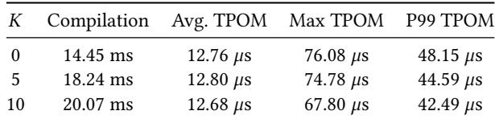  
Table 5: Efect of ?? on compilation time and TPOM metrics.

Across this sweep, average TPOM is almost unchanged while compilation time increases with ??. P99 and max TPOM decrease from ??=0 to ??=10, indicating a trade-of between compilation cost and tail latency.

## E XGrammar’s Adaptive Token Mask cache Generation Algorithm

In XGrammar, all grammars are processed as a group of FSMs. During compilation, for each state of the FSMs, a corresponding adaptive token mask cache is generated. Each adaptive token mask cache consists of three parts:

Accepted tokens: tokens that can be accepted by the FSM and thus conform to the grammar.

Rejected tokens: tokens that will be rejected by the FSM and therefore do not conform to the grammar.

Uncertain tokens: tokens that can reach the final state(s) of the FSMs without consuming all their characters. The remaining part must be checked at runtime.

At runtime, we collect all the current states. Tokens that can be accepted by at least one adaptive token mask cache are directly marked as accepted. For the remaining tokens, if a token is marked as uncertain in at least one adaptive token mask cache, we further check whether it can be accepted given the current states. If so, it is also marked as accepted. All other tokens are marked as rejected. Through this process, a final token mask is generated.

## F Earley’s Parsing Algorithm

The eficiency of the Earley parser comes from its well-designed algorithm, which applies dynamic programming. During parsing, it records the current state (the rule and the position within the rule), the number of characters consumed, and the starting position of the current rule. Based on the information, the parser performs three basic operations: predict, scan, and complete. Predict applies when the current position in a rule references another rule; in this case, the parser transitions to the referenced rule and applies Earley’s algorithm recursively. Scan applies when the rule expects a character, and the parser checks whether the current character can be accepted by the state. Complete applies when a rule reaches its end; the parser then returns to its parent states (which may be multiple) and advances them. With these three operations, the Earley parser eficiently exploits common substructures among diferent rules, thereby improving parsing performance.

## G Mask Generation Eficiency on JSON Schemas

Although this paper focuses on dynamic structure generation in agentic use cases, it is still interesting to see how XGrammar-2 performs on generations with pre-defined static JSON schemas.

The dataset in JSONSchemaBench [11]. The results are in Figure 11. XGrammar-2 can also perform well on static structured generation tasks. Additionally, XGrammar-2 brings improved grammar compilation time to compile most JSON Schemas within 1 ms.

JSON Schema Compilation Time  
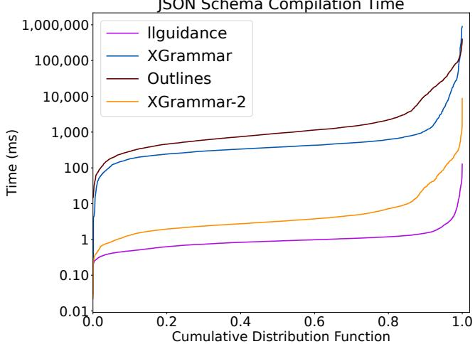

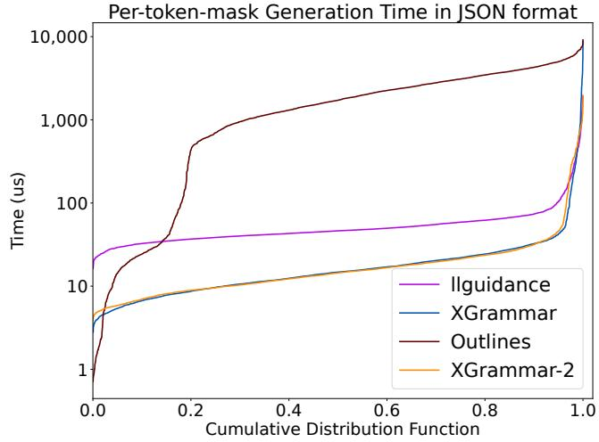  
Figure 11: JSONSchemaBench.

## H Ablation Study Between the Earley Parser and PDA Based Parser

We also want to measure the advantages of the Earley Parser as an ablation study. Thus, we evaluate the eficiency of XGrammar-2, with PDA based parser and the Earley Parser, respectively, and both of them will compile the JSON schemas ahead of time. The dataset is JSONSchemaBench [11], and the result in Figure 12 shows that the Earley Parser can significantly reduce the grammar compilation. Note that the long-tail is caused by the huge inputs, instead of the complexity of the algorithm.

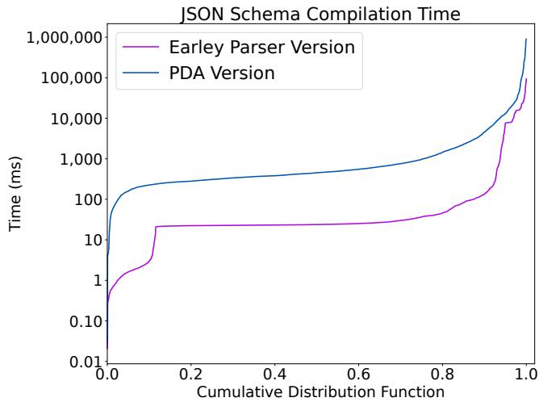  
Figure 12: Comparison between the Earley Parser and PDA on JSONSchemaBench.

## I Correctness and Task-level Efectiveness

By construction, constrained decoding guarantees that generated outputs conform to the target structure (e.g., JSON schema or toolcalling format). XGrammar-2 preserves the same constraint semantics as XGrammar, and thus both achieve 100% schema-valid tool-call arguments whenever a tool call is produced; the diference is eficiency (Section 4.3).

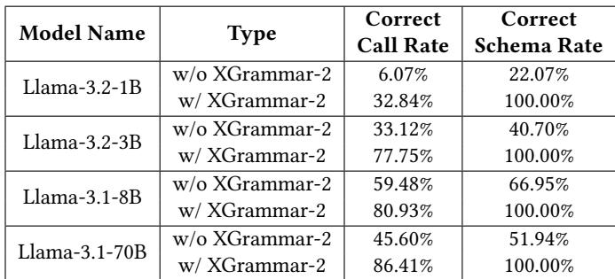  
Table 6: The function calling accuracy rate and the JSON schema validity rate.

To validate end-to-end correctness and quantify task-level impact in realistic agent settings, we evaluate on BFCL-v3 [27]. As shown in Table 6, grammar-constrained decoding (XGrammar-2) substantially improves BFCL function-calling outcomes for most models, primarily by eliminating malformed tool calls (e.g., invalid JSON or schema violations) that would otherwise be unexecutable and scored as failures. Constraint enforcement can also narrow the gap between small and large models; for example, XGrammar-2 enables Llama-3.2-3B to outperform an unconstrained Llama-3.1-70B baseline on BFCL.

## J Formal Definitions of the Earley Parser and the Token Mask Generation with Cache

Table 7 shows the formal definition of the Earley Parser [23], and the formal definition of the token mask generation with cache. In the Table 7, Grammar Production represents a series of rules in the format of rule ??, where ?? ??, ?? is the sequence of the rule. ??, ?? represents the non-terminal elements in the sequence, and ?? represents the terminal element. is the vocabulary of the tokenizer. For a token mask cache, means the set of accepted tokens, means the set of uncertain tokens, and means the set of rejected tokens.

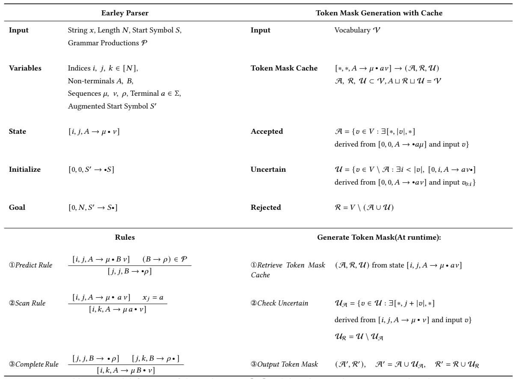  
Table 7: Formal definitions of the Earley parser[23] and the token mask generation with cache.