# SkyServe: Serving AI Models across Regions and Clouds with Spot Instances

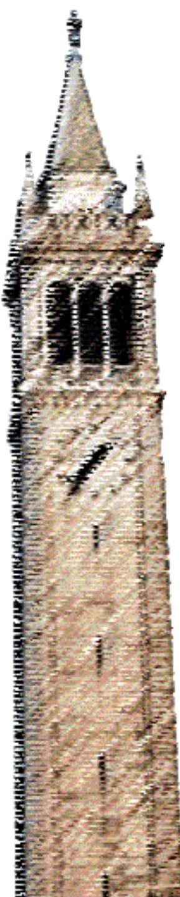

Ziming Mao

Tian Xia

Zhanghao Wu

Wei-Lin Chiang

Tyler Griggs

Romil Bhardwaj

Zongheng Yang

Scott Shenker

Ion Stoica

Electrical Engineering and Computer Sciences University of California, Berkeley

Technical Report No. UCB/EECS-2025-227

http://www2.eecs.berkeley.edu/Pubs/TechRpts/2025/EECS-2025-227.html

December 31, 2025

Copyright © 2025, by the author(s).

## All rights reserved.

Permission to make digital or hard copies of all or part of this work for personal or classroom use is granted without fee provided that copies are not made or distributed for profit or commercial advantage and that copies bear this notice and the full citation on the first page. To copy otherwise, to republish, to post on servers or to redistribute to lists, requires prior specific permission.

## Acknowledgement

This work is in part supported by gifts from Accenture, AMD, Anyscale, Google, IBM, Intel, Microsoft, Mohamed Bin Zayed University of Artificial Intelligence, Samsung SDS, Uber, and VMware.

# SkyServe: Serving AI Models across Regions and Clouds with Spot Instances

by Ziming Mao

## Research Project

Submitted to the Department of Electrical Engineering and Computer Sciences, University of California at Berkeley, in partial satisfaction of the requirements for the degree of Master of Science, Plan II.

Approval for the Report and Comprehensive Examination:

Committee:

Professor Ion Stoica Research Advisor

(Date)


Professor Scott Shenker Second Reader

(Date)

# SkyServe: Serving AI Models across Regions and Clouds with Spot Instances

Ziming Mao→† Tian Xia→† Zhanghao Wu† Wei-Lin Chiang† Tyler Griggs† Romil Bhardwaj† Zongheng Yang† Scott Shenker†↑ Ion Stoica† †UC Berkeley ↑ICSI

## Abstract

Recent years have witnessed an explosive growth of AI mod els. The high cost of hosting AI services on GPUs and their demanding service requirements, make it timely and challenging to lower service costs and guarantee service quality. While spot instances have long been offered with a large discount, spot preemptions have discouraged users from using them to host model replicas when serving AI models.

To address this, we propose a simple yet efficient policy, SpotHedge, that leverages spot replicas across different failure domains (e.g., regions and clouds) to ensure availability, lower costs, and high service quality. SpotHedge intelligently spreads spot replicas across different regions and clouds to improve availability and reduce correlated preemptions, overprovisions cheap spot replicas than required as a safeguard against possible preemptions, and dynamically falls back to on-demand replicas when spot replicas become unavailable. We built SkyServe, a system leveraging SpotHedge to efficiently serve AI models over a mixture of spot and on-demand replicas across regions and clouds. We compared SkyServe with both research and production systems on real AI workloads: SkyServe reduces cost by 43% on average while achieving high resource availability compared to using on-demand replicas. Additionally, SkyServe improves P50, P90, and P99 latency by 2.3 , 2.1 , 2.1 on average compared to other research and production systems.

CCS Concepts: • Computing methodologies Artificial intelligence; Distributed computing methodologies.

Keywords: Spot Instance, AI Serving, Multi-cloud, Cloud Computing

## ACM Reference Format:

Ziming Mao, Tian Xia, Zhanghao Wu, Wei-Lin Chiang, Tyler Griggs, Romil Bhardwaj, Zongheng Yang, Scott Shenker, Ion Stoica. 2025.

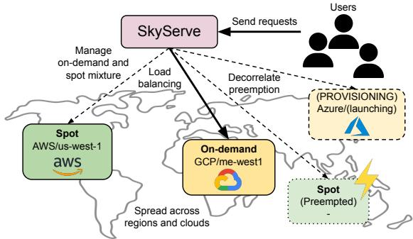  
Figure 1. SkyServe Overview. SkyServe leverages SpotHedge to intelligently provisions and manages a mixture of spot and on-demand replicas across regions and clouds to minimize preemptions, improve availability, and reduce cost.

SkyServe: Serving AI Models across Regions and Clouds with Spot Instances. In Twentieth European Conference on Computer Systems (EuroSys ’25), March 30–April 3, 2025, Rotterdam, Netherlands. ACM, New York, NY, USA, 17 pages. https://doi.org/10.1145/ 3689031.3717459

## 1 Introduction

Generative AI has experienced explosive growth in the past several years, which has enabled a plethora of new applications, such as large language model (LLM) chatbots [9, 20], programming assistants [15], image generation [11], and writing assistants [17]. Many companies [21, 25, 32–34] offer these models as hosted services on the cloud. A service is composed of multiple model replicas; each replica runs on one or more GPU instances. However, serving these models is challenging: not only do they need to be highly available and serve user requests under tight latency constraints, but they are also expensive to operate. Each request served by these models can take several seconds, if not tens of seconds to process. [28, 51, 60]. Compared to traditional web services, AI systems have much higher compute requirements [56] and costs [13].

spikes (up to 50 on average [51]) and service latency fluc tuations [30]. This results in organizations over-provisioning (provisioning more than required by traffic) more replicas than needed to serve average user traffic or sometimes even provisioning for the peak load, both of which exacerbate the high serving cost.

Spot instances have long been offered by cloud providers as a cost-saving option (8-50% cost of on-demand; Table 1). However, serving AI models on spot GPU instances (or "spot replicas") has a few key challenges. First, spot instances can be preempted by the provider at any time, and preemptions of spot GPUs are much more common than spot CPUs (§2.3). Second, when preemptions happen, service quality can degrade due to fewer replicas responding to requests. Naively placing spot replicas in a single region can lead to limited availability and correlated preemptions, where multiple spot instances are preempted simultaneously, potentially resulting in service downtime (§2.2). Finally, recovery of spot replicas can be slow due to the long cold start and provisioning delays, on the order of minutes (§2.3), or even infeasible, due to the immediate unavailability of spot instances after preemption, in the same zone or region.

Most prior work [43–45, 69, 73, 77] focuses on the more available spot CPU instances (§2.3) or on training workloads [36, 67, 74]. However, serving AI models on spot GPUs requires the system to be robust to frequent preemptions, spot unavailability, and significant cold start delays. Spot preemption warnings cannot address the problem, as the time to find available instances, provision, and load models typically exceeds the best-effort preemption warnings (2 minutes on AWS and 30 seconds on GCP and Azure). Spot instances can also be simultaneously unavailable or preempted in practice (§2.2). As such, serving model replicas on spot GPUs while maintaining high service quality has not been widely considered viable in practice.

We show that leveraging spot replicas in AI model serving is not only feasible, but can ensure high availability, lower costs, and improve service quality. We propose a simple yet effective policy, SpotHedge, that uses a dynamic mixture of spot and on-demand replicas across regions and clouds to minimize the cost and improve service latency. First, SpotHedge improves availability and decorrelates preemptions by spread ing spot replicas across wider failure domains (regions or clouds), compared to the common practice of launching in the same zone or region [4, 16, 53, 77]. Using more regions and clouds enlarges the search space where spot instances can be provisioned, significantly improving availability and speeding up recovery. We have observed that a single-region deployment of spot replicas is often not viable due to instance unavailability, leading to service downtime (§2.2). Second, to avoid degraded service on preemptions, and to ensure high availability, SpotHedge proactively uses on-demand replicas (model replicas running on on-demand instances) as a fallback. On-demand instances are typically available if we search and provision across regions and clouds. Third, SpotHedge mitigates preemption by over-provisioning with cheap spot replicas instead of expensive on-demand replicas. Even when some spot replicas are preempted, these additional over-provisioned replicas will mitigate the impact of preemption. Thus, a service is backed by a dynamic mixture of spot and on-demand replicas.

We implemented SpotHedge in SkyServe, a real system that provides a unified interface to launch services on a mixture of spot and on-demand replicas across regions and clouds (Figure 1). Users leverage any existing model inference server (e.g., vLLM [48], TGI [29], Triton [24]) containing logic to invoke models, and SkyServe intelligently provisions, maintains, and load-balances a mixture of spot and on-demand replicas across regions and clouds. SkyServe is compatible with existing state-of-the-art model-level optimizations.

To evaluate SpotHedge, we deploy SkyServe on the cloud to serve AI models with spot replicas and experience realtime preemptions. Compared to other research and production systems, SkyServe improves P50, P90, P99 latency by 2.3 , 2.1 , 2.1 on average respectively (§5.1), and saves cost by 43% on average compared to using only on-demand replicas while achieving high availability. Additionally, we compare SpotHedge with other policies by replaying real spot traces from AWS and GCP [71]. Both experiments show that, with SpotHedge, using spot replicas is feasible in serving AI models and can significantly lower costs and improve service quality. In summary, this paper makes four main contributions:

<sub>•</sub> The design of SpotHedge, a simple yet effective policy that manages a mixture of spot and on-demand replicas across regions and clouds. SpotHedge achieves high availability while improving both cost and service quality.

The implementation of SkyServe as a distributed, multicloud serving system with mechanisms to scale across spot and on-demand replicas to efficiently serve AI models.

An extensive evaluation of SpotHedge, comparing it to both research and production systems as well as state-of-the-art policies on spot GPU instances.

An open-source serving system SkyServe<sup>1</sup> to facilitate further research and policy design for serving on spot instances.

## 2 Background and challenges

## 2.1 Serving AI Models on spot instances

Serving Systems. In practice, a service (Figure 2) hosting AI models comprises of one or multiple model replicas. Each request to the service is load-balanced and routed to one replica. Each replica exposes the model endpoint with an inference engine (e.g., vLLM [48], TGI [29], Triton [24]) containing logic to invoke models. Within a replica, a model can be partitioned over multiple GPU instances or run on a single GPU instance; there is little traffic across replicas as these replicas can independently serve user requests. We call model replicas running on spot instances spot replicas, and model replicas running on on-demand instances on-demand replicas. These serving systems are deployed for a wide range of use cases, including chatbots [20], figure generation [22], retrieval-augmented generation (RAG) [50], and agentic systems [41].

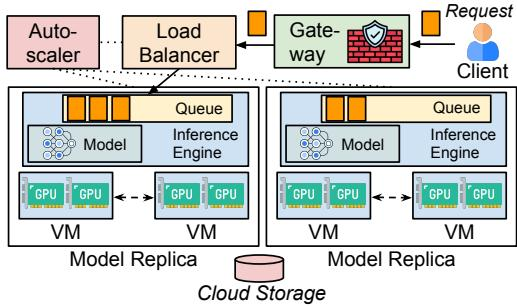  
Figure 2. An AI service comprises of multiple model repli cas; each replica is hosted on one or multiple instances. Each replica can independently serve user requests without communicating with other replicas.

Cost Savings. AI serving on the cloud is costly [57]. The rise in popularity of AI models [20] demands many GPUs to host them. However, GPU instances are expensive [13, 23]. To compare, the cost of spot instances can be 8%–50% that of on-demand instances (Table 1, [58]), presenting opportunities to reduce the cost of AI serving workloads using spot GPU instances. The cost of spot instances is generally stable over time, though there could be cost differences across zones and regions [75]. Despite significant cost savings, the industry has not seen adoption of spot instances in serving AI models, particularly due to spot instance preemptions and unavailability.

Existing Systems. Existing systems [4, 26, 44, 53, 77] made promising progress toward reducing cost with spot instances. First, SpotServe [53] is a system that adjusts (data, tensor, pipeline) parallelism upon preemption within a replica. However, SpotServe does not consider or implement instance provisioning, placement, or scheduling [28]. Second, prior work has investigated training on spot instances [36, 45, 63, 67, 69, 74]. However, training aims to finish jobs within deadlines and can be paused and resumed from checkpoints upon spot instance preemption. Hence, training presents significantly different goals from serving. Third, while serverless systems share a similar goal of reducing cost, serverless sys tems typically execute short-lived tasks and are not suited for long-running model serving; AWS Lambda does not yet support GPUs. Next, we show why these systems are still limited in serving AI models on spot instances.

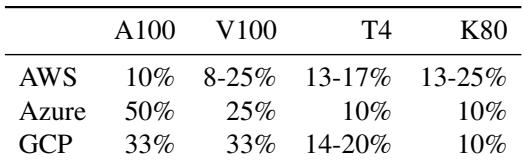  
Table 1. Cost of spot GPU instances, in percentage of ondemand cost. Prices obtained via cloud APIs [6, 8, 14] at time of writing (Oct. 23, 2024).

## 2.2 Existing single-region systems suffer from limited spot GPU availability.

Existing systems suffer from limited availability as they primarily focus on single-region deployments.

Unavailability of spot GPUs in one region. GPUs often experience shortages [12] within a region. We have observed spot GPU unavailability across zones of the same region, either due to the region running out of capacity, or quota issues. For example, in one trace we analyzed (AWS 2, §5.2), 33.1% of time spot GPUs experience unavailability across all zones in a single region. In our end-to-end evaluation (§5.1), region us-west-2 has experienced unavailability for 21% of time. This observation generalizes across multiple GPU instance types and is one of the key limitations of prior work: the service can be unavailable if spot GPU instances are simultaneously unavailable in a single region. A single-region system will experience service disruptions when another spot GPU instance cannot be provisioned in the zone or region experiencing preemptions. This significantly limits the practical deployment of AI models on spot instances: in our evaluation with pure spot deployment of AWS Autoscaling Group (§5.1), 49.4% of requests experience failures or time out, either due to spot instance unavailability or limited spot capacity to serve the full load. SpotServe, while being able to adjust parallelization strategies upon preemption, has a failure rate of 2.0–75.9% depending on the region it is deployed. Preemptions are rarely isolated and independent; a region experiencing spot instance preemption is likely to continue facing spot instance preemption for some time. Serving AI models on spot instances requires the system to maintain the desired number of instances to sustain the full load, in addition to being able to recover from isolated preemptions.

Correlated spot GPU preemptions within a region. During periods where spot instances are available in a region, we observe correlated preemptions for zones in the same region (Figure 3a). To compare, there is much less correlation for spot GPUs across different regions (Figure 3b). This trend is corroborated by analyzing a 2-month, 8-zone trace and observing correlation across zones of the same region, and little correlation across different regions (Figure 3c), showing that the trend is general across different regions. This observation is recently mentioned by another study done by CockroachDB [66] that similarly observed correlated preemptions within zones and regions. This means that if the majority of the replicas are hosted on spot instances in a single region, simultaneous preemptions could result in service losing significant capacity and even in service outage before the system can respond in time. From a 3-week trace of 16 p3.2xlarge instances across three zones on AWS, we observe that from the first spot instance preemption, 83–97% of the time a preemption occurs in a zone, at least one more will follow within 5 minutes. From a 3-day trace of 4 a2-ultragpu-4g instances in 6 zones on GCP, we observe that 34-95% of time other spot instances of the same zone are preempted within 150 seconds. Since we target serving workload, even a small likelihood of simultaneous preemption cannot be overlooked. Unfortunately, none of the prior work considers single-region unavailability or correlated preemptions.

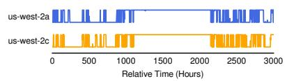  
(a) Same region

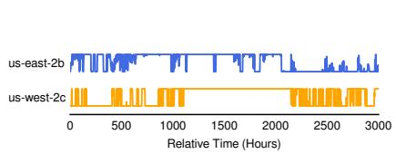  
(b) Different regions

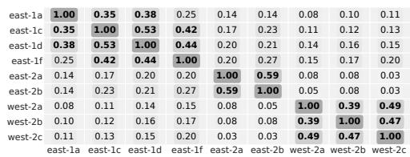  
(c) Correlation

Figure 3. (a) Correlated spot GPUs preemptions within the same region; (b) Lack of correlation across regions. Both (a) and (b) are from a 2-week trace (§5.2) for 4 p3.2xlarge (V100) instances. To collect the trace, we try to maintain the desired number of spot instances, record preemption, and replenish any preempted instances. Each vertical line indicates either preemption (from higher to lower) or a successful launch (from lower to higher). (c) Correlated preemptions across 8 zones in 3 regions on AWS for V100 GPU. Each cell shows the correlation between two zones indicated by the row and column labels. The values are Pearson Correlation (with ? < 0.01), and we bold correlation >= 0.3. Intra-region has more correlation among {east-1a, east-1c, east-1d, east-1f}, {east-2a, east-2b}, {west-2a, west-2b} whereas there is little to no inter-region correlation.  
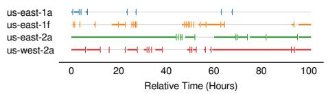

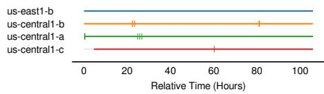  
(a) Availability of spot GPUs  
(b) Availability of spot CPUs  
Figure 4. Spot GPUs (p3.2xlarge) experience more preemptions than spot CPUs (c3-highcpu-176). Horizontal lines represent the available period. Vertical bars are changes from available to unavailable, followed by grey gaps indicating the unavailable period

## 2.3 Existing spot CPU-focused policies failed to work on spot GPUs.

The majority of the systems [43–45, 69, 73, 77] targeting spot instances use CPU instances. In particular, these systems use preemption warnings to mitigate service disruptions. We categorize the limitations of those systems as follows.

Higher preemption rate. AWS Spot Instance Advisor [7] shows that the probability of spot GPUs being interrupted (>20%) is typically much higher than spot CPUs (<5%).

Figure 4a and Figure 4b compare two spot obtainability traces (§5) between spot GPU and CPU instances. Spot GPUs (16.7%–90.4% available) are more volatile and unobtainable [49], whereas spot CPUs (95.6%–99.9% available) experience fewer preemptions. While systems that use spot CPUs might be fine just waiting and recovering from infrequent preemptions, serving with high-demand spot GPUs requires the system to be robust to frequent preemptions and potential unavailability.

Longer time to provision and deploy a new replica. Many CPU targeting systems use a simple policy to keep the service running: launch a new replica upon receiving a preemption warning. This is based on the assumption that the time to deploy a replica, including provisioning the instance(s) and loading the model into GPU, is shorter than the preemption warning (2 minutes for AWS [61] and 30 seconds for Azure [54] and GCP [39]). Therefore, the backup instances can become ready before the old instance gets preempted, resulting in little to no service downtime. Does preemption warning minimize the disruption caused by preemption?

Unfortunately, spot GPU instances can take a long time to provision due to potential unavailability and large AI model endpoints taking longer to be ready. Previous studies [18, 21, 53, 77] have documented that initiating large AI model endpoints can take several minutes, involving instances provisioning and transferring model weights to the GPU. We run a simple experiment and find that the time taken to provision an instance with a pre-installed image and deploy an AI model endpoint (Llama-2-7b on vLLM [48]) is 183s on AWS, already exceeding the 2 minutes preemption warning, even without accounting for the time to find avail able spot GPUs in the event of unavailability. While recent systems, such as ServerlessLLM [42], can reduce the time to load the model into the GPU, the time needed to find and provision the instance in the presence of unavailability is unlikely to be reduced. Spot preemption warnings are also best-effort [39, 54, 61]. There is no guarantee that the system will be notified and bring up an instance in time. Thus, it is challenging to serve these models on spot GPUs just by rely ing on preemption warnings to solve the problem. If managed naively, preempted spot GPUs can both cause service unavailability, due to the time it takes to replenish a ready-to-serve replica, and higher cost, since users are still billed during the cold start period.

## 2.4 Existing systems with static spot-on-demand mixture either are costly or have poor availability.

Several systems support serving on both spot and on-demand replicas [4, 26, 53] to mitigate preemptions and unavailability. These systems require setting fixed and predefined node pools of either spot or on-demand instances. If spot replicas are preempted, the traffic will be re-distributed over on-demand replicas in the on-demand node pools. The mixture size (i.e. node pool size) is static, for example, AWS Autoscaling Group can statically maintain 10% of on-demand replicas at all times. This allows on-demand replicas to serve as the base capacity for the service in the event of preemption.

Using a fixed pool of on-demand replicas is unnecessary and costly when spot replicas are available. During periods with high spot obtainability, systems with static pools of ondemand and spot replicas still keep the costly on-demand replicas, instead of leveraging more spot replicas. For example, we run AWS Autoscaling Group [4] (ASG) with on-demand node pool of size 1 and spot node pool of size 4 for g5.48xlarge instances. During periods where spot in stances are available, ASG maintains one on-demand replica throughout, providing base service capacity. Even with a single on-demand replica, this increases the total cost by 1.56 compared to using a pure spot deployment. The on-demand g5.48xlarge replica cost constitutes 52% of the total cost, as its hourly cost (\$16.3) is significantly higher than that of spot instance (\$4.9). As such, using always-on on-demand replicas can be expensive and unnecessary when spot instances are available.

A fixed pool of spot instances may fail to provision when spot is unobtainable. When the system fixes the spot node pool size, it will continue provisioning for the specified node pool size even when spot instances are unobtainable, rather than launch more on-demand instances to cover for lost capacity in the spot pool. As the system retries to fulfill the lost spot capacity, it incurs additional costs due to provisioning and the subsequent quick preemption or lack of capacity (§5.1). Fixed spot node pools also result in bad service quality. For example, we ran the previous ASG deployment during periods with spot volatility. We observe that using such a deployment will result in a request failure rate of 36%, since for some time intervals the deployment only has one on-demand instance to serve user requests and is severely overloaded.

Instead of maintaining a static mixture of spot and ondemand replicas, the system should launch more on-demand replicas to dynamically cover the lost spot replica capacity and scale them down when spot instances become more obtainable. The challenge is how to design such a system to maintain a dynamic mixture of spot and on-demand replicas.

## 3 SpotHedge

We propose SpotHedge to address the aforementioned challenges. To overcome limited availability and correlated preemptions in a single region (§2.2), SpotHedge dynamically provisions spot replicas across regions and clouds based on their preemption risk. To lower cost with good availability (§2.4), SpotHedge adaptively maintains spot and on-demand mixture. We discuss our designs below:

## 3.1 Placing spot replicas dynamically across regions and clouds

SpotHedge addresses the challenges of limited spot obtainability in a single region by using spot instances across different regions and clouds. Before discussing how SpotHedge selects and provisions spot instances, we discuss and compare prior single-region multi-zone policies in other systems.

Comparing alternative policies. Assume ? zones and for each zone ?, preemptions follow Poisson distribution with rate parameter ? . Spot instance lifetime is <sup>1</sup> . The average number ? of preemptions E ?<sub>?</sub> in zone ?<sub>?</sub> over an observation window ? is E ?<sub>?</sub> = ? ?<sub>?</sub> , assuming that spot instance lifetime is much greater than the cold start delay ?.

Static Spread Policy (used by AWS Autoscaling Group [4] and MArk [77] in a single region): Consider a simple policy where we maintain an even static spread of ? spot instances to ? zones, such that each zone is given <sup>?</sup> number of replicas. The expected total number of preemptions ? over ? is: E<sub>[</sub>?<sub>]</sub> = ?? <sup>1</sup><sub>?</sub> <sup>!?</sup><sub>?=1</sub> ?<sub>?</sub> . E<sub>[</sub>?<sub>]</sub> will be dominated by highlypreempting zones with large ?<sub>?</sub> . This is not ideal; intuitively, when a zone experiences more preemptions, an intelligent policy should avoid provisioning more spot instances in that zone.

Round Robin (used by Ray Serve [26], and GKE [27] in a single region): Round Robin policy can be used to mitigate the above issue. When a spot instance gets preempted in a zone ?, it gets relaunched in the next zone in the same region. For a long-running service, the average spot lifetime is 1<sub>?</sub> !?<sub>?=1</sub> 1<sub>?</sub> over ? zones. The expected total number of preemptions is: E<sub>[</sub>? <sub>]</sub> = ?? <sub>(</sub> <sup>?</sup><sub>!??=1</sub> <sub>1?? )</sub>. Since 1 <sup>!?</sup> <sub>1</sub> ?<sub>?</sub> is larger 1 ? than <sup>?</sup><sub>!??=1</sub> <sub>1?</sub> , the Round Robin strategy will lead to fewer preemptions. However, Round Robin is not optimal as it does not remember the highly-preempting zones: it might keep launching instances in them.

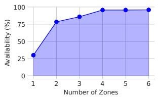

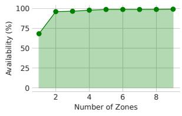  
(a) A100-80GB:4  
(b) V100  
Figure 5. Service availability improves as the number of zones and regions considered increases. Fig 5a uses a 3-day trace for a2-ultragpu-4g in 6 zones and 5 regions. Fig 5b uses a 2-month trace for p3.2xlarge in 9 zones and 3 regions.

Observation: If we track ?<sub>?</sub> of different zones, we can avoid highly-preempting zones and further lower E ? . Furthermore, a single region typically has a small number of zones with the required GPU. When ? is large across these zones, E ? will be large regardless of how we place instances. Therefore, we should expand the number of zones from which we launch spot instances by using multiple regions and clouds.

Dynamic Placement Policy. As such, we propose the following spot replica placement policy: Dynamic Placement (Algorithm 1). To avoid highly-preempting zones, the policy tracks which zones are more likely to experience preemption and dynamically selects zones from available zones. Let ? be all enabled zones with the required instance type that satisfy user requirements, such as avoiding particular zones or regions for regulation or latency constraints. The algorithm keeps two lists: ?<sub>?</sub> is a list of available zones initialized to ? ; ?<sub>?</sub> is a list of highly-preempting zones initialized to be empty. If a replica is preempted in zone ?, ? is moved to ?<sub>?</sub> . If a replica is successfully launched and ready in zone ?, ? is moved to ? . Whenever a new replica needs to be launched, it is drawn from ? , prioritizing zones with fewer current spot placements and zones with lower cost. The policy can additionally probe different zones to maintain ? and ? . When there are fewer than two zones left in ? , SpotHedge triggers zone rebalancing and proactively moves all zones from ? to ?<sub>?</sub>. This prevents us from having only a single zone in ? and subsequent spot replicas being placed on that single available zone, risking simultaneous preemptions of all spot instances.

Expanding the spot search space from a single zone to multiple regions and clouds. To have many zones in ?<sub>?</sub>, the set of enabled zones has to span multiple regions. To mitigate correlated preemptions, SpotHedge diversifies the set of zones where spot preemptions can occur. This also addresses the challenge of single-region unavailability as discussed in §2.2. As such, SpotHedge extends the search space from a single region to multiple regions. From analyzing traces (Fig. 5), we observe significant improvement to availability (29.9% 95.8% for A100, 68.2% 99.2% for V100) as we increase the search space from a single zone to multiple regions. A preemption-aware placement policy, coupled with an expanded search space across regions and clouds, can significantly improve service availability and quality.

Algorithm 1 Dynamic Placement   
1: ? ?, ? ? Initially all zones are available.   
2: procedure HANDLE-PREEMPTION(?):   
3: if ? ?<sub>?</sub> then ? Move zone ? to ?<sub>?</sub>   
4: Remove ? from ?<sub>?</sub>   
5: Add ? to ?<sub>?</sub>   
6: end if   
7: if Size of ?<sub>?</sub> < 2 then   
8: ?<sub>?</sub> ?<sub>?</sub> ?<sub>?</sub>, ?<sub>?</sub>   
9: end if   
10: end procedure   
11: procedure HANDLE-LAUNCH(?):   
12: if ? ?<sub>?</sub> then ? Move zone ? to the available list   
13: Remove ? from ?   
14: Add ? to ?<sub>?</sub>   
15: end if   
16: end procedure   
17: procedure SELECT-NEXT-ZONE(?):   
18: ?⇐<sub>? ↗</sub> ?<sub>?</sub> <sub>\</sub> ? ? ?: currently launched zones   
19: if ? ⇐ is not empty then   
20: Return MIN-COST(? ⇐ )   
21: end if   
22: Return MIN-COST(?<sub>?</sub>)   
23: end procedure

Request processing dominates the end-to-end latency. One concern from systems practitioners about serving model replicas from other regions is the round-trip latency (§2.1). We argue that the latency can be improved by serving from a remote region when the spot GPUs in the local region are unavailable or overloaded. For some applications, round-trip latency is much smaller than request processing time and potential queueing delay. Processing a single request takes several seconds, if not tens of seconds (Figure 6a, §5.1, [28, 60]) for large AI models even on a local cluster, whereas network latency is much smaller, for example, around 100ms round trip between US and Europe (Figure 6b). Indeed, OpenAI recently [55] expanded to multiple regions for availability and matches our observation that geographic placement matters less for large AI model inference since the query latency is much larger than network latency. AI models have been growing in size and computation time and they are expected to do so in the future. With the rise of complex AI systems that use chained API calls [38, 78], agents, Tree of Thoughts [20], or RAG [47], we expect end-to-end latency to become more critical. While serving user requests from a different region could increase Time-to-first-token (TTFT),<sup>2</sup> SpotHedge benefits from improved availability and better average and tail end-to-end latency. We further discuss this trade-off in §6.

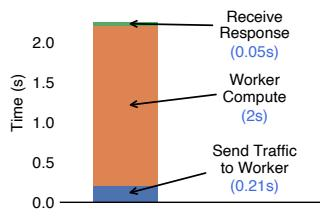

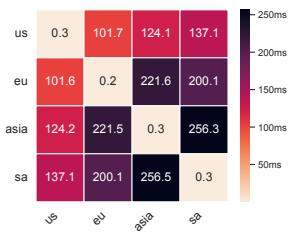  
(a) Request latency  
(b) Network latency  
Figure 6. Latency Characteristics of AI Services. Fig. 6a measures the latency breakdown of a Vicuna-13B endpoint, serving a request with 20 input and 44 output tokens. Fig. 6b measures round trip network latency between different regions of GCP.

## 3.2 Adjusting spot and on-demand mixture dynamically based on the risk of spot preemption

Most existing systems [16, 26] only use static node pools and don’t change the mixture dynamically when preemption happens: launch more spot replicas when spot instances become available, fall back to on-demand replicas when spot market becomes volatile. We have shown in §2.4 that static node pools either result in poor availability or high cost, which requires an adaptive spot and on-demand mixture based on estimated risk of spot preemption. To derive the dynamic mix ture policy, let ? ?, ? be the number of launched spot replicas at time ? in zone ?, and ? ? be the number of launched on-demand replicas at ?. The total number of launched spot replicas across zones is ? ? = <sup>!</sup> ? ?, ? . Let ?<sub>???</sub> ? be the target number of ready instances decided by the user or an autoscaling policy at ? based on the load.

Overprovisioning with ?<sub>????? (</sub>?<sub>)</sub>. SkyServe overprovisions cheap spot replicas to mitigate preemptions and cold start delay. We use ?<sub>?????</sub> ? to denote the number of spot replicas to overprovision at ?. These spot replicas serve as buffer in the event of preemptions. Intuitively, even when some spot replicas are preempted and the system is provisioning new replicas, these additional overprovisioned replicas will prevent the rest of the replicas from being overloaded. Interestingly, we find that a small number of ?<sub>????? (</sub>? <sub>)</sub> is often sufficient in practice (Figure 14c) if the spot replicas are de-correlated across regions and clouds. We find empirically that these overprovisioned spot replicas constitute only a fraction of the cost, and are cheaper than on-demand replicas (§2.4).

Deciding the number of fallback on-demand replicas. Since having fixed on-demand node pools leads to higher costs, we propose a new policy: Dynamic Fallback. The policy initializes with ?<sub>???</sub> ? ?<sub>?????</sub> ? spot replicas. If a spot replica is preempted, the policy launches an on-demand replica and keeps trying to have ?<sub>??? (</sub>?<sub>) +</sub>?<sub>????? (</sub>?<sub>)</sub> spot replicas at the same time. Let ?<sub>?</sub> ? be the number of ready spot replicas. The policy tries to maintain ? ? (but possibly not all ready) on-demand replicas where ? ? = min ?<sub>???</sub> ? , ?<sub>???</sub> ? ?<sub>?????</sub> ?  ?<sub>?</sub> ? . This policy provisions on-demand replicas to replenish the lost spot capacity, where ? ?  ?<sub>???</sub> ? .

Intuitively, when we have a spot replica preempted, Dynamic Fallback quickly launches an on-demand replica. Ondemand replicas serve as a reliable fallback; we have observed in §5.1 that on-demand replicas are typically available across regions. While the on-demand replicas are provisioning, the overprovisioned spot replicas ensure little service disruption. When the spot replicas become available, SpotHedge scales down these on-demand replicas and instead serves entirely on spot replicas. The cost of Dynamic Fallback is relatively small as these on-demand replicas will be terminated once we have ?<sub>???</sub> ? ?<sub>?????</sub> ? spot replicas ready. In the event of spot unobtainability, on-demand replicas (up to ?<sub>???</sub> ? ) are necessary to ensure that the service still meets the availability requirement.

## 3.3 Putting these together

SpotHedge first decides ?<sub>???</sub> ? and ?<sub>?????</sub> ? based on the traffic. Next, it decides the spot-on-demand mixture (i.e. the number of spot replicas and on-demand replicas at ?, or ? <sub>(</sub>?<sub>)</sub> and ? ? ). Lastly, it assigns ? ? spot replicas to different zones, regions, and clouds based on their risk of spot preemp tion.

SpotHedge illustration. We illustrate SpotHedge with an example (Figure 7). 4 spot replicas are distributed among three zones (zone 1, 2, 3). SpotHedge initially fails to launch spot replicas in zone 2, as such, they are launched in zone 1 and zone 3 as zone 2 is moved to ?<sub>?</sub>. On-demand replicas are simultaneously launched as a fallback but quickly terminated once spot replicas have been launched and are in service. When zone 3 becomes unavailable, SpotHedge moves replicas to zone 1. Similarly, when zone 1 becomes unavailable, SpotHedge launches replicas in zone 3. Zone 3 later experiences preemptions, prompting SpotHedge to re-try in zones 1 and 2. On-demand fallback is triggered at the end when all zones lose availability.

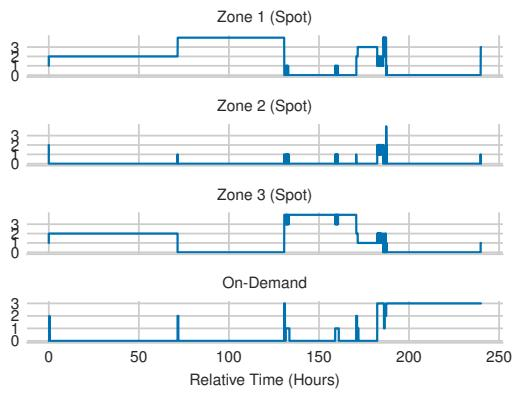  
Figure 7. SpotHedge Example. Launch 4 spot replicas with Dynamic Placement (Alg. 1) and Dynamic Fallback. The yaxis refers to the number of launched replicas at a given time.

Omniscient. We propose an Omniscient policy that requires a complete spot obtainability trace (infeasible in practice). With Integer Linear Programming (ILP), we represent the policy as a cost-minimization problem. We use ?<sub>?</sub> ?, ? , ? ?, ? to denote the number of (ready) spot replicas launched in zone ? and time ?, and ? ? , ? ? to denote the number of (ready) on-demand replicas at time ?. ? ?, ? denotes the number of launchable spot replica capacity at zone ? and time ?, typically unknown to users in an online setting. ? ? is a binary variable denoting whether ?<sub>? (</sub>? <sub>)</sub> <sub>+</sub> ?<sub>? (</sub>? <sub>)</sub> <sub>⇓</sub> ?<sub>??? (</sub>? <sub>)</sub>, recording whether the policy has satisfied the target number of replicas. ? is the cold start delay. ? is the cost ratio between spot and on-demand replicas. ?<sub>max</sub> is the maximum required number of replicas. The normalized cost ? can be expressed by: ? = <sup>!?</sup><sub>?=0 [</sub><sup>!</sup><sub>? ?</sub> ? <sub>(</sub>?, ?<sub>)</sub> <sub>+</sub> ?? <sub>(</sub>?<sub>)]</sub>. We express a resource availability constraint with ?????<sub>???</sub> , the percentage of time at least ? replicas are ready. Let ? be an interval.

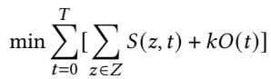

(1)

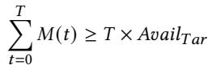

(2)

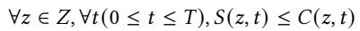

(3)

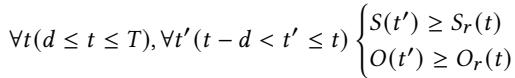

(4)

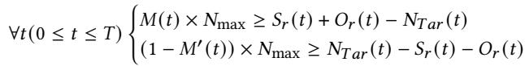

(5)

The Omniscient policy minimizes the cost (Eq. 1) while respecting the availability constraint (Eq. 2). Eq. 3 limits the number of launchable spot replicas based on the spot capacity. Eq. 4 calculates the number of ready replicas given cold start delay ?. For any time that is up to cold start delay ? ago, the launched spot (on-demand) replicas at that time should be greater or equal to the current number of ready spot (on-demand) replicas, because it will take time ? for these launched instances to be ready. Eq. 5 calculates ? ? to indicate whether ? ? ? ? ? ? , which is then used to calculate whether the policy meets ?????<sub>???</sub> . We compare various policies with the Omniscient optimal policy in §5.2.

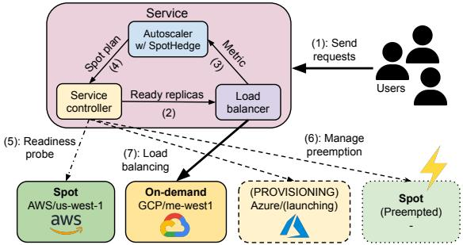  
Figure 8. An Overview of SkyServe (§4). Each service is composed of three components: a service controller, responsible for overseeing the provisioning and monitoring the health of replicas; an autoscaler with SpotHedge to guide scaling decisions and decide spot-on-demand mixture and spot place ment; and a load balancer for distributing traffic to replicas ready to handle requests.

## 4 System design

We have implemented SkyServe (Figure 8), a prototype serving system leveraging SpotHedge that manages a mixture of spot and on-demand replicas across multiple regions and clouds. It builds on an open-sourced multi-cloud system [75] that provisions instances on public cloud providers. SkyServe adds both a serving system and our policy SpotHedge with <sub>↖</sub> 7000 lines of Python code and supports common inference engines such as vLLM [48], TGI [29], Triton [24].

Service Controller. The service controller is responsible for overseeing the entire replica life cycle, including scaling up replicas in a zone, reducing extra on-demand replicas when there is a sufficient number of spot replicas or surplus replicas during periods of low request rates, and managing the preemptions of spot replicas or any arising errors (6). The service controller implements readiness\_probe, a monitoring tool to periodically assess service status through either a standard health probe or an actual user-defined compute workload (5). It then forwards the ready replica information to the load balancer (2). The service controller periodically polls the cost information via cloud API used in Algorithm 1.

Implementation of SpotHedge. SpotHedge tries to maintain ?<sub>???</sub> ?<sub>?????</sub> spot replicas, as described in §3.2. These replicas may be in various states: provisioning, initializing, or ready for traffic handling. The system launches on-demand replicas when it does not have ?<sub>??? +</sub> ?<sub>?????</sub> ready spot replicas. SpotHedge schedules these on-demand replicas for termination when a sufficient number of spot replicas are ready to accept traffic. The system implements the spot placement policy outlined in §3.1. It monitors the preemption activities of different zones and recommends a new active zone for launching new spot replicas. It then sends the spot plan, i.e. placement and fallback, to the service controller for execution in step (4).

Autoscaler. The system implements a load-based autoscaler. SpotHedge decides the target number of replicas ?<sub>???</sub> based on the target load per replica ?<sub>???</sub> . The autoscaler keeps track of a configurable past time window (default to 1 minute) and calculates the average request rate to be ? . The autoscaler proposes a candidate target ?<sub>???</sub> = <sup>??</sup><sub>? ∝</sub> and compare it ???   
with the current ?<sub>???</sub> . If ?<sub>???</sub> is consistently larger than the current ?<sub>???</sub> for a certain amount of time (e.g., 10 minutes), current ?<sub>???</sub> is set to ?<sub>???</sub>. Similarly, ?<sub>???</sub> is decreased to ?<sub>???</sub> if ?<sub>???</sub> is consistently smaller than ?<sub>???</sub> . SkyServe additionally supports custom policies specified by the user, such as maintaining a minimum amount of on-demand capacity.

Load Balancer. The system load balancer distributes incoming traffic (1) and supports both round-robin and routing to replicas with the least number of ongoing requests (7). It also forward the metric measurements (e.g., QPS) to the autoscaler for decision-making (3). It can be extended to route requests to replicas closer to the clients, prioritizing underloaded replicas. We elaborate more in §6. We leave these policies configurable to users.

Application API. A service configuration (e.g., Listing 1) requires an endpoint, ranging from a conventional HTTP server to an AI model-based endpoint like LLMs or image generation models [59]. The example also specifies an endpoint for readiness\_probe (e.g., a real compute workload specified at an endpoint /v1/chat/completions). The replica\_policy field specifies the configuration of SpotHedge, e.g., the extra number of spot replicas to overprovision (num\_overprovision), and the desired QPS ?<sub>???</sub> for autoscaler (target\_qps\_per\_replica).

Support for distributed inference. SpotHedge schedules multiple instances of the same replica to the same zone, while multiple replicas are placed across regions and clouds to minimize inter-region traffic. Preemption of one spot instance will terminate the entire replica, and SpotHedge can also adjust parallelization strategy over remaining spot instances similar to SpotServe [28].

Preemption handling. SpotHedge allows client-side retry upon preemption [25], or leveraging a proxy to retry on the client’s behalf. The request will be aborted if the instance is preempted. A new copy of that request will be resent and reassigned to a ready replica. SpotHedge can additionally leverage preemption warning by adjusting the on-demand and spot instance mixture upon receiving the warning and notifying the user application upon receiving cloud preemption warning to trigger user-defined preemption handlers. Unfortunately, as noted in §2.3, preemption warnings are best-effort and cannot resolve the availability issue.

Listing 1 SkyServe configuration for a LLM service.   
service:   
# Readiness check endpoint.   
readiness\_probe:   
path: /v1/chat/completions   
replica\_policy:   
target\_qps\_per\_replica: 1   
# Fields below describe SpotHedge.   
# Sec. 3.2, knob for over-provisioning.   
num\_overprovision: 2   
# Sec. 3.2, dynamic on-demand fallback.   
dynamic\_ondemand\_fallback: true   
# Sec. 3.1, Placer that keeps track of   
# spot preemption and decide spot   
# replica placement.   
spot\_placer: dynamic\_fallback   
# Fields below describe each replica.   
resources:   
ports: 8080   
accelerators: A100   
# Manually specify a subset of failure   
# domains. If not specified, all possible   
# failure domains are used.   
any\_of:   
# Enable only one region in AWS.   
- cloud: aws   
region: us-east-1   
# Enable all region in GCP.   
- cloud: gcp   
# Dependencies.   
setup: pip install -r requirements.txt   
# Launch the server.   
run: python llm\_server.py --port 8080

## 5 Evaluation

We conduct both end-to-end experiments (§5.1) and experiments with simulated preemptions (§5.2). In the former, we deploy SkyServe and compare it to several serving systems on the cloud with real-time preemptions; in the latter, we compare different policies based on real spot obtainability traces.

## 5.1 End-to-end Results with Real Preemptions on Cloud

We ran end-to-end experiments that lasted 22 hours in total and served 133k requests to compare SkyServe with several production and research systems with the total cost at \$4.1k.

The experiments consist of two runs for each setup with all compared systems running at the same time.

Baselines. We compare with the following systems:

AWS Auto-scaling Group (ASG) [4]: ASG uses fixed node pools (e.g., fixed percentage of spot replicas and on-demand replicas). We set the on-demand percentage to 10% following its official example [1].

<sub>•</sub> MArk [77]: an ML serving system focusing on spot CPU instances and using proactive autoscaling. We modify MArk to make it compatible with spot GPUs.<sup>3</sup>

AWS spot node pool (AWSSpot) [4]: A node pool that uses spot instances with autoscaling allocated over multiple zones of the same region.

SpotServe [53]: SpotServe adapts parallelization strategies in response to preemption. SpotServe does not consider or implement instance provisioning, spot placement, scheduling, or autoscaling [28]. As such, we run SpotServe together with the above systems.

Experiment Setup. We conduct an end-to-end evaluation on AWS, where baseline systems are launched concurrently on the cloud and experience real-time preemptions, unavail ability, and cold start delay for a fair comparison. We run two sets of experiments: (1) each replica runs on a g5.48xlarge instance (with 8 A10G GPUs) and consists of Llama-2-70B [68 using vLLM [48]; (2) each replica runs on a g4dn.12xlarge instance (with 4 T4 GPUs) and consists of OPT-6.7B using SpotServe [53]. For workload, we use the inter-arrival time and query prompts from Arena (§5.2), a real LLM serving workload from Chatbot Arena [19] with bursty traffic (Figure 11) and varying output lengths. Each serving system processes the same sequence of prompts, where each prompt is different and requires a different amount of processing time. Request timeouts are set to 100s for Llama-2-70B and 20s for OPT-6.7B, to account for the computation time of LLM requests. All requests that fail due to spot preemption will be retried by the client, with the failure time included in the overall end-to-end latency. For SkyServe, we launch all replicas in the following regions: us-east-2, us-west-2, eu-central-1. We choose us-west-2 for other baselines due to more quota, its popularity, and that its costs are lowest among regions. We conducted four experiments at different times of the week, and we categorized the experiment into two groups: Spot Available (91–100% spot obtainability<sup>4</sup>) and Spot Volatile (45–46% spot obtainability). The cost is computed with the real-time price obtained via the cloud provider’s API. Request failure rates are recorded by tracking request timeouts due to preemptions and queueing.

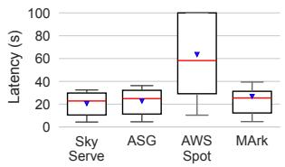

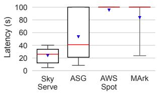  
(b) Latency, Spot Volatile.

(a) Latency, Spot Available.  
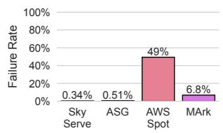

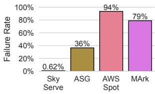  
(d) Failure Rate, Spot Volatile.

(c) Failure Rate, Spot Available.  
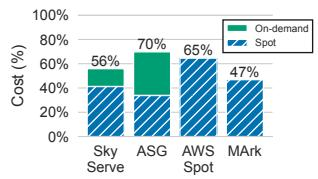  
(e) Cost, Spot Available.

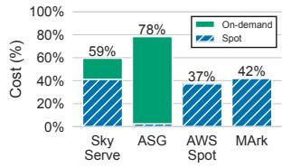  
(f) Cost, Spot Volatile.  
Figure 9. Service quality, failure rate, and cost. We run Llama-2-70B on 8 A10G GPUs with vLLM. Results are grouped by two scenarios (§5.1): Spot Available and Spot Volatile. For the box plot, the line marks the median, the box marks 25<sup>??</sup> and 75<sup>??</sup> percentiles, the whiskers show 10<sup>??</sup> and 90<sup>??</sup> percentiles, and the inverted triangle marks the mean. We show the cost breakdown of each group into either ondemand or spot. Costs are relative to using entirely on-demand instances (OD).

Service Quality and Failure Rate. We run Llama-2-70B on 8 A10G GPUs (Figure 9). The number of spot and ondemand instances over time successfully provisioned is shown in Figure 10. Compared to ASG, SkyServe improves service quality (P50, P90, P99 latency) by 1.1–1.6 , 1.1–2.5 , 1.4–1.9 respectively. ASG maintains a single on-demand replica throughout the experiment. However, it encounters difficulties in acquiring additional spot replicas within one region due to spot unavailability. Consequently, ASG experiences a high failure rate of 36% in the event of spot volatility. Increasing the number of always-on on-demand replicas in ASG can improve availability; however, it will significantly increase the cost of ASG deployment. Compared to AWSSpot, SkyServe largely improves P50, P90, and P99 latencies by 2.6–3.9 , 2.5–3.1 , and 1.9–2.7 as it leverages multiple regions to expand the available spot capacity and avoid highlypreempting zones. AWSSpot’s single-region policy is unable to guarantee enough replicas, leading to a larger 49–94% failure rate due to both service downtime and not enough replicas to cover client load, because AWSSpot’s static even spread policy relaunches instances on highly-preempting zones and thus fails to get enough replicas. MArk has a failure rate of 6.8–79%, mainly due to periods of downtime where MArk cannot get any spot replicas (Figure 10b). In comparison, SkyServe achieves high service availability with a low failure rate of 0.34–0.62% across both groups.

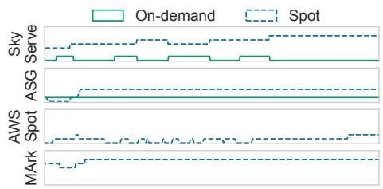  
(a) Spot Available.

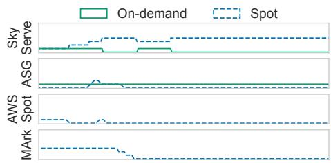  
(b) Spot Volatile.

Figure 10. We show the numbers of ready replicas launched by each system in two groups (Spot Available and Spot Volatile).  
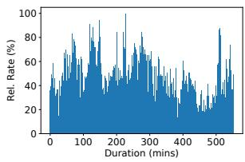

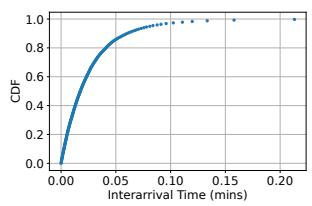  
(a) Request Arrival Pattern of the (b) Request Interarrival Time Arena Trace. Distribution of the Arena Trace.

Figure 11. The request arrival pattern and the distribution of interarrival time of the Arena trace.  
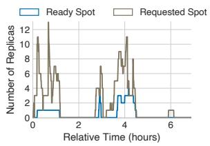  
(a) MArk.

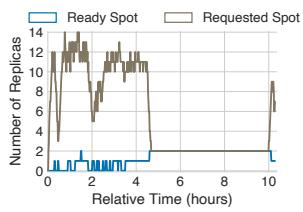  
(b) AWSSpot.  
Figure 12. MArk and AWSSpot over-request spot instances in case of spot unavailability, incurring extra cost.

Cost. Compared to ASG, SkyServe lowers cost by 20–24%, as ASG maintains an on-demand replica even when spot instances are available. For ASG, in group Spot Volatile, the cost of on-demand replicas comprises 97% of the total cost, since spot instances are less available. For AWSSpot, we observed a provision-then-preempt cycle in highly-preempting zones (e.g., us-west-2b) when the spot obtainability is volatile with increased costs. MArk and AWSSpot over-request in the event of unavailability, and we observed up to 14 replicas in provisioning status (Figure 12b), likely because both systems target CPU instances and assume that replicas will quickly become ready after which provisioning replicas will be scaled down. Though AWSSpot uses entirely spot, Sky-Serve lowers cost by 20% in group Spot Available. In group Spot Volatile, as both AWSSpot and MArk cannot provision enough spot replicas, they are cheaper than SkyServe (by 30–37%). We observe that Dynamic Fallback adds a cost (26–31% of the total cost) to SkyServe, though necessary to ensure availability. Compared to using only on-demand instances, SkyServe is 41–44% cheaper.

SpotServe [53] running with baseline systems. We compare SkyServe and other baseline systems on SpotServe, running OPT-6.7B model on 4 T4 GPUs. The latency, failure rates, and costs are presented in Figure 13. Consistent with earlier figures, when spot instances are volatile, SpotHedge significantly reduces P50, P90, and P99 latency by 3.1 , 2.3 , and 1.6 compared to baseline systems. The failure rate of SkyServe is only 0.05–0.4%, significantly lower than other systems (52–95%). This is because of SkyServe’s ability to reduce preemptions by finding available zones across different regions and improve instance availability by dynamically adjusting spot and on-demand mixture. In Spot Available, MArk and SkyServe achieve similar P50 and P90 latency, but SkyServe improved P99 latency by 2.2 . Compared to ASG, SkyServe improves service quality (P50, P90 and P99 latency) by 1.2<sub>↓</sub>, 1.1<sub>↓</sub> and 1.9<sub>↓</sub>. AWSSpot experiences short periods of unavailability, primarily due to its static even spread policy, resulting in a 52% failure rate. In terms of cost, when spot instances are available, SkyServe still manages to reduce cost by 10–20% compared to ASG and AWSSpot, while achieving substantially better service and failure rates. MArk cannot launch enough instances and hence has a lower cost than Sky-Serve. ASG incurs a similar cost as SkyServe (3% cheaper), as ASG keeps an on-demand instance at all times.

Discussion. We observe that on-demand instances are typically obtainable across regions and clouds, making it a reliable fallback. By running over multiple regions, SkyServe ensures that on-demand replicas can be quickly provisioned. In contrast, spot replicas can consistently be unobtainable in a single region. This observation is consistent with prior work [71]. We observed even an entire region (us-west-2) can run out of spot capacity. This shows the importance of spreading spot replicas across multiple regions. Though SpotServe adjusts parallelization among remaining instances upon preemption, naively using SpotServe in a single zone leads to poor service quality. Across different model sizes (Llama-2-70B and OPT-6.7B), inference engines (vLLM and SpotServe), SkyServe is the only system with consistently low failure rates and request latency while achieving substantial cost savings compared to the traditional on-demand based serving setup.

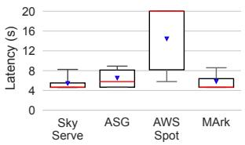

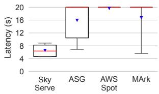  
(b) Latency, Spot Volatile.

(a) Latency, Spot Available.  
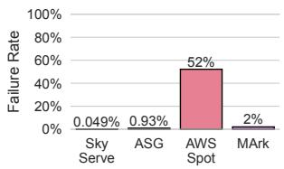

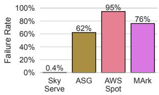

(c) Failure Rate, Spot Available. (d) Failure Rate, Spot Volatile.  
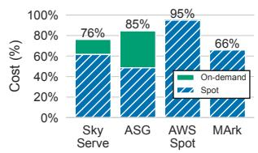  
(e) Cost, Spot Available.

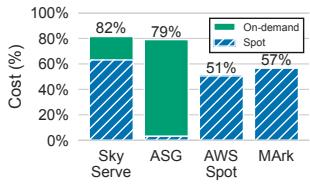  
(f) Cost, Spot Volatile.  
Figure 13. Service quality, failure rate, and cost from running SpotServe [53] (a baseline system) augmented with different systems, serving OPT-6.7B on 4 T4 GPUs. Spot-Serve itself does not implement instance provisioning [28]. We find that SkyServe works well with SpotServe, saving cost for both Spot Available and Spot Volatile cases with good service latency and low failure rate. Although MArk or AWSSpot can have lower cost than SkyServe under Spot Volatile due to these systems provisioning fewer instances, using these systems leads to significantly higher failure rates and latency.

## 5.2 Results with Simulated Preemptions from Real Traces

We run the following workloads individually:

Poisson Distribution (Poisson). We construct synthetic workloads with Poisson distribution of request arrival (? = 0.15).

Arena. We use a real LLM serving workload from Chatbot Arena [19] with load fluctuations, bursty traffic (Figure 11), and dynamic request execution time.

Microsoft Azure Function (MAF). MAF [62] was collected from Azure serverless function invocations over two weeks, and has been used for ML serving research [37, 46, 51, 53].

Following prior work [53, 71], we benchmark policy performance based on real spot obtainability traces and workload traces. Instead of experiencing real-time preemptions on the cloud (§5.1), spot preemptions are instead injected based on the collected spot obtainability traces. We compare SpotHedge with the following policies, similar to prior work [73]:

Even Spread: Evenly spreading spot replicas across zones of different regions, similar to [4, 26, 77].

Round Robin: Launch spot replicas to zones of different regions, round-robin.

Optimal: Omniscient policy based on ILP (§3.3).

Spot datasets. We use spot traces from [71]. These traces were previously collected by launching spot GPUs and experiencing preemptions and unobtainability on the cloud. Each timestamp records the number of preemptions experienced when maintaining the desired number of spot instances.

AWS 1: A 2-week trace for 4 p3.2xlarge in 3 zones.

AWS 2: A 3-week trace for 16 p3.2xlarge in 3 zones.

AWS 3: A 2-month trace for p3.2xlarge in 9 zones.

GCP 1: A 3-day trace for 4 a2-ultragpu-4g in 6 zones.

Availability. We evaluate the service availability of the service deployment (percentage of time a certain number of instances is ready to serve requests) achieved by different policies (Figure 14a). Even Spread achieves 27–63% availability, whereas Round Robin achieves 82–99% availability. When spot replicas become unavailable, Even Spread and Round Robin cannot ensure that we can quickly find and launch at least ? ready spot replicas. For example, in AWS 2, spot replicas experience unavailability across all zones. In these cases, Even Spread and Round Robin will suffer unavailability. Round Robin incurs more unavailability when there are highly-preempting zones, because it will retry in those zones. In contrast, SpotHedge achieves high availability (99–100%) for three reasons. First, Dynamic Fallback ensures that SpotHedge uses on-demand replicas when spot replicas become unavailable. Second, it is unlikely to lose many spot replicas before an on-demand fallback replica is ready, thanks to overprovisioned spot replicas as a buffer. Third, by tracking highly-preempting zones, SpotHedge can minimize the likelihood of preemptions by avoiding these zones.

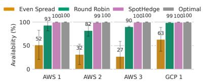  
(a) Availability

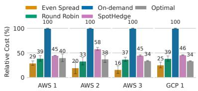  
(b) Cost

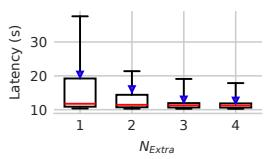  
(c) Sensitivity to ?<sub>?????</sub>

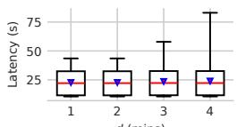  
(d) Sensitivity to ?

Figure 14. (a) and (b): Comparison of availability and cost across different spot traces and policies. We omit on-demand in the Availability experiment as it guarantees availability attainment. Cost is relative to ?<sub>???</sub> on-demand replicas. (c), (d) Sensitivity to the number of spot replicas to overprovision (? ) and cold start delay (?) under Poisson workload. The same trend generalizes to other workloads and traces.  
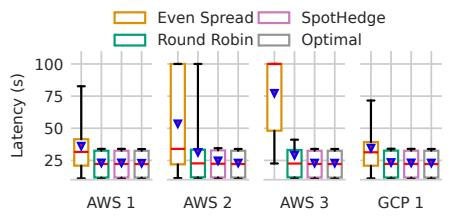  
(a) Poisson

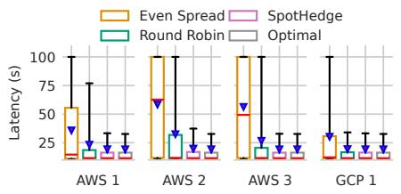  
(b) Arena

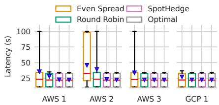  
(c) MAF  
Figure 15. Service Latency across four spot traces and three workloads.

Cost. SpotHedge reduces cost by 42–55% (Figure 14b) compared to using entirely on-demand replicas. The cost for Even Spread (16–29% of on-demand) and Round Robin (33–39% of on-demand) is lower, due to more spot preemptions and less spot capacity. This is consistent with the end-toend experiments, where these policies cannot launch enough replicas, suffering from worse service quality with lower costs. Omniscient policy (§3.3) does not overprovision and leverages future information to minimize cost. SpotHedge achieves 5%–20% relative cost difference to Optimal, while achieving comparable resource availability.

Service Quality. We report request latency in Fig 15. A static policy (e.g., Even Spread) experiences frequent preemptions, resulting in fewer ready replicas than ?<sub>???</sub> and worse service quality. SpotHedge achieves 1.1–3.0 , 1.0–1.8 reduction in average latency compared to Even Spread and Round Robin, and within 5% to the Optimal.

Sensitivity Experiments. We show (Fig. 14c, Fig. 14d) sensitivity of latency to the number of spot replicas to overprovision (?<sub>?????</sub>) and cold start delay (?). We find that a small value for ?<sub>?????</sub> works well in practice. A larger cold start delay moderately increases the tail latency.

## 6 Future Work

Advanced load balancing policy. For requests that require real-time interactivity and short Time-to-first-token (TTFT),

SpotHedge can be extended to dynamically route these requests to replicas in the same zone as the client, as well as monitor the replica load and only direct requests to a remote zone if local replicas are overloaded. SpotHedge can also keep an on-demand node pool in the client zone for these requests. This ensures that most requests can still be served from the closest replica to the client, while the requests that would otherwise cause overload can be routed to another replica in a remote region. That said, we expect inter-region latency to be largely outweighed by computation time for most requests (§3.1).

Support heterogeneous accelerators. GPUs have different performance-to-cost trade-offs. Expensive GPUs tend to have better performance albeit being less obtainable. While Sky-Serve supports specifying a set of GPUs, it can be extended to adopt a more intelligent policy to leverage accelerator heterogeneity. For example, when the spot instance for a higher-end GPU is unobtainable, one might switch to a spot instance of a cheaper, lower-end GPU instead.

## 7 Related Work

Spot instances for non-serving workloads. Spot instances have drawn interest from both industry [10, 73] and academia [64, 71, 76]. Prior work explored using spot instances for maintaining resource availability [73], web services [52], inmemory storage [72], batch [40, 70] or interactive jobs [35], HPC [65], analysis tasks [49], or elastic services [44]. ML training on spot instances has also been extensively studied [36, 45, 63, 67, 69, 74]. For example, Bamboo provides resilience for DNN training on preemptible instances [67]. Varuna [36] trains DNN networks on spot instances with commodity networking. However, serving has received relatively less attention and requires high resource availability and low latency.

Spot instances for serving workloads. As mentioned, Spot-Serve addresses a different set of problems from SpotHedge: preemption-tolerant model parallelization across multiple spot instances. Other works that incorporate spot instances are MArk [77], Cocktail [43], and Tributary [44]. However, they focus on serving small ML models using spot CPUs. In §2.3, we showed that spot GPUs are more likely to experience preemptions than spot CPUs, and systems that target spot CPUs do not perform well for serving large AI models (§5.1). Further, prior work only considers allocating instances in a single region or zone. SkyServe instead provisions GPUs across multiple regions and clouds to improve service availability. Snape [73] uses spot CPU instances for model serving by introducing an RL framework that uses node-level and cluster-level aggregate capacity to predict spot obtainability. However, this information is Azure-internal.

Popular model serving solutions. Many proprietary solutions host AI services. SageMaker [3] allows users to deploy ML models on AWS. Google Vertex AI [31] helps deploy GenAI models into applications on Google. However, these systems are not open-sourced and focus on non-preemptible instances. Ray Serve [26] is a model-serving library that supports both spot and on-demand instances. Similar to AWS Autoscaling Group [4], Ray Serve only supports predefined node pools and redirects traffic to on-demand nodes upon spot preemptions. GKE, a popular managed Kubernetes service, supports both spot and on-demand instances but does not support automatically scaling down on-demand insatnces once spot obtainability comes back [27], or support multi-region.

## 8 Conclusions

Spot GPUs are economically appealing to serve AI workloads, but they have not been widely considered viable for serving due to unpredictable preemptions and long cold start delays. We introduce SpotHedge to serve AI workloads on a mixture of spot and on-demand GPUs across regions and clouds. SpotHedge diversifies spot replica placements across regions and clouds, overprovisions spot replicas to mitigate preemptions, and proactively uses on-demand replicas when spot replicas are less available. We implement SkyServe that leverages SpotHedge and provides a unified interface to host AI services on mixtures of spot and on-demand replicas. Through evaluations on real AI workloads, SkyServe saves cost by 43% on average while achieving similar resource availability compared to on-demand deployments, and improves P50, P90, and P99 latency by 2.3<sub>↓</sub>, 2.1<sub>↓</sub>, 2.1<sub>↓</sub> on average respectively compared to other systems.

## Acknowledgement

We thank our shepherd, John Wilkes, and anonymous EuroSys reviewers for their valuable comments and insightful feedback. This work is in part supported by gifts from Accenture, AMD, Anyscale, Google, IBM, Intel, Microsoft, Mohamed Bin Zayed University of Artificial Intelligence, Samsung SDS, Uber, and VMware.

## References

[1] 2024. Amazon EC2 Auto Scaling with EC2 Spot Instances. https: //aws.amazon.com/tutorials/ec2-auto-scaling-spot-instances/. Accessed: Oct. 23, 2024.

[2] 2024. Amazon EC2 Burstable Performance Instances. https:// docs.aws.amazon.com/AWSEC2/latest/UserGuide/burstableperformance-instances.html. Accessed: Oct. 23, 2024.

[3] 2024. Amazon SageMaker. https://aws.amazon.com/sagemaker/. Accessed: Oct. 23, 2024.

[4] 2024. AWS Autoscaling Group. https://docs.aws.amazon.com/ autoscaling/ec2/userguide/auto-scaling-groups.html. Accessed: Oct. 23, 2024.

[5] 2024. AWS Lambda. https://aws.amazon.com/pm/lambda/. Accessed: Oct. 23, 2024.

[6] 2024. AWS Pricing. https://aws.amazon.com/pricing. Accessed: Oct. 23, 2024.

[7] 2024. AWS Spot Instance Advisor. https://aws.amazon.com/ec2/ spot/instance-advisor/. Accessed: Oct. 23, 2024.

[8] 2024. Azure Pricing. https://azure.microsoft.com/en-us/pricing. Accessed: Oct. 23, 2024.

[9] 2024. Bard: A conversational AI tool by Google. https://bard.google. com. Accessed: Oct. 23, 2024.

[10] 2024. CloudOps for Spot Instances. https://spot.io/. Accessed: Oct. 23, 2024.

[11] 2024. DALL·E 3. https://openai.com/dall-e-3. Accessed: Oct. 23, 2024.

[12] 2024. The Desperate Hunt for the A.I. Boom’s Most Indispensable Prize. https://www.nytimes.com/2023/08/16/technology/ai-gpuchips-shortage.html. Accessed: Oct. 23, 2024.

[13] 2024. Focus: For tech giants, AI like Bing and Bard poses billion-dollar search problem. https://www.reuters.com/technology/tech-giantsai-like-bing-bard-poses-billion-dollar-search-problem-2023-02- 22/. Accessed: Oct. 23, 2024.

[14] 2024. GCP Pricing. https://cloud.google.com/pricing. Accessed: Oct. 23, 2024.

[15] 2024. Github Copilot: The world’s most widely adopted AI developer tool. https://github.com/features/copilot. Accessed: Oct. 23, 2024.

[16] 2024. Google Kubernetes Engine (GKE). https://cloud.google.com/ kubernetes-engine?hl=en. Accessed: Oct. 23, 2024.

[17] 2024. Grammarly: AI Writing Assistance. https://www.grammarly. com/ai. Accessed: Oct. 23, 2024.

[18] 2024. How To Reduce Cold Start Times For LLM Inference. https: //scale.com/blog/reduce-cold-start-time-llm-inference. Accessed: Oct. 23, 2024.

[19] 2024. HuggingFace Chatbot Arena Conversation. https://huggingface. co/datasets/lmsys/chatbot\_arena\_conversations. Accessed: Oct. 23, 2024.

[20] 2024. Introducing ChatGPT. https://openai.com/index/chatgpt/. Accessed: Oct. 23, 2024.

[21] 2024. Loading Llama-2 70b 20x faster with Anyscale Endpoints. https: //www.anyscale.com/blog/loading-llama-2-70b-20x-faster-with-

anyscale-endpoints. Accessed: Oct. 23, 2024.

[22] 2024. Midjourney. https://www.midjourney.com/home. Accessed: Oct. 23, 2024.

[23] 2024. Navigating the High Cost of AI Compute. https://a16z.com/ navigating-the-high-cost-of-ai-compute/. Accessed: Oct. 23, 2024.

[24] 2024. NVIDIA Triton Inference Server. https://developer.nvidia. com/triton-inference-server/. Accessed: Oct. 23, 2024

[25] 2024. OpenAI API. https://openai.com/blog/openai-api. Accessed: Oct. 23, 2024.

[26] 2024. Ray Serve: Scalable and Programmable Serving. https://docs. ray.io/en/latest/serve/index.html. Accessed: Oct. 23, 2024.

[27] 2024. Running a GKE application on spot nodes with on-demand nodes as fallback. https://cloud.google.com/blog/topics/developerspractitioners/running- gke- application- spot- nodes- demandnodes-fallback. Accessed: Oct. 23, 2024.

[28] 2024. SpotServe: A Cost-Effective Spot Instance Serving Framework. https://github.com/Hsword/SpotServe. Accessed: Oct. 23, 2024.

[29] 2024. Text Generation Inference (TGI). https://github.com/ huggingface/text-generation-inference. Accessed: Oct. 23, 2024.

[30] 2024. Unofficial OpenAI Status. https://openai-status.llm-utils.org. Accessed: Oct. 23, 2024.

[31] 2024. Vertex AI. https://cloud.google.com/vertex-ai. Accessed: Oct. 23, 2024.

[32] 2025. Anthropic: Claude 3.5 Sonnet. https://www.anthropic.com/ news/claude-3-5-sonnet. Accessed: Feb. 13, 2025.

[33] 2025. Google Gemini: Supercharge your creativity and productivity. https://gemini.google.com. Accessed: Feb. 13, 2025.

[34] 2025. Serverless Endpoints for leading open-source models. https: //www.together.ai/products\_inference/. Accessed: Feb. 13, 2025.

[35] Pradeep Ambati and David Irwin. 2019. Optimizing the cost of executing mixed interactive and batch workloads on transient VMs. Proceed ings of the ACM on Measurement and Analysis of Computing Systems 3, 2 (2019), 1–24.

[36] Sanjith Athlur, Nitika Saran, Muthian Sivathanu, Ramachandran Ramjee, and Nipun Kwatra. 2022. Varuna: Scalable, Low-cost Training of Massive Deep Learning Models. In Proceedings of the Seventeenth European Conference on Computer Systems. 472–487.

[37] Anirban Bhattacharjee, Ajay Dev Chhokra, Zhuangwei Kang, Hongyang Sun, Aniruddha Gokhale, and Gabor Karsai. 2019. Barista: Efficient and scalable serverless serving system for deep learning pre diction services. In 2019 IEEE International Conference on Cloud Engineering (IC2E). IEEE, 23–33.

[38] Lingjiao Chen, Jared Quincy Davis, Boris Hanin, Peter Bailis, Ion Stoica, Matei Zaharia, and James Zou. 2024. Are more LLM calls all you need? Towards scaling laws of compound inference systems. arXiv preprint arXiv:2403.02419 (2024).

[39] Google Cloud. 2023. Spot Virtual Machine Instances Documentation. https://cloud.google.com/compute/docs/instances/spot. Accessed: Oct. 23, 2024.

[40] Shridhar G Domanal and G Ram Mohana Reddy. 2018. An efficient cost optimized scheduling for spot instances in heterogeneous cloud environment. Future Generation Computer Systems 84 (2018), 11–21.

[41] Zane Durante, Qiuyuan Huang, Naoki Wake, Ran Gong, Jae Sung Park, Bidipta Sarkar, Rohan Taori, Yusuke Noda, Demetri Terzopoulos, Yejin Choi, Katsushi Ikeuchi, Hoi Vo, Li Fei-Fei, and Jianfeng Gao. 2024. Agent AI: Surveying the Horizons of Multimodal Interaction. arXiv:2401.03568 [cs.AI] https://arxiv.org/abs/2401.03568

[42] Yao Fu, Leyang Xue, Yeqi Huang, Andrei-Octavian Brabete, Dmitrii Ustiugov, Yuvraj Patel, and Luo Mai. 2024. ServerlessLLM: Locality Enhanced Serverless Inference for Large Language Models. arXiv preprint arXiv:2401.14351 (2024).

[43] Jashwant Raj Gunasekaran, Cyan Subhra Mishra, Prashanth Thinakaran, Bikash Sharma, Mahmut Taylan Kandemir, and Chita R Das. 2022. Cocktail: A Multidimensional Optimization for Model Serving in Cloud.

In 19th USENIX Symposium on Networked Systems Design and Implementation (NSDI 22). 1041–1057.

[44] Aaron Harlap, Andrew Chung, Alexey Tumanov, Gregory R Ganger, and Phillip B Gibbons. 2018. Tributary: spot-dancing for elastic services with latency SLOs. In 2018 USENIX Annual Technical Conference (USENIX ATC 18). 1–14.

[45] Aaron Harlap, Alexey Tumanov, Andrew Chung, Gregory R Ganger, and Phillip B Gibbons. 2017. Proteus: agile ML elasticity through tiered reliability in dynamic resource markets. In Proceedings of the Twelfth European Conference on Computer Systems. 589–604.

[46] Vatche Ishakian, Vinod Muthusamy, and Aleksander Slominski. 2018. Serving deep learning models in a serverless platform. In 2018 IEEE International conference on cloud engineering (IC2E). IEEE, 257–262.

[47] Omar Khattab, Arnav Singhvi, Paridhi Maheshwari, Zhiyuan Zhang, Keshav Santhanam, Sri Vardhamanan, Saiful Haq, Ashutosh Sharma, Thomas T Joshi, Hanna Moazam, et al. 2023. Dspy: Compiling declara tive language model calls into self-improving pipelines. arXiv preprint arXiv:2310.03714 (2023).

[48] Woosuk Kwon, Zhuohan Li, Siyuan Zhuang, Ying Sheng, Lianmin Zheng, Cody Hao Yu, Joseph Gonzalez, Hao Zhang, and Ion Stoica. 2023. Efficient memory management for large language model serving with paged attention. In Proceedings of the 29th Symposium on Operating Systems Principles. 611–626.

[49] Kyungyong Lee and Myungjun Son. 2017. DeepSpotCloud: Leveraging Cross-Region GPU Spot Instances for Deep Learning. In 2017 IEEE 10th International Conference on Cloud Computing (CLOUD). IEEE, 98–105.

[50] Patrick Lewis, Ethan Perez, Aleksandra Piktus, Fabio Petroni, Vladimir Karpukhin, Naman Goyal, Heinrich Küttler, Mike Lewis, Wen tau Yih, Tim Rocktäschel, Sebastian Riedel, and Douwe Kiela. 2021. Retrieval-Augmented Generation for Knowledge-Intensive NLP Tasks. arXiv:2005.11401 [cs.CL] https://arxiv.org/abs/2005.11401

[51] Zhuohan Li, Lianmin Zheng, Yinmin Zhong, Vincent Liu, Ying Sheng, Xin Jin, Yanping Huang, Zhifeng Chen, Hao Zhang, Joseph E Gonzalez, et al. 2023. AlpaServe: Statistical Multiplexing with Model Parallelism for Deep Learning Serving. In 17th USENIX Symposium on Operating Systems Design and Implementation (OSDI 23). 663–679.

[52] Michele Mazzucco and Marlon Dumas. 2011. Achieving performance and availability guarantees with spot instances. In 2011 IEEE International Conference on High Performance Computing and Communications. IEEE, 296–303.

[53] Xupeng Miao, Chunan Shi, Jiangfei Duan, Xiaoli Xi, Dahua Lin, Bin Cui, and Zhihao Jia. 2023. SpotServe: Serving Generative Large Language Models on Preemptible Instances. arXiv:2311.15566 [cs.DC]

[54] Microsoft. 2024. Use Azure Spot Virtual Machines. https://learn. microsoft.com/en-us/azure/virtual-machines/spot-vms. Accessed: Oct. 23, 2024.

[55] Evan Morikawa. 2023. Behind the Scenes Scaling ChatGPT. https: //youtu.be/PeKMEXUrlq4?t=833. Accessed: Oct. 23, 2024.

[56] OpenAI. 2024. AI and Compute. https://openai.com/blog/ai-andcompute/. Accessed: Oct. 23, 2024.

[57] Dylan Patel and Afzal Ahmad. 2023. The Inference Cost of Search Disruption–Large Language Model Cost Analysis. Verfügbar unter https://www. semianalysis. com/p/theinference-cost-of-searchdisruption (2023).

[58] Chenhao Qu, Rodrigo N Calheiros, and Rajkumar Buyya. 2016. A Reliable and Cost-Efficient Auto-Scaling System for Web Applications Using Heterogeneous Spot Instances. Journal of Network and Computer Applications 65 (2016), 167–180.

[59] Robin Rombach, Andreas Blattmann, Dominik Lorenz, Patrick Esser, and Björn Ommer. 2021. High-Resolution Image Synthesis with Latent Diffusion Models. arXiv:2112.10752 [cs.CV]

[60] Mark Seery. 2024. LLM Routing: Bottleneck is Compute, Not the WAN. https://www.linkedin.com/pulse/llm- routing-bottleneck-

compute-wan-mark-seery-4xeac/. LinkedIn.

[61] Amazon Web Services. 2015. Announcing Amazon EC2 Spot Instance Termination Notices. https://aws.amazon.com/aboutaws/whats- new/2015/01/05/announcing- amazon- ec2- spotinstance-termination-notices/. Accessed: Oct. 23, 2024.

[62] Mohammad Shahrad, Rodrigo Fonseca, Inigo Goiri, Gohar Chaudhry, Paul Batum, Jason Cooke, Eduardo Laureano, Colby Tresness, Mark Russinovich, and Ricardo Bianchini. 2020. Serverless in the wild: Characterizing and optimizing the serverless workload at a large cloud provider. In 2020 USENIX annual technical conference (USENIX ATC 20). 205–218.

[63] Ruitao Shang, Fei Xu, Zhuoyan Bai, Li Chen, Zhi Zhou, and Fangming Liu. 2023. spotDNN: Provisioning Spot Instances for Predictable Distributed DNN Training in the Cloud. In 2023 IEEE/ACM 31st International Symposium on Quality of Service (IWQoS). IEEE, 1–10.

[64] Yang Song, Murtaza Zafer, and Kang-Won Lee. 2012. Optimal bidding in spot instance market. In 2012 Proceedings IEEE Infocom. IEEE, 190–198.

[65] Moussa Taifi, Justin Y Shi, and Abdallah Khreishah. 2011. SpotMPI: A Framework for Auction-Based HPC Computing Using Amazon Spot Instances. In Algorithms and Architectures for Parallel Processing: 11th International Conference, ICA300 2011, Melbourne, Australia, October 24-26, 2011, Proceedings, Part II 11. Springer, 109–120.

[66] David Taylor. 2024. Best Practices for Running Your Database on AWS Spot Instances. https://www.cockroachlabs.com/blog/databasespot-instances/. Accessed: Oct. 23, 2024.

[67] John Thorpe, Pengzhan Zhao, Jonathan Eyolfson, Yifan Qiao, Zhihao Jia, Minjia Zhang, Ravi Netravali, and Guoqing Harry Xu. 2023. Bamboo: Making Preemptible Instances Resilient for Affordable Training of Large DNNs. In 20th USENIX Symposium on Networked Systems Design and Implementation (NSDI 23). 497–513.

[68] H. Touvron, L. Martin, K. Stone, and et al. 2023. Llama 2: Open Foundation and Fine-Tuned Chat Models. arXiv:2307.09288 [cs.CL]

[69] Marcel Wagenländer, Luo Mai, Guo Li, and Peter Pietzuch. 2020. Spotnik: Designing Distributed Machine Learning for Transient Cloud Resources. In 12th USENIX Workshop on Hot Topics in Cloud Computing (HotCloud 20).

[70] Rich Wolski, John Brevik, Ryan Chard, and Kyle Chard. 2017. Probabilistic guarantees of execution duration for Amazon spot instances. In Proceedings of the International Conference for High Performance Computing, Networking, Storage and Analysis. 1–11.

[71] Zhanghao Wu, Wei-Lin Chiang, Ziming Mao, Zongheng Yang, Eric Friedman, Scott Shenker, and Ion Stoica. 2024. Can’t Be Late: Optimiz ing Spot Instance Savings under Deadlines. In 21st USENIX Symposium on Networked Systems Design and Implementation (NSDI 24). 185– 203.

[72] Zichen Xu, Christopher Stewart, Nan Deng, and Xiaorui Wang. 2016. Blending on-demand and spot instances to lower costs for in-memory storage. In IEEE INFOCOM 2016-The 35th Annual IEEE International Conference on Computer Communications. IEEE, 1–9.

[73] Fangkai Yang, Lu Wang, Zhenyu Xu, Jue Zhang, Liqun Li, Bo Qiao, Camille Couturier, Chetan Bansal, Soumya Ram, Si Qin, et al. 2023. Snape: Reliable and Low-Cost Computing with Mixture of Spot and On-Demand VMs. In Proceedings of the 28th ACM International Conference on Architectural Support for Programming Languages and Operating Systems, Volume 3. 631–643.

[74] Sheng Yang, Samir Khuller, Sunav Choudhary, Subrata Mitra, and Kanak Mahadik. 2021. Scheduling ML training on unreliable spot instances. In Proceedings of the 14th IEEE/ACM International Confer ence on Utility and Cloud Computing Companion. 1–8.

[75] Zongheng Yang, Zhanghao Wu, Michael Luo, Wei-Lin Chiang, Romil Bhardwaj, Woosuk Kwon, Siyuan Zhuang, Frank Sifei Luan, Gautam Mittal, Scott Shenker, et al. 2023. SkyPilot: An Intercloud Broker for Sky Computing. In 20th USENIX Symposium on Networked Systems

Design and Implementation (NSDI 23). 437–455.

[76] Sangho Yi, Artur Andrzejak, and Derrick Kondo. 2011. Monetary cost aware checkpointing and migration on Amazon cloud spot instances. IEEE Transactions on Services Computing 5, 4 (2011), 512–524.

[77] Chengliang Zhang, Minchen Yu, Wei Wang, and Feng Yan. 2019. MArk: Exploiting Cloud Services for Cost-Effective, SLO-Aware Machine Learning Inference Serving. In 2019 USENIX Annual Technical Conference (USENIX ATC 19). 1049–1062.

[78] Lianmin Zheng, Liangsheng Yin, Zhiqiang Xie, Jeff Huang, Chuyue Sun, Cody Hao Yu, Shiyi Cao, Christos Kozyrakis, Ion Stoica, Joseph E Gonzalez, et al. 2023. Efficiently Programming Large Language Models using SGLang. arXiv preprint arXiv:2312.07104 (2023).

SkyServe: Serving AI Models across Regions and Clouds with Spot Instances

## A Appendix

This Appendix contains the code and instructions to reproduce the experiments and figures in this paper. We open-sourced SkyServe system to stimulate research in this area: https: //github.com/skypilot-org/skypilot. We also open-source all collected spot preemption traces in this repository: https: //github.com/MaoZiming/spothedge\_ae.

## A.1 Reproducing Experiment Results Locally

We provide all raw data for our experiments and scripts to reproduce all figures locally.

Preparations. Clone our repository and install dependencies:

```shell
git clone https://github.com/MaoZiming/
spothedge_ae
conda create --name spot-hedge-ae python
=3.10
conda activate spot-hedge-ae
pip install -r requirements.txt
```

Reproduce End-to-End Experiment Figures. We provide raw data for our experiments and scripts to reproduce all figures locally. To reproduce the end-to-end experiment figures:

```shell
cd path/to/ae/repo
cd e2e/plots
unzip spot-hedge-ae-raw-data.zip
# Figure 6
python3 draw-misc.py
# Figure 9(a-d), Figure 13(a-d)
python3 draw-latency.py
# Figure 9(e-f), Figure 10, Figure 12,
Figure 13(e-f)
python3 draw-cost-and-trace.py
```

Reproduce Microbenchmark Experiment Figures. To reproduce the microbenchmark experiment figures:

```shell
cd path/to/ae/repo
cd plots
./plot_figures.sh
```

## A.2 Running SkyServe on the Cloud

Install SkyServe. Install SkyServe from source following this guide: https://docs.skypilot.co/en/latest/gettingstarted/installation.html. To use SpotHedge, switching to the spot-hedge-new branch and enable at least one cloud. We use AWS for example.

```shell
conda create -y -n sky python=3.10
conda activate sky
git clone https://github.com/skypilot-org/
skypilot.git
cd skypilot
git switch spot-hedge-new
```

pip install -e ".[aws]"   
sky check aws # And follow the instructions.

Spinning up an AI service. Here are some example commands to run an AI service. This launches an OpenAI API Server for Llama2-70b-chat-hf. Notice that a HuggingFace access token is required at line 40 of e2e/spot\_hedge.yaml. For more information, checkout the SkyServe system: https: //docs.skypilot.co/en/latest/serving/sky-serve.html.

```shell
cd path/to/ae/repo
# Add your HuggingFace token at line 40
sky serve up e2e/spot_hedge.yaml -n spot
hedge
```

Once running, use the following command to monitor service status:

watch -n10 sky serve status spot-hedge

SpotHedge automatically handles preemption recovery and auto-scaling. Once ready, the endpoint URL will be available as an OpenAI API Server. Send a test query command:

```shell
ENDPOINT=$(sky serve status spot-hedge --
endpoint)
curl $ENDPOINT/v1/models
curl $ENDPOINT/v1/chat/completions -X POST -
H "Content-Type: application/json" -d '{
"model": "meta-llama/Llama-2-70b-chat-hf",
"messages": [
{
"role": "user",
"content": "Hello! What is your name?"
}
]
}'
```

Launch clients for the end-to-end experiments. The configuration of clients is located in e2e/client/client.yaml. To run it, replace the host and port with the actual service host and port.

```shell
# Get the service host and port
sky serve status spot-hedge --endpoint
# Replace it in e2e/client/client.yaml
# Start the client
sky launch e2e/client/client.yaml
```

Running Microbenchmark. YAML files for microbenchmarks are in eval/run\_eval.yaml. To reproduce it, run:

sky launch eval/run\_eval.yaml