# Cartridges: Lightweight and general-purpose long context representations via self-study

Sabri Eyuboglu 1∗ Ryan Ehrlich 1∗ Simran Arora 1,2∗ Neel Guha 1 Dylan Zinsley 3 Emily Liu 1   
Will Tennien 1 Atri Rudra 3 James Zou 1 Azalia Mirhoseini 1 Christopher Ré 1

1Stanford University 2 Caltech 3University at Buffalo \* Equal contribution

\# eyuboglu@stanford.edu, rehrlich@stanford.edu, simarora@stanford.edu

© HazyResearch/cartridges

## Abstract

Large language models are often used to answer queries grounded in large text corpora (e.g. codebases, legal documents, or chat histories) by placing the entire corpus in the context window and leveraging in-context learning (ICL). Although current models support contexts of 100K–1M tokens, this setup is costly to serve because the memory consumption of the KV cache scales with input length. We explore an alternative: training a smaller KV cache offline on each corpus. At inference time, we load this trained KV-cache, which we call a CARTRIDGE, and decode a response. Critically, the cost of training a CARTRIDGE can be amortized across all the queries referencing the same corpus. However, we find that the naive approach of training the CARTRIDGE with next-token prediction on the corpus is not competitive with ICL. Instead, we propose SELF-STUDY, a training recipe in which we generate synthetic conversations about the corpus and train the CARTRIDGE with a context-distillation objective. We find that CARTRIDGES trained with SELF-STUDY replicate the functionality of ICL, while being significantly cheaper to serve. On challenging long-context benchmarks, CARTRIDGES trained with SELF-STUDY match ICL performance while using 38.6× less memory and enabling 26.4× higher throughput. SELF-STUDY also extends the model’s effective context length (e.g. from 128k to 484k tokens on MTOB) and surprisingly, leads to CARTRIDGES that can be composed at inference time without retraining.

## 1 Introduction

Large language model (LLM) users often place large text corpora into the context window. For instance, a user or organization may use LLMs to understand codebases [63], financial documents [38], legal texts [32, 118], textbooks [68], or personal files [7]. LLMs excel here due to in-context learning (ICL), enabling accurate responses to diverse queries (e.g., factual Q&A, summarization, code generation) [24].

Despite its flexibility, this usage paradigm is costly to serve. ICL requires maintaining a KV cache that grows linearly with the input length. For example, LLaMA 70B needs 84 GB of memory (at 16-bit precision) to answer a single question over a 128k-token context [25]. This severely limits user throughput: on a single H100 GPU, LLaMA 8B’s peak throughput (tokens/s) drops by 77× when increasing the context from 1k to 120k tokens (Figure 3).

Prior work has thus explored ways to reduce KV cache memory usage. For instance, prompt compression methods reduce the number of tokens stored in the cache using summarization, or self-information filtering [21, 42, 55], while KV cache compression techniques directly compress the stored key-value pairs [27, 67, 84, 114]. Unfortunately, there are memory-quality tradeoffs associated with these methods: in experiments on challenging long-context tasks, we find that performance degrades rapidly when applying these methods with compression ratios greater than 2× (see Figure 4).

Motivated by the observation that the cost of preparing a KV cache can be amortized across many queries that reference the same corpus, we explore a complementary approach based on offline training. Given a specific text corpus (e.g. a patient’s medical record) we freeze the LLM and train a smaller KV cache offline by backpropagating loss into the key and value vectors in a process essentially equivalent to prefix tuning [51, 54]. We call the trained KV cache representing the corpus a “CARTRIDGE.” At inference time, we load the trained CARTRIDGE, append the user’s messages, and decode. Because users repeatedly reference the same corpora (e.g. SEC filings, codebase, personal files), each CARTRIDGE can be trained once offline and reused. This approach also integrates cleanly with existing inference servers, which are already designed to manage per-user KV caches [45, 50, 103, 117].

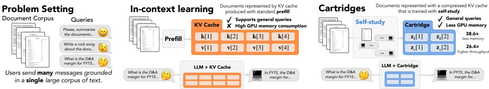  
Figure 1: Producing CARTRIDGES via self-study. For a given document corpus, we train a CARTRIDGE by distilling the corpus into a parameterized KV cache through a process we call SELF-STUDY. At inference time, this CARTRIDGE can be loaded into an LLM, which can then be used to answer diverse queries about the corpus, simulating in-context analysis of the corpus while requiring substantially less memory.

Achieving ICL-equivalent functionality requires CARTRIDGES to satisfy two non-trivial desiderata. First, CARTRIDGES should replicate the generality of ICL, and provide accurate responses across diverse user prompts [24]. Second, CARTRIDGES should replicate ICL’s structural awareness—its ability to reason over document structure, and understand how distant parts of a corpus relate or depend on each other (an ability that degrades when using lossy KV-cache compression methods). It is unclear if there is a procedure that satisfies these desiderata, while providing memory efficiency.

The natural baseline approach is to train a CARTRIDGE with a next-token prediction objective on the raw corpus. Excitingly, this yields CARTRIDGES that memorize the corpus perfectly using 107× less memory than the KV-cache. However, the resulting CARTRIDGES are not general - they degrade the LM’s ability to respond to diverse questions beyond regurgitating the corpus (Figure 3).

To address these challenges and produce general, structurally aware CARTRIDGES for any text corpus, we propose an automated method called SELF-STUDY. SELF-STUDY has two steps:

1. Synthetic data generation (Section 4.1): We generate synthetic training data by prompting the model to quiz itself about the corpus content, resulting in a synthetic conversation trace. Training on these lets us avoid training on the same exact text multiple times and improves generality (see Figure 3). To support corpora that exceed the effective context length of the model, we chunk the corpus when generating synthetic conversations. We also curate a set of seed prompts that bias the synthetic conversations towards global reasoning and improve structural awareness (see Figure 6 right).

2. Context distillation (Section 4.2): We train on the synthetic conversations using a context-distillation objective [13, 79], which aligns the CARTRIDGE-augmented model’s next-token distributions with the distributions of the model with the corpus in context. We find that the context distillation substantially improves the quality of the CARTRIDGES compared to next-token-prediction (see Figure 6 center).

In summary, given a large corpus of text, our goal is to train a small virtual KV cache, termed CARTRIDGE, that when used by the model, mimics the conversational behavior of the model with the entire corpus in context. To do this, we generate synthetic conversations and train the CARTRIDGE on them with a context distillation objective — a recipe we call SELF-STUDY.

Evaluations. We evaluate CARTRIDGES trained with SELF-STUDY on a set of challenging benchmarks that pair a single large text corpus (100k-484k tokens) with a diverse set of queries [2, 38, 85]. We make three claims. First, CARTRIDGES extends the quality-memory frontier—averaged across the benchmarks, CARTRIDGES produced with SELF-STUDY match ICL quality while consuming 38.6× less memory, enabling a 26.4× increase in peak throughput (tokens per second) when serving many users with different corpora. These memory reductions and speedups represent an order of magnitude improvement over state-of-the-art cache compression baselines (e.g. DuoAttention [95]). Second, CARTRIDGES enables context length extrapolation. On the MTOB benchmark [85], where models must translate from Kalamang, a low-resource language, into English, we use SELF-STUDY with LLAMA-8B to construct a small CARTRIDGE from a 484k token textbook. This CARTRIDGE outperforms ICL over the first 130, 000 tokens of the textbook by 11.0 chrF points and matches the ICL performance over a curated subset of the textbook. Third, SELF-STUDY also yields CARTRIDGES that are composable without joint optimization: multiple CARTRIDGES can be concatenated and queried together, emulating ICL’s ability to flexibly answer queries over multiple documents concatenated in context (see Figure 7).

<table><tr><td>Method</td><td>Consumes limited Retains corpus Supports diverse memory</td><td>information</td><td>prompts</td></tr><tr><td>In-context learning</td><td>X</td><td></td><td>√</td></tr><tr><td>Prompt /KV cache compression</td><td>√</td><td>&lt;x</td><td>「</td></tr><tr><td>CARTRIDGE + Next-token-prediction</td><td>！</td><td></td><td>X</td></tr><tr><td>CARTRIDGE + SELF-STUDY</td><td></td><td></td><td></td></tr></table>

Figure 2: Comparing KV caching strategies. CARTRIDGE improves memory efficiency, while retaining the quality of in-context learning across a broad set of prompts. ✓ indicates a strength and ✗ indicates a limitation.

Additionally, we carefully ablate the design decisions in SELF-STUDY and CARTRIDGES (Section 5.3 and Appendix A). Notably, we compare CARTRIDGES parameterized as a KV cache [54] with CARTRIDGES parameterized as a LoRA [36] and find that KV cache parameterization performs better on both in-domain and out-of-domain tasks.

In this work, we demonstrate how offline KV cache training can dramatically reduce the cost of serving language models in settings where users repeatedly include the same text corpora in context. We hope that these cost reductions could enable new applications that are currently intractable, like coding agents with full-repository context or long-term memory in chatbots.

## 2 Preliminaries

We begin by discussing related work (Section 2.1), formalizing our problem (Section 2.2), and providing background on language models and KV caches (Section 2.3).

## 2.1 Related work

See Appendix B for a detailed discussion of prior work.

Parameter Efficient Fine-Tuning and Knowledge Injection In order to adapt a language model to a specific task or domain, practitioners commonly train a small number of parameters, which augment or modify the original model [36, 51, 54, 61, 107]. In particular, low rank adaptation [36], where linear layers are adapted with low rank updates, is the de facto parameter efficient fine-tuning technique. In our work, we build upon a less popular technique, prefix-tuning [51, 54], where we optimize internal activations for a set of “virtual” tokens preceding the input.

Recent works on knowledge injection apply LoRA (or variants [60]) to store a text corpus in a small number of parameters [48, 60, 81, 93, 113]. This allows models to answer queries using parameteric knowledge as opposed to ICL. The earliest methods in this line of work inject knowledge with next-token prediction objectives on the corpus [49, 93, 113]. Excitingly, recent and concurrent work has also demonstrated the power of synthetic data [60, 81] and context-distillation objectives [15, 48] in knowledge injection. In contrast to our work, these papers do not focus on memory reductions or throughput improvements enabled by knowledge injection. Furthermore, they do not use a prefix-tuning parameterization, formulate synthetic data generation as a conversation, or seed the conversation with diverse seed prompts, which we find to be critical for performance on long-context tasks and out-of-domain generalization.

Related to our analysis of CARTRIDGE composition are a number of works that compose multiple different parameter-efficient adapters through various aggregation operations [30, 37, 53, 92, 94, 97, 115, 116].

Prompt and KV-cache compression Because the size of the KV cache is a major determinant of language model serving cost, many works have proposed techniques to reduce the size of the cache. One set of approaches focus on making the prompt smaller—explicit methods alter the prompt text through summarization and filtering [21, 42, 55, 70, 109], while implicit methods compress prompt representations into a set of “soft” tokens [19, 28, 51, 62, 72, 104]. Another set of approaches exploits observations about the structure of the KV cache [16, 46, 105], often finding that because a small number of keys dominate the attention scores of subsequent queries, non-impactful key-value pairs (or tokens) can be dropped [27, 56, 67, 84, 114] or merged [90, 91, 112]. Compared with our work, these methods use relatively little compute to compress the KV cache. We focus on the setting where scaling the amount of compute used to compress the KV cache makes sense because contexts are shared across many requests.

Architectural changes A large body of work has studied architectural changes to the original multi-head attention operation [89] with the aim of reducing the memory footprint of the KV cache or replacing it with a memory object of constant size. Unlike SELF-STUDY and the compression approaches discussed above, which can be readily applied to any pre-trained Transformer, these architectural changes typically require retraining the model from scratch or using complex architecture conversion techniques [108].

In order to reduce the memory footprint of the KV cache, these architectures leverage sparsity [12, 20, 86, 106], reduce the number of key and value heads [3, 78], make the key and value heads low-rank [57], or replace the KV cache with a constant-size memory object [6, 31, 99, 102, 111]. In particular, grouped-query attention [3] is the de-facto multi-head attention variant, used in frontier language models like Llama 3 [25]. In our experiments, we compare against ICL with grouped-query attention. Other variants — such as multi-head latent attention [57] or linear attention [6, 31] — are gaining popularity and feature in large-scale reasoning models [33] and hybrid models [14, 52, 87].

Most related to our work are recent architectures (e.g. Titans [11], TTT [82]) that use a constant-sized memory object (like in linear attention) but apply gradient descent-like memory updates [9–11, 82, 101]. Like our work, these architectures are motivated by the observation that gradient descent is very effective at compressing text into constant space and demonstrate the promise of using gradient descent at test time for long-context tasks. In contrast with our work, these architectures need to be trained from scratch, they have not been validated on large scale models, and do not match the quality of attention on recall-intensive tasks [6, 9].

## 2.2 Problem setup

We assume a setting in which users issue a stream of diverse queries about a common corpus of text. We denote the corpus as C and the query set as $Q = \{ q _ { 1 } , q _ { 2 } , \dots , q _ { m } \}$ . Illustrative examples of C include legal filings, financial documents, code repositories, chat histories, and medical records.

## Example: Financial Analysis

C may correspond to the 2022 Form 10-K filing [88] for AMD, which is almost 100k tokens. The queries an analyst might ask an LLM to answer with respect to this form are diverse, including: (1) recalling factual information, (2) performing mathematical reasoning over values, or (3) even generating creative responses (e.g., a poem) grounded in the 10-K’s information.

Let $R = \{ r _ { 1 } , r _ { 2 } , \ldots , r _ { m } \}$ denote the responses the LLM produces for the queries. We have two objectives. First, we wish to maximize the quality of responses R under some quality metric (e.g. accuracy). Second, we wish to minimize the LLM’s memory footprint while it is answering questions with respect to the document. This is because larger memory footprints decrease throughput and necessitate more hardware to serve the same number of users (Figure 3, Right).

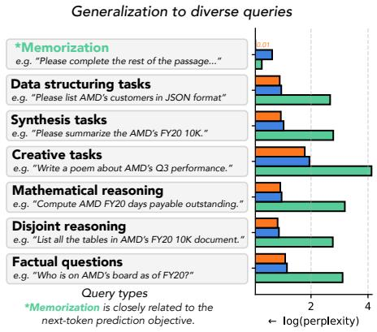

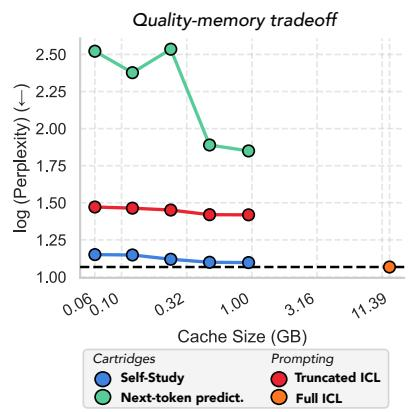

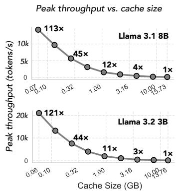  
Figure 3: CARTRIDGES trained with SELF-STUDY balance the generality and memory consumption tradeoff. We compare four methods on the GENCONVO dataset: CARTRIDGES trained with next-token prediction over ${ \mathcal { C } } ,$ CARTRIDGES trained with SELF-STUDY, full ICL, and truncated $\mathrm { I C L } $ , a prompt compression method in which we truncate the C to the first k tokens. (Left) We evaluate on different slices from the GENCONVO dataset. CARTRIDGES trained with next-token prediction performs well on memorization queries, which resemble it’s training distribution, but cannot generalize to other queries like the other methods. (Center) The x-axis measures the size of the KV cache in GB for the different methods. The y-axis shows log-perplexity on the GENCONVO dataset averaged over the query types. (Right) Peak throughput (tokens/s) measured for different cache sizes for LLAMA-3B and LLAMA-8B with SGLang [117] on an 1xH100 (See Appendix A).

## 2.3 Language models and KV caches

Recall that an LLM F accepts as input a sequence of N tokens $\mathbf { x } \in \mathcal { V } ^ { n }$ drawn from a discrete vocabulary $\nu \subset \mathbb { Z }$ of tokens, each represented by a unique integer. The output, which we denote $\mathcal { F } ( \cdot | \mathbf { x } )$ , corresponds to a categorical distribution over a vocab V conditioned on the prefix $\mathbf { x } \in \mathcal { V } ^ { n }$

Inside the language model, each token x[i] in x is embedded into a d-dimensional space, yielding a matrix $\mathbf { u } \in \mathbb { R } ^ { n \times d }$ . The matrix u is passed through a stack of L model layers, which each mix the matrix along the n and d dimensions, with layer ℓ outputting $\mathbf { y } ^ { l } \in \mathbb { R } ^ { n \times d }$ . The final $\mathbf { y } ^ { L }$ is mapped to the logits over V with a linear projection.

Most modern language models use the Transformer architecture based on self-attention [89]. Given an input $\mathbf { u } \in \mathbb { R } ^ { n \times d }$ for sequence length n and embedding dimension $d ,$ it computes the output $\mathbf { y } ^ { l } \in \mathbb { R } ^ { n \times d }$ via the softmax over projections $\mathbf { q } , \mathbf { k } , \mathbf { v } = \mathbf { u } \mathbf { W } _ { q } , \mathbf { u } \mathbf { W } _ { k } , \mathbf { u } \mathbf { W } _ { v }$ :

$$
\mathbf { y } [ i ] = \sum _ { j = 1 } ^ { i } \frac { \exp ( \mathbf { q } [ i ] ^ { \top } \mathbf { k } [ j ] / \sqrt { d } ) \mathbf { v } [ j ] } { \sum _ { t = 1 } ^ { i } \exp ( \mathbf { q } [ i ] ^ { \top } \mathbf { k } [ t ] / \sqrt { d } ) }\tag{1}
$$

where weight matrices $W _ { q } , W _ { k }$ and $W _ { v }$ for each layer are learned during training.

When generating from F, we generate one token at a time by sampling from $\mathcal { F } ( \cdot \mid \mathbf { x } )$ and appending the sampled token to x. Critically, the attention operator is causal: every output y[i] is conditioned on prior tokens. This allows us to avoid recomputing the keys and values for the prior tokens by storing them in a KV cache $\{ \mathbf { k } [ j ] , \mathbf { v } [ j ] \} _ { j = 1 } ^ { i }$ , which grows in i. Thus, generation proceeds in two phases: (1) prefill, where we compute the KV cache for the initial prompt x and (2) decode, where we generate the response token by token and append to the KV cache. After prefill, if x consists primarily of the corpus ${ \mathcal { C } } ,$ the KV cache effectively serves as a representation of the corpus C. This is why including a long corpus C in the context x produces large memory footprints, as the size of the KV cache scales linearly in the length of x.

## 3 The CARTRIDGE paradigm

In this section, we describe the CARTRIDGE paradigm, in which we generate representations of the corpus C offline with training, instead of the standard approach of constructing them on-the-fly with prefill.

## 3.1 Formalizing CARTRIDGES

Our goal is to train a CARTRIDGE for a given corpus C. A CARTRIDGE is a small set of parameters $Z \in \mathbb { R } ^ { * }$ (i.e. an adapter [36, 54]) that augments an LLM F and causes it to behave as if it had C in its context window. Formally, let $\mathcal { F } _ { Z } ( \cdot | q )$ denote the distribution of $\mathcal { F }$ augmented with Z given a query q. For all $q \in Q$ , we want to ensure that samples $r _ { Z } \sim \mathcal { F } _ { Z } ( \cdot | q )$ are as good or better than the ICL sample $r _ { q } \sim \mathcal { F } ( \cdot | \mathcal { C } \oplus q )$ , according to some query-specific scoring function. In order for $\mathcal { F } _ { Z } ( \cdot | q )$ to match or exceed the behavior of $\mathcal { F } ( \cdot | \boldsymbol { \mathcal { C } } \oplus \boldsymbol { q } )$ , three important criteria should be met.

• Displays generality: Because Q might span a diverse range of question types (e.g., mathematical reasoning, factual recall comprehension, summarization, and more), it is essential that $\mathcal { F } _ { Z }$ can generalize across different $q \in Q$ . This is non-trivial because Q is unknown when Z is being learned offline. If $\mathcal { F } _ { Z }$ does not generalize, then practitioners may need to learn different Z for different distributions of queries, which increases the cost of the CARTRIDGE. Ideally, Z should only need to be learned once, yet work for multiple types of queries.

• Captures long range dependencies: Z should also capture long range dependencies contained within C. In many settings, correctly answering different $q \in Q$ requires reasoning about the order of information presented in C. It is not clear how to capture these dependencies in Z.

• Capable of composition: Ideally, the representation of Z and mechanism by which $\mathcal { F }$ utilizes it could allow for composition, without any particular joint training of CARTRIDGES. Given $Z _ { 1 }$ and $Z _ { 2 }$ corresponding to $\mathcal { C } _ { 1 }$ and $\mathcal { C } _ { 2 }$ , ideally $\mathcal { F } _ { [ Z _ { 1 } , Z _ { 2 } ] } ( q )$ is similar to $\mathcal { F } ( \cdot | \mathcal { C } _ { 1 } \oplus \mathcal { C } _ { 2 } \oplus q ] )$

## 3.2 Parameterizing CARTRIDGES

We parameterize Z using a simplified version of prefix-tuning [54]. Specifically, we allocate a KV cache composed of trainable key and value vectors $\mathbf { z } _ { \mathrm { k } } , \mathbf { z } _ { \mathrm { v } } \in \mathbb { R } ^ { p \times d }$ . The size of the full $\dot { Z } \in \mathbb { R } ^ { L \times p \times d \times 2 }$ is controlled by the hyperparameter p. The memory footprint of Z is equivalent to a KV cache for a prompt with p tokens.

In ICL, the KV cache for $\mathcal { F } _ { \mathcal { C } } ( q )$ (where C is of length $n _ { \mathcal { C } }$ and Q is of length $n _ { Q } )$ would contain $n _ { \mathcal { C } } + n _ { Q }$ key-value pairs, with the first $n _ { \mathcal { C } }$ corresponding to C and the last $n _ { Q }$ corresponding to $Q \colon$

$$
\begin{array} { r l } { { \mathrm { I C L ~ K V ~ C a c h e } } } & { \qquad \quad \begin{array} { c } { \mathrm { C a \mathbb { R } \mathbb { R } \mathbb { T } R \mathbb { D } C \mathrm { ~ K V } \complement a c h e } } \\ { \mathrm { ( \underbrace { k [ 1 ] , v [ 1 ] } _ { \mathrm { ~ K V ~ p a r i c ~ f r o r } } ) , v [ n _ { C } ] ) , ( \underbrace { \mathbf { R } [ n _ { C } ] } _ { \mathrm { ~ K V ~ p a r s ~ f o r ~ \# ~ } } ) _ { \mathrm { ~ f r a n a b l e ~ K V ~ P a r i c ~ i n ~ Z ~ } } , } } \end{array} } \end{array}
$$

To train a CARTRIDGE, we substitute the key-value pairs corresponding to C with $Z ,$ and directly optimize them by back-propagating the loss into the key and value vectors. Critically, we freeze all parameters of the model, only training the key and value vectors in Z. We discuss the choice of loss in Section 4.2.

Initialization Prior work finds that optimizing a randomly initialized cache Z is unstable and leads to degraded performance [54]. Instead, these works initialize the trainable cache with a smaller dimensionality d and then re-project it to the original dimension with an MLP. In contrast, we find that proper initialization of Z allows us to directly optimize the full cache without reparametrization. Specifically, we initialize Z to the KV cache corresponding to the first p tokens of the corpus C. Alternatively, we could use a summary of the corpus or filter tokens using off-the-shelf prompt compression strategies [95]. In Section 5.3, we show that our initializations lead to stable training and faster convergence than the random initialization.

Why this parameterization? We note that the parameter-efficient fine-tuning literature provides other ways to augment an LLM with a set of additional parameters, in particular low-rank adaptation (LoRA) [36, 51, 54].

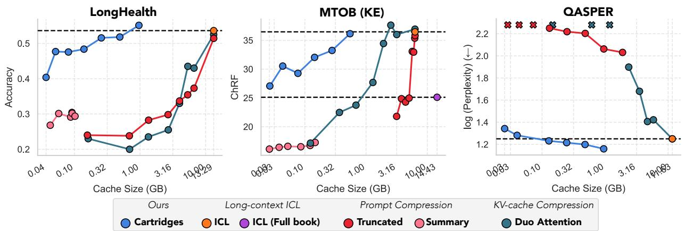  
Figure 4: CARTRIDGES matches ICL quality with lower memory costs. We measure LLAMA-3B response quality (y-axis) against KV cache memory (x-axis) for different methods, at different KV cache sizes. The dashed line marks the quality of standard ICL.

In Section 5.3, we perform a comprehensive comparison of CARTRIDGES parameterized with prefix-tuning and LoRA.

## 3.3 Serving CARTRIDGES

A CARTRIDGE can be served efficiently with minimal changes to existing LLM inference servers [45, 50, 117]. Because a CARTRIDGE is a KV cache, it can be loaded directly into the KV cache slots using existing mechanisms for handling cached prefixes. LLM inference servers are heavily optimized for managing distinct KV-caches for multiple users [103], meaning CARTRIDGES can be served at high throughput using existing inference servers. Decoding tokens with a CARTRIDGE is identical to serving a request with a prefix of length p (the hyperparameter denoting the number of trainable tokens in the CARTRIDGE). This contrasts with other methods like LoRA, which require custom infrastructure to serve efficiently to multiple users [18]. See Figure 3 for the relationship between prefix length and throughput.

## 4 SELF-STUDY: A self-supervised method for training CARTRIDGES

In this section, we describe SELF-STUDY, a simple approach for training a CARTRIDGE Z on any corpus of text. The design of SELF-STUDY is motivated by experiments showing how CARTRIDGES trained with a simpler recipe fail to generalize to diverse user queries.

Motivating observations The naive method for constructing a CARTRIDGE would be to fine-tune the parameters of Z with the next token prediction objective on the corpus text directly. We show results experimenting with this approach in Figure 3, where we evaluate on a dataset derived from FinanceBench [38], which we refer to as GENCONVO (see Appendix D for details). GENCONVO contains multiple types of questions (e.g. synthesis, reasoning). We find that the naïve next-token prediction approach can memorize with near perfect perplexity (Figure 3 left), while consuming 107× less memory than ICL (Figure 3 center). However, generalization to other slices is poor, as shown in Figure 3. We seek a training objective that allows the responses from a model that uses the CARTRIDGE to generalize to a diverse set of user queries, resembling ICL.

Motivated by these observations, we describe a synthetic data generation recipe in Section 4.1 and a contextdistillation objective in Section 4.2. As we show in Figure 3, CARTRIDGES trained with this approach can generate responses to many types of queries that match the quality of queries generated with ICL. See Figure 1 for a visualization of the CARTRIDGE approach.

## 4.1 Self-supervised synthetic data to avoid overfitting

Towards training general CARTRIDGES, we propose using LLM generated synthetic data to generate our training dataset $\mathcal { D } _ { \mathrm { t r a i n } }$

Overall synthetic data pipeline Our overall pipeline puts information from the corpus C in context and prompts the model to have a conversation with itself about the corpus to generate the synthetic queryresponse pairs as shown in Algorithm 1. We represent the concatenation of two vectors with x ⊕ y.

Algorithm 1 SELF-STUDY: Data Generation   
Input: C : Corpus, F : Model   
Output: $\left\{ { \bf { a } } _ { 1 } , { \bf { b } } _ { 1 } , \ldots , { \bf { a } } _ { k } , { \bf { b } } _ { k } \right\}$ : Convo   
1: c˜ ← chunk(C) ▷ (1) Get a subcorpus of C that fits in the context window   
2: s ← get\_seed\_prompt() ▷ (2) Get a prompt to seed the first message from A   
3: for i = 1 to k do ▷ (3) Sample a conversation with k back and forths   
4: $\mathbf { a } _ { i } \sim \mathcal { F } ( \cdot \mid \tilde { \mathbf { c } } \oplus \mathbf { s } \oplus \mathbf { a } _ { 1 } \oplus \cdot \cdot \cdot \oplus \mathbf { b } _ { i - 1 } )$ ▷ (3.1) Sample A’s message with c˜ and s in context   
5: $\mathbf { b } _ { i } \sim { \mathcal { F } } ( { \mathbf { \cdot } } \mid { \tilde { \mathbf { c } } } \oplus \mathbf { a } _ { 1 } \oplus { \mathbf { \cdot } } { \mathbf { \cdot } } \cdot \oplus \mathbf { b } _ { i - 1 } \oplus \mathbf { a } _ { i } )$ ▷ (3.2) Sample B’s message with c˜ in context   
6: end for   
7: return $\left\{ { \bf { a } } _ { 1 } , { \bf { b } } _ { 1 } , \ldots , { \bf { a } } _ { k } , { \bf { b } } _ { k } \right\}$

The conversation is generated by iteratively sampling generations from two LLM participants A and B (which are the same model). We maintain two different conversation histories: A’s starts with a user message containing a seed prompt s $( e . g .$ “Please start a conversation by asking a question about the document above.") followed by alternating assistant and user messages from A and $B ,$ respectively. B’s conversation history does not include the seed prompt and contains the same messages as A’s but with the roles of A and B swapped. Both have the subcorpus c˜ in the system prompt. To build a training dataset, we sample $m _ { \mathrm { t r a i n } }$ independent conversations and concatenate the messages from A and B into a single sequence of tokens:

$$
{ \mathcal { D } } _ { \mathrm { t r a i n } } = \{ \mathbf { x } ^ { ( j ) } = \mathbf { a } _ { 1 } ^ { ( j ) } \oplus \mathbf { b } _ { 1 } ^ { ( j ) } \oplus \mathbf { a } _ { 2 } ^ { ( j ) } \oplus \mathbf { b } _ { 2 } ^ { ( j ) } \oplus \dots \oplus \mathbf { a } _ { k } ^ { ( j ) } \oplus \mathbf { b } _ { k } ^ { ( j ) } \} _ { j = 1 } ^ { m _ { \mathrm { t r a i n } } }\tag{2}
$$

where each $\mathbf { x } ^ { ( j ) }$ is a concatentation of the messages. Note that all of the datasets on which we evaluate in the main paper involve a single-turn. So, we set k = 1, generating a synthetic conversation with one user message and one assistant message.

Note that the chunk and get\_seed\_prompt functions expose two different ways to control the data distribution of the synthetic data. We find that these two design decisions are critical for training high quality CARTRIDGES with SELF-STUDY.

Chunking We use short subcorpora c˜ (between 512 and 4096) tokens to let the LLM focus on different parts of the corpus when generating data. This is motivated by observations in prior work [59, 64]. Furthermore, chunking also allows us to train CARTRIDGES on corpora longer than the model’s context window.

Seed prompts Instead of using just one seed prompt, we curate a list of five different seed prompt types: structuring, summarization, question, use cases, and creative. The full list of seed prompts used in our experiments is provided in Appendix C. Critically, in all our experiments the seed prompts are generic: they do not mention anything related to the specifics of the corpora we evaluated $( e . g$ . no mention of translation for MTOB or medical terms for LongHealth). We use the same set of seed prompts in all of our main results. In Section 5.3, we ablate the use of diverse seed prompts and find that it improves performance over a single generic seed prompt by up to 4.8 accuracy points (43.6 → 48.4 on LONGHEALTH).

## 4.2 SELF-STUDY context-distillation objective

Given a fine-tuning dataset $\mathcal { D } _ { \mathrm { t r a i n } } ,$ , we adapt standard techniques from the model distillation literature [47, 48, 79]. We let $\mathcal { F } ( \cdot | \mathbf { x } )$ denote the next token distribution given some input text x. Our teacher is the model with the subcorpus, c˜, in context $\mathcal { F } ( \cdot | \tilde { \mathbf { c } } )$ and our student is the same model adapted with a trainable cache $\mathcal { F } _ { Z } ( \cdot )$ . We use a classic distillation objective [35] that minimizes the KL-divergence between the teacher and student next-token distributions over a sequence of tokens x and the corresponding subcorpus used to generate them c˜.

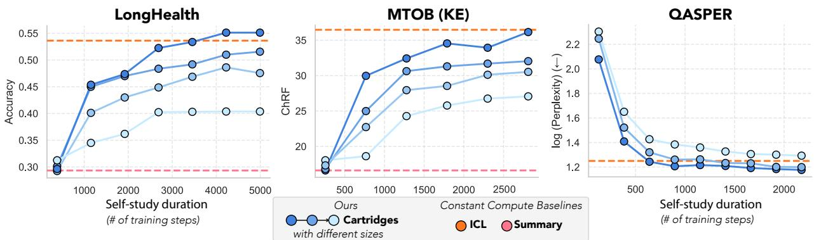  
Figure 5: Scaling SELF-STUDY compute. These plots show how quality improves as we scale the training compute with SELF-STUDY. In all plots, the x-axis shows the total number of global training steps with batch size 64 and maximum sequence length 1024. No synthetically generated data is reused (i.e. training proceeds for one epoch). Curves are provided for CARTRIDGES of varying sizes (p ∈ {128, 512, 2048, 8192}). (Left) The y-axis shows accuracy on LONGHEALTH [2] with LLAMA-8B. (Middle) The y-axis shows the chrF on MTOB [85] with LLAMA-3B. (Right) The y-axis shows log-perplexity (lower is better) on QASPER [23] with LLAMA-3B.

$$
\arg \operatorname* { m i n } _ { Z } \quad \sum _ { ( \mathbf { x } , \tilde { \mathbf { c } } ) \in \mathcal { D } _ { \mathrm { t r a i n } } } \sum _ { i = 1 } ^ { | \mathbf { x } | } D _ { \mathrm { K L } } \bigg ( \mathcal { F } ( \cdot | \tilde { \mathbf { c } } \oplus \mathbf { x } [ : i ] ) \quad | | \quad \mathcal { F } _ { Z } ( \cdot | \mathbf { x } [ : i ] ) \bigg )\tag{3}
$$

In Appendix A, ablate the use of the context-distillation objective and show that improves accuracy when controlling for the amount of synthetic data (e.g. 3.7 accuracy points on LONGHEALTH).

## 5 Results

We describe experiments evaluating the effectiveness of CARTRIDGES trained with SELF-STUDY in various long-context scenarios. Our results support the following claims. First, CARTRIDGES trained with SELF-STUDY can match or outperform ICL while maintaining generality and reducing serving costs (Section 5.1). Second, SELF-STUDY is effective on corpora longer than the context window of the LLM (Section 5.2). Third, when we concatenate two different CARTRIDGES without any joint training, the model can respond to queries requiring information from both CARTRIDGES (Section 5.4). Finally, we include ablations to assess the relative benefits of different aspects of SELF-STUDY and CARTRIDGES (Section 5.3).

Datasets We study datasets consisting of diverse (q, r) pairs about a single long document. Across datasets, C ranges between 100k and 484k tokens. Our datasets are drawn from popular long-context benchmarks, with some used as-released and others modified to meet this structure. These include: LONGHEALTH [2], MTOB [85], and QASPER [23]. We evaluate LLM response quality using accuracy for LONGHEALTH, log perplexity for QASPER, and character n-gram f-score (chrF) for MTOB [71, 85]. Because each dataset effectively consists of a “single” document, we train a single CARTRIDGE per dataset and evaluate it on the queries response pairs (q, r). Appendix D provides further details.

## 5.1 Pushing the quality/cost tradeoff frontier

We assess how CARTRIDGES produced with SELF-STUDY fare in quality and memory consumption against baselines for LONGHEALTH and QASPER on LLAMA-3B. For both datasets, C fits within the model context window (128k tokens). We compare to traditional ICL, two prompt compression baselines (prompt truncation and prompt summarization using GPT-4o [66]), and a state-of-the-art KV cache compression baseline (Duo Attention [43, 95]). We evaluate memory use in terms of KV cache size: the size of the KV cache for the ICL model and prompt compression methods, the size of the CARTRIDGE, and the size of the compressed KV cache for KV cache compression methods like DuoAttention.

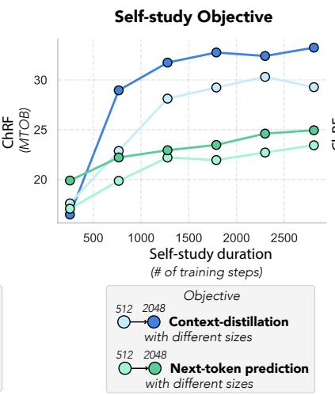

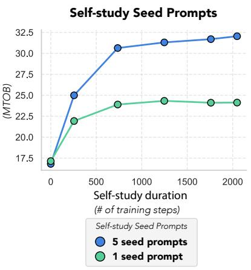  
Figure 6: Ablating CARTRIDGE and SELF-STUDY design choices. Ablations were performed on the MTOB dataset (see Appendix A for full ablation experiments). (Left) We train CARTRIDGES using two different parameterizations: simplified prefix-tuning (as described in Section 3.2) and low-rank adaptation (LoRA) [36]. The x-axis shows accuracy on MMLU and the y-axis shows accuracy on the target dataset. Each point represents a different CARTRIDGE size. Center We train CARTRIDGES with SELF-STUDY using two loss functions: a next token prediction loss (green) and a distillation loss (blue). The x axis is the number of training steps, and the y axis is accuracy. Each hue represents a different CARTRIDGE size. (Right) We generate synthetic data according to Algorithm 1 and ablate the choice of seed prompts sampled on Line 2. We consider two approaches: using a single, broad seed prompt (Green) or randomly sampling one of five different types of seed prompts (Blue). The x axis is the number of training steps, and the y axis is accuracy.

Figure 4 presents our main results. On both LONGHEALTH and QASPER, we find cache sizes at which CARTRIDGES outperforms ICL. Compared against ICL, CARTRIDGES offers substantial memory savings at comparable performance: up to 10× for LONGHEALTH, and up to 100× for QASPER. In contrast, compression baseline methods see performance degradations at compression factors as low as 2×. Crucially, the small memory footprint of CARTRIDGES allows for much higher peak throughput (tokens/s). As Figure 3 (right) shows, cache sizes which match performance of ICL allow for almost 26× higher throughput.

We also observe that CARTRIDGE performance scales as we increase the amount of compute used in selfstudy: the longer an CARTRIDGE is trained, the greater task performance. Figure 5 plots the performance for differentially sized CARTRIDGES as a function of the number of training steps. Across all sizes, we observe a steady positive correlation between performance and compute.

## 5.2 Extending the effective context window

We evaluate whether SELF-STUDY allows us to accurately process corpora that exceed the context window length. To study this, we consider the MTOB dataset, and LLAMA-8B, which has a context window of 128k tokens. MTOB provides two different long documents: a full 484k token latex textbook and a shorter 60k token version, which was manually-curated by the dataset authors to exclude content not relevant to the translation task. Even though the 484k textbook is 356k tokens longer than LLAMA-8B’s context window length, we can produce a CARTRIDGE for the full textbook using the chunking strategy of SELF-STUDY.

Figure 4 (middle plot) shows the performance of CARTRIDGES of various sizes trained with SELF-STUDY.

As a point of comparison, we provide the results for KV cache baseline methods on the smaller 60k token textbook, and also include ICL on a truncated version of the long textbook. Like above, we observe that CARTRIDGE can match the performance of ICL on the hand-curated 60k token version, while requiring substantially less memory and only having access to the 484k token version, which exceeds the context window of LLAMA-8B. CARTRIDGES also outperform competitive baselines at every KV cache size, by up to 11.0 chrF points.

## 5.3 Ablating SELF-STUDY design choices

We perform ablations to study different aspects of SELF-STUDY and CARTRIDGE parameterization. We provide full results in Appendix A and highlight key findings here and in Figure 6.

CARTRIDGE Parameterization In Section 3.2, we discuss how we parameterize the CARTRIDGE with a trainable KV cache, which is equivalent to a simplified version of prefix tuning [54]. There are a number of other ways we could parameterize the CARTRIDGE, notably low-rank adaptation (LoRA), an extremely popular parameter effcient fine-tuning method [36].

We compare the prefix-tuning parameterization with LoRA (see Appendix A.1 for full results). First, we find that the prefix-tuning parameterization is more effective than a memory-matched LoRA parameterization on queries related to the corpus. For example, with CARTRIDGES of size ∼ 0.6 GB on MTOB, prefix-tuning outperforms LoRA by 4.5 ChRF points. (See Figure 8 for results on LONGHEALTH and QASPER.) Even more interesting is the gap between these parameterizations on queries unrelated to the document like MMLU [34]. When using a LoRA parameterization, we find that MMLU accuracy drops precipitously (from 54.7 to 45.3) as we increase the CARTRIDGE size (from 0.15 GB to 1.06 GB). In contrast, with prefix-tuning, the accuracy drops much less rapidly (from 54.7 to 54.3) as we increase the size (from 0.15 GB to 0.96 GB). See Figure 8 for plots illustrating these findings on LONGHEALTH, QASPER, and MTOB. We also show that freezing the attention sink (the first token in the key and value vectors) improves training stability (Figure 10).

CARTRIDGE Initialization We compare three different strategies for initializing the KV cache when using the prefix-tuning parameterization: (1) random vectors (from a component-wise standard normal distribution), (2) key and value vectors of random tokens, and (3) key and value vectors of the first p tokens of the corpus. We find that initializing with key and value vectors of actual tokens (as opposed to random vectors) is critical for achieving ICL-level performance. On LONGHEALTH, random vectors achieve an accuracy of 29.9% while key and value vectors of random tokens achieve an accuracy of 51.3%. Initializing with the first p tokens provides an additional improvement of 4 percentage points to 55.3%. In the original prefix-tuning paper, the authors show that initializing from tokens improves performance when performing supervised fine-tuning on very small datasets [54]. Our results extend this finding to SELF-STUDY, where we train on large synthetic datasets.

SELF-STUDY Seed Prompts Next, we ablate the choice of seed prompts (see Line 2 of Algorithm 1). We compare two approaches: (1) always using the same seed prompt (“Please generate a single chat message to begin a conversation about the information in the corpus. Ask a question about the corpus or make a request.") and (2) randomly sampling one of five different types of seed prompts (e.g. structuring, summarization; see full list in Appendix C). Note even with the latter approach, the seed prompts are generic: the same set of seed prompts are used for all corpora. On MTOB, we find that using this small set of seed prompts improves over the single seed prompt by 7.9 ChRF points (24.1 → 32.0; see Figure 6 Left). On LONGHEALTH, the improvement is 4.8 accuracy points (43.6 → 48.4 on LONGHEALTH; see Figure 11). Interestingly, on QASPER we do not see any significant benefit from using the diverse seed prompts. This is perhaps because, compared to LONGHEALTH and MTOB, the queries in QASPER are less reasoning intensive.

SELF-STUDY Objective Finally, we evaluate the importance of the context distillation objective (defined in Section 4.2). Using the same SELF-STUDY synthetic data for both objectives, we compare the contextdistillation objective with a simpler next-token prediction objective. On MTOB, we find that using a context distillation objective on the synthetic conversation data improves ChRF by 8.6 points (24.9 → 33.5; see Figure 12 Center). We also see improvements on LONGHEALTH and QASPER (see Figure 12).

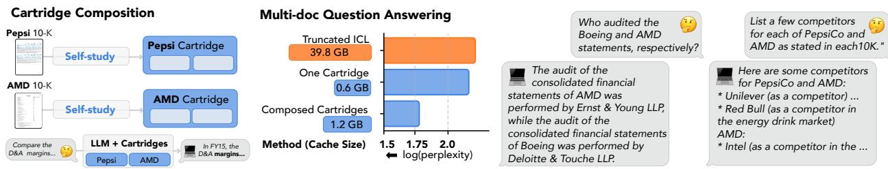  
Figure 7: CARTRIDGE Composition. (Left) Illustration of CARTRIDGE composition, where two independently trained CARTRIDGES (one for a Pepsi 10-K and one for an AMD 10-K) are concatenated without any additional training. (Middle) We evaluate composition on a dataset of multi-document questions requiring information in two different ≈100k token documents with LLAMA-3B (see Appendix D). The x-axis shows log-perplexity (lower is better) on gold-standard answers. We compare CARTRIDGE composition with an (a) ICL baseline where we truncate the document to fit in the 128k token context length and (b) an CARTRIDGE baseline where we only include the CARTRIDGE for one of the documents. (Right) Examples of responses to multi-document questions using composed cartridges.

## 5.4 Composing CARTRIDGES

We evaluate if independently trained CARTRIDGES can be composed in order to serve queries about two different corpora (see Figure 7, Left). We train CARTRIDGES across sizes {512, 1024, 2048, 4096} and long 10-K documents from AMD, Pepsi, AMEX, and Boeing [38]. For each pair of CARTRIDGES pairwise (6 pairs per cache size), we evaluate using a dataset of multi-document questions, i.e., requiring information from both 10-Ks. Surprisingly, we find composition not only leads to coherent LLM generations off-the-shelf without any re-training (Figure 7, Right), but also substantially outperforms the use of a single CARTRIDGE (i.e. for only AMD) or ICL (which struggles due to context length limits) (Figure 7, Center) on the multi-document questions.

## 6 Discussion and conclusion

We propose CARTRIDGES as an alternative to ICL for settings where many different user messages reference the same large corpus of text. We demonstrate across a diverse set of language model workloads that, when trained via SELF-STUDY, they match ICL’s response quality while substantially reducing memory consumption (38.6× memory reduction across our evaluations) and increasing peak throughput (26.4× higher tokens per second). CARTRIDGES are simple to train, composable, and compatible with existing LLM serving infrastructure.

However, compared with ICL, SELF-STUDY is not without limitations. Using SELF-STUDY to produce a KVcache is much more costly than simply running standard ICL pre-fill. With our unoptimized implementation, training an ICL-quality CARTRIDGE takes ∼ 30 minutes on a single 8×H100 node (for LLAMA-8B) So our work does not provide a drop-in replacement for ICL, but rather demonstrates one way to tradeoff increased compute for reduced memory when constructing a KV-cache. This tradeoff is extremely advantageous in many settings: users often issue many queries over the same corpus and SELF-STUDY can be trained offline on idle or underutilized compute (e.g. at night when user load is low [29, 39]). Furthermore, there is ample room for optimizations (e.g. improved shared-prefix attention kernels [22, 44, 103]) that would make SELF-STUDY training procedure more efficient.

Looking forward, we envision CARTRIDGES enabling a broad class of context-aware AI applications that are intractable with ICL today, from medical assistants that know a patient’s full medical history to LLM-powered IDEs that understand entire codebases.

Acknowledgments We thank Jordan Juravsky, Dan Biderman, Tri Dao, Bradley Brown, Mayee Chen, Avanika Narayan, Avner May, Bill Mark, Benjamin Spector, Roberto Garcia, Quinn Mcintyre, Yasa Baig, Geoff Angus, Kelly Buchanan, Mert Yuksekgonul, Eric Nguyen, Eric Wu, Kevin Wu, Owen Dugan, Jon Saad-

Falcon, Simon Guo and the entire Zou, Hazy, and Scaling Intelligence research labs for helpful discussions and feedback. We gratefully acknowledge Modal, Prime Intellect, Voltage Park, and Together AI for providing the GPUs to support for this work. We gratefully acknowledge the support of NIH under No. U54EB020405 (Mobilize), NSF under Nos. CCF2247015 (Hardware-Aware), CCF1763315 (Beyond Sparsity), CCF1563078 (Volume to Velocity), and 1937301 (RTML); US DEVCOM ARL under Nos. W911NF-23-2-0184 (Long-context) and W911NF-21-2-0251 (Interactive Human-AI Teaming); ONR under Nos. N000142312633 (Deep Signal Processing); Stanford HAI under No. 247183; NXP, Xilinx, LETI-CEA, Intel, IBM, Microsoft, NEC, Toshiba, TSMC, ARM, Hitachi, BASF, Accenture, Ericsson, Qualcomm, Analog Devices, Google Cloud, Salesforce, Total, the HAI-GCP Cloud Credits for Research program, the Stanford Data Science Initiative (SDSI), members of the Stanford SEAMS project: IBM and Felicis, as well as members of the Stanford DAWN project: Meta, Google, and VMWare. SE is supported by the NSF Graduate Research Fellowship Program. AR’s research is supported by NSF grant CCF#2247014. The U.S. Government is authorized to reproduce and distribute reprints for Governmental purposes notwithstanding any copyright notation thereon. Any opinions, findings, and conclusions or recommendations expressed in this material are those of the authors and do not necessarily reflect the views, policies, or endorsements, either expressed or implied, of NIH, ONR, or the U.S. Government.

Contributions SE and RE conceived of CARTRIDGES and SELF-STUDY. SE, RE, and SA designed the method, implemented the experiments, wrote the manuscript, and contributed equally to the project. NG made substantial contributions to the structure of the project and the final manuscript. EL and DZ implemented and ran experiments and made meaningful contributions to the manuscript. WT implemented the LoRA baselines. DZ and AR led the theoretical analysis. AR, JZ, AM, and CR supervised the project.

## References

[1] Marah Abdin, Jyoti Aneja, Harkirat Behl, Sébastien Bubeck, Ronen Eldan, Suriya Gunasekar, Michael Harrison, Russell J Hewett, Mojan Javaheripi, Piero Kauffmann, et al. Phi-4 technical report. arXiv preprint arXiv:2412.08905, 2024.

[2] Lisa Adams, Felix Busch, Tianyu Han, Jean-Baptiste Excoffier, Matthieu Ortala, Alexander Löser, Hugo JWL Aerts, Jakob Nikolas Kather, Daniel Truhn, and Keno Bressem. Longhealth: A question answering benchmark with long clinical documents. arXiv preprint arXiv:2401.14490, 2024.

[3] Joshua Ainslie, James Lee-Thorp, Michiel De Jong, Yury Zemlyanskiy, Federico Lebrón, and Sumit Sanghai. Gqa: Training generalized multi-query transformer models from multi-head checkpoints. arXiv preprint arXiv:2305.13245, 2023.

[4] Anthropic. The Claude 3 Model Family: Opus, Sonnet, Haiku. arXiv preprint, 2024.

[5] Simran Arora, Sabri Eyuboglu, Aman Timalsina, Isys Johnson, Michael Poli, James Zou, Atri Rudra, and Christopher Ré. Zoology: Measuring and improving recall in efficient language models, 2023.

[6] Simran Arora, Sabri Eyuboglu, Michael Zhang, Aman Timalsina, Silas Alberti, Dylan Zinsley, James Zou, Atri Rudra, and Christopher Ré. Simple linear attention language models balance the recallthroughput tradeoff. arXiv preprint arXiv:2402.18668, 2024.

[7] Simran Arora and Christopher Ré. Can foundation models help us achieve perfect secrecy? arXiv preprint arXiv:2205.13722, 2022.

[8] Maximilian Beck, Korbinian Pöppel, Markus Spanring, Andreas Auer, Oleksandra Prudnikova, Michael Kopp, Günter Klambauer, Johannes Brandstetter, and Sepp Hochreiter. xlstm: Extended long short-term memory. arXiv preprint arXiv:2405.04517, 2024.

[9] Ali Behrouz, Zeman Li, Praneeth Kacham, Majid Daliri, Yuan Deng, Peilin Zhong, Meisam Razaviyayn, and Vahab Mirrokni. Atlas: Learning to optimally memorize the context at test time. arXiv preprint arXiv:2505.23735, 2025.

[10] Ali Behrouz, Meisam Razaviyayn, Peilin Zhong, and Vahab Mirrokni. It’s all connected: A journey through test-time memorization, attentional bias, retention, and online optimization. arXiv preprint arXiv:2504.13173, 2025.

[11] Ali Behrouz, Peilin Zhong, and Vahab Mirrokni. Titans: Learning to memorize at test time. arXiv preprint arXiv:2501.00663, 2024.

[12] Iz Beltagy, Matthew E Peters, and Arman Cohan. Longformer: The long-document transformer. arXiv preprint arXiv:2004.05150, 2020.

[13] Aman Bhargava, Cameron Witkowski, Alexander Detkov, and Matt Thomson. Prompt baking. arXiv preprint arXiv:2409.13697, 2024.

[14] Aaron Blakeman, Aarti Basant, Abhinav Khattar, Adithya Renduchintala, Akhiad Bercovich, Aleksander Ficek, Alexis Bjorlin, Ali Taghibakhshi, Amala Sanjay Deshmukh, Ameya Sunil Mahabaleshwarkar, et al. Nemotron-h: A family of accurate and efficient hybrid mamba-transformer models. arXiv preprint arXiv:2504.03624, 2025.

[15] Lucas Caccia, Alan Ansell, Edoardo Ponti, Ivan Vulic, and Alessandro Sordoni. Training plug-n-play knowledge modules with deep context distillation. arXiv preprint arXiv:2503.08727, 2025.

[16] Chi-Chih Chang, Wei-Cheng Lin, Chien-Yu Lin, Chong-Yan Chen, Yu-Fang Hu, Pei-Shuo Wang, Ning-Chi Huang, Luis Ceze, Mohamed S Abdelfattah, and Kai-Chiang Wu. Palu: Compressing kv-cache with low-rank projection. arXiv preprint arXiv:2407.21118, 2024.

[17] Vivek Chari, Guanghui Qin, and Benjamin Van Durme. Kv-distill: Nearly lossless learnable context compression for llms. arXiv preprint arXiv:2503.10337, 2025.

[18] Lequn Chen, Zihao Ye, Yongji Wu, Danyang Zhuo, Luis Ceze, and Arvind Krishnamurthy. Punica: Multi-tenant lora serving. Proceedings of Machine Learning and Systems, 6:1–13, 2024.

[19] Alexis Chevalier, Alexander Wettig, Anirudh Ajith, and Danqi Chen. Adapting language models to compress contexts. arXiv preprint arXiv:2305.14788, 2023.

[20] Rewon Child, Scott Gray, Alec Radford, and Ilya Sutskever. Generating long sequences with sparse transformers. arXiv preprint arXiv:1904.10509, 2019.

[21] Yu-Neng Chuang, Tianwei Xing, Chia-Yuan Chang, Zirui Liu, Xun Chen, and Xia Hu. Learning to compress prompt in natural language formats. arXiv preprint arXiv:2402.18700, 2024.

[22] Tri Dao, Dan Fu, Stefano Ermon, Atri Rudra, and Christopher Ré. Flashattention: Fast and memoryefficient exact attention with io-awareness. Advances in neural information processing systems, 35:16344– 16359, 2022.

[23] Pradeep Dasigi, Kyle Lo, Iz Beltagy, Arman Cohan, Noah A Smith, and Matt Gardner. A dataset of information-seeking questions and answers anchored in research papers. arXiv preprint arXiv:2105.03011, 2021.

[24] Qingxiu Dong, Lei Li, Damai Dai, Ce Zheng, Jingyuan Ma, Rui Li, Heming Xia, Jingjing Xu, Zhiyong Wu, Tianyu Liu, et al. A survey on in-context learning. arXiv preprint arXiv:2301.00234, 2022.

[25] Abhimanyu Dubey, Abhinav Jauhri, Abhinav Pandey, Abhishek Kadian, Ahmad Al-Dahle, Aiesha Letman, Akhil Mathur, Alan Schelten, Amy Yang, Angela Fan, et al. The Llama 3 Herd of Models. arXiv preprint arXiv:2407.21783, 2024.

[26] Saumya Gandhi, Ritu Gala, Vijay Viswanathan, Tongshuang Wu, and Graham Neubig. Better synthetic data by retrieving and transforming existing datasets. arXiv preprint arXiv:2404.14361, 2024.

[27] Suyu Ge, Yunan Zhang, Liyuan Liu, Minjia Zhang, Jiawei Han, and Jianfeng Gao. Model tells you what to discard: Adaptive kv cache compression for llms. arXiv preprint arXiv:2310.01801, 2023.

[28] Tao Ge, Jing Hu, Lei Wang, Xun Wang, Si-Qing Chen, and Furu Wei. In-context autoencoder for context compression in a large language model. arXiv preprint arXiv:2307.06945, 2023.

[29] Kanishk Goel, Jayashree Mohan, Nipun Kwatra, Ravi Shreyas Anupindi, and Ramachandran Ramjee. Niyama: Breaking the silos of llm inference serving. arXiv preprint arXiv:2503.22562, 2025.

[30] Yunhao Gou, Zhili Liu, Kai Chen, Lanqing Hong, Hang Xu, Aoxue Li, Dit-Yan Yeung, James T Kwok, and Yu Zhang. Mixture of cluster-conditional lora experts for vision-language instruction tuning. arXiv preprint arXiv:2312.12379, 2023.

[31] Albert Gu and Tri Dao. Mamba: Linear-time sequence modeling with selective state spaces. arXiv preprint arXiv:2312.00752, 2023.

[32] Neel Guha, Julian Nyarko, Daniel Ho, Christopher Ré, Adam Chilton, Alex Chohlas-Wood, Austin Peters, Brandon Waldon, Daniel Rockmore, Diego Zambrano, et al. Legalbench: A collaboratively built benchmark for measuring legal reasoning in large language models. Advances in Neural Information Processing Systems, 36:44123–44279, 2023.

[33] Daya Guo, Dejian Yang, Haowei Zhang, Junxiao Song, Ruoyu Zhang, Runxin Xu, Qihao Zhu, Shirong Ma, Peiyi Wang, Xiao Bi, et al. Deepseek-r1: Incentivizing reasoning capability in llms via reinforcement learning. arXiv preprint arXiv:2501.12948, 2025.

[34] Dan Hendrycks, Collin Burns, Steven Basart, Andy Zou, Mantas Mazeika, Dawn Song, and Jacob Steinhardt. Measuring massive multitask language understanding. arXiv preprint arXiv:2009.03300, 2020.

[35] Geoffrey Hinton, Oriol Vinyals, and Jeff Dean. Distilling the knowledge in a neural network. arXiv preprint arXiv:1503.02531, 2015.

[36] Edward J Hu, Yelong Shen, Phillip Wallis, Zeyuan Allen-Zhu, Yuanzhi Li, Shean Wang, Lu Wang, Weizhu Chen, et al. Lora: Low-rank adaptation of large language models. ICLR, 1(2):3, 2022.

[37] Chengsong Huang, Qian Liu, Bill Yuchen Lin, Tianyu Pang, Chao Du, and Min Lin. Lorahub: Efficient cross-task generalization via dynamic lora composition. arXiv preprint arXiv:2307.13269, 2023.

[38] Pranab Islam, Anand Kannappan, Douwe Kiela, Rebecca Qian, Nino Scherrer, and Bertie Vidgen. Financebench: A new benchmark for financial question answering. arXiv preprint arXiv:2311.11944, 2023.

[39] Shashwat Jaiswal, Kunal Jain, Yogesh Simmhan, Anjaly Parayil, Ankur Mallick, Rujia Wang, Renee St Amant, Chetan Bansal, Victor Rühle, Anoop Kulkarni, et al. Serving models, fast and slow: optimizing heterogeneous llm inferencing workloads at scale. arXiv preprint arXiv:2502.14617, 2025.

[40] Dulhan Jayalath, James Bradley Wendt, Nicholas Monath, Sandeep Tata, and Beliz Gunel. Longrange tasks using short-context llms: Incremental reasoning with structured memories. arXiv preprint arXiv:2412.18914, 2024.

[41] Fengqing Jiang. Identifying and mitigating vulnerabilities in llm-integrated applications. Master’s thesis, University of Washington, 2024.

[42] Huiqiang Jiang, Qianhui Wu, Chin-Yew Lin, Yuqing Yang, and Lili Qiu. Llmlingua: Compressing prompts for accelerated inference of large language models. arXiv preprint arXiv:2310.05736, 2023.

[43] Huiqiang Jiang, Qianhui Wu, Chin-Yew Lin, Yuqing Yang, and Lili Qiu. LLMLingua: Compressing prompts for accelerated inference of large language models. In Houda Bouamor, Juan Pino, and Kalika Bali, editors, Proceedings of the 2023 Conference on Empirical Methods in Natural Language Processing, pages 13358–13376, Singapore, December 2023. Association for Computational Linguistics.

[44] Jordan Juravsky, Bradley Brown, Ryan Ehrlich, Daniel Y. Fu, Christopher Ré, and Azalia Mirhoseini. Hydragen: High-throughput llm inference with shared prefixes, 2024.

[45] Jordan Juravsky, Ayush Chakravarthy, Ryan Ehrlich, Sabri Eyuboglu, Bradley Brown, Joseph Shetaye, Christopher Ré, and Azalia Mirhoseini. Tokasaurus: An llm inference engine for high-throughput workloads, June 2025.

[46] Junhyuck Kim, Jongho Park, Jaewoong Cho, and Dimitris Papailiopoulos. Lexico: Extreme kv cache compression via sparse coding over universal dictionaries. arXiv preprint arXiv:2412.08890, 2024.

[47] Yoon Kim and Alexander M Rush. Sequence-level knowledge distillation. In Proceedings of the 2016 conference on empirical methods in natural language processing, pages 1317–1327, 2016.

[48] Kalle Kujanpää, Harri Valpola, and Alexander Ilin. Knowledge injection via prompt distillation. arXiv preprint arXiv:2412.14964, 2024.

[49] Yuri Kuratov, Mikhail Arkhipov, Aydar Bulatov, and Mikhail Burtsev. Cramming 1568 tokens into a single vector and back again: Exploring the limits of embedding space capacity. arXiv preprint arXiv:2502.13063, 2025.

[50] Woosuk Kwon, Zhuohan Li, Siyuan Zhuang, Ying Sheng, Lianmin Zheng, Cody Hao Yu, Joseph Gonzalez, Hao Zhang, and Ion Stoica. Efficient memory management for large language model serving with pagedattention. In Proceedings of the 29th Symposium on Operating Systems Principles, pages 611–626, 2023.

[51] Brian Lester, Rami Al-Rfou, and Noah Constant. The power of scale for parameter-efficient prompt tuning. arXiv preprint arXiv:2104.08691, 2021.

[52] Aonian Li, Bangwei Gong, Bo Yang, Boji Shan, Chang Liu, Cheng Zhu, Chunhao Zhang, Congchao Guo, Da Chen, Dong Li, et al. Minimax-01: Scaling foundation models with lightning attention. arXiv preprint arXiv:2501.08313, 2025.

[53] Dengchun Li, Yingzi Ma, Naizheng Wang, Zhengmao Ye, Zhiyuan Cheng, Yinghao Tang, Yan Zhang, Lei Duan, Jie Zuo, Cal Yang, et al. Mixlora: Enhancing large language models fine-tuning with lora-based mixture of experts. arXiv preprint arXiv:2404.15159, 2024.

[54] Xiang Lisa Li and Percy Liang. Prefix-tuning: Optimizing continuous prompts for generation. In Chengqing Zong, Fei Xia, Wenjie Li, and Roberto Navigli, editors, Proceedings of the 59th Annual Meeting of the Association for Computational Linguistics and the 11th International Joint Conference on Natural Language Processing (Volume 1: Long Papers), pages 4582–4597, Online, August 2021. Association for Computational Linguistics.

[55] Yucheng Li. Unlocking context constraints of llms: Enhancing context efficiency of llms with selfinformation-based content filtering. arXiv preprint arXiv:2304.12102, 2023.

[56] Yuhong Li, Yingbing Huang, Bowen Yang, Bharat Venkitesh, Acyr Locatelli, Hanchen Ye, Tianle Cai, Patrick Lewis, and Deming Chen. Snapkv: Llm knows what you are looking for before generation. Advances in Neural Information Processing Systems, 37:22947–22970, 2024.

[57] Aixin Liu, Bei Feng, Bin Wang, Bingxuan Wang, Bo Liu, Chenggang Zhao, Chengqi Dengr, Chong Ruan, Damai Dai, Daya Guo, et al. Deepseek-v2: A strong, economical, and efficient mixture-of-experts language model. arXiv preprint arXiv:2405.04434, 2024.

[58] Akide Liu, Jing Liu, Zizheng Pan, Yefei He, Gholamreza Haffari, and Bohan Zhuang. Minicache: Kv cache compression in depth dimension for large language models. Advances in Neural Information Processing Systems, 37, 2024.

[59] Nelson F Liu, Kevin Lin, John Hewitt, Ashwin Paranjape, Michele Bevilacqua, Fabio Petroni, and Percy Liang. Lost in the middle: How language models use long contexts. Transactions of the Association for Computational Linguistics, 12:157–173, 2024.

[60] Yansheng Mao, Yufei Xu, Jiaqi Li, Fanxu Meng, Haotong Yang, Zilong Zheng, Xiyuan Wang, and Muhan Zhang. Lift: Improving long context understanding of large language models through long input fine-tuning. arXiv preprint arXiv:2502.14644, 2025.

[61] Fanxu Meng, Zhaohui Wang, and Muhan Zhang. Pissa: Principal singular values and singular vectors adaptation of large language models. Advances in Neural Information Processing Systems, 37:121038– 121072, 2024.

[62] Jesse Mu, Xiang Li, and Noah Goodman. Learning to compress prompts with gist tokens. Advances in Neural Information Processing Systems, 36:19327–19352, 2023.

[63] Daye Nam, Andrew Macvean, Vincent Hellendoorn, Bogdan Vasilescu, and Brad Myers. Using an llm to help with code understanding. In Proceedings of the IEEE/ACM 46th International Conference on Software Engineering, pages 1–13, 2024.

[64] Avanika Narayan, Dan Biderman, Sabri Eyuboglu, Avner May, Scott Linderman, James Zou, and Christopher Re. Minions: Cost-efficient collaboration between on-device and cloud language models. arXiv preprint arXiv:2502.15964, 2025.

[65] Nihal V Nayak, Yiyang Nan, Avi Trost, and Stephen H Bach. Learning to generate instruction tuning datasets for zero-shot task adaptation. arXiv preprint arXiv:2402.18334, 2024.

[66] OpenAI. Gpt-4o system card, 2024.

[67] Matanel Oren, Michael Hassid, Nir Yarden, Yossi Adi, and Roy Schwartz. Transformers are multi-state rnns. arXiv preprint arXiv:2401.06104, 2024.

[68] Lisa Larrimore Ouellette, Amy Motomura, Jason Reinecke, and Jonathan S Masur. Can ai hold office hours? Available at SSRN 5166938, 2025.

[69] Charles Packer, Sarah Wooders, Kevin Lin, Vivian Fang, Shishir G Patil, Ion Stoica, and Joseph E Gonzalez. Memgpt: Towards llms as operating systems. arXiv preprint arXiv:2310.08560, 2023.

[70] Zhuoshi Pan, Qianhui Wu, Huiqiang Jiang, Menglin Xia, Xufang Luo, Jue Zhang, Qingwei Lin, Victor Rühle, Yuqing Yang, Chin-Yew Lin, et al. Llmlingua-2: Data distillation for efficient and faithful task-agnostic prompt compression. arXiv preprint arXiv:2403.12968, 2024.

[71] Maja Popovi´c. chrf: character n-gram f-score for automatic mt evaluation. In Proceedings of the tenth workshop on statistical machine translation, pages 392–395, 2015.

[72] Guanghui Qin, Corby Rosset, Ethan C Chau, Nikhil Rao, and Benjamin Van Durme. Dodo: Dynamic contextual compression for decoder-only lms. arXiv preprint arXiv:2310.02409, 2023.

[73] Pranav Rajpurkar, Jian Zhang, Konstantin Lopyrev, and Percy Liang. Squad: 100,000+ questions for machine comprehension of text. arXiv preprint arXiv:1606.05250, 2016.

[74] Haris Riaz, Sourav Bhabesh, Vinayak Arannil, Miguel Ballesteros, and Graham Horwood. Metasynth: Meta-prompting-driven agentic scaffolds for diverse synthetic data generation. arXiv preprint arXiv:2504.12563, 2025.

[75] Luka Ribar, Ivan Chelombiev, Luke Hudlass-Galley, Charlie Blake, Carlo Luschi, and Douglas Orr. Sparq attention: Bandwidth-efficient llm inference. arXiv preprint arXiv:2312.04985, 2023.

[76] Melisa Russak, Umar Jamil, Christopher Bryant, Kiran Kamble, Axel Magnuson, Mateusz Russak, and Waseem AlShikh. Writing in the margins: Better inference pattern for long context retrieval. arXiv preprint arXiv:2408.14906, 2024.

[77] Utkarsh Saxena, Gobinda Saha, Sakshi Choudhary, and Kaushik Roy. Eigen attention: Attention in low-rank space for kv cache compression. arXiv preprint arXiv:2408.05646, 2024.

[78] Noam Shazeer. Fast transformer decoding: One write-head is all you need. arXiv preprint arXiv:1911.02150, 2019.

[79] Charlie Snell, Dan Klein, and Ruiqi Zhong. Learning by distilling context. arXiv preprint arXiv:2209.15189, 2022.

[80] Charlie Snell, Jaehoon Lee, Kelvin Xu, and Aviral Kumar. Scaling llm test-time compute optimally can be more effective than scaling model parameters. arXiv preprint arXiv:2408.03314, 2024.

[81] Weihang Su, Yichen Tang, Qingyao Ai, Junxi Yan, Changyue Wang, Hongning Wang, Ziyi Ye, Yujia Zhou, and Yiqun Liu. Parametric retrieval augmented generation. arXiv preprint arXiv:2501.15915, 2025.

[82] Yu Sun, Xinhao Li, Karan Dalal, Jiarui Xu, Arjun Vikram, Genghan Zhang, Yann Dubois, Xinlei Chen, Xiaolong Wang, Sanmi Koyejo, et al. Learning to (learn at test time): Rnns with expressive hidden states. arXiv preprint arXiv:2407.04620, 2024.

[83] Sijun Tan, Xiuyu Li, Shishir Patil, Ziyang Wu, Tianjun Zhang, Kurt Keutzer, Joseph E Gonzalez, and Raluca Ada Popa. Lloco: Learning long contexts offline. arXiv preprint arXiv:2404.07979, 2024.

[84] Jiaming Tang, Yilong Zhao, Kan Zhu, Guangxuan Xiao, Baris Kasikci, and Song Han. Quest: Queryaware sparsity for efficient long-context llm inference. arXiv preprint arXiv:2406.10774, 2024.

[85] Garrett Tanzer, Mirac Suzgun, Eline Visser, Dan Jurafsky, and Luke Melas-Kyriazi. A benchmark for learning to translate a new language from one grammar book. arXiv preprint arXiv:2309.16575, 2023.

[86] Gemma Team, Morgane Riviere, Shreya Pathak, Pier Giuseppe Sessa, Cassidy Hardin, Surya Bhupatiraju, Léonard Hussenot, Thomas Mesnard, Bobak Shahriari, Alexandre Ramé, et al. Gemma 2: Improving open language models at a practical size. arXiv preprint arXiv:2408.00118, 2024.

[87] Jamba Team, Barak Lenz, Alan Arazi, Amir Bergman, Avshalom Manevich, Barak Peleg, Ben Aviram, Chen Almagor, Clara Fridman, Dan Padnos, et al. Jamba-1.5: Hybrid transformer-mamba models at scale. arXiv preprint arXiv:2408.12570, 2024.

[88] U.S. Securities and Exchange Commission. How to read a 10-k, 2011. Accessed: 2025-05-14.

[89] Ashish Vaswani, Noam Shazeer, Niki Parmar, Jakob Uszkoreit, Llion Jones, Aidan N Gomez, Łukasz Kaiser, and Illia Polosukhin. Attention is all you need. Advances in neural information processing systems, 30, 2017.

[90] Zhongwei Wan, Xinjian Wu, Yu Zhang, Yi Xin, Chaofan Tao, Zhihong Zhu, Xin Wang, Siqi Luo, Jing Xiong, and Mi Zhang. D2o: Dynamic discriminative operations for efficient generative inference of large language models. arXiv preprint arXiv:2406.13035, 2024.

[91] Zheng Wang, Boxiao Jin, Zhongzhi Yu, and Minjia Zhang. Model tells you where to merge: Adaptive kv cache merging for llms on long-context tasks. arXiv preprint arXiv:2407.08454, 2024.

[92] Xun Wu, Shaohan Huang, and Furu Wei. Mixture of lora experts. arXiv preprint arXiv:2404.13628, 2024.

[93] Chaojun Xiao, Zhengyan Zhang, Xu Han, Chi-Min Chan, Yankai Lin, Zhiyuan Liu, Xiangyang Li, Zhonghua Li, Zhao Cao, and Maosong Sun. Plug-and-play document modules for pre-trained models. arXiv preprint arXiv:2305.17660, 2023.

[94] Chaojun Xiao, Zhengyan Zhang, Chenyang Song, Dazhi Jiang, Feng Yao, Xu Han, Xiaozhi Wang, Shuo Wang, Yufei Huang, Guanyu Lin, et al. Configurable foundation models: Building llms from a modular perspective. arXiv preprint arXiv:2409.02877, 2024.

[95] Guangxuan Xiao, Jiaming Tang, Jingwei Zuo, Junxian Guo, Shang Yang, Haotian Tang, Yao Fu, and Song Han. Duoattention: Efficient long-context llm inference with retrieval and streaming heads. arXiv preprint arXiv:2410.10819, 2024.

[96] Guangxuan Xiao, Yuandong Tian, Beidi Chen, Song Han, and Mike Lewis. Efficient streaming language models with attention sinks, 2024.

[97] Prateek Yadav, Colin Raffel, Mohammed Muqeeth, Lucas Caccia, Haokun Liu, Tianlong Chen, Mohit Bansal, Leshem Choshen, and Alessandro Sordoni. A survey on model moerging: Recycling and routing among specialized experts for collaborative learning. arXiv preprint arXiv:2408.07057, 2024.

[98] An Yang, Baosong Yang, Beichen Zhang, Binyuan Hui, Bo Zheng, Bowen Yu, Chengyuan Li, Dayiheng Liu, Fei Huang, Haoran Wei, et al. Qwen2. 5 technical report. arXiv preprint arXiv:2412.15115, 2024.

[99] Songlin Yang, Bailin Wang, Yikang Shen, Rameswar Panda, and Yoon Kim. Gated linear attention transformers with hardware-efficient training. In Proceedings of ICML, 2024.

[100] Songlin Yang, Bailin Wang, Yu Zhang, Yikang Shen, and Yoon Kim. Parallelizing linear transformers with the delta rule over sequence length. arXiv preprint arXiv:2406.06484, 2024.

[101] Songlin Yang, Bailin Wang, Yu Zhang, Yikang Shen, and Yoon Kim. Parallelizing linear transformers with the delta rule over sequence length, 2025.

[102] Songlin Yang and Yu Zhang. Fla: A triton-based library for hardware-efficient implementations of linear attention mechanism, January 2024.

[103] Zihao Ye, Lequn Chen, Ruihang Lai, Wuwei Lin, Yineng Zhang, Stephanie Wang, Tianqi Chen, Baris Kasikci, Vinod Grover, Arvind Krishnamurthy, and Luis Ceze. Flashinfer: Efficient and customizable attention engine for llm inference serving. arXiv preprint arXiv:2501.01005, 2025.

[104] Howard Yen. Long-context language modeling with parallel context encoding. Master’s thesis, Princeton University, 2024.

[105] Hao Yu, Zelan Yang, Shen Li, Yong Li, and Jianxin Wu. Effectively compress kv heads for llm. arXiv preprint arXiv:2406.07056, 2024.

[106] Manzil Zaheer, Guru Guruganesh, Kumar Avinava Dubey, Joshua Ainslie, Chris Alberti, Santiago Ontanon, Philip Pham, Anirudh Ravula, Qifan Wang, Li Yang, et al. Big bird: Transformers for longer sequences. Advances in neural information processing systems, 33:17283–17297, 2020.

[107] Elad Ben Zaken, Shauli Ravfogel, and Yoav Goldberg. Bitfit: Simple parameter-efficient fine-tuning for transformer-based masked language-models. arXiv preprint arXiv:2106.10199, 2021.

[108] Michael Zhang, Simran Arora, Rahul Chalamala, Alan Wu, Benjamin Spector, Aaryan Singhal, Krithik Ramesh, and Christopher Ré. Lolcats: On low-rank linearizing of large language models. arXiv preprint arXiv:2410.10254, 2024.

[109] Qianchi Zhang, Hainan Zhang, Liang Pang, Hongwei Zheng, and Zhiming Zheng. Adacomp: Extractive context compression with adaptive predictor for retrieval-augmented large language models. arXiv preprint arXiv:2409.01579, 2024.

[110] Rongzhi Zhang, Kuang Wang, Liyuan Liu, Shuohang Wang, Hao Cheng, Chao Zhang, and Yelong Shen. Lorc: Low-rank compression for llms kv cache with a progressive compression strategy. arXiv preprint arXiv:2410.03111, 2024.

[111] Yifan Zhang, Yifeng Liu, Huizhuo Yuan, Zhen Qin, Yang Yuan, Quanquan Gu, and Andrew Chi-Chih Yao. Tensor product attention is all you need. arXiv preprint arXiv:2501.06425, 2025.

[112] Yuxin Zhang, Yuxuan Du, Gen Luo, Yunshan Zhong, Zhenyu Zhang, Shiwei Liu, and Rongrong Ji. Cam: Cache merging for memory-efficient llms inference. In Forty-first International Conference on Machine Learning, 2024.

[113] Zhengyan Zhang, Zhiyuan Zeng, Yankai Lin, Huadong Wang, Deming Ye, Chaojun Xiao, Xu Han, Zhiyuan Liu, Peng Li, Maosong Sun, et al. Plug-and-play knowledge injection for pre-trained language models. arXiv preprint arXiv:2305.17691, 2023.

[114] Zhenyu Zhang, Ying Sheng, Tianyi Zhou, Tianlong Chen, Lianmin Zheng, Ruisi Cai, Zhao Song, Yuandong Tian, Christopher Ré, Clark Barrett, et al. H2o: Heavy-hitter oracle for efficient generative inference of large language models. Advances in Neural Information Processing Systems, 36:34661–34710, 2023.

[115] Ziyu Zhao, Leilei Gan, Guoyin Wang, Wangchunshu Zhou, Hongxia Yang, Kun Kuang, and Fei Wu. Loraretriever: Input-aware lora retrieval and composition for mixed tasks in the wild. arXiv preprint arXiv:2402.09997, 2024.

[116] Ziyu Zhao, Tao Shen, Didi Zhu, Zexi Li, Jing Su, Xuwu Wang, Kun Kuang, and Fei Wu. Merging loras like playing lego: Pushing the modularity of lora to extremes through rank-wise clustering. arXiv preprint arXiv:2409.16167, 2024.

[117] Lianmin Zheng, Liangsheng Yin, Zhiqiang Xie, Chuyue Livia Sun, Jeff Huang, Cody Hao Yu, Shiyi Cao, Christos Kozyrakis, Ion Stoica, Joseph E Gonzalez, et al. Sglang: Efficient execution of structured language model programs. Advances in Neural Information Processing Systems, 37:62557–62583, 2024.

[118] Lucia Zheng, Neel Guha, Javokhir Arifov, Sarah Zhang, Michal Skreta, Christopher D Manning, Peter Henderson, and Daniel E Ho. A reasoning-focused legal retrieval benchmark. In Proceedings of the 2025 Symposium on Computer Science and Law, pages 169–193, 2025.

[119] Yuhao Zhou, Sirui Song, Boyang Liu, Zhiheng Xi, Senjie Jin, Xiaoran Fan, Zhihao Zhang, Wei Li, and Xuanjing Huang. Elitekv: Scalable kv cache compression via rope frequency selection and joint low-rank projection. arXiv preprint arXiv:2503.01586, 2025.

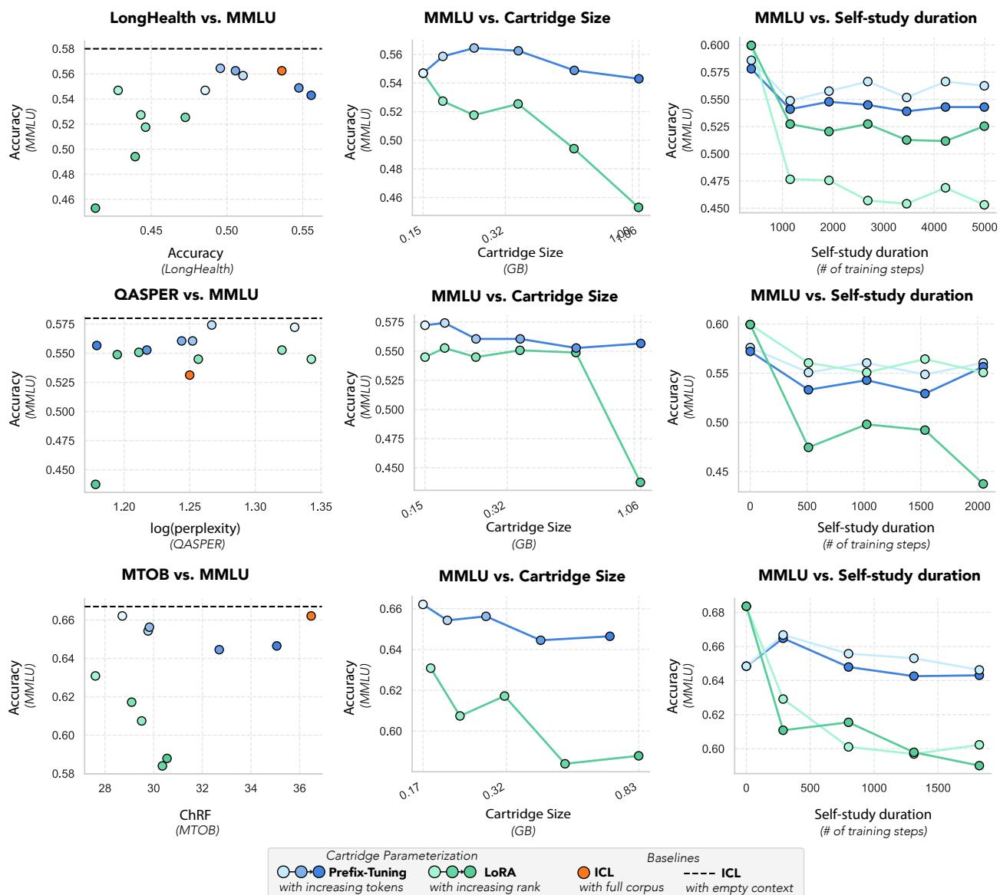  
Figure 8: Comparing CARTRIDGE parameterizations. We train CARTRIDGES using SELF-STUDY on the corpora from LONGHEALTH (Top), QASPER (Middle), and MTOB (Bottom) using two different parameterizations: simplified prefix-tuning (as described in Section 3.2) and low-rank adaptation (LoRA) [36]. We experiment with different CARTRIDGE sizes and choose LoRA rank and prefix-tuning cache size to align on memory consumption. We evaluate the performance of the CARTRIDGES on questions from the target dataset (LONGHEALTH or QASPER) using the same protocol as in Figure 4 and also on questions from MMLU [34] that are unrelated to the corpora. (Left) The x-axis shows accuracy on MMLU and the y-axis shows accuracy on the target dataset. Each point represents a different CARTRIDGE size. (Center) The x-axis shows CARTRIDGE size in GB, and the y-axis shows accuracy on MMLU. (Right) The x-axis shows self-study duration in training steps, and the y-axis shows accuracy on MMLU. The shade of the points represents the size of the CARTRIDGE.

## A Extended Results

In this section, we ablate the main design choices of CARTRIDGES and SELF-STUDY.

## A.1 CARTRIDGE design choices: parameterization and initialization

In our experiments, we parameterize the CARTRIDGE with a simplified version of prefix-tuning and initialize with a truncated KV-cache (see Section 3.2). In this section, we describe ablation experiments motivating these design choices. First, we compare two different CARTRIDGE parameterizations (Figure 8): simplified prefix-tuning [54] and low-rank adaptation (LoRA) [36]. Then, we demonstrate the importance of proper CARTRIDGE initialization (Figure 9).

Parameterization We evaluate CARTRIDGES trained on corpora from LONGHEALTH or QASPER on both in-domain (i.e. questions from LONGHEALTH or QASPER) and out-of-domain (i.e. questions from an unrelated benchmark, MMLU [34]) queries.

We find that the prefix-tuning parameterization is more effective than a memory-matched LoRA parameterization on both in-domain and out-of-domain queries. This is illustrated in Figure 8 (Left), where we see that prefix-tuning occupies the top-right corner of the plot (high accuracy on both MMLU and the target dataset).

Notably, we find that as we increase the CARTRIDGE size with LoRA tuning, performance on out-of-domain queries (MMLU) drops significantly. At 1.06 GB (LoRA rank 1632), MMLU accuracy drops from 60.0% to 45.3%. This drop in performance is highly correlated with the size of the CARTRIDGE, suggesting that LoRA is not well-suited to large Cartridges, which we show in Figure 4 are important for recovering ICL performance. In contrast, with prefix-tuning the accuracy only drops to 54.3% at 1.06 GB. This degradation is mostly invariant to the size of the CARTRIDGE (54.7% at 0.15 GB), demonstrating that out-of-domain performance is robust across CARTRIDGE sizes.

On in-domain queries, prefix-tuning also outperforms LoRA, but the gap is smaller. Across all CARTRIDGE sizes, the best LONGHEALTH accuracy prefix-tuning achieves is 55.6% at 0.96 GB, while the best LoRA accuracy is 47.25% at 0.26 GB. Interestingly, LoRA accuracy at the largest CARTRIDGE sizes is lower; 41.3% at 0.96. It is possible that this is due to the out-of-domain degradation of LoRA we discussed above. Since queries in LONGHEALTH test set are quite different from the synthetic queries generated by SELF-STUDY (e.g. they are multiple choice and require some complicated reasoning traces), out-of-domain robustness may be also important for “in-domain” performance.

It isn’t clear why prefix-tuning is so much more robust than LoRA to out-of-domain performance degradation. It is surprising given the similarity between a KV-cache and an MLP – both are linear transformations separated by a non-linearity. It is possible that this is due to the difference in the activation function (SiLU vs. Softmax). We leave a more detailed investigation into the root cause of this difference for future work.

Initialization The standard way of initializing a k token CARTRIDGE in our main paper is using the KV cache from the first k tokens of the source document. In Figure 9, we ablate different initialization source. We try two additional initalizations: random vectors and random tokens.

For random vectors, we simply initialize the parameters of the CARTRIDGE from a component-wise standard normal distribution. For random tokens, we initialize the CARTRIDGE as the KV cache of the first k tokens of arbitrary text (specifically, the Wikipedia page for gradient). The important difference between the these two strategies is that for random tokens the initial CARTRIDGE is "valid" KV cache produced by the model, while for random vectors it is not.

Freezing the attention sink A small yet important detail of training a CARTRIDGE is that we do not let the first token’s key and value vectors to be trainable. As studied in [96], the first key vector, which corresponds to the beginning of sequence token and is thus the same for every sequence, acts as an "attention sink". We observed that when training a CARTRIDGE, allowing those key and value vectors to be trainable led to training instability (see Figure 10). For example, on some runs the MMLU accuracy would dip to below 30%.

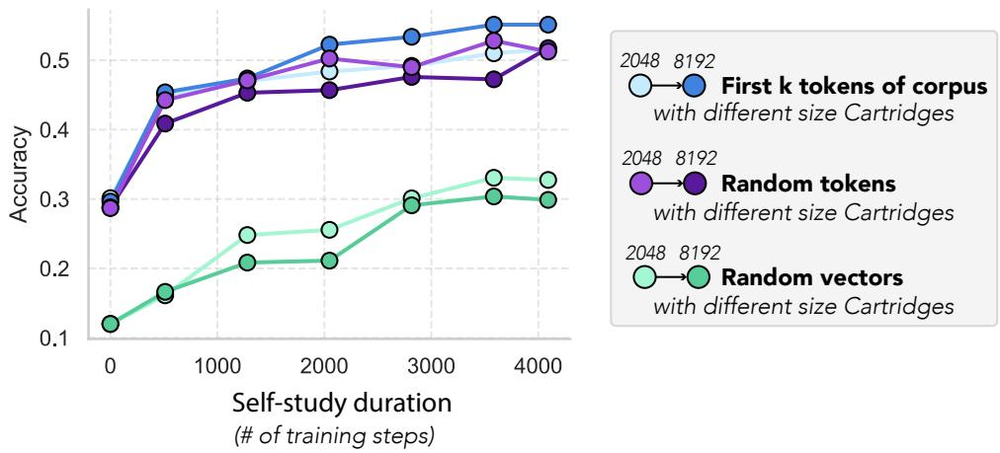  
Figure 9: Ablating CARTRIDGE initalization. We train a CARTRIDGES using SELF-STUDY on the corpora from LONGHEALTH with 3 different initialization strategies. The x axis is the number of training steps and the y axis is the accuracy on LONGHEALTH. The blue lines are the results when initializing the CARTRIDGE using the KV cache from the first k tokens of the document. The purple lines are initializing the CARTRIDGE from the KV cache of unrelated text. The green lines is initializing the CARTRIDGE with random vectors. Initializing from the first k tokens leads to slightly stronger results than initializing from the KV cache of random text. This difference may be more prominent on other corpora where the first k tokens are more relevant to solving the downstream task.

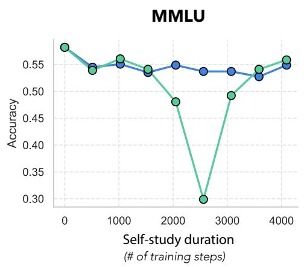

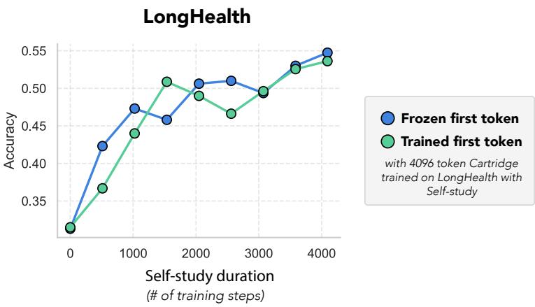  
Figure 10: Freezing the attention sink. In both plots, the y-axis is accuracy and the x-axis is training step. The green line which corresponds to a run where we allow a trainable first token. (Left) The y-axis MMLU accuracy. This plot exemplifies the training instability we observed when the key and value vectors were trainable. The MMLU score dips to below 30% before recovering. (Left) The y-axis is accuracy on questions from LONGHEALTH.

## A.2 SELF-STUDY design choices: data-generation and objective

In SELF-STUDY training we use a seeded data-generation process and a context-distillation training objective (see Section 4). In this section, we ablate these design choices, comparing against the performance of SELF-STUDY with simpler data-generation and objectives.

Data Generation In Section 4.1, we describe how we use five different seed prompt types when generating data with Algorithm 1. These prompt types, structuring, summarization, question, use cases, and creative, are described in more detail in Appendix C.1.

In this section, we compare the performance of SELF-STUDY with these five prompt types against SELF-STUDY with a single prompt: “Please generate a single chat message to begin a conversation about the information in the corpus. Ask a question about the corpus or make a request."

Across three datasets, we find that using the five different prompt types during SELF-STUDY leads to higher quality CARTRIDGES (see Figure 12). On MTOB with CARTRIDGES of size 1024 tokens, we see a 7.9 point ChRF improvement (24.1 → 32.0). On LONGHEALTH, the improvement is 5.5 accuracy points (45.8 → 51.3).

Interestingly, on QASPER, we see no benefit from using the five different prompt types. It is possible this is because the queries in the QASPER dataset are mostly factual questions that do not require complex reasoning like LONGHEALTH and MTOB do.

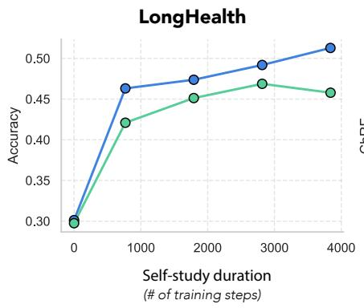

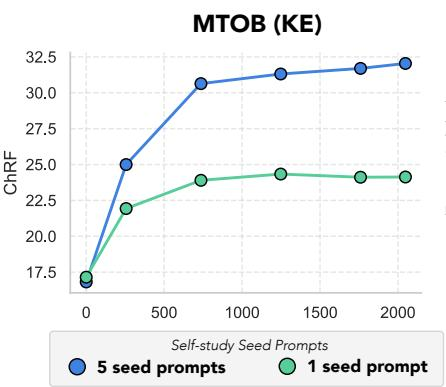

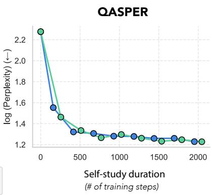  
Figure 11: Diverse seed prompts improve quality. We generate synthetic data according to Algorithm 1 and ablate the choice of seed prompts sampled on Line 2. We consider two approaches: using a single, broad seed prompt (Green) or randomly sampling one of five different types of seed prompts (Blue). We train CARTRIDGES using self-study with these two strategies on LONGHEALTH, MTOB and QASPER corpora. In all plots, the x axis is the number of training steps, and the y axis is either accuracy (for LONGHEALTH and MTOB) or perplexity on ground truth answer (for QASPER). We use an CARTRIDGE size of 1024 tokens.

Training Objective In Section 4, we describe the context-distillation objective we use [13, 47, 79]. This approach requires that we collect top output probabilities from the in-context model’s output distribution during data generation. A simpler alternative would be to just use a next-token prediction objective with a cross-entropy loss.

In our comparison, we find that this simpler objective underperforms the context-distillation objective (see Figure 12). Most notably, on MTOB with 2048 token CARTRIDGES, context-distillation outperforms next-token prediction by 8.3 ChRF points (24.9 → 33.2). On LongHealth, the gap is 3.7 accuracy points (47.6 → 51.3).

As shown in Figure 12, quality seems to be consistently improving with more SELF-STUDY compute. It is possible, therefore, that by spending more during SELF-STUDY with the next-token prediction objective, we could close the gap. However, for a fixed amount of SELF-STUDY compute, context-distillation is considerably more effective.

These results demonstrate how context-distillation plays an important role in efficiently recovering ICL performance with SELF-STUDY.

## A.3 Throughput measurement details

We provide details for the throughput measurements in Figure 3. We use the state-of-the-art SGLang inference system, with default parameters [117]. We measure throughput on a single H100 GPU.

We first determine the largest batch size b that fits in GPU memory, given a cache of size k tokens. We then randomly initialize b CARTRIDGES of size k and pre-load the CARTRIDGES into GPU memory. We finally

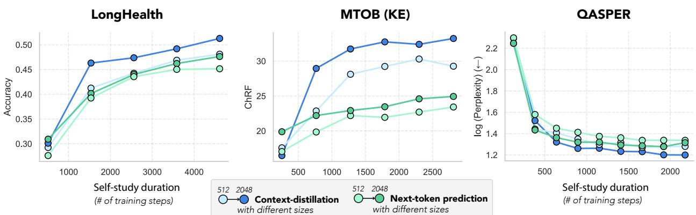  
Figure 12: Context-distillation objective improves training efficiency. We train CARTRIDGES using SELF-STUDY on the corpora from LONGHEALTH (Left), MTOB (Center) and QASPER (Right) using two loss functions: a next token prediction loss (green) and a distillation loss (blue). We evaluate the performance of the CARTRIDGES on questions from the target dataset (LONGHEALTH, MTOB or QASPER) using the same protocol as in Figure 5. In all plots, the x axis is the number of training steps, and the y axis is either accuracy (for LONGHEALTH and MTOB) or perplexity on ground truth answer (for QASPER). The shade of the points represents the size of the CARTRIDGE. Using a distillation loss achieves higher accuracy (or lower perplexity for QASPER) across datasets and CARTRIDGE sizes.

measure the time taken to decode 128 tokens per sequence. The CARTRIDGES and decoded tokens are appended to a KV-cache during generation. We report the average of 5 iterations after using 3 warm-up iterations.

## B Extended Related Work

In this section, we provide a more in-depth discussion of the place our work occupies in the broader literature. The structure below mirrors the structure of our paper: first we discuss work related to the parameterization and initialization of CARTRIDGES (Appendix B.1), then we cover work that inspired the design of SELF-STUDY (Appendix B.2), and finally we describe other approaches aimed at reducing the size of the KV-cache, many of which we compare against in our experiments (Appendix B.3).

## B.1 Prior work related to the parameterization of CARTRIDGES

Below we discuss prior work from the parameter-efficient fine-tuning literature that inform the way we parameterize CARTRIDGES in our work.

## B.1.1 Parameter-efficient Fine-tuning (PEFT)

In order to adapt large language models (LLMs) to particular domains or tasks in a more compute and memory-efficient manner, several parameter-efficient fine-tuning (PEFT) methods have been developed. Some of the most widely used PEFT methods include Low-Rank Adaptation (LoRA) [36], prefix-tuning [54], and prompt-tuning [51].

Leveraging prior observations that fine-tuned language models exhibit an intrinsic low rank structure, Hu et al. propose LoRA, which freezes model parameters and injects trainable rank decomposition matrices between each transformer layer. LoRA exhibits on-par or better fine-tuning quality while reducing the number of trainable parameters by 10,000 times and the GPU memory requirement by 3 times [36].

Li et al. and Lester et al. both take a different approach to lightweight fine-tuning, proposing tunable "prefixes" and "soft prompts" respectively to prepend to queries in order to steer the model to desired outputs. Li et al. proposes prefix-tuning, which learns a continuous representation for the activation of the prefix at each transformer layer. These learned activations are then prepended to activations obtained by passing the input prompt through the frozen transformer. In contrast, Lester et al. proposes prompt-tuning, which optimizes at the discrete token level and prepends a series of learnable tokens to the input prompt. Both methods show strong performance while greatly reducing the number of learnable parameters and improving compute and memory efficiency for language model adaptation.

Principal Singular values and Singular vectors Adaptation (PiSSA) [61] is another more recent PEFT method that attempts to ameliorate the slow convergence problems of LoRA. PiSSA initializes the LoRA rank decomposition matrices with the principal components of the original matrix, and exhibits faster convergence and enhanced performance compared to LoRA on several tasks, including GSM8K and MATH.

Several of these methods, especially LoRA, have been adapted specifically for distilling knowledge provided in context into the parameters of a language model. Some of those methods are described in the sections below, and this work is an extension of prefix-tuning for long-context tasks.

## B.1.2 Parameter-efficient Adapter Composition and Merging

A number of works have explored the idea of composing multiple different parameter-efficient adapters (e.g. LoRAs) by summing them together, concatenating them, or using a dynamic mixture of experts [30, 37, 53, 92, 94, 97, 115, 116]. For example, Huang et al. propose LoraHub, a framework for dynamically weighting and composing multiple language model adapters [37]. Given a set of LoRA modules for different upstream tasks and new unseen task with in-context examples, LoraHub dynamically weights the LoRAs and composes a new LoRA module for the task. Similarly, Zhao et al. propose a method for dynamically retrieving the most relevant language model LoRAs for a given task [115].

## B.1.3 Parametric Knowledge Injection

Several recent works have explored methods for integrating external knowledge directly into model parameters, known as parametric knowledge injection [15, 48, 49, 60, 81]. To the best of our knowledge, these studies are the closest in scope to ours. Like ours, these works address the problem of parametric knowledge injection: how to store large text corpora within parameters of a language model. Some use simple synthetic data generation pipelines or context-distillation objectives. Unlike our work, these studies do not highlight the memory reduction and throughput advantages of parametric knowledge injection techniques. We highlight other differences below.

One parametric knowledge injection method, recently proposed by Kujanpaa et al., is prompt distillation, in which a teacher model with access to privileged knowledge generates question-answer pairs. These pairs are then used to train a LoRA adapter for a student model (identical to the teacher model, but without access to privileged information) using a distillation objective (i.e. mimicking the teacher’s full token distribution) [48]. This closely resembles our context-distillation objective, which we also found works better than next-token prediction. However, unlike our work, Kujanpaa et al. only train LoRA adapters of a single size (rank 1024) and don’t assess memory reductions with respect to full in-context learning. Indeed, they do not evaluate against long-context ICL baselines at all, focusing instead on a comparison with RAG. Furthermore, they evaluate on a relatively simple long-context setting – a concatenation of SQUAD passages [73] – which does not exhibit long range dependencies or require reasoning the way MTOB and LONGHEALTH do.

Similarly, Mao et al. propose Long Input Fine-tuning (LIFT), which fine-tunes a language model using a typical next-token prediction objective on overlapping segments of the corpus, as well as instruction tuning on question answer pairs generated from the corpus. Unlike our work, Mao et al. find that synthetic Q/A pairs “offer minimal benefit and can even degrade performance due to overfitting" [60]. The difference in our findings is perhaps due to the fact that they only generate ten synthetic examples, whereas we generate tens of thousands. Furthermore, they use a weaker ICL baseline (Llama 3 8B) that only has 8k tokens of context. Any contexts longer than 8k tokens are truncated before being fed to the ICL baseline.

Concurrent work on deep context distillation performs knowledge injection with synthetic data and a context distillation objective [15]. In this work, the authors only report performance with LoRA adapters and do not explore a prefix-tuning parameterization. In further contrast to our work, their focus is not on memory reductions or throughput improvements. They only report performance with a single adapter size (rank 16 LoRA adapters), and they do not report throughput improvements. Instead, the paper highlights the “plug-and-play" nature of the method.

Finally, Su et al. proposes Parametric Retrieval Augmented Generation (Parametric RAG), in which each document has a corresponding LoRA adapter, trained on an augmented dataset consisting of the document, rewritten versions of the document, and question-answer pairs generated from the document. At inference time, a retriever is used to determine relevants documents, and the corresponding LoRA adapters are merged [81]. This method demonstrates significant gains over RAG on a variety of tasks, including WikiMultihopQA.

## B.2 Prior work related to SELF-STUDY

## B.2.1 Self Distillation and Context Distillation

Self-distillation is another method used to internalize the performance gains provided by information in context (e.g. scratchpads, informative instructions) into the model parameters. In "Learning by Distilling Context", the authors distill a model with instructions and scratchpads in context into parameters by conditioning the model on “[instructions] + [task-input]” to predict “[scratch-pad] + [final answer]”; then fine-tuning the same model to predict its own “[final answer]” conditioned on the “[task-input]”, without seeing the “[instructions]” or using the “[scratch-pad]” [80].

## B.2.2 Synthetic Data Generation

Due to the ubiquitous need for high quality data for fine-tuning (e.g. for use with the methods described above), a large body of work has focused on generating high quality synthetic data [65] [1] [26] [74]. For example, Bonito is a model that is fine-tuned to generate synthetic data [65], and MetaSynth is a method proposed by Riaz et al. that uses a language model to orchestrate several expert LLMs for domain-specific synthetic data generation [74]. The training process for Phi-4, a 14 billion parameter language model, also incorporates significant amounts of synthetically generated data [1]. Incorporating synthetic data, in conjunction with new post-training techniques, allows Phi-4 to surpass its teacher model on STEM QA tasks, as well as perform well for its size on reasoning benchmarks. These works demonstrate the potential for synthetic data generation methods to augment the capabilities of language models.

## B.3 Reducing the size of the KV cache

In this section, we discuss existing approaches for reducing the size of the KV cache.

First, in Appendix B.3.3, we describe works that propose architectural changes to the multi-head attention operation, which reduce the memory footprint of the KV cache. Next, in Appendix B.3.1, we discuss prompt compression methods, which reduce the size of the KV cache by converting a long sequence of input embeddings into a shorter one. They can be split into hard-token methods, which output discrete tokens from the vocabulary, and soft-token methods, which output new token embeddings not from the vocabulary. Finally, in Appendix B.3.2, we describe KV cache compression methods. These methods directly modify the key and value matrices in the KV cache. Compared with prompt compression methods, these are more expressive because they can produce a KV cache that no sequence of input embeddings could have produced.

The methodology proposed in our work relies on cache-tuning, which could be viewed as a form of KV cache compression.

## B.3.1 Prompt compression

Hard-token prompt compression Some works aim to reduce the size of KV cache by converting a longer text into a shorter text [21, 42, 55, 70, 109]. These methods are typically referred to as hard-token prompt compression methods because the resulting KV cache comes from discrete tokens from the vocabulary. Compared with soft-token prompt methods, these methods work well with black-box API models.

These methods can be broadly classified into two categories: filtering and summarization based methods. Filtering methods cut text from the original prompt using heuristics such as self-information. For example, LLMLingua and Selective-Context use a smaller LLM to filter a long prompt (e.g. dropping redundant tokens) before passing it to the main model [42, 55]. Summarization methods paraphrase a long prompt into a smaller number of tokens [21].

Soft-token prompt compression with adapted LLMs In one line of work, researchers train a model (typically an adapted LLM) to compress a long prompt into a smaller number of soft tokens [19, 28, 62, 72, 104].

For example, Autocompressors and In-context Autoencoders (ICAE) are LLMs that are fine-tuned to output embeddings which can be used in soft-token prompts [19, 28]. Autocompressors are trained with fullparameter fine-tuning and leverage a recursive strategy to generate the soft prompts, whereas ICAEs are trained with LoRA and use a single forward pass to generate the soft prompts. A recent method, LLoCO, train domain-specific LoRA adapters that enable the decoder better leverage AutoCompressor embeddings [83]. This differs from CARTRIDGES in that the LLoCO LoRA adapters are trained for a domain (e.g. academic papers, news), not a specific document. A number of other works also propose using an auxiliary model to produce soft-tokens from a long prompt [28, 72]. Gisting is another method that differs from those above in that it uses the same LLM to compress the prompt into soft tokens as it uses to generate the response [62].

Soft-token prompt compression via gradient-descent Soft tokens can also be produced by optimizing input token embeddings with gradient descent. This idea, called prompt tuning, was first proposed for the purpose of conditioning a frozen langauge model to perform specific tasks [51]. As such, it is an important part of the parameter-efficient fine-tuning literature and is discussed in more detail in Appendix B.1.1. Since then, Li et al. has extended prefix tuning techniques to long-context settings, proposing a new method called prefix propagation, which conditions prefixes on previous hidden states to achieve superior performance on long-document tasks compared to prefix tuning [53].

## B.3.2 KV cache compression

Hard-token KV cache compression Motivated by the observation that, in some settings, a small number of keys dominate the attention scores of subsequent queries, several works have proposed KV cache eviction policies wherein keys and values are dynamically dropped during generation [27, 67, 84, 114]. For example, H20 drops keys and values from generated tokens based on a running sum of historical attention scores [114]. Similarly, SnapKV drops keys and values from prompt tokens based on a window of queries from the end of the prompt [56].

A major limitation of eviction methods is that once a key is evicted, it cannot be recovered. Instead of evicting keys permanently, another line of work focuses on selectively loading keys from KV cache to SMs. While these works do not reduce memory consumption of the KV cache, they can speed up inference by making better use of GPU memory bandwidth [75, 84]. For example, the Quest method estimates critical tokens at each decoding step and selectively loads them to SMs [84].

Compared with the hard-token prompt compression methods, KV-cache compression methods allow finegrained control at the level of an attention head. This means that a token can be dropped from one attention head but not another.

Soft-token KV cache compression with merging In another line of work, instead of evicting tokens from the KV cache, researchers propose merging similar tokens [58, 90, 91, 112]. For example, Cache Merge (CaM) takes keys marked for eviction and merges them instead, using a weighting scheme based on attention weights [112]. Wang et al. builds on this work by clustering key states into "merge sets" based on cosine similarity, and merging states within a "merge set" with a Gaussian kernel weighting scheme, which upweights states more similar to a pivotal state chosen as the token with the largest total attention score [91]. Wan et al. expands on both these works with Dynamic Discriminative Operations (D2O), which performs optimizations at both the layer and token levels. D2O adjusts the KV cache budget for each layer based on its attention density and uses an exponential moving average mechanism to dynamically determine when a previously discarded token is similar enough to retained tokens to be merged back in [90]. All of these works demonstrate promising results, offering similar or better performance on several tasks compared to a full cache with a 50% or more reduction in cache size. However, there is still room for further improvement, as these methods still fail to match full cache performance in several tasks, and even a 50% reduction in cache size may still be prohibitively expensive for very large models or very long contexts. Additionally, these works do not evaluate the effectiveness of these methods in long-context settings.

Soft-token KV cache compression with low-rank projection A number of works leverage the observation that the KV cache exhibits low-rank structure to develop compression methods [16, 77, 105, 110, 119]. Similar to compression methods based on merging, compression methods based on low-rank adaptation achieve performances similar to or exceeding full caches on several tasks at 50% compression, while experiencing performance degradation upon further compression.

Soft-token KV cache compression with adapted LLMs Above we discussed how some works adapt an LLM to output a shorter sequence of soft tokens given a long context. Similarly, one could adapt an LLM to output a smaller KV cache given a long context. While less explored than the analagous prompt compression approach, there is at least one published method that falls into this category. In KV-distill, the authors add LoRA adapters to an LLM’s query projections and train them to to produce queries which aggregate information from prior tokens [17]. The adapter is applied selectively to some tokens and only these tokens are kept in the KV cache. The idea is that these selected tokens can act as sinks to collect information from prior tokens. The adapter is trained with a distillation objective between a compressed and uncompressed KV cache. However, unlike our work, KV-distill does not use any training at test time.

Soft-token KV cache compression with gradient-descent The idea of treating the keys and value matrices in a KV cache as weights and training them with gradient descent was first discussed in the prefix-tuning paper [54]. In this work, the method was not applied to long-contexts, but rather as a parameter-efficient fine-tuning method that can be applied to training datasets with input-output pairs, so we discuss it in more detail in B.1.1. Since then, we are not aware of works that have applied this technique to handle long-contexts.

## B.3.3 Architectural changes

A number of works have proposed architectural changes to the original multi-head attention (MHA) operation [89] that reduce the memory footprint of the KV cache. Because they fundamentally alter the architecture, these methods are not immediately compatible with pre-trained models using the standard MHA operation.

The earliest works in this direction developed fixed sparsity patterns in the attention map [12, 20, 106]. For example, many works use a sliding window sparsity pattern wherein each token attends to a fixed window of tokens around it. These approaches reduce the size of the KV cache because they require only keeping around a fixed number of tokens in the KV cache. More recently, some large language models have adopted sliding window sparsity in a subset of layers/heads [86].

While the methods above reduce the size of the cache by introducing sparsity at the token-level, another class of methods changes the structure of the attention heads. Multi-query attention (MQA), the earliest of such modifications, uses multiple query heads but only a single key and value head [78]. While MQA dramatically reduces the size of the KV cache, it can lead to a significant drop in the expressive power of the model. Grouped-query attention (GQA) is a middle ground between MQA and MHA that allows a group of query heads to attend to a single key and value head [3]. Many frontier models use GQA, including the Llama 3 architecture, which we use in our experiments [25, 41, 98]. More recently, a number of other architectural modifications have been proposed including including Multi-head Latent Attention [57] and Tensor Product Attention [111].

In another line of work, researchers observe that without the softmax operation in the attention mechanism (i.e. linearizing the attention operator), the KV cache can be faithfully represented by the fixed size matrix K⊤V [6]. This allows us to represent the KV cache with a single matrix whose size is independent of the context length.

Indeed, a large body of work has focused on developing architectures with fixed-size memory consumption (i.e. models that do away with the KV cache). Notable examples include state-space models [31], RNNs [8], and other linear attention variants [6, 100].

Prior work shows that there are tradeoffs between the memory consumption of an architecture and the ability of a model to perform recall-intensive tasks, when controlling for compute (i.e. FLOPs) [6]. In this context, our work shows that by increasing compute (i.e. FLOPs), we can reduce the memory consumption of a model without sacrificing performance. In Appendix E, we provide a prelinary theoretical analysis relating SELF-STUDY with recurrent architectures. However, future work should explore the relationship between CARTRIDGES and recurrent models in more depth.

Most related to our work are recent architectures (e.g. Titans [11], TTT [82]) that use a constant-sized memory object (like in linear attention) but apply gradient descent-like memory updates [9–11, 82, 101]. Like our work, these architectures are motivated by the observation that gradient descent is very effective at compressing text into constant space and demonstrate the promise of using gradient descent at test time for long-context tasks. In contrast with our work, these architectures need to be trained from scratch, they have not been validated on large scale models, and do not match the quality of attention on recall-intensive tasks [6, 9].

## B.3.4 Orchestration for long-context

In this section, we describe strategies for managing long-contexts by orchestrating calls to LLMs. For instance, the approach by [76] involves summarizing chunks of the context and then combining the summaries. Similarly, PRISM [40] treats the context as a sequence of chunks, capturing key information in a structured data format. MemGPT [69] introduces a virtual memory paging system, drawing inspiration from operating systems. As context length reaches the limit of available memory, the system strategically determines which information to retain.

## B.3.5 Synthetic data generation

A large body of work has focused on generating synthetic training data [1, 26, 65, 74]. For example, Bonito is a model that is fine-tuned to generate synthetic data [65], and MetaSynth is a method proposed by Riaz et al. that uses a language model to orchestrate several expert LLMs for domain-specific synthetic data generation [74]. The training process for Phi-4, a 14 billion parameter language model, also incorporates significant amounts of synthetically generated data [1].

## C Extended method description

In this section, we detail the seed prompts and chunking strategy we used to train CARTRIDGES with SELF-STUDY.

## C.1 SELF-STUDY seed prompts

As discussed in Algorithm 1, we seed the synthetic conversation generation with a prompt that elicits conversations about different aspects of the document. For each conversation, we randomly sample one of the following functions and create a seed prompt by calling it:

Structuring Seed Prompt Generator   
1 def structuring\_seed\_prompt (\*\* kwargs ) :   
2 DATA\_FORMATS = [" JSON ",   
4 5 " TOML ", " YAML ",   
6 " INI ",   
7 " XML ",   
8 " plain text ",   
9 ]   
10   
11 data\_format = random . choice ( DATA\_FORMATS )   
12   
13 EXAMPLES = [   
14 15 (   
"Can you structure the information in {{ subsection }} of {{ document }} related to {{ something   
specific }}   
16 f"in the following format : { data\_format }? "   
17 "Be sure to include precise information like any dates , times , names , and numerical values   
18 ...   
19   
20 ]   
21   
22 example = random . choice ( EXAMPLES )   
23   
24 return (   
25 f" Please generate a single chat message instructing an LLM to structure the information in {   
data\_format }. "   
26 " Output only the chat message itself and absolutely nothing else .   
27 " Make sure it is clear what section and document you are asking about . "   
28 f"The message can follow the following template , filling in details from the corpus : \n\n '{   
example }'"   
29 )   
30   
31

## Summarization Seed Prompt Generator

1 def summarization\_seed\_prompt (\*\* kwargs ) :   
2 prompts = [   
3 (   
4 " Please generate a single chat message instructing an LLM to summarize part of the corpus .   
5 " Make sure the instruction is very explicit about the section of the corpus that you want   
to summarize .   
6 " Include details (ids , names , titles , dates , etc .) that make it clear what you are asking   
about .   
7 ) ,(   
8   
9 " Please generate a single chat message instructing an LLM to summarize a section .   
10 " Make sure the instruction is explicit about the section that should be summarized and the   
document it is from ."   
11 ) ,   
12 ]   
13 prompt = random . choice ( prompts )   
14 return prompt   
15   
16

```csv
1 def question_seed_prompt (** kwargs ) :
2 prompts = [
3 (
4 " Generate a question for an LLM that will test its knowledge of the information in the
corpus above . "
5 "In your question be sure to include details (ids , names , titles , dates , etc .) that make it
clear what you are asking about . "
6 " Output only a single question . Do NOT include any other text or explanation other than the
question ."
7 ) ,
8 (
9 " Generate a message for an LLM that will test its knowledge of the information in the
corpus above ."
10 "Be sure to include details (ids , names , titles , dates , etc .) in the question so that it
can be answered without access to the corpus (i.e. closed - book setting ). "
11 " Output only a single question . Do NOT include any other text or explanation other than the
question ."
12 ) ,
13 (
14 "You are helping to quiz a user about the information in the corpus .
15 " Please generate a question about the subsection of the corpus above .
16 "Be sure to include details (ids , names , titles , dates , etc .) in the question to make it
clear what you are asking about . "
17 " Answer only with the question , do not include any other text ."
18 ) ,
19 ]
20 prompt = random . choice ( prompts )
21 return prompt
22
```

## Use Case Seed Prompt Generator

def use\_case\_seed\_prompt (\*\* kwargs ) :   
2 prompt = (   
3 " You are working to train a language model on the information in the following corpus .   
4 " Your primary goal is to think about practical , real - world tasks or applications that someone   
could achieve using the knowledge contained within this corpus .   
5 " Consider how a user might want to apply this information , not just recall it. "   
6 " After considering potential use cases , your task will be to generate a sample question that   
reflects one of these downstream applications . 1   
7 " This question / instruction / task should be something a user , who has access to this corpus ,   
might ask when trying to accomplish their specific goal . "   
8 " Output only a single question . Do NOT include any other text or explanation other than the   
question ."   
9 )   
10 return prompt   
11   
12

Creative Seed Prompt Generator   
1 def creative\_seed\_prompt (\*\* kwargs ) :   
2 prompt = [   
3 (   
4 "You are having a creative conversation inspired by the information in the corpus . "   
5 " Please generate a question for your conversation partner to start off the discussion . "   
6 " Answer only with the question , do not include any other text ."   
7 ) ,   
8 ]   
9 return random . choice ( prompt )

## C.2 SELF-STUDY chunking

For the SELF-STUDY data generation process, we extract uniformly random token-level chunks from the input corpus C. A corresponding textual description is generally prepended to each chunk c˜ to contextualize it when generating the seed prompt. This approach helps the model focus on different parts of the corpus and generate diverse synthetic examples. The specific chunking parameters and descriptions are tailored to each dataset:

• LONGHEALTH: Chunks are sampled with a minimum size of 512 tokens and a maximum size of 4096 tokens. The accompanying description is: ‘Below is a section of a patient’s medical record. It is part of a larger corpus of medical records for $N _ { p a t i e n t s }$ different patients.’

• AMD/FinanceBench: Fixed-size chunks of 8192 tokens are utilized. No specific descriptive text is prepended to these chunks.

• MTOB: Chunks are sampled with a minimum size of 512 tokens and a maximum size of 4096 tokens. The description used is: ‘The following is an excerpt from a grammar book about the Kalamang language.’

• QASPER: Following our general methodology, chunks are sampled with a minimum size of 512 tokens and a maximum size of 4096 tokens. A generic description is used to contextualize the chunk as an excerpt from a research paper, in line with the nature of the Qasper dataset.

## D Datasets

## D.1 GENCONVO

To evaluate the ability of our approach to handle diverse queries over long documents, we generated the GENCONVO dataset. We created GENCONVO using the AMD 2022 10-K filing, a document from the FinanceBench corpus [38]. The primary purpose of GENCONVO is to simulate a wide range of tasks a user might ask a model to perform given a long document, thereby testing the model’s comprehension, reasoning, and ability to extract varied types of information. The generation process relies on Claude Sonnet 3.7 [4] and is structured as follows:

1. Document Input: The entire source document (e.g., the AMD 2022 10-K, which is less than 200,000 tokens and fits within the model’s context window) is provided to Claude Sonnet 3.7.

2. Question Generation: A series of distinct prompt templates (detailed below), designed to elicit different reasoning traces (e.g., factual recall, synthesis, multi-hop reasoning), are used to generate questions. For the given document and each prompt template, we ask the model to generate 16 unique questions. This involves providing the model with the full document content alongside the specific question-generation prompt.

3. Answer Generation: Subsequently, for each generated question, Claude Sonnet 3.7 is prompted again with the original full document and the generated question to produce an answer. This process ensures that the answers are grounded in the provided document.

We hope GENCONVO provides a challenging benchmark that moves beyond simple fact retrieval, assessing a model’s capacity for deeper understanding and more complex information processing over long contexts. The following prompt templates were utilized for the question generation phase:

## Factual Prompt Template

Please generate a question to test someone’s ability to remember factual details from the document. The answer should be a few tokens long and be a factual detail from the statement, such as a number, entity, date, title, or name.

This question should not be common knowledge: instead, it should be something that is only answerable via information in the document.

## Knowledge Prompt Template

Please generate a question that requires combining information mentioned both inside and outside the document.

This question should require using a fact from the document and also a fact that you are confident about, but is not mentioned in the document. For instance: - What are the founding dates of the companies that got acquired this year? This is a good question because the names of the acquired companies are mentioned in the document and the founding dates are not mentioned. - What is the name of the CEO’s spouse? This is a good question because the name of the CEO is mentioned in the document and the spouse’s name is not mentioned.

The answer should be a fact that is a few tokens long such as a number, entity, date, title, or name.

## Disjoint Prompt Template

Please generate a multi-hop question that tests someone’s ability to use factual information mentioned in at least two very different sub-sections of the document.

This question shouldn’t be a standard question about this kind of document. Instead, it should ask about two particularly disconnected ideas, like comparing information about the amount of owned space for the company headquarters with the amount of dollars of estimated liability or comparing the revenue number with the number of employees.

This question should also test one’s ability to do retrieval: do not give away part of the answer in the question. Ensure that for one to get the correct answer to the question, they need to understand the document.

The answer should be a short: for example, a number, entity, date, title, or name.

## Synthesize Prompt Template

Please generate a question that requires synthesizing and aggregating information in the document. For instance, you could ask someone to summarize a page of the document, list all the key competitors mentioned in the document, or summarize the company’s business model.

## Structure Prompt Template

Please generate a question that requires understanding the structure of the document. This question should be more about the structure of the document, rather than the precise statement details. For instance, you could ask someone to list the titles of all the sections in the document, describe the document structure, report the total number of pages, ask which section amongst two sections comes first, or report the section with the largest number of tables.

## Creative Prompt Template

Please generate a question about the document to test someone’s ability to comprehend the content of the document. This question specifically should be focused on their ability to generalize the information about the document to a strange question of sorts.

This question shouldn’t be a standard question about this kind of document, it should ask to do something abnormal and creative, like writing a poem about a financial document.

## Counting Prompt Template

Please generate a question that requires counting how frequently different events occur in the document. This question should be about statistical properties of the document, rather than the statement details. For instance, you could ask someone to count the number of times the word "million" is mentioned or count the length of the shortest section title.

The answer should be a number.

## Reasoning Prompt Template

Please generate a question that requires mathematical reasoning over the values in the document. This question should require going beyond the facts directly mentioned in the statement, such as asking to compute the percentage increase in revenue between two years, find the largest expense category, or calculate difference in profit between two years.

The answer should be a number.

## D.2 LONGHEALTH

LONGHEALTH is a benchmark for evaluating large language models ability to analyze and interpret long clinical texts [2]. The benchmark consists of 20 fictional clinical case reports (each containing between 5,090 and 6,754 word) and 400 multiple-choice questions based on them.

In our experiments, the context C consists of the reports for a panel of n patients. We use n = 10 patients, with a full panel of approximately 100k tokens, which fits in the context length of the LLAMA 3 models.

The questions are categorized into information extraction, negation, and sorting.

A sorting question is included below:

Please answer the question below about the following patient: ID patient\_03, Name: Mr. John Williams,   
Birthday: 1956-08-08 00:00:00, Diagnosis: Multiple Myeloma   
<question>   
Mr. Williams received multiple radiologic examinations. In which order did she receive them?   
</question>   
<options>   
CT Whole Body > MR Spine Scan > CT Spine Scan > PSMA-PET-CT Scan > CT Chest > CT Whole Body > Whole   
Body CT scan   
Whole Body CT scan > CT Spine Scan > CT Whole Body > MR Spine Scan > CT Chest > PSMA-PET-CT Scan > CT   
Whole Body.   
CT Whole Body > CT Whole Body > CT Chest > CT Chest > PSMA-PET-CT Scan > MR Spine Scan > CT Spine Scan   
> Whole Body CT scan > Chest X-ray   
CT Chest > CT Spine Scan > CT Whole Body > Whole Body CT scan > PSMA-PET-CT Scan > MR Spine Scan > CT   
Whole Body   
Whole Body CT scan > CT Spine Scan > CT Whole Body > MR Spine Scan > CT Chest > CT Whole Body >   
PSMA-PET-CT Scan   
</options>   
You should first think step by step. Then give your final answer exactly as it appears in the options.   
Your output should be in the following format:   
<thinking> {{YOUR\_THOUGHT\_PROCESS}} </thinking>   
<answer>   
{YOUR\_ANSWER}   
</answer>

An example of a negation question is included below:

Please answer the question below about the following patient: ID patient\_01, Name: Anna   
Sample, Birthday: 1970-01-01 00:00:00, Diagnosis: DLBCL   
<question>   
Which of these examinations were never performed in Mrs. Sample?   
</question>   
<options>   
Bone marrow aspiration   
CSF aspiration   
MRI of the head   
Pulmonary function testing Cardiac stress testing   
</options>   
You should first think step by step. Then give your final answer exactly as it appears in   
the options. Your output should be in the following format:   
<thinking> {{YOUR\_THOUGHT\_PROCESS}} </thinking>   
<answer>   
{YOUR\_ANSWER}   
</answer>

## D.3 MTOB

The Machine Translation from One Book (MTOB) benchmark tests a large language model’s ability to learn to translate between English and Kalamang, a low-resource language with virtually no web presence [85]. The core task is to perform translation (Kalamang to English, and English to Kalamang) by primarily relying on a single comprehensive grammar book and a small set of accompanying linguistic resources. In our work, we focus on translating from Kalamang to English.

The source documents provided by the MTOB benchmark are:

• A grammar of Kalamang: A comprehensive grammar textbook, with the original source provided in LATEX format. This book details the phonology, morphology, and syntax of Kalamang.

• Bilingual Word List (W): A list of Kalamang words with their part-of-speech tags and English descriptions.

• Parallel Kalamang-English Corpus (S): A collection of 375 paired Kalamang-English sentences.

The MTOB authors preprocessed the grammar textbook from its original LATEX source into several plaintext splits for their baseline experiments. These include:

• Gm (Medium-length chunk): A plaintext segment of approximately 50k tokens consisting of an overview chapter, a morpheme table from the grammar book, and the complete bilingual word list (W).

• Gl (Long-length chunk): A larger plaintext segment of approximately 100k tokens, containing chapters from the grammar book that the MTOB authors deemed most important for the translation task.

• Full Plaintext Textbook (G): The entire grammar book converted to plaintext.

The combination of the long-length chunk (Gl), the parallel sentences (S), and the word list (W) exceeds the context window of Llama 3 models. We use the medium-length chunk Gm and the parallel sentence list S as input for our ICL baseline.

## D.4 QASPER

QASPER is a benchmark for evaluating the ability of large language models to answer questions about scientific papers [23]. To create a challenging multi-query long-context setting resembling the setup described in Section 2.2, we concatenate 16 papers all related to QA NLP models to form out corpus C. In total, there are 78 questions about these 16 papers in the dataset, which we use as the queries Q.

Because the dataset only includes short answers and ground-truth spans containing evidence for each answer, we rewrite the answers in a longer, more conversational format using GPT-4.1 and use these as the targets when evaluating.

## E Theoretical analysis: Relationship between attention, linear attention, and CARTRIDGES

When we generate text with an autoregressive Transformer, we have to maintain a KV-cache that grows linearly with the length of the input and text. In Appendix B.3.3, we discussed a number of architectural modifications that either reduce the size of the KV-cache or do away with it altogether. In particular, when generating text with linear attention (e.g. [6]), we only need to maintain a constant-sized object – the KV-state matrix – during generation.

Like the KV-state matrix in linear attention, CARTRIDGES consume a constant amount of memory (i.e. their size is a hyperparameter, which can be set independently of the input length). However, they differ from the KV-state in how they are updated. In this work, CARTRIDGES are updated using SELF-STUDY– gradient descent on synthetically generated data. On the other hand, KV-states are updated using a linear attention update rule.

In this section, we will study the update rules for attention, linear attention, and gradient descent when applied to the multi-query associative recall (MQAR) problem [5], a popular synthetic benchmark task used for studying the capabilities of long-context architectures. In particular, we consider a variant of the standard MQAR problem where key-value pairs are repeated. First, we highlight some equivalences between the update rules of these approaches in the case where input keys are orthonormal. Then, in the more challenging case where input keys are in a Johnson-Lindenstrauss embedding, we provide a separation result showing that the gradient descent update rule is able to exactly solve an MQAR problem that linear attention cannot.

These theoretical results provide intuition for why constant-sized CARTRIDGES are able to match the performance of full KV-caches in long-context settings when linear-attention architectures have struggled to do so.

## E.1 Notation

All vectors are assumed to be row vectors.

Parenthesized superscripts (e.g. $k ^ { ( 1 ) } )$ denote some temporal quality of an element. Subscripts denote different elements in a set, as is standard.

A concise explanation for each variable:

• d : model (and token) dimension.

• m : number of unique key-value pairs.

• n : number of queries.

• N : number of key-value pairs in stream.

## E.2 MQAR

We define the Multiple Query Associative Recall (MQAR) problem.

Definition 1. There is a universe of keys:

$$
K \subset \mathbb { R } ^ { 1 \times d } ,
$$

and values:

$$
V \subset \mathbb { R } ^ { 1 \times d } .
$$

Definition 2. [5] In the MQAR problem, the input is:

$$
( { \boldsymbol { k } } ^ { ( 1 ) } , { \boldsymbol { v } } ^ { ( 1 ) } ) , \dots , ( { \boldsymbol { k } } ^ { ( N ) } , { \boldsymbol { v } } ^ { ( N ) } ) w h e r e ( { \boldsymbol { k } } ^ { ( t ) } , { \boldsymbol { v } } ^ { ( t ) } ) \in { \boldsymbol { K } } \times { \boldsymbol { V } } f o r 1 \leq t \leq N ,
$$

followed by a set of queries

$$
\pmb q _ { 1 } , \dots q _ { n } w h e r e \pmb q _ { i } \in K f o r \ 1 \le i \le n .
$$

Then for each $i \in [ n ]$ , output:

$$
\left\{ \begin{array} { l l } { v _ { i ^ { * } } \ w h e r e \ i ^ { * } = { \bf { m a x } } \{ i \in [ 1 , N ] | k _ { i } = q _ { j } \} } \\ { { \bf { 0 } } ^ { d } \ i f n o \ s u c h i \ e x i s t s . } \end{array} \right.
$$

## E.3 m − repetitive MQAR

Definition 3. m − repetitive MQAR is a special case where each $( K ^ { ( t ) } , V ^ { ( t ) } ) \in S$ , where:

$$
S = \{ ( k _ { 1 } , v _ { 1 } ) , \dots , ( k _ { m } , v _ { m } ) \} .
$$

Additionally, ki is unique.

Definition 4. To capture this, $r _ { i } ^ { ( t ) }$ is defined as the number of occurrences of $\left( k _ { i } , v _ { i } \right)$ in the stream at timestep t.

## E.3.1 Orthonormal Embedding

First, we will look at the MQAR problem in a restricted case, when all keys are orthonormal.

Definition 5. We call the set K to be orthonormal if for all k, $k ^ { \prime } \in K \colon$

$$
\langle k , k ^ { \prime } \rangle = \left\{ { \begin{array} { l l } { 0 } & { { \mathrm { ~ } i f k \ne k ^ { \prime } } } \\ { 1 } & { { \mathrm { ~ } o t h e r w i s e . } } \end{array} } \right.
$$

## E.3.2 Johnson-Lindenstrauss Embedding

Next, we will look at the MQAR problem in a restricted case, when all keys are in a JL embedding.

Definition 6. Let $\epsilon > 0 ,$ , we call the set K to be ϵ−JL if for all $k , k ^ { \prime } \in K \colon$

$$
\langle k , k ^ { \prime } \rangle = \left\{ \begin{array} { l l } { [ - \epsilon , \epsilon ] } & { \ i f k \neq k ^ { \prime } } \\ { 1 } & { \ o t h e r w i s e . } \end{array} \right. .
$$

## E.4 Model Definitions

Below, we will describe three different model architectures. While they each exhibit different performance and capabilities they can be describe with a common framework for the MQAR problem.

1. State: is how the model store Key-Value pairs.

2. Update rule: how the model incorporates new Key-Value pairs into its state.

3. Query rule: how the model uses its state to answer a look up a value or a query.

## E.4.1 Transformer

1. The state is:

$$
\mathbf { } W ^ { ( t ) } = ( K ^ { ( t ) } , V ^ { ( t ) } ) ,
$$

where,

$$
\boldsymbol { K } ^ { ( t ) } \in \mathbb { R } ^ { t \times d } , \boldsymbol { V } ^ { ( t ) } \in \mathbb { R } ^ { t \times d } .
$$

Note that this consumes more memory as the context gets longer.

2. The update rule is:

$$
\pmb { K } ^ { ( t + 1 ) } = \pmb { K } ^ { ( t ) } \oplus \pmb { k } ^ { ( t + 1 ) } , \pmb { V } ^ { ( t + 1 ) } = \pmb { V } ^ { ( t ) } \oplus \pmb { v } ^ { ( t + 1 ) }
$$

3. On query $q \in K ,$ , return:

$$
\begin{array} { r } { \boldsymbol { q } \left( \boldsymbol { K } ^ { ( t ) } \right) ^ { \top } \boldsymbol { V } ^ { ( t ) } . } \end{array}
$$

These rules define the transformer setting for MQAR.

## E.4.2 Linear Attention

1. The state:

$$
\boldsymbol { W } ^ { ( t ) } \in \mathbb { R } ^ { d \times d } .
$$

2. The update rule is defined as:

$$
\pmb { W } ^ { ( t + 1 ) } = \pmb { W } ^ { ( t ) } + ( \pmb { k } ^ { ( t + 1 ) } ) ^ { \top } ( \pmb { v } ^ { ( t + 1 ) } ) .
$$

With the initial matrix being initialized to zeros. I.e. $\pmb { W } ^ { ( 0 ) } = \pmb { 0 } ^ { d \times d }$

3. On query q, return:

$$
\mathbf { \nabla } _ { \mathbf { \boldsymbol { q } } } \mathbf { W } ^ { ( t ) } .
$$

Lemma 1. [101] Linear attention rule emerges if we were to update using the loss function $- k ^ { ( t ) } W ^ { ( t ) } v ^ { t }$

It is important to mention here that we are not using any kernels for linear attention. These rules define the linear attention setting for MQAR.

Lemma 2. [101] $\mathbf { } W ^ { ( t + 1 ) } = \mathbf { } W ^ { ( t ) } - \left( \pmb { k } ^ { ( t ) } \right) ^ { \top } \pmb { k } ^ { ( t ) } \pmb { W } ^ { ( t ) } + \left( \pmb { k } ^ { ( t ) } \right) ^ { \top } \pmb { v } ^ { ( t ) }$ is the update rule that emerges when we use the gradient descent loss function: $\begin{array} { r } { \frac { 1 } { 2 } | | \dot { \mathbf { k } ^ { ( t ) } } \dot { \mathbf { W } ^ { ( t ) } } - \mathbf { v } ^ { ( t ) } | | _ { 2 } ^ { 2 } . } \end{array}$

Definition 7.

$$
\boldsymbol { \mathcal { L } } = \frac { 1 } { 2 } | | \boldsymbol { k } ^ { ( t ) } \boldsymbol { W } ^ { ( t ) } - \boldsymbol { v } ^ { ( t ) } | | _ { 2 } ^ { 2 }
$$

Proof. In general, gradient descent has the update rule:

$$
\mathbf { \boldsymbol { W } } ^ { ( t + 1 ) } = \mathbf { \boldsymbol { W } } ^ { ( t ) } - \eta \nabla _ { \mathbf { \boldsymbol { W } } ^ { ( t ) } } .\tag{4}
$$

Taking the gradient of the loss function gives us:

$$
\begin{array} { r l } & { \nabla _ { W } \frac { 1 } { 2 } | | \boldsymbol { k } ^ { ( t ) } \boldsymbol { W } ^ { ( t ) } - \boldsymbol { v } ^ { ( t ) } | | _ { 2 } ^ { 2 } = \left( \boldsymbol { k } ^ { ( t ) } \right) ^ { \top } ( \boldsymbol { k } ^ { ( t ) } \boldsymbol { W } ^ { ( t ) } - \boldsymbol { v } ^ { ( t ) } ) } \\ & { \qquad = \left( \boldsymbol { k } ^ { ( t ) } \right) ^ { \top } \boldsymbol { k } ^ { ( t ) } \boldsymbol { W } ^ { ( t ) } - \left( \boldsymbol { k } ^ { ( t ) } \right) ^ { \top } \boldsymbol { v } ^ { ( t ) } . } \end{array}
$$

Using the above and choosing $\eta = 1 .$ , we get for Equation (4)

$$
\begin{array} { r l } & { \mathbf { } \mathbf { } W ^ { ( t + 1 ) } = \mathbf { } W ^ { ( t ) } - 1 \left( \left( \pmb { k } ^ { ( t ) } \right) ^ { \top } \pmb { k } ^ { ( t ) } \pmb { W } ^ { ( t ) } - \left( \pmb { k } ^ { ( t ) } \right) ^ { \top } \pmb { v } ^ { ( t ) } \right) } \\ & { \qquad = \mathbf { } W ^ { ( t ) } - \left( \pmb { k } ^ { ( t ) } \right) ^ { \top } \pmb { k } ^ { ( t ) } \pmb { W } ^ { ( t ) } + \left( \pmb { k } ^ { ( t ) } \right) ^ { \top } \pmb { v } ^ { ( t ) } . } \end{array}
$$

## E.4.3 Gradient Descent

Gradient descent training on the cache. We look at the capability of this trained state on a certain input.

1. The state at time t is defined as:

$$
\boldsymbol W ^ { ( t ) } \in \mathbb R ^ { d \times d } .
$$

2. The update rule which follows from Lemma 2:

$$
\mathbf { } W ^ { ( t + 1 ) } = \mathbf { } W ^ { ( t ) } - \left( k ^ { ( t ) } \right) ^ { \top } \mathbf { } k ^ { ( t ) } W ^ { ( t ) } + \left( k ^ { ( t ) } \right) ^ { \top } \mathbf { } v ^ { ( t ) } .
$$

With the initial matrix being initialized to zeros. I.e. ${ \pmb W } ^ { ( 0 ) } = { \pmb 0 } ^ { d \times d }$

3. On query q, return:

$$
\mathbf { \nabla } _ { \mathbf { \boldsymbol { q } } } \mathbf { W } ^ { ( t ) } .
$$

## E.4.4 Orthonormal Case

We now see how the three models perform on the m − repetitive MQAR when K is orthonormal.

## Transformer

Lemma 3. On every input to MQAR (even those for 1-rep-MQAR) the state of Transformer needs Ω(Nd) parameters.

Intuitively, at each timestep, you will append d parameters to the state. At timestep t the model will have td parameters.

## Linear attention

Theorem 1. Linear attention can solve repetitive MQAR for any $m \geq 1$ and orthonormal K, up to scaling (producing $r _ { i } ^ { ( t ) } v _ { i }$ when ${ W } ^ { ( t ) }$ is queried with $k _ { i } )$ and all keys being distinct with $O ( d ^ { 2 } )$ parameters.

Proof. We first prove that for any $t \geq 0 \colon$

$$
W ^ { ( t ) } = \sum _ { i ^ { \prime } = 1 } ^ { m } r _ { i ^ { \prime } } ^ { ( t ) } k _ { i ^ { \prime } } ^ { \top } v _ { i ^ { \prime } } .\tag{5}
$$

Base Case: Initially, $\pmb { W } ^ { ( 0 ) } = \pmb { 0 } ^ { d \times d }$ . From this, we indeed have:

$$
W ^ { ( 0 ) } = \sum _ { i ^ { \prime } = 1 } ^ { m } r _ { i ^ { \prime } } ^ { ( 0 ) } k _ { i ^ { \prime } } ^ { \top } v _ { i ^ { \prime } } ,
$$

since for all $i ^ { \prime } \in [ m ] $

$$
r _ { i ^ { \prime } } ^ { ( 0 ) } = 0 .
$$

Inductive hypothesis: Assume that the state matrix at some arbitrary integer timestep t is as claimed. I.e.:

$$
W ^ { ( t ) } = \sum _ { i ^ { \prime } = 1 } ^ { m } r _ { i ^ { \prime } } ^ { ( t ) } k _ { i ^ { \prime } } ^ { \top } v _ { i ^ { \prime } } .
$$

Inductive step: $\operatorname { I f } \left( k ^ { ( j ) } , v ^ { ( j ) } \right)$ appears at timestep t + 1 the update rule will be:

$$
\begin{array} { r l } { \pmb { W } ^ { ( t + 1 ) } = \pmb { W } ^ { ( t ) } + ( \pmb { k } ^ { ( t + 1 ) } ) ^ { \top } \pmb { v } ^ { ( t ) } } & { } \\ { = \pmb { W } ^ { ( t ) } + ( \pmb { k } _ { j } ) ^ { \top } \pmb { v } _ { j } } & { } \end{array}
$$

By the inductive hypothesis, we have that:

$$
\begin{array} { l } { { \pmb W } ^ { ( t + 1 ) } = { \pmb W } ^ { ( t ) } + k _ { j } ( { \pmb v } _ { j } ) ^ { \top } } \\ { = \displaystyle \sum _ { i ^ { \prime } = 1 } ^ { m } r _ { i ^ { \prime } } ^ { ( t ) } k _ { i ^ { \prime } } ^ { \top } v _ { i ^ { \prime } } + k _ { j } ( { \pmb v } _ { j } ) ^ { \top } } \\ { = \displaystyle \sum _ { i ^ { \prime } = 1 } ^ { m } r _ { i ^ { \prime } } ^ { ( t + 1 ) } k _ { i ^ { \prime } } ^ { \top } v _ { i ^ { \prime } } . } \end{array}
$$

The final step follows from the fact that $r _ { j } ^ { ( t + 1 ) } = r _ { j } ^ { ( t ) } + 1$ when $( \pmb { k } ^ { ( t + 1 ) } , \pmb { v } ^ { ( t + 1 ) } ) = ( k _ { j } , \pmb { v } _ { j } )$ and $r _ { i } ^ { ( t + 1 ) } = r _ { i } ^ { ( t ) }$ for all $i \neq j .$   
The proof of Equation (5) is complete by induction.

Finally, it is the case that on query $k _ { i }$ :

$$
\begin{array} { r l } & { k _ { i } W ^ { ( t ) } = k _ { i } \stackrel { m } { \mathop { i } ^ { \prime } } r _ { i } ^ { ( t ) } k _ { i } ^ { \top } v _ { i ^ { \prime } } } \\ & { \phantom { k _ { i } ^ { \prime } } = \displaystyle \sum _ { i ^ { \prime } = 1 } ^ { m } r _ { i ^ { \prime } } ^ { ( t ) } k _ { i } k _ { i } ^ { \top } v _ { i ^ { \prime } } } \\ & { \phantom { k _ { i } ^ { \prime } } = \displaystyle \sum _ { i ^ { \prime } \neq i } r _ { i } ^ { ( t ) } k _ { i } k _ { i ^ { \prime } } ^ { \top } v _ { i ^ { \prime } } + r _ { i } ^ { ( t ) } k _ { i } k _ { i } ^ { \top } v _ { i } } \\ & { \phantom { k _ { i } ^ { \prime } } = \displaystyle \sum _ { i ^ { \prime } \neq i } r _ { i ^ { \prime } } ^ { ( t ) } \cdot 0 \cdot v _ { i ^ { \prime } } + r _ { i } ^ { ( t ) } \cdot 1 \cdot v _ { i } } \\ & { \phantom { k _ { i } ^ { \prime } } = \displaystyle r _ { i ^ { \prime } } ^ { ( t ) } \cdot v _ { i } , } \\ & { \phantom { k _ { i } ^ { \prime } } = r _ { i } ^ { ( t ) } \cdot v _ { i } , } \end{array}
$$

as desired. In the above, the second last inequality follows from from Definition 5 and the fact that all $k _ { i }$ are distinct.

$O ( d ^ { 2 } )$ parameters are needed as the matrix must have dimension d $\times d$

Gradient Descent

Theorem 2. Gradient descent is able to exactly solve the m − repetitive MQAR (produce $v _ { i }$ when ${ W } ^ { ( t ) }$ is queries with $k _ { i } )$ with $O ( d ^ { 2 } )$ parameters.

Proof. Here we can handle repetitions because our update rule includes a "peel" term. This means it removes the current value stored under a key before updating it with a new value.

We will show by induction that for all $t \geq 0 \colon$

$$
\pmb { W } ^ { ( t ) } = \sum _ { i ^ { \prime } = 1 } ^ { m } \mathbb { 1 } _ { r _ { i ^ { \prime } } ^ { ( t ) } > 0 } \cdot \pmb { k } _ { i ^ { \prime } } ^ { \top } \pmb { v } _ { i ^ { \prime } } .
$$

Base Case: Initially, the cache matrix is set to all zeros. From this, naturally follows that:

$$
W ^ { ( 0 ) } = \sum _ { i ^ { \prime } = 1 } ^ { m } 0 \cdot k _ { i ^ { \prime } } ^ { \top } v _ { i ^ { \prime } } ,
$$

since for all $i ^ { \prime }$

$$
r _ { i ^ { \prime } } ^ { ( 0 ) } = 0 .
$$

Inductive hypothesis: Assume that at some arbitrary timestep t, we have:

$$
\boldsymbol { W } ^ { ( t ) } = \sum _ { i ^ { \prime } } ^ { m } \mathbb { 1 } _ { r _ { i ^ { \prime } > 0 } ^ { ( t ) } } \cdot \boldsymbol { k } _ { i ^ { \prime } } ^ { \top } \boldsymbol { v } _ { i ^ { \prime } }
$$

Inductive step: If $\left( k _ { \ell } , v _ { \ell } \right)$ appears at timestep $t + 1$ the update will be:

$$
\sum _ { i = 1 } ^ { m } \mathbb { 1 } _ { r _ { i > 0 } ^ { ( t + 1 ) } } k _ { i } ^ { \top } v _ { i } = \left( \sum _ { i ^ { \prime } = 1 } ^ { m } \mathbb { 1 } _ { r _ { i ^ { \prime } > 0 } ^ { ( t ) } } k _ { i ^ { \prime } } ^ { \top } v _ { i ^ { \prime } } \right) - \left( \sum _ { i ^ { \prime } = 1 } ^ { m } \mathbb { 1 } _ { r _ { i ^ { \prime } > 0 } ^ { ( t ) } } k _ { \ell } ^ { \top } k _ { \ell } k _ { i ^ { \prime } } ^ { \top } v _ { i ^ { \prime } } \right) + k _ { \ell } ^ { \top } v _ { \ell }
$$

the second term reduces to just peeling the term relating to $\displaystyle \boldsymbol { k } _ { \ell } ,$ if it exists, as all other inner products are $0 ,$

$$
\begin{array} { r l } & { = \left( \displaystyle \sum _ { i ^ { \prime } = 1 } ^ { m } \mathbb { 1 } _ { r _ { i ^ { \prime } > 0 } ^ { ( t ) } } k _ { i ^ { \prime } } ^ { \top } v _ { i ^ { \prime } } \right) - \left( \mathbb { 1 } _ { r _ { \ell > 0 } ^ { ( t ) } } \cdot k _ { \ell } ^ { \top } v _ { \ell } \right) + k _ { \ell } ^ { \top } v _ { \ell } } \\ & { = \left( \displaystyle \sum _ { i ^ { \prime } \neq \ell } ^ { m } \mathbb { 1 } _ { r _ { i ^ { \prime } > 0 } ^ { ( t ) } } k _ { i ^ { \prime } } ^ { \top } v _ { i ^ { \prime } } \right) + k _ { \ell } ^ { \top } v _ { \ell } } \end{array}
$$

This replaces the value associated with $k _ { \ell }$ with the new value, while keeping everything else the same. This is the form that we want, as the only time we want to add a key if it is an new key.

Finally, it is the case that on query $k _ { i }$ :

$$
\begin{array} { l } { \displaystyle { k _ { i } \cdot W ^ { ( t ) } = k _ { i } \cdot \left( \sum _ { i ^ { \prime } = 1 } ^ { m } \mathbb { 1 } _ { r _ { i ^ { \prime } > 0 } ^ { ( t ) } } k _ { i ^ { \prime } } ^ { \top } v _ { i ^ { \prime } } \right) } } \\ { \displaystyle { \quad \quad = \left( \sum _ { i ^ { \prime } = 1 } ^ { m } \mathbb { 1 } _ { r _ { i ^ { \prime } > 0 } ^ { ( t ) } } k _ { i } \cdot k _ { i ^ { \prime } } ^ { \top } v _ { i ^ { \prime } } \right) } } \\ { \displaystyle { \quad = \mathbb { 1 } _ { r _ { i > 0 } ^ { ( t ) } } \cdot 1 \cdot v _ { i } } } \\ { \displaystyle { \quad = \mathbb { 1 } _ { r _ { i ^ { \prime } > 0 } ^ { ( t ) } } \cdot v _ { i } } } \end{array}
$$

Again here a matrix of dimension $d \times d$ can store d orthogonal vectors. Thus this requires, $O ( d ^ { 2 } )$ parameters.

## E.4.5 JL Embedding

We now see how the 3 models perform on the m − repetitive MQAR when K is ϵ−JL.

## Transformer

Lemma 4. On every input to MQAR (even those for 1-rep-MQAR) the state of Transformer needs Ω(Nd) parameters.

We note that when K is $\epsilon \mathrm { - } \mathrm { J I }$ it is no longer possible to get the exact answer from query rule $k _ { i } W ^ { ( t ) }$ . Thus, we need to add a decoding step.

Definition 8. The output decoding step is $v _ { i ^ { * } }$ where:

$$
i ^ { * } = \arg \operatorname* { m a x } _ { i ^ { \prime } \in [ m ] } \langle v _ { i ^ { \prime } } , k _ { i } W ^ { ( t ) } \rangle .
$$

Definition 9. For all $i , j \in [ m ] .$ , define:

$$
\epsilon _ { i , j } = \langle k _ { i } , k _ { j } \rangle .
$$

## Linear Attention

Theorem 3. Linear attention (+ decoding as in Definition 8) is unable to solve even the 2 − repetitive MQAR and each $v _ { i }$ being 1-hot encoding unless K is ω $\left( { \frac { 1 } { N } } \right) - J L$ .

Proof. Due to the agreeance between different keys, when querying for key i, there is noise from other keys returned along with the correct answer. While we can tolerate some error, this error scales with the number of times the model has seen a single key. Making it unfit for longer contexts, or contexts with many repeats.

First, note that the base case Equation (5) from Theorem 1 still holds. In general, this holds for all K.

Specifically, on query $k _ { 1 }$ we have:

$$
\begin{array} { r } { k _ { 1 } \pmb { W } ^ { ( t ) } = r _ { 1 } ^ { ( t ) } \langle k _ { 1 } , k _ { 1 } \rangle v _ { 1 } + r _ { 2 } ^ { ( t ) } \langle k _ { 1 } , k _ { 2 } \rangle v _ { 2 } = r _ { 1 } ^ { ( t ) } v _ { 1 } + r _ { 2 } ^ { ( t ) } \epsilon _ { 1 , 2 } v _ { 2 } . } \end{array}
$$

Now, consider an input to 2 − repetitive MQAR such that

$$
r _ { 1 } ^ { ( t ) } < r _ { 2 } ^ { ( t ) } \epsilon _ { 1 , 2 } .
$$

Note that in this case:

$$
r _ { 1 } ^ { ( t ) } = \langle v _ { 1 } , k _ { 1 } W ^ { ( t ) } \rangle < \langle v _ { 2 } , k _ { 1 } W ^ { ( t ) } \rangle = r _ { 2 } ^ { ( t ) } \epsilon _ { 1 , 2 }
$$

and hence we output v2 instead of $v _ { 1 }$

If the embedding was $\omega \big ( \frac { 1 } { N }$ the number of repeats could not overcome the ϵ value.

## Gradient Descent

Theorem 4. Gradient descent (+ decoding as in Definition 8) is able to exactly solve m − repetitive MQAR with $O ( d ^ { 2 } )$ parameters for ϵ−JL K, as long as $\begin{array} { r } { \epsilon \le \frac { 1 } { m ^ { 2 } ( m - 1 ) } } \end{array}$ and $\textstyle \alpha < { \frac { m - 1 } { m + 1 } }$ .

Proof. We define:

$$
C _ { i , j } ^ { ( t ) }
$$

to be the coefficient associated with $k _ { i } ^ { \top } v _ { j }$ in ${ W } ^ { ( t ) }$ . Specifically, let

$$
W ^ { ( t ) } = \sum _ { i = 1 } ^ { m } \sum _ { j = 1 } ^ { m } C _ { i , j } ^ { ( t ) } k _ { i } ^ { \top } v _ { j }\tag{6}
$$

We will prove by induction that:

$$
C _ { i , j } ^ { ( t ) } = \mathbb { 1 } _ { ( k _ { i } , v _ { j } ) \mathrm { h a s ~ o c c u r r e d } } + \Delta _ { i , j } ^ { ( t ) }\tag{7}
$$

where,

$$
\left| \Delta _ { i , j } ^ { ( t ) } \right| \leq \sum _ { a = 1 } ^ { t } ( ( m - 1 ) \epsilon ) ^ { a } .\tag{8}
$$

Base Case: Initially, the state is set to all zeros. From this, naturally follows that all of the $C _ { i , j } ^ { ( t ) }$ are zero. I.e. Equation (7):

$$
\begin{array} { r } { \Delta _ { i , j } = 0 . } \end{array}
$$

Inductive hypothesis: Assume that all for some timestep t and $1 \leq i , j \leq m \colon$

$$
C _ { i , j } ^ { ( t ) } = \mathbb { 1 } _ { ( k _ { i } , v _ { j } ) \mathrm { h a s ~ o c c u r r e d } } + \Delta _ { i , j } ^ { ( t ) } ,
$$

where $\Delta _ { i , j } ^ { ( t ) }$ satisfies Equation (8).

Inductive Step: If at timestep $t + 1$ we are given $( \boldsymbol { k } _ { \ell } , \boldsymbol { v } _ { \ell } )$ , from Equation (6) the update looks like:

$$
\begin{array} { r l } & { W ^ { ( t + 1 ) } = \displaystyle \sum _ { i = 1 } ^ { m } \sum _ { j = 1 } ^ { m } C _ { i , j } ^ { ( t + 1 ) } k _ { i } ^ { \top } v _ { j } } \\ & { \quad \quad = \displaystyle \sum _ { i ^ { \prime } = 1 } ^ { m } \sum _ { j ^ { \prime } = 1 } ^ { m } C _ { i ^ { \prime } , j ^ { \prime } } ^ { ( t ) } k _ { i ^ { \prime } } ^ { \top } v _ { j ^ { \prime } } - \left( \displaystyle \sum _ { i ^ { \prime } = 1 } ^ { m } \sum _ { j ^ { \prime } = 1 } ^ { m } C _ { i ^ { \prime } , j ^ { \prime } } ^ { ( t ) } k _ { \ell } ^ { \top } k _ { \ell } k _ { i ^ { \prime } } ^ { \top } v _ { j ^ { \prime } } \right) + k _ { \ell } ^ { \top } v _ { \ell } } \\ & { \quad \quad = \displaystyle \sum _ { i ^ { \prime } = 1 } ^ { m } \sum _ { j ^ { \prime } = 1 } ^ { m } C _ { i ^ { \prime } , j ^ { \prime } } ^ { ( t ) } k _ { i ^ { \prime } } ^ { \top } v _ { j ^ { \prime } } - \left( \displaystyle \sum _ { i ^ { \prime } = 1 } ^ { m } \sum _ { j ^ { \prime } = 1 } ^ { m } \epsilon _ { \ell , i ^ { \prime } } C _ { i ^ { \prime } , j ^ { \prime } } ^ { ( t ) } k _ { \ell } ^ { \top } v _ { j ^ { \prime } } \right) + k _ { \ell } ^ { \top } v _ { \ell } } \end{array}
$$

change the associativity of the summations,

$$
= \sum _ { i ^ { \prime } = 1 } ^ { m } \sum _ { j ^ { \prime } = 1 } ^ { m } C _ { i ^ { \prime } , j ^ { \prime } } ^ { ( t ) } k _ { i ^ { \prime } } ^ { \top } v _ { j ^ { \prime } } - \left( \sum _ { j ^ { \prime } = 1 } ^ { m } \left( \sum _ { i ^ { \prime } = 1 } ^ { m } \epsilon _ { \ell , i ^ { \prime } } C _ { i ^ { \prime } , j ^ { \prime } } ^ { ( t ) } \right) k _ { \ell } ^ { \top } v _ { j ^ { \prime } } \right) + k _ { \ell } ^ { \top } v _ { \ell }
$$

here we separate the first term where i′ = ℓ and $i ^ { \prime } \neq \ell ,$

$$
= \sum _ { i ^ { \prime } \ne \ell } ^ { m } \sum _ { j ^ { \prime } = 1 } ^ { m } C _ { i ^ { \prime } , j ^ { \prime } } ^ { ( t ) } k _ { i ^ { \prime } } ^ { \top } v _ { j ^ { \prime } } + \sum _ { j ^ { \prime } = 1 } ^ { m } C _ { \ell , j ^ { \prime } } ^ { ( t ) } k _ { \ell } ^ { \top } v _ { j ^ { \prime } } - \left( \sum _ { j ^ { \prime } = 1 } ^ { m } \left( \sum _ { i ^ { \prime } = 1 } ^ { m } \epsilon _ { \ell , i ^ { \prime } } C _ { i ^ { \prime } , j ^ { \prime } } ^ { ( t ) } \right) k _ { \ell } ^ { \top } v _ { j ^ { \prime } } \right) + k _ { \ell } ^ { \top } v _ { \ell }
$$

here we separate the first term where i′ = ℓ and i′ ̸= ℓ,

$$
= \sum _ { i ^ { \prime } \ne \ell } ^ { m } \sum _ { \ell ^ { \prime } = 1 } ^ { m } C _ { i ^ { \prime } , j ^ { \prime } } ^ { ( t ) } k _ { i ^ { \prime } } ^ { \top } v _ { j ^ { \prime } } + \sum _ { j ^ { \prime } = 1 } ^ { m } C _ { \ell , j ^ { \prime } } ^ { ( t ) } k _ { \ell } ^ { \top } v _ { j ^ { \prime } } - \left( \sum _ { j ^ { \prime } = 1 } ^ { m } \epsilon _ { \ell , \ell } C _ { \ell , j ^ { \prime } } ^ { ( t ) } k _ { \ell } ^ { \top } v _ { j ^ { \prime } } \right) - \left( \sum _ { j ^ { \prime } = 1 } ^ { m } \left( \sum _ { i ^ { \prime } \ne \ell } \epsilon _ { \ell , i ^ { \prime } } C _ { i ^ { \prime } , j ^ { \prime } } ^ { ( t ) } \right) k _ { \ell } ^ { \top } v _ { j ^ { \prime } } \right) + k _ { \ell } ^ { \top } v _ { \ell }
$$

remove ϵj,j ,

$$
= \sum _ { i ^ { \prime } \ne \ell } ^ { m } \sum _ { i ^ { \prime } , j ^ { \prime } } ^ { m } C _ { i ^ { \prime } , j ^ { \prime } } ^ { ( t ) } k _ { i ^ { \prime } } ^ { \top } v _ { j ^ { \prime } } + \sum _ { j ^ { \prime } = 1 } ^ { m } C _ { \ell , j ^ { \prime } } ^ { ( t ) } k _ { \ell } ^ { \top } v _ { j j ^ { \prime } } - \sum _ { j ^ { \prime } = 1 } ^ { m } C _ { \ell , j ^ { \prime } } ^ { ( t ) } k _ { \ell } ^ { \top } v _ { j ^ { \prime } } - \left( \sum _ { j ^ { \prime } = 1 } ^ { m } \left( \sum _ { i ^ { \prime } \ne \ell } \epsilon _ { \ell , i ^ { \prime } } C _ { i ^ { \prime } , j ^ { \prime } } ^ { ( t ) } \right) k _ { \ell } ^ { \top } v _ { j ^ { \prime } } \right) + k _ { \ell } ^ { \top } v _ { \ell }
$$

cancel terms,

$$
= \sum _ { i ^ { \prime } \neq \ell } ^ { m } \sum _ { j ^ { \prime } = 1 } ^ { m } C _ { i ^ { \prime } , j ^ { \prime } } ^ { ( t ) } k _ { i ^ { \prime } } ^ { \top } v _ { j ^ { \prime } } - \left( \sum _ { j ^ { \prime } = 1 } ^ { m } \left( \sum _ { i ^ { \prime } \neq \ell } \epsilon _ { \ell , i ^ { \prime } } C _ { i ^ { \prime } , j ^ { \prime } } ^ { ( t ) } \right) k _ { \ell } ^ { \top } v _ { j ^ { \prime } } \right) + k _ { \ell } ^ { \top } v _ { \ell } .
$$

Note with this we can see that:

$$
C _ { i , j } ^ { ( t + 1 ) } = \left\{ \begin{array} { l l } { C _ { i , j } ^ { ( t ) } } & { \mathrm { i f ~ } \ell \neq i } \\ { - \displaystyle \sum _ { i ^ { \prime } \neq \ell } \epsilon _ { \ell , i ^ { \prime } } C _ { i ^ { \prime } , j } ^ { ( t ) } + \mathbb { 1 } _ { j = \ell } } & { \mathrm { i f ~ } \ell = i } \end{array} \right. .
$$

Thus, ${ \mathrm { i f ~ } } i \neq \ell ,$ we have:

$$
C _ { i , j } ^ { ( t + 1 ) } = C _ { i , j } ^ { ( t ) } ,
$$

for $i \neq \ell .$ . The inductive statement holds for these pairs. Now let’s consider $C _ { \ell , j } ^ { ( t + 1 ) }$ . If $\ell = j$ then:

$$
C _ { \ell , \ell } ^ { ( t + 1 ) } = 1 + \Delta _ { \ell , \ell } ^ { ( t + 1 ) } = \sum _ { i ^ { \prime } \neq \ell } \epsilon _ { \ell , i ^ { \prime } } C _ { i ^ { \prime } , j } ^ { ( t ) } + 1
$$

and note that by the triangle inequality and Definition 6:

$$
\left| \Delta _ { \ell , \ell } ^ { ( t + 1 ) } \right| \leq \epsilon \sum _ { i ^ { \prime } \neq \ell } \left| C _ { i ^ { \prime } , \ell } ^ { ( t ) } \right|
$$

by the inductive hypothesis,

$$
\begin{array} { l } { \displaystyle \leq \epsilon \sum _ { i ^ { \prime } \neq \ell } ( 1 + \sum _ { a = 1 } ^ { t } ( ( m - 1 ) \epsilon ) ^ { a } ) } \\ { = ( ( m - 1 ) \epsilon ) ( 1 + \sum _ { a = 1 } ^ { t } ( ( m - 1 ) \epsilon ) ^ { a } ) } \\ { = ( \sum _ { a = 1 } ^ { t + 1 } ( ( m - 1 ) \epsilon ) ^ { a } ) , } \end{array}
$$

as desired.

Then for $j \neq \ell ,$ we have:

$$
\begin{array} { l } { \displaystyle \left| \Delta _ { j , \ell } ^ { ( t + 1 ) } \right| = \left| C _ { i , j } ^ { ( t + 1 ) } \right| } \\ { \displaystyle = \left| \sum _ { i ^ { \prime } \neq \ell } \epsilon _ { \ell , i ^ { \prime } } C _ { i ^ { \prime } , j } ^ { ( t ) } \right| } \end{array}
$$

The bounding of $\Delta _ { \ell , j } ^ { ( t ) }$ is similar to the $\ell = j$ case.

With this we have completed the inductive proof on error terms.

If the we set:

$$
\epsilon < \frac { 1 } { m ^ { 2 } ( m - 1 ) } ,
$$

we get the following bound:

$$
\Delta _ { i , j } ^ { ( t ) } \leq \sum _ { a = 1 } ^ { t } ( ( m - 1 ) \epsilon ) ^ { a }\tag{9}
$$

$$
\leq \frac { ( m - 1 ) \epsilon } { 1 - ( m - 1 ) \epsilon }\tag{10}
$$

$$
< \frac { 1 } { m ^ { 2 } - 1 }\tag{11}
$$

Before the next steps, we must bound:

$$
\left| \left. v _ { i } , v _ { j } \right. \right| \leq \alpha\tag{12}
$$

For a query with $k _ { i } ,$ assuming we have seen $k _ { i }$ before, we get:

$$
\boldsymbol { k } _ { i } \cdot \boldsymbol { W } ^ { ( t ) } = v _ { i } + \sum _ { j ^ { \prime } \neq i } \Delta _ { i , j ^ { \prime } } ^ { ( t ) } \boldsymbol { v } _ { j ^ { \prime } }
$$

Now for the decoding step where for an arbitrary $v _ { j }$ we get:

$$
\langle \boldsymbol { v } _ { j } , \boldsymbol { k } _ { i } \cdot \boldsymbol { W } ^ { ( t ) } \rangle = \langle \boldsymbol { v } _ { j } , \boldsymbol { v } _ { i } \rangle + \langle \boldsymbol { v } _ { j } , \sum _ { j ^ { \prime } \neq i } \Delta _ { i , j ^ { \prime } } \boldsymbol { v } _ { j ^ { \prime } } \rangle
$$

For the case where $i = j$ it is the case that:

$$
\langle { v _ { i } , k _ { i } \cdot W ^ { ( t ) } } \rangle = 1 + \langle { v _ { i } , \sum _ { j ^ { \prime } \neq i } \Delta _ { i , j ^ { \prime } } v _ { j ^ { \prime } } } \rangle
$$

$$
\geq 1 - { \frac { 1 } { m + 1 } } \alpha .
$$

This follows from Equation (11) and Equation (12).

For the case where $i \neq j$ it is the case that:

$$
\langle \boldsymbol { v } _ { j } , \boldsymbol { k } _ { i } \cdot \boldsymbol { W } ^ { ( t ) } \rangle = \langle \boldsymbol { v } _ { i } , \boldsymbol { v } _ { j } \rangle + \langle \boldsymbol { v } _ { j } , \sum _ { j ^ { \prime } \neq i } \Delta _ { i , j ^ { \prime } } \boldsymbol { v } _ { j ^ { \prime } } \rangle
$$

$$
\leq \alpha + \frac { 1 } { m + 1 } \alpha
$$

This follows from Equation (11) and Equation (12).

As a result, we will always pick the correct value when $\textstyle \alpha < { \frac { m - 1 } { m + 1 } }$