# Productively Deploying Emerging Models on Emerging Platforms: A Top-Down Approach for Testing and Debugging

SIYUAN FENG , <sub>Shanghai</sub> <sub>Jiao</sub> <sub>Tong</sub> <sub>University,</sub> <sub>China</sub>

JIAWEI LIU , <sub>University</sub> <sub>of</sub> <sub>Illinois</sub> <sub>Urbana-Champaign,</sub> <sub>USA</sub>

RUIHANG LAI, <sub>Carnegie</sub> <sub>Mellon</sub> <sub>University,</sub> <sub>USA</sub>

CHARLIE F. RUAN, <sub>Carnegie</sub> <sub>Mellon</sub> <sub>University,</sub> <sub>USA</sub>

YONG YU, <sub>Shanghai</sub> <sub>Jiao</sub> <sub>Tong</sub> <sub>University,</sub> <sub>China</sub>

LINGMING ZHANG, <sub>University</sub> <sub>of</sub> <sub>Illinois</sub> <sub>Urbana-Champaign,</sub> <sub>USA</sub>

TIANQI CHEN, <sub>Carnegie</sub> <sub>Mellon</sub> <sub>University,</sub> <sub>USA</sub>

While existing machine learning (ML) frameworks focus on established platforms, like running CUDA on server-grade GPUs, there have been growing demands to enable emerging AI applications in a broader set of scenarios, such as running Large Language Models (LLMs) within browsers and mobile phones. However, deploying emerging models on new platforms (such as Metal and WebGPU) presents significant software engineering challenges due to rapid model evolution and limited tooling and practices for these platforms.

Previous practice for ML model deployment often follows a bottom-up fashion, where engineers first implement individual required operators and then put them together. However, this traditional development approach fails to meet the productivity requirements when deploying emerging ML applications, with the testing and debugging part as a bottleneck. To this end, we introduce TapML, a top-down approach designed to streamline model deployment on diverse platforms. While the traditional bottom-up approach requires crafting manual tests, TapML automatically creates high-quality, realistic test data through operator-wise test carving. Furthermore, TapML uses a migration-based strategy to gradually ofload model implementation from the mature source platform to the target platform, minimizing the debugging scope of compound errors.

TapML has been used as the default development method in the MLC-LLM project to deploy emerging ML models. In the past two years, TapML has accelerated the deployment of 105 emerging models in 27 model architectures across 5 emerging platforms. We show that TapML efectively boosts developer productivity while ensuring the quality of deployed models. Furthermore, we summarize comprehensive case studies from our real-world development, ofering best practices for developing emerging ML systems.

Additional Key Words and Phrases: Developer Productivity, Software Testing, Machine Learning Systems

## 1 INTRODUCTION

With the recent interest in generative AI, such as Large Language Models (LLMs), major organizations have been releasing and deploying various powerful models. These emerging models have been empowering various emerging applications such as art generation, coding assistance, and autonomous agents for computer use [5]. Meanwhile, these models of billions of parameters are computationally expensive yet can be served under various computing scenarios. As such, the silicon industry has been continually expanding the boundaries of what is computationally possible, by innovating their computing platforms based on eficient accelerators such as GPU, TPU [27], and LPU [2].

From a software development perspective, deploying machine learning (ML) models is engineering intensive. Because there is a huge gap in mapping high-level ML mathematics to low-level machine executables, substantial eforts have been made to develop optimized inference engines [13, 43, 47] to serve ML models eficiently. Specifically, these frameworks deploy a given trained model by overloading its computation (<sup>e.g.,</sup> operators and sub-graphs) using platform-optimized native kernel<sup>1</sup> functions (<sup>e.g.,</sup> implemented in CUDA/C). Such kernel functions can be either manually crafted in a platform-native programming language (<sup>e.g.,</sup> CUDA) or automatically generated by ML compilers [13, 30, 55]. Crafting new operator kernels or building a complicated compiler to generate kernels requires extensive eforts from domain experts. Therefore, existing ML frameworks focus on supporting and optimizing a limited set of mainstream platforms such as the CPU and CUDA platforms, leaving other emerging platforms under-supported.

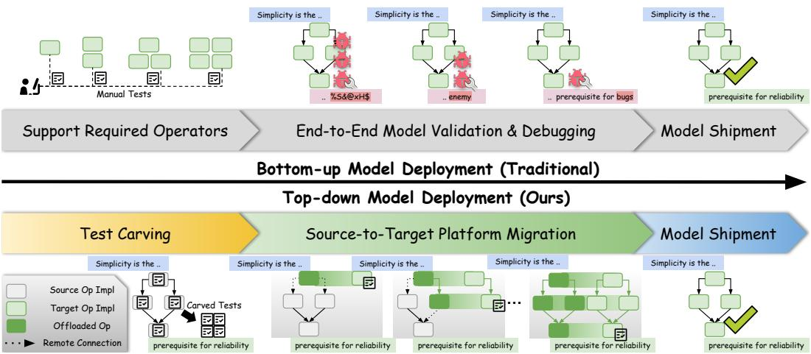  
Fig. 1. Botom-up <sub>v.s.</sub> Top-down approaches to emerging ML system development

The models behind these emerging AI applications do not only run on CUDA functions and NVIDIA servers. Expanding the computing diversity in serving ML models can unlock a broader range of applications and features. For example, serving LLMs within browsers via the WebGPU [15] platform allows for local web agents without compromising data privacy. Likewise, the new “Siri” based on Apple Intelligence [25] depends on the neural processing unit to drive energy-eficient ondevice machine learning. These examples highlight the growing trend of diversifying computation platforms to support next-generation models and applications.

Deploying ML models is hard, and deploying emerging ML models on emerging platforms presents an even greater software development challenge. Beyond implementing the corresponding operators, significant time and energy are required for testing and debugging both individual operators and the whole end-to-end model. To this end, our work focuses on studying and enhancing the productivity of workflows that support these emerging models. We begin by explaining the current model deployment practices, followed by a demonstration of our solution.

<sup>Current</sup> <sup>practice:</sup> <sup>bottom-up</sup> <sup>deployment.</sup> The existing practice of model deployment naturally follows a <sup>bottom-up</sup> pipeline, shown in the top half of Figure 1: <sup>(i)</sup> <sup>“Bottom”:</sup> Developers analyze and implement the missing operator implementations that are required to serve the under-deployment model on the target platform eficiently; and <sup>(ii)</sup> <sup>“Up”:</sup> developers attempt to serve the model using the target-platform operator implementations and test it using end-to-end samples and benchmarks.

However, such a strategy presents challenges in both testing and debugging. In the “bottom” phase, developers typically construct synthetic inputs, resulting in test insuficiency in both quality and quantity, due to the synthetic and unscalable nature of manual testing. Meanwhile, deferring modelwise testing after kernel-wise testing can lead to debugging disasters: When numerical inaccuracy occurs in the integral model testing, fault localization becomes challenging. The error could come from inaccuracy caused by faulty single-operator implementations or propagated precision errors due to the co-functioning of multiple operators. As such, troubleshooting in the large operator space can bring significant mental burdens, slowing down the development process.

We argue that productive deployments of emerging ML require innovations in software methodologies and toolings. As such, we introduce TapML, a <sup>top-down</sup> approach for testing and debugging the deployment of emerging ML systems.

<sup>Our</sup> <sup>top-down</sup> <sup>&</sup> <sup>incremental</sup> <sup>practice.</sup> The bottom half of Figure 1 illustrates the workflow of TapML. First, we perform test carving on the model’s source platform (<sup>i.e.,</sup> already supported mature platforms such as CUDA) by running the model with real-world inputs (<sup>e.g.,</sup> meaningful sentences and images). During the model execution, we automatically instrument intermediate inputs/outputs as test cases to be used for testing operator implementations on the target platform (<sup>i.e.,</sup> the emerging platform to deploy the model). Next, developers support the under-deployed model on the target platform by regarding it as a platform migration task. The migration process starts by serving the compute graph of the model entirely on its source platform (<sup>e.g.,</sup> CUDA). Each time, we implement one operator for the target platform, test it, and update the hybrid compute graph, until the whole graph entirely runs on the target platform. Specifically, we test each target platform operator in two steps: <sup>(i)</sup> test the standalone operator implementation using carved test cases; and <sup>(ii)</sup> test the end-to-end model via an operator ofloading mechanism, <sup>i.e.,</sup> replacing the corresponding source-platform implementation with target-platform implementation in the flow of computation. Such a flow provides an error isolation mechanism where a test failure must be introduced by the operator newly implemented on the target platform. As such, developers can quickly localize the error in a small scope and eagerly debug it while the development context is still fresh. Additionally, emerging platforms typically lack robust developer utilities to support our methodology. Therefore, tooling-wise TapML builds a universal runtime that unifies cross-platform data communication and function calling, which can support hybrid computation graphs during migration and simplifies the testing and debugging on the emerging platform.

We summarize our main contributions as follows:

• <sup>Dimension:</sup> While the optimization and abstraction for ML computation have been well studied in the past decade, we look at the productivity challenge for deploying emerging ML and address this challenge by advancing the software development approach.

• <sup>Methodology:</sup> We propose TapML, a <sup>top-down</sup> approach to deploying emerging ML on emerging platforms. While the traditional <sup>bottom-up</sup> scheme sufers from coarse-grained troubleshooting, TapML automates unit testing by carving tests from executions in mature platforms and adopts a migration-based approach to gradually ofload the computation from the source platform to the target platform via our universal runtime.

• <sup>Implementation:</sup> We implemented a universal runtime to facilitate the practice of the TapML methodology. Our universal runtime currently supports 5 platforms.

• <sup>Study:</sup> TapML has been used as the testing and debugging method behind the MLC-LLM project [39]. Within two years of eforts, we have been applying TapML to deploy 105 emerging models on 5 novel platforms. Based on these experiences, we case study the use of TapML and interesting troubleshooting experiences to facilitate the future development of emerging ML systems.

## 2 CHALLENGES

In this section, we discuss the main challenges in deploying emerging ML systems and why a bottom-up development methodology can be largely optimized.

## 2.1 Motivating Example

Consider the deployment of a Llama model [56] in a browser environment through the WebGPU platform. ML engineers typically approach this deployment in a bottom-up fashion:

(1) <sup>Operator</sup> <sup>analysis:</sup> The very first step is to analyze the model’s operator structure. Models like Llama include complex operators such as embeddings, multi-head attention, root-meansquare layer normalization, and matrix multiplications. In reality, the required implementations can become intricate due to eficiency demands; for instance, matrix multiplication alone may require dozens of specialized variants tailored to scenarios like query-key-value (QKV) and feedforward layers.

(2) <sup>Operator</sup> <sup>implementation:</sup> Once the necessary operators are identified, engineers implement their computational logic on the WebGPU platform using WebGPU Shading Language (WGSL). The computation logic is often inferred from academic papers, online documents, and existing implementations from other platforms.

(3) <sup>Operator-wise</sup> <sup>testing</sup> <sup>&</sup> <sup>debugging:</sup> Each operator implemented in WGSL undergoes targeted testing. Engineers craft test cases according to the operator’s semantics and validate the operator’s accuracy by running these tests across browser platforms with WebGPU support (<sup>e.g.,</sup> Chrome and Safari). Per the testing results, they debug the operator implementation until all tests pass before moving to other operators.

(4) <sup>Model-wise</sup> <sup>testing:</sup> After implementing all operators in WGSL, engineers attempt to reproduce full model execution in the browser by scheduling these WGSL functions according to the model’s data flow. Specifically, for language models like Llama, developers test them by gathering prompts (<sup>e.g.,</sup> from open datasets or developer customization) and observing the output coherence and corresponding metrics. Sometimes, even when individual operators pass, model-wise validation may reveal issues<sup>2</sup>. Common model-wise errors include faulty operator implementation due to insuficient operator-wise testing, accumulated inaccuracies when propagating data across multiple operators, and even platform bugs (<sup>e.g.,</sup> miscompilation or runtime errors), making debugging especially challenging.

In the follow-up subsections, we discuss the inherent limitations of the traditional bottom-up development pipeline.

## 2.2 Test Insuficiency

Complex systems such as ML frameworks require extensive testing to ensure their reliability. For example, 40-42% of the Python and C++ source code of PyTorch [47] and TVM [13] are testing code, as of Q3 2024. While ML frameworks developed comprehensive tests to exercise implementations on mature platforms, setting up emerging models on emerging platforms often sufers from low test coverage due to limited tests and constrained timelines. Meanwhile, manually curating high-quality test cases is labor-intensive for developers. For instance, the WebGPU backend of TensorFlow.js [22] is implemented in 19,530 lines of code, with only 3,549 lines of code attributed to testing. Specifically, most testing codes are dominated by a few common operators such as matrix multiplication and convolution. Furthermore, directly migrating tests from one platform to another is also challenging due to inconsistency in API granularity, interface compatibility, and supported data types.

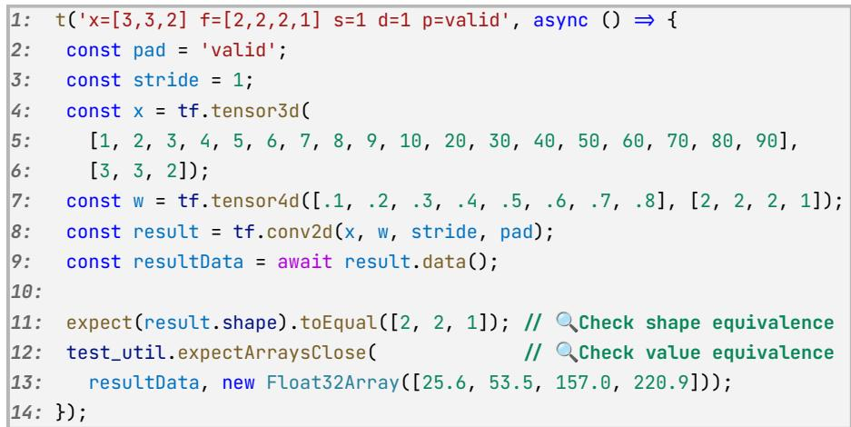  
Fig. 2. Sample unit test in TensorFlow.js.

Figure 2 exemplifies a test case for conv2d in TensorFlow.js. Developers craft the test case by specifying operator attributes (Lines 2-3), input data (Lines 4-7), and the oracle, including the expected output shape (Line 11) and output values (Lines 12-13). It is worth noting from Lines 4-7 that the test inputs are rather synthetic, given the apparent value orders in x and w. Such simplistic test inputs may not represent the distribution of inputs derived from real-world user-given data, whose precision deserves more attention.

## 2.3 Obscure Precision Bugs

Result inconsistency is one of the most challenging and harmful bug symptoms in software engineering. Compared to other fail-stop bugs such as program crashes, debugging result inconsistency is extremely hard as it only presents the error in the final result without associating the intermediate step that introduces the error. Unfortunately, such types of errors can be common in ML due to its heavy use of arithmetic computation (<sup>i.e.,</sup> few operators can trigger crashes) and floating-point numbers. For example, we found the calculation 1035 − 1031 in float16 erroneously leads to a result of 5 on the Qualcomm Hexagon backend.

Furthermore, despite passing operator-wise testing, result inconsistency bugs can still happen and can be even more challenging to debug in the end-to-end model execution. This is because emerging models have increasing complexity and size and incorporate a greater number of operators of various data types. Therefore, the cumulative impact of precision errors becomes more pronounced, and a large debugging scope needs to be checked in order to isolate the error.

Meanwhile, in the bottom-up development pipeline, operator-wise testing and model-wise testing are entirely separated into diferent phases. As such, when debugging model-wise issues, it is challenging for developers to recall related operator-wise debugging contexts. This limitation calls for applying model-wise testing while developing single operators.

## 2.4 Limited Tooling in Arising Systems

The infrastructure stack in mature platforms has been long developed, allowing developers to seamlessly invoke device functions, transfer data between host and device, and so on. In addition, these platforms can also provide ready-to-use debugging tools. For example, the TensorRT [43] ecosystem implements Polygraphy [42], a graph reducer to localize error-inducing sub-graphs.

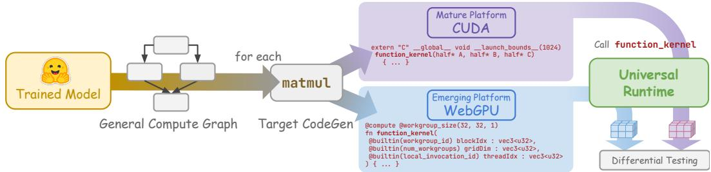  
Fig. 3. The computation representations in the TapML workflow. To deploy a trained model, TapML converts it into a general compute graph, where each operator can be ofloaded to various backends through target code generation.

In contrast, emerging platforms often have limited tooling support, making it challenging for developers to analyze internal computational states—a crucial aspect of debugging. This lack of tools exacerbates existing challenges. Therefore, developing infrastructures and tooling that facilitate developer interaction with these platforms is essential.

## 3 DESIGN OF TAPML

## 3.1 Overview

The goal of deploying a model on a specific platform is to describe the model’s computation using the native program of the target platform. Specifically, Figure 3 illustrates a typical deployment workflow in TapML. The input to the deployment flow is a trained model produced by the training framework (<sup>e.g.,</sup> PyTorch). Subsequently, the trained model is translated by the framework into an internal intermediate representation (IR) that generally describes the semantics of the model. Through a series of general-purpose optimizations, the IR flows to the target code generation stage, which transforms the computation to native programs of the target platform. For example, existing frameworks often specialize the code generation pipeline to CUDA, a mature platform in the NVIDIA ecosystem, and these computations are finally represented by CUDA C functions, shown in the purple box in Figure 3.

We describe the goal and overall steps of TapML using the example of Figure 3. The goal of TapML is to facilitate the process of implementing and testing target code generation of the model operators on the emerging platform, <sup>i.e.,</sup> on WebGPU such that users can run their model on a browser, as is shown in the blue box in Figure 3. To make this happen, in Section 3.2 TapML makes basic assumptions for the deployment framework, including a compute graph abstraction and a reference implementation from a mature platform, <sup>i.e.,</sup> CUDA here. To make testing easy, in Section 3.3, TapML <sup>automatically</sup> creates realistic operator-level tests through test carving, which instruments the execution of each operator on CUDA and collects its input-output pairs as unit tests for the WebGPU support. Specifically, TapML views the deployment process as a migration task: in the very beginning, we have a reliable CUDA implementation (<sup>i.e.,</sup> pure CUDA compute graph) of the model, and we want to eventually run the model fully on WebGPU (<sup>i.e.,</sup> pure WebGPU compute graph). As such, to simplify the mindset, each time we focus on implementing one operator for WebGPU and validate the operator implementation using the automated tests. Furthermore, for correctness, we also want to make sure that after putting in the newly implemented operator, everything still works as previously. Therefore, in Section 3.4, we maintain an initial CUDA compute graph whose corresponding operators are gradually ofloaded to WebGPU once a new WebGPU operator is implemented, and thus, we perform model-wise validation in each step. The gradual ofloading mechanism allows developers to focus on a minimal unit (<sup>i.e.,</sup> one operator) each time, which minimizes the debugging scope, and once it passes model-wise validation, we are confident that it will not bring hidden bugs to further steps. In Section 3.5, TapML also simplifies these procedures through its universal runtime for flexible cross-platform interaction. The universal tooling stack in TapML can easily run remote computation as if locally and exchange useful information (<sup>e.g.,</sup> debugging message) with the target platform.

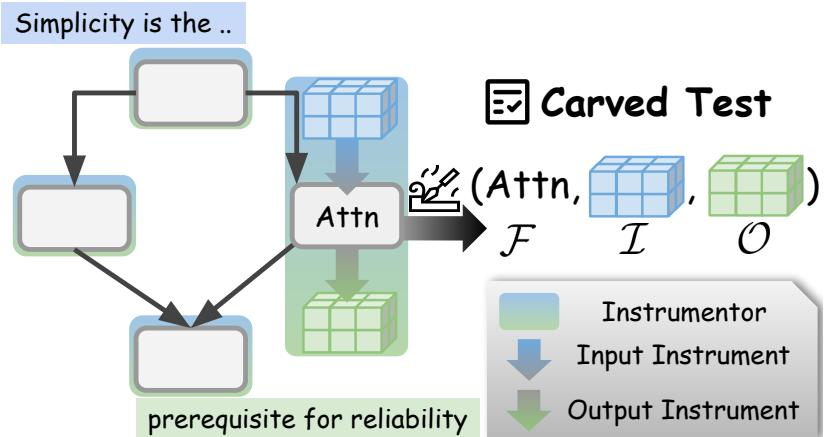  
Fig. 4. Carving intermediate inputs and outputs to a test case.

## 3.2 Prerequisites

While TapML is general, it makes the following lightweight assumptions to the deployment process: <sup>Compute</sup> <sup>graph</sup> <sup>abstraction:</sup> TapML requires the developing system to model ML computation using a compute graph, <sup>i.e.,</sup> a directed graph of tensor operators, each of which transforms a set of input tensors to output tensors. The abstraction of the compute graph allows for straightforward instrumentation of input and output tensors during test carving (in Section 3.3). Viewing an operator as a minimal computation unit also ofers a decent granularity for implementation, validation, and ofloading to the intended platform (in Section 3.4). This assumption is reasonable as the concept of compute graphs has long existed in various major ML frameworks and compilers, such as TensorFlow [1] and PyTorch [47].

<sup>Reference</sup> <sup>implementation:</sup> TapML for test automation depends on a <sup>mature</sup> platform as a reference to cross-check the implementation of the target platform. For example, a mature platform can be the host environment (<sup>e.g.,</sup> x86/x64 CPU) or the NVIDIA ecosystem (<sup>e.g.,</sup> CUDA). These platforms have been engineered for decades, achieving the highest level of coverage and reliability. The assumption is also practical given that CPU and CUDA are the de facto platforms supported by major ML frameworks since the early days.

## 3.3 Test Carving

Test Carving [18] is a technique to automatically extract fine-grained unit tests from a given systemlevel test. The extracted unit tests are used to replay the intermediate behaviors (<sup>e.g.,</sup> individual function calls) that happened during the system test. To achieve this, test carving instruments [24] a system test by recording invocations of desired functions and their corresponding inputs and outputs. By knowing the function, inputs (<sup>e.g.,</sup> arguments and context), and outputs (<sup>i.e.,</sup> test oracle of diferential testing [37]), a test carver synthesizes a unit test to reproduce the expected intermediate step of the system test.

In model deployment, a system test refers to the end-to-end validation of a full model, where the model is given some semantically meaningful inputs (<sup>e.g.,</sup> pictures and sentences) and is expected to produce reasonable end-to-end outputs (<sup>e.g.,</sup> correctly completing a motto). From the high level, TapML carves operator-level unit tests by instrumenting the end-to-end model execution on the source platform, to obtain reliable test inputs and reference outputs. Specifically, Figure 4 illustrates the carving process. First, the original compute graph on the source platform is modified such that each operator F?? is wrapped by an instrumentor, highlighted in the blue-green box. The instrumentation includes two instructions: <sup>(i)</sup> a pre-operator instruction to collect the operator call F and runtime inputs I feed to the instrumented operator; and <sup>(ii)</sup> a post-operator instruction to document the produced output O = F?? (I) as the oracle from the source platform. Hence, each operator per execution forms a unit test as <sup>??</sup> = (F <sup>,</sup> I<sup>,</sup> O) which can be replayed to validate the target-platform implementation. Such a source-to-target cross-checking mechanism also indirectly implements Diferential Testing [37].

Notably, the model-wise inputs for bootstrapping the instrumented system test should be semantically meaningful, <sup>e.g.,</sup> real-world data from the evaluation test set. This is important as it allows developers to focus the precision regression over realistic inputs, whereas synthetic test inputs, though meaningful for defending adversarial attacks [48], are inadequate to validate the numeric precision stability due to the inconsistent distribution of natural inputs, though convenient as it is challenging to specify meaningful high-dimensional embeddings as intermediate inputs.

## 3.4 Gradual Target Ofloading

<sup>TapML</sup> employs the <sup>Gradual</sup> <sup>Target</sup> <sup>Ofloading</sup> mechanism to progressively transfer the compute graph from a standalone host to a standalone target platform. Algorithm 1 details steps of the Gradual Target Ofloading <sub>procedure.</sub> <sub>In</sub> <sub>the</sub> <sub>high</sub> <sub>level,</sub> Gradual Target Ofloading <sub>takes</sub> <sub>a</sub> <sub>source-</sub> platform compute graph M?? as input and migrates it to a target-platform compute graph M?? . Recall Section 3.2 that M?? is a reference implementation from a mature source platform, assumed to be available beforehand. Both M?? and M?? can be initially represented using a general platform agnostic representation shown in Figure 3, but they are specialized to diferent code targets. Specifically, M?? can be defined by a list of operators <sup>F</sup>?? and their topology information G (Line 2). Therefore, to obtain M?? the goal is to transform <sup>F</sup>?? to <sup>F</sup>?? starting from an empty set (Line 3). To start with, we perform test carving (Section 3.3) to get a test suite where each operator maps to its corresponding unit tests (Line 4). For each operator F?? in <sup>F</sup>?? we run following migration steps: <sup>(i)</sup> We draft an initial implementation for F?? on the target platform, <sup>i.e.,</sup> F?? ?? (Line 6); <sup>(ii)</sup> we test and debug the implementation of F?? ?? using the carved tests until the operator-wise validation passes (Lines 8 and 9); <sup>(iii)</sup> after operator validation, we perform model-wise validation over a hybrid compute graph ⟨<sup>F∗,</sup> G⟩, by substituting corresponding parts in <sup>F</sup>?? with implemented target-platform operators, <sup>i.e.,</sup> {<sup>F</sup>?? ∪ {F?? ?? }} (Lines 10 to 12); and <sup>(iv)</sup> lastly we append the tested F?? ?? to M?? to finalize the migration of F?? (Line 13). As such, once all target-platform operators are implemented and tested (<sup>i.e., F</sup>?? ), we wrap up the procedure by returning a compute graph M?? fully supported on the target platform (Lines 14 and 15).

## 3.5 Universal Runtime

As is shown in Figure 3, we need a runtime system to transfer data (<sup>e.g.,</sup> device code and test inputs) and perform diferential testing. To this end, we build a <sup>universal</sup> <sup>runtime</sup> to unify these procedures to facilitate cross-platform data transfer and operation. We argue that it is crucial to unify related behaviors through a standardized interface, which provides a reliable programming model and maximizes code reuse.

<sup>Algorithm</sup> <sup>1:</sup> Gradual Target Ofloading Procedure   
1 <sup>Function</sup> GradualTargetOffloading(M??)<sup>:</sup>   
2 ⟨<sup>F</sup>??<sup>,</sup> G⟩ ← M??   
3 <sup>F</sup>?? ← {}   
4 <sup>T</sup> = {F?? ↦→ T?? ; <sup>??</sup> ∈ 1 · · · ∥<sup>F</sup>?? ∥} ←Carving(M?? )   
5 for <sub>F???? ∈</sub> F<sub>??</sub> do   
6 F?? ?? ← Initial implementation of F??   
7 T?? ← <sup>T</sup>[F?? ]   
8 <sup>while</sup> OpWiseValidation(T??<sup>,</sup> F?? ??) <sup>do</sup>   
9 Debugging F?? ??   
10 <sup>F∗</sup> ← F<sub>????</sub> ↦→ F<sub>??</sub> <sub>??</sub> (<sup>F</sup>?? ); <sup>??</sup> ∈ arg {<sup>F</sup>?? ∪ {F?? ?? }}   
11 <sup>while</sup> ModelWiseValidation(⟨<sup>F∗,</sup> G⟩) <sup>do</sup>   
12 Debugging F?? ??   
13 <sup>F</sup>?? ← <sup>F</sup>?? ∪ {F?? ?? }   
14 M?? ← ⟨<sup>F</sup>?? <sup>,</sup> G⟩   
15 return <sub>M??</sub>   
16 <sup>Function</sup> OpWiseValidation(T <sup>,</sup> F )<sup>:</sup>   
17 for ??<sub>?? ∈</sub> <sub>T</sub> do   
18 ⟨I<sup>,</sup> O⟩ ← <sup>??</sup>??   
19 if F (I) ≠ O then   
20 return <sub>False</sub>   
21 return <sub>True</sub>

```python
1: import tapml as tml
2:
3: def validate(mod: tml.Module, np_inputs: List[np.ndarray]):
4: def run(device):
5: # Locally compile a module for the device platform
6: lib = tml.compile(mod, device)
7: remote_lib = tml.upload(lib) # Upload compiled code
8:
9: # Prepare remote inputs and outputs
10: tml_inputs = [tml.tensor(inp, device) for inp in np_inputs]
11: shape, dtype = mod.output[0].shape, mod.output[0].dtype
12: tml_output = tml.allocate(shape, dtype, device)
13:
14: # Invoke remote function of the decoder block
15: remote_fn = remote_lib.get_function("transformer_block")
16: remote_fn(*tml_inputs, tml_output)
17:
18: # Copy back the remote data to local host and return
19: return tml_output.numpy()
20:
21: np.testing.assert_allclose(run(tml.cuda()), run(tml.webgpu()))
```  
Fig. 5. Sample validation code using TapML APIs.

<sup>Exemplification.</sup> Figure 5 demonstrates the interface via an example of diferential testing on CUDA and WebGPU implementations. Specifically, the tester takes a transformer\_block operator module and a set of computational inputs as the function input (Line 3), based on which we compile the module to both CUDA and WebGPU platforms and perform diferential testing (Line 21). In Line 4, the local function run compiles the transformer\_block module on a given device, returning the results of running the compiled module over the given inputs. More specifically, we first compile the target device code locally (Line 6) and upload the compiled device code to the remote device via tapml.upload (Line 7), which returns a handle (<sup>i.e.,</sup> reference) to the remote library. Next, we convert and transfer the test inputs from the local host to the device platform as tml\_inputs in Line 10. To obtain the output on the device, we also need to allocate space for the output tensor tml\_output in Line 12. As such, in Line 15 and 16 we call the remote device function, which transforms tml\_inputs to tml\_output, which are transferred back to the local host in Line 19 to perform concrete testing.

<sup>Implementation.</sup> The core of the runtime is communication, <sup>i.e.,</sup> how to transfer data and instructions across multiple platforms. Consequently, we developed a lightweight Remote Procedure Call (RPC) framework to manage host-device data transfer and perform device function calling. Additionally, error handling is a critical yet challenging aspect of universal runtime systems. When an error occurs, the runtime is designed to collect error information as much as possible, with complete trackback information, and transmit these debugging messages back to the host before device termination.

## 4 EVALUATION

We evaluate TapML via the following research questions:

• RQ1 (Section 4.2): How is the overall model support progress by using TapML?

• RQ2 (Section 4.3): How TapML improves developer productivity in model debugging?

• RQ3 (Section 4.4): What is the overhead of applying TapML to model deployments?

• RQ4 (Section 4.5): What do the bugs look like when deploying models on emerging platforms? How does the TapML approach help accelerate the troubleshooting process?

• RQ5 (Section 4.6): What are the empirical lessons and best practices of using TapML?

## 4.1 Setup

<sup>Framework.</sup> TapML is built as the testing and debugging methodology and tooling behind the MLC-LLM [39] project, which focuses on native deployment of LLM models on a diverse set of environments across cloud, edge, and emerging platforms like web browsers. Specifically, as MLC-LLM is built on top of Apache TVM [13], an open-source ML compiler infrastructure, our implementation of TapML relies on the TVM framework to perform various operations, such as manipulating models via its compiler intermediate representation [29].

<sup>Platforms.</sup> To demonstrate the versatility and adaptability of TapML across a diverse range of configurations, we evaluate TapML over platforms shown in Table 1. The corresponding hardware selection spans from a GPU-intensive workstation to energy-eficient mobile devices. Furthermore, we consider a rich set of mature and emerging runtime platforms below:

(1) CUDA [35]: A parallel computing platform and application programming interface model <sub>for</sub> NVIDIA GPUs<sub>.</sub>

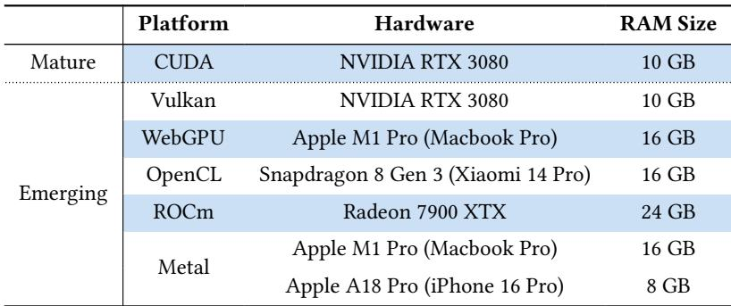  
Table 1. Platforms covered in our experimental setup.

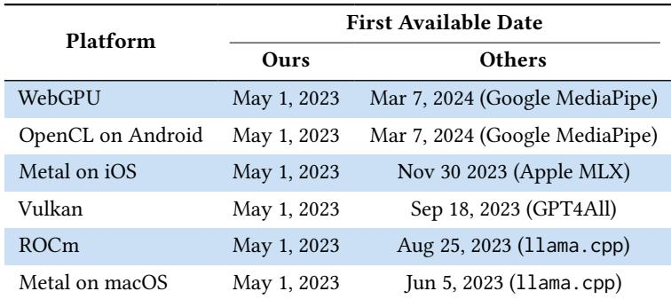  
Table 2. Timeline of emerging platform support availability across frameworks. Our support is up to 10 months earlier than other open-source and industrial teams.

(2) ROCm [4]: An open-source platform by AMD for GPU-accelerated computing, analogous to NVIDIA’s CUDA but for <sup>AMD</sup> <sup>GPUs</sup>. It provides a comprehensive suite of tools and libraries for high-performance, parallel computing applications across various domains.

(3) Metal [6]: Apple’s low-level API for optimizing graphics and parallel computing on <sup>Apple</sup> <sup>ecosystems</sup>. Note that the development setups for iOS-based Metal and macOS-based Metal are quite diferent; yet, we count the two development pipelines as one platform.

(4) WebGPU [15]: A web standard providing cross-platform, low-level graphics and computation APIs and capabilities on <sup>web</sup> <sup>browsers</sup>.

(5) Vulkan [53]: A <sup>cross-platform</sup> graphics and compute API, providing high-eficiency, lowoverhead access to modern GPUs on various devices.

(6) OpenCL [40]: An open and royalty-free standard for <sup>cross-platform</sup> parallel programming of diverse processors found in servers, mobile devices, embedded platforms, etc.

## 4.2 RQ1: Platform and Model Support

<sup>Overview.</sup> Starting in April 2023, based on TapML, we have deployed <sup>105</sup> models of <sup>27</sup> model architectures over <sup>5</sup> emerging platforms, empowering emerging AI applications on mobile phones, browsers, servers, and personal laptops. Meanwhile, to our knowledge, Table 2 shows that we are the first in the open-source community to support such a wide range of emerging platforms. For example, we supported the mobile and browser platforms 10 months ahead of the MediaPipe engine from Google. Furthermore, Table 3 demonstrates our productivity by showing the gap between the model release date and our full-platform support date. Our team typically integrates support for new model architectures within 30 days of release. Longer implementation times generally reflect strategic prioritization decisions due to our small team size rather than technical limitations. It is also worth noting that when we say “support”, it means the model can not only run on our target platforms but also pass our model-wise testing.

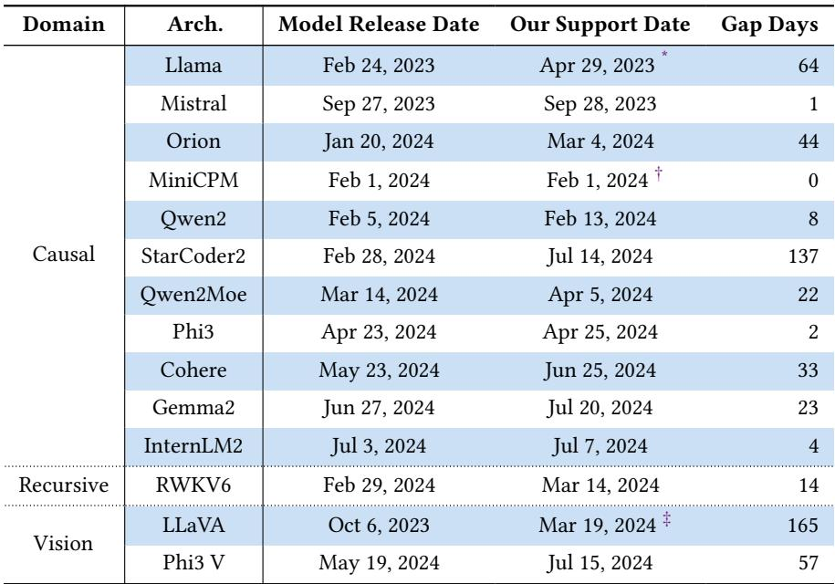  
\* We started building our framework in April 2023, one month after Llama’s release.  
<sup>†</sup> MiniCPM authors supported emerging platforms using our framework at their release.  
We started supporting vision language models in March 2024.  
Table 3: Release and support dates across various model architectures and domains.

<sup>Highlights.</sup> We exemplify a few of our support highlights below:

(1) <sup>The</sup> <sup>first</sup> <sup>LLM</sup> <sup>on</sup> <sup>mobile</sup> <sup>GPUs:</sup> Thanks to TapML, we are the <sup>first</sup> in open source to successfully deploy LLMs on mobile GPUs of Android and iOS devices. By maximizing the eficiency of mobile GPUs via Metal and OpenCL, running large LLMs on mobile phones becomes a possible and decent experience, <sup>e.g.,</sup> running Llama3-8B on Snapdragon 8 Gen 3 at over 10 tokens per second. Our pioneering work motivates the community to develop native and mobile LLM applications without the fear of sacrificing user privacy.

(2) <sup>The</sup> <sup>first</sup> <sup>LLM</sup> <sup>on</sup> <sup>WebGPU:</sup> TapML allows us to be the <sup>first</sup> in public to run LLMs on WebGPU, despite its status as an experimental feature in Chrome at the time of development. Enabling emerging ML on WebGPU is of significant broader impact as it allows everyone to run powerful models as easily as opening a web page. Notably, 10 months after our efort, Google introduced the MediaPipe [36] via LLM Inference API on TensorFlow.js [22] for WebGPU and mobile platforms. We believe TapML approach can complement and speed up the development of these related eforts.

<sub>(3)</sub> The only LLM support on Orange Pi GPU: <sub>To</sub> <sub>date,</sub> <sub>we</sub> <sub>are</sub> <sub>the</sub> only <sub>team</sub> <sub>that</sub> <sub>has</sub> successfully deployed LLMs on the Orange Pi 5 [46], an edge device and embedded system in \$100. Yet, we achieve a practical operational speed of 2.5 tokens per second for running Llama2-7B and 5 tokens per second for RedPajama-3B using the OpenCL APIs to maximize the edge GPU on Orange Pi. This inspires the community to develop afordable LLM applications on edge scenarios.

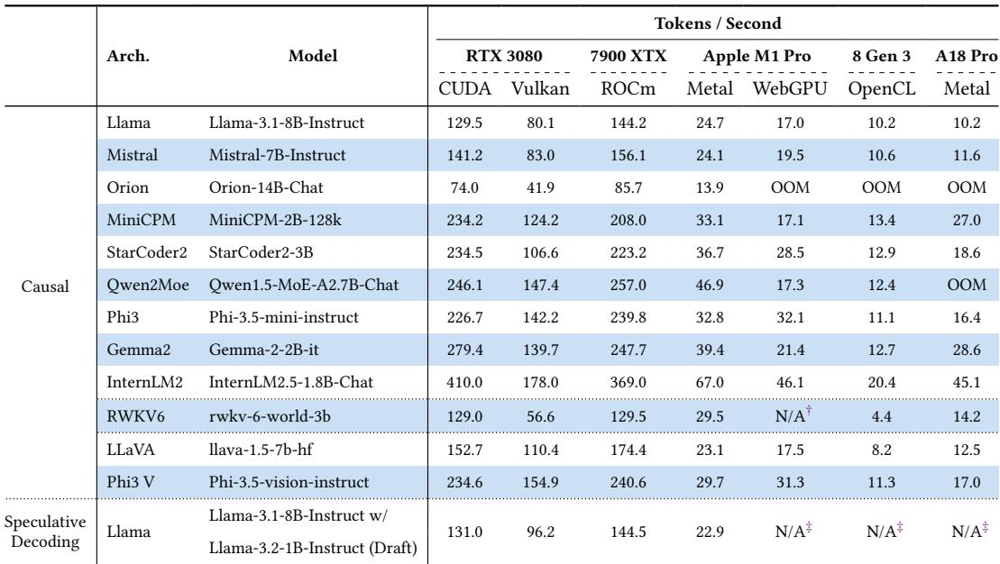  
† RWKV depends on a special tokenizer, which is currently not supported on web.  
<sup>‡</sup> Speculative decoding requires extensive RAM which is not suitable for resource-constrained platforms.  
Table 4: Demonstrating deployment quality by showing the performance of recent models on various backends.

Thanks to the productivity gain brought by TapML, we are able to achieve these highlights and support emerging platforms much earlier than industrial and other open-source teams, despite that we are a team with less than 10 core developers. Through test carving TapML frees developers from writing tedious test cases and ensures the test quality. Meanwhile, the gradual ofloading mechanism in TapML minimizes the mental burden of developers by allowing them to focus on the minimal implementation unit of single operators each time until it is fully validated. Lastly, the universal runtime becomes a huge time saver since interacting with such emerging and under-developed platforms is made as easy as calling Python functions locally.

<sup>Deployment</sup> <sup>quality.</sup> We demonstrate the quality of our model deployments by showcasing their inference eficiency and benchmark accuracy. Table 4 lists the inference performance of recent models we deployed and quantized in 4 bits. This result shows that our swift model supports also come with decent quality by being able to serve these models eficiently, even under resource constrained scenarios. Beyond eficiency, our deployments have undergone rigorous and productive testing with TapML. Table 5 evaluates several recent models deployed by our and other CUDAfocused frameworks using code generation benchmarks, in which these models excel. Specifically, we evaluate them using HumanEval+ [34], a program synthesis benchmark to rigorously test if LLMs can generate functionally correct code. The results show that our deployed models perform comparably, trailing by no more than three tasks relative to the median number of passing tasks achieved by other frameworks’ deployments.

Notably, in the LLM domain, slight result discrepancy can be expected due to the nature of floating-point arithmetic — the exact result depends on the floating-point accuracy (<sup>e.g.,</sup> 16-bit or even lower precisions are commonly used for LLMs) and the detailed computation orders (<sup>e.g.,</sup> <sup>??</sup> + (<sup>??</sup> + <sup>??</sup>) ≠ (<sup>??</sup> + <sup>??</sup>) + <sup>??</sup>) of the implementation. During decoding, minor diferences in decoding probability between two output logits can lead to diferent, but likely valid, tokens being chosen. Furthermore, due to the casual nature of LLMs, one inconsistent token in the context can lead to entirely diferent subsequent sentences.

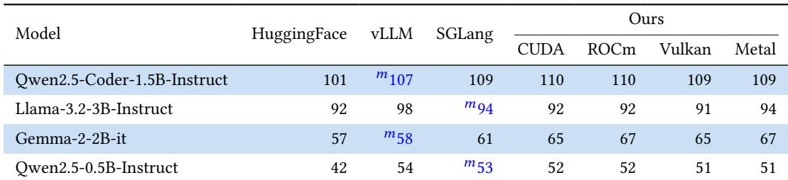  
Table 5. Number of passing HumanEval+ tasks (164 in total) for recent models deployed by our framework and other CUDA-focused frameworks. Our deployments can either outperform (<sub>i.e.,</sub> Gemma-2-2B-it) or match the medium of reference results (highlighted as “ □”) within 3-task discrepancy; yet, the popular HuggingFace transformer library can present a notable discrepancy of nearly 10 tasks (<sub>i.e.,</sub> Qwen2.5-0.5B-Instruct).

## 4.3 RQ2: Productivity Improvements

To evaluate how much TapML can improve developer productivity when debugging model deployments, we designed a controlled experiment using human study to compare TapML and bottom-up methods. In particular, our human study focuses on localizing buggy operators instead of fixing them, because the eficiency of fixing depends on specific expertise and is orthogonal to the deployment methods.

<sup>Evaluation</sup> <sup>setup.</sup> We recruited three volunteers to debug 10 cases, each of which includes <sup>(i)</sup> a real-world model including weights and operator information, <sup>(ii)</sup> a golden CUDA library to run the model, and <sup>(iii)</sup> a buggy Vulkan library with manually injected bugs in the low-level model IR. All of the three participants are Ph.D. students in computer science with over 3 to 6 years of experience in ML system engineering. Each participant is randomly assigned to 3 to 4 cases. For each case, they are asked to localize the list of problematic operators and we record the debugging time and accuracy of debugging outcomes. Specifically, for bottom-up debugging, volunteers construct operator-wise test cases to perform diferential testing over the two libraries. They are allowed to access tools that are available in real-world development scenarios, including but not limited to using search engines and LLMs, and can create reusable scripts and tools to (partially) automate the workflow. For top-down debugging, participants can use the TapML tool set which can automatically perform gradual target ofloading (Section 3.4) over all operators.

<sup>Result</sup> <sup>overview.</sup> Table 6 demonstrates that TapML brings improvements in not only productivity but also quality in debugging. Despite the bottom-up baseline on average costing 31 minutes per model to implement tests to identify bugs, it incurs a false positive rate as high as 58.2% and a false negative rate of 5.5%. In contrast, TapML can quickly localize bugs in one minute with no false negatives and a light false positive rate of 10.3%. It is also worth noting that case #1 took significantly longer than the others because it is the first-time setup from the volunteer with the least experience in the toolchain.

<sup>False</sup> <sup>positives.</sup> The bottom-up approach struggled with a high number of false positives (32 in total across all models), with volunteers frequently reporting non-buggy operators. These false positives are frequent when doing bottom-up debugging for two reasons: <sup>(i)</sup> models are often quantized for eficient deployment and thus sensitive to the numerical distribution of inputs; and <sup>(ii)</sup> in bottom-up testing, developers often use random and unrealistic out-of-domain inputs that are not considered by the quantization. In contrast, the test inputs used in TapML are derived from real-world user inputs to meet the input expectation of model quantization, resulting in only 3 false positives from merely 1 model (<sup>i.e.,</sup> case #6). Nonetheless, TapML is not perfect as it also yields 3 false positives in case #6, which uses a complex Mixture-of-Experts (MoE) model.

Productively Deploying Emerging Models on Emerging Platforms: A Top-Down Approach for Testing and Debugging  
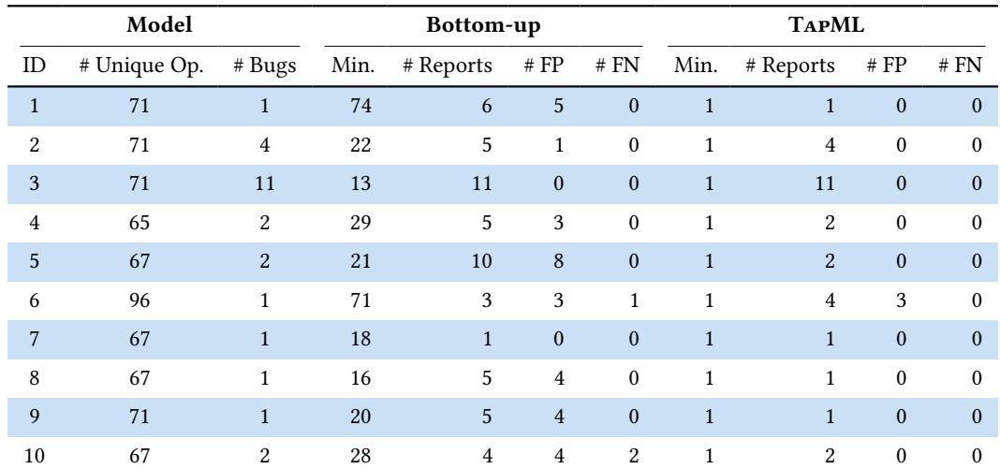  
Table 6. Debugging productivity and quality comparison between traditional botom-up approach and TapML.

<sup>False</sup> <sup>negatives.</sup> The model behind case #10 is an LLM whose Vulkan implementation of paged attention [28] is buggy. These bugs are missed in bottom-up debugging as our volunteers failed to implement tests for the paged attention kernel. Implementing paged attention is challenging as it requires a real-world historical key-value (KV) cache with complex page management. Using random inputs for this kernel usually leads to incompatible configurations and data, crashing the kernel due to API misuse. On the other hand, TapML uses realistic KV caches and configurations derived from the golden library implementation, leading to zero observed false negatives.

Overall, these findings confirm that TapML’s top-down design substantially improves the speed and quality of bug localization, providing developers with precise and actionable information about problematic operators, eliminating the need for extensive manual checking and minimizing the debugging scope.

## 4.4 RQ3: Overhead

We also systematically examine the testing overhead incurred by applying TapML in model deployment, compared to what is necessary. For clarity, we exemplify the overhead analysis using a case study of deploying Llama2-7B on WebGPU, using CUDA as the reference platform. The hardware setup is based on a workstation with an AMD Ryzen 9 5900X CPU and an NVIDIA RTX 3080 GPU. Specifically, Llama2-7B includes 32 decoder blocks; when compiled to the general representation of our base framework, it leads to 456 operator kernels in 18 operator types. Consequently, to support Llama2-7B, we need to implement test 18 operator kernel functions and pass 456 × <sup>??</sup> operator-level tests, where <sup>??</sup> is the number of inference tokens determined by the end-to-end testing prompts.

Table 7 depicts the testing time breakdown of supporting Llama-2 given 6 prefilled token and 1 decoding token. Specifically, the model testing time is dominated by two parts:

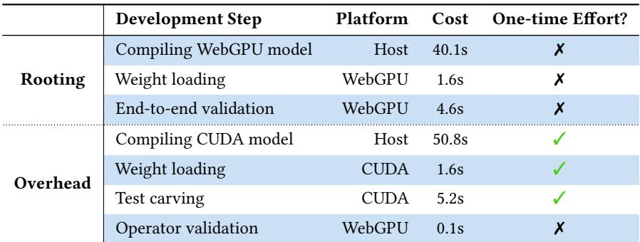  
Table 7. Breakdown TapML testing time, exemplified by deploying Llama2-7B on WebGPU with CUDA reference.

(1) <sup>Rooting</sup> <sup>time:</sup> The time for running a model-wise validation on the target platform (<sup>i.e.,</sup> WebGPU), including compiling the model into WebGPU code (<sup>i.e.,</sup> WGSL), initializing the model on WebGPU, and running the model on WebGPU with model-wise test inputs. These steps are used for end-to-end model validation, which is <sup>indispensable</sup> regardless of the development methods employed. Specifically, the bottleneck comes from model compilation where compiling Llama2-7B fully on WebGPU results in 87% of the end-to-end testing time.

(2) <sup>Overhead</sup> <sup>time:</sup> Besides routine end-to-end validation, TapML additionally requires a full CUDA compute graph for test carving and gradual ofloading. Compiling Llama2-7B on CUDA, loading its weights, and performing test carving are one-time eforts, which in total can cost less than one minute. Furthermore, after implementing each operator, we validate the operator implementation using the carved tests, taking 0.1 seconds on average, which will happen as many times as the number of operator types (<sup>i.e.,</sup> 18 times).

To conclude, the overhead introduced by TapML is negligible compared to the significant improvement of productivity when developing emerging ML systems.

## 4.5 RQ4: Encountered Bugs when Developing Emerging ML Systems

TapML aims to facilitate the model development on various emerging platforms. These nextgen platforms are so new that oftentimes they come with limited ecosystem and test coverage, leading to challenging bugs and sophisticated debugging experience. Consequently, in addition to our technical contribution, we share our concrete experiences of debugging two types of bugs encountered during our development.

<sup>Bugs</sup> <sup>from</sup> <sup>platform</sup> <sup>drivers.</sup> The emergence of new computing platforms often brings with it a degree of instability, including inconsistent or incomplete implementations to its specifications. For instance, our approach led to the discovery of a <sup>confirmed</sup> concurrency bug in Safari, a mature and major browser used by billions of Apple users. We found that one of our WebGPU programs runs flawlessly on Google Chrome but mysteriously produces wrong results on the Technology Preview (Release 188) version of Safari on the same MacBook. Our diagnosis shows that such discrepancies can be attributed to the incomplete WebGPU API support on Safari, such as onSubmittedWorkDone, whose incompleteness leads to a synchronization bug in which unready bufers were accessed. This interesting bug finding highlights the efectiveness of TapML in capturing challenging and subtle bugs in foundational software stacks before its major release, contributing to developer eficiency and software reliability both at once. Furthermore, the base framework by default reuses shared memory bufers of diferent data types, which is okay for CUDA but introduced Vulkan compilation failures as this feature is not permitted by Vulkan’s design. Additionally, WebGPU is subject to varying constraints across diferent devices. For example, when deploying Gemma on WebGPU of the MacOS system, we assumed the maximum number of threads to be the same as that of the native Metal runtime. However, this leads to GPUPipelineError because WebGPU at most allows for 256 threads on Apple Silicon, which is much smaller than our assumed value. Similarly, on the PC end, WebGPU allows for 1024MB maximum storage bufer sizes; however, it is limited to 128MB for mobile devices that over-requesting bufer sizes, leading to an error of “Invalid BindGroup”. <sup>Bugs</sup> <sup>by</sup> <sup>base</sup> <sup>framework.</sup> Our base framework, <sup>i.e.,</sup> TVM, is a compilation-based framework that compiles an ML model from its internal representation into target code. When extending our base framework, a range of issues surfaced, predominantly from compiler errors from both the base and extended parts of the framework. For instance, we observed that our generated Metal code does not perform checks for unaligned data, which leads to incorrect results due to accessing unknown data. Meanwhile, missing instruction support in code generation is a major error type discovered by our carved tests. For example, certain compilation failures were encountered when ofloading a matrix multiplication operator to the Metal platform because of unsupported SIMD instructions, such as the selection instructions. Furthermore, we also encountered performance issues. For example, our Metal code-generation pipeline initially did not support warp-level instructions, such as simd\_shuffle, and therefore, vanilla instructions are used, leading to sub-optimal performance. Meanwhile, we also used to assume an ineficient setting of warp sizes on Apple Silicon devices, leading to undesired processing speed. All of these errors are quickly located, thanks to the test carving and gradual ofloading mechanism in TapML, which isolates the debugging scope to a single operator each time.

Besides errors from system implementations, the rest of the issues pertain to numerical discrepancies that arise during runtime, making them considerably more challenging to pinpoint. For example, we detected numerical errors when running LLMs with int8 quantization on the Metal platform, yet the same quantization method works perfectly on other platforms. To isolate this issue, we leveraged automated unit tests carved from the CUDA implementation of the operators and compared the results with those from the Metal platform. As such, we quickly identified the root cause in the dequantization kernel, where an unexpected conversion from uint8x4 to uint32 was erroneously performed prior to converting to halfx4. The correct procedure should have been a direct conversion from uint8x4 to halfx4. Remarkably, this debugging process was completed within just two hours, showcasing the debuggability of TapML.

The presented cases empirically demonstrated the huge inconsistency and complexity of various platforms, posing significant challenges in model deployment. Nevertheless, the adoption of a top down methodology has significantly enhanced our ability to support emerging models progressively. Initially, our adaptation process could span up to a few months based on a traditional bottom-up flow; however, with refinements to our approach, we have reduced this time to even a single day, regardless of the additional development complexity involved by the new runtime environments or backend systems. This agile response capability underscores the efectiveness of the top-down approach in the dynamic landscape of language model development.

## 4.6 RQ5: Lessons and Best Practices

We present a practical exploration of real-world debugging scenarios, illustrating how the integration of TapML with a top-down methodology can be efectively applied to complex, real-life cases. We showcase two best practices of using TapML, corresponding to our two main sub-techniques. <sup>Best</sup> <sup>practice</sup> <sup>of</sup> <sup>test</sup> <sup>carving:</sup> Debugging runtime numerical errors, particularly those that occur sporadically, presents a significant challenge. Such errors were encountered when developing the

Phi-2 model on Metal, leading to the emergence of NaN outputs. Interestingly, this problem did not happen on CUDA and was only induced when using certain prompts.

To address this, we employed top-down debugging via TapML. By using our test carvers to automatically break down the CUDA Phi-2 model into individual reliable tests, we automatically examine the correctness of the Metal implementation at a granularity of operators, which allowed us to quickly pinpoint the GeLU operator as the source of erroneous output. Further investigation revealed that the root cause was the Metal platform’s numerically unstable fast-math implementation of the tanh function, which could yield NaN values for inputs exceeding 45. We resolved the issue by disabling the fast-math option on the Metal platform, which is replaced by a numerically stable version of the tanh reimplemented by us.

In contrast, a bottom-up strategy for debugging would likely have entailed writing unit tests for each operator, typically with random inputs. Such a method, however, would not always trigger the specific error we encountered as it depends on particular activation values that can be induced by real-life input. Meanwhile, it is also hard to pin down the error in end-to-end integration. Our experience underscores the importance of a targeted, top-down method to isolate and resolve elusive numerical errors in complex computational models.

<sup>Best</sup> <sup>practice</sup> <sup>of</sup> <sup>gradual</sup> <sup>ofloading:</sup> RWKV [49] is an innovative neural network architecture with RNN architecture and Transformer-level performance. Distinct from the prevailing Transformer architectures, RWKV introduces a unique and specialized scan kernel, namely the wkv kernel. This kernel does not lend itself to straightforward representation as a mere aggregation of conventional operators, which requires support from scratch to deploy on nascent platforms.

The gradual target ofloading mechanism in TapML facilitates the deployment by allowing us to focus on individual operators. Initially, we implemented the wkv kernel by describing its IR in our base framework, which is then ofloaded to the target platform, with every else model component maintained on the CUDA platform. As such, we isolate the newly implemented wkv target kernel into the CUDA graph and through end-to-end model validation can fully validate if the new support can tackle real-life inputs. Thanks to the universal runtime, the detailed steps such as data transfer and remote code execution are all done in a Python environment as if locally, largely lowering the programming barrier. Consequently, by using TapML, we become the first and sole team to run RWKV models across a wide range of platforms.

In contrast, a bottom-up scheme would have necessitated the completion of the entire RWKV model before end-to-end testing on the target platform. This could lead to significant challenges in troubleshooting if the eventual integration turns out to be erroneous. Furthermore, the wkv kernel’s dependency on real-world inputs and the state of preceding tokens complicates the creation of unit tests. Given these intricacies, comprehensive end-to-end validation or automatic tests emerge as viable options for progressive model deployment.

## 5 RELATED WORK

## 5.1 Emerging ML Models and Platforms

Machine Learning has demonstrated remarkable capabilities across a variety of tasks. Specifically, Large Language Models [3, 23, 26, 56] have shown proficiency in linguistic tasks by accurately predicting subsequent tokens. Meanwhile, difusion models [11, 12, 45, 50, 52] are adept at producing realistic images and videos in response to textual prompts. However, deploying these models presents significant challenges. They not only require substantial computational resources but also necessitate repeated executions within a single request.

As these models increase in size and complexity, the desire to deploy them broadly, conveniently, and eficiently persists. Major high-performance computing corporations such as NVIDIA, AMD,

Intel, and Google have released cutting-edge AI accelerators. Concurrently, startups like SambaNova, Cerebras, and Tenstorrent are introducing chips with innovative architectures. Additionally, mobile SoCs have incorporated specialized Neural Processing Units (NPUs), <sup>e.g.,</sup> Apple’s Neural Engine and Qualcomm’s Hexagon Tensor Processor.

To close the gap between hardware performance and programmability, open APIs such as Vulkan and OpenCL enable compatibility with diferent GPU types, allowing for the construction of universally deployable models on supported hardware without complicated dependency chains. More recently, WebGPU unlocks the GPU power within web browsers. While these runtimes ofer considerable convenience in production, they also pose development challenges due to the nascent state of their associated development and debugging tools.

At the higher level, several recent frameworks have been developed to catch up with the rapid evolution of models. Examples include vLLM [28], Hugging Face Transformers [61], llama.cpp [21], TensorRT-LLM [44], SGLang [65], and MediaPipe [36]. However, these frameworks often focus on major or specific platforms, <sup>e.g.,</sup> CUDA for NVIDIA GPUs. TapML aims to close the gap by initiating and accelerating the support of underrepresented emerging platforms, to diversify the possible scenarios of ML applications.

## 5.2 Testing and Debugging in ML Systems

Software testing techniques for ML frameworks and compilers have been well studied in recent years to improve their reliability. These approaches mainly focus on fuzzing-oriented [38] solutions to develop interesting test cases and extensive test oracles.

For diverse test generation, recent work has been focusing on generating valid and diverse ML models [16, 32, 33, 54, 59, 60, 62] (<sup>e.g.,</sup> PyTorch programs) or IRs [31, 57]. For example, NNSmith [32] applies a solver-aided approach to define operator constraints and generate valid graphs through SMT solving. TapML does not perform model generation since the model to test (<sup>i.e.,</sup> the model to be deployed) is determined in model deployment.

Besides test model generation, developing test oracles is also crucial. The oracle behind TapML is diferential testing [19, 37], which has often served as the de facto oracle in existing ML system fuzzers [16, 32, 33, 54, 59, 60, 62]. For example, given the same model and model inputs, we run the model computation over diferent settings in terms of platforms (<sup>e.g.,</sup> CPU and GPU), optimization, etc. More recently, novel diferential testing oracles have also been proposed to detect even more bugs. This includes applying translation validation [8] to test ML compiler passes, inferring output equivalence via API relationship [17], and expanding testing scenarios [14, 58, 63].

Debugging techniques have been used in ML system development to accelerate troubleshooting. PolyGraphy [42] is a tool aiming to diagnose a small error-inducing subgraph out of an ONNX model [7] that fails on NVIDIA TensorRT [43], via test input reduction [64]. Specifically, PolyGraphy either performs bisection or linearly removes the top and bottom layers to get smaller sequence models to reproduce the error. However, such a test input reduction mechanism is neither optimal nor eficient, as it assumes the input model to be a sequence that can actually be a graph and requires significant attempts of recompilation and testing. TapML addresses the limitations by directly isolating errors in small minimal subgraphs through a migration-based strategy to implement and test one operator each time.

Last, our paper is closely related to software migration [20]. However, instead of migrating code [41, 66], TapML focuses on platform migration [9, 10, 51] of ML models. Such migration requires correct and eficient model implementation using target-platform languages and runtime. Cross-platform migration is challenging; therefore, the methodology of TapML encourages making the process incremental and the result observable per step to minimize the scope of errors.

## 6 CONCLUSION

TapML aims to address the critical software development challenges posed by the rapid evolution of ML models and the emergence of new computing platforms. By adopting a top-down approach and utilizing the universal runtime, TapML streamlines the deployment process on diverse platforms, significantly enhancing developer productivity. This method, characterized by automated testing and a migration-based strategy, has proven efective in our real-world practice, evidenced by the successful deployment of 105 emerging models across 5 novel platforms. The comprehensive case studies derived from these deployments ofer great insights and best practices for developing ML systems on emerging platforms. Ultimately, we show that the TapML approach accelerates the deployment process while ensuring the quality of emerging models, bridging the gap left by traditional methods and existing frameworks.

## DATA AVAILABILITY

The artifact of this paper is available at https://zenodo.org/records/15117702. The core implementation in TapML has been merged and maintained as part of the MLC-LLM project at https: //github.com/mlc-ai/mlc-llm.

## ACKNOWLEDGEMENT

This project would have been impossible without the open-source eforts of the communities behind Apache TVM and MLC-LLM. Jiawei Liu is supported by a Ph.D. fellowship provided by Amazon.

## REFERENCES

[1] Martín Abadi, Paul Barham, Jianmin Chen, Zhifeng Chen, Andy Davis, Jefrey Dean, Matthieu Devin, Sanjay Ghemawat, Geofrey Irving, Michael Isard, et al. 2016. Tensorflow: A system for large-scale machine learning. In <sup>12th</sup> <sup>USENIX</sup> symposium on operating systems design and implementation (OSDI 16)<sub>.</sub> <sub>265–283.</sub>

[2] Dennis Abts, Garrin Kimmell, Andrew Ling, John Kim, Matt Boyd, Andrew Bitar, Sahil Parmar, Ibrahim Ahmed, Roberto DiCecco, David Han, et al. 2022. A software-defined tensor streaming multiprocessor for large-scale machine <sub>learning.</sub> <sub>In</sub> Proceedings of the 49th Annual International Symposium on Computer Architecture<sub>.</sub> <sub>567–580.</sub>

[3] Josh Achiam, Steven Adler, Sandhini Agarwal, Lama Ahmad, Ilge Akkaya, Florencia Leoni Aleman, Diogo Almeida, Janko Altenschmidt, Sam Altman, Shyamal Anadkat, et al. 2023. Gpt-4 technical report. <sup>arXiv</sup> <sup>preprint</sup> <sup>arXiv:2303.08774</sup> (2023).

[4] AMD. 2024. AMD ROCm Software. https://www.amd.com/en/products/software/rocm.html.

[5] Anthropic. 2024. Introducing Computer Use, a New Claude 3.5 Sonnet, and Claude 3.5 Haiku. https://www.anthropic. com/news/3-5-models-and-computer-use Accessed: 2024-11-01.

[6] Apple. 2024. Metal Overview - Apple Developer. https://developer.apple.com/metal/.

[7] Junjie Bai, Fang Lu, Ke Zhang, et al. 2019. ONNX: Open Neural Network Exchange. https://github.com/onnx/onnx.

[8] Seongwon Bang, Seunghyeon Nam, Inwhan Chun, Ho Young Jhoo, and Juneyoung Lee. 2022. SMT-Based Translation Validation for Machine Learning Compiler. In <sup>Computer</sup> <sup>Aided</sup> <sup>Verification</sup>, Sharon Shoham and Yakir Vizel (Eds.). Springer International Publishing, Cham, 386–407.

[9] Farnaz Behrang and Alessandro Orso. 2018. Automated test migration for mobile apps. In <sup>Proceedings</sup> <sup>of</sup> <sup>the</sup> <sup>40th</sup> International Conference on Software Engineering: Companion Proceeedings<sub>.</sub> <sub>384–385.</sub>

[10] Farnaz Behrang and Alessandro Orso. 2019. Test migration between mobile apps with similar functionality. In <sup>2019</sup> 34th IEEE/ACM International Conference on Automated Software Engineering (ASE)<sub>.</sub> <sub>IEEE,</sub> <sub>54–65</sub>

[11] James Betker, Gabriel Goh, Li Jing, Tim Brooks, Jianfeng Wang, Linjie Li, Long Ouyang, Juntang Zhuang, Joyce Lee, Yufei Guo, et al. 2023. Improving image generation with better captions. <sup>Computer</sup> <sup>Science.</sup> <sup>https://cdn.</sup> <sup>openai.</sup> com/papers/dall-e-3. pdf <sub>2,</sub> <sub>3</sub> <sub>(2023),</sub> <sub>8.</sub>

[12] Andreas Blattmann, Tim Dockhorn, Sumith Kulal, Daniel Mendelevitch, Maciej Kilian, Dominik Lorenz, Yam Levi Zion English, Vikram Voleti, Adam Letts, et al. 2023. Stable video difusion: Scaling latent video difusion models to <sub>large</sub> <sub>datasets.</sub> arXiv preprint arXiv:2311.15127 <sub>(2023).</sub>

[13] Tianqi Chen, Thierry Moreau, Ziheng Jiang, Lianmin Zheng, Eddie Yan, Haichen Shen, Meghan Cowan, Leyuan Wang, Yuwei Hu, Luis Ceze, et al. 2018. TVM: An automated end-to-end optimizing compiler for deep learning. In <sup>13th</sup> USENIX Symposium on Operating Systems Design and Implementation (OSDI 18)<sub>.</sub> <sub>578–594.</sub>

[14] Yanzuo Chen, Yuanyuan Yuan, and Shuai Wang. 2023. OBSan: An Out-Of-Bound Sanitizer to Harden DNN Executables.. <sub>In</sub> NDSS<sub>.</sub>

[15] World Wide Web Consortium. 2024. WebGPU. https://www.w3.org/TR/webgpu

[16] Yinlin Deng, Chunqiu Steven Xia, Haoran Peng, Chenyuan Yang, and Lingming Zhang. 2023. Large language models are zero-shot fuzzers: Fuzzing deep-learning libraries via large language models. In <sup>Proceedings</sup> <sup>of</sup> <sup>the</sup> <sup>32nd</sup> <sup>ACM</sup> SIGSOFT international symposium on software testing and analysis<sub>.</sub> <sub>423–435.</sub>

[17] Yinlin Deng, Chenyuan Yang, Anjiang Wei, and Lingming Zhang. 2022. Fuzzing deep-learning libraries via automated <sub>relational</sub> <sub>api</sub> <sub>inference.</sub> <sub>In</sub> Proceedings of the 30th ACM Joint European Software Engineering Conference and Symposium on the Foundations of Software Engineering<sub>.</sub> <sub>44–56.</sub>

[18] Sebastian Elbaum, Hui Nee Chin, Matthew B Dwyer, and Jonathan Dokulil. 2006. Carving diferential unit test cases <sub>from</sub> <sub>system</sub> <sub>test</sub> <sub>cases.</sub> <sub>In</sub> Proceedings of the 14th ACM SIGSOFT international symposium on Foundations of software engineering<sub>.</sub> <sub>253–264.</sub>

[19] Robert B Evans and Alberto Savoia. 2007. Diferential testing: a new approach to change detection. In <sup>The</sup> <sup>6th</sup> <sup>Joint</sup> Meeting on European software engineering conference and the ACM SIGSOFT Symposium on the Foundations of Software Engineering: Companion Papers<sub>.</sub> <sub>549–552.</sub>

[20] Franck Fleurey, Erwan Breton, Benoit Baudry, Alain Nicolas, and Jean-Marc Jézéquel. 2007. Model-driven engineering <sub>for</sub> <sub>software</sub> <sub>migration</sub> <sub>in</sub> <sub>a</sub> <sub>large</sub> <sub>industrial</sub> <sub>context.</sub> <sub>In</sub> International Conference on Model Driven Engineering Languages <sup>and</sup> <sup>Systems</sup>. Springer, 482–497.

[21] Georgi Gerganov. 2023. llama.cpp. https://github.com/ggerganov/llama.cpp.

[22] Google. 2024. tensorflow/tfjs: A WebGL accelerated JavaScript library for training and deploying ML models. https: //github.com/tensorflow/tfjs.

[23] Suriya Gunasekar, Yi Zhang, Jyoti Aneja, Caio César Teodoro Mendes, Allie Del Giorno, Sivakanth Gopi, Mojan Javaheripi, Piero Kaufmann, Gustavo de Rosa, Olli Saarikivi, et al. 2023. Textbooks Are All You Need. <sup>arXiv</sup> <sup>preprint</sup> arXiv:2306.11644 <sub>(2023).</sub>

[24] JC Huang. 1978. Program instrumentation and software testing. <sup>Computer</sup> 11, 4 (1978), 25–32.

[25] Apple Inc. 2024. Apple Intelligence. https://www.apple.com/apple-intelligence/ Accessed: 2024-11-01.

[26] Albert Q Jiang, Alexandre Sablayrolles, Antoine Roux, Arthur Mensch, Blanche Savary, Chris Bamford, Devendra Singh Chaplot, Diego de las Casas, Emma Bou Hanna, Florian Bressand, et al. 2024. Mixtral of experts. <sup>arXiv</sup> <sup>preprint</sup> arXiv:2401.04088 <sub>(2024).</sub>

[27] Norm Jouppi, George Kurian, Sheng Li, Peter Ma, Rahul Nagarajan, Lifeng Nai, Nishant Patil, Suvinay Subramanian, Andy Swing, Brian Towles, et al. 2023. Tpu v4: An optically reconfigurable supercomputer for machine learning with <sub>hardware</sub> <sub>support</sub> <sub>for</sub> <sub>embeddings.</sub> <sub>In</sub> Proceedings of the 50th Annual International Symposium on Computer Architecture<sub>.</sub> 1–14.

[28] Woosuk Kwon, Zhuohan Li, Siyuan Zhuang, Ying Sheng, Lianmin Zheng, Cody Hao Yu, Joseph Gonzalez, Hao Zhang, and Ion Stoica. 2023. Eficient memory management for large language model serving with pagedattention. In Proceedings of the 29th Symposium on Operating Systems Principles<sub>.</sub> <sub>611–626.</sub>

[29] Ruihang Lai, Junru Shao, Siyuan Feng, Steven Lyubomirsky, Bohan Hou, Wuwei Lin, Zihao Ye, Hongyi Jin, Yuchen Jin, Jiawei Liu, Lesheng Jin, Yaxing Cai, Ziheng Jiang, Yong Wu, Sunghyun Park, Prakalp Srivastava, Jared Roesch, Todd C. Mowry, and Tianqi Chen. 2025. Relax: Composable Abstractions for End-to-End Dynamic Machine Learning. <sub>In</sub> Proceedings of the 30th ACM International Conference on Architectural Support for Programming Languages and <sup>Operating</sup> <sup>Systems,</sup> <sup>Volume</sup> <sup>2</sup> (Rotterdam, Netherlands) <sup>(ASPLOS’25)</sup>. Association for Computing Machinery, New York NY, USA, 998–1013. https://doi.org/10.1145/3676641.3716249

[30] Chris Lattner, Mehdi Amini, Uday Bondhugula, Albert Cohen, Andy Davis, Jacques Pienaar, River Riddle, Tatiana Shpeisman, Nicolas Vasilache, and Oleksandr Zinenko. 2020. MLIR: A compiler infrastructure for the end of Moore’s <sub>law.</sub> arXiv preprint arXiv:2002.11054 <sub>(2020).</sub>

[31] Kuiliang Lin, Xiangpu Song, Yingpei Zeng, and Shanqing Guo. 2023. DeepDifer: Find Deep Learning Compiler Bugs <sub>via</sub> <sub>Priority-guided</sub> <sub>Diferential</sub> <sub>Fuzzing.</sub> <sub>In</sub> 2023 IEEE 23rd International Conference on Software Quality, Reliability, and <sup>Security</sup> <sup>(QRS)</sup>. 616–627. https://doi.org/10.1109/QRS60937.2023.00066

[32] Jiawei Liu, Jinkun Lin, Fabian Rufy, Cheng Tan, Jinyang Li, Aurojit Panda, and Lingming Zhang. 2023. NNSmith: Generating Diverse and Valid Test Cases for Deep Learning Compilers. In <sup>Proceedings</sup> <sup>of</sup> <sup>the</sup> <sup>28th</sup> <sup>ACM</sup> <sup>International</sup> Conference on Architectural Support for Programming Languages and Operating Systems, Volume 2 <sub>(Vancouver,</sub> <sub>BC,</sub> Canada) <sup>(ASPLOS</sup> <sup>2023)</sup>. Association for Computing Machinery, New York, NY, USA, 530–543. https://doi.org/10. 1145/3575693.3575707

[33] Jiawei Liu, Jinjun Peng, Yuyao Wang, and Lingming Zhang. 2023. NeuRI: Diversifying DNN Generation via Inductive <sub>Rule</sub> <sub>Inference.</sub> <sub>In</sub> Proceedings of the 31st ACM Joint European Software Engineering Conference and Symposium on the <sup>Foundations</sup> <sup>of</sup> <sup>Software</sup> <sup>Engineering</sup> (San Francisco, CA, USA) <sup>(ESEC/FSE</sup> <sup>2023)</sup>. Association for Computing Machinery, New York, NY, USA, 657–669. https://doi.org/10.1145/3611643.3616337

[34] Jiawei Liu, Chunqiu Steven Xia, Yuyao Wang, and Lingming Zhang. 2024. Is your code generated by chatgpt reall correct? rigorous evaluation of large language models for code generation. <sup>Advances</sup> <sup>in</sup> <sup>Neural</sup> <sup>Information</sup> <sup>Processing</sup> <sup>Systems</sup> 36 (2024).

[35] David Luebke. 2008. CUDA: Scalable parallel programming for high-performance scientific computing. In <sup>2008</sup> <sup>5th</sup> IEEE international symposium on biomedical imaging: from nano to macro<sub>.</sub> <sub>IEEE,</sub> <sub>836–838.</sub>

[36] Camillo Lugaresi, Jiuqiang Tang, Hadon Nash, Chris McClanahan, Esha Uboweja, Michael Hays, Fan Zhang, Chuo-Ling Chang, Ming Guang Yong, Juhyun Lee, et al. 2019. Mediapipe: A framework for building perception pipelines. <sup>arXiv</sup> preprint arXiv:1906.08172 <sub>(2019).</sub>

[37] William M McKeeman. 1998. Diferential testing for software. <sup>Digital</sup> <sup>Technical</sup> <sup>Journal</sup> 10, 1 (1998), 100–107.

[38] Barton P. Miller, Lars Fredriksen, and Bryan So. 1990. An Empirical Study of the Reliability of UNIX Utilities. <sup>Commun.</sup> <sup>ACM</sup> 33, 12 (dec 1990), 32–44. https://doi.org/10.1145/96267.96279

[39] MLC team. 2023-2025. <sup>MLC-LLM</sup>. https://github.com/mlc-ai/mlc-llm

[40] Aaftab Munshi. 2009. The opencl specification. In <sup>2009</sup> <sup>IEEE</sup> <sup>Hot</sup> <sup>Chips</sup> <sup>21</sup> <sup>Symposium</sup> <sup>(HCS)</sup>. IEEE, 1–314.

[41] Anh Tuan Nguyen, Hoan Anh Nguyen, Tung Thanh Nguyen, and Tien N Nguyen. 2014. Statistical learning approach <sub>for</sub> <sub>mining</sub> <sub>API</sub> <sub>usage</sub> <sub>mappings</sub> <sub>for</sub> <sub>code</sub> <sub>migration.</sub> <sub>In</sub> Proceedings of the 29th ACM/IEEE international conference on Automated software engineering<sub>.</sub> <sub>457–468.</sub>

[42] NVIDIA. [n. d.]. Polygraphy: A Deep Learning Inference Prototyping and Debugging Toolkit. https://github.com NVIDIA/TensorRT/tree/main/tools/Polygraphy

[43] NVIDIA. 2022. <sup>NVIDIA</sup> <sup>TensorRT</sup>. https://developer.nvidia.com/tensorrt

[44] NVIDIA. 2024. <sup>TensorRT-LLM</sup>. https://github.com/NVIDIA/TensorRT-LLM

[45] OpenAI. 2024. <sup>Video</sup> <sup>generation</sup> <sup>models</sup> <sup>as</sup> <sup>world</sup> <sup>simulators</sup>. https://openai.com/research/video-generation-models-asworld-simulators

[46] Orange Pi. 2024. Orange Pi - Orangepi. http://www.orangepi.org/html/hardWare/computerAndMicrocontrollers details/Orange-Pi-5.html.

[47] Adam Paszke, Sam Gross, Francisco Massa, Adam Lerer, James Bradbury, Gregory Chanan, Trevor Killeen, Zeming Lin, Natalia Gimelshein, Luca Antiga, et al. 2019. Pytorch: An imperative style, high-performance deep learning library. Advances in neural information processing systems <sub>32</sub> <sub>(2019),</sub> <sub>8026–8037.</sub>

[48] Kexin Pei, Yinzhi Cao, Junfeng Yang, and Suman Jana. 2017. Deepxplore: Automated whitebox testing of deep learning <sub>systems.</sub> <sub>In</sub> proceedings of the 26th Symposium on Operating Systems Principles<sub>.</sub> <sub>1–18.</sub>

[49] Bo Peng, Eric Alcaide, Quentin Anthony, Alon Albalak, Samuel Arcadinho, Huanqi Cao, Xin Cheng, Michael Chung, Matteo Grella, Kranthi Kiran GV, et al. 2023. RWKV: Reinventing RNNs for the Transformer Era. <sup>arXiv</sup> <sup>preprint</sup> arXiv:2305.13048 <sub>(2023).</sub>

[50] Dustin Podell, Zion English, Kyle Lacey, Andreas Blattmann, Tim Dockhorn, Jonas Müller, Joe Penna, and Robin Rombach. 2023. Sdxl: Improving latent difusion models for high-resolution image synthesis. <sup>arXiv</sup> <sup>preprint</sup> <sup>arXiv:2307.01952</sup> (2023).

[51] Xue Qin, Hao Zhong, and Xiaoyin Wang. 2019. Testmig: Migrating gui test cases from ios to android. In <sup>Proceedings</sup> <sup>of</sup> the 28th ACM SIGSOFT International Symposium on Software Testing and Analysis<sub>.</sub> <sub>284–295.</sub>

[52] Chitwan Saharia, William Chan, Saurabh Saxena, Lala Li, Jay Whang, Emily L Denton, Kamyar Ghasemipour, Raphael Gontijo Lopes, Burcu Karagol Ayan, Tim Salimans, et al. 2022. Photorealistic text-to-image difusion models with deep <sub>language</sub> <sub>understanding.</sub> Advances in Neural Information Processing Systems <sub>35</sub> <sub>(2022),</sub> <sub>36479–36494.</sub>

<sub>[53]</sub> <sub>Graham</sub> <sub>Sellers</sub> <sub>and</sub> <sub>John</sub> <sub>Kessenich.</sub> <sub>2016.</sub> Vulkan programming guide: The oficial guide to learning vulkan<sub>.</sub> <sub>Addison-</sub> Wesley Professional.

[54] Qidong Su, Chuqin Geng, Gennady Pekhimenko, and Xujie Si. 2023. TorchProbe: Fuzzing Dynamic Deep Learning <sub>Compilers.</sub> <sub>In</sub> Asian Symposium on Programming Languages and Systems<sub>.</sub> <sub>Springer,</sub> <sub>310–331.</sub>

[55] Philippe Tillet, Hsiang-Tsung Kung, and David Cox. 2019. Triton: an intermediate language and compiler for tiled <sub>neural</sub> <sub>network</sub> <sub>computations.</sub> <sub>In</sub> Proceedings of the 3rd ACM SIGPLAN International Workshop on Machine Learning and Programming Languages<sub>.</sub> <sub>10–19.</sub>

[56] Hugo Touvron, Louis Martin, Kevin Stone, Peter Albert, Amjad Almahairi, Yasmine Babaei, Nikolay Bashlykov, Soumya Batra, Prajjwal Bhargava, Shruti Bhosale, et al. 2023. Llama 2: Open foundation and fine-tuned chat models. <sup>arXiv</sup> preprint arXiv:2307.09288 <sub>(2023).</sub>

[57] Haoyu Wang, Junjie Chen, Chuyue Xie, Shuang Liu, Zan Wang, Qingchao Shen, and Yingquan Zhao. 2023. MLIRSmith: Random Program Generation for Fuzzing MLIR Compiler Infrastructure. In <sup>2023</sup> <sup>38th</sup> <sup>IEEE/ACM</sup> <sup>International</sup> <sup>Conference</sup> on Automated Software Engineering (ASE)<sub>.</sub> <sub>IEEE,</sub> <sub>1555–1566.</sub>

[58] Jiannan Wang, Thibaud Lutellier, Shangshu Qian, Hung Viet Pham, and Lin Tan. 2022. EAGLE: creating equivalent <sub>graphs</sub> <sub>to</sub> <sub>test</sub> <sub>deep</sub> <sub>learning</sub> <sub>libraries.</sub> <sub>In</sub> Proceedings of the 44th International Conference on Software Engineering<sub>.</sub> 798–810.

[59] Zihan Wang, Pengbo Nie, Xinyuan Miao, Yuting Chen, Chengcheng Wan, Lei Bu, and Jianjun Zhao. 2023. GenCoG: A DSL-Based Approach to Generating Computation Graphs for TVM Testing. In <sup>Proceedings</sup> <sup>of</sup> <sup>the</sup> <sup>32nd</sup> <sup>ACM</sup> <sup>SIGSOFT</sup> International Symposium on Software Testing and Analysis<sub>.</sub> <sub>904–916.</sub>

[60] Anjiang Wei, Yinlin Deng, Chenyuan Yang, and Lingming Zhang. 2022. Free lunch for testing: Fuzzing deep-learning <sub>libraries</sub> <sub>from</sub> <sub>open</sub> <sub>source.</sub> <sub>In</sub> Proceedings of the 44th International Conference on Software Engineering<sub>.</sub> <sub>995–1007.</sub>

[61] Thomas Wolf, Lysandre Debut, Victor Sanh, Julien Chaumond, Clement Delangue, Anthony Moi, Perric Cistac, Clara Ma, Yacine Jernite, Julien Plu, Canwen Xu, Teven Le Scao, Sylvain Gugger, Mariama Drame, Quentin Lhoest, and Alexander M. Rush. 2020. Transformers: State-of-the-Art Natural Language Processing. Association for Computationa Linguistics, 38–45. https://www.aclweb.org/anthology/2020.emnlp-demos.6

[62] Danning Xie, Yitong Li, Mijung Kim, Hung Viet Pham, Lin Tan, Xiangyu Zhang, and Michael W. Godfrey. 2022. DocTer: Documentation-Guided Fuzzing for Testing Deep Learning API Functions. In <sup>Proceedings</sup> <sup>of</sup> <sup>the</sup> <sup>31st</sup> <sup>ACM</sup> SIGSOFT International Symposium on Software Testing and Analysis <sub>(Virtual,</sub> <sub>South</sub> <sub>Korea)</sub> (ISSTA 2022)<sub>.</sub> <sub>Association</sub> <sub>for</sub> Computing Machinery, New York, NY, USA, 176–188. https://doi.org/10.1145/3533767.3534220

[63] Chenyuan Yang, Yinlin Deng, Jiayi Yao, Yuxing Tu, Hanchi Li, and Lingming Zhang. 2023. Fuzzing automatic <sub>diferentiation</sub> <sub>in</sub> <sub>deep-learning</sub> <sub>libraries.</sub> <sub>In</sub> 2023 IEEE/ACM 45th International Conference on Software Engineering <sup>(ICSE)</sup>. IEEE, 1174–1186.

[64] Andreas Zeller and Ralf Hildebrandt. 2002. Simplifying and isolating failure-inducing input. <sup>IEEE</sup> <sup>Transactions</sup> <sup>on</sup> Software Engineering 28, 2 (2002), 183–200.

[65] Lianmin Zheng, Liangsheng Yin, Zhiqiang Xie, Jef Huang, Chuyue Sun, Cody Hao Yu, Shiyi Cao, Christos Kozyrakis, Ion Stoica, Joseph E Gonzalez, et al. 2023. Eficiently programming large language models using sglang. <sup>arXiv</sup> <sup>e-prints</sup> (2023), arXiv–2312.

[66] Hao Zhong, Suresh Thummalapenta, Tao Xie, Lu Zhang, and Qing Wang. 2010. Mining API mapping for language <sub>migration.</sub> <sub>In</sub> Proceedings of the 32nd ACM/IEEE International Conference on Software Engineering-Volume 1<sub>.</sub> <sub>195–204.</sub>