# FLASHINFER: EFFICIENT AND CUSTOMIZABLE ATTENTION ENGINE FOR LLM INFERENCE SERVING

Zihao Ye <sup>\*</sup> <sup>1</sup> <sup>2</sup> Lequn Chen <sup>3</sup> Ruihang Lai <sup>4</sup> Wuwei Lin <sup>2</sup> Yineng Zhang <sup>5</sup> Stephanie Wang <sup>1</sup> Tianqi Chen <sup>2</sup> <sup>4</sup> Baris Kasikci <sup>1</sup> Vinod Grover <sup>2</sup> Arvind Krishnamurthy <sup>1</sup> Luis Ceze <sup>1</sup> <sup>2</sup>

## ABSTRACT

Transformers, driven by attention mechanisms, form the foundation of large language models (LLMs). As these models scale up, efficient GPU attention kernels become essential for high-throughput and low-latency inference. Diverse LLM applications demand flexible and high-performance attention solutions. We present FlashInfer: a customizable and efficient attention engine for LLM serving. FlashInfer tackles KV-cache storage heterogeneity using block-sparse format and composable formats to optimize memory access and reduce redundancy. It also offers a customizable attention template, enabling adaptation to various settings through Just-In-Time (JIT) compilation. Additionally, FlashInfer’s load-balanced scheduling algorithm adjusts to dynamism of user requests while maintaining compatibility with CUDAGraph which requires static configuration. FlashInfer have been integrated into leading LLM serving frameworks like SGLang, vLLM and MLC-Engine. Comprehensive kernel-level and end-to-end evaluations demonstrate FlashInfer’s ability to significantly boost kernel performance across diverse inference scenarios: compared to state-of-the-art LLM serving solutions, FlashInfer achieve 29-69% inter-token-latency reduction compared to compiler backends for LLM serving benchmark, 28-30% latency reduction for long-context inference, and 13-17% speedup for LLM serving with parallel generation.

Project page: http://flashinfer.ai

## 1 INTRODUCTION

The Transformer architecture has become the primary backbone for large language models (LLMs), prominently featuring attention mechanism (Vaswani et al., 2017) as its most salient component. As LLMs rapidly evolve and find applications in diverse fields, the demand for efficient GPU attention kernels grows, with the goal of enabling scalable and responsive model inference. At the heart of LLM inference lies the attention computation, which plays a crucial role in processing historical context and generating outputs based on query vectors. In LLM serving, the attention mechanism reads from the KV cache, which stores historical context, and computes outputs based on the current query. The efficiency of this attention operator is paramount to the overall performance of an LLM inference systems. However, creating high-performance attention kernels tailored for LLM serving introduces challenges not typically encountered in traditional training environments.

Two major challenges arise when building efficient attention support for LLM systems:

LLM applications exhibit diverse workload patterns and input dynamics. LLM serving involves various attention computation patterns, from prefill computation for context processing to batched decoding during serving (Yu et al., 2022). As multiple requests are processed, opportunities for prefix-reuse emerge, and the introduction of tree decoding in speculative scenarios creates additional attention patterns (Cai et al., 2024; Miao et al., 2024; Chen et al., 2024). Moreover, query lengths and KV caches vary within batches and over time, naive implementation might suffer load-imbalance issue, optimal scheduling requiring kernel to adapt dynamically for optimal performance.

Modern hardware implementations necessitate the customization of attention operators. On the memory side, efficient storage formats, such as paged attention (Kwon et al., 2023) and radix trees (Zheng et al., 2023b), are critical for managing the growing KV cache sizes and diverse storage patterns. On the compute side, crafting hardware-specific pipelines and templates is indispensable to fully exploit the performance potential of each GPU architecture (Dao, 2023;

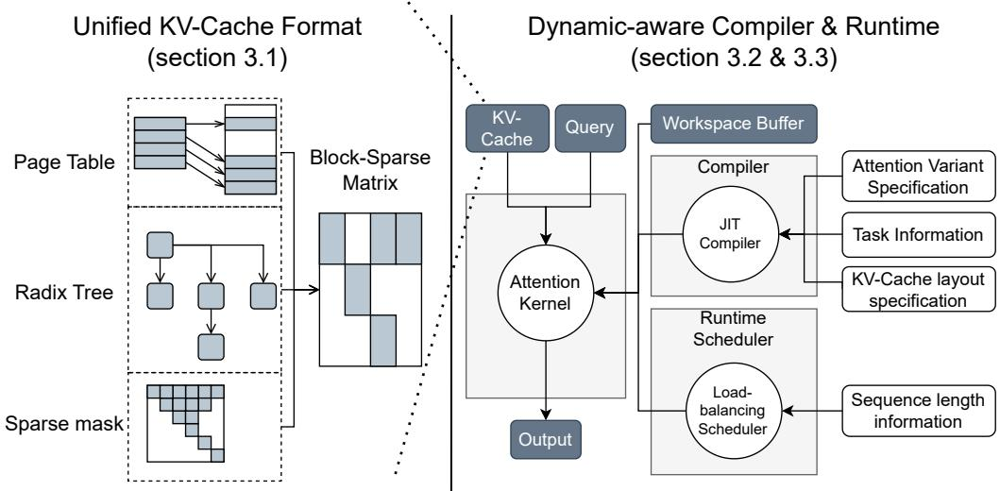  
Figure 1. Overview of the FlashInfer system design: Attention variant specifications, task information and KV-cache layout specifics are provided at compile time for JIT compilation, while sequence length information is input at runtime for dynamic scheduling.

Shah et al., 2024). Furthermore, the design must accommodate the increasing variety of attention mechanisms in modern LLMs, such as grouped attention heads (Ainslie et al., 2023; Shazeer, 2019), specialized masks (Beltagy et al., 2020), and customized attention score computations (Rivière et al., 2024; xAI, 2023; Ramapuram et al., 2024), necessitating flexible and scalable implementation strategies.

The combined complexity of workload diversity and hardware heterogeneity complicates the development of a comprehensive attention solution. Currently, each system implements a specialized attention solution based on a subset of these characteristics, leading to high maintenance overhead and potential inefficiencies. To address these challenges, we introduce FlashInfer, a code-generation based attention engine designed to accelerate attention computation in LLMs. Our approach incorporates several key designs:

FlashInfer utilizes a block-sparse format to tackle KV-Cache storage heterogeneity. This format serves as a unified data structure for various KV-Cache configurations, with adjustable block sizes allowing fine-grained sparsity, such as vector-level sparsity (Chen et al., 2021; Li et al., 2022). This approach unifies diverse KV-Cache patterns and enhances memory access efficiency.

A customizable attention template supports different attention variants in FlashInfer. FlashInfer provides a customizable programming interface for users to implement their attention variants. FlashInfer uses Just-In-Time (JIT) compilation to translate these variants into highly optimized block-sparse implementations, ensuring rapid adaptation to varying attention configurations.

FlashInfer employs a dynamic load-balanced scheduling framework to handle input dynamism effectively. It separates compile-time tile size selection from runtime scheduling, offering lightweight APIs that adaptively manage scheduling with changing KV-Cache lengths during inference, while maintaining compatibility with CUDA-Graph’s requirement for constant configurations (Gray, 2019; Nguyen et al., 2021).

Figure 1 depicts our system design. We evaluated Flash-Infer’ performance across standard LLM serving environments and innovative scenarios, including prefix sharing and speculative decoding. FlashInfer have been integrated with mainstream LLM serving engines, including vLLM (Kwon et al., 2023), MLC-Engine (MLC Community, 2024; Lai et al., 2023), and SGLang (Zheng et al., 2023b), we assessed its impact on end-to-end latency and throughput improvements, showing significant enhancements on standard LLM serving benchmarks and novel applications such as longcontext inference and parallel generation.

## Our contributions include:

• Introduction of flexible block-sparse and composable formats addressing KV-Cache storage heterogeneity for efficient memory management and access.

• Development of a customizable attention template accommodating diverse attention variants, ensuring highperformance execution via JIT compilation.

• Design of a dynamic scheduling framework managing input dynamism while remaining compatible with CUDAGraph, maximizing hardware utilization.

• Comprehensive evaluation demonstrating substantial improvements in kernel and end-to-end performance.

## 2 BACKGROUND

## 2.1 FlashAttention

FlashAttention (Dao et al., 2022) is an efficient algorithm for computing exact attention with reduced memory usage. During the forward pass, it employs the online-softmax trick (Milakov & Gimelshein, 2018), updating attention outputs on-the-fly using a constant amount of on-chip memory, thus avoiding materializing the attention matrix in GPU global memory. FlashAttention2&3 (Dao, 2023; Shah et al., 2024) improve performance by optimizing loop ordering and pipeline design for Ampere and Hopper GPUs. FlashInfer builds upon these advancements.

The operational intensity of FlashAttention is given by O <sup>1</sup>1/l<sub>qo</sub>+1/l<sub>kv</sub> <sup></sup>, where l<sub>qo</sub> and l<sub>kv</sub> are the query and keyvalue cache lengths, respectively. In LLM serving, the query length is either equal to (prefill) or smaller than (decode/incremental prefill) the key-value cache length, simplifying the operational intensity to O(l<sub>qo</sub>). Techniques like batching (Yu et al., 2022) do not alter this operational intensity. Multi-Query Attention (MQA) (Shazeer, 2019) and Grouped Query Attention (GQA) (Ainslie et al., 2023) optimize the KV-Cache size by grouping queries and sharing the same KV-Cache entries. The ratio of the number of queries to the number of KV-Cache entries is denoted as the group size g = H<sub>kv</sub> H<sub>qo</sub> , enhancing operational intensity to O(g · l<sub>qo</sub>).

## 2.2 Attention Composition

Block-Parallel Transformer (BPT) (Liu & Abbeel, 2023) demonstrates that attention outputs for the same query and different keys/values can be composed by preserving both the attention outputs and their scales. Let q be a query, and let I be an index set. We define the attention scale over I via the log-sum-exp operation on the attention scores:

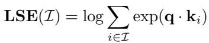

(1)

where k<sub>i</sub> is the i-th key vector. The corresponding attention output O(I) is then

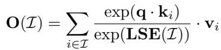

(2)

We define the Attention State for I as the tuple of attention O(I)   
output and attention scale: . Crucially, the At-LSE(I)   
tention State of I ∪ J can be derived by composing the   
states of I and J . Specifically, introducing an operator ⊕:

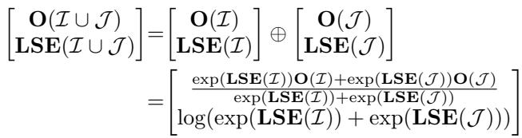

Since ⊕ is associative and commutative, multiple sets of attention states can be composed in any order. Ring-Attention (Liu et al., 2023) and Flash-Decoding (Dao et al., 2023) utilize this property to offload partial-attention computations, thereby reducing memory usage and improving hardware efficiency. In FlashInfer, the Attention State is adopted as the canonical output of an attention operation, and ⊕ serves as the standard reduction operator (analogous to summation in GEMM) on these states.

## 2.3 Block/Vector Sparsity

Block Compressed Sparse Row (BSR) is a hardwareefficient sparse format that groups non-zero elements into contiguous matrices of size (b<sub>r</sub>, b<sub>c</sub>), as opposed to the random scattering found in unstructured sparsity. This format offers several advantages over the standard Compressed Sparse Row (CSR) format. BSR improves register reuse efficiency (Im et al., 2004; Buluç et al., 2009) and demonstrates better compatibility with hardware matrix multiplication units on GPUs and NPUs (Narang et al., 2017; Gray et al., 2017). In addition, it provides the ability to skip empty blocks, reducing computational overhead. BSR’s efficiency is particularly evident when subcomputations are aligned with hardware matrix multiplication instructions, such as NVIDIA’s mma instructions. Traditionally, tensor core instructions operate on minimal dimensions of 16 (or larger for newer GPUs), leading most block-sparse kernels to use block sizes that are multiples of (16, 16). However, this approach is not always optimal for applications with fine-grained sparsity patterns (Wang et al., 2023). Many attention libraries restrict their block sizes to multiples of (128, 128) for block-sparse attention kernels.

Recent research (Chen et al., 2021; Li et al., 2022) has demonstrated that efficient utilization of the tensor core can be achieved with smaller block sizes, such as (16, 1) for matrix B in GEMM, or (1, 16) for matrix A (also known as vector-sparse). This is accomplished by first gathering rows/- columns into contiguous shared memory and then applying dense tensor cores to these contiguous shared-memory data. This approach is particularly beneficial for applications with fine-grained sparsity patterns. FlashInfer builds upon these techniques to support blocks with arbitrary column sizes B<sub>c</sub>, offering greater flexibility and efficiency in handling diverse sparsity patterns.

## 3 DESIGN

In this section, we introduce the system design of FlashInfer. We begin by presenting the data structure employed in Flash-Infer and demonstrate how Block-Sparse Row (BSR) acts as a versatile abstraction for KV cache storage in attention kernels. Next, we discuss the FlashInfer compiler, which supports various attention variants, alongside a dynamic-aware runtime scheduler that facilitates load-balanced scheduling of attention kernels. Finally, we describe the user-level API designed for integrating FlashInfer with existing LLM serving systems.

## 3.1 KV-Cache Storage

## 3.1.1 Block-Sparse Matrix as Unified Format

Recent advancements in KV-Cache storage, such as PageAttention (Kwon et al., 2023) and RadixAttention (Zheng et al., 2023b), employ non-contiguous memory storage with a minimum granularity of a block (or token) of (H, D) tensors, where H represents the number of heads and D the hidden dimension. These structures are optimized to minimize memory fragmentation while enhancing memory reuse and cache hit rates. We demonstrate that these diverse data structures can be unified under a block sparse format, as illustrated in Figure 2.

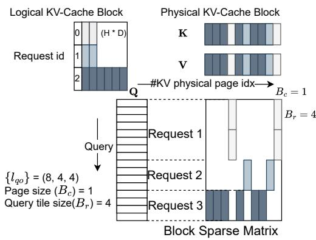  
Figure 2. Representation of Page Table in BSR (B<sub>r</sub> = 4, B<sub>c</sub> = 1) format. The number of column blocks in the block sparse matrix corresponds to the total number of blocks allocated for the Page Table. Non-zero blocks represent KV-Cache pages accessed by queries.

The conceptual equivalence between page tables and sparse matrices has been previously explored in SPGrid (Setalur et al., 2014), which leverages Translation Lookaside Buffer (TLB) hardware for efficient sparse structure indexing. Beyond page tables and radix trees, sparse matrices can also effectively represent various attention mechanisms, such as Tree Attentions used in speculative decoding (Cai et al.,

2024; Miao et al., 2024; Chen et al., 2024) and importance masks applied to KV-Cache (Tang et al., 2024).

In FlashInfer, we implement a unified strategy for data representation. Query and output matrices are efficiently stored as ragged tensors (also known as jagged arrays) (Tensorflow Developers, 2018) without padding, which facilitates the compact packing of queries and outputs from diverse requests into a single tensor. Initially, keys and values are maintained in ragged tensors using the same index pointers as queries, as they originate from the projection matrices W<sub>q</sub>, W<sub>k</sub>, W<sub>v</sub> applied to the same input. These keys and values are subsequently incorporated into the KV-Cache with newly updated entries. The KV-Cache employs a blocksparse row (BSR) format, where block sizes are defined by application requirements: B<sub>r</sub> corresponds to the query tile size, details of which will be discussed in later sections, and B<sub>c</sub> is specified by KV-Cache management algorithms. FlashInfer kernel implementations supports arbitrary (B , B ) values.

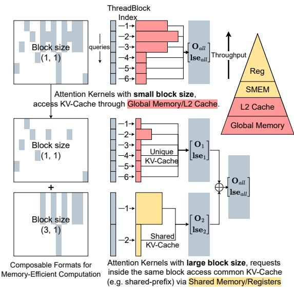  
Figure 3. Composable formats for shared-prefix decomposition in attention computation. The queries corresponding to the first 6 rows have a shared prefix, as do the queries in the last 6 rows. We store the KV cache corresponding to the shared prefix in a block sparse matrix with a block size of (3, 1), while storing the remaining unique KV cache in another block sparse matrix with a block size of (1, 1). For block size (3, 1), 3 queries can share the same KV cache in high-bandwidth shared memory, while for block size (1, 1), each query access KV-Cache within its own threadblock, which can only go through low-bandwidth global memory or L2 cache.

## 3.1.2 Composable Formats for Memory Efficiency

Inspired by SparseTIR (Ye et al., 2023), we enhance attention computation efficiency through composable formats.

This approach leverages multiple block sparse formats instead of a single format to store the sparse matrix, offering greater flexibility and memory efficiency. Single blocksparse formats are constrained by a fixed block size, limiting memory efficiency based on the number of rows in the block (B<sub>r</sub>). While larger B<sub>r</sub> values improve shared memory and register reuse for requests within the same block, they also increase fragmentation. Conversely, requests in different blocks cannot access each other’s shared memory.

Our composable format design allows for the decomposition of the KV cache sparse matrix based on prior knowledge. For instance, if certain requests share a prefix, the corresponding rows and columns in the KV cache form a dense submatrix. We can then use a block sparse matrix with a larger B to store these submatrices efficiently. Figure 3 illustrates this concept, showing how shared prefixes can be optimized using composable formats. This approach doesn’t require data movement in the KV cache; instead, we compute the indices and index pointer arrays for the sparse submatrices. Attention computations on larger block sizes can access shared KV cache entries using fast shared memory and registers, significantly improving memory efficiency.

## 3.2 Compute Abstraction

We developed CUDA/CUTLASS (Thakkar et al., 2023) templates for FlashAttention, designed specifically for both dense and block-sparse matrices and compatible with NVIDIA GPU architectures from Turing to Hopper (sm75 to sm90a). Our implementations utilize the FlashAttention2 (FA2 for short) algorithm (Dao, 2023) for architectures up to Ada(sm89), and the FlashAttention3 (FA3 for short) algorithm (Shah et al., 2024) for Hopper. Key improvements include enhanced loading of sparse tiles into shared memory, expanded tile-size configurations, optimized memory access patterns for grouped query attention, and customizable attention variants.

## 3.2.1 Global to Shared Memory Data Movement

The FlashInfer attention template supports any block size, requiring a specialized data loading approach since blocks may not align with tensor core shapes. As discussed in Section 2.3, we address these challenges by transferring tiles from scattered global memory to contiguous shared memory for dense tensor core operations. Tensor core inputs for a single MMA instruction can originate from different blocks within a block-sparse matrix. Figure 4 illustrates how FlashInfer loads tiles from sparse/dense KV-Cache into shared memory; sparse KV-Cache addresses are computed using the indices arrays of the BSR matrix, while dense ones use row index affine transformations.

The last dimension of the KV-Cache remains contiguous<sub>< -</sub> (with size of head dimension d, commonly 128 or 256), maintaining coalesced memory access that fits GPU cache line sizes. We use asynchronous copy instructions LDGSTS with a 128B width to maximize memory bandwidth. Although the Tensor Memory Accelerator (TMA) in Hopper architecture can further accelerate data movement, it doesn’t support non-affine memory access patterns. Consequently, we only use TMA for contiguous KV-Cache on Hopper GPUs and fall back to Ampere-style asynchronous copies for other settings where TMA isn’t suitable.

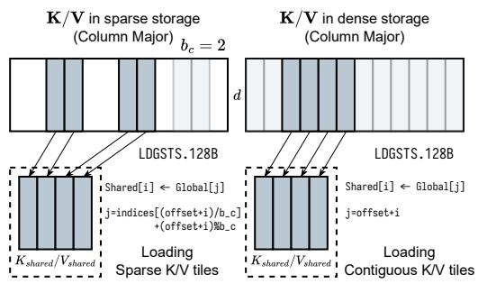  
Figure 4. Data transfer from global to shared memory for sparse/- dense KV-Cache in FlashInfer. Left: Sparse KV-Cache with b<sub>c</sub> = 2; Right: Dense KV-Cache. Head dimension d.

Post-transfer to shared memory, the sparse and dense FlashAttention implementations converge, allowing consistent kernel usage with variations only in data loading modules.

## 3.2.2 Microkernel with Different Tile Sizes

To adapt to the varying operational intensities of LLM applications, FlashInfer implements the FA2 algorithm across multiple sizes. Traditional FA2 uses limited number of tile sizes (e.g., (128, 64)), optimal for prefill on A100 but inefficient for shorter-query-length decoding. One architecture’s ideal tile size may not suit others; for instance, Ada(sm89) has limited shared memory, affecting SM occupancy with large tiles.

FlashInfer offers FA2 kernels with tile sizes (1, 16, 32, 64, 128) × (32, 64, 128) and selects using heuristics based on hardware resources and workload intensity:

1. Determine average query length (for Grouped-Query Attention, the query length are fused with head group dimension, see Appendix A) per batch, choosing the minimal query tile size meeting or exceeding it.

2. Formulate register and shared memory constraints as functions of K/V tile size, maximizing SM resource occupancy.

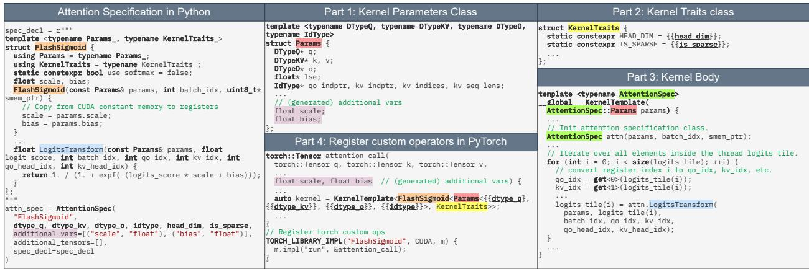  
Figure 5. JIT compiler for attention variants in FlashInfer, featuring CUDA code strings defining variant functors, additional variables/tensors, and data types, used to populate kernel templates. Corresponding codes share highlighting.

## 3.2.3 JIT Compiler for Attention Variants

For query tile size 1, we use CUDA Cores template since tensor core instruction m (minimum rows) is 16, and use Tensor Cores for other query tile sizes. For FA3 we provides row tile sizes that are multiples of 64, aligning with Hopper’s WGMMA requirements. Tile sizes resolve at compile-time considering task specifics (decoding, prefill, etc.) and hardware capabilities. The block row size B<sub>r</sub> is block-sparse matrix is aligned with the query tile size T<sub>q</sub>.

Recent LLM models use variants to standard attention algorithms. Supporting various attention variants in CUDA library is not sustainable because the we specialize the kernel for each variant for maximum performance, and the number of variants is growing rapidly. However, most attention variants have similar structure to the vanilla attention so we can use the same skeleton of FlashAttention kernels with small modifications. Inspired by FlexAttention (He et al., 2024), we designed a customizable CUDA template and a JIT compiler that takes the attention variant specification as input and generates the optimized kernel code. The variant specification includes the following functors:

• QueryTransform, KeyTransform, ValueTransform: The transformation applied to the query/key/value tensor before the attention computation.

• OutputTransform: The transformation applied to the attention output tensor before returning.

• LogitsTransform, LogitsMask: The transformation applied to the logits tensor before the softmax computation, and the mask applied to the logits tensor.

Each functor has a fixed signature that takes the kernel parameters, input and current query/key/head index as input, and returns the output. Those variant functions are specified as member of a user-defined variant class which creates a closure for the variant functors. Functors such as LogitsTransform and LogitsMask are inspired by FlexAttention (He et al., 2024) and can be used to implement the attention variants with customized logits postprocessing such as custom mask, logits soft-cap (Rivière et al., 2024; xAI, 2023) and sliding window attention (Beltagy et al., 2020). FlashInfer has an option of using softmax or not in the attention variant specification, which makes it capable of supporting attention variants that don’t use softmax, such as FlashSigmoid (Ramapuram et al., 2024). FlashInfer’s query and key transformation functors making it possible to fuse normalization, RoPE (Su et al., 2024) and projection (DeepSeek-AI et al., 2024) into the attention kernel.

Figure 5 shows how FlashInfer maps FlashSigmoid’s (Ramapuram et al., 2024) attention specification to different parts of FlashInfer’s CUDA templates. Attention specificiation accepts a piece of CUDA code to define the variant functors, such design also enables user to use advanced PTX instructions <sup>1</sup> or even their own libraries. The JIT compiler generates the CUDA code by inserting the variant class and other information into the template, and the generated CUDA code is compiled with PyTorch’s JIT compiler <sup>2</sup> and registered as a custom operator <sup>3</sup>. We also support compiling to other runtime systems through a framework agnostic DLPack <sup>4</sup> interface.

Algorithm 1 FlashInfer’s balanced scheduling algorithm   
1: Input: {l<sub>qo</sub>(i), l<sub>kv</sub>(i)}<sub>i</sub>, query tile size T<sub>q</sub>.   
2: Define the cost of a tile l<sub>q</sub> , l<sub>kv</sub> as (α, β are hyperparameters):   
cost(l<sub>q</sub>, l<sub>kv</sub>) = αl<sub>q</sub> + βl<sub>kv</sub>   
3: Compute the maximum KV chunk size L<sub>kv</sub> by   
<sub>L ←</sub> P<sub>i</sub>⌈ <sup>lqo(i)</sup><sub>Tq</sub> ⌉ · l<sub>kv</sub>(i)   
#CTA   
4: Split each query tile’s KV into chunks, with maximum size L<sub>kv</sub>, we assign each   
chunk a work index w, and the length of the chunk is l<sub>kv</sub>(w).   
5: Let W = {(w, l<sub>kv</sub>(w))} and sort the entries in descending order of length.   
6: Q ← PriorityQueue({(c, 0)}) where c is the CTA index.   
7: while W ̸= ∅ do   
8: c, current\_cost ← Q.pop<sub>min</sub>()   
9: w, l<sub>kv</sub>(w) ← W.pop()   
10: new\_cost ← current\_cost + cost(T<sub>q</sub>, l<sub>kv</sub>(w))   
11: Assign chunk w to CTA c   
12: Q.push((c, new\_cost))   
13: end while

## 3.3 Dynamism-Aware Runtime

In this section we introduce the runtime design of FlashInfer, including the dynamic scheduling framework, and the composable formats for memory efficient attention.

## 3.3.1 Load-balanced Scheduling

In FlashInfer, the load-balanced scheduling algorithm aims to minimize SM idle time by distributing the workload evenly across all SMs. It takes the sequence length information of the query/output and key/value dimensions as input, and produces both the mapping between the workload and Cooperative Thread Arrays (CTAs) and the index mapping for partial and final outputs. The algorithm is presented in Algorithm 1 (the head dimension is omitted for simplicity). Our approach is inspired by Stream-K (Osama et al., 2023); however, because LLM serving requires deterministic outputs, we did not incorporate atomic aggregation in Stream-K implementation to avoid non-deterministic behavior. The scheduling algorithm generates deterministic aggregation order when provided with identical sequence length information.

Figure 6 shows the workflow of FlashInfer’s runtime scheduler. The attention kernel do not produce the final output directly because some long KV are split into multiple chunks, and the final output is the contraction (using the attention composition operator mentioned in section 2.2) of all chunks’ partial outputs. The partial outputs are stored in a workspace buffer provided by the user (see section 3.4). FlashInfer implements efficient attention composition operator that can deal with variable length aggregation. The work queue of each CTA, and the mapping between partial and final outputs need to be planned by the scheduler. Once plan information is computed on CPU, FlashInfer asynchronously copy the plan information to a specific region of the workspace buffer on GPU, and the plan information is used as inputs for persistent attention/contraction kernels. The scheduler runs per generation step to produce plan information as the sequence length changes for each generation step on CPU, and overhead can be amortized over multiple layers because the same plan information can be reused for all layers.

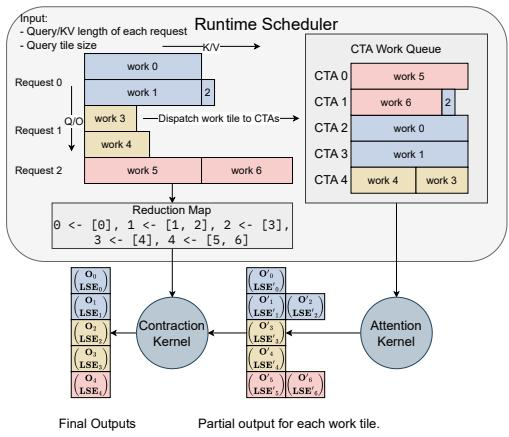  
Figure 6. FlashInfer’s load-balanced runtime scheduler, sequence length information (both on query/output and key/value dimension) are provided to the scheduler to compute the plan information: (1) Work queue of each CTA (2) Index mapping between partial and final outputs. These plan information are cached at GPU-side and used as inputs for persistent attention/contraction kernels.

FlashInfer guarantees both attention and contraction stage are compatible with CUDAGraphs (Gray, 2019; Nguyen et al., 2021). Both attention and contraction stage use persistent kernel and the grid size is fixed once compiled, which means the kernel is launched with the same grid size for each generation step. We set the fixed offset for each section of the workspace buffer to store partial outputs and plan information to make sure the pointers passed to the kernel are the same for each generation step, meeting the requirement of CUDAGraphs (see Appendix D.1 for details). We merge the two stages into one persistent kernel, eliminating intra-kernel overhead.

## 3.4 Programming Interface

FlashInfer offers a programming interface designed for seamless integration with existing LLM serving frameworks such as vLLM(Kwon et al., 2023), MLC-Engine(MLC Community, 2024), and SGLang (Zheng et al., 2023b).

# Create workspace buffer   
workspace = torch.empty(...)   
seqlen\_info.init()   
# Compile: create CUDAGraphs   
graphs = []   
for task\_info in task\_infos:   
# Init: compile kernels according to spec   
attn = AttentionWrapper(attn\_spec, task\_info, workspace)

```python
g = torch.cuda.CUDAGraph()
# Dummy plan
attn.plan(seqlen_info)
# Capture CUDA graphs
with torch.cuda.graph(g):
for i, layer in enumerate(layers):
attn.run(...)
graphs.append(g)
# Runtime: select the best CUDAGraph
g = select_graph(graphs)
finished = False
# Text generation loop
while not finished:
seqlen_info.update()
# Plan per generation step
attn.plan(seqlen_info)
# Replay CUDA−Graph
g.replay()
```  
Listing 1. FlashInfer PyTorch Programming Interface

Listing 1 shows the PyTorch programming interface of FlashInfer. The user initializes the wrapper by providing the attention variant specification, task information, and a userallocated workspace buffer (see Appendix D for details) to store partial output and plan information for FlashInfer dynamic scheduling. Kernel are JIT-compiled at init time and cached for reuse. For composable formats (section 3.1.2), FlashInfer creates multiple attention wrappers, each with distinct block sizes. Kernels with different average query length and composable format configurations are compiled and captured in different CUDAGraphs. At runtime, the serving framework selects the most appropriate CUDAGraph based on the current KV-Cache configuration, ensuring optimal performance for varying workload characteristics.

The plan function activates the dynamic scheduler by processing sequence length data to generate load-balanced scheduling plans. These plans are cacheable, allowing reuse across operators with matching sequence length specs, such as all decode attentions in a generation step. The run function executes the attention computation using inputs of query, key, value, and cached plan data, outputting the attention results. CUDAGraph can capture calls to run functions and compile the entire attention generation step into a single graph. However, plan function is not captured by CUDAGraph because it’s on CPU. The plan and run division is inspired by the Inspector-Executor (IE) model (Mirchandaney et al., 1988; Saltz & Mirchandaney, 1991; Ponnusamy et al., 1993), which is widely used for parallelizing irregular workloads.

## 4 EVALUATION

In this section, we evaluate FlashInfer v0.2 on kernel-level and end-to-end performance showing how FlashInfer’s design address the challenges of LLM serving. We achieve

29-69% inter-token-latency reduction compared to Triton backend for LLM serving benchmark, 28-30% latency reduction for long-context inference, and 13-17% speedup for LLM serving with parallel generation. We conduct experiments on NVIDIA A100 40GB SXM and H100 80GB SXM GPUs, using CUDA 12.4 and PyTorch 2.4.0 and f16 precision for storage and computation.

## 4.1 End-to-end LLM serving performance

We evaluate FlashInfer with SGLang v0.3.4 (Zheng et al., 2023b) and compare its performance against two settings: SGLang with Triton v3.0 (Tillet et al., 2019). The latter is a leading LLM serving engine optimized for NVIDIA GPUs; however, its attention kernels are closed-source, which limits transparency and potential for community-driven improvements. To ensure a comprehensive evaluation, we employ two datasets: the widely-used ShareGPT dataset <sup>5</sup> and a synthetic workload (Variable) with sequence lengths uniformly distributed between 512 and 2048 tokens. We measure the TTFT(time-to-first-token) and ITL(inter-tokenlatency) under latency-sensitive online serving settings, the request rate is adjusted to maintain P99 TTFT below 200ms.

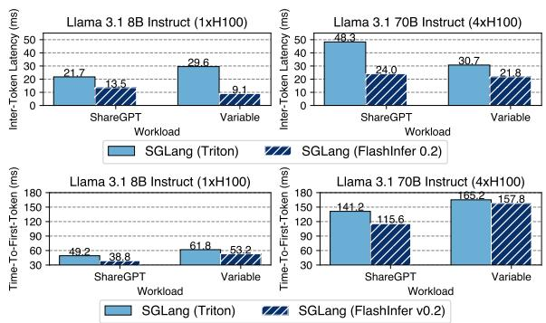  
Figure 7. Medium Inter-Token-Latency (ITL) and medium Time-To-First-Token (TTFT) of SGLang integrated with FlashInfer and Triton.

Figure 7 shows the ITL and TTFT measured on both Llama 3.1 (Dubey et al., 2024) 8B (on 1xH100) and Llama 3.1 70B (on 4xH100) models. Compared to SGLang with Triton backend, FlashInfer backend shows consistent speedup in all settings.

## 4.2 Kernel Performance for Input Dynamism

In this section we measure FlashInfer’s generated kernel performance against state-of-the-art open-source FlashAttention library under different sequence length distributions, we use the latest main branch <sup>6</sup> which includes both FlashAttention2 and FlashAttention3 kernels. We fix the batch size to 16 and select three different sequence length distributions: constant (1024), uniform (512 to 1024) and skewed (Zipf distribution with average length 1024). For prefill kernels, we enabled causal masking because it’s a common setting in LLM serving.

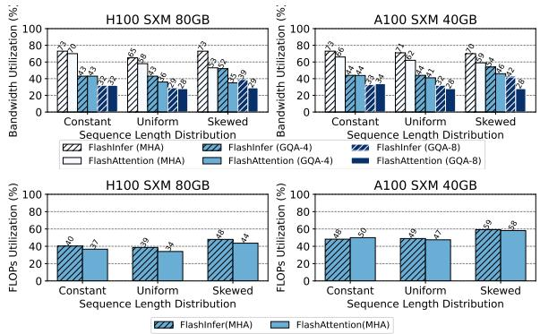  
Figure 8. Achieved bandwidth and FLOPs utilizations (the higher the better) for decode (top) and prefill (down) kernels.

Figure 8 show the achieved bandwidth and FLOPs utilization for decode and prefill kernels. FlashInfer’s kernel significant outperforms FlashAttention kernels in uniform and skewed sequence length distributions because of our loadbalanced dynamic scheduler (section 3.3.1). FlashInfer’s decode attention outperforms FlashAttention kernels because our versatile tile size selection (section 3.2.2) and FlashAttention use suboptimal tile size for decoding.

## 4.3 Customizability for Long-Context Inference

In this section, we demonstrate how FlashInfer’s customized attention kernels significantly accelerate LLM inference. We focus on Streaming-LLM (Xiao et al., 2023), a recent algorithm capable of million-token inference with constant GPU memory usage. While Streaming-LLM requires specialized attention kernels for optimal performance, particularly a fused kernel combining RoPE (Su et al., 2024) with attention, FlashInfer can generate such fused kernels with merely 20 additional lines of code for query/key transformations. We compare the performance of FlashInfer-generated fused kernels against un-fused kernels (both FlashInfer’s and FlashAttention’s) and quantify the end-to-end latency reduction achieved by integrating FlashInfer kernels into StreamingLLM.

For end-to-end performance, we run Vicuna-13B (Chiang et al., 2023) inference on MT-Bench (Zheng et al., 2023a) dataset and measure the inter-token-latency (ITL) of Streaming-LLM with and without FlashInfer kernels. Figure 9 show the ITL of Streaming-LLM with and without FlashInfer fused kernels on our optimized implementation of Streaming-LLM (we noticed that the original implementation is sub-optimal and have unnecessary overheads). Flash-Infer’s fused kernel can yield 28 − 30% latency reduction under different settings (by changing the recent window size of Streaming-LLM). Original implementation is included as a baseline reference. We also show the kernel-level performance comparison between FlashInfer’s fused RoPE kernel and the combination of FlashAttention’s RoPE kernel and FlashAttention’s attention kernel. FlashInfer’s fused RoPE kernel achieves 1.6-3.7x higher bandwidth utilization compared to not fusing attention with RoPE, which necessitate the importance of customizability of attention kernels.

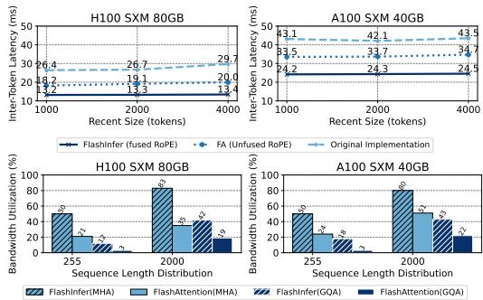  
Figure 9. Top: End-to-end latency of Streaming-LLM with Flash-Infer fused and FlashAttention’s unfused kernels, original implementation is included. Down: bandwidth utilization of FlashInfer fused RoPE kernel compared to FlashAttention’s unfused kernel.

## 4.4 Parallel-Generation Performance

In this section, we illustrate how the composable formats of FlashInfer can enhance parallel decoding. With parallel generation emerging as a significant task in LLM serving, it offers great utility in LLM agents. The OpenAI API provides an "n" parameter<sup>7</sup> to facilitate the generation of multiple tokens simultaneously. As shared prefixes often exist, prefix-caching can significantly boost the efficiency of parallel generation. The composable formats found in FlashInfer (see Section 3.1.2) allow for the decoupling of attention computation between the shared prefix and the subsequent suffix, which can be leveraged to expedite parallel decoding.

We implemented composable formats within MLC-Engine(MLC Community, 2024) under a prefix-caching configuration and assessed the performance during parallel generation. Evaluations were conducted on the Llama 3.1 models with 8B and 70B parameters(Dubey et al., 2024) using the ShareGPT dataset. With a fixed request rate of

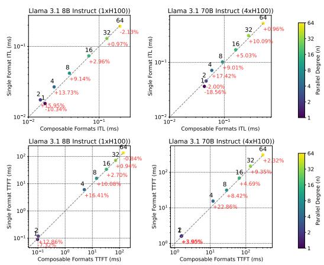  
Figure 10. ITL and TTFT of MLC-Engine with and without composable formats during parallel generation, the x-axis refers to composable formats performance, and the y-axis refers to single format performance, if a point is above the diagonal line, it means composable formats outperform single format. Different parallel generation n are shown in different colors.

16, we varied the number of parallel tokens over the set 1, 2, 4, 8, 16, 32, 64, comparing these results against MLC-Engine configurations where composable formats were disabled. Figure 10 presents the ITL (Inference Time Latency) and TTFT (Time To First Token) results for MLC-Engine both with and without composable formats.

For moderate levels of parallel generation (4 ≤ n ≤ 32), FlashInfer’s composable formats yield consistent speedups for both ITL and TTFT. Peak speedups occur at n = 4, where ITL decreases by 13.73% for the 8B model and 17.42% for the 70B model, while TTFT is reduced by 16.41% for the 8B model and 22.86% for the 70B model. Smaller values of n do not benefit from composable formats due to insufficient increase in block size. For larger n, the computation ceases to be dominated by attention processes (especially in the case of ShareGPT with its short sequence length), causing the advantage of composable formats to plateau.

## 5 RELATED WORK

## 5.1 Attention Optimizations

Multi-Head Attention (MHA) (Vaswani et al., 2017) faces computational and IO challenges. FasterTransformer (NVIDIA, 2021) reduces global memory footprint via Fused Multi-Head Attention (FMHA), but doesn’t scale to long contexts because shared memory usage is linear to sequence length. ByteTransformer (Zhai et al., 2023) optimizes FMHA on variable-length input. FlashAttention (Dao et al., 2022) uses online-softmax (Milakov & Gimelshein, 2018) trick to reduce the shared memory footprint to constant size, enabling long contexts. FlashAttention2&3 (Dao, 2023; Shah et al., 2024) further optimizes FlashAttention by improving loop structure and overlapping softmax and GEMM. FlashDecoding (Dao et al., 2023) applies Split-K to decode attention kernels. LeanAttention (Sanovar et al., 2024) uses StreamK (Osama et al., 2023) to reduce wavequantization (NVIDIA, 2023b) in attetnion (with fixed sequence length). FlashInfer extends the FlashAttention2&3 template to support sparse attention kernels, while using StreamK-like optimizations on variable length sequences. Nanoflow (Zhu et al., 2024a) introduces horizontal fusion of GEMM, attention, and communication operations, while POD-Attention (Kamath et al., 2024) focuses on optimizing chunked-prefill attention. The JIT compilation framework of FlashInfer can be extended to generate kernels supporting these fusion techniques. FlashDecoding++ (Hong et al., 2024) leverages attention scale statistics to predefine a unified max value. This process converts attention composition (section 2.2) to summation, enabling TMA Store Reduce (Colfax, 2024) to asynchronously updating global attention states, it’s orthogonal to FlashInfer’s contribution and we leave it for future work.

Recent works like RelayAttention (Zhu et al., 2024b), Hydragen (Juravsky et al., 2024), ChunkAttention (Ye et al., 2024), and Parrot (Lin et al., 2024) explore shared prefix decoding attention but require separate KV-Cache management for prefixes and suffixes. In contrast, FlashInfer’s composable formats support multi-level, multiple-prefix decoding with unified page table management, enabling seamless integration into LLM serving frameworks without modifying memory management modules.

## 5.2 Sparse Optimizations on GPUs

FusedMM (Rahman et al., 2021) explores Sparse-dense Matrix Multiplication (SpMM) fusion, though it omits softmax computation, limiting direct applicability for accelerating attention. Zhang et al. (2022) explore Graph Attention Networks (GAT) kernel fusion, SAR (Mostafa, 2022) serializes Sparse Attention aggregation, akin to FlashAttention, neither work explores using Tensor Cores. Blocksparse library (Gray et al., 2017) implements BSR GEMM with tensor cores. Chen et al. (2021), TC-GNN (Wang et al., 2023) and Magicube (Li et al., 2022) propose vector sparse formats to leverage Tensor Cores effectively. FlashInfer improves upon these to support any block sizes (b , b ) in FlashAttention.

## 5.3 Attention Compilers

FlexAttention (He et al., 2024) provides a user-friendly interface for programming attention variants, compiling them into block-sparse flashattention implemented in Triton (Tillet et al., 2019). It uses PyTorch Compiler (Ansel et al., 2024) to automatically generate backward passes. FlashInfer expands the FlexAttention’s programming interface to support query/key transformations, and focus on vector-sparsity and load-balancing for LLM serving. Flash-Infer generates CUDA code instead of Triton because Triton still underperform CUDA & CUTLASS in many use cases. FlashInfer can act as a backend for FlexAttention in forward pass. Mirage (Wu et al., 2024) optimizes tiling strategies for GEMM and FlashAttention using a probabilistic equivalence verifier, relying on Triton and CUTLASS for code generation. However, it lacks support for variable length and sparse data structures, and doesn’t include safe-softmax, unlike FlashInfer, which is directly applicable to LLM serving.

## 5.4 LLM Serving Systems

Orca (Yu et al., 2022) introduces continuous batching for enhanced throughput. PagedAttention (Kwon et al., 2023) uses a Page Table for KV-Cache management. Sarathiserve (Agrawal et al., 2024) improves efficiency by piggybacking decode operations with chunked-prefill, while SGLang (Zheng et al., 2023b) utilizes RadixTree for better prefix-caching and KV-management. FlashInfer provides a unified solution for these attention mechanisms through block-sparse attention kernels. vAttention (Prabhu et al., 2024) shows that GPU virtual memory can manage address translation in PageAttention without special kernels. Yet, challenges like dynamic KV-Cache sparsity persist, as seen in Quest (Tang et al., 2024). Here, FlashInfer’s block sparse kernel remains effective. Additionally, FlashInfer can be combined with vAttention by generating kernels for contiguous KV-Cache storage.

## 6 DISCUSSIONS

Currently, FlashInfer only supports the forward pass for attention computation. To extend FlashInfer and apply it to training would require developing customizable backward attention kernel templates, which we plan to explore in future work. Regarding the generality of FlashInfer, our approach decouples computation from tile scheduling, allowing for diverse tiling strategies such as FlashDecoding (Hong et al., 2024) and Lean Attention (Sanovar et al., 2024) by delegating scheduling to a runtime-scheduler rather than embedding it within the attention template. This design generalizes scheduling algorithms, as detailed in Algorithm 1, for load-balancing and wave-quantization reduction while targeting optimal GPU performance across architectures (e.g., FlashAttention2 (Dao, 2023) for Turing/Ampere/Ada and FlashAttention3 (Shah et al., 2024) for Hopper). Although frameworks like Triton (Tillet et al., 2019) offer GPU-agnostic interfaces, they often lag in adopting new hardware features; our template design space, expressed as f<sub>epilogue</sub>(scan(f<sub>logits</sub>(f<sub>q</sub>(Q) · f<sub>k</sub>(K))) · f<sub>v</sub>(V )), covers most attention functions, including recent variants such as Multi-head Latent Attention (MLA) (DeepSeek-AI et al., 2024) and the intra-attention component of Linear Attention (Yang et al., 2024).

## 7 CONCLUSION AND FUTURE WORK

In this paper, we present FlashInfer, an versatile and efficient attention engine for LLM serving. We propose a unified block-sparse storage and composable formats for memory efficiency, JIT compilation for customization and load-balanced scheduler for input dynamism. We evaluate FlashInfer’s performance across diverse inference scenarios, showing strong performance in kernel-level and endto-end LLM serving metrics. In the future, we plan to explore compiling higher-level DSLs (Wu et al., 2024; He et al., 2024) to attention specifications in FlashInfer, as well as code generation to other backends (Ozen, 2024; Spector et al., 2024; Tillet et al., 2019). The FlashInfer project is open source and available at https://github. com/flashinfer-ai/flashinfer, and has been deployed at scale in production-level systems.

## 8 ACKNOWLEDGEMENTS

We thank anonymous MLSys reviewers for providing constructive comments, LMSYS ORG, UW Syslab and SAMPL research group, CMU Catalyst group for their useful feedback and discussions, Yaxing Cai, Junru Shao, Lianmin Zheng, Ying Sheng, Liangsheng Yin, Lily Liu, Woosuk Kwon, Cody Yu, Ray Wan, Bowen Wang, Pavani Majety, Elfie Guo, Travis Addair, Cuimi Guo for their help in integrating FlashInfer into LLM serving frameworks, Zhuoming Chen, Lesheng Jin, Antoni Baum, Kaichao You, Simon Mo, Ke Bao, Byron Hsu, Zhiqiang Xie, Haofeng Huang, Sirui Lu, Henry Xiao, Chi-Chih Chang, Yilong Zhao, Size Zheng, Bohan Hou, Yang Yu, Nandor Licker, Tsu Bin, Hieu Pham, Horace He, Vijay Thakkar, Yuxian Qiu, Freddy Qi, June Yang, Bing Xu, Anxhelo Xhebraj, Evghenii Gaburov, Bastian Hagedorn and all community contributors for their input and feedback on the FlashInfer project. This work was supported in part by NSF award CNS-2211882, and gifts from OctoAI, Qualcomm, and CMU opensource software fellowships. Researchers from UW are supported in part by NSF under award CCF-1518703, and by ACE and PRISM, two of the seven centers in JUMP 2.0, a Semiconductor Research Corporation (SRC) program sponsored by DARPA; Zihao Ye is supported by the NVIDIA Graduate Fellowship. Luis Ceze is supported by the Lazowska Endowed Professorship. The opinions and conclusions in this paper do not reflect the views of these funding agencies.

## REFERENCES

Agrawal, A., Kedia, N., Panwar, A., Mohan, J., Kwatra, N., Gulavani, B. S., Tumanov, A., and Ramjee, R. Taming throughput-latency tradeoff in llm inference with sarathiserve. Proceedings of 18th USENIX Symposium on Operating Systems Design and Implementation, 2024, Santa Clara, 2024.

Ainslie, J., Lee-Thorp, J., de Jong, M., Zemlyanskiy, Y., Lebrón, F., and Sanghai, S. GQA: training generalized multi-query transformer models from multi-head checkpoints. In Bouamor, H., Pino, J., and Bali, K. (eds.), Proceedings of the 2023 Conference on Empirical Methods in Natural Language Processing, EMNLP 2023, Singapore, December 6-10, 2023, pp. 4895–4901. Association for Computational Linguistics, 2023. doi: 10.18653/V1/ 2023.EMNLP-MAIN.298. URL https://doi.org/ 10.18653/v1/2023.emnlp-main.298.

Ansel, J., Yang, E., He, H., Gimelshein, N., Jain, A., Voznesensky, M., Bao, B., Bell, P., Berard, D., Burovski, E., Chauhan, G., Chourdia, A., Constable, W., Desmaison, A., DeVito, Z., Ellison, E., Feng, W., Gong, J., Gschwind, M., Hirsh, B., Huang, S., Kalambarkar, K., Kirsch, L., Lazos, M., Lezcano, M., Liang, Y., Liang, J., Lu, Y., Luk, C. K., Maher, B., Pan, Y., Puhrsch, C., Reso, M., Saroufim, M., Siraichi, M. Y., Suk, H., Zhang, S., Suo, M., Tillet, P., Zhao, X., Wang, E., Zhou, K., Zou, R., Wang, X., Mathews, A., Wen, W., Chanan, G., Wu, P., and Chintala, S. Pytorch 2: Faster machine learning through dynamic python bytecode transformation and graph compilation. In Proceedings of the 29th ACM International Conference on Architectural Support for Programming Languages and Operating Systems, Volume 2, ASPLOS ’24, pp. 929–947, New York, NY, USA, 2024. Association for Computing Machinery. ISBN 9798400703850. doi: 10.1145/3620665.3640366. URL https://doi. org/10.1145/3620665.3640366.

Beltagy, I., Peters, M. E., and Cohan, A. Longformer: The long-document transformer. CoRR, abs/2004.05150, 2020. URL https://arxiv.org/abs/2004. 05150.

Buluç, A., Fineman, J. T., Frigo, M., Gilbert, J. R., and Leiserson, C. E. Parallel sparse matrix-vector and matrix-transpose-vector multiplication using compressed sparse blocks. In auf der Heide, F. M. and Bender, M. A. (eds.), SPAA 2009: Proceedings of the 21st Annual ACM Symposium on Parallelism in Algorithms and Architectures, Calgary, Alberta, Canada, August 11-13, 2009, pp. 233–244. ACM, 2009. doi: 10. 1145/1583991.1584053. URL https://doi.org/ 10.1145/1583991.1584053.

Cai, T., Li, Y., Geng, Z., Peng, H., Lee, J. D., Chen, D., and Dao, T. Medusa: Simple LLM inference acceleration framework with multiple decoding heads. CoRR, abs/2401.10774, 2024. doi: 10.48550/ARXIV. 2401.10774. URL https://doi.org/10.48550/ arXiv.2401.10774.

Chen, Z., Qu, Z., Liu, L., Ding, Y., and Xie, Y. Efficient tensor core-based GPU kernels for structured sparsity under reduced precision. In de Supinski, B. R., Hall, M. W., and Gamblin, T. (eds.), International Conference for High Performance Computing, Networking, Storage and Analysis, SC 2021, St. Louis, Missouri, USA, November 14-19, 2021, pp. 78. ACM, 2021. doi: 10.1145/3458817.3476182. URL https: //doi.org/10.1145/3458817.3476182.

Chen, Z., May, A., Svirschevski, R., Huang, Y., Ryabinin, M., Jia, Z., and Chen, B. Sequoia: Scalable, robust, and hardware-aware speculative decoding. CoRR, abs/2402.12374, 2024. doi: 10.48550/ARXIV. 2402.12374. URL https://doi.org/10.48550/ arXiv.2402.12374.

Chiang, W.-L., Li, Z., Lin, Z., Sheng, Y., Wu, Z., Zhang, H., Zheng, L., Zhuang, S., Zhuang, Y., Gonzalez, J. E., Stoica, I., and Xing, E. P. Vicuna: An open-source chatbot impressing gpt-4 with 90%\* chatgpt quality, March 2023. URL https://lmsys.org/blog/2023-03-30- vicuna/.

Colfax. Cutlass tutorial: Mastering the nvidia tensor memory accelerator (tma), 2024. URL https: //research.colfax-intl.com/tutorialhopper-tma/.

Dao, T. Flashattention-2: Faster attention with better parallelism and work partitioning. CoRR, abs/2307.08691, 2023. doi: 10.48550/ARXIV.2307.08691. URL https: //doi.org/10.48550/arXiv.2307.08691.

Dao, T., Fu, D. Y., Ermon, S., Rudra, A., and Ré, C. Flashattention: Fast and memory-efficient exact attention with io-awareness. In Koyejo, S., Mohamed, S., Agarwal, A., Belgrave, D., Cho, K., and Oh, A. (eds.), Advances in Neural Information Processing Systems 35: Annual Conference on Neural Information Processing Systems 2022, NeurIPS 2022, New Orleans, LA, USA, November 28 - December 9, 2022, 2022. URL http://papers. nips.cc/paper\_files/paper/2022/hash/ 67d57c32e20fd0a7a302cb81d36e40d5- Abstract-Conference.html.

Dao, T., Haziza, D., Massa, F., and Sizov, G. Flash-decoding for long-context inference, 2023.

DeepSeek-AI, Liu, A., Feng, B., Wang, B., Wang, B., Liu, B., Zhao, C., Deng, C., Ruan, C., Dai, D., Guo, D., Yang, D., Chen, D., Ji, D., Li, E., Lin, F., Luo, F., Hao, G., Chen, G., Li, G., Zhang, H., Xu, H., Yang, H., Zhang, H., Ding, H., Xin, H., Gao, H., Li, H., Qu, H., Cai, J. L., Liang, J., Guo, J., Ni, J., Li, J., Chen, J., Yuan, J., Qiu, J., Song, J., Dong, K., Gao, K., Guan, K., Wang, L., Zhang, L., Xu, L., Xia, L., Zhao, L., Zhang, L., Li, M., Wang, M., Zhang, M., Zhang, M., Tang, M., Li, M., Tian, N., Huang, P., Wang, P., Zhang, P., Zhu, Q., Chen, Q., Du, Q., Chen, R. J., Jin, R. L., Ge, R., Pan, R., Xu, R., Chen, R., Li, S. S., Lu, S., Zhou, S., Chen, S., Wu, S., Ye, S., Ma, S., Wang, S., Zhou, S., Yu, S., Zhou, S., Zheng, S., Wang, T., Pei, T., Yuan, T., Sun, T., Xiao, W. L., Zeng, W., An, W., Liu, W., Liang, W., Gao, W., Zhang, W., Li, X. Q., Jin, X., Wang, X., Bi, X., Liu, X., Wang, X., Shen, X., Chen, X., Chen, X., Nie, X., and Sun, X. Deepseek-v2: A strong, economical, and efficient mixture-of-experts language model. CoRR, abs/2405.04434, 2024. doi: 10.48550/ARXIV.2405.04434. URL https://doi. org/10.48550/arXiv.2405.04434.

Dubey, A., Jauhri, A., Pandey, A., Kadian, A., Al-Dahle, A., Letman, A., Mathur, A., Schelten, A., Yang, A., Fan, A., Goyal, A., Hartshorn, A., Yang, A., Mitra, A., Sravankumar, A., Korenev, A., Hinsvark, A., Rao, A., Zhang, A., Rodriguez, A., Gregerson, A., Spataru, A., Rozière, B., Biron, B., Tang, B., Chern, B., Caucheteux, C., Nayak, C., Bi, C., Marra, C., McConnell, C., Keller, C., Touret, C., Wu, C., Wong, C., Ferrer, C. C., Nikolaidis, C., Allonsius, D., Song, D., Pintz, D., Livshits, D., Esiobu, D., Choudhary, D., Mahajan, D., Garcia-Olano, D., Perino, D., Hupkes, D., Lakomkin, E., AlBadawy, E., Lobanova, E., Dinan, E., Smith, E. M., Radenovic, F., Zhang, F., Synnaeve, G., Lee, G., Anderson, G. L., Nail, G., Mialon, G., Pang, G., Cucurell, G., Nguyen, H., Korevaar, H., Xu, H., Touvron, H., Zarov, I., Ibarra, I. A., Kloumann, I. M., Misra, I., Evtimov, I., Copet, J., Lee, J., Geffert, J., Vranes, J., Park, J., Mahadeokar, J., Shah, J., van der Linde, J., Billock, J., Hong, J., Lee, J., Fu, J., Chi, J., Huang, J., Liu, J., Wang, J., Yu, J., Bitton, J., Spisak, J., Park, J., Rocca, J., Johnstun, J., Saxe, J., Jia, J., Alwala, K. V., Upasani, K., Plawiak, K., Li, K., Heafield, K., Stone, K., and et al. The llama 3 herd of models. CoRR, abs/2407.21783, 2024. doi: 10.48550/ARXIV.2407.21783. URL https: //doi.org/10.48550/arXiv.2407.21783.

Gray, A. Getting Started with CUDA Graphs | NVIDIA Technical Blog. https://developer.nvidia. com/blog/cuda-graphs/, 2019. [Accessed 19-10- 2024].

Gray, S., Radford, A., and Kingma, D. P. Gpu kernels for block-sparse weights. arXiv preprint arXiv:1711.09224, 3(2):2, 2017.

Gupta, M. Mixed-input matrix multiplication performance optimizations. https: //research.google/blog/mixed-inputmatrix-multiplication-performanceoptimizations/, January 2024. Google Research Blog, Accessed: 2024-01-26.

He, H., Guessous, D., Liang, Y., and Dong, J. Flexattention: The flexibility of pytorch with the performance of flashattention, Aug 2024. URL https://pytorch.org/ blog/flexattention/.

Hong, K., Dai, G., Xu, J., Mao, Q., Li, X., Liu, J., chen, k., Dong, Y., and Wang, Y. Flashdecoding++: Faster large language model inference with asynchronization, flat gemm optimization, and heuristics. In Gibbons, P., Pekhimenko, G., and Sa, C. D. (eds.), Proceedings of Machine Learning and Systems, volume 6, pp. 148–161, 2024. URL https://proceedings.mlsys. org/paper\_files/paper/2024/file/ 5321b1dabcd2be188d796c21b733e8c7- Paper-Conference.pdf.

Im, E., Yelick, K. A., and Vuduc, R. W. Sparsity: Optimization framework for sparse matrix kernels. Int. J. High Perform. Comput. Appl., 18(1):135–158, 2004. doi: 10.1177/1094342004041296. URL https:// doi.org/10.1177/1094342004041296.

Juravsky, J., Brown, B. C. A., Ehrlich, R. S., Fu, D. Y., Ré, C., and Mirhoseini, A. Hydragen: High-throughput LLM inference with shared prefixes. CoRR, abs/2402.05099, 2024. doi: 10.48550/ARXIV.2402.05099. URL https: //doi.org/10.48550/arXiv.2402.05099.

Kamath, A. K., Prabhu, R., Mohan, J., Peter, S., Ramjee, R., and Panwar, A. Pod-attention: Unlocking full prefill-decode overlap for faster llm inference. CoRR, abs/2410.18038, 2024. URL https://arxiv.org/ abs/2410.18038.

Kwon, W., Li, Z., Zhuang, S., Sheng, Y., Zheng, L., Yu, C. H., Gonzalez, J., Zhang, H., and Stoica, I. Efficient memory management for large language model serving with pagedattention. In Flinn, J., Seltzer, M. I., Druschel, P., Kaufmann, A., and Mace, J. (eds.), Proceedings of the 29th Symposium on Operating Systems Principles, SOSP 2023, Koblenz, Germany, October 23-26, 2023, pp. 611–626. ACM, 2023. doi: 10. 1145/3600006.3613165. URL https://doi.org/ 10.1145/3600006.3613165.

Lai, R., Shao, J., Feng, S., Lyubomirsky, S. S., Hou, B., Lin, W., Ye, Z., Jin, H., Jin, Y., Liu, J., Jin, L., Cai, Y., Jiang, Z., Wu, Y., Park, S., Srivastava, P., Roesch, J. G., Mowry, T. C., and Chen, T. Relax: Composable abstractions for end-to-end dynamic machine learning.

CoRR, abs/2311.02103, 2023. doi: 10.48550/ARXIV. 2311.02103. URL https://doi.org/10.48550/ arXiv.2311.02103.

Li, S., Osawa, K., and Hoefler, T. Efficient quantized sparse matrix operations on tensor cores. In Wolf, F., Shende, S., Culhane, C., Alam, S. R., and Jagode, H. (eds.), SC22: International Conference for High Performance Computing, Networking, Storage and Analysis, Dallas, TX, USA, November 13-18, 2022, pp. 37:1–37:15. IEEE, 2022. doi: 10.1109/SC41404.2022.00042. URL https: //doi.org/10.1109/SC41404.2022.00042.

Lin, C., Han, Z., Zhang, C., Yang, Y., Yang, F., Chen, C., and Qiu, L. Parrot: Efficient serving of LLM-based applications with semantic variable. In 18th USENIX Symposium on Operating Systems Design and Implementation (OSDI 24), pp. 929–945, Santa Clara, CA, July 2024. USENIX Association. ISBN 978-1-939133-40-3. URL https://www.usenix.org/conference/ osdi24/presentation/lin-chaofan.

Liu, H. and Abbeel, P. Blockwise parallel transformers for large context models. In Oh, A., Naumann, T., Globerson, A., Saenko, K., Hardt, M., and Levine, S. (eds.), Advances in Neural Information Processing Systems 36: Annual Conference on Neural Information Processing Systems 2023, NeurIPS 2023, New Orleans, LA, USA, December 10 - 16, 2023, 2023. URL http://papers. nips.cc/paper\_files/paper/2023/hash/ 1bfd87d2d92f0556819467dc08034f76- Abstract-Conference.html.

Liu, H., Zaharia, M., and Abbeel, P. Ring attention with blockwise transformers for near-infinite context. CoRR, abs/2310.01889, 2023. doi: 10.48550/ARXIV. 2310.01889. URL https://doi.org/10.48550/ arXiv.2310.01889.

Miao, X., Oliaro, G., Zhang, Z., Cheng, X., Wang, Z., Zhang, Z., Wong, R. Y. Y., Zhu, A., Yang, L., Shi, X., Shi, C., Chen, Z., Arfeen, D., Abhyankar, R., and Jia, Z. Specinfer: Accelerating large language model serving with tree-based speculative inference and verification. In Gupta, R., Abu-Ghazaleh, N. B., Musuvathi, M., and Tsafrir, D. (eds.), Proceedings of the 29th ACM International Conference on Architectural Support for Programming Languages and Operating Systems, Volume 3, ASPLOS 2024, La Jolla, CA, USA, 27 April 2024- 1 May 2024, pp. 932–949. ACM, 2024. doi: 10.1145/3620666.3651335. URL https://doi. org/10.1145/3620666.3651335.

Micikevicius, P., Stosic, D., Burgess, N., Cornea, M., Dubey, P., Grisenthwaite, R., Ha, S., Heinecke, A., Judd, P., Kamalu, J., Mellempudi, N., Oberman, S. F., Shoeybi,

M., Siu, M. Y., and Wu, H. FP8 formats for deep learning. CoRR, abs/2209.05433, 2022. doi: 10.48550/ARXIV. 2209.05433. URL https://doi.org/10.48550/ arXiv.2209.05433.

Milakov, M. and Gimelshein, N. Online normalizer calculation for softmax. CoRR, abs/1805.02867, 2018. URL http://arxiv.org/abs/1805.02867.

Mirchandaney, R., Saltz, J. H., Smith, R. M., Nicol, D. M., and Crowley, K. Principles of runtime support for parallel processors. In Lenfant, J. (ed.), Proceedings of the 2nd international conference on Supercomputing, ICS 1988, Saint Malo, France, July 4-8, 1988, pp. 140–152. ACM, 1988. doi: 10.1145/55364.55378. URL https://doi. org/10.1145/55364.55378.

MLC Community. Optimizing and characterizing high-throughput low-latency LLM inference in MLCEngine, Oct 2024. URL https: //blog.mlc.ai/2024/10/10/optimizingand-characterizing-high-throughputlow-latency-llm-inference. [Online; accessed April 23, 2025].

Mostafa, H. Sequential aggregation and rematerialization: Distributed full-batch training of graph neural networks on large graphs. In Marculescu, D., Chi, Y., and Wu, C. (eds.), Proceedings of Machine Learning and Systems 2022, MLSys 2022, Santa Clara, CA, USA, August 29 - September 1, 2022. mlsys.org, 2022. URL https://proceedings.mlsys. org/paper\_files/paper/2022/hash/ 1d781258d409a6efc66cd1aa14a1681c-Abstract.html.

Narang, S., Undersander, E., and Diamos, G. F. Blocksparse recurrent neural networks. CoRR, abs/1711.02782, 2017. URL http://arxiv.org/abs/1711. 02782.

Nguyen, V., Carilli, M., Eryilmaz, S. B., Singh, V., Lin, M., Gimelshein, N., Desmaison, A., and Yang, E. Accelerating PyTorch with CUDA Graphs. https: //pytorch.org/blog/acceleratingpytorch-with-cuda-graphs/, 2021. [Accessed 19-10-2024].

NVIDIA. FasterTransformer. https://github.com/ NVIDIA/FasterTransformer, 2021.

NVIDIA. Nvidia hopper architecture in-depth, 2022. URL https://developer.nvidia.com/blog/ nvidia-hopper-architecture-in-depth/.

NVIDIA. NVIDIA TensorRT-LLM, 2023a. URL https://docs.nvidia.com/tensorrtllm/index.html. [Online; accessed April 23, 2025].

NVIDIA. Matrix multiplication background user’s guide, 2023b. URL https://docs.nvidia.com/ deeplearning/performance/pdf/Matrix-Multiplication-Background-User-Guide.pdf.

NVIDIA. Spatial partitioning (also known as warp specialization), 2024a. URL https://docs.nvidia. com/cuda/cuda-c-programming-guide/ index.html#spatial-partitioning-alsoknown-as-warp-specialization.

NVIDIA. New xqa-kernel provides 2.4x more llama-70b throughput within the same latency budget, 2024b. URL https://github.com/NVIDIA/TensorRT-LLM/blob/main/docs/source/blogs/XQAkernel.md.

Osama, M., Merrill, D., Cecka, C., Garland, M., and Owens, J. D. Stream-k: Work-centric parallel decomposition for dense matrix-matrix multiplication on the GPU. In Dehnavi, M. M., Kulkarni, M., and Krishnamoorthy, S. (eds.), Proceedings of the 28th ACM SIGPLAN Annual Symposium on Principles and Practice of Parallel Programming, PPoPP 2023, Montreal, QC, Canada, 25 February 2023 - 1 March 2023, pp. 429–431. ACM, 2023. doi: 10.1145/3572848.3577479. URL https: //doi.org/10.1145/3572848.3577479.

Ozen, G. Nvdsl: Simplifying tensor cores with pythondriven mlir metaprogramming. In Efficient Systems for Foundation Models (ES-FoMo) Workshop at ICML 2024, 2024.

Ponnusamy, R., Saltz, J. H., and Choudhary, A. N. Runtime compilation techniques for data partitioning and communication schedule reuse. In Borchers, B. and Crawford, D. (eds.), Proceedings Supercomputing ’93, Portland, Oregon, USA, November 15-19, 1993, pp. 361– 370. ACM, 1993. doi: 10.1145/169627.169752. URL https://doi.org/10.1145/169627.169752.

Prabhu, R., Nayak, A., Mohan, J., Ramjee, R., and Panwar, A. vattention: Dynamic memory management for serving llms without pagedattention, 2024.

Press, O., Smith, N. A., and Lewis, M. Train short, test long: Attention with linear biases enables input length extrapolation. In The Tenth International Conference on Learning Representations, ICLR 2022, Virtual Event, April 25-29, 2022. OpenReview.net, 2022. URL https: //openreview.net/forum?id=R8sQPpGCv0.

PyTorch-Labs. attention-gym. https://github.com/ pytorch-labs/attention-gym, 2024.

Rahman, M. K., Sujon, M. H., and Azad, A. Fusedmm: A unified sddmm-spmm kernel for graph embedding and graph neural networks. In 35th IEEE International Parallel and Distributed Processing Symposium, IPDPS 2021, Portland, OR, USA, May 17-21, 2021, pp. 256–266. IEEE, 2021. doi: 10.1109/IPDPS49936. 2021.00034. URL https://doi.org/10.1109/ IPDPS49936.2021.00034.

Ramapuram, J., Danieli, F., Dhekane, E. G., Weers, F., Busbridge, D., Ablin, P., Likhomanenko, T., Digani, J., Gu, Z., Shidani, A., and Webb, R. Theory, analysis, and best practices for sigmoid self-attention. CoRR, abs/2409.04431, 2024. doi: 10.48550/ARXIV. 2409.04431. URL https://doi.org/10.48550/ arXiv.2409.04431.

Rivière, M., Pathak, S., Sessa, P. G., Hardin, C., Bhupatiraju, S., Hussenot, L., Mesnard, T., Shahriari, B., Ramé, A., Ferret, J., Liu, P., Tafti, P., Friesen, A., Casbon, M., Ramos, S., Kumar, R., Lan, C. L., Jerome, S., Tsitsulin, A., Vieillard, N., Stanczyk, P., Girgin, S., Momchev, N., Hoffman, M., Thakoor, S., Grill, J., Neyshabur, B., Bachem, O., Walton, A., Severyn, A., Parrish, A., Ahmad, A., Hutchison, A., Abdagic, A., Carl, A., Shen, A., Brock, A., Coenen, A., Laforge, A., Paterson, A., Bastian, B., Piot, B., Wu, B., Royal, B., Chen, C., Kumar, C., Perry, C., Welty, C., Choquette-Choo, C. A., Sinopalnikov, D., Weinberger, D., Vijaykumar, D., Rogozinska, D., Herbison, D., Bandy, E., Wang, E., Noland, E., Moreira, E., Senter, E., Eltyshev, E., Visin, F., Rasskin, G., Wei, G., Cameron, G., Martins, G., Hashemi, H., Klimczak-Plucinska, H., Batra, H., Dhand, H., Nardini, I., Mein, J., Zhou, J., Svensson, J., Stanway, J., Chan, J., Zhou, J. P., Carrasqueira, J., Iljazi, J., Becker, J., Fernandez, J., van Amersfoort, J., Gordon, J., Lipschultz, J., Newlan, J., Ji, J., Mohamed, K., Badola, K., Black, K., Millican, K., McDonell, K., Nguyen, K., Sodhia, K., Greene, K., Sjösund, L. L., Usui, L., Sifre, L., Heuermann, L., Lago, L., and McNealus, L. Gemma 2: Improving open language models at a practical size. CoRR, abs/2408.00118, 2024. doi: 10.48550/ARXIV.2408.00118. URL https: //doi.org/10.48550/arXiv.2408.00118.

Saltz, J. H. and Mirchandaney, R. The preprocessed doacross loop. In Proceedings of the International Conference on Parallel Processing, ICPP ’91, Austin, Texas, USA, August 1991. Volume II: Software, pp. 174–179. CRC Press, 1991.

Sanovar, R., Bharadwaj, S., Amant, R. S., Rühle, V., and Rajmohan, S. Lean attention: Hardware-aware scalable attention mechanism for the decode-phase of transformers. CoRR, abs/2405.10480, 2024. doi: 10.48550/ARXIV. 2405.10480. URL https://doi.org/10.48550/ arXiv.2405.10480.

Setaluri, R., Aanjaneya, M., Bauer, S., and Sifakis, E. Spgrid: a sparse paged grid structure applied to adaptive smoke simulation. ACM Trans. Graph., 33(6):205:1–205:12, 2014. doi: 10.1145/2661229. 2661269. URL https://doi.org/10.1145/ 2661229.2661269.

Shah, J., Bikshandi, G., Zhang, Y., Thakkar, V., Ramani, P., and Dao, T. Flashattention-3: Fast and accurate attention with asynchrony and low-precision. CoRR, abs/2407.08608, 2024. doi: 10.48550/ARXIV. 2407.08608. URL https://doi.org/10.48550/ arXiv.2407.08608.

Shazeer, N. Fast transformer decoding: One write-head is all you need. CoRR, abs/1911.02150, 2019. URL http://arxiv.org/abs/1911.02150.

Spector, B., Singhal, A., Arora, S., and Re, C. ThunderKittens: A Simple Embedded DSL for AI kernels, May 2024. URL https://hazyresearch.stanford.edu/ blog/2024-05-12-quick-tk.

Su, J., Ahmed, M. H. M., Lu, Y., Pan, S., Bo, W., and Liu, Y. Roformer: Enhanced transformer with rotary position embedding. Neurocomputing, 568:127063, 2024. doi: 10. 1016/J.NEUCOM.2023.127063. URL https://doi. org/10.1016/j.neucom.2023.127063.

Tang, J., Zhao, Y., Zhu, K., Xiao, G., Kasikci, B., and Han, S. QUEST: query-aware sparsity for efficient long-context LLM inference. In Forty-first International Conference on Machine Learning, ICML 2024, Vienna, Austria, July 21-27, 2024. OpenReview.net, 2024. URL https:// openreview.net/forum?id=KzACYw0MTV.

Tensorflow Developers. Ragged tensors | tensorflow core. https://www.tensorflow.org/guide/ ragged\_tensor, 2018.

Thakkar, V., Ramani, P., Cecka, C., Shivam, A., Lu, H., Yan, E., Kosaian, J., Hoemmen, M., Wu, H., Kerr, A., Nicely, M., Merrill, D., Blasig, D., Qiao, F., Majcher, P., Springer, P., Hohnerbach, M., Wang, J., and Gupta, M. CUTLASS, January 2023. URL https://github. com/NVIDIA/cutlass.

Tillet, P., Kung, H. T., and Cox, D. Triton: an intermediate language and compiler for tiled neural network computations. In Proceedings of the 3rd ACM SIGPLAN International Workshop on Machine Learning and Programming Languages, MAPL 2019, pp. 10–19, New York, NY, USA, 2019. Association for Computing Machinery. ISBN 9781450367196. doi: 10. 1145/3315508.3329973. URL https://doi.org/ 10.1145/3315508.3329973.

Vaswani, A., Shazeer, N., Parmar, N., Uszkoreit, J., Jones, L., Gomez, A. N., Kaiser, L., and Polosukhin, I. Attention is all you need. In Guyon, I., von Luxburg, U., Bengio, S., Wallach, H. M., Fergus, R., Vishwanathan, S. V. N., and Garnett, R. (eds.), Advances in Neural Information Processing Systems 30: Annual Conference on Neural Information Processing Systems 2017, December 4-9, 2017, Long Beach, CA, USA, pp. 5998– 6008, 2017. URL https://proceedings. neurips.cc/paper/2017/hash/ 3f5ee243547dee91fbd053c1c4a845aa-Abstract.html.

Wang, Y., Feng, B., Wang, Z., Huang, G., and Ding, Y. TC-GNN: bridging sparse GNN computation and dense tensor cores on gpus. In Lawall, J. and Williams, D. (eds.), 2023 USENIX Annual Technical Conference, USENIX ATC 2023, Boston, MA, USA, July 10- 12, 2023, pp. 149–164. USENIX Association, 2023. URL https://www.usenix.org/conference/ atc23/presentation/wang-yuke.

Wu, M., Cheng, X., Padon, O., and Jia, Z. A multi-level superoptimizer for tensor programs. CoRR, abs/2405.05751, 2024. doi: 10.48550/ARXIV.2405.05751. URL https: //doi.org/10.48550/arXiv.2405.05751.

xAI. Open Release of Grok-1. https://x.ai/blog/ grok-os, 2023. [Accessed 24-06-2024].

Xiao, G., Tian, Y., Chen, B., Han, S., and Lewis, M. Efficient streaming language models with attention sinks. arXiv, 2023.

Yang, S., Wang, B., Shen, Y., Panda, R., and Kim, Y. Gated linear attention transformers with hardware-efficient training, 2024. URL https://arxiv.org/abs/2312. 06635.

Ye, L., Tao, Z., Huang, Y., and Li, Y. Chunkattention: Efficient self-attention with prefix-aware KV cache and two-phase partition. In Ku, L., Martins, A., and Srikumar, V. (eds.), Proceedings of the 62nd Annual Meeting of the Association for Computational Linguistics (Volume 1: Long Papers), ACL 2024, Bangkok, Thailand, August 11-16, 2024, pp. 11608–11620. Association for Computational Linguistics, 2024. doi: 10.18653/V1/2024.ACL-LONG.623. URL https://doi.org/10.18653/ v1/2024.acl-long.623.

Ye, Z., Lai, R., Shao, J., Chen, T., and Ceze, L. Sparsetir: Composable abstractions for sparse compilation in deep learning. In Aamodt, T. M., Jerger, N. D. E., and Swift, M. M. (eds.), Proceedings of the 28th ACM International Conference on Architectural Support for Programming Languages and Operating Systems, Volume 3, ASPLOS 2023, Vancouver, BC, Canada, March

25-29, 2023, pp. 660–678. ACM, 2023. doi: 10. 1145/3582016.3582047. URL https://doi.org/ 10.1145/3582016.3582047.

Yu, G., Jeong, J. S., Kim, G., Kim, S., and Chun, B. Orca: A distributed serving system for transformer-based generative models. In Aguilera, M. K. and Weatherspoon, H. (eds.), 16th USENIX Symposium on Operating Systems Design and Implementation, OSDI 2022, Carlsbad, CA, USA, July 11-13, 2022, pp. 521–538. USENIX Association, 2022. URL https://www.usenix.org/ conference/osdi22/presentation/yu.

Zhai, Y., Jiang, C., Wang, L., Jia, X., Zhang, S., Chen, Z., Liu, X., and Zhu, Y. Bytetransformer: A highperformance transformer boosted for variable-length inputs. In IEEE International Parallel and Distributed Processing Symposium, IPDPS 2023, St. Petersburg, FL, USA, May 15-19, 2023, pp. 344–355. IEEE, 2023. doi: 10.1109/IPDPS54959.2023.00042. URL https:// doi.org/10.1109/IPDPS54959.2023.00042.

Zhang, H., Yu, Z., Dai, G., Huang, G., Ding, Y., Xie, Y., and Wang, Y. Understanding GNN computational graph: A coordinated computation, io, and memory perspective. In Marculescu, D., Chi, Y., and Wu, C. (eds.), Proceedings of Machine Learning and Systems 2022, MLSys 2022, Santa Clara, CA, USA, August 29 - September 1, 2022. mlsys.org, 2022. URL https://proceedings.mlsys. org/paper\_files/paper/2022/hash/ b559156047e50cf316207249d0b5a6c5- Abstract.html.

Zheng, L., Chiang, W., Sheng, Y., Zhuang, S., Wu, Z., Zhuang, Y., Lin, Z., Li, Z., Li, D., Xing, E. P., Zhang, H., Gonzalez, J. E., and Stoica, I. Judging llm-as-a-judge with mt-bench and chatbot arena. In Oh, A., Naumann, T., Globerson, A., Saenko, K., Hardt, M., and Levine, S. (eds.), Advances in Neural Information Processing Systems 36: Annual Conference on Neural Information Processing Systems 2023, NeurIPS 2023, New Orleans, LA, USA, December 10 - 16, 2023, 2023a. URL http://papers. nips.cc/paper\_files/paper/2023/hash/ 91f18a1287b398d378ef22505bf41832- Abstract-Datasets\_and\_Benchmarks.html.

Zheng, L., Yin, L., Xie, Z., Huang, J., Sun, C., Yu, C. H., Cao, S., Kozyrakis, C., Stoica, I., Gonzalez, J. E., Barrett, C. W., and Sheng, Y. Efficiently programming large language models using sglang. CoRR, abs/2312.07104, 2023b. doi: 10.48550/ARXIV.2312.07104. URL https: //doi.org/10.48550/arXiv.2312.07104.

Zhu, K., Zhao, Y., Zhao, L., Zuo, G., Gu, Y., Xie, D., Gao, Y., Xu, Q., Tang, T., Ye, Z., Kamahori, K.,

Lin, C., Wang, S., Krishnamurthy, A., and Kasikci, B. Nanoflow: Towards optimal large language model serving throughput. CoRR, abs/2408.12757, 2024a. doi: 10.48550/ARXIV.2408.12757. URL https://doi. org/10.48550/arXiv.2408.12757.

Zhu, L., Wang, X., Zhang, W., and Lau, R. W. H. Relayattention for efficient large language model serving with long system prompts. In Ku, L., Martins, A., and Srikumar, V. (eds.), Proceedings of the 62nd Annual Meeting of the Association for Computational Linguistics (Volume 1: Long Papers), ACL 2024, Bangkok, Thailand, August 11-16, 2024, pp. 4945–4957. Association for Computational Linguistics, 2024b. doi: 10.18653/V1/2024.ACL-LONG.270. URL https://doi.org/10.18653/ v1/2024.acl-long.270.

## A HEAD GROUP FUSION FOR GROUPED-QUERY ATTENTION

Grouped-Query Attention (GQA) (Ainslie et al., 2023) allows multiple query heads to share the same key-value (KV) heads. A straightforward implementation that assigns distinct GPU threadblocks to each query head leaves much of the potential KV-Cache reuse underutilized when the query length is short. To address this limitation, FlashInfer offers a head-group fusion strategy: different KV heads are mapped to individual threadblocks, while query heads are fused with the query length dimension. This fusion scheme is illustrated in Figure 11, which shows how the fused row index relates to the original row index and the head indices. By merging the query-head dimension with the row dimension in the threadblock mapping, a single shared-memory load of the KV-Cache suffices for all query heads in the group, leading to better memory reuse and improved throughput for GQA operations.

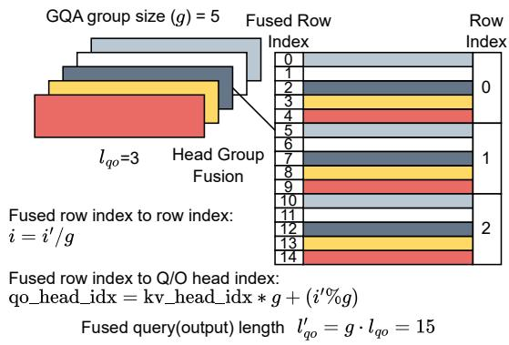  
Figure 11. FlashInfer’s head-group fusion of query heads with the query length dimension in GQA.

We prefer head-group fusion primarily for short query lengths. When the query length is sufficiently large, the query dimension itself yields enough workload to effectively utilize the KV-Cache, making head-group fusion less critical. Similar ideas have also been explored in other frameworks, such as XQA (NVIDIA, 2024b) in TensorRT LLM (NVIDIA, 2023a).

## B OVERHEAD OF SPARSE GATHERING

In Section 3.2.1, we detailed the design of FlashInfer’s sparse loading module, which transfers sparse rows from global memory into contiguous shared memory. Here, we measure the performance overhead associated with sparse gathering in FlashInfer for both decode and prefill kernels.

Figure 12 compares achieved throughput in both prefill and decode kernels for sparse and dense (contiguous) KV-Cache. For the prefill kernels, we measure the causal attention scenario, which is common in LLM serving. For contiguous KV-Cache, We use the variable-length RaggedTensor prefill attention API<sup>8</sup>. For sparse KV-Cache, we use the PagedKV-Cache prefill attention API<sup>9</sup>.

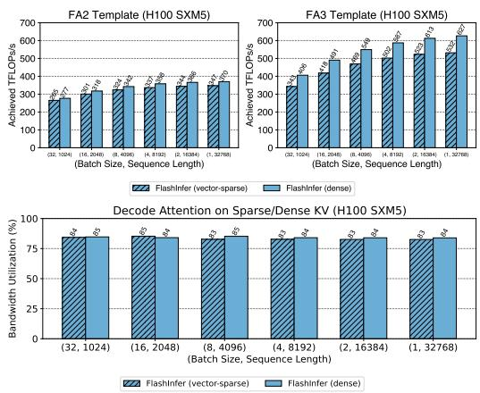  
Figure 12. Top: Achieved TFLOPs/s for (causal) prefill attention kernels on FA2/FA3 templates with both dense/sparse KV-Cache. Bottom: Achieved bandwidth utilization for decode attention kernels for both dense/sparse KV-Cache. We use PageAttention with page size 1 (vector-sparse) for sparse KV-Cache. The x-axis shows various batch sizes and sequence lengths.

The number of query heads and KV heads are both fixed at 32, head dimension is set to 128. We vary batch size and sequence length to measure the achieved throughput. For decode kernels, the performance gap between sparse and dense KV-Cache is negligible (within 1%). For prefill kernels, there is approximately a 10% performance gap.

Note that dense attention in the FA3 template uses TMA instructions (Tensor Memory Access) for key/value loading, which is unavailable for sparse gathering because Hopper Architecture’s TMA only supports fixed-stride accesses, whereas sparse gathering requires arbitrary row indices. Consequently, sparse gathering on FA3 relies on Amperestyle asynchronous copy instructions and manual pointer arithmetic. This approach consumes more registers and necessitates smaller KV-tile size to avoid register spilling, leading to a slightly larger performance gap. By contrast, in the FA2 template (where both sparse and dense use Ampere’s async-copy), the gap is smaller because the same tile size is used.

When the block column size in a block-sparse matrix is large (e.g., 128 or greater), TMA can be used for sparse gathering since each TMA instruction operates within a single block with fixed stride. We leave this optimization for future work. However, increasing the block column size reduces the flexibility of the block-sparse format, which might not be suitable for all use cases.

## C THE CHOICE OF BACKEND

For NVIDIA GPUs, we build FlashInfer on top of CUDA/- CUTLASS (Thakkar et al., 2023) instead of Triton (Tillet et al., 2019) for the following reasons:

1. Advanced NVIDIA GPU Features. CUTLASS supports specialized GPU capabilities such as warpspecialization (NVIDIA, 2024a) and TMA instructions (NVIDIA, 2022), which are experimental or unsupported in Triton at this moment.

2. Fine-Grained Kernel Optimization. While Triton provides tile-level abstractions, CUDA/CUTLASS affords finer control over thread-level registers. This flexibility simplifies incorporating low-level optimizations (e.g., PTX intrinsics) directly into our JIT templates, which is more challenging in Triton.

Our load-balancing scheduler design (Section 3.3.1) is largely backend-agnostic, allowing us to potentially integrate Triton in future versions of FlashInfer and to adapt our approach to other hardware platforms.

## D MEMORY MANAGEMENT

FlashInfer manages a page-locked (pinned) host buffer and a device workspace buffer to store scheduler metadata and split-k partial outputs. We divide the device workspace buffer into sections, each corresponding to an array of either scheduler metadata or partial split-k outputs. For each plan call in the scheduler, we compute the scheduler metadata on the pinned host buffer and then issue a cudaMemcpyAsync to transfer this data into the corresponding sections of the device workspace buffer.

## D.1 CUDAGraph-Compatible Workspace Layout

Once a kernel is captured by CUDA Graph, its arguments (pointers and scalars) become fixed, implying that each section of the device workspace buffer must maintain a consistent address for the entire captured graph’s lifetime. Therefore, we allocate the workspace buffer to its maximum required capacity for each section, based on upper-bound estimations of scheduler metadata and partial outputs.

## D.2 Split-K Writethrough Optimizations

In FlashInfer’s load-balancing scheduler (Section 3.3.1), KV-splitting is only applied to requests that have large KV lengths. Requests with short KV lengths do not require splitting and hence have no reduction step from partial output. To save both computation and workspace memory, these small requests can write their partial outputs directly to the final output buffer (bypassing the device workspace buffer). This approach reduces both the required workspace size and the computational load within the contraction kernel.

## D.3 Workspace Buffer Size Estimation

The workspace buffer size depends on two main factors: (1) the required space for scheduler metadata, and (2) the required space for storing partial split-k outputs.

Scheduler Metadata. The maximum size of each metadata section is derived from the largest possible number of concurrent requests and the maximum accumulated request length. Users must provide these upper bounds during the scheduler’s first planning stage.

Partial Outputs. The size of partial outputs depends on both the problem dimensions (i.e., the number of heads and the head dimension) and the number of CTAs per kernel launch. In our load-balancing algorithm 3.3.1, only requests deemed “long” – those whose KV length exceeds the total KV length divided by the number of CTAs – are split. According to the Writethrough Optimizations in Section D.2, only these split requests produce outputs in the workspace buffer. Because the number of splits cannot exceed the total number of CTAs, and each split yields at most two tiles that must be merged, there are at most 2 × #CTA partial outputs. Each tile produces a partial output of size T<sub>q</sub> · H<sub>qo</sub> · (D + 1), where T<sub>q</sub> is the query tile size, H<sub>qo</sub> is the number of heads, and D +1 is the head dimension and LSE dimension. Therefore, the upper bound for the total partial output size is:

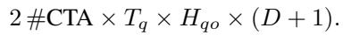

By default, the total number of CTAs is set to k × #SM, where #SM denotes the number of streaming multiprocessors on the GPU and k is chosen to maximize CTA-level occupancy. For tensor-core based microkernels with high register usage, k typically does not exceed 2 on Ampere, and it is often 1 on Hopper (one CTA per SM, also referred to as a persistent kernel).

## E OVERLAP OF ATTENTION WITH OTHEROPERATIONS

Nanoflow (Zhu et al., 2024a) overlaps GEMM, attention, and inter-device communication in separate CUDA streams, assigning a fixed number of SMs to each operation. In Flash-Infer, this SM number can be provided by the user through the plan functions, and the FlashInfer load-balancing scheduler will allocate tiles accordingly.

## F FP8–FP16 MIXED-PRECISION ATTENTION

Recent LLMs frequently adopt fp8 KV-Cache to reduce memory bandwidth and storage costs (Micikevicius et al., 2022). In FlashInfer, we implement mixed-precision attention kernels wherein the query and output remain in fp16, while the KV-Cache is stored in fp8. We leverage the fast numerical array converter and fragment shuffler proposed by Gupta (2024) to accelerate dequantization and handle bitwidth mismatches efficiently. This design allows for reduced memory footprints and higher bandwidth utilization without significantly compromising numerical accuracy.

## G ADDITIONAL EVALUATION

In this section, we present additional evaluation results to further validate the performance, scalability, and robustness of FlashInfer across diverse experimental conditions.

## G.1 Comparison with FlexAttention

We compare FlashInfer and FlexAttention (He et al., 2024) on different attention variants using the AttentionGym (PyTorch-Labs, 2024) benchmark on NVIDIA H100 80GB SXM. We evaluated with batch size 16, number of heads 16 and head dim 128, the CUDA version and the Triton version were fixed to 12.4 and 3.2, respectivelyrespectively. Tables 1 to 4 show the performance of FlashInfer and FlexAttention in TFLOPS/s, where higher numbers mean better performance. Across all four scenarios and a range of sequence lengths, FlashInfer consistently outperforms FlexAttention, with especially large gains at longer sequence lengths. The better performance is mainly due to the usage of Hopper microarchitecture’s advanced features (such as warp specialization and TMA), and CUTLASS’s fine-grained resource control (at register-level rather than tile-level) over Triton. Note that these gaps will be alleviated once Triton fully supports these features.

## G.2 Evaluation of Shared-Prefix Attention Kernels

We measure shared-prefix attention kernels with suffix length 128. Table 5 shows the kernel latency under different shared prefix lengths, scenarios and batch sizes, where numbers are in microseconds (us), and “composable” means composable format while “single” means single format. The composable format benefits long prefixes (e.g., 32k) and large batch sizes (e.g., 64). However, these speedups do not always yield proportional end-to-end gains because realworld shared prefix sizes tend to be smaller.

Table 1. Causal Attention  
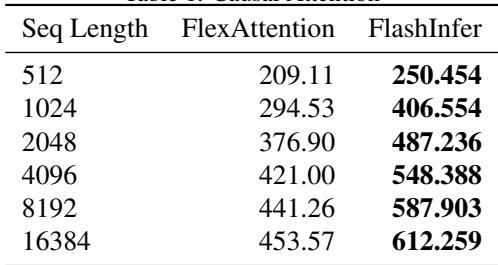

Table 2. Attention with Logits SoftCap  
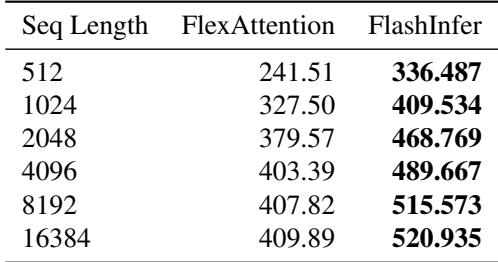

## G.3 Ablation Study on Variable Sequence Length and load-balancing scheduler

We conduct ablations on the effect of load-balancing scheduler (Section 3.3.1). Table 6 and 7 show the results for Llama 3.1-8B-Instruct running on an NVIDIA H100 SXM5 GPU with SGLang (Zheng et al., 2023b) + FlashInfer (with and without load-balancing scheduler). We evaluate the inter-token latency (ITL, ms) and time-to-first-token (TTFT, ms) with three datasets: ShareGPT, variable sequence length with input lengths sampled from U(512, 2048) and output fixed at 256, and variable sequence length with input lengths sampled from U(4096, 16384) and output fixed at 256. “RR” in the tables means request rate.

## G.4 vLLM Integration Evaluation

We compare the vLLM with FlashInfer backend and its default backend with a fixed request rate of 16, reporting throughput (tokens/s), inter-token latency (ITL, ms), and time-to-first-token (TTFT, ms) in Table 8. FlashInfer reduces ITL by aroudn 13% using fp8 KV-cache, but heavy Python overhead in vLLM integration (e.g. array operations) at host side causes minor regressions with bf16. Our future optimizations will address these in C++ and move the scheduler to device.

## G.5 Fine-Grained Block-Sparsity Evaluation

FlashInfer supports fine-grained block-sparse matrices, which is useful in many KV-Cache pruning algorithms. We measure the kernel performance on Quest (Tang et al., 2024), a state-of-the-art long-context modeling algorithm, which uses fine-grained sparsity in KV-Cache. We compared the batch decoding attention kernel in Quest using FlashInfer and compared its performance to PyTorch SDPA and Flex-Attention on an NVIDIA H100 SXM5 GPU with the configuration (block size 16, num\_qo\_heads 32, num\_kv\_heads 32, head\_dim 128). All latency values reported are in microseconds (us).

Table 3. ALiBi Bias (Press et al., 2022)  
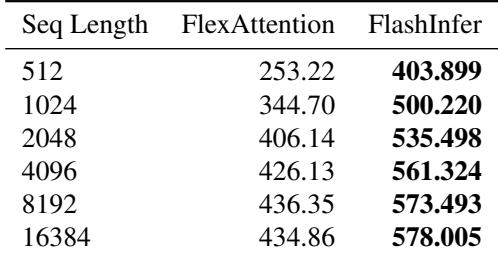

Table 4. Sliding Window (window size = 1024)  
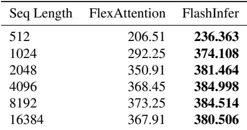

As shown in Table 9 to 11, FlashInfer demonstrates a considerable performance advantage, achieving up to a 20x speedup for long sequence lengths. Currently FlexAttention relies on large block size templates, while FlashInfer employs a sparse-row gathering strategy to leverage dense tensor cores for small block sizes. This design choice supports fine-grained KV-cache pruning.

Table 5. Latency of Shared-Prefix Attention Kernels  
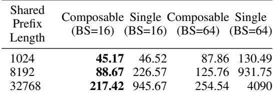

Table 6. Load-balancing Scheduler Ablation Study (ITL)  
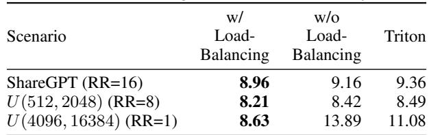

Table 7. Load-balancing Scheduler Ablation Study (TTFT)  
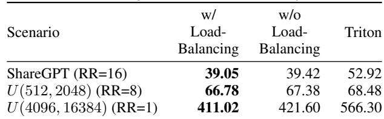

Table 8. vLLM Integration Evaluation  
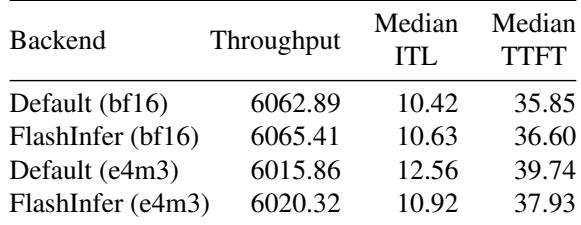

Table 9. FlashInfer Fine-Grained Sparsity Latency (us)  
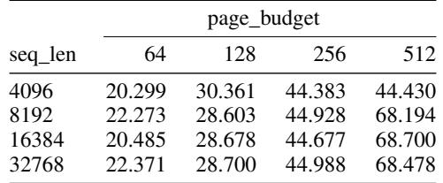

Table 10. PyTorch SDPA Fine-Grained Sparsity Latency (us)  
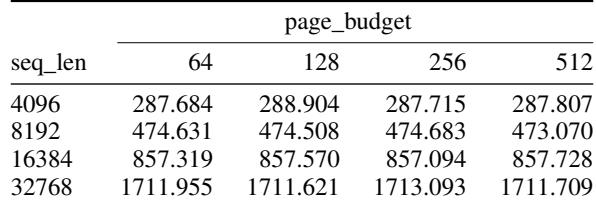

Table 11. FlexAttention Fine-Grained Sparsity Latency (us)  
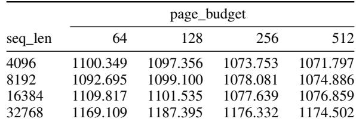