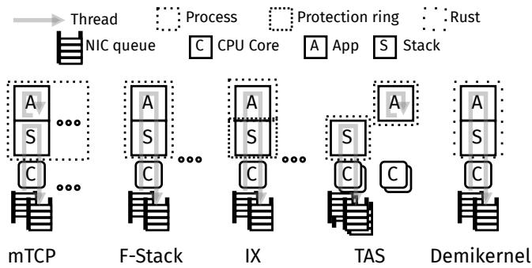
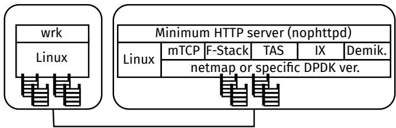
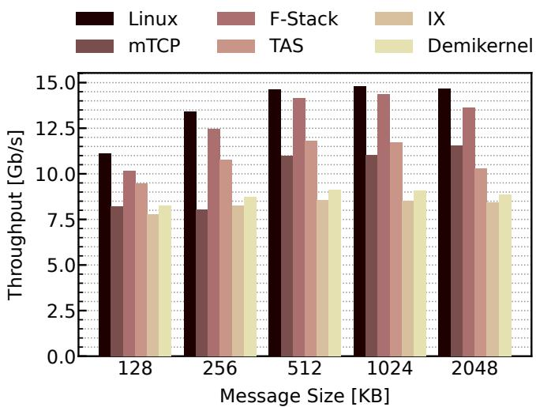
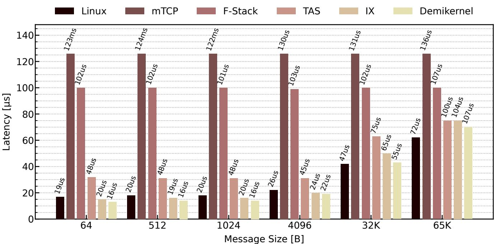
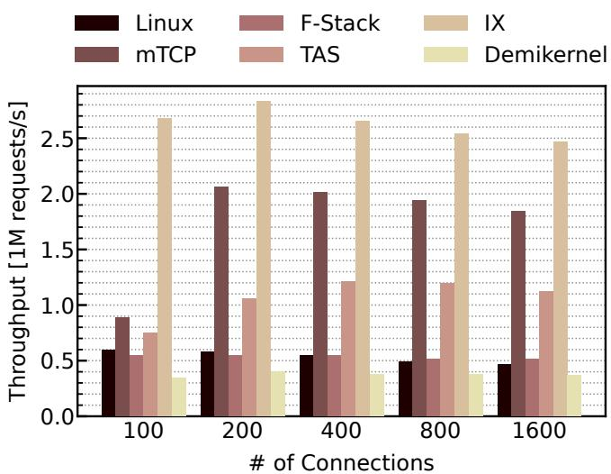
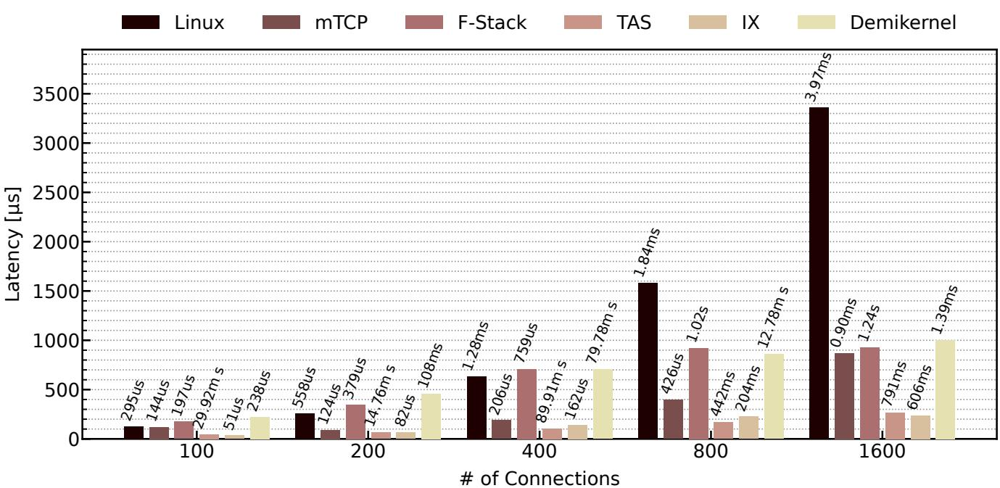
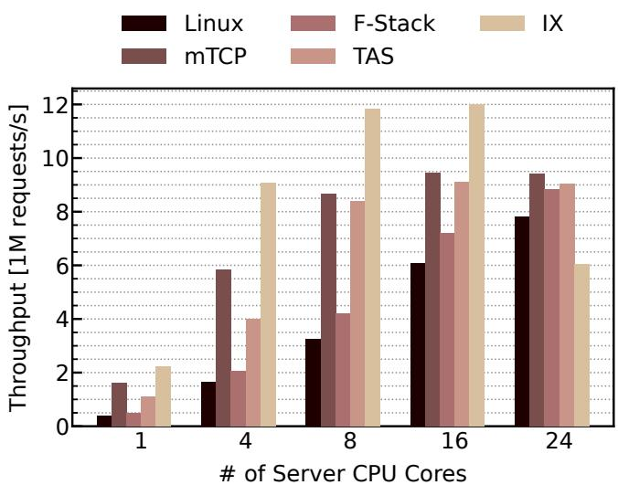
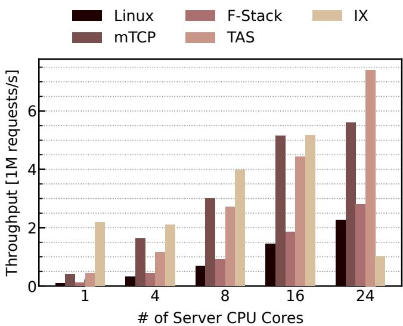

①

USENIX

THE ADVANCED COMPUTING SYSTEMS ASSOCIATION

# Opening Up Kernel-Bypass TCP Stacks

# This paper is included in the Proceedings of the 2025 USENIX Annual Technical Conference.

July 7–9, 2025 • Boston, MA, USA

ISBN 978-1-939133-48-9

Open access to the Proceedings of the 2025 USENIX Annual Technical Conference is sponsored by

P-Lr.h £Es/sL.

auuuJl9 PgleU

King Abdullah University of

Science and Technology

# Opening Up Kernel-Bypass TCP Stacks

Shinichi Awamoto and Michio Honda University of Edinburgh

## Abstract

We have seen a surge of kernel-bypass network stacks with different design decisions for higher throughput and lower latency than the kernel stack, but how do they perform in comparison to each others in a variety of workload, given that modern stacks have to handle both bulk data transfers over multi-hundred gigabit Ethernet and small request-response messages that require low latency? We found that even representative kernel-bypass stacks have never been compared for a set of basic workloads, likely because of difficulty to run their implementation. This paper takes the first step towards answering that question by comparing six in-kernel or kernelbypass stacks. We show that existing stacks cannot handle those workloads at the same time or lack generality. We then use those observations to discuss possible pathways towards practical kernel-bypass stacks.

## 1 Introduction

TCP has been widely used in both the Internet and datacenters. It is not just an interconnect, but a part of the network; TCP interact with applications, physical and virtual networks often operated by SDN controllers, and middleboxes, such as load balancers, firewalls, network observability and telemetry systems, prevalent in cloud infrastructure. Being part of an operating system kernel, TCP has performed reasonably well with the aid of hardware offloading for checksum computation and segmentation. Most of issues raised over time have been remedied by protocol or stack extensions; for example, TFO [63] enables data transmission over SYN packets, MPTCP [65] supports simultaneous use of multiple paths, and Minion [53] preserves application message boundaries. To support modern ML workloads, MLTCP [66] incorporates the application behavior in the TCP congestion control.

Meanwhile, some applications have suffered from slow kernel network stack performance evolution at the system level to meet tight latency or throughput requirement over high speed datacenter network fabric. Major criticisms are low throughput and high latency when the server handles a large number of connections [59, 79], often cited as the C10K/C10M problem [37], low throughput scaling to multiple CPU cores due to contentions at CPU caches or locks [24, 32], and high software overheads posed by generality that supports many features and abstractions [23, 45, 21].

Some hyperscalers thus have attempted to deploy a kernelbypass TCP stack built on top of a fast raw packet I/O engine like DPDK [46, 82, 16] and we have seen a surge of such stacks also from academia. Indeed, kernel stacks are primarily optimized for high throughput of bulk data transfers, but at the same time, generality and patch-based development cycle have bloat software complexity and data structure footprint. As a result, the stack cannot drive 100 Gb/s or higher bandwidth networks, respond to millions of RPCs (requestresponse messages) per second, or save enough CPU cycles for application-level tasks or energy efficiency.

Operators and application developers now face a problem with what network stack they would build or adopt with an understanding of performance characteristics and trade-offs of design options. As it turns out, it has been increasingly apparent that no one knows which stack design or implementation makes a difference in a range of workloads, or even whether they really need a kernel-bypass stack. When a new stack is proposed in the literature, it typically compares against the regular Linux stack and one existing kernel-bypass stack or two. The comparison is thus limited, and the metrics often highlight their strengths or main focus.

Although a new stack is usually designed to solve problems that appear in a specific workload, it is rare that operators can completely ignore performance in another workload— especially in networks or applications where the highly generic TCP protocol is used, rather than in those where specialized non-TCP transport can be adopted for specific workloads [34, 44, 55, 26, 74]. Also, even for the workloads that a proposed stack focuses on, we found that several stacks exhibit opposite results from their reports. This is unsurprising, because the performance of stacks depend on many factors, including application architecture, workload, and hardware or software configuration whose optimal one differs between the stacks.

The implication of adopting or building a new stack is not just moving the TCP implementation out of the kernel and adapting the applications to the new stack (although that is already a substantial engineering effort). Today’s systems heavily depend on the kernel stack in both the software and protocol aspects. The software aspect includes system-wide and application-level resource accounting, fault isolation between the application and stack, protection against application or network protocol misbehavior, and support for queuing disciplines or packet filters controlled by familiar tools or orchestration frameworks. The protocol aspect includes extensions, which mostly rely on TCP options negotiated with the remote endpoint, and new algorithms for congestion control and loss recovery, which interplay with other traffic in the network.

A new kernel-bypass stack would need to support those features when they are used in production. It is not just an addition of features, but requires development and operation cycles over time, perhaps with a continual community effort, as we have seen in the evolution of the Linux kernel stack that has continually changed by 5–25% LoC modification in each component, each year, at least 2010–2020 [61]. Given that relatively few stacks could afford such an effort for a long term, what would those stacks look like?

Once a high quality, general enough kernel-bypass stack supported by a wider community is available, the clear implication is accelerated evolution of it both in development and deployment, much like what we have seen in success of QUIC often shipped with web browsers. Some users would fork it and some would contribute back the enhancement they made, and new features could be used without OS upgrade, which has lead to slow stack evolution and option deployment in the Internet [48, 28].

We present performance measurement results of six different in-kernel or kernel-bypass network stacks—regular Linux, mTCP [32], TAS [36], F-Stack [16], IX [7] and Demikernel [80]—running on the same hardware, serving the same workloads and using the same application whose I/O is optimized for individual stacks. Selection of the stacks is made based on their design decisions (Figure 1 and Table 1) and availability, although we still needed to implement new features, fix bugs or figure out optimal configuration without document in some to enable fair comparison with their best possible performance.

We examine the effect of network stack design decisions on basic workloads, such as simple bulk data transfers and RPCs over different degrees of parallel connections with varying number of CPU cores, which surprisingly have not been studied. As we will describe in § 4–§ 7, those workloads stress varying aspects of the stack. We discuss untested stacks and workloads in § 8.5.

This paper makes three contributions.

• The first is a snapshot of the performance of different network stacks on modern hardware as of 2024, showing none of the stacks perform well for both large and small data transfers at a range of concurrency levels.

• The second contribution is our measurement methodology that allows us to make fair comparison between different stacks for variety of workloads with simple hardware requirements. It also shares our experience of writing an application over multiple stacks with largely different APIs or even programming models.

• Last but not least, we enable third-party software artifact of five representative kernel-bypass stacks for all the basic workloads under a unified application; this would enable others to start research or development on those stacks.

We believe this is a crucial step. Alibaba has reported that fixing problems with existing stacks is more expensive than building a stack from scratch due to limited community support [82], but such an approach is only affordable for hyperscalers with a large amount of engineering resources.

## 2 Motivation

Kernel-bypass stacks are designed and implemented to outperform kernel stacks, but we observe two problems to understand the status quo as a whole. First, most of those are evaluated in a limited set of workloads, disregarding one or more of basic yet salient stack properties that we detail in § 2.1; for example, none of the stacks we test are evaluated for large data transfer1. Although datacenter traffic contain many small RPCs, large transfers are also common in storage traffic [4] and machine learning [66]. Second, those stacks are compared only against one or two other stacks, likely due to the lack of practical availability of other stacks.

There exists a growing trend of releasing the artifact to ensure reproducibility of research output, but artifact does not necessarily mean software release supposed to be used by others in their own way. We first review how the kernel stacks have evolved towards better performance by addressing emerging challenges. We then describe the representative stacks we evaluate in this paper, if any, including our modifications required to evaluate their basic stack properties.

The rest of this section describes the key properties used in the kernel TCP stack to serve various workloads. We then review the kernel-bypass stacks we test in terms of their design highlights and usage by the original authors and others, which we also summarize in Table 1.

## 2.1 Kernel Network Stack

Large sends. Kernel network stacks have been optimized primarily for throughput of bulk data transfer. It is motivated by file transfers over the Internet, which thus has been the common networking performance metric measured by popular tools, including prominent iperf [52].

The basic primitive of the kernel stack is the packet data structure (sk\_buff in Linux and mbuf in FreeBSD). It represents arbitrary-sized packet data that can span across multiple packets or kernel pages and can be moved between the layers without data copy, while maintaining shared metadata like pointers to packet headers or sockets and reference counts. When the application writes data on the TCP socket, it is copied to the kernel socket buffer. The kernel then allocates a packet metadata, which is passed down through the stack.

The TCP implementation creates a larger segment than the MTU size preceded by a single TCP and IP header so as to reduce the number of network layer operations required to send the same amount of data. This segment is split into MTUsized packets while adjusting their sequence numbers, packet length and checksum fields at the NIC with TSO or the bottom of the software stack with GSO. The kernel stack can send the next data in the socket buffer, which would have been held due to the lack of the available window, as soon as it receives a positive ACK, because the ACK packets are processed in the interrupt context invoked by the NIC (softirq in Linux and isr in FreeBSD).

Multi-hundred gigabit Ethernet fabric requires large transfers also to cope with high packet rates, whose problems are discussed next. BigTCP [18] enables TSO for larger segments than 65 K B to further reduce the network layer processing per unit data. High bandwidth networks also create congestion in the host interconnect and memory subsystems, and [2] mitigates it.

Small messages. It is easy for kernel stacks to fill a 10 Gb/s link with large transfers [24], because the transmission time of a 1.5KB packet is 1.2 µs, which is sufficient for the sender to prepare the next segment and push it to the NIC. However, that of a 64 byte packet is 67 ns, which is too short to prepare the next packet, because of software overheads in the protocol stack [24, 32, 72]. Those overheads include system call, packet metadata (de)allocation, socket manipulation such as state update, file descriptor lookup on receive, many of which rely on atomic operations or locking. Short messages are common in datacenters due to RPCs, for example, to retrieve remote in-memory caches, commit database queries and run consensus protocols [70].

Concurrent connections. Concurrent TCP connections are common in the Internet servers, whose challenges are cited as C10K or C10M problem [37, 42, 49]. Those are also common in datacenters due to parallel RPCs [70]. In addition to request processing throughput, tail latency also matters, because it is common that a server accesses many other servers to generate the response to a single request, meaning that one serverserver communication delay blocks the response to the client.

Concurrent connections reduce CPU cache locality (e.g., of the connection data structure). Another problem is that the application (thread) needs to process many (per-connection) file descriptors that receive a request. In the conventional epollbased programming model, each thread processes those descriptors in turn, reading the request and writing a response using two syscalls, whose overheads are significant for small data. Concurrent connections thus create request backlogs at the application, leading to queuing delay [79]. The new I/O multiplexing APIs, io\_uring, reduces the request handling syscalls.

Multiple CPU cores. Modern NICs are equipped with multiple queues processed by different CPU cores to improve request handling throughput over concurrent connections. On receive, Receive Side Steering (RSS) distributes the packets to different queues based on the source-destination 4-tuples to avoid packet reordering in each connection. Those queues interrupt the corresponding CPU cores (e.g., same index) to parallelize the subsequent packet processing. The send syscall context typically chooses the NIC queue based on the current CPU core to avoid lock contention. However, locks, atomic operations and large memory footprint of data structures impair parallelism across multiple CPU cores, limiting the wholeserver throughput. Also, multiple queues do not increase the parallelism inside the NIC; packets across the queues are still serialized at the NIC hardware [73].

  
Figure 1: Stack architectures. Details in § 2 and Table 1.

## 2.2 mTCP

mTCP implements the TCP/IP protocol suite from scratch and runs it in user space on top of a raw packet I/O framework (ShaderIO [23], DPDK or netmap [67]) that achieves packet I/O at a very high rate by enabling batch packet processing. Although mTCP provides socket-like APIs, scanning connections to process the requests needs just lightweight library calls for every connection, instead of expensive real read/write syscalls.

The most unique aspect of the mTCP architecture is extensive resource partitioning between the CPU cores. It allocates a stack thread, which performs packet I/O and protocol processing, to every application thread, and co-locates the thread pair on the same CPU core to enable lock-free data sharing between the stack and application, as illustrated in the leftmost part of Figure 1. mTCP stack threads even do not share the TCP connection instances; if a stack thread receives a packet that belongs to a connection handled by another thread, it simply discards the packet.

The implementation of mTCP is relatively stable. We have seen its usage or extension in other research projects, some with the mTCP authors [31, 50, 38], but many without [3, 7, 36, 81, 41]. However, the workload is limited; for example, the maximum transfer size per request is 8 K B and the number of CPU cores is at most 8 in the original paper and 24 without application-stack thread pinning in other work [36]; [41] uses 24 cores, but at low request rates (up to 0.2M requests per second). We test mTCP with transfer size up to 2 MB (§ 4) and up to 24 CPU cores (§ 7).

<table><tr><td></td><td>Architecture</td><td>API</td><td>TCP impl.</td><td>Use by author(s)</td><td>Use w/o author(s)</td></tr><tr><td>mTCP [32]</td><td>App-stack thread pair on the same core</td><td>Socket-like (no semantics)</td><td>Custom</td><td>Up to 8 KB data and 8 cores [32,31,50,38]</td><td>Up to 8 K B data or 24 cores [3, 41, 7, 36, 81]</td></tr><tr><td>F-Stack [16]</td><td>App-level processing in the stack thread</td><td>Event callback to the stack</td><td>FreeBSD</td><td>1</td><td>Up to 8 KB data [57, 81], 8 cores [10] or 64 conns. [58]</td></tr><tr><td>IX [7]</td><td>App-level processing in the stack thread</td><td>Packet-level TX/RX buffers</td><td>lwIP [19]</td><td>Up to 8 KB data [38]</td><td>Up to 64 B data [36],4 K B w/ 8 cores [81] or low data rate [41]</td></tr><tr><td>TAS [36]</td><td>Dedicated threads for TCP data path</td><td>Socket-like</td><td>Custom</td><td>Up to 2 K B data and 24 cores [36, 72, 75]</td><td>Up to 0.3 MReqs with high overhead apps [41]</td></tr><tr><td>Demikernel [80]</td><td>App-level processing in the stack thread in Rust</td><td>Packet-level TX/RX buffers</td><td>Custom</td><td>Up to 16 conns. [64] and 256KB data [80, 15]</td><td>Up to 64 conns. [58]</td></tr></table>

Table 1: Design and usage summary of the network stacks we test. Their details are in § 2.

mTCP has a significant deployment issue. When it initiates the connection (i.e., used as a TCP client), returning packets must arrive at the same CPU core by carefully choosing the local port number based on the RSS hash function. This restricts the number of usable local ports per destination or compromises the flexibility of choosing the local port. Further, its specific RSS hash seed required at both the client and server also results in poor connection distribution among the cores, which would be problematic when a large number of cores is available. Further, mTCP does not support applications that use different threads for sending and receiving [36].

In our measurement, we needed to simulate the distribution with various seeds and modify mTCP to use the pre-calculated seed. In the real world, the user may need to implement a dynamic load balancing or thread migration mechanism. Therefore, mTCP is easy to use in terms of I/O APIs because those are similar to socket APIs, but its shared nothing architecture complicates the application model and system configuration. We also needed to select, with mTCP code modification, busypolling or interrupt to handle packet input for each workload to achieve best possible performance.

## 2.3 F-Stack

F-Stack [16] is a production-quality kernel-bypass stack developed and used by Tencent Cloud. It runs on top of DPDK but ports the FreeBSD TCP implementation to benefit from its advanced TCP features, including RACK [14], TFO [63], ABC [5] and SACK extensions [47, 8], to name a few.

This is a stark contrast to mTCP, which implements optimized TCP from scratch at the expense of supporting only basic features. It should be noted that, since the current TCP has a number of extensions widely used, just implementing RFC793 [77] and RFC1323 [9] does not mean being a fullyfledged TCP implementation.

F-Stack employs the architecture where the stack and application run in the per-core process (see Figure 1). Unlike mTCP, both stack processing and application-level tasks are executed in the same thread. Although F-Stack intends to provide socket-like APIs to minimize the porting effort of existing applications, we found that it is not as easy as it sounds due to their core architecture. Since the address space is not shared between processes by default, application-level contexts would need to be relocated to explicit shared memory. Further, event handlers that are registered by the application as callbacks must return control to the stack to restart the stack activity, further hardening the application port. This is a stark contrast to the applications that are running on top of the kernel stack where the OS appropriately schedules the application and stack tasks.

F-Stack is used by several external research projects for either bulk data transfers briefly [38], small messages up to 8 K B [57, 81], 8 CPU cores with up to parallel 1120 connections [10], up to 64 parallel connections [58] or functional test [83]. However, it is unclear how F-Stack works for variety of workloads in the same setup.

## 2.4 IX

IX runs the stack in a protected CPU ring domain usually used for virtualization. It runs on top of DPDK and employs lwIP [19], a portable TCP/IP protocol implementation, thereby inheriting its protocol features and extensions. IX provides a low-level APIs based on event conditions, and operates based on the run-to-completion execution model throughout the stack and application; when a series of packets (in the same or different connections) arrive at a NIC ring, the busy-polling thread processes those packets in the stack, executes the application-level request processing, and then sends the responses through the stack (Figure 1). The thread restarts waiting for new packets after consuming all the packets. IX [7] reports much lower average and tail latency, as well as higher request throughput, than mTCP.

Since IX does not support socket-like APIs, porting existing applications to IX requires significant effort, including changes in both I/O APIs and the application execution model.

IX is the basis of following projects by the original authors, including ZygOS [62], which reduces the tail latency by work stealing, and Shinjuku [33], which further cuts latency with preemptive scheduling. IX has also been used by several research projects without the authors [81, 36, 41]. However, their use of IX is limited to 64 B messages [36], 4 K B messages [81] or low request rates of up to 0.4M per second [41].

In our experiment, since the original IX implementation is unstable, we use the one included in Reflex [39] which is also the work of the common authors. IX in Reflex removes the dependency on Dune and thus the use of protected CPU domain [6]. This actually prevents IX from being disadvantaged by the overheads caused by extra protection that other stacks do not offer, enabling fair comparison in our study.

## 2.5 TAS

TAS takes a unique approach that replaces the datapath of the TCP stack, while leaving control to the kernel. The TAS datapath runs dedicated acceleration user-space threads, which execute the packet I/O using DPDK and TCP/IP protocol processing and post the data to the application that runs in separate threads (Figure 1). Therefore, TCP datapath functionalities, such as congestion control, loss recovery and packet filtering, are not inherited from the kernel stack and must be implemented in TAS.

Application porting effort required to use TAS is relatively low. TAS preloads the POSIX I/O library to move the data between the acceleration and application threads with ease, meaning that the application can still use the POSIX system call. While some socket options are not supported, no major modification to the application source code was needed. Unlike the stacks mentioned earlier, it does not use the sharednothing architecture or run-to-completion, which significantly contributes to the low application porting effort. On the other hand, it does not support modern TCP extensions.

TAS has been used in following projects by its original authors [72, 75], but to the best of our knowledge, without the TAS authors, it was used only at low request rates [41].

TAS had a significant problem to test. First, we noticed that TAS does not implement the Window Scaling (WS) option when we observed very low bulk data transfer throughput. The lack of large window usage does not only limit the throughput, but leads to incompatibility with stacks that do not support WS-incapable remote endpoint, which is the case for mTCP. Even after implementing this option, we found that TAS cannot use the resulting large window; we further added support for that.

Moreover, TAS is sensitive to configuration. Since its default internal buffer (equivalent to kernel socket buffer) size is very small, the application needs to call write commands repeatedly until the data is fully written, causing inefficiency. TAS limits the bandwidth usage by default to optimize for load balancing among multiple connections. However, it is harmful for bulk data transfers. Finally, the user can manually assign CPU cores to the application and stack threads. This means that there exist a large search space for optimal core assignment where the optimal setting depends on workload and application and can be verified only based on measurement of the resulting performance. This is a stark contrast to the kernel stack that shares cores between the stack and applications. We searched for the optimal split of cores between the stack and application in multi-core experiment (§ 7).

## 2.6 Demikernel

Demikernel augments various kernel-bypass I/O frameworks like DPDK and RDMA, and protects the stack and application by Rust. It is designed to achieve ultra-low latency. Demikernel supports generating Rust coroutine, a lightweight context switching mechanism, which is advantageous compared to the POSIX thread-based context management. It provides a new asynchronous I/O API and employs the run-to-completion execution model. Its TCP/IP protocol implementation is built from scratch, similar to mTCP and TAS.

Demikernel has been used by the original authors for their following projects [64, 15], but also by other authors [58]. Demikernel has been tested only with small numbers of concurrent TCP connections, up to 16 by the original authors [64] or 64 by others [58].

Porting existing applications to use Demikernel is difficult in several aspects. Demikernel assumes that the application has already segmented their data into MTU-sized chunks. This would be troublesome for bulk data transfers. Its I/O event model also differs from that of regular kernel stacks, which is particularly relevant when handling concurrent TCP connections. For example, in contrast to Linux epoll\_wait that notifies the caller of ready-to-process events, the equivalent function of Demikernel sends event completions. To follow this model, the developer might not only just replace API calls but restructure the application. Finally, due to its single-threaded design, it is hard to utilize stack-level multicore parallelism. Therefore, although the I/O interfaces could be wrapped to resemble POSIX APIs, it would be hard to use Demikernel in terms of application threading and event handling.

## 3 Methodology

Flexible yet simple measurement methodology is crucial to characterize stack performance. Existing stacks typically use their own custom application for basic measurement, which utilizes the underlying stack most efficiently with minimum overheads. However, since those applications use their own application-level protocol, one cannot be used to evaluate another stack. Further, those applications do not support all the workloads we would like to test.

  
Figure 2: Experiment software architecture in the client and server machine connected back-to-back.

Some of the stacks are ported to an existing HTTP server application, such as lighttpd or nginx, but it includes significant application-level overheads, which is undesirable to highlight performance characteristics of the stack itself. Further, different stacks are ported to different HTTP servers, whereas those HTTP servers have different architectures and complexity, meaning that we cannot compare “HTTP server X on stack A” against “HTTP server Y on stack B”. Memcached has been ported to all the stacks, but they are different in versions and exhibit high application-level overheads, similar to HTTP servers.

Server. We thus implement nophttpd (Figure 2 right), a custom TCP server that simply serves a static in-memory data in response to an HTTP request. Exploiting the advantage of building the application by ourselves, nophttpd is optimized for individual stacks—Linux, mTCP, F-Stack, IX, TAS, and Demikernel (Catnip TCP stack)—to handle all of bulk data transfer, small RPCs, concurrent connections as efficiently as possible and well utilize multiple CPU cores, while addressing most of the API challenges posed by those stacks, described in § 2.2–§ 2.6. When running on regular Linux, nophttpd uses epoll-based event loop. For Demikernel, we implement nophttpd in Rust to use its native APIs directly.

We do not opt for implementing a wrapper that unifies the interfaces of all the stacks and the minimum HTTP server logic on top of it. This is because the stack’s execution model largely differs between the stacks, not just the function names or arguments. Therefore, such an unified wrapper approach would advantage or disadvantage particular stacks, making the comparison unfair. Our approach of tightly coupling the application logic with the native API of each stack might be impractical when building an application in practice, but this approach is suitable for the purpose of fair comparison between the stacks.

Client. Another challenge is the client. Some existing work [36, 32] employ multiple client machines that run regular Linux stack to saturate the kernel-bypass server, because the kernel-bypass stack is faster than in-kernel one by a large margin particularly for small messages. However, the use of multiple clients complicates the measurement workflow and requires additional hardware resources.

We thus use a single client machine. When we test multicore scalability of the server stack, we downclock the server

CPU clock frequency, as done in [67, 27], to prevent the client from becoming the bottleneck. We use the wrk benchmark tool for its useful stat report and straightforward implementation. However, we found it has multi-core scalability issue in its stat management mechanism, which creates a contention between threads when their number is high. We thus modified wrk to aggregate the stats across the threads in a more coarse granularity and use thread-local buffers to store intermediate records. wrk establishes one or more persistent TCP connections to the server and repeats sending a request and receiving a response in every connection. Our methodology might seem limited, but as we will show in the next sections, we can characterize stacks with variety of workloads.

Workload. We measure bulk data transfer throughput, small message latency with unloaded client and server, and concurrent message throughput and latency over multiple connections that stress the server. Those workloads are simple, but stress different parts of the server network stack, including per-byte or per-message transfer efficiency, connection scalability, and multi-core scalability. We believe our measurement is worthwhile, because existing work does not test the stacks across all these aspects simultaneously in a consistent setup, as discussed in § 2.

Hardware and system configuration. We use a pair of identical machines connected back-to-back. Each machine is equipped with Intel Xeon Gold 5418N (Sapphire Rapids) clocked at 1.8Ghz and Intel XXV710-DA2 25GbE NIC. Both machines run Linux kernel 5.18 unless otherwise stated. We deactivate unused cores with CPU hotplug in Linux to prevent the kernel from performing relevant activity to the test on those cores. We disable segmentation offload (TSO) for all the stacks for fair comparison, as mTCP and Demikernel do not support it; if it was enabled, it would provide larger degree of improvement in stacks with higher per-packet processing costs (i.e., lower small message throughput), because TSO reduces the packet rate in the stack. We run each benchmark for 8 seconds.

## 4 Bulk Data Transfer

We first measure bulk data transfer performance of the stacks. Since we test each stack running at the server, the client issues a small request that triggers a large response to test the ability of the server stack to send large packets continually, which is clocked by receiving ACK packets. Many kernel-bypass stacks do not consider this workload much, although large transfer still happen in many scenarios; storage, search and web systems are a few of the examples [56, 1].

On the regular socket write, the kernel copies up to as much application data as the available kernel socket buffer. Partial write is not a problem, because the socket informs the caller of how much the data is written, and TCP semantics is a byte stream, like a file. In other words, the application can write arbitrary sized data into the socket. Kernel-bypass

  
Figure 3: Bulk transfer throughput over a single connection.

TCP stack APIs vary. IX and Demikernel require the application to split the data so that each fits into a single packet, as described in § 2.4 and § 2.6, respectively. We omit the large receive performance measurement, because it is more lightweight than sends for large data. Receive-side processing performance matters for small messages due to high packet arrival rates; our experiment with small messages in the next sections stresses the receive path of the stacks.

Figure 3 shows the throughput of Linux stack, mTCP, TAS, F-Stack and Demikernel. nophttpd sends up to 2MB of a message over a single connection as the response to a small request issued by the client. All the stacks use a single CPU core, except for TAS, which requires minimum two cores, one for the application and the other for the accelerated datapath.

The Linux stack achieved the highest throughput, peaking at 14.69 Gb/s with 2 MB messages over a single connection. This is unsurprizing, because it has long been optimized for it. F-Stack achieved 13.66 Gb/s, following the Linux stack.

To shed light on this observation, we profiled mTCP and F-Stack using Linux perf. The Linux stack consumes 50.5% of the CPU time in TCP, IP and Ethernet protocol processing, whereas F-Stack consumes 52.5%; memcpy, whose overheads are dominant in large buffer processing, is not included in those overheads. Since the Linux stack and F-Stack can process 880 and 735 requests per second, respectively, this translates that the Linux stack can process TCP packets 19.6% more efficiently than F-Stack (1 − (50.5/880)/(52.5/735)).

Given that the FreeBSD TCP implementation is optimized as much as Linux [71], our results suggest that the overhead of emulating the kernel environment to run the FreeBSD stack could offset the I/O efficiency of DPDK, at least for this workload. Further, it is also possible that the run-to-completion execution model of F-Stack fails to push the next packets fast enough in response to the ACK packets.

Other stacks largely fall behind. mTCP and TAS exhibit 10–12Gb/s in throughput. Those stacks are not particularly optimized for bulk data transfer, but significant performance penalty for such workload would prevent operators from adoption of them. Demikernel and IX exhibit the lowest throughput. This is partly due to their inefficient APIs that the application must fill the packet-sized data fragments, resulting in poor interaction between the application and network I/O for multi-packet data. Also, similar to mTCP and TAS, their run-to-completion model could fail to ACK-clock the large transfer efficiently.

## 5 Small Messages

Latency of small messages has been crucial in datacenters, because servers handle many RPCs, such as in-memory keyvalue cache access for small items and API calls. In this section, we discuss unloaded latency, where the message or packet is never queued in the network, host interconnect or the host software stack, to directly highlight basic software overheads of the stack; we discuss latency in the presence of concurrent requests and connections in the next section.

To take the lowest possible RTT of each stack whose performance is determined by the software and context switch (if any) overheads, the client triggers a small response (64 B payload preceded by the HTTP header) for a small request over a single connection and CPU core. We disable interrupt moderation at the NIC in this experiment, so that the receive interrupt can be caught quickly, which is crucial for mTCP and Linux stack. For the Linux stack, the application busypolls the event descriptor (i.e., on epoll\_wait) to avoid the wake-up procedure of the application that is blocking.

Figure 4 plots the P50 request RTT over a single connection with varying response size; we indicate P99 RTT with a number on each bar. Surprisingly, the kernel stack latency is comparable to other kernel-bypass network stacks, achieving 17 µs for 64 B messages. However, it is still higher than Demikernel, which achieves 13 µs, the lowest among all the stacks we test.

mTCP’s high latency is expected, although the paper [32] does not report the latency. This is because one of its design decisions is to aggressively exploit packet-level batching. Further, the mTCP stack and application threads run on the same CPU core in user space, which would exhibit high context switching overheads, although maximizing cache locality and enabling lock-less stack-application communication for high multi-core scalability. F-Stack’s high latency could come from the same reason with the lower bulk transfer throughput in comparison to Linux—the kernel emulation overheads to run the FreeBSD TCP/IP implementation would incur high software overheads. Low-latency stacks such as IX and Demikernel start showing higher P50 and P99 latency than Linux when the message sizes are larger than 32 K B, perhaps due to the same reason with their low bulk transfer performance discussed in § 4.

  
Figure 4: RTT at P50 (bars) and P99 (numbers on the bars) in a single connection.

  
Figure 5: Throughput over concurrent TCP connections.

We observe similar characteristics of P99 latency to P50 overall, but mTCP exhibits extremely high tail latency, for example, as much as 124 ms.

## 6 Concurrent Connections

We now turn our attention to concurrent requests over multiple connections, as it is a common pattern for datacenter RPCs (§ 2.1). In the stack that executes receive packet processing in a separate thread from the application (Linux, mTCP and TAS), when the stack drains the NIC queue more slowly than the packet arrival rate, the queue forms at the NIC; when the application consumes the requests more slowly than the stack, the queue forms at the application. In the stack that processes both receiving packets and application-level task in the same thread in a run-to-completion manner (F-Stack, IX and Demikernel), the backlog forms at the NIC.

Figure 5 plots the throughput with the single CPU core, except for TAS which requires at least two cores; we discuss the multi-core cases in the next section. Figure 6 plots request latency at P50 (bars) and P99 (numbers on the bars).

In throughput, IX consistently outperforms others by a large margin, 30–684%. mTCP outperforms TAS by 17–95% although TAS uses one more core in total. Those results differ from the report of the TAS paper. For those numbers of TCP connections, the TAS paper reports similar throughput between TAS and IX, which also differs in our experiment. Those observations are likely due to the different CPU core allocation, where we allocate the minimum number of cores in this experiment.

Interestingly, F-Stack and Linux perform almost the same, again implying the overheads of kernel emulation that offsets the effect of efficient DPDK packet I/O.

TAS achieves low P50 latency, close to IX, but it could be due to almost only half of the IX throughput. Linux exhibits low throughput and high latency, which exacerbates with increasing numbers of concurrent connections. This could be attributed to both high stack processing overheads and application-level per-request processing costs with syscalls.

  
Figure 6: RTT at P50 (bars) and P99 (numbers on the bars) over concurrent connections.

IX achieves 73–85% lower P50 latency than Demikernel, which was introduced later than IX for low latency, while achieving much higher throughput; IX also achieves lower tail latency than Demikernel for up to 400 connections, where the results invert. Note that Demikernel is not compared against IX in their paper. F-Stack, TAS and Demikernel exhibit high tail latency when the connection count is high.

## 7 Multicore Scalability

Finally, we test how the single-core performance of each stack scales over multiple CPU cores.

Figure 7 plots the throughput over increasing numbers of CPU cores; since the server is unsaturated in many cases (i.e., the client becomes the bottleneck), we also plot the results with the server whose CPU cores are downclocked in Figure 8, which we use for discussion in this section. We use 4800 concurrent connections for all the cases. We were unable to test Demikernel, because it does not support multi-core parallelism in the stack. The low throughput of IX at 24 cores is due to a bug in IX, which we were unable to fix. For TAS, we report the numbers with the best-performed stack/application core assignment, which we manually identified; as a result, we assigned half of the total CPU cores to the stack and the rest to the application. More complex applications would need more cores in the application.

IX performs the best in many cases up to 16 CPU cores, outperforming TAS by 16–384% and mTCP by up to 456%. Note that the IX paper [7] reports multi-core scalability up to 8 CPU cores. TAS [36] reports slightly higher throughput than IX in their test with up to 16 CPU cores, but our result shows the opposite. The possible reason is that [36] uses their own custom key-value store, so it might be more optimized for their proposal, or that they could have used different IX implementation, where we use Reflex (§ 2). On the other hand, TAS indicates a sign of the best multi-core scalability, exhibiting 67% throughput increase when the number of cores increases from 16 to 24.

mTCP scaling decays at 24 cores, increasing throughput only by 8.7% when the number of cores increases from 16 to 24 cores, although it improves the throughput by 71% when the cores increase from 8 to 16 cores. The original mTCP paper [32] measured up to 8 cores and scaled well. Therefore, the scaling limit we observed could be due to higher degree of CPU cache contention, which is insignificant when the number of cores is small.

F-Stack scales relatively well, but always stays at a lower side in comparison to IX, TAS and mTCP.

## 8 Takeaway Lessons

In this section we discuss lessons learned in our work and possible directions towards practical network stacks.

## 8.1 Application Development Effort

Although mTCP, TAS and F-Stack argue compatibility with existing applications or minor porting effort, our experience suggests significant engineering effort for their adoption. F-Stack enforces a multi-process model for concurrency. Although our application is multi-threaded, it was straightforward to switch to multi-process model, because it does not have shared state. However, this would be a significant burden for most of the real-world, more complicated applications.

  
Figure 7: Throughput over multiple CPU cores.

  
Figure 8: Throughput over multiple CPU cores downclocked to 800MHz.

mTCP uses a context structure to identify the connection, instead of an integer descriptor for the kernel stack. Since it is a common practice for applications to index connections by descriptors, which also increase from the lowest value, those applications could need to redesign connection management.

TAS transparently redirects system calls issued by the application to its own library using LD\_PRELOAD. However, the lack of many kernel TCP features led to runtime errors, for example, for unsupported setsockopts, which would be problematic real-world, more complicated applications than ours. Nevertheless, its application porting effort is still relatively low.

Demikernel uses asynchronous calls to communicate with applications, requiring many existing applications to be rewritten. Although it provides C interfaces alongside the Rust interfaces, manual data segmentation and unusual event handling require a significant effort to port existing applications. We experienced similar issues in IX. Moreover, since Demikernel is single threaded and enforces Rust co-routines to exploit parallelism, the application cannot exploit I/O-level parallelism, which is the reason why we were not able to test multi-core scalability of Demikernel.

## 8.2 Configuration and Parameter Tuning

Kernel-bypass stacks fail to keep up with updates of their depending library. Although Demikernel, F-Stack, and TAS rely on DPDK, since those stacks require different versions of DPDK or other libraries, we were unable to reuse the same kernel or I/O-related library installation. We also found that some hard-coded parameters in the stack’s source code negatively impact performance. Most stacks also require specific NICs, and porting those stacks to another (newer) NICs could require unpredictable engineering effort, as reported in [82]. In particular, IX requires the custom compilation and link process, using a custom linker script. This further complicates the stack porting process to another environment. Also, stack traces taken by perf were collapsed in IX, making our performance analysis harder. The authors might have their in-house updates for their newer projects, but we were unable to find those. Research community would significantly benefit as a whole if we somehow incentivize software maintenance and update of research output.

A sub-optimal stack configuration also leads to lower performance. As discussed in § 2.2, mTCP needs a specific RSS hash seed for both the client and the server just to function due to its resource partitioning; likewise, as discussed in § 2.5, TAS required significant configuration effort for buffer tuning, rate limit deactivation, and stack/application CPU core ratio.

We conclude that there is no one-size-fit-all configuration for kernel-bypass stacks. The optimization methodology for the Linux stack is relatively well-known, but for kernel-bypass stacks, their distinct architectures (e.g., Figure 1) make prediction of their performance characteristics difficult. Therefore, we needed to employ some degree of brute-force approach to find a combination of optimal configuration options.

## 8.3 Understanding Stacks Better

It is essential for operators and application developers to understand their stacks and debug or optimize them when opportunities are found. Two challenges have been observed in this work.

Profiling and code knowledge dependency. The Linux stack has a range of tools, such as perf, Kernelshark [68] and PacketDrill [13], but the kernel-bypass stacks do not have any of those. Those tools require the users to know where to look in the source code, because those are based on trace points. However, they are still useful, as kernel stacks are reasonably well documented and code organization is well known. This is not the case for kernel-bypass stacks. Therefore, even if the equivalent tools were available, it is questionable how practical they are.

NSight [22], although not publicly available at the time of this writing, would remedy this problem. It traces applicationlevel messages between the application and NIC even across multiple threads (e.g., stack thread and application thread in TAS or mTCP), whose interplay is difficult to track. Crucially, NSight can diagnose the source of latency without understanding of the code, except for the API layer of the stack for message identification.

Fine-grained performance analysis. We used Linux perf to generate CPU flame graphs that visualize the amount of CPU resources that specific functions in the kernel or user space have been consuming and to see the function call graphs. It was helpful to find the performance bottleneck, or identify unexpected idle states in the stack. Note that the live percore CPU usage stat is useless particularly for kernel bypass stacks, because most of them busy-poll the NIC I/O queues and shared memory regions and thus exhibit 100% utilization irrespective of request arrivals.

Since it is sampling based, perf has several limitations. First, since its flame graph only shows the average processing time of each function, not its variation, it cannot identify the source of tail latency. Further, context switches can not be traced, even though recent stacks have more complex thread models or scheduling policy that affect the performance directly. Those problems would be remedied by NSight.

However, since the time granularity of NSight is a few 100s of ns, it would not be suitable for fine-grained software overhead analysis. Although it is common to measure stack software overheads by directly taking timestamps in the kernel stack by source code modification (e.g., [60] and [11]), NSight would not ease such measurement. SimBricks [43], a network and host hardware simulator, could be useful for fine-grained performance profiling, if the problem can be reproduced in the simulation environment and accommodated by the singlecore host simulation, which is a limitation of SimBricks. For example, it could be used to understand interaction between mTCP’s stack and application thread co-located on the same core, which we struggled during this work.

## 8.4 Optimizing Kernel or Kernel-Bypass Stack

We observed that the kernel stack performed the best for bulk data transfers, outperforming IX by 1.7×, whereas IX achieved the best for the rest, for example, outperforming the kernel stack in small message throughput by 5.2×. If a larger community wants a general-purpose, fast TCP stack for datacenters or cloud, should we optimize the kernel stack for small messages, or IX for large transfers?

Our results show that the most serious issue with the Linux stack is scalability to large numbers of connections. Linux stack latency under unloaded resource is not the same but still comparable to kernel-bypass stacks as long as it employs busypolling like kernel-bypass stacks (§ 5). It scales relatively well over multiple CPU cores, at least up to 8M requests per second (§ 7). Multi-core scalability and its stability under mixed workloads will be further improved with flexible resource allocation techniques like NetChannel [12].

Connection scalability of the kernel stack would be improved by new APIs like io\_uring that reduce the request backlog at the application, but it is still questionable, because F-Stack, which uses the FreeBSD TCP implementation but eliminates the syscall overheads, still experience limited connection scalability (§ 6). We thus expect similar issues in other kernel enhancement techniques, like MegaPipe [24] (tested with up to 100 connections) and Stackmap [79] (tested with up to 250 connections in [29]).

An operational implication of low connection scalability is that alleviating this problem requires reducing the number of connections per sever, which necessitates installing more servers at the expense of additional space and power footprint, in addition to the server hardware cost.

Since connection scalability and multi-core scalability of kernel-bypass stacks—particularly IX and TAS—are promising, enhancing them for bulk transfer could enable general kernel-bypass TCP stacks. However, there are several challenges. First, it is unclear whether IX’s run-to-completion model suits bulk transfers, because the stack’s activity to push new data packets is paused while the application processing is happening. Finer-grained scheduling, as done in Shenango [54], ZygOS [62], Shinjuku [33] and Junction [21], could be repurposed for this task, but the actual effect is an open question, because those are designed for low tail latency of small RPCs. Optimizing TAS would be easier in this aspect, because the stack uses dedicated threads separated from the application. It also tolerates skewed loads between the connection. On the other hand, this architecture compromises the advantage of the run-to-completion model that can partition the core resource between the application and stack in a work-conserving manner.

Operators would save hardware, space and energy costs with those stacks, but it comes at the expense of additional stack software development and maintenance, application porting effort, and configuration at deployment. To see realworld deployment of kernel-bypass stacks outside hyperscalers with a large amount of internal engineering resources, we believe that a stack needs to attract heavy community involvement for a long term, much like what we have seen in kernel stacks and other network software, like XORP [25].

We may want multiple stacks in the same address and port number space and on the NIC, as in MultiStack [28], but offloading expensive (de)multiplexing between the stacks into the NIC hardware, which is trivial today (e.g., Linux tc-flower offload). This approach could enable applicationspecific specialization, as in Sandstorm [45].

## 8.5 Untested Stacks and Workloads

Since primary motivation is to explore the kernel-bypass stacks that are viable in the real world and evolve longterm, this work has not tested kernel-enhancement approaches. Those approaches include MegaPipe [24], which improves short-lived connection performance and multicore scalability, Stackmap [79], which improves small message performance, and NetChannel [12], which improves various aspects of the stack performance. All of those approaches define new APIs.

We did not cover stacks that utilize specific hardware, including AccelTCP [50], which needs flow processing units at the NIC, and FlexTOE [72], which requires SmartNICs equipped with general purpose CPU cores, as we do not have. However, FlexTOE is based on TAS, and AccelTCP is based on mTCP, which we tested. iip [78] is a portable TCP/IP implementation, potentially replaces lwip and thus improves IX. Warpcore [20] is a kernel-bypass UDP/IP stack designed for QUIC, which could also be used to implement kernel-bypass TCP on top of it. LKL [76] runs the Linux kernel stack in user-space, but reports very low performance; once optimized, we expect similar performance to F-Stack at best.

We did not test the short-lived TCP connection performance, because many applications today reuse the connections over many RPCs. We leave the latency measurement under capped throughput as future work. This workload is tricky, because that needs to make the load on each stack, rather than the request rate, identical to make fair comparison. Finally, we did not test the parallel bulk transfer throughput, because our NIC bandwidth is limited to 25Gbps.

## 9 Related Work

Stack performance characterization.. Linux kernel performance is extensively studied in [11], but no comparison to kernel-bypass stacks. [67] and [60] analyze the UDP stack overheads in FreeBSD and Linux, respectively, both highlighting the syscall overheads. [79] and [7] measure the TCP stack overheads in Linux and report latency posed by software overheads. A recent study [10] analyzes the performance of Linux and F-Stack, and attempts to bring the techniques used in the kernel-bypass stacks, such as polling. [17] reports deployment experience of (Linux kernel) DCTCP in Meta’s datacenters, and discusses their improvement based on eBPF, providing useful insight about network stack features required in production systems.

Host hardware performance characterization.. A body of work characterize host interconnect behavior, which would help understand the TCP stack performance at very low latency and high throughput. [51], [30] and [40] characterize data transfer performance of PCIe bus. [69] emulates the emerging CXL-based PCIe communication performance. [35] characterizes the RDMA performance.

## 10 Conclusion

Summary of findings in this paper are:

• Linux kernel stack achieves highest large send performance, but its high software overheads incurs low throughput and high latency with small messages over a large number of connections. Its bulk transfer performance would be further improved by modern optimizations [18, 12], but those software overheads would not.

• mTCP [32] achieves relatively high connection scalability, only outperformed by IX. It outperforms TAS at up to 16 CPU cores. However, it exhibits high latency and limited multi-core scalability. Further, mTCP’s requirement of symmetric RSS hashing would impose significant practical constraints.

• F-Stack [16] is stable, but porting existing applications is not easy, and performance improvement over Linux is small. It also underperforms on bulk data transfer workloads.

• TAS [36] indicates the best multi-core scalability with low application porting effort. Its asymmetric core assignment between the stack and applications have both pros, which allow the use of heterogeneous CPU cores like those in DPUs [72], and cons, which requires careful core assignment. Further, it does not perform as good as IX overall, despite its datapath implements TCP from scratch and thus minimum extension support.

• IX [7] performs overall the best except for large transfers. Its low-level APIs incur high application porting effort, and its implementation is unstable, as it does not work with some numbers of cores. IX is also hard to debug due to its specific compilation and linking process. IX’s tail latency is relatively high, but its successor, such as ZygOS [62] and Shinjuku [33] would mitigate it.

• Demikernel [80] achieves the lowest latency but only with a small numbers of TCP connections, and its clean-slate APIs would incur significant engineering effort to run existing applications or write new ones. Its single-threaded stack design would also limit large transfer throughput even with a substantial optimization.

Network stack performance measurement is a needed area. Although detailed analysis of many results have been left for future work, we believe this work is valuable because it has opened up the first step towards studying kernel-bypass network stacks through the case study. The application and stack code used in this paper are available at https://github. com/uoenoplab/stackbench.

## Acknowledgments

We are grateful to anonymous NSDI and ATC reviewers and our shepherd, Kartik Gopalan for their insightful feedback. We thank Steven W.D. Chien and Marios Kogias for initial setup to run IX and Suhas Narreddy for testing mTCP over netmap. This work was in part supported by EPSRC grant EP/V053418/1.

## REFERENCES

[1] Vamsi Addanki, Oliver Michel, and Stefan Schmid. “PowerTCP: Pushing the performance limits of datacenter networks”. USENIX NSDI. 2022.

[2] Saksham Agarwal, Rachit Agarwal, Behnam Montazeri, Masoud Moshref, Khaled Elmeleegy, Luigi Rizzo, Marc Asher de Kruijf, Gautam Kumar, Sylvia Ratnasamy, David Culler, et al. “Understanding host interconnect congestion”. ACM HotNets. 2022.

[3] Abdul Alim, Richard G Clegg, Luo Mai, Lukas Rupprecht, Eric Seckler, Paolo Costa, Peter Pietzuch, Alexander L Wolf, Nik Sultana, Jon Crowcroft, et al. “FLICK: Developing and Running Application-Specific Network Services”. USENIX ATC. 2016.

[4] Mohammad Alizadeh, Albert Greenberg, David A Maltz, Jitendra Padhye, Parveen Patel, Balaji Prabhakar, Sudipta Sengupta, and Murari Sridharan. “Data center tcp (dctcp)”. ACM SIGCOMM. 2010.

[5] Mark Allman. TCP Congestion Control with Appropriate Byte Counting (ABC). RFC 3465. Feb. 2003. URL: https://www.rfc- editor.org/info/ rfc3465.

[6] Adam Belay, Andrea Bittau, Ali Mashtizadeh, David Terei, David Mazières, and Christos Kozyrakis. “Dune: Safe user-level access to privileged CPU features”. USENIX OSDI. 2012.

[7] Adam Belay, George Prekas, Ana Klimovic, Samuel Grossman, Christos Kozyrakis, and Edouard Bugnion. “IX: a protected dataplane operating system for high throughput and low latency”. USENIX OSDI. 2014.

[8] Ethan Blanton and Mark Allman. Using TCP Duplicate Selective Acknowledgement (DSACKs) and Stream Control Transmission Protocol (SCTP) Duplicate Transmission Sequence Numbers (TSNs) to Detect Spurious Retransmissions. RFC 3708. Feb. 2004. URL: https://www.rfceditor.org/info/rfc3708.

[9] David A. Borman, Robert T. Braden, and Van Jacobson. TCP Extensions for High Performance. RFC 1323. May 1992. URL: https://www.rfceditor.org/info/rfc1323.

[10] Peter Cai and Martin Karsten. “Kernel vs. User-Level Networking: Don’t Throw Out the Stack with the Interrupts”. Proceedings of the ACM on Measurement and Analysis of Computing Systems (2023).

[11] Qizhe Cai, Shubham Chaudhary, Midhul Vuppalapati, Jaehyun Hwang, and Rachit Agarwal. “Understanding host network stack overheads”. ACM SIGCOMM. 2021.

[12] Qizhe Cai, Midhul Vuppalapati, Jaehyun Hwang, Christos Kozyrakis, and Rachit Agarwal. “Towards µ s tail latency and terabit ethernet: disaggregating the host network stack”. ACM SIGCOMM. 2022.

[13] Neal Cardwell, Yuchung Cheng, Lawrence Brakmo, Matt Mathis, Barath Raghavan, Nandita Dukkipati, Hsiao-keng Jerry Chu, Andreas Terzis, and Tom Herbert. “packetdrill: Scriptable network stack testing, from sockets to packets”. USENIX ATC. 2013.

[14] Yuchung Cheng, Neal Cardwell, Nandita Dukkipati, and Priyaranjan Jha. The RACK-TLP Loss Detection Algorithm for TCP. RFC 8985. Feb. 2021. URL: https://www.rfc-editor.org/info/rfc8985.

[15] Inho Choi, Nimish Wadekar, Raj Joshi, Joshua Fried, Dan RK Ports, Irene Zhang, and Jialin Li. “Capybara: µSecond-Scale Live TCP Migration”. ACM APSys. 2023.

[16] Tencent Cloud. F-Stack. http://www.f-stack.org/.

[17] Abhishek Dhamija, Balasubramanian Madhavan, Hechao Li, Jie Meng, Shrikrishna Khare, Madhavi Rao, Lawrence Brakmo, Neil Spring,

Prashanth Kannan, Srikanth Sundaresan, and Soudeh Ghorbani. “A largescale deployment of DCTCP”. USENIX NSDI. Apr. 2024.

[18] Eric Dumazet. tcp: BIG TCP implementation. https://lwn.net/Articles/ 883713/.

[19] Adam Dunkels. “Design and Implementation of the lwIP TCP/IP Stack”. Swedish Institute of Computer Science (2001).

[20] Lars Eggert. “Towards securing the Internet of Things with QUIC”. Proc. Workshop Decentralized IoT Syst. Security (DISS). 2020.

[21] Joshua Fried, Gohar Irfan Chaudhry, Enrique Saurez, Esha Choukse, Íñigo Goiri, Sameh Elnikety, Rodrigo Fonseca, and Adam Belay. “Making kernel bypass practical for the cloud with junction”. USENIX NSDI. 2024.

[22] Roni Haecki, Radhika Niranjan Mysore, Lalith Suresh, Gerd Zellweger, Bo Gan, Timothy Merrifield, Sujata Banerjee, and Timothy Roscoe. “How to diagnose nanosecond network latencies in rich end-host stacks”. USENIX NSDI. 2022.

[23] Sangjin Han, Keon Jang, KyoungSoo Park, and Sue Moon. “Packet-Shader: A GPU-Accelerated Software Router”. ACM SIGCOMM. 2010.

[24] Sangjin Han, Scott Marshall, Byung-Gon Chun, and Sylvia Ratnasamy. “MegaPipe: A New Programming Interface for Scalable Network I/O”. USENIX OSDI. 2012.

[25] Mark Handley, Eddie Kohler, Atanu Ghosh, Orion Hodson, and Pavlin Radoslavov. “Designing extensible IP router software”. USENIX NSDI. 2005.

[26] Mark Handley, Costin Raiciu, Alexandru Agache, Andrei Voinescu, Andrew W. Moore, Gianni Antichi, and Marcin Wójcik. “Re-Architecting Datacenter Networks and Stacks for Low Latency and High Performance”. ACM SIGCOMM. 2017.

[27] Michio Honda, Felipe Huici, Giuseppe Lettieri, and Luigi Rizzo. “mSwitch: a highly-scalable, modular software switch”. ACM SOSR. 2015.

[28] Michio Honda, Felipe Huici, Costin Raiciu, Joao Araujo, and Luigi Rizzo. “Rekindling network protocol innovation with user-level stacks”. ACM SIGCOMM Computer Communication Review (2014).

[29] Michio Honda, Giuseppe Lettieri, Lars Eggert, and Douglas Santry. “PASTE: A Network Programming Interface for Non-Volatile Main Memory”. USENIX NSDI. Apr. 2018.

[30] Wentao Hou, Jie Zhang, Zeke Wang, and Ming Liu. “Understanding Routable PCIe Performance for Composable Infrastructures”. USENIX NSDI. Apr. 2024.

[31] Muhammad Asim Jamshed, YoungGyoun Moon, Donghwi Kim, Dongsu Han, and KyoungSoo Park. “mOS: A Reusable Networking Stack for Flow Monitoring Middleboxes”. USENIX NSDI. 2017.

[32] Eun Young Jeong, Shinae Woo, Muhammad Jamshed, Haewon Jeong, Sunghwan Ihm, Dongsu Han, and KyoungSoo Park. “mTCP: A Highly Scalable User-level TCP Stack for Multicore Systems”. USENIX NSDI. 2014.

[33] Kostis Kaffes, Timothy Chong, Jack Tigar Humphries, Adam Belay, David Mazières, and Christos Kozyrakis. “Shinjuku: Preemptive Scheduling for {µsecond-scale} Tail Latency”. USENIX NSDI. 2019.

[34] Anuj Kalia, Michael Kaminsky, and David Andersen. “Datacenter RPCs can be general and fast”. USENIX NSDI. 2019.

[35] Anuj Kalia, Michael Kaminsky, and David G Andersen. “Design guidelines for high performance RDMA systems”. USENIX ATC. 2016.

[36] Antoine Kaufmann, Tim Stamler, Simon Peter, Naveen Kr Sharma, Arvind Krishnamurthy, and Thomas Anderson. “TAS: TCP acceleration as an OS service”. ACM EuroSys. 2019.

[37] Dan Kegel. The C10K problem. http://www.kegel.com/c10k.html.

[38] Taehyun Kim, Deondre Martin Ng, Junzhi Gong, Youngjin Kwon, Minlan Yu, and KyoungSoo Park. “Rearchitecting the TCP Stack for I/O-Offloaded Content Delivery”. USENIX NSDI. 2023.

[39] Ana Klimovic, Heiner Litz, and Christos Kozyrakis. “Reflex: Remote flash ≈ local flash”. ACM ASPLOS. 2017.

[40] Yohei Kuga, Ryo Nakamura, Takeshi Matsuya, and Yuji Sekiya. “Net-TLP: A Development Platform for PCIe devices in Software Interacting with Hardware”. USENIX NSDI. 2020.

[41] Ashwin Kumar, Priyanka Naik, Sahil Patki, Pranav Chaudhary, and Mythili Vutukuru. “Evaluating Network Stacks for the Virtualized Mobile Packet Core”. ACM APNet. 2022.

[42] Jonathan Lemon. “Kqueue-A Generic and Scalable Event Notification Facility.” USENIX ATC. 2001.

[43] Hejing Li, Jialin Li, and Antoine Kaufmann. “SimBricks: end-to-end network system evaluation with modular simulation”. ACM SIGCOMM. 2022.

[44] Jialin Li, Jacob Nelson, Ellis Michael, Xin Jin, and Dan R. K. Ports. “Pegasus: Tolerating Skewed Workloads in Distributed Storage with In-Network Coherence Directories”. USENIX OSDI. Nov. 2020.

[45] Ilias Marinos, Robert N.M. Watson, and Mark Handley. “Network Stack Specialization for Performance”. ACM SIGCOMM. 2014.

[46] Michael Marty, Marc de Kruijf, Jacob Adriaens, Christopher Alfeld, Sean Bauer, Carlo Contavalli, Michael Dalton, Nandita Dukkipati, William C Evans, Steve Gribble, et al. “Snap: A microkernel approach to host networking”. ACM SOSP. 2019.

[47] Matthew Mathis and Jamshid Mahdavi. “Forward acknowledgement: Refining TCP congestion control”. ACM SIGCOMM Computer Communication Review (1996).

[48] Alberto Medina, Mark Allman, and Sally Floyd. “Measuring the evolution of transport protocols in the Internet”. ACM SIGCOMM Computer Communication Review (2005).

[49] Jeffrey C Mogul. “The case for persistent-connection HTTP”. ACM SIGCOMM Computer Communication Review (1995).

[50] YoungGyoun Moon, SeungEon Lee, Muhammad Asim Jamshed, and KyoungSoo Park. “AccelTCP: Accelerating network applications with stateful TCP offloading”. USENIX NSDI. 2020.

[51] Rolf Neugebauer, Gianni Antichi, José Fernando Zazo, Yury Audzevich, Sergio López-Buedo, and Andrew W Moore. “Understanding PCIe performance for end host networking”. ACM SIGCOMM. 2018.

[52] NLANR/DAST. iPerf - The ultimate speed test tool for TCP, UDP and SCTP. https://iperf.fr/.

[53] Michael F Nowlan, Nabin Tiwari, Janardhan Iyengar, Syed Obaid Amin, and Bryan Ford. “Fitting square pegs through round pipes”. USENIX NSDI. 2012.

[54] Amy Ousterhout, Joshua Fried, Jonathan Behrens, Adam Belay, and Hari Balakrishnan. “Shenango: Achieving High CPU Efficiency for Latency-sensitive Datacenter Workloads.” NSDI. 2019.

[55] John Ousterhout. “A Linux Kernel Implementation of the Homa Transport Protocol”. USENIX ATC. Jul. 2021.

[56] Satadru Pan, Theano Stavrinos, Yunqiao Zhang, Atul Sikaria, Pavel Zakharov, Abhinav Sharma, Shiva Shankar, Mike Shuey, Richard Wareing, Monika Gangapuram, et al. “Facebook’s tectonic filesystem: Efficiency from exascale”. USENIX FAST. 2021.

[57] Federico Parola, Shixiong Qi, Anvaya B. Narappa, K. K. Ramakrishnan, and Fulvio Risso. “SURE: Secure Unikernels Make Serverless Computing Rapid and Efficient”. ACM SoCC. 2024.

[58] Dinglan Peng, Congyu Liu, Tapti Palit, Anjo Vahldiek-Oberwagner, Mona Vij, and Pedro Fonseca. “Pegasus: Transparent and Unified Kernel-Bypass Networking for Fast Local and Remote Communication”. ACM EuroSys. 2025.

[59] Aleksey Pesterev, Jacob Strauss, Nickolai Zeldovich, and Robert T. Morris. “Improving Network Connection Locality on Multicore Systems”. ACM EuroSys. 2012.

[60] Simon Peter, Jialin Li, Irene Zhang, Dan RK Ports, Doug Woos, Arvind Krishnamurthy, Thomas Anderson, and Timothy Roscoe. “Arrakis: The operating system is the control plane”. ACM Transactions on Computer Systems (TOCS) (2015).

[61] Boris Pismenny, Haggai Eran, Aviad Yehezkel, Liran Liss, Adam Morrison, and Dan Tsafrir. “Autonomous NIC offloads”. ACM ASPLOS. 2021.

[62] George Prekas, Marios Kogias, and Edouard Bugnion. “Zygos: Achieving low tail latency for microsecond-scale networked tasks”. ACM SOSP. 2017.

[63] Sivasankar Radhakrishnan, Yuchung Cheng, Jerry Chu, Arvind Jain, and Barath Raghavan. “TCP fast open”. ACM CoNEXT. 2011.

[64] Deepti Raghavan, Shreya Ravi, Gina Yuan, Pratiksha Thaker, Sanjari Srivastava, Micah Murray, Pedro Henrique Penna, Amy Ousterhout, Philip Levis, Matei Zaharia, and Irene Zhang. “Cornflakes: Zero-Copy Serialization for Microsecond-Scale Networking”. ACM SOSP. 2023.

[65] Costin Raiciu, Christoph Paasch, Sebastien Barre, Alan Ford, Michio Honda, Fabien Duchene, Olivier Bonaventure, and Mark Handley. “How Hard Can It Be? Designing and Implementing a Deployable Multipath TCP”. USENIX NSDI. 2012.

[66] Sudarsanan Rajasekaran, Sanjoli Narang, Anton A Zabreyko, and Manya Ghobadi. “MLTCP: A Distributed Technique to Approximate Centralized Flow Scheduling For Machine Learning”. ACM HotNets. 2024.

[67] Luigi Rizzo. “netmap: A Novel Framework for Fast Packet I/O”. USENIX ATC. 2012.

[68] Steven Rostedt. Using KernelShark to analyze the real-time scheduler. https://lwn.net/Articles/425583/.

[69] Henry N Schuh, Arvind Krishnamurthy, David Culler, Henry M Levy, Luigi Rizzo, Samira Khan, and Brent E Stephens. “CC-NIC: a Cache-Coherent Interface to the NIC”. ACM ASPLOS. 2024.

[70] Korakit Seemakhupt, Brent E Stephens, Samira Khan, Sihang Liu, Hassan Wassel, Soheil Hassas Yeganeh, Alex C Snoeren, Arvind Krishnamurthy, David E Culler, and Henry M Levy. “A Cloud-Scale Characterization of Remote Procedure Calls”. ACM SOSP. 2023.

[71] Serving Netflix Video Traffic at 400Gb/s and Beyond.

[72] Rajath Shashidhara, Tim Stamler, Antoine Kaufmann, and Simon Peter. “FlexTOE: Flexible TCP Offload with Fine-Grained Parallelism”. USENIX NSDI. Apr. 2022.

[73] Brent Stephens, Arjun Singhvi, Aditya Akella, and Michael Swift. “Titan: Fair Packet Scheduling for Commodity Multiqueue NICs”. USENIX ATC. 2017.

[74] Brent E. Stephens, Darius Grassi, Hamidreza Almasi, Tao Ji, Balajee Vamanan, and Aditya Akella. “TCP is Harmful to In-Network Computing: Designing a Message Transport Protocol (MTP)”. ACM HotNets. 2021.

[75] Matheus Stolet, Liam Arzola, Simon Peter, and Antoine Kaufmann. “Virtuoso: High Resource Utilization and µs-scale Performance Isolation in a Shared Virtual Machine TCP Network Stack”. arXiv preprint arXiv:2309.14016 (2023).

[76] Hajime Tazaki, Ryo Nakamura, and Yuji Sekiya. Library operating system with mainline Linux network stack. Proceedings of netdev 0.1, https://netdevconf.org/0.1/papers/Library- Operating- System- with-Mainline-Linux-Network-Stack.pdf. 2015.

[77] Transmission Control Protocol. RFC 793. Sep. 1981. URL: https://www. rfc-editor.org/info/rfc793.

[78] Kenichi Yasukata. “iip: an integratable TCP/IP stack”. ACM SIGCOMM Computer Communication Review (2024).

[79] Kenichi Yasukata, Michio Honda, Douglas Santry, and Lars Eggert. “StackMap: Low-Latency Networking with the OS Stack and Dedicated NICs”. USENIX ATC. 2016.

[80] Irene Zhang, Amanda Raybuck, Pratyush Patel, Kirk Olynyk, Jacob Nelson, Omar S Navarro Leija, Ashlie Martinez, Jing Liu, Anna Kornfeld Simpson, Sujay Jayakar, et al. “The demikernel datapath os architecture for microsecond-scale datacenter systems”. ACM SOSP. 2021.

[81] WL Zhang, YF Shen, H Song, Zh Zhang, K Liu, Q Huang, and MY Chen. “QStack: Re-architecting User-space Network Stack to Optimize CPU Efficiency and Service Quality”. arXiv preprint arXiv:2210.08432 (2022).

[82] Lingjun Zhu, Yifan Shen, Erci Xu, Bo Shi, Ting Fu, Shu Ma, Shuguang Chen, Zhongyu Wang, Haonan Wu, Xingyu Liao, et al. “Deploying User-space TCP at Cloud Scale with LUNA”. USENIX ATC. 2023.

[83] Yong-Hao Zou, Jia-Ju Bai, Jielong Zhou, Jianfeng Tan, Chenggang Qin, and Shi-Min Hu. “TCP-Fuzz: Detecting memory and semantic bugs in TCP stacks with fuzzing”. USENIX ATC. 2021.