①

USENIX

THE ADVANCED COMPUTING SYSTEMS ASSOCIATION

Burst Computing: Quick, Sudden, Massively Parallel Processing on Serverless Resources

Daniel Barcelona-Pons, Universitat Rovira i Virgili and Barcelona Supercomputing Center; Aitor Arjona, Pedro García-López, Enrique Molina-Giménez, and Stepan Klymonchuk, Universitat Rovira i Virgili

https://www.usenix.org/conference/atc25/presentation/barcelona-pons

# This paper is included in the Proceedings of the 2025 USENIX Annual Technical Conference.

July 7–9, 2025 • Boston, MA, USA ISBN 978-1-939133-48-9

Open access to the Proceedings of the 2025 USENIX Annual Technical Conference is sponsored by

P--r.h £Es/sL.

auuJl9 PgleU

King Abdullah University of

Science and Technology

# Burst Computing: Quick, Sudden, Massively Parallel Processing on Serverless Resources

Daniel Barcelona-Pons†‡ Aitor Arjona† Pedro García-López† Enrique Molina-Giménez† Stepan Klymonchuk† †Universitat Rovira i Virgili ‡Barcelona Supercomputing Center

## Abstract

We present burst computing, a novel serverless solution tailored for burst-parallel jobs. Unlike Function-as-a-Service (FaaS), burst computing establishes job-level isolation using a novel group invocation primitive to launch large groups of workers with guaranteed simultaneity. Resource allocation is optimized by packing workers into fewer containers, which accelerates their initialization and enables locality. Locality significantly reduces remote communication compared to FaaS and, combined with simultaneity, it allows workers to communicate synchronously with message passing and group collectives. Consequently, applications unfeasible in FaaS are now possible. We implement burst computing atop OpenWhisk and provide a communication middleware that seamlessly leverages locality with zero-copy messaging. Evaluation shows reduced job invocation and communication latency for a 2× speed-up in TeraSort and a 98.5% reduction in remote communication in PageRank (13× speed-up) compared to standard FaaS.

## 1 Introduction

The cloud offers compute infrastructure on demand, but provisioning, adjusting, and managing these resources for largescale data processing applications is an arduous task, especially for non-experts. Furthermore, when the load is unpredictable, dynamic, with varying volumes of data, user-driven, and sometimes interactive, finding the right scale to avoid misprovisioning [25, 39, 54] becomes very complex.

Function-as-a-Service (FaaS) has gained traction as a solution to the resource provisioning problem as it offers rapid, on-demand, no-ops scaling and a pay-as-you-go billing model at very fine granularity (MB per ms). Users do not need to set up a cluster, but the service simply accepts function invocations and fully manages the rest. Moreover, its resource burstability has set FaaS aside from traditional engines like Spark or Dask, allowing to start thousands of short-lived functions in seconds instead of minutes (see Table 1). Several research works [15, 16, 23, 44] have used FaaS for a myriad of data- and compute-intensive tasks.

Table 1: Time to provision cloud compute resources on different services and technologies.
<table><tr><td>Technology</td><td>TotalvCPUs</td><td>Nodesa</td><td>Start-up time</td></tr><tr><td rowspan="2">EMR Spark</td><td rowspan="2">96</td><td>6</td><td>296 s</td></tr><tr><td>24</td><td>431 s</td></tr><tr><td rowspan="2">Dataproc</td><td rowspan="2">96</td><td>6</td><td>95s</td></tr><tr><td>24</td><td>113 s</td></tr><tr><td rowspan="2">Dask</td><td rowspan="2">128</td><td>8</td><td>184 s</td></tr><tr><td>64</td><td>253 s</td></tr><tr><td>Ray</td><td>128</td><td>8 64</td><td>187s</td></tr><tr><td>Knative (Kubernetes)</td><td>960</td><td>960</td><td>229 s 54 s</td></tr><tr><td>OpenWhisk</td><td>960</td><td>960</td><td>21s</td></tr><tr><td>AWS Lambda (2 GiB)</td><td>960</td><td>960</td><td>6s</td></tr><tr><td>Burst Computing</td><td>960</td><td>960</td><td>1.7 s</td></tr></table>

a AWS EMR Spark and GCP Dataproc use m5 and E2-standard VM families, respectively. Dask and Ray are deployed on user-managed m6i family EC2 VMs. Knative, OpenWhisk, and Burst deployed on 20 c7i.12xlalrge VMs but start 960 functions/workers.

This has brought a new concept in cloud computing that refers to the ability to quickly respond to sudden, parallel workloads without provisioning a cluster in advance. Fouladi et al. [16] talk about a “burstable supercomputer-on-demand” and a “burst-parallel swarm of thousands of cloud functions, all working on the same job.” However, literature admits that the current FaaS model is too narrow and precluding for massively parallel data processing programs (MPP) [24].

In this work, we highlight that the key issue of FaaS hindering burst-parallel jobs is its lack of group awareness. Indeed, FaaS users need multiple independent service calls to spawn a fleet of workers, which become strongly isolated from each other. We note that such fine-grained isolation is damaging and unnecessary for collaborative jobs, and thus propose to raise the multi-tenant boundaries to the job level.

We present burst computing, a new cloud computing model to deal with quick, sudden, massively parallel workloads, which we call bursts. To this end, we offer a group invocation primitive to handle the whole job as a unit. To the best of our knowledge, we are the first to implement this feature in a FaaS platform, clearly differing from all other research efforts that suffer the burden of handling and orchestrating individual function invocations. A group invocation allows to optimize resource allocation, ensure worker parallelism, and perform packing: running multiple workers co-located in the same environment. In addition to speed up worker start-up latency, this enables worker locality and simultaneity, which can be exploited to improve code and data loading, and to aid powerful worker-to-worker communication patterns (e.g., broadcast, all-to-all) that seamlessly leverage shared memory channels with zero-copy mechanisms.

From the user side, a burst spawns a fleet of workers that communicate with message-passing, a simple but very powerful abstraction that creates a novel serverless substrate versatile to many applications beyond what is feasible in FaaS. This gives extensive control of the job to advanced users and allows to design compute engines or frameworks on top (e.g., DAGbased) to simplify development, manage the execution, and handle failures. Massively parallel computations are prime burst applications, especially when sudden, unpredictable, and user-driven in nature. Batch-like jobs are also good candidates when run interactively. Some examples are data processing, analytics, and machine learning workloads like exploratory model tuning, SQL, k-means, and large-scale sorting. Bursts may be stateless (e.g., grid search or Monte Carlo simulations) or stateful (e.g., table joins and aggregations).

We make the following contributions:

• We present burst computing, a novel cloud service model for short, sudden, massively parallel jobs (bursts). We believe that no cloud vendor or research effort has created the necessary substrate to support them.

• Burst computing evolves FaaS with a key novel group invocation primitive (a flare) that raises multi-tenant isolation from a single function invocation to the whole job. In consequence, the system launches massive process groups faster, with guaranteed parallelism, and packs workers together to exploit locality.

• We implement a burst computing platform by extending OpenWhisk, a state-of-the-art FaaS system. Our implementation includes a specialized Rust worker runtime and a burst communication middleware that seamlessly leverage worker locality with collective code/data loading and zero-copy messaging.

• Under evaluation on several burst-parallel workloads against FaaS, burst computing improves job invocation latency (up to 11.5× faster), worker simultaneity (up to 26.5× lower median absolute deviation), and group communication (up to 98% in a broadcast), for a speedup of 13× in PageRank and 2× in TeraSort.

## 2 Motivation: in search of burstability

Many works are leveraging serverless services for massive data processing [3, 7, 9, 15, 16, 23, 40, 60] despite current (FaaS) hindrances [5, 18, 24] due to the resource burstability of this model [17, 38]. Applications benefit from quick, ondemand, no-ops resources at very fine granularity, and pay precisely for what they need, when they need it.

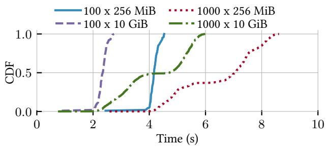  
Figure 1: Start-up time (cold start) of 100 and 1000 FaaS 1functions in AWS Lambda for two memory sizes.

This has brought what we call bursts, massively parallel processing (MPP) workloads that appear suddenly and process large, variable volumes of data in a very short time (under 1 or 2 minutes). Such applications have dynamic resource needs that cannot be predicted easily, thus serverless burstability becomes essential [49, 50, 52, 56]. Consider, e.g., an interactive, scientist-driven workflow in a Jupyter Notebook, where the user dynamically explores large datasets and modifies parameters that significantly impact the workload size. Although they may resemble batch jobs, they are characterized by their sudden, sporadic occurrence, highly dynamic and unpredictable data volumes, and the expectation of low-latency execution. Representative use cases include interactive model tuning via grid search, exploratory data analysis with SQL queries and algorithms such as logistic regression, and data preparation operations like filtering and sorting. The MilliSort and MilliQuery benchmarks [31] exemplify such short-running workloads. Additional scenarios include real-time data stream or video feed processing, where both data volume and analytical complexity may fluctuate dramatically over time.

Current data processing solutions such as Spark, Dask, Flink, or Ray fail to support bursts. A long-lived deployment of these engines is impractical, as it would easily become misprovisioned. They are not offered as a service by any cloud either, which could palliate the issue by multiplexing jobs from multiple tenants, and thus forces per-user deployments that are too slow to set up [38], even on cloud-managed offerings (e.g., Amazon EMR). Table 1 shows that starting one of these technologies is intolerable for critical sporadic or dynamically sized applications.

In contrast, FaaS services provide a large-scale compute substrate much faster. Fig. 1 shows that AWS Lambda may spawn a fleet of 1000 functions in 6 s; a much more appropriate time range for bursts.1 FaaS is also more attractive than Container-as-a-Service (CaaS) or managed Kubernetes services due to simpler abstractions [26] and quicker resource allocation. For example, Knative, a Kubernetes-based FaaS-like implementation, is noticeably slower in spawning workers than dedicated FaaS platforms (Table 1).

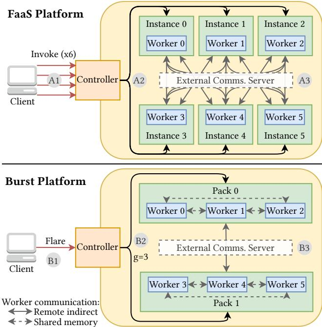  
Figure 2: Running a data processing job of 6 workers in FaaS and burst computing with granularity (g) 3.

## 2.1 FaaS is holding us back

A review of the literature will show us that running bursts atop FaaS brings many challenges [18, 24, 38]. We highlight three friction points: (F1) worker isolation, (F2) job fragmentation with complex orchestration, and (F3) huge data movement.

To illustrate them, Fig. 2 follows the execution of a parallel job on a FaaS platform. It shows a parallel job with 6 workers. The job could be embarrassingly parallel (stateless) such as a data filtering, or require the workers to coordinate at some point (stateful) such as a table join or, more intensively due to its iterative nature, PageRank.

F1 appears because multi-tenant isolation is at the level of a function invocation. FaaS spawns function instances independently, one at a time, requiring multiple HTTP requests A1 to obtain the 6 workers. Besides the added latency of several requests, this is an issue for parallel jobs because the platform is not aware of these workers being collaborators, and thus cannot guarantee their parallelism. This creates delays or skews between workers that potentially harm job execution. Take, for instance, Fig. 1, where the last function starts up to 6 s after the first one.2 Even more, the platform populates identical environments (instances) for each invocation A2 , which stresses the system with code, dependency, and data3 loading that creates memory duplication [41, 53].

F2 occurs when workers need to coordinate. For instance, TeraSort à la MapReduce includes a data shuffle amidst the job, and PageRank iteratively globally aggregates a vector. Workers cannot communicate effectively because they may not exist at the same time (F1). Instead, workers read and write intermediate data asynchronously through an external storage solution. This pattern (depicted in Fig. 3) creates job fragmentation (function stages) and complicates its orchestration, especially in iterative algorithms like PageRank (unfeasible with this approach [6]). First, it increases data movement and requires worker recreation at each stage (adding code and data loading overhead). Second, it needs an active workflow orchestration process to monitor the state of workers and oversee the overall job progress.4 Centralized solutions add a mostlyidle driver component while decentralized task scheduling adds a layer of complexity to applications [9, 29, 32]. Neither can solve the underlying problem of worker isolation.

These issues are emphasized by F3. With so many tiny isolated workers, most communication patterns (e.g., a shuffle) require numerous remote connections A3 . In data processing workloads, this may result in very large data transfers, precluded by the (FaaS) lack of direct communication [10, 35].

## 3 Burst Computing

Burst computing is a novel paradigm for running bursts in the cloud. It overcomes the above frictions with two key principles that evolve FaaS: group awareness and locality exploitation. Fig. 2 shows how this changes job invocation.

FaaS hinders worker collaboration because multi-tenant isolation is at the level of a single function (F1). Because a job belongs to a single tenant, it makes sense to raise isolation to the job level and handle all its workers as a group. To this end, burst computing provides a group invocation primitive, which we call flare B1 , to instantly launch massive process groups with guaranteed parallelism. To the best of our knowledge, we are the first to implement this kind of primitive in a serverless system. Flares bring group awareness to the service, which is key to perform worker packing B2 , i.e., running multiple workers of a job in the same isolated environment. Packing establishes worker locality and enables several optimizations discussed below.

In a flare, all workers have guaranteed parallelism and access to the job context (e.g., the burst size, IDs, or locality), which allows them to communicate synchronously in patterns unfeasible in FaaS, such as worker-to-worker message passing and collectives, that simplify job orchestration and avoid F2. This difference is depicted in Fig. 3. F3 is addressed because communication B3 can seamlessly exploit locality and use shared memory mechanisms between workers in the same pack, which reduces remote transfers.

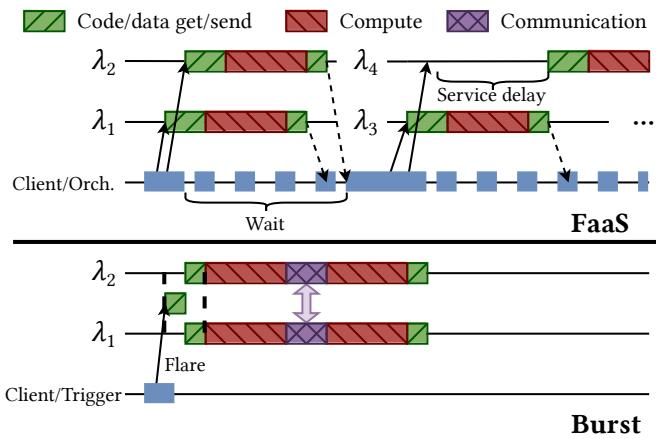  
Figure 3: Timeline comparison of a parallel job with FaaS and burst computing.

## 3.1 Worker packing and communication

Worker packing To run a flare, the burst platform allocates n workers into m packs; we say that n is the burst size. The number of workers per pack is the burst’s granularity (g = $n / m )$ . Thus, Fig. 2 shows a burst of size n = 6 where, by setting $g = 3 ,$ , the platform only spawns 2 packs, each with 3 workers. The higher g, the lower m, reducing the number of environment creations, which is a critical part of function invocation time in FaaS. Then, worker code and dependencies are loaded only once per pack and shared by all co-located workers. This further helps with initialization time (especially when dependencies are large) and optimizes resource usage (e.g., avoiding memory duplication [41]). A similar reasoning applies for data loading: workers processing the same data (like in hyperparameter tuning) download it just once per pack and utilize their aggregated resources to speed up the transfer (i.e., with parallel downloads).

Choosing g is a trade-off between ease of system management and locality maximization. To illustrate that, we identify three strategies5 for worker packing: (i) heterogeneous, where workers are placed in containers as big as possible in the underlying system machines; (ii) homogeneous, where workers are placed in fixed-size containers; and (iii) mixed, where workers are put in fixed-size packs, but if multiple packs fall onto the same machine, they are merged into a single container. The first approach maximizes locality, but it can become a resource scheduling problem, as it is prone to fragmentation. The homogeneous packing mitigates that issue, but it restricts worker locality. The third strategy is the compromise that allows a fast and flexible management while still maximizing locality (see §5). Given this complexity, we argue that the responsibility for setting the granularity should lie with the platform rather than the user, enabling better control over resource scheduling and providing a more streamlined and user-friendly service.

Worker communication Burst applications are elastically distributed and collaborative. They are coded as a single function run by all workers that accepts any worker multiplicity transparently. Then, because workers are guaranteed to be parallel, they may coordinate synchronously by sending messages and with common communication patterns.

To simplify this, burst computing includes a worker-toworker, message-passing communication middleware readily available to workers. The middleware seamlessly identifies messages between workers placed in the same pack for local communication (zero-copy). Only messages between packs are transferred remotely, and the middleware optimizes these connections (e.g., a broadcast only sends one message per pack). Remote delivery may be implemented with several technologies. Our contributions are independent of this choice because burst computing reduces any remote communication through packing. In this work, we follow the usual approach in FaaS and only consider indirect solutions using an external communication server B3 .

## 4 Design and implementation

We put the above ideas into a prototype burst computing platform and communication middleware. Here we provide the design details and implementation. Fig. 4 shows an overview of the main components and their interactions.

The burst platform extends the design of a FaaS platform to implement group invocation and worker packing. Built atop Apache OpenWhisk, our platform shares its components with important modifications (see §4.4). The controller manages user interaction with the platform, it handles inbound HTTP requests to deploy and invoke bursts, oversees system resources, and performs worker packing. A database stores the burst definitions and configuration, as well as the results and execution metadata. Computational resources in the platform are provided by the invokers, a set of machines with capacity for burst packs. Packs are run in containers that isolate a custom runtime environment to run workers.

Our burst communication middleware (BCM) has two main components: the core communication library and the remote backends. The library exposes message-based communication to workers, and it is extensible with backends to use different remote message delivery solutions.

## 4.1 Life cycle overview

Fig. 4 depicts the life cycle of the system. To deploy a new burst definition, the user first sends 1 a deploy HTTP request. The controller receives it and registers 2 the new definition in the database. Later, when the user desires to trigger the execution of the burst, they send 3 a flare HTTP request with specific parameters. The controller handles the invocation and decides worker allocation 4 based on the current state of the invoker machines. The affected invokers receive the task to spawn the required runtime environments (packs) with space for as many workers as needed. When the environments boot, their host invoker tells them which burst definition and parameters to load 5 from the database. Then, each pack spawns its workers internally, which will execute the user-defined function (work in Table 2) in parallel. Workers may use the BCM to coordinate and share data. This seamlessly uses shared memory or remote connections to communicate workers 6 in the same or a different pack, respectively. Additionally, workers may read or write data to external storage systems (e.g., object storage) or produce a result that is stored back to the database, where it may be retrieved later by users through another HTTP request.

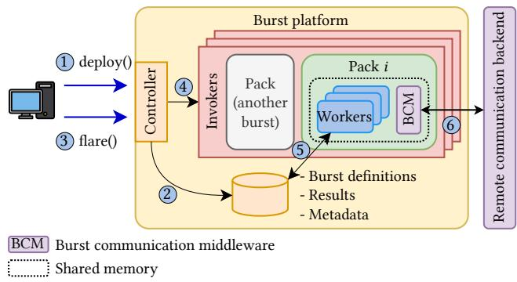  
Figure 4: Burst computing platform overview.

## 4.2 Developing and running bursts

User experience is key for burst computing. As a serverless service, all resource management remains hidden. Users interact with the service through a simple interface that allows to define bursts with resource-agnostic code and to schedule their execution. This is similar to FaaS services that allow users to upload their function definitions and then set up triggers or invoke them as needed. The interface and abstractions are summarized in Table 2.

Deployment Similar to functions in FaaS, developers package and upload their burst definitions (code) to the cloud, giving them a name and configuration. The configuration includes runtime parameters and worker characteristics (such as language and memory size).

Invocation Burst definitions are triggered for execution like functions in FaaS: an event or HTTP request notifies the intent to execute a burst with specific input parameters. We call each burst invocation a burst flare (Table 2). The main difference with FaaS is that a flare will spawn a group of parallel workers (instead of a single function instance). The service ensures that all workers run simultaneously and applies packing. In our prototype, the burst size is explicit on the size of the inputParams array. Hence, users have direct control over it. We believe this to be important because parallelism is strictly application-specific and depends on data volume (e.g., ETL tasks), data content (e.g., dimensionality or sparsity), or algorithm configuration (e.g., the number of clusters in k-means). Smart burst sizing is left for future work, i.e., the platform may automatically calculate the number of workers based on application and data information.

Table 2: Burst computing abstractions and API.
<table><tr><td>Interface</td><td>Functions</td></tr><tr><td>Burst Service</td><td>deploy(defName,package,conf) upload and deploy a burst definition flare(defName,[inputParams])</td></tr><tr><td>Burst</td><td>invokesa burst abstractwork(inputParams,burstContext)</td></tr><tr><td>Function Burst</td><td>function to run on each worker</td></tr><tr><td>Context</td><td>workerID-→unique ID of this worker within the flare burstSize → number of total workers in the flare packID →unique ID of the current pack packSize -→ number of workers in the current pack numPacks→number of packswithin the flare belongToPack(workerID)→packID</td></tr><tr><td>Comm. Primitives</td><td>returns the pack ID to which a worker belongs to isPackLeader(→bool returns true if this worker is its pack&#x27;s leader send(data,dest)→none</td></tr><tr><td></td><td>recv(source)→data broadcast(data,root)→data alIToAl([data])→[data]</td></tr></table>

Coding Burst definitions are coded as a single function that is run by each worker in the burst (work in Table 2). This function must be programmed elastically so that it accepts and runs correctly for any burst size. The code is also agnostic to the packing performed by the service. To that end, the work function receives a burst context object through which each worker may obtain information about the worker distribution within the particular flare. For example, a worker can query its own unique ID, the burst size, granularity, or which workers belong to each pack (Burst Context in Table 2). With this information (provided by the platform invoker), the code can implement logic to apply locality optimizations at the pack and burst levels (see an example in §5.4.1). This context object also gives access to the BCM.

Communication interface The BCM offers simple yet powerful worker-to-worker communication through message passing similar to MPI. The abstractions are elastic (adapt to the burst size) and available through the burst context. Burst computing programs make use of two basic primitives to connect workers: send and receive. These primitives enable point-topoint communication between workers and are designed to send arbitrary volumes of data efficiently within the burst. To facilitate common communication patterns in parallel jobs, bursts may also use group collectives. As listed in Table 2, our prototype implements broadcast, all-to-all, and reduce. Primitives and collectives are locality-aware, although the programs remain agnostic to it, i.e., co-located workers (same pack) communicate on shared memory and only remote workers hit the network.

```rust
fn work(params: Input, burst: &BurstContext) -> Output {
let num_nodes = params.num_nodes;
let mut page_ranks = vec![1.0 / num_nodes; num_nodes];
let mut sum = vec![0.0; num_nodes];
let adjacency_matrix = get_adjacency_matrix(&params);
while err < ERROR_THRESHOLD {
page_ranks = burst.broadcast(page_ranks, ROOT_WORKER);
for (node, links) in graph {
for link in links {
sum[*link] += page_ranks[*node] / out_links(*node);
}
}
let reduced_ranks = burst.reduce(sum, |vec1, vec2| {
vec1.zip(vec2).map(|(a, b)| a + b).collect()
});
if burst.worker_id == ROOT_WORKER {
err = calculate_error(&page_ranks, &reduced_ranks);
page_ranks = reduced_ranks;
}
err = burst.broadcast(err, ROOT_WORKER);
reset_sums(&mut sum);
}
Output { page_ranks }
}
```  
Figure 5: Simplified source code of the PageRank work function for burst computing. The accesses to the burst context to obtain the worker ID or communicate are highlighted.

## 4.3 Application example

Fig. 5 shows an example in Rust code (simplified) of the work function that implements the PageRank application. The algorithm consists of an iterative process in which each worker holds a portion of the adjacency graph (relating links between web pages). In each iteration, the new global ranks are computed in parallel, aggregated, and reduced in a tree structure, then broadcasted from the root worker to the rest of them. The algorithm runs until it converges past a threshold or reaches a limit of iterations.

Similarly to the MPI computing model, all workers execute the same code but perform different logic based on the worker ID (the rank in MPI). The example highlights the worker accesses to the BurstContext object to perform collectives and obtain information about the current flare. For example, it is used to perform a collective broadcast to share the updated ranks vector, and later a reduce to aggregate the partial ranks computed among the workers. It also shows how a worker checks its ID when it needs to calculate the convergence, since this is only done by the root worker after collecting the aggregated vector in the reduce.

## 4.4 Burst platform implementation

The prototype implementation is built on top of the popular Apache OpenWhisk platform (v1.0.0). We used Open-Whisk as the basis because it is a well-known, open-source, production-tested FaaS implementation and provides higher burstability than other platforms like Knative (Table 1). Our changes amount to approximately 2K SLOC. They affect the main components of the platform, including the controller, the invoker, and the runtime environment.

The controller now supports two new HTTP endpoints for bursts: deploy and flare. It also implements the logic to handle them (§4.1). This includes the packing strategy in the three flavors (§3): heterogeneous, homogeneous, and mixed. Granularity can be configured. In any case, the controller calculates the number and size of the packs based on the specific burst size and the resources available in the invokers.

Invokers run a new monitoring logic that can be adjusted to report their load to the controller based on CPU instead of RAM. Our prototype is set to assign 1 vCPU per worker because bursts tend to be compute-intensive jobs and we do not consider parallelism within a worker,6 but other configurations are possible. Invokers also implement new logic to support the creation and execution of packs, spawning Docker containers of the appropriate size for each burst (by specifying resource limits) and telling each container/runtime the number of workers to run, plus their IDs and context. Containers are currently not reused across bursts.

For the runtime, we adapted the official OpenWhisk Rust environment, but it is possible to support others. The new logic allows to spawn multiple workers within it as requested by its host invoker. In particular, the Rust runtime spawns one thread per worker to provide parallelism. Finally, the runtime also includes our BCM built-in.

## 4.5 BCM implementation

The burst communication middleware (BCM) is coded in Rust in about 5K SLOC. It is readily available for our custom Rust runtime and we are working on a binding for Python.7 It enables the transmission of intra-pack (zero-copy) and interpack (via remote backend) messages. The BCM is instantiated by the runtime (once per pack) and made available to workers as a parameter (in the work function as shown in Table 2).

For local communication, BCM uses in-memory queues to send and receive data between workers in the same pack. In the Rust runtime, workers are threads and reside in the same memory space, so shared memory mechanisms are not necessary (e.g., shm\_open or mmap). Instead, workers just pass memory pointers between them. Thanks to Rust’s memory safety guarantees, access to shared data is thread-safe. Rust also provides a reference-counting mechanism for immutable data, so shared data is released when it is no longer used at runtime. For example, the root worker in a broadcast sends a read-only memory pointer to its local workers, and they safely access the message concurrently. To modify the data, one may use mechanisms such as copy-on-write.

For remote communication, each pack has a shared connection pool to the remote backend, which allows each worker within the pack to send and receive messages concurrently, with the goal of maximizing the container’s bandwidth. This is especially useful in primitives like all-to-all, where all workers must open channels with all the others. For large messages, the data is split into smaller chunks that are sent and received concurrently. This maximizes network utilization and allows readers to start receiving data from the first chunk, instead of waiting for the full message to be available at the backend.

The BCM is extensible, allowing the implementation of more remote backends. Currently, we support Redis, DragonflyDB, RabbitMQ, and S3. The backend interface differentiates between sending direct messages (one-to-one) and broadcast messages (one-to-many). The reason is that direct messages are read only once, while broadcast messages multiple times, so we want to optimize this particular case. For instance, in RabbitMQ, one-to-one messages use direct brokers, while one-to-many use fan-out brokers.

To ensure that no messages are lost (at-least-once delivery semantics), the BCM relies first on the backend delivery guarantees (e.g., RabbitMQ uses durable queues to avoid dropping messages). Additionally, the BCM keeps a count of direct messages sent between each pair of workers, and for each collective operation. The middleware handles duplicate and/or out-of-order messages. For that, messages include a header with the source and destination worker, collective type, counter, and, if chunked, the number of chunks and chunk number. Messages with a counter lower than the expected value are ignored and assumed as already processed. Those with a counter greater than expected are cached locally until needed. For chunked messages received out-of-order, a memory region is reserved for the total payload and chunks are written to their respective offset as they come in.

## 5 Evaluation

Our evaluation aims to assess burst computing against current FaaS on the three friction points described in §2.1. Importantly, we show and analyze the effects of worker packing and locality. All experiments run on Amazon Web Services (AWS) in the us-east-1 region.

## 5.1 Burst group invocation

Group invocation is the key element against friction F1. Here we evaluate how job-level isolation improves worker readiness time (invocation latency), ensures their simultaneity, and provides locality for collaborative code and data loading.

Setup: The burst platform runs on an Amazon EKS cluster, with the control plane on a t4i.xlarge VM (4 vCPUs and 16 GB RAM), and the invokers on up to 20 c7i.12xlarge VMs (48 vCPUs and 96 GB RAM). This gives us space to accommodate up to 960 workers with 1 vCPU each.

Impact on burst invocation latency First, we use the homogeneous packing policy to evaluate how assigning different granularity (g) affects burst invocation latency. The exploration is depicted in Fig. 6 for two bursts of sizes 48 (left) and 960 (right).8 It is quickly apparent that as g increases (up to

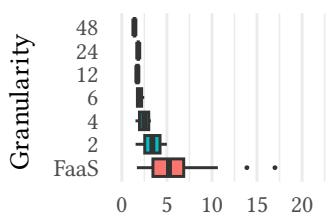

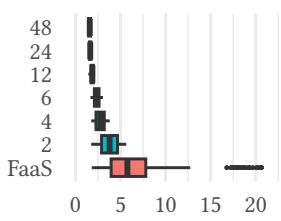  
Start-up time (s)

Figure 6: Worker start-up latency distribution within one job for burst computing with different packing granularity and FaaS (equivalent to g = 1). Left and right show, respectively, burst sizes of 48 and 960.  
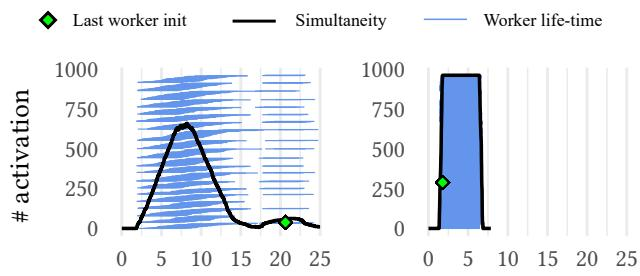  
Time (s)  
Figure 7: Simultaneity (number of workers running at an instant) in FaaS (left) and Burst with g = 48 (right). Each bar represents the life-time of a worker.

48 in both cases), the start-up time decreases, and generally becomes more consistent across workers for all burst sizes. For instance, the latency of having all workers ready in a burst of size 960 reduces by 11.5× from g = 1 (FaaS) to g = 48. We found that container creation dominates invocation latency, hence higher g performs best. This proves that creating the biggest possible containers, and thus the less amount of them (heterogeneous packing), achieves the best start-up latency, since it creates a single container per invoker per flare. By extension, the mixed packing strategy exhibits the same results, but allows the system to manage resources more effectively in small portions to facilitate allocation and avoid resource fragmentation. To assess the impact of granularity, the rest of the evaluation uses homogeneous packing.

Impact on worker simultaneity We run a burst with size 960 on FaaS against burst computing with g = 48. For demonstration purposes, each worker performs a 5-second sleep and we plot their execution timeline in Fig. 7. The plot shows that burst computing achieves faster resource allocation and quicker readiness of workers. This ensures worker parallelism. Analyzing dispersity of worker start-up time (also in Fig. 6), the FaaS execution evinces a range of 18.8 s between the start of the first worker and that of the last one, with a median absolute deviation (MAD) of 2.65 s. In contrast, the range with $g = 4 8$ is just 0.44 s (MAD is 0.1 s). Compared, the range is 43× lower in burst computing, with MAD showing 26.5× lower dispersity than FaaS. Dispersity in worker start-up latency precludes FaaS to achieve full parallelism (all workers running simultaneously from start to finish), while burst guarantees it.

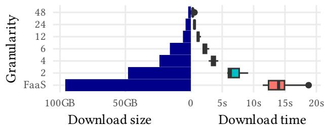  
Figure 8: A burst of 96 workers loading the same 1 GiB object from S3 with different granularity.

Impact on data loading Burst computing mitigates the FaaS problem of loading the same data on all functions (§2.1), e.g., in a grid search. We can leverage worker access to locality information to optimize this problem and download the data only once per pack, trivially reducing data ingestion. Specifically, each worker in a pack retrieves a part of the data based on calculations from pack information in the burst context (Table 2). Then they recreate the full data in a local shared memory region. This allows to parallelize the download and complete the process faster than choosing a leader to perform it (also possible through the isPackLeader function in the context, which returns true for the worker with lowest ID within its pack). We evaluate this approach on multiple g and present it in Fig. 8. Burst optimizations achieve a download time speed-up of 32.6× with g = 48 compared to FaaS.

Takeaway Flares eliminate friction F1 through faster worker group initialization (11.5×) and ensured simultaneity (43× less dispersed workers) that enables locality with packing. In turn, locality may accelerate data download in applications (32.6×), tackling friction F3.

## 5.2 Burst inter-pack communication

Before we evaluate the effects of the BCM on frictions F2 and F3, we want to ensure that an indirect communication model is feasible and to find a backend that sustains the load of bursts at scale. For this, we measure the throughput of several indirect communication backends. Specifically, we test Redis, DragonflyDB (a Redis-compatible multi-threaded alternative), RabbitMQ, and S3. Redis and DragonflyDB evaluate two flavors: using lists or streams.

Message chunk size The BCM chunks messages into several blocks to optimize network utilization and allow parallel read/write. The optimal chunk size is a trade-off between latency to first byte and operation overhead, and it varies for each communication backend. To find the optimal configuration, we measure the throughput of sending a 1 GiB message between two remote workers. The workers run on two c7i.large machines (4 vCPUs, 8 GB) and we deploy a c7i.16xlarge (64 vCPUs, 128 GB) for the intermediate server. Fig. 9a plots the results. RabbitMQ offers a constant throughput for larger chunk sizes, but does not allow payloads larger than 128 MiB due to AMQP protocol limitations. Redis and DragonflyDB work best at 1 MiB, the latter being slightly superior. S3 offers the lowest throughput because object stores are not designed for small files (1 MiB or less exceeds the allowed service request rate limits).

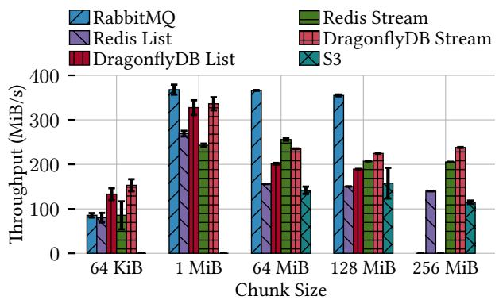

(a) Throughput between two remote workers sending a 1 GiB payload chunked in different sizes.  
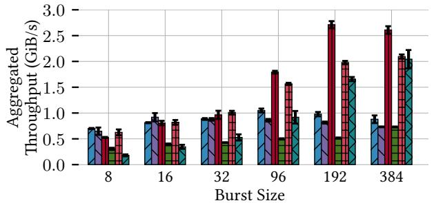  
(b) Aggregate throughput of two remote packs, A and B, of varying size (g =burst size/2), where each worker from pack A sends a 256 MiB payload to another worker from remote pack B.  
Figure 9: Throughput experiments for the different BCM backends. Median values with standard deviation (10 runs).

Maximum throughput To understand how the different backends scale under parallel load, we measure the aggregated throughput between several pairs of workers communicating simultaneously. In this experiment, we launch a group of workers (burst size from 8 to 384) split into two remote groups. Each worker in a group A sends a fixed message (256 MiB) to a worker in the other, remote group B. As the burst size increases, so does the total data volume sent. Each backend uses the optimal chunk size assessed in the micro-benchmark above. Workers run on two VMs scaled to the burst size (from c7i.xlarge for 8 workers to c7i.48xlarge for 384), and the communication server runs on one c7i.48xlarge instance. The results are shown in Fig. 9b. We observe that RabbitMQ does not scale beyond 1 GiB/s. For the in-memory stores, the approach with lists performs better than streams. Like RabbitMQ, Redis does not scale with parallelism because it is single-threaded. In contrast, DragonflyDB does scale and achieves the highest throughput, surpassing 2.5 GiB/s for large burst sizes. S3 also scales with parallelism but remains slower.

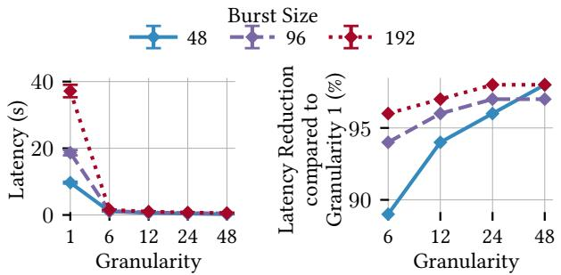

(a) Broadcast  
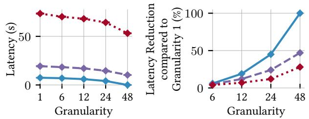  
(b) All-to-All  
Figure 10: Latency and its reduction percentage with respect to g = 1 of two collectives, for varying g and burst size.

Takeaway The BCM achieves high throughput even with indirect communication, and some backends sustain up to the evaluated 384 workers with individual connections, suggesting a feasible approach. In view of the results, the rest of the evaluation uses DragonflyDB List with 1 MiB chunks.

## 5.3 Burst group collectives

We assess the impact of locality on group collectives as a means to face friction F3. We measure end-to-end latency, i.e., the total time it takes for all workers to complete the collective, as we vary g. We present results for broadcast and all-to-all. Reduce behaves similar to broadcast because they follow the same data movement pattern.9

Setup: We employ one, two and four c7i.12xlarge VMs (48 vCPUs, 96 GB) for bursts of sizes 48, 96 and 192, respectively. g varies from 1 to 48. Each worker uses 256 MiB of data for each collective call. The backend server runs on one c7i.48xlarge (192 vCPUs, 384 GB).

Overall, Fig. 10 shows that latency decreases as the granularity increases. This is because remote communication is the main bottleneck of collective operations and its volume decreases as g increases and more data movement becomes local. The cost of local communication is insignificant compared to the remote one. Broadcast sends the message once, but reads it once per pack, i.e., remote data movement is directly proportional to the number of packs: if we halve the packs, we move half the data. Thus, latency quickly decreases as we increase g; near 98% reduction with g = 48 (Fig. 10a). All-to-all is more intensive in data traffic because all workers have a message of 256 MiB for each of the other workers (48 GiB total with 192 workers). This means that even if we only have two packs, half the data traffic is remote. This is clearly evident in Fig. 10b. Considering g = 48, burst sizes 48, 96, and 192 create one, two, and four packs; thus latency reduction is ca. 100%, 50%, and 25%, respectively.

Takeaway Locality-aware group collectives heavily mitigate friction F3 by seamlessly reducing remote data traffic.

## 5.4 Burst applications

We evaluate three real-world bursts: hyperparameter tuning, PageRank, and TeraSort. These (or similar) applications are commonly used in the literature to assess the performance and show the limitations of FaaS platforms for parallel jobs and serverless data analytics [4, 7, 15, 16, 28].10 These applications clearly show all friction points while providing an overall view of the effects of burst computing compared to FaaS-based implementations. Further, they are representatives of short jobs a scientist may want to run interactively in a dynamic analysis session: sudden and quick (under 2 min).

Our baseline for comparison is thus the current FaaS paradigm available in public clouds as used in the serverless data analytics literature. Since MPI-like communication is not supported on any serverless service, we opt to use unmodified OpenWhisk and AWS Lambda as our baselines, employing external storage for communication and data sharing to align with the state of practice.

## 5.4.1 Hyperparameter tuning

Grid search is a machine learning technique in which a set of hyperparameter values are evaluated to find the combination that yields the best performance for a given model. This evaluation is done in parallel, with each worker processing a full copy of the training dataset. Since there are no dependencies between parallel tasks, FaaS seems suitable for this job. However, each function would download a copy of the data, regardless of whether there are functions co-located on the same node. This results in a waste of bandwidth and memory due to duplicate data downloads. Burst computing provides an optimization opportunity by exploiting locality (see impact on data loading in §5.1).

Table 3: Time to start 96 workers and gather input data in hyperparameter tuning for different granularity.
<table><tr><td>Granularity</td><td>1 (FaaS)</td><td>6</td><td>12</td><td>24</td><td>48</td><td>96</td></tr><tr><td>Ready time (s)</td><td>17.51</td><td>5.65</td><td>3.64</td><td>3.18</td><td>2.96</td><td>2.57</td></tr></table>

Setup: The grid search is applied to a stochastic gradient descent model in a sklearn Python application and distributed to 96 workers. We use a 500 MiB Amazon reviews dataset (CSV), available at Kaggle11 and stored in an S3 bucket. AWS Lambda is the baseline (denoted as $g = 1 )$ , with a memory configuration of 1769 MiB, which provides a full vCPU. The burst platform uses a c7i.24xlarge instance.

Table 3 collects the “ready time”, meaning the time elapsed from client-side job invocation until the input data is available to all workers and they are ready to compute. We see how burst computing quickly reduces this time as g increases. This effect has two causes. First, the group invocation primitive speeds up invocation time compared to FaaS, from approx. 4 to 1.5 s with $g = 9 6$ . Second, data download can be optimized as assessed in Fig. 8. While FaaS has to download a copy of the data on each worker, workers co-located in a pack collaborate in downloading the input in parallel. Hence, as g increases, the input download time decreases, going from 14 s in FaaS to 1 s with $g > 4 8$

## 5.4.2 PageRank

PageRank is a well-known data analytics workload with intensive worker coordination. It involves iterative and heavy data aggregation for large datasets, which is of interest for benchmarking worker communication in burst computing. We adapted PageRank for burst computing from the Hi-Bench suite [19] (MapReduce approach). The implementation is detailed in §4.3. In this case it is not possible to make optimizations regarding data ingestion (like in §5.4.1), since each worker takes a different partition of the dataset. We skip reporting the MapReduce version atop FaaS because the number of (short) stages necessary to perform the iterative aggregations make it obviously slower. Spark has a similar problem [7]; evaluation on AWS EMR with an equal-sized deployment (needing 5 min to start up) shows that this application takes over an hour.

Setup: This experiment uses four c7i.16xlarge VMs (64 vCPU, 128 GB). The graph dataset is generated with Hi-Bench consisting of 50M nodes (ca. 30 GiB) in 256 partitions. The algorithm runs over 10 iterations, with a burst size of 256, varying the granularity between 1 and 64.

Fig. 11 shows the total execution time of all iterations split into phases: the time dedicated to download input data (from S3), compute the ranking, and communicate (collectives) between workers. Times for each phase are averaged across workers, and all iterations added. Table 4 shows the network traffic and % of reduction compared to $g = 1$ . Communication accounts for the majority of the execution time because the rank vector must be aggregated and shared at each iteration. Our configuration uses a vector of 40 MiB that is sent, received, and aggregated in a tree pattern across the workers, and then broadcast from the root worker to the rest of them. As g increases, the remote portion of this movement decreases. For example, with $g = 2$ , only the first level of the (binary) reduction tree is local (the leaves), and the rest communicate remotely. With $g = 6 4$ , there are 4 packs, so remote communication occurs only in the last 2 tree levels. With this setup, we achieve a 98.5% reduction in data traffic and a 13× speed-up compared to $g = 1$

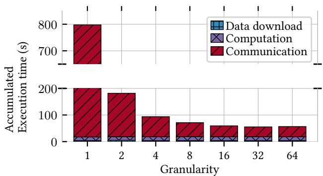  
Figure 11: PageRank execution time by phase, varying g.

Table 4: Aggregated network traffic volume and percentage of traffic reduction compared to $g = 1$ , varying g in PageRank.
<table><tr><td>Granularity</td><td>1</td><td>2</td><td>4</td><td>8</td><td>16</td><td>32</td><td>64</td></tr><tr><td>Traffic (GiB)</td><td>3068</td><td>1532</td><td>764</td><td>380</td><td>188</td><td>92</td><td>44</td></tr><tr><td>%Reduction</td><td>n/a</td><td>50.0</td><td>75.0</td><td>87.6</td><td>93.8</td><td>97.0</td><td>98.5</td></tr></table>

## 5.4.3 TeraSort

We have implemented TeraSort based on the MapReduce version in Hi-Bench suite [19]. TeraSort is of particular interest because it involves a heavy data shuffle phase. We want to compare a TeraSort following the serverless MapReduce approach [33, 40, 46], with a single-stage burst computing version where we exploit locality for the shuffle phase. The main advantages of burst are: (i) the MapReduce version requires two rounds of function invocations (map and reduce), while the burst model requires a single flare, and (ii) the MapReduce version shuffles data through object storage, while burst employs the (locality-aware) all-to-all collective.

Setup: This experiment sorts a 100 GiB dataset generated with Hi-Bench with 192 partitions. The burst platform runs on EKS with two m7i.24xlarge (96 vCPUs, 384 GB) invokers and a c7i.xlarge controller. The input data is in an Amazon S3 bucket located in the same region. For reference, an equalsized Spark deployment solves this problem in 106 s average but needs 5 min to start up the cluster.

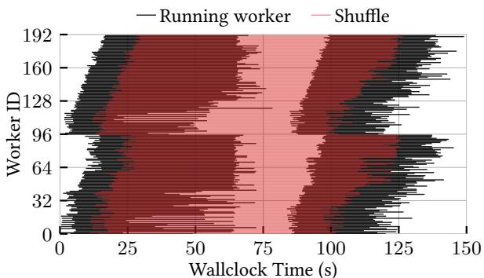  
(a) Serverless MapReduce

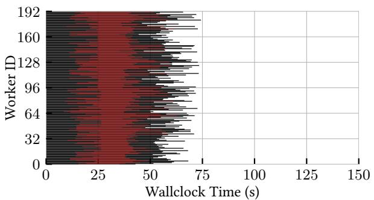  
(b) Burst computing  
Figure 12: TeraSort timeline comparison between (12a) serverless MapReduce and (12b) burst computing. MapReduce comprises two function rounds (map and reduce), with data exchange via object storage. Burst uses a single flare, exchanging data through the all-to-all collective.

Fig. 12 shows the timeline of two executions comparing serverless MapReduce and burst. The execution time of each worker is shown in horizontal black bars, stacked by Worker ID on the vertical axis. Superimposed in red, we see the time elapsed for the shuffle phase of the TeraSort algorithm. In the MapReduce version (Fig. 12a), we highlight (i) the dispersity in function start-up time, as we have seen in Fig. 7; (ii) a gap where no functions are running, caused by splitting the workload into two phases (map and reduce), with an externally-managed synchronization phase between them, adding further overhead; and (iii) an outlier in the map phase (worker #121), which slows down the entire workflow.

All these points are addressed in burst computing (Fig. 12b). First, the group invocation packs all workers into two containers of 96 workers, making start-up faster, and ensuring parallelism, which eliminates (latency-induced) outliers. Second, worker-to-worker collectives avoid splitting the job into two phases. Finally, remote communication is reduced thanks to locality (see §5.3). To wit, we achieve a 2× speed-up for this particular execution—1.91× mean across six executions.

For completeness, we also run TeraSort on Spark using AWS EMR on a cluster of equivalent resources. Best results are achieved with 74 executors of 4 GB of memory each. The total run time ranges between 100 and 110 seconds, placing it between the FaaS and Burst implementations. Although the execution times are relatively close, there are substantial differences that make a comparison and analysis of results complex. To start, the programming language changes (Scala to Rust), and Spark’s execution model and its peer-to-peer communication capability impact application performance in different ways: Rust may be more performant, the burst execution model simpler and more effective, but Spark’s direct communication is faster. Moreover, it is worth noting that cluster creation time on AWS EMR took over 5 minutes, adding additional overhead for an sporadic workload. Neither FaaS nor Burst require the user to set up a cluster.

Takeaway Frictions F1, F2, and F3 appear in real-world applications. Hyperparameter tuning shows duplication in worker initialization due to friction F1, which also slows down worker start-up in PageRank and TeraSort. PageRank and TeraSort evidence the issues of friction F2: the iterative nature of PageRank makes it unfeasible in FaaS due to excessive stages, and TeraSort is hindered considerably due to slower coordination. Burst computing mitigates this by allowing workers to coordinate and share data in a single stage, instead of requiring multiple stages orchestrated externally that communicate asynchronously through storage. PageRank and TeraSort also emphasize friction F3: Page-Rank with iterative, large communication to aggregate the vector and TeraSort with a single, large data shuffle.

## 6 Discussion and limitations

Burst as a cloud service One potential concern regarding the adoption of burst computing as a public cloud service is the added scheduling complexity of packing multiple workers, along with its implications for billing. Giving burst granularity control to the provider addresses this by enabling more effective resource management. The mixed packing policy we propose further enhances scheduling efficiency by targeting small resource gaps and maximizing locality through co-located resource consolidation. Burst computing aligns with the trend toward “Big Lambda” architectures, seen in platforms such as AWS Lambda, Google Cloud Functions, and CaaS offerings like IBM Code Engine. For example, AWS already supports functions with up to 6 vCPUs, indicating that its infrastructure can already schedule resource bundles at this scale. Setting a burst granularity of 6 would thus mirror current AWS capabilities. Implementing burst computing requires the concurrent allocation of multiple such high-capacity functions, similar to existing multi-invocation FaaS handling, while optimizing locality. Though this may introduce slightly higher latency than a single function invocation, it remains more efficient than coordinating numerous remote HTTP calls. Our evaluation on OpenWhisk confirms the viability of this model, demonstrating that it preserves internal resource management and auto-scaling typical of FaaS.

We see burst computing as a natural evolution of FaaS: despite the constraint of parallel provisioning, bursts are ephemeral and may be bounded in time or concurrency, clearly distinct from long-running serverful processes. Thus, we argue that burst support in public clouds is not prohibitively complex and can follow FaaS-like billing models. Moreover, there is clear evidence that users are already willing to pay for “Big Lambdas” or containers when the workloads justify it [18].

Burst applications The suitability of burst computing versus traditional FaaS depends on an application’s communication patterns, performance demands, and tolerance to execution imbalances. Burst computing is designed for massively parallel workloads with collaborating workers, enabling co-location and synchronized execution. Applications with strong locality requirements and intensive data sharing—such as PageRank, SQL queries, or large-scale sorting—are prime candidates. However, even loosely coupled workloads like grid search or Monte Carlo simulations can benefit from shared data downloads (see §5.4.1), faster initialization, and coordinated result aggregation. Burst computing also facilitates optimizations such as function fusion, where stateless functions within a dataflow are merged into a single, stateful burst to reduce communication overhead and improve locality [47]. Interactive workloads or those requiring synchronized responses across workers similarly gain from burst simultaneity. In contrast, those with minimal data sharing or high variance in execution time across workers are typically better served by conventional FaaS. While our current prototype reclaims resources per pack—leading to potential idle resources when worker durations differ—it targets short-lived, coordinated workloads (i.e., workers typically progress in lockstep) where imbalance is rare, as seen in PageRank and MilliSort/MilliQuery [31]. Addressing this limitation via dynamically sized packs is a path for future work. Ultimately, choosing between burst and FaaS depends on locality needs, parallelism requirements, and the importance of coordinated execution.

Coding limitations While burst computing introduces new capabilities for expressing parallel and stateful workloads, it also imposes certain programming constraints that must be acknowledged. The model is designed as a low-level primitive, offering developers greater flexibility rather than prescribing orchestration logic. Similar to MPI, it executes the same code across all workers while assigning each a unique identity, enabling divergence in behavior. However, unlike MPI, bursts are triggered with FaaS-like simplicity, abstracting away explicit resource management. The primary coding complexity introduced lies in inter-worker communication, yet this is mitigated by using programming primitives that are agnostic to worker count and locality, thereby simplifying development. Although multi-burst orchestration—e.g., for full DAG-based workflows—remains future work, it can leverage well-established techniques such as dependency persistence in object storage or worker reuse across flares. A higher-level framework could encapsulate this coordination, offering abstractions for DAG scheduling and state propagation across bursts [9, 36, 43]. Many real-world applications (e.g., clustering, gradient descent, aggregation queries, N-body simulations) can already be implemented within a single burst, avoiding orchestration overhead altogether. Furthermore, libraries could expose common distributed patterns (e.g., a distributed sort) via simple APIs, hiding burst-level details from end users. Thus, while the model lacks full orchestration capabilities out of the box, it provides foundational support for powerful abstractions and ensures parallel execution—a property often missing in existing FaaS-based solutions, where developers must manually coordinate parallelism without system-level guarantees [5, 9, 16].

Serverless clusters Burst computing poses a step towards redefining the boundary between serverless architectures and traditional cluster-based systems [17, 38]. Recent work has explored how to emulate cluster-like capabilities atop existing FaaS platforms [9, 57]. However, our approach takes a fundamentally different perspective: rather than adapting conventional cluster technologies to work around the limitations of current FaaS substrates, burst computing seeks to evolve serverless services themselves, introducing native abstractions and execution models that offer the parallelism, coordination, and locality benefits traditionally associated with clusters— yet within a fully serverless paradigm. This opens the door to realizing truly serverless versions of platforms like Spark, Dask, or Flink, moving beyond the managed, but still serverful, offerings available today.

## 7 Related work

The concept of resource burstability has already been discussed in the serverless literature. FaaS has been referred to as a “burstable supercomputer-on-demand” [16] for “burstparallel serverless applications” [55], albeit with limitations. “Flash bursts” in HPC [31] explore the feasibility of 1 ms jobs spanning a large number of servers, which is attractive but unfeasible with existing technologies in public clouds. Granular computing [30, 42, 48] explores very similar ideas to improve cluster utilization. Müller et al. [38] pursue serverless burstability for batch jobs, highlighting that functions are too limited for the job.

Burst computing goes a step further in defining a new way of running burst-parallel jobs in the cloud. It evolves from FaaS to exploit serverless burstability, but it unlocks the limitations of working with functions to provide a compute environment tailored for massively parallel collaborative jobs. Recent works also promote the need to evolve the FaaS model to overcome important challenges [11, 13]. To our knowledge, we are the first ones to raise the unit of management from a function to the job level in a serverless service with a group invocation abstraction to pack workers together and enable locality within the job.

Several papers [12, 21, 59] tackle handling function invocations faster. They aim to respond to thousands of function calls with very low latency. Others relax function isolation to handle multiple invocations together and cut on start-up and data sharing overhead [2, 50]. Similarly, some works perform opportunistic function packing, placing multiple function invocations from the same user on the same container to improve invocation latency and resource usage [1, 8, 22, 53, 61]. This shows that burst jobs are becoming widely accepted in FaaS settings, and locality is a key enabler. All these works only consider individual function invocations and are thus limited. Burst computing further optimizes job execution thanks to group invocations and guaranteed worker parallelism. Still, the mentioned works may be combined with burst computing to accelerate resource allocation.

A different line of work handles complex computations atop FaaS through higher-level function orchestration, task schedulers, or workflow optimizers [9, 29, 32, 34, 36, 37, 62, 63]. Since they operate with individual function invocations, they cannot be compared with burst computing, but benefit from it to guarantee task parallelism and fast start-up time. Orchestration techniques may be applied atop burst computing, e.g., to coordinate multiple bursts, manage data dependencies between them, optimize task parallelism, and handle faults.

Other works explore a hybrid approach where traditional compute engines (e.g., Spark or Flink) offload computation spikes to serverless functions [14, 20, 51] to achieve faster adaptation to dynamic loads. This requires the deployment and management of the traditional compute engine, which is not ideal to achieve serverless execution of parallel jobs. Burst computing fully hides infrastructure: users only deploy their code and run jobs, while the cloud handles the rest.

Communication and state sharing in FaaS has been widely explored. Some works combine a data store and a FaaS platform into the same system to optimize data access by placing functions where the data they use is kept [52]. This is a fundamentally different kind of locality than in burst computing as it does not support any function grouping semantics and may present resource contention problems [45]. Other solutions [4, 6, 28, 40] target applications that require function coordination and communication, close to the objectives of burst computing. However, they employ a disaggregated storage solution to relay data between stateless functions and cannot exploit any form of locality. Boxer [58] explores direct communication, and FMI [10] builds a library of collectives between groups of FaaS functions (with NAT traversal). They only tackle current FaaS platforms and do not provide any locality optimizations (in contrast to burst computing). These solutions are orthogonal to our contributions. For instance, FMI may be used as a BCM remote backend to accelerate pack-to-pack transfers, but burst computing still contributes zero-copy communication between workers in the same pack.

Finally, we highlight a clear trend in FaaS that is aligned with burst computing: the emergence of “Big Lambdas” with multiple CPU cores (currently up to 6 vCPUs in AWS). Jobs may leverage function intra-parallelism and, similar to burst computing, worker locality becomes relevant and improves the execution of parallel applications. these high-capacity functions still lack group-aware mechanisms and parallel guarantees, requiring complex user-side handling.

## 8 Conclusion

In this paper, we have presented burst computing, a novel cloud computing model designed to address the growing demand to run sudden, variable, burst-parallel workloads without provisioning resources in advance. We have reviewed the challenges and shortcomings of current technologies (i.e., FaaS), and we have demonstrated the effectiveness and versatility of our proposed solution.

Burst computing offers several key advantages over existing FaaS technologies, primarily the addition of a group invocation primitive that allows the platform to manage jobs as a unit, instead of independent function invocations. This raises tenant isolation to the job level and allows to allocate resources en masse and apply worker packing, which in turn enables powerful locality between workers. Our experiments and performance evaluations have shown that our platform achieves significant improvements by exploiting this locality in job invocation latency, worker simultaneity, code and data loading, and worker-to-worker communication with group collectives. Further, we demonstrated speed-ups of 13×, and 2× in PageRank, and TeraSort, respectively, thereby validating efficacy in real-world scenarios.

In conclusion, burst computing represents a significant advancement for serverless data processing in the cloud, with potential to become a new paradigm of cloud services. It unlocks key limitations of FaaS, becoming the next step forward to support applications previously stymied by its restrictive model [18]. We believe that our contributions are just the substrate for further innovation such as new workflow definition tools and orchestration engines that leverage burst computing jobs and strive towards a simplified dynamic utilization of cloud resources.

## Acknowledgments

We thank our shepherd Alex Merenstein, the anonymous reviewers, and early readers for their valuable feedback. This work is partially funded by the Horizon Europe programme under grant agreements No. 101092644 (Neardata) and No. 101093110 (Extract); and by the Spanish Ministry of Economic Affairs and Digital Transformation and the European Union-NextGenerationEU (PRTR and MRR framework) through the CLOUDLESS UNICO I+D CLOUD 2022.

## Availability

The burst computing platform prototype and evaluation code is available online at https://github.com/Burst-Computing.

## References

[1] Mania Abdi, Samuel Ginzburg, Xiayue Charles Lin, Jose Faleiro, Gohar Irfan Chaudhry, Inigo Goiri, Ricardo Bianchini, Daniel S Berger, and Rodrigo Fonseca. 2023. Palette Load Balancing: Locality Hints for Serverless Functions. In Proceedings of the Eighteenth European Conference on Computer Systems (EuroSys ’23). Association for Computing Machinery, New York, NY, USA, 365–380. https://doi.org/10.1145/3552326.3567496

[2] Istemi Ekin Akkus, Ruichuan Chen, Ivica Rimac, Manuel Stein, Klaus Satzke, Andre Beck, Paarijaat Aditya, and Volker Hilt. 2018. SAND: Towards High-Performance Serverless Computing. In 2018 USENIX Annual Technical Conference (USENIX ATC 18). USENIX Association, Boston, MA, 923–935. https:// www.usenix.org/conference/atc18/presentation/akkus

[3] Lixiang Ao, Liz Izhikevich, Geoffrey M. Voelker, and George Porter. 2018. Sprocket: A Serverless Video Processing Framework. In Proceedings of the ACM Symposium on Cloud Computing (SoCC ’18). Association for Computing Machinery, New York, NY, USA, 263–274. https://doi.org/10.1145/3267809.3267815

[4] Daniel Barcelona-Pons, Pedro García-López, and Bernard Metzler. 2023. Glider: Serverless Ephemeral Stateful Near-Data Computation. In Proceedings of the 24th International Middleware Conference (Bologna, Italy) (Middleware ’23). Association for Computing Machinery, New York, NY, USA, 247–260. https: //doi.org/10.1145/3590140.3629119

[5] Daniel Barcelona-Pons and Pedro García-López. 2020. Benchmarking Parallelism in FaaS Platforms. Future Generation Computer Systems 124 (Oct. 2020), 268– 284. https://doi.org/10.1016/j.future.2021.06.005

[6] Daniel Barcelona-Pons, Marc Sánchez-Artigas, Gerard París, Pierre Sutra, and Pedro García-López. 2019. On the FaaS Track: Building Stateful Distributed Applications with Serverless Architectures. In Proceedings of the 20th International Middleware Conference (Davis, CA, USA) (Middleware ’19). Association for Computing Machinery, New York, NY, USA, 41–54. https: //doi.org/10.1145/3361525.3361535

[7] Daniel Barcelona-Pons, Pierre Sutra, Marc Sánchez-Artigas, Gerard París, and Pedro García-López. 2022. Stateful Serverless Computing with Crucial. ACM Transactions on Software Engineering and Methodology 31, 3 (March 2022), 39:1–39:38. https://doi.org/10.1145/ 3490386

[8] Rohan Basu Roy, Tirthak Patel, Richmond Liew, Yadu Nand Babuji, Ryan Chard, and Devesh Tiwari. 2023. ProPack: Executing Concurrent Serverless Functions Faster and Cheaper. In Proceedings of the 32nd International Symposium on High-Performance Parallel and Distributed Computing (Orlando, FL, USA) (HPDC ’23). Association for Computing Machinery, New York,

NY, USA, 211–224. https://doi.org/10.1145/3588195. 3592988

[9] Benjamin Carver, Jingyuan Zhang, Ao Wang, Ali Anwar, Panruo Wu, and Yue Cheng. 2020. Wukong: a scalable and locality-enhanced framework for serverless parallel computing. In Proceedings of the 11th ACM Symposium on Cloud Computing (Virtual Event, USA) (SoCC ’20). Association for Computing Machinery, New York, NY, USA, 1–15. https://doi.org/10.1145/3419111.3421286

[10] Marcin Copik, Roman Böhringer, Alexandru Calotoiu, and Torsten Hoefler. 2023. FMI: Fast and Cheap Message Passing for Serverless Functions. In Proceedings of the 37th International Conference on Supercomputing (Orlando, FL, USA) (ICS ’23). Association for Computing Machinery, New York, NY, USA, 373–385. https://doi.org/10.1145/3577193.3593718

[11] Marcin Copik, Alexandru Calotoiu, Gyorgy Rethy, Roman Böhringer, Rodrigo Bruno, and Torsten Hoefler. 2024. Process-as-a-Service: Unifying Elastic and Stateful Clouds with Serverless Processes. In Proceedings of the 2024 ACM Symposium on Cloud Computing (Redmond, WA, USA) (SoCC ’24). Association for Computing Machinery, New York, NY, USA, 223–242. https://doi.org/10.1145/3698038.3698567

[12] Marcin Copik, Konstantin Taranov, Alexandru Calotoiu, and Torsten Hoefler. 2023. rFaaS: Enabling High Performance Serverless with RDMA and Leases. In 2023 IEEE International Parallel and Distributed Processing Symposium (IPDPS). IEEE Computer Society, Los Alamitos, CA, USA, 897–907. https://doi.org/10.1109/ IPDPS54959.2023.00094

[13] Germán T. Eizaguirre, Daniel Barcelona-Pons, Aitor Arjona, Gil Vernik, Pedro García-López, and Theodore Alexandrov. 2024. Serverful Functions: Leveraging Servers in Complex Serverless Workflows (industry track). In Proceedings of the 25th International Middleware Conference Industrial Track (Hong Kong, Hong Kong) (Middleware Industrial Track ’24). Association for Computing Machinery, New York, NY, USA, 15–21. https://doi.org/10.1145/3700824.3701095

[14] Apache Flink. 2023. Stateful Functions. Retrieved Oct. 8, 2024 from https://nightlies.apache.org/flink/ flink-statefun-docs-master/

[15] Sadjad Fouladi, Francisco Romero, Dan Iter, Qian Li, Shuvo Chatterjee, Christos Kozyrakis, Matei Zaharia, and Keith Winstein. 2019. From Laptop to Lambda: Outsourcing Everyday Jobs to Thousands of Transient Functional Containers. In 2019 USENIX Annual Technical Conference (USENIX ATC 19). USENIX Association, Renton, WA, 475–488. http://www.usenix.org/ conference/atc19/presentation/fouladi

[16] Sadjad Fouladi, Riad S. Wahby, Brennan Shacklett, Karthikeyan Vasuki Balasubramaniam, William Zeng, Rahul Bhalerao, Anirudh Sivaraman, George Porter,

and Keith Winstein. 2017. Encoding, Fast and Slow: Low-Latency Video Processing Using Thousands of Tiny Threads. In 14th USENIX Symposium on Networked Systems Design and Implementation (NSDI 17). USENIX Association, Boston, MA, 363–376. https://www.usenix.org/conference/nsdi17/ technical-sessions/presentation/fouladi

[17] Pedro Garcia Lopez, Aleksander Slominski, Bernard Metzler, Michael Berhendt, and Simon Shillaker. 2024. Serverless End Game: Disaggregation enabling Transparency. In Proceedings of the 2nd Workshop on SErverless Systems, Applications and MEthodologies (Athens, Greece) (SESAME ’24). Association for Computing Machinery, New York, NY, USA, 9–14. https://doi.org/10. 1145/3642977.3652094

[18] Joseph M. Hellerstein, Jose Faleiro, Joseph E. Gonzalez, Johann Schleier-Smith, Vikram Sreekanti, Alexey Tumanov, and Chenggang Wu. 2018. Serverless Computing: One Step Forward, Two Steps Back. https: //doi.org/10.48550/ARXIV.1812.03651

[19] Bo Huang, Shengsheng Huang, Jinquan Dai, Jie Huang, and Tao Xie. 2010. The HiBench benchmark suite: Characterization of the MapReduce-based data analysis. In 2010 IEEE 26th International Conference on Data Engineering Workshops (ICDEW 2010). IEEE Computer Society, Los Alamitos, CA, USA, 41–51. https: //doi.org/10.1109/ICDEW.2010.5452747

[20] Aman Jain, Ata F. Baarzi, George Kesidis, Bhuvan Urgaonkar, Nader Alfares, and Mahmut Kandemir. 2020. SplitServe: Efficiently Splitting Apache Spark Jobs Across FaaS and IaaS. In Proceedings of the 21st International Middleware Conference (Delft, Netherlands) (Middleware ’20). Association for Computing Machinery, New York, NY, USA, 236–250. https://doi.org/10. 1145/3423211.3425695

[21] Zhipeng Jia and Emmett Witchel. 2021. Nightcore: efficient and scalable serverless computing for latencysensitive, interactive microservices. In Proceedings of the 26th ACM International Conference on Architectural Support for Programming Languages and Operating Systems (ASPLOS ’21). Association for Computing Machinery, New York, NY, USA, 152–166. https: //doi.org/10.1145/3445814.3446701

[22] Chao Jin, Zili Zhang, Xingyu Xiang, Songyun Zou, Gang Huang, Xuanzhe Liu, and Xin Jin. 2023. Ditto: Efficient Serverless Analytics with Elastic Parallelism. In Proceedings of the ACM SIGCOMM 2023 Conference (New York, NY, USA) (ACM SIGCOMM ’23). Association for Computing Machinery, New York, NY, USA, 406–419. https://doi.org/10.1145/3603269.3604816

[23] Eric Jonas, Qifan Pu, Shivaram Venkataraman, Ion Stoica, and Benjamin Recht. 2017. Occupy the cloud: distributed computing for the 99%. In Proceedings of the 2017 Symposium on Cloud Computing (SoCC

’17). Association for Computing Machinery, New York, NY, USA, 445–451. https://doi.org/10.1145/3127479. 3128601

[24] Eric Jonas, Johann Schleier-Smith, Vikram Sreekanti, Chia-Che Tsai, Anurag Khandelwal, Qifan Pu, Vaishaal Shankar, Joao Menezes Carreira, Karl Krauth, Neeraja Yadwadkar, Joseph Gonzalez, Raluca Ada Popa, Ion Stoica, and David A. Patterson. 2019. Cloud Programming Simplified: A Berkeley View on Serverless Computing. Technical Report UCB/EECS-2019- 3. EECS Department, University of California, Berkeley. https://www2.eecs.berkeley.edu/Pubs/TechRpts/ 2019/EECS-2019-3.pdf

[25] Kostis Kaffes, Neeraja J. Yadwadkar, and Christos Kozyrakis. 2019. Centralized Core-granular Scheduling for Serverless Functions. In Proceedings of the ACM Symposium on Cloud Computing (SoCC ’19). Association for Computing Machinery, New York, NY, USA, 158–164. https://doi.org/10.1145/3357223.3362709

[26] Nima Kaviani, Dmitriy Kalinin, and Michael Maximilien. 2019. Towards Serverless as Commodity: a case of Knative. In Proceedings of the 5th International Workshop on Serverless Computing (Davis, CA, USA) (WOSC ’19). Association for Computing Machinery, New York, NY, USA, 13–18. https://doi.org/10.1145/ 3366623.3368135

[27] Jeongchul Kim and Kyungyong Lee. 2019. Function-Bench: A Suite of Workloads for Serverless Cloud Function Service. In 2019 IEEE 12th International Conference on Cloud Computing (CLOUD). IEEE Computer Society, Los Alamitos, CA, USA, 502–504. https: //doi.org/10.1109/CLOUD.2019.00091

[28] Ana Klimovic, Yawen Wang, Patrick Stuedi, Animesh Trivedi, Jonas Pfefferle, and Christos Kozyrakis. 2018. Pocket: Elastic Ephemeral Storage for Serverless Analytics. In 13th USENIX Symposium on Operating Systems Design and Implementation (OSDI 18). USENIX Association, Carlsbad, CA, 427–444. https://www. usenix.org/conference/osdi18/presentation/klimovic

[29] Swaroop Kotni, Ajay Nayak, Vinod Ganapathy, and Arkaprava Basu. 2021. Faastlane: Accelerating Function-as-a-Service Workflows. In 2021 USENIX Annual Technical Conference (USENIX ATC 21). USENIX Association, Boston, MA, 805–820. https://www. usenix.org/conference/atc21/presentation/kotni

[30] Collin Lee and John Ousterhout. 2019. Granular Computing. In Proceedings of the Workshop on Hot Topics in Operating Systems (Bertinoro, Italy) (HotOS ’19). Association for Computing Machinery, New York, NY, USA, 149–154. https://doi.org/10.1145/3317550.3321447

[31] Yilong Li, Seo Jin Park, and John Ousterhout. 2021. MilliSort and MilliQuery: Large-Scale Data-Intensive Computing in Milliseconds. In 18th USENIX Symposium on Networked Systems Design and Implementa-

tion (NSDI 21). USENIX Association, Boston, MA, 593–611. https://www.usenix.org/conference/nsdi21/ presentation/li-yilong

[32] Yiming Li, Laiping Zhao, Yanan Yang, and Wenyu Qu. 2023. Rethinking Deployment for Serverless Functions: A Performance-First Perspective. In Proceedings of the International Conference for High Performance Computing, Networking, Storage and Analysis (Denver, CO, USA) (SC ’23). Association for Computing Machinery, New York, NY, USA, Article 67, 14 pages. https://doi.org/10.1145/3581784.3613211

[33] Bryan Liston. 2016. Ad Hoc Big Data Processing Made Simple with Serverless MapReduce. Retrieved May 02, 2024 from https: //aws.amazon.com/blogs/compute/ad-hoc-big-dataprocessing-made-simple-with-serverless-mapreduce/

[34] David H. Liu, Amit Levy, Shadi Noghabi, and Sebastian Burckhardt. 2023. Doing More with Less: Orchestrating Serverless Applications without an Orchestrator. In 20th USENIX Symposium on Networked Systems Design and Implementation (NSDI 23). USENIX Association, Boston, MA, 1505–1519. https://www.usenix.org/ conference/nsdi23/presentation/liu-david

[35] Fangming Lu, Xingda Wei, Zhuobin Huang, Rong Chen, Minyu Wu, and Haibo Chen. 2024. Serialization/Deserialization-free State Transfer in Serverless Workflows. In Proceedings of the Nineteenth European Conference on Computer Systems (Athens, Greece) (EuroSys ’24). Association for Computing Machinery, New York, NY, USA, 132–147. https://doi.org/10.1145/3627703.3629568

[36] Ashraf Mahgoub, Edgardo Barsallo Yi, Karthick Shankar, Sameh Elnikety, Somali Chaterji, and Saurabh Bagchi. 2022. ORION and the Three Rights: Sizing, Bundling, and Prewarming for Serverless DAGs. In 16th USENIX Symposium on Operating Systems Design and Implementation (OSDI 22). USENIX Association, Carlsbad, CA, 303–320. https://www.usenix.org/conference/ osdi22/presentation/mahgoub

[37] Shruti Mohanty, Vivek M. Bhasi, Myungjun Son, Mahmut Taylan Kandemir, and Chita Das. 2024. FAAStloop: Optimizing Loop-Based Applications for Serverless Computing. In Proceedings of the 2024 ACM Symposium on Cloud Computing (Redmond, WA, USA) (SoCC ’24). Association for Computing Machinery, New York, NY, USA, 943–960. https://doi.org/10.1145/3698038. 3698560

[38] Ingo Müller, Rodrigo Bruno, Ana Klimovic, John Wilkes, Eric Sedlar, and Gustavo Alonso. 2020. Serverless Clusters: The Missing Piece for Interactive Batch Applications? (April 2020), 3 pages. https://doi.org/10. 3929/ethz-b-000405616 Presented at 10th Workshop on Systems for Post-Moore Architectures (SPMA 2020).

[39] Gerard París, Pedro García-López, and Marc Sánchez-

Artigas. 2020. Serverless Elastic Exploration of Unbalanced Algorithms. In 2020 IEEE 13th International Conference on Cloud Computing (CLOUD). IEEE Computer Society, Los Alamitos, CA, USA, 149–157. https: //doi.org/10.1109/CLOUD49709.2020.00033 ISSN: 2159-6190.

[40] Qifan Pu, Shivaram Venkataraman, and Ion Stoica. 2019. Shuffling, Fast and Slow: Scalable Analytics on Serverless Infrastructure. In 16th USENIX Symposium on Networked Systems Design and Implementation (NSDI 19). USENIX Association, Boston, MA, 193–206. https: //www.usenix.org/conference/nsdi19/presentation/pu

[41] Wei Qiu, Marcin Copik, Yun Wang, Alexandru Calotoiu, and Torsten Hoefler. 2023. User-guided Page Merging for Memory Deduplication in Serverless Systems. In 2023 IEEE International Conference on Big Data (Big-Data). IEEE Computer Society, Los Alamitos, CA, USA, 159–169. https://doi.org/10.1109/BigData59044.2023. 10386487

[42] Zhenyuan Ruan, Shihang Li, Kaiyan Fan, Seo Jin Park, Marcos K. Aguilera, Adam Belay, and Malte Schwarzkopf. 2025. Quicksand: Harnessing Stranded Datacenter Resources with Granular Computing. In 22nd USENIX Symposium on Networked Systems Design and Implementation (NSDI 25). USENIX Association, Philadelphia, PA, 147–165. https://www.usenix. org/conference/nsdi25/presentation/ruan

[43] Josep Sampe, Marc Sanchez-Artigas, Gil Vernik, Ido Yehekzel, and Pedro Garcia-Lopez. 2023. Outsourcing Data Processing Jobs With Lithops. IEEE Transactions on Cloud Computing 11, 01 (Jan. 2023), 1026–1037. https://doi.org/10.1109/TCC.2021.3129000

[44] Josep Sampé, Gil Vernik, Marc Sánchez-Artigas, and Pedro García-López. 2018. Serverless Data Analytics in the IBM Cloud. In Proceedings of the 19th International Middleware Conference Industry (Rennes, France) (Middleware ’18). Association for Computing Machinery, New York, NY, USA, 1–8. https://doi.org/ 10.1145/3284028.3284029

[45] Josep Sampé, Marc Sánchez-Artigas, Pedro García-López, and Gerard París. 2017. Data-driven serverless functions for object storage. In Proceedings of the 18th ACM/IFIP/USENIX Middleware Conference (Middleware ’17). Association for Computing Machinery, New York, NY, USA, 121–133. https://doi.org/10.1145/ 3135974.3135980

[46] Marc Sánchez-Artigas, Germán T. Eizaguirre, Gil Vernik, Lachlan Stuart, and Pedro García-López. 2020. Primula: a Practical Shuffle/Sort Operator for Serverless Computing. In Proceedings of the 21st International Middleware Conference Industrial Track (Delft, Netherlands) (Middleware ’20). Association for Computing Machinery, New York, NY, USA, 31–37. https: //doi.org/10.1145/3429357.3430522

[47] Trever Schirmer, Joel Scheuner, Tobias Pfandzelter, and David Bermbach. 2022. Fusionize: Improving Serverless Application Performance through Feedback-Driven Function Fusion. In 2022 IEEE International Conference on Cloud Engineering (IC2E). IEEE Computer Society, Los Alamitos, CA, USA, 85–95. https://doi. org/10.1109/IC2E55432.2022.00017

[48] Carlos Segarra, Simon Shillaker, Guo Li, Eleftheria Mappoura, Rodrigo Bruno, Lluís Vilanova, and Peter Pietzuch. 2025. GRANNY: Granular Management of Compute-Intensive Applications in the Cloud. In 22nd USENIX Symposium on Networked Systems Design and Implementation (NSDI 25). USENIX Association, Philadelphia, PA, 205–218. https://www.usenix. org/conference/nsdi25/presentation/segarra

[49] Vaishaal Shankar, Karl Krauth, Kailas Vodrahalli, Qifan Pu, Benjamin Recht, Ion Stoica, Jonathan Ragan-Kelley, Eric Jonas, and Shivaram Venkataraman. 2020. Serverless linear algebra. In Proceedings of the 11th ACM Symposium on Cloud Computing (Virtual Event, USA) (SoCC ’20). Association for Computing Machinery, New York, NY, USA, 281–295. https://doi.org/10. 1145/3419111.3421287

[50] Simon Shillaker and Peter Pietzuch. 2020. Faasm: Lightweight Isolation for Efficient Stateful Serverless Computing. In 2020 USENIX Annual Technical Conference (USENIX ATC 20). USENIX Association, Boston, MA, 419–433. https://www.usenix.org/conference/ atc20/presentation/shillaker

[51] Won Wook Song, Taegeon Um, Sameh Elnikety, Myeongjae Jeon, and Byung-Gon Chun. 2023. Sponge: Fast Reactive Scaling for Stream Processing with Serverless Frameworks. In 2023 USENIX Annual Technical Conference (USENIX ATC 23). USENIX Association, Boston, MA, 301–314. https://www.usenix.org/ conference/atc23/presentation/song

[52] Vikram Sreekanti, Chenggang Wu, Xiayue Charles Lin, Johann Schleier-Smith, Joseph E. Gonzalez, Joseph M. Hellerstein, and Alexey Tumanov. 2020. Cloudburst: stateful functions-as-a-service. Proceedings of the VLDB Endowment 13, 12 (July 2020), 2438–2452. https://doi.org/10.14778/3407790.3407836

[53] Jovan Stojkovic, Tianyin Xu, Hubertus Franke, and Josep Torrellas. 2023. MXFaaS: Resource Sharing in Serverless Environments for Parallelism and Efficiency. In Proceedings of the 50th Annual International Symposium on Computer Architecture (Orlando, FL, USA) (ISCA ’23). Association for Computing Machinery, New York, NY, USA, Article 34, 15 pages. https://doi.org/10.1145/3579371.3589069

[54] Ali Tariq, Austin Pahl, Sharat Nimmagadda, Eric Rozner, and Siddharth Lanka. 2020. Sequoia: enabling qualityof-service in serverless computing. In Proceedings of the 11th ACM Symposium on Cloud Computing (SoCC

’20). Association for Computing Machinery, New York, NY, USA, 311–327. https://doi.org/10.1145/3419111. 3421306

[55] Shelby Thomas, Lixiang Ao, Geoffrey M. Voelker, and George Porter. 2020. Particle: ephemeral endpoints for serverless networking. In Proceedings of the 11th ACM Symposium on Cloud Computing (SoCC ’20). Association for Computing Machinery, New York, NY, USA, 16–29. https://doi.org/10.1145/3419111.3421275

[56] Bishoy Wadie, Lachlan Stuart, Christopher M. Rath, Bernhard Drotleff, Sergii Mamedov, and Theodore Alexandrov. 2024. METASPACE-ML: Context-specific metabolite annotation for imaging mass spectrometry using machine learning. Nature Communications 15, 9110 (2024), 16 pages. https://doi.org/10.1038/s41467- 024-52213-9

[57] Michael Wawrzoniak, Gianluca Moro, Rodrigo Bruno, Ana Klimovic, and Gustavo Alonso. 2024. Off-the-shelf Data Analytics on Serverless. In Proceedings of the 14th Conference on Innovative Data Systems Research, CIDR 2024. CIDR, Chaminade, USA, 10 pages. https: //doi.org/10.3929/ethz-b-000646171

[58] Michal Wawrzoniak, Ingo Müller, Gustavo Alonso, and Rodrigo Bruno. 2021. Boxer: Data Analytics on Network-enabled Serverless Platforms. In 11th Conference on Innovative Data Systems Research, CIDR 2021. CIDR, Chaminade, USA, 8 pages. https://doi. org/10.3929/ethz-b-000456492

[59] Xingda Wei, Fangming Lu, Tianxia Wang, Jinyu Gu, Yuhan Yang, Rong Chen, and Haibo Chen. 2023. No Provisioned Concurrency: Fast RDMA-codesigned Remote Fork for Serverless Computing. In 17th USENIX Symposium on Operating Systems Design and Implementation (OSDI 23). USENIX Association, Boston, MA, 497–517. https://www.usenix.org/conference/osdi23/ presentation/wei-rdma

[60] Sebastian Werner and Stefan Tai. 2024. A reference architecture for serverless big data processing. Future Generation Computer Systems 155 (2024), 179–192. https://doi.org/10.1016/j.future.2024.01.029

[61] Zhaorui Wu, Yuhui Deng, Yi Zhou, Jie Li, Shujie Pang, and Xiao Qin. 2024. FaaSBatch: Boosting Serverless Efficiency With In-Container Parallelism and Resource Multiplexing . IEEE Trans. Comput. 73, 04 (April 2024), 1071–1085. https://doi.org/10.1109/TC.2024.3352834

[62] Minchen Yu, Tingjia Cao, Wei Wang, and Ruichuan Chen. 2023. Following the Data, Not the Function: Rethinking Function Orchestration in Serverless Computing. In 20th USENIX Symposium on Networked Systems Design and Implementation (NSDI 23). USENIX Association, Boston, MA, 1489–1504. https://www.usenix. org/conference/nsdi23/presentation/yu

[63] Hong Zhang, Yupeng Tang, Anurag Khandelwal, Jingrong Chen, and Ion Stoica. 2021. Caerus: NIM-

BLE Task Scheduling for Serverless Analytics. In 18th USENIX Symposium on Networked Systems Design and Implementation (NSDI 21). USENIX Association, Boston, MA, 653–669. https://www.usenix.org/ conference/nsdi21/presentation/zhang-hong