①

USENIX

THE ADVANCED COMPUTING SYSTEMS ASSOCIATION

# On-Demand Container Partitioning for Distributed ML

Giovanni Bartolomeo, Navidreza Asadi, Wolfgang Kellerer, and Jorg Ott, Technical University of Munich; Nitinder Mohan, TU Delft

https://www.usenix.org/conference/atc25/presentation/bartolomeo

# This paper is included in the Proceedings of the 2025 USENIX Annual Technical Conference.

July 7–9, 2025 • Boston, MA, USA ISBN 978-1-939133-48-9

Open access to the Proceedings of the 2025 USENIX Annual Technical Conference is sponsored by

P--r.h £Es/sL.

auuJl9 PgleU

King Abdullah University of

Science and Technology

# On-Demand Container Partitioning for Distributed ML

Giovanni Bartolomeo\* Technical University of Munich

Wolfgang Kellerer Technical University of Munich

Navidreza Asadi\* Technical University of Munich

Jörg Ott Technical University of Munich

Nitinder Mohan TU Delft

## Abstract

As machine learning (ML) models grow in complexity and scale, distributed deployment across multiple devices has become essential for ensuring performance and scalability. However, the dynamic nature of distributed ML, where models must be frequently retrained, partitioned, and updated, exposes severe limitations in the current de-facto containerbased model deployment. Specifically, the layered architecture of container filesystems is not well-suited for handling fine-grained model updates and partitioned ML deployments, leading to inefficient rebuilds and long delays. In this paper, we present 2DFS, a novel two-dimensional filesystem that enables independent updates, caching, and distribution of ML model components. We design and develop a complete ecosystem, including a builder, registry, and cache hierarchy, to streamline the build and deployment processes of ML models leveraging 2DFS. Our comprehensive evaluation of 14 real-world ML models demonstrates that 2DFS achieves up to 56x faster build times, 25x better caching efficiency, while providing on-demand image partitioning with negligible overhead. 2DFS is fully OCI-compliant and integrates seamlessly with existing infrastructures and container workflows.

## 1 Introduction

In recent years, machine learning (ML) has emerged as a dominant paradigm in modern applications, from real-time video analytics [40, 42, 80, 82, 92] to intelligent transportation/operations [14, 51], and has radically transformed the field of computing [5, 48, 64, 65]. The increasing complexity and size of the models powering these applications has created a demand for high-performance warehouse computing infrastructures offering significant resources [18, 67, 104]. As the applications become more nuanced, latency has emerged as a driving operational factor, which has led to the development of distributed ML frameworks [1, 15, 20, 74], ML model optimizations [22, 34, 51, 89, 92], and split computing [3, 32, 39–41, 43, 50, 54–56, 63, 66, 95], also enabling executions on relatively constrained devices outside of traditional data center environments [7, 51, 103]. ML models can be partitioned and distributed independently to fit real-time hardware availability. This also guarantees improved resource utilization in shared infrastructures as well as better scalability to fulfill increasing user requests.

Despite all the advances, the practical deployment and management of these “optimized” models across distributed infrastructures remains a challenge [9,19,23,66,68,81]. Popular Machine Learning Operations (MLOps) frameworks, such as MLflow [71], TFX [94], and KubeFlow [52], offer robust support for the training, versioning, and lifecycle management of models. However, when it comes to actual deployment, these frameworks typically rely on container-based virtualization (more specifically, Docker) to package models and their dependencies. That is because containers encapsulate both runtime environments and application dependencies in a lightweight and portable manner [14,21,40,40,51,88,94,108]. We argue that while containers, backed by the Open Container Initiative (OCI) [45], provide portability and isolation, they limit the real-world applicability of many distributed ML optimizations and model partitioning techniques. In fact, when model weights are embedded in the container images, model updates caused by continuous re-training require a new image build every time [14, 21, 51]. This limitation also affects solutions based on live model partitioning. These approaches optimize inference by splitting and parallelizing the model based on real-time infrastructure changes. Unfortunately, new containers must be built for each generated partition and each partition update [40, 108]. Solutions managing model parameters using on-demand download via MLOps frameworks are extremely difficult to cache and optimize in edge environments. Instead, approaches using container volumes require considerable manual effort to provision the necessary external storage. These solutions are expensive to realize in edge infrastructures, where hardware availability is scarce, networking is limited, and infrastructure ownership is heterogeneous.

In this work, we address these limitations by introducing 2DFS, a two-dimensional container filesystem tailored to distributed ML model packaging and deployment. The proposed solution exploits the well-consolidated container registries and runtimes technologies for caching and distribution of the image layers, the ML model parameters, and further any large file required by the container. This prevents developers from reinventing the wheel with no need to manually provision and manage their own storage solutions or use third party tooling. 2DFS introduces a new 2dfs.field container image layer type that decouples model weights and partitions from the traditional container layered filesystem. By organizing data into a two-dimensional matrix of independent “allotments”, 2DFS enables model components to be built, cached, and updated independently. Furthermore, it also enables on-demand partitioning of the images, enabling flexible split-computing deployments. Specifically, our contributions are as follows.

I. We propose 2DFS, a novel extension to the OCI container format. It adopts a two-dimensional filesystem design where model components, encapsulated as 2dfs.field layer, can be processed, cached, and updated independently. This eliminates the inefficiencies of traditional hierarchical layering, where even minor updates would trigger expensive rebuilds across the entire container.

II. We design and develop the complete 2DFS ecosystem that includes several core components: a builder utility for construction of OCI+2DFS images, a partitioning operator for on-demand image partitions, and an OCI-compliant registry supporting the new layer type and functionalities.

III. We conduct a comprehensive evaluation of 2DFS using 14 real-world ML models. The results demonstrate significant improvements in build times and caching efficiency compared to traditional OCI images built with Docker. Specifically, 2DFS achieves up to 56× faster build times and a 25× faster image updates; and in some cases, such as with large EfficientNet-V2L model which allows 82 splits, 2DFS builds were up to 120× faster.

Note that while 2DFS is well-suited to distributed ML, it is not limited to such but has broader applicability in distributed computing field. For example, it can be used to efficiently package binaries in container images §5. The 2DFS project is open-source and available on GitHub [10].

## 2 Background and Motivation

Containers have emerged as a de facto standard for packaging applications and dependencies and have seen widespread adoption in the industry. Furthermore, with the increasing sophistication of container management platforms, thanks to Open Container Initiative (OCI) standardization [46], the creation, execution, and sharing of container images has become more streamlined. Even in the context of ML applications, containers have become the preferred method for packaging and deploying ML models [13, 101, 102], as they provide a consistent runtime environment and simplify management, especially when dealing with diverse hardware and software configurations at the edge [24, 77, 88]. However, the current containerization methods have significant overhead for supporting distributed/split ML model deployment – particularly for model partitioning and continuous model updating tasks. To grasp these limitations, we first provide a brief overview of containers under the hood.

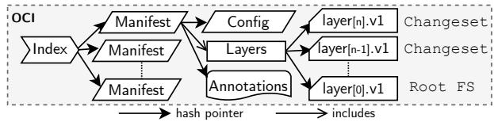  
Figure 1: Cross-section of OCI image format.

## 2.1 Container Dissection and Lifecycle

Figure 1 shows the cross-section of an OCI image, which contains all necessary files to run a container. Internally, the image is structured as a Directed Acyclic Graph (DAG) composed of an index, a set of manifests, config files, and layers. A manifest represents an image tailored to a specific platform and contains references to the filesystem layers and a config file. A layer describes a filesystem change; starting from the RootFS, each layer updates, adds, or removes files from the previous layer. Layers are stacked on top of each other and joined together to form the container filesystem (e.g., OverlayFS [30]) A layer is stored as a compressed tarball called blob and referenced via a hash of their contents (the digest). When multiple containers are created from images that use identical layers, the layers are shared, reducing the storage overhead. Every change in a layer invalidates its hash, causing a cascade effect that propagates up to the index. The config file holds the container’s configuration details, such as execution parameters and environment variables, along with the root filesystem changes expressed as a list of DiffIDs. A DiffID is the hash of an uncompressed image layer, not to be confused with the digest mentioned above.

A container image build process is handled by a builder component, which is composed of a front end and a back end. The front end parses the build file descriptor and converts it into a set of instructions that can be used by the backend. Let us take the example of Docker’s builder component, buildx, which uses BuildKit [72] as the default backend. The dockerfile frontend takes Docker’s build descriptor file (called Dockerfile [27]) and translates it to high-level LLB definitions. The BuildKit backend then creates the image’s build graph from the definitions, and the solver component builds the container by executing the graph nodes one after another. At this stage, container layers are created as a result of file operations in the definition, such as copying files from the host to the container. Note that despite BuildKit being known for its optimized builder backends that can parallelize image builds, the process of layer generation is still sequential due to the nature of the filesystem operations.

## 2.2 The Rise of Distributed ML

Deploying ML applications can be challenging due to the high computational resources required by their underlying ML models [77, 82]. This challenge is more pronounced in edge computing environments, where machines are of heterogeneous hardware configurations and multiple applications share the resources [58, 61, 69, 92]. As a result, large ML models with several layers and parameters are often found unsuitable for edge infrastructures [68, 80, 91].

One approach focuses on designing compact models that are smaller and more efficient than their larger counterparts. Such models are developed using a combination of techniques such as using fewer network blocks/layers, blocks with fewer parameters, reducing the precision of model weights through quantization, removing unnecessary connections through pruning, and transferring knowledge from large models to smaller ones through distillation [14, 60, 66, 87, 89]. However, compact models often struggle to adapt to dynamic data distributions as effectively as larger models, making them susceptible to data drift and requiring regular updates [14, 22, 51, 81]. As such, these models require frequent periodic retraining and updating (as often as 30-50 seconds [51, 92]) to ensure they remain accurate and adaptable to edge environments.

Another approach is to split the large ML model into multiple parts and distribute them across multiple devices for parallel execution [39, 40, 50, 54, 66]. More specifically, the model is partitioned into several slices, each of which is deployed on a separate machine, forming an execution pipeline. An “early-exit” head can optionally be added to some of the splits [98, 100], providing the possibility of not processing all the splits until the end, trading accuracy with better response time. Table 2 shows the splitting potential of popularly used ML models, where some models can be split into as many as 82 layers. Recent work has explored its applicability in edgecloud computing, where privacy or performance concerns dictate that the first few splits be processed at the edge, and intermediate information is sent to nearby and distant cloud infrastructure for further processing [54, 79, 95, 96]. However, model partitioning introduces new challenges, particularly in dynamic edge environments where the number of available devices can change over time due to failures, poor connections, or resource sharing with multiple applications [7,61,99]. Furthermore, since the hardware configurations of these devices are heterogeneous, the subset of model partitions that can be deployed on a device can vary [40, 103] – requiring flexible methods for distribution and deployment.

## 2.3 Containers for Distributed ML?

Almost all popular ML management frameworks, such as MLflow [71, 102], Flower [13], and SkyPilot [101], rely on containers for model deployment due to their agility and ability to replicate the runtime environment across different hardware configurations. The typical packaging process involves frameworks creating a container image that includes the ML model and its dependencies, which is then pushed to a central storage (registry) for distribution [13,17,44,49,51,70,71,73,76]. Each device periodically connects to the registry and fetches the updated images specific to their requirements.

<table><tr><td># Images</td><td>Build Time ( (s)</td></tr><tr><td>1</td><td>81.67</td></tr><tr><td>20</td><td>113.78</td></tr><tr><td>41</td><td>157.64</td></tr><tr><td>62</td><td>149.92</td></tr><tr><td>82</td><td>242.66</td></tr></table>

Table 1: Docker build time  
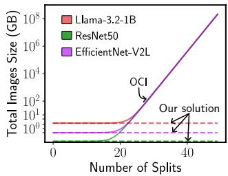  
with increasing splits of Effi- Figure 2: OCI image size excientNet (ENv2L) across dif- plodes with increasing model ferent images. splits, unlike our solution.

However, model optimization and partitioning techniques noted earlier do not function well for containerized models. Let’s consider how split ML models can be distributed using containers. The obvious approach is to create a separate container image for each model partition (e.g., a model with 60 splits can be stored as 60 images). However, bigger devices might be able to compute larger chunks of the model or might provide better hardware acceleration for specific layers, therefore requiring a special image configuration. An ML cluster may also experience resource losses, and the splits must be re-computed to reduce the model fragmentation. The number of possible image configurations can grow exponentially with the number of splits. Additionally, computing these images for AI models can be an extremely time-consuming operation.

To demonstrate this, we conducted an experiment with the EfficientNetv2L (ENv2L) model, where we built an increasing number of Docker images while increasing the number of splits of a model. For example, 2 splits would result in 2 images, 3 splits would result in 3 images, and so on. Table 1 shows a significant increase in Docker image build time with increasing model splits – leading up to a 3× longer build compared to the 1 split use case. To combat this, one option could be pre-building all possible container images, ensuring that any requested subset of partitions is readily available for devices to pull from the registry. However, this approach becomes prohibitively expensive in terms of build time as well as the required storage space at the registry, as illustrated in Figure 2. Assuming we can map each model layer to a container image layer li ∈ L. Then, a model split is a container image where for each i, layer li is either included in the image or not. Each combination is an image manifest referencing the included layers, leading to 2n combinations, where n is the number of splits. Thus, the combination of manifests required, as shown in the figure, explodes, leading to significant space overhead. We leave it to the reader to imagine the build time necessary to compute such a set of images. Moreover, if the build time is not enough of a concern, these models are also frequently re-trained and updated – thus, the image build procedure must be repeated.

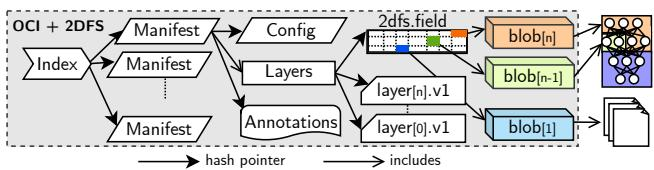  
Figure 3: Cross-section of a 2DFS image.

Alternative state-of-the-art solutions distribute model parameters by (a) independently storing and then mounting them to the containers as volumes or (b) downloading them on the fly. The former approach prevents data sharing across untrusted parties and requires considerable engineering efforts in edge environments where object stores are not widely available. The latter approach is transparent to the container runtimes, preventing efficient parameters caching and sharing across workloads but instead forcing the applications to download the parameters at startup every time. Local model registry caches can be used to mitigate bandwidth usage at the cost of additional resource usage.

## 2.4 Why 2DFS?

We believe that the limitations of containerized ML model distribution lie in the layered filesystem structure of container images, which is well-conceived for code and dependencies but not intended for large files, libraries, and drivers, resulting in severely bloated images [105]. This structure prevents the retrieval of on-demand data subsets and forces continuous container image rebuild for fine-grained file updates, which is expensive and time-consuming. For example, driver and library updates usually invalidate the cache of entire container images even if the underlying code did not change. On the other hand, by addressing content by digest, container registries offer an excellent mechanism for object retrieval. With this work, we aim to extend the OCI image format to recycle the well-known and commonly used container image registries to distribute not only code and dependencies but also binaries, model parameters, and any large file without affecting the complexity of the CI/CD pipelines. By building a specialized container layer offering independent file pointers, the ML model splits, drivers and dependencies can be independently cached in image registries and downloaded ondemand by container runtimes. Registries can then provide each client with image partitions, including only the necessary files, to avoid downloading bloated images.

## 3 2DFS System Design

2DFS is a two-dimensional filesystem build and distribution framework for containers. The first building block is the extension of the conventional layered filesystem used in container architectures, which often restricts optimization due to the linked nature of layer changesets. 2DFS introduces an addifitional layer type called 2dfs.field. Figure 3 shows a crosssection of an OCI container image with the new 2dfs.field layer type (OCI+2DFS). A field is a sparse hash-pointer matrix of allotments representing a self-contained, non-overlapping, and independent filesystem space. Each allotment links one or more files or, for instance, a split of a neural network. This design relaxes intra-layer dependencies, enabling more efficient filesystem distribution (see §3.1) and fast image builds with extremely high parallelism (see §3.2). The second important building block of the proposed system is the image partitioning operation, supported by the 2DFS compliant registry (see §3.5). This operation allows field partitions that can be retrieved independently. The sub-fields are serialized as regular OCI layers and are compliant with any existing container runtime. The two-dimensional design is well suited for flexibly partitioning ML models, allowing for more efficient and on-demand “best-fitting” deployments (see §3.4).

Figure 4 shows the end-to-end workflow of 2DFS container image specification, build, and distribution. At step 1 , the developer specifies a base image and the allotments content (e.g., different model splits) with their position in the field via 2dfs.json descriptor file. For instance, model splits s1 and s2 are assigned to the allotments <0.0> and <0.1>, respectively. 2DFS builder (§3.2) extends a regular OCI image with a 2dfs.field (§3.1) layer and is responsible for (i) creating the filesystem, (ii) filling the field with allotments, (iii) attaching field to the image and (iv) caching the allotments. The extended image format, referred to as OCI+2DFS, is stored locally in the builder cache (§3.3) and can be pushed to a 2DFS-compliant registry (§3.5) in step 2 . Developers can fetch partitioned images from the registry on-demand (step 3 ) by specifying the semantic tag in the pull request (§3.4). Note that the registry image partitioner only performs manifest operations on the pre-built allotments, restricting the partitioning overhead as much as possible. Upon receiving the image partition pull request (step 4 ), the registry serializes the image partition into a fully OCI-compliant image and serves it to the runtime which can be used by any OCIcompliant runtime without modifications.

## 3.1 2dfs.field layer

We extend the OCI Image Specification [46] to introduce 2dfs.field layer type as a new media type. As previously discussed, 2dfs.field is represented as a sparse matrix that organizes allotments in a grid structure. Among all the possible geometrical structures, this work represents a field as a 2-dimensional plane to simplify the definition of partitions and to easily map the structure of neural networks. In such a plane, allotments can be easily defined to contain model splits or can be graphically organized based on different use cases. Check §5 and Appendix A for further details. Inside the field, each allotment contains: (i) an index in the form of <row.column>, (ii) a digest, which serves as a hash-pointer reference to an OCI artifact, and (iii) the DiffID, represent-

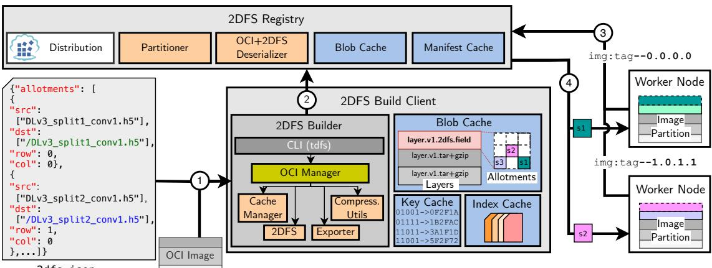  
Figure 4: 2DFS end-to-end workflow and component architecture.

1 "allotments":[   
2 {   
3 "row": int ,   
4 "col": int ,   
5 "digest": str ,   
6 "diffid": str ,   
7 } ,   
8 ]   
9 "tot\_rows": int   
10 "owner": str

## Listing 1: Description of the 2dfs.field manifest

ing the hash of the uncompressed content as defined by the OCI specification. Listing 1 illustrates the manifest description of 2dfs.field inside an image. OCI artifacts referenced by allotments are standard .tar.gz blobs that contain userdefined compressed content and are indistinguishable from regular OCI layer objects. The 2DFS builder (see §3.2) makes sure these blobs satisfy the following three properties: (i) they are commutative and can be applied in any order to a container filesystem without altering the final state, (ii) they can be cross-referenced across multiple fields, supporting efficient data sharing and caching across images, and (iii) they can be serialized as conventional OCI layers, ensuring seamless integration with existing OCI runtimes. Changeset operations in 2DFS closely resemble those in OCI layers. When a blob referenced by an allotment is updated, a cascade of hash invalidations occurs, requiring reconstruction of the field data structure. However, unlike intermediate layers in conventional container systems, where linked changesets force rebuilding all dependent layers, only allotments referencing modified files are updated, while the rest are served from the cache (see §3.3). For instance, if model split s1 in Figure 4 is updated, s2 allotment remains unaffected and will not be rebuilt in the new image. The next section details the 2DFS builder.

## 3.2 2DFS Builder

Starting from a regular OCI image and a 2dfs.json file descriptor, the builder composes the 2-dimensional field to create an extended OCI+2DFS image. The 2DFS builder consists of several components: (a) CLI utility, (b) image manager, (c) 2DFS filesystem serializer/deserializer, (d) cache manager, (e) exporter, and (f) compression utility. CLI Utility provides a range of commands to build, push, and manage both OCI and OCI+2DFS images locally. The core of the utility is the following build command:

## tdfs build [base-image] [target-image] [flags]

Here, the base-image is a fully-compliant OCI image descriptor in the format registry/repository/image:tag. In case the registry or the tag is omitted, the tool defaults to Docker registry and latest, respectively. The command expects a descriptor file called 2dfs.json. The descriptor file contains a list of allotments defined by the user. For each allotment, the user describes the source files list and the destination path in the target image, as well as the row and column of the allotment in the field (see fig. 4).

The OCI Manager component is responsible for the lifecycle of an image within the builder – from its initial state as base-image to its final form as extended OCI+2DFS image. The build command utilizes the OCI Manager to retrieve the base-image, either from the local cache or from a remote registry, and then extend it with the 2dfs.field layer.

The Cache Manager handles the storage of image indexes, manifests, and blobs in the local caches, detailed in §3.3.

The 2DFS component generates the field data structure and its allotments based on the 2dfs.json descriptor. Its descriptor is parsed, and the referenced files are copied into temporary directories, which are structured according to the path hierarchy defined by the user. Each temporary directory is first hashed to generate a DiffID—the digest of the uncompressed layer, as per the OCI specifications.

The Compression Utilities compress the directories generated by the filesystem component into a .tar.gz file (referred to as a blob), which is cached and hashed. The blob hash, along with the DiffID, column, and row information, is used by the 2DFS serializer to create the allotments for the 2dfs.field layer. After the 2dfs.field layer is serialized, and the referenced blobs are successfully cached, the layer is appended to each manifest referenced by the index. Since allotment generation is a platform-independent operation, the builder appends the new field structure to all manifest variants, regardless of OS or architecture – ensuring cross-platform compatibility. The corresponding config for each image is also updated to include all the DiffIDs for the allotments as if they are layered. This step is necessary to ensure compliance with the OCI runtime specification. If certain layers are removed from the image, e.g., due to image partitioning, the config is updated accordingly to reflect the modified image structure. The builder dynamically re-computes new config files using the DiffIDs embedded in the field’s allotments. Modifying the manifest’s layers and config file invalidates its hash-pointer reference at the index level, so the builder generates a new index file for the OCI+2DFS image to maintain integrity.

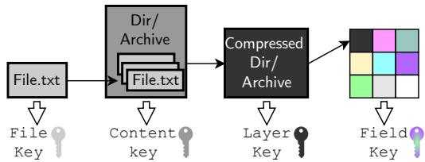  
Figure 5: Caching layers architecture.

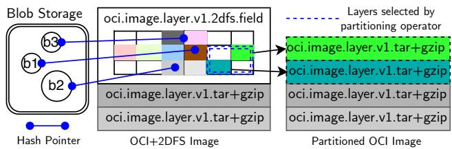  
Figure 6: Example showcasing image partitioning.

The OCI Manager Exporters use the updated index files to retrieve cache entries and package the new image. 2DFS supports two exporters: tarball and registry. The tarball exporter can package either a full extended OCI+2DFS image or a partitioned image in plain OCI format. The registry exporter, on the other hand, pushes all image layers, fields, allotments, and blobs to a remote registry as OCI artifacts, utilizing standard REST API calls defined in the OCI distribution spec [45] to ensure compatibility with existing registries.

One key advantage of the 2DFS build process is that it removes the need to mount the files into a running container to build and extract layers. This is possible because the 2dfs.field layer only references static files used at runtime. As a result, the build process is significantly faster and scalable, particularly for large files, while minimizing disk I/O. Additionally, due to the independence of each file (allotment), the blobs can be built in parallel, further accelerating the build process.

## 3.3 Cache Hierarchy

The builder employs a multi-layer cache system to efficiently store files, allotments, and fields. Every time the Cache fiManager modifies or creates an object, a hash of its bytes is generated, known as a cache key. This key uniquely identifies the object, allowing the builder to skip upcoming build stages if the key already exists. At each stage, the builder works with dedicated caching layers, generating or interacting with objects from previous stages.

Definition 1 In a caching hierarchy, ranging from $C _ { 0 }$ to $C _ { j } ,$ the following rules apply when building a generic object $o _ { i } ^ { \bar { k } }$ for each caching layer i with $0 < i < j \colon$

$$
\begin{array} { r l } & { \mathrm { R 1 . ~ } o _ { i } ^ { k } a n d k e y K _ { i } ^ { k } a r e b u i l t f r o m a t l e a s t o n e o b j e c t o f C _ { i - 1 } . } \\ & { \mathrm { R 2 . ~ } \left\{ C _ { i } \gets C _ { i } \cup \{ K _ { i } ^ { k } : o _ { i } ^ { k } \} ; i \gets i + 1 \quad i f K _ { i } ^ { k } \notin C _ { i } \right. } \\ & { \left. i \gets j \qquad \quad \right. o t w } \end{array}
$$

For allotment generation, the build stages and corresponding cache operate as shown in Figure 5. At any level i in the hierarchy, a change has a cascade effect on the layers above. For instance, if a file within an allotment is updated, the following steps occur: (i) the file’s key is invalidated, the builder copies the new file in a temporary directory used for the allotment build and the key of the uncompressed folder is generated (ii) the updated directory is compressed into a blob, generating another key; and (iii) the field is re-constructed. If a key matches an existing one during this process, the builder skips to the last cache layer and proceeds with the final stages of the build. Since allotments can be built independently, the 2dfs.field is constructed from separate parallel build processes. Changes in the file structure trigger reconstruction of only affected allotments, resulting in significant build performance improvements (see §4).

The Cache Manager module is used by the OCI Manager component of 2DFS builder. It employs three different cache storages for different object categories. The Key Cache stores intermediate keys for the file copying, allotment creation, and compression, which only serve as metadata for cache hierarchy. Note that the cache only stores the keys and hash-pointers referencing the blobs, which are instead stored in the Blob Cache. This cache contains every object in the builder except for the image indexes. Each object in this cache is named based on the sha256sum of its content, ensuring efficient content validation and easy retrieval using hash pointers. The media type for each blob in this cache is defined by its hash-pointer reference. This means that when a blob is retrieved from the cache, its media type is already known for deserialization, avoiding the need to duplicate this information elsewhere. Finally, the Index Cache stores the OCI index of all the images that are referenced via the hashed fully-qualified OCI name: sha256sum(registry/repository/image:tag). Extended OCI+2DFS images are annotated with the name of the base image and a "2dfs" label indicating that the 2dfs.field layer is present in the image DAG hierarchy.

## 3.4 Image Partitioning

The design of 2DFS focuses on flexibility and ease of use. In a two-dimensional space, users are free to arrange ML models, files, libraries, and other resources to fit any area of the field (Appendix A discusses this further). This design makes it easy for the user to select a subset of the field with only the desired functionalities. We call this process image partitioning, and it must allow retrieving only the necessary parts of an image on-demand, without needing to re-build or re-push any additional manifest. In 2DFS, partitions from the two-dimensional field can be easily extracted and serialized as regular OCI layers.

Definition 2 Given a field F composed of allotments A where $F = A ^ { m \times n }$ , a partition P is the union of subfields $P = \cup _ { i } f _ { i }$ where $f _ { i } = A [ f _ { i } ^ { x _ { 1 } } : f _ { i } ^ { x _ { 2 } } , f _ { i } ^ { y _ { 1 } } : f _ { i } ^ { y _ { 2 } } ] ; i , x , y \in { \bf N } ; x \le m , y \le n .$

Given a partition P, a 2DFS exporter can create an OCI bundle where the allotments composing the union of the subfields $f _ { i }$ are flattened into regular OCI layers. Figure 6 illustrates an example of the operation. The center shows the selected partition P of the 2DFS+OCI image composed of subfield A[1 : 2, 4 : 5] spanning from <row 1.column 4> to <row 2.column 5>. This subfield only has two allotments (shown as different green shades). The image partitioning operation (i) fetches the corresponding allotment’s blob from the local blob store, (ii) serializes the blob as regular OCI layers in the image manifest, and (iii) updates the manifest config file with the layer’s DiffIDs. The result is the base image from the 2DFS build phase, without the special 2dfs.field layer, but with additional flattened allotments selected by the partitioning operator. To enable seamless image partitioning without additional registry endpoints, we define the partitioning operator as a semantic image tag, i.e., a string containing a special suffix defining the image operation.

## registry/repository/image:tag--x1.y1.x2.y2

x1 and y1 are the coordinates of the top-left corner, and x2 and $\mathtt { y 2 }$ the bottom-right corner of sub-field fi (e.g., tag for fig. 6 partition is tag−−1.4.2.5). While only a 2DFS compliant registry can correctly parse the semantic tag, any runtime can use semantic tags to retrieve a partitioned image. The partitioning operators can be concatenated, allowing for an unlimited number of sub-fields for each partition. The subfields are parsed by the exporter or a compliant registry and transformed into the actual partition. The partition is processed to generate the requested image.

## 3.5 2DFS Registry

2DFS registry is an OCI compliant registry with support for .2dfs.field media type and partitioning operator. Starting from the open-source OCI implementation, we introduced the following updates:

1. Partitioner: Serializes the partition of an OCI+2DFS into an OCI manifest.

2. Partitioning Operator Support: Enables parsing of smantic tags for partitioning at the image/pull endpoint.

3. OCI+2DFS Deserializer: Provides support the 2dfs.field media type.

The partitioner efficiently generates OCI-compliant manifests and configs by fetching the OCI+2DFS image, decoding the 2dfs.field layer, and applying the selected allotments as OCI layers. It then removes the 2dfs.field layer, replacing it with standard layer descriptors, and it applies the layers DiffIDs to the rootfs of the image’s config file. Finally, the new manifest is cached. When a semantic tag with a partition is detected at the /v2/<name>/manifests/<reference> endpoint, the tag parser triggers the partitioner, which fetches the manifest and generates the new partitioned image based on the requested subfields. The OCI+2DFS Deserializer extends the registry to handle 2dfs.field media types, leveraging distribution.UnmarshalFunc [25] type to deserialize and access the manifest content.

## 4 Evaluation

We evaluate the performance of 2DFS and compare it against Docker – the most popular container-building tool [28]. Since 2DFS is a completely new approach to layering, in most scenarios, multiple Docker images were used to simulate the same functionality of an OCI+2DFS image. For example, for three partitions of 2DFS image, we require three separate Docker images. In this evaluation, we focus on the continuous model updating and split computing use cases, where a ML model is stored as several partitions or splits. We compare the performance of 2DFS while varying the amount of splits of a model.

## 4.1 Experimental Setup

Build Infrastructure. All the build experiments are carried out with Docker runtime version 27.3.1 with containerd snapshotter and all default settings, such as buildx builder and BuildKit backend. The base image used for all the builds is the tensorflow/tensorflow image version 2.17.0. The image build is performed on a bare-metal server with 2× AMD EPYC 7302 16-Core Processors, 256GB DDR4 RAM, and 2TB 12Gb/s Solid State Drive. For the build, we compare the 2DFS builder (in §3.2) against the default Docker build command. The 2DFS compliant registry is hosted on a server running 1× Intel Core i9-9820X CPU, 128GB DDR4 RAM, 1TB NVMe 3.5Gb/s Solid State Drive. The machines are interconnected with a 1Gb/s Ethernet connection.

Edge Infrastructure. We created a distributed edge computing infrastructure consisting of 10 Raspberry Pi 4B (RPi) devices, each equipped with four ARM Cortex-A72 cores and 8GB of RAM. Additionally, we utilized a Linux PC with an Intel Core i7-4790 4-Core Processor and 16GB RAM as the gateway for our experiment in §4.5. All machines were interconnected via a 1Gb/s Ethernet switch. The gateway served as the controller for dynamically deploying different model splits on varying numbers of RPis, generating load, and aggregating output to calculate end-to-end response time. Notably, the gateway did not execute any model splits itself. The RPis rely on the remote server for cross-device clock synchronization.

<table><tr><td>Model</td><td>Label</td><td>Application</td><td>#Parameter</td><td>Total Size (MB)</td><td>#Splits</td><td>Avg #Params per Split±o</td></tr><tr><td>ResNet50</td><td>RN50</td><td>Recognition</td><td>25.6 M</td><td>97.8</td><td>18</td><td> $1 . 3 9 \pm 1 . 7 6 \mathrm { M }$ </td></tr><tr><td>MobileNetV2</td><td>MNv2</td><td>Recognition</td><td>3.5 M</td><td>13.5</td><td>19</td><td> $0 . 1 3 \pm 0 . 1 5 { \bf M }$ </td></tr><tr><td> $\mathbf { M o b i l e N e t V } 2 _ { \alpha = 1 . 4 }$ </td><td>MNv2L</td><td>Recognition</td><td>6.2 M</td><td>23.5</td><td>19</td><td> $0 . 2 4 \pm 0 . 2 9 \mathrm { M }$ </td></tr><tr><td>DeepLabv3+*</td><td>DLv3</td><td>Segmentation</td><td>39.1 M</td><td>150</td><td>19</td><td> $2 . 1 7 \pm 3 . 6 7 \mathrm { \ : M }$ </td></tr><tr><td>EfficientNet-V2-B0</td><td>ENv2B0</td><td>Recognition</td><td>7.2 M</td><td>27.5</td><td>24</td><td> $0 . 2 6 \pm 0 . 2 2 \ : \mathrm { M }$ </td></tr><tr><td>EfficientNet-V2-B1</td><td>ENv2B1</td><td>Recognition</td><td>8.2 M</td><td>31.3</td><td>30</td><td> $0 . 2 4 \pm 0 . 2 2 \ : \mathrm { M }$ </td></tr><tr><td>EfficientNet-V2-B2</td><td>ENv2B2</td><td>Recognition</td><td>10.2 M</td><td>38.8</td><td>31</td><td> $0 . 2 9 \pm 0 . 2 6 \ : \mathrm { M }$ </td></tr><tr><td>EfficientNet-V2-B3</td><td>ENv2B3</td><td>Recognition</td><td>14.5 M</td><td>55.2</td><td>35</td><td> $0 . 3 8 \pm 0 . 3 3 \mathrm { M }$ </td></tr><tr><td>ResNet101</td><td>RN101</td><td>Recognition</td><td>44.7 M</td><td>170.5</td><td>35</td><td> $1 . 2 5 \pm 1 . 2 5 \ : \mathrm { M }$ </td></tr><tr><td>YOLOv3</td><td>YOLOv3</td><td>Detection</td><td>62 M</td><td>236.3</td><td>36</td><td> $1 . 6 8 \pm 2 . 2 9 \mathrm { M }$ </td></tr><tr><td>EfficientNet-V2S</td><td>ENv2S</td><td>Recognition</td><td>21.6 M</td><td>82.5</td><td>43</td><td> $0 . 4 8 \pm 0 . 3 9 \mathrm { M }$ </td></tr><tr><td>ResNet152</td><td>RN152</td><td>Recognition</td><td>60.4 M</td><td>230.5</td><td>52</td><td> $1 . 1 4 \pm 1 . 0 6 \mathrm { M }$ </td></tr><tr><td>EfficientNet-V2M</td><td>ENv2M</td><td>Recognition</td><td>54.4 M</td><td>207</td><td>60</td><td> $0 . 9 0 \pm 0 . 9 9 { \mathrm { ~ M } }$ </td></tr><tr><td>EfficientNet-V2L</td><td>ENv2L</td><td>Recognition</td><td>119 M</td><td>454</td><td>82</td><td> $1 . 4 5 \pm 1 . 6 0 \mathrm { M }$ </td></tr></table>

Table 2: Overview of our Model Zoo which includes popularly used models for different application categories.

To ensure accurate timing measurements, we deployed a network time protocol (NTP) server on the gateway. This setup results in a maximum clock offset of approximately ±100µs and a jitter less than ±100µs, allowing for precise device-todevice response time reporting. We perform all experiments 10 times and report the median across runs.

Model Zoo. Table 2 presents the model zoo utilized in our evaluation, comprising 14 models across three diverse application scenarios, including Object Recognition, Detection, and Segmentation. These models offer varying splitting options based on their architectural characteristics (cf. §4.1.1). The number of splits per model ranges from 18 to 82. The results are obviously expected to generalize to much larger models.

## 4.1.1 Generating Model Splits

To accommodate a wide range of models and offer a general solution, we employ the Keras API due to its ability to leverage multiple backends, such as PyTorch, TensorFlow, or JAX, catering to different hardware needs. We automatically generate the 2dfs.json descriptor as a direct output of the model split generation. For all the models in the zoo, a descriptor shows the position of splits’ weights and architecture in the two-dimensional structure. Our approach draws inspiration from previous work [40, 54, 92] on model slicing and is guided by three key principles:

1. Minimizing output size. We avoid slicing at branch or shortcut points, as this would require passing multiple tensors to the next device. Instead, we identify inherent information bottlenecks, typically located after aggregation layers (e.g., Add or Concatenation), which serve as suitable split points.

2. Maximizing flexibility. By introducing as many splits as possible while adhering to the first principle, we increase deployment flexibility and enable more efficient utilization of available resources.

3. Balancing split inference times. While not as critical as the first two principles, we strive to achieve a fair distribution of inference time across each split, ensuring that no single device is disproportionately burdened. Our end-toend results on MNv2L (fig. 14) supports this goal.

Guided by these principles, our slicing strategy targets bottleneck layers whenever possible or, alternatively, those with relatively smaller output sizes compared to their neighbors as candidate split points. Each split was designed to contain two or three computationally expensive operations, such as various forms of convolution or fully connected layers. In certain applications, like object detection, the output of multiple splits may need to be transmitted and utilized in a later stage. We restructured these model graphs to transmit the necessary information directly to the specific split(s) that require it, thereby avoiding unnecessary data passing through all splits. Furthermore, whenever possible, we identified opportunities for parallel computation without tensor sharing and created separate splits to leverage these possibilities. For instance, a few blocks in YOLOv3 have such a characteristic. By exploiting parallelism in the model graph, we can accelerate inference and improve scalability.

Our model slicing approach yields a varying number of splits across the 14 models in our Model Zoo (Table 2), ranging from 18 (e.g., RN50) to 82 (e.g., ENv2L). Each split can be deployed and containerized as a standalone application, enabling flexible deployment scenarios. We include in fig. 18 the parameter count and size distribution of different splits, showing the variability among models. Note that each split comprises multiple model layers. Each layer potentially has weights and biases that may change values after model updates or have distinct versions (e.g., FP32, quantized INT8) to accommodate diverse use cases. To comply with this dynamic nature, we detangle the split model architecture (computation graph) from the weights themselves to improve flexibility. We then apply BZip2 compression to the splits and store them as separate allotments in the OCI+2DFS format.

## 4.2 Image Build

We begin by measuring the build performance of 2DFS and Docker builder. For each model in the zoo, we define a split capacity ranging from 0% to 100%. We define split capacity as the percentage of the splits we divide the model compared to the maximum allowed splits. For example, at 50% split capacity for ENv2L, we only generate 82×0.5=41 splits and divide the model into 41 portions instead of 82. With 0% split capacity, we do not split the model at all resulting in one large "split" representing the entire model. Each split is allocated in a separate 2DFS allotment or OCI layer. Therefore, an image containing YOLOv3 at 100% split capacity features 37 layers (RootFS + 36 splits), while an image with 100% split of ENv2L has 83 layers. We perform the experiments for all the models in the zoo, but only report results for a subset for brevity. We refer interested readers to Appendix B for the remaining results.

Figure 7 shows the results of build-time of 1 image with respect to split capacity %. On average, 2DFS builds OCI+2DFS images 16× faster than Docker with standard OCI images. Even in the base case of 0% split capacity, 2DFS is already outperforming Docker. For deep models with larger layer sizes, such as ENv2L, we observe a counterintuitive pattern in the Docker build. The build is slower when either the layers are too big (e.g., 0% split capacity) or the layers are too many (e.g., 100% split capacity), with a sweet spot at 50% split capacity. For smaller models, instead, Docker build time decreases somewhat linearly with the number of layers. This behavior hints that there is a tradeoff between layer size and layer number. Generally, it looks faster to build smaller layers until they are confined in numbers (E.g., less than 50 layers.). With 2DFS, we observe that the more we split, the faster the build time. The performance gap between the two build systems is related to how Docker handles the layer creation. Docker uses a build container to which all the files are copied during the build. Mounting the model weights into the build container and extracting a layer changeset is an expensive and time-consuming operation. Moreover, each layer operation is executed using the input mount point from the previous phase sequentially since Docker cannot know if the layer’s applications are commutative. On the other hand, 2DFS exploits the allotment independence to parallelize the build process, thus escalating the cache hierarchy described in §3.3 for all the allotments simultaneously. The 2DFS builder runs under the assumption that a 2dfs.field layer is immutable and only contains static files. Therefore, a build container is not necessary, and the allotments are computed locally, minimizing disk I/O utilization also for the 0% split capacity scenario.

With OCI+2DFS image format, we can retrieve on-demand any possible image split with a random partitioning. In fig. 8, we compare the build time needed to pre-compute multiple OCI images for each split. Because the total number of split and partition combinations would be unfeasible to build, we simplify the experiment by only building a small subset of possible image splits for Docker. In particular, we compute one Docker image for each split based on the Split Capacity. E.g., ENv2L50% split capacity in the context of this plot means that we partition the model in 41 splits, and we generate 41 different Docker images, one for each split, while only one OCI+2DFS image with 41 equal partitions from the original 82 allotments. Note that an OCI+2DFS image can actually generate up to 282 different partitions with such split capacity, but it would be unreasonable to build so many Docker images as demonstrated in fig. 2. The results show an average of 56× faster build time for 2DFS, with a peak of 120× faster builds for the ENv2L model with 100% split capacity. The build time of OCI+2DFS in this experiment is constant and does not depend on the split capacity because we always build one image including all the allotments, while to achieve the same result with traditional OCI images, we need to build a new image for each split, increasing the build time manyfold.

Figure 9 shows the CPU and Memory usage of the builder machine measured during the experiment shown in fig. 7. The results show that while 2DFS and Docker have similar memory usage, 2DFS has higher CPU consumption, especially with higher image split capacity. With 0% split capacity, we observe similar consumption. The more we increase the split capacity, the higher the values of CPU usage. While 2DFS builder computes each allotment’s DiffID and blob simultaneously, which are both CPU-intensive operations, Docker performs these operations in sequence, resulting in lower CPU usage but longer builds. It is worth noting that even if, in this experiment, Docker shows up to 20% lower CPU consumption over the build time, 2DFS build time was on average 16x faster, resulting in an overall lower total CPU time.

## 4.3 Image Download and Partitioning

We now evaluate the overhead caused by the partitioning operation at the registry compared to pull of traditional OCI images. Figure 10 compares the download time of four different partitions for the ENv2L and RN50 images, each containing respectively 25, 50, 75, and 100% of the total splits. For Docker, we pre-compute the splits, and we push all four images to the registry independently. For 2DFS, we just push to the registry a single OCI+2DFS image and ask for an ondemand partition every time. The pull requests are performed on a separate worker machine using the Docker CLI. We observe how the on-demand partitioning is performed by the registry with minimal overhead, leading to a comparable total download time with on average only 20 ms additional latency.

Figure 11 shows the bandwidth usage at the client side during the download of the pre-computed OCI images built using Docker versus the OCI+2DFS partitioned image. The result shows comparable bandwidth usage across the two approaches. Therefore, serialized allotments bring negligible overhead in terms of download time and data rate.

Figure 12 shows the CPU usage at the registry side during the download of traditional OCI images built using Docker and

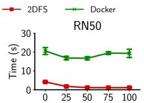  
Model Split Capacity (%)

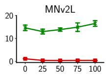

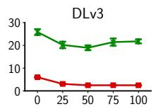

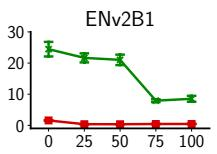

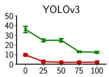

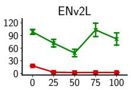

Figure 7: Build time for a single image with increasing number of splits per layer.  
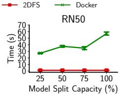

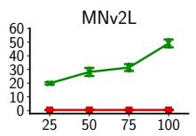

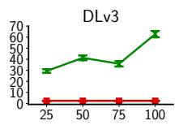

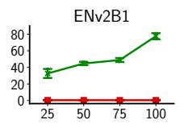

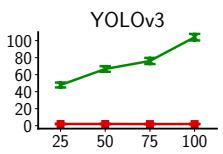

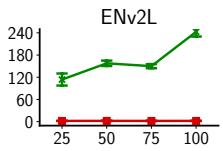

Figure 8: Build time for different split partitions where each partition is packaged as a separate image.  
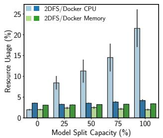  
Figure 9: Resources consumption during image build.

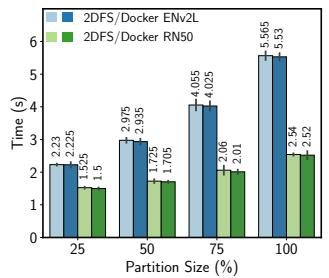  
Figure 10: Download of partitioned vs prebuilt images.

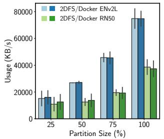  
Figure 11: Download bandwidth for partitioned images.

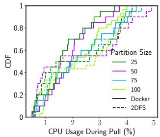  
Figure 12: Registry resource utilization during image pull.

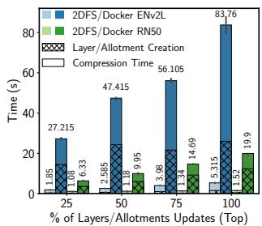

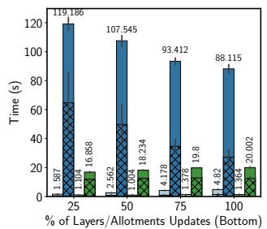  
(a) Top-down update strategy.  
Figure 13: Build time after model updates with image caching.  
(b) Bottom-Up Update Strategy.

2DFS images. With these measurements, we try to quantify the computational overhead of the on-demand partitioning operation compared to the download of pre-computed images. The results show that the registry CPU usage is comparable across the two approaches, with a slight increase for the 2DFS images of 1% after the 50-th percentile. This gap represents the CPU overhead of the on-demand partitioning operation and the serialization of the field’s allotments into OCI layers. We also measure the memory overhead at the registry, but we omit the results as we do not observe any significant difference between the two approaches.

## 4.4 Model Updates

updates on the image rebuild. For each image in the model zoo, we build a baseline version where each split is placed on a different layer. Then, we update increasingly 25%, 50%, 75%, and 100% of the model splits with newer versions and re-perform the build of the images. This operation commonly happens after model re-training. This experiment measures the caching efficiency of each builder. Better caching strategies lead to lower build times. In 2DFS, the position of the allotment that needs to be updated does not affect the build time due to the independence property. Each allotment that has not been updated will skip the cache hierarchy as described in §3.3. On the other hand, in Docker, the position of the layer that needs to be replaced affects the cache invalidation and drastically increases the build time. Therefore, we compare two different configurations, one where the updated layers are placed at the top of the image and one where they replace the bottom layers of the image.

As mentioned in §2.2, some parts (i.e., splits) of a model, particularly in smaller models, may receive frequent updates to comply with the accuracy demands as they experience distribution drift. In this section, we evaluate the effect of model

Figure 13 shows the results of the experiment. On the left side, we have the results obtained by starting the updates from the top layers, while on the right, the results while updating the layers from the bottom. As expected, Docker build time is relatively more efficient when updating the layers from the top, as Docker is able to cache the bottom layers successfully. However, the build time is, on average, 25× slower than 2DFS. The worst case scenario for Docker is when the layers are updated from the bottom, resulting in a 75× slower build time compared to 2DFS. Interestingly, in this latter scenario, the more layers we update, the faster the build gets. This is related to the way Docker invalidates the cache for the layers above and re-computes one layer after the other. We observe that for the bottom-up update scenario, the compression time increases with the number of updated layers while the layering time decreases. The layering time includes all the operations prior to the layer compression, such as cache invalidation, content copy, and changeset computation. We conclude that in the current Docker implementation, it is faster to rebuild the image from scratch than to perform a bottom-up update. When updating the image layers from the top, the compression and layering time grows linearly as expected. The 2DFS build time is growing linearly with the number of updated layers but at a slower pace, showing a better caching efficiency.

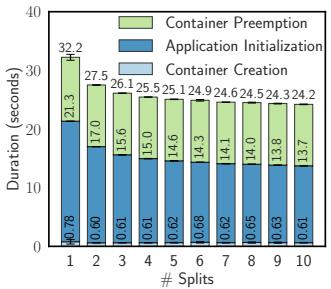

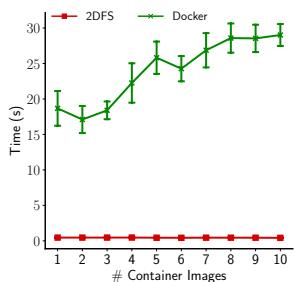  
(a) Deployment time.

(b) Build time.  
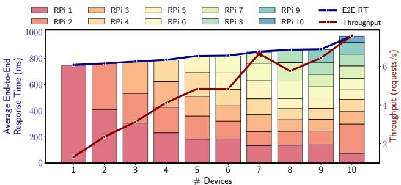  
(c) Response time & throughput.  
Figure 14: Performance of distributed MNv2L over increasing number of devices and model splits.

## 4.5 Split Computing Performance

Another scenario of interest besides continuous model updates is the split computing phenomenon §2.2, where due to different reasons such as privacy and/or scalability, a model is split into multiple parts, and each device serves only a subset of the model. This inherently provides an opportunity for pipeline parallelism as we enable it by default. In this section, we evaluate the performance of the MNv2L model in a distributed Edge Computing testbed. We deploy the model on a set of Raspberry Pi devices, ranging from 1 to 10, each running a different split of the model. Every time a device joins the experiment, the image splits are re-computed uniformly to fit the new number of devices. For each new device, a new image split must be computed for traditional OCI images, while for OCI+2DFS images, we can simply request the new partition from the registry. We measure (i) E2E RT, which refers to the average end-to-end response time, (ii) throughput of the deployed system, which is the number of requests per second that it is able to fulfill, (iii) deployment time and (iv) build time of the images for the different splits.

Figure 14c shows the inference performance results. RPi x refers to the average time a particular Raspberry Pi device takes to process its split, including the communication and queuing delay. Observe how the end-to-end response time increases linearly with the number of devices. The model fragmentation and the additional networking overhead are the main contributing factors. On the other hand, the total throughput of the system increases steeply from less than 1.3 to 7.6 requests/s. Model fragmentation allows constrained devices to compute their splits, avoiding CPU throttling and memory exhaustion issues. Moreover, model splitting can improve the overall system scalability.

Figure 14a is showing the overall deployment time breakdown for the MNv2L model. This experiment does not include the download and partitioning time as it assumes that Docker images were pre-computed. The results show a logarithmic decrease in build time, mainly caused by the application initialization and the container creation. Smaller model sizes are faster to decompress, especially on constrained hardware, resulting in an overall speed-up of the deployment process.

Figure 14b shows the time to build the new image split for each device joining the experiment. Build time for 2DFS is constant as only one image is generated at the beginning, and the new splits are requested on-demand. On the other hand, the build time for the Docker use case increases based on the number of images that need to be generated every time we need a new split. On some occasions, such as when generating images for 2 and 6 devices, the build time results are lower than expected, probably related to a discrepancy in the split sizes, which can lead to faster build times. The relative build time difference between the two approaches shows that 2DFS build is 55.9× faster. We omit the total build time because it is not comparable across the two approaches; in fact, for this simple example, we had to build 55 OCI images but only a single image for 2DFS.

## 5 Discussion and Future Directions

While our primary focus is on providing an efficient and standard packaging framework for the mainstream distributed ML, there are additional application scenarios for 2DFS that are available straight out of the box. Conducting separate evaluation experiments of these applications is unlikely to provide new insights beyond those already presented in the previous section; thus, we discuss them here and refer to relevant evaluations when applicable.

Other ML Architectures. 2DFS is not limited to the models provided in the Model Zoo. Indeed, it is a general solution, and one can use any model or set of models together with 2DFS to streamline data propagation and parallel executions in a standard containerized way. This includes autoencoders, recurrent neural networks, and generative AI such as diffusion models and large language models (LLMs). For instance, LLMs heavily rely on distributed inference infrastructure across several machines [4, 35, 83, 84, 107], a practice essential for scalability and for supporting massive models like Llama 3.1 with up to 405 billion parameters [38]. Integration of 2DFS and LLM libraries like vLLM [53], DeepSpeed [4, 86, 93] and the Kubernetes-native llm-d [62] comes with foreseeable advantages such as facilitating LLM distributed serving pipelines by leveraging (i) OCI+2DFS images for efficient packaging of inference code and model parameters, and (ii) on-demand partitioning for distributing model shards. This combines LLM serving with the simplicity and scalability of self-contained microservice applications.

Additional ML Usecases. In the context of ML applications, several scenarios emerge where 2DFS is advantageous. For instance, in ML serving systems, dynamic application demands (e.g., varying latency and accuracy requirements), different backends, and numerous model sizes lead to thousands of variants of the same base model and corresponding Docker images [88]. This calls for a more efficient packaging framework that can decouple these different models; this is where 2DFS excels. In fact, each variant can be treated as a separate set of allotments, and significant gains can be achieved as demonstrated in §4.4.

Along similar lines, the concept of bloated vs. debloated ML containers [105] highlights the issue of oversized Docker containers with potential vulnerabilities due to the inclusion of various packages and toolchains during different stages (design, training, serving) of an ML application’s lifecycle. 2DFS offers a straightforward solution by facilitating the separation of these stages into distinct partitions. Appendix A illustrates ML packaging in more detail.

Further, another line of work [7, 85, 97] aims to reduce the communication overhead in tensor parallelism by constructing sparsely distributed sub-models. These works along with multi-model pipelines where an application is constructed of multiple ML tasks present another compelling use case for 2DFS. Instead of relying on several docker images, or worse, a bulky image with redundant blobs, it packages everything into a single image. Each device only pulls the needed parts, resulting in reduced build, download, and deployment times §4.3. Frequent ML Model Updates. One of the most critical aspects of containerized ML is the container build time, hindering the propagation of ML model updates. Often, platforms prefer to rely on object stores [36], just to avoid frequent container re-builds, which are slower. However, this practice requires customized release pipelines and has severe limitations in edge environments, as discussed in §2. Khani et al. [51] show how real-world continuous re-training for object-detection models such as MobileNetV2(MNv2) and ResNet50(RN50) can lead to model updates arriving every 30 seconds or even faster. For RN50, a relatively small model, in fig. 13, we show how traditional container updates on production-grade hardware can span between 6 and 20 seconds, depending on where the layer update happens, slowing the effectiveness of continuous re-training manyfold. On the other hand, 2DFS, is able to build such images in 1 to 1.5 seconds, up to 13x faster. For larger models such as EfficientNet-V2L(ENv2L), the gap increases further up to 75x faster rebuild. These results highlight how 2DFS opens an unprecedented opportunity to utilize containers for model packaging and caching even in highly dynamic environments with frequent model re-train.

Broader Applications. By design, 2DFS is a general-purpose solution applicable to diverse scenarios that require flexible and efficient packaging. An interesting use case is the management of fat images [2], where containers are built with extensive binaries, libraries and other application requirements, e.g. analytics utilities to full-blown networking libraries like ServiceRouter [90]. In traditional systems, any update to a single binary requires rebuilding the entire container, which is not only a resource-intensive process but can also take several hours to complete. With 2DFS, separate allotments can contain different binaries and libraries, allowing teams to update specific components independently, while improving deployment efficiency. This capability significantly accelerates the DevOps workflows, enabling continuous integration and deployment practices to operate at a much finer granularity.

Future Directions. In addition to the above-mentioned scenarios, 2DFS has potential operational benefits in microservice packaging/deployment in edge computing environments [12] and for federated learning workloads [13]. However, 2DFS also has several limitations to be considered. 2DFS is currently limited to supporting only OCI images, which, despite being an established standard, restricts its compatibility with other formats such as the conventional vnd.docker. While the number of 2DFS allotments is potentially unlimited, leaving developers total freedom in how to architect the field, traditional OCI runtimes can only handle a maximum of 127 container layers. Therefore, to maintain compatibility with runtimes like Docker, the 2dfs.json descriptor must be designed in a way that limits 2DFS partitions to a maximum of 127 allotments per partition. This still allows fine-grained parameter caching but can be a limitation for developers dealing with extremely large models. In the future, we plan to address these limitations and extend the system by (i) exploring alternative field form factors and layouts to optimize both performance and usability, (ii) developing a 2DFS storage driver to overcome the layer limitations imposed by current file systems, and (iii) designing a system-specific runtime that dynamically retrieves model partitions based on file system access patterns. For instance, a future direction can aim at extending container runtimes to better support use cases requiring more than 127 layers and optimize how allotments are handled within the container runtime storage driver [29].

## 6 Related Work

Distributed ML serving needs model partitioning. Related work on distributed ML serving can be categorized into two main avenues. One focuses on splitting models between edge devices and cloud servers to reduce data transmission latency and improve privacy [3, 32, 39–41, 43, 50, 54–56, 63, 66, 95]. Techniques vary in their partitioning strategies, often driven by specific objectives such as energy efficiency [50, 59], bandwidth, latency, or privacy [47, 79]. Some works employ early-exit mechanisms for generating predictions on edge devices [63,92,95]. Others propose creating multiple versions of partitions to adapt to changing network conditions [22, 43] or utilize idle machines over the Internet for large language models [16]. The second line of research targets deploying small models on distributed edge computing devices, often considering scenarios like self-driving cars [14, 51] or multiple audio and video analytics applications [22, 92]. These works address the capacity gap between smaller and larger models through model adaptation. Some proposals involve deploying models or splits on various devices and aggregating results to achieve desired accuracy [6, 7, 97, 100, 103], while others focus on efficient model update strategies, such as training only the final layers of models [51], freezing 70-90% of layers during retraining [14, 22], or dynamically selecting a portion of model partitions to process and applying early-exit to maintain Service-Level Objectives (SLO) requirements [92].

ML Serving meets containers. Containers have become ubiquitous as they offer isolated runtime environments, ensuring consistent behavior across different dependencies and platforms [14, 21, 40, 51, 88, 108]. However, most MLOps frameworks overlook the unique challenges of Distributed ML [8,9,11,13,19,31,33,37,57,71,75,78,106]. These frameworks assume that packaging is a solved problem, neglecting the complexities of dividing ML models into multiple parts for efficient adaptation and distribution across devices.

Our work highlights the need for a more comprehensive and efficient approach to packaging in Distributed ML. While there are numerous proposals addressing various aspects of Distributed ML, we found no existing packaging tool that natively supports its requirements. This gap underscores the importance of our solution.

## 7 Conclusion

In this paper, we introduced 2DFS, a two-dimensional filesystem build and distribution framework designed to address the inefficiencies of existing container-based systems for distributed ML. Our design enables independent updates of model partitions by decoupling them from the traditional layered structure, offering substantial improvements in both build and deployment efficiency. Through our comprehensive evaluation, we demonstrated that 2DFS provides significant performance gains – achieving on average 56× faster build times and 25× better caching efficiency compared to Docker and regular OCI images.

## Acknowledgments

We would like to thank the anonymous ATC reviewers and the shepherd for their helpful comments and insights during the review process of this paper. We would also like to thank the ATC Artifact Evaluation Committee for their meticulous examination and efforts to reproduce our results. This work is supported by the Federal Ministry of Education and Research of Germany (BMBF) project 6G-Life (16KISK002) and by the National Growth Fund through the Dutch 6G flagship project “Future Network Services".

## References

[1] Martín Abadi, Ashish Agarwal, Paul Barham, Eugene Brevdo, Zhifeng Chen, Craig Citro, Greg S Corrado, Andy Davis, Jeffrey Dean, Matthieu Devin, et al. Tensorflow: Large-scale machine learning on heterogeneous distributed systems. arXiv preprint arXiv:1603.04467, 2016.

[2] Dimitri Aivaliotis. Tupperware: Container deployment at scale. 2015.

[3] Mario Almeida, Stefanos Laskaridis, Stylianos I Venieris, Ilias Leontiadis, and Nicholas D Lane. Dyno: Dynamic onloading of deep neural networks from cloud to device. ACM Transactions on Embedded Computing Systems, 21(6):1–24, 2022.

[4] Reza Yazdani Aminabadi, Samyam Rajbhandari, Ammar Ahmad Awan, Cheng Li, Du Li, Elton Zheng, Olatunji Ruwase, Shaden Smith, Minjia Zhang, Jeff Rasley, et al. Deepspeed-inference: enabling efficient inference of transformer models at unprecedented scale. In SC22: International Conference for High Performance Computing, Networking, Storage and Analysis, pages 1–15. IEEE, 2022.

[5] Ganesh Ananthanarayanan, Victor Bahl, Landon Cox, Alex Crown, Shadi Nogbahi, and Yuanchao Shu. Video analytics-killer app for edge computing. In Proceedings of the 17th annual international conference on mobile systems, applications, and services, pages 695– 696, 2019.

[6] Navidreza Asadi and Maziar Goudarzi. An ensemble mobile-cloud computing method for affordable and accurate glucometer readout. arXiv preprint arXiv:2301.01758, 2023.

[7] Navidreza Asadi and Maziar Goudarzi. Variant parallelism: Lightweight deep convolutional models for distributed inference on iot devices. IEEE Internet of Things Journal, 11(1):345–352, 2024.

[8] AWS. Deep Learning Container. https: //github.com/aws/deep-learning-containers. [Online; accessed 26-Jan-2024].

[9] Mariam Barry, Albert Bifet, and Jean-Luc Billy. Streamai: Dealing with challenges of continual learning systems for serving ai in production. In 2023 IEEE/ACM 45th International Conference on Software Engineering: Software Engineering in Practice (ICSE-SEIP), pages 134–137. IEEE, 2023.

[10] Giovanni Bartolomeo, Navidreza Asadi, Wolfgang Kellerer, Jörg Ott, and Nitinder Mohan. 2dfs. https: //github.com/2DFS, 2025. Accessed: 22 May 2025.

[11] Giovanni Bartolomeo, Jacky Cao, Xiang Su, and Nitinder Mohan. Characterizing distributed mobile augmented reality applications at the edge. In Companion of the 19th International Conference on emerging Networking EXperiments and Technologies, pages 9–18, 2023.

[12] Giovanni Bartolomeo, Mehdi Yosofie, Simon Bäurle, Oliver Haluszczynski, Nitinder Mohan, and Jörg Ott. Oakestra: A lightweight hierarchical orchestration framework for edge computing. In 2023 USENIX Annual Technical Conference (USENIX ATC 23), pages 215–231, Boston, MA, July 2023. USENIX Association.

[13] Daniel J Beutel, Taner Topal, Akhil Mathur, Xinchi Qiu, Javier Fernandez-Marques, Yan Gao, Lorenzo Sani, Kwing Hei Li, Titouan Parcollet, Pedro Porto Buarque de Gusmão, et al. Flower: A friendly federated learning research framework. arXiv preprint arXiv:2007.14390, 2020.

[14] Romil Bhardwaj, Zhengxu Xia, Ganesh Ananthanarayanan, Junchen Jiang, Yuanchao Shu, Nikolaos Karianakis, Kevin Hsieh, Paramvir Bahl, and Ion Stoica. Ekya: Continuous learning of video analytics models on edge compute servers. In 19th USENIX Symposium on Networked Systems Design and Implementation (NSDI 22), pages 119–135, 2022.

[15] Alexander Borzunov, Dmitry Baranchuk, Tim Dettmers, Max Ryabinin, Younes Belkada, Artem Chumachenko, Pavel Samygin, and Colin Raffel. Petals: Collaborative inference and fine-tuning of large models. arXiv preprint arXiv:2209.01188, 2022.

[16] Alexander Borzunov, Max Ryabinin, Artem Chumachenko, Dmitry Baranchuk, Tim Dettmers, Younes Belkada, Pavel Samygin, and Colin A Raffel. Distributed inference and fine-tuning of large language models over the internet. Advances in Neural Information Processing Systems, 36, 2024.

[17] Ryan Chard, Zhuozhao Li, Kyle Chard, Logan Ward, Yadu Babuji, Anna Woodard, Steven Tuecke, Ben Blaiszik, Michael J Franklin, and Ian Foster. Dlhub:

Model and data serving for science. In 2019 IEEE International Parallel and Distributed Processing Symposium (IPDPS), pages 283–292. IEEE, 2019.

[18] Sarah Chasins, Alvin Cheung, Natacha Crooks, Ali Ghodsi, Ken Goldberg, Joseph E Gonzalez, Joseph M Hellerstein, Michael I Jordan, Anthony D Joseph, Michael W Mahoney, et al. The sky above the clouds. arXiv preprint arXiv:2205.07147, 2022.

[19] Zhenpeng Chen, Yanbin Cao, Yuanqiang Liu, Haoyu Wang, Tao Xie, and Xuanzhe Liu. A comprehensive study on challenges in deploying deep learning based software. In Proceedings of the 28th ACM Joint Meeting on European Software Engineering Conference and Symposium on the Foundations of Software Engineering, ESEC/FSE 2020, page 750–762, New York, NY, USA, 2020. Association for Computing Machinery.

[20] Will Constable. Pytorch distributed overview. https://pytorch.org/tutorials/beginner/ dist\_overview.html, 2024. Accessed: 2024-10-23.

[21] Daniel Crankshaw, Xin Wang, Guilio Zhou, Michael J Franklin, Joseph E Gonzalez, and Ion Stoica. Clipper: A {Low-Latency} online prediction serving system. In 14th USENIX Symposium on Networked Systems Design and Implementation (NSDI 17), pages 613–627, 2017.

[22] Harshit Daga, Yiwen Chen, Aastha Agrawal, and Ada Gavrilovska. Clue: Systems support for knowledge transfer in collaborative learning with neural nets. IEEE Transactions on Cloud Computing, 2023.

[23] Yingnong Dang, Qingwei Lin, and Peng Huang. Aiops: real-world challenges and research innovations. In 2019 IEEE/ACM 41st International Conference on Software Engineering: Companion Proceedings (ICSE-Companion), pages 4–5. IEEE, 2019.

[24] Jim Davis, Philbert Shih, and Alex Marcham. State of the edge: A market and ecosystem report for edge computing. https://www.stateoftheedge.com, 2023.

[25] distribution. distribution/distribution repository. https://github.com/distribution/ distribution, 2024. [Online; accessed 15-Oct-2024].

[26] Docker. Dockefile best practices. https: //docs.docker.com/build/building/bestpractices/, 2024. Accessed: 22 October 2024.

[27] Docker. Dockefile reference. https: //docs.docker.com/reference/dockerfile/, 2024. Accessed: 21 October 2024.

[28] Docker. Most-used developer tool. https: //www.docker.com/blog/docker-stackoverflow-survey-thank-you-2023/, 2024. Accessed: 22 October 2024.

[29] Docker. Storage driver. https://docs.docker.com/ engine/storage/drivers/, 2024. Accessed: 22 May 2025.

[30] Docker Docs. Use the overlayfs storage driver. https://docs.docker.com/storage/ storagedriver/overlayfs-driver/, 2020.

[31] Domino. Role of Containers. https: //domino.ai/blog/role-of-containers-onmlops-and-model-production. [Online; accessed 26-Jan-2024].

[32] Xin Dong, Barbara De Salvo, Meng Li, Chiao Liu, Zhongnan Qu, Hsiang-Tsung Kung, and Ziyun Li. Splitnets: Designing neural architectures for efficient distributed computing on head-mounted systems. In Proceedings of the IEEE/CVF Conference on Computer Vision and Pattern Recognition, pages 12559– 12569, 2022.

[33] DVC. Model Registry. https://dvc.ai/modelregistry. [Online; accessed 26-Jan-2024].

[34] Ali Farhadi and Joseph Redmon. Yolov3: An incremental improvement. In Computer vision and pattern recognition, volume 1804, pages 1–6. Springer Berlin/Heidelberg, Germany, 2018.

[35] Yao Fu, Leyang Xue, Yeqi Huang, Andrei-Octavian Brabete, Dmitrii Ustiugov, Yuvraj Patel, and Luo Mai. {ServerlessLLM}:{Low-Latency} serverless inference for large language models. In 18th USENIX Symposium on Operating Systems Design and Implementation (OSDI 24), pages 135–153, 2024.

[36] Saeid Ghafouri, Kamran Razavi, Mehran Salmani, Alireza Sanaee, Tania Lorido Botran, Lin Wang, Joseph Doyle, and Pooyan Jamshidi. Ipa: Inference pipeline adaptation to achieve high accuracy and cost-efficiency. In Companion of the 16th ACM/SPEC International Conference on Performance Engineering, pages 2–3, 2025.

[37] Noah Gift and Alfredo Deza. Practical MLOps. O’Reilly Media, Inc.", 2021.

[38] Aaron Grattafiori, Abhimanyu Dubey, Abhinav Jauhri, Abhinav Pandey, Abhishek Kadian, Ahmad Al-Dahle, Aiesha Letman, Akhil Mathur, Alan Schelten, Alex Vaughan, et al. The llama 3 herd of models. arXiv preprint arXiv:2407.21783, 2024.

[39] Yitian Hao, Wenqing Wu, Ziyi Zhang, Yuyang Huang, Chen Wang, Jun Duan, and Junchen Jiang. Deft: Slodriven preemptive scheduling for containerized dnn serving. In Symposium on Networked Systems Design and Implementation, 2023.

[40] Ke-Jou Hsu, Ketan Bhardwaj, and Ada Gavrilovska. Couper: Dnn model slicing for visual analytics containers at the edge. In Proceedings of the 4th ACM/IEEE Symposium on Edge Computing, pages 179–194, 2019.

[41] Chuang Hu, Wei Bao, Dan Wang, and Fengming Liu. Dynamic adaptive dnn surgery for inference acceleration on the edge. In IEEE INFOCOM 2019-IEEE Conference on Computer Communications, pages 1423– 1431. IEEE, 2019.

[42] Yitao Hu, Rajrup Ghosh, and Ramesh Govindan. Scrooge: A cost-effective deep learning inference system. In Proceedings of the ACM Symposium on Cloud Computing, pages 624–638, 2021.

[43] Jin Huang, Colin Samplawski, Deepak Ganesan, Benjamin Marlin, and Heesung Kwon. Clio: Enabling automatic compilation of deep learning pipelines across iot and cloud. In Proceedings of the 26th Annual International Conference on Mobile Computing and Networking, pages 1–12, 2020.

[44] Hugging Face. The model hub. https:// huggingface.co/docs/hub/en/models-the-hub, 2024. Accessed: October 23, 2024.

[45] Open Containers Initiative. Oci specification: Distribution specification. https: //github.com/opencontainers/distributionspec/blob/main/spec.md, 2024. Accessed: 20 October 2024.

[46] Open Containers Initiative. Oci specification: Image specification. https://github.com/ opencontainers/image-spec/blob/main/ spec.md, 2024. Accessed: 20 October 2024.

[47] Hyuk-Jin Jeong, InChang Jeong, Hyeon-Jae Lee, and Soo-Mook Moon. Computation offloading for machine learning web apps in the edge server environment. In 2018 IEEE 38th International Conference on Distributed Computing Systems (ICDCS), pages 1492–1499. IEEE, 2018.

[48] Junchen Jiang, Ganesh Ananthanarayanan, Peter Bodik, Siddhartha Sen, and Ion Stoica. Chameleon: scalable adaptation of video analytics. In Proceedings of the 2018 conference of the ACM special interest group on data communication, pages 253–266, 2018.

[49] Wenxin Jiang, Nicholas Synovic, Matt Hyatt, Taylor R Schorlemmer, Rohan Sethi, Yung-Hsiang Lu, George K Thiruvathukal, and James C Davis. An empirical study of pre-trained model reuse in the hugging face deep learning model registry. In 2023 IEEE/ACM 45th International Conference on Software Engineering (ICSE), pages 2463–2475. IEEE, 2023.

[50] Yiping Kang, Johann Hauswald, Cao Gao, Austin Rovinski, Trevor Mudge, Jason Mars, and Lingjia Tang. Neurosurgeon: Collaborative intelligence between the cloud and mobile edge. ACM SIGARCH Computer Architecture News, 45(1):615–629, 2017.

[51] Mehrdad Khani, Ganesh Ananthanarayanan, Kevin Hsieh, Junchen Jiang, Ravi Netravali, Yuanchao Shu, Mohammad Alizadeh, and Victor Bahl. {RECL}: Responsive {Resource-Efficient} continuous learning for video analytics. In 20th USENIX Symposium on Networked Systems Design and Implementation (NSDI 23), pages 917–932, 2023.

[52] Kubeflow. Kubeflow: The machine learning toolkit for kubernetes, 2021. Accessed: 2024-10-23.

[53] Woosuk Kwon, Zhuohan Li, Siyuan Zhuang, Ying Sheng, Lianmin Zheng, Cody Hao Yu, Joseph E. Gonzalez, Hao Zhang, and Ion Stoica. Efficient memory management for large language model serving with pagedattention. In Proceedings of the ACM SIGOPS 29th Symposium on Operating Systems Principles, 2023.

[54] Stefanos Laskaridis, Stylianos I Venieris, Mario Almeida, Ilias Leontiadis, and Nicholas D Lane. Spinn: synergistic progressive inference of neural networks over device and cloud. In Proceedings of the 26th annual international conference on mobile computing and networking, pages 1–15, 2020.

[55] En Li, Liekang Zeng, Zhi Zhou, and Xu Chen. Edge ai: On-demand accelerating deep neural network inference via edge computing. IEEE Transactions on Wireless Communications, 19(1):447–457, 2019.

[56] He Li, Kaoru Ota, and Mianxiong Dong. Learning iot in edge: Deep learning for the internet of things with edge computing. IEEE network, 32(1):96–101, 2018.

[57] KeDi Li and Ning Gui. Cms: A continuous machinelearning and serving platform for industrial big data. Future Internet, 12(6):102, 2020.

[58] Tian Li, Jie Zhong, Ji Liu, Wentao Wu, and Ce Zhang. Ease. ml: Towards multi-tenant resource sharing for machine learning workloads. Proceedings of the VLDB Endowment, 11(5):607–620, 2018.

[59] Xiangjie Li, Chenfei Lou, Yuchi Chen, Zhengping Zhu, Yingtao Shen, Yehan Ma, and An Zou. Predictive exit: Prediction of fine-grained early exits for computationand energy-efficient inference. In Proceedings of the AAAI Conference on Artificial Intelligence, volume 37, pages 8657–8665, 2023.

[60] Zhuohan Li, Eric Wallace, Sheng Shen, Kevin Lin, Kurt Keutzer, Dan Klein, and Joey Gonzalez. Train big, then compress: Rethinking model size for efficient training and inference of transformers. In International Conference on machine learning, pages 5958–5968. PMLR, 2020.

[61] Qianlin Liang, Walid A Hanafy, Noman Bashir, Ahmed Ali-Eldin, David Irwin, and Prashant Shenoy. Delen: ˇ enabling flexible and adaptive model-serving for multitenant edge ai. In Proceedings of the 8th ACM/IEEE Conference on Internet of Things Design and Implementation, pages 209–221, 2023.

[62] llm d. Kubernetes-native distributed inference at scale. https://llm-d.ai, 2025. Accessed: 22 May 2025.

[63] Jiachen Mao, Xiang Chen, Kent W Nixon, Christopher Krieger, and Yiran Chen. Modnn: Local distributed mobile computing system for deep neural network. In Design, Automation & Test in Europe Conference & Exhibition (DATE), 2017, pages 1396–1401. IEEE, 2017.

[64] Markets and Markets to 2023. Intelligent video analytics market, 2024. Accessed: 2024-10-23.

[65] MarketsandMarkets. Intelligent video analytics market - global forecast to 2028, 2024. Accessed: 2024-10-23.

[66] Yoshitomo Matsubara, Marco Levorato, and Francesco Restuccia. Split computing and early exiting for deep learning applications: Survey and research challenges. ACM Computing Surveys, 55(5):1–30, 2022.

[67] Peter Mattson, Vijay Janapa Reddi, Christine Cheng, Cody Coleman, Greg Diamos, David Kanter, Paulius Micikevicius, David Patterson, Guenther Schmuelling, Hanlin Tang, et al. Mlperf: An industry standard benchmark suite for machine learning performance. IEEE Micro, 40(2):8–16, 2020.

[68] Ruben Mayer and Hans-Arno Jacobsen. Scalable deep learning on distributed infrastructures: Challenges, techniques, and tools. ACM Computing Surveys (CSUR), 53(1):1–37, 2020.

[69] ETSI Industry Specification Group (ISG) MEC. Mobile-edge computing (mec) - introductory technical white paper. Technical report, European Telecommunications Standards Institute (ETSI), September 2014. Version 1.

[70] Hui Miao, Ang Li, Larry S Davis, and Amol Deshpande. Modelhub: Deep learning lifecycle management. In 2017 IEEE 33rd International Conference on Data Engineering (ICDE), pages 1393–1394. IEEE, 2017.

[71] MlFlow. Deep Learning Container. https:// mlflow.org/docs/latest/model-registry.html. [Online; accessed 26-Jan-2024].

[72] Moby. Buildkit. https://github.com/moby/ buildkit, 2024. Accessed: 21 October 2024.

[73] ModelHub Contributors. Modelhub: Empowering ai researchers to share fully reproducible and portable model implementations. http://modelhub.ai, 2024. Accessed: October 23, 2024.

[74] Philipp Moritz, Robert Nishihara, Stephanie Wang, Alexey Tumanov, Richard Liaw, Eric Liang, Melih Elibol, Zongheng Yang, William Paul, Michael I Jordan, et al. Ray: A distributed framework for emerging {AI} applications. In 13th USENIX symposium on operating systems design and implementation (OSDI 18), pages 561–577, 2018.

[75] Neptune. Deep Learning Container. https:// neptune.ai/blog/ml-model-registry. [Online; accessed 26-Jan-2024].

[76] Neptune.ai. Ml model registry: What it is, why it matters, and how to implement it. https://neptune.ai/ blog/ml-model-registry, 2024. Accessed: October 23, 2024.

[77] Chanh Nguyen, Amardeep Mehta, Cristian Klein, and Erik Elmroth. Why cloud applications are not ready for the edge (yet). In Proceedings of the 4th ACM/IEEE Symposium on Edge Computing, pages 250–263, 2019.

[78] David Nigenda, Zohar Karnin, Muhammad Bilal Zafar, Raghu Ramesha, Alan Tan, Michele Donini, and Krishnaram Kenthapadi. Amazon sagemaker model monitor: A system for real-time insights into deployed machine learning models. In Proceedings of the 28th ACM SIGKDD Conference on Knowledge Discovery and Data Mining, pages 3671–3681, 2022.

[79] Seyed Ali Osia, Ali Shahin Shamsabadi, Sina Sajadmanesh, Ali Taheri, Kleomenis Katevas, Hamid R Rabiee, Nicholas D Lane, and Hamed Haddadi. A hybrid deep learning architecture for privacy-preserving mobile analytics. IEEE Internet of Things Journal, 7(5):4505–4518, 2020.

[80] Arthi Padmanabhan, Neil Agarwal, Anand Iyer, Ganesh Ananthanarayanan, Yuanchao Shu, Nikolaos Karianakis, Guoqing Harry Xu, and Ravi Netravali.

Gemel: Model merging for {Memory-Efficient},{Real-Time} video analytics at the edge. In 20th USENIX Symposium on Networked Systems Design and Implementation (NSDI 23), pages 973–994, 2023.

[81] Andrei Paleyes, Raoul-Gabriel Urma, and Neil D Lawrence. Challenges in deploying machine learning: a survey of case studies. ACM computing surveys, 55(6):1–29, 2022.

[82] Misun Park, Ketan Bhardwaj, and Ada Gavrilovska. Pocket: ml serving from the edge. In Proceedings of the Eighteenth European Conference on Computer Systems, pages 46–62, 2023.

[83] Pratyush Patel, Esha Choukse, Chaojie Zhang, Aashaka Shah, Íñigo Goiri, Saeed Maleki, and Ricardo Bianchini. Splitwise: Efficient generative llm inference using phase splitting. In 2024 ACM/IEEE 51st Annual International Symposium on Computer Architecture (ISCA), pages 118–132. IEEE, 2024.

[84] Reiner Pope, Sholto Douglas, Aakanksha Chowdhery, Jacob Devlin, James Bradbury, Jonathan Heek, Kefan Xiao, Shivani Agrawal, and Jeff Dean. Efficiently scaling transformer inference. Proceedings of Machine Learning and Systems, 5:606–624, 2023.

[85] Minghai Qin, Chao Sun, Jaco Hofmann, and Dejan Vucinic. Disco: Distributed inference with sparse communications. In Proceedings of the IEEE/CVF Winter Conference on Applications of Computer Vision, pages 2432–2440, 2024.

[86] Samyam Rajbhandari, Conglong Li, Zhewei Yao, Minjia Zhang, Reza Yazdani Aminabadi, Ammar Ahmad Awan, Jeff Rasley, and Yuxiong He. Deepspeed-moe: Advancing mixture-of-experts inference and training to power next-generation ai scale. In International conference on machine learning, pages 18332–18346. PMLR, 2022.

[87] Mohammad Rastegari, Vicente Ordonez, Joseph Redmon, and Ali Farhadi. Enabling ai at the edge with xnor-networks. Communications of the ACM, 63(12):83–90, 2020.

[88] Francisco Romero, Qian Li, Neeraja J Yadwadkar, and Christos Kozyrakis. {INFaaS}: Automated model-less inference serving. In 2021 USENIX Annual Technical Conference (USENIX ATC 21), pages 397–411, 2021.

[89] Mark Sandler, Andrew Howard, Menglong Zhu, Andrey Zhmoginov, and Liang-Chieh Chen. Mobilenetv2: Inverted residuals and linear bottlenecks. In Proceedings of the IEEE conference on computer vision and pattern recognition, pages 4510–4520, 2018.

[90] Harshit Saokar, Soteris Demetriou, Nick Magerko, Max Kontorovich, Josh Kirstein, Margot Leibold, Dimitrios Skarlatos, Hitesh Khandelwal, and Chunqiang Tang. {ServiceRouter}: Hyperscale and minimal cost service mesh at meta. In 17th USENIX Symposium on Operating Systems Design and Implementation (OSDI 23), pages 969–985, 2023.

[91] Mahadev Satyanarayanan, Wei Gao, and Brandon Lucia. The computing landscape of the 21st century. In Proceedings of the 20th International Workshop on Mobile Computing Systems and Applications, pages 45–50, 2019.

[92] Sudipta Saha Shubha and Haiying Shen. Adainf: Data drift adaptive scheduling for accurate and sloguaranteed multiple-model inference serving at edge servers. In Proceedings of the ACM SIGCOMM 2023 Conference, pages 473–485, 2023.

[93] DeepSpeed Team. Deepspeed: Accelerating deep learning training. https://github.com/deepspeedai/ DeepSpeed, 2025. Accessed: 2025-05-24.

[94] TensorFlow Team. Tensorflow serving with docker, 2024. Accessed: 2024-10-23.

[95] Surat Teerapittayanon, Bradley McDanel, and Hsiang-Tsung Kung. Branchynet: Fast inference via early exiting from deep neural networks. In 2016 23rd international conference on pattern recognition (ICPR), pages 2464–2469. IEEE, 2016.

[96] Surat Teerapittayanon, Bradley McDanel, and Hsiang-Tsung Kung. Distributed deep neural networks over the cloud, the edge and end devices. In 2017 IEEE 37th international conference on distributed computing systems (ICDCS), pages 328–339. IEEE, 2017.

[97] Guanhua Wang, Zhuang Liu, Brandon Hsieh, Siyuan Zhuang, Joseph Gonzalez, Trevor Darrell, and Ion Stoica. sensai: Convnets decomposition via class parallelism for fast inference on live data. Proceedings of Machine Learning and Systems, 3:664–679, 2021.

[98] Xiaofang Wang, Dan Kondratyuk, Eric Christiansen, Kris M Kitani, Yair Alon, and Elad Eban. Wisdom of committees: An overlooked approach to faster and more accurate models. arXiv preprint arXiv:2012.01988, 2020.

[99] Carole-Jean Wu, David Brooks, Kevin Chen, Douglas Chen, Sy Choudhury, Marat Dukhan, Kim Hazelwood, Eldad Isaac, Yangqing Jia, Bill Jia, et al. Machine learning at facebook: Understanding inference at the edge. In 2019 IEEE international symposium on high performance computer architecture (HPCA), pages 331–344. IEEE, 2019.

[100] Guoxuan Xia and Christos-Savvas Bouganis. Windowbased early-exit cascades for uncertainty estimation: When deep ensembles are more efficient than single models. In Proceedings of the IEEE/CVF International Conference on Computer Vision, pages 17368–17380, 2023.

[101] Zongheng Yang, Zhanghao Wu, Michael Luo, Wei-Lin Chiang, Romil Bhardwaj, Woosuk Kwon, Siyuan Zhuang, Frank Sifei Luan, Gautam Mittal, Scott Shenker, et al. {SkyPilot}: An intercloud broker for sky computing. In 20th USENIX Symposium on Networked Systems Design and Implementation (NSDI 23), pages 437–455, 2023.

[102] Matei Zaharia, Andrew Chen, Aaron Davidson, Ali Ghodsi, Sue Ann Hong, Andy Konwinski, Siddharth Murching, Tomas Nykodym, Paul Ogilvie, Mani Parkhe, et al. Accelerating the machine learning lifecycle with mlflow. IEEE Data Eng. Bull., 41(4):39–45, 2018.

[103] Liekang Zeng, Xu Chen, Zhi Zhou, Lei Yang, and Junshan Zhang. Coedge: Cooperative dnn inference with adaptive workload partitioning over heterogeneous edge devices. IEEE/ACM Transactions on Networking, 29(2):595–608, 2020.

[104] Hong Zhang, Yupeng Tang, Anurag Khandelwal, and Ion Stoica. {SHEPHERD}: Serving {DNNs} in the wild. In 20th USENIX Symposium on Networked Systems Design and Implementation (NSDI 23), pages 787–808, 2023.

[105] Huaifeng Zhang, Mohannad Alhanahnah, Fahmi Abdulqadir Ahmed, Dyako Fatih, Philipp Leitner, and Ahmed Ali-Eldin. Machine learning systems are bloated and vulnerable. Proceedings of the ACM on Measurement and Analysis of Computing Systems, 8(1):1–30, 2024.

[106] Yizhen Zhao. Machine learning in production: A literature. Technical report, Tech. Rep, 2021.

[107] Yinmin Zhong, Shengyu Liu, Junda Chen, Jianbo Hu, Yibo Zhu, Xuanzhe Liu, Xin Jin, and Hao Zhang. {DistServe}: Disaggregating prefill and decoding for goodput-optimized large language model serving. In 18th USENIX Symposium on Operating Systems Design and Implementation (OSDI 24), pages 193–210, 2024.

[108] Li Zhou, Hao Wen, Radu Teodorescu, and David HC Du. Distributing deep neural networks with containerized partitions at the edge. In 2nd USENIX Workshop on Hot Topics in Edge Computing (HotEdge 19), 2019.

## Appendix A Packaging ML Models

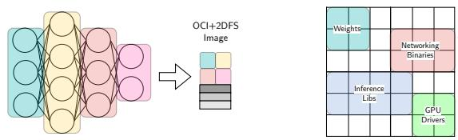  
Figure 15: ML Model Packag-Figure 16: High Level Space ing Example. Partitions.

As for traditional containers, also in 2DFS the build and caching efficiency depends on the best practices on how to design the 2D space. When building a traditional Docker image the user uses a Dockerfile to define the operations composing the layers of the image. The order of the instruction heavily impacts the performance of the build as well as the wasted space in the final image. Docker provides a set of best practices to follow when designing a Dockerfile [26]. 2DFS performance heavily on the allotment sizes. The smaller the alltoments, the better the parallelization at build time and caching efficiency. For large models, we suggest splitting the model layers into separate files even if the model does not support partitions. This way, selective model updates invalidate only part of the 2D field, speeding up the build process. Figure 15 shows an example of a very simple model split technique that can significantly improve the 2DFS performance. By simply splitting the fully connected layers into separate files, we can package these files as independent allotments.

In more advanced usecases, the 2D space can be organized into scope-based partitions. E.g., in fig. 16, we place the model weights in the top-left corner, the networking binaries in the middle, the inference libs in the bottom left, and the GPU drivers in the bottom-right corner. Suppose the model is executed on a device without GPU; the bottom right corner can be left out of the partition. Alternatively, during training, we can remove the inference libs and networking binaries.

## Appendix B Additional Results

<table><tr><td rowspan="2">Model</td><td rowspan="2">Format</td><td colspan="5">Split Capacity %</td></tr><tr><td>0</td><td>25</td><td>50</td><td>75</td><td>100</td></tr><tr><td>ENv2L</td><td>Docker</td><td>451.84</td><td>451.88</td><td>451.92</td><td>451.97</td><td>452.00</td></tr><tr><td rowspan="2">RN50</td><td>2DFS</td><td>451.68</td><td>451.69</td><td>451.70</td><td>451.72</td><td>451.73</td></tr><tr><td>Docker</td><td>124.87</td><td>124.88</td><td>124.89</td><td>124.89</td><td>124.90</td></tr><tr><td></td><td>2DFS</td><td>124.64</td><td>124.64</td><td>124.65</td><td>124.65</td><td>124.65</td></tr></table>

Table 3: Exported Image Sizes Comparison with Different Split Capacities.

Figure 18 shows the parameter count and size distribution of different splits, showcasing the variability among the models of the zoo (Table 2). Note that although the splits closer to the end of a model comprise more parameters, this does not translate 1:1 to additional computation.

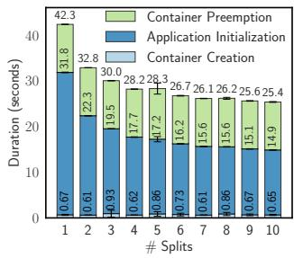  
(a) RN50

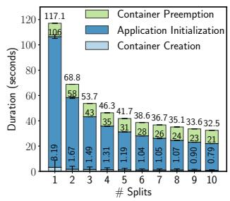  
(b) ENv2L

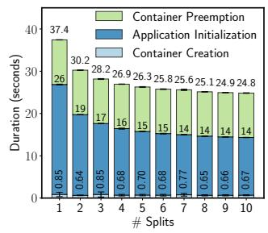  
(c) ENv2B1

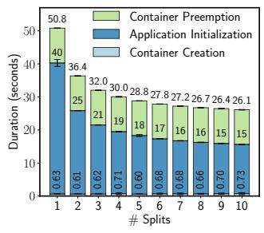  
(d) DLv3  
Figure 17: Deployment time breakdown for different numbers of splits / available devices for two small (RN50 and DLv3), one medium (ENv2B1) and one large (ENv2L) models.

Figure 17 complements the experiments in §4.5 and it’s showing the deployment time of RN50, ENv2L, ENv2B1 and DLv3for different numbers of devices. The number of splits equals the number of devices, and the image layers are homogeneously distributed across the splits. The deployment time is broken down into the time required to download the image, the time required to unpack the image, and the time required to start the application. The deployment time decreases logarithmic with the number of splits as shown also in fig. 14a. ENv2Lis showing a steeper performance improvement because, on the constrained Edge devices, the initialization phase is much slower when too many parameters are handled in a single node. With ten splits, we observe a 3.5× faster deployment time.

Figure 19 complements the results from fig. 7 with the models omitted for brevity. The results show the same Docker trends, with the small models showing little variation, the medium-sized models showing a build time decrease with a higher number of splits, the large model showing their best build performance at around 50% split capacity, and then higher build times towards 75% and 100%. As explained in §4.2, for Docker, the is a tradeoff between the number of layers and the size. 2DFS performance improves consistently with the number of allotments, plateauing at around 50%, hitting the I/O disk capacity.

Figure 20 complements the results from fig. 8 with the models omitted for brevity. The results show the same Docker trends, with build time consistently increasing when more images are generated. 2DFS shows almost constant build time because it always generates the same OCI+2DFS image.

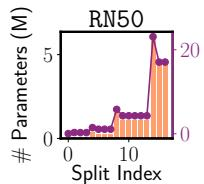

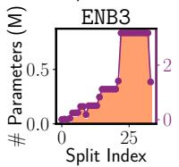

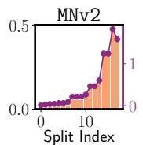

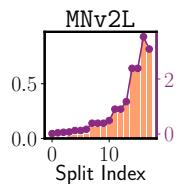

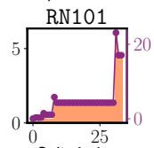

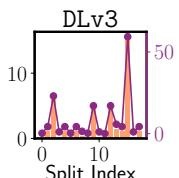

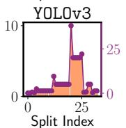

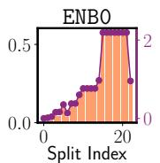

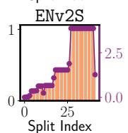

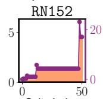

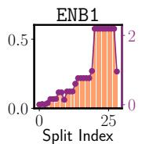

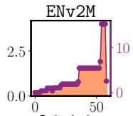

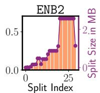

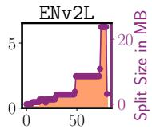  
Split Index

Figure 18: Per-Split Parameter Count and Byte Size.  
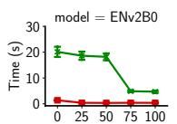  
Model Split Capacity (%)

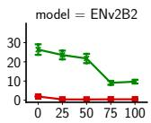

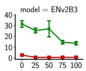

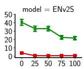

Figure 19: Build Time of 1 Image with Different Amount of Splits per Layer  
  
Model Split Capacity (%)

  
Figure 20: Images Build Time for different Split Partitions - 1 Image per Partition with Uniform Partitions.

In §B compare the size of the exported OCI+2DFS image and the traditional OCI images to measure the space overhead of the new additional 2dfs.field layer. We build the images for the ENv2Land RN50 models with different split capacities, the same as previously done in fig. 7. For each split capacity, we build and export in tar.gz format one OCI image using Docker and one OCI+2DFS. The images show comparable sizes, with no additional space overhead for the 2dfs.field layer. This happens because the two-dimensional data structure introduced is serialized as an array of hash-pointers + metadata, efficiently replacing the traditional OCI layers.