①

USENIX

THE ADVANCED COMPUTING SYSTEMS ASSOCIATION

# LEOCraft: Towards Designing Performant LEO Networks

Suvam Basak and Amitangshu Pal, Indian Institute of Technology Kanpur; Debopam Bhattacherjee, Microsoft Research India https://www.usenix.org/conference/atc25/presentation/basak

# This paper is included in the Proceedings of the 2025 USENIX Annual Technical Conference.

July 7–9, 2025 • Boston, MA, USA ISBN 978-1-939133-48-9

Open access to the Proceedings of the 2025 USENIX Annual Technical Conference is sponsored by

P--r.h £Es/sL.

auuJl9 PgleU

King Abdullah University of

Science and Technology

# LEOCraft: Towards Designing Performant LEO Networks

Suvam Basak∗, Amitangshu Pal∗, Debopam Bhattacherjee† ∗Indian Institute of Technology Kanpur, †Microsoft Research India

## Abstract

Low Earth Orbit (LEO) satellite constellations have revolutionized Internet access for millions of users. OneWeb and SpaceX are already operating constellations of hundreds and thousands of satellites, offering Internet service directly from space across 100+ countries. These exceptionally large networks come at a cost – thousands of routers (satellites) need to fly at ∼22× the speed of sound, thus making network design a non-trivial challenge. While the systems research community with decades of deep networking expertise has a relatively short window to influence the design of these networks, there is a serious lack of the right tools to enable such efforts. To address this, we introduce LEOCraft – an LEO network design framework to help the community visualize and evaluate the performance of different choices. LEOCraft offers integrated optimization techniques tuned upon the domain knowledge acquired from thousands of LEO constellation design’s performance evaluations to optimize a new constellation design ∼5× faster than other off-the-shelf black-box optimization techniques. LEOCraft scales up seamlessly, tested for 83K satellites across multiple shells (more than 2× SpaceX’s longterm proposal) with 1K ground stations, thus making it feasible for the community to explore LEO trajectory and topology design for even the largest of mega-constellations.

## 1 Introduction

In the past few years, thousands of satellites have been deployed in Low Earth Orbit (LEO) to serve worldwide highspeed Internet broadband service directly from space [44]. The early movers of this new networking landscape, SpaceX’s Starlink and OneWeb, initially relied upon bent-pipe connectivity in the first generation of constellations [58]. Further technological advancements have introduced robust laser Inter-Satellite Links (ISLs), enabling space-borne mesh networks with high bandwidth and speed-of-light grade latency [55]. Such a LEO satellite network can carry longhaul Internet traffic over the satellite network, thus reducing the requirement for denser Ground Station (GS) deployment across the globe [2]. This development enabled Starlink and

Amazon’s Project Kuiper to propose a 2nd generation megaconstellation of 30,000 [3] and 3,236 satellites [1] respectively, to wrap the Earth with a dense mesh of LEO satellites. However, the FCC approved only 7,500 satellites of Starlink across three different altitudes [3]. SpaceX started launching these new generation satellites in December 2022 [61]. In contrast, Kuiper was recently in the testing phase of the optical mesh network in space [5]. Therefore, none of the operators has achieved the true scale of ISL-enabled megaconstellations yet, keeping the brief window open for the networking community to influence such design.

The secret of constellation design: The success of Starlink’s early launches sparked researcher’s interest in exploring various aspects of LEO networks. Such recent works [44–46, 50, 54–56, 58, 64, 67, 68, 76] have used Starlink, OneWeb, and a few other constellation designs in their experiments since details are publicly available in the FCC filings [1,3,8,12,21,31]. However, none of these existing works include the complete set of design parameters determining the satellite’s trajectory as well as topology [45, 72, 92, 93]. Most of these efforts are restricted to a single shell, considering the inter-shell connectivity and aggregated performance measurement of multiple independent shells as "an open problem" [93].

Furthermore, Starlink and OneWeb, the biggest constellation operators, rely on proprietary systems, making their LEO networks function like black boxes. Why they chose a particular design, and what traffic matrices it targets, is unknown to the community. Therefore, in this work, we aim to unveil the subtle crux of designing an optimized LEO network from scratch. Our effort will help networking researchers understand these ‘new space’ networks better.

Why constellation design is non-trivial?: Designing a satellite network is not a new problem. In the 90s, serious efforts [37, 41, 52, 65, 66, 89, 90] have been devoted in studying constellation design. However, the current scale and design objectives have significantly transformed over time, imposing new challenges. Optimizing a satellite constellation in the 90s emphasized coverage with a limited budget of a few 10s of satellites, ensuring availability worldwide [42]. In contrast, now, with the scale of a few thousand or more satellites, network performance has become comparable to the terrestrial networks [53]. Therefore, optimizing a constellation today is no longer a geometrical optimization of overlapping satellite coverage [51], but rather, an optimization of the satellite’s orbital trajectories and their ISL topology for a given Internet traffic demand matrix. Therefore, given the number of satellites, the design problem is to decide upon several parameters describing ISL topology and each satellite’s orbital trajectory at ∼22× the speed of sound, such that network performance is maximized. A network design is already a hard problem [62]; further joint optimization of orbital parameters with added dynamics of satellite motion makes it a non-trivial high-dimensional optimization problem. A naive brute-force grid search approach looking for maximum network performance measurement could take years due to the curse of dimensionality. A few previous efforts explored the aspect of improving constellation performance with better ISL topology [45, 72]; however, the approach [45] suffers from scalability issues hence could not be extended to the direction towards superior constellation design, i.e., optimization of satellite’s trajectory at scale to enhance the network performance.

Missing the right tools: An in-depth study of trajectory and ISL topology optimization of the LEO network requires the execution of tens of thousands of simulations while varying one or more orbital/design parameters to measure how these choices impact the network performance. Therefore, an LEO network evaluation framework must offer the flexibility to (i) rapidly implement different ideas (topology, ISL connectivity, routing strategy, etc.), (ii) plug and play with various optimization strategies, (iii) evaluate the effectiveness of optimization strategies and further tuning these implementations. Existing platforms, i.e., Hypatia’s [64] packet-level simulator, or StarryNet’s [67] Docker container-based emulator, suffer from fundamental scalability issues [63]. Hence does not go well for large-scale (tens of thousands of satellites) trajectory simulation. Another LEO network emulation platform xeoverse [63] is built upon a lightweight process-based network emulator platform Mininet [20] and claims to outperform Hypatia and StarryNet by large margins; however, their source code is not public for community use. Therefore, the community lacks the right tools to approach large-scale trajectory and topology optimization problems.

Our contributions: In this paper, we address these gaps with LEOCraft – an LEO satellite constellation design exploration, optimization, and visualization framework. LEOCraft relies upon process-based parallelism [14], thus bypassing the Global Interpreter Lock, a major computational bottleneck [17] in the existing platforms [64, 67]. It is designed to be a modular framework that allows rapid implementation of new design ideas with minimal code change (typically 100 lines of code), which helps to run new experiments quickly.

It operates at the flow level, computes network measurements from the intuitive mathematical model of the LEO network instead of resource-intensive packet-level simulations. For instance, the performance evaluation of Starlink’s Gen1 three shells of 3,888 satellites (S-1 to S-3 in Table 1) in LEOCraft takes ∼2.5 minutes on a standard Desktop PC. Whereas with Hypatia, it takes hours for only RTT measurement of Starlink’s single shell of 1,584 satellites. We also tested LEOCraft on a hypothetical mega-constellation of 83+ satellites across multiple shells (as shown in Table 1). Thus, LEOCraft enables rapid evaluation of design choices at a large scale. The visualization module also generates interactive views of the constellation, showcasing topology evolution and end-to-end route changes to augment the intuition of LEO dynamics.

We use LEOCraft to rigorously study the constellation design for given traffic demand matrices across a set of GSes and illustrate how the choices of design parameters impact the performance of these LEO networks. Since Internet traffic demand is skewed towards specific regions of the Earth with higher populations, the performance measurements of constellation designs exhibit common trends irrespective of the satellite budget. We use this domain knowledge and predictable characteristics of network performance measurements to prune the search space drastically. This reduces the running time by ∼5× as compared to the naive off-the-shelf black-box optimization techniques. We also demonstrate how inter-shell ISL can improve the throughput of a constellation and highlight some shortcomings of such ISL usage. We made LEOCraft publicly available [35] for community use.

Paper outline: The remaining paper is organized as follows – §2-3 summarize our overall background and problem overview. Then §4-6 discusses the development, optimization, and system design strategies used in LEOCraft framework. §7-8 present the experimental evaluation. §9 summarizes the related works. The paper is concluded in §10.

## 2 Background

Building an LEO constellation is a relatively new topic, so this section aids the reader with the relevant background.

## 2.1 LEO constellation design parameters

A satellite’s trajectory around the Earth can be described by six parameters given by Kepler’s law of interplanetary motion [84] using Two Line Element set (TLEs) [59], which is a standard format of defining the position, velocity, and trajectory of any Earth-orbiting object at a specific time (epoch). Since establishing an ISL takes a few 10s of seconds [45], satellites in a constellation follow a similar trajectory to sustain the ISL connectivity for a longer period of time. LEOCraft automatically generates the TLEs for each satellite for the given six parameters defined in the following:

Altitude (h): The height of the LEO satellites from the sea level typically falls between 500 to 2,000 km. These satellites need to orbit the Earth at a fixed velocity to maintain an orbit at a particular height; hence, the orbital period of a satellite is also fixed for a particular height. For instance, satellites at 500 km of altitude need to orbit the Earth at ≈ 27,000 kmph; therefore, the orbital period would be ≈ 90 minutes. Increasing the altitude of the satellites will decrease the orbital periods, as these two factors are inversely proportional.

Table 1: Constellation parameters of well-know space players [1, 3, 8, 12, 21, 31]. In this table S-x denotes x-th shell.
<table><tr><td colspan="6">Starlink Gen1</td><td colspan="6">Starlink Gen2</td><td colspan="6">Kuiper</td></tr><tr><td>S</td><td>0</td><td>n</td><td>i</td><td>e</td><td>h</td><td>s</td><td>0</td><td>n</td><td>i</td><td>e</td><td>h</td><td>S</td><td>0</td><td>n</td><td>i</td><td>e</td><td>h</td></tr><tr><td>S-1</td><td>72</td><td>22</td><td>53°</td><td>25°</td><td>550 km</td><td>S-1</td><td>48</td><td>110</td><td>53°</td><td>25°</td><td>340 km</td><td>S-1</td><td>34</td><td>34</td><td>51.9°</td><td>35°</td><td>630 km</td></tr><tr><td>S-2</td><td>72</td><td>22</td><td>53.2°</td><td>25°</td><td>540 km</td><td>S-2</td><td>48</td><td>110</td><td>46°</td><td>25°</td><td>345 km</td><td>S-2</td><td>36</td><td>36</td><td>42°</td><td>35°</td><td>610 km</td></tr><tr><td>S-3</td><td>36</td><td>20</td><td>70°</td><td>25°</td><td>570 km</td><td>S-3</td><td>48</td><td>110</td><td>38°</td><td>25°</td><td>350 km</td><td>S-3 28</td><td>28</td><td></td><td>33°</td><td>35°</td><td>590 km</td></tr><tr><td>S-4</td><td>6</td><td>58</td><td>97.6°</td><td>25°</td><td>560 km</td><td>S-4</td><td>30</td><td>120</td><td>96.9°</td><td>25°</td><td>360 km</td><td></td><td></td><td></td><td>OneWeb</td><td></td><td></td></tr><tr><td>S-5</td><td>4</td><td>43</td><td>97.6°</td><td>25°</td><td>560 km</td><td>S-5</td><td>28</td><td>120</td><td>53°</td><td>25°</td><td>525 km</td><td>s</td><td>0</td><td>n</td><td>i</td><td>e</td><td>h</td></tr><tr><td></td><td></td><td></td><td>Telesat</td><td></td><td></td><td>S-6</td><td>23</td><td>20</td><td>43°</td><td>25°</td><td>530 km</td><td>S-1</td><td>36</td><td>49</td><td>87.9°</td><td>5°</td><td>1,200 km</td></tr><tr><td>S</td><td>0</td><td>n</td><td>i</td><td>e</td><td>h</td><td>S-7</td><td>18</td><td>18</td><td>115.7°</td><td>25°</td><td>614 km</td><td>S-2</td><td>32</td><td>720</td><td>40°</td><td>5°</td><td>1,200 km</td></tr><tr><td>S-1</td><td>27</td><td>13</td><td>98.98°</td><td>10°</td><td>1,015 km</td><td>S-8</td><td>12</td><td>12</td><td>148°</td><td>25°</td><td>604 km</td><td>S-3</td><td>32</td><td>720</td><td>55°</td><td>5°</td><td>1,200 km</td></tr><tr><td>S-2</td><td>40</td><td>33</td><td>50.88°</td><td>10°</td><td>1,325 km</td><td>S-9</td><td>28</td><td>120</td><td>33°</td><td>25°</td><td>535 km</td><td></td><td></td><td></td><td></td><td></td><td></td></tr></table>

Angle of inclination (i): The angle between the orbital plane and the Earth’s Equatorial plane (when satellites are moving towards the north). Hence, a satellite with inclination 90◦ orbits the Earth over the north pole. Meanwhile, a lower inclination tilts the trajectory; hence, the satellite orbits through the lower latitudes.

Number of satellites per orbits (n): Each orbit in a LEO satellite constellation contains a fixed n number of satellites placed equidistantly across the orbit. All the satellites of fixed altitude orbit the Earth at the same velocity; hence, the inbetween distance of 360◦/n is maintained consistently.

Number of orbits (o): Similarly, the constellation would have o orbits, each with n satellites, uniformly spaced along the Equatorial line to ensure even coverage of Earth’s surface.

Phase offset (p): Determines the relative positioning offset between satellites of adjacent orbits. In our implementation, p varies from 0 to 0.5. A phase offset of 0.5 denotes that the n-th satellite of (o + 1)-th orbit is positioned at the middle of n and (n + 1)-th satellites of o-th orbit.

Angle of elevation (e): The satellite’s coverage area on Earth’s surface depends on the minimum elevation angle e as shown in Fig. 1(a). This parameter depends upon the capability of space- and ground-based communication hardware. LEO satellites use software-defined phased array antennas to create spot beams on Gateway Ground Stations and User Terminals [1, 3, 8]. Hence, the onboard software can regulate the coverage area with the elevation angle. Table 1 summarizes the constellation parameters of major space players.

Furthermore, the LEO satellite mega constellation design comprising a few thousand or more satellites goes one step ahead, where the satellites are divided into groups that may have different designs; the satellites within a group follow similar trajectories that help sustain the ISLs for longer periods, as shown in Fig. 1(b) using Kuiper’s proposed design. In LEO constellation terminology, these groups are known as shells. We assume that the satellites within a shell establish four ISLs, two in the same orbit with leading and trailing satellites, while the other two with satellites of two adjacent orbits. Hence, each shell creates a layer of + shaped mesh network, defined as +Grid topology [45]. The LEOCraft takes six parameters to describe the design of each shell and automatically generates the TLEs for all the satellites for these shells, as illustrated in Fig. 1(b).

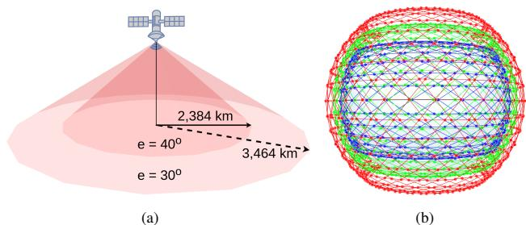  
Fig. 1: (a) Low elevation e covers larger areas on the Earth’s surface. (b) Kuiper design of three shells at altitudes of 630, 610, and 590 km with inclination 51.9◦, 42◦, and 33◦, respectively.

## 2.2 LEO network modelling and assumptions

The proprietary nature of the LEO constellation prohibits public disclosure of key details, such as satellite connectivity policies, user terminal associations, and bandwidth distribution mechanisms, etc. Thus, we base our assumptions on standards widely adopted in prior literature.

Network model: In LEOCraft, given a set of design parameters, we model the LEO satellite constellation as a big network graph, where nodes represent the satellites and GSes, and edges represent Ground to Satellite Links (GSLs) and ISLs. Unavailability of precise geospatial information prevents the modelling of individual user terminals [88]. Therefore, we assume the GS located in a city serves as a proxy for the demands of all the users in that city. Consequently, we allow a GS to establish GSLs with all the satellites available above the minimum angle of elevation e (from the horizon) at that particular time.

GSL budget model: In the above network, capacities of GSLs C are calculated from Shannon’s channel capacity theorem [82]. The atmospheric path loss is estimated using the Free-Space Path Loss (FSPL) model [60]. With these, the channel capacity is expressed as C = B log2 $\begin{array} { r } { \left( 1 + \frac { P _ { t } G _ { t } \lambda ^ { 2 } } { ( 2 \pi d ) ^ { 2 } k _ { B } B } \times \frac { G _ { r } } { T } \right) } \end{array}$ , where, Pt is the Tx power (EIRP), $G _ { t }$ and $G _ { r }$ are the Tx and Rx antenna gains respectively, λ is the wavelength, and antenna gain-to-noisetemperature ratio $G _ { r } / T$ are taken from Ka-band specification available in FCC filling [50]. d denotes the distance between the Tx and Rx antenna, i.e., the distance between the satellites and GSes, $k _ { B }$ is Boltzmann’s constant, and B is the transmission bandwidth. Note that, in our implementation, B is divided equally among the GSes under the coverage of each satellite.

ISL budget model: The laser ISLs are expected to have extremely low beam divergence properties and narrow beam widths, minimizing interference issues [4]. Currently, ISLs are in the early phase of deployment [30] or the testing phase of different operators [5, 11]. Since the largest LEO network operator Starlink’s satellites use 4 ISLs [43] and subsequently all the prior work [45, 64, 67, 92, 93] made this a de facto standard, this work assumes and extends the same with capacity of each ISL conservatively set to 50 Gbps [6, 7, 9]. Although it is a configurable parameter in LEOCraft.

## 2.3 Internet traffic demand matrices

Since a geospatial dataset of individual Starlink users is not public [88], we use the following intuitive traffic demand matrices (TM) that follow the gravity model [79].

High population TM: We use World Cities Database [34] for the population dataset, where GSes are located in 100 most populous cities around the globe. We assume that 10% of a city’s population is the targeted customer, with average data usage per head of 300 Kbps [76]. The traffic demand across the GSes is inversely proportional to their geodesic distances.

High GDP population TM: Apart from the city population, typically, the Internet traffic is also proportional to the city’s GDP [38]. So, in this demand matrix, we assume that the targeted market is 10% of the total population of the 100 most populous cities. However, the data usage is weighted based on the city’s GDP. We keep the mean data usage to be 300 Kbps. Similar to the previous matrix, the demand across the GSes is inversely proportional to their geodesic distances.

Country capital TM: In this matrix, the GSes are located in the capital of 233 countries. The demands across the GSes are weighted proportionately to the country’s population and in inverse proportion to the geodesic distances between GSes.

Global flight TM: In-flight Wi-Fi market is already a billion-dollar industry, forecasting an annual growth rate of 11.8% [18]. Therefore, domestic and international airlines are also potential target markets for the in-flight high-speed Wi-Fi service [80]. For that, we use FlightRadarAPI [33] to collect details of the in-flight aircraft worldwide. Then we assume 50% of passengers of each flight above 10,000 feet of altitude are communicating with GSes located at the 100 most populous cities via satellite network. We weighted the demand matrix between the flights and the GSes using the gravity model discussed above, whereas the weights are directly proportional to populations/passengers and inversely proportional to the distance between the flights and the GSes.

Moreover, notice that the TMs are subject to the target market. A satellite constellation designed to serve the shipping industry might weight the demand matrices analogous to the busiest trade routes in the ocean. Hence, many such intuitive TMs can be formulated. However, our study is focused only on the TMs discussed above.

## 2.4 Network performance metrics

We evaluate the constellations on the following three performance metrics.

Throughput: We measure the throughput of the LEO satellite constellation as a multi-commodity flow across the GSes. We compute n shortest routes between the GSes at any given time using Yen’s algorithm [91]. Then, we use the following linear program to maximize the flow between all pairs of GSes.

$$
\operatorname { M a x i m i z e : } \sum _ { f \in \mathbf { F } } D _ { f } \times \sum _ { r } ^ { n } R _ { r } ^ { f }\tag{1}
$$

$$
{ \mathrm { S u b j e c t ~ t o : } } \quad 0 \leq \sum _ { r } ^ { n } R _ { r } ^ { f } \leq 1 \quad | \forall f \in \mathbf { F }\tag{2}
$$

$$
\sum _ { ( f , r ) \in \bf S _ { \boldsymbol { l } } } D _ { f } \times R _ { r } ^ { f } \leq C _ { l } \quad | \forall l \in { \bf L }\tag{3}
$$

Here, F is the set of flows, where a flow is defined as an ordered pair of GSes denoting traffic flow between one GS pair. $D _ { f }$ is the traffic demand for the flow f (demand between two GS). Since we have n shortest routes between each pair of GSes, $R _ { r } ^ { f }$ denotes the fraction of demand $D _ { f }$ flowing through the r-th shortest route. Therefore, $\textstyle \sum _ { r } ^ { n } R _ { r } ^ { f }$ the sum of n continuous variable bounded within zero and one in constraint (2), which ensures n shortest routes together can accommodate at most 100% of the demand $D _ { f }$ of any flow $f \in \mathbf { F }$ . Finally, the links could be shared by more than one flow in the network. Therefore, aggregated traffic flows sharing a particular link are constrained by the capacity of that link. Hence, in constraint (3), L is the set of all the links in the network, and $\mathbf { S } _ { l }$ denotes a set of flows $f$ and their r-th shortest route that shares link l. Therefore, $\begin{array} { r } { \sum _ { ( f , r ) \in { \bf S } _ { l } } D _ { f } \times R _ { r } ^ { f } } \end{array}$ denotes total traffic flow via link l, which is constrained by the Cl, the capacity of link l. For all our simulations, we use $n = 2 0$

Stretch (latency): We measure stretch between source and destination GS pair as the ratio of the distance between two locations over the satellite network through ISLs and their geodesic distance. This metric demonstrates the inflation in the length of the end-to-end routes. Since the scope of this work is a comparative performance study of constellation design, lower stretch and lower hop counts for end-to-end routes are expected to give better network latency.

To understand the generalized nature of latency worldwide across diverse routes, we classify all the routes into five categories based on their nature. The first two categories are based on the distance between the source and destination

(a) HG routes  
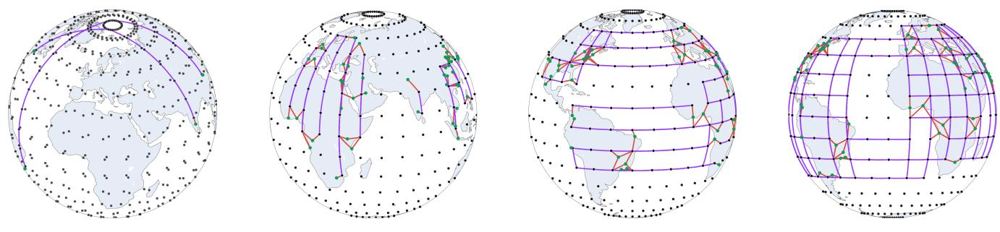  
(b) NS routes  
(c) EW routes  
(d) NESW routes  
Fig. 2: Illustration of the route categories based on the path orientation and distance, where red lines are GSLs, violet lines are ISLs, black dots are the satellites, and green dots are the GSes.

GSes. Therefore, (a) any pair of GSes located within a distance of 2,000 km falls in the Low Geodesic (LG) distance class. Such routes will always come with higher stretch because of the route overhead of going up from the source GS to a satellite and coming down from a satellite to the destination GS, only to use one satellite hop (most of the time). (b) Any source and destination pair of GSes located far apart in different hemispheres (≥ 8,000 km) falls in the class of High Geodesic (HG) distance routes as illustrated in Fig. 2(a). All other routes that do not fall into the above two classes are classified based on the orientation of the path. Therefore, the routes between the GSes pairs oriented with (c) angle above 75◦ shown in Fig. 2(b) are classified as North-South (NS) routes, (d) angle below 15◦ shown in Fig. 2(c) are classified as East-West (EW) routes, and (e) angle within 15◦ and 75◦ shown in Fig. 2(d) are classified as NorthEast-SouthWest (NESW) routes. For overall stretch tendency, we report the median stretch and hop counts of each category.

Coverage: One of the unique potentials of the LEO satellite constellation is to offer genuinely global high-speed Internet service irrespective of geographical challenges. However, to sustain the business, the obvious choice of a constellation operator would be to optimize the satellite trajectories to provide higher availability where the volume of customers is high. Therefore, we measure the coverage of a constellation as $\textstyle \sum _ { t = 0 } ^ { T } \sum _ { g = 0 } ^ { G } \log _ { 1 0 } ( n _ { t , g } ) / T$ , where G is the number of GSes, T is the number of epochs, and $n _ { t , g }$ denotes the number of satellites visible from the g-th GS at t-th epoch. The log(.) function models the diminishing returns as the number of visible satellites per GSes increases.

## 3 LEO network design from scratch

With the preceding background, we now delve into the LEO trajectory design problem, along with the research challenge of high dimensionality.

Problem statement: We define our problem statement as follows – given the number of satellites (which is our network budget), location of GSes, and traffic demand matrix across these GSes, we need to find the constellation design parameters of one or more shells (s) and their operational altitude (h), inclination (i), minimum elevation angle (e), number of orbits (o), satellites per orbit (n), and the phase offset (p) between satellites in adjacent orbits that maximize some objective function such as throughput, coverage, latency, or a combination of these. However, in this work, we focus on a performant constellation that maximizes the throughput. Higher throughput produces more salable bandwidth, which might fetch higher revenue for the constellation operator.

The curse of dimensionality: Therefore, in a megaconstellation of multiple shells, a brute-force grid search approach to find near-optimal design parameters will require the execution of $| s | \times | h | \times | i | \times | p | \times | o | \times | n | \times | e | \times | t |$ simulations, where |x| means number of distinct choices of parameter x, and |t| denotes the number of epochs over 24 hours (one complete rotation of Earth) to estimate the performance fluctuation for LEO dynamics. Each simulation involves generating a network graph, calculating link budgets, computing routes globally, and evaluating network performance. That could take from a few minutes to hours or even days, depending on the number of satellites and GSes in the constellation. Therefore, executing these many simulations with many computational cores could take years.

Can we prune the search space? Given the large search space, meta-heuristic methods like Simulated Annealing [85], Differential Evolution [83], and Adaptive Particle Swarm Optimization [81] can offer near-optimal solutions. In addition, we leverage domain knowledge and heuristics related to the design parameter’s impact on network performance to reduce the search space significantly. Our comprehensive analysis of design parameters highlights their performance characteristics and inter-dependencies. This insight refines meta-heuristic approaches. Further enables tuning of local search strategies to outperform out-of-the-box meta-heuristics.

## 4 Exploring the search space

We first explore the search space by conducting a singledimensional analysis and extend the understanding to higher dimensions. Therefore, first, we focus on the single shell analysis; to characterize the effect of different design parameters, we use Starlink’s first shell, which consists of 1,584 LEO satellites operating at 550 km of altitude. The satellites are distributed among 72 orbits inclined at 53◦, each with 22 satellites. The elevation angle of Starlink’s first shell is chosen as $2 5 ^ { \circ }$ . Unless otherwise mentioned, we use a phase offset of 0.5 in our simulations. All these parameters and upper Kaband specifications are taken from the FCC filing [10, 50]. Performance characteristics of other proposed constellations are discussed in §A.1. We use the High population TM for this section; however, in §A.2, it shows that the findings are generalizable to other traffic metrics as well.

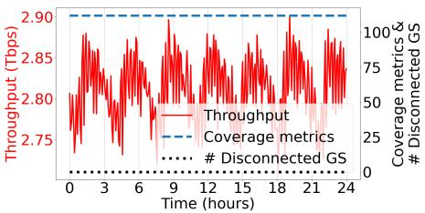  
(a) Throughput and coverage

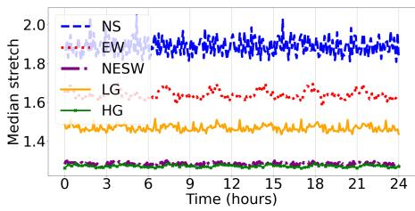  
(b) Stretch

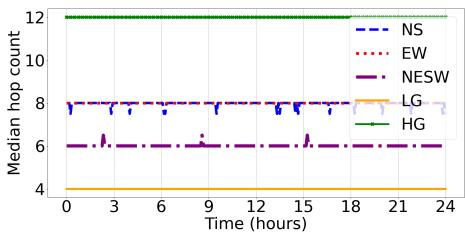  
(c) End-to-end hop counts  
Fig. 3: The propagation of satellites over time leads to fluctuation in (a) throughput (left Y-axis), (b) stretch, and (c) hop counts within certain bounds. However, (a) coverage is consistent (right Y-axis).

Performance impact of LEO dynamics: We begin by measuring network performance fluctuations due to LEO dynamics. We simulate Starlink’s first shell for 24 hours with 5 minutes of granularity. The network performance metrics from the simulation are shown in Fig. 3. Notice that in Fig. 3(a), the constellation gives consistent coverage, and none of the GSes experience an outage within 24 hours. However, throughput shows a periodic pattern of fluctuation of ∼ 150 Gbps, which is up to 7% of the maximum recorded throughput. Similar behavior is also noticeable for other performance metrics, i.e., stretch fluctuates within a small margin, and hop counts are mostly stable, sometimes changing by at most two hops, as shown in Fig. 3(b)-(c), respectively. It is essential to notice that due to the Earth’s rotation, one orbit will eventually take the position of the next. Also, within each orbit, one satellite will take the position of the next satellite after a specific time. Hence, the fluctuation rate of performance metrics will be within a relatively small margin.

Key takeaway(1):- The network performance remains stable, fluctuating within 6.5% due to LEO dynamics.

Performance impact of altitude (h): Operating a satellite at a higher altitude with the same elevation angle e will increase the coverage area on the Earth’s surface as illustrated in Fig. 4(a). Therefore, operating a shell at higher altitudes of 600 km gives much denser coverage than operating the same at an altitude of 300 km, as shown in Fig. 4(b)-(c), respectively. We simulate Starlink’s first shell by gradually increasing the altitude h of the shell from 300 to 2,000 km, while all the other parameters are kept constant. The results of the simulation are shown in Fig. 5. At higher altitudes, the availability of satellites per GS increases, which is visible in the coverage metrics of the constellation in Fig. 5(a). This higher availability of satellites per GS gives higher end-to-end path diversity, leading to a throughput hike up to a certain point. However, beyond a certain point, increasing h results in longer GSLs with higher atmospheric loss. Also, at higher altitudes, many GSes connect to the satellites, which results in low bandwidth for each GSL. As a result, throughput eventually starts falling.

Next, we discuss the effect of h on network latency. Notice that the shells at lower altitudes limit satellite availability per GSes. For that, the shortest path has to take a few more hops to reach the satellites above the destination GSes, as illustrated in Fig. 4(a). This behavior is also visible in our simulation results in Fig. 5(b)-(c). Apart from the LG routes, when the altitude of the shell is increased beyond 300 km, the stretch and hop count decrease drastically. The stretch starts inflating beyond 700 km because of longer GSLs. For LG routes, source-destination pairs are close to each other; a higher h results in longer GSLs, leading to increased stretch.

Key takeaway(2):- A fixed number of satellites at lower altitudes could lead to coverage gaps and higher latency, while higher altitudes reduce aggregated throughput. Slight altitude changes have minimal impact.

Performance impact of inclination angle (i): Similarly, we simulate Starlink’s first shell with the angle of inclination i ranging from $5 ^ { \circ }$ to 175◦. The results are shown in Fig. 6. From Fig. 6, we can observe that the network performance corresponding to inclination $5 ^ { \circ }$ to $9 0 ^ { \circ }$ is completely symmetric to the performance from $9 0 ^ { \circ }$ to 175◦. This is because when a shell is inclined at 45◦, the satellites that move towards the north at the angle of 45◦ in one hemisphere are the same satellites that move towards the south at an angle of $1 3 5 ^ { \circ }$ in the opposite hemisphere. Thus, a shell inclined above $9 0 ^ { \circ }$ is symmetric to an inclination below $9 0 ^ { \circ }$ . Therefore, we focus on the first half of the performance metrics $( 5 ^ { \circ }$ to 90◦) to understand the inclination’s impact on the network performance.

In Fig. 6(a), we can observe that the throughput and coverage peak arise around $4 0 ^ { \circ }$ of inclination. This is because, if we look at the 100 GSes locations at most populated cities in Fig. 7(a), then we can observe that $4 0 ^ { \circ }$ of inclination restricts the satellite trajectories exactly above these 100 GSes, as shown in Fig. 7(b). However, moving towards the polar inclination (towards 90◦) reduces the coverage since satellites spend a certain amount of time in the polar regions, where not a single GS is located in our setup, as illustrated in Fig. 7(c). Thus, it negatively impacts the throughput. In contrast, a too-low inclination squeezes all the satellites close to the equatorial region. Therefore, most GSes at relatively higher latitudes go out of coverage, as illustrated in Fig. 7(d), and as a result, the throughput falls, whereas the number of disconnected GSes rises in Fig. 6(a).

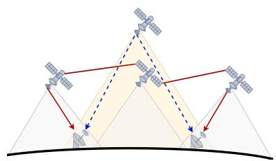  
(a)

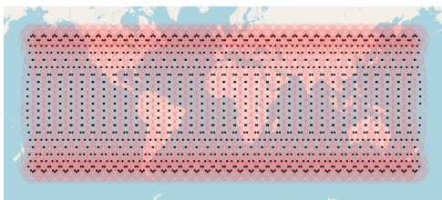  
(b) At h = 300 km

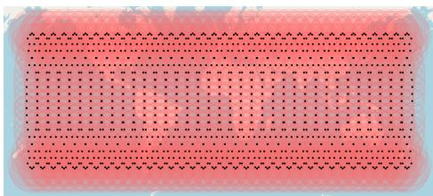  
(c) At h = 600 km

Fig. 4: (a) Higher altitude increases coverage areas, resulting in route changes with fewer hops. (b) and (c) illustrate coverage footprint expansion of Starlink’s first shell when the altitude is increased.  
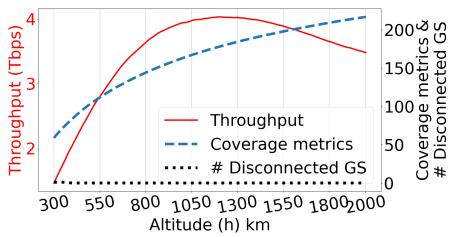  
(a) Throughput and coverage

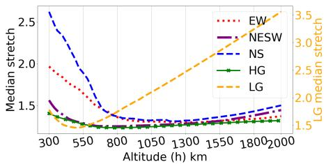  
(b) Stretch

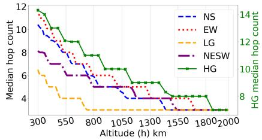  
(c) End-to-end hop counts  
Fig. 5: (a) Increasing altitude h improves the coverage (right Y-axis) and throughput up to a certain point (left Y-axis). (b) Very high/low h negatively impacts stretch (left Y-axis), LG routes are most affected (right Y-axis) (c) high h reduces hop counts for all routes (HG routes in right Y-axis).

Fig. 6(b)-(c) shows the performance of stretch and hop counts. Here, polar orbits give better results only for the NS routes because constellations with lower inclinations can not provide any straight path over ISLs in the north-south orientation. This is illustrated in Fig. 8. From Fig. 8, we can observe that the shortest path from St. Petersburg to Johannesburg is stretched with a lower inclination. On the other hand, lower inclination provides better stretch and hop count for EW and NESW routes, as observed for the routes between Dar es Salaam to Kabul and Khartoum to Hong Kong, respectively.

Key takeaway(3):- The orbit’s inclination should align with GSes placement and route orientation to enhance coverage and throughput and minimize latency.

Performance impact of elevation angle (e): As illustrated in Fig. 1(a), a reduction in e increases the coverage area of the satellites on the Earth’s surface. That is clearly visible in Fig. 9(a), where e is varied from 5◦ to 50◦ for Starlink’s first shell. As higher coverage results in more available satellites per GS, the end-to-end path diversity and throughput increase. However, after 13◦ of elevation, even though coverage increases, throughput starts falling drastically. This is because such a small value of e (e < 10◦) results in GSLs over the Earth’s horizon and therefore experiences enormous atmospheric path loss. This is illustrated in Fig. 10, where we can observe that at 5◦ elevation, the routes between two continents go through a single satellite hop, as compared to a few 10s of hops for $3 0 ^ { \circ }$ and $5 0 ^ { \circ }$ elevation. Thus, a lower e provides excellent hop counts and stretch results for all categories of routes, as shown in Fig. 9(b)-(c).

However, line-of-sight GSLs with a very low e may not be feasible without obstruction in urban areas (unless antennas are placed at higher elevations). However, a low value of e may be useful for providing connectivity over a long distance in less obstructed areas, such as oceans or polar regions. For instance, OneWeb FCC reports [8] mention that OneWeb satellite can reach up to 5◦ of elevation on the ocean to reach gateway GSes on the land area, compromising on power density, as they do not have plans of using ISLs yet.

Key takeaway(4):- While too extreme values are unfavorable, e should be tuned based on other parameter values to unleash better performance.

Performance impact of the number of orbits (o) and phase offset (p): Since all the orbits have the same number of satellites, changing the number of orbits o inherently means adjusting the number of satellites n per orbit to maintain a fixed number of satellites. These orbits are equally spaced on the Earth’s equator. Hence, a design with few orbits generates high east-west path diversity due to the large number of ISLs between satellites in adjacent orbits, as shown in Fig. 11(a). On the other hand, routes with high geodesic distances experience higher hop counts, as these routes follow intra-orbital ISLs to reach the destination GSes. Similarly, a design with many orbits reduces both hop counts in the high geodesic distance and east-west path diversity, as shown in Fig 11(b).

The phase offset p decides the relative positioning of satellites between adjacent orbits, i.e., in a constellation with 0.5 phase offset, a satellite n in orbit (o + 1) will be in the middle of satellite n and (n + 1) of orbit o, hence creating zigzag

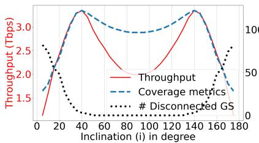  
(a) Throughput and coverage

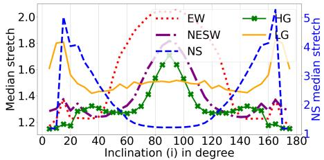  
(b) Stretch

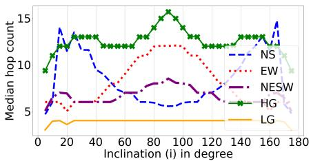  
(c) End-to-end hop counts

Fig. 6: Performance measurement of i from 0◦ to 90◦ is symmetric to the measurement of 90◦ to 180◦. (a) 40◦ provides best throughput (left Y-axis) and coverage (right Y-axis), too low/high i impacts negatively. (b), (c) Polar i provides better stretch (right Y-axis) and hop counts for NS routes and lower i provides better stretch (left Y-axis) and hop counts for other routes.  
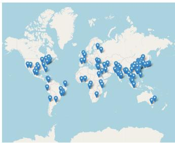  
(a) GS locations

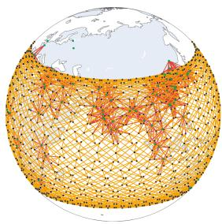  
(b) At i = 40◦

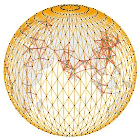  
(c) At i = 90◦

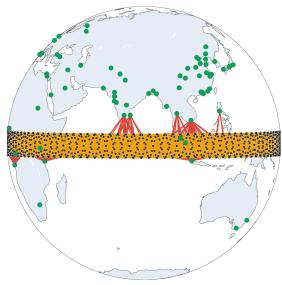  
(d) At i = 5◦

Fig. 7: (a) Location of the GSes at the most popular cities. (b) i = 40◦ restricts the trajectory of satellites on main population centers. (c) Higher i provides denser coverage at the polar region, whereas (d) lower i leaves most of GSes out of coverage.  
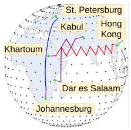

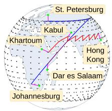  
(a) At i = 90◦

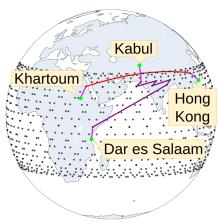  
(b) At i = 50◦  
(c) At i = 30◦  
Fig. 8: (a) Higher i provides better stretch with straight NS routes and zigzag ISLs for EW and NESW routes inflate the stretch. (b) Inclined trajectory provides better stretch for NESW and slightly improves EW stretch, whereas (c) very low i provides better EW stretch, leaves end-to-end GSes of NS out of coverage.

EW routes as shown in Fig. 11(d). On the other hand, with 0 phase offset, the ISL creates a precise +Grid shape network, as shown in Fig. 11(c). Hence, it is essential to note that these three parameters o, n, and p together describe the topological structure of the satellite mesh network. Therefore, after deeply exploring and analyzing the high-dimensional search space, our key discoveries are as follows:

(i) When the values of h, i, and e are close to optimal values, any number of orbit o which is sufficiently larger than the number of satellites per orbit n $( o > > n )$ at a phase offset $p = 0 . 5$ produce higher throughput for any sufficiently large constellation. This behavior is shown in Fig. 12(a) for Starlink’s first shell, where 100 GSes are located across most populated cities and the optimized value of i and e is chosen to 40◦ and 15◦ (§4) respectively. Notice that when the number of orbits is sufficiently large $( o > 6 6 )$ , it gives a clear trend of increase in throughput with higher $p .$

(ii) This behavior is consistent across all the shells of Starlinks and Kuipers where the number of satellites is sufficiently large $( \geq 3 0 0$ satellites). The reason behind this behavior is demonstrated in Fig. 12(b)-(c). Notice that as we move towards higher o and p, median hop counts reduce, and the path diversity increases for HG routes without impacting other routes (i.e., NS, EW, NESW, LG); as a result, the constellation accommodates more traffic demands. The same is demonstrated between two GSes located in South Asia and North America in Fig. 13. When the constellation is designed with large o at $p = 0 . 5$ , these two GSes experience high path diversity. Reducing either o or p negatively impacts the path diversity. (iii) Change in the value of o or p essentially tweaks the mesh network at space, i.e., changes the ISL topological structures, which is illustrated in Fig.11. Therefore, when h, i, and e are fixed, any combination of o (hence n) and p produces consistent coverage.

Key takeaway(5):- For a sufficiently large constellation (≥ 300 satellites), using larger o $( o > > n )$ with a phase offset of 0.5 increases throughput.

## 5 Shaping an optimization strategy

Now, we narrow down the search space using domain knowledge and key takeaways from the previous section. The outlined strategy helps optimization techniques converge faster.

Reducing the search space: As discussed earlier, the design of a single shell of a constellation deals with six parameters, i.e., h, i, e, o, n, and p. Since the topological structure is consistent and performance fluctuation is not significant over time, t could be ignored (takeaway (1)). Based on the observation of coverage metrics, these six parameters can be classified into two groups:

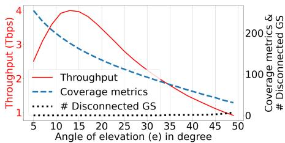  
(a) Throughput and coverage

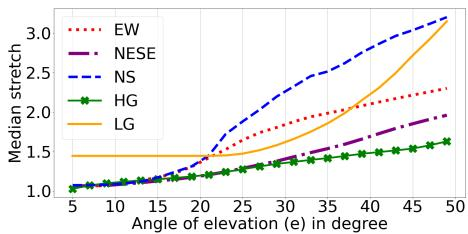  
(b) Stretch

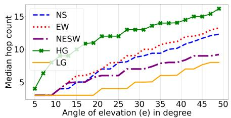  
(c) End-to-end hop counts

Fig. 9: Lower e provides better (a) coverage (right Y-axis) and throughput up to a certain point (left Y-axis). (b), (c) Lower e also provides better stretch and hop counts, whereas higher e (≥ 50) start creating coverage gaps.  
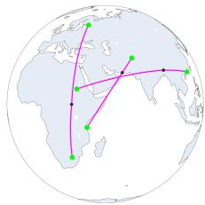  
(a) At e = 5◦

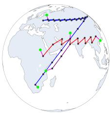  
(b) At e = 30◦

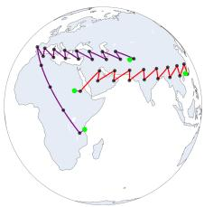  
(c) At e = 50◦  
Fig. 10: (a) Too low e enables cross-continent single hop routes with over the horizon GSLs, whereas (b) higher e reduces coverage area, thus, crosscontinent NS, EW, and NESW routes increase up to 10s of satellite hops. (c) Too high e creates coverage gaps, hence, leaves GSes of NS routes out of coverage.

• GROUP-I: Set of parameters that impacts the constellation’s coverage, i.e., h, e, and i.

• GROUP-II: Set of parameters that do not impact coverage, i.e., o, n, and p.

Now, notice that when the parameters of GROUP-I are optimized, then in GROUP-II, any number of orbits o which is sufficiently larger than the number of satellites per orbit n at phase offset p = 0.5 produce higher throughput than any other combinations (takeaway (5)). Hence, in our search strategy, we keep o to its maximum value (which will determine the value of n as well), p = 0.5, and then optimize the values of h, e, and i. Therefore, the search space is reduced to these three parameters of GROUP-I.

Furthermore, the scope of varying h is limited by various non-networking factors, i.e., FCC, ITU regulation [19, 24], radiation hazards [73, 78], rate of orbital decays [86], etc. Apart from that, because of symmetric performance outcomes (takeaway (3)), we restrict the parameters i up to 90◦. It is also desirable to avoid too low inclination to reduce the interference with GEO satellites that operate over the Equator [26]. The range of e is also limited by the satellites and GSes communication hardware, which is not incorporated in our implementation.

Proposed search strategy: After trimming down the search space, LEOCraft tries to optimize the values of i, e, and h by using Variable Neighborhood Search (VNS) [57, 74] strategy. VNS starts with an initial solution x; in every iteration, it discovers the neighborhood of the current solution N(x) and takes the best neighborhood. The process is repeated until the convergence criteria are reached (i.e., the solution starts saturating). In LEOCraft, we use a random step size at every iteration. While choosing the initial solution, we observe that i ≈ 30◦ and e between 10◦ to 20◦ converge faster. The intuition behind this is that the median latitude of the 100 most populous cities is 29.6◦, and lower elevation gives good throughput for high path diversity (takeaway (4)).

## 6 Designing of LEOCraft

Overview of other simulation platforms: The well-known LEO network simulation and emulation platforms in the community are Hypatia [64], StarryNet [67], and xeoverse [63]. xeoverse is a relatively new LEO network emulation platform built upon network emulation platform Mininet [20]. xeoverse claims to outperform Hypatia and StarryNet by large margins [63]; however, xeoverse is not public for community use. On the other hand, StarryNet is a data-driven emulation platform partially available [70] to the community. StarryNet uses Docker containers [15] to emulate each node (satellites, GSes, user terminals) and Python’s thread-based parallelism [32] for updating the state of virtual links (ISLs and GSLs) connecting containers [63]. Thus, StarryNet is resource-intensive, and scalability by default is constrained by the Docker engine’s upper limit of its bridge interface (up to 1,023 containers [13] on a single machine [63]). Due to CPython’s Global Interpreter Lock (GIL) [17], the link state update procedure of StarryNet with thousands of threads experiences a bottleneck, too. Hypatia is based upon ns-3 packet-level simulation platform [22]; hence, the scalability is constrained by the ns-3’s limitations. Since Hypatia fails to utilise multiple CPUs, simulation execution drastically slows down with larger constellation [63, 64].

System design: After exploring the implementation of the above platforms, we found that a significant portion of the performance bottleneck arises from the software layer. This is because the LEO satellite constellation is treated as a single, monolithic block. However, within this block, most computations are independent of one another. For example, determining the coverage area of one satellite does not depend on calculations for other satellites. Similarly, computing a route from one GS to another is independent of the routes between other pairs of GSes, and so on. We exploit this in the implementation of LEOCraft [35], where each component (such as satellites and GSes) operates as an independent block with format-restricted data exchange APIs. This allows us to distribute workloads uniformly across all available CPUs, effectively shifting the performance bottleneck from the software layer to the underlying hardware.

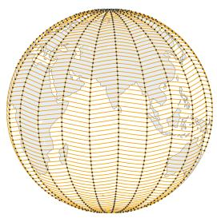  
(a) o = 22, n = 72

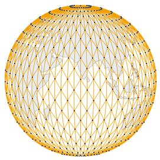  
(b) o = 72, n = 22

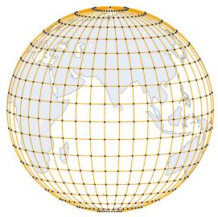  
(c) p = 0

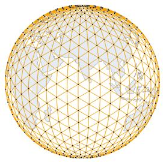  
(d) p = 0.5

Fig. 11: Parameter o, n, and p together determine the ISL topological structures. (a), (b) n and o manipulates height and width to deform +Grid topological structure to rectangular grid cells. (c) Lower p forms a perfect +Grid topology, (d) higher p transforms +Grid to diamond (⋄) shaped cells.  
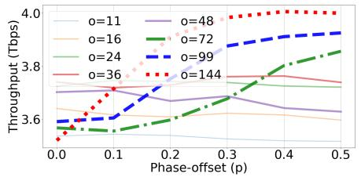  
(a) Changing o and p

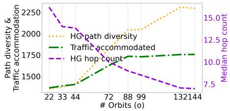  
(b) Changing o while p = 0.5

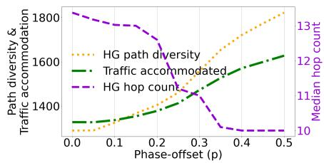  
(c) Changing p while o = 72

Fig. 12: When i and e are set to 40◦ and 15◦, (a) larger o (≥ 66) at a higher p provide better throughput. (b), (c) Such combinations reduce the hop counts (right Y-axis) and increase the path diversity for HG routes, and therefore accommodates more traffic for both parameter o in and p.  
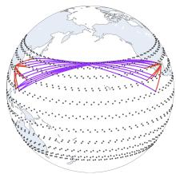  
(a) o = 144, p = 0.5

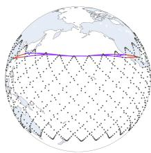  
(b) o = 48, p = 0.5

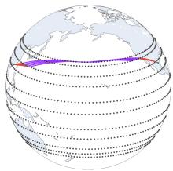  
(c) o = 144, p = 0  
Fig. 13: 20 shortest HG routes from South Asia to North America (a) have way higher path diversity with o = 144 and p = 0.5 than (b) lower o at p = 0.5 and (c) lower p at o = 144.

In Fig. 14, we represent LEOCraft’s simulation workflow. In LEOCraft LEO constellation builder creates a top-level instance of LEO constellation based on specified design parameters and GS locations. This LEO constellation instance consists of all LEO network component instances (GSes, satellites, and ISLs) in it. The LEO Constellation Simulator acts as an execution framework in LEOCraft. It accumulates LEO constellation instances in the Task queue and evaluates the given batch of instances in parallel. This parallelism is at the functional level across all the LEO constellation instances in the Task queue. For that, LEO Constellation Simulator creates a pool of worker processes corresponding to each available CPU [14]. These worker processes remain active for the entire duration of the simulation execution, thus minimizing process creation overhead too. Each worker receives data (instances of

LEO network components) and function references, executes these functions on the data, and sends the results back to the respective LEO Constellation instance through the dispatcher. The LEO Constellation accumulates the results of each asynchronously called function. Once all the function calls return, it writes back the evaluation results. Then LEO Constellation Simulator removes the instance from the Task queue.

This process-based concurrency [14] effectively bypasses the GIL [17], the primary performance bottleneck for CPUbound tasks, allowing uniform use of all CPUs even for a single LEO Constellation instance in the Task queue. As a result, LEOCraft evaluates a large constellation within a few minutes. For the interested readers, §A.5 provides an overview of LEOCraft APIs for simulating any LEO constellation.

## 7 Performance evaluation of LEOCraft

We now evaluate the performance of LEOCraft to examine constellation-scale behavior. We compare the effect of different traffic matrices, optimization strategies, inter-shell connectivity, etc., using LEOCraft. In addition to these, we also compare and evaluate the performance of LEOCraft against existing platforms in §8.

Comparison with other optimization techniques: We now evaluate LEOCraft with different optimization strategies while scaling the constellation sizes. Specifically, we compare the network performance and running time of LEOCraft with four optimization techniques, i.e., Simulated Annealing (SA) [85], Differential Evolution (DE) [83], Adaptive Particle Swarm Optimization (A-PSO) [81], and Variable Neighbourhood Search (VNS). The implementations of A-PSO and VNS are integrated into the LEOCraft framework, whereas for SA and DE, we use SciPy’s optimize APIs [25]. We use a maximum iteration of 100 (60) for SA when domain knowledge of the search space is not in use (domain knowledge in use1). Similarly, for A-PSO, the number of iterations and particles is 25 and 20 (25 and 10), respectively, when domain knowledge is not in use (domain knowledge in use). These hyperparameters are empirically decided upon through a series of trials of synthetic constellations of different sizes. We evaluate the running time of these optimization techniques on a workstation powered by 16 core (24 thread) 12th Gen Intel(R) Core(TM) i9-12900 with 64 Gigabytes of memory.

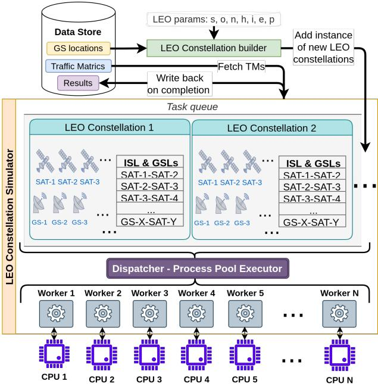  
Fig. 14: LEOCraft’s simulation framework.

The time taken to optimize the design parameters of different constellation sizes using different optimization techniques is shown in Fig. 15(a). Notice that when the same optimization techniques are used after pruning the search space using domain knowledge (§5), the average running time is reduced by ∼2.1×, ∼4.2×, ∼2.2×, and ∼13.7× for SA, DE, A-PSO, and VNS, respectively. Interestingly, VNS with domain knowledge outperforms all three metaheuristic techniques, as shown in Fig. 15(a). VNS is on average ∼2.2× times faster than the fastest metaheuristic technique when the search space is pruned with domain knowledge and at least on average ∼4.9× faster than the naive approaches. It is worth noting that DE, VNS, and A-PSO evaluate the cost function in parallel (evaluation of different design parameter combinations). In contrast, SA executes serially. However, if the running time is not the constraint, then the optimized design parameters produced by these four techniques are pretty similar. This is observed from Fig. 15(b)-(c), where we compare the throughput and stretch of NS routes of these optimized designs. Notice that the measured throughput varies marginally (standard deviation ±60 Gbps for 3,888 satellites) in Fig. 15(b), and the median stretch of NS routes deviation remains within 0.3, which is negligible variation as compared with the LEO dynamics (takeaway (1)).

Outcome(1):- Insights drawn from extensive simulations can greatly reduce the search time for suitable constellation parameters.

Single-shell vs Multi-shell design: We now explore the impact of multiple shells on the network throughput. For that, we take Starlink’s first three shells, where the first two have 1,584, and the last one has 720 satellites, with altitudes of 540, 550, and 570 km [21], respectively. We do not consider inter-shell connectivity in this set of experiments. The results are shown in Fig. 16(a). Since these shells are independent of each other, we optimized the design of these three shells separately for our 100 GSes for the High population TM. The optimized Starlink constellation with three shells produced a throughput of 7.5 Tbps. Then, we merged the total budget of satellites into one shell, i.e., a single shell with 3,888 satellites produces a throughput of 8 Tbps when optimized. Further, we test the same while merging the satellite budget of any two shells out of three; thus, the constellation with two optimized shells produced throughput between 7.5 and 8 Tbps as illustrated in Fig. 16(a). We also test the same with a Kuiper budget of three shells with 1,156, 1,296, and 784 satellites, respectively, at altitudes 590, 610, and 630 km, respectively [1]. The observations are similar, i.e., the throughput observed when three shells are separately optimized is 6.6 Tbps, and when all satellites are merged and optimized in one shell, it is 7.4 Tbps. And any other combination falls in between these two measurements illustrated in Fig. 16(b).

Outcome(2):- A single dense shell is more beneficial when higher throughput is the objective. A dense mesh network provides better path diversity for n shortest routes than multiple shells with sparser satellites.

Inter-shell ISL connectivity: However, designing a large constellation in one shell for higher throughput may increase the risk of collision [69,75]. This motivates us to explore intershell ISLs where we maintain the same +Grid ISL topology across the satellites deployed in different shells. Therefore, in LEOCraft, we simulate three shells of Starlink and Kuiper with inter-shell links. After optimizing the design, the throughput of these constellations reaches 8.01 and 7.34 Tbps for Starlink and Kuiper, respectively. This is almost equal to the throughput of merging the entire budget of a satellite into a single shell since a few 10s of km difference in altitude has a negligible impact on throughput (takeaway (2)).

The main drawback of this inter-shell connectivity is the variation of phase offset with time. Since the orbital periods of satellites at higher altitudes are slightly lower than those at lower altitudes, the phase offset will gradually deviate with time, and therefore, periodic hand-offs are needed to maintain the ISL connectivity and topological structure across the neighboring shells. However, we observe that the hand-off frequency for such a slight altitude difference (in 10s of km) is low. Fig. 17 shows the throughput measurement over a day when Starlink’s 3,888 satellites are deployed in different shells, and inter-shell ISL connectivity is established in case of multiple shells. As expected, the throughput remains mostly consistent with minor fluctuation over time for the single shell design. For multi-shell design, deformation of the ISL topology due to the phase offset shift with time negatively impacts the throughput. We can also observe that a handoff after ∼ 13 and ∼ 4 hours may be needed for maintaining the inter-shell ISL topology across two and three shells, respectively.

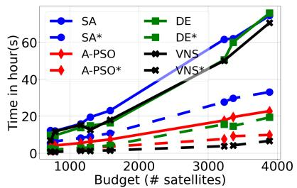  
(a)

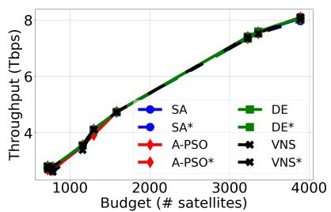  
(b)

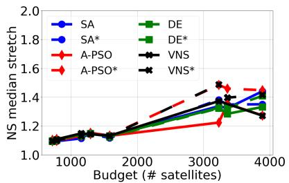  
(c)

Fig. 15: (a) Comparing the running time of black-box optimization techniques without and with domain knowledge (shown with superscript ‘\*’). Comparison of (b) throughput and (c) median stretch of NS routes after optimization of the constellation design.  
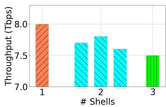  
(a) Starlink

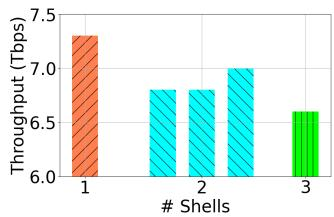  
(b) Kuiper

Fig. 16: Comparing the throughput with multiple shells for (a) Starlink and (b) Kuiper.  
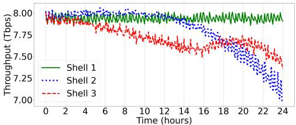  
Fig. 17: Throughput measurement with inter-shell ISL connectivity over 24 hours without hand off.

Outcome(3):- Inter-shell ISLs enhance throughput slightly but require occasional handoffs to maintain connectivity and topology between shells.

Visualization features: LEOCraft provides a range of visualization features, such as routes, satellite coverage, and constellation topologies. Some figures such as Fig. 1, 2, 7, 8, 10, 11, 13 are snapshots of the LEO network design’s interactive and responsive visualization. Multi-shell mega constellations can be insanely dense networks that make it difficult to visualize particular areas of interest. LEOCraft visualization APIs allow cherry-picking of the components of interest (set of satellites, GSes, ISLs, GSLs, routes, etc.) for rendering. LEOCraft also generates frame-by-frame evolution of the network at the granularity up to nanoseconds to demonstrate how network topology and end-to-end routes change over time due to the LEO dynamics. Some additional details of visualization features are available in §A.3.

## 8 Comparing LEOCraft with other platform

Since StarryNet [67] does not scale up to a few thousand satellites on a single machine, and xeoverse [63] is not public, we choose to compare LEOCraft with Hypatia [64].

Packet-level vs. flow-level simulation: First, we highlight the scope of comparison and the fundamental differences between flow-level and packet-level simulations to avoid any misinterpretation for the readers. Notice that Hypatia is wellsuited for analyzing detailed network protocol behaviors, like packet drops, retransmissions, or reordering due to handovers. A flow-level simulation like LEOCraft is more appropriate for examining architectural and policy-level trade-offs, such as the effects of ISL topologies, routing choices, and GSes placements on overall performance. Consequently, LEOCraft and Hypatia are not competitors; rather, they complement each other. A future simulation pipeline could utilize LEOCraft to uncover systematic design issues in LEO networks at scale, which could then be closely examined using Hypatia.

Latency comparison with Hypatia: In Hypatia, we simulate ‘pings’ at 1 second interval between three GS pairs, i.e., Delhi to New York, Moscow to Paris, and Tokyo to Sydney through the shortest route over the first shell of Kuiper, Starlink, and Telesat for a duration of 200 seconds. Then we compute the round-trip time (RTT) in LEOCraft between the same pair of GSes over the same constellations. The results are shown in Fig. 18. From this figure, we can observe that the measured RTT obtained from Hypatia closely matches with the ‘computed’ RTT of LEOCraft. The RTT of Moscow to Paris is one-third of the latency of Delhi to New York since the distance between Delhi to New York is ∼ 5× than the distance between Moscow and Paris. In contrast, Tokyo to Sydney routes experience latency equivalent to the HG route Delhi to New York, despite these two endpoints being relatively close to each other. This is because the orbital inclination of Starlink and Kuiper are 53.0◦ and 51.9◦ do not generate the straight route in the north-south orientation. In contrast, Telesat’s inclination of 98.98◦ generates a straight route in a north-south orientation, hence Tokyo to Sydney latency is reduced by ∼ 50% as compared to Starlink and Kuiper.

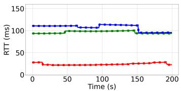  
(a) Kuiper first shell of 1,156 satellites

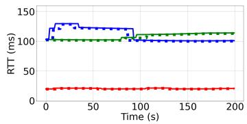  
(b) Starlink first shell of 1,584 satellites

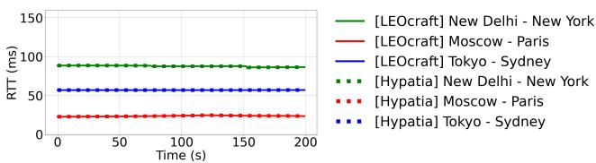  
(c) Telesat first shell of 351 satellites

Fig. 18: Hypatia’s Ping closely matches with LEOCraft’s computed RTT for (a) Kuiper, (b) Starlink, and (c) Telesat.  
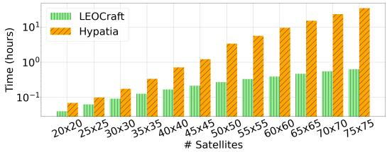  
Fig. 19: Comparison of simulation times with Hypatia and LEOCraft for different constellation sizes.

Simulation time comparison with Hypatia: We now compare the simulation time of Hypatia and LEOCraft in Fig. 19, where we simulate the end-to-end latencies between 50 most populous cities while increasing the size (number of satellites) of a synthetic single shell +Grid constellation. The inclination angle, elevation angle, and altitude of the satellites are kept as 90◦, 30◦, and 1,000 km, respectively. From the figure, we can observe that the LEOCraft is ∼ 1.7 to 54.5× faster as compared to Hypatia, and this difference keeps increasing with the size of the constellation. While having more CPUs will further speed up the simulation in LEOCraft due to its design, which is not the case with Hypatia.

Additionally, to evaluate the scalability of LEOCraft with a hypothetical mega-constellation consisting of 20 highlighted shells in Table 12, which comes out to be a mega-constellation of 83K satellites. We have observed that LEOCraft manages to simulate this mega-constellation within a week on a system powered by Intel Xeon Silver 4309Y (16) @ 3.6GHz and 128 Gigabytes of memory. This shows that LEOCraft is wellsuited for simulating mega-constellations consisting of tens of thousands of satellites within a reasonable time.

## 9 Related work

Simulation and measurement: Several efforts [47,63,64,67, 68] have focused on creating simulation platforms for measuring LEO networks. Notable examples include Hypatia [64],

StarryNet [67], and xeoverse [63], their strengths and limitations has been briefly discussed in §6. Additionally, [46] explores RTT fluctuation using intuitive mathematical modeling, avoiding resource-intensive simulations.

LEO topology: Most of recent studies [40, 47, 63, 64, 67, 68, 92, 93] have widely adopted the +Grid topology as the de facto standard for LEO networks. In contrast, [45] proposed an improved ISL topology to minimize hand-offs and enhance throughput latency. Meanwhile, [72] highlighted the drawbacks of +Grid, advocating for ×Grid topology to reduce packet drops and hop counts. A recent study [92, 93] used Hypatia [64] to analyze single-shell LEO topologies with a limited set of design parameters. This work extends the analysis to all parameters, including multiple shells, optimizing satellite trajectories based on the traffic demand matrix between GSes.

## 10 Conclusion and future work

In this paper, we introduce LEOCraft [35], an open-source, modular, and scalable framework for evaluating and visualizing LEO constellations. LEOCraft analyzes high-dimensional search spaces to uncover the crux of LEO trajectory design that enables trimming of search space to optimize constellation design quicker. We also present findings on the performance gain for inter-shell ISL connectivity.

In the future, we plan to extend the LEOCraft towards topology and trajectory joint optimization [45,72]. While this work focuses on maximizing throughput, mega-constellation operators with humongous budgets often target diverse sectors. For instance, Starlink’s deployment of two polar-orbit shells improves connectivity in the polar region [27–29]. Additionally, seeks FCC approval for VLEO deployment to enable low-latency applications like fin-tech and gaming [16]. Optimizing mega constellations for multiple objectives presents another promising research direction.

## Acknowledgments

We express our gratitude to our shepherd, Ivan Beschastnikh, and the anonymous reviewers for their valuable feedback. This research is funded by the Prime Minister’s Research Fellowship (PMRF) from the Ministry of Education, Government of India.

## References

[1] Kuiper systems llc (technical appendix). https:// tinyurl.com/FCCKuiperSystems, 2019.

[2] Spacex adds laser crosslinks to polar starlink satellites. http://tinyurl.com/starlinkAddISLs, 2020. Accessed: 2023-12-20.

[3] Fcc partially grants spacex gen2. https://tinyurl. com/Gen2Approval, 2022.

[4] Spacex non-geostationary satellite system/attachment a. https://fcc.report/IBFS/ SAT-LOA-20161115-00118/1158350.pdf, 2022. Accessed: 2024-08-04.

[5] Kuiper completes successful tests of optical mesh network in leo. https://tinyurl.com/ KuiperTestsISLLEO, 2023.

[6] Mynaric selected by esa. https://tinyurl.com/ MynaricSelected, 2023. Accessed: 2023-12-06.

[7] Next-generation condor mk3. https://tinyurl.com/ MynaricReleases/, 2023. Accessed: 2023-12-06.

[8] Oneweb fcc report. https://fcc.report/IBFS/ SAT-MPL-20200526-00062/2379706.pdf, 2023. Accessed: 2023-12-06.

[9] Space products condor mk3. https://tinyurl.com/ CONDORMk3, 2023. Accessed: 2023-12-06.

[10] Starlink fcc report. https://fcc.report/IBFS/ SAT-MOD-20190830-00087/1877671.pdf, 2023. Accessed: 2023-12-06.

[11] Starlink launches v2 mini-satellites with ’space lasers’. https://tinyurl.com/starlinkISL, 2023. Accessed: 2023-12-06.

[12] Application for modification of market access authorization. https://fcc.report/IBFS/ SAT-MPL-20200526-00053/2378318.pdf, 2024. Accessed: 2024-07-05.

[13] Bridge network driver. https://docs.docker.com/ network/drivers/bridge/, 2024.

[14] concurrent.futures launching parallel tasks. https://docs.python.org/3/library/ concurrent.futures.html#concurrent.futures. ProcessPoolExecutor, 2024.

[15] Docker. https://www.docker.com/, 2024. Accessed: 2024-11-16.

[16] Fcc denies starlink low-orbit bid for lower latency. https://spectrum.ieee.org/ starlink-vleo-below-iss, 2024. Accessed: 2024-06-23.

[17] Global interpreter lock, or gil. https://wiki.python. org/moin/GlobalInterpreterLock, 2024. Accessed: 2024-11-16.

[18] In flight wi-fi market analysis. https://www. coherentmarketinsights.com/market-insight/ in-flight-wi-fi-market-3806, 2024. Accessed: 2024-07-01.

[19] International satellite coordination. https://www.fcc.gov/space/ international-satellite-coordination, 2024. Accessed: 2024-07-03.

[20] Mininet. https://mininet.org/, 2024. Accessed: 2024-11-16.

[21] Modification authorization spacex. https: //fcc.report/IBFS/SAT-MOD-20200417-00037/ 2274315.pdf, 2024. Accessed: 2024-07-05.

[22] ns-3 network simulator. https://www.nsnam.org/, 2024. Accessed: 2024-11-16.

[23] Oneweb targets maritime market with expanded satellite coverage. https://tinyurl.com/ OneWebTargetsMaritimeMarket, 2024. Accessed: 2024-11-16.

[24] Regulation of ngso satellite constellations. https://digitalregulation.org/ regulation-of-ngso-satellite-constellations/, 2024. Accessed: 2024-07-03.

[25] Scipy, fundamental algorithms for scientific computing in python. https://scipy.org/, 2024. Accessed: 2023-12-06.

[26] Spacex v-band non-geostationary satellite system. https://fcc.report/IBFS/ SAT-LOA-20170301-00027/1190019.pdf, 2024. Accessed: 2024-07-03.

[27] Starlink disrupting greenland internet market. https:// tinyurl.com/StarlinkDisruptingGreenland, 2024. Accessed: 2024-06-23.

[28] Starlink expands coverage. https://tinyurl.com/ StarlinkExpandsCoverage, 2024. Accessed: 2024- 06-23.

[29] Starlink internet service goes live in alaska. https: //tinyurl.com/StarlinkServiceLiveAlaska, 2024. Accessed: 2024-06-23.

[30] Starlink’s laser system. https://tinyurl.com/ StarlinkLaserSystem, 2024. Accessed: 2024-06-23.

[31] Telesat low earth orbit non-geostationary satellite system. https://fcc.report/IBFS/ SAT-MPL-20200526-00053/2378320.pdf, 2024. Accessed: 2024-07-05.

[32] threading — thread-based parallelism. https://docs. python.org/3/library/threading.html, 2024. Accessed: 2024-11-16.

[33] Unofficial sdk for flightradar24 for python 3. https: //pypi.org/project/FlightRadarAPI/, 2024. Accessed: 2024-06-23.

[34] World cities database. https://simplemaps.com/ data/world-cities, 2024. Accessed: 2024-07-01.

[35] Leocraft source code. https://github.com/ suvambasak/LEOCraft.git, 2025. Accessed: 2025- 01-01.

[36] Mercator projection wiki. https://en.wikipedia. org/wiki/Mercator\_projection, 2025.

[37] R. Akturan and W.J. Vogel. Path diversity for leo satellite-pcs in the urban environment. IEEE Transactions on Antennas and Propagation, 45(7):1107–1116, 1997.

[38] Shahram Amiri and Brian Reif. Internet penetration and its correlation to gross domestic product: An analysis of the nordic countries. International Journal of Business, Humanities and Technology, 3(2):50–60, 2013.

[39] Arthur H Ballard. Rosette constellations of earth satellites. IEEE transactions on aerospace and electronic systems, (5):656–673, 1980.

[40] Suvam Basak, Amitangshu Pal, and Debopam Bhattacherjee. Exploring low-earth orbit network design. In Proceedings of the 1st ACM Workshop on LEO Networking and Communication, pages 1–6, 2023.

[41] Jason H Bau. Topologies for satellite constellations in a cross-linked space backbone network. PhD thesis, Massachusetts Institute of Technology, 2002.

[42] Theresa W Beech, Stefania Cornara, Miguel Bell Mora, and GD Lecohier. A study of three satellite constellation design algorithms. In 14th international symposium on space flight dynamics, 1999.

[43] Dhiraj Bhattacharjee, Aizaz U. Chaudhry, Halim Yanikomeroglu, Peng Hu, and Guillaume Lamontagne. Laser inter-satellite link setup delay: Quantification, impact, and tolerable value. In 2023 IEEE Wireless Communications and Networking Conference (WCNC), pages 1–6, 2023.

[44] Debopam Bhattacherjee, Waqar Aqeel, Ilker Nadi Bozkurt, Anthony Aguirre, Balakrishnan Chandrasekaran, P Brighten Godfrey, Gregory Laughlin, Bruce Maggs, and Ankit Singla. Gearing up for the 21st century space race. In Proceedings of the 17th ACM Workshop on Hot Topics in Networks, pages 113–119, 2018.

[45] Debopam Bhattacherjee and Ankit Singla. Network topology design at 27,000 km/hour. In Proceedings of the 15th International Conference on Emerging Networking Experiments And Technologies, pages 341–354, 2019.

[46] Vaibhav Bhosale, Ketan Bhardwaj, and Ahmed Saeed. Astrolabe: Modeling rtt variability in leo networks. In Proceedings of the 1st ACM Workshop on LEO Networking and Communication, pages 7–12, 2023.

[47] Xuyang Cao and Xinyu Zhang. Satcp: Link-layer informed tcp adaptation for highly dynamic leo satellite networks. In IEEE INFOCOM 2023 - IEEE Conference on Computer Communications, 2023.

[48] Michel Capderou. Orbit and ground track of a satellite. Satellites: Orbits and Missions, pages 175–263, 2005.

[49] María García Colón, Elena Martínez Lizuain, Felix Mora-Camino, and Antoine Drouin. Design of air corridor structures for enhanced traffic performance. In 2016 IEEE/AIAA 35th Digital Avionics Systems Conference (DASC), pages 1–7, 2016.

[50] Inigo Del Portillo, Bruce G Cameron, and Edward F Crawley. A technical comparison of three low earth orbit satellite constellation systems to provide global broadband. Acta astronautica, 159:123–135, 2019.

[51] Karthick Dharmarajan. Coverage optimization of satellite formations using instantaneous overlap area. In 2022 IEEE 9th International Workshop on Metrology for AeroSpace (MetroAeroSpace), pages 582–587, 2022.

[52] John V Evans. Satellite systems for personal communications. Proceedings of the IEEE, 86(7):1325–1341, 1998.

[53] J. Fomon. Speedtest data. https://tinyurl.com/ ooklaReport, 2024. Accessed: 2024-06-23.

[54] Johan Garcia, Simon Sundberg, Giuseppe Caso, and Anna Brunstrom. Multi-timescale evaluation of starlink throughput. In Proceedings of the 1st ACM Workshop on LEO Networking and Communication, pages 31–36, 2023.

[55] Mark Handley. Delay is not an option: Low latency routing in space. In Proceedings of the 17th ACM Workshop on Hot Topics in Networks, pages 85–91, 2018.

[56] Mark Handley. Using ground relays for low-latency wide-area routing in megaconstellations. In Proceedings of the 18th ACM Workshop on Hot Topics in Networks, pages 125–132, 2019.

[57] Pierre Hansen, Nenad Mladenovic, and Jose A´ Moreno Perez. Variable neighbourhood search: methods and applications. Annals of Operations Research, 175:367–407, 2010.

[58] Yannick Hauri, Debopam Bhattacherjee, Manuel Grossmann, and Ankit Singla. " internet from space" without inter-satellite links. In Proceedings of the 19th ACM Workshop on Hot Topics in Networks, pages 205–211, 2020.

[59] Felix R Hoots and Ronald L Roehrich. Models for propagation of NORAD element sets. Office of Astrodynamics, 1980.

[60] Syed Kamrul Islam and Mohammad Rafiqul Haider. Sensors and low power signal processing. Springer Science & Business Media, 2009.

[61] Spacex preparing to start starlink gen2 launches this month, 2022. https://spacenews.com/spacex-preparingto-start-starlink-gen2-launches-this-month/.

[62] David S Johnson, Jan Karel Lenstra, and AHG Rinnooy Kan. The complexity of the network design problem. Networks, 8(4):279–285, 1978.

[63] Mohamed M Kassem and Nishanth Sastry. x eoverse: A real-time simulation platform for large leo satellite mega-constellations. In 2024 IFIP Networking Conference (IFIP Networking), pages 1–9. IEEE, 2024.

[64] Simon Kassing, Debopam Bhattacherjee, André Baptista Águas, Jens Eirik Saethre, and Ankit Singla. Exploring the" internet from space" with hypatia. In Proceedings of the ACM Internet Measurement conference, pages 214–229, 2020.

[65] John D Kiesling. Land mobile satellite systems. Proceedings of the IEEE, 78(7):1107–1115, 1990.

[66] Kenneth Chun Hei Kwok. Cost optimization and routing for satellite network constellations. PhD thesis, Massachusetts Institute of Technology, 2001.

[67] Zeqi Lai, Hewu Li, Yangtao Deng, Qian Wu, Jun Liu, Yuanjie Li, Jihao Li, Lixin Liu, Weisen Liu, and Jianping Wu. {StarryNet}: Empowering researchers to evaluate futuristic integrated space and terrestrial networks. In 20th USENIX Symposium on Networked Systems Design and Implementation (NSDI 23), pages 1309–1324, 2023.

[68] Zeqi Lai, Hewu Li, and Jihao Li. Starperf: Characterizing network performance for emerging megaconstellations. In 2020 IEEE 28th International Conference on Network Protocols (ICNP), pages 1–11. IEEE, 2020.

[69] HG Lewis and G Skelton. Safety considerations for large constellations of satellites. LPI Contributions, 2852:6099, 2023.

[70] Wenhao Lu, Zhiyuan Wang, Shan Zhang, Qingkai Meng, and Hongbin Luo. Opensn: An open source library for emulating leo satellite networks. In Proceedings of the 8th Asia-Pacific Workshop on Networking, pages 149– 155, 2024.

[71] R David Luders. Satellite networks for continuous zonal coverage. ARS Journal, 31(2):179–184, 1961.

[72] Joseph Mclaughlin, Jee Choi, and Ramakrishnan Durairajan. × grid: A location-oriented topology design for leo satellites. In Proceedings of the 1st ACM Workshop on LEO Networking and Communication, pages 37–42, 2023.

[73] Rositsa Miteva, Susan W Samwel, and Stela Tkatchova. Space weather effects on satellites. Astronomy, 2(3):165– 179, 2023.

[74] Nenad Mladenovic and Pierre Hansen. Variable neigh-´ borhood search. Computers & operations research, 24(11):1097–1100, 1997.

[75] Michael Nicolls and Darren McKnight. Collision risk assessment for derelict objects in low-earth orbit. In Proceedings of First International Orbital Debris Conference, Sugar Land, TX, pages 9–12, 2019.

[76] Nils Pachler, Inigo del Portillo, Edward F Crawley, and Bruce G Cameron. An updated comparison of four low earth orbit satellite constellation systems to provide global broadband. In 2021 IEEE international conference on communications workshops (ICC workshops), pages 1–7. IEEE, 2021.

[77] L Rider. Optimized polar orbit constellations for redundant earth coverage. Journal of the Astronautical Sciences, 33:147–161, 1985.

[78] Jakub Rípa, Giuseppe Dilillo, Riccardo Campana, and ˇ Gábor Galgóczi. A comparison of trapped particle models in low earth orbit. In Space Telescopes and Instrumentation 2020: Ultraviolet to Gamma Ray, volume 11444, pages 597–606. SPIE, 2020.

[79] Matthew Roughan. Simplifying the synthesis of internet traffic matrices. ACM SIGCOMM Computer Communication Review, 35(5):93–96, 2005.

[80] John P Rula, James Newman, Fabián E Bustamante, Arash Molavi Kakhki, and David Choffnes. Mile high wifi: A first look at in-flight internet connectivity. In Proceedings of the 2018 world wide web conference, pages 1449–1458, 2018.

[81] Georgios Sermpinis, Konstantinos Theofilatos, Andreas Karathanasopoulos, Efstratios F Georgopoulos, and Christian Dunis. Forecasting foreign exchange rates with adaptive neural networks using radial-basis functions and particle swarm optimization. European Journal of Operational Research, 225(3):528–540, 2013.

[82] William Stallings. Data and computer communications. Pearson Education India, 2007.

[83] Rainer Storn and Kenneth Price. Differential evolution– a simple and efficient heuristic for global optimization over continuous spaces. Journal of global optimization, 11:341–359, 1997.

[84] Arjun Tan. Theory of Orbital motion. World Scientific, 2008.

[85] Constantino Tsallis and Daniel A Stariolo. Generalized simulated annealing. Physica A: Statistical Mechanics and its Applications, 233(1-2):395–406, 1996.

[86] Joshi Om Vaibhav, Lee Xun Yong, and Samuel Joo Jian Wen. In-orbit lifetime of satellites.

[87] John Gerard Walker. Circular orbit patterns providing continuous whole earth coverage. Royal Aircraft Establishment, Ministry of Aviation Supply, 1970.

[88] Bingsen Wang, Xiaohui Zhang, Shuai Wang, Li Chen, Jinwei Zhao, Jianping Pan, Dan Li, and Yong Jiang. A large-scale ipv6-based measurement of the starlink network. arXiv preprint arXiv:2412.18243, 2024.

[89] Lloyd Wood. Internetworking with satellite constellations. University of Surrey (United Kingdom), 2001.

[90] William W Wu, Edward F Miller, Wilbur L Pritchard, and Raymond L Pickholtz. Mobile satellite communications. Proceedings of the IEEE, 82(9):1431–1448, 1994.

[91] Jin Y Yen. Finding the k shortest loopless paths in a network. management Science, 17(11):712–716, 1971.

[92] Wenyi Zhang, Zihan Xu, and Sangeetha Abdu Jyothi. An in-depth investigation of leo satellite topology design parameters. In Proceedings of the 2nd International Workshop on LEO Networking and Communication, pages 1–6, 2024.

[93] Wenyi Morty Zhang, Zihan Xu, and Sangeetha Abdu Jyothi. A deep dive into leo satellite topology design parameters. In International Conference on Passive and Active Network Measurement, pages 247–275. Springer, 2025.

## A Appendix

## A.1 Comparison across various constellations

All LEO satellite network operators have proposed a wide variety of constellations so far. So, in this section, we evaluate the performance characteristics of different constellation designs to illustrate how different types of constellation designs impact performance. For that, we pick three shell configurations of different LEO operators shown in Table 1, i.e., (a) Kuiper’s third shell, which is a relatively smaller shell of 784 satellites at a low inclination of 33◦, (b) OneWeb’s first shell3, which is a moderate size shell of 1,764 satellites at polar inclination of 87.9◦ and relatively higher altitude of 1,200 km, and (c) Starlink Gen2’s first shell, which is a large shell of 5,280 satellites at VLEO of altitude 340 km. These three shells cover a wide variety of constellation design choices at different altitudes and inclinations. Through detailed simulations, we observed that the performance characteristics of these shells with different TMs (§2.3) are consistent with each other, while varying one or more constellation design parameters, whereas others are kept at their default value as mentioned in Table 1. Therefore, for brevity, we restrict the following discussion to High-population TM only.

Altitude (h): The throughput, coverage, stretch, and hop count characteristics of these three shells while varying altitude h are shown in Fig. 20. For most of these performance metrics, all these constellations show similar characteristics. The only difference that we can observe is how the throughput trends change with altitude. Notice that Kuiper, with a low satellite budget of 784, produces higher throughput at relatively higher altitudes with larger coverages. In contrast, Starlink Gen2 shell, with a large satellite budget of 5,280, starts experiencing a decline in throughput and inflation in stretch (latency) above 500 km (900 km for NS routes) of altitude. This is evident since these large VLEO shells are focused on low-latency connectivity [16].

Interestingly, for OneWeb, the throughput trend is a bit odd as compared to others. This is because their operational altitude is as high as 1,200 km, whereas the elevation is too low at 5◦. Since their target is the commercial sector and maritime market [23], their design is inclined towards offering globally reachable connectivity rather than achieving high performance for the population density.

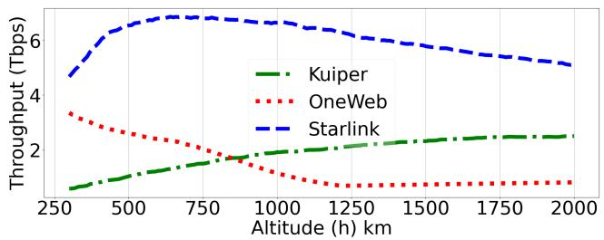  
(a) Throughput

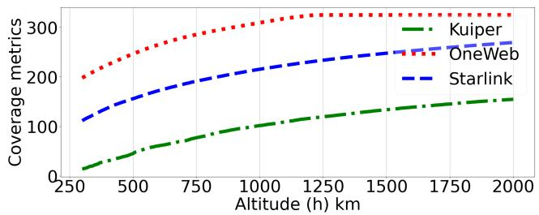  
(b) Coverage

  
(c) Stretch (Kuiper)


  
(f) Hop counts (Kuiper)

(d) Stretch (OneWeb)  
(e) Stretch (Starlink)  
  
(g) Hop counts (OneWeb)

  
(h) Hop counts (Starlink)  
Fig. 20: (a) Throughput, (b) coverage (c)-(e) stretch and (f)-(h) hop counts measurement across most populous cities with varying altitude (h).

Inclination (i): The performance metrics of three constellations while varying inclination i are shown in Fig. 21. Notice that, except for OneWeb’s stretch, coverage, and hop count, all other performance characteristics are consistent. Due to OneWeb’s higher altitude with a low elevation angle, coverage and hop count do not show any noticeable impact due to the inclination change. However, a low angle of inclination restricts the availability of satellites near the equatorial regions and inflates the stretch of NS and LG routes.

Elevation (e): We show the performance characteristics while varying elevation e in Fig. 22. The performance metrics are consistent. Only LG routes of OneWeb experience higher stretch than usual due to a single satellite hop at an altitude of 1,200+ km between the nearby GS pairs.

Number of orbits (o) and phase offset (p): Similarly, the performance characteristics while varying the number of orbits o and phase offset p, are also consistent in Fig. 23 with our previous discussion in §4.

Outcome:- The characteristics of various performance metrics of different constellation sizes are pretty similar and predictable. Thus, knowledge of the search space in §4 could be used to intuitively trim the search space for different constellation sizes as well.

## A.2 Comparison of traffic metrics

All the results discussed previously in §4 and in §A.1 are simulated with High population TM. In Fig. 24, we illustrate how performance characteristics change with other TMs for the first Starlink shell (Table 1). Since demands are concentrated in the regions with higher population density, we have observed that overall performance measurement characteristics are similar for all TMs across all the constellation design parameters. Therefore, we only demonstrate the impact of inclination i and elevation angle e here for brevity. Notice that the throughput for High population TM and High GDP population TM overlaps for both i and e in Fig. 24(a)-(b) except for the lower inclination. Since countries with high populations and lower GDP are mostly located close to Earth’s Equators (i.e., lower latitude lines), lower inclination provides slightly higher throughput for High population TM. Whereas for Country capital TM, the constellation consistently provides higher throughput than the other TMs irrespective of the values of i and e. The GSes for Country capital TM are sparsely located across the capital of 233 countries, they do not experience much congestion around multiple high population/GDP cities located closely in China, India, USA, and Europe.

On the other hand, Global flight TM throughput measurements are consistently lower than other TMs. Our dataset includes total 8,384 flights on the air (> 10,000 feet altitude)

  
(a) Throughput


  
(c) Stretch (Kuiper)


(b) Coverage  


  
(f) Hop counts (Kuiper)

(d) Stretch (OneWeb)  
  
(g) Hop counts (OneWeb)

(e) Stretch (Starlink)  
  
(h) Hop counts (Starlink)  
Fig. 21: (a) Throughput, (b) coverage, (c)-(e) stretch, and (f)-(h) hop counts measurement across most populous cities while varying inclination angle (i).

worldwide. Therefore, in regions with a high air traffic density, each satellite serves the demand of 100+ flights, and the GSL bandwidth is divided among these; thus, the throughput deteriorates. Only Starlink’s first shell of 1,584 satellites could not cope with this many flights. Nevertheless, the overall behaviors of the throughput measurement are the same, as most flight densities are of the domestic flights in the USA, Europe, and the eastern part of China within the airspace of 20◦ N to 55◦ N latitude lines. All international air traffic follows a few specific flight corridors [49] to cross the Atlantic and Pacific oceans within latitude lines 70◦ N to 5◦ N and 60◦ N to 30◦ S, respectively, where the flight density is significantly sparser than domestic flight. Thus, the throughput is relatively low towards lower and polar inclinations.

Apart from throughput, characteristics of other performance metrics are also consistent across all the orbital parameters. Again, for brevity, we only show the coverage and NS routes median stretch measurement with i and e in Fig. 24(c)- (d) and Fig. 24(e)-(f), respectively.

Outcome:- The characteristics of various performance metrics with different constellation parameters remain consistent with different traffic demands. Therefore, the proposed search strategy in (§5) is also generalizable and applicable to different target markets.

## A.3 Visualization with LEOCraft

In this section, we provide an overview of the visualization capabilities of LEOCraft. Ideally, LEOCraft generates 2D and 3D interactive views to inspect LEO constellations. However, we use some snapshots of interactive views to demonstrate various features and aspects of LEO constellation networks.

Multi-shell LEO constellation: LEOCraft can generate a multi-shell LEO network topology. Fig. 25 shows some snapshots of the Starlink [10] and Telesat [12] constellations, whereas Kuiper [1] constellation is already depicted in Fig. 1(b). In these figures, the color distinguishes different shells in the constellation, where the dots represent satellites, and the lines represent the ISLs. Notice that the characteristic of having one shell at a relatively higher inclination (≥ 60◦) is consistent for most of these proposed designs. For example, in Fig. 25, Starlink Gen1’s blue shell and Telesat red shell have inclinations of 70◦ and 98.98◦ respectively. OneWeb’s and Starlink Gen2 also have shells at inclinations of 87.9◦, and 96.9◦ respectively, as shown in Table 1. Our simulation results in §4 discuss the effects of inclination angle to demonstrate the trade-off between throughput and global coverage, i.e., higher inclination gives more Earth surface coverage at higher latitudes, whereas lower inclination provides better throughput to the well-populated areas with limited coverage at higher (polar) latitudes. We speculate that the LEO constellation operator tries to address the issue by deploying multiple shells for targeting different regions of interest. They deploy a shell at a higher inclination $( \geq 6 0 ^ { \circ } )$ to address the coverage at higher latitudes, whereas multiple shells are deployed at lower inclinations to address the demand at densely populated areas.


  
(a) Throughput

(b) Coverage  
  
(c) Stretch (Kuiper)


  
(e) Stretch (Starlink)  
(f) Hop counts (Kuiper)

(d) Stretch (OneWeb)  
  
(g) Hop counts (OneWeb)

  
(h) Hop counts (Starlink)

Fig. 22: (a) Throughput, (b) coverage, (c)-(e) stretch, and (f)-(h) hop counts measurement across most populous cities with varying elevation angle (e).  
  
(a) Kuiper

  
(b) OneWeb

  
(c) Starlink  
Fig. 23: Changes in the number of orbits (o) and phase offset (p) for all shells with GSes across the most populous cities show similar throughput characteristics.

Route evolution over time: LEO satellites orbit the Earth at a very high velocity of ∼ 27,000 kmph [45]. Therefore, the route between two endpoints (i.e., user terminal or gateway ground station) on the Earth’s surface continuously evolves over time. LEOCraft can be used to visualize such evolution of routes between any pair of GSes over a granularity of nanoseconds. In Fig. 26, we show the snapshots of the evolving shortest paths between Bengaluru, India, and Tokyo, Japan, at different time instances. In this particular example scenario, we can observe that the shortest route between the end-points experiences a route length variation of above 1000 km over just 100 seconds. This leads to abrupt RTT changes, which are also visible for other routes, as discussed previously in Fig. 18(a)-(b).

Coverage and route change due to altitude variation: LEOCraft allows inspection of the coverage area of a constellation at individual satellite levels with red-shaded circles beneath it. In Fig. 27, we illustrate the same with the shortest route between Bengaluru, India, and Tokyo, Japan, over the ISL of Starlink’s first shell. In this illustration, we only focus on the coverage of ingress and egress satellites. As we increase the altitude of the shell from the default height (i.e., 550 km) to 1,000 km, the coverage area of the satellite (highlighted for ingress and egress points only) increases. Thus, the two endpoints choose satellites closer to each other to form the shortest route, reducing the end-to-end hop length from


(a)  
  
(d)


(b)  


  
(e)

(c)  
  
(f)

Fig. 24: (a)-(b) Throughput, (c)-(d) coverage, and (e)-(f) stretch measurements with different TMs while varying inclination and elevation angles show similar characteristics.  
  
(a) Equatorial view

  
(b) Polar view

  
(c) Equatorial view

  
(d) Polar view  
Fig. 25: Visualizing multi-shell LEO network topology proposed by (a)-(b) Starlink Gen1 [4] and (c)-(d) Telesat [12].

6 satellite hops to only 2 hops. Notice that in Fig. 27(b), the coverage area of the satellite at the higher latitude appears to be larger than at the lower latitude due to the 2D Mercator projection [36].

Ground track of satellites: LEOCraft also helps in visualizing the ground track [48] of the satellites. Fig. 28 shows the nadir, i.e., 90◦ projection of the satellites on the Earth’s surface with the inclination of 50◦ and 80◦. The tracking for 120 minutes of both satellites starts at the same point. The figure shows how these two satellites deviate from the starting location after one orbit due to the rotation of Earth. From such visualizations, we can also observe how the coverage regions vary with the inclinations.

ISL utilization: LEOCraft can also be used to visualize the ISL utilization of individual constellations. For example, Fig. 29(d)-(f) shows the link utilization of Starlink’s first shell, when the 100 populous cities communicate over the 20 shortest routes. We can extract the link selections and respective link usages in LEOCraft to render an interactive view of link utilization using color codes, i.e. Unused, up to 20%, up to 60%, up to 80%, above 80%.

From Fig. 29(d)-(f) we can observe that many ISLs above the oceans are unused, especially over the Pacific Ocean in

Fig. 29(f). In general, ISL utilization is up to 20% since GSLs are the main bottleneck in these LEO networks. However, ISL utilization in the northern Pacific Ocean is pretty high (up to and above 80%.) as these ISLs are carrying the traffic between the US and the two most populated areas, i.e., India and the Chain in Fig. 29(f).

We next repeat the same study with 233 GSes located sparsely across the globe in the capital of countries, the results are shown in Fig. 29(g)-(i). From these figures, we can observe that the ISL utilization is increased, whereas the number of unused ISLs decreases significantly. A few ISLs are under pretty high utilization above the oceans (such as the center of the Atlantic, or the northwestern area of the Pacific) as they carry the traffic between cross-continent population centers. Such visualizations provide valuable insights about the links or regions that experience network bottlenecks.

## A.4 Additional comments

LEO Constellation design types: Previous works have classified satellite constellation designs into two types based on their geometry [89]. The first one is Walker Star, where all satellites in one hemisphere move towards the north pole, whereas in another hemisphere, these satellites move towards the south pole. Hence, in the polar region, the movement of the satellites creates a star shape while viewing from the top [71, 77]. Satellite constellations are also designed in Walker Delta structure, where orbits of less than 90◦ (likely) inclination are equispaced across the entire Earth’s equatorial plane; therefore, northwards and southwards movement of satellites overlap across the globe. Such a design with three orbits creates a triangular shape like the Greek alphabet ∆ at the polar region while viewing from the top [39, 87]. Therefore, the Walker star configuration provides dense coverage in the polar region; on the other hand, the Walker delta configuration creates a coverage gap (if inclined below 90◦). Since the main population centers are in lower latitudes, most of the LEO constellations proposed for global Internet broadband fall under the category of Walker delta types. Therefore, this work mainly focuses on the Walker delta types of constellation design. However, extending LEOCraft to study the Walker star design is possible with minimal effort due to its modular design.

  
Fig. 26: The shortest route from Bengaluru, India, to Tokyo, Japan, changes over time due to satellite movement, leading to the RTT fluctuations.

  
(a) h = 550 km

  
(b) h = 1,000 km

Fig. 27: The shortest route from Tokyo to Bengaluru is reduced to two satellite hops as increasing the altitude of the shell expands the coverage area of satellites, shown with ingress and egress satellite.  
  
Fig. 28: The ground track over 120 minutes of two satellites orbiting at inclinations of 50◦ and 80◦.

Impact of interference: In LEOCraft, we do not account for the impact of interference since satellite constellations deploy a multitude of interference mitigation techniques to maximize the throughput offered per satellite. Well-known schemes include dividing the terrestrial coverage area into tessellation shapes or spots and then reusing frequencies by assigning adjacent spots different non-overlapping frequency bands. Starlink and Kuiper have extensive plans [1,26] beyond such simple mitigation, which include (a) many steerable, shapeable beams with varying bandwidth, (b) multiple antennas per satellite, each with multiple beams, (c) beam splitting and merging to address interference as well as spatially varying demands, etc.

## A.5 Simulation using LEOCraft’s APIs

We provide a concise overview of evaluating the LEO constellation using LEOCraft’s APIs, along with some code snippets. Additionally, we illustrate the framework’s extensibility. For readers interested in further details, LEOCraft’s repository [35] includes comprehensive documentation.

Building a LEO constellation: To build a LEO constellation, first create a path loss model for the GSLs with FSPL instance as shown in Lst. 1, which uses the Ka band specification available in Starlink’s FCC filing [50]. Then, using LEOConstellation API, build a LEO constellation instance and add all the LEO network component instances like GroundStation (builds GSes across cities), PlusGridShell (builds all LEO satellites and +Grid ISLs) as shown in Lst. 2. To simulate a multi-shell constellation, repeat the add\_shells() method with design parameters of the other shells while increasing the id for each one. Followed by this, add the instance of the path loss model created in Lst. 1, and set the epoch before building and computing the routes across all the GS pairs.

  
Fig. 29: ISLs utilization above the (a) Atlantic, (b) India, and (c) Pacific Ocean show that most of the ISLs are Unused for (d)-(f) high population TM across 100 cities, whereas the utilization (up to 20%, 60%, 80%, and above 80%) has increased for (g)-(i) the country capital TM across the capital of 233 countries.  
Listing 1: Building loss model

Evaluating a LEO constellation: Once the routes computation is complete, the instance of LEOConstellation can be used to evaluate the throughput, stretch, and coverage using the performance evaluation APIs of LEOCraft as shown in Lst. 3. Notice that, unlike stretch and coverage, the throughput instance needs the TMs across the GSes.

Evaluating a cohort of LEO design: In addition to the above approaches, LEOCraft also provides a highlevel API – LEOConstellationSimulator to evaluate a batch of LEO constellation designs. As shown in Lst. 4,

```python
from LEOCraft.constellations.LEO_constellation import
LEOConstellation
from LEOCraft.dataset import GroundStationAtCities
from LEOCraft.satellite_topology.plus_grid_shell import \
PlusGridShell
from LEOCraft.user_terminals.ground_station import \
GroundStation
leo_con = LEOConstellation('Starlink')
leo_con.add_ground_stations(
GroundStation(
GroundStationAtCities.TOP_100
)
)
leo_con.add_shells(
PlusGridShell(
id=0,
orbits=72,
sat_per_orbit=22,
altitude_m=550000.0,
inclination_degree=53.0,
angle_of_elevation_degree=25.0,
phase_offset=50.0,
)
)
leo_con.set_time(second=3)
leo_con.set_loss_model(loss_model)
leo_con.build()
leo_con.create_network_graph()
leo_con.generate_routes(k=20)
```  
Listing 2: Building a LEO constellation

```python
from LEOCraft.dataset import InternetTrafficAcrossCities
from LEOCraft.performance.basic.coverage import Coverage
from LEOCraft.performance.basic.stretch import Stretch
from LEOCraft.performance.basic.throughput import \
Throughput
th = Throughput(
leo_con,
InternetTrafficAcrossCities.ONLY_POP_100
)
th.build()
th.compute()
sth = Stretch(leo_con)
sth.build()
sth.compute()
cov = Coverage(leo_con)
cov.build()
cov.compute()
```  
Listing 3: Evaluating throughput, latency/stretch, and coverage

LEOConstellationSimulator serves as the simulation execution framework in LEOCraft. It queues all instances of LEOConstellation and uses all the available CPUs on the system to build the constellation and compute the routes, throughput, stretch, and coverage. Finally, on evaluation completion, LEOConstellationSimulator writes back the results of each LEOConstellation in a file for further analysis.

Modularity: LEOCraft framework’s design offers superior extensibility. For instance, one can inherit PlusGridShell and override just one method – build\_ISLs(), to create a XGridShell that evaluates the performance of the LEO constellation with a ×Grid ISL topology [72]. Similarly, Throughput, Stretch, Coverage can be inherited to overwrite the compute() method to implement other approaches for the computation of these metrics. Hence, LEOCraft enables further exploration of LEO design and optimization strategies, addressing a wide range of objectives such as routing policies, bandwidth allocations, traffic patterns, ISL topologies, the number of antennas and their capabilities, weather conditions, and much more.

```python
from LEOCraft.simulator.LEO_constellation_simulator import\
LEOConstellationSimulator
leo_1= LEOConstellation('LEOCON_1')
leo_1.add_ground_stations(
GroundStation(
GroundStationAtCities.TOP_100
)
)
leo_1.set_time(second=3)
leo_1.set_loss_model(get_loss_model())
leo_1.add_shells(
PlusGridShell(
id=0,
orbits=72,
sat_per_orbit=22,
altitude_m=1000.0*550.0,
inclination_degree=53.0,
angle_of_elevation_degree=25.0,
phase_offset=50,
)
)
# ... repeat for leo_2, leo_3, ..., leo_n
simulator = LEOConstellationSimulator(
InternetTrafficAcrossCities.POP_GDP_100,
'output.csv'
simulator.add_constellation(leo_1)
# Repeat above line for leo_2, ..., leo_n
simulator.simulate_in_parallel(max_workers=3)
```  
Listing 4: Evaluating a cohort of LEO constellation

## B Artifact Appendix

## Abstract

This artifact provides detailed instructions for setting up LEOCraft simulation environments on Linux and macOS platforms. The primary focus is on verifying the claims made in the paper and reproducing the figures presented throughout. Additionally, it offers guidance on extending the LEOCraft project to experiment with traffic metrics, topology, routing, and connectivity policies.

## Scope

This artifact includes straightforward steps to validate four major claims of the paper – (i) execute a flow-level LEO network simulation, (ii) optimize LEO constellation design using search space heuristic, (iii) evaluate and simulate designs for multi-shell LEO constellation, and (iv) interactive visualization the LEO constellation network. In addition to that, the GitHub repository hosts the LEOCraft’s source code under the MIT License.

## Contents

The GitHub repository provides the complete source code for LEOCraft, accompanied by thorough documentation. The Artifact Evaluation page documents the steps to execute all experiments supporting the major claims of this paper. Additional available contents are outlined below:

Examples: The repository contains a handful of example Python scripts illustrating how LEOCraft can be programmed for different LEO network simulations and visualization.

Evaluation of constellation with all TMs: The Fig. 20– 24 presents a summarized overview of the performance measurements for various LEO constellations against different TMs. The repository contains all the detailed performance measurements for the proposed constellation, as highlighted in Table 1, against all the TMs discussed in §2.3 for GSes and flights.

Interactive visualization: The repository also contains an interactive versions of LEO constellation design (Fig. 1(b), 25), satellite coverage (Fig. 1(a), 4(b)-(c)), GSes location (Fig. 7(a)), routes (Fig. 2, 8, 10, 13, 26, 27), ISL topology and satellite trajectory changes (Fig. 7(b)-(d), 11), ground track of satellites (Fig. 28), and ISL utilization (Fig. 29) inside Visulization Examples.

## Hosting

The source code of the LEOCraft under MIT License is available at – github.com/suvambasak/LEOCraft.git. The documentation of LEOCraft is available at – suvambasak.github.io/LEOCraft/. The source code and the documentation might be updated according to the future release with new versions of LEOCraft. Additionally, Artifact Evaluation page provides the straightforward steps for reproducing the results of this paper.

## Requirements

The LEOCraft uses the Gurobi Optimizer to solve the linear program to maximize throughput. Consequently, a valid Gurobi license is required to use gurobipy for solving linear programs. Additionally, we recommend using a multi-core system with a minimum of 8 gigabytes of memory; however, having more computational resources helps LEOCraft to execute faster.