①

USENIX

THE ADVANCED COMPUTING SYSTEMS ASSOCIATION

# Poby: SmartNIC-accelerated Image Provisioning for Coldstart in Clouds

Zihao Chang and Jiaqi Zhu, SKLP, Institute of Computing Technology, CAS; University of Chinese Academy of Sciences; Haifeng Sun, Peking University; Yunlong Xie, Kan Shi, Ninghui Sun, Yungang Bao, and Sa Wang, SKLP, Institute of Computing Technology, CAS; University of Chinese Academy of Sciences https://www.usenix.org/conference/atc25/presentation/chang

# This paper is included in the Proceedings of the 2025 USENIX Annual Technical Conference.

July 7–9, 2025 • Boston, MA, USA ISBN 978-1-939133-48-9

Open access to the Proceedings of the 2025 USENIX Annual Technical Conference is sponsored by

P=-r.h mEe-s

auuJl9 PgleU

King Abdullah University of

Science and Technology

# Poby: SmartNIC-accelerated Image Provisioning for Coldstart in Clouds

Zihao Chang1,2, Jiaqi Zhu1,2, Haifeng Sun3†, Yunlong Xie1,2, Kan Shi1,2, Ninghui Sun1,2, Yungang Bao1,2, Sa Wang1,2†

1 SKLP, Institute of Computing Technology, CAS 2 University of Chinese Academy of Sciences 3 Peking University

## Abstract

Coldstart introduces a significant latency penalty in cloud computing. While several previous works have proposed mechanisms such as warm start, fast snapshot recovery, lightweight isolation, and fast image download to avoid or mitigate this issue, image provisioning remains underexplored despite being critical.

In this paper, we propose Poby, a software-hardware collaborative system that offloads and accelerates critical operations of image provisioning using SmartNICs. Specifically, Poby embodies a disaggregated architecture that offloads different image provisioning operations to the appropriate hardware such as embedded CPUs and domain-specific hardware accelerators for optimal performance. It uses a pipeline-based, data-driven workflow to eliminate delays caused by the serial execution of image provisioning operations. Moreover, it contains a distributed image provisioning scheme to alleviate the performance bottlenecks of conventional centralized registries. We implement the entire Poby system using Blue-Field SmartNICs and evaluate its performance using various microservice and FaaS benchmark suites. The results demonstrate that Poby outperforms two industry-standard container platforms, containerd and iSulad, with speedups of 13.2× and 8.0×, respectively. In addition, compared to iSulad, it reduces host CPU usage by 87.5%.

## 1 Introduction

Cloud computing has long promised on-demand scaling since its inception. This feature allows the cloud system to automatically adjust hardware resources to meet the dynamic needs of cloud applications, eliminating the need for human intervention. However, this convenience also presents significant challenges in cloud management. The coldstart problem is one of the prominent performance issues [5, 64, 83]. When an incoming request triggers an on-demand container creation and runtime initialization, the response time can be significantly longer - almost 10× compared against a warm startup [41], which negatively impacts the user experience.

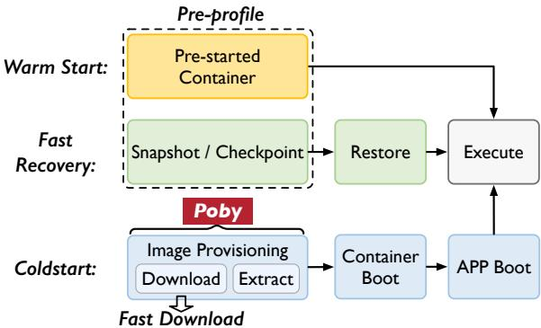  
Figure 1: Overview of optimizations for coldstart.

Within coldstart, the most time-consuming step is image provisioning, which involves downloading and extracting large images from remote storage into local memory. Therefore, as shown in Figure 1, state-of-the-art (SOTA) work towards coldstart mainly focuses on the image provisioning part. The warm start method [1, 8, 51, 60, 61, 64, 68] prestarts containers before invocation and keeps them running continuously. However, this introduces considerable resource overhead and breaks the promise of on-demand scaling. The fast recovery method [3, 11, 19, 54, 62, 73, 80], which relies on snapshots or checkpoints to boot containers, avoids the timeconsuming image provisioning process. Still, this approach incurs substantial storage overheads and requires containers to be stateless, which is challenging in production environments.

Both warm start and fast recovery methods attempt to bypass the image provisioning part. However, in fact, it is impossible to completely avoid coldstart in the production environment, such as warm start prediction errors, the first request to a newly uploaded function, and so on. In such scenarios, some work directly accelerates the image provisioning part, such as accelerating image download through a peer-to-peer approach [10, 39, 72, 76] (fast download). Nevertheless, we identify a counter-intuitive issue where image extraction takes more time than image download. The extraction step, which decompresses and unpacks image files to initiate the container booting process, consumes over 68.8% of the overall image provisioning latency (details in §2.2).

To accelerate the entire image provisioning process for coldstart, we propose a software-hardware collaborative system named Poby. Instead of consuming valuable host CPU resources for compute-intensive tasks such as image compression and extraction, we offload those tasks directly onto modern SmartNICs with specific hardware accelerators for better performance and reduced CPU usage. In addition, most modern SmartNICs natively support zero-copy network protocols such as RDMA [14,16,48,53], thus enabling low-latency and high-bandwidth image downloads.

However, porting image provisioning to SmartNIC is a nontrivial task due to the following three reasons. Firstly, the embedded CPUs of existing SoC-based SmartNIC lack sufficient computing power. Naively offloading the entire image provisioning process to SmartNIC can be counterproductive. Secondly, the sequential execution of the image provisioning operations causes significant waiting delays. This issue worsens on SmartNIC because images must be transferred between the NIC memory and the host memory. Finally, the high-bandwidth image download via RDMA could also overload the centralized image registry, potentially creating a new performance bottleneck.

To address these challenges, we design and implement a disaggregated architecture in Poby, which offloads various image provisioning operations, including control of image provisioning, image downloads, image decompression, and image unpacking, to optimal hardware such as the embedded SmartNIC CPU, the RDMA logic, the decompression accelerator, and the host CPU, accordingly. Poby features a pipeline-based data-driven workflow to eliminate the waiting delay introduced by serial execution of image provisioning operations. Furthermore, Poby decentralizes the image registry to alleviate the potential performance bottlenecks of the conventional centralized registry.

In this paper, we implement Poby using the Nvidia BlueField-2 SmartNIC [14], which is equipped with eight ARMv8 A72 CPUs and various domain-specific hardware accelerators for network and storage. We build a dual-card prototyping system to evaluate the effectiveness, efficiency, and scalability of the proposed design. Our evaluation shows that in comparison to the SOTA implementations containerd [23] and iSulad [55], Poby achieves 13.2× and 8.0× speed-ups, respectively. Furthermore, compared to the SOTA image download works Kraken and FaaSNET, which use highperformance host CPUs, Poby achieves comparable scalability using the embedded SmartNIC CPUs.

To the best of our knowledge, Poby is the first softwarehardware collaborative system to accelerate the complete image provisioning process for coldstart. In summary, we make the following contributions:

• We observe that image extraction is critical but timeconsuming for image provisioning. Accelerating the entire image provisioning process is essential to mitigate the coldstart overhead.

• We propose a novel software-hardware collaborative system named Poby, which features disaggregated architecture, pipeline-based data-driven workflow, and decentralized image registry to accelerate the end-to-end image provisioning process.

• We prototype and evaluate Poby on BlueField-2 SmartNICs with realistic cloud workloads and demonstrate that Poby achieves up to 13.2× performance improvements over prior works.

## 2 Background and Motivation

## 2.1 Coldstart and Prior Optimizations

Coldstart is a classic problem in cloud computing, especially in container-based microservice architecture and serverless computing. For flexible service management, large-scale online service providers deploy single-purpose microservices or fine-grained function instances into containers, which offer a lightweight and isolated virtualization environment. In such cases, a coldstart refers to the delay caused by inactivity when a microservice instance or function is first invoked. In addition, a surge in service requests will also trigger a large number of coldstarts. A complete coldstart process consists of three steps: (i) preparing the container images (including download, decompress and unpack), (ii) launching the container, and (iii) initializing the application. Unfortunately, the coldstart process can be time-consuming and may potentially bottleneck the overall system performance.

The container image encompasses all the necessary components for a container to operate. According to the OCI Image specification [27], the image is composed of an image manifest and a collection of filesystem layers. The manifest is a general description and a list of layers contained in the image. The layers themselves are compressed filesystems and changes of the filesystem. These layers can be serialized to a container filesystem according to the manifest.

Limitations of prior optimizations. As shown in Figure 1, various optimization technologies have been proposed to alleviate the coldstart overhead. However, these solutions still suffer from different limitations:

• Fast download. Some works [39, 72, 76] focus on optimizing the image download. They apply a peer-to-peer (P2P) approach to accelerate image download and improve the scalability. Although image download is one of the most time-consuming operations within coldstart, they ignore the overhead of image extraction, i.e., decompressing and unpacking the downloaded images before launching the container. Note that image extraction is also a critical phase in coldstart (see details in §2.2). Works like [10, 39, 76] adopt new image formats to enable on-demand downloading and decompression, but this makes them completely incompatible with traditional image distribution systems.

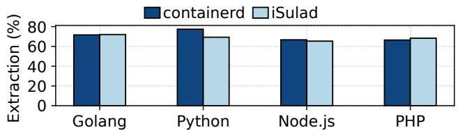  
Figure 2: Relative extraction time in image provisioning.

• Fast recovery. Some studies maintain the snapshot / checkpoint of a booted container in memory [11, 54, 80–82] or storage [3, 19, 33, 62, 73] for fast recovery. In this way, these systems bypass the image provisioning when starting a previously launched container. However, the diversity of microservices and function instances poses considerable challenges for the management of numerous snapshots. Firstly, it requires a substantial amount of memory or storage to create and maintain snapshots of booted containers. Secondly, the application in the container snapshot must be stateless. This means that it cannot retain any information about previous interactions. Because recovering stateful data (e.g., timestamps, statistics, and request data) from the snapshot can introduce anomalies and privacy concerns.

• Warm start. Prior works [6, 13, 49, 75] adopt the keep-alive strategy to avoid the coldstart penalty. However, such approaches incur additional overhead for running containers even when there are no requests. On the one hand, such overhead is unacceptable for platforms that manage a large number of containers. On the other hand, it breaks the fundamental promise of pay-as-you-go in cloud computing. To reduce the keep-alive overhead, several studies [1, 8, 61, 64] predict the occurrence of coldstart and preemptively start containers. But this approach requires much effort to learn coldstart patterns for high prediction accuracy, and is ineffective for newly deployed images. Other works [51,60,68] maintain a shared container pool to reduce overhead, while this approach is not applicable to user-provided images.

## 2.2 Motivation

When looking into the coldstart process, the following three observations motivate us to completely address this issue.

① Coldstart from image provisioning is inevitable. Existing approaches such as fast recovery and warm start aim to bypass image provisioning at the cost of massive memory caching. However, (i) it is not cost-effective to cache all containers in memory. For example, CodeCrunch [6], a SOTA warm start work, achieves an 80% warm start rate with surprisingly over 90 TB peak memory usage. Thus it is impractical and inefficient to cache all the containers in limited memory resources, since requests are concentrated on a subset of hot containers [64, 76, 81]. (ii) Some works [1, 8, 61, 64] try to predict the upcoming needs for containers and provide on-demand memory caching to reduce memory costs. However, these predictions are by no means completely accurate, especially in production. According to the trace of Alibaba Cloud [17], the average coldstart frequency for each container in the platform still exceeds 130 times in one day.

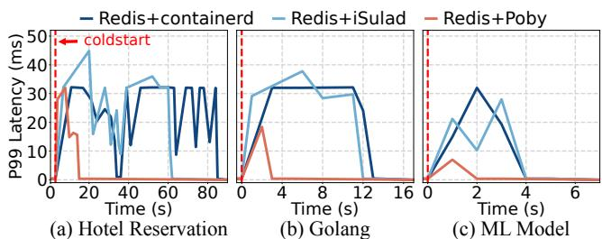  
Figure 3: Tail latency of Redis when colocated individually with containerd, iSulad, and Poby during the coldstart.

② Image provisioning is the most time-consuming step of coldstart. According to the statistics [76] of 712,295 coldstart operations for containerized functions within 15 days from Alibaba Cloud, over half of function requests spend at least 72% of the total time on image provisioning. And more than 57% of these operations take at least 45 seconds. Although factors such as image size, compression rate, and the number of layers may impact the processing time, image provisioning remains the most time-consuming step of coldstart [51,68,74].

③ Recent efforts ignore the image extraction process. Existing works only focus on accelerating the image download [39, 72, 76], overlooking the extraction process of image provisioning. Remarkably, we find that image extraction (i) is not only the de facto performance bottleneck in image provisioning (ii) but also introduces severe performance interference to other applications.

• Performance bottleneck. Figure 2 evaluates the image extraction time of two well-known container solutions, containerd [23] and iSulad [55], across language runtimes of different sizes. Notably, the image extraction takes more than 68.8% of the image provisioning time in all kinds of runtimes.

• Performance interference. Figure 3 evaluates the performance interference of Redis when colocated with containerd and iSulad, respectively. We measure the latency of Redis during the extraction of three image sizes (see Table 1). The latency of Redis increased by over 110 × due to colocation. This is attributed to the resource-intensive nature of image extraction, which involves decompression and file writing. Firstly, decompression is CPU-intensive, as it executes intricate decoding operations to reverse complex encoding patterns. Secondly, the unpacking operation requires writing a large number of small files in images, which demands frequent CPU involvement.

Thus, we argue that the image extraction should be carefully re-examined and accelerated.

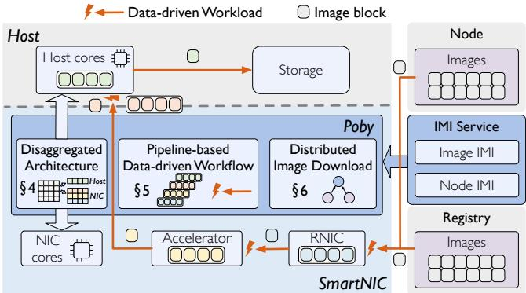  
Figure 4: Overview of the Poby system.

## 3 Poby Overview

Poby is a novel software-and-hardware collaborative system designed to accelerate image provisioning of the coldstart process. The overall architecture is shown in Figure 4. As can be seen, a key feature of Poby is its ability to offload critical tasks related to image provisioning onto modern SmartNICs, thus achieving hardware acceleration using domain-specific accelerators, as well as saving valuable host CPU resources from processing cloud infrastructure tasks.

We define the following main goals for Poby:

• Performance: Poby aims to complement existing mitigation methods by accelerating the overlooked decompression process, and fundamentally resolve the coldstart issue.

• Resource: Poby offloads coldstart to SmartNIC for reducing resource contention and datacenter tax [29].

• Compatibility: Poby provides an optional auxiliary acceleration capability for coldstart, it does not refactor the original design and software stack of container platforms.

In recent years, SmartNICs have been widely adopted in data centers [21,28,69] and many researches apply SmartNIC to offload applications such as storage [38, 50], distributed system [31, 63], and network protocol [4, 32, 52, 65]. In this work, we take advantage of several key features of modern SmartNICs. For example, they natively support zero-copy network protocols such as RDMA, potentially enabling lowlatency and high-bandwidth image download. In addition, SmartNICs embody hardware accelerators and computing engines for various scenarios including data compression and management, thus ideally suitable for accelerating image extraction and addressing resource contention issues.

## 3.1 Challenges

Although accelerating the image provisioning by the Smart-NIC seems intuitive, it is non-trivial to put into practice due to the following Challenges.

C1: Offloading dilemma. The strawman solution that offloads the complete image provisioning onto the SmartNIC cannot achieve good performance. The reasons accounting for this include two aspects. Firstly, the on-NIC CPU of existing SoC-based SmartNICs is wimpy, which is only suitable for offloading applications with low IPC (instructions per cycle) or high cache MPKI (misses per kilo-instruction) [31, 44, 78]. That is to say, the performance of image extraction on the NIC is much lower than on the host. Secondly, even if we offload the image extraction to the specific hardware accelerator or customized FPGA module, the transmission of numerous extracted files becomes the new bottleneck. Here, most container images are comprised of many layers.

C2: Serial execution of image provisioning. The serial execution of image provisioning operations is a typical store-andforward workflow, which results in significant waiting delays. Specifically, each operation must suffer a delay of waiting for the previous operation to complete, even if the preceding operation is a time-consuming operation like downloading and decompression. This issue is particularly severe for latencysensitive and large containers. In addition, offloading image provisioning to the SmartNIC introduces an additional operation of transferring image data from the NIC memory to the host memory, which exacerbates the problem.

C3: Centralized image registry. Although RDMA can boost image download performance, the classic centralized image registry remains a bottleneck. Our tests reveal that concurrent downloads from eight nodes to one registry cause a 10× and 6× increase in latency with TCP and RDMA, respectively. Traditionally, cloud providers mitigate this by scaling registry nodes and using the load balancer. However, prior research shows that requests to a single service can spike dramatically, incurring hundreds of nodes to pull the same images simultaneously [10, 64, 76]. This necessitates deploying numerous additional registries, contradicting our design goal. Moreover, the centralized registry struggles with RDMA scalability. The RDMA NIC (RNIC) of the registry has to frequently switch the queue pair information in its cache to transmit images to different hosts, which seriously impacts the performance.

## 3.2 Poby Design

As shown in Figure 4, Poby integrates three solutions to accelerate image provisioning. The key insight of Poby is to orchestrate appropriate hardware resources of the entire cluster to accelerate different operations within image provisioning. In a nutshell, Poby executes the fine-grained operations of image provisioning atop the RNICs, on-NIC CPU, hardware accelerators, and host CPU. In addition, Poby assumes that images are compressed in gzip format, which is the most widely used format, accounting for as much as 96.3% of all images in Docker Hub [85]. The design of Poby is orthogonal to the compression format and compatible with other formats.

Disaggregated architecture (§4). Poby devises a disaggregated architecture to offload different operations of image provisioning to appropriate places (C1 addressed). Firstly, we offload the control of the entire image provisioning to the on-NIC CPU, whose computing overhead is acceptable for its wimpy CPU. Secondly, we download the image via RDMA to fully utilize the high-bandwidth transmission capability of modern SmartNICs. Thirdly, we decompress the downloaded images at the hardware decompression accelerator to achieve better performance. Finally, we transmit the decompressed images from the NIC to the host via PCIe and unpack them by the host CPU, which eliminates the performance bottleneck of transmitting numerous small files.

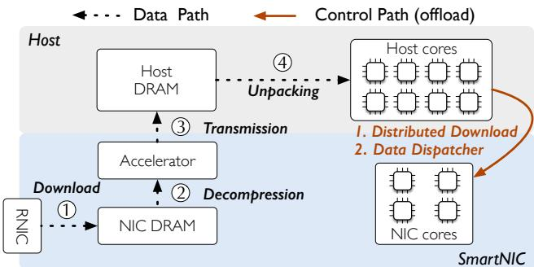  
Figure 5: Disaggregated architecture of Poby.

Pipeline-based data-driven workflow (§5). Poby adopts a pipeline-based data-driven workflow to eliminate the waiting delay introduced by the classic sequential execution of coldstart (C2 addressed). To enable the pipeline-based data path, images are downloaded, decompressed, transmitted, and unpacked at the granularity of blocks (e.g., 16 MB) in Poby. Thus, the download, decompression, transmission, and unpacking for different data blocks can be executed at the same time, improving the efficiency of image provisioning. However, the finer-grained data path introduces more control information to manage all pipeline blocks. For example, a 37-layer image with a total size of 2.45G can be divided into 189 pipeline blocks (16MB). Poby further utilizes data-driven workflow to reduce the overhead of additional control information. Specifically, we integrate the control command into data blocks. Then, each component in Poby executes the subsequent operations based on the control command in its received data block. This minimizes the transmission of control command and execution status.

Distributed image download (§6). Poby decentralizes the image registry to alleviate the performance bottlenecks of the conventional centralized registry (C3 addressed). Specifically, Poby adopts a best-effort strategy to currently download the image from multiple nodes who happen to own the required images. In this way, Poby avoids the significant storage overhead of distributed nodes actively caching images. To enable this, we first devise the image metadata index (IMI) to hold the available image locations and node transmission workload. Poby makes the download plan based on the IMI to ensure the load balance between distributed nodes. Here, our best-effort strategy allows Poby to download images from the original registry when no node contains the required image or the retrieved IMI is inconsistent.

Discussion. The design of Poby, based on workflow accelerating, is orthogonal to most existing studies as it focuses on optimizing the inherent processes of coldstart. For example, the disaggregated architecture and pipeline-based data-driven workflow can accelerate warm start and subsequent processes of fast download. Even for on-demand download works that adopt new image formats, Poby can still accelerate image processing for the lazy download process.

## 4 Disaggregated Architecture

Poby proposes a disaggregated architecture that orchestrates resources of the entire cluster to accelerate image provisioning for coldstart. Figure 5 illustrates the details of the architecture, composed of a data path (§4.1) and a control path (§4.2).

## 4.1 Data Path

The key idea behind Poby data path is to put different operations into the right hardware components to maximize performance gains. Existing container solutions are typically monolithic, with a single server responsible for the entire image provisioning process. In contrast, Poby disaggregates this monolithic architecture into separate components and offloads them to specialized hardware units, including on-NIC CPU, decompression accelerator, and host CPU. Furthermore, we decouple the image extraction into image decompression and image unpacking. Along with the image transmission between the NIC and host memory (discussed in C2), the entire data path of image provisioning currently includes four operations: image download, image decompression, image unpacking, and image transmission. Here, this decoupling between image decompression and image unpacking brings three benefits.

① New execution order bypassing bottleneck. The decoupling enables reordering the execution of image unpacking and image transmission. Specifically, Poby executes the data path in the following order. Firstly, Poby downloads the images via RDMA to its SmartNIC memory. Secondly, Poby decompresses the downloaded images using the hardware accelerator. Thirdly, Poby directly transmits the decompressed images from the accelerator to the host memory. Finally, Poby unpacks the decompressed images on the host CPU.

Note that this execution order bypasses the performance bottleneck discussed in C1. On the one hand, image unpacking on the host can avoid the overhead of unpacking on the weak on-NIC CPU. On the other hand, transmission for a large decompressed file is much more friendly to PCIe than numerous small unpacked files. Because each file writing operation involves multiple PCIe transactions (such as DMA transfers and interrupt requests). When unpacking a file with numerous small files, writing these files to disk can saturate the PCIe bus with a large number of transactions and small data, thus reducing the effective bandwidth utilization.

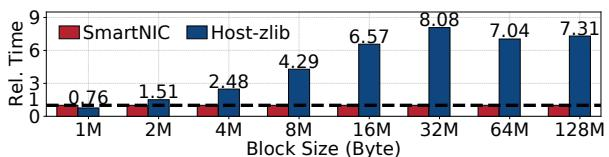  
Figure 6: Image decompression performance comparison.

② Network-wide collaborative enhancement. This decoupling permits the architecture to be further disaggregated across multiple nodes. Therefore, we can perform image decompression at the hardware accelerator of remote hosts and then download the decompressed images via RDMA. Here, our on-NIC controller can distinguish whether the received image data is raw or decompressed according to block\_status (detail in § 5.2). It then dispatches the data to the local hardware accelerator or directly to the host memory depending on the data type. This collaborative architecture can be applied to the following two scenarios: (1) the local hardware accelerator is busy or occupied by other tasks; and (2) nodes in the cluster are only equipped with RDMA NICs but no Smart-NICs. This approach is in line with our design principle, i.e., orchestrating hardware resources of the entire cluster to accelerate image provisioning. As a result, this further reduces the demands of Poby for SmartNIC and increases the utilization of accelerators.

Although decompressing the image first greatly increases the amount of data transferred, this is acceptable for two reasons. Firstly, current RDMA hardware offers up to 200 Gbps of transmission bandwidth with µs-scale latency, which significantly reduces the transmission latency of images. Secondly, the hardware accelerator decompresses images much faster than the host (Figure 6), reducing the additional overhead introduced by transmitting decompressed images.

③ Performance benefits for decompression. The image decompression itself can benefit from the hardware decompression accelerator of existing SmartNICs. Figure 6 compares the time that decompresses images of different sizes using the hardware accelerator and the classic zlib [47] on the host. As the block size increases, the decompression time of zlib increases significantly, far exceeding that of the accelerator. Furthermore, for blocks larger than 16 MB, the accelerator reduces the decompression latency by 7× on average. Note that the decompression time of blocks varies depending on the data pattern, leading to fluctuations (e.g., 32 MB).

## 4.2 Control Path

The control path of Poby coordinates the execution workflow of image provisioning. Specifically, the control path includes an application programming interface (API) agent running on the host and an on-NIC controller.

API agent. The API agent ensures compatibility with the original interface of the existing container service (e.g., Docker

API). When the host issues a command to perform a coldstart, our API agent sends this request to the on-NIC controller. When the image provisioning ends, the agent returns the control back to the container service to launch the container.

On-NIC controller. The on-NIC controller is responsible for two functionalities. (1) It manages the distributed image download, including the maintenance of RDMA contexts, the retrieval for IMIs, and the decision-making (i.e., download layer from which host) for distributed downloads (see §6). The on-NIC controller adopts a lazy destruction strategy to reuse existing RDMA connections, minimizing the overhead of frequent connection creation and teardown. (2) It dispatches different types of downloaded image data to the corresponding places in the data path (see §4.1).

The offloaded on-NIC controller brings the following three benefits. Firstly, it decreases host resource usage, allowing hosts to run more business applications. Secondly, the on-NIC controller further reduces the transmission delay of commands for the control path. Finally, the operations of the control path are not compute-intensive, offloading them to the weak on-NIC CPU will not cause overload.

## 5 Pipeline-based Data-driven Workflow

Poby introduces a pipeline-based data-driven workflow to enhance the efficiency of classical serial execution (Figure 7a). This section investigates two critical questions: (i) What is the best way to split the pipeline? (§5.1) and (ii) How should the pipeline execution be scheduled? (§5.2).

## 5.1 Pipeline-based Data Path

Strawman solutions. Poby decomposes the original data path into four operations: download, decompression, transmission, and unpacking. These operations support streaming processing, where the partial output of one operation can serve as the input for the next. Thus, Poby executes them in a pipeline-based manner to enhance parallelism. However, common pipeline designs face significant performance issues when applied to image provisioning.

• Layer-based pipelines: Common in prior studies [23, 55, 72], they parallelize image provisioning at the layer granularity. The small number of image layers and the substantial size variations between them result in overly coarse granularity, limiting parallelism.

• Time-based pipelines: This approach segments processing into fixed-length time periods (Figure 7b). Variability in hardware performance introduces pipeline bubbles, as some stages must wait for others to finish. For example, the 100 Gbps RDMA wastes most of each cycle waiting for the 30 Gbps decompression accelerator.

Block-based redundant pipelines. Poby proposes blockbased redundant hardware pipelines to enhance pipeline parallelism and address pipeline bubbles. Poby divides images into fixed-size data blocks, which are simple subdivisions of layers, requiring no additional processing. This enables parallel processing of blocks within a layer, tackling the low parallelism of layer-based pipelines. However, this approach still faces two significant issues.

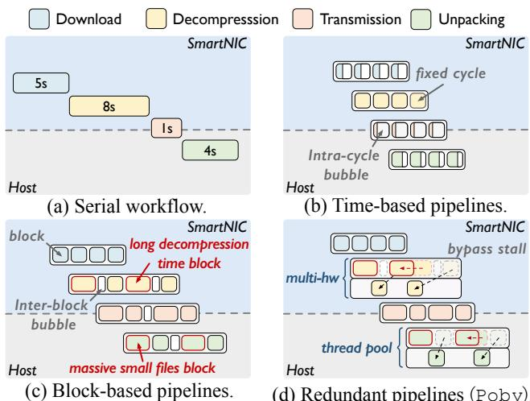  
Figure 7: Different designs of pipeline-based workflow.  
(d) Redundant pipelines (Poby).

Issue 1: Pipeline bubbles. Block-based pipelines still encounter pipeline bubbles. The primary factors contributing to these bubbles (Figure 7c) are:

• Differences in compression ratios cause varying sizes of decompressed blocks, leading to inconsistent decompression times. Figure 8 shows that the decompression time can vary by over 3.5× for 128 MB blocks from different images.

• Data blocks with massive small files take considerably longer to unpack, increasing processing time compared to blocks with fewer files.

To alleviate these bubbles, Poby constructs redundant hardware pipelines. Figure 7d illustrates the redundant hardware mechanism. For the decompression stage, Poby prioritizes the round-robin strategy to schedule blocks to local accelerators. When no local accelerators are available, Poby notifies the sender via the existing connection to decompress blocks before transmitting. For the unpacking stage, Poby maintains a dedicated unpacking thread pool on the host side and exploits the kernel scheduler to manage it. If a new block arrives while the previous one is still being unpacked, the new block will be scheduled to available cores.

Issue 2: Block size. Block-based pipelines face the classic pipeline cycle decision dilemma.

• A small block size wastes most of the time switching and setting environments, reducing pipeline efficiency. Figure 8 shows that the accelerator incurs a 6.9 ms startup time.

• A large block size reduces the parallelism of pipelines or even degenerates into layer-based pipelines.

To achieve high efficiency, Poby adopts an empirical value, 16 MB, as the block size. Firstly, a 16 MB block can amortize the startup time of decompression (Figure 8), which we speculate is related to hardware configuration and the minimum data processing granularity of the accelerator. Secondly, over 80% of the small layers are less than 16 MB [85], a 16MB block strikes a balance between the pipelining of large layers and the switching overhead of small blocks. In addition, the efficiency of the 16 MB block is also confirmed by Exp#5.

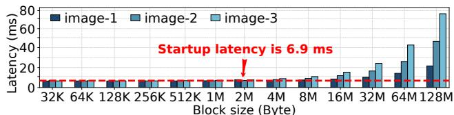  
Figure 8: The decompression latency of SmartNIC with different block sizes and images.

## 5.2 Data-driven Workflow

Issues with control-driven workflows. The block-based pipeline introduces a significant amount of control information into the conventional control-driven workflow. Figure 9 illustrates such a workflow, where the centralized on-NIC controller coordinates the execution of each decomposed image provisioning operation. The controller uses control messages to interact with hardware components, determining the start, completion, and downstream of operations. In block-based pipelines, images are split into numerous blocks, each requiring control information for orchestration. This consumes substantial resources and limits the concurrency of pipelines.

Data-driven workflow in Poby. Poby proposes a datadriven workflow to schedule the execution of block-based pipelines, eliminating the overhead of control messages. Instead of relying on centralized control, Poby integrates state information into data blocks and dynamically updates the information during execution. Each block contains two pieces of state information. (i) The block\_index specifies the position of a block in the layer and image, along with the total number of blocks in the corresponding layer. (ii) The block\_status indicates whether the block is compressed or not.

The complete pipeline-based data-driven workflow of Poby is as follows:

(1) The API agent parses the requests from users and sends them to the on-NIC controller.

(2) The on-NIC controller retrieves the locations of the image and establishes network connections to get image blocks.

(3) The download operation receives the block and assigns it based on block\_status to (i) available decompression queues (round-robin strategy) and (ii) transmission queue.

(4) The accelerator decompresses the blocks in its queue and assigns them to the transmission queue when completed.

(5) The transfer engine sends the blocks in its task queue to the host side and notifies the unpacking thread pool.

(6) The unpacking thread pool assigns worker threads to process blocks, updates progress and completion to the API agent according to the block\_status.

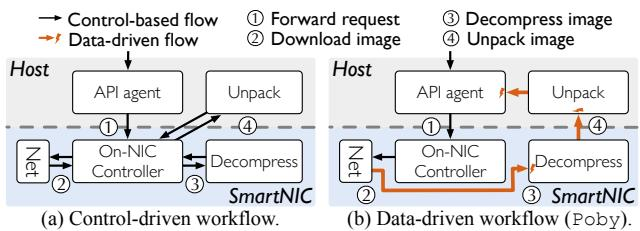  
Figure 9: Different designs of workflow models.

(7) All operations perform as above until its queue is empty. This data-driven workflow of Poby provides two major advantages. (i) The pipeline becomes self-driven, removing dependency on the on-NIC controller. In this workflow, hardware components track block statuses and pass them to subsequent stages upon completion. As shown in Figure 9b, the pipeline autonomously operates without requiring control-path intervention after initialization. (ii) Each block is uniquely identified, enabling precise tracking of provisioning. Firstly, Poby leverages block\_index to assess provisioning progress. For example, when the final block of a layer is processed, the corresponding image step is considered complete. Secondly, using the block\_status, Poby can bypass the decompression accelerator by sending remotely decompressed blocks (see §4.1) directly to the host for unpacking.

## 6 Distributed Image Download

The distributed image download of Poby is transparent to the host and incurs no additional overhead. Existing distributed image download studies [7, 39, 72, 76, 86] effectively address the performance bottlenecks of centralized registries. However, these studies introduce significant synchronization and storage overhead to actively cache images. As noted in [85], the total size of all publicly accessible images already exceeded 47 TB in 2017, and this number has undoubtedly grown larger since then. Go beyond existing works, Poby proposes best-effort distributed download and image metadata index to minimize cache overhead. Furthermore, Poby offloads distributed image management to SmartNIC, freeing the host from concerns about the management overhead.

Best-effort distributed download. The best-effort design only allows coldstart requests to download images from nodes that happen to contain the required image. Note that images on other nodes are from previous runs, rather than proactive caching. Only when no node contains the required image, Poby downloads it from the registry. Additionally, our distributed download operates at the image layer granularity, coldstart can download different layers from other nodes concurrently. The best-effort strategy offers two benefits: (1) It avoids the significant storage overhead of proactively caching. (2) It reduces the network bandwidth consumption needed for frequent synchronization of image updates across nodes. Note that Poby does not introduce additional coldstart latency, since it retains the original centralized image registry download scheme as a fallback. Once any error occurs during the processing of a layer, Poby immediately hands over the task to the original process without blocking the execution flow.

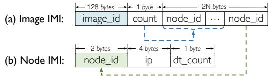  
Figure 10: Format of IMI.

Image metadata index (IMI). To enable best-effort distributed image download, we propose the image metadata index (IMI). On the one hand, the IMIs track the available locations of each image and the image transmission workload of each node. Here, we use the number of active image download tasks on each node to quantify the transmission workload. On the other hand, the IMIs associate the image digest with the image manifest to obtain all necessary image metadata (e.g., the number of image layers). Leveraging the IMI, the node initiating the coldstart can arrange the most efficient download plan by considering image locations, the number of layers, and each node’s workload. In short, it prioritizes downloading layers from nodes with fewer download tasks.

IMI format. As shown in Figure 10, we devise two data structures to hold the image and node information, respectively.

• Image\_IMI. The key of the Image\_IMI is the image digest image\_id, which uniquely identifies images. According to the OCI Image Format Specification [27], we use the SHA-512 algorithm to generate the 128-byte digest. The Image\_IMI value contains the available image locations referenced by the node\_id. Each Image\_IMI holds up to N node\_id slots, where N is a pre-configured constant. We use the count field to track the number of valid node\_id.

• Node\_IMI. Each node in Poby corresponds to a Node\_IMI, identified by the node\_Id field. The Node\_IMI values include the node IP address (ip) and the current number of active download tasks on this node (dt\_count). Each time the IMI service responds to an IMI query, it increments the dt\_count in the associated Node\_IMIs by one to indicate a new download task. When the download task is over, the node initiating the coldstart must notify the IMI service to decrement the dt\_count in the corresponding Node\_IMIs.

It is trivial to keep all IMIs in memory. Consider a system consisting of 50,000 nodes and 1,000,000 images. An image\_IMI records require 139 bytes if N is set to 5. Thus, it will take 0.35 MB for Node\_IMIs and 139 MB for Image\_IMIs in total.

IMI management. The IMI service manages all the IMI data, including IMI querying, node load tracking, and image location tracking. (1) For IMI querying, the IMI service returns the manifest and IMI of the required image to the node initiating the coldstart. (2) For node load tracking, the IMI service automatically increments the dt\_count in the Node\_IMIs when responding to an IMI query, indicating a new download task on these related nodes. Upon receiving a completion notice from a node, it updates the dt\_count accordingly. (3) For image location tracking, the IMI service simultaneously adds the node to the available locations in the Image\_IMI. If the number of available nodes exceeds N, we use the least recently used algorithm to update the node\_id list in Image\_IMI. If a node deletes a local image, it notifies the IMI service to remove its node\_id from the corresponding Image\_IMI. Here, our IMI service is colocated with the original registry, which just provides the required images when unavailable on any node (best-effort strategy). Since the IMI is far smaller than images, this prevents the IMI service from becoming a bottleneck in transmission and managing IMI.

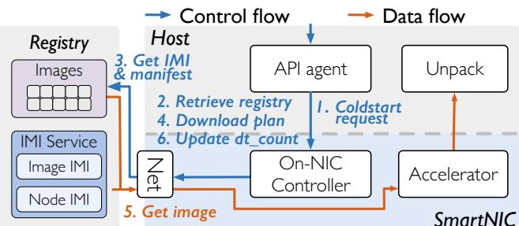  
Figure 11: Workflow of distributed image download.

Workflow. Figure 11 shows the complete workflow of the distributed image download. (1) The on-NIC controller receives the coldstart request from the API agent on the host. (2) The on-NIC controller sends the request for the desired image (image name and tag) to the registry. (3) The registry looks up the image digest based on the provided name and tag. Then, it retrieves the manifest and IMI using the image digest and returns them as a response. (4) The on-NIC controller makes the download plan based on Algorithm 1. (5) The pipeline-based data path downloads data blocks within each image layer from the planned nodes. (6) The on-NIC controller notifies the IMI service on the registry of the completion of the download task to decrease the dt\_count of the corresponding Node\_IMIs.

Algorithm 1 presents the pseudo-code to generate the most efficient distributed download plan. The algorithm assigns a provider for each layer according to the response (manifest and IMIs) from the IMI service. It achieves load balancing through the following steps: (1) Sort nodes containing the images in ascending order according to dt\_count (line 2). (2) Assign the node with the lowest image download load to the current layer (lines 5-6). (3) Switch to the next node when the load of the current node is greater than the next node (lines 7-10). (4) Repeat steps 2-3 to assign nodes for all layers (lines 4-10).

Discussion. We explore how Poby handles unexpected cases. Firstly, Poby can function even with inconsistent IMI. If a node deletes a local image and this change is not synchronized with the IMI service, inconsistencies may arise. In this case, the on-NIC controller verifies with planned nodes during

Algorithm 1 Download plan for distributed image download   
Input: manifest, image\_imi, node\_imi[list\_len]   
Output: download\_plan<layer\_id, ip>   
1: function GENERATE\_DOWNLOAD\_PLAN( )   
2: nodes = sort\_by\_dtcount\_ascend(node\_imi)   
3: node\_id = 0   
4: for all layer in mani f est.layers do   
5: download\_plan[layer.id] = node\_imi[node\_id].ip   
6: node\_imi[node\_id].dt\_count + +   
7: if node\_id == list\_len − 1 then   
8: node\_id = 0   
9: else if nodes[node\_id].dt\_count > nodes[node\_id + 1]   
then   
10: node\_id + +   
11: return download\_plan

RDMA connection setup that they have the required image. If a node is missing the image, the controller updates the download plan or pulls the image from the registry if none of the nodes have it. Secondly, Poby can handle unexpected image deletions. If a host deletes the image during the transmission, and the NIC remains unaware, corrupted data may be transmitted. Poby checks the checksum for each downloaded layer, and if a mismatch is detected, the controller identifies that node as faulty and re-downloads the layer from another node.

## 7 Implementation

We implement a prototype of Poby with NVIDIA BlueField-2 SmartNIC [14] and open-source it\*. We implement the disaggregated architecture with cross-hardware pipelines and a data-driven framework. These two works are mainly deployed on SmartNIC. For the IMI management, we integrate with existing components.

SmartNIC. BlueField-2 consists of three parts: (i) RDMA NIC, (ii) multi-core SoC, and (iii) hardware accelerators. According to the specifications, the total maximum power consumption of BlueField-2 is 150W. Considering the low-power characteristics of ARM cores and dedicated hardware accelerators, its power efficiency exceeds that of general-purpose host CPUs. Besides, the hardware vendor provides a software library called DOCA to support interactions with these hardware components. We encapsulate the library to build the disaggregated architecture of Poby.

Cross-hardware pipelines. The pipeline of Poby consists of two parts: data storage and processing. We implement the two parts with memory pool and thread pool.

• Memory pool. Poby pipelines the data path at block granularity. We implement a memory pool to manage blocks. It supports adjusting the size and number of blocks dynamically. Poby configures them according to image characteristics. The image characteristics include layer size and the number of layers. Poby gets them from the image manifest, which is the initial download in the entire workflow.

Table 1: Workload images adopted from benchmark suites.
<table><tr><td></td><td>Name</td><td>Specification</td><td>Source</td></tr><tr><td>Micro Service</td><td>Social Network (SN) Media Service (MS) Hotel Reservation (HR,small)</td><td>9 layers,90.6MB 23 layers,286.6MB 18 layers,39.6MB</td><td>DeathStar Bench [24]</td></tr><tr><td rowspan="2">FaaS</td><td>Python (PY) Node.js (JS) Golang (GO,medium) PHP (PP)</td><td>30 layers,155.1MB 21 layers,356.3MB 20 layers,281.6MB 37 layers,192.7MB</td><td>OpenWhisk [22]</td></tr><tr><td>pyaes (PS) linpack (LP) chameleon (CL) matmul (MT) ML Model (ML, large)</td><td>33 layers,169.9MB 33 layers,214.6MB 33 layers,170.1MB 33 layers,214.6MB 37 layers,2.45GB</td><td>Function Bench [30]</td></tr></table>

• Thread pool. To improve the efficiency of pipelines, Poby concurrently performs time-consuming steps such as downloading and unpacking. Specifically, Poby implements a thread pool for unpacking on the host with folly [20], a high-performance C++ library that provides a thread-pool API. The workers in the thread pool process different layers concurrently. Downloads also employ layer-grained concurrency. The scheduling of all pipeline threads is managed by the scheduler of Linux.

Data-driven workflow. We implement an RDMA-based remote procedure call (RPC) framework for data-driven workflow. The workflow uses two-sided RDMA verbs to support gRPC-like communication, and epoll to monitor multiple events occurring in pipelines (e.g., RDMA events, compression hardware events). To transmit data blocks with control messages, we place control messages into RPC parameters.

IMI management. The IMI service is a centralized component for managing IMI data and supporting retrieval. To ensure availability, we integrate it into the registry server and use leveldb [25] to store the IMIs. For the coldstart node, we implement the IMI logic into the on-NIC controller. When the on-NIC controller receives requests to coldstart or deletes images, it notifies the update of images to IMI service.

## 8 Evaluation

We evaluate the performance benefits of Poby with various images, and aim to answer the following questions.

• Q1 (End-to-end performance): How much can Poby speed up coldstart (§8.2)?

• Q2 (Concurrency and scalability): How does the latency of Poby change as the number of nodes and concurrent requests increase (§8.3)?

• Q3 (Latency breakdown): How much do the individual processes of Poby contribute to overall latency? (§8.4)?

• Q4 (Resource demand): What is the resource demand of Poby (§8.5)?

• Q5 (Architecture optimization): Is it possible to disaggregate Poby to different nodes (§8.6)?

## 8.1 Experimental Methodology

Testbed. We deploy our Poby prototype on two servers. Each server is equipped with two Intel Xeon Gold 6226R CPUs, 256 GB of memory, and an NVIDIA BlueField-2 SmartNIC. These servers run Ubuntu 22.04 LTS with the 5.15.0 Linux kernel. In addition, we use another server with a dual-port 100Gbps NVIDIA ConnectX-5 NIC [15] to run the image registry and IMI service.

Baselines. We compare Poby with two baselines.

• containerd [23] is the runtime of Docker, the most popular open-source containerization platform. It is an industrystandard container runtime and supports managing the life cycle of containers.

• iSulad [55] is a new container solution that has the advantage of being light, fast, and applicable to multiple architectures. The performance of iSulad is much better than containerd for pulling images, including download, decompression, and unpacking.

Workloads. We use a collection of images from real-world applications and two cloud benchmark suites as workloads for evaluation. Firstly, we use DeathStarBench [24] to represent microservice images. Secondly, we select Functionbench [30] images and four widely used language runtime images from OpenWhisk [22] as FaaS workloads. Thirdly, we choose three images of typical sizes from those images for detailed analysis. They are hotel-reservation (small), OpenWhisk-Golang (medium), and ML Model (large), with compressed sizes of 39.6 MB, 281.6 MB, and 2.45 GB, respectively. Table 1 displays all the information of workloads in detail.

Latency metrics. In this work, we measure the end-to-end coldstart latency to evaluate the performance of different systems. Poby focuses on image provisioning and all evaluated works adopt the same container runtime. Hence, the endto-end latency does not take the boot time of coldstart into account, as the boot time is the same across all systems.

## 8.2 End-to-end Performance

This experiment evaluates the performance of Poby with different images. We choose latency as a key performance metric and configure Poby with 2 unpacking threads (see §8.4). These images, which cover small, medium, and large sizes, can effectively illustrate the performance of Poby for different sizes of images.

[Exp#1] Performance improvement: Poby can speedup coldstart by 11.5× and 7.1× than containerd and iSulad on average. Figure 12a shows the coldstart latency of the three typical-size images on different systems. Poby reduces the latency of coldstart by up to 92.7%, and it outperforms two industry-standard container platforms, containerd and iSulad, with maximum speedups of 13.2× and 8.0×, respectively. Containerd takes more than 90 seconds for large images due to serial execution, while iSulad still takes 55.3 seconds with multi-threads. To further evaluate the acceleration of Poby for various containers, we compare the latency of containerd, iSulad, and Poby for all the images (Table 1) in Figure 12b. Poby is 11.5× and 7.1× faster than containerd and iSulad on average. The values of containerd and iSulad are relative latencies to Poby.

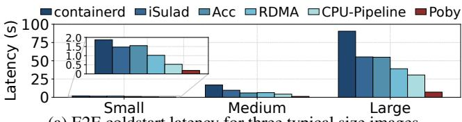  
(a) E2E coldstart latency for three typical size images.

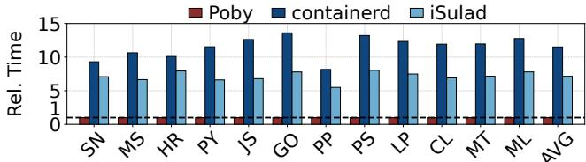  
(b) E2E coldstart latency for different images and average latency. Figure 12: [Exp#1] E2E coldstart latency.

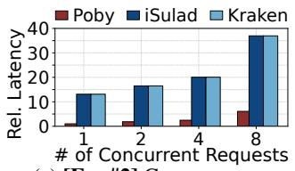  
(a) [Exp#2] Concurrency.

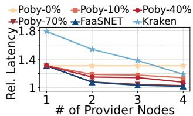  
(b) [Exp#3] Scalability.  
Figure 13: Latency of Poby and baselines with different (a) concurrent numbers and (b) provider nodes. Poby-N% represents Poby with a N% distributed download hit ratio.

To detail the performance improvements of our design compared to the original host CPU solution, we implemented two prototypes with RDMA (RDMA) and hardware accelerator (Acc) based on the original workflow. Furthermore, we implement a host CPU-based pipeline prototype (CPU-Pipeline) based on the RDMA version to demonstrate the performance gains from pipelines. Figure 12a shows that the direct utilization of hardware features (Acc and RDMA) only reduces coldstart latency by 20% compared to the host CPU solution, while pipeline (CPU-Pipeline) further reduces it by 34%. However, they still have a significant gap compared to Poby. Because the disaggregated pipelines of Poby efficiently leverage RDMA and accelerators on SmartNIC while addressing the issue of pipeline bubbles and small file transfer.

## 8.3 Concurrency and Scalability

We evaluate the concurrency and scalability of Poby and compare them with two baselines.

• Kraken [72] is a P2P-powered registry designed for image managementand distribution in cloud environment. Kraken has been in production at Uber, which can distribute 20K 100MB-1G blobs in 30 seconds.

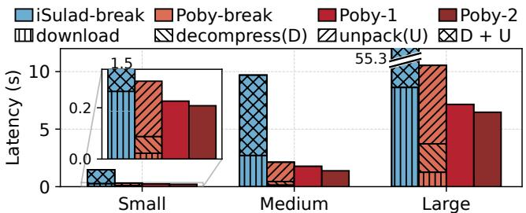  
Figure 14: [Exp#4] Latency and statistics of each process for iSulad and Poby. The overall latency includes unpacking with one (Poby-1) and two (Poby-2) threads. Poby-break represents the time accumulated by each step of the poby-1.

• FaaSNET [76] is a SOTA fast download work. Due to the lack of open-source access and unavailable details of the new image format, we simulate a simplified version without on-demand fetching using the distributed image download part in its paper.

[Exp#2] Concurrency: Poby is 4.8× faster than Kraken under 8 concurrent coldstart requests. We simultaneously generate coldstart requests on the same machine to evaluate the concurrency performance of Poby and iSulad. Figure 13a shows the average relative latency of Poby, iSulad, and Kraken under different numbers of concurrent requests. All latencies in the figure are relative to the latency of Poby under one request. In this experiment, Kraken gets the same latency as iSulad. Since in the scenarios of concurrent coldstart multiple images, Kraken cannot take advantage of P2P download. Meanwhile, Poby remarkably outperforms iSulad and Kraken from one to eight concurrent requests. As the number of concurrent connections increases to eight, the latency of Poby increases by 6×. Because the network bandwidth limits the performance of disaggregated pipelines of Poby. However, the latency of Poby is still 4.8× faster than that of iSulad and Kraken. It is worth noting that we do not limit the CPU resource (up to 96 cores) of iSulad. Because network bandwidth and the non-parallelizable portion (e.g., each layer) limit concurrency and infinite time reduction.

[Exp#3] Scalability: Poby performs much better than Kraken at a distributed download rate of only 10%, and achieves comparable scalability to FaaSNET at 70%. This experiment evaluates the scalability of Poby with our RDMA cluster, which consists of 5 nodes. We compare the average coldstart latency of Poby, FaaSNET, and Kraken. In each experiment, all 5 nodes simultaneously initiate one coldstart request, with the number of image providers ranging from 1 to 4. For example, the N providers experiment of Poby indicates that 5 nodes simultaneously initiate coldstart request once through Poby to download the image from N providers. Since Poby employs a best-effort distributed download strategy, with the hit rate balancing coldstart latency and storage overhead. This hit ratio represents the probability that Poby downloads the image from multiple nodes in one experiment. We measured the latency of Poby under different distributed download hit rates (e.g., Poby-10%). Figure 13b shows the latency of these systems in different cases. The values in this figure are the relative values of the corresponding system and images compared to Exp#1. The latency of Poby-0% shows that 5 concurrent requests exceeded the capacity of one provider, resulting in a 30% increase in latency. The decentralized image download alleviates image provision bottlenecks, and even a single additional provider can improve coldstart performance by 22%.

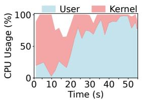  
(a) iSulad.

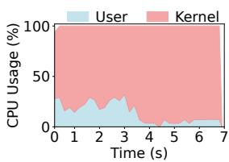  
(b) Poby.  
Figure 15: [Exp#5] CPU usage of iSulad and Poby for coldstarting the large image.

## 8.4 Latency Breakdown

We conduct latency analysis to quantify the execution time of each step for iSulad and Poby. Since Poby adopts pipelines to accelerate the data path, we cannot directly obtain the time consumption of each step. Here, we accumulate the time to process blocks for each step as the total time (Poby-break), though the time of these steps overlaps. Note that the decompression time of Poby consists of two parts: decompression on SmartNIC and data transmission to the host. This is because Poby integrates these two steps into a single SmartNIC operation to improve performance. iSulad does not require crosshardware transmission, but the decompression and unpacking operations are integrated (e.g., libarchive). Therefore, we measure the total time of the two operations (iSulad-break).

[Exp#4] Latency analysis: Poby can reduce the extraction time by 76.1%, and adding an additional unpacking thread can further reduce it by 11.0%. Figure 14 shows the latency breakdown for the typical-size images, where image extraction is the most time-consuming step for both iSulad and Poby. Poby reduces the extraction time by 76.1% than iSulad on average. This indicates Poby achieves an efficient architecture on the SmartNIC (§5). In addition, the unpacking process of Poby retained on the host still occupies an average of 71.6% of the total time. To further evaluate Poby with concurrent unpacking (storage backend support), we measure the latency of Poby with one (Poby-1) and two (Poby-2) unpacking threads. The 2-thread unpacking reduces the latency by 9.1% on average. Even for a small image, which is only 39.6 MB, it still reduces the latency by 4.4%. While for medium and large images, 2-thread reduces the latency by more than 11.0%. Besides, we measure Poby with more unpacking threads, but it does not gain further improvement. Because 2-threads unpacking already reached the bandwidth bottleneck of storage.

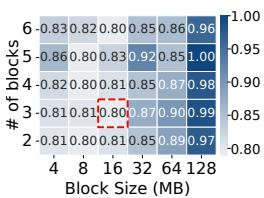  
(a) Small.

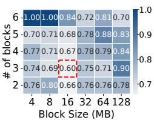  
(b) Medium.

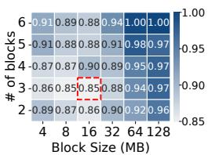  
(c) Large.  
Figure 16: [Exp#6] Latency of Poby for small, medium, and large images with different sizes and numbers of blocks.

## 8.5 Resource Demand

In the experiments, we evaluate the CPU and memory resource demand of Poby. The software and hardware environment for this experiment is the same as § 8.2.

[Exp#5] CPU usage: Poby offloads 45.3% of user-mode CPU usage on the host side to SmartNIC, and reduces CPU usage by 87.5%. Poby is designed to minimize the kernelmode execution. Specifically, Poby reduces the overall hostside CPU workload by offloading intensive user-mode tasks, such as decompression, to the SmartNIC. As a result, only the non-offloadable file-writing operations remain in kernel mode. For CPU usage, we measure the CPU utilization of Poby and iSulad on the host side. Figure 15a and 15b details the CPU usage of iSulad and Poby in kernel and user mode. Poby takes 6.8s for coldstart of the large image while iSulad takes 54.6s. Poby reduces 47.8s (87.5%) of CPU time than iSulad. The low utilization of iSulad from 14s to 19s is due to waiting for a large layer (> 1 GB) to finish downloading. Besides, Poby spends only 14.1% of CPU time in user mode, while iSulad spends 59.4%. It offloads 45.3% of user-mode tasks to SmartNIC, including control path and decompression. This indicates that Poby offloads most tasks to SmartNIC (except for unpacking), leaving only 5% of user-space CPU usage on the host side.

Additionally, offloading image provisioning to the Smart-NIC similarly encounters performance interference issues. Poby delegates the time- and resource-consuming decompression to the hardware accelerator, leaving the on-NIC CPU solely responsible for the control path. We evaluate the on-NIC CPU demands of Poby during the coldstart of all workload images, observing a peak on-NIC CPU usage of only 16.3% and an average usage as low as 3.0%. Given the low resource demand, we believe it feasible to reserve resources on the on-NIC CPU for Poby, effectively mitigating potential interference from other applications.

[Exp#6] Memory configuration: Poby achieves the lowest coldstart latency when configured with three 16MB blocks. Poby maintains a memory pool on the host side, which includes several pre-allocated blocks for receiving the decompressed data. The size of the blocks in the memory pool is consistent with the block-based pipelines. To obtain an optimal memory pool configuration, we measure the coldstart latency of Poby with different sizes and numbers of blocks. As we mentioned in §5, blocks larger than 2 MB can overcome the startup latency of accelerators on SmartNIC. Here, we vary the block size from 4 MB to 128 MB and the number of blocks in the memory pool from 2 to 6. Figure 16 illustrates the latency of coldstart for small, medium, and large images with different memory configurations. The following two observations confirm the analysis in § 5.1 and guide our configuration of the block size. For the small image, it aligns better with smaller block sizes. Because a single small block is sufficient to accommodate layers of the small image. Increasing the block size and number does not improve performance and may even lead to performance degradation due to worse data locality (blocks larger than the cache). For the medium and large images, 16 MB is an efficient block size for pipelined execution. As for the number, three blocks are sufficient for 2 unpacking threads, and increasing the number of blocks brings no additional benefit.

## 8.6 Architecture optimization

As mentioned in §4, Poby can alleviate local SmartNIC contention via network-wide offload. This experiment evaluates the performance of disaggregating Poby to different nodes.

[Exp#7] Network-wide offload: Poby achieves networkwide decompression offload with only 18.0% latency increase. This experiment configures one node as the coldstart requester and the other node as the decompression assistant. The requester sends image requests to the assistant for decompressing the image. Figure 17 compares the coldstart latency of local and remote decompression for Poby. It reveals that disaggregating Poby to remote nodes with RDMA is feasible for SmartNIC contention scenarios. The remote decompression only introduces 18.0% latency overhead compared to local decompression. Moreover, although the average compression ratio of images is as high as 2.7, the remote decompression only results in 2.2 Gbps network bandwidth overhead. Because Poby employs a block-based pipeline, the capability to decompress and unpack limits the excessive use of network bandwidth. As a result, the network bandwidth overhead of remote decompression is amortized across the entire coldstart process, preventing a surge in network bandwidth demand.

## 9 Related Work

Lightweight isolation. Some efforts propose lightweight isolation mechanisms to accelerate the container startup with coldstart [2,9,34,46,66]. We divide these works into two categories. Firstly, some systems [2,34] employ sensitive data protection techniques to share isolation environments. Secondly, other approaches utilize fine-grained isolation techniques (e.g., application- [46], language- [66], and thread- [34] level).

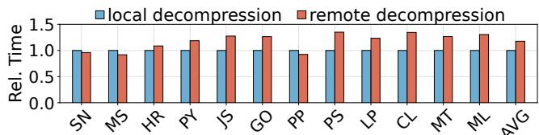  
Figure 17: [Exp#7] Latency of remote decompression relative to local decompression for Poby.

These methods completely update the existing isolation mechanism of cloud platforms, effectively mitigating the coldstart issue. Poby optimizes the pre-processing steps of creating isolation environments, which is orthogonal to lightweight optimization works and can be integrated together.

SmartNIC offload. Previous works [70, 79] characterize the performance of SmartNIC. Due to the integration of RDMA network cards, extensive researches continue on leveraging SmartNIC to enhance network performance. However, with the introduction of programmable hardware, most of the researches [4, 21, 32, 37, 43, 52, 56–59, 65] focus more on offloading tasks such as network functions, network protocol stacks, and package processing to SmartNIC. In addition, some works attempt to offload a broader range of applications. AlNiCo [40] accelerates transaction processing within a single node, while Xenix [63] applies to distributed scenarios. Similarly, LineFS [31] offloads distributed file systems with pipeline parallelism. Moreover, other studies apply SmartNIC to storage [36, 50, 57, 69, 84], microservice [12, 44, 45], remote function call [35, 67], and others [18, 26, 28, 42, 71, 77]. Specifically, Poby offloads FaaS coldstart to SmartNIC and uses on-NIC CPU to manage RDMA links and hardware acceleration to decompress layers.

## 10 Conclusion

Existing approaches ignore the most time-consuming step of coldstart. We complete the coldstart puzzle with Smart-NIC offloading and data-driven pipelines. We propose Poby, a software-hardware collaborative system that leverages emerging hardware SmartNICs to accelerate image provisioning directly. Poby disaggregates the architecture of coldstart and orchestrates appropriate hardware resources of the entire cluster to accelerate different operations within image provisioning. It achieves efficiency with data-driven pipelines. Our experiment with BlueField-2 shows that Poby performs well with different benchmark images.

## Acknowledgments

We sincerely thank our shepherd Sibin Mohan and anonymous reviewers for their valuable comments. This work is supported in part by the Strategic Priority Research Program of Chinese Academy of Sciences under grant number XDA0320000 and XDA0320300, the National Natural Science Foundation of China (Grant No. 62090022, U24B6012 and 62172388).

## References

[1] Siddharth Agarwal, Maria A. Rodriguez, and Rajkumar Buyya. A reinforcement learning approach to reduce serverless function cold start frequency. In 2021 IEEE/ACM 21st International Symposium on Cluster, Cloud and Internet Computing (CCGrid), pages 797– 803, 2021.

[2] Istemi Ekin Akkus, Ruichuan Chen, Ivica Rimac, Manuel Stein, Klaus Satzke, Andre Beck, Paarijaat Aditya, and Volker Hilt. SAND: Towards High-Performance serverless computing. In 2018 USENIX Annual Technical Conference (USENIX ATC 18), pages 923–935, Boston, MA, July 2018. USENIX Association.

[3] Lixiang Ao, George Porter, and Geoffrey M. Voelker. Faasnap: Faas made fast using snapshot-based vms. In Proceedings of the Seventeenth European Conference on Computer Systems, EuroSys ’22, page 730–746, New York, NY, USA, 2022. Association for Computing Machinery.

[4] Mina Tahmasbi Arashloo, Alexey Lavrov, Manya Ghobadi, Jennifer Rexford, David Walker, and David Wentzlaff. Enabling programmable transport protocols in High-Speed NICs. In 17th USENIX Symposium on Networked Systems Design and Implementation (NSDI 20), pages 93–109, Santa Clara, CA, February 2020. USENIX Association.

[5] Ioana Baldini, Paul Castro, Kerry Chang, Perry Cheng, Stephen Fink, Vatche Ishakian, Nick Mitchell, Vinod Muthusamy, Rodric Rabbah, Aleksander Slominski, et al. Serverless computing: Current trends and open problems. Research advances in cloud computing, pages 1–20, 2017.

[6] Rohan Basu Roy, Tirthak Patel, Rohan Garg, and Devesh Tiwari. Codecrunch: Improving serverless performance via function compression and cost-aware warmup location optimization. In Proceedings of the 29th ACM International Conference on Architectural Support for Programming Languages and Operating Systems, Volume 1, ASPLOS ’24, page 85–101, New York, NY, USA, 2024. Association for Computing Machinery.

[7] Soeren Becker, Florian Schmidt, and Odej Kao. Edgepier: P2p-based container image distribution in edge computing environments. In 2021 IEEE International Performance, Computing, and Communications Conference (IPCCC), pages 1–8. IEEE, 2021.

[8] Vivek M Bhasi, Jashwant Raj Gunasekaran, Prashanth Thinakaran, Cyan Subhra Mishra, Mahmut Taylan Kandemir, and Chita Das. Kraken: Adaptive container provisioning for deploying dynamic dags in serverless platforms. In Proceedings of the ACM Symposium on Cloud Computing, pages 153–167, 2021.

[9] Sol Boucher, Anuj Kalia, David G. Andersen, and Michael Kaminsky. Putting the "micro" back in microservice. In 2018 USENIX Annual Technical Conference (USENIX ATC 18), pages 645–650, Boston, MA, July 2018. USENIX Association.

[10] Marc Brooker, Mike Danilov, Chris Greenwood, and Phil Piwonka. On-demand container loading in AWS lambda. In 2023 USENIX Annual Technical Conference (USENIX ATC 23), pages 315–328, Boston, MA, July 2023. USENIX Association.

[11] James Cadden, Thomas Unger, Yara Awad, Han Dong, Orran Krieger, and Jonathan Appavoo. Seuss: Skip redundant paths to make serverless fast. In Proceedings of the Fifteenth European Conference on Computer Systems, EuroSys ’20, New York, NY, USA, 2020. Association for Computing Machinery.

[12] Sean Choi, Muhammad Shahbaz, Balaji Prabhakar, and Mendel Rosenblum. λ- nic: Interactive serverless compute on smartnics. In Proceedings of the ACM SIGCOMM 2019 Conference Posters and Demos, SIG-COMM Posters and Demos ’19, page 151–152, New York, NY, USA, 2019. Association for Computing Machinery.

[13] Alibaba Cloud. Faq about function execution. https://www.alibabacloud.com/help/en/fc/support/isthe-runtime-environment-released-after-a-functionreturns-a-response-can-i-reuse-the-cached-state-orresources-from-a-previous-invocation, 2020.

[14] NVIDIA Corporation. Nvidia bluefield-2 dpu: Data center infrastructure on a chip. https://www. nvidia.com/content/dam/en-zz/Solutions/Data-Center/ documents/datasheet-nvidia-bluefield-2-dpu.pdf, 2021.

[15] NVIDIA Corporation. Nvidia connectx-5 infiniband adapter cards. https://nvdam.widen.net/s/pkxbnmbgkh/ networking-infiniband-datasheet-connectx-5-2069273, 2021.

[16] Advanced Micro Devices. Alveo sn1000 smartnic accelerator card. https://www.xilinx.com/products/boardsand-kits/alveo/sn1000.html, 2024.

[17] ds2 lab. The function cold start traces from alibaba cloud function compute. https://github.com/ds2-lab/FaaSNet? tab=readme-ov-file#dataset-downloading, 2021.

[18] Dong Du, Qingyuan Liu, Xueqiang Jiang, Yubin Xia, Binyu Zang, and Haibo Chen. Serverless computing on heterogeneous computers. In Proceedings of the 27th ACM International Conference on Architectural Support for Programming Languages and Operating Systems, ASPLOS ’22, page 797–813, New York, NY, USA, 2022. Association for Computing Machinery.

[19] Dong Du, Tianyi Yu, Yubin Xia, Binyu Zang, Guanglu Yan, Chenggang Qin, Qixuan Wu, and Haibo Chen. Catalyzer: Sub-millisecond startup for serverless computing with initialization-less booting. In Proceedings of the Twenty-Fifth International Conference on Architectural Support for Programming Languages and Operating Systems, ASPLOS ’20, page 467–481, New York, NY, USA, 2020. Association for Computing Machinery.

[20] Facebook. Folly: Facebook open-source library. https:// github.com/facebook/folly, 2024.

[21] Daniel Firestone, Andrew Putnam, Sambhrama Mundkur, Derek Chiou, Alireza Dabagh, Mike Andrewartha, Hari Angepat, Vivek Bhanu, Adrian Caulfield, Eric Chung, Harish Kumar Chandrappa, Somesh Chaturmohta, Matt Humphrey, Jack Lavier, Norman Lam, Fengfen Liu, Kalin Ovtcharov, Jitu Padhye, Gautham Popuri, Shachar Raindel, Tejas Sapre, Mark Shaw, Gabriel Silva, Madhan Sivakumar, Nisheeth Srivastava, Anshuman Verma, Qasim Zuhair, Deepak Bansal, Doug Burger, Kushagra Vaid, David A. Maltz, and Albert Greenberg. Azure accelerated networking: SmartNICs in the public cloud. In 15th USENIX Symposium on Networked Systems Design and Implementation (NSDI 18), pages 51–66, Renton, WA, April 2018. USENIX Association.

[22] Apache Software Foundation. Openwhisk: Warmed containers. https://github.com/apache/openwhisk/blob /master/docs/warmed-containers.md, 2024.

[23] Cloud Native Computing Foundation. containerd. https://github.com/containerd/containerd, 2024.

[24] Yu Gan, Yanqi Zhang, Dailun Cheng, Ankitha Shetty, Priyal Rathi, Nayan Katarki, Ariana Bruno, Justin Hu, Brian Ritchken, Brendon Jackson, et al. An open-source benchmark suite for microservices and their hardwaresoftware implications for cloud & edge systems. In Proceedings of the Twenty-Fourth International Conference on Architectural Support for Programming Languages and Operating Systems, pages 3–18, 2019.

[25] Google. Leveldb. https://github.com/google/leveldb, 2023.

[26] Stewart Grant, Anil Yelam, Maxwell Bland, and Alex C. Snoeren. Smartnic performance isolation with

fairnic: Programmable networking for the cloud. In Proceedings of the Annual Conference of the ACM Special Interest Group on Data Communication on the Applications, Technologies, Architectures, and Protocols for Computer Communication, SIGCOMM ’20, page 681–693, New York, NY, USA, 2020. Association for Computing Machinery.

[27] Open Container Initiative. Oci image format specification. https://github.com/opencontainers/image-spec? tab=readme-ov-file, 2024.

[28] Houxiang Ji, Mark Mansi, Yan Sun, Yifan Yuan, Jinghan Huang, Reese Kuper, Michael M. Swift, and Nam Sung Kim. STYX: Exploiting SmartNIC capability to reduce datacenter memory tax. In 2023 USENIX Annual Technical Conference (USENIX ATC 23), pages 619– 633, Boston, MA, July 2023. USENIX Association.

[29] Svilen Kanev, Juan Pablo Darago, Kim Hazelwood, Parthasarathy Ranganathan, Tipp Moseley, Gu-Yeon Wei, and David Brooks. Profiling a warehousescale computer. In Proceedings of the 42nd Annual International Symposium on Computer Architecture, ISCA ’15, page 158–169, New York, NY, USA, 2015. Association for Computing Machinery.

[30] Jeongchul Kim and Kyungyong Lee. Functionbench: A suite of workloads for serverless cloud function service. In 2019 IEEE 12th International Conference on Cloud Computing (CLOUD), pages 502–504, 2019.

[31] Jongyul Kim, Insu Jang, Waleed Reda, Jaeseong Im, Marco Canini, Dejan Kostic, Youngjin Kwon, Simon ´ Peter, and Emmett Witchel. Linefs: Efficient smartnic offload of a distributed file system with pipeline parallelism. In Proceedings of the ACM SIGOPS 28th Symposium on Operating Systems Principles, SOSP ’21, page 756–771, New York, NY, USA, 2021. Association for Computing Machinery.

[32] Taehyun Kim, Deondre Martin Ng, Junzhi Gong, Youngjin Kwon, Minlan Yu, and KyoungSoo Park. Rearchitecting the TCP stack for I/O-Offloaded content delivery. In 20th USENIX Symposium on Networked Systems Design and Implementation (NSDI 23), pages 275–292, Boston, MA, April 2023. USENIX Association.

[33] Sumer Kohli, Shreyas Kharbanda, Rodrigo Bruno, Joao Carreira, and Pedro Fonseca. Pronghorn: Effective checkpoint orchestration for serverless hot-starts. In Proceedings of the Nineteenth European Conference on Computer Systems, EuroSys ’24, page 298–316, New York, NY, USA, 2024. Association for Computing Machinery.

[34] Swaroop Kotni, Ajay Nayak, Vinod Ganapathy, and Arkaprava Basu. Faastlane: Accelerating Functionas-a-Service workflows. In 2021 USENIX Annual Technical Conference (USENIX ATC 21), pages 805– 820. USENIX Association, July 2021.

[35] Nikita Lazarev, Shaojie Xiang, Neil Adit, Zhiru Zhang, and Christina Delimitrou. Dagger: Efficient and fast rpcs in cloud microservices with near-memory reconfigurable nics. In Proceedings of the 26th ACM International Conference on Architectural Support for Programming Languages and Operating Systems, ASP-LOS ’21, page 36–51, New York, NY, USA, 2021. Association for Computing Machinery.

[36] Bojie Li, Zhenyuan Ruan, Wencong Xiao, Yuanwei Lu, Yongqiang Xiong, Andrew Putnam, Enhong Chen, and Lintao Zhang. Kv-direct: High-performance in-memory key-value store with programmable nic. In Proceedings of the 26th Symposium on Operating Systems Principles, SOSP ’17, page 137–152, New York, NY, USA, 2017. Association for Computing Machinery.

[37] Bojie Li, Kun Tan, Layong (Larry) Luo, Yanqing Peng, Renqian Luo, Ningyi Xu, Yongqiang Xiong, Peng Cheng, and Enhong Chen. Clicknp: Highly flexible and high performance network processing with reconfigurable hardware. In Proceedings of the 2016 ACM SIGCOMM Conference, SIGCOMM ’16, page 1–14, New York, NY, USA, 2016. Association for Computing Machinery.

[38] Huaicheng Li, Mingzhe Hao, Stanko Novakovic, Vaibhav Gogte, Sriram Govindan, Dan R. K. Ports, Irene Zhang, Ricardo Bianchini, Haryadi S. Gunawi, and Anirudh Badam. Leapio: Efficient and portable virtual nvme storage on arm socs. In Proceedings of the Twenty-Fifth International Conference on Architectural Support for Programming Languages and Operating Systems, ASPLOS ’20, page 591–605, New York, NY, USA, 2020. Association for Computing Machinery.

[39] Huiba Li, Yifan Yuan, Rui Du, Kai Ma, Lanzheng Liu, and Windsor Hsu. DADI: Block-Level image service for agile and elastic application deployment. In 2020 USENIX Annual Technical Conference (USENIX ATC 20), pages 727–740. USENIX Association, July 2020.

[40] Junru Li, Youyou Lu, Qing Wang, Jiazhen Lin, Zhe Yang, and Jiwu Shu. AlNiCo: SmartNIC-accelerated contention-aware request scheduling for transaction processing. In 2022 USENIX Annual Technical Conference (USENIX ATC 22), pages 951–966, Carlsbad, CA, July 2022. USENIX Association.

[41] Zijun Li, Linsong Guo, Quan Chen, Jiagan Cheng, Chuhao Xu, Deze Zeng, Zhuo Song, Tao Ma, Yong Yang, Chao Li, and Minyi Guo. Help rather than recycle: Alleviating cold startup in serverless computing through Inter-Function container sharing. In 2022 USENIX Annual Technical Conference (USENIX ATC 22), pages 69–84, Carlsbad, CA, July 2022. USENIX Association.

[42] Jiaxin Lin, Adney Cardoza, Tarannum Khan, Yeonju Ro, Brent E. Stephens, Hassan Wassel, and Aditya Akella. RingLeader: Efficiently offloading Intra-Server orchestration to NICs. In 20th USENIX Symposium on Networked Systems Design and Implementation (NSDI 23), pages 1293–1308, Boston, MA, April 2023. USENIX Association.

[43] Jiaxin Lin, Kiran Patel, Brent E. Stephens, Anirudh Sivaraman, and Aditya Akella. PANIC: A High-Performance programmable NIC for multi-tenant networks. In 14th USENIX Symposium on Operating Systems Design and Implementation (OSDI 20), pages 243–259. USENIX Association, November 2020.

[44] Ming Liu, Tianyi Cui, Henry Schuh, Arvind Krishnamurthy, Simon Peter, and Karan Gupta. Offloading distributed applications onto smartnics using ipipe. In Proceedings of the ACM Special Interest Group on Data Communication, SIGCOMM ’19, page 318–333, New York, NY, USA, 2019. Association for Computing Machinery.

[45] Ming Liu, Simon Peter, Arvind Krishnamurthy, and Phitchaya Mangpo Phothilimthana. E3: Energy-Efficient microservices on SmartNIC-Accelerated servers. In 2019 USENIX Annual Technical Conference (USENIX ATC 19), pages 363–378, Renton, WA, July 2019. USENIX Association.

[46] Xuanzhe Liu, Jinfeng Wen, Zhenpeng Chen, Ding Li, Junkai Chen, Yi Liu, Haoyu Wang, and Xin Jin. Faaslight: general application-level cold-start latency optimization for function-as-a-service in serverless computing. ACM Transactions on Software Engineering and Methodology, 2023.

[47] Jean loup Gailly and Mark Adler. zlib: A massively spiffy yet delicately unobtrusive compression library. https://www.zlib.net/, 2024.

[48] Marvell. Marvell liquidio iii. https://www.xilinx.com/ products/boards-and-kits/alveo/sn1000.html, 2020.

[49] Microsoft. Azure functions hosting options. https:// learn.microsoft.com/en-us/azure/azure-functions/ functions-scale#cold-start-behavior, 2023.

[50] Jaehong Min, Ming Liu, Tapan Chugh, Chenxingyu Zhao, Andrew Wei, In Hwan Doh, and Arvind Krishnamurthy. Gimbal: Enabling multi-tenant storage disaggregation on smartnic jbofs. In Proceedings of the 2021 ACM SIGCOMM 2021 Conference, SIGCOMM ’21, page 106–122, New York, NY, USA, 2021. Association for Computing Machinery.

[51] Anup Mohan, Harshad Sane, Kshitij Doshi, Saikrishna Edupuganti, Naren Nayak, and Vadim Sukhomlinov. Agile cold starts for scalable serverless. In 11th USENIX Workshop on Hot Topics in Cloud Computing (HotCloud 19), Renton, WA, July 2019. USENIX Association.

[52] YoungGyoun Moon, SeungEon Lee, Muhammad Asim Jamshed, and KyoungSoo Park. AccelTCP: Accelerating network applications with stateful TCP offloading. In 17th USENIX Symposium on Networked Systems Design and Implementation (NSDI 20), pages 77–92, Santa Clara, CA, February 2020. USENIX Association.

[53] Netronome. Agilio cx smartnics. https://netronome. com/agilio-smartnics/, 2024.

[54] Edward Oakes, Leon Yang, Dennis Zhou, Kevin Houck, Tyler Harter, Andrea Arpaci-Dusseau, and Remzi Arpaci-Dusseau. SOCK: Rapid task provisioning with Serverless-Optimized containers. In 2018 USENIX Annual Technical Conference (USENIX ATC 18), pages 57–70, Boston, MA, July 2018. USENIX Association.

[55] openEuler. isulad. https://gitee.com/openeuler/iSulad, 2024.

[56] Phitchaya Mangpo Phothilimthana, Ming Liu, Antoine Kaufmann, Simon Peter, Rastislav Bodik, and Thomas Anderson. Floem: A programming system for NIC-Accelerated network applications. In 13th USENIX Symposium on Operating Systems Design and Implementation (OSDI 18), pages 663–679, Carlsbad, CA, October 2018. USENIX Association.

[57] Boris Pismenny, Liran Liss, Adam Morrison, and Dan Tsafrir. The benefits of general-purpose on-nic memory. In Proceedings of the 27th ACM International Conference on Architectural Support for Programming Languages and Operating Systems, ASPLOS ’22, page 1130–1147, New York, NY, USA, 2022. Association for Computing Machinery.

[58] Salvatore Pontarelli, Roberto Bifulco, Marco Bonola, Carmelo Cascone, Marco Spaziani, Valerio Bruschi, Davide Sanvito, Giuseppe Siracusano, Antonio Capone, Michio Honda, Felipe Huici, and Giuseppe Siracusano. FlowBlaze: Stateful packet processing in hardware.

In 16th USENIX Symposium on Networked Systems Design and Implementation (NSDI 19), pages 531–548, Boston, MA, February 2019. USENIX Association.

[59] Yiming Qiu, Jiarong Xing, Kuo-Feng Hsu, Qiao Kang, Ming Liu, Srinivas Narayana, and Ang Chen. Automated smartnic offloading insights for network functions. In Proceedings of the ACM SIGOPS 28th Symposium on Operating Systems Principles, SOSP ’21, page 772–787, New York, NY, USA, 2021. Association for Computing Machinery.

[60] Francisco Romero, Gohar Irfan Chaudhry, Íñigo Goiri, Pragna Gopa, Paul Batum, Neeraja J. Yadwadkar, Rodrigo Fonseca, Christos Kozyrakis, and Ricardo Bianchini. Faa\$t: A transparent auto-scaling cache for serverless applications. In Proceedings of the ACM Symposium on Cloud Computing, SoCC ’21, page 122–137, New York, NY, USA, 2021. Association for Computing Machinery.

[61] Rohan Basu Roy, Tirthak Patel, and Devesh Tiwari. Icebreaker: Warming serverless functions better with heterogeneity. In Proceedings of the 27th ACM International Conference on Architectural Support for Programming Languages and Operating Systems, pages 753–767, 2022.

[62] Divyanshu Saxena, Tao Ji, Arjun Singhvi, Junaid Khalid, and Aditya Akella. Memory deduplication for serverless computing with medes. In Proceedings of the Seventeenth European Conference on Computer Systems, EuroSys ’22, page 714–729, New York, NY, USA, 2022. Association for Computing Machinery.

[63] Henry N. Schuh, Weihao Liang, Ming Liu, Jacob Nelson, and Arvind Krishnamurthy. Xenic: Smartnicaccelerated distributed transactions. In Proceedings of the ACM SIGOPS 28th Symposium on Operating Systems Principles, SOSP ’21, page 740–755, New York, NY, USA, 2021. Association for Computing Machinery.

[64] Mohammad Shahrad, Rodrigo Fonseca, Inigo Goiri, Gohar Chaudhry, Paul Batum, Jason Cooke, Eduardo Laureano, Colby Tresness, Mark Russinovich, and Ricardo Bianchini. Serverless in the wild: Characterizing and optimizing the serverless workload at a large cloud provider. In 2020 USENIX Annual Technical Conference (USENIX ATC 20), pages 205– 218. USENIX Association, July 2020.

[65] Rajath Shashidhara, Tim Stamler, Antoine Kaufmann, and Simon Peter. FlexTOE: Flexible TCP offload with Fine-Grained parallelism. In 19th USENIX Symposium on Networked Systems Design and Implementation

(NSDI 22), pages 87–102, Renton, WA, April 2022. USENIX Association.

[66] Simon Shillaker and Peter Pietzuch. Faasm: Lightweight isolation for efficient stateful serverless computing. In 2020 USENIX Annual Technical Conference (USENIX ATC 20), pages 419–433. USENIX Association, July 2020.

[67] David Sidler, Zeke Wang, Monica Chiosa, Amit Kulkarni, and Gustavo Alonso. Strom: Smart remote memory. In Proceedings of the Fifteenth European Conference on Computer Systems, EuroSys ’20, New York, NY, USA, 2020. Association for Computing Machinery.

[68] Arjun Singhvi, Arjun Balasubramanian, Kevin Houck, Mohammed Danish Shaikh, Shivaram Venkataraman, and Aditya Akella. Atoll: A scalable low-latency serverless platform. In Proceedings of the ACM Symposium on Cloud Computing, pages 138–152, 2021.

[69] Shangyi Sun, Rui Zhang, Ming Yan, and Jie Wu. Skv: A smartnic-offloaded distributed key-value store. In 2022 IEEE International Conference on Cluster Computing (CLUSTER), pages 1–11, 2022.

[70] Lasse Thostrup, Daniel Failing, Tobius Ziegler, and Carsten Binnig. A dbms-centric evaluation of bluefield dpus on fast networks. In Rajesh Bordawekar and Tirthankar Lahiri, editors, International Workshop on Accelerating Analytics and Data Management Systems Using Modern Processor and Storage Architectures, ADMS@VLDB 2022, Sydney, Australia, September 5, 2022, pages 1–10, 2022.

[71] Maroun Tork, Lina Maudlej, and Mark Silberstein. Lynx: A smartnic-driven accelerator-centric architecture for network servers. In Proceedings of the Twenty-Fifth International Conference on Architectural Support for Programming Languages and Operating Systems, AS-PLOS ’20, page 117–131, New York, NY, USA, 2020. Association for Computing Machinery.

[72] Uber. Kraken: A p2p-powered docker registry that focuses on scalability and availability. https://github.com /uber/kraken, 2024.

[73] Dmitrii Ustiugov, Plamen Petrov, Marios Kogias, Edouard Bugnion, and Boris Grot. Benchmarking, analysis, and optimization of serverless function snapshots. In Proceedings of the 26th ACM International Conference on Architectural Support for Programming Languages and Operating Systems, ASPLOS ’21, page 559–572, New York, NY, USA, 2021. Association for Computing Machinery.

[74] Abhishek Verma, Luis Pedrosa, Madhukar Korupolu, David Oppenheimer, Eric Tune, and John Wilkes. Largescale cluster management at google with borg. In Proceedings of the Tenth European Conference on Computer Systems, EuroSys ’15, New York, NY, USA, 2015. Association for Computing Machinery.

[75] Tim Wagner. Understanding container reuse in aws lambda. https://aws.amazon.com/cn/blogs/compute/ container-reuse-in-lambda/, 2014.

[76] Ao Wang, Shuai Chang, Huangshi Tian, Hongqi Wang, Haoran Yang, Huiba Li, Rui Du, and Yue Cheng. Faasnet: Scalable and fast provisioning of custom serverless container runtimes at alibaba cloud function compute. In 2021 USENIX Annual Technical Conference (USENIX ATC 21), pages 443–457. USENIX Association, July 2021.

[77] Zeke Wang, Hongjing Huang, Jie Zhang, Fei Wu, and Gustavo Alonso. FpgaNIC: An FPGA-based versatile 100gb SmartNIC for GPUs. In 2022 USENIX Annual Technical Conference (USENIX ATC 22), pages 967– 986, Carlsbad, CA, July 2022. USENIX Association.

[78] Xingda Wei, Rongxin Cheng, Yuhan Yang, Rong Chen, and Haibo Chen. Characterizing off-path Smart-NIC for accelerating distributed systems. In 17th USENIX Symposium on Operating Systems Design and Implementation (OSDI 23), pages 987–1004, Boston, MA, July 2023. USENIX Association.

[79] Xingda Wei, Rongxin Cheng, Yuhan Yang, Rong Chen, and Haibo Chen. Characterizing off-path Smart-NIC for accelerating distributed systems. In 17th USENIX Symposium on Operating Systems Design and Implementation (OSDI 23), pages 987–1004, Boston, MA, July 2023. USENIX Association.

[80] Xingda Wei, Fangming Lu, Tianxia Wang, Jinyu Gu, Yuhan Yang, Rong Chen, and Haibo Chen. No provisioned concurrency: Fast RDMA-codesigned remote fork for serverless computing. In 17th USENIX Symposium on Operating Systems Design and Implementation (OSDI 23), pages 497–517, Boston, MA, July 2023. USENIX Association.

[81] Yanan Yang, Laiping Zhao, Yiming Li, Shihao Wu, Yuechan Hao, Yuchi Ma, and Keqiu Li. Flame: A centralized cache controller for serverless computing. In Proceedings of the 28th ACM International Conference on Architectural Support for Programming Languages and Operating Systems, Volume 4, ASPLOS ’23, page 153–168, New York, NY, USA, 2024. Association for Computing Machinery.

[82] Hanfei Yu, Rohan Basu Roy, Christian Fontenot, Devesh Tiwari, Jian Li, Hong Zhang, Hao Wang, and Seung-Jong Park. Rainbowcake: Mitigating cold-starts in serverless with layer-wise container caching and sharing. In Proceedings of the 29th ACM International Conference on Architectural Support for Programming Languages and Operating Systems, Volume 1, ASPLOS ’24, page 335–350, New York, NY, USA, 2024. Association for Computing Machinery.

[83] Tianyi Yu, Qingyuan Liu, Dong Du, Yubin Xia, Binyu Zang, Ziqian Lu, Pingchao Yang, Chenggang Qin, and Haibo Chen. Characterizing serverless platforms with serverlessbench. In Proceedings of the 11th ACM Symposium on Cloud Computing, pages 30–44, 2020.

[84] Jie Zhang, Hongjing Huang, Lingjun Zhu, Shu Ma, Dazhong Rong, Yijun Hou, Mo Sun, Chaojie Gu, Peng Cheng, Chao Shi, and Zeke Wang. Smartds: Middle-tiercentric smartnic enabling application-aware message split for disaggregated block storage. In Proceedings of the 50th Annual International Symposium on Computer Architecture, ISCA ’23, New York, NY, USA, 2023. Association for Computing Machinery.

[85] Nannan Zhao, Vasily Tarasov, Hadeel Albahar, Ali Anwar, Lukas Rupprecht, Dimitrios Skourtis, Amit S. Warke, Mohamed Mohamed, and Ali R. Butt. Largescale analysis of the docker hub dataset. In 2019 IEEE International Conference on Cluster Computing (CLUSTER), pages 1–10, 2019.

[86] Chao Zheng, Lukas Rupprecht, Vasily Tarasov, Douglas Thain, Mohamed Mohamed, Dimitrios Skourtis, Amit S Warke, and Dean Hildebrand. Wharf: Sharing docker images in a distributed file system. In Proceedings of the ACM Symposium on Cloud Computing, pages 174– 185, 2018.