①

USENIX

THE ADVANCED COMPUTING SYSTEMS ASSOCIATION

# Swift: Fast Performance Tuning with GAN-Generated Configurations

Chao Chen and Shixin Huang, Shenzhen Institutes of Advanced Technology, Chinese Academy of Sciences; Xuehai Qian, Tsinghua University; Zhibin Yu, Shenzhen Institutes of Advanced Technology, Chinese Academy of Sciences; and Shuhai Lab, Huawei Cloud

https://www.usenix.org/conference/atc25/presentation/chen-chao

# This paper is included in the Proceedings of the 2025 USENIX Annual Technical Conference.

July 7–9, 2025 • Boston, MA, USA ISBN 978-1-939133-48-9

Open access to the Proceedings of the 2025 USENIX Annual Technical Conference is sponsored by

P=-r.h mEesL

auuuJl9 PgleU

King Abdullah University of

Science and Technology

# Swift: Fast Performance Tuning with GAN-Generated Configurations

Chao Chen1, Shixin Huang1, Xuehai Qian2, and Zhibin Yu1,3

1Shenzhen Institutes of Advanced Technology, Chinese Academy of Sciences

2Tsinghua University

3Shuhai Lab, Huawei Cloud

## Abstract

This paper proposes Swift, a novel Bayesian Optimization (BO) based parameter configuration tuning approach for big data systems. The key idea is to leverage a generative AI approach, generative adversarial network (GAN) , to generate high quality configurations based on the evaluated configuration with the highest performance. Mixing these configurations with randomly generated ones has the effect of skewing search space toward the optimal configuration, leading to faster convergence and less optimization time. Our substantial experimental results on Apache Flink, Spark programs, and an industrial setting show that Swift significantly improves the performance of data analytics over state-of-the-art approaches in dramatically shorter time.

## 1 Introduction

To support a wide range of data analytics applications, frameworks such as Apache Spark [48] and Flink [45] typically provide more than one hundred configuration parameters. It is critical to set these parameters properly to achieve high performance. For instance, the Spark parameter memory.fraction [49] specifies the heap memory fraction for task execution and data storage. Its value significantly affects the performance of a program. A recent study [64] showed that tuning multiple parameters simultaneously can further improve program performance by up to 89×.

Unfortunately, tuning the configuration parameters to optimize performance is extremely challenging for two reasons. First, the tuning space is vast due to the large number of parameters and even larger range of values each parameter can take. For example, prior studies [4, 64] showed that there are 34 and 41 performance-critical parameters for Hadoop and Spark, respectively. Second, these parameters may interact with each other in a complex (e.g., non-linear) manner [1, 4, 8, 14, 31, 35, 64].

Due to the two challenges, traditional approaches for parameter tuning are not effective. The search approaches based on rules [60, 61] and analytical models [20] do not work well due to the over-simplified assumptions on parameter interactions. On the other side, approaches based on simulation [33,38,55,56] require many time-consuming simulations to find the optimized configuration, even for a single program. These limitations gave raise to the machine learning based (ML-based) approaches [1, 2, 35, 64] with significantly higher speedups over rule-based alternatives [60, 61].

ML-based approaches directly learn from a large number of experiments. However, it is time-consuming to collect samples by executing a program with a configuration on a real cluster. Indeed, the state-of-the-art ML-based approaches such as OPPerTune [42], SelfTune [26], PARIS [62, 63] and Quasar [10] do suffer from this drawback, e.g., SelfTune and OPPerTune collect 756 and 252 training samples for a single workload [26, 42].

Bayesian Optimization (BO) has been demonstrated to require the fewest number of iterations to converge [6]. For this reason, BO is adopted in highly efficient ML-based approaches such as CherryPick [2] as the search algorithm. Even though BO requires fewer iterations, evaluating the configuration in each iteration by executing the program on a real cluster would typically take at least minutes [64].

To make BO converge faster and more smoothly, we utilize a novel approach: generating the likely high quality configurations that lead to high performance for BO algorithm in each iteration, which leads to the key contribution of the paper: we propose a method named Swift to use Generative Adversarial Network (GAN) [16] to generate configurations from the target configuration, so that they share similar distribution.

To generate a high quality configuration, the goal is to ensure that the configuration itself and its corresponding performance are “similar but not too similar” to the target one. The generated configuration and the target configuration can be regarded as two equal-length vectors. Intuitively, the performance of a program should be similar if the distance between the two vectors is short. However, we show that this intuition is not true by the following experiments.

We first explore an intuitive and simple approach which is named One-Neighbor (ON). Essentially, ON uses the Manhattan distance to capture the similarity between configurations (vectors). However, we observed that configurations with similar vector distances to the target one can exhibit either similar or significantly different performance, rendering the approach ineffective for configuration generation. This led to our key insight: producing the “similar but not too similar” performance requires NOT ONLY a short distance between the two vectors BUT ALSO similar distributions of their element values. To this end, we identified Jensen-Shannon (JS) divergence [13] as the ideal metric, as it is a widely used method for quantifying the similarity between two probability distributions. By mathematic definition, JS divergence ranges from 0.0 to 1.0, and if a distribution is more similar to another one, the smaller JS divergence is. Notably, GANs inherently use JS divergence as a loss function to ensure generated images resemble input images. Although our work focuses on one-dimensional configuration vectors rather than images, we adapted this principle to our domain where training GANs is simple as well as fast.

Although leveraging GAN appears intuitive, its integration into BO optimization is not trivial and needs to be carefully designed. Overall, Swift works as follows. First, the GAN needs to be continuously trained by the “current best” evaluated and real sample with a noise that obeys a Gaussian distribution for each parameter. In each iteration, Swift uses GAN to generate 150 configurations in addition to 100,000 ones generated randomly. Thus, the pool that BO’s acquisition function selects the configurations to evaluate in an iteration is a mixture of GAN-generated and randomly generated configurations. After a configuration is chosen, it is evaluated through real execution, and if its performance is better than the “current best”, it is stored in the evaluated set (ES). The samples in ES will influence the selection in the future iterations. The details and rationales of the design will be explained in Section 3.2.

We comprehensively evaluate Swift using four Flink programs, twenty four Spark programs with three inputs each, and twenty three configuration-sensitive Spark SQL queries from TPC-DS [53]. We compare Swift against four state-of-theart approaches: CherryPick [2], Selecta [27], DAC [64], and GML [18]. Since the last three achieve comparative speedups but require significantly more time to achieve the speedups compared to CherryPick, we take CherryPick as our baseline. It is worth mentioning that OPPerTune [42] and SelfTune [26] require over 10× as many samples as Swift and thus we did not compare them with Swift in the experimental section.

The experimental results show that Swift improves the throughput of Flink programs tuned by CherryPick by up to 1.59× (1.28× on average), and reduces their latency by up to 1.68× (1.31× on average). Most importantly, Swift completes the optimization in only 5.8 hours while CherryPick takes at least 12.5 hours. For Spark programs, Swift reduces their execution time tuned by CherryPick by up to 2.2× (1.2× on average). Similar to Flink, Swift takes up to 156% less time (61% on average) than CherryPick to optimize the performance of the experimented Spark applications.

We also evaluate Swift with a Flink program in a production cluster of an internet giant. The program was optimized by manual tuning and the optimization took a performance engineer four days to complete. The results show that Swift improves the throughput of this manually optimized program by 2.3× and reduces its latency by 2.8× in only 6.8 hours.

The rest of this paper is organized as follows. Section 2 discusses the background and motivation. Section 3 describes ON and Swift in detail. Section 4 discusses the experimental setup. Section 5 analyzes the results. Section 6 describes the related work and Section 7 concludes the paper.

## 2 Background and Motivation

## 2.1 Configurations of Big Data Systems

MapReduce is the first programming model designed for big data analytics applications [9] with various implementations such as Apache Hadoop [46] and Spark [65]. Later, many other frameworks have been deployed in industry, such as big table [7], GraphLab [34] for machine learning, Storm [52] for stream analytics, Pregel [36] for graph analytics, and Flink [45] for fused batch and stream analytics.

Although these frameworks serve for different domains, they all need to set a number of configuration parameters. Some parameters specify resource-related factors including CPU, memory, and network resources. For example, spark.executor.memory of Spark specifies the memory capacity allocated for an executor. This block of memory is further divided into execution memory, user memory, and reserved memory (e.g., 300 MB). Their sizes are controlled by spark.memory.fraction [43]. Other frameworks such as Apache Flink have similar parameters. For instance, parameter taskmanager.memory.fraction in Flink specifies the relative amount of memory that the task manager reserves for sorting, hash tables, and caching of intermediate results. The performance of big data systems is significantly influenced by such configuration parameters.

## 2.2 Limitations of Prior Work

Recent ML-based configuration tuning approaches [4, 15, 20, 21, 64] for Hadoop and Spark have demonstrated significant speedups. But as a general challenge, ML-based approaches need to evaluate a large number of samples in the real cluster, which takes at least several minutes per sample. As a result, it takes a long time (e.g., days or weeks) for the training/optimization to obtain the optimal configurations.

Figure 1 shows the time used by Bayesian Optimization(BO) to tune the configuration parameters of six typicalSpark SQL queries (q14a,q14b,q23a, q23b, q64, and q72)

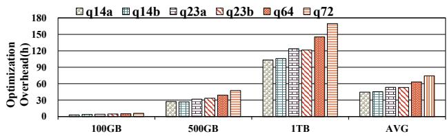  
Figure 1: The time taken by using BO to tune the configurations of queries $( \mathrm { e } . \mathrm { g } . , q 7 2 )$ from TPC-DS [53] for optimal performance.

from TPC-DS [53] for optimal performance with three different input data sizes. It shows that, when the data size is 500 GB, it takes more than 30 hours to optimize each single query’s performance. As the input data size increases, the time used to optimize its performance also increases rapidly. For example, it takes at least 100 hours when the input data size is 1 TB. In fact, the common size of data processed in industry ranges from several hundreds of GBs to TBs. As mentioned earlier, other ML algorithms require even longer time than BO to generate training samples to achieve same performance. The long training time significantly hinders the applicability of ML-based approaches in practice.

## 2.3 Bayesian Optimization

BO incorporates prior belief about objective function f and updates the prior with samples drawn from f to get a posterior that better approximates $f .$ In this paper, f is program’s performance $( p e r f )$ which is a function of configuration parameters $( c _ { i } )$ . Note that $p e r f$ can be execution time, latency, or other performance metrics. The goal is to find a vector $\{ c _ { 1 } , c _ { 2 } , . . . c _ { i } , . . . c _ { n } \}$ named optimal configuration that leads to the highest performance for a program with the minimal number of evaluations1. To efficiently search the optimal configuration, surrogate model and acquisition function play the key roles [28]. Different models lead to different efficiency and complexity. We need a model which achieves a good trade-off between the two. Mockus et al. [37] show that the Gaussian Process (GP) is well-suited to serve as a surrogate model. We therefore choose GP in this study.

Acquisition function is used to select the next sample in each BO iteration. The selected sample is expected to achieve the largest improvement. An effective acquisition function is Expected Improvement (EI)—picking the point which can maximize the expected (performance) improvement over the current best [40]. The detailed calculation of EI can be found in [40]. Here, we introduce its typical implementation [12] which is adopted and substantially modified in our system. In the implementation, a function called acq\_max is used to find the maximum of the acquisition function. It consists of two steps. First, it generates n\_warmup $( \mathrm { e . g . , 1 0 ^ { 5 } } )$ random samples and finds the sample (S1) with the maximum potential improvement. Second, it runs the L-BFGS-B algorithm [66] from n\_iter (e.g., 250) random starting points to find another sample (S2) with the maximum potential improvement. Finally, acq\_max chooses the sample with higher improvement from S1 and S2 as the next sample for evaluation (iteration). Both steps generate samples randomly.

## 2.4 Generative Adversarial Networks (GAN)

GANs belong to a new class of machine learning algorithms where generative (G) and discriminative (D) models are simultaneously generated in a competitive setting [17]. The objective of D models is to correctly label samples from either the G models or real data. In contrast, the objective of G models is to deceive the D models. In other words, the G models try to produce samples that are categorized as real data by the D models. As such, G models can be considered as a team of counterfeiters while D models are the law enforcement agents trying to detect the “counterfeit currency”. Both teams try to improve their methods until the counterfeits are indistinguishable from the genuine ones [16].

Advantages: GANs can generate data that have the distribution similar to the input data [16,17]. As a result, GANs are widely used to generate similar versions of the image, text, video, and audio object. By using GANs and machine learning, one can easily recognize objects such as trees, streets, bicyclists, persons, and parked cars, and can also calculate the distance between different objects. It is worth mentioning that although diffusion models [41] have been widely used, they are notorious for their large data requirements and longtraining process [24, 39]. GAN, however, works significantly faster and it can even outperform diffusion models for various datasets [25].

Disadvantages: GANs may be hard to train. The reason is two-fold: first, there are too many factors (e.g., features to represent a speech) to learn by the standard GAN algorithm; second, the criterion of being highly similar is too strict. For example, the generated speech is required to be exactly the same as the input one. This may make the training process of a GAN very lengthy. To address this issue, more than 1,000 GAN variants are developed to deal with a special use case [23]. For example, WGAN (Wasserstein GAN) proposes a better way to measure the distance between the generated data distribution and that of the input one, which can generate more similar image to the input image than the standard GAN does [3]. Since we consider at least 27 parameters, it is also challenging to train a standard GAN model. We address this challenge in Section 3.2.2.

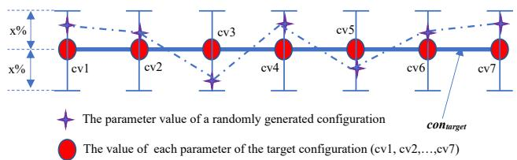  
Figure 2: An illustration of how ON generates configurations.

## 3 Configuration Generation

We propose two approaches to generate configurations: One-Neighbor (ON) and the Swift. ON is a simple approach that generates configurations according to a target configuration based on small random perturbations, whereas Swift leverages GAN to generate configurations that share similar distribution with the target sample.

We define a configuration as a vector conv where its elements are the parameter values, as shown in Equation (1).

$$
c o n \nu = \left\{ c _ { 0 } , c _ { 1 } , . . . , c _ { i } , . . . , c _ { n - 1 } \right\}\tag{1}
$$

where conv is a configuration, $c _ { i }$ is the $i ^ { t h }$ parameter value of conv. Example configuration parameters (ci) for Flink and Spark programs are shown in Table 1. n is the number of configuration parameters in conv. In this study, n is 27 for Flink and 34 for Spark, as shown in [44].

A sample is defined as equation (2) shows.

$$
s p \nu = \{ p f , c o n \nu \}\tag{2}
$$

where spv is a sample, p f is the performance (e.g., execution time or latency) of a program produced by configuration conv.

## 3.1 One-Neighbor

One-Neighbor (ON) generates a configuration by producing its each parameter value randomly around the corresponding value of the target with a noise threshold. ON assumes that similar configurations produce similar performance for a given big data program. The similarity between two configurations conv1 and conv2 can be measured as their in-between Manhattan Distance, as shown below in equation (7).

$$
M D ( c o n v _ { 1 } , c o n v _ { 2 } ) = | c _ { 1 1 } - c _ { 2 1 } | + . . . + | c _ { 1 n } - c _ { 2 n } |\tag{3}
$$

where $c _ { 1 1 }$ and $c _ { 1 n }$ are the first and $n ^ { t h }$ parameter value of conv1, c21 and $c _ { 2 n }$ are the first and $n ^ { t h }$ parameter value of conv2. To generate similar configurations according to a target configuration, we make the distance between two corresponding parameter values such as $\left| c _ { 1 1 } - c _ { 2 1 } \right|$ of two configurations be between 0 and x% (x is the threshold) randomly. The parameters are all normalized to [0.0, 1.0].

Figure 2 visualizes how ON generates configurations according to a target configuration $c o n \nu _ { t a r g e t }$ which is represented by the bold line. The red circles (e.g., cv1 and cv2) on the bold line denote the parameters values of the $c o n \nu _ { t a r g e t }$ . To generate a configuration conv similar to $c o n \nu _ { t a r g e t }$ , we need to generate each parameter value around the corresponding value (e.g., cv1) of $c o n \nu _ { t a r g e t }$ . To this end, as shown in Figure 2, we randomly generate a value between $( c \nu i - x \% \times c \nu i )$ and $( c { \nu } i + x ^ { \mathcal { I } _ { 0 } } \times c { \nu } i ) ( i = 1 , 2 , . . . , 7 )$ . The star marks show the generated parameter values, and the dashed line in Figure 2 shows a randomly generated conv.

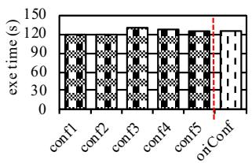  
(a) 5%

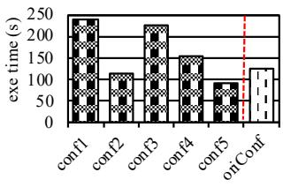  
(b) 25%

Figure 3: The performance made by ON generated configurations where the element values are within 5% (a) and 25% (a) of those of the original one.  
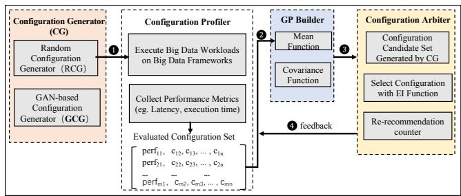  
Figure 4: The block diagram of Swift Methodology.

The hope is that, based on ON, the performance of a program configured by conv is similar to that of the program configured by $c o n \nu _ { t a r g e t }$ when the threshold x% is small (e.g., 5% or 25%). However, Figure 3 shows that it is not the case. First, when $x = 5 ,$ , the performance by the ON generated configurations is almost the same. This does not add valuable samples. Second, when x% is around 25%, the performance corresponding to conv (e.g., con f 1) can be as much as 2× slower than that of conv\_target (oriCon f shown in Figure 3(b)).

## 3.2 Swift

## 3.2.1 Overview

Swift is a BO-based fast configuration tuning mechanism for optimizing the performance of big data systems. The key idea is to generate some configurations by GAN in each iteration for BO’s acquisition function to choose from. These configurations highly likely produce high performance. Swift consists of four components shown in Figure 4.

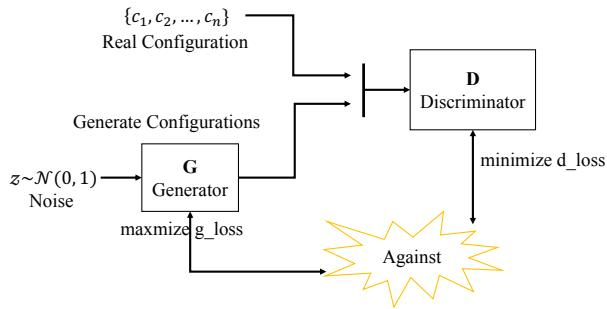  
Figure 5: How GAN generates configurations.

• Configuration generator generates a number of configurations, either randomly or using GAN.

• Configuration profiler executes a program with a configuration and records its performance (e.g., execution time). If a configuration’s performance is better than that of all samples in the evaluated set (ES), the configuration and its performance is inserted into ES as a new element.

• GP (Gaussian process) builder builds a model based on the samples in ES. The model is updated whenever a new sample is inserted in ES. It is used by BO.

• Configuration arbiter implements the new procedure in Swift that allow each BO iteration to select from a mixed pool of GAN-generated and random configurations.

## 3.2.2 Configuration Generator

Swift requires two configuration generators: a Random Configuration Generator (RCG) and a GAN-based Configuration Generator (GCG). The RCG sets each configuration parameter to a uniformly random value within the parameter’s value range. In contrast, GCG leverages GAN’s nature to generate the configuration that mimics the data distribution of the element values of target configuration.

Figure 5 shows how the GCG generates configurations. As explained before, a GAN consists of a discriminative model (D) and a generative model (G), which are both implemented by fully connected layers, as shown in Listing 1. GCG has two inputs: (1) the current target configuration that achieves high performance so far; and (2) a set of noise data which obey Gaussian distribution. The target sample is one of the samples in ES. A noise configuration is generated in two steps. First, we create a random value generator for each parameter. Second, we use a function (e.g., nextGaussian()) provided by a statistic software package (e.g., java.util) to generate values that obey Gaussian distribution for each parameter. In this way, we obtain a set of noise configurations where the values of each parameter obey Gaussian distribution.

The noise configuration is given to the Generator (G) and the target one (real\_conf0) is given to the Discriminator (D) of our GAN model, as shown in Listing 1. G consists of three fully connected layers. The first layer performs a nonlinear transformation by using the active function ReLu on the given noise configuration, generating G\_L1 as the output. The second layer performs another ReLu transformation on G\_L1, producing G\_L2. It is then given to the third layer to change its dimension to a specific number (e.g., the number of configuration parameters) and output G\_out.

D first uses ReLu to perform a non-linear transformation on the target configuration, producing D\_L0, as shown in lines 12 and 13. Subsequently, D\_L0 is given to the next layer, performing another non-linear transformation by using the active function sigmoid, as well as generating a probability prob\_conf0 ranging from 0.0% to 100.0%. Next, D performs a ReLu transformation on G\_out and produces D\_L1 which is given to the next layer of D to perform a sigmoid transformation, generating another probability prob\_conf1. It is used to calculate the G\_loss to improve G to generate configurations more similar to the target. At the same time, the probabilities prob\_conf0 and prob\_conf1 are used to compute the D\_loss to improve D to distinguish the target configuration from the generated ones more accurately.

```prolog
1 Listing 1 An implementation of GAN.
2
4 dim =27 # t h e n u m b e r o f c o n f i g u r a t i o n p a r a m e t e r s
with tf. variable_scope ( ’ G e n e r a t o r ’ ):
6 G_in=tf. placeholder(tf.float32 ,[None ,dim])
7 G_L1=tf.layers.dense(G_in ,128 ,tf.nn.relu)
8 G_L2=tf.layers.dense(G_L1 ,64 ,tf.nn.relu)
9 G_out=tf.layers.dense(G_L2 ,dim)
10
11 with tf . variable_scope ( ’ D i s c r i m i n a t o r ’ ):
12 D_L0=tf.layers.dense(real_conf0 ,128 ,
13 tf.nn.relu)
14 prob_conf0=tf.layers.dense(D_L0 ,1 ,
15 tf.nn.sigmoid)
16 D_L1=tf.layers.dense(G_out ,128 ,
17 tf.nn.relu , reuse=True)
18 prob_conf1=tf.layers.dense(D_L1 ,1 ,
19 tf.nn.sigmoid , reuse=True)
20
21 22 D_loss= -tf.reduce_mean(tf.log(prob_conf0)
+tf.log(1 - prob_conf1 ))
G_loss=tf.reduce_mean(tf.log(1 - prob_conf1 ))
```

Note that the goal of the non-linear transformations performed by the active functions ReLu and sigmoid is to capture the complex features such as data distribution hidden in the values of the target configuration. This makes it possible to use GAN to generate configurations according to only one target configuration, i.e., the one with top-1 performance. A similar approach has been used in computer vision where the authors use GAN to repair a tiger face paint [58]. The inputs of their GAN are one damaged paint and some noise data.

Solution for the hard-training issue. The ultimate goal of GAN in general applications such as image generation is to make prob\_conf0 = prob\_conf1. To achieve this goal, the training of GAN may suffer from the “hard-training” issue— the training process may lead to an infinite loop to satisfy the above condition. However, usage of GAN in Swift does not suffer from this problem for two reasons. First, the data type in Swift is one dimension (vector), instead of two (image) or higher dimension in other applications. As a result, the training process is easier.

Second, Swift does not and should not need the above condition, because the generated configuration is not expected to have the same performance. It is not only unnecessary but also harmful to the search, i.e., if we always achieve the same performance, BO cannot find the better configuration. Thus, it is in fact required to let the performance be within a range (e.g., ±25%) of the performance of target sample, which provides the opportunity to generate better configurations.

Guided by these rationales, we train the GAN for a fixed number of iterations(i.e., 20 in our experiments). We observe that it typically ensures the performance of generated configurations remains within ±25% of the target sample’s performance. Notably, even if 20 iterations fail to bring the performance within ±25%, this does not hinder the optimization process—we can still utilize the generated configurations to complete the search for optimal configurations and achieve the best possible result.

## 3.2.3 Configuration Profiler

The configuration profiler executes a program with a configuration and records its performance, generating a sample $s p \nu = \{ p f , c o n \nu \}$ defined in equation (2). After profiling a program a number of times, all the vectors form a matrix that represents ES as shown in Figure 4. A configuration is considered to be evaluated if we know its performance, but it is only inserted into ES if its performance is better than the performance of all rows in ES.

## 3.2.4 Gaussian Process Builder

To build a GP that outputs the performance $p f$ of a program with a given configuration, we first leverage the configuration profiler to generate kk vectors (spv). Then, we use these samples to calculate the initial performance mean and covariance cov between the performance and a configuration as follows.

$$
\widetilde { p f } = ( \sum _ { i = 1 } ^ { k k } p f _ { i } ) / k k ; \widetilde { c f _ { j } } = ( \sum _ { i = 1 } ^ { k k } c f _ { j i } ) / k k\tag{4}
$$

$$
c o \nu ( p f , c f _ { j } ) = ( \sum _ { i } ^ { k k } ( p f _ { i } - \widetilde { p f } ) ( c f _ { j i } - \widetilde { c f _ { j } } ) ) / k k\tag{5}
$$

with $\widetilde { p f }$ the mean performance of the kk executions, $p f _ { i }$ the performance in the $i ^ { t h }$ sample, $c f _ { j }$ the $j ^ { t h }$ value of a sample, and $c f _ { j i }$ the value of the $j ^ { t { \bar { h } } }$ parameter of the $i ^ { t h }$ sample.

Thus far, we already have the two essential elements, mean and covariance functions, to define a GP. The last element we need to build a GP is the smooth kernel function which represents how similar two configuration parameters are in terms of performance. If two configuration parameters perform similarly, they have high covariance, and vice versa.

There are numerous smooth kernel functions that satisfy this need. We choose Matern5/2 [59] as it does not require strong smoothness and is preferred to model practical functions [40]. During BO, the GP model is updated when ES is updated.

## 3.2.5 Configuration Arbiter

This component is responsible for guiding the steps for each BO iteration. To clarify the mechanisms of Swift, let us first explain the iterative process in the conventional BO as shown in Figure 6 (a). All the components in Swift can be repurposed for conventional BO as the needed functionality is the same or simpler. In each iteration, a number of configurations (e.g., 100,000 in the example) are randomly generated by the configuration generator. Then, the internal BO algorithm selects a configuration using the acquisition function (EI) for this iteration. If the configuration is not already contained in ES, the configuration profiler executes the program on the real cluster. The execution takes the majority of time of an iteration and the BO optimization. Ideally, the BO algorithm will select the configuration with less and less execution time, so the time spent in each iteration will decrease. A sample is inserted into ES if its performance is higher than the one with the highest performance in the current ES, i.e., “current best”; otherwise (or the selected configuration is already in ES), it is discarded and the BO moves to the next iteration. It means that the effort in this iteration is wasted.

The number of iterations (and the total BO optimization time) is determined by the quality of configurations selected in each iteration: good selections lead to faster execution time decrease and less number of iterations. However, with random configuration generation, the BO algorithm, which needs to consider both exploitation and exploration, may occasionally select a configuration that leads to longer execution time. It will directly increase the BO optimization time.

In our experiments, we observe that the execution time based on a configuration can be 2× slower than the execution in the previous iteration. The iterative BO optimization terminates when the performance does not improve for a number (e.g., five in the example) of consecutive iterations. At this point, the configuration of the sample with the highest performance is given as the outcome. With random configuration generation, the execution time decrease can be slow with fluctuation. We conceptually provide how the execution time is changed over iterations on the left of Figure 6 (c).

Swift reduces the BO optimization time by mixing the randomly generated configurations for each iteration with GAN-generated configurations that have similar distribution with the “current best”. This design emphasizes both exploitation, which takes advantage of the previously obtained information—the target sample—to acquire rewards, and exploration, which tries to reach the global optimal with random samples. The workflow of configuration arbiter is shown in Figure 7, and Figure 6 (b) shows a concrete example.

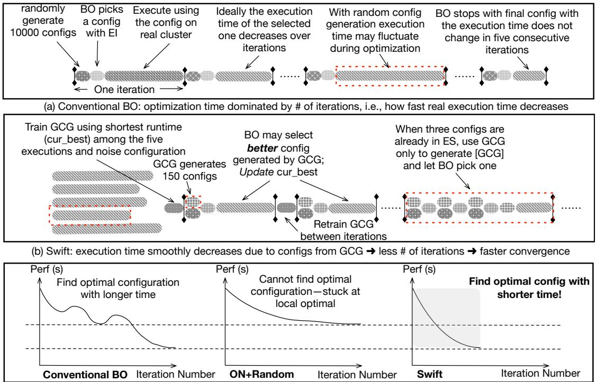  
(c) Conceptual demonstration of performance over iteration/time in three methods: i) conventional BO; ii) Use ON instead of GCG; iii) Swift: use a mix of configurations generated by GCG and generated randomly

Figure 6: Comparing Conventional BO and Swift  
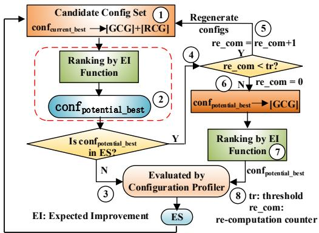  
Figure 7: Workflow of the configuration arbiter.

For GAN to generate configurations, it needs to be trained first. To do that, Swift first randomly generate five configurations and evaluate them on the real cluster; the configuration with highest performance among the five is used as the target sample to train the GAN with a noise configuration that obey Gaussian distribution for each parameter. The training procedure is described in Listing 1 and can be done very fast, e.g., several seconds. The training of GAN is triggered whenever the “current best” is updated.

After the first training, BO iterations can start. Different from the conventional BO, the candidate configuration pool is composed of [RCG], a large set (e.g., 100,000) of configurations generated, and [GCG], a small set (e.g., 150) of configurations generated with GAN (step ①). Then, the same to the conventional BO, the algorithm selects the configuration with the highest potential performance (step ②). The high quality configurations in [GCG] can help the BO algorithm to overcome the “bad luck” and make it more likely to select good configurations. As a result, compared to BO, the selected configuration in each iteration in Swift tends to be better with faster and more consistent execution time decrease, which is shown conceptually on the right of Figure 6 (c). This benefit is clearly observed in our experiments, see Figure 19.

If the selected configuration is not already in ES, it is evaluated by the configuration profiler (step ③). Otherwise, Swift gives a small number of chances to re-generate [GCG]+[RCG] and repeat the selection (step ④ and ⑤). The threshold is controlled by tr and is set to three in our experiments. The counter re\_com keeps the number of re-generation attempted. After re\_com reaches tr, if the selection is still contained in ES, Swift will generate a new pool of candidates just by [GCG] without the random configurations (step ⑥). BO selects a configuration from the set as the last attempt (step ⑦) before moving to the next iteration. If the selected configuration is not in ES, it is evaluated by the configuration profiler (step ⑧).

For simplicity, we do not show the case when the selected configuration is already in ES in Figure 7. In this case, Swift moves to the next iteration. The rationale for this design is to capture the following scenario. BO may try to select a configuration in [RCG] with the highest performance potential, but it is already in ES. However, the second or third best is a configuration in [GCG]. Instead of wasting the iteration, after tr attempts to select from [GCG]+[RCG], BO can just focus on [GCG] and still select a high quality configuration.

In principle, we can replace the [GCG] generated by GAN with configurations generated by ON with small perturbation so that the performance is within ±25%. However, as discussed before, such configurations are too similar to the target one and will negatively affect the search. The issue is that, such very similar configurations with good performance tend to make the BO algorithm more likely to stuck at the local optima when terminated. It is conceptually illustrated in the middle of Figure 6 (c). Although the performance increases consistently, but the mix of ON generated and random configurations make search stop with a sub-optimal performance.

## 3.2.6 Termination Condition

To design the termination condition for Swift, we first define the performance improvement as follows.

$$
i m p = \frac { | p f _ { i + 1 } - p f _ { i } | } { p f _ { i } } \times 1 0 0 \%\tag{6}
$$

with imp the performance improvement in percentage, and p fi and $p f _ { i + 1 }$ the performance of the $i ^ { t h }$ and $( i + 1 ) ^ { t h }$ iterations, respectively. During the iterations of Swift, if we observe imp is less than a threshold (e.g., 5%) and N (e.g., 6) iterations have been performed, we terminate Swift searching and take the configuration found in the last iteration as the optimal configuration. This ensures that Swift does not terminate the search too soon and only finds the sub-optimal configurations. Moreover, this also prevents Swift from struggling to make marginal improvements.

## 4 Experimental Setup

## 4.1 Apache Flink Experimental Setup

Our experimental cluster consists of four Linux servers. One server serves as the master node which runs the Job Manager and the other three serve as slave nodes which execute the Task Managers. Each server is equipped with an Intel(R) Xeon(R) CPU E5-2407 2.20GHz 4-core processor and 32GB DRAM. The OS of each node is SUSE Linux Enterprise Server 11. We use Flink 1.4.2 in this study.

We evaluate four programs from the Flink version of Hi-Bench: FixWindow (FW) is a window-based aggregation which evaluates window operations in the stream frameworks. WordCount (WC) tests the performance of the stateful operators and the cost of checkpoints/Ackers. Repartition (RP) evaluates the shuffle efficiency. Identity (ID) tests the read-/write efficiency of an external input source represented by a

Kafka cluster. Data streams for all the benchmarks are from a Kafka cluster [47], and the input data speed is 1000MB/s.

We also evaluate Swift on a real production cluster of an internet giant. In this experiment, we use two docker containers as Job Managers and ten docker containers as Task Managers. The docker containers are managed by a customized version of Kubernetes [50]. Each container is equipped with 4 CPU cores (Intel(R) Xeon(R) CPU E5-2698 v3 @ 2.30GHz), 8GB memory, and 10GB/s Ethernet network. All the containers share a 100GB network disk. The OS is CentOS 7 with Linux kernel 3.10.0-327.28.3.el7.x86\_64 and the Apache Flink version is 1.4. We use a real-time log analysis program written in Flink, which has been manually optimized by the engineers of the company. This optimization took the engineers four days and we use the optimized performance as our baseline.

We choose a wide range of Flink configuration parameters that significantly influence performance, including memory management, execution behavior, networking, parallelism, etc. Table 1 shows 5 example parameters and all the 27 parameters experimented in this study are shown in [44]. The last column of Table 1 provides the default values of the parameters and can be found at Apache’s website [11]. The third column shows the value range of each parameter.

## 4.2 Spark Experimental Setup

Our Spark cluster consists of eight servers. One server serves as the master and the others serve as slaves. Each server is equipped with Intel (R) Xeon (R) CPU E5-2630 v3 @2.40GHz and 64GB of memory. The OS of each server is Ubuntu 16.04 LTS and Spark version is 2.2. The resource manager is Yarn v1.22.19.

We employ 24 Spark benchmarks from HiBench [51], each with 3 input data sets. These benchmarks cover a wide range of Spark applications including machine learning, web searching, graph processing, SQL, and micro-benchmarks.

As discussed earlier, we choose a wide range of Spark configuration parameters that significantly influence performance, including shuffle behavior, data serialization, memory management, execution behavior, networking, etc. Table 1 shows five example configuration parameters and [44] lists all the 34 experimented parameters in detail. The last column of Table 1 provides the default values of parameters which are recommended by the Spark team [43]. The third column shows the value range of each parameter.

It is worth mentioning that Swift does not distinguish hardware specific configurations, i.e., configurations generated by Swift for a Spark or Flink program on one hardware platform are optimal on this specific platform and are essentially not portable to a different platform.

Table 1: Description of five example Flink and five example Spark configuration parameters.
<table><tr><td rowspan=1 colspan=1>Framework</td><td rowspan=1 colspan=1>Configuration Parameters-Description</td><td rowspan=1 colspan=1>Range</td><td rowspan=1 colspan=1>Default</td></tr><tr><td rowspan=5 colspan=1>Flink</td><td rowspan=1 colspan=1>parallelism.default - The default parallelism for programs that have no parallelism specified.</td><td rowspan=1 colspan=1>1-24</td><td rowspan=1 colspan=1>1</td></tr><tr><td rowspan=1 colspan=1>taskmanager.numberOfTaskSlots - # of parallel operator or function instances a TaskManager runs.</td><td rowspan=1 colspan=1>1-8</td><td rowspan=1 colspan=1>1</td></tr><tr><td rowspan=1 colspan=1>jobmanager.heap.mb- JVMheap size (in megabytes) for the JobManager.</td><td rowspan=1 colspan=1>1024-4096</td><td rowspan=1 colspan=1>1024</td></tr><tr><td rowspan=1 colspan=1>taskmanager.heap.mb- JVM heap size (in megabytes) for the TaskManager.</td><td rowspan=1 colspan=1>1024-10240</td><td rowspan=1 colspan=1>1024</td></tr><tr><td rowspan=1 colspan=1>taskmanager.memory.fraction- The relative amount of memory that the task manager reserves.</td><td rowspan=1 colspan=1>0.5-0.8</td><td rowspan=1 colspan=1>0.7</td></tr><tr><td rowspan=5 colspan=1>Spark</td><td rowspan=1 colspan=1>spark.shuffle.file.buffer- Size of the in-memory buffer for each shuffle file output stream,in KB.</td><td rowspan=1 colspan=1>2-128</td><td rowspan=1 colspan=1>32</td></tr><tr><td rowspan=1 colspan=1>spark.executor.cores-The number of cores to use on each executor.</td><td rowspan=1 colspan=1>4-30</td><td rowspan=1 colspan=1>core #</td></tr><tr><td rowspan=1 colspan=1>spark.driver.memory-Amount of memory to use for the driver process, in MB.</td><td rowspan=1 colspan=1>1024-36864</td><td rowspan=1 colspan=1>1024</td></tr><tr><td rowspan=1 colspan=1>spark.executor.memory-Amount of memory to use per executor process,in MB.</td><td rowspan=1 colspan=1>7168-36864</td><td rowspan=1 colspan=1>1024</td></tr><tr><td rowspan=1 colspan=1>spark.memory.fraction-Fraction of (heap space - 3ooMB) used for execution and storage.</td><td rowspan=1 colspan=1>0.5-1</td><td rowspan=1 colspan=1>0.75</td></tr></table>

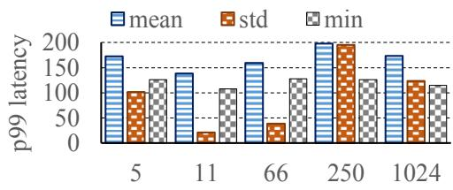  
Figure 8: The variation of $9 9 ^ { t h }$ percentile latency of wordcount. The X axis represents the 5 random seeds.

## 5 Results and Analysis

## 5.1 Study of GAN Related Issues

Impact of Random Seed In Swift, the randomness in the 5 initial executions may lead to great uncertainty. To study this, we employ 5 random seeds to generate 5 configurations for the Flink version of wordcount. We run it with the generated configurations and observe the mean, standard deviation and minimum of the $9 9 ^ { t h }$ percentile latency. Figure 8 shows the results with random seeds (5, 11, 66, 250, and 1024). We see that the means and standard deviations of the $9 9 ^ { t h }$ percentile tail latency of wordcount are significantly different among each other. However, the standard deviation of the minimum $9 9 ^ { t h }$ percentile tail latency with different random seeds is 8.7 and the corresponding coefficient of variation (CoV) is only 0.06, which indicates that the latency is highly similar. Thus, the different random seeds do not affect Swift very much.

Thus we run one experiment using the default seed and do not use different seeds with multiple runs. We argue that on the one hand, if different seeds are utilized, the optimal performance and configuration may vary, the search processes exhibit similar experimental results, as proved by small CoV values. On the other hand, many benchmarks are evaluated (4 Flink and 24 Spark programs), which eliminate the randomness of one program with a particular seed.

Quality of GAN Generated Configurations In this section, we experimentally show the similarity and high quality of the GAN-generated configurations. For similarity, we first randomly generate a real configuration for Flink programs with 27 parameters. Then we use GCG to generate three artificial configurations using the real one as the target. Figure 9 (left) compares the four configurations in a Kiviat plot. We can clearly see the similarity among the four. Quantitatively, the Manhattan distances between the generated configurations and the real one are 1.56, 0.7, and 1.47, which are small.

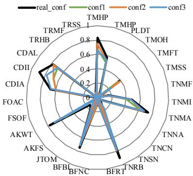

Figure 9: The quality of GCG generated configurations.  
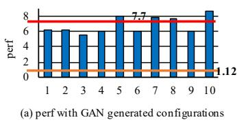

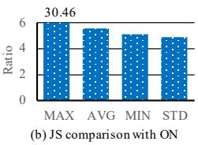  
Figure 10: The high quality of GAN-generated configurations.

For configuration quality, we run the Flink program Fixwindow with a real configuration with high performance, ten GAN-generated configurations, and the default configuration. 7.778 7.77Figure 10 (a) shows the performance comparison. The red 6fand orange dashed lines represent performance with the real 1.122pand default configurations. All GAN-generated configurations 0have performance close to that of the real configuration with maximum relative variation 25.7%.

Comparing to One-Neighbor This section quantitatively compare the configurations generated with ON and GAN. We generate 110 configurations by each of the two methods (±25% noise for ON) based on a real configuration for the Spark version of PageRank. We calculate the Manhattan distance (MD) and Jensen-Shannon (JS) divergence [13] of configuration in the two sets to the real configuration. That is, we calculate 110 Manhattan distances (MD) and 110 JS divergences for the ON generated configurations; we also compute 110 MDs and 110 JS divergences for the GAN generated configurations. Then we compute $r a t i o _ { m d }$ and $r a t i o _ { j s }$ as equations (7) and (8) show, respectively.

$$
r a t i o _ { m d } = M D _ { o n } / M D _ { g a n }\tag{7}
$$

with $M D _ { o n }$ the MD of an ON generated configuration to the real configuration, and $M D _ { g a n }$ the MD of a GAN generated configuration to the real one.

$$
r a t i o _ { j s } = J S _ { o n } / J S _ { g a n }\tag{8}
$$

with $J S _ { o n }$ the JS divergence of an ON generated configuration to the real configuration, and $J S _ { g a n }$ the JS divergence of a GAN generated configuration to the real one.

If rat $i o _ { m d }$ is close to 1.0, it indicates that the ON and GAN generated configurations have similar MDs to the real configuration. If $r a t i o _ { j s }$ is significantly larger than 1.0, it implies that the GAN generated configurations’ value distributions are much more similar to the real configuration’s value distribution than the those of the ON generated configurations.

We then compute (min,max,avg) of $r a t i o _ { m d }$ and ratio $\cdot _ { j s } .$ For Manhattan distance, the (min,max,avg) of $r a t i o _ { m d }$ is (0.46,2.81,1.05). For ratio js, the (min,max,avg) is (5.15,30.46,5.58) as shown in Figure 10 (b). Clearly, we see that while the configurations in both sets can be considered “similar” to the real configuration, but the distribution (captured by JS) of GAN-generated configurations is much closer to the real configuration than ON-generated ones. As such, the GAN generated "similar but not too similar" configurations to a real one also guarantee the "the similar but not too similar" performance, whereas ON generated ones do not.

We plot the performance distribution of 110 GAN- and ON-generated configurations as blue solid and red dashed lines in Figure 11. We see that the GAN-generated configurations follow a Gaussian distribution with mean execution time (86.8s) very close to the real configuration (87.4s); while the ON-generated configurations follows an irregular long-tail distribution. Moreover, ON can generate configurations of which performance spreads in a large range. This means that it may generate low quality configurations despite small Manhattan distance. Overall, the performance of GAN-generated configurations is “similar but not too similar” while the performance of ON-generated configurations varies significantly.

GAN with Multiple Target Configurations It is interesting to understand whether it is beneficial to use multiple target configurations to train our GAN model. To answer the questions, we choose three configurations for PageRank with execution times 87.4s, 87.6s, and 88.5s, respectively. We use the three configurations to train the GAN model and generate 110 configurations. The green solid line with rectangles in

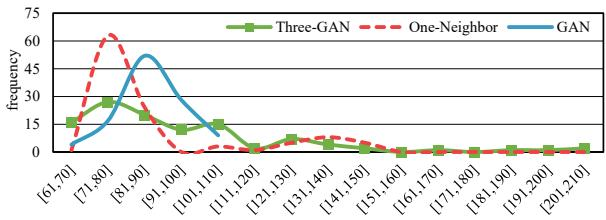

Figure 11: The performance distribution of PageRank with GAN, ON, or 3-input-GAN generated configurations.  
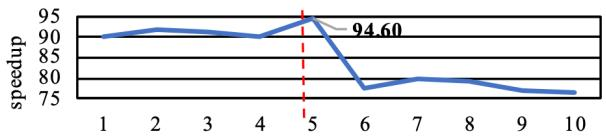

Figure 12: The speedup with different number of initial configurations for repartition over default configurations.  
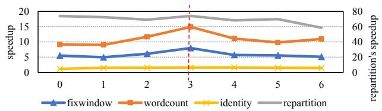  
Figure 13: The performance variation with different values of tr. The X axis represents the tr values.

Figure 11 shows the performance distribution with a long tail, which can make the BO optimization even longer. The reason is that the GAN model tries to learn the data distribution of parameter values of all the three input configurations. The results suggest that the GAN model should be only trained with the configuration with the best performance so far.

## 5.2 Flink Programs on Lab Cluster

Number of initially evaluated configurations. Figure 12 shows the speedups of program repartition when using different number of initial evaluated configurations to provide the first target sample to train the GAN model. The performance reaches the highest when five configurations are evaluated and then drops. It is because more random configurations increase the chance of getting the “very bad” configurations. Based on this result, Swift initially evaluates five configurations

Tolerance threshold The tolerance threshold controls the times that we allow the acquisition function of BO to select the same sample to evaluate on the real cluster in the next iteration. A large threshold may waste time without much improvement, while a small threshold may make the optimization stuck at a local optima. Figure 13 shows how the threshold (x-axis) affects the performance for four Flink programs. For all of them, the best speedups are obtained when the threshold is three. Thus we use this number in Swift.

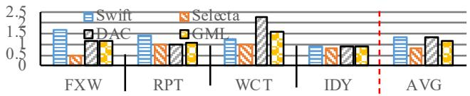  
(a) Latency improvementsFigure 14: Latency improvements over CherryPick. FXW-Fixwindow, RPT-Repartition, WCT-Wordcount, IDY-Identity.

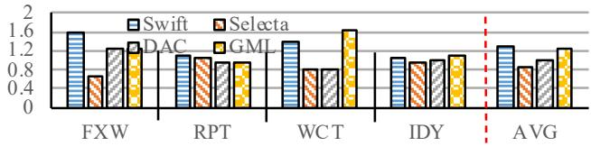  
.2 DAC GMLFigure 15: Throughput improvements over CherryPick.

FXW RPT WCT IDY AVGTable 2: The number of evaluated configurations (trial execu-(b) Throughput improvementstions) used to find the optimal performance.
<table><tr><td rowspan=1 colspan=1>Bench</td><td rowspan=1 colspan=1>Swift</td><td rowspan=1 colspan=1>CherryPick</td><td rowspan=1 colspan=1>Selecta</td><td rowspan=1 colspan=1>DAC</td><td rowspan=1 colspan=1>GML</td></tr><tr><td rowspan=1 colspan=1>Fixwindow</td><td rowspan=1 colspan=1>25</td><td rowspan=1 colspan=1>50+</td><td rowspan=1 colspan=1>100</td><td rowspan=1 colspan=1>750</td><td rowspan=1 colspan=1>500</td></tr><tr><td rowspan=1 colspan=1>Repartition</td><td rowspan=1 colspan=1>17</td><td rowspan=1 colspan=1>50+</td><td rowspan=1 colspan=1>100</td><td rowspan=1 colspan=1>550</td><td rowspan=1 colspan=1>440</td></tr><tr><td rowspan=1 colspan=1>Wordcount</td><td rowspan=1 colspan=1>23</td><td rowspan=1 colspan=1>50+</td><td rowspan=1 colspan=1>100</td><td rowspan=1 colspan=1>600</td><td rowspan=1 colspan=1>460</td></tr><tr><td rowspan=1 colspan=1>Identity</td><td rowspan=1 colspan=1>24</td><td rowspan=1 colspan=1>50+</td><td rowspan=1 colspan=1>100</td><td rowspan=1 colspan=1>600</td><td rowspan=1 colspan=1>420</td></tr><tr><td rowspan=1 colspan=1>In Total</td><td rowspan=1 colspan=1>89</td><td rowspan=1 colspan=1>200+</td><td rowspan=1 colspan=1>400</td><td rowspan=1 colspan=1>2,500</td><td rowspan=1 colspan=1>1820</td></tr></table>

Optimization time. We compare Swift with four parameter tuning approaches, including CherryPick [2], Selecta [27], DAC [64], GML [18]. For a fair comparison, we re-implement CherryPick, Selecta, DAC, and GML and carefully tune their hyper-parameters to achieve the highest performance.

Table 2 shows the number of trial executions used to find the optimal performance for the Flink programs with different approaches. It clearly indicate Swift requires much less number of trial executions. Note that the number of trial executions may not accurately represent the final time cost because a Flink program may take different time to execute with different approaches. We therefore also report the time used to find the optimal performance in Table 3. It shows that Swift takes only 6.3 hours at most and 5.8 hours on average to find the optimal performance for the 4 Flink programs. In contrast, the average times taken by CherryPick, Selecta, DAC, and GML are 2.2×, 4.3×, 9×, and 7.2× of that of Swift.

Speedup. Figure 15 shows the throughput improvements of the four Flink programs tuned by Swift, Selecta, DAC, and GML over by CherryPick. Swift improves the throughput of the four programs by 1.28× on average and up to 1.59× over CherryPick. Figure 14 and Figure 15 show the throughput improvement and latency reduction comparison. In both aspects, Swift clearly outperforms other approaches. It is worth noting that the main goal of Swift is making the optimization faster. The results are particular encouraging because Swift actually achieves better performance with shorter time.

Production Cluster. We evaluate a Flink program used to analyze the logs of servers in a real time. The results show that Swift improves the throughput by 2.3× and reduces the latency by 2.8× in only 6.8 hours compared to the four-day manual optimization. Table 4 compares the values of the six important parameters from the manual tuning and Swift. We see that Swift indeed significantly adjusted the values to achieve better performance.

Table 3: Time (in hours) used to achieve the improvements.
<table><tr><td rowspan=1 colspan=1>Bench</td><td rowspan=1 colspan=1>Swift</td><td rowspan=1 colspan=1>CherryPick</td><td rowspan=1 colspan=1>Selecta</td><td rowspan=1 colspan=1>DAC</td><td rowspan=1 colspan=1>GML</td></tr><tr><td rowspan=1 colspan=1>Fixwindow</td><td rowspan=1 colspan=1>6.3</td><td rowspan=1 colspan=1>12.5+</td><td rowspan=1 colspan=1>25</td><td rowspan=1 colspan=1>62.5</td><td rowspan=1 colspan=1>40.1</td></tr><tr><td rowspan=1 colspan=1>Repartition</td><td rowspan=1 colspan=1>4.3</td><td rowspan=1 colspan=1>12.5+</td><td rowspan=1 colspan=1>25</td><td rowspan=1 colspan=1>45.8</td><td rowspan=1 colspan=1>38.9</td></tr><tr><td rowspan=1 colspan=1>Wordcount</td><td rowspan=1 colspan=1>5.7</td><td rowspan=1 colspan=1>12.5+</td><td rowspan=1 colspan=1>25</td><td rowspan=1 colspan=1>50</td><td rowspan=1 colspan=1>38.5</td></tr><tr><td rowspan=1 colspan=1>Identity</td><td rowspan=1 colspan=1>6</td><td rowspan=1 colspan=1>12.5+</td><td rowspan=1 colspan=1>25</td><td rowspan=1 colspan=1>50</td><td rowspan=1 colspan=1>42.3</td></tr></table>

Table 4: Para values. TM-Taskmanager, JM-Jobmanager.
<table><tr><td>Parameters</td><td>Tuned Values</td><td>Opt Values</td></tr><tr><td>TM.memory.fraction</td><td>0.7</td><td>0.3</td></tr><tr><td>TM.network.memory.max</td><td>1024MB</td><td>3945MB</td></tr><tr><td>TM.net.client.numThreads</td><td>4</td><td>2</td></tr><tr><td>JM.tdd.offload.minsize</td><td>1024B</td><td>1434B</td></tr><tr><td>Blob.fetch.num.concurrent</td><td>50</td><td>141</td></tr><tr><td>akka.framesize</td><td>10MB</td><td>16MB</td></tr></table>

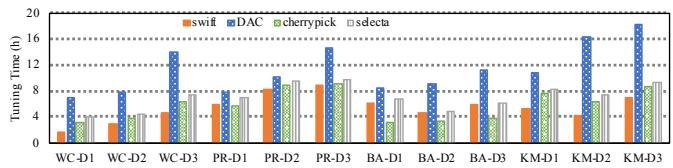  
Figure 16: Optimization time comparison.

## 5.3 Spark Programs Evaluation

Optimization time. Figure 16 compares the optimization time of different approaches for Spark programs. The average time overheads of Swift, DAC, CherryPick, and Selecta are 5.1, 11.3, 5.9, and 7 hours, respectively. We see that Swift reduces optimization time more for Flink programs than for Spark programs. It is because of the different program characteristics: Spark programs are batch processing while Flink programs are streaming processing. We also evaluate Swift on a heterogeneous cluster consisting of eight x86 servers and four ARM servers with 24 Spark programs from HiBench, each with three input datasets. Figure 17 shows the average speedup and optimization time reduction for each program. Swift still significantly outperforms CherryPick. This indicates that Swift is robust in significantly different clusters and workloads, which is helpful for practice use.

Speedups. Figure 18 shows the speedups of the four approaches compared to the default configurations. We can see that Swift achieves slightly higher speedups but still with much shorter optimization time.

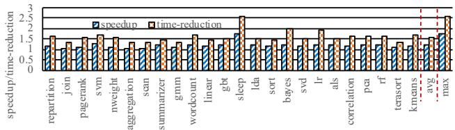

Figure 17: The optimization time reduction comparison with CherryPick for 24 Spark benchmarks.  
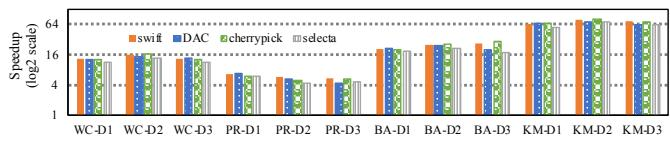

Figure 18: Speedup comparison. The baseline is the execution time of each program with default configuration.43.4 17.8  
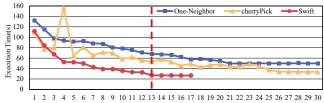  
Figure 19: The performance of Spark WordCount tuned by the5.7 20.1 configurations selected by ON, CherreyPick (BO), and Swift6.5 25.6 during iterations. The X axis denotes the iteration number.5.6 24.7

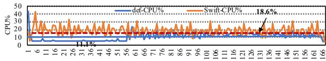  
5.1 15.6Figure 20: CPU utilization of Fixwindow tuned by Swift and 4.8 24.7with default configuration. The X axis represents samples.

## 5.2 40%5.4 Insight and Discussion

5 17.1Swift skews the search space. In Swift, mixing randomly   
5 24.3 1 6 11 16 21 26 31 36 41 46 51 56 61 66 71 76 81 86 91 96 101 106 111 116 121 126 131 136 141 146 151 156 161 166and GAN-generated configurations has the effects of skewing   
5.4 17.1the search space toward the optimal configuration, leading   
4.9 13.6to faster convergence. In contrast, with uniformly random   
5 13.5configurations, CherryPick searches in a uniform space. Fig-  
5.4 17.3ure 19 shows the performance of configurations selected in   
5.1 23.2each iteration in Swift and CherryPick. We can see that, Swift   
5.1 29.7converges faster and more smoothly without fluctuation.

5.2 11.8Case study. Finally, we deeply analyze on Fixwindow. 6 13.5Swift accelerates it by 10.7× compared to the default configu-5.1 11.8ration. Figure 20 and Figure 21 show the comparison of CPU and memory utilization comparison. We see that CPU utilization is increased by around 7.5% but the memory utilization is drastically reduced from 46.8% to 20.1%. From such results, we understand that the performance improvement is due to the busier CPU with reduced memory accesses.

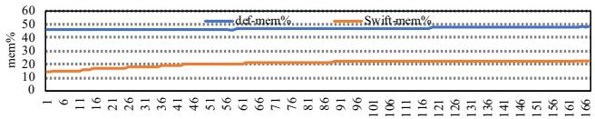  
5 13.5Figure 21: Memory utilization of Fixwindow tuned by Swift 5.1 23.2and with default configuration. The X axis represents samples.

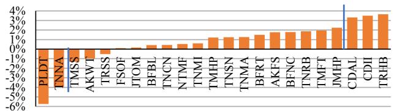  
Figure 22: The importance quantification of configuration parameters for Fixwindow with respect to performance. The descriptions of the abbreviations along X axis are in [44].

We further investigate how the parameters affect performance, taking Fixwindow as an example. Figure 22 shows the 5 parameters affecting the performance most significantly. The increases of TRHB, CDII, and CDAL improve Fixwindow’s performance while those of PLDT and TNNA decrease the performance. The three parameters that positively correlate with performance are all related to memory. TRHB specifies whether we should enable bloom filter for the hybrid hash join operations in Fixwindow. Bloom filter is a bit vector which is a probabilistic data structure telling us that the element is either definitely not in the set or may be in the set. The default configuration sets it to false while Swift set it to true because Swift is able to detect if a lot of operations’ values are in a set. The usage of bloom filter therefore reduces the memory consumption, which increases the CPU utilization.

Limitations. Although Swift demonstrates excellent performance, it still has several shortcomings. First, Swift was tested exclusively in single workload scenarios and may not fully generalize to complex data processing environments with concurrent workloads (i.e., workloads co-running to maximize hardware resource utilization). Future work is needed to address this limitation. Second, Swift requires the setting of several thresholds that are inherently tied to specific cluster environments. For instance, if there is a change in cluster hardware—such as replacing x86-based server CPUs with ARM-based ones—these thresholds may need to be reconfigured accordingly, posing challenges for system adaptability. Third, when dealing with extremely large input data sizes, such as 10 PB, the process of generating even a single trial configuration becomes prohibitively expensive. In such cases, Swift may struggle to operate efficiently.

## 6 Related Work

CherryPick [2] employs BO to optimize cloud configurations. It suffers the drawback of the polarized and unstable quality of configurations. Selecta [27] takes latent factor collaborative filtering and singular value decomposition to recommend nearoptimal storage configurations with few samples. Ernest [54] builds a performance model via the job behavior and then predicts its performance on larger dataset sizes.

Another line of efforts use machine learning to build performance models, including DAC [64], RFHOC [4], Otter-Tune [1],QTune [29], Rafiki [35], Startfish [22], and gray-box based approaches [5], etc. However, the cost of collecting samples is expensive. In contrast, Swift reduces the cost significantly. Other search-based approaches take parameter tuning as a black-box optimization issue and uses variant search algorithms to find the optimal configurations [6], including Best-Config [67], Mronline [30], SelfTune [26], OPPerTune [42] and Gunther [32]. They can be applied to general scenarios. However, the key limitation is that they take a long time to find the optimal configuration since they evaluate each randomly generated configuration on a real cluster, e.g., OPPerTune requires 252 samples to tune parameters [42], which is timeconsuming. In contrast, Swift reduces this time significantly.

Simulation-Based Approaches. Simulation models can capture both the internal metrics of systems and the externally observed workload relationships including [33, 55, 56] and [38]. These approaches need to probe system internals and is hard to cover all factors that can affect performance. In contrast, Swift works well on real big data systems.

Rule- and Analytical Model-based Approaches. Rule-[57, 60, 61] and analytical model-based [19, 20] approaches leverage the experiences of human experts (e.g., tuning instructions) to tune parameters for computing systems. They can quickly improve performance. However, deep understanding of the target system is required, which is not easy for emerging systems. In contrast, Swift does not need that.

## 7 Conclusion

This paper proposes Swift, a novel Bayesian Optimization (BO) based parameter configuration tuning approach for big data systems. The key idea is to leverage a generative adversarial network (GAN) to generate high quality configurations based on the evaluated configuration with the highest performance. Mixing these configurations with the randomly generated configurations has the effects of skewing the search space toward the optimal configurations, leading to faster convergence and less optimization time. In particular, our results show that Swift is able to achieve better performance than all existing approaches.

## Acknowledgments

We are deeply grateful to our shepherd, Sriram Subramanian, and the anonymous reviewers for their valuable insights and dedicated efforts, which have greatly enhanced our work. This work was supported by Shenzhen Science and Technology Program (No.JCYJ20220818101607015), NSFC (62372442) and State Key Lab of Processors, Institute of Computing Technology, CAS (No.CLQ202308). Zhibin Yu is the corresponding author of this work.

## References

[1] Dana Van Aken, Andrew Pavlo, Geoffrey J. Gordon, and Bohan Zhang. Automatic database management system tuning through large-scale machine learning. In Proceedings of the 2017 ACM International Conference on Management of Data (SIGMOD), 2017.

[2] Omid Alipourfard, Hongqiang Harry Liu, Jianshu Chen, Shivaram Venkataraman, Minlan Yu, and Ming Zhang. Cherrypick: Adaptively unearthing the best cloud configurations for big data analytics. In Proceedings of the 14th USENIX Symposium on Networked Systems Design and Implementation (NSDI), 2017.

[3] Martin Arjovsky, Soumith Chintala, and L’eon Bottou. Wasserstein gan. In arXiv:1701.07875v3, 2017.

[4] Zhendong Bei, Zhibin Yu, Huiling Zhang, Wen Xiong, Chengzhong Xu, Lieven Eeckhout, and Shengzhong Feng. Rfhoc: A random-forest approach to auto-tuning hadoop’s configuration. IEEE Transactions on Parallel and Distributed Systems, 27(5):1470–1483, 2016.

[5] Muhammad Bilal and Marco Canini. Towards automatic parameter tuning of stream processing systems. In Proceedings of the 2017 Symposium on Cloud Computing (SoCC), 2017.

[6] Zhen Cao, Vasily Tarasov, Sachin Tiwari, and Erez Zadok. Towards better understanding of black-box autotuning: A comparative analysis for storage systems. In Proceedings of the 2018 USENIX Annual Technical Conference (ATC), 2018.

[7] Fay Chang, Jeffrey Dean, Sanjay Ghemawat, Wilson C. Hsieh, Deborah A. Wallach, Mike Burrows, Tushar Chandra, Andrew Fikes, and Robert E. Gruber. Bigtable: A distributed storage system for structured data. In Proceedings of the eighth USENIX Symposium on Operating Systems Design and Implementation (OSDI), 2006.

[8] Dazhao Cheng, Jia Rao, Yanfei Guo, and Xiaobo Zhou. Improving mapreduce performance in heterogeneous environments with adaptive task tuning. In Proceedings

of the 15th International Middleware Conference, pages 97–108. ACM, 2014.

[9] Jeffrey Dean and Sanjay Ghemawat. Mapreduce: Simplified data processing on large clusters. In Proceedings of the sixth USENIX Symposium on Operating Systems Design and Implementation (OSDI), 2004.

[10] Christina Delimitrou and Christos Kozyrakis. Quasar: resource-efficient and qos-aware cluster management. In Proceedings of the 19th International Conference on Architecture Support for Programming Languages and Operating Systems (ASPLOS), 2014.

[11] Apache Flink developers. Apache flink documents. https://ci.apache.org/projects/flink/ flink-docs-release-1.5/. Accessed Sept 4, 2018.

[12] Fernando Fmfn and Ben Arnao. Bayesian optimization. https://github.com/fmfn/ BayesianOptimization/blob/master/bayes\_ opt/util.py.

[13] Bent Fuglede and Flemming Topsoe. Jensen-shannon divergence and hilbert space embedding. In Proceedings of the International Symposium on Information Theory (ISIT), 2004.

[14] Adem Efe Gencer, David Bindel, Emin Gün Sirer, and Robbert van Renesse. Configuring distributed computations using response surfaces. In Proceedings of the 16th Annual Middleware Conference, pages 235–246. ACM, 2015.

[15] Adem Efe Gencer, David Bindel, Emin Gun Sirer, and Robbert van Renesse. Configuring distributed computations using response surfaces. In Proceedings of the Annual ACM/IFIP/USENIX Middleware Conference, pages 235–246, December 2015.

[16] Ian J Goodfellow, Jean Pougetabadie, Mehdi Mirza, Bing Xu, David Wardefarley, Sherjil Ozair, Aaron C Courville, and Yoshua Bengio. Generative adversarial nets. pages 2672–2680, 2014.

[17] Roderich Grob, Yue Gu, Wei Li, and Melvin Gauci. Generalizing gans: A turing perspective. In The 31st Conference on Neural Information Processing Systems (NIPS 2017), pages 1–11, 2017.

[18] Yijin Guo, Huasong Shan, Shixin Huang, Kai Hwang, Jianping Fan, and Zhibin Yu. Gml: Efficiently autotuning flink’s configurations via guided machine learning. IEEE Transactions on Parallel and Distributed Systems, 32(12):2921–2935, 2021.

[19] Herodotos Herodotou. Hadoop performance models. Technical report, Duke University, 2011.

[20] Herodotos Herodotou and Shivnath Babu. Profiling, what-if analysis, and cost-based optimization of MapReduce programs. Proceedings of the VLDB Endowment, 4(11):1111–1122, 2011.

[21] Herodotos Herodotou, Harold Lim, Gang Luo, Nedyalko Borisov, Liang Dong, Fatma Bilgen Cetin, and Shivnath Babu. Starfish: A self-tuning system for big data analytics. In Proceedings of the Biennial International Conference on Innovative Data Systems Research (CIDR), pages 261–272, January 2011.

[22] Herodotos Herodotou, Harold Lim, Gang Luo, Nedyalko Borisov, Liang Dong, Fatma Bilgen Cetin, and Shivnath Babu. Starfish: A self-tuning system for big data analytics. In Cidr, volume 11, pages 261–272, 2011.

[23] Avinash Hindupur. The gan zoo. https://github. com/hindupuravinash/the-gan-zoo.

[24] Jonathan Ho, Ajay Jain, and Pieter Abbeel. Denoising diffusion probabilistic models. Advances in neural information processing systems, 33:6840–6851, 2020.

[25] Nick Huang, Aaron Gokaslan, Volodymyr Kuleshov, and James Tompkin. The gan is dead; long live the gan! a modern gan baseline. In NeurIPS 2024 Workshop on Mathematics of Modern Machine Learning.

[26] Ajaykrishna Karthikeyan, Nagarajan Natarajan, Gagan Somashekar, Lei Zhao, Ranjita Bhagwan, Rodrigo Fonseca, Tatiana Racheva, and Yogesh Bansal. SelfTune: Tuning cluster managers. In 20th USENIX Symposium on Networked Systems Design and Implementation (NSDI 23), pages 1097–1114, Boston, MA, April 2023. USENIX Association.

[27] Ana Klimovic, Heiner Litz, and Christos Kozyrakis. Selecta: Heterogeneous cloud storage configurations for data analytics. In Proceedings of the USENIX Annual Technical Conference (ATC’18), 2018.

[28] Krasserm. bayesian-machine-learning. https://github.com/krasserm/ bayesian-machine-learning.

[29] Guoliang Li, Xuanhe Zhou, Shifu Li, and Bo Gao. Qtune: A query-aware database tuning system with deep reinforcement learning. In Proceedings of Very Large Data Base (VLDB), 2019.

[30] Min Li, Liangzhao Zeng, Shicong Meng, Jian Tan, Li Zhang, Ali R Butt, and Nicholas Fuller. Mronline: Mapreduce online performance tuning. In Proceedings of the 23rd international symposium on Highperformance parallel and distributed computing, pages 165–176. ACM, 2014.

[31] Guangdeng Liao, Kushal Datta, and Theodore L. Willke. Gunther: Search-based auto-tuning of mapreduce. In Proceedings of the European Conference on Parallel Processing (Euro-Par’13), 2013.

[32] Guangdeng Liao, Kushal Datta, and Theodore L Willke. Gunther: Search-based auto-tuning of mapreduce. In European Conference on Parallel Processing, pages 406– 419. Springer, 2013.

[33] Yang Liu, Maozhen Li, Nasullah Khalid Alham, and Suhel Hammoud. Hsim: a mapreduce simulator in enabling cloud computing. Future Generation Computer Systems, 29(1):300–308, 2013.

[34] Yucheng Low, Joseph Gonzalez, Aapo Kyrola, Danny Bickson, Carlos Guestrin, and Joseph M. Hellerstein. Graphlab: A new framework for parallel machine lerning. In https://arxiv.org/pdf/1408.2041.pdf, 2010.

[35] Ashraf Mahgoub, Paul Wood, Sachandhan Ganesh, Subrata Mitra, Wolfgang Gerlach, Travis Harrison, Folker Meyer, Ananth Grama, Saurabh Bagchi, and Somali Chaterji. Rafiki: A middleware for parameter tuning of nosql datastores for dynamic metagenomics workloads. In Proceedings of the 18th ACM/IFIP/USENIX Middleware Conference (Middleware), 2017.

[36] Grzegorz Malewicz, Matthew H. Austern, Aart J. C. Bik, James C. Dehnert, Ilan Horn, Naty Leiser, and Grzegorz Czajkowski. Pregel: A system for large-scale graph processing. In Proceedings of the Seventeenth International Conference on Architecture Support for Programming Languages and Operating Systems (ASPLOS), 2010.

[37] Jonas Mockus. Application of bayesian approach to numerical methods of global and stochastic optimization. Journal of Global Optimization, 4(4):347–365, 1994.

[38] Kay Ousterhout, Ryan Rasti, Sylvia Ratnasamy, Scott Shenker, and Byung-Gon Chun. Making sense of performance in data analytics frameworks. In 12th {USENIX} Symposium on Networked Systems Design and Implementation ({NSDI} 15), pages 293–307, 2015.

[39] Robin Rombach, Andreas Blattmann, Dominik Lorenz, Patrick Esser, and Björn Ommer. High-resolution image synthesis with latent diffusion models. In Proceedings of the IEEE/CVF conference on computer vision and pattern recognition, pages 10684–10695, 2022.

[40] Jasper Snoek, Hugo Larochelle, and Ryan P Adams. Practical bayesian optimization of machine learning algorithms. In Advances in neural information processing systems, pages 2951–2959, 2012.

[41] Jascha Sohl-Dickstein, Eric Weiss, Niru Maheswaranathan, and Surya Ganguli. Deep unsupervised learning using nonequilibrium thermodynamics. In International conference on machine learning, pages 2256–2265. PMLR, 2015.

[42] Gagan Somashekar, Karan Tandon, Anush Kini, Chieh-Chun Chang, Petr Husak, Ranjita Bhagwan, Mayukh Das, Anshul Gandhi, and Nagarajan Natarajan. OPPer-Tune: Post-Deployment configuration tuning of services made easy. In 21st USENIX Symposium on Networked Systems Design and Implementation (NSDI 24), pages 1101–1120, Santa Clara, CA, April 2024. USENIX Association.

[43] Apache Spark. Spark configuration. http://spark. apache.org/docs/latest/configuration.html.

[44] Authors Swift. Experimented configuration parameters for apache flink and spark. https://github.com/ swift-tunning/Swift-Configuration.

[45] Apache Flink Team. Apache flink. https://flink. apache.org/flink-architecture.html. Accessed December 31, 2018.

[46] Apache Hadoop Team. Apache hadoop. http:// hadoop.apache.org/. Accessed December 31, 2018.

[47] Apache Kafka Team. Apache kafka. https://kafka. apache.org/. Accessed January 10, 2019.

[48] Apache Spark Team. Apache spark. https://spark. apache.org/. Accessed December 31, 2018.

[49] Apache Spark Team. Apache spark configuration. https://spark.apache.org/docs/latest/ configuration.html. Accessed July 16, 2019.

[50] Google Kubernetes Team. Kubernetes. https:// kubernetes.io/. Accessed January 4, 2019.

[51] Intel HiBench Team. Hibench. https://github.com/ intel-hadoop/hibench. Accessed July 25, 2022.

[52] Ankit Toshniwal, Siddarth Taneja, Amit Shukla, Karthik Ramasamy, Jignesh M. Patel, Sanjeev Kulkarni, Jason Jackson, Krishna Gade, Maosong Fu, Jake Donham, Nikunj Bhagat, Sailesh Mittal, and Dmitriy Ryaboy. Storm@twitter. In Proceedings of the ACM SIGMOD International Conference on Management of Data, 2014.

[53] TPC. Tpc-ds is a decision support benchmark. https: //www.tpc.org/tpcds/.

[54] Shivaram Venkataraman, Zongheng Yang, Michael Franklin, Benjamin Recht, and Ion Stoica. Ernest: Efficient performance prediction for large-scale advanced

analytics. In Proceedings of the 13th USENIX Conference on Network Systems Design and Implementation (NSDI’16), 2016.

[55] Guanying Wang, Ali R Butt, Prashant Pandey, and Karan Gupta. A simulation approach to evaluating design decisions in mapreduce setups. In 2009 IEEE International Symposium on Modeling, Analysis & Simulation of Computer and Telecommunication Systems, pages 1–11. IEEE, 2009.

[56] Kewen Wang and Mohammad Maifi Hasan Khan. Performance prediction for apache spark platform. In 2015 IEEE 17th International Conference on High Performance Computing and Communications, 2015 IEEE 7th International Symposium on Cyberspace Safety and Security, and 2015 IEEE 12th International Conference on Embedded Software and Systems, pages 166–173. IEEE, 2015.

[57] Shu Wang, Chi Li, William Sentosa, Henry Hoffmann, Shan Lu, and Achmad Kistijantoro. Understanding and auto-adjusting performance-sensitive configurations. In Proceedings of the Twenty-Third International Conference on Architectural Support for Programming Languages and Operating Systems, pages 154–168. ACM, 2018.

[58] Xintao Wang, Ke Yu, Shixiang Wu, Jinjin Gu, Yihao Liu, Chao Dong, Yu Qiao, and Chen Change Loy. Esrgan: Enhanced super-resolution generative adversarial networks. In Proceedings of the European Conference on Computer Vision (ECCV) Workshops, September 2018.

[59] Christopher KI Williams and Carl Edward Rasmussen. Gaussian processes for machine learning, volume 2. MIT press Cambridge, MA, 2006.

[60] Tianyin Xu, Long Jin, Xuepeng Fan, Yuanyuan Zhou, Shankar Pasupathy, and Rukma Talwadker. Hey, you have given me too many knobs!: Understanding and dealing with over-designed configuration in system software. In Proceedings of the 10th Joint Meeting on Foundations of Software Engineering (ESEC/FSE), pages 307–319. ACM, 2015.

[61] Tianyin Xu, Jiaqi Zhang, Peng Huang, Jing Zheng, Tianwei Sheng, Ding Yuan, Yuanyuan Zhou, and Shankar Pasupathy. Do not blame users for misconfigurations. In Proceedings of the ACM Symposium on Operating Systems Principles (SOSP), pages 244–259. ACM, 2013.

[62] Neeraja J. Yadwadkar, Bharath Hariharan, Joseph E. Gonzalez, and y Katz R. Multi-task learning for straggler avoiding predictive job scheduling. The Journal of Machine Learning Research (JMLR), 17(11):3692– 3728, 2016.

[63] Neeraja J. Yadwadkar, Bharath Hariharan, Joseph E. Gonzalez, Burton Smith, and Randy H. Katz. Selecting the best vm across multiple public clouds: A data-driven performance modeling approach. In Proceedings of the 2017 ACM Symposium on Cloud Computing (SoCC), 2017.

[64] Zhibin Yu, Zhendong Bei, and Xuehai Qian. Datasizeaware high dimensional configurations auto-tuning of in-memory cluster computing. In Proceedings of the Twenty-Third International Conference on Architectural Support for Programming Languages and Operating Systems, pages 564–577. ACM, 2018.

[65] Matei Zaharia, Mosharaf Chowdhury, Michael J. Franklin, Scott Shenker, and Ion Stoica. Spark: Cluster computing with working sets. In Proceedings of the second USENIX Workshop on Hot Topics in Cloud Computing (HotCloud), 2010.

[66] Ciyou Zhu, Richard H. Byrd, Peihuang Lu, and Jorge Nocedal. Algorithm 778: L-bfgs-b: Fortran subroutines for large-scale bound-constrained optimization. ACM Trans. Math. Softw., 23(4):550–560, dec 1997.

[67] Yuqing Zhu, Jianxun Liu, Mengying Guo, Yungang Bao, Wenlong Ma, Zhuoyue Liu, Kunpeng Song, and Yingchun Yang. Bestconfig: Tapping the performance potential of systems via automatic configuration tuning. In Proceedings of the ACM Symposium on Cloud Computing (SoCC’17), pages 338–350. ACM, 2017.