①

USENIX

THE ADVANCED COMPUTING SYSTEMS ASSOCIATION

# μEFI: A Microkernel-Style UEFI with Isolation and Transparency

Le Chen, Yiyang Wu, Jinyu Gu, Yubin Xia, and Haibo Chen, Shanghai Jiao Tong University https://www.usenix.org/conference/atc25/presentation/chen-le

# This paper is included in the Proceedings of the 2025 USENIX Annual Technical Conference.

July 7–9, 2025 • Boston, MA, USA ISBN 978-1-939133-48-9

Open access to the Proceedings of the 2025 USENIX Annual Technical Conference is sponsored by

P--r.h £Es/sL.

auuJl9 PgleU

King Abdullah University of

Science and Technology

# µEFI: A Microkernel-Style UEFI with Isolation and Transparency

Le Chen, Yiyang Wu, Jinyu Gu, Yubin Xia, Haibo Chen

Institute of Parallel and Distributed Systems, School of Computer Science, Shanghai Jiao Tong University

## Abstract

The Unified Extensible Firmware Interface (UEFI) has established itself as the leading firmware standard in modern devices, offering enhanced extensibility, user-friendly graphical interface, and improved security capabilities. At the core of UEFI security is UEFI Secure Boot, designed to ensure that only trusted drivers and applications are loaded during system startup. However, the growing number of UEFI-related CVEs and the emergence of attacks that bypass UEFI Secure Boot have highlighted its limitations, exposing vulnerabilities that could be exploited by attackers.

We propose µEFI, the first isolation framework for UEFI firmware that can transparently run UEFI modules in sandboxes. Drawing inspiration from microkernel design, we deprivilege UEFI modules to user mode and isolate them in different address spaces (sandboxes). To enable the transparent execution of UEFI modules, we propose trampoline injection and protocol analysis. To further strengthen UEFI security, we incorporate a seccomp-like mechanism to restrict module capabilities and perform automated input validation to detect and prevent invalid inputs. Evaluation results demonstrate that our system can run complex UEFI modules without modifications, which incurs a small overhead of 1.91% for UEFI boot phase.

## 1 Introduction

The Unified Extensible Firmware Interface (UEFI) [92] has replaced the legacy BIOS and become the standard firmware interface in most devices, including servers, personal computers, and mobile devices [55, 58, 65]. It offers a modern interface that initializes the hardware, loads the operating system and provides runtime services for the OS. To strengthen the security, the UEFI specification introduced the Secure Boot feature, which verifies the integrity and authenticity of all modules before allowing them to load and execute [42], and becomes an essential security feature in the boot process [47, 73].

However, UEFI Secure Boot cannot protect against vulnerabilities within those legally signed modules, which may persist despite testing and auditing [34, 35, 71]. Besides, improper management of cryptographic keys may allow attackers to bypass UEFI Secure Boot [11]. A publicly disclosed UEFI bootkit capable of bypassing Secure Boot was reported in 2022 [84]. Furthermore, UEFI-related CVEs have been increasing in number, reflecting a concerning trend [24, 25, 29, 31, 32, 34–37, 39, 71, 72]. Exploiting these vulnerabilities enables attackers to gain unauthorized access to data or even take full control of the system.

A major factor driving the increase in vulnerabilities is the growing complexity of the UEFI ecosystem. The UEFI Forum community includes 365 vendors by 2025 [46]; The open-source project EDK2 [88], the most widely used framework for UEFI development and the base for most production firmwares, witnessed the total lines of code expand 9× between 2018 and 2025. The growth is largely driven by the rapid development of ARM architecture, as emerging ARMbased devices adopt UEFI firmware to improve system extensibility [2, 74, 83]. Consequently, the expansion of the codebase and proliferation of UEFI modules have significantly heightened the security risks within the ecosystem.

Moreover, the firmware supply chain is inherently intricate, involving multiple stakeholders such as original equipment manufacturers (OEMs), independent hardware vendors (IHVs), chip manufacturers, and BIOS/firmware providers. Downstream vendors build new modules atop firmware supplied by upstream sources [14]. This complexity increases the risk of introducing vulnerabilities into firmware and allows upstream flaws to propagate downstream, potentially compromising all devices that depend on the affected firmware.

To address the security risks of UEFI, we propose µEFI, a microkernel-style isolation framework for UEFI firmware which can run UEFI modules in sandboxes, based on the following observation: In UEFI, the majority of firmware logic resides in modules such as device drivers and bootloaders, while the UEFI core remains minimal, providing only essential functionalities. This pattern aligns with the microkernel design philosophy [12, 52, 63], which is widely recognized for its effectiveness in isolating errors in kernel modules.

Many UEFI modules, like the device drivers embedded in option ROMs1, are available only as binaries. This makes compatibility a critical requirement for any new design. Applying microkernel-style isolation to UEFI while maintaining transparency for existing modules presents two challenges.

One key challenge is that the control flow transfer across modules and the UEFI core is hard to determine statically.

UEFI module callouts are limited to two types: core-provided services and protocol interfaces offered by other modules, both accessed via function pointers. While services expose a fixed set of core functionalities, protocols represent capabilities of modules and are dynamically discovered through runtime lookup. The dynamic nature of interface discovery makes static analysis techniques used for analyzing Linux kernel module interactions [56, 69, 75] inadequate for resolving UEFI module control flow.

Another challenge stems from UEFI modules being designed with unconditional data sharing, without standardized format for inter-module data transfer. Consequently, data transfer between isolated modules must be explicitly coordinated. Since inter-module communications occur through protocol interfaces, and the type information of protocols is only available at compile time, the absence of such information at runtime makes data synchronization infeasible.

Fortunately, we make two key observations that inform our solution to the aforementioned challenges. First, both services and protocol interfaces are accessed through a centralized data structure known as the system table: services are retrieved directly via fixed pointers, whereas protocol interfaces are retrieved indirectly through service functions such as LocateProtocol. This unified access point allows us to intercept and redirect module callouts. Building on this insight, we introduce trampoline injection to dynamically generate and inject codes into modules, enabling seamless control flow redirection. Second, UEFI protocols are predefined and wellspecified, allowing developers to rely solely on their interface contracts without requiring knowledge of the underlying module implementations. We leverage this by performing offline analysis of protocol definitions to extract type and structure information, which is then used to coordinate safe and structured cross-module data transfer at runtime.

To further enhance UEFI security, we incorporate a mechanism inspired by seccomp [68], which enforces capability restrictions at both the service and protocol levels. Additionally, our in-depth analysis of UEFI-related CVEs reveals that a significant portion of vulnerabilities stem from memory safety issues and inadequate input validation. To mitigate these risks, we implement automatic parameter validation for cross-module communications, which further strengthens the security of the firmware.

We have implemented a prototype of µEFI upon EDK2 [88] on both the x86\_64 architecture using QEMU/KVM [6] and the AArch64 architecture using Raspberry Pi 4 Model B [80]. We perform security evaluations on potential vulnerabilities and, evaluate the performance of µEFI with six widely-used UEFI modules, ranging from simple modules like EnglishDxe to complex ones such as FAT and DiskIo. The performance results indicate that running all six modules in isolated sandboxes incurs only a small overhead of 1.91% on the UEFI boot time.

## 2 BACKGROUND AND MOTIVATION

## 2.1 Role of UEFI

UEFI has become the dominant firmware standard in modern devices. Most Windows machines [70], Mac with Intel processors [4], and even IoT devices [13] are using UEFI in their boot process. It plays a vital role in hardware initialization, system booting, and security. During system startup, UEFI initializes the hardware, ensuring all essential components are ready for OS handoff. For instance, UEFI detects, enumerates, and initializes USB devices, SSDs, and other peripherals. It also loads option ROMs from more complex devices like graphics cards, network adapters, and storage controllers. With the help of UEFI, users can configure the hardware and prioritize boot options conveniently. As for security, modern products default enforce the use of UEFI Secure Boot [94], which verifies the integrity of UEFI modules and ensures only trusted code is loaded. The use of UEFI Secure Boot has made UEFI a crucial part of the boot chain of trust, which is verified by hardware root of trust and responsible for validating subsequent OS bootloaders.

## 2.2 Security of UEFI

UEFI was designed to replace the legacy BIOS and featured for its support for larger storage devices, graphical user interface support, and enhanced extensibility. As malwares like rootkits and bootloader attacks became more sophisticated, UEFI Secure Boot was introduced as a defensive measure in 2011 [91]. It is considered to be the most important security feature concerning UEFI boot-time security and has become an industry-standard feature.

UEFI Secure Boot employs a signature and verification mechanism, ensuring that only signed UEFI modules can be loaded and executed during the system startup process. An essential prerequisite for the effectiveness of UEFI Secure Boot is that all trusted code must be free from vulnerabilities. This prerequisite is mainly supported by the following three reasons. First, in the early times, the codebase of UEFI ecosystem is rather small. As a result, the likelihood of vulnerabilities is relatively low. Second, most UEFI driver codes for specific devices are proprietary and closed-source, making it difficult for attackers to identify and exploit potential vulnerabilities. Third, before a UEFI module is certified to be used with UEFI Secure Boot, it typically undergoes code audit, which may include static analysis and testing to identify security vulnerabilities, logical errors, and non-compliance issues in the code [89, 90].

Increasing CVEs. In recent years, we have witnessed an increasing trend of UEFI-related vulnerabilities in the Common Vulnerabilities and Exposures (CVE) database. As shown in Figure 1, not only the number of UEFI-related CVEs is increasing, but also their criticality. The number of CVEs reached 72 in 2022, and 73 in 2023. Out of 45 vulnerabilities in 2024, 24 of them are rated with high severity. Besides, many CVEs are disclosed only after fixes, suggesting that the number of 2024 CVEs is likely to increase in future updates. This trend can be attributed in part to the growing complexity of the UEFI ecosystem. On the one hand, the adoption of UEFI standards has expanded, with an increasing number of manufacturers using UEFI firmware for device management and initialization. The number of UEFI Forum members has grown from 236 in 2013 to 365 by 2025. On the other hand, the complexity of firmware modules has increased due to the introduction of more advanced and diverse devices, such as high-performance GPUs and smart NICs [78, 79], which demand enhanced capabilities and functionality.

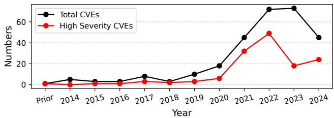  
Figure 1: Annual count of UEFI-related CVEs. The CVE count for each year is determined based on the year indicated in the CVE ID. The latest CVE ID for 2024 is CVE-2024-8105.

## 2.2.1 Exploitation of UEFI Vulnerabilities

UEFI-related attacks typically have three main goals: obtaining control over the operating system, maintaining stealth to evade conventional security mechanisms, and achieving persistence that can survive operating system reinstallation and hard drive replacement. To gain a deeper understanding of UEFI-related threats, we further analyze how UEFI vulnerabilities are exploited by attackers to achieve the objectives.

Bypassing Secure Boot. While UEFI Secure Boot prevents the execution of unauthorized code, one prominent technique to circumvent Secure Boot involves exploiting vulnerabilities in legitimate, signed components. For example, the wellknown BlackLotus bootkit [84]—previously sold on underground forums for approximately \$5,000—exploited a vulnerability in older versions of the Windows bootloader [71] to overwrite memory regions containing Secure Boot policy data, effectively disabling Secure Boot enforcement. Another notable case is CVE-2024-7344 [40], where a signed thirdparty UEFI application embedded a custom image loader that bypassed standard secure UEFI loading functions, allowing the execution of unsigned binaries [82].

Compromising signed modules. Beyond exploiting the trust conferred by a signature to bypass Secure Boot directly, attackers also target inherent code-level vulnerabilities within signed UEFI modules, particularly DXE (Driver Execution Environment) drivers, to achieve arbitrary code execution or privilege escalation. Common examples include stackbased buffer overflows arising from the improper handling of UEFI services. For instance, vulnerabilities [17–20, 27, 28] have been identified in signed DXE drivers where sequential calls to the GetVariable service occur without correctly reinitializing size parameters, leading to stack overflows that can overwrite critical data, including return addresses [43].

Table 1: Category of vulnerabilities and severity of corresponding CVEs.
<table><tr><td>Severity</td><td>Memory Safety</td><td>Improper Input Validation</td><td>Uninitialized Data</td><td>Improper Access Control</td><td>Others</td></tr><tr><td>HIGH</td><td>44</td><td>34</td><td>5</td><td>17</td><td>40</td></tr><tr><td>MEDIUM</td><td>33</td><td>49</td><td>5</td><td>10</td><td>28</td></tr><tr><td>LOW</td><td>1</td><td>2</td><td>0</td><td>3</td><td>4</td></tr><tr><td>UNKNOWN</td><td>3</td><td>3</td><td>1</td><td>0</td><td>4</td></tr></table>

Hooking mechanisms. Hooking mechanisms are extensively employed by UEFI firmware implants to intercept and redirect system execution flow. For instance, rootkits like LoJax [81] and MosaicRegressor [61] register malicious callback functions for specific UEFI events, such as EFI\_EVENT\_GROUP\_READY\_TO\_BOOT, which is triggered just before the operating system bootloader is invoked. Another approach involves patching function pointers within UEFI service tables, redirecting calls to legitimate services towards malicious routines. The CosmicStrand rootkit, for example, was found to patch the entry point of a DXE driver and deploy a multi-stage hooking process that extended control into boot manager, OS loader, and even kernel functions [62]. Such deep-seated hooks allow firmware implants to subvert operating system-level security controls, maintain persistence across reboots, and operate with a high degree of stealth.

## 2.2.2 Vulnerability Analysis

By analyzing UEFI-related CVEs (as shown in Table 1), we identify four major categories of vulnerability causes: memory safety issues, improper input validation, uninitialized data, and improper access control. The statistics show that memory safety issues and improper input validation stand out in terms of both frequency and severity. Improper input validation [26, 36,38] accounts for the largest proportion, representing 30.8% of all UEFI-related CVEs. And memory safety issues [15, 16, 21–23, 27, 30] are particularly critical, constituting 31.4% of high-severity CVEs. While the types of vulnerabilities are consistent with those commonly found in traditional software, their impact is significantly amplified in the context of UEFI firmware, primarily due to three factors:

• Privileged execution environment. All UEFI modules execute with high privileges, such as in System Management Mode on x86 or EL1 on ARM. Although this privileged execution is necessary for managing hardware and configuring the boot process, it also provides a convenient and powerful vector for malicious code.

• Lack of inter-module isolation. UEFI modules share a common address space and communicate via global variables or protocols. The absence of isolation allows a flaw in one module to compromise others, potentially affecting the entire firmware.

• Coarse-grained access control. The access control mechanisms in UEFI are less sophisticated compared to modern operating systems. Concerning the interactions between modules and the core, services and protocol interfaces are both globally accessible, potentially leading to unauthorized modifications.

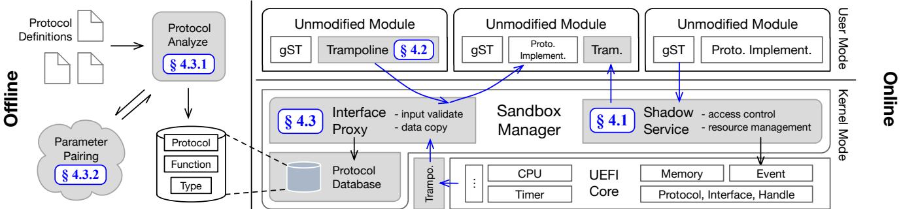  
Figure 2: µEFI’s architecture.

Given these inherent limitations, we propose that a more robust isolation mechanism is needed to enhance the security of UEFI firmware beyond its current design.

## 2.3 Driver Isolation in UEFI vs. OS

Device driver isolation is a critical topic for enhancing the reliability and security of operating systems. The core principle involves executing drivers within protected environments to contain faults and prevent unauthorized access to kernel resources. Research in this area spans decades, leading to a diverse array of approaches. These include architectural strategies like user-mode drivers and microkernel design [8, 45, 49, 53, 54, 67], software-enforced methods such as software fault isolation [10, 44, 69, 95] and language-based safety [48,76], virtualization-based containment [9,50,66,77], and hardware-assisted mechanisms like memory protection keys [51,52,93]. Early systems like Nooks [85] demonstrated the feasibility of fault isolation within monolithic kernels. More recent efforts, exemplified by KSplit [56], focus on automating the complex process of isolating existing drivers and rely on static analysis to identify shared kernel driver states and generate synchronization logic.

Although driver isolation techniques has been extensively explored in traditional operating systems, the differences between the execution environment of UEFI modules and that of OS drivers bring new challenges and opportunities. There are three key differences. First, dynamic interface discovery. The UEFI core does not provide runtime symbol resolution for modules. Each module is a self-contained image, and its provided or required interfaces are identified only at runtime through protocol installation and lookup. As a result, static code analysis alone is insufficient for automating UEFI module isolation. Second, single-threaded execution. UEFI follows a single-threaded, event-driven execution model. There are neither synchronization primitives nor complex atomic operations, greatly simplifying concurrency concerns. Third, well-defined parameter scheme. All of the interfaces used by UEFI modules belong to pre-defined protocols, which means the parameter types and semantics are explicit. This characteristic enables effective data synchronization without reliance on static analysis of source code or binaries.

## 3 OVERVIEW

To address the security threats faced by UEFI while accounting for its unique characteristics, we present µEFI, providing transparent and fine-grained isolation for UEFI modules.

Design Goals. µEFI has four goals, focusing on the characteristics of UEFI vulnerabilities and the shortcomings of existing security measures.

• G1: module memory safety. µEFI must guarantee memory safety across modules. A UEFI module can only access its own memory and those legally shared by other modules.

• G2: full module transparency. µEFI should require no modification to the modules. Firmware images can be transparently loaded and executed with µEFI.

• G3: module access control. µEFI aims to provide seccomplike mechanism in UEFI firmware, restricting modules’ capabilities while ensuring that they can still perform their intended functions.

• G4: automated input validation. µEFI should be capable of automatically validating parameters for cross-module calls without the need for custom handling logic for each individual interface.

Approach: Isolation with microkernel architecture. UEFI follows a modular design in which modules interact through well-defined protocol functions. The majority of firmware code resides within UEFI modules, while the UEFI core remains minimal, performing only essential functionalities. The modular design principles of both microkernel and UEFI align closely, with the isolation of microkernel architecture fulfills the missing parts in UEFI. As a result, we apply microkernel architecture in UEFI firmware, deprivileging UEFI modules to user mode and isolating them with separate page tables.

Architecture. Figure 2 presents the architecture of µEFI. µEFI is composed of two parts: an offline analyzer and an online sandbox manager. The offline analyzer parses the definitions of protocols and constructs a database containing protocol-related information (§4.3.1). The sandbox manager controls the capabilities of sandboxed UEFI drivers and applications and serves as the supervisor of all sandboxed UEFI modules. To facilitate the integration of the sandbox manager into existing UEFI firmware, the sandbox manager is implemented as a UEFI module operating alongside the core, thereby minimizing the need for modifications to the core. In the sandbox manager, we first introduce shadow service (§4.1) to manage the resources of sandbox and impose seccomp-like restrictions on sandboxed modules. Then we use trampoline injection (§4.2) to support cross-module calls without modifying existing UEFI modules. Before a cross-module call can be actually handled, interface proxy (§4.3) intercepts the call, validates the parameters to prevent error propagation, and performs necessary data transfer.

Threat model and security guarantees. µEFI assumes the UEFI core2 is free of vulnerability and all preceding phases work as expected. UEFI drivers and applications loaded after the initialization of the core are not trusted, even if they are signed by legal third-party certificate authority, as these modules may have potential vulnerabilities.

As for security guarantees, µEFI ensures the memory safety of UEFI modules. During execution, a module cannot access memory not belong to it, and the corresponding memory attributes must be set (read/write/execute). µEFI also restricts the services and protocols a module can use. Modules should only be granted the capabilities they need to perform their work. In addition, µEFI provides the ability to validate the parameters for cross-module calls, making sure that the parameters are legally used by the caller. With the above guarantees, µEFI addresses the shortcomings of UEFI Secure Boot and further strengthens UEFI security.

## 3.1 Challenges and Insights

Transparent sandbox callout. The sandbox’s callouts include invocations of services provided by the core and calls to protocol interfaces implemented by other modules. Originally, all the communications across UEFI modules and the core are conducted through function calls. With the deprivileging and isolation of UEFI modules, direct function calls are no longer feasible. However, the original calling convention must be preserved to ensure compatibility with existing modules.

Insight- 1 : unique callout gate. System table is a central data structure in UEFI that provides access to services and configuration tables. Through the system table, we can manage all the callouts directly or indirectly, as services are accessed through the system table and protocol interfaces are obtained through services (depicted in Figure 3).

Transparent data transfer. UEFI modules communicate via protocol interfaces, with data shared directly across modules. Once isolation is enforced, explicit data synchronization becomes necessary. Since protocol type information is only available at compile time, the lack of such metadata at runtime makes synchronization across sandboxes infeasible.

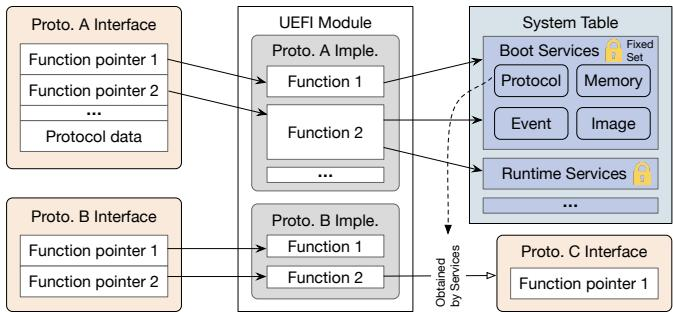  
Figure 3: Construction of protocols [87] and UEFI system table. Protocol defines a set of functions and data structures. Interface refers to the implementation of protocol. All the callouts of a module have to go through the system table directly or indirectly.

Insight- 2 : standardized protocols. To facilitate the independent development of UEFI modules, the UEFI specification defines standardized protocols for various types of drivers and applications. Thus, a caller module can interact with target modules without concerning about their specific implementations, and device drivers by different vendors can achieve compatibility with existing systems simply by implementing the standard protocols.

## 4 DESIGN

We employ a combination of techniques to achieve transparent isolation of binary-form modules. By controlling a unique callout gate, µEFI transparently redirects service calls to a corresponding set of system calls (§4.1). It also supports transparent protocol function calls between isolated modules by replacing original protocol function pointers with injected trampolines (§4.2). Leveraging the standardized nature of protocol definitions, µEFI extracts type information through offline analysis and stores it in a protocol database (§4.3.1). To enable correct data transfer and automatic input validation, µEFI employs a heuristic-based technique known as parameter pairing (§4.3.2). It further adopts customized tracking strategies for different types of data involved in the invocation process (§4.3.3).

## 4.1 Shadow Service

The UEFI core provides a standardized set of services to UEFI modules, including Boot Services and Runtime Services. These services offer essential functionalities throughout the lifecycle of a UEFI module, such as memory allocation, event registration, and protocol interface acquisition and installation. In the original architecture, the core focuses solely on providing capabilities without imposing restrictions on their usage, allowing UEFI modules to access most system resources without limitations. Therefore, we present shadow service to delegate the core services and manage the resources.

UEFI services are presented to modules as a set of function pointers contained within the system table, a global variable initialized by the core and passed to modules during initialization. As µEFI isolates each module in its own address space, the old manner of function call is no longer feasible. Combining with the fact that the set of core services is rather stable, the primitive system call is perfectly suitable for providing services to sandboxed modules. To achieve full transparency, during the loading process of sandboxed modules, we replace the origin system table pointer with a per-sandbox shadow system table, and the services with functions that perform system calls. Every time the services are called in the sandbox, the control flow is redirected to the shadow service. Inspired by seccomp, the shadow service enforces two levels of access control before handling the request.

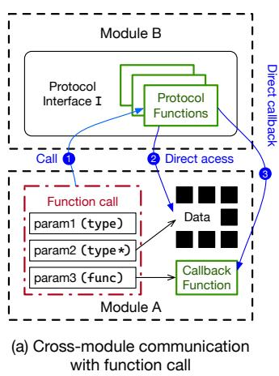

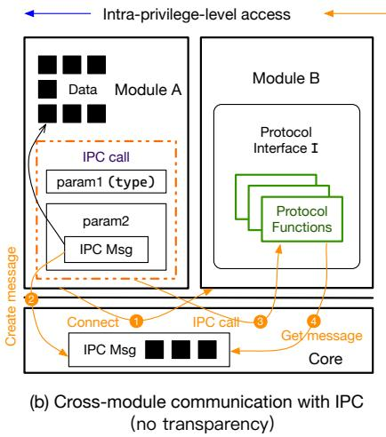

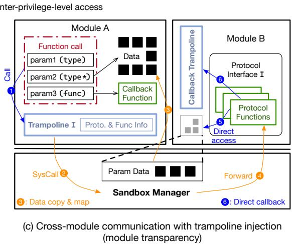  
Figure 4: Cross-module communication workflow with (a) function call, (b) normal IPC, (c) trampoline injection. Trampolines are dynamically generated according to the associated protocol and function.

Service-level access control. The shadow service first regulates the sandboxed module’s access to core services. Among the services provided by the core, fundamental capabilities such as memory allocation, protocol installation and acquisition, and event creation and signaling are universally required by all modules. However, services like LoadImage and StartImage provide more sensitive functionalities and are only necessary for a limited number of modules, such as the UEFI shell or GRUB. Therefore, the shadow service determines whether to grant access to high-privilege services based on the type of each module.

Protocol-level access control. Protocols serve as the fundamental mechanism for interaction between modules. An important fact is that the proper functioning of a UEFI module requires interaction only with modules directly related to its functionality. For instance, a UEFI driver responsible for hard drive I/O may invoke block device drivers, but has no need to access network-related features. Thus, every time a sandboxed module attempts to acquire or install a protocol interface, the shadow service evaluates the request and determines whether to grant access based on its type and the protocol involved.

Unfortunately, under the current specification, it is not feasible to directly determine a module’s type and functionality during the process of loading its image. To address this limitation, we employ two distinct approaches:

• Explicit declaration. Each module is uniquely identified by a GUID, and developers are required to explicitly declare the services and protocols a module is allowed to invoke. This enables strict, seccomp-like sandboxing and enforces a security-by-contract model.

• Heuristic detection. Modules are restricted to access protocols of a specific type. The module type is inferred based on the first non-generic protocol interface it attempts to acquire or install. This approach adopts a fail-stop execution model upon missing or unexpected protocols, with type classification resolved during pre-deployment testing.

By combining these two approaches, the system establishes a tiered security model that balances strict least-privilege enforcement with backward compatibility for legacy modules.

## 4.2 Safe Trampoline Injection

When a module intends to use the functionality of other modules, it obtains the corresponding protocol interface through the core services, and directly invokes functions in the protocol interface to fulfill its job. As illustrated in Figure 4 (a), references provided in call parameters are accessed directly, and callback functions are invoked without intermediaries.

Since µEFI isolates different modules, we can no longer access the functionalities within protocol interfaces through direct function calls. In the microkernel architecture, interprocess communication (IPC) is introduced to enable crossmodule interactions. However, IPC cannot be seamlessly applied to UEFI modules because it relies on dedicated interfaces and requires explicit cooperation between the client and server. The IPC client must know the IPC server’s identity, intentionally establish a connection, request the kernel to prepare IPC payloads, and invoke the server using a specialized IPC call, as illustrated in Figure 4 (b). Moreover, the approach of shadow service is not suitable for managing protocol interfaces. Unlike core services, the functions provided by protocol interfaces cannot be encapsulated within a fixed set, as they represent the diverse functionalities of UEFI modules.

µEFI introduces trampoline injection to enable transparent cross-module protocol function calls. Trampoline injection is implemented with the assistance of shadow service. When a sandboxed module attempts to acquire a protocol interface provided by another module, the sandbox manager does not provide the actual protocol interface. Instead, it dynamically generates trampolines that includes metadata about the protocol functions and injects it into the sandbox. Figure 4 (c) illustrates the workflow of cross-module communication facilitated by trampoline injection. When a sandboxed module invokes a protocol function, the call is transparently redirected to the injected trampoline ( 1 ). The trampoline then issues a system call, carrying the parameters and transferring control to the sandbox manager ( 2 ). The sandbox manager processes the parameters ( 3 ) before forwarding the call to the target module ( 4 ). For the target module, data passed through the cross-module call is also directly accessible ( 5 ), and even callback functions can be invoked directly with the aid of another trampoline ( 6 ).

Trampolines are injected into the sandbox without introducing security risks. Generation of a trampoline signifies that access to the protocol is approved by the shadow service. Furthermore, trampolines are configured as read-only upon injection, ensuring that their logic cannot be modified.

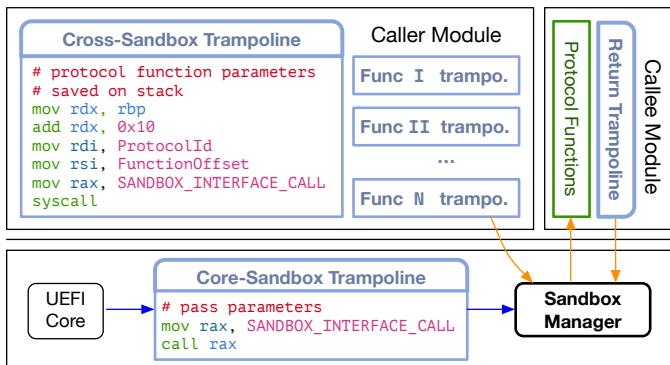  
Figure 5: Three types of trampolines with different use cases and the work mechanism of trampolines.

Three types of trampolines. In addition to facilitating cross-module communication, trampolines are also employed within the core to enable transparent invocation of sandboxed modules by the core, as well as within the callee sandbox to ensure the automatic return of control after function execution. During module management, the core leverages several basic protocols to retrieve module information and control module lifecycle operations, such as obtaining the module’s name or checking whether a driver supports a specific device. These protocol interfaces are also obtained through core services and accessed via function pointers. To minimize modifications to the core, the shadow service generates trampolines for the core every time a sandboxed module installs its protocol interface. When the core invokes these interfaces, the calls are routed to the sandbox manager.

Figure 5 illustrates the three use cases of trampolines and highlights their differences in detail. In summary, trampolines provide a transparent mechanism for cross-module calls and support different kinds of interfaces. For instance, asynchronous processing logic is implemented using events, and callback functions for sandbox events can be executed via trampolines. Although their application scenarios differ, all trampolines redirect the control flow to the sandbox manager. Within the sandbox manager, the interface proxy handles the preprocessing of parameters before invoking protocol functions and synchronizes data upon completion of the calls.

## 4.3 Interface Proxy

The interface proxy is responsible for validating the parameters of the call and, when necessary, copying the parameters. Although the UEFI core manages the installation and acquisition of protocols, it only records basic information about the installed protocols, such as the module that installed the protocol, the corresponding interface that implements the protocol, and a unique GUID used to identify the protocol. Lacking information related to the contents of the protocol, it becomes challenging to validate the parameters of protocol function calls without modifying the module’s code. To address this issue, the interface proxy needs to cooperate with the offline analyzer. During online execution, the interface proxy identifies the protocol GUID corresponding to a protocol function call and queries the protocol’s metadata with the GUID from the protocol database, which is constructed in the offline process. With the metadata, the interface proxy can validate the call parameters and, guided by this metadata, formulate data transfer strategies.

## 4.3.1 Protocol Database

Protocols are basic building blocks in UEFI firmware designed to facilitate communication and functionality between various components, drivers, and applications. Their definitions include both data structures representing device-specific configurations and functions for invoking device functionalities. The offline analyzer reads the protocol definition, parses the data structures, functions, and type definitions, and generates the protocol database. To reduce the size of the protocol database and avoid excessive query latency, the analyzer records only the essential information. We define three tables in the protocol database to store different types of information: protocol, function, and type. The protocol table records the name and GUID of each protocol, and variables contained within each protocol. The function table stores information about the function parameters, including their types, names, and input/output attributes. The type table captures other custom data structures and macro definitions. Figure 6 illustrates an example protocol definition of SerialIOProtocol, which is defined with the above three types. Once generated, the protocol database is included in the sandbox manager’s firmware image at compile time and contains all the information required by the interface proxy during runtime.

1. # @param Control A pointer to return the control signals   
2. Func GetControlBits:   
3. OUT Type \*Control   
4.   
5. # @param BufferSize Input: size of the Buffer.   
6. # Output: amount of data returned.   
7. # @param Buffer The buffer to return the data into.   
8. Func Read:   
9. IN OUT Type \*BufferSize   
10. OUT Type \*Buffer   
11.   
12. Func Write:   
13. IN OUT Type \*BufferSize   
14. IN Type \*Buffer   
15.   
16. # Used to communicate with all UART-style serial devices.   
17. Protocol SerialIOProtocol:   
18. Func GetControlBits   
19. Func Read   
20. Func Write   
21. Type \*Mode # pointer to mode data  
Figure 6: Example protocol definition for serial I/O device.

At runtime, the interface proxy does not load the entire protocol database at once; instead, it employs a lazy loading approach. During the initialization process, only the protocol table is parsed, while the types and functions associated with each protocol are not recursively analyzed. When the interface proxy processes a cross-module call request for the first time, it dynamically queries the necessary function and type definitions required to handle the request.

## 4.3.2 Call Parameter Validation

The interface proxy begins with validating the parameters of cross-module calls. A key observation is that severe vulnerabilities caused by improper input validation often stem not from logical errors (i.e., valid inputs that are logically incorrect), but from a failure to verify the validity of input parameters. For instance, a caller might pass a memory address to the callee that it is not authorized to access, or set the buffer size in parameters (example in Figure 6) to 128 bytes when the actual buffer size is only 64 bytes. Such invalid behaviors can result in unauthorized memory access or overwrite. Thus, the interface proxy focuses on validating the legitimacy of pointers within parameters.

Before initiating validation, the interface proxy must determine whether a pointer references a memory buffer, represents an array, or serves as an identifier handle/token. However, at runtime, it is impossible to determine this solely based on the values passed by the caller. To address this, µEFI employs a heuristic method in the offline analyzer to decide how to validate a given pointer. The information is recorded in the function table and is later utilized by the interface proxy to verify whether the pointer references a valid address and whether the caller has necessary access permissions for the passing memory region.

Offline parameter analysis. When analyzing function parameters, the offline analyzer begins by checking the data type of pointers. If the data type of a pointer is a protocol, the analyzer interprets it as a handle. This approach is based on the observation that protocols are seldom used in function parameters to transfer data. Instead, the protocol itself serves as an identifier, similar to the ‘this’ pointer in C++ class.

Then, the analyzer tells if a pointer references a buffer or an array, using a heuristic method named parameter pairing. Due to the inherent limitations of the C language, passing an untyped pointer to represent a memory buffer in a function call does not allow the callee to determine the buffer size unless both parties have established a standard logic for handling parameters. After analyzing numerous protocol definitions, we observe that when an untyped reference to a memory buffer is passed, it is often accompanied by an additional parameter specifying the buffer size. Similarly, for pointers that have a deterministic type size, the analyzer checks whether there is another parameter indicating the number of elements in the array. For pointers that need to be parsed with specific methods (e.g. string and device path), the offline analyzer leaves the job to the interface proxy, and the buffer size is determined at runtime using standard library functions (e.g. StrLen and GetDevicePathSize).

Approach of parameter pairing. The offline analyzer utilizes parameter names and function comments from protocol definitions to perform parameter pairing. It first examines whether the parameter names conform to certain patterns (e.g., Buffer and BufferLength, or Data and DataCount). If they do not, the offline analyzer proceeds to analyze the function comments. Since developers typically focus on protocol definitions rather than implementation details when they use protocols, function comments within protocol definitions often provide detailed explanations of the function’s purpose and the roles of its parameters. This enables the offline analyzer to leverage large language models (LLMs) to identify potential relationships between parameters.

Limitation. The offline analyzer fails to resolve parameters of type void\* when they cannot be unambiguously classified as handles, data buffers, or arrays. Such cases, which account for less than 2.5% of instances, typically involve implicit payload semantics between caller and callee—for example, parsing packets passed via void\* in network modules. In these scenarios, manual effort is required to correctly process the parameters. At runtime, the sandbox manager flags unhandled interface arguments when such ambiguous cases are encountered without proper handler.

## 4.3.3 Interface-aware Data Transfer

Given that modules in different sandboxes cannot access each other’s memory, the interface proxy not only validates the parameters of protocol function calls but also carries out data transfer and synchronization during the process. Without the use of specialized hardware features, memory isolation is typically maintained at the page level. As a result, when handling memory references in cross-module calls, the interface proxy needs to allocate a memory region for the callee and copy the data from the caller’s address space to the callee’s.

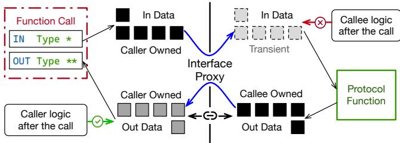  
Figure 7: Example of data transfer in cross-module protocol function call and the lifecycles of the memory buffers.

By utilizing information from the protocol database and results of parameter pairing, the interface proxy is capable of recursively dissecting complex data structures and handling parameter transfer seamlessly, thereby obviating the need for UEFI modules to explicitly manage data transfer.

Cross-module memory management. During the handling of protocol function calls, the callee might allocate a memory region for the caller, write the data to be returned into this memory, and then return a reference to this memory to the caller—utilizing multi-level pointers. In such scenarios, the interface proxy needs to resolve the contents of multi-level pointers layer by layer until it accesses the actual data, and then allocates a buffer for the caller to store the data.

The key difference between memory buffers returned by the callee and those used for input data lies in their lifecycles. As illustrated in Figure 7, the memory allocated for transferring input data can be immediately released after the call finishes. In contrast, memory buffers returned by the callee are intended for use in the caller’s subsequent execution and thus have a lifecycle extending beyond the scope of the current protocol function call. Moreover, the caller only accesses the data without managing it. Memory allocated by the callee for the caller is typically released by the callee itself, often through another protocol function. For instance, OpenFile returns a pointer of an EFI\_FILE structure which should later be freed by calling CloseFile.

To prevent memory leaks, it is necessary to continue tracking the memory buffer even after the current protocol function call has completed. Since all memory in sandboxed modules is managed by the shadow service, additional metadata can be recorded for allocated buffers. When the interface proxy allocates memory for the caller to transfer returned data, the shadow service binds this buffer to the memory that is previously allocated by the callee, establishing a hierarchical relationship (depicted in Figure 7). When the callee module releases its allocated memory, the shadow service ensures that dependent memory is also freed in a cascading manner.

## 5 IMPLEMENTATION

We implemented a prototype of µEFI on both the x86\_64 and the AArch64 architectures. To avoid invasive modifications to the core, the sandbox manager is implemented as a UEFI module running at the same privilege level as the core. The core is modified to ensure that the sandbox manager is prioritized during the module loading process. It interacts with the sandbox manager to schedule the sandboxed modules exclusively through interfaces defined by SANDBOX\_PROTOCOL, facilitating operations such as CRE-ATE\_SANDBOX and START\_SANDBOX. The sandbox manager module consists of 4,773 SLOC in C and 253 SLOC in assembly, while the modification to the core is less than 100 SLOC.

In terms of the offline analyzer, we leveraged LLVM Frontend Infrastructure, more specifically, LibClang, to directly traverse and parse all the protocol headers of UEFI drivers primarily in the MdePkg of EDK2 Repository. We programmed the offline analyzer in C++ to extract all the types info and function signatures used by all protocols and selectively filter the protocols based on the INF sections defined in firmware’s FV definition. After the process of type extraction, the offline analyzer is set to dump the protocol definitions inside a JSON file which is later statically embedded inside the Sandbox Manager Driver. The offline analyzer consists of 907 LOCs in C++ and the generated JSON file is less than 20000 LOCS.

## 6 EVALUATION

We evaluated µEFI to answer three major questions:

• Can µEFI protect UEFI firmware from vulnerability exploitation and real-world attacks? (§6.1 & §6.2)

• To what extent can µEFI achieve generality in ensuring module transparency? (§6.3)

• How much overhead does µEFI incur? (§6.4 & §6.5)

Experimental Setup. Our system is based on the edk2- stable202402 release version of UEFI EDK2. For evaluation, we utilize two distinct platforms:

• Intel i7-13700 Desktop: This platform supports the VT-x virtualization feature. We use the EDK2 OVMF package to run µEFI within KVM-enabled QEMU virtual machine. In this setup, the core operates at Ring 3, while sandbox modules run at Ring 0. Execution cycles are measured by reading the TSC (Timestamp Counter).

• Raspberry Pi 4 Model B: This platform features a quadcore Cortex-A72 (ARM v8) 64-bit SoC. On this system, the core executes in EL1, and sandbox modules are confined to EL0. Execution cycles are measured by reading the PMU (Performance Monitoring Unit) registers.

## 6.1 Empirical Security Evaluation

To evaluate the effectiveness of µEFI in defending against various vulnerabilities, we constructed multiple test cases based on known CVEs. These cases target potential issues within modules, including memory safety vulnerabilities and improper input validation.

Security protection for memory safety. Memory safety issues, such as stack overflow, heap overflow, and use-afterfree, can lead to the corruption of critical data structures and potentially enable arbitrary code execution. To evaluate the effectiveness of our defense mechanisms, we designed two test cases targeting stack and heap overflow scenarios.

Stack-based buffer overflow. CVE-2021-39297 is a stack overflow vulnerability found in the UEFI firmware of certain HP laptops [43]. Exploiting this vulnerability allows an attacker to overwrite the return address of the parent function. In µEFI, a temporary stack is allocated each time control is transferred to a sandboxed environment. Upon function return, a return trampoline is employed to securely redirect control back to the sandbox manager. Combined with the fact that a sandboxed module can only access its own code and data, this design ensures that malicious code outside the vulnerable module cannot be injected or executed via stack overflows.

Heap-based buffer overflow. Heap overflow vulnerabilities occur when a program allocates dynamic memory on the heap but fails to properly validate buffer lengths, allowing an attacker to overwrite adjacent heap data or metadata [21–23]. In µEFI, the heap memory of each sandbox is managed by the sandbox manager independently. Even if an attacker exploits a vulnerability to overwrite heap data, the access is confined to the heap data of the compromised module itself.

Security protection for improper input validation. We design two types of protocol function call inputs, each representing common scenarios that require different levels of input validation by the callee. The first type involves cases in which the caller passes a memory pointer that it does not own, potentially resulting in unauthorized memory writes. The second category involves cases where the caller supplies a valid memory buffer but specifies a BufferSize parameter that exceeds the actual buffer size. This can cause out-of-bounds memory access and unintended data corruption.

In µEFI, the interface proxy addresses these issues by leveraging parameter pairing to associate Buffer with its corresponding BufferSize. It then consults metadata maintained by the shadow service’s memory management subsystem to verify the legitimacy of the input buffer, thereby preventing illegal memory operations.

There are a few cases in which the interface proxy may fail. For instance, in CVE-2023-39538 [33], two input parameters are used to initialize a buffer without proper validation. This can lead to an integer overflow, resulting in the allocation of a buffer that is too small to hold the intended data and ultimately causing heap overflow [7]. Because the vulnerable buffer is not directly passed as a function parameter, the interface proxy cannot detect this issue. Nevertheless, the exploit is still mitigated by the memory isolation enforced by µEFI.

## 6.2 Security Analysis

We further demonstrate how µEFI mitigates vulnerability exploitation by analyzing UEFI-specific attacks in the wild and PoC attacks proposed by researchers.

ThunderStrike represents an early firmware attack targeting UEFI. It is launched via a compromised Thunderbolt peripheral, which leverages its Option ROM to inject malicious code into the firmware. A critical step in its execution involves the malicious module altering the normal boot sequence. Specifically, it replaces the ProcessFirmwareVolume function pointer in the DXE services table with its own function pointer. This manipulation allows the bootkit to seize control over subsequent stages of the boot process [57]. As µEFI utilizes the shadow service to ensure that the service table accessed by each sandboxed module is an independent copy, even if a malicious module modifies a function pointer in its service table, the hook will not affect other modules.

BootHole exploits a buffer overflow vulnerability within the GRUB2 bootloader, triggered when parsing a maliciously modified grub.cfg configuration file by an attacker with administrative or physical access. This buffer overflow overwrites critical structures in the heap and allows for arbitrary code execution. As GRUB2 itself is signed and verified, this effectively bypasses Secure Boot and enable the loading of untrusted code or the installation of persistent bootkits [41]. If µEFI is deployed, the memory isolation enforced between sandboxes prevents an attacker from overwriting memory belonging to other modules or the core. This significantly raises the difficulty of exploiting such vulnerabilities.

BlackLotus is a sophisticated UEFI bootkit recognized for its capacity to circumvent Secure Boot by leveraging vulnerabilities like ‘BatonDrop’. A key aspect of its methodology is that it loads a malicious module (‘grubx64.efi’) and intercepts the execution of components included in the typical Windows boot flow, such as Windows Boot Manager, Windows OS loader, and Windows OS kernel, and hooks some of their functions in memory. This deep level of interference allows BlackLotus to effectively neutralize various security mechanisms, including BitLocker and Hypervisor-protected Code Integrity (HVCI) [84]. With µEFI in place, even if Secure Boot is bypassed, running ‘grubx64.efi’ within a sandbox prevents it from inserting malicious hooks into other modules.

## 6.3 Generality of Offline Analysis

A critical question is how general can µEFI be used for providing isolated execution environments for UEFI modules. To answer this question, we employ the offline analyzer to examine all protocols within the UEFI EDK2 project. Because the key to achieving module transparency is to support different interfaces and correctly handle the pointers, we focus on analyzing pointer parameters in functions and pointer fields in the definition of protocols and compound types. We also include non-pointer types in the analysis to reflect the broader applicability of µEFI, since most interface parameters are plain data structures in production firmware.

Table 2: Number of different types of pointers in the definition of Functions, Protocols, and Compound Types in UEFI EDK2. Total Fields contain the parameters that are not pointers.
<table><tr><td>Definition</td><td>Buffer w/Size</td><td>Array w/ Count</td><td>Handle /Token</td><td>Parse w/ Library</td><td>Manual Effort</td><td>Total Fields</td></tr><tr><td>Protocol</td><td>0</td><td>0</td><td>22</td><td>10</td><td>2</td><td>1147</td></tr><tr><td>Compound Type</td><td>28</td><td>1</td><td>85</td><td>189</td><td>87</td><td>33278</td></tr><tr><td>Function</td><td>159</td><td>6</td><td>369</td><td>101</td><td>90</td><td>3639</td></tr></table>

The offline analyzer recognizes four types of pointers that need to be specially handled, as detailed in Table 2. Among all the protocol fields, only two fields require manual intervention for adaptation. This is because the definitions of most protocols are composed of function pointers and a few simple data structures that represent the hardware configurations. Similarly, the failure rate for analyzing compound types is as low as 0.26%. Regarding functions, 17.4% of all parameters are classified as belonging to the four special pointer types, with a failure rate of 2.5%. Moreover, many failure cases are clustered within a few modules that contain multiple data structures requiring manual effort.

## 6.4 Performance Evaluation

## 6.4.1 UEFI Boot Performance

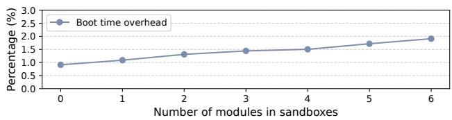  
Figure 8: The impact of the number of sandboxed modules on UEFI boot time (measured from the entry of DxeMain to the completion of ExitBootServices).

To evaluate the performance impact of running modules in sandboxes, we first measure and compare the boot time of UEFI 3 with and without sandboxed modules. The comparison of boot latency focuses on the UEFI boot process, from the entry into the DXE phase to the handover of control to the operating system. We select six widely used UEFI modules, ranging from simple modules such as EnglishDxe to complex ones like FAT, which is among the most complex in EDK2, interacting with other modules via a rich set of protocols and intricate data structures.

As illustrated in Figure 8, running six modules in different sandboxes only incurs an overhead of 1.91%. When no modules are executed within the sandbox, the loading of the sandbox manager introduces a latency of 0.91%. This overhead arises from the sandbox manager’s initialization process, during which it preloads portions of the protocol database. The loading of each individual module incurs an average overhead of 0.17%, with the overheads of running different modules ranges from 0.06% to 0.22% (more details in §6.4.2). These differences arise because modules perform distinct tasks. Modules are occasionally invoked by the core via the EFI\_DRIVER\_BINDING\_SUPPORTED interface to determine whether they support specific protocols. In certain cases, modules may be loaded but their interfaces are never invoked due to a failed driver binding process. In contrast, modules such as FAT are both loaded and executed. The more complex the protocol interfaces they expose, the higher the runtime overhead they incur. Moreover, during system boot process, the operating system’s boot time significantly exceeds the boot time of the UEFI firmware, rendering the overhead of µEFI more negligible.

## 6.4.2 Module Execution Performance

To evaluate the performance impact of µEFI on UEFI modules, we conduct experiments on two frequently invoked and highly interactive modules during the boot process: FAT and DiskIo. The protocols provided and consumed by these modules are sufficiently representative to cover all the parameter cases discussed in §4.3. The end-to-end test involve creating a file using FAT-provided interfaces, writing to and reading from the file, and then deleting it.

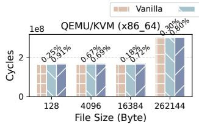

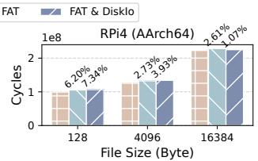  
Figure 9: Execution time for end-to-end test with and without FAT and DiskIo in sandboxes.

As illustrated in Figure 9, in the x86 virtual machine, running FAT with µEFI incurs an average overhead of only 0.35%, while isolating FAT and DiskIo into separate sandboxes results in an average overhead of 0.78%. This increased overhead is attributed to the additional context-switching and data transfer involved in interactions between sandboxed modules compared to those between sandboxed and core modules On the Raspberry Pi 4 platform, the corresponding overheads are 3.85% and 4.11%, respectively.

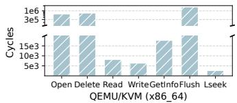

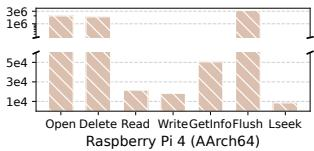  
Figure 10: Execution overhead of various FAT interfaces when executing FAT and DiskIo within µEFI.

Figure 10 shows the execution overhead of various FAT interfaces by comparing baseline performance with that observed when both FAT and DiskIo modules are executed within sandboxes. On the x86\_64 platform, Read, Write, and Lseek operations each take less than 9,000 additional cycles. As for others, Open, Delete, and Flush involve I/O operations, where the time consumed by the driver’s internal logic significantly exceeds the overhead introduced by µEFI. The overheads shown primarily reflect the natural fluctuations in the interface execution times, which are less than 5% compared to the baseline.

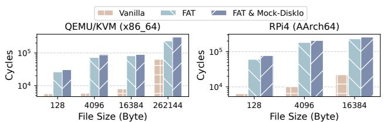  
Figure 11: Execution time for end-to-end test with and without FAT and Mock-DiskIo in sandboxes.

Mock test excluding I/O operations. UEFI primarily initializes hardware and sets up the environment for OS booting. As such, most UEFI modules inherently involve I/O operations through direct or indirect hardware interaction. To better test the overhead introduced by µEFI, we conduct a mock test that excludes all I/O operations.

In this test, we substitute the I/O operations in the DiskIo module with equivalent memory operations, and the results are shown in Figure 11. Since the test involves only memory copies and function calls, the baseline execution on x86\_64 with a file size of 128 bytes takes 5,646 cycles. When FAT is sandboxed, the execution time increases to 26,437 cycles. When both FAT and Mock-DiskIo module are sandboxed, the execution time further rises to 30,870 cycles. Similar results are also observed on the Raspberry Pi 4 platform.

This increase stems from two primary sources: (1) Additional context switches. All service and protocol interface invocations from sandboxed modules must enter the kernel. For instance, FAT uses locks during file operations, implemented via RaiseTPL and RestoreTPL, which each incur a system call. (2) Interface parameter synchronization. The sandbox manager is responsible for pre-invocation input transfer and post-execution output synchronization. These operations introduce overheads that scale with interface complexity and the buffer size. This partially explains why sandboxing Mock-DiskIo on top of FAT results in less than 20% overhead.

## 6.4.3 Overhead Breakdown

To assess how different sources of overhead contribute to the overall performance impact, we examine the latency of interface calls involving different parameter types. Four distinct types are included:

• Simple call performs a call without parameters.

• Input object uses an input pointer to pass an integer object.

• Input buffer uses an untyped input pointer to pass a buffer.

• Output buffer passes in the reference of an untyped pointer and retrieves the pointer with buffer allocated by the callee. The combination of the four types collectively represents all possible interface scenarios. The latency of switching between the caller and the core is not included, as it is roughly the same as the switch latency between the core and the callee.

As illustrated in Figure 12, when running on x86\_64 architecture using QEMU/KVM, context switching introduces an average latency of 1,126 cycles. The average latency for DB query is only 55 cycles, as protocol database entries are cached after the first analysis, making subsequent queries nearly instantaneous. Even for initial queries, DB query requires only 200–300 cycles. Handling an integer pointer in the input consumes 1,178 cycles, which includes the allocation of transient memory and data transfer. For an input buffer of 800 bytes, the latency increases by an additional 280 cycles. After returning from the callee, 500 more cycles are consumed to free the transient memory. If there exists an output buffer, the overhead of synchronization accounts for the largest proportion, which includes caller memory allocation and data transfer. In the test case of the output buffer, the callee performs a system call to allocate memory for the caller, introducing an additional overhead of 420 cycles.

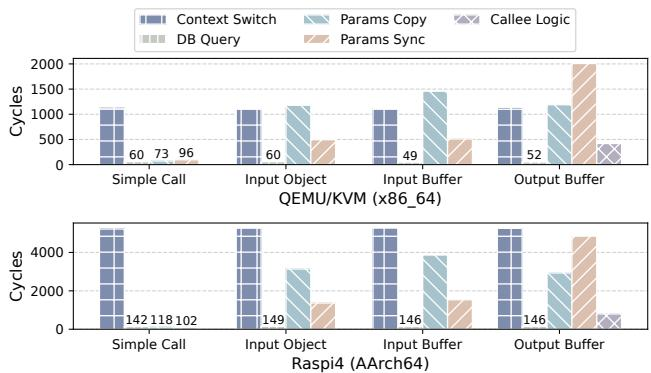  
Figure 12: Overhead breakdown for different kinds of crosssandbox calls.

On the Raspberry Pi 4, the proportional distribution of overhead across different components is similar to that observed with QEMU/KVM. However, context switching incurs an average overhead of 5,262 cycles. This increased cost arises because, for different sandbox calls, the transient return trampoline and jump buffer used for redirection may be allocated to the same physical address. As a result, cache invalidation is required before invoking sandbox functions.

## 6.5 Memory Consumption

Table 3 summarizes the additional memory consumption of sandboxed modules. When loading a UEFI module, the core allocates at least 32 KB memory. For more complex drivers, such as FAT, the allocation can reach up to 112 KB. On top of this, the additional memory overhead introduced by each sandbox typically remains below 40 KB. Given that modern firmware environments generally support up to 4 GB of physical memory, this overhead is negligible. The additional memory primarily consists of two parts: The memory required for sandbox management and the memory necessary for interface calls.

Part 1: Each sandbox maintains its own page table and independent heap manager, resulting in a memory management overhead of 17 KB, which increases proportionally with future allocation. To safeguard the core against malicious hooks, system tables are not shared among sandboxes which takes up 8 KB. Additionally, the metadata of protocol interfaces and the generated trampolines require 648 bytes of memory.

Table 3: Memory consumption of a sandboxed module.
<table><tr><td>Source</td><td>Size</td><td>Detail usage of the memory</td></tr><tr><td>MemoryManagement</td><td>17KB</td><td>Pagetableand heapmetadata</td></tr><tr><td>Sandbox SystemTable</td><td>8KB</td><td>Shadow system table and shadow services</td></tr><tr><td>Interface Management</td><td>520B</td><td>Every acquired/installed interface</td></tr><tr><td>Core-Sandbox Trampoline</td><td>128B</td><td>Every installed protocol function</td></tr><tr><td>Cross-Sandbox Trampoline</td><td>128B</td><td>Every acquired protocol function</td></tr><tr><td>Sandbox Stack</td><td>32KB</td><td>Every call to the sandbox (transient)</td></tr><tr><td>Return Trampoline</td><td>64B</td><td>Every call to the sandbox (transient)</td></tr><tr><td>Jump Buffer</td><td>352B</td><td>Every call to the sandbox (transient)</td></tr><tr><td>Call Parameter</td><td>Dynamic</td><td>Every call from/to the sandbox</td></tr></table>

Part 2: The memory overhead of a sandbox interface call includes a dedicated sandbox stack, a return trampoline for transferring control back to the sandbox manager, a jump buffer for storing core context, and memory allocated for transferring call parameters. Except for the output values, all of these memory occupation are transient, collectively requiring 33 KB.

## 7 Discussion

µEFI TCB. Our implementation considers the core as the trusted computing base (TCB) and assumes that all preceding phases, including the SEC and PEI phases, are secure. While vulnerabilities exist in the core and these earlier phases, their prevalence is significantly lower compared to other components. Moreover, as modules in the PEI phase primarily handle basic hardware initialization, we implement µEFI to monitor the modules loaded after the core.

Privileged instruction handling. Since UEFI firmware interacts directly with hardware, UEFI modules may rely on privileged instructions to perform their tasks. Executing such instructions in user mode triggers system exceptions. Previous research [1,60,64] on transitioning high privilege components to lower privileges has explored solutions to address this issue. In µEFI, we adopt a similar approach to trap and emulate the execution of privileged instructions.

Usage of µEFI during OS runtime. µEFI primarily works in UEFI boot phases to ensure the modules are loaded and executed safely. Beyond this, the techniques employed by µEFI can also be utilized in the firmware runtime to monitor calls to UEFI runtime services and SMM handlers. For instance, µEFI can serve as a proxy to validate SMM call parameters.

## 8 Related Work

In addition to UEFI Secure Boot, UEFI incorporates a range of methods and features aimed at enhancing security.

Data flow and control flow protection mechanisms used in operating systems, such as stack guards, address space layout randomization (ASLR), and control flow guard (CFG), can be employed in UEFI [86, 96]. Microsoft, for instance, introduced Enhanced Memory Protection [5], which enforces section-level security by applying execution-protection flags to data sections and read-only flags to code sections. While these methods increase the difficulty of attacks, they fail to address fundamental issues. All modules still operate with high privileges, and their capabilities remain unrestricted. Consequently, attackers can exploit module vulnerabilities to carry out actions such as loading malicious images or hooking malicious functions.

Static analysis and fuzzing of driver source code or binaries are common approaches for uncovering firmware vulnerabilities. Intel’s Host Based Firmware Analyzer (HBFA) is an open-source fuzzer targeting EDK II, leveraging manually crafted harnesses to test protocol interfaces [59]. While this design facilitates targeted protocol analysis, its dependence on manual setup and limited input diversity hampers both efficiency and scalability. SPENDER [99] applies static analysis to identify SMM privilege-escalation vulnerabilities in UEFI firmware but faces challenges with precision when analyzing stripped binaries. RSFUZZER [98] adopts a hybrid fuzzing strategy to discover vulnerabilities in SMI handlers, but suffers from the overhead and slow performance of emulation and is incapable of detecting silent vulnerabilities. While these tools seek to discover vulnerabilities, our work takes an orthogonal approach by focusing on attack surface reduction via module isolation, thereby complementing existing analysis-based defenses.

Apple has proposed using OROM Sandbox to constrain the execution of unsigned option ROMs [3]. However, its approach focuses solely on limiting the capabilities of option ROM invocation interfaces and does not address the challenge of achieving module transparency. Rust for UEFI suggests leveraging Rust’s memory safety features to enhance UEFI security [97]. However, this requires rewriting the existing codebase. As current firmware codes are predominantly written in C and assembly code, integrating Rust would inevitably introduce significant portions of unsafe code, undermining its benefits in memory safety.

## 9 Conclusion

µEFI adopts a microkernel architecture to deprivilege and isolate the execution environments of UEFI drivers and applications. To address the challenge of maintaining compatibility with existing firmware modules, µEFI incorporates key techniques such as trampoline injection and protocol analysis. Additionally, it strengthens UEFI security by implementing a seccomp-like mechanism and enabling automated input validation.

## Acknowledgments

We sincerely thank our shepherd, Ruslan Nikolaev, and the anonymous reviewers of ATC 2025, whose reviews, feedbacks, and suggestions have significantly strengthened our work. This research was supported in part by National Key Research & Development Program of China (No. 2023YFB3308501), National Natural Science Foundation of China (No. 62202292,62432010,62472279), and research grants from Huawei Technologies. Corresponding author: Jinyu Gu (gujinyu@sjtu.edu.cn).

## References

[1] Adil Ahmad, Alex Schultz, Byoungyoung Lee, and Pedro Fonseca. An extensible orchestration and protection framework for confidential cloud computing. In 17th USENIX Symposium on Operating Systems Design and Implementation (OSDI 23), pages 173–191, 2023.

[2] Ampere. Ampere. https://www.amperecomputing. com, 2025.

[3] Apple. Behind the scenes of ios and mac security. Technical report, Apple, 2019.

[4] Apple. Boot process for an intel-based mac. https: //support.apple.com/en-sg/guide/security/s ec5d0fab7c6/web, 2021.

[5] Taylor Beebe. Hardening the core: Enhanced memory protections. Technical report, Microsoft, 2023.

[6] Fabrice Bellard. Qemu, a fast and portable dynamic translator. In USENIX annual technical conference, FREENIX Track, volume 41, pages 10–5555. California, USA, 2005.

[7] Binarly REsearch Team. BRLY-LOGOFAIL-2023-019: Memory corruption vulnerability in dxe driver. Technical report, Binarly, June 2023. Integer overflow on memory allocation size leading to out-of-bounds write operations during PNG file processing in AMI firmware.

[8] A.C. Bomberger, A.P. Frantz, W.S. Frantz, A.C. Hardy, N. Hardy, C.R. Landau, and J.S. Shapiro. The keykos nanokernel architecture. In Proceedings of the USENIX Workshop on Micro-Kernels and Other Kernel Architectures, pages 95–112, 1992.

[9] Silas Boyd-Wickizer and Nickolai Zeldovich. Tolerating malicious device drivers in linux. In 2010 USENIX Annual Technical Conference (USENIX ATC), 2010.

[10] Miguel Castro, Manuel Costa, Jean-Philippe Martin, Marcus Peinado, Periklis Akritidis, Austin Donnelly, Paul Barham, and Richard Black. Fast byte-granularity software fault isolation. In Proceedings of the ACM SIGOPS 22nd Symposium on Operating Systems Principles, pages 45–58. ACM, 2009.

[11] CERT Coordination Center. Insecure platform key (pk) used in uefi system firmware signature. https://www. kb.cert.org/vuls/id/455367, August 2024.

[12] Haibo Chen, Xie Miao, Ning Jia, Nan Wang, Yu Li, Nian Liu, Yutao Liu, Fei Wang, Qiang Huang, Kun Li, et al. Microkernel goes general: Performance and compatibility in the {HongMeng} production microkernel. In 18th USENIX Symposium on Operating Systems Design and Implementation (OSDI 24), pages 465–485, 2024.

[13] Hawk Chen. Uefi and iot: Best practices in developing iot firmware solutions. Technical report, Byosoft, 2017.

[14] Jake Christensen, Ionut Mugurel Anghel, Rob Taglang, Mihai Chiroiu, and Radu Sion. Decaf: automatic, adaptive de-bloating and hardening of cots firmware. In Proceedings of the 29th USENIX Conference on Security Symposium, SEC’20, USA, 2020. USENIX Association.

[15] MITRE Corporation. Cve-2020-5376. https://www. cve.org/CVERecord?id=CVE-2020-5376, 2020.

[16] MITRE Corporation. Cve-2020-5378. https://www. cve.org/CVERecord?id=CVE-2020-5378, 2020.

[17] MITRE Corporation. Cve-2021-39297. https://www. cve.org/CVERecord?id=CVE-2021-39297, 2021.

[18] MITRE Corporation. Cve-2021-39299. https://www. cve.org/CVERecord?id=CVE-2021-39299, 2021.

[19] MITRE Corporation. Cve-2021-39300. https://www. cve.org/CVERecord?id=CVE-2021-39300, 2021.

[20] MITRE Corporation. Cve-2021-39301. https://www. cve.org/CVERecord?id=CVE-2021-39301, 2021.

[21] MITRE Corporation. Cve-2022-1890. https://www. cve.org/CVERecord?id=CVE-2022-1890, 2022.

[22] MITRE Corporation. Cve-2022-1891. https://www. cve.org/CVERecord?id=CVE-2022-1891, 2022.

[23] MITRE Corporation. Cve-2022-1892. https://www. cve.org/CVERecord?id=CVE-2022-1892, 2022.

[24] MITRE Corporation. Cve-2022-28858. https://www. cve.org/CVERecord?id=CVE-2022-28858, 2022.

[25] MITRE Corporation. Cve-2022-32482. https://www. cve.org/CVERecord?id=CVE-2022-32482, 2022.

[26] MITRE Corporation. Cve-2022-33209. https://www. cve.org/CVERecord?id=CVE-2022-33209, 2022.

[27] MITRE Corporation. Cve-2022-40516. https://www. cve.org/CVERecord?id=CVE-2022-40516, 2022.

[28] MITRE Corporation. Cve-2022-40517. https://www. cve.org/CVERecord?id=CVE-2022-40517, 2022.

[29] MITRE Corporation. Cve-2023-23904. https://www. cve.org/CVERecord?id=CVE-2023-23904, 2023.

[30] MITRE Corporation. Cve-2023-26589. https://www. cve.org/CVERecord?id=CVE-2023-26589, 2023.

[31] MITRE Corporation. Cve-2023-28031. https://www. cve.org/CVERecord?id=CVE-2023-28031, 2023.

[32] MITRE Corporation. Cve-2023-32466. https://www. cve.org/CVERecord?id=CVE-2023-32466, 2023.

[33] MITRE Corporation. Cve-2023-39538. https://www. cve.org/CVERecord?id=CVE-2023-39538, 2023.

[34] MITRE Corporation. Cve-2023-43626. https://www. cve.org/CVERecord?id=CVE-2023-43626, 2023.

[35] MITRE Corporation. Cve-2024-21829. https://www. cve.org/CVERecord?id=CVE-2024-21829, 2024.

[36] MITRE Corporation. Cve-2024-21871. https://www. cve.org/CVERecord?id=CVE-2024-21871, 2024.

[37] MITRE Corporation. Cve-2024-23980. https://www. cve.org/CVERecord?id=CVE-2024-23980, 2024.

[38] MITRE Corporation. Cve-2024-31154. https://www. cve.org/CVERecord?id=CVE-2024-31154, 2024.

[39] MITRE Corporation. Cve-2024-33656. https://www. cve.org/CVERecord?id=CVE-2024-33656, 2024.

[40] MITRE Corporation. Cve-2024-7344. https://www. cve.org/CVERecord?id=CVE-2024-7344, 2024.

[41] Eclypsium. There’s a hole in the boot. https://ecly psium.com/blog/theres-a-hole-in-the-boot/, 2020.

[42] Eclypsium. Firmware security realizations - part 1 - secure boot and dbx. https://eclypsium.com/rese arch/firmware-security-realizations-part-1 -secure-boot-and-dbx/, 2022.

[43] BINARLY efiXplorer team. The stack buffer overflow vulnerability leads to arbitrary code execution in uefi application on multiple hp devices. https://github .com/binarly-io/Vulnerability-REsearch/bl ob/main/HP/BRLY-2021-003-PoC/rsrc/poc\_604c 4ac862ab8e21d73f3df3977bd09c.gif, 2022.

[44] Úlfar Erlingsson, Martín Abadi, Michael Vrable, Mihai Budiu, and George C Necula. Xfi: Software guards for system address spaces. In Proceedings of the 7th Symposium on Operating Systems Design and Implementation, pages 75–88. USENIX Association, 2006.

[45] Alessandro Forin, David Golub, and Brian N Bershad. An i/o system for mach 3.0. Technical Report CMU-CS-91-178, Carnegie Mellon University, Department of Computer Science, 1991.

[46] UEFI Forum. Uefi forum membership list. https: //uefi.org/members, 2025.

[47] Dann Frazier. Ubuntu secure boot. https://wiki.ubuntu.com/UEFI/SecureBoot, 2020.

[48] Manuel Fähndrich et al. Language support for fast and reliable message-based communication in singularity os. In EuroSys, 2006.

[49] Vinod Ganapathy, Trent Jaeger, and Somesh Jha. Microdrivers: A new architecture for device drivers. In Proceedings of the 11th USENIX Workshop on Hot Topics in Operating Systems (HotOS), 2007.

[50] Tal Garfinkel, Ben Pfaff, Jim Chow, Mendel Rosenblum, and Dan Boneh. Terra: A virtual machine-based platform for trusted computing. In Proceedings of the 19th ACM Symposium on Operating Systems Principles (SOSP), pages 193–206. ACM, 2003.

[51] Jinyu Gu et al. Epk: Scalable and efficient memory protection keys. In 2022 USENIX Annual Technical Conference (USENIX ATC 22), pages 1–14, 2022.

[52] Jinyu Gu, Xinyue Wu, Wentai Li, Nian Liu, Zeyu Mi, Yubin Xia, and Haibo Chen. Harmonizing performance and isolation in microkernels with efficient intra-kernel isolation and communication. In 2020 USENIX Annual Technical Conference (USENIX ATC 20), pages 401– 417, 2020.

[53] Gernot Heiser, Kevin Elphinstone, Ihor Kuz, Gerwin Klein, and Stefan M Petters. Towards trustworthy computing systems: Taking microkernels to the next level. ACM SIGOPS Operating Systems Review, 41(4):3–11, 2007.

[54] Jorrit N Herder, Herbert Bos, Ben Gras, Philip Homburg, and Andrew S Tanenbaum. Minix 3: A highly reliable, self-repairing operating system. ACM SIGOPS Operating Systems Review, 40(3):80–89, 2006.

[55] HP. Legacy bios boot support removal from hp computers. https://support.hp.com/ca-en/document/c 07054518, 2021.

[56] Yongzhe Huang, Vikram Narayanan, David Detweiler, Kaiming Huang, Gang Tan, Trent Jaeger, and Anton Burtsev. Ksplit: Automating device driver isolation. In 16th USENIX Symposium on Operating Systems Design and Implementation (OSDI 22), pages 613–631, 2022.

[57] Trammell Hudson and Larry Rudolph. Thunderstrike: Efi firmware bootkits for apple macbooks. In Proceedings of the 8th ACM International Systems and Storage Conference, SYSTOR ’15, New York, NY, USA, 2015. Association for Computing Machinery.

[58] Intel. Removal of legacy boot support for intel platforms. Technical report, Intel, 2023.

[59] Intel. Using hbf to improve platform resiliency, 2025. Accessed: 2025-05-19.

[60] Yuekai Jia, Shuang Liu, Wenhao Wang, Yu Chen, Zhengde Zhai, Shoumeng Yan, and Zhengyu He. {HyperEnclave}: An open and cross-platform trusted execution environment. In 2022 USENIX Annual Technical Conference (USENIX ATC 22), pages 437–454, 2022.

[61] Kaspersky. Mosaicregressor: Lurking in the shadows of uefi. https://media.kasperskycontenthub.co m/wp-content/uploads/sites/43/2020/10/0708 0558/MosaicRegressor\_Technical-details.pdf, 2020.

[62] Kaspersky. Cosmicstrand: the discovery of a sophisticated uefi firmware rootkit. https://securelist.c om/cosmicstrand-uefi-firmware-rootkit/106 973/, 2022.

[63] Gerwin Klein, Kevin Elphinstone, Gernot Heiser, June Andronick, David Cock, Philip Derrin, Dhammika Elkaduwe, Kai Engelhardt, Rafal Kolanski, Michael Norrish, et al. sel4: Formal verification of an os kernel. In Proceedings of the ACM SIGOPS 22nd symposium on Operating systems principles, pages 207–220, 2009.

[64] Dayeol Lee, David Kohlbrenner, Shweta Shinde, Krste Asanovic, and Dawn Song. Keystone: An open frame- ´ work for architecting trusted execution environments. In Proceedings of the Fifteenth European Conference on Computer Systems, pages 1–16, 2020.

[65] Lenovo. Legacy bios boot support removed in lenovo 2020 products. https://support.lenovo.com/sg/ en/solutions/ht510878-legacy-bios-boot-sup port-removed-in-lenovo-2020-products, 2020.

[66] Joshua LeVasseur, Volkmar Uhlig, Jan Stoess, and Stefan Götz. Unmodified device driver reuse and improved system dependability via virtual machines. In 6th Symposium on Operating Systems Design and Implementation (OSDI), pages 17–30, 2004.

[67] Jochen Liedtke, Ulrich Bartling, Uwe Beyer, Dietmar Heinrichs, Rudolf Ruland, and Gyula Szalay. Two years of experience with a µ-kernel based os. ACM SIGOPS Operating Systems Review, 25(2):51–62, 1991.

[68] Linux. seccomp. https://man7.org/linux/man-p ages/man2/seccomp.2.html.

[69] Yandong Mao, Haogang Chen, Dong Zhou, Xi Wang, Nickolai Zeldovich, and M Frans Kaashoek. Software fault isolation with api integrity and multi-principal modules. In Proceedings of the Twenty-Third ACM Symposium on Operating Systems Principles, pages 115–128, 2011.

[70] Microsoft. Boot to uefi mode or legacy bios mode. https://learn.microsoft.com/en-us/window s-hardware/manufacture/desktop/boot-to-uef i-mode-or-legacy-bios-mode?view=windows-11, 2021.

[71] Microsoft. Cve-2022-21894. https://www.cve.org/ CVERecord?id=CVE-2022-21894, 2022.

[72] Microsoft. Cve-2022-21894 security update. https: //msrc.microsoft.com/update-guide/vulnerabi lity/CVE-2022-21894, 2022.

[73] Microsoft. Secure boot. https://learn.microsoft. com/en-us/windows-hardware/design/device-e xperiences/oem-secure-boot, August 2023.

[74] Microsoft. Arm-based surface devices faq. https: //learn.microsoft.com/en-us/surface/surfac e-arm-faq, 2024.

[75] Vikram Narayanan, Abhiram Balasubramanian, Charlie Jacobsen, Sarah Spall, Scott Bauer, Michael Quigley, Aftab Hussain, Abdullah Younis, Junjie Shen, Moinak Bhattacharyya, et al. {LXDs}: Towards isolation of kernel subsystems. In 2019 USENIX Annual Technical Conference (USENIX ATC 19), pages 269–284, 2019.

[76] Vikram Narayanan et al. Redleaf: Isolation and communication in a safe operating system. In 14th USENIX Symposium on Operating Systems Design and Implementation (OSDI), 2020.

[77] Ruslan Nikolaev and Godmar Back. Virtuos: An operating system with kernel virtualization. In Proceedings of the 24th ACM Symposium on Operating Systems Principles (SOSP), pages 116–132. ACM, 2013.

[78] NVIDIA. Dgx h100/h200 firmware update guide. ht tps://docs.nvidia.com/dgx/dgxh100-fw-updat e-guide/.

[79] NVIDIA. Updating firmware for nvidia bluefield-3 dpu. https://network.nvidia.com/support/firmwar e/bluefield3/.

[80] Raspberry Pi. Raspberry pi 4 specification. https: //www.raspberrypi.com/products/raspberry-p i-4-model-b/specifications/.

[81] ESET Research. Lojax: First uefi rootkit found in the wild, courtesy of the sednit group. https://www.weli vesecurity.com/2018/09/27/lojax-first-uef i-rootkit-found-wild-courtesy-sednit-group /, 2018.

[82] ESET Research. Under the cloak of uefi secure boot: Introducing cve-2024-7344. https://www.welivese

curity.com/en/eset-research/under-cloak-u efi-secure-boot-introducing-cve-2024-7344/, 2024.

[83] Samsung. Galaxy book go 5g. https://www.samsun g.com/us/computing/galaxy-books/galaxy-boo k-go/galaxy-book-go-5g-14-256gb-silver-att -np545xla-ka1tt/, 2025.

[84] Martin Smolár. Blacklotus uefi bootkit: Myth confirmed. https://www.welivesecurity.com/2023/03/01/ blacklotus-uefi-bootkit-myth-confirmed/, 2023.

[85] Michael M Swift, Steven Martin, Henry M Levy, and Susan J Eggers. Nooks: An architecture for reliable device drivers. In Proceedings of the eighteenth ACM symposium on Operating systems principles, pages 33– 48. ACM, 2002.

[86] TianoCore. Enable aslr for uefi in edk ii. https://ed k2-docs.gitbook.io/a-tour-beyond-bios-mit igate-buffer-overflow-in-ue/address\_space\_ layout\_randomization/enable\_aslr\_for\_uefi in\_edkii.

[87] TianoCore. EDK II Driver Writer’s Guide for UEFI 2.3.1, 2018.

[88] TianoCore. Edk ii project. https://github.com/tia nocore/edk2, 2019.

[89] Kevin Tremblay. Updated: Uefi signing requirements. https://techcommunity.microsoft.com/t5/har dware-dev-center/updated-uefi-signing-req uirements/ba-p/1062916, 2021.

[90] Kevin Tremblay. New uefi ca memory mitigation requirements for signing. https://techcommunity.mi crosoft.com/blog/hardwaredevcenter/new-uef i-ca-memory-mitigation-requirements-for-s igning/3608714, August 2022.

[91] UEFI Forum. Unified Extensible Firmware Interface Specification Version 2.3.1. UEFI Forum, 2011.

[92] UEFI Forum. Unified Extensible Firmware Interface Specification Version 2.11. UEFI Forum, 2024.

[93] Anjo Vahldiek-Oberwagner et al. Intra-unikernel isolation with intel memory protection keys. In Proceedings of the 16th ACM SIGPLAN/SIGOPS International Conference on Virtual Execution Environments, pages 1–15, 2020.

[94] Chad Duffey Vinay Pamnani, Paolo Matarazzo. Secure the windows boot process. https://learn.microsof t.com/en-us/windows/security/operating-sys

tem-security/system-security/secure-the-w indows-10-boot-process, July 2024.

[95] Robert Wahbe, Steven Lucco, Thomas E Anderson, and Susan L Graham. Efficient software-based fault isolation. In Proceedings of the fourteenth ACM symposium on Operating systems principles, pages 203–216. ACM, 1993.

[96] Jiewen Yao. Cet in smm. https://github.com/tia nocore/tianocore.github.io/wiki/CET-in-SMM.

[97] Jiewen Yao. Enabling rust for uefi firmware. Technical report, Intel, 2020.

[98] Jiawei Yin, Menghao Li, Yuekang Li, Yong Yu, Boru Lin, Yanyan Zou, Yang Liu, Wei Huo, and Jingling Xue. Rsfuzzer: Discovering deep smi handler vulnerabilities in uefi firmware with hybrid fuzzing. In 2023 IEEE Symposium on Security and Privacy (SP), pages 2155– 2169. IEEE, 2023.

[99] Jiawei Yin, Menghao Li, Wei Wu, Dandan Sun, Jianhua Zhou, Wei Huo, and Jingling Xue. Finding smm privilege-escalation vulnerabilities in uefi firmware with protocol-centric static analysis. In 2022 IEEE Symposium on Security and Privacy (SP), pages 1623–1637. IEEE, 2022.