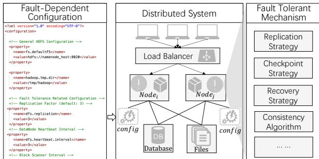
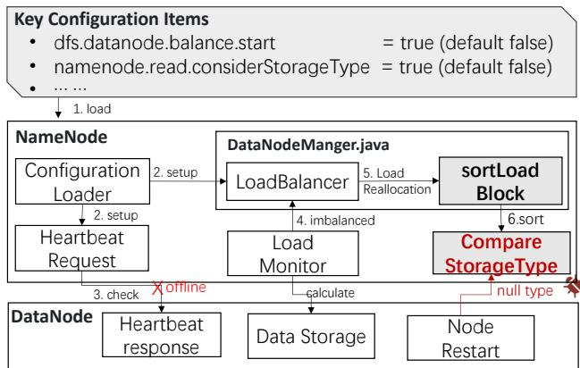
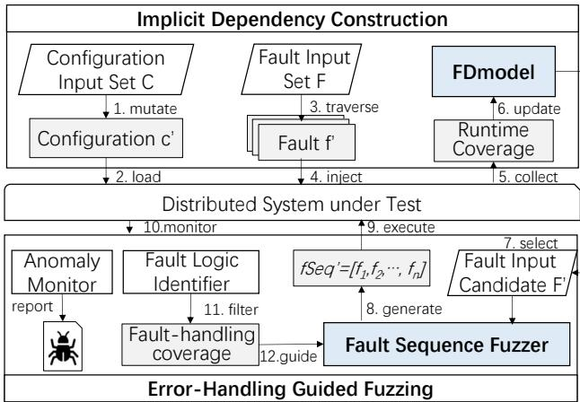
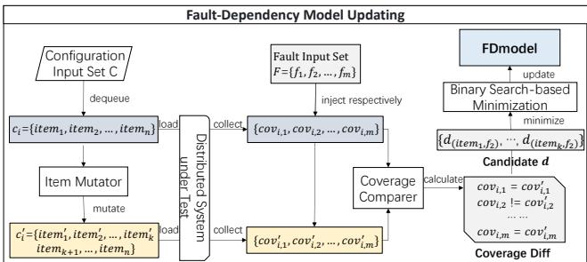
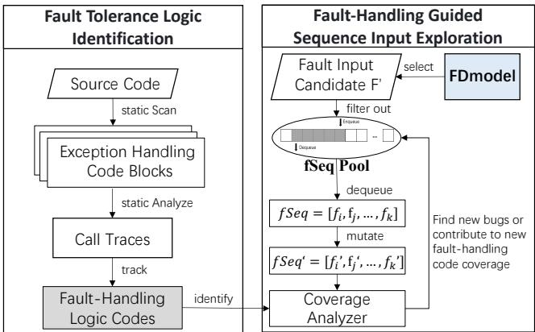
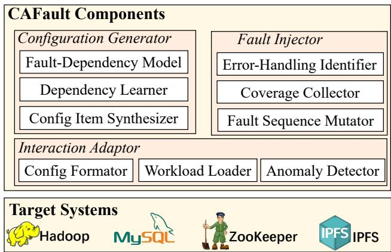
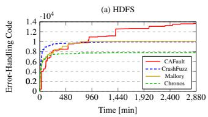
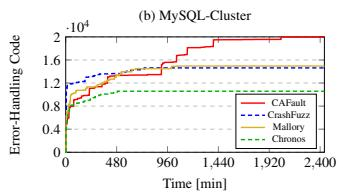
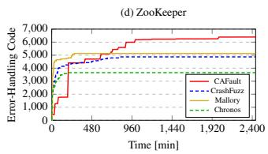
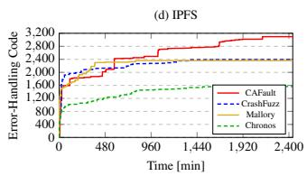

①

USENIX

THE ADVANCED COMPUTING SYSTEMS ASSOCIATION

# CAFault: Enhance Fault Injection Technique in Practical Distributed Systems via Abundant Fault-Dependent Configurations

Yuanliang Chen, Fuchen Ma, Yuanhang Zhou, Zhen Yan, and Yu Jiang, Tsinghua University

https://www.usenix.org/conference/atc25/presentation/chen-yuanliang

# This paper is included in the Proceedings of the 2025 USENIX Annual Technical Conference.

July 7–9, 2025 • Boston, MA, USA ISBN 978-1-939133-48-9

Open access to the Proceedings of the 2025 USENIX Annual Technical Conference is sponsored by

P=-r.h mEesL

auuuJl9 PgleU

King Abdullah University of

Science and Technology

# CAFault: Enhance Fault Injection Technique in Practical Distributed Systems via Abundant Fault-Dependent Configurations.

Yuanliang Chen KLISS, BNRist, School of Software Tsinghua University, China

Fuchen Ma ∗ KLISS, BNRist, School of Software Tsinghua University, China

Zhen Yan KLISS, BNRist, School of Software Tsinghua University, China

Yuanhang Zhou KLISS, BNRist, School of Software Tsinghua University, China

Yu Jiang ∗ KLISS, BNRist, School of Software Tsinghua University, China

## Abstract

To ensure high reliability and availability, distributed systems are designed to be resilient to various faults in complex environments. Fault injection techniques are commonly used to test whether a distributed system can correctly handle different potential faults. However, existing fault injection testing is typically performed under a fixed default configuration, overlooking the impact of varying configurations (which can differ in real-world applications) on testing execution paths. This results in many vulnerabilities being overlooked.

In this work, we introduce CAFault (Configuration Aware Fault), a general testing framework for enhancing existing fault injection techniques via abundant fault-dependent configurations. Considering the vast combinatorial search space between fault inputs and configuration inputs, CAFault first constructs a fault-dependent model (FDModel) to prune the test input space and generate high-quality configurations. Second, to effectively explore the fault input space under each configuration, CAFault introduces fault-handling guided fuzzing, which constantly detects bugs hidden in deep paths. We implemented and evaluated CAFault on four widely used distributed systems, including HDFS, ZooKeeper, MySQL-Cluster, and IPFS. Compared with the state-of-the-art fault injection tools CrashFuzz, Mallory, and Chronos, CAFault covers 31.5%, 29.3%, and 81.5% more fault tolerance logic. Furthermore, CAFault has detected 16 serious previously unknown bugs.

## 1 Introduction

In a distributed environment, various faults can occur, such as network delays, packet loss, hardware failures, etc. To handle these faults and enhance system availability, distributed systems are designed with different kinds of fault tolerance mechanisms, such as replication [9], consensus protocols [11], and failover strategies [47]. In a practical distributed system, fault tolerance mechanisms guarantee one of the most fundamental properties called availability [5], ensuring that distributed systems can continuously provide functional services without interruption, even when faults occur.

Due to the complexity of fault tolerance mechanisms in distributed systems, it is challenging to avoid incorrect handling or implementation bugs in these fault tolerance logics. These bugs are referred to as fault handling bugs. Since fault tolerance mechanisms play a critical role in distributed systems, such bugs can have severe consequences, leading to service unavailability, data loss, and even compromising system security. To detect these bugs, several fault injection tools [6,17,46,56,59] have been developed to simulate and inject various faults into systems. These tools have successfully uncovered numerous bugs to date.

However, existing fault injection tools typically test distributed systems in fixed default configurations, ignoring how different configurations can impact the execution of fault tolerance mechanisms. In real-world applications, configurations can vary significantly, and existing tools overlook many execution paths, missing hidden bugs that might arise under different configurations. For example, in MySQL-Cluster [12], the default configuration for the data consensus mechanism is set to ‘RAFT’ [53], which ensures consistency across nodes. However, MySQL-Cluster also offers different consensus options, such as ‘Paxos’ [27] and ‘Quorum-based’ [35] mechanisms. The choice of consensus configuration can significantly impact the fault tolerance logic, such as how the system handles network partitions, node failures, and data consistency during recovery, potentially leading to different behaviors and vulnerabilities depending on the selected configuration.

To improve fault handling bug detection in distributed systems, an intuitive approach is to conduct fault injection testing under different configurations. However, since distributed systems typically have numerous configuration parameters, the configuration input space is often large [68], denoted as M. Similarly, the fault injection parameters, such as the time, location, and sequence length of the fault, create a vast input space [22], denoted as N. Consequently, exploring the combination of these two input spaces results in a total search space of M ∗ N, which is significantly enormous.

To effectively explore such a huge input space, there are two main challenges: (1) The first challenge is automatically analyzing the implicit dependencies between fault and configuration inputs to prune the configuration input space M. Many configuration items in distributed systems, such as log level settings, are unrelated to fault handling and can be excluded from testing. However, the vast number of configuration options and their complex semantics make it difficult to automatically identify these dependencies. Existing configuration testing tools [41, 42, 61, 65] rely on manual modeling to construct dependencies between configuration and workload inputs, which is labor-intensive and lacks scalability. (2) The second challenge lies in optimizing and pruning the exploration of the fault injection input space N. In each configuration input, fault injection can occur at any time and at any execution location, making the exploration space N infinite. Existing state-of-the-art (SOTA) fault injection tools typically use code coverage [17] or runtime behavior-guided [46] fuzzing strategies to explore fault input generation. However, these methods are time-consuming and tend to explore code unrelated to fault-handling logic, which result in ignoring bugs hidden in deep paths, leading to ineffective testing.

To address these challenges, we propose CAFault, a comprehensive testing framework aimed at detecting fault handling bugs in distributed systems across different configuration setups. First, CAFault introduces an FDModel that automatically identifies implicit dependencies between fault and configuration inputs, helping to prune and optimize the configuration input space. FDModel monitors the runtime behavior of the distributed system under test, observing which configuration items influence fault handling logic and how faults impact the system status. By tracking coverage changes and correlating them with configuration changes, the FDModel is dynamically constructed and updated throughout the testing process. Second, to effectively explore the fault input space and uncover bugs hidden in deep paths for each configuration input, CAFault employs a fault-handling guided fuzzing strategy. It performs static analysis to identify fault-handling code in the system and then leverages coverage data from this identified code to guide fault input generation during fuzzing. In this way, CAFault continuously conducts efficient fault injection testing with abundant fault-dependent configurations, effectively exercising fault tolerance mechanisms and detecting bugs in distributed systems.

We implemented CAFault and evaluated its effectiveness on four widely-used distributed systems: ZooKeeper [36], MySQL-Cluster [12], Hadoop Distributed File System (HDFS) [4], and IPFS [32]. In comparison to other stateof-art fault injection tools, e.g., CrashFuzz [17], Mallory [46], and Chronos [6], CAFault excelled in exposing more bugs and covering 31.5%, 29.3%, and 81.5% more fault tolerance logic, respectively. CAFault found 16 bugs in total, with 4 in ZooKeeper, 6 in MySQL-Cluster, 3 in HDFS, and 3 in IPFS. We also enhanced existing fault injection tools with the FDModel in CAFault. The results show that FDModel significantly improves testing performance, detects 6 more bugs, and covers 25% more fault tolerance logic on average. In summary, we make three key contributions:

• We propose the FDModel that automatically analyzes implicit dependencies between fault and configuration inputs. Enhanced with this model, the performance of existing fault injection techniques has been significantly improved.

• We introduce fault-handling guided fuzzing to prune fault input space and effectively exercise fault tolerance mechanisms in distributed systems.

• We implement and evaluate CAFault on four widely used distributed systems. We will open-source CAFault1.

## 2 Background of Fault Tolerance Mechanism

  
Figure 1: Typical fault tolerance mechanisms in Distributed Systems, that are affected by various configuration setups.

Fault tolerance mechanisms in distributed systems are essential for ensuring the reliability and availability of services in the presence of failures. Due to the complexity of distributed interactions, distributed systems are inherently more vulnerable to faults than standalone systems, with potential failures including network issues, hardware malfunctions, or software bugs. Fault tolerance mechanisms aim to detect, tolerate, and recover from these failures to ensure continuous operation. As shown in Figure 1, Mainstream fault tolerance techniques primarily include redundancy, checkpointing, recovery, and consistency strategies [38]. Replication strategy [26] involves adding extra resources to improve system reliability and fault tolerance, including hardware (e.g., redundant servers), data (e.g., replication across nodes), and computational replication (e.g., task replication or load balancing). Checkpointing [14] is a technique where the system periodically saves its state to allow recovery to a known good state after a failure. Recovery mechanism [60] can be cold recovery, where the system restarts from the last checkpoint and reloads data, or hot recovery, where the system resumes from a more recent state to minimize downtime and data loss. Consistency algorithms [19], such as Paxos and Raft, ensure that distributed systems maintain data consistency across nodes despite faults, addressing issues like network partitions and concurrent updates that could cause data inconsistencies.

Fault-Dependent Configuration: System configuration is crucial to ensure that a distributed system operates reliably and efficiently under varying conditions [68]. It provides the flexibility for the system to adapt to different requirements. In distributed systems, configuration inputs are the parameters or settings that define how the system behaves [62]. These inputs can be divided into two main types: (1) General configurations, such as network settings and resource allocation, which are not related to fault tolerance mechanisms. (2) Faultdependent configurations, which determine how the system responds to failures. These include settings like whether a service should be replicated, the frequency of recovery triggers, and thresholds for fault detection. The fault tolerance behavior of the system can vary significantly depending on these configurations, as they control critical aspects like timeout intervals, redundancy levels, and recovery strategies. For example, in a high-replication configuration, the fault handling logic may prioritize data consistency and integrity, triggering immediate recovery processes to synchronize all replicas. In contrast, a low-replication configuration might focus on minimizing downtime, quickly recovering a failed node without waiting for full synchronization across replicas [69]. Therefore, fault-dependent configuration inputs have a significant impact on fault injection testing. Unfortunately, existing fault injection tools overlook this aspect.

## 3 Motivation Example

Some bugs in fault tolerance mechanisms are difficult to detect because they can only be triggered under specific configuration settings, yet they can lead to severe consequences in distributed systems. One such example is a fault-handling bug in HDFS [8], caused by incorrect type sorting, specifically the failure to properly handle null values. This bug leads to HDFS node crashes, resulting in service unavailability for all applications relying on the system. Figure 2 illustrates the key steps to trigger this bug, while Figure 3 presents the core code snippet of it. In an HDFS cluster, the NameNode manages nodes, while the DataNode stores data. Once the HDFS cluster loads the configuration, the NameNode sets up the LoadBalancer (‘balance.start=true’ means that load balancing is enabled automatically) and heartbeat mechanism based on the configuration settings. When a DataNode fails to respond to heartbeat packets due to various faults (e.g., persistent network issues), the NameNode considers the DataNode to be offline. As a result, the LoadBalancer detects a storage imbalance and initiates the load reallocation process. The DataNodeManager then sorts the DataNodes based on their actual load. Since ‘read.considerStorageType’ is set to True, the DataNodeManager first sorts the DataNodes according to their storage types. However, if the previously offline DataNode has just restarted and reconnected, and at that moment the DataNodeManager is fetching its storage type, and the initialization thread responsible for that storage type has not yet completed, a null value will be returned. Subsequently, this bug is triggered because the default Comparator.comparing (line 5) cannot handle comparisons involving null values, causing the NameNode to crash. This fault handling bug is fixed by overriding the comparator and adding handling for null value comparisons, as shown in lines 6-14.

  
Figure 2: The HDFS-17098 breaks down the NameNode in HDFS, resulting in service unavailable.

private Consumer<...> sortLoadBlock() {   
2 Consumer<...> loadSort = null;   
3 if (readConsiderStorageType) {   
4 Comparator<DatanodeInfoWithStorage> comp =   
5 Comparator.comparing(getStorageType);   
6 + Comparator.comparing(getStorageType,   
+ (s1, s2) -> {   
8 + if (s1 == null) {   
9 + return (s2 == null) ? 0 : -1;   
10 + } else if (s2 == null) {   
11 + return 1;   
12 + } else {   
13 + return s2.compareTo(s1);   
14 }});   
15 loadSort=list.Collections.sort(list, comp);   
16 }   
17 }  
Figure 3: The core code snippet of HDFS-17098. Missing Null Type handling in‘sortLoadBlock()’.

Fault tolerance mechanisms are commonly used in distributed systems, and bugs in their implementation are inevitable. Bugs in one node may affect the whole distributed system, thus causing severe consequences such as service hangs or node crashes. We can draw three important lessons from this case: 1) The execution logic of fault tolerance mechanisms is influenced by configuration inputs, a factor that existing fault injection tools often overlook. To address this, we propose CAFault, which focuses on enhancing these tools with high-quality configurations. 2) The dependency between configuration items and fault inputs is implicit. In this case, the activation of ‘balance.start’ and ‘considerStorageType’ affects the fault handling logic during the node reconnection process, yet they do not appear to have a direct dependency relationship. If we naively enumerate and explore all combinations of configurations and fault inputs, it would lead to an explosion of the input space. To solve this problem, CAFault dynamically learns, optimizes, and refines the implicit dependencies between configurations and fault inputs by leveraging the runtime information of the distributed system under test. 3) Some fault handling bugs are hidden in deep paths, and triggering them requires a combination of multiple faults. In this case, triggering this bug requires at least one network failure causing a heartbeat timeout, which triggers the load balancing process, as well as a node failure, followed by the successful automatic restart of the node at the right moment. To handle this issue, CAFault employs fault-handling guided fuzzing, dynamically selecting high-quality fault combinations to explore as much fault tolerance logic as possible.

## 4 CAFault Design

Design goal: A practical configuration-aware fault injection framework should have the following properties.

• General: CAFault is designed to find fault handling bugs for most practical distributed systems, from distributed file systems, e.g., HDFS [3], to distributed configuration services, e.g., ZooKeeper [36]. From distributed database systems, e.g., MySQL-Cluster [12], to decentralized file systems, e.g., IPFS [32]. The tool can be deployed to different distributed systems with minor adjustments.

• Automatic: The entire testing process is automated, requiring minimal or no manual effort.

• Efficient: CAFault is able to constantly exercise the fault tolerance mechanisms and effectively detect more bugs in real-world distributed systems compared to SOTA tools.

## 4.1 CAFault Workflow

  
Figure 4: The workflow of CAFault. It includes two main phases: (1) Implicit Dependency Construction and (2) Fault-Handling Guided Fuzzing.

Figure 4 illustrates the workflow of CAFault, which consists of two main phases. The first phase focuses on the construction of the FDModel (fault-dependent model): (1) CAFault selects a configuration from the Configuration Input Set (initially containing the system’s default configurations) and performs random mutations to generate a new configuration, $c ^ { \prime } .$ (2) The distributed system under test then loads the configuration $c ^ { \prime } .$ (3) CAFault iterates through each fault operation in the Fault Input Set (including IO timeout, node crash, etc.). (4) CAFault sequentially injects each fault input F into the system. (5) For each executed fault input $F ,$ corresponding coverage information is collected. (6) Based on real-time coverage changes, the FDModel is dynamically updated and refined. In this phase, if $c ^ { \prime }$ leads to new coverage improvements in the fault tolerance mechanisms, it is regarded as a high-quality fault-dependent configuration and added to Set C for further exploration. Note that this phase does not require precise attribution of coverage data to individual fault operations, only whether the coverage change needs to be observed. Finally, based on $c ^ { \prime } ,$ CAFault proceeds to the second phase.

The second phase is the fuzzing test process, consisting of the following steps: (7) CAFault uses the FDModel to select fault operations that are dependent on configuration $c ^ { \prime } ,$ creating the fault candidate set ${ \bar { \boldsymbol { F } } } ^ { \prime }$ . (8) The Fault Sequence Fuzzer mutates and generates fault operation sequences f Seq′ based on the set $F ^ { \prime } .$ . (9) CAFault then injects and executes f Seq′ in the distributed system under test. (10) Subsequently, CAFault monitors the runtime states of the system in real-time. (11) Finally, the Fault Logic Identifier analyzes the runtime states, filtering out fault-handling coverage information. Simultaneously, the Anomaly Monitor identifies if there are unexpected errors. The bugs are reported once they are detected. (12) Fault sequences that lead to new fault-handling coverage or expose new bugs are prioritized by the Fuzzer to guide the generation of subsequent fault sequences. Importantly, CAFault treats each fault sequence as a single fuzzing unit, collecting feedback at the sequence level rather than for individual faults. As a result, it does not require attributing precise feedback to each fault; instead, it evaluates the overall effectiveness of the entire sequence in exercising fault-handling logic. CAFault proceeds to the next fuzzing iteration (from step 8 to step 12) of the testing process until coverage converges (where newly generated fault sequences no longer yield additional faulthandling code coverage). Afterward, CAFault returns to the first phase, continuously alternating between exploring configuration inputs and generating fault inputs, until termination.

## 4.2 FDModel Updating

Both configuration inputs and fault inputs influence the execution logic of a distributed system’s fault tolerance mechanisms. However, their dependency relationships are often implicit and difficult to uncover directly. CAFault leverages dynamic runtime information to continuously learn these implicit dependencies, enabling the ongoing updating and optimization of the FDModel. A heuristic insight of this step is that, under the same fault input $f _ { i } ,$ if changing a configuration item $i t e m _ { j }$ triggers a change in the execution coverage data, then we consider there to be an implicit execution dependency between item item j and fault $f _ { i } .$

Definition of Implicit Dependency: Implicit dependency refers to long and complex control-flow and data-flow relationships between configuration items and fault-handling logic that are difficult to detect. First, we formally define the process of testing a distributed system as $\Phi = \{ C , F , C o \nu \}$ . Specifically, $C = \{ c _ { 1 } , c _ { 2 } , c _ { 3 } , \ldots , c _ { n } \}$ represents the set of configuration inputs to be loaded into the system. $F = \{ f _ { 1 } , f _ { 2 } , f _ { 3 } , . . . , f _ { m } \}$ represents the set of fault inputs to be injected into the system under test. $C o \nu = \{ c o \nu _ { 1 , 1 } , \ldots , c o \nu _ { i , j } , \ldots , c o \nu _ { n , m } \}$ represent the coverage data, and $c o \nu _ { i , j }$ means represents the coverage data generated by executing configuration $c _ { i }$ and fault input $f _ { j }$ For each c in $C , c = \{ i t e m _ { 1 } , i t e m _ { 2 } , i t e m _ { 3 } , \ldots , i t e m _ { l } \}$ represents the actual settings of all items in c. Let $d i f f ( c _ { i } , c _ { j } ) =$ $\left\{ i t e m _ { 1 } , i t e m _ { 2 } , \ldots , i t e m _ { k } \right\}$ represent the differences between configuration $c _ { i }$ and configuration $c _ { j } ,$ where the values of these k items are different. $\forall f _ { i } \in F , \operatorname { i f } d i f f ( c _ { a } , c _ { b } ) = \left\{ i t e m _ { j } \right\}$ and $c o \nu _ { a , i } \neq c o \nu _ { b , i } ,$ , then we define that item itemj has an implicit execution dependency with fault $f _ { i } ,$ denoted as $d _ { ( i t e m _ { j } , f _ { i } ) }$

  
Figure 5: The process of Fault-Dependency Model updating. CAFault continuously learns implicit dependencies and refines the FDModel by analyzing coverage differences.

Figure 5 provides a detailed overview of the FModel update process. CAFault first dequeues a configuration c from the Configuration Input Set C. Then, an item mutator is employed to randomly mutate k items $( k \geq 1$ and $k \leq$ number of all items) based on the selected configuration, generating a new configuration $c ^ { \prime } .$ . We assume that there are k items $\left\{ i t e m _ { 1 } , i t e m _ { 2 } , \ldots , i t e m _ { k } \right\}$ that are mutated and differ between c and $c ^ { \prime } .$ . CAFault loads configuration c, and then injects each fault f from the Fault Input Set F respectively, recording the corresponding coverage in fault tolerance mechanisms (will be introduced in section 4.3), denoted as $C o \nu = \{ c o \nu _ { i , 1 } , c o \nu _ { i , 2 } , \ldots , c o \nu _ { i , m } \}$ . Next, CAFault reloads $c ^ { \prime }$ and repeats the previous step, obtaining the coverage information $C o v ^ { \prime } = \{ c o \nu _ { i , 1 } ^ { \prime } , c o \nu _ { i , 2 } ^ { \prime } , \ldots , c o \nu _ { i , m } ^ { \prime } \}$ . Then CAFault utilizes a Coverage Comparer to calculate the coverage difference between Cov and $C o \nu ^ { \prime }$ . As shown in Figure 5, if $c o \nu _ { i , 2 } \neq c o \nu _ { i , 2 } ^ { \prime } .$ it means that changing these k items under the fault input $f _ { 2 }$ affects the fault tolerance execution logic of the system under test. Therefore, these k items $\left\{ i t e m _ { 1 } , i t e m _ { 2 } , \ldots , i t e m _ { k } \right\}$ may have an implicit execution dependency with fault $f _ { 2 } ,$ , resulting in a candidate dependency d. Considering that not every item in these k items will affect the execution logic of $f _ { 2 } ,$ , in order to precisely analyze the dependency between these k items and $f _ { 2 } .$ , we use a binary search-based minimization algorithm to try to extract the smallest subset of items that can trigger the coverage difference. Finally, CAFault applies the minimized dependency d to update the FDModel.

Item Mutation: when mutating configuration items in distributed systems, we apply different strategies based on the type of the item. For boolean configuration items, we mutate their values by performing a logical NOT operation. For enum-type items, we randomly select one value from the available options. For numeric configuration items, we mutate them by adding or subtracting a random value, ensuring that the new value remains within a valid range. For string-type items, we mutate them according to their semantics. If the item represents a time value, we generate a random time in the correct format. For items representing IP addresses or file paths, we skip mutation operations, as arbitrary modifications to these values could disrupt the network topology and prevent the distributed system from functioning properly.

Algorithm 1: Binary Search-based Minimization.   
Input $\colon f \colon$ fault input   
d: dependency require to be minimized   
1 fn binaryMinize(d, f ):   
2 cov′ = execute $( d , f )$ ;   
3 if $c o \nu ^ { \prime } { = } { = } c o \nu$ then   
4 d.removeAll () ;   
5 end   
6 else   
7 left = 0, right = len(d) - 1 ;   
8 mid = (left + right) // 2 ;   
9 if left < right then   
10 le f titem = d[left:mid] ;   
11 rightitem = d[mid:right] ;   
12 $d _ { m i n }$ .add (binaryMinize(le f titem, f ));   
13 dmin.add (binaryMinize(le f titem, f ));   
14 end   
15 end

Binary Search-based Minimization: Algorithm 1 illustrates the procedure for candidate dependency minimization. The inputs to the minimization algorithm consist of fault injection f and the set of fault-dependent configuration items d to be minimized. The function ‘execute(d, $\mathrm { f ) ^ { \bullet } }$ refers to the process of executing fault injection f on the configuration c with only the items in set d mutated, while the other items remain unchanged. Coverage is used to determine whether each change in configuration items leads to a change in coverage. Specifically, the algorithm first splits the candidate item set into two parts: $l e f t _ { i t e m }$ and $r i g h t _ { i t e m }$ . It then recursively explores each subset of items (Lines 7-14). If the coverage produced by executing a particular item set is the same as the coverage of the original configuration c, it is considered that all items in that set have no execution dependency on fault $f ,$ and these items are removed (Lines 3-5).

## 4.3 Fault-Handling Guided Fuzzing

The fault injection input space remains vast for each specific configuration. A commonly used method, such as CrashFuzz, uses code coverage-guided fuzzing to explore fault input generation. However, an increase in code coverage does not necessarily equate to an increase in fault tolerance logic coverage, leading to the exploration of many non-fault-handling code paths. An intuitive insight of CAFault is to directly use code in fault tolerance mechanisms as feedback to guide the exploration of fault injection generation. To achieve this, we first need to automatically extract the code related to fault tolerance mechanisms from the coverage data.

  
Figure 6: The process of Fault-handling code guided fuzzing. CAFault first constructs a fault-handling code identifier and then dynamically analyzes coverage based on it.

Figure 6 provides a detailed overview of the fault-handling guided fault input exploration process. Before testing begins, CAFault performs static analysis to identify and mark the code related to fault tolerance mechanisms, outputting the fault-handling code. During the testing process, CAFault first uses the FDModel along with the current configuration c of the system under test to select fault operations related to it, placing them into a candidate set F′. Then the fSeq pool is filtered to remove those sequences that include a fault f which does not belong to F′. During coverage analysis, CAFault calculates the fault-handling coverage based on the code sections marked by the Fault Mechanism Logic Identifier, using it as feedback to guide the fuzzing process. Once the faulthandling coverage converges, it indicates that the fault exploration for the current configuration c is complete. CAFault then switches back to the first phase, generating and loading a new high-quality configuration.

Fault Tolerance Logic Identifier. Considering that in most distributed systems, their fault tolerance mechanisms typically involve the capture and handling of various exceptions, the first step is to statically scan the source code of the system under test to identify all exception-handling code blocks. In Java language, this step is achieved by recognizing ‘try’, ‘catch’, and ‘finally’ blocks. In C++ language, this is done by identifying ‘try’, ‘catch’, and ‘throw’ statements. In Go language, this is achieved by identifying ‘defer’, ‘panic’, and ‘recover’ statements. Subsequently, for each exception handling code block, CAFault performs static analysis of its call traces. By tracking these call traces, CAFault identifies and marks codes related to the fault tolerance mechanism, generating a fault-handling code set for subsequent coverage analysis.

Algorithm 2: Fault-Handling Guided Fuzzing.   
Input :DSUT : Distributed System under Test   
c: current configuration loaded in the DSUT   
Output :B: fault handling bugs   
1 DSUT .load (c);   
2 B={} f seqPool={};   
3 CovAnalyzer = setupCoverAnalyzer();   
4 f seqPool.enqueue (randomInit ())   
5 while true do   
6 f Seq = f seqPool.dequeue() ;   
7 f Seq  = mutate( f Seq) ;   
8 CAFault.inject( f Seq );   
9 async:   
10 Cover = DSUT.execute( f Seq ) ;   
11 Coverf ault = idenitfy(Cover) ;   
12 end async   
13 Bugnew = checkAnomaly();   
14 Bn.append(newBugs);   
15 if (Cover f ault .isNew ()) or (Bugnew != NULL) then   
16 f seqPool.enqueue( f Seq′);   
17 end   
18 end

Fault Sequence Exploration: Algorithm 2 illustrates the fault-handling guided fuzzing process. Before the fuzzing process begins, CAFault first sets up the Distributed System Under Test (DSUT) and loads the configuration c. Then, CAFault initializes a coverage analyzer to collect and calculate faulthandling coverage in real time. Next, CAFault initializes the fault sequence pool f SeqPool. If this is the first time entering the fuzzing phase, CAFault randomly selects some faults from the candidate set $F ^ { \prime }$ as the initial fault sequence. If it is not the first time entering the fuzzing phase, CAFault loads the fault sequences from the previous fuzzing phase’s fSeqPool, as shown in Lines 1-4. Then, the fuzzing process starts.

In each fuzzing iteration, CAFault first dequeues a fault sequence f Seq from the pool and applies mutation strategies commonly used in existing fault injection tools to mutate it into a new sequence f Seq . The mutated fault sequence f Seq is then injected into the DSUT by CAFault (Lines 6-8). The f Seq is executed asynchronously by the DSUT, and its faulthandling coverage information is analyzed in real time, as shown in Lines 9-12. Meanwhile, an anomaly detector monitors the system’s runtime status and reports any new bugs if a fault-handling bug is detected (Lines 13-14). If the f Seq′ contributes new fault-handling coverage or leads to the discovery of new bugs, it is regarded as an interesting seed and is stored back in the fSeqPool to guide the next fuzzing iteration. In this way, CAFault continuously generates fault sequences, exploring as much fault tolerance logic as possible.

## 5 Implementation

We implemented CAFault in the four widely used distributed systems: HDFS, ZooKeeper, MySQL, and IPFS. The reasons we choose them are listed below:

System Popularity: HDFS, a core component of the Apache Hadoop project, is one of the most widely used distributed file systems for data storage [48]. MySQL Cluster is a scalable, real-time, ACID-compliant transactional database, favored for its low cost and multi-master architecture [40]. ZooKeeper is a popular distributed coordination service, enabling processes to synchronize through a shared namespace with high throughput and low latency [36]. IPFS is a widely used peerto-peer file-sharing and distributed storage system that enables content addressing and efficient data retrieval [2].

Platform Diversity: These distributed systems come from different organizations and are implemented in different programming languages. HDFS and ZooKeeper are developed by Apache Software Foundation in Java language. MySQL-Cluster is developed by MySQL AB in C++ language. IPFS is developed by IPFS Org in the Go language. Implementation and evaluation of these distributed systems can demonstrate that CAFault is a cross-platform and language-independent testing framework with high generality.

Figure 7 presents the components of CAFault, which can be divided into three core parts. The first part is the Configuration Generator, which is implemented for synthesizing high-quality configurations that impact fault tolerance mechanisms in distributed systems under test. The second part is the Fault Injector, which effectively explores fault inputs under each fault-dependent configuration setup. The third part is the Interaction Adaptor, designed to interact with the target system, including standardizing the configuration input format of the distributed systems under test, sending workloads to them, and detecting anomalies within the systems. The rest of the section describes notable implementation details.

Coverage Collector: To collect runtime code coverage information, language-specific instrumentation tools are required for the distributed systems under test. For Java programs, we use Javacoco [33]. For C/C++ programs, we use gcov [18]. For Go programs, we use gtest [20].

  
Figure 7: Components of CAFault, including Configuration Generator, Fault Injector, and Interaction Adaptor.

Workload Loader: In distributed system testing, workload refers to the set of tasks, requests, or operations sent to the system to simulate real-world usage. For HDFS, the workload is derived from Intel HiBench [29], a widely used benchmark suite for testing big data processing systems. For MySQL Cluster, the workload is generated using SQLancer [58], a popular SQL generator for testing the robustness and correctness of database systems. For ZooKeeper, the workload is loaded from Apache JMeter [25], a commonly used functional testing tool for performance and stress testing distributed systems, including ZooKeeper. For IPFS, we use ipfs-benchmark [31] to simulate multiple client requests and generate workloads.

Configuration Parameter Mutator: CAFault considers all exposed configuration items of each target system and mutates them using type-aware strategies (e.g., boolean negation, enum substitution, numeric shifting), consistent with existing configuration fuzzing tools such as ECFuzz [41]. The detailed mutation strategy is introduced in Section 4.2.

Fault Type and Detector: Due to the diversity of fault tolerance mechanisms in distributed systems, there are many types of fault handling bugs. Currently, CAFault adopts a set of commonly used faults, including delay, crash, restart, and packet loss, which is consistent with those used by SOTA fault injection tools (i.e., Chronos, Mallory, and CrashFuzz). We also integrate several mainstream bug detectors: For crash recovery bugs [16], we use the detector from CrashFuzz. For timeout bugs [10], we leverage the monitor from Chronos. For other common bugs (including memory vulnerability, inconsistency, etc.), we use three detectors (i.e., AddressSanitizer, log checker, and consistency checker) from Mallory.

Bug Reproducing and Analyzing: When reproducing bugs in distributed systems, especially those involving nondeterminism, we follow the strategy adopted by previous fault injection tools such as Phoenix [45]. Specifically, when a bug is detected, we precisely log the execution context of each injected fault, including the fault type, injection timing, and executed code location at the time of injection. During the reproduction phase, we strictly replay these faults with the same context to maximize consistency with the original execution. To further mitigate the effects of non-determinism, we re-execute the fault sequence multiple times.

Table 1: 16 new fault handling bugs detected by the tools within 48 hours. CAFault found all 16 bugs, including 3 in HDFS, 6 in MySQL-Cluster, 4 in ZooKeeper, and 3 in IPFS. In comparison, other SOTA tools detected fewer bugs: CrashFuzz found 3 bugs, Mallory found 4 bugs, and Chronos found 1 bug, respectively.
<table><tr><td>#Platform</td><td></td><td>Version The Root Cause Analysis</td><td></td><td>Identifier</td></tr><tr><td>1</td><td>HDFS</td><td>3.4.1</td><td>NameNodeinQuorumbasedModebreaksdownduetNullointerinNameNodeRpcServerfterutiplerquestimeout.HDF-241031</td><td></td></tr><tr><td></td><td>2HDFS</td><td>3.4.1</td><td>DataNode fails torecovercaused by incorrect connect retries in thenoderestart process when using default configuration.</td><td>HDFS-202410318</td></tr><tr><td></td><td>3HDFS</td><td>3.4.1</td><td>Filefetching repeatedly hangs due to NullPointerException in BlockPlacementPolicy when setting dfs.replication=1</td><td>HDFS-202410319</td></tr><tr><td>4</td><td>MySQL-Cluster 8.4</td><td></td><td>Datalossin NDBDand failure to recover caused by incorrect index deletion when setting HAProxy.balance=roundrobin.</td><td>MySQL-S1825461</td></tr><tr><td>5</td><td>MySQL-Cluster 8.4</td><td></td><td>Bufferoverflowinsql_opt_exec_shareddue toincorrecthandlingindataresynchronization whenseting sync_binlog=0.</td><td>MySQL-S1825462</td></tr><tr><td></td><td>6MySQL-Cluster 8.4</td><td></td><td>NDBDfails torecover caused by SEGVin Item_subselectwhich crashes the server node whenusing default configuration.</td><td>MySQL-S1827319</td></tr><tr><td></td><td>MySQL-Cluster 8.4</td><td></td><td>Continuous data write timeouts dueto incorrectthread allcationin perfschema/pfs.ccWhenseting RedoBufferSize 1MB.</td><td>MySQL-S1827320</td></tr><tr><td>8</td><td>MySQL-Cluster 8.4</td><td></td><td>Datainconsistency among ndbds caused by incorrect STATUS in ndb_mgmd restarting whenseting NoOfReplica to 10.</td><td>MySQL-S1827321</td></tr><tr><td></td><td>9MySQL-Cluster 8.4</td><td></td><td>SQL Query hangs and fails to recoverdueto wrong connection retry inconn_handlerwhenusing defaultconfiguration.</td><td>MySQL-S1830147</td></tr><tr><td></td><td>10 ZooKeeper</td><td>3.9</td><td>Leader node disconnects other nodes and fails to recover when meeting network faults in fast leader election mode.</td><td>ZooKeeper-2024532</td></tr><tr><td></td><td>11 ZooKeeper</td><td>3.9</td><td>Data corruption: Zookeeper client erroneously handling absolute path changes when resetting ZOOCFG.dataDir</td><td>ZooKeeper-2024550</td></tr><tr><td></td><td>12 ZooKeeper</td><td>3.9</td><td>NullPointerException in inputStream field crashes nodes and stops them restarting when using default configuration.</td><td>ZooKeeper-2024551</td></tr><tr><td></td><td>13 ZooKeeper</td><td>3.9</td><td>Request timeout due to missing ZooDefs.OpCode in RequestMetricsCollector when setting tickTime to 100</td><td>ZooKeeper-2024547</td></tr><tr><td>14 IPFS</td><td></td><td>0.33 0.33</td><td>Inconsistent repo size caused by incorrect calculation of resyncing repository when setting a small ipfs.cache.</td><td>IPFS-10252</td></tr><tr><td>15 IPFS</td><td></td><td>0.33</td><td>Resources accessng hangs incorrect IPNS address resolution after nodes restart when using the FUSE mounting mode.</td><td>IPFS-10573</td></tr><tr><td>16 IPFS</td><td></td><td></td><td>Kubo daemon crashes andfails to recovercaused by incorrect pointer accessunder the default recovery configuration.</td><td>IPFS-10217</td></tr></table>

Adaptation to New Distributed Systems: The effort of adapting CAFault to other DFSes could be small. Modules in CAFault are well-encapsulated and loosely coupled. Hence, when adapting CAFault to a new distributed system under test, developers only need to implement three interfaces related to a specific target system. (1) The first interface is ‘config.format()’, which converts the configuration input format of the target system to CAFault’s standard format (XML [37]) and vice versa. Currently, we support several mainstream configuration file formats, such as JSON [44], YAML [1], INI [15], and TOML [63]. If the distributed system uses one of these common file formats, no adaptation is needed. Otherwise, it is necessary to manually implement this format interface, though this situation is rare. (2) The second interface is ‘Workloading()’, which is used to load the workload required for testing the distributed system under test. Fortunately, most commonly used distributed systems have their own workload generation tools for testing and evaluation. As previously mentioned, we can directly integrate and use these existing workloads through this interface. (3) The third interface is ‘statusMonitor()’, which is responsible for monitoring key statuses and identifying bugs in the distributed system.

## 6 Evaluation

To evaluate the effectiveness of CAFault, we compared it with three SOTA fault injection tools: CrashFuzz, Mallory, and Chronos on four widely used distributed systems. These tools were chosen because they represent recent advances published in top-tier conferences. Each of them has been evaluated against a wide range of prior fault injection tools (e.g., Jepsen [34], ChaosMonkey [50], etc.) and has demonstrated superior performance in terms of bug detection and code coverage. We ran each distributed system in a cluster of 20 virtual nodes isolated by Docker [13]. Each Docker has a 2.25 GHz 6-core CPU, 16 GB of RAM, and a 480 GB SATA SSD. They all connect to each other with a 10 Gbps network bandwidth setup. They ran Ubuntu 20.04.2 with Linux kernel version 4.4.0. All Docker containers run in a physical machine, which is a 64-bit machine with 128 CPU cores (AMD EPYC 7742 64-Core Processor), and 512 GB main memory. All the experiments are conducted several times with the same workloads, and the average values are used in this paper. We designed experiments to address the following research questions:

• RQ1: Is CAFault effective in finding fault handling bugs of real-world distributed systems?

• RQ2: Can CAFault cover more fault tolerance logic in distributed systems compared to other SOTA tools?

• RQ3: How effectively does the Fault-Dependency Model enhance testing performance?

• RQ4: To what extent does fault-handling guided fuzzing improve the performance of testing?

• RQ5: What is the accuracy of CAFault?

## 6.1 Bugs in Real-World Distributed Systems

We applied CAFault to the latest versions of four distributed systems (HDFS 3.4.1, MySQL-Cluster v8.4, ZooKeeper v3.9, and IPFS v0.33) to evaluate fault handling bug detection. For comparison, we also ran CrashFuzz, Mallory, and Chronos on the same target systems using the same experimental setup. Furthermore, since these existing tools only perform testing on the fixed and default configurations of the distributed systems under test, to provide a fair comparison and validate whether FDModel can enhance the testing performance of existing fault injection techniques, we also integrate FD-Model into these tools, which we refer to as CrashFuzz+, Mallory+, and Chronos+. Specifically, we first loaded faultdependent configurations from the FDModel generated by CAFault. Then, we applied the existing fault injection techniques (i.e., CrashFuzz, Mallory, and Chronos) to each configuration to explore the fault input space. Once the fault injection test coverage converged for the current configuration, we moved to the next configuration (as described in Section 4.1). Each experiment is conducted for 48 hours. In total, CAFault identified 16 fault handling bugs on four target distributed systems with 3 in HDFS, 6 in MySQL-Cluster, 4 in ZooKeeper, and 3 in IPFS. The detailed information on these fault handling bugs is presented in Table 1.

As shown in Table 1, all 16 identified fault handling bugs have been confirmed and fixed by the corresponding vendors. Among these, except for 5 that were found solely through the default configuration of the system under test, the majority of the bugs (11/16) required testing under various configuration item settings with corresponding fault injection to be triggered. Specifically, most of the fault handling bugs (8/16) caused server nodes to crash, and due to errors in the fault tolerance mechanism, these distributed nodes were unable to recover automatically. Three bugs were caused by errors during the data synchronization process, resulting in data inconsistency across distributed nodes and even the loss of critical data. The remaining 5 bugs caused the distributed services to hang for an extended period, affecting system availability. Some of these fault handling bugs can lead to serious consequences. Take bugs #1, #4 and #10, and #16 for example, these bugs could allow attackers to deliberately crash or hang specific target nodes, disrupting their ability to handle requests or impeding the data synchronization process through the execution of specific fault operations. Such malicious activities could directly result in the loss of critical data or cause the outage of essential cloud services and ultimately lead to significant economic losses.

Table 2: Bugs found by CAFault and other SOTA methods. Existing fault injection tools detect no more than 5 bugs, while CAFault detects 16 unknown bugs.
<table><tr><td>Tool Name</td><td>Number</td><td>Bugs ID #</td></tr><tr><td>CAFault</td><td>16</td><td>#1- 16</td></tr><tr><td>CrashFuzz</td><td>3</td><td>#2,6,12</td></tr><tr><td>CrashFuzz+</td><td>9</td><td>#2,3,5,6,8,11-14</td></tr><tr><td>Mallory</td><td>4</td><td>#2,6,12,16</td></tr><tr><td>Mallory+</td><td>12</td><td>#2,3-9,11-14,16</td></tr><tr><td>Chronos</td><td>1</td><td>#9</td></tr><tr><td>Chronos+</td><td>5</td><td>#3,7,9,13, 15</td></tr></table>

Comparison with existing methods: In our 48-hour experiments, CrashFuzz only found 3 bugs, including bugs #2, #6, and #12. Mallory has successfully found 4 bugs, including bugs #2, #6, #12, and #16. Chronos only found 1 bug (#9).

However, the remaining 11 bugs were not detected by these tools because these fault-handling bugs require specific faultdependent configurations to be triggered. Therefore, with the enhancement of FDModel, CrashFuzz+, Mallory+, and Chronos+ successfully detected 8 additional bugs. However, 3 bugs (#1, #4, and #10) were still not detected. This is because they are hidden not only in various specific fault-dependent configurations but also in deep execution paths. Triggering them requires conducting multiple fault interactions across different phases first. With the help of the fault-handling guided fuzzing strategy, CAFault successfully explored the fault tolerance logic hidden in deep paths and detected all 16 bugs, proving the effectiveness of CAFault in detecting fault handling bugs in real-world distributed systems, which adequately answers RQ1. Compared with other SOTA tools, CAFault found all the bugs that other tools found.

## 6.1.1 Case Study

Now we use one case to illustrate how the fault handling bugs detected by CAFault affect the whole distributed system, and how CAFault detects them. This case is the bug #1 listed in Table 1. This bug is a severe node crash, and attackers may utilize it to cause arbitrary distributed nodes to break down by conducting a certain delay strategy. It is caused by an implementation bug that incorrectly manipulates a NullPointer. It is found in version 3.4.1 of HDFS. It can only be triggered when running NameNode in Quorum mode. The code snippet in Figure 8 describes the detailed information.

private void tryReconnect() {   
2 Preconditions.checkState(proxy == null);   
3 proxy = createProxy();   
4 ...   
5 if (quorumEnabled) {   
6 address = getConnect(NodeID, server);   
7 + Preconditions.checkArgument(detailedConnetTime   
!= null, "Quorum mode enabled, detailed connect   
time metric +should not be null!");   
8 detailedConnetTime.add(proxy, address);   
9 }   
10 updateProcessingDetails(Timing.LOCKWAIT, now -   
startNanos);   
11 }  
Figure 8: A NullPointer bug that crashes HDFS NameNode.

Root Cause: In HDFS, NameNode is designed for managing the filesystem metadata and keeping track of the locations of blocks across the cluster. The NameNode can be configured to run in various modes. To support the HDFS High Availability (HA) feature, the Quorum Journal Manager (QJM) is introduced to share edit logs between the Active and Standby NameNodes [24]. As shown in Figure 8, when heartbeat checks between distributed NameNode nodes fail due to various faults (e.g., network delays), the ‘tryReconnect()’ function is called to attempt re-establishing the NameNode quorum. In most cases, this code runs normally. However, when another reconnect thread for the current NameNode is being re-spawned (due to multiple reconnect attempts exceeding the max\_try setting), the ‘detailedConnectTime’ in that thread might not have been properly re-initialized yet. If the ‘tryReconnect()’ function is called in the current thread before this re-initialization, it triggers a null pointer issue, causing the node to crash and preventing it from recovering automatically. The developer has fixed this fault handling bug by adding a NullPointer checker (lines 7).

This crash bug was introduced when the quorum mode was added in HDFS v2.0.1. However, it remained hidden in the daily usage of HDFS until it was detected for the first time by CAFault. This is mainly because most of the previous fault injection testing tools were only run under HDFS’s default configuration (i.e., Standalone Mode), which failed to trigger this bug. Additionally, even though existing tools (CrashFuzz+, Mallory+, and Chronos+) were enhanced with our FDModel, they still did not detect it during our 48-hour experiment. This is because the bug is hidden deep within the fault interaction path: in addition to needing to run in quorum mode, it also requires that at least two connections on the NameNode be in a disconnected state, with one connection exceeding the maximum retry limit, while another connection attempts to reconnect at the same time. Such a scenario is quite rare. Fortunately, with the fault-handling guided fuzzing strategy, CAFault generates a wide range of fault inputs, enabling it to explore various fault-handling logic in the distributed system. This ultimately triggers the fault handling bug hidden in the deep path.

## 6.2 Fault Tolerance Logic Coverage

To evaluate the effectiveness of CAFault in covering fault tolerance logic in distributed systems, we set up a network for each target system and compared CAFault with other SOTA tools under the same experimental conditions. We measured the coverage of fault-handling code (which represents the fault tolerance mechanisms in the distributed systems under test, as detailed in Section 4.3) over a 48-hour testing period. The statistics are shown in Table 3. A 48-hour duration is commonly used in prior fault injection studies, offering a fair basis for comparison. Moreover, for most tools, code coverage tends to converge within this timeframe, with negligible gains observed beyond that point, as shown in Figure 9. In conclusion, CAFault consistently outperforms other SOTA tools across all four target distributed systems. Compared to CrashFuzz, Mallory, and Chronos, CAFault covers 31.5%, 29.3%, and 81.5% more fault-handling code, respectively, on average. The statistics adequately answer RQ2

Compared to their original versions (CrashFuzz, Mallory, and Chronos), the FDModel enhanced tools (CrashFuzz+, Mallory+, and Chronos+) consistently achieve better coverage across all four target systems. Overall, with the help of FDModel, they improved fault tolerance logic coverage by

Table 3: fault-handling code coverage on four target systems in 48 hours. CAFault covers 81.52%, 31.55%, and 29.31% more fault tolerance logics compared with other SOTA tools.
<table><tr><td></td><td>HDFS</td><td>MySQL-Cluster</td><td>ZooKeeper</td><td>IPFS</td><td>Improvement</td></tr><tr><td>CrashFuzz</td><td>9965</td><td>14624</td><td>4869</td><td>2393</td><td>-</td></tr><tr><td>CrashFuzz+</td><td>13550</td><td>17982</td><td>6221</td><td>2969</td><td>↑27.69%</td></tr><tr><td>Mallory</td><td>10058</td><td>14951</td><td>5132</td><td>2361</td><td>-</td></tr><tr><td>Mallory+</td><td>13012</td><td>18975</td><td>6065</td><td>2885</td><td>↑24.16%</td></tr><tr><td>Chronos Chronos+</td><td>7776</td><td>10583</td><td>3656</td><td>1564</td><td>■</td></tr><tr><td></td><td>9650</td><td>12953</td><td>4412</td><td>1962</td><td>↑23.15%</td></tr><tr><td>CAFault</td><td>13684</td><td>19162</td><td>6254</td><td>3097</td><td>↑29.31% - 81.52%</td></tr></table>

27.69%, 24.16%, and 23.15%, respectively. The key reason for this improvement is that FDModel generates various highquality, fault-dependent configuration inputs, which enrich the testing scenarios of existing fault injection tools and enhance testing efficiency. Among these existing fault injection tools, Chronos achieves the lowest coverage. This is because Chronos primarily focuses on timeout-related mechanisms in the distributed system under test, neglecting other faulthandling logic, such as crash recovery or failover, which results in lower fault-handling code coverage. In comparison to the FDModel enhanced tools (CrashFuzz+, Mallory+, and Chronos+), CAFault consistently outperforms them across all four target systems. The main reason is that, with the help of fault-handling guided fuzzing,CAFault effectively explores the fault input space for each configuration, thus improving the efficiency of testing fault tolerance mechanisms.

To track the trends of coverage growth over time, we record the fault-handling code coverage every minute over 24 hours, as shown in figure 9. The data shows that the coverage of existing fault injection tools grows significantly during the first 300 minutes on all four target DFSes. The data shows that existing fault injection tools experience significant coverage growth within the first 5 hours across all four target distributed systems. After approximately 10 hours, their coverage gradually converges (only less than 1% branch coverage improvement is observed). In contrast, CAFault exhibits a gradual and steady increase in coverage over the 48-hour testing period, surpassing other state-of-the-art tools after around 8 hours. Specifically, during the first 8 hours, CAFault’s test coverage is lower than that of these SOTA tools. This is mainly because CAFault continuously analyzes runtime coverage data during testing, particularly in the early phase, and updates the FDModel accordingly, which introduces some overhead. Additionally, the system under test incurs extra overhead when loading and running the high-quality configurations generated by CAFault. However, once the FDModel is completed (around 8 hours), CAFault’s test coverage steadily surpasses that of other SOTA tools and remains consistently higher.

## 6.3 Effectiveness of Fault-Dependent Model

To evaluate the effectiveness of the FDModel, we also conducted the experiment that compares CAFault with CAFault−, a version of CAFault that disables the FDModel and randomly generates configuration inputs instead. We collected the faulthandling code coverage and the number of bugs in 48 hours on all four target distributed systems.

  
Figure 9: Coverage trends evaluated for CAFault, CrashFuzz, Mallory, and Chronos. Compared with them, CAFault with FDModel and the fault-handling guided fuzzing shows better fault tolerance logic coverage on all the target distributed systems.

Table 4: Comparison of CAFault− and CAFault on four target systems in 48 hours. CAFault with FDModel detects 128.5% more bugs and covers 29.19% more fault-handling codes.
<table><tr><td></td><td colspan="2">Number of Bugs</td><td colspan="2">Fault Handling Coverage</td></tr><tr><td></td><td>CAFault-</td><td>CAFault</td><td>CAFault-</td><td>CAFault</td></tr><tr><td>HDFS</td><td>1</td><td>3</td><td>10443</td><td>13684</td></tr><tr><td>MySQL-Cluster</td><td>4</td><td>6</td><td>14996</td><td>19162</td></tr><tr><td>ZooKeeper</td><td>1</td><td>4</td><td>4902</td><td>6254</td></tr><tr><td>IPFS</td><td>1</td><td>3</td><td>2376</td><td>3097</td></tr><tr><td>Improvement</td><td>-</td><td>↑128.5%</td><td>-</td><td>↑29.19%</td></tr></table>

As shown in Table 5, with the help of FDModel, CAFault detects all 16 bugs within 48 hours, whereas CAFault− only detects 7 of them. Specifically, compared to CAFault−, CAFault consistently achieves higher fault-handling code coverage across all four target distributed systems. In total, CAFault covers 9480 more fault-handling codes, resulting in a 29.19% improvement in fault tolerance logic coverage. This demonstrates that the FDModel significantly enhances both fault-handling code coverage and bug detection.

Take Bug #1 listed in Table 1 as an example. CAFault successfully detected this deep fault-handling bug within 48 hours, whereas CAFault− failed to do so. The key reason lies in the execution dependency between specific configuration and fault inputs required to trigger the bug – specifically, running in quorum mode while experiencing frequent network delays and reconnect attempts. Without the configuration-fault dependency information provided by the FDModel, CAFault− can only randomly generate combinations of configurations and fault inputs. Given the vast input space, it becomes highly unlikely for CAFault− to reach the precise conditions needed to expose this bug within the testing time window. Thus, we can conclude that FDModel effectively improves testing performance, which adequately answers RQ3.

## 6.4 Effectiveness of Fault-Handling Feedback

To evaluate the effectiveness of the fault-handling guided fuzzing strategy, we also conducted an experiment that compares CAFault with $C A F a u l t _ { r } ,$ , a version of CAFault that randomly injects faults, and $C A F a u l t _ { c } .$ , a version of CAFault that utilizes traditional code coverage guided fuzzing. We collected the fault-handling code coverage and the number of bugs in 48 hours on all four distributed systems.

Table 5: Comparison of CAFaultr, CAFaultc and CAFault. CAFault with fault-handling guided fuzzing detects 33.3%- 77.8% more bugs and covers 11.46%-18.04% more fault tolerance Mechanism codes.
<table><tr><td></td><td colspan="3">Number of Bugs</td><td colspan="2">Fault Handling Coverage</td></tr><tr><td></td><td>CAFaultr</td><td>CAFaultc</td><td>CAFault</td><td>CAFaultr CAFaultc</td><td>CAFault</td></tr><tr><td>HDFS</td><td>2</td><td>2</td><td>3</td><td>11607 12316</td><td>13684</td></tr><tr><td>MySQL-Cluster</td><td>3</td><td>5</td><td>6</td><td>15958 17183</td><td>19162</td></tr><tr><td>ZooKeeper</td><td>2</td><td>2</td><td>4</td><td>5402 5657</td><td>6254</td></tr><tr><td>IPFS</td><td>2</td><td>3</td><td>3</td><td>2615 2749</td><td>3097</td></tr></table>

As shown in Table 5, with the help of the fault-handling guided fuzzing algorithm, CAFault detects all 16 bugs within 48 hours, while CAFaultr and CAFaultc detect only 9 and 12 bugs, respectively. Moreover, compared to these methods, CAFault consistently achieves higher fault tolerance logic coverage across all four target distributed systems, covering 18.04% and 11.46% more fault-handling codes in total. Besides, we also use Bug #1 in Table 1 as an illustrative example. Only CAFault successfully detected it, while CAFaultr and CAFaultc failed. This is mainly because the bug is deeply hidden and requires the execution of multiple complex exceptionhandling steps – specifically, a rare scenario involving simultaneous reconnect attempts under multiple disconnected NameNode connections. With the help of the fault-handling guided fuzzing strategy, CAFault efficiently explores faulthandling logic and ultimately triggers this bug. Therefore, we can conclude that fault-handling guided fuzzing significantly improves both fault tolerance logic coverage and bug detection, leading to a substantial enhancement in testing performance. This effectively addresses RQ4.

## 6.5 Accuracy of CAFault

Due to CAFault’s alternating two-phase design, where the first phase uses a fixed set of fault operations to infer configurationfault dependencies, some dependencies may be missed, particularly when certain configuration items only influence faulthandling behavior under complex fault combinations. To assess potential false negatives, we collected 10 historical bugs from the four target distributed systems, each of which was originally triggered under non-default configurations and specific fault conditions. We configured the systems to the corresponding historical versions and executed CAFault on each for 48 hours. As shown in Table 6, CAFault successfully reproduced 9 out of the 10 bugs. The one missed case involved a configuration that only exhibited dependency behavior when subjected to a specific combination of multiple faults, a type of complex dependency that CAFault’s current design does not yet support. Addressing such complex multifault dependencies to improve FDModel deserves future exploration.

Table 6: Historical bugs reproduced by CAFault.
<table><tr><td>HDFS</td><td>MySQL-Cluster</td><td>ZooKeeper</td><td>IPFS</td><td>Total</td></tr><tr><td>2/2</td><td>3/4</td><td>2/2</td><td>2/2</td><td>9/10</td></tr></table>

Considering that FDModel’s dynamic dependency analysis is time-consuming, each test requires launching a cluster, running workloads, injecting faults, and cleaning up, efficiency becomes a key concern. A straightforward alternative is to use static analysis to pre-establish configuration-fault dependencies. Specifically, we first construct the Abstract Syntax Tree (AST) of the system’s source code and analyze the reachability between nodes where configuration items are accessed and where fault-handling logic resides. If an execution path connects these two nodes, it is considered that an implicit dependency exists between them, thereby forming a coarsegrained FDModel. We then manually evaluated the accuracy of this static approach. However, it produced a high false positive rate of approximately 67%, mainly due to the extensive use of multithreading and asynchronous execution in distributed systems, which static analysis struggles to handle effectively. Thus, we use the dynamic analysis approach to construct the FDModel to avoid such false positives.

## 7 Discussion

Limitation of FDModel. Exploring both the fault and configuration input space inevitably introduces additional computational complexity. CAFault addresses this by dynamically learning the dependencies between fault inputs and configuration items using runtime coverage feedback to build an FDModel, which helps prune the vast input space. With the help of FDModel, CAFault successfully covers 29.19% more fault-handling codes and detects 128.5% more bugs in fault tolerance mechanisms. However, this dynamic learning process introduces runtime overhead, slowing down the initial testing speed, as observed in the coverage trends in Figure 9.

To mitigate this, future work may incorporate static analysis to quickly construct an initial FDModel by examining the reachability between configuration item nodes and faulthandling code in the source code. While static analysis is efficient, it often introduces a significant number of false positives. Based on our preliminary evaluation, approximately 67% of the inferred dependencies were incorrect, primarily because static analysis cannot accurately capture dynamic execution contexts such as multi-threading and asynchronous events common in distributed systems. How to effectively utilize CAFault’s dynamic analysis to refine the initial model and reduce false dependencies remains an important direction for future research. Similarly, leveraging SMT solvers to infer configuration-fault dependencies is also a potential direction. If configuration parameters and control-flow paths can be symbolically represented, SMT solvers could help precompute feasible dependency paths, accelerating FDModel construction. While challenges remain in modeling accuracy and scalability for large codebases of distributed systems, integrating SMT into CAFault deserves future exploration.

Speculate on potential bugs. Given the vast configuration input space, being able to speculate on the potential range of undiscovered faults in unexplored configurations can help effectively prune the search space. While it is difficult to precisely quantify these faults, informed estimation is possible. A natural assumption is that fault-handling bugs are roughly evenly distributed across the fault-handling code. Based on this, we can estimate the bug exposure potential of an unexplored configuration by analyzing how much unique faulthandling logic it is expected to cover. This can be achieved through static or dynamic profiling of the fault-handling code paths activated by each configuration. Configurations likely to trigger more diverse fault-handling behaviors can then be prioritized during testing. We leave the design of such estimation models and prioritization strategies as an important direction for future work.

More bug types support. Currently, CAFault focuses on detecting bugs related to fault tolerance mechanisms, such as crash recovery failures and timeouts, by generating abundant high-quality configurations. However, distributed systems are also prone to many other types of bugs, such as fail-slow [23, 43, 54], race condition [55] bugs, load imbalance bug [7], etc. These tools share a common limitation: they typically test only the default configuration, missing many bugs.

Take load imbalance bugs as an example. These faults occur in distributed systems when uneven workload or data distribution degrades performance, wastes resources, and undermines reliability.. Themis [7] detects them by calculating the load differences between distributed nodes as an evaluation metric. A key insight of CAFault is its ability to generate high-quality configurations related to target bugs, thereby enriching the test scenarios of existing testing tools and improving their test coverage and bug detection capabilities. This approach is orthogonal to the above work. CAFault can first filter out configuration items related to system load, mutate them to generate high-quality configurations, and then use these loaddependent configurations to detect imbalance bugs effectively.

However, different from the fault handling bugs (e.g., crash, recover fail, or hang), which have precise and deterministic definitions, load imbalance bugs are harder to define accurately. ‘Imbalance’ is a qualitative rather than a quantitative concept, making it difficult to establish a precise definition of what constitutes an imbalance status. As a result, testing for imbalance bugs often leads to false positives. To address this issue, a reliable and precise oracle for load imbalance bugs needs to be explored in future research.

## 8 Related Work

Fault injection technology: Fault injection is a widely-used technique for identifying and mitigating potential system failures by intentionally introducing faults or errors into a system [64]. In distributed system testing, there are three main types of fault injection [28]: (1) Implementation-level model checking: Typical tools such as MODIST [66] and SAMC [39] model fault operations (e.g., network delays, disk failures) and abstract system states (e.g., data storage, replication). They then simulate failures and enumerate sequences of nondeterministic events to detect bugs. However, these approaches suffer from the state space explosion problem, making it difficult to explore the vast and complex state spaces in real-world distributed systems. (2) Run-time fault injection: Techniques like chaos engineering inject random faults into a live system. Chaos Monkey [50] and Simian Army [51] from Netflix first simulate network faults in complex cloud environments. Alibaba’s ChaosBlade [30] extends support to more fault injections, such as network disruptions and CPU scheduling issues, for comprehensive distributed system testing. Jepsen [34] tests distributed data management systems by performing fault injections using manually written test cases. However, these methods often lack fine-grained control and fail to account for the runtime context. (3) Compile-time fault injection [21, 49]: injecting predefined faults into the source code and testing how the system handles them during execution. CrashFuzz [17] utilizes code coverage guided fuzzing to dynamically optimizes the generation of fault injection inputs for cloud system testing. Mallory [46] constructs a "happen-before" graph to describe the causal relationships between behaviors, and then guides the generation of fuzz fault inputs based on key behavioral states. Chronos [6] proposes deep-priority guided fuzzing to explore fault inputs and detects timeout bugs hidden in deep paths. However, existing fault injection techniques overlook the impact of different configuration inputs on fault tolerance testing in distributed systems, leading to missed some bugs.

Configuration Testing technology: Configuration testing detects bugs in the configuration handling logic of distributed systems by generating a large number of high-quality configuration inputs [67]. Typical tools such as TEA-Cloud [52] and ChatT [57] focus on testing the system’s configuration logic for computational resources, including the number of physical machines, CPU usage, network bandwidth, and disk storage capacity. They generate configuration files that cover various computational resource configurations through manually defined generation rules and evaluate system performance under different configurations to uncover potential bugs. Ctests [61] models the dependencies between configurations manually and generates multiple different configuration combinations for testing inputs based on this model using mutation techniques. ConfTest [42] analyzes the system’s configuration options, syntax, and semantic constraints to create a detailed configuration model to identify configuration-related logical errors. ECFuzz [41] employs a multi-dimensional configuration generation strategy that formulates diverse mutation strategies based on parameter dependencies, and in each test round, selects and combines multiple parameters from the candidate set. However, existing configuration testing primarily models the dependencies between configuration and workload inputs, neglecting the relationship between configuration and fault inputs. Additionally, their modeling approach relies on manual effort, with accuracy depending on the domain knowledge of the modelers, making it both resource-intensive and time-consuming.

Main Difference: Different from the above work, CAFault focuses on enhancing existing fault injection techniques via abundant fault-dependent configurations to detect more fault handling bugs, thereby improving the resilience and stability of the system. To prune the input space and generate highquality configurations, CAFault harnesses an FDModel to describe the implicit dependencies between configuration and fault inputs, dynamically optimizing and updating the model based on the runtime state of the system under test. To effectively explore fault injection inputs for each configuration setup, CAFault employs fault-handling guided fuzzing to continuously exercise the fault tolerance mechanisms in distributed systems. Moreover, due to the scalability of the testing framework, CAFault can be quickly adapted to test other distributed systems.

## 9 Conclusion

In this paper, we propose CAFault, a general testing framework for enhancing existing fault injection techniques with abundant fault-dependent configurations. CAFault first introduces the FDModel to construct implicit dependencies between fault and configuration inputs for pruning the test input space. Then, CAFault harnesses a fault-handling guided fuzzing strategy to effectively explore the fault input space under each high-quality configuration input. We implemented and evaluated CAFault on four widely used distributed systems. Compared with the SOTA tools, crashFuzz, Mallory, and CAFault, CAFault covers 31.5%, 29.3%, and 81.5% more fault tolerance logic. Our future work will consider enhancing CAFault by supporting more types of bug.

## Acknowledgements

This research is sponsored in part by the National Key Research and Development Project (No. 2022YFB3104000), and NSFC Program (No. U2441238, 62021002).

## References

[1] Oren Ben-Kiki, Clark Evans, and Brian Ingerson. Yaml ainâA˘ Zt markup language (yamlâ ´ Dˇ c) version 1.1. ´ Working Draft 2008, 5(11), 2009.

[2] Juan Benet. Ipfs-content addressed, versioned, p2p file system. arXiv preprint arXiv:1407.3561, 2014.

[3] Dhruba Borthakur. The hadoop distributed file system: Architecture and design. Hadoop Project Website, 11(2007):21, 2007.

[4] Dhruba Borthakur et al. Hdfs architecture guide. Hadoop apache project, 53(1-13):2, 2008.

[5] Eric A Brewer. Towards robust distributed systems. In PODC, volume 7, pages 343477–343502. Portland, OR, 2000.

[6] Yuanliang Chen, Fuchen Ma, Yuanhang Zhou, Ming Gu, Qing Liao, and Yu Jiang. Chronos: Finding timeout bugs in practical distributed systems by deep-priority fuzzing with transient delay. In 2024 IEEE Symposium on Security and Privacy (SP), pages 1939–1955. IEEE, 2024.

[7] Yuanliang Chen, Fuchen Ma, Yuanhang Zhou, Zhen Yan, Qing Liao, and Yu Jiang. Themis: Finding imbalance failures in distributed file systems via a load variance model. 2025.

[8] ConfX. Datanodemanager does not handle null storage type properly. https://issues.apache.org/jira/ projects/HDFS/issues/HDFS-17098, 2017. Accessed at December 29, 2024.

[9] Flavin Cristian. Understanding fault-tolerant distributed systems. Communications of the ACM, 34(2):56–78, 1991.

[10] Ting Dai, Jingzhu He, Xiaohui Gu, and Shan Lu. Understanding real-world timeout problems in cloud server systems. In 2018 IEEE International Conference on Cloud Engineering (IC2E), pages 1–11. IEEE, 2018.

[11] Huynh Tu Dang, Pietro Bressana, Han Wang, Ki Suh Lee, Noa Zilberman, Hakim Weatherspoon, Marco Canini, Fernando Pedone, and Robert Soulé. P4xos: Consensus as a network service. IEEE/ACM Transactions on Networking, 28(4):1726–1738, 2020.

[12] Alex Davies and Harrison Fisk. MySQL clustering. Sams Publishing, 2006.

[13] Inc Docker. Docker. lınea].[Junio de 2017]. Disponible en: https://www. docker. com/what-docker, 2020.

[14] Ifeanyi P Egwutuoha, David Levy, Bran Selic, and Shiping Chen. A survey of fault tolerance mechanisms and checkpoint/restart implementations for high performance computing systems. The Journal of Supercomputing, 65:1302–1326, 2013.

[15] FileFormat. Ini-initiation file format. https://docs. fileformat.com/system/ini/, 2025.

[16] Yu Gao, Wensheng Dou, Feng Qin, Chushu Gao, Dong Wang, Jun Wei, Ruirui Huang, Li Zhou, and Yongming Wu. An empirical study on crash recovery bugs in largescale distributed systems. In Proceedings of the 2018 26th ACM joint meeting on european software engineering conference and symposium on the foundations of software engineering, pages 539–550, 2018.

[17] Yu Gao, Wensheng Dou, Dong Wang, Wenhan Feng, Jun Wei, Hua Zhong, and Tao Huang. Coverage guided fault injection for cloud systems. In 2023 IEEE/ACM 45th International Conference on Software Engineering (ICSE), pages 2211–2223. IEEE, 2023.

[18] Gcov. A test coverage program. https://gcc.gnu. org/onlinedocs/gcc/Gcov.html, 2023.

[19] Victor BF Gomes, Martin Kleppmann, Dominic P Mulligan, and Alastair R Beresford. Verifying strong eventual consistency in distributed systems. Proceedings of the ACM on Programming Languages, 1(OOPSLA):1–28, 2017.

[20] Googletest. Googletest coverage. https://github. com/google/googletest, 2023.

[21] Joseph Gravellier, Jean-Max Dutertre, Yannick Teglia, and Philippe Loubet Moundi. Faultline: Software-based fault injection on memory transfers. In 2021 IEEE International Symposium on Hardware Oriented Security and Trust (HOST), pages 46–55. IEEE, 2021.

[22] Haryadi S Gunawi, Thanh Do, Pallavi Joshi, Peter Alvaro, Joseph M Hellerstein, Andrea C Arpaci-Dusseau, Remzi H Arpaci-Dusseau, Koushik Sen, and Dhruba Borthakur. {FATE} and {DESTINI}: A framework for cloud recovery testing. In 8th USENIX Symposium on Networked Systems Design and Implementation (NSDI 11), 2011.

[23] Haryadi S Gunawi, Riza O Suminto, Russell Sears, Casey Golliher, Swaminathan Sundararaman, Xing Lin, Tim Emami, Weiguang Sheng, Nematollah Bidokhti, Caitie McCaffrey, et al. Fail-slow at scale: Evidence of hardware performance faults in large production systems. ACM Transactions on Storage (TOS), 14(3):1–26, 2018.

[24] Apache Hadoop. Hdfs high availability using the quorum journal manager. https://hadoop. apache.org/docs/stable/hadoop-project-dist/ hadoop-hdfs/HDFSHighAvailabilityWithQJM. html, 2025. Accessed at December 29, 2024.

[25] Emily H Halili. Apache JMeter. 2008.

[26] Abdelsalam A Helal, Abdelsalam A Heddaya, and Bharat B Bhargava. Replication techniques in distributed systems, volume 4. Springer Science & Business Media, 2005.

[27] Heidi Howard and Richard Mortier. Paxos vs raft: Have we reached consensus on distributed consensus? In Proceedings of the 7th Workshop on Principles and Practice of Consistency for Distributed Data, pages 1–9, 2020.

[28] Mei-Chen Hsueh, Timothy K Tsai, and Ravishankar K Iyer. Fault injection techniques and tools. Computer, 30(4):75–82, 1997.

[29] Intel. Hibench suite. https://github.com/ Intel-bigdata/HiBench, 2023. Accessed at March 30, 2023.

[30] Chaosblade Io. Chaos blade. https://netflix. github.io/chaosmonkey/, 2022. Accessed at December 29, 2024.

[31] IPFS. Ipfs benchmarks. https://github.com/ipfs/ benchmarks, 2023.

[32] IPFS. Ipfs: An open system to manage data without a central server. https://ipfs.tech/, 2024. Accessed at December 6, 2024.

[33] Javacoco. Java code coverage library. https:// github.com/jacoco/jacoco, 2023. Accessed on March 31, 2023.

[34] Jepsen. Distributed systems safety research. http: //jepsen.io/, 2023.

[35] Yuh-Jzer Joung. Quorum-based algorithms for group mutual exclusion. IEEE transactions on parallel and distributed systems, 14(5):463–476, 2003.

[36] Flavio Junqueira and Benjamin Reed. ZooKeeper: distributed process coordination. " O’Reilly Media, Inc.", 2013.

[37] Simon St Laurent. XML: a primer. IDG Books Worldwide, Inc., 1997.

[38] Abdeldjalil Ledmi, Hakim Bendjenna, and Sofiane Mounine Hemam. Fault tolerance in distributed systems: A survey. In 2018 3rd International Conference on Pattern Analysis and Intelligent Systems (PAIS), pages 1–5. IEEE, 2018.

[39] Tanakorn Leesatapornwongsa, Mingzhe Hao, Pallavi Joshi, Jeffrey F Lukman, and Haryadi S Gunawi. {SAMC}:{Semantic-Aware} model checking for fast discovery of deep bugs in cloud systems. In 11th USENIX Symposium on Operating Systems Design and Implementation (OSDI 14), pages 399–414, 2014.

[40] Arjen Lentz and MySQL AB. An introduction to mysql cluster architecture and use. MySQL AB, November, 2006.

[41] Junqiang Li, Senyi Li, Keyao Li, Falin Luo, Hongfang Yu, Shanshan Li, and Xiang Li. Ecfuzz: Effective configuration fuzzing for large-scale systems. In Proceedings of the 46th IEEE/ACM International Conference on Software Engineering, pages 1–12, 2024.

[42] Wang Li, Shanshan Li, Xiangke Liao, Xiangyang Xu, Shulin Zhou, and Zhouyang Jia. Conftest: Generating comprehensive misconfiguration for system reaction ability evaluation. In Proceedings of the 21st International Conference on Evaluation and Assessment in Software Engineering, pages 88–97, 2017.

[43] Ruiming Lu, Erci Xu, Yiming Zhang, Fengyi Zhu, Zhaosheng Zhu, Mengtian Wang, Zongpeng Zhu, Guangtao Xue, Jiwu Shu, Minglu Li, et al. Perseus: A {Fail-Slow} detection framework for cloud storage systems. In 21st USENIX Conference on File and Storage Technologies (FAST 23), pages 49–64, 2023.

[44] Teng Lv, Ping Yan, and Weimin He. Survey on json data modelling. In Journal of Physics: Conference Series, volume 1069, page 012101. IOP Publishing, 2018.

[45] Fuchen Ma, Yuanliang Chen, Yuanhang Zhou, Jingxuan Sun, Zhuo Su, Yu Jiang, Jiaguang Sun, and Huizhong Li. Phoenix: Detect and locate resilience issues in blockchain via context-sensitive chaos. In Proceedings of the 2023 ACM SIGSAC Conference on Computer and Communications Security, pages 1182–1196, 2023.

[46] Ruijie Meng, George Pîrlea, Abhik Roychoudhury, and Ilya Sergey. Greybox fuzzing of distributed systems. In Proceedings of the 2023 ACM SIGSAC Conference on Computer and Communications Security, pages 1615– 1629, 2023.

[47] Bashir Mohammed, Mariam Kiran, Kabiru M Maiyama, Mumtaz M Kamala, and Irfan-Ullah Awan. Failover strategy for fault tolerance in cloud computing environment. Software: Practice and Experience, 47(9):1243– 1274, 2017.

[48] J Yates Monteith, John D McGregor, and John E Ingram. Hadoop and its evolving ecosystem. In 5th International Workshop on Software Ecosystems (IWSECO 2013), volume 50, page 74. Citeseer, 2013.

[49] Kit Murdock, David Oswald, Flavio D Garcia, Jo Van Bulck, Daniel Gruss, and Frank Piessens. Plundervolt: Software-based fault injection attacks against intel sgx. In 2020 IEEE Symposium on Security and Privacy (SP), pages 1466–1482. IEEE, 2020.

[50] Netflix. Chaos monkey. https://netflix.github. io/chaosmonkey/, 2022. Accessed at December 29, 2024.

[51] Army Netflix. Simian army. https://github.com/ Netflix/SimianArmy, 2022. Accessed at December 29, 2024.

[52] Alberto Núñez, Pablo C Cañizares, Manuel Núñez, and Robert M Hierons. Tea-cloud: A formal framework for testing cloud computing systems. IEEE Transactions on Reliability, 70(1):261–284, 2020.

[53] Diego Ongaro and John Ousterhout. The raft consensus algorithm. Lecture Notes CS, 190:2022, 2015.

[54] Biswaranjan Panda, Deepthi Srinivasan, Huan Ke, Karan Gupta, Vinayak Khot, and Haryadi S Gunawi. Iaso: A fail-slow detection and mitigation framework for distributed storage services. In USENIX Annual Technical Conference, pages 47–62, 2019.

[55] João Carlos Pereira, Nuno Machado, and Jorge Sousa Pinto. Testing for race conditions in distributed systems via smt solving. In International Conference on Tests and Proofs, pages 122–140. Springer, 2020.

[56] Cuong Pham, Long Wang, Byung Chul Tak, Salman Baset, Chunqiang Tang, Zbigniew Kalbarczyk, and Ravishankar K Iyer. Failure diagnosis for distributed systems using targeted fault injection. IEEE Transactions on Parallel and Distributed Systems, 28(2):503–516, 2016.

[57] Alif Akbar Pranata, Olivier Barais, Johann Bourcier, and Ludovic Noirie. Chat: Evaluation of reconfigurable distributed network systems using metamorphic testing. In 2021 IEEE Global Communications Conference (GLOBECOM), pages 1–6. IEEE, 2021.

[58] Manuel Rigger and Zhendong Su. Testing database engines via pivoted query synthesis. In OSDI, volume 20, pages 667–682, 2020.

[59] Nadir K Salih, D Satyanarayana, Abdullah Said Alkalbani, and R Gopal. A survey on software/hardware fault injection tools and techniques. In 2022 IEEE Symposium on Industrial Electronics & Applications (ISIEA), pages 1–7. IEEE, 2022.

[60] James PG Sterbenz, David Hutchison, Egemen K Çetinkaya, Abdul Jabbar, Justin P Rohrer, Marcus

Schöller, and Paul Smith. Resilience and survivability in communication networks: Strategies, principles, and survey of disciplines. Computer networks, 54(8):1245– 1265, 2010.

[61] Xudong Sun, Runxiang Cheng, Jianyan Chen, Elaine Ang, Owolabi Legunsen, and Tianyin Xu. Testing configuration changes in context to prevent production failures. In 14th USENIX Symposium on Operating Systems Design and Implementation (OSDI 20), pages 735–751, 2020.

[62] Amir Taherkordi, Feroz Zahid, Yiannis Verginadis, and Geir Horn. Future cloud systems design: challenges and research directions. IEEE Access, 6:74120–74150, 2018.

[63] TOML. A config file format for humant. https:// toml.io/en/, 2025.

[64] Jeffrey M Voas and Gary McGraw. Software fault injection: inoculating programs against errors. John Wiley & Sons, Inc., 1997.

[65] Shuai Wang, Xinyu Lian, Qingyu Li, Darko Marinov, and Tianyin Xu. Ctest4j: A practical configuration testing framework for java. In Companion Proceedings of the 32nd ACM International Conference on the Foundations of Software Engineering, pages 562–566, 2024.

[66] Junfeng Yang, Tisheng Chen, Ming Wu, Zhilei Xu, Xuezheng Liu, Haoxiang Lin, Mao Yang, Fan Long, Lintao Zhang, and Lidong Zhou. Modist: Transparent model checking of unmodified distributed systems. In NSDI 2009, pages 213–228, 2009.

[67] Zuoning Yin, Xiao Ma, Jing Zheng, Yuanyuan Zhou, Lakshmi N Bairavasundaram, and Shankar Pasupathy. An empirical study on configuration errors in commercial and open source systems. In Proceedings of the Twenty-Third ACM Symposium on Operating Systems Principles, pages 159–172, 2011.

[68] Yuanliang Zhang, Haochen He, Owolabi Legunsen, Shanshan Li, Wei Dong, and Tianyin Xu. An evolutionary study of configuration design and implementation in cloud systems. In 2021 IEEE/ACM 43rd International Conference on Software Engineering (ICSE), pages 188– 200. IEEE, 2021.

[69] Ming Zhong, Kai Shen, and Joel Seiferas. Replication degree customization for high availability. ACM SIGOPS Operating Systems Review, 42(4):55–68, 2008.