①

USENIX

THE ADVANCED COMPUTING SYSTEMS ASSOCIATION

# DShuffle: DPU-Optimized Shuffle Framework for Large-scale Data Processing

Chen Ding, Sicen Li, and Kai Lu, Wuhan National Laboratory for Optoelectronics, Huazhong University of Science and Technology; Ting Yao, Daohui Wang, and Huatao Wu, Huawei Cloud; Jiguang Wan, Zhihu Tan, Changsheng Xie, Wuhan National Laboratory for Optoelectronics, Huazhong University of Science and Technology https://www.usenix.org/conference/atc25/presentation/ding

# This paper is included in the Proceedings of the 2025 USENIX Annual Technical Conference.

July 7–9, 2025 • Boston, MA, USA ISBN 978-1-939133-48-9

Open access to the Proceedings of the 2025 USENIX Annual Technical Conference is sponsored by

P=-r.h mEesL

auuuJl9 PgleU

King Abdullah University of

Science and Technology

# DShuffle: DPU-Optimized Shuffle Framework for Large-scale Data Processing

Chen Ding1∗, Sicen Li1∗, Kai Lu1†, Ting Yao2, Daohui Wang2, Huatao Wu2,

Jiguang Wan1, Zhihu Tan1, Changsheng Xie1

1WNLO, Huazhong University of Science and Technology 2Huawei Cloud

## Abstract

Shuffle is a crucial operation in distributed data processing, responsible for transferring intermediate data between nodes. However, it is highly resource-intensive, consuming significant CPU power and often becoming a major performance bottleneck, particularly in data analysis tasks involving large datasets.

In this paper, we introduce DShuffle, an efficient framework that leverages DPUs to offload and accelerate shuffle operations. The DPU, with its specialized compute and I/O hardware, is ideally suited for offloading on-path shuffle tasks. However, its complex architecture requires careful design for effective offloading. To fully harness the DPU’s capabilities, DShuffle divides the shuffle process into three stages: serialization, preprocessing, and I/O, and organizes them in a pipelined manner for efficient execution on the DPU. By leveraging high-concurrency memory access units to accelerate the serialization phase and using the DPU to directly write intermediate data to disk, DShuffle effectively accelerates the shuffle process and eliminates unnecessary data copies. Our experiments on a real DPU platform with industrial-grade Spark demonstrate that DShuffle enhances both host CPU and I/O efficiency and effectively reduce Spark task completion times.

## 1 Introduction

Distributed data processing frameworks, such as Hadoop [11] and Spark [47], have been widely used in large-scale data analytics over the past decade, including real-time analysis [3], machine learning [33], and data mining [4]. These frameworks enable parallel computation by distributing data across multiple nodes, effectively addressing the challenge of processing massive datasets that cannot be handled by singlenode systems. At the same time, distributed data processing frameworks offer high scalability, allowing for the flexible addition of computational resources to accommodate the growing volume of data and increasing computational complexity.

Data shuffling is a fundamental component of these distributed data processing frameworks, responsible for exchanging intermediate data between nodes. Shuffling is a dataintensive operation involving complex preprocessing, serialization, network, and storage I/O operations. These operations consume significant CPU and memory resources on the host and can interfere with foreground computations, often becoming a performance bottleneck for the entire data analysis task. For example, in the commonly used sort workload, shuffle operations can account for up to 70% of the total execution time, with most of that time spent on serialization and memory garbage collection. As a result, many efforts have been made to optimize the shuffle process, from both software [9, 25, 30, 39, 41] and hardware [22, 28] perspectives.

DPU [2, 5, 7, 21, 31] is a new type of infrastructure widely deployed in cloud data centers [10, 15, 27]. Built on traditional NIC, DPUs are equipped with additional computing and memory units, which can be used to offload and accelerate host workloads, thereby providing opportunities to reduce shuffle overhead. In fact, the shuffle operation aligns well with the hardware features of the DPU. First, DPUs are accelerators situated in the data path, making them a natural fit for handling I/O-intensive data exchange operations. Second, DPUs include general-purpose computational cores that can be used to offload operations such as partitioning, aggregation, and sorting in the shuffle process. Finally, DPUs are equipped with highly concurrent memory access units (e.g., DPA) that can efficiently access host memory via load/store instructions, which offers an opportunity to significantly accelerate the serialization computation. By offloading the shuffle operation to the DPU, we can reduce the consumption of CPU and memory resources on the host, allowing the CPU to focus on higher-level application logic, thereby improving the overall efficiency of the cluster.

However, offloading shuffle to the DPU poses challenges. First, the number of general-purpose computational cores on the DPU is limited, and their frequency is lower than that of host cores. As a result, simply offloading the entire shuffle operation to the DPU may not yield performance benefits and could even slow down the overall task execution. Second, the DPU’s onboard memory capacity is limited, and when the intermediate data generated by host computation exceeds the DPU’s memory capacity, the system must wait for the DPU to free up memory before continuing, which can lead to computation stalls.

To address these challenges, we propose DShuffle, a DPUoptimized shuffle framework. DShuffle decomposes the shuffle operation into three steps—serialization, computation, and I/O, and introduces three novel techniques to enhance the efficiency of shuffle operations on the DPU. (1) A DPA-accelerated serializer, which uses the multiple hardware threads to concurrently perform the serialization process, reducing CPU consumption and memory interference on the host. (2) A fine-grained pipeline shuffle strategy, which organizes different shuffle steps in a pipelined fashion, improving the overall execution efficiency and DPU usage. (3) A DPUdirect data spilling mechanism, which uses the DPU instead of the CPU to manage the spilling of intermediate data, eliminating redundant data copies and further reduces the CPU overhead.

We implemented a DShuffle prototype based on Spark [47] and NVIDIA’s BlueField-3 DPU [36] and conducted detailed tests using the HiBench [20] benchmark suite. The test results show that DShuffle completely eliminates the CPU and memory overhead associated with shuffle operations, effectively reducing the execution time of Spark jobs and improving the overall resource efficiency of the cluster.

In summary, our contributions include:

• A comprehensive quantitative analysis of shuffle overhead from the perspectives of CPU, network, and I/O (§2).

• An exploration of the opportunities and challenges of offloading shuffle operations to DPUs (§3).

• A DPU-optimized shuffle framework (§4), incorporating three novel techniques: DPA-offloaded serialization (§5), fine-grained pipeline shuffle (§6), and DPU-direct data spilling (§7).

• A prototype system implemented on a real platform (§8), with an evaluation of its effectiveness (§9).

## 2 Shuffle Overhead

## 2.1 Spark Shuffle

Data shuffle is a fundamental operation in big data analysis and processing systems, such as Spark [47] and Hadoop [11]. It occurs when data needs to be redistributed across partitions to facilitate specific operations, such as groupByKey, sort-ByKey, or reduceByKey. The shuffling process ensures that related data elements are colocated within the same partition, enabling subsequent computations to run efficiently.

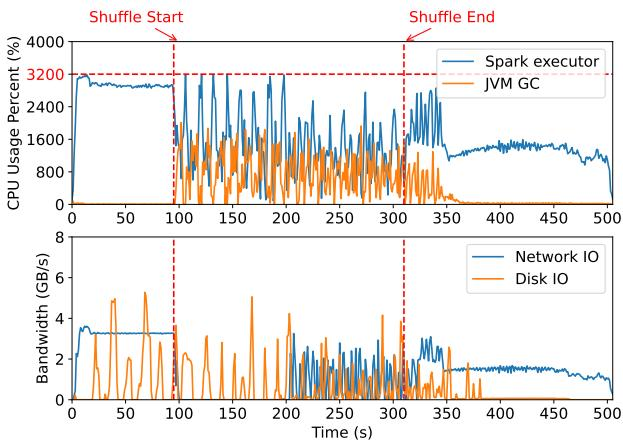  
Figure 1: CPU Utilization, Disk and Network Bandwidth of a Two-node Spark Cluster under Sort Application.

Here, we use the popular Spark as an example to explain the shuffle process. In Spark’s shuffle process, (1) mappers first partition the data and reorganize tuples within each partition using operations like aggregation and sorting to prepare for parallel processing in the reduce stage. (2) They then serialize and compress the data into byte streams, store the intermediate results on disk, and notify the Spark driver of the data’s location. (3) Reducers subsequently retrieve the data over the network, deserialize it, and apply user-defined reduce functions to complete the computation.

## 2.2 CPU Overhead of Shuffle

Shuffle supports efficient and scalable distributed computing by redistributing data across nodes. However, it is a CPU- and IO-intensive operation and is often the bottleneck of the entire task. To quantify the overhead of shuffle operations, we ran a 285GB HiBench sort workload on a 2-node Spark cluster.

Figure 1 illustrates the CPU, network, and IO consumption of the cluster during the task execution. It can be observed that the shuffle phase takes the longest time in the entire task execution, consuming approximately 226 seconds, while the rest map and reduce phases each take around 100 seconds. Additionally, we observed a significant amount of network and disk IO during the shuffle phase. Traditionally, shuffle operations have been limited primarily by these slow IOs. However, with the improvement in IO device performance, the CPU overhead of the shuffle has become increasingly noticeable. In our tests, shuffle consumed approximately 30 CPU cores, while the utilization of network and storage bandwidth was only 25% and 51%.

To further demonstrate the CPU overhead of the shuffle, we conducted a fine-grained breakdown of the execution time for different types of workloads using HiBench [20]. As shown in Figure 2, network and disk I/O accounts for only about 1% to 8% of the total execution time, with most of the time spent on computational tasks such as (de)serialization, garbage collection, and map/reduce functions. For shuffleintensive workloads, such as sort and terasort, (de)serialization and garbage collection account for approximately 64% to 69% of the total execution time. This indicates that these two steps are the primary factors that affect shuffle performance. We will now analyze these two operations in more detail.

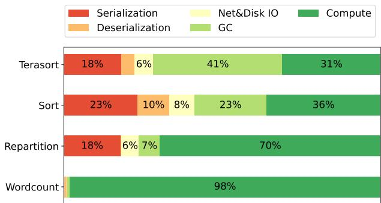  
Figure 2: Time Breakdown of Different HiBench Workloads.

Frequent (De)Serialization. During the shuffle process, a large amount of intermediate results are generated. These data are either persisted to disk or transmitted over the network. Each I/O operation requires data (de)serialization, which involves traversing, encoding, and converting Java object trees into byte streams. This process incurs significant CPU overhead. Although various optimization techniques (e.g., Kryo [14], Skyway [35]) have been proposed to reduce the computational overhead of serialization, they cannot entirely eliminate serialization costs since they still rely on host CPU cores for serialization. ZCOT [45] introduces a global metadata server to share JVM memory metadata across different nodes, allowing objects to be directly copied to the target node’s memory via RDMA, thereby eliminating serialization overhead. However, it relies on additional CPU servers and results in a large number of small network I/O operations.

Expensive Garbage Collection. Shuffle serialization and I/O processes involve the allocation and release of a large number of temporary objects (e.g., byte streams, memory buffers, file handles). This is particularly true for large-scale datasets, which significantly increase the garbage collection (GC) pressure on the JVM [6, 24]. The test results in Figure 1 also support this point, showing that once the shuffle phase begins, CPU overhead caused by GC increases significantly. When the JVM performs garbage collection (GC), shuffle serialization and I/O processes must wait for it to complete, which can significantly impact the overall performance of the shuffle operation.

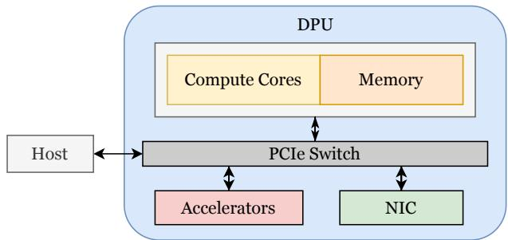  
Figure 3: The DPU Architecture.

## 3 DPU as An Opportunity

## 3.1 Data Processing Units

The DPU (Data Processing Unit) is a programmable network card based on SoC, which adds additional compute, storage, and interconnect units compared to traditional network cards. These units can offload storage and networking functions from the host, reducing the CPU load. Nowadays, major chip manufacturers have released their own DPU products [2, 5, 7, 21, 31], and leading cloud service providers have widely deployed DPU chips in their infrastructure [10,15,27]. Figure 3 shows a typical DPU architecture which consists of five components:

• High-performance network card capable of providing hundreds of Gbps of network bandwidth. For example, the BlueField-3 is equipped with a ConnectX-7 network interface card, which includes one or two ports, each supporting up to 200 Gbps.

• General-purpose compute cores, often energy-efficient ones like ARM or RISC-V cores, offer high programmability that can be used to offload and execute arbitrary host logic.

• Onboard memory, typically with a certain amount of DDR memory and onboard flash storage for the operating system. For example, the BlueField-3 features 32 GB of onboard DDR5 memory.

• Accelerators, including those for data-intensive tasks (e.g., compression, encryption) and those for accelerating memory access operations (e.g., DMA, DPA).

• PCIe switch for interconnecting with the host and other PCIe devices.

## 3.2 Offload Opportunities and Challenges

The DPU offers an opportunity to reduce the CPU overhead of data shuffling. As an accelerator in the data path, offloading the shuffling operations of data flow across multiple devices and nodes to the DPU is a natural idea. Additionally, we found that the hardware characteristics of the DPU align well with the shuffle process. In this section, we provide a detailed analysis of the opportunities and challenges of offloading data shuffling operations to the DPU.

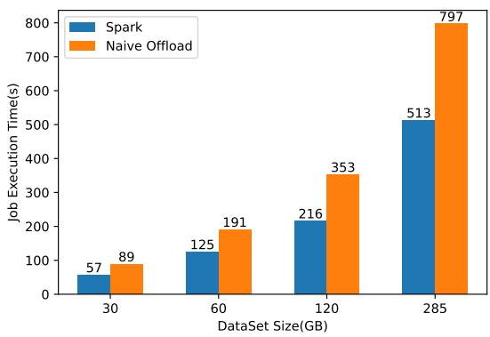  
Figure 4: Task Completion Time for Spark and Naive Offload with Different Dataset Sizes under Sort Application.

Opportunities. Firstly, the DPU has efficient memory access units that can be used to accelerate the serialization process. Serialization operations primarily involve traversing the Java memory object tree, which is mostly a series of memoryintensive operations. The DPU offers high memory access efficiency, especially with its DPA (Data Path Accelerator), which has numerous memory access units (e.g. 256 hardware threads in BlueField-3) that can execute concurrently, allowing for efficient access to host memory through load/store instructions. By leveraging these concurrent memory access units for parallel serialization, serialization speed can be significantly improved, and the CPU overhead on the host can be reduced.

Secondly, the DPU is capable of coordinating data flow between nodes. It can communicate with storage devices on the host through PCIe P2P, and with remote nodes via network interfaces. Therefore, data transfer across devices and nodes can be managed by the DPU without involving the host CPU. This not only reduces the CPU overhead on the host but also effectively mitigates the impact of the large number of temporary objects generated during serialization and I/O on the host JVM, thus reducing GC overhead.

Furthermore, the DPU features general-purpose computation cores that can be used to perform preprocessing computations during the shuffle process, further reducing the CPU overhead on the host.

Challenges. However, there are several challenges associated with offloading shuffle operations to the DPU. Firstly, the general-purpose computation cores on the DPU are slower compared to x86 cores on the host. This can slow down the execution of certain data-intensive tasks, such as partitioning and sorting. Secondly, the DPU has limited onboard memory resources, which cannot accommodate large volumes of intermediate results generated by the shuffle. When the volume of intermediate results exceeds the DPU’s memory threshold, the data produced by the map tasks on the host must wait until the DPU completes its processing before it can be sent back to the DPU, thereby affecting the overall execution efficiency of the task. Figure 4 illustrates the overall execution time of the task after decoupling and naive offloading the shuffle operation to the DPU. It can be observed that after offloading, the task completion time increased by a factor of 1.52 to 1.68, and as the dataset size increases, the performance degradation becomes more pronounced.

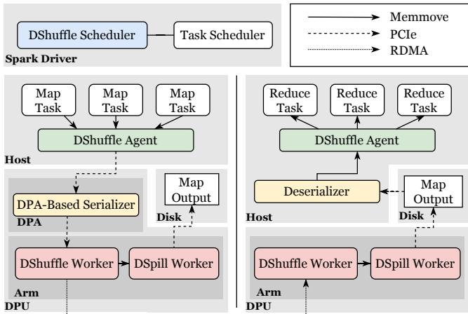  
Figure 5: The DShuffle Architecture.

## 4 DShuffle Overview

Design goals. DShuffle aims to bridge the gap between the resource demands of data-intensive shuffle operations and the characteristics of DPU hardware. Its specific design goals are as follows:

• Minimize shuffle overhead. Shuffle operations consume significant host CPU and memory resources. DShuffle aims to reduce the consumption of host resources by offloading the shuffle task to the DPU, thereby freeing up more host computational resources for actual tasks like map and reduce.

• Ensure shuffle performance. The limited computational power and memory resources of the DPU may affect the execution efficiency of shuffle operations. DShuffle aims to accelerate the shuffle process through pipelining parallelism and hardware acceleration.

• Ease of deployment. Data systems often require major changes to adopt new technologies. DShuffle seeks to enable data systems to leverage its benefits with minimal modification.

Architecture. Figure 5 illustrates an architecture designed to achieve the aforementioned goals, which comprises a set of components for collaboratively optimizing the shuffle process. Specifically, DShuffle offloads the shuffle execution to the DPU, leaving only a lightweight DShuffle Agent on the host. This agent receives shuffle requests initiated by the host, forwards them to the DPU for processing, and polls to retrieve the results. As previously mentioned, traditional shuffle processes are CPU-intensive and impose significant pressure on garbage collection (GC) in host memory. Executing the shuffle on the DPU effectively saves host CPU resources, allowing more computational power to be allocated to complex tasks such as map and reduce operations.

On the DPU, there are three components responsible for executing the shuffle operation:

• DPA-Based Serializer. It runs on DPA hardware threads and is primarily responsible for serializing Java objects in host memory and copying them into DPU memory.

• DShuffle Worker. It operates on the general-purpose compute cores of the DPU. For the map side, it handles data partitioning and aggregation, while on the reduce side, it focuses on merging and sorting the data.

• DSpill Worker. It manages the process of writing intermediate preprocessing results to local disks or transmitting them to remote nodes over the network. Leveraging the DPU’s PCIe peer-to-peer (P2P) and networking capabilities, the DSpill worker can directly read/write local disks and send data to remote nodes without CPU intervention, thereby significantly reducing the host CPU load and memory pressure.

In addition to the above components, there is a DShuffle Scheduler running on the Spark driver node. This scheduler coordinates and manages host task execution based on the runtime states of the DShuffle Worker and DSpill Worker on the DPU. We next present a workflow to better illustrate how these components collaborate and work together.

Workflow. (1) When the intermediate results of a map task exceed the predefined threshold (e.g., 32MB), the Spark executor sends a signal to the DPA. The DPA then launches multiple hardware threads to perform serialization and transfers the results to the DPU memory via DMA, notifying the DShuffle Worker that a request has arrived. (2) The DShuffle Worker on the map side performs aggregation, partitioning, sorting, and other operations on the serialized data, and caches the intermediate results in DPU memory. When the amount of intermediate data exceeds the predefined memory threshold, the Map side triggers a DSpill Worker, which either spills the data to local disk or communicates with the DShuffle Scheduler to notify it to schedule a reduce target node. (3) If the target node is successfully acquired, the DSpill Worker on the map side sends the data to the reduce node via RDMA. (4) Upon receiving the data, the DSpill Worker on the reduce node notifies the DShuffle Worker on the reduce side to execute data merging. (5) The merged results are written to disk by the DSpill Worker on the reduce side, awaiting subsequent computational tasks to read directly from the disk.

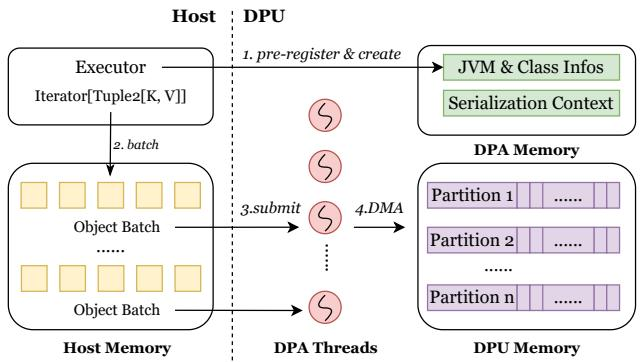  
Figure 6: The DPA-based Serializer.

## 5 DPA-Offloaded Serialization

The state-of-the-art SmartShuffle offloads only the shuffle computation and network data transmission, leaving the serialization operations to be handled by an agent on the host. As demonstrated in Chapter 2, frequent serialization during the shuffle process incurs significant CPU overhead. Serialization involves intensive memory access and encoding operations, which consume substantial CPU cycles on the host. Additionally, the creation of numerous temporary objects during serialization imposes a heavy burden on the JVM’s garbage collection (GC). Consequently, reducing serialization overhead on the host is also a must.

Offloading serialization to the DPU is a feasible solution as it reduces the strain on the host CPU and isolates its impact on JVM memory. However, utilizing the DPU for serialization is non-trival and comes with several challenges: (1) The input for serialization consists of discrete memory objects linked by pointers, which the DPU cannot inherently interpret; (2) The latency for DPUs to access host memory is higher than that of CPUs, and the clock speed of individual DPU cores is lower, potentially affecting serialization performance. To address these challenges, DShuffle introduces a DPA-based serializer. This serializer takes advantage of the DPA’s hardware capabilities for byte-addressable and highly concurrent access to host memory, accelerating the serialization process.

DPA-based Serializer. Figure 6 shows the architecture of DPA-based serializer. It provides the same interface as other Java serializers, including initialization, type registration, serialization, deserialization, and destruction. As a result, the upper-layer application remains unaware of the specific serializer being used. Unlike CPU-based serializers, the DPAbased serializer retrieves the current JVM runtime parameters during initialization and passes them to the DPA. These parameters include the base address and size of the JVM heap memory, as well as JVM’s compressed object pointer optimization settings.

Given that the DPA can access host memory using load/store instructions, it can use these parameters to access objects at any address within the JVM heap memory. When the serialization interface is invoked, the user only needs to provide the root object’s address. The DPA hardware threads can then traverse the Java object tree from that address, copying scattered memory object fields into contiguous hardware memory to complete the serialization process. This approach effectively resolves the first challenge.

For the second challenge, the DPA-based serializer overcomes the long latency of single-threaded serialization by parallelizing the process using multiple DPA hardware threads. Specifically, the DPA serializer batches the objects to be serialized and, once a certain threshold is reached, activates multiple DPA hardware threads to serialize these objects in parallel, thereby improving serialization efficiency. As mentioned earlier, DPA has more than 190 hardware threads. By combining batching with multi-threading, the DPA serializer can achieve serialization speeds comparable to or even faster than those of the host machine.

## 6 Fine-Grained Pipeline Shuffle

The DPA-based serializer ensures fast serialization, but the shuffle process still involves additional steps such as preprocessing and I/O operations. Since the DPU has a limited number of general-purpose compute cores and is slower than the host CPU, the execution speed of these steps may be constrained, potentially impacting the overall shuffle performance. To address this challenge, existing approaches dynamically allocate tasks between the host and DPU based on the DPU’s load. Although this prevents performance degradation, it introduces additional overhead on the host CPU.

In this paper, we propose a fine-grained pipelined shuffle technique that guarantees shuffle efficiency on the DPU, without consuming any host CPU resources. This is achieved by exploiting parallelism both across different shuffle workers and within individual shuffle workers. We will explain this approach in detail in this section.

Inter-Worker Parallelism. Figure 7 illustrates the differences between DShuffle, native Spark, and naive offload. In native Spark, map computations and shuffle operations are interleaved within the same thread, causing these two operations to block each other. The same applies to the reduce side, where the reduce task must wait for the shuffle to complete before it can start. Naive offload decouples the shuffle operation and offloads it to the DPU, enabling some overlap between map and serialization computations. However, due to the slower processing speed and limited memory capacity of the DPU, having it execute all preprocessing and I/O tasks in a single thread can negatively impact shuffle efficiency, thus blocking subsequent map computations. DShuffle improves the shuffle operation’s execution efficiency on the DPU by splitting the data into fine-grained blocks and assigning them to preprocessing threads and I/O threads for pipelined execution. The specific process is described as follows.

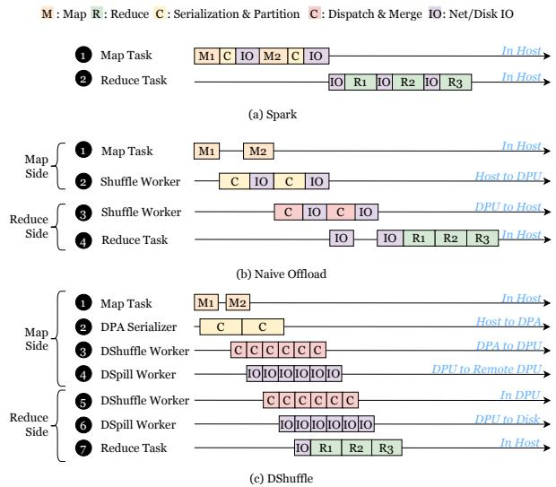  
Figure 7: Execution Pipeline of Native Spark, Naive Offload Scheme and DShuffle.

On the map side, once the DPA Serializer completes serializing the intermediate results of the map computation, the corresponding DPA hardware thread is freed to serialize the next batch of intermediate results. Simultaneously, the DShuffle worker can start preprocessing the serialized results from the previous batch. After the DShuffle worker finishes its task, the results are passed to the DSpill worker for I/O, allowing the DShuffle worker to immediately begin preprocessing the next batch of serialized results. Through pipeline parallelism among workers, the shuffle operation’s execution efficiency on the DPU is significantly enhanced.

On the reduce side, the pipeline process is essentially the reverse of the map side, with the distinction that the deserialization operation is handled by the DShuffle agent on the host. DShuffle assigns deserialization to the host CPU primarily because it involves creating a large number of Java objects. If the DPA were to handle this task, it would need to communicate with the JVM on the host, resulting in numerous small cross-PCIe requests, which would introduce significant access latency. By having the host agent handle this process, it can read a batch of data from the local disk at once for processing, ensuring the efficiency of deserialization.

Intra-Worker Parallelism. In the pipeline described above, if a worker in a specific stage processes data at a slower speed, it will impact the overall efficiency of the pipeline. To address this issue, DShuffle segments the data being processed by slower workers based on keys and then initiates multiple threads to process different segments in parallel. This approach enhances the execution speed of slower workers, ensuring that the throughput of different stages is balanced.

In addition to thread-level parallelism, DShuffle employs coroutines to enhance the resource utilization of DPU processors. Specifically, DShuffle breaks down each worker’s execution process into finer-grained tasks, allowing these tasks to overlap on DPU computational cores. For example, a DShuffle worker’s process is divided into three tasks: polling requests from the DPA Serializer result queue, performing preprocessing computations, and submitting I/O requests to the DSpill worker’s request queue. These tasks are scheduled on demand to the DPU’s general-purpose computational cores, avoiding the continuous occupation of CPU resources. For DPUs with a limited number of cores, this approach effectively prevents resource waste.

## 7 DPU-Direct Spilling

Beyond the computational overhead of serialization and preprocessing, the shuffle process can lead to significant data spill costs. When the intermediate result data generated by serialization and preprocessing exceeds the host memory threshold, spill operations are triggered to free up memory. This process not only blocks foreground computation but also consumes a considerable amount of host CPU resources to perform I/O operations. DShuffle mitigates these issues by leveraging high-speed DPA serialization to rapidly transfer intermediate results to DPU memory, thereby reducing foreground computation blocking and host memory usage. However, since DPU memory has limited capacity, spill operations remain unavoidable when its memory is insufficient.

To address this challenge, SmartShuffle spills unprocessed intermediate results to remote DPUs or the local host when the DPU memory reaches a certain threshold. While this approach alleviates the memory pressure on the DPU, it introduces redundant data movement and additional host CPU overhead. This is because data spilled to the local host or remote DPU is eventually handed over to the host CPU after preprocessing, which then writes the data to disk. These I/O operations not only consume host CPU resources but also create temporary objects during the process, increasing JVM garbage collection (GC) overhead.

In this paper, we propose a DPU-Direct Spilling scheme to further eliminate I/O overhead during the spill process. Figure 8 shows the key idea. Compared with native Spark, DShuffle leverages the DPU to manage data flow across devices and nodes. When shuffle intermediate results need to overflow or be written to disk, DShuffle enables the DPU to directly write intermediate results to the local disk via PCIe P2P or transmit them to remote DPUs via RDMA for direct disk writes. This approach completely eliminates CPU consumption and memory interference caused by I/O operations during the shuffle process.

The key to implementing DPU-Direct Spilling lies in enabling the host CPU to be aware of the data written to disk by the DPU. To achieve this, DShuffle employs a file preallocation strategy. Specifically, during node initialization, a disk partition is created, and several fixed-size files are allocated within this partition to accommodate spilled data. Once created, the metadata of these files remains unaltered. The partition is mounted as read-only on the host and as read-write on the DPU.

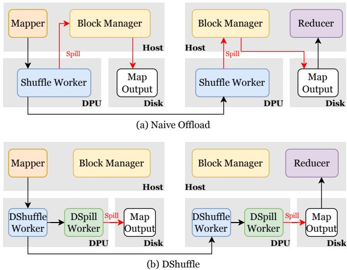  
Figure 8: The Data Spilling Workflow of Naive Offload Scheme and DShuffle.

At runtime, when the shuffle scheduler dispatches shuffle requests to a node, the DPU on that node directly writes data to the partition through the local file system. After writing a fixed-sized block (e.g., 32MB), the DPU notifies the reducer on the host via DMA that new data is available. The reducer reads the file blocks based on metadata provided by the DPU and performs the necessary computations. Both the DPU’s data writes and the reducer’s reads utilize direct I/O to bypass the local file system cache, ensuring data consistency.

To effectively utilize the spill partition’s space, the DPU also tracks the metadata of free file blocks. Once a file block is consumed by the reducer, the corresponding space is released and made available for subsequent spilled data writes.

## 8 Implementation

We use NVIDIA’s BlueField-3 (BF-3) DPU as the platform for development and deployment. The BF-3 connects to the host system via a PCIe Gen 4.0 interface and runs Ubuntu 20.04 along with the DOCA 2.9 programming suite. The codebase for all DShuffle modules consists of approximately 6,700 lines and will be open-source.

Host. The DShuffle agent is divided into two parts. The first part is an interface integrated with Spark, comprising approximately 500 lines of Java code. The interface includes methods such as Initialize, TriggerSpillStart, BatchAppendKV, Wait-ForSpillDone, and RegisterClassInfo. Among these, Initialize and RegisterClassInfo handle preprocessing of Java type information or retrieve and register JVM startup parameters.

BatchAppendKV collects batched key-value objects into the serializer queue and then partitions them into the DMA buffer. Based on these interfaces, we developed a DShuffleWriter compatible with the native Spark shuffle writer, allowing seamless replacement and deployment. The second part is the native interface implemented via JNI, with approximately 1,000 lines of C++ code. This primarily handles interactions with the DPU, such as notifying the DPU to pull intermediate result buffers via DMA.

DPU. The DPU worker component consists of approximately 4,000 lines of C++ code. We implemented a unified data transmission layer that supports DMA, RDMA, and TCP communication protocols. On top of this layer, we developed two types of workers using the Boost.Fibers coroutine runtime: SpillWorker and ShuffleWorker. Tasks are passed between workers on the same DPU via single-producer singleconsumer (SPSC) lock-free queues. The DPA Serializer, developed using the DOCA DPA module, is split into two parts. The first part, about 1,000 lines of code, is implemented using the JNI framework. It processes type metadata information in the JVM and handles interactions with the DPA hardware. The second part, approximately 1,200 lines, is the hardware code for the DPA, which implements serialization logic for Java object trees on DPA threads.

## 9 Evaluation

## 9.1 Goals

We evaluate DShuffle to answer the following questions:

• How much does DShuffle reduce the host CPU usage and improve the IO efficiency? (§9.3)

• How much can DShuffle reduce the completion time of spark jobs? (§9.4) How DShuffle performs under different workloads? (§9.5)

• How effective are the optimizations in each component at improving the efficiency of DShuffle? (§9.6)

These questions correspond to the first two design goals of DShuffle, while the third design goal has already been analyzed in 8.

## 9.2 Testbed and Methodology

System Setup. We evaluated DShuffle on a 2-node testbed, where each node is equipped with an Intel Xeon Gold CPU and an NVIDIA BlueField-3 DPU [36]. The detailed hardware and software configurations are shown in table 1. Note that we locked the CPU frequency at 4.0 GHz and disabled hyper-threading to ensure consistent performance across multiple runs. On each node, we deployed a 16-core, 32 GB Spark Executor, forming a two-node Spark cluster.

<table><tr><td>Intel Xeon 6418H Server</td></tr><tr><td>CPU: 24 Xeon cores @ 4.0GHz w/HT disabled Memory: 64GB DDR4 DRAM SSD: Samsung 980 pro 2TB OS: Ubuntu 22.04 LTS,Linux Kernel 6.8</td></tr><tr><td>NVIDIABlueField-3DPU</td></tr><tr><td>Network: ConnectX-7 two 100Gbps Ethernet ports CPU:16 ARMv8.2 A78 cores Mem0ry:32GBDDR5DRAM DPA:16 RISC-V cores with 256 hardware threads</td></tr></table>

Table 1: The Node Configuration of the Testbed

Workloads. We use HiBench [20] as our primary benchmarking tool. HiBench provides various types of workloads, including Sort, TeraSort, WordCount, and Repartition. Most of our tests are conducted using the Sort workload because it contains only a single Shuffle phase, making it ideal for demonstrating the optimization effects on the shuffle process. Nevertheless, we also evaluated other types of workloads. Unless otherwise specified, the dataset size used for evaluation is 285 GB with 32 partitions. Additionally, data compression in the Shuffle process was disabled during all tests to avoid additional CPU overhead on the host, which could reduce overall performance.

Baselines. Since the most relevant SmartShuffle [28] is not open-sourced, we use the following baselines to evaluate DShuffle:

• Native Spark: Using Spark 2.4.3 [17] as the baseline implementation without any offloading.

• Naive Offloading: Similar to the existing SmartShuffle, it offloads tasks such as partitioning, sorting, and network I/O of shuffle operations to the DPU, while serialization computation and intermediate data spilling are still handled by the host. The only difference from SmartShuffle is that Naive Offloading does not implement dynamic offloading logic. Since the goal of DShuffle is to fully offload the shuffle operation without sacrificing performance, using Naive Offloading as a baseline allows for a clearer demonstration of DShuffle’s optimization benefits. Nevertheless, we provide a theoretical comparison between DShuffle and SmartShuffle in Section 10.

• DShuffle: The shuffle process offloads serialization, preprocessing, network I/O, and intermediate result spilling entirely to the DPU. These steps are organized in a pipeline manner, leveraging DPA for offloading and accelerating serialization. The DPU directly writes intermediate data to disk, ensuring efficient data handling throughout the process.

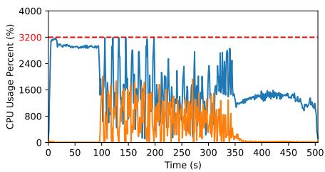

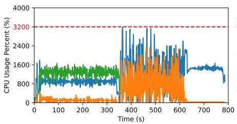

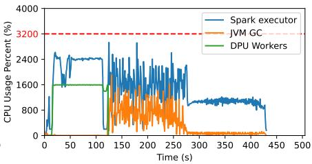

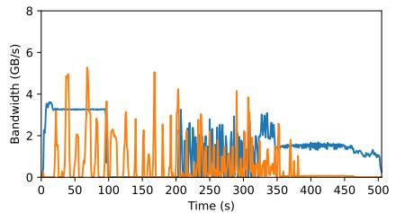  
(a) Spark

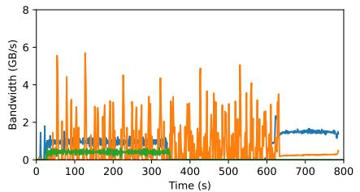  
(b) Naive Offload

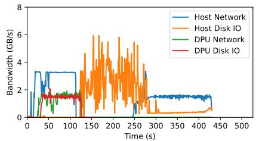  
(c) DShuffle

Figure 9: The CPU Utilization, Disk and Network Bandwidth of the Spark Cluster During the Execution of the Sort Application.  
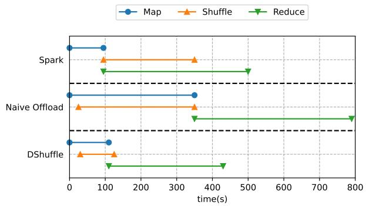  
Figure 10: Execution Timeline for Native Spark, Naive Offload Scheme and DShuffle under Sort Application.

## 9.3 Resource Efficiency

Figure 9 illustrates the CPU utilization, disk, and network IO bandwidth of the Spark cluster during the execution of the sort application. It is worth noting that simple offloading increased the overall execution time of the task by 57%, while optimization through DShuffle reduced the overall execution time by approximately 16%. Below, we analyze the execution performance during the map and reduce phases for different comparison objects.

Map phase. Compared to native Spark, the naive offloading method decouples the shuffle from the host and offloads it to the DPU, overlapping it with the host’s map computation. As a result, during the map phase, we observe the consumption of DPU compute cores and network IO. However, the naive offloading method does not reduce the overall execution time of the task. This is because the DPU cores are slower than the host cores, and naive offloading leads to a decrease in shuffle speed. When the DPU’s memory capacity reaches its threshold, the map computation on the host needs to wait for the shuffle to complete, thereby affecting the overall task execution efficiency.

In contrast, DShuffle improves the execution speed of shuffle operations on the DPU through optimization techniques such as serialization acceleration, pipeline parallelism, and direct spilling, effectively eliminating the stall of map computations. This is also confirmed in Figure 10, which illustrates the execution timelines for each phase of different comparison groups. Compared to native Spark and naive offloading, DShuffle reduces the shuffle execution time by 62.7% and 70.7%, respectively. Additionally, since DShuffle offloads serialization to the DPA, the CPU resources consumed by the host during the map phase (24 cores) are lower than those in native Spark (30 cores).

Reduce phase. In native Spark, the reduce nodes pull data from the map nodes to the local machine for computation, which results in a significant amount of small network and disk I/O. Naive offloading improves network I/O efficiency by aggregating data and sending it to the reduce nodes in advance. However, during the reduce execution phase, naive offloading still relies on the host to perform serialization and file I/O, which introduces additional data copies and significant garbage collection (GC) overhead. Additionally, serialization can block the reduce computation, negatively impacting task execution efficiency.

In contrast, DShuffle leverages the DPU to directly write intermediate data to disk, eliminating redundant data transfer and improving I/O efficiency. As shown in Figure 1, DShuffle’s I/O bandwidth is significantly higher than that of native Spark and naive offloading. Additionally, DShuffle uses DPA to offload and accelerate serialization, which reduces both the blocking effect on reduce tasks and the garbage collection (GC) overhead. This is also evident in Figure 1, where DShuffle exhibits lower CPU overhead due to GC and a more stable CPU utilization for reduce tasks. Overall, by implementing these optimization techniques, DShuffle reduces the execution time of reduce phase by approximately 45.6% and 50.2%, respectively, compared to native Spark and naive offloading.

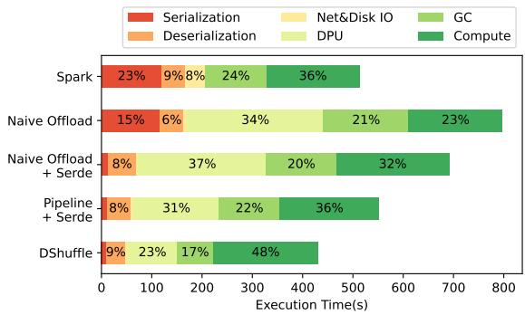  
Figure 11: Time Breakdown of Spark Tasks with Different Optimization Techniques Turned on.

## 9.4 Performance Analysis

In this section, we will provide a detailed analysis of the performance advantages of DShuffle. First, we evaluate the performance gains brought about by different optimization techniques. Then, we examine the scalability of DShuffle’s performance with respect to dataset size and the number of partitions.

Performance Breakdown. To demonstrate the performance gains from different optimization techniques, we progressively enabled various optimizations based on naive offloading: DPA-accelerated serialization, pipelined parallelism, and direct spilling via DPU. We then measured the overall execution time and performed a fine-grained time breakdown under different configurations. The test results are shown in Figure 11. Here, "Naive Offload + Serde" refers to enabling DPA serialization on top of the Naive Offload approach, while "Pipeline + Serde" further accelerates the shuffle steps on the DPU through pipelined parallelism.

It can be observed that DPA-accelerated serialization reduced the overall execution time of naive offloading by 13.2%, with serialization time decreasing from 15% to 3%. Additionally, offloading serialization reduced the GC pressure on the host, leading to a lower overall GC time. After enabling pipelined parallelism, the overall execution time was further reduced by 17.4% due to more efficient shuffle computation on the DPU. Finally, enabling direct spilling via DPU reduced the overall execution time by another 15.1%. This optimization eliminated redundant data copying, significantly reducing data transmission time on the DPU. Furthermore, offloading the I/O process to the DPU further alleviated GC pressure on the host, leading to a further reduction in GC time.

Performance with dataset size. To demonstrate the scalability of DShuffle with respect to dataset size. We generated sort datasets of 30GB, 60GB, 120GB, and 285GB to evaluate the task execution time of native Spark, naive offloading, and DShuffle. As shown in Figure 12, with the dataset size increases, the performance improvement of DShuffle becomes more pronounced. This is primarily because, with larger datasets, the IO overhead during the shuffle process becomes more significant, and the proportion of serialization and GC overhead is higher. DShuffle’s optimizations effectively reduce these two types of overhead, resulting in greater performance gains.

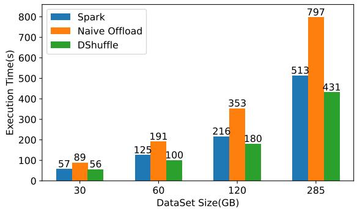  
Figure 12: Execution Time of Different Comparison Groups under Different Dataset Size.

Performance with partition number. We also tested the scalability of DShuffle in terms of partition number. We measured the task execution times of native Spark, naive offloading, and DShuffle under different partition numbers. As shown in Figure 13, with the number of partitions increases, the total task execution time for all comparison groups decreases, as the reduce tasks are more finely divided, which increases parallelism. The execution time for reduce tasks decreases because the amount of data being processed is smaller. However, for Map tasks, naive offloading becomes slower as the number of partitions increases. This is due to a higher number of network requests for data forwarding, which increases network overhead. In contrast, DShuffle, with its fixed pipeline granularity, ensures stable Map task execution times, thereby maintaining the same partition scalability as native Spark.

## 9.5 HiBench

In this section, we evaluate the benefits of DShuffle using different types of workloads from HiBench. The test workloads include Sort, TeraSort, Repartition, and Wordcount. The Sort workload involves sorting a 285GB dataset containing random-length random strings. TeraSort is similar to the Sort workload but mainly consists of smaller random strings, which results in greater GC pressure. The Repartition workload focuses on re-partitioning 300GB of random strings. Wordcount is primarily concerned with counting word frequencies in a 150GB dataset of random strings which is computationally heavy but has low shuffle overhead.

Figure 14 shows the test results. It can be observed that for workloads with high shuffle pressure, DShuffle exhibits a significant performance gain, as it significantly reduces serialization and GC overhead. However, for workloads with high computational pressure, DShuffle’s performance is similar to native Spark, as most of the overhead occurs in the map computation, with a small proportion spent on shuffle. Overall,

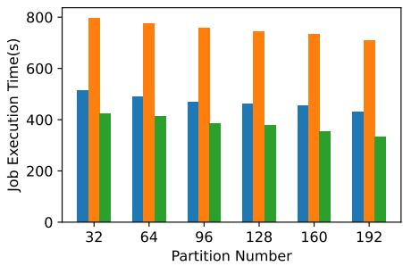  
(a) Whole Job

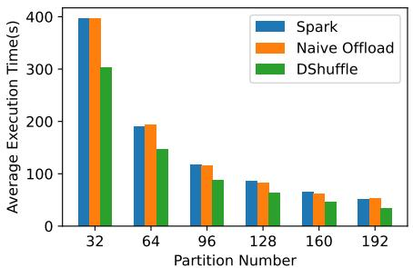  
(b) Reduce Task

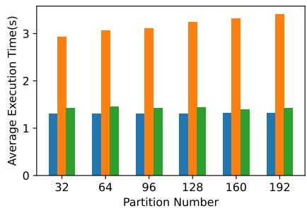  
(c) Map Task

Figure 13: Execution Time of Different Comparison Groups under Different Partition Numbers.  
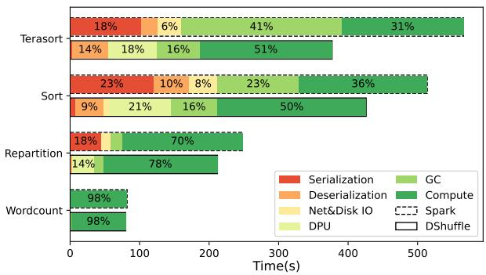  
Figure 14: The Time Breakdown of Different HiBench Workloads.

DShuffle can effectively accelerate the execution speed of tasks with high shuffle overhead, without affecting the execution efficiency of tasks with high computational overhead.

## 9.6 Component Efficiency

In this section, we test the efficiency of the key components of the DShuffle, including the DPA-based serializer and the pipeline workers in the DPU.

DPA-based Serializer. To evaluate the DPA-based serializer, we use HiBench to generate a dataset and extract the strings to be serialized from the dataset, forming key-value data with a length of 128, where both the key and value are 4KB each. We used the native Java serialization library, Kryo serialization library, and DShuffle serialization library to process the dataset, recording the execution times for each comparison group. For all tests, we first performed a 5-second warm-up, followed by a 5-second testing period.

Figure 15(a) shows the serialization and deserialization latency for different comparison groups in a single-core scenario. For DShuffle, deserialization runs on the CPU, while serialization runs on the DPA (as explained in §5). It can be observed that the deserialization speed of the DShuffle library is significantly faster than that of the native Java and Kryo libraries. This is primarily because DShuffle’s serialization library directly copies the object content to the target buffer address rather than invoking the Java constructor to create the object, thereby reducing the number of interactions with the JVM. For serialization, however, the processing delay is higher than Java native and Kryo due to the lower clock speed of a single DPA core (16 hardware threads) compared to the host CPU.

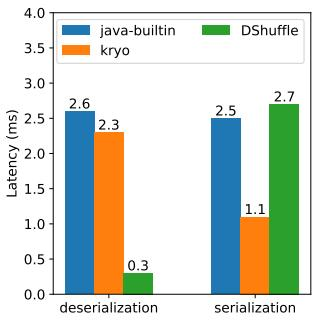  
(a) Single DPA Core

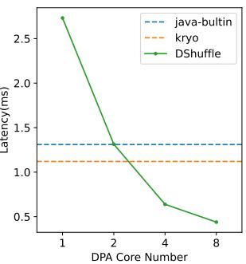  
(b) Multi-DPA Cores  
Figure 15: Serialization Latency of Different Serialization Libraries.

Nevertheless, the DPU has a large number of DPA cores that can execute concurrently. By leveraging multiple hardware threads for parallel serialization, the DPA serializer can achieve throughput higher than Java native and Kryo. Figure 15(b) illustrates the throughput of the DPA serializer with different numbers of DPA cores, showing that when more than 2 cores (32 hardware threads) are used, the DPA serializer’s latency becomes lower than that of Java native and Kryo. While multi-threading on the host can also be used for parallel serialization, it consumes significant CPU resources. DShuffle avoids this issue by offloading the serialization process to the DPA.

Pipeline Workers. To test the maximum throughput of the workers on the DPU, we generated 640GB of key-value data using the HiBench tool, with both keys and values being random strings. We used this key-value data to stress the DPU, evaluating the maximum throughput that DShuffle can achieve and the resource consumption on the DPU with different numbers of workers. The results are shown in Figure 16. It can be observed that as the number of workers increases, the processing bandwidth of DShuffle gradually increases. With 15 workers, the bandwidth reaches approximately 10.53GB/s, which is close to the limit of a 100Gbps network. At this point, the number of DPU cores consumed by the map and reduce nodes is around 32, which also reaches the maximum number of DPU cores.

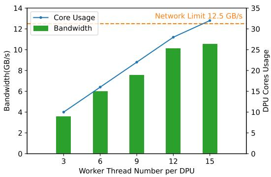

Figure 16: The bandwidth of DShuffle workers with different thread numbers.  
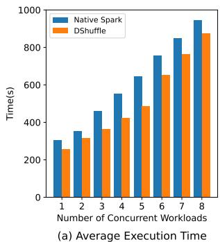

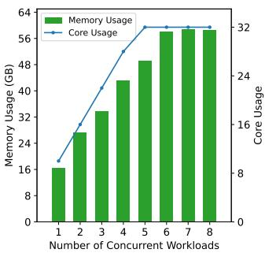  
Figure 17: The scalability of DShuffle with different numbers of workloads.

## 9.7 Scalability

In this section, we evaluate the scalability of DShuffle. Specifically, we gradually increase the number of concurrently running Sort workloads. Each 100GB Sort workload is executed by two executors distributed across two physical machines, with each executor provisioned with 6 CPU cores and 12GB of memory.

Figure 17 presents the evaluation results. As shown in Figure 17(a), the average execution time of native Spark increases steadily with the number of concurrent workloads. This trend is primarily attributed to two factors: (1) resource contention among concurrently running Spark executors, particularly during the reduce phase where intensive garbage collection significantly consumes CPU resources and impairs computation efficiency; and (2) network bandwidth contention across executors, which slows down data fetching in the map phase and data exchange during the shuffle phase.

DShuffle mitigates these bottlenecks by offloading shuffle operations, thereby reducing CPU contention and minimizing garbage collection overhead during I/O. As a result, it delivers superior performance under increasing load. The scalability of DShuffle is mainly bounded by the hardware capacity of the DPU. As depicted in Figure 17(b), when the number of concurrent workloads approaches 6, the compute and memory resources of the DPU become saturated. Beyond this point, additional workloads exacerbate resource contention on the DPU, diminishing incremental performance benefits.

Despite this limitation, DShuffle consistently outperforms native Spark and can efficiently support workloads equivalent to a host server with up to 48 CPU cores and 128GB of memory, which is sufficient for the majority of practical applications.

## 10 Discussion

Comparison with non-DPU solutions. Software-based shuffle optimizations [9, 16, 25, 29, 39, 41, 45] focus primarily on improving I/O process, such as using dedicated shuffle service clusters to schedule subsequent tasks. However, these approaches do not eliminate CPU and memory consumption on the host and may even introduce additional overhead from intermediate servers. Hardware-based shuffle optimizations typically target specific stages of the shuffle pipeline, but lack a comprehensive end-to-end solution. For instance, Spark RDMA [32] leverages high-bandwidth RDMA NICs to accelerate intermediate data transfers but ignores the computational overhead of shuffle. Cereal [22] uses custom hardware to speed up Spark’s serialization, while other approaches [8, 37] offload compute-intensive operations—such as joins and merges—to GPUs or FPGAs. However, these solutions often fail to mitigate the I/O overhead associated with intermediate results. By contrast, DShuffle leverages the hardware capabilities of DPUs to provide a holistic optimization of the shuffle process, effectively addressing both computational and I/O bottlenecks.

Difference between DShuffle and SmartShuffle. There are two main differences between DShuffle and SmartShuffle [28]: (1) First, DShuffle is designed to fully offload shuffle operations to DPUs without sacrificing performance. It achieves this through fine-grained pipelined acceleration, which allows for efficient execution of shuffle steps. As a result, DShuffle frees up more host resources for map and reduce computations. In contrast, SmartShuffle, tailored for older-generation DPUs, adopts a dynamic offloading strategy that still relies on CPU and host memory resources. (2) Second, SmartShuffle’s evaluation primarily focuses on small datasets (20–50GB) that fit entirely within host memory (64GB), thereby avoiding disk I/O as well as the associated serialization and garbage collection overheads. However, our experiments reveal that these overheads become significant when processing large datasets (several hundred GB) that exceed host memory capacity. DShuffle mitigates these overheads by leveraging DPAaccelerated serialization and DPU-direct spilling, demonstrating strong effectiveness in large-scale data processing.

Portability of DShuffle for other DPU architectures. For SoC-based DPUs (e.g., AMD Pensando [2], Stingray PS1100R [5], Intel IPU E2100 [21], Marvell OCTEON [31]), DShuffle can be easily ported since most of its logic is implemented on general-purpose Arm cores. The hardware serialization logic implemented on the DPA can also be replicated on the host CPU, albeit with some resource consumption, but it remains faster than Java’s native serialization library. For FPGA-based DPUs (e.g., AMD Alveo U200 [1]), DShuffle’s logic can also be migrated, but fully hardening the implementation presents significant development challenges and longer development cycles. Additionally, FP-GAs are costly and better suited for parallel computing tasks. Therefore, we believe SoC-based DPUs are more suitable for shuffle tasks.

## 11 Related Work

Improving Shuffle I/O Efficiency. For large-scale data analytics workloads, I/O speed is a critical factor affecting shuffle performance [46]. A lot of work has been done to optimize network and disk I/O in the shuffle process. Sailfish [39], AggShuffle [29], and Riffle [25] propose aggregating fragmented intermediate shuffle results into large files to convert random small I/O requests into large sequential I/O, effectively improving the utilization of network and disk bandwidth. Magnet [41], Celeborn [16] and OPS [9] propose directly pushing intermediate results from the map side to the reduce side, allowing network and disk I/O to overlap with the map computation process, thus effectively improving task execution speed. Exoshuffle [30] introduces a shuffle framework that integrates various optimization techniques such as pre-aggregation and push-based shuffle. However, all of these works require reserving host resources or using additional servers to implement aggregation operations. In contrast, DShuffle offloads these processes to the DPU, completely eliminating the dependency on extra hardware resources.

Accelerating Shuffle Serialization. Serialization occupies a significant portion of CPU time during the shuffle process. Many works have focused on accelerating Spark’s serialization operations from both software and hardware perspectives. Kryo [14] is a widely used and mature Java serialization library that avoids the extensive string comparison operations in the native Java serialization type reflection mechanism through unique type encoding, effectively improving serialization speed. Skyway [35] extends JVM heap space based on type encoding to achieve lightweight object direct transfer, reducing serialization overhead. ZCOT [45] avoids serialization during the object transfer process through distributed shared memory, but it relies on an additional central metadata server and increases the number of network I/O operations during object transfer. Cereal [22], Zerializer [44], and Cerebros [38] use customized hardware to accelerate serialization operations. In contrast to these approaches, DShuffle uses widely deployed DPUs to offload and accelerate serialization operations without the need for additional hardware modifications, effectively reducing serialization CPU overhead.

Using DPUs to offload and accelerate distributed applications. With the widespread deployment of DPUs in data centers, numerous tasks are leveraging DPUs to offload and accelerate distributed applications, such as distributed file systems [18, 23, 26, 50], distributed key-value stores [13, 19, 40, 43], and disaggregated storage servers [12, 34, 42, 48, 49]. Among these, SmartShuffle [28] is the most relevant to our work. It uses the Stingray DPU to offload shuffle operations. Since its code is not open source, we provide a qualitative analysis here. The goal of SmartShuffle is to offload the shuffle computation to the DPU to reduce the host CPU overhead. However, it focuses only on offloading preprocessing computations and network I/O. For large-scale datasets, serialization and disk I/O also have a significant impact on shuffle performance. DShuffle addresses these two issues by accelerating serialization via DPA and using DPU direct spilling. In addition, SmartShuffle adopts a partial offloading policy, which still requires substantial host resource consumption. In contrast, DShuffle accelerates the shuffle process on the DPU through fine-grained pipeline parallelism, effectively eliminating the consumption of host resources during shuffle operations.

## 12 Conclusion

In this paper, we demonstrate that shuffle operations introduce significant CPU and IO overhead, often becoming a key performance bottleneck in data-intensive applications. We propose a novel architecture, DShuffle, which leverages DPUs to offload and accelerate shuffle operations. DShuffle introduces three key techniques to enhance the execution efficiency of shuffle operations on DPUs: DPA-accelerated serialization, fine-grained pipelined parallelism, and DPU-direct spilling. We have implemented DShuffle based on Spark and a real DPU hardware platform. The experimental results show that DShuffle effectively reduces CPU consumption, improves IO efficiency, and decreases the completion time of Spark jobs.

## Acknowledgments

We thank our shepherd Gyuyeong Kim and anonymous ATC reviewers for their constructive feedback. This work was sponsored by the National Key Research and Development Program of China under Grant No.2023YFB4502701, the National Natural Science Foundation of China under Grant No.62172175, the Shandong Provincial Natural Science Foundation under Grant No.ZR2024LZH004, the China Postdoctoral Science Foundation under Grant No.2024M751011, the Postdoctor Project of Hubei Province under Grant No.2024HBBHCXA027.

## References

[1] AMD. Alveo u200 data center accelerator card., 2023.

[2] AMD. Amd pensando infrastructure accelerators., 2023.

[3] Michael Armbrust, Tathagata Das, Joseph Torres, Burak Yavuz, Shixiong Zhu, Reynold Xin, Ali Ghodsi, Ion Stoica, and Matei Zaharia. Structured streaming: A declarative api for real-time applications in apache spark. In Proceedings of the 2018 International Conference on Management of Data, SIGMOD ’18, page 601–613, New York, NY, USA, 2018. Association for Computing Machinery.

[4] Michael Armbrust, Reynold S. Xin, Cheng Lian, Yin Huai, Davies Liu, Joseph K. Bradley, Xiangrui Meng, Tomer Kaftan, Michael J. Franklin, Ali Ghodsi, and Matei Zaharia. Spark sql: Relational data processing in spark. In Proceedings of the 2015 ACM SIGMOD International Conference on Management of Data, SIG-MOD ’15, page 1383–1394, New York, NY, USA, 2015. Association for Computing Machinery.

[5] Broadcom. Broadcom stingray smartnic accelerates baidu cloud services., 2020.

[6] Rodrigo Bruno, Luís Picciochi Oliveira, and Paulo Ferreira. Ng2c: pretenuring garbage collection with dynamic generations for hotspot big data applications. SIG-PLAN Not., 52(9):2–13, June 2017.

[7] Idan Burstein. Nvidia data center processing unit (DPU) architecture. In IEEE Hot Chips 33 Symposium, HCS 2021, Palo Alto, CA, USA, August 22-24, 2021, pages 1–20. IEEE, 2021.

[8] Yu-Ting Chen, Jason Cong, Zhenman Fang, Jie Lei, and Peng Wei. When apache spark meets fpgas: a case study for next-generation dna sequencing acceleration. In Proceedings of the 8th USENIX Conference on Hot Topics in Cloud Computing, HotCloud’16, page 64–70, USA, 2016. USENIX Association.

[9] Yuchen Cheng, Chunghsuan Wu, Yanqiang Liu, Rui Ren, Hong Xu, Bin Yang, and Zhengwei Qi. Ops: Optimized shuffle management system for apache spark. In Proceedings of the 49th International Conference on Parallel Processing, ICPP ’20, New York, NY, USA, 2020. Association for Computing Machinery.

[10] Alibaba Cloud. A detailed explanation about alibaba cloud cipu., 2022.

[11] Jeffrey Dean and Sanjay Ghemawat. Mapreduce: Simplified data processing on large clusters. In Eric A. Brewer and Peter Chen, editors, 6th Symposium on Operating System Design and Implementation (OSDI 2004),

San Francisco, California, USA, December 6-8, 2004, pages 137–150. USENIX Association, 2004.

[12] Chen Ding, Jian Zhou, Kai Lu, Sicen Li, Yiqin Xiong, Jiguang Wan, and Ling Zhan. D2comp: Efficient offload of lsm-tree compaction with data processing units on disaggregated storage. ACM Transactions on Architecture and Code Optimization, 2024.

[13] Chen Ding, Jian Zhou, Jiguang Wan, Yiqin Xiong, Sicen Li, Shuning Chen, Hanyang Liu, Liu Tang, Ling Zhan, Kai Lu, and Peng Xu. Dcomp: Efficient offload of lsmtree compaction with data processing units. In Proceedings of the 52nd International Conference on Parallel Processing, ICPP 2023, Salt Lake City, UT, USA, August 7-10, 2023, pages 233–243. ACM, 2023.

[14] EsdotericSofware. kryo, 2025.

[15] Daniel Firestone, Andrew Putnam, Sambrama Mundkur, Derek Chiou, Alireza Dabagh, Mike Andrewartha, Hari Angepat, Vivek Bhanu, Adrian M. Caulfield, Eric S. Chung, Harish Kumar Chandrappa, Somesh Chaturmohta, Matt Humphrey, Jack Lavier, Norman Lam, Fengfen Liu, Kalin Ovtcharov, Jitu Padhye, Gautham Popuri, Shachar Raindel, Tejas Sapre, Mark Shaw, Gabriel Silva, Madhan Sivakumar, Nisheeth Srivastava, Anshuman Verma, Qasim Zuhair, Deepak Bansal, Doug Burger, Kushagra Vaid, David A. Maltz, and Albert G. Greenberg. Azure accelerated networking: Smartnics in the public cloud. In Sujata Banerjee and Srinivasan Seshan, editors, 15th USENIX Symposium on Networked Systems Design and Implementation, NSDI 2018, Renton, WA, USA, April 9-11, 2018, pages 51–66. USENIX Association, 2018.

[16] Apache Software Foundation. Apache celeborn, 2024.

[17] Apache Software Foundation. Apache spark, 2024.

[18] Peter-Jan Gootzen, Jonas Pfefferle, Radu Stoica, and Animesh Trivedi. DPFS: dpu-powered file system virtualization. In Yosef Moatti, Ofer Biran, Yossi Gilad, and Dejan Kostic, editors, Proceedings of the 16th ACM International Conference on Systems and Storage, SYS-TOR 2023, Haifa, Israel, June 5-7, 2023, pages 1–7. ACM, 2023.

[19] Zerui Guo, Hua Zhang, Chenxingyu Zhao, Yuebin Bai, Michael M. Swift, and Ming Liu. LEED: A low-power, fast persistent key-value store on smartnic jbofs. In Henning Schulzrinne, Vishal Misra, Eddie Kohler, and David A. Maltz, editors, Proceedings of the ACM SIG-COMM 2023 Conference, ACM SIGCOMM 2023, New York, NY, USA, 10-14 September 2023, pages 1012–1027. ACM, 2023.

[20] Shengsheng Huang, Jie Huang, Jinquan Dai, Tao Xie, and Bo Huang. The hibench benchmark suite: Characterization of the mapreduce-based data analysis. In 2010 IEEE 26th International Conference on Data Engineering Workshops (ICDEW 2010), pages 41–51, 2010.

[21] Intel. Infrastructure processing unit, 2024.

[22] Jaeyoung Jang, Sung Jun Jung, Sunmin Jeong, Jun Heo, Hoon Shin, Tae Jun Ham, and Jae W. Lee. A specialized architecture for object serialization with applications to big data analytics. In 2020 ACM/IEEE 47th Annual International Symposium on Computer Architecture (ISCA), pages 322–334, 2020.

[23] Jongyul Kim, Insu Jang, Waleed Reda, Jaeseong Im, Marco Canini, Dejan Kostic, Youngjin Kwon, Simon Peter, and Emmett Witchel. Linefs: Efficient smartnic offload of a distributed file system with pipeline parallelism. In Robbert van Renesse and Nickolai Zeldovich, editors, SOSP ’21: ACM SIGOPS 28th Symposium on Operating Systems Principles, Virtual Event / Koblenz, Germany, October 26-29, 2021, pages 756–771. ACM, 2021.

[24] Iacovos G. Kolokasis, Giannos Evdorou, Shoaib Akram, Christos Kozanitis, Anastasios Papagiannis, Foivos S. Zakkak, Polyvios Pratikakis, and Angelos Bilas. Teraheap: Reducing memory pressure in managed big data frameworks. In Proceedings of the 28th ACM International Conference on Architectural Support for Programming Languages and Operating Systems, Volume 3, ASPLOS 2023, page 694–709, New York, NY, USA, 2023. Association for Computing Machinery.

[25] Albert Hyukjae Kwon, David Lazar, Srinivas Devadas, and Bryan Ford. Riffle: An efficient communication system with strong anonymity. 2015.

[26] Qiang Li, Lulu Chen, Xiaoliang Wang, Shuo Huang, Qiao Xiang, Yuanyuan Dong, Wenhui Yao, Minfei Huang, Puyuan Yang, Shanyang Liu, Zhaosheng Zhu, Huayong Wang, Haonan Qiu, Derui Liu, Shaozong Liu, Yujie Zhou, Yaohui Wu, Zhiwu Wu, Shang Gao, Chao Han, Zicheng Luo, Yuchao Shao, Gexiao Tian, Zhongjie Wu, Zheng Cao, Jinbo Wu, Jiwu Shu, Jie Wu, and Jiesheng Wu. Fisc: A large-scale cloud-native-oriented file system. In Ashvin Goel and Dalit Naor, editors, 21st USENIX Conference on File and Storage Technologies, FAST 2023, Santa Clara, CA, USA, February 21-23, 2023, pages 231–246. USENIX Association, 2023.

[27] Anthony Liguori. The nitro project–next generation aws infrastructure. In Hot Chips: A Symposium on High Performance Chips, 2018.

[28] Jiaxin Lin, Tao Ji, Xiangpeng Hao, Hokeun Cha, Yanfang Le, Xiangyao Yu, and Aditya Akella. Towards accelerating data intensive application’s shuffle process using smartnics. Proc. ACM Meas. Anal. Comput. Syst., 7(2), May 2023.

[29] Shuhao Liu, Hao Wang, and Baochun Li. Optimizing shuffle in wide-area data analytics. In 2017 IEEE 37th International Conference on Distributed Computing Systems (ICDCS), pages 560–571, 2017.

[30] Frank Sifei Luan, Stephanie Wang, Samyukta Yagati, Sean Kim, Kenneth Lien, Isaac Ong, Tony Hong, Sangbin Cho, Eric Liang, and Ion Stoica. Exoshuffle: An extensible shuffle architecture. In Proceedings of the ACM SIGCOMM 2023 Conference, ACM SIGCOMM ’23, page 564–577, New York, NY, USA, 2023. Association for Computing Machinery.

[31] Marvell. Marvell octeon data processing units (dpus)., 2023.

[32] Mellanox. Sparkrdma, 2022.

[33] Xiangrui Meng, Joseph Bradley, Burak Yavuz, Evan Sparks, Shivaram Venkataraman, Davies Liu, Jeremy Freeman, DB Tsai, Manish Amde, Sean Owen, Doris Xin, Reynold Xin, Michael J. Franklin, Reza Zadeh, Matei Zaharia, and Ameet Talwalkar. Mllib: Machine learning in apache spark. Journal of Machine Learning Research, 17(34):1–7, 2016.

[34] Jaehong Min, Ming Liu, Tapan Chugh, Chenxingyu Zhao, Andrew Wei, In Hwan Doh, and Arvind Krishnamurthy. Gimbal: enabling multi-tenant storage disaggregation on smartnic jbofs. In Fernando A. Kuipers and Matthew C. Caesar, editors, ACM SIGCOMM 2021 Conference, Virtual Event, USA, August 23-27, 2021, pages 106–122. ACM, 2021.

[35] Khanh Nguyen, Lu Fang, Christian Navasca, Guoqing Xu, Brian Demsky, and Shan Lu. Skyway: Connecting managed heaps in distributed big data systems. In Proceedings of the Twenty-Third International Conference on Architectural Support for Programming Languages and Operating Systems, ASPLOS ’18, page 56–69, New York, NY, USA, 2018. Association for Computing Machinery.

[36] NVIDIA. Bluefield-3 dpu, 2024.

[37] NVIDIA. spark-rapids, 2025.

[38] Arash Pourhabibi, Mark Sutherland, Alexandros Daglis, and Babak Falsafi. Cerebros: Evading the rpc tax in datacenters. In MICRO-54: 54th Annual IEEE/ACM International Symposium on Microarchitecture, MICRO ’21, page 407–420, New York, NY, USA, 2021. Association for Computing Machinery.

[39] Sriram Rao, Raghu Ramakrishnan, Adam Silberstein, Mike Ovsiannikov, and Damian Reeves. Sailfish: a framework for large scale data processing. In Proceedings of the Third ACM Symposium on Cloud Computing, SoCC ’12, New York, NY, USA, 2012. Association for Computing Machinery.

[40] Henry N. Schuh, Weihao Liang, Ming Liu, Jacob Nelson, and Arvind Krishnamurthy. Xenic: Smartnicaccelerated distributed transactions. In Robbert van Renesse and Nickolai Zeldovich, editors, SOSP ’21: ACM SIGOPS 28th Symposium on Operating Systems Principles, Virtual Event / Koblenz, Germany, October 26-29, 2021, pages 740–755. ACM, 2021.

[41] Min Shen, Ye Zhou, and Chandni Singh. Magnet: pushbased shuffle service for large-scale data processing. Proc. VLDB Endow., 13(12):3382–3395, August 2020.

[42] Junyi Shu, Kun Qian, Ennan Zhai, Xuanzhe Liu, and Xin Jin. Burstable cloud block storage with data processing units. In Ada Gavrilovska and Douglas B. Terry, editors, 18th USENIX Symposium on Operating Systems Design and Implementation, OSDI 2024, Santa Clara, CA, USA, July 10-12, 2024, pages 783–799. USENIX Association, 2024.

[43] Shangyi Sun, Rui Zhang, Ming Yan, and Jie Wu. SKV: A smartnic-offloaded distributed key-value store. In IEEE International Conference on Cluster Computing, CLUSTER 2022, Heidelberg, Germany, September 5-8, 2022, pages 1–11. IEEE, 2022.

[44] Adam Wolnikowski, Stephen Ibanez, Jonathan Stone, Changhoon Kim, Rajit Manohar, and Robert Soulé. Zerializer: towards zero-copy serialization. In Proceedings of the Workshop on Hot Topics in Operating Systems, HotOS ’21, page 206–212, New York, NY, USA, 2021. Association for Computing Machinery.

[45] Mingyu Wu, Shuaiwei Wang, Haibo Chen, and Binyu Zang. Zero-Change object transmission for distributed big data analytics. In 2022 USENIX Annual Technical Conference (USENIX ATC 22), pages 137–150, Carlsbad, CA, July 2022. USENIX Association.

[46] Yixin Wu, Xiuqi Huang, Zhongjia Wei, Hang Cheng, Chaohui Xin, Zuzhi Chen, Binbin Chen, Yufei Wu, Hao Wang, Tieying Zhang, et al. Towards resource efficiency: Practical insights into large-scale spark workloads at bytedance. Proceedings of the VLDB Endowment, 17(12):3759–3771, 2024.

[47] Matei Zaharia, Mosharaf Chowdhury, Tathagata Das, Ankur Dave, Justin Ma, Murphy McCauly, Michael J. Franklin, Scott Shenker, and Ion Stoica. Resilient distributed datasets: A fault-tolerant abstraction for inmemory cluster computing. In Steven D. Gribble and

Dina Katabi, editors, Proceedings of the 9th USENIX Symposium on Networked Systems Design and Implementation, NSDI 2012, San Jose, CA, USA, April 25-27, 2012, pages 15–28. USENIX Association, 2012.

[48] Jie Zhang, Hongjing Huang, Lingjun Zhu, Shu Ma, Dazhong Rong, Yijun Hou, Mo Sun, Chaojie Gu, Peng Cheng, Chao Shi, and Zeke Wang. Smartds: Middle-tiercentric smartnic enabling application-aware message split for disaggregated block storage. In Yan Solihin and Mark A. Heinrich, editors, Proceedings of the 50th Annual International Symposium on Computer Architecture, ISCA 2023, Orlando, FL, USA, June 17-21, 2023, pages 42:1–42:13. ACM, 2023.

[49] Qizhen Zhang, Philip A. Bernstein, Badrish Chandramouli, Jason Hu, and Yiming Zheng. DDS: dpuoptimized disaggregated storage. Proc. VLDB Endow., 17(11):3304–3317, 2024.

[50] Kan Zhong, Zhiwang Yu, Qiao Li, Xianqiang Luo, Linbo Long, Yujian Tan, Ao Ren, and Duo Liu. Dpc: Dpuaccelerated high-performance file system client. In Proceedings of the 53rd International Conference on Parallel Processing, pages 63–72, 2024.