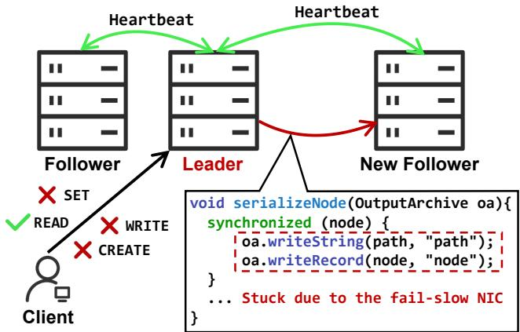
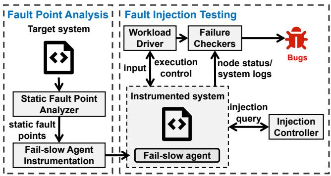
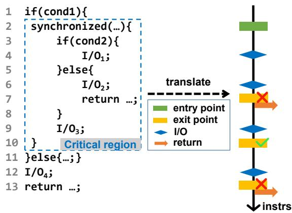
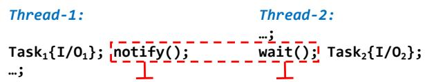
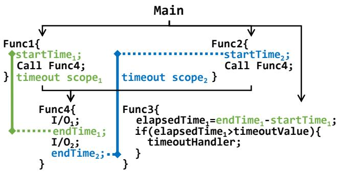

①

USENIX

THE ADVANCED COMPUTING SYSTEMS ASSOCIATION

# Understanding and Detecting Fail-Slow Hardware Failure Bugs in Cloud Systems

Gen Dong and Yu Hua, Huazhong University of Science and Technology;   
Yongle Zhang, Purdue University; Zhangyu Chen and Menglei Chen, Huazhong University of Science and Technology https://www.usenix.org/conference/atc25/presentation/dong

# This paper is included in the Proceedings of the 2025 USENIX Annual Technical Conference.

July 7–9, 2025 • Boston, MA, USA ISBN 978-1-939133-48-9

Open access to the Proceedings of the 2025 USENIX Annual Technical Conference is sponsored by

P--r.h £Es/sL.

auuJl9 PgleU

King Abdullah University of

Science and Technology

# Understanding and Detecting Fail-Slow Hardware Failure Bugs in Cloud Systems

Gen Dong, Yu Hua, Yongle Zhang\*, Zhangyu Chen, Menglei Chen

Huazhong University of Science and Technology

\*Purdue University

Corresponding Author: Yu Hua (csyhua@hust.edu.cn)

## Abstract

Fail-slow hardwares are still running and functional, but in a degraded mode, thus slower than their expected performance. Bugs triggered by fail-slow hardwares cause severe cloud system failures. Existing testing tools fail to efficiently detect these bugs due to overlooking their characteristics. In order to address this problem, this paper provides a bug study that analyzes 48 real-world fail-slow hardware failures from typical cloud systems. We observe that (1) fail-slow hardwares make high-level software components vulnerable, including synchronized and timeout mechanisms; (2) the fine granularity of fail-slow hardwares is necessary to trigger these bugs. Based on these two observations, we propose Sieve, a fault injection testing framework for detecting fail-slow hardware failure bugs. Sieve statically analyzes target system codes to identify synchronized and timeout-protected I/O operations as candidate fault points and instruments hooks before candidate fault points to enable fail-slow hardware injection. To efficiently explore candidate fault points, Sieve adopts grouping and context-sensitive injection strategies. We have applied Sieve to three widely deployed cloud systems, i.e., ZooKeeper, Kafka, and HDFS. Sieve has detected six unknown bugs, two of which have been confirmed.

## 1 Introduction

Cloud systems have become the backbone of numerous modern applications [29, 57, 61, 65]. However, fault-triggered failures in cloud systems cause severe loss of customer satisfaction and revenues for service providers [9, 19, 53]. To achieve high reliability, cloud systems need to correctly handle various faults [1, 10, 37, 42]. Based on the scope of faults, we classify them into two categories: coarse-grained and finegrained faults. Specifically, when only considering I/O operations in a cloud system, let $D { = } \{ D _ { 1 } , D _ { 2 } { , } { \ldots } , D _ { n } \}$ represent the set of disk I/O operations and $N { = } \{ N _ { 1 } , N _ { 2 } { , } { \ldots } , N _ { m } \}$ represent the set of network I/O operations. Coarse-grained faults affect all associated I/O operations, e.g., the I/O operations in D fail in fail-stop disks [46] and those in D ∪ N fail in node crashes [16, 42]. Fine-grained faults affect a subset of associated I/O operations, e.g., fail-slow Network Interface Cards (NICs) [22] slow down $N _ { s u b } ( N _ { s u b } \subset N )$ . Coarse-grained faults have been well studied and handled by existing well-designed fault tolerance mechanisms [5,18,52,56]. However, emerging fine-grained faults propose new challenges to the reliability of cloud systems.

  
Figure 1: A production ZooKeeper failure due to the failslow NIC [11]. The writeRecord operation becomes slow within the synchronized block. The update-type requests are blocked. Developers fixed the bug by copying the node object and serializing the copy out of the synchronization.

Recently, fail-slow hardwares [22, 44] received an increasing amount of attention, which deliver lower-than-expected performance and cause fine-grained faults. For example, the throughput of a 1-Gbps NIC might suddenly drop by several orders of magnitude to 1 Kbps due to partial buffer corruption and retransmission [12], which slows down partial network I/O operations. Lu et al. [44] indicate that the fail-slow NVMe SSD has become a widespread and severe problem. On average, 1.41% of NVMe SSDs (over one million NVMe SSDs) are infected within four months of monitoring. Moreover, fail-slow hardware incidents always consume hours or even months to detect. Only 1% of the cases are detected in minutes [22]. As a consequence, once fail-slow hardwares bring cloud systems down, it requires large human efforts to detect the root cause. For example, several AWS services become unavailable due to unexpected high network latency [53], which takes developers nine hours to detect the root cause. Figure 1 presents another real-world fail-slow hardware failure from ZooKeeper [11] which is a widely used distributed coordination to tolerate leader and follower crashes. Specifically, an entire cluster becomes a near-freeze status. write() and create() requests fail, but read() requests can be successfully processed. The developers at PagerDuty [50] spend five months to diagnose this failure. In this paper, we refer to the fault caused by the fail-slow hardware as the FSH fault and the bug triggered by the FSH fault as the FSH bug. We define fail-slow hardware failures as the failures caused by FSH bugs and refer to these failures as FSH failures.

To prevent the FSH fault from breaking cloud systems at runtime, it is essential to develop an FSH fault injection testing framework. Fault injection testing [1, 6, 14, 16, 21, 31, 32, 42, 48] is a commonly used technique for detecting fault-triggered bugs. There are enormous efforts in developing various fault injection testing frameworks. However, existing schemes fail to efficiently detect FSH bugs due to overlooking the characteristics of FSH failures. To address this problem, we conduct a study of 48 real-world FSH failure cases from five large-scale and open-source systems. Furthermore, we observe that there are two key characteristics in efficiently detecting FSH failures like the example in Figure 1.

1) The vulnerable synchronized and timeout mechanisms cause all studied FSH failures. For example, synchronized tasks slowed down by fail-slow hardwares block other tasks for an uncertain time; data race can occur between the timeout task caused by the fail-slow hardware and the corresponding timeout handler with simple timing constraints. This characteristic can significantly prune the huge fault injection space. However, existing bug studies overlook this characteristic since they focus on either the fail-slow software or hardware. Unlike them, our bug study comprehensively analyzes how the fail-slow hardware affects the software.

2) The fine granularity of FSH faults is necessary to trigger FSH failures. One of the main reasons is that fine-grained FSH faults are relatively easy to escape the detection of internal checkers. For example, as shown in Figure 1, there are two network I/O operations, i.e., serializeNode and Heartbeat. The fail-slow NIC only slows down serializeNode so that the heartbeat thread in the leader can maintain the liveness of the cluster. Hence, the entire cluster becomes a near-freeze status. In this scenario, the fail-slow NIC escapes the detection of the heartbeat threads in the followers. The fine-grained fault injection is necessary to trigger such failure. Specifically, if a fail-stop NIC is injected in the leader, these two network I/O operations are affected. Subsequently, the heartbeat threads in the followers will detect this coarse-grained fault and start a new leader election, which drives the cluster into a healthy status. Most existing fault injection testing frameworks focus on coarse-grained faults. Although these schemes are enough to detect crash recovery bugs or distributed protocol bugs, they cannot effectively detect FSH bugs.

Inspired by these two key characteristics, we propose Sieve, a fault injection testing framework designed to detect FSH bugs in cloud systems. Sieve treats synchronized and timeoutprotected I/O operations as candidate fault points. To identify candidate fault points, we investigate various synchronized and timeout mechanisms in cloud systems and conclude four general patterns from them. Based on these four patterns, Sieve identifies I/O operations in synchronized and timeoutprotected domains through lightweight static analysis at the code instruction level. Besides, Sieve automatically instruments hooks before candidate fault points to precisely control the fine-grained FSH fault injection.

To efficiently explore these candidate fault points, Sieve adopts grouping and context-sensitive injection strategies. Specifically, Sieve groups fault points within the same basic block1. Because fault points within the same basic block are always under the same high-level system states (e.g., leader election and snapshot synchronization) and protected by the same fault-tolerance handler, which indicates these fault points trigger similar scenarios. Besides, Sieve leverages the context-sensitive injection strategy to (1) avoid exploring the same contexts of fault points and (2) find buggy contexts of the same fault points. During testing, the hook sends the fault injection query to the injection controller. The controller checks the runtime context of the fault point, e.g., call stack and thread ID, and decides whether to inject the fault.

We have implemented a prototype of Sieve and evaluated it on three large-scale cloud systems, i.e., ZooKeeper [70], Kafka [33], and HDFS [2]. Moreover, Sieve has detected six unknown bugs in these systems. Besides, we have released Sieve (including bug study, scripts for reproducibility, and source codes) for public use at https://github.com/ RabbitDong-on/Sieve.

In summary, this paper makes the following contributions:

• We conduct a study of 48 real-world FSH failure cases from five cloud systems. Our bug study helps developers to comprehensively understand the characteristics of FSH failures.

• We propose Sieve, a novel approach that enables finegrained FSH fault injection for detecting FSH bugs. Based on our bug study, Sieve analyzes synchronized and timeout-protected I/O operations as candidate fault points. To efficiently explore these candidate fault points, Sieve adopts grouping and context-sensitive injection strategies.

Table 1: The numbers of FSH Failures.
<table><tr><td>ZooKeeper</td><td>HDFS</td><td>HBase</td><td>MapReduce</td><td>Cassandra</td></tr><tr><td>11</td><td>18</td><td>10</td><td>4</td><td>5</td></tr></table>

• We implement a prototype of Sieve and evaluate it on three large-scale real-world cloud systems. Sieve has detected six unknown bugs, two of which have been confirmed.

## 2 Methodology

To understand the FSH failure, we studied 48 real-world failures in five popular cloud systems shown in Table 1. We leverage the search tool in JIRA [54] to identify reports related to fail-slow hardwares. First, we search reports using the following keywords: “slow disk”, “slow storage”, “slow network”, “slow NIC”, and “slow switch”. Second, we exclude the issues that have priority of “Minor”, “Trivial” and “Low”. Third, we identify the issues that are indeed related to fail-slow hardwares. Specifically, for each issue, we carefully read the failure report to obtain an overview of the failure. If the unit test is provided, we run the unit test to reproduce the failure. The unit test provides simplified buggy logic, which is an important guideline for us to read source codes. If the unit test is absent, we directly read source codes based on conversations between the bug reporter and project maintainers. We can identify the root cause in both scenarios. If the root cause is related to the delay and the issue report explicitly mentions the delay is caused by the fail-slow hardware, we preserve this issue.

Threats to Validity. Like all characteristic studies, the results of our study should be interpreted with the following limitations.

Representativeness of the selected systems. The selected systems are diverse, widely-used and open-source: ZooKeeper [70] is a distributed coordination service; MapReduce [58], HDFS [2], and HBase [23] are the cores of the dominant Hadoop data analytics platforms; Cassandra [4] is a highly available peer-to-peer NoSQL database. However, without accurate market information, it is difficult to conclude whether we have chosen the most widely-used cloud systems. Besides, closed-source cloud systems could have different characteristics.

Limitations of the filtering criteria. We clarify that this paper focuses on two types of fail-slow hardwares including the fail-slow storage and network devices. The main reason is that it is relatively easy for developers to confirm the impact of the fail-slow storage and network devices, i.e., slow I/O operations. It is still possible to miss the FSH failures whose issue reports do not contain the selected keywords. The failslow hardware is difficult to identify [22]. Developers may not be sure whether the delay is caused by the fail-slow hardware.

Table 2: FSH Failure Symptoms.
<table><tr><td>Symptom</td><td>%</td></tr><tr><td>Node service unavailable</td><td>58.3</td></tr><tr><td>Data unavailability</td><td>10.4</td></tr><tr><td>Data inconsistency</td><td>10.4</td></tr><tr><td>Job failure</td><td>8.3</td></tr><tr><td>Performance degradation</td><td>6.3</td></tr><tr><td>Client stuck</td><td>4.2</td></tr><tr><td>Node crash</td><td>2.1</td></tr></table>

Hence, the issue report possibly misses the selected keywords. We did try other keywords like “slow”, and found that the resulting issue reports contain too many false positives, i.e., non-FSH failures. It is impractical to reduce false positives one by one.

Observer errors. To minimize the possibility of observer errors, each failure is investigated by two inspectors with the same criteria. Any disagreement is discussed in the end to reach a consensus.

## 3 Understanding FSH Failures

In this section, we present some findings and implications by analyzing collected FSH failures.

## 3.1 Findings

Finding 1: Over half (58.3%) of FSH failures cause node service to be unavailable.

Table 2 shows that FSH failures exhibit various failure symptoms. Over half of FSH failures cause certain software functionality or the entire node to be unavailability. In some cases, even a normal node is removed from the cluster. For example, in HDFS-9178 [27], the upstream datanode is stuck in the fail-slow disk. Hence, the downstream node timeouts when reading the packet from the upstream datanode. Then, the upstream datanode sends an ACK to the client and sets the downstream datanode status to ERROR. Finally, the client excludes the downstream datanode from the pipeline, even though the upstream datanode is the abnormal one.

Finding 2: 20.8% of FSH failures are silent (including data unavailability and inconsistency).

These failures are difficult to detect without the correctness specification. For example, in HBase-26195 [24], synchronizing Hlog to HDFS timeouts due to the fail-slow hardware. The client receives an exception and rolls back the data protected by the Hlog. However, this procedure only rolls back the data in the primary node leading to data inconsistency between the primary and replicated nodes. Besides, internal checkers in HBase do not raise any explicit alarms in system logs or immediately stop the system, which makes this failure detection difficult.

Table 3: FSH Failure Root Causes.
<table><tr><td colspan="2">Root cause %</td></tr><tr><td>Non-concurrency</td><td>81.2</td></tr><tr><td>Indefinite blocking</td><td>41.6</td></tr><tr><td>Buggy internal checker</td><td>35.4</td></tr><tr><td>o Buggy error checking</td><td>20.8</td></tr><tr><td>○ Buggy error handling</td><td>14.6</td></tr><tr><td>Infinite loop</td><td>2.1</td></tr><tr><td>Logic error</td><td>2.1</td></tr><tr><td>Concurrency</td><td>18.8</td></tr><tr><td>Data race</td><td>16.7</td></tr><tr><td>Deadlock</td><td>2.1</td></tr></table>

Finding 3: The root causes of studied failures are diverse. The top three (total 93.7%) root causes are indefinite blocking, buggy internal checker, and data race.

Indefinite blocking means that synchronized tasks slowed down by fail-slow hardwares block other tasks for an uncertain time. In Figure 1, writeRecord within the synchronized block becomes extremely slow due to the fail-slow NIC. This synchronized writeRecord blocks all following write requests from clients. The fine-grained failslow NIC escapes the detection of Heartbeat, which is critical to trigger this failure. Buggy internal checker incorrectly handles timeout tasks caused by fail-slow hardwares. For example, in HDFS-5522 [26], the delay caused by the fail-slow disk is treated as a network error. Hence, checkDiskError is not invoked, which fails a lot of client requests. Data race occurs between timeout tasks caused by fail-slow hardwares and timeout handlers. Other root causes include infinite loop, logic error, and deadlock.

Finding 4: Buggy internal checker fails to correctly handle timeout tasks.

Buggy internal checker includes buggy error checking and error handling [67], which are confused by the impact of finegrained FSH faults. Specifically, buggy error checking fails to figure out sources of FSH faults, such as fail-slow disks in HDFS-5522 [26]. Even though error checking is correct, error handling may also incorrectly handle FSH faults. For example, in MapReduce-1800 [47], the reducer fails to fetch the mapper’s output due to the reducer-side fail-slow NIC. However, the reducer can still talk to the job tracker(JT). When a sufficient number of reducers fail, the normal mapper is blacklisted by the JT. In this example, although error checking finds the slow network, error handling incorrectly handles this fault. The fine-grained FSH fault is key to trigger this failure. Specifically, if a network partition occurs, the reducer cannot talk to the JT. Hence, the normal mapper is not blacklisted.

Table 4: The percentage of each involved event.
<table><tr><td>Event type</td><td>%</td></tr><tr><td>Client/Server connection</td><td>12.5</td></tr><tr><td>Client request</td><td>83.7</td></tr><tr><td>One fail-slow hardware</td><td>89.6</td></tr><tr><td>Multiple fail-slow hardwares</td><td>10.4</td></tr><tr><td>Node reboot/join cluster</td><td>4.2</td></tr></table>

Finding 5: Data race can occur between the timeout task caused by the fail-slow hardware and the corresponding timeout handler with simple timing constraints.

The task slowed down by the fail-slow hardware triggers the timeout mechanism. Moreover, the invoked timeout handler does not end the slow task. Therefore, if the timeout handler finishes before the slow task, this task will corrupt the data written by the timeout handler. For example, in ZooKeeper-710 [72], the client connects with the follower that encounters the fail-slow NIC. This connection request triggers the timeout mechanism. The invoked timeout handler sends another connection request to the leader. After successfully connecting with the leader, the former connection request is processed by the follower and the renewal request is sent to the leader. The renewal request overwrites the metadata of the current connection. As a result, the leader still connects with the client, but cannot process the client request. This data race occurs without the complex thread interleaving control. Besides, the fine granularity of the fail-slow hardware is necessary to trigger data race. Specifically, if coarse-grained faults, e.g., node crashes and network partitions, occur in the follower, the renewal request will not be sent to the leader. Hence, data race does not happen in this scenario. Additionally, our bug study shows that the buggy timeout mechanism is a new root cause for concurrency bugs.

Finding 6: Most (89.6%) of FSH failures are caused by one fail-slow hardware.

As shown in Table 4, the triggering conditions of most FSH failures do not require multiple fail-slow hardwares and complex inputs. For example, in HDFS-5341 [25], DirectoryScanner encounters a fail-slow disk when scanning the dataset with a lock. As a result, DirectoryScanner blocks the heartbeat and all DataXceiver threads that acquire the lock. This example only requires simple client requests as inputs.

## 3.2 Implications

Overall, our bug study reveals that the FSH failure is a severe problem in cloud systems (Table 2). Most (73.5%) of studied failures were reported in the last decade. Moreover, over half (58.3%) of FSH failures cause node service to be unavailable (Finding 1). Even though existing in-production detectors [28, 39, 43, 51] can detect part of FSH failures, the detected failures already cause damages, e.g., node unavailability and data inconsistency [28, 39, 43, 51]. Hence, it is necessary to design an FSH fault injection testing framework to detect FSH bugs before releasing production. The fault injection space explosion is a notorious problem in fault injection techniques [1, 6, 14, 16, 21, 31, 32, 42, 48]. However, our bug study reveals that synchronized and timeout-protected I/O operations are error-prone, which significantly reduces the fault injection space. Besides, most FSH failures are caused by one fail-slow hardware (Finding 6). Hence, the fault injection space does not increase exponentially due to the combinations of different fault points, which indicates that the fault injection testing framework can efficiently explore the fault injection space without complex fault injection strategies.

There are four points to avoid most FSH failures:

• Do not perform I/O operations within synchronization structures. For example, the solution of the example in Figure 1 is to copy and serialize data out of the synchronized block.

• Use the fine-grained lock to accurately synchronize I/O operations.

• Collect more information from other components of cloud systems to figure out sources of FSH faults, e.g., the delay from upstream datanode in HDFS-9178 [27], and take suitable actions.

• Avoid data race between the timeout task and timeout handler. Developers can use timestamps to avoid buggy execution order.

## 4 The Sieve Design

In this section, we first discuss Sieve’s fault model (§ 4.1) and then describe the workflow (§ 4.2) and main components: Fault Point Analysis (§ 4.3), Injection Controller (§ 4.4), Workload Driver (§ 4.5), and Failure Checkers (§ 4.6).

## 4.1 Fault Model

Fail-slow hardwares exhibit two types of fine-grained faults. The first type slows down partial I/O operations. The second type incurs exceptions from partial I/O operations. In this paper, we only focus on the first type and leave the second type as future work.

Cloud systems are designed to tolerate various faults, but their fault-tolerance levels are limited. If we inject multiple faults, the accumulated side effects possibly break cloud systems as expected. Moreover, one fault is enough to trigger most FSH failures (Finding 6). Hence, Sieve simulates the first type by injecting one delay for each test run.

  
Figure 2: The workflow of Sieve.

## 4.2 Workflow

In a nutshell, Sieve identifies all fault points and then performs fault injection testing at each fault point. Figure 2 presents the workflow of Sieve, which consists of two phases. The first phase (left half of Figure 2) leverages the static analysis to identify fault points and instruments fail-slow agents within the cloud system to query fault injection decisions. The second phase (right half of Figure 2) treats the fault injection testing as a series of test runs. For each test run, Sieve leverages the workload driver to exercise the cloud system. When a fail-slow agent is executed, it sends an RPC query to the injection controller. The controller decides whether to inject the fault based on the history injection record. If the fail-slow agent receives a positive reply, it injects a delay into the cloud system. During this test run, failure checkers detect abnormal system behaviors, e.g., system crashes.

## 4.3 Fault Point Analysis

Cloud systems contain a large number of fault points affected by fail-slow hardwares. Moreover, most fault points can be tolerated by cloud systems [6, 16, 39, 42]. Therefore, it is impractical to exhaustively explore all fault points. Based on our bug study, we observe that synchronized and timeout-protected I/O operations are error-prone. Hence, our fault point analysis focuses on these two types of fault points, which can reduce the fault injection space.

Identify the Synchronized I/O Operation. In general, synchronized mechanisms have two effects: (1) avoid multiple threads to simultaneously access critical data; (2) control different tasks to execute in a certain order. There are two corresponding patterns of synchronized mechanisms. The first pattern creates a critical region, e.g., Lines 2-10 in Figure 3. I/O operations $( \mathrm { I } / \mathrm { O } _ { 1 - 3 } )$ in the critical region are considered to be synchronized. To identify these synchronized I/O operations, Sieve needs to find the critical region. The critical region is wrapped by entry and exit points at the instruction level. It is non-trivial to identify the critical region by matching the entry point to the correct exit point, since branch and return instructions introduce more than one exit point. For example, in Figure 3, there are three exit points. If Sieve matches the entry point to the first or last exit points, it will miss a synchronized I/O operation (I/O3) or incorrectly treat a non-synchronized I/O operation $\mathrm { ( I / O _ { 4 } ) }$ to be synchronized.



Figure 3: The left part shows an example of creating a critical region (Lines 2-10). The right part shows low-level instructions, which only preserve I/O, return, entry and exit points.  
  
Figure 4: An example of controlling the execution order of Task1,2 via the barrier.

To match the correct exit point, the intuitive method is to (1) understand how the programming language designs the interaction among the critical region, branch, and return instructions (2) and design a search algorithm that leverages former understanding. However, the first step is difficult and requires large human efforts. Hence, we try another practical method. Specifically, we analyze different combinations of the critical region, branch, and return instructions case by case. In this process, we observe that the correct exit point is the last not followed by the return instruction, i.e., the second exit point in Figure 3. Based on this observation, Sieve can correctly identify the critical region and synchronized I/O operations in practice. Specifically, Sieve traverses the call graph2 twice. (1) If encountering an entry point, Sieve pushes this entry point into a stack. Subsequently, if encountering an exit point not followed by the return instruction, Sieve pops the top non-entry point from the stack and pushes this entry point into the stack. If the encountered exit point is followed by the return instruction, Sieve just ignores this exit point. Finally, all entry and matched exit points stored in the stack confirm all critical regions. (2) Sieve identifies I/O operations in critical regions.

The second pattern creates a hard barrier that makes sure one task is executed before the other, e.g., notify() and wait() create a barrier in Figure 4. I/O operations $\mathbf { ( I / O _ { 1 } ) }$ before the barrier are considered to be synchronized. Identifying these synchronized I/O operations is trivial. Sieve traverses the call graph, finds barriers, and identifies I/O operations before these barriers. Timeout mechanisms also have this pattern that creates a soft barrier (using notify() and wait(timeout value)) that means the latter task (Task2) can timeout and invoke timeout handler to process the former task (Task1). Sieve uses the same method to deal with this pattern of timeout mechanisms.

Identify the Timeout-protected I/O Operation. Timeout mechanisms are commonly used to handle unexpected faults in cloud systems. After investigating several cloud systems, we conclude two general patterns of timeout mechanisms. One has been discussed in $\ S 4 . 3$

The other is related to get-time functions, e.g., nanoTime and currentTimeMillis in Java. Specifically, cloud systems record startTime and endTime assigned by get-time functions and calculate elapsedTime = endTime - startTime to obtain the execution time of the task. If elapsedTime exceeds the predefined timeout value, the timeout handler is invoked to process this abnormal task. We define the timeout scope as the scope between assignments of startTime and endTime. I/O operations in the timeout scope are considered to be timeout-protected. To identify these timeout-protected I/O operations, Sieve needs to match startTime to the corresponding endTime, which is non-trivial. In real-world cloud systems, there are many {startTime,endTime} pairs interleaving with each other, e.g., {startTime1,endTime1} interleaves with {startTime2,endTime2} in Figure 5. Moreover, most {startTime, endTime} pairs usually have irregular variable names. Hence, we cannot distinguish which endTime (endTime1,2) is matched to startTime1. When reviewing this pattern, we note that startTime and the matched endTime must appear in the same formula: elapsedTime = endTime - start-Time. Based on this observation, Sieve can correctly identify timeout-protected I/O operations. Specifically, Sieve (1) collects all variables (startTime1,2 and endTime1,2) assigned by get-time functions as a get-time set. (2) then checks all expressions whose forms are A=B-C. If two operators in the expression are in the get-time set and the result of this expression is used in If expression, this expression is the target formula (elapsedTime1 = endTime1 - startTime1). The two operators (startTime1 and endTime1) in this expression correctly confirm a timeout scope (timeoutscope1). (3) finally identifies all I/O operations in the timeout scope.

Instrument the Fail-Slow Agent. To enable fine-grained fault injection, Sieve instruments fail-slow agents before candidate fault points, i.e., synchronized and timeout-protected I/O operations. When the fail-slow agent is reached at runtime, it sends a query to the injection controller, which includes the current call stack, instrumented function information, instrumented position, and thread ID. If the reply is positive, the fail-slow agent invokes Thread.sleep. Additionally, Sieve instruments some hooks to obtain timeout values.

  
Figure 5: An example of identifying timeout-protected I/O operations.

## 4.4 Injection Controller

In the fault injection phase, Sieve injects one fault for each test run. In each test run, the injection controller receives many injection requests from fail-slow agents, collects the information from injection requests, and decides on the fault injection. Finally, only one of the agents obtains a positive reply. To efficiently explore candidate fault points, Sieve implements grouping and context-sensitive injection strategies.

Grouping Injection Strategy. Through the fault point analysis, Sieve has pruned many fault points with a low possibility of triggering FSH bugs. However, there are still a large number of fault injection choices. It is inefficient to exhaustively explore all choices. We note many fault injections explore similar scenarios when these fault points are within the same basic block. Because different I/O operations within the same basic block are always under the same high-level system states (e.g., leader election and snapshot synchronization) and protected by the same fault-tolerance handler. To further reduce the fault injection space, Sieve groups fault points within the same basic block and selects the last fault point as the representative of the group. The fault point analyzer implements this grouping strategy by instrumenting the fail-slow agent before the last fault point within the same basic block.

Context-sensitive Injection Strategy. In addition to grouping fault points, Sieve implements a context-sensitive strategy (listed in Algorithm 1) to (1) find the buggy context of the fault point (2) and avoid repeatedly injecting faults at the same point under the same context. Specifically, Sieve collects the call stack of the fault point carried by the injection request (Line 20). When an injection request is received, Sieve checks whether the corresponding fault point has already been explored. If the fault point is not explored, Sieve grants this fault injection. Otherwise, Sieve compares call stacks of previous fault injections with that of current fault injection (Lines 15- 19). If the current call stack is unique, Sieve injects one fault

```csv
Algorithm 1: Fault injection strategy
1 Function scheduleFaultInjection(request):
2 if !checkRequest(request) then
3 return false;
4 end
5 f ault ← getFault(request);
6 if fault.type=SYNC then
delayTime ← 5 ∗ 60 ∗ 1000 ;
7 else
delayTime ← 3 ∗ getTimeOutValue( f ault)/2 ;
8 grant(request,delayTime);
9 Function checkRequest(request):
10 if isInjected then
11 return false;
12 end
13 curContext ← getContext(request);
14 curFault ← getFault(request);
15 foreach preContext ∈ historyIn f o.contexts() and
preFault ∈ historyIn f o. f aults() do
16 if preFault=curFault and
preContext.contain(curContext) then
17 return false;
18 end
19 end
20 record(historyInfo,curContext,curFault);
21 return true;
```

at this point.

Fault Impact. Except for injection strategies, Sieve needs to determine how long the delay lasts. Specifically, Sieve checks the type of the fault point after receiving the injection request (Line 5). If the injection request comes from the synchronized I/O operation, Sieve uses 5 minutes as the default delay which is enough to cause indefinite blocking (Line 6). Hence, the gray failure checker in Sieve can detect this bug. Meanwhile, this delay duration does not significantly extend the evaluation time.

For the timeout-protected I/O operation, the delay duration is two-thirds of the timeout value (Line 7). In this way, Sieve not only triggers timeout mechanisms to mislead internal checkers but also reorders timeout tasks and timeout handlers. Sieve obtains timeout values by analyzing two general patterns shown in § 4.3 and instrumenting hooks. When hooks are reached at runtime, they send timeout values to the injection controller.

## 4.5 Workload Driver

Sieve leverages the workload driver to exercise a target cloud system. The workload driver can use various sources ranging from simple unit tests to carefully-crafted test cases as workloads. For each cloud system, we either implement several common workloads or select several existing test cases as

workloads shown in Table 5.

The workflow of the workload driver is as follows. First, the workload driver creates multiple clients and each client connects with one system node. Hence, if the client encounters an exception, it can send an RPC request to failure checkers reporting the corresponding system node is suspicious. Second, the client executes the workload. If the client finishes the workload, it sends an RPC request to failure checkers reporting the workload progress. Finally, the workload driver restarts the target system for each test run to avoid the impact of previous injected faults.

## 4.6 Failure Checkers

To determine whether a bug occurs in cloud systems, Sieve provides two checkers:

• Log error checker. It scans the execution log of each system node to check whether there are FATAL, ERROR, and WARN entries or uncommon exceptions.

• Gray failure checker. It is a simplified version of Panorama [28] to identify whether differential observability exists. This checker marks the test run suspicious if (1) the system’s internal checker indicates a node is healthy, but the node’s client reports errors. Specifically, this checker receives an RPC request that reports errors from the client, while obtaining a healthy status of the corresponding node by existing tools, e.g., ./zkServer.sh status in ZooKeeper. (2) a subset of clients do not finish their workloads. Specifically, this checker does not receive RPC requests that report the workload progress from a subset of clients.

As a testing framework, developers can flexibly add specific checkers to assert system properties they care about, such as performance bug [35] and inconsistency [40].

## 5 Implementation

We have implemented Sieve in Java with around 8,100 SLOC for core components. The fault point analyzer is built on top of Soot, a Java program analysis framework [59]. Sieve instruments cloud systems using Javassist, a Java bytecode instrumentation toolkit [30]. The injection controller is designed in a client-server architecture via Java RMI for RPCs.

I/O Operation Identification. Sieve identifies all I/O operations by statically analyzing cloud systems. If the function is implemented by general I/O packages, it is treated as an I/O operation. Sieve analyzes five general I/O packages, including java.io, java.nio, java.net, javax.net and io.netty. Additionally, some cloud systems implement their customized I/O operations, e.g., serialize/deserialize APIs in class Record of ZooKeeper. Sieve also identifies such I/O operations.

Timeout Value Collection. Sieve analyzes two general patterns of timeout mechanisms presented in § 4.3. For the first pattern, Sieve instruments hooks before soft barriers, e.g., wait in Java. The hooks intercept barriers and capture their parameters. For the second pattern, Sieve finds elapsedTime through the taint analysis. Sieve instruments a hook before CMP instruction that contains elapsedTime. The hook captures the other operator of CMP instruction. The captured parameters and operators are timeout values. Finally, the hooks send timeout values to the injection controller.

Table 5: The evaluated systems.
<table><tr><td>System</td><td>Release</td><td>Workload</td></tr><tr><td>ZooKeeper (ZK)</td><td>3.9.0</td><td>Create/read/update/delete znode</td></tr><tr><td>Kafka (KA)</td><td>3.6.0</td><td>Producer/consumer performance test</td></tr><tr><td>HDFS</td><td>3.3.6</td><td>Read/write/move/put file</td></tr></table>

## 6 Evaluation

Our evaluation aims to answer two questions: (1) How effective is Sieve in detecting bugs? (2) How does Sieve compare with state-of-the-art fault injection approaches?

Evaluated Systems. We evaluated Sieve by using three widely used and open-source cloud systems in Table 5. Note that Kafka [33] is not included in our bug study, which is a popular stream-processing service. To prove that Sieve is not specific to the five studied systems, we selected Kafka as a benchmark. All target systems are the latest versions during the experiments.

Setup. We apply default configurations to all cloud systems and deploy a cluster of cloud systems on a single physical machine using dockers. The physical machine contains two Intel Xeon Gold 6230R CPUs, which include 52 cores, and 192GB DRAM running Ubuntu18.04. In the evaluation, the cluster consists of either three nodes for ZooKeeper and Kafka or four nodes for HDFS. The fault injection experiment for each system consists of 2000 test runs. The time of each test run varies depending on how the system reacts to the injected faults and whether it fails early or not. The experiment time for the three systems is 20.9 hrs, 24.9 hrs, and 29 hrs respectively.

## 6.1 Effectiveness of FSH Bug Detection

## 6.1.1 Methodology

We apply Sieve to the target systems and check whether Sieve can detect unknown bugs and reproduce studied bugs.

## 6.1.2 Detecting Unknown Bugs

As shown in Table 6, Sieve has detected seven FSH bugs, including six unknown bugs and one known bug (HDFS-15869). Moreover, ZK-4836 and KAFKA-16412 have been confirmed by developers. Although HDFS-15869 was reported by developers, it has not been fixed yet. Hence, Sieve can detect

Table 6: Bugs detected by Sieve. The last five columns show whether the bugs are detected by different approaches shown in Table 7.
<table><tr><td></td><td>Bug ID</td><td>Failure Symptoms</td><td>Random</td><td>FATE</td><td>Legolas</td><td>Chronos</td><td>Sieve-I</td><td>Sieve-S</td><td>Sieve</td></tr><tr><td rowspan="6">Unknown Bugs</td><td>ZK-4816 ZK-4817</td><td>A follower cannot follow the leader for a long time (more than 3O seconds)</td><td>X</td><td>X</td><td>X</td><td>X</td><td>X</td><td>√ √</td><td>√</td></tr><tr><td>ZK-4844</td><td>CancelledKeyException cannot catch the client disconnection exception</td><td>X</td><td>X</td><td>X</td><td>√</td><td>X</td><td></td><td>√</td></tr><tr><td>ZK-4836</td><td>Fail-slow disk while executing writeLongToFile causes the follower to hang</td><td>X</td><td>X</td><td>X</td><td>X</td><td>X</td><td>√</td><td>√</td></tr><tr><td>KAFKA-16401</td><td>Inconsistent ACL index leads to MarshallingError</td><td>X</td><td>X</td><td>X</td><td>X</td><td>X</td><td>√</td><td>√</td></tr><tr><td>KAFKA-16412</td><td>One request consumes all request handler threads</td><td>X</td><td>√</td><td>√</td><td>X</td><td>√ X</td><td>√</td><td>√</td></tr><tr><td></td><td>An uncreated topic is considered as a created one</td><td>X</td><td>X</td><td>√</td><td>√</td><td></td><td>√ √</td><td>√</td></tr><tr><td>Known Bugs</td><td>HDFS-15869</td><td>Namenode hangs due to the slow sendResponse</td><td>X</td><td>√</td><td>√</td><td>X</td><td>√</td><td></td><td>√</td></tr></table>

HDFS-15869. Moreover, we did not know about HDFS-15869 before. These bugs cause node hang, uncaught exceptions, node crash, and semantic violation.

ZK-4816. A follower cannot join the cluster for a long time (more than 30 seconds). Specifically, the cluster consists of three nodes. The first node becomes the leader after the election. The leader is stuck in serializing the snapshot to the local fail-slow disk. The followers disconnect from the leader, since their sync operations are blocked by the snapshot serialization in the leader. These two followers start a new leader election. The second node becomes the new leader. However, the old leader does not change the node status. There have been two leaders in the cluster for a long time. The third node is confused and cannot follow any leader for a long time.

ZK-4817. CancelledKeyException cannot catch the client disconnection exception in some cases. Specifically, NIOServerCxn throws CancelledKeyException if the client disconnects from the server abnormally. When NIOServerCxn executes doIO, the disk becomes fail-slow. The client cannot receive heartbeats and disconnects from the server. If doIO is blocked for 30 seconds, NIOServerCxn throws CancelledKeyException. However, when doIO is stuck for more than 30 seconds, CancelledKeyException disappears in system logs. Although the clients disconnect from the server abnormally in two scenarios, CancelledKeyException does not work in the latter scenario.

ZK-4844. Fail-slow disk while executing writeLongToFile causes the follower to hang. Specifically, the follower executes writeLongToFile slowed down by the fail-slow disk. The internal checker is blocked by writeLongToFile. The leader excludes the follower from the cluster, but the follower believes that it still acts as a follower. As a result, all requests sent to the follower cannot be processed. This bug is similar to Zookeeper-4074 [71]. Zookeeper-4074 can be solved by adding -Dlearner.asyncSending=true. However, this method cannot solve ZK-4844.

ZK-4836. An inconsistent ACL index leads to MarshallingError. Specifically, when a leader creates a node (N0) with an ACL entry (ACL\_0) and deletes it due to the node deletion (assume the current aclindex is 0). A follower starts to synchronize the snapshot (including the ACL table and datatree) with the leader. When synchronizing the ACL table to the follower, the NIC becomes fail-slow, which slows down the ACL table transmission. Meanwhile, a client sends a request that creates a node (N1) with a new ACL entry (ACL\_1) to the leader. In the leader, the datatree contains N1->1 (indicates that N1 points to the second slot of the ACL table) and the ACL table contains 1->ACL\_1 (indicates that ACL\_1 is stored in the second slot of the ACL table). The leader synchronizes the updated datatree to the follower. When the follower deserializes the new datatree, the aclindex is set to the number of elements in the ACL table. The follower contains the old ACL table (aclindex=0) and the new datatree (N1->1). The ZAB protocol synchronizes the client creation request from the leader to the follower. When replaying the client creation request in the follower, ACL\_1 will be added into the first slot of the ACL table (0->ACL\_1). However, the node N1 still points to the second slot of the ACL table (N1- >1). Finally, when executing getAcl N1, MarshallingError arises, which leads to the follower crash.

KAFKA-16401. One request consumes all request handler threads. Specifically, a consumer request is stuck in storeOffsets slowed down by the fail-slow disk. The thread response for this request is blocked and holds a group lock. Due to timeouts, the consumer resends requests to the broker. All request handler threads are quickly occupied by these requests and stuck in acquiring the group lock. As a result, new requests cannot be processed.

KAFKA-16412. An uncreated topic is considered as a created one. Specifically, a client sends the request for topic creation to the broker. Another client also sends the same request to the broker. When the first request is not finished, the second one fails and returns TopicExistsException to the second client. However, subsequent requests that operate on this unestablished topic from the second client fail, which confuses the second client.

HDFS-15869. Namenode hangs due to the slow sendResponse. Specifically, a client sends a write request. When the namenode handles this request and writes the editlog to the disk, the disk becomes fail-slow. The thread response for writing the editlog is stuck, so that it does not process the following write requests from clients.

Except for five detected bugs in ZooKeeper and HDFS, Sieve also detects two bugs in Kafka that are out of the five studied systems. Because (1) Sieve is designed to detect FSH bugs for most cloud systems that contain synchronized and timeout mechanisms, not just the studied systems. (2) There are buggy synchronized and timeout mechanisms in Kafka.

## 6.1.3 Reproducing Studied Bugs

To further evaluate Sieve’s effectiveness, we try to reproduce all studied bugs. For each bug, we first check whether Sieve can correctly identify its corresponding fault point. If successful, we further modify Sieve and only inject the FSH fault at the corresponding point to detect the bug. If the failure report provides workloads, Sieve directly uses them. Otherwise, the workloads shown in Table 5 are used. When the checkers mark test runs suspicious, we manually check whether their symptoms and system logs are consistent with the original failure report in JIRA. If consistent, the corresponding bug is successfully reproduced.

Sieve successfully reproduces 34 of 48 studied bugs. There are 14 bugs not reproduced. For the five bugs (HBase-11536, HDFS-3493, HDFS-11755, HDFS-16659, and MapReduce-1800), multiple fault injections within one test run are necessary. However, Sieve currently focuses on a single fault injection. To reproduce these five bugs, we need to provide multiple buggy fault points and the correct fault injection order. Moreover, for the first four bugs, we need to provide additional checkers due to their silent symptoms (Finding 2). For the remaining six silent bugs (ZK-417, HDFS-7065, HDFS-10301, HDFS-13111, HBase-26195, and HBase-13430), Sieve fails to reproduce them due to the absence of accurate checkers. For the bug (ZK-4293), the complex thread interleaving causes deadlock. However, Sieve is designed to detect concurrency bugs with simple timing constraints (Finding 5). Although Sieve fails to reproduce the above twelve bugs, it can identify buggy fault points. However, Sieve fails to reproduce the remaining bugs (HBase-12270 and HBase-27947), since the static analysis in Sieve cannot analyze the synchronized data structures, i.e., the FIFO queue in these two bugs. To reproduce these two bugs, we need to extend the static analysis in Sieve to analyze the FIFO queue.

## 6.2 Comparison with Alternative Fault Injection Approaches

## 6.2.1 Methodology

We compare Sieve with six alternative fault injection approaches shown in Table 7. These approaches include coarsegrained (FATE) and fine-grained (Random, Legolas, Chronos, and two variants of Sieve) tools.

Random is implemented as the baseline of the fault injection strategy. We reuse the client-server architecture of Sieve and instrument the fail-slow agent before each I/O operation. When the fail-slow agent is reached at runtime, the injection controller randomly grants an injection request.

FATE [21] focuses on node-level faults, making it not directly comparable to Sieve. We re-implement its fault injection strategy in Sieve to attempt meaningful comparisons.

Table 7: Settings for Alternative Approaches. S/T I/O operations represent synchronized and timeout-protected I/O operations.
<table><tr><td>Approach</td><td>Fault Point</td><td>Injection Strategy</td></tr><tr><td>Random</td><td>All I/O operations</td><td>Random</td></tr><tr><td>FATE [21]</td><td>All I/O operations</td><td>Context-sensitive</td></tr><tr><td>Legolas [62]</td><td>All I/O operations</td><td>Abstract state and bsrr</td></tr><tr><td>Chronos [8]</td><td>T I/O operations</td><td>Deep-priority</td></tr><tr><td>Sieve-I</td><td>S/TI/O operations</td><td>Context-insensitive</td></tr><tr><td>Sieve-S</td><td>S/T I/O operations</td><td>Context-sensitive</td></tr><tr><td>Sieve</td><td>S/TI/O operations</td><td>Grouping and context-sensitive</td></tr></table>

Specifically, we define the failure ID like FATE, which comprises the class name, function name, line number, and call stack of the I/O operation. The injection controller can receive injection requests from all I/O operations and grant an injection request whose failure ID is unique.

Legolas [62] is a state-of-the-art fine-grained fault injection tool. Legolas infers abstract states of cloud systems and stores fault points in queues. The fault injection strategy of Legolas is called budgeted-state-round-robin (bsrr). Specifically, Legolas selects a queue in the round-robin way and dequeues a fault point to test.

Chronos [8] is a state-of-the-art fine-grained delay injection tool and adopts the deep-priority guided algorithm to detect timeout bugs. However, its core components are not available. Hence, we re-implement its fault injection strategy in Sieve. Specifically, the injection controller records timeout-protected I/O points, randomly selects six fault points to explore and records new fault points that only appear after injecting delays. If the depths of new fault points are larger than the average depth of selected fault points, Sieve injects delays at new fault points and selected fault points in the next test run. The depth of a fault point means the number of preceding fault points that include tested and untested fault points in the execution path. If there is not a new fault point, the injection controller randomly selects six fault points again.

Sieve-I adopts the context-insensitive injection strategy which means that all identified fault points are explored once. Except for the injection strategy, other components of Sieve-I are the same as Sieve.

Sieve-S is built on top of Sieve-I. Sieve-S explores identified fault points multiple times. We evaluate the effectiveness of grouping and context-sensitive strategies by comparing Sieve-S with Sieve and Sieve-I respectively.

All the above six approaches are performed with the same settings as Sieve, i.e., cluster configurations, failure checkers, workload driver, and 2000 test runs that consume more than 20 hours. Additionally, Chronos injects multiple faults since its strategy is designed to explore the combinations of different delays. Except for Chronos, the remaining five approaches inject one fault for each test run. Legolas uses its fault point configuration, which injects a one-minute delay for each test run. Random and FATE also inject a one-minute delay for each test run like Legolas.

Table 8: # Dynamic/Static fault points indicate the number of injected and candidate faults. S/T indicates that Sieve identifies all synchronized and timeout-protected fault points. S/T+Gr indicates that Sieve applies the grouping strategy to S/T fault points.
<table><tr><td rowspan="2"></td><td colspan="7"> # Dynamic fault points</td><td rowspan="2"></td><td colspan="3"> # Static fault points</td></tr><tr><td>Random</td><td>FATE</td><td>Legolas</td><td>Chronos</td><td>Sieve-I</td><td>Sieve-S</td><td>Sieve</td><td>All</td><td>S/T</td><td>S/T+Gr</td></tr><tr><td>ZooKeeper</td><td>2000</td><td>2000</td><td>2000</td><td>2000</td><td>423</td><td>1291</td><td>705</td><td></td><td>1905</td><td>1266</td><td>856</td></tr><tr><td>Kafka</td><td>2000</td><td>2000</td><td>2000</td><td>2000</td><td>267</td><td>1968</td><td>967</td><td></td><td>1953</td><td>1090</td><td>780</td></tr><tr><td>HDFS</td><td>2000</td><td>2000</td><td>2000</td><td>2000</td><td>383</td><td>883</td><td>658</td><td></td><td>4216</td><td>1974</td><td>1568</td></tr></table>

## 6.2.2 Comparison Result Analysis

Compared with alternative approaches, we aim to answer one question: is Sieve more effective and efficient in detecting FSH bugs? We answer this question from two aspects: the number of detected bugs and explored fault points.

The Number of Detected Bugs. Table 6 shows that Sieve is more effective in detecting FSH bugs. Random does not detect any bugs since it misses buggy fault points in deeper system states due to injecting faults at the beginning of workloads.

Compared with FATE and Legolas, four out of seven FSH bugs can only be detected by Sieve. FATE exhaustively explores the huge fault injection space, which is impractical and inefficient. Hence, FATE misses the buggy points of ZK-4816, ZK-4844, and KAFKA-16401 within 2000 test runs. Although we can add more test runs, FATE will generate more reports which require large human efforts to confirm true bugs. Legolas fails to detect ZK-4816 and ZK-4844 due to the same reason. For ZK-4817, to observe different behaviors in system logs, injecting fault twice with different delay durations at the buggy fault point is necessary for the checkers. Although FATE and Legolas may explore this point multiple times, the duration of the injected delay does not change. Hence, FATE and Legolas fail to detect ZK-4817. ZK-4836 is a concurrency bug and requires a suitable timing constraint. However, the long delay (1min) injected by FATE and Legolas causes the client creation request to timeout, so that the updated datatree will not be synchronized to the follower. As a result, ZK-4836 does not occur. Therefore, FATE and Legolas fail to detect ZK-4836.

Compared with Chronos, Sieve detects five more bugs. ZK-4816, ZK-4844, and HDFS-15869 are out of the scope of Chronos since these bugs are not related to timeout mechanisms. Chronos fails to detect ZK-4836 since multiple delay injections cause the client creation request to timeout, like a single long delay injection in FATE and Legolas. For KAFKA-16401, Sieve injects a delay before the synchronized I/O point on the server side, which causes the client to frequently retry the timeout request. If Chronos wants to detect KAFKA-16401, it needs to repeatedly inject a delay before the same I/O point on the client side. However, this scenario contradicts the deep-priority guided algorithm of Chronos, which aims to explore the combinations of different delays. Chronos can detect ZK-4817 and KAFKA-16412 thanks to our broad log error checker. The original failure checkers of Chronos described in its paper detect two symptoms: server crash and service hang. However, ZK-4817 and KAFKA-16412 do not cause these two symptoms. Therefore, Chronos should have failed to detect the two bugs.

The Number of Explored Fault Points. We record the number of dynamic and static fault points in Table 8. The number of dynamic fault points is less than 2000, which indicates all fault points exposed under current workloads are explored. Tables 6 and 8 show that Sieve can explore fewer fault points, while detecting more bugs. However, Random, FATE, and Legolas explore too many useless fault points to detect some FSH bugs. In some worse cases, Random even repeatedly explores the same fault under the same runtime context. Compared with FATE, Sieve-S can efficiently detect more FSH bugs, since our bug study reveals that synchronized and timeout-protected I/O operations are error-prone, which significantly prunes the fault injection space. Besides, thanks to the effective context-sensitive strategy, Sieve-S explores more useful contexts of fault points and further detects more FSH bugs than Sieve-I. Moreover, compared with Sieve-S, Sieve explores fewer fault points without compromising the number of detected bugs, which indicates that the grouping strategy is effective. In summary, Sieve is more efficient in detecting FSH bugs thanks to its effective design.

Chronos aims to explore the combinations of different delays, which cause the fault injection space to increase in an exponential manner. Therefore, Chronos implements a deeppriority guided algorithm to efficiently explore such huge fault injection space. However, Sieve focuses on the practical and common scenario, i.e., one delay injection (Finding 6). Chronos and Sieve have different target scenarios. Hence, we do not compare with Chronos in this aspect.

## 6.3 False Positive

Threats of false positives come from two sources. The first source is injected faults. If the injected fault is not realistic, a false positive arises. Specifically, injecting delays before non-blocking I/O operations causes false positives. To eliminate these false positives, Sieve simulates a 10s delay for the fail-slow disk and NIC using the device mapper (DM) and traffic control (TC) in Linux (a 10s delay is suitable since it exceeds the time consumed by normal I/O operations and does not break cloud systems). As a result, the consumed time of the non-blocking I/O operation is less than 10 seconds. Because the non-blocking mechanisms are implemented above the layer that simulates the fault using DM and TC in Linux, which indicates the non-blocking I/O operation returns before reaching the simulated fault. Based on this feature, Sieve reexecutes the suspicious test run marked by failure checkers and calculates the time consumed by the explored I/O operation. If the consumed time is less than 10 seconds, Sieve abandons the report of the suspicious test run. Overall, the faults injected by Sieve do not cause any false positives. In addition, the fault simulated by DM and TC slows down all I/O operations, which cannot enable fine-grained fault injection.

The second source is failure checkers. The gray failure checker is a simplified version of Panorama [28], so it cannot obtain comprehensive information of components in cloud systems. For example, in Zookeeper, if Sieve injects a delay on the client side when the client connects to the server, the gray failure checker will obtain an error report from the client. Meanwhile, the gray failure checker obtains a healthy status of the server by using ./zkServer.sh status provided by Zookeeper. Based on different server statuses observed by the client and server, the gray failure checker reports a bug. In fact, the reported bug is a false positive. The log error checker also makes mistakes. For example, our checkers mark a test run suspicious when a fault is injected in LearnerHandler since ERROR entries appear in system logs. However, such ERROR entries are expected behaviors in ZooKeeper. To eliminate these false positives, for each suspicious test run, we (1) read system logs to understand system behaviors; (2) check whether system behaviors are consistent with design documentation. (3) report this bug to developers and discuss it with them. In the near future, we plan to enhance our checkers by using more accurate rules. However, our core contribution focuses on our bug study and fault injection methodology.

## 6.4 Overhead Analysis

Table 9 shows the runtime overhead of Sieve. The Baseline column shows the original workload run time without any instrumentation. The Info Collection column shows the average fault-free run time of the instrumented system. The Average Test Time column shows the average run time with one fault injection.

The results show that Sieve introduces 1.1× to 4.9× baseline time for runtime information collection. On average, testing a fault point consumes around 1.9× to 6.3× baseline time. Each test run includes a series of operations such as initializing the execution environment, executing the workload, collecting runtime information, deciding the fault injection, and checking failure symptoms. Additionally, the static analysis completes in three minutes and consumes at most 8GB memory for each cloud system.

Table 9: Runtime Overhead (in seconds).
<table><tr><td>System</td><td>Baseline</td><td>Info Collection</td><td>Average Test Time</td></tr><tr><td>ZooKeeper</td><td>9.41</td><td>13.17</td><td>37.64</td></tr><tr><td>Kafka</td><td>7.12</td><td>34.89</td><td>44.86</td></tr><tr><td>HDFS</td><td>24.87</td><td>27.36</td><td>52.23</td></tr></table>

## 7 Discussions

Fault Model. Sieve currently injects one delay to simulate the fail-slow hardware. However, the fail-slow hardware may incur other subtle faults such as exceptions and multiple delays. Hence, Sieve misses some bugs caused by these subtle faults. For example, in § 6.1.3, Sieve fails to detect five bugs caused by other subtle faults. Extending Sieve to support more fault models becomes our future work.

Fault Point Analysis. The keywords, e.g., synchronized, used in synchronized and timeout mechanisms are necessary for the fault point analysis in § 4.3. Sieve has analyzed several most common keywords: synchronized, lock, wait, await, tryacquire, join, nanoTime and currentTimeMillis. Our implementation is modular, which makes it convenient for developers to add more keywords and patterns completing the fault point analysis in Sieve.

Workload Driver. Table 8 indicates current workload drivers cannot trigger all candidate fault points since the used workloads are simple, which limit the code coverage. Fuzzing is an automatic input generation technique [3, 7, 13, 20, 49, 60, 63, 64, 69] that can improve the code coverage. Developers can integrate fuzzing tools into Sieve to explore more candidate fault points.

## 8 Related Work

Fault Injection. In recent years, various fault injection techniques [1, 6, 15–17, 21, 31, 32, 42, 48] have been proposed to detect bugs triggered by various faults in cloud systems. Many existing schemes focus on coarse-grained faults and adopt various fault injection strategies. For example, Crash-Tuner [42] injects node crashes when meta-info variables are accessed; NEAT [1] provides simple APIs for developers to inject network partitions. Unlike them, Sieve instruments failslow agents before I/O operations to enable fine-grained FSH fault injection. Recent fine-grained delay injection tools [8,62] fail to efficiently explore the FSH fault injection space due to overlooking the characteristics of FSH failures. Our work provides a bug study to analyze FSH failures and concludes some findings shown in § 3 Inspired by our bug study, Sieve is proposed to efficiently explore the FSH fault injection space.

CORDS [14] and WASABI [55] inject expections into cloud systems to detect error handling bugs. However, Sieve injects delays to detect FSH bugs. Sieve is orthogonal to CORDS and WASABI.

Distributed System Model Checker. Distributed system model checkers [34, 45, 66] intercept non-deterministic distributed events and permute their ordering. These schemes detect protocol bugs caused by complex interleaving of nodelevel events, such as message and node crash/reboot, while Sieve aims to detect implementation-level bugs triggered by fine-grained FSH faults. Sieve is complementary to existing schemes.

Distributed Concurrency Bug Detection. Several schemes [36, 38, 41, 68] have been proposed to detect concurrency bugs in cloud systems. For example, DCatch [36] uses specific happen-before rules to identify conflicting operations and reorders them. Sieve is an FSH fault injection framework that aims to detect diverse bugs including concurrency bugs.

Bug Studies on Fail-Slow Incidents. Guanwai et al. [22] present a study of fail-slow hardwares and analyze how failslow hardwares occur. Several works [39, 43, 51] provide studies of fail-slow failures at the software level and analyze how to accurately detect fail-slow failures by in-production monitoring. However, unlike them, our bug study aims to study how fail-slow hardwares affect the software so that we can design an effective and efficient fault injection tool to detect FSH bugs before releasing production. Besides, our bug study shows that FSH failures caused by fail-slow hardwares include fail-slow and fail-stop failures. Our bug study is complementary to existing bug studies.

Fail-Slow Failure Detection. Several works [28, 39, 43, 51] develop advanced detectors for fail-slow failures. Panorama [28] detects fail-slow failures by enhancing the observability of different system components. IASO [51] detects fail-slow nodes based on timeout signals and peer evaluation. OmegaGen [39] generates customized watchdogs for detecting and localizing fail-slow failures. PERSEUS [43] leverages machine learning techniques to detect fail-slow failures. These detectors focus on in-production monitoring and require a significantly long time to detect failures, which are not suitable for testing before releasing production. For example, ISAO has been deployed for more than 1.5 years to catch fail-slow failures. However, Sieve focuses on detecting FSH bugs before releasing production by injecting FSH faults.

## 9 Conclusion

Fail-slow hardwares cause severe failures in cloud systems. This work presents a study of 48 real-world FSH failures in cloud systems to analyze their characteristics. We propose Sieve, a novel fault injection testing framework that enables fine-grained FSH fault injection for detecting FSH bugs. Sieve treats synchronized and timeout-protected I/O operations as candidate fault points that are likely to trigger FSH bugs.

Sieve implements grouping and context-sensitive injection strategies to efficiently explore candidate fault points. Our evaluation shows that Sieve is effective and efficient in detecting FSH bugs in real-world cloud system.

## Acknowledgments

This work was supported in part by National Natural Science Foundation of China (NSFC) under Grant No. 62125202 and U22B2022. We are grateful to our shepherd, Xiang Ren, and anonymous reviewers for their comments and suggestions.

## References

[1] Ahmed Alquraan, Hatem Takruri, Mohammed Alfatafta, and Samer Al-Kiswany. An analysis of networkpartitioning failures in cloud systems. In 13th USENIX Symposium on Operating Systems Design and Implementation (OSDI 18), pages 51–68, 2018.

[2] HDFS architecture. Online. Available: https://hadoop.apache.org/docs/r1.2.1/ hdfs\_design.html.

[3] Marcel Böhme, Van-Thuan Pham, and Abhik Roychoudhury. Coverage-based greybox fuzzing as markov chain. In Proceedings of the 2016 ACM SIGSAC Conference on Computer and Communications Security, pages 1032– 1043, 2016.

[4] Apache Cassandra. Online. Available: https:// cassandra.apache.org.

[5] K Mani Chandy and Leslie Lamport. Distributed snapshots: Determining global states of distributed systems. ACM Transactions on Computer Systems (TOCS), 3(1):63–75, 1985.

[6] Haicheng Chen, Wensheng Dou, Dong Wang, and Feng Qin. Cofi: consistency-guided fault injection for cloud systems. In Proceedings of the 35th IEEE/ACM International Conference on Automated Software Engineering, pages 536–547, 2020.

[7] Yang Chen, Alex Groce, Chaoqiang Zhang, Weng-Keen Wong, Xiaoli Fern, Eric Eide, and John Regehr. Taming compiler fuzzers. In Proceedings of the 34th ACM SIGPLAN conference on Programming language design and implementation, pages 197–208, 2013.

[8] Yuanliang Chen, Fuchen Ma, Yuanhang Zhou, Ming Gu, Qing Liao, and Yu Jiang. Chronos: Finding timeout bugs in practical distributed systems by deep-priority fuzzing with transient delay. In 2024 IEEE Symposium on Security and Privacy (SP), pages 1939–1955. IEEE, 2024.

[9] Google compute engine incident 17008. Online. Available: hhttps://status.cloud.google. com/incident/compute/17008.

[10] Ting Dai, Jingzhu He, Xiaohui Gu, and Shan Lu. Understanding real-world timeout problems in cloud server systems. In 2018 IEEE International Conference on Cloud Engineering (IC2E), pages 1–11. IEEE, 2018.

[11] D.Nadolny. Debugging distributed systems. In SREcon, 2016.

[12] Thanh Do, Mingzhe Hao, Tanakorn Leesatapornwongsa, Tiratat Patana-anake, and Haryadi S Gunawi. Limplock: Understanding the impact of limpware on scale-out cloud systems. In Proceedings of the 4th annual Symposium on Cloud Computing, pages 1–14, 2013.

[13] Shuitao Gan, Chao Zhang, Xiaojun Qin, Xuwen Tu, Kang Li, Zhongyu Pei, and Zuoning Chen. Collafl: Path sensitive fuzzing. In 2018 IEEE Symposium on Security and Privacy (SP), pages 679–696, 2018.

[14] Aishwarya Ganesan, Ramnatthan Alagappan, Andrea C Arpaci-Dusseau, and Remzi H Arpaci-Dusseau. Redundancy does not imply fault tolerance: Analysis of distributed storage reactions to file-system faults. ACM Transactions on Storage (TOS), 13(3):1–33, 2017.

[15] Yu Gao, Wensheng Dou, Feng Qin, Chushu Gao, Dong Wang, Jun Wei, Ruirui Huang, Li Zhou, and Yongming Wu. An empirical study on crash recovery bugs in largescale distributed systems. In Proceedings of the 2018 26th ACM joint meeting on european software engineering conference and symposium on the foundations of software engineering, pages 539–550, 2018.

[16] Yu Gao, Wensheng Dou, Dong Wang, Wenhan Feng, Jun Wei, Hua Zhong, and Tao Huang. Coverage guided fault injection for cloud systems. In Proceedings of IEEE/ACM SIGSOFT International Conference on Software Engineering (ICSE), 2023.

[17] Yu Gao, Dong Wang, Qianwang Dai, Wensheng Dou, and Jun Wei. Common data guided crash injection for cloud systems. In Proceedings of the ACM/IEEE 44th International Conference on Software Engineering: Companion Proceedings, pages 36–40, 2022.

[18] Sanjay Ghemawat, Howard Gobioff, and Shun-Tak Leung. The google file system. In Proceedings of the nineteenth ACM symposium on Operating systems principles, pages 29–43, 2003.

[19] Gocardless:API and Dashboard outage on 10 October 2017. Online. Available: https://aws.amazon. com/cn/message/12721/.

[20] Patrice Godefroid, Adam Kiezun, and Michael Y Levin. Grammar-based whitebox fuzzing. In Proceedings of the 29th ACM SIGPLAN conference on programming language design and implementation, pages 206–215, 2008.

[21] Haryadi S Gunawi, Thanh Do, Pallavi Joshi, Peter Alvaro, Joseph M Hellerstein, Andrea C Arpaci-Dusseau, Remzi H Arpaci-Dusseau, Koushik Sen, and Dhruba Borthakur. Fate and destini: A framework for cloud recovery testing. In 8th USENIX Symposium on Networked Systems Design and Implementation (NSDI 11), pages 238–252, 2011.

[22] Haryadi S Gunawi, Riza O Suminto, Russell Sears, Casey Golliher, Swaminathan Sundararaman, Xing Lin, Tim Emami, Weiguang Sheng, Nematollah Bidokhti, Caitie McCaffrey, et al. Fail-slow at scale: Evidence of hardware performance faults in large production systems. ACM Transactions on Storage (TOS), 14(3):1–26, 2018.

[23] Apache HBase. Online. Available: https://hbase. apache.org.

[24] HBase-26195. Online. Available: https://issues. apache.org/jira/browse/HBASE-26195.

[25] HDFS-5341. Online. Available: https://issues. apache.org/jira/browse/HDFS-5341.

[26] HDFS-5522. Online. Available: https://issues. apache.org/jira/browse/HDFS-5522.

[27] HDFS-9178. Online. Available: https://issues. apache.org/jira/browse/HDFS-9178.

[28] Peng Huang, Chuanxiong Guo, Jacob R Lorch, Lidong Zhou, and Yingnong Dang. Capturing and enhancing in situ system observability for failure detection. In 13th USENIX Symposium on Operating Systems Design and Implementation (OSDI 18), pages 1–16, 2018.

[29] INS. Online. Available: https://www.instagram. com/.

[30] Javassist. Online. Available: https://www. javassist.org/, 1999.

[31] Jepsen. Online. Available: https://github.com/ jepsen-io/jepsen, 2016.

[32] Pallavi Joshi, Haryadi S Gunawi, and Koushik Sen. Prefail: A programmable tool for multiple-failure injection. In Proceedings of the 2011 ACM international conference on Object oriented programming systems languages and applications, pages 171–188, 2011.

[33] Apache Kafka. Online. Available: https://kafka. apache.org.

[34] Tanakorn Leesatapornwongsa, Mingzhe Hao, Pallavi Joshi, Jeffrey F Lukman, and Haryadi S Gunawi. Samc: Semantic-aware model checking for fast discovery of deep bugs in cloud systems. In 11th USENIX Symposium on Operating Systems Design and Implementation (OSDI 14), pages 399–414, 2014.

[35] Jiaxin Li, Yuxi Chen, Haopeng Liu, Shan Lu, Yiming Zhang, Haryadi S Gunawi, Xiaohui Gu, Xicheng Lu, and Dongsheng Li. Pcatch: Automatically detecting performance cascading bugs in cloud systems. In Proceedings of the Thirteenth EuroSys Conference, pages 1–14, 2018.

[36] Haopeng Liu, Guangpu Li, Jeffrey F Lukman, Jiaxin Li, Shan Lu, Haryadi S Gunawi, and Chen Tian. Dcatch: Automatically detecting distributed concurrency bugs in cloud systems. ACM SIGARCH Computer Architecture News, 45(1):677–691, 2017.

[37] Haopeng Liu, Shan Lu, Madan Musuvathi, and Suman Nath. What bugs cause production cloud incidents? In Proceedings of the Workshop on Hot Topics in Operating Systems, pages 155–162, 2019.

[38] Haopeng Liu, Xu Wang, Guangpu Li, Shan Lu, Feng Ye, and Chen Tian. Fcatch: Automatically detecting time-of-fault bugs in cloud systems. ACM SIGPLAN Notices, 53(2):419–431, 2018.

[39] Chang Lou, Peng Huang, and Scott Smith. Understanding, detecting and localizing partial failures in large system software. In 17th USENIX Symposium on Networked Systems Design and Implementation (NSDI 20), pages 559–574, 2020.

[40] Haonan Lu, Kaushik Veeraraghavan, Philippe Ajoux, Jim Hunt, Yee Jiun Song, Wendy Tobagus, Sanjeev Kumar, and Wyatt Lloyd. Existential consistency: Measuring and understanding consistency at facebook. In Proceedings of the 25th Symposium on Operating Systems Principles, pages 295–310, 2015.

[41] Jie Lu, Feng Li, Lian Li, and Xiaobing Feng. Cloudraid: hunting concurrency bugs in the cloud via log-mining. In Proceedings of the 2018 26th ACM joint meeting on European software engineering conference and symposium on the foundations of software engineering, pages 3–14, 2018.

[42] Jie Lu, Chen Liu, Lian Li, Xiaobing Feng, Feng Tan, Jun Yang, and Liang You. Crashtuner: detecting crashrecovery bugs in cloud systems via meta-info analysis. In Proceedings of the 27th ACM Symposium on Operating Systems Principles, pages 114–130, 2019.

[43] Ruiming Lu, Erci Xu, Yiming Zhang, Fengyi Zhu, Zhaosheng Zhu, Mengtian Wang, Zongpeng Zhu, Guangtao Xue, Jiwu Shu, Minglu Li, et al. Perseus: A fail-slow detection framework for cloud storage systems. In 21st USENIX Conference on File and Storage Technologies (FAST 23), pages 49–64, 2023.

[44] Ruiming Lu, Erci Xu, Yiming Zhang, Zhaosheng Zhu, Mengtian Wang, Zongpeng Zhu, Guangtao Xue, Minglu Li, and Jiesheng Wu. Nvme ssd failures in the field: the fail-stop and the fail-slow. In 2022 USENIX Annual Technical Conference (USENIX ATC 22), pages 1005– 1020, 2022.

[45] Jeffrey F Lukman, Huan Ke, Cesar A Stuardo, Riza O Suminto, Daniar H Kurniawan, Dikaimin Simon, Satria Priambada, Chen Tian, Feng Ye, Tanakorn Leesatapornwongsa, et al. Flymc: Highly scalable testing of complex interleavings in distributed systems. In Proceedings of the Fourteenth EuroSys Conference 2019, pages 1–16, 2019.

[46] Ao Ma, Rachel Traylor, Fred Douglis, Mark Chamness, Guanlin Lu, Darren Sawyer, Surendar Chandra, and Windsor Hsu. Raidshield: characterizing, monitoring, and proactively protecting against disk failures. ACM Transactions on Storage (TOS), 11(4):1–28, 2015.

[47] MapReduce-1800. Online. Available: https://issues.apache.org/jira/browse/ MAPREDUCE-1800.

[48] Chaos Monkey. Online. Available: https://netflix. github.io/chaosmonkey, 2012.

[49] Rohan Padhye, Caroline Lemieux, Koushik Sen, Mike Papadakis, and Yves Le Traon. Semantic fuzzing with zest. In Proceedings of the 28th ACM SIGSOFT International Symposium on Software Testing and Analysis, pages 329–340, 2019.

[50] PagerDuty. Online. Available: https://www. pagerduty.com/.

[51] Biswaranjan Panda, Deepthi Srinivasan, Huan Ke, Karan Gupta, Vinayak Khot, and Haryadi S Gunawi. Iaso: A fail-slow detection and mitigation framework for distributed storage services. In 2019 USENIX Annual Technical Conference (USENIX ATC 19), pages 47–62, 2019.

[52] Daniel J Scales, Mike Nelson, and Ganesh Venkitachalam. The design of a practical system for fault-tolerant virtual machines. ACM SIGOPS Operating Systems Review, 44(4):30–39, 2010.

[53] AWS service disruption. Online. Available: https: //aws.amazon.com/cn/message/12721/.

[54] Jira Software. Online. Available: https://www. atlassian.com/software/jira.

[55] Bogdan Alexandru Stoica, Utsav Sethi, Yiming Su, Cyrus Zhou, Shan Lu, Jonathan Mace, Madanlal Musuvathi, and Suman Nath. If at first you don’t succeed, try, try, again...? insights and llm-informed tooling for detecting retry bugs in software systems. In Proceedings of the ACM SIGOPS 30th Symposium on Operating Systems Principles, pages 63–78, 2024.

[56] Jeff Terrace and Michael J Freedman. Object storage on craq: High-throughput chain replication for read-mostly workloads. In USENIX Annual Technical Conference, 2009.

[57] TikTok. Online. Available: https://www.tiktok. com/.

[58] MapReduce tutorial. Online. Available: https://hadoop.apache.org/docs/ current/hadoop-mapreduce-client/ hadoop-mapreduce-client-core/ MapReduceTutorial.html.

[59] Raja Vallée-Rai, Phong Co, Etienne Gagnon, Laurie Hendren, Patrick Lam, and Vijay Sundaresan. Soot: A java bytecode optimization framework. In CASCON First Decade High Impact Papers, pages 214–224. 2010.

[60] Junjie Wang, Bihuan Chen, Lei Wei, and Yang Liu. Skyfire: Data-driven seed generation for fuzzing. In 2017 IEEE Symposium on Security and Privacy (SP), pages 579–594, 2017.

[61] WeChat. Online. Available: https://weixin.qq. com/.

[62] Haoze Wu, Jia Pan, and Peng Huang. Efficient exposure of partial failure bugs in distributed systems with inferred abstract states. In 21st USENIX Symposium on Networked Systems Design and Implementation (NSDI 24), pages 1267–1283, 2024.

[63] Mingyuan Wu, Kunqiu Chen, Qi Luo, Jiahong Xiang, Ji Qi, Junjie Chen, Heming Cui, and Yuqun Zhang. Enhancing coverage-guided fuzzing via phantom program. In Proceedings of the 31st ACM Joint European Software Engineering Conference and Symposium on the Foundations of Software Engineering, pages 1037–1049, 2023.

[64] Mingyuan Wu, Yicheng Ouyang, Minghai Lu, Junjie Chen, Yingquan Zhao, Heming Cui, Guowei Yang, and Yuqun Zhang. Sjfuzz: Seed and mutator scheduling for jvm fuzzing. In Proceedings of the 31st ACM Joint European Software Engineering Conference and Symposium on the Foundations of Software Engineering, pages 1062–1074, 2023.

[65] X. Online. Available: https://x.com/.

[66] Junfeng Yang, Tisheng Chen, Ming Wu, Zhilei Xu, Xuezheng Liu, Haoxiang Lin, Mao Yang, Fan Long, Lintao Zhang, and Lidong Zhou. Modist: Transparent model checking of unmodified distributed systems. In NSDI’09, pages 213–228, 2009.

[67] Ding Yuan, Yu Luo, Xin Zhuang, Guilherme Renna Rodrigues, Xu Zhao, Yongle Zhang, Pranay U Jain, and Michael Stumm. Simple testing can prevent most critical failures: An analysis of production failures in distributed {Data-Intensive} systems. In 11th USENIX Symposium on Operating Systems Design and Implementation (OSDI 14), pages 249–265, 2014.

[68] Xinhao Yuan and Junfeng Yang. Effective concurrency testing for distributed systems. In Proceedings of the Twenty-Fifth International Conference on Architectural Support for Programming Languages and Operating Systems, pages 1141–1156, 2020.

[69] M. Zalewski. American fuzzy lop. Online. Available: https://lcamtuf.coredump.cx/afl/, 1999.

[70] Apache ZooKeeper. Online. Available: https:// zookeeper.apache.org.

[71] ZooKeeper-4074. Online. Available: https://issues. apache.org/jira/browse/ZOOKEEPER-4074.

[72] ZooKeeper-710. Online. Available: https://issues. apache.org/jira/browse/ZOOKEEPER-710.