①

USENIX

THE ADVANCED COMPUTING SYSTEMS ASSOCIATION

# Learning-Enhanced High-Throughput Pattern Matching Based on Programmable Data Plane

Guanglin Duan and Yucheng Huang, Peng Cheng Laboratory, Tsinghua Shenzhen   
International Graduate School; Zhengxin Zhang, Peng Cheng Laboratory, Tsinghua Shenzhen International Graduate School, and Cornell University; Qing Li and Dan Zhao, Peng Cheng Laboratory; Zili Meng, Hong Kong University of Science   
and Technology; Dirk Kutscher, Hong Kong University of Science and Technology (Guangzhou); Ruoyu Li, Shenzhen University and Peng Cheng Laboratory; Yong Jiang, Tsinghua Shenzhen International Graduate School; Mingwei Xu, Tsinghua University https://www.usenix.org/conference/atc25/presentation/duan-guanglin

# This paper is included in the Proceedings of the 2025 USENIX Annual Technical Conference.

July 7–9, 2025 • Boston, MA, USA ISBN 978-1-939133-48-9

Open access to the Proceedings of the 2025 USENIX Annual Technical Conference is sponsored by

P=-r.h mEesL

auuuJl9 PgleU

King Abdullah University of

Science and Technology

# Learning-Enhanced High-Throughput Pattern Matching Based on Programmable Data Plane

Guanglin Duan∗1,2, Yucheng Huang∗1,2, Zhengxin Zhang∗1,2,3, Qing Li†1, Dan Zhao1, Zili Meng4, Dirk Kutscher5, Ruoyu Li1,6, Yong Jiang2, and Mingwei Xu7

1Peng Cheng Laboratory 2Tsinghua Shenzhen International Graduate School 3Cornell University 4Hong Kong University of Science and Technology 5Hong Kong University of Science and Technology (Guangzhou) 6Shenzhen University 7Tsinghua University

## Abstract

Pattern matching is critical in various network security applications. However, existing pattern matching solutions struggle to maintain high throughput and low cost in the face of growing network traffic and increasingly complex patterns. Besides, managing and updating these systems is labor intensive, requiring expert intervention to adapt to new patterns and threats. In this paper, we propose Trochilus, a novel framework that enables high-throughput and accurate pattern matching directly on programmable data planes, making it highly relevant to modern large-scale network systems. Trochilus innovated by combining the learning ability of model inference with the high-throughput and cost-effective advantages of data plane processing. It leverages a byte-level recurrent neural network (BRNN) to model complex patterns, preserving expert knowledge while enabling automated updates for sustained accuracy. To address the challenge of limited labeled data, Trochilus proposes a semi-supervised knowledge distillation (SSKD) mechanism, converting the BRNN into a lightweight, data-plane-friendly soft multi-view forest (SMF), which can be efficiently deployed as match-action tables. Trochilus minimizes the need for expensive TCAM through a novel entry cluster algorithm, making it scalable to large network environments. Our evaluations show that Trochilus achieves multi-Tbps throughput, supports various pattern sets, and maintains high accuracy through automatic updates.

## 1 Introduction

Pattern matching is essential to many network applications, such as network intrusion and prevention systems (NID-S/NIPS) [41, 45, 61], web application firewalls [48], network censorship systems [19], and application identification systems [37]. These applications rely on pattern-matching systems to scan packet headers and payloads to check if they match a given set of rules (i.e., patterns or signatures) containing a series of strings and regular expressions.

A recurring theme in pattern-matching systems literature is the gap between the high bandwidth workloads they need to handle and the scalability or cost of existing hardware/- software implementations. Prior pattern-matching systems have attempted to alleviate this gap via algorithm optimization [5, 17, 42, 51, 54, 58, 59, 62] and hardware (GPU/FP-GA/NPU) acceleration [22, 24, 35, 44, 49, 50, 64]. For algorithm optimization which is mainly deployed on CPUs, a server is unable to reach more than 70Gbps [52, 53, 58]. While servers optimized with FPGA/GPU/NPU may achieve a higher throughput (i.e., at most 100Gbps under state of the art [64]) thanks to their inherent parallel computation, they significantly increase the complexity in system management and make the updates extremely challenging [11, 32].

The emerging programmable switching ASICs in the network community provide an unprecedented opportunity to bridge this gap. A programmable switch can easily handle multi-Tbps traffic at a line rate with lower cost than GPU/FP-GA/NPU/CPU, offering a new possibility for addressing the performance bottlenecks of pattern-matching systems.

Existing works have integrated programmable switches but they still suffer from the issues of accuracy. Multistring matching [25, 30, 52] employs Nondeterministic Finitestate Automata (NFA) relevant matching algorithms and is constrained by the limited memory available on the programmable data plane, and thus can only support a limited number of string patterns. Besides, multi-string matching can only detect exact and simple patterns (e.g., digital sequence), which consists of a small subset of pattern matching. Regular expression matching is a more powerful tool for matching complex patterns, attributing to regular expression’s representative syntaxes (e.g., Kleene star and counting constraint). However, the aforementioned methods can not extend to deploy complete pattern matching on programmable switches. This is because the serialized state transitions of automaton utilized in [25, 30, 52] cause the problem of resource explosion when deploying the complex syntaxes in regular expressions (e.g., range matching “[a- f ]”). Today, we are still faced with the need to build a pattern-matching system that can support line rates on the order of 100Gbps [64]. This paper answers this challenge with the Trochilus Programmable Data Plane-based complete pattern matching system.

Table 1: Trochilus v.s. prior arts. Hardware includes GPU, FPGA, and NPU. Switch represents programmable switch.
<table><tr><td>Platform</td><td>Method</td><td>Solution</td><td>High throughput</td><td>Accuracy</td><td>Manag ability</td></tr><tr><td>Software</td><td rowspan="3">Automaton-based (Rule-based)</td><td>[51,53,54]</td><td>×</td><td>?</td><td>×</td></tr><tr><td>Hardware</td><td>[13,49,64]</td><td>×</td><td>×</td><td>×</td></tr><tr><td rowspan="2">Switch</td><td>[25,52]</td><td>√</td><td>×</td><td>×</td></tr><tr><td>Model inference-based</td><td>Trochilus</td><td>√</td><td>√</td><td>√</td></tr></table>

Moreover, current pattern-matching systems are focused on enhancing performance while managing cost and power consumption, but they do not allow for the efficient updating of pattern sets to ensure sustained accuracy. In practical deployment, pattern-matching systems require not only an initially high-accuracy pattern set but also regular updates to maintain high accuracy, in order to address new traffic patterns (e.g., new cyber attacks and new applications). However, current rules are typically obtained through offline techniques (e.g., crafted by experts or obtained from proprietary vendor algorithms) [64], which is labor-intensive and induces high maintenance costs. Trochilus addresses this challenge by replacing traditional pattern matching with model inference.

In designing Trochilus, we argue that an ideal system for pattern matching should meet three requirements: R1: High Throughput (Capable of achieving high throughput at a low cost). R2: Accuracy (consistently able to accurately identify traffic patterns). R3: Manageability (efficiently updating the system to accommodate new network traffic patterns). Unfortunately, prior pattern matching schemes [13,25,49,51–54,64] fall short on at least one requirement, as shown in Table 1. Tochilus fulfills all three requirements by incorporating the learning abilities of model inference with the low-cost and high-throughput advantages of programmable switches.

To meet the requirements of accuracy and manageability, Trochilus designs a pattern modelization method that can losslessly transform given patterns to a byte-level recurrent neural network (BRNN). BRNN preserves expert knowledge from the patterns, thereby achieving high initial accuracy. Compared with traditional pattern-matching systems, the BRNN enables automatic updating with labeled data for higher accuracy and supports easy manageability over ever-changing traffic patterns. Further, concerning limited or even no labeled data, Trochilus introduces a semi-supervised knowledge distillation (SSKD) mechanism to transform the BRNN into a lightweight yet accurate model, called the soft multi-view forest (SMF), whose inference process only requires simple operations supported by the switches’ match-action paradigm. By training multiple biased decision trees, the SMF can better represent complex traffic patterns and achieve higher accuracy compared to other tree-based models [55, 65, 66].

To achieve high throughput with programmable switches, Trochilus develops a model representation to efficiently deploy SMFs on the data plane. Trochilus converts SMFs to match-action tables through tree encoding. Specifically, we formulate an optimization problem that aims at finding a partition of table entries to minimize the TCAM requirement. To this end, we propose an entry cluster algorithm, which heuristically aggregates table entries into clusters based on the similarity among features represented by table entries so that each cluster only requires a more compact table. Moreover, a sliding window mechanism is introduced to effectively inspect the incoming data packet payload.

We evaluate Trochilus extensively with various pattern sets (Snort [41] and Suricata [45]) and workloads (captured in one of the largest public cloud providers). Evaluations show that Trochilus effectively preserves the accuracy of original patterns without labeled data and maintains even higher accuracy through training with labeled data. Moreover, Trochilus achieves multi-Tbps throughput and supports various pattern sets with limited resources.

Contributions. 1) We design a novel framework that integrates model inference with low-cost high-throughput data plane processing to address the pressing challenges of scalability, accuracy, and manageability faced by pattern matching systems. 2) We design pattern modelization, SSKD, and entry cluster optimization to convert patterns into accurate and lightweight models and deploy them on resource-constrained programmable data planes. 3) We implement a prototype of Trochilus using the Tofino switch as the programmable data plane and make its source code available [3]. We conduct testbed experiments to show its performance superiority.

## 2 Background and Motivation

In this section, we introduce the background of pattern matching, propose the design requirements of pattern matching, and highlight the limitations of the prior arts in this field.

## 2.1 Pattern Matching

The key goal of a pattern-matching system is to identify when network traffic triggers any of up to tens of thousands of signatures, also known as rules. In network applications (e.g., network intrusion and prevention systems ), patterns typically include strings for exact matching and regular expressions for complex patterns. Formally, given an alphabet σ, an input string $x = x _ { 0 } , \cdots , x _ { n }$ and a set of patterns $P = \{ p 1 , \cdots , p _ { k } \}$ ， where each element $p _ { i } = r _ { 1 } \cdots r _ { m }$ is a predefined pattern and each $x _ { i }$ or $r _ { i }$ is a character belonging to σ, pattern matching can check whether each $p _ { i }$ is a substring of x. Since Finitestate Automata (FA) provides a formal and flexible framework for representing and processing regular languages, converting patterns to Nondeterministic Finite-state Automata (NFA)

and deterministic finite-state automata (DFA) is a common method for practical pattern matching [52].

## 2.2 Design Requirements

Requirement 1 (R1): High Throughput. Recently, the network bandwidths at traffic aggregation points in regional ISPs have already surpassed multi-hundred Gbps. Many network device providers [46] and standard organizations [2] are moving towards the era of 800 Gbps bandwidth. An ideal patternmatching system should keep up with the current network bandwidth requirements. Moreover, the financial cost of the system must be low enough to be affordable for the majority of companies.

Requirement 2 (R2): Accuracy. An ideal pattern-matching system should have high initial accuracy upon deployment and consistently maintain accurate identification of network traffic patterns during operation.

Requirement 3 (R3): Manageability. In practical deployment, pattern matching systems need to continuously update their pattern sets to identify new traffic patterns (e.g., new applications and new cyber attacks). However, updating patterns requires experts to analyze large-scale network traffic and extract representative patterns, which is labor-intensive. An ideal pattern-matching system should be manageable and be able to update and maintain patterns with low overhead.

## 2.3 Limitations of Prior Studies

Many efforts have been made to accelerate pattern matching, including software-based algorithmic optimization, hardware acceleration, and programmable switch acceleration.

Software-based algorithmic optimization. Algorithmic optimization boosts throughput by reducing memory consumption [5,10,59] or increasing the number of characters per state transition in NFA [42, 51, 54, 62]. However, since servers’ CPUs are not designed specifically for high-throughput packet processing, the performance of software-based packet processing is still constrained. Actually, a server-based pattern matching engine still can not achieve 70 Gbps packet processing throughput [53, 54, 58]. Although scaling up the number of servers can achieve higher throughput, it also induces high capital and management costs [15]. To sum up, softwarebased algorithmic optimization methods do not satisfy R1.

Hardware acceleration. Some works leverage GPUs for pattern matching as the single instruction multiple threads (SIMT) architecture can effectively parallelize an algorithm, providing multi-10 Gbps throughput [24, 49, 50, 60]. However, it is difficult to maintain GPU’s performance at the peak rate as it requires all computational units to have the same instruction stream [34]. Additionally, GPUs also come with higher power costs. FPGA-based solutions utilize circuitlevel parallelism to accelerate pattern matching. While these methods improve the overall throughput of pattern matching [13, 35, 44, 64], they do not support dynamic updates well due to the FPGA programming process. Such inflexibility increases the investment in capital and research and development efforts. Furthermore, the performance of these hardware alternatives still struggles to keep pace with the rapidly increasing network traffic since these hardware alternatives are typically connected to servers via PCIe which provides limited bandwidth [44]. To sum up, the traditional hardware acceleration does not satisfy R1.

Traditional Programmable switch acceleration. Programmable switches, centering around Protocol-Independent Switch Architecture (PISA) [7], provide flexible packet processing capabilities at high throughput, presenting opportunities for network functions offloading [26, 32, 33, 56]. They exhibit similar power consumption and capital costs as traditional fixed-function switches, significantly reducing costs compared to CPUs or other hardware. However, PISA faces computation and storage constraints. Complex instructions such as multiplications and divisions are not allowed. PISA has limited match action unit (MAU) stages (e.g., Tofino 1 has 12 stages) to implement the main calculation logic. In addition, storage is limited, e.g., on Tofino 1, the SRAM of each pipeline is 120MB and the TCAM is 6.2MB. Previous works utilize programmable switches to accelerate multistring matching [25,52]. They mainly convert the multi-string matching patterns into NFAs and then perform optimization on state encoding and state transition. However, prior works perform sequential state transitions, where the number of MAU stages and TCAM requirements increase linearly as the average length and the total number of multi-string patterns grow. As a result, they are unable to achieve a complete deployment toward large-scale multi-string patterns. Moreover, prior works can not be extended to more general and complex pattern matching. To sum up, traditional programmable switch solutions do not satisfy R1 and R2.

Common limitations of prior studies. The deployed patterns can not always remain effective over ever-changing traffic patterns. However, prior arts primarily focus on the acceleration of pattern matching and do not provide efficient mechanisms for pattern update. Therefore, existing pattern-matching systems can not meet R3.

## 3 Trochilus Overview

## 3.1 Target Scenarios

Trochilus acts as a functional instance of network applications, inspecting payloads at the byte level and taking corresponding actions (such as alerting, forwarding, and dropping). Via network data planes, Trochilus can be deployed as a link middlebox or as a dedicated application for traffic analysis, such as redirecting traffic to Trochilus. The current mainstream data plane includes programmable switches and SmartNICs [36].

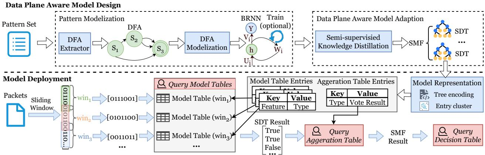  
Figure 1: Trochilus framework.

These two types of hardware have drastically different characteristics: programmable switches have much higher throughput, with much limited computation capability. In this paper, we focus on PISA-driven pattern matching design, which can be integrated into other data plane hardware (e.g., SmartNICs) with minor changes. Note that when the depth of the payload exceeds the single pipeline processing capability of the programmable switch, Trochilus will recirculate the packets and discard the inspected parts of the packets.

In this paper, we assume that a processed packet contains an Ethernet header, an IP header, a UDP or TCP header, and a payload to be inspected. Note that our approach can support other header and payload fields (e.g., ICMP). The packet payload can be encoded in any form, such as ASCII and UTF-8. In this paper, we adopt ASCII encoding, where each character is encoded as one byte. Our approach is devoted to scenarios where the payload only contains plain text that is not encrypted. For processing encrypted traffic, Trochilus can be combined with previously proposed decryption mechanisms [43] to handle encrypted traffic.

## 3.2 Trochilus Workflow

As illustrated in Figure 1, Trochilus consists of two components: data plane aware model design and model deployment.

Data plane aware model design combines pattern modelization and data plane aware model adaption to generate data plane-friendly learning models from patterns, enabling Trochilus to replace traditional pattern matching with model inference. Given patterns extracted from the signature database (e.g. Snort community rules [41]), Trochilus first utilizes the DFA extractor to convert the patterns to a DFA. Second, the DFA modelization transforms the DFA into a BRNN, which can effectively preserve the patterns’ expert knowledge and achieves high initial accuracy. When labeled data is available, the BRNN can automatically capture underlying patterns in the data through training to improve accuracy. Although the

BRNN is effective, it cannot be deployed in the data plane. To generate a data plane aware model, Trochilus then leverages semi-supervised knowledge distillation (SSKD) to distill a soft multi-view forest (SMF), which consists of multiple soft decision trees (SDTs), under the instruction of the BRNN.

The key component of model deployment is model representation, which targets efficiently translating an SMF into multiple model tables and one aggregation table through tree encoding. Each model table is encoded from an SDT in the SMF, and the aggregation table stores the SMF inference results voted by each model table. When deploying model tables, Trochilus designs an efficient entry cluster algorithm to greatly reduce the TCAM requirements.

For incoming packets, Trochilus first utilizes a sliding window mechanism to extract payload segments for different windows as features. Then, these features are used to query model tables to obtain inference results of SDTs. The SMF result is voted by inference results of SDTs through querying the aggregation table. Finally, based on the SMF result, users can design post-processing actions encoded in the decision table, such as dropping, passing, alerting, or forwarding.

The conversion of the SMF model into data-plane table entries is lossless. Trochilus supports online updates of the pattern matching system by collecting new labeled attack traffic, incrementally training the model offline, and converting the updated rules into table entries. These entries can then be installed on the switch without interrupting ongoing services. This allows Trochilus to adapt to new attack patterns with minimal impact on system operations.

## 4 Data Plane Aware Model Design

In this section, we show how we convert patterns to bytelevel recurrent neural networks (BRNNs) and how we further transform the BRNNs to soft multi-view forests (SMFs) with semi-supervised knowledge distillation (SSKD).

## 4.1 Pattern Modelization

In this subsection, we utilize the byte-based DFA extractor to construct a DFA from patterns. Then we leverage the DFA modelization to convert the DFA into a BRNN as the teacher model in SSKD. Compared to other existing teacher models, BRNN is the most suitable for pattern matching. Specifically, compared to $\mathrm { D F A s } ,$ when labeled data is available, the BRNN can capture new undefined patterns in the data through training, leading to an improvement in accuracy and boosting the performance of the following knowledge distillation. Compared to other learning models (e.g., LSTM [20], GRU [12]), the BRNN preserves the provided patterns’ expert knowledge and retains a high accuracy under cold start.

Byte-based DFA extractor. Network security applications, e.g., Suricata [45] and Snort [41], usually use Perl-compatible regular expression (PCRE) [39] syntax to define patterns. We also use the PCRE syntax as the standard syntax, which can easily be extended to other syntax flavors (e.g., POSIX [16]). The supported PCRE syntax is shown in Appendix A.

Consider an example pattern in Snort $^ { * * } \backslash x 2 6 c \nu \nu \backslash x 3 d [ 0 .$ $2 ] \{ 3 , 5 \} ^ { \ast }$ . Since this pattern can appear anywhere, we first convert the pattern to $^ { \ast \ast } . \ast \backslash x 2 6 c \nu \nu \backslash x 3 d [ 0 . 2 ] \{ 3 , 5 \} . \ast ^ { , \ast }$ . Here, $\because$ is the wildcard that can match any character. $\cdot _ { * } \cdot$ is the Kleene star operator to match the preceding subexpression zero or more times. Braces $\cdot \cdot \{ a , b \} ^  \}$ are the range matching to match the preceding subexpression a to b times. To make this pattern consistent with the packet payload format (i.e., bytes), we convert each character in the pattern except the special operators in PCRE $\left( \mathrm { e . g . } \ ^ { \bullet } \right)$ into its corresponding one-byte ASCII code. So the final converted pattern is “. ∗ 0x26 0x63 0x76 0x76 0x3d $[ 0 - 2 ] \{ 3 , 5 \} \ . * ^ { \ast ^ { \ast } }$

Next, we construct the DFA for the converted pattern. We use Thompson’s construction algorithm [47] to transform a pattern into an equivalent NFA. Then we convert the NFA to a DFA with the powerset construction algorithm [40]. We minimize the number of states of the DFA by the DFA minimization algorithm [21]. Formally, a DFA consists of a 5- tuple $\mathcal { A } = ( \Sigma , \mathcal { G } , \mathcal { W } , \alpha _ { 0 } , \alpha _ { \infty } )$ , whose elements are defined as follows. Σ: the input vocabulary, whose size is $V = 2 ^ { 8 } = 2 5 6 ;$ $\mathcal { G } \colon$ a finite set of states, where $\vert \mathcal { G } \vert = K ; \mathcal { W } \in \mathbb { R } ^ { V \times K \times K }$ : transition weights; $\mathcal { W } [ { \sigma } , g _ { i } , g _ { j } ] \backslash$ : the weight of transferring gi to $g _ { j }$ according to the input σ; α0: initial weight; $\mathsf { \Gamma } \propto _ { \infty } [ i ] \colon$ the final weight of $g _ { i }$ after reading the whole input; $\alpha _ { \infty } \colon$ final weights; $\alpha _ { \infty } [ i ] ;$ : the final weight of $g _ { i }$ after reading the whole input. Consider an input sequence $\mathcal { X } = \{ x _ { 1 } , x _ { 2 } , . . . , x _ { N } \}$ and a path $\mathcal { P } = \{ u _ { 1 } , u _ { 2 } , . . . , u _ { N + 1 } \}$ , where $u _ { i }$ is the index of state concerning $x _ { i } .$ The score $\mathcal { B } ( \mathcal { A } , \mathcal { P } )$ of path $\mathcal { P }$ is defined as:

$$
\mathcal { B } ( \mathcal { A } , \mathcal { P } ) = \alpha _ { 0 } [ u _ { 1 } ] \cdot \left( \prod _ { i = 1 } ^ { N } \mathcal { W } [ x _ { i } , u _ { i } , u _ { i + 1 } ] \right) \cdot \alpha _ { \infty } \left[ u _ { N + 1 } \right] .\tag{1}
$$

Let $\pi ( \boldsymbol { \chi } )$ be the set of all paths starting from any state in $\mathcal { G } _ { 0 }$ and ending at any state in $\mathcal { G } _ { \infty } .$ , where $\mathcal { G } _ { 0 }$ is the set of start states and $\mathcal { G } _ { \infty }$ is the set of final states. The sum of path scores,

$\mathcal { B } _ { f w } ( \mathcal { A } , \mathcal { X } )$ , can be computed by the Forward algorithm [4]:

$$
{ \mathcal { B } } _ { \mathrm { f w } } \left( { \mathcal { A } } , { \mathcal { X } } \right) = \sum _ { { \mathcal { P } } \in \pi \left( x \right) } { \mathcal { B } } ( { \mathcal { A } } , { \mathcal { P } } ) { = } \alpha _ { 0 } ^ { T } \cdot \left( \prod _ { i = 1 } ^ { N } { \mathcal { W } } \left[ x _ { i } \right] \right) \cdot \alpha _ { \infty } .\tag{2}
$$

DFA modelization. The DFA is parameterized by $\Theta ,$ which is defined as $< \mathcal { W } , \alpha _ { 0 } , \alpha _ { \infty } >$ . Let $h _ { t } \in \mathbb { R } ^ { K }$ be the forward score vector after considering the first t words $\{ x _ { 1 } , x _ { 2 } , . . . , x _ { t } \}$ of $x .$ We can rewrite the forward score into a recurrent form:

$$
h _ { 0 } = \alpha _ { 0 } ^ { T } ,
$$

$$
\begin{array} { r } { h _ { t } = h _ { t - 1 } \cdot \mathcal { W } \left[ x _ { t } \right] , 1 \le t \le N , } \end{array}\tag{3}
$$

$$
\mathcal { B } _ { \mathrm { f w } } ( \mathcal { A } , \chi ) = h _ { N } \cdot \alpha _ { \infty } .\tag{4}
$$

(5)

Here, we treat matching on a pattern as a binary classification task. To this end, we expand $\mathcal { B } _ { \mathrm { f w } } ( \mathcal { A } , \mathcal { X } )$ to a vector [1,0] when $\mathcal { B } _ { \mathrm { f w } } ( \mathcal { A } , \mathcal { X } )$ is 0, and [0, 1] otherwise. It can be easily generalized to multi-classification tasks as well. Recall that the hidden state computation in the forward propagation of a recurrent neural network (RNN) is given by $h _ { t } = \Theta ( U x ^ { t } + W h ^ { t - 1 } + b )$ , where θ denotes the activation function. When $U = 0 , b = 0 , W = \mathcal { W }$ , and θ is the identify function, the forward score computation of the DFA (as shown in Equation 4) becomes analogous to the forward propagation process of the RNN. On this basis, we convert the DFA with byte-format transitions into an RNN with Θ, called BRNN. In practice, fine-grained classification may be desired, which considers the different combinations of final states, i.e., different terminal state combinations correspond to different output categories. In this case, we can use an MLP after BRNN as the aggregation layer. The BRNN can retain the accuracy of the original patterns and be put into production immediately without waiting for data collection. When enough labeled data is collected, the performance of the BRNN can be further improved through training.

## 4.2 Data Plane Aware Model Adaption

The BRNN obtained in the previous step is difficult to directly deploy on the data plane, since it involves float and nonlinear operations, and requires huge storage resources. To promote easy deployment on the data plane, we further convert BRNN, an unwieldy teacher model, into a lightweight ensemble model called SMF using SSKD.

Existing knowledge distillation approaches face two major problems when applied in network scenarios. First, labeled data only accounts for a very small proportion. It is challenging to distill a student model with high accuracy in such data-scarce scenarios. Second, due to the limited computational and memory resources on programmable switches, there are stringent restrictions on the selection of student models. Specifically, prior studies mostly deploy tree-based models (e.g., decision trees) [55,57,65]. However, the generalization of the decision tree is too limited to represent complex traffic patterns. Training decision trees on large-scale data are prone to overfitting, resulting in poor classification accuracy.

Algorithm 1: Data Plane Aware Adaption.   
Input: Teacher model BRNN, Labeled data $D _ { l } .$   
Unlabeled data $D _ { u } ,$ Tree set $T _ { s e t }$   
1 $\mathcal { Y } _ { l } ^ { s o f t } , \mathcal { Y } _ { u } ^ { s o f t } , \mathcal { Y } _ { u } ^ { h a r d } \gets B R N N ( D _ { l } , D _ { u } ) ;$   
2 $\mathcal { I } _ { l } ^ { m i x }  \beta \cdot \mathcal { I } _ { l } ^ { h a r d } + ( 1 - \beta ) \cdot \mathcal { I } _ { l } ^ { s o f t } ;$   
3 $\mathcal { Y } _ { u } ^ { m i x }  \beta \cdot \mathcal { Y } _ { u } ^ { h a r d } + ( 1 - \beta ) \cdot \mathcal { Y } _ { u } ^ { s o f t } ;$   
4 $\mathcal { Y } ^ { m i x }  \mathcal { Y } _ { l } ^ { m i x } \cup \mathcal { Y } _ { u } ^ { m i x } ;$   
5 $w \gets [ 1 ] * ( D _ { l } . s i z e + D _ { u } . s i z e ) ;$   
6 $\mathcal { X } _ { f i l t e r e d } , \mathcal { Y } _ { f i l t e r e d } ^ { m i x }  \mathcal { X } , \mathcal { Y } ^ { m i x } ;$   
7 for m in $r a n g e ( n _ { t } )$ do   
8 $T _ { m } \gets T r a i n S D T ( \chi _ { f i l t e r e d } , \mathcal { T } _ { f i l t e r e d } ^ { m i x } , w ) ;$   
9 $T _ { s e t } \gets T _ { m } \cup T _ { s e t } ;$   
10 error $ T e s t S D T ( \boldsymbol { \chi } , \mathcal { Y } ^ { m i x } , T _ { m } ) ;$   
11 $w  U p d a t e W e i g h t ( e r r o r , w ) ;$   
12 $\chi _ { f i l t e r e d } , \mathcal { I } _ { f i l t e r e d } ^ { m i x }  S a m p l e F i l t e r ( \chi , \mathcal { Y } ^ { m i x } , w ) ;$   
13 end for   
14 return $T _ { s e t }$

In Trochilus, we propose SSKD and SMF, which overcome the above-mentioned problems with two key ideas. First, we introduce the semi-supervised learning strategy into the knowledge distillation. Attributing to the cold start characteristic, the BRNN can effectively preserve the expert knowledge from patterns and hence offers adequate accuracy without training data. Moreover, when enough labeled data is collected, BRNNs’ performance can be further improved. As a result, we jointly utilize the ground truth of labeled data and inference results of BRNN on both labeled and unlabeled data to train the student model. Second, we propose SMF as the student model instead of the decision tree (DT) used in the previous studies [55]. SMF is an ensemble model which is composed of multiple soft decision trees (SDT). Each SDT is trained in a weight-based iterative manner and is applied with binary features to adapt to programmable switches. The submodels (SDTs) of the ensemble model (SMF) are trained with samples with different weights to achieve multi-view observation and learn the inherent patterns.

SSKD aims to generate soft labels that contain knowledge of the teacher model and applies the soft labels to train the student model. We define the labeled data as $D _ { l } =$ $\{ ( \boldsymbol { \mathcal { X } } _ { 1 } , \boldsymbol { \mathcal { Y } } _ { 1 } ) , \ldots , ( \boldsymbol { \mathcal { X } } _ { n } , \boldsymbol { \mathcal { Y } } _ { n } ) \}$ and unlabeled data as $D _ { u } = \{ X _ { n + 1 }$ $\mathcal X _ { n + 2 } , \ldots , \mathcal X _ { n + m } \}$ , where each X is composed of the bit sequences extracted from the packet payload (binary feature).

The training phase of SSKD includes three steps as shown in Algorithm 1. First, we acquire the output logits of BRNN (line 1 in Algorithm 1), which are the output values of the Softmax layer, for both labeled and unlabeled data, and define them as the soft labels $( \mathcal { Y } ^ { s o f t } )$ . Second, we calculate the mixed label $\mathcal { Y } ^ { m i x } = \beta \cdot \mathcal { Y } ^ { h a r d } + \left( 1 - \beta \right) \cdot \mathcal { Y } ^ { s o f t }$ of a sample, where $\beta$ is a hyperparameter ranging from 0 to $1 , \mathcal { Y } ^ { h a r d }$ is the hard label of the sample (line 2-4 in Algorithm 1). For labeled data, the hard label is its ground truth; for unlabeled data, the hard label is the output label of BRNN. Third, we use all data obtained in the second step to train the SMF (line 5-13 in Algorithm 1). We define the number of iterations (number of trees in SMF) as $n _ { t }$ . The SMF training process includes four steps, as illustrated in Algorithm 1.

(1) We initialize each sample weight w to 1 so that all samples have the same significance at the beginning (line 5-6 in Algorithm 1).

(2) We train an SDT referred to as $T _ { m }$ using the weighted samples for m-th iteration rounds (line 8-9 in Algorithm 1). w affects the training process of SDT including the calculation of the Gini index, node partition, and the label selection of leaf nodes. The training process of TrainSDT is similar to that of the CART decision tree [9], which utilizes purity to split nodes. The purity after splitting the node via feature A is

$$
P ( D , A ) = \frac { | D _ { l } ^ { A } | } { | D | } G i n i ( D _ { l } ^ { A } ) + \frac { | D _ { r } ^ { A } | } { | D | } G i n i ( D _ { r } ^ { A } ) ,\tag{6}
$$

where D is the sample set of the parent node, and $D _ { l } ^ { A }$ and $D _ { r } ^ { A }$ are the sample sets of the left and right child split by feature $A ,$ , respectively. The feature with the smallest $P ( D , A )$ will be used for node splitting. Different from the calculation of the Gini index for hard labels, for the sample set D that contains mixed labels, we calculate its Gini index Gini(D) as

$$
G i n i ( D ) = 1 - \sum _ { y ^ { i } \in \mathcal { Y } } \left( \frac { \sum _ { ( \boldsymbol { x } , \mathcal { Y } ) \in D } w \cdot y ^ { i } } { | D | } \right) ^ { 2 } ,\tag{7}
$$

where $\mathcal { Y } = ( y ^ { 0 } , y ^ { 1 } , . . . , y ^ { C } ) , y ^ { i }$ represents the mixed label of type i, and $\mathcal { N } _ { C }$ is the number of classes. The end condition of the SDT training process is consistent with the CART.

(3) In lines 10-11, we test the $T _ { m }$ trained in step (2) on all training sets and update w according to

$$
w _ { i } = \frac { w _ { i } ^ { f o r m e r } } { Z } e x p ( - \log \frac { 1 - e r r o r } { e r r o r } \cdot \mathcal { T } _ { i } ^ { h a r d } \cdot T _ { m } ( \mathcal { X } _ { i } ) ) ,\tag{8}
$$

where $w _ { i }$ is the weight of sample $i , e r r o r = 1 - a c c u r a c y .$ , and $Z$ is the normalization coefficient to make the sum of weight constant. Intuitively, the weights for misclassified samples will be increased.

(4) We filter out samples with weights smaller than tw to reduce the complexity of a single SDT (line 12 in Algorithm 1). The above training is conducted for $n _ { t }$ iteration rounds.

## 5 Model Deployment

Trochilus deploys trained models onto the resource-limited data plane through model representation and efficiently identifies target patterns using the sliding window algorithm.

Algorithm 2: Entry Cluster.   
Input: Entry set E, Maximum table number $\mathcal { T } _ { : }$   
Maximum iterations l, Subset number k   
1 Randomly init the center set $\boldsymbol { c } ^ { ( 1 ) } = \{ c _ { 1 } ^ { ( 1 ) } , . . . , c _ { k } ^ { ( 1 ) } \}$   
2 Init the target entry set ${ \cal { S } } = \{ S _ { 1 } , . . . , S _ { k } \} , S _ { i } = \emptyset \}$   
iteration round $h = 1 ;$   
3 while $h < l \ \& \ c ^ { ( h ) } \neq c ^ { ( h - 1 ) }$ do   
4 for $e _ { i }$ in E do   
5 for $c _ { j } ^ { ( h ) }$ in $c ^ { ( h ) }$ do   
6 $\begin{array} { r } { \dot { d _ { j } } \gets I a c c a r d ( e _ { i } , c _ { j } ^ { ( h ) } ) ; } \end{array}$   
7 end for   
8 Assign $e _ { i }$ to the cluster with smallest $d ;$   
9 end for   
10 for $c _ { i } ^ { ( h ) }$ in $c ^ { ( h ) }$ do   
11 Update $c _ { i } ^ { ( h ) }$ for $S _ { i } ;$   
12 end for   
13 $h \gets h + 1$   
14 end while   
15 return $S ^ { ( h ) }$

## 5.1 Data Plane Model Representation

We present how to represent SMFs in the data plane. Our SMF consists of multiple SDTs. We start with the data plane representation of a single SDT. Prior studies often adopt decimal features to train tree-based models [57, 65, 66]. When converting the rules of these trained models into table entries on the data plane, we need to perform range matching for each feature. Since range matching is not supported by all programmable switches, it has to be expanded into multiple ternary matching using the traditional prefix method [31]. However, when concatenating multiple feature ranges within a classification rule, the number of extensions is multiplied, leading to the problem of entry explosion [66].

Tree encoding. Trochilus solves the above entry combinatorial explosion problem by introducing binary features [55]. For an SDT with binary features, a sequential decision process classifies a given example by selecting a path from the root node to a leaf node. Starting from the root node, a branch is selected by checking the value (0/1) of the current node’s bit feature. The tree repeats this process until reaching a leaf node and then returns the classification result. Each path corresponds to a classification rule, and for each rule, we only need to check the bit values of different features. Trochilus converts an SDT to a model table that conducts ternary matching with the concatenation of binary features and extracts table entries from the classification rules of the SDT.

Formally, given the input feature vector $\chi = x _ { 0 } \cdot \cdot \cdot x _ { n } ,$ , where $x _ { i } \in \{ 0 , 1 \}$ , the entry set extracted from the SDT model is denoted as $E = \{ e _ { 1 } , e _ { 2 } , \cdots \}$ , where $e _ { i } = ( M _ { i } , V _ { i } )$ is a ternary matching rule, with $M _ { i } = m _ { 0 } \cdot \cdot \cdot m _ { n } , m _ { i } \in \{ 0 , 1 \}$ being the ternary mask, and $V _ { i } = \nu _ { 0 } \cdot \cdot \cdot \nu _ { n } , \nu _ { i } \in \{ 0 , 1 \}$ being the ternary value. If the condition of $\chi = M _ { i } A N D V _ { i }$ is satisfied, a hit in $e _ { i }$ is indicated and the corresponding action will be executed. This implies that for each $e _ { i } .$ , we only need to consider the indices $p o s ( e _ { i } ) = \{ p | M _ { i p } = 1 \}$ , and $\forall j \in p o s ( e _ { i } ) , x _ { j } = \nu _ { i j }$ For example, let $\mathcal { X } = x _ { 0 } x _ { 1 } \cdot \cdot \cdot x _ { 7 }$ denote an input sequence, which is an 8-bit feature. The path to leaf node 5 in Figure 2 is: If $x _ { 1 } = 1$ and $x _ { 4 } = 1$ and $x _ { 8 } = 0 ;$ Then class $ 5 .$ $\mathbf { A } s$ feature values in positions 1, 4, and 8 need to be considered, the ternary masks M is 0b10010001 and the corresponding ternary value V is 0b10010000. By employing wild card matching denoted by ∗, we can specify this entry as $^ { \left. } 1 * * 1 * * * 0 ^ { \right. }$

Model table resource minimization problem. In model deployment, we observe that most table entries converted from SDTs have redundant information. Based on our statistics, over 90% of the binary data in the masks are zero, indicating that most entries do not require the full matching width of n. Therefore, we can further optimize our algorithm by splitting the original model table that requires the matching of all features into k sub-tables, so that each table only has to match a subset of the features, thereby reducing the overall TCAM usage. We formalize this process as a model table resource minimization problem as follows:

$$
\begin{array} { c } { \displaystyle \operatorname* { m i n } _ { \{ S _ { 1 } , \ldots , S _ { k } \} } \sum _ { i = 1 } ^ { k } \big | _ { e _ { i } \in S _ { i } } p o s ( e _ { i } ) \big | \cdot | S _ { i } | } \\ { s . t . \left\{ \begin{array} { l l } { C _ { 1 } : \underbrace { \bigcup } _ { i = 1 , \ldots , k } S _ { i } = E , } \\ { C _ { 2 } : S _ { j } \cap S _ { j } = 0 , \forall 0 \le i , j \le k , i \ne j , } \\ { C _ { 3 } : k \le \mathcal { T } . } \end{array} \right. } \end{array}\tag{9}
$$

Object and Constraints: The optimization goal is to find a k-subset partition of E that minimizes the total TCAM requirement. The total TCAM requirement of each subset can be calculated as the product of the required match length and the number of entries in the subset. There are three constraints. $C _ { 1 }$ ensures that the union of all subsets $S _ { i }$ is $E . C _ { 2 }$ ensures that there is no overlap between any two subsets $S _ { i }$ and $S _ { j } . C _ { 3 }$ ensures that the number of subset k does not exceed the allowed maximum number of tables T , as each subset requires a match-action table.

Entry cluster. The task of partitioning N table entries into k subsets to minimize the overall TCAM requirement is computationally NP-hard. We design a highly efficient heuristic algorithm to solve the aforementioned problem. As depicted in Algorithm 2, we first randomly select k entries from E, each as a cluster center, initialize k clusters of entries as empty sets, and set iteration round h to 1 (line 1-2). Entry cluster proceeds by alternating between two steps.

(1) In the assignment step (line 4-9 in Algorithm 2), we apply the Jaccard distance to measure the dissimilarity between each $e _ { i }$ and each center $c _ { j } .$ . Afterwards, the entry $e _ { i }$ is assigned to the closest center in Jaccard distance.

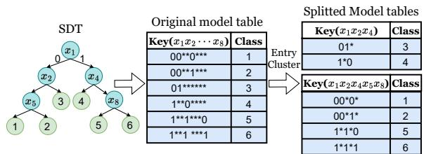  
Figure 2: Entry cluster.

(2) In the update step, the cluster center is reassigned by summing the distances from each element in the cluster to other elements and selecting the element with the minimum sum (line 10-11 in Algorithm 2).

The algorithm terminates when the entry assignment no longer changes or the maximum iteration number is reached.

Complexity analysis: Let z denote the number of entries, k the number of clusters, n the average feature size for computing Jaccard distance, and l the maximum number of iterations. Each iteration requires computing Jaccard distances between n entries and k centers, resulting in a time complexity of O(zkn). The total worst-case complexity is therefore O(lzkn). In the best case, the algorithm converges after a single iteration, with complexity O(zkn). In the worst case, the Entry Cluster algorithm performs no merging, resulting in the same resource usage as the original SMF. In the best case, all rules are merged into a single wildcard entry, reducing storage usage by a factor of (z − 1)/z.

Taking the SDT in Figure 2 as an example, the original model table encodes from the SDT takes an 8-bit vector as the ternary match key and has six entries, thus requiring 8∗6 = 48 bits TCAM at least. Through the entry cluster algorithm, it can be partitioned into two new tables. These two tables respectively utilize a 3-bit and a 5-bit vector as the match key, requiring a total of 3 ∗ 2 + 5 ∗ 4 = 26 bits TCAM.

Inference aggregation. We aggregate the results of each SDT through a voting mechanism. We append an aggregation table behind the model tables to match the concatenation of the inference classes of each SDT and obtain the majority of individual inference classes. Since the number of SDTs and inference classes is small, the aggregation table will not induce the problem of excessive entries caused by the combination.

## 5.2 Sliding Window

The length of the input sequence of each SDT must be limited within the maximum matching length supported by the ternary matching table (e.g., 66 bytes for the Tofino 1). However, the maximum packet length is typically 1500 bytes, which means a packet payload may have to be matched across multiple windows. A naive solution can utilize multiple non-overlapping windows to inspect continuous segments of the payload. However, a target pattern pi (described in Section 2.1) may occur at arbitrary positions in the packet payload, as shown in Figure 3(a). In this scenario, pi may span across windows, resulting in a failure to detect pi in any window.

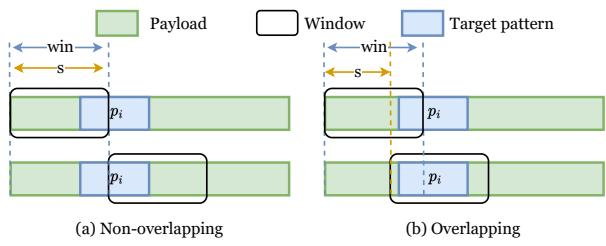  
Figure 3: Sliding window.

To address this issue, we propose a sliding window mechanism. The window size is denoted as win, and the maximum length of a pattern is denoted as L. As depicted in Figure 3(b), each time we move the window for s bytes, and hence retain a win − s overlap with the previous window. To ensure that any pi can be matched, $\mathcal { L } \leq w i n - s$ must be satisfied.

The maximum payload length that can be inspected by a single pipeline with the sliding window is win + MS · s, where MS is the maximum number of MAU stages that can be utilized. Different win and s will influence the depth that can be inspected in a single pipeline and subsequently affect the overall throughput, as recirculation is required for data packets that have not been matched completely. As will be shown in Section 6.6, the sliding window mechanism can significantly enhance the accuracy of pattern matching. This mechanism introduces some additional inspection of packet segments, which can increase resource overhead and affect throughput. Network administrators can deploy Trochilus with carefully chosen window sizes based on the available resources in the target scenarios to achieve the desired tradeoff between accuracy, resource overhead, and throughput.

## 6 Evaluation

We conducted extensive experiments to demonstrate that:

• Trochilus can achieve high initial accuracy comparable to existing pattern-matching systems and can further improve accuracy by around 10% through training (R1).

• Trochilus can achieve Tbps-level throughput for pattern matching while consuming minimal data plane storage resources. (R2).

• Trochilus can automatically update its rules, thereby consistently maintaining high pattern-matching accuracy in the face of changing traffic patterns (R3).

## 6.1 Dataset and Pattern Set

The pattern sets used are constructed from Snort 2.9.7.0 and Suricata 5.0 provided by ET-OPEN [28]. We collected packetlevel traces at gateways of a large data center, which belongs to one of the largest public cloud providers and serves tens of Tbps traffic for customers with diverse cloud access requirements. The collected traces are labeled by the advanced attack detection system and application identification system deployed in the data center. We use 10 minutes of traffic traces collected in different time periods of a week. The collected traffic traces mainly cover five categories of the pattern sets, including $i n f o ,$ web specific app, malware, sql, and exploit, containing around 4000 patterns. The total size of collected traffic traces is 534GB. We divide them into the training, test sets with a ratio of 7 : 3. We use the patterns to match the collected traces. The PDF and CDF of matched packet segment lengths are illustrated in Figure 4. The patterns with a length of fewer than 50 accounts for more than 95%.

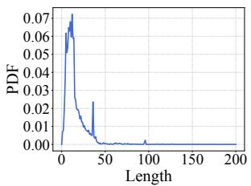  
(a) PDF

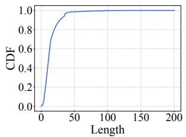  
(b) CDF  
Figure 4: Matched packet segments lengths statistics.

Ethical Considerations. All data analysis was approved by our cooperation units. We did not investigate human behavior, surface or investigate any individual flows or IP addresses, or store any traffic or individual records to disk. To protect user privacy, all packets in the collected traces are anonymized. We restricted all analysis to aggregate network statistics directly output by Trochilus.

## 6.2 Baselines and Metrics

Baselines. To evaluate Trochilus’s accuracy, throughput, and overhead, we conducted experiments under both, full pattern matching and multi-string matching scenarios. We compared Trochilus with several solutions:

• Traditional Pattern Matching System (TPS): It represents the system implemented by Snort [41] or Suricata [45] based on the given pattern set.

• To evaluate the effectiveness of pattern modelization, in addition to TPS, we also compare BRNN with traditional RNNs, including LSTM [20] and GRU [12], as well as a 4-layer CNN [27] and DAN [23].

• For data plane aware model adaption, we compare our SMF with decision tree (DT) [9], random forest (RF) [8], multi-view forest (MF), soft decision tree (SDT), and soft random forest (SRF). Note that SDT and SRF are the results of distilled DT and RF via SSKD.

• BOLT [52]: As far as we know, no solution currently can support full pattern matching in the data plane. Only

BOLT can effectively implement multi-string matching in the data plane. We extract multi-string matching rules from the pattern sets to implement BOLT. To maximize the throughput of BOLT, we set the number of bytes consumed per state transition to 5 and the number of MAU stages used to 12.

• T-MSM-i: a trimmed version of Trochilus that only implements multi-string matching rules from the pattern set. Trochilus-i: a full version of Trochilus that implements full pattern matching. Here, i denotes the number of MAU stages used on the programmable switch.

Metrics. Accuracy is the weighted ratio of correctly classified packets in all packets. The weight of each category is the product of the other categories’ packet numbers, addressing the imbalance of collected traces. # table entries is the number of table entries. TCAM requirement is the product of the table entry number and the width of the matching key.

## 6.3 Experimental Setup

Implementation. We develop a Trochilus prototype which includes about 2000 lines of $\mathrm { P 4 } _ { 1 6 }$ [6] code for the data plane and 4000 lines of Python code for the control plane. In the data plane, to implement the sliding window mechanism, we replicate both the model and the aggregation table for each window. For an incoming packet, the switch first extracts the payload segments for different windows into customized headers. Afterward, each model table takes different payload segments as the match field, and its action is to obtain the classification result of an SDT. In the next stage, the aggregation table matches the results of each model table and flags the packet if some patterns get matched. In the control plane, we use automata\_tools library [29] to convert patterns to DFAs, Pytorch library [38] to implement BRNN, and Python’s Numpy library [18] to implement SSKD and SMF.

Resource breakdown. We deployed Trochilus and BOLT to a 12-stage 6.4Tb/s EdgeCore wedge 100BF-65X Tofino switch with a local CPU of Intel (R) Xeon (R) Gold 5218 CPU @ 2.30GHz. Two Dell R230 servers (Intel XeonE2620 v4, 64GB RAM, 40Gbps Intel Network Interface Card) are used for data transmission. We install the DPDK Pktgen [1] on each server to achieve high-performance traffic replay. We run Snort 3 and Suricata 7 software experiments on a Dell R230 server. For pattern modelization, we set the learning rate to $1 0 ^ { - 4 }$ , the batch size to 500, and the hidden state size to 100 for each model. We use the cross-entropy loss as the objective function. We train each model for 200 epochs and use early stopping to avoid overfitting. For data plane aware model adaption, we set β to 0.5 in SSKD. To achieve a balance between model complexity and accuracy, we set $n _ { t }$ to 5, and threw to 0.5 in SMF. In each SDT we set minimum samples to 15, which is the minimum number of samples required to be at a leaf node. For model deployment, we set $k = 5$ in the entry cluster algorithm, and s = 30, w = 64 in the sliding

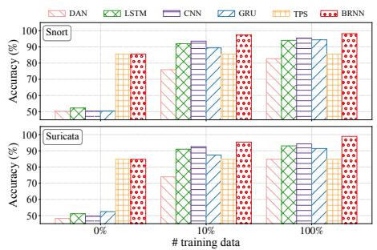  
Figure 5: Teacher model accuracy of pattern matching (Snort and Suricata).

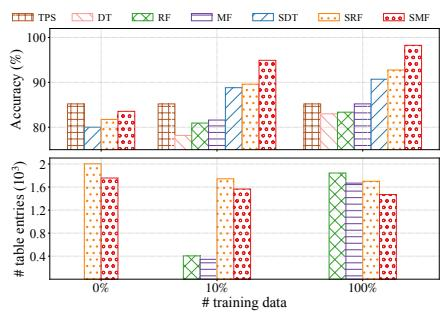  
Figure 6: Student model performance of pattern matching (Snort).

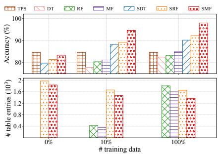  
Figure 7: Student model performance of pattern matching (Suricata).

window.

## 6.4 Data Plane Aware Model Performance

Pattern matching accuracy. Trochilus achieves initial accuracy comparable to TPS. Moreover, through training with labeled data, both the teacher model BRNN and the student model SMF improve accuracy by over 11% compared to TPS.

For pattern modelization, we compare the performance of BRNN and baseline models trained with 0%,10%,100% training data. Figure 5 shows the average accuracy of BRNN and each baseline on all categories, and details are shown in the Appendix A. In zero-shot scenarios (i.e., 0% training data), both BRNN and TPS perform the best among all, achieving 85.2% accuracy, demonstrating that BRNN can effectively preserve the full knowledge of original patterns to achieve high initial accuracy. On the contrary, the other baselines only have 50% accuracies since they literally perform random guesses. In few-shot scenarios (i.e., 10% training data), BRNN boosts the accuracy to 96.3%, showing superior accuracy over all baselines. Among the baselines, TPS performs the worst since current pattern matching systems like Snort and Suricata cannot improve accuracy through training like machine learning models do. DAN also performs poorly, only obtaining an accuracy of 74.9% when given 10% training data. The best-performing one among the baselines, i.e., CNN also underperforms BRNN. For full training, BRNN is again the best performing one among all, achieving an accuracy of 98.5%. DAN only achieves 83.7% accuracy. LSTM, CNN, and GRU achieve accuracies of around 93%, which are still inferior to that of BRNN. In a word, BRNN achieves the best accuracy in all scenarios. This justifies the selection of BRNN as the teacher model in the following SSKD.

For data plane model adaption, we compare SMF with baselines trained with 0%, 10%, 100% training data, as shown in Figure 6 and Figure 7, and details are shown in the Appendix A. In the zero-shot scenario, SMF also preserves the expert knowledge of original patterns, achieving an initial accuracy of 83.7%, which is comparable to TPS. DT, RF, and MF are not available in zero-shot scenarios since there is no labeled data. In the few-shot scenario, attributing to the SSKD, the accuracy of SMF is more than 12% better than all non-distilled models. Compared with SRF, our solution still presents an advantage of about 5% in accuracy. When trained with full data, SMF achieves over 97.1% accuracy. More importantly, compared to TPS, SMF can achieve an accuracy improvement of over 11% through data training.

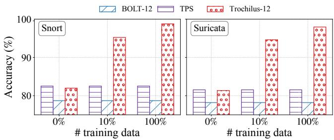  
Figure 8: Accuracy comparison of multi-string matching.

We also evaluate # table entries converted from RF, MF, SRF, and SMF. As shown in Figure 6 and 7, # table entries in SMF are less than that in SRF, indicating the lightweightness of the SMF. In the few-shot scenario, SMF and SRF introduce more table entries compared to RF and MF since the SSKD leverages more unlabeled data to train to boost the accuracy. Therefore, SMF is the best choice for the data plane aware model in terms of accuracy and resource efficiency.

Multi-string matching accuracy. Since existing solutions can only perform multi-string matching in the data plane rather than complete pattern matching, we compared the trimmed version of Trochilus, T-MSM-12, with BOLT on multi-string matching. T-MSM-12 consistently achieves higher accuracy than BOLT. Additionally, T-MSM-12 still achieves an initial accuracy comparable to TPS, and through data training, it can improve accuracy by over 10%.

Figure 8 illustrates the accuracy of T-MSM-12, BOLT, and TPS based on the given multi-string pattern set under different training data proportions. In zero-shot scenarios (0% training data), T-MSM-12 achieves similar accuracy with TPS, which is 2% higher than BOLT. Because BOLT matches rules based on serialized state transitions of automaton, it can not handle complex and elongated rules in programmable switches with limited storage and computing resources. In contrast, T-MSM-12 transforms rule matching into model inference, which allows it to handle complex and elongated rules with high effectiveness. In the few-shot and the full training scenarios, T-MSM-12’s accuracy is more than 15% higher than BOLT’s and more than 10% higher than TPS’s. Obviously, like TPS, BOLT is also unable to improve its accuracy through training. Specifically, BOLT cannot expand its state machine converted from multi-string patterns via learning from training data, so its accuracy remains at 82%. Meanwhile, the accuracy of Trochilus can be significantly improved through training attributed to its learning ability.

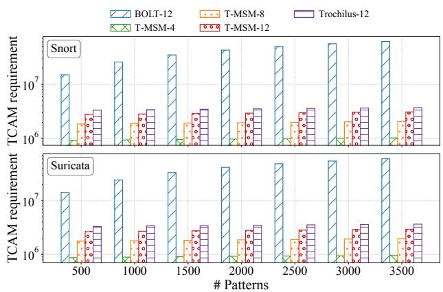  
Figure 9: Comparison with BOLT on TCAM requirement. BOLT only supports multi-string matching and uses 12 stages. T-MM-i represents Trochilus using i stages for multi-string matching. Trochilus-12 represents Trochilus using 12 stages for complete pattern matching.

## 6.5 Model Representation Performance

We conducted experiments on pattern matching and multistring matching with varying pattern numbers to evaluate the TCAM requirement. We also conducted experiments with varying payload lengths to evaluate the throughput.

TCAM requirement. Figure 9 shows a comparison of TCAM requirements by Trochilus and BOLT on multi-string matching. T-MSM-4, T-MSM-8, and T-MSM-12 reduce the 97.8%, 95.6%, and 93.4% TCAM requirement of BOLT, respectively. The TCAM requirement of BOLT increases rapidly with the increase of the pattern number, due to the dramatic increase of the state number after the patterns are converted to automatons. Specifically, when the number of patterns reaches 3500, the TCAM requirement of BOLT is 4 times that of when the number of patterns is 500. However, Trochilus only increases about 10% TCAM requirement on average. Although more patterns add complexity to the BRNN model, SSKD can effectively distill the knowledge and add it to the data plane aware model, resulting in limited TCAM requirements. Note that T-MSM-4 achieves a similar throughput with BOLT. However, Trochilus can further improve its throughput using more MAU stages, which will be discussed in Section 6.6.

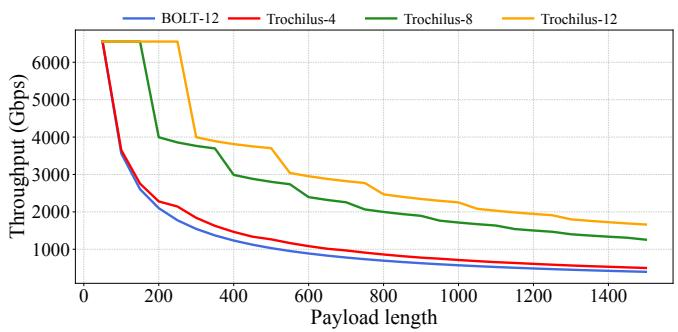  
Figure 10: Comparison of throughput. Note that BOLT utilizes 12 MAU stages to achieve maximum throughput and only supports multi-string matching. Trochilus supports full pattern matching.

Figure 9 also shows the TCAM requirements of Trochilus for pattern matching under different pattern numbers. We can find that the TCAM requirement for pattern matching is about 15% higher than that for multi-string matching since full patterns have more complex syntax. However, the TCAM requirements of Trochilus on pattern matching are still much less than that of BOLT on multi-string matching. Meanwhile, there is still adequate space for other services after Trochilus has deployed all the patterns in the programmable switches. Throughput. Trochilus achieves multi-Tbps throughput when processing packets of varying sizes. Restricted by the capability of our traffic generator, we can not fully cover the bandwidth of the Tofino switch used. We use a similar method in BOLT [52] to simulate the theoretical upper limit of the throughput of Trochilus under different pattern sets and workloads. We set the total number of multi-string patterns in Trochilus and BOLT to 3500. For the deployment of Trochilus, we set s to 30 bytes, and use 4, 8, and 12 MAU stages. As shown in Figure 10, with the increasing payload length, both Trochilus and BOLT experience a decrease in throughput due to more recirculations. Nevertheless, even with just 4 stages, Trochilus’s single pipeline is able to detect deeper depths than BOLT, thus having higher throughput. Leveraging more MAU stages can improve the inspection depth of a pipeline. Therefore, Trochilus-8 and Trochilus-12 achieve 2.3, and 2.8 times the throughput of BOLT, demonstrating their ability to achieve high throughput in various scenarios.

## 6.6 Trochilus Deep Dive

We explored the hyperparameters affecting Trochilus in the sliding window and the entry cluster. Note that we extend Trochilus to 12 MAU stages.

Sliding window parameters s and win. The window size win and moving step s are important parameters affecting Trochilus’s accuracy and throughput. The larger the win is, the larger the packet length that can be inspected by a single window. However, since the key length supported by a ternary match-action table is limited (e.g., no more than 66 bytes in Tofino 1), we fixed the win at 64 bytes. Afterward, we apply different s to demonstrate how s affects accuracy and throughput. The short-packet traces and large-packet traces are selected from our dataset, with an average length of 200 bytes and 1000 bytes, respectively. Figure 11(a) shows the impact of different s on accuracy under two traces. As s increases, accuracy first increases and then decreases. The reason behind this is that as s increases, the number of inspection windows decreases, reducing the probability of misclassification. However, it also reduces the probability of a single window capturing patterns, thus decreasing the accuracy.

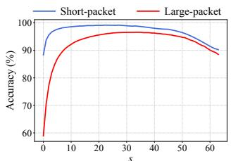  
(a) Accuracy

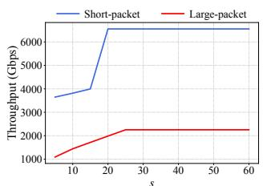  
(b) Throughput  
Figure 11: Analysis of the sliding window step s.

The throughput of Trochilus over two traces are shown in Figure 11(b). Trochilus can provide high throughput for short packets under different s because they require only a few or even no recirculations which consume negligible bandwidth. However, Trochilus provides relatively low throughput for large packets due to more recirculations. Meanwhile, the PHV resource for storing the extracted payload in the switch restricts the maximum depth that can be resolved in a single pipeline. As a result, the overall throughput for large packets has an upper bound.

Entry cluster parameter k. To further evaluate the performance of the entry cluster, we vary k from 2 to 9 and illustrate the results of the TCAM requirements in Figure 12. When k increases, the TCAM reduction ratio improves from 80.9% to 92.5%, revealing the superior performance of the entry cluster on saving resources. However, the increase of k results in that more tables should be defined and configured in the data plane, introducing a trade-off between the complexity of table management and the TCAM requirement. However, an increase in k results in the need to define and configure more tables in the data plane. Users need to make a trade-off between the complexity of table management and the TCAM requirements.

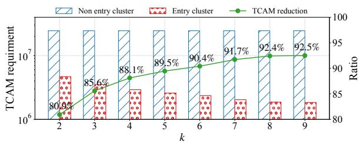  
Figure 12: TCAM reduction achieved by entry cluster under different cluster number k.

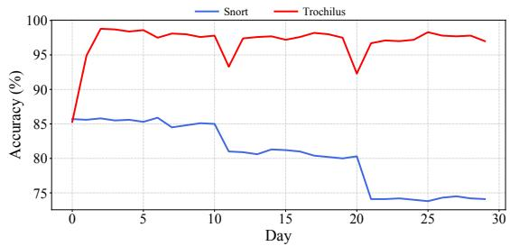  
Figure 13: Comparison of accuracy over a 30-day experiment.

## 6.7 Why is Trochilus Easy-to-maintain?

We evaluated Trochilus over multiple weeks of traffic to assess its low maintenance requirements through continuous training. We sampled packet-level traffic for 30 consecutive days at gateways of a large data center and replay the traffic to the Trochilus system and the Snort system. When replaying traffic, we continuously injected different types of zero-day attack traffic on the 10th and 20th days, where the amount of the new attack traffic accounts for 10% of the original attack traffic. On the initial day, Trochilus employed the original pattern set to cold-start since there was no labeled data. At the end of each day, Trochilus was automatically updated based on labeled data collected offline that day.

As shown in Figure 13, Snort exhibits a significant accuracy decline of about 4% and 6% on the 10th and 20th days, respectively. This is because the existing rules are unable to cover new attacks. While Trochilus experiences an accuracy drop of 3% and 4% on the 10th and 20th days, respectively, its accuracy rebounds to about 97% on the 11th and 21st days. Through training with labeled data, Trochilus can automatically mine data patterns and update the transition weights W of the BRNN. Based on W , we can reconstruct the DFA by mapping the weights into {0,1} and convert a trained BRNN back to patterns. Therefore, updating Trochilus parameters through training is equivalent to adding representative new rules. However, Snort requires manual rule extraction from attack traffic to detect new threats, which is both laborintensive and necessitates special expertise. Conversely, the automated updating process of Trochilus is not dependent on expert knowledge or human efforts, which significantly enhances the system’s manageability compared to existing

pattern-matching systems.

In summary, in long-term deployments, traditional patternmatching systems face challenges in adapting to emerging attacks, while Trochilus sustains a stable accuracy through automatic updates.

## 7 Discussion

Security analysis. We discuss several adaptive (or whitebox) attacks targeting Trochilus. The first type is a throughput exhaustion attack, in which the adversary sends a large volume of jumbo frames (Ethernet packets with payloads exceeding the standard maximum transmission unit (MTU) of 1500 bytes). These oversized packets trigger excessive recirculations within the programmable switches, rapidly depleting their processing capacity. To mitigate such attacks, we propose integrating existing network measurement techniques [14,63] to track both the size and recirculation count of network flows. When statistical indicators surpass predefined thresholds, the system can promptly block the attack traffic and alert network administrators.

The second type is the adversarial attack, where the attacker feeds adversarial inputs to the model to cause model misclassification due to small adversarial perturbations. For example, attackers can add benign bytes to malicious packets to bypass network intrusion detection systems. To tackle this problem, Trochilus can be extended to fuzzy matching to improve its robustness against adversarial attacks. Fuzzy matching (also called approximate pattern matching) is a technique that evaluates the similarity between an observed traffic payload and known malicious patterns, rather than requiring exact matches. Specifically, we can modify our SSKD and use the probability values output by BRNN to train the regression tree instead of the SDT as the fundamental unit of the SMF. We then compare the probability values output by the SMF with a predefined threshold to achieve fuzzy matching.

Scalability analysis. As the number of patterns increases, the required storage may exceed the capacity of a single programmable switch. To address this, the model can be distributed across multiple switches. During packet processing, switches cooperate by forwarding packets to other nodes based on intermediate detection results, thereby forming a complete pattern matching system. We plan to further investigate and optimize this distributed approach in future work. Real-world network applications also require support for encrypted traffic and emerging transport protocols. To handle encrypted traffic, Trochilus can be integrated with existing decryption mechanisms (e.g., [43]). For new protocols, Trochilus can collect relevant packets and update the model accordingly. As data collection is performed offline and model updates are incremental, the system’s operation remains unaffected by peak traffic conditions.

## 8 Related Work

Intelligent model deployment in the data plane. To leverage both the inference ability of the learning model and the linerate processing ability of the programmable switch, existing methods try to embed learning models into the data plane [55, 57, 65, 66]. However, they need to train the model for a long time using large-scale datasets. The current frameworks and models can not adapt to pattern matching that involves parsing of payloads.

Using programmable switches to accelerate pattern matching. As for the existing methods using programmable switches to accelerate pattern matching, some of them can only support simple multi-string matching [25, 52], while others just use switches for packet forwarding and offload complex pattern matching functions onto additional dedicated hardware (e.g., network processors [22]). Trochilus is the first to implement complex pattern matching entirely in the programmable switches and can be integrated into other data plane hardware (e.g., SmartNICs [36]) with minor changes.

## 9 Conclusion

In this paper, we propose Trochilus, a learning-enhanced, high-throughput pattern matching framework that leverages programmable data planes to address the pressing challenges of scalability, accuracy, and manageability in modern network pattern matching systems. By integrating model inference with low-cost data plane processing, Trochilus delivers a significant improvement in throughput, achieving multi-Tbps throughput without compromising on pattern matching accuracy. Through innovative techniques like BRNN-based pattern modelization, semi-supervised knowledge distillation, and entry cluster optimization, Trochilus efficiently deploys high-performance models in resource-constrained data planes while ensuring automatic system updates, crucial for real-time adaptation to emerging network traffic and threats. As network bandwidth continues to grow and new applications emerge, Trochilus provides a future-proof pattern matching framework that can adapt and scale to meet the evolving needs of next-generation network infrastructures. Looking ahead, our framework opens several avenues for future research, including the integration of Trochilus with encrypted traffic analysis, SmartNICs, and other hardware-accelerated platforms.

## Acknowledgments

This work is supported by the Major Key Project of PCL under grant No. PCL2023A06, Shenzhen R&D Program under grant No. KJZD20230923114059020, and in part by Shenzhen Key Laboratory of Software Defined Networking under Grant ZDSYS20140509172959989.

## References

[1] Dpdk-pktgen. https://github.com/Pktgen/ Pktgen-DPDK, 2023.

[2] Accton. Towards 800g and 1600g ethernet. https://www.accton.com/Technology-Brief/ towards-800g-and-1600g-ethernet/, 2023.

[3] Anonymous. Source code of trochilus. https: //anonymous.4open.science/r/Trochilus-RE, 2023.

[4] Leonard E. Baum and Ted Petrie. Statistical Inference for Probabilistic Functions of Finite State Markov Chains. The Annals of Mathematical Statistics, 37(6):1554 – 1563, 1966.

[5] Michela Becchi and Srihari Cadambi. Memory-efficient regular expression search using state merging. In IN-FOCOM 2007. 26th IEEE International Conference on Computer Communications, Joint Conference of the IEEE Computer and Communications Societies, 6-12 May 2007, Anchorage, Alaska, USA, pages 1064–1072, 2007.

[6] Pat Bosshart, Dan Daly, Glen Gibb, Martin Izzard, Nick McKeown, Jennifer Rexford, Cole Schlesinger, Dan Talayco, Amin Vahdat, George Varghese, and David Walker. P4: programming protocol-independent packet processors. Comput. Commun. Rev., 44(3):87–95, 2014.

[7] Pat Bosshart, Glen Gibb, Hun-Seok Kim, George Varghese, Nick McKeown, Martin Izzard, Fernando A. Mujica, and Mark Horowitz. Forwarding metamorphosis: fast programmable match-action processing in hardware for SDN. In ACM SIGCOMM 2013 Conference, pages 99–110, 2013.

[8] Leo Breiman. Random forests. Machine learning, 45(1):5–32, 2001.

[9] Leo Breiman, Jerome H Friedman, Richard A Olshen, and Charles J Stone. Classification and regression trees. Routledge, 2017.

[10] Yeim-Kuan Chang and Ching-Hsuan Shih. A memory efficient pattern matching scheme for regular expressions. In 14th International Conference on Mobile Systems and Pervasive Computing (MobiSPC 2017) / 12th International Conference on Future Networks and Communications (FNC 2017) / Affiliated Workshops, July 24-26, 2017, Leuven, Belgium, volume 110, pages 250–257, 2017.

[11] Xiang Chen, Hongyan Liu, Dong Zhang, Qun Huang, Haifeng Zhou, Chunming Wu, and Qiang Yang. Empowering ddos attack mitigation with programmable switches. IEEE Network, pages 1–7, 2022.

[12] Junyoung Chung, Çaglar Gülçehre, KyungHyun Cho, and Yoshua Bengio. Empirical evaluation of gated recurrent neural networks on sequence modeling. CoRR, abs/1412.3555, 2014.

[13] Christopher R. Clark and David E. Schimmel. Scalable pattern matching for high speed networks. In 12th IEEE Symposium on Field-Programmable Custom Computing Machines (FCCM 2004), 20-23 April 2004, Napa, CA, USA, Proceedings, pages 249–257, 2004.

[14] Graham Cormode and S. Muthukrishnan. An improved data stream summary: the count-min sketch and its applications. J. Algorithms, 55(1):58–75, 2005.

[15] Seyed Kaveh Fayaz, Yoshiaki Tobioka, Vyas Sekar, and Michael Bailey. Bohatei: Flexible and elastic ddos defense. In 24th USENIX Security Symposium, USENIX Security 15, Washington, D.C., USA, August 12-14, 2015, pages 817–832. USENIX Association, 2015.

[16] The Open Group. Posix. https://pubs.opengroup. org/onlinepubs/9699919799/, 2018.

[17] Sahil Gupta, Devashish Gosain, Minseok Kwon, and Hrishikesh B. Acharya. Deep4r: Deep packet inspection in P4 using packet recirculation. In IEEE INFOCOM 2023 - IEEE Conference on Computer Communications, New York City, NY, USA, May 17-20, 2023, pages 1–10. IEEE, 2023.

[18] Charles R Harris, K Jarrod Millman, Stéfan J Van Der Walt, Ralf Gommers, Pauli Virtanen, David Cournapeau, Eric Wieser, Julian Taylor, Sebastian Berg, Nathaniel J Smith, et al. Array programming with numpy. Nature, 585:357–362, 2020.

[19] Nguyen Phong Hoang, Arian Akhavan Niaki, Jakub Dalek, Jeffrey Knockel, Pellaeon Lin, Bill Marczak, Masashi Crete-Nishihata, Phillipa Gill, and Michalis Polychronakis. How great is the great firewall? measuring china’s DNS censorship. In 30th USENIX Security Symposium, USENIX Security 2021, August 11-13, 2021, pages 3381–3398. USENIX Association, 2021.

[20] Sepp Hochreiter and Jürgen Schmidhuber. Long shortterm memory. Neural Comput., 9(8):1735–1780, 1997.

[21] John Hopcroft. An nlogn algorithm for minimizing states in a finite automaton. In Theory of Machines and Computations, pages 189–196. Academic Press, 1971.

[22] Joel Hypolite, John Sonchack, Shlomo Hershkop, Nathan Dautenhahn, André DeHon, and Jonathan M. Smith. Deepmatch: practical deep packet inspection in the data plane using network processors. In CoNEXT ’20: The 16th International Conference on emerging Networking EXperiments and Technologies, Barcelona, Spain, December, 2020, pages 336–350, 2020.

[23] Mohit Iyyer and Varun Manjunatha. Deep unordered composition rivals syntactic methods for text classification. In Proceedings of the 53rd Annual Meeting of the Association for Computational Linguistics and the 7th International Joint Conference on Natural Language Processing of the Asian Federation of Natural Language Processing, pages 1681–1691, 2015.

[24] Nigel Jacob and Carla E. Brodley. Offloading IDS computation to the GPU. In 22nd Annual Computer Security Applications Conference (ACSAC 2006), 11-15 December 2006, Miami Beach, Florida, USA, pages 371–380, 2006.

[25] Theo Jepsen, Daniel Álvarez, Nate Foster, Changhoon Kim, Jeongkeun Lee, Masoud Moshref, and Robert Soulé. Fast string searching on PISA. In Proceedings of the 2019 ACM Symposium on SDN Research, SOSR 2019, San Jose, CA, USA, April 3-4, 2019, pages 21–28, 2019.

[26] Xin Jin, Xiaozhou Li, Haoyu Zhang, Robert Soulé, Jeongkeun Lee, Nate Foster, Changhoon Kim, and Ion Stoica. Netcache: Balancing key-value stores with fast in-network caching. In Proceedings of the 26th Symposium on Operating Systems Principles, Shanghai, China, October 28-31, 2017, pages 121–136, 2017.

[27] Yoon Kim. Convolutional neural networks for sentence classification. CoRR, abs/1408.5882, 2014.

[28] ET Labs. Emerging threats open ruleset. https://rules.emergingthreats.net/OPEN download\_instructions.html, 2022.

[29] LinOneTwo. Automata tools. https://pypi.org/ project/automata-tools/, 2020.

[30] Hang Lint, Weiwei Lint, Jing Lint, Longlong Zhu, Dong Zhang, and Chunming Wu. P4CTM: compressed traffic pattern matching based on programmable data plane. In IEEE Symposium on Computers and Communications, ISCC 2023, Gammarth, Tunisia, July 9-12, 2023, pages 342–347. IEEE, 2023.

[31] Huan Liu. Efficient mapping of range classifier into ternary-cam. In 10th Annual IEEE Symposium on High Performance Interconnects (HOTIC 2002), August 21 - 23, 2002, Stanford, CA, USA, pages 95–100, 2002.

[32] Zaoxing Liu, Hun Namkung, Georgios Nikolaidis, Jeongkeun Lee, Changhoon Kim, Xin Jin, Vladimir Braverman, Minlan Yu, and Vyas Sekar. Jaqen: A high-performance switch-native approach for detecting and mitigating volumetric ddos attacks with programmable switches. In 30th USENIX Security Symposium, USENIX Security 2021, August 11-13, 2021, pages 3829–3846, 2021.

[33] Rui Miao, Hongyi Zeng, Changhoon Kim, Jeongkeun Lee, and Minlan Yu. Silkroad: Making stateful layer-4 load balancing fast and cheap using switching asics. In Proceedings of the Conference of the ACM Special Interest Group on Data Communication, SIGCOMM 2017, Los Angeles, CA, USA, August 21-25, 2017, pages 15–28, 2017.

[34] Jaehyun Nam, Muhammad Jamshed, Byungkwon Choi, Dongsu Han, and KyoungSoo Park. Haetae: Scaling the performance of network intrusion detection with manycore processors. In Research in Attacks, Intrusions, and Defenses - 18th International Symposium, RAID 2015, Kyoto, Japan, November 2-4, 2015, Proceedings, volume 9404, pages 89–110. Springer, 2015.

[35] Jaehyun Nam, Seung Ho Na, Seungwon Shin, and Taejune Park. Reconfigurable regular expression matching architecture for real-time pattern update and payload inspection. J. Netw. Comput. Appl., 208:103507, 2022.

[36] Netronome. Agilio lx smartnics. https://www. netronome.com/products/agilio-lx/, 2022.

[37] ntop. ndpi. https://www:ntop:org, 2023.

[38] Adam Paszke, Sam Gross, Soumith Chintala, Gregory Chanan, Edward Yang, Zachary DeVito, Zeming Lin, Alban Desmaison, Luca Antiga, and Adam Lerer. Automatic differentiation in pytorch. 2017.

[39] Philip Hazel. Pcre - perl compatible regular expressions. http://www.pcre.org/, 2022.

[40] Michael O. Rabin and Dana S. Scott. Finite automata and their decision problems. IBM J. Res. Dev., 3(2):114– 125, 1959.

[41] Martin Roesch. Snort: Lightweight intrusion detection for networks. In Proceedings of the 13th Conference on Systems Administration (LISA-99), Seattle, WA, USA, November 7-12, 1999, pages 229–238. USENIX, 1999.

[42] Elaheh Sadredini, Reza Rahimi, Marzieh Lenjani, Mircea Stan, and Kevin Skadron. Impala: Algorithm/architecture co-design for in-memory multi-stride pattern matching. In IEEE International Symposium on High Performance Computer Architecture, HPCA 2020, San Diego, CA, USA, February 22-26, 2020, pages 86–98, 2020.

[43] Justine Sherry, Chang Lan, Raluca Ada Popa, and Sylvia Ratnasamy. Blindbox: Deep packet inspection over encrypted traffic. In Proceedings of the 2015 ACM Conference on Special Interest Group on Data Communication, SIGCOMM 2015, London, United Kingdom, August 17- 21, 2015, pages 213–226, 2015.

[44] David Sidler, Zsolt István, Muhsen Owaida, and Gustavo Alonso. Accelerating pattern matching queries in hybrid CPU-FPGA architectures. In Proceedings of the 2017 ACM International Conference on Management of Data, SIGMOD Conference 2017, Chicago, IL, USA, May 14- 19, 2017, pages 403–415, 2017.

[45] Suricata. Suricata is far more than an ids/ips. https: //suricata.io/, 2021.

[46] Thomas Scheibe. Announcing the first cisco 800g nexus switch. https://blogs.cisco.com/datacenter/ cisco-nexus-connect-cloud-scale-performance\ -and-sustainability, 2022.

[47] Ken Thompson. Programming techniques: Regular expression search algorithm. Commun. ACM, 11(6):419–422, jun 1968.

[48] Trustwave. Modsecurity. https://www.modsecurity. org/, 2023.

[49] Giorgos Vasiliadis, Michalis Polychronakis, and Sotiris Ioannidis. Midea: a multi-parallel intrusion detection architecture. In Proceedings of the 18th ACM Conference on Computer and Communications Security, CCS 2011, Chicago, Illinois, USA, October 17-21, 2011, pages 297– 308, 2011.

[50] Giorgos Vasiliadis, Michalis Polychronakis, and Sotiris Ioannidis. Parallelization and characterization of pattern matching using gpus. In IISWC 2011, Austin, TX, USA, November 6-8, 2011, pages 216–225, 2011.

[51] Lucas Vespa, Ning Weng, and Ramaswamy Ramaswamy. MS-DFA: multiple-stride pattern matching for scalable deep packet inspection. Comput. J., 54(2):285–303, 2011.

[52] Shicheng Wang, Menghao Zhang, Guanyu Li, Chang Liu, Ying Liu, Xuya Jia, and Mingwei Xu. Making multistring pattern matching scalable and cost-efficient with programmable switching asics. In 40th IEEE Conference on Computer Communications, INFOCOM 2021, Vancouver, BC, Canada, May 10-13, 2021, pages 1–10, 2021.

[53] Xiang Wang, Yang Hong, Harry Chang, KyoungSoo Park, Geoff Langdale, Jiayu Hu, and Heqing Zhu. Hyperscan: A fast multi-pattern regex matcher for modern cpus. In 16th USENIX Symposium on Networked Systems Design and Implementation, NSDI 2019, Boston, MA, February 26-28, 2019, pages 631–648, 2019.

[54] Xiaofei Wang, Yang Xu, Junchen Jiang, Olga Ormond, Bin Liu, and Xiaojun Wang. Strifa: Stride finite automata for high-speed regular expression matching in network intrusion detection systems. IEEE Syst. J., 7(3):374–384, 2013.

[55] Guorui Xie, Qing Li, Yutao Dong, Guanglin Duan, Yong Jiang, and Jingpu Duan. Mousika: Enable general in-network intelligence in programmable switches by knowledge distillation. In IEEE INFOCOM 2022 - IEEE Conference on Computer Communications, London, United Kingdom, May 2-5, 2022, pages 1938–1947, 2022.

[56] Jiarong Xing, Qiao Kang, and Ang Chen. Netwarden: Mitigating network covert channels while preserving performance. In USENIX Security 2020, August 12-14, 2020, pages 2039–2056, 2020.

[57] Zhaoqi Xiong and Noa Zilberman. Do switches dream of machine learning?: Toward in-network classification. In Proceedings of the 18th ACM Workshop on Hot Topics in Networks, HotNets 2019, Princeton, NJ, USA, November 13-15, 2019, pages 25–33, 2019.

[58] Hao Xu, Harry Chang, Wenjun Zhu, Yang Hong, Geoff Langdale, Kun Qiu, and Jin Zhao. Harry: A scalable simd-based multi-literal pattern matching engine for deep packet inspection. In IEEE INFOCOM 2023 - IEEE Conference on Computer Communications, New York City, NY, USA, May 17-20, 2023, pages 1–10. IEEE, 2023.

[59] Liu Yang, Rezwana Karim, Vinod Ganapathy, and Randy Smith. Fast, memory-efficient regular expression matching with nfa-obdds. Comput. Networks, 55(15):3376– 3393, 2011.

[60] Xiaodong Yu and Michela Becchi. GPU acceleration of regular expression matching for large datasets: exploring the implementation space. In Computing Frontiers Conference, CF’13, Ischia, Italy, May 14 - 16, 2013, pages 18:1–18:10, 2013.

[61] Zeek. An open source network security monitoring tool. https://zeek.org/, 2023.

[62] Shuzhuang Zhang, Hao Luo, Binxing Fang, and Xiaochun Yun. Fast and memory-efficient regular expression matching using transition sharing. IEICE Trans. Inf. Syst., 92-D(10):1953–1960, 2009.

[63] Zhengxin Zhang, Qing Li, Guanglin Duan, Dan Zhao, Jingyu Xiao, Guorui Xie, and Yong Jiang. Pontus: Finding waves in data streams. Proc. ACM Manag. Data, 1(1):106:1–106:26, 2023.

[64] Zhipeng Zhao, Hugo Sadok, Nirav Atre, James C. Hoe, Vyas Sekar, and Justine Sherry. Achieving 100gbps intrusion prevention on a single server. In OSDI 2020, Virtual Event, November 4-6, 2020, pages 1083–1100, 2020.

[65] Changgang Zheng and Noa Zilberman. Planter: seeding trees within switches. In SIGCOMM ’21: ACM SIG-COMM 2021 Conference, Virtual Event, August 23-27, 2021, Poster and Demo Sessions, pages 12–14, 2021.

[66] Guangmeng Zhou and Zhuotao Liu. An efficient design of intelligent network data plane. In 32nd USENIX Security Symposium (USENIX Security 23). Anaheim, CA: USENIX Association, 2023.

## A supplementary materials

We show supported PCRE syntax in Table 2. The detailed results of pattern modelization and data Plane aware model under different pattern sets are shown in Table 3-6.

Table 2: PCRE syntaxes supported in this paper.
<table><tr><td rowspan=1 colspan=1> Syntax</td><td rowspan=1 colspan=1>Description</td></tr><tr><td rowspan=1 colspan=1>α</td><td rowspan=1 colspan=1>Matches a single character.</td></tr><tr><td rowspan=1 colspan=1>α</td><td rowspan=1 colspan=1>CONCAT operation. Matches αβ.</td></tr><tr><td rowspan=1 colspan=2>αβ                                            OR (l) operation. Matches α or β.</td></tr><tr><td rowspan=1 colspan=2>Q*                                     Kleene (*) star. Matches α zero or more times.</td></tr><tr><td rowspan=1 colspan=2>：                                              Wildcard. Matches any character.</td></tr><tr><td rowspan=1 colspan=1>α+</td><td rowspan=1 colspan=1>PLUS(+)operation.Matches α one or more times.</td></tr><tr><td rowspan=1 colspan=1>Q</td><td rowspan=1 colspan=1>Matches α only appears at the beginning of the string.</td></tr><tr><td rowspan=1 colspan=1>$α</td><td rowspan=1 colspan=1>Matches α only appears at the ending of the string.</td></tr><tr><td rowspan=1 colspan=1>[α-β]</td><td rowspan=1 colspan=1> Character class The character class uses OR operation to match a character included in the character class.</td></tr><tr><td rowspan=1 colspan=1>α{β,}</td><td rowspan=1 colspan=1>Range Matching.Matches α subexpression β to δ times.</td></tr><tr><td rowspan=1 colspan=1>α{β}</td><td rowspan=1 colspan=1>AtLeast Matching. Matches α subexpression β or more times.</td></tr><tr><td rowspan=1 colspan=1>α{β}</td><td rowspan=1 colspan=1>Exactly Matching. Matches α subexpression β times.</td></tr><tr><td rowspan=1 colspan=1>d</td><td rowspan=1 colspan=1>Matches any number, equivalent to [0 -9].</td></tr><tr><td rowspan=1 colspan=1>D</td><td rowspan=1 colspan=1>Matches any non-number.</td></tr><tr><td rowspan=1 colspan=1>W</td><td rowspan=1 colspan=1>Matches any letter, equivalent to [a- zA - Z].</td></tr><tr><td rowspan=1 colspan=1>W</td><td rowspan=1 colspan=1>Matches any non-letter.</td></tr><tr><td rowspan=1 colspan=1></td><td rowspan=1 colspan=1>Matches any non-whitespace character.</td></tr><tr><td rowspan=1 colspan=1>\S</td><td rowspan=1 colspan=1>Matches any whitespace character.</td></tr></table>

Table 3: The results of teacher model on Snort.
<table><tr><td></td><td># TD</td><td>info</td><td> web specific app</td><td>malware</td><td>sql</td><td>exploit</td></tr><tr><td>TPS</td><td>-</td><td>86.14</td><td>85.24</td><td>85.54</td><td>85.84</td><td>84.94</td></tr><tr><td rowspan="3">LSTM</td><td>0%</td><td>52.27</td><td>51.98</td><td>52.86</td><td>52.57</td><td>51.67</td></tr><tr><td>10%</td><td>93.16</td><td>88.96</td><td>92.56</td><td>92.26</td><td>92.86</td></tr><tr><td>100%</td><td>94.64</td><td>93.75</td><td>94.43</td><td>94.32</td><td>94.24</td></tr><tr><td rowspan="3">CNN</td><td>0%</td><td>51.42</td><td>48.12</td><td>49.04</td><td>51.13</td><td>51.71</td></tr><tr><td>10%</td><td>95.48</td><td>92.79</td><td>94.86</td><td>92.47</td><td>92.20</td></tr><tr><td>100%</td><td>96.25</td><td>95.82</td><td>95.58</td><td>94.64</td><td>93.96</td></tr><tr><td rowspan="3">GRU</td><td>0%</td><td>51.48</td><td>52.04</td><td>48.93</td><td>51.71</td><td>48.02</td></tr><tr><td>10%</td><td>88.76</td><td>87.79</td><td>91.27</td><td>91.29</td><td>87.88</td></tr><tr><td>100%</td><td>93.10</td><td>95.33</td><td>95.94</td><td>92.23</td><td>95.29</td></tr><tr><td rowspan="3">DAN</td><td>0%</td><td>53.00</td><td>49.56</td><td>49.86</td><td>49.53</td><td>49.26</td></tr><tr><td>10%</td><td>75.85</td><td>75.86</td><td>75.56</td><td>76.14</td><td>76.15</td></tr><tr><td>100%</td><td>83.38</td><td>83.69</td><td>83.39</td><td>79.97</td><td>83.35</td></tr><tr><td rowspan="3">BRNN</td><td>0%</td><td>84.368</td><td>84.967</td><td>88.71</td><td>84.378</td><td>85.268</td></tr><tr><td>10%</td><td>98.254</td><td>96.164</td><td>97.374</td><td>96.094</td><td>98.814</td></tr><tr><td>100%</td><td>99.17</td><td>96.69</td><td>97.84</td><td>97.36</td><td>99.75</td></tr></table>

Table 4: The results of student model on Snort.
<table><tr><td></td><td># TD</td><td>info</td><td>web specific app</td><td>malware</td><td>sql</td><td>exploit</td></tr><tr><td>TPS</td><td>-</td><td>86.14</td><td>85.24</td><td>85.54</td><td>85.84</td><td>84.94</td></tr><tr><td rowspan="3">DT</td><td>0%</td><td>52.27</td><td>51.98</td><td>52.86</td><td>52.57</td><td>51.67</td></tr><tr><td>10%</td><td>93.16</td><td>88.96</td><td>92.56</td><td>92.26</td><td>92.86</td></tr><tr><td>100%</td><td>81.24</td><td>82.14</td><td>85.14</td><td>80.94</td><td>85.44</td></tr><tr><td rowspan="2">RF</td><td>10%</td><td>80.26</td><td>70.95</td><td>80.56</td><td>82.96</td><td>80.86</td></tr><tr><td>100%</td><td>82.89</td><td>84.08</td><td>83.43</td><td>82.88</td><td>83.45</td></tr><tr><td rowspan="2">MF</td><td>10%</td><td>81.04</td><td>81.00</td><td>84.16</td><td>80.76</td><td>81.02</td></tr><tr><td>100%</td><td>85.78</td><td>82.63</td><td>85.71</td><td>86.09</td><td>85.79</td></tr><tr><td rowspan="3">SDT</td><td>0%</td><td>81.21</td><td>80.83</td><td>77.16</td><td>80.54</td><td>80.26</td></tr><tr><td>10%</td><td>88.27</td><td>91.34</td><td>87.91</td><td>88536</td><td>87.97</td></tr><tr><td>100%</td><td>90.80</td><td>91.88</td><td>91.25</td><td>89.46</td><td>90.07</td></tr><tr><td rowspan="3">SRF</td><td>0%</td><td>84.35</td><td>80.66</td><td>80.91</td><td>81.52</td><td>81.24</td></tr><tr><td>10%</td><td>90.24</td><td>90.83</td><td>90.85</td><td>88.08</td><td>87.99</td></tr><tr><td>100%</td><td>93.99</td><td>91.65</td><td>92.36</td><td>93.67</td><td>93.08</td></tr><tr><td rowspan="3">SMF</td><td>0%</td><td>85.35</td><td>85.02</td><td>81.99</td><td>83.00</td><td>82.33</td></tr><tr><td>10%</td><td>96.08</td><td>96.34</td><td>93.22</td><td>92.58</td><td>96.32</td></tr><tr><td>100%</td><td>98.93</td><td>96.73</td><td>99.54</td><td>99.59</td><td>96.44</td></tr></table>

Table 5: The results of teacher model on Suricata.
<table><tr><td></td><td># TD</td><td>info</td><td> web specific app</td><td>malware</td><td>sql</td><td>exploit</td></tr><tr><td>TPS</td><td>-</td><td>84.56</td><td>85.08</td><td>85.44</td><td>84.55</td><td>84.21</td></tr><tr><td rowspan="3">LSTM</td><td>0%</td><td>53.41</td><td>50.08</td><td>49.40</td><td>49.74</td><td>53.14</td></tr><tr><td>10%</td><td>91.69</td><td>88.91</td><td>91.39</td><td>93.96</td><td>94.00</td></tr><tr><td>100%</td><td>93.81</td><td>90.08</td><td>93.35</td><td>95.96</td><td>95.23</td></tr><tr><td rowspan="3">CNN</td><td>0%</td><td>46.66</td><td>50.08</td><td>50.42</td><td>50.69</td><td>49.81</td></tr><tr><td>10%</td><td>90.95</td><td>90.05</td><td>93.53</td><td>93.80</td><td>94.43</td></tr><tr><td>100%</td><td>91.96</td><td>96.01</td><td>95.32</td><td>95.97</td><td>95.08</td></tr><tr><td rowspan="3">GRU</td><td>0%</td><td>52.26</td><td>51.72</td><td>51.38</td><td>54.81</td><td>52.01</td></tr><tr><td>10%</td><td>87.87</td><td>87.25</td><td>87.30</td><td>86.97</td><td>87.59</td></tr><tr><td>100%</td><td>90.76</td><td>90.47</td><td>91.06</td><td>94.16</td><td>90.42</td></tr><tr><td rowspan="3">DAN</td><td>0%</td><td>46.98</td><td>47.30</td><td>46.73</td><td>50.38</td><td>49.79</td></tr><tr><td>10%</td><td>73.90</td><td>73.84</td><td>74.13</td><td>73.83</td><td>73.89</td></tr><tr><td>100%</td><td>86.47</td><td>86.53</td><td>86.17</td><td>82.45</td><td>82.16</td></tr><tr><td rowspan="3">BRNN</td><td>0%</td><td>84.56</td><td>85.08</td><td>85.44</td><td>84.55</td><td>84.21</td></tr><tr><td>10%</td><td>93.65</td><td>97.96</td><td>93.67</td><td>97.09</td><td>94.32</td></tr><tr><td>100%</td><td>99.40</td><td>98.31</td><td>99.36</td><td>98.72</td><td>98.34</td></tr></table>

Table 6: The results of student model on Suricata.
<table><tr><td></td><td># TD</td><td>info</td><td>web specific app</td><td>malware</td><td>sql</td><td>exploit</td></tr><tr><td>TPS</td><td>-</td><td>84.56</td><td>85.08</td><td>85.44</td><td>84.55</td><td>84.21</td></tr><tr><td rowspan="3">DT</td><td>0%</td><td>53.41</td><td>50.08</td><td>49.40</td><td>49.74</td><td>53.14</td></tr><tr><td>10%</td><td>91.69</td><td>88.91</td><td>91.39</td><td>93.96</td><td>94.00</td></tr><tr><td>100%</td><td>81.24</td><td>82.50</td><td>82.48</td><td>84.68</td><td>81.53</td></tr><tr><td rowspan="2">RF</td><td>10%</td><td>80.02</td><td>79.79</td><td>80.05</td><td>82.26</td><td>80.01</td></tr><tr><td>100%</td><td>82.03</td><td>81.17</td><td>85.39</td><td>84.83</td><td>82.31</td></tr><tr><td rowspan="2">MF</td><td>10%</td><td>83.25</td><td>83.22</td><td>80.10</td><td>79.57</td><td>79.85</td></tr><tr><td>100%</td><td>86.40</td><td>87.28</td><td>83.32</td><td>84.23</td><td>83.26</td></tr><tr><td rowspan="3">SDT</td><td>0%</td><td>81.24</td><td>78.74</td><td>78.48</td><td>77.79</td><td>81.22</td></tr><tr><td>10%</td><td>90.74</td><td>87.50</td><td>87.58</td><td>88.16</td><td>87.04</td></tr><tr><td>100%</td><td>91.98</td><td>89.11</td><td>88.80</td><td>92.52</td><td>88.55</td></tr><tr><td rowspan="3">SRF</td><td>0%</td><td>80.76</td><td>80.12</td><td>83.21</td><td>83.22</td><td>79.86</td></tr><tr><td>10%</td><td>87.66</td><td>91.10</td><td>88.00</td><td>90.86</td><td>88.34</td></tr><tr><td>100%</td><td>93.66</td><td>91.39</td><td>93.96</td><td>91.09</td><td>91.12</td></tr><tr><td rowspan="3">SMF</td><td>0%</td><td>85.35</td><td>82.28</td><td>81.40</td><td>85.68</td><td>81.98</td></tr><tr><td>10%</td><td>95.21</td><td>95.45</td><td>95.17</td><td>95.16</td><td>92.04</td></tr><tr><td>100%</td><td>98.93</td><td>95.46</td><td>96.70</td><td>99.78</td><td>98.86</td></tr></table>