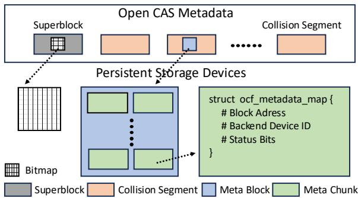
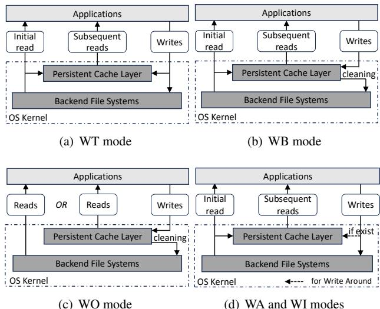
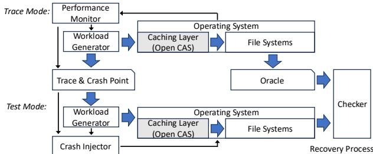
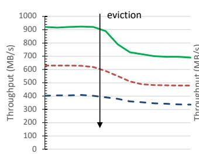
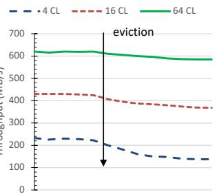
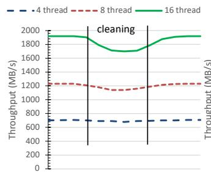
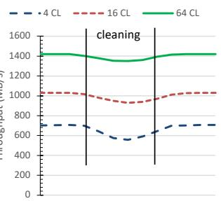

①

USENIX

THE ADVANCED COMPUTING SYSTEMS ASSOCIATION

# Crash Consistency in Block-Level Caching Systems: An Open CAS Case Study

Shaohua Duan, Washington State University; Youmin Chen, Shanghai Jiao Tong University

https://www.usenix.org/conference/atc25/presentation/duan-shaohua

# This paper is included in the Proceedings of the 2025 USENIX Annual Technical Conference.

July 7–9, 2025 • Boston, MA, USA ISBN 978-1-939133-48-9

Open access to the Proceedings of the 2025 USENIX Annual Technical Conference is sponsored by

P-Lr.h £Es/sL.

auuuJl9 PgleU

King Abdullah University of

Science and Technology

# Crash Consistency in Block-Level Caching Systems: An Open CAS Case Study

Shaohua Duan Washington State University

Youmin Chen

Shanghai Jiao Tong University

## Abstract

Byte-addressable non-volatile memory (NVM) proposes a new opportunity to enable file systems with better performance and durability by adding a new persistent caching layer. However, crash consistency of caching layers and compatibility with diverse reliability features of file systems remains unknown. This paper conducts a crash consistency case study of Open CAS, a popular block-level caching system. Through careful and thorough crash consistency experiments, we show that Open CAS cannot always maintain crash consistency in the persistent caching layer. We also demonstrate some reliability features of file systems are not compatible with Open CAS. Our analysis reveals the importance of a systematic crash consistency test to caching systems and reliability feature co-design with file systems in the construction of a reliable end-to-end file system.

## 1 Introduction

Byte-addressable non-volatile memory (NVM) opens a new opportunity in designing high-performance block-level caching systems for file systems. NVM provides byte addressability and low-access latency like DRAM and offers data persistence like HDD. Like page cache in traditional file systems, similar hybrid storage is adopted in persistent caching systems, where a fast persistent device is used for a caching layer and a slow but large storage capacity is used for a backend file system to achieve high I/O performance while reducing monetary costs. For example, Open CAS [11], an advanced caching solution recently developed by Intel, allows NVM, SSD, and other high-performance storage devices to be used as a caching layer for improving the I/O performance of Linux file systems.

While the primary goal for introducing non-volatile memory into block-level caching systems is to improve the performance of file systems that are typically installed at the HDDs, i.e., backend devices, it also improves the data durability of file systems. Unlike traditional block-level caching systems (e.g., in-DRAM page cache), block-level caching systems on non-volatile memory guarantee better data durability and enable system designers to leverage new tiered persistent storage devices (e.g., Intel Optane persistent memory [37]) to recover the cached data from system crashes. For example, Open CAS [11] and other persistent caching systems such as bcache [5] and flashcache [28] guarantee the data durability once returning an acknowledgment to users.

Although the advent of fast storage and interconnect technologies present new opportunities to achieve better performance and durability, they also cast new questions on system reliability: How robust are persistent block-level caching systems to system crashes? How compatible are caching systems with diverse reliability features of file systems which were typically designed with in-DRAM page cache? To maximize the performance of block-level caching systems, more and more complicated software architectures, cache strategies and modes, and storage hierarchies are applied which make blocklevel caching systems tend to be less reliable. Although some block-level caching systems promise data durability and crash consistency in certain crash scenarios by using multiple robustness features, the effectiveness of these reliability designs and the complete crash behavior of the caching systems remain unknown due to a lack of third-party systematical crash consistency tools. For example, Open CAS developers noticed the risk of data durability loss in case of system crashes in certain cache modes, i.e., write-only and write-back modes due to unknown reasons [9]. By contrast, there are multiple third-party domain-specific test libraries and tools [38, 46] focus on crash-consistency tests to file systems, and the crash behaviors of state-of-the-art file systems are well studied. Furthermore, state-of-the-art reliability features of file systems are designed, implemented, and tested with in-DRAM page cache which is modeled as all data in the caching layer are not available after a crash. It is unclear whether these file system reliability features still work well with the new persistent storage hierarchy without suffering compatibility issues. To answer these questions, we analyze Open CAS, a representative block-level caching system, by performing careful and thorough crash consistency experiments. To the best of our knowledge, this is the first work that specifically focuses on the crash consistency of block-level caching systems.

In this paper, we use Open CAS as an example of blocklevel caching systems and perform a thorough crash consistency study on persistent block-level caching layers. Our study unveils important, previously undetected crash inconsistency and incompatibility in Open CAS. In our analysis, we find that Open CAS fails to maintain crash consistency and returns bad data to the user due to system crashes. We further find that some reliability features of state-of-the-art file systems are not compatible with Open CAS1. Besides Open CAS, we also analyzed a simpler caching system, NVCache [15], and observed similar experiment results. In summary, we make the following contributions:

• The first study (to the best of our knowledge) to empirically analyze the crash consistency behavior of Open CAS, a state-of-the-art block-level caching system.

• A novel workload-oriented test framework (WLOT) to analyze crash consistency behavior of caching systems by leveraging implicit information.

• Results and observations that demonstrate the importance of systematical crash-consistency tests to caching systems and compatibility tests with diverse reliability features of file systems.

The rest of this paper is organized as follows. In Section 2, we motivate our work and discuss the challenges for crashconsistency tests to block-level caching systems. Section 3 provides some background on Open CAS. Section 4 presents the principle of crash-consistency tests to caching systems and our code inspections to Open CAS. In Section 5 and Section 6, we present our analysis of crash consistency experiments on Open CAS. In Section 7, we present the initial results of the crash consistency analysis in NVCache. Section 8 discusses related work and Section 9 concludes our work.

## 2 Block-Level Caching Systems

Caching systems have long been the most popular design for improving the performance of storage systems [6, 20, 40]. In caching systems, consider a system with two storage layers: a (fast, expensive, small) performance layer and a (slow, cheap, large) capacity layer. With caching, all data resides in the capacity layer, and copies of hot data items are placed, via cache replacement algorithms [7,34], in the performance layer. With a high-enough fraction of requests going to the fast layer, the overall performance approaches the peak performance of the fast layer. In the context of block-level caching systems, e.g., Open CAS [11], OrthusCAS [50], First Responder [42], Assise [1], and NVCache [15], they are generally implemented as a kernel module in operating systems, and provide caching service for block devices which typically are file systems.

The advent of fast storage and interconnect technologies, such as persistent memory (PMem) [37], Non-Volatile Memory Express (NVMe) [30], and Compute Express Link (CXL) [13], present new opportunities in boosting the performance of memory hierarchy and caching systems. With new storage technologies like 3D XPoint [43], NVMe SSDs (over the PCIe bus) achieve much higher bandwidth (e.g., 8 GB/s) and lower latency (e.g., 3µs) [58]. Further, byteaddressable persistent memory has also been commercially available [37] and offers an order of magnitude higher capacity than DRAM and within an order of magnitude performance of DRAM [52].

## 2.1 Why Crash Consistency Does Matter

Although the main goal for introducing nonvolatile memory to caching systems is for performance boosting [12, 19, 24, 25, 49, 51, 57], this technique also poses opportunities and challenges to the reliability of end-to-end file systems, including caching layers and backend file systems. During the past decades, there have been many related works to improve the reliability of file systems [14, 23, 29, 35, 36, 55], and they typically modeled the behavior of in-memory cache, i.e., page cache, as all information in the caching layer is lost upon a crash. However, when nonvolatile memory is introduced into block-level caching systems, this stale crash model doesn’t hold, and it provides a new opportunity for caching systems to reuse the cached data for fast system recovery. For example, Open CAS provides a configuration option for the system managers to perform a fast recovery and reuse the cached data from an unplanned system shutdown.

Although a persistent caching layer automatically provides data durability due to the natural behavior of nonvolatile memory, i.e., it retains data even when power is removed, adding a new tiered persistent caching layer also poses critical challenges to the system reliability. First, a persistent caching system is much more complex than traditional in-memory page cache. To meet the various use scenarios and user requirements, a persistent caching system normally provides multiple cache modes to cope with. For example, compared with a single cache mode in page cache, Open CAS provides six cache modes for the different use scenarios. Similarly, First Responder offers seven cache modes for users. Furthermore, to maximally deliver the performance of nonvolatile memory, caching systems normally design complicated caching algorithms and asynchronous data movement mechanisms to fit in nonvolatile memory characteristics. For example, in OrthusCAS [50] the cache eviction strategy not only considers the characteristics of workloads but also is decided by the performance model of caching devices. In general, the more complicated software design and implementation means the systems are less reliable.

Second, testing persistent caching systems poses unique requirements and challenges. In caching systems, the code logic usually requires a heavy workload to change the caching system status and/or trigger the specific cache operation. For example, cache eviction and cache cleaning operations generally require a heavy workload to be implicitly triggered by cache replacement policies [7,34]. The requirement for heavy workloads makes traditional system testing tools, such as fuzzing [4,17,23,53] and black-box testing [29] less effective which tend to generate lightweight test cases by applying syntax and semantic mutations [22, 54]. Furthermore, implicitly triggering through heavy workloads also means there are enormous potential crash points in the heavy-workload test case for a test framework to explore. Therefore, crash-consistency tests to caching systems specifically require a test framework that can generate heavy workloads while precisely identifying crash points for implicit cache operations.

Third, it still remains unknown whether the added persistent caching layer is compatible with the diverse reliability features of file systems. For file systems, the reliability features such as logging [18, 39], journaling [48], write-back [47, 48], and copy-on-write [21], are designed on a simple crash model that file systems on the persistent device, e.g., HDD, are the only survived data source upon system crashes [3]. When introducing a new persistent caching layer in end-to-end file systems, this stale crash model doesn’t hold anymore, and the reliability design based on this model may not be compatible with the newly added persistent caching layer. Actually, in case of a system crash, data movement between the persistent caching layer and the backend file system immediately terminates, which is the same as in-memory page cache. However, during the post-recovery process, the survived data in caching layers and file systems can be inconsistent. If the reliability design between caching layers and file systems is not well coordinated, the end-to-end file system may suffer from durability loss or data inconsistency issues.

In this work, we focus on the crash consistency of blocklevel caching systems. We specifically take Open CAS as an example and try to answer the system reliability questions in two aspects: does the persistent caching layer maintain crash consistency in case of system crashes? Are state-of-the-art reliability features of file systems compatible with the newly added persistent caching layer?

## 3 Introduction to Open CAS

Open Cache Acceleration Software, short for Open CAS [11], is a block-level caching solution that is primarily designed to improve the performance of HDDs (backend devices) by caching data on nonvolatile memory (cache devices). Open CAS is widely used and studied in both industrial solutions [31,33] and research projects [16,50]. Open CAS Linux is a kernel module that works under Linux in-kernel file systems. It handles I/O requests from upper-layer file systems through a virtual block device and submits I/O requests to underlying storage devices according to cache modes and policies. In the official document, Open CAS guarantees that data integrity is maintained on the persistent cache device once returning an acknowledgment to users for all cache modes [10]. To achieve this guarantee, Open CAS developers utilize multiple reliability techniques. Besides, a set of built-in test cases is provided to ensure the correct implementation of functionalities and reliability features.

  
Figure 1: Metadata Structures in Open CAS

For the rest of this section, we first introduce the key data structures in Open CAS. We then introduce cache modes and basic cache operations including their reliability features for maintaining crash consistency. After that, We analyze the challenges of performing crash-consistency tests to implicit cache operation. Finally, we describe the post-recovery process of Open CAS.

## 3.1 Data Structures

A cache line is the smallest data unit that Open CAS can manage. Every occupied cache line is associated with a core line on the backend file system and the cache line will be eventually written back to its associated core line. Open CAS supports different cache line sizes ranging from 4KB to 64KB. For each cache line, Open CAS maintains a small portion of metadata, which contains the information including core id, core line number, and valid and dirty bits for every sector. The core id determines on which core is the core line corresponding to the given cache line located, whereas the core line number determines the precise core line location on the backend file systems. Valid and dirty bits define the current cache line state. When a cache line is valid, it means that it’s mapped to a core line determined by a core id and a core line number. Otherwise, all the other cache line metadata information is invalid and should be ignored. When a cache line is in an invalid state, it may be used to map core line accessed by I/O requests, and then it becomes valid. The dirty bit determines if the user data stored in the caching layer is in sync with the corresponding data on the backend file systems. If a cache line is dirty, then only data on the caching layer is up to date, and it needs to be flushed at some point in the future and be marked as clean by zeroing the dirty bit.

More specifically, as shown in Figure 1, Open CAS has different types of metadata information stored in multiple segments, among which the “collision” segment is the key data structure for storing Open CAS cache line metadata. The collision section includes a set of 4KB metadata blocks in DRAM, each of which consists of multiple 12-byte chunks (12, 18, and 42 bytes for cache line sizes = 4KB, 16KB, and 64KB respectively) storing the mapping between a cache line and a core line and status bits (valid and dirty). In addition, the superblock segment includes the available cache line bitmap block and the recovery block which stores the option of post-recovery process.

<table><tr><td rowspan=1 colspan=1>Cache modes</td><td rowspan=1 colspan=1>Read cache hit</td><td rowspan=1 colspan=1>Write cache hit</td><td rowspan=1 colspan=1>Read/Write cache miss</td><td rowspan=1 colspan=1>Cache eviction</td><td rowspan=1 colspan=1>Cache cleaning</td><td rowspan=1 colspan=1>Cache flushing</td></tr><tr><td rowspan=1 colspan=1>Write-Through (WT)</td><td rowspan=1 colspan=1>-</td><td rowspan=1 colspan=1>Update</td><td rowspan=1 colspan=1>Mapping, Insertion</td><td rowspan=1 colspan=1>Eviction,Invalidation</td><td rowspan=1 colspan=1>=</td><td rowspan=1 colspan=1></td></tr><tr><td rowspan=1 colspan=1>Write-Back (WB)</td><td rowspan=1 colspan=1>1</td><td rowspan=1 colspan=1>Update</td><td rowspan=1 colspan=1>Mapping,Insertion</td><td rowspan=1 colspan=1>Eviction,Invalidation</td><td rowspan=1 colspan=1>Cleaning,Invalidation</td><td rowspan=1 colspan=1>Flushing,Invalidation</td></tr><tr><td rowspan=1 colspan=1>Write-Around (WA)</td><td rowspan=1 colspan=1>Invalidation</td><td rowspan=1 colspan=1>1</td><td rowspan=1 colspan=1>Mapping,Insertion</td><td rowspan=1 colspan=1>Eviction,Invalidation</td><td rowspan=1 colspan=1>-</td><td rowspan=1 colspan=1>=</td></tr><tr><td rowspan=1 colspan=1>Write-Invalidation (WI)</td><td rowspan=1 colspan=1>1</td><td rowspan=1 colspan=1>Update</td><td rowspan=1 colspan=1>Mapping,Insertion</td><td rowspan=1 colspan=1>Eviction,Invalidation</td><td rowspan=1 colspan=1></td><td rowspan=1 colspan=1>-</td></tr><tr><td rowspan=1 colspan=1>Write-Only (WO)</td><td rowspan=1 colspan=1>1</td><td rowspan=1 colspan=1>Update</td><td rowspan=1 colspan=1>Mapping,Insertion</td><td rowspan=1 colspan=1>Eviction,Invalidation</td><td rowspan=1 colspan=1>Cleaning,Invalidation</td><td rowspan=1 colspan=1>Flushing,Invalidation</td></tr><tr><td rowspan=1 colspan=1>Pass-Through (PT)</td><td rowspan=1 colspan=1>1</td><td rowspan=1 colspan=1>1</td><td rowspan=1 colspan=1></td><td rowspan=1 colspan=1>-</td><td rowspan=1 colspan=1>-</td><td rowspan=1 colspan=1>1</td></tr></table>

Table 1: The involved cache operations in different cache modes. Blank cells mean that none of the cache operations is applicable.

  
Figure 2: Cache modes of Open CAS. Cache eviction and flushing are not shown in all figures.

## 3.2 Cache Modes

Open CAS accelerates Linux file systems by caching active (hot) data to caching layers, i.e., performance devices, thus reducing storage latency. Open CAS provides six cache modes, and based on performance improvements to read and/or write I/O requests, we generally classify them into two categories. In the read cache, initial read data is retrieved from backend file systems and copied to the caching layer. Subsequent reads are returned the copied data from the caching layer at the speed of performance devices. In the write cache, all data is written to the caching layer and eventually flushed to the backend file systems through the cache eviction and cleaning operations. For all cache modes, when the caching layer is full, newly identified active data evicts stale data from the caching layer by utilizing the cache eviction operation.

Write-Through mode: as shown in Figure 2(a), Open CAS Writeswrites data to the caching layer and simultaneously writes Writesthe same data “through” to the backend file systems. Writecleaningthrough ensures the data written to the caching layer is always cleaningin sync with data on the backend file system. This mode only accelerates read requests, as writes need to be performed on both the backend file system and caching layer.

Write-Back mode: as shown in Figure 2(b), Open CAS writes Writesthe data first to the caching layer and acknowledges to the if existWritesapplication that the write request is completed before the data is actually written to the backend file systems. Based on the cleaning policy, Open CAS writes back those data to te Invalidatethe backend file system opportunistically. Write-back mode e Invalidateimproves both write-intensive and read-intensive requests.

Write-Only mode: as shown in Figure 2(c), Open CAS writes user data exactly like in Write-Back mode so the data is written to the caching layer without writing it to backend file systems immediately. Read requests do not promote data to the caching layer.

Write-Around mode: as shown in Figure 2(d), Open CAS writes data to the caching layer if and only if that cache line is already mapped into the caching layer that it can be mapped during read requests. Simultaneously, Open CAS writes the same data “through” to the backend file systems. This cache mode only accelerates read-intensive requests.

Write-Invalidate mode: as shown in Figure 2(d), Open CAS handles write requests by writing data directly to backend file systems, and if the written cache line is already mapped into the cache, then it becomes invalid. Write-invalidate mode only improves read-intensive requests. It also reduces the number of eviction operations for workloads where written data is not often subsequently read.

Pass-Through mode: Open CAS bypasses the caching layer for all I/O requests. This mode is used for dynamically enabling/disabling caching layers without requiring to manually alter the I/O path in the application.

## 3.3 Cache Operations

There are seven cache operations upon which cache modes are constructed. To guarantee crash consistency of cache operations, Open CAS utilizes multiple techniques like atomic metadata update, I/O request ordering, and flapped sections. Getting familiar with them is essential to understanding how the test procedure is designed to cover all possible crash scenarios. It also helps us to explain our crash consistency experiment results.

Mapping is a cache operation of linking up a core line with a cache line in the cache line metadata. During mapping, a single cache line is assigned to the core line, and during cache operations, this area can be used for storing core line data, until the cache line is evicted.

In Open CAS, cache line metadata is stored in a small and constant block, i.e., 4K. Cache operations such as insertion, invalidation, etc. can atomically update cache line metadata to the caching layer by requiring a single I/O request and guarantees cache line metadata transactional consistency during performing I/O operations.

In addition, to ensure atomic update of the cache line bitmap, the flapped sections are designed. Specifically, the flapped sections in Open CAS maintain two copies of the cache line bitmap and information about which copy is valid. On the bitmap update, the bitmap flush is performed to an invalid copy, and then only after this operation succeeds the updated copy is marked as valid in the superblock, which is flushed afterward.

Insertion is a cache operation of writing core line data to a cache line. During insertion, the data of the I/O request is written to the cache line corresponding to core line being accessed. The valid and dirty bits of the cache line in the metadata are being updated accordingly during this operation.

To guarantee cache line data integrity, insertion operation is designed by ordering the I/O requests of cache line data and its metadata. Specifically, insertion first flushes the user data to cache line. When it is done, it then changes the corresponding validation bit from invalid to valid and updates the corresponding cache line metadata in the caching layer. Due to the initial invalid state of cache line, the corrupted data, which are caused by a system crash during flushing them to the caching layer, aren’t accessed by users or flushed to the backend file system.

Update is a cache operation of overwriting cache line data in the caching layer. It’s performed when the core line accessed during a write request is mapped into the caching layer and the accessed sectors are marked as valid.

Invalidation is a cache operation of marking one or more cache line sectors as invalid. It can be done during the handling of discard requests, during purge operations, or as a result of some internal cache operations.

Flushing is a cache operation of flushing all dirty data to the backend file system. flushing is a cache management operation and has to be triggered by users or Open CAS Udev rule. It is typically done for safely detaching the backend file system from the caching system or recovering the backend file system without risking data loss.

Eviction is a cache operation of removing cache line mappings. It’s performed when there is not sufficient space in the caching layer for mapping data of incoming I/O requests, i.e., when cache occupancy is close to 100%. The cache lines to be evicted are selected by an eviction policy algorithm. Open CAS supports multiple eviction policies including the Least Recently Used (LRU) which selects cache lines that have not been accessed for the longest period of time.

Cleaning is a cache operation of synchronizing data in the caching layer and the backend file system. It involves reading sectors marked as dirty from the caching layer, writing them to the backend file systems, and setting dirty bits in cache line metadata to zero. It’s performed by the cache automatically as a background task. The process of cleaning is controlled by a cleaning policy. Open CAS supports multiple cleaning policies including Approximately Least Recently Used (ALRU), Aggressive Cleaning Policy (ACP), and No Operation (NOP).

Finally, it is important to note that Open CAS doesn’t record an operation log and persist it in the caching layer for the debug or failure recovery due to maximizing the caching performance. Table 1 summarizes the involved cache operations in different cache modes.

## 3.3.1 Implicit Cache Operation

Block-level caching systems like Open CAS are typically integrated into Linux operating system as a kernel module. The advantage of the integration is that the cache solution is transparent to the user applications and existing storage infrastructures, and no storage migration or application changes are required. However, due to restrictions by the existing Linux user interfaces, i.e., the POSIX standard [32], some cache operations cannot be explicitly invoked by the user interfaces. It also means that it is hard for a test framework to test these operations by explicitly invoking while performing system crashes. Furthermore, as a portion of Linux operation system, kernel modules are unexpected to change for software testing, e.g., adding the stub code. Actually, these cache operations are only invoked by internal cache policies, e.g., Least Recently Used (LRU) [7, 34, 50], which are typically decided by a heavy workload. We call these cache operations an implicit cache operation. For example, in Open CAS, eviction and cleaning are implicit cache operations. In summary, due to the implicit invocation and heavy workload requirement, an implicit cache operation is hard to test, and we will introduce our solution, workload-oriented test framework (WLOT) in Section 5.

## 3.4 Post-Recovery Process

Open CAS post-recovery process provides two options to recover a caching layer from a crash. The first option is to deal with a caching layer as page cache in volatile memory (e.g., DRAM). Specifically, Open CAS reinitializes the caching layer with new metadata, which clears the cache device, resulting in the loss of all cache data that is currently residing in the cache device.

The second option, a more sophisticated one, is to restart a caching layer and utilize the previous cache data, including metadata, in the cache device for a fast recovery. Specifically, Open CAS first performs CRC checksums for all metadata sections in the cache device and then compares them with ones stored in the recovery section to guarantee the metadata data integrity. To guarantee the data integrity of the recovery section, the recovery size is kept under 4K, which makes Open CAS update the recovery section atomically with a single 4K I/O. Then, Open CAS mounts the core devices, i.e., backend file systems, and the corresponding file system recovery process is activated according to the file system’s reliability configuration. If the cache device and core device are successfully recovered, the recovered data in the caching layer can be accessed and reused by the backend file system and the applications. Open CAS recovery process is performed automatically in accordance with dynamic device management Udev [26]. Open CAS administrator can set the post-recovery process option and enable the caching layer to automatically flush the dirty data to the recovered file systems by configuring the inbuilt Udev rules in 60-persistent-storage-cas.rules. Note that although Open CAS developers also mention the potential risk of data durability loss under this recovery option [9], there is no clear description or guidance to help users to evaluate the tradeoff between performance benefit and reliability risk for choosing the suitable recovery options. Therefore, we believe a thorough study is much needed.

## 4 Crash-Consistency Tests to Caching Systems

In this section, we first investigate the general principles for crash-consistency tests to a block-level caching system. Then, we take the in-build test suite in Open CAS as an example and specifically inspect its crash-consistency tests. Our aim is to find whether Open CAS in-build crash-consistency tests can guarantee data consistency in case of system crashes.

## 4.1 Principle of Reliability Test

Principle 1: Crash-consistency tests should explore the crash behaviors of a caching system for crashes at any time. Although crash consistency and data durability may not be guaranteed in any crash scenario, a system crash, such as a power outlet and system corruption, can happen at any time. It’s necessary to understand complete crash behavior rather than solely crash scenarios where crash consistency is promised by caching system developers. By contrast, the crash consistency behaviors of file systems under any time system crashes were well studied [36]. More importantly, it helps system administrators to identify the root cause of crash inconsistency issues in the end-to-end file system. For end-to-end file systems, it can include multiple persistent caching layers, local file systems, and remote storage components. Each persistent layer and component may exhibit various crash consistency characteristics. Finding the root cause of crash inconsistency issues to such systems can be a daunt task. Understanding the complete crash consistency characteristics of individual storage layers eases system administrators to identify the root cause of crash inconsistency issues.

Principle 2: Crash-consistency tests should cover all crashvulnerable cache operations. Like crash-consistency tests to other storage systems, it’s necessary for test cases to cover all crash-vulnerable operations that potentially cause crash inconsistency. For example, many file system test tools [23, 29] more focus on testing the write-related operations since they change the internal state and the persistent user data. For caching systems, if a cache operation updates user data and/or caching system metadata in the caching layer, it will change the caching system state and be potentially vulnerable to system crashes. This cache operation can be seen as a crash-vulnerable cache operation. For example, in Open CAS, all cache operations can be seen as crash-vulnerable cache operations. By contrast, the cache operation for responding to a read cache hit request is not a crash-vulnerable cache operation since it doesn’t change user data or caching system metadata.

Principle 3: Crash-consistency tests should include diverse reliability features of file systems to guarantee compatibility with them. The state-of-the-art reliability features of file systems, such as data journaling, copy-on-write, etc., are designed under the assumption that cached data is not available after crashes. During the post-recovery process, reusing the cached data in the persistent caching layer for a fast recovery may cause compatibility issues such as durability loss and crash inconsistency.

## 4.2 Crash-Consistency Tests in Open CAS

Open CAS provides a set of test cases, including unit tests and integration tests to guarantee correct implementation. Regarding system reliability, Open CAS offers crash-consistency tests in the integration test suite. We find that the test cases provided by Open CAS aren’t enough to guarantee crash consistency and compatibility.

Code Observation 1: Open CAS didn’t provide crashconsistency tests to implicit cache operations. Open CAS provides the test cases to all cache operations for functionality testing under normal cache scenarios. However, in crashconsistency tests, the test cases didn’t include implicit cache operations. One possible reason for crash-consistency tests without including implicit cache operations is that it is difficult for a test framework to identify the running state of such cache operations for precisely injecting synthetic crashes.

Code Observation 2: Open CAS didn’t explore crash behaviors when crashes happen during cache operations on the fly. In Open CAS, the in-built crash-consistency tests only cover the crash scenarios in which system crashes happen right after an acknowledgment of user APIs, which are the guarantees of data durability and consistency.

  
Figure 3: Overview of crash-consistency test framework.

Code Observation 3: There are no test cases testing the compatibility with diverse reliability features of file systems. In Open CAS, crash-consistency tests only perform synthetic crashes to the caching layer and takes one specific file system, i.e., ext-4, with the default configuration as the backend file system. The back logic of such test cases is based on the following assumption. If the newly added caching layer itself can keep crash consistency successfully, it should naturally work well with other file systems that include diverse reliability features.

In summary, crash consistency of Open CAS remains unknown in some crash scenarios. Also, extra test cases are required to guarantee the compatibility with diverse reliability features of file systems. We will present our analysis, including test methodology and results in later sections.

## 5 Crash-Consistency Tests to Caching Layer

Our crash-consistency tests to Open CAS includes two parts. One is crash-consistency tests to caching layers. The other is compatibility tests with backend file systems. In this section, we mainly focus on crash consistency of caching layers and perform system crashes solely on caching layers and try to answer the following research question: Can Open CAS keep the internal metadata and cached data crash consistency under all cache operations, cache modes, and crash scenarios? We will present compatibility tests to file systems in section 6, in which we explore Open CAS compatibility with diverse reliability features of state-of-the-art file systems.

This section is organized as follows. We first introduce our test framework, procedure, and workload for crashconsistency tests. We then discuss the results of our crashconsistency tests.

## 5.1 Test Framework

In this section, we first show the overview of our test framework. We then specifically present the workload-oriented test (WLOT) for testing implicit cache operations.

## 5.1.1 Overview of Test Framework

Our test framework is specifically performed on an HPE Pro-Liant DL380 Gen10 Plus server with 1 × Intel Xeon Silver 4314 processor, 1 × 4GB Optane Pmem as a cache device, and

1 × 256GB Samsung SATA SSD PM9A3 as a backend storage device. Above the hardware, we install Red Hat enterprise server 7.9 with 5.4.0-144-generic Linux kernel. We install Open CAS (version 22.03.2) as a caching system and ext-4 [47] as a backend file system. In addition, we set ext-4 with the default configuration and enabled direct I/O (–direct=1) to bypass page cache. WLOT has two modes of operation: trace mode and test mode. Figure 3 shows the main components and workflow in these two modes.

In trace mode, the framework first generates a specific workload and tracks write and/or read requests. While generating I/O requests to the caching layer, the framework utilizes the Open CAS command casctl static to monitor the I/O performance of the caching layer and sets crashing points which is based on the performance degradation caused by implicit cache operations. Right after setting crashing points, the framework stops the I/O requests and performs a flush operation to flush all cached data to a file to generate the test oracle. Except for the performance monitoring, we do similar steps for the trace generation and crash point setting to other cache operations.

In test mode, the framework first feeds the workload trace and injects a preset synthetic crash to the caching layer, and then triggers the post-recovery process of the caching systems. Finally, the checker checks the correctness by comparing the reads from the recovered caching system with the oracle. Two modes of operation are specifically important for testing implicit cache operations because the framework cannot identify the crash "window" for implicit cache operations without running the workload to the caching layer.

## 5.1.2 Workload-Oriented Test

The key challenge for performing crash-consistency tests to caching layers is to precisely inject a synthetic crash while executing an implicit cache operation, i.e., eviction and cleaning operation. As we discussed in section 3, an implicit cache operation can only be activated by cache policies rather than being explicitly invoked by user APIs. To address this challenge, we utilize the concept of implicit information [2, 41] in the operating system design and present the workload-oriented test (WLOT), a generic crash-consistency test framework for caching systems. Implicit information is a powerful tool to understand the running state of a gray box system, such as the operating system kernel, which knows the internal mechanism and external behavior but is ineligible to change the internal design including the interfaces. In crash-consistency tests to caching systems, WLOT detects the performance degradation of a caching system and leverages the performance degradation as implicit information to identify cache operation running states for a crash injection.

To better understand the performance degradation caused by implicit cache operations, we demonstrate an experiment for cache eviction and cleaning operations. We apply 4GB

  
(a) eviction, cache line = 4k

  
(b) eviction, thread = 1

  
(c) cleaning, cache line = 4k

  
(d) cleaning, thread = 1  
Figure 4: Performance Degradation by eviction and cleaning operations. We measure the throughput degradation of Open CAS while performing eviction and cleaning operations under different cache line sizes and the number of threads.

Optane Pmem and 256GB PM9A3 as a cache device and a backend storage device separately. For the eviction operation, we continuously write data to the cache device, until it is full, to force the cache eviction policy to trigger the eviction operation. For the cleaning operation, we initialize the cache device with a 2GB cached data and repeatedly write a small subset of cached data (2MB) to the cache device, and wait for the cache cleaning policy to trigger the cleaning operation. To understand impacts of various factors, we test different cache line sizes = 4KB, 16KB, and 64KB, and various intention of workloads (# threads = 2, 4, 8, and 16). Figure 4 shows the I/O throughput degradation when performing eviction and cleaning operations. The results indicate that throughput degradation becomes significant when applying an intensive workload and a small size cache line size. Based on the above observations, we apply the following settings for our test procedure to help the test framework to identify the running state of eviction and cleaning operations more precisely. We use FIO (version 3.34-13) in 16 threads as the workload setting and 4K cache line size as the caching layer setting.

To confirm the accuracy of WLOT further, we specifically implement user APIs casctl cleaning and casctl eviction as testing drivers on Open CAS (version 22.03.2) for cache implicit operations cleaning and eviction separately. We then applied the same workloads above and explicitly invoked cleaning and eviction operations, and saw the same performance degradation pattern shown in Figure 4. We believe WOLT provides high accuracy for testing implicit cache operation with better generality and less human effort involved.

## 5.2 Test Procedure and Workloads

Since we specifically focus on the crash consistency of caching layers, we only perform synthetic crashes on the caching layer and leave the backend file system alive throughout our crash-consistency tests. Specifically, we use unmount and Open CAS’s command casctl stop to perform a synthetic crash on the caching layer. By doing so, all in-DRAM user data and metadata that are related to the caching system are not available after a synthetic crash. We utilize mount and Open CAS’s command casctl start to only activate the caching layer post-recovery process. We perform synthetic crashes during performing a cache operation and right after receiving an API return. Also, for each cache mode, we perform crashes for each cache operation multiple times to cover all possible crash scenarios.

The workloads are carefully crafted to cover all cache modes and cache operations including implicit cache operations. We set the capacity of the cache device as 4GB while utilizing FIO to write and read an oversized file with 6GB size to the Linux virtual block device. We specifically list workloads for each cache mode and cache operation below. Write-Through mode: We apply sequential write (SW) and sequential read (SR) workloads, in which we sequentially write/read data into/from an oversize file, to test cache operations mapping, insertion, and eviction in the read cache miss, write cache miss, and cache eviction states separately. To test cache operation update in the write cache hit, we also apply repeat write (RW) workload, in which we repeatably write a small portion of the cached data to the caching layer. Write-Back mode: We apply sequential write (SW) and sequential read (SR) workloads to test cache operations mapping, insertion, and eviction in the read cache miss, write cache miss, and cache eviction states separately. To test cache operations update, cleaning, and flushing in the write cache hit, cache cleaning, and cache flushing, we also apply repeat write (RW) workload.

Write-Around mode: We apply sequential read (SR) workload to test cache operations mapping, insertion, and eviction in read cache miss and cache eviction states separately. We also apply an update-after-read (UR) workload, in which we sequentially read and then write the same user data from an oversized file to test cache operation update in the write cache hit.

Write-Invalidate mode: We apply sequential read (SR) workload to test cache operations mapping, insertion, and eviction in read cache miss and cache eviction states separately. In addition, we apply repeat write (RW) workload to test cache operation invalidate in a write cache hit.

Write-Only mode: We apply sequential write (SW) workload to test cache operations mapping, insertion, and eviction in the write cache miss and cache eviction states separately. In addition, we apply repeat write (RW) workload to test cache operations update, cleaning, and flushing in a write cache hit, cache cleaning, and cache flushing. Table 2 summarizes the test workloads with the inserted crash points for all cache operations and modes.

<table><tr><td rowspan=1 colspan=1>Cache mode</td><td rowspan=1 colspan=1>Workload</td><td rowspan=1 colspan=1>Crash point</td><td rowspan=1 colspan=1>Result-1</td><td rowspan=1 colspan=1>Result-2</td></tr><tr><td rowspan=5 colspan=1>Write-Through</td><td rowspan=2 colspan=1>sequential write</td><td rowspan=1 colspan=1>write cache miss</td><td rowspan=1 colspan=1>R</td><td rowspan=1 colspan=1>C</td></tr><tr><td rowspan=1 colspan=1>cache eviction</td><td rowspan=1 colspan=1>R</td><td rowspan=1 colspan=1>C</td></tr><tr><td rowspan=2 colspan=1>sequential read</td><td rowspan=1 colspan=1>read cache miss</td><td rowspan=1 colspan=1>R</td><td rowspan=1 colspan=1>C</td></tr><tr><td rowspan=1 colspan=1>cache eviction</td><td rowspan=1 colspan=1>R</td><td rowspan=1 colspan=1>C</td></tr><tr><td rowspan=1 colspan=1>repeat write</td><td rowspan=1 colspan=1>write cache hit</td><td rowspan=1 colspan=1>R</td><td rowspan=1 colspan=1>B</td></tr><tr><td rowspan=7 colspan=1>Write-Back</td><td rowspan=2 colspan=1>sequential write</td><td rowspan=1 colspan=1>write cache miss</td><td rowspan=1 colspan=1>R</td><td rowspan=1 colspan=1>C</td></tr><tr><td rowspan=1 colspan=1>cache eviction</td><td rowspan=1 colspan=1>R</td><td rowspan=1 colspan=1>C</td></tr><tr><td rowspan=2 colspan=1>sequential read</td><td rowspan=1 colspan=1>read cache miss</td><td rowspan=1 colspan=1>R</td><td rowspan=1 colspan=1>C</td></tr><tr><td rowspan=1 colspan=1>cache eviction</td><td rowspan=1 colspan=1>R</td><td rowspan=1 colspan=1>C</td></tr><tr><td rowspan=3 colspan=1>repeat write</td><td rowspan=1 colspan=1>cache cleaning</td><td rowspan=1 colspan=1>-</td><td rowspan=1 colspan=1>C</td></tr><tr><td rowspan=1 colspan=1>cache flushing</td><td rowspan=1 colspan=1>R</td><td rowspan=1 colspan=1>C</td></tr><tr><td rowspan=1 colspan=1>write cache hit</td><td rowspan=1 colspan=1>R</td><td rowspan=1 colspan=1>B</td></tr><tr><td rowspan=5 colspan=1>Write-Around</td><td rowspan=2 colspan=1>sequential read</td><td rowspan=1 colspan=1>read cache miss</td><td rowspan=1 colspan=1>R</td><td rowspan=1 colspan=1>C</td></tr><tr><td rowspan=1 colspan=1>cache eviction</td><td rowspan=1 colspan=1>R</td><td rowspan=1 colspan=1>C</td></tr><tr><td rowspan=3 colspan=1>update after read</td><td rowspan=1 colspan=1>read cache miss</td><td rowspan=1 colspan=1>R</td><td rowspan=1 colspan=1>C</td></tr><tr><td rowspan=1 colspan=1>cache eviction</td><td rowspan=1 colspan=1>R</td><td rowspan=1 colspan=1>C</td></tr><tr><td rowspan=1 colspan=1>read cache hit</td><td rowspan=1 colspan=1>R</td><td rowspan=1 colspan=1>B</td></tr><tr><td rowspan=3 colspan=1>Write-Invalidate</td><td rowspan=2 colspan=1>sequential read</td><td rowspan=1 colspan=1>read cache miss</td><td rowspan=1 colspan=1>R</td><td rowspan=1 colspan=1>C</td></tr><tr><td rowspan=1 colspan=1>cache eviction</td><td rowspan=1 colspan=1>R</td><td rowspan=1 colspan=1>C</td></tr><tr><td rowspan=1 colspan=1>repeat write</td><td rowspan=1 colspan=1>write cache hit</td><td rowspan=1 colspan=1>R</td><td rowspan=1 colspan=1>B</td></tr><tr><td rowspan=5 colspan=1>Write-Only</td><td rowspan=2 colspan=1>sequential write</td><td rowspan=1 colspan=1>write cache miss</td><td rowspan=1 colspan=1>R</td><td rowspan=1 colspan=1>C</td></tr><tr><td rowspan=1 colspan=1>cache eviction</td><td rowspan=1 colspan=1>R</td><td rowspan=1 colspan=1>C</td></tr><tr><td rowspan=3 colspan=1>repeat write</td><td rowspan=1 colspan=1>cache cleaning</td><td rowspan=1 colspan=1>-</td><td rowspan=1 colspan=1>C</td></tr><tr><td rowspan=1 colspan=1>cache flushing</td><td rowspan=1 colspan=1>R</td><td rowspan=1 colspan=1>C</td></tr><tr><td rowspan=1 colspan=1>write cache hit</td><td rowspan=1 colspan=1>R</td><td rowspan=1 colspan=1>B</td></tr></table>

Table 2: Crash-consistency test results of caching layers. The table shows the results of crash-consistency experiments on caching layers. Result 1 and result 2 represent crashes that happen right after acknowledgments and during performing cache operations separately. Each cell indicates whether Open CAS was able to recover data from a crash (R), whether Open CAS maintains crash consistency but did not successfully persist user data (C), and whether Open CAS returned bad data to the user (B). Blank cells mean that the result was not applicable.

For the check criteria, we check Open CAS log files and API returns for error messages and states. We also compare the cached data with the oracle, which is recorded during generating I/O workload, to ensure user data correctly persists in the caching layer when an acknowledgment returns to applications.

## 5.3 Results and Observations

The results of our crash-consistency tests are shown in Table 2. We now explain the results in detail in terms of the observations we made from our crash-consistency tests.

Observation 1: Open CAS gracefully maintains crash consistency and data durability to caching layers in all cache operations and modes once it returns an acknowledgment to users. This behavior is shown by the results (R) in the result-1 column of Table 2. Just like what Open CAS designers guarantee, we found that Open CAS gracefully recovers from a crash and maintains data consistency and durability, including internal metadata, after returning acknowledgment to users. There are no asynchronous I/O operations to flush data from

DRAM to the persistent caching layer. Before returning an acknowledgment, all data and metadata have safely persisted in the caching layer.

Observation 2: Open CAS maintains crash consistency to caching layers if a crash happens during cache miss and cache eviction. This behavior is shown by the results (C) in the result-2 column of Table 2. Write/Read cache miss is activated by an initial write/read request and involves cache operations mapping and insertion which include three key steps:

1. Mapping cache line to core line and initialize valid bit of cache line to be invalid (atomic operation).

2. Write new user data to the cache device.

3. Write new metadata to the cache device (atomic operation).

Since the initial valid bit of cache line for caching the new data is invalid. Any corrupted data due to a crash in step 2 will not be returned to users or flushed to backend file systems. The corresponding cache line will be reused for caching other data in the future. Similarly, cache eviction involves cache operations cleaning and invalidate which include five key steps:

1. Read old data from the cache device to DRAM.

2. Write old data to the backend storage device.

3. Update status bits to be invalid and write it to the cache device (atomic operation).

4. Write new user data to the cache device.

5. Write new metadata to the cache device (atomic operation).

Notice again, since the valid bit of the evicted cache line for the new user data is updated to invalidate, any corrupted data later in that cache line will not be returned to the user or flushed to backend file systems.

Observation 3: Except for write-around mode, Open CAS returns bad data to users if a crash happens during a write cache hit. This behavior is shown by the results (B) in the result-2 column of Table 2. Unlike a write cache miss, in the write cache hit, there is no step 1 that initializes the corresponding cache line metadata as invalid when updating user data. The corrupted user data due to a crash can be cached to the caching layer and finally flushed to the backend file system and returned to users.

Observation 2 and Observation 3 also lead to an interesting conclusion that cold data is likely to tolerate more serious crashes than hot data which frequently update or access.

Observation 4: Open CAS returns bad data to users if a crash happens during a write request to the cached data in write-around mode. This behavior is shown by the results (B) in the result-2 column of Table 2. In write-around mode, processing a write request is mainly processed by the cache operation invalidate and involves two key steps:

1. Write the updated data to the backend file system.

2. Update status bits of metadata to invalid and flush it to cache device (atomic operation).

If Open CAS successfully writes the new data to the backend file system but fails to flush the corresponding metadata to the caching layer, the stale user data in the caching layer can return to users. Notice again, since the read cache hit doesn’t involve cache operations in other cache modes, we only inject synthetic crashes during a read cache hit in write-around mode.

In summary, for all cache operations and modes, Open CAS successfully maintains crash consistency and persists the cached data once returns an acknowledgment to users. Meanwhile, when a system crash happens during cache operations on the fly, some cache operations cannot maintain crash consistency or data durability. The corrupted data may return to users and flush to the backend file system.

## 6 Compatibility Tests with File Systems

In Section 5, we showed crash-consistency tests to the caching layer. In this section, we try to explore how compatible Open CAS is with diverse reliability features of state-of-the-art file systems, i.e., whether post-recovery processes of file systems can coordinately work well with persistent caching layers. Our compatibility tests with file systems indicates that some reliability features of file systems are not compatible with Open CAS: incompatibility issues are various from minor issues, e.g., performance degradation to serious ones, e.g., durability loss.

This section is organized as follows. First, we discuss our test framework, procedure, and workloads we used to conduct compatibility tests. Then, we present the results and our observations.

## 6.1 Test Framework

Our test framework for compatibility tests is similar to crashconsistency tests to caching layers. The difference is the backend file system setting. We choose five state-of-the-art file systems with diverse reliability features as backend file systems. The target file systems roughly fall into three categories: 1) file systems with no or simple reliability features, i.e., ext-2 [8]; 2) file systems with journaling approaches, i.e., ext-3 [48] and ext-4 [47] in writeback, ordered, journal, and nodealloc configurations, and xfs [45]; 3) copy-on-write file systems, i.e., btrfs [27]. Table 3 lists backend file systems and their reliability features, i.e., configuration settings, we choose for our compatibility tests.

## 6.2 Test Procedure and Workloads

We study the compatibility of Open CAS under the more realistic crash-recovery procedures. During the crash procedure, we perform a crash as a clean power fault. Specifically, at the time of crashes, all I/O operations between the caching layer and the backend file system terminate immediately, and the caching layer cannot receive I/O errors from the backend device. In addition, all in-DRAM data and metadata that are related to the caching system and backend file system are not available after a crash. For the recovery procedure, we perform the post-recovery process on both the caching layer and the backend file system. Also, we reuse the cached data and metadata in the caching layer for a fast recovery. The specifics of our crash-recovery procedure in our test framework are as follows: we use unmount and Open CAS’s command casctl stop to perform synthetic crashes on the both caching layer and backend file system. We utilize mount and Open CAS’s command casctl start to perform the caching layer post-recovery process. After that, we utilize mount to automatically invoke the post-recovery process of the backend file system.

Since we are only interested in the post-recovery process of caching layers and backend file systems, we apply with the simpler workload and cache mode settings than Section 5. We only choose the repeat write workload and two write cache modes, i.e., write-back mode and write-only mode for compatibility tests. The reason for choosing WB and WO modes is that these cache modes can cache the latest user data, i.e., dirty data, in the caching layer and leave the stale user data in the backend file system, which enables us to expose more interesting results such as crash inconsistency or durability loss during the post-recovery process. Specifically, We first restore a file on the backend file system and then apply repeat write (RW) workload in the write-back mode and write-around mode separately, in which we repeatably write a small portion of the cached data to the caching layer.

For the crash point setting, we simultaneously inject synthetic crashes on both the caching layer and the backend file system. In addition, since we attempt to activate the postrecovery process of backend file systems, we always inject synthetic crashes during the backend file system performing I/O operation. We utilize the cache operations cleaning to raise I/O requests to the backend file system.

For the check criteria, we flush the cached data to the backend file system and compare the recovered file system image with oracle, which is generated by performing the same workload without a crash. We also check log files and API returns in both Open CAS and the backend file system for error messages.

## 6.3 Results and Observations

The results of our compatibility tests are shown in Table 3. The table reports the results of compatibility tests with stateof-the-art reliability features of file systems. We now explain the results in detail in terms of the observations we made from our compatibility tests.

Observation 1: For ext-2 with all configurations and ext-3 with the default configuration, performing the file system postrecovery process and flushing dirty data to the file systems keep crash consistency and durability. In Table 3, this behavior is shown by the results (SR). Since the recovered caching layer maintains the complete and up-to-date user data, including the related metadata, flushing dirty data to the recovered file systems can help file systems to keep up-to-date and maintain crash consistency. One minor issue is that during the file system post-recovery process, the time-consuming checking task, i.e. fsck, is performed and incur a slow recovery process. It finally makes Open CAS "fast" recovery guarantee impossible.

<table><tr><td rowspan=1 colspan=1>Filesystem</td><td rowspan=1 colspan=1>Configuration</td><td rowspan=1 colspan=1>Cache mode</td><td rowspan=1 colspan=1>Result</td></tr><tr><td rowspan=4 colspan=1>ext-2</td><td rowspan=2 colspan=1></td><td rowspan=1 colspan=1>Write-Back</td><td rowspan=1 colspan=1>SR</td></tr><tr><td rowspan=1 colspan=1>Write-Only</td><td rowspan=1 colspan=1>SR</td></tr><tr><td rowspan=2 colspan=1>sync</td><td rowspan=1 colspan=1>Write-Back</td><td rowspan=1 colspan=1>SR</td></tr><tr><td rowspan=1 colspan=1>Write-Only</td><td rowspan=1 colspan=1>SR</td></tr><tr><td rowspan=8 colspan=1>ext-3</td><td rowspan=2 colspan=1>=</td><td rowspan=1 colspan=1>Write-Back</td><td rowspan=1 colspan=1>SR</td></tr><tr><td rowspan=1 colspan=1>Write-Only</td><td rowspan=1 colspan=1>SR</td></tr><tr><td rowspan=2 colspan=1>writeback</td><td rowspan=1 colspan=1>Write-Back</td><td rowspan=1 colspan=1>FE</td></tr><tr><td rowspan=1 colspan=1>Write-Only</td><td rowspan=1 colspan=1>FE</td></tr><tr><td rowspan=2 colspan=1>orderd</td><td rowspan=1 colspan=1>Write-Back</td><td rowspan=1 colspan=1>FE</td></tr><tr><td rowspan=1 colspan=1>Write-Only</td><td rowspan=1 colspan=1>FE</td></tr><tr><td rowspan=2 colspan=1>journal</td><td rowspan=1 colspan=1>Write-Back</td><td rowspan=1 colspan=1>FE,LE</td></tr><tr><td rowspan=1 colspan=1>Write-Only</td><td rowspan=1 colspan=1>FE,LE</td></tr><tr><td rowspan=8 colspan=1>ext-4</td><td rowspan=2 colspan=1>nodelalloc</td><td rowspan=1 colspan=1>Write-Back</td><td rowspan=1 colspan=1>FE</td></tr><tr><td rowspan=1 colspan=1>Write-Only</td><td rowspan=1 colspan=1>FE</td></tr><tr><td rowspan=2 colspan=1>writeback</td><td rowspan=1 colspan=1>Write-Back</td><td rowspan=1 colspan=1>FE</td></tr><tr><td rowspan=1 colspan=1>Write-Only</td><td rowspan=1 colspan=1>FE</td></tr><tr><td rowspan=2 colspan=1>orderd</td><td rowspan=1 colspan=1>Write-Back</td><td rowspan=1 colspan=1>FE</td></tr><tr><td rowspan=1 colspan=1>Write-Only</td><td rowspan=1 colspan=1>FE</td></tr><tr><td rowspan=2 colspan=1>journal</td><td rowspan=1 colspan=1>Write-Back</td><td rowspan=1 colspan=1>FE, LE</td></tr><tr><td rowspan=1 colspan=1>Write-Only</td><td rowspan=1 colspan=1>FE,LE</td></tr><tr><td rowspan=2 colspan=1>btrfs</td><td rowspan=2 colspan=1></td><td rowspan=1 colspan=1>Write-Back</td><td rowspan=1 colspan=1>FE,LS</td></tr><tr><td rowspan=1 colspan=1>Write-Only</td><td rowspan=1 colspan=1>FE,LS</td></tr><tr><td rowspan=4 colspan=1>xfs</td><td rowspan=2 colspan=1></td><td rowspan=1 colspan=1>Write-Back</td><td rowspan=1 colspan=1>FE,LS</td></tr><tr><td rowspan=1 colspan=1>Write-Only</td><td rowspan=1 colspan=1>FE,LS</td></tr><tr><td rowspan=2 colspan=1>wsync</td><td rowspan=1 colspan=1>Write-Back</td><td rowspan=1 colspan=1>FE,LS</td></tr><tr><td rowspan=1 colspan=1>Write-Only</td><td rowspan=1 colspan=1>FE,LS</td></tr></table>

Table 3: Compatibility test results of caching layers. The table shows the results of caching layer compatibility experiments with state-of-the-art file systems and their reliability configurations. SR represents end-to-end file systems fully recovered with a slow postrecovery process; FE represents flushing dirty data to file systems incurred an I/O error; LE indicates end-to-end file systems suffered from durability loss with an I/O error; LS indicates end-to-end file system suffered from durability loss silently. Blank cells mean the default configuration settings.

It seems the solution for this incompatibility issue is simple which just requires file systems to degrade their reliability features and omit to check entire file systems. However, there is a dilemma to do so. Actuarily, not all cache modes cache the complete and up-to-date user data so flushing dirty data to backend file systems are not always helpful for keeping file system crash consistency. For example, in write-around mode and write-invalidate mode, the caching system may or may not cache the up-to-date user data in the caching layer, which depends on workload and data access pattern. For these cache modes, degrading the reliability features and omitting internal data consistency checking can potentially cause the file system crash inconsistency.

Observation 2: For ext-3 and ext-4 in journaling-related configurations, xfs, and btrfs, performing the post-recovery process and flushing the dirty data to the file systems incur I/O error. In Table 3, this behavior is shown by the results (FE).

For the file systems with journaling-related configurations, if a crash causes an incomplete journal transaction, the file systems will automatically switch to read-only mode in postrecovery process. As a result, flushing the dirty data to the recovered file systems incurs I/O error. Naively forcing the file systems to the read-write mode incurs a similar dilemma situation which we discussed in Observation 1.

Observation 3: For ext-3 and ext-4 in journal configuration and xfs, performing the post-recovery process and flushing the dirty data to the file systems incur durability loss with an error. Similar to Observation 2, ext-3 and ext-4 in journal configuration and xfs automatically switched into read-only mode when they were remounted to the caching system due to the incomplete journal transaction. However, forcing these file systems to read-write mode still cannot solve all compatibility issues. Different from Observation 2, ext-3 and ext-4 in the journal configuration and xfs write both data block and the related metadata, which are normally larger than 4K caching line size, to the journal. During the post-recovery process, if the journal transaction is complete, the data block and metadata in the journal are checkpointed to its final inplace block location. Otherwise, the incomplete transaction is discarded. On the other hand, Open CAS only guarantees data transaction at the grain of caching line size. By setting the dirty bits for each cache line , Open CAS can identify whether a cache line is successfully synchronized to the backend file system or not. Furthermore, during the post-recovery process Open CAS doesn’t redo the last failed cache operation, i.e., cleaning in our case. Since the flushed dirty cache line didn’t include the complete journal transaction, the file systems discarded the flushed data and raised an I/O error. Although Open CAS persisted the complete journal transaction data in the caching layer, part of them had been marked as a clean state i.e., setting the dirty bit to zero, and cannot be flushed to the backend file system again but be evicted by eviction cache operation which finally cause durability loss.

Observation 4: For btrfs, performing the post-recovery process and flushing the dirty data to the file system incur durability loss without an error. Btrfs is a copy-on-write file system that writes to the same block only once except for the superblock which contains root-node information. Specifically, btrfs first writes to a log tree to record changes and then writes the data block and any related metadata to new locations and updates the roots in its superblock. In case of a crash, btrfs effectively reverts the contents of the data block and metadata back to its old state. Similar to Observation 3, btrfs simply discards the incomplete user data and metadata during the post-recovery process. Flushing the rest data blocks and metadata cannot help btrfs to maintain crash consistency and keep user data up-to-date. However, unlike Observation 3, flushing the dirty data to btrfs does not return an error which finally causes a silent durability loss.

In summary, Open CAS fails to be compatible with the diverse reliability features of state-of-the-art file systems. The incompatibility issues are various from minor issues, e.g., performance degradation to serious ones, e.g., durability loss. The results also indicate the more rigid reliability features may suffer from the more serious incompatibility issues.

## 7 Beyond Open CAS

In addition to Open CAS, we have applied the same test framework used in Section 5 to a simpler caching system, NVCache [15]. NVCache is an approach that leverages a non-volatile main memory (NVMM) as a write cache to improve the write performance of legacy applications. Similar to Open CAS, NVCache intercepts and redirects in userspace I/O function calls to achieve this transparency. Also, NVCache guarantees data durability once returning an acknowledgment to users. Unlike Open CAS, NVCache uses log structures for persisting cache line and its metadata. In each write request, NVCache appends the new user data at the end of cache line area and directly embeds a commit flag within each cache line. The commit flag indicates whether cache line data is successfully committed to the caching layer or not. In order to handle non-committed writes left in the caching layer after a crash, NVCache firstly saves user data to cache line and then updates the corresponding commit flag from non-committed to committed.

Our initial results indicate that NVCache is also vulnerable to system crashes. As shown in table 4, NVCache gracefully recovers data from system crashes for the write cache after returning an acknowledgment. Moreover, thanks to the log structure to cache line, NVCache maintains crash consistency to the caching layer if a crash happens during cache miss and hit which is better than Open CAS. However, similar to Open CAS, NVCache returns bad data to users if a crash happens during the cache operation cleaning, the only implicit cache operation in NVCache. In addition, we see the significant throughput collapses when performing the cache operation cleaning which indicates the generalization of the workload-oriented test for identifying the running state of implicit cache operations.

In summary, so far we have studied two examples: Open CAS, a complex block-level caching system with techniques to maintain crash consistency, and NVCache, a simpler blocklevel caching system with few mechanisms to provide extra reliability. Both are vulnerable to system crashes. In addition, since OrthusCAS [50] was integrated with Open CAS with minor modifications for performance optimization, we believe most of our observations of Open CAS should also apply to OrthusCAS. It seems that regardless of the complexity of the caching system and the amount of machinery used for crash consistency, implicit cache operations are still a bottleneck for crash consistency, and systematical crash-consistency tests are necessary for various caching systems. In addition, reliability feature co-design on caching layers and backend file system is necessary for keeping crash consistency.

<table><tr><td rowspan=1 colspan=1>Cache mode</td><td rowspan=1 colspan=1>Workload</td><td rowspan=1 colspan=1>Crash point</td><td rowspan=1 colspan=1>Result 1</td><td rowspan=1 colspan=1>Result 2</td></tr><tr><td rowspan=3 colspan=1>Write-Cache</td><td rowspan=2 colspan=1>sequential write</td><td rowspan=1 colspan=1>cache miss</td><td rowspan=1 colspan=1>R</td><td rowspan=1 colspan=1>C</td></tr><tr><td rowspan=1 colspan=1>cache cleaning</td><td rowspan=1 colspan=1>-</td><td rowspan=1 colspan=1>B</td></tr><tr><td rowspan=1 colspan=1>repeat write</td><td rowspan=1 colspan=1>cache hit</td><td rowspan=1 colspan=1>R</td><td rowspan=1 colspan=1>C</td></tr></table>

Table 4: Crash-consistency test result to NVCache. Each cell indicates whether NVCache was able to recover data from a crash (R), whether NVCache maintains crash consistency but did not successfully persist user data (C), and whether NVCache returned bad data to the user (B). Blank cells mean that the result was not applicable.

## 8 Related Work

There is a lack of related work on crash-consistency tests to block-level caching systems. In addition, previous work on the crash-consistency tests to end-to-end file systems simply models the crash behavior of caching layers as an in-DRAM page cache in which all cached data is lost in case of a crash. We compare our work with ones on file systems and databases. Crash-consistency test frameworks and fault injection techniques have been widely used to analyze the robustness and find bugs in file systems and databases [23, 29, 36, 44, 55, 56] For example, Crashmonkey [29] exhaustively performs file system crash-consistency tests within a bounded space, a heuristic pruning rule based on the bug study of real file systems. Hydra [23] mutates both file systems image and operation sequences when performing feedback-oriented fuzzing to identify crash consistency bugs. Block Order Breaker (BOB) [36] creates crash states from recorded I/O to show that different file systems persist file-system operations in significantly different ways. The Application-Level Intelligent Crash Explorer (ALICE), explores application-level crash vulnerabilities in databases, key-value stores, etc. The logging and replay framework from Zheng et al. [56] is focused on verifying ACID guarantees of databases, works on iSCSI disks, and uses four dedicated manual workloads.

However, our work on Open CAS is the first comprehensive crash consistency analysis of the block-level caching system that covers carefully controlled crash-consistency tests to caching layers and compatibility tests with backend file systems.

## 9 Conclusion and Discussion

In this paper, we analyzed a representative block-level caching system, Open CAS, to study the reliability of the persistent caching layer in case of system crashes. We introduce a novel approach the workload-oriented test to systematically perform crash consistency experiments to the caching layer and selectively perform integration test to the diverse reliability features of file systems. We presented our observations about Open CAS crash consistency and compatibility with the diverse reliability features of file systems.

Although these are always the tradeoffs one has to make for crash consistency, as one tier of the end-to-end file system, the block-level caching layer should provide strong crash consistency against crashes. We conclude by discussing some techniques that caching systems can use to increase system

reliability and compatibility.

Checksums in cache lines: Caching systems could protect the user data in the cache line by using checksums. For example, Open CAS could use a checksum inside cache line in the caching layer, update it on caching operation update, and verify the checksum on read-related caching operations or during the post-recovery process (Observation 3 in Section 5.3). However, this does incur an overhead in computation as well as some complexity in implementation.

Data synchronization during post-recovery process: To deal with the stale user data in the caching layer due to system crashes (Observation 4 in Section 5.3), a caching system could synchronize user data with backend file systems during postrecovery process.

Reliability-feature-aware post-recovery process: A caching system could be aware of the reliability features of the backed file system, and take a well-co-designed post-recovery process with them (Observation 1 - 4 in Section 6.3).

## Acknowledgments

We thank the anonymous reviewers and our shepherd, Mai Zheng, for their insightful comments and feedback. We thank Kan Wu for the invaluable discussions. This work is supported by the National Key R&D Program of China (Grant No. 2022YFB4500302) and the National Natural Science Foundation of China (Grant No. 62202255). Youmin Chen is the corresponding author.

## References

[1] Thomas E. Anderson, Marco Canini, Jongyul Kim, Dejan Kostic, Youngjin Kwon, Simon Peter, Waleed Reda, ´ Henry N. Schuh, and Emmett Witchel. Assise: Performance and availability via client-local NVM in a distributed file system. In 14th USENIX Symposium on Operating Systems Design and Implementation (OSDI 20), pages 1011–1027. USENIX Association, November 2020.

[2] Andrea C. Arpaci-Dusseau and Remzi H. Arpaci-Dusseau. Information and control in gray-box systems. In Proceedings of the 18th Symposium on Operating Systems Principles (SOSP’01), pages 43–56, Banff, Canada, October 2001.

[3] Remzi H. Arpaci-Dusseau and Arpaci-Dusseau Andrea C. Operating Systems: Three Easy Pieces. Arpaci-Dusseau Books, LLC, 1.00 edition, 2015. http://pages.cs.wisc.edu/ remzi/OSTEP/.

[4] Cornelius Aschermann, Tommaso Frassetto, Thorsten Holz, Patrick Jauernig, Ahmad-Reza Sadeghi, , and Daniel Teuchert. Nautilus: Fishing for deep bugs with

grammars. In Symposium on Network and Distributed System Security (NDSS), 2019.

[5] Bcache. A block layer cache. https://bcache. evilpiepirate.org.

[6] Randal E Bryant and O’Hallaron David Richard. Computer systems: a programmer’s perspective, volume 281. Prentice Hall Upper Saddle River, 2003.

[7] Cache (computing). https://en.wikipedia.org/ wiki/Cache\_(computing).

[8] Remy Card, Theodore Ts’o, and Stephen Tweedie. Design and implementation of the second extended filesystem. In First Dutch International Symposium on Linux, Amsterdam, Netherlands, December 1994.

[9] Open CAS. Cache configuration. https://open-cas. com/cache\_configuration.html.

[10] Open CAS. Data integrity test to a power failure scenario. https://github.com/Open-CAS/ open-cas-linux/blob/master/test/functional/ tests/data\_integrity/test\_data\_integrity\_ unplug.py.

[11] Open CAS. Open cache acceleration software. https: //open-cas.github.io/.

[12] Youmin Chen, Youyou Lu, Bohong Zhu, Andrea C. Arpaci-Dusseau, Remzi H. Arpaci-Dusseau, and Jiwu Shu. Scalable persistent memory file system with Kernel-Userspace collaboration. In 19th USENIX Conference on File and Storage Technologies (FAST 21), pages 81–95. USENIX Association, February 2021.

[13] Compute express link: The breakthrough cpu-to-device interconnect. https://www.computeexpresslink. org/download-the-specification.

[14] David Domingo and Sudarsun Kannan. pFSCK: Accelerating file system checking and repair for modern storage. In 19th USENIX Conference on File and Storage Technologies (FAST 21), pages 113–126. USENIX Association, February 2021.

[15] Remi Dulong, Rafael Piresz, Andreia Correia, Valerio Schiavoni, Pedro Ramalhetex, Pascal Felber, and Gael Thomas. Nvcache: A plug-and-play nvmm-based i/o booster for legacy systems. In Proceedings of the 51st Annual IEEE/IFIP International Conference on Dependable Systems and Networks (DSN 21), page 186–198. IEEE, September 2021.

[16] Alexandra Fedorova, Keith A. Smith, Keith Bostic, Susan LoVerso, Michael Cahill, and Alex Gorrod. Writes hurt: lessons in cache design for optane nvram. In the

13th Symposium on Cloud Computing (SoCC 22), pages 110–125, 2022.

[17] Andrea Fioraldi, Dominik Maier, Heiko Eißfeldt, and Marc Heuse. AFL++ : Combining incremental steps of fuzzing research. In 14th USENIX Workshop on Offensive Technologies (WOOT 20), August 2020.

[18] Robert Hagmann. Reimplementing the cedar file system using logging and group commit. In Proceedings of the 11th ACM Symposium on Operating Systems Principles (SOSP ’87), Austin, Texas, November 1987.

[19] Jun He, Kan Wu, Sudarsun Kannan, Andrea Arpaci-Dusseau, and Remzi Arpaci-Dusseau. Read as needed: Building wiser, a flash-optimized search engine. In 18th USENIX Conference on File and Storage Technologies (FAST 20), pages 59–73, February 2020.

[20] John L Hennessy and David A Patterson. Computer architecture: a quantitative approach. Elsevier, 2011.

[21] Dave Hitz, James Lau, and Michael Malcolm. File system design for an nfs file server appliance. In Proceedings of the USENIX Winter Technical Conference (USENIX Winter ’94), San Francisco, California, January 1994.

[22] Shengtuo Hu. A grammar-based custom mutator for afl++. https://github.com/AFLplusplus/ Grammar-Mutator.

[23] Seulbae Kim, Meng Xu, Sanidhya Kashyap, Jungyeon Yoon, Wen Xu, and Taesoo Kim. Finding semantic bugs in file systems with an extensible fuzzing framework. In Proceedings of the 27th Symposium on Operating Systems Principles (SOSP’19), pages 147–161, October 2019.

[24] Youngjin Kwon, Henrique Fingler, Tyler Hunt, Simon Peter, Emmett Witchel, and Thomas Anderson. Strata: A cross media file system. In Proceedings of the 26th Symposium on Operating Systems Principles (SOSP’17), pages 460–477, October 2017.

[25] Zhen Lin, Lianjie Cao, Faraz Ahmed, Hui Lu, and Puneet Sharma. When caching systems meet emerging storage devices: A case study. In 15th USENIX Workshop on Hot Topics in Storage and File Systems (HotStorage 23), Boston, MA, July 2023.

[26] Linux. Udev. https://www.man7.org/linux/ man-pages/man7/udev.7.html.

[27] Chris Mason. The btrfs filesystem, September 2007. https://www.oss.oracle.com/projects/ btrfs/dist/documentation/btrfs-ukuug.pdf.

[28] Meta. A general purpose, write-back block cache for linux. https://github.com/facebookarchive/ flashcache.

[29] Jayashree Mohan, Ashlie Martinez, Soujanya Ponnapalli, Pandian Raju, and Vijay Chidambaram. Finding crash-consistency bugs with bounded black-box crash testing. In Proceedings of the 13th USENIX Conference on Operating Systems Design and Implementation (OSDI’18), pages 33–50, 2018.

[30] Intel optane dc ssd series. https://www. intel.com/content/www/us/en/products/ details/memory-storage/data-center-ssds/ optane-dcssd-series.html.

[31] Open cas - who already uses ocf? https: //opencas.github.io/ocf\_intro.html# who-already-uses-ocf.

[32] The open group. The open group base specifications issue 7, 2018. http://pubs.opengroup.org/ onlinepubs/9699919799/.

[33] Research on performance tuning of hdd-based ceph cluster using open cas. https://01.org/blogs/tingjie/2020/ performance-tuning-ceph-cluster-using-open-cas.

[34] Elizabeth J O’neil, Patrick E O’neil, and Gerhard Weikum. The lru-k page replacement algorithm for database disk buffering. Acm Sigmod Record, 22(2):297– 306, 1993.

[35] Thanumalayan Sankaranarayana Pillai, Ramnatthan Alagappan, Lanyue Lu, Vijay Chidambaram, Andrea C. Arpaci-Dusseau, and Remzi H. Arpaci-Dusseau. Application crash consistency and performance with CCFS. In 15th USENIX Conference on File and Storage Technologies (FAST 17), pages 181–196, Santa Clara, CA, February 2017. USENIX Association.

[36] Thanumalayan Sankaranarayana Pillai, Vijay Chidambaram, Ramnatthan Alagappan, Samer Al-Kiswany, Andrea C. Arpaci-Dusseau, and Remzi H. Arpaci-Dusseau. All file systems are not created equal: On the complexity of crafting Crash-Consistent applications. In 11th USENIX Symposium on Operating Systems Design and Implementation (OSDI 14), pages 433–448, Broomfield, CO, October 2014. USENIX Association.

[37] Intel optane dimm. www.intel.com/content/www/us/ en/architecture-and-technology/ optane-dc-persistent-memory.html.

https://

[38] Tom Ridge, David Sheets, Thomas Tuerk, Andrea Giugliano, Anil Madhavapeddy, and Peter Sewell. Sibylfs: Formal specification and oracle-based testing for posix and real-world file systems. In Proceedings of the 25th Symposium on Operating Systems Principles (SOSP’15), pages 38–53, October 2015.

[39] Mendel Rosenblum and John Ousterhout. The design and implementation of a log-structured file system. ACM Transactions on Computer Systems, 10(1):26–52, February 1992.

[40] Abraham Silberschatz, Greg Gagne, and Peter B Galvin. Operating system concepts. Wiley, 2018.

[41] Muthian Sivathanu, Vijayan Prabhakaran, Florentina I. Popovici, Timothy E. Denehy, Andrea C. Arpaci-Dusseau, and Remzi H. Arpaci-Dusseau. Semantically-Smart disk systems. In 2nd USENIX Conference on File and Storage Technologies (FAST 03), pages 73–88, San Francisco, CA, March 2003. USENIX Association.

[42] Hyunsub Song, Shean Kim, J. Hyun Kim, Ethan JH Park, and Sam H. Noh. First responder: Persistent memory simultaneously as high performance buffer cache and storage. In 2021 USENIX Annual Technical Conference (USENIX ATC 21), pages 839–853. USENIX Association, July 2021.

[43] Intel optane ssd p5800x series. https: //www.intel.com/content/www/us/ en/products/docs/memory-storage/ solid-state-drives/datacenter-ssds/ optane-ssd-p5800x-p5801x-brief.html.

[44] Sriram Subramanian, Yupu Zhang, Rajiv Vaidyanathan, Haryadi S. Gunawi, Andrea C. Arpaci-Dusseau, Remzi H. Arpaci-Dusseau, and Jeffrey F. Naughton. Impact of disk corruption on open-source dbms. In Proceedings of the 26th International Conference on Data Engineering (ICDE’10), pages 509–520, March 2010.

[45] Adan Sweeney, Doug Doucette, Wei Hu, Curtis Anderson, Mike Nishimoto, and Geoff Peck. Scalability in the xfs file system. In Proceedings of the USENIX Annual Technical Conference (USENIX ’96),, San Diego, California, January 1996.

[46] Theodore Ts’o. Ext2/3/4 file system utilities. https: //github.com/tytso/e2fsprogs., 2018.

[47] Theodore Ts’o and Stephen Tweedie. Future directions for the ext2/3 filesystem. In Proceedings of the USENIX Annual Technical Conference (FREENIX Track), Monterey, California, June 2002.

[48] Stephen C. Tweedie. Journaling the linux ext2fs file system. In The Fourth Annual Linux Expo, Durham, North Carolina, May 1998.

[49] Kan Wu, Andrea Arpaci-Dusseau, and Remzi Arpaci-Dusseau. Towards an unwritten contract of intel optane SSD. In 11th USENIX Workshop on Hot Topics in Storage and File Systems (HotStorage 19), Renton, WA, July 2019. USENIX Association.

[50] Kan Wu, Zhihan Guo, Guanzhou Hu, Kaiwei Tu, Ramnatthan Alagappan, Rathijit Sen, Kwanghyun Park, Andrea C. Arpaci-Dusseau, and Remzi H. Arpaci-Dusseau. The storage hierarchy is not a hierarchy: Optimizing caching on modern storage devices with orthus. In 19th USENIX Conference on File and Storage Technologies (FAST 21), pages 307–323, San Francisco, CA, February 2021. USENIX Association.

[51] Kan Wu, Kaiwei Tu, Yuvraj Patel, Rathijit Sen, Kwanghyun Park, Andrea Arpaci-Dusseau, and Remzi Arpaci-Dusseau. NyxCache: Flexible and efficient multi-tenant persistent memory caching. In 20th USENIX Conference on File and Storage Technologies (FAST 22), pages 1–16, Santa Clara, CA, February 2022. USENIX Association.

[52] Jian Yang, Juno Kim, Morteza Hoseinzadeh, Joseph Izraelevitz, and Steve Swanson. An empirical guide to the behavior and use of scalable persistent memory. In 18th USENIX Conference on File and Storage Technologies (FAST 20), pages 169–182, Santa Clara, CA, February 2020. USENIX Association.

[53] Michał Zalewski. American fuzzy lop, 2017. https: //github.com/google/AFL.

[54] Andreas Zeller, Rahul Gopinath, Marcel Böhme, Gordon Fraser, and Christian Holler. The Fuzzing Book. CISPA Helmholtz Center for Information Security, 2021. Retrieved 2021-10-26 15:30:20+02:00.

[55] Yupu Zhang, Abhishek Rajimwale, Andrea C. Arpaci-Dusseau, and Remzi H. Arpaci-Dusseau. End-to-end data integrity for file systems: A ZFS case study. In 8th USENIX Conference on File and Storage Technologies (FAST 10), San Jose, CA, February 2010. USENIX Association.

[56] Mai Zheng, Joseph Tucek, Dachuan Huang, Feng Qin, Mark Lillibridge, Elizabeth S. Yang, Bill W Zhao, and Shashank Singh. Torturing databases for fun and profit. In 11th USENIX Symposium on Operating Systems Design and Implementation (OSDI 14), pages 449–464, Broomfield, CO, October 2014. USENIX Association.

[57] Shawn Zhong, Chenhao Ye, Guanzhou Hu, Suyan Qu, Andrea Arpaci-Dusseau, Remzi Arpaci-Dusseau, and Michael Swift. MadFS: Per-File virtualization for userspace persistent memory filesystems. In 21st USENIX Conference on File and Storage Technologies

(FAST 23), pages 265–280, Santa Clara, CA, February 2023. USENIX Association.

[58] Yuhong Zhong, Haoyu Li, Yu Jian Wu, Ioannis Zarkadas, Jeffrey Tao, Evan Mesterhazy, Michael Makris, Junfeng Yang, Amy Tai, Ryan Stutsman, and Asaf Cidon. XRP: In-Kernel storage functions with eBPF. In 16th USENIX Symposium on Operating Systems Design and Implementation (OSDI 22), pages 375–393, Carlsbad, CA, July 2022. USENIX Association.