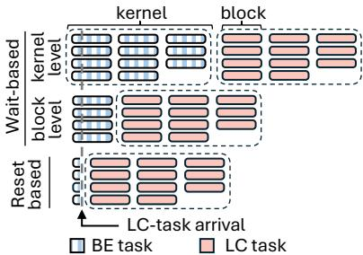
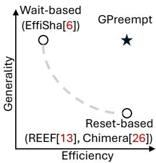
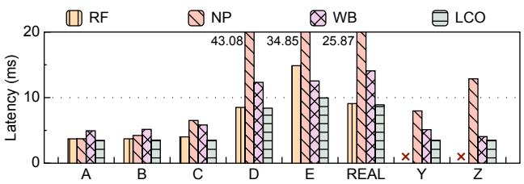
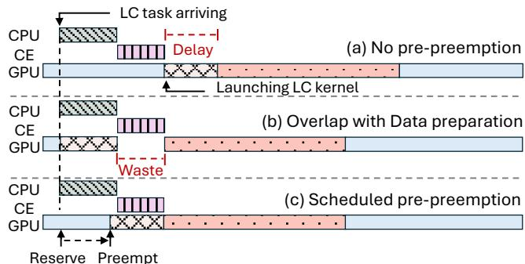
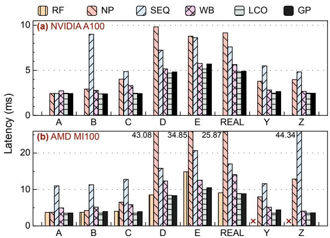
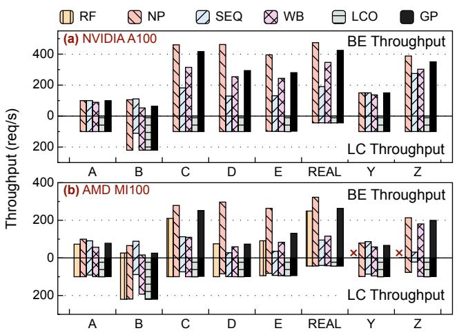
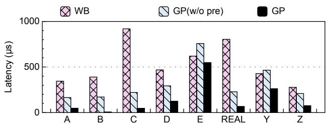
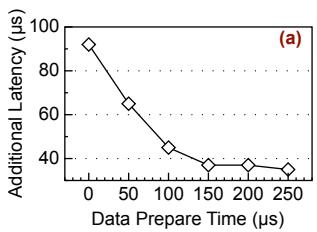
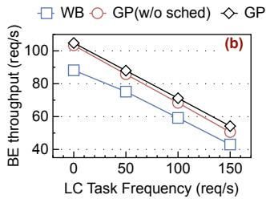

①

USENIX

THE ADVANCED COMPUTING SYSTEMS ASSOCIATION

# GPreempt: GPU Preemptive Scheduling Made General and Efficient

Ruwen Fan and Tingxu Ren, Tsinghua University; Minhui Xie, Renmin University of China; Shiwei Gao, Jiwu Shu, and Youyou Lu, Tsinghua University https://www.usenix.org/conference/atc25/presentation/fan

# This paper is included in the Proceedings of the 2025 USENIX Annual Technical Conference.

July 7–9, 2025 • Boston, MA, USA ISBN 978-1-939133-48-9

Open access to the Proceedings of the 2025 USENIX Annual Technical Conference is sponsored by

P=-r.h mEe-s

auuJl9 PgleU

King Abdullah University of

Science and Technology

# GPREEMPT: GPU Preemptive Scheduling Made General and Efficient

Ruwen Fan† Tingxu Ren† Minhui Xie‡ Shiwei Gao† Jiwu Shu† Youyou Lu†∗

†Department of Computer Science and Technology, BNRist, Tsinghua University ‡Renmin University of China

## Abstract

GPUs support various workloads with different peak periods and diverse service level agreements (SLA) requirements, including latency-critical tasks and best-effort tasks. Co-locating tasks with diverse SLA demands can enhance resource utilization, yet it introduces the risk of performance interference. Prior work employs preemption strategies to enforce SLAs for latency-critical tasks. These strategies can be classified into two categories: wait-based and reset-based approaches. The wait-based strategy ensures broad generality but suffers from significant preemption latency. In contrast, the reset-based strategy necessitates the idempotence of preempted kernels, limiting its generality.

This paper presents GPREEMPT, a preemption mechanism that breaks the trade-off. GPREEMPT implements a timeslicebased yield mechanism to facilitate context-switch preemption on GPUs. To mitigate the overhead associated with contextswitching, GPREEMPT employs a hint-based pre-preemption technique to overlap the preemption process with the essential data-preparation phase. Our evaluation demonstrates that GPREEMPT achieves within 40 µs low-latency preemption comparable to executing only latency-critical tasks while remaining applicable to non-idempotent workloads, where resetbased mechanisms prove inadequate.

## 1 Introduction

GPUs have become essential for a wide range of computing tasks, including computer vision [15, 34], machine learning [14, 22], graphic rendering [5, 27], and scientific computing [23, 30]. Their large-scale parallelism provides exceptional computing throughput, making them a preferred choice in both enterprise and research environments.

These above GPU workloads often experience fluctuating peak traffic periods [9, 32]. Statically allocating dedicated GPU resources to a single task leads to under-utilization during low-traffic periods, resulting in significant resource wastage. Furthermore, GPU tasks typically exhibit varying Service Level Agreement (SLA) requirements [11, 36], including latency-critical (LC) applications (e.g., real-time recommendation, autonomous driving and virtual reality) and best-effort (BE) workloads (such as offline inference and data analytics). A common practice [12,18,29] is to co-locate multiple tasks with different SLA requirements on shared GPU resources to improve GPU utilization. However, co-locating also introduces a significant challenge: When LC tasks arrive, BE tasks may still occupy the GPU, interfering with the execution of LC tasks, and potentially violating SLA guarantees.

  
Figure 1: Existing Preemption Mechanisms and Trade-off of Them. A GPU task typically consists of multiple kernels, where each kernel is made up of several thread blocks.

Previous studies [6, 13, 17, 26] have proposed several preemption approaches to ensure the execution latency of LC tasks. However, these approaches usually make a trade-off between efficiency and generality. As Figure 1 shows, these works can be classified into two categories: wait-based and reset-based preemption strategies. Wait-based preemption, such as block-level preemption [6, 38], passively waits for the running GPU thread block to finish. These preemption methods are highly general. However, they operate at a coarse granularity, introducing a long waiting latency (e.g., up to 5 ms in block-level preemption, see §2.3 for detail). Resetbased preemption strategies [13, 26] aggressively terminate running kernels to facilitate rapid task preemption, capitalizing on the idempotency of certain DNN kernels. However, this idempotency requirement limits their applicability to nonidempotent tasks (such as graph computing and scientific computing) and modern graph kernel launch techniques (e.g., CUDA graph [8]), restricting their generality.

We aim to introduce a switch-based preemption mechanism to break the trade-off between generality and low-latency preemption. Drawing inspiration from CPU scheduling, contextswitch provides a fine granularity and general preemption approach (e.g., coroutine), which is widely adopted in CPU task scheduling. Directly applying such an approach to GPUs, however, is non-trivial: (1) GPU scheduling is opaque to users, and no scheduling interface is provided. Once a kernel is launched, users are unable to yield the GPU computing resources allocated to that kernel; (2) The large GPU context (tens of MB) can introduce significant switching overheads.

To overcome the challenges, we designed GPREEMPT, a general-purpose GPU preemptive scheduling mechanism. To enable the yield primitive, GPREEMPT adopts a timeslicebased approach. Through a thorough analysis of the GPU open-source driver and the GPU hardware scheduling mechanism, we identified and repurposed an internal timeslice allocation mechanism in the GPU driver as the foundation for implementing the yield primitive, abstracting it into a general interface that enables fine-grained control over task scheduling. GPU cycles through tasks according to the timeslice of each task. By reducing the timeslice for low-priority tasks, these tasks can yield GPU resources in a short duration, making user-controlled context-switch feasible on the GPU. To mitigate the cost of context-switching, GPREEMPT integrates Hint-based Pre-preemption. We exploit the data-preparation phase – an unavoidable step before launching GPU kernels. During this interval, GPREEMPT can initiate the preemption procedure, thereby hiding much of the switching overhead.

We evaluate GPREEMPT on 7 workloads (including DNN, graph computing and scientific computing) on NVIDIA and AMD GPUs. Evaluation shows that GPREEMPT achieves comparable latency and throughput to reset-based methods in idempotent kernel preemption scenarios, with less than 40 µs preemption latency on the NVIDIA platform. Moreover, in non-idempotent scenarios where reset-based methods are inapplicable, our system can still achieve preemption with a latency of only 30% compared to wait-based approaches.

## 2 Background and Motivation

## 2.1 GPU Computing Tasks

Offload Computing Task to GPUs. Offloading a computing task to GPUs often involves three procedures: Data preparation, where input data is transformed into a format suitable for GPU computing; data transfer, which involves moving the processed data from the host memory to the GPU memory; and kernel execution, where the actual computing takes place on the GPU. A GPU task often consists of multiple computing kernels, which collectively require execution times ranging from a few milliseconds to several tens of milliseconds [20]. Modern GPU computing frameworks utilize CUDA graphs [8] (and AMD HIP graphs [3]) to reduce the kernel launch overhead. These graph launch approaches consolidate multiple GPU kernels into a directed structure that defines execution order and dependencies, allowing the runtime to treat the kernel sequence as a single executable unit to avoid launch overhead.

Characteristics of GPU Computing Tasks. GPU computing tasks have demonstrated remarkable versatility across diverse application domains with varying latency requirements. In latency-critical scenarios like autonomous vehicle control and real-time robotic manipulation, GPU effectively processes sensor data to make split-second decisions. Conversely, in best-effort applications like offline inference, medical image analysis and climate modeling, GPUs excel at complex pattern recognition tasks where computing time is less constrained. For example, both OpenAI and Amazon provide asynchronous batch APIs [25, 31], which will give users responses within 24 hours.

Co-locate Multiple Computing Tasks on GPU. Running multiple computing tasks on a single GPU is a prevalent demand [12, 18, 29]. Modern data center inference clusters employ strategic task co-location to maximize GPU resource utilization. The GPU workload typically fluctuates dynamically, and the gaps between inference tasks can easily lead to idle GPU resources [18]. Modern data centers typically interleave best-effort tasks with latency-critical workloads.

While this co-location strategy enhances GPU resource efficiency, it introduces complex scheduling challenges. The primary challenge lies in simultaneously satisfying the stringent SLAs of latency-critical tasks while optimizing the throughput of best-effort workloads, given their heterogeneous latency requirements and resource consumption patterns.

## 2.2 Existing GPU Preemptive Scheduling

With the emerging demand for running multiple tasks on GPUs, GPU scheduling [6, 13, 17, 26] becomes a widely studied research topic. Existing preemption approaches can be primarily categorized into two types: wait-based and resetbased methods. These approaches make a trade-off between general-purpose preemption and fast preemption.

Wait-based Preemption. Prior work [6, 10, 38] introduced wait-based preemption mechanisms that enforce exclusive GPU access for LC tasks by waiting for BE tasks to complete their execution. It is important to note that ‘preemption’ in this context often carries a different meaning than in operating systems; here, the emphasis is on achieving an effect similar to preemption (e.g., LC tasks can be executed with minimal delay), rather than an identical preemption process. These approaches operate at kernel or block boundaries. For example, SRM [10] treats the GPU as a globally shared resource protected by a semaphore, executing each kernel sequentially. Effisha [6] relinquishes GPU resources by transforming each computation kernel to check at the block boundary if any LC tasks are arriving. The LC task still needs to wait for the running thread block to complete execution. Wait-based preemption approaches are prone to long waiting times since LC tasks may still be blocked by running tasks.

  
Figure 2: End-to-end Latency of LC Tasks. RF: REEF (reset-based), NP: No preemption, WB: Block-level preemption (wait-based), LCO: Execution LC task only.

Reset-based Preemption. Prior research efforts [13,26] have introduced reset-based methodologies for GPU task preemption, leveraging the idempotent characteristics inherent in specific DNN operators. These approaches enable immediate kernel termination to liberate GPU computing resources, facilitating the expedited execution of LC workloads. The idempotent nature of these operations ensures that BE tasks can be recomputed during periods of GPU inactivity without compromising computing correctness or output integrity. Nevertheless, this methodology exhibits fundamental limitations tied to the prerequisite of kernel idempotency.

## 2.3 Motivation

While existing GPU preemption approaches have made important strides in addressing scheduling challenges, they continue to face fundamental limitations in either generality or performance. Figure 2 illustrates the end-to-end latency of block-level wait-based and reset-based approaches. While the block-level preemption strategy significantly reduced preemption latency (reduced 30 ms on workload D) compared to a no-preemption baseline, the overhead associated with task preemption remains considerable (e.g., a 66.4% (5 ms) increase in latency for LC tasks under workload C). In workload C, the large number of BE tasks means multiple may be running when LC arrives. Although block-level preemption allows quick exits for new blocks, ongoing ones must finish, causing stalls. Moreover, LC is blocked by the slowest BE task, leading to longer average latency than in workloads with fewer BE tasks (e.g., A, B). The reset-based approach, by contrast, demonstrates lower latency. However, the idempotency constraints of kernels significantly limit the applicability of this approach. For instance, in domains such as scientific computing (Y) and graph computing (Z), the global state changes during execution, rendering the process non-idempotent. In these cases, the reset-based preemption strategy is not feasible. Additionally, the integration of advanced kernel launch mechanisms, particularly CUDA Graph, introduces further complexities in maintaining idempotent properties, which can substantially increase the overhead of reset operations.

Key Idea. Motivated by CPU scheduling, we propose a switch-based preemption mechanism to address the tradeoff between generality and low-latency preemption. Contextswitching is a well-established preemption technique in CPU scheduling, which ensures task transparency and fine preemption granularity. However, directly adapting context-switching to GPU scheduling poses significant challenges:

• GPU scheduling is opaque to users. Unlike CPU-based systems, GPUs lack a user-facing context-switch interface, making resource preemption more complex.

• High context-switch overhead. GPU task contexts are much larger than CPU (44 MB in NVIDIA A100 GPU vs. less than 1 KB in x86 CPU), and the overhead associated with context switching is considerable. To mitigate these challenges, a meticulously designed preemption strategy is essential to minimize the impact of this overhead.

## 3 GPREEMPT Design

To achieve both generality and low-overhead GPU preemption scheduling, we present GPREEMPT, a general and efficient scheduling mechanism. GPREEMPT introduces a timeslicebased general preemption (§3.1) to provide a fine-granularity and transparent context-switch preemption mechanism. By leveraging the common GPU computing paradigm, GPRE-EMPT further employs an innovative hint-based pre-preemption technique (§3.2), which strategically overlaps preemption operations with non-computation phases, thereby minimizing observable preemption latency.

## 3.1 Timeslice-based General Preemption

To facilitate rapid preemption, a fine-grained preemption mechanism is essential. While a reset-based approach can seize GPU resources at any moment, it imposes significant constraints on computational kernels. We aim to enable switch-based preemption in the GPU. Through a thorough analysis of NVIDIA open GPU kernel source [24], we discover an undocumented and little-known hardware resource allocation mechanism: timeslice allocation. GPREEMPT fully exploits the power of timeslice allocation, indirectly implementing yield primitive in GPU through timeslice rotation, thus enabling switch-based preemption.

Timeslice-based Yield Mechanism. When multiple independent tasks or tenants run on a GPU, the hardware cycles through them based on predetermined timeslices, ensuring fair computing time for each task. Leveraging this hardware cycling mechanism and timeslice reconfiguration, GPREEMPT implements a passive yield mechanism. Specifically, GPRE-EMPT adjusts the timeslice of a BE task to a very short duration (e.g., 200µs) to ensure that when LC tasks arrive, BE tasks will consume the time quota quickly and yield GPU resources within a time frame. Correspondingly, GPREEMPT extends the timeslice for LC tasks longer than the lifespan of the LC task, ensuring that LC task execution will not be interrupted by other tasks. This approach is effective even without knowing the LC task’s lifecycle in advance; thus, setting the timeslice to a very long duration (e.g., even a few seconds) is fine. When a LC task finishes, its remaining timeslice is automatically dropped, and the GPU immediately switches to the next task. This configuration is set up during system initialization, and no need to change afterwards. Although the timeslice for BE tasks is reduced, their throughput remains unaffected when no LC tasks launch. Because BE tasks are placed within the same scheduling group. When only BE tasks are present, the GPU does not forcibly switch between them, avoiding unnecessary overhead. BE tasks run uninterrupted until completion or until a LC task preempts them.

Scheduling Overhead. Scheduling overhead includes two parts, time for BE to yield and context-switching. According to the GPU hardware scheduling mechanism, a task relinquishes the GPU after consuming its timeslice. Let t1 denote the timeslice for BE tasks. When a LC task arrives, the BE task will yield GPU resources within an average time of t12 and a maximum time of t1, which is about 160 µs. Contextswitching overhead is fundamentally bounded by GPU context size and memory bandwidth parameters, representing a fixed cost for each GPU architecture. This overhead continues to diminish in significance as GPU memory bandwidth capabilities advance. Take NVIDIA A100 GPU as an example: each of its 108 Streaming Multiprocessors (SMs) contains 164 KB of shared memory and 64 K 32-bit registers, resulting in a per-SM context footprint of 420 KB and an aggregate GPU context of approximately 44.3 MB [1]. With the memory bandwidth of 1.1 TB/s, context-saving is completed within 40 µs. Our empirical evaluation reveals a combined overhead of approximately 100 µs (§5.3) for these operations. Additionally, we introduce a pre-preemption technique in §3.2 to further minimize preemption latency.

## 3.2 Hint-based Pre-preemption

Data preparation is a prerequisite for GPU computing tasks before kernel execution, as illustrated in Figure 3(a). Many tasks involve data preprocessing (such as image crop and data normalization), which can extend to hundreds of µs, and all tasks necessitate data transfer from the CPU to the GPU. Even minimal data transfers via cudaMemcpy introduce an overhead of approximately 80 µs [16]. These preparatory stages offer predictive signals for the imminent arrival of LC kernels, facilitating proactive resource reservation through prepreemption. Typically, data preparation is executed by the

  
Data prepare Data transfer Preempt LC task BE task  
Figure 3: Hint-based Pre-preemption Example. CE: GPU copy engine.

CPU and GPU copy engines, operating independently of the GPU computing engines. In a GPU, the computing engine and copy engine can be occupied by different tasks. They will not block each other [4]. Leveraging these characteristics, GPRE-EMPT introduces a hint-based pre-preemption mechanism that enables LC tasks to reserve GPU computing resources in advance, seamlessly overlapping task-switching overhead with ongoing data preparation.

Overlap Preemption with Data preparation. GPREEMPT enables users to issue GPU reservation commands when LC tasks are anticipated. As shown in Figure 3(b), upon receiving such commands, GPREEMPT strategically injects a preemption kernel that consumes the timeslice of the best-effort task at a predetermined instant, concurrent with preprocessing operations. This preemption kernel orchestrates a controlled wait state until the corresponding computing kernel is ready for execution. Leveraging GPU stream semantics, the computing kernel seamlessly initiates execution upon the preemption kernel’s completion. GPREEMPT leverages GDRCopy [33], which enables direct CPU-GPU memory access by mapping GPU HBM to the CPU address space, to notify the preemption kernel, achieving remarkably low latency to finish the preemption kernel (approximately 1 µs). This pre-preemption strategy effectively masks context-switching overhead by overlapping it with essential data preprocessing steps, minimizing end-toend latency.

Scheduled Pre-preemption. Preempting GPU resources too far in advance may result in tasks remaining in the preprocessing phase for extended periods even after GPUs become available. Benefiting from §3.1, GPREEMPT provides a deterministic preemption latency. Leveraging this, GPREEMPT implements a scheduled reservation mechanism whereby users can specify their anticipated GPU resource requirements when submitting a preemption request. GPREEMPT launches the preemption kernel through a background thread based on the scheduled timing. As Figure 3(c), this avoids GPU resource waste while providing pre-preemption support.

Table 1: Workload configuration of LC and BE tasks
<table><tr><td>WL</td><td>LC Tasks</td><td>LC Rate</td><td>BE Tasks</td><td>BE Rate</td></tr><tr><td>A</td><td>VGG</td><td>100 (C)</td><td>ResNet</td><td>100 (C)</td></tr><tr><td>B</td><td>VGG</td><td>220 (C)</td><td>ResNet</td><td>220 (C)</td></tr><tr><td>C</td><td>VGG</td><td>100 (C)</td><td>DM*</td><td>100 (C)</td></tr><tr><td>D</td><td>DM*</td><td>20 (C)</td><td>DM*</td><td>100 (C)</td></tr><tr><td>E</td><td>DM*</td><td>20 (P)</td><td>DM*</td><td>100 (P)</td></tr><tr><td>REAL</td><td>DM*</td><td>Trace</td><td>DM*</td><td>Trace</td></tr><tr><td>Y</td><td>VGG</td><td>100 (C)</td><td>WS</td><td>150 (C)</td></tr><tr><td>Z</td><td>VGG</td><td>100 (C)</td><td>GM**</td><td>100 (C)</td></tr></table>

DM: {ResNet, DenseNet, VGG, Inception, BERT}  
GM: {BFS, SSSP, PageRank, CC}.  
(C): Constant rate, (P): Poisson rate. “100 (C)”: 100 requests/sec per task.

## 4 Implementation

GPREEMPT consists of two primary components: 1) The GPU driver code modifications that enable necessary low-level functionality to support timeslice reconfiguration. 2) Building upon these driver modifications, GPREEMPT provides readyto-use APIs that can be directly integrated into user programs without modifying the computing kernel code.

GPREEMPT on AMD GPUs. AMD has introduced the MES hardware scheduler since RDNA 3 [2]. Similar to NVIDIA, MES uses timeslices to cycle through tasks by hardware, in which the driver dedicates the timeslice for each compute context. GPREEMPT can implement this preemptive scheduling in a similar way to how it is implemented on NVIDIA GPUs. For earlier AMD GPUs, we implemented GPREEMPT by modifying the ROCm driver code and repurposing its debugging mechanism, using it to switch between contexts manually.

## 5 Evaluation

## 5.1 Evaluation Setup

Setups. Experiments are conducted on a system equipped with an Intel(R) Xeon(R) Gold 5420+ CPU, 256 GB DRAM, and an NVIDIA A100-40GB GPU. An AMD-based version of GPREEMPT was evaluated on a platform with identical CPU, memory and an AMD Instinct MI100 GPU.

Comparing Targets. On the NVIDIA platform, we compared GPREEMPT with a LC-task-only baseline (representing the ideal latency boundary), two wait-based preemption approaches (sequential execution and block-level preemption), and a no-preemption baseline (using multiple streams to maximize task parallelism, representing ideal GPU utilization). On the AMD platform, we included an additional baseline, a reset-based preemption approach (REEF [13], without dynamic kernel padding, constrained by the open-source implementation capability with specific AMD GPUs, which will not affect the preemption latency).

  
Figure 4: End-to-end Latency of LC Tasks. NP: no preemption, SEQ: sequential execution (wait-based), WB: block-level preemption (wait-based), LCO: latency-critical tasks only, RF: REEF (reset-based), GP: GPREEMPT.

Workloads. As detailed in Table 1, we evaluate GPREEMPT using DISB [13] and two synthetic workloads. DISB contains 6 typical DNN inference workloads, including LC-task with uniform distribution (A, B, C, D), poison distribution (E) and real-world trace (REAL). Synthetic workloads include scientific computing [23] (Y), and graph computing tasks [21] (Z), which are co-located with LC DNN inference tasks.

## 5.2 Overall Performance

LC-task Latency. Figure 4 shows the end-to-end latency of LC tasks on NVIDIA A100 (4(a)) and AMD MI100 (4(b)) GPU. Reset-based approach (RF) only supports the AMD platform and idempotent workloads.

On the NVIDIA platform, compared to executing LC tasks only (LCO), no preemption (NP), sequential execution (SEQ), block-level preemption (WB), and GPREEMPT (GP) introduce average latency increases of 58.4%, 96.3%, 15.3%, and 2.4%, respectively. On the AMD platform, compared to LC, NP, SEQ, WB, reset-based preemption (RF) and GPRE-EMPT introduce average latency increases of 170.1%, 297.9%, 43.5%, 13.2%, and 10%, respectively.

In scenarios with high task arrival frequencies (B, E, Z), sequential execution methods are prone to resource monopolization by BE tasks, leading to the highest latency. Additionally, sequential execution fails to exploit the parallelism between tasks, further exacerbating the queuing delay. For block-level preemption, in scenarios with numerous BE tasks (C, REAL), preemption latency is influenced by the slowest BE task, resulting in higher average latency compared to scenarios with fewer BE tasks. The reset-based method achieves low preemption latency for DNN workloads (A-E, REAL) that consist entirely of idempotent kernels. However, it is unsuitable for workloads Y and Z, including non-idempotent kernels. Under all workloads, GPREEMPT achieves near-ideal preemption latency while still maintaining generality.

  
Figure 5: LC and BE Task Throughput on Various Workloads. Above the x-axis is the BE tasks throughput, and below the x-axis is the LC tasks throughput.

GPU Utilization. Figure 5 illustrates the total throughput across different preemption strategies on NVIDIA (5(a)) and AMD (5(b)) GPUs. Executing all tasks without preemption (NP) achieves the highest overall throughput in all scenarios, as GPU parallelism is fully exploited when task preemption is absent. We use NP as the baseline to calculate the relative throughput of other methods.

On the NVIDIA GPU, SEQ, WB, LC, and GPREEMPT achieve throughputs of 66.0%, 79.7%, 30.3%, and 88.6%, respectively. On the AMD GPU, RF, SEQ, WB, LC, and GPREEMPT achieve throughputs of 72.4%, 53.1%, 65.7%, 38.8%, and 82.2%, respectively. GPREEMPT guarantees that the throughput of LC tasks remains unaffected across all workloads while striving to keep the throughput of BE tasks close to the ideal scenario. This demonstrates the efficient utilization of GPU resources by GPREEMPT in co-located LC and BE task scenarios. The throughput when executing only LC tasks is the lowest, as only LC tasks are unable to fully utilize GPU resources, leading to considerable idle time. While the Sequential execution strategy provides some throughput improvement, the throughput of LC tasks decreases in this configuration. This occurs because LC tasks are likely to be blocked by BE tasks, leading to high latencies. When using block-level preemption, additional checkpoints are inserted into the BE kernels to determine whether they should exit, decreasing the performance of BE tasks.

## 5.3 Technical Analysis

Performance Breakdown. Figure 6 shows the additional latency for different workloads. Comparing the block-level wait-based preemption, GPREEMPT without hint-based prepreemption (GP (w/o pre)), and GPREEMPT. In most cases, enabling only switch-based preemption achieves a preemption latency with an average of just 200 µs. Only in complicated workloads like E and Y, GPREEMPT without pre-preemption shows relatively high preemption latency. After adopting the pre-preemption technique, GPREEMPT consistently achieves the lowest latency across all workloads. For single-LC-task workloads (e.g., A, B, C, Z), the average preemption latency of GPREEMPT is less than 40 µs. In multiple LC and BE tasks co-locate scenario (workload E, 10 concurrent tasks in total), the average latency increase introduced by GPREEMPT is only about 500 µs. The hint-based pre-preemption mechanism results in an average latency reduction of 160 µs.

  
Figure 6: Additional Latency Compared to LC Task Only. GP(w/o pre): GPREEMPT without pre-preemption.

Analysis of Hint-based Pre-preemption. As introduced in §3.2, GPREEMPT utilizes the data preparation phase of LC tasks to overlap with preemption to mitigate the preemption latency and leverage scheduled pre-preemption to further decrease the preemption influence on BE throughput. Using workload A, we varied both the data preparation time and the arrival frequency of the LC tasks to assess their effects on additional latency and BE task throughput.

As shown in Figure 7(a), the additional latency introduced by preemption decreases significantly as the data preparation time increases. When there is no data preparation time, GPRE-EMPT incurs an additional latency of approximately 100 µs. However, when the data preparation time exceeds 100 µs, the additional latency stabilizes to below 40 µs. The latency is mainly caused by cache interference when colocating tasks, which is negligible compared to the duration of LC tasks, which typically span several milliseconds [20].

Figure 7(b) highlights the impact of LC task frequency on BE task throughput. Compared with the block-level waitbased preemption approach, GPREEMPT improved BE task throughput by 17%-26%. To validate the effectiveness of scheduled pre-preemption, we compare GPREEMPT with a version (GP(w/o sched)) that removes this technique. This optimization results in a throughput improvement of 4%-10% across varying LC task frequencies.

  
Figure 7: Analysis of Hint-based Pre-preemption: (a) Additional latency on various data prepare time and (b) BE tasks throughput on different LC task frequency. GP (w/o sched): GPREEMPT without scheduled pre-preemption.

## 6 Related Works

GPU Task Preemption. Previous studies [19, 35] have proposed extending GPUs to provide preemption mechanisms to reduce the context switch overhead and enable user-initiated preemption, but these were only implemented on GPU simulators. Such approaches require modifications to hardware logic, making them difficult for manufacturers to integrate into real-world GPUs. Some works [17, 37] also propose software-based preemption mechanisms by inserting checkpoints into the application to detect the arrival of high-priority tasks. Software checkpoints incur additional overhead and fail to achieve timely preemption. In contrast, GPREEMPT retrofitted the GPU internal timeslice allocation into a passive yield mechanism to achieve task preemption. GPREEMPT requires no hardware mechanism modification, making it directly applicable to commercial GPUs.

Multi-task GPU Co-location Strategies. Significant research efforts have been directed toward optimizing GPU resource utilization through strategic task co-location. Deep-Boot [7] implements an adaptive scheduling mechanism that dynamically alternates between training and inference tasks, effectively recycling GPU resources. The DAG-based Scheduler [28] employs directed acyclic graphs to automatically determine inter-task data dependencies, eliminating the need for manual dependency specification and facilitating optimal parallel task execution through comprehensive resource utilization analysis. Differently, GPREEMPT focuses on preemption which is one of the foundations of multi-task scheduling.

## 7 Conclusion

This paper introduces GPREEMPT, a general-purpose priority scheduling approach for GPU. Unlike previous wait-based and reset-based preemption mechanisms, GPREEMPT employs a context switch-based strategy to deliver efficient and transparent preemption support on both NVIDIA and AMD GPUs. Evaluations demonstrate that GPREEMPT effectively preempts GPU resources for LC tasks while striving to keep the throughput of BE tasks across various scenarios.

## Acknowledgments

We sincerely thank our shepherd Kostis Kaffes for helping us improve the paper. We also thank the anonymous reviewers for their valuable feedback. This work is supported by the National Key R&D Program of China (Grant No. 2024YFE0203300), the National Natural Science Foundation of China (Grant No. 62332011, U22B2023), and Beijing Natural Science Foundation (Grant No. L242016).

## References

[1] CUDA C++ Programming Guide. https://docs. nvidia.com/cuda/cuda-c-programming-guide/, 2025.

[2] Advanced Micro Devices. Micro Engine Scheduler (MES). https://gpuopen.com/download/ documentation/micro\_engine\_scheduler.pdf, 2024.

[3] AMD. Graph management. https://rocm.docs.amd. com/projects/HIP/en/docs-develop/reference/ hip\_runtime\_api/modules/graph\_management. html, 2024.

[4] Joshua Bakita and James H. Anderson. Hardware compute partitioning on NVIDIA gpus. In 29th IEEE Real-Time and Embedded Technology and Applications Symposium, RTAS 2023, San Antonio, TX, USA, May 9-12, 2023, pages 54–66. IEEE, 2023.

[5] Pieterjan Bartels and Takahiro Harada. Combining GPU tracing methods within a single ray query. In Soon Ki Jung and Neil A. Dodgson, editors, SIGGRAPH Asia 2022 Technical Communications, Daegu, Republic of Korea, December 6-9, 2022, pages 17:1–17:4. ACM, 2022.

[6] Guoyang Chen, Yue Zhao, Xipeng Shen, and Huiyang Zhou. Effisha: A software framework for enabling effficient preemptive scheduling of GPU. In Vivek Sarkar and Lawrence Rauchwerger, editors, Proceedings of the 22nd ACM SIGPLAN Symposium on Principles and Practice of Parallel Programming, Austin, TX, USA, February 4-8, 2017, pages 3–16. ACM, 2017.

[7] Zhenqian Chen, Xinkui Zhao, Chen Zhi, and Jianwei Yin. Deepboot: Dynamic scheduling system for training and inference deep learning tasks in GPU cluster. IEEE Trans. Parallel Distributed Syst., 34(9):2553– 2567, 2023.

[8] NVIDIA Corporation. Getting started with cuda graphs. https://developer.nvidia.com/blog/ cuda-graphs/, 2019.

[9] Jiangfei Duan, Runyu Lu, Haojie Duanmu, Xiuhong Li, Xingcheng Zhang, Dahua Lin, Ion Stoica, and Hao Zhang. Muxserve: Flexible spatial-temporal multiplexing for multiple LLM serving. In Forty-first International Conference on Machine Learning, ICML 2024, Vienna, Austria, July 21-27, 2024. OpenReview.net, 2024.

[10] Glenn A. Elliott and James H. Anderson. Globally scheduled real-time multiprocessor systems with gpus. Real Time Syst., 48(1):34–74, 2012.

[11] Haibing Guan, Jianguo Yao, Zhengwei Qi, and Runze Wang. Energy-efficient SLA guarantees for virtualized GPU in cloud gaming. IEEE Trans. Parallel Distributed Syst., 26(9):2434–2443, 2015.

[12] Bing-Shiun Han, Tathagata Paul, Zhenhua Liu, and Anshul Gandhi. KACE: kernel-aware colocation for efficient GPU spatial sharing. In Proceedings of the 2024 ACM Symposium on Cloud Computing, SoCC 2024, Redmond, WA, USA, November 20-22, 2024, pages 460–469. ACM, 2024.

[13] Mingcong Han, Hanze Zhang, Rong Chen, and Haibo Chen. Microsecond-scale preemption for concurrent gpu-accelerated DNN inferences. In Marcos K. Aguilera and Hakim Weatherspoon, editors, 16th USENIX Symposium on Operating Systems Design and Implementation, OSDI 2022, Carlsbad, CA, USA, July 11-13, 2022, pages 539–558. USENIX Association, 2022.

[14] Kaiming He, Xiangyu Zhang, Shaoqing Ren, and Jian Sun. Deep residual learning for image recognition. In 2016 IEEE Conference on Computer Vision and Pattern Recognition, CVPR 2016, Las Vegas, NV, USA, June 27- 30, 2016, pages 770–778. IEEE Computer Society, 2016.

[15] Gao Huang, Zhuang Liu, and Kilian Q. Weinberger. Densely connected convolutional networks. CoRR, abs/1608.06993, 2016.

[16] Changho Hwang, KyoungSoo Park, Ran Shu, Xinyuan Qu, Peng Cheng, and Yongqiang Xiong. ARK: gpudriven code execution for distributed deep learning. In Mahesh Balakrishnan and Manya Ghobadi, editors, 20th USENIX Symposium on Networked Systems Design and Implementation, NSDI 2023, Boston, MA, April 17-19, 2023, pages 87–101. USENIX Association, 2023.

[17] Zhuoran Ji and Cho-Li Wang. Compiler-directed incremental checkpointing for low latency GPU preemption. In 2022 IEEE International Parallel and Distributed Processing Symposium, IPDPS 2022, Lyon, France, May 30 - June 3, 2022, pages 751–761. IEEE, 2022.

[18] Jiamin Li, Hong Xu, Yibo Zhu, Zherui Liu, Chuanxiong Guo, and Cong Wang. Aryl: An elastic cluster scheduler for deep learning. CoRR, abs/2202.07896, 2022.

[19] Zhen Lin, Lars Nyland, and Huiyang Zhou. Enabling efficient preemption for SIMT architectures with lightweight context switching. In John West and Cherri M. Pancake, editors, Proceedings of the International Conference for High Performance Computing, Networking, Storage and Analysis, SC 2016, Salt Lake City, UT, USA, November 13-18, 2016, pages 898–908. IEEE Computer Society, 2016.

[20] Liangkai Liu, Yanzhi Wang, and Weisong Shi. Understanding time variations of DNN inference in autonomous driving. CoRR, abs/2209.05487, 2022.

[21] Seungwon Min, Vikram Sharma Mailthody, Zaid Qureshi, Jinjun Xiong, Eiman Ebrahimi, and Wen-Mei Hwu. EMOGI: efficient memory-access for out-ofmemory graph-traversal in gpus. Proc. VLDB Endow., 14(2):114–127, 2020.

[22] Maxim Naumov, Dheevatsa Mudigere, Hao-Jun Michael Shi, Jianyu Huang, Narayanan Sundaraman, Jongsoo Park, Xiaodong Wang, Udit Gupta, Carole-Jean Wu, Alisson G. Azzolini, Dmytro Dzhulgakov, Andrey Mallevich, Ilia Cherniavskii, Yinghai Lu, Raghuraman Krishnamoorthi, Ansha Yu, Volodymyr Kondratenko, Stephanie Pereira, Xianjie Chen, Wenlin Chen, Vijay Rao, Bill Jia, Liang Xiong, and Misha Smelyanskiy. Deep learning recommendation model for personalization and recommendation systems. CoRR, abs/1906.00091, 2019.

[23] Matthew R. Norman. miniweather: A mini-app to mimic atmospheric weather models on modern hardware architectures. https://github.com/mrnorman/ miniWeather.

[24] NVIDIA. Open gpu kernel modules. https://github. com/NVIDIA/open-gpu-kernel-modules, 2021.

[25] OpenAI. Batch API. https://platform.openai. com/docs/guides/batch, 2024.

[26] Jason Jong Kyu Park, Yongjun Park, and Scott A. Mahlke. Chimera: Collaborative preemption for multitasking on a shared GPU. In Özcan Özturk, Kemal Ebcioglu, and Sandhya Dwarkadas, editors, Proceedings of the Twentieth International Conference on Architectural Support for Programming Languages and Operating Systems, ASPLOS 2015, Istanbul, Turkey, March 14-18, 2015, pages 593–606. ACM, 2015.

[27] Steven G. Parker, James Bigler, Andreas Dietrich, Heiko Friedrich, Jared Hoberock, David P. Luebke, David K. McAllister, Morgan McGuire, R. Keith Morley, Austin Robison, and Martin Stich. Optix: a general purpose ray tracing engine. ACM Trans. Graph., 29(4):66:1–66:13, 2010.

[28] Alberto Parravicini, Arnaud Delamare, Marco Arnaboldi, and Marco D. Santambrogio. Dag-based scheduling with resource sharing for multi-task applications in a polyglot GPU runtime. In 35th IEEE International Parallel and Distributed Processing Symposium, IPDPS 2021, Portland, OR, USA, May 17-21, 2021, pages 111– 120. IEEE, 2021.

[29] Vignesh T. Ravi, Michela Becchi, Gagan Agrawal, and Srimat T. Chakradhar. Supporting GPU sharing in cloud environments with a transparent runtime consolidation framework. In Arthur B. Maccabe and Douglas Thain, editors, Proceedings of the 20th ACM International Symposium on High Performance Distributed Computing, HPDC 2011, San Jose, CA, USA, June 8-11, 2011, pages 217–228. ACM, 2011.

[30] Cyrille Rossant, Nicolas P. Rougier, João Comba, and Kelly P. Gaither. High-performance interactive scientific visualization with datoviz via the vulkan low-level GPU API. Comput. Sci. Eng., 23(4):85–90, 2021.

[31] Amazon Web Services. Amazon Bedrock offers select FMs for batch inference at 50% of on-demand inference price. https://aws. amazon.com/about-aws/whats-new/2024/08/ amazon-bedrock-fms-batch-inference-50-price/ 2024.

[32] Mohammad Shahrad, Rodrigo Fonseca, Iñigo Goiri, Gohar Irfan Chaudhry, Paul Batum, Jason Cooke, Eduardo Laureano, Colby Tresness, Mark Russinovich, and Ricardo Bianchini. Serverless in the wild: Characterizing and optimizing the serverless workload at a large cloud provider. In Ada Gavrilovska and Erez Zadok, editors, Proceedings of the 2020 USENIX Annual Technical Conference, USENIX ATC 2020, July 15-17, 2020, pages 205–218. USENIX Association, 2020.

[33] Rong Shi, Sreeram Potluri, Khaled Hamidouche, Jonathan L. Perkins, Mingzhe Li, Davide Rossetti, and Dhabaleswar K. Panda. Designing efficient small message transfer mechanism for inter-node MPI communication on infiniband GPU clusters. In 21st International Conference on High Performance Computing, HiPC 2014, Goa, India, December 17-20, 2014, pages 1–10. IEEE Computer Society, 2014.

[34] Karen Simonyan and Andrew Zisserman. Very deep convolutional networks for large-scale image recognition. In Yoshua Bengio and Yann LeCun, editors, 3rd International Conference on Learning Representations, ICLR 2015, San Diego, CA, USA, May 7-9, 2015, Conference Track Proceedings, 2015.

[35] Ivan Tanasic, Isaac Gelado, Javier Cabezas, Alex Ramírez, Nacho Navarro, and Mateo Valero. Enabling

preemptive multiprogramming on gpus. In ACM/IEEE 41st International Symposium on Computer Architecture, ISCA 2014, Minneapolis, MN, USA, June 14-18, 2014, pages 193–204. IEEE Computer Society, 2014.

[36] Zhisheng Ye, Wei Gao, Qinghao Hu, Peng Sun, Xiaolin Wang, Yingwei Luo, Tianwei Zhang, and Yonggang Wen. Deep learning workload scheduling in GPU datacenters: A survey. ACM Comput. Surv., 56(6):146:1– 146:38, 2024.

[37] Lior Zeno, Avi Mendelson, and Mark Silberstein. Gpupio: the case for i/o-driven preemption on gpus. In David R. Kaeli and John Cavazos, editors, Proceedings of the 9th Annual Workshop on General Purpose Processing using Graphics Processing Unit, GPGPU@PPoPP 2016, Barcelona, Spain, March 12 - 16, 2016, pages 63–71. ACM, 2016.

[38] Husheng Zhou, Guangmo Tong, and Cong Liu. GPES: a preemptive execution system for GPGPU computing. In 21st IEEE Real-Time and Embedded Technology and Applications Symposium, Seattle, WA, USA, April 13-16, 2015, pages 87–97. IEEE Computer Society, 2015.

## A Artifact Appendix

## Abstract

The artifact consists of the code of GPREEMPT and baseline used in evaluation, runner scripts for reproducing the experiments, plotter scripts for visualizing the results, and related workload trace and description files. It is intended for validating the claims made in the paper and facilitating further research on GPU preemptive scheduling. The code of GPREEMPT is host at https://github.com/thustorage/ GPreempt.

## Scope

The main claims of this paper, which can be verified through the provided artifact, are:

• GPREEMPT achieves low preemption-induced latency for latency-critical (LC) tasks when co-located with besteffort (BE) tasks.

• GPREEMPT maintains high system throughput for BE tasks even when co-located with preemptible LC tasks.

• GPREEMPT effectively supports preemption for a diverse range of GPU applications, including complex, non-idempotent workloads.

## Hosting

GPREEMPT’s artifact repository is hosted on GitHub at https://github.com/thustorage/GPreempt on the mas-

ter branch. The first usable commit version is the initial commit (59ab51e). However, please always use the latest commit due to possible future bug fixes and updates.

## Contents

Our artifact contains the following components:

• README.md: A top-level guide for installing dependencies, building the system, and reproducing all experimental results described in the paper.

• src/ and include/: Source code of GPREEMPT and the baseline system, including core implementation and interfaces.

• patch/: Patches for modifying the NVIDIA driver to support GPREEMPT’s mechanisms.

• scripts/: Scripts to run the experiments, parse experiment logs, analyze performance metrics, and generate evaluation figures as presented in the paper.

• config/: Configuration files for different workloads and experimental settings.

• third\_party/: External dependencies and modified third-party components required to build and run the system.

This structure is intended to facilitate reproduction of the paper’s results and to help researchers extend GPREEMPT for their own experiments.

## Requirements

• Ubuntu 22.04 LTS

• NVIDIA Open GPU Kernel Module 550.120

• jsoncpp

• disb [13]

• GDRCopy

• NVIDIA Ampere Architechture GPU