①

USENIX

THE ADVANCED COMPUTING SYSTEMS ASSOCIATION

# Snary: A High-Performance and Generic SmartNIC-accelerated Retrieval System

Qiaoyin Gan, Institute of Computing Technology, Chinese Academy of Sciences; Heng Pan,   
Computer Network Information Center, Chinese Academy of Sciences; Luyang Li, Kai Lv, and Hongtao Guan, Institute of Computing Technology, Chinese Academy of Sciences;   
Zhaohua Wang, Computer Network Information Center, Chinese Academy of Sciences; Zhenyu Li, Institute of Computing Technology, Chinese Academy of Sciences; Gaogang Xie, Computer Network Information Center, Chinese Academy of Sciences https://www.usenix.org/conference/atc25/presentation/gan

# This paper is included in the Proceedings of the 2025 USENIX Annual Technical Conference.

July 7–9, 2025 • Boston, MA, USA ISBN 978-1-939133-48-9

Open access to the Proceedings of the 2025 USENIX Annual Technical Conference is sponsored by

P-Lr.h £Es/sL.

auuuJl9 PgleU

King Abdullah University of

Science and Technology

# SNARY: A High-Performance and Generic SmartNIC-accelerated Retrieval System

Qiaoyin Gan2,3, Heng Pan1, Luyang Li2, Kai Lv2, Hongtao Guan2, Zhaohua Wang1, Zhenyu Li2, and Gaogang Xie1,3

1Computer Network Information Center, Chinese Academy of Sciences 2Institute of Computing Technology, Chinese Academy of Sciences 3University of Chinese Academy of Sciences

## Abstract

Industrial large-scale recommendation systems mostly follow a two-stage paradigm: retrieval and ranking stages. The retrieval stage aims to select thousands of relevant candidates from a vast corpus with millions or more items, and thus often becomes the performance bottleneck. Offloading the retrieval stage to hardware is a promising solution. Nevertheless, previous solutions either fail to achieve optimal performance or lack the sufficient generality to support fuzzy search, which has been widely used in modern retrieval systems to improve their scalability and efficiency.

In this paper, we present SNARY, a generic SmartNICaccelerated retrieval system, to facilitate both exact and fuzzy search. Specifically, SNARY utilizes High-Bandwidth Memory (HBM) for corpus storing and scanning and designs two types of search engines: a data parallelism exact search, and a Locality-Sensitive Hashing (LSH)-based fuzzy search. Furthermore, SNARY employs a pipeline-based approach to select Top-K items and streams the data flow of the whole system. We have implemented SNARY on Xilinx commercial Smart-NICs. Experimental results show SNARY achieves a 20.91%- 83.88% lower latency and a 1.26×-18.27× higher latencybounded throughput in exact search scenarios, and achieves a 85.13%-87.40%lower latency and a 20.18×-23.81× higher latency-bounded throughput in fuzzy search scenarios in comparison with the state-of-the-art hardware-based solutions.

## 1 Introduction

Due to the rapid growth in the amount of information, recommendation systems have been widely applied in many web-scale applications (e.g., Amazon and ByteDance) to assist users in finding their preferred items. A typical industrial recommendation system often consists of two sequential stages [20, 36]: matching (a.k.a retrieval) and ranking1 (see Figure 1). The retrieval stage selects thousands of relevant items from a very large-scale corpus (e.g., millions of items) while the ranking stage further filters out the top dozens of items from the selected small-scale candidates with high precision and recall. In this paper, we mainly focus on the retrieval stage.

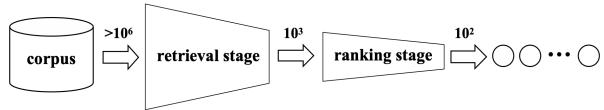  
Figure 1: Hierarchical structure of the recommendation systems. Recommendation systems are composed of two distinct stages: retrieval and ranking.

With advancements in deep learning, neural retrieval models are being extensively applied in the retrieval stage, with progressively better results [5, 36]. Among them, representation learning [1], which is also called embedding, has become the mainstream trend to facilitate deep retrieval in practice [15, 20, 27]. Specifically, in an embedding-based retrieval (EBR) system, all corpus items and user queries are represented with semantic embedding vectors via two parallel deep neural networks. The retrieval process of the EBR system can be regarded as a Nearest Neighbor (NN) algorithm: given one user query, a matching function is then used to calculate the similarity (a.k.a distance) in the embedding space for each corpus item with the query. Each retrieval operation is associated with a recall count, K, indicating the number of embeddings that require final retrieval. After similarity calculation, a sorting algorithm is deployed to efficiently select Top-K items based on their similarity to the query. That is to say, the retrieval problem is finally converted into a similarity search problem.

According to the retrieval scenario requirements and specific algorithm implementations, retrieval methods are further divided into exact search and fuzzy search. Exact search is based on the K-Nearest Neighbor (KNN) algorithm, and the retrieval results are the top K embeddings that are closest to the user query, which are strictly sorted according to the distances between embeddings, while fuzzy search is based on

Approximate Nearest Neighbor (ANN) algorithms, and the retrieval results are embeddings with relatively high similarity to the user query, but not necessarily exact, which usually sacrifices a certain degree of precision to improve the retrieval speed [20]. Due to the high precision of retrieval results, exact search is very popular in various fields [25, 51]. It is worth noting that fuzzy retrieval can provide more effective solutions in scenarios where exact results are not required and lower latency is needed, such as video recommendation [5], product search [27, 47], and information retrieval [15]. At the same time, there are some scenarios where the combination of exact search and fuzzy search is required to improve the stability of the system’s response time. For example, a specific recommendation system has significant traffic differences at different times of the day. Appropriately using fuzzy search during high-traffic periods and exact search during relatively stable traffic periods can effectively balance the system’s response time and enhance the user experience.

However, existing EBR systems usually have some deficiencies in two aspects: (i) the growing corpus sizes have brought about serious performance problems; (ii) the requirements of different scenarios for retrieval methods bring about the issue of generality. For the performace issue, the EBR systems are required to fetch all corpus items, calculate their similarity, and choose Top-K items as long as they receive one user query. Consequently, the corpus size determines the scale of the problem. Low retrieval performance (high response delay) indeed degrades user experience and satisfaction. Therefore, the recent interest in the community has moved to the implementation of high-performance EBR systems, especially with hardware accelerators. For example, some works exploit GPUs (Graphics Processing Units) to accelerate those computation-intensive tasks in EBR, such as similarity computation [49]. There are already mature GPU retrieval system frameworks that support both exact search and fuzzy search simultaneously [25]. However, GPUs are not optimized for pipeline parallelism that is required by the data flow of the whole EBR system, especially at the Top-K selection stage due to the cost of external memory communication. To this end, the community has turned to another popular hardware accelerator, FPGA (Field Programmable Gate Array), which does not have the inherent limitations of GPUs. Unfortunately, the state-of-the-art FPGA-based EBR system [51] only works with exact search and falls short for fuzzy search, lacking support for both types of retrieval methods which brings limited generality.

In this paper, we design SNARY, a SmartNIC-Accelerated Retrieval sYstem, which can achieve high performance and generality for both exact and fuzzy search. We choose SmartNICs for two reasons: (i) modern SmartNICs are often equipped with FPGAs; (ii) SmartNICs are the nearest devices to user queries in servers because queries are often from remote users in practice. That is to say, SNARY can directly process user queries when the NIC receives them.

Overall, SNARY is integrated with two types of search engines: exact search and fuzzy search. For exact search, SNARY utilizes the FPGA high bandwidth memory (HBM) to store and scan the corpus. With massive fully programmable compute elements on FPGAs, SNARY designs a data-parallelism method to accelerate similarity computation, and a pipelineparallelism solution to facilitate Top-K item selection. In addition, the whole data flow of SNARY also follows the pipeline parallelism paradigm. For fuzzy search, SNARY proposes a Locality-Sensitive Hashing (LSH)-based [7, 8, 45] search architecture on FPGAs. Specifically, we design multiple LSH hash tables to maintain the corpus on FPGA HBM. With this basis, SNARY can quickly select relevant retrieval results for one query via hash table lookup, which constitutes a small new “corpus”. Then, SNARY will further perform a more effective exact search operation on the new corpus for final fuzzy retrieval results.

We implement SNARY based on Alveo™ U50 Data Center Accelerator Card, and compare it with Faiss [25], a popular GPU-based EBR system, and FAERY [51], the stateof-the-art FPGA-based solution. Experimental results show that SNARY achieves a 78.75%-83.88% lower query latency than Faiss and a 20.91%-45.19% lower query latency than FAERY, with a 14.12×-18.27× higher latency-bounded throughput than Faiss and a 1.26×-1.64× higher latencybounded throughput than FAERY in exact search scenarios. It also achieves a 85.13%-87.40% lower query latency than Faiss, with a 20.18×-23.81× higher latency-bounded throughput than Faiss in fuzzy search scenarios, while FAERY does not support fuzzy search. To sum up, this paper makes the following contributions:

• To the best of our knowledge, SNARY is the first SmartNICbased retrieval system that achieves high performance for both exact and fuzzy searches.

• We utilize large HBM and programmable compute elements on FPGAs to design a data-parallelism similarity computation and a pipeline-parallelism Top-K selection to facilitate exact search. With this basis, we further propose an LSH-based fuzzy search on SmartNICs.

• We implement SNARY on commercial SmartNICs, and evaluate its performance and efficiency. Experimental results show that SNARY outperforms the popular GPUbased approach and the novel FPGA-based approach.

## 2 Background and Motivation

## 2.1 Embedding-based Retrieval

Industrial recommendation systems often adopt embeddingbased retrieval (EBR) to provide relevant or personalized product candidates [20, 27]. The basic idea of EBR is to translate all corpus items and user queries into embedding vectors via representation learning [1], and convert the retrieval problem into a similarity search problem in the embedding space. It is noteworthy that corpus item embeddings often are precomputed (offline) in practice.

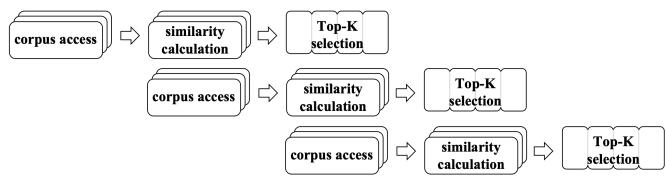  
Figure 2: The workflow of an ideal and feasible EBR system.

Overall, a typical EBR algorithm mainly consists of three steps: corpus access, similarity computation and Top-K selection. Specifically, given a user query, the algorithm is required to scan the corpus and iterate through its all items (i.e., corpus access) and calculate the similarity between each item and the user query (i.e., similarity computation). After that, the algorithm sorts the items based on their similarity and selects Top-K items (i.e., Top-K selection) as the retrieval results. It is clear that corpus access is a memory-intensive operation while both similarity calculation and Top-K selection are compute-intensive.

Ideal EBR system. With the analysis of the basic EBR algorithm, we then introduce an ideal EBR system architecture that can provide optimal retrieval performance. In summary, it should satisfy the following conditions.

• Large high-bandwidth memory. Due to the growing corpus sizes, the EBR system requires a large-capacity external memory to store it. In addition, the memory should provide high bandwidth in order to support the memoryintensive operation (corpus access).

• Task/Data parallelism. Logically, the similarity calculations for different item embedding are independent. To match the throughput of corpus access, the ideal EBR system should perform calculations with data parallelism.

• Pipeline parallelism. To achieve optimal latency, both inside Top-K selection and the whole EBR data flow should follow the pipeline parallelism paradigm. Otherwise, the accumulation of intermediate results is unacceptable in terms of resource consumption in scenarios with large scale corpus.

Comparison of different hardware. At present, most mainstream EBR systems are implemented on CPUs, GPUs and FPGAs. For CPUs, the relatively low memory bandwidth slows down the reading speed of the corpus, which directly affects the overall performance of the system; at the same time, the relatively small number of CPU cores also poses a challenge to data parallelism. Compared with CPUs, GPUs provide large-capacity and high-bandwidth external memories and have good support for data parallelism. However, due to the overhead of cross-core communication in GPUs and the limitations of single-core memory, GPUs have relatively large defects in supporting the overall pipelining of the system, especially in the Top-K selection stage. Research shows that currently, mature GPU frameworks consume 80% of latency in the Top-K selection stage [51]. Meanwhile, this also limits the maximum supported recall count (e.g., 1024 in [25]). Advanced FPGAs also provide large-capacity and high-bandwidth external memories through HBM. Meanwhile, unlike GPUs, FPGAs provide sufficient on-chip memories that can be directly accessed, and all computing units and interconnects are programmable, which enables FPGAs to better support the implementation of fully pipelined systems. Performance factors. Figure 2 illustrates the workflow of a pipelined EBR system. Actually, the total latency of the pipelined system is determined by two portions: (i) the cost of corpus access; (ii) the time for one batch of corpus items to pass through the pipeline, going through similarity calculation and Top-K selection. Thus, we formalize the theoretical latency of the retrieval system in terms of pipeline cycles (denoted by L) as follows:

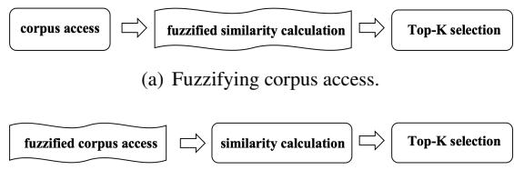  
(b) Fuzzifying similarity calculation.  
Figure 3: Two methods of fuzzy retrieval solutions. Fuzzy retrieval solutions include fuzzifying similarity calculation stage and fuzzifying corpus access stage.

$$
L = { \frac { M } { B } } + C ,\tag{1}
$$

where M represents the corpus size, B represents the bandwidth of external memory which determines the throughput in any pipeline cycle, and C is a constant denoting the pipeline cycles needed to process a single batch of corpus items. That is, C is dependent on the specific design and implementation of one EBR system. Since the entire system is pipelined, once the corpus has been fully read, the last batch of the corpus passes through the pipeline, and the entire system completes its operation.

## 2.2 Accelerating Retrieval with Fuzzy Search

The retrieval phase can be accelerated through fuzzy search, a technique widely employed in industry. It often utilizes ANN algorithms (e.g., LSH [7]) to achieve low response time, but at the cost of slight accuracy degradation. However, such a trade-off is worthwhile in many time-sensitive scenarios, such as search engines and recommendation systems.

Existing fuzzy retrieval solutions mainly focus on fuzzifying the similarity calculation [6, 22, 31] (see Figure 3(a)).

For example, some works employ lexical fuzzification approach [14, 17], synonym expansion technique [39, 43], and machine learning-based methods [29, 48] to enhance the flexibility of matching between user queries and corpus items. These approaches are mainly applied in CPU-based retrieval systems to compensate for the deficiency of data parallelism in CPU-based similarity calculation. However, for those scenarios that involve large-scale corpus, the corpus size often determines the overall latency (see Equation 1). In such cases, fuzzifying similarity calculations has little effect on performance. Instead, fuzzifying corpus access may lead to more improvement (see Figure 3(b)), which means that instead of scanning the entire corpus, only the part of the corpus that is highly relevant to the user’s query is selected for retrieval. According to Equation 1, the latency for reading the corpus accounts for the vast majority of the overall system latency. Reducing the size of the corpus can effectively decrease the latency and improve the retrieval speed.

## 2.3 SmartNIC Opportunities

We have found that accelerating the retrieval system through a SmartNIC implementation has the following advantages:

• SmartNICs are the nearest devices to user queries in servers since queries are often from remote users. SmartNICaccelerated retrieval systems have the opportunity to achieve optimal performance since they have the shortest data path.

• Accelerating the retrieval system through SmartNICs, i.e., implementing the retrieval phase on FPGA, leverages the hardware advantages of FPGA. It harnesses FPGA’s programmability to implement custom data parallelism and pipelining strategies, ultimately achieving a retrieval system with favorable latency.

• FPGAs not only provide ample external storage space for storing large-scale corpus but also allow for preprocessing of the corpus using ANN algorithms. This enables fuzzy search acceleration without compromising the pipeline of the retrieval, thereby simultaneously supporting both exact and fuzzy search scenarios.

## 3 SNARY Overview

We design SNARY, a high-performance and generic SmartNIC-accelerated retrieval system, that follows the aforementioned ideal EBR system architecture. It is noteworthy that SNARY supports both exact and fuzzy searches. Figure 4 shows its conceptual architecture.

Overall, SNARY utilizes High Bandwidth Memory (HBM) on FPGAs to store a large-scale corpus and enable efficient corpus access. Furthermore, SNARY builds LSH hash tables on HBM in advance to maintain corpus items. Consequently, similar items will be inserted into one or neighbor hash buckets2.

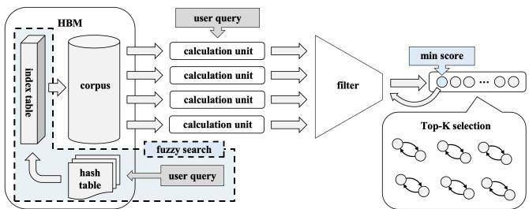  
Figure 4: The conceptual architecture of SNARY. SNARY consists of a HBM, multiple similarity computation units, a filter and a pipeline-parallel Top-K selection module.

For a query that requires an exact search, SNARY will fetch a batch of items from the corpus, and feed them to multiple similarity calculation instantiations built upon massive fully programmable compute elements of FPGAs. That is, SNARY calculates the similarity between corpus items and the user query in a data-parallel manner. After that, the items will be transmitted to a parallel Top-K selection module which perfectly supports the pipelining framework, selecting the final retrieval results based on their similarity. To balance the throughput between the similarity calculation and the Top-K selection modules, SNARY inserts a filter in-between to drop relatively poor items.

If a user performs a fuzzy retrieval, SNARY will use the user query as a key to look up the LSH hash tables. Those items in the matched hash bucket and its neighbor hash buckets will constitute a new small-scale corpus. Then, SNARY will perform an exact search on the new corpus. That is, SNARY fuzzifies corpus access and significantly reduces the size of the target corpus. This indeed reduces the latency of the overall system.

## 4 Design and Implementation

In this section, we begin by examining how SNARY achieves efficient exact search, providing a more detailed theoretical proof. Subsequently, we discuss the transition from exact search to fuzzy search and analyze the system design in fuzzy search. After that, we present the theoretical formula for the latency of SNARY. Finally, we elaborate on the implementation details of SNARY.

## 4.1 Exact Search

SNARY stores the large-scale corpus in HBM. HBM achieves high capacity and bandwidth by stacking multiple DDR chips.

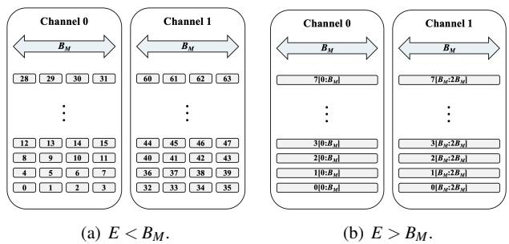  
Figure 5: The layout of embeddings in HBM for two situations. According to the relationship between E and $B _ { M } ,$ , embedding concatenation or embedding splitting is performed.

HBM can be divided into multiple channels, each with a maximum transfer bandwidth $B _ { M }$ , meaning that within one clock cycle, each channel can transfer data of up to $B _ { M }$ bytes. Memory read/write operations in each channel do not interfere with each other, and based on this, HBM allows concurrent reading of multiple candidate objects. Let E represent the size of each embedding; if N channels are used to store embeddings from the corpus, the memory bandwidth in Equation 1 can be expressed as:

$$
B = N \cdot B _ { M } .\tag{2}
$$

To fully utilize the memory bandwidth, a horizontal storage strategy is employed when storing the corpus. This means that the embeddings in the corpus are evenly divided into N parts, ensuring that the data size within each channel is the same. Consequently, all channels read data synchronously in the vertical direction.

Within one clock cycle, HBM can read a maximum of $B _ { M }$ bytes of data in one channel. As a result, the number of complete embeddings $N _ { E }$ read by HBM in one clock cycle is given by the following equation:

$$
N _ { E } = \frac { N \cdot B _ { M } } { E } .\tag{3}
$$

As discussed, we expect to read complete embeddings in each clock cycle, enabling the overall system to operate in a pipelined fashion. Generally, both E and $B _ { M }$ are powers of 2, so when they are not equal, embedding concatenation or embedding splitting is performed, as shown in Figure 5.

The similarity calculation stage involves assessing the similarity between user queries and candidate objects, which, in the EBR system, is translated into the distance between two embeddings in the embedding space. Therefore, similarity calculation involves computing the distance (e.g., inner product [42], Cosine distance [2] and Euclidean distance [8], etc.) between the embedding representing the user query and the embedding representing the candidate object to obtain a similarity score. A higher similarity score indicates a greater similarity to the user query.

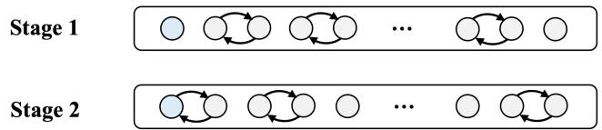  
Figure 6: The working principle of the Top-K selection module. It involves two rounds of parallel swaps to maintain the 0th position as the smallest value among the current Top-K elements.

To achieve an efficient processing pipeline, the throughput of the similarity calculation stage needs to match that of the corpus retrieval. In other words, within one clock cycle, the computation of the distance between $N _ { E }$ embeddings and the embedding representing the user query must be completed. As there is no data dependency among these $N _ { E }$ computations, FPGA’s data parallelism advantage can be leveraged in the design. $N _ { E }$ similarity computation units are instantiated, with each unit responsible for calculating the similarity score between a candidate object and the user query. Consequently, within one clock cycle, the similarity calculation module receives $N _ { E }$ embeddings and concurrently generates $N _ { E }$ similarity scores.

The Top-K selection stage requires selecting the top K highest scores generated by the similarity calculation module to obtain the final retrieval results. Different retrieval systems may have a varying magnitude of recall quantity [12, 27, 35], so the design of the Top-K selection module needs to satisfy resource constraints and meet performance and scalability goals, when the value of K changes.

The design of the Top-K selection module should support the pipelining of the system. A pipelined retrieval system requires real-time sorting to prevent issues such as pipeline blocking and excessive memory usage. We improved the Top-K sorting algorithm presented in [30] and implemented a Top-K sorting module that maintains pipelined parallelism even with a large number of recall items. We also provide a more detailed and rigorous proof to establish the correctness of the Top-K algorithm. The specific principle is illustrated in Figure 6. The core of the Top-K selection module is an array of size K, which stores the current top K largest values. At any given time, the 0th position of this array holds the smallest value among the current Top-K elements. In each pipeline cycle, a new similarity score is read and compared with the 0th position element. If the new score is larger than the current Top-K’s smallest value, a replacement occurs. Subsequently, the array undergoes two rounds of parallel swaps to ensure that the 0th position continues to hold the smallest value in the current Top-K set. The first round of parallel swaps starts from the 1st position and proceeds backward, swapping pairs if they are in reverse order; the second round begins from the 0th position, similarly swapping reverse pairs as necessary. The Top-K selection module generally also needs to ensure that the results from the retrieval stage are ordered, making them more convenient for processing in the sorting stage. To achieve this, after the final new score is read, we add $K / 2$ additional pipeline cycles with empty inputs, during which K rounds of parallel swaps are performed. This guarantees that the scores in the final Top-K array are sorted. The proof of the correctness of the algorithm above can be found in Appendix A.1.

Since the swaps in both Stage 1 and Stage 2 can be performed in parallel, the Top-K selection module can complete its operations with O(1) time complexity for each pipeline cycle. Additionally, each new score is compared with the current smallest value in the Top-K array (i.e., the 0th position), ensuring that the array always contains the top K largest scores at any given time. To maintain the efficiency of parallel swaps when the value of K is large, we partition the Top-K array and distribute it across the on-chip memory to increase the number of read/write ports. In scenarios with limited on-chip resources, we also offer a solution that divides the Top-K array into upstream and downstream segments. This approach splits the array into two sections of size $K / 2$ , with the first half storing the top $K / 2$ values and the second half storing values ranked between $K / 2$ and K. The upstream array receives the new scores, determines whether to replace any value and performs parallel swaps. The replaced value (or the non-replaced new score) is then passed to the downstream array, where a similar process is executed.

As stated previously, the performance of the Top-K selection module has a significant impact on the overall performance of the retrieval system. Compared with the Top-K selection module algorithm adopted in [51] (first proposed in [35]), the above-mentioned Top-K selection algorithm based on parallel exchange only occupies $O ( K )$ on-chip memory, while the algorithm in [51] requires approximately $O ( 9 K / 2 )$ of memory. This order-of-magnitude memory footprint optimization yields substantial performance improvements, since under a large recall count, the on-chip resources are almost fully occupied (mainly including the memory occupied by the Top-K module and the filter module). Note that with on-chip memory pressure, the wiring between the memory module and other logic modules will become complicated, which may lead to problems such as wiring congestion and tight logic resources, thereby reducing the working frequency. At the same time, the above-mentioned algorithm only occupies a few (1 or 2) pipeline stages, while the algorithm in [51] has O(logK) modules and needs to occupy O(logK) pipeline stages, while each module cannot be reused. Our Top-K selection module is helpful for reducing on-chip memory occupancy, increasing the overall clock frequency, reducing the pipeline depth, and has good scalability at the same time.

Due to the dissimilarity in throughput between the similarity calculation module, which produces $N _ { E }$ scores per clock cycle, and the Top-K selection module, which can only handle one score per clock cycle, a throughput imbalance exists between them. To prevent pipeline blockage, a filter module is introduced between these two modules. The filter module utilizes forward feedback from the Top-K selection module to identify the current minimum score swapped out from the Top-K array and filters out scores that are smaller than the current minimum score. In every pipeline cycle, the filter receives $N _ { E }$ scores, transports the single valid score into the Top-K selection module according to the current minimum Top-K value, and caches or drops other scores.

We provide a detailed analysis of the filtering efficiency and the cache memory usage for other valid scores in the same pipeline cycle in Appendix $\mathbf { A . } 2 .$ . Let $\gamma = K / M$ represent the recall rate of the entire retrieval system, the condition under which the filter can be effective is given by:

$$
\frac { 1 } { N _ { E } ^ { 2 } } \geq \gamma - \gamma \mathrm { l n } \gamma ,\tag{4}
$$

which provides guidance for our system design. For instance, in the case of a recall rate of $1 \times 1 0 ^ { - 3 }$ , we get $N _ { E } \leq 1 1 . 2 5$ Thus, at most 11 candidate objects can be read from the corpus in one clock cycle to make sure the filter works.

## 4.2 Fuzzy Search

Compared to exact search, fuzzy search reduces search latency by sacrificing accuracy. We implement fuzzy search acceleration in the retrieval process based on the structure of exact search. According to Equation 1, there are three optimization approaches to reduce retrieval system latency and improve performance: (i) reducing the size of the corpus, M; (ii) increasing the memory bandwidth, $B ;$ and (iii) decreasing the system’s fixed latency, C.

Memory bandwidth is determined by the hardware configuration, while system-fixed latency is a constant related only to system design, accounting for a relatively small portion of the total latency. Therefore, one optional approach is to reduce the size of the corpus, M, to decrease the retrieval system’s latency. Specifically, we selected the LSH algorithm, which is more friendly to FPGA, for corpus filtering in the ANN algorithm that accelerates the search by reducing the search scope. Before conducting an exact search, the corpus is filtered to obtain a smaller corpus size, $M ^ { \prime } ,$ , and then the exact search is performed on this reduced corpus. This approach maintains the structure of exact search, ensuring high module reusability, and facilitates the flexible switching of system functionality in different scenarios. At this point, according to Equation 1, the theoretical formula for system latency after corpus filtering is:

$$
L = \frac { M ^ { \prime } } { B } + C .\tag{5}
$$

The LSH algorithm achieves dimensionality reduction of target embeddings and partitions the target embedding set into different buckets. In comparison to regular hash algorithms,

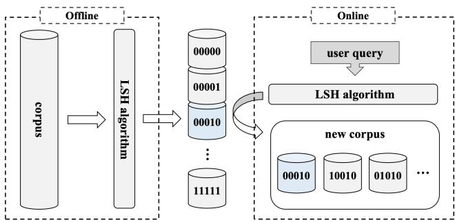  
Figure 7: The workflow of corpus filtering. Corpus partitioning happens in the offline phase and the LSH query happens in the online phase.

LSH exhibits a degree of locality sensitivity by localitysensitive hash functions. Specifically, two embeddings with high similarity in the original space will fall into the same or nearby (Hamming distance) buckets after being mapped by these functions. Conversely, two embeddings with low similarity in the original space will have relatively distant bucket assignments after the LSH mapping. In this way, we can consider the sets of embeddings within the same or nearby buckets as sets of embeddings with high similarity. For embeddings representing user queries, we also employ LSH for dimensionality reduction. We can then treat the bucket where the user queries hit and some neighboring buckets of embeddings in the origin corpus as a new corpus for exact search. This approach allows us to accelerate the search process by filtering out highly similar embeddings in the corpus.

The process of dimensionality reduction and querying through the LSH algorithm involves adjusting three main parameters: $K _ { h } , L _ { h } ,$ , and $T _ { h } .$ , each of which serves a specific purpose:

$K _ { h }$ represents the number of bits used to represent origin embeddings after dimensionality reduction. In other words, the LSH algorithm maps a high-dimensional embedding to a collection with $2 ^ { K _ { h } }$ buckets.

$L _ { h }$ stands for the total number of hash tables in LSH. The LSH algorithm can be configured for multi-table querying, where an embedding can be simultaneously mapped by $L _ { h }$ local sensitive hash functions during a query. This allows searching in $L _ { h }$ tables and identifying $L _ { h }$ buckets where the embedding hits.

• Th represents the maximum Hamming distance considered when searching for nearby buckets within a single table. To improve search accuracy, LSH can match and hit buckets with Hamming distances smaller than or equal to $T _ { h }$ as a collection of embeddings within the table.

In the case of multi-table querying where $L _ { h } \ge 2 .$ , there is also a choice of query result set intersection or union strategy. The final matching result can either take the intersection or union of the embeddings in the buckets matched in each table.

The necessity of performing intersection (or union) on query results from multiple tables implies that once we have obtained the indices of all matching buckets, we cannot immediately begin pipelined access of embeddings within these buckets, since it is hard to determine whether the current embedding is part of the intersection (or is a duplicate, for the union case). This disrupts the data flow of the system, which will cause performance degradation. Calculating the intersection (or union) before corpus access would introduce significant additional delay and unnecessary memory consumption. Therefore, SNARY adopts a single-table query strategy, meaning $L _ { h } = 1$ , adjusting the value of $K _ { h }$ and $T _ { h }$ to control the scale of matched embeddings.

The LSH algorithm we have chosen should approximately distribute the embeddings in the corpus equally among the buckets. Since we expect to search among the bucket where the user queries hit and its neighbors in Hamming distance $T _ { h } .$ we can estimate the size $M ^ { \prime }$ of the filtered corpus as follows:

$$
M ^ { \prime } = \frac { \sum _ { i = 0 } ^ { T _ { h } } \binom { i } { K _ { h } } } { 2 ^ { K _ { h } } } \cdot M .\tag{6}
$$

The workflow of our corpus filtering process using the LSH algorithm is illustrated in Figure 7. In the offline phase, we partition the corpus into different buckets based on the LSH algorithm and simultaneously construct hash tables, which is a one-time offline preprocessing phase. That is to say, it does not introduce any extra cost during online queries, since the bucket structure remains static and reusable across all queries, and the execution time of the offline phase remains within a manageable range (approximately 1-2 seconds for a corpus size of 9M). In the online phase, we similarly map user query using LSH and obtain the index of the bucket it falls into. Finally, we use the hit buckets (and neighboring buckets) as the new corpus and perform an exact search within the filtered corpus.

We adopt the widely-used simHash method [3, 34], which reduces a high-dimensional embedding to a low-dimensional signature and the specific process can be divided into the following steps:

• Map each dimension of the high-dimensional embedding to a $K _ { h } .$ -bit embedding using a standard hash algorithm.

• Transform the embeddings obtained in the first step based on the weight of each position. Specifically, replace 1 with weight and replace 0 with the additive inverse of weight in each position.

• Accumulate the embeddings in the second step bit-wise.

• Compress the accumulated embedding dimensionally, replacing positive values with 1 and non-positive values with 0.

This process yields a signature representing the bucket number it hits in the hash table. The standard hash function in the first step can be changed to obtain different simHash methods.

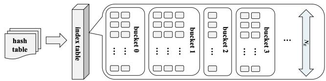  
Figure 8: The data structure related to LSH. We store the hash table and index table in HBM, through which we can locate the position of hit embeddings in the corpus.

In this way, we reserve the possibility of constructing different hash tables and performing multi-table querying.

Two available memory channels in HBM are utilized to store data structures related to LSH. Specifically, the hash table and index table are stored in HBM, as illustrated in Figure 8. In the hash table, the starting positions and sizes of each bucket in the index table are recorded, while the index table keeps track of the specific positions of embeddings within each bucket in the corpus. When the bucket where a user query hits is obtained, the hash table is accessed first to mark the regions that need to be accessed in the index table. Afterward, only the elements from the marked buckets in the index table need to be accessed. For each obtained position of an embedding within the corpus, this position can be used to retrieve the specific embedding from the corpus.

During corpus access, we can simultaneously prepare for the next position’s retrieval, allowing the system to continue its pipelined operation. However, it’s important to note that we still aim to parallelize corpus access, which means accessing $N _ { E }$ embeddings per clock cycle. Due to the uneven distribution of embeddings in the buckets after allocation, it is challenging to determine if $N _ { E }$ continuous embeddings are located in different channels within a bucket. Additionally, it’s unclear if accessing $N _ { E }$ positions at once will precisely cover all embeddings within a bucket (since the bucket size may not be a multiple of $N _ { E } )$ . To maintain the normal operation of the pipeline, we perform the following steps for each bucket before writing embedding positions to the index table:

• Categorize the embeddings within the bucket into $N _ { E }$ classes based on the channels they are stored in. Let the size of the class with the most embeddings be denoted as S.

• Add paddings to the bucket to reach a size of S · NE so that, for each class there are S elements including the added paddings.

• Rearrange the elements within the bucket so that, starting from the initial element, every consecutive $N _ { E }$ elements are in different channels. If the elements for a channel have been exhausted, use paddings to fill the gaps.

Through preprocessing, we can achieve parallel access of $N _ { E }$ elements within the current bucket, thereby ensuring a balanced throughput between index table access and corpus access. When we encounter padding elements during the reading, a flagged embedding enters the pipeline. The score generated by this embedding will be filtered out in the filter module, ensuring it doesn’t affect the recall results. This optimization strategy increases the pipeline width of fuzzy search to match that of exact search, which significantly improves the efficiency of the fuzzy search process.

## 4.3 Implementation Details

We implement prototypes of SNARY on the Xilinx AMD Alveo™ U50 Data Center accelerator card of different recall counts K. It features integrated HBM2 (second-generation HBM), which provides up to 400 GB/s of memory bandwidth with 8GB storage and 32 channels for concurrent reads, enabling efficient handling of large datasets and reducing memory bottlenecks. We fully utilize on-chip resources to design SNARY as a completely pipelined structure, supporting seamless switching between exact and fuzzy search modes. We also utilize a 100 Gbps TCP/IP stack [18] to implement corpus uploading, updating, and result transmission on the card. Due to the fact that the FPGA baseline used in our experiment only supports recall counts that are powers of two [51], four systems with recall counts ranging from 512 to 4096 were implemented for comparative experiments.

Corpus access. 16 HBM channels are utilized to store the corpus, providing a total storage capacity of up to 4 GB. Each embedding is stored across 4 contiguous channels, allowing our system to accommodate up to 1024 million embeddings. Since read and write operations among different channels do not interfere with each other, parallel reads are performed in each pipeline cycle to maximize bandwidth. This enables the reading of 4 embeddings at once, which can then proceed to the subsequent computation stages.

Similarity calculation. In the similarity calculation module, the dot product is used to measure the similarity between different embeddings. Data from the contiguous channels belonging to an embedding is computed with the corresponding positions of the user query’s embedding, integrating these calculations to form similarity scores. In the computation process, the calculation of similarity scores for different embeddings, as well as the scores for different positions of a single embedding, is fully unrolled, effectively utilizing hardware resources.

Top-K selection. The Top-K selection module adopts the parallel swapping strategy mentioned in Section 4.1 to ensure pipelined parallelism. Specifically, an array of length K is implemented in on-chip memory to store the Top-K scores, with array partitioning used to increase the read/write ports of the Top-K array. For higher recall counts, the array is further divided into upstream and downstream segments to avoid excessive resource consumption within a single pipeline cycle, while maintaining an O(K) byte space usage. After the last score enters the Top-K selection module, additional $K / 2$ cycles are added to perform the same parallel swapping and sorting operations to ensure that the final Top-K array is completely ordered.

Table 1: Resource usage and clock frequency of SNARY under different recall counts.
<table><tr><td rowspan="2">K</td><td colspan="3"> resource usage (%)</td><td rowspan="2">Freq.(MHz)</td></tr><tr><td>LUT</td><td>FF</td><td>BRAM DSP</td></tr><tr><td>512</td><td>18.17</td><td>12.15</td><td>18.42 0.07</td><td>302.0</td></tr><tr><td>1024</td><td>26.41</td><td>14.09</td><td>18.42 0.07</td><td>285.0</td></tr><tr><td>2048</td><td>34.44</td><td>15.97</td><td>20.35 0.07</td><td>279.0</td></tr><tr><td>4096</td><td>40.16</td><td>24.19</td><td>20.35 0.07</td><td>235.3</td></tr></table>

Filter. The filter is implemented using four FIFO pipelines with a certain depth to balance the throughput between the similarity calculation and Top-K selection modules. These FIFO pipelines receive scores from the similarity calculation and filter out or temporarily cache3 some scores based on the current Top-K minimum value feedback from the Top-K selection module. They then provide one score to the Top-K selection module. To handle burst scenarios, the depth of each FIFO pipeline is set to accommodate the storage of 2K scores according to the analysis in Appendix A.2.

Fuzzy search. Two idle HBM channels are used to store the hash table and index table. Upon the arrival of user queries, the index table, which has already been preprocessed, allows for the parallel reading of the corresponding channels for every 4 indices, with each embedding stored in a different channel. This enables the reading of the corresponding positions in the next pipeline cycle while retrieving the 4 indices without impacting the overall pipelining of the system. The parameters $K _ { h }$ and $T _ { h }$ in the LSH algorithm are set as adjustable parameters, allowing users to control the balance between result accuracy and retrieval speed.

Batch support. SNARY implements batch support through multiple computing units on a single card to further enhance throughput under low-latency conditions. These computing units share the same HBM and possess identical architecture, allowing them to work in parallel coordination. Due to onchip resource limitations, we achieved a batch size of 3 for systems with recall counts of 512 and 1024, a batch size of 2 for a recall count of 2048, and a batch size of 1 for a recall count of 4096. Furthermore, for increasing batch sizes beyond these values, multi-card coordination may provide additional opportunities for improvement.

Memory Overhead. (i) Corpus size. Both exact and fuzzy search operations utilize the HBM external memory to store the corpus. In our experiments, we place up to 9M embeddings in HBM, which occupies about 28% external memories (totaling 32M embeddings). (ii) On-chip memory. The hardware implementation for both exact and fuzzy search with the same recall count is the same. We fully utilized the limited 8MB on-chip memory to implement SNARY, and the resource consumption and the clock frequency of SNARY under different recall counts is shown in Table 1.

## 5 Evaluation

We evaluate the performance of SNARY on both exact and fuzzy search scenarios and compare it with a GPU-based retrieval system Faiss and an FPGA-based retrieval system FAERY. For exact search, we evaluate the delay and the latency-bounded throughput of SNARY, Faiss, and FAERY. For fuzzy search, we first evaluate the efficiency performance of SNARY and Faiss under similar accuracy performance. We also conducted a series of self-comparison experiments to explore the impact of parameter changes on the trade-off between efficiency and accuracy. All error bars in the figures represent the standard error of the mean (SE). Our experimental results show that:

• SNARY achieves a 78.75%-83.88% lower query latency than Faiss and a 20.91%-45.19% lower query latency than FAERY, with a 14.12×-18.27× higher latency-bounded throughput than Faiss and a 1.26×-1.64× higher latencybounded throughput than FAERY in exact search scenarios.

• SNARY achieves a 85.13%-87.40% lower query latency than Faiss, with a 20.18×-23.81× higher latency-bounded throughput than Faiss in fuzzy search scenarios, while FAERY does not support fuzzy search.

• SNARY allows for the adjustment of relevant parameters to achieve a trade-off between efficiency and accuracy, thereby better meeting various retrieval requirements in fuzzy search scenarios.

## 5.1 Experimental Setup

Baseline. We use Faiss [25] and FAERY [51] as the GPUbased and FPGA-based baseline in our experiments. Faiss is evaluated on a server equipped with 4 Nvidia A100 GPUs, each with 12GB of VRAM, running CUDA version 12.0. FAERY is implemented and evaluated on the Xilinx AMD Alveo™ U50 Data Center accelerator card, with the same HBM utilization configuration as SNARY. A recall count of 1024 was used as the default configuration in our experiment because FAERY implements a system specifically for this recall count [51], and it also represents the maximum recall count in Faiss. FAERY systems with the same batch size as SNARY under different recall counts were also implemented to conduct comparative experiments with SNARY.

Corpus. SNARY is designed as a generic retrieval system that is not sensitive to any specific workload. Thus, we follow the methodologies of [51] and use synthetic datasets to evaluate the generality and efficiency of SNARY. This is because SNARY focuses on how to improve the retrieval performance via designing a search engine architecture on SmartNICs. Within this architecture, the retrieval efficiency is mainly decided by the corpus access, which is a hardware-bound process independent of dataset semantics. Specifically, the corpus consists of randomly generated 128-dimensional embeddings with 1 byte each dimension. Since each channel in the HBM provides 32B bandwidth, we utilize 4 consecutive adjacent channels to store a complete embedding.

## 5.2 Evaluation on Exact Search

We measured the query latency and the latency-bounded throughput among different systems in exact search scenarios. Latency-bounded throughput refers to the number of queries a system can process per second (QPS) while maintaining a strict upper limit on response time, or latency. This metric is crucial in real-time retrieval systems, where rapid and efficient data processing is essential to meet user expectations and service requirements. In such systems, high throughput must be achieved without exceeding latency constraints, ensuring both speed and quality of service. In our experiments, we adopted the widely recognized upper latency limit of 10ms as a standard benchmark [4, 10, 27], ensuring the system’s ability to handle queries efficiently within this time frame. The experimental results are shown in Figure 9.

We first set the recall count to 1024 and varied the corpus size to compare query latency and latency-bounded throughput among different systems. The experimental results are shown in Figure 9(a) and Figure 9(b). As can be seen, SNARY’s latency exhibits a linear relationship with corpus size, which is consistent with the latency formula presented in Equation 1. SNARY achieves a 82.42%-83.63% lower query latency than Faiss and a 34.52%-45.19% lower query latency than FAERY. Under the 10ms latency constraint, SNARY achieves a 18.27× higher throughput than Faiss and a 1.52×-1.76× higher throughput than FAERY, and continues to function even when the other systems fail to meet the latency constraint.

We also fixed the corpus size at 1M and varied the recall count to compare the performance of the different systems. The results are shown in Figure 9(c) and Figure 9(d). As the recall count increases, the performance of all systems decreases, and SNARY obtains more stable performance compared with FAERY as the system architecture is not made more complex. Notably, Faiss was unable to function under higher recall counts due to a recall count limitation of 1024. SNARY achieves a 78.75%-83.88% lower query latency than Faiss and a 20.91%-38.85% lower query latency than FAERY. Under the 10ms latency constraint, SNARY achieves a 14.12× -18.27× higher throughput than Faiss and a 1.26×-1.64× higher throughput than FAERY, and continues to operate under higher recall counts.

The experimental results show that in terms of both the query latency and the latency-bounded throughput, the performance of SNARY is superior to that of Faiss and FAERY. This is because, compared with GPU systems, the inherent hardware advantages of FPGA (mentioned in Section 2.1) enable the retrieval system to be fully pipelined, reducing the retrieval latency, ensuring that the system can still work properly under relatively high recall counts. Meanwhile, since the single-query latency of GPU is relatively high, it is easy to exceed the latency limit on higher batch sizes. However, SNARY adopts a fully parallelized batch support, ensuring high throughput under low latency. Compared with FAERY, the improvements made by SNARY in the Top-K selection module algorithm (mentioned in Section 4.1) are helpful in reducing on-chip resource occupation, increasing the clock frequency, and decreasing the pipeline depth, thus achieving better results.

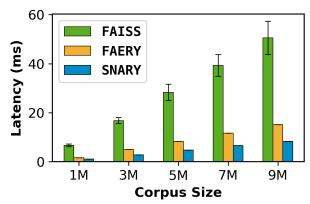  
(a) Query latency under different corpus sizes.

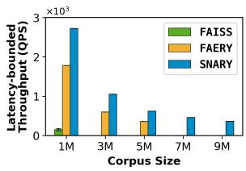

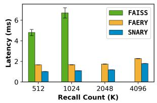  
(b) Latency-bounded throughput under different corpus sizes.

(c) Query latency under different recall counts.  
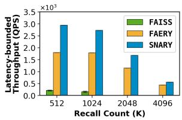  
(d) Latency-bounded throughput under different recall counts.  
Figure 9: The comparison of query latency and latencybounded throughput among different systems in exact search as corpus size and recall count varies.

The experimental results also indicate that, compared to Faiss, both SNARY and FAERY, which are FPGA-based implementations, exhibit significantly lower latency jitter. Their latency and latency-bounded throughput remain consistently stable (as seen in Figure 10). This is mainly due to the fact that FPGA can achieve deterministic processing logic through customized hardware circuits, thereby avoiding performance jitter. In contrast, GPUs may experience fluctuations during concurrent processing due to factors such as task scheduling and concurrent memory access. The FPGA’s dedicated hardware design ensures stable performance, while the GPU’s shared resource architecture introduces variability in execution times. It also can be seen that increasing the recall count results in performance degradation. Because higher recall counts significantly raise the resource occupancy of the Top-K module, which is the bottleneck in GPU-based systems

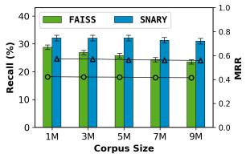  
(a) Recall (bars) and MRR (line) between Faiss and SNARY.

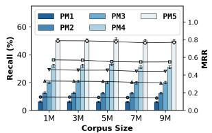

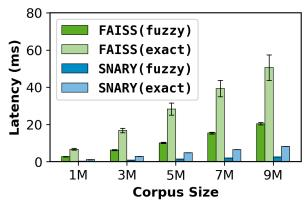  
(b) Recall (bars) and MRR (line) among different parameter combinations of SNARY.

(c) Query latency between Faiss and SNARY.  
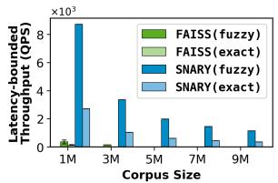

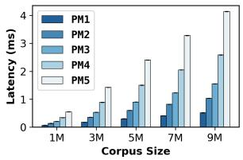  
(d) Latency-bounded throughput between Faiss and SNARY.

(e) Query latency among different parameter combinations.  
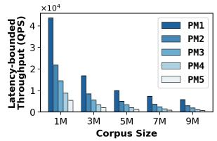  
(f) Latency-bounded throughput among different parameter combinations.

Figure 10: The comparison of query latency, latency-bounded throughput and accuracy among different systems in fuzzy search as corpus size varies. The corresponding metrics for the exact search case are also shown for reference in the comparison of SNARY and Faiss.

(discussed in Section 2.1) and dominates the on-chip memory consumption for FPGA-based systems.

## 5.3 Evaluation on Fuzzy Search

We measured the performance between SNARY and Faiss in fuzzy search scenarios under various corpus with a recall count of 1024 where Faiss functions normally. We used the IndexIVFFlat method of Faiss as the baseline, which is the most popular ANN algorithm in Faiss. It accelerates the search by partitioning the dataset into segments, where Voronoi cells are defined in the d-dimensional space, and each database vector is assigned to one cell. During the search, only the vectors in the query’s cell and a few neighboring ones are compared to the query vector. It has two tunable parameters, nlist and probe, which determine the segment number and the search range respectively to balance latency and accuracy. We used the recommended configuration with nlist = 100 and nprobe = 10.

For the comparison experiment, we first adjusted our own

ANN parameters to ensure that the two systems have similar accuracy when comparing latency. We select the parameter combination of $K _ { h } = 4$ and $T _ { h } = 1$ to participate in the comparative experiment. First, we measured the retrieval result accuracy of SNARY and Faiss under different corpus sizes. We use Recall and MRR (Mean Reciprocal Rank) to gauge the accuracy of fuzzy search. In our experimental scenario, Recall represents the ratio of fuzzy retrieval results to exact retrieval results, while MRR refers to the mean of the inverse of the ranking of the first correct result returned in multiple queries. The experimental results are shown in Figure 10(a). It can be seen that when the corpus size changes, the Recall and MRR values of SNARY are similar and slightly higher than those of Faiss. As corpus size increases, the accuracy of SNARY maintains a stable range.

We then measured the query latency and the latencybounded throughput (with the same upper limit of 10ms) between the two systems and the experimental results are shown in Figure 10(c) and Figure 10(d) with results in exact search scenarios as references. From the experimental results, SNARY successfully reduces query latency in fuzzy search compared with exact search and also outperforms Faiss in terms of latency and latency-bounded throughput under similar accuracy metrics. SNARY achieves a 85.13%-87.40% lower latency and a 20.18×-23.81× higher throughput under the 10ms constraint than Faiss at similar accuracy of searching results. Compared with exact search, SNARY reduces the query latency by 78.05%-78.72%, while Faiss reduces that by 35.41%-39.17%, which also makes the latency-bounded throughput corresponding to the fuzzy search higher than that of the exact search.

The performance advantages of SNARY in fuzzy search come from two aspects: (i) high-performance exact search; (ii) high-efficiency acceleration effect. Due to the hardware architecture advantages of SNARY, its performance in terms of query latency and latency-bounded throughput in exact search is already better than that of GPU-based systems (mentioned in Section 5.2). Moreover, SNARY adopts the method of directly fuzzifying the reading of the corpus. For a fully pipelined parallel retrieval system, this can directly reduce the delay, and in the scenarios of large-scale corpus, it can very efficiently accelerate the entire retrieval process (mentioned in Section 2.2).

Finally, we investigated the impact of parameter changes on the trade-off between latency and accuracy. As indicated in Equation 6, the reduction in corpus size and consequently, the overall system latency can be controlled by selecting appropriate values of $K _ { h }$ and $T _ { h }$ . We use η to represent the corpus reduction ratio, defined as follows:

$$
\eta = \frac { \sum _ { i = 0 } ^ { T _ { h } } { \binom { i } { K _ { h } } } } { 2 ^ { K _ { h } } } .\tag{7}
$$

We selected various parameter combinations, as shown in Table 2, to assess the performance of the fuzzy search. The identities of different systems are arranged in ascending order based on the values of η.

Table 2: Performance in fuzzy search of different systems.
<table><tr><td rowspan="2">metric</td><td colspan="5">parameter combination</td></tr><tr><td>param1</td><td>param2</td><td>param3</td><td>param4</td><td>param5</td></tr><tr><td> $K _ { h }$ </td><td>4</td><td>3</td><td>5</td><td>4</td><td>3</td></tr><tr><td> $T _ { h }$ </td><td>0</td><td>0</td><td>1</td><td>1</td><td>1</td></tr><tr><td> $\eta ( \% )$ </td><td>6.25</td><td>12.50</td><td>18.75</td><td>31.25</td><td>50.00</td></tr></table>

We measured the query latency, latency bounded-throughput (with the same upper limit of 10ms), and accuracy of SNARY under different parameter combinations, with a recall count of 1024, the experimental results are shown in Figure 10(b), Figure 10(e) and Figure 10(f). From the experimental results, as the parameter η decreases, the proportion of corpus reduction increases, leading to a decrease in the query latency of SNARY and an improvement in latencybounded throughput. Conversely, as η increases, the search range expands, resulting in improved precision and higherquality retrieval results. Additionally, across different corpus sizes, SNARY consistently demonstrates stable acceleration performance, with the latency reduction compared with exact search remaining around 1 − η, which is consistent with the corpus reduction ratio in Equation 6.

This also indicates that we can balance retrieval efficiency and accuracy by adjusting the values of $K _ { h }$ and $T _ { h } .$ In scenarios where lower retrieval latency and higher throughput are prioritized over accuracy, a smaller η value can be used, whereas in scenarios requiring higher retrieval accuracy, a larger η value is more appropriate. Additionally, users can directly predict the latency reduction and the increase in latency-bounded throughput in a fuzzy retrieval based on the parameter combination, allowing for more flexible and efficient retrieval in different application contexts.

## 5.4 Extended System Characterization

Impact of parallel corpus access. As briefly stated in Section 4.1, parallel corpus access improves system efficiency by processing multiple embeddings simultaneously per clock cycle, compared to sequential retrieval. To validate its performance impact, we tested four parallelism levels, using exact search task with recall count 1024 and measured query latency and latency-bounded throughput under different parallelism levels. Experimental results are shown in Figure 11(a) and Figure 11(b). It can be observed that system performance demonstrates significant improvements with increasing parallelism degrees. At the higher parallelism level of 8, the performance gain becomes less pronounced due to the excessive number of embeddings processed per clock cycle. These results confirm that parallel corpus access directly enhances both critical performance metrics of the system.

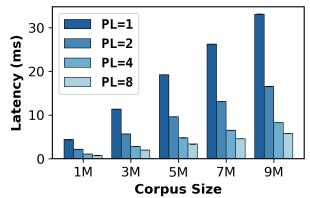  
(a) Query latency among different parallelism levels.

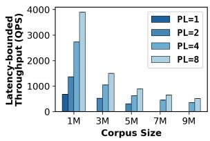  
(b) Latency-bounded throughput among different parallelism levels.

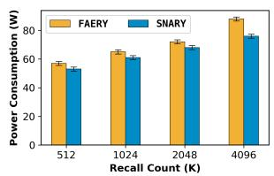  
(c) Energy consumption between FAERY and SNARY.

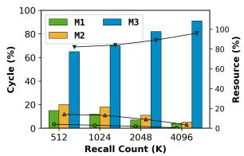  
(d) Cycle and resource allocation among modules in SNARY.  
Figure 11: The experimental results of parallel levels, Smart-NIC energy consumption and module performance analysis.

SmartNIC energy consumption. We measured the power consumption of both FAERY and SNARY implemented on identical hardware boards. Experimental results indicate no significant correlation between corpus size and power draw. As depicted in Figure 11(c), increasing Recall Count elevates system complexity, leading to corresponding increases in power consumption. Notably, SNARY demonstrates superior power efficiency compared to FAERY, attributable to its optimized Top-K module design.

Module performance analysis. We measured and analyzed the clock cycle allocation ratios and resource utilization patterns using Vitis across SNARY’s modules under varying recall counts, with detailed data presented in Figure 11(d), where corpus access, similarity calculation and Top-K module (with filter) are denoted as M1, M2 and M3, respectively. The results demonstrate that the Top-K module dominates both temporal overhead and hardware resource usage among all components. This finding underscores the critical importance of Top-K module optimization for overall system performance enhancement.

## 6 Discussion

HBM utilization. Our experiments use 2 channels to store the hash table and index table, and 1 channel for write-back operations. The remaining 29 channels can be fully utilized to store the corpus. This allows for the possibility of reading up to 7 embeddings at once when using 4 contiguous channels per embedding. From inequation 4, we know that the parallelism metric $N _ { E }$ is constrained by the recall rate γ. Under our experimental conditions, the maximum recall rate $\gamma = 1 / 2 5 0 .$ , which yields $N _ { E } \leq 6 . 1 9$ , indicating that our system can achieve parallelism of $N _ { E } = 6$ while utilizing 24 HBM channels. In more general conditions, a recall rate of less than $3 \times 1 0 ^ { - 3 }$ ensures that 7 channels can be simultaneously utilized. Therefore, our system can further reduce latency by utilizing more HBM channels for higher total bandwidth, potentially decreasing it by up to around 43%. When utilizing multiple channels, a limited corpus may result in significant vertical gaps in the HBM. To improve HBM utilization, it is possible to partition HBM vertically into multiple segments, allowing the empty sections to be used for storing additional corpora for other retrieval tasks or to hold a backup corpus for online updates. If fewer channels are used and the corpus involves various data types (such as text, images, and audio), the remaining channels can be allocated for storing multimodal data features.

Early corpus filtering. As discussed in Section 2.1, the performance of SNARY is directly correlated with corpus size, and our fuzzy search solution improves operational efficiency by reducing the corpus size. However, this still requires storing all data on the servers. Future work will focus on implementing early corpus filtering to preemptively remove irrelevant corpus portions based on user requirements or business types. This approach will store only task-related corpora on servers before initiating read operations. Such an implementation is expected to both alleviate server storage burdens and further enhance system efficiency.

Multi-card cooperation. SNARY implements batch support by instantiating multiple on-chip computing units, which will undoubtedly be limited by on-chip resources. For example, when the recall count increases, the batch size supported by the system becomes smaller, and multiple computing units may also bring wiring difficulties, slow timing convergence, and other problems. A feasible approach for higher latencybounded throughput is multi-card cooperation. This collaborative approach allows for distributing the processing load across several cards, enhancing concurrency and further optimizing performance. The integration of SmartNICs facilitates efficient and low-latency communication between multiple cards, ensuring that the data transfer necessary for batch processing occurs seamlessly and swiftly.

## 7 Related Work

Deep retrievals. Recently, many different neural models have been proposed to address semantic gap problems, which fall mainly into two categories: representation-based learning [1] and interaction-based learning [9]. For representation-based learning, many DL models (e.g., LSTM-RNN [37], ARC-I [19] and DSSM [21]) are utilized to generate semantic representations of corpus items. Interaction-based approaches learn the complex relevant patterns between the query and items via neural models, such as DRMM [16], Match-SRNN [46], MatchPyramid [38] and K-NRM [50]. SNARY utilizes the semantic representations generated by neural networks to calculate their similarity.

Hardware-accelerated retrieval systems. To improve retrieval performance, some specific hardware accelerators have been integrated into modern retrieval systems. For example, some works utilize GPUs to accelerate similarity calculation [11, 25] or CXL (compute express link) [23] to improve the corpus access. Recently, FPGAs also have been introduced to improve performance [26, 51]. SNARY mitigates the gap and enables both exact and fuzzy search, adapts an optimized Top-K algorithm and involves SmartNIC-centric deployment compared with [51].

Accelerating retrievals with ANN. Besides hardware acceleration, the community also proposes some ANN algorithms to accelerate the retrieval. For example, IVF [44] utilizes an inverted index approach to store vectors in order to reduce the number of accessed items. HNSW [32] employs a hierarchical NSW [33] index graph to conduct an approximate nearest neighbor search. PQ [24] and OPQ [13], using product quantization, reduce the computational cost of distance calculations. For SNARY, it utilizes LSH [7, 8, 45] to reduce the scale of the corpus.

Efficient Top-K algorithms. Although many efficient Top-K methods have been implemented on GPUs [40, 41], the overhead of inter-core communication still presents a bottleneck for these algorithms. [51] introduced a FIFO-based algorithm on FPGA. However, it occupies O(9K/2) memory and exhibits limited scalability with varying recall counts. [30] proposed a parallel swapping algorithm for smaller recall counts with O(K) memory. SNARY presents a strategy for implementing parallel swapping algorithms under larger recall counts while providing detailed theoretical proofs.

## 8 Conclusion

In this paper, we design and implement SNARY, a highperformance and generic retrieval system. SNARY is built upon SmartNIC and enables both exact and fuzzy retrievals. Specifically, SNARY leverages HBM on FPGAs to store a large-scale corpus. With this basis, it designs a data parallelism exact search engine and an LSH-based fuzzy search engine. To achieve high performance, SNARY further employs a parallel pipelined method to facilitate the Top-K item selection and stream the data flow of the whole system. Experimental results show that SNARY significantly outperforms the popular GPU-based solutions in both exact and fuzzy scenarios and outperforms the novel FPGA-based solutions in exact scenarios which fall short in fuzzy scenarios.

## Acknowledgments

This work is supported by the National Natural Science Foundation of China (Grant No. 62472404). Heng Pan is the corresponding author.

## References

[1] Yoshua Bengio, Aaron Courville, and Pascal Vincent. Representation learning: A review and new perspectives. IEEE transactions on pattern analysis and machine intelligence, 35(8):1798–1828, 2013.

[2] Moses S Charikar. Similarity estimation techniques from rounding algorithms. In Proceedings of the thiryfourth annual ACM symposium on Theory of computing, pages 380–388, 2002.

[3] Beidi Chen, Zichang Liu, Binghui Peng, Zhaozhuo Xu, Jonathan Lingjie Li, Tri Dao, Zhao Song, Anshumali Shrivastava, and Christopher Re. Mongoose: A learnable lsh framework for efficient neural network training. In International Conference on Learning Representations, 2020.

[4] Heng-Tze Cheng, Levent Koc, Jeremiah Harmsen, Tal Shaked, Tushar Chandra, Hrishi Aradhye, Glen Anderson, Greg Corrado, Wei Chai, Mustafa Ispir, et al. Wide & deep learning for recommender systems. In Proceedings of the 1st workshop on deep learning for recommender systems, pages 7–10, 2016.

[5] Paul Covington, Jay Adams, and Emre Sargin. Deep neural networks for youtube recommendations. In Proceedings of the 10th ACM conference on recommender systems, pages 191–198, 2016.

[6] Valerie Cross. Fuzzy information retrieval. Journal of Intelligent Information Systems, 3:29–56, 1994.

[7] Anirban Dasgupta, Ravi Kumar, and Tamás Sarlós. Fast locality-sensitive hashing. In Proceedings of the 17th ACM SIGKDD international conference on Knowledge discovery and data mining, pages 1073–1081, 2011.

[8] Mayur Datar, Nicole Immorlica, Piotr Indyk, and Vahab S Mirrokni. Locality-sensitive hashing scheme based on p-stable distributions. In Proceedings of the twentieth annual symposium on Computational geometry, pages 253–262, 2004.

[9] Suchana Datta, Debasis Ganguly, Derek Greene, and Mandar Mitra. Deep-qpp: A pairwise interaction-based deep learning model for supervised query performance prediction. In Proceedings of the Fifteenth ACM International Conference on Web Search and Data Mining, pages 201–209, 2022.

[10] Cong Fu, Chao Xiang, Changxu Wang, and Deng Cai. Fast approximate nearest neighbor search with the navigating spreading-out graph. arXiv preprint arXiv:1707.00143, 2017.

[11] Luyu Gao, Xueguang Ma, Jimmy Lin, and Jamie Callan. Tevatron: An efficient and flexible toolkit for dense retrieval. arXiv preprint arXiv:2203.05765, 2022.

[12] Weihao Gao, Xiangjun Fan, Chong Wang, Jiankai Sun, Kai Jia, Wenzhi Xiao, Ruofan Ding, Xingyan Bin, Hui Yang, and Xiaobing Liu. Deep retrieval: Learning a retrievable structure for large-scale recommendations. arXiv preprint arXiv:2007.07203, 2020.

[13] Tiezheng Ge, Kaiming He, Qifa Ke, and Jian Sun. Optimized product quantization. IEEE transactions on pattern analysis and machine intelligence, 36(4):744– 755, 2013.

[14] Kira Gor, Svetlana Cook, Denisa Bordag, Anna Chrabaszcz, and Andreas Opitz. Fuzzy lexical representations in adult second language speakers. Frontiers in Psychology, 12:732030, 2021.

[15] Mihajlo Grbovic and Haibin Cheng. Real-time personalization using embeddings for search ranking at airbnb. In Proceedings of the 24th ACM SIGKDD international conference on knowledge discovery & data mining, pages 311–320, 2018.

[16] Jiafeng Guo, Yixing Fan, Qingyao Ai, and W Bruce Croft. A deep relevance matching model for ad-hoc retrieval. In Proceedings of the 25th ACM international on conference on information and knowledge management, pages 55–64, 2016.

[17] Anshita Gupta, Sanya Bathla Taneja, Garima Malik, Sonakshi Vij, Devendra K Tayal, and Amita Jain. Slangzy: A fuzzy logic-based algorithm for english slang meaning selection. Progress in Artificial Intelligence, 8:111–121, 2019.

[18] Z. He, D. Korolija, and G. Alonso. Easynet: 100 gbps network for hls. In 2021 31st International Conference on Field-Programmable Logic and Applications (FPL), pages 197–203, Los Alamitos, CA, USA, sep 2021. IEEE Computer Society.

[19] Baotian Hu, Zhengdong Lu, Hang Li, and Qingcai Chen. Convolutional neural network architectures for matching natural language sentences. Advances in neural information processing systems, 27, 2014.

[20] Jui-Ting Huang, Ashish Sharma, Shuying Sun, Li Xia, David Zhang, Philip Pronin, Janani Padmanabhan, Giuseppe Ottaviano, and Linjun Yang. Embeddingbased retrieval in facebook search. In Proceedings of the 26th ACM SIGKDD International Conference on Knowledge Discovery & Data Mining, pages 2553– 2561, 2020.

[21] Po-Sen Huang, Xiaodong He, Jianfeng Gao, Li Deng, Alex Acero, and Larry Heck. Learning deep structured semantic models for web search using clickthrough data. In Proceedings of the 22nd ACM international conference on Information & Knowledge Management, pages 2333–2338, 2013.

[22] Amita Jain and Charu Gupta. Fuzzy logic in recommender systems. Fuzzy Logic Augmentation of Neural and Optimization Algorithms: Theoretical Aspects and Real Applications, pages 255–273, 2018.

[23] Junhyeok Jang, Hanjin Choi, Hanyeoreum Bae, Seungjun Lee, Miryeong Kwon, and Myoungsoo Jung. {CXL-ANNS}:{Software-Hardware} collaborative memory disaggregation and computation for {Billion-Scale} approximate nearest neighbor search. In 2023 USENIX Annual Technical Conference (USENIX ATC 23), pages 585–600, 2023.

[24] Herve Jegou, Matthijs Douze, and Cordelia Schmid. Product quantization for nearest neighbor search. IEEE transactions on pattern analysis and machine intelligence, 33(1):117–128, 2010.

[25] Jeff Johnson, Matthijs Douze, and Hervé Jégou. Billionscale similarity search with gpus. IEEE Transactions on Big Data, 7(3):535–547, 2019.

[26] Luyang Li, Heng Pan, Xinchen Wan, Kai Lv, Zilong Wang, Qian Zhao, Feng Ning, Qingsong Ning, Shideng Zhang, Zhenyu Li, et al. Harmonia: A unified framework for heterogeneous fpga acceleration in the cloud. In Proceedings of the 30th ACM International Conference on Architectural Support for Programming Languages and Operating Systems, Volume 2, pages 498–514, 2025.

[27] Sen Li, Fuyu Lv, Taiwei Jin, Guli Lin, Keping Yang, Xiaoyi Zeng, Xiao-Ming Wu, and Qianli Ma. Embeddingbased product retrieval in taobao search. In Proceedings of the 27th ACM SIGKDD Conference on Knowledge Discovery & Data Mining, pages 3181–3189, 2021.

[28] Xiang Li, Xiaojiang Zhou, Yao Xiao, Peihao Huang, Dayao Chen, Sheng Chen, and Yunsen Xian. Autofas: Automatic feature and architecture selection for pre-ranking system. In Proceedings of the 28th ACM SIGKDD Conference on Knowledge Discovery and Data Mining, pages 3241–3249, 2022.

[29] Shaopei Lin. Fuzzy machine learning methods. In Fuzzy-AI Model and Big Data Exploration: A Methodological Philosophy in Solving Problems in Digital Era, pages 117–172. Springer, 2022.

[30] Alec Lu, Zhenman Fang, Nazanin Farahpour, and Lesley Shannon. Chip-knn: A configurable and highperformance k-nearest neighbors accelerator on cloud

fpgas. In 2020 International Conference on Field-Programmable Technology (ICFPT), pages 139–147. IEEE, 2020.

[31] Pasi Luukka. Fuzzy similarity in multicriteria decisionmaking problem applied to supplier evaluation and selection in supply chain management. Advances in Artificial Intelligence, 2011, 2011.

[32] Yu A Malkov and Dmitry A Yashunin. Efficient and robust approximate nearest neighbor search using hierarchical navigable small world graphs. IEEE transactions on pattern analysis and machine intelligence, 42(4):824– 836, 2018.

[33] Yury Malkov, Alexander Ponomarenko, Andrey Logvinov, and Vladimir Krylov. Approximate nearest neighbor algorithm based on navigable small world graphs. Information Systems, 45:61–68, 2014.

[34] Gurmeet Singh Manku, Arvind Jain, and Anish Das Sarma. Detecting near-duplicates for web crawling. In Proceedings of the 16th international conference on World Wide Web, pages 141–150, 2007.

[35] Naoyuki Matsumoto, Koji Nakano, and Yasuaki Ito. Optimal parallel hardware k-sorter and top k-sorter, with fpga implementations. In 2015 14th International Symposium on Parallel and Distributed Computing, pages 138–147. IEEE, 2015.

[36] Priyanka Nigam, Yiwei Song, Vijai Mohan, Vihan Lakshman, Weitian Ding, Ankit Shingavi, Choon Hui Teo, Hao Gu, and Bing Yin. Semantic product search. In Proceedings of the 25th ACM SIGKDD International Conference on Knowledge Discovery & Data Mining, pages 2876–2885, 2019.

[37] Hamid Palangi, Li Deng, Yelong Shen, Jianfeng Gao, Xiaodong He, Jianshu Chen, Xinying Song, and Rabab Ward. Deep sentence embedding using long shortterm memory networks: Analysis and application to information retrieval. IEEE/ACM Transactions on Audio, Speech, and Language Processing, 24(4):694–707, 2016.

[38] Liang Pang, Yanyan Lan, Jiafeng Guo, Jun Xu, Shengxian Wan, and Xueqi Cheng. Text matching as image recognition. In Proceedings of the AAAI Conference on Artificial Intelligence, volume 30, 2016.

[39] Dong Qiu, Haihuan Jiang, and Shuqiao Chen. Fuzzy information retrieval based on continuous bag-of-words model. Symmetry, 12(2):225, 2020.

[40] Anil Shanbhag, Holger Pirk, and Samuel Madden. Efficient top-k query processing on massively parallel hardware. In Proceedings of the 2018 International Conference on Management of Data, pages 1557–1570, 2018.

[41] Jieming Shi, Renchi Yang, Tianyuan Jin, Xiaokui Xiao, and Yin Yang. Realtime top-k personalized pagerank over large graphs on gpus. Proceedings of the VLDB Endowment, 13(1):15–28, 2019.

[42] Anshumali Shrivastava and Ping Li. Asymmetric lsh (alsh) for sublinear time maximum inner product search (mips). Advances in neural information processing systems, 27, 2014.

[43] Jagendra Singh and Aditi Sharan. A new fuzzy logicbased query expansion model for efficient information retrieval using relevance feedback approach. Neural Computing and Applications, 28:2557–2580, 2017.

[44] Sivic and Zisserman. Video google: A text retrieval approach to object matching in videos. In Proceedings ninth IEEE international conference on computer vision, pages 1470–1477. IEEE, 2003.

[45] Malcolm Slaney and Michael Casey. Locality-sensitive hashing for finding nearest neighbors [lecture notes]. IEEE Signal processing magazine, 25(2):128–131, 2008.

[46] Shengxian Wan, Yanyan Lan, Jun Xu, Jiafeng Guo, Liang Pang, and Xueqi Cheng. Match-srnn: Modeling the recursive matching structure with spatial rnn. arXiv preprint arXiv:1604.04378, 2016.

[47] Jizhe Wang, Pipei Huang, Huan Zhao, Zhibo Zhang, Binqiang Zhao, and Dik Lun Lee. Billion-scale commodity embedding for e-commerce recommendation in alibaba. In Proceedings of the 24th ACM SIGKDD international conference on knowledge discovery & data mining, pages 839–848, 2018.

[48] Yan Wang, Peng Jia, Luping Liu, Cheng Huang, and Zhonglin Liu. A systematic review of fuzzing based on machine learning techniques. PloS one, 15(8):e0237749, 2020.

[49] Long Xiang, Bo Tang, and Chuan Yang. Accelerating exact inner product retrieval by cpu-gpu systems. In Proceedings of the 42nd International ACM SIGIR Conference on Research and Development in Information Retrieval, pages 1277–1280, 2019.

[50] Chenyan Xiong, Zhuyun Dai, Jamie Callan, Zhiyuan Liu, and Russell Power. End-to-end neural ad-hoc ranking with kernel pooling. In Proceedings of the 40th International ACM SIGIR conference on research and development in information retrieval, pages 55–64, 2017.

[51] Chaoliang Zeng, Layong Luo, Qingsong Ning, Yaodong Han, Yuhang Jiang, Ding Tang, Zilong Wang, Kai Chen, and Chuanxiong Guo. FAERY: An FPGA-accelerated embedding-based retrieval system. In 16th USENIX

Symposium on Operating Systems Design and Implementation (OSDI 22), pages 841–856, 2022.

## A The Theoretical Proof and Analysis

## A.1 Proof of the Correctness of Top-K Module

We now prove that the algorithm in Top-K selection module ensures the 0th position always holds the smallest value in the current Top-K array, and that the entire array can be ordered with at most $K / 2$ additional parallel cycles.

• First, when array length $K = 2 .$ , the Stage 1 swap process effectively does nothing, while Stage 2 directly compares the two values in the array and moves the smaller value to the 0th position, confirming that the algorithm works correctly.

• Next, assume that our algorithm holds for an array of length $K = k - 1$ . We now consider an array of length K = k and divide it into two parts: the 0th position and the remaining k − 1 elements, denoted as array A. It is important to note that for any pipeline cycle i, Stage 2 of cycle i and Stage 1 of cycle $( i + 1 )$ , when applied to array A, effectively perform the two rounds of parallel swaps for $K = k - 1$ . In Stage 2 of cycle i, the new score (in the 0th position) is compared and swapped with the 0th position of array A, followed by a parallel sort of array A starting from the 1st position. Stage 1 of cycle i + 1 then performs a parallel sort starting from the 0th position of array A.

Since our algorithm holds for array A with length $K = k - 1$ after Stage 1 of cycle (i + 1), the 0th position of array A contains the smallest value of array A, which means that the 1st position of the original array is the smallest value among the last (k − 1) elements. After Stage 2 of cycle (i + 1), the 0th and 1st positions of the original array are compared: if the 0th position is smaller, it remains as the minimum value, and no swap occurs; if the 0th position is larger, a swap occurs, making the 1st position the smallest value in the array. As a result, after this process, the 0th position of the original array becomes the smallest value in the entire array.

Since the array is initialized with negative infinity values at i = 0, the induction step holds, and the algorithm is proven to work for K = k in all stages.

From the above proof, it is established that in any pipeline cycle, the 0th position of the array always holds the smallest value in the entire array. At the end of the last clock cycle, we add additional K/2 clock cycles to ensure that the array becomes fully ordered. This can be guaranteed because:

• At the end of the last clock cycle, the 0th and 1st positions of the array hold the smallest and second smallest values, respectively.

• Since the swap algorithm can be applied to arrays of any length, after the i-th additional clock cycle, the smallest and second smallest values from position 2i to $( K - 1 )$ are placed in their correct positions, while the first 2i elements are already the smallest 2i values in the array, and remain unchanged.

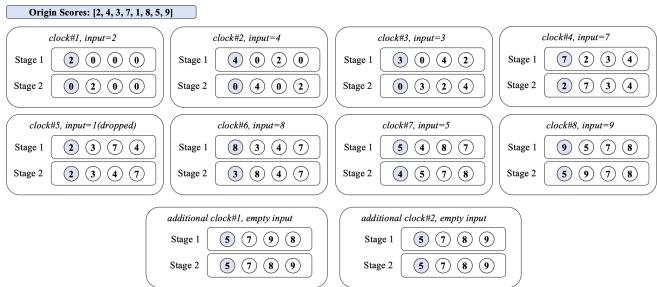  
Figure 12: A simplified operational example of the Top-K module with M=8 and K=4.

• By the end of the $K / 2$ -th additional clock cycle, the entire array is fully sorted.

We present a simplified operational example in Figure 12 with $M { = } 8$ and $K { = } 4$ (note that $M > > K$ in practice) to demonstrate the complete workflow of the Top-K module. It can be observed that the 0th array position consistently maintains the minimum value among all received inputs at every clock cycle termination. Furthermore, the array attains full ordering within at most $K / 2$ additional clock cycles.

## A.2 Analysis of the Filtering Efficiency

Assuming the total number of embeddings in the corpus is M, i.e., M scores are produced in the similarity calculation module, and the total number of scores that are dropped out by filter is $M _ { f }$ . In order to balance throughput, the total number of filtered scores must not be less than the throughput difference between the two modules, which is given by:

$$
M _ { f } \geq M - { \frac { M } { N _ { E } } } .\tag{8}
$$

Considering that the scores generated from similarity calculations are random, for the sake of simplification, let’s assume that all scores follow a random uniform distribution within a certain interval. Taking the first input data to the filter as cycle 0, the first output data of the filter and the first input data into the Top-K selection module occur at cycle 1. According to the previous analysis, we know that the first valid smallest Top-K value is produced in cycle (K + 1), and it is fed back to the filter in the next cycle. This is because it takes K cycles to fully populate the Top-K array with valid scores. In the subsequent cycles, the current smallest Top-K value based on the valid scores will be replaced. Since the filter requires receiving the valid minimum Top-K value to function properly, it will begin to operate effectively at cycle $C _ { 0 } = K + 2$ or later:

It is worth noting that the minimum Top-K value is updated every pipeline cycle. In other words, in cycle $( C _ { 0 } + i )$ , the scores input to the filter are compared with the minimum value of the Top-K value of the first $( i + K )$ scores. Since the similarity scores are uniformly random, the probability that a score enters this sequence and is ranked beyond the K-th position after reordering is the probability of being filtered. Therefore, in cycle $( C _ { 0 } + i )$ , the probability of the input score being filtered by the filter is denoted as $P ( i )$ :

$$
P ( i ) = \frac { ( i + K ) + 1 - K } { ( i + K ) + 1 } = \frac { i + 1 } { i + K + 1 } .\tag{9}
$$

In every pipeline cycle, the total number of scores input to the filter is $N _ { E }$ . Since the filter starts inputting scores at cycle 0, the last batch of inputs will arrive at cycle $( M / N _ { E } - 1 )$ , which means:

$$
i _ { \mathrm { m a x } } = M / N _ { E } - 1 - C _ { 0 } .\tag{10}
$$

According to Equation 9 and Equation 10, the total number of filtered scores can be expressed by the following equation:

$$
\begin{array} { l } { { \displaystyle M _ { f } = \sum _ { i = 0 } ^ { i _ { \mathrm { m a x } } } N _ { E } \cdot P ( i ) } } \\ { { \displaystyle \quad = M - C _ { 0 } \cdot N _ { E } - K \cdot N _ { E } \cdot \sum _ { i = 0 } ^ { i _ { \mathrm { m a x } } } \frac { 1 } { i + K + 1 } } } \end{array}\tag{11}
$$

Let $j = i + K + 1$ , we can then obtain:

$$
\begin{array} { r l r } {  { \sum _ { i = 0 } ^ { i _ { \operatorname* { m a x } } } \frac { 1 } { i + 1 + K } = \sum _ { j = K + 1 } ^ { i _ { \operatorname* { m a x } } + K + 1 } \frac { 1 } { j } } } \\ & { } & { \leq \int _ { K } ^ { i _ { \operatorname* { m a x } } + K + 1 } \frac { 1 } { x } d x } \\ & { } & { = \ln ( \frac { M } { K \cdot N _ { E } } - \frac { 2 } { K } ) . } \end{array}\tag{12}
$$

Since we have $M / N _ { E } > > 2 .$ , substituting Inequation 12 into Equation 10, we obtain:

$$
M _ { f } > M - C _ { 0 } \cdot N _ { E } - K \cdot N _ { E } \cdot \ln ( { \frac { M } { K \cdot N _ { E } } } ) .\tag{13}
$$

Therefore, to ensure the validity of Inequation 8, it is only necessary for the following inequality to be satisfied:

$$
M - K \cdot N _ { E } - 2 \cdot N _ { E } - K \cdot N _ { E } \cdot \ln ( { \frac { M } { K \cdot N _ { E } } } ) \geq M - { \frac { M } { N _ { E } } } .\tag{14}
$$

Let $\gamma = K / M$ represent the recall rate of the entire retrieval system. Substituting γ into Inequation 14, we obtain:

$$
\frac { 1 } { N _ { E } ^ { 2 } } \geq \gamma - \gamma \mathrm { l n } ( \gamma ) - \frac { 2 } { M } - \gamma \mathrm { l n } ( N _ { E } ) \geq \gamma - \gamma \mathrm { l n } ( \gamma ) ,\tag{15}
$$

which limits the maximum value of $N _ { E } .$ , demonstrating the fact that it becomes increasingly challenging to balance throughput as $N _ { E }$ increases. It is worth noting that $\gamma < 1$ , and the derivative of the inequality’s right-hand side $- \ln ( \gamma )$ is greater than 0, indicating that the right-hand side of the inequality monotonically increases as γ increases. This suggests that smaller recall values can provide a larger range of possible values for $N _ { E }$ .

The filter can handle throughput imbalance within a certain range, however, additional cache space needs to be set up to avoid losing data that is expected to enter the Top-K selection module. Within one clock cycle, the filter receives $N _ { E }$ scores, and more than one score may be greater than the current minimum value in the Top-K sequence. Therefore, these scores need to be temporarily cached and passed to the Top-K selection module in the following clock cycles. Caching scores happens in two scenarios:

• Before clock $C _ { 0 } .$ , when the current Top-K sequence has not produced the current minimum value yet, all scores need to be cached. In this case, the total number T of scores to be cached is given by:

$$
T = C _ { 0 } \cdot ( N _ { E } - 1 ) = K \cdot N _ { E } + 2 \cdot N _ { E } - K - 2 .\tag{16}
$$

• After clock $C _ { 0 }$ , there may be occasional cases where more than one score is greater than the current minimum Top-K value. The specific design of the filter adopts the following strategies: (i) If the filter currently contains scores, it will prioritize outputting scores from the filter and cache any input scores that are greater than the current minimum Top-K value. (ii) If the filter is empty, it will output the first input score that is greater than the current Top-K minimum value, and cache any other eligible input scores. (iii) If the filter is empty and all input scores are smaller than the current minimum Top-K value, it can randomly output one score to balance throughput, which will not affect the output of the Top-K selection module.