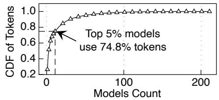
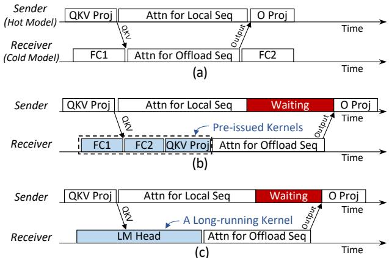
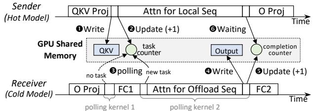
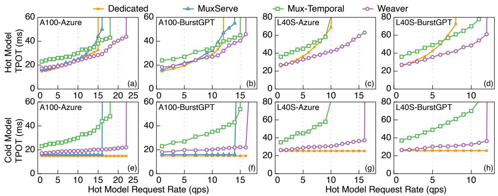
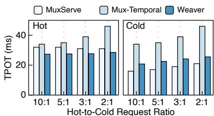
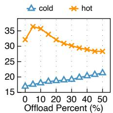
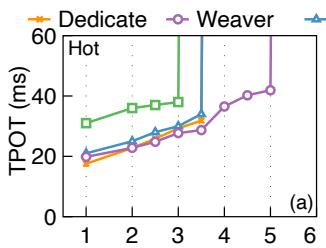
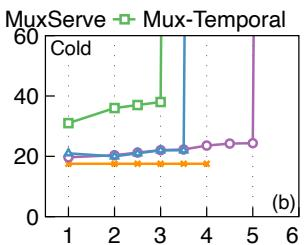
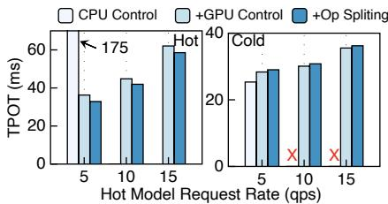
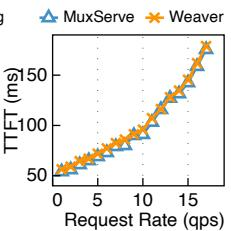

①

USENIX

THE ADVANCED COMPUTING SYSTEMS ASSOCIATION

# Weaver: Efficient Multi-LLM Serving with Attention Offloading

Shiwei Gao, Qing Wang, Shaoxun Zeng, Youyou Lu, and Jiwu Shu, Tsinghua University https://www.usenix.org/conference/atc25/presentation/gao

# This paper is included in the Proceedings of the 2025 USENIX Annual Technical Conference.

July 7–9, 2025 • Boston, MA, USA ISBN 978-1-939133-48-9

Open access to the Proceedings of the 2025 USENIX Annual Technical Conference is sponsored by

P-Lr.h £Es/sL.

auuuJl9 PgleU

King Abdullah University of

Science and Technology

# WEAVER: Efficient Multi-LLM Serving with Attention Offloading

Shiwei Gao, Qing Wang, Shaoxun Zeng, Youyou Lu and Jiwu Shu∗

Tsinghua University

## Abstract

LLM serving platforms typically provide services for tens to hundreds of different models, where a small number of hot models receive the majority of the requests, while most other models remain cold. Yet, current serving systems can not efficiently handle such workloads: Using dedicated instances for hot and cold models makes the GPU memory underutilized, and multiplexing different models with model parallelism introduces communication overhead.

We propose a mechanism called workload weaving, which offloads attention operators of hot models to running cold models, achieving high GPU memory utilization with low communication cost. To mitigate the blocking caused by running cold models, we propose WEAVER with two key techniques: (i) GPU-driven dynamic control flow, which delegates the control logic of offloading to GPUs, letting the offloaded operators bypass pending kernels in the GPU hardware queue; (ii) operator splitting, which carefully divides the large kernels of cold models into smaller ones to mitigate the head-of-line blocking. Our evaluation using real-world LLM trace demonstrates that WEAVER improves the throughput of hot models by up to 77% while maintaining the same or lower TPOT. For the cold model, WEAVER incurs a modest overhead (3-5ms).

## 1 Introduction

Large Language Models (LLMs) [1, 16, 18, 29, 30] have transformed numerous industries, leading to rapid adoption and innovation. As LLMs continue to evolve, serving platforms (e.g., Hugging Face [5], Together.ai [11]) now commonly host dozens or even hundreds of models, creating a new paradigm of multi-LLM serving. Multi-LLM serving features a skewed access pattern [17], where a small number of hot models receive the majority of requests, while most models remain rarely accessed (i.e., cold). This skewed pattern is also demonstrated by our analysis of a popular MaaS platform (§2.2).

However, through analysis and experiments, we find that existing methods can not efficiently handle the skewed workloads in multi-LLM serving (§2.3). A simple method is allocating dedicated GPU instances for hot and cold models respectively. Yet, it leads to poor GPU memory utilization for cold models due to their low request load. Another method is multiplexing, which shares GPUs between hot and cold models using model parallelism. Examples include AlpaServe [22], which employs model parallelism to share GPUs across models, and MuxServe [17], which enhances model parallelism with NVIDIA MPS [7] for improved spatial-temporal sharing. While these multiplexing methods can improve GPU utilization, they introduce non-negligible communication overhead, thus impacting overall system performance.

We observe that the inefficiency of existing multiplexing methods stems from the lack of exploiting LLM structures: they are designed for general DNN models. Motivated by it, we propose workload weaving, a mechanism that offloads a portion of attention, which are non-parameterized parts in LLMs that can be efficiently remotely executed, to GPUs running cold models. By doing so, we can allow hot models to harvest the underutilized GPU memory of cold models, enabling larger batch size and thus higher throughput. Besides, workload weaving has lower communication overhead compared to multiplexing methods.

However, making workload weaving practical is challenging. Different from offloading attention to dedicated computing devices [13, 19, 20, 23, 24], in workload weaving, the destination of attention offloading, i.e., the cold instance, is also responsible for serving its model. This makes the offloaded attention operators experience head-of-line blocking from pre-issued kernels and long-running kernels. First, existing LLM serving systems typically pre-issue hundreds of kernels to the GPU hardware queue. Therefore, when an offloaded attention operator arrives at the cold instance, it can only run on the GPU if all the pre-issued kernels are drained. Second, even if we could prioritize the execution of the offloaded attention operator, it might still be blocked when the GPU is being occupied with a long-running kernel.

We design WEAVER, a multi-LLM serving system that achieves efficient workload weaving while overcoming the above challenges. We guarantee that offloaded attention operators will wait for at most one small running kernel to finish, which ensures the efficiency of WEAVER. This is achieved by two techniques we propose:

1) GPU-driven dynamic control flow. WEAVER delegates the control logic of issuing offloaded attention operators to GPUs. Specifically, WEAVER leverages cross-GPU shared memory capabilities to dispatch offload tasks. The GPU in the cold instance continuously polls new offload tasks and executes them immediately, bypassing pre-issued kernels in the GPU hardware queue.

2) Operator splitting. WEAVER addresses the long-running kernel problem by splitting a large kernel into smaller ones, so

  
Figure 1: Model Workload Statictic of a MaaS Platform.

We evaluate WEAVER on two real-world LLM traces (Azure-Conv, BurtGPT) and two hardware platforms (A100, L40S). Our results show that WEAVER improves the throughput of hot models by up to 77% against dedicated serving and 60% against multiplexing-based methods while maintaining the same or lower TPOT. For the cold model, WEAVER incurs a modest overhead (3-5ms) on average in the TPOT compared to dedicated serving.

## 2 Background and Motivation

## 2.1 Operators in LLM Serving

Due to the unique architecture of the Transformer, the LLM serving mainly involves two types of operators: parameterized projection and non-parameterized attention.

Projection operators. These operators include fully connected feed-forward networks (FFNs) and specialized linear transformations, such as query, key, value, and output projections in the multi-head attention mechanism. As a parameterized component, they rely on a fixed set of learned parameters to process input tokens or their intermediate representations.

Attention operators. Attention operators dynamically compute relationships between input tokens to capture contextual dependencies. Unlike projection operators, the attention mechanism is non-parameterized. Therefore, the attention computation does not require model parameters, but depends on the KV tensors of previous tokens. These KV tensors are typically saved in the form of KV cache, to avoid duplicated compuation in future token generation.

## 2.2 Multi-LLM Serving

LLMs have become popular across various industries, driving innovation and adoption at an unprecedented pace. As a result, the variety of available LLMs has grown rapidly, and thus LLM serving platforms now usually host tens to hundreds of LLMs, presenting the paradigm toward multi-LLM serving.

For instance, Model-as-a-Service (MaaS) platforms, such as Hugging Face [5], Together.ai [11], and OpenRouter [9], provide services of a broad range of models, catering to users with different requirements and use cases. Even single-model providers, e.g., OpenAI [8] and Gemini [3], host a family of models with varying capabilities, model sizes, and release

<table><tr><td>Batch Size</td><td>2×Seperate (Token/s)</td><td>TP 2 (Token/s)</td><td>Slowdown</td></tr><tr><td>16</td><td>2024</td><td>1487</td><td>26.6%</td></tr><tr><td>32</td><td>3343</td><td>2645</td><td>20.9%</td></tr><tr><td>64</td><td>5392</td><td>4443</td><td>17.6%</td></tr><tr><td>128</td><td>8011</td><td>6606</td><td>17.5%</td></tr></table>

Table 1: Tensor Parallelism Overhead. The results are tests on two A100-40GB with NVLink, Llama-3-8B, input 1024, output 128. versions, enabling users to select the most appropriate model for their specific tasks: OpenAI alone provides APIs for more than 20 variants of its chat family LLMs [8].

Multi-LLM serving systems feature skewed access patterns [17]. We analyze a one-week multi-LLM serving statistic of a popular MaaS platform OpenRouter [9], which includes 209 models and more than 200 billion tokens. Figure 1 shows the CDF of request tokens: the top 5% models consume 74.8% tokens, exhibiting a skewed distribution. In other words, in multi-LLM serving, a small subset of hot models (e.g., Llama-3 or OpenAI’s latest release) receives the majority of traffic, but many models are cold and see sparse usage; they receive a low but consistent request rate most of the time.

## 2.3 Existing Methods and Limitations

By analysis and experiments, we find that existing methods can not efficiently handle workloads with mixed hot and cold models, a remarkable feature of multi-LLM serving (§2.2).

Using dedicated instances. This method uses dedicated instances for hot and cold models respectively. For example, service providers can deploy hot models on dedicated GPUs [10], while dynamically allocating GPUs for cold models (e.g., leverage serverless). However, during processing requests for cold models, the associated GPUs suffer from low GPU memory utilization. We conduct an experiment, where a hot model (15 QPS, Llama-3-8B) and a cold model (1 QPS, Llama-3-8B) run on an A100-40GB GPU each, and measure their GPU memory utilization. While the hot model already utilizes all the GPU memory, the GPU memory utilization of the cold model remains at 43%.

Multiplexing. Another method is multiplexing GPUs for cold and hot models. AlpaServe [22] uses model parallelism for statistically multiplexing GPUs for multiple models. MuxServe [17] further improves it by incorporating NVIDIA MPS [7], thus achieving flexible temporal-spatial sharing. Micro-batching causes redundant LLM weight access [14], making pipeline parallelism less efficient and less commonly used for models that can fit on a single multi-GPU node. Both MuxServe and our work mainly focus on tensor parallelism as the primary model parallelism strategy. While tensor parallelism improves the GPU utilization, it also introduces overhead caused by communication and smaller (thus less efficient) operators. In Table 1, we evaluate the token generation throughput of the Llama-3-8B model with 2 separate instances and TP degree of 2 setting on the 2× A100-40GB GPU connected with NVLink. Results show that naively using TP can introduce up to 26% overhead even on a high

  
Figure 2: Workload Weaving and Challenges. (a) Ideal case. (b) Blocked by pre-issued kernels. (c) Blocked by long-running kernels. interconnect bandwidth platform.

## 3 Approach and Challenges

Opportunity: attention offload. Attention offload is a technique that delegates attention operators to dedicated auxiliary computing devices [13,19,20,23,24], such as GPU, CPU, PIM, or CSD. The primary device (e.g., GPU) executes projection operators, and stores the sequence’s KV cache on auxiliary devices. Attention offload provides a way to offload part of the computation and storage usage of LLM inference with low communication and memory overhead, this is because 1) for each attention computation, only the QKV tensor of the latest token needs to be transmitted to the auxiliary device, 2) the auxiliary device does not need to store model parameters (recall attention operators are non-parameterized, §2.1).

Our approach: workload weaving. Inspired by attention offloading, we propose workload weaving to handle multi-LLM serving workloads and overcome limitations of existing methods (§2.3). Workload weaving harvests the unutilized GPU memory of running cold models by offloading a portion of attention operators to them, and Figure 2a shows its workflow. During inference, the sender (i.e., a GPU running hot models) transmits the QKV tensor of the offloaded sequences’s new tokens to the receiver (i.e., a GPU running hot models). The sender executes attention operators for the non-offloaded portion, while the receiver handles the offloaded portion and then returns results to the sender for final merging. The receiver also maintains the KV cache for the offloaded portion.

Workload weaving offers two advantages for multi-LLM serving. First, it can improve the throughput of hot models by utilizing the unused GPU memory of cold models, thereby enabling larger batch sizes. Second, it achieves lower communication overhead compared to model parallelism used in the multiplexing method.

## 3.1 Challenges

In the ideal case of workload weaving, the cold instance (i.e., receiver) can immediately execute the attention operators

Figure 3: GPU-driven Dynamic Control Flow. from the hot instance (i.e., sender), as shown in Figure 2a. Yet, realizing it is challenging, because the cold instance is also responsible for serving its model, making the offloaded attention operators suffer from head-of-line blocking from 1) pre-issued kernels and 2) long-running kernels.

Blocked by pre-issued kernels. In existing LLM serving systems, CPUs perform the control flow logic, mainly including issuing kernels to the GPU. They typically pre-issue many kernels to the GPU (e.g., 387 kernels per iteration of Llama-3-8B in vLLM), each representing an operator. When these kernels enter the GPU hardware queue, the GPU hardware will execute them sequentially. Therefore, when an offloaded attention operator is launched by the receiver CPU, there is no guarantee that it will be the next kernel to be executed. For example, in Figure 2b, the offloaded operator is blocked by FC2 and QKV Proj, two unexecuted but issued kernels.

Blocked by long-running kernels. Even if we can guarantee the offloaded attention operator is the next kernel to execute, it may still be blocked for a long time. This is because the receiver GPU may be executing a long-running kernel, as shown in Figure 2c. Long-running kernels are common in LLM serving: for example, the LM head of Llama-3-8B takes up to 961µs on an A100 GPU.

## 4 Design and Implementation

We propose WEAVER, a multi-LLM serving system that achieves efficient workload weaving while overcoming the associated challenges (§3.1).

WEAVER incorporates two key techniques, GPU-driven dynamic control flow(§4.1) and operator splitting (§4.2). The former delegates the control logic of attention offloading to the GPU, so that offloaded attention operators can bypass pre-issued kernels in the GPU hardware queue. The latter splits large operators into small ones using a priority-based algorithm backed by queueing theory, avoiding head-of-line blocking from a long-running kernel. Combining the two techniques, WEAVER can guarantee that offloaded attention will wait for at most one small running kernel to finish.

## 4.1 GPU-driven Dynamic Control Flow

To avoid the offloaded attention operator being blocked by pre-issued kernels, one strawman approach would be to issue kernels in a blocking manner: only when a kernel is complete, the receiver CPU will issue the next kernel (prioritize issuing the offload attention operator, if it exists). However, this approach significantly impacts the receiver GPU’s computational throughput. WEAVER proposes GPU-driven dynamic control flow to avoid the blocking problem of pre-issued kernels, while minimizing the impact on GPU performance. It delegates the control logic of issuing offloaded attention operators to the receiver GPU, and leverages cross-GPU shared memory capabilities [2, 4] for synchronization.

With GPU-driven dynamic control flow, the process of offloading an attention operator is shown in Figure 3. When the sender needs to offload an attention operator, it writes the latest token’s QKV tensor to shared memory using one-sided writes (➊), and atomically increments a task counter (➋). The receiver GPU polls the task counter (➌). Upon detecting an increment, indicating a new task, the receiver GPU executes the attention operator, then writes the result tensor to shared memory (➍), and finally increments a completion counter (➎). Once the sender realizes that the completion counter has changed (➏), it obtains the result tensor from shared memory and then continues with the subsequent computation.

All the above operations of the receiver GPU, including polling, counter updates, data transfers, and attention execution, are encapsulated in a GPU kernel, which we call polling kernel. The receiver CPU pre-issues many kernels as in today’s LLM serving systems to saturate the GPU hardware queue, but each kernel is followed by a polling kernel. In this way, the offloaded attention will only be blocked by the kernel that is executing, not other pre-issued kernels.

Of note, the updates of attention metadata (e.g., sequence page tables) are still executed on the CPU due to their complexity. These updates are infrequent (i.e., only one time per iteration) and thus do not create performance bottlenecks.

## 4.2 Operator Splitting

To avoid head-of-line blocking resulting from a long-running kernel, WEAVER introduces operator splitting. Its key idea is to split the kernel of a large operator into smaller ones, so that the offloaded attention can be executed on GPUs within a bounded time. However, it is non-trivial to generate a good splitting plan, considering that 1) the operators in LLM serving have diverse execution time, 2) excessive fragmentation due to operator splitting will induce performance overhead. To this end, we first employ queuing theory to model the sender’s wait time, then adopt a priority-based algorithm to generate the splitting plan.

Modeling. We model the receiver as a polling system [28] with two logical queues. The first queue accommodates attention operators offloaded from the sender, arriving at intervals of $M _ { i }$ time units, each requiring a service time of Ni. The second queue accommodates the receiver’s LLM operators, assumed to have an infinite backlog, with each operator requiring a service time of $T _ { i } .$ For the non-offloaded portion of the attention, the processing time in the sender is $K _ { i } .$

Our objective is to minimize the conditional expected wait time experienced by offloaded attention operatiors in the first

queue (i.e., Wi). Specifically:

$$
\operatorname* { m i n } E ( W _ { i } \cdot { \mathbf { 1 } } _ { \left\{ K _ { i } < W _ { i } + N _ { i } \right\} } )
$$

Here, the condition $K _ { i } < W _ { i } + N _ { i }$ means that: if the execution time of non-offloaded attention is less than the sum of receiver-side wait time and the execution time of offloaded attention, the sender will be blocked. To simplify the problem, we assume that the $K _ { i }$ and $N _ { i }$ remain constant (term as K and N), which can be obtained by periodic profiling. Based on statistical analysis, the completion position of each offloaded operator can be treated as a random variable uniformly distributed in [0, Ti]. Under this assumption, the wait time caused by each operator is:

$$
W _ { i } = \frac { \operatorname* { m a x } \{ T _ { i } - ( K - N ) , 0 \} ^ { 2 } } { 2 T _ { i } }
$$

The probability of an operator being at the queue head is proportional to its time density in the system. Thus, the overall objective becomes:

$$
m i n \frac { \operatorname* { m a x } \{ T _ { i } - ( K - N ) , 0 \} ^ { 2 } } { 2 \sum T _ { i } }
$$

Priority-based operator splitting. The above formulation reveals that large operators contribute quadratically to the receiver’s expected wait time. According to it, we propose a priority-based operator splitting algorithm, as described in Algorithm 1. We maintain a priority queue of all operators in the receiver and iteratively split the operator with the longest execution time into two halves. If the split operator still exceeds the (K − N), it is reinserted into the queue. This process continues until the wait time is reduced below a pre-defined threshold W $^ { \prime } T _ { t h r e s h o l d }$ (we set it to 5% of the sender’s average iteration time). With this algorithm, we can alleviate head-ofline blocking without generating many small kernels.

WEAVER executes the algorithm on the receiver-side CPU. WEAVER splits parameterized operators in the parameter dimension, and non-parameterized operators in the sequence dimension. Note that currently WEAVER fixes the proportion of offloaded attention. K and N are periodically updated via workload profiling.

## 4.3 Implementation Details

We implement WEAVER based on vLLM v0.6.0 [21]. We use the CUDA IPC for cross-GPU shared memory communication and FlashAttention [15] to execute the offloaded attention.

Request scheduling. The hot instance distributes the task of processing input sequences to itself and the cold instance, using a fixed offload ratio. After completing the prefill stage, the KV cache of each hot model’s request is randomly assigned to either the hot or cold instance, where it remains until the request is complete. Since our work focuses on developing an efficient mechanism for serving multiple models, we leave the design of a cluster-level scheduler for future work. For instance, using request rate metrics, one could dynamically adjust the offload ratio, reducing the offload ratio when the cold model’s load is high and increasing it when the load is low, to enable dynamic harvesting of cold model resources.

  
Figure 4: Average TPOT of Different Multi-LLM Serving Methods On Two Platforms with Real-world Workloads.

Algorithm 1 Priority-Based Operator Splitting.   
1: Input: Priority queue Q, which contains all operators in   
reverse order of $T _ { i } ;$ Wait time threshold W Tthreshold.   
2: Output: A queue of operators after splitting.   
3: while Estimated wait time > W Tthreshold do   
4: OPmax ← Q.front();   
5: if $T _ { \mathrm { m a x } } > K - N$ then   
6: $O P _ { 1 } , O P _ { 2 }  \mathrm { s p l i t } ( O P _ { \operatorname* { m a x } } ) ;$   
7: Q.pop();   
8: Q.push(OP1, OP2);   
9: else   
10: break   
11: return Q

KV cache management. In WEAVER, the GPU memory of the cold model’s instance holds both KV cache blocks for offloaded sequences from the hot model and ones for its own sequences. Following prior work [17], we build a unified KV block allocator that supports models with different numbers of layers and KV heads.

## 4.4 Discussion

Influence of the model size. For larger models, GPU memory, especially for the KV cache, becomes a more significant constraint, often limiting the maximum batch size. In such a situation, WEAVER allows the hot model to leverage the memory resources of the cold model’s GPU instance. This enables larger effective batch sizes for the hot model, leading to higher maximum throughput. For small language models, its benefits could be less significant. WEAVER can not speed up the FFN part of the model. For small language models and larger batch sizes, the projection part could be more dominant for the end-to-end performance. We leave the exploration of workload offloading for the FFN part as future work.

## 5 Evaluation

Workloads and test models. We evaluate our system using two widely-used LLM workload traces: BurstGPT [31] (ChatGPT-4 split) and Azure-Conv [25]. We filter out sequences exceeding 2048 tokens, since some baselines do not support running such lengths. BurstGPT represents a balanced workload, with an average input length of 575 tokens and an output length of 340 tokens. In contrast, Azure-Conv represents an input-heavy workload, with an average input length of 749 tokens and an output length of 232 tokens. All experiments use the Llama-3-8B model by default. Following prior work [21], we sample the arrival time of requests with the Poisson distribution from the above traces. Unless otherwise stated, we set the request rate of the cold model to 1 request per second and the offload ratio of WEAVER to 45%.

Baselines. We compare WEAVER to the following baselines. ➊ Dedicated Serving, which uses dedicated GPUs to serve cold and hot models respectively, each running unmodified vLLM. ➋ MuxServe [17], which supports two modes: 1) spatial-temporal multiplexing with NVIDIA MPS enabled and 2) temporary multiplexing only (i.e., Mux-Temporal). For a fair comparison with MuxServe, we do not enable CUDA Graph in WEAVER and dedicated serving. Moreover, we also replace the attention kernel of MuxServe with more efficient FlashAttention, which is the same as WEAVER.

Testbeds. We used two test platforms with different interconnect bandwidths: (i) 4× A100-40GB with NVLink; (ii) a cloud server containing 4× L40S with PCIe as the interconnect. Following popular disaggregation serving design [34], each model (hot and cold) uses the 1p1d setup. We only multiplex the workload between decoding GPUs. On the L40S testbed, we did not have root access, preventing NVIDIA MPS from being enabled. Therefore, we evaluated MuxServe using only the temporal multiplexing mode on this platform.

  
(a)

  
(b)  
Figure 5: Sensitivity Analysis (I). (a): Varying hot to cold request rate. (b): Varying the offload sequence percentage.

Metrics. Since in the evaluation WEAVER and baselines perform workload multiplexing only in the decode instance, the TTFT is out of the optimization scope of these systems (we present it in §5.3). Thus, we mainly report the TPOT (Time Per Output Token) of different models, which is crucial for the user experience.

## 5.1 Overall Performance

We evaluate the overall performance of WEAVER against baselines by varying the request rate of the hot model, ranging from low loads up to its maximum sustainable QPS (its saturation point), and respectively reporting the mean TPOT of the hot and cold model. Figure 4 shows the results.

Hot model (Figure 4a-d). WEAVER primarily aims to improve hot model performance. Compared to dedicated serving, WEAVER increases maximum throughput by up to 60%. This is because WEAVER utilizes available memory on GPUs of cold models, enabling larger batch size and thus higher throughput. At low request rates (less than 5 QPS), WEAVER shows slightly higher TPOT due to communication overhead. However, at higher request rates, WEAVER reduces the TPOT by up to 39%. When compared to multiplexing serving approaches, WEAVER achieves up to 22% higher maximum throughput for hot models on A100 GPUs. The improvement is more significant on L40S GPUs with lower interconnect bandwidth, where WEAVER achieves up to 77% higher maximum throughput, as tensor parallelism in multiplexing approaches introduces larger overhead on such platforms.

Cold model (Figure 4e-h). While improving the hot model’s throughput, WEAVER has an acceptable impact on the cold model’s performance. When load of the hot model is low, WEAVER achieves a 1.04× higher TPOT for the cold model compared to dedicated serving. Under the high load of the hot model, where more workload is offloaded, WEAVER incurs modest overhead and the TPOT increases 3-5ms on average. MuxServe shows slightly lower TPOT since it uses tensor parallelism with 2 GPUs for the cold model during inference, which comes at the cost of lower hot model throughput. Moreover, since each offloaded attention operator is small, it does not significantly interfere with the cold model’s execution. As a result, the P99 TPOT of the cold model is not influenced: for example, 19-22ms on the A100 platform, which is 1-2 ms higher than the mean case.

  
Hot Model Request Rate (qps)  
Figure 6: Sensitivity Analysis (II). Results with longer output.

Batch size and memory utilization We analyze the advantages of WEAVER in terms of memory utilization, using serving Azure-conv trace on A100 as an example. Under dedicated serving, at its maximum throughput of 15 QPS, the hot model achieves an average batch size of 118. This nearly saturates the KV cache memory of the hot GPU, reaching 88.9% utilization. In contrast, at the same QPS of 15, WEAVER significantly alleviates memory pressure on the hot GPU, reducing its KV cache utilization to 46.9%. This is achieved by actively leveraging the KV cache memory of the cold GPU, which exhibits 36.7% utilization. Furthermore, when the QPS is increased to 22, the maximum throughput supported by WEAVER, the average batch size of the hot model rises to 231. This effectively doubles the batching capacity compared to the dedicated serving approach.

## 5.2 Sensitivity Analysis

We analyze the sensitivity of WEAVER under two different configurations on the A100 platform with the BurstGPT trace. Hot-to-cold request ratio. We evaluate the WEAVER’s benefits with varying hot-to-cold request ratios, the request rate of the hot model is fixed at 10. As shown in Figure 5a, across all kinds of hot-to-cold request ratios, WEAVER shows consistently 15% lower TPOT than MuxServe and 20%-40% lower than Mux-Temporal for the hot model. For the cold model, MuxServe’s TPOT is slightly lower than WEAVER, because it uses model parallesim. The Mux-Temporal suffers more from inefficient interleaved execution caused by temporal sharing, and the TPOT of WEAVER can be 56% lower than it.

Offloaded sequence ratio. We evaluate WEAVER’s performance by varying the percentage of offloaded attention operators, with the hot model’s request rate fixed at 15. Figure 5b shows the results. The cold model’s TPOT increases almost linearly with the offload percentage, which is expected due to the proportionally increased workload. At low offload ratios (5%-10%), the hot model’s performance slightly degrades due to communication overhead. When the offload ratio increases to 50%, the hot model’s TPOT decreases by 13% while adding a 3.7ms TPOT overhead to the receiver’s processing time. Our experiments show that in our workloads, a 45% offload ratio achieves optimal hot model’s TPOT by providing a small grace period (i.e., K − N in Algorithm 1) for possible blocking caused by a single small kernel.

  
(a)

  
(b)  
Figure 7: Ablation Study. (a): Ablation of different techniques in WEAVER. (b): Ablation of different serving frameworks.

Longer output length. We further evaluate WEAVER’s performance on synthetic data featuring longer output sequences. The requests are synthesized with 512 placeholder tokens as the input and enforce the LLM to generate exactly 1024 tokens by setting max output length to 1024 and enabling ignore\_eos. Experiments were conducted on the A100 testbed, with the cold model’s QPS fixed at 1. Figure 6 presents the results. WEAVER achieves up to 42% higher max throughput compared to MuxServe. This improvement is more pronounced than observed with the Azure and BurstGPT datasets, primarily because WEAVER’s attention offloading facilitates effective workload interleaving. With extended output lengths, the batch size is limited by the KV cache size. By offloading attention computation, which constitutes a larger portion of execution time, to the cold model instance, WEAVER increases the maximum possible overall batch size, and thus enables the hot model to achieve higher throughput with the same resources. Meanwhile, since the offloaded workload is heavier, the cold model’s TPOT increases by up to 8ms than dedicated serving.

## 5.3 Ablation Study

Ablation of different techniques in WEAVER. We evaluate WEAVER’s individual optimizations using the Azure-Conv dataset on L40S GPUs. Figure 7a shows our results. In the baseline (i.e., CPU Control in the figure), the CPU performs the control flow logic, which leads to significant blocking from pre-issued kernels. This blocking delays the offloaded attention computation, resulting in a high TPOT of 175ms for the hot model. After implementing GPU-driven dynamic control flow (i.e., +GPU Control), we observe a 4.83× reduction in the sender’s TPOT, with only a minor 1.8ms increase in TPOT of the cold model due to the additional polling kernel. Adding operator splitting (i.e., +Op Spliting) further reduces the hot model’s TPOT by up to 9.5% while increasing the cold model’s TPOT by just 0.7ms. Together, these optimizations add only 2.5ms overhead to the cold model’s original TPOT, representing less than a 10% increase — a reasonable trade-off given the performance improvements for the hot model.

Ablation of different serving frameworks. We compare the

TTFT of MuxServe and WEAVER on the A100 platform, running the BurstGPT trace at various request rates. Figure 7b shows our results. The TTFT between WEAVER and MuxServe remains consistently close. The TTFT of WEAVER is slightly higher (at most 5.7%) due to more complex Python logic in our vLLM version. The results demonstrate that the performance comparison between the two frameworks is fair and the TTFT is not influenced.

## 6 Related Work

Multi-model serving. In the era of DNNs, numerous approaches have been proposed to support multi-model serving, such as TGS [33], PipeSearch [12], AlpaServe [22], MPS [7], and MIG [6], among others. They focus on achieving efficient model switching and spatio-temporal multiplexing with minimal overhead. These approaches mostly treat the model as a black box and omit the opportunity to take advantage of the model structure to serve multiple models.

For multi-LLM serving, several studies have explored scalable and efficient solutions. Llumnix [27] migrates KV cache to achieve load balancing across the LLM-serving system. The most closely related to ours is MuxServe [17], which employs tensor parallelism and leverages spatial-temporal multiplexing to concurrently serve multiple LLM requests.

Attention offloading. Prior work [13, 19, 20, 23, 24] has explored offloading attention operators in LLMs to different computing devices, including CPUs, GPUs, and PIM. LoongServe [32] speeds up inference of long sequences by splitting attention operators across multiple servers. Our work differs from these approaches: instead of using dedicated hardware, we offload attention to GPUs that are running cold models. This unique approach requires careful design to mitigate the blocking caused by the ongoing cold model serving.

## 7 Conclusion

This paper presents WEAVER, a multi-LLM serving system that introduces workload weaving to improve GPU memory utilization with low communication overhead. Our experimental results demonstrate its performance gain.

## Acknowledgements

We sincerely thank our shepherd Muhammad Bilal and anonymous reviewers for their feedback and suggestions. This work is supported by the National Natural Science Foundation of China (Grant No. U22B2023, 62472242, 62332011), Beijing Natural Science Foundation (Grant No. L242016) and the Young Elite Scientists Sponsorship Program by CAST (Grant No. 2023QNRC001).

## References

[1] ChatGPT. https://chatgpt.com/, 2024. [Website].

[2] CUDA Interprocess Communication. https://docs. nvidia.com/cuda/cuda-c-programming-guide/ #interprocess-communication, 2024. [Website].

[3] Gemini API versions explained. https://ai.google. dev/gemini-api/docs/api-versions, 2024. [Website].

[4] hipipcgetmemhandle interface reference. https: //rocm.docs.amd.com/projects/hipfort/en/ docs-5.4.1/doxygen/html/interfacehipfort\_1\_ 1hipipcgetmemhandle.html, 2024. [Website].

[5] Huggingface Serverless Inference API. https: //huggingface.co/docs/api-inference/index, 2024. [Website].

[6] NVIDIA Multi-Instance GPU. https://www.nvidia. com/en-sg/technologies/multi-instance-gpu/, 2024. [Website].

[7] Nvidia Multi-Process Service. https://docs.nvidia. com/deploy/mps/index.html, 2024. [Website].

[8] OpenAI API reference. https://platform.openai. com/docs/api-reference/chat, 2024. [Website].

[9] Openrouter: A unified interface for llms. https:// openrouter.ai/, 2024. [Website].

[10] Together AI – Dedicated models. https:// docs.together.ai/docs/dedicated-models, 2024. [Website].

[11] Together AI – The AI Acceleration Cloud. https:// www.together.ai/, 2024. [Website].

[12] Zhihao Bai, Zhen Zhang, Yibo Zhu, and Xin Jin. PipeSwitch: Fast Pipelined Context Switching for Deep Learning Applications. In 14th USENIX Symposium on Operating Systems Design and Implementation (OSDI 20), pages 499–514. USENIX Association, November 2020.

[13] Shaoyuan Chen, Yutong Lin, Mingxing Zhang, and Yongwei Wu. Efficient and Economic Large Language Model Inference with Attention Offloading, 2024.

[14] Rongxin Cheng, Yuxin Lai, Xingda Wei, Rong Chen, and Haibo Chen. Kunserve: Efficient parameter-centric memory management for llm serving, 2025.

[15] Tri Dao. FlashAttention-2: Faster Attention with Better Parallelism and Work Partitioning. In International Conference on Learning Representations (ICLR), 2024.

[16] DeepSeek-AI. Deepseek-v3 technical report, 2024.

[17] Jiangfei Duan, Runyu Lu, Haojie Duanmu, Xiuhong Li, Xingcheng ZHANG, Dahua Lin, Ion Stoica, and Hao Zhang. MuxServe: Flexible Spatial-Temporal Multiplexing for Multiple LLM Serving. In Forty-first International Conference on Machine Learning, 2024.

[18] Aaron Grattafiori, Abhimanyu Dubey, Abhinav Jauhri, Abhinav Pandey, Abhishek Kadian, and et al. The llama 3 herd of models, 2024.

[19] Jiaao He and Jidong Zhai. FastDecode: High-Throughput GPU-Efficient LLM Serving using Heterogeneous Pipelines, 2024.

[20] Xuanlin Jiang, Yang Zhou, Shiyi Cao, Ion Stoica, and Minlan Yu. NEO: Saving GPU Memory Crisis with CPU Offloading for Online LLM Inference, 2024.

[21] Woosuk Kwon, Zhuohan Li, Siyuan Zhuang, Ying Sheng, Lianmin Zheng, Cody Hao Yu, Joseph Gonzalez, Hao Zhang, and Ion Stoica. Efficient Memory Management for Large Language Model Serving with PagedAttention. In Proceedings of the 29th Symposium on Operating Systems Principles, SOSP ’23, page 611–626, New York, NY, USA, 2023. Association for Computing Machinery.

[22] Zhuohan Li, Lianmin Zheng, Yinmin Zhong, Vincent Liu, Ying Sheng, Xin Jin, Yanping Huang, Zhifeng Chen, Hao Zhang, Joseph E Gonzalez, et al. {AlpaServe}: Statistical multiplexing with model parallelism for deep learning serving. In 17th USENIX Symposium on Operating Systems Design and Implementation (OSDI 23), pages 663–679, 2023.

[23] Xiurui Pan, Endian Li, Qiao Li, Shengwen Liang, Yizhou Shan, Ke Zhou, Yingwei Luo, Xiaolin Wang, and Jie Zhang. InstInfer: In-Storage Attention Offloading for Cost-Effective Long-Context LLM Inference, 2024.

[24] Jaehyun Park, Jaewan Choi, Kwanhee Kyung, Michael Jaemin Kim, Yongsuk Kwon, Nam Sung Kim, and Jung Ho Ahn. AttAcc! Unleashing the Power of PIM for Batched Transformer-based Generative Model Inference. ASPLOS ’24, page 103–119, New York, NY, USA, 2024. Association for Computing Machinery.

[25] Pratyush Patel, Esha Choukse, Chaojie Zhang, Aashaka Shah, Íñigo Goiri, Saeed Maleki, and Ricardo Bianchini. Splitwise: Efficient generative llm inference using phase splitting, 2024.

[26] Jiwu Shu. Data Storage Architectures and Technologies. Springer Press, 2024.

[27] Biao Sun, Ziming Huang, Hanyu Zhao, Wencong Xiao, Xinyi Zhang, Yong Li, and Wei Lin. Llumnix: Dynamic Scheduling for Large Language Model Serving, 2024.

[28] Hideaki Takagi. Queuing analysis of polling models. ACM Comput. Surv., 20(1):5–28, March 1988.

[29] Gemini Team. Gemini 1.5: Unlocking multimodal understanding across millions of tokens of context, 2024.

[30] Qwen Team. Qwen2.5 technical report, 2025.

[31] Yuxin Wang, Yuhan Chen, Zeyu Li, Xueze Kang, Zhenheng Tang, Xin He, Rui Guo, Xin Wang, Qiang Wang, Amelie Chi Zhou, and Xiaowen Chu. BurstGPT: A Real-world Workload Dataset to Optimize LLM Serving Systems, 2024.

[32] Bingyang Wu, Shengyu Liu, Yinmin Zhong, Peng Sun, Xuanzhe Liu, and Xin Jin. LoongServe: Efficiently Serving Long-Context Large Language Models with Elastic Sequence Parallelism. In Proceedings of the ACM SIGOPS 30th Symposium on Operating Systems Principles, SOSP ’24, page 640–654, New York, NY, USA, 2024. Association for Computing Machinery.

[33] Bingyang Wu, Zili Zhang, Zhihao Bai, Xuanzhe Liu, and Xin Jin. Transparent GPU Sharing in Container Clouds for Deep Learning Workloads. In 20th USENIX Symposium on Networked Systems Design and Implementation (NSDI 23), pages 69–85, Boston, MA, April 2023. USENIX Association.

[34] Yinmin Zhong, Shengyu Liu, Junda Chen, Jianbo Hu, Yibo Zhu, Xuanzhe Liu, Xin Jin, and Hao Zhang. Dist-Serve: Disaggregating Prefill and Decoding for Goodputoptimized Large Language Model Serving. In 18th USENIX Symposium on Operating Systems Design and Implementation (OSDI 24), pages 193–210, Santa Clara, CA, July 2024. USENIX Association.