①

USENIX

THE ADVANCED COMPUTING SYSTEMS ASSOCIATION

# Identifying and Analyzing Pitfalls in GNN Systems

Yidong Gong, Arnab Kanti Tarafder, Saima Afrin, and Pradeep Kumar, William & Mary

https://www.usenix.org/conference/atc25/presentation/gong

# This paper is included in the Proceedings of the 2025 USENIX Annual Technical Conference.

July 7–9, 2025 • Boston, MA, USA

ISBN 978-1-939133-48-9

Open access to the Proceedings of the 2025 USENIX Annual Technical Conference is sponsored by

P-Lr.h £Es/sL.

auuuJl9 PgleU

King Abdullah University of

Science and Technology

# Identifying and Analyzing Pitfalls in GNN Systems

Yidong Gong, Arnab Kanti Tarafder, Saima Afrin, and Pradeep Kumar

William & Mary

## Abstract

Papers on recent graph neural network (GNN) systems have established a clear trend of not showing training accuracy results, and directly or indirectly relying on smaller datasets for evaluations majorly. Our in-depth analysis shows that the omission of accuracy results leads to a chain of pitfalls in the system design, implementation, framework integration, and evaluation process, questioning the practicality of many of the proposed system optimizations, and affecting conclusions, lessons learned. We analyze many GNN systems and show the fundamental impact of these pitfalls. We further develop hypotheses, recommendations, and evaluation methodologies, and provide future directions. Finally, a new prototype, GRAPHPY, is developed to show the quantitative impact of the pitfall and establish baseline memory consumption and runtime information for GNN training. GRAPHPY also establishes a new line of optimizations rooted in solving the system-design pitfalls efficiently and practically that can be productively integrated into prior works.

## 1 Introduction

In today’s data-driven applications, deep learning (DL) has gained prominence. Within this ecosystem, many real-world data can be stored as sparse matrices or graphs. To this end, graph neural network (GNN) models, e.g., GCN [33], GAT [49], GIN [58], GraphSage [20], and others [5, 67] are playing an increasingly important role. System optimizations play a critical role in improving the run-time, which has become exceedingly time-consuming even when using powerful accelerators, such as GPUs. There are several semanticpreserving GNN systems, which keep the same underlying GNN model, have proposed numerous system-level optimizations. These works can achieve up to a 15× speedup in training runtime on a single GPU [9,14,16,26,27,44,54,56,57,64,66].

In this work, we analyze such system-level optimizations from the prospect of the two most important aspects of GNN system design, implementation, and evaluation as listed next.

1) Unique need for GNN computation. Forward computation calls kernels (operations) from input layer to output layer, deriving prediction values. They are compared with ground truths to derive the loss. Backward computation uses the loss and invokes kernels from the output layer to the input layer to compute gradients and update model parameters. It accesses state-tensors, which hold results that are produced in forward computation (maybe sparse) and may require a transpose (Fig. 1a). Forward and backward computations have many design trade-offs (studied in this paper) that require careful navigation in system building, optimization, and evaluation.

2) Role of framework. The framework helps invoke and manage the forward and backward computation through computation graph that helps in invoking the right computation operation (kernel), and manages the memory. Hence, the framework code represents the overhead, while the kernel represents the actual usage of the computation device, e.g., GPU. So, a custom GNN system is likely to have a different overhead apart from different kernel performance.

We argue that the above aspects have not been understood well, leading to many system design, implementation, and evaluation pitfalls (Fig. 2). This paper, identifies these pitfalls, still unknown to the community, when building a GNN system in which individual kernel-level optimizations and the framework both play significant roles. The in-depth systematic analysis is backed by re-interpreting existing evaluation results, performing new experiments using additional methodologies, code-study, and a comprehensive prevalence study.

To this end, we make three main contributions:

a) Introducing Pitfalls. Majority of single-GPU GNN systems have established a clear trend of not measuring training accuracy [14, 24, 26, 27, 29, 32, 35, 52, 54, 56, 57, 60, 64–66], while a few [14, 27] do not even implement backward computation. Our measurements show abnormal accuracy in many GNN systems published in the top-tier systems conferences. Our investigation confirms system design pitfalls and numerous significant implementation issues in those systems.

Further, our novel analysis on framework-runtime overhead reveals that training speedup on smaller datasets is primarily due to low framework overhead and not by individual kernel and system optimizations (claimed). Unfortunately, many prior works concluded better training time largely or exclusively using smaller datasets as they report frequent out-of-memory (OOM) in popular baselines of PyTorch-Geometric [12] (PyG) and DGL [53] during peer comparison. Moreover, mini-batching and sampling-based GNNs [20] always produce smaller graphs for training.

Lastly, memory consumption measurement by our methodology shows that DGL, an almost universally and many times the only used baseline, suffers from framework-memory overhead pitfall. Its internal memory management leads to around

13 GB of additional GPU memory usage in a well-known open-source dataset, which is majorly responsible for its huge memory consumption and OOM. This has allowed memorysaving works to report highly inflated memory saving by using DGL as the only baseline; we question their analysis of the baseline and reported gain in memory saving.

We note that these pitfalls are not measurement oversight or software bugs as they create serious flaws in requirement understanding, system design, implementation, and evaluation, solving which reinforces the need to correctness tests alongside performance results, and for detailed analysis across the stack to identify changes in resources use in the evaluation process and critical system design thinking.

b) Impact Analysis and Hypothesis. We aim to increase awareness of the existence of these flaws by answering: why do such pitfalls occur despite the best intentions of the researchers and community (Hypothesis); and what are the major implications of these pitfalls in current GNN systems (Impact). They are important as these pitfalls have led to a compromised system design and implementation, misunderstanding of design trade-offs, inflated performance gain, and affecting other aspects of GNN workflow: wrong conclusions, improper lessons learned, and hindering the adoption of these research advances. Such pitfalls also stifle innovations as a correct system is unlikely to outperform such works.

c) Recommendation, Future Direction, and a Reference System. We address how to ensure future works do not suffer from similar pitfalls (Recommendation) and outline directions to further tackle these issues, specifically framework overhead establishes a new area of research and draws an analogy to Operating Systems research for future direction.

To help make these recommendations concrete, we introduce GRAPHPY, a prototype GNN system that: a) quantitatively shows the impact of these pitfalls, demonstrating the significance of identifying these issues and highlighting the extent of overstated results they cause; b) establishes baseline memory consumption and runtime to advance future research by protecting them from inflated gains; c) offers practical design choices to address a few pitfalls, which can be productively integrated into prior works.

The proposed system designs enable data-locality along with correct exploitation of dataset symmetry that can be used by almost all GNN systems, thereby GRAPHPY opens a new territory of system optimizations rooted in solving system design pitfalls. This simple design establishes many components of GRAPHPY as the state-of-the-art design.

Evaluations are done throughout the paper to show that pitfalls exist. They show that pitfalls in these systems lead to not fully representative performance results, and many are even slower than the same baseline on mid-size datasets (§7). GRAPHPY reduces memory consumption on average by 6.92×, 3.4×, and 1.96× and achieves on average 1.69×, 1.22×, 2.20× training runtime speedup, respectively, for GCN, GIN, and GAT-1 models over DGL. Further, GRAPHPY can train GCN on a billion-edge graph on a GPU due to its memory-efficient design and removal of framework-memory pitfall, while DGL cannot train even a 500 million-edge graph, highlighting inefficiencies in existing baselines.

Using GRAPHPY as a baseline against a recent work of dgNN [66], a kernel-fusion based system, shows that the latter is slower by 1.48× on training time while providing only 6.4% average memory saving for GAT. This brings critical discussion on trade-offs in kernel-fusion, so far not known to the community.

The remainder of the paper is organized as follows. §2 presents the prevalence analysis and scope, while §3 provides background and an overview. §4 and §5 discuss two categories of pitfalls, §6 outlines future directions and introduces our proposed prototype, GRAPHPY, while evaluations are done in §7. §8 reviews related works on similar papers that present pitfalls in other domains, and we finally conclude in §9.

## 2 Prevalence Analysis and Scope

The paper focuses on single-GPU GNN systems by analyzing over 20 systems [4, 9, 12, 14, 25–27, 29, 32, 35, 47, 50, 53, 54, 56, 57,59, 60,64, 66] in depth in the last 5 years. Most of these are GNN training systems and were published in top systems conferences, such as OSDI, ASPLOS, ATC, MLSys, EuroSys, SC, IPDPS, HPDC, PPoPP, etc., to avoid being termed as cherry-picking. We note the following important points:

• The paper is not related to reproduction issues. We indeed can successfully reproduce similar results using their artifact description and evaluation (AE) documents. We sincerely appreciate the authors’ efforts in providing such comprehensive documentation and their help through emails; it would have been impossible to build this work without them.

• The paper is based on our interpretation of published results, which we reproduced, and additional evaluations that we performed on accuracy, framework overhead, and kernel run-time through newer methods. We confirm the observations through a code study. It may be possible that our extensive search may have missed a paper which do not suffer from pitfalls. However, that does not solve the case that the studied pitfalls are prevalent. It is essential to note that not all GNN papers succumb to every pitfall, and the paper does not seek to cast blame on all techniques proposed by prior works.

• We have discussed with the authors of GNN systems having pitfalls over email/teleconference/face-to-face to avoid misunderstandings or potential conflicts regarding the paper. Overall, we received positive and encouraging feedback. Supplementary material (appendix) shows code analysis and discussion, while we open-sourced GRAPHPY and other artifacts for healthy discussions1.

• Single-GPU systems are foundational because their performance and memory consumption form the basis for other settings. Additionally, with the increase in memory size in modern GPUs and the advent of numerous memory-saving techniques, such as lower precision and quantization [8, 19, 23, 28], gradient check-pointing and/or re-computation [66], kernel fusion [57, 66], better mini-batching plus sampling [50] have allowed a GPU to train larger datasets. Hence, our analysis and corresponding evaluation methodologies emphasize single-GPU systems to establish the right foundation and methods first. We then briefly extend one pitfall of framework runtime overhead to multi-GPU systems [6, 7, 15, 30, 40, 46, 48, 52, 52, 55, 61, 62, 68, 69].

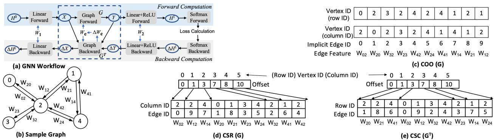  
Fig. 1: (a) A GNN layer: X, Y, and We (edge-level tensor, e.g., attention score in GAT) are state tensors, which are generated in the forward pass and then retained for use in backward computation. G is a sparse matrix, and $G ^ { T }$ its transpose. (b) Sample graph/sparse matrix (c, d, and e) CSR, CSC, and COO formats along with edge ID indirection used in DGL where consecutive edge ID is used in COO, so CSR and CSC store explicit edge ID arrays (discussed in §5.2).

## 3 Background and Overview

Storage Formats. In a graph G = (V, E), V and E refer to the vertex/row set and the edges/non-zero elements (NZE), respectively. We continue to use both the graph and sparse linear algebra terminologies. Specifically, features and computation are referred to as vertex-level and edge-level, while rows, columns, and non-zero elements refer to datasets. Fig. 1 shows a sample graph and its storage formats.

The coordinate list (COO) format stores two arrays of rows and columns where a row and column pair indicates one NZE (or edge) of the graph. Kindly note its implicit edge ID array in the figure, which shows the format is not sorted by row ID. DGL uses COO in this way. The compressed sparse row (CSR) format stores NZE in a row sequentially and uses the offset array to point to the start of the row. For a directed graph, its transpose is also stored, called compressed sparse column (CSC) format, which stores the columns consecutively. The degree of a row is the row length. The CSR and CSC formats also show edge ID arrays that DGL introduces due to its specific COO format layout, and are discussed later.

## 3.1 Taxonomy on GNN Kernels and Models

Sparse Kernels: The sparse kernels used in GNN models can be broadly classified into two types [53]: SpMM (sparse matrix dense matrix multiplication) and SDDMM (sampled dense dense matrix multiplication) and their variants.

We first focus on two SpMM (Y ← AX) variants, namely, weighted (SpMMve) and unweighted (SpMMv) versions. In the former, edges contain a weight requiring an edge-level tensor (We) of size |E|, which can only be interpreted using the graph topology. The unweighted version assumes 1.0 as edge weight, so storing We is unnecessary. Kindly note that X and Y are vertex-level tensors as their size is $| V | \times | F |$ , where |F | is feature-length of each vertex.

Backward Computation and Transpose of Sparse Matrix. For SpMMve (Y ← AX), its backward computation needs to include both transposed SpMMve $( \delta X  A ^ { T } \delta Y )$ and SDDMM $( \delta W _ { e } \gets A \odot ( X ^ { T } \triangle Y ) )$ , where δ represents gradients of the tensors. We denote transposed SpMMve as $\bar { \boldsymbol { S } } \boldsymbol { p } \boldsymbol { M } \boldsymbol { M } \boldsymbol { \nu } \boldsymbol { e } ^ { T }$ . The sparse matrix (A) itself can be viewed as two parts: the static part(the graph topology) and the dynamic part(the edge-level state tensor $W _ { e } )$ . More details are in §4.1.2.

SDDMM kernel $( \delta W _ { e } \gets A \odot ( X ^ { T } \triangle Y ) )$ generates an edgelevel tensor (δWe) from two vertex-level tensors read using graph topology to perform dot product and their reduction.

The degree-norm is a graph-based normalization kernel that divides vertex-level tensors by the corresponding vertex degrees to stabilize GNN training and mitigate the influence of high-degree nodes. GNN systems usually implement degreenorm along with SpMM and SDDMM.

Two Classes of GNN Models: In this work, we broadly divide the GNN models into two classes for their in-depth analysis.

• Class A (Attention-Based GNNs): Vertex-Level + Edge-Level Tensors. Example models include GAT and GaAN [49,67], etc., that learn edge-level attention scores. The attention score represents the importance of neighboring nodes during training. The edge-level tensors encode trainable attention scores derived from graph vertices using trainable parameters. As a result, this class employs SpMM (weighted) and SDDMM kernels, involving both vertex-level and edge-level tensors, making the computation more complex.

• Class B (Non-Attention-Based GNNs): Vertex-Level Tensors Only. This GNN class does not employ dynamic attention scores. Notable examples include GCN [33] and GIN [58]. These models use unweighted SpMM, relying solely on vertex-level tensors since no attention mechanism is involved. Hence, it does not employ SD-DMM kernels. Further, it usually deploys degree-norm kernels. Thus, this GNN class significantly differs from class A GNNs.

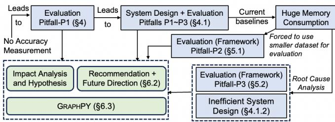  
Fig. 2: The complex relationship between pitfalls and our recommendation. GRAPHPY prototype helps quantify the impact of the pitfalls while providing some practical and deployable solutions to a few pitfalls.

## 3.2 Overview of Pitfalls

This paper unveils many GNN system related pitfalls. Fig. 2 shows a high-level overview of various pitfalls and their relations. It categorizes them into two main evaluation-related types, which leads to many system design and frameworklevel pitfalls. A brief overview is discussed next.

Accuracy Related Evaluation Pitfalls (EVAL-P1, §4). This category of pitfalls is due to not reporting the achieved training accuracy by prior works on the semantic preserved models. Our evaluations show abnormal accuracy. Prevalence studies and detailed code analyses unearth several underlying system design (SYS-\*) pitfalls (§4.1.1, §4.1.2, §4.1.3, §4.1.4) that directly cause or exacerbate these evaluation inaccuracies, but end up providing runtime speedup.

Framework Related Evaluation Pitfalls (EVAL-P2 and EVAL-P3, §5). The framework refers to the Python and C++ integration code that integrates individual computational kernels (written in CUDA) to deep learning platforms such as PyTorch, TensorFlow, etc., where the latter manages the computation graph and memory.

When training runtime is evaluated using small datasets, the measured time primarily reflects framework-runtime overhead rather than actual time spent on the GPU. We show that different systems differ in framework overhead, while the usage of smaller datasets for evaluation is universal, such as in sampling-based GNNs that produce a smaller sampled graph to train the model on a GPU. We further observe excessive memory consumption by framework integration-related inefficiencies in DGL [53], a popular GNN baseline, which remain unknown to the community. This has caused inflated results on memory-saving techniques and often forces runtime evaluations to be conducted on small-sized datasets due to frequent out-of-memory (OOM) errors on mid-sized datasets.

After identifying these pitfalls, we present recommendations and future directions (§6.2), and propose a baseline system, called GRAPHPY (§6.3), that helps in quantitatively demonstrating the impact of these pitfalls (§7) and outlines design solutions that can be integrated in prior pitfall infested systems to overcome a few pitfalls.

## 4 EVAL-P1: Lack of Accuracy Measurement

Introduction and Prevalence Study. Several GNN systems have established a clear trend to not report training accuracy in their papers. [14, 24, 26, 27, 29, 32, 35, 51, 52, 54, 56, 57, 60, 64–66] Fig. 3 shows that many papers with which we experimented exhibit abnormal accuracy. DGL accuracy is for reference. All experiments are run on an Nvidia A100 GPU. Datasets and other details are presented in §7.

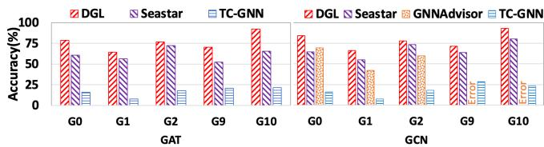  
Fig. 3: Accuracy comparison: TC-GNN does not provide GAT, hence AGNN is substituted here as both are attention-based (Class A GNN). We also discuss other works in the text. DGL is for reference.

Class A GNN. Seastar [57] has 4.5% – 26.9% accuracy drop, while TC-GNN [56] has very low accuracy on all datasets for GAT. FuseGNN [9] GAT shows NaN during training on Reddit and could achieve only 58% accuracy, way below DGL’s 92.4%. Huang et al. [27], and TLPGNN [14] are not measured as they do not implement backward computation. GNNAdvisor has not implemented GAT.

Class B GNN. GCN training accuracy in TC-GNN is abnormally low. Seastar accuracy drops by 4.5% - 19.8%. GN-NAdvisor [54] drops by 14.8% – 24%. Also, GNNAdvisor throws a memory corruption error for Reddit and OGBNproducts, which is also reported by others [14]. Huang et al and TLPGNN do not have backward computation implemented. Ge-SpMM [26], which does not report accuracy, could not be run due to major code reorganization in DGL to which it was integrated. Featgraph [25], which is integrated into DGL, we could not install it correctly despite help from its authors and trying several GitHub branches though it did report accuracy on Reddit. Except for DGL, only PyG and FuseGNN have normal accuracy on GCN.

Fundamental Problem or Evaluation Oversight? Significant accuracy drop is not an evaluation oversight, as these systems usually aim for the semantic-preserving model, the same model as the baseline (DGL in this case), with changes being tailored for their system optimizations. §4.1 analyzes these systems to show that the lack of accuracy evaluation has allowed many fundamental issues in design, implementation, and analysis to persist.

## 4.1 Misunderstood Backward Computation

Our analysis for drop in accuracy is attributed to insufficient inclusion both of the backward computation and of its impact on the opportunities to optimize the forward pass. Indeed, backward computations are complex as they often enforce the saving of state tensors during forward computation, introduce transpose requirements, and can be computed in an order determined by the computation order in forward computation. Thus one can find runtime performance-enhancing bugs in their wrongly designed system. We also note that correct baselines deploy inefficient designs despite the availability of efficient choices. The next few sub-sections present these system design and implementation pitfalls.

## 4.1.1 SYS-P1: Omitted State Tensor

Definition and Example. Many forward-computationfocused optimizations fuse kernels to optimize the performance of their forward computation, while neglecting state tensor requirements because the backward computation is not implemented. The backward computation of any operator needs to access the state-tensor– the input and/or output tensors of the corresponding forward operator. The requirement to materialize state tensors is not limited to sparse operations; other commonly used operations, e.g., ReLU, Dropout, etc., also require storing state tensors. Such tensors must be saved during forward computation for use during backward computation, or recomputed during the backward computation.

Huang et al. [27] and TLPGNN [14] prototyped one giant fused forward kernel that fused many sparse kernels along with other operations, such as ReLU, etc. TLPGNN omits the materialization of the attention scores in GAT, which are edge-level state tensors. Similarly, both skip materializing state tensors for ReLU, which are essential for correct gradient computation during backpropagation. It is important to emphasize that both works aim to optimize GNN training, not inference, and therefore are not evaluated in the context of inference performance.

Fundamental Issues. The performance gain claimed by aggressively fusing operations in a forward-only computation does not hold if one attempts to fix this pitfall by properly materializing or recomputing the state tensors. Doing so introduces additional steps that lead to performance degradation, invalidating the originally reported speedups. For example, recomputation of state-tensors [66] itself requires saving some other tensors as state-tensors during forward computation, which is used during backward computation to recompute the actual state-tensor(s). This saving and re-computation procedure leads to additional slowdown, meaning that the claimed speedup is not practical, even if the fused kernel optimizations are technically sound.

## 4.1.2 SYS-P2: Regarding Sparse Matrix Transpose

Definition and Examples. Backward SpMM computation (δX ← AT δY ) requires the transpose of A. The sparse matrix (A) itself can be viewed as two parts: the static part (the graph topology) and the dynamic part (the trainable and generated edge-level state-tensor We). Though one can pre-process the graph to keep the transpose of the topology, the generated We requires a transpose at run-time. We is never symmetric, even if the sparse matrix (graph topology) is symmetric, due to the GNN model design. This sub-section discusses the absence and efficiency of transpose in prior works, as cuSPARSE already provides a high-performing native SpMMT .

• SYS-P2-1: No Transpose. Many works [14, 27] don’t implement backward computation by ignoring this problem, TC-GNN [56] substitutes forward SpMM in place of backward SpMM for its attention-based GNN. Kindly note that the popular GNN benchmarking datasets are square sparse matrices, so not performing a transpose doesn’t lead to a dimension mismatch, hence it cannot be caught during compilation/runtime unless accuracy is measured. Thus, they also gain non-practical performance.

• SYS-P2-2: Omitting comparison with a Key Baseline of cuSPARSE SpMMT . Many systems developed additional mechanisms for transpose even when relying on cuSPARSE. However, they completely ignore the fact that cuSPARSE natively offers SpMMT without performing the explicit transpose of A. Our measurements (Fig. 10) show that SpMMT by cuSPARSE is still the fastest. Thus, this pitfall allowed many sub-optimal system designs to dominate the GNN solutions. Even worse, as we explain next, such additional mechanisms introduce additional memory consumption. We first analyze DGL for its memory-intensive SpMMT approach, followed by alternate mechanisms. This also serves as an understudy for our reference system (§6.3).

DGL. To support SpMMT , DGL relies on edge ID abstraction in graph storage. Each edge in the DGL graph is assigned a unique numerical identifier in the range of [0, |E|). Its allocation is determined by its COO format (used for SDDMM implementation): the offset of each edge in COO is its implicit edge ID (see Fig. 1c). However, the order of edges in DGL’s COO (i.e., storage layout) is determined by the dataset file or parsing module which is often performed by the user (external factor), and hence its COO is neither stored in CSR-style (rows are laid out consecutively) nor in CSC-style (columns are laid out consecutively). In such cases, both CSR and CSC contain an explicit array of edge IDs (Fig. 1(d) and 1(e)).

DGL introduces eShuffle, an internal GPU kernel, that rearranges the input edge-level tensors using the edge ID array of CSR and CSC to generate a new edge-level tensor for SpMMve and SpMMveT respectively so that DGL can use the same SpMM API of cuSPARSE after eShuffle. The eShuffle kernel slows down performance by 64% of cuSPARSE SpMM on Reddit (§7) on both forward and backward, hence it is very costly. So any system integrated into DGL suffers from similar issues, but an independently developed system can get additional performance benefits if it does not perform transpose, while forward-focused systems automatically gain 64% speedup without any optimization.

Memory consumption in DGL for storage formats is $2 | V | +$ 6|E| due to CSR $\begin{array} { r } { ( | V | + | E | + | E | ) , \mathbf { C S C } \left( | V | + | E | + | E | \right) } \end{array}$ , and COO (|2E|) irrespective of GNN models. Due to eShuffle, DGL also consumes an additional |E| memory.

PyG and MariusGNN. PyG implements SpMM and SpMMT by materializing dot products of size $| E | \times | F |$ using GPU global memory before performing reduction in its original design of using the COO format. Hence, PyG exhibits OOM more frequently, as it cannot run on an A100 GPU with 40GB of memory, and this issue has been reported by prior works [9, 27]. However, cuSPARSE does offer an efficient SpMM and $S p M M ^ { T }$ on COO, which is not used. Lately, PyG uses CSR without materializing dot products on GCN, however, GAT (which uses $\mathrm { S p M M v e / S p M M v e } ^ { T } )$ ) still materializes them. MariusGNN uses a PyG-like solution using CSR format, i.e., it materializes the dot products in GPU global memory. This mechanism is slower than native cuSPARSE APIs (§7.1).

Other Mechanisms. Seastar and FeatGraph also rely on edge ID indirection for GAT in both the forward and backward computations. FuseGNN relies on cusparseCsr2cscEx2() API (which transposes the topology and edge-level tensor) plus their custom forward SpMM to implement SpMMT . The cusparseCsr2cscEx2() API is slower by 130% of cuSPARSE SpMM on Reddit, thus, this mechanism is even more costly. Fundamental Issues? Dropping the transpose requirement $( A ^ { T } )$ in $\mathbf { S p M M } ^ { T }$ provides GNN systems with unfair performance gain; while introducing an inefficient solution by ignoring the key baseline of cuSPARSE leads to no progress to the state-of-the-art in basic kernel design of $S p M M ^ { T }$ (§7.1). Both of these issues are fundamental from a research perspective.

## 4.1.3 SYS-P3:Incorrect Order of Backward Operations

A few works that attempt kernel fusion in the forward computation do not order their backward operation correctly, which leads to better performance at the expense of wrong training. Definition and Example. The backward operations, as the name suggests, invoke the kernels in the reverse order to the forward operations. For example, if operator A is called first followed by operator B, then the backward computation first needs to call the backward of operator B followed by the backward of operator A. However when the operators A and B are fused in forward, their backward requires a different custom fused kernel to take care of the ordering.

For example, GNNAdvisor [54] fuses the SpMM and degree-norm operators during the forward. However, its backward computation did not reverse the order. For Seastar [57] in GCN, the accuracy drop is similar to GNNAdvisor. This is because Seastar relies on a lambda function specification for fused forward SpMM and degree-norm in the forward() API of the GCN layer to generate CUDA code. The generated code always calls degree-norm after SpMM. We suspect that code-generation logic may not be intelligent enough to generate correct backward fusion.

Fundamental Issues? An independent degree-norm fetches the degree of every row, thus occurring |V | data load. It can easily be fused with forward SpMM, as degree-norm usually happens on the output tensor of SpMM. However, during backward, it should be called on the input tensor of the SpMM. Hence, a correct fusion during backward computation needs to fetch the degree of column ID of every NZE, thereby performing |E| data load fetch. Hence, a wrongly fused kernel gains performance due to less data load and computation.

## 4.1.4 SYS-Others: Additional Pitfalls

The following additional errors have been observed in GCN: no model bias parameter in GNNAdvisor, Huang, et al [27], and TLPGNN in their GCN; and absence of bias and degreenorm array in TC-GNN in its GCN. In DGL, the bias parameter is enabled by default, while performing degree-norm operation. In GAT, no dropout layer is there in the fused GAT model of Seastar, TLPGNN, and Huang et al., introducing which requires complex changes to their backend due to the fusion. Huang et al use the same allocated memory to keep the attention score for every model layer without recomputation. TC-GNN does not implement SpMM and SDDMM kernels with odd dimensions of feature-length needed in the last layer of GCN and AGNN models, yet its training script calls these kernels with those feature lengths. These errors indicate design and evaluation issues.

## 4.2 Discussion and Hypothesis

The accuracy evaluation is effort-intensive exercise due to various compilation, installation, and usage issues that are common with academic prototypes. Additional supporting software has since changed substantially, like deprecated APIs. Many systems rely on generated features and labels, while each system has its own way of loading the dataset, which takes time to understand and modify to read from the labeled dataset. Hence we limited accuracy evaluation to top-tier conferences only. Further, our goal is to be fully sure when we report abnormal accuracy. It is possible that other systems that did not show accuracy may be correct, but will not solve the pitfall as future works may continue to make erroneous decisions if accuracy is not measured.

Hypothesis: Automatic Backward Computation. We hypothesize that the complex differences between forward and backward computations in the DL frameworks’ abstraction could be a reason: the model and layer definitions only explain the forward computation, while the backward code is invoked automatically for each forward operation and remains hidden from the usual code walk-through, but depends on the output of the forward pass. Hence, without correctness evaluation, it is hard to get the implementation right. Such pitfalls are independent of hardware settings, though we only analyzed the code of single-GPU GNN systems.

## 5 Framework Overhead + Evaluation Pitfalls

Introduction and Prevalence Study. Many prior works showed frequent OOM on popular baselines (DGL and PyG) thereby almost all single-GPU GNN training systems [4,9,14,24,26,32,47,47,53,54,56,57,59,63,64,66] have exclusively or majorly relied on smaller datasets to conclude better training runtime. E.g., GNNAdvisor, Ge-SpMM, TC-GNN, and others [4, 24] relied exclusively on smaller datasets for training runtime comparison. FuseGNN [9], dgNN [66], and Seastar used only one mid-size dataset(Reddit), while the remainder are smaller datasets. However, many have shown OOM on this mid-size dataset for some DGL models.

Though sampling-based GNN [29,31,36,37,43,50,62–64] evaluates large datasets, it should be noted that they sample only a batch of vertices of the dataset in each iteration to generate a smaller graph to run training/inference. Hence, the resultant sampled graph is small on which training is run.

Fundamental Problem or Evaluation Oversight? As discussed earlier (§3.2), framework implies Python and C++ code to glue the individual kernel to PyTorch (or Tensor-Flow, etc.) that runs CPU in a GPU-based system. We show (§5.1) that training runtime on smaller graphs is dominated by the framework runtime overhead in GPU-based systems. So, the training speedup in such cases is due to the lower framework overhead (unknowingly) instead of better kernel runtime (claimed). This invalidates the analysis done by prior system evaluations on this metric. Further, the framework design has become a major reason for OOM in DGL (§5.2), introducing framework memory overhead which is very large compared to memory consumption due to inefficient GNN design(§4.1.2). As DGL has been a universal baseline, it has affected almost every GNN system evaluation because prior works reported highly inflated memory saving, frequent OOM in DGL, and better training runtime on smaller datasets.

This section analyzes the role of the framework– the runtime and memory overhead– to show that we have not fully understood the fundamental role of the framework in GNN system building. To illustrate these facts, the next few subsections run new evaluations using a novel methodology and analyze the source of different frameworks in DGL versus other systems. We use an Nvidia A100 GPU. Datasets and other details are the same as in §7.

## 5.1 EVAL-P2: Framework Runtime Overhead

We define the training time as the total wall-clock time to finish the training. Kindly note that prior works do not include data transfer time, if any, as part of training time measurement in a GPU-only setting [14, 25–27, 54, 56, 57, 66].

The framework-runtime overhead is defined by Eq. (1): sum of the time consumed by the CPU in a GPU-only training system without counting the time spent on waiting for GPU, if any. Hence, the source of the overheads is roughly Python/C++ code execution in the CPU, including the cost of kernel launches, which is usually asynchronous to the CPU.

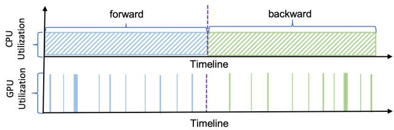  
Fig. 4: Illustration of CPU and GPU activity timeline during a GCN training iteration on DGL on the Cora dataset, clearly showing the GPU idle time where framework overhead executes exclusively on CPU. This illustration is a simplified version of the profiler output.

$$
O v e r h e a d = \sum _ { k } ( C P U T i m e - C P U W a i t F o r G P U T i m e )\tag{1}
$$

Challenges and Approach. The overhead is a problem only if it can not completely be overlapped by GPU execution, i.e., significant GPU idle time between kernel executions is a problem where only overhead is executing (in CPU).

A naive method to gather this information is to observe it from the timeline view of execution, e.g., using the Nsight tool, as shown in a simplified Fig. 4 for one training iteration. As shown, the CPU remains consistently active throughout the training iteration, whereas the GPU experiences frequent idle periods. This indicates that the GPU is underutilized, leading to CPU-side overheads (framework runtime overhead) dominating the overall training time. However, the process is manual and error-prone, takes a huge amount of human effort, and must be repeated for all combinations of GNN systems, models, and datasets– a gigantic task nonetheless.

In light of these observations, our approach is to collect the runtimes: training (TT), overhead (OT), and GPU execution (GT). OT(%) identifies the overhead percentage compared to training time, while 100 – GT(%) is the percentage time where overhead is executed exclusively and is the metric of interest.

## 5.1.1 Measurement and Analysis

Fig. 5 shows the overhead during DGL GCN training for different-sized graphs. a) Framework overhead is 100% for up to 4 million edges: reduction in framework overhead would automatically improve training runtime, while any GPU runtime improvement or slight slowdown would bear no consequence to training runtime. E.g., the GPU runtime is only around 25% at 1 Million edge, implying almost 75% overhead is not overlapped with GPU. The overhead (close to 100%) is almost the training time. b) Up to 32 million edges: idle GPU time (100 - GT(%)) remains significant where overhead is executed alone, thus playing a major role in training time. c) Only when the graph size becomes large, e.g., in Reddit (around 229 million edges, not plotted) DGL framework overhead is only 5.42% while the GPU runtime is close to 100%, resulting in almost no GPU idle time, implying no role of overhead in training time.

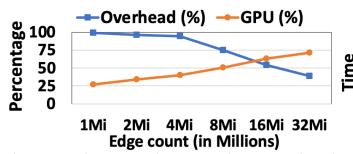

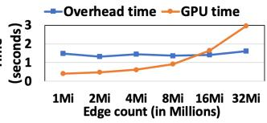  
Fig. 5: DGL framework-runtime overhead when training GCN (200 iterations) on graphs $\scriptstyle ( | V | = 3 2 , 7 6 8 )$ . Left: framework overhead is 100% of training time when edge-count is < 4 Million. Right: Overhead remains similar irrespective of the edge count.

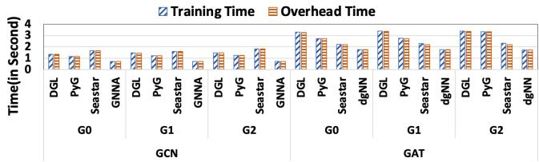  
Fig. 6: Training and framework runtime overhead for DGL, PyG, GNNAdvisor (GNNA), and dgNN for GNN models training for 200 epochs. Seastar also has almost 100% overhead for these datasets.

Fig. 6 shows that the overall training time is dominated by the framework overhead when evaluated for multiple GNN models across three widely used small datasets: Cora, Pubmed, and Citeseer; all have less than 100k edges.

Overhead varies in different systems due to Python/C++ code differences. In DGL, its generic Python-based message passing infrastructure, and conversion of PyTorch tensor to DLPack tensor to DGL-specific tensor are a few things that allow it to be extensible, supporting PyTorch, Tensorflow, MxNet, etc., but all of them are framework overheads. Systems that develop GNN from scratch hardly rely on the DGL front-end. E.g., GNNAdvisor has lowered its overhead mostly due to no implementation of message passing, removing bias parameters in its GCN layers, and using C++ to write GNN layers instead of Python to lower framework overhead.

Systems integrated into DGL, e.g., GE-SpMM [26] (not shown in Fig. 6), which replaced DGL with its sparse kernels, have not shown performance gain in their paper for GCN for smaller datasets on which it relied exclusively, despite showing better SpMM kernel time than cuSPARSE. However, it attributes this observation to the number of prediction classes not being a multiple of 32 without providing any evidence.

## 5.1.2 Measurement on Sampling-based GNN Systems

We now focus on a 3-layer GraphSage model with a batch size of 256 and fan-out as [10, 10, 10], which produces three sampled graphs, one for each GraphSage layer. In Reddit and OGBN-Products, our measurements show that the maximum edge count in the sampled graph is always less than 0.45 million in DGL, which is very small (see Fig. 5). Hence, further measurements indicate a close to 100% overhead for training on these two datasets. For example, the actual training procedure took around 48 seconds in the OGBN-Products dataset for 10 epochs (1 epoch has 768 iterations). The total overhead was almost 100%.

When doing the same measurement in MariusGNN [50], the training time improved to around 22 seconds but still had close to 100% overhead. Even for the paper100M dataset, one of the largest datasets used in sampled GNN training, the generated sampled graph has between 13k–2M edges [50], which is small enough as per Fig. 5.

GraphSage uses GCN for training on sampled graphs. So, we conclude that the framework overhead dominates training time in sample-based GNN systems. In other words, GPU kernels play no significant role in training time in this case.

## 5.1.3 Hypothesis and Discussion

GNNs are primarily impacted by framework runtime overhead because their computation cost is proportional to the batch size, as the trainable parameters are not large. $\mathrm { E . g . }$ in GCN and GraphSage, the trainable weights are of size $| F _ { i n p u t } | \times | F _ { o u t p u t } |$ (plus bias), which are usually small. The computationally significant computations in these models are GeMM (matrix-matrix multiplication) and SpMM. GeMM depends on batch size and feature-length, while SpMM depends on graph size and feature-length. Both are lightweight in powerful GPUs for smaller graphs.

To this end, multi-GPU training time on sampling-based GNN is also impacted by the overhead, as we measured DGL on up to a 4-GPU single-node system using the dataparallel method. The data-parallel GNN training divides the mini-batches among GPUs while replicating the model. Partitioning mini-batches causes an even smaller mini-batch size per GPU, but replicating the model forces the replication of the same framework overhead to each GPU. This results in lesser computation per GPU, leading to large GPU idle time (100-GT(%)) where the framework overhead runs exclusively. Moreover, the network communication time is insignificant in GNN as it only communicates (in bulk) the gradients of trainable parameters, whose count is small as discussed above.

Indeed, any other model where a small batch size makes computation lightweight will likely suffer from the same framework runtime overhead. Exploring those models remains out of the scope of this paper due to the focus on GNN. A few additional examples are presented in the appendix.

More importantly, as GPU performance continues to improve, kernel execution will be faster, but the CPU overhead runtime would remain almost similar (single-threaded execution). Hence, it would lead to comparatively large framework overhead (100 - GT(%)) for the problems discussed in the paper. This trend suggests that the performance issues discussed in this paper would be even more critical in the future as increasingly powerful GPUs are adopted. Hence, we believe that relying on the specific GPU (Nvidia A100) did not significantly influence our observations.

## 5.2 EVAL-P3: Framework Memory Overhead

Many papers have shown frequent OOM on slightly older GPUs for mid-size datasets on PyG and DGL, which is aligned with our measurement. However, the excessive memory consumption has forced prior GNN systems to heavily or even exclusively rely on smaller datasets for comparing training runtime leading to EVAL-P1 (§5.1). We have described OOM for PyG in §4.1.2. This subsection explores the role of the framework for large memory consumption in DGL.

Observation. GCN training consumes 23.2GB of GPU memory (Fig. 16(a)) on the Reddit dataset. Our code-study in DGL GCN locates these inefficiencies: a) storage cost (§4.1.2); and b) to implement SpMMv in GCN, DGL uses a dummy edge-level tensor (|E| additional memory) with each value as 1.0 to use cuSPARSE, which offers only SpMMve API.

However, these known memory inefficiencies aren’t the primary reason, as an |E| and |V | memory implies only around 875 MB and 1 MB in Reddit, respectively. PyTorch memory profiler results attributed the largest memory to torch :: empty(), a memory allocator API, without providing any higher-level information.

Methodology. To develop insights, we evaluate memory consumption at storage format, kernel, and iteration levels. 1) For DGL’s SpMM kernel-level memory analysis, we printed the memory usage right before and after its call on Reddit (|F|=32) and found a massive 12,982 MB memory consumption. However, our direct evaluation of cuSPARSE SpMM shows only around 936 MB consumption. 2) DGL SDDMM kernel consumed exactly 936 MB of memory.

A simple estimate also shows 936 MB as the actual memory consumption for both sparse kernels. SpMM includes the input tensors (vertex-level tensor and edge-level tensor: $\left| V \right| \times \left| F \right| + \left| E \right| )$ and the output tensor (vertex-level tensor: $| V | \times | F | )$ . The scratchpad memory for cuSPARSE SpMM is tiny, while SDDMM does not need it. Thus, we note that DGL introduces a framework memory overhead of around 12,046 MB (12,982 - 936) in SpMM, as known memory consumption cannot account for it. Another DGL version also introduced a 6,340 MB of memory overhead in SpMM, thus confirming that it is not a version-specific problem.

DGL SpMM uses a PyTorch Python API to allocate memory for the input and output tensors of sparse kernels but SpMM scratchpad memory allocation is performed internally in the back-end that uses a different mechanism. Specifically, DGL’s usage of DLPack tensor makes its back-end independent of PyTorch. So the back-end brings PyTorch through non-standard integration and uses its C/C++ API for this allocation. This non-standard integration of PyTorch is the reason for the memory overhead, as the PyTorch profiler pointed to allocation routine torch :: empty() as the largest memory consumer while SDDMM has neither any internal allocation nor memory overhead.

The novelty of our method lies in the flexible granularity of measuring memory consumption to locate issues. A kernellevel granularity has shown issues with non-standard PyTorch integration. When we changed the granularity to an iteration level, we noticed a memory leak in dgNN (§7.2.3). PyTorch profiler alone is not sufficient in either case.

## 6 Future Direction and GRAPHPY

Pitfalls presented in §4 and §5 have renewed our understanding of system design and implementation for GNN models and the role of the framework respectively. Hence, the natural progression is awareness of the impact of these pitfalls on research progress and human resource development (§6.1), and overcoming them collaboratively through recommendations, future research direction (§6.2), and a prototype to quantitatively measure the impact (§6.3).

## 6.1 Additional Impacts

We presented the impact of the pitfalls when discussing them, including questionable or inflated speedup in runtime and memory saving. Here we present some high-level impacts.

Extensive and Wider Effect. A GNN system with lower training accuracy due to pitfalls impacts inference when deployed. Framework overhead impacts almost every sampling-based GNN system. Moreover, as DGL extends the same design to its multi-GPU setting, and is a widely used system as a baseline and even for system integration [15, 25, 26, 57], it has impacted almost every GNN system in their evaluation analysis due to the framework overheads.

Stifling Innovations. A new system with valid optimization may not outperform pitfall-infested works without committing similar or other pitfalls unless one characterizes the issues prevalent in prior works in their research paper, leaving them with less space to describe their contributions. Hence, if the community is unaware of them, genuine progress in system optimization may not happen.

Inadequate Training to Future Leaders. The discussed pitfalls indicate questionable research practices [41]; otherwise, they would not have open-sourced their code. These issues indicate that senior researchers are not dedicating enough time to review trainees’ deliverables or teach them appropriate research methods [2].

## 6.2 Recommendation and Future Direction

Measuring training accuracy is the most important feedback for the correctness, and hence should be enforced or must be reasoned on why it is not needed (Recommendation #1).

Performance Runtime Related. Smaller datasets alone cannot be used to conclude a better runtime if the system is not specifically designed and rightly evaluated for such cases (Recommendation #2), such as by treating the framework runtime overhead as a primary metric. For non-sampled GNN, if available labeled datasets are not of mid-size or larger, we recommend relying on datasets through generation tools [17, 18] and other graph repositories [42,45] for training runtime comparison (Recommendation #3).

Framework runtime overhead presents a new area of research, analogous to Operating Systems. E.g., when we zoom into one kernel operation, it is becoming faster due to powerful GPUs, better algorithms, and other innovations such as quantization, pruning, sampling, etc. At the same time, framework overhead is like a system call overhead, which remains constant and understudied, and runs in a single CPU core. Thus, the DL framework is more like an Operating System to allow hardware usage without introducing much overhead like the system calls. Thus, the future lies in studying those overheads (Future Works #1).

Lastly, the systems with no backward implementation or accuracy issues risk being sidelined for evaluations by future works, as some pitfalls can only be addressed via invasive efforts. A systematic approach is a standardized system benchmarking tool. Such work remains a work in progress (Future-Work #2). Till then, directly evaluating kernel runtime can be a stop-gap solution (Recommendation #4) for non-sampled based GNN works, to not discard their advances in basic kernel design (SpMM and SDDMM). This is impossible if prior works have only fused kernels with pitfalls.

Memory Consumption Related. Frequent OOM and memory consumption should be analyzed (Recommendation #5) like runtime with the same zeal (as we do in §5.2) without any pre-assumption while attributing memory saving quantitatively. Otherwise, we will continue to have highly inflated results. For GNN systems with non-standard integration, additional verification of memory consumption is needed.

## 6.3 GRAPHPY Design

Quantitative demonstration of the impacts of the pitfalls remains an open challenge, specifically to claim that the progress of the state-of-the-art has been compromised as they have allowed inefficient design to be declared better. Such analysis requires a new prototype where various pitfallinfested design choices could be evaluated quantitatively using ablation studies and controlled experiments. This motivates GRAPHPY, the proposed prototype.

By design, GRAPHPY mostly imitates DGL and manually fixes pitfalls by removing DGL’s: a) framework-memory overhead, a) message passing, c) inefficient design of using eShuffle in forward computation, and d) avoiding dummy edge-level tensor in SpMMv. The design choices let us evaluate framework-level and GNN system design pitfalls while establishing baseline memory consumption as discussed next.

## 6.3.1 Framework-Level Design

GRAPHPY removes framework-memory overhead by following PyTorch plugin documentation rather than using the DGL style of non-standard PyTorch integration (§5.2). Hence, all memories are allocated using Pytorch APIs imported using the standard integration.

Removal of message passing is achieved by directly relying on basic sparse kernels of SpMM and SDDMM, as both are equivalent. Message passing APIs are mapped to sparse kernels anyway by DGL. Hence, GRAPHPY does not lose anything from it but minimizes the framework overhead. Hence, when we keep the same kernel as the one used by DGL, it allows us to evaluate framework-level pitfalls.

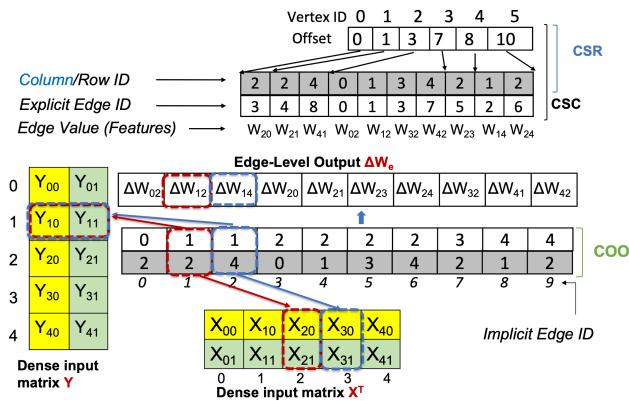  
Fig. 7: GRAPHPY storage format for sample graph (Fig. 1b): The CSR format is assigned the implicit edge IDs. The COO is then generated from it, which enables caching of Y data in SDDMM. There is only one copy of the grayed array representing the Column ID array, which is shared among COO, CSR, and CSC. The Offset array is shared between CSR and CSC. The edge ID array is for CSC only.

## 6.3.2 GNN Kernel Design

In the forward computation, GRAPHPY substitutes DGL’s eShuffle+SpMM with only SpMM. The removal of eShuffle is achieved by fine-tuning the storage format: GRAPHPY assigns an implicit edge ID to its CSR format by treating edge position as edge ID. In contrast, DGL assigns an implicit edge ID to its randomly ordered COO (§4.1.2). An implicit edge ID array in CSR, as shown in Fig. 7, makes the eShuffle in forward computation a no-op, hence, it is removed. Kindly note that CSC needs an explicit edge ID array, as shown in the figure. However, both share the storage structure due to dataset symmetry, which is achieved by storing the graph edges in both directions as an enrichment process, which almost all prior GNN systems do.

GRAPHPY then generates COO from the CSR (CSR-way): edges are stored in row-major as shown in Fig. 7. In comparison, DGL generated CSR from the randomly ordered COO. Our design choice allows the column ID array to be shared between the CSR and COO, while the COO also gets an implicit edge ID array.

In the backward computation, GRAPHPY implements SpMMT either as eShuffle+SpMM or using cuSPARSEnative SpMMT . We implement both for comparison. However, we implement eShuffle+SpMM as one kernel because eShuffle is an intermediate kernel whose output is used by SpMM only. This saves the memory of eShuffle output (|E|). Thus, it becomes almost a drop-in replacement for cuSPARSE-native SpMMT and is not a GNN kernel fusion technique.

Another advantage of eShuffle removal from forward is an automatic data-locality/caching enabled in SDDMM (on CSR-way COO), which is implemented as edge-parallel as in DGL. For example, when a warp processes two edges, such as (0,5) and (0,10), the features of source vertex 0, fetched during the first edge, can be reused when processing the latter,

Table 1: Dataset details. \* indicates labeled dataset. Others use 150 generated features (|F|) and 7 prediction classes (|C|).
<table><tr><td>Graph</td><td>Vertex</td><td>Edge</td><td>|F|</td><td>|C|</td></tr><tr><td>Dataset Name</td><td>Count</td><td>Count</td><td></td><td></td></tr><tr><td>Cora(GO)*</td><td>2,708 3,327</td><td>10,858 9,104</td><td>1,433 3,703</td><td>7 6</td></tr><tr><td>Citeseer(G1)* Pubmed(G2)*</td><td>19,717</td><td>88,648</td><td>500</td><td>3</td></tr><tr><td>Amazon(G3)</td><td>400,727</td><td>6,400,880</td><td>150</td><td>7</td></tr><tr><td>As-Skitter(G4)</td><td>1,696,415</td><td>22,190,596</td><td>150</td><td>7</td></tr><tr><td>Cit-Patent(G5)</td><td>3,774,768</td><td>33,037,894</td><td>150</td><td>7</td></tr><tr><td>Stackoverflow(G6)</td><td>2,601,977</td><td>95,806,532</td><td>150</td><td>7</td></tr><tr><td>Hollywood(G7)</td><td>1,069,127</td><td>112,613,308</td><td>150</td><td>7</td></tr><tr><td>LiveJournal(G8)</td><td>4,847,571</td><td>137,987,546</td><td>150</td><td>7</td></tr><tr><td>OGBN-Products(G9)*</td><td>2,449,029</td><td>123,718,280</td><td>100</td><td>47</td></tr><tr><td>Reddit(G10)*</td><td>232.965</td><td>229,231,784</td><td>602</td><td>41</td></tr><tr><td>Orkut(G11)</td><td>3,072.627</td><td>234,370,166</td><td>150</td><td>7</td></tr><tr><td>UK-2002(G12)</td><td>18,520,486</td><td>596,227,524</td><td>150</td><td>7</td></tr><tr><td>Kron-25(G13)</td><td>33,554,432</td><td>1,073,741,824</td><td>150</td><td>7</td></tr></table>

as it would automatically be cached in the hardware cache.   
DGL’s randomly ordered COO has no such advantage.

SpMMv is implemented using cuSPARSE SpMMve, which uses a dummy edge-level tensor like DGL, while we also provide a native SpMMv that does not use a dummy edgelevel tensor. This enables benchmarking of the slowdown caused by the dummy edge-level tensor. Kindly note that backward SpMMv requires the transpose of the topology only due to the absence of edge weights. Hence, SpMMvT is always SpMMv on CSC. We have an in-place degree-norm.

In total, the format costs in GRAPHPY is only $| V | + 3 | E |$ where CSR/CSC needs (|V | + |E|) + COO (|E|) + Edge ID array (|E|) in CSC for class A GNN. For GCN, GRAPHPY need only CSR $( | V | + | E | )$ .

GRAPHPY provides additional advantages. a) Its practical design choices are deployable to address a few pitfalls, thereby influencing a large number of existing systems. b) It protects future works from showing inflated gains, otherwise, they might continue to rely on current inefficient baselines or other pitfall-manifested systems for benchmarking, leading to compromised evaluations.

## 7 Experiments

The datasets are listed in Table 1. Only Cora, Pubmed, Citeseer, Reddit, and OGBN-Products datasets are labeled. The first three datasets are referred to as small. We use an Nvidia A100 GPU (40GB memory) and CUDA version 11.3. We focus on node classification using GCN, GIN, and GAT (with 1 and 3 heads implying edge feature length). In GCN and GAT, the intermediate feature length is 16, which implies that GAT-3 has 48 as the feature-length for each vertex. For GIN, the intermediate vertex feature length is 64. The feature lengths have been set based on the code of the original model paper, thus covering various feature lengths.

We used DGL version 1.1.0 throughout the paper. We also compare against Ge-Spmm [26], GNNAdvisor [54], Huang et al [27], FeatGraph [25], TC-GNN [56] and MariusGNN [50]. PyG runs out of memory on Reddit and OGBN-Products, so it is not benchmarked. We use dgNN [66] as a case study to understand the true impact of its kernel fusion and memorysaving techniques (§7.2.3) in the presence of no framework memory overhead and correctly designed SpMMT .

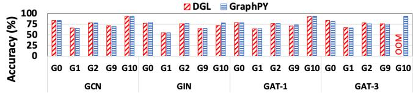  
Fig. 8: Accuracy measure of GRAPHPY and DGL. Other systems have accuracy issues(§4, Fig. 3).

Accuracy Check Before Comparison. Fig. 8 shows the accuracy of GRAPHPY compared to DGL to show that GRAPHPY has normal accuracy. Thus, GRAPHPY can be used for other evaluations to show the impact of pitfalls in later sections.

## 7.1 GNN System Design Pitfalls Evaluations

Fig. 9 shows that the simple design changes have brought large speedup benefits to GRAPHPY over DGL. For the Reddit dataset, GRAPHPY achieves around 2.30× speedup for GCN, 1.36× for GIN, and 2.37× for GAT-1 over DGL. For GAT-3, DGL resulted in OOM. Smaller datasets are plotted later in Fig. 17 to discuss framework overhead. This subsection discusses the reason behind the speedup by focusing on kernel evaluations. We also discuss the impact of system design pitfalls on accuracy and runtime using the GRAPHPY prototype and other systems.

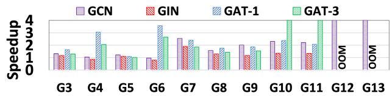  
Fig. 9: GRAPHPY speedup over DGL for GNN training time (200 iterations). A speedup of 4 means that only DGL has OOM. OOM means that both DGL and GRAPHPY have OOM. (Higher is better.)

## 7.1.1 SpMMveT and eShuffle: Quantitative Analysis

Fig. 10 plots the execution time of the SpMMveT kernel. The SpMMveT is natively implemented by cuSPARSE, but DGL used eShuffle+cuSPARSE SpMMve as a substitute (§4.1.2).

a) SYS-P2: DGL’s eShuffle+SpMMve is 1.64× slower than the cuSPARSE-native SpMMveT API. Worse, DGL also used eShuffle during forward computation, further contributing to the slowdown. FeatGraph also performs slower as it focuses only on forward SpMM, and not in $S p M M ^ { T }$ . As it is integrated into DGL, it would suffer DGL’s eShuffle issues.

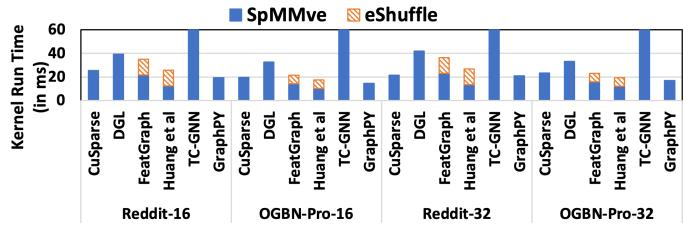  
Fig. 10: $\mathbf { S p M M v e } ^ { T }$ kernel time for 16 and 32 features. TC-GNN is very slow and has been clipped. (Lower is better.)

b) EVAL-P2: TC-GNN uses SpMMve in its backward computation instead of $\mathbf { S p M M v e } ^ { T }$ . Despite this advantage, its kernel is slower by over 3× and 54× on OGBN-Products and Reddit, respectively, for feature-length 32. Because it relies on fine-grained tiling to use tensor core, which does not suit the unstructured sparsity of mid-size graph datasets. This result demonstrates that exclusively focusing on smaller datasets (EVAL-P2) by TC-GNN leads to misleading conclusions.

c) SYS-P1: Huang et al. do not implement backward computation (SYS-P1), so we add our eShuffle time to their SpMMve time to simulate SpMMveT . Other mechanisms, such as cusparseCsr2cscEx2() API, are not considered as it is almost 2× more costly than eShuffle. Its performance over cuSPARSE SpMMveT is not noticeable and is slower in some cases.

d) GRAPHPY’s Fused eShuffle+SpMMve is a state-of-theart SpMMveT solution as it achieves 31.97×, 1.60×, 1.27×, and 1.24× speedup compared to TC-GNN, FeatGraph, cuS-PARSE, and Huang et al., respectively. Kindly note that GRAPHPY is a vanilla vertex-parallel SpMMve, which is slower than the SpMMve of Huang et al due to the latter’s custom format and workload-balanced design. Despite that, GRAPHPY SpMMveT outperforms it and others.

e) GRAPHPY’s SDDMM is state of the art. Focusing on designing transposed SpMM has indirectly allowed GRAPHPY to gain huge performance in SDDMM due to the data-locality (§6.3). Fig. 11 shows that GRAPHPY achieves 2.99× speedup over DGL SDDMM. Both systems use edge-level parallelism on GPUs using the COO format, but GRAPHPY’s COO is stored in a CSR-way (row-major) while DGL’s COO is randomly laid out. Many other GNN systems do not have a separate SDDMM. FeatGraph does provide SDDMM, but its idea has been merged with DGL. cuSPARSE is very slow [64], which we have also observed, and hence has not been plotted. We compare against dgNN SDDMM in §7.2.3. However, the fact is that GRAPHPY achieved a huge performance with just a small change in DGL’s COO to make it a CSR-way COO.

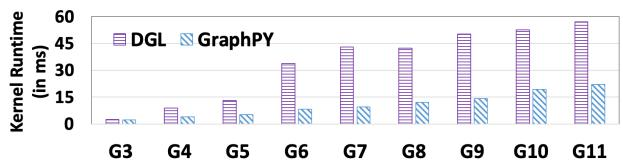  
Fig. 11: SDDMM kernel runtime for DGL and GRAPHPY for feature-length 32. Both are edge-parallel. (Lower is better.)

f) SYS-P2-2: Fig. 12 shows that substituting SpMMT with SpMMve leads to achieving an average of 1.34×, a notable training runtime speedup, for two widely used midsize datasets, when GRAPHPY is used as an underlying system. Further, this pitfall also corrupts the training accuracy (Fig. 13) by 26.8%, 16.1%, 18%, 15.63%, and 11.96% in G0

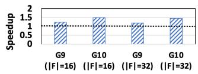

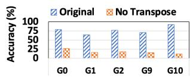  
Fig. 12: Omitting the transpose operation (§4.1.2) from GAT backward computation wrongly leads to faster training.  
Fig. 13: Removing the transpose operation in GAT backward computation drops training accuracy.

## – G2, G9, and G10 respectively.

In summary, DGL’s performance slowdown is marred by bad design choices despite having easier options. Other systems suffer from various other pitfalls affecting their performance or accuracy, However, the takeaway is that a simple format change has allowed GRAPHPY to achieve state-ofthe-art performance. This change is very practical to easily integrate into other systems to either gain performance or implement SpMMveT to fix their system.

## 7.1.2 SpMMv and Dummy Edge-Level Tensor

A similar analysis for SpMMv is plotted in Fig. 14. We use cuSPARSE as the baseline.

a) EVAL-P2: TC-GNN and MariusGNN (both published in 2023) are the slowest systems. TC-GNN is slower by 3.07× and 38.67× on OGBN-Products and Reddit, respectively, over cuSPARSE. MariusGNN, a sampling-based GNN system, is 6.18× and 9.71× slower, respectively, due to the materialization of dot products in the GPU global memory (§4.1.2). GNNAdvisor is also slower (1.20×) than cuSPARSE despite using a workload-balanced technique, and is 1.98× slower than the workload-imbalanced solution of Ge-SpMM, even though it uses its caching design. Unfortunately, it materializes the dot products in GPU shared memory, leading to lower performance. As they have specifically mentioned their kernel design to be a reason for better performance, they got impacted by EVAL-P2 (evaluation on smaller datasets only).

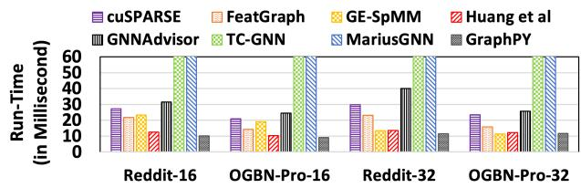  
Fig. 14: SpMMv kernel time: TC-GNN and MariusGNN runtime have been clipped.(Lower is better.)

b) Dummy edge-level Tensor: cuSPARSE and Huang et al provide SpMMv using their SpMMve + dummy edge-level tensor with each value as 1.0, which incurs additional dataload. Hence, Huang et al (despite a workload-balanced solution) still perform similarly to SpMMv of the workloadimbalanced solution of Ge-SpMM. We believe it could have made a greater impact had it implemented a native SpMMv.

c) GRAPHPY’s vanilla vertex-parallel SpMMv is better than all prior works, e.g., it outperforms workload-balanced GNNAdvisor’s SpMMv by 2.87×, outperforms MariusGNN and TC-GNN SpMMv by 14.89× and 56.99× respectively. The reason for its better performance is purely poor design decisions of prior works as discussed above.

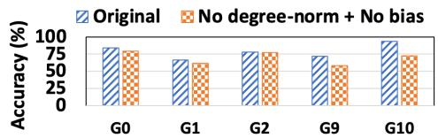  
Fig. 15: Removing the degree-norm and bias operation in GCN leads to a large accuracy drop in mid-size datasets. (Higher is better.)

## 7.1.3 Removal of Degree-Norm and Bias Parameter

Fig. 15 shows accuracy drop of 5.1%, 4.4%, 0.7%, 13.1%, and 20.9% in G0, G1, G2, G9, and G10 datasets, respectively, when eliminating the degree-norm and bias parameter for the GCN model. Larger datasets have a larger drop in accuracy. This confirms that such system design issues lower accuracy.

## 7.2 Framework Level Pitfalls Evaluation

This section focuses on both the framework overheads: runtime and memory. We then use dgNN to discuss the trade-off of its kernel fusion and memory-saving techniques.

## 7.2.1 Framework-Memory Overhead Impact

Fig. 16 shows that GRAPHPY reduces memory consumption on average by 6.92× on GCN, 3.4× on GIN, and 1.96× on GAT-1 over DGL. We exclude results for G3–G8 as the focus is to study OOM behavior, though we observe a similar pattern for those datasets. On Reddit (G10), GRAPHPY (DGL) consumes only 2.1GB (23.2GB), 4.0GB (23.7GB), 13.3GB (30.3GB), and 30.9GB(OOM) on GCN, GIN, GAT-1, and GAT-3, respectively.

GRAPHPY provides over 20GB of memory saving in GCN for Reddit over DGL. The memory benefit of GRAPHPY is first due to the removal of framework-memory overhead in DGL (§5.2), while other techniques, such as better storage format, removal of dummy edge-level tensor in GCN SpMMv, removal of eShuffle kernel in GAT SpMMve to save the memory of an edge-level tensor, etc., provide true savings.

The true memory consumption allows GRAPHPY to train GCN on a billion-edge graph (G13: Kron-25), a first on single-GPU, consuming 29.8 GB only, while DGL cannot even run a graph with around half a billion edges (G12: UK-2002), showing the inefficiencies in DGL.

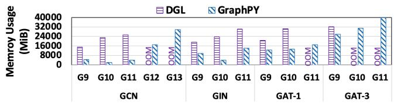  
Fig. 16: Memory consumption comparison. OOM=out-of-memory. (Lower is better.)

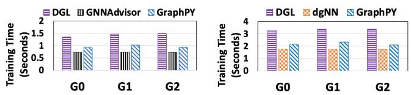  
Fig. 17: Training runtime on smaller datasets. Left: GCN Right: GAT. (Lower is better.)

## 7.2.2 Framework-Runtime Overhead Impact

Fig. 17 shows training runtime on smaller datasets to focus on runtime overhead. We first notice that GRAPHPY performed much better than DGL when GRAPHPY used the cuSPARSE kernel, same as DGL except for the removal of the message passing. Kindly note that GRAPHPY performed the same irrespective of using cuSPARSE-based SpMM or its vanilla vertex-parallel SpMM (not plotted). Both observations align with our framework-runtime overhead analysis (§5.1).

We also compare with GNNAdvisor and dgNN. The former moved a lot of Python code to C++ (it also has removed bias and performs degree-norm wrongly in the backward). At the same time, the latter uses kernel fusion, resulting in a smaller Python/C++ code footprint than GRAPHPY. Both approaches are expected to reduce overhead, which is proven by the result.

In the absence of knowledge about framework-runtime overhead pitfalls, one can easily claim that GNNAdvisor and dgNN are faster than GRAPHPY as both systems have strong arguments for better performance: GNNAdvisor has workload-balanced SpMMv, while dgNN has a superior kernel-fusion design compared to GRAPHPY. However, both arguments are not valid for mid-sized datasets (see §7.1.2 for GNNAdvisor and §7.2.3 for dgNN) where they matter.

## 7.2.3 Case-Study: Kernel-Fusion + Memory Saving

GRAPHPY still keeps the baseline characteristics of DGL, hence we use it to benchmark dgNN [66]: superior kernel fusion in GAT, whose forward computation stores attention scores (|E|) in shared memory to enable its faster fusion with forward SpMMve. The backward phase recomputes the attention (gradient checkpointing) to store in shared memory to fuse it with backward SpMM. Kindly note that the backward recomputation of the attention score in dgNN directly generates a transposed layout of the attention score; hence, fused backward needs SpMMve and not SpMMveT , which is another way to achieve SpMMveT .

dgNN is slower than GRAPHPY by 1.48× for datasets G3– G11 (Fig. 18). The SpMMve in GRAPHPY is similar to dgNN, which has been fused with other kernels in dgNN. Hence, the reasoning lies in the trade-off in GNN of kernel fusion.

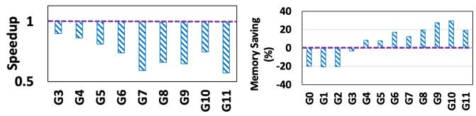  
Fig. 18: dgNN GAT training speedup over GRAPHPY. Left: Runtime speedup. Right: Memory saving speedup. (Higher is better.)

GRAPHPY has SpMM and SDDMM in vertex-parallel and edge-parallel fashion respectively, like DGL. However, this mixed approach does not allow fusing these two. Hence, dgNN, like other kernel fusion works [9, 57], forces SDDMM variants to be performed in vertex-parallel fashion to fuse it with their vertex-parallel SpMM. Our measurements (not plotted) confirm that GRAPHPY has 1.72× speedup over dgSparse [1] (vertex-parallel SDDMM, which is used by dgNN for fusion) on OGBN-Products dataset.

Fundamentally, SDDMM is naturally edge-parallel, as computation on one edge is independent of others. On the other hand, vertex-parallel SDDMM has a workload imbalance as vertices have varying neighborhood sizes. Hence, when one keeps the same SpMM implementation, the advantage of kernel fusion boils down to its benefit versus the loss that occurs by downgrading SDDMM to vertex-parallel. Hence, even though dgNN is faster than DGL is a correct assertion, it is not faster than the latter’s approach of vertex-parallel SpMM + edge-parallel SDDMM, when implemented rightly as by GRAPHPY. This represents more fundamental knowledge.

Average Memory Saving is modest 6.4%. This shows that gradient checkpointing provides memory saving, which we expected. However, dgNN theoretically provides only |E| - 2|V | memory saving for state-tensors per GAT convolution layer: |E| memory saving is achieved by not storing attention (edge-level) tensor as a state-tensor, while recomputing is based on introducing two new vertex-level state tensors (2|V |). Other kernel fusion techniques save only ephemeral memory as they are not state-tensors.

For some datasets, the saving is negative. Our measurements show that dgNN leaks memory around 150 MB, i.e., the memory consumption around the 200th iteration of training is larger by 150 MB than that of around the first few iterations. GRAPHPY (and DGL) shows the same memory consumption throughout the training procedure. This leak becomes significant in smaller datasets of G0 – G3, leading to negative memory saving in dgNN.

In summary, framework-memory overhead in DGL offered inflated evaluations in dgNN that reported up to 3× memory saving. Our evaluation with GRAPHPY shows its true saving.

## 8 Related Works

Several papers have uncovered pitfalls or offered alternative perspectives that diverge from established research directions in machine learning (ML) and deep learning (DL) applications. For example, a distinguished award paper [3], systematically describes the ML pitfalls in the security domain. Earlier, another best paper award [11] explains pitfalls in the recommendation system.

From the systems perspective, some studies challenge prevailing assumptions. McSherry et al. [39] show that many graph analytics systems merely parallelized the overhead rather than improving performance when scaling to a distributed deployment. GBench [34] highlights existing pitfalls when benchmarking graph streaming systems. HalfGNN [44] identifies training accuracy flaws in prior GNN systems when they substitute single-precision floating point features with half-precision.

These studies highlight the existence and importance of recognizing pitfalls in the ML/DL domain and beyond, and their recognition by the computer science community underscores their significance. In contrast to these works, our study focuses on system-specific pitfalls in GPU-based GNN systems. Our discussion is based on semantic-preserving GNN models: the model architecture, algorithm, and datasets remain unchanged, and only the underlying system or backend is modified. Under such settings, an ideally optimized system should deliver comparable accuracy while achieving improved performance. Our work investigates why this is often not the case, as we show that design decisions at the system and framework level can lead to significant degradation in both accuracy and performance.

It is important to clarify that while it is widely acknowledged that changes to model architecture or algorithm can affect accuracy and performance, this paper focuses on semantic-preserving models.

Moreover, GNN optimizations have wider applications in exploiting sparsity in the broader DL community, where models are either pruned [10,13,21,22] to make their layers sparse, which requires re-training or defined initially [38] as sparse, thereby requiring similar to GNN sparse kernels. Hence, pitfalls in GNN systems will likely impact this area as well.

## 9 Conclusion and Future Works

Our in-depth analysis highlighted many critical pitfalls in current GPU-only GNN systems which questions our understanding of system design, implementation, and evaluation. We identified the consequences of ignoring accuracy measurements and unawareness of the role of the framework in training time and memory consumption. We presented their impact, recommendations, and future directions. We also designed a practical and compelling solution to solve some of these pitfalls. The important takeaway is that a simple yet careful design rooted in requirement understanding leads to better runtime and memory usage. We hope our analysis, recommendations, and GRAPHPY can be used by future research to genuinely advance GNN system optimizations. We leave overcoming framework-runtime overhead as a future work.

## Acknowledgments

We would like to thank the anonymous reviewers for their valuable feedback and Tim Harris for his suggestions and guidance throughout the shepherding process. This work is supported in part by National Science Foundation (NSF) grant 2245849. The views, opinions, and findings of the paper are of the authors and do not represent the official views or policies of NSF.

## References

[1] dgSparse. https://dgsparse.github.io/.

[2] M. S. Anderson, A. S. Horn, K. R. Risbey, E. A. Ronning, R. De Vries, and B. C. Martinson. What do mentoring and training in the responsible conduct of research have to do with scientists’ misbehavior? Findings from a national survey of NIH-funded scientists. Academic Medicine, 82(9):853–860, 2007.

[3] D. Arp, E. Quiring, F. Pendlebury, A. Warnecke, F. Pierazzi, C. Wressnegger, L. Cavallaro, and K. Rieck. Dos and don’ts of machine learning in computer security. In 31st USENIX Security Symposium (USENIX Security 22), pages 3971–3988, 2022.

[4] T. Baruah, K. Shivdikar, S. Dong, Y. Sun, S. A. Mojumder, K. Jung, J. L. Abellán, Y. Ukidave, A. Joshi, J. Kim, et al. GNNMark: A Benchmark Suite to Characterize Graph Neural Network Training on GPUs. In 2021 IEEE International Symposium on Performance Analysis of Systems and Software (ISPASS), pages 13–23. IEEE, 2021.

[5] X. Bresson and T. Laurent. Residual gated graph convnets. arXiv preprint arXiv:1711.07553, 2017.

[6] Z. Cai, X. Yan, Y. Wu, K. Ma, J. Cheng, and F. Yu. DGCL: An Efficient Communication Library for Distributed GNN Training. In Proceedings of the Sixteenth European Conference on Computer Systems, pages 130– 144, 2021.

[7] Z. Cai, Q. Zhou, X. Yan, D. Zheng, X. Song, C. Zheng, J. Cheng, and G. Karypis. DSP: Efficient GNN Training with Multiple GPUs. In Proceedings of the 28th ACM SIGPLAN Annual Symposium on Principles and Practice of Parallel Programming, PPoPP ’23, page 392–404, 2023.

[8] Z. Chen, Z. Qu, L. Liu, Y. Ding, and Y. Xie. Efficient tensor core-based GPU kernels for structured sparsity under reduced precision. In Proceedings of the International Conference for High Performance Computing, Networking, Storage and Analysis, SC ’21, New York, NY, USA, 2021. Association for Computing Machinery.

[9] Z. Chen, M. Yan, M. Zhu, L. Deng, G. Li, S. Li, and Y. Xie. fuseGNN: Accelerating Graph Convolutional Neural Network Training on GPGPU. In Proceedings of the 39th International Conference on Computer-Aided Design, pages 1–9, 2020.

[10] R. Child, S. Gray, A. Radford, and I. Sutskever. Generating Long Sequences with Sparse Transformers. 2019.

[11] M. Ferrari Dacrema, P. Cremonesi, and D. Jannach. Are we really making much progress? A worrying analysis of recent neural recommendation approaches. In Proceedings of the 13th ACM conference on recommender systems, pages 101–109, 2019.

[12] M. Fey and J. E. Lenssen. Fast Graph Representation Learning with PyTorch Geometric. In ICLR 2019 Workshop on Representation Learning on Graphs and Manifolds, 2019.

[13] J. Frankle and M. Carbin. The Lottery Ticket Hypothesis: Finding Sparse, Trainable Neural Networks. In Seventh International Conference on Learning Representations (ICLR), 2019.

[14] Q. Fu, Y. Ji, and H. H. Huang. TLPGNN: A Lightweight Two-Level Parallelism Paradigm for Graph Neural Network Computation on GPU. In Proceedings of the 31st International Symposium on High-Performance Parallel and Distributed Computing, pages 122–134, 2022.

[15] S. Gandhi and A. P. Iyer. P3: Distributed Deep Graph Learning at Scale. In 15th USENIX Symposium on Operating Systems Design and Implementation (OSDI’21), pages 551–568, 2021.

[16] Y. Gong and P. Kumar. GNNOne: A Unified System Optimizations for GNN Kernels. In Proceedings of the 33rd International Symposium on High-Performance Parallel and Distributed Computing, HPDC ’24, page 15–27, New York, NY, USA, 2024. Association for Computing Machinery.

[17] Graph500. http://www.graph500.org/.

[18] GTgraph: A suite of synthetic random graph generators. http://www.cse.psu.edu/\~madduri/ software/GTgraph/.

[19] S. Gupta, A. Agrawal, K. Gopalakrishnan, and P. Narayanan. Deep learning with limited numerical precision. In Proceedings of the 32nd International Conference on International Conference on Machine Learning - Volume 37, ICML’15, page 1737–1746. JMLR.org, 2015.

[20] W. Hamilton, Z. Ying, and J. Leskovec. Inductive Representation Learning on Large Graphs. In Advances in neural information processing systems, pages 1024– 1034, 2017.

[21] S. Han, H. Mao, and W. Dally. Deep Compression: Compressing Deep Neural Network with Pruning, Trained Quantization and Huffman Coding. In 4th International Conference on Learning Representations (ICLR-16), 2016.

[22] S. Han, J. Pool, J. Tran, and W. Dally. Learning both weights and connections for efficient neural network. In Advances in neural information processing systems, pages 1135–1143, 2015.

[23] N.-M. Ho and W.-F. Wong. Exploiting half precision arithmetic in Nvidia GPUs. In 2017 IEEE High Performance Extreme Computing Conference (HPEC), pages 1–7, 2017.

[24] J. Hu, S. Qian, Q. Fang, Y. Wang, Q. Zhao, H. Zhang, and C. Xu. Efficient graph deep learning in tensorflow with tf\_geometric. In Proceedings of the 29th ACM International Conference on Multimedia, pages 3775– 3778, 2021.

[25] Y. Hu, Z. Ye, M. Wang, J. Yu, D. Zheng, M. Li, Z. Zhang, Z. Zhang, and Y. Wang. FeatGraph: A Flexible and Efficient Backend for Graph Neural Network Systems. In Proceedings of the International Conference for High Performance Computing, Networking, Storage and Analysis, pages 1–13, 2020.

[26] G. Huang, G. Dai, Y. Wang, and H. Yang. GE-SpMM: General-purpose Sparse Matrix-Matrix Multiplication on GPUs for Graph Neural Networks. In SC20: International Conference for High Performance Computing, Networking, Storage and Analysis, pages 1–12. IEEE, 2020.

[27] K. Huang, J. Zhai, Z. Zheng, Y. Yi, and X. Shen. Understanding and Bridging the Gaps in Current GNN Performance Optimizations. In Proceedings of the 26th ACM SIGPLAN Symposium on Principles and Practice of Parallel Programming, pages 119–132, 2021.

[28] I. Hubara, M. Courbariaux, D. Soudry, R. El-Yaniv, and Y. Bengio. Quantized neural networks: training neural networks with low precision weights and activations. J. Mach. Learn. Res., 18(1):6869–6898, jan 2017.

[29] A. Jangda, S. Polisetty, A. Guha, and M. Serafini. Accelerating Graph Sampling for Graph Machine Learning using GPUs. In Proceedings of the Sixteenth European Conference on Computer Systems, 2021.

[30] Z. Jia, S. Lin, M. Gao, M. Zaharia, and A. Aiken. Improving the Accuracy, Scalability, and Performance of Graph Neural Networks with Roc. Proceedings of Machine Learning and Systems, 2:187–198, 2020.

[31] T. Kaler, N. Stathas, A. Ouyang, A.-S. Iliopoulos, T. Schardl, C. E. Leiserson, and J. Chen. Accelerating Training and Inference of Graph Neural Networks with Fast Sampling and Pipelining. Proceedings of Machine Learning and Systems, 4:172–189, 2022.

[32] I. Kim, J. Jeong, Y. Oh, M. K. Yoon, and G. Koo. Analyzing GCN Aggregation on GPU. IEEE Access, 10:113046–113060, 2022.

[33] T. N. Kipf and M. Welling. Semi-Supervised Classification with Graph Convolutional Networks. In 5th International Conference on Learning Representations (ICLR-17), 2017.

[34] P. Kumar and S. Revillar. G-Bench: Fair Benchmarking to Support Innovations in Streaming Graph Systems. In 2023 IEEE International Parallel and Distributed Processing Symposium Workshops (IPDPSW), pages 179–188, 2023.

[35] S. Liang, Y. Wang, C. Liu, L. He, L. Huawei, D. Xu, and X. Li. EnGN: A High-Throughput and Energy-Efficient Accelerator for Large Graph Neural Networks. 70(9):1511–1525, 2020.

[36] Z. Lin, C. Li, Y. Miao, Y. Liu, and Y. Xu. PaGraph: Scaling GNN Training on Large Graphs via Computation-Aware Caching. In Proceedings of the 11th ACM Symposium on Cloud Computing, pages 401–415, 2020.

[37] T. Liu, Y. Chen, D. Li, C. Wu, Y. Zhu, J. He, Y. Peng, H. Chen, H. Chen, and C. Guo. BGL: GPU-Efficient GNN Training by Optimizing Graph Data I/O and Preprocessing. In 20th USENIX Symposium on Networked Systems Design and Implementation (NSDI 23), 2023.

[38] Z. Liu, M. Sun, T. Zhou, G. Huang, and T. Darrell. Rethinking the Value of Network Pruning. In Seventh International Conference on Learning Representations (ICLR), 2019.

[39] F. McSherry, M. Isard, and D. G. Murray. Scalability! but at what cost? In Proceedings of the 15th USENIX Conference on Hot Topics in Operating Systems, HO-TOS’15, page 14, USA, 2015. USENIX Association.

[40] V. Md, S. Misra, G. Ma, R. Mohanty, E. Georganas, A. Heinecke, D. Kalamkar, N. K. Ahmed, and S. Avancha. DistGNN: Scalable Distributed Training for Large-Scale Graph Neural Networks. In Proceedings of the International Conference for High Performance Computing, Networking, Storage and Analysis, pages 1–14, 2021.

[41] N. A. of Sciences, N. A. of Engineering, and I. of Medicine. Responsible Science: Ensuring the Integrity of the Research Process: Volume I. 1992.

[42] SNAP: Stanford Large Network Dataset Collection. http://snap.stanford.edu/data/.

[43] S. Song and P. Jiang. Rethinking Graph Data Placement for Graph Neural Network Training on Multiple GPUs. In Proceedings of the 36th ACM International Conference on Supercomputing, pages 1–10, 2022.

[44] A. K. Tarafder, Y. Gong, and P. Kumar. Optimization of GNN Training Through Half-precision. In Proceedings of the 34th International Symposium on High-Performance Parallel and Distributed Computing, 2025.

[45] The University of Florida: Sparse Matrix Collection. http://www.cise.ufl.edu/research/ sparse/matrices/.

[46] J. Thorpe, Y. Qiao, J. Eyolfson, S. Teng, G. Hu, Z. Jia, J. Wei, K. Vora, R. Netravali, M. Kim, and G. H. Xu. Dorylus: Affordable, Scalable, and Accurate GNN Training with Distributed CPU Servers and Serverless Threads. In USENIX Symposium on Operating Systems Design and Implementation, 2021.

[47] C. Tian, L. Ma, Z. Yang, and Y. Dai. PCGCN: Partition-Centric Processing for Accelerating Graph Convolutional Network. In 2020 IEEE International Parallel and Distributed Processing Symposium (IPDPS), pages 936–945. IEEE, 2020.

[48] A. Tripathy, K. Yelick, and A. Buluç. Reducing Communication in Graph Neural Network Training. In SC20: International Conference for High Performance Computing, Networking, Storage and Analysis, pages 1–14. IEEE, 2020.

[49] P. Velickovi ˇ c, G. Cucurull, A. Casanova, A. Romero, ´ P. Lio, and Y. Bengio. Graph Attention Networks. 6th International Conference on Learning Representations (ICLR-18), 2018.

[50] R. Waleffe, J. Mohoney, T. Rekatsinas, and S. Venkataraman. MariusGNN: Resource-Efficient Out-of-Core Training of Graph Neural Networks. In Eighteenth European Conference on Computer Systems (EuroSys’ 23), 2023.

[51] C. Wang, D. Sun, and Y. Bai. PiPAD: Pipelined and Parallel Dynamic GNN Training on GPUs. In Proceedings of the 28th ACM SIGPLAN Annual Symposium on Principles and Practice of Parallel Programming, PPoPP ’23, page 405–418, New York, NY, USA, 2023. Association for Computing Machinery.

[52] L. Wang, Q. Yin, C. Tian, J. Yang, R. Chen, W. Yu, Z. Yao, and J. Zhou. FlexGraph: A Flexible and Efficient Distributed Framework for GNN Training. In Proceedings of the Sixteenth European Conference on Computer Systems, pages 67–82, 2021.

[53] M. Wang, D. Zheng, Z. Ye, Q. Gan, M. Li, X. Song, J. Zhou, C. Ma, L. Yu, Y. Gai, T. Xiao, T. He, G. Karypis, J. Li, and Z. Zhang. Deep Graph Library: Towards Efficient And Scalable Deep Learning on Graphs. In ICLR 2019 Workshop on Representation Learning on Graphs and Manifolds, 2019.

[54] Y. Wang, B. Feng, G. Li, S. Li, L. Deng, Y. Xie, and Y. Ding. GNNAdvisor: An Adaptive and Efficient Runtime System for GNN Acceleration on GPUs. In 15th USENIX Symposium on Operating Systems Design and Implementation (OSDI 21), pages 515–531, 2021.

[55] Y. Wang, B. Feng, Z. Wang, T. Geng, K. Barker, A. Li, and Y. Ding. {MGG}: Accelerating Graph Neural Networks with {Fine-Grained}{Intra-Kernel}{Communication-Computation} Pipelining on {Multi-GPU} Platforms. In 17th USENIX Symposium on Operating Systems Design and Implementation (OSDI 23), pages 779–795, 2023.

[56] Y. Wang, B. Feng, Z. Wang, G. Huang, and Y. Ding. {TC-GNN}: Bridging Sparse {GNN} Computation and Dense Tensor Cores on {GPUs}. In 2023 USENIX Annual Technical Conference (USENIX ATC 23), pages 149–164, 2023.

[57] Y. Wu, K. Ma, Z. Cai, T. Jin, B. Li, C. Zheng, J. Cheng, and F. Yu. Seastar: Vertex-centric Programming for Graph Neural Networks. In Proceedings of the Sixteenth European Conference on Computer Systems, pages 359– 375, 2021.

[58] K. Xu, W. Hu, J. Leskovec, and S. Jegelka. How Powerful are Graph Neural Networks? 7th International Conference on Learning Representations (ICLR-19), 2019.

[59] M. Yan, Z. Chen, L. Deng, X. Ye, Z. Zhang, D. Fan, and Y. Xie. Characterizing and Understanding GCNs on GPU. IEEE Computer Architecture Letters, 19(1):22– 25, 2020.

[60] M. Yan, L. Deng, X. Hu, L. Liang, Y. Feng, X. Ye, Z. Zhang, D. Fan, and Y. Xie. HyGCN: A GCN Accelerator with Hybrid Architecture. In 2020 IEEE International Symposium on High Performance Computer Architecture (HPCA), pages 15–29. IEEE, 2020.

[61] D. Yang, J. Liu, J. Qi, and J. Lai. WholeGraph: A Fast Graph Neural Network Training Framework with Multi-GPU Distributed Shared Memory Architecture. 2022.

[62] J. Yang, D. Tang, X. Song, L. Wang, Q. Yin, R. Chen, W. Yu, and J. Zhou. GNNLab: A Factored System for Sample-Based GNN Training over GPUs. In Proceedings of the Seventeenth European Conference on Computer Systems, pages 417–434, 2022.

[63] S. Yang, M. Zhang, W. Dong, and D. Li. Betty: Enabling Large-Scale GNN Training with Batch-Level Graph Partitioning. In Proceedings of the 28th ACM International Conference on Architectural Support for Programming Languages and Operating Systems, Volume 2, ASPLOS 2023, page 103–117, New York, NY, USA, 2023. Association for Computing Machinery.

[64] Z. Ye, R. Lai, J. Shao, T. Chen, and L. Ceze. Sparse-TIR: Composable Abstractions for Sparse Compilation in Deep Learning. In Proceedings of the 28th ACM International Conference on Architectural Support for Programming Languages and Operating Systems, Volume 3, pages 660–678, 2023.

[65] B. Zhang, R. Kannan, and V. Prasanna. BoostGCN: A Framework for Optimizing GCN Inference on FPGA. In 2021 IEEE 29th Annual International Symposium on Field-Programmable Custom Computing Machines (FCCM), pages 29–39. IEEE, 2021.

[66] H. Zhang, Z. Yu, G. Dai, G. Huang, Y. Ding, Y. Xie, and Y. Wang. Understanding GNN Computational Graph: A Coordinated Computation, IO, and Memory Perspective. Proceedings of Machine Learning and Systems, 4:467– 484, 2022.

[67] J. Zhang, X. Shi, J. Xie, H. Ma, I. King, and D. Yeung. GaAN: Gated Attention Networks for Learning on Large and Spatiotemporal Graphs. In Proceedings of the Thirty-Fourth Conference on Uncertainty in Artificial Intelligence, pages 339–349, 2018.

[68] C. Zheng, H. Chen, Y. Cheng, Z. Song, Y. Wu, C. Li, J. Cheng, H. Yang, and S. Zhang. ByteGNN: Efficient Graph Neural Network Training at Large Scale. Proc. VLDB Endow., 15(6):1228–1242, feb 2022.

[69] D. Zheng, C. Ma, M. Wang, J. Zhou, Q. Su, X. Song, Q. Gan, Z. Zhang, and G. Karypis. DistDGL: Distributed Graph Neural Network Training for Billion-Scale Graphs. In 2020 IEEE/ACM 10th Workshop on Irregular Applications: Architectures and Algorithms (IA3), pages 36–44. IEEE, 2020.

## A Method to Measure Framework Overhead

In this section, we focus on how to measure framework overhead. Though, it has been plotted in the main paper, the main metric to observe in §5.1 is GPU idle time (100 - GPU-Runtime (%)), where overhead runs exclusively. Hence, this section is only for curious reviewers who wants to go deeper.

For reference, the training time is measured as the wallclock time spent between training start and end. It is a standard practice to insert a “cudaDeviceSynchronize” (barrier) after the last training iteration to make sure GPU finished execution before ending the wall-clock tick due to asynchronous kernel execution as shown in Fig. 19 (left).

Challenges. Give this definition of training time, we discuss following challenges. a) One can remove the inserted barrier, and collect the ending wall-clock tick to postulate that it has collected only CPU runtime. However, a limited job queue length in a GPU makes kernel launch synchronous after a few iteration as many kernels are submitted. This blocking behavior make kernel launches includes an indirect wait time spent by CPU. E.g., the profiler shows 90.27% of the total training time as "kernel launch time" for DGL GCN on Reddit for 200 iterations. This is a problem only for mid-size datasets. In smaller datasets, kernels run much faster and hence, job queue never becomes full. However, this methodology cannot be used due to not giving reliable value of overhead time. b) Using PyTorch profiler can also not be used as total CPU time is always printed more than GPU total time as the profiler automatically inserts a barrier after the last training epoch even if we do not explicitly write one. Manually subtracting the timing spent on this barrier, which profiler reports, does not give correct overhead cost as kernel launches include the indirect wait time, discussed above.

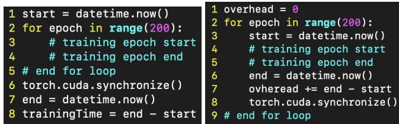  
Fig. 19: Methodology for measuring training time (left) and framework runtime overhead (right).

Methodology. We propose an automated approach (Fig. 19 (right)) where the idea is to measure the overhead per iteration by introducing a barrier (Line 8). This barrier limits the number of kernel submissions to ensure kernel launch never becomes synchronous. Hence, time spent between Lines 3 and 6 becomes overhead time (CPU) per iteration. The Py-Torch profiler shows that time spent on “cudaLaunchKernel” is much lower. Moreover, this printed similar framework overhead per GNN system per model irrespective of dataset size.

The minor issue with this approach is that total training time might increase due to this barrier. Even though our measurement on different datasets shows hardly any such concerns, we continue to rely on actual definitions to measure training runtime (Fig. 19:Left), and not rely on this changed code. For GPU runtime, we always use PyTorch profiler, which print total gpu runtime.

## B Systems Suffering from Framework-Runtime Overhead

The main paper discussed how full-batch GNN for smaller datasets, and sampling+mini-batching GNN for all datasets suffer from framework runtime overhead dominating the training runtime. This section outlines other models that suffer from this issue.

Any other model where a small batch size makes computation lightweight will likely suffer from the same framework runtime overhead. As an example, we evaluated LeNet-300-100 model which is a model with just three linear layers of sizes 768×300, 300×100, and 100×10 with ReLU activations, and classifies hand-written digits, such as MNIST dataset. Measurements show framework-runtime overhead to dominate training time even in large batch-size of 4096.

## C Code Analysis For Pitfalls

This section presents our code-study results to show that many prior works have pitfalls. These are supporting materials and are optional to convince that pitfalls exist. Kindly note that we have reached out to the authors of their papers to get confirmation. They all have agreed on the issue and we received positive and encouraging feedback.

## C.1 GNNAdvisor

https://github.com/YukeWang96/GNNAdvisor\_ OSDI21/blob/master/GNNAdvisor/GNNConv/ GNNAdvisor\_kernel.cu#L542 points to backward propagation which performs the SpMMv first, then the degree-norm part within the same kernel. The forward also performs these operations in the same order(line 403), and hence backward should have been done in reverse order.

https://github.com/YukeWang96/GNNAdvisor OSDI21/blob/master/GNNAdvisor/gnn\_conv.py#L98 shows that the bias operator is not there. https: //github.com/dmlc/dgl/blob/master/python/dgl/ nn/pytorch/conv/graphconv.py#L206 shows that the bias operator is set as True by default in DGL. But https://github.com/YukeWang96/GNNAdvisor\_ OSDI21/blob/master/dgl\_baseline/gcn.py#L12 shows GNNAdvisor did not specifically disable bias in DGL.

## C.2 TC-GNN

https://github.com/YukeWang96/TC-GNN\_ATC23/ blob/atc23ae/TCGNN\_conv/TCGNN\_kernel.cu#L336 and https://github.com/YukeWang96/TC-GNN\_ATC23/ blob/atc23ae/gnn\_conv.py shows that TC-GNN’s GCN implementation does not include degree-norm and bias operator either in the kernel or in Python. But these two URLs (https://github.com/YukeWang96/TC-GNN\_

ATC23/blob/atc23ae/dgl\_baseline/gcn.py#L20 https://github.com/dmlc/dgl/blob/master/python/ dgl/nn/pytorch/conv/graphconv.py#L197) show that TC-GNN uses the default setting for bias and degree-norm in DGL. This means their DGL baseline enables both the degree-norm and bias operator.

One can also see that its AGNN (https://github. com/YukeWang96/TC-GNN\_ATC23/blob/atc23ae/TCGNN\_ conv/TCGNN\_kernel.cu ) kernels don’t do tranpose at all during backward pass.

## C.3 FuseGNN

https://github.com/apuaaChen/gcnLib/issues/3 reported an accuracy issue in Github but got no response. Our measurements also show the same accuracy issue.

## C.4 Huang et al

https://github.com/xxcclong/GNN-Computing/blob/ master/include/aggr\_gat.h There is no transpose SpMM function implemented, the kernels work fine for forward but are not workable for backward pass. Their Python code also does not explicitly call/have transposed API from Pytorch/cuSPARSE.

It uses the same copy of edge-level tensor for all the layers of GAT. Hence, in the real-world, they would not be usable in backward propagation. The correct approach would have been to allocate separate memory for each edge-level tensor.

The kernel does not work when the dim is not a multiple of 32, which is a common case for the last layer of GAT. E.g., in Reddit and OGBN-Products, the feature dimensions are 41 and 47 respectively.

For GCN: https://github.com/xxcclong/ GNN-Computing/blob/master/include/aggr\_gcn.h shows that all the kernels here require an edge-level tensor, i.e. this paper provides SpMMve and not SpMMv, and is the main reason for slower performance despite having a workload-balanced solution.

The kernel does not work for odd dimensions, which is a common occurrence for GCN, specifically for the last layer. E.g., 6 for Cora.

## C.5 TLPGNN

https://github.com/charlifu/TLPGNN/blob/main/ gat/kernel.cu#L49 shows the fused kernel for GAT forward where the attention-score (edge-level tensor) is computed and stored in a register and not materialized in

GPU global memory.

It also neither has backward code for GAT nor transpose code anywhere.

## C.6 Seastar

Seastar does not have its code in Github, but it provides a URL to download it. Upon running its training script, it generates the kernel code (in CUDA), compiles it (all automatically), and runs training. We read the generated GCN sparse kernel, which generates a fused version of SpMMv and degree-norm, and suffered from the same set of issues as discussed for GNNAdvisor.

## C.7 MariusGNN

https://github.com/marius-team/marius/blob/ 2f27ffedfbffd405995e8d16d821849db1fe0535/src/ cpp/src/nn/layers/gnn/graph\_sage\_layer.cpp shows its computation kernel for the SpMM kernel. This kernel consists of two parts. The first part scatters the vertex-level features to edges https://github.com/marius-team/marius/blob/ 2f27ffedfbffd405995e8d16d821849db1fe0535/ src/cpp/src/nn/layers/gnn/graph\_sage\_layer. cpp#L49.resulting in materializing this value. The second part performs the gather procedure https://github.com/marius-team/marius/blob/ 2f27ffedfbffd405995e8d16d821849db1fe0535/src/ cpp/src/nn/layers/gnn/graph\_sage\_layer.cpp#L52. We use this method to compare its kernel performance.

## C.8 GE-SpMM and FeatGraph

These two systems are integrated to DGL. However, due to code reorganization, we could not run Ge-SpMM. For Featgraph, we also could not run its DGL integrated system despite help from authors. We tried many Github branches that their authors suggested.

## C.9 DGL

We have reached out to DGL recently through a long email. We are yet to hear from the person. Before this, we had a faceto-face meeting with this person in a conference/workshop, and the employee indicated that they acknowledge that DGL suffers from some issues that we highlighted in the paper. At that time, the manuscript was not fully ready, but we did discuss that their non-standard integration seems to indicate the memory overhead issue.