①

USENIX

THE ADVANCED COMPUTING SYSTEMS ASSOCIATION

# Cuckoo for Clients: Disaggregated Cuckoo Hashing

Stewart Grant and Alex C. Snoeren, UC San Diego https://www.usenix.org/conference/atc25/presentation/grant

# This paper is included in the Proceedings of the 2025 USENIX Annual Technical Conference.

July 7–9, 2025 • Boston, MA, USA

ISBN 978-1-939133-48-9

Open access to the Proceedings of the 2025 USENIX Annual Technical Conference is sponsored by

P-Lr.h £Es/sL.

auuuJl9 PgleU

King Abdullah University of

Science and Technology

# Cuckoo for Clients: Disaggregated Cuckoo Hashing

Stewart Grant and Alex C. Snoeren

UC San Diego

## Abstract

RCuckoo is a fully disaggregated lock-based key/value store in which clients cooperatively access a passive memory server using exclusively one-sided RDMA operations. RCuckoo employs cuckoo hashing to enable single roundtrip reads of small values while updates and deletes require only two. We introduce locality-enhanced dependent hashing that allows us to adjust the expected distance between a key’s potential table locations, dramatically improving insert performance compared to prior cuckoo-hashing approaches while limiting I/O amplification and maintaining practical maximum fill factors. We show that not only does RCuckoo outperform all existing state-of-the-art RDMA-based key/value stores when reading small values, but under severe contention RCuckoo delivers up to 7× the throughput of comparison systems across the standard set of YCSB workloads. Moreover, RCuckoo’s lease-based locking mechanism enables it to gracefully recover from 100s of client failures per second.

## 1 Introduction

Disaggregated architectures aim to improve scalability and utilization by pooling network-attached resources [3, 17, 21, 35]. In theory, pooling reduces per-machine fragmentation and stranding by exposing resources over the network. Collectively, disaggregated resources can be provisioned for the sum-of-peak workloads rather than the peak-of-sums [2, 36]. Stagnating DRAM densities are driving interest in primary storage pooling, but performant, general-purpose far-memory tiers remain elusive [1, 4, 5, 11, 18, 24, 35, 42] as even the fastest rackscale networks have access latencies that are an order-ofmagnitude slower than local memory. (e.g., RDMA latency is approximately 1 µs versus DRAM’s 50 ns) [40].

As a result, most existing far-memory systems [5, 12, 34, 39, 44] choose to statically partition remote memory to avoid the multiple round trips required to synchronize shared updates. While challenging to achieve, memory sharing is critical to making remote memory pooling practical as it can improve utilization—the entire point of memory disaggregation. To date, the most promising approach to delivering shared access to pooled remote memory is to expose a key/value store (KVS) interface that provides coherent read/write semantics [19, 22, 37, 38, 40, 41, 43]. Yet, most performant KVS systems employ two-sided RDMA operations which rely upon memory-side CPUs to manage locks and execute critical sections [9, 20, 25, 26], reducing their potential savings.

To fully unlock the potential of memory disaggregation, we propose a design where compute and memory are entirely separate. In our fully disaggregated model, a KVS must implement a client-side serialization protocol implemented entirely in one-sided RDMA operations (i.e., read, write, and atomic updates). Maintaining a coherent memory model is the core challenge in designing such systems. Existing KVS’s with ordered keys (e.g., BTrees & Radix Trees) rely upon locking schemes [22, 41], while those that provide unordered access favor lock-free techniques [19, 37, 38, 40] to decrease read latency while avoiding the RDMA hardware bottlenecks and complex failure scenarios that can arise with locks. The trade-off, however, is that lock-free approaches perform worse as write intensity increases.

In this work we present RCuckoo, a system that uses lock-based synchronization on commodity RDMA hardware to out-perform existing key/value stores across a wide range of workload mixes. Critically, locks enable the use of cuckoo hashing [32], a well-established, highperformance datastructure for key/value stores. Locks also support in-lining small values in the hash table, delivering significantly higher throughput on common mixed read/write workloads. Further, our fine-grained locks and careful protocol design reduce lock hold times during updates to two round trips in the common case, and we avoid known hardware bottlenecks with RDMA atomic operations by crafting a lock table small enough to be stored entirely on NIC-based memory. Finally, lease-based lock acquisition delivers correct, high-throughput performance even in the face of client failures with held locks.

RCuckoo’s efficient locking is made possible by a dependent hashing algorithm that makes spatial locality a tunable parameter. Cuckoo hashing works by deterministically computing two potential hash locations—primary and secondary—for any key; collisions are resolved by relocating the existing entry in a key’s primary location to the existing key’s secondary location, and so on down what is known as a cuckoo path. Traditionally, a key’s two potential locations are drawn independently at random, defeating any locality-based optimizations. By controlling the distance between a key’s locations—and therefore the span of a potential cuckoo path—we probabilistically bound the range of memory that must be locked, and, relatedly, the number of locks that a client must acquire.

Combined with aggressive batching of RDMA operations, RCuckoo’s spatial locality limits the number of round trips required for all table operations. In the common case, reads execute in one (for small values) or two round trips, uncontested updates and deletes require two round trips, and the median insert operation involves only two round trips—although the expected number increases as the table fills and cuckoo paths grow. On our testbed, RCuckoo delivers comparable or higher performance on small values across the standard set of YCSB benchmarks than all of the existing disaggregated key/- value stores we consider. Concretely, with 320 clients RCuckoo delivers up to a 2.5× throughput improvement on read-intensive (YCSB-B) workloads and up to 7.1× their throughput on write-intensive (YCSB-A) workloads. Moreover, RCuckoo’s performance remains high despite 100s of clients failing per second.

## 2 Background

Existing disaggregated key/value stores build upon the extensive literature of RDMA-based key/value stores. In this section we overview that lineage and discuss the algorithmic distinctions between the two. Our hash table design draws on both cuckoo and hopscotch hashing. We provide a brief overview of both approaches and related literature.

## 2.1 Disaggregated Key/Value Stores

The challenge to adapting existing RDMA-based KVS designs to a fully disaggregated setting is the need to rely exclusively on one-sided operations due to the lack of a server-side CPU. Precursor RDMA KVS systems achieve performance by striking a delicate balance between efficient one-sided RDMA operations and CPU-serialized two-sided operations [8, 15, 25, 26, 28], where the later are used sparingly, but are critical for correctness.

In general, the performance of any KVS on a mixed read/write workload hinges on its serialization performance. Fast consistent writes with one-sided RDMA are hard because RDMA atomic operations operate on small (8-byte) regions of memory and the cost of round trips is high. This constraint has lead to a divide in the design of disaggregated KVS systems between those that support range queries over ordered keys and those that do not. Systems with ordered keys use locks to guard their complex updates, while those with unordered keys employ lock-free optimistic approaches by constraining updates to atomic 8-byte writes. These latter designs typically use hash indexes with 8-byte entries that point to uncontested extent regions where the corresponding values are stored. Commonly the index entries use 48 of the 64 bits as a pointer and the remaining 16 bits for a digest of the key and the size of the value. This approach requires additional round trips to check for a key’s presence and limits the size of values that can be stored [38, 45].

On the other hand, KVS systems that support ordered keys use locks to guard the complex operations required to update B-Trees or Radix Trees. In exchange for expensive update operations, locks allow these systems to support inlined values and, thus, faster small-value reads. Performance is gated, however, by lock granularity and hold times. At the time of writing all lock-based KVS systems assume that clients are grouped into co-located servers which can locally coordinate lock accesses and batch their writes [22, 41], an assumption that optimistic KVS systems do not make [37, 38, 40, 45]. We show that it is possible to realize the performance gain of lock-guarded inlined operations without requiring client co-location if locks are sufficiently fine grained and hold times limited.

## 2.2 RDMA and Network Performance

Historically, network bandwidth has limited KVS throughput more than operation rate. For instance, while a 40-Gbps ConnectX-3 NIC can process 75 million packets per second, line rate restricts it to 5 MOPS when reading 1-KB objects. As commodity datacenter link rates increase from 100 Gbps to 400 Gbps and beyond, however, latency and contention—rather than raw network bandwidth—become the primary scalability bottlenecks. To this end our design choices seek to reduce round trips at the cost of slight bandwidth amplification and we focus our evaluation on workloads with small key/value pairs whose performance is not limited by line rate on our 100- Gbps ConnectX-5 testbed hardware.

Concretely, Figure 1(a) shows the growth in round trip time for RDMA reads of increasing size. On our hardware, the round trip time for a single 1-KB read is lower than the total latency of issuing two dependent reads of just a few bytes each. This suggests that performance can be gained if a single large packet can complete the work of two smaller, but dependent messages. Indeed, our evaluation (see Figure 8(d)) shows that even on our 100-Gbps testbed inlining values and servicing lookups with a single large read provides a 4–37% throughput increase compared to an extent-based approach for the same value size.

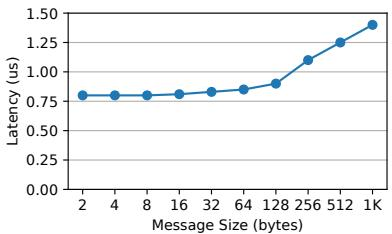

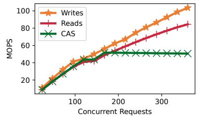

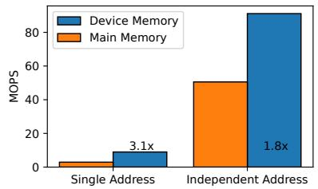  
Figure 1: Basic RDMA performance on our testbed. (a) Read latency as a function of message size [31]. (b) Operation throughput as a function of offered load. (c) Atomic compare-and-swap performance on device and main memory.

Prior systems have avoided locks due to the stark performance penalties of RDMA atomics [16]. Figure 1(b) illustrates this bottleneck on ConnectX-5 NICs when atomic operations are issued on remote server memory: reads and writes scale almost linearly while atomics reach a hard limit around 50 MOPS. Using RDMA atomic operations to spin on locks quickly induces these bottlenecks as the cap is even lower (3 MOPS as shown in Figure 1(c)) for atomics that contend with each other (i.e., access the same remote address). Recent ConnectX series NICs sport a small amount (256 KB) of on-NIC memory which avoids a PCIe round trip and raises the cap on atomic operation throughput [30, 41]. Figure 1(c) illustrates the performance improvement for single—i.e., contended—and independent addresses. If a system can arrange to store its locks exclusively in NIC memory it can gain up to a 3× performance improvement on contended workloads.

Others have explored ways to improve RDMA-based lock performance. Citron implements a general purpose, range-based lock table with fairness guarantees [10]. While the current design is ill-suited for our use case (each request solves a knapsack problem, maintains a tree structure, and can introduce false contention), we hope to adapt its fair bakery algorithm to RCuckoo in future work. At present, RCuckoo focuses on raw, common-case performance, supporting concurrent operations across disjoint ranges as described in the following section.

## 2.3 Cuckoo and Hopscotch Hashing

Both cuckoo and hopscotch hashing have been highly successful as indexes for RDMA KVS [8, 9, 14, 20, 25]. Both algorithms enable clients to locally calculate a key’s location (or neighborhood) in the index without consulting the server. This fact enables a critical division of labor for mixed read and write workloads. Reads can be performed asynchronously via one-sided RDMA, while writes require serialization—typically implemented using locks managed by the CPU at the memory server using two-sided RDMA. Both cuckoo and hopscotch hashing algorithms have complex mechanisms for resolving hash collisions which make them difficult to implement entirely with one-sided RDMA. This section describes both algorithms and their associated challenges.

Cuckoo hashing uses independent hash functions to compute a primary and secondary location for each key. Keys are always inserted into their primary location and evict an existing key to their secondary on collision which in turn can cause a chain of evictions (a cuckoo path) shown in Figure 2. Associative locations and BFS search are used to minimize path length [9, 20] which is the largest factor in the cost of insertions. In a fully disaggregated implementation each path step incurs a read to a random index location which requires an RDMA round trip (as the lack of locality makes client-side caching infeasible). The lack of locality similarly frustrates attempts to proactively acquire locks. That said, cuckoo hashing does not require any metadata to be maintained in the index, simplifying collision and error recovery.

Hopscotch hashing, on the other hand, delivers a tunable level of locality for insertions, but at the cost of maintaining index metadata. In hopscotch hashing, all insertions occur in a neighborhood of their original hash location [8, 13]. Evictions are performed by “hopscotching” entries through their neighborhood until an open location is found. Each entry has a bitmask which tracks its collisions. When hopscotching these bitmasks must be updated which requires additional locking. Farm [8] and Reno [14] bound this expense by setting hard limits on chain length but still require a server-side CPU to fix bitmasks when concurrent inserts execute. Hopscotch hashing trades locality for additional metadata, while cuckoo hashing eschews metadata at the cost of random accesses. Our system RCuckoo combines the advantages of both approaches with a cuckoo hash function with hopscotch-like locality properties in the common case.

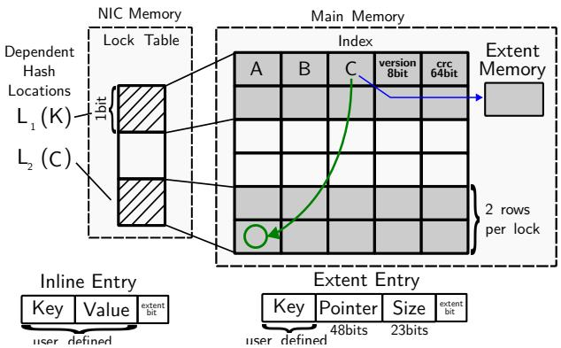  
Figure 2: RCuckoo’s datastructures showing insertion of key K as it displaces C, whose value is stored in an extent.

## 3 Design

In this section we describe the design of RCuckoo, a fully disaggregated key/value store implemented as a lockbased cuckoo hash table. RCuckoo’s performance stems largely from its extremely compact lock table which is enabled by our dependent hashing algorithm. Before describing the hashing algorithm or lock table, however, we first introduce the datastructures and protocols to read and modify the contents of the key/value store. For simplicity, we describe our design in the context of a single server, but it is straightforward to shard a large table across multiple servers (with a minor tweak, see Section 3.3).

## 3.1 Datastructures

Figure 2 shows RCuckoo’s index and lock table (both maintained at the remote memory server) during an insertion of key K (which requires the cuckooing of key C). The index table (right) is a single region of RDMAregistered main memory divided into rows of fixed-width entries. Each row contains n associative entries (3 in this figure; we use 8 in practice) and terminates with an 8-bit version number and 64-bit CRC (computed over the entire row including version number). Clients access the index table using 1-sided RDMA reads and writes. Clients can safely read one or more rows in a single lock-free RDMA operation as CRCs allow each row’s contents to be verified while version numbers enable clients to detect if a row has been modified (used to detect failures; see Section 4.1).

Table entry and key sizes are configuration parameters, but are the same for all rows and must be fixed at table creation. Individual entries, on the other hand, can contain either inlined key/value pairs (bottom left) or a key and 48-bit pointer to an extent to store larger values (bottom right). The least-significant bit of an entry signifies its type; values are inlined by default. Extent entries use 23 bits to encode the value size (which can range from 23 to 226 bytes). Extents are located in separate, pre-allocated, per-client, RDMA-registered regions of server memory to avoid contention on inserts. Given the fully-disaggregated context we assume the index table will be initially provisioned at maximum size; we defer resizing to future work.

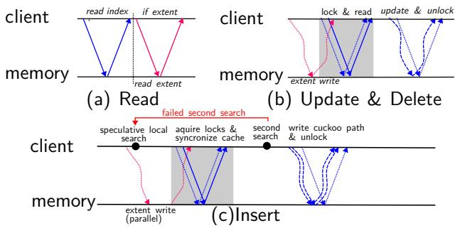  
Figure 3: RCuckoo’s operation protocol. Blue lines are index accesses, and red lines are extent accesses. Solid lines are reads, dotted lines are CAS, and curved dashed lines are writes. Overlapping messages indicate batching.

Locks (stored in a bit vector in NIC memory, shown on the left) each protect a tunable number (here, two; 16 in our experiments) of index rows. Clients perform lock acquisition and release with RDMA compare-andswap (CAS) operations. Specifically, RCuckoo leverages masked CAS (MCAS) operations [29, 41] to obtain up to 64 locks simultaneously while avoiding false sharing.

## 3.2 Operations

We detail the operations supported by RCuckoo below;   
Figure 3 visualizes the corresponding message exchanges.

## 3.2.1 Reads

RCuckoo is designed to facilitate lock-free, single roundtrip reads for small values as they are the dominant operation for key/value stores in many data centers [6, 27]. To read the value associated with a given key clients calculate the potential table locations for the key’s entry (using the hash functions described in the next subsection) and issue RDMA reads for both rows simultaneously. Because all operations between a client and a given server travel over a reliable connection, they are intrinsically ordered, but in our description we will only call out when a particular ordering among a batch of messages is required.

Moreover, as suggested by Figure 1(a), if the rows are located sufficiently close together, it can be beneficial for the client to issue a single covering read that returns the contents of both rows—as well as any intervening ones— in a single request. In our experiments RCuckoo clients issue a single, large read rather than two small reads if the locations are in adjacent rows. Reads are successful if either row contains an entry with the desired key and a valid CRC. An invalid CRC indicates a torn write or rare failure case, in which case the operation is retried (see Section 4.1). As shown in Figure 3(a) successful inlined reads complete in one round trip, while reads for large values require a second round trip to retrieve the extent.

## 3.2.2 Updates and deletes

Updates and deletes, like reads, access only two locations in the index table, but require a client to acquire the associated locks. Due to RCuckoo’s dependent hashing, it is usually possible to attempt to acquire both locks in a single MCAS operation (Section 3.4.1). If so, the client issues read(s) for the corresponding rows of the index table immediately afterwards but in the same batch of operations.1 In the rare case that the locks must be acquired independently—necessitating an additional round trip— the reads are batched with the second lock request.

Assuming successful lock acquisition and valid reads, the operation can proceed if the key is present in either location. In a single (ordered) batch of operations, the client first writes the updated/freed entry and recomputed row version and CRC before releasing the locks. When updating values stored in extents, clients store the value to a new extent via an RDMA write that is sent in parallel with lock requests. On lock release clients write the first bit of the old extent to free it. Deletes operate identically save writing a new extent. Clients garbage collect their own extents by occasionally scanning their allocated region for freed extents. Figure 3(b) shows that most uncontested operations complete in two round trips; clients retry acquisitions until they succeed or detect a failed client.

## 3.2.3 Inserts

Inserts are challenging because concurrent operations might result in cuckoo paths that collide. To avoid the complexity of rolling back partially completed inserts in the event of a collision, RCuckoo clients compute a complete cuckoo path ahead of time and then acquire locks on all the relevant rows to ensure its success. Moreover, to facilitate recovery from client failures, an insert is performed by cuckooing elements one at a time, starting by moving the last entry in the path to the empty location, and then replacing it with the previous entry in the path, and so on until the new entry is inserted in its primary location.

To speed up cuckoo-path searches, RCuckoo clients keep a local, RDMA-registered cache of (relevant portions2 of) the index table. The cache is populated with the results of any operation, but is used only for inserts. Clients validate—and, if necessary, update—their cache at each step of the insert operation as explained below, so stale entries do not impact correctness, only performance.

At a high level an insert operation proceeds in three (or four) phases. For extent entries, clients first write the value to a free extent—in parallel with the remaining three phases. Clients maintain a local slab allocator that manages their private extent region, so there is no contention. Regardless of whether the entry contains an inlined value or a pointer to an extent, RCuckoo clients start by identifying a potential cuckoo path using only the contents of their local table cache. Clients then simultaneously attempt to acquire the locks for and update their cache of the rows that comprise the candidate path. Using only the contents of their newly updated local cache, clients conduct a second search to confirm that a candidate path—either the initial guess or an alternative that similarly consists only of currently locked rows—exists. If so, the insert is performed; if not, the client releases its locks and retries.

Speculative local search: Each insertion attempt uses a heuristic search to find a speculative cuckoo path. An attempt starts by identifying a potential path using the (potentially stale) contents of the client’s local table cache. We use breadth-first search (BFS) [20] to identify short paths in an attempt to minimize bandwidth and locking overhead. If the client cache is empty the degenerate path is presumed, i.e., that the key will be inserted into its primary location without the need for any cuckooing. Speculative cuckoo paths are especially useful when client caches are fresh—often due to a failed prior attempt to insert the same key.

Cache synchronization: Armed with a speculative cuckoo path, clients identify the set of locks necessary to protect the relevant rows. Approximately 99% of paths can be locked with a single MCAS operation (Figure 4(c)); longer paths acquire locks in groups (Section 3.4.1). Immediately after, but in the same batch of RDMA operations as each attempt to acquire (a subset of) the locks, clients synchronize their local cache by issuing reads for all of the rows covered by that set of locks. In general, locks cover multiple rows, so this will be a superset of the rows necessary for the identified path. Note that if lock acquisition is successful, the values returned by the read of the corresponding rows will remain unchanged until the lock is released.

Figure 2 shows an example insert operation where the primary row for K is full and the entry for key C is being evicted to its secondary location. Hence, the client has acquired locks corresponding to the row where it hopes to insert the entry for key K as well as the row into which it plans to cuckoo the existing entry for key C. Rows shaded in gray are synchronized because they are covered by the locks, while the contents of any other rows that happen to be in the client’s cache cannot be depended upon without additional validation. Rather, they may increase the likelihood that a subsequent speculative search succeeds.

Second search: If all the lock acquisitions are successful, the client confirms that the speculative path remains valid. Under an insert-heavy workload, however, speculative cuckoo paths are frequently stale. Yet, a valid cuckoo path may still exist within the locked rows. Hence, if the speculative path is no longer viable, clients perform a second search within their cache restricted to only the rows for which they currently hold the lock in hopes of identifing an alternative path. If the speculative path works— or a valid alternative is located—the appropriate series of swaps and version/CRC updates are calculated and issued as a batch of RDMA writes, one row at a time, followed by (an ordered set of) lock releases. If no valid path exists within the currently locked rows the client releases its locks and tries again, conducting another speculative search on the updated cache contents.

This entire process repeats until success, a client determines there is no viable cuckoo path within a maximum search depth (we use a depth of five in our experiments, at which point the insert operation returns an error indicating the table is full), or a failed client is detected. If cuckoo paths were to randomly span the table it is unlikely that an alternate valid path would exist within the locked rows when speculation fails. In the next subsection, we describe how RCuckoo uses dependent hashing to dramatically increase the likelihood that an alternate path exists.

## 3.3 Locality

In a traditional cuckoo hash, the two locations for a given key are deliberately independent which allows the table to be filled quite full before inserts begin to fail. In RCuckoo the distance between keys’ two cuckoo hash locations is a tunable parameter. Increased locality has two direct benefits: it decreases the number of MCAS operations necessary to acquire the relevant locks and increases the probability that both of a keys’ locations can be read with a single covering read. It also reduces the region of the index table likely to be spanned by cuckoo paths, which speeds up inserts, but leads to hot spots that limit the table’s expected maximum fill factor. Experiments show that an optimal locality setting can dramatically decrease the number of round trips required to perform inserts in RCuckoo while maintaining high (90%+) maximum fill factors.

In RCuckoo, the primary location for a key is chosen uniformly at random, while the second is offset from the first by uniformly random value drawn from a probabilistically bounded range, where the range is likely to be relatively small. We start with a base hash3, $h ( )$ , and use it to implement three independent hash functions $h _ { 1 } ( ) , h _ { 2 } ( )$ ， and $h _ { 3 } ( )$ . (In our implementation we use a different salt for each of the three functions.) We compute the two locations $L _ { 1 }$ and $L _ { 2 }$ for a key K as

$$
L _ { 1 } ( K ) = h _ { 1 } ( K ) \mod T ,
$$

$$
L _ { 2 } ( K ) = L _ { 1 } { + } ( h _ { 2 } ( K ) \mod \lfloor f ^ { f + \mathcal { Z } ( h _ { 3 } ( K ) ) } \rfloor )
$$

where $T$ is the size of the index table in rows, $\mathcal { Z } ( x )$ is the number of trailing zeros in $x ,$ and $f$ is a parameter that controls the expected distance between the two hash locations. (In a sharded deployment, the second location is restricted to the same shard by “wrapping around” the offset accordingly.) The particular formulation is not important, but the upshot is exponentially fewer keys have secondary locations at increasing distances from their primary. The probabilistic aspect is crucial, as any fixed bound on the distance between hash locations leads to low maximum fill factors (on the order of 10–15% in our experiments).

Figure 4(a) shows the distance between hash locations as a CDF for different values of $f ,$ while Figure 4(b) shows that larger $f$ enables higher fill prior to the first insertion failure. In our evaluation we set $f = 2 . 3$ based on this empirical data. As shown in the figure, for index tables with eight entries per row, RCuckoo delivers an expected max fill of greater than 95% with a 68% probability that a key’s locations are located five or fewer rows apart.

Decreased distances between hash locations naturally lead to shorter cuckoo paths when combined with our breadth-first search approach. Using f = 2.3 and a table size of 100-K rows, Figure 4(c) shows that when filling the table to 95% full, slightly more than half of insertions do not require any cuckooing, and 95% of insertions require cuckoo paths that span 32 or fewer rows while nearly 99% span 256 or fewer. Conversely, with independent hashing, insertions that require any cuckooing at all almost always result in spans of 2 K rows or more.

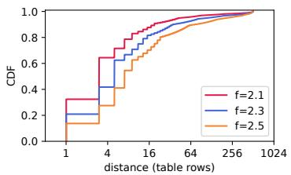

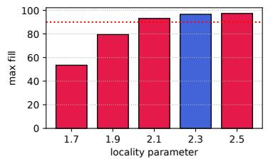

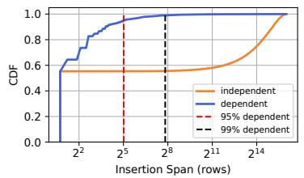  
Figure 4: (a) CDF of distances between cuckoo locations for different locality settings using RCuckoo’s dependent hashing. (b) Fill percentage before insertion failure for different locality settings (average of 10 runs, negligible variance). 90% fill indicated by dashed red line. (c) CDF of cuckoo spans for dependent and independent hashing. A cuckoo span is the distance between the smallest and largest index in a cuckoo path.

## 3.4 Locking

While RCuckoo reads are lock free, updates and especially inserts depend critically on locking performance.

## 3.4.1 Lock granularity

Increased locality decreases the number of round trips required for lock acquisition. Recall the lock table is a linear array of lock bits and each bit locks one or more table rows. As mentioned previously, RCuckoo implements lock acquire and release using RDMA masked compareand-swap (MCAS) operations that can update 64 bits at a time. To avoid deadlock RCuckoo acquires locks in increasing order. For any given operation, clients group the necessary locks into the smallest number of sets as possible (where each set is an attempt to acquire one or more locks within a single 64-bit span) and issue MCAS operations one at a time in order of their target address. Clients continuously spin on lock acquisitions and only move to the next MCAS operation after the current one succeeds. Due to this one-MCAS-per-round-trip acquisition procedure, lock granularity is critical to performance.

If, as in Figure 4(c), almost 99% of cuckoo spans are 256 rows or less, and each lock protects four rows, almost all insertions can have their locks acquired with a single MCAS (lock-table accesses do need to be byte aligned). Of course, increasing the number of rows covered by a single lock can lead to false sharing, forcing additional retries to acquire the necessary locks. Figure 5 shows the results of a representative experiment where 8 clients are concurrently filling a 512-row table to 95% full. We report the 99th-percentile (i.e., the most expensive inserts when the table is nearly full) number of round trips required to acquire the locks necessary to perform an insertion as a function of both lock granularity (i.e., number of rows per lock, on the x-axis) and lock size (i.e., the number of locks that can be accessed with a single MCAS operation, on the y-axis—RCuckoo’s single-bit locks correspond to 64 locks per message shown on the bottom row).

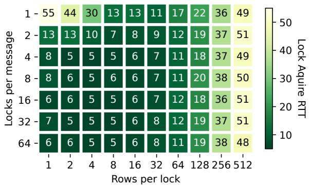  
Figure 5: 99th-percentile round trips required per insert in a 512-row table when filling to 95%. 512 buckets per lock corresponds to a single global lock.

While there is some noise due to experimental variance, the far-right column shows that a single global lock results in high contention (as there is only one lock in the system, it does not matter how many locks can be acquired per message). Conversely, the top left corner shows that, despite the lack of false sharing when a lock corresponds to exactly one row, the inability to acquire more than one lock at a time leads to a large number of round trips. Under these conditions, the sweet spot falls in the range of 2–16 rows per lock. In our experiments we use 16 rows per lock as, when combined with our choice of f, a single MCAS suffices for the vast majority of insertions.

## 3.4.2 Virtual locks

While Figure 5 suggests that RCuckoo could employ larger locks (e.g., 8–16-bits per) without increasing the number of round trip times required to acquire them, there is an additional design constraint that drives our choice of single-bit locks. Specifically, to improve locking performance, RCuckoo locates the lock table in NIC device memory which delivers 3× higher throughout on contented addresses than host memory (Figure 1(c)). It is also lower latency as operations to device memory avoid a PCIe round trip. Unfortunately, NIC memory is limited (to 256 KB on our ConnectX-5s), so this choice bounds the size of the lock table and drives our single-bit design.

To allow RCuckoo to support tables with more than 64 M rows, we implement a virtual lock table where multiple logical locks map to a single physical lock. Concretely, we map a logical lock l drawn from a table of size L to a physical location p in a bit-array of size P by computing p = l mod P . Mapping multiple virtual locks to a single physical lock introduces yet another source of false sharing, but allows us to support arbitrarily large tables. When employing virtual locking, clients performing an insert first map rows to virtual locks, then to physical locks, then sort them into groups.

## 4 Fault tolerance

In keeping with the rest of its design, RCuckoo handles failures in a fully disaggregated manner as well. We depend upon the RDMA hardware to handle network failures and focus exclusively on clients which can failstop mid-operation. Server failure can be addressed by employing client-driven replication on top of RCuckoo. While there may be opportunities to integrate replication into RCuckoo itself, we defer such an exploration to future work. In RCuckoo, client failure is only of concern if the failure occurs while the client was holding one or more locks, i.e., in the middle of a mutating operation (i.e., update, delete, or insert); hence, RCuckoo detects client failures by noticing that a pending mutation does not complete in a timely fashion. Any client that encounters such a situation endeavors to recover the stranded lock and repair the impacted portion of the index table. The remainder of this section describes how RCuckoo clients detect faults, reclaim stranded locks, and, if necessary, repair the index table. Finally, we discuss additional measures that can be employed to prevent stale writes if desired.

## 4.1 Failure detection

Clients detect failures by setting a timeout when attempting repeated lock acquisition or read requests. Because RCuckoo operations are designed to require only a few round trip times, a client performing a successful mutating operation will complete and release its locks extremely rapidly. Conversely, a client that is unable to acquire all the locks required for an insert operation releases those they do hold before trying again. Hence, it is extremely unlikely that repeated attempts to acquire a lock or perform an untorn read will fail continuously.

Of course, there is a possibility that a given row is highly popular, leading to high lock contention and/or repeatedly torn reads. Clients distinguish this case by consulting the CRC for the row they are unable to successfully read or lock. Because each mutation increases the version number, even updates that replace an entry with the same value will result in a different CRC. Clients declare a false positive and restart their failure timer if a CRC changes between attempts.

We expect client failures to be relatively rare, so set our fault timeout conservatively. Failure timers must allow for worst-case locking time, second-search time, and RDMA message transmission time. We bound locking time; search and message propagation are both measured in single-digit microseconds on our testbed. To guard against the possibility that network conditions lead to high rates of RDMA retries we set the maximum RDMA operation retry number to three. In this context, we set the failure timeout to 100 ms in our experiments, orders of magnitude above the 99th-percentile insert time of 50 µs.

## 4.2 Repair leases

RCuckoo recovers stranded locks one lock at a time; if a client fails holding multiple locks recovery may be conducted by multiple clients at different times depending on their access patterns. RCuckoo’s lock table does not maintain records of ownership, so there is no way to “transfer” lock ownership from the failed node to a recovery node in the table itself. Instead, clients acquire a repair lease that grants exclusive permission to reclaim locks on a region of the index table. The index table is broken into n regions so repairs can be executed in parallel.

RCuckoo maintains a lease table in RDMA-registered main memory on the server. Lease entries contain a (log n)-bit lease ID, a set flag, the lease holder’s 48-bit queue pair ID (which RDMA ensures is unique for a given server), and an 8-bit counter (incremented on each acquisition). A lease is considered free if the set bit of the current entry in the lease table is zero. Clients attempt to acquire the lease using RDMA CAS operations to ensure mutual exclusion. Upon successful acquisition, a client completes the repair (described below) and then relinquishes the lease by clearing the set bit. Leases are revoked (to handle the case of a failed recovery node) using a timeout mechanism similar to normal locks. If a client times out while attempting lease acquisition it claims it for itself (again, using CAS to resolve any races) and marks the lease holder as failed (see Section 4.4).

## 4.3 Table repair

All modification operations write new entries as a cuckoo path; updates and deletes have a path of length one. As described in Section 2.3 cuckoo paths are executed by first claiming an open entry at the end of the path and proceeding backward along the path, cuckooing entries forward one-by-one until the new entry is written at the beginning of the path. Client failures can occur at any point along an insertion path; a failed client can leave the table in one of four distinct states based on how far along it was:

1. A duplicate entry exists and one has a bad CRC,

2. A duplicate entry exists and both have correct CRCs,

3. No duplicate exists but one row has a bad CRC, or

4. No duplicate exists and no rows have a bad CRC.

The last case can occur if a client fails prior to issuing any updates to the table or if it fails after updating all the rows but before releasing the locks. In either case recovery is trivial: a client with the repair lease can simply unlock the stranded lock. Recovery from the other three cases requires modification to the index table.

To repair the table a client first detects in which state the table is and then transitions the table forward through the states with a deterministic sequence of operations so that failures during recovery can be repaired by a subsequent client. A client determines the state by issuing reads to all rows protected by the stranded lock. It then proceeds one-by-one through each entry within the rows, checking both hash locations for the corresponding key (one of which may not be in the locked rows) for duplicates or a bad CRC. Because RCuckoo updates one row per RDMA write, there can be at most one duplicate or bad CRC.

Clients repair the table by transitioning though the states one step at a time. To move from state 1 to 2, the client writes a new CRC for the bad duplicate. The table can be transitioned from state 2 to 4 by clearing the duplicate entry in the second (i.e., pointed to by $L _ { 2 } ( K ) )$ location. Finally, the table can be transitioned from state 3 to 4 by recalculating and writing a new CRC to the impacted row. After a client has issued its repair sequence it unlocks the reclaimed lock and returns its lease.

From a correctness perspective, once all rows have a valid CRC and there are no duplicates, the table is usable again. Clearly the new value being inserted into the table by the failed client is lost, but this is indistinguishable from the case that the client failed before attempting the insert. If the client was in the middle of cuckooing values up the path, a subset of the values were moved from their primary cuckoo location to their secondary location, but reads check both locations in any case, so the entry will still be located. Finally, because duplicate entries are freed, no space in the table is lost.

## 4.4 Preventing stale writes

The one remaining concern is that a supposed-failed client could just be slow, and may yet attempt to complete its cuckoo path despite the fact that its locks were reclaimed. Our failure timeout is deliberately set many orders of magnitude larger than the expected operation completion time, but we cannot completely rule out the possibility. Large-scale deployments can implement a separate liveness protocol to identify stalled clients and prevent such black swan events.

Specifically, a portion of remote memory could be used to store a datastructure that each client must update with some frequency so failed (or unreasonably slow) clients can be identified by their failure to update their entry in a timely manner. Such a protocol is straightforward to implement with one-sided RDMA operations, but we have not found the need to implement it in our testbed—we have never seen a stale write that was delivered with a delay anywhere close to approaching our timeout value.

Once a failed client is identified, real-world deployments have many ways to ensure the client ceases operation, but it is interesting to consider providing such functionality within RCuckoo itself. Unfortunately, at the time of writing the Infiniband specification does not allow clients to modify each other’s RDMA permissions.4 To the best of our knowledge, the only current alternative is to reset a failed client’s queue pair by crafting an invalid packet and sending it to their queue pair at the server [33, Attack 2]. For this attack to work the packet sequence number of the invalid packet must match expected sequence number at the receiver so 224 packets must be sent to ensure the connection is corrupted successfully.

## 5 Evaluation

We evaluate RCuckoo by directly comparing its performance in terms of throughput and latency against representative state-of-the-art (partially) disaggregated key/- value stores. When accessing sufficiently large values, all systems can max-out our testbed’s 100-Gbps link rate, so we focus on workloads with small key/value pairs that remove the bandwidth limitation, exposing the (in)efficiency of each system’s management and synchronization techniques.

When values are stored inline, RCuckoo outperforms existing systems while delivering competitive insert latencies. Using fault injection, we show that our distributed approach to client failure detection and recovery enables RCuckoo to sustain high throughput even though 100s of clients are failing per second. Finally, we justify our design decisions through a series of micro-benchmarks. Specifically, we quantify the benefit RCuckoo extracts from its locality enhancement before measuring the impact of index-table entry size.

## 5.1 Implementation

We have built two separate versions of RCuckoo, an 8.7 K-line C++ implementation tuned for high performance and a 12 K-line Python implementation that simulates RDMA operations to facilitate correctness testing. Both implementations will be made available on GitHub at publication. We report results using our C++ implementation which requires OFED-4.9 to support masked CAS operations and device-mapped memory on ConnectX-5 NICs. All experiments use 64-KB client index-table caches and a virtual lock table at the server.

## 5.2 Testbed

We conduct our evaluation on an 9-node cluster of dualsocket Intel machines. Each CPU is an Intel Xeon E5- 2650 clocked at 2.20 GHz. Each machine has 256 GB of RAM with 128 GB per NUMA node. All machines have a single dual-port ConnectX-5 attached to a 100-Gbps Mellanox Onyx switch. In our RCuckoo experiments we use one sever as the memory server and the rest a client machines spreading threads evenly across machines.

We compare RCuckoo against three recent RDMA key/value stores with different designs, FUSEE [38], Clover [40], and Sherman [41]. While none have the exact same assumptions or feature set as RCuckoo, each represents an apt comparison point for different aspects. To avoid biasing our evaluation, we consider the same workloads (YCSB) as the authors of the previous systems.

FUSEE is a fully disaggregated key/value store that represents the closest available comparison point to RCuckoo. While both employ only 1-sided RDMA operations, FUSEE eschews locking in favor of optimistic insertions. FUSEE clients use CAS operations to manage fixed, 64-bit index table entries that contain pointers to values stored in extents. Due to its reliance on CAS operations, FUSEE is unable to support inlined storage of small values like RCuckoo, forcing all reads to require two round trips. Unlike RCuckoo, FUSEE is designed to support replication. To remove the overhead of replication, we deploy FUSEE with a single memory node.

Clover is only partially disaggregated—it requires a metadata server to manage its index structure—but can deliver higher read performance than FUSEE on readonly workloads. Clover is designed to leverage remote persistent memory and implements both reads and updates using one-sided RDMA operations. Moreover, unlike FUSEE—and similar to RCuckoo—Clover reads are self verifying. In contrast to prior comparisons [38] that force clients to consult the metadata server on each read, we allow Clover to take advantage of its client caching to achieve maximum performance on read-heavy workloads.

Sherman is the highest-throughput distributed key/- value storage system of which we are aware that employs locks. Sherman maintains a B-tree that spans multiple servers and supports range queries, a feature none of the other systems—RCuckoo included—provide. On the other hand, Sherman clusters are not fully disaggregated: each node in a cluster is a peer with many CPU cores and a single memory core that is responsible for servicing allocation RPC calls from clients. As such, Sherman does not encounter the same bandwidth bottlenecks as the other systems because requests are partitioned across machines.

## 5.3 Performance

We start by considering throughput and latency on the classical YCSB workloads which employ varying mixes of read and update operations before turning to the more complex insert operation. RCuckoo delivers the highest performance on reads and updates across all settings, while insert performance varies as a function of table fill factor. Even in the worst case, however, RCuckoo limits insert I/O amplification to around 2×.

Throughput. Figure 6 shows YCSB throughput for RCuckoo, FUSEE, Clover, and Sherman on three different YCSB workloads. For each system, we allocate a 100- M-entry table and pre-populate it with 90 M entries that each consist of a 32-bit key and 32-bit value (we consider larger sizes in Section 5.5). We plot the aggregate throughput of a variable number of clients concurrently accessing entries according to a Zipf(0.99) distribution.

In a read-only (YCSB-C) workload, FUSEE suffers from its extent-based value storage. RCuckoo, Clover, and Sherman perform similarly at low-to-moderate levels of concurrency, but they separate at scale. Sherman’s read algorithm is more complex than RCuckoo’s leading to lower top-end performance. Clover’s client-side caching shines under this skewed workload, where almost all reads hit in a client’s index cache, requiring only a single read for the value; its performance degrades under a more uniform workload (not shown). RCuckoo, on the other hand, reads inlined values in a single round trip regardless of the distribution, leading to the highest performance.

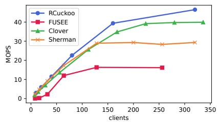

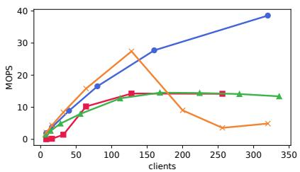

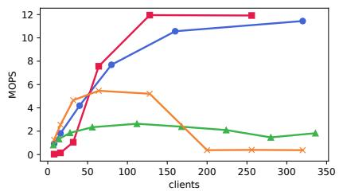  
Figure 6: Throughput as a function of the number of clients for three different workloads (Zipf θ=0.99): (a) Read only (YCSB-C), (b) YCSB-B 95% read, 5% update and (c) 50% read 50% update (YCSB-A).

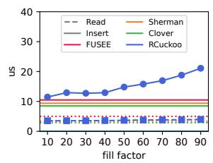

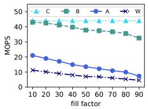

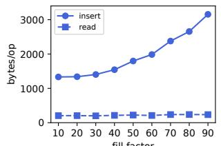

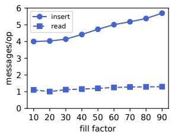  
Figure 7: Insert performance as a function of fill factor. (a) Throughput for four different insert workloads, (b) median operation latency, (c) mean operation size, and (d) mean per-operation RDMA message count under workload A.

Increased update rate slows all systems. Even with only 5% updates (YCSB-B), the picture changes dramatically. Sherman performs well at low levels of concurrency due to its single-round-trip reads, but hits a severe bottleneck due to lock contention on the skewed access pattern. (Sherman improves—but does not surpass RCuckoo—for uniform workloads, not shown, where lock contention is less of an issue.) Caching is less effective with updates, bringing Clover’s throughput in line with FUSEE.

On the 50/50-mixed YCSB-A workload RCuckoo and FUSEE perform similarly, although we are unable to scale FUSEE past 250 clients in our testbed while RCuckoo continues to scale. Sherman begins to suffer from lock contention even earlier, topping out around 5 MOPS before collapsing. (Absolute performance improves as Zipf skew decreases—not shown—but the trend remains.) Clover performs worst under write-heavy workloads due to its inability to effectively leverage caching with a constantly changing index structure.

Latency. Latency varies dramatically depending on operation for all systems, each of which optimizes for reads. For RCuckoo, insert is by far the most involved operation, but it remains highly performant. To evaluate insert performance we run workloads with a mix of reads and inserts. Figure 7 considers performance on workloads that exclusively use inserts (rather than updates); as with

YCSB nomenclature A is 50/50 read/insert; B is 95/5; C is read-only; and W is insert only. Inserts become more expensive as the table fills, so we pre-populate the table with a varying number of entries and report insert performance as a function of the table’s initial fill factor.

As a baseline we collect the read and insert latencies for all systems under light load (Figure 7(a)). Read latency is nearly identical for all systems save FUSEE as it makes a read to both the index and extent. Insert times vary: Clover and Sherman use two-sided RDMA operations for insert and both need to perform allocations and set up metadata for the requesting client. FUSEE is slightly slower, roughly the same as RCuckoo’s best case. As the table fills, however, cuckoo paths grow in length causing RCuckoo insert operations to require additional round trips to find valid cuckoo paths. Insert operations at maximum fill take roughly twice as long as at empty.

Insert I/O amplification. Figure 7(b) shows impact of table fill on insert throughput at heavy load (320 clients). As the index table fills, cuckoo paths become longer leading to increased contention and additional bandwidth consumption. In each case (except read-only C) RCuckoo’s performance declines with fill factor. In the insert-only W case RCuckoo’s performance drops from a high of 11.5 MOPS in a nearly empty table to 4.5 MOPS at a 90% fill factor. As a point of comparison, FUSEE’s maximum insert-only performance is 9.1 MOPS on our testbed, although it is independent of fill factor. While FUSEE out-performs RCuckoo at high fill factors, we observe that insert-only workloads are rare in practice [27]. Figures 7(c) and (d) show the impact of fill factor on the bandwidth cost (at most 2×) of each operation and the number of RDMA messages (≤1.5×) they require to complete.

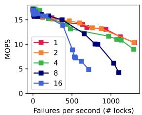

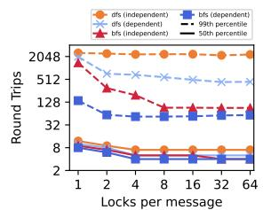

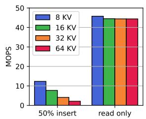

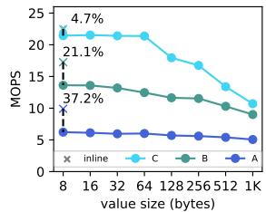  
Figure 8: RCuckoo microbenchmarks: (a) YCSB-A throughput vs. client failure rate, (b) round trip times required to acquire locks on insert, (c) throughput vs. key/value-entry size for 50% insert 50% read, and YCSB-C (read-only) workloads, and (d) extent performance for value sizes up to 1 KB (with 8-byte inline performance plotted with ×s; relative performance improvement depicted with dashed black lines and labeled accordingly).

## 5.4 Fault tolerance

RCuckoo runs at nearly full throughput during realistic failure scenarios and remains functional in the face of hundreds of failures per second. We emulate client failures by performing a partial insert operation that randomly truncates the batch of RDMA operations (including lock releases), leaving the table in one of the states listed in Section 4.3. Figure 8(a) shows that throughput remains high until about 500 client failures per second, at which point lock granularity begins to play a significant role; finer-grained locks are easier to recover leading to less throughput degradation. As a point of reference, we observe that RDMA itself struggles to handle churn of this magnitude: a server can only establish approximately 1.4 K RDMA connections per second [23].

## 5.5 Microbenchmarks

Having established RCuckoo’s superiority over prior systems and demonstrated its robustness to client failure, we now evaluate the impact of particular design choices.

Locality enhancement. Figure 8(b) illustrates the dramatic benefit RCuckoo extracts from its dependent hashing combined with a BFS cuckoo-path search strategy. To focus on longer cuckoo paths, we pre-populate a 100-M entry table to 85% and then report both the median and 99th percentile round trips per insert key/value pairs until the table is 95% full as a function of lock granularity. While median performance is on the same order, the 99thpercentile insert takes an order of magnitude fewer round trips with dependent hashing and BFS as opposed to independent hashing and DFS as used in prior cuckoo hash systems [20, 25, 32]. As before (c.f. Figure 5), performance is similar with four or more locks per message.

Entry/value sizes. Inlined key/value entries enable single-round-trip reads. However large entries increase bandwidth consumption for inserts. Figure 8(c) shows the effect of entry size on throughput under 50% insert and read-only (YCSB-C) workloads. Insert is a bandwidthlimited operation on our 100-Gbps testbed, while read performance (and update/delete, not shown) is largely unaffected by entry size. Extent entries are slightly slower: Figure 8(d) shows YCSB throughput as a function of value size from 8 to 1024 bytes on 6 client machines with 120 cores. Read performance becomes link-rate limited after about 64 bytes. For comparison, we show the performance of the 8-byte inlined values used elsewhere in the evaluation on this configuration and compute the difference. Inlined entries have two sources of performance gain: they avoid the overhead of reading and writing to extents which increases with value size, but, more importantly they avoid additional rounds trips on cache misses. YCSB-B sees a 21% performance improvement from inlining while YCSB-A gains 37% (YCSB-C has misses).

## 6 Conclusion

In this work we design and implement a lock-based cuckoo hash table for passive remote memory. Using dependent hashing, a carefully designed locking protocol, and the latest RDMA NIC features we achieve singleround-trip reads, update operations that require two round trips when uncontested, and insert operations that require only two round trips in the median case. Even in the face of high contention and nearly full tables, client caching limits I/O amplification. Moreover, our step-by-step insert protocol enables fully disaggregated failure detection and recovery.

## References

[1] AMARO, E., BRANNER-AUGMON, C., LUO, Z., OUSTERHOUT, A., AGUILERA, M. K., PANDA, A., RATNASAMY, S., AND

SHENKER, S. Can far memory improve job throughput? In Proceedings of the Fifteenth European Conference on Computer Systems (New York, NY, USA, 2020), EuroSys ’20, Association for Computing Machinery.

[2] BANSAL, D., DEGRACE, G., TEWARI, R., ZYGMUNT, M., GRANTHAM, J., GAI, S., BALDI, M., DODDAPANENI, K., SEL-VARAJAN, A., ARUMUGAM, A., RAMAN, B., GUPTA, A., JAIN, S., JAGASIA, D., LANGLAIS, E., SRIVASTAVA, P., HAZARIKA, R., MOTWANI, N., TIWARI, S., GRANT, S., CHANDRA, R., AND KANDULA, S. Disaggregating stateful network functions. In 20th USENIX Symposium on Networked Systems Design and Implementation (NSDI 23) (Boston, MA, Apr. 2023), USENIX Association, pp. 1469–1487.

[3] BIELSKI, M., SYRIGOS, I., KATRINIS, K., SYRIVELIS, D., REALE, A., THEODOROPOULOS, D., ALACHIOTIS, N., PNEVMATIKATOS, D., PAP, E., ZERVAS, G., MISHRA, V., SALJOGHEI, A., RIGO, A., ZAZO, J. F., LOPEZ-BUEDO, S., TORRENTS, M., ZYULKYAROV, F., ENRICO, M., AND DE DIOS, O. G. dredbox: Materializing a full-stack rack-scale system prototype of a next-generation disaggregated datacenter. In 2018 Design, Automation Test in Europe Conference Exhibition (DATE) (2018), pp. 1093–1098.

[4] BRANNER-AUGMON, C., GALSTYAN, N., KUMAR, S., AMARO, E., OUSTERHOUT, A., PANDA, A., RATNASAMY, S., AND SHENKER, S. 3po: Programmed far-memory prefetching for oblivious applications, 2022.

[5] CALCIU, I., IMRAN, M. T., PUDDU, I., KASHYAP, S., MARUF, H. A., MUTLU, O., AND KOLLI, A. Rethinking software runtimes for disaggregated memory. In Proceedings of the 26th ACM International Conference on Architectural Support for Programming Languages and Operating Systems (New York, NY, USA, 2021), ASPLOS ’21, Association for Computing Machinery, p. 79–92.

[6] CAO, Z., DONG, S., VEMURI, S., AND DU, D. H. Characterizing, modeling, and benchmarking RocksDB Key-Value workloads at facebook. In 18th USENIX Conference on File and Storage Technologies (FAST 20) (Santa Clara, CA, Feb. 2020), USENIX Association, pp. 209–223.

[7] COLLET, Y. xxhash extremely fast hash algorithm. https:// xxhash.com/, 2023.

[8] DRAGOJEVIC´ , A., NARAYANAN, D., CASTRO, M., AND HOD-SON, O. FaRM: Fast remote memory. In 11th USENIX Symposium on Networked Systems Design and Implementation (NSDI 14) (Seattle, WA, Apr. 2014), USENIX Association, pp. 401–414.

[9] FAN, B., ANDERSEN, D. G., AND KAMINSKY, M. MemC3: Compact and concurrent memcache with dumber caching and smarter hashing. In 10th USENIX Symposium on Networked Systems Design and Implementation (NSDI 13) (Lombard, IL, Apr. 2013), USENIX Association, pp. 371–384.

[10] GAO, J., LU, Y., XIE, M., WANG, Q., AND SHU, J. Citron: Distributed range lock management with one-sided RDMA. In 21st USENIX Conference on File and Storage Technologies (FAST 23) (Santa Clara, CA, Feb. 2023), USENIX Association, pp. 297– 314.

[11] GU, J., LEE, Y., ZHANG, Y., CHOWDHURY, M., AND SHIN, K. G. Efficient memory disaggregation with infiniswap. In 14th

USENIX Symposium on Networked Systems Design and Implementation (NSDI 17) (Boston, MA, Mar. 2017), USENIX Association, pp. 649–667.

[12] GUO, Z., HE, Z., AND ZHANG, Y. Mira: A program-behaviorguided far memory system. In Proceedings of the 29th Symposium on Operating Systems Principles (New York, NY, USA, 2023), SOSP ’23, Association for Computing Machinery, p. 692–708.

[13] HERLIHY, M., SHAVIT, N., AND TZAFRIR, M. Hopscotch hashing. In Proceedings of the 22nd International Symposium on Distributed Computing (Berlin, Heidelberg, 2008), DISC ’08, Springer-Verlag, p. 350–364.

[14] HUANG, R., HUANG, K., WANG, J., AND CHEN, Y. Reno: An rdma-enabled, non-volatile memory-optimized key-value store. In 2021 IEEE 27th International Conference on Parallel and Distributed Systems (ICPADS) (2021), pp. 466–473.

[15] KALIA, A., KAMINSKY, M., AND ANDERSEN, D. G. Using RDMA efficiently for key-value services. SIGCOMM Comput. Commun. Rev. 44, 4 (Aug. 2014), 295–306.

[16] KALIA, A., KAMINSKY, M., AND ANDERSEN, D. G. Design guidelines for high performance RDMA systems. In 2016 USENIX Annual Technical Conference (USENIX ATC 16) (Denver, CO, June 2016), USENIX Association, pp. 437–450.

[17] KARANDIKAR, S., OU, A., AMID, A., MAO, H., KATZ, R., NIKOLIC´ , B., AND ASANOVIC´ , K. FirePerf: FPGAaccelerated full-system hardware/software performance profiling and co-design. In Proceedings of the Twenty-Fifth International Conference on Architectural Support for Programming Languages and Operating Systems (New York, NY, USA, 2020), ASPLOS ’20, Association for Computing Machinery, p. 715–731.

[18] LEE, Y., MARUF, H. A., CHOWDHURY, M., CIDON, A., AND SHIN, K. G. Hydra : Resilient and highly available remote memory. In 20th USENIX Conference on File and Storage Technologies (FAST 22) (Santa Clara, CA, Feb. 2022), USENIX Association, pp. 181–198.

[19] LI, P., HUA, Y., ZUO, P., CHEN, Z., AND SHENG, J. ROLEX: A scalable RDMA-oriented learned Key-Value store for disaggregated memory systems. In 21st USENIX Conference on File and Storage Technologies (FAST 23) (Santa Clara, CA, Feb. 2023), USENIX Association, pp. 99–114.

[20] LI, X., ANDERSEN, D. G., KAMINSKY, M., AND FREEDMAN, M. J. Algorithmic improvements for fast concurrent cuckoo hashing. In Proceedings of the Ninth European Conference on Computer Systems (New York, NY, USA, 2014), EuroSys ’14, Association for Computing Machinery.

[21] LIM, K., CHANG, J., MUDGE, T., RANGANATHAN, P., REIN-HARDT, S. K., AND WENISCH, T. F. Disaggregated memory for expansion and sharing in blade servers. In Proceedings of the 36th Annual International Symposium on Computer Architecture (New York, NY, USA, 2009), ISCA ’09, Association for Computing Machinery, p. 267–278.

[22] LUO, X., ZUO, P., SHEN, J., GU, J., WANG, X., LYU, M. R., AND ZHOU, Y. SMART: A High-Performance adaptive radix tree for disaggregated memory. In 17th USENIX Symposium on Operating Systems Design and Implementation (OSDI 23) (Boston, MA, July 2023), USENIX Association, pp. 553–571.

[23] MA, T., MA, T., SONG, Z., LI, J., CHANG, H., CHEN, K., JIANG, H., AND WU, Y. X-rdma: Effective rdma middleware in large-scale production environments. In 2019 IEEE International Conference on Cluster Computing (CLUSTER) (2019), pp. 1–12.

[24] MARUF, H. A., AND CHOWDHURY, M. Effectively prefetching remote memory with Leap. In 2020 USENIX Annual Technical Conference (USENIX ATC 20) (July 2020), USENIX Association, pp. 843–857.

[25] MITCHELL, C., GENG, Y., AND LI, J. Using one-sided RDMA reads to build a fast, CPU-efficient key-value store. In 2013 USENIX Annual Technical Conference (USENIX ATC 13) (San Jose, CA, June 2013), USENIX Association, pp. 103–114.

[26] MITCHELL, C., MONTGOMERY, K., NELSON, L., SEN, S., AND LI, J. Balancing CPU and network in the cell distributed B-Tree store. In 2016 USENIX Annual Technical Conference (USENIX ATC 16) (Denver, CO, June 2016), USENIX Association, pp. 451– 464.

[27] NISHTALA, R., FUGAL, H., GRIMM, S., KWIATKOWSKI, M., LEE, H., LI, H. C., MCELROY, R., PALECZNY, M., PEEK, D., SAAB, P., STAFFORD, D., TUNG, T., AND VENKATARAMANI, V. Scaling memcache at facebook. In 10th USENIX Symposium on Networked Systems Design and Implementation (NSDI 13) (Lombard, IL, Apr. 2013), USENIX Association, pp. 385–398.

[28] NOVAKOVIC, S., SHAN, Y., KOLLI, A., CUI, M., ZHANG, Y., ERAN, H., PISMENNY, B., LISS, L., WEI, M., TSAFRIR, D., AND AGUILERA, M. Storm: A fast transactional dataplane for remote data structures. In Proceedings of the 12th ACM International Conference on Systems and Storage (New York, NY, USA, 2019), SYSTOR ’19, Association for Computing Machinery, p. 97–108.

[29] NVIDIA. Advanced transport. https://docs.nvidia. com/networking/display/MLNXOFEDv494170/ Advanced+Transport.

[30] NVIDIA. Device memory programming. https://docs.nvidia.com/networking/display/ OFEDv502180/Programming#Programming-DeviceMemoryProgramming.

[31] NVIDIA. Roce vs. iwarp competitive analysis. https: //network.nvidia.com/pdf/whitepapers/WP\_ RoCE\_vs\_iWARP.pdf.

[32] PAGH, R., AND RODLER, F. F. Cuckoo hashing. Journal of Algorithms 51, 2 (2004), 122–144.

[33] ROTHENBERGER, B., TARANOV, K., PERRIG, A., AND HOE-FLER, T. ReDMArk: Bypassing RDMA security mechanisms. In 30th USENIX Security Symposium (USENIX Security 21) (Aug. 2021), USENIX Association, pp. 4277–4292.

[34] RUAN, Z., SCHWARZKOPF, M., AGUILERA, M. K., AND BE-LAY, A. AIFM: High-performance, application-integrated far memory. In 14th USENIX Symposium on Operating Systems Design and Implementation (OSDI 20) (Nov. 2020), USENIX Association, pp. 315–332.

[35] SHAN, Y., HUANG, Y., CHEN, Y., AND ZHANG, Y. LegoOS: A disseminated, distributed OS for hardware resource disaggregation. In 13th USENIX Symposium on Operating Systems Design and Implementation (OSDI 18) (Carlsbad, CA, 2018), USENIX Association, pp. 69–87.

[36] SHAN, Y., LIN, W., KOSTA, R., KRISHNAMURTHY, A., AND ZHANG, Y. SuperNIC: A hardware-based, programmabe, and multi-tenant SmartNIC. In Proceedings of the 32nd ACM/SIGDA International Symposium on Field-Programmable Gate Arrays (Monterey, CA, Mar. 2024).

[37] SHEN, J., ZUO, P., LUO, X., SU, Y., GU, J., FENG, H., ZHOU, Y., AND LYU, M. R. Ditto: An elastic and adaptive memory-disaggregated caching system. In Proceedings of the 29th Symposium on Operating Systems Principles (New York, NY, USA, 2023), SOSP ’23, Association for Computing Machinery, p. 675–691.

[38] SHEN, J., ZUO, P., LUO, X., YANG, T., SU, Y., ZHOU, Y., AND LYU, M. R. FUSEE: A fully Memory-Disaggregated Key-Value store. In 21st USENIX Conference on File and Storage Technologies (FAST 23) (Santa Clara, CA, Feb. 2023), USENIX Association, pp. 81–98.

[39] TAURO, B. R., SUCHY, B., CAMPANONI, S., DINDA, P., AND HALE, K. C. Trackfm: Far-out compiler support for a far memory world. In Proceedings of the 29th ACM International Conference on Architectural Support for Programming Languages and Operating Systems, Volume 1 (New York, NY, USA, 2024), ASPLOS ’24, Association for Computing Machinery, p. 401–419.

[40] TSAI, S.-Y., SHAN, Y., AND ZHANG, Y. Disaggregating persistent memory and controlling them remotely: An exploration of passive disaggregated key-value stores. In USENIX Annual Technical Conference (July 2020), pp. 33–48.

[41] WANG, Q., LU, Y., AND SHU, J. Sherman: A write-optimized distributed B+Tree index on disaggregated memory. In Proceedings of the 2022 International Conference on Management of Data (Philadelphia, PA, 2022), Association for Computing Machinery, p. 1033–1048.

[42] YOON, W., OH, J., OK, J., MOON, S., AND KWON, Y. Dilos: adding performance to paging-based memory disaggregation. In Proceedings of the 12th ACM SIGOPS Asia-Pacific Workshop on Systems (New York, NY, USA, 2021), APSys ’21, Association for Computing Machinery, p. 70–78.

[43] ZHANG, M., HUA, Y., ZUO, P., AND LIU, L. FORD: Fast onesided RDMA-based distributed transactions for disaggregated persistent memory. In 20th USENIX Conference on File and Storage Technologies (FAST 22) (Santa Clara, CA, Feb. 2022), USENIX Association, pp. 51–68.

[44] ZHOU, Y., WASSEL, H. M. G., LIU, S., GAO, J., MICKENS, J., YU, M., KENNELLY, C., TURNER, P., CULLER, D. E., LEVY, H. M., AND VAHDAT, A. Carbink: Fault-Tolerant far memory. In 16th USENIX Symposium on Operating Systems Design and Implementation (OSDI 22) (Carlsbad, CA, July 2022), USENIX Association, pp. 55–71.

[45] ZUO, P., SUN, J., YANG, L., ZHANG, S., AND HUA, Y. One-sided RDMA-Conscious extendible hashing for disaggregated memory. In 2021 USENIX Annual Technical Conference (USENIX ATC 21) (July 2021), USENIX Association, pp. 15–29.