①

USENIX

THE ADVANCED COMPUTING SYSTEMS ASSOCIATION

## Optimizing Input Minimization in Kernel Fuzzing

Hui Guo, East China Normal University; Hao Sun, ETH Zurich; Shan Huang, Ting Su, and Geguang Pu, East China Normal University; Shaohua Li, The Chinese University of Hong Kong

https://www.usenix.org/conference/atc25/presentation/guo

# This paper is included in the Proceedings of the 2025 USENIX Annual Technical Conference.

July 7–9, 2025 • Boston, MA, USA

ISBN 978-1-939133-48-9

Open access to the Proceedings of the 2025 USENIX Annual Technical Conference is sponsored by

P-Lr.h £Es/sL.

auuuJl9 PgleU

King Abdullah University of

Science and Technology

# Optimizing Input Minimization in Kernel Fuzzing

Hui Guo† East China Normal University

Ting Su∗† East China Normal University

Hao Sun ETH Zurich

Geguang Pu† East China Normal University

Shan Huang† East China Normal University

Shaohua Li∗ The Chinese University of Hong Kong

## Abstract

Ensuring the reliability and security of an operating system (OS) kernel is a critical and challenging task. To this end, coverage-guided kernel fuzzing has been employed as an effective technique for finding kernel bugs. Specifically, in kernel fuzzing, input minimization is one critical stage to provide short, coverage-preserving seeds for improving the efficacy of fuzzing. However, we observe that the cost of the minimization — taking over half of the fuzzing resources — significantly limits the potential of kernel fuzzing.

To the best of our knowledge, no prior work explores and mitigates the preceding problem in kernel fuzzing. To this end, we introduce and design two general and novel optimization strategies — influence-guided call removal and type-informed argument simplification — for reducing the minimization cost. The key idea of these two strategies is to reduce the number of dynamic program executions needed for verifying whether the new coverage achieved by the inputs is always preserved.

We optimized the input minimization stage by our strategies in Syzkaller, the most popular and representative kernel fuzzer, resulting in a prototype named SyzMini. Our evaluation shows that SyzMini can significantly reduce the minimization cost by 60.7%. Moreover, SyzMini improves branch coverage by 12.5%, and finds 1.7\~2X more unique bugs. On the latest upstream kernel version, Syzmini has found 13 previously unknown bugs, all of which have been confirmed and four have already been fixed. Our optimization strategies also show the general applicability for improving the effectiveness of other kernel fuzzers. We have made our implementation of SyzMini publicly available at [1].

## 1 Introduction

The reliability and security of an operating system (OS) kernel are of paramount importance. The bugs in the OS kernels could potentially lead to serious system-wide consequences, such as crashes [6, 16, 29], privilege escalation [2, 31] and arbitrary code execution [25, 48]. To this end, coverage-guided kernel fuzzing [8, 9, 19, 22, 38, 40, 44] has emerged as one of the most effective approaches for discovering kernel bugs. Indeed, Syzkaller [15], the most popular and representative coverage-guided kernel fuzzer, has been integrated into the testing pipeline of the Linux kernel. It has successfully uncovered over five thousand bugs in Linux [43].

Generally, coverage-guided kernel fuzzing usually includes two major stages in its core fuzzing loop: (1) mutation and (2) minimization. The mutation stage mutates the seeds to find interesting input programs (in the form of system call sequences) that can cover new code of the tested kernel. Since the new inputs are randomly generated, they are likely cluttered with redundant system calls or arguments. Therefore, an important stage, minimization, is adopted. The minimization stage compresses these interesting programs into a more streamlined and higher-quality set containing only essential calls and arguments while preserving the new coverage. Minimization, in turn, improves the efficacy of subsequent mutations, thus being critical in the fuzzing campaign [35].

Take Syzkaller as an example, it adopts a one-by-one minimization strategy [15] to minimize interesting programs. Given an interesting program P in the form of a system call sequence, the minimization attempts to reduce P by (1) removing each call in P one by one, and later (2) simplifying each argument in the remaining calls one by one. Crucially, each minimization attempt must be verified that the original coverage achieved by P is always preserved by dynamically executing the reduced program; otherwise, the attempt is rolled back. Take Figure 1 for instance. Given a program P that contains five system calls, with the last call $c _ { 5 }$ achieving the new coverage, this stage first removes $c _ { 1 }$ and executes the reduced sequence. The attempt is rolled back as the coverage of $c _ { 5 }$ is altered due to the removal. This procedure is applied to each of the other calls, thus four executions are required (Figure 1(a)). Similarly, the minimization then considers each call argument, where three executions are conducted for $a _ { 1 }$ r1 and [a4] from the remaining calls [c1, c5] (Figure 1(b)). In total, seven program executions are needed to minimize P.

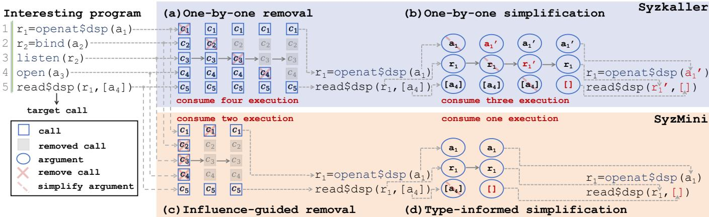  
Figure 1: Illustrative example of input minimization between Syzkallar and our approach Syzmini.

However, we observe a significant tension exists between the benefits and the cost of the preceeding minimization in kernel fuzzing. On the one hand, the minimization stage improves the efficacy of subsequent mutations by providing short, coverage-preserving inputs. Our experiment on Syzkaller (detailed in Section 3) shows that omitting the minimization, the coverage and the number of found bugs would decrease by 27.5% and 40.4% respectively within a 48-hour fuzzing campaign; moreover, the gap continues to widen with prolonged fuzzing. Indeed, this minimization stage is critical for the effectiveness of kernel fuzzing.

On the other hand, the minimization stage incurs significant costs. For example, the one-by-one minimization in Syzkaller requires dynamic program execution to verify the preservation of coverage at each attempt to remove calls or simplify arguments. However, each program execution is expensive because it involves context switching between the user and kernel spaces. Our experiment (detailed in Section 3) reveals that, during a 48-hour fuzzing campaign, 57.5% of program executions are expended in the minimization stage, while the remaining 42.5% of program executions are used by the mutation stage. It is overwhelming that the minimization takes over half of the fuzzing resources.

However, to the best of our knowledge, no prior work explores and mitigates the preceding tension in kernel fuzzing. This paper aims to fill this gap. The key challenge is how to significantly reduce the minimization cost of reducing interesting programs. At the high level, our key idea is to reduce the number of program executions needed for verifying whether the new coverage is preserved—the fewer the program executions are, the lower the cost is.

To this end, this paper introduces two general and novel strategies to optimize the minimization by respectively reducing the number of program executions during removing calls and simplifying arguments. In the scenario of removing calls, let P be an interesting program and c be the target call in P which achieves new coverage. Our key insight is that removing the irrelevant calls in P (which have no execution influence on c) will not affect the new coverage achieved by c. Therefore, we could substantially reduce the number of program executions needed for verifying the coverage by removing these irrelevant calls at one time rather than one by one. Indeed, whether a call can affect c’s coverage depends on their inherent dependencies. For example, if a call does not share any global kernel state with c, then this call has no execution influence on c j and can be safely removed. In practice, this form of execution influence–often referred to as influence relation [8, 13, 17, 35, 40]–can be inferred through a combination of static and dynamic analysis on the system calls. In this paper, we term this optimization strategy as influence-guided call removal strategy.

Figure 1(c) illustrates this strategy. Based on the inferred influence relation, we could identify that the calls c2, c3, c4 do not impact the execution of c5, and then attempt to remove these calls at one time. If this attempt is successful (i.e., the new coverage achieved by c5 is preserved), P will be reduced to [c1, c5] by only one program execution. Later, we attempt to remove c1, which however fails to preserve the new coverage. As a result, our strategy only consumes two executions to minimize P, which reduces the minimization cost to half.

In the scenario of simplifying arguments, one-by-one minimization is conservative and minimizes every argument. As a result, it leads to a large number of program executions due to the numerous arguments and their sub-fields involved. Our key insight is that we only need to simplify those redundant arguments or their sub-fields that truly matter for the subsequent mutations. For example, removing superfluous elements from an array argument could significantly reduce the space for subsequent mutations, while investing similar effort in simplifying a simple scalar argument leads to marginal benefits. In this way, we could substantially reduce the number of program executions needed for verifying the coverage without sacrificing the benefits of minimization.

Based on the preceding insight, we design a type-informed argument simplification strategy to optimize the minimization. Given an interesting program P, this strategy analyzes the type information of each argument and its sub-fields in P. If an argument or a field is fixed-size, the strategy skips the simplification; the strategy only attempts to simplify those variable-size arguments which may have redundant mutation space. For example, in Figure 1(d), this strategy does not simplify the fixed-size arguments $a _ { 1 }$ (Integer type) and $r _ { 1 }$ (Resource type, a 4-byte file descriptor). It would simplify the variable-size argument [a4] (Array type) to an empty array while ensuring the coverage is preserved. As a result, the typeinformed strategy only consumes one program execution, while the original minimization requires three executions.

To evaluate the effectiveness of our approach, we integrated our proposed optimization strategies into Syzkaller, resulting in a prototype named SyzMini [1]. Our evaluation demonstrates that SyzMini significantly reduces the cost of minimization: the number of program executions in minimization is reduced by 60.7%. Compared to vanilla Syzkaller, SyzMini achieves a 12.5% improvement in branch coverage and a 1.7× speedup, while discovering 1.7–2× more unique bugs. Furthermore, SyzMini uncovered 13 previously unknown bugs in the latest upstream Linux, all of which have been confirmed, and four have already been fixed. To further illustrate the generality and benefits of our approach, we enhanced three distinct kernel fuzzing tools by optimizing the minimization: SyzVegas (employing reinforcement learning for scheduling fuzzing tasks), CountDown (accelerating finding memoryrelated kernel bugs), and SyzDirect (directed fuzzing for reproducing kernel bugs). With our enhancements, SyzVegas increases branch coverage by 14.5% and discovers 50% more bugs, CountDown identifies 66.7% more memory bugs, and SyzDirect reproduces 1.5× more bugs within the same time budget.

This paper has made the following contributions:

• To our knowledge, we are the first to explore and mitigate the significant tension between the benefits and cost of input minimization in kernel fuzzing.

• We introduce two general and novel optimization strategies respectively for removing system calls and simplifying arguments in minimization.

• We implement our optimization strategies for minimization in Syzkaller and three distinct kernel fuzzers. The extensive evaluation results demonstrate the effectiveness, general applicability, and benefits of our approach.

## 2 Background

Fuzzing is an automated software testing technique first introduced by Miller [34]. It aims to uncover bugs by repeatedly sending random inputs to the target program [14, 33]. Kernel fuzzers, domain-specific fuzzing tools for OS kernels, continuously generate system call sequences to find kernel bugs.

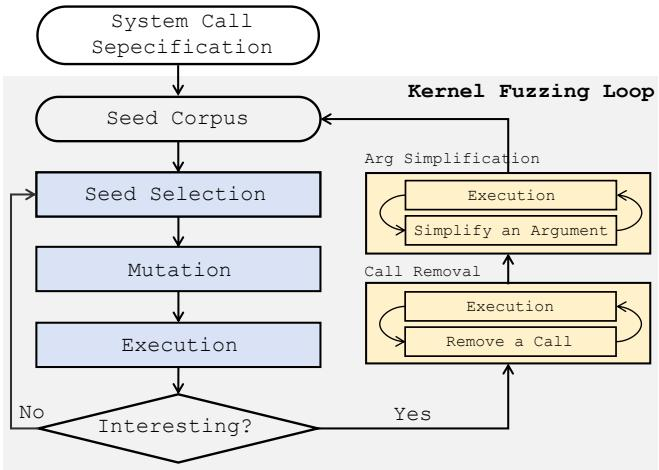  
Figure 2: Overall workflow of Syzkaller

Figure 2 shows the workflow of Syzkaller [15], a state-of-theart coverage-guided kernel fuzzing tool. Syzkaller first loads system call descriptions written in the declarative language Syzlang [42] as well as the initial seed corpus, and then conducts a fuzzing loop to explore interesting programs and find new bugs. The fuzzing loop includes two major stages, i.e., mutation and minimization.

Mutation Stage. The mutation stage randomly selects a seed from the corpus (the programs that previously found new coverage), and then performs a series of random mutations on the seed (e.g., inserting/removing a call, or changing the value of an argument or its sub-fields) to generate more diverse programs. Each program will be executed on the tested kernel and the achieved coverage for each call in the program is collected independently. For instance, given a call sequence $[ c _ { 1 } , c _ { 2 } , . . . , c _ { n } ] .$ , the coverage of each call is collected separately in n branch arrays, $e . g . , c o \nu _ { - } c _ { 1 } , c o \nu _ { - } c _ { 2 } , . . . , c o \nu _ { - } c _ { n }$ . The total coverage achieved so far is maintained in another global set. Hence, the fuzzer can identify the call that achieves new coverage by simply comparing each branch array with the global set, e.g., comparing cov\_c1 with the global set determines if the call $c _ { 1 }$ achieves new coverage. When the program achieves new coverage, each call contributing to this new coverage is treated as a target call for the next minimization.

Minimization Stage. The minimization stage minimizes an interesting program as a new seed for subsequent mutation. It first attempts to remove irrelevant calls and later simplifies arguments in the program. It employs a one-by-one minimization strategy. We explain the process as follows.

⃝1 Removing Calls. Given an interesting program $P =$ $[ c _ { 1 } , c _ { 2 } , . . . , c _ { n } ]$ , where $c _ { i }$ is the ith call in P. Let the last call $c _ { n }$ be the target call in P which achieves the new coverage. In the minimization stage, Syzkaller first removes the first call $c _ { 1 }$ and executes the reduced program $[ c _ { 2 } , c _ { 3 } , . . . , c _ { n } ]$ to verify whether the new coverage is preserved. If the coverage is preserved, $c _ { 1 }$ will be removed from P. Because $c _ { 1 }$ is an irrelevant call w.r.t. $c _ { n }$ which does not affect the execution of $c _ { n } .$ In this case, $P$ will be reduced to $\left[ c _ { 2 } , c _ { 3 } , . . . , c _ { n } \right]$ . Otherwise, $P$ remains unchanged. Later, Syzkaller attempts to remove the next call $c _ { 2 }$ . This process continues until each call $c _ { i }$ in P (except $c _ { n } )$ has been attempted.

Table 1: Argument simplification methods in Syzkaller
<table><tr><td rowspan=1 colspan=2>Data Types</td><td rowspan=1 colspan=1>Simplification Methods</td></tr><tr><td rowspan=1 colspan=1>Primitive Type</td><td rowspan=1 colspan=1>IntegerFlagProtocolResource</td><td rowspan=1 colspan=1>Replace the current valuewith the default value of this type</td></tr><tr><td rowspan=2 colspan=1>Derived Type</td><td rowspan=1 colspan=1>ArrayBuffer</td><td rowspan=1 colspan=1>Minimize the number of elements</td></tr><tr><td rowspan=1 colspan=1>Pointer</td><td rowspan=1 colspan=1>Simplify the pointed-to object</td></tr><tr><td rowspan=1 colspan=1>User-defined Type</td><td rowspan=1 colspan=1>StructUnionEnum</td><td rowspan=1 colspan=1>Simplify each sub-fields</td></tr></table>

⃝2 Simplifying Arguments. Assuming after the call removal there are m arguments $[ a _ { 1 } , a _ { 2 } , . . . , a _ { m } ]$ in P. Syzkaller would first attempt to simplify the first argument $a _ { 1 }$ to $a _ { 1 } ^ { \prime }$ and execute the simplified program to verify whether the new coverage is preserved. If the coverage is preserved, $a _ { 1 } ^ { \prime }$ replaces $a _ { 1 } ;$ otherwise, a1 remains unchanged. Each argument will be attempted one by one to minimize $P .$

It is worth noting that simplifying arguments depends on the argument types. Table 1 lists the simplification methods for different argument types in Syzkaller. For the argument of primitive type (e.g., Integer, Flag, Protocol or Resource), Syzkaller replaces the argument by the default value of this type. For the argument of derived type (e.g., Array, Buffer), Syzkaller attempts to minimize the number of elements by binary search. For the argument of user-defined data type (e.g., Struct, Union), Syzkaller recursively simplifies each sub-fields of this argument one by one.

## 3 Motivation and Observation

In this section, we demonstrate and characterize the tension between the benefits and cost of minimization in kernel fuzzing. To this end, we selected Linux 5.15, the widelyused and stable long-term Linux version, as the fuzzing target; Syzkaller [15], the most popular kernel fuzzing tool, as the kernel fuzzer. Specifically, we implemented a version of Syzkaller without the minimization stage (named as Syzkaller–). For each tool, we allocated 48 hours for one fuzzing campaign to fuzz the kernel, and repeated each fuzzing campaign for ten times to mitigate the randomness.

Observation 1: The minimization stage is crucial in improving the effectiveness of kernel fuzzing in terms of code coverage and number of found bugs.

We compared the branch coverage and the number of found unique bugs of Syzkaller to those of Syzkaller–. As shown in Figure 3, compared to Syzkaller, the branch coverage and the number of found unique bugs of Syzkaller– decrease by 27.5% and 40.4% respectively. Moreover, the gap gradually widens over time. The results show that minimization plays a crucial role in improving the effectiveness of kernel fuzzing.

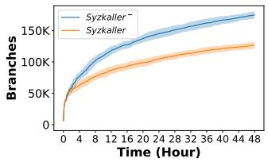

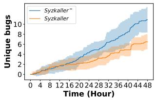  
Figure 3: Syzkaller– vs. Syzkaller on average coverage and bug finding (shaded area: mean ±1 standard deviation)

Observation 2: The proportion of program executions during the minimization stage accounts for 57.5%, leading to significant costs.

We recorded the number of programs executed during the mutation and minimization stages respectively to measure the cost. Figure 4 shows the proportions of the numbers of program executions between mutation and minimization. We can see that the minimization stage consumes more program executions than the mutation stage. The minimization stage reaches a peak of 68.1% at the time of 4.5 hours. The portion gap gradually decreases over time but still accounts for 57.5% at the time of 48 hours. In particular, removing calls accounts for 34.0% and simplifying arguments accounts for 66.0%.

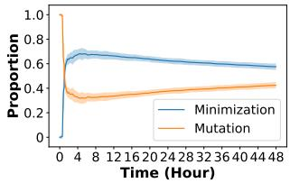

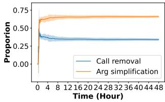  
Figure 4: The proportion of program executions during minimization and mutation over time (shaded area: mean ±1 standard deviation).

The reason for this trend is that the fuzzer initially generates a large number of interesting programs with new coverage. Minimizing these programs requires a considerable number of program executions. As a result, the proportion of program executions in minimization rapidly increases in the first four hours. Over time, although the number of interesting programs gradually decreases, these programs become more complex (e.g., involving more calls and arguments) due to the subsequent mutation. These complex programs requires more program executions to conduct the one-by-one minimization. Overall, the proportion of program executions in the minimization stage decreases slowly, but still surpasses that of the mutation stage (after the 48 hours), leading to significant cost. Summary: The preceding observations indicate that the minimization stage is crucial for the effectiveness of kernel fuzzing, but introduces significant cost in terms of program executions. Our goal is to reduce this minimization cost, thereby unleashing the potential of kernel fuzzing.

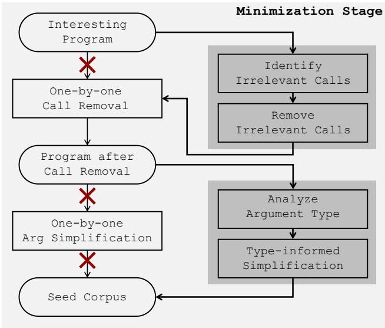  
Figure 5: Overview of the influence-guided call removal and the type-informed argument simplification strategies.

## 4 Approach and Implementation

Figure 5 shows the overview of our optimization strategies (i.e., influence-guided call removal and type-informed argument simplification). These two strategies extend the default one-by-one minimization in Syzkaller. Specifically, the influence-guided call removal leverages the influence relations between system calls to identify irrelevant calls and remove these calls at one time. Later, the reduced program undergoes the one-by-one minimization to guarantee the number of calls in P is minimal (detailed in Section 4.1). The typeinformed argument simplification analyzes the types of each argument and its sub-fields to identify which argument is fixed-size or variable-size. It would skip the simplification of the fixed-size arguments and only attempts to simplify the variable-size arguments (detailed in Section 4.2).

## 4.1 Influence-guided Call Removal Strategy

We define the influence relation between two system calls:

Influence Relation: For two system calls ci and $c _ { j } ,$ $c _ { i }$ has an influence relation with $c _ { j }$ if executing $c _ { i }$ can change the execution path of $\dot { \boldsymbol { c } } _ { j }$ by modifying the kernel’s internal state that $c _ { j }$ depends on.

The definition describes the relation between system calls based on the execution path. The relation exists when one call $c _ { i }$ can modify the global kernel state that the behavior of another call $c _ { j }$ depends on, thereby changing the execution path of $c _ { j }$ . In practice, the influence relation can be inferred by the static and dynamic analysis on system calls [40]. We will describe how to collect the influence relations in Section 4.3. In this section, we focus on explaining how to leverage these collected influence relations to reduce the minimization cost. Thus, we assume the influence relations have been collected for n calls and stored in M—a two-dimensional matrix $R ^ { n \times n }$ Identify Irrelevant Calls. The strategy aims to identify all the calls that are irrelevant to the target call based on the collected influence relations. In algorithm 1, let $P = [ c _ { 1 } , c _ { 2 } , . . . , c _ { n } ]$ be an interesting program (assuming the last call $c _ { n }$ in $P$ is the target call which achieves new coverage) and M be the influence relation matrix. The strategy first obtains all the calls that have direct influence relations with $c _ { n }$ (lines 2-4), and then identifies the calls that have indirect influence relations with $c _ { n }$ based on the transitivity of influence relation (lines 5-11). Specifically, on line 3, when $\boldsymbol { M } \big [ \boldsymbol { c } _ { i } \big ] \big [ \boldsymbol { c } _ { n } \big ] = 1$ (denoting that $c _ { i }$ has direct influence on $c _ { n } )$ , ci will be saved into the list relevant\_calls (which stores all the relevant calls). On line 9, when $M [ c _ { k } ] [ c _ { j } ] { = } 1$ (denoting that $c _ { k }$ has indirect influence on $c _ { n }$ through $c _ { j } ) , c _ { k }$ will be also saved into the list relevant\_calls (line 10). Specifically, the strategy uses a worklist algorithm to iteratively identify all the calls that have indirect influence on $c _ { n } .$ . Finally, we obtain the set of irrelevant calls (stored in irrelevant\_calls) w.r.t. P by filtering these collected relevant calls from the set of the calls from P (line 12).

```verilog
Algorithm 1: Influence-guided Removal Strategy
Input :Interesting Program: $P = [ c _ { 1 } , c _ { 2 } , . . . , c _ { n } ] .$ , Influence
relation matrix: M
Output :Program after call removal P
// Step 1. Identify irrelevant calls
1 relevant_calls ← {}
// analyze directly relevant calls
2 for i from 1 to n − 1 do
3 $\mathbf { i f } M [ c _ { i } ] [ c _ { n } ] = 1$ then
4 relevant_calls ← relevant_calls ∪ {ci}
// analyze indirectly relevant calls
5 work_list ← all relevant calls
6 while work_list is not empty do
7 Pick the last call $c _ { j }$ from work_list
8 for k from j − 1 to 1 do
9 if $M [ c _ { k } ] [ c _ { j } ] = 1 \land c _ { k } \ $ / relevant_calls then
10 relevant_calls ← relevant_calls ∪ {ck}
11 Add $c _ { k }$ to work_list
12 irrelevant $\_ c a l l s \langle - \{ c _ { 1 } , c _ { 2 } , . . . , c _ { n } \} \backslash$ \relevant_calls
// Step 2. Remove irrelevant calls
13 $P ^ { \prime }  P .$ remove_calls(irrelevant_calls)
14 target_call_cov ← execute(P)
15 target_call_cov′ ← execute(P′)
16 if target_call_cov ∈ target_call_cov′ then
17 $P  P ^ { \prime }$
// Step 3. One-by-one call removal
18 one_by_one_call_removal(P)
```

Example. In Figure $^ { 6 , }$ the program P is an interesting program and $c _ { 6 }$ is the target call. According to the influence relation, $c _ { 4 }$ has direct influence on $^ { C _ { 6 } , }$ and $c _ { 1 }$ has indirect influence on $c _ { 6 }$ through c4. Thus, $\{ c _ { 1 } , c _ { 4 } \}$ are the relevant calls and the other calls $\{ c _ { 2 } , c _ { 3 } , c _ { 5 } \}$ in P are identified as irrelevant. Remove irrelevant calls at one time. When the irrelevant calls are identified, the strategy attempts to remove these calls at one time from P (line 13). If the new coverage of the target call is preserved by $P ^ { \prime } ,$ , this attempt is successful and $P$ is reduced to $P ^ { \prime }$ (line 17). Otherwise, the attempt will be rolled back — some calls in irrelevant ${ _ { - c a l l s } }$ actually influence the execution of $c _ { n } .$ . No matter whether this attempt is successful or not, the remaining relevant calls in P may not contribute to the new coverage. Thus, P needs to undergo the one-by-one call removal $( i . e .$ , the default one-by-one minimization for removing calls) to ensure that each remaining call is truly associated with the new coverage of the target call and the number of calls in P is minimal (line 18). Compared to the default one-by-one minimization in Syzkaller, this influenceguided strategy is likely to remove many calls at one time and thus reduce the minimization cost.

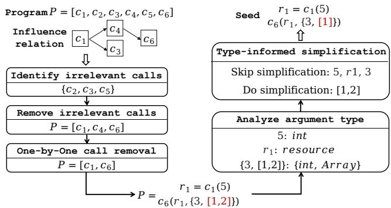  
Figure 6: An Example for Influence-guided Removal and Type-informed Simplification

Example. After identifying $\{ c _ { 2 } , c _ { 3 } , c _ { 5 } \}$ are the irrelevant calls, the strategy attempts to remove all these calls at one time. Assuming this attempt is successful, $P$ is reduced to $[ c _ { 1 } , c _ { 4 } , c _ { 6 } ]$ by only requiring one program execution. Later, the one-byone minimization consumes two program executions to check whether $c _ { 1 }$ and $c _ { 4 }$ would influence the execution of $c _ { 6 }$ and finally P is reduced to $[ c _ { 1 } , c _ { 6 } ]$ (assuming $c _ { 4 }$ actually does not influence the execution of $c _ { 6 } )$ . As a result, the optimization strategy only takes three executions to remove calls, while the default minimization requires five executions.

## 4.2 Type-informed Arg Simplification Strategy

We define fixed-size or variable-size arguments as follows.

For an argument a, a is a fixed-size argument if a only involves fixed-length data types (e.g., Integer, Flag, Protocol and Resource); a is a variable-size argument if a involves any variable-length data type (e.g. Array and Buffer).

Analyze Argument Type. We detail how we analyze an argument type as follows. Given a program P after call removal, the strategy analyzes the type of each argument a from the calls in P based on Table 2 (lines 2-3 in Algorithm 2). Specifically, if a belongs to primitive type (such fixed-length data types as Integer, Flag, Protocol and Resource), a is classified as a fixed-size argument. If a belongs to derived type (such variable-length data types as Array and Buffer), a is classified as a variable-size argument. If a belongs to Pointer, the strategy will recursively analyze the type of the pointed-to object of a to decide a’s argument type according to the preceding definition. If a belongs to user-defined type, the strategy will recursively analyze the type of each sub-fields of a to decide a’s argument type according to the preceding definition. If any point-to object or sub-field is a variable-length data type, a is a variable-size argument. Otherwise, a is classified as a fixed-size argument. In this way, any argument from the calls in P can be classified into either fixed-size or variable-size. Example. Taking the program $P = [ c _ { 1 } , c _ { 6 } ]$ after call removal in Figure 6 as an example, assuming c1 takes an argument 5 and returns $r _ { 1 } ; c _ { 2 }$ takes $r _ { 1 }$ and $\{ 3 , [ 1 , 2 ] \}$ . The strategy can identify 5 as Integer type and $r _ { 1 }$ as Resource type. Since Integer and Resource are fixed-length data types, both of these two arguments 5 and $r _ { 1 }$ are classified as the fixed-size arguments. For the argument {3, [1, 2]}, the strategy will recursively analyze the type of each sub-field. As a result, 3 is identified as Integer type and [1,2] is identified as Array type. Since the field [1, 2] involves a variable-length data type, the argument {3, [1, 2]} is classifed as a variable-size argument.

Algorithm 2: Type-informed Arg Simplification Strategy   
Input :Program after call removal: $P = [ c _ { 1 } , . . . , c _ { n } ]$   
Output :Final minimized program P   
1 for i from 1 to n do   
2 for arg in ci.args do   
3 Analyze arg’s type   
4 P ← type\_in f ormed\_simpli f ication(P, arg)   
5 Function type\_in f ormed\_simpli f ication(P, arg)   
6 if arg is a fixed-size argument then   
7 continue   
8 else   
// arg is a variable-size argument   
9 if arg.type is Array or Buffer then   
10 P ← simpli f y\_variable-size\_arg(P, arg)   
11 if arg.type is Pointer then   
12 P ←   
type\_in f ormed\_simpli f ication(P, arg.point\_to\_ob j)   
13 if arg.type is User-defined type then   
14 for sub\_ f ield in arg.sub\_ f ields do   
15 $P $   
type\_in f ormed\_simpli f ication(P, sub\_ f ield)   
16 return P   
17 Function simpli f y\_variable-size\_arg(P, arg)   
18 P′ ← P.remove\_element\_by\_binary\_search(arg)   
19 target\_call\_cov ← execute(P)   
20 target\_call\_cov′ ← execute(P′)   
21 if target\_call\_cov ∈ target\_call\_cov′ then   
22 $P  P ^ { \prime }$   
23 P ← simpli f y\_variable-size\_arg(P, arg)   
24 return P

Table 2: Argument type classification in Linux kernels
<table><tr><td rowspan=1 colspan=1>Primitivetype</td><td rowspan=1 colspan=1> Category</td><td rowspan=1 colspan=1>Derivedtype</td><td rowspan=1 colspan=1> Category</td><td rowspan=1 colspan=1>User-definedtype</td><td rowspan=1 colspan=1>Category</td></tr><tr><td rowspan=2 colspan=1>IntegerFlagProtocolResource</td><td rowspan=2 colspan=1>Fixed-sizeargument</td><td rowspan=1 colspan=1>ArrayBuffer</td><td rowspan=1 colspan=1>Variable-sizeargument</td><td rowspan=2 colspan=1>StructUnionEnum</td><td rowspan=2 colspan=1>Classifyeach sub-field</td></tr><tr><td rowspan=1 colspan=1>Pointer</td><td rowspan=1 colspan=1>Classify thepointed-to object</td></tr></table>

Type-informed Simplification. After obtaining the type information of the arguments, in Algorithm 2, this strategy skips the simplification of fixed-size arguments (lines 6-7) and only simplifies the variable-size arguments (lines 9-10). For a variable-size argument arg, if the type of arg is Array or Buffer, the strategy will iteratively remove elements from arg to minimize the number of elements in the array by binary search while ensuring the coverage is always preserved (lines 18-24). When the type of arg is Pointer or Userdefined, the strategy recursively checks the pointed-to object (point\_to\_ob j for Pointer type) or each sub-field (sub\_ f ield for user-defined type) in arg and adopts the same method to do simplification (lines 11-15). After traversing all the arguments, the simplified program will be returned and added to the seed corpus.

Example. According to the type analysis result of each argument in Figure 6, since 5 and r1 are fixed-size arguments, the strategy will skip their simplifications. For the variablesize argument {3, [1, 2]}, the strategy will skip simplifying the sub-field 3 but simplify the sub-field [1, 2]. It would consume two executions to simplify [1, 2] to [1] (assuming the argument [1] can affect the execution of c6). Finally, the simplified P becomes a seed. Overall, the strategy only takes two executions to simplify the arguments, while the default minimization requires five executions. The reason of skipping the simplification of those fixed-size arguments is that such simplification does not help reduce redundant mutation space.

## 4.3 Implementation

We implemented the two optimization strategies (i.e., the influence-guided removal and the type-informed simplification) in Syzkaller (commit 1759857fa9bd [15]). We chose Syzkaller because it is the most popular and representative kernel fuzzing tool, and is a standard baseline used by many recent work [3,8,9,20,41,44]. We name the version of Syzkaller enhanced by the two optimization strategies as SyzMini.

Specifically, the influence-guided strategy needs the influence relations between the system calls as input. To this end, we collected the influence relations by following Healer [40]. In practice, we use both static and dynamic analysis to infer and collect the influence relations. In static analysis, given two system calls $c _ { i }$ and $c _ { j } , c _ { i }$ has the influence relation with $c _ { j }$ if (1) $c _ { i }$ returns a resource type $r ,$ and at least one of the parameters in $c _ { j }$ is the resource type r, or (2) ci has a pointer parameter a that points to one resource type r with an outward data flow direction, and $c _ { j }$ has the resource type r with an inward data flow direction. To collect static influence relations, we analyze the type information of each parameter specified by Syzlang [42]. In dynamic analysis, we leverage the default minimization process in Syzkaller to infer dynamic influence relations. Specifically, during minimization, if removing a call $c _ { i }$ affects the execution path $( i . e .$ , the coverage) of the next call $c _ { i + 1 }$ , then $c _ { i }$ influences $c _ { j } .$ . We ran Syzkaller until the branch coverage saturated and collected the dynamic influence relations, which took about four days. We collected a total of 74,865 influence relations including 44,966 static influence relations and 29,899 dynamic influence relations.

SyzMini uses the default branch coverage supported by Syzkaller to record the execution information of each call. To check whether one minimization attempt is successful, SyzMini verifies whether the branch coverage of a target call is preserved. If the coverage is preserved, this attempt is considered as successful.

## 5 Evaluation

This section evaluates the effectiveness of the two optimization strategies for minimization (i.e., the influence-guided and type-informed strategies) implemented in SyzMini. we aim to answer the following research questions:

RQ1. How effective is SyzMini (which incorporates the two optimization strategies for minimization) in terms of code coverage and bug finding?

RQ2. What are the respective contributions of the influenceguided and type-informed strategies in improving kernel fuzzing?

RQ3. Why are the influence-guided and type-informed strategies effective in improving kernel fuzzing?

RQ4. How effective are the two optimization strategies when they are integrated into other distinct kernel fuzzers?

RQ5. What factors affect the effectiveness of the influenceguided and type-informed strategies?

## 5.1 Evaluation Setup

All the experiments were conducted on a machine running 64- bit Ubuntu 20.04 LTS and equipped with an AMD 3995WX 64-core CPU and 128G RAM. We selected Linux 5.15, 6.1, and 6.11 as the target kernels to be tested. Specifically, Linux 5.15 and 6.1 are the stable long-term versions and are the most widely used kernel versions by many distributions. Linux 6.11 is the latest upstream version at the time of our work. All these three kernel versions were compiled with the same configuration, i.e., enabling the KCOV and KASAN features to collect code coverage and detect memory-related bugs. During the fuzzing campaign, each kernel runs on a virtual machine instance allocated with a 4-core CPU and 4GB RAM.

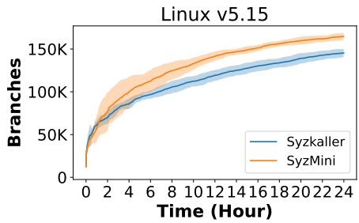

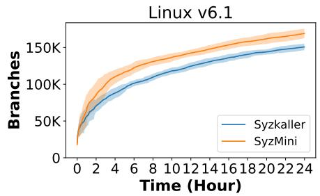

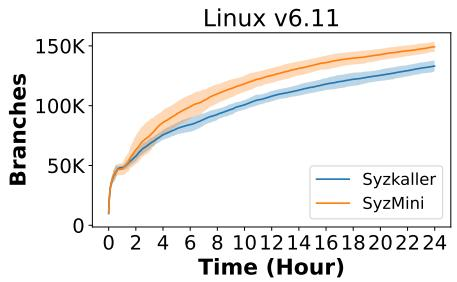  
Figure 7: Average branch coverage growth of SYZMINI on v5.15, v6.1 and v6.11 over 24 hours compared to those of SYZKALLER (shaded area: mean ±1 standard deviation)

Table 3: Coverage statistics of Syzkaller vs. SyzMini
<table><tr><td></td><td>v5.15</td><td>v6.1</td><td>v6.11</td><td>Overall</td></tr><tr><td>Syzkaller</td><td>145.371K</td><td>150.677K</td><td>133.172K</td><td>143.073K</td></tr><tr><td>SyzMini</td><td>164.724K</td><td>169.015K</td><td>149.311K</td><td>161.017K</td></tr><tr><td>Improvement</td><td>+13.3%</td><td>+12.2%</td><td>+12.1%</td><td>+12.5%</td></tr><tr><td>Speed-up</td><td>+1.83×</td><td>+1.61×</td><td>+1.62×</td><td>+1.69×</td></tr></table>

The influence-guided strategy is equipped with 74,865 entries of influence relations (detailed in Section 4.3). Each tool uses the same initial seeds as Syzkaller by default across the trials.

## 5.2 RQ1: Effectiveness of SyzMini

Setup of RQ1. We aim to evaluate the end-to-end effectiveness of SyzMini which incorporates the two optimization strategies. Thus, we compared SyzMini with Syzkaller in terms of code coverage and the number of bugs found. Following the general guidelines for fuzzing evaluation [24, 37], we allocated 24 hours for each kernel fuzzing tool (SyzMini and Syzkaller) for one round of fuzzing campaign and repeated such a fuzzing campaign for 10 rounds to reduce potential randomness. We also measured the hitting-round and time-toexposure (TTE) for each found bug. These two metrics are widely used in evaluating fuzzing techniques [4,7,41]. Specifically, hitting-round represents the number of times a fuzzer triggers a target bug in repeated experiments. TTE is the time that a fuzzer triggers the target bug at the first time. We computed the arithmetic average of TTE (denoted by µT T E) for repeated experiments. If a fuzzer fails to trigger a target bug in a given time duration (24 hours in our setting), the TTE of this bug is treated as 24 hours. Additionally, to study the long-term effectiveness, we ran SyzMini and Syzkaller respectively for three days on the latest upstream kernel version Linux 6.11. We collected branch coverage and the number of found bugs.

Code Coverage. Figure 7 plots the branch coverage achieved by Syzkaller and SyzMini during the 24-hour fuzzing. Overall, SyzMini outperforms Syzkaller on the three kernel versions. Specifically, in the first 5 minutes, both tools generate and execute the initial seeds, so they achieve similar coverage. Later, a large number of interesting programs that require minimization are generated. However, performing minimization on these programs does not lead to coverage increases. Thanks to our optimization strategies, SyzMini avoids a large number of unnecessary program executions during minimization. It allows SyzMini to spend more time on mutation. As a result, SyzMini achieves the coverage improvement over Syzkaller after 1.5 hours, and this improvement has been maintained throughout the subsequent fuzzing. The shaded area denotes the average branch coverage ±1 standard deviation. The overlap between the shaded areas of SyzMini and Syzkaller is small, indicating a significant difference.

Table 4: Bug statistics of SyzMini and Syzkaller
<table><tr><td></td><td colspan="4">#Unique Bugs</td><td colspan="4">Bug Distribution</td></tr><tr><td>Fuzzer</td><td>v5.15</td><td>v6.1</td><td>v6.11</td><td></td><td>Total</td><td>v5.15 v6.1</td><td>v6.11</td><td>Total</td></tr><tr><td>SYZKALLER</td><td>14</td><td>12</td><td>6</td><td></td><td>27</td><td colspan="2">19 12 18</td><td></td></tr><tr><td>SYZMINI</td><td>28</td><td>20</td><td>12</td><td>50</td><td></td><td colspan="2">® 4 8 O 4</td><td>32 189</td></tr></table>

1 The blue and yellow regions in the venn diagrams denote #bugs found by SyzMini and Syzkaller, respectively; the gray regions denote #bugs found by both tools.

Table 3 gives the detailed coverage statistics. For example, on v5.15, SyzMini covered an average of 164.724K branches in the 10 rounds of a 24-hour fuzzing campaign, while Syzkaller covered an average of 145.371K branches. As a result, SyzMini achieved 13.3% improvement in branch coverage (see Row “Improvement”). Column “Overall” gives the average number of covered branches on the three kernel versions. Row “speed-up” presents the average speed-up of SyzMini when achieving the same coverage as Syzkaller. On average, SyzMini achieved 12.5% improvement in branch coverage compared to Syzkaller with a speed-up of 1.69×. The results indicate that the optimization strategies can significantly improve the effectiveness of kernel fuzzing in terms of code coverage.

Bug Detection. Table 4 lists the bug statistics. For example, on v5.15, SyzMini found a total of 28 unique bugs in the 10 rounds of 24-hour fuzzing, while Syzkaller found a total of 14 unique bugs. SyzMini found 2× more bugs than Syzkaller. Specifically, on v5.15, SyzMini found 18 bugs that Syzkaller missed, while Syzkaller only found 4 bugs that SyzMini missed. Column “Total” counts the total number of unique bugs found in the three kernel versions. SyzMini found a total of 50 unique bugs, while Syzkaller only 27 unique bugs. Specifically, SyzMini and Syzkaller found a total of 22 common bugs on the three kernel versions (accumulating the common bugs shown in the three venn diagrams of v5.15,

Table 5: µTTE and hitting-round of each bug
<table><tr><td>ID</td><td>hitting-round SK/SM</td><td>μTTE(h) SK/SM</td><td>ID</td><td>hitting-round SK/SM</td><td>uTTE(h) SK/SM</td></tr><tr><td>1</td><td>3/6</td><td>22.2/12.2</td><td>12</td><td>3/5</td><td>16.8/14.0</td></tr><tr><td>2</td><td>1/2</td><td>23.9 /19.7</td><td>13</td><td>7/10</td><td>12.5 /3.5</td></tr><tr><td>3</td><td>4/8</td><td>15.8 /10.8</td><td>14</td><td>1/2</td><td>23.5 /20.9</td></tr><tr><td>4</td><td>1/3</td><td>23.1/20.9</td><td>15</td><td>2/4</td><td>19.4 /15.9</td></tr><tr><td>5</td><td>5/5</td><td>17.0 / 13.8</td><td>16</td><td>1/4</td><td>22.3 / 18.9</td></tr><tr><td>6</td><td>7/9</td><td>19.4 / 15.8</td><td>17</td><td>2/8</td><td>22.4 /13.1</td></tr><tr><td>7</td><td>3/4</td><td>22.8 / 19.4</td><td>18</td><td>1/6</td><td>23.4 / 13.3</td></tr><tr><td>8</td><td>3/3</td><td>21.7 /20.7</td><td>19</td><td>1/3</td><td>22.3 / 19.5</td></tr><tr><td>9</td><td>1/2</td><td>22.3 /20.1</td><td>20</td><td>10/10</td><td>4.2/2.0</td></tr><tr><td>10</td><td>1/2</td><td>22.0 / 20.8</td><td>21</td><td>1/3</td><td>23.9 / 19.4</td></tr><tr><td>11</td><td>9/9</td><td>11.9 / 7.5</td><td>22</td><td>8/10</td><td>5.2 /2.8</td></tr></table>

1 SK and SM are Syzkaller and SyzMini, respectively. 1\~10, 11\~18 and 19\~22 are the common bugs on v5.15, v6.1 and v6.11, respectively. 2 The green one indicates which tool achieves the higher hitting-round or the lower µTTE.  
v6.1, and v6.11 in Column “Bug Distribution”).

Table 5 gives the hitting-round and µTTE for each common bug. On any of these bugs, SyzMini found them faster and more frequently than Syzkaller. Taking the bug with ID 1 as an example, the µTTE of Syzkaller is 22.2h, which is 1.8× more than that of SyzMini (12.2h); moreover, SyzMini successfully found this bug in 6 out of 10 rounds of fuzzing, while Syzkaller only found it in 3 rounds. These strong results show that SyzMini significantly outperforms Syzkaller in bug finding.

Long-term Effectiveness. In the 10 rounds of a three-day fuzzing campaign, SyzMini covered an average of 199.4K branches, which is 5.6% more than that of Syzkaller (188.9K). In terms of bug finding, although Syzkaller has been continuously deployed to find bugs in the upstream kernel version, SyzMini has still found 13 previously unknown bugs. We reported each bug (with the corresponding reproducer and kernel configuration) to the kernel maintainers. All these 13 bugs have been confirmed and 4 have already been fixed. Table 6 lists these bugs. Therefore, SyzMini is also effective in long-term fuzzing for improving coverage and finding bugs.

Table 6: Previously unknown bugs found by SyzMini.
<table><tr><td>ID</td><td>Subsystem</td><td>Function</td><td>Risk</td><td>Status</td></tr><tr><td>1</td><td>Block</td><td>bio_put_slab</td><td>use after free</td><td>confirmed</td></tr><tr><td>2</td><td>Gfs2</td><td>gfs2_quota_init</td><td>kernel bug</td><td>confirmed</td></tr><tr><td>3</td><td>NTFS3</td><td>end_buffer_read_sync</td><td>out of bounds</td><td>confirmed</td></tr><tr><td>4</td><td>Reiserfs</td><td>update_stat_data</td><td>kernel bug</td><td>confirmed</td></tr><tr><td>5</td><td>Net</td><td>netlink_unicast</td><td>general protection fault</td><td>confirmed</td></tr><tr><td>6</td><td>MM/pat</td><td>get_pat_info</td><td>inconsistent lock state</td><td>fixed</td></tr><tr><td>7</td><td>Net</td><td>cleanup_net</td><td>use after free</td><td>fixed</td></tr><tr><td>8</td><td>Bpf</td><td>btf_name_valid_section</td><td>out of bounds</td><td>confirmed</td></tr><tr><td>9</td><td>Jfs</td><td>jfs_syncpt</td><td>null-ptr-deref</td><td>fixed</td></tr><tr><td>10</td><td>Usb</td><td>usb_disable_device</td><td>refcount bug</td><td>confirmed</td></tr><tr><td>11</td><td>Bpf</td><td>build_id_parse_nofault</td><td>paging fault</td><td>fixed</td></tr><tr><td>12</td><td>Bluetooth</td><td>sco_sock_close</td><td>use after free</td><td>confirmed</td></tr><tr><td>13</td><td>Jfs</td><td>jfs_statfs.cold</td><td>out of bounds</td><td>confirmed</td></tr></table>

In summary, our optimization strategies not only improve branch coverage by 12.1\~13.3% and found 1.7\~2.0× more unique bugs, but find kernel bugs faster and more stably.

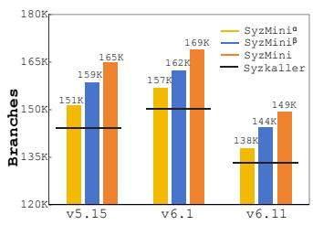

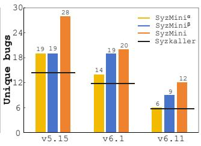  
Figure 8: Numbers of covered branches and found unique bugs by Syzkaller, SyzMiniα, SyzMiniβ and SyzMini.

## 5.3 RQ2: Contributions of Optimizations

Setup of RQ2. To investigate the respective contributions of the two optimization strategies in improving kernel fuzzing, we implemented two versions of SyzMini: SyzMiniα and SyzMiniβ. SyzMiniα only includes the influence-guided strategy while SyzMiniβ only includes the type-informed strategy. We compare the code coverage and the number of found unique bugs between Syzkaller, SyzMiniα, SyzMiniβ and SyzMini to analyze the contributions of the two optimization strategies. Following the setup of RQ1, we ran each tool for 24 hours and repeated 10 rounds.

Results. Figure 8 shows the numbers of covered branches and the numbers of found unique bugs by Syzkaller, SyzMiniα, SyzMiniβ and SyzMini. For example, on v5.15, equipped with the influence-guided strategy, SyzMiniα achieved an average of 4.0% branch coverage improvement (from 145K to 151K) and found 5 more unique bugs (from 14 to 19), compared to Syzkaller. By comparing SyzMiniβ and SyzMini, without this influence-guided strategy, SyzMiniβ’s branch coverage dropped by 3.7% (from 165K to 159K) and missed 9 unique bugs (from 28 to 19). Thus, the influence-guided strategy is useful in improving kernel fuzzing.

For the type-informed strategy, on v5.15, SyzMiniβ achieved an average of 9.1% more branch coverage (from 145K to 159K) and found 5 more unique bugs, compared to Syzkaller. By comparing SyzMiniα and SyzMini, without the type-informed strategy, the branch coverage achieved by SyzMiniα dropped by 8.2% (from 165K to 151K) and missed 9 unique bugs. The results indicate that the type-informed strategy is also important in improving kernel fuzzing. We also note that SyzMiniβ achieved more improvement than SyzMiniα. We will explain this phenomenon in Section 5.4.

It is worth noting that the optimization effects of these two strategies are orthogonal. Because these two strategies act on two different steps (i.e., removing calls and simplifying arguments) in minimization. Thus, SyzMini achieved the highest coverage and found the most number of bugs compared to Syzkaller, SyzMiniα and SyzMiniβ.

In summary, the influence-guided strategy improves the coverage by 3.5\~4.6% and increases the number of found unique bugs by 1\~1.35×, while the type-informed strategy enhances coverage by 8.3\~9.1% and increases the number of found unique bugs by 1.2\~1.5×. The optimization effects of

Table 7: Numbers of program executions under different minimization strategies in removing calls and simplifying args.
<table><tr><td rowspan="2">Minimization</td><td colspan="3">Number of Program Executions</td></tr><tr><td>Removing Calls</td><td>Simplifying Args</td><td>All</td></tr><tr><td>one-by-one</td><td>140,620</td><td>260,239</td><td>400,859</td></tr><tr><td>influence-guided</td><td>60,372 (57.1%↓)</td><td></td><td>320.611 (20.0%↓)</td></tr><tr><td>type-informed</td><td></td><td>96,896 (62.8%↓)</td><td>237,516 (40.7%↓)</td></tr><tr><td>both optimizations</td><td>60,372 (57.1%↓)</td><td>96,896 (62.8%↓)</td><td>157,268 (60.7%↓)</td></tr></table>

the two optimization strategies are orthogonal.

## 5.4 RQ3: Reasons of Effectiveness

Setup of RQ3. We designed a controlled experiment to explain why the two optimization strategies can improve the effectiveness of kernel fuzzing by reducing the cost of minimization. To this end, We ran Syzkaller for 24 hours and collected 16,266 interesting programs that need minimization. We applied the default one-by-one minimization strategy in Syzkaller, the influence-guided strategy and the typeinformed strategy in SyzMini respectively to minimize these interesting programs. We counted the number of program executions needed for verifying the coverage to approximate the cost required by these different minimization strategies. Additionally, we also measured the portions of program executions between mutation and minimization before and after applying the two optimization strategies to explain the effectiveness.

Results. Table 7 gives the numbers of program executions under different minimization strategies. Compared to the oneby-one minimization, the influence-guided strategy reduced 57.1% program executions when removing calls (see Column “Removing Calls”), while the type-informed strategy reduced 62.8% program executions when simplifying arguments (see Column “Simplifying Args”). Overall, the influence-guided and type-informed strategies respectively avoided 20.0% and 40.7% of the total program executions required by the oneby-one strategy. Moreover, when both strategies are enabled, they can reduce a total of 60.7% program executions. These results show that the two optimization strategies can avoid a large number of program executions during minimization. As a result, SyzMini can allocate more time to the mutation stage and execute more diverse programs. It explains why SyzMini can achieve higher coverage and find more bugs than Syzkaller.

It is also worth noting that the type-informed strategy reduces 40.7% program executions, which is about 2X more than that of the influence-guided strategy (20.0%). The former strategy can reduce more cost of minimization than the latter. This result explains why SyzMiniβ can achieve more improvement than SyzMiniα for kernel fuzzing in RQ2.

Figure 9 shows the portion of program executions between the minimization and mutation stages in a 24-hour fuzzing campaign before and after applying the optimizations on the three kernel versions (i.e., comparing between Syzkaller and SyzMini). Compared to Syzkaller, SyzMini significantly reduce the proportion of program executions in minimization, while substantially increases the proportion of program executions in mutation. Taking v5.15 as an example, Syzkaller’s minimization occupies 48.2% program executions, while SyzMini’s minimization only occupies 11.5% (reduced by 75.7%); on the other hand, Syzkaller’s mutation occupies 51.8% program executions, while SyzMini’s mutation occupies 88.5% (increased by 70.5%). The results show that SyzMini does reduce the minimization cost and more time is allocated to mutation.

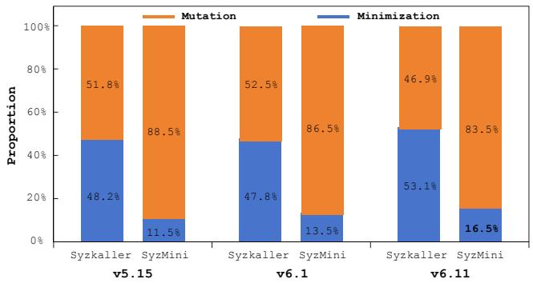  
Figure 9: Proportion of program executions between mutation and minimization in SYZKALLER and SYZMINI

In summary, the influence-guided and type-informed optimization strategies reduce 60.7% of program executed during the minimization and more time is allocated to the mutation, thereby enhancing the effectiveness of kernel fuzzing.

## 5.5 RQ4: Applicability of Optimizations

Setup of RQ4. We aim to evaluate the generability and applicability of our optimization strategies on other distinct kernel fuzzers. To this end, we conducted a survey of research work on kernel fuzzing which was published in the recent five years (2019-2024) in relevant top venues (S&P, USENIX, CCS, NDSS, OSDI, SOSP, Eurosys, ATC). We collected 11 papers. We excluded 3 papers that did not open-source their tools, and 5 papers whose tools had not been actively maintained anymore. We finally obtained SyzVegas [44], CountDown [3] and SyzDirect [41] as the target fuzzers, all of which are built on Syzkaller but are designed for different purposes.

Specifically, SyzVegas targets adopting reinforcement learning for better scheduling seed selection, mutation and generation. CountDown targets detecting memory-related kernel bugs by a reference counter-guided mutation operator. SyzDirect is a direct kernel fuzzing tool which targets reproducing kernel bugs. These three tools are the state-of-art with different application scenarios. We implemented our optimization strategies in SyzVegas, CountDown and SyzDirect, and obtained their enhanced versions SyzVegas+, CountDown+ and SyzDirect+. We investigate whether their performance could be further improved.

To ensure fairness, we followed the default setups and evaluation metrics of these tools described in their papers. To compare SyzVegas and SyzVegas+, we measured code coverage and number of found bugs. To compare CountDown and CountDown+, we counted the number of found KSAN bugs (memory-related errors reported by Kernel Address Sanitizer). To compare SyzDirect and SyzDirect+, we used µTTE and hitting-round to evaluate the directed fuzzing abilities. Specifically, SyzDirect provides a list of 100 kernel bugs as its evaluation dataset. Considering the experimental cost, we selected the first 10 bugs as the evaluation dataset in this paper. To prepare the dataset, we compiled the corresponding ten versions of Linux kernels with the configuration recommended by SyzDirect. We ran each tool 24 hours and repeated each experiment 10 rounds to migrate randomness. Thus, this evaluation for the three kernel fuzzing tools and their respective enhanced versions took 5,760 machine hours.

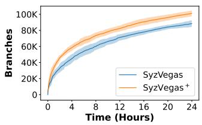

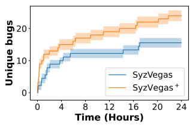  
Figure 10: SyzVegas vs. SyzVegas+ in term of branch coverage and number of unique bugs (shaded area: mean ±1 standard deviation).

SyzVegas vs SyzVegas+. Figure 10 shows the achieved code coverage and the number of found unique bugs on Linux v5.15. With the help of the two optimization strategies, SyzVegas+ improves branch coverage by 14.5%. SyzVegas+ found 24 unique bugs, while SyzVegas only found 16 unique bugs. It is clear that our optimization strategies enhances SyzVegas in code coverage and bug finding.

CountDown vs CountDown+. Table 8 lists the number of KASAN bugs found by CountDown and CountDown+ on Linux v5.11. During the 10 rounds of a 24-hour fuzzing campaign, CountDown+ found a total of 43 KASAN bugs, while CountDown only found 27 bugs. CountDown+ also achieved 4.5% more branch coverage. CountDown leverages the memory relation between system calls to guide the mutation of seeds for finding memory-related bugs. However, all the seeds in the corpus require minimization to improve mutation effectiveness. Our optimization strategies reduce the minimization cost, thereby allowing CountDown to have more time in performing memory-related mutations for finding KASAN bugs. Table 8: CountDown vs. CountDown+ on the KASAN bugs

<table><tr><td rowspan="2">Tool</td><td colspan="3">All KASAN Bugs</td><td colspan="3">Branch Coverage</td></tr><tr><td>Min</td><td>Max</td><td>Total</td><td>Min</td><td>Max</td><td>Avg</td></tr><tr><td>CountDown</td><td>0</td><td>5</td><td>27</td><td>116.9k</td><td>120.7k</td><td>119.0k</td></tr><tr><td>CountDown+</td><td>1</td><td>7</td><td>43</td><td>119.7k</td><td>130.1k</td><td>124.3k</td></tr><tr><td>Improvement</td><td>1个</td><td>2个</td><td>66.7%↑</td><td>2.4%↑</td><td>7.8%↑</td><td>4.5%↑</td></tr></table>

SyzDirect vs SyzDirect+. Table 9 gives the µTTE and hittinground for reproducing each target bug. SyzDirect+ successfully reproduced 9 bugs, while SyzDirect reproduced 6 bugs.

Table 9: SyzDirect vs SyzDirect+ on bug reproduction
<table><tr><td>Bug ID</td><td>Commit ID</td><td>SyzDirect μTTE~hitting-round</td><td>SyzDirect+ μTTE~hitting-round</td></tr><tr><td>1</td><td>3f2db250099f</td><td>×</td><td>16.0h~4/10</td></tr><tr><td>2</td><td>c9a2f90f4d6b</td><td>21.6h~2/10</td><td>20.0h~4/10</td></tr><tr><td>3</td><td>bla811633f73</td><td>×</td><td>21.2h~1/10</td></tr><tr><td>4</td><td>2fd10bcf0310</td><td>21.2h~2/10</td><td>10.1h~8/10</td></tr><tr><td>5</td><td>b648eba4c69e</td><td>×</td><td>×</td></tr><tr><td>6</td><td>20aaef52eb08</td><td>13.6h~10/10</td><td>12.8h~10/10</td></tr><tr><td>7</td><td>3b0c40612471</td><td>18.8h~4/10</td><td>17.6h~6/10</td></tr><tr><td>8</td><td>ffb324e6f874</td><td>×</td><td>22.1h~1/10</td></tr><tr><td>9</td><td>01faae5193d6</td><td>18.7h~4/10</td><td>14.4h~6/10</td></tr><tr><td>10</td><td>b2a616676839</td><td>20.4h~6/10</td><td>14.10h~8/10</td></tr></table>

The 6 bugs reproduced by SyzDirect were all reproduced by SyzDirect+. Moreover, for these 6 bugs, SyzDirect+ achieved higher hitting-rounds and lower µTTE compared to SyzDirect. The results shows that our optimization strategies can enhance the directed fuzzing ability of SyzDirect. Given a bug location, SyzDirect prioritizes the mutations of seeds that are close to the bug location. But it still requires minimization to improve the quality of seeds. Our optimization strategies save the minimization cost, and give SyzDirect more time to mutation for increasing the probability of reproducing bugs.

In summary, the influence-guided and type-informed optimization strategies are orthogonal to the optimization strategies of existing kernel fuzzing tools. They improve SyzVegas by covering 14.5% more coverage and finding 1.5× more unique bugs, help CountDown identify 66.7% more KASAN bugs and enhance SyzDirect by reproducing 1.5× more kernel bugs.

## 5.6 RQ5: Factors affecting Optimizations

Setup of RQ5. We aim to analyze the factors that could affect the effectiveness of our optimization strategies. Specifically, the influence-guided optimization strategy leverages the influence relations between system calls to reduce the minimization cost. Thus, the number of influence relations is a critical factor affecting the strategy’s effectiveness. To this end, we conducted a controlled experiment to study the impact of different numbers of influence relations on the effectiveness of this strategy. In our experiment, we have 74,865 influence relations in total. We selected the first 10%, 20%, . . ., 100% respectively from the list of these 74,865 influence relations as the input of the influence-guided strategy and observe the number of program executions during minimization.

The type-informed strategy reduces the minimization cost by skipping simplifying the fixed-size arguments. Thus, the number of fixed-size parameters (including the pointed-to objects if the parameters are Pointer type and the sub-fields if the parameters are user-defined type) in the system calls affects this strategy’s effectiveness. However, obtaining all the system calls in the Linux kernel is difficult. We note that Syzkaller regularly updates the tested system calls when the Linux kernel has new updates. To this end, we analyzed the tested system calls provided by Syzkaller in the recent five years (2019-2024). We developed a script to scan all the tested system calls based on the Syzlang syntax [42], and counted the numbers of fixed-size and variable-size parameters according to the analysis method in Section 4.2.

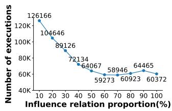

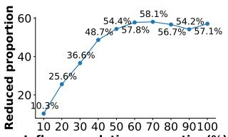  
Re 10 20 30 40 50 60 70 80 90100 Influence relation proportion(%)  
Figure 11: Number of program executions used for removing calls in minimization, and the reduced proportion of program executions compared to the one-by-one minimization.

Influence-guided Strategy. Figure 11 shows (1) the numbers of program executions used for removing calls in minimization, and (2) the reduced proportions of program executions compared to the one-by-one minimization (calculated by the similar method in Table 7) under different proportions of influence relations. We can see that when the proportion of influence relations increases, the number of program executions used for removing calls gradually decreases (see the left subfigure), and the reduced portion of program executions gradually increases (see the right subfigure). When the proportion of influence relations reaches 60%, the number of program executions and the reduced portion of program executions gradually stabilize. The reason is that, when the number of influence relations increases, the number of irrelevant calls identified by the influence-guided strategy in the program to be minimized gradually saturates. It also indicates that the number of collected influence relations in our experiment is enough for the strategy to take effect.

It is worth noting that this evaluation has also implied the relationship between such precision and optimization effectiveness. The reason is that proportion adopted essentially approximates the precision of influence relationship. When a smaller proportion of influence relation is given, the typeinformed strategy will erroneously identify more irrelevant calls in the interesting program, reducing the precision of inferring irrelevant calls. The final result in Figure 11 shows that when the proportion of influence relation increases, the optimization effect increases; however, when the proportion reaches beyond 60%, its effect on the optimization strategy is negligible.

Type-informed Strategy. Table 10 shows the numbers of fixed-size and variable-size parameters in the system calls provided by Syzkaller. Indeed, we can see that the number of fixed-size parameters account for a large portion. Taking the version of Syzkaller in Dec. 2020 as an example, the proportion of fixed-size parameters is 80.5%, while the proportion of variable-size parameters is only 19.5%. The results shows that the tested system calls in Linux kernels are composed of a large number of fixed-size parameters. The type-informed

Table 10: Numbers of fixed-size and variable-size parameters in the system calls provided by Syzkaller.
<table><tr><td>Date</td><td>Commit ID</td><td>Fixed-size Parameter</td><td>Variable-size Parameter</td></tr><tr><td>2020-12</td><td>79264ae39cle</td><td>101,897 (80.5%)</td><td>24,679 (19.5%)</td></tr><tr><td>2021-12</td><td>36bd2e486525</td><td>103,442 (80.1%)</td><td>25,643 (19.9%)</td></tr><tr><td>2022-12</td><td>ab32d50881df</td><td>107,575 (80.2%)</td><td>26,557 (19.8%)</td></tr><tr><td>2023-12</td><td>fb427a078200</td><td>112,523 (80.6%)</td><td>27,145 (19.4%)</td></tr><tr><td>2024-12</td><td>d7f584ee3c24</td><td>285,517 (74.0%)</td><td>100,631(26.0%)</td></tr></table>

strategy can avoid simplifying many unnecessary arguments which cannot benefit reducing the redundant mutation space. As a result, the number of program executions needed for verifying the coverage could be significantly reduced.

In summary, for the influence-guided strategy, within the threshold of 60% influence relations, increasing the number of relations can improve its effectiveness and its optimization effect gradually stabilizes as the number of relations continues to grow. For the type-informed strategy, the fixed-size parameters occupy a high proportion in tested system calls, which help reduce the cost of simplifying arguments.

## 6 Discussion

SyzMini optimizes the minimization stage in kernel fuzzing and does not affect other parts of a coverage-guided kernel fuzzer. Figure 5 shows the extension implemented by SyzMini on top of Syzkaller. In the literature, a number of research work has been conducted to improve different aspects of kernel fuzzing (e.g., generating system call description [8, 9, 39], mutating the seeds [13, 40] and scheduling the fuzzing tasks [20]). SyzMini is orthogonal to these existing work and would not affect any of these improvements. Thus, our optimization strategies are not limited to Syzkaller. Our extensive evaluation in Section 5.5 has also shown the significant effectiveness improvement when integrating our strategies into three kernel fuzzers (SyzVege, Countdown and SyzDirect) for different application scenarios. We believe integrating our optimization strategies to other kernel fuzzers will boost their effectiveness as well.

## 7 Related Work

Kernel Fuzzing. Since the success of Syzkaller [15], there has been much research work to improve the effectiveness of kernel fuzzing. A number of research work [5, 8, 9, 11, 17, 18, 39, 45] has been devoted to obtaining more comprehensive system call specifications for producing high-quality seeds. Moonshine [35] aims to generate high-quality initial seeds by distilling the collected system call sequences, thereby enhancing the mutation effectiveness. Other work [10, 13, 17, 23, 40] utilizes the relationship between system calls to narrow the mutation space. SyzVegas [44] leverages reinforcement learning to better schedule the fuzzing tasks such as program generation, mutation and minimization. Different from these existing work, our work SyzMini aims to reduce the cost of minimization in kernel fuzzing, which has not been explored before.

Kernel Fuzzing Acceleration. There are some research work to accelerate kernel fuzzing. Horus [32] improves the communication speed between the host machine and the virtual machine running the tested kernel by replacing the remote procedure calls (RPCs) with direct memory access. Agamotto [12] observes that the kernel driver fuzzers frequently execute similar test cases, so it dynamically creates multiple checkpoints for these test cases to skip redundant parts. Different from these work, our work SyzMini accelerates kernel fuzzing by reducing the minimizaiton cost.

Input Minimization. Zeller et al. [47] first propose the concept of delta debugging to minimize the failure-inducing input. Delta debugging has been adapted in many scenarios. For example, AFL-family tools [28, 30, 46] use afl-cmin [26] and afl-tmin [27] to respectively minimize the seed corpus and an input file for improving the effectiveness of fuzzing. Specifically, afl-tmin [27] takes an input file and tries to remove as much data as possible while maintaining the same coverage as observed initially. In compiler fuzzing, C-Reduce [36] is used to reduce the bug-triggering C program by removing redundant code. In GUI testing, SimplyDroid [21] simplifies crash-triggering UI event traces for Android apps. However, these existing minimization techniques based on delta debugging cannot be directly applied to minimize the system call sequences from OS kernels. Because they do not consider the dependencies between the system calls and the type structures of arguments.

## 8 Conclusion

We have proposed two general and novel optimization strategies to reduce the cost of minimization stage in kernel fuzzing. The influence-guided strategy leverages the influence relation between system calls to optimize the call removal and the type-informed strategy utilizes the argument type information to avoid unnecessary simplification. Our evaluation shows that the minimization cost can be greatly reduced, compared to Syzkaller. The optimization strategies also help improve branch coverage and find more unique bugs. We believe our optimization strategies are general and could benefit many other kernel fuzzers.

## 9 ACKNOWLEDGMENTS

We thank the anonymous USENIX ATC reviewers and the shepherd for their valuable feedback. This work was supported in part by National Key Research and Development Program (Grant 2022YFB3104002), Shanghai Trusted Industry Internet Software Collaborative Innovation Center, “Digital Silk Road” Shanghai International Joint Lab of Trustworthy Intelligent Software under Grant 22510750100.

## References

[1] Syzmini. https://github.com/ecnusse/SyzMini, 2024.

[2] Erin Avllazagaj, Yonghwi Kwon, and Tudor Dumitras. SCAVY: automated discovery of memory corruption targets in linux kernel for privilege escalation. In 33rd USENIX Security Symposium, USENIX Security 2024, Philadelphia, PA, USA, August 14-16, 2024, 2024.

[3] Shuangpeng Bai, Zhechang Zhang, and Hong Hu. Countdown: Refcount-guided fuzzing for exposing temporal memory errors in linux kernel. In Proceedings of the 2024 on ACM SIGSAC Conference on Computer and Communications Security, CCS 2024, Salt Lake City, UT, USA, October 14-18, 2024, pages 1315–1329. ACM, 2024.

[4] Marcel Böhme, Van-Thuan Pham, Manh-Dung Nguyen, and Abhik Roychoudhury. Directed greybox fuzzing. In Proceedings of the 2017 ACM SIGSAC Conference on Computer and Communications Security, CCS 2017, Dallas, TX, USA, October 30 - November 03, 2017, pages 2329–2344, 2017.

[5] Alexander Bulekov, Bandan Das, Stefan Hajnoczi, and Manuel Egele. No grammar, no problem: Towards fuzzing the linux kernel without system-call descriptions. In 30th Annual Network and Distributed System Security Symposium, NDSS 2023, San Diego, California, USA, February 27 - March 3, 2023, 2023.

[6] Haogang Chen, Yandong Mao, Xi Wang, Dong Zhou, Nickolai Zeldovich, and M. Frans Kaashoek. Linux kernel vulnerabilities: state-of-the-art defenses and open problems. In APSys ’11 Asia Pacific Workshop on Systems, Shanghai, China, July 11-12, 2011, page 5, 2011.

[7] Hongxu Chen, Yinxing Xue, Yuekang Li, Bihuan Chen, Xiaofei Xie, Xiuheng Wu, and Yang Liu. Hawkeye: Towards a desired directed grey-box fuzzer. In Proceedings of the 2018 ACM SIGSAC Conference on Computer and Communications Security, CCS 2018, Toronto, ON, Canada, October 15-19, 2018, pages 2095–2108, 2018.

[8] Weiteng Chen, Yu Hao, Zheng Zhang, Xiaochen Zou, Dhilung Kirat, Shachee Mishra, Douglas Lee Schales, Jiyong Jang, and Zhiyun Qian. Syzgen++: Dependency inference for augmenting kernel driver fuzzing. In IEEE Symposium on Security and Privacy, SP 2024, San Francisco, CA, USA, May 19-23, 2024, pages 4661–4677, 2024.

[9] Weiteng Chen, Yu Wang, Zheng Zhang, and Zhiyun Qian. Syzgen: Automated generation of syscall specification of closed-source macos drivers. In CCS ’21: 2021 ACM SIGSAC Conference on Computer and Communications Security, Virtual Event, Republic of Korea, November 15 - 19, 2021, pages 749–763, 2021.

[10] Jaeseung Choi, Kangsu Kim, Daejin Lee, and Sang Kil Cha. Ntfuzz: Enabling type-aware kernel fuzzing on windows with static binary analysis. In 42nd IEEE Symposium on Security and Privacy, SP 2021, San Francisco, CA, USA, 24-27 May 2021, pages 677–693, 2021.

[11] Jake Corina, Aravind Machiry, Christopher Salls, Yan Shoshitaishvili, Shuang Hao, Christopher Kruegel, and Giovanni Vigna. DIFUZE: interface aware fuzzing for kernel drivers. In Proceedings of the 2017 ACM SIGSAC Conference on Computer and Communications Security, CCS 2017, Dallas, TX, USA, October 30 - November 03, 2017, pages 2123–2138, 2017.

[12] Ren Ding, Yonghae Kim, Fan Sang, Wen Xu, Gururaj Saileshwar, and Taesoo Kim. Hardware support to improve fuzzing performance and precision. In CCS ’21: 2021 ACM SIGSAC Conference on Computer and Communications Security, Virtual Event, Republic of Korea, November 15 - 19, 2021, pages 2214–2228, 2021.

[13] Marius Fleischer, Dipanjan Das, Priyanka Bose, Weiheng Bai, Kangjie Lu, Mathias Payer, Christopher Kruegel, and Giovanni Vigna. ACTOR: action-guided kernel fuzzing. In 32nd USENIX Security Symposium, USENIX Security 2023, Anaheim, CA, USA, August 9-11, 2023, pages 5003–5020, 2023.

[14] Patrice Godefroid, Michael Y. Levin, and David A. Molnar. Automated whitebox fuzz testing. In Proceedings of the Network and Distributed System Security Symposium, NDSS 2008, San Diego, California, USA, 10th February - 13th February 2008, 2008.

[15] Google. Syzkaller. https://github.com/google/ syzkaller, 2015.

[16] Weining Gu, Zbigniew Kalbarczyk, Ravishankar K. Iyer, and Zhen-Yu Yang. Characterization of linux kernel behavior under errors. In 2003 International Conference on Dependable Systems and Networks (DSN 2003), 22- 25 June 2003, San Francisco, CA, USA, Proceedings, pages 459–468, 2003.

[17] HyungSeok Han and Sang Kil Cha. IMF: inferred model-based fuzzer. In Proceedings of the 2017 ACM SIGSAC Conference on Computer and Communications Security, CCS 2017, Dallas, TX, USA, October 30 - November 03, 2017, pages 2345–2358, 2017.

[18] Yu Hao, Guoren Li, Xiaochen Zou, Weiteng Chen, Shitong Zhu, Zhiyun Qian, and Ardalan Amiri Sani.

Syzdescribe: Principled, automated, static generation of syscall descriptions for kernel drivers. In 44th IEEE Symposium on Security and Privacy, SP 2023, San Francisco, CA, USA, May 21-25, 2023, pages 3262–3278, 2023.

[19] Dae R. Jeong, Kyungtae Kim, Basavesh Shivakumar, Byoungyoung Lee, and Insik Shin. Razzer: Finding kernel race bugs through fuzzing. In 2019 IEEE Symposium on Security and Privacy, SP 2019, San Francisco, CA, USA, May 19-23, 2019, pages 754–768, 2019.

[20] Dae R. Jeong, Byoungyoung Lee, Insik Shin, and Youngjin Kwon. Segfuzz: Segmentizing thread interleaving to discover kernel concurrency bugs through fuzzing. In 44th IEEE Symposium on Security and Privacy, SP 2023, San Francisco, CA, USA, May 21-25, 2023, pages 2104–2121, 2023.

[21] Bo Jiang, Yuxuan Wu, Teng Li, and W. K. Chan. Simplydroid: efficient event sequence simplification for android application. In Proceedings of the 32nd IEEE/ACM International Conference on Automated Software Engineering, ASE 2017, Urbana, IL, USA, October 30 - November 03, 2017, pages 297–307, 2017.

[22] Dave Jones. Trinity: Linux system call fuzzer. https: //github.com/kernelslacker/trinity, 2012.

[23] Kyungtae Kim, Dae R. Jeong, Chung Hwan Kim, Yeongjin Jang, Insik Shin, and Byoungyoung Lee. HFL: hybrid fuzzing on the linux kernel. In 27th Annual Network and Distributed System Security Symposium, NDSS 2020, San Diego, California, USA, February 23- 26, 2020, 2020.

[24] George Klees, Andrew Ruef, Benji Cooper, Shiyi Wei, and Michael Hicks. Evaluating fuzz testing. In Proceedings of the 2018 ACM SIGSAC Conference on Computer and Communications Security, CCS 2018, Toronto, ON, Canada, October 15-19, 2018, pages 2123–2138, 2018.

[25] Piotr Krysiuk. Linux kernel use-after-free in netfilter nf\_tables when processing batch requests can be abused to perform arbitrary reads and writes in kernel memory. https://seclists.org/oss-sec/2023/ q2/133, 2023.

[26] Michal "lcamtuf" Zalewski. afl-cmin. https:// github.com/google/AFL/blob/master/afl-cmin, 2016.

[27] Michal "lcamtuf" Zalewski. afl-tmin. https://github. com/google/AFL/blob/master/afl-tmin.c, 2017.

[28] Michal "lcamtuf" Zalewski. Aflplusplus. https:// github.com/AFLplusplus/AFLplusplus, 2017.

[29] Kyung-suk Lhee and Steve J. Chapin. Buffer overflow and format string overflow vulnerabilities. Softw. Pract. Exp., 33(5):423–460, 2003.

[30] Shaohua Li and Zhendong Su. Accelerating fuzzing through prefix-guided execution. Proc. ACM Program. Lang., 7(OOPSLA1):1–27, 2023.

[31] Zhenpeng Lin, Yuhang Wu, and Xinyu Xing. Dirtycred: Escalating privilege in linux kernel. In Proceedings of the 2022 ACM SIGSAC Conference on Computer and Communications Security, CCS 2022, Los Angeles, CA, USA, November 7-11, 2022, pages 1963–1976, 2022.

[32] Jianzhong Liu, Yuheng Shen, Yiru Xu, Hao Sun, and Yu Jiang. Horus: Accelerating kernel fuzzing through efficient host-vm memory access procedures. ACM Trans. Softw. Eng. Methodol., 33(1):11:1–11:25, 2024.

[33] Valentin J. M. Manès, HyungSeok Han, Choongwoo Han, Sang Kil Cha, Manuel Egele, Edward J. Schwartz, and Maverick Woo. The art, science, and engineering of fuzzing: A survey. IEEE Trans. Software Eng., 47(11):2312–2331, 2021.

[34] Bart Miller. Virtualization without direct execution or jitting: Designing a portable virtual machine infrastructure. in emerging technologies for information systems, computing, and management. http://pages.cs.wisc.edu/\~bart/fuzz/ CS736-Projects-f1988.pdf, 1988.

[35] Shankara Pailoor, Andrew Aday, and Suman Jana. Moonshine: Optimizing OS fuzzer seed selection with trace distillation. In 27th USENIX Security Symposium, USENIX Security 2018, Baltimore, MD, USA, August 15-17, 2018, pages 729–743, 2018.

[36] John Regehr, Yang Chen, Pascal Cuoq, Eric Eide, Chucky Ellison, and Xuejun Yang. Test-case reduction for C compiler bugs. In ACM SIGPLAN Conference on Programming Language Design and Implementation, PLDI ’12, Beijing, China - June 11 - 16, 2012, pages 335–346, 2012.

[37] Moritz Schloegel, Nils Bars, Nico Schiller, Lukas Bernhard, Tobias Scharnowski, Addison Crump, Arash Ale Ebrahim, Nicolai Bissantz, Marius Muench, and Thorsten Holz. Sok: Prudent evaluation practices for fuzzing. In IEEE Symposium on Security and Privacy, SP 2024, San Francisco, CA, USA, May 19-23, 2024, pages 1974–1993, 2024.

[38] Sergej Schumilo, Cornelius Aschermann, Robert Gawlik, Sebastian Schinzel, and Thorsten Holz. kafl: Hardware-assisted feedback fuzzing for OS kernels. In 26th USENIX Security Symposium, USENIX Security 2017, Vancouver, BC, Canada, August 16-18, 2017, pages 167–182, 2017.

[39] Hao Sun, Yuheng Shen, Jianzhong Liu, Yiru Xu, and Yu Jiang. KSG: augmenting kernel fuzzing with system call specification generation. In Proceedings of the 2022 USENIX Annual Technical Conference, USENIX ATC 2022, Carlsbad, CA, USA, July 11-13, 2022, pages 351– 366, 2022.

[40] Hao Sun, Yuheng Shen, Cong Wang, Jianzhong Liu, Yu Jiang, Ting Chen, and Aiguo Cui. HEALER: relation learning guided kernel fuzzing. In SOSP ’21: ACM SIGOPS 28th Symposium on Operating Systems Principles, Virtual Event / Koblenz, Germany, October 26-29, 2021, pages 344–358, 2021.

[41] Xin Tan, Yuan Zhang, Jiadong Lu, Xin Xiong, Zhuang Liu, and Min Yang. Syzdirect: Directed greybox fuzzing for linux kernel. In Proceedings of the 2023 ACM SIGSAC Conference on Computer and Communications Security, CCS 2023, Copenhagen, Denmark, November 26-30, 2023, pages 1630–1644, 2023.

[42] Google Team. Syscall description language. https://github.com/google/syzkaller/blob/ master/docs/syscall\_descriptions\_syntax.md, 2017.

[43] Syzkaller team. Syzbot’s web dashboard. https:// syzkaller.appspot.com/upstream, 2020.

[44] Daimeng Wang, Zheng Zhang, Hang Zhang, Zhiyun Qian, Srikanth V. Krishnamurthy, and Nael B. Abu-Ghazaleh. Syzvegas: Beating kernel fuzzing odds with reinforcement learning. In 30th USENIX Security Symposium, USENIX Security 2021, August 11-13, 2021, pages 2741–2758, 2021.

[45] Chenyuan Yang, Zijie Zhao, and Lingming Zhang. Kernelgpt: Enhanced kernel fuzzing via large language models. CoRR, abs/2401.00563, 2024.

[46] Michal Zalewski. Aamerican fuzzy lop (afl). https: //github.com/google/AFL, 2016.

[47] Andreas Zeller and Ralf Hildebrandt. Simplifying and isolating failure-inducing input. IEEE Trans. Software Eng., 28(2):183–200, 2002.

[48] Kyle Zeng, Yueqi Chen, Haehyun Cho, Xinyu Xing, Adam Doupé, Yan Shoshitaishvili, and Tiffany Bao. Playing for k(h)eaps: Understanding and improving linux kernel exploit reliability. In 31st USENIX Security Symposium, USENIX Security 2022, Boston, MA, USA, August 10-12, 2022, pages 71–88, 2022.