①

USENIX

THE ADVANCED COMPUTING SYSTEMS ASSOCIATION

# HypeReca: Distributed Heterogeneous In-Memory Embedding Database for Training Recommender Models

Jiaao He, Shengqi Chen, Kezhao Huang, and Jidong Zhai, Tsinghua University https://www.usenix.org/conference/atc25/presentation/he-jiaao

# This paper is included in the Proceedings of the 2025 USENIX Annual Technical Conference.

July 7–9, 2025 • Boston, MA, USA ISBN 978-1-939133-48-9

Open access to the Proceedings of the 2025 USENIX Annual Technical Conference is sponsored by

P=-r.h mEesL

auuuJl9 PgleU

King Abdullah University of

Science and Technology

# HYPERECA: Distributed Heterogeneous In-Memory Embedding Database for Training Recommender Models

Jiaao He Shengqi Chen

Kezhao Huang Jidong Zhai

Tsinghua University

## Abstract

Making high-quality recommendations is important in online applications. To improve user satisfaction and effectiveness of advertising, deep learning-based recommender models (DLRM) are widely studied and deployed. Training these models on massive data demands increasing computation power, commonly provided by a cluster of numerous GPUs. Meanwhile, the embedding tables of the models are huge, posing challenges on the memory. Existing systems exploit host memory and hashing techniques to accommodate them. However, the simple offloading design is hard to scale up to multiple nodes. The sparse access to the distributed embedding tables introduces high data management and all-to-all communication overhead.

We find that a distributed in-memory key-value database is the best abstraction to serve and maintain embedding vectors in DLRM training. To achieve high scalability, our system, HypeReca, utilizes both GPU and CPU memory. We improve the throughput of data management according to the batching pattern of DNN training, using a pipeline over decentralized indexing tables and a contentionavoiding schedule for data exchange. A two-fold parallel strategy is used to guarantee consistency of all embedding vectors. The communication overhead is reduced by replicating a few frequently accessed embedding vectors, exploiting the sparse pattern with a performance model. In our evaluation on 32 GPUs over real-world datasets, Hype-Reca achieves 2.16 − 16.8× end-to-end speedup over Huge-CTR, TorchRec and TFDE. The source code is available at https://github.com/thu-pacman/hypereca/.

## 1 Introduction

Making recommendations has always been one of the core components of the Internet. Users are served with blog posts and videos, products and advertisements as long as they are surfing online. Making more accurate recommendations is core of the business. In recent years, recommendation models based on deep learning (DLRMs) are showing superior model quality. They automatically learn from the enormous data generated by users’ online behaviors. For instance, websites predict the click-through rate (CTR) of a video to decide whether to show it to a user. And then, actual click data is used to train the CTR-predicting model. This training cycle is processed every few minutes in real-world systems. To provide up-to-date recommendation, training performance of these models is critical. Training them demands a large amount of data processed by significant computational resources, e.g., up to hundreds of GPUs.

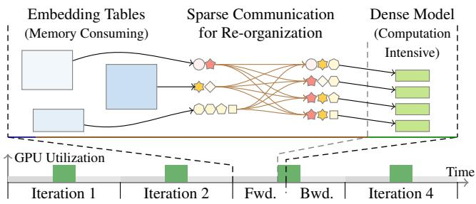  
Figure 1: Sketch of a DLRM Training Process

As shown in Figure 1, the sparse part consists of embedding tables that contain the feature vectors of numerous items. To train the model, the related feature vectors of items in the training samples are gathered from the embedding tables via sparse inter-process communication. After receiving all the embedding vectors, the GPUs process them with the dense part of the model.

Typically, a hybrid parallel strategy is adopted to train the model. The memory-consuming embedding tables are partitioned across workers, and the host memory is commonly used to accommodate most of them. They may contain up to trillions of parameters [21, 25] in production. Rest layers of the model, the dense part, are replicated. They model is replicated on up to hundreds of GPUs, which provide the computation capability to train it.

Unfortunately, such parallel strategy fails to scale up, due to the huge size and heterogeneity of the model parts. Every training sample is related to tens of embedding vectors that reside in several other workers, incurring significant overhead to exchange the embedding vectors among the hardware devices. From the ranklist of DLRM training benchmark [41] of MLPerf [23], we observe that the most advanced system from NVIDIA [39] only achieves 2.89× speed up using 13× more GPUs (from 8 to 112). We even find that using more GPUs may slow down the training in some cases.

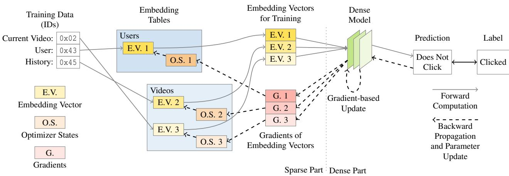  
Figure 2: General Model Structure and Training Process of DLRMs

A series of prior works introduce algorithms that change the training behavior to alleviate this problem, e.g., shuffling the training samples [2] or dropping certain embedding vectors [20]. Although higher throughput might be achieved, they pose uncertain influences on final model quality. Model developers thus usually appreciate systems that train the model without changing the algorithm to avoid any side effect. Therefore, we focus on improving the efficiency of the original synchronous training method.

We identify that existing model-transparent approaches fail to cope with the huge size and heterogeneity of the models due to the following two challenges.

High Data Management Cost Different from typical embedding tables in other models, embedding vectors of new items are constantly inserted to the tables, because there are always new items in the training data. Among the distributed embedding tables, overhead of the item-wise data management is high [43]. Current approaches maintain the embedding vectors differently at either table level [25, 33] or item level [3,34] according to the access pattern. The system has to maintain locations of every embedding vector and guarantee the consistency. The GPUs consume up to millions of items every few milliseconds, posing high throughput requirement on the CPU-side embedding feeding and updating module.

High Communication Cost The communication overhead to gather the embedding vectors from remote nodes and sending the gradients back takes a significant amount of time, comparing with the neural computation on the GPUs. Uneven access pattern has been exploited by previous works [3, 25, 33, 34, 44] to accelerate the communication by replicating some frequently accessed items (e.g. items represented by stars in Figure 1) across all GPUs. However, this introduces additional overhead to synchronize the replicas, and the total commjjunication overhead can hardly be reduced. Selecting the items to replicate is critical but challenging.

We propose an in-memory embedding database, HypeReca, to address the challenges in the distributed DLRM training scenario. Behind a simple interface similar to a key-value database, it automatically utilizes both host and device memory in the cluster to store the embedding data, and serve it with different parallel strategies according to the specific pattern of DNN training and its data.

First, we design an efficient decentralized embedding vector management mechanism. The vectors are stored in chunks, and the locations are maintained by a distributed indexing table. As training data are fed to the model in batches during the training process, we utilize the multi-thread parallel processing capability for the throughput-critical indexing tasks. Furthermore, we introduce an intra-node pipeline to reduce the lock overhead over the tables.

Second, we adopt a two-fold parallel strategy for the embedding tables, namely 2FP. We apply communication-efficient data parallelism for a special chunk of frequently-accessed embedding vectors stored on GPUs. While slight redundancy is introduced, the synchronization operation is simplified, and thus better utilizes the network bandwidth. We build a performance model on the replication strategy that makes a trade-off when selecting the replicated items. The sparse embedding vector access pattern is exploited to reduce the overall communication latency.

We evaluate HypeReca on two different clusters with up to 32 GPUs. With identical model quality, our system achieves 2.16 − 16.8× speedup over the baseline systems on different models and training datasets with terabytes of data.

## 2 Background and Motivation

## 2.1 DLRM Model and Work Flow

DLRMs are commonly used to predict behaviors of users, e.g. click-through rate (CTR). It takes IDs of entities, including the user, the presented content, and any possibly related items, as input. Then, using a deep neural network, it conducts predictions to provide better recommendations. For example, when predicting CTR of a video shown to a user, the user’s ID, together with the video’s ID, and possibly IDs of past ten videos the user watched, are fed into the DLRM as one training sample. The fact that the user clicked it is used as a label, and the model is trained by supervised learning.

As shown in Figure 2, a DLRM model mainly consists of two parts. Sparse Part contains one or multiple embedding tables. Dense Part consists of various neural network models.

Sparse Part contains several embedding tables. They map discrete IDs of certain categories to embedding vectors, commonly consisting of tens or some hundreds of floating point numbers. Due to the numerous contents online, sparse parts of real DLRMs contain more than billions [20, 21, 25] of parameters. Despite consuming much memory, it is sparsely accessed, involving little computation. Optimizing the memoryintensive operators [28] is effective on a single GPU, but scaling it up requires special communication design.

Dense Part studies on the embedding vectors of input items and makes predictions. This part is being intensively studied by the model developing community. MLPs and CNNs, Transformers and MMoEs [5, 11, 27, 36], are introduced for better model quality. As recommendation tasks require low inference latency, these models are usually of moderate size, but much more computation-intensive.

To train the model, a batch of labeled training data, containing up to millions of IDs, is first fed into Sparse Part. The data is processed by the DLRM, and output of Dense Part is compared with the ground truth. Then, gradients produced by a loss function are propagated backward through both parts. Finally, a gradient-based optimizer, e.g. SGD [16] or Adam [18], is used to update the parameters.

It should be noticed that the embedding tables are part of the parameters of the model. They are updated every iteration when training. Maintaining the optimizer states of the embedding tables is a part of the parameter updating process. Although the gradients are sparse, the updated embedding vector may be immediately needed by the next training batch.

## 2.2 Existing Basic Parallel Strategy

Distributed training is the most promising way to increase training throughput. However, in DLRM, the dense part involves intensive computation, while the sparse part requires a lot of memory to store the embedding tables. The difference in workload leads to different selections of parallel strategy. A basic hybrid parallel strategy is commonly used in present DLRM training systems [15, 39, 43]. Figure 3 illustrates the hybrid parallelism that applies different parallel strategy to sparse part and dense part separately.

For Sparse Part, it is inevitable that the embedding tables are partitioned across multiple devices, as they may contain terabytes of parameters. For simplicity, we adopt GSET [43] technique that maps IDs of items in different categories into a unique global ID, which simplifies multiple embedding tables into one. To fit Sparse Part into distributed memory, embedding vectors of different items are placed on different workers. From the view of distributed deep learning, it adopts model parallelism, where rows of embedding vectors are stacked up to be a tall matrix, and split up horizontally. Host memory is commonly used to store these large embedding tables [25,43]. Some GPU-centric systems put them on GPUs [12,15,39], but they still have to offload most embedding vectors elsewhere, due to the huge size of training datasets.

Rest parts of the model, including data loading and Dense Part, adopt data parallelism. A global batch of training data is split into multiple mini-batches by samples. Each worker is bound to one GPU. Dense Part is replicated across all GPUs, as it has fewer parameters and is more compute-intensive. To synchronize the replicas, all-reduce operation is performed over the gradients before updating the models. This approach can greatly scale up the throughput [19, 22, 31], but it is inefficient in utilizing memory.

Due to the different parallel strategies between the two parts, the embedding vectors are re-organized. For instance, a training sample on worker A includes items whose embedding vectors are on worker B and C. Then, B and C need to find them in local memory, and send them to A. Globally, for a batch of training samples, every worker gathers embedding vectors from local memory, and send them to other workers. This is commonly implemented by invoking all-to-all, a basic sparse collective communication operation [30]. It may be replaced by all-reduce over a tensor containing multiple rows of zeros, depending on the efficiency of the communication operation implementation [39].

The all-to-all communication pattern leads to significant scalability issues. Training time composition of several opensource distributed DLRMs [15,39] is measured and presented in Figure 4. Sparse Part, which is dominated by the sparse all-to-all communication, makes up most of the training time, exceeding 90% in most occasions. Increasing network bandwidth is the only direct way to accelerate the inter-device communication. For example, previous works utilize highbandwidth NV-Links among GPUs within a node [39, 47], or equip high-performance NICs for every GPUs [3, 25]. These hardware items are expensive and less scalable compared to clusters connected via commodity hardware (e.g. PCIe GPUs and Infiniband HCAs per node).

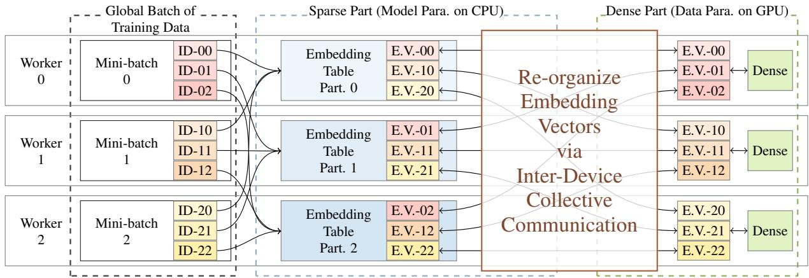  
Figure 3: Existing Basic Hybrid Parallelism on Sparse Part and Dense Part

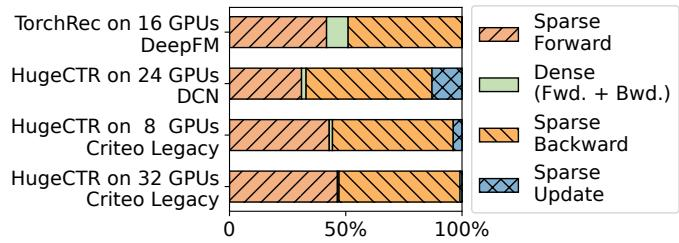  
Figure 4: Iteration Time Break-down

In fact, the embedding vectors are created, read, and updated in the same way as a KV store system. Differently, the requests during DLRM training are served in large batches. The serving throughput is more important than the latency.

## 2.3 Throughput-Sensitive Data Management

While it is a widely known approach to handle hot and cold data separately, the presence of GPUs in DLRM training introduces unique challenges. Data management overhead of the training system is essential to overall performance. The system has to determine the items to replicate, indicate locations of all demanded items, and ensure synchronization of replicas within a short period of time.

When training a common DLRM, an NVIDIA V100 GPU consumes 159k items in 10ms. As there are commonly 8 GPUs in a node, the CPU has to provide the GPUs with embedding vectors of millions of items within a few milliseconds. The throughput of managing the embedding vectors should be as high as that of computation on GPUs, posing a strong efficiency demand.

The difficulty prevents prior works [2] from scaling up to multiple nodes. Expensive four-socket nodes [34] and even a dedicated CPU node equipped with Intel’s most powerful Xeon Platium CPUs [3] are introduced to cope with the data management stress. As it is hard to change the hardware setup in many production cases, we focus on improving distributed DLRM training performance on the extensively deployed homogeneous clusters using commodity hardware.

## 2.4 Sparse Pattern of Training Data: Skewness

Intuitively, some items in DLRMs are much more frequently accessed than others, e.g., accounts of celebrities or spot news. Besides, embedding tables of some categories contain very few items, such as genders, which are always accessed. We refer to such uneven sparse access pattern as skewness.

It is easy to accelerate DLRM training by utilizing skewness across embedding tables. Applying different parallel strategies to different embedding tables [25, 33, 48] can reduce communication overhead with little modification of the training system. However, embedding tables are the smallest units of parallelism in these systems. Such granularity is so coarse that they miss many opportunities among items within embedding tables, and gain little improvement.

With a finer granularity, skew access pattern has been observed among embedding vectors within an embedding table [2,3,34]. We closely inspect such skewness in real datasets to find opportunities for improving the performance and scalability of distributed DLRM training.

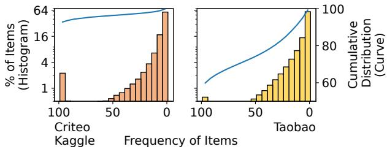  
Figure 5: Observation on Skewed Distribution of Items

We inspect two public datasets, Criteo Kaggle [7] and Taobao [4]. We peek into 100 batches of training data in each dataset. The histograms in Figure 5 aggregate the batchfrequency of items, i.e. the number of batches containing a certain item out of all 100 batches. In the Criteo Kaggle dataset, we find 2.2% items appear in more than 95 batches, indicated by the leftmost spiking bar of the histogram. We call them frequent items in our work. Similarly, we find that 0.6% items are frequent items in Taobao dataset. The rest items briefly follow an exponential distribution. Most of them appear in no more than 5 out of 100 batches.

We further inspect another batch to obtain the distribution of items over each bin, which indicates embedding vector access during training. Fewer than 1% items are not present in the previous 100 batches. As the cumulative curves in Figure 5 suggest, in Criteo Kaggle dataset, more than 90% accesses are directed to the 2.2% most frequently-accessed items. While in Taobao, 13% most frequent items can cover about 86% embedding vector accesses.

The skewness brings an opportunity for reducing communication. Suppose that we have a replica of the frequent items on each GPU, the all-to-all communication volume can be reduced by up to 90%. The end-to-end performance can be greatly improved since most time of distributed DLRM training is spent on the inter-device communication.

While the item-wise skewness pattern should be utilized, we keep in mind that the data management overhead should be minimized to achieve end-to-end speed up.

## 3 System Overview

HypeReca adopts the key-value store abstraction for the embedding vector database. As shown in Figure 6, the operations are integrated into the training process, while the stand-alone embedding database handles the requests.

Our system maintains the embedding vectors and the relevant optimizer states in chunks. The chunks may reside in host memory or device memory. As they occupy most of the storage space, HypeReca employs the following techniques to manage them. Decentralized Indexing Tables (DIT) are used to locate the embedding vectors in chunks on different processes, according to the input ID. It allows migrating the embedding vectors among chunks, and indexing the embedding vectors at high throughput. A special embedding chunk (R chunk) is placed in the device memory of GPUs to provide the dense part of the model with efficient direct device-local access to certain embedding vectors and utilize the skewness in the embedding vector access.

For a batch of IDs in the training dataset, the Prefetch operation first asynchronously locate or allocate the embedding vectors in the chunks. The Pull and Push operations work as the embedding computation in the forward and backward propagation. The Update operation commits the updates according to the gradients.

It takes negligible effort to use HypeReca with existing neural network training frameworks, such as PyTorch [29] and HugeCTR [39]. While the Prefetch call may be inserted into the data loader or integrated with Pull, the operations can be simply used as a customized embedding layer.

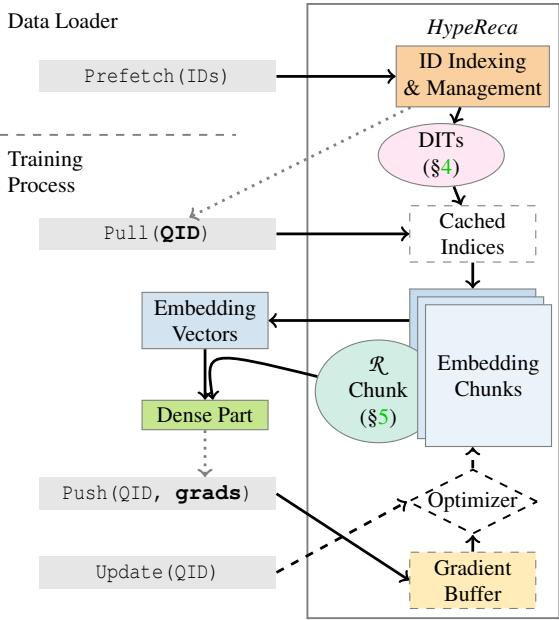  
Figure 6: Overview of HypeReca

## 4 Throughput-Oriented Data Management

Performance challenges of the sparse communication for embedding vector accesses come from complicated fine-grained data management. On the one hand, millions of items are consumed by the GPUs in milliseconds. On the other hand, the embedding vectors locate in various places to utilize the memory. For a batch of training data, the system goes through the management routine for each item separately, which results in fragmented memory access and inter-process communication. We mitigate these drawbacks with throughput-oriented designs for competitive end-to-end training performance.

## 4.1 Dynamic Decentralized Indexing

Most embedding vectors are maintained in distributed memory space across multiple processes. In existing systems, the input IDs are commonly directly mapped to partitions of the embedding table by simple hashing, e.g. using a few bits in the ID to indicate the index of the partition and offset within it. However, besides hash collision that may hurt model quality [43], it is less scalable. To extend the capacity of a partition, a significant amount of data has to be moved around in memory, leading to unpredictable access latency.

To efficiently manage memory, HypeReca allocates spaces for embedding vectors by chunks. Every process maintain several embedding chunks in the host memory. Also, we place a special replicated chunk on each GPU. For a newly seen ID, it is assigned to a certain chunk. If there is no space left in the last chunk, a new chunk is allocated. By this design, HypeReca is able to avoid any collision, and keep allocated memory utilized. Besides, there is little overhead to maintain the chunks, because they are orders of magnitudes fewer than the embedding vectors.

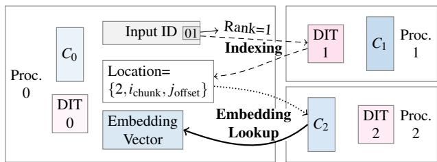  
Example embedding vector fetching process for an item in a mini-batch on process 0 whose location is maintained on process 1, and the embedding vector resides in chunk $C _ { 2 }$ on process 2.  
Figure 7: Workflow to Fetch an Embedding Vector

As Figure 7 shows, to fetch an embedding vector, there are two steps: (1) ID of the item is converted to location information in the distributed memory space, namely indexing; (2) the actual embedding lookup is performed, where the embedding vector is fetched from an embedding chunk.

The location information consists of rank of the process that holds the embedding vector, index of the chunk, and offset of the embedding vector within the chunk. This information is compactly packed into a few bytes.

HypeReca employs decentralized indexing hash tables (DIT) to maintain the locations of items, which is more scalable compared with a centralized indexing module. To guarantee consistency, each ID is exactly maintained by one certain hash table on a process. The last few bits of IDs are used to indicate the rank of the process. On each process, the DIT only maintains location information, which is much lighter than the embedding vectors.

In the embedding lookup step, the location information is used to retrieve the embedding vector from memory of processes i. Also, during backward propagation, the gradients are accordingly sent backward, and the embedding vectors are updated by the end of every iteration.

A notable detail is that simply accessing remote embedding vectors through RDMA is poorly efficient. In an experimental version of our system, we adopt one-sided RDMA put and get operations provided by UCX to directly fetch the embedding vectors from remote host memory. Unfortunately, because the embedding vectors are barely larger than 500 bytes, the overhead to send one-sided requests dominates. The actual communication bandwidth can hardly achieve more than 10% the theoretical peak bandwidth.

Instead, in our system, for a batch of embedding vector fetching requests from process A to process B, process B locally gathers embedding vectors from local chunks (and maybe perform some local pooling according to the model) into a temporary contiguous memory space before sending them to process A. This approach better utilizes the bandwidth of the network, and the RDMA network is managed by the high-level communication libraries, such as MPI and NCCL.

The decentralized indexing design provides HypeReca with high flexibility. ID of the items can be in any format, without the need to be preprocessed into contiguous indices, which is very useful for streaming training data.

## 4.2 Asynchronous Parallel Indexing Pipeline

We find an extra performance benefit from the indexing design. Performing indexing is not related to the actual data of embedding vectors, which is updated in every iteration. Therefore, indexing can be decoupled with embedding lookup, and moved to the thread for data loading. After the data loader reads IDs in a training sample from storage, HypeReca immediately convert these IDs into locations in HypeReca. The training thread then asynchronously reads them from a buffer, so the latency on the critical path is reduced.

Specifically, inter-process communication is conducted to perform indexing over remote DITs. When a process performs indexing for a batch of input IDs, it sends requests to all other processes. For each process, one thread handles one request from a remote process. The thread goes through the local DIT to find locations for each ID in the batch. New locations are assigned to embedding vectors of newly-seen IDs. Finally, after the allocation is finished, the thread responds to the request with a batch of locations.

The latency of the request-handling thread can be high, because even executed in batches, the latency to access hash tables is not that predictable. Fortunately, multiple threads are used to load multiple batches of data simultaneously ahead of training in most training systems, so indexing can also be performed in parallel to increase throughput.

To guarantee consistency of the DITs, read-write locks are used to support concurrent access. We observe that the lock is a performance bottleneck. Besides the overhead in its implementation, many other threads are blocked when one thread is trying to write new items. A naïve implementation can barely meet the throughput requirement.

We invent a parallel pipeline for the hash table operations, exploiting opportunities brought by the batch of queries. For better concurrency, we first slice the hash table into a few tens of shards. Multiple threads handling different indexing tasks go through the shards as a pipeline, as shown in Figure 8. Every thread only needs to lock a shard once, and all the IDs in this shard are processed. Such design eliminates most contention, because the threads are mostly operating on different shards in a pipeline manner.

This indexing pipeline is inspired by the commonly used pipeline parallelism in training large neural networks. However, different from the inter-layer and inter-device pipeline parallelism, this pipeline works within the embedding layer and within a CPU. It utilizes independent data structures simultaneously for higher throughput.

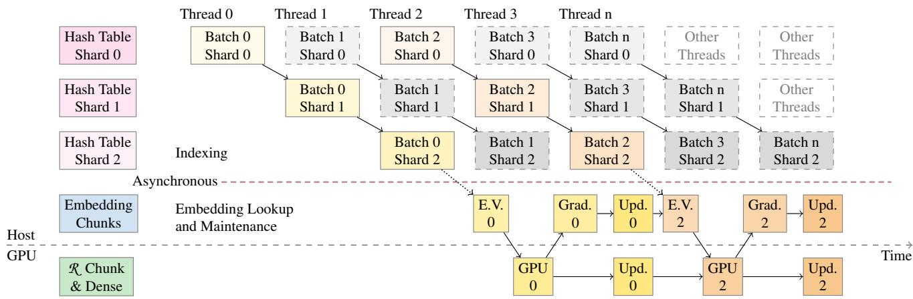  
Batch 1 and 3 are trained on some remote processes. Thread 1 and 3 respond to the indexing request, and their further steps are not presented in this figure.  
Figure 8: Indexing Pipeline and Computation in a Process

Although this pipeline does not directly reduce indexing latency of one batch, the overall throughput of multiple threads is increased. As long as it can match the throughput on GPUs, the overall training process is not throttled by indexing, because it is processed by the data loading thread. In our practice, throughput of this indexing pipeline is high enough to match the throughput of 8 GPUs using 32 CPU threads.

## 5 Pattern-Aware Parallel Strategy

The chunk-based in-memory embedding database provides us with the flexibility to utilize skew access pattern by placing chunks on the GPU. The synchronization overhead of the chunks varies according to the placement strategy of the chunks and the related synchronization algorithm. Inspired by hybrid training algorithms of typical neural networks, we propose a hybrid chunk placement strategy, and build a performance model to guide the selection of the strategy. Over the ever-existing all-to-all communication for the sparse embedding vector access, we employ scheduling techniques to reduce its contention.

## 5.1 2-Fold Parallel Strategy

We partition the embedding vectors into two parts according to the access frequency. An item-wise two-fold parallel strategy (2FP) is applied to both parts of the embedding vectors. More specifically, we apply either of the following two strategies to the embedding vector related to an item: (a) data parallelism is used on a small portion of frequent items; (b) model parallelism handles the rest items.

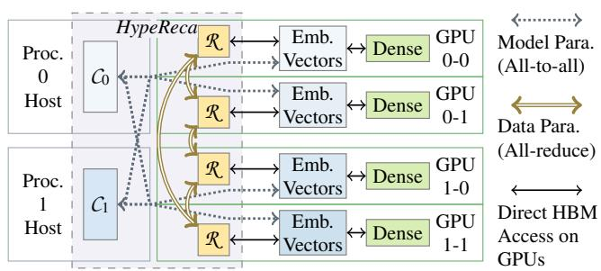  
Figure 9: The Two-Fold Parallel Strategy (2FP)

Figure 9 illustrates the design of 2FP. There are two exclusive types of partitions. Any embedding vector belongs to exactly one of them.

R is the replicated embedding chunk for high throughput GPU-local access of embedding vectors. There is a replica of R on each GPU, so accesses of embedding vectors in R are performed locally through the high-bandwidth device memory (HBM). Inter-device data movement is eliminated during forward and backward propagation, removing significant communication overhead. Synchronous data-parallel training algorithm is used over R to keep it consistent across GPUs. Gradients are synchronized in each iteration before updating the embedding vectors.

Ci(i ∈ [0, Nproc.)) denotes the rest trivial chunks on process i. Host memory of the process is used to store embedding vectors in Ci. This saves GPU memory to store R and the dense part. During training, processes fetch embedding vectors of samples in its local batch from all Ci, excluding those in R . Gradients are then pushed back, aggregated and used to update the embedding vectors. As the updates finish before the pulling operation of the next iteration, the dense part always works on the latest version of embedding vectors. In other words, model parallelism is applied to $C _ { i } .$ . The embedding tables are row-wise partitioned.

HypeReca achieves model transparency via the two-fold strategy. The embedding vectors are kept in a fixed place throughout the training process. Without complicated strategies like prefetching or caching, we are able to guarantee strong consistency directly by parallel training algorithms.

Additionally, the $2 F P$ design removes the necessity to perform deduplication [46], which removes duplicated items before initiating all-to-all to reduce its volume, but introduces extra overhead. In HypeReca, the duplicated items are mostly frequent items in R , which do not go through all-to-all.

In this section, we illustrate how to reduce the communication overhead with $2 F P$ by building a performance model. Speed up of 2FP is achieved based on the efficient managing the data in end-to-end DLRM training processes.

## 5.2 Performance Modeling

To select proper items to put in R for optimal performance, there are two steps. First, we identify the frequency of items. Then, we pick a proper number of items.

For the first step, peeping at the dataset can provide adequate information to find out the most frequent items. As Figure 5 suggests, sampling of 100 training batches has already shown an obvious tendency of skewness. And 100 iterations are likely fewer than 1% of a training process that can be done in a few minutes. Due to the fact that more than 10k iterations are normally needed for training, and the data follows a similar skewed distribution, performing frequency counting of items in the first 100 iterations introduces only minor overhead. It is possible that the skewness changes during a training process that lasts much longer. We can always re-peep to keep R fresh, and this can be overlapped with other jobs that pause training, e.g. writing a checkpoint.

The second step is more challenging. The size of ${ \mathcal { R } } ,$ denoted as R, is significant to the performance. We find a tradeoff between reducing the all-to-all volume and increasing the synchronization overhead of ${ \mathcal { R } } .$ . Having more items in R can reduce the number of items that must be fetched across processes, i.e., all-to-all overhead. However, the whole R must be synchronized and updated as a dense parameter in every iteration, even if some items are not accessed at all, incurring overhead and losing the benefits of sparsity. Therefore, we need a proper R to minimize overall latency.

A performance model is built to help to determine R. The overall communication latency $L _ { \mathrm { o v e r a l l } }$ consists of two parts:

$$
L _ { \mathrm { o v e r a l l } } = L _ { \mathcal { R } } + L _ { C }
$$

The latency to synchronize R is noted as $L _ { \mathcal { R } }$ and the latency to fetch data in $C _ { i }$ is noted as $L _ { C }$ . As both tasks are

communication-intensive, there is little benefit from overlapping them, so we can add them up directly.

The first part, $L _ { \mathcal { R } }$ , is proportional to R:

$$
L _ { \mathcal { R } } = \mathbb { R } C _ { \mathrm { a r } }
$$

The latency comes with a coefficient $C _ { \mathrm { a r } }$ that denotes the communication performance of all-reduce on given hardware and model setup, which can be calculated or measured by a micro-benchmark.

The second part, $L _ { C }$ is a little more complicated:

$$
L _ { C } = N ( 1 - \rho ( \mathbb { R } ) ) C _ { \mathrm { a 2 a } }
$$

The latency of $C _ { i }$ is related to $N ,$ the number of items in a batch. Here, $1 - \rho ( \mathbb { R } )$ denotes the portion of items that do not present in ${ \mathcal { R } } ,$ and have to be fetched from $C _ { i } .$ As communication for $C _ { i }$ is all-to-all, $L _ { C }$ is calculated with another coefficient, $C _ { \mathrm { a 2 a } } .$ , which can be obtained in a similar way to $C _ { \mathrm { a r } }$ above.

```perl
Algorithm 1 Produce ρ from sampled training data
1: function GETK(A sampled list of items $D [ N ] )$
2: $C \gets \{ 0 , 0 , \ldots , 0 \}$ ▷ A map from item ID to counter
3: for all Item ID $i \in D$ do
4: $C _ { i } \gets C _ { i } + 1$
5: end for
6: U ← Unique IDs in $C$
7: Descending sort U by $C _ { U _ { i } }$
8: $\rho _ { 0 }  0$
9: for $i  1 \ldots | U |$ do
10: $\pmb { \rho } _ { i } \gets \pmb { \rho } _ { i - 1 } + \frac { C _ { U _ { i } } } { N }$
11: end for
12: return $\rho$
13: end function
```

ρ(R) is a function that uses the sampled training data to estimate the portion of embedding vector accesses that are covered by ${ \mathcal { R } } .$ Algorithm 1 is used to determine $\rho ( \mathbb { R } )$ for any possible R. Items are sorted according to their frequency, and the top R items are selected. Then, we calculate the expectations of items in R to appear in a training batch.

Finally, $L _ { \mathrm { o v e r a l l } }$ is expanded as follows:

$$
L _ { \mathrm { o v e r a l l } } = \mathbb { R } C _ { \mathrm { a r } } + N ( 1 - \rho ( \mathbb { R } ) ) C _ { \mathrm { a 2 a } }
$$

We observe that $L _ { \mathcal { R } }$ , the first part of $L _ { \mathrm { o v e r a l l } }$ , increases when R increases, while $L _ { C } ,$ the second part, decreases, corresponding to the aforementioned trade-off. Besides, ρ(R) grows sharply with R when R is relatively small, e.g. a few thousands, and turns to a slow increase when R is larger. Therefore, $L _ { \mathrm { o v e r a l l } }$ is roughly a U-shaped curve over R.

A ternary search algorithm can be used to quickly find an optimal range of R, considering the memory limit as the maximum candidate value. Then, we employ bulk enumeration to get an optimal value of R.

By further analyzing the equation, we can see that various batch sizes N lead to different optimal R values for minimum $L _ { \mathrm { o v e r a l l } }$ , as it only affects $L _ { C } . \operatorname { A s } N$ gets larger, $( 1 - \rho ( \mathbb { R } ) ) C _ { \mathrm { a 2 a } }$ becomes more significant in $L _ { \mathrm { o v e r a l l } }$ , and a larger R is more beneficial. This brings extra performance gain for HypeReca when scaling DLRM training up with larger batch size, if there is enough memory for a larger R .

## 5.3 Analytical Effectiveness of 2FP

Should the frequent items be removed from model parallelism, the communication volume of all-to-all can be significantly reduced. And as the they only make up a small portion of all items, they can be duplicated with little extra memory consumption, and synchronized with less communication overhead. This can be verified by applying the performance model to the real-world datasets that we observed.

First, we measure the performance of all-reduce for data parallelism and all-to-all for model parallelism on 32 GPUs across 4 nodes. Then, we calculate ρ from the datasets to estimate the reduction of communication.

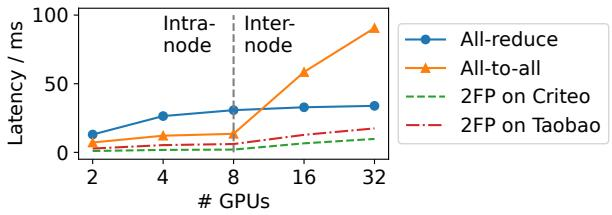  
Figure 10: Communication Latency Modeling

For model parallelism using all-to-all, assume that there are 32MB of embedding vectors to exchange on each GPU. Then, assume that the actual number of different items is about 6% the total number of samples. In this case, all-reduce is performed over 64MB of embedding vectors on each GPU using data parallelism.

The solid lines in Figure 10 show the latency of both collective communication operations. The performance of all-to-all is better within a node, but its latency grows much larger than all-reduce when scaling up to more than 16 GPUs across multiple nodes, because it is unfriendly to the hierarchical connection topology. In contrast, all-reduce can scale up well across nodes, as the distributed reduction algorithms fit the hardware architecture and network topology better.

The dashed lines in Figure 10 show our estimation of communication latency of 2FP on both datasets. When training over Kaggle dataset, we have $\mathsf { p } ( 3 2 , 2 6 5 ) = 0 . 9 2$ This means about 32k (2.2%) items are processed by all-reduce, and the all-to-all latency is reduced by 92%. Theoretically, the communication latency is reduced by 9.2×, compared to the original strategy that only applies model parallelism for the embedding vectors and performs all-to-all over all of them.

The case for Taobao is harder, but the opportunity is still significant. We use $\mathfrak { p } ( 2 2 7 , 0 5 8 ) = 0 . 8 6$ , so having 227k (13%) frequent items replicated removes 86% all-to-all overhead. As a result, the communication latency is reduced by 5.2×.

Even compared with data parallelism, there is 93% − 245% communication speed up. In fact, data parallelism is not practical because the actual memory footprint would be far more than that of all-to-all on the same number of items, because it duplicates instead of splitting data.

## 5.4 Contention-free Scheduling

Exchanging the embedding vector among processes is more complicated than a simple all-to-all collective communication operation. When the workers exchange the embedding vectors, they are first gathered into a temporary contiguous tensor from the chunks to utilize the network bandwidth. Similarly, during indexing, each worker iterates through its local DIT to respond to each indexing request.

We summarize the all-to-all request workload pattern as follow. Each process sends requests to all processes. To respond to the request, the remote process has to conduct computation locally before sending the results back. Basically, we employ a separate thread pool on each process to respond to the requests. Contention happens when multiple requests are sent to the same process simultaneously.

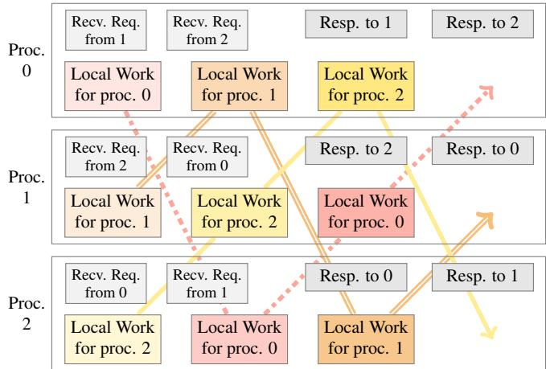  
Figure 11: A 3-process Example of the Ring Schedule

HypeReca adopts a contention-free ring schedule to avoid the problem. Figure 11 instantiates the schedule with 3 processes. Formally, for a workload among n processes, n steps are performed. In step i, process r performs computation of request from process $( ( r + i )$ mod n), and communication operations are executed accordingly.

For peak performance, the communication operations are all performed asynchronously to better overlap with computation. Computation for the request to the local process is placed at the beginning of the schedule to minimize initialization overhead. Finally, at any point of time, each process has exactly one request to handle, so the demanded number of CPU cores remains stable through the training process, and the overall throughput is promising.

## 6 Evaluation

## 6.1 Setup and Methodology

We use two different clusters to evaluate HypeReca.

• Antique: Each node contains 8× NVIDIA A100 SXM4 GPUs with 40GB memory and dual Infiniband HDR 200Gb/s HCA cards. Due to limited quota, we are only able to compare scalability of HypeReca and HugeCTR over Terabytes dataset on this cluster.

• Vintage: Each node contains 8× NVIDIA V100 PCIe GPUs with 16GB memory and an Infiniband EDR 100Gb/s HCA card. All experiments are conducted on this cluster unless otherwise stated.

Antique represents a high-end cluster setup for training large deep learning models, whereas Vintage has a more budget-friendly setting. The PCIe GPUs have similar communication bandwidth as consumer-grade GPUs, such as GTX 1080. As the DLRM training workload is communicationbound, we expect our system to achieve higher speedup on clusters with lower communication bandwidth, enabling DLRM training on these more economical hardware platforms.

We compare the performance of HypeReca with the following three open-source baselines.

TFDE [37] The name is short for TensorFlow Distributed Embeddings. It implements Parallax [17] for DLRMs using newer TensorFlow [1]. Compared with a bare data-parallel approach, this system maintains the sparse part by a distributed sparse parameter server. In fact, this is equivalent to the existing basic hybrid parallelism that applies model parallelism for the entire sparse part.

TorchRec [15] A coarse-grained hybrid parallel strategy [25, 33] is applied to utilize the skewness across embedding tables. It is easy to implement, yet missing opportunities within an embedding table. It also adopts CUDA unified memory technique for faster data transfer between host memory and GPU memory.

HugeCTR [39] This system is used by NVIDIA in the MLPerf DLRM benchmark, with a Caffe-like front end that supports a limited range of models. All the embedding tables are placed on GPUs, and it utilizes GPU-direct communication techniques to accelerate all-to-all.

We set up test cases using three public real-world datasets for three popular DLRMs, as shown in Table 1.

Taobao advertisement display and click dataset [4] is a public dataset of logs from taobao.com, one of the largest e-commerce websites in China. Sparse features of the dataset include IDs of products, customers, and campaigns. Criteo-Kaggle [7] dataset is a benchmark dataset for CTR prediction, with more masked sparse features per sample. Terabytes [6] is of similar data format, but much larger, used in MLPerf DLRM benchmark [41].

Table 1: Datasets and Models for Evaluation
<table><tr><td>Dataset Model</td><td>Taobao [4] DCN [27]</td><td>Criteo Kaggle [7] Legacy [39]</td><td>Terabytes [6] DLRM [41]</td></tr><tr><td># Feat. (Den./Sp.)</td><td>4/4</td><td>1/39</td><td>14/26</td></tr><tr><td># Samples</td><td>26M</td><td>36M</td><td>4.3B</td></tr><tr><td>Dataset Size</td><td>1.17GB</td><td>4.3GB</td><td>671GB</td></tr><tr><td># Items</td><td>1.83M</td><td>1.60M</td><td>187M</td></tr><tr><td>Embedding Size</td><td>117MB</td><td>411MB</td><td>96.1GB</td></tr></table>

Deep and Cross Network (DCN) [27] uses a cross network layer, i.e. dot product of embedding vectors, to learn interactions between sparse features. The legacy model of HugeCTR [39] treats all features as sparse, and process them with a simple multi-layer perceptron (MLP) network. DLRM benchmark of MLPerf [41] uses an interaction layer with larger MLP, being a widely-used standard benchmark to evaluate DLRM training systems.

We first compare HypeReca with the baselines in end-toend training. Each model is trained for 500 iterations, and the average trained samples per second is used as the metric of throughput. Then, we validate the performance model by testing different selection of R. Also, we compare the indexing performance of HypeReca with a baseline implementation.

## 6.2 Scalability and End-to-end Results

We first measure both strong and weak scaling of HypeReca, i.e., keeping either global batch size or batch size per GPU the same, and use HugeCTR as a reference. We choose R of HypeReca for each setting according to the performance model, which is detailed in §6.5.

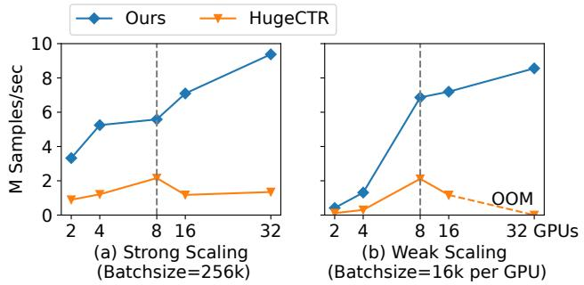  
Figure 12: Intra- and Inter-Node Scalability on Vintage

The scalability on Criteo dataset is presented in Figure 12. Two systems show a similar tendency to scale up within a node. However, when scaling to more than one node, Hype-Reca still speeds up as the number of GPUs increases, while HugeCTR becomes even slower. Notably, HugeCTR runs out of memory in the weak scaling experiment as the global batch size is too large, and it fails to utilize host memory. Meanwhile, HypeReca keeps most embedding vectors on the host side, using much less GPU memory, making it possible for larger batch sizes or more complicated dense parts.

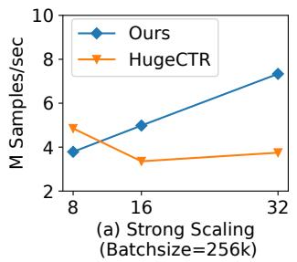

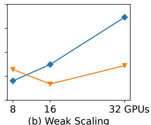  
(Batchsize=16k per GPU)  
Figure 13: Inter-Node Scalability on Antique Cluster

Inter-node scalability on Antique over Terabytes dataset is shown in Figure 13. HypeReca is slower than HugeCTR on one node. HugeCTR benefits from the fast intra-node NVLink connection, while HypeReca has to copy embedding vectors in Ci from host memory via much slower PCIe connections. However, HypeReca outperforms HugeCTR on multiple nodes. Because the bandwidth of inter-node connection is lower (from 600 GB/s per GPU to 400 Gbps per node), HugeCTR is even slower on multiple nodes than on a single node. In contrast, HypeReca shows a better tendency to scale up to more nodes, even on a cluster with faster connections.

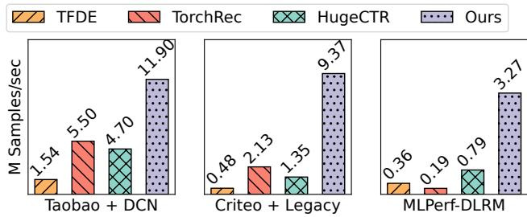  
Figure 14: End-to-end Comparison on Vintage Cluster

Training throughput on 32 GPUs over different models and datasets are shown in Figure 14. TFDE achieves poor performance because of the high re-organization overhead. TorchRec outperforms HugeCTR in the first and second case, as it finds opportunities on certain embedding tables, while data transfer overhead between CPU and GPU slows it down on Terabytes dataset. HypeReca outperforms all baselines on all test cases, achieving 9.1×, 16.8×, and 4.2× speedup on the MLPerf benchmark, respectively.

Unfortunately, we are not able to compare HypeReca with other systems utilizing fine-grained skewness [2, 3, 34] due to issues on code availability or deployment feasibility. Meanwhile, they achieve less speed up over the same TorchRec baseline in test cases using similar models, datasets, and number of GPUs. As HypeReca outperforms TorchRec and HugeCTR on 32 GPUs, we believe that HypeReca achieves competitive performance and scalability.

## 6.3 Effectiveness of the Indexing Pipeline

We develop a micro-benchmark for the decentralized dynamic indexing module using different numbers of data-loading threads per process on each of 4 nodes. A node has 32 cores and 64 threads. As indexing is integrated into the data loader, the throughput of the data loader shall match the training throughput. We implement a baseline that uses hash tables without any schedule for the batches of queries. Another reference implementation is using a simple hash strategy for indexing without DITs, which involves the collision issue that degrades the model quality.

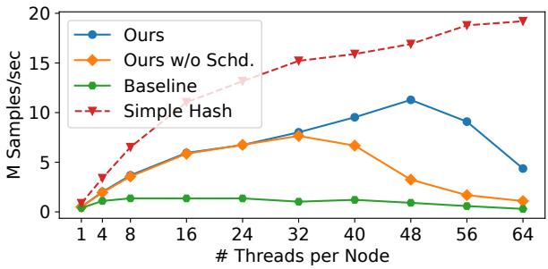  
Figure 15: Multi-threaded Indexing Throughput

Figure 15 shows results of the micro-benchmark over Terabytes dataset. The baseline achieves a maximum throughput of 1.37M samples per second using 8 threads per node, much lower than the training throughput of HypeReca, 3.3M/s. Its throughput even decreases when using more threads, due to the high locking overhead of the DITs. In contrast, the indexing pipeline of HypeReca achieves more than 10M samples per second, 8.26× faster than the baseline. This matches the throughput of training the dense part on GPUs.

Because no communication is involved, the simple hash baseline is always faster than our system. Still, the optimally configured DITs achieve 50% the peak performance of such a performance-maximized implementation.

The HypeReca w/o Schd. curve shows the performance of HypeReca when we disable the contention-avoiding schedule of indexing. It is able to keep similar throughput with Hype-Reca using fewer than 32 threads. Because the CPU resource is relatively abundant, the requests can be handled quickly.

However, when having more threads that generate more requests simultaneously, contention severely slows down the indexing tasks, hence the whole system. Our schedule effectively reduces the contention, and is even able to improve the throughput when the CPU is oversubscribed. As there are other active threads, HypeReca achieves the peak performance when oversubscribing 50% CPU cores, which brings 40.8% extra throughput over the case using 32 cores.

## 6.4 Overhead for Changing Skewness

Regarding the change of skewness pattern during the training process, we first observe the Terabytes training data in an entire epoch. The data includes real online user access history across 24 days. We first get the R of different sizes according to the first 100 batches of the first day. Then, we inspect the coverage of access in the following iterations of the first day, and in some sampled batches of the next 23 days.

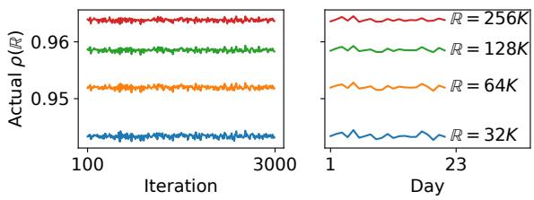  
Figure 16: Variance of Skewness During Training

As shown in Figure 16, all of the actual R coverage rates are consistent, both within a day and across multiple days. Besides, shuffling of the dataset is a common practice for training on both offline and online training data. Therefore, this result is generalizable to other scenarios.

Second, we evaluate the overhead to update the R by writing all the embedding vectors back to the Ci, and then pull new frequent embedding vectors into a new R . The result of the micro-benchmark is shown in Figure 17.

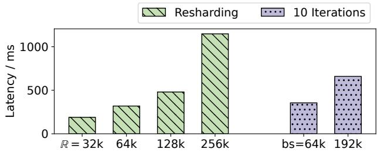  
Figure 17: Comparing the Latency of Re-sharding

As a reference, we include the latency of 10 training iterations of the MLPerf-DLRM model with different batch sizes. The overhead of such re-sharding operation increases with the size of R . Meanwhile, even with the largest R, it only takes about 1 second to complete the re-sharding tasks. The latency is at the same level of training for 10 iterations. Considering the above observations that the skewness pattern will likely remain stable, we can conclude that the overhead to update the R with the changing skewness pattern is minor in the whole training process.

## 6.5 Validating the Performance Model

We calculate ρ(R) for all the datasets, as presented in Figure 18. When R = 64k, ρ(R) is 73.9% for Taobao, and around 96% for both Criteo and Terabytes. This contributes to the reduced communication volume of HypeReca, and explains the reason for HypeReca to perform better on the latter two.

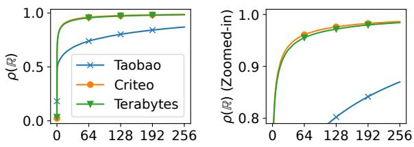  
ℝ / 1,024 items  
Figure 18: ρ(R) for Used Datasets

The red dashed curve in Figure 19 indicates the latency predicted by our performance model using the above ρ(R) in three setups on 32 GPUs. Except for a few outliers caused by performance disturbance, it matches the actual latency well. The average coefficient of determination, $r ^ { 2 }$ , exceeds 0.9 when fitting parameters, $C _ { \mathrm { a r } }$ and $C _ { \mathrm { a 2 a } } ,$ which validates the accuracy of our performance model.

The stacked areas of Figure 19 represent a break-down analysis of the latency over different R. Latency of the dense part remains unchanged, because it only involves unchanged dense computation on GPUs. Overhead of data parallelism for R grows linearly with its size. The all-to-all overhead decreases in an L-shaped curve, in accordance with (1 − ρ(R)). For Terabytes dataset, its latency reduces drastically when R increases from 0 to 1024, and then gradually gets smaller when increasing R. As small R covers less items in Taobao dataset, the all-to-all latency decreases slower.

In all 3 different setups, the overall latency is a U-shaped curve over R. An optimal R brings up to 7.80× speedup over Terabytes dataset, and 1.60× over Taobao, comparing with R = 0, i.e., disabling 2FP. This matches the speed-up over the baseline systems in Figure 14, and suggests that simply using host memory to store embedding vectors without 2FP brings little speedup.

For Terabytes dataset, we conduct the ablation experiment over two different batch sizes. The optimal R gets larger as the batch size grows, which matches the observation from the equation of our performance model in §5.2.

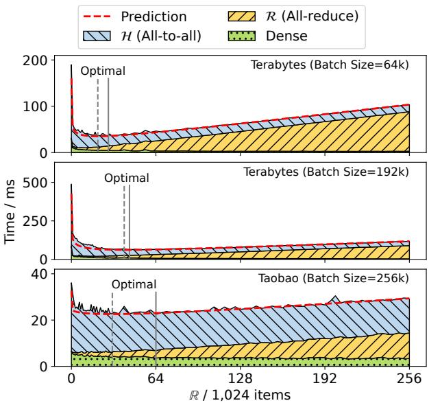  
Figure 19: Iteration Time Prediction and Actual Breakdown

Meanwhile, the end-to-end latency varies little around the optimal R value. Estimating a brief range of R is enough to get near-optimal performance of HypeReca. In our experiments, the deviation of R estimations from real optimal values incurs no more than 1% overhead on actual latency.

As the optimal R ranges from 20k to 64k, the GPU memory of R ranges from 10MB to 32MB for the embedding vectors of 128 floating point numbers. Therefore the overhead to store and synchronize R is minor for GPUs.

## 7 Related Works and Discussion

General auto-parallel NN training systems. Recent works [26, 31, 32, 49] focus on partitioning typical dense models with a computation graph as input. These approaches fail to explore sparsity within layers, e.g. skewed data access pattern of embedding tables.

4-D parallelism for DLRM. A prior work [25] concludes all possible parallelism for DLRM into 4 types: column-wise and row-wise, table-wise and data parallelism. 2FP generally contains the latter three ways of parallelism in a more flexible and high-performance way. While embedding vectors are mostly too short to be applied with column-wise parallelism in practice, HypeReca is also compatible with it.

Using GPU memory as cache. GPU memory is treated as a cache of CPU memory in many other works [9, 24, 42], and they achieve speedup on single GPUs. However, they select frequent items separately on each worker, and do not change the all-to-all communication pattern. Therefore, they do not scale up to multiple GPUs better than HugeCTR [39], which puts all data on GPUs, Furthermore, our work is orthogonal to these works, and can directly apply their techniques

on Ci in HypeReca.

Distributed replicated cache [3] is partly equivalent to 2FP, but online addition and eviction make its control flow too complicated to achieve competitive scalability.

Hardware-dependent systems. Introducing specific hardware can alleviate the communication bottleneck, e.g. utilizing fast NVLinks within a node [48] or pairing every GPU [25, 34] with high-performance NICs. Compared with these systems that require expensive hardware, HypeReca is more general and applicable to various setups with more affordable commodity hardware.

Changing the training algorithm. Embedding vector decomposition [35, 38, 40] and compression [10] reduce the memory footprint of the sparse part. Asynchronous training [21, 24, 43] and dropping some unimportant embedding vectors [20] are proved effective in certain cases. Model developers have to be aware of the deviation of algorithms which may affect model quality. HypeReca does not bring such concern, while being compatible with them.

DLRM as a graph. The training samples of DLRMs may be treated as edges in a hypergraph. Using graph-based methods to train the model may improve its efficiency [45]. However, it is hard for current graph-based training systems [13, 14] to meet the throughput demand of DLRMs and keep model-transparency at the same time.

Typical KV store systems. Cold/hot partitioning is employed by typical key-value store systems [8]. Meanwhile, applying such technique to the DLRM training workload demands extra dedicated design in synchronization policy and throughput-centric data management mechanism.

## 8 Conclusion

Scalability of DLRM training is important, while sparse communication of re-organizing data between its two parts introduces huge communication cost. We design an in-memory distributed embedding database, HypeReca, to reduce the cost. The throughput-centric data management module allows us to utilize GPU memory with the sparse access pattern of the workload. The two-fold parallel strategy effectively boosts the overall performance of the distributed DLRM training.

## Acknowledgment

We would like to thank the anonymous reviewers and our shepherd Roberto Palmieri for their insightful comments. This work is supported by Beijing Natural Science Foundation (L242017), NSFC for Distinguished Young Scholar (62225206), National Natural Science Foundation of China (U23A6007), and Tsinghua University Initiative Scientific Research Program. Jidong Zhai is the corresponding author of this paper.

## References

[1] Martín Abadi, Paul Barham, Jianmin Chen, Zhifeng Chen, Andy Davis, Jeffrey Dean, Matthieu Devin, Sanjay Ghemawat, Geoffrey Irving, Michael Isard, et al. Tensorflow: a system for large-scale machine learning. In 12th USENIX symposium on operating systems design and implementation (OSDI 16), pages 265–283, 2016.

[2] Muhammad Adnan, Yassaman Ebrahimzadeh Maboud, Divya Mahajan, and Prashant J. Nair. Accelerating recommendation system training by leveraging popular choices. Proc. VLDB Endow., 15(1):127–140, jan 2022.

[3] Saurabh Agarwal, Chengpo Yan, Ziyi Zhang, and Shivaram Venkataraman. Bagpipe: Accelerating deep recommendation model training. In Proceedings of the 29th Symposium on Operating Systems Principles, pages 348–363, 2023.

[4] Alimama. Ad display/click data on taobao.com. https: //www.kaggle.com/datasets/pavansanagapati/ ad-displayclick-data-on-taobaocom, 2020.

[5] Qiwei Chen, Huan Zhao, Wei Li, Pipei Huang, and Wenwu Ou. Behavior sequence transformer for ecommerce recommendation in alibaba. In Proceedings of the 1st International Workshop on Deep Learning Practice for High-Dimensional Sparse Data, pages 1–4, 2019.

[6] Criteo. Criteo 1tb click logs dataset. https://ailab.criteo.com/ download-criteo-1tb-click-logs-dataset, 2014.

[7] Criteo. Criteo display advertising challenge. http://www.kaggle.com/c/ criteo-display-ad-challenge, 2014.

[8] dePaul Miller, Jacob Nelson, Ahmed Hassan, and Roberto Palmieri. Kvcg: a heterogeneous key-value store for skewed workloads. In Bruno Wassermann, Michal Malka, Vijay Chidambaram, and Danny Raz, editors, SYSTOR ’21: The 14th ACM International Systems and Storage Conference, Haifa, Israel, June 14-16, 2021, pages 5:1–5:12. ACM, 2021.

[9] Jiarui Fang, Geng Zhang, Jiatong Han, Shenggui Li, Zhengda Bian, Yongbin Li, Jin Liu, and Yang You. A frequency-aware software cache for large recommendation system embeddings. arXiv preprint arXiv:2208.05321, 2022.

[10] Hao Feng, Boyuan Zhang, Fanjiang Ye, Min Si, Ching-Hsiang Chu, Jiannan Tian, Chunxing Yin, Summer

Deng, Yuchen Hao, Pavan Balaji, Tong Geng, and Dingwen Tao. Accelerating communication in deep learning recommendation model training with dual-level adaptive lossy compression. In Proceedings of the International Conference for High Performance Computing, Networking, Storage, and Analysis, SC ’24. IEEE Press, 2024.

[11] Huifeng Guo, Ruiming Tang, Yunming Ye, Zhenguo Li, and Xiuqiang He. Deepfm: A factorization-machine based neural network for CTR prediction. In Carles Sierra, editor, Proceedings of the Twenty-Sixth International Joint Conference on Artificial Intelligence, IJCAI 2017, Melbourne, Australia, August 19-25, 2017, pages 1725–1731. ijcai.org, 2017.

[12] Jiaao He, Shengqi Chen, and Jidong Zhai. POSTER: pattern-aware sparse communication for scalable recommendation model training. In Proceedings of the 29th ACM SIGPLAN Annual Symposium on Principles and Practice of Parallel Programming, PPoPP 2024, Edinburgh, United Kingdom, March 2-6, 2024, pages 466–468. ACM, 2024.

[13] Kezhao Huang, Haitian Jiang, Minjie Wang, Guangxuan Xiao, David Wipf, Xiang Song, Quan Gan, Zengfeng Huang, Jidong Zhai, and Zheng Zhang. Freshgnn: Reducing memory access via stable historical embeddings for graph neural network training. Proc. VLDB Endow., 17(6):1473–1486, 2024.

[14] Kezhao Huang, Jidong Zhai, Zhen Zheng, Youngmin Yi, and Xipeng Shen. Understanding and bridging the gaps in current gnn performance optimizations. In Jaejin Lee and Erez Petrank, editors, PPoPP ’21: 26th ACM SIGPLAN Symposium on Principles and Practice of Parallel Programming, Virtual Event, Republic of Korea, February 27- March 3, 2021, pages 119–132. ACM, 2021.

[15] Dmytro Ivchenko, Dennis Van Der Staay, Colin Taylor, Xing Liu, Will Feng, Rahul Kindi, Anirudh Sudarshan, and Shahin Sefati. Torchrec: a pytorch domain library for recommendation systems. In Proceedings of the 16th ACM Conference on Recommender Systems, pages 482–483, 2022.

[16] J. Kiefer and Jacob Wolfowitz. Stochastic estimation of the maximum of a regression function. Annals of Mathematical Statistics, 23:462–466, 1952.

[17] Soojeong Kim, Gyeong-In Yu, Hojin Park, Sungwoo Cho, Eunji Jeong, Hyeonmin Ha, Sanha Lee, Joo Seong Jeong, and Byung-Gon Chun. Parallax: Sparsity-aware data parallel training of deep neural networks. In George Candea, Robbert van Renesse, and Christof Fetzer, editors, Proceedings of the Fourteenth EuroSys Conference

2019, Dresden, Germany, March 25-28, 2019, pages 43:1–43:15. ACM, 2019.

[18] Diederik P. Kingma and Jimmy Ba. Adam: A method for stochastic optimization. In Yoshua Bengio and Yann LeCun, editors, 3rd International Conference on Learning Representations, ICLR 2015, San Diego, CA, USA, May 7-9, 2015, Conference Track Proceedings, 2015.

[19] Thorsten Kurth, Sean Treichler, Joshua Romero, Mayur Mudigonda, Nathan Luehr, Everett Phillips, Ankur Mahesh, Michael Matheson, Jack Deslippe, Massimiliano Fatica, et al. Exascale deep learning for climate analytics. In SC18: International Conference for High Performance Computing, Networking, Storage and Analysis, pages 649–660. IEEE, 2018.

[20] Fan Lai, Wei Zhang, Rui Liu, William Tsai, Xiaohan Wei, Yuxi Hu, Sabin Devkota, Jianyu Huang, Jongsoo Park, Xing Liu, et al. Adaembed: Adaptive embedding for Large-Scale recommendation models. In 17th USENIX Symposium on Operating Systems Design and Implementation (OSDI 23), pages 817–831, 2023.

[21] Xiangru Lian, Binhang Yuan, Xuefeng Zhu, Yulong Wang, Yongjun He, Honghuan Wu, Lei Sun, Haodong Lyu, Chengjun Liu, Xing Dong, et al. Persia: An open, hybrid system scaling deep learning-based recommenders up to 100 trillion parameters. In Proceedings of the 28th ACM SIGKDD Conference on Knowledge Discovery and Data Mining, pages 3288–3298, 2022.

[22] Zixuan Ma, Jiaao He, Jiezhong Qiu, Huanqi Cao, Yuanwei Wang, Zhenbo Sun, Liyan Zheng, Haojie Wang, Shizhi Tang, Tianyu Zheng, et al. Bagualu: targeting brain scale pretrained models with over 37 million cores. In Proceedings of the 27th ACM SIGPLAN Symposium on Principles and Practice of Parallel Programming, pages 192–204, 2022.

[23] Peter Mattson, Christine Cheng, Gregory Diamos, Cody Coleman, Paulius Micikevicius, David Patterson, Hanlin Tang, Gu-Yeon Wei, Peter Bailis, Victor Bittorf, et al. Mlperf training benchmark. Proceedings of Machine Learning and Systems, 2:336–349, 2020.

[24] Xupeng Miao, Hailin Zhang, Yining Shi, Xiaonan Nie, Zhi Yang, Yangyu Tao, and Bin Cui. Het: Scaling out huge embedding model training via cache-enabled distributed framework. Proc. VLDB Endow., 15(2):312– 320, 2021.

[25] Dheevatsa Mudigere, Yuchen Hao, Jianyu Huang, Zhihao Jia, Andrew Tulloch, Srinivas Sridharan, Xing Liu, Mustafa Ozdal, Jade Nie, Jongsoo Park, et al. Softwarehardware co-design for fast and scalable training of deep

learning recommendation models. In Proceedings of the 49th Annual International Symposium on Computer Architecture, pages 993–1011, 2022.

[26] Deepak Narayanan, Mohammad Shoeybi, Jared Casper, Patrick LeGresley, Mostofa Patwary, Vijay Korthikanti, Dmitri Vainbrand, Prethvi Kashinkunti, Julie Bernauer, Bryan Catanzaro, et al. Efficient large-scale language model training on gpu clusters using megatron-lm. In Proceedings of the International Conference for High Performance Computing, Networking, Storage and Analysis, pages 1–15, 2021.

[27] Maxim Naumov, Dheevatsa Mudigere, Hao-Jun Michael Shi, Jianyu Huang, Narayanan Sundaraman, Jongsoo Park, Xiaodong Wang, Udit Gupta, Carole-Jean Wu, Alisson G Azzolini, et al. Deep learning recommendation model for personalization and recommendation systems. arXiv preprint arXiv:1906.00091, 2019.

[28] Zaifeng Pan, Zhen Zheng, Feng Zhang, Bing Xie, Ruofan Wu, Shaden Smith, Chuanjie Liu, Olatunji Ruwase, Xiaoyong Du, and Yufei Ding. Recflex: Enabling feature heterogeneity-aware optimization for deep recommendation models with flexible schedules. In Proceedings of the International Conference for High Performance Computing, Networking, Storage, and Analysis, SC ’24. IEEE Press, 2024.

[29] Adam Paszke, Sam Gross, Francisco Massa, Adam Lerer, James Bradbury, Gregory Chanan, Trevor Killeen, Zeming Lin, Natalia Gimelshein, Luca Antiga, et al. Pytorch: An imperative style, high-performance deep learning library. Advances in neural information processing systems, 32, 2019.

[30] Kishore Punniyamurthy, Khaled Hamidouche, and Bradford M. Beckmann. Optimizing distributed ml communication with fused computation-collective operations. In Proceedings of the International Conference for High Performance Computing, Networking, Storage, and Analysis, SC ’24. IEEE Press, 2024.

[31] Samyam Rajbhandari, Jeff Rasley, Olatunji Ruwase, and Yuxiong He. Zero: Memory optimizations toward training trillion parameter models. In SC20: International Conference for High Performance Computing, Networking, Storage and Analysis, pages 1–16. IEEE, 2020.

[32] Samyam Rajbhandari, Olatunji Ruwase, Jeff Rasley, Shaden Smith, and Yuxiong He. Zero-infinity: Breaking the gpu memory wall for extreme scale deep learning. In Proceedings of the International Conference for High Performance Computing, Networking, Storage and Analysis, pages 1–14, 2021.

[33] Geet Sethi, Bilge Acun, Niket Agarwal, Christos Kozyrakis, Caroline Trippel, and Carole-Jean Wu. Recshard: statistical feature-based memory optimization for industry-scale neural recommendation. In Proceedings of the 27th ACM International Conference on Architectural Support for Programming Languages and Operating Systems, pages 344–358, 2022.

[34] Geet Sethi, Pallab Bhattacharya, Dhruv Choudhary, Carole-Jean Wu, and Christos Kozyrakis. Flexshard: Flexible sharding for industry-scale sequence recommendation models. arXiv preprint arXiv:2301.02959, 2023.

[35] Hao-Jun Michael Shi, Dheevatsa Mudigere, Maxim Naumov, and Jiyan Yang. Compositional embeddings using complementary partitions for memory-efficient recommendation systems. In Proceedings of the 26th ACM SIGKDD International Conference on Knowledge Discovery and Data Mining, KDD ’20, page 165–175, New York, NY, USA, 2020. Association for Computing Machinery.

[36] Hongyan Tang, Junning Liu, Ming Zhao, and Xudong Gong. Progressive layered extraction (ple): A novel multi-task learning (mtl) model for personalized recommendations. In Proceedings of the 14th ACM Conference on Recommender Systems, pages 269–278, 2020.

[37] Shashank Verma, Wenwen Gao, Hao Wu, Deyu Fu, and Tomasz Grel. Fast, terabyte-scale recommender training made easy with nvidia merlin distributed-embeddings. https://github.com/ NVIDIA-Merlin/distributed-embeddings, 2022.

[38] Weihu Wang, Yaqi Xia, Donglin Yang, Xiaobo Zhou, and Dazhao Cheng. Accelerating distributed dlrm training with optimized tt decomposition and microbatching. In Proceedings of the International Conference for High Performance Computing, Networking, Storage, and Analysis, SC ’24. IEEE Press, 2024.

[39] Zehuan Wang, Yingcan Wei, Minseok Lee, Matthias Langer, Fan Yu, Jie Liu, Shijie Liu, Daniel G Abel, Xu Guo, Jianbing Dong, et al. Merlin hugectr: Gpuaccelerated recommender system training and inference. In Proceedings of the 16th ACM Conference on Recommender Systems, pages 534–537, 2022.

[40] Zheng Wang, Yuke Wang, Boyuan Feng, Dheevatsa Mudigere, Bharath Muthiah, and Yufei Ding. El-rec: efficient large-scale recommendation model training via tensor-train embedding table. In 2022 SC22: International Conference for High Performance Computing, Networking, Storage and Analysis (SC), pages 1007– 1020. IEEE Computer Society, 2022.

[41] Carole-Jean Wu, Robin Burke, Ed H Chi, Joseph Konstan, Julian McAuley, Yves Raimond, and Hao Zhang. Developing a recommendation benchmark for mlperf training and inference. arXiv preprint arXiv:2003.07336, 2020.

[42] Minhui Xie, Youyou Lu, Jiazhen Lin, Qing Wang, Jian Gao, Kai Ren, and Jiwu Shu. Fleche: an efficient gpu embedding cache for personalized recommendations. In Proceedings of the Seventeenth European Conference on Computer Systems, pages 402–416, 2022.

[43] Minhui Xie, Kai Ren, Youyou Lu, Guangxu Yang, Qingxing Xu, Bihai Wu, Jiazhen Lin, Hongbo Ao, Wanhong Xu, and Jiwu Shu. Kraken: memory-efficient continual learning for large-scale real-time recommendations. In Christine Cuicchi, Irene Qualters, and William T. Kramer, editors, Proceedings of the International Conference for High Performance Computing, Networking, Storage and Analysis, SC 2020, Virtual Event / Atlanta, Georgia, USA, November 9-19, 2020, page 21. IEEE/ACM, 2020.

[44] Daochen Zha, Louis Feng, Qiaoyu Tan, Zirui Liu, Kwei-Herng Lai, Bhargav Bhushanam, Yuandong Tian, Arun Kejariwal, and Xia Hu. Dreamshard: Generalizable embedding table placement for recommender systems. Advances in Neural Information Processing Systems, 35:15190–15203, 2022.

[45] Qianru Zhang, Lianghao Xia, Xuheng Cai, Siu-Ming Yiu, Chao Huang, and Christian S. Jensen. Graph augmentation for recommendation. In 40th IEEE International Conference on Data Engineering, ICDE 2024, Utrecht, The Netherlands, May 13-16, 2024, pages 557– 569. IEEE, 2024.

[46] Mark Zhao, Dhruv Choudhary, Devashish Tyagi, Ajay Somani, Max Kaplan, Sung-Han Lin, Sarunya Pumma, Jongsoo Park, Aarti Basant, Niket Agarwal, Carole-Jean Wu, and Christos Kozyrakis. Recd: Deduplication for end-to-end deep learning recommendation model training infrastructure. CoRR, abs/2211.05239, 2022.

[47] Weijie Zhao, Deping Xie, Ronglai Jia, Yulei Qian, Ruiquan Ding, Mingming Sun, and Ping Li. Distributed hierarchical gpu parameter server for massive scale deep learning ads systems. Proceedings of Machine Learning and Systems, 2:412–428, 2020.

[48] Weijie Zhao, Jingyuan Zhang, Deping Xie, Yulei Qian, Ronglai Jia, and Ping Li. Aibox: Ctr prediction model training on a single node. In Proceedings of the 28th ACM International Conference on Information and Knowledge Management, pages 319–328, 2019.

[49] Lianmin Zheng, Zhuohan Li, Hao Zhang, Yonghao Zhuang, Zhifeng Chen, Yanping Huang, Yida Wang, Yuanzhong Xu, Danyang Zhuo, Eric P. Xing, Joseph E. Gonzalez, and Ion Stoica. Alpa: Automating inter- and Intra-Operator parallelism for distributed deep learning. In 16th USENIX Symposium on Operating Systems Design and Implementation (OSDI 22), pages 559–578, Carlsbad, CA, 2022. USENIX Association.