①

USENIX

THE ADVANCED COMPUTING SYSTEMS ASSOCIATION

# Resource Multiplexing in Tuning and Serving Large Language Models

Yongjun He and Haofeng Yang, ETH Zurich; Yao Lu, National University of Singapore; Ana Klimovic and Gustavo Alonso, ETH Zurich https://www.usenix.org/conference/atc25/presentation/he-yongjun

# This paper is included in the Proceedings of the 2025 USENIX Annual Technical Conference.

July 7–9, 2025 • Boston, MA, USA ISBN 978-1-939133-48-9

Open access to the Proceedings of the 2025 USENIX Annual Technical Conference is sponsored by

P--r.h £Es/sL.

auuJl9 PgleU

King Abdullah University of

Science and Technology

# Resource Multiplexing in Tuning and Serving Large Language Models

Yongjun He ETH Zürich yongjun.he@inf.ethz.ch

Haofeng Yang ETH Zürich yanghao@student.ethz.ch

Ana Klimovic´   
ETH Zürich   
aklimovic@ethz.ch

## Abstract

## 1 Introduction

Large language models (LLMs) have been increasingly adopted in a variety of application scenarios. However, in spite of the high demand for both tuning and inference, GPUs are often underutilized because they are devoted to a single task. A common argument for single-purpose deployments is the need to meet strict service-level objectives (SLOs). As LLM workloads become more complex, there are, indeed, significant challenges in achieving high utilization while still guaranteeing the necessary low latency. In this paper, we present LLMStation, a flexible spatial-temporal multiplexing and scheduling system for concurrent LLM fine-tuning and inference. LLMStation adopts several novel approaches, including a new iteration-level multitasking scheduling mechanism, an Autograd engine that transforms a tuning task into a suspendable pipeline, and an inference engine capable of batching inference and tuning requests. Our evaluation shows that LLMStation delivers 1.38× to 14.77× the throughput of state-of-the-art systems while meeting inference latency SLOs. These performance gains remain under various setups and workloads, proving LLMStation to be an effective tool to increase the efficiency of LLM deployments.

GPUs are widely used for AI applications to maximize performance per watt. Due to their high cost [63] and power consumption, operating GPUs at high utilization is critical for minimizing the total cost of ownership and for making optimal use of limited power budgets [50, 58, 59].

Yao Lu National University of Singapore yao@nus.edu.sg

However, even resource-intensive LLM workloads struggle to keep GPU hardware highly utilized as applications like LLM inference consist of phases with different resource requirements, which often leave some parts of the GPU idle for a significant fraction of time [30, 50, 52, 58, 59]. For example, during the memory-bound decoding phase of serving a Llama3-8B model on A100 GPUs, Microsoft reports less than 10% GPU compute utilization [16, 33].

Gustavo Alonso ETH Zürich alonso@inf.ethz.ch

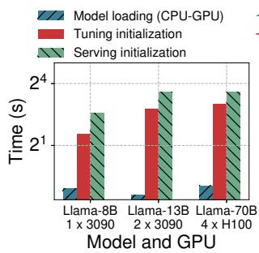

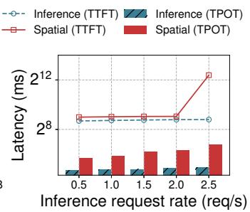

Figure 1: Measured context switch overhead (left). Performance interference between LLM tuning and serving colocated on the same GPU (right).

A natural way to improve resource utilization and cost is to consolidate models and requests on fewer GPUs rather than dedicating a single GPU for each task or model, with timesharing and/or spatial sharing [23,43,52,58,59]. Time-sharing the GPU for workloads involving multiple models or tasks can lead to high context-switching overhead, which becomes a critical bottleneck [26, 50]. Figure 1(left) shows the time taken to load models to the GPU memory and initialize the execution engines for inference or fine-tuning (e.g., vLLM [36] and torchtune [54]). As the experiments show, this can take seconds to minutes. In addition to context-switching overhead issues, temporal sharing systems for mixed tasks such as FineInfer [26] may not be able to meet strict latency SLO requirements when models are relatively large, and waste computation resources in the memory-bound decoding phase.

The alternative of spatial-sharing GPUs also faces significant challenges. LLMs require large GPU memory, up to hundreds of GBs, thus preventing strict isolation solutions from being usable, such as the Nvidia virtual GPU [3] which divides the GPU memory into independent small chunks. When relaxing strict isolation, there can be significant interference between processes. Figure 1(right) highlights the performance degradation when tuning and serving tasks on Llama-3.1-8B [22] are co-located on an RTX 3090, with p99

Time to First Token (TTFT) and p99 Time Per Output Token (TPOT) increasing to up to 13.2× and 3.6×, respectively.

To increase the efficiency of LLM systems and reduce resource consumption, in this paper we explore how to share a GPU between LLM parameter-efficient fine-tuning (PEFT) and inference/serving in a spatial-temporal manner, as PEFT creates new opportunities for multiplexing memory and computation resources by sharing base models [26, 29, 44] and co-execution of memory-bound and compute-bound operations [26, 44]. In engineering practice, PEFT is frequently conducted to adapt base models to various tasks and is also commonly performed continuously [10, 13, 15, 31] after deployment to address potential data drift. This scenario is increasingly relevant for applications using on-premise infrastructure, where fine-tuning and model serving compete for limited resources. This is particularly the case when the inference demand fluctuates [21, 50].

To cope with the challenges described above, we propose LLMStation, which employs a novel strategy for spatialtemporal multiplexing. The key insight is that LLM tuning and serving tasks have distinct workload patterns. By spatially batching and temporally reordering tasks, LLMStation simultaneously achieves controllable interference between processes, rapid context switching, maximized LLM fine-tuning throughput, and LLMs serving within the SLO limits.

LLMStation has been implemented in 3k lines of code. It includes a set of novel techniques including an iterationlevel multitasking scheduling mechanism, an Autograd engine transforming a tuning task into a pre-emptable pipeline, an inference engine that batches inference requests and tuning requests, and a memory manager that manages base models, adapters, and intermediate states between different tasks. A comprehensive evaluation on Nvidia RTX 3090 and H100 GPUs shows that LLMStation achieves up to 14.77× the finetuning throughput of state-of-the-art systems, while maintaining inference latency SLOs. Microbenchmarks confirm that scheduling and context-switching overheads remain minimal. Despite that focusing on the specific but highly relevant use case of LLM tuning and serving, the ideas behind LLMStation can be generalized and the design provides the foundation for future research into GPU virtualization and resource multiplexing to bypass the existing hardware and driver limitations.

## 2 Background and Motivation

In this section, we provide background on PEFT, LLM inference, and GPU resource multiplexing to motivate our work.

## 2.1 Parameter-Efficient Fine-Tuning

With the growing adoption of LLMs, fine-tuning becomes more and more frequent in order to adapt base models to different data and downstream tasks [10, 13, 51]. As shown in Figure 2, more than a hundred thousand of adapters were uploaded to Hugging Face in 2024. Even after models are deployed for inference, it is common and important to continue fine-tuning them to adapt to potential data drift [10,13,15,31], as reflected in the continuously changes in model weights for these Hugging Face model repositories.

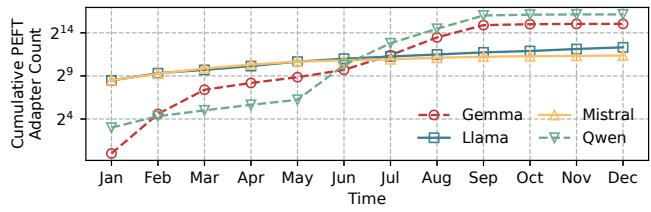  
Figure 2: The number of PEFT adapters based on popular open-source model series uploaded to Hugging Face in 2024.

To make fine-tuning cost-effective, various PEFT techniques [29, 37, 39, 41, 42] have been proposed to reduce its memory requirements while retaining comparable statistical performance. The core idea of PEFT technique is to freeze most parameters of the pre-trained model and only update a small part of the model parameters (i.e., adapters), which can greatly reduce the memory footprint of the optimizer state during fine-tuning. A representative PEFT technique is Low-Rank Adaptation (LoRA) [29] that freezes the whole pre-trained model and only fine-tunes extra rank decomposition matrices injected in each transformer layer. The output of a LoRA layer can be formulated as:

$$
h ( x ) = W x + \Delta W x = W x + B A x ,
$$

where $W \in \mathbb { R } ^ { d \times k }$ is a pre-trained matrix, and $B \in \mathbb { R } ^ { d \times r }$ and $A \in \mathbb { R } ^ { r \times k }$ are trainable matrices. By setting the rank $r \ll$ min(d, k), the number of trainable parameters in LoRA finetuning can be reduced by a factor of 1000 compared to full parameter fine-tuning.

## 2.2 LLM Inference

LLM inference is an auto-regressive process that, given an input sequence $( x _ { 1 } , \cdots , x _ { n } )$ , generates an output sequence $( x _ { n + 1 } , \cdots , x _ { n + T } )$ according to:

$$
p ( x _ { 1 } , \cdots , x _ { n + T } ) = p ( E O S | x _ { 1 } , \cdots , x _ { n + T } ) \prod _ { t = 1 } ^ { n + T } p ( x _ { t } | x _ { 1 } , \cdots , x _ { t - 1 } ) ,
$$

where EOS is the end-of-sequence symbol. Mainstream LLM serving systems [36, 62] divide the process into two phases: (1) The prefilling phase generates the first new token $x _ { n + 1 }$ and stores the KV cache tensors representing the model states of the input tokens; (2) The decoding phase takes the latest generated token as input, computes and stores its KV cache tensors. Then it utilizes all KV cache tensors to generate a new token. The decoding phase will execute multiple decoding steps until the generation length limit T is reached or the EOS symbol is encountered.

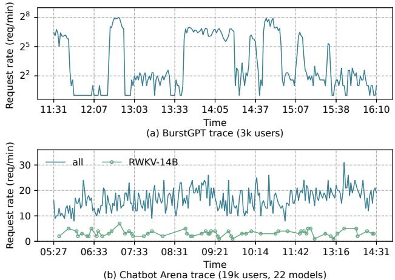  
Figure 3: Real-world LLM inference workloads, Burst-GPT [57] and Chatbot Arena [65].

## 2.3 Resource Multiplexing in LLM Workloads

The characteristics of LLM workloads reveal opportunities to improve GPU utilization by colocating LLM tuning and serving tasks as described in Section 2.3.1. However, in the presence of SLOs, present systems struggle to achieve high utilization while still guaranteeing the necessary low latencies as discussed in Section 2.3.2.

## 2.3.1 Opportunities

The advances of open-source LLMs make self-hosting LLMs in on-premise or cloud servers an attractive alternative to cloud APIs. These deployments usually over-provision GPU resources based on peak load, but the huge minute-to-minute fluctuations [21, 50] in request load lead to inevitable underutilization of resources during certain short and discrete time periods. Figure 3 shows the request loads of two real-world LLM inference workloads from thousands of users (i.e., Burst-GPT [57] and Chatbot Arena [65]). The underutilization of GPU resource will be more serious if the request loads to multiple LLMs are unbalanced as shown in Figure 3(b). This observation reveals an opportunity to utilize idle GPU cycles of the highly fluctuating LLM serving workloads.

On the other hand, the Model FLOPs Utilization (MFU) of the LLM decoding process is typically less than 5% [64], because each decoding step loads and evicts the entire model between HBM and SRAM, yet the computation involves only the last generated token rather than the whole sequence. This observation reveals an opportunity to co-execute computeintensive PEFT and memory-intensive LLM inference to maximize GPU computation utilization.

Tuning base LLMs for downstream tasks often only requires hundreds [51] or thousands [11] of labeled data samples, which can be completed in ten minutes to an hour using one or a few GPUs. The high frequency of computationintensive LLM fine-tuning, along with its relatively low to moderate time and resource demands, makes it an ideal task for utilizing otherwise idle GPU capacity.

In addition to utilizing spare computing resources in the fluctuating LLM serving workloads, the growing popularity of AI PCs [12, 14] has also made resource multiplexing of PEFT and serving an emerging requirement. AI PCs enable users to locally run inferences on LLMs and regularly finetune them using their personal data [12, 26], highlighting the need for optimized resource multiplexing between these tasks.

## 2.3.2 Challenges

Previous studies have explored various resource multiplexing techniques to improve GPU utilization. However, existing solutions cannot maximize GPU utilization while meeting the SLO when co-executing PEFT and LLM inference, as illustrated in Figure 4.

Base model multiplexing. The increasing size of LLMs renders out-of-the-box solutions [1, 3, 8]—where each task or fine-tuned LLM must hold an exclusive copy of the base model—less practical, as even a single LLM can exhaust the entire GPU memory capacity, preventing the sharing of compute and memory bandwidth across different tasks or fine-tuned LLMs. Therefore, recent frameworks [18, 26, 31, 44, 48, 61] combine base model multiplexing (i.e., sharing the base model across different tasks and fine-tuned LLMs) with temporal multiplexing and/or spatial multiplexing to create opportunities for GPU resource multiplexing.

Temporal multiplexing. FineInfer [26] proposed Deferred Continuous Batching to schedule PEFT and LLM inference tasks in a temporal multiplexing manner [8]. The advantage of temporal multiplexing in co-execution is that it does not interfere with LLM decoding, thus ensuring that the TPOT of LLM inference meets the SLO. However, as the input sequence length of PEFT becomes longer or the model size becomes larger, TTFT will experience a significant delay because LLM inference cannot start until the current step of PEFT ends, as shown in Figure 4(a). Figure 5(left) shows that fine-tuning latency increases with input sequence length and model size, exceeding the commonly used TTFT SLOs.

Spatial multiplexing. An out-of-the-box solution is to use Nvidia MPS [1] with high-performance LLM serving and fine-tuning frameworks to schedule PEFT and LLM inference tasks in a spatial multiplexing manner. By carefully configuring CUDA\_MPS\_ACTIVE\_THREAD\_PERCENTAGE to partition the computing units (i.e., streaming multiprocessors), spatial multiplexing can maximize GPU utilization while ensuring SLOs when processing static LLM workloads. Besides inheriting the aforementioned drawbacks of out-of-the-box solutions, its main limitation is that the percentages are fixed at framework startup and cannot be adjusted dynamically during task execution. Figure 4(b) shows that, if the percentage of computing units allocated to PEFT is not restricted, the TPOT of LLM inference becomes very high with many LLM inference requests. If one restricts the percentage of computing units allocated to PEFT, GPU resources will be underutilized when the LLM inference request load is low (Figure 4(c)).

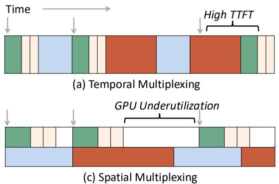  
(limit GPU resources allocated to fine-tuning worker)

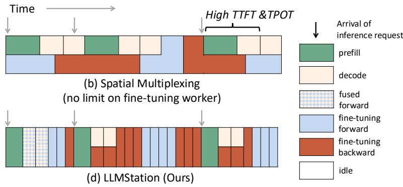  
Figure 4: Illustration of different task scheduling strategies.

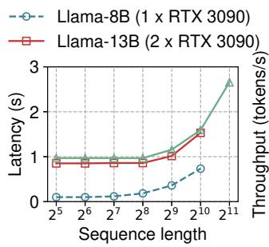

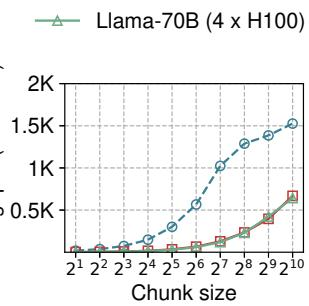  
Figure 5: Latency for LoRA fine-tuning per sample for different sequence lengths and model sizes. (left) Throughput of chunked-training for different chunk sizes and model sizes. The complete input sequence length for each sample is fixed to 1024. (right)

FlexLLM [44] leverages chunked-training [40] to further break down the PEFT tasks. It divides the input sequence into several chunks and performs forward and backward passes on each chunk separately. By storing and reusing the results and states of each chunk required by rest chunks, chunked-training can achieve the same results as regular PEFT. Nevertheless, it is subject to two significant limitations. First, as shown in Figure 5(right), shorter input sequences cannot fully utilize the computing resources of the GPU [19, 34, 35, 38, 56] and it incurs additional data movement overhead. If the input sequence is divided into N chunks, the whole LLM needs to be loaded from slow HBM to fast SRAM 2N times. Second, it may degenerate into simple temporal or spatial multiplexing in real-world workloads and suffers from the same problems as the latter. For example, if chunked training does not split the input sequence to avoid incurring additional overhead when no LLM inference requests are running, it cannot ensure the SLO for newly arrived LLM inference requests while processing the current PEFT step.

## 3 LLMStation Overview

In this section, we give a brief overview of LLMStation, whose architecture is illustrated in Figure 6. LLMStation follows three design principles: (1) SLO-guarantee. The coexecution of PEFT and LLM inference should not violate the performance SLOs of LLM serving. (2) GPU utilization maximiazion. Our primary objective is to maximize the GPU utilization in each short time slice to improve PEFT throughput under the highly fluctuating real-world LLM serving workload. (3) Memory efficiency. The system should be able to reduce memory consumption by sharing common base model weights, adapter weights, and states between PEFT and inference. The principal components are as follows and details in Section 4 and Section 5:

1. SLO-aware task scheduler (Section 4). LLMStation is built around an iteration-level multi-tasking scheduling mechanism that improves PEFT throughput by assigning proper number of PEFT tasklets to be executed with the current inference iteration according to the SLOs. Before the execution of each iteration, the scheduler obtains the latencies of the different kinds of tasks using profiling results, cached runtime records or its own latency predictor, and then uses its planner to adaptively determine the number of PEFT tasklets to execute together.

2. Suspendable automatic differentiation engine (Section 5). Achieving our proposed scheduling mechanism requires system support to decompose the PEFT task into tasklets that can be executed together with the inference iterations without violating the SLO. We do so by taking an existing automatic differentiation engine (PyTorch Autograd [46]) and transforming its backward path to coroutines.

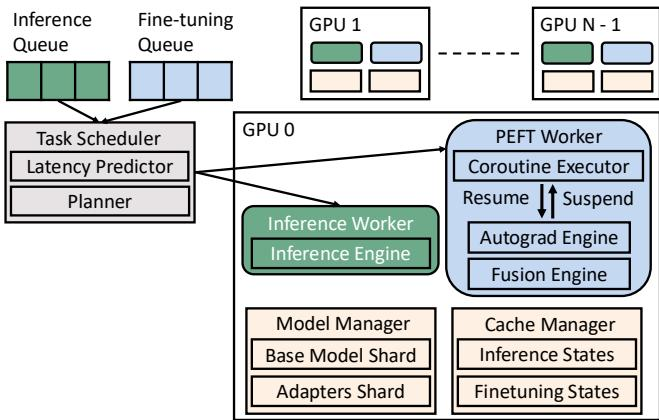  
Figure 6: LLMStation overview.

3. Workers. LLMStation divides the workers into PEFT workers and inference workers to handle different parts of the co-execution in different situations: (1) If inference workers are in the prefilling phase, the PEFT workers will be suspended. (2) If the inference workers are in the decoding phase and PEFT workers are in the forward pass, the PEFT workers will fuse their forward pass and the decoding step of the inference workers. (3) If the inference workers are in the decoding phase and PEFT workers are in the backward pass, the PEFT workers will run PEFT tasklets in parallel.

4. Memory manager. Leveraging base model multiplexing, LLMStation’s GPU-CPU memory manager only keeps one copy of the base model, adapter, and inference state, which is shared by PEFT workers and inference workers. Only the fine-tuning state is exclusive to PEFT workers. When the available GPU memory is insufficient to hold the new inference states, LLMStation can swap some GPU tensors to CPU memory and swap back when GPU memory is sufficient.

## 4 LLMStation Scheduler

In this section, we describe the detailed design of LLMStation’s scheduler. At its core is a new iteration-level multitasking scheduling mechanism that improves PEFT throughput by co-executing PEFT tasklets with inference requests without violating SLOs, as illustrated in Figure 4(d).

## 4.1 Scheduling Strategy

The pseudocode in Algorithm 1 shows how LLMStation’s scheduling strategy co-executes PEFT and LLM inference. Whenever new inference requests arrive (lines 8 - 11), the scheduler dispatches them to the inference workers to perform the prefilling step (line 18) while suspending the PEFT workers. Before performing the decoding step, the scheduler will send the batch size and length of input sequences, the current phase of PEFT workers, and the hardware and model configurations (e.g., GPU types and numbers, parallelism strategies, model sizes, and adapter types) to the latency predictor. If the PEFT workers are performing the forward pass, the latency predictor estimates the latency of fused execution of LLM decoding and PEFT forward tasklets (line 17). If the PEFT workers are performing the backward pass, the latency predictor estimates the latency of running LLM decoding step and PEFT backward tasklets in parallel (line 21). After obtaining the latencies, the scheduler’s planner calculates the number of PEFT tasklets that can be executed together with the LLM decoding step without violating the SLOs (lines 18 and 22). Finally, the scheduler dispatches the tasks to corresponding workers (lines 19, 23 and 24).

Algorithm 1 Iteration-level multitasking scheduling.   
Input: hardware and model configurations $^ { c , }$ prefilling   
$S L O _ { p } ,$ and decoding $S L O _ { d }$   
1: let $Q _ { i }$ and $Q _ { f }$ denote inference request queue and fine  
tuning request queue   
2: let $W _ { i }$ and $W _ { f }$ denote inference workers and fine-tuning   
workers,   
3: let $B _ { i } , B _ { f }  \emptyset , \emptyset$ denote the current batch of inference   
requests and the current batch of fine-tuning samples   
4: let $B _ { n e w }  \emptyset$ denote the batch of new inference requests   
5: while True do   
6: $B _ { n e w }  \emptyset$   
7: if $B _ { f } = \varnothing$ then $B _ { f }  \mathrm { g e t } .$ \_first\_batch $( Q _ { f } )$   
8: for all $r \in Q _ { i }$ do   
9: if r cannot fit in the memory then   
10: Break   
11: $B _ { n e w }  B _ { n e w } \cup r$   
12: if $B _ { n e w } \neq \emptyset$ then   
13: $Q _ { i }  Q _ { i } \backslash B _ { n e w }$   
14: prefil $1 ( W _ { i } , B _ { n e w } , S L O _ { p } )$   
15: $B _ { i }  B _ { i } \cup B _ { n e w }$   
16: if $W _ { f }$ is in forward pass then   
17: latencies ← latency\_predictor(forward, $c , B _ { i } , B _ { f } )$   
18: budget ← planner(latencies, $S L O _ { d } )$   
19: forward\_fused(budget, $W _ { f } , B _ { i } , B _ { f } )$   
20: else   
21: latencies ← latency\_predictor(backward,   
$c , B _ { i } , B _ { f } )$   
22: budget ← planner(latencies, $S L O _ { d } )$   
23: async\_decode $( W _ { i } , B _ { i } )$   
24: async\_backward(budget, $W _ { f } , B _ { f } )$   
25: $\bar { B } _ { i }  B _ { i } \backslash$ finished\_requests $( B _ { i } )$   
26: $B _ { f }  B _ { f } \backslash$ finished\_samples $( B _ { f } )$

When the fine-tuning request queue is empty, our scheduling strategy degenerates to continuous batching [62]. When the inference request queue is empty, our scheduling strategy degenerates to normal fine-tuning. In actual implementation, LLMStation also seeks to optimize GPU utilization during the prefilling phase (line 14) by: (1) selectively co-executing PEFT and prefilling steps, as some prompts are short; and (2) scheduling the prefilling step using Deferred Continuous Batching from FineInfer [26]. When there is no running inference request, Deferred Continuous Batching defers newly arrived requests according to their arrival time and prefilling SLO, thus improving their chance of being able to batch up with other requests.

## 4.2 Planner and Latency Predictor

Considering that the workloads of LLM inference vary significantly across different short time periods, the scheduler needs to make decisions based on the information of the next iteration adaptively to maximize the PEFT throughput.

Objective. Let $S L O _ { d }$ denote the decoding $\mathrm { S L O } , l _ { d }$ and $l _ { d 0 }$ denote the latencies of running a decoding tasklet with and without PEFT tasklets, and $l _ { p }$ denote the latency of running a PEFT tasklet with decoding tasklets. The objective and the SLO constraint can be formulated as

$$
\begin{array} { r l } { \operatorname* { m a x } } & { N _ { p } } \\ { \mathrm { s . t . ~ } } & { N _ { d } \cdot l _ { d } + ( N _ { d , a l l } - N _ { d } ) \cdot l _ { d 0 } \leq S L O _ { d } } \\ & { N _ { p } \cdot l _ { p } \leq N _ { d } \cdot l _ { d } } \end{array}
$$

where $N _ { p }$ and $N _ { d }$ are the number of PEFT tasklets and decoding tasklets to be executed together, and $N _ { d , a l l }$ is the total number of decoding tasklets that need to be completed in the upcoming iteration. We can further derive the following inequality about $N _ { p } \colon$

$$
N _ { p } \leq \frac { ( S L O _ { d } - N _ { d , a l l } \cdot l _ { d 0 } ) \cdot l _ { d } } { ( l _ { d } - l _ { d 0 } ) \cdot l _ { p } } .\tag{1}
$$

Besides the SLO constraint, the planner also calculates the peak memory usage of PEFT and LLM inference, respectively, to check whether the planned tasks can meet the memory constraints before execution.

Latency predictor. In Eq. 1, although $S L O _ { d }$ and $N _ { d , a l l }$ are user-configured constants, the remaining variables $( \mathrm { i } . \mathrm { e } . , l _ { d 0 }$ $l _ { d }$ and $l _ { p } )$ are highly dependent on the hardware and software environment, the length of the input sequence, the distribution, number, and architecture of adapters and models, etc. Furthermore, $l _ { d }$ and $l _ { p }$ differ in the forward and backward passes and are highly dependent on the tasks executed in parallel with them. Therefore, for co-executed tasklets without cached runtime records or profiling results, the planner adopts a learned latency predictor to estimate the three different types of latency mentioned above. The latency predictor used to estimate the latencies can be defined as:

$$
\begin{array} { r } { \mathbf { l } = \mathbf { y } ( \frac { c o m p u t a t i o n } { F L O P / s _ { G P U } } , \frac { c o m m u n i c a t i o n } { b a n d w i d t h _ { i n t e r c o n n e c t } } , \frac { m e m o r y \_ a c c e s s } { b a n d w i d t h _ { m e m o r y } } , \mathbf { w } ) , } \end{array}
$$

where l are predicted latencies, y are prediction models, and w of each prediction model are parameters that need to be learned. Similar to recent works in LLM performance prediction [32, 40], the current implementation of LLMStation adopts linear models for y and uses simple feature engineering to obtain computation, communication, and memory access from raw input features (e.g., the batch size and sequence length of inference requests and PEFT samples, and the architecture of models and adapters).

Note that we only use the learned latency predictor when the system does not have any profiling results or cached runtime records. Therefore, after a few initial iterations, the prediction error and runtime latency of the simple linear regression models have little impact on performance, as the actual co-execution latencies are stored in the system’s cache, which is organized as a nested index. At the top level, records are grouped and keyed by the (hardware, model, adapter) tuple. Within each group, the records of decoding tasklet latency and PEFT tasklet latency are further keyed by (decode batch size, PEFT input length). Since the required information is available at the start of each iteration, caching and usage of latencies are straightforward. When co-locating PEFT-based LLM inference tasks and PEFT tasks, LLMStation additionally includes the adapters used by PEFT-based LLM inference as a key in the index.

## 5 LLMStation Engines

Now we describe the design of LLMStation’s execution engines. For inference requests, the prefilling step is handled by the inference engine and the decoding step is selectively handled by the inference engine or the fusion engine. For PEFT samples, the backward pass is handled by the Autograd engine and the forward pass is handled by the fusion engine.

## 5.1 Autograd Engine

In the PyTorch Autograd engine, the backward pass is done synchronously by the PEFT workers and the gradients are calculated from the last layer to the first layer according to the computation graph constructed in the forward pass. As shown in Figure 7(a), once the backward pass starts, the PEFT workers cannot adjust their execution according to the current workload of the inference workers. As a result, it can not realize the iteration-level multitasking scheduling algorithm (See Algorithm 1) to ensure that the SLOs of inference requests are met.

The key to splitting the backward pass into tasklets is transforming nested functions on the backward path into coroutines [2], which are functions that can be suspended voluntarily and be resumed later. In the LLMStation Autograd engine, the functions involved in the function call chains of the backward pass are implemented as coroutines, instead of “normal” functions. We use co\_await to invoke other coroutines and replace return with co\_return. After this transformation, the PEFT worker can use its coroutine executor to voluntarily suspend and resume the backward pass. Figure 7(b) illustrates the end-to-end control flow. When a new backward task is created, LLMStation starts to execute it in a coroutine. According to the workload of the next LLM decoding step, LLMStation scheduler uses its planner to estimate how many layers of the backward pass could be executed together without violating SLOs. After the PEFT tasklets are completed, the LLMStation Autograd Engine returns control to the PEFT worker. The scheduler will then estimate the number of PEFT tasklets to run in the next iteration based on the next LLM decoding step and resume the backward coroutine. Finally, after the backward pass of the current batch is completed, the scheduler starts a new batch and performs a forward pass on it, which we will discuss in the next subsection. The above design enables LLMStation Autograd engine to help users flexibly generate suspendable backward passes for different models and adapters.

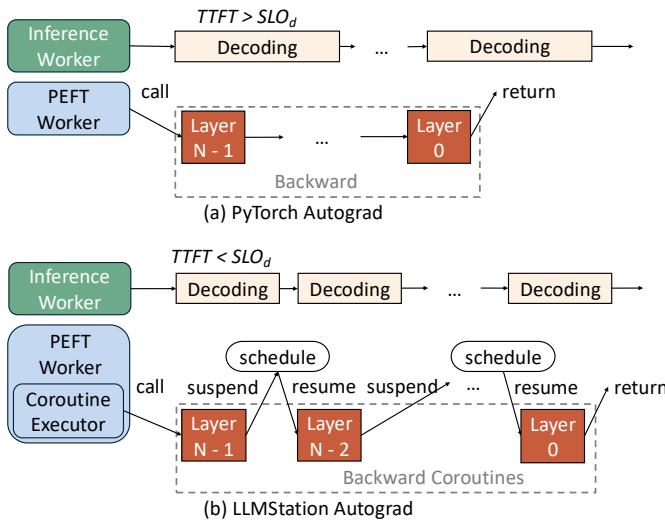  
Figure 7: An illustration of Pytorch Autograd engine (a) and LLMStation Autograd engine (b) running backward pass while the inference engine is running the decoding phase.

## 5.2 Inference and Fusion Engines

When the PEFT workers are in the backward pass, the current iteration of that inference request will be fully processed by the inference worker. The inference engine in the inference workers is similar to the inference engine in the mainstream LLM serving systems. When an inference request is in the decoding phase and PEFT workers are in the forward pass, LLMStation uses the Fusion engine to amortize the data movement, communication, and kernel launch overheads in the PEFT forward pass. Previous works leverage prompt and generation composition strategies [16, 27] to amortize the overheads of the prefilling phase, but we found that less than

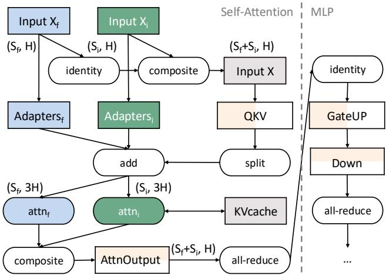  
Figure 8: An illustration of LLMStation Fusion engine coexecuting inference requests and fine-tuning samples on a Transformer layer. We only depict the QKV projection, the Attention, the Attention Output projection, and the multilayer perceptron (MLP) for simplicity.

5% of decoding iterations are mixed with prefilling when running real-world workloads, which leaves room for us to composite the decoding phase and the PEFT forward pass.

Figure 8 describes the execution flow of the Fusion engine, where computational operations are represented by ellipses and weight matrices, input sequences, and intermediate states are represented by rectangles. Instead of processing inference requests of shape (Si,H) and fine-tuning samples of shape (S f , H) separately, the Fusion engine processes them as the following procedure: (1) composites them to an input tensor of shape $\left( S _ { f } + S _ { i } , H \right)$ which is then fed to QKV projection; (2) adds up the results from the base model and the adapters required by inference and PEFT; (3) splits the results and performs self-attention operation separately; (4) composites them again and then performs AttnOutput projection, GateUP projection and Down projection. With the Fusion engine, we can utilize the computing resources in decoding phases without violating the decoding SLO. For distributed co-execution, LLM-Station adopts tensor model parallelism [49] and partitions the weight matrices of QKV projection and GateUP projection along columns (output dimension), and the weight matrices of AttnOoutput projection and Down projection along rows (input dimension). All-reduce operations are performed after AttnOutput projection and Down projection during the forward pass and before QKV projection and GateUP projection during the backward pass.

Similar to the co-execution of the decoding phase and the backward pass, the LLMStation scheduler estimates the number of layers that the decoding phase and the forward pass can run together. The remaining layers of the decoding phase are executed in the normal decoding way. Alternatively, the LLM-Station Fusion engine can composite the inference requests and the PEFT samples for every layer and let the LLMStation scheduler estimate the number of tokens that can be batched.

## 6 Evaluation

We empirically evaluate the performance of LLMStation on both synthetic and real-world workloads. Through experiments, we answer the following questions:

• How does LLMStation compare to other specialized frameworks and out-of-the-box solutions for co-execution of PEFT and LLM inference?

• What are the throughput-latency tradeoffs in LLMStation?

• What are the overheads of LLMStation ’s scheduler and Autograd engine?

## 6.1 Experimental Setup

Here we describe the setup used throughout the experiments.

Hardware. The experiments are conducted on various hardware settings, including a server with four RTX 3090 GPUs and servers with four H100 GPUs. The RAM capacities of these servers range from 256 GB to 512 GB, and all are equipped with intra-node NVLink.

Models and adapters. We use representative open-source LLMs, the Llama series [22], and one of the most popular PEFT methods, LoRA [29]. As listed in Table 1, we considered three different sizes of Llama models, 7B, 13B, and 70B, and three different sizes of LoRA adapters, with ranks of 8, 16, and 32, respectively.

Datasets and traces. For input sequences, we use the ShareGPT [6] datasets for LLM inference and the Alpaca [53] dataset for PEFT, both are real-world datasets. For inference request rates, synthetic workloads send inference requests at a steady rate and real-world workloads send inference requests according to the BurstGPT [57] trace.

Implementation. LLMStation is implemented in about 3k lines of code and combines multiple components from different systems. We modified PyTorch Autograd [46] using C++ stackless coroutines and used it as the Autograd engine for LLMStation. The inference engine, memory manager and cache manager are built atop vLLM [36]. The fusion engine is built atop FineInfer [26], and the implementation of different parallelism strategies refers to Nanotron [4]. Also, we align the fine-tuning results of LLMStation with Hugging Face PEFT [5] to ensure the correctness of our implementation.

Baselines. We compare LLMStation with three baselines. We use the combination of vLLM [36] + torchtune [54] as the out-of-the-box solution. vLLM is a SoTA LLM serving system with the batching mechanism of adapter computation from Punica [18] and an optimized GPU memory allocation mechanism. torchtune is a high-performance fine-tuning system that integrates a range of commonly used performance optimization techniques. In the category of specialized frameworks, we evaluate FineInfer [26] and chunked-training [44], which are discussed in Section 2.

Table 1: Model and GPU configurations.
<table><tr><td>Model</td><td>GPU</td><td># Layers</td><td>TP Degree</td></tr><tr><td>Llama-3.1-8B</td><td>2 RTX 3090</td><td>32</td><td>2</td></tr><tr><td>Llama-2-13B</td><td>4 RTX 3090</td><td>32</td><td>4</td></tr><tr><td>Llama-3.1-70B</td><td>2×4H100</td><td>80</td><td>4</td></tr></table>

Metrics and SLOs. In end-to-end comparison, we report the throughput (i.e., samples/s) of PEFT that each system can achieve while the given P99 TTFT SLO and P99 TPOT SLO are not violated. Unless otherwise specified, the P99 TTFT SLO is set to 500 ms for all configurations, and the P99 TPOT SLO is set to 50 ms for Llama-3.1-8B and 80 ms for larger models. To compare latencies, we report the latency for different systems to achieve a given PEFT throughput.

## 6.2 End-to-End Comparison

In this section, we evaluate the end-to-end performance using both synthetic and real-world workloads. To get the best performance of baselines, we carefully tune their configurations such as deferral bound for FineInfer, CUDA\_MPS\_ACTIVE\_THREAD\_PERCENTAGE for vLLM + torchtune, and chunk size for chunked-training.

Synthetic workloads with varying request rates. Our first experiment evaluates the PEFT throughput that different systems can achieve at different inference request rates under commonly used SLO targets. Figure 9i shows the results on the synthetic workloads with different inference request rates. When the inference request rates are relatively low (i.e., ≤ 0.5 req/s) in serving Llama-8B and Llama-13B with RTX 3090, LLMStation outperforms FineInfer/vLLM + torchtune/chunked-training by 2.38∼8.17×/2.53∼14.77×/1.57∼2.18×. As a temporal multiplexing solution, FineInfer does not co-execute the decoding phase and PEFT, and therefore cannot fully utilize the computational power of the GPU. As a spatial multiplexing solution, vLLM + torchtune needs to limit the CUDA\_MPS\_ACTIVE\_THREAD\_PERCENTAGE of the PEFT workers at launch time to ensure SLOs, but this also reduces their PEFT throughput when no inference requests are being processed. Chunked-training does not suffer from the above two problems, and its slowdown is mainly due to the inherent additional data movement overhead. As the inference request rate increases, FineInfer’s PEFT throughput quickly drops to zero since it cannot guarantee TTFT. The PEFT throughput of the other systems gradually becomes very close, until it drops to zero when TPOT cannot be guaranteed.

When using two servers equipped with four H100 GPUs and built-in node NVLink to serve Llama-70B, the performance difference also comes from the flexibility of deployment and service. Considering the low interconnection bandwidth between servers and the high PEFT latency per sample on Llama-70B, we need to deploy a 4-way tensor-parallel base model for FineInfer on each server instead of partitioning the model to two servers via pipeline parallelism or 8- way tensor parallelism. Considering that the vLLM + torchtune cannot share the base model, and the GPU memory of a server is only enough to place the basic model and state of vLLM or torchtune, we need to deploy vLLM and torchtune on different servers respectively. For a fair comparison, LLMStation and chunked-training are deployed in the same way. Therefore, when inference requests cannot saturate a single server, LLMStation outperforms FineInfer/vLLM + torchtune/chunked-training by up to 1.77×/1.8×/1.38×. This is because FineInfer and vLLM + torchtune can only use the resources of one server for PEFT, while LLMStation can use the total remaining resources of two servers. When executing inference requests requires two servers to guarantee the SLOs, the PEFT throughput of FineInfer and vLLM + torchtune drops to zero. On the contrary, LLMStation can still leverage the remaining resources of one server to perform PEFT until inference requests saturate two servers.

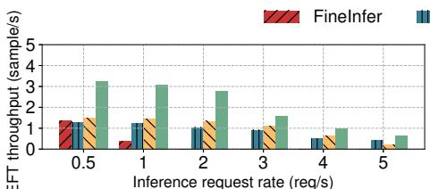  
(a) Llama-8B, 2 x RTX 3090, TTFT 500ms, TPOT 50ms

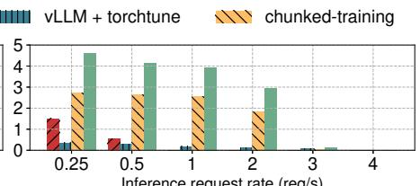  
(b) Llama-13B, 4 x RTX 3090, TTFT 500ms, TPOT 80ms

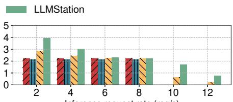  
(c) Llama-70B, 8 x H100, TTFT 500ms, TPOT 80ms

(i) PEFT throughput under synthetic workloads and varying inference request rates.  
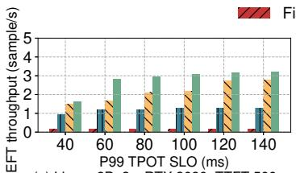

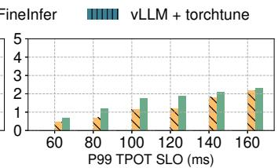

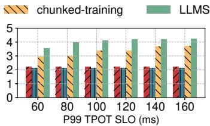

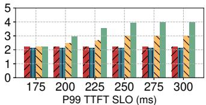  
(d) Llama-70B, 8 x H100, TPOT 80ms

(ii) PEFT throughput under real-world workload and varying SLO targets.  
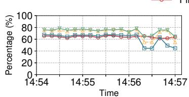  
(a) SM Active

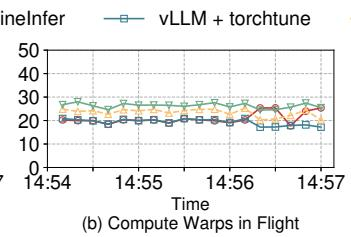

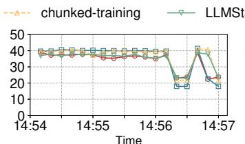  
(c) DRAM Read Bandwidth

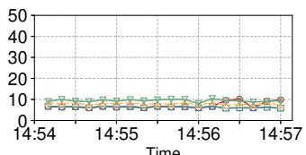  
(d) DRAM Write Bandwidth  
(iii) Case study of GPU utilization under real-world workload.  
Figure 9: End-to-end comparison of LLMStation and baselines.

Real-world workloads with varying SLO targets. Our second experiment tests how different approaches perform under varying SLO targets under real-world workloads. The trace was extracted from BurstGPT [57], with an average request rate of 4.15 req/s. Figure 9ii(a - c) show results under varying P99 TPOT SLOs, where the performance differences can be attributed to similar reasons discussed previously. In real-world workloads, more requests arrive at similar times, so the decoding phases of more requests can be batched together, which leaves more room for PEFT. However, vLLM + torchtune and FineInfer may perform worse on real-world workloads with fluctuating request loads than on synthetic workloads with stable request loads. Since more requests arrive at similar times, vLLM + torchtune needs to impose stricter resource constraints on PEFT workers to avoid violating SLOs, while FineInfer may always violate TTFT SLOs in some cases. As the P99 TPOT SLO increases, the PEFT throughput of LLMStation and chunked-training gradually becomes very close, since chunked-training can use a larger chunk size. As shown in Figure 9ii(d), the performance of LLMStation is also limited under strict P99 TTFT SLOs since the prefilling step can only be executed after the current decoding step is finished. Therefore, the number of PEFT tasklets that can be executed together is now limited by the time remaining in the prefilling phase (rather than the decoding phase).

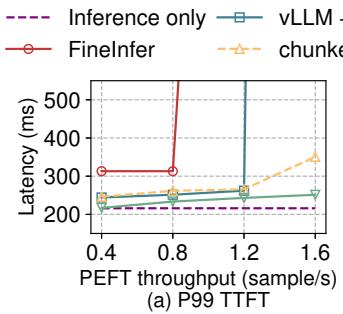

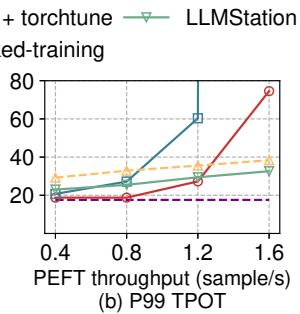  
Figure 10: P99 TTFT and P99 TPOT of running Llama-3.1- 8B on two RTX 3090 GPUs under real-world workloads and varying PEFT throughput settings.

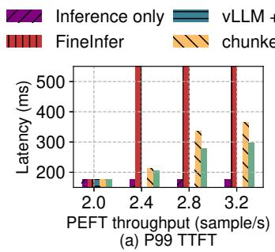

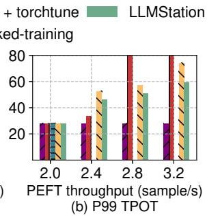  
Figure 11: P99 TTFT and P99 TPOT of running Llama-3.1- 70B on eight H100 GPUs under real-world workloads and varying PEFT throughput settings.

Case study of GPU utilization. We replayed a 3-minute segment of trace from Figure 9ii(a) using Llama-70B on eight H100 GPUs, with P99 TTFT and TPOT SLOs set to 500 ms and 80 ms, respectively. As shown in Figure 9iii, LLMStation achieves high SM Active, Compute Warps in Flight, and DRAM Write Bandwidth during most of the time. Fine-Infer only achieves high utilization when inference request loads are low since it cannot execute PEFT tasks when inference tasks are running and vLLM + torchtune can not utilize half of the GPU resources even when inference request loads are low since it cannot share the base model. Chunked-training achieves high SM Active and DRAM Read Bandwidth but low Compute Warps in Flight, reflecting that it suffers from additional data movement overhead.

## 6.3 Throughput-Latency Tradeoff

In this section, we do not consider SLOs and use real-world traces to explore how inference latency is affected under varying PEFT throughput settings. For the experiment using two RTX 3090s to serve Llama-8B, we extracted another trace from BurstGPT [57] with an average inference request rate of 0.88 req/s. As shown in Figure 10, LLMStation achieves up to 33.13×/52.64×/1.4× lower P99 TTFT and $2 . 2 9 \times / 3 6 2 . 4 9 \times / 1 . 2 9 \times$ lower P99 TPOT than FineInfer/vLLM + torchtune/chunked-training. FineInfer’s P99 TTFT is always higher than other variants because its scheduling algorithm postpones the execution of prefilling phases to obtain higher PEFT throughput. When the PEFT throughput is 1.6, the P99 TTFT of inference requests even exceeds 8 seconds, which is unbearable for users. But its P99 TPOT is up to 36% lower than LLMStation when PEFT throughput is low. Both P99 TTFT and P99 TPOT of vLLM + torchtune are higher than LLMStation because it underutilizes GPU resources when no inference request is being processed and needs to pay more at the expense of latency for inference requests. The trend of latency variation for chunked training is similar to LLMStation, but slightly higher due to its additional data movement overhead. For the experiment using eight H100 GPUs to serve Llama-70B, we use the same real workload as in Section 6.2. As shown in Figure 11, LLMStation achieves up to 180.48×/1.23× lower P99 TTFT and 14.22×/1.24× lower P99 TPOT than FineInfer/chunkedtraining. Similarly, FineInfer’s P99 TPOT is up to 28% lower than LLMStation when PEFT throughput is low but its P99 TTFT exceeds 25 seconds when PEFT throughput is high. In this experiment, if the PEFT throughput needed exceeds what a server with four H100 GPUs can handle, vLLM + torchtune is unable to perform LLM inference since we need to use all eight H100 GPUs to deploy torchtune.

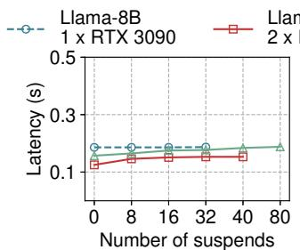  
(a) Sequence length = 512

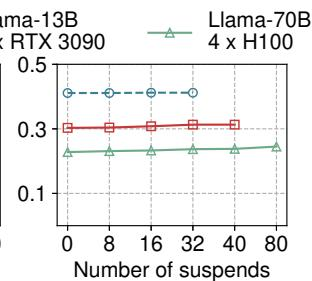  
(b) Sequence length = 1024  
Figure 12: The time of backward pass with varying numbers of suspends.

## 6.4 LLMStation Autograd Engine and Scheduler Overheads

Now we study the overheads of the scheduler and Autograd.

Autograd engine. Llama-3.1-8B, Llama-2-13B and Llama-70B have 32, 40 and 80 layers respectively, and we selectively suspend and resume after each layer to evaluate the overhead of context switch in this experiment. Figure 12 shows the latency of the backward pass under different sequence lengths, model sizes, and GPUs and varying numbers of suspends. For single-GPU fine-tuning, our Autograd engine incurs less than 0.5% additional latency thanks to the low overhead of

C++ stackless coroutines [2]. For multiple-GPU fine-tuning, our Autograd engine incurs up to 18% additional latency. We attribute this to the extra inter-GPU and inter-process synchronization and a slight amplification in synchronization overhead due to execution variability.

Scheduler. On an AMD EPYC 7313 16-Core processor, the average latency of the planner and the latency predictor of LLMStation scheduler is 18 microseconds per iteration, and the average latency is less than 1 microsecond when profiling results or cached runtime records are available since we need not to call the latency predictor. For the latency predictor, we train the prediction models with our profiling results from RTX 3090 GPU servers and H100 GPU servers and test them on A100 GPU servers. For Llama-3.1-8B and Llama-2-13B with the rank of LoRA adapters set to 8, the overall average Coefficients of Determination [7] (i.e., $R ^ { 2 }$ score), are 0.73 and 0.69. The $R ^ { 2 }$ score is the default score function for many regression models in scikit-learn [47]. By definition, the score ranges from −∞ and 1.0, with scores closer to 1 indicating that the model explains a large portion of the variance.

## 6.5 Impact of Access Distribution and Sizes of Adapters

The final set of experiments analyzes the impact of adapter access distribution and adapter size on PEFT. We run Llama-3.1-8B and the LoRA adapters on two RTX 3090 GPUs and use the same real-world workload as in Section 6.3. For the adapter access distribution experiment, we set the rank of LoRA adapters to 32 and the number of LoRA adapters to 8 and use three different access distributions: (1) None: None of the LoRA adapter is accessed. (2) Skewed: 50% of LoRA adapters are uniformly accessed. (3) Uniform: All LoRA adapters are uniformly accessed. As shown in Figure 13(left), LLMStation outperforms FineInfer/vLLM + torchtune/chunked-training by up to 2.98×/2.41×/1.74×. The performance of all variants decreases slightly when the percentage of accessed LoRA adapters increases from 0% to 50%. The performance of all variants drops to zero in the uniform distribution, since serving inference requests alone violates the P99 TTFT SLO.

For the adapter size experiment, we vary the rank of LoRA adapters and set the number of LoRA adapters to 8 and the percentage of accessed LoRA adapters to 50%. As shown in Figure 13(right), LLMStation outperforms FineInfer/vLLM + torchtune/chunked-training by up to 2.98×/2.41×/1.73×. The performance of all variants decreases slightly when the rank of LoRA adapters increases from 8 to 32. The results of these two experiments match the observations from Punica [18]. They found that as the rank of the LoRA adapter increases, the performance is more sensitive to the access distribution. When the rank equals to 32, the latency in their distinct distribution (i.e., our uniform distribution) is up to 2.5× higher than in skew distribution.

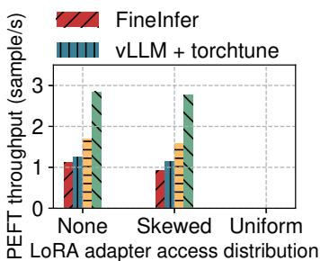

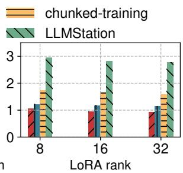  
Figure 13: PEFT throughput with varying access distribution to adapters (left) and varying sizes of adapters (right).

## 7 Discussion and Limitations

Operator-level suspend. LLMStation’s Autograd Engine is natively able to suspend and resume between operators (i.e., nodes of the backward computation graph). Considering that the backward computation graphs of LoRA fine-tuning on Llama-3.1-8B and Llama-3.1-70B have about 4k and 10k nodes respectively, the average latency per tasklet can be as low as a few microseconds. Therefore, if the latency of each layer in backpropagation is too high, LLMStation can switch to a combination of iteration-level scheduling and operatorlevel suspends. For the PEFT of ultra-long context LLMs (i.e., millions of tokens), a potential solution is to integrate LLMStation and chunked-training [40, 44], which we leave as future work.

Decoding SLO, TPOT and disaggregated LLM serving. TTFT and TPOT are common SLOs used in today’s LLM serving. In our scheduling mechanism, the definition of prefilling SLO is the same as TTFT, but the definition of decoding SLO is slightly different from TPOT. Decoding SLO is defined as the latency of each decoding iteration while TPOT is defined as $T P O T =$ (e2e\_time − T T FT )/number\_o f \_generated\_tokens, where e2e\_time represents the time between the arrival and completion of a request. They are identical in disaggregated LLM serving systems, and only these systems can strictly meet the TTFT and TPOT SLOs in theory, since there is no interference between prefilling and decoding. For common monolithic deployments, we need to set the decoding SLO slightly smaller than the TPOT SLO. To transform the scheduling mechanism into a TPOT-aware algorithm, one needs to continuously update the respective TPOTs of all running inference requests and make decisions based on them.

Parallelization. LLM serving typically parallelizes models across different models via tensor model parallelism (TP) [49] and pipeline model parallelism (PP) [40, 45]. Since tensor model parallelism performs better in servers with NVlink and most open source models can be accommodated by 8 GPUs on a single server, we consider only TP in the paper and plan to incorporate PP into LLMStation in the future. DynamoLLM [50] observes that the most cost-beneficial tensor parallelism strategy is different for workloads with different request rates, request input lengths and output lengths. Therefore, they adjust tensor parallelism every five minutes if it is necessary since per adjustment might take up to several seconds. The current implementation of LLMStation does not consider workload-aware dynamic parallelization. We assume that the parallelization is controlled by the inference worker and the PEFT worker performs fine-tuning accordingly based on the given settings.

Applicable models. Our approach can be seamlessly applied to large auto-regressive vision, time-series, tabular, DNA, and multimodal models that share similar memory-bound characteristics of the decoding phase, as well as other workloads [28] that have both compound-bound and memory-bound phases. For models or workloads that are purely memory-bound or compute-bound, the benefit will only come from the utilization of idle GPU cycles of the fluctuating serving workloads.

## 8 Related Work

LLMStation builds upon many techniques from LLM serving and tuning, GPU resource multiplexing and scheduling.

System optimizations for LLM serving. A flurry of optimizations has been proposed recently to enhance LLM serving from various aspects. Orca [62] proposed continuous batching that batching requests at the iteration level and interleaving prefill and decoding phases to amortize data movement overhead. vLLM [36] reduces memory fragmentation in KV cache management with PagedAttention to maximize throughput. Punica [18] and SLoRA [48] explored efficient batch processing of requests for multiple PEFT models with Segmented Gather Matrix-Vector Multiplication and Multisize Batched Gather Matrix-Vector Multiplication, respectively. DeepSpeed-FastGen [27] and Sarathi-Serve [16] proposed chunked prefill to batches prefilling and decoding requests to improve GPU utilization. Our work adopts all the above optimizations to improve serving performance, but further focuses on improving GPU utilization without violating SLOs by multiplexing GPU resources between LLM tuning and serving and fine-grained scheduling.

GPU resource multiplexing. Beyond the works covered in Section 2, a substantial body of research has also explored GPU computation multiplexing [8, 24, 52] to improve GPU utilization, which can also be divided into temporal multiplexing and spatial multiplexing. In addition, some studies leverage software-hardware co-design to enable GPU memory multiplexing [3, 55, 60].

Temporal multiplexing shares exclusive GPU cycles by context-switching between multiple jobs. Time-Sliced NVIDIA vGPU [8] schedules vGPUs to run in series. However, out-of-the-box solutions using temporal multiplexing solutions with existing tuning frameworks and serving frameworks suffer from significant context switching overhead.

Spatial sharing allows multiple processes to run on the same GPU simultaneously, eliminating task switch overheads and enhancing GPU utilization. NVIDIA MIG [3] provides applications with exclusive access to a dedicated memory space and streaming multiprocessor, which prevents finetuning systems and serving systems from sharing the same base model. However, this will sacrifice statistical performance because they can only use smaller models due to memory constraints. Reef [24] and Orion [52] enable fine-grained spatial multiplexing by padding kernels that have no performance interference on each other together based on their computation and memory access characteristics and then coexecute them. Given that they can only see kernels that have been submitted to the GPU work queue and do not consider interference from interconnect (i.e., NVlink and PCIe), this is a safe execution strategy that does not violate the SLOs. However, they cannot maximize PEFT throughput due to excessive constraints for co-execution. LLMStation is a userspace solution for spatial-temporal GPU resource multiplexing. The iteration-level multitasking scheduling mechanism allows LLMStation to achieve fine-grained spatial multiplexing and optimal co-execution plan since it has the information of all kernels to be executed in the next iteration as well as the SLO constraints.

Co-locating tuning and serving. Recent studies [17, 31] have pointed out the emergent requirements and benefits of co-locating LLM tuning and inference tasks. Several pioneers [26, 44] proposed approaches that multiplex GPU resources for this specific application scenario and are the most relevant works to LLMStation. Since they have been covered in Section 2, we do not repeat them here.

GPU cluster scheduling. Numerous cluster-level GPU resource allocation and management frameworks [20,30,58,59] have been proposed in recent years to improve resource utilization for GPU clusters. AntMan [59], Gandiva [58], and Lucid [30] observe the fluctuating resource demands of deep learning (DL) training jobs and explore opportunities for sharing GPUs across multiple training jobs. GSLICE [20] colocates DL inference jobs by apportioning the GPU% among them with MPS according to their throughput and latency at varying GPU%. The resource allocation granularity of these frameworks is coarser than LLMStation, and they do not consider the base model multiplexing and specific optimizations between fine-tuning and serving tasks for three reasons. Firstly, unlike LLM workloads, the input size of the inference workload of general DL models is relatively consistent and only one iteration is performed for each request. Therefore, for this relatively stable workload, coarse-grained resource allocation is sufficient. Secondly, the training of general DL models is less expensive or time-consuming so there is no need to reuse base models for fine-tuning or serving. Thirdly, the inference of general DL models is less memorybound so the benefits from co-executing tuning and serving of them would be limited. Given the growing requirements in tuning and serving LLMs, applying the optimizations in LLMStation to cluster-level scheduling would be interesting and viable future work.

Systems using coroutines. Much recent work has devised cooperative scheduling to improve the utilization of computation resources. CoroBase [25] models transactions as coroutines, thus enabling overlapping data fetching and computation within transactions. LuisaRender [66] proposes a GPU coroutine model for flexible splitting and scheduling of sophisticated rendering tasks. NVIDIA [28] leverages Boost [9] coroutines to overlap the processing of multiple molecular dynamics simulations, improving GPU utilization without complex code restructuring.

## 9 Conclusion

We highlighted the gap between resource multiplexing and its adoption in existing systems for LLM workloads. Prior approaches often underutilize GPU resources due to dedicated service and solutions for colocating LLM serving and other tasks were not ready. To fill this gap, we proposed LLM-Station, a flexible spatial-temporal multiplexing and scheduling system concurrent LLM fine-tuning and inference. LLM-Station achieves high performance via a new iteration-level multitasking scheduling algorithm, an Autograd engine that enables lightweight context switch via stackless coroutine, and an inference engine that merges memory-bound operation in inference and computation-bound operation in PEFT. Evaluation results show that LLMStation can achieve 1.38– 14.77× higher PEFT throughput than highly-optimized baselines while meeting inference latency SLOs.

## Acknowledgments

We would like to thank Timothy Roscoe and Shivaram Venkataraman for their valuable discussions. We also thank the anonymous reviewers from the Program Committee and the Artifact Evaluation Committee of USENIX ATC ’25, as well as our shepherd, Ashish Panwar, for their insightful reviews and feedback.

## References

[1] Nvidia multi-process service. https://docs.nvidia. com/deploy/mps/index.html, 2013.

[2] Technical specification — c++ extensions for coroutines. https://www.iso.org/standard/73008.html, 2017.

[3] Nvidia multi-instance gpu. https://www.nvidia.c om/en-us/technologies/multi-instance-gpu/, 2020.

[4] Hugging face nanotron. https://github.com/huggi ngface/nanotron, 2023.

[5] Hugging face peft. https://github.com/huggingfa ce/peft, 2023.

[6] Sharegpt. https://sharegpt.com/, 2023.

[7] Coefficient of determination. https://en.wikiped ia.org/wiki/Coefficient\_of\_determination, 2024.

[8] Time-sliced nvidia vgpu internal architecture. https: //docs.nvidia.com/ai-enterprise/3.3/user-g uide/index.html#architecture-internal-gri d-vgpu-time-sliced, 2024.

[9] Boost c++ libraries. https://www.boost.org/doc/ libs/latest/libs/coroutine/doc/html/index. html, 2025.

[10] Customize a model with fine-tuning. https://learn. microsoft.com/en-us/azure/ai-services/open ai/how-to/fine-tuning?tabs=azure-openai&pi vots=programming-language-studio, 2025.

[11] Dataset guide. https://docs.unsloth.ai/basics /datasets-guide, 2025.

[12] Nvidia project digits. https://nvidianews.nvidia. com/news/nvidia-puts-grace-blackwell-on-e very-desk-and-at-every-ai-developers-finge rtips, 2025.

[13] Understanding fine-tuning. https://www.databric ks.com/glossary/fine-tuning, 2025.

[14] What is an ai pc? https://www.intel.com/cont ent/www/us/en/products/docs/processors/cor e-ultra/ai-pc.html, 2025.

[15] Divyanshu Aggarwal, Sankarshan Damle, Navin Goyal, Satya Lokam, and Sunayana Sitaram. Exploring continual fine-tuning for enhancing language ability in large language model. In NeurIPS 2024 Workshop on Scalable Continual Learning for Lifelong Foundation Models.

[16] Amey Agrawal, Nitin Kedia, Ashish Panwar, Jayashree Mohan, Nipun Kwatra, Bhargav S. Gulavani, Alexey Tumanov, and Ramachandran Ramjee. Taming throughputlatency tradeoff in LLM inference with sarathi-serve. In 18th USENIX Symposium on Operating Systems Design and Implementation, OSDI 2024, Santa Clara, CA, USA, July 10-12, 2024, pages 117–134. USENIX Association, 2024.

[17] Jiaxuan Chen. Comparative analysis and optimization of lora adapter co-serving for large language models. In Proceedings of the 25th International Middleware Conference: Demos, Posters and Doctoral Symposium, Middleware 2024, Hong Kong, SAR, China, December 2-6, 2024, pages 27–28. ACM, 2024.

[18] Lequn Chen, Zihao Ye, Yongji Wu, Danyang Zhuo, Luis Ceze, and Arvind Krishnamurthy. Punica: Multi-tenant lora serving. In Proceedings of the Seventh Annual Conference on Machine Learning and Systems, MLSys 2024, Santa Clara, CA, USA, May 13-16, 2024. mlsys.org, 2024.

[19] Mostafa Dehghani, Basil Mustafa, Josip Djolonga, Jonathan Heek, Matthias Minderer, Mathilde Caron, Andreas Steiner, Joan Puigcerver, Robert Geirhos, Ibrahim M. Alabdulmohsin, Avital Oliver, Piotr Padlewski, Alexey A. Gritsenko, Mario Lucic, and Neil Houlsby. Patch n’ pack: Navit, a vision transformer for any aspect ratio and resolution. In Advances in Neural Information Processing Systems 36: Annual Conference on Neural Information Processing Systems 2023, NeurIPS 2023, New Orleans, LA, USA, December 10 - 16, 2023, 2023.

[20] Aditya Dhakal, Sameer G. Kulkarni, and K. K. Ramakrishnan. GSLICE: controlled spatial sharing of gpus for a scalable inference platform. In SoCC ’20: ACM Symposium on Cloud Computing, Virtual Event, USA, October 19-21, 2020, pages 492–506. ACM, 2020.

[21] Jiangfei Duan, Runyu Lu, Haojie Duanmu, Xiuhong Li, Xingcheng Zhang, Dahua Lin, Ion Stoica, and Hao Zhang. Muxserve: Flexible spatial-temporal multiplexing for multiple LLM serving. In Forty-first International Conference on Machine Learning, ICML 2024, Vienna, Austria, July 21-27, 2024. OpenReview.net, 2024.

[22] Abhimanyu Dubey, Abhinav Jauhri, Abhinav Pandey, Abhishek Kadian, Ahmad Al-Dahle, Aiesha Letman, Akhil Mathur, Alan Schelten, Amy Yang, Angela Fan, Anirudh Goyal, Anthony Hartshorn, Aobo Yang, Archi Mitra, Archie Sravankumar, Artem Korenev, Arthur Hinsvark, Arun Rao, Aston Zhang, Aurélien Rodriguez, Austen Gregerson, Ava Spataru, Baptiste Rozière, Bethany Biron, Binh Tang, Bobbie Chern, Charlotte Caucheteux, Chaya Nayak, Chloe Bi, Chris Marra, Chris McConnell, Christian Keller, Christophe Touret, Chunyang Wu, Corinne Wong, Cristian Canton Ferrer, Cyrus Nikolaidis, Damien Allonsius, Daniel Song, Danielle Pintz, Danny Livshits, David Esiobu, Dhruv Choudhary, Dhruv Mahajan, Diego Garcia-Olano, Diego Perino, Dieuwke Hupkes, Egor Lakomkin, Ehab AlBadawy, Elina Lobanova, Emily Dinan, Eric Michael Smith, Filip Radenovic, Frank Zhang, Gabriel Synnaeve, Gabrielle

Lee, Georgia Lewis Anderson, Graeme Nail, Grégoire Mialon, Guan Pang, Guillem Cucurell, Hailey Nguyen, Hannah Korevaar, Hu Xu, Hugo Touvron, Iliyan Zarov, Imanol Arrieta Ibarra, Isabel M. Kloumann, Ishan Misra, Ivan Evtimov, Jade Copet, Jaewon Lee, Jan Geffert, Jana Vranes, Jason Park, Jay Mahadeokar, Jeet Shah, Jelmer van der Linde, Jennifer Billock, Jenny Hong, Jenya Lee, Jeremy Fu, Jianfeng Chi, Jianyu Huang, Jiawen Liu, Jie Wang, Jiecao Yu, Joanna Bitton, Joe Spisak, Jongsoo Park, Joseph Rocca, Joshua Johnstun, Joshua Saxe, Junteng Jia, Kalyan Vasuden Alwala, Kartikeya Upasani, Kate Plawiak, Ke Li, Kenneth Heafield, Kevin Stone, and et al. The llama 3 herd of models. CoRR, abs/2407.21783, 2024.

[23] Arpan Gujarati, Reza Karimi, Safya Alzayat, Wei Hao, Antoine Kaufmann, Ymir Vigfusson, and Jonathan Mace. Serving dnns like clockwork: Performance predictability from the bottom up. In 14th USENIX Symposium on Operating Systems Design and Implementation, OSDI 2020, Virtual Event, November 4-6, 2020, pages 443–462. USENIX Association, 2020.

[24] Mingcong Han, Hanze Zhang, Rong Chen, and Haibo Chen. Microsecond-scale preemption for concurrent gpu-accelerated DNN inferences. In 16th USENIX Symposium on Operating Systems Design and Implementation, OSDI 2022, Carlsbad, CA, USA, July 11-13, 2022, pages 539–558. USENIX Association, 2022.

[25] Yongjun He, Jiacheng Lu, and Tianzheng Wang. Corobase: Coroutine-oriented main-memory database engine. Proc. VLDB Endow., 14(3):431–444, 2020.

[26] Yongjun He, Yao Lu, and Gustavo Alonso. Deferred continuous batching in resource-efficient large language model serving. In Proceedings of the 4th Workshop on Machine Learning and Systems, EuroMLSys 2024, Athens, Greece, 22 April 2024, pages 98–106. ACM, 2024.

[27] Connor Holmes, Masahiro Tanaka, Michael Wyatt, Ammar Ahmad Awan, Jeff Rasley, Samyam Rajbhandari, Reza Yazdani Aminabadi, Heyang Qin, Arash Bakhtiari, Lev Kurilenko, and Yuxiong He. Deepspeed-fastgen: High-throughput text generation for llms via MII and deepspeed-inference. CoRR, abs/2401.08671, 2024.

[28] Michelle Horton. Optimizing drug discovery with cuda graphs, coroutines, and gpu workflows. https://deve loper.nvidia.com/blog/optimizing-drug-dis covery-with-cuda-graphs-coroutines-and-gpu -workflows/, 2024.

[29] Edward J. Hu, Yelong Shen, Phillip Wallis, Zeyuan Allen-Zhu, Yuanzhi Li, Shean Wang, Lu Wang, and

Weizhu Chen. Lora: Low-rank adaptation of large language models. In The Tenth International Conference on Learning Representations, ICLR 2022, Virtual Event, April 25-29, 2022. OpenReview.net, 2022.

[30] Qinghao Hu, Meng Zhang, Peng Sun, Yonggang Wen, and Tianwei Zhang. Lucid: A non-intrusive, scalable and interpretable scheduler for deep learning training jobs. In Proceedings of the 28th ACM International Conference on Architectural Support for Programming Languages and Operating Systems, Volume 2, ASPLOS 2023, Vancouver, BC, Canada, March 25-29, 2023, pages 457– 472. ACM, 2023.

[31] Yuyang Huang, Yuhan Liu, Haryadi S. Gunawi, Beibin Li, and Changho Hwang. Alchemist: Towards the design of efficient online continual learning system. CoRR, abs/2503.01066, 2025.

[32] Saki Imai, Rina Nakazawa, Marcelo Amaral, Sunyanan Choochotkaew, and Tatsuhiro Chiba. Predicting llm inference latency: A roofline-driven ml method. In Workshop on ML for Systems at NeurIPS, 2024.

[33] Aditya K. Kamath, Ramya Prabhu, Jayashree Mohan, Simon Peter, Ramachandran Ramjee, and Ashish Panwar. Pod-attention: Unlocking full prefill-decode overlap for faster LLM inference. In Lieven Eeckhout, Georgios Smaragdakis, Katai Liang, Adrian Sampson, Martha A. Kim, and Christopher J. Rossbach, editors, Proceedings of the 30th ACM International Conference on Architectural Support for Programming Languages and Operating Systems, Volume 2, ASPLOS 2025, Rotterdam, Netherlands, 30 March 2025 - 3 April 2025, pages 897– 912. ACM, 2025.

[34] Mario Michael Krell, Matej Kosec, Sergio P Perez, and Andrew Fitzgibbon. Efficient sequence packing without cross-contamination: Accelerating large language models without impacting performance. CoRR, abs/2107.02027, 2021.

[35] Achintya Kundu, Rhui Dih Lee, Laura Wynter, Raghu Kiran Ganti, and Mayank Mishra. Enhancing training efficiency using packing with flash attention. CoRR, abs/2407.09105, 2024.

[36] Woosuk Kwon, Zhuohan Li, Siyuan Zhuang, Ying Sheng, Lianmin Zheng, Cody Hao Yu, Joseph Gonzalez, Hao Zhang, and Ion Stoica. Efficient memory management for large language model serving with pagedattention. In Proceedings of the 29th Symposium on Operating Systems Principles, SOSP 2023, Koblenz, Germany, October 23-26, 2023, pages 611–626. ACM, 2023.

[37] Brian Lester, Rami Al-Rfou, and Noah Constant. The power of scale for parameter-efficient prompt tuning.

In Proceedings of the 2021 Conference on Empirical Methods in Natural Language Processing, EMNLP 2021, Virtual Event / Punta Cana, Dominican Republic, 7- 11 November, 2021, pages 3045–3059. Association for Computational Linguistics, 2021.

[38] Haoyang Li, Fangcheng Fu, Sheng Lin, Hao Ge, Xuanyu Wang, Jiawen Niu, Jie Jiang, and Bin Cui. Demystifying workload imbalances in large transformer model training over variable-length sequences. CoRR, abs/2412.07894, 2024.

[39] Xiang Lisa Li and Percy Liang. Prefix-tuning: Optimizing continuous prompts for generation. In Proceedings of the 59th Annual Meeting of the Association for Computational Linguistics and the 11th International Joint Conference on Natural Language Processing, ACL/IJCNLP 2021, (Volume 1: Long Papers), Virtual Event, August 1-6, 2021, pages 4582–4597. Association for Computational Linguistics, 2021.

[40] Zhuohan Li, Siyuan Zhuang, Shiyuan Guo, Danyang Zhuo, Hao Zhang, Dawn Song, and Ion Stoica. Terapipe: Token-level pipeline parallelism for training large-scale language models. In Marina Meila and Tong Zhang, editors, Proceedings of the 38th International Conference on Machine Learning, ICML 2021, 18-24 July 2021, Virtual Event, volume 139 of Proceedings of Machine Learning Research, pages 6543–6552. PMLR, 2021.

[41] Haokun Liu, Derek Tam, Mohammed Muqeeth, Jay Mohta, Tenghao Huang, Mohit Bansal, and Colin Raffel. Few-shot parameter-efficient fine-tuning is better and cheaper than in-context learning. In Advances in Neural Information Processing Systems 35: Annual Conference on Neural Information Processing Systems 2022, NeurIPS 2022, New Orleans, LA, USA, November 28 - December 9, 2022, 2022.

[42] Xiao Liu, Kaixuan Ji, Yicheng Fu, Weng Tam, Zhengxiao Du, Zhilin Yang, and Jie Tang. P-tuning: Prompt tuning can be comparable to fine-tuning across scales and tasks. In Proceedings of the 60th Annual Meeting of the Association for Computational Linguistics (Volume 2: Short Papers), ACL 2022, Dublin, Ireland, May 22- 27, 2022, pages 61–68. Association for Computational Linguistics, 2022.

[43] Kshiteej Mahajan, Arjun Balasubramanian, Arjun Singhvi, Shivaram Venkataraman, Aditya Akella, Amar Phanishayee, and Shuchi Chawla. Themis: Fair and efficient GPU cluster scheduling. In 17th USENIX Symposium on Networked Systems Design and Implementation, NSDI 2020, Santa Clara, CA, USA, February 25-27, 2020, pages 289–304. USENIX Association, 2020.

[44] Xupeng Miao, Gabriele Oliaro, Xinhao Cheng, Mengdi Wu, Colin Unger, and Zhihao Jia. Flexllm: A system for co-serving large language model inference and parameter-efficient finetuning. CoRR, abs/2402.18789, 2024.

[45] Deepak Narayanan, Aaron Harlap, Amar Phanishayee, Vivek Seshadri, Nikhil R. Devanur, Gregory R. Ganger, Phillip B. Gibbons, and Matei Zaharia. Pipedream: generalized pipeline parallelism for DNN training. In Proceedings of the 27th ACM Symposium on Operating Systems Principles, SOSP 2019, Huntsville, ON, Canada, October 27-30, 2019, pages 1–15. ACM, 2019.

[46] Adam Paszke, Sam Gross, Francisco Massa, Adam Lerer, James Bradbury, Gregory Chanan, Trevor Killeen, Zeming Lin, Natalia Gimelshein, Luca Antiga, Alban Desmaison, Andreas Köpf, Edward Z. Yang, Zachary DeVito, Martin Raison, Alykhan Tejani, Sasank Chilamkurthy, Benoit Steiner, Lu Fang, Junjie Bai, and Soumith Chintala. Pytorch: An imperative style, highperformance deep learning library. In Advances in Neural Information Processing Systems 32: Annual Conference on Neural Information Processing Systems 2019, NeurIPS 2019, December 8-14, 2019, Vancouver, BC, Canada, pages 8024–8035, 2019.

[47] Fabian Pedregosa, Gaël Varoquaux, Alexandre Gramfort, Vincent Michel, Bertrand Thirion, Olivier Grisel, Mathieu Blondel, Peter Prettenhofer, Ron Weiss, Vincent Dubourg, Jake VanderPlas, Alexandre Passos, David Cournapeau, Matthieu Brucher, Matthieu Perrot, and Edouard Duchesnay. Scikit-learn: Machine learning in python. J. Mach. Learn. Res., 12:2825–2830, 2011.

[48] Ying Sheng, Shiyi Cao, Dacheng Li, Coleman Hooper, Nicholas Lee, Shuo Yang, Christopher Chou, Banghua Zhu, Lianmin Zheng, Kurt Keutzer, Joseph Gonzalez, and Ion Stoica. Slora: Scalable serving of thousands of lora adapters. In Proceedings of the Seventh Annual Conference on Machine Learning and Systems, MLSys 2024, Santa Clara, CA, USA, May 13-16, 2024. mlsys.org, 2024.

[49] Mohammad Shoeybi, Mostofa Patwary, Raul Puri, Patrick LeGresley, Jared Casper, and Bryan Catanzaro. Megatron-lm: Training multi-billion parameter language models using model parallelism. CoRR, abs/1909.08053, 2019.

[50] Jovan Stojkovic, Chaojie Zhang, Íñigo Goiri, Josep Torrellas, and Esha Choukse. Dynamollm: Designing LLM inference clusters for performance and energy efficiency. In IEEE International Symposium on High Performance Computer Architecture, HPCA 2025, Las Vegas, NV, USA, March 1-5, 2025, pages 1348–1362. IEEE, 2025.

[51] Charla Stracener, Maroun Touma, and Praneet Adusumilli. Foundation models at the edge. https://www.ibm.com/think/insights/edg e-ai-strategy, 2023.

[52] Foteini Strati, Xianzhe Ma, and Ana Klimovic. Orion: Interference-aware, fine-grained GPU sharing for ML applications. In Proceedings of the Nineteenth European Conference on Computer Systems, EuroSys 2024, Athens, Greece, April 22-25, 2024, pages 1075–1092. ACM, 2024.

[53] Rohan Taori, Ishaan Gulrajani, Tianyi Zhang, Yann Dubois, Xuechen Li, Carlos Guestrin, Percy Liang, and Tatsunori B. Hashimoto. Stanford alpaca: An instruction-following llama model. https://gith ub.com/tatsu-lab/stanford\_alpaca, 2023.

[54] torchtune maintainers and contributors. torchtune: Pytorch’s finetuning library, April 2024.

[55] Nandita Vijaykumar, Kevin Hsieh, Gennady Pekhimenko, Samira Manabi Khan, Ashish Shrestha, Saugata Ghose, Adwait Jog, Phillip B. Gibbons, and Onur Mutlu. Zorua: A holistic approach to resource virtualization in gpus. In 49th Annual IEEE/ACM International Symposium on Microarchitecture, MICRO 2016, Taipei, Taiwan, October 15-19, 2016, pages 15:1–15:14. IEEE Computer Society, 2016.

[56] Shuhe Wang, Guoyin Wang, Jiwei Li, Eduard H. Hovy, and Chen Guo. Packing analysis: Packing is more appropriate for large models or datasets in supervised finetuning. CoRR, abs/2410.08081, 2024.

[57] Yuxin Wang, Yuhan Chen, Zeyu Li, Xueze Kang, Yuchu Fang, Yeju Zhou, Yang Zheng, Zhenheng Tang, Xin He, Rui Guo, Xin Wang, Qiang Wang, Amelie Chi Zhou, and Xiaowen Chu. Burstgpt: A real-world workload dataset to optimize llm serving systems, 2024.

[58] Wencong Xiao, Romil Bhardwaj, Ramachandran Ramjee, Muthian Sivathanu, Nipun Kwatra, Zhenhua Han, Pratyush Patel, Xuan Peng, Hanyu Zhao, Quanlu Zhang, Fan Yang, and Lidong Zhou. Gandiva: Introspective cluster scheduling for deep learning. In 13th USENIX Symposium on Operating Systems Design and Implementation, OSDI 2018, Carlsbad, CA, USA, October 8- 10, 2018, pages 595–610. USENIX Association, 2018.

[59] Wencong Xiao, Shiru Ren, Yong Li, Yang Zhang, Pengyang Hou, Zhi Li, Yihui Feng, Wei Lin, and Yangqing Jia. Antman: Dynamic scaling on GPU clusters for deep learning. In 14th USENIX Symposium on Operating Systems Design and Implementation, OSDI 2020, Virtual Event, November 4-6, 2020, pages 533– 548. USENIX Association, 2020.

[60] Yi Yang, Ping Xiang, Mike Mantor, Norm Rubin, and Huiyang Zhou. Shared memory multiplexing: a novel way to improve GPGPU throughput. In International Conference on Parallel Architectures and Compilation Techniques, PACT ’12, Minneapolis, MN, USA - September 19 - 23, 2012, pages 283–292. ACM, 2012.

[61] Xiaozhe Yao, Qinghao Hu, and Ana Klimovic. Deltazip: Efficient serving of multiple full-model-tuned llms. In Proceedings of the Twentieth European Conference on Computer Systems, EuroSys 2025, Rotterdam, The Netherlands, 30 March 2025 - 3 April 2025, pages 110– 127. ACM, 2025.

[62] Gyeong-In Yu, Joo Seong Jeong, Geon-Woo Kim, Soojeong Kim, and Byung-Gon Chun. Orca: A distributed serving system for transformer-based generative models. In 16th USENIX Symposium on Operating Systems Design and Implementation, OSDI 2022, Carlsbad, CA, USA, July 11-13, 2022, pages 521–538. USENIX Association, 2022.

[63] Binhang Yuan, Yongjun He, Jared Davis, Tianyi Zhang, Tri Dao, Beidi Chen, Percy Liang, Christopher Ré, and Ce Zhang. Decentralized training of foundation models in heterogeneous environments. In Sanmi Koyejo, S. Mohamed, A. Agarwal, Danielle Belgrave, K. Cho, and A. Oh, editors, Advances in Neural Information Processing Systems 35: Annual Conference on Neural Information Processing Systems 2022, NeurIPS 2022, New Orleans, LA, USA, November 28 - December 9, 2022, 2022.

[64] Zijian Zhang. Understanding gpu architecture implications on llm serving workloads. Master’s thesis, ETH Zurich, 2024.

[65] Lianmin Zheng, Wei-Lin Chiang, Ying Sheng, Siyuan Zhuang, Zhanghao Wu, Yonghao Zhuang, Zi Lin, Zhuohan Li, Dacheng Li, Eric P. Xing, Hao Zhang, Joseph E. Gonzalez, and Ion Stoica. Judging llm-as-a-judge with mt-bench and chatbot arena. In Advances in Neural Information Processing Systems 36: Annual Conference on Neural Information Processing Systems 2023, NeurIPS 2023, New Orleans, LA, USA, December 10 - 16, 2023, 2023.

[66] Shaokun Zheng, Xin Chen, Zhong Shi, Ling-Qi Yan, and Kun Xu. GPU coroutines for flexible splitting and scheduling of rendering tasks. ACM Trans. Graph., 43(6):281:1–281:24, 2024.

## A Artifact Appendix

The artifact is publicly available at https://github.com /llm-db/llmstation/tree/atc25-artifact. Details

regarding software and hardware requirements, installation, and experiment workflows can be found in the README.md file.