①

USENIX

THE ADVANCED COMPUTING SYSTEMS ASSOCIATION

# FLB: Fine-grained Load Balancing for Lossless Datacenter Networks

Jinbin Hu, Central South University, Hong Kong University of Science and Technology, Changsha University of Science and Technology; Wenxue Li, Xiangzhou Liu,   
Junfeng Wang, and Bowen Liu, Hong Kong University of Science and Technology; Ping Yin, Inspur; Jianxin Wang and Jiawei Huang, Central South University; Kai Chen, Hong Kong University of Science and Technology https://www.usenix.org/conference/atc25/presentation/hu-jinbin

# This paper is included in the Proceedings of the 2025 USENIX Annual Technical Conference.

July 7–9, 2025 • Boston, MA, USA ISBN 978-1-939133-48-9

Open access to the Proceedings of the 2025 USENIX Annual Technical Conference is sponsored by

P-Lr.h £Es/sL.

auuuJl9 PgleU

King Abdullah University of

Science and Technology

# FLB: Fine-grained Load Balancing for Lossless Datacenter Networks

Jinbin Hu1,2,3∗, Wenxue Li2∗, Xiangzhou Liu2, Junfeng Wang2, Bowen Liu2, Ping Yin4,

Jianxin Wang1, Jiawei Huang1, Kai Chen2

1Central South University

2iSING Lab, Hong Kong University of Science and Technology

3Changsha University of Science and Technology

4Inspur

## Abstract

Remote Direct Memory Access (RDMA) over Converged Ethernet (RoCE) cooperating with Priority Flow Control (PFC) has been widely deployed in production datacenters to enable low latency, lossless transmission. At the same time, modern datacenters typically offer parallel transmission paths between any pair of end-hosts, underscoring the importance of load balancing. However, the well-studied load balancing mechanisms designed for lossy datacenter networks (DCNs) are ill-suited for such lossless environments.

Through extensive experiments, we are among the first to comprehensively inspect the interactions between PFC and load balancing, and uncover that existing fine-grained rerouting schemes can be counterproductive to spread the congested flows among more paths, further aggravating PFC’s head-ofline (HoL) blocking. Motivated by this, we present FLB, a Fine-grained Load Balancing scheme for lossless DCNs. At its core, FLB employs threshold-free rerouting to effectively balance traffic load and improve link utilization during normal conditions and leverages timely congested flow isolation to eliminate HoL blocking on non-congested flows when congestion occurs. We have fully implemented a FLB prototype, and our evaluation results show that FLB reduces PFC PAUSE rate by up to 96% and avoids HoL blocking, translating to up to 45% improvement in goodput over CONGA+DCQCN and 40%, 36%, 29% and 18% reduction in average flow completion time (FCT) over LetFlow+Swift, MP-RDMA, Proteus+DCQCN and LetFlow+PCN, respectively.

## 1 Introduction

Lossless network switching fabric is crucial and increasingly deployed in Converged Enhanced Ethernet (CEE) datacenters [1–15], e.g., Microsoft Azure [16], Alibaba Cloud [17] and Google cloud [18]. Remote Direct Memory Access (RDMA) over Converged Ethernet (RoCE) [4, 5, 19] is a widely deployed transport protocol in CEE datacenters. To guarantee lossless transmission, CEE employs priority flow control (PFC) [20] to prevent buffer overflow.1 However, PFC PAUSE/RESUME mechanisms may lead to HoL blocking and congestion spreading [2, 4, 21–25], etc., causing severe performance degradation up to 10× for individual flows [2]. Worse still, a local PFC pausing may propagate backward hop by hop and eventually to the sources, turning into a global network paralysis! At the same time, load balancing (i.e., transmitting packets via multiple paths) is crucial because relying on a single path cannot fully leverage the rich parallel paths available in modern datacenters [7, 26–30].

In this paper, we point out that despite the great effort, the well-studied load balancing schemes [28, 29, 31–39] designed for lossy DCNs are ill-suited for PFC-enabled lossless DCNs for reasons experimentally demonstrated in §2.

On one hand, existing load balancing (LB) solutions cannot effectively split traffic among parallel paths in lossless DCN, even if they work well for the lossy network (§2.1). The reason is that in the current RDMA deployment, the forwarding rate is usually smoothed by a rate-shaper, flowlets rarely appear under the same fixed flowlet timeout as in lossy DCN to ensure no out-of-order packets [7]. Thus, the advanced flowletbased load balancing schemes such as CONGA [28] and LetFlow [31] cannot flexibly reroute traffic in lossless DCN, resulting in unbalanced load and low link utilization.

On the other hand, fine-grained load balancing schemes (e.g., flowlet-based [28, 31–33], flowcell-based [34], packetlevel [7,29,35,36,40]) make the HoL blocking and congestion spreading more severe under PFC-triggered scenarios compared to single-path approaches (§2.2). Specifically, once PFC is triggered, if the congested flows that really responsible for congestion are sprayed across multiple paths, the number of PFC paused ports increases significantly, resulting in more blocked victim flows. In brief, the existing multipath schemes can be counterproductive in PFC-enabled lossless DCNs, as they spread the congested flows among more paths, aggravat-

ing the HoL blocking.

Furthermore, the above problems cannot be completely addressed even combined with sophisticated end-to-end congestion control protocols such as DCQCN [4], TIMELY [10], Swift [12], HPCC [11], and PCN [2] (§2.3). This is because current congestion control protocols cannot entirely prevent PFC from being triggered, particularly in bursty scenarios, thereby failing to avoid the counterproductive interaction between PFC and load balancing mechanisms.

Given the limitations of existing solutions, we ask: can we design a load balancing scheme for PFC-enabled lossless DCNs that achieves high link utilization while eliminating PFC side effects? This translates to three design goals:

• Flexibly rerouting the traffic to effectively balance load and enhance link utilization in normal conditions.

• Eliminating the HoL blocking and congestion spreading during congestion and PFC triggering.

• Reducing dependency on complex congestion control.

To this end, we present FLB, a PFC-aware fine-grained load balancing scheme for lossless DCNs that achieves all the above design goals (§3). First of all, to flexibly balance the load in normal conditions, FLB reroutes flows without a preset threshold, while still effectively adapting to varying packet intervals (§3.1). To avoid packet reordering, FLB reroutes the arrival packets from current slow path to another one only when the time interval between the arrival packet and the previous one in the same flow is larger than the delay difference of the two paths. Meanwhile, to ensure low latency, the path with minimum delay among all feasible paths is selected for rerouting.

Second, to mitigate the side effects of PFC during congestion, FLB leverages a traffic isolation scheme (§3.2) that consolidates, rather than spreads, the congested flows into a minimized set of isolation paths, while rerouting the uncongested flows through the remaining parallel paths. Specifically, when the egress queue exceeds a preset isolation threshold, a congestion notification message (CNM) is generated and sent to the source edge switch. Based on the CNM, the source edge switch identifies the congested flows and consolidates them from original paths into a minimized set of isolation paths. In this way, FLB maintains the efficiency of multipath transmission for uncongested flows while effectively eliminating HoL blocking and preventing congestion from spreading caused by congested flows.

Theoretically, FLB can be integrated with any end-host congestion control mechanisms. Moreover, by effectively balancing traffic and limiting the side effects of PFC, FLB reduces the need for complex congestion control algorithms. To validate this, we come up with a minimal end-host rate control (§3.3) where the sender starts transmission at line rate and pauses only when receiving a CNM. We show that even with this simple rate control, FLB achieves superior performance compared to other combinations of load balancing and

congestion control (§4.3).

We have implemented a FLB prototype (§3.4) using P4 programming language [41], and quantified the hardware resource usage of FLB. We evaluate FLB on a testbed including 20 Dell servers equipped with Mellanox ConnectX-5 100GbE Network Interface Cards (NICs) and 100Gbps programmable switches. The experimental results show that FLB reduces the average flow completion time (AFCT) by up to 30% compared to MP-RDMA under realistic datacenter workloads. FLB also improves link utilization by 78%, 144% and 28% in Web Search workload over LetFlow, LetFlow+DCQCN and MP-RDMA, respectively (§4.1). We also analyzed various design components of FLB and demonstrated their contributions to its superior performance (§4.2).

To complement the small-scale testbed experiments, we conducted large-scale NS3 simulations. The results show that FLB with minimal rate control (FLB+RC) outperforms state-of-the-art multipath transmission schemes, even when integrated with congestion controls, reducing the AFCT by up to 70%, 36% and 29% compared to LetFlow+DCQCN, MP-RDMA and Proteus+DCQCN, respectively (§4.3).

Finally, we note that there emerges a thread of research on lossy fabric without PFC [8, 42]. However, as reported in [1], lossless fabric is still the most-deployed infrastructure in production datacenters. FLB targets a practical solution for these lossless FPC-enabled datacenter fabrics.

## 2 Problem Demonstration

This section experimentally demonstrates the problems of existing fine-grained load balancing schemes (designed for lossy DCNs) in PFC-enabled lossless DCNs, motivating our design of FLB.

## 2.1 Inflexible rerouting leads to load imbalance and link under-utilization

As many prior studies have noted, flow-based load balancing, such as ECMP [43], is ineffective in distributing the load in modern datacenters [44, 45]. Therefore, spreading traffic across multiple paths with finer granularity is essential to achieving higher network utilization.

Both industry and academia have proposed various finegrained load balancing mechanisms [7, 28, 29, 31–36]. However, these mechanisms are typically designed for lossy DCNs. State-of-the-art flowlet-based schemes, such as CONGA [28] and LetFlow [31], are also unable to flexibly reroute traffic in lossless DCNs due to the rare occurrence of flowlet gaps. This is because hardware-accelerated data transmission with rate shapers in RDMA networks minimizes packet intervals. Furthermore, RDMA bypasses the operating system, eliminating interruptions that might otherwise create gaps.

Small-scale Testbed Experiments. We investigate how the typical flowlet-based schemes work in Leaf-spine [28] topology as used in prior work [2, 3]. As shown in Fig. 1, 3 senders (H0, H1, H2) and 3 receivers (R0, R1, R2) connect to the corresponding edge switches (S0, S4), respectively. There are 3 equal-cost paths between the two edge switches passing through core switches (S1, S2, S3) and represented by $P _ { 0 }$ {S0, S1, S4}, P1 {S0, S2, S4} and $P _ { 2 }$ {S0, S3, S4}, respectively. In addition, 14 senders (H3∼H16) connect to the switch S4.

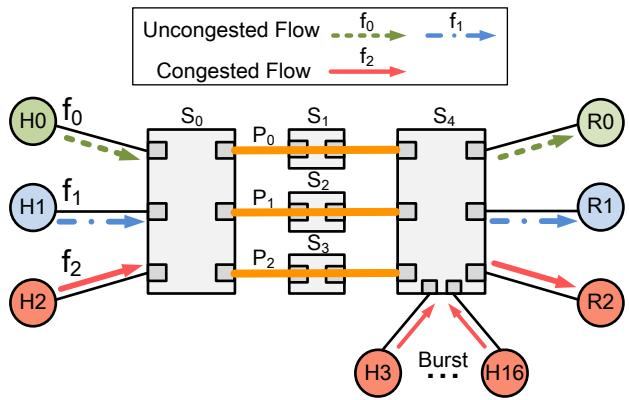  
Figure 1: Typical network scenarios. Under flow-based LB such as ECMP, $f _ { 0 }$ takes the path $P _ { 0 }$ {S0, S1, S4}, $f _ { 1 }$ and $f _ { 2 }$ hash collide on the path $P _ { 2 }$ {S0, S3, S4}. Under flowlet-based LB such as LetFlow, $f _ { 0 } , f _ { 1 }$ and $f _ { 2 }$ are spread across three paths $P _ { 0 }$ {S0, S1, S4}, P1 {S0, S2, S4} and $P _ { 2 }$ {S0, S3, S4}.

We conduct experiments to explore the issues of load balancing schemes including ECMP, LetFlow, ECMP+DCQCN, LetFlow+DCQCN, and MP-RDMA, which are implemented by using DPDK [46] and P4 hardware switch [41, 47]. The testbed consists of 20 servers connected to two P4 switches with 3 parallel paths of 40Gbps. Each switch has 22MB shared buffer and 32 full duplex ports enabling PFC with dynamic threshold2. The flowlet timeout is set to 50µs. We set all parameters to the default values recommended in [4, 7, 31]. The bursty scenarios follow the prior work [2, 3]. At time 0ms, H0, H1 and H2 start a long flow with 250MB to R0, R1 and R2, respectively, named $f _ { 0 } , f _ { 1 }$ and $f _ { 2 } .$ . At time 40ms, each sender of H3∼H16 generates 40 short flows to R2 at line rate, and the size of each short flow is 64KB. These bursty flows last about 8ms.

At the beginning, we configure $f _ { 0 }$ takes the path $P _ { 0 }$ {S0, S1, S4}, while $f _ { 1 }$ and $f _ { 2 }$ share the path $P _ { 2 } \ \{ \mathrm { S } 0 , \mathrm { S } 3 , \mathrm { S } 4 \}$ under both ECMP and LetFlow. The results are shown in Fig. 2. Since $f _ { 2 }$ and all bursty short flows arrive at the same receiver R2, the egress port from S4 to R2 is congested during the duration of bursty flows. Once PFC is triggered at the ingress ports in $S 4 .$ , the PAUSE frames from these ingress ports pause their upstream ports. As previously configured, both $f _ { 1 }$ and $f _ { 2 }$ are routed to the same path $P _ { 2 }$ under ECMP, LetFlow and MP-RDMA. An ideal load balancing scheme should timely switch $f _ { 1 }$ to the idle path $P _ { 1 }$ . However, as shown in Fig. $2 .$ none of them can flexibly distribute traffic. They fail to reroute the uncongested flow $f _ { 1 }$ from the congested path P2 to an uncongested path. This is because the flowlet-based switching cannot reroute packets unless flowlets emerge, which is prevented by inappropriate fixed timeouts for avoiding packet reordering. As a result, available link bandwidth is wasted.

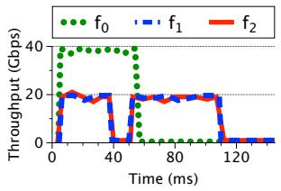  
(a) ECMP

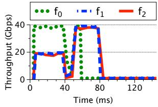  
(b) LetFlow

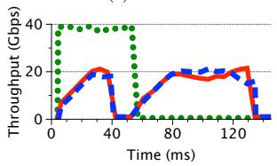

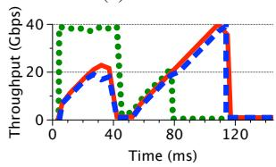

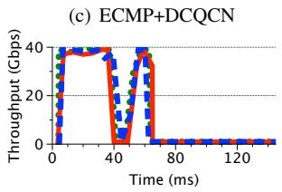

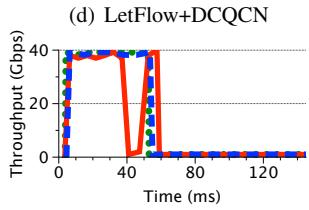  
(e) MP-RDMA  
(f) FLB  
Figure 2: Throughput of flows under various schemes. Under ECMP and ECMP+DCQCN, the uncongested flow $f _ { 1 }$ is blocked. Under LetFlow, LetFlow+DCQCN and MP-RDMA, both the uncongested flows $f _ { 0 }$ and $f _ { 1 }$ are blocked. The blocked victim flows cannot be rerouted to other paths. There are no victim flows in FLB.

## 2.2 Multi-path spreading expands the influence scope of PFC’s HoL blocking

We repeat the above experiment in Fig. 1 but manually configured the congested flow $f _ { 2 }$ to utilize all three paths $( P _ { 0 }$ $P _ { 1 }$ , and $P _ { 2 } )$ under LetFlow and MP-RDMA. The throughput for these three paths is shown in Fig. 3, and we make the following observations: (1) single-path transmission: under the ECMP and ECMP+DCQCN schemes, since $f _ { 2 }$ follows a single path, $P _ { 2 } .$ only $P _ { 2 }$ is paused by PFC. As a result, only the uncongested flow $f _ { 1 }$ on the same path is blocked, while flow $f _ { 0 }$ on the other path remains unaffected by PFC’s HoL blocking; (2) multi-path spreading: under LetFlow and MP-RDMA schemes, all three paths $( P _ { 0 } , P _ { 1 }$ , and $P _ { 2 } )$ are paused by PFC during the bursty flows. This occurs because the congested flow $f _ { 2 }$ is routed across all three paths, causing PFC PAUSE frames to be sent to all upstream ports of S4. This leads to more severe congestion spreading, where all paths $( P _ { 0 }$ and $P _ { 1 } )$ and flows $( f _ { 0 }$ and $f _ { 1 } )$ are blocked.

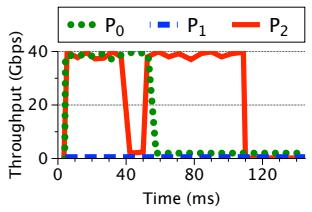  
(a) ECMP

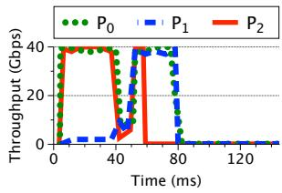

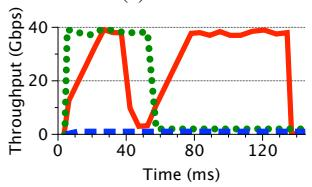

(b) LetFlow  
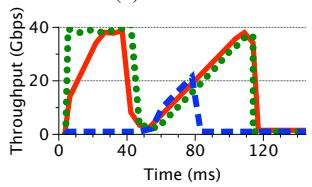

(c) ECMP+DCQCN  
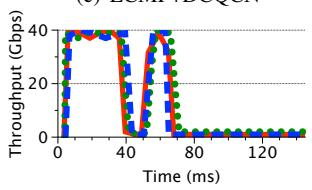  
(d) LetFlow+DCQCN

(e) MP-RDMA  
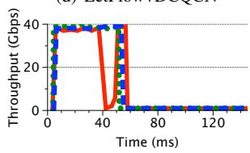  
(f) FLB  
Figure 3: Throughput of paths under various schemes. Under ECMP and ECMP+DCQCN, one path $P _ { 2 }$ is paused by PFC due to the congested flow $f _ { 2 }$ transmitting on $P _ { 2 }$ . Under Let-Flow, LetFlow+DCQCN and MP-RDMA, three paths $P _ { 0 } , P _ { 1 }$ and $P _ { 2 }$ are paused since the congested flow $f _ { 2 }$ is spread on all three paths.

Large-scale Simulations. To further show the problem, we construct a larger-scale Clos topology with 16 spine and 32 leaf switches using NS3 (Fig. 4(a)). The switch configuration is the same as in the preceding testbed experiments. The endhosts H0∼H30 simultaneously transmit 200MB of traffic to H31, creating a long-living 31-to-1 incast pattern.

We investigate the extent of congestion spreading during multi-path transmission (using packet spraying as an example) in lossless DCNs. We compare the number of paused paths (i.e., paths receiving PFC PAUSE frames during a given time interval) under packet spraying and ECMP. The results are presented in Fig. 4(b). As the results show, ECMP causes only the passing paths of 31 flows to pause (about 70 paths in total). In contrast, packet spraying results in all paths (about 340 paths) being paused. This is because data is sprayed across all paths, causing the PFC PAUSE frames to back-propagate throughout the network hop by hop.

In summary, with fine-grained rerouting, packets from congested flows are counterproductive spread across multiple paths, causing more paths to be paused by PFC, which aggravates to more victim flows and reduced link utilization. Therefore, an ideal load balancing scheme should prevent congested flows from using multiple paths and minimize the number of paused paths.

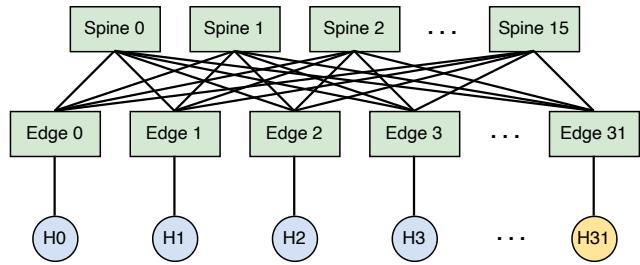  
(a) Topology and workload (H0∼H30 send traffic to H31)

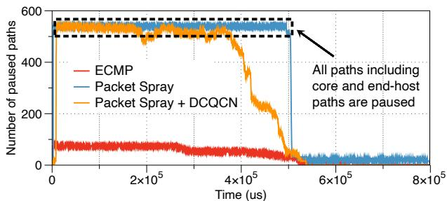  
(b) The number of paused paths of three configurations.  
Figure 4: Difference in congestion spreading between packet spraying and ECMP under large-scale topology.

## 2.3 Congestion control does not help

We envision that the above problems cannot be solved with congestion control as it cannot entirely prevent PFC from being triggered. To illustrate this issue, we observe again the results in Fig. 2 and Fig. 3. The performance is even worse when the existing LB schemes work with congestion control (e.g., LetFlow+DCQCN). Although the congestion control effectively regulates the rates of $f _ { 1 }$ and $f _ { 2 }$ before 40ms, PFC is still triggered when the bursty flows start, because each bursty flow lasts less than 1 RTT and cannot be controlled by DCQCN. In this case, after the uncontrollable bursty flows finish transmissions, the remaining flows cannot utilize the available bandwidth immediately due to the slow evolutionbased rate increasing of end-to-end congestion control. For MP-RDMA, the throughput of flows $f _ { 0 } , f _ { 1 }$ and $f _ { 2 }$ are further reduced by congestion control due to the slow convergence.

We also evaluate the impact of end-host congestion controls (using DCQCN as an example) on the congestion spreading caused by packet spraying. As shown in Fig. 4(b), DCQCN only slowly reduces the number of paused paths, it cannot quickly eliminate congestion and stop the PFC pausing.

## 3 FLB

Building on the preceding observations and analysis, we pose the question: Can we design a fine-grained load balancing scheme for PFC-enabled lossless DCNs that achieves (1) efficient rerouting with high link utilization, (2) elimination of PFC side effects such as congestion spreading and aggravated

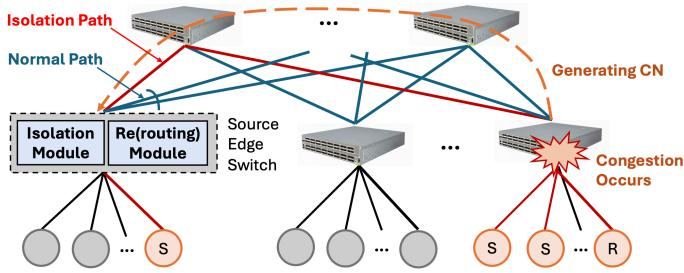  
Figure 5: FLB overview. S, R and CN stand for sender, receiver and congestion notification, respectively.

HoL blocking, and (3) reduced reliance on congestion control mechanisms? We address this question with FLB.

The design of FLB mainly consists of two modules, as illustrated in Fig. 5. In normal conditions, FLB employs a flexible rerouting scheme (i.e., the Rerouting Module) to effectively balance the traffic across multiple paths without causing packet reordering. Upon congestion, FLB quickly consolidates congested flows from their original multi-spread paths onto a minimized set of paths (i.e., the Isolation Module), thereby eliminating the impact of PFC’s HoL blocking on non-congested flows.

FLB can be integrated with any end-host congestion control schemes, including the existing lossless DCN congestion control algorithms [2, 4, 10, 48]. Moreover, since well-balanced traffic reduces congestion and congested flows are isolated, FLB minimizes the reliance on complex congestion control. To validate this, we design a minimal rate control at end hosts (§3.3), with a simplified algorithm that the senders start transmission at line rate and pause only when notified.

## 3.1 Flexible Rerouting

FLB employs flexible rerouting without the preset threshold to effectively balance the uncongested traffic and improve link utilization. Instead of switching with coarse granularity or passively waiting for emergence of flowlets, FLB works actively at the packet granularity. When making rerouting decisions, FLB ensures that the subsequent packet with larger sequence number arrives at the receiver later than the previous packets with smaller sequence number in the same flow to avoid reordering.

Algorithm 1 shows the rerouting logic of FLB. When a new active flow arrives, it selects a forwarding path with the minimum delay except the isolated path (lines 3-5). For the packets of existing flows, FLB compares the time interval between the arrival and previous packets in the same flow with the delay difference between the current path and other parallel paths, and selects the fastest path with the delay difference less than the time gap between two packets in order to avoid packet reordering (lines 8-12). Otherwise, the packet remains on its current path (lines 13-14).

Since FLB leverages the path delay differences to make forwarding decisions, the measured one-way delay can be used even if the clock is not synchronized [49]. Specifically, the source edge switch periodically samples packets, embedding their departure timestamps in the packet headers. When these marked packets arrive at the destination edge switch, the system computes precise one-way delay by subtracting the embedded timestamp from the arrival time. This delay measurement is then piggybacked on subsequent packets traversing the same port pair [50], enabling continuous path delay monitoring at the source edge switch without additional overhead. To address the issue of clock asynchrony, FLB calculates the real one-way queueing delay by subtracting the base delay from the measured one-way delay. The base delay is the one-way delay without any queueing delay and is obtained by recording the minimum history delay [50]. By default, FLB measures one-way delay at the edge switches periodically with two base RTT to reduce overhead.

Algorithm 1: Rerouting without Reordering   
Input:   
tOWD: Measured one-way delay of a path;   
tprev: The arrival time of previous packet;   
tcur: The arrival time of current packet;   
Output: p∗: The new routing path;   
1 for every packet do   
2 Assume its corresponding flow is f ;   
3 if f is a new flow then   
4 {P′} = all paths except the isolated paths occupied   
by the congested flows;   
5 p∗ = Argminp∈{P′}(p.tOW D);   
6 else   
7 Assume f ’s path is p;   
8 ∆t = f .tcur - f .tprev;   
9 {P′} = all paths with less delay than p and no threat   
of reordering;   
10 /\* ∀ p′ ∈ {P′}, 0 < p.tOW D − p′.tOW D < ∆t \*/   
11 if {P′} ̸= ∅ then   
12 p∗ = Argminp′∈{P′}( p′.tOW D);   
13 else   
14 p∗ = p; /\* Do not reroute \*/   
15 return p∗

FLB guarantees a better path switching. A flow requires a better path when its original path becomes less efficient than other parallel paths due to congestion. In such cases, end-host PAUSE (if no congestion control is enabled) or congestion control rate adjustments will react accordingly. PFC PAUSE creates a sufficient time interval between consecutive packets, triggering rerouting to a better path. Similarly, congestion control adjustments reduce the sending rate, increasing the time interval between consecutive packets, which also enables rerouting. As a result, FLB can consistently switch to a better path whenever one is available.

FLB works at the finer granularity than flowlet . Instead of switching with coarse flow-level granularity or passively waiting for emergence of flowlets, FLB reroutes flows flexibly without the fixed threshold at the switch to reduce PFC triggering and improve link utilization.

Periodic removal of flow entries. We use timeouts to periodically remove inactive flow table entries. Specifically, flow entries that have not been hit for a certain period (e.g., 1 ms) are removed by periodically checking the age bit of each flow [28, 51]. This logic also applies to the congested flow entries used in the isolation module (detailed in §3.2).

## 3.2 Flow Isolation

When congestion occurs, FLB aims to shield uncongested flows from being blocked by congested flows (i.e., HoL blocking). Specifically, FLB dynamically isolates congested flows onto a minimal set of paths, rather than all paths, to limit the impact of PFC and reduce buffer and link bandwidth wastage3. As a result, uncongested flows are no longer blocked.

Fig. 6 illustrates the flow isolation mechanism of FLB, where one priority class is assumed for each port. In Fig. 6(a), two flows $f _ { 1 }$ and $f _ { 2 }$ are transferred from source edge switches S1 to S2 via parallel links. With load balancing enabled, the packets of $f _ { 1 }$ and $f _ { 2 }$ share multiple egress ports of switch S1. Then, traffic bursts from other ingress ports to the egress port P5 at S2. On switch S2, when the queue length of egress port P5 reaches the isolation threshold due to the burst, a congestion notification message (CNM) with congestion flag, containing the flow identifier (ID) and the number of congested flows (n), is immediately generated and sent to S1 before PFC is triggered.

Upon receiving the CNM from downstream switch S2, as shown in Fig. 6(b), FLB stores the flow ID in a flow table (called isolation table) and isolates the congested flow f2 onto a minimized set of isolated paths (for illustration, Fig. 6(b) shows one path) where the last packet in f2 is pending, while rerouting subsequent packets of the uncongested flow $f _ { 1 }$ to another path. Uncongested flows are not allowed to use the isolated path. When multiple isolation paths are available, the source edge switch randomly assigns the congested flows to one of these paths.

Determining the number of isolation paths. The source edge switch determines this number based on the total converged rate of all congested flows. Assuming the link bandwidth (C) is uniform across the entire cluster, the converged sending rate for each congested flow can be calculated as $C / n ,$ where n is the number of congested flows reported in the CNM. The total converged rate of all congested flows, partitioned by the single link bandwidth, determines the number of isolation paths. Maintaining multiple isolation paths with a comparable bandwidth ensures that the source edge switch does not introduce more severe congestion on these congested flows. This further ensures that the congestion root remains constant and does not shift to the source edge switch.

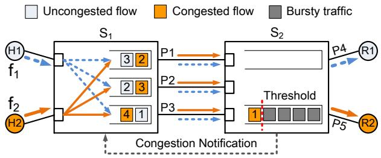  
(a) Isolation notification

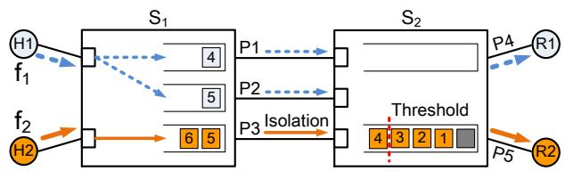  
(b) Isolation operation  
Figure 6: FLB isolation mechanism.

Releasing congested flows when congestion subsides. When the queue length of the previously congested port falls below the isolation threshold, a CNM with a non-congestion flag is generated and sent to the corresponding source edge switch. Upon receiving the CNM with the non-congestion flag, the associated congested flow is removed from the isolation table. FLB periodically checks the isolation table to recalculate the required number of isolation paths, releasing one or more paths as necessary. Once the isolation table is empty, all isolation paths are released. In scenarios where the CNM with the non-congestion flag is lost, we rely on timeouts to release inactive congested flow entries.

Determining isolation threshold. One challenge is to determine the isolation threshold for isolating congested flows at switch. If we use a large isolation threshold, PFC may be triggered at a high risk, resulting in more serious congestion spreading. In contrast, a small isolation threshold may prematurely pause the congested flow, resulting in throughput degradation. The detailed analysis of optimizing isolation threshold is leaved in §A and the corresponding experiments are shown in §4.2.

CNM construction. FLB utilizes the direct signal CNM of existing QCN mechanism [48], which is commonly available in commodity switches [52]. However, QCN forwards packets based on L2 addresses and does not preserve the original sender’s Ethernet/IP address. To solve it, FLB records flow ID and the source MAC address of the previous hop in the flow table at switches. The switch can then propagate the CNM to all the corresponding source edge switches by looking up the flow table hop by hop in IP-routed networks.

## 3.3 Minimal Rate Control

Enabled by the limited impacts of PFC (achieved by the flow isolation in §3.2), and the well-balanced traffic (achieved by the flexible rerouting in §3.1), FLB reduces the need for and dependency on complex congestion control algorithms. To validate this, we design a minimal rate control, which works as follows:

• All flows start at line rate by sending a bandwidth-delay product (BDP) worth of data packets.

• The source edge switch forwards the CNM to notify the end-hosts of the congested flows. Upon receiving a CNM with a congestion flag, the source host pauses its data transmission for each congested flow and directly sets the future sending rate as $\textstyle r = { \frac { C } { n } }$ , where C is the line rate and n is the maximum number of congested flows indicated in the CNM. The congested flows resume transmission at the rate r upon a CNM with a non-congestion flag is received. The rate varies with the change of n in the received CNM.

This minimal rate control approach bypasses the iterative convergence process, directly adjusting the sending rate based on CNM information, which significantly reduces the complexity of end-host congestion control.

## 3.4 Implementation

We implement FLB based on the Wedge 100BF-32X programmable switch [47]. The ingress pipeline with multiple match-action tables for data packets is shown in Fig. 7. Specifically, the metadata f low.isolation. f lag is set to 1 to trigger the isolation operation when the queue length exceeds the isolation threshold K. Since the egress queue cannot be read from the ingress intrinsic metadata on P4 hardware platform, we implement the queue-size SRAM with a similar function by counting the packets enqueueing and dequeueing the egress port. In the Forward port tables, for an uncongested flow, FLB selects an egress port according to the rerouting Algorithm 1 in §3.1. For a congested flow, FLB randomly forwards the packet to an isolated port. For a new flow, the packet is routed on the path with minimal delay.

Flow table is maintained at the edge switch. Each flow entry consists of a 16-bit flow ID, a 8-bit selected path ID, a 8-bit aging metric and 48-bit MAC address. Flow ID is calculated based on a CRC16 hash function over the unique 5 tuples of a flow. Aging metric (similar to CONGA [28]) is used to measure packet interval without recording timestamps. Specifically, each incoming packet resets the aging metric of its flow, while a timer periodically increases the metric by one. In this way, the memory consumption is reduced significantly, e.g., only 0.1MB SRAM is used. While in a 3-tier Fat-tree topology [53], SRAM consumption increases to 0.12MB due to the increase of path ID to 24bit.

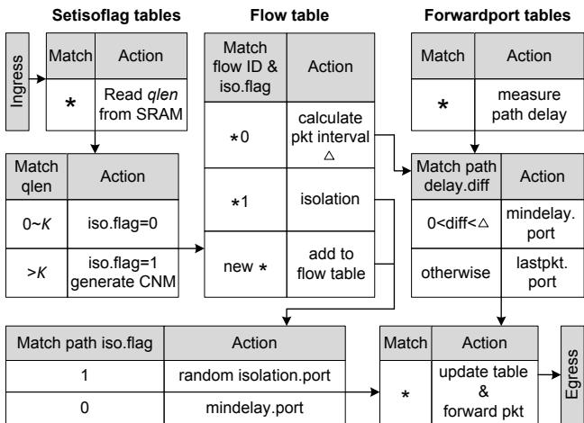  
Figure 7: Ingress pipeline for data packets.

Resource consumption: Table 1 lists the resource consumption of ECMP, LetFlow and FLB under 100K concurrent flows. While the resource consumed by FLB is higher than the others, it occupies no more than 10% of the total switch resource in general. The reason of higher resource consumption is that FLB needs more pipeline stages to isolate congested flows, reroute uncongested flows and flexibly select paths. FLB performs the pipelining of each packet through visiting the matchaction tables without violating the access restriction, resulting in more overhead such as Gateway. Meanwhile, FLB needs more SRAM and stateful ALUs to store and update selected path ID and age bits of the last packet. Nonetheless, the overall resources consumption for FLB remains low, meaning that FLB can be deployed in high-speed switch with reasonable resources consumption.

Table 1: Resource consumption of different schemes.
<table><tr><td>Resource</td><td>ECMP</td><td>LetFlow</td><td>FLB</td></tr><tr><td>Match Crossbar</td><td>2.41%</td><td>4.82%</td><td>5.82%</td></tr><tr><td>Hash Bits</td><td>3.08%</td><td>5.67%</td><td>5.87%</td></tr><tr><td>Gateway</td><td>1.39%</td><td>2.96%</td><td>9.56%</td></tr><tr><td>SRAM</td><td>1.56%</td><td>3.33%</td><td>4.12%</td></tr><tr><td>VLIW Actions</td><td>1.56%</td><td>2.34%</td><td>3.34%</td></tr><tr><td>ALUInstruction</td><td>2.6%</td><td>5.2%</td><td>8.2%</td></tr></table>

Practical deployment: To reduce deployment overhead in multi-tier topologies, FLB is deployed only on the edge switches while still maintaining comprehensive control over the routing decisions. (1) If FLB is deployed in the two-level topologies (e.g., Leaf-Spine), rerouting is determined solely at the leaf layer. Once the spine switch is selected, the routing to the destination leaf is automatically decided, as there is only a single path from the spine to the destination leaf. (2) If FLB is deployed in the multi-level topologies (e.g., threelayer Fat-Tree), the edge switches maintain the flow table and the delay information of each end-to-end path specified by a unique path ID [54]. When a packet arrives at an edge switch, it selects the appropriate path based on this information and is forwarded using explicit source routing techniques, such as XPath [54].

## 4 Evaluation

We evaluate FLB using both testbed experiments and NS3 simulations. Our evaluation centers around the following key questions:

• How does FLB perform in practice? Testbed experiments (§4.1) demonstrate the superior performance of FLB. Specifically, FLB reduces the AFCT by 48%, 42% and 30% compared to ECMP+DCQCN, LetFlow+DCQCN and MP-RDMA, respectively.

• How sensitive is FLB to traffic patterns and parameters, and how effective are the design components? Deep-dive experiments (§4.2) show that FLB achieves persistent good performance under various traffic patterns and parameter settings, and validate the effectiveness of its design components.

• How does FLB with minimal rate control (§3.3) (FLB+RC) perform in large-scale DCNs? Using largescale NS3 simulations (§4.3), we show that FLB+RC scales well to large and multi-tier network topologies, and performs better than various load balancing mechanisms.

## 4.1 Testbed Experiments

Testbed and parameter settings: We use the same topology as prior work [2, 3] (see Fig. 1) and the testbed settings are the same as in §2. Each server (Dell PRECISION TOWER 5820 server) is equipped with 10 cores Intel Xeon W-2255 CPU, 64GB memory, Mellanox ConnectX-5 100GbE NICs that support DPDK 20.08 and Ubuntu 20.04.1. By default, the link capacity is set to 40Gbps. All parameters in DCQCN [4] and MP-RDMA [7] are set to the recommended values. FLB and FLB+RC respectively indicate without minimal rate control (§3.3) and with minimal rate control (RC).

Results with realistic workload: For this experiment, hosts H0∼H16 generate dynamic traffic according to the realistic Web Search workload [55] with heavy-tailed distribution. The average flow size is 1.6MB. The flows generated from hosts H3∼H16 are concurrent bursty flows. The target load at the bottleneck link is set to 0.6. We measure the flow completion time (FCT), pause rate and link utilization to compare the performance of FLB with the other five schemes.

Fig. 8 (a) shows the generating rates of PFC PAUSE from different switch layers. Although the traffic changes dynamically, FLB effectively reduces PFC PAUSEs and suppresses congestion spreading. For FLB, the PAUSE rates at the core and source edge switches are smaller than that at the destination edge switch. Due to lacking of congestion control, the

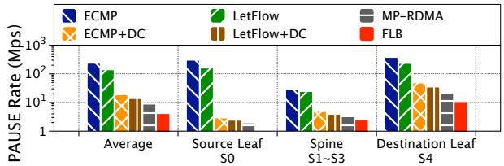  
(a) Generating rate of PAUSEs on different switches.

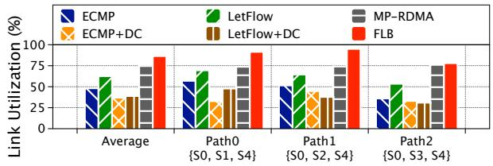  
(b) Link utilization of different parallel paths.

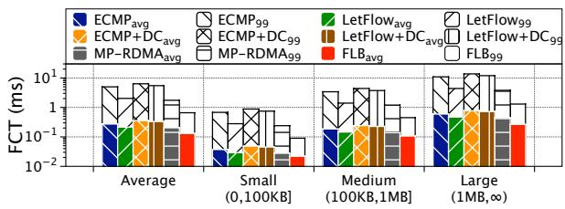  
(c) FCT with different flow sizes.  
Figure 8: Results with realistic workload.

PAUSE rates of ECMP and LetFlow are larger than those of ECMP+DCQCN and LetFlow+DCQCN, respectively.

Fig. 8 (b) shows the link utilizations of different parallel paths. By balancing traffic among parallel paths, FLB and MP-RDMA achieve higher link utilization on different paths than the other schemes. In addition, since FLB reduces the number of ports affected by PFC PAUSEs through isolating the congested flows, FLB obtains the highest average link utilization over the other schemes.

Fig. 8 (c) shows the FCTs of small (0,100KB], medium (100KB,1MB] and large (1MB, ∞) flows in Web Search [56]. Since FLB can rapidly isolate and pause the congested flows, the uncongested flows are not blocked by PFC PAUSEs and complete quickly. FLB achieves the lowest average and 99th percentile FCTs of all flows. Compared to ECMP+DCQCN, LetFlow+DCQCN and MP-RDMA, FLB reduces the AFCT of all flows by 48%, 42% and 30%, respectively. The improvement of FLB over ECMP+DCQCN and LetFlow+DCQCN in the 99th percentile FCT is even up to 88% due to successfully avoiding HoL blocking and congestion spreading.

Results with bursty flows: We evaluate the performance of FLB under bursty flows following the same settings as described in §2. Fig. 2 and Fig. 3 show the throughput results of various schemes. We find that FLB effectively avoids the HoL blocking and congestion spreading problems. Specifically, with FLB, (1) uncongested flows f0 and f1 no longer suffer from HoL blocking due to the congested flow $f _ { 2 }$ (shown in Fig. 2 (f)); (2) two paths $P _ { 0 }$ and $P _ { 1 }$ in FLB are no longer affected by the PFC PAUSEs (shown in Fig. 3 (f)).

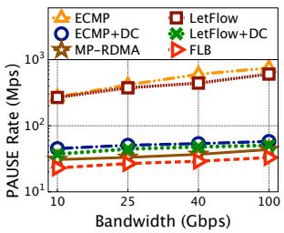  
(a) Pause rate

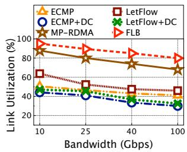

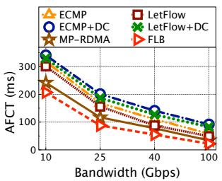  
(b) Link utilization

(c) AFCT  
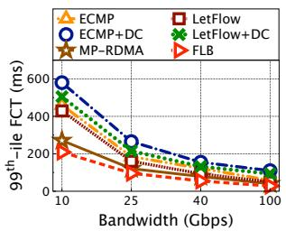  
(d) $9 9 ^ { t h }$ percentile FCT  
Figure 9: Results with bursty flows under various link speeds. DC stands for the DCQCN congestion control.

We then vary the link capacity from 10Gbps to 100Gbps, and repeat the same experiments. Fig. 9 (a) shows FLB reduces the rate of PFC PAUSE by up to 96% through isolating the culpable flows. Since the data transmission at line rate leads to fast queueing buildup especially under highspeed links (e.g., 40Gbps, 100Gbps), ECMP and LetFlow trigger significantly more PAUSEs than the other schemes. With employing congestion control, ECMP+DCQCN, Let-Flow+DCQCN and MP-RDMA trigger small number of PFC PAUSEs. However, as shown in Fig. 9 (b) and Fig. 9 (d), slow convergence to the target rate under DCQCN results in increments in utilization loss and tail latency, respectively.

Fig. 9 (b) shows that FLB improves link utilization by up to 95%, 78%, 166%, 144% and 28% compared to ECMP, Let-Flow, ECMP+DCQCN, LetFlow+DCQCN and MP-RDMA, respectively. Fig. 9 (c) and Fig. 9 (d) show the average and $9 9 ^ { \dot { t } h }$ percentile FCTs. Because FLB mitigates PFC triggering between switches and isolates the culpable flows to protect victim flows, FLB achieves lower FCT than the other schemes under various bandwidth of the bottleneck link.

## 4.2 FLB Deep Dive

We further conduct the testbed experiments to answer the following three questions:

• How sensitive is FLB to bursty flows? As traffic demand varies across time and space in DCN, FLB should be robust to dynamic traffic. We find that, even with only 5µs flow arrival interval, FLB still effectively avoids PFC’s HoL blocking and achieves high link utilization.

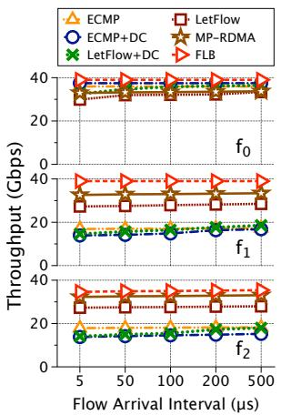

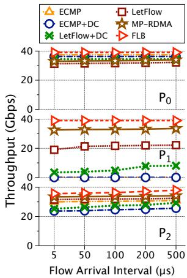  
(a) Throughput of flows  
(b) Throughput of paths  
Figure 10: Performance under bursty traffic.

• How effective is the rerouting mechanism in avoiding packet reorderin ${ \bf g } \mathrm { ? }$ In both symmetric and asymmetric scenarios, FLB effectively avoids reordering problem, and the out-of-order degree is lower than MP-RDMA.

• What is the effect of the optimized isolation threshold? Compared to FLB with fixed isolation threshold, FLB with the optimized threshold reduces the PAUSE rate by up to 89% and increases the link utilization by up to 40%.

• How effective is FLB integrated with rate control? FLB+RC achieves the lowest flow completion time.

Impact of bursty flow: To explore how FLB performs in bursty scenario, we vary the arrival interval of concurrent flows [2,57]. Each long flow is 250MB and bursty flows from H3∼H16 to R2 start at different intervals, varying from 5µs to 500µs. We measure the throughputs of each flow and each path. The results are shown in Fig. 10.

We make the following three observations: First, for the uncongested flows $f _ { 0 }$ and $f _ { 1 }$ , FLB maintains high throughput with different arrival intervals of bursty flows. This is because FLB timely isolates the culpable flow $f _ { 2 }$ on one path to avoid HoL blocking for uncongested flows. Compared to MP-RDMA, FLB improves the throughputs of $f _ { 0 }$ and $f _ { 1 }$ by 24% and 20%, respectively. Second, for the congested flow $f _ { 2 } { } .$ , FLB also achieves higher throughput than other schemes, since $f _ { 2 }$ resumes its transmission at line rate, rather than slowly converging to the target rate like DCQCN. In addition, $f _ { 2 }$ can flexibly transfer packets among parallel paths when congestion does not occur. Third, FLB and MP-RDMA balance traffic across 3 parallel paths well and achieve high path throughput with varying arrival interval of bursty flows. However, since MP-RDMA splits the congested flow $f _ { 2 }$ to all paths, all paths are paused by PFC, resulting in link utilization degradation. FLB achieves up to 19% higher throughput of paths.

Effect of rerouting under symmetric and asymmetric scenarios: To show rerouting mechanism in FLB is able to well address the out-of-order issue, we conduct experiments in both symmetric and asymmetric topologies and measure the 99th percentile of out-of-order degree (OOD), which is defined as the difference between the sequence numbers of an out-of-order packet and the expected one.

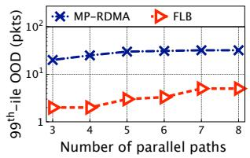  
(a) OOD in symmetric topology

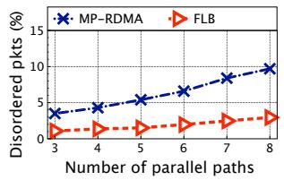  
(b) Disorder in symmetric topology

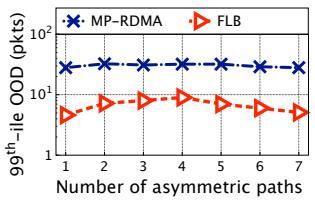  
(c) OOD in asymmetric topology

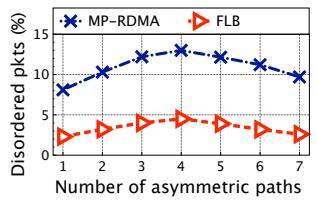  
(d) Disorder in asymmetric topology  
Figure 11: Out-of-order control.

We first vary the number of parallel paths in the symmetric topology. Fig. 11 (a) and Fig. 11 (b) show that FLB effectively reduces the 99th percentile of OOD and disordered packets ratio compared to MP-RDMA. This is because the delay difference between the new rerouting path and the current path is less than the interval between two consecutive packets in the same flow. For MP-RDMA, it can control the OOD to a preset range. Next, in the symmetric topology with 8 equal-cost paths, we change the default 40Gbps bandwidth of some parallel paths to 25Gbps to create bandwidth asymmetry. Fig. 11 (c) and Fig. 11 (d) show FLB achieves low OOD and disordered packets ratio even under the highest asymmetric degree (i.e., the number of asymmetric paths is 4).

Sensitivity to isolation threshold: To validate the effectiveness of the optimized isolation threshold based on Equation (4) in §A, we compare the optimized isolation threshold with the small fixed ones to avoid PFC triggering. We test the fixed thresholds of 20% and 30% of the shared buffer size. We increase the number of concurrent flows for each burst and measure the rate of PFC PAUSE frames from the switch S4 and the average link utilization of the three parallel paths. As shown in Fig. 12, FLB with the optimized threshold achieves 82% and 89% lower PAUSE rates than those of 20% and 30% fixed thresholds, respectively.

Integrated with rate control: To validate the effectiveness of integrating FLB with rate control, we compared the AFCT of four mechanisms, i.e., FLB, FLB+RC, FLB +DC-QCN and MP-RDMA under the same experimental setup and Web Search workload as in §4.1. Due to the ability to isolate congested flows and effectively suppress congestion spreading, FLB both with and without rate control is superior to that of MP-RDMA, as shown in Fig. 13. Since the minimal rate control with pause/resume mechanism at the end-host rapidly converges congested flows to the target rate, FLB+RC further reduces the AFCT by 15% compared to pure FLB. In contrast to the end-to-end congestion control protocol DCQCN, which converges the congested flow rate more slowly to the target rate, both FLB and FLB+RC outperform FLB +DCQCN.

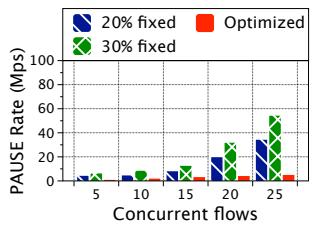  
(a) PAUSE rate

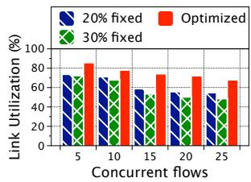  
(b) Link utilization

Figure 12: Sensitivity to isolation threshold.  
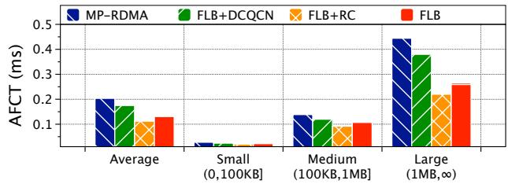  
Figure 13: Performance of FLB integrated rate control.

## 4.3 Large-scale NS3 Simulations

We run NS3 simulations to answer the following questions.

• How does FLB+RC perform compared to other load balancing schemes with realistic workloads? FLB+RC outperforms ECMP [43] and LetFlow [31], reducing the AFCT by 65% and 58%, respectively. Furthermore, the AFCT of FLB+RC is respectively 76%, 70%, 36%, 29% and 18% lower than those of ECMP+DCQCN [4], Let-Flow+DCQCN, MP-RDMA [7], Proteus+DCQCN [26] and LetFlow+PCN [2] in large-scale scenarios.

• How does FLB+RC perform with incast workload under the over-subscribed network? In the incast scenario under a 3:1 over-subscribed topology, FLB+RC delivers persistently higher goodput (up to 27%) compared to other solutions.

• How does FLB+RC perform under the multi-tier topology? In a 12-pod Fat-tree topology, FLB+RC achieves lower PAUSE rate and FCT (up to 71% and 92%, respectively) under realistic workloads.

Simulation settings: We evaluate FLB on a leaf-spine topology with 10 leaf switches and 10 spine switches. Each leaf switch is connected to 30 hosts and 10 spine switches with 40Gbps links. The over-subscription ratio is 3:1 at the leaf switch layer. The link delay is 5µs. The switch buffer size is set to 9MB. PFC is enabled to guarantee lossless transmission and the PFC threshold at each ingress port is set to 256KB. To explore the scalability of FLB, we further evaluate its performance under a multi-tier 12-pod Fat-tree topology [51, 53]. Each pod consists of 6 edge switches, 6 aggregation switches, and 84 end-hosts, and communicates with other pods through 36 core switches. So there are 36 equal-cost paths between any pair of edge switches across pods.

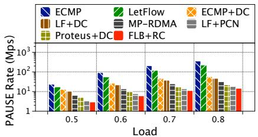  
(a) Web Server

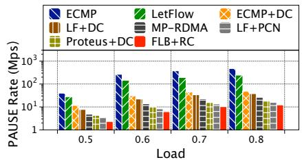  
(b) Cache Follower

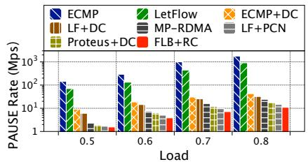  
(c) Data Mining

Figure 14: PAUSE rate under realistic workloads. DC and LF stand for DCQCN and LetFlow, respectively.  
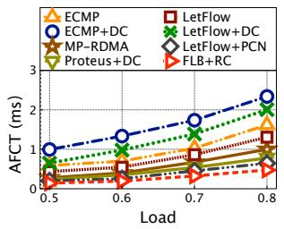

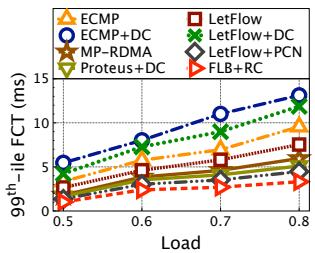  
(a) AFCT in Web Server

(b) 99th-ile FCT in Web Server  
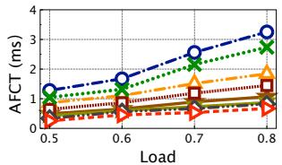

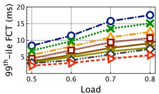

(c) AFCT in Cache Follower  
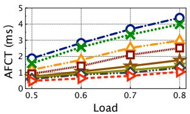  
(d) 99th-ile FCT in Cache Follower

(e) AFCT in Data Mining  
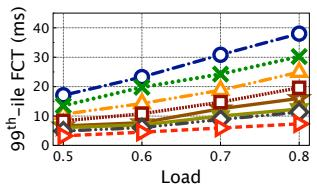  
(f) 99th-ile FCT in Data Mining  
Figure 15: FCT under realistic workloads.

Realistic workloads: We use various realistic workloads including Web Server, Cache Follower, Hadoop Cluster and Data Mining [2, 55, 56, 58] with the average flow sizes ranging from 64KB to 7.41MB. In the Web Server workload, all flows are less than 1MB, while in the Data Mining scenario there are around 9% flows larger than 1MB. Each flow is generated between random pair of source and destination hosts. The traffic ratio between intra-ToR and inter-ToR is 1:3. The traffic load is changed from 0.5 to 0.8. We compare the performance of FLB+RC with ECMP, Let-Flow, ECMP+DCQCN, LetFlow+DCQCN, LetFlow+PCN, MP-RDMA and Proteus+DCQCN.

Fig. 14 shows the generating rates of PFC PAUSEs from leaf and spine switches. Results validate that FLB suppresses PFC PAUSEs better than the other schemes. This is because FLB pauses the congested flows accurately to drain out the backlog packets, and balances traffic among multiple paths to avoid congestion spreading. Since ECMP and LetFlow start and resume flows at the line rate, they trigger more PFC PAUSEs. In contrast, ECMP+DCQCN, LetFlow+DCQCN, LetFlow+PCN, MP-RDMA and Proteus+DCQCN employ the sophisticated rate adjustment mechanisms to effectively reduce PFC PAUSEs, especially under the Data Mining workload containing more heavy-tailed flows.

Fig. 15 shows the average and 99th percentile FCTs under different realistic workloads and load levels. FLB+RC achieves the best performance across all applications. Taking the Data Mining as an example, FLB+RC reduces the AFCT by 65%, 58%, 76%, 70%, 36%, 29% and 18% under 0.8 load over ECMP, LetFlow, ECMP+DCQCN, LetFlow+DCQCN, MP-RDMA, Proteus+DCQCN and LetFlow+PCN, respectively. This is because FLB isolates the culpable flows timely to avoid the side effects of PFC and flexibly reroutes flows to ensure high link utilization. Due to the slow convergence after resuming, the FCTs of ECMP+DCQCN and LetFlow+DCQCN are larger than ECMP and LetFlow with line-rate resuming, respectively. Since distributing traffic in a congestion-aware manner, MP-RDMA significantly outperforms ECMP and LetFlow. Although multiple paths are potentially paused by PFC in LetFlow+PCN, PCN can identify and throttle the congested flows, effectively reducing PFC triggering and outperforming MP-RDMA.

Incast workload: Next, we evaluate the network performance in the incast scenario where a client initiates concurrent requests to fetch responses from a large number of servers [4, 7, 28]. Simultaneous arrival of the response flows imposes great buffer pressure at the switches, potentially resulting in continuous PFC PAUSEs in lossless DCN.

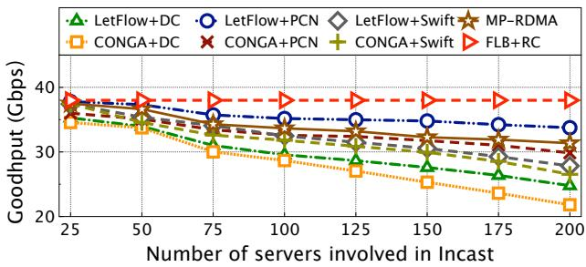  
Figure 16: Incast performance vs. number of servers

In this test, there are N flows concurrently transmitting a fixed total amount of data from N servers under randomly selected leaf switches to one client. We set the total data size as 100MB and vary the number of servers N from 25 to 200. Each response is 1 MB. We measure the goodput at the client and repeat the test for 100 requests to get the average result.

As shown in Fig. 16, although more PFC PAUSE messages are generated with more servers, the throughput of FLB+RC is almost independent of the number of servers. The reason is that FLB pauses and resumes congested flows at a fair rate when the sender receives the CNM with congestion or non-congestion flag, respectively. Compared with other schemes, the incast throughputs in CONGA+DCQCN, LetFlow+DCQCN, CONGA+Swift and LetFlow+Swift are degraded due to the slow convergence of the sending rate. Moreover, CONGA incorrectly reroutes packets to the paused paths with lower link utilization, resulting in a larger throughput loss of up to 45%. Since PCN and MP-RDMA increase the sending rate rapidly after receiving the RESUME messages, they can obtain higher throughput under highly concurrent flows compared with DCQCN.

Multi-tier topology: In this experiment, the workloads are generated among randomly selected host pairs in the aforementioned Fat-tree topology with an exponentially distributed inter-arrival time and targeted load of 0.6.

Fig. 17 (a) and Fig. 17 (b) show the generating rates of PFC PAUSEs from edge, aggregation and core switches. PFC triggers most at the edge switches due to many-to-one communication at the destination end-hosts. Fig. 17 (c) shows the average and 99th percentile FCTs. For Web Server workload, about 80% of short flows less than 10KB and about 10% flows larger than 100KB, resulting in dramatically burst in network congestion. In addition, most short-lived flows have no chance to switch path, resulting in very small difference in performance between deploying ECMP and LetFlow. Since FLB can rapidly detect and isolate the congested flows, the innocent flows complete quickly without suffering from PFC’s HoL blocking. Compared with LetFlow+DCQCN, LetFlow+Swift, MP-RDMA and LetFlow+PCN, FLB+RC suppresses 71%,55%, 45% and 37% PFC PAUSEs, reduces 76%, 40%, 32% and 28% average FCT and 81%, 56%, 45% and 32% $9 9 ^ { t h } .$ -ile FCT, respectively. For heavy-tailed Hadoop Cluster workload, about 96% of traffic is provided by only 9% of long flows larger than 1MB, and around 86% short flows less than 100KB. Since FLB effectively avoids PFC’s HoL blocking caused by congested long flows, the average and 99th-ile FCTs are reduced by up to 92% and 83% compared with other solutions, respectively.

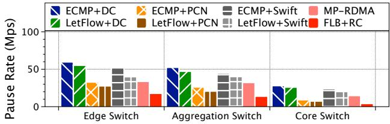  
(a) PAUSE rate under Web Server.

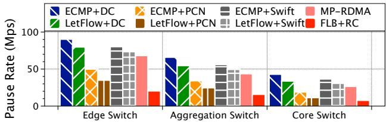  
(b) PAUSE rate under Hadoop Cluster.

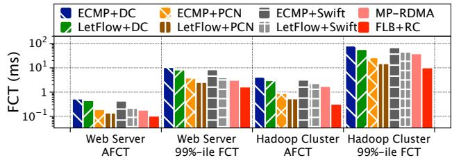  
(c) Average and 99th percentile FCTs.  
Figure 17: Performance under Fat-tree topology.

## 5 Related Work

We classify previous work on balancing traffic in DCNs into two categories: load-balance routing solutions (e.g., [26–29, 31–39,43,59]) and multipath transport solutions (e.g., [7,30]). Most of them are designed for lossy DCNs and cannot be directly used in lossless Ethernet DCNs.

Load-balance routing solutions [28,29,31–39,43,59] generally improve link utilization by splitting traffic evenly across multiple paths. ECMP [43], FlowBender [39], Hedera [37], MicroTE [38] schedule flows at flow level, but may obtain suboptimal link utilization due to coarse routing granularity. Presto [34] spreads traffic at fixed flowcell-level granularity. RPS [35], DRILL [36], Hermes [29] and DRB [59] work at packet level and unavoidably suffer from packet reordering problem. CONGA [28], LetFlow [31], HULA [32] and CLOVE [33] employ flowlet-level switching to avoid out-oforder delivery. Proteus [26] and ConWeave [27] effectively balance traffic in the RDMA networks. However, these finegrained solutions make more ports affected by the side effects of PFC because they spread the congested flows among more parallel paths. Instead, FLB isolates congested flows timely to eliminate HoL blocking and reroutes uncongested flows by utilizing rich multiple paths to improve link utilization.

Multipath transport solutions [7, 30] divide a flow into multiple subflows for multipath transmission, resulting in potentially more ports to get paused by PFC. There are also efforts [2–4, 8, 10, 12, 22, 48, 60–62] targeting at minimizing FCTs for RDMA. On the one hand, for lossless RDMA, QCN [48] works at Layer 2 to alleviate congestion. IEEE P802.1Qcz [60] supports the isolation of flows from different applications. DCQCN [4] and DCQCN+ [22] are ratebased congestion control for RoCEv2 [61]. TIMELY [10] and Swift [12] use RTT as the congestion signal to adjust sending rate. PCN [2] recognizes the congested flows and employs a receiver-driven rate control algorithm to achieve fast convergence. TCD [3] defines ternary states of switch ports to detect congested ports. BFC [62] uses a per-hop per-flow control scheme to reduce HoL blocking. While the above end-to-end transmission schemes effectively alleviate congestion, they still cannot completely avoid HoL blocking especially under bursty traffic. On the other hand, for lossy RDMA, some works [8, 42, 63] explore the possibility of running RDMA without PFC. However, further efforts are still needed for large-scale deployment in production DCNs.

## 6 Conclusion

This paper presented FLB, a fine-grained load balancing solution for PFC-enabled lossless DCNs. The core of FLB contains: (i) a flexible rerouting scheme to improve link utilization in normal conditions; and (ii) an isolation mechanism to avoid PFC spreading upon congestion. The testbed experiments as well as large-scale NS3 simulations show that FLB is a viable solution that achieves all our design goals.

## Acknowledgments

We thank the anonymous ATC reviewers and our shepherd Prof. Anil kumar Yelam for their constructive feedback and suggestions. This work is supported in part by the National Natural Science Foundation of China (62472050, 62473146, U24A20245, 62132022), the Natural Science Foundation of Hunan Province (2025JJ20070, 2024JJ3017), and the Hong Kong RGC TRS T41-603/20R. Jiawei Huang and Kai Chen are the corresponding authors.

## References

[1] W. Bai, A. Agrawal, A. Bhagat, M. Elhaddad, N. John, J. Padhye, M. Pandya, et al. Empowering Azure Storage with 100×100 RDMA. In Proc. USENIX NSDI, 2023.

[2] W. Cheng, K. Qian, W. Jiang, T. Zhang, and F. Ren. Re-architecting Congestion Management in Lossless Ethernet. In Proc. USENIX NSDI, 2020.

[3] Y. Zhang, Y. Liu, Q. Meng, and F. Ren. Congestion Detection in Lossless Networks. In Proc. ACM SIG-COMM, 2021.

[4] Y. Zhu, H. Eran, D. Firestone, C. Guo, M. Lipshteyn, Y. Liron, J. Padhye, S. Raindel, M. H. Yahia, and M. Zhang. Congestion Control for Large-Scale RDMA Deployments. In Proc. ACM SIGCOMM, 2015.

[5] C. Guo, H. Wu, Z. Deng, G. Soni, J. Ye, J. Padhye, and M. Lipshteyn. RDMA over Commodity Ethernet at Scale. In Proc. ACM SIGCOMM, 2016.

[6] K. Qian, W. Cheng, T. Zhang, and F. Ren. Gentle Flow Control: Avoiding Deadlock in Lossless Networks. In Proc. ACM SIGCOMM, 2019.

[7] Y. Lu, G. Chen, B. Li, K. Tan, Y. Xiong, P. Cheng, J. Zhang, E. Chen, and T. Moscibroda. Multipath Transport for RDMA in Datacenters. In Proc. USENIX NSDI, 2018.

[8] R. Mittal, A. Shpiner, A. Panda, E. Zahavi, A. Krishnamurthy, S. Ratnasamy, and S. Shenker. Revisiting Network Support for RDMA. In Proc. ACM SIGCOMM, 2018.

[9] Y. Zhu, M. Ghobadi, V. Misra, and J. Padhye. ECN or Delay: Lessons Learnt from Analysis of DCQCN and TIMELY. In Proc. ACM CoNEXT, 2016.

[10] R. Mittal, V. T. Lam, N. Dukkipati, E. Blem, H. Wassel, M. Ghobadi, A. Vahdat, Y. Wang, D. Wetherall, and D. Zats. TIMELY: RTT-based Congestion Control for the Datacenter. In Proc. ACM SIGCOMM, 2015.

[11] Y. Li, R. Miao, H. H. Liu, et al. HPCC: High Precision Congestion Control. In Proc. ACM SIGCOMM, 2019.

[12] G. Kumar, N. Dukkipati, K. Jang, et al. Swift: Delay is Simple and Effective for Congestion Control in the Datacenter. In Proc. ACM SIGCOMM, 2020.

[13] S. Hu, Y. Zhu, P. Cheng, C. Guo, K. Tan, J. Padhye, and K. Chen. Tagger: Practical PFC Deadlock Prevention in Data Center Networks. In Proc. ACM CoNEXT, 2017.

[14] J. Xue, M. U. Chaudhry, B. Vamanan, T. N. Vijaykumar, and M. Thottethodi. Dart: Divide and Specialize for Fast Response to Congestion in RDMA-based Datacenter Networks. IEEE/ACM Transactions on Networking, 28(1):322-335, 2020.

[15] C. Tian, B. Li, L. Qin, J. Zheng, J. Yang, W. Wang, G. Chen, and W. Dou. P-PFC: Reducing Tail Latency with Predictive PFC in Lossless Data Center Networks. IEEE Transactions on Parallel and Distributed Systems, 31(6):1447-1459, 2020.

[16] Microsoft. Availability of Linux RDMA on Microsoft Azure. https://azure.microsoft.com/en-us/ blog/azure-linux-rdma-hpc-available/.

[17] Alibaba. Alibaba Cloud - Super Computing Cluster. https://www.alibabacloud.com/product/scc.

[18] Google. Accelerate Your Transformation with Google Cloud. https://cloud.google.com.

[19] B. Yi, J. Xia, L. Chen, and K. Chen. Towards Zero Copy Dataflows Using RDMA. In Proc. ACM SIGCOMM Posters and Demos, 2017.

[20] IEEE 802.1 Qbb - Priority-based Flow Control. https: //1.ieee802.org/dcb/802-1qbb/.

[21] Z. Guo, S. Liu, and Z. Zhang. Traffic Control for RDMA-Enabled Data Center Networks: A Survey. IEEE Systems Journal, 4(1):677-688, 2020.

[22] Y. Gao, Y. Yang, C. Tian, J. Zheng, B. Mao, and G. Chen. DCQCN+: Taming Large-scale Incast Congestion in RDMA over Ethernet Networks. In Proc. IEEE ICNP, 2018.

[23] M. Miao, F. Ren, X. Luo, J. Xie, Q. Meng, and W. Cheng. SoftRDMA: Rekindling High Performance Software RDMA over Commodity Ethernet. In Proc. ACM AP-Net, 2017.

[24] H. Qiu, X. Wang, T. Jin, Z. Qian, B. Ye, B. Tang, W. Li, and S. Lu. Toward Effective and Fair RDMA Resource Sharing. In Proc. ACM APNet, 2018.

[25] P. Pan, G. Chen, X. Wang, H. Dai, B. Li, B. Fu, and K. Tan. Towards Stateless RNIC for Data Center Networks. In Proc. ACM APNet, 2019.

[26] J. Hu, C. Zeng, Z. Wang, J. Zhang, K. Guo, H. Xu, J. Huang, K. Chen. Enabling Load Balancing for Lossless Datacenters. In Proc. IEEE ICNP, 2023.

[27] C. H. Song, X. Z. Khooi, R. Joshi, I. Choi, J. Li, M. C. Chan. Network Load Balancing with In-network Reordering Support for RDMA. In Proc. ACM SIG-COMM, 2023.

[28] M. Alizadeh, T. Edsall, S. Dharmapurikar, R. Vaidyanathan, K. Chu, A. Fingerhut, V. T. Lam, F. Matus, R. Pan, N. Yadav, G. Varghese. CONGA: Distributed Congestion-aware Load Balancing for Datacenters. In Proc. ACM SIGCOMM, 2014.

[29] H. Zhang, J. Zhang, W. Bai, K. Chen, and M. Chowdhury. Resilient Datacenter Load Balancing in the Wild. In Proc. ACM SIGCOMM, 2017.

[30] C. Raiciu, S. Barre, C. Pluntke, A. Greenhalgh, D. Wischik, and M. Handley. Improving Datacenter Performance and Robustness with Multipath TCP. In Proc. ACM SIGCOMM, 2011.

[31] E. Vanini, R. Pan, M. Alizadeh, P. Taheri and T. Edsall. Let It Flow: Resilient Asymmetric Load Balancing with Flowlet Switching. In Proc. USENIX NSDI, 2017.

[32] N. Katta, M. Hira, C. Kim, A. Sivaraman, and J. Rexford. Hula: Scalable Load Balancing Using Programmable Data Planes. In Proc. ACM Symposium on SDN Research, 2016.

[33] N. Katta, A. Ghag, M. Hira, I. Keslassy, A. Bergman, C. Kim, and J. Rexford. Clove: Congestion-Aware Load Balancing at the Virtual Edges. In Proc. ACM CoNEXT, 2017.

[34] K. He, E. Rozner, K. Agarwal, W. Felter, J. Carter and A. Akellay. Presto: Edge-based Load Balancing for Fast Datacenter Networks. In Proc. ACM SIGCOMM, 2015.

[35] A. Dixit, P. Prakash, Y. C. Hu, and R. R. Kompella. On the Impact of Packet Spraying in Data Center Networks. In Proc. IEEE INFOCOM, 2013.

[36] S. Ghorbani, Z. Yang, P. Godfrey, Y. Ganjali, and A. Firoozshahian. DRILL: Micro Load Balancing for Lowlatency Data Center Networks. In Proc. ACM SIG-COMM, 2017.

[37] M. Al-Fares, S. Radhakrishnan, B. Raghavan, N. Huang, and A. Vahdat. Hedera: Dynamic Flow Scheduling for Data Center Networks. In Proc. USENIX NSDI, 2010.

[38] T. Benson, A. Anand, A. Akella, and M. Zhang. MicroTE: Fine Grained Traffic Engineering for Data Centers. In Proc. ACM CoNEXT, 2011.

[39] A. Kabbani, B. Vamanan, J. Hasan, and F. Duchene. FlowBender: Flow-level Adaptive Routing for Improved Latency and Throughput in Datacenter Networks. In Proc. ACM CoNEXT, 2014.

[40] C. H. Song, X. Z. Khooi, R. Joshi, I. Choi, J. Li, M. C. Chan. Network Load Balancing with In-network Reordering Support for RDMA. In Proc. ACM SIG-COMM, 2023.

[41] P. Bosshart, D. Daly, G. Gibb, et al. P4: Programming Protocol-independent Packet Processors. In Proc. ACM SIGCOMM Computer Communication Review, 44(3):87-95, 2014.

[42] Z. Wang, L. Luo, Q. Ning, et al. SRNIC: A Scalable Architecture for RDMA NICs. In Proc. USENIX NSDI, 2023.

[43] C. Hopps. Analysis of an Equal-cost Multipath Algorithm. RFC 2992, Internet Engineering Task Force. 2000.

[44] A. Gangidi, R. Miao, S. Zheng, S. J. Bondu, G. Goes, H. Morsy, R. Puri, M. Riftadi, A. J. Shetty, J. Yang, et al. RDMA over Ethernet for Distributed Training at Meta Scale. In Proc. ACM SIGCOMM, 2024.

[45] Q. Hu, Z. Ye, Z. Wang, G. Wang, M. Zhang, Q. Chen, P. Sun, D. Lin, X. Wang, Y. Luo, Y. Wen and T. Zhang. Characterization of large language model development in the datacenter. In Proc. USENIX NSDI, 2024.

[46] DPDK Plane Development Kit, Intel DPDK, 2019.

[47] Edgecore Networks. https://www.edge-core.com/ productsInfo.php?cls=1&cls2=180&cls3=181& id=335.

[48] IEEE. 802.1Qau – Congestion Notification. http:// www.ieee802.org/1/pages/802.1au.html.

[49] C. Lee, C. Park, K. Jang, S. Moon, and D. Han. Accurate Latency-based Congestion Feedback for Datacenters. In Proc. USENIX NSDI, 2015.

[50] J. Liu, J. Huang, W. Li, and J. Wang. AG: Adaptive Switching Granularity for Load Balancing with Asymmetric Topology in Data Center Network. In Proc. IEEE ICNP, 2019.

[51] P. Wang, G. Trimponias, H. Xu and Y. Geng. Luopan: Sampling-based Load Balancing in Data Center Networks. IEEE Transactions on Parallel and Distributed Systems, 30(1):133-145, 2018.

[52] A. Saeed, V. Gupta, P. Goyal, M. Sharif, R. Pan, M. Ammar, E. Zegura, K. Jang, M. Alizadeh, A. Kabbani, and A. Vahdat. Annulus: A Dual Congestion Control Loop for Datacenter and WAN Traffic Aggregates. In Proc. ACM SIGCOMM, 2020.

[53] M. Al-Fares, A. Loukissas, A. Vahdat. A Scalable, Commodity Data Center Network Architecture. In Proc. ACM SIGCOMM, 2008.

[54] S. Hu, K. Chen, H. Wu, W. Bai, C. Lan, H. Wang, H. Zhao, and C. Guo. Explicit Path Control in Commodity Data Centers: Design and Applications. In Proc. USENIX NSDI, 2015.

[55] M. Alizadeh, A. Greenberg, D. A. Maltz, J. Padhye, P. Patel, B. Prabhakar, S. Sengupta, and M. Sridharan. Data Center TCP (DCTCP). In Proc. ACM SIGCOMM, 2010.

[56] W. Bai, L. Chen, K. Chen, D. Han, C. Tian, and H. Wang. Information-agnostic Flow Scheduling for Commodity Data Centers. In Proc. USENIX NSDI, 2015.

[57] T. Benson, A. Akella, and D. Maltz. Network Traffic Characteristics of Data Centers in the Wild. In Proc. IMC, 2010.

[58] S. Hu, W. Bai, G. Zeng, Z. Wang, B. Qiao, K. Chen, K. Tan, and Y. Wang. Aeolus: A Building Block for Proactive Transport in Datacenters. In Proc. ACM SIG-COMM, 2020.

[59] J. Cao, R. Xia, P. Yang, C. Guo, G. Lu, L. Yuan, Y. Zheng, H. Wu, Y. Xiong, and D. Maltz. Per-packet Load-balanced, Low-latency Routing for Clos-based Data Center Networks. In Proc. ACM CoNEXT, 2013.

[60] IEEE P802.1 Qcz – Congestion Isolation. https://1. ieee802.org/tsn/802-1qcz/.

[61] InfiniBand Trade Association. Infiniband Architecture Specification Volume 1 Release 1.2.1 Annex A17: RoCEv2, 2014. https://cw.infinibandta. org/document/dl/7781.

[62] P. Goyal, P. Shah, K. Zhao, G. Nikolaidis, M. Alizadeh, and T. E. Anderson. Backpressure Flow Control. In Proc. USENIX NSDI, 2022.

[63] A. Shpiner, E. Zahavi, O. Dahley, A. Barnea, R. Damsker, G. Yekelis, M. Zus, E. Kuta, and D. Baram. RoCE Rocks without PFC: Detailed Evaluation. In Proc. ACM KBNets, 2017.

[64] C. Clos. A study of non-blocking switching networks. Bell System Technical Journal, 32(2):406–424, 1953.

## A Optimizing Isolation Threshold

In this section, we theoretically analyze the isolation threshold K to simultaneously avoid PFC triggering and link underutilization. We assume a typical multi-tier DCN topology, like Fat-tree [53] or 3-stage Clos [64], in which n senders send flows to n receivers via multiple equal-cost paths between the source and destination edge switches. The one-way delay between the sender Si and the destination edge switch DS is di. The instantaneous queue length of DS’s egress port is Q(t) at time t. The sending rate of each sender is vi(t) and the link capacity of DS’s egress port is C.

Note however, the isolation notification is generated from the egress queue while PFC PAUSE is from the ingress queue of DS. Thus, the isolation threshold K and PFC threshold QPFC are for the egress and ingress queues, respectively. The worst case in the above network model is that packets coming from a single ingress queue of DS are sent to all n egress queues. $\mathrm { T o }$ guarantee that PFC is not triggered on this corresponding ingress queue before isolation is triggered on the egress queue, the condition $K < { \frac { Q _ { P F C } } { n } }$ should be satisfied. However, an isolation notification (CNM) will take some time to arrive at the sender. To avoid PFC triggering, the egress queue must reserve enough buffer to accommodate the inflight packets. Therefore, we analyze the reasonable range of K with considering the above worst case.

Specifically, we assume that, when the egress queue length increases to $Q ( t _ { P } )$ at time $t _ { P } ,$ the isolation notification CNM is generated and sent to the sender $S _ { i }$ for pausing the congested flow. Due to the transmission delay of CNM, the sending rate $\nu _ { i } ( t )$ of $S _ { i }$ cannot be reduced to zero immediately and the egress queue length continues to increase for a short time $2 d _ { i }$ The maximum egress queue length $Q ( t _ { P } + 2 d ) \ : ( d = \operatorname* { m a x } d _ { i } )$ can be given by

$$
Q ( t _ { P } + 2 d ) = Q ( t _ { P } ) + \sum _ { i = 1 } ^ { n } \int _ { t _ { P } } ^ { t _ { P } + 2 d } \nu _ { i } ( t ) d t - 2 d \times C .\tag{1}
$$

To ensure that PFC is not triggered, the condition $Q ( t _ { P } +$ $\begin{array} { r } { 2 d ) < \frac { Q _ { P F C } } { n } } \end{array}$ needs to be satisfied. Thus, we obtain

$$
Q ( t _ { P } ) < \frac { Q _ { P F C } } { n } - \sum _ { i = 1 } ^ { n } \int _ { t _ { P } } ^ { t _ { P } + 2 d } \nu _ { i } ( t ) d t + 2 d \times C .\tag{2}
$$

On the other hand, we assume that when the egress queue length drains to $Q ( t _ { R } )$ at time $t _ { R } .$ , a non-congestion notification message is sent to the sender $S _ { i }$ for resuming the transmission of the congested flow. Similarly, the egress queue length will keep on decreasing for a short time of $2 d _ { i }$ . To avoid the link under-utilization, the isolation threshold $Q ( t _ { R } )$ should satisfy the following condition.

$$
Q ( t _ { R } ) \geq 2 d \times C - \sum _ { i = 1 } ^ { n } \int _ { t _ { R } } ^ { t _ { R } + 2 d } \nu _ { i } ( t ) d t .\tag{3}
$$

Hence, to ensure that the isolation for congested flows is always triggered before PFC and the congested flows resume transmission before the egress queue becomes empty, the isolation threshold K is set in the range

$$
\begin{array} { r l r } {  { K \in [ 2 d \times C - \sum _ { i = 1 } ^ { n } \int _ { t _ { R } } ^ { t _ { R } + 2 d } \nu _ { i } ( t ) d t , } } \\ & { } & { \frac { Q _ { P F C } } { n } - \sum _ { i = 1 } ^ { n } \int _ { t _ { P } } ^ { t _ { P } + 2 d } \nu _ { i } ( t ) d t + 2 d \times C ) . } \end{array}\tag{4}
$$

In our implementation, we set a conservative isolation threshold K in the range of $\begin{array} { r } { [ 2 d \times C , \frac { Q _ { P F C } } { n } - 2 d \times C \times ( n - 1 ) ) } \end{array}$ Our experiments show that such isolation threshold is effective and robust to a wide range of traffic variations (§4).