①

USENIX

THE ADVANCED COMPUTING SYSTEMS ASSOCIATION

# DeepServe: Serverless Large Language Model Serving at Scale

Junhao Hu, Peking University and Key Lab of HCST (PKU), MOE; Jiang Xu, Zhixia Liu, Yulong He, Yuetao Chen, Hao Xu, Jiang Liu, Jie Meng, Baoquan Zhang,   
Shining Wan, Gengyuan Dan, Zhiyu Dong, Zhihao Ren, and Changhong Liu, Huawei Cloud; Tao Xie, Key Lab of HCST (PKU), MOE and Peking University; Dayun Lin, Qin Zhang, Yue Yu, Hao Feng, Xusheng Chen, and Yizhou Shan, Huawei Cloud

https://www.usenix.org/conference/atc25/presentation/hu-junhao

# This paper is included in the Proceedings of the 2025 USENIX Annual Technical Conference.

July 7–9, 2025 • Boston, MA, USA ISBN 978-1-939133-48-9

Open access to the Proceedings of the 2025 USENIX Annual Technical Conference is sponsored by

P-Lr.h £Es/sL.

auuuJl9 PgleU

King Abdullah University of

Science and Technology

# DEEPSERVE: Serverless Large Language Model Serving at Scale

Junhao Hu23∗, Jiang Xu1, Zhixia Liu1, Yulong He1, Yuetao Chen1, Hao Xu1, Jiang Liu1, Jie Meng1, Baoquan Zhang1, Shining Wan1, Gengyuan Dan1, Zhiyu Dong1, Zhihao Ren1, Changhong Liu1, Tao Xie32, Dayun Lin1, Qin Zhang1, Yue Yu1, Hao Feng1, Xusheng Chen1†, Yizhou Shan1†

1Huawei Cloud 2SCS, Peking University 3Key Lab of HCST (PKU), MOE

## Abstract

In this paper, we propose DEEPSERVE, a scalable and serverless AI platform designed to efficiently serve large language models (LLMs) at scale in cloud environments. DEEPSERVE addresses key challenges such as resource allocation, serving efficiency, and cold start latencies through four main design components. First, DEEPSERVE uses a simple serverless abstraction called the request-job-task model, which helps manage diverse AI workloads across posttraining and model-serving tasks. Second, DEEPSERVE integrates an in-house serving engine named FLOWSERVE using a microkernel-inspired design, NPU-centric execution, and SPMD-based parallelism to optimize LLM serving. Third, DEEPSERVE includes novel scheduling policies tailored for a configuration with both PD-disaggregated and PD-colocated instances. Fourth, DEEPSERVE includes optimizations such as pre-warmed pods, DRAM pre-loading, and NPU-fork, which allow DEEPSERVE to scale up to 64 instances in seconds. DEEPSERVE has been in production for over a year, operating on a large Ascend NPU cluster and providing industrystandard APIs for fine-tuning, agent serving, and model serving to our customers.

## 1 Introduction

The rapid rise of generative AI, exemplified by the success of platforms such as ChatGPT, has transformed the landscape of AI and increased the demand for scalable systems capable of serving large language models (LLMs). Model-as-a-Service (MaaS) platforms, such as OpenAI’s offerings, enable millions of users to access powerful AI capabilities through a simple API interface. Consequently, LLM serving has become one of the most crucial workloads in modern data centers.

Ensuring such services’ performance, efficiency, and costeffectiveness is complex, and we identify the following three challenges to achieve optimal performance and resource utilization while ensuring Service Level Objectives (SLOs) for multi-tenant users. First, AI workloads vary significantly in duration, from fine-tuning that can last hours or even days, to agent serving and LLM serving, which typically range from seconds to minutes. This variation makes it difficult to dynamically allocate shared resources without either underutilizing or overloading the system. Second, as LLM serving becomes increasingly distributed and stateful, managing resource allocation, synchronization, and fault tolerance across multiple instances is more complex. A single inference request may span multiple distributed instances and involve cached states, creating additional challenges in ensuring efficient operation. Third, the variability in LLM serving demands leads to fluctuating resource needs, further complicating resource optimization and the handling of cold-start latencies [10].

To address the preceding challenges, in this paper, we propose DEEPSERVE, Huawei Cloud’s fully-hosted and serverless platform, offering industry-standard fine-tuning, agent serving, and model-serving APIs [31]. DEEPSERVE has been running for over a year atop a large Ascend NPU cluster [24]. We report how DEEPSERVE addresses the preceding challenges using four major design components: serverless abstraction and infrastructure, serving engine, scheduling algorithms, and scaling optimizations.

Serverless Infrastructure. DEEPSERVE introduces a developer-facing serverless abstraction called the request-jobtask model. In this model, a request is an external trigger (e.g., a user-sent HTTP call). A job (or multiple jobs) matching the request type (e.g., chat, fine-tuning) handles the request. A task is a fine-grained operation within a job (e.g., prefill task, decode task). Users send HTTP requests that trigger internal jobs, which are broken down into smaller tasks. This requestjob-task abstraction allows for the dynamic scaling of workloads and efficient resource sharing across post-training and model-serving tasks. DEEPSERVE’s architecture, as shown in Figure 1, is built around this abstraction and consists of three core components: Job Executors (JEs), Task Executors (TEs), and a cluster manager. JEs handle incoming requests and decompose them into manageable tasks that are then distributed to TEs for execution. The cluster manager ensures the health and scaling of the job and task executors. DEEPSERVE deploys JEs and TEs dedicated to post-training and serving. We focus on serving in this paper.

Serving Engine. In DEEPSERVE, we design an efficient serving engine called FLOWSERVE, built on three fundamental principles. The first is a microkernel-inspired design, which divides system functionality into modular components that can scale independently. This separation ensures that different system parts can evolve and operate asynchronously. The second principle is NPU-centric execution, which aims to keep the NPU busy to minimize delays caused by other resources such as CPUs, DRAM, or storage. Finally, FLOWSERVE adopts a Single-Program-Multiple-Data (SPMD)-based design, enabling efficient parallel processing and scaling across multiple NPUs.

The FLOWSERVE engine has six core functionalities: tokenization, model execution, scheduler, memory management, caching management, and networking management. The tokenizer operates independently. Adhering to the SPMD design principle, FLOWSERVE follows a master-executor architecture: the master oversees scheduling, caching, and networking decisions, while per-NPU executors carry out these decisions on their respective NPUs. FLOWSERVE’s scheduler is centralized at the master module, using both asynchronous KV cache prefetch and asynchronous execution to keep an NPU busy. FLOWSERVE has a Relational Tensor Cache (RTC) module to manage the relationship between tensors (primarily on the KV cache) and a distributed flow (DistFlow) module to transfer tensors across tiered storage within a single engine or across engines in a peer-to-peer manner.

Scheduling Algorithm. DEEPSERVE presents three designs to tackle the challenges introduced by prefix caching and disaggregation. First, we implement a locality-aware algorithm to maximize KV cache reuse, a design shared by previous work [11, 39, 50]. Second, we extensively compare PD-disaggregated and PD-colocated TEs in a controlled environment with varying configurations. Based on the profiling results, we develop a PD-aware scheduling policy that accounts for the dynamics of online serving and decode-length uncertainty. Finally, we propose a combined scheduling algorithm that integrates load-aware, locality-aware, and PDaware strategies.

Scaling Optimization. DEEPSERVE achieves fast scaling by quickly adjusting to fluctuating workloads. It employs multiple key techniques, including reserving pre-warmed Pods and TEs, pre-loading models into DRAM, and leveraging high-speed NPU-to-NPU links for efficient model loading. Combined with optimizations such as parallel initialization and predictive model pre-loading, these techniques significantly reduce initialization time. DEEPSERVE can scale up to 64 instances in parallel within seconds.

This paper makes the following main contributions:

• Design of DEEPSERVE, a large-scale serverless AI platform for LLM serving (§3).

• Design of FLOWSERVE, an efficient and modular serving engine architecture (§4).

• Study of scheduling techniques for PD-disaggregated and PD-colocated setups (§5).

• Detailed description of optimization techniques for fast scaling in LLM serving (§6).

## 2 Background

We describe LLM and Ascend NPU chips in this section.

LLM. LLM inference consists of two main stages: the prefill stage and the decode stage. In the prefill stage, the model processes the full input prompt $\left( x _ { 1 } , x _ { 2 } , \ldots , x _ { n } \right)$ , computes Key-Value (KV) vectors for each token, and stores them in the KV cache [14, 15, 22]. The model then generates the next token xn+1 to initiate the decode stage. This stage is compute-bound and benefits from high parallelism. In the decode stage, the model iteratively generates one token at a time. For each step, it computes and appends the corresponding KV vectors to the KV cache. Token generation continues until a stopping condition is met. This stage is memory-bound, dominated by cache lookup and memory access rather than computation.

Ascend NPU and SuperPod. Our system runs on Huawei’s Ascend Neural Processing Unit (NPU) AI chips [24]. The Ascend 910B provides 400 TFLOPS of FP16 compute and 64 GB of HBM. The newer Ascend 910C consists of two dies, each offering 400 TFLOPS and 64 GB of HBM. We currently support two generations of NPU clusters (see Figure 1). The first generation uses a scaled-out architecture. Each server contains 8 Ascend 910B chips, and servers are connected via a 200 Gbps RoCE network. The second generation adopts a scaled-up architecture, recently released as the CLOUDMATRIX384 SuperPod [37]. It comprises 48 servers and 384 Ascend 910C chips, all interconnected via a highbandwidth network around 200 GB/s (unidirectional). All CPUs and NPUs in the SuperPod share a unified memory address space, enabling access to any chip’s DRAM or HBM.

## 3 DEEPSERVE: A Serverless AI Platform

DEEPSERVE is Huawei Cloud’s fully-hosted and serverless platform for running emerging generative AI workloads, offering industry-standard fine-tuning, agent serving, and modelserving APIs [31]. DEEPSERVE has been running for over a year atop a large Ascend NPU cluster. As a cloud platform, our goal is to maximize AI cluster performance and utilization while ensuring SLO guarantees for multi-tenant users. However, achieving this goal with emerging AI workloads faces the following three key challenges.

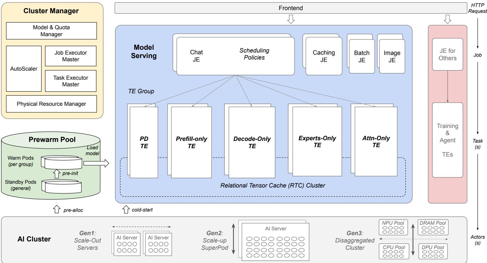  
Figure 1: DEEPSERVE Overall Architecture. (a) User requests are routed through the frontend and dispatched to the appropriate JEs. (b) Model serving includes various types of JEs, such as those for chat completion and batch inference. (c) Each modelserving JE independently runs distributed scheduling algorithms. (d) Model-serving TEs in an RTC group can exchange tensors using DistFlow APIs (see §4.4). (e) The cluster manager is a centralized, high-availability module. (f) We omit post-training and agent serving for brevity. (g) We plan to run three generations of the NPU cluster. We currently support Gen1 and Gen2.

• Challenge 1: AI workloads have varying durations, posing challenges for efficient resource sharing. For example, fine-tuning can take hours to days, while agent serving and LLM serving typically take seconds to minutes. The challenge lies in dynamically allocating shared resources among these workloads without underutilizing or overloading the system.

• Challenge 2: LLM serving is becoming more distributed and stateful. A single inference request may span multiple distributed instances [12, 33, 51] and use cached states [11, 14, 50], making it challenging to efficiently manage resource allocation, synchronization, and fault tolerance across the system.

• Challenge 3: LLM serving is highly variable, leading to fluctuating resource demands [10, 49]. This fluctuation introduces challenges in optimizing resource utilization and handling cold-start latencies.

To address these challenges, DEEPSERVE (Figure 1) integrates the following four key designs.

Serverless Abstraction. DEEPSERVE introduces a developer-facing serverless abstraction called the request-jobtask model. In this model, a request is an external trigger (e.g., a user-sent HTTP call). A job (or multiple jobs) matching the request type (e.g., chat, fine-tuning) handles the request. A task is a fine-grained operation within a job (e.g., prefill task, decode task). Users interact with DEEPSERVE by sending HTTP requests, each triggering one or more internal jobs. A job, in turn, may spawn multiple tasks. For example, a fine-tuning request triggers multiple jobs, such as preprocessing, training, and evaluation. A chat request triggers a single serving job. In the chat case, if executed on a PD-colocated engine [22], the job generates one task. If executed in a prefilldecode-disaggregated setup [33], the job generates two tasks: one for the prefill instance and the other for the decode instance. This abstraction allows DEEPSERVE to (i) scale AI workloads over shared infrastructure, (ii) consolidate posttraining and serving on the same cluster, and (iii) simplify distributed LLM serving.

More specifically, DEEPSERVE’s serverless abstraction consists of three core components: job executors, task executors, and a cluster manager. The Job Executor (JE) processes incoming requests, decomposes them into tasks, and assigns tasks to available task executors for execution. The task executor (TE) is responsible for executing the tasks. DEEPSERVE deploys JEs and TEs dedicated to post-training, agent serving, and model serving. The cluster manager is a highly available system that oversees and scales all JEs and TEs. It includes centralized master modules for both JEs and TEs, each monitoring their health. Due to space limits, this paper focuses on the model-serving aspect.

Efficient LLM Serving. We design FLOWSERVE (§4) as an efficient serving engine used by each model-serving TE. To minimize interference between the prefill and decode stages of LLMs, FLOWSERVE adopts a PD-disaggregated serving paradigm for both dense and sparse models [11, 51].

Scheduling. To support increasingly stateful and disaggregated serving, we propose distributed scheduling algorithms (§5) that run on model-serving JEs. Model-serving TEs running the same model and serving mode (e.g., prefill-only, decode-only) are organized into a TE group. JEs dispatch requests to appropriate TEs within these groups based on our scheduling algorithms.

Fast Scaling. DEEPSERVE uses fast scaling (§6) to quickly adjust to changing online workloads. Key techniques include reserving pre-warmed Pods and TEs, pre-loading models into DRAM, and using high-speed NPU-to-NPU links for faster model loading. These techniques greatly reduce code-start time and allow DEEPSERVE to scale up to 64 instances in parallel within seconds.

In the rest of the paper, we discuss serving in §4, scheduling in §5, and scaling in §6.

## 4 FLOWSERVE: An Efficient Serving Engine

This section presents FLOWSERVE, our in-house serving engine for LLMs, Large Multimodal Models (LMM), and embedding models.

## 4.1 Overview

We build FLOWSERVE with the following three main goals1. First, we want to create a high-throughput serving engine that works as a single TE. Second, we aim for fast iteration, given that serving is a fast-moving field. Third, we want FLOWSERVE to be Ascend-NPU-native, able to work with different generations of the Ascend cluster—from regular scaled-out servers to scaled-up SuperPod, and eventually fully disaggregated data centers [38].

To achieve these goals, we build FLOWSERVE based on three guiding principles:

• Microkernel-Inspired Design. We apply the core principles of microkernel architecture by decoupling servingengine functionalities into modular components. This modularity enables independent scaling, independent evolution, and asynchronous operations, thereby enhancing throughput.

• NPU-Centric Execution. We aim to keep NPUs busy all the time, reducing delays caused by waiting for other resources, such as CPU, DRAM, storage, and network.

• SPMD-based Design. We use the Single-Program-Multiple-Data (SPMD [5]) design to enable efficient parallel processing and scaling across multiple NPUs, a design shared by vLLM [22].

Figure 2 presents FLOWSERVE’s overall architecture. Each model-serving TE has a TE-shell and a FLOWSERVE engine. The TE-shell is an infrastructure module consisting of predefined modules such as scaling, health reporting, and a few customized modules that serve as context caching handlers.

The FLOWSERVE engine has six core functionalities: tokenization (with a tokenizer), model execution, scheduler, memory management, caching management, and networking management. The tokenizer is an independent module that can scale on its own. Adhering to the SPMD design principle, FLOWSERVE follows a master-executor architecture: the master oversees scheduling, caching, networking decisions, while per-NPU executors carry out these decisions on their respective NPUs. We map the remaining functionalities, excluding the tokenization, onto this master-executor design as follows:

• Scheduling and Model Execution (§4.2). The master scheduler assigns the next batch, and each executor runs the model’s forward pass on this batch. The master broadcasts requests to all executors when initiating a batch.

• Caching and Memory Management (§4.3). We build a Relational Tensor Cache (RTC) to unify the management of both caching and memory allocation. The master maintains indexing structures such as a prefix tree [50], while each executor handles memory allocation.

• Networking Management (§4.4). We build Distributed Flow (DistFlow) to transfer tensors between modelserving TEs. DistFlow runs on each executor, providing memory-transfer APIs for both the model generator and scheduler, supporting multiple transfer backends and Ascend cluster generations.

We implement FLOWSERVE primarily in Python, with RTC and DistFlow implemented in C++. Although having design principles is important, translating them into an efficient implementation is a significant challenge. Figure 3 shows the decoding performance of FLOWSERVE in three versions over a period of three months. From v1 to v2, we introduced asynchronous scheduling and IPC optimization, which resulted in more than 2x improvements when the TPOT SLO was set to 50ms. From v2 to v3, our optimizations focused on data structures, sampling, and so forth; these optimizations resulted in roughly 20% improvement.

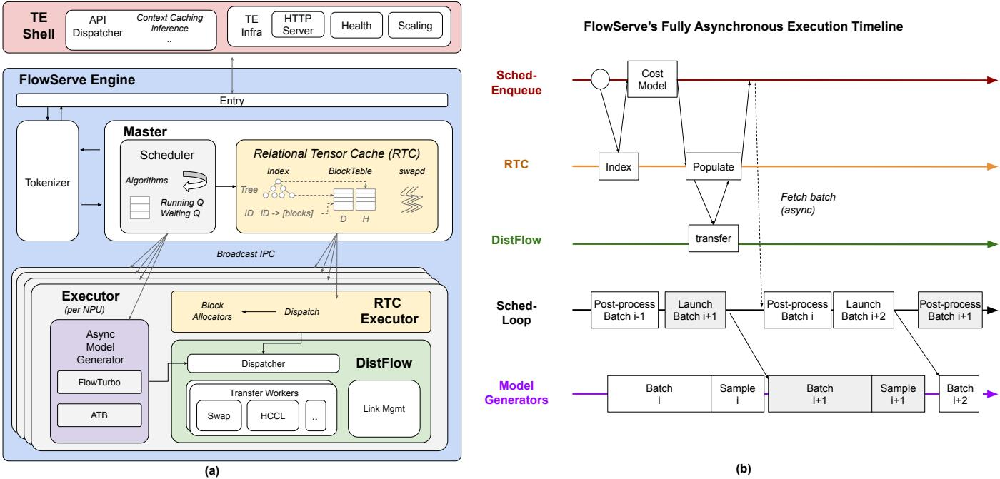  
Figure 2: FLOWSERVE Architecture and Asynchronous Execution Timeline. (a) The FLOWSERVE engine can be deployed without the TE-shell. (b) The FLOWSERVE’s model generator supports multiple backends. FlowTurbo is a torch-based dynamic graph. Ascend-Transformer-Boost (ATB) is a C++-based static graph [16].

## 4.2 Scheduling

The scheduler is centralized in the master module. We choose this approach over the distributed schedulers (used by SGLang [50]) due to its simplicity, albeit at the cost of frequent Inter-Process Communications (IPCs). The scheduler supports asynchronous KV cache prefetching enabled by RTC and DistFlow (described below) and asynchronous execution, a design shared by vLLM [22], SGLang [50], and NanoFlow [52]. We now describe the execution timeline in the right part of Figure 2.

Asynchronous KV Cache Prefetch. A sched-enqueue thread handles tokenized requests from the tokenizer with the following three steps. First, the thread calls the RTC match API to check for any preserved KV cache. The returned info tells whether a prompt prefix or ID has cached KV and the cached KV’s location (e.g., in the NPU or swapped to tiered storage). Second, if there is cached KV but a portion of it is not in the NPU, the scheduler runs a cost model to decide whether reusing the cache is beneficial. If the cost model suggests that reusing the cache can improve performance, the scheduler calls the populate API to request RTC to fetch the cache into the NPU. This step is done asynchronously. RTC will call DistFlow to read KV from tiered storage or other TEs. Once RTC completes the cache population, it notifies the sched-enqueue thread, which marks the request as ready. The sched-loop will pick it up during the next scheduling cycle.

Asynchronous Execution. The asynchronous execution design aligns with our NPU-centric principle of fully utilizing the NPU. It is similar to the new zero-overhead scheduler introduced in SGLang-v0.4.0 [50]. The key observation behind this design is that scheduling decisions do not depend on the actual token IDs generated by the model, but rather on the number of tokens to be processed in each run. In typical decoding scenarios, where one token is generated per sequence per decoding step, the scheduler can predict the required resources for the next run before the current one completes. Doing so allows the scheduler to operate in a separate thread, preparing the necessary inputs for the model generator beforehand. By running the scheduler in parallel with the model execution, we eliminate unnecessary CPU wait time, ensuring that the NPU remains busy.

Pipeline Parallelism (PP). We optimize our scheduler for PP by running a centralized scheduler at the first stage of PP; other stages accept only requests from previous stages. This design enables FLOWSERVE to manage all micro-batches in a unified way. This approach has two main benefits. (1) Memory resources are managed in one place, making it easy to preempt sequences across micro-batches. (2) With chunked prefill enabled, the scheduler distributes chunks across consecutive micro-batches, rather than sticking to just one micro-batch [1]. Doing so helps reduce Time-To-First-Token (TTFT) by at least 20%.

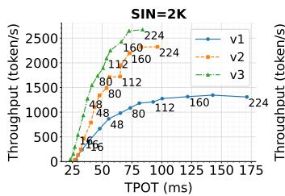

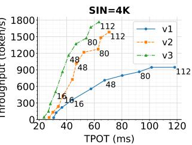  
Figure 3: FLOWSERVE Offline Serving Perf. We run a 34B model with TP=4. The left has a prefill length of 2K, and the right is 4K. We run 256 decoding steps and report the average TPOT and decoding throughput.

Table 1: The Core APIs of Relational Tensor Cache.
<table><tr><td rowspan=1 colspan=1>API</td><td rowspan=1 colspan=1>Description</td></tr><tr><td rowspan=1 colspan=1>MatchByPrefixToken</td><td rowspan=1 colspan=1>Find preserved KV cacheby tokens</td></tr><tr><td rowspan=1 colspan=1>MatchByID</td><td rowspan=1 colspan=1>Find preserved KV cache by ID</td></tr><tr><td rowspan=1 colspan=1>Populate</td><td rowspan=1 colspan=1>Fetch preserved KV cache into NPU</td></tr><tr><td rowspan=1 colspan=1>QueryPopulate</td><td rowspan=1 colspan=1>Check populate status</td></tr><tr><td rowspan=1 colspan=1>AllocBlocks</td><td rowspan=1 colspan=1>Alloc blocks for prefill</td></tr><tr><td rowspan=1 colspan=1>AppendBlock</td><td rowspan=1 colspan=1>Alloc block for decode</td></tr><tr><td rowspan=1 colspan=1>Copy</td><td rowspan=1 colspan=1>Copyblocks from NPU to DRAM</td></tr><tr><td rowspan=1 colspan=1>Free</td><td rowspan=1 colspan=1>Free blocks</td></tr></table>

## 4.3 Caching

We build a Relational Tensor Cache (RTC) to integrate prefix caching [50] and position-independent caching [14, 45] into FLOWSERVE. The core function of RTC is to manage the relationship between tensors, primarily the KV cache.

Abstraction. Table 1 lists the main APIs of RTC. RTC provides two main sets of APIs. The first set is for managing basic blocks, such as AllocBlocks and AppendBlock, which are used by prefill and decode requests, respectively. The second set is for managing KV caching. Notably, RTC includes various match APIs, each supporting different indexing mechanisms, such as prefix-token-based or explicit ID-based matching. FLOWSERVE’s implicit caching uses the prefix-token-based mechanism, while the explicit ID-based mechanism is used by DEEPSERVE’s explicit context caching endpoint. RTC also offers a novel populate API. When invoked, RTC fetches the specified KV cache in the given address range into local NPUs.

Design. RTC follows the master-executor architecture of FLOWSERVE. The master module manages the RTC module, making decisions about allocation and data movement, while each executor runs an RTC executor to perform these actions. Internally, RTC includes a traditional block table, originally proposed by vLLM [22], for managing data blocks. Additionally, RTC employs a hybrid indexing layer that combines radix-tree indexing [50] with ID-based indexing. In our current design, each index node can point to data stored either in the NPU or in local DRAM. We are also adapting RTC for SuperPod to leverage its global shared memory. Finally, the RTC master runs multiple background threads to handle tasks such as background swapping and prefetching.

## 4.4 Networking

Emerging distributed serving techniques—such as disaggregated prefill-and-decode [12, 33, 51] and disaggregated attention-and-experts [7, 32]—require new communication primitives that go beyond traditional collectives. DistFlow is designed to meet this demand. DistFlow specializes in peer-to-peer and many-to-many tensor transfers across heterogeneous memory. It supports transfers both within a single TE across tiered storage and between distributed TEs.

Abstraction. DistFlow provides a simple but expressive interface. Its control-plane APIs include LinkCluster for establishing peer groups, and its primary data-plane API is transfer(srcInfo, dstInfo). Users are required to specify exact source and destination memory buffers; DistFlow operates on raw memory addresses rather than higher-level block abstractions. In FLOWSERVE, this API is used by the centralized scheduler, each executor’s model generator, and the RTC executor.

Design. DistFlow follows key principles from highperformance RPC systems [19, 20, 29, 42]. It employs scalable threading models to avoid synchronization bottlenecks and supports multiple backends to adapt to heterogeneous network fabrics. In scaled-out Ascend clusters, DistFlow uses the Huawei Collective Communication Library (HCCL) peer-to-peer API as its transfer backend. In scaled-up Ascend SuperPods, where CPUs and NPUs share a unified memory space, it leverages NPU memory copy primitives for direct, high-bandwidth tensor transfers.

## 4.5 Disaggregated Serving

Serving is increasingly disaggregated. In DEEPSERVE, we define two levels of disaggregation:

• Task-level. This level refers to disaggregating prefill and decode into separate TEs. Our implementation is similar to previous work [12, 33, 51]: FLOWSERVE in the prefill TE sends prefilled KV cache to decoding TE either by-req or by-layer using DistFlow’s transfer API. Figure 4 shows an online serving test comparing PDdisaggregated and PD-colocated using an internal trace. Disaggregation greatly improves throughput under certain SLOs and lowers TPOT with the same throughput.

• Operator-level. This level refers to disaggregating attention and experts into separate TEs. We take inspiration from pioneering work in this space [7, 32]. We are actively working toward deploying it over SuperPod.

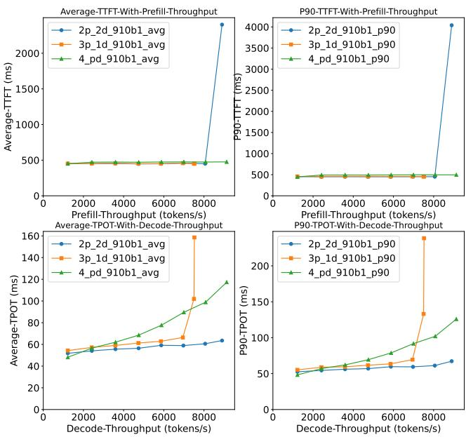  
Figure 4: FLOWSERVE Online Serving Perf. We run a 34B model with TP=4 using an internal trace (roughly 2K input with 200 output). We test three setups: (1) PD-disaggregated with two prefill and two decode, (2) PD-disaggregated with two prefill and one decode, and (3) four PD-colocated. We vary RPS from 0.2 to 1.2 in a step of 0.2.

## 4.6 Serving at SuperPod-Scale

This section outlines the key changes (to FLOWSERVE) that enable it to run at SuperPod scale. We begin by examining the workload shift that motivates these changes, followed by a description of the corresponding architectural changes.

From a workload perspective, large Mixture-of-Experts (MoE) models—such as DeepSeek-V3/R1 [25] and Pangu-Ultra-MoE [41]—are a natural fit for SuperPod-scale infrastructure. First, MoE models require efficient all-to-all communication before and after the expert modules, benefiting significantly from a large-scaled-up domain with high-bandwidth interconnects. Second, MoE experts achieve high compute efficiency at only large batch sizes. Enabling such batches necessitates data parallelism in the attention layers (DP Attention) instead of traditional tensor parallelism. Under DP Attention, colocating the prefill and decode stages leads to severe interference [12,25]. As a result, effective deployment requires disaggregating prefill and decode (PD disaggregation), which further depends on fast, low-latency interconnects. The CLOUDMATRIX384 SuperPod provides a significantly larger scaled-up domain with a global shared memory address space and enables low-latency, high-bandwidth data transfers between any CPU or NPU in the system, making it ideally suited for serving large-scale MoE models.

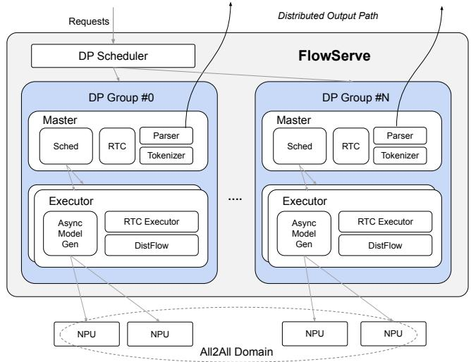  
Figure 5: Adapting FLOWSERVE for SuperPod. A single FLOWSERVE TE can manage up to tens of servers and hundreds of NPU chips.

Motivated by these requirements, we introduce two major architectural changes to scale FLOWSERVE to hundreds of NPU chips, as summarized in Figure 5. First, to avoid scheduling bottlenecks, we partition the system into multiple parallel DP groups. Each group includes a full set of components—its own scheduler, RTC, DistFlow, and executors. A centralized DP scheduler dispatches requests across DP groups using either a round-robin or greedy strategy. To eliminate bottlenecks on the return path, each DP group independently returns tokens to the frontends. Second, to support large-scale PD disaggregation, we extend DistFlow to support M:N connections. Specifically, we establish transfer channels between all prefill and decode DP groups.

## 5 Distributed Scheduling

This section discusses DEEPSERVE’s distributed LLM request scheduling policies.

## 5.1 Overview

In DEEPSERVE, distributed scheduling for LLM requests faces three new challenges. The first challenge involves locality and states. Before prefix caching was introduced into FLOWSERVE, distributed scheduling was straightforward, as all TEs could be treated as stateless, and scheduling was based solely on load. However, with the introduction of prefix caching, TEs have become stateful, and the goal is to schedule requests where KV cache reuse is possible, leading to the need for locality-aware scheduling. Achieving localityaware scheduling is non-trivial. Selecting the best TE for a given request requires balancing KV cache reuse while avoiding overloading the TE that holds the most cache. The second challenge comes from disaggregated serving. Distributed scheduling was easier before PD-disaggregation was added to FLOWSERVE because all TEs were the same. However, with PD disaggregation, choosing the best TE for a request becomes more complex, as it is unclear whether PDdisaggregated TEs or a PD-colocated TE will perform better. The last challenge arises from the coexistence of both prefix caching and disaggregation in DEEPSERVE, requiring any practical algorithm to consider both factors.

DEEPSERVE uses the following designs in response to these challenges: a locality-aware scheduling algorithm (§5.2), a PD-aware scheduling algorithm (§5.3), and a combined scheduling algorithm (§5.4) as listed in Algorithm 1.

## 5.2 Locality-aware Scheduling

In this section, we aim to answer one question:

Given a request and a set of TEs with associated KV cache   
residency information, how can we select the TE that max  
imizes KV cache reuse to efficiently serve the request?

To address this question, we implement a prompttree-based, locality-aware scheduling policy in the select\_tes\_prefix\_match function, as shown in Algorithm 1. Similar to Preble [39], SGLang [50], and MemServe [11], the distributed scheduler in JE maintains a global prompt tree for each type of TE, while each TE also maintains a local prompt tree that shares an index with its corresponding global tree. When a request arrives at the JE, it matches the prompt tokens against the global prompt trees and selects the TE that has the longest common prefix, indicating the largest preserved historical KV cache.

## 5.3 PD-aware Scheduling

In this section, we aim to answer one question:

Given a request and a set of TEs with both PDdisaggregated and PD-colocated instances, how can we select the most appropriate TE type that best aligns with the characteristics of the request?

We first study the performance comparison between PDdisaggregated and PD-colocated across various dimensions in a heatmap. We then discuss converting such a heatmap into a practical scheduling algorithm.

## 5.3.1 Study

We first run tests to compare PD-disaggregated and PDcolocated TEs (with chunked prefill). Figure 6 presents the results (see caption for detailed setup).

The heat map shows that PD-disaggregated and PDcolocated TEs divide the request space into distinct regions. We find three key observations. First, the PD-disaggregated setup performs better for requests with longer prompts and shorter decode. Additionally, as prefill length increases, its advantage becomes more pronounced for requests with longer decode lengths. Second, PD-disaggregated TEs provide a larger performance advantage over PD-colocated TEs (dark read) than the reverse (light blue), suggesting that a correct choice of PD-disaggregated TE leads to significant performance gains, while an incorrect choice results in minimal loss. Finally, the advantage of PD-disaggregated and PD-colocated TEs remains consistent across different RPS values.

## 5.3.2 Algorithm

The preceding study is conducted in a controlled environment, and applying it to a practical scheduling algorithm is challenging due to the dynamic nature of RPS and the uncertainty of decode length at the time of scheduling. There are multiple potential approaches to convert the study into an algorithm.

We propose a simple policy called select-tes-PD-heatmap, described in Algorithm 1. The policy works as follows. First, we combine the heat maps across all RPS values through element-wise addition. Given the stability of the heat map, over 80% of the squares consistently show either positive or negative values across all RPSs, while the remaining 20% are uncertain. Second, we predict the decode length for an incoming request using a predict model with 84.9% accuracy to balance prediction precision and overhead. For more details, please refer to the following discussion section. Third, we identify the corresponding square on the heat map based on the combined heat map, the prefill length, and the predicted decode length. If the value is positive, we select PD-disaggregated TEs; if negative, we select PD-colocated TEs.

We perform a microbenchmark study shown in Figure 7. We make three key observations. First, under certain RPS levels (e.g., 10 reqs/s), the PD-aware scheduling policy outperforms RR. Second, at low RPS levels, the performance of PDaware matches that of RR. The reason is that under low RPS, interference between prefill and decode operations within PD-colocated TEs remains negligible, and PD-disaggregated TEs do not offer significant advantages. Third, at very high RPS levels, PD-aware performs worse than RR. The reason is that PD-disaggregated TEs, with the same resources (e.g., two cards), are more prone to overloading. However, even when overloaded, PD-aware scheduling does not exhibit significant performance degradation compared to RR.

## 5.3.3 Discussion of the Predict Model

Accurately predicting decode lengths with minimal overhead remains a challenging research problem. We adopt the approach proposed in TetriServe [12], which employs a lightweight LLM-based classification model—referred to as the predict model—to classify decode lengths into fixed-size buckets, assuming execution by a specified target LLM.

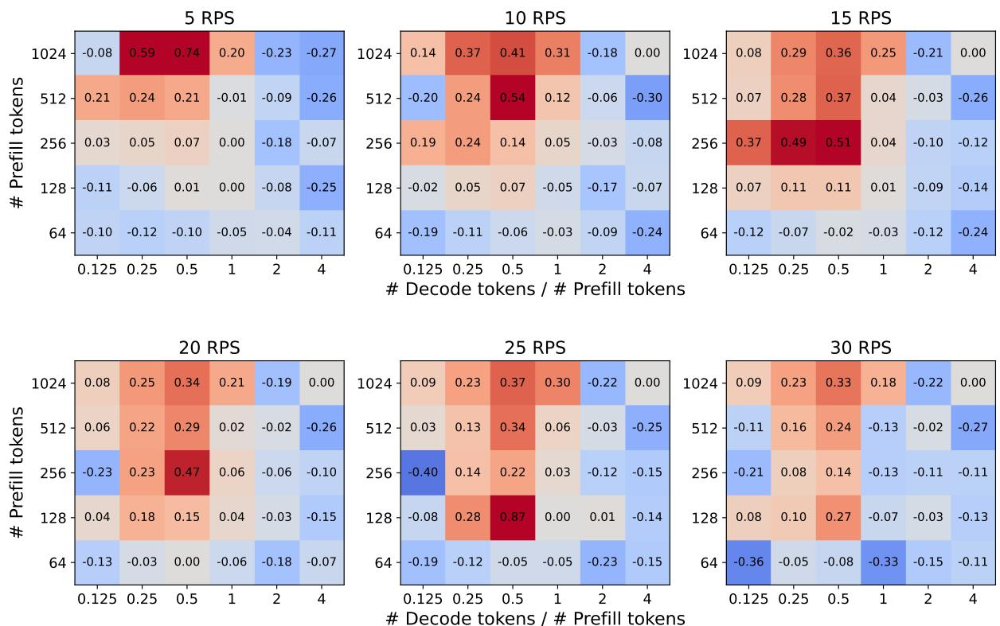  
Figure 6: Comparing the Performance of PD-disaggregated and PD-colocated (with chunked prefill) using Heatmap. The y-axis represents the prefill length, and the x-axis shows the ratio of decode length to prefill length. For each combination of prefill and decode lengths, we execute a batch of identical requests at a fixed RPS on both PD-disaggregated and PD-colocated TEs. The heatmap cells display the difference in JCT between the two setups, computed as the ratio of JCT for the PD-colocated TE to the PD-disaggregated TE, minus one. A positive value indicates better performance of the PD-disaggregated TE, while a negative value suggests that the PD-colocated TE is more efficient. This figure uses a 34B model with TP=4.

We predict length ranges rather than exact token counts for two reasons. First, inference parameters such as temperature and top-p [3] introduce substantial variability in outputs, making accurate prediction difficult. Second, our goal is to support scheduling decisions, for which approximate length ranges are sufficient (Figure 6).

The training process for the predict model consists of the following three steps. First, we construct a prompt-only training dataset using public sources, a target model (e.g., LLaMA 70B), and a predict model (e.g., OPT 125M [17]). Second, we query the target model with the prompts to generate responses, which we discretize into fixed-size length buckets to serve as ground truth. Third, we split the dataset into training and evaluation sets, and train the predict model accordingly.

In our experiments, we use a bucket granularity of 128 tokens and achieve 84.9% accuracy. Since our focus lies in using prediction to inform scheduling, we leave further accuracy improvements to future work.

## 5.4 Combined Algorithm

We propose a combined algorithm that integrates load-aware, locality-aware, and PD-aware scheduling. The scheduling algorithm, outlined in Algorithm 1, relies on three core function calls: locality\_aware, PD\_aware, and load\_aware. These functions progressively refine the TE group, narrowing it down from the entire set to a single TE based on the request’s characteristics and the underlying TEs.

The scheduling process proceeds as follows. First, a subgroup of TEs is selected by choosing a specific type, such as PD-colocated or PD-disaggregated TEs, based on the request’s length and the heatmap of the TE group (Section 5.3). Second, once a subgroup of TEs is identified, the selection is further refined. If the load is balanced across the remaining TEs, the algorithm prioritizes a TE with the most reusable KV cache, using tree-based prefix matching (Section 5.2). If the load is unbalanced, the algorithm instead prioritizes a TE with the least load to achieve better load distribution.

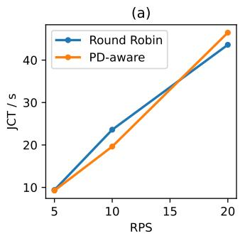

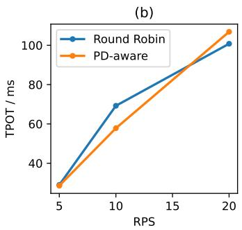  
Figure 7: Study of Distributed Scheduling Algorithm. We run a 34B model with TP=4, and report JCT / TPOT. We run an internal trace sampled from a code-generation service. The cluster consists of four servers with two PD-colocated TEs and a pair of PD-disaggregated TEs (1P1D).

## 6 Fast Scaling

In DEEPSERVE, the cluster manager’s AUTOSCALER determines when to scale TEs and JEs based on metrics such as load or SLO-violation rates. Fast scaling is critical but particularly challenging for LLM-serving TEs, as it requires loading large model weights onto NPUs. This section describes our optimizations for fast scaling.

Figure 8 shows the autoscaling workflow, which involves five steps, with challenges and solutions summarized in Table 2 and performance breakdown in Figure 9. First, in the Scaler-Pre step, DEEPSERVE prepares resources and pod environments for the new TEs. For large models, a TE may span multiple pods on multiple machines. Second, the TE-Pre-Load step initializes the FLOWSERVE instance but does not load the model onto the NPU. Third, the TE-Load step covers loading model weights onto the NPU. We decouple the second and third steps to allow for pre-warmed TEs, facilitating faster scaling (see §6.1). Fourth, the TE-Post-Load step involves engine warm-up and CPU/NPU block allocation. Open-source inference engines such as vLLM [22] rely on warm-up to profile the allocable HBM size for KV caches. We find this step unnecessary in production, because we can offline profile this data and store it in configurations. To address the slowdown of the first request after removing warm-up, we add a dummy message post-startup. Finally, in the Scaler-Post step, the new TEs are announced to the cluster, and JEs direct requests to them.

Algorithm 1: Distributed Scheduling Policy   
Input: A new request: req, a TE group: tes   
Output: A TE to forward the request to   
1 Function dist\_sched(req, tes):   
2 tes ← PD\_aware (req, tes);   
3 if tes.is\_load\_balanced () then   
4 tes ← locality\_aware (req, tes);   
5 else   
6 tes ← load\_aware (req, tes);   
7 return tes;   
8 Function PD\_aware(req, tes):   
9 p\_l ← req.get\_prefill\_length ();   
10 d\_l ← req.get\_decode\_length ();   
11 tes ← tes.select\_tes\_PD\_heatmap (p\_l, d\_l);   
12 return tes;   
13 Function locality\_aware(req, tes):   
14 tes ← tes.select\_tes\_prefix\_match (req);   
15 return tes;

## 6.1 Pre-warming Pods and TEs

DEEPSERVE maintains two levels of pre-warmed resources. First, at the pod level, DEEPSERVE reserves a small number of pre-warmed pods with basic environment setup. These workload-independent pods are usually managed by the infrastructure layer, such as Kubernetes, and can be shared across services to reduce overhead. Second, on these pre-warmed pods, DEEPSERVE maintains a small pool of pre-warmed TEs to minimize TE-Pre-Load time. The TE-Pre-Load step includes FLOWSERVE’s startup time, which involves loading Python libraries, initializing NPU states, and setting up HCCL cross-NPU interconnections. We optimize this step by approximately 35% for most models using techniques such as late importing and parallel initialization. However, as shown in Figure 9, this step still accounts for the majority of startup time. To further reduce the startup time, we move the initialization out of the critical path by incorporating a TE pre-warming mechanism.

Our TE pre-warming design is carried out in two stages. First, we make the pre-warmed TEs model-agnostic. For example, a TP-8 pre-warmed TE can be adapted to run either a Llama3-70B or a Qwen2-72B model. This stage requires carefully distinguishing between model-specific and modelagnostic parameters. Second, we make the pre-warmed TEs agnostic to parallelism strategies by recognizing that, regardless of TP/PP/SP configurations, all TEs follow a master-SPMD architecture. This stage allows independent pools of pre-warmed SPMD-masters and SPMD-executors, and these pools can be packed on demand.

Table 2: A Summary of DEEPSERVE’s End-to-End Scaling Steps, Challenges, and Solutions.
<table><tr><td rowspan=1 colspan=1>ID</td><td rowspan=1 colspan=1>Step</td><td rowspan=1 colspan=1>Definition</td><td rowspan=1 colspan=1>Major Issues</td><td rowspan=1 colspan=1>Our Solutions</td></tr><tr><td rowspan=1 colspan=1>1</td><td rowspan=1 colspan=1>Scaler-Pre</td><td rowspan=1 colspan=1>Creating pods to hold the TE.</td><td rowspan=1 colspan=1>1. Resource allocation is slow</td><td rowspan=1 colspan=1>1. Pre-warmed Pods</td></tr><tr><td rowspan=1 colspan=1>2</td><td rowspan=1 colspan=1>TE-Pre-Load</td><td rowspan=1 colspan=1>Launching the TE w/o model loading</td><td rowspan=1 colspan=1>1. Python startup is slow2. NPU init is slow</td><td rowspan=1 colspan=1>1. Pre-warmed TEs</td></tr><tr><td rowspan=1 colspan=1>3</td><td rowspan=1 colspan=1>TE-Load</td><td rowspan=1 colspan=1>Loading the model onto the NPU</td><td rowspan=1 colspan=1>1. Model weight is large</td><td rowspan=1 colspan=1>1. DRAM pre-loading2. NPU-fork</td></tr><tr><td rowspan=1 colspan=1>4</td><td rowspan=1 colspan=1>TE-Post-Load</td><td rowspan=1 colspan=1>Preparing TE to serve requests</td><td rowspan=1 colspan=1>1. Engine warmup is slow2. Block alloc is slow</td><td rowspan=1 colspan=1>1. Offline profiling2. Async allocation 3. Dummy req warmup</td></tr><tr><td rowspan=1 colspan=1>5</td><td rowspan=1 colspan=1>Scaler-Post</td><td rowspan=1 colspan=1>From TE ready to serve first request</td><td rowspan=1 colspan=1>1. The update of the global TElist is slow</td><td rowspan=1 colspan=1>1. Proactive pushing</td></tr></table>

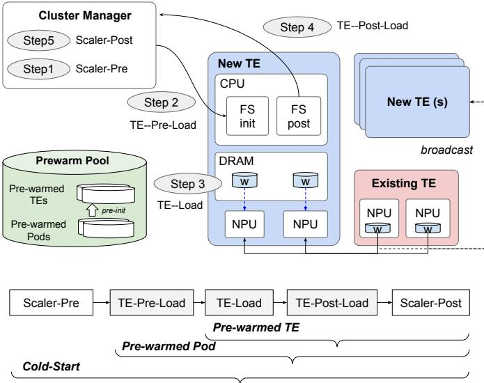  
Figure 8: DEEPSERVE’s Scaling Design. (a) We show TE-Load’s two cases: loading from local DRAM (DRAM-hit) and loading from another TE’s NPU (NPU-fork). NPU-fork can be either via scale-up or scale-out network link. (c) The bottom shows the timeline for three scaling cases.

## 6.2 Optimizing Model Loading

DEEPSERVE has two model-loading paths: local loading via PCIe from local DRAM or SSD, and NPU-fork using highspeed NPU-to-NPU links from a running TE. While NPUfork is generally faster, it has higher hardware requirements and cannot be used during code start (scaling from 0 TE).

Local loading with pre-warming. We use the safetensors format [36] for model storage. Compared to the native binary format, safetensors reduce serialization costs by storing tensors in contiguous blocks that can be directly mapped into memory and trigger data reads only on page faults. Safetensors also simplify pre-loading into the page cache, reducing read amplification. Instead of loading the entire model file, each TP process loads only the required partition on demand.

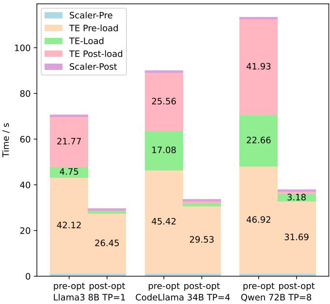  
Figure 9: Scaling E2E Breakdown. We present the scaling latency both before and after optimizations. Even after optimization, the TE-Pre-load step still remains the dominant factor in scaling time, although this latency can be further reduced through pre-warming (§6.1).

To further optimize TE-load performance, we co-design it with our TE pre-warming mechanism. The cluster manager predicts models that are likely to scale and pre-loads them into DRAM page cache using pre-warmed TEs. When scaling is triggered, the master prioritizes selecting pre-warmed TEs with the required model already loaded. On our hardware, each machine has 1.5TB of DRAM, sufficient for pre-loading 10 70B models or 100 7B models.

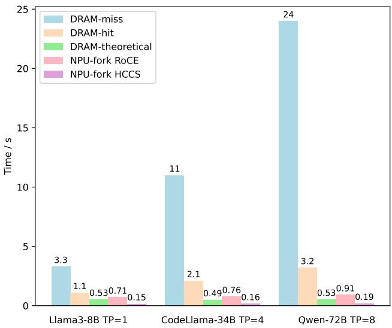  
Figure 10: TE-Load Study. DRAM-hit means loading from pre-loaded weights in DRAM; DRAM-miss means pre-load miss, thus loading from SSD; DRAM-theoretical is calculated by model weights dividing PCIe bandwidth. NPU-fork has two different links—HCCS and RoCE (see the main text for the differences).

Figure 10 shows TE-load’s performance under different cases (NPU-fork, DRAM-hit, and DRAM-miss). DRAM-hit occurs when the cluster manager correctly predicts the models to scale, while DRAM-miss reflects the opposite scenario. We also compute the theoretical model-loading time by dividing the model weights by the PCIe bandwidth. For DRAM-hit, the difference between measured and theoretical time arises from two factors: PyTorch-model tensor initialization (about 0.3s) and PCIe-bandwidth contention. The latter becomes more significant with larger TP ranks due to shared PCIe links. For the three models in Figure 10, the weights loaded by each NPU are roughly the same, but local loading time increases with larger TP ranks due to PCIe-link sharing among NPUs.

NPU-fork. NPU clusters typically feature high-speed NPUto-NPU links designed for distributed training. In §4.3, we demonstrate how these links are used for efficient inference. We further exploit them in our NPU-fork technique to transfer model weights during fast scaling. When NPU-fork is triggered, the master notifies a running FLOWSERVE TE to connect to a pre-warmed TE, with model weights transferred using the DistFlow module (§4.4).

Figure 10 shows the performance of NPU-fork. On our Ascend hardware, there are two types of links: HCCS (higher bandwidth, smaller scale) and RoCE (lower bandwidth, scalable to thousands of nodes). All evaluations are conducted on cross-node setups. Overall, loading with HCCS is significantly faster than with RoCE, indicating that NPU-fork will benefit from the SuperPod architecture. The model-loading time is similar across the three models, as the weights to be loaded per NPU are roughly the same. NPU-fork experiences less bandwidth contention compared to local loading, as NPU-fork uses different physical links.

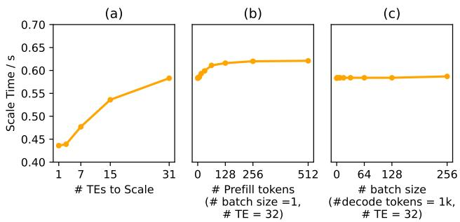  
Figure 11: Scalability and Sensitivity Study of NPU-fork. We run NPU-fork over a scaled-up network (HCCS) using Llama3-8B-TP1. (a) Scaling multiple TEs in parallel from one running TE. (b) Time for scaling to 32 TEs when the source TE is prefilling sequences of different lengths. (c) Scaling time when the source TE is decoding different batches of sequences, each with a length of 1k tokens.

Figure 11 illustrates potential degradation when multiple expansions (up to 32) occur concurrently or when prefilling and decoding overlap the expansions. NPU-fork can scale to a large number of TEs by transmitting model weights simultaneously to multiple TEs using the broadcast API in the HCCL collective communication library. We also measure resource-contention sensitivity when the source TE handles prefill and decode requests. Since the NPU has dedicated AICPUs for data transfer, contention is limited.

## 7 Discussion

We now discuss the broader applicability of DEEPSERVE across hardware platforms and workloads.

NPU-agnostic vs. NPU-specific features. Although DEEPSERVE is built on Ascend NPU chips at Huawei Cloud, its high-level architecture and core design are largely hardware-agnostic. For example, the “NPU-fork” mechanism used for auto-scaling leverages Ascend’s HCCS interconnect for rapid scaling. However, similar techniques can be applied to other hardware platforms with fast inter-chip links, such as NVIDIA GPUs with NVLink. Most NPU-specific features involve low-level computation and networking primitives. For instance, in the CloudMatrix384 SuperPod, memory across all NPUs is accessible, allowing data transfers between any two memory locations—a capability not available in regular scaled-out AI servers.

Generalization to non-LLMs. While the paper primarily focuses on LLMs, most components generalize to other model types, such as embedding models and multimodalunderstanding models. In fact, all these models run within the FLOWSERVE engine similar to vLLM.

Fault-Recovery Mechanism. In the event of a TE or JE failure, DEEPSERVE reboots the affected component and redirects requests to redundant counterparts. The reboot process ensures recovery within 5 minutes. RTC maintains soft states, which can be recomputed if lost and are append-only. Therefore, we do not implement complex consistency protocols to avoid unnecessary performance overhead for RTC. However, in production, we have not observed a significant impact on service quality, primarily due to (1) system-level redundancy and (2) the SuperPod architecture, which ensures fast and uniform NPU-to-NPU communication regardless of physical location, enabling seamless substitution of failed NPUs.

## 8 Related Work

In this section, we review related work in four key areas: serverless infrastructure, serving engines, scheduling, and scaling for large language model (LLM) workloads.

Serverless Infrastructure. Extensive research has focused on optimizing LLM serving in serverless architectures [2, 8, 23, 35, 44, 47, 48]. Industry solutions, such as AWS SageMaker and Azure ML [28], deliver cloud-native solutions optimized for deploying, managing, and scaling model inference, tailored specifically to meet enterprise needs. Recent open-source systems, including KServe [21], AIBrix [6], NVIDIA Dynamo [30], and LeaderWorkerSet (LWS) [26], offer practical implementations with varying degrees of support for cloud deployment, auto-scaling, multi-model, multi-node execution, and so forth. DEEPSERVE offers similar functionality but differs in two key aspects. First, while existing systems primarily target GPU clusters, DEEPSERVE is designed for NPU-based clusters. Second, to the best of our knowledge, DEEPSERVE is the first publicly described platform that introduces request-job-task abstraction, integrating diverse AI workloads from post-training to serving.

Serving. Serving is a rapidly evolving field, with many open-source engines such as FLOWSERVE emerging. vLLM [22] pioneers PagedAttention for higher throughput. SGLang [50] uses RadixAttention for reusing cache. LightLLM [13] adopts asynchronous execution for improved throughput. We believe that all serving engines will eventually adopt similar architectures to optimize AI chip efficiency, with differences mainly in hardware support, features, and programming languages. Networking-wise, the Mooncake Transfer Engine (MTE) [34] is closest to FLOWSERVE’s Dist-Flow. Both systems support multiple backends and efficient threading models, following seminal lines of work [19,20,42]. The key difference lies in backend implementation: MTE uses RDMA by default, while FLOWSERVE uses HCCL’s peer-topeer APIs on regular scaled-out servers and memory-copy primitives on the CLOUDMATRIX384 SuperPod.

Scheduling. Efficient scheduling is critical for improving the performance of serving systems [1, 9, 11, 22, 33, 34, 43, 46, 50, 51]. For example, at the local layer, Orca [46] proposes iterative-level scheduling to reduce bubbles. Sarathi [1] proposes chunked-prefill to overcome suboptimal prefill processing. FastServe [43] utilizes a multi-level priority feedback queue to minimize JCT. At the global layer, MuxServe [9] formulates a multiplexing problem and proposes a placement algorithm and adaptive batch scheduling strategy to identify optimal colocations in LLM serving. MemServe [11] prioritizes locality by directing requests to instances with the highest cache-hit rate. Our work introduces a novel PD-aware scheduling policy to determine whether a request should be processed by PD-disaggregated or PD-colocated TEs. Additionally, our approach integrates PD awareness with localityand load-aware scheduling, providing a comprehensive solution for optimizing resource utilization and throughput across heterogeneous TE configurations.

Scaling Optimizations. Scaling serving instances dynamically is a major challenge, mainly because these instances are large and continue growing as modern LLMs’ size increases. Recent work on model autoscaling [4, 18, 27, 49] has focused on improving resource use and reducing scaling delays. For example, SpotServe [27] and Llumnix [40] speed up scaling by making task migration between instances cheaper. BlitzScale [49] improves throughput when loading parameters, reduces delays in handling burst requests, and improves the overall service. Our NPU-fork mechanism is similar to BlitzScale [49] but differs in the underlying network fabrics.

## 9 Conclusion

We have presented DEEPSERVE, a serverless AI platform developed at Huawei Cloud. We have described its serverless abstraction and infrastructure, which enables efficient management of AI workloads. We have also outlined the architecture of FLOWSERVE, our in-house serving engine, detailing its design principles and core components. Additionally, we have explored distributed scheduling policies across a heterogeneous pool of serving instances. Finally, we have provided an end-to-end analysis of fast scaling, highlighting the techniques that allow DEEPSERVE to quickly adjust to fluctuating workloads.

## Acknowledgment

This work was partially supported by National Natural Science Foundation of China under Grant No. 92464301. We would also like to thank our shepherd Yue Cheng and other anonymous reviewers for their insightful comments and suggestions, which greatly help improve the quality of this paper.

## References

[1] Amey Agrawal, Ashish Panwar, Jayashree Mohan, Nipun Kwatra, Bhargav S Gulavani, and Ramachandran Ramjee. SARATHI: Efficient LLM inference by piggybacking decodes with chunked prefills. CoRR, 2023.

[2] Ahsan Ali, Riccardo Pinciroli, Feng Yan, and Evgenia Smirni. Batch: machine learning inference serving on serverless platforms with adaptive batching. In Proceedings of the International Conference for High Performance Computing, Networking, Storage and Analysis, pages 1–15, 2020.

[3] AWS Bedrock. AWS Bedrock. https://docs.aws.amazon.com/bedrock/latest /userguide/inference-parameters.html.

[4] Zhihao Bai, Zhen Zhang, Yibo Zhu, and Xin Jin. PipeSwitch: Fast pipelined context switching for deep learning applications. In Proceedings of the 14th USENIX Symposium on Operating Systems Design and Implementation, pages 499–514, 2020.

[5] Paul Barham, Aakanksha Chowdhery, Jeff Dean, Sanjay Ghemawat, Steven Hand, Daniel Hurt, Michael Isard, Hyeontaek Lim, Ruoming Pang, Sudip Roy, Brennan Saeta, Parker Schuh, Ryan Sepassi, Laurent Shafey, Chandu Thekkath, and Yonghui Wu. Pathways: Asynchronous distributed dataflow for ML. In Proceedings of the Machine Learning and Systems, pages 430–449, 2022.

[6] ByteDance. AIBrix. https://github.com/vllm-project/aibrix.

[7] Shaoyuan Chen, Yutong Lin, Mingxing Zhang, and Yongwei Wu. Efficient and economic large language model inference with attention offloading. CoRR, 2024.

[8] Seungbeom Choi, Sunho Lee, Yeonjae Kim, Jongse Park, Youngjin Kwon, and Jaehyuk Huh. Serving heterogeneous machine learning models on multi-GPU servers with spatio-temporal sharing. In Proceedings of the 2022 USENIX Annual Technical Conference, pages 199–216, 2022.

[9] Jiangfei Duan, Runyu Lu, Haojie Duanmu, Xiuhong Li, Xingcheng Zhang, Dahua Lin, Ion Stoica, and Hao Zhang. MuxServe: Flexible spatial-temporal multiplexing for multiple LLM serving. In Proceedings of the 41st International Conference on Machine Learning, pages 11905–11917, 2024.

[10] Yao Fu, Leyang Xue, Yeqi Huang, Andrei-Octavian Brabete, Dmitrii Ustiugov, Yuvraj Patel, and Luo Mai. ServerlessLLM: Low-latency serverless inference for large language models. In Proceedings of the 18th

USENIX Symposium on Operating Systems Design and Implementation, pages 135–153, 2024.

[11] Cunchen Hu, Heyang Huang, Junhao Hu, Jiang Xu, Xusheng Chen, Tao Xie, Chenxi Wang, Sa Wang, Yungang Bao, Ninghui Sun, et al. Memserve: Context caching for disaggregated LLM serving with elastic memory pool. CoRR, 2024.

[12] Cunchen Hu, Heyang Huang, Liangliang Xu, Xusheng Chen, Jiang Xu, Shuang Chen, Hao Feng, Chenxi Wang, Sa Wang, Yungang Bao, et al. Inference without interference: Disaggregate LLM inference for mixed downstream workloads. CoRR, 2024.

[13] Jiawei Hu, Hong Jia, Mahbub Hassan, Lina Yao, Brano Kusy, and Wen Hu. LightLLM: A versatile large language model for predictive light sensing. In Proceedings of the 23rd ACM Conference on Embedded Networked Sensor Systems, pages 158–171, 2025.

[14] Junhao Hu, Wenrui Huang, Haoyi Wang, Weidong Wang, Tiancheng Hu, Qin Zhang, Hao Feng, Xusheng Chen, Yizhou Shan, and Tao Xie. EPIC: efficient position-independent caching for serving large language models. In Proceedings of the 42nd International Conference on Machine Learning, 2025.

[15] Junhao Hu, Wenrui Huang, Weidong Wang, Zhenwen Li, Tiancheng Hu, Zhixia Liu, Xusheng Chen, Tao Xie, and Yizhou Shan. RaaS: Reasoning-aware attention sparsity for efficient llm reasoning. In Proceedings of the 63rd Annual Meeting of the Association for Computational Linguistics, 2024.

[16] Huawei. Mindie atb models. https://www.hiascend.com/document/detail/z h/mindie/10RC2/mindiellm/llmdev/mindie\_ll m0004.html, 2025. Accessed: 2025-01-14.

[17] HugginFace. HugginFace. https://huggingface.co/docs/transformers/m odel\_doc/opt#transformers.OPTForSequenceCl assification.

[18] Jinwoo Jeong, Seungsu Baek, and Jeongseob Ahn. Fast and efficient model serving using multi-GPUs with direct-host-access. In Proceedings of the 18th European Conference on Computer Systems, pages 249–265, 2023.

[19] Anuj Kalia, Michael Kaminsky, and David G. Andersen. FaSST: Fast, scalable and simple distributed transactions with two-sided (RDMA) datagram RPCs. In Proceedings of the 12th USENIX Symposium on Operating Systems Design and Implementation, pages 185–201, 2016.

[20] Anuj Kalia, Michael Kaminsky, and David G. Andersen. Datacenter RPCs can be general and fast. In Proceedings of the 16th USENIX Symposium on Networked Systems Design and Implementation, pages 1–16, 2019.

[21] KServe. KServe. https://github.com/kserve/kserve.

[22] Woosuk Kwon, Zhuohan Li, Siyuan Zhuang, Ying Sheng, Lianmin Zheng, Cody Hao Yu, Joseph Gonzalez, Hao Zhang, and Ion Stoica. Efficient memory management for large language model serving with PagedAttention. In Proceedings of the 29th Symposium on Operating Systems Principles, pages 611–626, 2023.

[23] Jie Li, Laiping Zhao, Yanan Yang, Kunlin Zhan, and Keqiu Li. Tetris: Memory-efficient serverless inference through tensor sharing. In Proceedings of the 2022 USENIX Annual Technical Conference, pages 572–488, 2022.

[24] Heng Liao, Jiajin Tu, Jing Xia, and Xiping Zhou. DaVinci: A scalable architecture for neural network computing. In Proceedings of the 2019 IEEE Hot Chips Symposium, pages 1–44, 2019.

[25] Aixin Liu, Bei Feng, Bing Xue, Bingxuan Wang, Bochao Wu, Chengda Lu, Chenggang Zhao, Chengqi Deng, Chenyu Zhang, Chong Ruan, et al. DeepSeek-v3 technical report. CoRR, 2024.

[26] LWS. LWS. https://github.com/kubernetes-sigs/lws.

[27] Xupeng Miao, Chunan Shi, Jiangfei Duan, Xiaoli Xi, Dahua Lin, Bin Cui, and Zhihao Jia. SpotServe: Serving generative large language models on preemptible instances. In Proceedings of the 29th ACM International Conference on Architectural Support for Programming Languages and Operating Systems, pages 1112–1127, 2024.

[28] MinIO. MinIO. https://min.io.

[29] Sumit Kumar Monga, Sanidhya Kashyap, and Changwoo Min. Birds of a feather flock together: Scaling RDMA RPCs with flock. In Proceedings of the ACM SIGOPS 28th Symposium on Operating Systems Principles, pages 212–227, 2021.

[30] NVIDIA. Dynamo. https://github.com/ai-dynamo/dynamo.

[31] OpenAI. Openai, 2025. Accessed: 2025-01-14.

[32] Xiurui Pan, Endian Li, Qiao Li, Shengwen Liang, Yizhou Shan, Ke Zhou, Yingwei Luo, Xiaolin Wang, and Jie Zhang. Instinfer: In-storage attention offloading for cost-effective long-context llm inference. CoRR, 2024.

[33] Pratyush Patel, Esha Choukse, Chaojie Zhang, Aashaka Shah, Íñigo Goiri, Saeed Maleki, and Ricardo Bianchini. Splitwise: Efficient generative LLM inference using phase splitting. In Proceedings of the 51st ACM/IEEE Annual International Symposium on Computer Architecture, pages 118–132, 2024.

[34] Ruoyu Qin, Zheming Li, Weiran He, Jialei Cui, Feng Ren, Mingxing Zhang, Yongwei Wu, Weimin Zheng, and Xinran Xu. Mooncake: Trading more storage for less computation - A KVCache-centric architecture for serving LLM chatbot. In Proceedings of the 23rd USENIX Conference on File and Storage Technologies, pages 155–170, 2025.

[35] Francisco Romero, Qian Li, Neeraja J. Yadwadkar, and Christos Kozyrakis. INFaaS: Automated model-less inference serving. In Proceedings of the 2021 USENIX Annual Technical Conference, pages 397–411, 2021.

[36] The safetensors contributors. Safetensors: A safe and efficient format for tensor serialization, 2023. Accessed: 2025-01-14.

[37] SemiAnalysis. Huawei AI CloudMatrix384. https://semianalysis.com/2025/04/16/huawei -ai-cloudmatrix-384-chinas-answer-to-nvidi a-gb200-nvl72/.

[38] Yizhou Shan, Will Lin, Zhiyuan Guo, and Yiying Zhang. Towards a fully disaggregated and programmable data center. In Proceedings of the 13th ACM SIGOPS Asia-Pacific Workshop on Systems, 2022.

[39] Vikranth Srivatsa, Zijian He, Reyna Abhyankar, Dongming Li, and Yiying Zhang. Preble: Efficient distributed prompt scheduling for LLM serving. In Proceedings of the 13th International Conference on Learning Representations, 2025.

[40] Biao Sun, Ziming Huang, Hanyu Zhao, Wencong Xiao, Xinyi Zhang, Yong Li, and Wei Lin. Llumnix: Dynamic scheduling for large language model serving. In Proceedings of the 18th USENIX Symposium on Operating Systems Design and Implementation, pages 173–191, 2024.

[41] Yehui Tang, Yichun Yin, Yaoyuan Wang, Hang Zhou, Yu Pan, Wei Guo, Ziyang Zhang, Miao Rang, Fangcheng Liu, Naifu Zhang, Binghan Li, Yonghan Dong, Xiaojun Meng, Yasheng Wang, Dong Li, Yin Li, Dandan Tu, Can Chen, Youliang Yan, Fisher Yu, Ruiming Tang, Yunhe Wang, Botian Huang, Bo Wang, Boxiao Liu, Changzheng Zhang, Da Kuang, Fei Liu, Gang Huang, Jiansheng Wei, Jiarui Qin, Jie Ran, Jinpeng Li, Jun Zhao, Liang Dai, Lin Li, Liqun Deng, Peifeng Qin, Pengyuan Zeng, Qiang Gu, Shaohua Tang, Shengjun Cheng, Tao Gao, Tao Yu, Tianshu Li, Tianyu Bi, Wei He, Weikai Mao, Wenyong Huang, Wulong Liu, Xiabing Li, Xianzhi Yu, Xueyu Wu, Xu He, Yangkai Du, Yan Xu, Ye Tian, Yimeng Wu, Yongbing Huang, Yong Tian, Yong Zhu, Yue Li, Yufei Wang, Yuhang Gai, Yujun Li, Yu Luo, Yunsheng Ni, Yusen Sun, Zelin Chen, Zhe Liu, Zhicheng Liu, Zhipeng Tu, Zilin Ding, and Zongyuan Zhan. Pangu ultra MoE: How to train your big MoE on Ascend NPUs. CoRR, 2025.

[42] Shin-Yeh Tsai and Yiying Zhang. LITE kernel RDMA support for datacenter applications. In Proceedings of the 26th Symposium on Operating Systems Principles, pages 306–324, 2017.

[43] Bingyang Wu, Yinmin Zhong, Zili Zhang, Gang Huang, Xuanzhe Liu, and Xin Jin. Fast distributed inference serving for large language models. CoRR, 2023.

[44] Yanan Yang, Laiping Zhao, Yiming Li, Huanyu Zhang, Jie Li, Mingyang Zhao, Xingzhen Chen, and Keqiu Li. INFless: a native serverless system for low-latency, highthroughput inference. In Proceedings of the 27th ACM International Conference on Architectural Support for Programming Languages and Operating Systems, pages 768–781, 2022.

[45] Jiayi Yao, Hanchen Li, Yuhan Liu, Siddhant Ray, Yihua Cheng, Qizheng Zhang, Kuntai Du, Shan Lu, and Junchen Jiang. CacheBlend: Fast large language model serving for RAG with cached knowledge fusion. In Proceedings of the 20th European Conference on Computer Systems, pages 94–109, 2025.

[46] Gyeong-In Yu, Joo Seong Jeong, Geon-Woo Kim, Soojeong Kim, and Byung-Gon Chun. Orca: A distributed serving system for transformer-based generative models. In Proceedings of the 16th USENIX Symposium on Operating Systems Design and Implementation, pages 521–538, 2022.

[47] Minchen Yu, Zhifeng Jiang, Hok Chun Ng, Wei Wang, Ruichuan Chen, and Bo Li. Gillis: Serving large neural networks in serverless functions with automatic model partitioning. In Proceedings of the 41st IEEE International Conference on Distributed Computing Systems, pages 138–148, 2021.

[48] Chengliang Zhang, Minchen Yu, Wei Wang, and Feng Yan. MArk: Exploiting cloud services for cost-effective, SLO-aware machine learning inference serving. In Proceedings of the 2019 USENIX Annual Technical Conference, pages 1049–1062, 2019.

[49] Dingyan Zhang, Haotian Wang, Yang Liu, Xingda Wei, Yizhou Shan, Rong Chen, and Haibo Chen. Fast and live model auto scaling with O(1) host caching. CoRR, 2024.

[50] Lianmin Zheng, Liangsheng Yin, Zhiqiang Xie, Jeff Huang, Chuyue Sun, Cody\_Hao Yu, Shiyi Cao, Christos Kozyrakis, Ion Stoica, Joseph E Gonzalez, et al. Efficiently programming large language models using SGLang. CoRR, 2023.

[51] Yinmin Zhong, Shengyu Liu, Junda Chen, Jianbo Hu, Yibo Zhu, Xuanzhe Liu, Xin Jin, and Hao Zhang. Dist-Serve: Disaggregating prefill and decoding for goodputoptimized large language model serving. In Proceedings of the 18th USENIX Symposium on Operating Systems Design and Implementation, pages 193–210, 2024.

[52] Kan Zhu, Yilong Zhao, Liangyu Zhao, Gefei Zuo, Yile Gu, Dedong Xie, Yufei Gao, Qinyu Xu, Tian Tang, Zihao Ye, et al. Nanoflow: Towards optimal large language model serving throughput. CoRR, 2024.