①

USENIX

THE ADVANCED COMPUTING SYSTEMS ASSOCIATION

# STORM: a Multipath QUIC Scheduler for Quick Streaming Media Transport under Unstable Mobile Networks

Liekun Hu and Changlong Li, East China Normal University, Jianghuai Advance Technology Center, and MoE Engineering Research Center of Hardware/Software Co-Design Technology and Application

https://www.usenix.org/conference/atc25/presentation/hu-liekun

# This paper is included in the Proceedings of the 2025 USENIX Annual Technical Conference.

July 7–9, 2025 • Boston, MA, USA ISBN 978-1-939133-48-9

Open access to the Proceedings of the 2025 USENIX Annual Technical Conference is sponsored by

P=-r.h mEesL

auuuJl9 PgleU

King Abdullah University of

Science and Technology

# STORM: a Multipath QUIC Scheduler for Quick Streaming Media Transport under Unstable Mobile Networks

Liekun Hu1 and Changlong Li1,2,3∗

1School of Computer Science and Technology, East China Normal University

2Jianghuai Advance Technology Center, Hefei 230026, China

3MoE Engineering Research Center of Hardware/Software Co-Design Technology and Application

## Abstract

The rapid proliferation of streaming media applications has driven the need for multipath transport on mobile devices. While multipath techniques successfully improve throughput by exploiting multiple network interfaces, our study reveals that path instability leads to excessive end-to-end latency. This paper analyzes the data path of multipath networks and observes that the high latency is always caused by the “last mile” wireless link, instead of the core network. Additionally, unlike traditional scenarios, both reliable and unreliable data are transmitted across these paths. However, existing multipath schedulers did not fully account for the reliability characteristics in the design. To address this gap, this paper proposes STORM, a novel multipath scheduler that aims to ensure low latency under unstable mobile networks. We integrate STORM with the mobile device’s wireless modules (e.g., WiFi and 5G). STORM differentiates between reliable and unreliable traffic. This approach prevents retransmissions from hindering critical data flows. Our evaluation on real devices shows that STORM reduces tail packet delay by 98.2% and improves the frame rate of streaming media by 1.95x under unstable networks, compared to the state-of-the-art.

## 1 Introduction

Recent years have witnessed the popular trend of streamingmedia-based applications, such as real-time footage of unmanned aerial vehicles (UAVs) [45], 360° panoramic videos of virtual/mixed reality (VR/MR) headsets [30], ultra-high definition (UHD) videos [4], and cloud gaming [44]. With their increased demand for high-quality content, multipath transport is increasingly important for mobile devices. By making use of multiple network interfaces (e.g., WiFi, cellular network, and satellite communication) on mobile devices, the throughput of streaming-media transport can be enhanced as the data is split over various sub-flows and transmitted in parallel.

TCP-based multipath transport (MPTCP [31]) is the most famous protocol, establishing a subflow over each TCP path. MPTCP is naturally unsuitable for streaming media data transmission for its strict reliability and retransmission mechanism [29]. Differently, QUIC supports unreliable transport as it is developed based on UDP, which is more friendly for transmitting streaming media data. Hence, the industry has been moving toward QUIC in many emerging scenarios, and as its extension, multipath QUIC (abbreviated as MPQUIC) has been widely studied recently [21, 22, 26, 49, 51].

However, most bandwidth-hungry applications are also latency-sensitive. For example, the latency of VR visuals should be less than 130 ms, or people may feel dizzy during usage [27]. Even though MPQUIC enhances throughput, this paper shows that the end-to-end latency is unexpectedly high if the signal of one path becomes unstable. Our evaluations in a moving vehicle illustrate that the tail latency is up to 4.59s when enabling MPQUIC, which is 6.38x higher than the original system, even though the average throughput is effectively enhanced. Unfortunately, with the increasing mobility, such as high-speed railways [25], vehicles [16, 26], and the Electric Vertical Takeoff and Landing (eVTOL [1]) in the near future, the instability of wireless networks is an increasingly common phenomenon. Enhanced mobility introduces more frequent and abrupt cellular network handovers and WiFi roaming et al. Therefore, ensuring quick streaming media transport on multipath when the network becomes unstable, instead of the normal stable case, is crucial in practice.

As the core element of MPQUIC, the scheduler determines when and how to distribute packets to each sub-flow. This paper shows that existing schedulers cannot address the latency issue of MPQUIC from neither ‘when’ nor ‘how’ aspects.

First, existing schedulers’ response speed on network path deterioration is slow, which cannot meet the low-latency demand of streaming media services. Indeed, the mobilityinduced instability problem has been considered in recent studies [5, 22, 49]. However, existing solutions estimate the path status based on the congestion status on a path within a certain period or the already appeared user experience phenomena. Such a design philosophy tends to lag, especially for wireless links that experience unexpected outages accompanied by high burst loss. We find that the scheduler does nothing at the moment that the signal of one path already becomes weak, and start to reduce the data transmission proportion on a certain path while the signal of this path is already recoverd. In this paper, we make an interesting observation that the transmission latency bottleneck lies in the “last mile wireless link” (e.g., link from end devices to the base station or access point) rather than the core network. By co-designing with the end device’s WiFi and 4G/5G module, the scheduler has the potential to be aware of unstable wireless link conditions and do scheduling instantly.

Second, reliable and unreliable packets are allowed to be transported on QUIC paths simultaneously [28]. Existing schedulers did not take the packet reliability into account. When one path faces burst loss, our evaluation in Section 2 will show that the retransmission of reliable packets blocks the unreliable ones, and the unreliable packets further block many reliable packets. Specifically, the scheduler consistently prioritizes retransmitted reliable packets over normal packets in MPQUIC. During severe burst loss, a substantial volume of reliable packets requiring retransmission monopolizes bandwidth resources, leading to a backlog of unreliable packets. Since the existing scheduler treats reliable and unreliable packets without differentiation, the subsequent reliable packets have to wait for all accumulated unreliable packets to be sent.

Inspired by the observations, this paper proposes STORM, a Multipath QUIC Scheduler for quick streaming-media Transport under mobile networks. STORM aims to ensure low latency of streaming media applications when the multipath suffers “network storm”. To achieve this goal, two novel schemes are further proposed: a signal-watermark mechanism (SWM) and a Reliability-aware scheduling (RAS) strategy. The SWM implementation relies on tightly coupling the MPQUIC software stack with the wireless network modules on the end device. Like the memory-watermark mechanism in the Linux kernel [17], SWM maintains a signal-watermark to estimate the path state. Compared to existing solutions, the lightweight SWM can be aware of the network storm more timely and accurately. Based on that, RAS realizes reliability differentiated scheduling by managing them as blocks and streams separately.

We have developed STORM based on the MPQUIC protocol and implemented it on real devices. Mobile systems can use STORM without rooting the device or recompiling the kernel. Experimental results show that the tail packet delay decreases by 98.2% when enabling STORM, and the average retransmission ratio is reduced by 12.8%. With STORM, the user experience is effectively improved. Specifically, the frame rate of streaming media data is improved by 1.95x when under unstable networks, compared to the state-of-theart [21, 51].

The contributions of this paper are summarized as follows:

• STORM is the first effort to address the latency issue of MPQUIC under unstable mobile networks. By making use of the characteristics of QUIC protocol and streaming media data, this paper demonstrates that the transport latency with MPQUIC has the potential to be further reduced.

• We breakdown the data path of multipath networks and observe that the bottleneck is located at the “last mile” wireless link, instead of the core network. Inspired by this observation, this paper shows that the multipath scheduler can be designed in a lightweight but more practical approach.

• This paper is the first to propose a scheduler that distinguishes reliable and unreliable data on multipath. In this approach, the streaming media data on emerging scenarios can be transported with minimized retransmission, which is critical to reducing the end-to-end latency.

• We have implemented STORM on real-life mobile devices. Experimental results show that tail packet delay with STORM can be reduced by 98.2% and the frame rate of streaming media data is improved by 1.95x when under unstable networks, compared to the state-of-the-art solutions.

## 2 Background and Motivation

## 2.1 Trends in Mobile Applications

The development of STORM is motivated by a series of trends in mobile application scenarios.

Emerging Scenarios and Demands. There are diversified streaming media-based usage scenarios (e.g., video conferencing [5], AR/VR [7], teleoperated driving [6], and cloud gaming [44]) nowadays that significantly change people’s lives. For example, using Apple Vision Pro [11], the data from a neighbor Macbook can be presented on an MR headset in a 3D approach. More people prefer to have conferences and buy online, which spawns a wave of Internet celebrity economy [19]. The COVID-19 pandemic is further accelerating such transitions in consumers’ habits. In addition, modern operation systems (e.g., Fuchsia [12] and Harmony [13]) are trying to connect various mobile devices as a unit. They expect to let consumers use remote devices as if in local [3, 18, 40]. These emerging scenarios need high network bandwidth support. It motivates the development of multipath transport techniques. However, it imposes more stringent user experience requirements because viewers are less tolerant of slow response speed [39]. Besides improving throughput, the transport latency should also be considered in the scheduler design.

Enhanced Mobility. Different from traditional computers, mobile devices always move. People may use their phones when walking or on the high-speed railway. Video streaming from vehicles unlocks a host of novel applications, like invehicle entertainment and gaming [9]. The mobility can lead to sudden signal changes on the end device side, caused by cellular network handover or weak WiFi signal et al. With the development of the next-generation cellular network, mobile devices will suffer more handover in the future because the coverage area of a single 5G/6G base station is smaller than that of the 4G LTE base station [24]. The enhanced mobility introduces more frequent and sudden signal fluctuates.

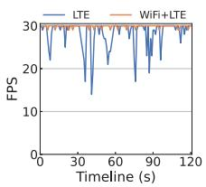  
(a) Stationary Case

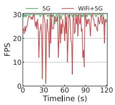  
(b) Moving Case

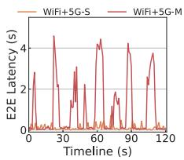  
(c) E2E latency

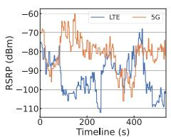

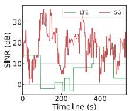  
(a) LTE and 5G fluctuation (RSRP + SINR)

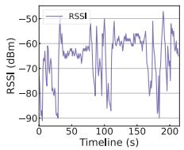  
(b) WIFI RSSI fluctuation

Figure 1: Frame rate in stationary and moving cases.  
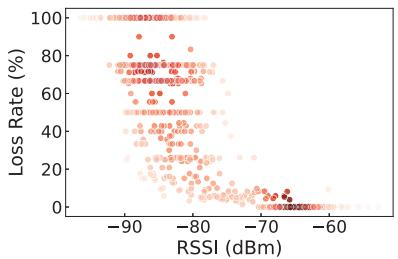  
Figure 3: Impact of signal strength on loss rate.

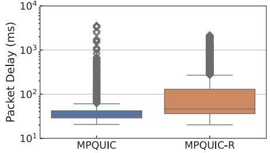  
Figure 4: Packet delay in MPQUIC (Reliable & Unreliable) and MPQUIC-R (Fully reliable) mode.

Figure 2: Signal strength fluctuation during moving.  
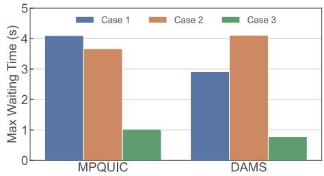  
Figure 5: Maximum waiting time of critical data in different cases.

Reliability Differentiated Transmission. The importance of transmitted data is different. For example, video streams have I-frames and P-frames [48]. I-frames are independent and serve as the start of a GOP (Group of Pictures), while P-frames depend on the previous frame. The loss of an I-frame renders all dependent data useless, but existing systems (e.g., SVC extensions [36]) allow skipping P-frames without affecting the decoding of subsequent frames. Transporting all the data reliably prolongs the latency. MPQUIC supports reliability differentiated transmission: critical data is transmitted reliably while uncritical data is not.

## 2.2 Effect of MPQUIC on QoE

To explore the effect of modern MPQUIC on the Quality of Experience (QoE), this paper conducts a series of evaluations on a Xiaomi 12S Pro with LTE, 5G, and WiFi network interfaces. We ported the open-source Ringmaster [33, 34] video conference platform to Android, enabling two conference endpoints to communicate via MPQUIC. We adopt frame rate as the metric to quantify the smooth experience and collect the FPS (frame-per-second). Furthermore, the per-frame end-to-end latency is measured.

## 2.2.1 Effect on FPS

We first evaluate the FPS of UHD video conferences under LTE. Fig. 1(a) shows that single-path transport results in frame rate fluctuations. Specifically, the worst frame rate is only 14fps. Since LTE bandwidth is insufficient to support UHD video conferences, the delivery interval between frames becomes prolonged, causing a decrease in frame rate. Also in this position, enabling multipath (LTE+WiFi) effectively enhances FPS, with all rates exceeding 29fps. This shows that the multipath technique improves bandwidth-hungry apps.

When moving on campus, the signal strength changes. For multipath transport, the frame rate significantly degrades if one path’s signal is poor. FPS is even worse than in singlepath transport. As shown in Fig. 1(b), average FPS with 5G is 29.6fps, while reduced by 18.4% with 5G+WiFi. In the worst case, single-path 5G has a frame rate of 25fps when moving, while multipath drops to 10fps. That is, even though multipath transport is necessary for streaming media-based applications, its effect is negative instead of positive in some cases.

## 2.2.2 Per-frame E2E Latency

This paper further explores the end-to-end (E2E) latency of each frame. For a high user experience, the latency should be minimized. As shown in Fig. 1(c), 92.3% of the latency for multipath transmission is less than 100ms. However, when moving, the tail latency reaches 4.59 seconds, which is 5.37x of the stationary case. Such high latency makes real-time communication for video conference attendees impossible, causing frequent frame drops and video artifacts on the screen.

## 2.3 Root Cause Analysis

## 2.3.1 Mobility-induced Signal Changes

To explore the reasons, the signal strength during evaluation is analyzed. We collect three types of signal strength indicators at the physical layer through the OS’s API: Received Signal Received Power (RSRP), Signal to Interference plus Noise Ratio (SINR), and Received Signal Strength Indicator (RSSI) [15, 32, 47]. At the transport layer, the packet loss rate is recorded. Fig. 2 shows that the wireless signal strength changes dramatically when the device moves around campus. In some areas, the WiFi signal drops, while the cellular network signal drops suddenly in other places. For example, we find that public WiFi signals are stronger in office buildings, while cellular network signals tend to be weaker indoors compared to outdoors.

We further explore the effect of such signal fluctuations on the transmission. Fig. 3 shows the relationship between RSSI (lower dBm values mean worse signal) and loss rate. In the figure, each point represents an RSSI-loss measurement, with darker red shades indicating higher point concentration. Specifically, we can see all measured loss rates remain under 10% at -70dBm. As the RSSI drops to -80dBm, a significant cluster emerges between 60% and 80% loss, and in some cases reaches 100%. When the value of RSSI is reduced, the loss rate tends to be higher. This phenomenon is widely observed in the evaluation. As loss rates rise, more retransmissions occur, consuming bandwidth that could serve subsequent data.

The results demonstrate that the scheduler cannot respond to these rapid signal changes. This is due to the “visibility gap” and unawareness of link outages. Our log analysis indicates that the scheduler selects and schedules according to the path bandwidth and RTT obtained by the congestion control mechanism. As a result, severe burst loss can last several seconds. Due to dependencies between packets on the two paths, overall performance is reduced. The delay in data arrival prevents rendering the next frame, causing video stutter and video artifacts.

## 2.3.2 Scheduling without Reliability Differentiation

Keyframes (e.g., I-frames) are crucial for video smoothness, as non-keyframes depend on them for decoding [50]. Without keyframes, non-keyframes are useless. MPQUIC provides reliable transmission for these critical data, while other data are transmitted unreliably. Theoretically, this scheme can effectively reduce the additional delay due to lost retransmissions. However, the practice performance is not as expected. Fig. 4 shows that MPQUIC’s median and third quartile packet delays improve by 26.6% and 67.55% compared to MPQUIC-R. However, MPQUIC has a higher maximum packet delay outlier (rhombic scatter) than MPQUIC-R, reaching up to 1.65x.

We further explore the cause of this phenomenon by calculating the waiting time of keyframes in the video conference. In our study, waiting time refers to the delay from when the application hands data to MPQUIC until MPQUIC has finished transmitting the data. We compare the default MPQUIC scheduler (minRTT [21]) with the state-of-the-art deadlineaware scheduler (DAMS [51]). The deadline is set to 300ms1.

We evaluate the scheduler in three cases. (1) Both critical and uncritical data are treated as reliable and scheduled without differentiation. (2) Critical data are treated as reliable, and uncritical data as unreliable, flagged in QUIC as STREAM and DATAGRAM frames [28], respectively. (3) Similar to Case-2, with modified scheduling: unreliable data waits if any reliable data are in the sending queue.

Fig. 5 shows the critical data, maximum waiting time in three cases when moving around the campus. In Case-1, the maximum waiting time is 4.1s for MPQUIC and 2.92s for DAMS. When distinguishing unreliable packets, the maximum waiting time for MPQUIC was only reduced by 11.79%. Unexpectedly, the maximum waiting time for DAMS increased by 39.93%. Comparing Case-2 and Case-3, we observe a significant reduction in maximum waiting time.

Burst loss from poor signals triggers extensive retransmissions of reliable data, which are prioritized over all normal traffic. Consequently, unreliable data remains queued until retransmissions are complete. Afterward, queued unreliable data floods the network, delaying subsequent reliable data. This mutual blockage increases latency, resulting in worse tail packet delay for MPQUIC than for MPQUIC-R. Ideally, reliable data should not be so heavily affected by unreliable data. Case-3 shows that prioritizing reliable data does help. A scheduler that better coordinates both data types is needed.

## 3 Design

## 3.1 STORM Overview

This paper proposes STORM, an MPQUIC scheduler for quick streaming media transport under mobile networks. STORM aims to ensure low latency when the multipath suffers unstable networks.

## 3.1.1 Key Components

See Fig. 6, to achieve STORM, two core components are maintained: a signal-watermark mechanism (SWM) and a reliability-aware scheduling (RAS) strategy.

Signal-watermark mechanism. As analyzed, link outages during device movement and the sender scheduler’s unawareness result in a vicious cycle of packet loss and retransmissions. This phenomenon motivates us to propose a memorywatermark-like mechanism for the mobile devices’ MPQUIC.

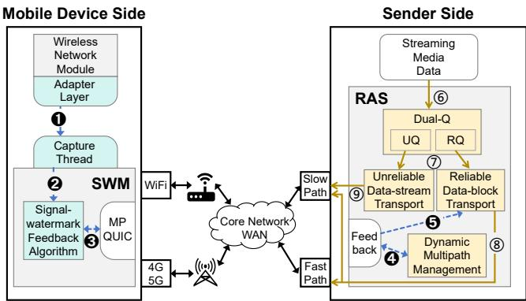  
Figure 6: Architecture overview.

The basic idea is to quantify the path’s signal strength, compare it with a predefined watermark, and then send differentiated feedback based on the comparison. There are many challenges to tackle in SWM design, for example, how to quantify multiple signal strength indicators into a signal quality index, and how to ensure the flexibility and applicability of the watermark. We will discuss this in detail in Section 3.2. Reliability-aware scheduling. Based on SWM, this paper further proposes an RAS strategy on the sender side. RAS treats reliable and unreliable data differently. Specifically, reliable data is organized as blocks and unreliable data is organized as streams. The details and advantages of such an approach will be discussed in Section 3.3.

## 3.1.2 Workflow

Also see Fig. 6, STORM’s workflow consists of a feedback flow and a scheduling flow, forming a scheduling system that strings together the two components. Specifically, the blue arrows in the figure are feedback flows ( 1 - 5 ), while the brown arrows are scheduling flows ( 6 - 9 ).

Feedback flow begins at the adapter layer encapsulated in the wireless network module of the mobile device. (1) A dedicated thread collects signal strength indicators from this adapter layer. (2) These indicators are input to the Signal-Watermark feedback algorithm. (3) The algorithm sends feedback to the sender via MPQUIC and adjusts the watermark based on subsequent results. (4) Upon receiving the feedback, the sender notifies the Dynamic Multipath Management module in the RAS component to decide whether to activate or deactivate a path. (5) The Reliable Data-block Transport module also uses this feedback to adjust its path allocation ratio. After these steps, the feedback flow completes, and scheduling can proceed using the updated signal conditions. (6) The scheduling flow starts once streaming media data arrives at the RAS component, which places the data into Dual-Q based on reliability requirements. (7) Dual-Q maintains separate queues for different reliability classes, each governed by its own scheduling strategy. (8) The Reliable Data-block Transport module distributes reliable data across two paths to maximize aggregate bandwidth, reducing allocations on any path identified (via SWM feedback) as having poor signal. (9) The Unreliable Data-stream Transport module then injects data into idle times on the slower path after each reliable data send.

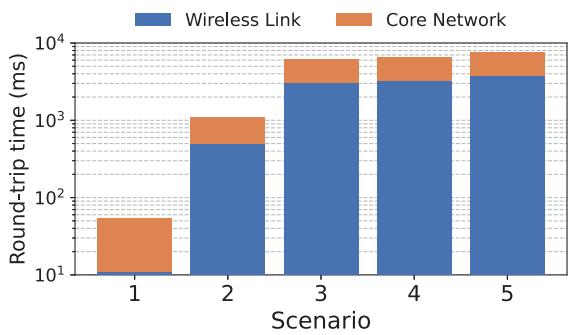  
Figure 7: Breakdown of End-to-End RTT: Wireless Link vs. Core Network RTT (Scenario 1: strong signal location for stationary; Scenario 2: underground mall; Scenario 3: subway; Scenario 4: hotel room; Scenario 5: high-speed railroad).

## 3.2 Signal-watermark Mechanism

## 3.2.1 Data Path Breakdown

Extensive research has examined whether wireless links (so called the “last mile”) act as a bottleneck for network throughput [2, 37]. However, the latency bottleneck on the data path has not been thoroughly analyzed. In this paper, we breakdown the data path to understand where the latency bottleneck locates on the network path.

To accurately obtain the round trip time (RTT) between the base station and the device, we innovatively utilize the first hop IP address after entering the core network from the base station. Specifically, we employ a traceroute-like function to identify this first-hop IP address. Since the latency between the base station and its first hop is typically under 5ms, measuring the RTT of this address effectively represents the wireless link’s latency.

Fig. 7 shows results from various scenarios, including poor RSRP (low coverage) and poor SINR (high interference). We observe that poor RSRP (Scenario 2 and 4) leads to more frequent failed handovers compared to poor SINR (Scenario 3). The severity of packet loss and wireless link latency due to handover failure intensifies whenever either RSRP or SINR deteriorates. In the worst case, the E2E RTT reaches 3,781 ms, with the wireless link RTT at 3,750 ms. This trend is consistent across all mobile scenarios, indicating that despite advancements in wireless technology claiming low latency, the wireless link remains the latency bottleneck in mobile environments. Therefore, designing SWM to monitor signal conditions and provide feedback is essential for quickly reducing latency.

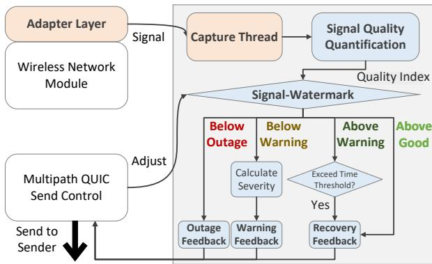  
Figure 8: The workflow of SWM. The gray box works on the MPQUIC protocol stack.

## 3.2.2 Co-Design with the Wireless Network Module

As shown in Fig. 8, to enable SWM’s signal-awareness, we co-designed MPQUIC with the wireless network module. Our goals were to provide a unified way to retrieve signal strength across different platforms and to maintain MPQUIC’s performance by avoiding blocking operations.

Originally, the mobile device’s wireless module ran independently of MPQUIC. To allow seamless access to signal strength indicators, we extended it with an adapter layer that standardizes retrieval across platforms (see the orange box on the left in the figure). MPQUIC then obtains signal strength through a single, unified API.

MPQUIC uses a non-blocking I/O event loop for multipath transfers. Directly polling signal strength in this loop could block it, degrading performance. To avoid this, we delegate signal-strength capture to a dedicated thread (see the orange box on the right in the figure). This thread periodically calls the adapter layer’s API and updates atomic variables in SWM. By employing lock-free programming, we minimize overhead on MPQUIC’s main event loop.

## 3.2.3 Signal-watermark Feedback Algorithm

Upon receiving signal strength indicators from the capture thread, the Signal-Watermark feedback algorithm begins execution. Its workflow is shown in the blue box of Fig. 8.

Signal Quality Quantification. Signal strength indicators such as SINR and RSRP vary in scales and units, influencing signal quality from distinct dimensions—coverage and interference. To coherently quantify their combined impact, we normalize these indicators into a unified interval for direct comparison. Since SINR and RSRP inherently exhibit multiplicative and proportional characteristics, we adopt a weighted geometric mean rather than a linear combination. The weights tune the relative influence of each indicator, recognizing that SINR and RSRP affect signal quality to different extents (see Section 3.2.1). As shown in Eq. 1, the base quality $Q _ { \mathrm { b a s e } }$ is defined as:

$$
Q _ { \mathrm { b a s e } } = \left( ( S I N R _ { n o r m } ) ^ { w _ { s i n r } } \times ( R S R P _ { n o r m } ) ^ { w _ { r s r p } } \right) ^ { \frac { 1 } { w _ { s i n r } + w _ { r s r p } } }\tag{1}
$$

where $w _ { r s r p }$ and $w _ { s i n r }$ are adjustable weights in [0,1]. Requiring the sum of weights to exceed 1 imposes a compressive effect, preventing large jumps in $Q _ { \mathrm { b a s e } }$ from minor improvements and pulling $Q _ { \mathrm { b a s e } }$ toward moderate values when indicators are extremely low, maintaining stability and avoiding excessive dispersion. Note that for WiFi, which only uses RSSI, $Q _ { \mathrm { b a s e } }$ equals $R S S I _ { n o r m }$

To further refine this measure, we introduce a modulation factor that reacts to packet loss trends. The packet loss rate is a critical indicator of whether current feedback decisions are effective: a persistent rise in loss $( \Delta l o s s > 0 )$ shows that the signal-degrading path is still over-utilised. Accordingly, the modulation factor amplifies the negative adjustment, aggressively reducing that path’s utilization and achieving the desired effect more quickly. Conversely, when $\Delta l o s s \le 0 ,$ , the factor does not raise the quality score, because temporary loss reductions do not yet signal genuine recovery. The modulation factor H(∆loss) is defined as:

$$
H ( \Delta l o s s ) = \left\{ \begin{array} { l l } { 1 , } & { \Delta l o s s \leq 0 } \\ { } & { } \\ { \exp ( - \gamma \cdot \Delta l o s s ) , } & { \Delta l o s s > 0 } \end{array} \right.\tag{2}
$$

Here, $\gamma \in [ 0 , 1 )$ controls sensitivity to increasing loss: a larger γ sharply reduces quality when loss rises, while a smaller γ allows for subtle adjustments. This keeps the base quality as the primary determinant, with ∆loss as a secondary cue.

The final quality index $Q \in [ 0 , 1 ]$ is:

$$
Q = Q _ { \mathrm { b a s e } } \times H ( \Delta l o s s )\tag{3}
$$

As shown in the blue box at the top right of Fig. 8, the final quality index will be passed to the Signal-watermark for comparison.

Adaptive Signal-watermark Feedback. After obtaining the quality index, it is compared against three watermarks: Good, Warning, and Outage. If the index falls below the Warning watermark, a warning feedback is generated, indicating the gap between the current index and the Warning watermark, to help adjust path allocation ratios. Dropping below the Outage watermark triggers high-priority outage feedback, instructing the sender to stop scheduling on that path. When the index exceeds the Warning watermark, SWM will consider generating recovery feedback.

To prevent frequent feedback caused by the unstable quality index, a timing threshold mechanism with Fast Suppression/Slow Recovery is implemented. Feedback is promptly generated when the index falls below Warning or Outage. However, recovery feedback is only immediately issued when the index recovers from below Outage to above Good. If the index rises to between Outage and Warning, no action is taken. When the index surpasses Warning, a timer starts, and recovery feedback is generated only if the index remains above Warning for a threshold time $T _ { r e c } ;$ otherwise, the timer resets. This approach ensures that signal improvements are sustained.

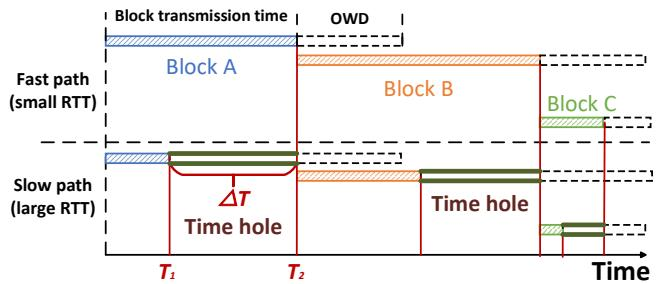  
Figure 9: Slow path time hole.

However, rapid fluctuations in the quality index can lead to a worst-case scenario where the corresponding path remains inactive for an extended period. Specifically, if the index continuously and quickly oscillates across multiple watermarks, it may never stabilize above the Warning watermark for the entire recovery feedback period $( T _ { r e c } )$ , thus failing to generate any recovery feedback. Even if it briefly exceeds the Good watermark, it will be deactivated again upon falling below the Outage watermark. In fact, utilizing paths with severe quality fluctuations offers no performance advantage and considerably impairs user experience. Hence, sustained deactivation of such unstable paths is beneficial.

The default watermark settings were based on extensive experiments (see Fig. 3), but device-specific conditions, network technologies, and environments can affect effectiveness. To accommodate this variability, watermarks are adaptive. Specifically, the SWM evaluates the effects of previous feedback through MPQUIC send control. If the Outage watermark fails to prevent high burst loss, it is increased until the loss is curtailed. Similarly, if the burst loss exceeds 10% when below the Warning watermark, it is raised by a smaller step for finer granularity. To prevent aggressive path deactivation and bandwidth waste, the Outage watermark decreases if burst loss above 50% does not occur, ensuring alignment with actual link outages. These adaptive adjustments keep the watermarks calibrated to real-world link conditions.

## 3.3 Reliability-aware Scheduling

To enable the sender to fully utilize SWM feedback, a new scheduling scheme must be devised. Merely adjusting multipath scheduling allocation ratios and deactivating link outages path may improve performance to some extent, but does not address the root cause. Although SWM can mitigate high burst loss, it cannot achieve a loss-free environment in real wireless networks. As analyzed in Section 2.3.2, loss cause reliable and unreliable data to block one another, making coordinated scheduling of both essential for further improving latency.

Dual-Q for Reliable and Unreliable Data. To coordinate the scheduling of data with different reliability requirements, we manage them using two separate queues. Specifically, we revise the MPQUIC protocol to adopt a Dual-Q architecture, consisting of an RQ for reliable data blocks and a UQ for unreliable data streams. In the RQ, reliable data are handled as individual blocks, each with its own priority and deadline set by the application. The scheduler establishes a subflow for each path and distributes these blocks accordingly. Meanwhile, in the UQ, unreliable data are sorted by their deadlines. if a loss occurs, RAS discards the affected data and proceeds to the next.

Maintaining two distinct data types, including blocks for reliable data and streams for unreliable data, offers two key advantages. First, by representing reliable data as discrete blocks, each block is fully delivered as a unit, meeting the requirement for complete, in-order delivery. Second, treating unreliable data as streams enables more flexible use of idle bandwidth without the constraints imposed by fixed block sizes. We now introduce the scheduling strategy in detail.

Reliable Data-block Transport. For reliable data blocks, RAS aims to deliver as many as possible before the deadline. Aligning arrival rather than sending times maximizes the faster path’s potential [8]. To ensure packets belonging to one block can arrive at a similar time, the data size allocated on the paths $( S i z e _ { 1 }$ and Size2) follows the constraint:

$$
\frac { S i z e _ { 1 } \times b w _ { a g g } } { b w _ { 1 } \times F _ { 1 } } + O W D _ { 1 } = \frac { S i z e _ { 2 } \times b w _ { a g g } } { b w _ { 2 } \times F _ { 2 } } + O W D _ { 2 }\tag{4}
$$

Here, bwi represents the current path bandwidth, and $O W D _ { i }$ refers to the one-way delay on the corresponding paths. Path bandwidth is estimated based on the congestion control algorithm employed by the MPQUIC. To prevent the division result from approaching zero, we normalize with the aggregated bandwidth $b w _ { a g g }$ (the sum of the two paths’ bandwidths). $F _ { i }$ is determined by the mobile device side SWM’s feedback: more severe warning feedback lower the $F _ { i }$ value, indicating a higher potential loss rate. Fewer data allocations are made to paths with lower $F _ { i }$ values to avoid burst loss. Upon receiving a recovery feedback, the Fi value is restored to one.

RAS calculates the residual time to send at that moment for each subflow. For subflow on path i, its residual time is:

$$
T r s d _ { i } = d e a d l i n e _ { i } - T p s d _ { i } - O W D _ { i }\tag{5}
$$

Here, $T p s d _ { i }$ represents the time already passed before processing. If less than 0, the data is proven to be expired. RAS cancels the sending operation and evicts it from RQ.

The urgency of the deadline depends on both residual time and block size. A large block with a distant deadline can still be urgent. Based on Eq. 5, we calculate the gap between the current bandwidth (Cbw) and the minimal required bandwidth (Mbw), as shown in Eq. 6. Mbw corresponds to $\frac { S i z e _ { i } } { T r s d _ { i } }$ . If not processed immediately, the required bandwidth increases as the block nears its deadline.

Blocks with smaller Gbw values are more urgent. If the gap is less than zero, the data cannot be delivered within the remaining time under current conditions. In this case, RAS delays processing this block to prioritize others.

$$
G b w = \operatorname* { m i n } _ { i \in \{ 1 , 2 \} } \left( C b w _ { i } - { \frac { S i z e _ { i } } { T r s d _ { i } } } \right)\tag{6}
$$

Ultimately, RAS determines weights based on the bandwidth gap and block priority. Blocks with lower weight are more likely to be scheduled.

We normalize the bandwidth gap and block priority to calculate the final weights. The gap is divided by $b w _ { a g g } .$ and the priority is divided by the current maximum priority value $( P _ { m a x } )$ . Parameter α adjusts the importance of each in the weight calculation. To avoid unfairness to smaller blocks, we multiply the gap by parameter R, representing the unsent data ratio in a block. This adjustment ensures blocks that have already sent most of their data receive a lower weight (higher priority).

$$
w e i g h t = \alpha \times \frac { G b w } { b w _ { a g g } } \times R + ( 1 - \alpha ) \times \frac { p r i o r i t y } { P _ { m a x } }\tag{7}
$$

Unreliable Data-stream Transport. After achieving efficient scheduling for reliable data blocks, we must consider how to handle unreliable streaming data. If we simply allocate them across two paths in the same manner as reliable data, the loss affecting reliable data will continue to cause mutual blockage. Furthermore, as shown in Fig. 9, block A finishes on two paths at T1 and T2. The idle period ∆T $( T _ { 2 } - T _ { 1 } )$ on the slow path creates a time hole. This time hole reduces throughput, and when combined with mutual blockage, it becomes nearly impossible for both data types to meet their deadlines.

RAS manages unreliable data on UQ as a stream arranged by deadlines, with their weight set higher than $P _ { m a x }$ for differentiation. During ∆T , RAS schedules UQ data to the slow path. Because unreliable data is injected only during time hole, any blockage lasts only for a single retransmission. Once that retransmission completes, the next reliable block creates another time hole, allowing the scheduling of unreliable data in this new hole. This approach effectively alleviates mutual blockage and further improves overall delivery speed.

Dynamic Multipath Management. Another challenge is sudden link outages. Upon receiving outage feedback from the mobile device, the affected path is quickly deactivated to minimize the impact of burst loss. With only a single path remaining, Eq. 4 is no longer applicable. Instead, RAS employs subsequent equations to calculate each block’s weight based on the full allocation to the remaining path. Due to bandwidth constraints, the unreliable stream is scheduled by the deadline only after all reliable blocks have been transmitted and there is available congestion window capacity. When recovery feedback is received, the path is immediately reactivated to maximize bandwidth utilization.

Even though subsequent data will not be scheduled to the deactivated path, prior scheduling decisions cannot be undone. If not processed, these data may be delivered late. To solve this, RAS employs deadline-aware reinjection. RAS calculates if unacknowledged data can meet the deadline with the current available path’s bandwidth. If feasible, it reinjects the data; otherwise discarding them. Reinjection occurs after the scheduling round to avoid delaying normally scheduled data. Unreliable data are discarded without reinjection.

## 4 Implement STORM with MPQUIC

STORM is implemented based on the QUIC protocol. Specifically, we developed STORM based on Alibaba’s XQUIC [10]. Features of QUIC, like the unreliable QUIC-Datagram based on RFC9221 [28] and multipath functionality incorporated into the IETF WG Draft [21], are used by STORM. Based on that, we modify QUIC with 1,342 lines of C language code, excluding the libraries.

Wireless Network Module Adapter Layer. MPQUIC uses abstract paths to adapt to various mobile network interfaces, preventing direct access to signal strength indicators. We introduce an adapter layer to the wireless network module. On Android, we implemented Java logic to monitor wireless network signal changes. These indicators are stored as atomic variables and accessed by SWM via Java Native Interface (JNI) calls every 100 milliseconds.

The adapter layer implementation introduces minimal modifications to user equipment. Unlike previous approaches that required hardware adjustments or system-level root privileges, our adapter-based method efficiently retrieves cellular signal strength indicators by utilizing standard Android classes (e.g., WifiManager [42] and TelephonyManager [41]). Specifically, the adapter achieves this with only 102 lines of Java code, significantly simplifying developers’ workload and seamlessly integrating into existing systems.

Reliable Data-block Transport. MPQUIC supports various frame types to handle different data reliability requirements. Specifically, STREAM frames carry reliable data, while DATAGRAM frames carry unreliable data [14, 28]. STORM extends this capability by mapping different reliability data to different frame types.

MPQUIC packetizes data into a doubly linked list for write streams, complicating fine-grained scheduling. To minimize overhead, STORM schedules data based on block metadata and caches reliable blocks in a vector.

Unreliable Data-stream Transport. MPQUIC’s stream management supports unreliable data streams but faces synchronization challenges: data must be packetized pre-injection into the slow path, complicating alignment between unreliable data on the slow path and reliable data on the fast path. Fixed packet sizes worsen timing mismatches, leading to inconsistent finishes of unreliable transmissions relative to reliable blocks under varying bandwidth conditions.

To solve these issues, STORM introduces a novel scheme. Unreliable data is placed in a doubly linked send queue organized by deadlines, where each node holds an entire data segment rather than individual packets. This approach defers packetization until injecting data into the slow path, thereby reducing scheduling overhead and improving synchronization with reliable data.

Dynamic Multipath Management. MPQUIC manages multipath usage by sending PATH\_STANDBY and PATH\_AVAILABLE frames to notify peers of path states. A STANDBY path does not schedule packets unless the AVAILABLE path is unavailable [21]. However, this mechanism is inadequate for signal-aware path management due to two issues: (1) In-flight packets on a STANDBY path remain until lost, while buffered data continues to transmit, increasing latency and packet loss. (2) If the AVAILABLE path’s congestion window is exhausted, new packets are sent through the STANDBY path. These behaviors conflict with the deactivation of paths experiencing link outages, highlighting a limitation in MPQUIC’s scheduling.

STORM introduces a new frame type, PATH\_ALERT, containing feedback from the SWM. Upon receiving a PATH\_ALERT frame, the sender manages multipath according to RAS’s design.

Abstraction and API. STORM encapsulates the process and offers an API to the upper layer. Applications just need to call the STORM\_send and provide parameters like deadline and priority. Specifically, STORM categorizes application data into Reliable Transport Blocks and Unreliable Transport Streams, executing their logic.

STORM does not use a proxy [25, 26] in its implementation. While proxies reduce application modifications, they only intercept the payload, losing important metadata. This limits QUIC’s cross-layer benefits, complicating fine-grained scheduling. Instead, data can be sent directly through the API provided by STORM, reducing code changes.

<table><tr><td rowspan=2 colspan=2>Evl. Type</td><td rowspan=2 colspan=1>Dev.</td><td rowspan=1 colspan=3>Equipment</td></tr><tr><td rowspan=1 colspan=1>NET</td><td rowspan=1 colspan=1>MEM</td><td rowspan=1 colspan=1>OS</td></tr><tr><td rowspan=1 colspan=2>Control Lab</td><td rowspan=1 colspan=1>PCs</td><td rowspan=1 colspan=1>Ethernet</td><td rowspan=1 colspan=1>94GB</td><td rowspan=1 colspan=1>Ubuntu 20.04</td></tr><tr><td rowspan=3 colspan=1>APP</td><td rowspan=1 colspan=1>Video Conf.</td><td rowspan=1 colspan=1>Phone</td><td rowspan=1 colspan=1>WiFi-6,LTE/5G</td><td rowspan=1 colspan=1>12GB</td><td rowspan=1 colspan=1>Android 14</td></tr><tr><td rowspan=1 colspan=1>Live Stream.</td><td rowspan=1 colspan=1>Phone</td><td rowspan=1 colspan=1>WiFi-6,LTE/5G</td><td rowspan=1 colspan=1>12GB</td><td rowspan=1 colspan=1>Android 14</td></tr><tr><td rowspan=1 colspan=1>360° Video</td><td rowspan=1 colspan=1>Laptop</td><td rowspan=1 colspan=1>WiFi-6</td><td rowspan=1 colspan=1>16GB</td><td rowspan=1 colspan=1>Ubuntu 18.04</td></tr></table>

Table 1: Equipment details of the evaluation platforms.

## 5 Evaluation

## 5.1 Experiment Setup

This section provides the evaluation from two aspects:

• Control Network Environment. We test STORM in a controlled lab environment. The evaluation focuses on three main aspects: microbenchmarks, the performance effects of individual designs, and the performance effects of parameter settings.

• Applications in the Wild. Furthermore, we developed three apps for typical scenarios: video conferencing, lowlatency live streaming, and 360° video. These applications were evaluated in real-world mobile Internet environments, and the QoE was analyzed.

Parameter Configurations. The parameters in the evaluation are listed in Table 2. The default signal-watermark was set empirically. $w _ { r s r p }$ and $w _ { s i n r }$ are set to 0.8 and 0.6, respectively, because poor RSRP values are usually more strongly associated with failure of handover. Set γ to 0.01 to avoid overly penalizing the common random losses (under 10%) typical of wireless links, while still enabling a rapid score reduction once ∆loss exceeds 50. $T _ { r e c }$ is set to 400 ms. α is set to 0.5.

<table><tr><td rowspan=1 colspan=1>Symbols</td><td rowspan=1 colspan=1>Semantics</td><td rowspan=1 colspan=1>Setting</td></tr><tr><td rowspan=1 colspan=1>Good</td><td rowspan=1 colspan=1>High-watermark that represent strong signal</td><td rowspan=1 colspan=1>0.45</td></tr><tr><td rowspan=1 colspan=1>Warning</td><td rowspan=1 colspan=1>Medium-watermark that represent weak signal</td><td rowspan=1 colspan=1>0.32</td></tr><tr><td rowspan=1 colspan=1>Outage</td><td rowspan=1 colspan=1>Low-watermark that represent link outage</td><td rowspan=1 colspan=1>0.21</td></tr><tr><td rowspan=1 colspan=1> ${ \underline { { w _ { r s r p } } } }$ </td><td rowspan=1 colspan=1>RSRP weight coefficient</td><td rowspan=1 colspan=1>0.8</td></tr><tr><td rowspan=1 colspan=1> $w _ { s i n r }$ </td><td rowspan=1 colspan=1>SINR weight coefficient</td><td rowspan=1 colspan=1>0.6</td></tr><tr><td rowspan=1 colspan=1>Y</td><td rowspan=1 colspan=1>Modulation factor sensitivity parameter</td><td rowspan=1 colspan=1>0.01</td></tr><tr><td rowspan=1 colspan=1> $T _ { r e c }$ </td><td rowspan=1 colspan=1>Time threshold for recovery feedback</td><td rowspan=1 colspan=1>400 ms</td></tr><tr><td rowspan=1 colspan=1>α</td><td rowspan=1 colspan=1>Weight coefficient for reliable data transport</td><td rowspan=1 colspan=1>0.5</td></tr></table>

Table 2: Summary of parameters used by STORM.

## 5.2 Microbenchmark

We developed a toolkit to evaluate STORM’s microbenchmark performance under various network conditions. The tool sends six blocks of varying priorities and sizes every 100ms at 30Mbps, each with a 300ms deadline. This setup emulates transmitting a Group of Pictures (GOP) in streaming applications at 60 fps. Specifically, the highest-priority block represents an I frame, three lower-priority blocks represent P frames, and two lowest-priority blocks (transmitted unreliably) represent B frames. Note that STORM supports deadline setting well below 300 ms, discussed in Appendix A.1. Two PCs (see Table 1) are connected to an OpenWrt router with traffic control (tc). Ethernet simulates WiFi and cellular networks, avoiding interference. We tested the completion rate and waiting time of high-priority blocks. DAMS [51] and MPQUIC were compared with STORM. Since Ethernet does not reflect wireless link conditions, we only examined STORM performance under a strong signal.

## 5.2.1 Bandwidth Variation

We evaluated STORM’s performance under bandwidth fluctuations using various combinations, denoted in Mbps. Although more combinations were tested and exhibited similar trends, this paper only presents four representative cases: <20, 25> (adequate bandwidth), <15, 20> (nearly adequate), <10, 15> (slightly inadequate), and <5, 10> (severely inadequate). These combinations clearly illustrate STORM’s performance under bandwidth conditions ranging from sufficient to severely insufficient. The RTT for the two paths was set to 30ms and 50ms, with a loss rate of 0.01%.

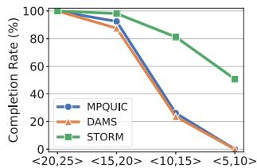  
(a) Completion Rate

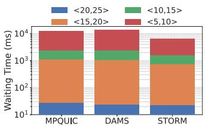  
(b) Waiting Time Distribution

Figure 10: Block completion rate and waiting time distribution under various bandwidth combinations.  
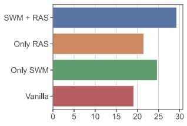  
(a) Goodput (Mbps)

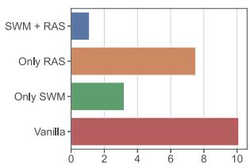  
(b) Rebuffering Time (s)  
Figure 13: Ablation study of STORM’s design.

Completion Rate. Fig. 10(a) shows that with <10, 15> bandwidth combinations, the completion $\mathrm { r a t e } ^ { 2 }$ of MPQUIC drops from 99.9% to 26.1%. The completion rate of DAMS is reduced by 76.4% compared to the sufficient-bandwidth case. With a bandwidth combination of <5, 10>, both DAMS and MPQUIC nearly reach zero completion rates, unable to deliver on time with only half the required bandwidth. In contrast, STORM’s completion rate only decreases by an average of 49.3%.

As Table 3 shows, STORM schedules 66.5% of reliable data to the fast path, while unreliable data is all scheduled on the slow path. In MPQUIC, all data competes equally for the fast path. DAMS, however, utilizes both paths for reliable data and defaults to MPQUIC’s approach for unreliable data. As a result, unreliable data consumes 17.4% more bandwidth on the fast path than in MPQUIC. STORM fully utilizes the fast path without wasting the slow path, significantly increasing the completion rate of reliable blocks.

<table><tr><td rowspan=2 colspan=1></td><td rowspan=1 colspan=2>Reliabledata</td><td rowspan=1 colspan=2>Unreliabledata</td></tr><tr><td rowspan=1 colspan=1>fast path</td><td rowspan=1 colspan=1>slowpath</td><td rowspan=1 colspan=1>fast path</td><td rowspan=1 colspan=1>slow path</td></tr><tr><td rowspan=1 colspan=1>MPQUIC</td><td rowspan=1 colspan=1>75.1%</td><td rowspan=1 colspan=1>24.9%</td><td rowspan=1 colspan=1>71.7%</td><td rowspan=1 colspan=1>28.3%</td></tr><tr><td rowspan=1 colspan=1>DAMS</td><td rowspan=1 colspan=1>54.8%</td><td rowspan=1 colspan=1>45.2%</td><td rowspan=1 colspan=1>89.1%</td><td rowspan=1 colspan=1>10.9%</td></tr><tr><td rowspan=1 colspan=1>RAS</td><td rowspan=1 colspan=1>66.5%</td><td rowspan=1 colspan=1>33.5%</td><td rowspan=1 colspan=1>0%</td><td rowspan=1 colspan=1>100%</td></tr></table>

Table 3: The ratio of (un)reliable data on the two paths.

Efficiency to Transport High-priority Data. We further verify the advantages of scheduling reliable data more on the fast path. Fig. 10(b) shows the waiting time distribution for highpriority data. The top of each color bar represents the maximum waiting time for that bandwidth combination. As bandwidth decreases, the maximum waiting time for MPQUIC and DAMS increases significantly (by 44.3x and 54.5x, respectively). In the worst case, the time reaches 11 seconds. In contrast, STORM performs better. For example, with the <5,10> bandwidth combination, STORM’s maximum waiting time is 49.6% of MPQUIC’s and 45.3% of DAMS’s.

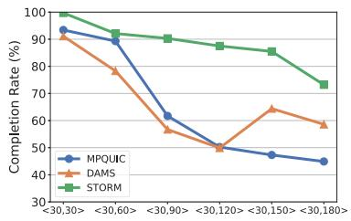

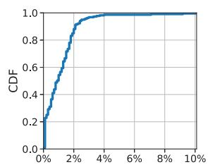  
Figure 11: Block completion rate Figure 12: STORM’s sigunder various RTT combinations. nal status sync bias rate.

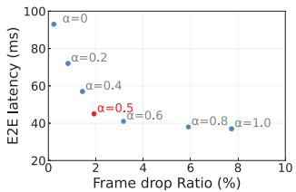  
Figure 14: Weight parameter α.

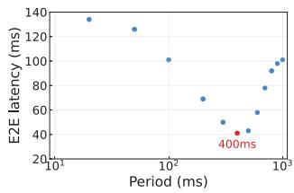  
Figure 15: Recovery feedback period $T _ { r e c }$

## 5.2.2 RTT Variation

We further explore the effect of RTT variation. In the evaluation, one path’s RTT is fixed at 30ms, while the other varies from 30ms to 180ms. The bandwidths of the two paths are set to 20Mbps and 14Mbps. As shown in Fig. 11, two phenomena are observed: First, STORM consistently outperforms DAMS and MPQUIC in the completion rate across various RTT combinations. With the <30,120> RTT combination, STORM’s completion rate increased by 37.3% and 37.6% over MPQUIC and DAMS, respectively. Second, we observed DAMS’s completion rate rising to 64.4% with the RTT combination <30, 150>. Due to excessive RTT differences, DAMS can hardly use the slow path to accelerate delivery, scheduling more data to the fast path. The fast path’s 20Mbps bandwidth is sufficient for this higher completion rate. MPQUIC, however, allocates data to the slow path when the fast path’s congestion window is exhausted, increasing missed deadlines.

## 5.3 STORM Deep Dive

In this section, we replay user walking network traces to investigate how each design affects STORM’s performance. We modified saturatr [46] to trace when the mobile device detects a signal strength change, providing these records to SWM for simulating signal strength capture. We set up a mpshell [23] testbed with a sender application and a virtual low-latency live streaming player. The player focuses on network transmission without actual decoding or rendering.

Signal State Sync Bias. Studies show that reporting signal strength to user space can be delayed by up to 200 ms [25], causing synchronization bias between signal change and feedback receipt. Fig. 12 shows that the ‘captured vs. actual’ signal strength differs minimally: about 1.14% on average and 0.95% at the median. With a capture-to-feedback delay of at most 300 ms, large spatial shifts are unlikely. Even at high speeds, STORM quickly reacts to signal degradation, then waits for stabilization before readjusting.

Ablation Study. We conducted an ablation study to investigate the impact of the Signal-Watermark Mechanism (SWM) and Reliability-Aware Scheduling (RAS) components. Fig. 13 shows that the complete design (SWM+RAS) is crucial for STORM to optimize user experience during signal fluctuations. Disabling SWM reduces goodput by 26.6% and increases rebuffering time by 6.8x. Disabling RAS reduces goodput by 15.7% and increases rebuffering time by 2.9x.

Computational Overhead. STORM is a lightweight multipath scheduler integrated into MPQUIC with negligible computational overhead. RAS’s average processing time for data in Dual-Q is 5.03 ms, only 7.4% of the total transmission time (68.1 ms). The feedback algorithms in SWM have O(1) complexity, incurring only µs-level overhead. With our implementation, the number of Java Native Interface (JNI) calls is minimized to further reduce overhead. Specifically, the most time-consuming JNI call introduces an average overhead of 78 µs per invocation. Given that this call occurs once every 100 ms, it results in merely 780 µs of additional CPU time per second, leading to negligible extra CPU usage.

## 5.4 Sensitive Study

We in this part test the sensitivity of STORM performance to different parameter settings.

Parameter α Tuning. A larger value of α in Eq. 7 leads to STORM scheduling the more urgent packets first, which decreases its consideration of their priority. We evaluate STORM with α values from 0 to 1, shown in Fig. 14. As α increases, E2E latency decreases as the scheduler favors urgent packets for timely delivery, but this raises the frame drop ratio. If critical decoding data is delayed by urgent packets, the player favors received data, compromising smoothness and quality despite lower latency. Thus, a suitable STORM balance is α = 0.5.

Recovery Feedback Period. To find the optimal period $T _ { r e c }$ for SWM to generate recovery feedback, we test a range of values in [20, 50, 100, 200, 300, 400, 500, 600, 700, 800, 900, 1000]ms. Fig. 15 shows the E2E latency for these period settings. Periods under 100ms produce overly frequent recovery feedback. This excessive frequency can disrupt transmission and cause traffic fluctuations. Periods over 800ms waste bandwidth and increase end-to-end latency. We select 400ms as the period for STORM. Note that as mobility increases, this period should be extended to ensure the signal stabilizes.

## 5.5 Real-world Applications Evaluation

We further explore STORM’s effect on user QoE in the realworld mobile network. Three typical streaming media applications were tested on a Xiaomi 12S Pro phone, communicating with Tencent Cloud servers located in Asia (see Table 1).

Video Conference. We prepared three video streams to transport from the server to the client. The server encodes them into VP9 format frames using ffmpeg and libvpx. One stream is a real-time conference, serving as the mainstream. The other two streams are workloads. Mainstream keyframes have the highest priority. The non-keyframes of the other streams are set to unreliable data. Resolution is 1280x720, with a bitrate of 30 Mbps and a frame rate of 30 fps.

Low-latency Live Streaming. We simulate a live pull stream. We encoded a 1080p video at 30Mbps using ffmpeg. I and P frames are high and medium-priority blocks, respectively. And B frames are an unreliable stream. The video plays continuously for two minutes at 30 fps.

360° Video. We developed a 360° video application. The video is delivered as tiles, with tiles near the center of the user’s viewport given higher priority. Unreliable masking streams prevent tile skipping. Due to the complexity of implementing 360° video on an Android phone, the client was implemented on a laptop with two wireless cards.

## 5.5.1 Benefit on QoE

Our evaluation includes different QoE metrics. The following metrics were used:

• Video Conference: Frame rate distribution, normalized stall duration, and normalized SSIM score.

• Low-latency Live Streaming: Frame rate distribution, normalized stall duration, and normalized video goodput.

• 360° Video: Peak Signal-to-Noise Ratio (PSNR) and User Perceived Ratio (the ratio of actual bitrate received by the user to the video bitrate).

To explore the real-world performance impact of SWM, we implemented a variant of STORM, STORM-U, using RAS without SWM feedback. Single path (SP) performance is also considered.

We conducted field tests at five real-world locations, such as the parking lot and the library. These locations are covered by WiFi and cellular networks, with the phone connected to both. To examine mobility’s effect on multipath transmission performance, we divided the tests into two scenarios.

In Changing Signal Strength. In this case the user runs three applications while walking within a given area and experiences sudden link outages both indoors and outdoors. We measured how these rapid signal fluctuations affect each solution.

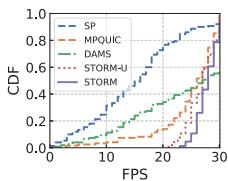

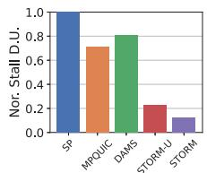

(a) Video conference’s QoE  
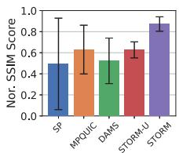

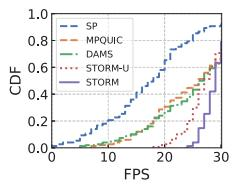

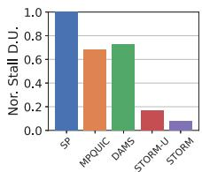

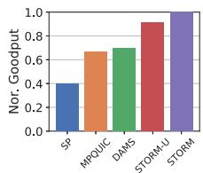  
(b) Low-latency live streaming’s QoE

Figure 16: The video conference and low-latency live streaming’s QoE.  
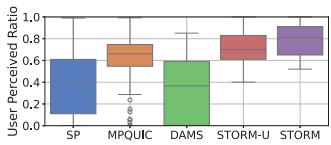  
(a) User perceived ratio

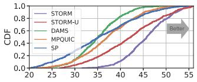  
(b) PSNR (dB) distribution  
Figure 17: The 360° video’s QoE

Fig. 16 shows DAMS’s performance declines significantly with signal fluctuations, more so than MPQUIC. In contrast, STORM maintains good performance. A frame rate of 24 fps is generally considered the minimum for motion to appear natural to the human eye. Lower rates produce perceptibly unsmooth motion. For video conference, STORM’s unsmooth FPS (below 24 fps) ratio improved by 95.1% compared to MPQUIC and 96.8% compared to DAMS. STORM also excels in stall duration, outperforming MPQUIC by 83.0% and DAMS by 85.2%. SP struggled with tests due to link outages, causing performance fluctuations. Lower FPS and longer stalls lead to more video stutters, while STORM effectively reduces both during signal fluctuations, enhancing user experience.

STORM quickly deactivates the path during link outages, minimizing loss and latency. STORM-U, however, cannot sense sudden changes. Delayed data leads to decoding failures, which in turn produce video artifacts and degrade video quality. For 360° video, STORM’s median user-perceived ratio and PSNR are 0.81dB and 46.1dB (see Fig. 17), improving by 11.1% and 7.7% over STORM-U, resulting in the best video quality.

In Stable Signal Strength. In this case, the user runs three applications while staying in a position with a good signal. We begin by showing the QoE in the video conference. Table 4 shows that STORM performed the best. With sufficient bandwidth and low latency in stationary conditions, the performance differences among individual solutions are minimal. Similar results are observed in low-latency live streaming and 360° video.

## 5.5.2 Transport Improvement

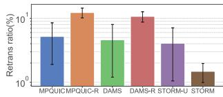

We finally explored how STORM can improve transport performance in real-world applications. MPQUIC-R and DAMS-

(a) Retransmission ratio  
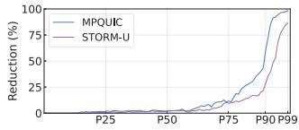  
(b) Packet delay reduction

Figure 18: Transport improvement.
<table><tr><td rowspan=1 colspan=1>APP</td><td rowspan=1 colspan=1>Metrics</td><td rowspan=1 colspan=1>MPQUIC</td><td rowspan=1 colspan=1>DAMS</td><td rowspan=1 colspan=1>STORM-U</td><td rowspan=1 colspan=1>STORM</td></tr><tr><td rowspan=3 colspan=1>1</td><td rowspan=1 colspan=1>FPS</td><td rowspan=1 colspan=1>29.2</td><td rowspan=1 colspan=1>29.4</td><td rowspan=1 colspan=1>29.4</td><td rowspan=1 colspan=1>29.6</td></tr><tr><td rowspan=1 colspan=1>Stall Dur.</td><td rowspan=1 colspan=1>1</td><td rowspan=1 colspan=1>0.97</td><td rowspan=1 colspan=1>0.96</td><td rowspan=1 colspan=1>0.96</td></tr><tr><td rowspan=1 colspan=1>SSIM</td><td rowspan=1 colspan=1>0.99</td><td rowspan=1 colspan=1>0.99</td><td rowspan=1 colspan=1>0.99</td><td rowspan=1 colspan=1>0.99</td></tr><tr><td rowspan=3 colspan=1>2</td><td rowspan=1 colspan=1>FPS</td><td rowspan=1 colspan=1>29.1</td><td rowspan=1 colspan=1>29.2</td><td rowspan=1 colspan=1>29.3</td><td rowspan=1 colspan=1>29.5</td></tr><tr><td rowspan=1 colspan=1>Stall Dur.</td><td rowspan=1 colspan=1>1</td><td rowspan=1 colspan=1>0.97</td><td rowspan=1 colspan=1>0.97</td><td rowspan=1 colspan=1>0.96</td></tr><tr><td rowspan=1 colspan=1>Goodput</td><td rowspan=1 colspan=1>0.84</td><td rowspan=1 colspan=1>0.90</td><td rowspan=1 colspan=1>0.93</td><td rowspan=1 colspan=1>1</td></tr><tr><td rowspan=2 colspan=1>3</td><td rowspan=1 colspan=1>UPR</td><td rowspan=1 colspan=1>0.92</td><td rowspan=1 colspan=1>0.95</td><td rowspan=1 colspan=1>0.94</td><td rowspan=1 colspan=1>0.98</td></tr><tr><td rowspan=1 colspan=1>MedianPSNR</td><td rowspan=1 colspan=1>47.2dB</td><td rowspan=1 colspan=1>47.4dB</td><td rowspan=1 colspan=1>47.8dB</td><td rowspan=1 colspan=1>47.9dB</td></tr></table>

Table 4: The QoE of (1) video conference, (2) low latency live streaming, and (3) 360° video applications under a stable signal strength.

R are included for comparison.

Fig. 18(a) shows that STORM achieves the lowest retransmission ratio. MPQUIC-R and DAMS-R suffer severe retransmissions during sudden link outages. In contrast, DAMS and MPQUIC perform better in retransmission ratio by delivering non-critical data over unreliable transmissions. Despite its efficient scheduling, STORM-U still encounters an average retransmission ratio of 4.1% due to its inability to sense the wireless link. By quickly deactivating the broken path, STORM reduces the average retransmission ratio to 1.5%. Fig. 18(b) shows the packet delay reduction of STORM compared to other solutions at different percentiles. We selected the optimal MPQUIC and STORM-U solutions for comparison. The results show a 98.2% decrease in packet delay at the 99th percentile with MPQUIC, demonstrating its strong advantage in improving tail packet delay. Although STORM-U outperforms MPQUIC in other aspects, its delayed response to signal changes still results in high tail delays.

## 6 Related Works

Multipath Transport for Streaming Media. The growing demand for high-throughput and low-latency video streaming has led to much work on multipath transport. MPTCP [31] introduced the concept of establishing subflows across multiple TCP connections to use interfaces such as Wi-Fi and cellular, but its strict reliability can degrade real-time streaming [29]. Even works designed to mitigate HOL blocking [8, 35, 38, 43] often remain suboptimal when mobility causes rapid link fluctuations. By contrast, QUIC, operating over UDP, is better suited for real-time data since it supports both reliable and unreliable modes [28]. Based on this, MPQUIC [21,22,26,49,51] aggregates throughput across multiple paths but, as our experiments show, still suffers high latency when one path’s signal drop suddenly. STORM overcomes this issue by making use of the characteristics of QUIC protocol and streaming media data.

MPQUIC Scheduling. A key element of MPQUIC is the scheduler, which allocates packets across subflows. Existing mechanisms, such as minRTT [21], or QoE-based feedback [22, 49], rely on historical metrics that fail to react quickly to sudden signal drops. Although these approaches boost throughput, they often overlook stringent latency requirements demanded by real-time streaming (e.g., VR or cloud gaming). Consequently, severe tail latencies persist under unstable networks. STORM addresses this gap by offering fast signal-awareness and scheduling decisions that reduce latency without sacrificing throughput.

## 7 Conclusion

This paper proposed STORM, an MPQUIC scheduler for quick streaming media transport under mobile networks. Based on the signal-watermark mechanism and reliabilityaware scheduling strategy, STORM ensure low latency of streaming media applications when the multipath suffers “network storm”. We have implemented STORM on real-life devices. Our evaluation shows that STORM reduces tail packet delay by 98.2% and improves the frame rate of streaming media by 1.95x under unstable networks when enabling STORM, compared to the state-of-the-art.

## Acknowledgments

We thank USENIX ATC 2025 reviewers for their feedback and their help in improving the paper. This work was supported in part by the National Key R&D Program of China (2024YFB4504400), Dreams Foundation of Jianghuai Advance Technology Center (No. 2023-ZM01Z011), NSFC under Grant No. 62302169 and No. 62372184, Major Key Project of PCL under Grant PCL2024A06 and PCL2022A05, and Shenzhen Science and Technology Program under Grant RCJC20231211085918010.

## References

[1] Ishan Aryendu, Sudhanshu Arya, and Ying Wang. Minimizing age of information: Adaptive spectrum sharing in ultra-reliable and low-latency evtol communications.

In 2024 IEEE 25th International Symposium on a World of Wireless, Mobile and Multimedia Networks (WoW-MoM), pages 57–63. IEEE, 2024.

[2] Arjun Balasingam, Manu Bansal, Rakesh Misra, Kanthi Nagaraj, Rahul Tandra, Sachin Katti, and Aaron Schulman. Detecting if lte is the bottleneck with bursttracker. In The 25th Annual International Conference on Mobile Computing and Networking, pages 1–15, 2019.

[3] E. Bandara, X. Liang, S. Shetty, R. Mukkamala, P. Foytik, N. Ranasinghe, and K. D. Zoysa. Octopus: privacy preserving peer-to-peer transactions system with interplanetary file system (ipfs). In 17th Annual International Conference on Mobile Systems, Applications, and Services, pages 591–609, 2023.

[4] Qiang Chen and Changlong Li. Argus: Real-time hq video decoding with cpu coordinating on consumer devices. In 2024 IEEE Real-Time Systems Symposium (RTSS). IEEE, 2024.

[5] Sandesh Dhawaskar Sathyanarayana, Kyunghan Lee, Dirk Grunwald, and Sangtae Ha. Converge: Qoe-driven multipath video conferencing over webrtc. In Proceedings of the ACM SIGCOMM 2023 Conference, page 637–653. Association for Computing Machinery, 2023.

[6] Oussama El Marai and Tarik Taleb. Smooth and low latency video streaming for autonomous cars during handover. Ieee Network, 34(6):302–309, 2020.

[7] Yongjie Guan, Xueyu Hou, Nan Wu, Bo Han, and Tao Han. Metastream: Live volumetric content capture, creation, delivery, and rendering in real time. In Proceedings of the 29th Annual International Conference on Mobile Computing and Networking, 2023.

[8] Yihua Ethan Guo, Ashkan Nikravesh, Z Morley Mao, Feng Qian, and Subhabrata Sen. Accelerating multipath transport through balanced subflow completion. In Proceedings of the 23rd Annual International Conference on Mobile Computing and Networking, pages 141–153, 2017.

[9] Philipp Hock, Sebastian Benedikter, Jan Gugenheimer, and Enrico Rukzio. Carvr: Enabling in-car virtual reality entertainment. In CHI conference on human factors in computing systems, pages 4034–4044, 2017.

[10] Alibaba Inc. Xquic. https://github.com/alibaba/ xquic, 2023.

[11] Apple Inc. Introducing Apple Vision Pro: Apple’s first spatial computer. https://www.apple.com/ newsroom/2023/06/introducing-apple-visionpro/, 2023.

[12] Google Inc. Fuchsia os. https://fuchsia.dev/, 2022.

[13] HUAWEI Inc. Harmony os. https://consumer. huawei.com/en/harmonyos/, 2024.

[14] Jana Iyengar and Martin Thomson. QUIC: A UDP-Based Multiplexed and Secure Transport. https:// www.rfc-editor.org/rfc/rfc9000.html, 2021.

[15] Han-Shin Jo, Young Jin Sang, Ping Xia, and Jeffrey G Andrews. Heterogeneous cellular networks with flexible cell association: A comprehensive downlink sinr analysis. IEEE Transactions on Wireless Communications, 11(10):3484–3495, 2012.

[16] HyunJong Lee, Jason Flinn, and Basavaraj Tonshal. Raven: Improving interactive latency for the connected car. In Proceedings of the 24th Annual International Conference on Mobile Computing and Networking, pages 557–572, 2018.

[17] Changlong Li, Yu Liang, Rachata Ausavarungnirun, Zongwei Zhu, Liang Shi, and Chuan Jason Xue. Ice: Collaborating memory and process management for user experience on resource-limited mobile devices. In Proceedings of the Eighteenth European Conference on Computer Systems, pages 79–93, 2023.

[18] Changlong Li, Liang Shi, and Chun Jason Xue. Mobileswap: Cross-device memory swapping for mobile devices. In 58th ACM/IEEE Design Automation Conference (DAC), 2021.

[19] LinkedIn. Internet celebrity economy market size, research. https://www.linkedin.com/pulse/ internet-celebrity-economy-market-sizeresearch-1v3zf, 2023.

[20] LinkedIn. Video conference: what best practices reducing latency video conferencing. https://www.linkedin.com/advice/3/whatbest-practices-reducing-latency-videoconferencing, 2023.

[21] Yanmei Liu, Yunfei Ma, Quentin De Coninck, Olivier Bonaventure, Christian Huitema, and Mirja Kühlewind. Multipath Extension for QUIC. https://datatracker.ietf.org/doc/draftietf-quic-multipath/05/, 2023.

[22] Gerui Lv, Qinghua Wu, Yanmei Liu, Zhenyu Li, Qingyue Tan, Furong Yang, Wentao Chen, Yunfei Ma, Hongyu Guo, Ying Chen, et al. Chorus: Coordinating mobile multipath scheduling and adaptive video streaming. In 30th Annual International Conference on Mobile Computing and Networking, pages 246–262, 2024.

[23] Mpshell. https://github.com/ravinet/ mahimahi/tree/old/mpshell\_scripted, 2023.

[24] Arvind Narayanan, Eman Ramadan, Jason Carpenter, Qingxu Liu, Yu Liu, Feng Qian, and Zhi-Li Zhang. A first look at commercial 5g performance on smartphones. In Proceedings of The Web Conference 2020, pages 894– 905, 2020.

[25] Yunzhe Ni, Feng Qian, Taide Liu, Yihua Cheng, Zhiyao Ma, Jing Wang, Zhongfeng Wang, Gang Huang, Xuanzhe Liu, and Chenren Xu. {POLYCORN}: Datadriven cross-layer multipath networking for high-speed railway through composable schedulerlets. In 20th USENIX Symposium on Networked Systems Design and Implementation (NSDI 23), pages 1325–1340, 2023.

[26] Yunzhe Ni, Zhilong Zheng, Xianshang Lin, Fengyu Gao, Xuan Zeng, Yirui Liu, Tao Xu, Hua Wang, Zhidong Zhang, Senlang Du, et al. Cellfusion: Multipath vehicleto-cloud video streaming with network coding in the wild. In Proceedings of the ACM SIGCOMM 2023 Conference, pages 668–683, 2023.

[27] Stephen Palmisano, Luke Szalla, and Juno Kim. Monocular viewing protects against cybersickness produced by head movements in the oculus rift. In Proceedings of the 25th ACM Symposium on Virtual Reality Software and Technology, pages 1–2, 2019.

[28] Tommy Pauly, Eric Kinnear, and David Schinazi. An Unreliable Datagram Extension to QUIC. https:// www.rfc-editor.org/rfc/rfc9221.html, 2022.

[29] Michele Polese, Federico Chiariotti, Elia Bonetto, Filippo Rigotto, Andrea Zanella, and Michele Zorzi. A survey on recent advances in transport layer protocols. IEEE Communications Surveys & Tutorials, 21(4):3584– 3608, 2019.

[30] Feng Qian, Bo Han, Qingyang Xiao, and Vijay Gopalakrishnan. Flare: Practical viewport-adaptive 360-degree video streaming for mobile devices. In Proceedings of the 24th Annual International Conference on Mobile Computing and Networking, pages 99–114, 2018.

[31] Costin Raiciu, Christoph Paasch, Sebastien Barre, Alan Ford, Michio Honda, Fabien Duchene, Olivier Bonaventure, and Mark Handley. How hard can it be? designing and implementing a deployable multipath TCP. In Symposium on Networked Systems Design and Implementation (NSDI), pages 399–412, 2012.

[32] Elizaveta Rastorgueva-Foi, Mário Costa, Mike Koivisto, Kari Leppänen, and Mikko Valkama. User positioning in mmw 5g networks using beam-rsrp measurements and kalman filtering. In 2018 21st International Conference on Information Fusion (FUSION), pages 1–7, 2018.

[33] Ringmaster. https://github.com/microsoft/ ringmaster?tab=readme-ov-file, 2023.

[34] Michael Rudow, Francis Y Yan, Abhishek Kumar, Ganesh Ananthanarayanan, Martin Ellis, and KV Rashmi. Tambur: Efficient loss recovery for videoconferencing via streaming codes. In 20th USENIX Symposium on Networked Systems Design and Implementation (NSDI 23), pages 953–971, 2023.

[35] Swetank Kumar Saha, Shivang Aggarwal, Rohan Pathak, Dimitrios Koutsonikolas, and Joerg Widmer. Musher: An agile multipath-tcp scheduler for dual-band 802.11 ad/ac wireless lans. In The 25th Annual International Conference on Mobile Computing and Networking, pages 1–16, 2019.

[36] Heiko Schwarz, Detlev Marpe, and Thomas Wiegand. Overview of the scalable video coding extension of the h. 264/avc standard. IEEE Transactions on circuits and systems for video technology, pages 1103–1120, 2007.

[37] Ranya Sharma, Nick Feamster, and Marc Richardson. A longitudinal study of the prevalence of wifi bottlenecks in home access networks. In Proceedings of the 2024 ACM on Internet Measurement Conference, pages 44– 50, 2024.

[38] Hang Shi, Yong Cui, Xin Wang, Yuming Hu, Minglong Dai, Fanzhao Wang, and Kai Zheng. {STMS}: Improving {MPTCP} throughput under heterogeneous networks. In 2018 USENIX Annual Technical Conference (USENIX ATC 18), pages 719–730, 2018.

[39] Sam Son, Seung Yul Lee, Yunho Jin, Jonghyun Bae, Jinkyu Jeong, Tae Jun Ham, Jae W. Lee, and Hongil Yoon. Asap: Fast mobile application switch via adaptive prepaging. In USENIX Annual Technical Conference (USENIX ATC), pages 365–380, 2021.

[40] Sandeep Tata, Alexandrin Popescul, Marc Najork, Mike Colagrosso, Julian Gibbons, Alan Green, Alexandre Mah, et al. Quick access: building a smart experience for google drive. In Proceedings of the 23rd ACM SIGKDD International Conference on Knowledge Discovery and Data Mining, pages 1643–1651, 2017.

[41] Android Team. Telephonymanager. https: //developer.android.google.cn/reference/ android/telephony/TelephonyManager, 2022.

[42] Android Team. Wifimanager. https: //developer.android.google.cn/reference/ android/net/wifi/WifiManager, 2022.

[43] Chengke Wang, Hao Wang, Feng Qian, Kai Zheng, Chenglu Wang, Fangzhu Mao, Xingmin Guo, and Chenren Xu. Experience: A three-year retrospective of largescale multipath transport deployment for mobile applications. In Proceedings of the 29th Annual International Conference on Mobile Computing and Networking, pages 1–15, 2023.

[44] Shibo Wang, Shusen Yang, Xiao Kong, Chenglei Wu, Longwei Jiang, Chenren Xu, Cong Zhao, Xuesong Yang, Jianjun Xiao, Xin Liu, et al. Pudica: Toward near-zero queuing delay in congestion control for cloud gaming. In USENIX Symposium on Networked Systems Design and Implementation (NSDI), 2024.

[45] Yuxin Wang, Zunlei Feng, Haofei Zhang, Yang Gao, Jie Lei, Li Sun, and Mingli Song. Angle robustness unmanned aerial vehicle navigation in gnss-denied scenarios. In Proceedings of the AAAI Conference on Artificial Intelligence, volume 38, pages 10386–10394, 2024.

[46] Keith Winstein, Anirudh Sivaraman, and Hari Balakrishnan. Stochastic forecasts achieve high throughput and low delay over cellular networks. In 10th USENIX Symposium on Networked Systems Design and Implementation (NSDI 13), pages 459–471, 2013.

[47] Weixing Xue, Weining Qiu, Xianghong Hua, and Kegen Yu. Improved wi-fi rssi measurement for indoor localization. IEEE Sensors Journal, 17(7):2224–2230, 2017.

[48] Xin-Wei Yao, Wan-Liang Wang, Shuang-Hua Yang, Yue-Feng Cen, Xiao-Min Yao, and Tie-Qiang Pan. Ipb-frame adaptive mapping mechanism for video transmission over ieee 802.11 e wlans. ACM SIGCOMM Computer Communication Review, 44(2):5–12, 2014.

[49] Zhilong Zheng, Yunfei Ma, Yanmei Liu, Furong Yang, Zhenyu Li, Yuanbo Zhang, Jiuhai Zhang, Wei Shi, Wentao Chen, Ding Li, Qing An, Hai Hong, Hongqiang Harry Liu, and Ming Zhang. Xlink: Qoedriven multi-path quic transport in large-scale video services. In ACM SIGCOMM, page 418–432, 2021.

[50] Meng Zili, Wang Tingfeng, Shen Yixin, Wang Bo, Xu Mingwei, Han Rui, Liu Honghao, Arun Venkat, Hu Hongxin, and Wei Xue. Enabling high quality realtime communications with adaptive frame-rate. In 20th USENIX Symposium on Networked Systems Design and Implementation, 2023.

[51] Xutong Zuo, Yong Cui, Xin Wang, and Jiayu Yang. Deadline-aware multipath transmission for streaming blocks. In IEEE INFOCOM 2022-IEEE Conference on Computer Communications, pages 2178–2187, 2022.

## A Appendix

## A.1 Deadline Setting Based on Application Real-Time Requirements

The microbenchmark experiments in Section 5.2 use a 300 ms end-to-end deadline. This value does not restrict STORM to traffic that must meet precisely 300ms. It simply reflects the minimum latency budget frequently cited for interactive video conferencing [20], as already noted in the footnote of Section 2.3.2. In practice, every unit of data that an application hands to STORM carries its own deadline in the metadata. The API function STORM\_send exported by STORM therefore includes an explicit field, deadline\_us, whose value is filled in by the application on a per-message basis and expressed in microseconds. Because the STORM reads this field directly, developers can tighten or relax the requirement for each video frame, audio chunk, or control message at run time without recompiling or reconfiguring the STORM.

Section 5.5 demonstrates this flexibility by evaluating three representative applications, each configured with a deadline that matches its real-time requirements. The video-conference prototype operates under a strict 150ms budget. The lowlatency live-streaming scenario employs a 500ms budget, reflecting industry practice for end-to-end latency. The immersive 360° video workload targets an 80ms motion-to-photon limit. Whether a batch of packets meets the deadline in practice depends on the bandwidth and one-way delay of the active paths. STORM optimizes scheduling based on the current path conditions and operates within each path’s inherent upper limits.

STORM is therefore deadline-agnostic. The 300ms setting in the microbenchmark experiments serves only as a conservative experimental baseline. When an application supplies a tighter or looser deadline, the same scheduling strategy remains valid and optimises scheduling under the newly specified deadline.

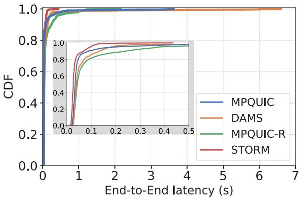  
Figure 19: End-to-End latency distribution

## A.2 Absolute End-to-End Latency Distribution

Section 5.5.2 evaluates the packet delay reduction achieved by STORM at selected percentile points. To obtain a more detailed view, we also collected absolute end-to-end latency samples under the same testbed configuration and plotted their cumulative distribution functions (CDFs). For clarity the figure retains only four representative solutions: STORM, MPQUIC, MPQUIC-R, and DAMS. Curves for the remaining solutions overlap and are therefore omitted.

Figure 19 indicates that 90% of STORM’s latency measurements fall below 68.2ms and 99% remain under 129.8ms. MPQUIC, the best of the other solutions, records 90% of latencies under 89.8ms and 99% under 758.6ms. Hence, STORM significantly reduces both median and tail end-to-end latency and yields a much tighter distribution, which benefits real-time media streams.

Figure 19 also reveals a contrasting outcome for MPQUIC-R. Among the four evaluated solutions, MPQUIC-R exhibits the highest median end-to-end latency, clearly highlighting the latency cost introduced by its fully reliable delivery strategy. However, its tail end-to-end latency stops at 2.15s, well below the 3.62s of MPQUIC and the 6.60s of DAMS. This observation confirms that mutual blockage between data with different reliability requirements imposes a severe performance penalty, a problem that STORM mitigates through its RAS component.