①

USENIX

THE ADVANCED COMPUTING SYSTEMS ASSOCIATION

# SwCC: Software-Programmable and Per-Packet Congestion Control in RDMA Engine

Hongjing Huang, Jie Zhang, Xuzheng Chen, Ziyu Song, Jiajun Qin, and Zeke Wang, Zhejiang University

https://www.usenix.org/conference/atc25/presentation/huang-hongjing

# This paper is included in the Proceedings of the 2025 USENIX Annual Technical Conference.

July 7–9, 2025 • Boston, MA, USA ISBN 978-1-939133-48-9

Open access to the Proceedings of the 2025 USENIX Annual Technical Conference is sponsored by

P--r.h £Es/sL.

auuJl9 PgleU

King Abdullah University of

Science and Technology

# SwCC: Software-Programmable and Per-Packet Congestion Control in RDMA Engine

Hongjing Huang†, Jie Zhang†, Xuzheng Chen, Ziyu Song, Jiajun Qin, Zeke Wang∗ Department of Computer Science, Zhejiang University, China

## Abstract

Many data centers adopt Remote Direct Memory Access (RDMA) to allow data center applications to achieve low latency and high throughput, while keeping minimal CPU overhead. The upper-layer applications keep evolving rapidly, and thus need congestion control algorithms (CCAs) that exist in the NIC hardware also to react correctly and timely, especially for a burstier ML workload. Even worse, the data center network will increase the line rate to 400 Gbps, even 800 Gbps soon. Therefore, how to reduce control loop delay for various CCAs becomes crucial to the performance of various applications. However, RDMA’s hardwired CCA is not able to satisfy such a requirement.

To this end, we design and implement SwCC, an RDMA engine with on-NIC RISC-V cores that allows softwareprogrammable and per-packet congestion control. To avoid the performance degradation caused by introducing the programmable RISC-V cores, SwCC carefully designs the 1) RISC-V core memory subsystem, 2) engine architecture, and 3) interaction between the RISC-V core and other NIC resources. Besides, SwCC provides a set of rich software APIs, allowing developers to deploy new CCAs with minimum engineering efforts. We prototype SwCC using the Xilinx U280 FPGA. Experimental results demonstrate that SwCC achieves performance comparable to current commercial RDMA NICs (Mellanox ConnextX-5). Both SwCC and ConnectX-5 reach 3.1 µs control loop RTT and need 512B packet size to reach line-rate traffic (100 Gbps). In terms of flexibility, SwCC allows to use the C language to implement nearly all kinds of existing CCAs, e.g., rate-based CCAs, window-based CCAs, and credit-based CCAs. The potential ASIC design of SwCC can easily scale to higher network bandwidth.

## 1 Introduction

Modern data centers urge their networks with low latency and high bandwidth utilization while keeping low CPU utilization. In recent years, many mainstream data centers have adopted

RDMA to reduce CPU overhead and network latency. Among all RDMA technologies, RDMA over Converged Ethernet (RoCE [33]) is the most widely deployed in modern data centers such as Microsoft Azure [8, 24, 28], Alibaba Cloud [20], and Google Cloud [40]. RoCE relies on Priority Flow Control (PFC) [32] to ensure the network lossless [20, 87, 88]. However, PFC introduces issues such as head-of-line blocking, congestion spreading, and PFC deadlocks [25, 28, 29, 56, 73]. To essentially prevent the activation of PFC, developers propose various CCAs to optimize network performance by effectively managing traffic and reducing congestion, thereby inherently preventing the activation of PFC. According to the location of RDMA congestion control (CC) logic, we mainly identify four types of CC solutions.

ASIC-based NIC CC solutions, such as DCQCN [88], IRN [56], implement the CC logic on the ASIC-based NIC. These solutions adjust network transmission within tens of nanoseconds after congestion notifications reach the NIC, significantly reducing control loop latency. However, CCAs are tightly coupled with the NICs and can not be optimized or upgraded after manufacturing. When a better CCA is introduced, it takes years to deploy it in real commodity NICs. Therefore, these solutions cannot keep up with the rapid iterations of data center CCAs. For example, at least 11 CCAs [1,2,6,21,22,44,54,76,81,82,86] have been proposed in 3 years, while only 7 Mellanox NICs [47–53] are released in recent 10 years.

CPU-based CC solutions. To facilitate the rapid deployment of new CCAs, people place the CC logic in CPUs, leveraging software flexibility and programmability to enable fast deployment of various CCAs. CPU-based CC solutions, such as Soft-RoCE [62], implement the CC logic on the CPU to enable the flexible deployment of various CCAs, allowing dynamic adjustments to transmission bandwidth based on diverse congestion signals. However, compared with deploying CC logic in the NIC, these solutions usually have a high control loop delay due to the long latency from PCIe and layered software (tens of microseconds higher). Considering RDMA’s micro-second latency, such a high delay could greatly degrade the network performance when congestion occurs. In our experiment that runs two flows with DCQCN [88] on a dumbbell topology, we observe that a high control loop delay would significantly increase the time needed to drain the switch queue. Compared with NIC-based CC solutions, running CCAs in the host CPU can increase the switch queue draining time by 7.8× (Subsection 3.2).

Naive FPGA-based SmartNIC CC Solutions. To enable programmability while keeping low control loop delay, developers place the CC logic in SmartNICs to avoid PCIe latency and complicated host software layers. Tonic [4] and NanoTransport [5] place the CC logic on FPGA-based SmartNICs. These approaches offload transport logic in the SmartNIC and allow users to update the NIC transport logic using hardware description language (HDL). However, FPGA programming requires much more engineering effort and a much longer development cycle, making it hard to keep pace with the rapid iteration of CCAs.

SoC-based SmartNIC CC Solutions. To address the programmability issue, NVIDIA BlueField-3 [60] offers Programmable Congestion Control (PCC) [63] to run CCAs in a RISC-V processor named datapath accelerator (DPA), which allows users to deploy the CCAs using software programming. Though this provides high programmability, it is hard to ensure performance with wimpy DPA, because the CC controller is triggered in a long interval and can not be triggered each time when receiving a packet. Besides, PCC only allows developers to adjust per-flow rates and cannot support credit-based or window-based CCAs, and PCC only supports a small subset of CCAs (as shown in Figure 2). Therefore, PCC results in low flexibility.

In summary, none of the existing solutions can provide both high flexibility and high programmability while maintaining a low control loop delay. To this end, we design and implement SwCC, an RDMA engine that allows software-programmable and per-packet congestion control. SwCC integrates an on-NIC RISC-V processor to allow flexible and fast deployment of CCAs while keeping software programming. The main challenge is that naively integrating a programmable RISC-V processor into the RDMA engine will cause severe performance degradation (as observed in NVIDIA BlueField-3 PCC [63]). To this end, SwCC carefully design the 1) memory subsystem by exploiting the data access pattern of different CCAs, 2) engine architecture to allow the core to run at a high frequency, and 3) interaction between the RISC-V core and other NIC resources to reduce required CPU cycles when running CCAs in the RISC-V core.

We prototype SwCC on an Xilinx U280 FPGA. Experimental results demonstrate that SwCC achieves comparable performance to current commercial RDMA NICs (Mellanox ConnextX-5): 1) 3.1 µs/3.4 µs control loop RTT, and 2) 512- bytes/512-bytes packet size to achieve line-rate traffic (100 Gbps). SwCC supports rate-based, window-based, and creditbased mainstream CCAs to ensure flexibility. We implement representative CCAs such as TIMELY, DCQCN, and HPCC using only 102, 140, and 148 lines of code, respectively. We believe that the potential ASIC design of SwCC can easily scale to a higher network bandwidth.

## 2 Background

An end-to-end CC algorithm involves the collaboration between the sender and the receiver. The receiver is usually responsible for notifying the sender of the congestion with meta information such as credits [19, 57] and congestion notification packets (CNP) [86, 88]. The CC controller on the sender side reacts to the congestion and reallocates network resources such as sending rate, and congestion window, depending on the specific algorithm. Different CCAs 1) use different CC signals, 2) trigger the CC controller at different times, and 3) reallocate network resources with different strategies when the CC controller is triggered.

## 2.1 What CC Signals to Use

CC controller on the sender side relies on CC signals to be aware of the network congestion. Different CCAs use very different signals, which can be categorized into four classes. ECN: CCAs such as DCQCN [88], TCD [86], and ACC [81] use explicit congestion notification (ECN). The receiver would send congestion notification packets (CNPs) to notify the senders of the network congestion.

RTT: CCAs, such as TIMELY [55], Swift [40], BBR [11], Copa [7], and Bolt [6], allows the senders to proactively measure the link RTT to be aware of the network congestion. The RTT value can indicate the degree of the queuing along the link, which is caused by network congestion.

INT: CCAs, such as HPCC [42], PowerTCP [1], and Poseidon [76], utilize INT (In-band Network Telemetry) to obtain precise link load. When a sender sends a packet to a receiver, the switches along the path insert metadata indicating the current loads of the packet’s egress port. The receiver copies these metadata to the ACK packet and sends the ACK to the sender, which then adjusts its transmission accordingly.

Token: CCAs, such as pHost [19], NDP [27], Homa [57], and ExpressPass [14], use credits to avoid network congestion. The available sender credit of a flow is the total tokens received from the receiver minus the transmitted bytes. Usually, each transmitted packet piggybacks the credit in the ACK.

## 2.2 When to Trigger the CC Controller

CCAs use events to trigger the CC controller. Different CCAs generate events at different times. The events can be mainly categorized into sending packet events, receiving packet events, and timer/counter events. The sending/receiving packet events are generated when sending/receiving packets. Note that the above events may not generated for all kinds of packets. For example, some CCAs [40, 42, 55] only need to generate receiving packet events for ACK packets. Timer/- counter events are generated periodically or when the counter reaches a threshold. One CCA may adopt one or multiple kinds of events to trigger the CC controller. For example, credit-based CCAs usually generate sending packet events to trigger the CC controller to decrease the credit and generate receiving packet events to trigger the CC controller to increase the credit.

Table 1: Comparison of CC Solution in Different Locations
<table><tr><td rowspan=1 colspan=1>Solution</td><td rowspan=1 colspan=1>ControlLoop Delay</td><td rowspan=1 colspan=1>Flexibility</td><td rowspan=1 colspan=1>Programmability</td></tr><tr><td rowspan=1 colspan=1>CPU-basedCC [62]</td><td rowspan=1 colspan=1>23 μs</td><td rowspan=1 colspan=1>High</td><td rowspan=1 colspan=1>High</td></tr><tr><td rowspan=1 colspan=1>ASIC-baesd NICCC [33]</td><td rowspan=1 colspan=1>3.1 μs</td><td rowspan=1 colspan=1>Low</td><td rowspan=1 colspan=1>Low</td></tr><tr><td rowspan=1 colspan=1>NaiveFPGA-basedSmartNIC CC [4]</td><td rowspan=1 colspan=1>3.3 μs</td><td rowspan=1 colspan=1>High</td><td rowspan=1 colspan=1>Low</td></tr><tr><td rowspan=1 colspan=1>SoC-basedSmartNIC CC [63]</td><td rowspan=1 colspan=1>3.5 μs</td><td rowspan=1 colspan=1>Low</td><td rowspan=1 colspan=1>High</td></tr><tr><td rowspan=1 colspan=1>SwCC</td><td rowspan=1 colspan=1>3.3 μs</td><td rowspan=1 colspan=1>High</td><td rowspan=1 colspan=1>High</td></tr></table>

## 2.3 How to Adjust Data Transmission

CC controller limits the data transmission in three main ways: Window: Previous works [1, 6, 40, 42, 76, 82] adopt a perflow congestion window to allow for 1) tracking each inflight packet/segment, and 2) reacting to network congestion in a fine-grained manner. Window-based CC is quite complicated, especially in the presence of selective acknowledgments.

Rate: Instead of tracking each packet/segment, previous works [54, 55, 75, 81, 82, 88] adopt a more coarse-grained approach to limit packet sending rate. They only adjust the sending rate of each flow. For example, TIMELY [55] measures the flow RTT and adjusts the sending rate according to the RTT gradient.

Credit: Previous works [14, 19, 27, 57] use credits as permissions to send data. The credit of a flow is the total number of received tokens minus the number of transmitted bytes and the credit calculation consists of simple addition/subtraction.

## 3 Motivation

An ideal RDMA NIC should offer 1) low control loop delay to let CCAs react to congestion timely; 2) high flexibility to enable various kinds of CCAs; and 3) high programmability to allow developers to program easily without knowing much hardware details. However, the existing solutions fail to meet all the requirements as shown in Table 1. In the following, we present the detailed design and the corresponding limitations of each kind of solution.

## 3.1 ASIC-based NIC Solution

RDMA NICs such as Mellanox Connect-X series [50] are widely deployed in nowadays datacenters. They offload the congestion control logic to the NIC ASIC area to save host CPU usage. Running CCAs in the NIC greatly brings low control loop delay as it avoids PCIe traversals for control signals. However, ASIC-based solutions are far behind the rapid evolution of the CCAs, because one special RDMA NIC usually only supports one or a few CCAs with configurable settings. For example, Mellanox CX series NICs only support DCQCN. However, CCAs are evolving rapidly. From 2021 to 2023 alone, 11 new CC algorithms were presented [1, 2, 6, 21, 22, 44, 54, 76, 81, 82, 86] to improve the CC performance for different scenarios. At the same time, commercial NIC hardware requires years of development. Mellanox releases only seven CX series NICs [47–53] since 2012. It’s impossible for commercial NICs to always keep pace with the evolving CCAs.

Limitation: ASIC-based NIC solutions provide low control loop delay but have low flexibility and low programmability. Even worse, ASIC-based NIC usually only supports adjusting CCA parameters through firmware updates, and upgrading to a new CCA is nearly impossible for currently off-the-shelf ASIC NICs.

## 3.2 CPU-based CC Solution

To enable fast deployment of new CCAs, Soft-RoCE [62] runs CCA logic in host CPU software. It implements the RDMA transport on top of the Linux network stack. Users can use software programming languages to implement their CCAs, providing high flexibility and programmability. However, running CCA logic in the software significantly increases the control loop delay. As Table 1 shows, Soft-RoCE needs nearly an order of magnitude higher control loop delay than running CCAs in the hardware NIC. Compared with running CCAs in ASIC-based NIC, Soft-RoCE introduces severe overheads: PCIe traversal, software stack, and kernel switching.

The high control loop delay is harmful to the performance of CCAs. To illustrate the potential impact of control loop delay, we conduct an experiment in our testbed. We connect two sender servers and one receiver server to a P4 switch. Each server is equipped with an FPGA NIC running DC-QCN [61]. We first let one sender establish a stable flow to the receiver and then let the other sender establish a new flow to the receiver. The control loop delay is measured from the generation of the CNP packet to when the sender receives it. We manually delay the processing of the CNP packet to obtain different control loop delays. Figure 1 shows the time to drain the switch queue when congestion occurs. We observe that a high control loop delay would significantly increase the time needed to drain the switch queue. Compared to NIC-based CC solutions, running CCAs in the host CPU can increase the draining time of the switch queue by 7.8×.

Limitation: CPU-based CC solution provides high flexibility and high programmability. However, the overheads from PCIe traversals and software context switching significantly increase control loop delay, thus degrading CC performance.

## 3.3 Naive FPGA SmartNIC-based CC Solution

To keep low control loop delay while enabling multiple kinds of CCAs, researchers offload transport protocols on FPGA SmartNICs. For example, Tonic [4] proposes a Verilogprogrammable transport layer in hardware. NanoTransport [5] proposes a programmable hardware transport layer using the

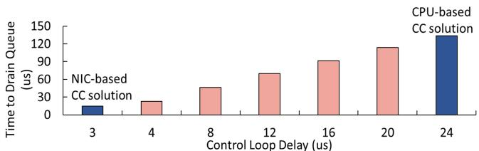  
Figure 1: Effect of control loop latency on queue draining time.

P4 language. Thus flexibility is guaranteed because such a programmable transport allows developers to implement CCAs according to their needs. Low control loop delay is also guaranteed because the transport runs in the NIC and the CC control signals do not need to traverse the PCIe interconnect or kernel stack.

Limitation: However, offloading transport to FPGA exposes one severe limitation: hardware programming offers low programmability. Developers have to write hardware description languages (HDLs) such as Verilog and Chisel. Implementing a CCA using HDL requires much more engineering effort. Developers have to know hardware details well and fix timing problems. Besides, debugging is very difficult when using FPGAs to implement CCAs.

## 3.4 SoC SmartNIC-based CC solution

NVIDIA BlueField-3 SmartNIC allows the offload of CCAs to the RISC-V processor of the SoC SmartNIC, called programmable congestion control (PCC [63]). PCC allows developers to write a C-style program to run on the NIC RISC-V processor. NIC periodically generates events and notifies the user’s CC program to adjust the data transmission rate. Conceptually, PCC keeps a low control loop delay while providing high flexibility and programmability.

However, the cache and memory system of the datapath accelerator (DPA, i.e., RISC-V cores) in BlueField-3 are inadequate to support running PCC efficiently. Because DPA has poor cache/memory performance and weak single-thread performance, DPA is suitable for simple workloads with high parallelism (using its 256 concurrent threads) [13]. However, CCAs need to fetch many packet-related data (i.e., fields in the packet header) and QP-related data (e.g., per-QP credit) from memory, so its poor cache (L1: 10 ns)/memory (300 ns) incurs high overhead to process each packet. For example, at a 100 Gbps line rate, a 1 KB packet arrives every 89 ns, well below the memory access latency (300 ns).

This cannot be easily solved by using DPA’s multiple threads. CC is not a high-parallelism workload, as the packet processing of the same QP must be mapped to the same thread to avoid inter-thread communication/synchronization overhead. As such, letting DPA run CC for a small number of QPs cannot exploit the high parallelism of DPA and easily becomes a system bottleneck, especially for the CCAs triggered per packet. This is also why the current PCC only supports rate-based CCAs, because not every packet would trigger the CC in rate-based CCAs.

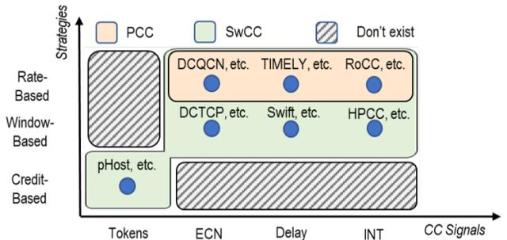  
Figure 2: Comparison of CCAs supported by PCC and SwCC.

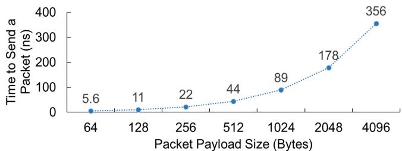  
Figure 3: To achieve a network line rate of 100 Gbps, the NIC has to send a data packet within a specific duration depending on the packet size.

## 4 Design and Implementation

To address these limitations, we present SwCC, a NIC RDMA engine that allows flexible implementation of various CCAs through software programming without sacrificing performance. SwCC has three design goals:

Low Control Loop Delay and Short CC Controller Triggering Interval. As described in Section 3.2, control loop delay directly influences the efficiency of CCAs, SwCC aims to provide low control loop delay. Besides, SwCC must ensure a short CC controller triggering interval to support per-packet CCAs at a high network bandwidth. To be more specific, we have to allow triggering CC controller upon sending/receiving a packet. As shown in Figure 3, under the 100 Gbps line rate, the packet arrival interval is only 89 nanoseconds for 1 KB packets. Therefore, the frequency of the CC controller should be as high as possible, and the required cycles for processing each packet should be as low as possible.

High Flexibility. To support various kinds of CCAs, SwCC must allow developers to use different kinds of CC signals (§Section 4.3.1) and use different kinds of data transmission strategies (§Section 4.2.2). Besides, SwCC should allow triggering the CC controller flexibly (§Section 4.3.2).

High Programmability. To keep pace with the fast evolution of CCAs, SwCC must provide an easy-to-program interface to allow developers to focus only on the high-level CC algorithms, rather than on low-level hardware details.

To this end, we design and implement SwCC, an RDMA engine that allows software-programmable and per-packet congestion control. SwCC integrates an on-NIC RISC-V processor to allow flexible and fast deployment of CCAs while keeping software programming, thus providing flexibility. However, this introduces significant processing overhead compared to hardwired solutions. Our key idea is to carefully design the interaction between the RDMA engine and the RISC-V core, so as to enable the user CC program running in the RISC-V processor to access and control the NIC resources at a very low cost. To do so, we rely on careful co-design from both hardware and software perspectives. As such, we have ensured 1) low control loop delay because the CCAs are running in the NIC RISC-V core; 2) short CC controller triggering interval due to the carefully designed hardware/software interaction mechanism; 3) high flexibility because we expose enough hardware resources to the RISC-V processor; and 4) high programmability because users can program the RISC-V core with a high-level software programming language.

## 4.1 SwCC Design Overview

Figure 4 provides SwCC system overview. The hardware part mainly consists of 1) RX path logic; 2) TX path logic; 3) “WQ Handler” module that processes WQEs, sending data packets to the TX CC and packets without data to the “Header Fabricator”; 4) “DMA” that performs address translation and reads/writes data to the host memory; 5) QP-aware memory subsystem that maintains the per-queue-pair QP context.

Along the RX path, SwCC consists of 1) “RX Parser” that parses incoming packets; 2) “Packet Retransmission” that handles go-back-N retransmission; 3) “Packet Filter” that generates events to trigger the RX CC core according to the user configuration; 4) “RX CC” that runs CCA logic related to dealing with RX events.

Along the TX path, SwCC consists of 1) “TX CC” that runs CCA logic related to whether to allow transmitting a packet; 2) “Header Fabricator" and “Packet Fabricator " that fabricate the header and the complete packet.

SwCC software consists of a rich set of APIs allowing easy programming. These APIs allow users to define 1) when to trigger the CC controller flexibly, 2) what extra header fields should be carried in each packet as needed, and 3) how to let the CC core interact with hardware efficiently. In the following, we present the detailed design of SwCC, organized in a manner that shows how it guarantees our design goals.

## 4.2 How to Keep Low Control Loop Delay and Short CC Controller Triggering Interval.

To keep a low control loop delay, we put a programmable CC controller (RISC-V core) that runs CCAs in the NIC engine. This greatly reduces CC controller response time to network congestion as it avoids the long PCIe wire latency, which could contribute up to 90% wire-to-wire response time for flows with small packets [59].

However, naively integrating a RISC-V processor into the NIC leads to low single-core performance due to the power/- form factor limitation of the NIC, as evidenced by the case of NVIDIA PCC. To keep a short CC controller triggering interval, we 1) strive to increase the CC controller hardware frequency as much as possible; 2) strive to reduce the required number of CPU cycles when the CC controller processes each event.

## 4.2.1 TX/RX Separated Multi-Core

Integrating more cores in the CC controller can linearly increase the CC processing capability, thus allowing a short CC triggering interval. Instead of naively adopting a multi-core design in the CC controller, we propose a TX/RX separated multi-core design, which runs the TX and RX logic of CCAs in different CC controller RISC-V cores.

Such a design is guided by our observation that most CCAs can be clearly partitioned into a TX function and an RX function, in both the programming perspective and logic perspective. In the RX function, when the CC controller is triggered by an event, the CC controller adjusts the context of the current queue pair, such as the congestion window and credits. In the TX function, the CC controller usually decides whether to send a packet or not, according to the context of the current queue pair.

Based on this observation, the proposed TX/RX separated multi-core lets each core only deal with either TX or RX function, so as to reduce processing latency. In case of enough hardware resources for 2N cores in the NIC, we let half of them process the TX function and the other half process the RX function. Each queue pair corresponds to a specific TX CC core and a specific RX CC core, according to the result of the queue pair number (QPN) mod N. This avoids consistency issues as the same queue pair would not be processed by different RX CC cores or TX CC cores.

The main benefit of TX/RX separated multi-core is that a single core would only deal with a subset of CC logic and thus only need to access a subset of the NIC resources. For example, the RX CC core only needs to be connected to the RX port, and the TX CC core only needs to be connected to the TX port. Compared to a fully connected data path, TX/RX separated multi-core can greatly reduce the required hardware resources to construct the data path. As such, the design can meet the timing constraints more easily. In our FPGA prototype, TX/RX separated multi-core can increase the design frequency by up to 16% (§Section 5.3). We believe that the conclusion still holds when applied to an ASIC-based design of SwCC.

## 4.2.2 QP-aware Memory Subsystem

A traditional memory subsystem relies on a large cache with a sophisticated pre-fetching mechanism to provide upper-layer applications with low-latency memory accesses. However, due to form factor and power constraints, the cache size in the NIC is usually limited, and the pre-fetching mechanism is much wimpier compared with traditional host server CPUs. And a NIC cache usually has much higher latency than the server CPU cache (an order of magnitude higher) as observed in NVIDIA BF3 [13].

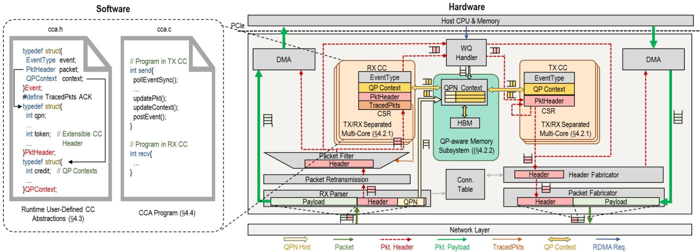  
Figure 4: Overall architecture of SwCC.

Instead of trying to construct a powerful and general memory subsystem, we exploit the underlying data access pattern in the NIC CC core and construct our memory subsystem accordingly, based on the following observation. When receiving a packet, the packet is first processed by the RX-related logic, such as header parsing and retransmission logic. Then the CC controller is triggered to run CC logic. When running CC logic, the RX core needs to access QP-related context, such as per-QP credits, and packet-related information, such as returned tokens.

Inspired by this, we propose QP (Queue pair)-aware memory subsystem to forward the QP contexts and user-specified packet header to the CC core’s control & status registers (CSR) before the CC core is triggered. What’s more, before the packet is processed by the RX-related logic, we use the QPN as a hint to prefetch the QP context from off-chip DRAMs to the on-chip memory region. As such, it overlaps the DRAM access latency and RX-related logic processing, minimizing the time of forwarding QP context to the CC core’s CSRs. To do so, we introduce four hardware-software co-designed mechanisms (described below) and revamp the data access process based on them.

QP Context Table. In SwCC, we do not design a traditional cache that organizes data in cache-line granularity, uses memory address to index each cache slot, and uses host DRAM to back on-chip SRAM. Instead, we use both on-chip SRAM and off-chip DRAM to store QP contexts. The on-chip SRAM is organized as a 4-way set-associative cache, with each cache line storing all the contexts of a QP. Each slot is 128 bytes1 and the total size of the QP context table is 128 KB, which can store QP contexts of up to 1K QP. The swap-in/out process follows a simple LRU algorithm. Unlike traditional RNICs, which use host DRAM to back on-chip SRAM, SwCC uses on-NIC DRAM, which offers much lower access latency (1200 ns vs. 100 ns) and incurs significantly lower swapping overhead.

CSR-based Fast Path. Although the data organization differs from that of traditional caches, the QP context table still has a relatively high latency given the power/form factor constraints. Instead of letting CC cores access the QP context table at runtime, we let hardware write the corresponding QP contexts into the core’s control & status registers (CSRs) in advance. The standard RISC-V ISA sets aside a 12-bit encoding space for up to 4,096 CSRs [66]. In each SwCC CC core, we leverage 64 CSRs2 that have been reserved in the RISC-V ISA sets. Before the CC core is triggered to execute the RX or TX function, the NIC hardware would write the incoming event type, and QP contexts into the reserved CSRs using a user-configurable manner in advance. For the RX CC core, the header of the received packet that triggers the RX function would also be written into the CSR registers. During the execution of the TX/RX function, the CC cores directly operate on the CSR registers instead of the QP context table. Reading data from CSRs to general-purpose registers (GPRs) only takes one cycle since implementing 64 one-cycle CSRs (256 bytes in total) is easy even under power/form factor constraints. As such, the CC core execution time is greatly reduced as high NIC cache access latency is removed.

Prefetch with QPN Hint. When an event is scheduled to run on an RX CC core, the NIC hardware has to write the QP context into the CC core’s CSRs. However, it’s likely that the QP’s slot is not in the QP context table, as the on-chip table size is limited and the number of concurrent QPs could be numerous. In this case, the QP context table has to fetch the QP contexts from the backed off-chip DRAM and the CC core has to be stalled for dozens of cycles due to the long off-chip DRAM access time. As such, we use QPN as a hint to prefetch the QP contexts from off-chip DRAM in advance.

In the RX path, when a packet enters “RX Parser”, the packet QPN would be extracted and forwarded to the QP context table to prefetch the QP contexts from the backed DRAM if the QPN’s contexts are not in the table. Before the packet’s corresponding event runs on the RX CC core, it has to go through “RX Parser”, update the packet sequence number (PSN) in the “Connection table”, and go through “Packet Filter”. Processing the above logic takes around 60 nanoseconds. Considering that a DRAM access time is very close to this value, forwarding the QPN in advance allows the QP context table to hide the stall penalty caused by longlatency DRAM access.

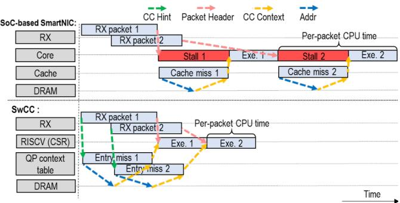  
Figure 5: Comparison of Soc-based SmartNIC and SwCC when processing packets.

In the TX path, when a sending packet request from the user/RX core enters the “WQ Handler”, the request QPN would be forwarded to the QP context table for prefetching. This also helps to hide QP context table miss penalty as the “WQ Handler” has to slice large messages into small packets and the processing time could be up to dozens of nanoseconds. Consistency Guarantee. Although different QPs are mapped to different CC cores, it is likely that a TX CC core and an RX CC core concurrently access the QP context of a particular flow. As such, the QP context table must provide a consistency guarantee. We implement locking purely in hardware, without requiring atomic instructions in the software. The core is triggered by hardware only when the QP context entry to be processed is not owned by other cores. Once triggered, the QP context entry is owned by this core, and the hardware manages the entry ownership. Each entry has a lock bit to indicate whether it is owned by a core. When triggering a core with an event, the hardware checks the lock bit; if occupied, it tries other events; otherwise, it triggers the core and sets the lock bit. When the core finishes execution, the hardware clears the lock bit. This mechanism works for two reasons. First, each event follows a run-to-completion model, so a core does not require ownership after processing. Second, the core processes events one by one, with each event having only one corresponding QP context entry, ensuring no complicated lock dependencies.

Summary. With the above four hardware-software codesigned mechanisms, SwCC is able to reduce as many as possible CC core stalls due to the long off-chip memory access time. Figure 5 illustrates how the packet events are processed when there is a miss in the on-chip cache/QP context table. In SoC-based SmartNIC, the RX packet has to be preprocessed by the RX hardware pipeline before triggering CC core execution. The cache miss would incur the stall of the core. In SwCC, we prefetch with a QPN hint to hide on-chip QP context table misses within the RX packet pre-processing. As such, the real RISC-V core cycles used for each packet event are minimized, thus a short CC controller triggering interval is guaranteed.

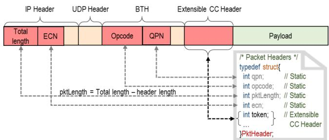  
Figure 6: The packet format of SwCC.

## 4.3 How to Keep High Flexibility

SwCC should provide developers with the ability to implement various kinds of CCAs, i.e., developers can decide 1) what signals to use, 2) when to trigger the CC controller, and 3) how to adjust data transmission in the CC controller.

As described in § 4.2.1, we place a multi-core RISC-V processor as the CC controller to allow developers to implement their custom logic on how to adjust data transmission. In the following, we present how developers can decide what signals to use and when to trigger the CC controller in SwCC.

## 4.3.1 Using Different CC Signals in SwCC

SwCC allows developers to leverage different CC signals to provide as much flexibility as possible. As discussed in §Section 2, CC signals can be mainly categorized into 1) ECN, 2) delay, 3) token, and 4) INT signals.

Extensible CC Header. To support the above CC signals, we propose the extensible CC header, a customized header sitting after the RoCEv2 BTH header. To use the extensible CC header, developers can add their own fields in the definition of a structure PktHeader. The first four fields (QPN, RDMA opcode, pktLength, and ECN) in the PktHeader are common for all kinds of CCAs, and developers can add their own fields, such as tokens, after the fixed four fields. Each packet in SwCC would carry the user-defined extensible CC header. The size of the extensible CC ranges from 0 to 64 bytes, as 64 bytes are enough for all mainstream CCAs (for example, HPCC [42] has 42B). In the RX path, when receiving a packet, the QPN and opcode in the BTH header, the packet length and ECN signal in the IP header would be extracted to the first four bytes of the structure PktHeader. The user-defined extensible CC header would also be placed in the following position of the structure PktHeader. The RX CC core can read the PktHeader structure to get all the required information. In the TX path, the TX CC core can write data into the structure PktHeader, and the hardware would be responsible for padding the data into the packet header. The position of the PktHeader in the packet header is shown in Figure 6.

Compatibility. Different CCAs have different deployment requirements. If the chosen CCA does not utilize the extensible CC header and thus does not require the remote side to provide custom metadata/signals, the remote side can be an existing commercial NIC. Otherwise, the remote side must be a SwCC-enhanced NIC. For non-INT CCAs, the switch simply treats the extensible CC header as part of the RDMA packet payload, and there is no switch deployment requirement. For INT-based CCAs, we currently need to use programmable switches to add INT metadata in the extensible header, as existing switches can only add INT metadata at the end of the packet.

The extensible CC header allows developers to implement ECN-based, token-based, and INT-based CCAs. To support delay-based CCAs, SwCC implements a hardware timer and exposes the timer as a CSR to all CC cores. CCA logic in the CC core can read this CSR to get the hardware time and use it to implement their delay-based CC logic. As such, SwCC can support all four kinds of CCAs and SwCC allows developers to decide what CC signals to use flexibly.

## 4.3.2 Selective Triggering

To allow developers to flexibly trigger the CC controller, we design a “Packet Filter” module that sits between the “RX Parser” and RX CC cores. Instead of letting each incoming packet generate an event and trigger the CC controller, the “Packet Filter” only generates events for the user-specified packets.When a packet arrives, the “Packet Filter” checks the opcode field in the packet header and determines whether to generate an event to trigger the RISC-V core. As such, developers can decide whether to trigger the CC controller at runtime.

The “Packet Filter” recognizes the RDMA opcode in the BTH header of the incoming packet. The opcode consists of 8 bits, where opcode[7:5] indicates the RDMA transport service type (e.g., Reliable Connection) and opcode[4:0] indicates the packet type (e.g., Send, Recv, Read, Write, etc.). In addition to the opcodes defined by the RoCEv2 standard, developers can adopt unused 0x18-0x1F opcodes to define their own packet types [34]. When implementing a CCA, developers must specify which RDMA opcodes will trigger an event by setting a 32-bit one-hot value. During system initialization (i.e., after the CCAs are programmed to the RISC-V core), the RISC-V core updates one of its CSRs using the one-hot value. The value of this CSR is connected as an input of the “Packet Filter” module, which would trigger the events according to this input. By blocking unnecessary packet events, selective triggering allows the CC controller to focus on processing user-specified events. As such, SwCC achieves its design goal of letting developers decide when to trigger the CC controller flexibly.

## 4.4 How to Keep High Programmability

SwCC provides a rich set of programming APIs (Table 2) to help developers to deploy their CCAs. We take a simple credit-based CCA as an example and show how to use these APIs to implement the CCA. The CCA has two functional parts: sender-side TX function and receiver-side RX function.

On the sender side, the TX function checks if the remaining credit is larger than the length of the to-be-sent packet. If the credit is enough, the TX function would notify the NIC hardware to construct and send this packet out. Otherwise, the request would be deferred.

On the receiver side, the RX function increments the credit if it has received an ACK packet. If the received packet is a data packet, the RX function would generate a send packet event to notify the NIC hardware to send an ACK packet to the remote sender. The CCA defines four bytes in the extensible CC header to store the returned credits in the ACK packet.

1 /\* Selective processing \*/   
2 #define TracedPkts ( ACK | WRITE\_REQ | READ\_RESP )   
3 /\* Extensible packet headers \*/   
4 typedef struct{   
5 int qpn ; /\* Static \*/   
6 int opcode ; /\* Static \*/   
int pktLength ; /\* Static \*/   
8 int ecn ; /\* Static \*/   
9 int returned\_credit ;   
10 }PktHeader;   
11 /\* Extensible QP context \*/   
12 typedef struct{   
13 int total\_credit ;   
14 } QPContext ;   
15 /\* Program running in the TX CC cores \*/   
16 int send () {   
17 int credit ;   
18 Event e;   
19 while(true){   
20 /\* Poll for new packet arrivals and read events from CSR \*/   
21 pollEventSync (& e);   
22 /\* Update the credit when sending a packet \*/   
23 if(e. context . total\_credit > e. packet . pktLength ){   
24 credit = e. context . total\_credit - e. packet . pktLength ;   
25 updateContext (e. context . total\_credit , credit );   
26 e. eventType = Send ;   
27 }else{   
28 e. eventType = LoopBack ;   
29 }   
30 postEvent (& e); /\* Write the event to CSR \*/   
31 }   
32 }   
33 /\* Program running in the RX CC cores \*/   
34 int recv () {   
35 Event e;   
36 int credit ;   
37 while(true){   
38 pollEventSync (& e);   
39 /\* Update the credit when receiving an ACK \*/   
40 if(e. packet . opcode == ACK ){   
41 credit = e. context . total\_credit + e. packet . returned\_credit ;   
42 updateContext (e. context . total\_credit , credit );   
43 e. eventType = Done ;   
44 /\* Send a ACK when receiving a WRITE\_REQ or READ\_RESP \*/   
45 }else{   
46 updatePkt(e. packet . returned\_credit , e. packet . pktLength );   
47 updatePkt(e. packet . opcode , ACK );   
48 e. eventType = GenTxEvent ;   
49 }   
50 postEvent (& e);   
51 }   
52 }  
Listing 1: An example of programming with SwCC.

Next, we show how to implement the CCA using the provided programming interfaces. Before writing CC controller logic, the developer has to complete three definitions. First, the developer has to define the variable TracedPkts (Line 2), and this value can tell the “Packet Filter” hardware to only generate RX events when receiving ACK-/RDMA\_WRITE\_REQ/RDMA\_READ\_RESP packets. Second, the developer has to define the returned\_credits field as an extensible CC header in the structure PktHeader (Line 9), and this field is used to store the returned credits in the ACK packets. Third, the developer has to define the field total\_credit field in the QP context table (Line 13), and this field is used to store the remaining credits of each QP. After that, the developer can write the RX function and TX function.

<table><tr><td rowspan=1 colspan=1>Function</td><td rowspan=1 colspan=1>Parameters</td><td rowspan=1 colspan=1>Description</td></tr><tr><td rowspan=1 colspan=1>pollEventSync (&amp;Event）</td><td rowspan=1 colspan=1>The Event containing the PKTHeader, QPContextand Event Type</td><td rowspan=1 colspan=1>Busy polling for the arrival of new packet,thenread the PKTHeaderand QPContext from the CSR into the Event.</td></tr><tr><td rowspan=1 colspan=1>updatePkt (packet .item, item)</td><td rowspan=1 colspan=1>An item in the PKTHeader (packet.item),A vari-able (item) to update the item in the PKTHeader</td><td rowspan=1 colspan=1>Update the packet.item in the PKTHeader using item</td></tr><tr><td rowspan=1 colspan=1>updateContext (context .item, item)</td><td rowspan=1 colspan=1>An item in the QPContext (context.item),A vari-able (item) to update the item in the QPContext</td><td rowspan=1 colspan=1>Update the context.item in the QPContext using item</td></tr><tr><td rowspan=1 colspan=1>postEvent (&amp;Event)</td><td rowspan=1 colspan=1>The Event containing the PKTHeader,QPContextand Event Type</td><td rowspan=1 colspan=1>Write the Event into the CSR,then notify the hardware engine thatpacket processing is complete</td></tr></table>

Table 2: SwCC programming APIs for implementing CCAs.

In the TX path, the TX CC core first polls send packet requests in the send request FIFO (Line 21). After polling a request, the TX CC core checks whether the remaining credit is larger than the requested packet size (Line 23). If so, the TX CC core decreases the total credit accordingly (Lines 24-25) and marks the request with Send, indicating that this send packet request is granted (Line 26). Otherwise, the TX CC core marks the request with LOOPBACK which indicates that the request should be pushed back into the send request FIFO (Lines 28). At last, the TX CC core posts the event and notifies the NIC hardware (Line 30).

In the RX path, the RX CC core polls the event FIFO (Line 38). After polling an event, the RX CC core checks whether the received packet is an ACK packet (Line 40). If so, the RX CC core increases the total credits by the value of the returned\_credit field in the extensible CC header (Lines 41-42), and then marks the event with Done (Line 43), indicating that NIC hardware does not need to do extra work. Otherwise, we should generate an ACK for the received packet (RDMA WRITE\_REQ or RDMA READ\_RESP). In this case, the RX CC core marks the event with GenTxEvent (Line 48) and sets the returned\_credit field in the extensible QP context as the received packet length (Line 46). At last, the RX CC core posts the event and notifies the NIC hardware.

In summary, SwCC provides programmers with easy-to-use programming abstractions. As such, SwCC allows developers to focus on the CCA logic instead of dealing with low-level NIC hardware interactions.

## 5 Evaluations

Our evaluations aim to answer the following questions:

• How does the control loop delay of SwCC compare to that of RoCE and Soft-RoCE (§5.2)?

• How much frequency can the TX/RX separated multi-core increase (§5.3)?

• How effective is the QP-aware memory subsystem (§5.4)?

• How are the flexibility and programmability of SwCC (§5.5)?

• How many resources do the SwCC use (§5.6)?

• How does the end-to-end performance of SwCC compare to that of ASIC-based NIC CC solutions (§5.7.1) and CPUbased CC solutions (§5.7.2)?

## 5.1 Experimental Setup

Experimental platform. The experimental platform consists of three servers, connected with a Wedge100BF-32X P4 reconfigurable switch. Each server is equipped with two Intel Xeon Silver 4214 CPUs @2.20GHz, 256GiB 2400MHz DDR4 memory, a Xilinx U280 FPGA, and a Mellanox ConnectX-5 NIC.

SwCC implementations. We prototype “SwCC” in Xilinx Alveo U280 FPGA (6K LoCs of Chisel3). SwCC mainly reuses the PCIe and CMAC modules of FpgaNIC [77]. There are mainly three extensions. First, we replace FpgaNIC’s TCP/IP transport with our RoCEv2 implementation. Second, we place several RISC-V cores in the NIC, which are positioned between the transport layer and the PCIe module. The RISC-V cores use the open-source riscvmini core [15], features a simple 3-stage pipeline. We mainly modify the cache/memory subsystem and the interface to the hardware. Third, we propose a QP-aware memory subsystem and related hardware logic that serves the RISC-V cores to minimize data/packet access time during CCA processing.

The SwCC logic runs at 250 MHz. We implement five CCAs (DCQCN [88], TIMELY [55], HPCC [42], Swift [40], Homa [57]) in the SwCC.

RoCE Baseline. The ASIC-based NIC CC solution baseline, labeled “RoCE”, runs traffic on the Mellanox ConnectX-5 NIC. We use MLNX\_OFED 23.1 driver and enable DCQCN in the server.

Soft-RoCE Baseline. We implement CPU-based CC solution baseline, labeled “Soft-RoCE”, based on Soft-RoCE [62]. We implement DCQCN (100 LoCs of C++), TIMELY (70 LoCs of C++) and HPCC (110 LoCs of C++) by referring to [42, 55, 88].

RDMA-HLS Baseline. The FPGA-based 100Gb RoCEv2 stack [74] baseline used in [68–70], labeled “RDMA-HLS”, runs traffic on the Xilinx Alveo U280 FPGA. We implement DCQCN in the stack using HDL.

BF3 Baseline. We implement baseline “BF3” that uses PCC in SoC SmartNIC Bluefield-3 [60] to implement DCQCN. Parameter Setting. We implement DCQCN, TIMELY, and HPCC using SwCC and Soft-RoCE. In the two implementations, we use the same parameters except those related to RTT, which we configure according to the actual measurements from SwCC and Soft-RoCE. For DCQCN, we set $K _ { m i n }$ = 5KB, Kmax = 200KB, Pmax = 1% and g = 1/256 following the default parameter setting in [88]. For TIMELY, we set α = 0.875 and β = 0.8, as suggested in [55]. For HPCC, we set η = 0.95 and maxStage = 5, as suggested in [42].

## 5.2 Comparison of Control Loop Delay

We first measure the RTT control loop delay of RDMA WRITE with a packet size of 1 KB. Figure 7 illustrates the results. We have two observations.

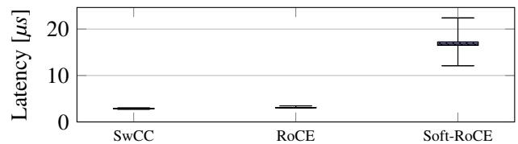  
Figure 7: Control loop delay comparison. Whiskers show the 1st and 99th percentile.

First, both SwCC and RoCE achieve a similar average control loop delay of approximately 3.1 µs. This is because both approaches offload the CC controller to the NIC, avoiding additional PCIe traversals and software overhead. Second, Soft-RoCE exhibits significantly higher and more variable latency compared to SwCC and RoCE. Soft-RoCE runs the CC controller on the CPU software, which introduces PCIe traversals along with overheads from data copying, and kernel switching, resulting in a longer and less stable control loop delay. The SwCC design would not increase the control loop delay and can have nearly the same control loop delay as the ASIC-based solution.

## 5.3 Effect of TX/RX Separated Multi-Core

We then validate the effectiveness of TX/RX Separated Multi-Core by measuring the maximum frequency and the throughput of SwCC.

Figure 8 shows the FPGA routing with/without the TX/RX separated multi-core (two cores for both implementations). We observe that the TX/RX separated multi-core has much less (50%) routing wire from/to the CC cores. This is because the TX/RX separated multi-core allows a single core to connect to only a subset of NIC resources as a core only needs to process TX or RX logic.

The reduced routing wire can help to increase the achieved design frequency. Figure 9 shows the achieved frequency with/without TX/RX separated multi-core, under different numbers of RISC-V cores3 with Vivado default implementation strategy. We observe that TX/RX separated multi-core can increase the achieved frequency by up to 16%. This is because TX/RX separated multi-core reduces the routing wire to/from the CC cores.

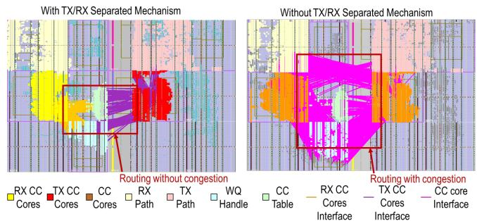

Figure 8: Comparison of routing with/without functional separation mechanism. “congestion” indicates the routing resource contention for circuits as the number of required routing wires increases.  
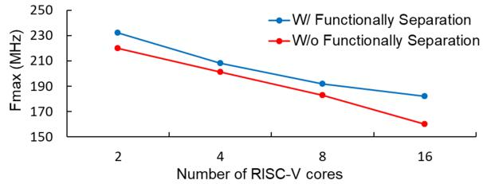  
Figure 9: Comparison of the assessed $F _ { m a x }$ with/without TX/RX separation mechanism.

Effect of Core Number. We evaluate the effect of core number, by comparing the throughput of RDMA WRITE.

Figure 10 demonstrates the throughput of different RDMA implementations under different packet sizes.4 The “SwCC-$\boldsymbol { \mathrm { n } " }$ means that SwCC instantiates n “RX CC” cores and n “TX CC” cores. The “RoCE-n” means the utilization of n PUs in the CX-5 NIC. There are only 8 PUs in the CX-5 NIC, so “RoCE-8” has reached the maximum throughput of the CX-5 NIC [65]. The “Soft-RoCE-n” means the use of n threads in the CPU to run Soft-RoCE. The CPU in our testbed supports up to 24 hardware threads and we use up to 24 threads in Soft-RoCE.

We have three observations. First, SwCC can achieve comparable throughput to that of commercial NICs. “SwCC-8” and “RoCE-8” both achieve line rates with packet sizes above 512B. The throughput of “SwCC-1” is 1.1-1.5 times that of “RoCE-1”. This is because SwCC uses two RISC-V cores (a “TX CC” and a “RX CC”) to handle a single flow, while the CX-5 NIC uses only one PU to process a flow. Second, the throughput of Soft-RoCE is much lower than the other two implementations. Even with 24 threads in “Soft-RoCE-24”, Soft-RoCE only achieves around 24Gbps throughput. This is because of the inefficiencies in the kernel network stack caused by data copying from the kernel to application buffers, kernel switching, etc [10]. Third, “SwCC” and “RDMA-HLS” achieve nearly identical performance as both run on FPGAbased SmartNICs. Likewise, “BF3” and “RoCE” deliver comparable performance because they use the same hardware network card.

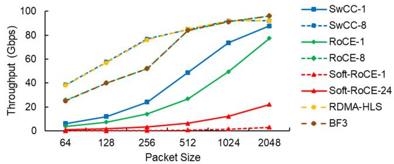

Figure 10: Comparison of throughput for various approaches using different numbers of cores/units/threads.  
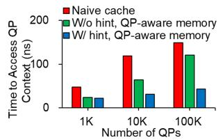  
(a) Average time to access QP context.

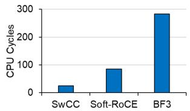  
(b) The cycles of CC controller.

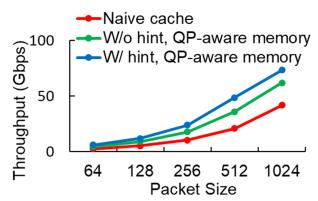  
(c) The RDMA WRITE throughput of SwCC.

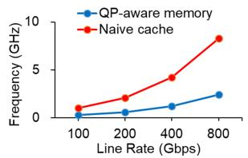  
(d) The frequency required to achieve various line rates.  
Figure 11: The effect of QP-aware memory subsystem.

## 5.4 Effect of QP-aware Memory Subsystem

We examine the effect of the QP-aware memory subsystem by comparing the CC core’s access time to the QP context, CC controller execution cycles and throughput of RDMA WRITE. The size of QP context table is 128 KB, “w/o hint” and “w/ hint” indicate whether the QPN hint interface is used for the QP-aware memory subsystem. We also implement a naive memory subsystem, which includes a 4-way associative cache with a cache line size of 64B, and the size of cache is 128 KB, labeled “naive cache”.

Time to Access QP Context. We establish 1K, 10K, and 100K QPs on two servers. The sender randomly selects a QP from these QPs with a uniform probability of initiating an RDMA WRITE request. We send 100M requests with each carrying a 1KB message and measure the time to access the QP context on the RISC-V core.

Figure 11a illustrates the average QP context access time for different approaches with different numbers of network flows. We observe that, regardless of the number of network flows running, QP-aware memory reduces memory access time by at least 50% compared to naive cache. When the number of QPs is 1K, the QP context is fully cached, the naive cache requires multiple load/store instructions to move the QP context into the registers, leading to additional delays. When the QP context is not fully cached, QP-aware memory can leverage its hint interface to prefetch the QP context, further reducing access time. As the number of QPs increases, the performance of SwCC remains nearly constant.

Execution Cycles. Figure 11b shows the cycles of different baselines for the CC controller running DCQCN. We have two observations. First, “Soft-RoCE” runs on the CPU and uses a naive memory system, and thus requires approximately 3× the cycles of “SwCC”. Second, “BF3”, significantly increases the total execution cycles, reaching 11.4× that of “SwCC”. It is mainly due to BlueField-3’s poor DPA memory subsystem.

Throughput. We compare the network throughput with naive cache and QP-aware memory under different packet sizes. We instantiated 1 pair of CC cores in SwCC, and we set the number of network flows to 100K. Each flow sends 1K RDMA WRITE requests with each carrying a 1 KB message.

As shown in Figure 11c, when one pair of CC cores is instantiated in SwCC, the QP-aware memory significantly impacts throughput. The throughput of the naive cache is approximately 40% of that of the QP-aware memory with small packets. This is because, in this case, the throughput bottleneck of the SwCC core lies in the CC core, where excessive CPU cycles are required to process each event, resulting in low throughput. Therefore, reducing the number of CPU cycles required by the CC core to process events can effectively increase the throughput of SwCC.

Potential ASIC Design. SwCC currently targets an FPGAbased SmartNIC, however, because it comprises fixed components and RISC-V cores, it readily supports an ASIC design, which offers higher clock frequencies and more efficient hardware resource utilization. We use simulations to estimate the processor frequency required to achieve line rate under a single QP with different memory subsystems, setting the RDMA message size to 1 KB. As shown in Figure 11d, naive cache requires up to 8 GHz to reach an 800 Gbps line rate, whereas QP-aware memory needs only 2.4 GHz, which is more realistic to achieve. This outcome demonstrates SwCC’s potential for ultra-high-speed networks.

Regarding the power consumption of the ASIC design, we can compare SwCC with RISC-V cores in commercial SmartNICs. The BlueField-3 SmartNIC features a 1.8 GHz, 16-core/256-thread RISC-V core, with total NIC power consumption at 66 W. Since SwCC employs only a simple inorder, 3-stage 2-core RISC-V design at 2.4 GHz, we believe its projected power consumption to be reasonable for a NIC.

Table 3: C code lines for implementing various CCAs in SwCC.
<table><tr><td rowspan=1 colspan=1>CCA</td><td rowspan=1 colspan=1>CCSignal</td><td rowspan=1 colspan=1>Triggering Event</td><td rowspan=1 colspan=1>AdjustmentStrategy</td><td rowspan=1 colspan=1>C code(lines)</td></tr><tr><td rowspan=1 colspan=1>DCQCN</td><td rowspan=1 colspan=1>ECN</td><td rowspan=1 colspan=1>CNP,DATA,Ti</td><td rowspan=1 colspan=1>rate</td><td rowspan=1 colspan=1>140</td></tr><tr><td rowspan=1 colspan=1>TIMELY</td><td rowspan=1 colspan=1>timestamp</td><td rowspan=1 colspan=1>ACK</td><td rowspan=1 colspan=1>rate</td><td rowspan=1 colspan=1>102</td></tr><tr><td rowspan=1 colspan=1>HPCC</td><td rowspan=1 colspan=1>INT</td><td rowspan=1 colspan=1>ACK</td><td rowspan=1 colspan=1>wnd</td><td rowspan=1 colspan=1>148</td></tr><tr><td rowspan=1 colspan=1>Swift</td><td rowspan=1 colspan=1>timestamp</td><td rowspan=1 colspan=1>ACK</td><td rowspan=1 colspan=1>wnd</td><td rowspan=1 colspan=1>164</td></tr><tr><td rowspan=1 colspan=1>Homa</td><td rowspan=1 colspan=1>token</td><td rowspan=1 colspan=1>DATA, GRANT,RESEND,BUSY</td><td rowspan=1 colspan=1>credit</td><td rowspan=1 colspan=1>95</td></tr></table>

Table 4: FPGA resource consumption.
<table><tr><td rowspan=1 colspan=1>Name</td><td rowspan=1 colspan=1>LUTs (K)</td><td rowspan=1 colspan=1>REGs (K)</td><td rowspan=1 colspan=1>BRAMs</td><td rowspan=1 colspan=1>URAMs</td></tr><tr><td rowspan=1 colspan=1>RDMA-HLS</td><td rowspan=1 colspan=1>26 (2%)</td><td rowspan=1 colspan=1>65(2.5%)</td><td rowspan=1 colspan=1>130 (6.4%)</td><td rowspan=1 colspan=1>0(0%)</td></tr><tr><td rowspan=1 colspan=1>SwCC-1</td><td rowspan=1 colspan=1>51 (3.9%)</td><td rowspan=1 colspan=1>62 (2.4%)</td><td rowspan=1 colspan=1>220 (11%)</td><td rowspan=1 colspan=1>4 (0.4%)</td></tr><tr><td rowspan=1 colspan=1>SwCC-8</td><td rowspan=1 colspan=1>112 (8.6%)</td><td rowspan=1 colspan=1>124 (4.8%)</td><td rowspan=1 colspan=1>220 (11%)</td><td rowspan=1 colspan=1>32 (3.3%)</td></tr><tr><td rowspan=1 colspan=1>CCCore</td><td rowspan=1 colspan=1>8(0.6%)</td><td rowspan=1 colspan=1>4(0.2%)</td><td rowspan=1 colspan=1>0(0%)</td><td rowspan=1 colspan=1>2 (0.2%)</td></tr><tr><td rowspan=1 colspan=1>QP-awareMemory</td><td rowspan=1 colspan=1>2.5 (0.2%)</td><td rowspan=1 colspan=1>0.5 (0.1%)</td><td rowspan=1 colspan=1>114 (5.6%)</td><td rowspan=1 colspan=1>0(0%)</td></tr></table>

## 5.5 Flexible User-Defined CC Framework

Based on SwCC, we implement five representative CCAs that 1) use different CC signals, 2) trigger the CC controller at different times, and 3) adjust data transmission differently. Table 3 shows 1) what CC signals these CCAs use, 2) what types of packets trigger the CC controller when received by these CCAs, 3) which kind of data transmission strategies these CCAs use, and 4) lines of C code to implement these CCAs. We have two observations. First, SwCC supports a broad range of CCAs. SwCC achieves its design goal of high flexibility. Second, regardless of the algorithm, each can be implemented in less than 200 lines of code. This is because SwCC allows developers to focus on the CCA logic without dealing with complex hardware details. SwCC achieves its design goal of high programmability.

## 5.6 Hardware Resource Usage

Table 4 shows the FPGA resource consumption of “RDMA-HLS” and “SwCC”. “SwCC-1” requires the instantiation of RISC-V cores and supports extended CC headers of various lengths. Consequently, it utilizes slightly more resources compared to “RDMA-HLS”. “SwCC-8”, which instantiates 16 RISC-V cores, consumes approximately twice the hardware resources of “SwCC-1”. Despite the increased resource usage, it only occupies under 10% resources, leaving ample capacity for other functionality.

## 5.7 End-to-End Performance

We compare “SwCC”, “RoCE”, and “SoftRoCE” to evaluate the end-to-end performance of “SwCC”. We compare “SwCC” and “RoCE” on a 100Gbps network. The comparison between “SwCC” and “Soft-RoCE” is conducted on a 10Gbps network because “Soft-RoCE” cannot reach a line rate of 100Gbps.

## 5.7.1 SwCC vs. RoCE

In the experiment, we use three servers, two as senders and one as a receiver. Each of two senders starts 5 flows to the receiver, where each flow sends 2K messages, each with a size of 2 KB. We implement the DCQCN algorithm in SwCC, labeled “SwCC”. We set the period of CNP generation in DCQCN as 50 µs, and the period of updating α as 55 µs, which follows the parameter setting in [88].

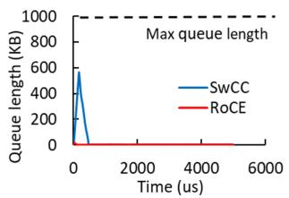  
(a) Queue length

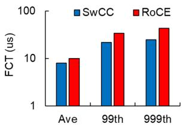  
(b) FCT

Figure 12: The end-to-end performance comparison of SwCCand RoCE.  
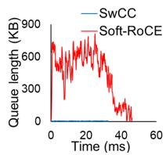

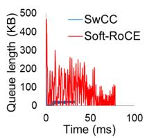  
(a) TIMELY

(b) DCQCN  
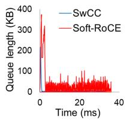  
(c) HPCC  
Figure 13: Comparison of buffer occupancy at the congested port of the switch under various CCAs.

Figure 12 shows the buffer occupancy comparison and flow completion time. We observe that when the CX-5 NIC detects congestion in the “RoCE” baseline, it halts data transmission for approximately 90 µs. In contrast, SwCC’s implementation of the DCQCN algorithm adjusts the transmission rate based on work [88]. Consequently, the buffer occupancy of “RoCE” drains more quickly than that of “SwCC”, but it still remains significantly below the switch’s maximum queue length. Additionally, the halt in transmission results in a slightly longer FCT for “RoCE” compared to “SwCC”. In the absence of publicly available details of the NIC’s CCAs, we can not devise an identical algorithm. In sum, “SwCC” delivers slightly better performance than “RoCE”.

## 5.7.2 SwCC vs. Soft-RoCE

We implement the DCQCN, TIMELY, and HPCC in SwCC and Soft-RoCE, with the same settings as Section 5.7.1. In our testbed, the RTT is approximately 5 µs for SwCC and 30 µs for Soft-RoCE, respectively.

Figure 13 shows the switch buffer occupancy comparison under different algorithms for SwCC and Soft-RoCE during congestion. We observe that SwCC alleviates congestion more rapidly under different levels of network congestion. This is due to SwCC’s shorter control loop, which increases its sensitivity to congestion, allowing it to respond more quickly and effectively mitigate network congestion.

Figure 14 shows the comparison of FCT under different algorithms for SwCC and Soft-RoCE during congestion. We observe that when implementing the TIMELY, DCQCN, and HPCC CCAs, the FCT of Soft-RoCE is 14×, 39×, and 42× higher than that of SwCC respectively. This is mainly because

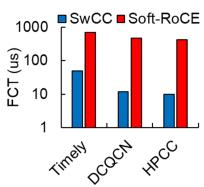  
(a) Average

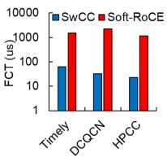  
(b) 99th percentile

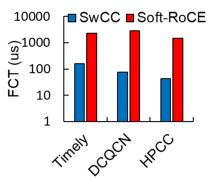  
(c) 999th percentile  
Figure 14: Comparing of FCT statistics for SwCC and Soft-RoCE under various CCAs.

SwCC has a much lower control loop delay than Soft-RoCE.

## 6 Related Work

ASIC-based NIC CC solution. Some NICs offload the network stacks with hard-wired transport protocols [9, 35, 53]. However, they only implement at most two types of congestion control, including PFC [32] and DCQCN [61], and can only be modified by their vendor.

CPU-based CC solution. The “pluggable TCP" API [37] and QUIC [41] support user-space programming of congestion control. However, they do not bypass the kernel, resulting in poor performance. Kernel bypass libraries such as DPDK [16], netmap [67] and Snap [46] allow programs to send packets from userspace to the NIC. The mTCP [38] implements NewReno [18] on DPDK. Google deploys Swift [40] and 1RMA [71] on Snap. However, Snap’s RTT latency for a single-sided operation is 8.8 µs, which is 2.8 × higher than the control loop latency of ASIC-based NICs.

FPGA-based SmartNIC CC solution.The emergence of FPGA-based SmartNICs [12, 30, 31, 70, 84, 85, 89] has made programmable CC on NICs feasible. Prior works [4,5] enable programmers to implement a variety of transport protocols in hardware by Verilog or P4 language. However, the HDL offers low programmability. Some works [26, 64] implement rate-based CCAs using packet pacing, but they do not provide a programmable interface.

SoC-based SmartNIC system. Prior works [17, 23, 39, 43, 45, 72, 78, 79, 83] propose the frameworks or systems on SoCbased SmartNIC to alleviate the host CPU pressure. None of these works address the issue of a programmable CC controller. Many vendors [36, 58, 60, 80] have developed SoCbased SmartNICs that incorporate CPUs and network acceleration hardware. However, only a few of these SmartNICs [63] feature dedicated programmable congestion control interfaces, and their flexibility remains limited.

## 7 Conclusion

This paper presents SwCC, an RDMA engine integrated with a RISC-V processor that enables the execution of a wide range of CCAs directly on the RISC-V core, while keeping high performance. SwCC achieves an end-to-end control loop delay of 3 µs, which is comparable to that of leading commercial NICs while providing high flexibility and programmability for CCA development. The ASIC design of SwCC can easily scale to higher network bandwidth.

Acknowledgement. The work is supported by the following grants: the National Key R&D Program of China (Grant No. 2022ZD0119301), the National Natural Science Foundation of China under the grant numbers (62472384, 62441236, U24A20326). Zeke Wang is the corresponding author.

## References

[1] Vamsi Addanki, Oliver Michel, and Stefan Schmid. {PowerTCP}: Pushing the performance limits of datacenter networks. In NSDI, 2022.

[2] Saksham Agarwal, Arvind Krishnamurthy, and Rachit Agarwal. Host congestion control. In SIGCOMM, 2023.

[3] AMD. UltraFast Design Methodology Guide for FP-GAs and SoCs. https://docs.amd.com/r/en-US/ ug949-vivado-design-methodology, 2024.

[4] Mina Tahmasbi Arashloo, Alexey Lavrov, Manya Ghobadi, Jennifer Rexford, David Walker, and David Wentzlaff. Enabling programmable transport protocols in {High-Speed}{NICs}. In NSDI, 2020.

[5] Serhat Arslan, Stephen Ibanez, Alex Mallery, Changhoon Kim, and Nick McKeown. Nanotransport: A low-latency, programmable transport layer for nics. In SOSR, 2021.

[6] Serhat Arslan, Yuliang Li, Gautam Kumar, and Nandita Dukkipati. Bolt:{Sub-RTT} congestion control for {Ultra-Low} latency. In NSDI, 2023.

[7] Venkat Arun and Hari Balakrishnan. Copa: Practical {Delay-Based} congestion control for the internet. In NSDI, 2018.

[8] Wei Bai, Shanim Sainul Abdeen, Ankit Agrawal, Krishan Kumar Attre, Paramvir Bahl, Ameya Bhagat, Gowri Bhaskara, Tanya Brokhman, Lei Cao, Ahmad Cheema, et al. Empowering azure storage with {RDMA}. In NSDI, 2023.

[9] Broadcom. BCM957508-P2100G Dual-Port 100 Gb/s QSFP56 Ethernet PCI Express 4.0 x16 Network Interface Card. https://docs.broadcom.com/doc/ 957508-P2100G-DS, 2019.

[10] Qizhe Cai, Shubham Chaudhary, Midhul Vuppalapati, Jaehyun Hwang, and Rachit Agarwal. Understanding host network stack overheads. In SIGCOMM, 2021.

[11] Neal Cardwell, Yuchung Cheng, C Stephen Gunn, Soheil Hassas Yeganeh, and Van Jacobson. Bbr: congestion-based congestion control. CACM, 2017.

[12] Adrian M Caulfield, Eric S Chung, Andrew Putnam, Hari Angepat, Jeremy Fowers, Michael Haselman, Stephen Heil, Matt Humphrey, Puneet Kaur, Joo-Young Kim, et al. A cloud-scale acceleration architecture. In MICRO, 2016.

[13] Xuzheng Chen, Jie Zhang, Ting Fu, Yifan Shen, Shu Ma, Kun Qian, Lingjun Zhu, Chao Shi, Yin Zhang, Ming Liu, et al. Demystifying datapath accelerator enhanced offpath smartnic. arXiv preprint arXiv:2402.03041, 2024.

[14] Inho Cho, Keon Jang, and Dongsu Han. Creditscheduled delay-bounded congestion control for datacenters. In SIGCOMM, 2017.

[15] Donggyu Kim. riscv-mini. https://github.com/u cb-bar/riscv-mini, 2024.

[16] DPDK. https://dpdk.org/.

[17] Yixiao Feng, Sourav Panda, Sameer G Kulkarni, KK Ramakrishnan, and Nick Duffield. A smartnic-accelerated monitoring platform for in-band network telemetry. In LANMAN, 2020.

[18] Floyd, Sally and Henderson, Tom and Gurtov, Andrei. The NewReno modification to TCP’s fast recovery algorithm. https://www.rfc-editor.org/rfc/rf c3782, 2004.

[19] Peter X Gao, Akshay Narayan, Gautam Kumar, Rachit Agarwal, Sylvia Ratnasamy, and Scott Shenker. phost: Distributed near-optimal datacenter transport over commodity network fabric. In CoNEXT, 2015.

[20] Yixiao Gao, Qiang Li, Lingbo Tang, Yongqing Xi, Pengcheng Zhang, Wenwen Peng, Bo Li, Yaohui Wu, Shaozong Liu, Lei Yan, et al. When cloud storage meets {RDMA}. In NSDI, 2021.

[21] Prateesh Goyal, Akshay Narayan, Frank Cangialosi, Srinivas Narayana, Mohammad Alizadeh, and Hari Balakrishnan. Elasticity detection: A building block for internet congestion control. In SIGCOMM, 2022.

[22] Prateesh Goyal, Preey Shah, Kevin Zhao, Georgios Nikolaidis, Mohammad Alizadeh, and Thomas E. Anderson. Backpressure flow control. In NSDI, 2022.

[23] Stewart Grant, Anil Yelam, Maxwell Bland, and Alex C Snoeren. Smartnic performance isolation with fairnic: Programmable networking for the cloud. In SIGCOMM, 2020.

[24] Chuanxiong Guo, Haitao Wu, Zhong Deng, Gaurav Soni, Jianxi Ye, Jitu Padhye, and Marina Lipshteyn. Rdma over commodity ethernet at scale. In SIGCOMM, 2016.

[25] Chuanxiong Guo, Haitao Wu, Zhong Deng, Gaurav Soni, Jianxi Ye, Jitu Padhye, and Marina Lipshteyn. Rdma over commodity ethernet at scale. In SIGCOMM, 2016.

[26] Y Sinan Hanay, Abhishek Dwaraki, and Tilman Wolf. High-performance implementation of in-network traffic pacing. In HPSR, 2011.

[27] Mark Handley, Costin Raiciu, Alexandru Agache, Andrei Voinescu, Andrew W Moore, Gianni Antichi, and Marcin Wójcik. Re-architecting datacenter networks and stacks for low latency and high performance. In SIGCOMM, 2017.

[28] Shuihai Hu, Yibo Zhu, Peng Cheng, Chuanxiong Guo, Kun Tan, Jitendra Padhye, and Kai Chen. Deadlocks in datacenter networks: Why do they form, and how to avoid them. In HotNets, 2016.

[29] Shuihai Hu, Yibo Zhu, Peng Cheng, Chuanxiong Guo, Kun Tan, Jitendra Padhye, and Kai Chen. Tagger: Practical pfc deadlock prevention in data center networks. In CoNEXT, 2017.

[30] Hongjing Huang, Yingtao Li, Jie Sun, Xueying Zhu, Jie Zhang, Liang Luo, Jialin Li, and Zeke Wang. P4sgd: Programmable switch enhanced model-parallel training on generalized linear models on distributed fpgas. TPDS, 2023.

[31] Hongjing Huang, Zeke Wang, Jie Zhang, Zhenhao He, Chao Wu, Jun Xiao, and Gustavo Alonso. Shuhai: A tool for benchmarking high bandwidth memory on fpgas. IEEE Transactions on Computers, 2021.

[32] IEEE. Priority-based Flow Control. https://1.ieee 802.org/dcb/802-1qbb/, 2011.

[33] InfiniBand. RoCEv2. https://www.infiniband ta.org/infiniband-trade-association-relea ses-updated-specification-for-remote-direc t-memory-access-over-converged-ethernet-r oce/, 2014.

[34] InfiniBand. InfiniBandTM Architecture Specification Volume 1. https://www.infinibandta.org/ibt a-specification/, 2020.

[35] Intel. Intel® Ethernet Network Adapter E810- CQDA2T. https://cdrdv2.intel.com/v1/dl/g etContent/726375, 2022.

[36] Intel. Intel® IPU Platform F2000X-PL. https://www.intel.com/content/www/us/en/ products/details/network-io/ipu/f2000x-p l-platform.html#tab-blade-1-2, 2023.

[37] J. Corbet. Pluggable congestion avoidance modules. https://lwn.net/Articles/128681/, 2005.

[38] EunYoung Jeong, Shinae Wood, Muhammad Jamshed, Haewon Jeong, Sunghwan Ihm, Dongsu Han, and KyoungSoo Park. {mTCP}: a highly scalable user-level {TCP} stack for multicore systems. In NSDI, 2014.

[39] Mikhail Khalilov, Marcin Chrapek, Siyuan Shen, Alessandro Vezzu, Thomas Benz, Salvatore Di Girolamo, Timo Schneider, Daniele De Sensi, Luca Benini, and Torsten Hoefler. {OSMOSIS}: Enabling {Multi-Tenancy} in datacenter {SmartNICs}. In ATC, 2024.

[40] Gautam Kumar, Nandita Dukkipati, Keon Jang, Hassan MG Wassel, Xian Wu, Behnam Montazeri, Yaogong Wang, Kevin Springborn, Christopher Alfeld, Michael Ryan, et al. Swift: Delay is simple and effective for congestion control in the datacenter. In SIGCOMM, 2020.

[41] Adam Langley, Alistair Riddoch, Alyssa Wilk, Antonio Vicente, Charles Krasic, Dan Zhang, Fan Yang, Fedor Kouranov, Ian Swett, Janardhan Iyengar, et al. The quic transport protocol: Design and internet-scale deployment. In SIGCOMM, 2017.

[42] Yuliang Li, Rui Miao, Hongqiang Harry Liu, Yan Zhuang, Fei Feng, Lingbo Tang, Zheng Cao, Ming Zhang, Frank Kelly, Mohammad Alizadeh, et al. Hpcc: High precision congestion control. In SIGCOMM. 2019.

[43] Ming Liu, Tianyi Cui, Henrik Schuh, Arvind Krishnamurthy, Simon Peter, and Karan Gupta. ipipe: A framework for building distributed applications on multicore soc smartnics. In SIGCOMM, 2019.

[44] Shiyu Liu, Ahmad Ghalayini, Mohammad Alizadeh, Balaji Prabhakar, Mendel Rosenblum, and Anirudh Sivaraman. Breaking the {Transience-Equilibrium} nexus: A new approach to datacenter packet transport. In NSDI, 2021.

[45] Yiqing Ma, Han Tian, Xudong Liao, Junxue Zhang, Weiyan Wang, Kai Chen, and Xin Jin. Multi-objective congestion control. In Eurosys, 2022.

[46] Michael Marty, Marc de Kruijf, Jacob Adriaens, Christopher Alfeld, Sean Bauer, Carlo Contavalli, Michael Dalton, Nandita Dukkipati, William C Evans, Steve Gribble, et al. Snap: A microkernel approach to host networking. In SOSP, 2019.

[47] Mellanox. ConnectX®-3 Ethernet Single and Dual SFP+ Port Adapter Card User Manual. https: //network.nvidia.com/related-docs/user\_man uals/ConnectX-3\_Ethernet\_Single\_and\_Dual\_S FP+\_Port\_Adapter\_Card\_User\_Manual.pdf, 2015.

[48] Mellanox. ConnectX-6. https://www.nvidia.c om/en-sg/networking/ethernet/connectx-6/, 2018.

[49] Mellanox. ConnectX®-4 Lx EN Card. https://network.nvidia.com/files/doc-2020/ pb-connectx-4-lx-en-card.pdf, 2020.

[50] Mellanox. ConnectX®-5 EN Card. https://network.nvidia.com/files/doc-2020/ pb-connectx-5-en-card.pdf, 2020.

[51] Mellanox. ConnectX-6 Lx 25G/50G Ethernet NIC. https://nvdam.widen.net/s/nqbftvdlh7/connec tx-6-lx-en-card-product-brief-1731006, 2021.

[52] Mellanox. NVIDIA CONNECTX-6 DX. https://www.nvidia.com/content/dam/en-z z/Solutions/networking/ethernet-adapters/ connectX-6-dx-datasheet.pdf, 2021.

[53] Mellanox. NVIDIA CONNECTX-7 400G ETHERNET. https://www.nvidia.com/content/dam/en-zz/ Solutions/networking/ethernet-adapters/co nnectx-7-datasheet-Final.pdf, 2021.

[54] Zili Meng, Yaning Guo, Chen Sun, Bo Wang, Justine Sherry, Hongqiang Harry Liu, and Mingwei Xu. Achieving consistent low latency for wireless real-time communications with the shortest control loop. In SIGCOMM, 2022.

[55] Radhika Mittal, Vinh The Lam, Nandita Dukkipati, Emily Blem, Hassan Wassel, Monia Ghobadi, Amin Vahdat, Yaogong Wang, David Wetherall, and David Zats. Timely: Rtt-based congestion control for the datacenter. SIGCOMM, 2015.

[56] Radhika Mittal, Alexander Shpiner, Aurojit Panda, Eitan Zahavi, Arvind Krishnamurthy, Sylvia Ratnasamy, and Scott Shenker. Revisiting network support for rdma. In SIGCOMM, 2018.

[57] Behnam Montazeri, Yilong Li, Mohammad Alizadeh, and John Ousterhout. Homa: A receiver-driven lowlatency transport protocol using network priorities. In SIGCOMM, 2018.

[58] Netronome. Agilio CX SmartNICs. https://netron ome.com/agilio-smartnics/, 2024.

[59] Rolf Neugebauer, Gianni Antichi, José Fernando Zazo, Yury Audzevich, Sergio López-Buedo, and Andrew W Moore. Understanding pcie performance for end host networking. In SIGCOMM, 2018.

[60] NVIDIA. NVIDIA BLUEFIELD-3 DPU. https://www.nvidia.com/content/dam/en-z z/Solutions/Data-Center/documents/datashee t-nvidia-bluefield-3-dpu.pdf, 2021.

[61] NVIDIA. HOWTO CONFIGURE DCQCN (ROCE CC) VALUES FOR CONNECTX-4 (LINUX). https://enterprise-support.nvidia.com/s/ar ticle/howto-configure-dcqcn--roce-cc--val ues-for-connectx-4--linux-x, 2022.

[62] NVIDIA. HOWTO CONFIGURE SOFT-ROCE. https://enterprise-support.nvidia.com/s/ar ticle/howto-configure-soft-roce, 2022.

[63] NVIDIA. NVIDIA DOCA PCC Application Guide. https://docs.nvidia.com/doca/sdk/nvidia+do ca+pcc+application+guide/index.html, 2023.

[64] Sivasankar Radhakrishnan, Yilong Geng, Vimalkumar Jeyakumar, Abdul Kabbani, George Porter, and Amin Vahdat. {SENIC}: Scalable {NIC} for {End-Host} rate limiting. In NSDI, 2014.

[65] Waleed Reda, Marco Canini, Dejan Kostic, and Simon ´ Peter. {RDMA} is turing complete, we just did not know it yet! In NSDI, 2022.

[66] RISC-V. The RISC-V Instruction Set Manual: Volume II. https://github.com/riscv/riscv-isa -manual/releases/tag/20240411, 2024.

[67] Luigi Rizzo. netmap: a novel framework for fast packet i/o. In USENIX Security, 2012.

[68] David Sidler, Gustavo Alonso, Michaela Blott, Kimon Karras, Kees Vissers, and Raymond Carley. Scalable 10gbps tcp/ip stack architecture for reconfigurable hardware. In FCCM, 2015.

[69] David Sidler, Zsolt István, and Gustavo Alonso. Lowlatency tcp/ip stack for data center applications. In FPL, 2016.

[70] David Sidler, Zeke Wang, Monica Chiosa, Amit Kulkarni, and Gustavo Alonso. Strom: smart remote memory. In EuroSys, pages 1–16, 2020.

[71] Arjun Singhvi, Aditya Akella, Dan Gibson, Thomas F Wenisch, Monica Wong-Chan, Sean Clark, Milo MK Martin, Moray McLaren, Prashant Chandra, Rob Cauble, et al. 1rma: Re-envisioning remote memory access for multi-tenant datacenters. In SIGCOMM, 2020.

[72] Chihun Song, Michael Jaemin Kim, Tianchen Wang, Houxiang Ji, Jinghan Huang, Ipoom Jeong, Jaehyun Park, Hwayong Nam, Minbok Wi, Jung Ho Ahn, and Nam Sung Kim. Tarot: A cxl smartnic-based defense against multi-bit errors by row-hammer attacks. In ASP-LOS, 2024.

[73] Brent Stephens, Alan L Cox, Ankit Singla, John Carter, Colin Dixon, and Wesley Felter. Practical dcb for improved data center networks. In INFOCOM, 2014.

[74] Systems Group, ETH Zurich. Scalable Network Stack supporting TCP/IP, RoCEv2, UDP/IP at 10- 100Gbit/s. https://github.com/fpgasystems/f pga-network-stack?tab=readme-ov-file.

[75] Parvin Taheri, Danushka Menikkumbura, Erico Vanini, Sonia Fahmy, Patrick Eugster, and Tom Edsall. Rocc: robust congestion control for rdma. In CoNEXT, 2020.

[76] Weitao Wang, Masoud Moshref, Yuliang Li, Gautam Kumar, TS Eugene Ng, Neal Cardwell, and Nandita Dukkipati. Poseidon: Efficient, robust, and practical datacenter {CC} via deployable {INT}. In NSDI, 2023.

[77] Zeke Wang, Hongjing Huang, Jie Zhang, Fei Wu, and Gustavo Alonso. {FpgaNIC}: An {FPGA-based} versatile 100gb {SmartNIC} for {GPUs}. In ATC, 2022.

[78] Xingda Wei, Rongxin Cheng, Yuhan Yang, Rong Chen, and Haibo Chen. Characterizing off-path SmartNIC for accelerating distributed systems. In OSDI, 2023.

[79] Shaoke Xi, Fuliang Li, Lingxiang Hu, Xingwei Wang, and Kui Ren. Flowvalve+: Multi-queue packet scheduling framework on soc-based smartnics. TSC, 2024.

[80] Xilinx. ALVEO™ SN1000 SmartNICs. https://www.xilinx.com/content/dam/xilin x/publications/product-briefs/xilinx-alveo -sn1000-product-brief.pdf, 2023.

[81] Siyu Yan, Xiaoliang Wang, Xiaolong Zheng, Yinben Xia, Derui Liu, and Weishan Deng. Acc: Automatic ecn tuning for high-speed datacenter networks. In SIG-COMM, 2021.

[82] Chen-Yu Yen, Soheil Abbasloo, and H Jonathan Chao. Computers can learn from the heuristic designs and master internet congestion control. In SIGCOMM, 2023.

[83] Jie Zhang, Xuzheng Chen, Yin Zhang, and Zeke Wang. Dmrpc: Disaggregated memory-aware datacenter rpc for data-intensive applications. In ICDE, 2024.

[84] Jie Zhang, Hongjing Huang, Xuzheng Chen, Xiang Li, Jieru Zhao, Ming Liu, and Zeke Wang. Rpcnic: Enabling efficient datacenter rpc offloading on pcieattached smartnics. In HPCA, 2025.

[85] Jie Zhang, Hongjing Huang, Lingjun Zhu, Shu Ma, Dazhong Rong, Yijun Hou, Mo Sun, Chaojie Gu, Peng Cheng, Chao Shi, et al. Smartds: Middle-tier-centric smartnic enabling application-aware message split for disaggregated block storage. In ISCA, 2023.

[86] Yiran Zhang, Yifan Liu, Qingkai Meng, and Fengyuan Ren. Congestion detection in lossless networks. In SIGCOMM, 2021.

[87] Xiaolong Zhong, Jiao Zhang, Yali Zhang, Zixuan Guan, and Zirui Wan. Pacc: Proactive and accurate congestion feedback for rdma congestion control. In INFOCOM, 2022.

[88] Yibo Zhu, Haggai Eran, Daniel Firestone, Chuanxiong Guo, Marina Lipshteyn, Yehonatan Liron, Jitendra Padhye, Shachar Raindel, Mohamad Haj Yahia, and Ming Zhang. Congestion control for large-scale rdma deployments. SIGCOMM, 2015.

[89] Noa Zilberman, Yury Audzevich, Georgina Kalogeridou, Neelakandan Manihatty-Bojan, Jingyun Zhang, and Andrew Moore. Netfpga: Rapid prototyping of networking devices in open source. SIGCOMM, 2015.

## A Artifact Appendix

## A.1 Abstract

This artifact provides the source code of SwCC and scripts to reproduce the main experimental results. The experiments are run on two 4U AMAX servers, each equipped with two Intel Xeon Silver 4214 CPUs@2.2GHz, 256GB DDR4 memory, a Xilinx U280 FPGA, a ConnectX-5 NIC. SwCC is implemented on Xilinx Alveo cards U280 with Vivado 2020.1.

## A.2 Artifact check-list

• Program: C/C++

• Compilation: g++-11.3.0, gcc-11.3.30

• Run-time environment: QDMA driver installed

• Hardware: Xilinx Alveo U280

• Execution: Running commands as root with sudo

• Metrics: control loop delay and the throughput for various approaches using different numbers of cores/units/threads

• Output: Experiments produce outputs in the console or bin files

• Experiments: a) Control loop delay comparison betweenSwCC, RoCE and Soft-RoCE, b) Throughput comparisonsbetween SwCC-1, SwCC-8, RoCE-1, RoCE-8, Soft-RoCE-1and Soft-RoCE-24

• Disk space required: 1GB

• Time needed to prepare workflow: 1 hour

• Time needed to complete the experiments: 3 hours

• Publicly available: Yes

• Code licenses: MIT

• Data licenses: MIT

## A.3 Description

## A.3.1 How to access

The codebase can be accessed from GitHub https://github.c om/RC4ML/SwCC.git.

## A.4 Installation

Use the following commands to clone the SwCC repository, install the necessary tools and build binary programs.

```shell
git clone -- recursive https :// github . com / RC4ML / SwCC . git
## Install QDMA driver
cd qdma_driver
make
sudo insmod / path / to / qdma_driver / src / qdma - pf . ko
echo ’1024 ’ | sudo tee -a
/ sys / bus / pci / devices /0000:1 a :00.0/ qdma / qmax
sudo dma - ctl qdma1a000 q add idx 0 mode st dir bi
sudo dma - ctl qdma1a000 q start idx 0 dir bi desc_bypass_en
pfetch_bypass_en
## Install MLNX_OFED
wget https :// content . mellanox . com / ofed / MLNX_OFED
```

```shell
-23.04 -1.1.3.0/ MLNX_OFED_LINUX -23.04 -1.1.3.0
- ubuntu18 .04 - x86_64 . tgz -O mlnx . tgz
tar - zxvf ./ mlnx . tgz
cd mlnx && sudo ./ ofedinstall
## build SwCC programs
mkdir SwCC / build
cd SwCC / build
cmake ..
make
## Build baseline software
mkdir Baseline / libr / build
cd Baseline / libr / build
cmake ..
make
## After completing the RoCE experiments , follow these steps to
prepare for the Soft -RoCE experiments
### Uninstall MLNX_OFED
cd ~/ MLNX_OFED_LINUX -23.04 -1.1.3.0 - ubuntu18 .04 - x86_64 /
sudo ./ uninstall . sh
sudo reboot
### Load kernel modules and install required libs
sudo modprobe ib_core
sudo modprobe ip6_udp_tunnel
sudo modprobe udp_tunnel
sudo modprobe ib_uverbs
sudo depmod -a
cd ~/ SwCC / Baseline / rxe /
make -j
sudo insmod ./ rdma_rxe . ko
sudo apt install librdmacm - dev libibverbs - dev libibumad - dev
libpci - dev
### Environment setup in atc25@r4:
sudo rdma link add sr4 type rxe netdev enp62s0np0
sudo ifconfig enp62s0np0 mtu 9000 up
sudo service irqbalance stop
### Environment setup in atc25@r3:
sudo rdma link add sr3 type rxe netdev enp28s0np0
sudo ifconfig enp28s0np0 mtu 9000 up
sudo service irqbalance stop
```

## A.5 Experiment workflow

We provide three machines for artifact evaluation: a Sender(atc@r4), a Receiver(atc@r3), and a Vivado machine(atc@max). Both the Sender and the Receiver are equiped with a Xilinx U280 FPGA and a ConnectX-5 NIC machine. The Sender and the Receiver are used for the experiment, and the Vivado machine is used for deploying bitstream.

You can refer to our GitHub repo to see how to connect and deploy bitstream on FPGA. Please reboot the FPGA machine after programming the FPGA. And then you can run the SwCC experiment on the FPGA machine.

## A.6 Evaluation and expected results

We use the control loop delay experiment of SwCC as an example, you can find other evaluations in our GitHub repo.

## A.6.1 Run the control loop delay experiment

Program bistream/SwCC-1.bit to the FPGA on both the sender and receiver, and after reboot the machines, run the following command to start the experiment:

```ruby
## On the Receiver:
sudo SwCC / build / example / latency_receiver
## On the Sender:
```

Then the Receiver and Sender display the messages.

```markdown
## On the Receiver:
After both the sender and receiver programs are started , enter
any value to launch the receiver :
## On the Sender:
After the receiver is launched , enter any value to begin the
latency test.
```

Entering any value in the Receiver, then entering any value in the Sender. The output will be like this:

5 th percentile : 3096 ns   
25 th percentile : 3168 ns   
50 th percentile ( median ): 3168 ns   
75 th percentile : 3168 ns   
95 th percentile : 3168 ns

## A.7 Notes

Before running Soft-RoCE experiments, it is necessary to uninstall MLNX\_OFED and configure the Soft-RoCE environment. Therefore, we strongly recommend completing all RoCE-related experiments before proceeding with Soft-RoCE experiments.