①

USENIX

THE ADVANCED COMPUTING SYSTEMS ASSOCIATION

# mTuner: Accelerating Parameter-Efficient Fine-Tuning on Multi-GPU Servers with Elastic Tensor

Kezhao Huang, Siqi Zhu, Mingshu Zhai, Liyan Zheng, Kinman Lei, Jiaao He, Yuyang Jin, and Jidong Zhai, Tsinghua University

https://www.usenix.org/conference/atc25/presentation/huang-kezhao

# This paper is included in the Proceedings of the 2025 USENIX Annual Technical Conference.

July 7–9, 2025 • Boston, MA, USA

ISBN 978-1-939133-48-9

Open access to the Proceedings of the 2025 USENIX Annual Technical Conference is sponsored by

P--r.h £Es/sL.

auuJl9 PgleU

King Abdullah University of

Science and Technology

# mTuner: Accelerating Parameter-Efficient Fine-Tuning with Elastic Tensor

Kezhao Huang Siqi Zhu Mingshu Zhai Liyan Zheng Kinman Lei Jiaao He Yuyang Jin Jidong Zhai Tsinghua University

## Abstract

With the growing importance of personalized large language models (LLMs) and fine-tuning techniques, parameterefficient fine-tuning (PEFT) has emerged as a mainstream approach, offering reduced computational and storage demands compared to full-parameter fine-tuning. Compared to pre-training, we find memory efficiency more critical during fine-tuning. Although the overall memory capacity of fine-tuning hardware is typically limited, memory becomes more precious since most parameters are frozen and can be cached for performance optimization. To better utilize memory, we propose Elastic Tensor, an abstraction for dynamic tensor management, enabling flexible control over their availability, accumulation, and release in memory. Elastic tensor defines four key operations for static and runtime tensors with tunable ratios: gather, discard, execute, and checkpoint. With elastic tensors, a series of optimizations are enabled, such as improving temporal memory utilization, relaxing data dependence, and accumulating runtime tensors in a memoryadaptive way. We implement mTuner, an end-to-end finetuning system based on elastic tensors. Compared with stateof-the-art training and fine-tuning systems, mTuner achieves a throughput improvement of up to 51.2% and 24.8% (28.3% and 14.5% on average) on PCIe and NVLink servers respectively, for LLMs from 7B to 70B. mTuner is publicly available at https://github.com/xxcclong/mTuner.

## 1 Introduction

Large language models (LLMs) [1,34,43,50] are becoming increasingly prevalent across various applications. Meanwhile, fine-tuning techniques for model personalization [9, 47, 52] have emerged as a critical topic in large-scale model training. Fine-tuning is typically conducted with limited data and modest hardware resources [10, 11, 59], while often requiring the rapid generation of multiple fine-tuned models [13, 17, 61]. However, the immense number of parameters in large language models poses significant challenges to performing fullparameter fine-tuning under these constraints [16, 44, 60].

To overcome this limitation, researchers have introduced parameter-efficient fine-tuning (PEFT). Unlike full-parameter fine-tuning, PEFT leverages pre-trained weights by updating only a small subset of parameters while keeping the majority of the model frozen [15, 22, 28, 37, 54]. This approach significantly reduces computational overhead and storage requirements, as only the updated parameters need to be saved, yet it maintains competitive performance. As a result, PEFT has become the predominant fine-tuning strategy [8, 16, 24].

Parallelization is essential for efficient fine-tuning of LLMs across multiple GPUs and servers, as it enables the distribution of computation and data to meet the high memory and computational demands. Various strategies, including data, tensor, and pipeline parallelism, have been proposed to improve distributed training performance [40, 45]. For better performance, previous work tried to search for the optimal parallel strategy [12, 51, 58] and improve communication efficiency [2, 3, 33, 62]. On the other hand, efficient parallel execution relies heavily on available memory, which not only stores weight parameters to reduce communication overhead but also supports larger batch sizes for increased parallelism. As shown in Figure 1a, fine-tuning throughput improves with higher memory utilization, making it critical to maximize memory usage while staying within hardware limits. Therefore, previous works optimize memory efficiency using swapping [3, 55], offloading [39, 41], and activation checkpointing [36, 42, 48]. However, memory efficiency still remains a key challenge, hindering the full potential of distributed fine-tuning.

The first challenge arises from low temporal memory utilization, which stems from the inherent first-in-last-out pattern of runtime tensor such as activations. This pattern creates peaks and valleys in memory usage, where memory is heavily occupied during peaks but is underutilized during valleys, resulting in inefficient usage of available memory resources (Figure 1c).

The second challenge comes from the data dependency between computation and communication. During fine-tuning, communication is often required for runtime tensors, such as performing all-gather for activations in tensor parallelism. However, communication can only begin after the relevant data is produced, leading to rigid data dependence. This dependence limits opportunities for overlapping communication with previous computation, causing inefficient utilization of communication resource (Figure 1d).

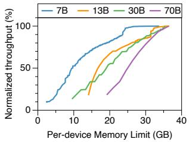  
(a)

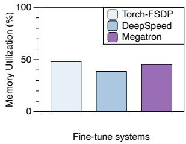

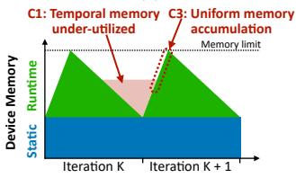

(c)  
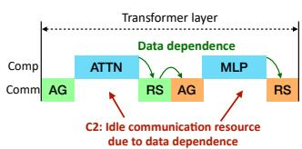  
(d)  
Figure 1: (a) The throughput of fine-tuning models is directly proportional to memory limit; (b) Existing fine-tuning systems have low time-average memory utilization; (c) Low temporal memory utilization and high peak memory caused by uniform memory accumulation; (d) Communication resource waste due to data dependence.

The third challenge is related to memory accumulation and peak memory consumption. Existing methods accumulate memory without considering the different phases of memory usage. As a result, memory accumulation strategies apply uniformly in both the peak and valley phases, leading to extremely high memory pressure during the peak phases, thus constraining other optimization space related to memory (Figure 1c).

As a result, existing frameworks have low time-average memory utilization as shown in Figure 1b. The underlying root cause of these challenges lies in the static deploying of memory adopted by current parallelization frameworks. Their static scheduling assumes a uniform and large-size pattern of memory, which fails to accommodate the highly dynamic nature of fine-tuning. This dynamism arises from several factors: the runtime tensor being generated and accumulated on-the-fly during computation, the dynamic availability of computational and communication resources, and the variable data dependence that must be resolved at runtime.

To address the above challenges, we propose elastic tensor, an abstraction for dynamic tensor management. By defining four core actions and allowing flexible control of memory through tunable ratios, elastic tensor provides a unified method for discovering memory optimizations.

With elastic tensor, a series of optimizations are enabled for fine-tuning. First, we introduce a temporal memory mantiagement strategy that leverages frozen parameters in PEFT to reuse idle memory during valley stages, significantly enhancing temporal memory utilization. Second, elastic tensor facilitates the interplay of communication between static and runtime tensors, thereby relaxing data dependencies and improving communication-computation overlap. Third, we propose an adaptive accumulation strategy that dynamically adapts how runtime tensors are stored and accumulated, effectively reducing peak memory pressure and improving overall memory efficiency.

Based on elastic tensor, we develop mTuner, a fine-tuning system with high memory utilization for better PEFT efficiency. mTuner leverages elastic tensor at runtime to maximize memory utilization and reduce communication workload. We evaluate mTuner on transformer-based LLMs with sizes ranging from 7B to 70B parameters on an eight-GPU server. Results show that mTuner improves fine-tuning performance by up to 1.51× (1.28× on average) compared to state-of-the-art training systems, including DeepSpeed [40], Megatron [21], and Flux [2].

In this paper, we have made the following contributions.

• We identify key memory efficiency challenges in LLM fine-tuning and analyze their impact on performance.

• We propose elastic tensor, an abstraction for dynamic tensor management. It supports four core actions with tunable ratios, providing fine-grained control to enable key optimizations in memory efficiency.

• We use elastic tensor to represent and apply three novel optimizations that improve performance by enhancing memory efficiency.

• We evaluate mTuner on various models with parameter sizes ranging from 7B to 70B, achieving improvement of up to 51.2% and 24.8% (28.3% and 14.5% on average) on PCIe and NVLink servers.

## 2 Background

## 2.1 LLM Fine-tuning

LLM fine-tuning refers to the process of imparting domainspecific knowledge to a LLM based on a small amount of domain-specific data, building upon a pre-trained model. Finetuning holds significant importance in applying LLMs across various industries and domains.

Traditional fine-tuning is similar to pre-training, which updates all parameters. The example is shown in Figure 2(b), all weight parameters are trainable and need to be updated during backward propagation. To make fine-tuning more light-weighted, researchers propose Parameter-Efficient Fine-Tuning (PEFT), which also starts with a pre-trained model, but does not update the whole parameters of the pre-trained model. Instead, it introduces a small number of trainable parameters called adapters into the model structure1. As shown in Figure 2(c), during training, the parameters of the pretrained model (base model) are involved in computations but not updated (frozen); only the parameters of the adapters are updated based on the loss and optimizer state.

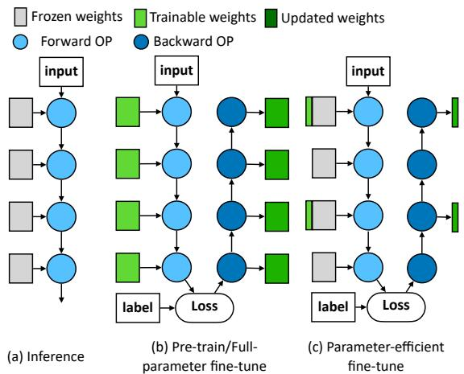  
Figure 2: Illustration of (a) inference, (b) pre-training/full parameter fine-tuning, and (c) parameter-efficient fine-tuning (PEFT)

Compared with full-parameter fine-tuning, PEFT has the following advantages: 1). It significantly reduces the memory requirements for the optimizer state, needing only the adapter’s optimizer state and not that of the base model; 2). As it does not compute gradients for the majority of parameters during backward propagation, it saves computational resources; 3) Since only the parameters of the adapter differ after tuning, saving only the adapter’s parameters (along with the original base model’s parameters) constitutes the tuned model, facilitating propagation and serving. Consequently, PEFT has become a commonly used method in current finetuning practices and is the main focus of this paper.

## 2.2 Data Communication

In distributed fine-tuning, data communication plays a crucial role in ensuring parallel efficiency across multiple GPUs. The data involved in fine-tuning can be broadly categorized into two types: static tensor and runtime tensor, each with distinct characteristics and communication requirements.

Static tensor primarily consists of model parameters, such as weights and biases, since these tensors persistently reside in memory. Distributed fine-tuning often employs techniques like data parallelism, where static tensor is either split across devices or replicated. For example, in fully-sharded data parallelism (FSDP), each device holds a partition of the parameters, and communication is required when executing a module to get all its weights locally available to perform computation on it.

Runtime tensor refers to intermediate activations, gradients, and other temporary data produced during the forward and backward passes. Unlike static tensor, runtime tensor is highly dynamic, with its communication pattern depending on the execution flow of the model. For instance, in tensor parallelism, runtime tensors such as activations needs to be gathered or scattered across devices during computation. Moreover, runtime tensor communication is constrained by data dependence, meaning communication can only occur after the relevant computation has been completed, which limits opportunities for overlapping communication with computation.

## 2.3 Memory Challenges in LLM fine-tuning

Fine-tuning involves dynamic memory patterns due to runtime tensors, such as intermediate activations and gradients. These runtime tensors often dominate memory consumption and directly affect the achievable batch size, sequence length, and ultimately the training throughput. On the other hand, memory can be used for caching static tensor to reduce communication overhead. To improve memory efficiency during fine-tuning, it is essential to address several challenges arising from the complex interplay of computation, communication, and memory accumulation. Specifically, we highlight three major challenges: inefficient utilization of idle memory during temporal valleys, waste of communication resources caused by data dependence, and high peak memory pressure due to inflexible accumulation strategies.

Ignoring valley memory: Low temporal memory utilization . One major challenge in LLM fine-tuning is the inefficient utilization of memory due to the fluctuating nature of temporal memory usage. During fine-tuning, runtime tensor follows a first-in-last-out pattern, which creates peaks and valleys in memory consumption. At peak moments, memory is highly occupied, while during valleys, a significant portion of memory remains idle. This inefficiency becomes even more pronounced when larger contexts or batch sizes are used, as runtime tensors occupy a larger fraction of the total memory. Without strategies to utilize idle memory during valleys, overall memory efficiency remains suboptimal.

Runtime tensor dependence: Waste of communication resources Another critical issue arises from the rigid data dependence during fine-tuning, which leads to underutilization of communication resources. Fine-tuning often requires communication for runtime tensor, such as gathering activations in tensor parallelism. However, communication resources are heavily constrained during these phases, as communication for runtime tensor can only occur after the corresponding tensor has been produced. In contrast, during other phases that involve only computation, communication resources are largely idle. This strict data dependence prevents preemptive communication, resulting in significant waste of available communication resources. Efficiently addressing this imbalance between computation and communication is key to improving fine-tuning performance.

Inflexible memory accumulation: High peak memory consumption . A third challenge is the rigid method used to accumulate runtime tensor under different memory status. Previous approaches do not account for the varying characteristics of peak and valley phases in memory usage. As a result, they apply the same memory accumulation strategy throughout, leading to excessively high memory pressure during peak phases. This accumulation method leaves little room for optimization at peaks, where memory is already a critical constraint. Consequently, peak memory usage becomes a major bottleneck, limiting the scalability of fine-tuning large models. Addressing this challenge requires flexible memory management strategies that adapt to the different phases of memory utilization.

## 3 Elastic Tensor

We propose the concept of elastic tensor, an abstraction for dynamic tensor management, where all tensors (e.g., weight parameters, activations, etc.) are treated as dynamic entities, of which real storage can be adjusted during execution. mTuner enables elastic tensor management by providing the following four actions for tensors. These actions control all changes to tensor memory utilization during fine-tuning, thus affect the overhead (computation and communication) related to tensor memory changes.

1. Gather: For both static and runtime tensors, it makes remote data partitions locally available. It calls crossdevice communication (all-gather) to fetch remote data and increases the ratio that represents how much data is locally available, which varies from $\frac { 1 } { D }$ (D is the number of devices, indicating tensors evenly partitioned) to 100% (tensors fully replicated on each device).

2. Discard: It drops gathered tensor to save memory and decreases the ratio of it with no overhead.

3. Execute: It performs model computation and generates runtime tensors. A ratio indicating the fraction of the input batch processed, ranging from 1/B (processing a single sample) to 100% (processing all samples).

4. Checkpoint: It saves generated runtime tensor for gradient computation. A ratio describes how many runtime tensors of the module is saved, ranging from 0% (no tensor is stored) to 100% (all runtime tensors in this module are stored).

For dynamic elasticity, mTuner not only can perform these actions with various ratio, but also flexibly set the time for triggering. At the start and end of executing each operation, mTuner can insert actions to change memory usage and utilize communication resource.

mTuner performs operations such as partitioning and communicating tensors to achieve memory management for elastic tensor, just like the existing works such as distributed tensor representation, memory allocator, and different memory caching policies. However, elastic tensor enables conversions between operations that were previously unrelated. For example, trading off between storage and communication efficiency. This allows for a unified representation and transformation between memory, compute, and communication, which in turn optimizes memory planning and execution strategies under memory constraints.

## 4 Optimizations Enabled by Elastic Tensor

By leveraging elastic tensor, we can flexibly adjust the storage ratio and execution behavior of static and dynamic tensors. This enables further improvements in memory utilization under strict memory constraints and allows memory to be used for relaxing data dependence, thereby better utilizing communication resources and optimizing fine-tuning throughput.

## 4.1 Temporal Memory Adjustment

As discussed in Section 2.3, the first-in-last-out pattern of runtime tensors results in peaks and valleys in memory usage, which further leads to low temporary memory utilization. mTuner uses elastic tensor to dynamically cache and reuse tensors at the memory valleys to solve this problem.

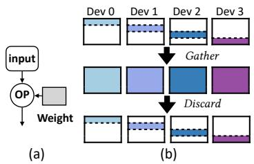

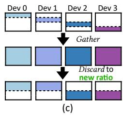  
Figure 3: Illustration of Gather and Discard for weights. When performing computation on an operator (a), FSDP implementation will Gather all its weights, perform computation, and Discard them to the original ratio (b); In mTuner, Discard can be adjusted to other ratio (c);

For fully-sharded data parallel, as shown in Figure 3(a) and (b), during the execution of an operator, each device acquires its complete weights by gathering, which is then used for computations. The gathered weights are discarded after that. As the device possesses complete weight during computation, mTuner can re-adjust the ratio of the weight without incurring additional communication overhead. In the example of Figure 3(c), prior to computation, each device only possess $\frac { 1 } { D }$ of the weight for the operator, which is then adjusted to $\textstyle { \frac { 2 } { D } }$ after computation. Such dynamic adjustments can be made each time when the weight is used for computation.

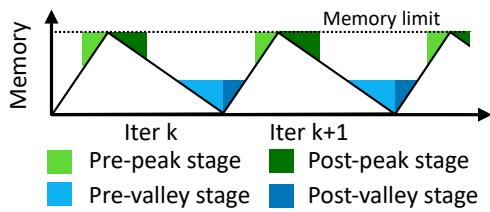  
Figure 4: Memory stages resulted by generated runtime tensors

mTuner schedules elastic tensors to improve temporary memory utilization by dynamic adjustment according to current and predicted memory usage trends. As illustrated in Figure 4, during the valley region, frozen weights from the pre-valley stage have a minimal reuse distance. Consequently, mTuner discards less of these weights, thereby increasing the ratio of tensors retained in the pre-valley stage. This strategy facilitates the reuse of these weights and reduce the communication cost for gathering during forward computation in the post-valley stage. To restore memory efficiency before the pre-peak stage, mTuner compensates by discarding more weights at this point, returning the memory state to its base level.

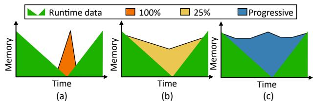  
Figure 5: Filling memory valley with single size ((a) and (b)) and progressively changing ratio of elastic tensors (c)

As shown in Figure 5(a), caching frozen weights at a high ratio (e.g., 100%) during the valley can quickly exhaust the available memory, leaving insufficient space to cache other tensors. Conversely, caching frozen weights at a low ratio allows more tensors to be cached but fails to fully utilize the available memory during the valley (Figure 5(b)). Additionally, frequent memory allocation during the peak can lead to fragmentation, increasing the risk of out-of-memory (OOM) errors. To maximize the temporal utilization of available memory, elastic tensor gradually adjusts the discard ratio in the pre-valley region. As in Figure 5(c), closer to the valley, a higher ratio of tensors is cached, while nearer to the peak, the caching ratio is reduced to ensure efficient memory usage and minimize fragmentation risk.

## 4.2 Dependence-relaxed Communication

Another common parallel strategy in fine-tuning is tensor parallelism (TP). Unlike data parallelism, TP does not require gathering weight parameters; instead, it partitions and gathers activations for parallel execution, making activation communication a main performance bottleneck. Though communication resources are highly constrained during the TP communication phase, they remain underutilized during other phases dominated by computation.

This underutilization arises due to the data dependency of activations: communication can only begin after activations are generated, preventing it from being initiated in advance. Prior works [2,33] attempt to mitigate this issue by fusing activation communication with computation, breaking workloads into fine-grained tasks to enable partial overlap. However, data dependency still limits the full utilization of available communication resources.

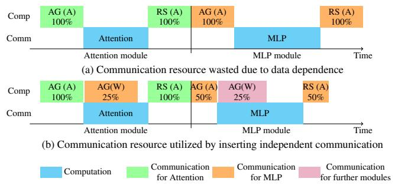  
Figure 6: Timeline for attention and MLP module w/ and w/o dependence-relaxed communication

We find that, though data dependence for activation exists, static data, which is independent from execution, can be used to trade for activation communication. Therefore, mTuner can relax the data dependence by elastically inserting communication for weight parameters. The enlarged weight parameter can reduce the communication workload for activation. Figure 6 is an example for an attention module followed by an MLP module in a Transformer layer. (a) shows the communication resource utilization constrained by data dependence of activations. However, in (b), mTuner can insert the communication of weight while performing computation for attention module. With a larger portion of local weights, it can reduce the range and workload of communication for activation in MLP module, thus leads to faster all-gather and reduce-scatter. In MLP module, it can also insert communication for weights of further modules.

Here is a quantitative analysis of the communication savings achieved by dependence-relaxed method. We take input with batch size at B, sequence length at S, hidden size at H, and FFN hidden size F for example. At the start of the MLP module, original method performs a gather ranging from 8 GPUs to collect activations from $[ B , S , \overline { { { 8 } } } ]$ into [B, S, H ], then performs MLP on devices each storing weight parameters of $[ H , \frac { F } { 8 } ]$ and $[ \frac { F } { 8 } , H ]$ , and performs reduce-scatter to reduce the tensor $[ B , S , H ]$ into $[ B , S , { \frac { H } { 8 } } ]$ . However, with weight parameters prefetched into $[ H , { \frac { F } { 4 } } ]$ and $[ \frac { F } { 4 } , H ]$ (25% of the total number of parameters), the communication range is reduced from 8 GPUs to 4 GPUs. The communication at the start and end of TP is the all-gather and reduce-scatter for tensor size at $\scriptstyle { \left[ { \frac { B } { 2 } } , S , { \frac { H } { 4 } } \right] }$ and $[ \textstyle { \frac { B } { 2 } } , { \bar { S } } , H ]$ , which is reduced by 50%. For scenarios that batch size is tightly constrained and cannot be split, mTuner can split on the dimension of sequence for MLP module.

The percentage of weight prefetched to reduce activation communication is determined by the idleness of communication resource. The communication is fully overlapped and leads to low overhead. On the other hand, with communication of weight and activation interchanged, the efficiency of computation for TP module is improved: The reduction dimension for matrix multiplication gets larger, benefitting the parallelism and the use of TensorCore for GPU.

## 4.3 Adaptive Data Accumulation

Runtime tensors such as activations are generated and accumulated during the forward phase, and they are consumed and released during the backward phase. The accumulated tensors are part of the memory usage bottleneck. Some methods manipulate on the accumulated memory for better memory utilization. However, as the manipulation uniformly regards the memory at different stages (transformer layers), it causes high activation memory peak usage, therefore limits other optimizations related to memory. mTuner uses elastic tensor to manage the generation and storage of tensors adaptively using the action of execution and checkpoint.

We observe that runtime tensors generated by different layers exhibit varying lifespans: deeper layers, which are closer to the loss computation, complete backward computations and discard runtime tensors earlier, without affecting computations in shallower layers. Consequently, initiating backward computations sooner for these deeper layers can shorten tensor lifetimes and enable earlier memory release, thereby reducing their residency time. To enable earlier backward execution, mTuner adopts a non-uniform prioritization strategy for deeper layers: it can selectively prioritize partial execution on input tensors (by splitting along the batch dimension) and perform corresponding backward executions for those parts.

As shown in Figure 7(a), for training a 4-layer model on four input samples, the typical procedure involves processing them together, executing four forward computations followed by four backward computations. Shown in Figure 7(b), this process results in the accumulation of activations generated by the four samples across the four layers of forward computations in memory, peaking at the end of the forward stage. mTuner’s optimization is shown in Figure 7(c), it can divide execution along the batch dimension, splitting the four samples into two groups of two samples each. From the third layer’s forward execution $( F _ { 3 } )$ , only a subset of samples firstly perform forward computation. After completing the forward computations for these samples, instead of executing the forward computations for the remaining samples, mTuner prioritizes the corresponding backward computations for the completed samples, thereby reducing the duration for which these activations are stored in memory. We can observe that the height of the peak has been effectively reduced.

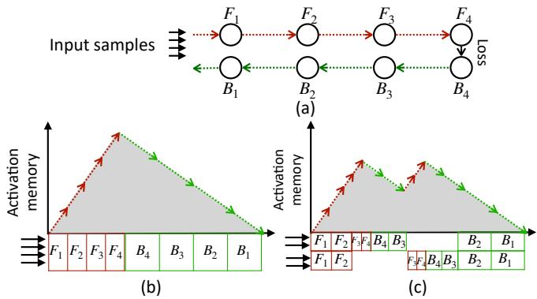  
Figure 7: Increasing execution priority for samples to reduce peak activation memory usage; (a) Input samples and computation workflow; (b) Uniform execution priority for all layers; (c) Prioritizing execution priority for part of the samples

The peak memory usage can be arbitrarily adjusted using this method. Let the total batch size be $B ,$ the batch size after splitting be $^ { b , }$ and the model consists of L layers. Among them, the l layers closer to the peak adjust the backward priority. Suppose the original peak height is H, then the new peak height is calculated as:

$$
H _ { n e w } = \frac { l } { L } \frac { b } { B } H + ( 1 - \frac { l } { L } ) H\tag{1}
$$

This formula indicates that as the ratio of b to B decreases, the height of the portion with adjusted execution priority becomes lower. Additionally, as more layers are adjusted in terms of peak memory usage, the final peak memory usage will also be reduced. When $l = L$ and $b = 1$ , it is equivalent to running the entire model with a batch size of 1, resulting in the lowest peak memory usage.

Moreover, this method enables fine-grained control over the execution batch size. In cases where the specified batch size cannot fully utilize available memory, it is possible to modify the execution priority and batch size of only certain layers, increasing the peak memory usage to fully exploit available memory and further enhance memory utilization.

In terms of performance, the fine-grained data accumulation impacts both computational efficiency and memory usage. From a computational perspective, larger batch sizes generally improve parallelism and enhance GPU utilization. However, in fine-tuning large models, the batch dimension of most operators is determined by the product of batch size and sequence length. Since the sequence length is already large (typically at least 4K), GPU resources are already well-utilized, and increasing the batch size has limited additional benefit. On the memory side, fine-grained batch splitting allows for more efficient memory usage by better filling available memory and reducing communication overhead. As for accuracy, batch splitting has no impact on the final model performance. This is because gradients from different samples are accumulated before each optimization step. Whether gradients are computed using a single large batch or multiple smaller batches, the accumulation process remains mathematically equivalent.

## 5 Elastic Tensor Schedule Discovery

The elastic tensor significantly expands the optimization space for memory management during fine-tuning. However, identifying the optimal elastic configuration for a given hardware environment and model setup is challenging due to the large search space. To address this, mTuner adopts a profiling-based approach to measure the time and memory overhead of each module under various partitioning strategies. Additionally, it introduces a search algorithm that simultaneously accounts for peak and valley memory constraints to determine the globally optimal strategy.

## 5.1 Elastic Tensor Representation

Forward :   
2 gather: 100% # get full MLP param from 50%   
3 discard: 12.5% # fully partition MLP param   
4 execute: 50% # execute half of a batch   
5 checkpoint: 0% # store none of activation   
6 Backward :   
7 gather: 100% # get full param from 12.5%   
8 discard: 50% # discard half of param   
9 execute: 50% # execute half of a batch   
10 # Forward\_execute should equal to   
Backward\_execute   
11 # The input ratio for Forward\_gather is the   
output ratio of Backward\_discard (vice   
versa)  
Listing 1: Example elastic tensor representation on an MLP module on an 8-GPU servers

mTuner represents the schedule for elastic tensor by setting the actions and ratio for each module. To consider both peak and valley memory, we represent elastic tensor for forward and backward pass respectively.

Listing 1 demonstrates the elastic representation for an MLP module on an 8-GPU system. During the forward pass, the elastic tensor gathers the full MLP parameters from a partial partition at 50%, discards part of the parameters to 12.5% after computation, and processes half of the batch without storing any activations to minimize memory consumption. In the backward pass, it retrieves the full parameters from a highly partitioned state of 12.5%, but discards 50% of the parameters after computation, and processes the same batch fraction (50%) as in the forward pass. As it discards less data during backward pass, it has higher valley memory consumption and leads less gathering workloads at forward pass (50% → 100%).

## 5.2 Holistic Schedule Searching

To find an elastic schedule that minimizes the iteration time under memory constraints, the key challenge is that two kinds of memory, peak memory and valley memory, are utilized while constrained by memory limit. Peak memory is traditionally considered, as the runtime tensors are accumulated. Valley memory is the new problem in mTuner, which indicates how mTuner make use of idle memory as runtime tensors are consumed in backward phase.

In addition to memory constraints, there are interdependencies between transformer layers that complicate the scheduling process. Specifically, data required by later layers can be prefetched by earlier layers, meaning that a scheduling decision for one layer influences both memory availability and execution time of subsequent layers. Furthermore, two distinct types of resources—computation resources and communication resources—must be considered, and they can overlap. The interplay of these factors makes it challenging to fully utilize available memory and minimize execution time simultaneously.

To address these challenges, we propose a dual-memory dynamic programming (DP) approach that searches for the minimal execution time while respecting both peak and valley memory constraints. This DP algorithm evaluates different implementation options for each transformer layer and computes the optimal schedule by tracking memory usage at each step. We also improve resource utilization by overlapping communication with computation. By allowing communication to be brought forward, we hide communication latency behind computation.

Algorithm 1 shows the implementation of dual-memory DP. At each layer, multiple implementation choices are available, each with a unique combination of execution time, peak memory, and valley memory consumption. The dual-memory DP approach explores these options recursively, keeping track of both types of memory consumption at each step. For a given layer, the algorithm evaluates every possible implementation choice and updates the schedule only if it results in a lower execution time while respecting the memory limits. The implementation choices includes different parallel strategies and the ratio of stored weights and activations. It maintains a multidimensional state space where each state represents the cumulative execution time under specific peak and valley memory usage. The state transition involves updating execution time by adding the time of the selected implementation and adjusting memory consumption accordingly.

Algorithm 1 Elastic tensor schedule search   
1: Input: Number of layers L, total GPU memory $M _ { t o t a l } ,$   
peak memory $M _ { p } ^ { i } ( j )$ , valley memory $M _ { \nu } ^ { i } ( j )$ , execution   
time $T ^ { i } ( j )$ for each layer i and implementation j, number   
of implementations $N _ { i }$ for each layer i   
2: $d p ( i , m _ { p } , m _ { \nu } ) \quad  \quad \infty , \quad \forall i \quad \in \quad \{ 1 , \dots , L \} , m _ { p } , m _ { \nu } \quad \in$   
$\{ 0 , \ldots , M _ { t o t a l } \}$   
3: $d p ( 0 , m _ { p } , m _ { \nu } ) \gets 0 , \forall m _ { p } , m _ { \nu } \in \{ 0 , \dots , M _ { t o t a l } \}$ ▷ Initialize   
4: for $i \in \{ 1 , \ldots , L \}$ do   
5: for $m _ { p } \in \{ 0 , \ldots , M _ { t o t a l } \}$ do   
6: for $m _ { \nu } \in \{ 0 , \dots , M _ { t o t a l } \}$ do   
7: for $j \in \{ 1 , \ldots , N _ { i } \}$ do   
8: if $M _ { p } ^ { i } ( j ) \leq m _ { p }$ and $M _ { \nu } ^ { i } ( j ) \le m _ { \nu }$ then   
9: $m _ { p } ^ { \prime }  m _ { p } - M _ { p } ^ { i } ( j )$ ▷ remaining peak memory   
10: $m _ { \nu } ^ { \prime } \gets m _ { \nu } - M _ { \nu } ^ { i } ( j )$ ▷ remaining valley memory   
11: $\begin{array} { r l } { d p ( i , m _ { p } , m _ { \nu } ) } & { { }  } \end{array}$ min $\imath ( d p ( i , m _ { p } , m _ { \nu } ) , d p ( i \textrm { ~ -- }$   
$1 , m _ { p } ^ { \prime } , m _ { \nu } ^ { \prime } ) + \dot { T } ^ { i } ( j ) )$ ▷ Update DP state   
12: result $\begin{array} { r } { \gets \operatorname* { m i n } _ { m _ { p } , m _ { \nu } \in \{ 0 , \dots , M _ { t o t a l } \} } d p ( L , m _ { p } , m _ { \nu } ) } \end{array}$   
13: Backtrack to determine the selected implementation $x _ { i }$   
for each layer   
14: Output: Selected implementations $x _ { 1 } , x _ { 2 } , \ldots , x _ { L }$ and total   
execution time

To reduce the search space of DP, we first prune the set of possible implementations for each layer, retaining only those that are likely to yield optimal efficiency. For example, when balancing between communication and storage, although mTuner supports a continuous range of communication-tostorage ratios from 0% to 100%, we observe that significant changes in communication efficiency occur only when the number of involved devices changes. Thus, mTuner only considers storage ratios of $\frac { 1 } { N }$ , where N is an integer greater than or equal to 1. Furthermore, to further limit the number of states, mTuner discretizes memory consumption by rounding it to integer values. This discretization strikes a balance between search efficiency and solution accuracy, significantly reducing the computational complexity of the DP search while maintaining efficiency.

mTuner and its search method are applicable to models like Transformers, which execute sequentially and perform backpropagation of gradients. This applicability is independent of the specific operators used in the model (e.g., different types of attention mechanisms or operations like convolutions instead of MLPs). Moreover, applications like PEFT, which involve frozen parameters, provide mTuner with more opportunities to cache parameters and reduce computation. In contrast, full-parameter fine-tuning, where parameters are distributed across multiple devices, introduces additional communication overhead, which diminishes the optimization benefits of the method.

## 6 Evaluation

mTuner is an end-to-end fine-tuning system based on Py-Torch [35] and Torch-FSDP [57]. It statically and dynamically modifies the model’s execution plan to transform a pre-trained model into a distributed, memory-adaptive PEFT model. Before running the model, mTuner utilizes a wrapping method to partition the weights at the granularity of modules (embedding, MLP, and attention, etc.). It also adds trainable modules and parameters based on the user-defined PEFT scheme while freezing other parameters. During runtime, mTuner employs hook methods using pre/post-forward/backward hooks of each module to perform actions. As a result, mTuner can be applied to any LLM model structure without requiring additional modifications from the user.

We evaluate mTuner to answer the following questions:

• Can mTuner outperform existing fine-tune systems under various conditions, including model size, sequence length, and hardware settings?

• How elastic tensor influence the memory consumption and performance?

• How searched elastic tensor schedule improve the finetuning throughput, respectively for memory peaks and valleys?

• How is the overhead of runtime adjustment of elastic tensor?

## 6.1 Setup

Baselines and software configuration. We compare mTuner with state-of-the-art training frameworks including Torch-FSDP@2.1.0 [57], DeepSpeed@0.15 [40], Megatron@0.9.0 [21], and Flux [2]. DeepSpeed employs various levels of ZeRO optimizations to reduce memory consumption and enhance performance. Torch-FSDP shares a similar core idea with DeepSpeed, and is implemented with torchnative components. Megatron is able to concurrently apply 3-D parallelization, including data parallel, tensor parallel, and pipeline parallel, to partition the model and reduce communication cost. Both systems are widely used and applied to pre-training and fine-tuning. Flux overlaps computation and communication by fine-grained partition, and is representative for state-of-the-art communication kernels. For a fair comparison, we run all baselines by setting the maximum batch size to saturate available device memory. They are all based on PyTorch@2.5, CUDA@12.1, FlashAttention@2.4.2 [5, 6], and NCCL@2.21.

Hardware configuration. We tested performance on two types of typical servers equipped with PCIe and NVLink respectively for cross-GPU communication. The PCIe server has eight NVIDIA A100-PCIe-40GB GPUs. They are connected via tree-like PCIe: Every four of them are connected to the same NUMA, and cross NUMA communication goes through QPI between NUMAs. The NVLink server has eight NVIDIA H100-SXM-80GB GPUs connected via NVLink, four servers in total. Compared with PCIe, NVLink has much higher communication throughput.

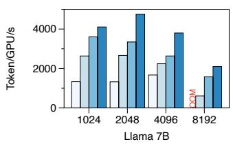

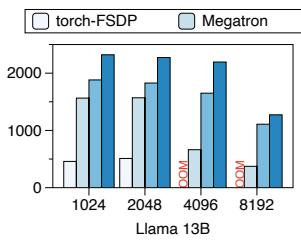

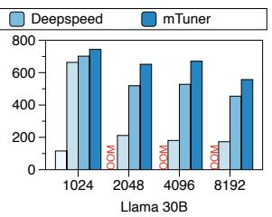  
(a) Single PCIe-server with A100 GPUs

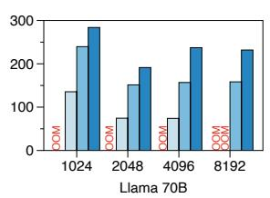

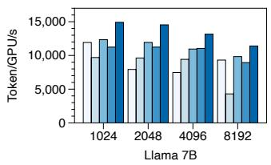

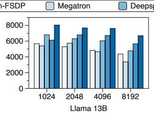

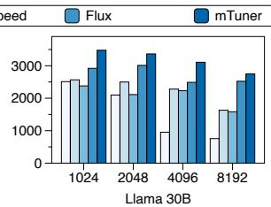  
(b) Four NVLink-servers with H100 GPUs

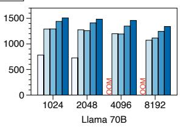  
Figure 8: Overall results on various sequence length; The higher throughput (Token/s) is better.

LLMs and input data. We found that the scale of the LLM (number of parameters) has the most impact on performance, while other computational characteristics are similar across transformer-based models. Therefore, shown in Table 1, we tested different sizes of the Llama 2 model [50], with parameters of 7 billion, 13 billion, 33 billion, and 70 billion. For the input data, we tested samples with different sequence lengths ranging from 1024 to 8192. We use LoRA [15] as the PEFT config, which is commonly used [31] for PEFT.

Table 1: Information of tested models
<table><tr><td></td><td>num_layer</td><td>hidden_size</td><td>intermediate_size</td></tr><tr><td>Llama 2 7B</td><td>32</td><td>4096</td><td>11008</td></tr><tr><td>Llama 213B</td><td>40</td><td>5120</td><td>13824</td></tr><tr><td>Llama 2 30B</td><td>64</td><td>6656</td><td>17920</td></tr><tr><td>Llama 270B</td><td>80</td><td>8192</td><td>28672</td></tr></table>

## 6.2 Overall Results

Figure 8 illustrates the overall performance of mTuner across different models, input sequence length, and hardware configurations. Figure 8(a) shows the performance on PCIe-server, where the communication is the bottleneck. DeepSpeed is always the best among baselines due to its efficient computationcommunication overlapping and communication operators. mTuner can improve the throughput by 28.3% over Deep-Speed. On the other hand, mTuner can achieve an average speedup of 4.15× over Torch-FSDP, on which mTuner is built upon. In smaller models such as Llama 2 7B, where memory is more abundant, mTuner can fully leverage the available memory, resulting in a speedup of 40% and the throughput exceeding 4000 tokens per second. Even in larger models like 30B and 70B, where the model parameters alone consume a significant portion of the memory, mTuner still achieves a 27% speedup, demonstrating the effectiveness of our proposed method across various model sizes.

Figure 8(b) shows the performance on four NVLinkservers. Compared with the best baseline, mTuner achieves 14.5% speedup. Flux is the best baseline on most scenarios due to its efficient communication kernel designed for NVLink. mTuner gets improvement over it due to its implementation of better memory utilization and relaxed data dependence.

We find mTuner more effective on inputs with larger sequence lengths. This is because they result in smaller batch sizes and larger activation memory consumption, which further leads to increased communication overhead for each sample with respect to weights. In the case of larger sequences (≥4096), mTuner achieves an average acceleration of 34%.

When comparing PCIe-server and NVLink-server, we find from Figure 8(b) that mTuner achieves a higher speedup ratio in the PCIe-server configuration (28.3% vs. 14.5%). This can be attributed to the more severe communication bottleneck in the PCIe-server setup, while mTuner primarily reduces communication overhead by increasing memory utilization.

## 6.3 Ablation Study

Ratio of local data influences communication efficiency. Figure 9 shows how varying ratio of local data affects the communication bandwidth of allgather operation. And it shows how different schemes to increase the local data ratio influence the overall communication time. For instance, in the case of 12.5%-25%-50%-100%, the process begins by increasing the local data ratio of elastic tensors in a module from 12.5% to 25%. Once all tensors reach 25% local data, the ratio is further increased to 50%, and so on. When all elastic tensors achieve 100% local data, the communication time effectively drops to zero.

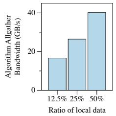

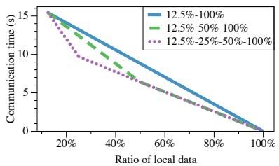

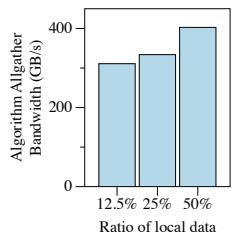

(a) PCIe-server  
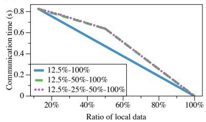  
(b) NVLink-server  
Figure 9: The communication bandwidth and time with growing ratio of local data on PCIe and NVLink servers

As shown in Figure 9(a), communication bandwidth improves significantly when the elastic tensor has a low initial local data ratio (e.g., 12.5%). Increasing the local storage ratio from 12.5% to 25% yields a 59% bandwidth improvement, from 16GB/s to 26GB/s. However, further increasing the local ratio from 25% to 50%, despite consuming more memory, results in only a 54% speedup. Consequently, the schedule 12.5%-25%-50%-100% achieves the shortest communication time by efficiently balancing memory usage and communication overhead. In contrast, for the NVLink server shown in Figure 9(b), increasing the local data ratio provides minimal improvement in communication bandwidth. Therefore, the schedule 12.5%-100%, which directly minimizes communication by avoiding it for specific tensors, achieves the best memory-to-communication efficiency.

Larger batch size leads to less per-sample communication workload. Figure 10 shows how the memory of activation, adjusted with batch size, influences the efficiency of computation and communication. The bars shows under different batch sizes, the iteration time for communication and computation. We find that the communication time is invariant to the batch size, as it is only related to the model size. Therefore, the communication overhead averaged to each sample can be reduced when increasing the batch size. The computation, however, is proportional to batch size as the computational

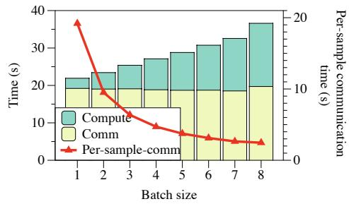  
Figure 10: Computation and communication time with different batch sizes on PCIe-server for Llama 2 70B; Per-sample communication time decreases with batch size.

resource is saturated.

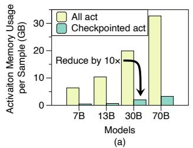

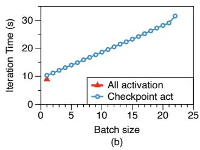  
Figure 11: Memory usage of all and checkpointed activations for different models (a) and the execution time comparison (b) on PCIe server

Activation checkpointing saves memory and increases batch size. Figure 11 demonstrates the effect and overhead of activation checkpointing. Figure 11(a) illustrates the memory consumption of all generated activations and the checkpointed activations, with batch size of 1 and sequence length of 1024. For models of different scales, mTuner can reduce the required memory for activations by a factor of 10. This reduction is particularly crucial for Llama 2 70B because preserving all activations would require over 30GB of device memory. Combined with the storage of weights on each device, this would lead to out-of-memory (OOM) errors, making it infeasible even with a batch size of 1.

Figure 11(b) presents the overhead introduced by activation checkpointing on 30B model. Both approaches can be executed with a batch size of 1. However, as the batch size increases, only the approach of checkpointing activations remains viable. By comparing the runtime, the recomputation overhead introduced by checkpointing activations is minimal. This is primarily because the execution time is dominated by communication. And mTuner mitigates the additional communication introduced by activation checkpointing through reuse distance, reducing the runtime overhead associated with activation checkpointing.

Relaxed data dependence improves tensor parallel efficiency. Figure 12 illustrates the benefits of using elastic tensor to relax data dependence, improving TP efficiency. As shown, increasing the ratio of weights prefetched via early gather results in performance gains across various scenarios. Specifically, prefetching 25% and 50% of the weights reduces the overall execution time to 87.6% and 79.0%, respectively. Notably, even though Flux achieves overlapping of TP communication and computation through fine-grained splitting, relaxed data dependence further reduces execution time to 92.3% and 84.2% (corresponding to 25% and 50% prefetch weight, respectively).

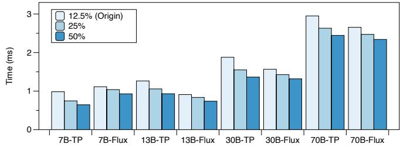  
Figure 12: Execution time of an MLP module with tensor parallel size at 8. Data dependence is relaxed with weight parameters gathered to ratio of 25% and 50%

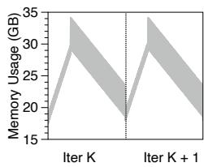  
(a)

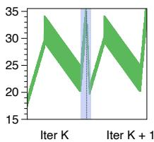  
(b)

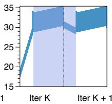  
(c)  
Figure 13: Memory-time curve; (a) No fill in valley area; (b) Filling valley area with 100% elastic tensors; (c) Progressively filling valley area; The colored are valley areas with elastic tensors filled

Temporal memory adjustment increases overall memory utilization. Figure 13 illustrates the changes in memory during the runtime process, with each subfigure representing two iterations. From Figure 13(a), we find that during the forward phase of each iteration, the memory usage keeps increasing because the activations used as checkpoints accumulate in memory. However, during the backward phase, the memory decreases in a zigzag manner. This is because when recomputing based on checkpoints, a significant number of activations that was discarded during the forward propagation is generated, and this memory is immediately consumed during the backward computation.

From Figure 13(b), if mTuner caches and reuses the elastic tensors at the ratio of 100% at the valley area, the memory at the valley quickly fills up, resulting in only a small portion of the operators’ weights being optimized, while a significant amount of time is underutilized in memory. Figure 13(c) demonstrates that by progressively filling the valley with elastic tensors, most of the weights can be increased in size for less communication while filling up the memory valley.

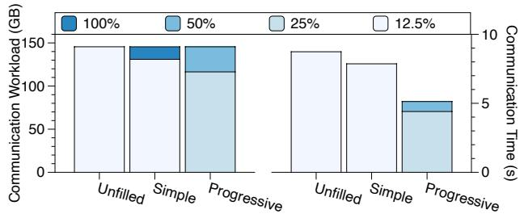  
Figure 14: Distribution of elastic tensor ratio and resulted communication time

Temporal memory adjustment decreases communication overhead. Figure 14 illustrates the distribution of elastic tensor ratio and communication time during the forward phase for these three methods. Communication workload refers to the total weights collected, so different filling methods (including unfilling one) shows the same communication workload. We find that the non-progressive filling method only makes 10.3% of the workload to be communicated with elastic tensor at ratio of 100%, reducing the overall communication time by 10% through these locally available weights. However, by using the progressive method to fill the valleys, 80.2% of the weights can be optimized with 25% elastic tensor with 18.0% optimized with 50% elastic tensor, reducing the overall communication time by 41%.

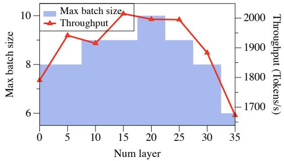  
Figure 15: Max batch size and corresponding throughput change with the number of layers at pre-peak stage with high backward priority

Adaptive data accumulation can increase max batch size. Figure 15 illustrates the maximum batch size achievable with mTuner for Llama 2 70B. By adjusting the backward priority of some layers in the pre-peak stage and reducing the peak height, mTuner can increase the batch size per iteration. Additionally, to reduce the overhead of repeated computation for small batches in the flattened peak stage, mTuner increases the elastic tensor of the flattened peak section. Consequently, when more layers are flattened, the memory overhead increases, resulting in a decrease in the maximum batch size.

Moreover, since the averaged communication workload is related to the batch size, the throughput reaches its maximum when the batch size is at its maximum, resulting in a 12% improvement in throughput compared to unflattened peaks.

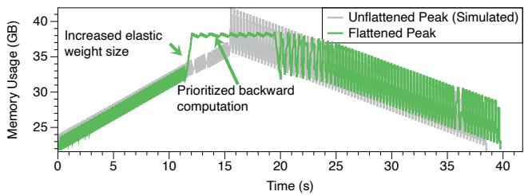  
Figure 16: Memory to time curve for training Llama 2 70B at batch size of 10 with and without adaptive runtime tensor accumulation; The unflattened curve suffers from OOM (over 40GB memory usage), and is simulated using profile results.

Peak memory usage is reduced by adaptive data accumulation. As shown in Figure 16, the height of peak can be effectively reduced by adaptive data accumulation. To reduce the overhead of repeated execution at the peak, mTuner increases the elastic tensor size at the pre-peak stage. Though compared to the simulated normal execution, non-uniform execution still introduces overhead and leads to larger execution time, the advantages, such as increased batch size and reduced per-sample communication overhead, still contribute positively to the overall performance.

Table 2: Schedule search time analysis
<table><tr><td>Time</td><td>7B</td><td>13B</td><td>30B</td><td>70B</td></tr><tr><td>Search (s)</td><td>20.3</td><td>25.3</td><td>34.5</td><td>147.9</td></tr><tr><td>Fine-tuning (h)</td><td>2.3</td><td>4.3</td><td>10.0</td><td>23.0</td></tr></table>

Schedule search overhead is acceptable compared with fine-tuning time. Table 2 presents the time required for schedule search. The search time scales with model size, but grows only moderately. We compare the search time with the overall fine-tuning time that tunes the model with one billion tokens on H100 server. The fine-tuning takes hours to finish, which makes the search overhead acceptable.

## 7 Related Work

Parameter-efficient fine-tuning. Parameter-efficient finetuning (PEFT) [8,16,24] encompasses three main approaches: adapter-based, prompt-based, and BitFit. Adapter-based methods [7,14,15,25,37] introduce a small set of trainable modules into the model architecture. A prominent example is low-rank adapters (LoRA) [7, 15], which inject low-rank matrix multiplications as bypasses to efficiently update the model. Promptbased methods [22, 23, 28] insert trainable tokens into the input prompt, allowing fine-tuning by learning these tokens without manually modifying the prompt. BitFit [54] takes a minimalist approach by updating only the model’s bias parameters during fine-tuning. PEFT has demonstrated remarkable effectiveness across various domains, including finance [53], healthcare [29], code [20], and mathematics [27], establishing itself as the leading approach for cost-efficient fine-tuning. QLoRA [7], AdaLoRA [56], and similar approaches [26, 49] differ in their specific definitions of trainable parameters, yet they all fall within the broader framework of PEFT, where only a subset of model parameters is updated. As such, our proposed method is compatible with and can be applied to optimize these techniques.

Systems for fine-tuning. To mitigate hardware limitations during fine-tuning, systems such as FTPipe [10], MPress [59], and Mobius [11] have proposed more efficient pipeline parallelism techniques tailored to the characteristics of PCIe. PetS [60] improves serving efficiency by sharing a single base model across multiple PEFT instances, while S-LoRA [44] offloads PEFT adapters to CPU memory, enabling the deployment of multiple PEFT models on a single GPU. Despite their advancements, these systems do not exploit the frozen weight property inherent to PEFT for optimizing parallel finetuning, nor do they provide fine-grained control over memory utilization.

Optimizing static tensors in parallel training. Existing approaches optimize static tensors, such as weight parameters and optimizer states, by leveraging parallel training techniques. DeepSpeed [39, 40, 46] introduces ZeRO, which enhances data parallelism by partitioning static tensors across devices or offloading to CPU memory. To mitigate communication overhead, subsequent works [3, 30] enhance overlapping mechanisms to hide latency effectively. Gpipe [18], Pipedream [32], and MPress [59] employ pipeline parallelism, dividing weights at the layer level across devices and enabling pipelined parallel execution with minimal communication overhead. However, this approach is prone to pipeline bubbles, leading to device idleness. Zero-bubble-pipeline [38] eliminates bubbles by adjusting the pipeline schedule, but accumulated activations still cause significant memory pressure. Tensor parallelism [2, 21, 33] takes a different approach by partitioning weights along an additional dimension, allowing multiple devices to collaboratively process the same sample. Systems like Megatron [21, 45] and Alpa [58, 62] combine data, pipeline, and tensor parallelism, either manually or through automated search, to identify optimal parallel strategies. Despite these efforts, existing methods focus primarily on static memory optimization through parallelism and largely overlook dynamic memory constraints and utilization caused by runtime tensors. Consequently, they lack mechanisms for adaptive, fine-grained memory optimization.

Optimizing runtime tensors with checkpointing and offloading. Checkpointing activation [42] is an important technique to optimize activation memory, which is also utilized in mTuner for elastic tensor implementation. It is firstly proposed in [4], and widely used in training frameworks like Megatron [21] and MPress [59]. There are works [19] trying to find optimal checkpointing strategy considering model structure. However, these activation optimizations are independent with static tensor optimization, while mTuner focuses on the interplay between them.

## 8 Conclusion

In this paper, we first observed that memory plays a crucial role in the performance of parameter-efficient fine-tuning. However, existing approaches have low memory utilization due to static scheduling of memory. To address this, we propose elastic tensors as an abstraction to dynamically adjust the memory sizes of tensors based on memory usage and the fine-tuning process. Based on elastic tensor, we developed mTuner, a system that enables efficient fine-tuning of large models on multi-GPU servers. Compared to existing stateof-the-art systems, mTuner achieves an improvement of up to 51.2% and 24.8% (28.3% and 14.5% on average) on PCIe and NVLink servers.

## Acknowledgments

We would like to thank the anonymous reviewers and our shepherd, Abhilash Jindal, for their valuable suggestions. This work is supported by the National Key R&D Program of China under Grant 2023YFB3001704, NSFC for Distinguished Young Scholar (62225206), Beijing Natural Science Foundation (L242017), Strategic Priority Research Program of Chinese Academy of Sciences (XDB0500103), and Tsinghua University Initiative Scientific Research Program. Jidong Zhai is the corresponding author of this paper (zhaijidong@tsinghua.edu.cn).

## References

[1] Tom B. Brown, Benjamin Mann, Nick Ryder, Melanie Subbiah, Jared Kaplan, Prafulla Dhariwal, Arvind Neelakantan, Pranav Shyam, Girish Sastry, Amanda Askell, Sandhini Agarwal, Ariel Herbert-Voss, Gretchen Krueger, Tom Henighan, Rewon Child, Aditya Ramesh, Daniel M. Ziegler, Jeffrey Wu, Clemens Winter, Christopher Hesse, Mark Chen, Eric Sigler, Mateusz Litwin, Scott Gray, Benjamin Chess, Jack Clark, Christopher Berner, Sam McCandlish, Alec Radford, Ilya Sutskever, and Dario Amodei. Language models are few-shot learners. In Advances in Neural Information Processing Systems 33: Annual Conference on Neural Information Processing Systems 2020, NeurIPS 2020, December 6- 12, 2020, virtual, 2020.

[2] Li-Wen Chang, Wenlei Bao, Qi Hou, Chengquan Jiang, Ningxin Zheng, Yinmin Zhong, Xuanrun Zhang, Zuquan Song, Chengji Yao, Ziheng Jiang, Haibin Lin, Xin Jin, and Xin Liu. Flux: Fast software-based communication overlap on gpus through kernel fusion, 2024.

[3] Chang Chen, Xiuhong Li, Qianchao Zhu, Jiangfei Duan, Peng Sun, Xingcheng Zhang, and Chao Yang. Centauri: Enabling efficient scheduling for communicationcomputation overlap in large model training via communication partitioning. In Proceedings of the 29th ACM International Conference on Architectural Support for Programming Languages and Operating Systems, Volume 3, ASPLOS ’24, page 178–191, New York, NY, USA, 2024. Association for Computing Machinery.

[4] Tianqi Chen, Bing Xu, Chiyuan Zhang, and Carlos Guestrin. Training deep nets with sublinear memory cost. CoRR, abs/1604.06174, 2016.

[5] Tri Dao. FlashAttention-2: Faster attention with better parallelism and work partitioning. 2023.

[6] Tri Dao, Daniel Y. Fu, Stefano Ermon, Atri Rudra, and Christopher Ré. FlashAttention: Fast and memoryefficient exact attention with IO-awareness. In Advances in Neural Information Processing Systems, 2022.

[7] Tim Dettmers, Artidoro Pagnoni, Ari Holtzman, and Luke Zettlemoyer. Qlora: Efficient finetuning of quantized llms. CoRR, abs/2305.14314, 2023.

[8] Ning Ding, Yujia Qin, Guang Yang, Fuchao Wei, Zonghan Yang, Yusheng Su, Shengding Hu, Yulin Chen, Chi-Min Chan, Weize Chen, Jing Yi, Weilin Zhao, Xiaozhi Wang, Zhiyuan Liu, Hai-Tao Zheng, Jianfei Chen, Yang Liu, Jie Tang, Juanzi Li, and Maosong Sun. Delta tuning: A comprehensive study of parameter efficient methods for pre-trained language models. CoRR, abs/2203.06904, 2022.

[9] Jesse Dodge, Gabriel Ilharco, Roy Schwartz, Ali Farhadi, Hannaneh Hajishirzi, and Noah Smith. Fine-tuning pretrained language models: Weight initializations, data orders, and early stopping. arXiv preprint arXiv:2002.06305, 2020.

[10] Saar Eliad, Ido Hakimi, Alon De Jagger, Mark Silberstein, and Assaf Schuster. Fine-tuning giant neural networks on commodity hardware with automatic pipeline model parallelism. In 2021 USENIX Annual Technical Conference (USENIX ATC 21), pages 381–396. USENIX Association, July 2021.

[11] Yangyang Feng, Minhui Xie, Zijie Tian, Shuo Wang, Youyou Lu, and Jiwu Shu. Mobius: Fine tuning largescale models on commodity GPU servers. In Tor M.

Aamodt, Natalie D. Enright Jerger, and Michael M. Swift, editors, Proceedings of the 28th ACM International Conference on Architectural Support for Programming Languages and Operating Systems, Volume 2, ASP-LOS 2023, Vancouver, BC, Canada, March 25-29, 2023, pages 489–501. ACM, 2023.

[12] Hao Ge, Fangcheng Fu, Haoyang Li, Xuanyu Wang, Sheng Lin, Yujie Wang, Xiaonan Nie, Hailin Zhang, Xupeng Miao, and Bin Cui. Enabling parallelism hot switching for efficient training of large language models. In Proceedings of the ACM SIGOPS 30th Symposium on Operating Systems Principles, pages 178–194, 2024.

[13] Michael A Hedderich, Lukas Lange, Heike Adel, Jannik Strötgen, and Dietrich Klakow. A survey on recent approaches for natural language processing in lowresource scenarios. arXiv preprint arXiv:2010.12309, 2020.

[14] Neil Houlsby, Andrei Giurgiu, Stanislaw Jastrzebski, Bruna Morrone, Quentin de Laroussilhe, Andrea Gesmundo, Mona Attariyan, and Sylvain Gelly. Parameterefficient transfer learning for NLP. In Kamalika Chaudhuri and Ruslan Salakhutdinov, editors, Proceedings of the 36th International Conference on Machine Learning, ICML 2019, 9-15 June 2019, Long Beach, California, USA, volume 97 of Proceedings of Machine Learning Research, pages 2790–2799. PMLR, 2019.

[15] Edward J. Hu, Yelong Shen, Phillip Wallis, Zeyuan Allen-Zhu, Yuanzhi Li, Shean Wang, and Weizhu Chen. Lora: Low-rank adaptation of large language models. CoRR, abs/2106.09685, 2021.

[16] Shengding Hu, Ning Ding, Weilin Zhao, Xingtai Lv, Zhen Zhang, Zhiyuan Liu, and Maosong Sun. Opendelta: A plug-and-play library for parameter-efficient adaptation of pre-trained models. arXiv preprint arXiv:2307.03084, 2023.

[17] Gabriel Huang, Issam Laradji, David Vazquez, Simon Lacoste-Julien, and Pau Rodriguez. A survey of selfsupervised and few-shot object detection. IEEE Transactions on Pattern Analysis and Machine Intelligence, 45(4):4071–4089, 2022.

[18] Yanping Huang, Youlong Cheng, Ankur Bapna, Orhan Firat, Dehao Chen, Mia Xu Chen, HyoukJoong Lee, Jiquan Ngiam, Quoc V. Le, Yonghui Wu, and Zhifeng Chen. Gpipe: Efficient training of giant neural networks using pipeline parallelism. In Advances in Neural Information Processing Systems 32: Annual Conference on Neural Information Processing Systems 2019, NeurIPS 2019, December 8-14, 2019, Vancouver, BC, Canada, pages 103–112, 2019.

[19] Paras Jain, Ajay Jain, Aniruddha Nrusimha, Amir Gholami, Pieter Abbeel, Kurt Keutzer, Ion Stoica, and Joseph Gonzalez. Checkmate: Breaking the memory wall with optimal tensor rematerialization. In Inderjit S. Dhillon, Dimitris S. Papailiopoulos, and Vivienne Sze, editors, Proceedings of Machine Learning and Systems 2020, MLSys 2020, Austin, TX, USA, March 2-4, 2020. mlsys.org, 2020.

[20] Carlos E. Jimenez, John Yang, Alexander Wettig, Shunyu Yao, Kexin Pei, Ofir Press, and Karthik Narasimhan. Swe-bench: Can language models resolve real-world github issues? CoRR, abs/2310.06770, 2023.

[21] Vijay Korthikanti, Jared Casper, Sangkug Lym, Lawrence McAfee, Michael Andersch, Mohammad Shoeybi, and Bryan Catanzaro. Reducing activation recomputation in large transformer models. CoRR, abs/2205.05198, 2022.

[22] Brian Lester, Rami Al-Rfou, and Noah Constant. The power of scale for parameter-efficient prompt tuning. In Marie-Francine Moens, Xuanjing Huang, Lucia Specia, and Scott Wen-tau Yih, editors, Proceedings of the 2021 Conference on Empirical Methods in Natural Language Processing, EMNLP 2021, Virtual Event / Punta Cana, Dominican Republic, 7-11 November, 2021, pages 3045– 3059. Association for Computational Linguistics, 2021.

[23] Xiang Lisa Li and Percy Liang. Prefix-tuning: Optimizing continuous prompts for generation. CoRR, abs/2101.00190, 2021.

[24] Vladislav Lialin, Vijeta Deshpande, and Anna Rumshisky. Scaling down to scale up: A guide to parameter-efficient fine-tuning. CoRR, abs/2303.15647, 2023.

[25] Haokun Liu, Derek Tam, Mohammed Muqeeth, Jay Mohta, Tenghao Huang, Mohit Bansal, and Colin Raffel. Few-shot parameter-efficient fine-tuning is better and cheaper than in-context learning. In Sanmi Koyejo, S. Mohamed, A. Agarwal, Danielle Belgrave, K. Cho, and A. Oh, editors, Advances in Neural Information Processing Systems 35: Annual Conference on Neural Information Processing Systems 2022, NeurIPS 2022, New Orleans, LA, USA, November 28 - December 9, 2022, 2022.

[26] Shih-Yang Liu, Chien-Yi Wang, Hongxu Yin, Pavlo Molchanov, Yu-Chiang Frank Wang, Kwang-Ting Cheng, and Min-Hung Chen. Dora: Weight-decomposed low-rank adaptation. In Forty-first International Conference on Machine Learning, 2024.

[27] Tiedong Liu and Bryan Kian Hsiang Low. Goat: Finetuned llama outperforms GPT-4 on arithmetic tasks. CoRR, abs/2305.14201, 2023.

[28] Xiao Liu, Kaixuan Ji, Yicheng Fu, Zhengxiao Du, Zhilin Yang, and Jie Tang. P-tuning v2: Prompt tuning can be comparable to fine-tuning universally across scales and tasks. CoRR, abs/2110.07602, 2021.

[29] Zhengliang Liu, Yiwei Li, Peng Shu, Aoxiao Zhong, Longtao Yang, Chao Ju, Zihao Wu, Chong Ma, Jie Luo, Cheng Chen, Sekeun Kim, Jiang Hu, Haixing Dai, Lin Zhao, Dajiang Zhu, Jun Liu, Wei Liu, Dinggang Shen, Tianming Liu, Quanzheng Li, and Xiang Li. Radiologyllama2: Best-in-class large language model for radiology. CoRR, abs/2309.06419, 2023.

[30] Kshiteej Mahajan, Ching-Hsiang Chu, Srinivas Sridharan, and Aditya Akella. Better together: Jointly optimizing ML collective scheduling and execution planning using SYNDICATE. In 20th USENIX Symposium on Networked Systems Design and Implementation (NSDI 23), pages 809–824, Boston, MA, April 2023. USENIX Association.

[31] Sourab Mangrulkar, Sylvain Gugger, Lysandre Debut, Younes Belkada, Sayak Paul, and Benjamin Bossan. Peft: State-of-the-art parameter-efficient fine-tuning methods. https://github.com/huggingface/peft, 2022.

[32] Deepak Narayanan, Aaron Harlap, Amar Phanishayee, Vivek Seshadri, Nikhil R. Devanur, Gregory R. Ganger, Phillip B. Gibbons, and Matei Zaharia. Pipedream: generalized pipeline parallelism for DNN training. In Proceedings of the 27th ACM Symposium on Operating Systems Principles, SOSP 2019, Huntsville, ON, Canada, October 27-30, 2019, pages 1–15. ACM, 2019.

[33] NVIDIA. Transformer engine. https://github.com/ NVIDIA/TransformerEngine, 2025.

[34] OpenAI. GPT-4 technical report. CoRR, abs/2303.08774, 2023.

[35] Adam Paszke, Sam Gross, Francisco Massa, Adam Lerer, James Bradbury, Gregory Chanan, Trevor Killeen, Zeming Lin, Natalia Gimelshein, Luca Antiga, et al. Pytorch: An imperative style, high-performance deep learning library. Advances in neural information processing systems, 32, 2019.

[36] Xuan Peng, Xuanhua Shi, Hulin Dai, Hai Jin, Weiliang Ma, Qian Xiong, Fan Yang, and Xuehai Qian. Capuchin: Tensor-based GPU memory management for deep learning. In James R. Larus, Luis Ceze, and Karin Strauss, editors, ASPLOS ’20: Architectural Support for Programming Languages and Operating Systems, Lausanne, Switzerland, March 16-20, 2020, pages 891–905. ACM, 2020.

[37] Jonas Pfeiffer, Aishwarya Kamath, Andreas Rücklé, Kyunghyun Cho, and Iryna Gurevych. Adapterfusion: Non-destructive task composition for transfer learning. In Paola Merlo, Jörg Tiedemann, and Reut Tsarfaty, editors, Proceedings of the 16th Conference of the European Chapter of the Association for Computational Linguistics: Main Volume, EACL 2021, Online, April 19 - 23, 2021, pages 487–503. Association for Computational Linguistics, 2021.

[38] Penghui Qi, Xinyi Wan, Guangxing Huang, and Min Lin. Zero bubble (almost) pipeline parallelism. In The Twelfth International Conference on Learning Representations, 2024.

[39] Samyam Rajbhandari, Olatunji Ruwase, Jeff Rasley, Shaden Smith, and Yuxiong He. Zero-infinity: breaking the GPU memory wall for extreme scale deep learning. In Bronis R. de Supinski, Mary W. Hall, and Todd Gamblin, editors, International Conference for High Performance Computing, Networking, Storage and Analysis, SC 2021, St. Louis, Missouri, USA, November 14-19, 2021, page 59. ACM, 2021.

[40] Jeff Rasley, Samyam Rajbhandari, Olatunji Ruwase, and Yuxiong He. Deepspeed: System optimizations enable training deep learning models with over 100 billion parameters. In KDD ’20: The 26th ACM SIGKDD Conference on Knowledge Discovery and Data Mining, Virtual Event, CA, USA, August 23-27, 2020, pages 3505–3506. ACM, 2020.

[41] Jie Ren, Samyam Rajbhandari, Reza Yazdani Aminabadi, Olatunji Ruwase, Shuangyan Yang, Minjia Zhang, Dong Li, and Yuxiong He. Zero-offload: Democratizing billion-scale model training. In Irina Calciu and Geoff Kuenning, editors, 2021 USENIX Annual Technical Conference, USENIX ATC 2021, July 14-16, 2021, pages 551–564. USENIX Association, 2021.

[42] Tim Salimans and Yaroslav Bulatov. Gradient checkpointing. https://github.com/cybertronai/ gradient-checkpointing, 2025.

[43] Teven Le Scao, Angela Fan, Christopher Akiki, Ellie Pavlick, Suzana Ilic, Daniel Hesslow, Roman Castagné, Alexandra Sasha Luccioni, François Yvon, Matthias Gallé, Jonathan Tow, Alexander M. Rush, Stella Biderman, Albert Webson, Pawan Sasanka Ammanamanchi, Thomas Wang, Benoît Sagot, Niklas Muennighoff, Albert Villanova del Moral, Olatunji Ruwase, Rachel Bawden, Stas Bekman, Angelina McMillan-Major, Iz Beltagy, Huu Nguyen, Lucile Saulnier, Samson Tan, Pedro Ortiz Suarez, Victor Sanh, Hugo Laurençon, Yacine Jernite, Julien Launay, Margaret Mitchell, Colin Raffel, Aaron Gokaslan, Adi Simhi, Aitor Soroa, Alham Fikri

Aji, Amit Alfassy, Anna Rogers, Ariel Kreisberg Nitzav, Canwen Xu, Chenghao Mou, Chris Emezue, Christopher Klamm, Colin Leong, Daniel van Strien, David Ifeoluwa Adelani, and et al. BLOOM: A 176b-parameter open-access multilingual language model. CoRR, abs/2211.05100, 2022.

[44] Ying Sheng, Shiyi Cao, Dacheng Li, Coleman Hooper, Nicholas Lee, Shuo Yang, Christopher Chou, Banghua Zhu, Lianmin Zheng, Kurt Keutzer, Joseph E. Gonzalez, and Ion Stoica. S-lora: Serving thousands of concurrent lora adapters, 2023.

[45] Mohammad Shoeybi, Mostofa Patwary, Raul Puri, Patrick LeGresley, Jared Casper, and Bryan Catanzaro. Megatron-lm: Training multi-billion parameter language models using model parallelism. CoRR, abs/1909.08053, 2019.

[46] Siddharth Singh, Olatunji Ruwase, Ammar Ahmad Awan, Samyam Rajbhandari, Yuxiong He, and Abhinav Bhatele. A hybrid tensor-expert-data parallelism approach to optimize mixture-of-experts training. In Kyle A. Gallivan, Efstratios Gallopoulos, Dimitrios S. Nikolopoulos, and Ramón Beivide, editors, Proceedings of the 37th International Conference on Supercomputing, ICS 2023, Orlando, FL, USA, June 21-23, 2023, pages 203–214. ACM, 2023.

[47] Chi Sun, Xipeng Qiu, Yige Xu, and Xuanjing Huang. How to fine-tune bert for text classification? In Chinese Computational Linguistics: 18th China National Conference, CCL 2019, Kunming, China, October 18–20, 2019, Proceedings 18, pages 194–206. Springer, 2019.

[48] Zhenbo Sun, Huanqi Cao, Yuanwei Wang, Guanyu Feng, Shengqi Chen, Haojie Wang, and Wenguang Chen. Adapipe: Optimizing pipeline parallelism with adaptive recomputation and partitioning. In Proceedings of the 29th ACM International Conference on Architectural Support for Programming Languages and Operating Systems, Volume 3, ASPLOS ’24, page 86–100, New York, NY, USA, 2024. Association for Computing Machinery.

[49] Chunlin Tian, Zhan Shi, Zhijiang Guo, Li Li, and Cheng-Zhong Xu. Hydralora: An asymmetric lora architecture for efficient fine-tuning. Advances in Neural Information Processing Systems, 37:9565–9584, 2024.

[50] Hugo Touvron, Louis Martin, Kevin Stone, Peter Albert, Amjad Almahairi, Yasmine Babaei, Nikolay Bashlykov, Soumya Batra, Prajjwal Bhargava, Shruti Bhosale, Dan Bikel, Lukas Blecher, Cristian Canton-Ferrer, Moya Chen, Guillem Cucurull, David Esiobu, Jude Fernandes, Jeremy Fu, Wenyin Fu, Brian Fuller, Cynthia Gao, Vedanuj Goswami, Naman Goyal, Anthony Hartshorn,

Saghar Hosseini, Rui Hou, Hakan Inan, Marcin Kardas, Viktor Kerkez, Madian Khabsa, Isabel Kloumann, Artem Korenev, Punit Singh Koura, Marie-Anne Lachaux, Thibaut Lavril, Jenya Lee, Diana Liskovich, Yinghai Lu, Yuning Mao, Xavier Martinet, Todor Mihaylov, Pushkar Mishra, Igor Molybog, Yixin Nie, Andrew Poulton, Jeremy Reizenstein, Rashi Rungta, Kalyan Saladi, Alan Schelten, Ruan Silva, Eric Michael Smith, Ranjan Subramanian, Xiaoqing Ellen Tan, Binh Tang, Ross Taylor, Adina Williams, Jian Xiang Kuan, Puxin Xu, Zheng Yan, Iliyan Zarov, Yuchen Zhang, Angela Fan, Melanie Kambadur, Sharan Narang, Aurélien Rodriguez, Robert Stojnic, Sergey Edunov, and Thomas Scialom. Llama 2: Open foundation and fine-tuned chat models. CoRR, abs/2307.09288, 2023.

[51] Colin Unger, Zhihao Jia, Wei Wu, Sina Lin, Mandeep Baines, Carlos Efrain Quintero Narvaez, Vinay Ramakrishnaiah, Nirmal Prajapati, Pat McCormick, Jamaludin Mohd-Yusof, et al. Unity: Accelerating {DNN} training through joint optimization of algebraic transformations and parallelization. In 16th USENIX Symposium on Operating Systems Design and Implementation (OSDI 22), pages 267–284, 2022.

[52] Mitchell Wortsman, Gabriel Ilharco, Jong Wook Kim, Mike Li, Simon Kornblith, Rebecca Roelofs, Raphael Gontijo Lopes, Hannaneh Hajishirzi, Ali Farhadi, Hongseok Namkoong, et al. Robust fine-tuning of zero-shot models. In Proceedings of the IEEE/CVF Conference on Computer Vision and Pattern Recognition, pages 7959–7971, 2022.

[53] Hongyang Yang, Xiao-Yang Liu, and Christina Dan Wang. Fingpt: Open-source financial large language models. CoRR, abs/2306.06031, 2023.

[54] Elad Ben Zaken, Yoav Goldberg, and Shauli Ravfogel. Bitfit: Simple parameter-efficient fine-tuning for transformer-based masked language-models. In Smaranda Muresan, Preslav Nakov, and Aline Villavicencio, editors, Proceedings of the 60th Annual Meeting of the Association for Computational Linguistics (Volume 2: Short Papers), ACL 2022, Dublin, Ireland, May 22-27, 2022, pages 1–9. Association for Computational Linguistics, 2022.

[55] Junzhe Zhang, Sai-Ho Yeung, Yao Shu, Bingsheng He, and Wei Wang. Efficient memory management for gpubased deep learning systems. CoRR, abs/1903.06631, 2019.

[56] Qingru Zhang, Minshuo Chen, Alexander Bukharin, Nikos Karampatziakis, Pengcheng He, Yu Cheng, Weizhu Chen, and Tuo Zhao. Adalora: Adaptive budget allocation for parameter-efficient fine-tuning. arXiv preprint arXiv:2303.10512, 2023.

[57] Yanli Zhao, Andrew Gu, Rohan Varma, Liang Luo, Chien-Chin Huang, Min Xu, Less Wright, Hamid Shojanazeri, Myle Ott, Sam Shleifer, Alban Desmaison, Can Balioglu, Bernard Nguyen, Geeta Chauhan, Yuchen Hao, and Shen Li. Pytorch FSDP: experiences on scaling fully sharded data parallel. CoRR, abs/2304.11277, 2023.

[58] Lianmin Zheng, Zhuohan Li, Hao Zhang, Yonghao Zhuang, Zhifeng Chen, Yanping Huang, Yida Wang, Yuanzhong Xu, Danyang Zhuo, Eric P. Xing, Joseph E. Gonzalez, and Ion Stoica. Alpa: Automating inter- and intra-operator parallelism for distributed deep learning. In 16th USENIX Symposium on Operating Systems Design and Implementation, OSDI 2022, Carlsbad, CA, USA, July 11-13, 2022, pages 559–578. USENIX Association, 2022.

[59] Quan Zhou, Haiquan Wang, Xiaoyan Yu, Cheng Li, Youhui Bai, Feng Yan, and Yinlong Xu. Mpress: Democratizing billion-scale model training on multigpu servers via memory-saving inter-operator parallelism. In IEEE International Symposium on High-Performance Computer Architecture, HPCA 2023, Montreal, QC, Canada, February 25 - March 1, 2023, pages 556–569. IEEE, 2023.

[60] Zhe Zhou, Xuechao Wei, Jiejing Zhang, and Guangyu Sun. {PetS}: A unified framework for {Parameter-Efficient} transformers serving. In 2022 USENIX Annual Technical Conference (USENIX ATC 22), pages 489–504, 2022.

[61] Fuzhen Zhuang, Zhiyuan Qi, Keyu Duan, Dongbo Xi, Yongchun Zhu, Hengshu Zhu, Hui Xiong, and Qing He. A comprehensive survey on transfer learning. Proceedings of the IEEE, 109(1):43–76, 2020.

[62] Yonghao Zhuang, Hexu Zhao, Lianmin Zheng, Zhuohan Li, Eric P. Xing, Qirong Ho, Joseph E. Gonzalez, Ion Stoica, and Hao Zhang. On optimizing the communication of model parallelism. CoRR, abs/2211.05322, 2022.

## A Artifact Appendix

## Abstract

This artifact includes the source codes and experiments for replicating the evaluations in this paper.

## Description & Requirements

## How to access

mTuner is publicly available at https://github.com/ xxcclong/mTuner.

## Hardware dependencies

• NVIDIA Tesla H100/A100 GPU

• Memory > 400GB

• Disk space > 100GB

## Software dependencies

We list the most important software we used:

• CUDA 12.1

• Torch==2.5.1+cu121

• triton==3.1.0

They can be installed by following the instructions.

## Evaluation workflow

Using scripts here to run all experiments.

## Major Claims

• mTuner achieves throughput improvements on PCIe and NVLink servers for LLMs from 7B to 70B.

• Search overhead of mTuner is kept to tens of seconds.

Please refer to the README to reproduce the results.