①

USENIX

THE ADVANCED COMPUTING SYSTEMS ASSOCIATION

# Chitu: Avoiding Unnecessary Fallback in Byzantine Consensus

Rongji Huang, Xiangzhe Wang, Xiaofeng Yan, and Lei Fan, Shanghai Jiao Tong University; Guangtao Xue and Shengyun Liu, Shanghai Jiao Tong University and Shanghai Key Laboratory of Trusted Data Circulation, Governance and Web3 https://www.usenix.org/conference/atc25/presentation/huang-rongji

# This paper is included in the Proceedings of the 2025 USENIX Annual Technical Conference.

July 7–9, 2025 • Boston, MA, USA ISBN 978-1-939133-48-9

Open access to the Proceedings of the 2025 USENIX Annual Technical Conference is sponsored by

P--r.h £Es/sL.

auuuJl9 PgleU

King Abdullah University of

Science and Technology

# Chitu: Avoiding Unnecessary Fallback in Byzantine Consensus

Rongji Huang1\*, Xiangzhe Wang1\*, Xiaofeng Yan1\*, Lei Fan1, Guangtao Xue1,2, and Shengyun Liu1,2#

1Shanghai Jiao Tong University

2Shanghai Key Laboratory of Trusted Data Circulation, Governance and Web3

## Abstract

Most Byzantine-Fault Tolerant (BFT) consensus protocols either pre-select a single leader with the help of additional timing assumptions (i.e., partially synchronous ones) or resort to random coins to achieve only probabilistic termination (i.e., asynchronous ones). The single leader may become a performance bottleneck and/or lead to availability problems, while probabilistic termination increases latency.

We re-consider the consensus problem from its first principles, where neither synchrony assumption or any designated role, nor randomization is intrinsic to consensus. We thus formally study a framework for designing robust BFT protocols with low latency: nodes first try to achieve consensus merely based on message exchange, but only resort to a fallback mechanism like random coin or leader election if correct nodes have divergent opinions on a proposal. We further present Chitu, an asynchronous DAG-based protocols following this framework. Chitu in the best case commits proposals in four message delays, even in the presence of faulty nodes and/or under asynchrony. In the worst case, Chitu still ensures predictable performance with O(1) time complexity in expectation. Experimental results on Amazon EC2 show that Chitu achieves a significant reduction in latency compared to two representative DAG-based protocols that always put a leader or randomization on the execution path.

## 1 Introduction

Blockchains [8,69], or Byzantine-Fault Tolerance (BFT) statemachine replication (SMR) protocols [27, 44, 45, 80] are a promising approach to providing robust services for decentralized applications. Boosting the performance of BFT protocols is thus becoming a hot topic in recent years [16, 71, 77, 79]. At the core of SMR protocols is a consensus algorithm that reaches agreement among a group of replicas or nodes. Byzantine consensus protocols [58] further assume faulty nodes can exhibit arbitrary or malicious behaviors. Consensus protocols are roughly categorized into three types according to their timing assumptions: synchronous [34, 58, 67], partially synchronous [22, 27, 37, 80] and asynchronous [21, 32, 62, 66]. Synchronous or partially synchronous protocols rely on network synchrony to ensure safety or liveness property, while asynchronous variants resort to randomization to achieve only probabilistic termination due to FLP impossibility [40].

Many existing BFT protocols [22, 27, 44, 48, 56, 80] are leader-based and designed assuming the partial synchrony model, in which a single leader is elected by the help of network synchrony assumption. The leader is responsible for making a proposal and coordinating consensus process. If the leader (and the network) is stable, non-faulty nodes can reach consensus within a fixed number of communication phases, achieving promising performance. However, partially synchronous protocols rely on a complicated view synchronization mechanism [28, 70] to keep every correct node in sync with one another, and a predefined maximum network delay ∆ to help trigger the replacement of a problematic leader (a.k.a., view change). During view change (which lasts at least ∆ time), no available service can be provided. Even worse, if network synchrony assumption does not hold, partially synchronous protocols may be involved in consecutive view changes, forfeiting liveness property. Network problems can occur more often than not in Wide-Area-Network (WAN) [38], which is the typical setting for blockchain systems [48].

Asynchronous protocols, in contrast, have no synchrony assumptions and do not pre-select a leader [21, 25, 26, 32, 36, 47, 66]. Asynchronous protocols require every node to make a proposal in each consensus instance, and participate in several phases of message exchange. Finally, a coin-flipping phase is used to help non-faulty nodes converge and reach a final agreement. With probability one, every non-faulty node outputs the same set of committed proposals. Recentlyproposed asynchronous protocols typically select a leader a posteriori in order to achieve O(1) time complexity in expectation [32, 47, 53].

Although asynchronous protocols are becoming prevalent, they often incur more rounds of communications compared to their partially synchronous counterparts [46, 63]. We argue that the problem mainly comes from the coin-flipping phase when it is located on the critical path. The appeal of partially synchronous protocols is in their simplicity when the network is stable most of the time, with predictable latency between correct nodes, and when protocol execution path skips costly timeout event and view change mechanism, achieving fast termination.

Applying a fast path (often with optimistic assumptions) to normal-case operations is a widely-used approach for boosting system performance, and also has profound influence on consensus protocols [30, 56, 57, 62]. Actually, several up-todate asynchronous protocols [63] adopt a fast path that mimics the normal case operations of partially synchronous protocols and a slow path that still provides liveness even under asynchrony. We can view them as combining assumptions and essential steps of both worlds. Therefore, the fast path of these protocols still relies on some special role (e.g., the single leader) and synchrony assumptions to move forward. In other words, their fast path possesses both advantages and disadvantages of partially synchronous protocols.

Meanwhile, we also found two recent works that enable fast termination in a pretty different way: Red Belly [30] (using DBFT [29]) under partial synchrony and MyTumbler [62] under asynchrony. Red Belly requires every node to make a proposal in each consensus instance. Unlike other partially synchronous counterparts, Red Belly uses a binary agreement (BA) protocol to determine the decision of each proposal (either committed or aborted). By doing so, Red Belly resorts to a lightweight coordinator in BA to break ties only if correct nodes are divergent on some proposal1. In a similar vein, MyTumbler (under asynchrony) skips random coins in its BA protocol if most correct nodes are consistent on a proposal.

If we consider both leader (coordinator) election and coin flipping a fallback mechanism that sidesteps FLP impossibility [40], Red Belly and MyTumbler can entirely skip the fallback via their fast paths. This departs from other fast path design in the absence of any special role. Although the above two mentioned protocols have such an appealing feature, Red Belly still puts timers on its fast path, and both of them use binary agreement (BA), meaning that they have to explicitly resolve ambiguity of at most n BA instances.

Inspired by Red Belly and MyTumbler, we first formally study a framework for designing robust BFT protocols with low latency: correct nodes first try to reach agreement merely based on message exchange (which we call the fast path), but only resort to a fallback mechanism like random coins or leader election when correct nodes have divergent opinions on some proposal. Figure 1 depicts different frameworks. Partially synchronous protocols (except Red Belly) pre-select a special role (such as the leader) with the help of additional timing assumptions, while asynchronous BFT protocols (except MyTumbler) either put randomization on the critical path or re-introduce synchrony assumptions and some special role in their fast path. In contrast, the framework we study has the following unique features:

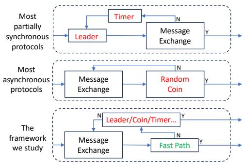  
Figure 1: Frameworks for consensus protocols.

• In the fast path there is no special role (such as the leader) used or elected, and thus no synchrony assumption is re-introduced; and,

• there is no switch between fast and normal paths, as both can proceed concurrently and in a unified manner.

From a different viewpoint, the model of the fast path being studied in this paper could be considered a variant of fair schedulers [21]. Fair scheduler was proposed four decades ago, but was somehow overlooked from engineering perspectives. The main drawback of fair scheduler is that if the adversary controls message scheduling at will, the protocols no longer provide liveness. Hence, a fallback mechanism such as leader election and/or randomization is essential for mitigating such attacks targeting the fast path.

We name the framework we study Fair-Fallback. Following this framework, we further present Chitu, an asynchronous BFT protocol designed on top of a well-structured Directed Acyclic Graph (DAG). Each proposal in a DAG is represented as a vertex. DAG-based BFT protocols are becoming prevalent in permissionless blockchains [11, 32, 53, 60, 76]. They embed the consensus process in the dynamic construction of a DAG structure without involving additional messages, simplifying protocol design and implementation. Chitu is largely inspired by Tusk [32] and DAG-Rider [53], two recently proposed DAG-based protocols. Besides possessing the same O(1) time complexity in expectation in the worst case, Chitu further bypasses the fallback mechanism (i.e., the single leader vertex in DAG) provided that most nodes have observed the same set of vertices in a round (i.e., a consensus instance), thus achieving fast termination.

Guided by the Fair-Fallback, the next challenge for Chitu is to find a way to commit as many proposals as possible through the fast path, which we found is a non-trivial task. After several attempts at devising and evaluating different commit rules and also according to the design of prior work [30, 62], we located a useful rule of thumb: a node should wait as long as possible for a proposal to enter the fast path, provided that this wait does not introduce significant costs or violate liveness properties. To this end, we further propose an adaptive wait mechanism that helps Chitu dramatically increase the chance of achieving fast termination.

Finally, we evaluate Chitu, Tusk and BullShark [76] on Amazon EC2 platform. BullShark is another DAG protocol designed under partial synchrony. The experimental result shows that in fault-free case, Chitu can reduces end-to-end latency, achieving up to 82.5% reduction compared to Tusk. Under crash faults, Chitu can still go through the fast path, while the performance of BullShark is significantly affected by the faulty node. We also mimic an adversarial situation under Byzantine attack, where each round is prolonged with extra waiting and the fast path is disabled. Even if all the proposals go through random coins in this case, the performance of Chitu degrades gracefully.

## 2 Background

## 2.1 Model

We focus on the Blockchain or state-machine replication (SMR) problem [73], a solution to which is a robust distributed system that coordinates a group of processes or nodes, in order to mask a bounded number of failures. SMR protocols order requests issued by clients, such that:

• (Safety) If two requests req1 and req2 are committed in the same position (or with the same block height in blockchain contexts), then $r e q 1 = r e q 2 ;$

• (Liveness) Eventually every request req issued by a correct client can be committed.

We target Byzantine faults, which may exhibit arbitrary behaviors even collusion attacks. For simplicity, we assume there are a group Π of $n = 3 f + 1$ nodes [37], in which at most f nodes may be faulty. Thus, a Byzantine quorum consists of $\textstyle \left\lceil { \frac { n + f + 1 } { 2 } } \right\rceil = n - f = 2 f + 1$ nodes. We assume reliable and authenticated channels between each pair of correct nodes, meaning that any message sent by a correct node will be eventually delivered by every correct receiver. Asynchronous protocols must rely on reliable channels to provide liveness, so does the fast path of Chitu.

## 2.2 Fast termination and the leader’s bottleneck in partially synchronous protocols

Partially synchronous protocols are commonly separated into two sub-routines: the normal-case operations that allow a single leader (e.g., the primary in PBFT [27] or the leader in HotStuff [80]) to coordinate consensus and make its proposal (i.e., a batch of requests or transactions) committed, and the view-change operations that elect a new leader when, e.g., the previous one has crashed. The safety property of partially synchronous protocols is ensured by quorum-based techniques [78]. The liveness property, however, is ensured by further introducing network synchrony between the single leader and others. Such timing assumptions also help trigger the view-change operations. When the leader is correct and the network is stable, partially synchronous protocols can reach consensus within a fixed number of message exchange, achieving deterministic and fast termination. In summary,

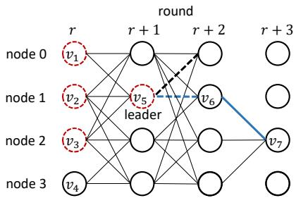  
Figure 2: Example of commit rules in DAG-based protocols like Tusk [32] when n = 4 and f = 1. Each circle represents a vertex in the DAG. Dotted circles represent vertices committed by the leader (v5), while dotted lines represent edges making the leader valid.

• partially synchronous protocols have normal-case operations that rely on a single leader to reach consensus without involving time-related steps;

• the leader and other 2 f correct nodes must remain in the same view for a sufficiently long period of time, such that consensus can be achieved before timeout.

Note that the second reason is critical in ensuring liveness and providing good performance. Otherwise, partially synchronous protocols may be involved in consecutive view changes.

When the leader is slow or has crashed, partially synchronous protocols incur more communication phases and additional timeout events for electing a new leader. We argue that the problem mainly stems from the existence of some special role, which is always on the critical path regardless of the system state.

## 2.3 Randomization in asynchronous protocols

Asynchronous protocols [13, 32, 36, 47, 53, 66, 72] work in a somewhat leaderless manner, in the sense that no special role (such as the leader) is pre-selected by the help of timing assumptions. Asynchronous protocols are commonly roundbased, where in each round every node is required to suggest a value and participate in several communication phases. The value a node suggests in a round is influenced by message exchange of previous rounds. To determine which value(s) can be committed, asynchronous protocols introduce a coinflipping phase, which breaks ties and helps correct nodes converge.

Figure 2 depicts how Tusk [32], a recently proposed DAGbased asynchronous protocol, proceeds round by round. Each round corresponds to a new consensus instance. Since consecutive rounds are connected by edges, the execution of consecutive consensus instances is pipelined, similarly to the way HotStuff [80] chains consecutive proposals.

In each round r, a node i makes a proposal, i.e., a vertex in the DAG. Node i then propagates the vertex to others via a Byzantine Reliable Broadcast (BRB) protocol [21, 24]. BRB ensures that the delivered message (vertex) is the same for all correct nodes despite f Byzantine faults. BRB in Tusk takes three phases of message exchange. Each vertex of round $r + 1$ has exactly $n - f$ edges connecting to vertices of round r. For example, vertex v5 in Figure 2 connects to $\nu _ { 1 } , \nu _ { 2 }$ and v3 (but not $\nu _ { 4 } )$ . DAG is merely a partially ordered set, in which vertices are not totally ordered. To this end, Tusk generates a random coin in each odd round (e.g., round $r + 1$ in Figure 2), by which correct nodes collectively select a leader vertex (e.g., v5). Random coins can be instantiated using a deterministic threshold signature scheme [19]. If the leader vertex is valid, i.e., is connected by at least $f + 1$ vertices of the subsequent round $( \mathrm { e } . \mathrm { g } . , \nu _ { 5 } )$ , it recursively commits all the ancestors in the DAG in a deterministic manner. Such a validity check is used to ensure there is a path (in the DAG) between a valid leader vertex and any subsequent leader vertex. For instance, if v7 in Figure 2 is selected as the leader vertex of round $r + 3 .$ , there must be a path connecting $\nu _ { 7 }$ and $\nu _ { 5 }$ because $\nu _ { 5 }$ is connected by f + 1 vertices of round $r + 2$ and $\nu _ { 7 }$ must connect to $n - f$ vertices of round $r + 2 .$ . By ensuring this property, no one may miss or skip any valid leader vertex but commit them in the same order.

The random coin of round r + 1 is generated when $n - f$ nodes have entered round $r + 3 , ^ { 2 }$ as the leader information should not be revealed in advance. This is to ensure with nonzero probability the selected leader vertex is valid. Otherwise, if an adversary that controls message delivery knows the coin in advance, it may always keep the corresponding leader vertex connected by less than $f + 1$ vertices, forfeiting liveness properties. As the protocol proceeds round by round, with probability 1 some new leader vertex and its ancestors can be committed.

As we can observe, (1) compared to partially synchronous counterparts like PBFT, Tusk involves more rounds of message exchange, even in the absence of node/network failures; and, (2) random coins are always located on the execution path, thus making termination probabilistic. If the selected leader vertex is not valid, at least another two rounds are involved. In practice, such a delayed commit can happen when, e.g., the proposer of the leader vertex is slow or has crashed.

The design choices of Tusk (and most asynchronous protocols) are solely based on a pessimistic assumption: an adversarial scheduler can always control message scheduling at will. Hence, Tusk has only one path for committing proposals, i.e., by selecting a leader vertex with the help of random coins. In practice, such an omnipotent adversary does not (always) exist and the network performance is predictable most of the time [43, 61].

## 3 The Fair-Fallback Framework

## 3.1 Motivation and first principles of consensus

We simplify the discussion by focusing on one-shot consensus. Any solution to the multivalued consensus problem requires each proposer i to make a proposal $B _ { i } .$ . After several phases of message exchange, correct nodes eventually decide on a single proposal or a subset of all proposals [65].

Generally, we can also consider any consensus protocol running m Binary Agreement (BA) instances (implicitly or explicitly), each of which determines the result of a given proposal. Eventually, each proposal is either committed (output 1) or aborted (output 0). Following the concept and terminology used in the seminal FLP impossibility [40], once a decision can be made, we say each proposal $B _ { i }$ becomes univalent, i.e., either 1-valent or 0-valent. Initially, every proposal is bivalent. For leader-based protocols, only a single proposal becomes 1-valent, and it is also the final decision. Other proposals are 0-valent. For leaderless variants such as asynchronous protocols, multiple proposals may become 1-valent and be included in the final decision.

We observe that the general pattern discussed above neither introduces a leader or any special role, nor does it rely on random coins to break ties. In other words, neither any special role (or the maximum network delay ∆) nor randomization is intrinsic to the consensus problem. If correct nodes can reach agreement of each proposal merely based on message exchange, no additional assumptions or mechanisms should be put on the execution path. If we target the more practical multi-instance consensus problem (or SMR), where a series of consensus instances are sequentially ordered, either we can consider this order obtained out-of-band (e.g., pre-defined sequence numbers), or for DAG protocols the edges in DAG natively represent the partial order between proposals. In both cases, no special role exists in consensus.

## 3.2 A strawman protocol

We present a simple strawman protocol to better illustrate the fast path of our approach. To simplify our discussion, we further assume (1) each node acts both as a proposer and as a validator, and (2) there is no equivocation and every node is benign (i.e., correct or crashed), though we still have $n = 3 f + 1$ nodes. In §4 we give full-fledged Chitu which also tolerates Byzantine faults.

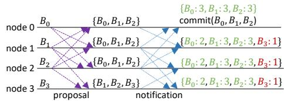  
(a) Node 0 decides on $B _ { 0 } ,$ B1 and B2, while every node selects $B _ { 0 } , B _ { 1 }$ and $B _ { 2 }$ as the candidates.

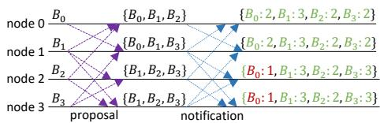  
(b) Nodes 0 and 1 select B0, B1, B2 and $B _ { 3 }$ as the candidates, while nodes 2 and 3 exclude $B _ { 0 }$  
Figure 3: Example for the strawman protocol $( n = 4 )$

First, 1 each (correct) node i makes a proposal $B _ { i }$ and propagates $B _ { i }$ to others. As at most f nodes may be faulty, $\textcircled{2}$ after receiving $n - f$ proposals, node i casts a vote on each proposal by notifying others of all the proposals received. Finally, 3 after receiving $n - f$ such notifications (again, the other f nodes may be faulty), node i selects the proposals that have each obtained $f + 1$ votes as the candidates for final decisions.

For each proposal B, there are three cases, where the first two are univalent:

• (1-valent) If at least $n - f$ nodes have notified of B, we say B is 1-valent;

• (0-valent) If at least $n - f$ nodes have not notified of B (if B exists), we say B is 0-valent; and,

• (bivalent) If neither of the above conditions is met, we say B is bivalent.

Fast path. If for each proposal B, B is either 1-valent or 0- valent, we can safely commit all the 1-valent proposals and abort 0-valent ones. This works because every node in step 3 will select the same candidates (i.e., only 1-valent ones). Even with further communication and/or any additional mechanism, correct nodes will eventually commit the same set of proposals. For instance, in Figure 3a, node 0 immediately commits $B _ { 0 } , B _ { 1 }$ and $B _ { 2 }$ upon observing they are 1-valent (as included in $n - f$ notifications) and $B _ { 3 }$ is 0-valent (as not included in $n - f$ notifications). Other nodes will only select $B _ { 0 } , B _ { 1 }$ and $B _ { 2 }$ (but not $B _ { 3 } )$ as the candidates for further negotiations.

On the contrary, if any proposal B is bivalent, more communication and/or additional mechanism is needed in order to determine the final result of each bivalent proposal. For instance, in Figure 3b, $B _ { 1 } , B _ { 2 }$ and $B _ { 3 }$ are 1-valent, but $B _ { 0 }$ is bivalent. Actually, the main challenge for any (multi-instance) consensus protocol is to obtain a total order on committed proposals. Thus, the fast path of our protocol may fail due to a possible discrepancy in the final order. That is why a fallback mechanism (like leader election or random coin) is needed.

## 3.3 The framework

There are several ways to reach final agreement on bivalent proposals. We can repeat the notification step described in $ \ S 3 . 2 \ ( { \mathrm { i . e . } }$ , step 2 ), where each node only notifies of the selected candidates. If with non-zero probability each repeat results in a univalent status, the protocol can itself achieve probabilistic termination. Such a model, a.k.a., fair scheduler, was formally described in the seminal work of Bracha and Toueg [21].

However, if Byzantine nodes precisely control the delivery speed of their own messages, they may always keep their own proposals bivalent (e.g., node 0 and proposal $B _ { 0 }$ in Figure 3b), thus breaking liveness properties. To mitigate this problem, we must rely on a fallback mechanism to break ties. We first integrated a light-weight leader into the fast path. In contrast to partially synchronous protocols, we do not rely on synchrony assumptions (or any timer) but only leverage a pre-selected leader to resolve ambiguity, which provides probabilistic termination if Byzantine nodes only manipulate the delivery speed of their own messages but not that of correct nodes.

In the worst case, if the adversary also controls message scheduling of correct nodes, some proposal may forever be bivalent and the pre-selected leader may not work. To defend against such a powerful adversary, existing asynchronous protocols explicitly introduce random coins to make correct nodes converge. Similarly, we further integrate random coins into the fast path and obtain Chitu (in a similar vein as Tusk, see §2.3), if the problem needs to be dealt with.

Maybe more interestingly, if we assume the adversary can control message scheduling but cannot (always) break synchrony assumptions, we can instead integrate ∆ (the maximum network delay) into the fast path and obtain a partially synchronous protocol. Thanks to the simplicity of DAG structure, we can readily apply the fast path to Bullshark [76] by preselecting a leader in a round-robin fashion and waiting ∆ time for each leader vertex. We may even remove timeouts (but keep leaders) and obtain an asynchronous protocol under fair schedulers [21], which refrains from using a burdensome random number generation protocol (e.g., threshold signature). Since they share very similar features with Chitu, in this paper we only focus on Chitu. Note that in all above-mentioned protocols a fallback mechanism (i.e., random coins or preselected leaders) is needed only if some proposals are bivalent. The framework we use is depicted in Figure 4.

Generalization of the fast path. There can be different ways to instantiate the fast path. In §3.2 (and §4) we only give one concrete solution. Generally, assume the conditions for the fast path to commit a proposal are denoted as C ONC (e.g., 1-valent ones in §3.2), while the conditions for the fast path to abort a proposal are C ONA (e.g., 0-valent ones in §3.2). Further assume the conditions for the fallback to commit a proposal are $C O \mathcal { N } _ { \mathcal { F } }$ . Then, the following two invariants must

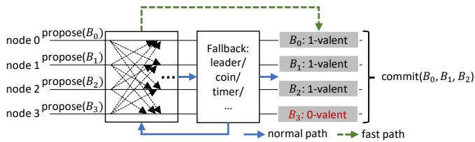  
Figure 4: The Fair-Fallback framework.

hold:

• If any proposal B satisfies $c o \mathcal { N } _ { C }$ , then B must also satisfy $C O \mathcal { N } _ { \mathcal { F } }$ ; and,

• If any proposal B satisfies $C O \mathcal { N } _ { \mathfrak { A } }$ , then B must not satisfy $C O \mathcal { N } _ { \mathcal { F } }$

These two variants guarantee that even if some nodes go through the fast path, while others proceed by the fallback, they still obtain the same result for each proposal.

There are two remaining questions: (1) how to ensure safety properties under Byzantine faults; and, (2) how to efficiently integrate the fast path into a fallback mechanism, such that there is no switch between two paths and each path commits the same set of proposals. For the first question, every message in our strawman protocol (i.e., proposal and notification) is disseminated through a Byzantine Reliable Broadcast (BRB) protocol, such that a Byzantine sender cannot make correct nodes deliver distinct messages. For the second question, our full-fledged solution (see §4) is inspired by recently-proposed DAG protocols [32, 53, 76]. The fallback mechanism (i.e., the selected leader vertices) is embedded into the dynamic construction of DAG, enabling consensus to be achieved without sending extra messages, so is the fast path. With the same DAG and the same leader selected by random coins, no matter whether nodes proceed through the fast path or the fallback, they commit the same set of (1-valent) proposals.

## 4 The Chitu Protocol

Chitu is inspired by Tusk [32] and DAG-Rider [53], both of which adopt DAG as the underlying structure. Chitu differs from Tusk and DAG-Rider in that it is further enhanced by a fast path relying on no special role. In the best case, Chitu takes only four communication phases to commit a proposal. In the following, we first discuss the main idea of Chitu in §4.1. We then describe the detail of Chitu in §4.2-§4.5 and sketch its proof in §4.6. We postpone its pseudocode and correctness proof to Appendices A and B due to space limit.

## 4.1 Main idea

Chitu dynamically constructs a DAG in a round-by-round manner. In each round, every (correct) node proposes a vertex in the DAG and propagates it to others via a Byzantine Reliable Broadcast (BRB) protocol (see §4.2 for details). BRB guarantees that the sender can make at most one vertex delivered in a round. Hence, each round has at most $n = 3 f + 1$ and at least $n - f = 2 f + 1$ vertices delivered via BRB. A vertex v in round r has at least $n - f$ edges connecting to vertices associated with round $r - 1$ . For ease of explanation, we first give the following definition:

Definition 4.1 (Observe). We say vertex v in round r observes vertex u in round $r ^ { \prime } < r ,$ if there is a path (in the DAG) from v to u.

The first challenge for Chitu is to embed the message pattern of our strawman approach (§3.2) into a DAG structure, as consensus instances in DAG are naturally pipelined. To this end, a vertex v in round r simultaneously represents a proposal (of round r) and a notification of the proposals (of round $r - 1 )$ observed by v. Besides, as discussed in §2.3, the selected leader vertices in DAG solely determine the set of committed (or 1-valent) proposals, which are ancestors of leaders. When the fast path is enabled, each leader must be able to distinguish between 1-valent and 0-valent vertices and commits only 1-valent ones.

Assume vertices u and $u ^ { \prime }$ are in round r and vertex v is in round $r + 2$ . We note that when u is observed by $n - f$ vertices of round $r + 1$ (denoted as group $\mathcal { G } )$ , at least $f + 1$ of those are observed by v. This is because every vertex in round $r + 2 \left( \mathrm { e } . \mathrm { g } . , \nu \right)$ observes $n - f = 2 f + 1$ vertices, among which at least $f + 1$ are in $\mathcal { G } .$ . On the contrary, if at least $n - f$ vertices of round $r + 1$ have not observed $u ^ { \prime } ,$ , there exist no $f + 1$ vertices (of round $r + 1 )$ observing $u ^ { \prime } .$ The abovementioned properties provide us a way to distinguish between 1-valent and 0-valent vertices.

We say a node i decides a round r, if every proposal of round r has been decided univalent from $i \gamma _ { \mathrm { s } }$ perspective. Round r can be decided in either of the following two ways:

1. (fast path) when vertices of round r +1 help decide round r; and,

2. (normal path) when a selected leader of round $r ^ { \prime } > r + 1$ helps decide round r.

To ensure the safety property, the following invariant must hold:

Invariant 4.1. For any round r, if a group of vertices V is decided 1-valent by node i via the fast path, while a group of vertices $\mathcal { V } ^ { \prime }$ is decided 1-valent by node j via the normal path, then $\mathcal { V } = \mathcal { V } ^ { \prime }$

We then give the following definition.

Definition 4.2 (Strongly observe). We say vertex v in round $r ^ { \prime } \geq r + 2$ strongly observes vertex u in round r, if there are (at least) $f + 1$ vertices of round $r + 1$ connecting v and u.

Correspondingly, we have the following important invariants:

Invariant 4.2. if vertex u in round r is observed by $2 f + 1$ vertices of round $r + 1 _ { : }$ , then every vertex of round $r ^ { \prime } \geq r + 2$ strongly observes u.

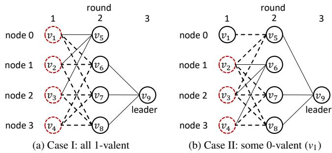  
Figure 5: Example for Chitu fast path (n = 4). Dotted circles denote 1-valent vertices, while dotted lines denote edges enabling the leader vertex to commit the same set of vertices.

Invariant 4.3. if vertex u′ in round r is observed by less than f +1 vertices of round $r + 1$ , then no vertex of round $r ^ { \prime } \ge r + 2$ strongly observes $u ^ { \prime } .$

Invariants 4.2 and 4.3 play crucial roles in designing Chitu. For each vertex u in round r, if either u is observed by at least $2 f + 1$ vertices of round $r + 1$ , or u cannot be observed by $f + 1$ vertices of round $r + 1$ , round r can be decided. In this case, if node i decides round r but node j (temporarily) skips round r and decides $r + 2$ , any vertex in round $r + 2$ can distinguish between those that are strongly observed and those not, and only decide strongly observed ones in round r. Generally, the leader of round $r ^ { \prime } = r + 2 k \ ( k \in \mathbb { N } ^ { + } )$ can help decide round r in an indirect way. Figure 5 gives an example.

## 4.2 DAG construction

Each vertex v represents a proposal broadcast by a single node. It contains basic information such as a round number $r ,$ a source which identifies the node who created v, a block of transactions, and, most importantly, a set of edges which refer to vertices of the last round. Each node maintains a local copy of the DAG according to messages it receives. A vertex v is added into the DAG if v is delivered by BRB. A node i enters round r + 1 and makes a new proposal if node i has delivered $n - f$ vertices of round r.

Reliable Broadcast (BRB). In Chitu reliable broadcast protocol, a vertex goes through two communication phases. We denote two types of messages by VAL and PREPARE. Each node i first broadcasts a VAL message when starting a new round r, containing a new vertex v proposed by i. Upon receiving VAL message or $f + 1$ PREPARE messages for the same vertex v, node i checks the validity and broadcasts a signed PRE-PARE message. As an optimization, f + 1 PREPARE messages guarantee that the corresponding VAL message is received by at least one correct node and hence can be received by i eventually. Upon receiving $n - f$ PREPARE messages for the same vertex v, v can be delivered, i.e. added into the local DAG. Note that if node i receives v from node j but has not delivered some vertex $\nu ^ { \prime }$ connected by v, it can ask j for $\nu ^ { \prime }$ that must be in $j ^ { \circ } \mathbf { s }$ local DAG. After each of $n - f$ vertices in round r collects $n - f$ PREPARE messages, node i can advance to the next round (§4.4 presents an optimization that delays the advancement).

Weak edges. As $n - f$ nodes may quickly move forward, vertices proposed by other slow nodes may be constantly ignored. To solve this problem, Chitu can also leverage weak edges proposed in DAG-rider [53], enabling vertex v in round r to weakly connect to vertex v′ in round $r ^ { \prime } < r - 1$ . Then, $\nu ^ { \prime }$ can be committed if v is committed. Since vertices proposed by a single node are chained and totally ordered, each vertex only needs to connect to at most $n = 3 f + 1$ vertices in previous rounds, each of which is from a different node.

## 4.3 Commit rules

Each node decides vertices round by round merely based on its local view of the DAG. For a vertex v in round r, it connects at least $n - f$ vertices of round r − 1, which can be considered the proposer of v votes for vertices connected by v but vetoes others not.

Fast path. Through the fast path, round $r + 1$ helps decide round r when node i delivers $n - f$ or more vertices of round $r + 1$ . We denote three statuses for a vertex v in round r:

• 1-valent: v is 1-valent if at least $n - f$ vertices of round $r + 1$ observe v.

• 0-valent: v is 0-valent if at least $n - f$ vertices of round $r + 1$ do not observe v.

• bivalent: v is bivalent if it is possible that more than f but less than $n - f$ vertices of round $r + 1$ observe v.

Both 1-valent and 0-valent are univalent, while bivalent indicates that v is temporarily unsettled and may need to wait for decisions of subsequent rounds. The local DAG of node i changes dynamically, so the status of each vertex may also change as i keeps delivering new vertices. However, 1-valent and 0-valent are incompatible, meaning that if some correct node decides vertex v 1-valent, no correct node may ever decides v 0-valent (but v can be bivalent temporarily). If every vertex v in round r is decided univalent, node i can decide round r with all the 1-valent vertices (due to Invariants 4.2 and 4.3 in §4.1).

Normal path. Chitu selects leaders by random coins (like Tusk) to survive malicious schedulers that can totally control message delivery. Leader vertices are used to (recursively) decide preceding rounds, if the fast path does not work.

In the same vein as DAG-Rider and Tusk, we say a leader vertex v in round r is valid, if (1) v is observed by at least $f + 1$ vertices of round $r + 1$ , or (2) v is observed by the next valid leader vertex in round $r ^ { \prime } = r + 2 k \ ( k \in \mathbb { N } ^ { + } )$ . Note that in Chitu leader vertices in odd (even) rounds only decide vertices in odd (even) rounds, i.e., odd and even rounds are separated. This is because two leader vertices in consecutive rounds, e.g., round r and $r + 1$ , may not have a path in the DAG. With a valid leader vertex v in even (odd) round r, a node decides all the previous even (odd) rounds that have not be decided. Like Tusk, these rounds are decided recursively. Each round is decided either by v, or by $\nu ^ { \prime }$ that is made valid by v (i.e., observed by v). In each round, every vertex strongly observed by $\nu \left( \mathrm { o r } \nu ^ { \prime } \right)$ is decided 1-valent while the others are decided 0- valent. Such a rule ensures that every round is decided either by the fast path or by the same leader vertex.

Finally, node i commits round r if (1) all the preceding rounds are committed; and (2) round r is decided. That is to say, each node must commit rounds sequentially, though odd and even rounds are decided independently. Once round r is committed, all the ancestors of the 1-valent vertices of round r are also committed indirectly, thanks to DAG structure.

Leader selection. When $n - f$ vertices in round $r + 1$ are delivered, node i broadcasts its signature share (for threshold signatures) and later determines the leader vertex of round r. With the help of the leader vertex, node i tries to decide round $r - 2$ and all the preceding odd (or even) rounds recursively. Finally, if round r and every preceding round $r ^ { \prime } < r$ are decided, node i commits rounds sequentially till round r. Figure 6 depicts an example for Chitu commit rules.

## 4.4 Adaptive wait

Motivation. Consider the DAG construction stated in $\ S 4 . 2 ,$ each vertex is, on average, connected by $n - f$ vertices of the next round, which is exactly the 1-valent condition via the fast path. However, due to discrepancy in latency between nodes, some vertices may be connected by more than $n - f$ edges while others are not. Those connected by more than f but less than $n - f$ edges cannot be decided via the fast path. To mitigate this problem, intuitively more edges are needed to help those vertices become 1-valent, by nodes trying to wait for more than $n - f$ vertices delivered to advance to the next round. It is irrational to simply (re-)introduce a timeout mechanism (i.e. waiting ∆ time) here, for a deterministic timeout is always an inevitable barricade on the fast path. It is also difficult to quantify ∆ in unstable asynchronous networks. Besides, we must guarantee that such a wait will not prevent correct nodes from proceeding.

Adaptive mechanism. We observe that any vertex v received by $f + 1$ nodes can be propagated to every correct node eventually (even with f faults). We say this kind of vertices are preaccepted. In our adaptive wait mechanism, a node i keeps waiting for every pre-accepted vertex v to be delivered (through BRB), so long as the sender of v does not broadcast two distinct vertices in a round. Such an adaptive mechanism creates a gap between when a node i delivers $n - f$ vertices of round r and when i enters round $r + 1$ , effectively increasing the chance of connecting more vertices in round r. Besides, since i keeps receiving new messages while waiting, i may notice more pre-accepted vertices to wait for.

To guarantee that every pre-accepted vertex v can be delivered or an equivocation can be detected, node i needs to forward the VAL and f + 1 PREPARE messages for v to all the other nodes while waiting. This forwarding scheme enables other (correct) nodes to vote for v or detect the malicious behavior of the sender of v. In the first case, all correct nodes eventually collect $n - f$ PREPARE messages for v; in the second case, all correct nodes stop waiting for v and enter the next round if no other pre-accepted vertex exists.

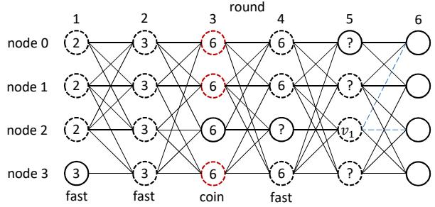  
Figure 6: An example for commit rules of Chitu. Dotted circles denote strongly observed vertices in each round. The number in each circle denotes the round after which the corresponding vertex is committed. Rounds 1 and 2 are decided through the fast path, and thus their strongly observed vertices are committed immediately. In round 1, the vertex proposed by node 3 is committed indirectly by round 2, as it is observed by the strongly observed vertices of round 2. Since round 3 is decided through random coins, even if round 4 is decided through the fast path, it cannot be committed until the leader vertex v1 of round 5 is selected, which decides round 3. In round 3, the vertex proposed by node 2 can also be committed because it is observed by a strongly observed vertex (node 0) in round 4.

## 4.5 Performance analysis

We first analyze the performance of Chitu and Tusk (see Table 1). Chitu has a fast path that can quickly commit all vertices in 2 rounds. Specifically, when f nodes crash, Chitu always goes through the fast path. Through random coins, the probability to select a valid leader vertex is at least ${ \frac { f + 1 } { 3 f + 1 } } > { \frac { 1 } { 3 } }$ Thus, in expectation, there exists a valid leader vertex in every three odd (even) rounds. Chitu can commit a round r only if both odd and even rounds after r select a valid leader vertex. Therefore, Chitu commits a round in every six rounds through random coins. Tusk has the same expected time complexity (through random coins), though it selects a leader vertex in every odd round. Chitu introduces an all-to-all message pattern in its Byzantine Reliable Broadcast (BRB), and thus has $O ( n ^ { 2 } )$ message complexity and 2 message delays per round. As for communication complexity, each vertex v in round r + 1 must connect to at least $2 f + 1$ vertices in round $r ,$ each of which contains $2 f + 1$ signatures. The complexity of each VAL messages is $O ( n ^ { 2 } )$ . Every node is allowed to propose a new vertex in each round, thus the total communication complexity is $O ( n ^ { 4 } )$ as the expected time complexity is $O ( 1 )$ Tusk has the same communication complexity due to the same reason.

Table 1: Performance analysis of Chitu and Tusk. Note that the worst case indicates time complexity (message delays) in expectation.
<table><tr><td rowspan=1 colspan=1></td><td rowspan=1 colspan=1>Bestcase</td><td rowspan=1 colspan=1>Normalcase</td><td rowspan=1 colspan=1>Worstcase</td><td rowspan=1 colspan=1>Messagecomplexity</td><td rowspan=1 colspan=1>Communicationcomplexity</td></tr><tr><td rowspan=1 colspan=1>Chitu</td><td rowspan=1 colspan=1>4</td><td rowspan=1 colspan=1>9</td><td rowspan=1 colspan=1>15</td><td rowspan=1 colspan=1> $\overrightarrow { O ( n ^ { 3 } ) }$ </td><td rowspan=1 colspan=1> $\overline { { O ( n ^ { 4 } ) } }$ </td></tr><tr><td rowspan=1 colspan=1>Tusk</td><td rowspan=1 colspan=1>14.5</td><td rowspan=1 colspan=1>14.5</td><td rowspan=1 colspan=1>25</td><td rowspan=1 colspan=1> $\overline { { O ( n ^ { 2 } ) } }$ </td><td rowspan=1 colspan=1> $\overline { { O ( n ^ { 4 } ) } }$ </td></tr></table>

Furthermore, Table 2 compares Chitu, MyTumbler and Red-Belly regarding their time complexities (message delays), as they all adopt the Fair-Fallback Framework.

Table 2: Performance analysis of the protocols following the Fair-Fallback framework.
<table><tr><td rowspan=1 colspan=1></td><td rowspan=1 colspan=1>Best case</td><td rowspan=1 colspan=1>Worst case</td><td rowspan=1 colspan=1>Timing model</td></tr><tr><td rowspan=1 colspan=1>Chitu</td><td rowspan=1 colspan=1>4</td><td rowspan=1 colspan=1>0(1)</td><td rowspan=1 colspan=1>asynchrony</td></tr><tr><td rowspan=1 colspan=1>MyTumbler</td><td rowspan=1 colspan=1>4</td><td rowspan=1 colspan=1> $\overline { { O ( \log _ { 2 } n ) } }$ </td><td rowspan=1 colspan=1>asynchrony</td></tr><tr><td rowspan=1 colspan=1>Red Belly</td><td rowspan=1 colspan=1>4</td><td rowspan=1 colspan=1>-</td><td rowspan=1 colspan=1>partial synchrony</td></tr></table>

MyTumbler uses SuperMA, a multi-valued agreement protocol to commit proposals in three message delays in the best case, and another one message delay to pass timestamps for execution. If an adversary totally controls message scheduling, however, MyTumbler explicitly runs n asynchronous binary agreement instances, each within a SuperMA instance and has $O ( 1 )$ time complexity in expectation, resulting in at least $O ( \log _ { 2 } n )$ time complexity in total. Red Belly also commits proposals in four message delays in the best case, i.e., Propose, Echo, Ready and Decide. Red Belly further uses DBFT, a partially synchronous binary agreement protocol, to resolve ambiguity. DBFT selects a weak coordinator to suggest a value. It is not straightforward or fair to compare the worst-case performance between partially synchronous (Red Belly) and asynchronous (Chitu and MyTumbler) protocols as they target different timing models. In summary, the key advantages of Chitu over MyTumbler are the worst-case performance and simplicity (thanks to DAG). Unlike Red Belly, Chitu provides liveness under asynchrony and has no timers on the execution path.

## 4.6 Sketch of proof

Safety. First, BRB guarantees that any node can make at most one vertex delivered in a round and correct nodes will not deliver different vertices proposed by the same node. Then, since Chitu commits vertices round by round, we prove that in each round the same set of vertices are decided 1-valent, no matter via the normal path or the fast path. Assume nodes i and j decide $\mathcal { V }$ and $\mathcal { V } ^ { \prime }$ in round $r ,$ respectively.

Case I: Both i and j decide round r via the normal path. $\mathrm { W . l . o . g }$ , assume i decides $\mathcal { V }$ by the leader vertex $\nu _ { 1 }$ in round $r _ { 1 } \geq r + 2$ , while j decides $\mathcal { V } ^ { \prime }$ by the leader vertex $\nu _ { 2 }$ in round $r _ { 2 } \ge r _ { 1 } + 2 . \nu _ { 1 }$ is observed by $f + 1$ vertices of round $r _ { 1 } + 1$ ， and v2 observes at least $2 f + 1$ vertices in round $r _ { 1 } + 1$ . Since $( f + 1 ) + ( 2 f + 1 ) > 3 f + 1 , \nu _ { 1 }$ is observed by $\nu _ { 2 }$ . Recursively, j must decide round r by the leader vertex $\nu _ { 1 }$ but not $\nu _ { 2 }$

Case II: i decides round r via the normal path, while j decides round r via the fast path. Assume i decides $\mathcal { V }$ by the leader vertex $\nu _ { l }$ in round $r ^ { \prime } \geq r + 2$ , which observes at least $2 f + 1$ vertices in round $r + 1$ . For any $\nu \in \mathcal { V } ^ { \prime }$ , v is observed by at least $2 f + 1$ vertices in round $r + 1$ . Since these two groups of $2 f + 1$ vertices intersect at $f + 1$ vertices, by Definition 4.2 v is strongly observed by $\nu _ { l } , \mathrm { i . e . , } \nu \in \mathcal { V }$ . In contrast, for any $\nu ^ { \prime } \notin \mathcal { V } ^ { \prime } , \bar { \nu ^ { \prime } }$ is obeserved by less than $f + 1$ vertices in round $r + 1$ , and thus $\nu ^ { \prime }$ cannot be strongly observed by $\nu _ { l } ,$ i.e., $\nu ^ { \prime } \notin \mathcal { V }$ . Therefore, $\mathcal { V } = \mathcal { V } ^ { \prime }$

Case III: Both i and j decide round r via the fast path. Assume there exists a vertex $\nu \in \mathcal { V }$ but $\nu \notin \mathcal { V } ^ { \prime } .$ . In i’s view v is observed by at least $2 f + 1$ vertices in round $r + 1$ , while in $j ^ { \circ } \mathbf { s }$ view v is not observed by at least $2 f + 1$ vertices in round $r + 1$ . Since these two groups of $2 f + 1$ vertices intersect at $f + 1$ vertices, at least one correct node proposes two different vertices in round r + 1. A contradiction. For each vertex, any two correct nodes must decide it with the same univalent status, and thus all 1-valent vertices and their causal histories are committed in the same order.

Liveness. We first argue that for every round $r ,$ there are at least $f + 1$ vertices strongly observed by the next valid leader vertex $\nu _ { l }$ in round $r + 2 k \left( k \in \mathbb { N } ^ { + } \right)$ . At least $2 f + 1$ vertices in round $r + 1$ are observed by $\nu _ { l } ,$ denoted by $\mathcal { G } .$ The total number of edges $\mathcal { G }$ provides to round r is at least $( 2 f + 1 ) | { \cal G } |$ By Definition 4.2, a vertex in round r is strongly observed by $\nu _ { l }$ if observed by at least $f + 1$ vertices in $\mathcal { G } .$ . In round $r ,$ if only $f$ vertices are strongly observed by vl and observed by all vertices in $\mathcal { G }$ using the most edges, and the rest $2 f + 1$ vertices are observed by only f vertices in G, the total number of edges is $f | \mathcal { G } | + ( 2 f + 1 ) f \leq f | \mathcal { G } | + | \mathcal { G } | f = 2 f | \mathcal { G } | < ( 2 f + 1 ) | \mathcal { G } |$ Thus, there are at least $f + 1$ vertices strongly observed by $\nu _ { l } .$ i.e., satisfying the rule of valid leaders. Since the adversary cannot know the leader of round r until $2 f + 1$ vertices of round $r + 1$ are delivered, it is impossible to control their edges to impede it becoming valid. Thus, the probability to select a valid leader is at least $\begin{array} { r } { \frac { f + 1 } { 3 f + 1 } > \frac { 1 } { 3 } } \end{array}$ . As the protocol runs round by round, with probability 1 the leader of some round r is valid, and then all rounds $r - 2 k \left( k \in \mathbb { N } ^ { + } \right)$ are decided.

## 5 Performance Evaluation

We implement Chitu in Golang, using noise [7] for asynchronous networking. We use SHA256 to compute hash values and Ed25519 to sign and verify signatures, implemented by Golang crypto library. Boneh-Lynn-Shacham (BLS) threshold signatures are used to construct random coins, computed by bls-eth-gobinary [2]. GoGo Protobuf [5] library is used for serialization. The code is available at https://github.com/ Decentralized-Computing-Lab/ChituBFT.

We compare Chitu to Tusk [32] and BullShark [76], two representative DAG-based BFT protocols, with open-source implementations [3, 6]. Tusk and BullShark have the same structured DAG provided by Narwhal [32] but with different consensus protocols. Narwhal introduces additional worker nodes to disseminate blocks separately, leaving the primary nodes only running consensus protocol.

We run experiments on AWS EC2, with t3.2xlarge instances with 8 vCPUs, 32 GiB RAM and 5 Gbps Network burst bandwidth, running Ubuntu 22.04.4 LTS. Nodes and clients are deployed over 5 different regions across the globe: Ohio, Singapore, Tokyo, Canada (Central) and Frankfurt. The average RTT among 5 regions is 135 ms. For each node, there is a client running in the same region and sending a given number of requests to it per 50 ms (i.e. client rate). Each node gathers requests into blocks and proposes them when a new vertex is generated. We measure end-to-end latency as the time elapsed from when the client sends its request till when the client receives the confirmation from the same node. In all experiments, we set request size to 1000 B, which represents the trend towards larger transactions for Blockchain applications such as Bitcoin [1] and Ethereum [4].

## 5.1 Fault-free performance

We first compare the performance of Chitu, Tusk and Bull-Shark when there is no fault. We gradually increase the rate that clients send requests until the system is saturated. We run experiments at different scales (n = 4, n = 10 and n = 100). When n = 4, nodes and clients are deployed in Ohio, Singapore, Tokyo and Frankfurt.

Figures 7 to 9 show the results. The end-to-end latency of Chitu is around 500 ms when the system is not saturated. Compared to Tusk, Chitu achieves up to 82.5% (440 ms versus 2519 ms) and 82.2% (485 ms versus 2729 ms) reduction in latency when each client sends 100 requests for every 50 ms, when $n = 4$ and n = 10 respectively. This is due to three reasons. First, most vertices in Chitu are committed via the fast path at small scales, where in the best case only four communication phases (i.e. two DAG rounds) are taken and random coins are bypassed. Second, in the normal path, the probability to select a valid leader is higher in Chitu than in Tusk and BullShark, for more edges are connected between rounds thanks to the wait mechanism. Third, Chitu trades off message complexity for less communication phases per round. With the moderately large number of nodes, the latency of Chitu is still much lower than that of Tusk and BullShark, with around 50% vertices committed via the fast path when

Limitation. The percentage of fast-path commits becomes lower as the scale grows. Assume the evolvement of each vertex is an independent event, and the probability of a vertex being connected by more than $2 f$ or less than $f + 1$ vertices (i.e., 1-valent or 0-valent) is $p .$ As the number of nodes grows, the probability that a round goes through the fast path is thus $p ^ { n }$ , impeding larger-scale deployments. A possible solution to mitigate this problem is to select a subset of nodes as proposers while leaving others as validators, a typical way permissionless blockchains adopt to achieve scalability [42, 49]. We however leave this direction to future work.

BullShark has lower latency than Tusk since BullShark preselects a leader in each odd round and can commit vertices within 3.5 DAG rounds, while Tusk has to go through random coins and selects a valid leader every six rounds in expectation. Chitu has the advantage over BullShark not only in taking fewer rounds to commit vertices via the fast path, but also the leaderless feature and the way of advancing rounds. Nodes in BullShark additionally wait for a predefined leader to become valid (or at most ∆ time), which may take longer time when the proposer of such a vertex is slow.

Wait mechanism. To further analyze the effects of the wait mechanism, we compare the average and 95%ile latency, and the percentage of fast-path commits, of Chitu with and without the wait mechanism. Figure 10 shows the result when n = 4 at four request rates corresponding to the points highlighted in Figure 7. With the wait mechanism, almost all vertices are committed through the fast path when the system is not saturated, achieving 99.5% when the request rate is 100 requests per 50 ms. In contrast, without the wait mechanism, only 12% vertices are committed through the fast path at the same request rate, with 1.75x latency (772 ms vs. 440 ms). This is mainly because the normal path takes eight communication phases to commit vertices. As the request rate grows, each vertex contains more requests and takes more time to propagate, which directly increases latency. Without the wait mechanism, it becomes more difficult to propagate vertices proposed by slow nodes, and hence they can be decided 0-valent via the fast path more easily. Thus, the percentage of fast-path commits becomes higher under slightly heavier workloads, but still much lower than that with the wait mechanism.

The wait mechanism helps a node observe as many vertices as possible, except those propagated by very slow nodes. These vertices may be observed by other f + 1 but less than n − f nodes also due to the wait mechanism, leading to the failure of the fast path. Thus, with the wait mechanism, the percentage of fast-path commits becomes a little lower under the heavier workload (but still around 92.5%). Moreover, as the scale grows, the probability of achieving fast termination without the wait mechanism declines rapidly. When n = 10, almost no round goes through the fast path without the wait mechanism, even as the request rate increases, due to the similar limitation discussed above. Therefore, the wait mechanism is critical for enabling the fast path.

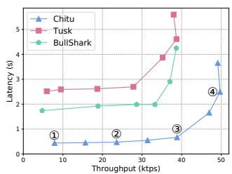  
Figure 7: $n = 4 ,$ fault-free.

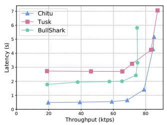  
Figure 8: $n = 1 0 ,$ , fault-free.

## 5.2 Performance under crash faults

We then measure the performance of Chitu, Tusk and Bull-Shark when disabling f nodes in advance, as there is no separation between normal case and view change in these protocols, i.e., Tusk, BullShark and Chitu have no failover to execute. The faulty nodes may crash or purposely keep silent. We run the experiments at different scales $( n = 4 , n = 1 0$ and $n = 1 0 0 )$ .

Figure 11 to 13 depict the results. Chitu has lower latency and higher peak throughput in this scenario. When f nodes crash, each vertex can observe only $n - f$ vertices of the last round. This implies that each vertex are observed by exactly $n - f$ vertices of the next round, and hence Chitu can completely skip random coins and terminate deterministically in this particular scenario, as no vertex is bivalent. The fast path takes four communication phases to determine that the rest f vertices (if exist) cannot be observed by more than f vertices, i.e., they must be 0-valent. However, in this scenario, each node needs to deliver vertices from all the others to advance to the next round, which may not be the fastest n− f nodes in the fault-free scenario. Therefore, the latency of Chitu under the light workload slightly increases to around 550 ms at small scales. The peak throughput of all the protocols degrades in this case, as f faulty nodes cannot make proposals anymore. Nonetheless, it is noteworthy that the peak throughput of Chitu decreases by the least and is higher than the other two. This is because the wait mechanism cannot be triggered when there are only $n - f$ vertices in each round, and there is no need to forward the votes for pre-accepted vertices.

Compared to Chitu, Tusk and BullShark suffer a larger increase in latency under crash faults. Tusk always relies on random coins to terminate. With f faults, the selected leader is less likely to be valid, for with probability 1 it is faulty. As for BullShark, such a high-latency problem even gets worse. BullShark requires each node to additionally wait ∆ time, during which the pre-selected leader can be delivered. However, if the proposer is faulty (with probability 1 ), such a timeout is located on the critical path. The default value of ∆ is set to 5 sec in BullShark’s open-source implementation.

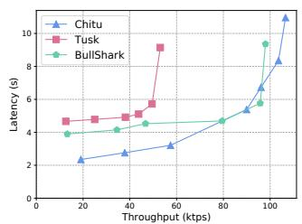  
Figure 9: $n = 1 0 0 .$ , fault-free.

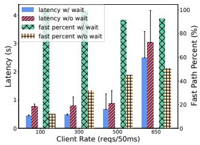  
Figure 10: Performance with and without wait mechanism.

The average latency of BullShark increases to more than 5 sec at all scales. By this experiment we show the benefit of offloading the fallback mechanism when correct nodes can reach agreement leaderlessly.

## 5.3 Performance under Byzantine faults

Byzantine nodes may badly affect the performance of Chitu, especially by purposely disabling the fast path. Since it is difficult to manipulate message scheduling in practice, we evaluate Chitu in a typical scenario: (1) the fast path is disabled; (2) the wait mechanism is maliciously exploited by the adversary, so that each node has to deliver n vertices to advance to the next round; and, (3) Byzantine nodes disseminate their proposals with no payload and do not participate in message exchange of any proposal.

We run the experiment with $n = 1 0 ,$ , where one node in Canada Central and two nodes in Frankfurt are Byzantine faulty. Figure 15 depicts the results. When the system is not saturated (Figure 15a), the average latency under Byzantine faults is about 2x more than that under crash faults. This is mainly because the normal path takes 2x more communication phases than the fast path. The peak throughput (Figure 15b) moderately degrades under Byzantine faults compared to the one with f crash nodes. This is because it takes more bandwidth overhead for correct nodes to deliver the vertices proposed by Byzantine nodes, i.e. more PREPARE messages broadcast and forwarded. However, the wait mechanism also plays a role in synchronization, making slow nodes catch up with the pace of fast nodes. Therefore, the measured degradation of the peak throughput is acceptable, decreased by 5.78% (from 65.7 ktps to 61.9 ktps).

Note that one Byzantine node is sufficient to disable the fast path if the node can make its proposal bivalent (i.e., observed by more than f but less than $n - f$ vertices of the next round). In reality, initiating such an attack is a bit tricky because the Byzantine node must send its proposal at an appropriate time. Consider the all-to-all pattern of the Chitu broadcast, its adaptive wait mechanism, and even gossip-like communication in large-scale blockchains, the attack is feasible but not trivial. Nonetheless, even if the fast path is turned off, Chitu still has the fallback that provides acceptable performance.

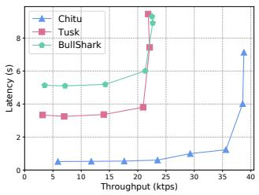  
Figure 11: n = 4, 1 fault.

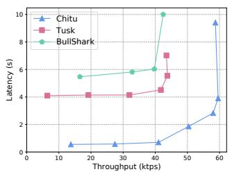  
Figure 12: n = 10, 3 faults.

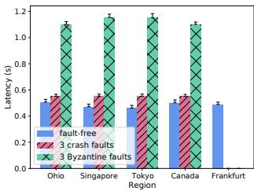  
(a) latency on different regions

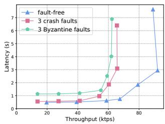  
(b) latency vs. throughput  
Figure 15: Performance under Byzantine faults (n = 10).

## 5.4 Performance with skewed distribution

Finally, we measure the performance of Chitu, Tusk and Bull-Shark with more skewed node distribution. We run the experiment with n = 4 nodes in N.Virginia, Ohio, N.California and Sydney respectively. Three of them are in the US, with lower round-trip latency among one another, while Sydney is far away from them. We set the request rate to 50 requests per 50 ms (not saturated) and measure the average and 95%ile latency of each region.

The results are presented in Figure 14. In this particular setting, three nodes in the US are capable of pushing forward DAG construction, while the node in Sydney fails to keep pace with others. Even if Chitu has the wait mechanism, almost no vertices from Sydney are observed by those in the US, as the physical distance brings too much delay. Similarly, Tusk can move on with only three nodes in the US and hence has no data in Sydney. In contrast, BullShark and Chitu further leverage weak edges, which can connect to “outdated” vertices of previous rounds, though with a significantly increased latency.

The latency of Chitu is still lower than that of Tusk and BullShark in all regions. The reason is similar to the case when f nodes crash, where the fast path is enabled in Chitu, but proposals from the node in Sydney are committed with the help of weak edges. Tusk also outperforms BullShark in N. Virginia, Ohio and N. California. This is because BullShark periodically selects the node in Sydney as a leader, which delays the progress of the whole system. This result further demonstrates the effectiveness of the fast path in Chitu, as it relies on no special role.

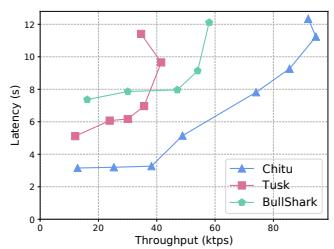  
Figure 13: $n = 1 0 0 , 3 3$ faults.

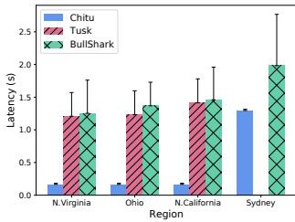  
Figure 14: Performance with skewed distribution.

## 6 Related Work

Partially synchronous protocols. A big family of BFT protocols are designed under partial asynchrony, where additional timing assumptions are used for electing a special role [17,22,27, 44,56,76,80]. We argue that they prematurely rely on leader election and timing assumptions to resolve potential divergences among nodes, which are not necessary when correct nodes can quickly reach consensus in a leaderless manner. Our framework can also be applied to partially synchronous protocols, e.g., integrating the fast path with Bullshark [76] and treating leader election as a fallback mechanism.

Classical asynchronous protocols. Asynchronous protocols ensure safety and liveness properties despite network asynchrony. Asynchronous protocols can be traced back to the 1980s, when the seminal works of Rabin [72] and Ben-Or [13] were proposed. HoneyBadgerBFT [66] is considered the first practical solution, which makes use of a reliable broadcast protocol [20] and a randomized binary agreement protocol [68] to construct a common subset among all correct nodes. Since then, numerous variants [36, 46, 47, 79] are proposed, which greatly improve the performance of asynchronous protocols. However, they still put randomization on execution paths, and thus only achieve probabilistic termination. One exception is Bolt [63], a mechanism that explicitly switches between a fast pah (i.e., Fastlane in the original paper) and a pessimistic path. Bolt however reintroduces timer to trigger switching to pessimistic path. A similar idea of fast termination in Chitu can be applied to classical asynchronous protocols, which we leave for future work.

Certified DAGs. In contrast to classical protocols, DAGbased variants [11, 32, 53, 76] embed consensus into DAG construction, which not only reduces the number of messages needed, but greatly simplifies the design and implementation. Chitu, by leveraging the similar structure, also possesses the simplicity feature. In contrast to DAG-Rider [53] and Tusk [32], Chitu has the fast path that can bypass random coins. Autobahn [43] is a recently proposed DAG protocol that incorporates a partially synchronous consensus mechanism into an asynchronous DAG construction layer, such that Autobahn can both reduce latency (compared to existing DAG protocols) and maintain the seamlessness feature of DAG protocols. Autobahn still relies on a correct leader to quickly reach consensus, while Chitu goes through the fast path in a pure leaderless manner. Shoal [75] and Shoal++ [9] leverage a reputation mechanism to select fast and stable nodes as anchors (leaders), in order to eliminate timeouts in most cases. Shoal++ further introduces a fast commit rule to quickly commit anchors. Sailfish [74] allows to select leader vertices in every round (rather than once every two or more rounds), thus reducing end-to-end latency.

Uncertified DAGs. Best Effort Broadcast (or uncertified DAG) helps reduce the number of message exchanges per round compared to certified DAG, but complicates fault handling logic as malicious nodes may send distinct proposals to different nodes. BBCA-CHAIN [64] leverages a variant of Byzantine Consistent Broadcast (BCB) named BBCA to broadcast only leader blocks, while non-leader blocks can be propagated by Best Effort Broadcast. Mahi-Mahi [51] manually configures the number of leader slots for each round and selects leaders using a global coin (randomization). Mysticeti [10] is a partially synchronous protocol that achieves three message delays in the best case. Mysticeti and Chitu share similarities in distinguishing between proposals that are observed or supported by 2 f + 1 subsequent proposals and that are not observed by 2 f + 1 proposals, but Mysticeti still waits timeout for a primary block of each round in order to provide liveness. In contrast to uncertified DAGs, Chitu follows the paradigm of certified DAG (like Tusk and Bullshark) and has no special role in its fast path but treats every proposal equally. We envision that by integrating the idea of Chitu into an uncertified DAG, we may further reduce commit delays for both paths.

Fast path. In recent years, numerous BFT variants [10,18,31, 74, 75] are proposed with a fast path. Most of them rely on a leader or some special role to coordinate consensus. Their fast path inevitably assumes the correctness of the single leader and puts ∆ on the critical path, thus incurring additional waiting time if such a role crashes or be partitioned. Besides, more message delays may be introduced if they resort to a new leader to take over and move forward. The framework we study in this paper, in contrast, can quickly skip faulty or slow nodes in a responsive manner. There are three exceptions, which together motivate our study: Red Belly [30] under partial synchrony model, and HashGraph [11] and My-Tumbler [62] under asynchrony model. Hashgraph uses a gossip protocol to disseminate proposals and derives consensus results from a DAG of degree two. Although the general idea of the fast path of Chitu shares similarities with Hashgraph, it may incur exponential latency [32] when some nodes are Byzantine. Therefore, integrating a fallback mechanism is critical to mitigating adverse effects on performance during an attack. Red Belly still puts timers on the fast path for aborted proposals, while Chitu can quickly terminates even if some proposals are 0-valent. MyTumbler sequences proposals based on physical timestamps and bypasses random coins when correct nodes input the same value into a binary agreement protocol. Our idea also shares similarity with MyTumbler in skipping random coins if correct nodes are convergent on a proposal, but MyTumbler relies on a binary agreement protocol to reach consensus. In the worst case, however, the time complexity of MyTumbler grows to at least O(log n) [14, 47]. Dumbo-NG [41] is an asynchronous protocol that concurrently runs transaction dissemination and asynchronous agreement, mitigating the tension between throughput and latency.

Other related work. Some BFT protocols [12, 33, 52, 59] make use of trusted hardware to prevent equivocation, so as to ensure both safety and liveness with only n = 2 f + 1 nodes. Such a model can further simplify the design of Chitu. Although we only gave the solution in permissioned settings, Chitu would be a promising approach also for permissionless blockchains [23,39,42,69] when integrating with a Sybil [35] resistance measure such as Proof-of-Work [50] or Proof-of-Stake [54]. As Chitu resorts to all-to-all communication to disseminate and collect votes (PREPARE messages), its communication complexity can be further reduced by using a gossip protocol [15, 71] or threshold signatures [55].

## 7 Conclusion

In this paper we discussed a generic framework for reducing latency in BFT consensus protocols. We then presented Chitu, a DAG-based protocol following this framework. Chitu not only retains the simplicity feature of DAG protocols, but can also bypass expensive random coins and achieve consensus efficiently, when most nodes are in consistency about their observations. We implemented Chitu and conducted extensive experiments on Amazon EC2 platform. Through evaluation we showed that Chitu can effectively reduce latency in several typical scenarios, compared to existing DAG protocols. Our framework opens avenues for future work. Other partially synchronous or asynchronous protocols, or protocols under crash fault model, can also adopt a similar idea to achieve fast termination.

## Acknowledgments

We are very grateful to our shepherd, Zihao Zhang, and the anonymous reviewers for their insightful comments and guidance. This work was supported by the National Natural Science Foundation of China (grant no. 62372293) and the Shanghai Action Plan for Science, Technology and Innovation (grant no. 24BC3201300).

## References

[1] Bitcoin transaction size. https://bitcoinvisuals. com/chain-tx-size.

[2] bls-eth-go-binary. https://github.com/herumi/ bls-eth-go-binary.

[3] Bullshark source code. https://github.com/ MystenLabs/narwhal.

[4] Ethereum statistics. https://ycharts.com/ indicators/sources/etherscan.

[5] gogoprotobuf. https://github.com/gogo.

[6] Narwhal and tusk. https://github.com/ facebookresearch/narwhal.

[7] noise package. https://github.com/ perlin-network/noise.

[8] Elli Androulaki, Artem Barger, Vita Bortnikov, Christian Cachin, Konstantinos Christidis, Angelo De Caro, David Enyeart, Christopher Ferris, Gennady Laventman, Yacov Manevich, Srinivasan Muralidharan, Chet Murthy, Binh Nguyen, Manish Sethi, Gari Singh, Keith Smith, Alessandro Sorniotti, Chrysoula Stathakopoulou, Marko Vukolic, Sharon Weed Cocco, and Jason Yellick. Hyper- ´ ledger fabric: A distributed operating system for permissioned blockchains. In Proceedings of the Thirteenth EuroSys Conference, EuroSys ’18, New York, NY, USA, 2018. Association for Computing Machinery.

[9] Balaji Arun, Zekun Li, Florian Suri-Payer, Sourav Das, and Alexander Spiegelman. Shoal++: High throughput dag bft can be fast!, 2025.

[10] Kushal Babel, Andrey Chursin, George Danezis, Anastasios Kichidis, Lefteris Kokoris-Kogias, Arun Koshy, Alberto Sonnino, and Mingwei Tian. Mysticeti: Reaching the limits of latency with uncertified dags, 2024.

[11] Leemon Baird. The swirlds hashgraph consensus algorithm: Fair, fast, byzantine fault tolerance. Swirlds, Inc. Technical Report SWIRLDS-TR-2016, 1, 2016.

[12] Johannes Behl, Tobias Distler, and Rüdiger Kapitza. Hybrids on steroids: Sgx-based high performance bft. In Proceedings of the Twelfth European Conference on Computer Systems, EuroSys ’17, page 222–237, New York, NY, USA, 2017. Association for Computing Machinery.

[13] Michael Ben-Or. Another advantage of free choice (extended abstract): Completely asynchronous agreement protocols. In Proceedings of the Second Annual ACM Symposium on Principles of Distributed Computing, PODC ’83, page 27–30, New York, NY, USA, 1983. Association for Computing Machinery.

[14] Michael Ben-Or and Ran El-Yaniv. Resilient-optimal interactive consistency in constant time. Distributed Computing, 16(4):249–262, 2003.

[15] N. Berendea, H. Mercier, E. Onica, and E. Riviere. Fair and efficient gossip in hyperledger fabric. In 2020 IEEE 40th International Conference on Distributed Computing Systems (ICDCS), pages 190–200, Los Alamitos, CA, USA, dec 2020. IEEE Computer Society.

[16] Alysson Bessani, Eduardo Alchieri, João Sousa, André Oliveira, and Fernando Pedone. From byzantine replication to blockchain: Consensus is only the beginning. In 2020 50th Annual IEEE/IFIP International Conference on Dependable Systems and Networks (DSN), pages 424–436, 2020.

[17] Alysson Bessani, João Sousa, and Eduardo E.P. Alchieri. State machine replication for the masses with bft-smart. In 2014 44th Annual IEEE/IFIP International Conference on Dependable Systems and Networks, pages 355– 362, 2014.

[18] Erica Blum, Jonathan Katz, Julian Loss, Kartik Nayak, and Simon Ochsenreither. Abraxas: Throughputefficient hybrid asynchronous consensus. In Proceedings of the 2023 ACM SIGSAC Conference on Computer and Communications Security, CCS ’23, page 519–533, New York, NY, USA, 2023. Association for Computing Machinery.

[19] Dan Boneh, Ben Lynn, and Hovav Shacham. Short signatures from the weil pairing. In Colin Boyd, editor, Advances in Cryptology — ASIACRYPT 2001, pages 514–532, Berlin, Heidelberg, 2001. Springer Berlin Heidelberg.

[20] Gabriel Bracha. Asynchronous byzantine agreement protocols. Inf. Comput., 75(2):130–143, nov 1987.

[21] Gabriel Bracha and Sam Toueg. Asynchronous consensus and broadcast protocols. J. ACM, 32(4):824–840, October 1985.

[22] Ethan Buchman, Jae Kwon, and Zarko Milosevic. The latest gossip on BFT consensus. CoRR, abs/1807.04938, 2018.

[23] Vitalik Buterin et al. A next-generation smart contract and decentralized application platform. white paper, 3(37), 2014.

[24] Christian Cachin, Rachid Guerraoui, and Luís Rodrigues. Introduction to reliable and secure distributed programming. Springer Science & Business Media, 2011.

[25] Christian Cachin, Klaus Kursawe, and Victor Shoup. Random oracles in constantinople: Practical asynchronous byzantine agreement using cryptography. Journal of Cryptology, 18(3):219–246, 2005.

[26] Ran Canetti and Tal Rabin. Fast asynchronous byzantine agreement with optimal resilience. In Proceedings of the Twenty-Fifth Annual ACM Symposium on Theory of Computing, STOC ’93, page 42–51, New York, NY, USA, 1993. Association for Computing Machinery.

[27] Miguel Castro and Barbara Liskov. Practical byzantine fault tolerance and proactive recovery. ACM Trans. Comput. Syst., 20(4):398–461, 2002.

[28] Pierre Civit, Muhammad Ayaz Dzulfikar, Seth Gilbert, Vincent Gramoli, Rachid Guerraoui, Jovan Komatovic, and Manuel José Ribeiro Vidigueira. Byzantine consensus is $\textstyle \Theta ( n ^ { 2 } )$ : The dolev-reischuk bound is tight even in partial synchrony! Number 11, pages 1:11–1:19, Hannover, 2022. Dagstuhl Publishing.

[29] T. Crain, V. Gramoli, M. Larrea, and M. Raynal. Dbft: Efficient leaderless byzantine consensus and its application to blockchains. In 2018 IEEE 17th International Symposium on Network Computing and Applications (NCA), pages 1–8, 2018.

[30] T. Crain, C. Natoli, and V. Gramoli. Red belly: A secure, fair and scalable open blockchain. In 2021 2021 IEEE Symposium on Security and Privacy (SP), pages 1501–1518, Los Alamitos, CA, USA, may 2021. IEEE Computer Society.

[31] Xiaohai Dai, Bolin Zhang, Hai Jin, and Ling Ren. Parbft: Faster asynchronous bft consensus with a parallel optimistic path. In Proceedings of the 2023 ACM SIGSAC Conference on Computer and Communications Security, CCS ’23, page 504–518, New York, NY, USA, 2023. Association for Computing Machinery.

[32] George Danezis, Lefteris Kokoris-Kogias, Alberto Sonnino, and Alexander Spiegelman. Narwhal and tusk: A dag-based mempool and efficient bft consensus. In Proceedings of the Seventeenth European Conference on Computer Systems, EuroSys ’22, page 34–50, New York, NY, USA, 2022. Association for Computing Machinery.

[33] Jérémie Decouchant, David Kozhaya, Vincent Rahli, and Jiangshan Yu. Damysus: Streamlined bft consensus leveraging trusted components. In Proceedings of the Seventeenth European Conference on Computer Systems, EuroSys ’22, page 1–16, New York, NY, USA, 2022. Association for Computing Machinery.

[34] D. Dolev and H. R. Strong. Authenticated algorithms for byzantine agreement. SIAM Journal on Computing, 12(4):656–666, 1983.

[35] John R. Douceur. The sybil attack. In Peter Druschel, Frans Kaashoek, and Antony Rowstron, editors, Peer-to-Peer Systems, pages 251–260, Berlin, Heidelberg, 2002. Springer Berlin Heidelberg.

[36] Sisi Duan, Michael K. Reiter, and Haibin Zhang. Beat: Asynchronous bft made practical. In Proceedings of the 2018 ACM SIGSAC Conference on Computer and Communications Security, CCS ’18, page 2028–2041, New York, NY, USA, 2018. Association for Computing Machinery.

[37] Cynthia Dwork, Nancy Lynch, and Larry Stockmeyer. Consensus in the presence of partial synchrony. J. ACM, 35(2):288–323, April 1988.

[38] Vitor Enes, Carlos Baquero, Tuanir França Rezende, Alexey Gotsman, Matthieu Perrin, and Pierre Sutra. State-machine replication for planet-scale systems. In Proceedings of the Fifteenth European Conference on Computer Systems, EuroSys ’20, New York, NY, USA, 2020. Association for Computing Machinery.

[39] Ittay Eyal, Adem Efe Gencer, Emin Gun Sirer, and Robbert Van Renesse. Bitcoin-ng: A scalable blockchain protocol. In 13th USENIX Symposium on Networked Systems Design and Implementation (NSDI 16), pages 45–59, Santa Clara, CA, March 2016. USENIX Association.

[40] Michael J. Fischer, Nancy A. Lynch, and Michael S. Paterson. Impossibility of distributed consensus with one faulty process. Journal of the ACM, 32(2):374–382, April 1985.

[41] Yingzi Gao, Yuan Lu, Zhenliang Lu, Qiang Tang, Jing Xu, and Zhenfeng Zhang. Dumbo-ng: Fast asynchronous bft consensus with throughput-oblivious latency. In Proceedings of the 2022 ACM SIGSAC Conference on Computer and Communications Security, CCS ’22, page 1187–1201, New York, NY, USA, 2022. Association for Computing Machinery.

[42] Yossi Gilad, Rotem Hemo, Silvio Micali, Georgios Vlachos, and Nickolai Zeldovich. Algorand: Scaling byzantine agreements for cryptocurrencies. In Proceedings of the 26th Symposium on Operating Systems Principles, SOSP ’17, page 51–68, New York, NY, USA, 2017. Association for Computing Machinery.

[43] Neil Giridharan, Florian Suri-Payer, Ittai Abraham, Lorenzo Alvisi, and Natacha Crooks. Autobahn: Seamless high speed bft. In Proceedings of the ACM SIGOPS 30th Symposium on Operating Systems Principles, SOSP ’24, page 1–23, New York, NY, USA, 2024. Association for Computing Machinery.

[44] G. Golan Gueta, I. Abraham, S. Grossman, D. Malkhi, B. Pinkas, M. Reiter, D. Seredinschi, O. Tamir, and A. Tomescu. Sbft: A scalable and decentralized trust infrastructure. In 2019 49th Annual IEEE/IFIP International Conference on Dependable Systems and Networks (DSN), pages 568–580, 2019.

[45] Rachid Guerraoui, Nikola Kneževic, Vivien Quéma, and ´ Marko Vukolic. The next 700 bft protocols. In ´ Proceedings of the 5th European Conference on Computer Systems, EuroSys ’10, page 363–376, New York, NY, USA, 2010. Association for Computing Machinery.

[46] Bingyong Guo, Yuan Lu, Zhenliang Lu, Qiang Tang, Jing Xu, and Zhenfeng Zhang. Speeding dumbo: Pushing asynchronous BFT closer to practice. IACR Cryptol. ePrint Arch., page 27, 2022.

[47] Bingyong Guo, Zhenliang Lu, Qiang Tang, Jing Xu, and Zhenfeng Zhang. Dumbo: Faster asynchronous bft protocols. In Proceedings of the 2020 ACM SIGSAC Conference on Computer and Communications Security, CCS ’20, page 803–818, New York, NY, USA, 2020. Association for Computing Machinery.

[48] Suyash Gupta, Sajjad Rahnama, Jelle Hellings, and Mohammad Sadoghi. Resilientdb: Global scale resilient blockchain fabric. Proc. VLDB Endow., 13(6):868–883, feb 2020.

[49] Timo Hanke, Mahnush Movahedi, and Dominic Williams. DFINITY technology overview series, consensus system. CoRR, abs/1805.04548, 2018.

[50] Markus Jakobsson and Ari Juels. Proofs of Work and Bread Pudding Protocols(Extended Abstract), pages 258–272. Springer US, Boston, MA, 1999.

[51] Philipp Jovanovic, Lefteris Kokoris Kogias, Bryan Kumara, Alberto Sonnino, Pasindu Tennage, and Igor Zablotchi. Mahi-mahi: Low-latency asynchronous bft dag-based consensus, 2024.

[52] Rüdiger Kapitza, Johannes Behl, Christian Cachin, Tobias Distler, Simon Kuhnle, Seyed Vahid Mohammadi, Wolfgang Schröder-Preikschat, and Klaus Stengel. Cheapbft: Resource-efficient byzantine fault tolerance. In Proceedings of the 7th ACM European Conference on Computer Systems, EuroSys ’12, page 295–308, New York, NY, USA, 2012. Association for Computing Machinery.

[53] Idit Keidar, Eleftherios Kokoris-Kogias, Oded Naor, and Alexander Spiegelman. All you need is dag. In Proceedings of the 2021 ACM Symposium on Principles of Distributed Computing, PODC’21, page 165–175, New York, NY, USA, 2021. Association for Computing Machinery.

[54] Sunny King and Scott Nadal. Ppcoin: Peer-to-peer crypto-currency with proof-of-stake. self-published paper, August, 19(1), 2012.

[55] Eleftherios Kokoris Kogias, Dahlia Malkhi, and Alexander Spiegelman. Asynchronous distributed key generation for computationally-secure randomness, consensus, and threshold signatures. New York, NY, USA, 2020. Association for Computing Machinery.

[56] Ramakrishna Kotla, Lorenzo Alvisi, Mike Dahlin, Allen Clement, and Edmund Wong. Zyzzyva: speculative Byzantine fault tolerance. In Proceedings of the Symposium on Operating Systems Principles (SOSP). ACM, 2007.

[57] Leslie Lamport. Generalized consensus and paxos. Technical Report MSR-TR-2005-33, March 2005.

[58] Leslie Lamport, Robert Shostak, and Marshall Pease. The byzantine generals problem. ACM Trans. Program. Lang. Syst., 4(3):382–401, July 1982.

[59] Dave Levin, John R. Douceur, Jacob R. Lorch, and Thomas Moscibroda. TrInc: Small trusted hardware for large distributed systems. In 6th USENIX Symposium on Networked Systems Design and Implementation (NSDI 09), Boston, MA, April 2009. USENIX Association.

[60] Chenxing Li, Peilun Li, Dong Zhou, Zhe Yang, Ming Wu, Guang Yang, Wei Xu, Fan Long, and Andrew Chi-Chih Yao. A decentralized blockchain with high throughput and fast confirmation. In 2020 USENIX Annual Technical Conference (USENIX ATC 20), pages 515–528. USENIX Association, July 2020.

[61] Shengyun Liu, Paolo Viotti, Christian Cachin, Vivien Quéma, and Marko Vukolic. Xft: Practical fault tolerance beyond crashes. In Proceedings of the 12th USENIX Conference on Operating Systems Design and Implementation, OSDI’16, page 485–500, USA, 2016. USENIX Association.

[62] Shengyun Liu, Wenbo Xu, Chen Shan, Xiaofeng Yan, Tianjing Xu, Bo Wang, Lei Fan, Fuxi Deng, Ying Yan, and Hui Zhang. Flexible advancement in asynchronous bft consensus. In Proceedings of the 29th Symposium on Operating Systems Principles, SOSP ’23, page 264–280, New York, NY, USA, 2023. Association for Computing Machinery.

[63] Yuan Lu, Zhenliang Lu, and Qiang Tang. Bolt-dumbo transformer: Asynchronous consensus as fast as the pipelined bft. In Proceedings of the 2022 ACM SIGSAC Conference on Computer and Communications Security, CCS ’22, page 2159–2173, New York, NY, USA, 2022. Association for Computing Machinery.

[64] Dahlia Malkhi, Chrysoula Stathakopoulou, and Maofan Yin. Bbca-chain: Low latency, high throughput bft consensus on a dag. In Financial Cryptography and Data Security: 28th International Conference, FC 2024, Willemstad, Curaçao, March 4–8, 2024, Revised Selected Papers, Part I, page 51–73, Berlin, Heidelberg, 2025. Springer-Verlag.

[65] Darya Melnyk and Roger Wattenhofer. Byzantine agreement with interval validity. In 2018 IEEE 37th Symposium on Reliable Distributed Systems (SRDS), pages 251–260, 2018.

[66] Andrew Miller, Yu Xia, Kyle Croman, Elaine Shi, and Dawn Song. The honey badger of bft protocols. In Proceedings of the 2016 ACM SIGSAC Conference on Computer and Communications Security, CCS ’16, page 31–42, New York, NY, USA, 2016. Association for Computing Machinery.

[67] Nenad Miloševic, Daniel Cason, Zarko Miloševi ´ c, and ´ Fernando Pedone. How Robust Are Synchronous Consensus Protocols? In Silvia Bonomi, Letterio Galletta, Etienne Rivière, and Valerio Schiavoni, editors, 28th International Conference on Principles of Distributed Systems (OPODIS 2024), volume 324 of Leibniz International Proceedings in Informatics (LIPIcs), pages 20:1–20:25, Dagstuhl, Germany, 2025. Schloss Dagstuhl – Leibniz-Zentrum für Informatik.

[68] Achour Mostefaoui, Hamouma Moumen, and Michel Raynal. Signature-free asynchronous byzantine consensus with t < n/3 and o(n2) messages. In Proceedings of the 2014 ACM Symposium on Principles of Distributed Computing, PODC ’14, page 2–9, New York, NY, USA, 2014. Association for Computing Machinery.

[69] Satoshi Nakamoto. Bitcoin: A peer-to-peer electronic cash system. Technical report, Manubot, 2019.

[70] Oded Naor, Mathieu Baudet, Dahlia Malkhi, and Alexander Spiegelman. Cogsworth: Byzantine view synchronization. CoRR, abs/1909.05204, 2019.

[71] Ray Neiheiser, Miguel Matos, and Luís Rodrigues. Kauri: Scalable bft consensus with pipelined tree-based dissemination and aggregation. In Proceedings of the ACM SIGOPS 28th Symposium on Operating Systems Principles, page 35–48, New York, NY, USA, 2021. Association for Computing Machinery.

[72] Michael O. Rabin. Randomized byzantine generals. In 24th Annual Symposium on Foundations of Computer Science (sfcs 1983), pages 403–409, 1983.

[73] Fred B. Schneider. Implementing fault-tolerant services using the state machine approach: A tutorial. ACM Comput. Surv., 22(4):299–319, December 1990.

[74] Nibesh Shrestha, Rohan Shrothrium, Aniket Kate, and Kartik Nayak. Sailfish: Towards improving the latency of dag-based bft. Cryptology ePrint Archive, Paper 2024/472, 2024. https://eprint.iacr.org/2024/ 472.

[75] Alexander Spiegelman, Balaji Arun, Rati Gelashvili, and Zekun Li. Shoal: Improving dag-bft latency and robustness. In Financial Cryptography and Data Security: 28th International Conference, FC 2024, Willemstad, Curaçao, March 4–8, 2024, Revised Selected Papers, Part I, page 92–109, Berlin, Heidelberg, 2025. Springer-Verlag.

[76] Alexander Spiegelman, Neil Giridharan, Alberto Sonnino, and Lefteris Kokoris-Kogias. Bullshark: Dag bft protocols made practical. In Proceedings of the 2022 ACM SIGSAC Conference on Computer and Communications Security, CCS ’22, page 2705–2718, New York, NY, USA, 2022. Association for Computing Machinery.

[77] Chrysoula Stathakopoulou, Matej Pavlovic, and Marko Vukolic. State machine replication scalability made ´ simple. In Proceedings of the Seventeenth European Conference on Computer Systems, EuroSys ’22, page 17–33, New York, NY, USA, 2022. Association for Computing Machinery.

[78] M. Vukolic. Quorum Systems: With Applications to Storage and Consensus. 2012.

[79] Lei Yang, Seo Jin Park, Mohammad Alizadeh, Sreeram Kannan, and David Tse. DispersedLedger: High-Throughput byzantine consensus on variable bandwidth networks. In 19th USENIX Symposium on Networked Systems Design and Implementation (NSDI 22), pages 493–512, Renton, WA, April 2022. USENIX Association.

[80] Maofan Yin, Dahlia Malkhi, Michael K. Reiter, Guy Golan Gueta, and Ittai Abraham. Hotstuff: Bft consensus with linearity and responsiveness. In Proceedings of the 2019 ACM Symposium on Principles of Distributed Computing, PODC ’19, page 347–356, New York, NY, USA, 2019. Association for Computing Machinery.

Algorithm 1: Data structure and utilities for node i.   
Local variables:   
struct vertex v:   
v.r - the round of v in the DAG   
v.s - the node that proposes v   
v.txs - a list of transactions   
v.edges - a set of at least n − f vertices (of round v.r − 1) linked by v   
DAG[∗] - an array of sets of vertices with Quorum Certificate (QC)   
txsToPropose - a queue, to which node i enqueues valid transactions from   
clients   
1: function path(u, v)   
2: return ∃ a sequence of k ∈ N vertices $\nu _ { 1 } , \nu _ { 2 } , \cdots , \nu _ { k }$ s.t. $\nu _ { 1 } = u , \nu _ { k } = \nu ,$ and   
$\forall j \in [ 1 \dots k - 1 ] : \overset { } { \nu } _ { j } \in \nu _ { j + 1 }$ .edges   
3: function createVertex(r)   
4: wait until ¬ txsToPropose.empty()   
5: v.r ← r   
6: v.s ← i   
7: v.txs ← txsToPropose.dequeue()   
8: v.edges ← DAG[r − 1]   
9: return v   
10: function getLeaderVertex(r)   
11: j ← chooseLeader(r) ▷ use a random coin   
12: if ∃v ∈ DAG[r] s.t. v.s = j then   
13: return v   
14: else return ⊥

## A Chitu Pseudocode

## A.1 Data Structure and Utilities

The data structures and basic utilities of Chitu are specified in Algorithm 1. Each vertex v represents a proposal broadcast by a single node. It contains basic information such as a round number r, a source which identifies the node who created v, a block of transactions, and, most importantly, a set of edges which refer to vertices of the last round. Each node maintains a local copy of the DAG according to messages it delivers. For each node i, we denote its local view of the DAG as DAG[∗]. $D A G [ r ]$ for $r \in \mathbb { N } ^ { + }$ stores a set of vertices that nodes generated in round r and delivered by i. txsToPropose is a queue that stores valid transactions from clients.

Function path(u, v) is used to check whether there is a path from vertex u to vertex v in the DAG (Line 1), while Function createVertex(r) is used to create a vertex with basic information (Line 3). Function getLeaderVertex(r) computes the selected leader of round r and returns the vertex if it is delivered (Line 10). Otherwise, it returns ⊥. The leader of round r is determined by a random coin.

## A.2 DAG Construction

In Chitu Reliable Broadcast protocol, a vertex goes through two communication phases. The pseudocode is given in Algorithm 2. We denote two types of messages by VAL and PREPARE. Node i first broadcasts a VAL message when starting a new round r, containing a new vertex v proposed by it (Line 1-3). Upon receiving VAL message or f + 1 PREPARE messages for the same vertex v, node i checks the validity and broadcasts a signed PREPARE message (Line 4-5). Here, f + 1 PREPARE messages guarantee that the corresponding VAL message is received by at least one correct node and hence will be received by i definitely. Upon receiving $n - f$ PREPARE messages for the same vertex v, v can be delivered, i.e. added into the local DAG (Line 6-7). Note that if node i receives v from node j but has not delivered some vertex v′ connected by v, it can ask j for v′ that must be in j’s local DAG. Procedure advanceRound(r) is called after each of $n - f$ vertices in round r collects $n - f$ PREPARE messages, i.e., when $| D A G [ r ] | = n - f$ (Line 8-9).

Algorithm 2: Chitu DAG construction for node i.   
Local variables: round ← 1   
1: procedure propose(r)   
2: v ← createVertex(r) ▷ see Alg. 1 Line 3   
3: broadcast $\langle \mathrm { V A L } , \dot { \nu } , \dot { r } \rangle$   
4: upon receiving $\langle \mathbf { V A L } , \nu , r \rangle$ from node p of round r or f + 1 ⟨PREPARE, $\nu , r \rangle _ { \sigma _ { * } }$ fo   
the first time do   
5: broadcast ⟨PREPARE, $\nu , r \rangle _ { \sigma _ { i } }$   
6: upon receiving n − f ⟨PREPARE, $\nu , r \rangle _ { \sigma _ { * } }$ do   
7: DAG[r] ← DAG[r] ∪ {v}   
8: $\mathbf { i f } | D \dot { A } \dot { G } [ r ] | = n - \dot { f }$ then   
9: advanceRound(r)   
10: procedure advanceRound(r)   
11: if r ≥ round then   
12: round ← r + 1   
13: propose(round)

Algorithm 3: Chitu commit rules for node i.   
Local variables: decided[∗] ← {}   
1: procedure tryFastPath(r)   
2: one ← {v ∈ DAG[r] : |{v′ ∈ DAG[r + 1] : path(v, v′ )}| ≥ n − f }   
3: zero ← {v ∈ DAG[r] : |{v′ ∈ DAG[r + 1] : ¬path(v, v′)}| ≥ n − f }   
4: if |one| + |zero| = n then   
5: decided[r] ← one   
6: procedure tryLeaderPath(r)   
7: v ← getLeaderVertex(r) ▷ see Alg. 1 Line 10   
8: if v ̸= ⊥ and $| \{ \nu ^ { \prime } \in \dot { D A G } [ r + 1 ] \qquad $ : path(v, v′ )}| ≥ f + 1 then ▷ valid   
9: decideLeaderPath(v,r)   
10: procedure decideLeaderPath(vl, rl)   
11: r ← rl − 2   
12: decided[r] ← {v ∈ DAG[r] : |{v′ ∈ DAG[r + 1] :   
path(v, v′ ) ∧ path(v′ , vl )}| ≥ f + 1}   
13: v ← getLeaderVertex(r)   
14: if v ̸= ⊥ and path(v, vl ) then   
15: decideLeaderPath(v,r)   
16: else   
17: decideLeaderPath $( \nu _ { l } , r )$

## A.3 Commit Rules

The pseudocode of commit rules for node i is given in Algorithm 3. Every time a new vertex is added in round r + 1, Procedure tryFastPath(r) is called to check whether round r satisfies the rules for the fast path (Line 1-5). Moreover, i also tries to decide round r − 2 and its preceding odd (or even) rounds the with the help of the leader vertex in round r(Line 6- 9). When there exist n − f vertices in round r + 1, node i can broadcast its signature share (for threshold signatures) and later determine the leader vertex of round r (Line 7). Procedure decideLeaderPath $| ( \nu _ { l } , r _ { l } )$ recursively decides all the preceding odd (or even) rounds by leaders (Line 10-17). Finally, if round r and all rounds $r ^ { \prime } < r$ are decided, node i commits rounds sequentially to round r.

## B Chitu Correctness Proof

We formally prove the safety and liveness properties of Chitu.

## B.1 Safety

We first give the agreement proof of the normal path in Chitu.

Lemma B.1. If a leader vertex v in round r is valid, then any valid leader vertex $\nu ^ { \prime }$ in the future round $r + 2 k \left( k \in \mathbb { N } ^ { + } \right)$ has a path to v.

Proof. The leader vertex v is valid only if v is observed by at least $f + 1$ vertices in round $r + 1$ . Since every vertex must connect to at least $2 f + 1$ vertices in the previous round, there are at least $2 f + 1$ vertices in round $r + 1$ observed by $\nu ^ { \prime }$ in round $r + 2$ . Considering the vertices in round $r + 1$ have an intersection by $( 2 f + 1 ) + ( f + 1 ) > 3 f + 1 , \nu ^ { \prime }$ must have a path via at least 1 vertex in round $r + 1$ to v. By induction, any valid leader vertex $\nu ^ { \prime }$ in round $r + 2 k \left( k \in \mathbb { N } ^ { + } \right)$ must have a path to v. □

Lemma B.2. Let $\nu _ { 1 }$ and v2 be the valid leader vertices in round r and $r + 2 k \left( k \in \mathbb { N } ^ { + } \right)$ , respectively. If a correct node enters the decide phase by v1 before v2, then no other correct nodes enter the decide phase by v1 after v2.

Proof. We prove this lemma by contradiction. Since $\nu _ { 1 }$ is selected to decide before $\nu _ { 2 } ,$ there is no directed path from $\nu _ { 1 }$ to v2 in the DAG. If some correct node enters the decide phase by v1 after v2, then there is no path from v2 to $\nu _ { 1 }$ . However, by Lemma B.1, there must exist a path from one of them to the other. A contradiction. □

Theorem B.1 (Agreement of the normal path). For each vertex, any two correct nodes decide it to the same univalent status through the normal path.

Proof. If a correct node enters the decide phase by some valid leader vertex v in round r, by Lemma B.1 all valid leader vertices in round $r - 2 k \ ( k \in \mathbb { N } ^ { + } )$ are learned. Then, with Lemma B.2, any two correct nodes enter the decide phase by all valid leader vertices in the same sequence, for odd rounds and even rounds respectively. Since it can be seen as pipelining to decide odd rounds and even rounds, the decide results on these two are independent. Therefore, any two correct nodes decide each round by the same leader vertex, and hence decide the same univalent status on each vertex in each round. □

Theorem B.1 guarantees the agreement of the normal path in Chitu. Then we prove the agreement of the fast path and the normal path.

Lemma B.3. If a correct node considers a vertex v in round r 1-valent through the fast path, then no other correct nodes consider v 0-valent through the fast path, and vice versa.

Proof. We prove this lemma by contradiction. a correct node considers v 1-valent through the fast path only if at least $2 f + 1$ vertices in round $r + 1$ observe v. Assume v is considered 0- valent by some correct node through the fast path, then at least $2 f + 1$ vertices in round $r + 1$ do not observe v. The number of vertices in round $r + 1$ is $( 2 f + 1 ) + ( 2 f + 1 ) > 3 f + 1 . \ : { }$ A contradiction. □

Lemma B.4. If a vertex v in round r is considered 1-valent through the fast path, then v is strongly observed by the next valid leader vertex vl in round $r + 2 k \left( k \in \mathbb { N } ^ { + } \right)$ through the normal path.

Proof. We prove this lemma by contradiction. v is considered 1-valent only if at least $2 f + 1$ vertices in round $r + 1$ observe v. Denote by S the set of vertices in round $r + 1$ observed by $\nu _ { l } , | S | \geq 2 f + 1$ . Assuming v is not strongly observed by $\nu _ { l } ,$ by Definition 4.2 there are less than $f + 1$ vertices in S that observe v. Thus, at least $f + 1$ vertices in S do not observe v. The number of vertices in round $r + 1 { \mathrm { ~ i s ~ } } ( 2 f + 1 ) + ( f + 1 ) >$ $3 f + 1 . \mathbf { A }$ contradiction. □

Lemma B.5. If a vertex v in round r is considered 0-valent through the fast path, then v cannot be strongly observed by the next valid leader vertex vl in round $r + 2 k \ ( k \in \mathbb { N } ^ { + } )$ through the normal path.

Proof. We prove this lemma by contradiction. v is considered 0-valent only if at least $2 f + 1$ vertices in round r + 1 do not observe v. Denote by S the set of $2 f + 1$ vertices in round $r + 1$ observed by vl. Assuming v is strongly observed by $\nu _ { l } .$ by Definition 4.2 there are at least $f + 1$ vertices in S that observe v. The number of vertices in round $r + 1 \ \mathrm { i s } \ ( 2 f + 1 ) +$ $( f + 1 ) > 3 f + 1 . \mathrm { A }$ contradiction. □

We give the total agreement of Chitu through different commit paths:

Theorem B.2 (Agreement of different paths). For each vertex, any two correct nodes decide it to the same univalent status.

Proof. Let i and j be two correct nodes. We prove this theorem in three cases.

Case I: Both i and j decide vertex v through the fast path. By Lemma B.3, v is decided to the same status by i and j.

Case II: i decides vertex v through the fast path while j decides v through the normal path. By Lemma B.4 and Lemma B.5, if v is considered 1-valent (0-valent) by i through the fast path, then v can (cannot) be strongly observed by the next valid leader vertex in $j ^ { \circ } \mathrm { s }$ view. Thus, v can be decided to the same status as i by j through the normal path.

Case III: Both i and j decide vertex v through the normal path. By Theorem B.1, v is decided to the same status by i and $j .$ □

Theorem B.3 (Total order). Any two correct nodes commit vertices with the same order.

Proof. Chitu commits vertices round by round consecutively. By Theorem B.2, any two correct nodes have the same decide result on each vertex, and hence can commit all vertices that are decided 1-valent with the same pre-defined order in each round. In the meantime, the causal history of these vertices are also committed with the same order. Therefore, Chitu satisfies total order. □

## B.2 Liveness

Lemma B.6. For every round r, there are at least $f + 1$ vertices strongly observed by the next valid leader vertex vl in round $r + 2 k \left( k \in \mathbb { N } ^ { + } \right)$ .

Proof. A vertex must connect to at least $2 f + 1$ vertices in the previous round. Denote by S the set of vertices in round $r + 1$ observed by $\nu _ { l } , | S | \geq 2 f + 1$ . The total number of edges S provide to round r is at least $( 2 f + 1 ) | S |$ |. By Definition 4.2, a vertex in round r is strongly observed by vl if it is observed by at least $f + 1$ vertices in S. There are at most $3 f + 1$ vertices in round r. Therefore, if only f vertices in round r are strongly observed by $\nu _ { l } ,$ which are observed by all vertices in S using the most edges, and the rest $2 f + 1$ vertices in round r are observed by only f vertices in $S ,$ the maximum total number of edges is $f | S | + ( 2 f + 1 ) f \leq f | S | + | S | f = 2 f | S | < ( 2 f +$ $1 ) | S |$ . Thus, there are at least $f + 1$ vertices strongly observed by vl . □

Lemma B.6 shows that for every round r there are at least $f + 1$ vertices each observed by at least $f + 1$ vertices in round $r + 1$ . This connection feature is the same as the rules of valid leaders, i.e., a leader vertex $\nu _ { l }$ in round r is valid if $\nu _ { l }$ is observed by at least $f + 1$ vertices in round $r + 1$ . Then the following lemma is simply derived.

Lemma B.7. For every round r, there are at least $f + 1$ vertices that satisfy the rules of valid leaders.

Theorem B.4 (Termination of leader selection). In expectation, Chitu selects a valid leader vertex for odd (even) rounds every 6 rounds in the DAG under an asynchronous adversary.

Proof. To select a leader vertex in round r, the random coin is generated when $2 f + 1$ vertices in round $r + 1$ are added to the DAG. Only after the DAG of the next round is fixed can the adversary identify the leader of the round before, so that it is impossible to manipulate the edges connected to the leader. Since by Lemma B.7 at least $f + 1$ vertices in each round satisfy the rules of valid leaders and the coin is uniformly distributed, the probability to select a valid leader in each selection is at least $\begin{array} { r } { \frac { \dot { f } + 1 } { 3 f + 1 } > \frac { 1 } { 3 } } \end{array}$ . Thus, in expectation, there exists a valid leader every 3 selections. Since each selection takes 2 rounds, and Chitu selects leaders for odd rounds and even rounds respectively, in expectation, a valid leader for odd (even) rounds is selected every 6 rounds in the DAG.

Lemma B.8. If a leader vertex v in round r is valid, then any vertex in round $r - 2 k \left( k \in \mathbb { N } ^ { + } \right)$ is decided to a univalent status.

Proof. By Lemma B.1, all valid leaders in round $r - 2 k \left( k \in \right.$ $\mathbb { N } ^ { + } )$ can be learned, and hence all vertices in round $r - 2 k \left( k \in \right.$ $\mathbb { N } ^ { + } )$ are decided to a univalent status.

Theorem B.5 (Termination). In networks with random message delays, in expectation, Chitu decides each vertex to a univalent status within less than 5 rounds in the DAG.

Proof. Let $\nu _ { l }$ be the leader vertex in round r selected through random coins. Since message delays are distributed uniformly, each vertex in round $r + 1$ connects to at least $2 f + 1$ vertices in round r independently of other vertices in round $r + 1$ . Therefore, the probability that each vertex in round $r + 1$ observes $\nu _ { l }$ is at least $\frac { 2 \breve { f } + 1 } { 3 f + 1 } > \frac 2 3$ . Considering $\nu _ { l }$ is valid if it is observed by at least $f + 1$ vertices in round $r + 1$ , the probability that an selected leader can be valid is at least $\begin{array} { r } { { \dot { \sum _ { k = f + 1 } ^ { 2 f + 1 } } \binom { 2 { \dot { f _ { + } } } 1 } { k } \left( \frac { 2 } { 3 } \right) ^ { k } \left( \frac { 1 } { 3 } \right) ^ { 2 f + 1 - k } } } \end{array}$ . Since this probability increases as f grows, we can compute that the minimum probability is $\textstyle { \frac { 1 2 } { 2 7 } } + { \frac { 8 } { 2 7 } } = 0 . 7 4$ when $f = 1$ . Thus, in expectation, an selected leader is valid every $\frac { 1 } { 0 . 7 4 } = 1 . 3 5$ selections, i.e. $1 . 3 5 \times 2 = 2 . 7$ rounds, at most. Then, by Lemma B.8 each vertex in odd (even) rounds can be decided by the nearest subsequent valid leader in odd (even) rounds. In expectation, each vertex is decided by a valid leader after ${ \frac { 1 \times 1 + 0 . 3 5 \times 1 . 3 5 } { 1 . 3 5 } } \times 2 = 2 . 1 8$ rounds. Combining the above results, in expectation, Chitu decides each vertex to a univalent status within $2 . 7 + 2 . 1 8 = 4 . 8 8 \approx 5$ rounds (or less when $f > 1 )$ in the DAG. Moreover, if the fast path is achieved, each vertex is decided every 2 rounds in the DAG, which reduces the expectation of rounds to decide each vertex further.

Theorem B.6 (Validity). In each round, at least one vertex proposed by a correct node is decided 1-valent.

Proof. By Lemma B.6, for each round, at least one vertex from a correct node can be strongly observed by the subsequent valid leader and decided 1-valent. Therefore, the adversary can not fully occupy the 1-valent vertices. Chitu satisfies validity. □