①

USENIX

THE ADVANCED COMPUTING SYSTEMS ASSOCIATION

# Obscura: Concealing Recomputation Overhead in Training of Large Language Models with Bubble-filling Pipeline Transformation

Yuzhou Huang and Yapeng Jiang, Sun Yat-sen University; Zicong Hong, Hong Kong University of Science and Technology; Wuhui Chen, Sun Yat-sen University;   
Bin Wang and Weixi Zhu, Huawei Technologies; Yue Yu, Peng Cheng Laboratory; Zibin Zheng, Sun Yat-sen University

https://www.usenix.org/conference/atc25/presentation/huang-yuzhou

# This paper is included in the Proceedings of the 2025 USENIX Annual Technical Conference.

July 7–9, 2025 • Boston, MA, USA ISBN 978-1-939133-48-9

Open access to the Proceedings of the 2025 USENIX Annual Technical Conference is sponsored by

P=-r.h mFs/sL

auuuJl9 PgleU

King Abdullah University of

Science and Technology

# Obscura: Concealing Recomputation Overhead in Training of Large Language Models with Bubble-filling Pipeline Transformation

Yuzhou Huang1, Yapeng Jiang1, Zicong Hong2, Wuhui Chen1∗, Bin Wang3, Weixi Zhu3, Yue Yu4, Zibin Zheng1

1Sun Yat-sen University, 2Hong Kong University of Science and Technology, 3Huawei Technologies, 4Peng Cheng Laboratory

## Abstract

Pipeline parallelism has become a widely adopted strategy for training large language models (LLMs) by distributing computational workloads across multiple nodes. However, it faces a significant challenge in the form of memory bottlenecks at early stages. While recomputation can mitigate this issue, it incurs additional computational overhead.

To address this limitation, we propose Obscura, a computationally efficient pipeline training system designed to optimize recomputation overhead under the given memory constraints. Leveraging the observation that bubbles following backward passes can conceal recomputation overhead in pipeline parallelism, Obscura introduces a novel pipeline transformation to enhance overhead concealment. Furthermore, we integrate swapping techniques into the pipeline and model the execution time as an optimization problem to identify an optimal recomputation strategy. A partition adjustment algorithm is also implemented to balance computation across stages under the transformation. Evaluations on Llama-2 and GPT-3 models of various sizes demonstrate that Obscura achieves throughput improvements of up to 1.33× compared to widely used recomputation baselines.

## 1 Introduction

A new AI paradigm leveraging large language models (LLMs) has emerged, significantly improving performance across various domains [3, 4, 6, 21, 23, 25]. However, the lack of extensive GPU resources poses significant challenges for small and medium enterprises (SMEs) in adopting this trend to meet their specific needs. Fine-tuning a Llama-2 13B [23] model, for example, demands approximately 400GB of GPU memory to store model states, activations, and other operations. This far exceeds the 80 GB memory of a single A100 GPU, necessitating at least six A100 GPUs to complete the task.

To accommodate larger models, distributed training has become a standard approach, leveraging multiple devices for distributed computation and storage through various parallelism strategies [8, 13, 20]. Among these strategies, pipeline parallelism [5, 8] stands out due to its lower communication overhead, which enables efficient scaling across multiple nodes and supports the training of larger models.

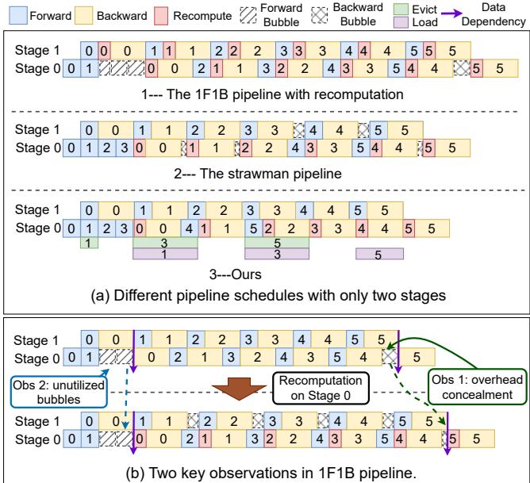  
Figure 1: The timeline of three pipeline schedules.

The 1F1B (one-forward, one-backward) pipeline [5] is the most commonly used approach in pipeline parallelism, but it encounters a memory bottleneck in the early stages [10, 29]. Specifically, 1F1B pipeline alternates the scheduling of forward and backward pass across a large number of microbatches. To maximize pipeline utilization, earlier stages execute more forward passes than later stages before initiating the first backward pass. This results in greater accumulation of micro-batch activations, leading to significantly higher memory usage in the early stages. For example, when training Llama 2-13B model using an 8-way 1F1B pipeline, memory usage in stage 0 surpasses that in stage 7 by 35 GB.

Recomputation [12], an effective technique for reducing memory usage caused by activations, involves discarding activations during the forward pass and recomputing them during the backward pass. In cases of out-of-memory (OOM) errors, as illustrated in Figure 1(a1), the conventional approach is to recompute all micro-batches across stages, discarding most activations to avoid OOM. However, this approach introduces substantial computational overhead and extends the pipeline duration due to the recomputation of each micro-batch. To alleviate this, several studies [11, 27] have proposed selectively recomputing cost-effective operators—those with high memory usage but low recomputation overhead—to minimize computational overhead. Nonetheless, under severe memory constraints, many non-cost-effective operators still need to be recomputed, which keeps the overhead substantially high.

In our exploration of integrating recomputation into pipeline parallelism, we apply recomputation only to stages experiencing memory bottlenecks, termed On-Demand Recomputation, achieving better performance than All-Stage Recomputation. Through an analysis of On-Demand Recomputation, we make the following key observations: Backward Bubbles Can Conceal Recomputation Overhead: Backward Bubbles, defined as bubbles between the first and last backward passes, are effectively utilized. As shown in Figure 1(b), in stage 0, backward bubbles are primarily filled by the recompute forward pass and the backward pass of micro-batch 4, which prevents delays in subsequent micro-batches. Moreover, Forward Bubbles are Unutilized: Forward Bubbles, defined as bubbles between the first forward pass and the first backward pass, are non-utilized. As they occur before the first backward pass, making them unavailable for recomputation.

Building on these findings, we propose a novel pipeline transformation: converting forward bubbles into backward bubbles to better conceal recomputation overhead. To achieve this, we introduce a strawman pipeline based on 1F1B pipeline through the following adjustments: First, stages that exceed memory constraints are identified as "adjusted stages," where recomputation is applied. Next, in adjusted stages, forward passes that occur after the first backward pass are migrated to execute before the first backward pass. This transformation converts forward bubbles into backward bubbles, enabling them utilization to conceal recomputation overhead. Therefore, the resulting pipeline, illustrated in Figure 1(a2), leverages the converted backward bubbles effectively conceal the recomputation overhead of micro-batches 0 and 1.

Although the strawman pipeline better conceals recomputation overhead to accelerate training, it still encounters three performance-related challenges: 1) How to Fully Utilize Backward Bubbles: Due to tight data dependencies—where micro-batches are executed sequentially from the first stage to the last—each backward bubble can only conceal the recomputation of its preceding backward pass. This limitation leads to the underutilization of available bubbles. 2) How to Reduce Extra Memory Usage: Compared to the 1F1B pipeline, adjusted stages in the strawman pipeline perform additional forward passes before the first backward pass. This results in the accumulation of more activations, increasing the likelihood of exceeding memory constraints. 3) How to Address the Computation Imbalance: On-demand recomputation creates workload imbalances between adjusted and non-adjusted stages. While bubbles conceal some of the recomputation, their limited number and the increasing overhead with larger micro-batches leave some recomputation unconcealed, creating idle bubbles in non-adjusted stages.

To address these challenges, we propose Obscura, a computationally efficient pipeline training system for LLMs that leverages pipeline transformation to better conceal recomputation overhead, as illustrated in Figure 1(a3). Obscura enhances the strawman pipeline by introducing three key components to further improve performance:

Dependency Relaxation. To relax data dependencies, Obscura introduces a left-shifting method for the remaining unadjusted forward passes, strategically inserting them alternately between backward passes. This transformation forms the Obscura pipeline, ensuring that backward bubbles are fully utilized to effectively conceal recomputation overhead. Swapping-Aware Recomputation. Obscura leverages activation swapping in adjusted stages to reduce activation footprints before the first backward pass. Furthermore, it models pipeline execution as an optimization problem to derive an optimal recomputation strategy that minimizes both communication and recomputation overhead.

Partition Adjustment. To address computation imbalance, Obscura introduces a stage partitioning adjustment algorithm that redistributes layers from adjusted stages to non-adjusted stages. For instance, adjusted stages are assigned fewer layers, while non-adjusted stages handle more, thereby balancing workloads and improving overall performance.

The primary contributions of Obscura are as follows:

• We identify a novel opportunity to conceal recomputation overhead by utilizing pipeline bubbles and propose a strawman pipeline to achieve overhead concealment.

• We introduce Obscura, which incorporates three key components—Dependency Relaxation, Swapping-Aware Recomputation, and Partition Adjustment—to improve pipeline training performance.

• We implement Obscura on DeepSpeed, demonstrating a throughput improvement of up to 1.32× compared to widely used recomputation strategies on NVIDIA GPUs.

## 2 Background and Related Work

## 2.1 Pipeline Parallelism

Pipeline parallelism [5, 8, 15] partitions model layers into distinct stages distributed across multiple GPUs. The input batch is divided into smaller micro-batches, which are processed sequentially in a pipelined manner. Communication between stages is required before and after each forward or backward pass to transfer activations and gradients.

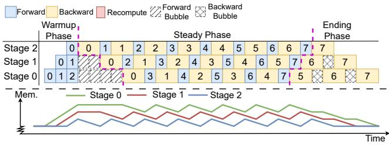  
Figure 2: Scheduling of the 1F1B pipeline.

GPipe [8] processes the forward passes of all micro-batches sequentially before initiating the backward passes. This scheduling approach requires storing activations for all microbatches, resulting in significant GPU memory usage.

In contrast, the 1F1B pipeline [5] reduces memory overhead by initiating backward passes earlier, effectively avoid memory usage of activations accumulation from all microbatches. Its schedule, shown in Figure 2, comprises three phases: warmup, steady, and ending. The warmup phase spans from the first forward pass to the start of the first backward pass, with memory usage rising linearly as only forward passes are executed. The steady phase, the core of 1F1B, alternates backward and forward passes, reusing memory freed by backward passes to store activations from forward passes, ensuring stable memory usage. The ending phase mirrors the warmup phase in reverse. Additionally, we define two types of bubbles: forward bubbles (diagonal blocks), occurring between the last forward and first backward passes, and backward bubbles (crossed-line blocks), occurring between the first and last backward passes.

To reduce pipeline bubbles, several scheduling strategies [1,14–16,26] based on the 1F1B schedule have been proposed, though they often increase memory pressure or affect convergence. For example, Chimera [14] reduces bubbles through bidirectional scheduling but at the cost of higher memory consumption. PipeDream [15] eliminates bubbles by overlapping the forward pass of the second micro-batch with the backward pass of the first, but it faces challenges with convergence.

Although the 1F1B pipeline offers better memory efficiency than GPipe, it faces a memory bottleneck in the early stages [10, 29]. Specifically, stage s out of p stages must store activations for up to p − s micro-batches. As a result, earlier stages (s → 0) experience higher memory usage. As shown in Figure 3, for the 13B model, the memory usage in stage 0 is significantly higher than in stage 7, with a gap of up to 24 GB. For the 18B model, the memory usage in stage 0 exceeds the GPU memory limit (OOM), causing training failures.

## 2.2 Recomputation

A straightforward approach to reducing the memory usage of activations is the recomputation technique, which is incorporated into various parallel strategies in modern frameworks like DeepSpeed [18] and Megatron [20].

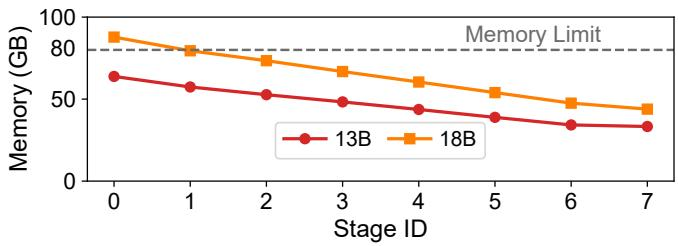  
Figure 3: Memory usage across stages during the training of 13B and 18B Llama-2 models in the 1F1B pipeline. Results for the 18B model are estimated.

Formally, a pipeline stage consists of a set of operators, each producing and storing activations during the forward pass. The recomputation technique reduces memory usage by discarding a portion of these activations during the forward pass and recomputing them during the backward pass. Although this approach effectively lowers memory consumption, it introduces additional computation overhead, as the discarded activations must be generated by re-executing the corresponding operators in the backward pass.

Various studies [7, 9, 11, 22, 27] have investigated strategies to minimize recomputation overhead within specific memory constraints. These works leverage the varying computation and space complexities of operators to identify an optimal recomputation strategy, consisting of cost-effective operators with high memory usage but low recomputation overhead. However, relying solely on recomputation for memory savings is highly model-dependent and inevitably introduces substantial overhead, particularly under strict memory limits.

To address this limitation, several works [2, 17, 24, 28] combine offloading with recomputation, utilizing tensor liveness analysis and dynamic memory states to decide whether to swap data out or discard it. While these techniques reduce recomputation overhead through swapping, they are constrained by PCIe bandwidth, often introducing significant communication overhead. Additionally, they may interfere with the communication required for pipeline parallelism [17] and, in some cases, incur extra CPU computation latency [19].

BPipe [10] introduces a pipeline-specific approach that leverages high-bandwidth inter-GPU connections to transfer activations from earlier stages to the spare memory of later stages, alleviating memory bottlenecks. Additionally, it incorporates selective recomputation [11] to further reduce memory usage. However, the limited spare memory available in later stages constrains the effectiveness of BPipe’s swapping technique, necessitating a greater reliance on recomputation under stringent memory constraints. Due to its lack of optimized integration between inter-GPU swapping and recomputation, BPipe still incurs significant recomputation overhead.

In summary, recomputation overhead remains a significant challenge. Our work, Obscura, identifies an opportunity to hide recomputation overhead within pipeline bubbles and introduces a novel pipeline schedule designed to better conceal this overhead. This approach also enables a more effective integration of recomputation and swapping, achieving efficient memory savings. To our knowledge, we are the first to explore reducing overhead by strategically concealing recomputation.

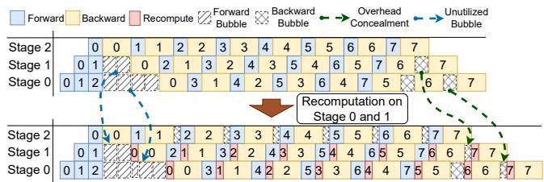  
Figure 4: Observations in On-Demand Recomputation.

## 3 Motivation

## 3.1 Observations in 1F1B Pipeline Schedule

Existing works typically implement recomputation across all stages (referred to as All-Stage Recomputation) when the pipeline encounters OOM errors. However, as discussed in §2.1, the memory bottleneck is primarily concentrated in the early stages, where only a subset exceeds the memory limit while others remain underutilized. Therefore, recomputation should be selectively applied to the early stages that surpass the memory limit. We refer to this approach as On-Demand Recomputation and derive the following observations.

Observation 1: On-Demand Recomputation Achieves Better Performance than All-Stage Recomputation. We evaluate the execution time of various on-demand recomputation pipelines with four stages. The Full recomputation strategy discards nearly all activations and performs an extra forward pass during the backward pass. As shown in Figure 5(a), Recomp-N denotes recomputation applied to stages with s ≤ N, Recomp-All represents recomputation applied to all stages, and Recomp-Non indicates no recomputation. By comparing stage 0 across all configurations, we observe that Recomp-0 and Recomp-1 increase execution time by 19% and 25%, respectively, compared to Recomp-Non, outperforming Recomp-All, which increases execution time by 33%.

To investigate the benefits of on-demand recomputation, we dive into the 1F1B pipeline schedule in Figure 4 with recomputation selectively applied to stages 0 and 1 (Recomp-1), leading to another critical observation.

Observation 2: Backward Bubbles Can Conceal Recomputation Overhead. As illustrated in Figure 4, after applying Recomp-1, the backward bubbles in stage 1 are largely filled by the time extension caused by the recomputation of microbatch 6, preventing it from impacting subsequent executions. In contrast, micro-batches 0–5, which lack sufficient backward bubbles to absorb the recomputation overhead, cause the overall execution to shift rightward, extending the pipeline. A similar pattern is observed for the recomputation of both micro-batch 6 and micro-batches 0–5 in stage 0.

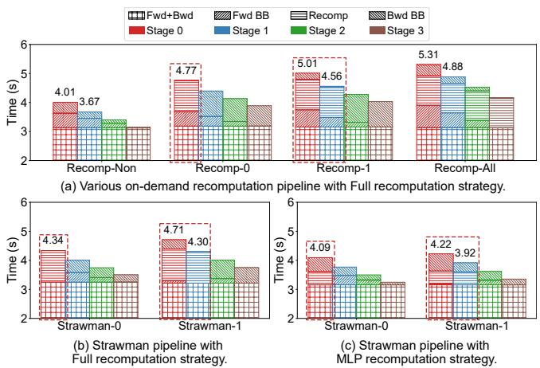  
Figure 5: Computation and bubble times for a single iteration. Fwd+Bwd denotes the total forward and backward time; Fwd BB and Bwd BB represent forward and backward bubble times, respectively; and ’Recomp’ indicates the recomputation time.

To validate this finding, we analyze the changes in computation and bubble times shown in Figure 5(a). Comparing Recomp-Non with Recomp-0 in stage 0 reveals that backward bubbles are replaced by recomputation task. A similar phenomenon is observed in stages 0 and 1 of Recomp-1. In contrast, the backward bubbles in Recomp-All remain unaffected because the last stage lacks backward bubbles and all stages incur the same recomputation time, making the last stage the slowest. This delay then propagates through interstage dependencies, preventing earlier stages from utilizing their backward bubbles.

Although backward bubbles can partially conceal recomputation overhead, their limited availability allows them to hide only a small portion of it. To explore opportunity for increasing backward bubbles, we present the third observation.

Observation 3: Forward Bubbles Are Unutilized. As illustrated in Figure 4, forward bubbles remain unused in recomputation stages. This is because forward bubbles are generated before the first backward pass, whereas recomputation inherently occurs during the backward pass. Furthermore, the duration of forward bubbles is significantly longer than that of backward bubbles. In a p-stage pipeline, stage s contains 2(p − s − 1) forward bubbles, which is double the number of backward bubbles (p − s − 1).

In Figure 5(a), compared to Recomp-Non, the forward bubbles in stage 0 of Recomp-0 remain unchanged, with the bubble time being longer than the backward bubble time (0.50s vs. 0.37s, not a double relation due to synchronized communication between stages). Similar trends are observed in Recomp-1 and Recomp-All, where the forward bubbles are slightly extended. This occurs because the recomputation in stage s delays the initiation of the first backward pass in stage

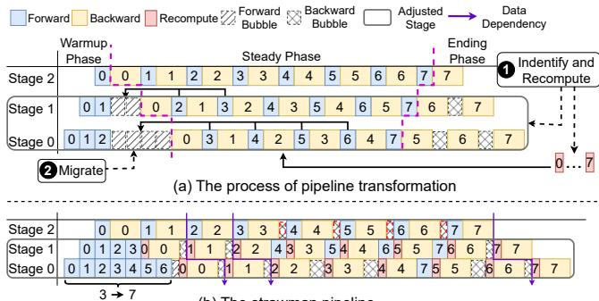  
(b) The strawman pipeline  
Figure 6: Pipeline transformation process (top) and the resulting strawman pipeline (bottom).  
s − 1, thereby increasing the duration of forward bubbles.

## 3.2 A Strawman Pipeline: Optimization Opportunity of Recomputation Overhead Concealing

Building on our three key observations, we propose converting forward bubbles into backward bubbles to more effectively conceal recomputation overhead. To implement this concept, we introduce a strawman pipeline, derived from the 1F1B pipeline using a pipeline transformation, as illustrated in Figure 6(a). This transformation consists of two key steps:

Step 1: Identify and Recompute. In the 1F1B pipeline, stages that exceed the memory limit are identified as "adjusted stages" and are subjected to recomputation. The remaining, referred to as "non-adjusted stages," are left unchanged.

Step 2: Migrate. For adjusted stages, the forward passes in the steady phase are migrated leftward into forward bubbles as much as possible, causing the forward bubbles to shift rightward and convert into backward bubbles.

Figure 6(b) illustrates the proposed strawman pipeline, whose performance is evaluated in Figure 5(b). The term Strawman-N corresponds to the same meaning as Recomp-N. Compared to Recomp-0 and Recomp-1, the recomputation overhead in Strawman-0 and Strawman-1 is reduced to 8% and 17%, respectively. This is achieved by eliminating forward bubbles and replacing them with recomputation tasks.

In practice, instead of applying the Full recomputation strategy to the adjusted stage, a selective strategy that discards only partial activations to precisely meet memory constraints proves more effective. This approach results in reduced recomputation overhead and improved overhead concealment. However, it introduces three key challenges:

Challenge 1: How to Fully Utilize Backward Bubbles.The tight data dependency between adjusted and unadjusted stages—where micro-batches are executed sequentially in the forward pass and in reverse during the backward pass—restricts the ability of backward bubbles to conceal recomputation. Backward bubbles can only hide preceding recomputation, not subsequent ones. For example, as depicted in Figure 6(b), the recomputation for micro-batch 1 cannot utilize the preceding bubble because it must wait for the backward pass in stage 2 to finish. Furthermore, when a selective recomputation strategy is employed, the recomputation time per micro-batch becomes shorter than the bubble time, leading to underutilized backward bubbles. Using the MLP recomputation strategy, which discards only MLP activations, Figure 5(c) demonstrates that, compared to Strawman-0 in Figure 5(b), a significant portion of the previously fully utilized backward bubbles is now left unused.

Table 1: Memory usage across stages in different pipelines.
<table><tr><td></td><td></td><td> $\mathrm { R e c o m p ^ { - N o n } \mathrm { R e c o m p ^ { - 0 } } }$ </td><td> $\mathrm { R e c o m p ^ { - 1 } }$ </td><td> $\mathrm { S t r a w m a n – 0 }$ </td><td>Strawman-1</td></tr><tr><td>Stage 0</td><td>48.01</td><td>34.40</td><td>34.40</td><td>46.18</td><td>46.18</td></tr><tr><td>Stage 1</td><td>42.62</td><td>42.62</td><td>32.25</td><td>42.62</td><td>39.58</td></tr><tr><td>Stage 2</td><td>36.72</td><td>36.72</td><td>36.72</td><td>36.72</td><td>36.72</td></tr><tr><td>Stage 3</td><td>30.92</td><td>30.92</td><td>30.92</td><td>30.92</td><td>30.92</td></tr></table>

Challenge 2: How to Reduce Extra Memory Usage. Compared to the 1F1B pipeline, the adjusted stages in the strawman pipeline store activations for more forward passes during the warmup phase. As a result, the strawman pipeline exhibits higher memory usage, which can lead OOM errors. Table 1 presents the memory usage across stages under the MLP recomputation strategy. The results clearly show that the memory usage of the adjusted stages in the strawman pipeline is significantly higher than that of the 1F1B pipeline.

Challenge 3: How to Address the Computation Imbalance. On-demand recomputation introduces workload imbalances between adjusted and non-adjusted stages. While forward and backward bubbles can partially conceal recomputation, their limited availability and the growing overhead with larger micro-batches leave some recomputation unconcealed. This leads to the formation of additional backward bubbles in the non-adjusted stages, as clearly demonstrated in Figure 6(b). Specifically, as illustrated in Figures 5(b) and 5(c), backward bubbles caused by computation imbalance are evident in the non-adjusted stages.

## 4 Overview of Obscura

To address above challenges, we propose Obscura, a training system with an architecture illustrated in Figure 7. Obscura is composed of two primary modules: the Obscura Planner and the Obscura Runtime. The Obscura Planner transforms the original 1F1B pipeline into the Obscura pipeline and generates a deployment configuration for use by the Obscura Runtime. The Obscura Runtime manages distributed deployment and model training during execution.

The Obscura Planner comprises four submodules: Pipeline Transformation, which converts forward bubbles into backward bubbles to better conceal recomputation overhead; Dependency Relaxation, which relaxes tight data dependencies between stages to fully utilize backward bubbles; Swapping-

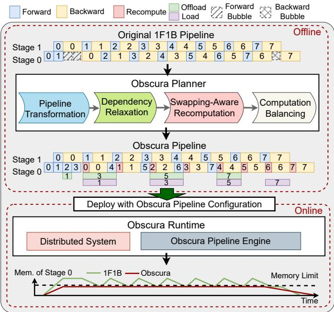  
Figure 7: System Architecture of Obscura.

Aware Recomputation, which combines swapping and recomputation to efficiently adhere memory constraints; and Partition Adjustment, which refines the stage partition strategy to eliminate bubbles in non-adjusted stages. The Obscura Runtime consists of the Distributed System, which enables distributed training, and the Obscura Pipeline Engine, which implements the core runtime of the Obscura pipeline.

Notably, the Obscura Planner operates offline to generate the Obscura configuration using only a few training iterations. Specifically, the pipeline transformation submodule runs for several iterations to determine the adjusted stages and collect runtime profiling data, including the computation and memory costs of operators. The remaining submodules use this profiling data to solve small-scale optimization problems and execute lightweight algorithms, introducing negligible overhead. In addition, the Obscura Runtime operates online and manages system behavior during training.

## 5 Dependency Relaxation

To fully utilize backward bubbles, we first perform an in-depth analysis of computation and bubbles in adjusted stages. Based on this analysis, we propose dependency relaxation, which re-purposes unused backward bubbles for other computations. Additionally, we refine the migration of forward passes to minimize the additional activations footprints caused by unnecessary forward pass migrations.

## 5.1 Analysis of Computation and Bubbles

We illustrate the simplified steady phase of adjacent adjusted and non-adjusted stages in Figure 8. In Figure 8(a), the left side shows the underutilization of backward bubbles after migration, while the right side depicts the remaining forward passes. Due to tight data dependencies between the two stages, backward passes cannot shift leftward to utilize left-side bubbles. Specifically, the backward pass of micro-batch x in stage s must wait for the completion of the backward pass of the same micro-batch in stage s + 1, preventing the use of preceding bubbles for recomputation. Forward passes encounter a similar trouble: they cannot shift rightward to utilize rightside bubbles (if any), as this would delay the forward passes of the same micro-batch in later stages, extending the pipeline.

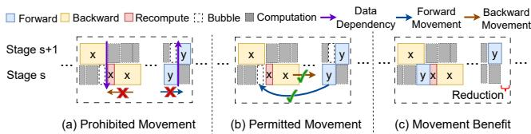  
Figure 8: The simplified steady-phase schedule for adjacent adjusted and non-adjusted stages.

However, the opposite movements to exploit bubbles are allowed. As illustrated in Figure 8(b), the forward pass of micro-batch y in stage s can shift leftward to utilize the leftside bubbles without violating its data dependency. Similarly, the backward pass of micro-batch x can shift rightward. This observation provides a key insight: instead of relying solely on adjacent recomputation tasks to utilize unused backward bubbles, we can shift the remaining forward passes leftward to exploit these bubbles. Subsequently, the backward passes can be shifted rightward to take advantage of the bubbles created by the adjusted forward passes.

Figure 8(c) illustrates the outcome of this adjustment. The bubbles preceding the backward pass of micro-batch x in stage s are utilized, resulting in a reduction in execution time. This demonstrates that the previously unused backward bubbles are effectively utilized to conceal recomputation overhead.

## 5.2 Dependency Relaxing among Stages

Based on the analysis, we propose dependency relaxation to improve backward bubble utilization, as shown in Figure 9. The key adjustment involves shifting the remaining forward passes leftward and the backward passes rightward during the steady phase. To prevent excessive activation accumulation, the left-shifted forward passes are interleaved with the backward passes, similar to the 1F1B approach. For example, the forward passes of micro-batches 4–7 are shifted leftward and orchestrated in an interleaved manner with the corresponding backward passes, which are shifted rightward accordingly.

This adjustment relaxes the tight data dependencies between stages, ensuring that the execution of one stage no longer directly impacts another. As a result, underutilized backward bubbles are effectively leveraged, reducing overall iteration time, as shown in the middle of Figure 9.

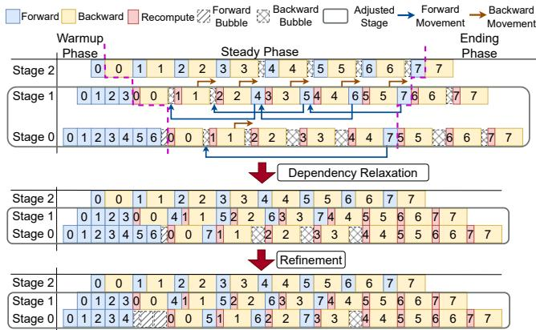  
Figure 9: Two-step optimization process applied to the strawman pipeline to achieve Obscura pipeline.

## 5.3 Migration Refinement

We refine the pipeline by reducing the forward passes migrated into forward bubbles, resulting in the Obscura pipeline depicted at the bottom of Figure 9. This refinement decreases the activations footprints during the warmup phase without affecting the concealment of recomputation overhead. It is motivated by the persistence of backward bubbles in stage 0, as illustrated in the middle of Figure 9.

In a p-way pipeline, stage s can have up to min(m − $1 , 3 ( p - s - 1 )$ ) backward bubbles, where m denotes the total number of micro-batches. This suggests that earlier adjusted stages can theoretically conceal more recomputation overhead. However, due to data dependencies in the final backward pass of adjusted stages, the total time extension across all adjusted stages cannot recede that of the last adjusted stage, k. From this analysis, we conclude that the ability to conceal recomputation overhead is determined by the number of bubbles in stage k. This also accounts for the unused bubbles observed in earlier adjusted stages after dependency relaxation. Therefore, for adjusted stages where $s < k ,$ , it is sufficient to align the number of backward bubbles with those in stage k.

## 6 Swapping-Aware Recomputation

To reduce the extra memory usage caused by the migration of forward passes, we introduce an activation swapping scheme for the Obscura pipeline, which reduces activation storage during the warmup phase. Furthermore, we analyze the trade-off between recomputation and communication overhead, formulating an optimization problem to determine the optimal recomputation strategy under a given swapping configuration.

## 6.1 Activation Swapping

Relying solely on increased recomputation relative to the 1F1B pipeline to eliminate extra memory consumption introduces more recomputation overhead, which conflicts with our objective of utilizing bubbles to conceal recomputation overhead. To resolve this, we incorporate swapping techniques into Obscura pipeline to alleviate recomputation pressure.

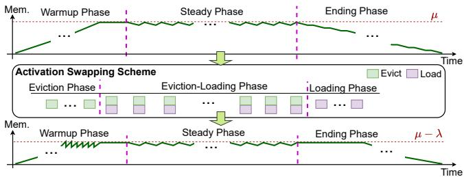  
Figure 10: The activation swapping scheme.

Activation Swapping Scheme. We propose an activation swapping scheme, transferring activations to external memory at the granularity of individual micro-batches, termed "activation blocks," as shown in Figure 10. The scheme comprises three swapping phases: eviction, eviction-loading, and loading. The eviction phase occurs during the warmup phase, where memory usage rises linearly, requiring continuous eviction of activation blocks to maintain target memory levels. The eviction-loading phase operates throughout the steady phase, during which evicted activations are reloaded for backward passes. To avoid exceeding memory limits, one activation block must be evicted before reloading. Leveraging full-duplex communication, eviction and loading can be performed in parallel. The loading phase occurs in the ending phase, where activations are loaded without eviction as backward passes consume them, ensuring stable memory usage.

The various swapping implementations [10,27] are specific instances of this scheme. By abstracting their details and focusing on the core aspects, we integrate the scheme into the Obscura pipeline’s optimization, ensuring compatibility with diverse designs.

Memory Analysis. In the activation swapping scheme, memory usage is determined by two critical parameters: 1) λ, the number of activation blocks transferred in the eviction phase, and 2) β, the fraction of data transmitted per activation block. Let $\mu ^ { a d j }$ denote the number of forward passes in the warmup phase of the adjusted stage, and $a ^ { a d j }$ represent the size of activations stored per micro-batch of the adjusted stage. The memory consumption of activations in adjusted stage s after swapping can be expressed as follows.

$$
A _ { s } ^ { a d j } = ( \mu _ { s } ^ { a d j } - \lambda _ { s } ) a ^ { a d j } + ( 1 - \beta ) \lambda _ { s } a ^ { a d j }\tag{1}
$$

## 6.2 Swapping-Aware Recomputation

Recomputation and activation swapping in Obscura create a trade-off between recomputation and communication costs. 1) Increasing recomputation, as shown in Figure 11(a), reduces the number of activation blocks evicted during warmup to meet memory limits, and allows shorter transfer times to overlap with computation but incurring higher recomputation overhead. 2) Decreasing recomputation, as in Figure 11(b), lowers recomputation overhead, which bubbles can mostly hide, but requires more swapping to satisfy memory constraints. This includes evicting more activation blocks during warmup and longer transfer times for each activation block that cannot overlap with computation, resulting in significant communication overhead. To balance recomputation and communication overhead, we model the execution time and memory usage of Obscura pipeline and construct our optimization problem.

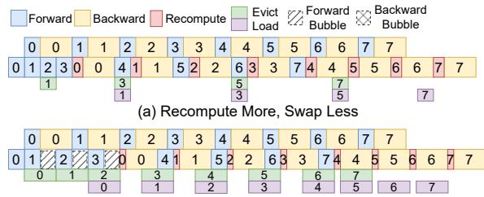  
(b) Recompute Less, Swap More  
Figure 11: Trade-off Between Recomputation and Swapping.

Execution Time. We consider the p-way 1F1B pipeline with m micro-batches under even stage partition for LLMs, where the forward time f and backward time $2 f$ is identical across stages. The recomputation time is denoted as $r ,$ and the last adjusted stage is denoted as stage k.

For swapping, as shown in Figure 11(b), eviction or loading operations have maximum transmission times of $f , 3 f + r ,$ and $2 f + r$ in the three swapping phases, respectively. Exceeding these thresholds introduces communication overhead, with the eviction-loading phase’s cost scaling with the number of micro-batches. To mitigate significant overhead, we enforce the constraint $a ^ { a d j } \beta \leq ( 3 f + r ) \times B$ , where B is the CPU-GPU communication bandwidth. Thus, the communication cost is

$$
\begin{array} { c } { { T _ { s } ^ { C } = \mathrm { m a x } ( \lambda _ { s } ( a ^ { a d j } \beta / B - f ) - ( k - s ) ( 2 f + r ) , 0 ) + } } \\ { {  \lambda _ { s } ( a ^ { a d j } \beta / B - 2 f - r ) + \varepsilon } } \end{array}\tag{2}
$$

Eq.2 applies when stage k has no remaining bubbles, as their presence implies that the overhead of Full recomputation can be fully hidden, making swapping unnecessary. The first and second terms represent the communication cost incurred in the warmup and ending phases, respectively, with the former having bubbles to mitigate the cost. ε represents the overhead not covered by the first two terms due to variations in swapping design [10, 27], with a range of $[ 0 , 3 f + r ]$

The execution time, comprising computation time and bubble time, is expressed as follows:

$$
T _ { s } = \left\{ \begin{array} { l l } { 3 m f + 3 ( p - s - 1 ) f , } & { s > k } \\ { \operatorname* { m a x } ( T _ { s + 1 } + \gamma , \gamma m + ( k - s ) \gamma + T _ { s } ^ { C } ) , } & { s \leq k } \end{array} \right.\tag{3}
$$

where $\gamma = 3 f + r . T _ { s }$ denotes the pipeline execution time from stage s to the final stage, primarily determined by computation, bubble delays, and communication overhead. The first term in the max function captures inter-stage data dependencies.

Memory Usage. We define a as the activation size per micro-batch without recomputation. The memory usage of stage s is $M _ { s } = W _ { s } + A _ { s }$ , where $W _ { s }$ is the size of model parameters, including optimizer states, and $A _ { s }$ is the memory usage of activations. For adjusted stages, $A _ { s } = A _ { s } ^ { a d j }$ ; for non-adjusted stages, $A _ { s } = ( p - s ) \times a$

The Optimization Objective. Based on the analysis and modeling above, we formulate the optimization problem as

$$
\begin{array} { c } { { m i n ~ T _ { 0 } } } \\ { { s . t . { M _ { s } } \leq G , s \in [ 0 , p - 1 ] } } \\ { { a ^ { a d j } \beta \leq ( 3 f + r ) \times B } } \end{array}\tag{4}
$$

The optimization variables include $\lambda _ { s } , \beta , a ^ { a d j }$ , and $r . \lambda _ { s }$ follows a fixed relationship across stages: stage $s - 1$ evicts one more activation block than stage s. Thus, $\lambda _ { s }$ can be represented as $\lambda _ { k }$ , with a range of $[ 2 , p - k - 2 ]$ . β is a percentage in $[ 0 , 1 ] . a ^ { a d j }$ and r correspond the recomputation strategy, the set of operators selected for recomputation.

We quantify the recomputation strategy as follows: We define the operators of pipeline stage as $U _ { o p } = \{ o p _ { 0 } , . . . , o p _ { n - 1 } \}$ ， where n represent the total number of operators. Then we have $\textstyle f \approx \sum _ { o p { i } \in U _ { o p } } f _ { o p { i } }$ and $\begin{array} { r } { a \approx \sum _ { o p { i } \in U _ { o p } } a _ { o p { i } } } \end{array}$ , where $f _ { o p i }$ and $a _ { o p { i } }$ denote the computation time and the activation size of opi. The recomputation strategy is represented as $R _ { o p } ^ { 0 - 1 } =$ $\left[ x _ { 0 } , x _ { 1 } , \ldots , x _ { n - 1 } \right]$ , a binary array where $x _ { i } = 1$ indicates that $o p _ { i }$ is recomputed, and $x _ { i } = 0$ indicates it is not. Then, we have $\begin{array} { r } { r = \sum _ { i = 0 } ^ { n - 1 } R _ { o p } ^ { 0 - 1 } [ i ] \times f _ { o p _ { i } } } \end{array}$ and $\begin{array} { r } { a ^ { a d j } = a - \sum _ { i = 0 } ^ { n - 1 } R _ { o p } ^ { 0 - 1 } [ i ] \times a _ { o p _ { i } } } \end{array}$

By replacing $a ^ { a d j }$ and r in Eq.4 with the quantified definition, the optimization problem becomes an integer programming (IP) problem. We solve it by enumerating possible values of the swapping-related variables to derive the corresponding recomputation strategy, then selecting the combination of the swapping configuration and recomputation strategy that achieves the best performance. For instance, if we adopt BPipe’s [10] swapping design for our activation swapping scheme, we only need to iterate over $\lambda _ { k }$ , as β is fixed at 1.

## 7 Partition Adjustment

To balance computation between adjusted and non-adjusted stages, we first refine the execution time and memory usage model of the Obscura pipeline, accounting for uneven stage partitioning. Based on this model, we propose a stage partition adjustment algorithm to optimize pipeline performance by identifying the optimal partitioning strategy.

## 7.1 Modeling in Uneven Stage Partition

Considering a pipeline with uneven stage partition, we define $f _ { s } , r _ { s } ,$ and $a _ { s }$ as the forward time, recomputation time, and activation size per micro-batch for stage s, respectively. In pipeline parallelism, execution time is dominated by the slowest stage. We let $C _ { a d j } = \mathrm { m a x } _ { s \leq k } ( 3 f _ { s } + r _ { s } )$ and $C _ { n o n } =$ $\mathrm { m a x } _ { s > k } \bigl ( 3 f _ { s } \bigr )$ represent the total computation time per microbatch for the slowest adjusted and non-adjusted stages, respectively. Thus, the execution time for stage s in Obscura pipeline with uneven stage partition can be expressed as follows.

$$
\hat { T } _ { s } \approx \left\{ \begin{array} { l l } { T _ { s } ( C _ { n o n } ) , } & { s > k } \\ { T _ { s } ( C _ { a d j } ) , } & { s \le k } \end{array} \right.\tag{5}
$$

Eq.5 is an approximation, where $C _ { n o n }$ and $C _ { a d j }$ replace the terms $3 f$ and $3 f + r$ in $T _ { s }$ , respectively. For memory usage, we replace a and $a ^ { a d j }$ in $M _ { s }$ with $a _ { s } ,$ , as expressed below.

$$
\hat { M } _ { s } = M _ { s } ( a _ { s } )\tag{6}
$$

## 7.2 Partition Adjustment Algorithm

To balance computation between adjusted and non-adjusted stages, we propose a partition adjustment algorithm that transfers layers from adjusted to non-adjusted stages. For finergrained adjustments, each transformer layer is split into an attention layer and an MLP layer, resulting in 2L + 2 layers, where L is the number of transformer layers, and the constant 2 accounts for the embedding and decoder head layers. In the even stage partition, the first and last stages contain $2 L / p + 1$ layers, while intermediate stages contain $2 L / p$ layers.

Significant computation imbalance in the Obscura pipeline occurs only with a large number of micro-batches, where slight partition adjustments can eliminate the imbalance. For simplicity, the impact of adjustments on overhead concealment and swapping-aware recomputation is ignored.

The partition adjustment algorithm, in Algorithm 1, takes dictionaries $D _ { a d j }$ and $D _ { n o n }$ representing adjusted and nonadjusted stages and their layer counts. The goal is to make $\hat { T } _ { k + 1 }$ as close as possible to $\hat { T } _ { k } - C _ { a d j }$ , balancing computation between stages. Lines 5-8 transfer one layer from the slowest adjusted stage a to the fastest non-adjusted stage b. The algorithm outputs the updated dictionaries $D _ { a d j }$ and $D _ { n o n }$

## 8 Design Reinforcement: Enhancing Concealability in Identifying Adjusted Stages

Problem. As discussed in §5, on one hand, the number of backward bubbles in a stage is inversely proportional to the stage ID, and the maximum concealable overhead is determined by the last adjusted stage. As a result, selecting more stages as adjusted stages reduces the Obscura pipeline’s ability to conceal recomputation overhead, eventually degrading its performance to that of the 1F1B pipeline. On the other hand, identifying adjusted stages during pipeline transformation is guided by memory usage and hardware memory capacity. Under conditions of high memory usage or limited memory capacity, a larger number of stages are designated as adjusted, decreasing the performance of the Obscura pipeline.

Algorithm 1: Partition Adjustment   
Input: $D _ { n o n }$ and $D _ { a d j }$   
Output: Updated $D _ { n o n }$ and $D _ { a d j } .$   
1 Initialize old ${ \cal D } _ { n o n }  { \cal D } _ { n o n } .$ old\_ ${ \cal D } _ { a d j }  { \cal D } _ { a d j }$   
2 Compute $\hat { T } _ { k } , \hat { T } _ { k + 1 } , C _ { a d j }$ based on $D _ { n o n } , D _ { a d j }$   
3 while $\hat { T } _ { k } - C _ { a d j } > \hat { T } _ { k + 1 }$ do   
4 old $\_ D _ { n o n } , o l d \_ D _ { a d j }  D _ { n o n } , D _ { a d j }$   
5 $a \gets \arg \operatorname* { m a x } _ { s \leq k } ( 3 f _ { s } + r _ { s } )$   
6 $b \gets \arg \operatorname* { m i n } _ { s > k \land \hat { M } _ { s } \leq G } ( 3 f _ { s } )$   
7 $D _ { a d j } [ a ]  D _ { a d j } [ a ] - 1$   
8 $D _ { n o n } [ b ]  D _ { n o n } [ b ] + 1$   
9 Update $\hat { T } _ { k } , \hat { T } _ { k + 1 } , C _ { a d j }$ based on $D _ { n o n }$ and $D _ { a d j }$   
10 $D _ { n o n } , D _ { a d j }  o l d \_ D _ { n o n } , o l d \_ D _ { a d j }$

Opportunity. Recent studies [27] reveal that cost-effective operators in transformer models, such as RMSNorm, SiLU, and Mul in the Llama-2 model, exhibit high space complexity but low computation complexity. Including these operators in the recomputation set (referred to as the CMB recomputation strategy) can reduce footprints by approximately 40%, with only a modest 2–3% increase in overhead.

Optimization. To enhance the original identification step, we introduce an alternative approach called CMB-Identifying. When encountering OOM issues, instead of immediately designating a stage as adjusted, the CMB recomputation strategy is applied first. This method reduces the number of adjusted stages, thereby improving the Obscura pipeline’s ability to conceal recomputation overhead.

## 9 Evaluation

We evaluated Obscura on a single training node. Notably, since Obscura introduces no communication overhead between stages, it can seamlessly scale to multiple nodes.

## 9.1 Implementation and Experimental Setup

Implementation. We implement Obscura on DeepSpeed by designing a custom scheduler to replace the native scheduler. To enable inter-stage communication within the Obscura pipeline, we convert synchronous NCCL communication to asynchronous and introduce synchronization mechanisms to ensure seamless execution. Swapping operations are integrated into the computation schedule as execution steps, utilizing separate CUDA streams and manual memory management to enable concurrent swapping and memory reuse.

Platform. We evaluate Obscura on a data center training node equipped with 2.0 TB of DRAM, two Intel Xeon Platinum 8352S CPUs (128 threads in total), and eight NVIDIA A100-SXM-80GB GPUs. The GPUs are fully interconnected via NVLink, providing a bidirectional P2P bandwidth of 600 GB/s, and are connected to the CPUs through PCIe 4.0 x16.

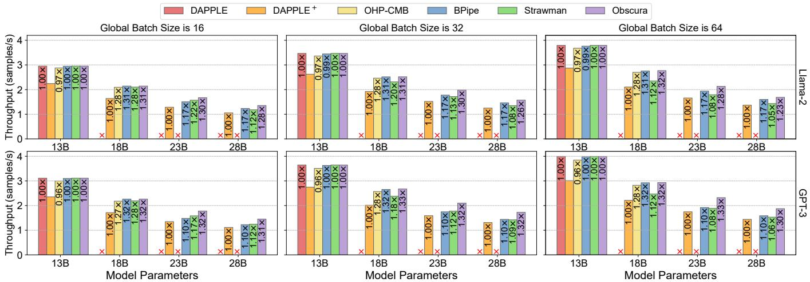  
Figure 12: End-to-end performance for training various sizes of Llama-2 and GPT-3 models under different global batch sizes.

Model, Datasets and Workloads. We evaluate Obscura using various model sizes based on the popular Llama-2 [23] and GPT-3 [3] models, including 13B, 18B, 23B, and 28B parameters for both base models. The GPT-3 models used in our evaluation are based on the open-source implementation from the Megatron-LM repository [11, 16, 20]. To simplify testing, we generate a random sequence before the training loop and feed it into the models. The sequence length is standardized to 4096, and the micro-batch size is set to 1, which are common configurations for multi-node training.

Baselines. We utilize the following pipeline parallelism configurations implemented on DeepSpeed with the 1F1B pipeline as baselines for comparison experiments:

• DAPPLE [5]: The state-of-the-art 1F1B pipeline schedule with even stage partition.

• DAPPLE+: We evaluate DAPPLE using the Full recomputation strategy applied to all stages, which reduces memory usage and enables the training of larger models.

• OHP-CMB: We apply the recomputation strategy proposed in the work [27] that drops activations of specific operators, including Norm, SiLU/GELU, and Mul.

• BPipe [10]: It eliminates the memory bottleneck by transferring activations from earlier stages to later ones using an activation balancing method. As it encounters OOM issues with 23B and 28B models, we apply the MLP recomputation strategy for these larger models.

In addition, we measure Strawman with the Full recomputation strategy applied for the adjusted stages.

## 9.2 Training Performance

We evaluate the throughput of Obscura and baselines using Llama-2 13B and GPT-3 13B as base models. To analyze Obscura’s performance across different scenarios, we scale the model by adding layers and extend the pipeline length by increasing the global batch size. The performance speedups of Obscura and the baselines relative to DAPPLE (for the 13B model) and DAPPLE+ (for models of other sizes) is presented in each column of Figure 12. Notably, Strawman and Obscura are NOT applied to the 1F1B pipeline in the 13B model.

Llama-2. Figure 12 illustrates that for the 13B model, DAPPLE operates effectively and significantly outperforms DAPPLE+, which incorporates recomputation. However, as the parameter size increases, DAPPLE fails to train due to excessive memory usage resulting from retaining all activations. In contrast, DAPPLE+ continues training successfully by discarding most activations to reduce memory usage.

OHP-CMB leverages recomputation for cost-effective operators, achieving a computation complexity of O(bsh) for the operators’ recomputation and a space complexity of O(bs2h) or O(bsh2) for reducing the operators’ footprints. This strategy allows OHP-CMB to efficiently train 13B and 18B models with minimal recomputation overhead. However, it cannot support larger models due to limited activation savings.

BPipe utilizes spare memory in later stages to mitigate the memory bottleneck in earlier stages, enabling the training of 13B and 18B models. Furthermore, the high-bandwidth NVLink ensures minimal communication overhead, allowing BPipe to sustain high performance. However, as all activations are retained in GPU memory, the memory usage exceeds GPU capacity for 23B and 28B models. To address this, the MLP recomputation strategy is applied, and BPipe achieving just 17% improvements over DAPPLE+ for these larger models because of these recomputation overhead.

Strawman outperforms DAPPLE+ by effectively concealing recomputation overhead. However, its performance deteriorates with increasing model sizes and global batch sizes. Larger models reduce Strawman’s ability to conceal recomputation overhead due to the need for more stages to be adjusted stages, while larger global batch sizes increase recomputation demands, further intensifying the overhead.

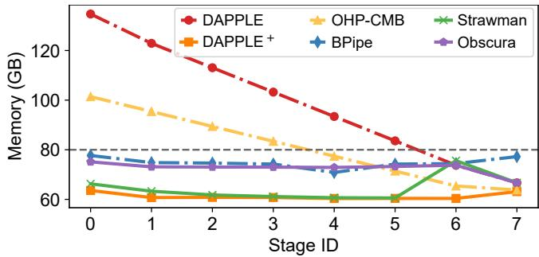  
Figure 13: Memory usage in the Llama-2 28B model.

Obscura requires fewer adjusted stages than Strawman by using the CMB-Identifying and reduces the recomputation of non cost-effective operators through activations swapping. Therefore, Obscura more effectively conceal recomputation overhead using forward and backward bubbles, even with larger models and global batch sizes. Specifically, Obscura achieves speedups of 29–31% for the 18B and 23B models, 22–27% for the 28B model, and a 22% speedup in the extreme case of a global batch size of 64 for the 28B model.

GPT-3. Obscura and the baselines achieve comparable endto-end performance to Llama-2. But notably, since GPT-3 uses the GELU activation function, which is more cost-effective than the SiLU function used in Llama-2 in recomputation, Obscura attains speedups of 32–33% for the 18B and 23B models, 30–32% for the 28B model, and 30% in the extreme case of a global batch size of 64 for the 28B model.

## 9.3 Memory Analysis

We measure peak memory usage across stages for the Llama-2 28B model with a global batch size of 32. For baselines experiencing OOM, we estimate their memory usage to ensure a fair comparison. The results are presented in Figure 13.

For DAPPLE, only stages 6 and 7 operate within the memory constraints. Memory usage across stages shows an imbalanced linear decline, with stage 0 consuming approximately 2.0× the memory of stage 7. In contrast, DAPPLE+ achieves consistently low and balanced memory usage by discarding nearly all activations across all stages, leaving approximately 20 GB of unused memory in each stage. OHP-CMB reduces activation size by 40% compared to DAPPLE by recomputing only the Norm, SiLU, and Mul operators; however, this optimization is insufficient for training the 28B model. BPipe balances memory by retaining at most ⌈(p+2)/2⌉ micro-batches of activations across p stages. Without the MLP recomputation strategy, its peak memory usage reaches 106 GB during 28B model training, exceeding memory limits. With the strategy applied, memory usage stabilizes at approximately 76 GB. Since only stages 6 and 7 in DAPPLE remain within the memory constraints, Strawman selects stages 0–5 as adjusted stages, resulting in memory usage similar to DAPPLE+, where available memory is not fully utilized.

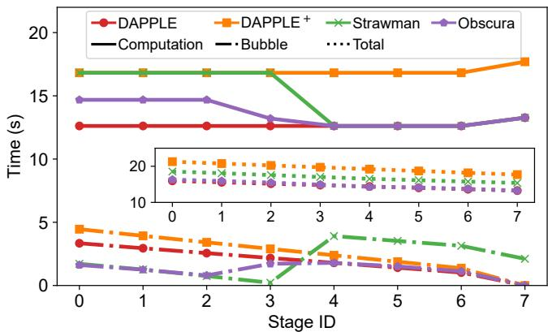  
Figure 14: Computation, bubble and total execution time across all stages in the Llama-2 23B model.

In contrast, Obscura selects stages 0–4 as adjusted stages and applies the CMB recomputation strategy to stage 5. As a result, stage 5 shows memory usage comparable to OHP-CMB, while stages 6 and 7 align with DAPPLE. For the remaining stages, the identical recomputation strategy and objectives for activation swapping ensure memory usage that close to the constraints, achieving high memory utilization.

## 9.4 Computation and Bubble Analysis

To assess the effectiveness of recomputation overhead concealment in Obscura, we measure the computation and bubble times across stages for a single iteration of the Llama-2 23B model with a global batch size of 32. Computation time is defined as the cumulative forward and backward pass times for all micro-batches, while bubble time refers to the total duration of all forward and backward bubbles. The total execution time is calculated as the sum of computation and bubble times. For comparison, we estimate the performance of DAPPLE, despite its inability to run the model at this scale. The results are presented in Figure 14.

Due to the discarding and recomputation of nearly all activations, DAPPLE+ incurs an 1/3 increase in computation, bubble, and execution time compared to DAPPLE. To enable training of the 23B model, Strawman designates stages 0–3 as adjusted stages, resulting in computation time for these stages matching those of DAPPLE+, while stages 4–7 align with DAPPLE. By utilizing bubbles to conceal recomputation overhead, Strawman can reduces bubble time for stages 0–3 compared to DAPPLE, achieving better performance than DAPPLE+. However, Strawman still exhibits longer execution time than DAPPLE, as the available bubble time is insufficient to fully conceal the recomputation overhead, evidenced by the bubble time for stage 3 dropping to zero.

Unlike Strawman, Obscura designates stages 0–2 as the adjusted stages. By utilizing swapping techniques to minimize activation footprints, Obscura employs a recomputation strategy focused solely on cost-effective operators for the adjusted stages, leading to only a 13% increase in computation time compared to DAPPLE. In terms of bubble time, the adjusted stages show a reduction of approximately 1.7 seconds compared to DAPPLE. Notably, stage 2 retains bubbles, demonstrating that recomputation overhead is almost entirely concealed. As a result, Obscura achieves performance closely aligned with that of DAPPLE.

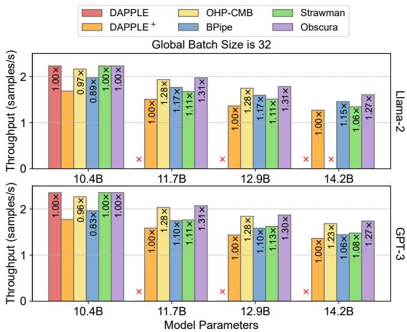  
Figure 15: End-to-End performance in 4 stages pipeline.

## 9.5 Additional Performance Validation

To demonstrate that Obscura delivers robust performance across diverse training configurations and platforms, we selected another representative 4-stage pipeline configuration for validation. We re-conduct performance evaluations using various sizes of Llama-2 and GPT-3 models with a global batch size of 32. The experiments are performed on a system equipped with four NVIDIA A800 GPUs connected to CPUs via PCIe 4.0 x16, without NVLink. Due to limited P2P bandwidth between GPUs, BPipe achieves 11% and 17% lower throughput than DAPPLE on 10.4B models, mainly due to costly inter-stage activation transfers. For larger models, combining MLP recomputation reduces activation size and enables full overlap of communication and computation, but introduces recomputation overhead. In low-bandwidth settings, recomputation outperforms swapping.

In contrast, Obscura introduces no additional inter-stage communication and maintains original P2P communication between stages. As a result, it consistently achieves strong performance gains of 27–31%.

## 9.6 Sensitivity Analysis

To evaluate the advantages of Obscura over baseline methods, we perform a sensitivity analysis to examine the impact of dependency relaxation (DR), swapping-aware recomputation (SAR), and computation balancing (CB). Figure 16 presents the performance of DAPPLE+ and Obscura across different combinations of these core techniques, tested under global batch sizes ranging from 16 to 128 for training the Llama-2 23B model. All configurations designate stages 0–2 as adjusted stages, and the results are normalized to DAPPLE+.

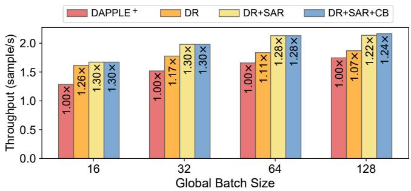  
Figure 16: Sensitivity Analysis in the Llama-2 23B model.

At a batch size of 16, bubbles can conceal most recomputation overhead, yielding significant speedups for all Obscura configurations. DR shows a slight performance drop due to recomputation overhead in the final backward pass, which cannot be concealed, and larger per-micro-batch recomputation overhead. At batch sizes of 32 and 64, DR’s performance degrades significantly as recomputation overhead exceeds bubbles’ capacity. In contrast, DR+SAR and DR+SAR+CB maintain higher performance by prioritizing cost-effective operators, reducing overall recomputation overhead. At a batch size of 128, DR+SAR and DR+SAR+CB experience a performance drop as bubbles cannot fully conceal recomputation overhead. However, DR+SAR+CB mitigates this by redistributing layers between adjusted and non-adjusted stages, balancing the computation load.

## 10 Conclusions

In this paper, we present Obscura, a computationally efficient pipeline training system, which introduces a novel pipeline transformation that utilizes existing pipeline bubbles to effectively hide recomputation costs, as well as integrates advanced techniques such as dependency relaxation, swapping-aware recomputation, and computation balancing, significantly enhancing overall performance and resource utilization.

## 11 Acknowledgment

The work described in this paper was supported by the Major Key Project of Peng Cheng Laboratory PCL2023A09, the National Natural Science Foundation of China (62472459, 62172453), and was sponsored by CCF-Huawei Populus Grove Fund (CCF-HuaweiSY202303).

## References

[1] Sanjith Athlur, Nitika Saran, Muthian Sivathanu, Ramachandran Ramjee, and Nipun Kwatra. Varuna: scalable, low-cost training of massive deep learning models. In Proceedings of the Seventeenth European Conference on Computer Systems, pages 472–487, 2022.

[2] Olivier Beaumont, Lionel Eyraud-Dubois, and Alena Shilova. Efficient combination of rematerialization and offloading for training dnns. Advances in Neural Information Processing Systems, 34:23844–23857, 2021.

[3] Tom Brown, Benjamin Mann, Nick Ryder, Melanie Subbiah, Jared D Kaplan, Prafulla Dhariwal, Arvind Neelakantan, Pranav Shyam, Girish Sastry, Amanda Askell, et al. Language models are few-shot learners. Advances in neural information processing systems, 33:1877–1901, 2020.

[4] Jacob Devlin. Bert: Pre-training of deep bidirectional transformers for language understanding. arXiv preprint arXiv:1810.04805, 2018.

[5] Shiqing Fan, Yi Rong, Chen Meng, Zongyan Cao, Siyu Wang, Zhen Zheng, Chuan Wu, Guoping Long, Jun Yang, Lixue Xia, et al. Dapple: A pipelined data parallel approach for training large models. In Proceedings of the 26th ACM SIGPLAN Symposium on Principles and Practice of Parallel Programming, pages 431–445, 2021.

[6] William Fedus, Barret Zoph, and Noam Shazeer. Switch transformers: Scaling to trillion parameter models with simple and efficient sparsity. CoRR, abs/2101.03961, 2021.

[7] Julien Herrmann, Olivier Beaumont, Lionel Eyraud-Dubois, Julien Hermann, Alexis Joly, and Alena Shilova. Optimal checkpointing for heterogeneous chains: how to train deep neural networks with limited memory. arXiv preprint arXiv:1911.13214, 2019.

[8] Yanping Huang, Youlong Cheng, Ankur Bapna, Orhan Firat, Dehao Chen, Mia Chen, HyoukJoong Lee, Jiquan Ngiam, Quoc V Le, Yonghui Wu, et al. Gpipe: Efficient training of giant neural networks using pipeline parallelism. Advances in neural information processing systems, 32, 2019.

[9] Paras Jain, Ajay Jain, Aniruddha Nrusimha, Amir Gholami, Pieter Abbeel, Joseph Gonzalez, Kurt Keutzer, and Ion Stoica. Checkmate: Breaking the memory wall with optimal tensor rematerialization. Proceedings of Machine Learning and Systems, 2:497–511, 2020.

[10] Taebum Kim, Hyoungjoo Kim, Gyeong-In Yu, and Byung-Gon Chun. Bpipe: memory-balanced pipeline parallelism for training large language models. In International Conference on Machine Learning, pages 16639–16653. PMLR, 2023.

[11] Vijay Anand Korthikanti, Jared Casper, Sangkug Lym, Lawrence McAfee, Michael Andersch, Mohammad Shoeybi, and Bryan Catanzaro. Reducing activation recomputation in large transformer models. Proceedings of Machine Learning and Systems, 5:341–353, 2023.

[12] Mu Li, David G Andersen, Jun Woo Park, Alexander J Smola, Amr Ahmed, Vanja Josifovski, James Long, Eugene J Shekita, and Bor-Yiing Su. Scaling distributed machine learning with the parameter server. In 11th USENIX Symposium on operating systems design and implementation (OSDI 14), pages 583–598, 2014.

[13] Shen Li, Yanli Zhao, Rohan Varma, Omkar Salpekar, Pieter Noordhuis, Teng Li, Adam Paszke, Jeff Smith, Brian Vaughan, Pritam Damania, et al. Pytorch distributed: Experiences on accelerating data parallel training. arXiv preprint arXiv:2006.15704, 2020.

[14] Shigang Li and Torsten Hoefler. Chimera: efficiently training large-scale neural networks with bidirectional pipelines. In Proceedings of the International Conference for High Performance Computing, Networking, Storage and Analysis, pages 1–14, 2021.

[15] Deepak Narayanan, Aaron Harlap, Amar Phanishayee, Vivek Seshadri, Nikhil R Devanur, Gregory R Ganger, Phillip B Gibbons, and Matei Zaharia. Pipedream: Generalized pipeline parallelism for dnn training. In Proceedings of the 27th ACM symposium on operating systems principles, pages 1–15, 2019.

[16] Deepak Narayanan, Mohammad Shoeybi, Jared Casper, Patrick LeGresley, Mostofa Patwary, Vijay Korthikanti, Dmitri Vainbrand, Prethvi Kashinkunti, Julie Bernauer, Bryan Catanzaro, et al. Efficient large-scale language model training on gpu clusters using megatron-lm. In Proceedings of the International Conference for High Performance Computing, Networking, Storage and Analysis, pages 1–15, 2021.

[17] Xuan Peng, Xuanhua Shi, Hulin Dai, Hai Jin, Weiliang Ma, Qian Xiong, Fan Yang, and Xuehai Qian. Capuchin: Tensor-based gpu memory management for deep learning. In Proceedings of the Twenty-Fifth International Conference on Architectural Support for Programming Languages and Operating Systems, pages 891–905, 2020.

[18] Jeff Rasley, Samyam Rajbhandari, Olatunji Ruwase, and Yuxiong He. Deepspeed: System optimizations enable

training deep learning models with over 100 billion parameters. In Proceedings of the 26th ACM SIGKDD International Conference on Knowledge Discovery & Data Mining, pages 3505–3506, 2020.

[19] Jie Ren, Samyam Rajbhandari, Reza Yazdani Aminabadi, Olatunji Ruwase, Shuangyan Yang, Minjia Zhang, Dong Li, and Yuxiong He. {Zero-offload}: Democratizing {billion-scale} model training. In 2021 USENIX Annual Technical Conference (USENIX ATC 21), pages 551–564, 2021.

[20] Mohammad Shoeybi, Mostofa Patwary, Raul Puri, Patrick LeGresley, Jared Casper, and Bryan Catanzaro. Megatron-lm: Training multi-billion parameter language models using model parallelism. arXiv preprint arXiv:1909.08053, 2019.

[21] Shaden Smith, Mostofa Patwary, Brandon Norick, Patrick LeGresley, Samyam Rajbhandari, Jared Casper, Zhun Liu, Shrimai Prabhumoye, George Zerveas, Vijay Korthikanti, et al. Using deepspeed and megatron to train megatron-turing nlg 530b, a large-scale generative language model. arXiv preprint arXiv:2201.11990, 2022.

[22] Zhenbo Sun, Huanqi Cao, Yuanwei Wang, Guanyu Feng, Shengqi Chen, Haojie Wang, and Wenguang Chen. Adapipe: Optimizing pipeline parallelism with adaptive recomputation and partitioning. In Proceedings of the 29th ACM International Conference on Architectural Support for Programming Languages and Operating Systems, Volume 3, pages 86–100, 2024.

[23] Hugo Touvron, Louis Martin, Kevin Stone, Peter Albert, Amjad Almahairi, Yasmine Babaei, Nikolay Bashlykov, Soumya Batra, Prajjwal Bhargava, Shruti Bhosale, et al. Llama 2: Open foundation and fine-tuned chat models. arXiv preprint arXiv:2307.09288, 2023.

[24] Linnan Wang, Jinmian Ye, Yiyang Zhao, Wei Wu, Ang Li, Shuaiwen Leon Song, Zenglin Xu, and Tim Kraska. Superneurons: Dynamic gpu memory management for training deep neural networks. In Proceedings of the 23rd ACM SIGPLAN symposium on principles and practice of parallel programming, pages 41–53, 2018.

[25] Aiyuan Yang, Bin Xiao, Bingning Wang, Borong Zhang, Ce Bian, Chao Yin, Chenxu Lv, Da Pan, Dian Wang, Dong Yan, et al. Baichuan 2: Open large-scale language models. arXiv preprint arXiv:2309.10305, 2023.

[26] Bowen Yang, Jian Zhang, Jonathan Li, Christopher Ré, Christopher Aberger, and Christopher De Sa. Pipemare: Asynchronous pipeline parallel dnn training. Proceedings of Machine Learning and Systems, 3:269–296, 2021.

[27] Tailing Yuan, Yuliang Liu, Xucheng Ye, Shenglong Zhang, Jianchao Tan, Bin Chen, Chengru Song, and Di Zhang. Accelerating the training of large language models using efficient activation rematerialization and optimal hybrid parallelism. In 2024 USENIX Annual Technical Conference (USENIX ATC 24), pages 545– 561, 2024.

[28] Shixiong Zhao, Fanxin Li, Xusheng Chen, Xiuxian Guan, Jianyu Jiang, Dong Huang, Yuhao Qing, Sen Wang, Peng Wang, Gong Zhang, et al. v pipe: A virtualized acceleration system for achieving efficient and scalable pipeline parallel dnn training. IEEE Transactions on Parallel and Distributed Systems, 33(3):489– 506, 2021.

[29] Quan Zhou, Haiquan Wang, Xiaoyan Yu, Cheng Li, Youhui Bai, Feng Yan, and Yinlong Xu. Mpress: Democratizing billion-scale model training on multigpu servers via memory-saving inter-operator parallelism. In 2023 IEEE International Symposium on High-Performance Computer Architecture (HPCA), pages 556–569. IEEE, 2023.