①

USENIX

THE ADVANCED COMPUTING SYSTEMS ASSOCIATION

# Z-LFS: A Zoned Namespace-tailored Log-structured File System for Commodity Small-zone ZNS SSDs

Inhwi Hwang, Seoul National University; Sangjin Lee, Chung-Ang University; Sunggon Kim, Seoul National University of Science and Technology; Hyeonsang Eom, Seoul National University; Yongseok Son, Chung-Ang University https://www.usenix.org/conference/atc25/presentation/hwang

# This paper is included in the Proceedings of the 2025 USENIX Annual Technical Conference.

July 7–9, 2025 • Boston, MA, USA ISBN 978-1-939133-48-9

Open access to the Proceedings of the 2025 USENIX Annual Technical Conference is sponsored by

P-Lr.h £Es/sL.

auuuJl9 PgleU

King Abdullah University of

Science and Technology

# Z-LFS: A Zoned Namespace-tailored Log-structured File System for Commodity Small-zone ZNS SSDs

Inhwi Hwang Seoul National University

Sangjin Lee Chung-Ang University

Hyeonsang Eom Seoul National University

Sunggon Kim Seoul National University of Science and Technology

Yongseok Son∗ Chung-Ang University

## Abstract

This paper presents a novel zoned namespace (ZNS) tailored log-structured file system (LFS) called Z-LFS for commodity small-zone ZNS SSDs. Specifically, Z-LFS first enables append-only updates on metadata while leveraging the unique metadata characteristic of LFS on ZNS SSDs. Second, Z-LFS devises speculative log stream management according to the workload temperature to maximize active zone utilization. Finally, Z-LFS adopts conflict-aware zone allocation to minimize resource contention within ZNS SSDs while considering LFS features. We implement Z-LFS based on F2FS in the Linux kernel and evaluate it with commodity ZNS SSD. Our evaluations show that Z-LFS achieves higher performance by up to 33.44× and 3.5× compared with F2FS and a state-ofthe-art interface for commodity ZNS SSDs, respectively.

## 1 Introduction

The zoned namespace (ZNS) SSD is a new storage device and has received significant attention from researchers and enterprise storage vendors [7, 19, 42, 52]. In contrast to legacy SSDs (i.e., conventional namespace (CNS) SSD), the ZNS SSD divides the physical address space into fixed-size zones. Each zone must be written sequentially (i.e., append-only update) and reset explicitly for reuse while shifting the responsibility of data management to the host (e.g., garbage collection) [8, 44, 55]. This minimizes the DRAM usage and over-provisioning space inside SSDs [9, 45, 53, 57], resolves the log-on-log issue [17, 56], and mitigates I/O interference [10, 18, 33, 51].

Unfortunately, adapting an existing mature file system on the ZNS SSD is not trivial due to the ZNS constraints. For example, in-place updating file systems (e.g., EXT4 [40] and XFS [54]) cannot be utilized on ZNS SSD. Meanwhile, out-of-place updating file systems including log-structured file systems (LFSs), such as SpriteLFS [49], F2FS [29], and

NILFS2 [27], can naturally be utilized on ZNS SSD by performing out-of-place updates. Specifically, F2FS [29] is a representative LFS supporting the utilization of ZNS SSD. Accordingly, F2FS has been widely adopted to utilize ZNS SSD in previous studies [1, 17, 30, 50]. Nevertheless, current Linux LFSs with multiple log streams (e.g., F2FS) may meet two issues due to their CNS-based designs on ZNS SSD. Specifically, 1) LFS has a potential inability to use ZNS SSD as a standalone SSD [1] resulting from CNS-based metadata design and its in-place updates and 2) there can be a performance issue due to CNS-based data placement and I/O operations.

CNS-based metadata design and update: The existing LFSs manage metadata in block-level granularity and perform inplace updates for the metadata in a fixed location to handle well-known LFS issues such as update propagation (i.e., wandering tree problem [13,23,25,29,41,49,59,60]). For example, F2FS performs in-place updates for its metadata stored at a block-aligned and fixed location to solve the wandering tree problem [29]. Accordingly, when utilizing a commodity ZNS SSD, the LFSs require an additional CNS SSD to support the in-place updates. However, this leads to an increase in the cost of a storage system.

CNS-based data placement and I/O operations: The existing LFSs place data on sequential logical block addresses (LBAs) to fully utilize the high sequential write performance of CNS SSD while minimizing GC overhead [16, 34]. Meanwhile, the LFSs may encounter potential under-utilization issues in ZNS SSDs, especially small-zone ZNS SSDs. Specifically, small-zone ZNS SSDs have two main features [15,21,42]: 1) fine-grained mappings between zones and internal resources [43, 46] such as channels and dies and 2) a large number of zones that support parallel write operations (i.e., active zones [44]) at the cost of reduced internal parallelism within a zone (i.e., intra-zone parallelism). Accordingly, to maximize the ZNS SSD performance, the LFSs with multiple log streams should efficiently utilize active zones based on their log streams and consider the mappings to avoid the conflicts among zones that share identical SSD internal resources (e.g., dies and channels).

Previous studies have introduced different techniques to efficiently utilize ZNS SSDs on various layers [9, 17, 42, 43]. ZenFS [9] is a storage backend for running RocksDB on ZNS SSDs. ZNS+ [17] introduces a new customized ZNS SSD design and interface which enables offloading data copy operations to the SSD. eZNS [42, 43] is an elastic ZNS interface that allocates active zones based on the application workloads and enhances performance isolation through an I/O scheduler. Our study is inspired by these studies and in line with them in terms of efficiently exploiting ZNS SSDs or maximizing the utilization of active zones for ZNS SSDs. In contrast, our study focuses on designing ZNS-tailored metadata and logging strategies of LFS on a standalone commodity ZNS SSD.

Our goal in this study is to design a ZNS-tailored LFS to maximize 1) the cost-efficiency of the storage system and 2) the resource utilization of small-zone ZNS SSDs. To this end, we propose a novel ZNS-tailored log-structured file system for small-zone ZNS SSDs called Z-LFS. Our key idea of Z-LFS is to enable 1) ZNS-tailored metadata management to enable standalone usage of ZNS SSD and 2) ZNS resource control by leveraging log stream utilization and addressing resource conflicts.

Specifically, Z-LFS first enables append-only updates on metadata to efficiently store metadata on ZNS SSDs without relying on CNS SSD. To do this, Z-LFS leverages the unique metadata characteristics of LFS on ZNS SSDs, which differ from those on CNS SSDs due to ZNS constraints. In our observation, LFS metadata on ZNS SSD can be classified into two categories based on their life cycle: immutable and mutable metadata. Immutable metadata is not updated after being written, and its life cycle is identical to that of the associated LFS segments. Meanwhile, mutable metadata is updated frequently and has a distinct life cycle from the segments. With these characteristics, Z-LFS appends immutable metadata to its corresponding segment and stores mutable metadata separately using a delta logging approach.

Second, Z-LFS devises speculative log stream management that dynamically coordinates active zones to maximize their utilization. We observe that allocating zones without considering the write intensity of log streams can limit the effective use of zone-level parallelism. To address this, Z-LFS speculatively determines the active zone quota for each log stream based on its write intensity, which varies according to workloads. Finally, Z-LFS adopts conflict-aware zone allocation designed to minimize contention among zones that share SSD internal resources including dies and channels. In our analysis, when a host uses zones mapped to the same die or channel, zone-level parallelism is reduced due to the die or channellevel conflicts. Based on this analysis, Z-LFS allocates zones and distributes data across zones mapped to distinct internal resources, thereby reducing the resource conflicts.

Note that our approach is a fully software-based and targets commodity devices to ensure broader applicability and compatibility without requiring modification to ZNS SSDs. By doing so, our file system can be easily deployed on mature storage systems with commodity ZNS SSDs.

We implement Z-LFS with the three techniques based on F2FS in Linux kernel 5.17.4. We evaluate Z-LFS with various micro/macro benchmarks and RocksDB in a single-tenant environment. The result shows that Z-LFS improves the performance by up to 33.4× and 3.5× compared with F2FS and a state-of-the-art interface for commodity ZNS SSD (eZNS [42]) with F2FS, respectively. Finally, we open the source code of Z-LFS at https://github.com/Z-LFS/Z-L FS to aid future studies in file systems and storage stacks for ZNS SSDs.

## 2 Background and Motivation

## 2.1 Small-zone and Large-zone ZNS SSDs

ZNS SSD has two main constraints [32, 35, 44]. Specifically, 1) data must be written sequentially within a single zone, and once data is written, it cannot be overwritten until the zone is reset. In addition, 2) ZNS SSD also restricts the maximum number of active zones where write operations can be performed in parallel [42]. A zone has one of six states (i.e., opened, closed, full, empty, read-only, and offline), which can be changed according to operations such as write requests or zone management commands [44]. Within the states, opened and closed states represent active zones. The active zone shifts to the full state when it is filled or through a FINISH zone command, and shifts to the empty state through a RESET zone command, allowing the active zone to be reclaimed.

A zone in the ZNS SSD is allocated across channels, and the zone size is determined by the manufacturer [6, 7, 39]. Thus, the degree of internal parallelism can vary depending on the zone size [11, 12, 20, 21]. In a ZNS SSD with a largezone (large-zone ZNS SSD), each zone spans more dies across channels [42], supporting higher intra-zone parallelism. Meanwhile, since it provides only a few active zones (e.g., up to 14 zones [8, 9]), the large-zone ZNS SSD can limit flexibility and show low performance isolation [15, 42, 46]. On the other hand, a small-zone ZNS SSD exposes finer-grained physical zones; each zone is contained within a die [15, 46]. Thus, the small-zone ZNS SSD can support more active zones (e.g., up to 384 zones), providing higher flexibility and performance isolation. Meanwhile, the small-zone ZNS SSD can show lower parallelism when only a small number of active zones is utilized. To exploit the internal parallelism of the smallzone ZNS SSD (zone-level parallelism), hosts should aim to process I/O requests across a large number of active zones.

## 2.2 Challenges of LFS on ZNS SSDs

Considering ZNS SSD, the design of LFS based on CNS SSD faces challenges, particularly in addressing three main issues as follows. We will explain the details of the LFS challenges using F2FS as an example since it supports the ZNS SSD and is one of the representative and widely used LFSs.

Enabling append-only update metadata on ZNS SSD: F2FS places its metadata in a block-aligned and fixed location and updates them in place on CNS SSD. On the other hand, in the case of a ZNS SSD, since it disallows random writes and in-place updates within a zone, the metadata management scheme in F2FS requires an additional CNS SSD, increasing the overall cost of a storage system. To utilize the ZNS SSD as a standalone SSD, we can adapt the existing CNS-based metadata approach (i.e., F2FS) with minor modifications to fit within the ZNS constraints. In this approach, each metadata type has a pair of zones, and the metadata is written alternatively to one of the pair with zone granularity. However, due to the ZNS constraint, when the metadata is randomly updated, this approach may need to read the metadata from one zone in one of the pair, modify the metadata, and write the modified metadata to the other zone. This approach can significantly decrease the performance (up to 9.32×) and increase the amount of write (up to 7.8×) in our preliminary evaluation. Therefore, it is a challenge to efficiently design the metadata under the ZNS constraints and perform append-only updates.

Maximizing utilization of active zone under ZNS constraints: In the case of node/data in the main area of F2FS [29], the multi-head logging design separates the node and data into six types based on their hotness (i.e., hot/warm/cold). F2FS allocates a zone for a log stream and writes corresponding data or nodes sequentially in the zone. When the zone becomes full, F2FS allocates a new zone. Consequently, F2FS uses only six active zones at most, limiting zone-level parallelism and under-utilizing the device bandwidth, especially for small-zone ZNS SSDs. To make the best use of the available active zones at maximum, there can be a static and straightforward approach. For example, we can statically map six log streams to available active zones as much as possible. However, the number of available active zones is limited, and the I/O traffic on each log stream varies according to the workloads. Specifically, when the I/O traffic becomes skewed toward a particular log stream, the log streams with low I/O traffic can waste active zones while the log streams with high I/O traffic cannot harness the resources. Thus, this approach may still have the issue of under-utilization of active zones. Consequently, it is a challenge to optimally scale the active zones in an opportunistic manner to maximize the parallelism under the active zone constraints.

Mitigating SSD internal resource conflict among zones: Small-zone ZNS SSD uses fine-grained mapping between host-exposed zone and SSD internal resources such as channel and die. For example, the ZNS SSD used in our evaluation maps each zone to a single die and a single channel, rather than spanning a zone across multiple dies or channels. Accordingly, although an LFS may use multiple active zones to improve zone-level parallelism, if these zones are mapped to the same channels or dies, the LFS may fail to achieve optimal performance due to limited parallelism. Therefore, an LFS should consider and manage the mapping between zones and the internal resources to avoid the resource conflicts.

## 3 Analysis of ZNS SSD performance

## 3.1 Basic performance of ZNS SSD

To demonstrate the impact of zone-level parallelism on read and write performance with varying number of zones to issue I/O, we evaluate the base read and write performance of smallzone ZNS SSDs on the testbed described in §6.1. We use FIO [22] to perform direct I/O operations on the raw device, bypassing the page cache, with 16 threads and a queue depth of 32. The number of zones issuing I/O (i.e., active zones for writes) and the request sizes are varied during the evaluation.

As shown in Figure 1, write performance improves as the number of active zones increases across all request sizes. However, the degree of performance improvement and the maximum throughput are significantly influenced by the request size. Specifically, for 128KB requests, write performance saturates at 128/256 active zones, reaching approximately 2.4 GB/s. In contrast, small (e.g., 4KB) and large (e.g., 2MB) request sizes lead to performance degradation. For example, with 128 active zones, the write performance for 4KB and 2MB requests is only 20% and 47%, respectively, of the peak performance achieved. For small requests, the performance degradation is primarily due to the excessive number of I/O operations. For large requests, the I/O processing time within a zone increases, delaying subsequent write requests on other zones, thereby reducing zone-level parallelism and overall performance. Similarly, read performance also increases as the number of active zones increases but saturates with fewer zones (i.e., 32) than write operations. Unlike write operations, read performance is not sensitive to request size. These results highlight the importance of leveraging zone-level parallelism for both read and write operations, particularly given the limited intra-zone parallelism of small-zone ZNS SSDs, as discussed in §2.1.

## 3.2 Interference among internal resources

To evaluate the impact of interference among internal resources and understand the internal structure of the ZNS SSD, we measure the read performance using two threads to read from two different zones. In this evaluation, one thread reads data sequentially from zone ID 0, while the other reads data sequentially from a different zone, varying from zone ID 1 to 256. Figure 2 illustrates the read throughput of the two threads as the second thread’s zone ID changes.

As shown in the figure, we observe two conflict points (i.e., channel-level and die-level) that degrade the performance compared with no conflict points as described in previous studies [43]. The performance degradation occurs when the zone ID is a multiple of 16, where throughput drops by 19% compared with the no conflict scenario. This degradation results from channel-level conflicts, where I/O requests from both threads contend for access to the same channel in the ZNS SSD even if two different zones are utilized. Second, the performance drops significantly when the zone ID is a multiple of 128. At these points, die-level conflicts arise, reducing performance by more than 50% compared with the no-conflict scenario.

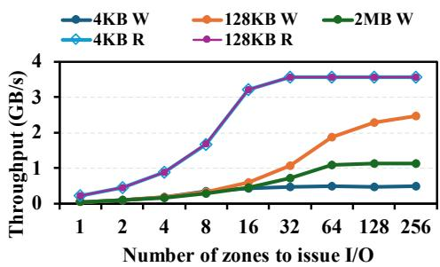  
Figure 1: Raw write (W) and read (R) performance of a small-zone ZNS SSD.

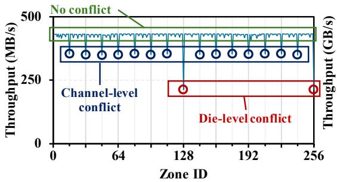  
Figure 2: Performance of scenarios with/without resource conflict.

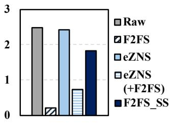  
Figure 3: Write performance of various techniques.

These results indicate that an LFS should allocate zones while minimizing conflicts with the internal resources of the ZNS SSD to achieve optimal performance. Based on these observation, we infer that the ZNS SSD used in the evaluation consists of 16 channels and 128 dies, with zones statically mapped to internal resources in a round-robin manner. Leveraging this model, we design a conflict-aware zone allocation technique described in §4.6.

## 3.3 File system performance on ZNS SSD

We evaluate the write performance of F2FS, eZNS with F2FS (eZNS (+F2FS)), and F2FS with static stripping (F2FS\_SS) as shown in Figure 3. eZNS [42, 43] is a state-of-the-art technique to exploit zone-level parallelism by distributing the write operations to the active zones via logical zones (i.e., v-zone [42, 43]). F2FS\_SS represents an extension of F2FS with a static striping approach that evenly distributes active zones across log streams (e.g., 64 active zones per log stream) to further utilize zone-level parallelism in F2FS. For the evaluation, we use FIO with 16 threads performing sequential writes. These threads issue direct I/Os for the raw device and eZNS, while buffered I/Os are used for F2FS, eZNS with F2FS, and F2FS\_SS.

F2FS exhibits significantly lower performance compared with the potential performance of the raw device, as described in §2.2 due to a lack of awareness of limited intra-zone parallelism. Specifically, F2FS allocates a single zone for each log stream, utilizing a total of six zones. eZNS delivers full performance in scenarios without F2FS, as FIO threads write uniformly to v-zones, ensuring balanced utilization. However, when combined with F2FS, eZNS experiences write performance degradation due to two main reasons from lack of cross-layer awareness as follows. (1) Similar to standalone F2FS, F2FS even with eZNS recognize v-zones as normal zones. Therefore, F2FS allocates a single v-zone for each log stream and cannot utilize more v-zones [43]. (2) eZNS adjusts the number of active zones mapped to v-zones based on whether write operations occurs in a v-zone, rather than intensity of those operations in the v-zone. As a result, even when a v-zone is heavily utilized, eZNS allocates the same number of active zones to all v-zones regardless of the utilization of each v-zone. Consequently, while eZNS with F2FS improves active zone utilization compared with standalone F2FS, it delivers sub-optimal performance when I/O traffic is skewed toward a specific log stream.

The lack of cross-layer awareness may be addressed through coordination between F2FS and eZNS layers. However, such cross-layer coordination necessitates additional interaction mechanisms and tight coupling between the layers. Specifically, this requires communication burden between F2FS and eZNS whenever the write intensity of log streams changes. For example, when the write intensity of a log stream changes, F2FS transfers the intensity information to eZNS. Using the information, eZNS can increase or decrease the number of active zones mapped with the v-zone associated with the log stream. Therefore, this cross-layer coordination approach can increase system complexity and maintenance overhead.

F2FS\_SS demonstrates better performance than F2FS and eZNS with F2FS. However, static striping exhibits suboptimal performance. It is because, similar to eZNS with F2FS, static striping allocates the same number of active zones to all log streams, regardless of their write intensity, thereby limiting the utilization of zone-level parallelism. The performance gap between eZNS with static stripping primarily arises from differences in request size. eZNS issues small requests (e.g., 4KB) for each v-zone to minimize latency while static stripping issues larger requests (e.g., 2MB).

These results demonstrate that evenly distributing active zones across log streams can waste active zones and limit the zone-level parallelism of write-intensive log streams. To maximize zone-level parallelism across log streams, LFS should dynamically allocate active zones based on the write intensity of each log stream.

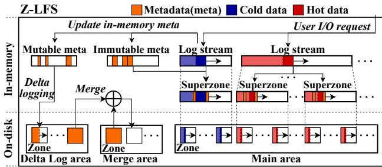  
Figure 4: Overall architecture and procedure of Z-LFS.

## 4 Design and Implementation

## 4.1 Design Goals of Z-LFS

We design Z-LFS to meet the following three design goals:

• ZNS-tailored metadata management: To maximize the cost-efficiency, Z-LFS should update metadata in an efficient append-only manner while considering unique characteristics and constraints of LFS on ZNS SSD.

• Speculative log stream management: To maximize active zone utilization, Z-LFS should identify write intensity of each log stream and optimally scale active zones for that stream.

• Conflict-aware zone allocation: To avoid conflicts among zones mapped to overlapping internal resources (dies or channels), Z-LFS should track the mapping between them and allocate conflict-free zones as much as possible.

## 4.2 Strategies of Z-LFS

We present the three key strategies and explain how they meet the design goals of Z-LFS.

Strategy #1: To enable efficient append-only metadata update while considering LFS features on ZNS SSD, Z-LFS classifies metadata into immutable and mutable types based on their alignment with segment life cycles. Z-LFS manages the two types of metadata separately: it appends immutable metadata to the corresponding segments and adopts delta logging mutable metadata in a dedicated area.

Strategy #2: To maximize zone-level parallelism while considering workloads, Z-LFS speculates on and determines the active zone quota for each log stream and dynamically scales active zones to log streams as workload changes.

Strategy #3: To avoid channel-level conflict, Z-LFS organizes consecutive zones without channel overlap into a superzone. To prevent die-level conflict, Z-LFS groups superzones mapped to the identical dies as a interference group and selectively allocates superzones from different groups to a log stream.

## 4.3 Overall Architecture of Z-LFS

Figure 4 shows the overall architecture of Z-LFS.

Architecture: Z-LFS manages six log streams categorized by their types and temperature similar to F2FS. There are two primary types of log streams: data and node. Data log streams stores user data, while node log streams stores inode or index information for data blocks. Each type is further divided into hot, warm, and cold streams based on hotness. For LFS metadata management, Z-LFS classifies metadata into immutable and mutable metadata based on their life cycle. Immutable metadata shares the same life cycles as their corresponding segments, while mutable metadata has distinct life cycle independent of segments.

In Figure 4, the on-disk layout of Z-LFS is organized into three areas: the delta log area, the merge area, and the main area. Delta log area is dedicated to logging mutable metadata, while merge area stores tables of mutable metadata that is arranged and consolidated from the delta log area. Main area stores data and node log streams, along with their associated immutable metadata. In the main area, considering resource conflicts, Z-LFS organizes consecutive zones into a superzone, which is further divided into multiple fixed-sized segments.

Procedure: As illustrated on the right side of Figure 4, when handling user I/O requests, Z-LFS writes blocks to the appropriate data or node log streams. During this process, it speculates on the write intensity of each log stream as workloads change and dynamically allocates superzones. Specifically, Z-LFS allocates the number of superzones to each log stream in proportion to the ratio of its write requests to the total write requests within a given time window (Strategy #2). This ensures that log streams with higher write intensity can utilize more zone-level parallelism. To avoid resource contention, Z-LFS also considers channel-level and die-level conflicts when organizing and allocating superzones (Strategy #3). Z-LFS then selects a segment from allocated superzones to a log stream in a round-robin manner and writes blocks sequentially to the chosen segments.

As data and node blocks are written, Z-LFS updates their associated metadata as illustrated on the left side of Figure 4. For immutable metadata, which shares the same life cycle as its corresponding segment, Z-LFS appends the metadata to the end of the segment within the same superzone (Strategy #1). This ensures that immutable metadata is naturally cleaned alongside its segment during GC, eliminating the need for additional metadata operations such as metadata GC.

On the other hand, mutable metadata is managed via a different mechanism from immutable metadata. As mutable metadata entries are small (typically tens of bytes) and frequently updated, Z-LFS buffers the changes (deltas) and logs them to a dedicated delta log area. The delta log area operates as a circular log and is cleaned when half of the area is filled. For cleaning, Z-LFS performs a merge operation which consolidate logged deltas from the delta log area into a table and then writes them to the merge area. To reduce the impact on user I/O performance, this merge operation is performed asynchronously.

## 4.4 Append-only metadata management

## 4.4.1 Life cycle based metadata management

In LFSs on CNS SSD, life cycles of metadata is distinct from those of segments since segments can be updated after being written. For example, slack space recycling [29, 47], used in LFSs to reduce GC costs, enables writing new data into invalidated space within already written segments. This necessitates frequent updates to metadata associated with the segment, resulting in metadata life cycles that diverge from those of the segments.

LFSs on ZNS SSDs, unlike those on CNS SSDs, have metadata that share the same life cycle as a segment due to the sequential write constraints of ZNS SSDs. Specifically, in LFSs on ZNS SSDs, once a segment is written, its blocks cannot be updated until GC. Instead, the blocks can only be invalidated, and the segment must be erased before reuse. Accordingly, the life cycle of certain metadata is identical to that of its associated segment. For example, a metadata (e.g., segment summary (SS) in F2FS) stores reverse mapping information of blocks within a segment, including 1) the IDs of all nodes pointing to the blocks and 2) their offsets within the nodes. This information is never modified once written, as the blocks within the segment cannot be updated. Such metadata is utilized during GC, and its life cycle ends when the corresponding segment is cleaned by GC. After GC, the metadata is always newly written. We classify such writeonce and never-updated metadata as immutable metadata. In contrast, metadata like bitmaps indicating valid blocks in a segment (e.g., segment information table (SIT) in F2FS) and block addresses of nodes (e.g., node address table (NAT) in F2FS) are frequently updated, which we categorize as mutable metadata.

Leveraging the observation that the life cycle of immutable metadata aligns with its corresponding segment, Z-LFS appends immutable metadata to the end of the segment and stores them together in the same zone. this approach ensures that the immutable metadata remains valid as long as the segment lives and is naturally cleaned together during GC. As a result, Z-LFS eliminates the need for additional operations such as metadata GC and over-provisioned area to perform them for the immutable metadata. In addition, since the location of the immutable metadata is fixed to the end of the segment, Z-LFS avoids tracking metadata locations, typically required when metadata is stored in an append-only manner.

## 4.4.2 Metadata delta logging

Z-LFS manages mutable metadata using an append-only approach with delta logging. Specifically, mutable metadata is typically small, with most entries consisting of only a few dozen bytes. In addition, since each entry holds independent information, only some entries may be updated while others remain unchanged. Thus, a block which contains mutable metadata can be partially updated. To efficiently handle the partial metadata updates, Z-LFS collects only the modified entries (i.e., deltas), aggregates them into a new metadata log block, and logs the block in delta log area. We demonstrate that the write amplification of Z-LFS is comparable to that of F2FS on CNS SSD, even under metadata-intensive workloads with frequent fsync operations (see Figure 11).

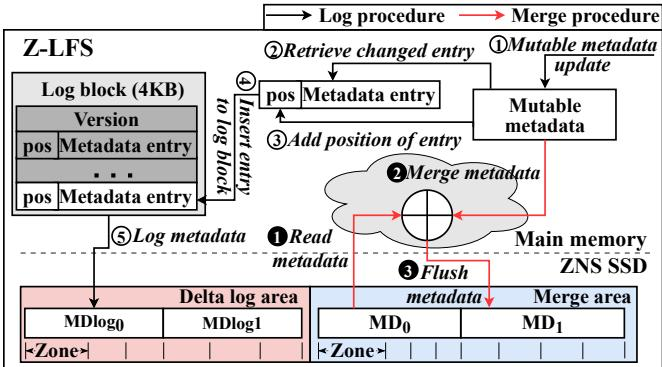  
Figure 5: Architecture and procedure of delta logging (MDx: one side of metadata table pair, MDlogx: one side of metadata log pair, pos: position of the metadata entry).

Meanwhile, a pure log-structured approach that logs metadata blocks with a GC procedure could be a candidate for managing mutable metadata. However, with this approach, updating the metadata changes its location, causing the metadata to be dispersed across the ZNS SSD. As a result, the file system should track and persist the location of each metadata block. This can lead to the need for metadata of metadata and add an additional complexity to metadata management. In contrast, Z-LFS consolidates metadata locations to eliminate the need to track the locations of individual metadata blocks. Architecture: Figure 5 depicts the architecture and overall procedure of delta logging in Z-LFS. For metadata delta logging, a pair of logs consisting of zones (e.g., MDlog0, MDlog1) is maintained in the delta log area. The metadata deltas are written to the pair in a circular manner. To keep the consistency of mutable metadata, Z-LFS maintains a pair of metadata tables (MD0, MD1) in the merge area. Z-LFS alternatively updates one side of the metadata table pair, ensuring that one side always contains valid metadata while the other may contain outdated metadata. By combining circular logging deltas in the delta log area with alternative metadata updates in the merge area, Z-LFS prevents partial metadata updates and ensures crash consistency, as described in §4.7.

Delta logging procedure: During user I/O requests processing, mutable metadata are updated in memory ( 1 ). Only when Z-LFS needs to perform a checkpoint1, the delta logging is triggered. For delta logging, Z-LFS retrieves changed entries ( 1 ) and appends their positions (pos) to each entry ( 2 ). pos indicates the location of the metadata entry in the metadata table, stored in the merge area, ensuring it can be identified after system recovery. Then, Z-LFS inserts the entries in a 4KB log block ( 4 ). When the log block becomes full, it is written to the delta log area (MDlog0) ( 5 ). This procedure of 1 - 5 is repeated until Z-LFS logs all of changed entries in the delta log area. If the current delta log areas (MDlog0) overflows during logging, the remaining entries are written to the next delta log area (MDlog1). During delta logging, Z-LFS records a log version number in log blocks. The log version increments whenever delta logging is invoked and is used during system recovery to determine which log block should be recovered, as described in §4.7.

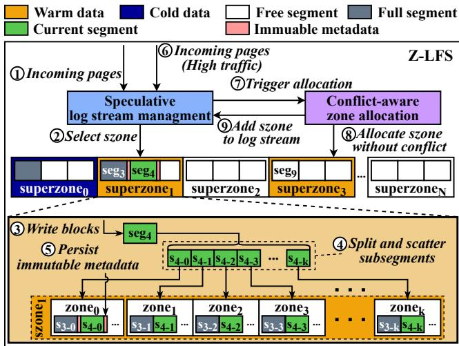  
Figure 6: Architecture and procedure to process user data in Z-LFS (szone: superzone, $\mathrm { s e g } _ { \mathrm { n } } \colon \mathrm { n } ^ { \mathrm { t h } }$ segment, $\mathbf { s } _ { \mathrm { n - k } } \mathbf { : } \mathbf { k } ^ { \mathrm { t h } }$ subsegment of $\mathrm { n ^ { t h } }$ segment).

Asynchronous merge procedure: When a delta log area (e.g., MDlog0) becomes full during a log operation, Z-LFS triggers an asynchronous merge operation to clean the area and reclaim space for future logs. In this process, Z-LFS first reads the valid side of the metadata table pair (MD0) into memory ( 1 ). It then merges this metadata with the entries logged in the delta log area ( 2 ). To reduce overhead, Z-LFS buffers the entries in memory when they are logged in the delta log area. This allows Z-LFS to avoid scanning the delta log area on the ZNS SSD when retrieving logged metadata entries, at the cost of additional memory consumption (§6.3). However, the total size of memory buffer is limited by the total size of the delta log area. After merging, Z-LFS flushes the updated metadata table to the storage device ( 3 ). Once the flush operation completes, Z-LFS safely resets the delta log area (MDlog0) applied to the merge area (MD1), reclaiming the space for future use.

## 4.5 Speculative log stream management

Figure 6 shows the architecture and overall procedure to process user I/O requests.

Architecture: Z-LFS organizes all zones in the main area into superzones. Superzones are logically divided into segments for finer space management, and the segments contain subsegments. The subsegments in a segment are logically continuous but physically mapped to non-contiguous blocks (e.g., a distinct 128KB). The organization of superzones, segments, and subsegments is determined during file system initialization. Z-LFS has six log streams (e.g., hot/warm/cold data and node) and tracks the current segment, which indicates the last written position for each log stream. For crash consistency, the information of the current segments persists in checkpoint blocks and can be recovered as in F2FS.

Procedure: In Figure 6, when Z-LFS flushes data and node, it identifies the type of log stream (i.e., warm data) associated with incoming pages ( 1 ). Then, to store the pages, Z-LFS selects a superzone of the identified log stream (superzone1). Subsequently, to initiate the I/O operation, it selects the first free segment (seg4) within the superzone and then allocates blocks from the segment ( 2 ). For a segment, Z-LFS splits the segment (seg4) into smaller subsegments $\left( \mathsf { s } _ { 4 - 0 } - \mathsf { s } _ { 4 - \mathrm { k } } \right)$ and scatters each subsegments across the zones (zone0-zonek) in the superzone ( 3 , 4 ). Z-LFS keeps the order of segments (seg3, seg4, ...) within each superzone as the order of subsegments $( \mathsf { s } _ { 3 - 0 } , \mathsf { s } _ { 4 - 0 } , \ldots )$ within each zone. By doing so, it can keep the sequential write constraint within each zone and easily recover the mapping of subsegment and LBA. When a segment becomes full, its corresponding immutable metadata is appended to the end of the segment ( 5 ).

When the warm data log stream is speculated to be hightraffic ( 6 ), Z-LFS scales up the active zones for the log stream. Then, to allocate an additional free superzone to increase active zones, Z-LFS triggers conflict-aware zone allocation ( 7 ). Z-LFS allocates superzone without conflict with previously allocated superzones ( 8 ) and adds the superzone to the log stream ( 9 ). With the superzones (i.e., Superzone1 and Superzone3) allocated for the log stream, Z-LFS selects a superzone in a round-robin manner (e.g., superzone3→ superzone1→superzone3) and selects the first free segment (e.g., seg9) within the selected superzone (superzone3) to provide higher zone-level parallelism.

Speculation of I/O utilization of log streams: To determine the optimal number of active zones for each log stream, Z-LFS employs a speculative, quota-based approach for managing active zones. This approach speculates on write intensity and allocates an appropriate quota of active zones to each log stream. Additionally, Z-LFS performs the speculation separately for data and node log streams. This separation is based on our observation, as described in §4.6, that data and node log streams are typically not used concurrently.

To do this, we define the total available active zones for data or node log streams (A). A is determined as the smaller of the following values: (1) the number of active zones required to achieve peak throughput $( A _ { \mathrm { p e a k } } )$ and (2) half of the maximum number of active zones available after reserving zones for file system metadata management $( A _ { \mathrm { a v a i l } } )$ . Z-LFS uses the smaller value to keep the maximum number of active zone constraint of ZNS SSD. Thus, A is defined as $A = m i n ( A _ { \mathrm { p e a k } } , \frac { A _ { \mathrm { a v a i l } } } { 2 } )$ ).

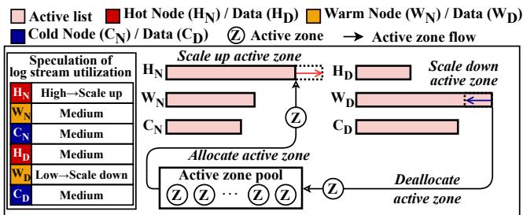

(a) Overview of scaling active zones of multiple log streams  
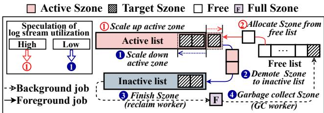  
(b) Procedure of scaling active zones within a log stream.  
Figure 7: Dynamic scaling of active zones of log streams.

The number of active zones allocated to a specific log stream i (Ai) is determined proportionally to its write request volume (Wi) relative to the total request volume among log streams of the same type $\textstyle ( W _ { T } = \sum _ { i \in T } W _ { i }$ , where T represent either data or node) within a time window. This is expressed as: $\begin{array} { r } { ( A _ { i } = A \times \frac { W _ { i } } { W _ { T } } ) } \end{array}$ . After each time window elapses, Z-LFS tracks the write traffic for each log stream and adjusts the allocation of active zones accordingly.

Scaling active zones of log streams: Figure 7a depicts an overview of scaling active zones across log streams. Z-LFS maintains a global active zone pool to keep the active zone constraint of ZNS SSD while scaling active zones of log streams based on the speculation. For each log stream, Z-LFS compares the allocated number of active zones by the speculation with the current number of active zones utilized by the log stream. If the allocated number is greater than the current utilization, Z-LFS determines that the log stream’s traffic to be low. Conversely, if the allocated number is smaller, the traffic of the log stream is considered high. As shown in the figure, for a log stream speculated as high I/O traffic (e.g., hot node log stream: $\mathrm { H } _ { \mathrm { N } } ) , \mathrm { Z } \mathrm { - } \mathrm { L F } \mathrm { S }$ scales up active zones by allocating them from the active zone pool to the log stream. Meanwhile, when a log stream exhibits low utilization (e.g., warm data log stream: WD), Z-LFS scales down and deallocates the active zones occupied by the log stream.

Scaling up active zone: Figure 7b shows an example of a procedure for scaling active zones within a log stream. As shown in the figure, Z-LFS manages active, inactive, and free lists of superzones for efficient active zone scaling. The active list contains superzones where write requests are actively performed. Z-LFS selects a superzone in the active list in a round-robin manner and allocates a segment in the superzone. In this example, as utilization of the log stream increases,

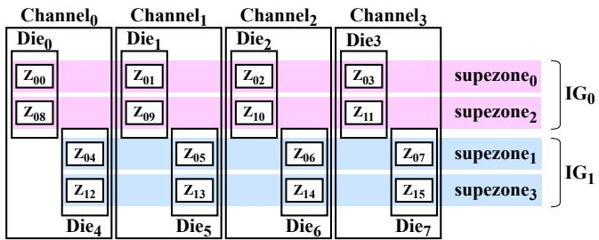  
Figure 8: Superzone and IG organization for conflict-aware zone allocation. $( Z _ { \mathrm { n } } \mathrm { : n ^ { t h } }$ zone, $\mathrm { I G } _ { \mathrm { n } } \mathrm { : }$ interference group n)

Z-LFS tries to scale up the active zones allocated to the log stream ( 1 ). To do this, it allocates a free superzone from the free list and inserts the superzone into the active list ( 2 ). Then, the allocated superzone is utilized by Z-LFS in a roundrobin manner, naturally increasing zone-level parallelism.

Scaling down active zone: As shown in Figure 7b, when the utilization of the log stream decreases due to workload change, Z-LFS scales down active zones ( 1 ). To do this, Z-LFS demotes two superzones in the active list to the inactive list ( 2 ) and reclaims the active zones of the superzones in the inactive list by issuing FINISH zone commands in a background manner ( 3 ). Finally, after a GC worker frees the superzones according to the GC policy, the superzones are shifted from the full state to the free state and are inserted into the free list ( 4 ). Note that the reclaim and GC processes are decoupled from the normal I/O path by the background workers to minimize the overhead caused by the FINISH zone commands and GC, respectively.

## 4.6 Conflict-aware zone allocation

Superzone and IG organization: Figure 8 illustrates the organization of superzones and interference groups (IGs) based on the modeling of ZNS SSD internal resources, as described in §3.2. Since zones are mapped to dies and channels in a round-robin manner, allocating consecutive zones can help avoid resource conflict. For example, in a ZNS SSD with 8 dies and 4 channels as shown in the figure, Z00 (zone00), Z01, $\mathrm { Z } _ { 0 2 }$ , and $\mathrm { Z } _ { 0 3 }$ are mapped to different channels, while $\mathrm { { Z } _ { 0 0 } }$ and $\mathrm { Z _ { 0 4 } }$ are mapped to the same channel. Similarly, ${ \mathrm { Z } } _ { 0 0 } - { \mathrm { Z } } _ { 0 7 }$ are mapped to different dies, while $\mathrm { { Z } _ { 0 0 } }$ and $\mathrm { { Z } _ { 0 8 } }$ are mapped to the same die.

Based on this model, to avoid conflict while reducing the complexity of zone management, Z-LFS organizes consecutive zones $\left( \mathrm { { Z } _ { 0 0 } - \mathrm { { Z } _ { 0 3 } } } \right)$ into a superzone (superzone0) to avoid the channel-level conflict. As a result, each superzone consists of zones equal to the number of channels. Furthermore, Z-LFS groups superzones mapped to the same die (superzone0 and superzone2) into an interference group (IG0). This static organization, in which the number of interference groups corresponds to the number of dies divided by the number of channels, is determined by the zone IDs as well as the number of channels and dies. Based on the analysis in §3.2, Z-LFS organizes a superzone with 16 zones and groups superzones

## into 8 IGs for our testbed ZNS SSD.

Superzone allocation for log streams: To minimize the die conflicts, Z-LFS allocates active zones in units of superzones to the log streams and prioritizes the allocation of superzones from non-overlapping IGs, avoiding overlap with superzones from the previous IG. Furthermore, we observe that data and node log streams are typically not used and written concurrently. Specifically, node log streams are primarily written during checkpointing, while data log streams are blocked during this process. Thus, enforcing non-overlapping IG allocations without differentiating between data and node log streams may unnecessarily limit active zone utilization. For example, if there are two IGs and a superzone is allocated from one IG to a node log stream, data log streams can only use a superzone from the other IG. This limits the number of superzones that can be utilized even if no die conflicts occur. As a result, this observation is incorporated into the allocation strategy to further exploit active zone utilization.

To do this, Z-LFS maintains separate IG allocations for data and node log streams by maintaining distinct IG lists. When a superzone is allocated to a data or node log stream, Z-LFS marks its corresponding IG in the respective allocation list to prevent other concurrent log streams from being assigned superzones within the same IG. By doing so, since blocks of the same log stream are written to zones that do not overlap at the die level, this approach avoids conflicts during write operations. Similarly, it ensures conflict-free sequential reads, since blocks were already written to non-overlapping zones. We note that if all superzones within an IG become completely exhausted, Z-LFS can allocate superzones from overlapping IGs as a fallback. To minimize such cases, Z-LFS prioritizes selecting a superzone from the IG with the fewest remaining free superzones as a victim during a GC procedure.

## 4.7 Crash Consistency

Z-LFS recovers the file system state against a system crash with roll-back and roll-forward recovery mechanisms, similar to F2FS. Roll-back restores the state to that after the last committed checkpoint (CP), meanwhile, roll-forward restores the state to that after the last fsync() call from the last committed CP. We focus on explaining the roll-back recovery of metadata since other recovery procedures are performed in the same way as F2FS.

Immutable metadata is appended directly to the end of its corresponding segment. However, if a segment is partially written, its corresponding immutable metadata is written to the checkpoint block during checkpointing. As a result, Z-LFS ensures the consistency between segment and its metadata through the checkpoint process as F2FS does.

To recover mutable metadata, Z-LFS scans deltas in all the log blocks in the delta log area and merges the deltas with the valid metadata tables to the outdated merge area. Specifically, Z-LFS first references checkpoint blocks. In Z-LFS, these blocks store information about which of the mutable metadata tables in pairs in the merge area is valid. This allows Z-LFS to read the valid sides of metadata table pairs and identify the valid mutable metadata table. During the recovery procedure, Z-LFS scans log blocks in the delta log area and retrieve valid log blocks. Specifically, the checkpoint blocks in Z-LFS store the latest log version when the checkpoint is performed. Thus, Z-LFS can compare the versions in log blocks (i.e., log version) with the version in the last committed checkpoint (i.e., checkpoint version). If the log version is equal to or less than the checkpoint version, Z-LFS considers it valid. Otherwise, Z-LFS ignores the log block since the corresponding checkpoint for the log block is not committed. Then, Z-LFS identifies the position (pos) of each metadata entry (delta) from the valid log blocks. Using these positions, Z-LFS merges the deltas with the valid metadata table. Finally, Z-LFS flushes the merged metadata table to the outdated merge area and proceeds to other recovery procedures, including roll-forward.

After Z-LFS recovers from the system crash with roll-back and roll-forward, Z-LFS does not recover the active zone pool. Instead, it initializes the active zone pool while reclaiming the active zones within ZNS SSD, starting with a clean and consistent active zone state. To reclaim the active zones, Z-LFS changes the zones from the closed state2 to the full state. Specifically, Z-LFS scans the states of zones in the ZNS SSD via a REPORT zone command and finishes the zones in the closed state via a FINISH zone command. We note that this recovery does not affect the consistency of Z-LFS since FIN-ISH zone commands do not change the contents of blocks. Similarly, IG allocation lists are initialized since allocated superzones for log streams are reclaimed.

## 4.8 Implementation

We implement Z-LFS based on F2FS and categorize metadata in F2FS into immutable and mutable metadata. For example, Z-LFS classifies segment summary (SS) as immutable metadata, and segment information table (SIT) and node address table (NAT) as mutable metadata. Since SS, which stores reverse mapping information, is write-once and never-updated metadata, Z-LFS considers SS as immutable metadata. On the other hand, SIT includes bitmaps indicating valid blocks in a segment and NAT includes the logical address of node blocks, which are frequently updated regardless of segment life cycles. Z-LFS manages these metadata as mutable metadata through delta logging and merge.

Since SIT and NAT may have different lifetimes, managing them together can lead to unnecessary merge overhead. For instance, if SIT is updated more frequently than NAT, NAT may experience unnecessary merges as SIT exhausts the delta log area. To avoid this, Z-LFS allocates separate delta log areas, merge areas, and memory buffers for SIT and NAT, and performs delta logging and merging independently for each. This approach allows Z-LFS to efficiently handle metadata updates according to each metadata type, minimizing write amplification and performance degradation.

## 5 Discussion and limitation

Large-zone ZNS SSDs: Z-LFS can be adopted for largezone ZNS SSDs. Since append-only metadata management of Z-LFS requires a small amount of active zones, it can be adopted on a large-zone ZNS SSD even if it has a more strict constraint on active zones than a small-zone ZNS SSD. Furthermore, Z-LFS can use the small random writable area in the large-zone ZNS SSD [9] by placing mutable metadata and updating it in-place. On the other hand, speculative log stream management and conflict-aware zone allocation may not be beneficial for the large-zone ZNS SSD even if adopted, because the large-zone ZNS SSD we used already leverages zone parallelism at the device level. However, if a large-zone ZNS SSD has sufficient active zones for higher flexibility at the cost of intra-zone parallelism, Z-LFS can leverage the active zones, increasing zone-level parallelism.

Single-stream LFS: All Z-LFS techniques are effective in an LFS with multiple log streams. However, in an LFS with a single log stream, speculative log stream management may not yield meaningful performance improvements since it scales active zones across multiple log streams. Meanwhile, the other techniques of Z-LFS, such as append-only metadata management and conflict-aware zone allocation, still are effective, since issues caused by CNS-based metadata design and SSD resource conflict persist even in the single-stream LFS.

Multi-tenant environments: While Z-LFS is designed and evaluated in a single-tenant environment, it can also be deployed in a multi-tenant environment. However, Z-LFS can be further optimized to better support multi-tenancy. For instance, we can incorporate I/O scheduling and rate-limiting mechanisms in Z-LFS as in prior studies [38, 42]. This can improve performance and fairness, especially under bursty write workloads. We leave such optimization and evaluation as future work.

Space overhead of Z-LFS: Z-LFS can reduce the storage system cost by append-only metadata management. However, Z-LFS introduces additional space overhead to manage LFS metadata on a standalone ZNS SSD due to the ZNS constraints. In the delta log area, Z-LFS requires at least two zones to circularly log mutable metadata. In the merge area, similar to an existing LFS (e.g., F2FS), Z-LFS maintains a pair of metadata table. However, since the pair should be managed by a zone granularity, the space overhead increases. By appending immutable metadata to the end of its associated segment, Z-LFS reduces the space overhead by 10.7× compared to performing delta logging for both immutable and mutable metadata. The total space overhead of Z-LFS, including both delta log and merge areas, accounts for approximately 0.02% of the total ZNS SSD capacity. This result demonstrates that the space overhead of Z-LFS is negligible.

## 6 Evaluation

## 6.1 Experimental setup

Testbed: We use a machine equipped with i7-13700K 3.4GHz CPU (16 physical cores) and 32GB main memory. We use a commodity ZNS SSD [5] and its equivalent CNS SSD [3]. The ZNS SSD consists of 40,704 zones, each with a size of 96MB, providing a total space of 3.92TB. The maximum number of active zones is 384. We use Linux kernel 5.17.4 and f2fs-tool 1.15.0 for the mkfs tool.

Comparison: We compare Z-LFS with F2FS [29], F2FS with static striping (F2FS\_SS) as described in §3.3, ZenFS [9], eZNS [42, 43] which is the state-of-the-art ZNS interface for commodity ZNS SSDs, and eZNS with F2FS. F2FS and F2FS\_SS are mounted on ZNS SSD with CNS SSD, denoting F2FS (+CNS SSD) and F2FS\_SS (+CNS SSD), respectively. To evaluate eZNS without any file system (i.e., raw device), we denote it as eZNS. To evaluate the performance of eZNS with a file system, we mount F2FS on ZNS SSD with eZNS and denote it as eZNS with F2FS (+CNS SSD), since it also requires an additional CNS SSD. We configure a namespace in eZNS to allow all threads in the namespace to utilize all available active zones (384) regardless of the namespace.

## 6.2 Workloads

Micro-benchmark: We employ FIO [22] to evaluate Z-LFS using the sequential and random read/write workloads with 16 threads. With file systems (e.g., F2FS, F2FS\_SS, eZNS with F2FS (+CNS SSD), and Z-LFS), each thread performs 10GB I/O to its dedicated file with a 4KB request size3. For comparisons without any file system (e.g., Raw, eZNS), each thread issues 10GB I/O with a 128KB request size. In this case, we use the 128KB request size to demonstrate ideal performance on a raw device and use it for comparison. Unless otherwise stated, we use this configuration in all the FIO evaluations. We also evaluate file system-level garbage collection (GC) to show the effectiveness of Z-LFS even in GC. In this experiment of GC, to reduce the aging time, we create a 150GB partition of a ZNS SSD, pre-fill 128GB in the partition, and then perform random writes for 10 minutes to trigger file system-level GC. Furthermore, we use MDtest [36] to evaluate Z-LFS, under the metadata-intensive workloads. For the evaluation, we create 1 million files with various file sizes of 4/32/128KB and fsync after each file creation.

Macro-benchmark: We use Filebench [2] with four workloads including fileserver, varmail, webserver, and videoserver. We use 16 threads, 16MB file size in fileserver, 1MB in varmail and webserver, and 1GB in videoserver.

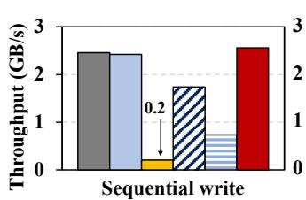

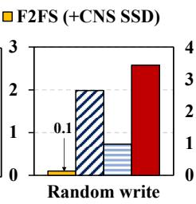

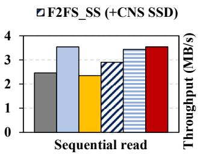

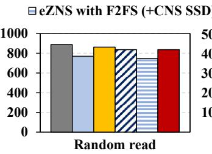

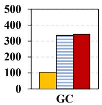

Figure 9: Throughput of sequential/random write/read and garbage collection (GC).
<table><tr><td rowspan=1 colspan=1>File system</td><td rowspan=1 colspan=1>F2FS(+CNS SSD)</td><td rowspan=1 colspan=1>F2FS_SS(+CNS SSD)</td><td rowspan=1 colspan=1>eZNSwith F2FS(+CNS SSD)</td><td rowspan=1 colspan=1>Z-LFS</td></tr><tr><td rowspan=1 colspan=1>Average latency</td><td rowspan=1 colspan=1>626us</td><td rowspan=1 colspan=1>31.9 us</td><td rowspan=1 colspan=1>89.4us</td><td rowspan=1 colspan=1>24.5us</td></tr><tr><td rowspan=1 colspan=1>Tail latency</td><td rowspan=1 colspan=1>47 ms</td><td rowspan=1 colspan=1>103.9 us</td><td rowspan=1 colspan=1>39 ms</td><td rowspan=1 colspan=1>45.3 us</td></tr></table>

Table 1: Write average and tail latency (99.9%)

RocksDB: To evaluate Z-LFS with the real-world application, we use RocksDB [14] and its benchmark tool, db\_bench with fillseq, fillrandom, readrandom, and overwrite workloads as in Figure 14. We use 16 threads, 50 million operations, and 1KB value size.

## 6.3 Micro-benchmark

Write throughput: In Figure 9, Z-LFS achieves higher performance by up to 12.4×/25.2× and 47%/30% comparedPS with F2FS and F2FS\_SS in the case of sequential/randomIO writes, respectively. The performance gap between F2FS and Z-LFS results from the better exploitation of zone-level parallelism by utilizing multiple active zones per log stream. Z-LFS further improves utilization of zone-level parallelism and performance over F2FS\_SS by speculative log stream management technique. Specifically, Z-LFS utilize up to 128 active zones for the most intensive log stream (i.e., warm data log stream) while the static striping in F2FS\_SS limits the maximum utilization as 64 zones.

Z-LFS improves performance by up to 3.5× on both sequential and random write workload compared with eZNS with F2FS. As described in §3.3, due the lack of cross-layer awareness of F2FS, eZNS achieve sub-optimal utilization of active zone, leading to performance degradation. On the other hand, since Z-LFS is the file system itself, it can measure the current utilization for each log stream at the file system level, identify the intensively utilized log streams, and allocate more active zones to them than less utilized log streams.

Read throughput: In Figure 9, interestingly, Z-LFS improves the sequential read performance by 50% compared with F2FS. It is because Z-LFS scatters data across multiple zones while leveraging internal parallelism, even in the read operation. Similarly, F2FS\_SS and eZNS with F2FS also achieve higher performance compared with F2FS. Furthermore, Z-LFS improves performance by 22% over F2FS\_SS, resulting from the conflict-aware zone allocation of Z-LFS as described in §4.6. The random read performance of the file systems is overall low due to low locality, and Z-LFS exhibits similar random read performance to F2FS without additional overhead.

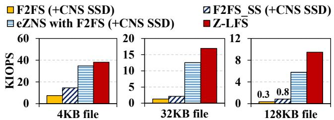  
Figure 10: Throughput of metadata-intensive workloads

Write latency: Table 1 presents the average and 99.9th percentile tail latency in the random write workload. As shown in the table, Z-LFS reduces the average latency by up to 96.1%, 0000000023.23%, and 72.63% and tail latency by up to 99.90%, 56.4%, 4KB file 16 32KB file 64and 99.88% of F2FS, F2FS\_SS, and eZNS with F2FS, respectively. This result demonstrates that Z-LFS successfully improves the write latency as well as throughput. This is because Z-LFS can quickly flush the page cache by exploiting zone-level parallelism. Thus, upcoming application write requests can be cached in the page cache with reduced delay. GC-intensive workload: In Figure 9, Z-LFS exhibits up to 3.3× higher throughput compared with F2FS on ZNS SSD under file system GC operations, while showing similar performance to eZNS with F2FS. The performance improvement over F2FS is attributed to speculative log stream management of Z-LFS, which distributes GC operations of log streams across multiple active zones similar to the normal write operations. Meanwhile, the overhead from the file system GC operations limits the GC performance of Z-LFS. These results indicate that Z-LFS can leverage zone-level parallelism even in the scenario involving frequent file system GC operations. Metadata-intensive workload: Interestingly, a metadataintensive workload (e.g., file creation) in F2FS frequently writes the metadata (i.e., inode or dentry blocks) in ZNS SSD instead of CNS SSD. Thus, even in metadata intensive workloads, the efficient utilization of active zones can considerably impact performance. Accordingly, as shown in Figure 10, Z-LFS achieves a significant improvement of up to 27.7× and 11.4× compared with F2FS and F2FS\_SS in the file creation workload in MDtest, respectively. Compared with eZNS with F2FS, Z-LFS achieves up to 1.6× higher performance since it can scale up the node log stream via speculative log stream management. This highlights the importance of managing active zones for LFS log streams more flexibly. These results demonstrate that Z-LFS can improve the performance even in the metadata-intensive workloads.

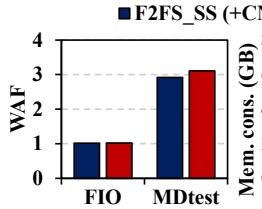  
(a) WAF.

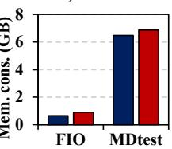  
(b) Peak Mem.

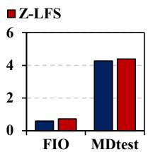  
(c) Avg. Mem.  
Figure 11: Write amplification factor and memory consumption.

Write amplification: To evaluate write amplification factor (WAF) impact of Z-LFS in both data and metadata-intensive workloads, we measure WAF using random write of FIO and MDtest with a 4KB file size. Figure 11a represents that the WAF of Z-LFS is similar to that of F2FS\_SS on both workloads. This result demonstrates that the append-only metadata management of Z-LFS minimizes the metadata WAF.

Memory consumption: We measure the average and peak memory consumption of Z-LFS. In Figure 11b, the peak memory consumption of Z-LFS is higher by up to 38% and 3% compared with F2FS in FIO and MDtest, respectively. Figure 11c shows that the average memory consumption of Z-LFS is higher by up to 22% and 6% compared with F2FS in FIO and MDtest, respectively. Although this result shows Z-LFS has a higher memory consumption than that of F2FS due to the memory consumption from memory buffers used in delta logging, the absolute amount of consumed memory is relatively low. Specifically, Z-LFS consumes an extra 250MB and 380MB memory compared with F2FS in FIO and MDtest, respectively. Furthermore, the amount of memory required in Z-LFS does not grow indefinitely since the maximum memory consumption of all the memory buffer is bounded by the size of all the delta log areas. Consequently, this result demonstrates that Z-LFS achieves append-only metadata management at the cost of memory consumption but the additional absolute amount of memory is relatively small and limited.

Effectiveness of active zone scaling: We evaluate the effectiveness of scaling active zones of log streams compared with the four static allocation schemes (static) in Z-LFS as in Figure 12. For static (even), we use F2FS\_SS which allocates even number of active zones for all log streams. For each static (hot/warm/cold) scenario, we allocate 128 active zones for each hot/warm/cold data log stream and 32 active zones for the others, respectively. We use an FIO random write workload to configure three phases (hot, warm, cold) and generate data for each phase by varying file extensions. During each phase, each data is written to its corresponding data log stream. Each phase is executed for 100 seconds, resulting in a total of 300 seconds. Z-LFS with active zone scaling achieves comparable performance compared with each optimal static scheme for each phase. Consequently, the results indicate that Z-LFS optimally scales active zones in response to varying workloads at runtime.

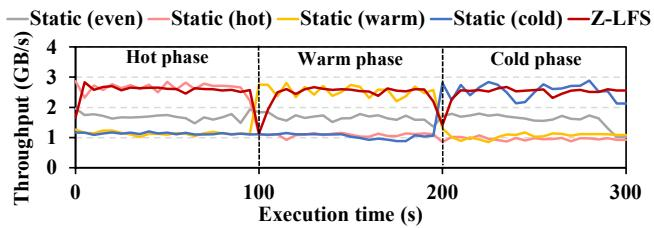  
Figure 12: Write throughput of active zone scaling of log streams.

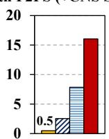  
(a) Fileserver

(b) Varmail  
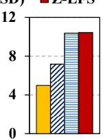  
(c) Webserver

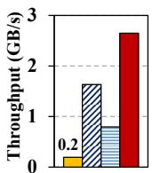  
(d) Videoserver  
Figure 13: Throughput of various filebench workloads.

## 6.4 Macro-benchmark

Fileserver: Figure 13a shows Z-LFS improves the performance by up to 7.21×, 1.6×, and 2.47× compared with F2FS, F2FS\_SS, and eZNS with F2FS, respectively, in the fileserver workload. The result shows Z-LFS yields a significant improvement even in a realistic data-intensive workload.

Varmail: Figure 13b shows that Z-LFS achieves improvements of up to 33.44×, 6.30×, and 2.04× compared with F2FS, F2FS\_SS, and eZNS with F2FS, respectively. Since varmail generates and flushes nodes frequently, Z-LFS can accelerate the flushing of the nodes to the main area, similar to the MDtest result.

Webserver: In Figure 13c, Z-LFS outperforms F2FS and F2FS\_SS by up to 2.09× and 1.62×, respectively, even if webserver is a read-intensive workload. It is because the read operations can benefit from the high utilization of multiple zones, similar to the read cases depicted in Figure 9. Furthermore, Z-LFS improves performance over F2FS\_SS, resulting from the conflict-aware zone allocation similar to the result of read throughput in §6.3. eZNS with F2FS also shows high read performance since it can leverage the internal parallelism from multiple zones where data is scattered.

Videoserver: In Figure 13d, Z-LFS improves the performance by up to 13.7×, 1.62×, and 3.33× compared with F2FS, F2FS\_SS, and eZNS with F2FS, respectively, in the videoserver workload. Since videoserver includes more dataintensive operations compared with fileserver, Z-LFS can achieve higher performance.

## 6.5 Real-world Application

In this evaluation, we compare Z-LFS with a recent RocksDB optimized file system, ZenFS [9], F2FS, F2FS\_SS, and eZNS with F2FS. We note that we use a CNS SSD for ZenFS to support the in-place updates for RocksDB’s log/lock files using F2FS. Figure 14 shows that Z-LFS improves the performance by up to 25.0×, 7.83×, 1.20×, and 1.27× in fillseq; 9.28×, 7.83×, 1.20×, and 1.55× in fillrandom; and 9.01×, 8.12×, 1.19×, and 1.52× in overwrite compared with ZenFS, F2FS, F2FS\_SS, and eZNS with F2FS, respectively. As expected, in readrandom, Z-LFS achieves similar performance compared with F2FS, F2FS\_SS and eZNS with F2FS. These results demonstrate that three techniques in Z-LFS can also be effective even in real-world applications.

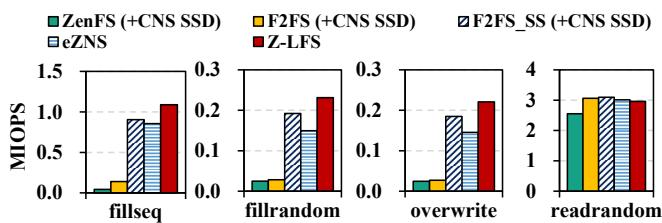  
Figure 14: RocksDB performance under various workloads.

## 7 Related Work

Interfaces on ZNS SSDs: eZNS [42] proposes an elastic ZNS interface which allocates active zones based on the application workload profile and enhances performance isolation with an I/O scheduler. CSAL [61] is a storage acceleration layer to take advantage of high-density QLC SSD by adopting ZNS interface on the QLC SSD in a cloud environment. ZMS [20] is a zone interface on mobile flash storage to address the lack of on-device memory and the frequent fsync. Our study is in line with these studies [20, 42, 61] in terms of improving ZNS-based storage systems while we focus on devising a ZNS-tailored file system instead of an interface.

Storage backend of RocksDB for ZNS SSDs: Bjørling et al. [9] claim advantages of ZNS SSDs and propose ZenFS for RocksDB [14] on ZNS SSDs. Im et al. [21] and ZenFS+ [46] are enhanced versions of ZenFS as backend IO engines to maximize the parallelism of ZNS SSDs. WALTZ [32] is also an enhanced version of ZenFS to provide tight tail latency by leveraging ZONE APPEND commands. WA-Zone [37] suggests wear-aware zone management to balance inter-zone and intra-zone wear considering the access pattern of LSMtree. These studies [9, 21, 32, 37, 46] are in line with our study in terms of improving the performance on ZNS SSD. Meanwhile, Z-LFS is a general and ZNS-tailored log-structured file system to run any application instead of specific applications. Linux kernel subsystems on ZNS SSDs: ZNSwap [8] is a swap subsystem optimized for ZNS SSDs. It introduces a host-side GC mechanism which is co-designed with the swap logic to reduce GC overheads and improve the performance. RAIZN [26] is a logical volume manager which exposes a ZNS SSD array as a single ZNS interface to applications. BIZA [58] is also an interface for ZNS arrays to further improve endurance and performance by exploiting the zone random write area and internal parallelisms within ZNS SSDs. Our study is in line with them [8, 26, 58] in terms of investigating a Linux kernel component while we target designing a suitable file system for ZNS SSDs.

File systems for ZNS SSDs: ZoneFS [4, 28] is a simple file system exposing each zone of a ZNS SSD as a file. OPRW [30] leverages the write pointer of ZNS SSDs to accelerate the fsync() performance. Our work is in line with these works [4, 28, 30] in terms of supporting or optimizing file systems for ZNS SSDs. On the other hand, we redesign the metadata of LFS to enhance its compatibility with ZNS SSDs by considering LFS features on ZNS SSD. Furthermore, we efficiently scale the active zones of log streams to maximize the internal parallelism of ZNS SSD.

## 8 Conclusion

This paper presents a ZNS-tailored log-structured file system called Z-LFS for commodity ZNS SSDs. Z-LFS enables standalone usage of ZNS SSDs by an append-only metadata approach, leveraging the unique characteristics of LFS metadata to minimize write amplification. Z-LFS efficiently utilizes active zones for log streams via speculative log stream management. Z-LFS resolves conflicts between zones sharing internal resources within ZNS SSD via conflict-aware zone allocation. In our evaluations, Z-LFS achieves higher performance by up to 33.44× and 3.5× compared with F2FS and a state-of-the-art interface for commodity ZNS SSDs, respectively.

## Acknowledgments

We sincerely thank our shepherd, Ming-Chang Yang, and the anonymous reviewers for their invaluable feedback. This work was supported by the National Research Foundation of Korea (NRF) (No. RS-2025-00554650) and in part by the Brain Korea 21 (BK21) FOUR Intelligence Computing funded by NRF (No. NRF-4199990214639) (Corresponding Author: Yongseok Son).

## References

[1] File systems. https://zonedstorage.io/docs/lin ux/fs.

[2] Filebench - A Model Based File System Workload Generator. https://github.com/filebench/fileben ch.

[3] Samsung PM1733 NVMe SSD. https://download .semiconductor.samsung.com/resources/broch ure/PM1733%20NVMe%20SSD.pdf.

[4] Zonefs. https://www.kernel.org/doc/html/v5.1 7/filesystems/zonefs.html.

[5] Samsung pm1731a review from sth., 2022. https: //news.samsung.com/global/samsung-introduce s-its-first-zns-ssd-with-maximized-user-c apacity-and-enhanced-lifespan.

[6] Abdul R Abdurrab, Tao Xie, and Wei Wang. Dloop: A flash translation layer exploiting plane-level parallelism. In 2013 IEEE 27th International Symposium on Parallel and Distributed Processing, pages 908–918. IEEE, 2013.

[7] Hanyeoreum Bae, Jiseon Kim, Miryeong Kwon, and Myoungsoo Jung. What you can’t forget: exploiting parallelism for zoned namespaces. In Proceedings of the 14th ACM Workshop on Hot Topics in Storage and File Systems, pages 79–85, 2022.

[8] Shai Bergman, Niklas Cassel, Matias Bjørling, and Mark Silberstein. Znswap: Un-block your swap. ACM Transactions on Storage, 19(2):1–25, 2023.

[9] Matias Bjørling, Abutalib Aghayev, Hans Holmberg, Aravind Ramesh, Damien Le Moal, Gregory R Ganger, and George Amvrosiadis. Zns: Avoiding the block interface tax for flash-based ssds. In USENIX Annual Technical Conference, pages 689–703, 2021.

[10] Chandranil Chakraborttii, Vikas Sinha, and Heiner Litz. Ssd qos improvements through machine learning. In Proceedings of the ACM Symposium on Cloud Computing, pages 511–511, 2018.

[11] Feng Chen, Binbing Hou, and Rubao Lee. Internal parallelism of flash memory-based solid-state drives. ACM Transactions on Storage (TOS), 12(3):1–39, 2016.

[12] Feng Chen, Rubao Lee, and Xiaodong Zhang. Essential roles of exploiting internal parallelism of flash memory based solid state drives in high-speed data processing. In 2011 IEEE 17th International Symposium on High Performance Computer Architecture, pages 266–277. IEEE, 2011.

[13] Jungsik Choi, Jaewan Hong, Youngjin Kwon, and Hwansoo Han. Libnvmmio: Reconstructing software IO path with Failure-AtomicMemory-Mapped interface. In 2020 USENIX Annual Technical Conference (USENIX ATC 20), pages 1–16, 2020.

[14] Facebook RocksDB team. A persistent key-value store for fast storage environments, 2021. https://rocksd b.org.

[15] Jin Yong Ha and Heon Young Yeom. zceph: Achieving high performance on storage system using small zoned zns ssd. In Proceedings of the 38th ACM/SIGAPP Symposium on Applied Computing, pages 1342–1351, 2023.

[16] XYHR Haas and X Hu. The fundamental limit of flash random write performance: Understanding, analysis and performance modelling. IBM Research Report, 2010/3/31, Tech. Rep, 2010.

[17] Kyuhwa Han, Hyunho Gwak, Dongkun Shin, and Jooyoung Hwang. Zns+: Advanced zoned namespace interface for supporting in-storage zone compaction. In OSDI, pages 147–162, 2021.

[18] Jian Huang, Anirudh Badam, Laura Caulfield, Suman Nath, Sudipta Sengupta, Bikash Sharma, and Moinuddin K Qureshi. Flashblox: Achieving both performance isolation and uniform lifetime for virtualized ssds. In FAST, volume 17, pages 375–390, 2017.

[19] J Hwang. Towards even lower total cost of ownership of data center it infrastructure. In Proceedings of the NVRAMOS Workshop, Jeju, Korea, pages 24–26, 2019.

[20] Joo-Young Hwang, Seokhwan Kim, Daejun Park, Yong-Gil Song, Junyoung Han, Seunghyun Choi, Sangyeun Cho, and Youjip Won. ZMS: Zone abstraction for mobile flash storage. In 2024 USENIX Annual Technical Conference (USENIX ATC 24), pages 173–189, 2024.

[21] Minwoo Im, Kyungsu Kang, and Heonyoung Yeom. Accelerating rocksdb for small-zone zns ssds by parallel i/o mechanism. In Proceedings of the 23rd International Middleware Conference Industrial Track, pages 15–21, 2022.

[22] J.Axboe. Fio benchmark. https://github.com/axb oe/fio.

[23] Dongwon Kang, Dawoon Jung, Jeong-Uk Kang, and Jin-Soo Kim. µ-tree: An ordered index structure for nand flash memory. In Proceedings of the 7th ACM & IEEE international conference on Embedded software, pages 144–153, 2007.

[24] Woon-Hak Kang, Sang-Won Lee, Bongki Moon, Yang-Suk Kee, and Moonwook Oh. Durable write cache in flash memory ssd for relational and nosql databases. In Proceedings of the 2014 ACM SIGMOD International Conference on Management of Data, SIGMOD ’14, 2014.

[25] Juwon Kim, Minsu Kim, Muhammad Danish Tehseen, Joontaek Oh, and YouJip Won. IPLFS: Log-Structured file system without garbage collection. In 2022 USENIX Annual Technical Conference (USENIX ATC 22), pages 739–754, 2022.

[26] Thomas Kim, Jekyeom Jeon, Nikhil Arora, Huaicheng Li, Michael Kaminsky, David G Andersen, Gregory R Ganger, George Amvrosiadis, and Matias Bjørling.

Raizn: Redundant array of independent zoned namespaces. In Proceedings of the 28th ACM International Conference on Architectural Support for Programming Languages and Operating Systems, Volume 2, pages 660– 673, 2023.

[27] Ryusuke Konishi, Yoshiji Amagai, Koji Sato, Hisashi Hifumi, Seiji Kihara, and Satoshi Moriai. The linux implementation of a log-structured file system. ACM SIGOPS Operating Systems Review, 40(3):102–107, 2006.

[28] Damien Le Moal and Ting Yao. zonefs: Mapping posix file system interface to raw zoned block device accesses. 2020.

[29] Changman Lee, Dongho Sim, Joo Young Hwang, and Sangyeun Cho. F2fs: A new file system for flash storage. In FAST, volume 15, pages 273–286, 2015.

[30] Euidong Lee, Ikjoon Son, and Jin-Soo Kim. An efficient order-preserving recovery for f2fs with zns ssd. In Proceedings of the 15th ACM Workshop on Hot Topics in Storage and File Systems, pages 116–122, 2023.

[31] Eunji Lee, Seunghoon Yoo, Jee-Eun Jang, and Hyokyung Bahn. Shortcut-jfs: A write efficient journaling file system for phase change memory. In Mass Storage Systems and Technologies (MSST), 2012 IEEE 28th Symposium on, pages 1–6. IEEE, 2012.

[32] Jongsung Lee, Donguk Kim, and Jae W Lee. Waltz: Leveraging zone append to tighten the tail latency of lsm tree on zns ssd. Proceedings of the VLDB Endowment, 16(11):2884–2896, 2023.

[33] Minkyeong Lee, Dong Hyun Kang, Minho Lee, and Young Ik Eom. Improving read performance by isolating multiple queues in nvme ssds. In Proceedings of the 11th International Conference on Ubiquitous Information Management and Communication, pages 1–6, 2017.

[34] Xiaojian Liao, Youyou Lu, Erci Xu, and Jiwu Shu. Max: A Multicore-Accelerated file system for flash storage. In 2021 USENIX Annual Technical Conference (USENIX ATC 21), pages 877–891, 2021.

[35] Renping Liu, Zhenhua Tan, Yan Shen, Linbo Long, and Duo Liu. Fair-zns: Enhancing fairness in zns ssds through self-balancing i/o scheduling. IEEE Transactions on Computer-Aided Design of Integrated Circuits and Systems, 2022.

[36] G Lockwood. Ior and mdtest (2019), 2019. https: //github.com/hpc/ior.git.

[37] Linbo Long, Shuiyong He, Jingcheng Shen, Renping Liu, Zhenhua Tan, Congming Gao, Duo Liu, Kan Zhong, and Yi Jiang. Wa-zone: Wear-aware zone management

optimization for lsm-tree on zns ssds. ACM Transactions on Architecture and Code Optimization, 21(1):1– 23, 2024.

[38] Ricardo Macedo, Yusuke Tanimura, Jason Haga, Vijay Chidambaram, José Pereira, and João Paulo. PAIO: General, portable I/O optimizations with minor application modifications. In 20th USENIX Conference on File and Storage Technologies (FAST 22), pages 413–428, 2022.

[39] Bo Mao, Suzhen Wu, and Lide Duan. Improving the ssd performance by exploiting request characteristics and internal parallelism. IEEE Transactions on Computer-Aided Design of Integrated Circuits and Systems, 37(2):472–484, 2017.

[40] Avantika Mathur, Mingming Cao, Suparna Bhattacharya, Andreas Dilger, Alex Tomas, and Laurent Vivier. The new ext4 filesystem: current status and future plans. In Proceedings of the Linux symposium, volume 2, pages 21–33, 2007.

[41] Changwoo Min, Sanidhya Kashyap, Steffen Maass, and Taesoo Kim. Understanding manycore scalability of file systems. In 2016 USENIX Annual Technical Conference (USENIX ATC 16), pages 71–85, 2016.

[42] Jaehong Min, Chenxingyu Zhao, Ming Liu, and Arvind Krishnamurthy. eZNS: An elastic zoned namespace for commodity ZNS SSDs. In 17th USENIX Symposium on Operating Systems Design and Implementation (OSDI 23), pages 461–477, 2023.

[43] Jaehong Min, Chenxingyu Zhao, Ming Liu, and Arvind Krishnamurthy. ezns: Elastic zoned namespace for enhanced performance isolation and device utilization. ACM Transactions on Storage, 20(3):1–41, 2024.

[44] NVM Express Workgroup. Nvm express zoned namespaces command set 1.1b, 2021. https://nvmexpress .org/developers/nvme-command-set-specifica tions/.

[45] Gijun Oh, Junseok Yang, and Sungyong Ahn. Efficient key-value data placement for zns ssd. Applied Sciences, 11(24):11842, 2021.

[46] Myounghoon Oh, Seehwan Yoo, Jongmoo Choi, Jeongsu Park, and Chang-Eun Choi. Zenfs+: Nurturing performance and isolation to zenfs. IEEE Access, 11:26344–26357, 2023.

[47] Yongseok Oh, Eunsam Kim, Jongmoo Choi, Donghee Lee, and Sam H Noh. Optimizations of lfs with slack space recycling and lazy indirect block update. In Proceedings of the 3rd Annual Haifa Experimental Systems Conference, pages 1–9, 2010.

[48] Alma Riska and Erik Riedel. Disk drive level workload characterization. In USENIX Annual Technical Conference, General Track, volume 2006, pages 97–102, 2006.

[49] Mendel Rosenblum and John K Ousterhout. The design and implementation of a log-structured file system. ACM Transactions on Computer Systems (TOCS), 10(1):26– 52, 1992.

[50] Dongjoo Seo, Ping-Xiang Chen, Huaicheng Li, Matias Bjørling, and Nikil Dutt. Is garbage collection overhead gone? case study of f2fs on zns ssds. 2023.

[51] Hojin Shin, Myounghoon Oh, Gunhee Choi, and Jongmoo Choi. Exploring performance characteristics of zns ssds: Observation and implication. In 2020 9th Non-Volatile Memory Systems and Applications Symposium (NVMSA), pages 1–5. IEEE, 2020.

[52] Theano Stavrinos, Daniel S Berger, Ethan Katz-Bassett, and Wyatt Lloyd. Don’t be a blockhead: zoned namespaces make work on conventional ssds obsolete. In Proceedings of the Workshop on Hot Topics in Operating Systems, pages 144–151, 2021.

[53] Qiuping Wang and Patrick P. C. Lee. Zapraid: Toward high-performance raid for zns ssds via zone append. APSys ’23, page 24–29, New York, NY, USA, 2023. Association for Computing Machinery. doi:10.1145/ 3609510.3609810.

[54] Randolph Y Wang and Thomas E Anderson. xfs: A wide area mass storage file system. In Proceedings of IEEE 4th Workshop on Workstation Operating Systems. WWOS-III, pages 71–78. IEEE, 1993.

[55] Denghui Wu, Biyong Liu, Wei Zhao, and Wei Tong. Znskv: Reducing data migration in lsmt-based kv stores on zns ssds. In 2022 IEEE 40th International Conference on Computer Design (ICCD), pages 411–414. IEEE, 2022.

[56] Jingpei Yang, Ned Plasson, Greg Gillis, Nisha Talagala, and Swaminathan Sundararaman. Don’t stack your log on my log. In 2nd Workshop on Interactions of NVM/Flash with Operating Systems and Workloads (IN-FLOW 14), 2014.

[57] Junseok Yang, Seokjun Lee, and Sungyong Ahn. Selective power-loss-protection method for write buffer in zns ssds. Electronics, 11(7):1086, 2022.

[58] Shushu Yi, Shaocong Sun, Li Peng, Yingbo Sun, Ming-Chang Yang, Zhichao Cao, Qiao Li, Myoungsoo Jung, Ke Zhou, and Jie Zhang. Biza: Design of self-governing block-interface zns afa for endurance and performance. In Proceedings of the ACM SIGOPS 30th Symposium on

Operating Systems Principles, SOSP ’24, page 313–329, New York, NY, USA, 2024. Association for Computing Machinery. doi:10.1145/3694715.3695953.

[59] Jiacheng Zhang, Jiwu Shu, and Youyou Lu. ParaFS: A Log-Structured file system to exploit the internal parallelism of flash devices. In 2016 USENIX Annual Technical Conference (USENIX ATC 16), pages 87–100, 2016.

[60] Runyu Zhang, Duo Liu, Xianzhang Chen, Xiongxiong She, Chaoshu Yang, Yujuan Tan, Zhaoyan Shen, and Zili Shao. Loffs: A low-overhead file system for large flash memory on embedded devices. In 2020 57th ACM/IEEE Design Automation Conference (DAC), pages 1–6. IEEE, 2020.

[61] Yanbo Zhou, Erci Xu, Li Zhang, Kapil Karkra, Mariusz Barczak, Wayne Gao, Wojciech Malikowski, Mateusz Kozlowski, Łukasz Łasek, Ruiming Lu, et al. Csal: the next-gen local disks for the cloud. In Proceedings of the Nineteenth European Conference on Computer Systems, pages 608–623, 2024.